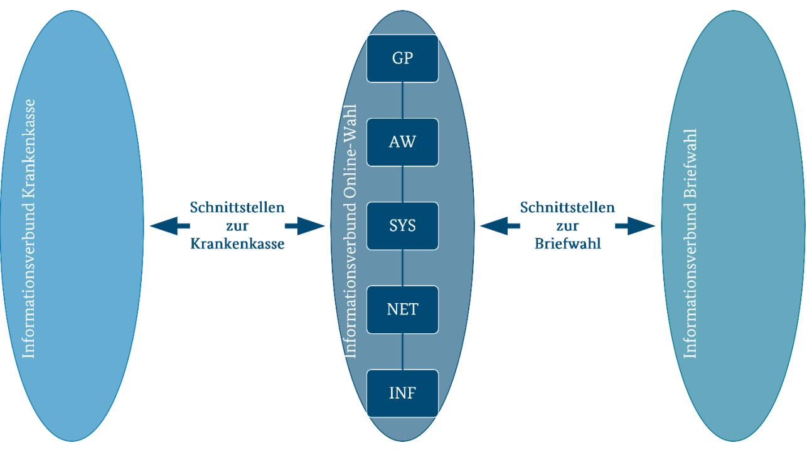
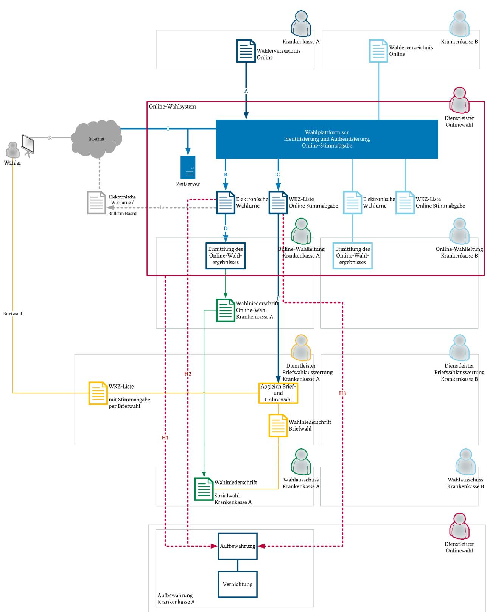
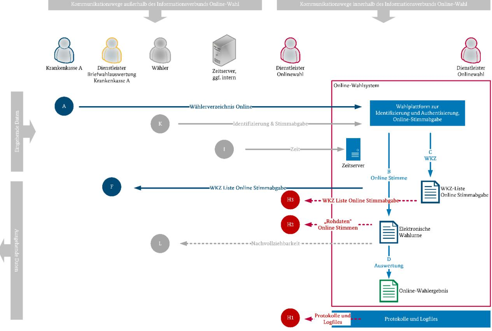
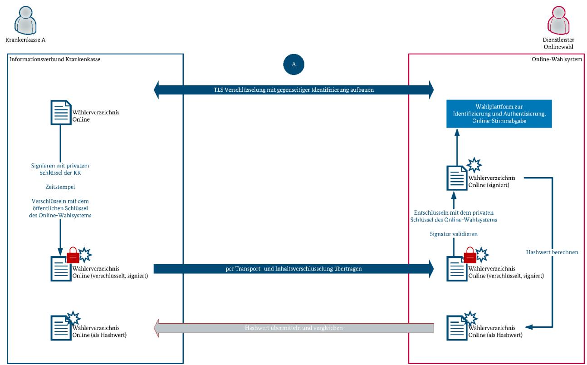
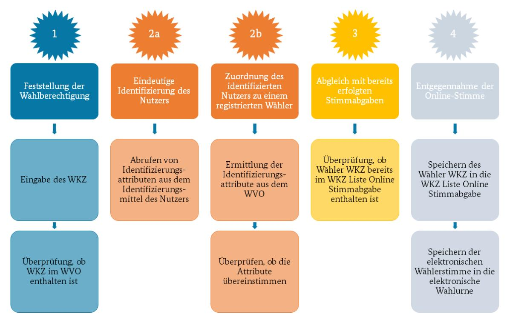
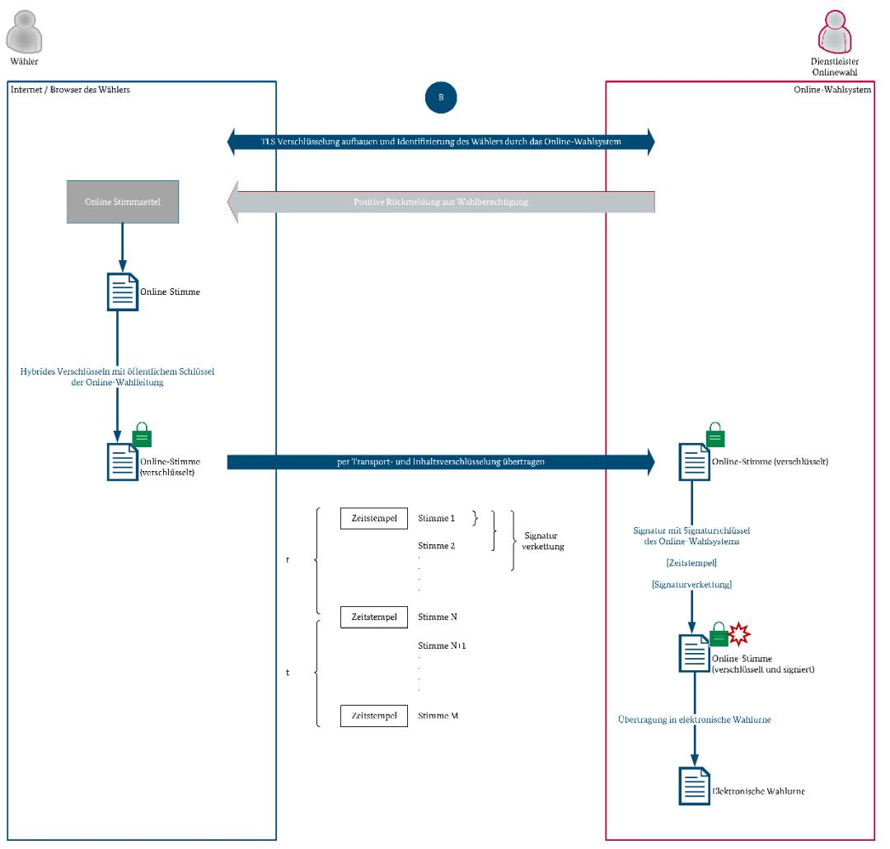
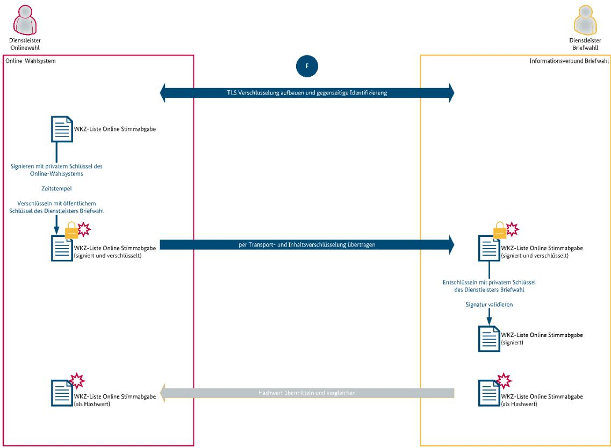
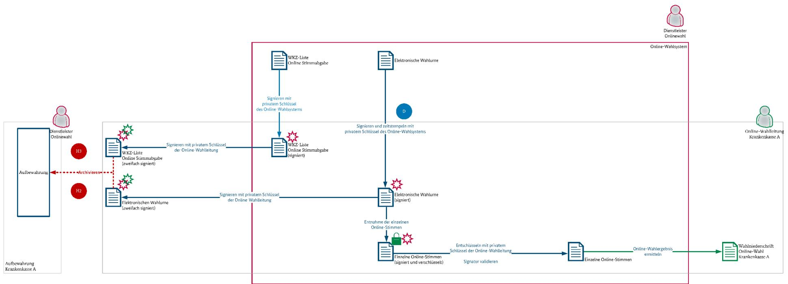

# Technische Richtlinie TR-03162

IT-sicherheitstechnische Anforderungen zur Durchführung einer Online-Wahl im Rahmen des Modellprojektes nach § 194a Fünftes Buch Sozialgesetzbuch (Online-Wahl)

Version 1.3

# Änderungshistorie

| Version | Datum      | Name | Beschreibung                                                                                                      |
|---------|------------|------|-------------------------------------------------------------------------------------------------------------------|
| 0.8     | 30.09.2020 | BSI  | Entwurf                                                                                                           |
| 1.0     | 29.12.2020 | BSI  | Erste veröffentlichte Fassung                                                                                  |
| 1.1     | 10.05.2021 | BSI  | Redaktionelle Anpassungen und inhaltliche Präzisierungen                                                 |
| 1.2     | 10.01.2022 | BSI  | Überarbeitung der Kapitel 1 und 5.2 sowie redaktionelle Anpassungen und inhaltliche Präzisierungen |
| 1.3     | 03.02.2023 | BSI  | Inhaltliche Präzisierungen                                                                                     |

Tabelle 1: Versionierung

Bundesamt für Sicherheit in der Informationstechnik Postfach 20 03 63 53133 Bonn Tel.: +49 22899 9582-0 abteilung-di@bsi.bund.de Internet: https://www.bsi.bund.de © Bundesamt für Sicherheit in der Informationstechnik 2020

| 1 |       | Einleitung  6                                                                         |  |
|---|-------|---------------------------------------------------------------------------------------|--|
|   | 1.1   | Vorwort 6                                                                             |  |
|   | 1.2   | Anwendungsbereich 6                                                                   |  |
|   | 1.3   | Zielgruppe  6                                                                         |  |
|   | 1.4   | Aufbau der Technischen Richtlinie 6                                                   |  |
|   | 1.5   | Terminologie 7                                                                        |  |
| 2 |       | Grundlegende Festlegungen und Anforderungen 8                                         |  |
|   | 2.1   | Anwendung des BSI IT-Grundschutzes 8                                                  |  |
|   | 2.1.1 | Informationsverbund Online-Wahl 9                                                     |  |
|   | 2.1.2 | Informationsverbund Briefwahl und Krankenkasse12                                      |  |
|   | 2.2   | Zielobjekte des Informationsverbundes Online-Wahl12                                   |  |
|   | 2.2.1 | Wahlkennzeichen und Wählerverzeichnis Online 14                                       |  |
|   | 2.2.2 | Online-Wahlsystem 14                                                                  |  |
|   | 2.2.3 | Aufbewahrung und Vernichtung15                                                        |  |
|   | 2.3   | Kommunikationswege15                                                                  |  |
|   | 2.4   | Protokollierung17                                                                     |  |
|   | 2.5   | Kryptographie und Schlüsselmanagement18                                               |  |
|   | 2.6   | Vertrauensdienste21                                                                   |  |
| 3 |       | Vorbereitung der Wahl 22                                                              |  |
|   | 3.1   | Wählerverzeichnis Online und Online-Stimmzettel22                                     |  |
|   | 3.2   | Wahlzeitraum und Verfügbarkeit23                                                      |  |
|   | 3.3   | Überprüfung des Online-Wahlsystems24                                                  |  |
|   | 3.4   | Prüfung der Einrichtung und Freigabe des Online-Wahlsystems durch den Wahlausschuss25 |  |
| 4 |       | Durchführung der Wahl26                                                               |  |
|   | 4.1   | Anforderungen an die Nutzerumgebung26                                                 |  |
|   | 4.2   | Anforderungen an das Nutzerinterface der Wahlplattform 26                             |  |
|   | 4.3   | Absicherung der Kommunikation26                                                       |  |
|   | 4.4   | Stimmabgabe per Online-Wahl27                                                         |  |
|   | 4.4.1 | Prüfung des Wahlkennzeichens28                                                        |  |
|   | 4.4.2 | Eindeutige Identifizierung des Nutzers28                                              |  |
|   | 4.4.3 | Zuordnung des identifizierten Nutzers zu einem Wahlberechtigten29                     |  |
|   | 4.4.4 | Abgleich mit bereits erfolgten Stimmabgaben29                                         |  |
|   | 4.5   | Entgegennahme der Online-Stimme29                                                     |  |
|   | 4.5.1 | Trennung der Identitätsdaten von dem abgegebenen Wählervotum 29                       |  |
|   | 4.5.2 | Übertragung und Speicherung30                                                         |  |
|   | 4.6   | Abgleich der Briefwahl- und Onlinestimmen32                                           |  |

| 5   | Ermittlung des Wahlergebnisses34                                     |  |  |  |
|-----|----------------------------------------------------------------------|--|--|--|
| 5.1 | Ermittlung des Online-Wahlergebnisses durch die Online-Wahlleitung34 |  |  |  |
| 5.2 | Nachvollziehbarkeit des Wahlergebnisses36                            |  |  |  |
| 6   | Nachbereitung der Wahl38                                             |  |  |  |
|     | Literaturverzeichnis39                                               |  |  |  |

# 1 Einleitung

## 1.1 Vorwort

Alle sechs Jahre werden bei den Sozialversicherungswahlen Mitglieder der Verwaltungsräte der gesetzlichen Krankenkassen bestimmt. Die Verwaltungsräte bestehen aus Vertreterinnen und Vertretern der Versicherten und der Arbeitgeber. Bisher wurden diese Wahlen als Fernwahl, genauer gesagt ausschließlich als Briefwahl durchgeführt.

Mit dem Siebten Gesetz zur Änderung des Vierten Buches Sozialgesetzbuch und anderer Gesetze, welches am 1. Juli 2020 in Kraft getreten ist, wird den Krankenkassen im Rahmen eines Modellprojektes bei den Sozialversicherungswahlen im Jahr 2023 neben der herkömmlichen Stimmabgabe per Briefwahl fakultativ die Möglichkeit eröffnet, Online-Wahlen durchzuführen. Die Wahlberechtigten erhalten somit die Möglichkeit ihr Votum neben der Briefwahl auch elektronisch über das Internet abzugeben.

### 1.2 Anwendungsbereich

Diese Technische Richtlinie kann ausschließlich gemeinsam mit der Online-Wahl-Verordnung1 angewandt werden. Die TR ergänzt die Verordnung dabei um die IT-sicherheitstechnischen Anforderungen, die über die allgemeinen Vorgaben der Wahlordnung für die Sozialversicherung (SVWO2 ) hinaus für die Durchführung des Online-Wahlverfahrens erforderlich sind. Diese betreffen die Einrichtung, den Betrieb und die Nutzung von dafür benötigten Anwendungen und IT-Systemen.

Bestehende Geschäftsprozesse, Anwendungen und IT-Systeme, die bereits im Rahmen der Briefwahl vorhanden, etabliert und in der SVWO geregelt sind, sind weder Gegenstand der Online-Wahl-Verordnung noch dieser Technischen Richtlinie. Ebenso sind datenschutzrechtliche Anforderungen nicht Bestandteil der vorliegenden TR. Bei der Verarbeitung personenbezogener Daten sind die einschlägigen Datenschutzgesetze (EU-DSGVO, BDSG) anzuwenden.

Aufgrund dieser engen Rahmenbedingungen ist eine Übertragbarkeit der hier beschriebenen Anforderungen nur bedingt auf andere Online-Wahlen möglich. Allgemeingültige Anforderungen an Online-Wahlen werden in der TR-03169 und dem dazugehörigen Schutzprofil durch das BSI zur Verfügung gestellt.3

## 1.3 Zielgruppe

Die TR richtet sich in erster Linie an die an dem Modellprojekt beteiligten Krankenkassen sowie deren Dienstleister.

## 1.4 Aufbau der Technischen Richtlinie

Kapitel [2](#page-7-0) beschreibt die grundlegenden Festlegungen und Anforderungen zur Durchführung des Modellprojektes. Kapitel [2.1](#page-7-1) gibt einen kurzen Überblick zum BSI IT-Grundschutz, nach dessen Vorgaben gemäß § 194c SGB IV Abs. (1) ein angemessenes Informationssicherheitskonzept zu erstellen und umzusetzen ist. Die relevanten Zielobjekte und Kommunikationswege beschreiben Kapitel [2.2](#page-11-1) und Kapitel [2.3.](#page-14-1) In Kapite[l 2.4](#page-16-0) wird die Protokollierung beschrieben. Kapite[l 2.5](#page-17-0) gibt einen Überblick über das kryptographische Schlüsselmaterial und dessen Management. Die Anwendung der Vertrauensdienste erläutert Kapitel [2.6.](#page-20-0) 

 1 Verordnung über die technischen und organisatorischen Vorgaben für die Durchführung einer Online-Wahl im Rahmen des Modellprojekts nach § 194a Fünftes Buch Sozialgesetzbuch

2 Wahlordnung für die Sozialversicherung, https://www.gesetze-iminternet.de/svwo\_1997/BJNR194600997.html

3

Die weitere Struktur der Technischen Richtlinie orientiert sich wie auch die Online-Wahl-Verordnung an den vier Phasen der Wahl: Vorbereitung der Wahl, Durchführung der Wahl, Ermittlung des Wahlergebnisses und Nachbereitung der Wahl. Kapite[l 3](#page-21-0) beschreibt die Anforderungen an die Vorbereitung der Wahl, Kapitel [4](#page-25-0) die Anforderungen an die Durchführung der Wahl, Kapite[l 5](#page-33-0) die Anforderungen an die Ermittlung des Wahlergebnisses und Kapitel [6](#page-37-0) die Anforderungen an die Nachbereitung der Wahl.

### 1.5 Terminologie

In der vorliegenden Technischen Richtlinie werden Anforderungen als Ausdruck normativer Festlegungen durch die in Großbuchstaben geschriebenen deutschen Schlüsselworte MUSS/MÜSSEN, DARF NICHT/DÜRFEN NICHT, SOLLTE/SOLLTEN entsprechend gekennzeichnet.

jeweiligen Formen sowie den zugehörigen Verneinungen genutzt, um deutlich zu machen, wie die jeweiligen Anforderungen zu interpretieren sind. Die hier genutzte Definition basiert auf (BSI IT-Grundschutz, 2020).

| MUSS/DARF NUR:        | Dieser Ausdruck bedeutet, dass es sich um eine Anforderung handelt, die unbedingt erfüllt werden muss (uneingeschränkte Anforderung).                                                                          |
|-----------------------|-------------------------------------------------------------------------------------------------------------------------------------------------------------------------------------------------------------------|
| DARF NICHT/DARF KEIN: | Dieser Ausdruck bedeutet, dass etwas in keinem Fall getan werden darf (uneingeschränktes Verbot).                                                                                                              |
| SOLLTE:               | Dieser Ausdruck bedeutet, dass eine Anforderung normalerweise erfüllt werden muss, es aber Gründe geben kann, dies doch nicht zu tun. Dies muss aber sorgfältig abgewogen und stichhaltig begründet werden. |

Die Technische Richtlinie repräsentiert den Stand der Technik und wird fortlaufend aktualisiert.

# 2 Grundlegende Festlegungen und Anforderungen

## 2.1 Anwendung des BSI IT-Grundschutzes

Zur angemessenen Absicherung der Online-Wahl wird die Methodik und Systematik des BSI IT-Grundschutzes (BSI IT-Grundschutz, 2020) angewandt. Die IT-Grundschutz-Sicherheitskonzeption nach BSI-Standard 200-2 sieht im Schritt der Strukturanalyse vor, Geschäftsprozesse (GP), Anwendungen (AW), IT-Systeme (SYS), Netze und Kommunikation (NET) und Räume und Gebäude (INF) in einer Bestandsanalyse aufzunehmen. Hierbei wird abgegrenzt, welche Zielobjekte bei der weiteren Anwendung der IT-Grundschutz-Vorgehensweise betrachtet werden und welche nicht.

[Abbildung 1](#page-7-2) stellt den Informationsverbund für das Modellprojekt zur Einführung von Online-Wahlen im Rahmen der Sozialwahlen 2023 (Modellprojekt Online-Wahl) mit seinen Bestandteilen Informationsverbund Online-Wahl, Informationsverbund Briefwahl und Informationsverbund Krankenkasse bildlich dar. Die Kästchen innerhalb des Informationsverbundes Online-Wahl stellen jeweils ein oder mehrere Zielobjekte dar. Die vorliegende Technische Richtlinie betrachtet den Informationsverbund Online-Wahl und die Schnittstellen zu den Informationsverbunden Krankenkasse und Briefwahl. Die Vorgaben an dem Informationsverbund Online-Wahl sind im Kapitel [2.2](#page-11-1) [Zielobjekte des](#page-11-1)  [Informationsverbundes Online-Wahl](#page-11-1) und an den Schnittstellen im Kapite[l 2.3](#page-14-1) [Kommunikationswege](#page-14-1) definiert. Für die anderen beiden Informationsverbunde spricht die Technische Richtlinie lediglich Empfehlungen aus.

Abbildung 1: Schematische Darstellung des Informationsverbundes für das Modellprojekt für die Sozialversicherungswahlen 2023

Bei der Schutzbedarfsfeststellung wird zunächst der Schutzbedarf für die Zielobjekte bestimmt, indem die möglichen Schäden bei einer Verletzung der Vertraulichkeit, der Integrität und der Verfügbarkeit nachvollziehbar eingeschätzt werden. Für das Modellprojekt Online Sozialwahl kann eine Verletzung der Schutzziele Vertraulichkeit, Verfügbarkeit und Integrität bedeuten, dass das Wahlergebnis ungültig ist und somit wiederholt werden muss. Beispiele für die Verletzung dieser Schutzziele sind:

- Vertraulichkeit: Online-Stimmen werden vor dem Ende der Wahl aus der elektronischen Wahlurne entnommen.
- Verfügbarkeit: das Online-Wahlsystem ist über einen kritischen Zeitraum nicht erreichbar.

Integrität: die Online-Stimmen werden ausgetauscht.

Die Beschreibung der Geschäftsprozesse sowie die Feststellung des Schutzbedarfs obliegen dem Prozessverantwortlichen. Nach Festlegung der Schutzbedarfe für die Geschäftsprozesse erfolgt nach dem Top-Down-Prinzip die Vererbung4 des Schutzbedarfes auf die darunter liegenden Schichten wie Anwendungen, IT-Systeme usw. Dabei vererbt ein Geschäftsprozess im Wesentlichen seinen Schutzbedarf auf eine oder mehrere Anwendungen (Vererbung durch das Maximumprinzip). Bei der weiteren Ermittlung des Schutzbedarfs eines Objektes müssen die möglichen Schäden der relevanten Teilobjekte in ihrer Gesamtheit betrachtet werden.

Der ermittelte Schutzbedarf ist für die weitere Umsetzung bzw. Schritte des IT-Grundschutzes ausschlaggebend, u. a. zur Durchführung einer Risikoanalyse.

Für beide Wahlverfahren (Online-Wahl / Briefwahl) werden verschiedene Zielobjekte verwendet.

Die am Modellprojekt teilnehmenden Krankenkassen und die späteren IT-Dienstleister werden die Zielobjekte am Informationsverbund anteilig umsetzen müssen.

### 2.1.1 Informationsverbund Online-Wahl

Die Online-Wahl-Verordnung regelt in § 3 Absatz 4 die Schutzbedarfsfeststellung auf der Grundlage des BSI-IT-Grundschutzes von den nach § 194a Absatz 2 Fünftes Buch Sozialgesetzbuch am Modellprojekt teilnehmenden Krankenkassen.

Die für die Durchführung einer Online-Wahl notwendigen Geschäftsprozesse (GP), ein Fachkonzept, eine Strukturanalyse auf Basis der Geschäftsprozesse (GP) und Anwendungen (AW) und eine Risikoanalyse wurden auf Basis der im Frühjahr 2020 bestehenden Erkenntnisse durch mehrere Krankenkassen, die eine Teilnahme am Modellprojekt planen, identifiziert und beschrieben sowie die Schutzbedarfe festgestellt. Die daraus identifizierten Zielobjekte für den Informationsverbund Online-Wahl sind im Kapitel [2.2](#page-11-1) und Kapitel [2.3](#page-14-1) beschrieben. Weitere Zielobjekte, wie die IT-Systeme (SYS), Netze und Kommunikation (NET) sowie Räume und Gebäude (INF), welche für den Betrieb der Anwendungen zu Grunde liegen, MÜSSEN durch den Online-Dienstleister im Rahmen einer Strukturanalyse identifiziert und mit geeigneten Maßnahmen entsprechend dem festgelegten Schutzbedarf nach der IT-Grundschutzmethodik abgesichert werden. All diese Zielobjekte gehören dem Informationsverbund Online-Wahl an, sieh[e Abbildung 1.](#page-7-2)

Die IT-sicherheitstechnischen Anforderungen für die Zielobjekte des Informationsverbundes Online-Wahl setzen sich aus den folgenden Quellen zusammen:

- Verordnung über die technischen und organisatorischen Vorgaben für die Durchführung einer Online-Wahl im Rahmen des Modellprojekts nach § 194a Fünftes Buch Sozialgesetzbuch (Online-Wahl-Verordnung)
- BSI Technische Richtlinie BSI TR-03162 IT-sicherheitstechnische Anforderungen zur Durchführung einer Online-Wahl im Rahmen des Modellprojekts nach § 194a Fünftes Buch Sozialgesetzbuch (vorliegendes Dokument)
- IT-Grundschutzmethodik nach BSI-Standard zur Absicherung des Informationsverbundes Online-Wahl gemäß Schutzbedarfsfeststellung

### 2.1.1.1 Informationssicherheitsmanagement

Die allgemeinen Anforderungen an ein Informationssicherheitsmanagementsystem (ISMS) nach BSI-Standard 200-1 oder nach DIN ISO/IEC 27001 (27001, 2020) MÜSSEN umgesetzt werden. Es MUSS ein

4 Bei der Vererbung wird nach Maximumprinzip, Kumulationseffekt, Betrachtung von Abhängigkeiten oder Verteilungseffekt unterschieden.

zertifiziertes ISMS auf Basis von BSI IT-Grundschutz (BSI IT-Grundschutz, 2020) in seiner jeweils vom BSI für ISMS-Zertifizierungsaudits aktuellsten Fassung der BSI-Standards 200-x sowie des IT-Grundschutz-Kompendiums5 nachgewiesen werden. Liegt bereits eine Zertifizierung nach DIN ISO/IEC 27001 (27001, 2020) vor, so MUSS der Online-Dienstleister diese ebenfalls in einer für ISMS-Zertifizierungsaudits zugelassenen Fassung nachweisen. Zudem MUSS von diesem nachgewiesen werden, dass alle in dieser Technischen Richtlinie vorgegebenen Anforderungen umgesetzt wurden.

Der Geltungsbereich des ISMS MUSS alle Zielobjekte des Informationsverbundes Online-Wahl wie in dieser Technischen Richtlinie betrachtet und vom Online-Dienstleister identifizierten IT-Systeme (SYS), Netze und Kommunikation (NET) sowie Räume und Gebäude (INF), welche für den Betrieb der Anwendungen zu Grunde liegen, umfassen. Die Verfahrensverantwortlichen (Krankenkassen) und der spätere Online-Dienstleister (Betreiber) MÜSSEN ein IT-Sicherheitskonzept im Rahmen des ISMS nach BSI IT-Grundschutz oder nach DIN ISO/IEC 27001 umsetzen. Geeignete Rollen- und Rechtekonzepte MÜSSEN erstellt werden.

### 2.1.1.2 IT-Sicherheitskonzept

Zur Erstellung des IT-Sicherheitskonzeptes nach BSI IT-Grundschutz MUSS die Standardabsicherung nach BSI Standard 200-2 angewendet werden. Abgeleitet von dem Schutzbedarf der Geschäftsprozesse MÜSSEN die Anforderungen für Anwendungen, IT-Systeme, Netze, Räume und Gebäude aus den relevanten Bausteinen des IT-Grundschutz-Kompendiums in der aktuellsten Edition erfüllt werden.

### 2.1.1.3 Risikoanalyse

Wahlen, insbesondere Online-Wahlen, beinhalten sensible Informationen und sind demnach einer Reihe von Bedrohungen ausgesetzt. Jede Art von Manipulation der Wahl muss erkannt und/oder ausgeschlossen oder Löschens von Informationen.

Ist gemäß IT-Grundschutz ein hoher oder sehr hoher Schutzbedarf ermittelt worden und somit eine Risikoanalyse erforderlich6 , so MUSS eine Risikoanalyse nach BSI Standard 200-3 erfolgen. Hierbei MÜSSEN folgende Schritte des Vorgehens eingehalten werden:

- Erstellung einer Gefährdungsübersicht
	- o Ermittlung von elementaren Gefährdungen
	- o Ermittlung zusätzlicher Gefährdungen
- Risikoeinstufung
	- o Risikoeinschätzung
	- o Risikobewertung
- Behandlung von Risiken
	- o Risikobehandlungsoptionen
	- o Risiken unter Beobachtung
- Konsolidierung des Sicherheitskonzepts

Im Rahmen der Behandlung von Risiken MUSS geprüft werden, ob es sinnvoll und möglich ist, das Risiko durch weitere Sicherheitsmaßnahmen zu reduzieren. Dies gilt insbesondere für die in dieser Technischen Richtlinie dargestellten Optionen für Sicherheitsmaßnahmen (Tabelle 3[, Abbildung 6\)](#page-30-0). In der Risikoanalyse MUSS zudem geprüft werden, ob durch die Nutzung oder Kombination dieser Optionen neue Risiken entstehen können.

 5 Die jährliche Edition des IT-Grundschutz-Kompendiums wird kostenlos auf den BSI Webseiten veröffentlicht. Parallel hierzu druckt der Bundesanzeiger Verlag (Reguvis Fachmedien GmbH) dieses Dokument und verkauft es.

6 Eine Verpflichtung zur Risikoanalyse kann nicht nur aus einem hohen oder sehr hohen Schutzbedarf resultieren.

Aus der Risikoanalyse können sich weitere Sicherheitsmaßnahmen7 beispielsweise aus folgenden IT-Grundschutz-Handlungsfeldern ergeben und MÜSSEN in dem Fall ebenfalls umgesetzt werden:

- Zusätzliche bzw. erweiternde Maßnahmen aus der Risikoanalyse
- Neue Maßnahmen aus den Penetrationstests
- Maßnahmen aus den Mindeststandards
- Notfallvorsorgemaßnahmen
- Eigene geeignete Maßnahmen.

In der Risikoanalyse MUSS dargestellt werden, dass mindestens die im Folgenden genannten Risiken, zusätzlich zu den in dieser Technischen Richtlinie genannten Anforderungen, auf ein Minimum reduziert wurden. Die sich aus den Gefährdungen ergebenden Restrisiken müssen für den Prozessverantwortlichen tragbar sein.

Exemplarisch seien folgende Bedrohungen genannt:

- Angriffe auf notwendige Daten des Wahlverfahrens
	- o Unberechtigtes Auslesen oder Manipulation von Wählerverzeichnissen, Wahllisten, Berechtigungen
	- o Manipulation des Wahlzeitraums (Stimmabgabe nur im Wahlzeitraum möglich)
- Angriffe auf das Online-Wahlsystem
	- o Manipulationen in der Entwicklung und Einrichtung des Online-Wahlsystems
		- Softwareentwicklung (Backdoors)
		- Manipulation von User Interfaces (Website Defacement)
		- Schadcode (Cross-Site-Scripting, Cross-Site-Request-Forgery, SQL Injection)
	- o Unberechtigte Stimmabgabe, z.B. durch Man-in-the-Middle Attacke oder Malware
	- o Manipulation von (berechtigten) Stimmabgaben (Schnittstellen, Versand/Kommunikation, manipulierte Formulare, Änderung/Löschung/Hinzufügung gespeicherter Stimmen/Wählen im Namen Dritter)
		- Clash-Attacken
		- Ballot Stuffing
	- o Manipulation von Ergebnissen/Ergebnislisten (Extrahieren, Versand)
	- o Einbruch in das Wahlsystem
	- o Angriff auf die Verfügbarkeit des Online-Wahlsystems
		- DDoS Attacken
	- o Angriffe auf die Vertraulichkeit der Online-Stimmen
		- Italienische Angriffe
- Beeinflussung von verantwortlichen Personen
	- o Innentäter
	- o Manipulation von Schlüsselpersonen (Funktionsposten) durch Social Engineering
	- o Erpressung
- Beeinflussung des Wahlberechtigten

7 Liste nicht abschließend

o Social Engineering, Erpressung zur Abgabe eines bestimmten Votums

Die Liste der möglichen Angriffsvektoren ist nicht abschließend. Insbesondere sind durchgehend neue Entwicklungen und Technologien mit einzubeziehen.

Des Weiteren müssen die Krankenkassen bewerten, wie mit Beschwerden von Wählern umzugehen ist, wenn bspw. Wahlunterlagen nicht beim Wähler angekommen seien oder die Stimme nicht oder falsch in das Wahlergebnis eingeflossen sei (z. B. ersichtlich über ein Bulletin Board).

### 2.1.1.4 IT-Notfallmanagement

#### Anforderungen nach der Online-Wahl-Verordnung § 5

Die Umsetzung des IT-Notfallmanagements MUSS nach BSI Standard 100-4 erfolgen. Im Rahmen des IT-Notfallmanagements MÜSSEN u. a. Notfallvorsorgekonzept, Notfall-, Wiederanlauf- und Wiederherstellungspläne erstellt sowie Rollen und Verantwortlichkeiten für den Notfall festgelegt und besetzt werden.

### 2.1.2 Informationsverbund Briefwahl und Krankenkasse

Für die, nicht in dieser Technischen Richtlinie betrachteten, Informationsverbünde Krankenkassen und Briefwahl gelten folgende Empfehlungen:

Für die Zielobjekte des Informationsverbundes Briefwahl, wie z. B. Generierung des Wahlkennzeichens und des Wählerverzeichnisses Online oder der Abgleich der Wählerkennzeichen der Brief- und Onlinestimmen, sollte eine Absicherung nach IT-Grundschutz und seiner systematischen Methodik umgesetzt werden. Dazu gehören folgende Aspekte:

- Umsetzung der Anforderungen an ein Informationssicherheitsmanagementsystem (ISMS) nach BSI-Standard 200-1
- Zertifizierung des ISMS auf Basis von BSI IT-Grundschutz
- Umsetzung eines IT-Sicherheitskonzepts nach BSI-Standard 200-1
- Anwendung der IT-Grundschutzmethodik nach BSI-Standard 200-2
- Risikomanagement nach BSI Standard 200-3
- IT-Notfallmanagements nach BSI Standard 100-4
- Sonstige IT-Grundschutz Veröffentlichungen des BSI zum Thema IT-Grundschutz

Optional dazu kann dies auch anhand einer Zertifizierung nach DIN/ISO IEC 27001 nachgewiesen werden.

## 2.2 Zielobjekte des Informationsverbundes Online-Wahl

[Abbildung 2](#page-12-0) stellt eine detaillierte Sicht auf die Anwendungen und die Kommunikationswege dar, welche als Zielobjekte des Informationsverbundes und somit als Bestandteil dieser Technischen Richtlinie identifiziert wurden.

Abbildung 2: Betrachtete Anwendungen und Kommunikationswege für die Durchführung der Online-Wahl

Alle weiteren Zielobjekte, die unter dem Informationsverbund (Geltungsbereich) der Online-Wahl erfasst werden (sieh[e Abbildung 1\)](#page-7-2) unterliegen ebenfalls dem IT-Grundschutz und seiner systematischen Methodik.

### 2.2.1 Wahlkennzeichen und Wählerverzeichnis Online

Das Wählerverzeichnis Online (WVO) ist eine Datenstruktur, welche die Wahlkennzeichen (WKZ) und weitere personenbezogene Daten zur Identifikation der Wahlberechtigten enthält.

Die Wahlkennzeichen (WKZ) werden einmalig pro Wahl, eindeutig, alphanumerisch und zufällig generiert. Die Wahlkennzeichen eines Wählerverzeichnisses Online müssen eindeutig sein und dürfen keine Rückschlüsse auf die personenbezogenen Daten zulassen oder eine Rückrechnung der Daten ermöglichen. Für die zufällige Generierung der Wahlkennzeichen sollten geeignete kryptographische Funktionen eingesetzt werden.

Das WVO und die WKZ werden innerhalb des Informationsverbundes Krankenkasse erstellt und müssen in das Online-Wahlsystem (Informationsverbund Online-Wahl) übertragen werden. Aus diesem Grund stellt die Online-Wahl-Verordnung keine weiteren Anforderungen an die Generierung der Wahlkennzeichen und das Wählerverzeichnis Online. In dieser Technischen Richtlinie werden lediglich die ITsicherheitstechnischen Anforderungen an die Übertragung des Wählerverzeichnisses Online in das Online-Wahlsystem definiert. Hier MUSS es vor Manipulation geschützt sein, weil damit die Authentisierung des Nutzers erfolgt (siehe Kapitel [3.1\)](#page-21-1)

## 2.2.2 Online-Wahlsystem

Das Online-Wahlsystem ist eine IT-Umgebung, die für die Durchführung einer Online-Wahl notwendig ist. Als Bestandteil des Informationsverbundes beinhaltet es die notwendigen Anwendungen (die Wahlplattform, die elektronische Wahlurne, die elektronische Liste mit den Wahlkennzeichen, zu denen eine Online-Stimme abgegeben wurde, den Zeitserver sowie der Anwendungssoftware zur Einrichtung, Durchführung und Auswertung der Wahl, die Ermittlung des Online-Wahlergebnisses), IT-Systeme, Netze und Kommunikationen sowie Räume und Gebäude. Wird das Online-Wahlsystem von mehreren Krankenkassen gemeinsam genutzt, MUSS dieses mandantenfähig sein und DARF KEINE Zugriffe auf kassenfremde Daten zulassen.

### 2.2.2.1 Wahlplattform

Die Wahlplattform implementiert die Anwendungen für die Identifizierung und Authentisierung des Nutzers und die Anwendung für die Online-Stimmabgabe.

#### Die Online- -Stimmzettels und -Stimme.

Der Online-Stimmzettel ist ein Webformular ohne Überprüfung, ob die Stimmabgabe gültig ist, bspw. bei der Abgabe mehrerer Stimmen (analog zum Briefwahlstimmzettel).

### 2.2.2.2 Elektronische Wahlurne

Die elektronische Wahlurne ist eine Datenstruktur, welche die Online-Stimmen enthält.

Die elektronische Wahlurne MUSS getrennt vom Wählerverzeichnis Online und der WKZ-Liste Online Stimmabgabe gespeichert werden.

### 2.2.2.3 Online-Stimme

Eine Online-Stimme (im nachfolgenden Text auch elektronische Wählerstimme oder nur Wählerstimme genannt) ist eine Datenstruktur zur Abbildung des Wählervotums, welche aus dem Online-Stimmzettel extrahiert und in der elektronischen Wahlurne gespeichert wird.

### 2.2.2.4 Elektronische Liste mit den Wahlkennzeichen

Die elektronische Liste mit den Wahlkennzeichen (WKZ-Liste Online Stimmabgabe) ist eine Datenstruktur, welche die Wahlkennzeichen der Wahlberechtigten enthält, die ihre Online-Stimmabgabe abgeschlossen haben.

Die WKZ-Liste Online Stimmabgabe MUSS getrennt vom Wählerverzeichnis Online und der elektronischen Wahlurne gespeichert werden.

### 2.2.2.5 Ermittlung des Online-Wahlergebnisses

 das Online-Wahlergebnis aus. Als Eingangsparameter muss der Inhalt der elektronischen Wahlurne übergeben werden.

### 2.2.2.6 Zeitserver

Ein Zeitserver ist ein Netzwerkserver, der seinen Clients über ein definiertes Protokoll die aktuelle Zeit liefert. Der im Online-Wahlsystem verwendete Zeitserver MUSS die in der Bundesrepublik Deutschland gesetzlich gültige Uhrzeit (Mitteleuropäische Zeit MEZ bzw. mitteleuropäische Sommerzeit MESZ) liefern, damit u.a. sicherstellt wird, dass nur innerhalb des vorgegebenen Wahlzeitraums die Online-Stimmabgabe durchgeführt werden kann.

### 2.2.3 Aufbewahrung und Vernichtung

und im entsprechenden Kapitel [6](#page-37-0) IT-sicherheitstechnisch erläutert.

### 2.3 Kommunikationswege

Die IT-sicherheitstechnischen Anforderungen an die Kommunikationswege für die interne und externe Kommunikation sind ebenfalls Bestandteil dieser Technischen Richtlinie und Bestandteil des Informationsverbundes Online-Wahl. [Tabelle 2](#page-15-0) gibt eine Übersicht über die betreffenden Kommunikationswege.

| Kommuni kationsweg | Objekt                          | Übertragung VON                                                   | Übertragung NACH                                                     | Kapitel |
|-----------------------|---------------------------------|-------------------------------------------------------------------|----------------------------------------------------------------------|---------|
| A                     | Wählerverzeichnis Online        | Informationsverbund Krankenkasse / Wählerverzeichnis Online | Online-Wahlsystem / Wahlplattform                                 | 3.1     |
| B                     | Einzelne Online-Stimme          | Wahlplattform / Online Stimmzettel                             | Online-Wahlsystem / Elektronische Wahlurne                        | 4.5.2   |
| C                     | WKZ des Wahlberechtigten Online | Wahlsystem/Wahlplattform /Online-Stimmzettel                   | WKZ-Liste Online Stimmabgabe                                      | 4.5.2   |
| D                     | Gebündelte Online Stimmen    | Online-Wahlsystem / Elektronische Wahlurne                     | Online-Wahlsystem / Ermittlung des Online Wahlergebnisses      | 5.1     |
| F                     | WKZ-Liste Online Stimmabgabe | Online-Wahlsystem                                                 | Informationsverbund Briefwahl / Abgleich Brief- und Onlinewahl | 4.6     |

| Kommuni kationsweg | Objekt                                         | Übertragung VON   | Übertragung NACH                     | Kapitel |
|-----------------------|------------------------------------------------|-------------------|--------------------------------------|---------|
| H1                    | System-, Anwendungs protokolle und Logfiles | Online-Wahlsystem | Aufbewahrung                         | 2.4     |
| H2                    | Elektronische Wahlurne                         | Online-Wahlsystem | Aufbewahrung                         | 5.1     |
| H3                    | WKZ-Liste Online Stimmabgabe                | Online-Wahlsystem | Aufbewahrung                         | 5.1     |
| I                     | Zeitangabe                                     | Zeitserver        | Online-Wahlsystem / Wahlplattform | 3.2     |
| K                     | Identifizierung und Stimmabgabe             | Wähler            | Online-Wahlsystem / Wahlplattform | 4.4     |
| L                     | Elektronische Wahlurne                         | Online-Wahlsystem | Internet                             | 5.2     |

#### Tabelle 2: Übersicht der Kommunikationswege

Aus Sicht des Informationsverbundes Online-Wahl unterscheidet man zwischen

- internen Kommunikationswegen, d.h. innerhalb des Informationsverbundes Online-Wahl
- externen Kommunikationswegen, d.h. Datenübertragungen in den Informationsverbund Online-Wahl hinein (eingehende Daten) und Datenübertragungen aus dem Informationsverbund Online-Wahl hinaus (ausgehende Daten)

Folgende [Abbildung 3](#page-15-1) gibt eine grafische Darstellung der Kommunikationswege an.

#### Abbildung 3: Kommunikationswege für die Online-Wahl

Das Online-Wahlsystem MUSS Verfahren implementieren, welche die internen und externen Kommunikationswege sichern und deren Integrität und Vertraulichkeit zusichern. Für die

Transportabsicherung sind die Vorgaben gemäß (BSI TR-03116-4, 2020) maßgeblich. Insbesondere MÜSSEN

Für die inhaltliche Absicherung der Daten SOLLTE auf kryptographische Verfahren zum Verschlüsseln, Signieren und Zeitstempeln der Daten zurückgegriffen werden.

Gleichzeitig MÜSSEN die Identitäten der externen Kommunikationspartner gegenüber dem Online-Wahlsystem gemäß den Anforderungen nach (BSI TR-03107-1, 2019) mindestens auf dem Vertrauensniveau SUBSTANZIELL nachgewiesen werden, falls in dieser Technischen Richtlinie an andere Stelle nichts abweichendes gefordert wird (siehe Kapite[l 3.1\)](#page-21-1). Wird in dieser Technischen Richtlinie an anderer Stelle eine Identifizierung des Online-Wahlsystems gegenüber dem Kommunikationspartner gefordert, so MUSS dies gemäß den Anforderungen nach (BSI TR-03107-1, 2019) nachgewiesen werden (siehe Kapitel [3.1,](#page-21-1) [4.3](#page-25-3) un[d 4.6\)](#page-31-0).

### 2.4 Protokollierung

Damit eine verlässliche Wahl gewährleistet ist, MÜSSEN IT-Systeme und Anwendungen alle betriebs- und sicherheitsrelevanten Ereignisse protokollieren, d. h. diese automatisch speichern und für die Auswertung bereitstellen. Dabei MUSS der Mindeststandard des BSI zur Protokollierung und Detektion von Cyberangriffen (BSI Mindeststandard, 2018) umgesetzt werden.

Protokolldaten MÜSSEN gegen Veränderungen und Austausch geschützt sein. Zur Umsetzung dieser Anforderung können diese auf einem WORM8 -Speicher abgelegt werden. Auch bei magneto-optischen WORM-Medien kann technisch bedingt ein nachträgliches unbefugtes Überschreiben (Brennen) bislang ungenutzter Bereiche nicht ausgeschlossen werden. Daher MÜSSEN Protokolldaten mit einer qualifizierten elektronischen Signatur und einem qualifizierten Zeitstempel versehen werden.

Da die Integrität und Verfügbarkeit der Protokolldaten für eine nachträgliche Überprüfung der Wahl essentiell ist, MÜSSEN sie beweissicher gespeichert und aufbewahrt werden, bei Bedarf auch langfristig. Die langfristige Beweiserhaltung von qualifiziert elektronisch signierten, gesiegelten oder zeitgestempelten Daten wird im Vertrauensdienstegesetz (VDG, 2017) geregelt. Gemäß VDG muss die Beweiswerterhaltung nach dem Stand der Technik erfolgen. Dazu KANN ein nach der BSI Technischen Richtlinie zur Beweiswerterhaltung kryptographisch signierter Dokumente (TR-ESOR) (BSI TR-03125, 2018) zertifiziertes Produkt eingesetzt werden.

Folgende System- und Anwendungsprotokolle sowie Logfiles, welche durch das Online-Wahlsystem im Rahmen der Wahlphasen Vorbereitung der Wahl, Durchführung der Wahl und Ermittlung des Wahlergebnisses entstehen, MÜSSEN mindestens protokolliert werden:

- Entschlüsselung und Einbinden des WVO in die Wahlplattform. Bereits der Versuch der Ausführung einer Schreib- oder Löschoperation MUSS protokolliert werden.
- Beginn und das Ende des Wahlzeitraums sowie eventuelle Unterbrechungen
- Prüf- und Ergebnisprotokolle der Überprüfung des Online-Wahlsystems durch die Krankenkasse (siehe Kapitel [3.3\)](#page-23-0)
- Veränderung des Online-Stimmzettels Bereits der Versuch der Ausführung MUSS protokolliert werden.
- Zugriff auf die elektronische Wahlurne9 Das Löschen oder Verändern der gespeicherten Wählerstimmen MUSS technisch über geeignete Rechtevergaben unterbunden sein. Die Vorgänge MÜSSEN protokolliert werden. Eine

8 Write Once Read Many

9 Kein Zugriff in Sinne der vorliegenden Technischen Richtlinie liegt vor, wenn eine Wählerstimme in die elektronische Wahlurne eingetragen wird.

entsprechende Meldung an den Wahlausschuss MUSS im Manipulationsfall umgehend ausgelöst werden. Bereits der Versuch der Ausführung MUSS protokolliert werden.

- Zugriff auf die WKZ-Liste Online Stimmabgabe10 Das Löschen oder Verändern der gespeicherten WKZ MUSS technisch über geeignete Rechtevergaben unterbunden sein. Die Vorgänge MÜSSEN protokolliert werden. Eine entsprechende Meldung an den Wahlausschuss MUSS im Manipulationsfall umgehend ausgelöst werden. Bereits der Versuch der Ausführung MUSS protokolliert werden.
- Entschlüsselung der elektronischen Wählerstimmen sowie der Zugriff auf Zwischenergebnisse und bei der Nutzung semi-homomorpher Verschlüsselung ebenfalls die Auswertung der Summen. Bereits der Versuch der Ausführung MUSS protokolliert werden.
- Schlüsselrückruf (Revocation) eines genutzten kryptographischen Schlüssels
- Übertragung der WKZ-Liste Online Stimmabgabe in den Informationsverbund Briefwahl

Bei den genannten Ereignissen MÜSSEN folgende Daten gespeichert werden:

- Zeitpunkt des Ereignisses
- Beteiligte Personen bzw. Rollen & Rechte

### 2.5 Kryptographie und Schlüsselmanagement

### Kryptographie

Für die Verschlüsselung, Signatur und für Zeitstempel MÜSSEN aktuelle kryptographische Methoden gemäß der BSI TR-02102-1 (BSI TR-02102-1)eingesetzt werden.

Für die Inhaltsverschlüsselung DÜRFEN NICHT rein symmetrische Verschlüsselungsverfahren verwendet werden, da das sichere Verteilen des Schlüsselmaterials nicht sichergestellt werden kann. Hybride Verschlüsselungsverfahren, d.h. der für die symmetrische Verschlüsselung verwendete Schlüssel wird mit Hilfe eines asymmetrischen Verschlüsselungsverfahrens festgelegt, SOLLTEN verwendet werden.

#### Schlüsselmanagement

Bei der Erzeugung des Schlüsselmaterials und späteren Speicherung der geheimen Teile der Schlüssel SOLLTEN die entsprechenden Systeme mindestens genügen. Dies impliziert, dass die Systeme Gegenstand einer Risikoanalyse nach BSI-Standard 200-3 sein SOLLTEN.

Ein unbefugter Zugriff auf geheimes Schlüsselmaterial MUSS sowohl technisch als auch organisatorisch verhindert werden. Dabei MUSS sichergestellt werden, dass es vor unbefugtem Kopieren, missbräuchlicher Nutzung und Manipulation geschützt ist. Zur sicheren Schlüsselspeicherung SOLLTE die Verwendung entsprechend zertifizierter Hardware (Chipkarte, HSM) gewährleistet sein.

Es MUSS sichergestellt werden, dass ein Schlüsselrückruf (Revocation) möglich ist. Im Falle eines Schlüsselrückrufs MUSS sichergestellt werden, dass die direkten Kommunikationspartner unverzüglich darüber informiert werden. Ebenso MÜSSEN die Anforderungen gemäß der (BSI Key Lifecycle Security Requirements, 2018) umgesetzt werden.

[Tabelle 1](#page-1-0) gibt einen Überblick über die benötigten kryptographischen Schlüssel.

 10 Kein Zugriff in Sinne der vorliegenden Technischen Richtlinie liegt vor, wenn eine Wählerstimme in die WKZ-Liste Online Stimmabgabe eingetragen wird.

| Objekt                          | Signatur                                                                                                                                                         | Zeitstempel                                                        | Verschlüsselung                                                                                                                                                                                              | Entschlüsselung                                                                                                                                                                                             | Validierung                                                     | Lebensdauer                                                               |
|---------------------------------|------------------------------------------------------------------------------------------------------------------------------------------------------------------|--------------------------------------------------------------------|--------------------------------------------------------------------------------------------------------------------------------------------------------------------------------------------------------------|-------------------------------------------------------------------------------------------------------------------------------------------------------------------------------------------------------------|-----------------------------------------------------------------|---------------------------------------------------------------------------|
| Wahlplattform                   | privater Signaturschlüssel des Wahlausschusses                                                                                                                | durch Wahlausschuss                                                |                                                                                                                                                                                                              |                                                                                                                                                                                                             | mit öffentlichem Signaturschlüssel des Wahlausschusses    | Signaturschlüssel muss nach Signierung unverzüglich gelöscht werden |
| Wählerverzeichnis Online        | privater Signaturschlüssel der Krankenkasse                                                                                                                   | durch Krankenkasse                                                 | mit öffentlichem Verschlüsselungsschlüssel des Online-Wahlsystems oder per symmetrischem Verschlüsselungsverfahren gepaart mit der Übertragung des Schlüssels über einen sicheren Kanal | mit privatem Schlüssel des Online Wahlsystems oder per symmetrischem Verschlüsselungsve rfahren gepaart mit der Übertragung des Schlüssels über einen sicheren Kanal       | mit öffentlichem Signaturschlüssel der Krankenkasse       | Signaturschlüssel muss vor Beginn der Wahl gelöscht werden          |
| Einzelne Online-Stimmen         | privater Signaturschlüssel des Online-Wahlsystems [Optional: Kettensignatur mit privatem Schlüssel des Online Wahlsystems]                           | [Optional: durch Online Wahlsystem]                             | Wähler verschlüsselt mit dem öffentlichen Schlüssel der Wahlleitung                                                                                                                                    | Mit privatem Schlüssel der Wahlleitung                                                                                                                                                                | mit öffentlichem Signaturschlüssel des Online-Wahlsystems | Signaturschlüssel muss nach Wahlende unverzüglich gelöscht werden   |
| WKZ des Wahlberechtigten        | Verboten, um eine Zuordnung zur Online-Stimme zu unterbinden                                                                                               | Verboten, um eine Zuordnung zur Online Stimme zu unterbinden |                                                                                                                                                                                                              |                                                                                                                                                                                                             |                                                                 |                                                                           |
| WKZ-Liste Online Stimmabgabe | privater Signaturschlüssel des Online-Wahlsystems Kopie der WKZ-Liste Online Stimmabgabe mit privatem Signaturschlüssel der Online Wahlleitung | durch das Online Wahlsystem                                     | Mit öffentlichen Schlüssel des Briefwahl Dienstleisters oder per symmetrischem Verschlüsselungsverfahren gepaart mit der Übertragung des Schlüssels über einen sicheren Kanal           | Mit privatem Schlüssel des Briefwahl Dienstleisters oder per symmetrischem Verschlüsselungsve rfahren gepaart mit der Übertragung des Schlüssels über einen sicheren Kanal | mit öffentlichem Signaturschlüssel des Online-Wahlsystems | Signaturschlüssel muss nach Wahlende unverzüglich gelöscht werden   |

| Objekt                                           | Signatur                                                                                                                                                     | Zeitstempel                                                                    | Verschlüsselung | Entschlüsselung | Validierung                                                                                   | Lebensdauer                                                                       |
|--------------------------------------------------|--------------------------------------------------------------------------------------------------------------------------------------------------------------|--------------------------------------------------------------------------------|-----------------|-----------------|-----------------------------------------------------------------------------------------------|-----------------------------------------------------------------------------------|
| Elektronische Wahlurne                           | mit privatem Signaturschlüssel des Online-Wahlsystems Kopie der elektronischen Wahlurne mit privatem Signaturschlüssel der Online Wahlleitung | durch das Online Wahlsystem Kopie: ebenfalls durch Online-Wahlleitung |                 |                 | mit öffentlichem Signaturschlüssel des Online-Wahlsystems und der Online-Wahlleitung | Beide Signaturschlüssel müssen nach Signierung unverzüglich gelöscht werden |
| System-, Anwendungsprotokolle und Logfiles | mit privatem Signaturschlüssel des Online-Wahlsystems                                                                                                  |                                                                                |                 |                 | mit öffentlichem Signaturschlüssel des Online-Wahlsystems                               | Signaturschlüssel muss nach Wahlende unverzüglich gelöscht werden           |

Tabelle 3: Übersicht der kryptographischen Schlüssel

## 2.6 Vertrauensdienste

Alle nach dieser TR eingesetzten Signaturen, Siegel und Zeitstempel sowie deren Validierung MÜSSEN die Anforderungen an Signaturen, Siegel und Zeitstempel der eIDAS Verordnung (EU eIDAS Verordnung 910/2014, 2014) erfüllen. Dazu KANN die BSI Leitlinie für digitale Signatur-/ Siegel-, Zeitstempelformate (BSI, Leitlinie, 2020) umgesetzt werden.

Die Erzeugung qualifizierter elektronischer Zeitstempel MUSS durch einen qualifizierten Vertrauensdienst zur Erzeugung qualifizierter elektronischer Zeitstempel erfolgen. Der qualifizierte elektronische Zeitstempel verknüpft Datum und Zeit so mit den Daten, dass die Möglichkeit der unbemerkten Veränderung der Daten nach vernünftigem Ermessen ausgeschlossen ist. Die durch qualifizierte Vertrauensdienste erzeugte Zeitstempel basieren auf einer (europäischen) Zeitquelle, die von der gesetzlichen Zeit (siehe Kapitel [2.2.2.6\)](#page-14-2) abweichen kann. Dies MUSS bei Validierungen berücksichtigt werden.

Im Falle der Nutzung fortgeschrittener Zertifikate MÜSSEN zusätzliche Maßnahmen ergriffen werden, um diese vor unberechtigtem Zugriff zu schützen.

# 3 Vorbereitung der Wahl

## 3.1 Wählerverzeichnis Online und Online-Stimmzettel

#### Anforderungen nach der Online-Wahl-Verordnung § 6

Das von der Krankenkasse erstellte Wählerverzeichnis muss in das Online-Wahlsystem übertragen werden. Die Übertragung erfolgt über den Kommunikationsweg A au[s Tabelle 2,](#page-15-0) siehe auch [Abbildung 2](#page-12-0) und [Abbildung 3.](#page-15-1)

[Abbildung 4](#page-21-2) visualisiert die Absicherungsschritte bei der Übertragung des Wählerverzeichnisses Online zwischen dem Informationsverbund Krankenkasse und dem Informationsverbund Online-Wahl.

Abbildung 4: Kryptographische Absicherung der Übertragung des Wählerverzeichnisses Online

#### TLS Transportabsicherung und Identifikation der Kommunikationspartner

Zur Absicherung des Kommunikationswegs MÜSSEN die allgemeinen Anforderungen aus Kapitel [2.3](#page-14-1) [Kommunikationswege](#page-14-1) umgesetzt werden.

Gleichzeitig MUSS die ausstellende Stelle des Wählerverzeichnisses Online aus dem Informationsverbund Krankenkasse ihre Identität gegenüber dem Online-Wahlsystem gemäß den Anforderungen nach (BSI TR-03107-1, 2019) auf dem Vertrauensniveau HOCH nachweisen. Um Diebstahl durch das Versenden des WVO an einen gefälschten Empfänger zu vermeiden, MUSS auch die Identität des Online-Wahlsystems gegenüber der entsprechenden Stelle der Krankenkassen gemäß den Anforderungen nach (BSI TR-03107-1, 2019) auf Vertrauensniveau HOCH nachgewiesen werden.

#### Integrität- und Authentizitätssicherung seitens der Krankenkasse

Das Wählerverzeichnis Online (WVO) MUSS nach Erstellung gegen unbefugte Veränderung, Austausch, Löschung und unbefugten Zugriff geschützt werden. Dazu sollte es durch eine nach dem im Rollen- und Rechtekonzept festgelegten Rolle bei der Krankenkasse signiert und mit einem qualifizierten Zeitstempel versehen werden. Der private Signaturschlüssel MUSS vor Beginn der Wahl gelöscht werden.

Zusätzlich MUSS vor dem Versand des Wählerverzeichnisses Online eine geeignete Inhaltsverschlüsselung nach (BSI TR-02102-1) erfolgen. Damit wird das Wählerverzeichnis Online gegen unberechtigte Kenntnisnahme auf dem Transportweg geschützt.

#### Integrität- und Authentizitätsüberprüfung seitens des Online-Wahlsystems

Die Wahlplattform MUSS erkennbar machen, ob das WVO vollständig und korrekt angebunden wurde. Dazu KANN der Dienstleister Onlinewahl nach der Anbindung einen Hashwert an die Krankenkasse übermitteln, der nach dem 4-Augen Prinzip auf Seite der Krankenkasse überprüft werden MUSS. Vorher MUSS definiert werden, wie der Hashwert gebildet wird.

Die Wahlplattform MUSS sicherstellen, dass das WVO nicht manipuliert werden kann. Dazu MÜSSEN die elektronische Signatur und der Zeitstempel des Erstellers validiert werden.

Die Entschlüsselung des WVO DARF NICHT zu anderen Zwecken als zur Integration des WVO in das Online-Wahlsystem erfolgen.

Der Zeitpunkt MUSS dabei dokumentiert werden.

In einem Rollen- und Rechtekonzept MUSS geregelt werden, wer für die Verschlüsselung und Entschlüsselung des Wählerverzeichnisses Online zuständig und im Besitz des Schlüssels ist. Dabei SOLLTE das 4-Augen-Prinzip Anwendung finden.

Der freigegebene Online-Stimmzettel DARF nach der Freigabe durch den Wahlausschuss NICHT mehr verändert werden und MUSS vor Manipulation geschützt werden. Dazu SOLLTEN die zur Einrichtung des Online-Stimmzettels eingesetzten Programm- und Konfigurationsdateien signiert und mit einem qualifizierten Zeitstempel versehen werden, um unbefugte Veränderungen erkennen zu können.

### 3.2 Wahlzeitraum und Verfügbarkeit

Anforderungen nach der Online-Wahl-Verordnung VO § 7

#### Zeitserver

Der Beginn und das Ende des Wahlzeitraums sowie eventuelle Unterbrechungen der Stimmabgabe per Online-Wahl werden im Online-Wahlsystem aktiviert. Zur korrekten Ermittlung der Zeit MUSS unter Hoheit des Online-Dienstleisters ein Zeitserver an das Online-Wahlsystem redundant angebunden werden. Die Zeitquelle MUSS gemäß § 1 Abs. 2 Einheiten- und Zeitgesetz (EinhZeitG) die in der Bundesrepublik gesetzliche Zeit (MEZ bzw. MESZ) nutzen. Dazu MUSS der Zeitserver mindestens einen von der Physikalisch-Technischen Bundesanstalt (PTB) bereitgestellten Zeitserver zur authentifizierten Zeitsynchronisation verwenden.

Die Übermittlung der korrekten Zeit durch den Zeitserver erfolgt über den Kommunikationsweg I aus [Tabelle 2,](#page-15-0) siehe auch [Abbildung 2](#page-12-0) und [Abbildung 3.](#page-15-1) Zur Absicherung des Kommunikationswegs MÜSSEN die allgemeinen Anforderungen aus Kapitel [2.3](#page-14-1) [Kommunikationswege](#page-14-1) umgesetzt werden.

#### Verfügbarkeit

Die Verfügbarkeit des Online-Wahlsystems richtet sich nach dem festgelegten Schutzbedarf (siehe § 7 der Online-Wahl-Verordnung). Die konkreten Anforderungen MÜSSEN mit dem Online-Dienstleister über den Abschluss von Service-Level-Agreements (SLA) definiert werden.

Um die Verfügbarkeit des Online-Wahlsystems zu gewährleisten, SOLLTE dieses redundant ausgelegt werden. Auch die Internetanbindung des Webservers und weiterer IT-Systeme, wie etwa der Webanwendungsserver, SOLLTEN redundant ausgelegt werden. Dazu SOLLTE ein Redundanzkonzept erstellt werden.

Der Webserver SOLLTE ständig überwacht werden. Des Weiteren SOLLTEN Maßnahmen definiert, dokumentiert und umgesetzt werden, die DDoS-Angriffe verhindern oder zumindest abschwächen.

## 3.3 Überprüfung des Online-Wahlsystems

Anforderungen nach der Online-Wahl-Verordnung § 8

#### Abnahmekriterien

Bei der Auswahl und Beschaffung des Online-Wahlsystems SOLLTE durch die Krankenkassen ein Abnahmeplan erstellt werden. In einem Abnahmeplan SOLLTEN die durchzuführenden Testarten, Testfälle und die erwarteten Ergebnisse dokumentiert sein. Außerdem SOLLTE der Abnahmeplan die Freigabekriterien beinhalten. Es SOLLTE eine Vorgehensweise für die Situation festgelegt werden, wenn eine Freigabe abgelehnt wird.

Im Rollen- und Rechtekonzept muss festgelegt werden, welche Rolle innerhalb einer Krankenkasse für die Durchführung und Umsetzung des Abnahmeplans sowie für die Freigabe zuständig ist. Für die Ergebnisse der Prüfung müssen Prüf- und Ergebnisprotokolle erstellt werden (Kapite[l 2.4\)](#page-16-0).

#### Mandantenfähigkeit

Für die Umsetzung der Mandantenfähigkeit des Online-Wahlsystems MÜSSEN die Anforderungen aus dem IT-Grundschutz umgesetzt werden. Durch ein geeignetes Mandantentrennungskonzept MUSS sichergestellt werden, dass Anwendungs- und Datenkontexte der verschiedenen Krankenkassen sauber getrennt sind. Es MUSS für den Schutzbedarf der Krankenkassen angemessene Sicherheit bieten.

Darüber hinaus SOLLTE definiert und nachvollziehbar dokumentiert werden, welche weiteren Anforderungen die Krankenkassen an die Mandantenfähigkeit stellen. Das Online-Wahlsystem MUSS diese dokumentierten Anforderungen erfüllen.

Die benötigten Mechanismen zur Mandantentrennung beim Online-Dienstleister MÜSSEN ausreichend umgesetzt sein. Ein Mandantentrennungskonzept sollte durch den Online-Dienstleister aufgrund vertraglicher Verpflichtung erstellt und den Krankenkassen zur Verfügung gestellt werden.

#### Sicherheitstests

Das Online-Wahlsystem MUSS durch geeignete IS-Penetrationstests, IS-Revision und IS-Webchecks11 auf Schwachstellen getestet werden, ob das im Sicherheitskonzept vorgegebene Sicherheitsniveau auch tatsächlich erreicht und gehalten wird

Es SOLLTE ein Penetrationstest-Konzept erstellt werden. Dabei MÜSSEN die BSI-Empfehlungen zu Penetrationstests (BSI-Studie "Durchführungskonzept für Penetrationstests", 2020) umgesetzt werden. Im Penetrationstest-Konzept SOLLTEN neben den zu verwendenden Testmethoden auch die Erfolgskriterien dokumentiert werden. Der Penetrationstest SOLLTE nach den Rahmenbedingungen des Penetrationstest-Konzepts erfolgen. Die durch den Penetrationstest aufgefundenen Sicherheitslücken SOLLTEN klassifiziert und dokumentiert werden.

Die Tests MÜSSEN durch das BSI oder einen durch das BSI zertifizierten IT-Dienstleister12 durchgeführt werden. Vor der Freigabe des Online-Wahlsystems MÜSSEN die aus den Penetrations- und Webtests entstandenen Maßnahmen umgesetzt werden und die Penetrations- und Webtests DÜRFEN NICHT gravierende Auffälligkeiten enthalten. Können nicht alle Schwachstellen beseitigt werden, MUSS in einer Risikoanalyse das Restrisiko dokumentiert werden (Kapitel [2.1.1.3\)](#page-9-0).

11 Weitere Informationen sind auf der BSI Website zu finden, https://www.bsi.bund.de/DE/Themen/Cyber-Sicherheit/Dienstleistungen/ISPentest\_ISWebcheck/ispentest\_iswebcheck\_node.html

12 Eine aktuelle Auflistung zertifizierter IT-Sicherheitsdienstleister in den Geltungsbereichen IS-Revision und IS-Penetrationstests finden sich auf der BSI Website, siehe https://www.bsi.bund.de/DE/Themen/ZertifizierungundAnerkennung/Stellen/IS\_REV\_PEN/IS\_REV\_D ienstleister/IS\_REV\_Dienstleister\_node.html

### 3.4 Prüfung der Einrichtung und Freigabe des Online-Wahlsystems durch den Wahlausschuss

#### Anforderungen nach VO § 9

Das Online-Wahlsystem MUSS Anforderungen umsetzen, welche es dem Wahlausschuss ermöglichen, die Einhaltung der kassenspezifischen Vorgaben und Besonderheiten nach dem Einrichten des Online-Wahlsystems zu überprüfen und zu protokollieren.

Die freigegebenen Elemente, wie im §10 Absatz 2 der Online-Wahl-Verordnung aufgezählt, MÜSSEN nach der Freigabe vor unbefugten Veränderungen geschützt werden. Dazu SOLLTE der Freigabeprozess organisatorisch durch das 4-Augen-Prinzip durchgeführt werden, um Manipulationen auszuschließen. Die Freigabe SOLLTE durch den Wahlausschuss signiert und mit einem qualifizierten Zeitstempel versehen werden. Damit wird eine unbemerkte Veränderung des Systems nach der Freigabe ausgeschlossen. Der private Signaturschlüssel MUSS nach der Signierung unverzüglich gelöscht werden.

# 4 Durchführung der Wahl

Im Prozess der Wahlhandlung und der Interaktion mit dem Online-Wahlsystem wird im Folgenden zwischen den Begriffen Nutzer des Online-Wahlsystems und Wahlberechtigter unterschieden.

Ein Nutzer ist eine Person, die sich im Prozess der Identifizierung und Authentisierung am Online-Wahlsystem befindet.

Ein Wahlberechtigter ist eine Person, die nach dem Prozess der Identifizierung und Authentisierung durch das Online-Wahlsystem als berechtigter Wähler bestätigt wurde. Dabei ist es unbedeutend, ob der Wähler bereits sein Wählervotum abgegeben hat oder nicht.

## 4.1 Anforderungen an die Nutzerumgebung

#### Anforderungen nach der Online-Wahl-Verordnung § 10

Das BSI gibt für Bürger Empfehlungen zur Absicherung des lokalen Rechners heraus (https://www.bsi.bund.de). Diese Empfehlungen umfassen unter anderem:

- Installation von Firewall, Virenscanner und aller Sicherheitsupdates
- Abschalten aktiver Inhalte im Browser soweit möglich
- Abschalten über die Sitzungsdauer hinaus persistenter Cookies im Browser

Diese Auflistung ist nicht umfassend, es gilt der jeweils aktuelle Stand nach [https://www.bsi.bund.de.](https://www.bsi.bund.de/) Diese Empfehlungen sollten dem Wahlberechtigten mit den Wahlunterlagen zur Verfügung gestellt werden, sodass dieser für den Umgang mit den Wahlunterlagen und die Teilnahme an der Online-Wahl sensibilisiert wird

### 4.2 Anforderungen an das Nutzerinterface der Wahlplattform

Aufgrund dessen, dass der Client des Wählers nicht Teil des Informationsverbundes Onlinewahl ist, kann diese Technische Richtlinie keine Vorgaben machen. Jedoch sollten die Krankenkassen im Rahmen einer Risikoanalyse den Schadcodebefall seitens des Clients mitbewerten. Zudem müssen die geeigneten Sicherheitsanforderungen, die an das Online-Wahlsystem gestellt werden, auf ihre Benutzbarkeit und Barrierefreiheit geprüft werden, sodass sichergestellt ist, dass das Online-Wahlsystem für jeden Wähler bedienbar ist. Anforderungen an das Nutzerinterface der Wahlplattform

Es MUSS sichergestellt werden, dass der Wahlvorgang mit entsprechend den Empfehlungen (siehe Kapitel [4.1\)](#page-25-1) konfigurierten Endgeräten verwendbar ist. Das Online-Wahlsystem DARF NICHT Anforderungen stellen, die den Empfehlungen des BSI widersprechen.

Bei der Bewertung von Maßnahmen zur Absicherung des Nutzerinterface MUSS berücksichtigt werden, dass die Empfehlungen aus Kapitel [4.1](#page-25-1) ggf. nicht flächendeckend umgesetzt sind.

Darüber hinaus SOLLTEN Technologien nach dem Stand der Technik bevorzugt werden, die mit möglichst vielen Betriebssystemen und Browsern zusammenarbeiten, um dem Nutzer Wahlfreiheit des eingesetzten lokalen Rechners zu geben und im Falle von Sicherheitswarnungen für bestimmte Systeme Alternativen zu bieten.

### 4.3 Absicherung der Kommunikation

Der Kommunikationsweg zwischen dem Nutzer und dem Online-Wahlsystem ist als Kommunikationsweg K in [Tabelle 2,](#page-15-0) siehe auc[h Abbildung 2](#page-12-0) un[d Abbildung 3](#page-15-1) gekennzeichnet. Eine ausführliche Beschreibung der Absicherung dieses Weges folgt im Kapite[l 4.4](#page-26-0) [Stimmabgabe per Online-Wahl.](#page-26-0)

Das Online-Wahlsystem MUSS Verfahren implementieren, welche die Kommunikation zwischen dem Nutzer und dem Wahlsystem absichern und deren Integrität und Vertraulichkeit zusichern. Zur

Absicherung des Kommunikationsweges MÜSSEN die allgemeinen Anforderungen aus Kapite[l 2.3](#page-14-1) [Kommunikationswege](#page-14-1) umgesetzt werden.

Zusätzlich zu der Transportverschlüsselung MÜSSEN die übertragenen Identifizierungsdaten auch gegen Man-in-the-Middle Angriffe über eine Inhaltsverschlüsselung oder andere geeignete Mechanismen abgesichert werden.

Gleichzeitig MUSS das Online-Wahlsystem seine Identität gegenüber dem Nutzer gemäß den Anforderungen nach (BSI TR-03107-1, 2019) mindestens auf dem Vertrauensniveau SUBSTANZIELL nachweisen können. Die Identifizierung des Nutzers gegenüber dem Online-Wahlsystem ist in Kapite[l 4.4.2](#page-27-1) beschrieben.

Weiterhin werden im Nachfolgenden die Kommunikationswege B und C (beide im Kapite[l 4.5](#page-28-2) Entgegennahme [der Online-Stimme\)](#page-28-2) sowie F (im Kapite[l 0](#page-31-1) [Abgleich mit bereits erfolgten Stimmabgaben\)](#page-28-1) betrachtet.

### 4.4 Stimmabgabe per Online-Wahl

Anforderungen nach der Online-Wahl-Verordnung § 11

Für die Online-Stimmabgabe MUSS

- 1. die Wahlberechtigung des Nutzers durch die Wahlplattform geprüft werden. Hierzu MUSS zunächst festgestellt werden, ob der Nutzer im Wählerverzeichnis Online als Wahlberechtigter eingetragen ist (siehe Kapite[l 4.4.1](#page-27-0) Prüfung [des Wahlkennzeichens\)](#page-27-0).
- 2. Authentisierung der Nutzer
	- a. der Nutzer eindeutig durch die Wahlplattform identifiziert werden und (siehe Kapitel [4.4.2](#page-27-1) [Eindeutige Identifizierung](#page-27-1) des Nutzers)
	- b. bestätigt werden, dass der Nutzer mit dem Wahlberechtigten im Wählerverzeichnis Online übereinstimmt (siehe Kapitel [4.4.3](#page-28-0) [Zuordnung des identifizierten](#page-28-0) Nutzers zu einem [Wahlberechtigten\)](#page-28-0).
- 3. sichergestellt werden, dass der Wahlberechtigte seine Online-Stimme noch nicht abgegeben hat (siehe Kapite[l 4.4.4](#page-28-1) [Abgleich mit bereits erfolgten Stimmabgaben\)](#page-28-1).
- 4. die Online-Stimme entgegengenommen werden (siehe Kapitel [4.5](#page-28-2) [Entgegennahme](#page-28-2) der Online-[Stimme\)](#page-28-2).

Folgende [Abbildung 5](#page-27-2) gibt eine graphische Darstellung an.

Abbildung 5: Stimmabgabe per Online-Wahl

### 4.4.1 Prüfung des Wahlkennzeichens

Nur Wahlberechtigte, die im Wählerverzeichnis Online (WVO) geführt werden, dürfen ihre Stimme per Online-Wahl abgeben. Für die Prüfung der Wahlberechtigung MUSS der Wahlberechtigte sein Wahlkennzeichen (WKZ) gegenüber der Wahlplattform angeben, welches er aus den ihm postalisch zugestellten Wahlunterlagen entnehmen kann. Das Wahlkennzeichen KANN dem Wahlberechtigten durch die Krankenkassen hierbei auch durch eine eindeutige Repräsentation zur Verfügung gestellt werden. Wird diese Variante gewählt MUSS die Wahlplattform das Wahlkennzeichen aus dieser eindeutig ermitteln können.

Anhand des Wahlkennzeichens MUSS die Wahlplattform im Wählerverzeichnis Online feststellen, ob eine Wahlberechtigung für den Wahlberechtigten vorliegt, indem sie prüft, ob das angegebene WKZ im Wählerverzeichnis enthalten ist.

### 4.4.2 Eindeutige Identifizierung des Nutzers

Die Online-Wahl-Verordnung gibt im § 12 Absatz 3 eine Festlegung des Vertrauensniveaus für die Identifizierung nach der BSI Technischen Richtlinie TR-03107 (BSI TR-03107-1, 2019) vor. Für eine angemessene Absicherung der Online-Wahl SOLLTE mindestens ein SUBSTANZIELLES Vertrauensniveau erreicht werden.

Die Wahlplattform MUSS zur Identifizierung des Nutzers den elektronischen Identitätsnachweis unter Verwendung des deutschen Personalausweises gemäß (PAuswG, 2009), des elektronischen Aufenthaltstitels gemäß (AufenthG, 2020) und der eID-Karte gemäß (eIDKG, 2019) unterstützen. Zudem SOLLTE die Wahlplattform als zweites Identifizierungsmittel die elektronische Gesundheitskarte (eGK) unterstützen, sofern diese im Wahljahr 2023 mit der erforderlichen Funktionalität zur Verfügung steht.

Für die Identifizierung des Nutzers KANN die Wahlplattform neben dem elektronischen Identitätsnachweis zusätzliche Verfahren zur elektronischen Identifizierung des Nutzers unterstützen, anhand derer das Online-Wahlsystem die Identität auf dem Vertrauensniveau SUBSTANZIELL gemäß (BSI TR-03107-1, 2019) . Alle Identifizierungsverfahren MÜSSEN nach den Vorgaben für das entsprechende Vertrauensniveau gemäß (BSI TR-03107-1, 2019) durch das BSI bewertet sein und dieses Vertrauensniveau nachweisbar erreichen.

Das Verfahren zur elektronischen Identifizierung MUSS hierbei insbesondere die Anforderungen gemäß (BSI TR-03107-1, 2019) K einer Person für die Identifizierung der Person und gemäß (BSI TR-03107-1, 2019) Anmeldung des Nutzers am Online-Wahlsystem erfüllen.

### 4.4.3 Zuordnung des identifizierten Nutzers zu einem Wahlberechtigten

Nach der Prüfung des Wahlkennzeichens und der Identifizierung des Nutzers liegt der Wahlplattform ein WKZ sowie die Identität des Nutzers vor. Anschließend MUSS die Wahlplattform verifizieren, dass der mit dem WKZ assoziierte Wahlberechtigte identisch mit dem identifizierten Nutzer ist. Hierfür MÜSSEN anhand des WKZ aus dem Wählerverzeichnis Online die entsprechenden Daten abgerufen werden und mit den Identitätsdaten des Nutzers verglichen werden. Dabei SOLLTEN mindestens die Daten Name, Vorname(n) und Geburtsdatum verglichen werden.

Das von der Krankenkasse erstellte Wählerverzeichnis Online MUSS hierfür Daten in einer Form bereitstellen, die den Abgleich des Mindestdatensatzes ermöglicht.

Nach einer positiven Übereinstimmung ist der identifizierte Nutzer als Wahlberechtigter bestätigt. Stimmen die Daten nicht überein, MUSS der Nutzer vom Online-Wahlsystem abgewiesen werden.

### 4.4.4 Abgleich mit bereits erfolgten Stimmabgaben

Nur nach erfolgreicher Bestätigung der Wahlberechtigung erfolgt die Prüfung durch die Wahlplattform, ob dieser Wahlberechtigte bereits seine Stimme abgegeben hat. Hierfür MUSS die Wahlplattform prüfen, ob das zum Wahlberechtigten zugehörige WKZ bereits in der WKZ-Liste Online-Stimmabgabe eingetragen ist. In diesem Fall MUSS der Nutzer vom Online-Wahlsystem mit Hinweis auf die bereits erfolgte Stimmabgabe abgewiesen werden. Im negativen Fall MUSS das System den elektronischen Stimmzettel aufrufen, sodass dieser dem Wahlberechtigten im Browser angezeigt wird und ihm ermöglicht wird, seine Stimme abzugeben.

## 4.5 Entgegennahme der Online-Stimme

Anforderungen nach der Online-Wahl-Verordnung § 12

### 4.5.1 Trennung der Identitätsdaten von dem abgegebenen Wählervotum

Sobald der Wähler eindeutig identifiziert wurde, DÜRFEN bei der Fortsetzung des Wahlprozesses NICHT Daten weiterverarbeitet werden, anhand derer eine Zuordnung von der Online-Stimme zum Wahlberechtigten möglich ist. Diese Identitätsdaten MÜSSEN von der abgegebenen elektronischen Wählerstimme getrennt gespeichert werden.

Die elektronische Wählerstimme, welche an die Wahlurne übertragen wird, DARF NICHT Daten enthalten, welche Rückschlüsse auf die WKZ oder auf die Identität des Wahlberechtigten erlauben.

Die Wahlplattform DARF NICHT Daten anderweitig speichern, welche im Nachhinein eine Verknüpfung zwischen elektronischer Wählerstimme, WKZ des Wahlberechtigten oder der Identität des Wahlberechtigten ermöglichen.

Falls die Wahlplattform während eines Vorgangs der Stimmabgabe Daten vorhält, welche eine Verknüpfung zwischen elektronischer Wählerstimme, WKZ oder Identität des Wahlberechtigten ermöglichen, MUSS die Wahlplattform

- diese Daten zum frühestmöglichen Zeitpunkt sicher löschen, spätestens aber nach Abschluss der Übertragung der elektronischen Wählerstimme an die Wahlurne und
- durch technische/organisatorische Maßnahmen sicherstellen, dass der Zugriff auf diese Daten ausschließlich durch die Wahlplattform selbst möglich ist.

## 4.5.2 Übertragung und Speicherung

Mit dem Abschicken des Wählervotums durch den Wähler MÜSSEN durch die Wahlplattform

- die elektronische Wählerstimme in die elektronische Wahlurne
- das WKZ des Wahlberechtigten in die WKZ-Liste Online-Stimmabgabe

übertragen und gespeichert werden. Die Übertragung erfolgt über die Kommunikationswege B und C aus Tabelle 2, siehe auch Abbildung 2 und Abbildung 3. Zur Absicherung der Kommunikationswege MÜSSEN die allgemeinen Anforderungen aus Kapitel 2.3 Kommunikationswege umgesetzt werden.

Die Wahlplattform MUSS durch technische Maßnahmen sicherstellen, dass pro Stimmabgabe genau ein WKZ in die WKZ-Liste Stimmabgabe gespeichert wird und genau eine Wählerstimme (die Stimme des Wahlberechtigten) an die elektronische Wahlurne übertragen wird. Die Wahlplattform MUSS sicherstellen, dass die Speicherung in der WKZ-Liste Online-Stimmabgabe und die Speicherung in der elektronischen Wahlurne eine logische Einheit (Transaktion) darstellen, die entweder vollständig oder gar nicht ausgeführt werden darf. Falls die Transaktion fehl schlägt MUSS dieses Ereignis protokolliert werden (siehe Kapitel [2.4\)](#page-16-0)

### Übertragung und Speicherung der Online-Stimme in die elektronische Wahlurne

Die elektronische Wahlurne MUSS durch geeignete kryptographische Mechanismen gegen das unberechtigte Hinzufügen, Verändern, Entnehmen oder Austauschen von Wählerstimmen abgesichert werden. [Abbildung 6](#page-30-0) veranschaulicht die dazu benötigten Schritte.

Für die Wahl geeigneter Verschlüsselungssysteme, Algorithmen und Schlüssellängen MÜSSEN die Vorgaben der BSI TR-02102-1 (BSI TR-02102-1) umgesetzt werden. Die Online-Stimme MUSS vor der Übertragung verschlüsselt werden.

Für die Verschlüsselung der Online-Stimme KANN eine semi-homomorphe Verschlüsselung genutzt werden (siehe Kapite[l 5.1\)](#page-33-1). Die semi-homomorphe Verschlüsselung dient der Wahrung des Wahlgeheimnisses, indem die Stimmen homomorph ausgezählt werden. Alternativ zur semihomomorphen Auszählung können Mixnets zur Wahrung des Wahlgeheimnisses eingesetzt werden. Dabei MUSS erreicht werden, dass nach dem Mischvorgang keine Verbindung mehr zwischen den abgegebenen Stimmen und den entschlüsselten Stimmen hergestellt werden kann.

Die elektronische Wählerstimme MUSS seitens der Wahlplattform mindestens fortgeschritten signiert und in der elektronischen Wahlurne gespeichert werden.

Eine OPTIONALE Form des Signierens der elektronischen Wählerstimme stellt das Signieren mit einem Signaturwert dar, der in einer direkten Abhängigkeit von dem vorangegangenen Signaturwert für die elektronische Wählerstimme steht (Kettensignatur). Somit könnte der Wahlausschuss sogar prüfen, ob im Nachgang der Wahl Wählerstimmen hinzugefügt oder verändert wurden.

Kettensignaturen können zusätzlich nach einem fest vordefinierten Zeitintervall mit einem qualifizierten Zeitstempel versehen werden. Somit könnte der Wahlausschuss sogar prüfen, ob das Wahlergebnis vollständig und innerhalb der Wahlperiode zustande gekommen ist oder ob Wählerstimmen unberechtigterweise nach dem Ende der Online-Wahl abgegeben wurden.

Die WKZ-Liste Online Stimmabgabe DARF NICHT Zeitstempel oder Signaturen beinhalten, weil ansonsten eine Zuordnung von WKZ und Stimme möglich wäre.

Dem Wähler SOLLTE zur Erhöhung der Nachvollziehbarkeit die Möglichkeit gegeben werden, prüfen zu können, ob seine Stimme wie abgegeben in der elektronischen Wahlurne gespeichert wurde und so Teil des Gesamtwahlergebnisses ist. Dies kann mit verschiedenen Optionen umgesetzt werden. Diese werden wiederum für verschiedene Ausprägungen der Nachvollziehbarkeit des Wahlergebnisses eingesetzt (siehe dazu Kapite[l 5.2\)](#page-35-0).

#### Kryptographische Schlüssel

Der private Schlüssel der Online-Wahlleitung MUSS auf sichere Art und Weise gegen Diebstahl, Manipulation und missbräuchliche Verwendung gesichert und aufbewahrt werden. Dieser DARF NICHT vor dem Ende der Wahl zur Entschlüsselung und anschließenden Auszählung der Wählerstimmen eingesetzt werden. Das MUSS organisatorisch und/oder technisch durch das Online-Wahlsystem sichergestellt werden.

Es MUSS sichergestellt werden, dass der Signaturschlüssel der Wahlplattform nur durch die Wahlplattform selber verwendet wird. Der private Signaturschlüssel MUSS nach Ende des Wahlzeitraums durch die Wahlplattform sicher gelöscht werden.

Damit wird sichergestellt, dass das unbefugte Hinzufügen, das Ändern oder der Austausch von Online-Stimmen verhindert wird.

Abbildung 6: Kryptographische Absicherung der Online-Stimmabgabe: Online-Stimme speichern

#### Elektronische Wahlurne und WKZ-Liste Online Stimmabgabe

Der Schreibzugriff in die elektronische Wahlurne und die WKZ-Liste Online Stimmabgabe MUSS so geregelt werden, dass nur die Online-Stimmen und dazugehörigen WKZ, die innerhalb der Wahlperiode abgegeben wurden, gespeichert werden. Die für das Speichern benötigten Speicherorte MÜSSEN physikalisch und logisch voneinander getrennt werden. Für die Schreib- und Lesezugriffe MÜSSEN disjunkte Berechtigungen eingerichtet werden.

Zur Erhöhung der Nachvollzierbarkeit der Wahldurchführung KANN eine Kopie der elektronischen Wahlurne (gemeint sind hier die verschlüsselten Online-Stimmen) auf einer den Wählern zugänglichen Stelle im Internet veröffentlicht werden. Zur Absicherung des Kommunikationskanals L au[s Tabelle 2,](#page-15-0) siehe auc[h Abbildung 2](#page-12-0) un[d Abbildung 3](#page-15-1) MÜSSEN die allgemeinen Anforderungen aus Kapite[l 2.3](#page-14-1) [Kommunikationswege](#page-14-1) umgesetzt werden. Es DARF NICHT eine Kommunikation in Richtung Online-Wahlsystem stattfinden. Dies MUSS technisch unterbunden werden.

Die WKZ-Liste Online-Stimmabgabe DARF NICHT Rückschlüsse auf den Zeitpunkt und die Reihenfolge der Stimmgabe erlauben.

Das Löschen oder Verändern der gespeicherten WKZ MUSS technisch über geeignete Rechtevergaben und Protokollierung (siehe Kapite[l 2.4](#page-16-0) Protokollierung) unterbunden sein. Beim Versuch der Ausführung einer Schreib- oder Löschoperation MUSS umgehend eine entsprechende Meldung an den Wahlausschuss ausgelöst werden.

Damit die Daten gegen Veränderungen und Austausch geschützt sind, MÜSSEN diese physikalischen Sicherheitsanforderungen umgesetzt werden. Dazu können die Daten auf einem WORM-Speicher abgelegt werden. Auch bei magneto-optischen WORM-Medien kann technisch bedingt ein nachträgliches unbefugtes Überschreiben (Brennen) bislang ungenutzter Bereiche nicht ausgeschlossen werden. Daher MÜSSEN auch in diesem Fall die oben beschriebenen Maßnahmen umgesetzt werden.

### 4.6 Abgleich der Briefwahl- und Onlinestimmen

#### Anforderungen nach der Online-Wahl-Verordnung § 13

Der Online-Dienstleister übermittelt die WKZ-Liste Online-Stimmabgabe dem Dienstleister Briefwahlauswertung. Die Übertragung erfolgt über den Kommunikationsweg F aus [Tabelle 2,](#page-15-0) siehe auch [Abbildung 2](#page-12-0) und [Abbildung 3.](#page-15-1) Zur Absicherung des Kommunikationswegs MÜSSEN die allgemeinen Anforderungen aus Kapite[l 2.3](#page-14-1) [Kommunikationswege](#page-14-1) umgesetzt werden.

Um Diebstahl und Austausch der WKZ-Liste Online-Stimmabgabe zu vermeiden, MUSS eine gegenseitige Identifizierung zwischen dem Online-Wahlsystem und der empfangenden Stelle aus dem Informationsverbund Briefwahl gemäß den Anforderungen nach (BSI TR-03107-1, 2019) Kapitel 6 stattfinden.

Abbildung 7: Kryptographische Absicherung der Übertragung der WKZ-Liste Online Stimmabgabe

Die WKZ-Liste Online Stimmabgabe MUSS vor jeder Übermittlung der Online-Wahl durch das Online-Wahlsystem signiert und mit einem qualifizierten Zeitstempel versehen werden. Damit wird sichergestellt, dass die WKZ-Liste Online Stimmabgabe nicht manipuliert wurde. Der private Signaturschlüssel MUSS nach Ende des Wahlzeitraums durch die Wahlplattform sicher gelöscht werden.

Vor der Übermittlung zu dem Dienstleister Briefwahlauswertung MUSS eine geeignete Inhaltsverschlüsselung nach (BSI TR-03116-4, 2020) durch das Online-Wahlsystem mit dem öffentlichen Schlüssel des Dienstleisters Briefwahlauswertung erfolgen. Der private Schlüssel MUSS im Besitz des Dienstleisters Briefwahlauswertung sein und auf sichere Art und Weise gegen Diebstahl, Manipulation und missbräuchliche Verwendung gesichert und aufbewahrt werden.

Die Entschlüsselung der WKZ-Liste Online Stimmabgabe durch den Dienstleister Briefwahlauswertung DARF NICHT zu einem anderen Zweck als der Integration der WKZ-Liste Online Stimmabgabe in die Anwendung zum Abgleich der Briefwahl- und Onlinestimmen erfolgen.

Die Anwendung zum Abgleich der Briefwahl- und Onlinestimmen MUSS erkennbar machen, ob die WKZ-Liste Online Stimmabgabe vollständig und korrekt angebunden wurde. Dazu KANN der Dienstleister Briefwahlauswertung nach der Anbindung einen Hashwert an den Dienstleister Onlinewahl übermitteln, der nach dem 4-Augen Prinzip auf Seite des Dienstleisters Onlinewahl überprüft werden MUSS. Vorher MUSS in diesem Fall definiert werden, wie der Hashwert gebildet wird.

# 5 Ermittlung des Wahlergebnisses

### 5.1 Ermittlung des Online-Wahlergebnisses durch die Online-Wahlleitung

#### Anforderungen nach der Online-Wahl-Verordnung § 15

Das Online-Wahlsystem MUSS Mechanismen implementieren, welche die Überprüfung der Ordnungsmäßigkeit der Online-Wahl durch die Online-Wahlleitung ermöglichen. §15 Absatz 2 der Online-Wahl-Verordnung regelt die zu überprüfenden Elemente. Der Überprüfungsprozess MUSS mindestens Mechanismen zur Validierung der eingesetzten Signaturen, Siegel und Zeitstempel vorsehen.

Anforderungen nach der Online-Wahl-Verordnung § 16

Nach Abschluss des Überprüfungsprozesses nach § 15 der Online-Wahl-Verordnung darf die Ermittlung des Wahlergebnisses der Online-Wahl eingeleitet werden. [Abbildung 8](#page-34-0) stellt schematisch den Ablauf und die Absicherung dar.

Abbildung 8: Ermittlung des Online-Wahlergebnisses

Es sind folgende Schritte durchzulaufen:

1. Versiegelung der elektronischen Wahlurne und der WKZ-Liste Online-Stimmabgabe

Die elektronische Wahlurne und die WKZ-Liste Online-Stimmabgabe MÜSSEN unverzüglich nach Ablauf des Wahlzeitraums versiegelt werden. Hierfür MUSS eine qualifizierte elektronische Signatur oder ein qualifiziertes elektronisches Siegel über alle in der Wahlurne gespeicherten Wählerstimmen bzw. über alle in der WKZ-Liste Online-Stimmabgabe gespeicherten WKZ gebildet werden. Zudem MUSS ein qualifizierter Zeitstempel angebracht werden.

2. Archivierung der elektronischen Wahlurne und der WKZ-Liste Online-Stimmabgabe

Nach der Versiegelung durch das Online-Wahlsystem MÜSSEN die elektronische Wahlurne und die WKZ-Liste Online-Stimmabgabe von der Online-Wahlleitung mit einer qualifizierten elektronischen Signatur oder einem qualifizierten elektronischen Siegel versehen werden. Zudem MUSS ein qualifizierter Zeitstempel angebracht werden. Danach MUSS die signierte und mit einem Zeitstempel versehene Kopie der elektronischen Wahlurne bzw. der WKZ-Liste Online-Stimmabgabe durch die Online-Wahlleitung außerhalb des Online-Wahlsystems sicher archiviert werden (Kommunikationswege H2 und H3). Diese Kopie kann zur Verifizierung des Ergebnisses, das im Online-Wahlsystem ermittelt wird, genutzt werden.

3. Entschlüsseln der Online-Stimmen und Ermitteln der Ergebnisse

Vor der Archivierung der elektronischen Wahlurne und der WKZ-Liste Online-Stimmabgabe DARF NICHT mit der Ermittlung des Wahlergebnisses begonnen werden. Im Kapitel [4.5.2](#page-29-0) wird festgelegt, dass die elektronischen Wählerstimmen verschlüsselt gespeichert werden. Zur Ermittlung der Wahlergebnisse MÜSSEN die elektronischen Stimmen zuerst entschlüsselt werden. Aufgrund dessen, dass beim Einsatz einer semi-homomorphen Verschlüsselung eine zweite Verschlüsselung genutzt werden muss, MÜSSEN auch diese Stimmen einmal entschlüsselt werden, sodass die Stimmen nur noch semi-homomorph verschlüsselt vorliegen. Da die Online-Wahlleitung im Besitz des privaten Schlüssels für die Entschlüsselung der elektronischen Stimmen ist (siehe Kapitel [4.5.2\)](#page-29-0), kann die Ermittlung der Wahlergebnisse nur durch die Online-Wahlleitung eingeleitet werden. Wird eine semi-homomorphe Verschlüsselung genutzt, ermöglicht diese die Auszählung der Stimmen, ohne dass einzelne Stimmen entschlüsselt werden müssen. Bei dieser Methode MUSS zusätzlich mit einem Zero-Knowledge-Proof die Korrektheit aller Stimmen überprüft werden. Bei Verwendung von nicht-interaktiven Zero Knowledge Proofs, die einen Common Reference/Random String (CRS) benötigen, MUSS die korrekte Erzeugung des CRS gewährleistet sein.

4. Wahlniederschrift erstellen

Die Wahlniederschrift liegt im Papierform vor. Als Bestandteil des Informationsverbundes Online-Wahl MUSS sie entsprechend abgesichert werden.

5. Ermöglichung eines weiteren Auswertungsverfahrens

Das System MUSS der Online-Wahlleitung ein weiteres Auswertungsverfahren zur Prüfung der Korrektheit des Ergebnisses ermöglichen. Abhängig von den gewählten Optionen und dem Auswertungsverfahren MUSS die Entschlüsselung der semi-homomorph verschlüsselten Stimmen möglich sein.

### 5.2 Nachvollziehbarkeit des Wahlergebnisses

#### Anforderungen nach der Online-Wahl-Verordnung § 17

Der Ablauf der Online-Wahl MUSS nach den Vorgaben aus dem Kapite[l 2.4](#page-16-0) Protokollierung protokolliert werden.

Zusätzlich SOLLTE dem einzelnen Wähler die Möglichkeit gegeben werden, das Wahlergebnis nachvollziehen zu können. Es werden folgende Ausprägungen der Nachvollziehbarkeit betrachtet:

1. Der Wähler kann nachvollziehen, dass seine Online-Stimme wie beabsichtigt abgeschickt empfangen und in der Wahlurne gespeichert wurde.

- 2. Der Wähler kann nachvollziehen, dass seine Stimme korrekt in die Auszählung eingeflossen ist.
- 3. Der Wähler kann nachvollziehen, dass alle Stimmen korrekt zum Wahlergebnis zusammengerechnet wurden.

Bei der Wahl der technischen Möglichkeiten MUSS durch den Prozessverantwortlichen der ermittelte Schutzbedarf sowie die Ausprägungen der Wahlgrundsätze beachtet werden. Zudem MUSS die Umsetzung in der Risikoanalyse betrachtet werden, da durch diese neue Risiken entstehen können.

# 6 Nachbereitung der Wahl

#### Anforderungen nach der Online-Wahl-Verordnung § 18

Durch ein geeignetes Löschkonzept MUSS sichergestellt werden, dass die jeweiligen Daten nach Ablauf der Aufbewahrungsfrist irreversibel gelöscht werden, sowohl bei den Krankenkassen als auch deren Dienstleister. Dazu MUSS ein Vernichtungsprotokoll erstellt werden.

## Literaturverzeichnis

27001, DIN ISO/IEC. 2020. [Online] 2020.

AufenthG. 2020. Gesetz über den Aufenthalt, die Erwerbstätigkeit und die Integration von Ausländern im Bundesgebiet. 27. Juni 2020.

BSI IT-Grundschutz. 2020. Informationssicherheit und IT-Grundschutz. BSI-Standards 200-1, 200-2, 200-3. 2020.

BSI Key Lifecycle Security Requirements. 2018. BSI Key Lifecycle Security Requirements. [Online] 2. November 2018.

https://www.bsi.bund.de/SharedDocs/Downloads/DE/BSI/ElekAusweise/CVCA/KeyLifecycleSecurityRequi rements.pdf. Version 1.0.2.

BSI Mindeststandard. 2018. Mindeststandard des BSI zur Protokollierung und Detektion von Cyber-Angriffen. [Online] 15. Oktober 2018.

https://www.bsi.bund.de/SharedDocs/Downloads/DE/BSI/Mindeststandards/Mindeststandard\_BSI\_Protok ollierung\_und\_Detektion\_Version\_1\_0.pdf?\_\_blob=publicationFile&v=4. Version 1.0.

BSI Mindeststandard Web. 2020. Mindeststandard des BSI für sichere Web-Browser. [Online] 25. Juni 2020. https://www.bsi.bund.de/SharedDocs/Downloads/DE/BSI/Mindeststandards/Mindeststandard\_Sichere\_W eb-Browser\_V2\_0.pdf?\_\_blob=publicationFile&v=3. Version 2.1.

BSI TR-02102-1. Kryptographische Verfahren: Empfehlungen und Schlüssellängen. [Online]

BSI TR-03107-1. 2019. BSI TR-03107 Elektronische Identitäten und Vertrauensdienste im E-Government. [Online] 7. Mai 2019.

https://www.bsi.bund.de/DE/Publikationen/TechnischeRichtlinien/tr03107/index\_htm.html. Version 1.1.1.

BSI TR-03116-4. 2020. Kryptographische Vorgaben für Projekte der Bundesregierung Teil 4: Kommunikationsverfahren in Anwendungen. [Online] 10. Januar 2020. https://www.bsi.bund.de/SharedDocs/Downloads/DE/BSI/Publikationen/TechnischeRichtlinien/TR03116 /BSI-TR-03116-4.html.

BSI TR-03125. 2018. Beweiswerterhaltung kryptographisch signierter Dokumente. [Online] 15. März 2018. https://www.bsi.bund.de/DE/Publikationen/TechnischeRichtlinien/tr03125/index\_htm.html. Version 1.2.1.

BSI, Leitlinie. 2020. Leitlinie für digitale Signatur-/ Siegel-, Zeitstempelformate sowietechnische Beweisdaten (Evidence Record). [Online] 26. März 2020.

https://www.bsi.bund.de/SharedDocs/Downloads/DE/BSI/Publikationen/TechnischeRichtlinien/TR03125 /BSI\_TR\_03125\_Leitlinie\_fuer\_digitale\_Signatur-Siegel-

Zeitstempelformate.pdf?\_\_blob=publicationFile&v=3. Version 1.0.

BSI-Studie "Durchführungskonzept für Penetrationstests". 2020. [Online] 2020. https://www.bsi.bund.de/DE/Publikationen/Studien/Pentest/index\_htm.html.

eIDKG. 2019. Gesetz über eine Karte für Unionsbürger und Angehörige des Europäischen Wirtschaftsraums mit Funktion zum elektronischen Identitätsnachweis. 21. Juni 2019.

EinhZeitG. Gesetz über die Einheiten im Messwesen und die Zeitbestimmung (Einheiten- und Zeitgesetz - EinhZeitG). [Online] https://www.gesetze-im-internet.de/me\_einhg/EinhZeitG.pdf.

EU eIDAS Verordnung 910/2014. 2014. [Online] 23. Juli 2014. https://eur-lex.europa.eu/legalcontent/DE/TXT/PDF/?uri=CELEX:32014R0910&from=EN.

PAuswG. 2009. Gesetz über Personalausweise und den elektronischen Identitätsnachweis. 18. Juni 2009.

VDG. 2017. Vertrauensdienstegesetz. [Online] 18. Juli 2017.