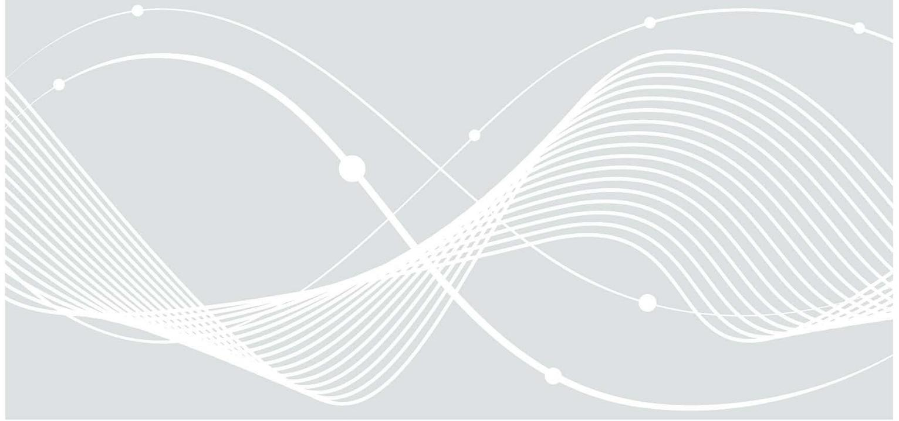
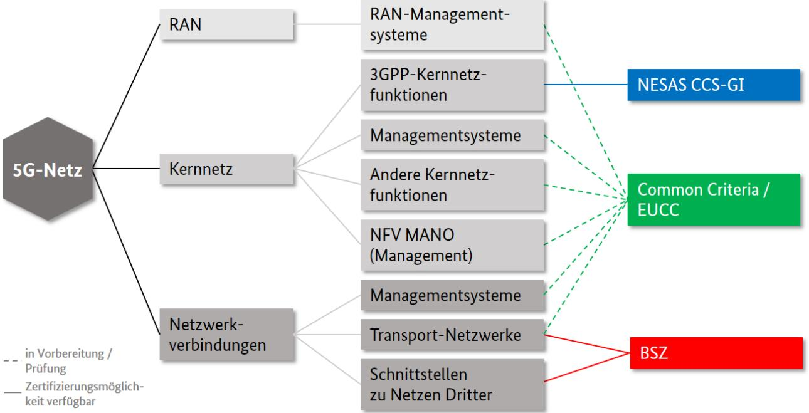

# Technische Richtlinie BSI TR-03163: Sicherheit in TK-Infrastrukturen

Anhang A: Auswahlhilfe und zulässige Anforderungsdokumente

## Änderungshistorie

| Version | Datum      | Name | Beschreibung                                                                |  |
|---------|------------|------|-----------------------------------------------------------------------------|--|
| 1.0     | 14.06.2022 | BSI  | erste öffentliche Version                                                   |  |
| 1.1     | 01.07.2022 | BSI  | Kapitel 2: Anforderungsdokumente NESAS CCS-GI hinzugefügt                |  |
|         |            |      | Kapitel 1: Verweis auf Start NESAS CCS-GI in Q3/2022 entfernt      |  |
| 1.2     | 31.01.2023 | BSI  | Kapitel 2: Bezug zu AIS-N2 hinzugefügt                                      |  |
|         |            |      | Abbildung 1 aktualisiert                                                    |  |
|         |            |      | Kapitel 4: Hinweis zur Weiterentwicklung CC aufgenommen                  |  |
| 1.3     | 01.06.2024 | BSI  | Abbildung 1 aktualisiert                                                    |  |
|         |            |      | Kapitel 2: Zulässige Anforderungsdokumente NESAS-CCS-GI aktualisiert     |  |
|         |            |      | Kapitel 3: Verlinkungen und Titel der Anforderungsdokumente aktualisiert |  |
| 1.4     | 27.02.2025 | BSI  | editorielle Verbesserungen                                                  |  |
|         |            |      | Abbildung 1 aktualisiert                                                    |  |
|         |            |      | Kapitel 2: Zulässige Anforderungsdokumente NESAS CCS-GI aktualisiert     |  |
|         |            |      | Kapitel 4: Ergänzung EUCC                                                   |  |
|         |            |      | Kapitel 3: Festlegung auf spezifische Funktionen ergänzt                 |  |

Bundesamt für Sicherheit in der Informationstechnik Postfach 20 03 63 53133 Bonn E-Mail: tr-5g@bsi.bund.de Internet: https://www.bsi.bund.de © Bundesamt für Sicherheit in der Informationstechnik 2025

## Inhalt

| 1 | Auswahlhilfe Zertifizierungsschema 4                |  |
|---|-----------------------------------------------------|--|
| 2 | Zulässige Anforderungsdokumente für NESAS CCS-GI  5 |  |
| 3 | Zulässige Anforderungsdokumente für BSZ 7        |  |
| 4 | Zulässige Anforderungsdokumente für CC und EUCC 8   |  |

## 1 Auswahlhilfe Zertifizierungsschema

Der nachfolgend dargestellte Entscheidungsbaum soll als Auswahlhilfe dienen, um für kritische Komponenten, die mithilfe de[r Liste der kritischen Funktionen](https://www.bundesnetzagentur.de/SharedDocs/Downloads/DE/Sachgebiete/Telekommunikation/Unternehmen_Institutionen/Anbieterpflichten/OeffentlicheSicherheit/KatalogSicherheitsanforderungen/ListekritischeFunktionen.pdf?__blob=publicationFile&v=7) identifiziert wurden, ein geeignetes Schema zur Produktzertifizierung zu finden. Er stellt den Zusammenhang zwischen Funktionsklassen von 5G-Komponenten und den zulässigen Zertifizierungsschemata nach der TR-03163 dar. Farblich durchgezogene Linien verweisen auf verfügbare Zertifizierungsmöglichkeiten. Eine gestrichelt dargestellte Linie bedeutet, dass die Anforderungsdokumente in Vorbereitung sind bzw. das BSI die Möglichkeit einer Zertifizierung dieser Funktionsklassen mithilfe des zugeordneten Schemas zurzeit prüft.

*Abbildung 1 Auswahlhilfe Zertifizierungsschema*

Die meisten kritischen Komponenten im 5G-Netz führen Funktionen entsprechend der 3GPP-Architektur aus. Diese Komponenten können mithilfe von NESAS CCS-GI zertifiziert werden. Darüber hinaus sind kritische Komponenten der Netzwerkverbindungen mittels BSZ zertifizierbar. Die Anwendbarkeit der BSZ hat das BSI im Kapite[l 3](#page-6-0) auf spezifische Funktionen festgelegt. Für NFV MANO, Managementsysteme, Kernnetzfunktionen außerhalb der 3GPP-Spezifikationen sowie Transportnetzwerke sind Common Criteria (CC) Protection Profiles (PP) in Vorbereitung bzw. prüft das BSI derzeit die Möglichkeit der Zertifizierung mittels CC oder der Europäischen Sicherheitszertifizierung nach CC (EUCC).

Der Entscheidungsbaum wird fortlaufend weiterentwickelt und dem Stand der Technik angepasst. Hierzu führt das BSI eine Risikoanalyse unter Bezugnahme auf obige Funktionsklassen durch. Auf Grundlage der Ergebnisse dieser Analyse werden zukünftig Entscheidungen bezüglich der zu verwendenden Assurance Level für verschiedene kritische Komponenten getroffen.

Auf Grundlage der Risikoanalyse, werden die zur Abdeckung der Liste der kritischen Funktionen benötigten Anforderungsdokumente identifiziert und kontinuierlich weiterentwickelt. Produkthersteller und weitere Stakeholder können sich bei Interesse an der Entwicklung und Fortschreibung der Anforderungsdokumente einbringen. Bitte wenden Sie sich dafür an den Herausgeber der TR-03163.

#### 2 Zulässige Anforderungsdokumente für NESAS CCS-GI

Die nach der TR-03163 zulässigen Anforderungsdokumente sind in der nachfolgenden Tabelle aufgelistet.

*Tabelle 1 Zulässige Anforderungsdokumente NESAS CCS-GI*

| Funktionsklasse    | Dokument Titel |                                                                   | Zulässiges           | Stichtag gemäß     |
|--------------------|-------------------|-------------------------------------------------------------------|----------------------|--------------------|
|                    |                   |                                                                   | Anforderungsdokument | Sicherheitskatalog |
|                    |                   |                                                                   | seit                 |                    |
| 3GPP               | TS33.226          | Security assurance for IP Multimedia Subsystem (IMS)              | 01.07.2022           | 01.01.2026         |
| Kernnetzfunktionen |                   |                                                                   |                      |                    |
| 3GPP               | TS33.250          | SCAS for the PDN (packet data network) gateway (PGW)              | 01.07.2022           | 01.01.2026         |
| Kernnetzfunktionen |                   | network product class                                             |                      |                    |
| 3GPP               | TS33.326          | SCAS for the Network Slice-Specific Authentication and            | 01.07.2022           | 01.01.2026         |
| Kernnetzfunktionen |                   | Authorization Function (NSSAAF)                                   |                      |                    |
| 3GPP               | TS33.512          | 5G SCAS; Access and Mobility management Function (AMF) 01.07.2022 |                      | 01.01.2026         |
| Kernnetzfunktionen |                   |                                                                   |                      |                    |
| 3GPP               | TS33.513          | 5G SCAS; User Plane Function (UPF)                                | 01.07.2022           | 01.01.2026         |
| Kernnetzfunktionen |                   |                                                                   |                      |                    |
| 3GPP               | TS33.514          | 5G SCAS for the Unified Data Management (UDM) network             | 01.07.2022           | 01.01.2026         |
| Kernnetzfunktionen |                   | product class                                                     |                      |                    |
| 3GPP               | TS33.515          | 5G SCAS for the Session Management Function (SMF)                 | 01.07.2022           | 01.01.2026         |
| Kernnetzfunktionen |                   | network product class                                             |                      |                    |
| 3GPP               | TS33.516          | 5G SCAS for the Authentication Server Function (AUSF)             | 01.07.2022           | 01.01.2026         |
| Kernnetzfunktionen |                   | network product class                                             |                      |                    |
| 3GPP               | TS33.517          | 5G SCAS for the Security Edge Protection Proxy (SEPP)             | 01.07.2022           | 01.01.2026         |
| Kernnetzfunktionen |                   | network product class                                             |                      |                    |
| 3GPP               | TS33.518          | 5G SCAS for the Network Repository Function (NRF)                 | 01.07.2022           | 01.01.2026         |
| Kernnetzfunktionen |                   | network product class                                             |                      |                    |
| 3GPP               | TS33.519          | 5G SCAS for the Network Exposure Function (NEF) network           | 01.07.2022           | 01.01.2026         |
| Kernnetzfunktionen |                   | product class                                                     |                      |                    |
| 3GPP               | TS33.520          | 5G SCAS for Non-3GPP InterWorking Function (N3IWF)                | 01.07.2022           | 01.01.2026         |
| Kernnetzfunktionen |                   |                                                                   |                      |                    |

| Funktionsklasse    | Dokument | Titel                                            | Zulässiges           | Stichtag gemäß     |
|--------------------|----------|--------------------------------------------------|----------------------|--------------------|
|                    |          |                                                  | Anforderungsdokument | Sicherheitskatalog |
|                    |          |                                                  | seit                 |                    |
| 3GPP               | TS33.521 | 5G SCAS; Network Data Analytics Function (NWDAF) | 01.07.2022           | 01.01.2026         |
| Kernnetzfunktionen |          |                                                  |                      |                    |
| 3GPP               | TS33.522 | 5G SCAS; Service Communication Proxy (SCP)       | 01.07.2022           | 01.01.2026         |
| Kernnetzfunktionen |          |                                                  |                      |                    |
| 3GPP               | TS33.528 | SCAS for the Policy Control Function (PCF)       | 01.06.2024           | 01.06.2026         |
| Kernnetzfunktion   |          |                                                  |                      |                    |
| 3GPP               | TS33.537 | SCAS for the Authentication and Key Management   | 01.06.2024           | 01.06.2026         |
| Kernnetzfunktionen |          | Applications (AKMA) Anchor Function (AAnF)       |                      |                    |

Ergänzend enthält das NESAS CCS-GI Schemadokument AIS-N2 sogenannte SCAS Refinements und eine Auflistung weiterer, generischer SCAS-Dokumente, welche entsprechend verpflichtend in der aktuell gültigen Version anzuwenden sind.

*Tabelle 2 Ergänzende Anforderungsdokumente NESAS CCS-GI*

| Funktionsklasse      | Dokument           | Titel                                                    |
|----------------------|--------------------|----------------------------------------------------------|
| alle o.g. relevanten | AIS-N2 (Kapitel 2) | Network product evaluation requirements for NESAS CCS-GI |
| Funktionsklassen     |                    |                                                          |
| alle o.g. relevanten | TS33.117           | Catalogue of general security assurance requirements     |
| Funktionsklassen     |                    |                                                          |
| alle o.g. relevanten | TS33.526           | SCAS for the Management Function                         |
| Funktionsklassen     |                    |                                                          |
| alle o.g. relevanten | TS33.527           | SCAS for 3GPP virtualized network products (VNP)         |
| Funktionsklassen     |                    |                                                          |

## 3 Zulässige Anforderungsdokumente für BSZ

Die nach der TR-03163 zulässigen Anforderungsdokumente sind in der nachfolgenden Tabelle aufgelistet. In der Spalte Funktionsklasse sind die spezifischen Funktionen aufgeführt, für die die BSZ anzuwenden ist.

*Tabelle 3 Zulässige Anforderungsdokumente BSZ*

| Funktionsklasse          | Dokument       | Titel                                                    | Zulässiges           | Stichtag gemäß     |
|--------------------------|----------------|----------------------------------------------------------|----------------------|--------------------|
|                          |                |                                                          | Anforderungsdokument | Sicherheitskatalog |
|                          |                |                                                          | seit                 |                    |
| Transportnetzwerke:      | VB-Produkte.PD | Verfahrensbeschreibung zur Zertifizierung von Produkten, | 14.06.2022           | 01.01.2026         |
| • Router              |                | Prozessen und Dienstleistungen                           |                      |                    |
| • Switches            | BSZ-Produkte   | Produktzertifizierung: Programm Beschleunigte            |                      |                    |
| Schnittstellen zu Netzen |                | Sicherheitszertifizierung (BSZ)                          |                      |                    |
| Dritter                  | AIS B1         | Anforderungen an ST und IAR                              |                      |                    |
|                          | AIS B3         | Anforderungen an die Benutzeranleitung                   |                      |                    |
|                          | AIS B6         | Anforderungen an einen TOE                               |                      |                    |

#### 4 Zulässige Anforderungsdokumente für CC und EUCC

Die nach der TR-03163 zulässigen Anforderungsdokumente PP werden zukünftig nach Erstellung und Freigabe hier aufgeführt. Produkthersteller, die vor Veröffentlichung eines Schutzprofils für die jeweilige Funktionsklasse von 5G-Komponenten CC- bzw. EUCC-Zertifizierungen nutzen möchten, werden gebeten, sich an den Herausgeber der TR-03163 zu wenden. Derzeit wird geprüft wie diese Zertifizierungen auf Basis von herstellerspezifischen Sicherheitsvorgaben in Verbindung mit Vorgaben des BSI anzuwenden sind.