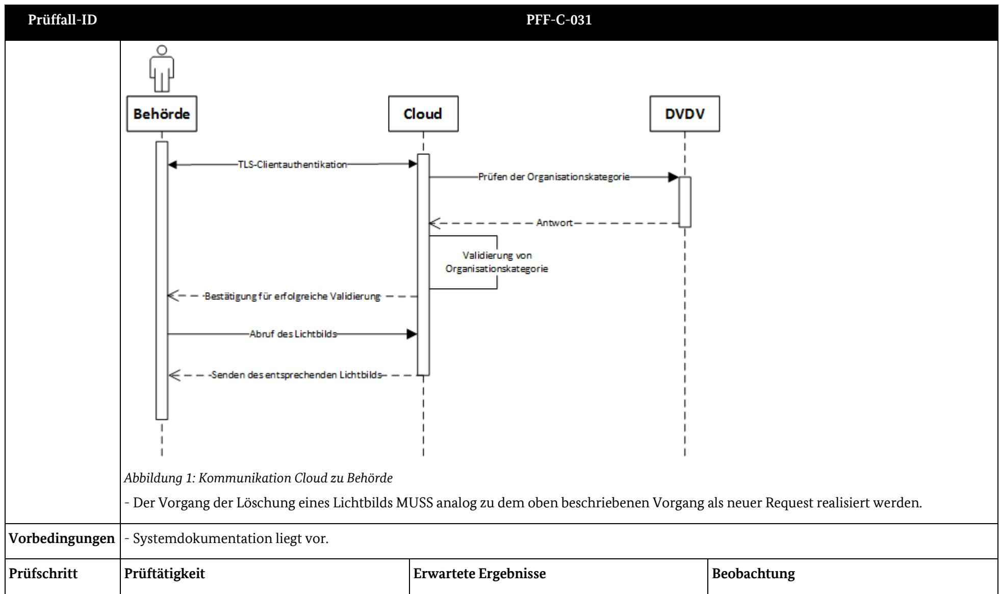

# Prüfspezifikation zur Technischen Richtlinie TR-03170

Sichere elektronische Übermittlung von Lichtbildern an die Pass-, Personalausweis- oder Ausländerbehörden

Prüfmodule Cloud-Dienst (Management-Zertifizierung) und Software (Produkt-Zertifizierung), Version 1.2

# Änderungshistorie

| Version | Datum      | Name | Beschreibung                                                                                                   |
|---------|------------|------|----------------------------------------------------------------------------------------------------------------|
| 0.1     | 07.07.2023 | BSI  | Erstentwurf auf Basis der TR-03170 in der Version 0.6                                                       |
| 0.5     | 27.10.2023 | BSI  | Übertrag und Zusammenfassung der Software- und Cloud-Prüffälle aus dem Excel-Format.                  |
| 0.7     | 19.03.2024 | BSI  | Einarbeitung der Änderungen aus der Version 1.0 der TR-03170                                                |
| 1.0     | 31.05.2024 | BSI  | Überarbeitung einzelner Prüfschritte, Einarbeitung von Kommentaren seitens Prüfstellen und Finalisierung |
| 1.1     | 01.08.2024 | BSI  | Überarbeitung und Einarbeitung weiterer Kommentare, sowie Abgleich mit der TR Version 1.1                |
| 1.2     | 15.01.2025 | BSI  | Anpassung an Version 1.2 der Technischen Richtlinie 03170                                                   |

*Tabelle 1: Änderungshistorie*

Bundesamt für Sicherheit in der Informationstechnik Postfach 20 03 63 53133 Bonn Tel.: +49 22899 9582-0 E-Mail: AusschreibungLichtbild@bsi.bund.de Internet: https://www.bsi.bund.de © Bundesamt für Sicherheit in der Informationstechnik 2024

| 1 |        | Einleitung 5                                                               |    |  |
|---|--------|-------------------------------------------------------------------------------|----|--|
|   | 1.1    | Referenzierte Spezifikation                                                   | 5  |  |
|   | 1.2    | Aufbau des Dokuments                                                          | 6  |  |
| 2 |        | Zertifizierung nach TR-03170                                                  | 7  |  |
|   | 2.1    | Definitionen                                                               | 7  |  |
| 3 |        | Prüfmodule10                                                                  |    |  |
|   | 3.1    | Cloud-Dienst10                                                                |    |  |
|   | 3.1.1  | PFF-C-001 Funktionale Anforderungen an Up- und Download des Bildes10       |    |  |
|   | 3.1.2  | PFF-C-002 Vorliegen eines C5-Testats13                                        |    |  |
|   | 3.1.3  | PFF-C-003 Gerichtsbarkeit und Lokation15                                      |    |  |
|   | 3.1.4  | PFF-C-004 Verfügbarkeit und Störungsbeseitigung 16                         |    |  |
|   | 3.1.5  | PFF-C-005 Zertifizierungen oder Bescheinigungen19                             |    |  |
|   | 3.1.6  | PFF-C-006 Kontakt zu relevanten Behörden und Interessenverbänden 21        |    |  |
|   | 3.1.7  | PFF-C-007 Management physischer Assets22                                      |    |  |
|   | 3.1.8  | PFF-C-008 Klassifizierung von Assets24                                        |    |  |
|   | 3.1.9  | PFF-C-009 Schutz vor Schadprogrammen25                                        |    |  |
|   | 3.1.10 | PFF-C-010 Verfügbarkeit der Überwachungssoftware27                            |    |  |
|   | 3.1.11 | PFF-C-011 Umgang mit Schwachstellen, Störungen und Fehlern28                  |    |  |
|   | 3.1.12 | PFF-C-012 Separierung der Datenbestände in der Cloud-Infrastruktur30          |    |  |
|   | 3.1.13 | PFF-C-013 Überprüfung von Zugriffsberechtigungen 31                        |    |  |
|   | 3.1.14 | PFF-C-014 Vertraulichkeit von Authentisierungsinformationen33                 |    |  |
|   | 3.1.15 | PFF-C-015 Transportverschlüsselung34                                          |    |  |
|   | 3.1.16 | PFF-C-016 Network Access Control35                                            |    |  |
|   | 3.1.17 | PFF-C-017 Netzübergreifende Zugriffe36                                        |    |  |
|   | 3.1.18 | PFF-C-018 Segregation des Datenverkehrs in gemeinsam genutzten Netzumgebungen | 37 |  |
|   | 3.1.19 | PFF-C-019 Richtlinien zur Entwicklung/Beschaffung von Informationssystemen38  |    |  |
|   | 3.1.20 | PFF-C-020 Versionskontrolle 39                                             |    |  |
|   | 3.1.21 | PFF-C-021 Überwachung der Einhaltung der Anforderungen 40                  |    |  |
|   | 3.1.22 | PFF-C-022 Richtlinie für den Umgang mit Sicherheitsvorfällen 42            |    |  |
|   | 3.1.23 | PFF-C-023 Frontend und Backend43                                              |    |  |
|   | 3.1.24 | PFF-C-024 Protokollierung 45                                               |    |  |
|   | 3.1.25 | PFF-C-025 Registrierungsprozess46                                             |    |  |
|   | 3.1.26 | PFF-C-026 Nachvollziehbarkeit/Verantwortlichkeit beim Upload 53            |    |  |
|   | 3.1.27 | PFF-C-027 Kommunikationswege 56                                            |    |  |
|   | 3.1.28 | PFF-C-028 Aufbau einer Verbindung im Rahmen einer Nutzer Session57            |    |  |
|   | 3.1.29 | PFF-C-029 Erzeugung von Zufallszahlen 59                                   |    |  |

|     | 3.1.30 | PFF-C-030 Kommunikationswege Dienstleister – Cloud61                 |     |
|-----|--------|-------------------------------------------------------------------------|-----|
|     | 3.1.31 | PFF-C-031 Kommunikation Cloud – Behörde DVDV64                       |     |
|     | 3.1.32 | PFF-C-032 Kommunikation mit dem DVDV68                                  |     |
|     | 3.1.33 | PFF-C-033 Sichere Datenlöschung69                                       |     |
| 3.2 |        | Software 70                                                          |     |
|     | 3.2.1  | PFF-S-001 Funktionale Anforderungen an Up- und Download des Bildes71 |     |
|     | 3.2.2  | PFF-S-002 Bildkonformität 73                                         |     |
|     | 3.2.3  | PFF-S-003 Kryptografische Anforderungen74                               |     |
|     | 3.2.4  | PFF-S-004 Barcode 76                                                 |     |
|     | 3.2.5  | PFF-S-005 Erzeugung von Zufallszahlen82                                 |     |
|     | 3.2.6  | PFF-S-006 Verwendung von Frameworks und Bibliotheken 84              |     |
|     | 3.2.7  | PFF-S-007 Implementierung 90                                         |     |
|     | 3.2.8  | PFF-S-008 Authentifizierung und Autorisierung97                         |     |
|     | 3.2.9  | PFF-S-009 Sicherheit der Daten98                                        |     |
|     | 3.2.10 | PFF-S-010 Kommunikation                                              | 102 |
|     |        | Anforderungsregister                                                    | 106 |
|     |        | Literaturverzeichnis                                                    | 128 |
|     |        |                                                                         |     |

# 1 Einleitung

Am 11. Dezember 2020 wurde das vom Deutschen Bundestag und Bundesrat verabschiedete **"Gesetz zur Stärkung der Sicherheit im Pass-, Ausweis- und ausländerrechtlichen Dokumentenwesen"** [1], sowie am 31. Oktober 2023 die **"Verordnung zur Änderung der Personalausweisverordnung, der Passverordnung, der Aufenthaltsverordnung sowie weiterer Vorschriften"** [2] im Bundesgesetzblatt veröffentlicht. Ziel des Gesetzes und der Verordnung ist es, angemessene Sicherheitsmaßnahmen festzulegen, um eine sichere Übertragung elektronischer Lichtbilder an Pass-, Personalausweis- und Ausländerbehörden sicherzustellen.

### **Gefährdungslage durch Morphing**

Morphing bezeichnet eine Technik, mit der Lichtbilder (i. Allg. für Pass-, Personalausweis- und ausländerrechtliche Ausweisdokumente) elektronisch manipuliert werden können, indem mehrere Gesichtsbilder zu einem einzigen Bild digital verschmolzen werden und somit die Gesichtszüge von verschiedenen Personen in einem Lichtbild erscheinen.

Durch Morphing-Manipulation ist der Pass bzw. Personalausweis als Instrument zur Identitätskontrolle im Kern bedroht, sodass die bisherige Praxis, nach der antragstellende Personen ausgedruckte Lichtbilder bei der Pass-, Personalausweis- oder Ausländerbehörde einreichen, nicht mehr den aktuellen Sicherheitsanforderungen entspricht.

### **Stärkung der Sicherheit durch Verfahren zur digitalen Übermittlung der Lichtbilder**

Das verabschiedete Gesetz zur Stärkung der Sicherheit im Pass-, Ausweis- und ausländerrechtlichen Dokumentenwesen sieht vor, dass künftig Manipulation von hoheitlichen Dokumenten durch Morphing gezielt begegnet werden soll, indem **ab dem 1. Mai 2025** das Lichtbild ausschließlich digital erstellt und auf einem gesicherten elektronischen Weg zur Behörde übermittelt wird. Eine Möglichkeit zur Umsetzung besteht darin, nach der **Technischen Richtlinie [BSI TR-03121] – Biometrie in hoheitlichen Anwendungen** [3] die Lichtbilder durch einen Live-Enrolment Prozess zu erstellen und zu übertragen.

Ein Verfahren zur sicheren elektronischen Bildübermittlung wurde bereits in der **Technischen Richtlinie [BSI TR-03146] – Elektronische Bildübermittlung zur Beantragung hoheitlicher Dokumente** [4] beschrieben. Diese Technische Richtlinie erlaubt es Dienstleistern (z.B. Fotostudios), digital aufgenommene Lichtbilder zum Zwecke der Beantragung eines Passes oder Personalausweises via De-Mail an die Pass-, Personalausweis- oder Ausländerbehörde zu senden, bei welcher das Dokument beantragt wird. Nach vorliegender Rechtsverordnung wird dieses Verfahren ab dem 1. Mai 2025 nicht mehr genutzt werden können.

### **Gegenstand der Technischen Richtlinie**

Die vorliegende **Technische Richtlinie [BSI TR-03170]** regelt die digitale Übermittlung biometrischer Lichtbilder von Dienstleistern (z. B. Fotografinnen und Fotografen) an Pass-, Personalausweis- oder Ausländerbehörden über einen sicheren Cloud-Dienst und definiert Anforderungen für die Zertifizierung von Diensten für dieses spezielle Verfahren. Allen zuständigen Behörden wird hierbei der Abruf der Lichtbilder von so zertifizierten Dienstanbietern ermöglicht.

## 1.1 Referenzierte Spezifikation

Diese Prüfspezifikation ist eine Umsetzung der Anforderungen der Technischen Richtlinie **[BSI TR-03170]** – "Sichere digitale Übermittlung biometrischer Lichtbilder von Dienstleistern (z.B. Fotografinnen und Fotografen) an Pass-, Personalausweis- und Ausländerbehörden" und beschreibt die Prüfung der Anforderungen für die Zertifizierung nach der genannten TR.

Die Technische Richtlinie bietet dabei zwei verschiedene Zertifizierungen an, deren Anforderungen in zwei Dokumente unterteilt sind. Das Rahmendokument **[BSI TR-03170]** beschreibt dabei den grundsätzlich abgebildeten Prozess für die digitale Übertragung der biometrischen Lichtbilder und dazugehörige Rahmenbedingungen. Das Teildokument **[BSI TR-03170-1]** beschreibt Anforderungen an die Cloud zur Speicherung der biometrischen Lichtbilder. Das Teildokument **[BSI TR-03170-2]** beschreibt Anforderungen an die Anwendung zur Übertragung der biometrischen Lichtbilder, unabhängig davon ob es sich um lokale Clientbestandteile einer Software oder um Teile einer Webanwendung oder eines Webservice handelt, der z.B. in der Cloud betrieben wird.

## 1.2 Aufbau des Dokuments

Kapitel [2](#page-6-0) gibt ein paar grundlegende Informationen zur Aufteilung der **[BSI TR-03170]** nach den zwei möglichen Zertifizierungen. Kapitel [3](#page-9-0) ist aufgeteilt nach den Prüffällen für die einzelnen Zertifizierungen. Im Kapitel [3.1](#page-9-1) befinden sich die Prüffälle für die Zertifizierung nach **[BSI TR-03170-1]** für den Cloud-Dienst (Management-Zertifizierung) und in Kapitel [3.2](#page-69-0) befinden sich die Prüffälle für die Zertifizierung nach **[BSI TR-03170-2]** für die Anwendung (Produkt-Zertifizierung). Die den Kapiteln zugeordneten Prüffälle und die dort verwiesenen Anforderungen weisen jeweils eine eigene Nomenklatur je Zertifizierung auf. In hinteren Teil der Prüfspezifikation gibt es ein Anforderungsregister, in dem die einzelnen Anforderungs-IDs den konkreten Anforderungen aus der **[BSI TR-03170]** zugewiesen werden.

Die Anforderungen werden gemäß den Schlüsselworten aus **[BSI TR-03170]** Kapitel 1.2.1 geschrieben. Im Rahmen der Prüfung sind dabei insbesondere die SOLLTE-Anforderungen zu betrachten, da diese normalerweise erfüllt werden müssen, es aber Gründe geben kann, dies doch nicht zu tun. Dies muss sorgfältig abgewogen und stichhaltig begründet werden. Entsprechend ist bei Prüffällen für SOLLTE-Anforderungen entweder die Umsetzung zu prüfen oder zu bewerten, inwiefern eine Begründung für eine alternative Umsetzung oder Nichtumsetzung stichhaltig ist.

## 2 Zertifizierung nach TR-03170

Die Technische Richtlinie **[BSI TR-03170]** behandelt zwei Zertifizierungen:

Zertifizierung der Cloud, in der die biometrischen Lichtbilder gespeichert werden (siehe **[BSI TR-03170-1]** Kapitel 2). Der Nachweis über ein C5-Testat ist Bestandteil der Zertifizierung nach dieser Technischen Richtlinie.

Zertifizierung der Software, mit der die Bilder beim Dienstleister (z. B. Fotografin oder Fotograf) in die Cloud hochgeladen werden und der zugehörige Barcode mitsamt den notwendigen Informationen (siehe **[BSI TR-03170-2]** Kapitel 2) erstellt wird. Zertifiziert werden MÜSSEN die für den in Kapitel 2.4.2 beschriebenen Prozess notwendigen Funktionalitäten der Anwendung.

Die Konformität zu den Vorgaben dieser Technischen Richtlinie MUSS durch ein TR-Zertifikat bestätigt werden. Für den Betrieb einer TR-03170 konformen Lösung sind beide Zertifizierungen erforderlich. Diese Technische Richtlinie ermöglicht sowohl die Zertifizierung einer Cloud, sowie die Zertifizierung einer Anwendung zur Anbindung der Dienstleister an die Cloud. Die Zertifizierungen können gemeinsam oder unabhängig voneinander erfolgen.

Die Zertifizierung nach **[BSI TR-03170-1]** kann durch "Auditteamleiter" bzw. "Auditoren", die für die [**Zertifizierung nach ISO 27001 auf der Basis von IT-Grundschutz]** [5] zertifiziert wurden oder durch nach [**"Kompetenzfeststellung: Programm im Bereich der Common Criteria (CC)"]** [6] anerkannte CC-Evaluatoren mit Erfahrung im Bereich ALC (Assurance: Life-Cycle), entsprechend anerkannter CC-Prüfstellen [7] [8] durchgeführt werden.

Die Zertifizierung nach **[BSI TR-03170-2]** kann durch Prüfstellen und Prüfer durchgeführt werden, die nach den **[TR-Prüfstellen]** [9] und **[TR-Prüfer]** [10] für die Prüfung der **[BSI TR-03170-2]** anerkannt sind.

## 2.1 Definitionen

*Tabelle 2: Definitionen*

| Zielobjekte             | Beschreibung                                                                                                                                                                                                                                                                                                                                        |
|-------------------------|-----------------------------------------------------------------------------------------------------------------------------------------------------------------------------------------------------------------------------------------------------------------------------------------------------------------------------------------------------|
| Assets                  | Im Sinne dieser Technischen Richtlinie sind die Assets die für die Informationssicherheit des Cloud-Dienstes während der Erstellung, Verarbeitung, Speicherung, Übermittlung, Löschung oder Zerstörung von Informationen benötigten Objekte im Verantwortungsbereich des Cloud-Anbieters.                                               |
| Behörde                 | Von den Ländern bestimmte, für Ausweisangelegenheiten in Deutschland zuständige Behörden (Pass-, Personalausweis- oder Ausländerbehörden) und Empfänger der erstellten digitalen Lichtbilder.                                                                                                                                           |
| Biometrisches Lichtbild | Im Sinne dieser Technischen Richtlinie ein digitales Bild, welches zum Zeitpunkt der Bildnutzung in hoheitlichen Dokumenten die geltenden gesetzlichen Bildanforderungen der jeweils gültigen [PassV] [11], [PAuswV] [12], [PassDEÜV] [13], [AufenthV] [14] oder entsprechender gesetzlicher Nachfolgedokumente erfüllt. |

| Zielobjekte                                           | Beschreibung                                                                                                                                                                                                                                                                                                                                           |  |
|-------------------------------------------------------|--------------------------------------------------------------------------------------------------------------------------------------------------------------------------------------------------------------------------------------------------------------------------------------------------------------------------------------------------------|--|
| Bürgerin oder Bürger                                  | Antragstellerin oder Antragsteller, die/der von einem Dienstleister ein digitales biometrisches Lichtbild für ein neues hoheitliches Dokument erstellen und an den Cloud-Dienst übertragen lässt. Von dort kann die Pass-, Personalausweis- oder Ausländerbehörde diese dann abrufen.                                                   |  |
| Cloud-Anbieter                                        | Anbieter des im Rahmen dieser Technischen Richtlinie beschriebenen Cloud-Dienstes. Dies kann den Anbieter eines Cloud Dienstes und den Anbieter/Betreiber einer Cloud-Infrastruktur umfassen (Wobei Anbieter des Cloud-Dienstes und Betreiber ein Unternehmen oder mehrere unterschiedliche sein können).                               |  |
| Cloud-Dienst                                          | Dienst, der digitale Lichtbilder von Dienstleistenden entgegennimmt und für den Download durch Behörden bereitstellt.                                                                                                                                                                                                                               |  |
|                                                       | Gemäß C5-Testat ist der Cloud-Dienst eine im Rahmen von Cloud Computing angebotene Dienstleistung der Informationstechnik. Dieser Dienst speichert die biometrischen Lichtbilder zum Abruf durch die Pass-, Personalausweis- und Ausländerbehörden.                                                                                        |  |
| Dienstleister (z. B. Fotografinnen und Fotografen) | Dienstleister einer Bürgerin oder eines Bürgers, der das digitale biometrische Lichtbild erstellt, aufbereitet und das biometrische Lichtbild an einen sicheren Cloud-Dienst übermittelt. Von dort kann die Pass-, Personalausweis- oder Ausländerbehörde diese dann abrufen.                                                           |  |
| Download-Schnittstelle                                | Die Schnittstelle, über die Behörden auf den Cloud-Dienst zugreifen, um biometrische Lichtbilder aus der Cloud herunterzuladen und in ihre eigenen Fachverfahren einzuspeisen (siehe [BSI TR-03170-1] Kapitel 2.8.2).                                                                                                                         |  |
| Lichtbildidentifier                                   | Die eindeutige Kennung eines biometrischen Lichtbilds in einer Cloud. In der Schnittstellenspezifikation wird der Lichtbildidentifier auch als photoId bezeichnet.                                                                                                                                                                               |  |
| Live-Enrolment-Stations                               | Selbstbedienungsterminals zur Produktionsdatenerfassung, - qualitätsprüfung und –übermittlung für hoheitliche Dokumente                                                                                                                                                                                                                             |  |
| Nutzerkennung                                         | Die eindeutige Identität einer im Auftrag eines Dienstleisters handelnden natürlichen Person mitsamt Zuordnung zum Dienstleisterkonto und der genutzten Lichtbildcloud, für die Rückverfolgbarkeit der Herkunft eines biometrischen Lichtbildes.                                                                                              |  |
| Dienstleisterkonto                                    | Ein mittels Registrierung einer Organisation, eines Unternehmens oder einer/s selbstständigen Fotografin/en erzeugtes Zugangsprofil bei einem Cloud-Anbieter. Die genannte Organisation/Das genannte Unternehmen ist im Sinne dieser Technischen Richtlinie Dienstleister für die Fertigung von Lichtbildern für hoheitliche Dokumente. |  |
| Nutzerregistrierung                                   | Die Registrierung einer natürlichen Person unter einer Organisation/einem Unternehmen, im Rahmen Ihrer Tätigkeit bei der Erzeugung von Lichtbildern für hoheitliche Dokumente. Beinhaltet die Erzeugung der Nutzerkennung.                                                                                                                    |  |

| Zielobjekte          | Beschreibung                                                                                                                                                   |
|----------------------|----------------------------------------------------------------------------------------------------------------------------------------------------------------|
| Sensible Daten       | Personenbezogene Daten nach Art.4 Abs.1 [DSGVO] [15], sowie insbesondere biometrische Daten nach Art.4 Abs.14 [DSGVO] [15].                           |
| Upload-Schnittstelle | Die Schnittstelle, über die biometrische Lichtbilder sicher vom Dienstleister (z.B. Fotografinnen und Fotografen) an den Cloud Dienst übertragen werden. |

## 3 Prüfmodule

## 3.1 Cloud-Dienst

### 3.1.1 PFF-C-001 Funktionale Anforderungen an Up- und Download des Bildes

### *Tabelle 3: PFF-C-001 Funktionale Anforderungen an Up- und Download des Bildes*

| Prüffall-ID   | PFF-C-001                                                                                                                                                                                                                                                                                                                                                                                                                                           |  |  |
|---------------|-----------------------------------------------------------------------------------------------------------------------------------------------------------------------------------------------------------------------------------------------------------------------------------------------------------------------------------------------------------------------------------------------------------------------------------------------------|--|--|
| Anforderungen | ANC-002, ANC-093                                                                                                                                                                                                                                                                                                                                                                                                                                    |  |  |
|               | (Prozess [BSI TR-03170] Kapitel 2.4.2)                                                                                                                                                                                                                                                                                                                                                                                                           |  |  |
| Ziel          | Nachweis, dass folgende Anforderungen an den Cloud-Dienst erfüllt sind:                                                                                                                                                                                                                                                                                                                                                                             |  |  |
|               | Im Rahmen der sicheren digitalen Lichtbildübermittlung MUSS der Cloud-Dienst folgende Prozessschritte unterstützen:                                                                                                                                                                                                                                                                                                                                 |  |  |
|               | 1. Die Bürgerin/der Bürger lässt vom registrierten Dienstleister ein biometrisches Lichtbild erstellen. (Bei der Erstellung des Lichtbilds KÖNNEN Meta-Informationen zur Aufnahme, z. B. Marke/Modell der Aufnahmeeinheit, verwendete Software, etc. eingebracht werden). (nicht Cloud relevant)                                                                                                                                              |  |  |
|               | 2. Das ausgewählte Lichtbild wird kodiert (siehe [BSI TR-03170-2] Kapitel 2.1). (nicht Cloud relevant)                                                                                                                                                                                                                                                                                                                                           |  |  |
|               | 3. Der symmetrische Schlüssel wird erzeugt (siehe [BSI TR-03170-2] Kapitel 2.2). (nicht Cloud relevant)                                                                                                                                                                                                                                                                                                                                          |  |  |
|               | 4. Das Lichtbild wird mit dem symmetrischen Schlüssel verschlüsselt. (nicht Cloud relevant)                                                                                                                                                                                                                                                                                                                                                         |  |  |
|               | 5. Der Dienstleister überträgt das clientseitig verschlüsselte Lichtbild über die Upload-Schnittstelle an den Cloud-Dienst. Die durch den Verordnungstext geforderte Anmeldung des Dienstleisters mit der eID oder einem anderen elektronischen Identifizierungsmittel auf dem Vertrauensniveau "hoch" (gemäß [BSI TR-03170-1] Kapitel 2.6) beim Cloud-Anbieter MUSS vor Schritt 5 (der Übertragung des Lichtbilds zur Cloud) erfolgen. |  |  |
|               | 6. Der Cloud-Dienst erzeugt einen eindeutigen Identifier für die Integration in den Barcode und sendet diesen zusammen mit einer Bestätigung der erfolgreichen Speicherung des Lichtbilds an den Dienstleister (siehe [BSI TR-03170-1] Kapitel 2.7.3).                                                                                                                                                                                        |  |  |
|               | 7. Es wird ein Barcode mit den notwendigen Daten zum Abruf des Lichtbilds aus der Cloud und zur Integration ins Fachverfahren erzeugt (siehe [BSI TR-03170-2] Kapitel 2.3). Der Barcode wird lokal erzeugt. (nicht Cloud relevant)                                                                                                                                                                                                         |  |  |

|                | 8. Die Bürgerin/der Bürger bekommt den Barcode vom Dienstleister und beantragt bei der Behörde das Ausweisdokument. (nicht Cloud relevant)                                                                                                                                                                                                                      |                                                                                           |             |
|----------------|--------------------------------------------------------------------------------------------------------------------------------------------------------------------------------------------------------------------------------------------------------------------------------------------------------------------------------------------------------------------|-------------------------------------------------------------------------------------------|-------------|
|                | 9. Die Pass-, Personalausweis- oder Ausländerbehörde fragt den Abruf des elektronischen Lichtbildes beim Cloud-Dienst unter Verwendung der vom Bürger zur Verfügung gestellten Zugangsdaten in Form des Barcodes an und übermittelt in diesem Kontext auch den Organisationsschlüssel der Behörde aus dem DVDV (siehe [BSI TR-03170-1] Kapitel 2.7.4). |                                                                                           |             |
|                | 10. Dazu prüft der Cloud-Dienst über das DVDV die Berechtigung im Rahmen der dort eingetragenen Rolle und die Behörde authentisiert sich (siehe [BSI TR-03170-1] Kapitel 2.7.4).                                                                                                                                                                             |                                                                                           |             |
|                | 11. Das Lichtbild wird von der Behörde aus der Cloud abgerufen.                                                                                                                                                                                                                                                                                                    |                                                                                           |             |
|                | 12. Anschließend wird das Lichtbild entschlüsselt. Die Entschlüsselung ist nur möglich, wenn der Behörde der korrekte Schlüssel als Teil des Barcodes ausgehändigt wurde. (nicht Cloud relevant)                                                                                                                                                                |                                                                                           |             |
|                | 13. Das Lichtbild kann aus der Cloud gelöscht werden oder für eine weitere Verwendung, bis zur maximal zulässigen Dauer, in der Cloud aufbewahrt werden (siehe [BSI TR-03170-1] Kapitel 2.8.3).                                                                                                                                                              |                                                                                           |             |
|                | 14. Das Lichtbild wird in das behördliche IT- Fachverfahren zur Ausstellung des Dokuments eingebunden. (nicht Cloud relevant)                                                                                                                                                                                                                                   |                                                                                           |             |
|                | - Für den Abruf und die Löschung von Lichtbildern durch die Behörde MUSS die [Schnittstellenspezifikation der TR-03170][16]umgesetzt werden.                                                                                                                                                                                                                 |                                                                                           |             |
| Vorbedingungen | - Ein biometrisches Lichtbild liegt vor.                                                                                                                                                                                                                                                                                                                        |                                                                                           |             |
|                | - Es gibt im Cloud-Dienst registrierte (Test-) Dienstleister.                                                                                                                                                                                                                                                                                                   |                                                                                           |             |
|                | - Die (Test-)Version einer Dienstleister-Software ist betriebsbereit.                                                                                                                                                                                                                                                                                           |                                                                                           |             |
|                | - Der Cloud-Dienst ist betriebsbereit.                                                                                                                                                                                                                                                                                                                          |                                                                                           |             |
|                | - Systemdokumentation liegt vor.                                                                                                                                                                                                                                                                                                                                |                                                                                           |             |
| Prüfschritt    | Prüftätigkeit                                                                                                                                                                                                                                                                                                                                                      | Erwartete Ergebnisse                                                                      | Beobachtung |
| 1              | Zugriffsversuch durch nicht registrierten Dienstleister                                                                                                                                                                                                                                                                                                         | Der Zugriff wird verwehrt und der Zugriffsversuch nachvollziehbar protokolliert.       |             |
| 2              | Upload eines biometrischen Lichtbilds einschließlich der definierten Metadaten                                                                                                                                                                                                                                                                                  | Upload ist nur durch registrierten Dienstleister möglich; biometrisches Lichtbild kann |             |

|   | durch (Test-)Dienstleister-Software nach erfolgreicher Anmeldung am Cloud-Dienst                                                                                           | upgeloadet werden inkl. aller definierten Metadaten zur Aufnahme; eindeutiger Identifier wird mit der Bestätigung der erfolgreichen Speicherung des Lichtbilds an die Dienstleister-Software gesendet; verschlüsseltes Lichtbild liegt im Backend des Cloud-Dienstes vor |  |
|---|----------------------------------------------------------------------------------------------------------------------------------------------------------------------------------|--------------------------------------------------------------------------------------------------------------------------------------------------------------------------------------------------------------------------------------------------------------------------------------------|--|
| 3 | Bewertung der Systemdokumentation bezüglich der Datenübertragung von der Behörde                                                                                           | In der Systemdokumentation ist nachvollziehbar beschrieben, wie der Cloud Dienst den Lichtbildidentifier sowie den Organisationsschlüssel der Behörde und deren Zertifikat empfängt und im DVDV überprüft.                                                                     |  |
| 4 | Bewertung der Systemdokumentation der Datenübertragung zur Behörde                                                                                                            | In der Systemdokumentation ist nachvollziehbar beschrieben, welche Daten an die Behörde übertragen werden.                                                                                                                                                                           |  |
| 5 | Bewertung der Systemdokumentation bezüglich der Datenübertragung von der Behörde                                                                                           | In der Systemdokumentation ist nachvollziehbar beschrieben, welche Zustände für die Kommunikation zwischen Cloud und Behörde existieren. Dabei wird genau auf Erfolgs- und Fehlermeldungen eingegangen. Die Fehlermeldungen sind dabei selbsterklärend.               |  |
| 6 | Bewertung der Systemdokumentation zur Umsetzung der Schnittstellenspezifikation bezüglich des Herunterladens des verschlüsselten Lichtbilds gemäß ID aus dem Barcode | Die in der Systemdokumentation beschriebene Schnittstelle zum Abruf des Lichtbilds ist gemäß der zu TR-03170 gehörigen [Schnittstellenspezifikation] [16] designed.                                                                                                         |  |
| 7 | Bewertung der Systemdokumentation bezüglich der Umsetzung der                                                                                                                 | Die in der Systemdokumentation beschriebene Schnittstelle zum Löschen des Lichtbilds ist                                                                                                                                                                                                |  |

|         | Schnittstellenspezifikation zur Löschung des Lichtbilds gemäß ID aus dem Barcode | gemäß der zu TR-03170 gehörigen [Schnittstellenspezifikation] [16] designed. |  |
|---------|-------------------------------------------------------------------------------------|---------------------------------------------------------------------------------------|--|
| Verdict |                                                                                     |                                                                                       |  |

### 3.1.2 PFF-C-002 Vorliegen eines C5-Testats

#### *Tabelle 4: PFF-C-002 Vorliegen eines C5-Testats*

| Prüffall-ID    | PFF-C-002                                                                                                                                                                                                                                                                                              |  |  |
|----------------|--------------------------------------------------------------------------------------------------------------------------------------------------------------------------------------------------------------------------------------------------------------------------------------------------------|--|--|
| Anforderungen  | ANC-003                                                                                                                                                                                                                                                                                                |  |  |
|                | (Vorliegen eines C5-Testats [BSI TR-03170-1] Kapitel 2.1)                                                                                                                                                                                                                                           |  |  |
| Ziel           | Nachweis, dass folgende Anforderungen an den Cloud-Dienst erfüllt sind:                                                                                                                                                                                                                                |  |  |
|                | Der Cloud-Anbieter MUSS:                                                                                                                                                                                                                                                                               |  |  |
|                | - für die gesamte Beauftragungszeit, und                                                                                                                                                                                                                                                            |  |  |
|                | - im Falle einer Vertragsbeendigung, für eine Nachlaufzeit von 6 Monaten, oder                                                                                                                                                                                                                      |  |  |
|                | - im Falle einer Beendigung des Betriebs des Cloud-Dienstes, für eine zu vereinbarende Übergangszeit,                                                                                                                                                                                               |  |  |
|                | eine Attestierung des ["Cloud Computing Compliance Criteria Catalogue" (C5-Kriterienkatalog)] [17] mindestens vom Typ 1 über die Basiskriterien in der aktuellsten Fassung für eine Erstzertifizierung vorweisen können. Bei einer Re-Zertifizierung SOLL die Attestierung des |  |  |
|                | ["Cloud Computing Compliance Criteria Catalogue" (C5-Kriterienkatalog)] [17] vom Typ 2 vorliegen, aber mindestens vom Typ 1.                                                                                                                                                                  |  |  |
| Vorbedingungen | - Verpflichtungserklärung liegt vor                                                                                                                                                                                                                                                                 |  |  |
|                | - C5 Testat liegt vor                                                                                                                                                                                                                                                                               |  |  |

| Prüffall-ID |                                       | PFF-C-002                                                                                                                                                                                                                                                                                                                                                                                                                                                                                                                                                                                                                                                                                                                                                                                                                                                       |             |
|-------------|---------------------------------------|-----------------------------------------------------------------------------------------------------------------------------------------------------------------------------------------------------------------------------------------------------------------------------------------------------------------------------------------------------------------------------------------------------------------------------------------------------------------------------------------------------------------------------------------------------------------------------------------------------------------------------------------------------------------------------------------------------------------------------------------------------------------------------------------------------------------------------------------------------------------|-------------|
| Prüfschritt | Prüftätigkeit                         | Erwartete Ergebnisse                                                                                                                                                                                                                                                                                                                                                                                                                                                                                                                                                                                                                                                                                                                                                                                                                                            | Beobachtung |
| 1           | Bewertung der Verpflichtungserklärung | Der Anbieter des Cloud-Diensts hat sich verpflichtet, - für die gesamte Beauftragungszeit, und - im Falle einer Vertragsbeendigung, für eine Nachlaufzeit von 6 Monaten, oder - im Falle eines Wechsels des Cloud-Dienstes, für eine zu vereinbarende Übergangszeit, ein Testat ["Cloud Computing Compliance Criteria Catalogue – C5"] [17] mindestens vom Typ 1 über die Basiskriterien in der aktuellsten Fassung für eine Erstzertifizierung vorzuweisen. Bei einer Re-Zertifizierung soll das Testat für eine Attestierung von Typ 2 vorliegen oder eine stichhaltige Begründung dokumentiert sein, warum weiterhin nur ein Test für Typ 1 vorliegt, sowie das Typ 1 Testat. Nachweise hierzu können durch den Anbieter der Cloudinfrastruktur/ Betreiber erbracht werden. |             |
| 2           | Bewertung des C5-Testats              | Der Anbieter des Cloud-Dienstes kann ein gültiges Testat ["Cloud Computing Compliance Criteria Catalogue – C5"] [17] mindestens vom Typ 1 über die Basiskriterien in der zum Prüfzeitpunkt aktuellsten Fassung bei der Erstzertifizierung vorlegen. Bei der Re Zertifizierung kann der Anbieter des Cloud Dienstes ein Testat vom Typ 2 vorlegen oder eine stichhaltige dokumentierte Begründung                                                                                                                                                                                                                                                                                                                                                                                                                         |             |

| Prüffall-ID | PFF-C-002                                                                      |
|-------------|--------------------------------------------------------------------------------|
|             | dafür, das weiterhin nur ein Typ 1 Testat vorliegt, sowie das Typ 1 Testat. |
| Verdict     |                                                                                |
|             |                                                                                |

### 3.1.3 PFF-C-003 Gerichtsbarkeit und Lokation

*Tabelle 5: PFF-C-003 Gerichtsbarkeit und Lokation*

| Prüffall-ID    | PFF-C-003                                                                                                                                                                                                                                                                                                                                                                                                                                                                |                                                                  |             |  |
|----------------|--------------------------------------------------------------------------------------------------------------------------------------------------------------------------------------------------------------------------------------------------------------------------------------------------------------------------------------------------------------------------------------------------------------------------------------------------------------------------|------------------------------------------------------------------|-------------|--|
| Anforderungen  | ANC-004, ANC-005                                                                                                                                                                                                                                                                                                                                                                                                                                                         |                                                                  |             |  |
|                | (Angaben zu Gerichtsbarkeit und Lokationen [BSI TR-03170-1] Kapitel 2.2.1.1)                                                                                                                                                                                                                                                                                                                                                                                          |                                                                  |             |  |
| Ziel           | Nachweis, dass folgende Anforderungen an den Cloud-Dienst erfüllt sind: - Der Cloud Anbieter MUSS der Gerichtsbarkeit eines Landes der europäischen Union unterliegen. - Der Anbieter des Cloud-Dienstes MUSS erklären, dass die Verarbeitung, Sicherung und Speicherung von Daten zur Bereitstellung des Cloud Dienstes auf Systemkomponenten in einem Land der europäischen Union erfolgt und ein Konzept vorlegen, wie er dies technisch sicherstellt. |                                                                  |             |  |
| Vorbedingungen | - Beglaubigter Handelsregistereintrag oder Äquivalent eines EU-Staates liegt vor - Erklärung und Datenhaltungskonzept liegen vor                                                                                                                                                                                                                                                                                                                                |                                                                  |             |  |
| Prüfschritt    | Prüftätigkeit                                                                                                                                                                                                                                                                                                                                                                                                                                                            | Erwartete Ergebnisse                                             | Beobachtung |  |
| 1              | Bewertung des Handelsregistereintrags bzw. des Äquivalents eines EU-Staates                                                                                                                                                                                                                                                                                                                                                                                           | Der vorgelegte Eintrag ist beglaubigt und aus einem EU-Staat. |             |  |

| Prüffall-ID |                                          | PFF-C-003                                                                                                                      |  |
|-------------|------------------------------------------|--------------------------------------------------------------------------------------------------------------------------------|--|
| 2           | Bewertung der Erklärung zur Datenhaltung | Der Anbieter des Cloud-Diensts hat erklärt, dass die Daten nur auf System-Komponenten in der EU verarbeitet werden.      |  |
| 3           | Bewertung des Datenhaltungskonzepts      | Im Datenhaltungskonzept ist nachvollziehbar beschrieben, wie sichergestellt wird, dass die Daten die EU nicht verlassen. |  |
| Verdict     |                                          |                                                                                                                                |  |

### 3.1.4 PFF-C-004 Verfügbarkeit und Störungsbeseitigung

*Tabelle 6: PFF-C-004 Verfügbarkeit und Störungsbeseitigung*

| Prüffall-ID   | PFF-C-004                                                                                                                                                                                                                                                                                                    |  |  |
|---------------|--------------------------------------------------------------------------------------------------------------------------------------------------------------------------------------------------------------------------------------------------------------------------------------------------------------|--|--|
| Anforderungen | ANC-006, ANC-007, ANC-008, ANC-009, ANC-010, ANC-011                                                                                                                                                                                                                                                         |  |  |
|               | (Angaben zu Verfügbarkeit und Störungsbeseitigung im Normalbetrieb [BSI TR-03170-1] Kapitel 2.2.1.2)                                                                                                                                                                                                      |  |  |
| Ziel          | Nachweis, dass folgende Anforderungen an den Cloud-Dienst erfüllt sind:                                                                                                                                                                                                                                      |  |  |
|               | - Der Anbieter des Cloud-Dienstes MUSS anhand eines Betriebskonzeptes nachweisen, dass er einen Normalbetrieb während der Geschäftszeit der Pass- und Personalausweis- oder Ausländerbehörden und der Dienstleister (z. B. Fotografinnen und Fotografen), gemäß Tabelle 2 gewährleisten kann: |  |  |

| Key Performance Indicators (KPI)                                                                           | Messeinheit  | Geschäftszeit (Mo – Fr: 7–20 Uhr, Sa: 7–17 Uhr) | Außerhalb der Geschäftszeit |
|---------------------------------------------------------------------------------------------------------------|--------------|----------------------------------------------------------|-----------------------------|
| Verfügbarkeit                                                                                                 | Prozent      | 99,9%                                                    | 95,0%                       |
| Störung in der Netzwerkkommunikatio n zwischen den Behörden und der Cloud-Infrastruktur           | Kritikalität | Sehr hoch                                                | Gering                      |
| Störung in der Netzwerkkommunikatio n zwischen den Fotodienstleistern und der Cloud-Infrastruktur | Kritikalität | Sehr hoch                                                | Gering                      |
| Störung in der Cloud Infrastruktur                                                                         | Kritikalität | Sehr hoch                                                | Gering                      |
| Wartungszeit                                                                                                  | Uhrzeit      | Keine                                                    | beliebig                    |
| Reaktionszeit bei Störung                                                                                  | Minuten      | <= 10                                                    | <= 60                       |
| Wiederherstellungszeit                                                                                        | Minuten      | <= 60                                                    | <= 180                      |

- Wartungsarbeiten MÜSSEN innerhalb der Wartungszeit durchgeführt und abgeschlossen werden.

- Jede Störungsmeldung MUSS mit Datum, Uhrzeit, den Kontaktdaten der meldenden Person oder technischen Komponente, der Art des Meldeweges und den Kontaktdaten der die Störung aufnehmenden Person dokumentiert werden.

- Die erfassten Kontaktdaten MÜSSEN so gestaltet sein, dass eine Rückverfolgung oder Rückmeldung an die jeweilige Kontaktadresse (meldend oder aufnehmend) zu jedem Zeitpunkt möglich ist.

| Prüffall-ID    | PFF-C-004                                                                                                                                                                                                                                                                                                                                                                      |                                                                                                                                                                                                                                                                                             |             |  |  |
|----------------|--------------------------------------------------------------------------------------------------------------------------------------------------------------------------------------------------------------------------------------------------------------------------------------------------------------------------------------------------------------------------------|---------------------------------------------------------------------------------------------------------------------------------------------------------------------------------------------------------------------------------------------------------------------------------------------|-------------|--|--|
|                | - Im Falle einer automatisierten Meldung durch eine technische Komponente MUSS als Kontaktdatum eine eindeutige Geräteidentifikation erfasst werden. Falls nicht anders möglich, KANN die Eindeutigkeit der Geräteidentifikation auch durch Kombination mehrerer nichteindeutiger Geräteattribute zu einem eindeutigen Attribut hergestellt werden.                |                                                                                                                                                                                                                                                                                             |             |  |  |
|                | - Eine Störungsmeldung MUSS über einen vom Kommunikationsverlauf der Störungsmeldung getrennten Rückmeldepfad mit eigenem Kommunikationsverlauf quittiert werden. Bei Meldungen, die durch Menschen erfolgen, z. B. mittels Rückruf oder Antwort-E-Mail MÜSSEN Datum, Uhrzeit, der genutzte Kanal und eine Zusammenfassung des Gesprächsverlaufs dokumentiert werden. |                                                                                                                                                                                                                                                                                             |             |  |  |
| Vorbedingungen | - Betriebskonzept liegt vor                                                                                                                                                                                                                                                                                                                                                 |                                                                                                                                                                                                                                                                                             |             |  |  |
| Prüfschritt    | Prüftätigkeit                                                                                                                                                                                                                                                                                                                                                                  | Erwartete Ergebnisse                                                                                                                                                                                                                                                                        | Beobachtung |  |  |
| 1              | Bewertung des Betriebskonzepts hinsichtlich des Normalbetriebs in der Nutzungszeit                                                                                                                                                                                                                                                                                          | Im Betriebskonzept ist nachvollziehbar beschrieben, wie der Normalbetrieb gemäß obiger Tabelle (Tabelle aus Anforderung ANC 006) gewährleistet wird.                                                                                                                               |             |  |  |
| 2              | Bewertung des Betriebskonzepts hinsichtlich der Wartungszeiten                                                                                                                                                                                                                                                                                                              | Im Betriebskonzept ist nachvollziehbar beschrieben, dass Wartungsarbeiten nur außerhalb der Nutzungszeiten gemäß Tabelle 2 erfolgen.                                                                                                                                               |             |  |  |
| 3              | Bewertung Betriebskonzept bezüglich Störungsmeldungen                                                                                                                                                                                                                                                                                                                       | Im Betriebskonzept ist nachvollziehbar beschrieben, dass Datum, Uhrzeit, die Kontaktdaten der meldenden Person oder technischen Komponente, die Art des Meldeweges und die Kontaktdaten der die Störung aufnehmenden Person zu jeder Störungsmeldung dokumentiert werden. |             |  |  |
| 4              | Bewertung Betriebskonzept bezüglich Kontaktdaten                                                                                                                                                                                                                                                                                                                            | Im Betriebskonzept ist nachvollziehbar beschrieben, dass mit dokumentierten                                                                                                                                                                                                              |             |  |  |

| Prüffall-ID |                                                                          | PFF-C-004                                                                                                                                                        |  |
|-------------|--------------------------------------------------------------------------|------------------------------------------------------------------------------------------------------------------------------------------------------------------|--|
|             |                                                                          | Kontaktdaten die Rückmeldung an die jeweilige Kontaktadresse jederzeit möglich ist.                                                                           |  |
| 5           | Bewertung Betriebskonzept bezüglich automatisierter Störungsmeldungen | Im Betriebskonzept ist nachvollziehbar beschrieben, dass meldende Komponenten eindeutig identifizierbar sind.                                              |  |
| 6           | Bewertung Betriebskonzept bezüglich Rückmeldung zu Störungsmeldungen  | Im Betriebskonzept ist nachvollziehbar beschrieben, dass Störungsmeldungen auf einem, von der Meldung unabhängigen Kommunikationspfad quittiert werden. |  |
| Verdict     |                                                                          |                                                                                                                                                                  |  |

### 3.1.5 PFF-C-005 Zertifizierungen oder Bescheinigungen

*Tabelle 7: PFF-C-005 Zertifizierungen oder Bescheinigungen*

| Prüffall-ID   | PFF-C-005                                                                                                 |  |
|---------------|-----------------------------------------------------------------------------------------------------------|--|
| Anforderungen | ANC-012, ANC-013                                                                                          |  |
|               | (Angaben zu Zertifizierungen oder Bescheinigungen [BSI TR-03170-1] Kapitel 2.2.1.4)                    |  |
| Ziel          | Nachweis, dass folgende Anforderungen an den Cloud-Dienst erfüllt sind:                                   |  |
|               | -- Zusätzlich zum C5-Testat MÜSSEN mindestens folgende Zertifizierungen und Bescheinigungen vorliegen: |  |

| Prüffall-ID    | PFF-C-005                                                                                                                                                                                                                                                                                                                                                           |                                                                                                                                                                                                                                                                                                                                                                                                                                                                             |             |  |
|----------------|---------------------------------------------------------------------------------------------------------------------------------------------------------------------------------------------------------------------------------------------------------------------------------------------------------------------------------------------------------------------|-----------------------------------------------------------------------------------------------------------------------------------------------------------------------------------------------------------------------------------------------------------------------------------------------------------------------------------------------------------------------------------------------------------------------------------------------------------------------------|-------------|--|
|                | -- [IT-Grundschutz] Zertifikat [19] bzw. [ISO 27001] [20] Zertifikat (Wenn ein Zertifikat nur für die Cloud-Infrastruktur vorgelegt wird, MUSS der Cloud-Anbieter für über die Cloud-Infrastruktur hinausgehende Leistungen (z.B. Entwicklung und Betrieb des Cloud-Dienstes) die Einhaltung von ISO 27001 bzw. IT-Grundschutz gewährleisten.) |                                                                                                                                                                                                                                                                                                                                                                                                                                                                             |             |  |
|                | -- Nachweis der Einhaltung der [DSGVO] [15] für den gesamten Prozess (mindestens durch ein von einer/ einem Datenschutzbeauftragten geprüftes Datenschutzkonzept)                                                                                                                                                                                       |                                                                                                                                                                                                                                                                                                                                                                                                                                                                             |             |  |
|                | -- Nachweis eines wirksamen Business Continuity Management Systems (BCMS) (mindestens durch eine BCM-Leitlinie und interne Audit Berichte)                                                                                                                                                                                                                    |                                                                                                                                                                                                                                                                                                                                                                                                                                                                             |             |  |
|                | - Der Cloud-Anbieter MUSS bestätigen, dass die Organisationseinheiten, Standorte und Verfahren des Cloud-Anbieters zur Bereitstellung des Cloud-Dienstes, wie in dieser Technischen Richtlinie spezifiziert, in den genannten Zertifizierungen enthalten sind.                                                                                                |                                                                                                                                                                                                                                                                                                                                                                                                                                                                             |             |  |
| Vorbedingungen | - Geforderte Zertifikate und Bescheinigungen liegen vor - Erklärung über Anwendungsbereiche liegt vor                                                                                                                                                                                                                                                      |                                                                                                                                                                                                                                                                                                                                                                                                                                                                             |             |  |
| Prüfschritt    | Prüftätigkeit                                                                                                                                                                                                                                                                                                                                                       | Erwartete Ergebnisse                                                                                                                                                                                                                                                                                                                                                                                                                                                        | Beobachtung |  |
| 1              | Bewertung geforderter Zertifikate bezüglich ihrer Vollständigkeit                                                                                                                                                                                                                                                                                                | Der Cloud-Anbieter kann folgende gültige Nachweise vorlegen: - [IT-Grundschutz] Zertifikat [19] bzw. [ISO 27001] [20] Zertifikat - Nachweis der Einhaltung der [DSGVO] [15] (mindestens durch ein von einer/ einem Datenschutzbeauftragten geprüftes Datenschutzkonzept) - Nachweis eines wirksamen Business Continuity Management Systems (BCMS) (mindestens durch eine BCM-Leitlinie und interne Audit-Berichte) |             |  |

| Prüffall-ID |                                                                                                             | PFF-C-005                                                                                                                                                                                                                                                                                          |  |
|-------------|-------------------------------------------------------------------------------------------------------------|----------------------------------------------------------------------------------------------------------------------------------------------------------------------------------------------------------------------------------------------------------------------------------------------------|--|
| 2           | Bewertung Erklärung zu Anwendungsbereichen                                                               | Der Cloud-Anbieter erklärt, dass die Anwendungsbereiche der vorgelegten Nachweise den Cloud-Dienst abdecken.                                                                                                                                                                                 |  |
| 3           | Bewertung Erklärung zu Umsetzung von IT Grundschutz oder ISO 27001 in der Cloud betriebenen Anwendung | Der Cloud-Anbieter erklärt, dass die im Rahmen des Cloud-Dienstes über den Betrieb der Cloud-Infrastruktur hinausgehenden Leistungen (z.B. die Entwicklung der im Cloud Dienst betriebenen Anwendung) nach ISO 27001 oder IT-Grundschutz durchgeführt und abgesichert werden. |  |
| Verdict     |                                                                                                             |                                                                                                                                                                                                                                                                                                    |  |

### 3.1.6 PFF-C-006 Kontakt zu relevanten Behörden und Interessenverbänden

*Tabelle 8: PFF-C-006 Kontakt zu relevanten Behörden und Interessenverbänden*

| Prüffall-ID   | PFF-C-006                                                                                                                                                                                                                                                        |
|---------------|------------------------------------------------------------------------------------------------------------------------------------------------------------------------------------------------------------------------------------------------------------------|
| Anforderungen | ANC-014                                                                                                                                                                                                                                                          |
|               | (Kontakt zu relevanten Behörden und Interessenverbänden [BSI TR-03170-1] Kapitel 2.2.1.5)                                                                                                                                                                        |
| Ziel          | Nachweis, dass folgende Anforderung an den Cloud-Dienst erfüllt ist:                                                                                                                                                                                             |
|               | Da der Cloud-Dienst durch Pass-, Personalausweis- oder Ausländerbehörden genutzt wird, MUSS der Cloud-Anbieter sich verpflichten, regelmäßigen (mindestens wöchentlich), sowie anlassbezogenen Kontakt zum nationalen IT-Lagezentrum und zum CERT-Bund des |

| Prüffall-ID    | PFF-C-006                                                                                                                                        |                                                                                                                                                                                                                                                             |             |
|----------------|--------------------------------------------------------------------------------------------------------------------------------------------------|-------------------------------------------------------------------------------------------------------------------------------------------------------------------------------------------------------------------------------------------------------------|-------------|
|                | Bundesamtes für Sicherheit in der Informationstechnik (BSI) zu pflegen, um sich über aktuelle Schwachstellen und Gefährdungen zu informieren. |                                                                                                                                                                                                                                                             |             |
| Vorbedingungen | Verpflichtungserklärung liegt vor                                                                                                                |                                                                                                                                                                                                                                                             |             |
| Prüfschritt    | Prüftätigkeit                                                                                                                                    | Erwartete Ergebnisse                                                                                                                                                                                                                                        | Beobachtung |
| 1              | Bewertung Verpflichtungserklärung zum Behördenkontakt                                                                                         | Der Cloud-Anbieter hat sich verpflichtet, regelmäßigen (mindestens wöchentlich), sowie anlassbezogenen Kontakt zum Nationalen IT Lagezentrum und CERT-Bund zu pflegen, um sich über aktuelle Schwachstellen und Gefährdungen zu informieren. |             |
| Verdict        |                                                                                                                                                  |                                                                                                                                                                                                                                                             |             |

### 3.1.7 PFF-C-007 Management physischer Assets

*Tabelle 9: PFF-C-007 Management physischer Assets*

| Prüffall-ID   | PFF-C-007                                                                                                                             |  |
|---------------|---------------------------------------------------------------------------------------------------------------------------------------|--|
| Anforderungen | ANC-015, ANC-016                                                                                                                      |  |
|               | (Verpflichtung auf zulässigen Gebrauch und sicheren Umgang mit ausgehändigten Assets sowie Rückgabe [BSI TR-03170-1] Kapitel 2.2.1.6) |  |
| Ziel          | Nachweis, dass folgende Anforderungen an den Cloud-Dienst erfüllt sind:                                                               |  |

| Prüffall-ID    | PFF-C-007                                                                                                                                                                                                                                                                                                                                                                                                                                                                   |                                                                                                                                                                                                                               |             |
|----------------|-----------------------------------------------------------------------------------------------------------------------------------------------------------------------------------------------------------------------------------------------------------------------------------------------------------------------------------------------------------------------------------------------------------------------------------------------------------------------------|-------------------------------------------------------------------------------------------------------------------------------------------------------------------------------------------------------------------------------|-------------|
|                | - Es MUSS durch den Cloud-Anbieter ein Konzept für die zentrale Verwaltung physischer Assets der Mitarbeiter des Anbieters des Cloud Dienstes gepflegt werden. Dies sind physische Gegenstände (z.B. ein Schlüssel, ein Token oder eine SmartCard), mit denen man Zutritt, Zugang oder Zugriff auf Infrastruktur oder Systeme für die Bereitstellung des Cloud-Dienstes erhält. - Der Cloud-Anbieter MUSS sich zur Einhaltung dieses Konzeptes verpflichten. |                                                                                                                                                                                                                               |             |
|                | - Die zentrale Verwaltung physischer Assets MUSS eine Software-, Daten- und Richtlinienverteilung sowie eine Remote-Deaktivierung, - Löschung, oder -Sperrung ermöglichen.                                                                                                                                                                                                                                                                                         |                                                                                                                                                                                                                               |             |
| Vorbedingungen | - Assetmanagementkonzept liegt vor                                                                                                                                                                                                                                                                                                                                                                                                                                       |                                                                                                                                                                                                                               |             |
|                | - Verpflichtungserklärung liegt vor                                                                                                                                                                                                                                                                                                                                                                                                                                      |                                                                                                                                                                                                                               |             |
| Prüfschritt    | Prüftätigkeit                                                                                                                                                                                                                                                                                                                                                                                                                                                               | Erwartete Ergebnisse                                                                                                                                                                                                          | Beobachtung |
| 1              | Bewertung Assetmanagementkonzept                                                                                                                                                                                                                                                                                                                                                                                                                                            | Das Assetmanagementkonzept beschreibt den Assetmanagementprozess, der eine Software-, Daten- und Richtlinienverteilung sowie eine Remote-Deaktivierung, -Löschung, oder -Sperrung ermöglicht, nachvollziehbar. |             |
| 2              | Bewertung Verpflichtungserklärung zum Assetmanagement                                                                                                                                                                                                                                                                                                                                                                                                                    | Der Cloud-Anbieter hat sich verpflichtet, das Assetmanagementkonzept umzusetzen.                                                                                                                                           |             |
| Verdict        |                                                                                                                                                                                                                                                                                                                                                                                                                                                                             |                                                                                                                                                                                                                               |             |

### 3.1.8 PFF-C-008 Klassifizierung von Assets

*Tabelle 10: PFF-C-008 Klassifizierung von Assets*

| Prüffall-ID    | PFF-C-008                                                                                                                                                                                                                                                                                                                 |                                                                                                                                                                                             |             |  |
|----------------|---------------------------------------------------------------------------------------------------------------------------------------------------------------------------------------------------------------------------------------------------------------------------------------------------------------------------|---------------------------------------------------------------------------------------------------------------------------------------------------------------------------------------------|-------------|--|
| Anforderungen  | ANC-017, ANC-018                                                                                                                                                                                                                                                                                                          |                                                                                                                                                                                             |             |  |
|                | (Klassifizierung und Kennzeichnung von Assets [BSI TR-03170-1] Kapitel 2.2.1.7)                                                                                                                                                                                                                                        |                                                                                                                                                                                             |             |  |
| Ziel           | Nachweis, dass folgende Anforderungen an den Cloud-Dienst erfüllt sind:                                                                                                                                                                                                                                                   |                                                                                                                                                                                             |             |  |
|                | - Anwendungen zur Protokollierung und Überwachung MÜSSEN den Schutzbedarf der Assets berücksichtigen, um bei Ereignissen, die zu einer Verletzung der Schutzziele führen können das dafür zuständige Personal so zu informieren, dass erforderliche Maßnahmen mit einer geeigneten Priorität eingeleitet werden. |                                                                                                                                                                                             |             |  |
|                | - Der Cloud-Anbieter MUSS ein Konzept zur Priorisierung von Maßnahmen für sicherheitskritische Ereignisse bei Assets pflegen.                                                                                                                                                                                          |                                                                                                                                                                                             |             |  |
|                | - Maßnahmen für Ereignisse bei Assets mit einem erhöhten Schutzbedarf MÜSSEN prioritär, vor Ereignissen bei Assets mit einem geringeren Schutzbedarf behandelt werden.                                                                                                                                              |                                                                                                                                                                                             |             |  |
| Vorbedingungen | - Sicherheitskonzept liegt vor                                                                                                                                                                                                                                                                                         |                                                                                                                                                                                             |             |  |
|                | - Protokollierungs- und Überwachungskonzept liegt vor                                                                                                                                                                                                                                                               |                                                                                                                                                                                             |             |  |
| Prüfschritt    | Prüftätigkeit                                                                                                                                                                                                                                                                                                             | Erwartete Ergebnisse                                                                                                                                                                        | Beobachtung |  |
| 1              | Bewertung Sicherheitskonzept bezüglich des Schutzbedarfs der Assets                                                                                                                                                                                                                                                    | Das Sicherheitskonzept beschreibt nachvollziehbar, den erfassten Schutzbedarf der Assets.                                                                                             |             |  |
| 2              | Bewertung Protokollierungs- und Überwachungskonzept bezüglich Schutzbedarf                                                                                                                                                                                                                                       | Das Protokollierungs- und Überwachungskonzept beschreibt nachvollziehbar, dass Maßnahmen bei Sicherheitsvorfällen auf Basis des Schutzbedarfs der Assets priorisiert werden. |             |  |

| Prüffall-ID |                                                                                                    | PFF-C-008                                                                                                                                                                                                                                                           |  |
|-------------|----------------------------------------------------------------------------------------------------|---------------------------------------------------------------------------------------------------------------------------------------------------------------------------------------------------------------------------------------------------------------------|--|
| 3           | Bewertung Protokollierungs- und Überwachungskonzept bezüglich Priorisierung von Maßnahmen | Das Protokollierungs- und Überwachungskonzept beschreibt nachvollziehbar, dass Maßnahmen bei Vorfällen mit Assets höheren Schutzbedarfs behandelt werden, bevor Maßnahmen bei Vorfällen mit Assets niedrigeren Schutzbedarfs ergriffen werden. |  |
| Verdict     |                                                                                                    |                                                                                                                                                                                                                                                                     |  |

### 3.1.9 PFF-C-009 Schutz vor Schadprogrammen

*Tabelle 11: PFF-C-009 Schutz vor Schadprogrammen*

| Prüffall-ID   | PFF-C-009                                                                                                                                                                                                                                                                   |  |
|---------------|-----------------------------------------------------------------------------------------------------------------------------------------------------------------------------------------------------------------------------------------------------------------------------|--|
| Anforderungen | ANC-019, ANC-020, ANC-021, ANC-022, ANC-023                                                                                                                                                                                                                                 |  |
|               | (Schutz vor Schadprogrammen [BSI TR-03170-1] Kapitel 2.2.1.8 & 2.2.1.9)                                                                                                                                                                                                  |  |
| Ziel          | Nachweis, dass folgende Anforderungen an den Cloud-Dienst erfüllt sind:                                                                                                                                                                                                     |  |
|               | - Der Cloud-Anbieter MUSS regelmäßige Reports über die durchgeführten Überprüfungen zum Schutz vor Schadprogrammen erstellen, welche durch autorisiertes Personal oder Gremien überprüft und analysiert werden.                                                       |  |
|               | - Die Erstellung und Überprüfung der Reports MUSS in einem entsprechenden Konzept beschrieben werden.                                                                                                                                                                    |  |
|               | - Richtlinien und Anweisungen MÜSSEN die technischen Maßnahmen zur sicheren Konfiguration und Überwachung der Managementkonsole (sowohl des Self-Service vom Kunden als auch die Cloud-Administration des Dienstleisters) zum Schutz vor Schadprogrammen beschreiben. |  |

| Prüffall-ID    | PFF-C-009                                                                                                                                                                                                    |                                                                                                                                                                                                                                                      |             |  |
|----------------|--------------------------------------------------------------------------------------------------------------------------------------------------------------------------------------------------------------|------------------------------------------------------------------------------------------------------------------------------------------------------------------------------------------------------------------------------------------------------|-------------|--|
|                | - Die Aktualisierung aller im Cloud-Dienst verwendeten Anwendungen und Komponenten MUSS mit der höchsten Frequenz, die die Hersteller der Software vertraglich anbieten, erfolgen.                     |                                                                                                                                                                                                                                                      |             |  |
|                | -                                                                                                                                                                                                            | Die Konfiguration der Schutzmechanismen MUSS automatisch überwacht werden.                                                                                                                                                                           |             |  |
|                | - Abweichungen von den Vorgaben MÜSSEN automatisch an das dafür sachverständige Personal berichtet werden, um diese umgehend einer Beurteilung zu unterziehen und erforderliche Maßnahmen einzuleiten. |                                                                                                                                                                                                                                                      |             |  |
| Vorbedingungen | - Konzept zum Schutz vor Schadsoftware liegt vor                                                                                                                                                          |                                                                                                                                                                                                                                                      |             |  |
|                | - Reports zum Schutz vor Schadsoftware liegen vor (optional)                                                                                                                                              |                                                                                                                                                                                                                                                      |             |  |
|                | - Richtlinien und Anweisungen zum Schutz der Managementkonsole vor Schadsoftware liegen vor                                                                                                               |                                                                                                                                                                                                                                                      |             |  |
| Prüfschritt    | Prüftätigkeit                                                                                                                                                                                                | Erwartete Ergebnisse                                                                                                                                                                                                                                 | Beobachtung |  |
| 1              | Bewertung Konzept und Reports zum Schutz vor Schadsoftware                                                                                                                                                | Das Konzept zum Schutz vor Schadsoftware beschreibt nachvollziehbar, wie Reports über die durchgeführten Überprüfungen regelmäßig erstellt, geprüft und analysiert werden. Falls möglich belegen entsprechende Reports die Umsetzung. |             |  |
| 2              | Bewertung Richtlinien und Anweisungen zum Schutz der Managementkonsole vor Schadsoftware                                                                                                               | Richtlinien und Anweisungen beschreiben nachvollziehbar, welche Maßnahmen zum Schutz der Managementkonsole vor Schadprogrammen ergriffen wurden.                                                                                            |             |  |
| 3              | Bewertung Konzept zum Schutz vor Schadsoftware bezüglich der Updatefrequenz                                                                                                                               | Das Konzept zum Schutz vor Schadsoftware beschreibt nachvollziehbar, mit welcher Frequenz Aktualisierungen erfolgen und dass sie in der höchstmöglichen Frequenz erfolgen.                                                                  |             |  |

| Prüffall-ID |                                                                                             | PFF-C-009                                                                                                                                                             |  |
|-------------|---------------------------------------------------------------------------------------------|-----------------------------------------------------------------------------------------------------------------------------------------------------------------------|--|
| 4           | Bewertung Konzept zum Schutz vor Schadsoftware bezüglich der Überwachung                 | Das Konzept zum Schutz vor Schadsoftware beschreibt nachvollziehbar, dass die Schutzmechanismen automatisch überwacht werden.                                |  |
| 5           | Bewertung Konzept zum Schutz vor Schadsoftware bezüglich des Umgangs mit Abweichungen | Das Konzept zum Schutz vor Schadsoftware beschreibt nachvollziehbar, wie Abweichungen automatisch gemeldet werden und wie mit den Meldungen umgegangen wird. |  |
| Verdict     |                                                                                             |                                                                                                                                                                       |  |

### 3.1.10 PFF-C-010 Verfügbarkeit der Überwachungssoftware

*Tabelle 12: PFF-C-010 Verfügbarkeit der Überwachungssoftware*

| Prüffall-ID    | PFF-C-010                                                                                                                                                                                                         |
|----------------|-------------------------------------------------------------------------------------------------------------------------------------------------------------------------------------------------------------------|
| Anforderungen  | ANC-024                                                                                                                                                                                                           |
|                | (Protokollierung und Überwachung – Verfügbarkeit der Überwachungs-Software [BSI TR-03170-1] Kapitel 2.2.1.10)                                                                                               |
| Ziel           | Nachweis, dass folgende Anforderungen an den Cloud-Dienst erfüllt sind:                                                                                                                                           |
|                | - Die Systemkomponenten zur Protokollierung- und Überwachung MÜSSEN so aufgebaut sein, dass bei Ausfällen einzelner Komponenten die Funktionalität des Cloud-Dienstes insgesamt nicht eingeschränkt ist. |
|                | - Dies MUSS der Cloud-Anbieter durch sein Betriebskonzept nachweisen.                                                                                                                                          |
| Vorbedingungen | - Betriebskonzept liegt vor                                                                                                                                                                                    |

| Prüffall-ID | PFF-C-010                                                                                    |                                                                                                                                                                                                                                                |             |
|-------------|----------------------------------------------------------------------------------------------|------------------------------------------------------------------------------------------------------------------------------------------------------------------------------------------------------------------------------------------------|-------------|
|             | - Protokollierungs- und Überwachungskonzept liegt vor                                  |                                                                                                                                                                                                                                                |             |
| Prüfschritt | Prüftätigkeit                                                                                | Erwartete Ergebnisse                                                                                                                                                                                                                           | Beobachtung |
| 1           | Bewertung des Protokollierungs- und Überwachungskonzepts sowie des Betriebskonzepts | Protokollierungs- und Überwachungskonzept sowie Betriebskonzept beschreiben nachvollziehbar, wie die Überwachungskomponenten aufgebaut sind und die Funktionalität des Cloud-Diensts von ihrer Verfügbarkeit unabhängig ist. |             |
| Verdict     |                                                                                              |                                                                                                                                                                                                                                                |             |

### 3.1.11 PFF-C-011 Umgang mit Schwachstellen, Störungen und Fehlern

| Tabelle 13: PFF-C-011 Umgang mit Schwachstellen, Störungen und Fehlern |  |  |
|------------------------------------------------------------------------|--|--|
|                                                                        |  |  |

| Prüffall-ID   | PFF-C-011                                                                                                                                                                                     |  |  |
|---------------|-----------------------------------------------------------------------------------------------------------------------------------------------------------------------------------------------|--|--|
| Anforderungen | ANC-025, ANC-026, ANC-027, ANC-028, ANC-044                                                                                                                                                   |  |  |
|               | (Umgang mit Schwachstellen, Störungen und Fehlern [BSI TR-03170-1] Kapitel 2.2.1.11 & 2.2.1.12, Identifikation von Schwachstellen des Cloud Dienstes [BSI TR-03170-1] Kapitel 2.2.1.25) |  |  |
| Ziel          | Nachweis, dass folgende Anforderungen an den Cloud-Dienst erfüllt sind:                                                                                                                       |  |  |
|               | - Pen-Tests MÜSSEN zwingend durch unabhängige externe Dritte durchgeführt werden. Internes Personal für Penetrationstests darf die externen Drittendabei unterstützen.                  |  |  |
|               | - Pen-Tests MÜSSEN mindestens jährlich stattfinden.                                                                                                                                        |  |  |

| Prüffall-ID    | PFF-C-011                                                                                                                                                                                                                                                                                                       |                                                                                                                                                                                                                                         |             |
|----------------|-----------------------------------------------------------------------------------------------------------------------------------------------------------------------------------------------------------------------------------------------------------------------------------------------------------------|-----------------------------------------------------------------------------------------------------------------------------------------------------------------------------------------------------------------------------------------|-------------|
|                | - Der Cloud-Anbieter MUSS ein Penetrationstestkonzept erstellen, das diese Anforderungen berücksichtigt.                                                                                                                                                                                                     |                                                                                                                                                                                                                                         |             |
|                | - Der Cloud-Anbieter MUSS sich dazu verpflichten, Sicherheitspatches ab dem Zeitpunkt ihrer Verfügbarkeit in Abhängigkeit des nach der jüngsten Version des [Common Vulnerability Scoring Systems (CVSS)] [21] eingeordneten Schweregrades der dadurch adressierten Schwachstellen einzuspielen: |                                                                                                                                                                                                                                         |             |
|                | Kritisch (CVSS = 9.0 - 10.0): 3 Stunden                                                                                                                                                                                                                                                                      |                                                                                                                                                                                                                                         |             |
|                | Hoch (CVSS = 7.0 - 8.9): 3 Tage                                                                                                                                                                                                                                                                              |                                                                                                                                                                                                                                         |             |
|                | Mittel (CVSS = 4.0 - 6.9): 1 Monat                                                                                                                                                                                                                                                                           |                                                                                                                                                                                                                                         |             |
|                | Niedrig (CVSS = 0.1 - 3.9): 3 Monate                                                                                                                                                                                                                                                                      |                                                                                                                                                                                                                                         |             |
|                | - Die Verfahren zur Identifikation solcher (siehe dazugehörige Basisanforderung von PSS-02) Schwachstellen MÜSSEN darüber hinaus jährliche Code Reviews oder Penetration-Tests durch qualifizierte externe Dritte umfassen.                                                                               |                                                                                                                                                                                                                                         |             |
|                | - Dieses Vorgehen MUSS durch den Cloud-Anbieter in einem entsprechenden Konzept festgelegt werden.                                                                                                                                                                                                           |                                                                                                                                                                                                                                         |             |
| Vorbedingungen | - Penetrationstestkonzept liegt vor                                                                                                                                                                                                                                                                          |                                                                                                                                                                                                                                         |             |
|                | - Berichte über durchgeführte Pen-Tests liegen vor                                                                                                                                                                                                                                                           |                                                                                                                                                                                                                                         |             |
|                | - Konzept für Schwachstellen- und Patchmanagement liegt vor                                                                                                                                                                                                                                               |                                                                                                                                                                                                                                         |             |
|                | - Verpflichtungserklärung liegt vor                                                                                                                                                                                                                                                                          |                                                                                                                                                                                                                                         |             |
| Prüfschritt    | Prüftätigkeit                                                                                                                                                                                                                                                                                                   | Erwartete Ergebnisse                                                                                                                                                                                                                    | Beobachtung |
| 1              | Bewertung des Penetrationstestkonzepts                                                                                                                                                                                                                                                                          | Das Penetrationstestkonzepts beschreibt nachvollziehbar, in welcher Frequenz (mindestens jährlich) welche Pen-Tests und/oder Code Reviews durchgeführt werden und dass sie durch unabhängige Dritte durchgeführt werden. |             |

| Prüffall-ID |                                                                  | PFF-C-011                                                                                                                                                                                                          |  |
|-------------|------------------------------------------------------------------|--------------------------------------------------------------------------------------------------------------------------------------------------------------------------------------------------------------------|--|
| 2           | Bewertung vorliegender Testprotokolle                            | Aus den Protokollen geht hervor, das bisherige Pen-Tests durch unabhängige Dritte erfolgten.                                                                                                                    |  |
| 3           | Bewertung des Konzepts für Schwachstellen und Patchmanagement | Das Konzept für Schwachstellen- und Patchmanagement beschreibt nachvollziehbar, wie und wann Sicherheitspatches eingespielt werden und enthält eine Selbstverpflichtung zur Umsetzung des Konzepts. |  |
| Verdict     |                                                                  |                                                                                                                                                                                                                    |  |

### 3.1.12 PFF-C-012 Separierung der Datenbestände in der Cloud-Infrastruktur

*Tabelle 14: PFF-C-012 Separierung der Datenbestände in der Cloud-Infrastruktur*

| Prüffall-ID    |                                                                                                                                                                                                                    | PFF-C-012            |             |
|----------------|--------------------------------------------------------------------------------------------------------------------------------------------------------------------------------------------------------------------|----------------------|-------------|
| Anforderungen  | ANC-029                                                                                                                                                                                                            |                      |             |
|                | (Separierung der Datenbestände in der Cloud-Infrastruktur [BSI TR-03170-1] Kapitel 2.2.1.13)                                                                                                                    |                      |             |
| Ziel           | Nachweis, dass folgende Anforderungen an den Cloud-Dienst erfüllt sind:                                                                                                                                            |                      |             |
|                | - Die strikte und sichere Separierung der biometrischen Lichtbilder von gemeinsam genutzten virtuellen und physischen Ressourcen SOLLTE durch Zonierung (LUN Bindung und LUN Masking) sichergestellt werden. |                      |             |
| Vorbedingungen | Systemdokumentation des Cloud-Dienstes mit Übersicht über die Architektur des Cloud-Dienstes liegt vor                                                                                                             |                      |             |
| Prüfschritt    | Prüftätigkeit                                                                                                                                                                                                      | Erwartete Ergebnisse | Beobachtung |

| Prüffall-ID |                                                                                                                                                         | PFF-C-012                                                                                                                                                                                                                                        |  |
|-------------|---------------------------------------------------------------------------------------------------------------------------------------------------------|--------------------------------------------------------------------------------------------------------------------------------------------------------------------------------------------------------------------------------------------------|--|
| 1           | Überprüfung der Dokumentation der Architektur des Cloud-Dienstes hinsichtlich der Trennung der Lichtbilder von gemeinsam genutzten Ressourcen. | Die Dokumentation der Architektur des Cloud Dienstes stellt die SAN-Architektur unter der Nutzung von Zonierung für die Trennung der gemeinsam genutzten Ressourcen dar.                                                                |  |
|             |                                                                                                                                                         | Oder Die Dokumentation nennt stichhaltige Gründe und gibt eine detaillierte Beschreibung für eine andere Umsetzung zur Separierung der der biometrischen Lichtbilder von gemeinsam genutzten virtuelle und physischen Ressourcen. |  |
| Verdict     |                                                                                                                                                         |                                                                                                                                                                                                                                                  |  |

### 3.1.13 PFF-C-013 Überprüfung von Zugriffsberechtigungen

*Tabelle 15: PFF-C-013 Überprüfung von Zugriffsberechtigungen*

| Prüffall-ID   | PFF-C-013                                                                                                                                                                                                                                          |
|---------------|----------------------------------------------------------------------------------------------------------------------------------------------------------------------------------------------------------------------------------------------------|
| Anforderungen | ANC-030, ANC-031                                                                                                                                                                                                                                   |
|               | (Regelmäßige Überprüfung der Zugriffsberechtigungen [BSI TR-03170-1] Kapitel 2.2.1.14)                                                                                                                                                          |
| Ziel          | Nachweis, dass folgende Anforderungen an den Cloud-Dienst erfüllt sind:                                                                                                                                                                            |
|               | - Es MUSS in einem Zugriffsberechtigungskonzept ein geregelter Prozess definiert und umgesetzt werden, nach dem bei der Vergabe privilegierter Berechtigungen diese zusammen mit einem festgelegten sinnvollen Zeitraum dokumentiert werden. |
|               | - Die Notwendigkeit SOLLTE auf Wiedervorlage zum Ablauf des Zeitraums und spätestens nach einem halben Jahr erneut geprüft werden.                                                                                                              |

| Prüffall-ID    | PFF-C-013                                                                                      |                                                                                                                                                                                                                                                        |             |
|----------------|------------------------------------------------------------------------------------------------|--------------------------------------------------------------------------------------------------------------------------------------------------------------------------------------------------------------------------------------------------------|-------------|
| Vorbedingungen | - Zugriffsberechtigungskonzept liegt vor                                                    |                                                                                                                                                                                                                                                        |             |
|                | - Protokolle der Vergabe, Änderung und Überprüfung privilegierter Berechtigungen liegen vor |                                                                                                                                                                                                                                                        |             |
| Prüfschritt    | Prüftätigkeit                                                                                  | Erwartete Ergebnisse                                                                                                                                                                                                                                   | Beobachtung |
| 1              | Bewertung des Zugriffsberechtigungskonzepts                                                 | Das Zugriffsberechtigungskonzept beschreibt den Prozess zur Vergabe und Dokumentation privilegierter Rechte für einen sinnvoll festgelegten Zeitraum nachvollziehbar.                                                                         |             |
|                |                                                                                                | Außerdem beschreibt das Konzept die wiederholte Prüfung der Notwendigkeit zum Ablauf des definierten Zeitraum, aber mindestens nach einem halben Jahr für den Zugriff oder begründet eine entsprechende Abweichung hiervon stichhaltig. |             |
| 2              | Bewertung der Protokolle, bei laufendem Betrieb bzw. Re-Zertifizierung.                     | Die Vergabe, Änderung und Prüfung privilegierter Rechte ist gemäß beschriebenem Prozess dokumentiert.                                                                                                                                            |             |
| Verdict        |                                                                                                |                                                                                                                                                                                                                                                        |             |

### 3.1.14 PFF-C-014 Vertraulichkeit von Authentisierungsinformationen

*Tabelle 16: PFF-C-014 Vertraulichkeit von Authentisierungsinformationen*

| Prüffall-ID    | PFF-C-014                                                                                                                                                                                                                                                                                                    |                                                                                                                                                                                                 |             |
|----------------|--------------------------------------------------------------------------------------------------------------------------------------------------------------------------------------------------------------------------------------------------------------------------------------------------------------|-------------------------------------------------------------------------------------------------------------------------------------------------------------------------------------------------|-------------|
| Anforderungen  | ANC-032                                                                                                                                                                                                                                                                                                      |                                                                                                                                                                                                 |             |
|                | (Vertraulichkeit von Authentisierungsinformationen [BSI TR-03170-1] Kapitel 2.2.1.15)                                                                                                                                                                                                                     |                                                                                                                                                                                                 |             |
| Ziel           | Nachweis, dass folgende Anforderung an den Cloud-Dienst erfüllt ist:                                                                                                                                                                                                                                         |                                                                                                                                                                                                 |             |
|                | - Die Fotografinnen und Fotografen, die den Cloud-Dienst nutzen, MÜSSEN in einer Erklärung (z. B. Vertraulichkeitserklärung) bestätigen, dass sie persönliche (bzw. geteilte) Authentisierungsinformationen vertraulich behandeln und ausschließlich für sich (bzw. innerhalb der Gruppe) behalten. |                                                                                                                                                                                                 |             |
| Vorbedingungen | - Zugriffsberechtigungskonzept liegt vor                                                                                                                                                                                                                                                                  |                                                                                                                                                                                                 |             |
| Prüfschritt    | Prüftätigkeit                                                                                                                                                                                                                                                                                                | Erwartete Ergebnisse                                                                                                                                                                            | Beobachtung |
| 1              | Bewertung des Zugriffsberichtigungskonzepts bezüglich der Mitteilung von Authentisierungsinformationen                                                                                                                                                                                                 | Das Zugriffsberechtigungskonzept beschreibt nachvollziehbar, dass Authentisierungs informationen nur bei Vorliegen einer Vertraulichkeitserklärung der Nutzenden mitgeteilt werden. |             |
| Verdict        |                                                                                                                                                                                                                                                                                                              |                                                                                                                                                                                                 |             |

### 3.1.15 PFF-C-015 Transportverschlüsselung

#### *Tabelle 17: PFF-C-015 Transportverschlüsselung*

| Prüffall-ID    | PFF-C-015                                                                                                                                                                                                                         |                                                                                                                                                                                                                                                                                         |             |
|----------------|-----------------------------------------------------------------------------------------------------------------------------------------------------------------------------------------------------------------------------------|-----------------------------------------------------------------------------------------------------------------------------------------------------------------------------------------------------------------------------------------------------------------------------------------|-------------|
| Anforderungen  | ANC-033                                                                                                                                                                                                                           |                                                                                                                                                                                                                                                                                         |             |
|                | (Verschlüsselung von Daten bei der Übertragung (Transportverschlüsselung) [BSI TR-03170-1] Kapitel 2.2.1.16)                                                                                                                   |                                                                                                                                                                                                                                                                                         |             |
| Ziel           | Nachweis, dass folgende Anforderung an den Cloud-Dienst erfüllt ist:                                                                                                                                                              |                                                                                                                                                                                                                                                                                         |             |
|                | - Der Cloud-Anbieter MUSS für das Übertragen aller Daten Verfahren und technische Maßnahmen zur starken Verschlüsselung und Authentifizierung gemäß [BSI TR 03116-4] [22] in ihrer aktuellen Fassung etabliert haben. |                                                                                                                                                                                                                                                                                         |             |
| Vorbedingungen | Systemdokumentation liegt vor                                                                                                                                                                                                     |                                                                                                                                                                                                                                                                                         |             |
| Prüfschritt    | Prüftätigkeit                                                                                                                                                                                                                     | Erwartete Ergebnisse                                                                                                                                                                                                                                                                    | Beobachtung |
| 1              | Bewertung Systemdokumentation bezüglich Transportverschlüsselung                                                                                                                                                               | Die Systemdokumentation beschreibt nachvollziehbar, dass Daten bei der Übertragung gemäß [BSI TR 03116-4] [22] in ihrer aktuellen Fassung stark verschlüsselt werden. Die verwendeten Cipher Suites und die verwendete TLS Version entsprechen den Vorgaben. |             |
| Verdict        |                                                                                                                                                                                                                                   |                                                                                                                                                                                                                                                                                         |             |

### 3.1.16 PFF-C-016 Network Access Control

#### *Tabelle 18: PFF-C-016 Network Access Control*

| Prüffall-ID    | PFF-C-016                                                                                                                                                                               |                                                                                                                                                                                                                                                 |             |
|----------------|-----------------------------------------------------------------------------------------------------------------------------------------------------------------------------------------|-------------------------------------------------------------------------------------------------------------------------------------------------------------------------------------------------------------------------------------------------|-------------|
| Anforderungen  | ANC-034                                                                                                                                                                                 |                                                                                                                                                                                                                                                 |             |
|                | (Technische Schutzmaßnahmen [BSI TR-03170-1] Kapitel 2.2.1.18)                                                                                                                       |                                                                                                                                                                                                                                                 |             |
| Ziel           | Nachweis, dass folgende Anforderung an den Cloud-Dienst erfüllt ist:                                                                                                                    |                                                                                                                                                                                                                                                 |             |
|                | - Der Cloud-Anbieter MUSS mit technischen Maßnahmen sicherstellen, dass seinem (physischen oder virtuellen) Netz keine unbekannten (physischen oder virtuellen) Geräte beitreten. |                                                                                                                                                                                                                                                 |             |
| Vorbedingungen | - Systemdokumentation liegt vor                                                                                                                                                      |                                                                                                                                                                                                                                                 |             |
|                | - Protokollierungs- und Überwachungskonzept liegt vor                                                                                                                             |                                                                                                                                                                                                                                                 |             |
| Prüfschritt    | Prüftätigkeit                                                                                                                                                                           | Erwartete Ergebnisse                                                                                                                                                                                                                            | Beobachtung |
| 1              | Bewertung Systemdokumentation und Protokollierungs- und Überwachungskonzept bezüglich Netzwerkzugriffskontrolle                                                                | Systemdokumentation und Protokollierungs und Überwachungskonzept beschreiben nachvollziehbar, wie die Nutzung des Netzwerks durch unbekannte Geräte verhindert und unberechtigte Zugriffsversuche entdeckt und behandelt werden. |             |
| Verdict        |                                                                                                                                                                                         |                                                                                                                                                                                                                                                 |             |

### 3.1.17 PFF-C-017 Netzübergreifende Zugriffe

### *Tabelle 19: PFF-C-017 Netzübergreifende Zugriffe*

| Prüffall-ID    |                                                                                                              | PFF-C-017                                                                                                                                                                                                                                                                 |             |
|----------------|--------------------------------------------------------------------------------------------------------------|---------------------------------------------------------------------------------------------------------------------------------------------------------------------------------------------------------------------------------------------------------------------------|-------------|
| Anforderungen  | ANC-035                                                                                                      |                                                                                                                                                                                                                                                                           |             |
|                | (Netzübergreifende Zugriffe [BSI TR-03170-1] Kapitel 2.2.1.19)                                            |                                                                                                                                                                                                                                                                           |             |
| Ziel           | Nachweis, dass folgende Anforderung an den Cloud-Dienst erfüllt ist:                                         |                                                                                                                                                                                                                                                                           |             |
|                | - Jeder Netzperimeter SOLLTE von redundanten und hochverfügbaren Sicherheitsgateways kontrolliert werden. |                                                                                                                                                                                                                                                                           |             |
| Vorbedingungen | Systemdokumentation liegt vor                                                                                |                                                                                                                                                                                                                                                                           |             |
| Prüfschritt    | Prüftätigkeit                                                                                                | Erwartete Ergebnisse                                                                                                                                                                                                                                                      | Beobachtung |
| 1              | Bewertung Systemdokumentation bezüglich Perimeterschutz                                                   | Die Systemdokumentation beschreibt nachvollziehbar, dass der Perimeterschutz existiert und wie er umgesetzt ist (mit Sicherheitsgateways oder einer äquivalenten Alternative) sowie, dass die Lösung für Redundanz und Hochverfügbarkeit ausgelegt ist. |             |
| Verdict        |                                                                                                              |                                                                                                                                                                                                                                                                           |             |

### 3.1.18 PFF-C-018 Segregation des Datenverkehrs in gemeinsam genutzten Netzumgebungen

*Tabelle 20: PFF-C-018 Segregation des Datenverkehrs in gemeinsam genutzten Netzumgebungen*

| Prüffall-ID    | PFF-C-018                                                                                                                                                                                                                                                                                                                                                                                |                                                                                                                                                                                                                                                                                 |             |
|----------------|------------------------------------------------------------------------------------------------------------------------------------------------------------------------------------------------------------------------------------------------------------------------------------------------------------------------------------------------------------------------------------------|---------------------------------------------------------------------------------------------------------------------------------------------------------------------------------------------------------------------------------------------------------------------------------|-------------|
| Anforderungen  | ANC-036 (Segregation des Datenverkehrs in gemeinsam genutzten Netzumgebungen [BSI TR-03170-1] Kapitel 2.2.1.20)                                                                                                                                                                                                                                                                    |                                                                                                                                                                                                                                                                                 |             |
| Ziel           | Nachweis, dass folgende Anforderungen an den Cloud-Dienst erfüllt sind: - Bei IaaS/PaaS MUSS die sichere Trennung durch physisch getrennte Netze oder durch stark verschlüsselte VLANs sichergestellt werden. Bezüglich der Umsetzung einer starken Verschlüsselung ist die Technische Richtlinie [BSI TR-02102-3] [23], in ihrer aktuellsten Fassung zu berücksichtigen. |                                                                                                                                                                                                                                                                                 |             |
| Vorbedingungen | Systemdokumentation liegt vor                                                                                                                                                                                                                                                                                                                                                            |                                                                                                                                                                                                                                                                                 |             |
| Prüfschritt    | Prüftätigkeit                                                                                                                                                                                                                                                                                                                                                                            | Erwartete Ergebnisse                                                                                                                                                                                                                                                            | Beobachtung |
| 1              | Bewertung Systemdokumentation bezüglich Netztrennung                                                                                                                                                                                                                                                                                                                                  | Der Cloud-Service verwendet kein IaaS/PaaS - oder - Die Systemdokumentation beschreibt nachvollziehbar, dass Netztrennung physikalisch oder durch gemäß [BSI TR-02102- 3] [23], in ihrer aktuellsten Fassung stark verschlüsselte VLANs realisiert ist. |             |
| Verdict        |                                                                                                                                                                                                                                                                                                                                                                                          |                                                                                                                                                                                                                                                                                 |             |

### 3.1.19 PFF-C-019 Richtlinien zur Entwicklung/Beschaffung von Informationssystemen

*Tabelle 21: PFF-C-019 Richtlinien zur Entwicklung/Beschaffung von Informationssystemen*

| Prüffall-ID    | PFF-C-019                                                                                                                                                                                                               |                                                                                                                                                                                                                                                                                                                                  |             |
|----------------|-------------------------------------------------------------------------------------------------------------------------------------------------------------------------------------------------------------------------|----------------------------------------------------------------------------------------------------------------------------------------------------------------------------------------------------------------------------------------------------------------------------------------------------------------------------------|-------------|
| Anforderungen  | ANC-037, ANC-038                                                                                                                                                                                                        |                                                                                                                                                                                                                                                                                                                                  |             |
|                | (Richtlinien zur Entwicklung/Beschaffung von Informationssystemen [BSI TR-03170-1] Kapitel 2.2.1.21)                                                                                                                 |                                                                                                                                                                                                                                                                                                                                  |             |
| Ziel           | Nachweis, dass folgende Anforderungen an den Cloud-Dienst erfüllt sind:                                                                                                                                                 |                                                                                                                                                                                                                                                                                                                                  |             |
|                | - Bei der Beschaffung SOLLTEN Produkte vorgezogen werden, die nach den ["Common Criteria for Information Technology Security Evaluation" (CC)] [24] gemäß Prüftiefe EAL 4 (oder höher) zertifiziert wurden. |                                                                                                                                                                                                                                                                                                                                  |             |
|                | - Soweit bei verfügbaren zertifizierten Produkten abweichend unzertifizierte Produkte beschafft werden sollen, erfolgt eine Risikobeurteilung gemäß OIS-07 (C5-Kriterium).                                        |                                                                                                                                                                                                                                                                                                                                  |             |
|                | - Der Cloud-Anbieter MUSS ein Konzept zur Produktauswahl erstellen und verpflichtet sich zur Berücksichtigung von CC-zertifizierten Produkten.                                                                    |                                                                                                                                                                                                                                                                                                                                  |             |
|                | - Die Entscheidung bei der Produktauswahl MUSS dokumentiert und begründet werden. Eine verschriftlichte Risikobeurteilung MUSS hierzu erstellt werden.                                                            |                                                                                                                                                                                                                                                                                                                                  |             |
| Vorbedingungen | - Richtlinien zur Entwicklung/Beschaffung von Informationssystemen liegen vor                                                                                                                                        |                                                                                                                                                                                                                                                                                                                                  |             |
|                | - Systemdokumentation liegt vor                                                                                                                                                                                      |                                                                                                                                                                                                                                                                                                                                  |             |
|                | - Produktauswahldokumentation liegt vor                                                                                                                                                                              |                                                                                                                                                                                                                                                                                                                                  |             |
| Prüfschritt    | Prüftätigkeit                                                                                                                                                                                                           | Erwartete Ergebnisse                                                                                                                                                                                                                                                                                                             | Beobachtung |
| 1              | Bewertung der Richtlinien zur Entwicklung/Beschaffung von Informationssystemen                                                                                                                                    | Die Richtlinien zur Entwicklung/Beschaffung von Informationssystemen geben vor, verfügbare, nach [Common Criteria] [24] EAL 4 zertifizierte Produkte anderen vorzuziehen und die Entscheidung, sie nicht zu verwenden, schriftlich mit einer Risikobeurteilung zu begründen. Existiert keine Vorgabe zur |             |

| Prüffall-ID |                                                                                                                                                                                               | PFF-C-019                                                                                                                                                                                              |  |
|-------------|-----------------------------------------------------------------------------------------------------------------------------------------------------------------------------------------------|--------------------------------------------------------------------------------------------------------------------------------------------------------------------------------------------------------|--|
|             |                                                                                                                                                                                               | Bevorzugung von nach CC EAL 4 zertifizierten Produkten, findet sich stattdessen eine stichhaltige Begründung dafür in der Richtlinie zur Entwicklung/Beschaffung von Informationssystemen. |  |
| 2           | Bewertung Systemdokumentation bezüglich des Einsatzes von unzertifizierten Produkten mit CC EAL 4 zertifizierten Alternativprodukten und vorliegender Produktauswahldokumentation | Es werden überall da, wo verfügbar, [Common Criteria] [24] EAL 4 zertifizierte Produkte eingesetzt. Die vorgelegte Produktauswahldokumentation ist richtlinienkonform.            |  |
| Verdict     |                                                                                                                                                                                               |                                                                                                                                                                                                        |  |

### 3.1.20 PFF-C-020 Versionskontrolle

*Tabelle 22: PFF-C-020 Versionskontrolle*

| Prüffall-ID    | PFF-C-020                                                                                                                                                                                                                                                |
|----------------|----------------------------------------------------------------------------------------------------------------------------------------------------------------------------------------------------------------------------------------------------------|
| Anforderungen  | ANC-039                                                                                                                                                                                                                                                  |
|                | (Versionskontrolle [BSI TR-03170-1] Kapitel 2.2.1.22)                                                                                                                                                                                                 |
| Ziel           | Nachweis, dass folgende Anforderung an den Cloud-Dienst erfüllt ist:                                                                                                                                                                                     |
|                | - Die Verfahren zur Versionskontrolle MÜSSEN durch geeignete Schutzmaßnahmen sicherstellen, dass die Integrität und Verfügbarkeit der Daten nicht beeinträchtigt werden, wenn Systemkomponenten in ihren vorherigen Zustand zurückversetzt werden. |
| Vorbedingungen | Betriebskonzept liegt vor                                                                                                                                                                                                                                |

| Prüffall-ID | PFF-C-020                                                         |                                                                                                                                                                                                 |             |
|-------------|-------------------------------------------------------------------|-------------------------------------------------------------------------------------------------------------------------------------------------------------------------------------------------|-------------|
| Prüfschritt | Prüftätigkeit                                                     | Erwartete Ergebnisse                                                                                                                                                                            | Beobachtung |
| 1           | Bewertung des Betriebskonzepts bezüglich der Versionskontrolle | Das Betriebskonzept beschreibt nachvollziehbar, wie die Integrität und Verfügbarkeit der Daten sichergestellt werden, wenn Komponenten in ihren vorherigen Zustand versetzt werden. |             |
| Verdict     |                                                                   |                                                                                                                                                                                                 |             |

### 3.1.21 PFF-C-021 Überwachung der Einhaltung der Anforderungen

*Tabelle 23: PFF-C-021 Überwachung der Einhaltung der Anforderungen*

| Prüffall-ID   | PFF-C-021                                                                                                                                                     |  |
|---------------|---------------------------------------------------------------------------------------------------------------------------------------------------------------|--|
| Anforderungen | ANC-040, ANC-041                                                                                                                                              |  |
|               | (Überwachung der Einhaltung der Anforderungen [BSI TR-03170-1] Kapitel 2.2.1.23)                                                                              |  |
| Ziel          | Nachweis, dass folgende Anforderungen an den Cloud-Dienst erfüllt sind:                                                                                       |  |
|               | - Die Verfahren zur Überwachung der Einhaltung der Anforderungen MÜSSEN durch automatische Verfahren hinsichtlich der folgenden Aspekte ergänzt werden: |  |
|               | -- Konfiguration von Systemkomponenten                                                                                                                     |  |
|               | -- Leistung und Verfügbarkeit von Systemkomponenten                                                                                                        |  |
|               | -- Reaktionszeit bei Störungen und Sicherheitsvorfällen                                                                                                    |  |
|               | -- Wiederherstellungszeit (Zeitraum bis zum Abschluss der Störungsbeseitigung).                                                                            |  |

| Prüffall-ID    | PFF-C-021                                                                                                                                                                                                                              |                                                                                                                                                                                                                                                                                     |             |  |
|----------------|----------------------------------------------------------------------------------------------------------------------------------------------------------------------------------------------------------------------------------------|-------------------------------------------------------------------------------------------------------------------------------------------------------------------------------------------------------------------------------------------------------------------------------------|-------------|--|
|                | - Identifizierte Verstöße und Abweichungen MÜSSEN automatisch an das dafür zuständige Personal des Cloud-Anbieters berichtet werden, um diese umgehend einer Beurteilung zu unterziehen und erforderliche Maßnahmen einzuleiten. |                                                                                                                                                                                                                                                                                     |             |  |
| Vorbedingungen | - Betriebskonzept liegt vor                                                                                                                                                                                                         |                                                                                                                                                                                                                                                                                     |             |  |
|                | - Protokollierungs- und Überwachungskonzept liegt vor                                                                                                                                                                            |                                                                                                                                                                                                                                                                                     |             |  |
| Prüfschritt    | Prüftätigkeit                                                                                                                                                                                                                          | Erwartete Ergebnisse                                                                                                                                                                                                                                                                | Beobachtung |  |
| 1              | Bewertung des Betriebskonzepts bezüglich Anforderungsüberwachung                                                                                                                                                                    | Das Betriebskonzept beschreibt nachvollziehbar, mit welchen automatischen Verfahren die Konfigurationen von Systemkomponenten, deren Leistung und Verfügbarkeit, die Reaktionszeit bei Störungen und Vorfällen sowie der Wiederherstellungszeit überwacht werden. |             |  |
| 2              | Bewertung Protokollierungs- und Überwachungskonzept bezüglich Anforderungsüberwachung                                                                                                                                         | Das Protokollierungs- und Überwachungskonzept beschreibt nachvollziehbar, wie Abweichungen gemeldet und behandelt werden.                                                                                                                                               |             |  |
| Verdict        |                                                                                                                                                                                                                                        |                                                                                                                                                                                                                                                                                     |             |  |

### 3.1.22 PFF-C-022 Richtlinie für den Umgang mit Sicherheitsvorfällen

### *Tabelle 24: PFF-C-022 Richtlinie für den Umgang mit Sicherheitsvorfällen*

| Prüffall-ID    | PFF-C-022                                                                                                                                                                                                                                                                                                                                                                                                                                                                               |                                                                                                                                                                                         |             |  |
|----------------|-----------------------------------------------------------------------------------------------------------------------------------------------------------------------------------------------------------------------------------------------------------------------------------------------------------------------------------------------------------------------------------------------------------------------------------------------------------------------------------------|-----------------------------------------------------------------------------------------------------------------------------------------------------------------------------------------|-------------|--|
| Anforderungen  | ANC-042, ANC-043                                                                                                                                                                                                                                                                                                                                                                                                                                                                        |                                                                                                                                                                                         |             |  |
|                | (Richtlinie für den Umgang mit Sicherheitsvorfällen [BSI TR-03170-1] Kapitel 2.2.1.24)                                                                                                                                                                                                                                                                                                                                                                                               |                                                                                                                                                                                         |             |  |
| Ziel           | Nachweis, dass folgende Anforderungen an den Cloud-Dienst erfüllt sind:                                                                                                                                                                                                                                                                                                                                                                                                                 |                                                                                                                                                                                         |             |  |
|                | - Bei einem Sicherheitsvorfall MÜSSEN Daten beweisfest gesammelt werden.                                                                                                                                                                                                                                                                                                                                                                                                             |                                                                                                                                                                                         |             |  |
|                | - Es MÜSSEN für typische (Die Vertraulichkeit, Integrität oder Verfügbarkeit von Daten ist nicht mehr gegeben, wie z.B. bei Verlust von Hardware, Verlust von Passwörtern, Befall mit Schadcode, Denial-of-Service oder Fehlkonfiguration mit möglichem Datenabfluss) Sicherheitsvorfälle Analysepläne existieren, um die Beweiskraft für die spätere juristische Würdigung zu erhalten. - Das Vorgehen MUSS in einem Betriebskonzept beschrieben und festgelegt werden. |                                                                                                                                                                                         |             |  |
| Vorbedingungen | Betriebskonzept liegt vor                                                                                                                                                                                                                                                                                                                                                                                                                                                               |                                                                                                                                                                                         |             |  |
| Prüfschritt    | Prüftätigkeit                                                                                                                                                                                                                                                                                                                                                                                                                                                                           | Erwartete Ergebnisse                                                                                                                                                                    | Beobachtung |  |
| 1              | Bewertung Betriebskonzept bezüglich des Umgangs mit Sicherheitsvorfällen                                                                                                                                                                                                                                                                                                                                                                                                             | Das Betriebskonzept beschreibt nachvollziehbar, wie Daten von Sicherheitsvorfällen beweissicher gesammelt werden. Es enthält Analysepläne für typische Sicherheitsvorfälle. |             |  |
| Verdict        |                                                                                                                                                                                                                                                                                                                                                                                                                                                                                         |                                                                                                                                                                                         |             |  |

### 3.1.23 PFF-C-023 Frontend und Backend

### *Tabelle 25: PFF-C-023 Frontend und Backend*

| Prüffall-ID    | PFF-C-023                                                                                                                                                                                                                                                                                                                                                                                                                                                                                                                                                        |                      |             |  |
|----------------|------------------------------------------------------------------------------------------------------------------------------------------------------------------------------------------------------------------------------------------------------------------------------------------------------------------------------------------------------------------------------------------------------------------------------------------------------------------------------------------------------------------------------------------------------------------|----------------------|-------------|--|
| Anforderungen  | ANC-045, ANC-046, ANC-047, ANC-048, ANC-049                                                                                                                                                                                                                                                                                                                                                                                                                                                                                                                      |                      |             |  |
|                | (Frontend und Backend [BSI TR-03170-1] Kapitel 2.3)                                                                                                                                                                                                                                                                                                                                                                                                                                                                                                           |                      |             |  |
| Ziel           | Nachweis, dass folgende Anforderungen an den Cloud-Dienst erfüllt sind:                                                                                                                                                                                                                                                                                                                                                                                                                                                                                          |                      |             |  |
|                | - Für das Speichern der biometrischen Lichtbilder MUSS ein eigener Prozess mit eigenem Prozess-User vorgesehen werden.                                                                                                                                                                                                                                                                                                                                                                                                                                        |                      |             |  |
|                | - Jeglicher Datenverkehr zwischen einem Dienstleister und dem Cloud-Dienst MUSS über die Frontend-Komponenten laufen.                                                                                                                                                                                                                                                                                                                                                                                                                                         |                      |             |  |
|                | - Ein Zugriff direkt auf das eigentliche Backend aus dem Internet DARF NICHT möglich sein. - Die Kommunikation zwischen Serverkomponenten MUSS unter Einhaltung der Vorgaben und Empfehlungen der BSI TR-03116-4 [22], in ihrer aktuellsten Fassung gesichert sein.                                                                                                                                                                                                                                                                               |                      |             |  |
|                |                                                                                                                                                                                                                                                                                                                                                                                                                                                                                                                                                                  |                      |             |  |
|                | - Im Backend der Cloud werden die folgenden Daten gespeichert:                                                                                                                                                                                                                                                                                                                                                                                                                                                                                                |                      |             |  |
|                | - Das verschlüsselte Lichtbild - Zeitpunkt des Uploads bzw. der Speicherung des Lichtbilds in der Cloud - Die im Rahmen der Protokollierung anfallenden Daten (C5-Kriterien OPS-10 – OPS-17 (Diese sind als Basiskriterien in C5 enthalten)) - Ein eindeutiger Identifier für das verschlüsselte Lichtbild - Die zur Registrierung der Dienstleister notwendigen Daten entsprechend der Vorgaben aus den jeweiligen Gesetzen und Verordnungen (etwa [PassV] [11], [PAuswV] [12], [PassDEÜV] [13], [AufenthV] [14]). |                      |             |  |
|                |                                                                                                                                                                                                                                                                                                                                                                                                                                                                                                                                                                  |                      |             |  |
|                |                                                                                                                                                                                                                                                                                                                                                                                                                                                                                                                                                                  |                      |             |  |
|                |                                                                                                                                                                                                                                                                                                                                                                                                                                                                                                                                                                  |                      |             |  |
|                |                                                                                                                                                                                                                                                                                                                                                                                                                                                                                                                                                                  |                      |             |  |
|                | - Nutzerkennungen                                                                                                                                                                                                                                                                                                                                                                                                                                                                                                                                             |                      |             |  |
|                | - Pseudonyme (z.B. im Sinne des DKK siehe [BSI TR-03170-1] Kapitel 2.6)                                                                                                                                                                                                                                                                                                                                                                                                                                                                                    |                      |             |  |
| Vorbedingungen | - Die Systemdokumentation des Cloud-Dienstes mit Übersicht der Softwarearchitektur liegt vor.                                                                                                                                                                                                                                                                                                                                                                                                                                                                 |                      |             |  |
| Prüfschritt    | Prüftätigkeit                                                                                                                                                                                                                                                                                                                                                                                                                                                                                                                                                    | Erwartete Ergebnisse | Beobachtung |  |

| Prüffall-ID |                                                                                                | PFF-C-023                                                                                                                                                                                                                                                                                                                                           |  |
|-------------|------------------------------------------------------------------------------------------------|-----------------------------------------------------------------------------------------------------------------------------------------------------------------------------------------------------------------------------------------------------------------------------------------------------------------------------------------------------|--|
| 1           | Bewertung der Systemdokumentation bezüglich der Speicherung der Lichtbilder                 | Der Prozess zur Speicherung der Bilder wird in der Systemdokumentation nachvollziehbar beschrieben. Dafür ist ein eigener Prozess mit eigenem Prozess-User vorgesehen.                                                                                                                                                                     |  |
| 2           | Bewertung der Systemdokumentation bezüglich der Kommunikation mit Dienstleistern         | In der Systemdokumentation ist nachvollziehbar beschrieben, dass die Kommunikation mit Dienstleistern ausschließlich über das Front-End abläuft.                                                                                                                                                                                           |  |
| 3           | Bewertung der Systemdokumentation bezüglich des Zugriffs auf das Backend                    | In der Systemdokumentation ist nachvollziehbar beschrieben, dass kein direkter Zugriff auf das Backend möglich ist.                                                                                                                                                                                                                           |  |
| 4           | Bewertung der Systemdokumentation bezüglich der Kommunikation zwischen Serverkomponenten | In der Systemdokumentation ist nachvollziehbar beschrieben, wie die Kommunikation zwischen Serverkomponenten gesichert ist. Die Absicherungen erfolgt gemäß Empfehlungen der [BSI TR-03116-4] [22], in ihrer aktuellsten Fassung. Die verwendeten Cipher Suites und die verwendete TLS Version entsprechen den Vorgaben. |  |
| 5           | Bewertung der Systemdokumentation bezüglich der gespeicherten Daten                         | In der Systemdokumentation ist nachvollziehbar beschrieben, welche Daten vom Cloud-Dienst gespeichert werden. Sie umfassen das verschlüsselte Bild sowie die geforderten Metadaten.                                                                                                                                                     |  |

| Prüffall-ID | PFF-C-023 |
|-------------|-----------|
| Verdict     |           |
|             |           |

### 3.1.24 PFF-C-024 Protokollierung

#### *Tabelle 26: PFF-C-024 Protokollierung*

| Prüffall-ID    | PFF-C-024                                                                                                                                                                                                                                                                          |                                                                                                                                          |             |
|----------------|------------------------------------------------------------------------------------------------------------------------------------------------------------------------------------------------------------------------------------------------------------------------------------|------------------------------------------------------------------------------------------------------------------------------------------|-------------|
| Anforderungen  | ANC-050, ANC-051                                                                                                                                                                                                                                                                   |                                                                                                                                          |             |
|                | (Protokollierung [BSI TR-03170-1] Kapitel 2.4)                                                                                                                                                                                                                                  |                                                                                                                                          |             |
| Ziel           | Nachweis, dass folgende Anforderungen an den Cloud-Dienst erfüllt sind:                                                                                                                                                                                                            |                                                                                                                                          |             |
|                | - Der Cloud-Anbieter MUSS zusätzlich zu den Protokollierungsanforderungen im C5-Testat eine Erklärung über die Erfüllung der Vorgaben aus den jeweiligen Gesetzen und Verordnungen abgeben (etwa [PassV] [11], [PAuswV] [12], [PassDEÜV] [13], [AufenthV] [14]). |                                                                                                                                          |             |
|                | - Protokollierungsdaten MÜSSEN gegen Veränderungen und Austausch von Protokollinhalten geschützt sein.                                                                                                                                                                          |                                                                                                                                          |             |
| Vorbedingungen | - Protokollierungs- und Überwachungskonzept liegt vor                                                                                                                                                                                                                        |                                                                                                                                          |             |
|                | - Erfüllungserklärung liegt vor                                                                                                                                                                                                                                                 |                                                                                                                                          |             |
| Prüfschritt    | Prüftätigkeit                                                                                                                                                                                                                                                                      | Erwartete Ergebnisse                                                                                                                     | Beobachtung |
| 1              | Bewertung der Erfüllungserklärung                                                                                                                                                                                                                                                  | Der Anbieter des Cloud-Dienstes erklärt, [PassV] [11], [PAuswV] [12], [PassDEÜV] [13], [AufenthV] [14] einzuhalten. |             |

| Prüffall-ID |                                                                                                 | PFF-C-024                                                                                                                                                                                        |  |
|-------------|-------------------------------------------------------------------------------------------------|--------------------------------------------------------------------------------------------------------------------------------------------------------------------------------------------------|--|
| 2           | Bewertung des Protokollierungs- und Überwachungskonzepts bezüglich des Inhaltsschutzes | Im Protokollierungs- und Überwachungskonzept ist nachvollziehbar beschrieben, wie die Protokollierungsdaten gegen Veränderung und Austausch von Protokollinhalten geschützt sind. |  |
| Verdict     |                                                                                                 |                                                                                                                                                                                                  |  |

### 3.1.25 PFF-C-025 Registrierungsprozess

*Tabelle 27: PFF-C-025 Registrierungsprozess*

| Prüffall-ID   | PFF-C-025                                                                                                                                                                                                                                                                                                                                                                                                                                  |  |
|---------------|--------------------------------------------------------------------------------------------------------------------------------------------------------------------------------------------------------------------------------------------------------------------------------------------------------------------------------------------------------------------------------------------------------------------------------------------|--|
| Anforderungen | ANC-001, ANC-052, ANC-053, ANC-054, ANC-055, ANC-056, ANC-057, ANC-058, ANC-059, ANC-060, ANC-061, ANC-062, ANC-063, ANC-064, ANC-065                                                                                                                                                                                                                                                                                                   |  |
|               | (Prozess [BSI TR-03170] Kapitel 2.4.2, Registrierungsprozess [BSI TR-03170-1] Kapitel 2.5)                                                                                                                                                                                                                                                                                                                                           |  |
| Ziel          | Nachweis, dass folgende Anforderungen an den Cloud-Dienst erfüllt sind: - Dienstleister (z. B. Fotografinnen und Fotografen) MÜSSEN sich bei dem Cloud-Dienst registrieren, da nur registrierte Dienstleister Lichtbilder zu diesem übertragen dürfen.                                                                                                                                                                            |  |
|               |                                                                                                                                                                                                                                                                                                                                                                                                                                            |  |
|               | - Es MUSS ein Registrierungsprozess implementiert werden, der es dem Dienstleister ermöglicht, bei einem Cloud-Anbieter ein Dienstleisterkonto zu erstellen.                                                                                                                                                                                                                                                                         |  |
|               | - Im Rahmen des Erstregistrierungsverfahrens MUSS die Identität des Dienstleisters (bzw. im Falle einer Organisation die der für sie handelnden natürlichen Person) mittels eines elektronischen Identifizierungsmittels nachgewiesen werden, das entweder den Anforderungen des § 18 des Personalausweisgesetzes [PAuswG] [25], des § 12 des eID-Karte-Gesetzes [eIDKG] [26], des § 78 Absatz 5 des Aufenthaltsgesetzes |  |

**[AufenthG]** [27] genügt oder einem anderen elektronischen Identifizierungsmittel entspricht, das gemäß **Artikel 6 der Verordnung (EU) Nr. 910/2014 [eIDAS]** [28] auf dem Sicherheitsniveau "hoch" notifiziert wurde. - Darüber hinaus MUSS ein Verfahren etabliert werden, das die Entgegennahme und Prüfung des Nachweises der Dienstleistereigenschaft (gemäß den Vorgaben aus [**PassV]** [11], [**PAuswV]** [12], [**PassDEÜV]** [13], [**AufenthV]** [14] während des Erstregistrierungsverfahrens ermöglicht. Die Person, die das Erstregistrierungsverfahren durchführt, wird zum Hauptkontoinhaber, trägt die primäre Verantwortung für das Dienstleisterkonto und SOLLTE daher in der Regel nicht aus dem Dienstleisterkonto entfernt werden können. - Sollte eine Änderung der primären Verantwortung für ein Dienstleisterkonto notwendig sein, MUSS die Zugehörigkeit zu dem entsprechenden Unternehmen nachgewiesen werden. - Es MUSS eine Überprüfung durchgeführt werden, um zu bestätigen, dass die Identität, die mittels des Identifizierungsmittels festgestellt wurde, mit den Angaben auf dem Nachweis übereinstimmt. - Neben dem Hauptnutzer KÖNNEN weitere Administratoren mit vergleichbaren Berechtigungen für ein Dienstleisterkonto hinterlegt werden. Die Berechtigungen/Rolle zur Administration DARF NUR vom Hauptnutzer oder einem anderen Administrator erteilt werden. - Beim Anlegen des Dienstleisterkontos MUSS eine eindeutige UUID v4 gemäß **[ISO/IEC 9834-8]** [29] erzeugt und eindeutig und dauerhaft mit dem Dienstleisterkonto verknüpft werden. - Zusätzlich MÜSSEN die Mitarbeiter des Dienstleisters die Möglichkeit haben, eine Nutzerregistrierung innerhalb des Dienstleisterkontos durchzuführen. Die Zugehörigkeit zu dem Dienstleisterkonto MUSS hierbei durch den Hauptkontoinhaber freigegeben werden. Die Bedingungen für die Verwendung von elektronischen Identifizierungsmitteln entsprechen dabei den Anforderungen, die auch für die Erstregistrierung des Dienstleisters gelten. Eine separate Bestätigung ihrer Zugehörigkeit zum Dienstleister oder ein Nachweis über die Dienstleistereigenschaft ist in diesem Kontext jedoch nicht erforderlich. - Im Rahmen des Erstregistrierungsprozesses MÜSSEN die notwendigen Daten für eine eindeutige Identifizierung des Nutzers (Mindestdatensatz des notifizierten elektronischen Identifizierungsmittels gemäß **Art. 11 [Durchführungsverordnung (EU) 2015/1501)]** [30] erhoben und beim Cloud-Anbieter gespeichert werden. Dies gilt sowohl für den Dienstleister als auch für dessen Mitarbeiter. - Jeder Nutzer MUSS dabei ein individuelles Pseudonym (im Falle der eID das DKK (Dienste- und kartenspezifisches Kennzeichen)) erhalten, das fest mit diesen Daten verknüpft ist. - Zur Gewährleistung einer konsequenten und rückverfolgbaren Nutzeridentifikation MUSS eine dauerhafte und unveränderbare Verknüpfung zwischen den während des Registrierungsprozesses erfassten Daten und dem zugewiesenen Pseudonym hergestellt werden. Diese Verknüpfung MUSS unabhängig von nachfolgenden Interaktionen mit dem System oder Änderungen in den Identifizierungsmitteln des

| Prüffall-ID    | PFF-C-025                                                                                                                                                                                                                                                                                                                                                                                                                                                                                                                                                                                                                                                      |                                                                                                                                                                               |             |
|----------------|----------------------------------------------------------------------------------------------------------------------------------------------------------------------------------------------------------------------------------------------------------------------------------------------------------------------------------------------------------------------------------------------------------------------------------------------------------------------------------------------------------------------------------------------------------------------------------------------------------------------------------------------------------------|-------------------------------------------------------------------------------------------------------------------------------------------------------------------------------|-------------|
|                | Nutzers bestehen bleiben, solange eine Zuordnung des Pseudonyms für die Nachvollziehbarkeit der Herkunft eines Lichtbilds, das durch den entsprechenden Nutzer hochgeladen wurde, im System existiert.                                                                                                                                                                                                                                                                                                                                                                                                                                                      |                                                                                                                                                                               |             |
|                | - Im Falle der Verwendung eines anderen (neuen) Identifizierungsmittels und damit einer Erstellung eines neuen Pseudonyms für einen Nutzer MUSS eine zusätzliche Verknüpfung zwischen der ursprünglichen Identität, dem vorherigen Pseudonym und dem neuen Pseudonym erstellt werden. Dabei MUSS außerdem ein Abgleich des Mindestdatensatzes zur Identifizierung erfolgen, um eine korrekte Zuordnung des neuen Pseudonyms sicherzustellen. Daraus folgt, dass einem Nutzer im Laufe der Zeit mehrere Pseudonyme zugeordnet werden können. Das System MUSS diese Verknüpfungen dauerhaft speichern, um eine Rückverfolgbarkeit zu ermöglichen. |                                                                                                                                                                               |             |
|                | - Das individuelle Pseudonym MUSS von dem eingesetzten elektronischen Identifizierungsmittel stammen. Im Falle von deutschen Dokumenten ist dies die Pseudonymfunktion (rID) der eID. Bei anderen elektronischen Identifizierungsmitteln, die gemäß Artikel 6 der Verordnung (EU) Nr. 910/2014 [eIDAS] [28] auf dem Sicherheitsniveau "hoch" notifiziert worden sind, MUSS die eindeutige Kennung, die als Pseudonym verwendet wird, gemäß dem entsprechenden Identifizierungssystem über das eIDAS-Framework bezogen werden.                                                                                                                |                                                                                                                                                                               |             |
|                | - Zusätzlich MUSS zu jeder Nutzerregistrierung eine persönliche UUID v4 gemäß [ISO/IEC 9834-8] [29] erzeugt und eindeutig und dauerhaft mit dem Nutzeraccount verknüpft werden.                                                                                                                                                                                                                                                                                                                                                                                                                                                                    |                                                                                                                                                                               |             |
| Vorbedingungen | - Die Systemdokumentation des Cloud-Dienstes mit Übersicht der Softwarearchitektur liegt vor.                                                                                                                                                                                                                                                                                                                                                                                                                                                                                                                                                               |                                                                                                                                                                               |             |
|                | - Der Registrierungsprozess ist implementiert und aktiviert.                                                                                                                                                                                                                                                                                                                                                                                                                                                                                                                                                                                                |                                                                                                                                                                               |             |
|                | - Der Kontoverwaltungsprozess ist implementiert und aktiviert.                                                                                                                                                                                                                                                                                                                                                                                                                                                                                                                                                                                              |                                                                                                                                                                               |             |
|                | - Identifizierungsmittel auf dem Sicherheitsniveau "hoch" liegen für Test-Personen für die Erstregistrierung als Dienstleister vor.                                                                                                                                                                                                                                                                                                                                                                                                                                                                                                                         |                                                                                                                                                                               |             |
|                | - Nachweise der Dienstleistereigenschaft für die zu Testzwecken zu registrierenden Dienstleister liegen vor.                                                                                                                                                                                                                                                                                                                                                                                                                                                                                                                                                |                                                                                                                                                                               |             |
| Prüfschritt    | Prüftätigkeit                                                                                                                                                                                                                                                                                                                                                                                                                                                                                                                                                                                                                                                  | Erwartete Ergebnisse                                                                                                                                                          | Beobachtung |
| 1              | Bewertung der Systemdokumentation bezüglich der Registrierung und Anmeldung von Dienstleistern.                                                                                                                                                                                                                                                                                                                                                                                                                                                                                                                                                          | Der Registrierungs- sowie Anmeldeprozess wird in der Systemdokumentation nachvollziehbar dargestellt. Die Anmeldung ist nur registrierten Dienstleistern möglich. |             |

| Prüffall-ID |                                                                                                    | PFF-C-025                                                                                                                                                                                      |  |
|-------------|----------------------------------------------------------------------------------------------------|------------------------------------------------------------------------------------------------------------------------------------------------------------------------------------------------|--|
| 2           | Bewertung der Systemdokumentation bezüglich des Registrierungsprozesses für Dienstleister.   | In der Systemdokumentation ist nachvollziehbar beschrieben, wie sich Dienstleister anforderungsgemäß beim Cloud Dienst registrieren können.                                           |  |
| 3           | Durchführung des Registrierungsprozesses mit 3 Personen als Dienstleister                       | Die Registrierung ist erfolgreich. Der tatsächliche Prozess entspricht dem in der Systemdokumentation beschriebenen.                                                                     |  |
| 4           | Bewertung der Systemdokumentation bezüglich des Dienstleisternachweises                         | In der Systemdokumentation ist nachvollziehbar beschrieben, wie bei der Registrierung die Dienstleistereigenschaft nachgewiesen und überprüft wird.                                   |  |
| 5           | Durchführung des Registrierungsprozesses mit gültigen und ungültigen Dienstleisternachweisen | Der in der Systemdokumentation beschriebene Registrierungsprozess ist implementiert und der Nachweis und die Überprüfung der Dienstleistereigenschaft funktionieren in der Praxis. |  |
| 6           | Prüfung des Kontomanagements bezüglich der Löschung des Hauptkontoinhabers                      | Der Hauptkontoinhaber kann nicht gelöscht werden Es existiert keine Löschfunktion bzw. für den Hauptkontoinhaber ist diese nicht nutzbar oder wird abgelehnt.                      |  |
|             |                                                                                                    | oder Es existiert eine Umsetzung für die Weitergabe der primären Verantwortung für einen Account an einen anderen berechtigten Benutzer.                                              |  |

| Prüffall-ID |                                                                                                            | PFF-C-025                                                                                                                                                                                                 |  |
|-------------|------------------------------------------------------------------------------------------------------------|-----------------------------------------------------------------------------------------------------------------------------------------------------------------------------------------------------------|--|
| 7           | Bewertung der Systemdokumentation bezüglich der Überprüfung der Zugehörigkeit des Hauptkontoinhabers | In der Systemdokumentation ist nachvollziehbar beschrieben, wie die Unternehmenszugehörigkeit eines neuen Hauptkontonutzers nachgewiesen und überprüft wird.                                  |  |
| 8           | Änderung des Hauptkontonutzers eines Dienstleisters                                                     | Die in der Systemdokumentation beschriebene Überprüfung der Unternehmenszugehörigkeit ist in der Praxis umgesetzt.                                                                                  |  |
| 9           | Bewertung der Systemdokumentation bezüglich der Überprüfung des Identitätsmittels                    | In der Systemdokumentation ist nachvollziehbar beschrieben, wie überprüft wird, dass die Identität der sich registrierenden Person mit den Angaben des Identifizierungsmittels übereinstimmt. |  |
| 10          | Durchführung des Registrierungsprozesses mit gültigen und ungültigen Identitätsnachweisen            | Die in der Systemdokumentation beschriebene Identitätsüberprüfung funktioniert in der Praxis.                                                                                                       |  |
| 11          | Bewertung der Systemdokumentation bezüglich der Vergabe von Administrationsrechten.                  | In der Systemdokumentation ist nachvollziehbar beschrieben, wie sichergestellt wird, dass nur der Hauptnutzer oder ein Administrator anderen Nutzern Administrationsrechte erteilen kann.  |  |
| 12          | Bewertung der Systemdokumentation bezüglich der UUID des Dienstleisterkontos                            | In der Systemdokumentation ist nachvollziehbar beschrieben, wie die UUID des Dienstleisterkontos erzeugt und damit verknüpft wird.                                                               |  |

| Prüffall-ID |                                                                                                                                                                   | PFF-C-025                                                                                                                                                                                                                      |  |
|-------------|-------------------------------------------------------------------------------------------------------------------------------------------------------------------|--------------------------------------------------------------------------------------------------------------------------------------------------------------------------------------------------------------------------------|--|
| 13          | Bewertung der Systemdokumentation bezüglich der Nutzerregistrierung innerhalb eines Dienstleisterkontos.                                                    | In der Systemdokumentation ist nachvollziehbar beschrieben, wie zusätzliche Nutzer eines Dienstleisters registriert werden können.                                                                                    |  |
| 14          | Durchführung der Registrierung eines zusätzlichen Nutzers für einen existierenden Dienstleister                                                             | Die in der Systemdokumentation beschriebene Nutzerregistrierung ist implementiert und funktioniert inklusive der Überprüfung der Identifizierungsmittel in der Praxis.                                                |  |
| 15          | Bewertung der Systemdokumentation bezüglich der Erhebung und Speicherung der notwendigen Daten für die eindeutige Identifizierung eines (Haupt-) Nutzers | In der Systemdokumentation ist nachvollziehbar beschrieben, welche Daten zur Nutzeridentifizierung erhoben und gespeichert werden. oder ob hierfür vorhandene Datensätze genutzt und die Daten abgeglichen werden. |  |
| 16          | Durchführung der Erstregistrierung eines Dienstleisters mit einem Haupt-Nutzer und einem zusätzlichen Mitarbeiter.                                          | Die für die Identifizierung notwendigen Daten werden wie beschrieben erhoben und gespeichert oder mit vorhandenen Daten abgeglichen werden.                                                                           |  |
| 17          | Bewertung der Systemdokumentation bezüglich des Nutzer-Pseudonyms                                                                                           | In der Systemdokumentation ist nachvollziehbar beschrieben, wie Nutzer ihr Pseudonym erhalten und es mit dessen Daten verknüpft wird.                                                                                 |  |
| 18          | Durchführung der Erstregistrierung eines Dienstleisters mit einem Haupt-Nutzer und einem zusätzlichen Mitarbeiter.                                          | Die Pseudonyme der Nutzer werden wie beschrieben mit den Nutzerdaten verknüpft.                                                                                                                                             |  |
| 19          | Bewertung der Systemdokumentation bezüglich des Bezugs der Nutzer-Pseudonyme                                                                                   | In der Systemdokumentation ist nachvollziehbar beschrieben, wie die                                                                                                                                                         |  |

| Prüffall-ID |                                                                                                                           | PFF-C-025                                                                                                                                                                                                                                                                              |  |
|-------------|---------------------------------------------------------------------------------------------------------------------------|----------------------------------------------------------------------------------------------------------------------------------------------------------------------------------------------------------------------------------------------------------------------------------------|--|
|             | von den elektronischen Identifizierungsmitteln                                                                         | Pseudonyme von den elektronischen Identifizierungsmitteln bezogen werden. Für deutsche Dokumente wird die Pseudonymfunktion (rID) der eID verwendet, für solche nach Artikel 6 der Verordnung (EU) Nr. 910/2014 wird das Pseudonym über das eIDAS-Framework bezogen. |  |
| 20          | Durchführung der Erstregistrierung eines Dienstleisters mit einem Haupt-Nutzer und einem zusätzlichen Mitarbeiter.  | Die Pseudonyme der Nutzer werden wie beschrieben von den elektronischen Identifizierungsmitteln bezogen.                                                                                                                                                                         |  |
| 21          | Bewertung der Systemdokumentation bezüglich der UUID des Nutzeraccounts                                                | In der Systemdokumentation ist nachvollziehbar beschrieben, wie die UUID des Nutzeraccounts erzeugt und damit verknüpft wird.                                                                                                                                                 |  |
| 22          | Bewertung der Systemdokumentation bezüglich der Änderung von elektronischen Identifizierungsmitteln der Nutzer      | In der Systemdokumentation ist nachvollziehbar beschrieben, wie zusätzliche Pseudonyme beim Wechsel elektronischer Identifizierungsmittel bezogen und gespeichert werden, während die Verknüpfung zu vorherigen Pseudonymen bestehen bleibt.                            |  |
| 23          | Durchführung der Änderung des elektronischen Identifizierungsmittels eines Nutzers eines bestehenden Dienstleisters | Das Pseudonym des neuen Identifizierungsmittels wird wie beschrieben zusätzlich mit den Nutzerdaten verknüpft.                                                                                                                                                                   |  |
| Verdict     |                                                                                                                           |                                                                                                                                                                                                                                                                                        |  |

### 3.1.26 PFF-C-026 Nachvollziehbarkeit/Verantwortlichkeit beim Upload

*Tabelle 28: PFF-C-026 Nachvollziehbarkeit/Verantwortlichkeit beim Upload*

| Prüffall-ID   | PFF-C-026                                                                                                                                                                                                                                                                                                                                                                                                                                                                                                                                                                                                                                                                                                                        |  |  |
|---------------|----------------------------------------------------------------------------------------------------------------------------------------------------------------------------------------------------------------------------------------------------------------------------------------------------------------------------------------------------------------------------------------------------------------------------------------------------------------------------------------------------------------------------------------------------------------------------------------------------------------------------------------------------------------------------------------------------------------------------------|--|--|
| Anforderungen | ANC-066, ANC-067, ANC-068, ANC-069, ANC-070, ANC-071, ANC-072                                                                                                                                                                                                                                                                                                                                                                                                                                                                                                                                                                                                                                                                    |  |  |
|               | (Nachvollziehbarkeit/Verantwortlichkeit beim Upload [BSI TR-03170-1] Kapitel 2.6)                                                                                                                                                                                                                                                                                                                                                                                                                                                                                                                                                                                                                                             |  |  |
| Ziel          | Nachweis, dass folgende Anforderungen an den Cloud-Dienst erfüllt sind:                                                                                                                                                                                                                                                                                                                                                                                                                                                                                                                                                                                                                                                          |  |  |
|               | - Es MUSS eine eindeutige UUID v4 gemäß [ISO/IEC 9834-8] [29] erzeugt und eindeutig und dauerhaft mit dem Cloud-Dienst verknüpft werden. Diese dient bei der Erzeugung der Nutzerkennung der eindeutigen Identifizierung des Cloud-Dienstes.                                                                                                                                                                                                                                                                                                                                                                                                                                                                         |  |  |
|               | - Für die Nachvollziehbarkeit der Herkunft eines Lichtbilds MUSS eine Nutzerkennung aus den vorliegenden UUIDs der Cloud, des Dienstleisterkontos und der Nutzerregistrierung, durch die ein Lichtbild hochgeladen wurde, erzeugt und im Rahmen der Übertragung zur Speicherung mit an die Behörde gesendet werden. Für die Nutzerkennung werden die drei vorgenannten UUIDs in der eben genannten Reihenfolge konkateniert. Als Trennzeichen werden hierbei jeweils drei Doppelpunkte verwendet.                                                                                                                                                                                                                    |  |  |
|               | - Zur Integritätssicherung MUSS vor der Übertragung des Lichtbilds ein SHA-256 Hashwert über das verschlüsselte Lichtbild und die Nutzerkennung (ohne weitere Trennzeichen) erzeugt werden. Dieser MUSS dann mit dem privaten Schlüssel des Cloud-Dienstes, dessen zugehöriges Zertifikat im DVDV hinterlegt ist, mindestens fortgeschritten elektronisch gesiegelt oder signiert werden.                                                                                                                                                                                                                                                                                                                               |  |  |
|               | - Die Nutzerkennung und die Signatur bzw. das Siegel des Hashes MÜSSEN zusammen mit dem verschlüsselten Lichtbild an die Behörde übertragen werden.                                                                                                                                                                                                                                                                                                                                                                                                                                                                                                                                                                        |  |  |
|               | - Vor jeder Übermittlung eines Lichtbildes an die Cloud MUSS die Identität der handelnden Person durch ein elektronisches Identifizierungsmittel nachgewiesen werden (siehe hierzu die gesetzlichen Vorgaben [PassV] [11], [PAuswV] [12], [PassDEÜV] [13], [AufenthV] [14]. Dieses muss entweder den Anforderungen des § 18 des Personalausweisgesetzes [PAuswG] [25], des § 12 des eID-Karte-Gesetzes [eIDKG] [26], des § 78 Absatz 5 des Aufenthaltsgesetzes [AufenthG] [27] genügen oder einem anderen elektronischen Identifizierungsmittel entsprechen, dass gemäß Artikel 6 der Verordnung (EU) Nr. 910/2014 [eIDAS] [28] auf dem Sicherheitsniveau "hoch" notifiziert wurde. |  |  |
|               | - Dabei MUSS ausschließlich die durch das verwendete elektronische Identifizierungsmittel erzeugte eindeutige Kennung (Pseudonym) herangezogen werden. Voraussetzung dafür ist, dass bereits ein Dienstleisterkonto erstellt worden ist und eine Nutzerregistrierung stattgefunden hat.                                                                                                                                                                                                                                                                                                                                                                                                                                 |  |  |

| Prüffall-ID    | PFF-C-026                                                                                                                                                                                                        |                                                                                                                                                                                                                                                                                                    |             |
|----------------|------------------------------------------------------------------------------------------------------------------------------------------------------------------------------------------------------------------|----------------------------------------------------------------------------------------------------------------------------------------------------------------------------------------------------------------------------------------------------------------------------------------------------|-------------|
|                | - Für eine Anmeldung am Dienstleisterkonto MUSS eine Authentisierung auf dem Vertrauensniveau "hoch" gemäß den Anforderungen nach [BSI TR-03107-1] [31] in ihrer aktuellsten Fassung genutzt werden. |                                                                                                                                                                                                                                                                                                    |             |
| Vorbedingungen | - Systemdokumentation liegt vor                                                                                                                                                                               |                                                                                                                                                                                                                                                                                                    |             |
|                | - Ein biometrisches Lichtbild liegt vor                                                                                                                                                                       |                                                                                                                                                                                                                                                                                                    |             |
|                | - Es gibt im Cloud-Dienst registrierte (Test-) Dienstleister                                                                                                                                                  |                                                                                                                                                                                                                                                                                                    |             |
|                | - (Test-)Version einer Dienstleister-Software ist betriebsbereit                                                                                                                                              |                                                                                                                                                                                                                                                                                                    |             |
|                | - Der Cloud-Dienst ist betriebsbereit                                                                                                                                                                         |                                                                                                                                                                                                                                                                                                    |             |
| Prüfschritt    | Prüftätigkeit                                                                                                                                                                                                    | Erwartete Ergebnisse                                                                                                                                                                                                                                                                               | Beobachtung |
| 1              | Bewertung der Systemdokumentation bezüglich der UUID des Cloud-Dienstes                                                                                                                                       | In der Systemdokumentation ist nachvollziehbar beschrieben, wie die UUID des Cloud-Dienstes erzeugt und damit verknüpft wird.                                                                                                                                                             |             |
| 2              | Bewertung der Systemdokumentation bezüglich der Übertragung des Lichtbilds mit Nutzerkennung an eine Behörde                                                                                               | In der Systemdokumentation ist nachvollziehbar beschrieben, wie das Lichtbild mit der Nutzerkennung (gebildet aus den durch ":::" getrennte UUIDs des Cloud-Dienstes, des Hauptnutzers des Dienstleisters und des hochladenden Nutzers) kombiniert an die Behörde gesendet wird. |             |
| 3              | Bewertung der Systemdokumentation bezüglich der Erzeugung und Signierung eines Hashwerts des Lichtbildes und der Nutzerkennung                                                                          | In der Systemdokumentation ist nachvollziehbar beschrieben, wie vom Lichtbild mit der Nutzerkennung ein SHA-256 Hashwert erzeugt und mit dem im DVDV hinterlegten Zertifikat des Cloud -Dienstes signiert bzw. gesiegelt wird.                                                      |             |

| Prüffall-ID |                                                                                                             | PFF-C-026                                                                                                                                                                                                                                                                           |  |
|-------------|-------------------------------------------------------------------------------------------------------------|-------------------------------------------------------------------------------------------------------------------------------------------------------------------------------------------------------------------------------------------------------------------------------------|--|
| 4           | Bewertung der Systemdokumentation bezüglich Nutzer-Identifizierung vor Übermittlung eines Lichtbilds  | In der Systemdokumentation ist nachvollziehbar beschrieben, wie der Identitätsnachweis vor der Übermittlung des Lichtbilds durch den Dienstleister erfolgt.                                                                                                                |  |
| 5           | Hochladen eines Lichtbilds in die Cloud durch einen (Test-)Dienstleister                                 | Das Hochladen eines Lichtbilds ist nicht ohne Authentisierung möglich. Die Authentisierung des Nutzers erfolgt mit einem Authentisierungsmittel gemäß Anforderung ANC-70                                                                                                |  |
| 6           | Bewertung der Systemdokumentation bezüglich der Verwendung des Pseudonyms zur Nutzer-Authentisierung. | In der Systemdokumentation ist nachvollziehbar beschrieben, dass nur das Pseudonym des verwendeten Identitätsnachweises zur Authentisierung herangezogen wird.                                                                                                          |  |
| 7           | Bewertung der Systemdokumentation bezüglich des Vertrauensniveaus der Authentisierung                 | In der Systemdokumentation ist nachvollziehbar beschrieben, dass eine Authentisierung auf Vertrauensniveau "hoch" gemäß [BSI TR-03107-1] [31], in ihrer aktuellsten Fassung verwendet wird. Der Anbieter erklärt die Konformität zur [BSI TR 03107-1] [31]. |  |
| Verdict     |                                                                                                             |                                                                                                                                                                                                                                                                                     |  |

### 3.1.27 PFF-C-027 Kommunikationswege

#### *Tabelle 29: PFF-C-027 Kommunikationswege*

| Prüffall-ID    | PFF-C-027                                                                                                                                                                                                                                                                                                         |                                                                                                                                                                                                                                                                                                          |             |
|----------------|-------------------------------------------------------------------------------------------------------------------------------------------------------------------------------------------------------------------------------------------------------------------------------------------------------------------|----------------------------------------------------------------------------------------------------------------------------------------------------------------------------------------------------------------------------------------------------------------------------------------------------------|-------------|
| Anforderungen  | ANC-073, ANC-074                                                                                                                                                                                                                                                                                                  |                                                                                                                                                                                                                                                                                                          |             |
|                | (Kommunikationswege [BSI TR-03170-1] Kapitel 2.7)                                                                                                                                                                                                                                                              |                                                                                                                                                                                                                                                                                                          |             |
| Ziel           | Nachweis, dass folgende Anforderungen an den Cloud-Dienst erfüllt sind:                                                                                                                                                                                                                                           |                                                                                                                                                                                                                                                                                                          |             |
|                | - Der Cloud-Anbieter MUSS Verfahren implementieren, welche die internen und externen Kommunikationswege sichern und deren Integrität und Vertraulichkeit sichern. Für die Transportabsicherung sind die Vorgaben und Empfehlungen gemäß [BSI TR-03116-4] [22], in ihrer aktuellsten Fassung einzuhalten. |                                                                                                                                                                                                                                                                                                          |             |
|                | - Die Datenübertragung sowohl zwischen Dienstleister (Fotografinnen und Fotografen) und Cloud-Dienst als auch zwischen Cloud-Dienst und Behörde MUSS synchron erfolgen.                                                                                                                                  |                                                                                                                                                                                                                                                                                                          |             |
| Vorbedingungen | - Systemdokumentation liegt vor                                                                                                                                                                                                                                                                                |                                                                                                                                                                                                                                                                                                          |             |
| Prüfschritt    | Prüftätigkeit                                                                                                                                                                                                                                                                                                     | Erwartete Ergebnisse                                                                                                                                                                                                                                                                                     | Beobachtung |
| 1              | Bewertung der Systemdokumentation bezüglich der Transportabsicherung                                                                                                                                                                                                                                           | In der Systemdokumentation ist nachvollziehbar beschrieben, wie die Vorgaben und Empfehlungen der [BSI TR-03116-4] [22], in ihrer aktuellsten Fassung zur Transportsicherung erfüllt werden. Die verwendeten Cipher Suites und die verwendete TLS Version entsprechen den Vorgaben. |             |
| 2              | Bewertung der Systemdokumentation bezüglich der Datenübertragung                                                                                                                                                                                                                                               | In der Systemdokumentation ist nachvollziehbar beschrieben, dass die Datenübertragung zwischen Cloud-Dienst einerseits und Dienstleistern bzw. Behörden andererseits synchron erfolgt.                                                                                                       |             |

### 3.1.28 PFF-C-028 Aufbau einer Verbindung im Rahmen einer Nutzer Session

#### *Tabelle 30: PFF-C-028 Aufbau einer Verbindung im Rahmen einer Nutzer Session*

| Prüffall-ID    | PFF-C-028                                                                                                                                                                 |                      |             |
|----------------|---------------------------------------------------------------------------------------------------------------------------------------------------------------------------|----------------------|-------------|
| Anforderungen  | ANC-075, ANC-076, ANC-077, ANC-078, ANC-079, ANC-080                                                                                                                      |                      |             |
|                | (Aufbau einer Verbindung im Rahmen einer Nutzer Session [BSI TR-03170-1] Kapitel 2.7.1)                                                                                |                      |             |
| Ziel           | Nachweis, dass folgende Anforderungen an den Cloud-Dienst erfüllt sind:                                                                                                   |                      |             |
|                | - Das Sessionhandling SOLLTE mittels sicherer Frameworks (siehe dazu auch [BSI TR-03170-2] Kapitel 2.4.2) realisiert werden.                                     |                      |             |
|                | - Session-Identifier MÜSSEN als sensitive Daten geschützt werden.                                                                                                      |                      |             |
|                | - Session-Identifier DÜRFEN NICHT unverschlüsselt auf permanenten Speichermedien abgelegt werden.                                                                      |                      |             |
|                | - Die Anwendung MUSS die Anwendungssitzung nach einem angemessenen Session-Timeout (maximal 30 Minuten), gemäß aktueller Best Practice-Empfehlungen, aktiv beenden. |                      |             |
|                | - Beim Upload eines Lichtbilds MUSS die Session nach dem Upload sofort wieder beendet werden.                                                                          |                      |             |
|                | - Wird eine Anwendungssitzung beendet, MUSS die Anwendung den Session-Identifier, sowohl auf dem Endgerät als auch in der Cloud, sicher löschen.                    |                      |             |
| Vorbedingungen | - Systemdokumentation liegt vor                                                                                                                                        |                      |             |
| Prüfschritt    | Prüftätigkeit                                                                                                                                                             | Erwartete Ergebnisse | Beobachtung |

| Prüffall-ID |                                                                                           | PFF-C-028                                                                                                                                                                                          |  |
|-------------|-------------------------------------------------------------------------------------------|----------------------------------------------------------------------------------------------------------------------------------------------------------------------------------------------------|--|
| 1           | Bewertung der Systemdokumentation bezüglich des Sessionhandlings                       | In der Systemdokumentation ist nachvollziehbar beschrieben, wie das Sessionhandling mittels sicherer Frameworks erfolgt.                                                                  |  |
|             |                                                                                           | Oder                                                                                                                                                                                               |  |
|             |                                                                                           | In der Systemdokumentation ist nachvollziehbar beschrieben, wie das Sessionhandling umgesetzt ist und stichhaltig begründet warum hierfür keine sicheren Frameworks eingesetzt werden. |  |
| 2           | Bewertung der Systemdokumentation bezüglich der Behandlung von Session Identifiern  | In der Systemdokumentation ist nachvollziehbar beschrieben, wie das Session Identifier geschützt werden.                                                                                     |  |
| 3           | Bewertung der Systemdokumentation bezüglich der Speicherung von Session Identifiern | In der Systemdokumentation ist nachvollziehbar beschrieben, dass Session Identifier nicht unverschlüsselt auf permanenten Datenträgern abgelegt werden.                                   |  |
| 4           | Bewertung der Systemdokumentation bezüglich des Session-Timeouts                       | In der Systemdokumentation ist nachvollziehbar beschrieben, dass Sessions nach maximal 30 Minuten Inaktivität beendet werden.                                                             |  |
| 5           | Bewertung der Systemdokumentation bezüglich des Session-Endes nach Upload              | In der Systemdokumentation ist nachvollziehbar beschrieben, dass Sessions nach dem Upload eines Lichtbilds beendet werden.                                                                |  |

| Prüffall-ID |                                                                                        | PFF-C-028                                                                                                                             |  |
|-------------|----------------------------------------------------------------------------------------|---------------------------------------------------------------------------------------------------------------------------------------|--|
| 6           | Bewertung der Systemdokumentation bezüglich der Löschung des Session Identifiers | In der Systemdokumentation ist nachvollziehbar beschrieben, wie Session Identifier nach Session-Ende sicher gelöscht werden. |  |
| Verdict     |                                                                                        |                                                                                                                                       |  |

### 3.1.29 PFF-C-029 Erzeugung von Zufallszahlen

*Tabelle 31: PFF-C-029 Erzeugung von Zufallszahlen*

| Prüffall-ID    | PFF-C-029                                                                                                                                                                                                  |  |  |
|----------------|------------------------------------------------------------------------------------------------------------------------------------------------------------------------------------------------------------|--|--|
| Anforderungen  | ANC-081, ANC-082, ANC-083, ANC-084, ANC-085                                                                                                                                                                |  |  |
|                | (Erzeugung von Zufallszahlen [BSI TR-03170-1] Kapitel 2.7.2)                                                                                                                                            |  |  |
| Ziel           | Nachweis, dass folgende Anforderungen an den Cloud-Dienst erfüllt sind:                                                                                                                                    |  |  |
|                | - Für Zufallszahlengeneratoren MUSS die [BSI TR-02102-1] [23] in ihrer aktuellsten Fassung berücksichtigt werden.                                                                                 |  |  |
|                | - Alle Zufallswerte MÜSSEN über einen sicheren kryptografischen Zufallszahlengenerator erzeugt werden. Das Frontend MUSS Zufallszahlen von einem Zufallszahlengenerator mit hoher Entropie beziehen. |  |  |
|                | - Das Frontend SOLLTE dem Zufallszahlengenerator einen Startwert (Seed) zuweisen, der sich aus mindestens drei voneinander unabhängigen Systemparametern zusammensetzt.                              |  |  |
|                | - Die Parameter SOLLTEN von außerhalb des Frontends nicht ermittelbar sein.                                                                                                                             |  |  |
|                | - Das Frontend SOLLTE bei Erstellung eines Startwerts (Seed) für den Zufallszahlengenerator einen geeigneten Zufall vom Backend beziehen.                                                            |  |  |
| Vorbedingungen | - Systemdokumentation liegt vor                                                                                                                                                                         |  |  |

| Prüffall-ID |                                                                                                    | PFF-C-029                                                                                                                                                                                                                                                                                                                                                                                        |             |
|-------------|----------------------------------------------------------------------------------------------------|--------------------------------------------------------------------------------------------------------------------------------------------------------------------------------------------------------------------------------------------------------------------------------------------------------------------------------------------------------------------------------------------------|-------------|
| Prüfschritt | Prüftätigkeit                                                                                      | Erwartete Ergebnisse                                                                                                                                                                                                                                                                                                                                                                             | Beobachtung |
| 1           | Bewertung der Systemdokumentation bezüglich des verwendeten Zufallsgenerators                   | In der Systemdokumentation ist nachvollziehbar beschrieben, welcher Zufallszahlengenerator eingesetzt wird.                                                                                                                                                                                                                                                                                |             |
| 2           | Prüfung der Systemdokumentation bezüglich Sicherheit und Entropie des Zufallsgenerators         | In der Systemdokumentation ist nachvollziehbar beschrieben, wie der Einsatz eines anderen als des vorgesehenen Zufallszahlengenerators verhindert wird.                                                                                                                                                                                                                                 |             |
| 3           | Prüfung der Systemdokumentation bezüglich des Startwerts.                                       | In der Systemdokumentation ist nachvollziehbar beschrieben, wie dem Zufallsgenerator ein Startwert zugewiesen wird. Wird dieser dabei nicht aus mindestens drei voneinander unabhängigen Systemparametern zusammengesetzt, findet sich in der Systemdokumentation eine stichhaltige Begründung, sowie die nachvollziehbare Beschreibung der alternativen Vorgehensweise. |             |
| 4           | Prüfung der Systemdokumentation bezüglich der Absicherung der Zufallsgenerator Parameter. | In der Systemdokumentation ist nachvollziehbar beschrieben, wie die Parameter vor Ermittlung von außerhalb der Anwendung geschützt werden.                                                                                                                                                                                                                                              |             |
|             |                                                                                                    | Oder                                                                                                                                                                                                                                                                                                                                                                                             |             |
|             |                                                                                                    | In der Systemdokumentation ist stichhaltig begründet, warum die Parameter vor Ermittlung von außerhalb der Anwendung nicht geschützt werden können oder müssen.                                                                                                                                                                                                                         |             |

| Prüffall-ID |                                                                                    | PFF-C-029                                                                                                                                                                                                                                                                                                                                                                                               |  |
|-------------|------------------------------------------------------------------------------------|---------------------------------------------------------------------------------------------------------------------------------------------------------------------------------------------------------------------------------------------------------------------------------------------------------------------------------------------------------------------------------------------------------|--|
| 5           | Prüfung der Systemdokumentation bezüglich des Bezugs eines Zufalls vom Backend. | In der Systemdokumentation ist nachvollziehbar beschrieben, wie das Frontend einen geeigneten Zufall für die Erstellung des Startwerts bezieht. Wird dieser Zufall nicht vom Backend bezogen wird in der Systemdokumentation zusätzlich stichhaltig begründet, warum die beschriebene Lösung ausreichend ist bzw. warum der geeignete Zufall nicht vom Backend bezogen wird. |  |
| Verdict     |                                                                                    |                                                                                                                                                                                                                                                                                                                                                                                                         |  |

### 3.1.30 PFF-C-030 Kommunikationswege Dienstleister – Cloud

#### *Tabelle 32: PFF-C-030 Kommunikationswege Dienstleister – Cloud*

| Prüffall-ID   | PFF-C-030                                                                                                                                                                                                                                                                                                                                |
|---------------|------------------------------------------------------------------------------------------------------------------------------------------------------------------------------------------------------------------------------------------------------------------------------------------------------------------------------------------|
| Anforderungen | ANC-086, ANC-087, ANC-088, ANC-089, ANC-090, ANC-091                                                                                                                                                                                                                                                                                     |
|               | (Kommunikationswege Dienstleister (z. B. Fotografinnen und Fotografen) – Cloud (Upload) [BSI TR-03170-1] Kapitel 2.7.3)                                                                                                                                                                                                               |
| Ziel          | Nachweis, dass folgende Anforderungen an den Cloud-Dienst erfüllt sind:                                                                                                                                                                                                                                                                  |
|               | - Für die inhaltliche Absicherung der Daten MUSS auf kryptografische Verfahren gemäß der [BSI TR-03116-4] [22] in ihrer aktuellsten Fassung zurückgegriffen werden.                                                                                                                                                          |
|               | - Bei der Nutzung elektronischer Signaturen und Siegel im Rahmen dieser Technischen Richtlinie MUSS mindestens fortgeschritten signiert werden nach den Vorgaben der [Leitlinie für digitale Signatur-/ Siegel-, Zeitstempelformate sowie technische Beweisdaten (Evidence Record)] [32] in ihrer aktuellsten Fassung. |

| Prüffall-ID    | PFF-C-030                                                                                                                                                                                                                                                                                                                                                                                                                                                                                                                                                                                   |                                                                                                                                                                                                                                                                                |             |  |
|----------------|---------------------------------------------------------------------------------------------------------------------------------------------------------------------------------------------------------------------------------------------------------------------------------------------------------------------------------------------------------------------------------------------------------------------------------------------------------------------------------------------------------------------------------------------------------------------------------------------|--------------------------------------------------------------------------------------------------------------------------------------------------------------------------------------------------------------------------------------------------------------------------------|-------------|--|
|                | - Die durch den Verordnungstext geforderte Anmeldung des Dienstleisters mit der eID oder einem anderen elektronischen Identifizierungsmittel auf dem Vertrauensniveau "hoch" (gemäß Kapitel 2.6) beim Cloud-Anbieter MUSS vor der Übertragung des Lichtbilds zur Cloud erfolgen. Der Request (siehe [BSI TR-03170] Kapitel 2.4.2) von der Anwendung des Dienstleisters SOLLTE, sofern ein Authentifizierungsmittel genutzt wird, was dies unterstützt, über einen mittels Kanalbindung nach [BSI TR-03124] [33] Kapitel 2.9 gesicherten TLS Kanal versendet werden. |                                                                                                                                                                                                                                                                                |             |  |
|                | - Der Identifier, der für den Abruf des Lichtbilds aus der Cloud, in den Barcode eingebettet wird, MUSS beim Upload und der Speicherung des verschlüsselten Lichtbilds durch den Cloud-Dienst erzeugt und an die Anwendung zur Einbettung in den Barcode übertragen werden. Der Lichtbildidentifier ist eine 128 Bit-Sequenz zur eindeutigen Identifikation des Lichtbilds in der Cloud und wird für den Abruf des Lichtbilds benötigt.                                                                                                                                         |                                                                                                                                                                                                                                                                                |             |  |
|                | - Für den Aufbau und die Erzeugung des Lichtbildidentifiers MUSS die [ISO/IEC 9834-8] [29] angewendet werden.                                                                                                                                                                                                                                                                                                                                                                                                                                                                      |                                                                                                                                                                                                                                                                                |             |  |
|                | - Die Speicherung des verschlüsselten Lichtbilds zu dem erzeugten Identifier MUSS der Anwendung bestätigt werden.                                                                                                                                                                                                                                                                                                                                                                                                                                                                        |                                                                                                                                                                                                                                                                                |             |  |
| Vorbedingungen | - Systemdokumentation liegt vor                                                                                                                                                                                                                                                                                                                                                                                                                                                                                                                                                          |                                                                                                                                                                                                                                                                                |             |  |
|                | - Ein biometrisches Lichtbild liegt vor                                                                                                                                                                                                                                                                                                                                                                                                                                                                                                                                                  |                                                                                                                                                                                                                                                                                |             |  |
|                | - Es gibt im Cloud-Dienst registrierte (Test-) Dienstleister                                                                                                                                                                                                                                                                                                                                                                                                                                                                                                                             |                                                                                                                                                                                                                                                                                |             |  |
|                | - (Test-Version) einer Dienstleister-Software ist betriebsbereit                                                                                                                                                                                                                                                                                                                                                                                                                                                                                                                      |                                                                                                                                                                                                                                                                                |             |  |
|                | - Der Cloud-Dienst ist betriebsbereit                                                                                                                                                                                                                                                                                                                                                                                                                                                                                                                                                    |                                                                                                                                                                                                                                                                                |             |  |
| Prüfschritt    | Prüftätigkeit                                                                                                                                                                                                                                                                                                                                                                                                                                                                                                                                                                               | Erwartete Ergebnisse                                                                                                                                                                                                                                                           | Beobachtung |  |
| 1              | Bewertung der Systemdokumentation bezüglich Kryptographie                                                                                                                                                                                                                                                                                                                                                                                                                                                                                                                                | In der Systemdokumentation ist nachvollziehbar beschrieben, wie die Vorgaben und Empfehlungen der [BSI TR-03116-4] [22], in ihrer aktuellsten Fassung erfüllt werden. Die verwendeten Cipher Suites und die verwendete TLS Version entsprechen den Vorgaben. |             |  |
| 2              | Bewertung der Systemdokumentation und bezüglich Signaturen und Siegeln                                                                                                                                                                                                                                                                                                                                                                                                                                                                                                                   | In der Systemdokumentation ist nachvollziehbar beschrieben, dass mindestens                                                                                                                                                                                                 |             |  |

| Prüffall-ID |                                                                         | PFF-C-030                                                                                                                                                                                                                                                                                                                                                       |  |
|-------------|-------------------------------------------------------------------------|-----------------------------------------------------------------------------------------------------------------------------------------------------------------------------------------------------------------------------------------------------------------------------------------------------------------------------------------------------------------|--|
|             |                                                                         | fortgeschrittene elektronische Signaturen und Siegel gemäß der [Leitlinie für digitale Signatur-/ Siegel-, Zeitstempelformate sowie technische Beweisdaten (Evidence Record)] [32], in ihrer aktuellsten Fassung verwendet werden.                                                                                                               |  |
| 3           | Bewertung der Systemdokumentation bezüglich Kanalbindung             | In der Systemdokumentation ist nachvollziehbar beschrieben, dass Requests über einen mittels Kanalbindung nach [BSI TR 03124] [33], siehe Kapitel 2.9 gesicherten TLS Kanal empfangen werden.                                                                                                                                                    |  |
|             |                                                                         | Oder                                                                                                                                                                                                                                                                                                                                                            |  |
|             |                                                                         | In der Systemdokumentation ist stichhaltig begründet warum ein Request nicht über einen mittels Kanalbindung nach [BSI TR-03124] [33], Kapitel 2.9 gesicherten TLS Kanal empfangen werden. Außerdem wird nachvollziehbar beschrieben welche alternative Maßnahme zur Sicherstellung der Authentizität des TLS Kanals getroffen wird. |  |
| 4           | Bewertung der Systemdokumentation bezüglich des Lichtbildidentifiers | In der Systemdokumentation ist nachvollziehbar beschrieben, wie der Lichtbildidentifier beim Upload gemäß [ISO/IEC 9834-8] [29] erzeugt und an die Dienstleister-Anwendung zurückgegeben wird. Der Anbieter erklärt die Konformität zur [ISO/IEC 9834-8] [29].                                                                    |  |

| Prüffall-ID |                                                                                                                                                              | PFF-C-030                                                                                                                                                        |  |
|-------------|--------------------------------------------------------------------------------------------------------------------------------------------------------------|------------------------------------------------------------------------------------------------------------------------------------------------------------------|--|
| 5           | Bewertung der Systemdokumentation bezüglich der Bestätigung der Speicherung des Lichtbilds                                                             | In der Systemdokumentation ist nachvollziehbar beschrieben, wie die Bestätigung der Speicherung unter dem zurückgemeldeten Lichtbildidentifier erfolgt. |  |
| 6           | Bewertung der Bestätigung der Speicherung unter dem zurückgemeldeten Lichtbildidentifier auf geeignete technische Weise anhand von 3 Beispieldaten. | Die Bestätigung erfolgt in allen Fällen wie in der Systemdokumentation dokumentiert mit Angabe des Lichtbildidentifiers.                                   |  |
| Verdict     |                                                                                                                                                              |                                                                                                                                                                  |  |

### 3.1.31 PFF-C-031 Kommunikation Cloud – Behörde DVDV

*Tabelle 33: PFF-C-031 Kommunikation Cloud – Behörde DVDV*

| Prüffall-ID   | PFF-C-031                                                                                                                                                                                                                                                                                                                                                                    |
|---------------|------------------------------------------------------------------------------------------------------------------------------------------------------------------------------------------------------------------------------------------------------------------------------------------------------------------------------------------------------------------------------|
| Anforderungen | ANC-092                                                                                                                                                                                                                                                                                                                                                                      |
|               | (Kommunikation Cloud – Behörde DVDV [BSI TR-03170-1] Kapitel 2.7.4)                                                                                                                                                                                                                                                                                                    |
| Ziel          | Nachweis, dass folgende Anforderungen an den Cloud-Dienst erfüllt sind:                                                                                                                                                                                                                                                                                                      |
|               | Die Kommunikation zum Abruf eines verschlüsselten Lichtbilds bei der Cloud durch die Behörde MUSS folgendermaßen ablaufen:                                                                                                                                                                                                                                                   |
|               | 1. Cloud und Behörde bauen eine sichere Verbindung mittels TLS Client Authentication auf. Hierbei MUSS [BSI TR-03116-4] [22], in ihrer aktuellsten Fassung beachtet werden. Es MÜSSEN die im DVDV hinterlegten Zertifikate von Cloud und Behörde genutzt werden. Die Prüfung der genutzten Zertifikate gemäß Kapitel 2.8.2 MUSS vor dem Verbindungsaufbau erfolgen. |

| Prüffall-ID | PFF-C-031                                                                                                                                                                                          |  |  |  |
|-------------|----------------------------------------------------------------------------------------------------------------------------------------------------------------------------------------------------|--|--|--|
|             | 2. Die Behörde sendet einen Request zum Abruf des Lichtbildes mit der aus dem Barcode ausgelesenen eindeutigen ID des Lichtbildes in der Cloud.                                                 |  |  |  |
|             | 3. Die Cloud prüft per DVDV-findCategories-Anfrage unter Verwendung des Organisationsschlüssels der anfragenden Behörde die Behördenkategorie auf Pass-, Personalausweis oder Ausländerbehörde. |  |  |  |
|             | 4. Prüfung der Behördenkategorie:                                                                                                                                                                  |  |  |  |
|             | a) Bei erfolgreicher Prüfung der Behördenkategorie liefert die Cloud eine Statusmeldung zur erfolgreich abgeschlossenen Prüfung der Behörde zurück.                                             |  |  |  |
|             | b) Bei nicht erfolgreicher Prüfung liefert die Cloud eine Fehlermeldung und einen entsprechenden Fehler-Status "falsche" Organisationskategorie zurück und die Verbindung wird abgebaut.        |  |  |  |
|             | 5. Die Cloud sendet das zu der ID gehörende verschlüsselte Lichtbild sowie weitere Daten nach dieser Technischen Richtlinie (siehe [BSI TR 03170-1] Kapitel 2.8.2) an die Behörde.              |  |  |  |
|             | 6. Die Verbindung wird abgebaut.                                                                                                                                                                   |  |  |  |

| Prüffall-ID |                                                                                                     | PFF-C-031                                                                                                                                                                                                                                                                                                                                                                                                                                                                                                                                                                                                         |  |
|-------------|-----------------------------------------------------------------------------------------------------|-------------------------------------------------------------------------------------------------------------------------------------------------------------------------------------------------------------------------------------------------------------------------------------------------------------------------------------------------------------------------------------------------------------------------------------------------------------------------------------------------------------------------------------------------------------------------------------------------------------------|--|
| 1           | Bewertung der Systemdokumentation bezüglich des Verbindungsaufbaus zwischen Behörde und Cloud | In der Systemdokumentation ist nachvollziehbar beschrieben, wie der Verbindungsaufbau zwischen Cloud und Behörde mittels TLS-Client-Authentication unter den Vorgaben der [BSI TR-03116-4] [22] von statten geht. Dabei werden die im DVDV hinterlegten Zertifikate verwendet. Dies wird vor dem Verbindungsaufbau geprüft. Es wird genau auf Erfolgs- und Fehlermeldungen eingegangen. Die Fehlermeldungen sind dabei selbsterklärend. Der beschriebene Verbindungsaufbau entspricht der Beschreibung aus [BSI TR-03170-1] (s.o.).                                  |  |
| 2           | Bewertung der Systemdokumentation bezüglich der Berechtigungsprüfung einer Behörde            | In der Systemdokumentation ist nachvollziehbar beschrieben, wie die Berechtigung der Behörde an Hand des Organisationsschlüssels mit dem DVDV findCategories) überprüft wird. Dabei wird auch geprüft, ob der Organisationsschlüssel und das genutzte Behördenzertifikat zusammenpassen (Gehört der Organisationschlüssel zu der Behörde, auf die das Zertifikat ausgestellt ist). Die Behörde muss im DVDV als eine Pass-, Personalausweis- oder Ausländerbehörde eingetragen sein. Die Systemdokumentation beschreibt die Meldungen im Erfolgs- und im Fehlerfall. |  |

| Prüffall-ID | PFF-C-031 |
|-------------|-----------|
| Verdict     |           |
|             |           |

### 3.1.32 PFF-C-032 Kommunikation mit dem DVDV

*Tabelle 34: PFF-C-032 Kommunikation mit dem DVDV*

| Prüffall-ID    | PFF-C-032                                                                                                                                                                                                                                  |                      |             |  |
|----------------|--------------------------------------------------------------------------------------------------------------------------------------------------------------------------------------------------------------------------------------------|----------------------|-------------|--|
| Anforderungen  | ANC-094, ANC-095                                                                                                                                                                                                                           |                      |             |  |
|                | (Kommunikation mit dem DVDV [BSI TR-03170-1]                                                                                                                                                                                               | Kapitel 2.8.1)       |             |  |
| Ziel           | Nachweis, dass folgende Anforderungen an den Cloud-Dienst erfüllt sind:                                                                                                                                                                    |                      |             |  |
|                | - Die benötigten Daten MÜSSEN grundsätzlich immer aktuell aus dem DVDV-System bezogen werden. Abweichend hiervon ist das Caching (temporäres Speichern von DVDV-Einträgen und Nutzung ohne Neuabfrage) mit folgenden Zeiten erlaubt: |                      |             |  |
|                | -- Für Cloud-Dienste bis zu 4 Stunden,                                                                                                                                                                                                  |                      |             |  |
|                | -- Für Behörden maximal 2 Tage. - Das Cloudzertifikat, das im Kontext des DVDV und im Rahmen der Signatur oder des Siegels und des Verbindungsaufbaus genutzt wird,                                                               |                      |             |  |
|                |                                                                                                                                                                                                                                            |                      |             |  |
|                | MUSS ein von CAs der PKI-1-Verwaltung [BSI PKI-1-Verwaltung] [34] ausgestelltes Zertifikat sein. Die jeweils gültigen Anforderungen der PKI 1-Verwaltung sind hierbei einzuhalten.                                                |                      |             |  |
| Vorbedingungen | - Die Systemdokumentation mit Übersicht der Softwarearchitektur liegt vor                                                                                                                                                               |                      |             |  |
| Prüfschritt    | Prüftätigkeit                                                                                                                                                                                                                              | Erwartete Ergebnisse | Beobachtung |  |

| Prüffall-ID |                                                                                 | PFF-C-032                                                                                                                                                                                                                                            |  |
|-------------|---------------------------------------------------------------------------------|------------------------------------------------------------------------------------------------------------------------------------------------------------------------------------------------------------------------------------------------------|--|
| 1           | Bewertung der Systemdokumentation bezüglich des Cachings von DVDV-Einträgen. | In der Systemdokumentation ist nachvollziehbar beschrieben, das die vorgegebenen maximalen Caching-Zeiten nicht überschritten werden.                                                                                                    |  |
| 2           | Bewertung der Systemdokumentation bezüglich des Cloudzertifikats             | In der Systemdokumentation ist nachvollziehbar beschrieben, dass ein von CAs der PKI-1-Verwaltung [BSI PKI-1-Verwaltung] [34] ausgestelltes Zertifikat als Signatur, Siegel und zum Verbindungsaufbau mit dem DVDV verwendet wird. |  |
| Verdict     |                                                                                 |                                                                                                                                                                                                                                                      |  |

### 3.1.33 PFF-C-033 Sichere Datenlöschung

*Tabelle 35: PFF-C-033 Sichere Datenlöschung*

| Prüffall-ID   | PFF-C-033                                                                                                                                                                                                                                                                     |
|---------------|-------------------------------------------------------------------------------------------------------------------------------------------------------------------------------------------------------------------------------------------------------------------------------|
| Anforderungen | ANC-096                                                                                                                                                                                                                                                                       |
|               | (Sichere Datenlöschung [BSI TR-03170-1] Kapitel 2.8.3)                                                                                                                                                                                                                     |
| Ziel          | Nachweis, dass folgende Anforderungen an den Cloud-Dienst erfüllt sind: - Für die Fristen zur Löschung von Daten sind die Vorschriften aus den jeweiligen Rechtsnormen zu beachten (etwa [PassV] [11], [PAuswV] [12], [PassDEÜV] [13], [AufenthV] [14]). |

| Prüffall-ID    | PFF-C-033                                                                                                                                                                                                                                                       |                                                                                                                                                                                                                                   |             |  |
|----------------|-----------------------------------------------------------------------------------------------------------------------------------------------------------------------------------------------------------------------------------------------------------------|-----------------------------------------------------------------------------------------------------------------------------------------------------------------------------------------------------------------------------------|-------------|--|
|                | - Der Cloud-Anbieter MUSS eine schriftliche Erklärung über die Einhaltung der Vorschriften aus den betroffenen Gesetzen und Verordnungen abgeben.                                                                                                         |                                                                                                                                                                                                                                   |             |  |
|                | - Der Bürgerin/dem Bürger MUSS die Möglichkeit eingeräumt werden, bei Abruf seines Lichtbilds bei der Behörde eine weitere Aufbewahrung des Lichtbilds in der Cloud für spätere Nutzung bis zur maximalen gesetzlichen Aufbewahrungsfrist zu beauftragen. |                                                                                                                                                                                                                                   |             |  |
|                | - Sollte dies nicht durch die Bürgerin/den Bürger gewünscht sein, so MUSS die Löschung des Lichtbilds durch den Aufruf der in der Schnittstellenspezifikation definierten Löschfunktion angestoßen werden.                                                |                                                                                                                                                                                                                                   |             |  |
|                | - Das Lichtbild MUSS spätestens nach Ablauf der maximalen gesetzlichen Aufbewahrungsfrist gelöscht werden.                                                                                                                                                   |                                                                                                                                                                                                                                   |             |  |
| Vorbedingungen | - Systemdokumentation liegt vor                                                                                                                                                                                                                              |                                                                                                                                                                                                                                   |             |  |
| Prüfschritt    | Prüftätigkeit                                                                                                                                                                                                                                                   | Erwartete Ergebnisse                                                                                                                                                                                                              | Beobachtung |  |
| 1              | Bewertung der Systemdokumentation bezüglich der Löschfristen                                                                                                                                                                                                 | In der Systemdokumentation ist nachvollziehbar beschrieben, wie die Daten (Lichtbilder) nach welchen Löschfristen gelöscht werden, falls der Bürger deren Löschung nicht bereits durch die Behörde beauftragt hat. |             |  |
| Verdict        |                                                                                                                                                                                                                                                                 |                                                                                                                                                                                                                                   |             |  |

### 3.2 Software

Der in diesem Kapitel verwendete Begriff Testclient bezeichnet ein Endgerät, dass für die Verwendung der zu testenden Software vorbereitet ist.

### 3.2.1 PFF-S-001 Funktionale Anforderungen an Up- und Download des Bildes

*Tabelle 36: PFF-S-001 Funktionale Anforderungen an Up- und Download des Bildes*

| Prüffall-ID    | PFF-S-001                                                                                                                                                                                                                                                                                                                                                                                                                                           |  |  |
|----------------|-----------------------------------------------------------------------------------------------------------------------------------------------------------------------------------------------------------------------------------------------------------------------------------------------------------------------------------------------------------------------------------------------------------------------------------------------------|--|--|
| Anforderungen  | ANS-001                                                                                                                                                                                                                                                                                                                                                                                                                                             |  |  |
|                | (Prozess [BSI TR-03170] Kapitel 2.4.2)                                                                                                                                                                                                                                                                                                                                                                                                           |  |  |
| Ziel           | Nachweis, dass folgende Anforderung an die Software erfüllt ist:                                                                                                                                                                                                                                                                                                                                                                                    |  |  |
|                | Im Rahmen der sicheren digitalen Lichtbildübermittlung MUSS die Software folgende Prozessschritte unterstützen:                                                                                                                                                                                                                                                                                                                                     |  |  |
|                | 1. Die Bürgerin/der Bürger lässt vom registrierten Dienstleister ein biometrisches Lichtbild erstellen. (Bei der Erstellung des Lichtbilds KÖNNEN Meta-Informationen zur Aufnahme, z. B. Marke/Modell der Aufnahmeeinheit, verwendete Software, etc. eingebracht werden). (Dieser Schritt ist nicht zertifizierungsrelevant)                                                                                                                  |  |  |
|                | 2. Das ausgewählte Lichtbild wird kodiert (siehe [BSI TR-03170-2] Kapitel 2.1). (Wird geprüft in PFF-S-002) 3. Der symmetrische Schlüssel wird erzeugt (siehe [BSI TR-03170-2] Kapitel 2.2). 4. Das Lichtbild wird mit dem symmetrischen Schlüssel verschlüsselt.                                                                                                                                                                       |  |  |
|                |                                                                                                                                                                                                                                                                                                                                                                                                                                                     |  |  |
|                |                                                                                                                                                                                                                                                                                                                                                                                                                                                     |  |  |
|                | 5. Der Dienstleister überträgt das clientseitig verschlüsselte Lichtbild über die Upload-Schnittstelle an den Cloud-Dienst. Die durch den Verordnungstext geforderte Anmeldung des Dienstleisters mit der eID oder einem anderen elektronischen Identifizierungsmittel auf dem Vertrauensniveau "hoch" (gemäß [BSI TR-03170-1] Kapitel 2.6) beim Cloud-Anbieter MUSS vor Schritt 5 (der Übertragung des Lichtbilds zur Cloud) erfolgen. |  |  |
|                | 6. Der Cloud-Dienst erzeugt einen eindeutigen Identifier für die Integration in den Barcode und sendet diesen zusammen mit einer Bestätigung der erfolgreichen Speicherung des Lichtbilds an den Dienstleister (siehe [BSI TR-03170-1] Kapitel 2.7.3).                                                                                                                                                                                           |  |  |
|                | 7. Es wird ein Barcode mit den notwendigen Daten zum Abruf des Lichtbilds aus der Cloud und zur Integration ins Fachverfahren erzeugt (siehe [BSI TR-03170-2] Kapitel 2.3). Der Barcode wird lokal erzeugt.                                                                                                                                                                                                                                   |  |  |
| Vorbedingungen | - Ein biometrisches Lichtbild liegt vor                                                                                                                                                                                                                                                                                                                                                                                                          |  |  |
|                | - Dienstleister ist im Cloud-Dienst registriert und Cloud-Dienst im DVDV eingetragen                                                                                                                                                                                                                                                                                                                                                             |  |  |
|                | - Software ist betriebsbereit                                                                                                                                                                                                                                                                                                                                                                                                                    |  |  |

| Prüffall-ID | PFF-S-001                                                                                                                                                                                                   |                                                                                                                                                                                                                                                                                                                                                       |             |  |
|-------------|-------------------------------------------------------------------------------------------------------------------------------------------------------------------------------------------------------------|-------------------------------------------------------------------------------------------------------------------------------------------------------------------------------------------------------------------------------------------------------------------------------------------------------------------------------------------------------|-------------|--|
|             | - Cloud-Dienst ist betriebsbereit                                                                                                                                                                        |                                                                                                                                                                                                                                                                                                                                                       |             |  |
|             | - Verschlüsselung ist eingerichtet                                                                                                                                                                       |                                                                                                                                                                                                                                                                                                                                                       |             |  |
|             | - Uploadschnittstelle ist vorhanden und dokumentiert                                                                                                                                                     |                                                                                                                                                                                                                                                                                                                                                       |             |  |
|             | - Testuser Dienstleister sind eingerichtet                                                                                                                                                               |                                                                                                                                                                                                                                                                                                                                                       |             |  |
|             | - Drucker ist vorhanden                                                                                                                                                                                  |                                                                                                                                                                                                                                                                                                                                                       |             |  |
| Prüfschritt | Prüftätigkeit                                                                                                                                                                                               | Erwartete Ergebnisse                                                                                                                                                                                                                                                                                                                                  | Beobachtung |  |
| 1           | Prüfung Berechtigung des Nutzers: Zugriff durch unberechtigten Nutzer: Versuch des Uploads eines Lichtbilds und dabei Versuch des Umgehens der Anmeldung (z.B. Anmeldung wegklicken, abbrechen) | Es ist nicht möglich ein Lichtbild zu Uploaden ohne sich vorher mit der eID oder einem anderen elektronischen Identifizierungsmittel auf dem Vertrauensniveau "hoch" (gemäß [BSI TR-03170-1] Kapitel 2.6 anzumelden.                                                                                                                      |             |  |
| 2           | Prüfung des verschlüsselten Uploads durch einen berechtigten Nutzer                                                                                                                                      | Sowohl der symmetrische Schlüssel als auch der Barcode können erzeugt und das Lichtbild mit dem Schlüssel verschlüsselt werden. Das verschlüsselte Lichtbild liegt nach dem Upload im Backend des Cloud-Dienstes vor. Dies kann z.B. durch die Quittierung der Cloud oder eine Abfrage der Datenbank der Cloud überprüft werden. |             |  |
| 3           | Prüfung Ausgabe Barcode                                                                                                                                                                                     | Der Barcode kann durch die Software ausgedruckt werden.                                                                                                                                                                                                                                                                                            |             |  |
| Verdict     |                                                                                                                                                                                                             |                                                                                                                                                                                                                                                                                                                                                       |             |  |

### 3.2.2 PFF-S-002 Bildkonformität

*Tabelle 37: PFF-S-002 Bildkonformität*

| Prüffall-ID    | PFF-S-002                                                                                                                                                                                                                                                                                                                                                                                                                                           |                                                                                                                                                                                                                           |             |
|----------------|-----------------------------------------------------------------------------------------------------------------------------------------------------------------------------------------------------------------------------------------------------------------------------------------------------------------------------------------------------------------------------------------------------------------------------------------------------|---------------------------------------------------------------------------------------------------------------------------------------------------------------------------------------------------------------------------|-------------|
| Anforderungen  | ANS-002 (Bildkonformität [BSI TR-03170-2] Kapitel 2.1)                                                                                                                                                                                                                                                                                                                                                                                        |                                                                                                                                                                                                                           |             |
| Ziel           | Nachweis, dass folgende Anforderung an die Software erfüllt ist: - Für das final zu übermittelnde Lichtbild MÜSSEN die Anforderungen der [BSI TR-03121, Part 3, Volume 2, Application Profile "Facial Image Digital-Delivery via Cloud" BSI TR-03170] [3] bereits zum Zeitpunkt des Uploads des Lichtbildes erfüllt werden. Zusätzlich SOLLTEN Metadaten, die zu diesem Zeitpunkt zum Lichtbild vorliegen, NICHT gelöscht werden. |                                                                                                                                                                                                                           |             |
| Vorbedingungen | -Systemdokumentation liegt vor                                                                                                                                                                                                                                                                                                                                                                                                                      |                                                                                                                                                                                                                           |             |
| Prüfschritt    | Prüftätigkeit                                                                                                                                                                                                                                                                                                                                                                                                                                       | Erwartete Ergebnisse                                                                                                                                                                                                      | Beobachtung |
| 1              | Bewertung der Systemdokumentation bezüglich der Erzeugung Umwandlung/Kodierung des Lichtbilds nach den Vorgaben der [BSI TR-03121] [3].                                                                                                                                                                                                                                                                                                 | Die Systemdokumentation beschreibt die Umwandlung/Kodierung des Lichtbilds gemäß den Vorgaben der [BSI TR-03121 – Part 3, Volume 2] [3]. Der Anbieter erklärt die Konformität zu [BSI TR-03121] [3]. |             |
| Verdict        |                                                                                                                                                                                                                                                                                                                                                                                                                                                     |                                                                                                                                                                                                                           |             |

### 3.2.3 PFF-S-003 Kryptografische Anforderungen

*Tabelle 38: PFF-S-003 Kryptografische Anforderungen*

| Prüffall-ID    | PFF-S-003                                                                                                                                                                                                            |
|----------------|----------------------------------------------------------------------------------------------------------------------------------------------------------------------------------------------------------------------|
| Anforderungen  | ANS-003, ANS-004, ANS-005, ANS-006, ANS-007, ANS-008, ANS-009, ANS-010, ANS-011, ANS-012, ANS-013                                                                                                                    |
|                | (Kryptografische Anforderungen [BSI TR-03170-2] Kapitel 2.2)                                                                                                                                                      |
| Ziel           | Nachweis, dass folgende Anforderungen an die Software erfüllt sind:                                                                                                                                                  |
|                | - Beim Einsatz von Verschlüsselung in der Anwendung DÜRFEN KEINE fest einprogrammierten Schlüssel eingesetzt werden.                                                                                              |
|                | - Der für die symmetrische Verschlüsselung des Lichtbildes genutzte Schlüssel MUSS nach der Erzeugung für die Verschlüsselung der Daten verwendet, in den Barcode eingebettet und dann sicher gelöscht werden. |
|                | - Der Schlüssel DARF an KEINER anderen Stelle als in dem spezifischen Barcode gespeichert werden.                                                                                                                 |
|                | - Der für die Übertragung der Informationen (z. B. symmetrischer Schlüssel, Bild-ID) genutzte Barcode DARF NICHT gespeichert werden.                                                                              |
|                | - Der Barcode MUSS nach Erzeugung und Übergabe an den Kunden verworfen werden.                                                                                                                                    |
|                | - Für jeden Vorgang bzw. jedes Lichtbild MUSS ein eigener symmetrischer Schlüssel erzeugt und verwendet werden.                                                                                                   |
|                | - Der Schlüssel DARF NICHT mehrfach verwendet werden.                                                                                                                                                             |
|                | - Die Anwendung MUSS für Implementierungen zur Umsetzung kryptografischer Primitive die Empfehlungen der [BSI TR-02102-1] [23] in ihrer aktuellsten Fassung umsetzen.                                    |
|                | - Die Wahl kryptografischer Primitive MUSS passend zum Anwendungsfall sein und dem aktuellen Stand der Technik gemäß [BSI TR-02102-1] [23] in ihrer aktuellsten Fassung entsprechen.                        |
|                | - Die Stärke der kryptografischen Schlüssel MUSS dem aktuellen Stand der Technik entsprechen gemäß [BSI TR-02102-1] [23], in ihrer aktuellsten Fassung.                                                     |
|                | - Die Verschlüsselung des Lichtbilds MUSS clientseitig durch die Software erfolgen.                                                                                                                               |
| Vorbedingungen | - Der Quellcode der Software ist in der Entwicklungsumgebung einsehbar                                                                                                                                            |
|                | - Registrierung für den Test liegt vor                                                                                                                                                                            |

| Prüffall-ID | PFF-S-003                                                                                                                           |                                                                                                                                                                                                                                |             |  |
|-------------|-------------------------------------------------------------------------------------------------------------------------------------|--------------------------------------------------------------------------------------------------------------------------------------------------------------------------------------------------------------------------------|-------------|--|
|             | - Die Systemdokumentation mit einer Übersicht über Softwarearchitektur liegt vor                                                 |                                                                                                                                                                                                                                |             |  |
|             | - Ein Testclient ist eingerichtet                                                                                                |                                                                                                                                                                                                                                |             |  |
|             | - Die Software ist betriebsbereit                                                                                                |                                                                                                                                                                                                                                |             |  |
|             | - Die Verschlüsselung ist eingerichtet                                                                                           |                                                                                                                                                                                                                                |             |  |
| Prüfschritt | Prüftätigkeit                                                                                                                       | Erwartete Ergebnisse                                                                                                                                                                                                           | Beobachtung |  |
| 1           | Nachvollziehen der Algorithmen zur Schlüsselerstellung und –nutzung im Quellcode.                                             | Es werden keine fest einprogrammierten Schlüssel verwendet.                                                                                                                                                                 |             |  |
| 2           | Nachvollziehen der Verarbeitung des Schlüssels und Barcodes im gesamten Quellcode.                                            | Schlüssel und Barcode werden an keiner Stelle des Quellcodes gespeichert.                                                                                                                                                   |             |  |
| 3           | Nachvollziehen der Algorithmen zur Bild Verschlüsselung im Quellcode.                                                            | Es wird für jeden Vorgang/ jedes Lichtbild ein neuer Schlüssel erzeugt und nach seiner Verwendung verworfen.                                                                                                             |             |  |
| 6           | Prüfung der Systemdokumentation, dass kryptografische Primitive der Software [BSI TR-02102-1] [23] erfüllen.            | Die Einhaltung der [BSI TR-02102-1] [23] wird in der Systemdokumentation nachvollziehbar dargestellt.                                                                                                              |             |  |
| 7           | Prüfung, dass kryptografische Primitive passend zum Anwendungsfall verwendet werden und [BSI TR-02102-1] [23] erfüllen. | Die Verwendung der Primitiven in Systemdokumentation ist passend zum Anwendungsfall.                                                                                                                                     |             |  |
|             |                                                                                                                                     | Für die Erzeugung des Schlüssels und die Verschlüsselung des Lichtbilds wird im Quellcode der Anwendung geprüft, ob die verwendeten Primitiven anwendungsfallgemäß implementiert sind und [BSI TR-02102-1] [23] |             |  |

| Prüffall-ID |                                                                           | PFF-S-003                                                                                                                                                              |  |
|-------------|---------------------------------------------------------------------------|------------------------------------------------------------------------------------------------------------------------------------------------------------------------|--|
|             |                                                                           | erfüllen. Es werden die Empfehlungen bezüglich Symmetrischer Schlüssel und Schlüsseleinigung gemäß der entsprechend betrachteten Anwendungsfälle eingehalten. |  |
| 8           | Prüfung, dass die Verschlüsselung des Lichtbilds clientseitig erfolgt. | Die clientseitige Verschlüsselung wird in der Systemdokumentation nachvollziehbar dargestellt. Die Verschlüsselung des Lichtbilds am Client ist möglich.   |  |
| Verdict     |                                                                           |                                                                                                                                                                        |  |

### 3.2.4 PFF-S-004 Barcode

*Tabelle 39: PFF-S-004 Barcode*

| Prüffall-ID   | PFF-S-004                                                                                                                                                                                                                                                                                                                                                  |
|---------------|------------------------------------------------------------------------------------------------------------------------------------------------------------------------------------------------------------------------------------------------------------------------------------------------------------------------------------------------------------|
| Anforderungen | ANS-014, ANS-015, ANS-016, ANS-017, ANS-018, ANS-019, ANS-20                                                                                                                                                                                                                                                                                               |
|               | (Anforderung an den Barcode [BSI TR-03170-2] Kapitel 2.3)                                                                                                                                                                                                                                                                                               |
| Ziel          | Nachweis, dass folgende Anforderungen an die Software erfüllt sind:                                                                                                                                                                                                                                                                                        |
|               | - Der Barcode MUSS als DataMatrix ECC 200 nach [ISO/IEC 16022] [35] kodiert sein.                                                                                                                                                                                                                                                                 |
|               | - Die Symbolgröße des Barcodes MUSS so gewählt werden, dass der Barcode die in der nachfolgenden Tabelle spezifizierten Daten aufnehmen kann. Dabei kann die kleinste mögliche Größe genutzt werden, die alle Daten unter Beachtung der jeweiligen Anforderungen fassen kann. Mögliche Größen können [ISO/IEC 16022] [35] entnommen werden. |

#### **Prüffall-ID PFF-S-004**

Die folgenden Datentypen werden wie folgt in Bytefolgen umgewandelt:

- Zeichenketten aus alphanumerischen Zeichen und/oder Sonderzeichen werden als Bytes kodiert. Die genutzte Kodierung wird in der Inhaltsspalte des jeweiligen Eintrags angegeben. Weitere Informationen zu der jeweiligen Kodierung enthält **[ISO/IEC 16022]** [35].

- Sequenzen von Bytes werden, so wie sie sind, übernommen.

*Tabelle 39.1: Bytefolgen*

| Start Tag | Länge (Byte) | Inhalt                                                                                                                                                                                                                           |
|-----------|--------------|----------------------------------------------------------------------------------------------------------------------------------------------------------------------------------------------------------------------------------|
| 0x00      | 1            | Magische Konstante. Die magische Konstante ist ein feststehender Wert zur Identifikation des hier genutzten Barcode Schemas und ist auf den Wert 0xE2 festgelegt.                                              |
| 0x01      | 1            | Version. Ein Byte-Wert, der die genutzte Version des hier definierten Barcodes angibt. Aktuell gibt es hierbei nur die hier definierte Version 0x01. Aufsteigende Versionsnummern werden fortlaufend vergeben. |
| 0x02      | 1            | Längenbyte für die Cloudadresse. Ein Byte, welches die Länge des nachfolgenden Feldes für die URL des Cloud-Anbieters angibt.                                                                                           |

| Prüffall-ID |          |    | PFF-S-004                                                                                                                                                                                                                                                                                             |  |
|-------------|----------|----|-------------------------------------------------------------------------------------------------------------------------------------------------------------------------------------------------------------------------------------------------------------------------------------------------------|--|
|             | 0x03     | v  | Cloudadresse. Die URL des Cloud-Anbieters. Die URL wird mittels ASCII kodiert. Damit der Barcode nicht unnötig groß wird, ist eine Zeichenbegrenzung von 100 Zeichen für die URL vorgesehen.                                                                                        |  |
|             | 0x03 + v | 16 | Lichtbildidentifier. Der Lichtbildidentifier ist eine 128- Bit-Sequenz zur eindeutigen Identifikation des Lichtbilds in der Cloud und wird für den Abruf des Lichtbilds benötigt. Für den Aufbau und die Erzeugung des Lichtbildidentifiers gilt die [ISO/IEC 9834-8] [29] |  |
|             | 0x13 + v | 1  | Längenbyte für den Verschlüsselungsalgorithmus. Ein Byte, welches die Länge des nachfolgenden Feldes für den Verschlüsselungsalgorithmus angibt.                                                                                                                                       |  |

| PFF-S-004 |                                                                                                                                                                                                                                                                                 |
|-----------|---------------------------------------------------------------------------------------------------------------------------------------------------------------------------------------------------------------------------------------------------------------------------------|
| x         | Verschlüsselungsalgorithmus. Der genutzte Verschlüsselungsalgorithmus MUSS in strukturierter Form als OID angegeben werden (Algorithmus_Schlüssellänge_Bet riebsmodus (z.B. AES_128_CFB)). Der Verschlüsselungsalgorithmus wird mittels C40 kodiert. |
| 1         | Längenbyte für den Initialisierungsvektor. Ein Byte welches die Länge des nachfolgenden Feldes für den Initialisierungsvektor.                                                                                                                                      |
| y         | Initialisierungsvektor. Hier wird der Initialisierungsvektor des gewählten Betriebsmodus angegeben.                                                                                                                                                                    |
| 1         | Längenbyte für das Padding. Ein Byte, welches die Länge des nachfolgenden Feldes für das Padding angibt.                                                                                                                                                               |
| p         | Padding. Falls ein Padding benötigt wird, wird hier das genutzt Padding angegeben. Dies wird in C40 kodiert.                                                                                                                                                           |
|           |                                                                                                                                                                                                                                                                                 |

| Prüffall-ID    | PFF-S-004                                                                                                                                                                                                                                                                                                                                                                        |                      |                                                                                                                                                                                                                        |  |
|----------------|----------------------------------------------------------------------------------------------------------------------------------------------------------------------------------------------------------------------------------------------------------------------------------------------------------------------------------------------------------------------------------|----------------------|------------------------------------------------------------------------------------------------------------------------------------------------------------------------------------------------------------------------|--|
|                | 0x17 + v + x + y + p                                                                                                                                                                                                                                                                                                                                                             | 1                    | Längenbyte für den Schlüssel. Ein Byte, welches die Länge des nachfolgenden Feldes für den Schlüssel angibt.                                                                                                  |  |
|                | 0x18 + v + x + y + p                                                                                                                                                                                                                                                                                                                                                             | z                    | Schlüssel. Der symmetrische Schlüssel für die Entschlüsselung des Lichtbilds. Die Länge des Schlüssels ergibt sich aus dem Verschlüsselungsalgorithmus. Der Schlüssel wird als Bit Sequenz abgelegt. |  |
|                | Summe                                                                                                                                                                                                                                                                                                                                                                            | 0x18 + v + x + y+p+z |                                                                                                                                                                                                                        |  |
|                | - Die Bytefolgen des Barcodes MÜSSEN in Base64 kodiert werden. Dies dient der besseren Interpretation des Barcodes durch die Scanner. - Für die kryptographischen Vorgaben und die Erzeugung des Schlüssels, sowie Vorgaben zu damit einhergehenden Betriebsmodi, Initialisierungsvektoren und Padding gelten die Anforderungen aus [BSI TR-03170-2] Kapitel 2.2. |                      |                                                                                                                                                                                                                        |  |
|                | - Der Barcode MUSS unter Berücksichtigung von [ISO/IEC 15415] [36] so gedruckt werden, dass Lesegeräte den Barcode zuverlässig dekodieren können.                                                                                                                                                                                                                    |                      |                                                                                                                                                                                                                        |  |
|                | - Auf dem Ausdruck des Barcodes DÜRFEN die im Barcodes enthaltenen Informationen (z.B. symmetrischer Schlüssel, Lichtbildidentifier, etc.) NICHT in menschenlesbarer Form dargestellt werden.                                                                                                                                                                              |                      |                                                                                                                                                                                                                        |  |
|                | - Der Barcode MUSS für die maximale Abrufzeit des Lichtbildes gemäß [PassV] [11], [PAuswV] [12], [PassDEÜV] [13], [AufenthV] [14] gültig sein.                                                                                                                                                                                                                 |                      |                                                                                                                                                                                                                        |  |
| Vorbedingungen | - Software ist betriebsbereit                                                                                                                                                                                                                                                                                                                                                 |                      |                                                                                                                                                                                                                        |  |
|                | - Systemdokumentation liegt vor                                                                                                                                                                                                                                                                                                                                               |                      |                                                                                                                                                                                                                        |  |
|                | - Drucker ist vorhanden                                                                                                                                                                                                                                                                                                                                                       |                      |                                                                                                                                                                                                                        |  |
|                | - Lesegerät für Decodierung des Barcodes ist vorhanden                                                                                                                                                                                                                                                                                                                        |                      |                                                                                                                                                                                                                        |  |

| Prüffall-ID | PFF-S-004                                                                                                                                                                                            |                                                                                                                                                                                                             |             |
|-------------|------------------------------------------------------------------------------------------------------------------------------------------------------------------------------------------------------|-------------------------------------------------------------------------------------------------------------------------------------------------------------------------------------------------------------|-------------|
| Prüfschritt | Prüftätigkeit                                                                                                                                                                                        | Erwartete Ergebnisse                                                                                                                                                                                        | Beobachtung |
| 1           | Prüfung, dass Barcode als DataMatrix ECC 200 nach [ISO/IEC 16022] [35] kodiert ist                                                                                                          | Die Anforderung wird in der Systemdokumentation nachvollziehbar dargestellt.                                                                                                                          |             |
|             |                                                                                                                                                                                                      | Erzeugung eines Barcodes und Prüfung, ob der erzeugte Barcode als Datamatrix ECC 200 codiert ist.                                                                                                     |             |
| 2           | Prüfung, dass die Zeichenketten des Barcodes aus alphanumerischen Zeichen und/oder Sonderzeichen als Byteskodiert werden. Die komplette Bytefolge des Barcodes liegt Base64 kodiert vor. | Die Anforderung wird in der Systemdokumentation nachvollziehbar dargestellt.                                                                                                                          |             |
|             |                                                                                                                                                                                                      | Die Zeichenketten von mindestens 3 Beispielbarcodes der Software entsprechen den Vorgaben.                                                                                                            |             |
| 3           | Prüfung des Barcodedrucks in Systemdokumentation                                                                                                                                                  | Umsetzung [ISO/IEC 15415] [36] und zuverlässige Decodierung sind in der Systemdokumentation nachvollziehbar dargestellt. Der Anbieter erklärt die Konformität zu [ISO/IEC 15415] [36]. |             |
| 4           | Bewertung der Dekodierbarkeit anhand von 3 Beispielausdrucken mit Hilfe eines Lesegerätes                                                                                                      | Die ausgedruckten Barcodes können durch Lesegeräte vollständig decodiert werden.                                                                                                                         |             |
| 5           | Bewertung der Vollständigkeit des Barcodes anhand von 3 Beispielausdrucken mit Hilfe eines Lesegerätes                                                                                         | Die ausgedruckten Barcodes enthalten alle spezifizierten Inhalte. Auf den Ausdrucken sind die im Barcode enthaltenen Informationen nicht nochmal in menschenlesbarer Form enthalten.            |             |

| Prüffall-ID |                                                                     | PFF-S-004                                                                                                                                                                                                                          |  |
|-------------|---------------------------------------------------------------------|------------------------------------------------------------------------------------------------------------------------------------------------------------------------------------------------------------------------------------|--|
| 6           | Prüfung der Gültigkeitsdauer des Barcodes in Systemdokumentation | In der Systemdokumentation wird nachvollziehbar dargestellt, dass die Gültigkeitsdauer des Barcodes die maximale Abrufzeit gemäß [PassV] [11], [PAuswV] [12], [PassDEÜV] [13], [AufenthV] [14] abdeckt. |  |
| Verdict     |                                                                     |                                                                                                                                                                                                                                    |  |

### 3.2.5 PFF-S-005 Erzeugung von Zufallszahlen

*Tabelle 40: PFF-S-005 Erzeugung von Zufallszahlen*

| Prüffall-ID   | PFF-S-005                                                                                                                                                                      |  |  |
|---------------|--------------------------------------------------------------------------------------------------------------------------------------------------------------------------------|--|--|
| Anforderungen | ANS-021, ANS-022, ANS-023, ANS-024, ANS-025, ANS-026                                                                                                                           |  |  |
|               | (Erzeugung von Zufallszahlen) [BSI TR-03170-2] Kapitel 2.4.1)                                                                                                            |  |  |
| Ziel          | Nachweis, dass folgende Anforderungen an die Software erfüllt sind:                                                                                                            |  |  |
|               | - Für Zufallszahlengeneratoren MUSS die [BSI TR-02102-1] [23], in ihrer aktuellsten Fassung umgesetzt werden.                                                            |  |  |
|               | - Alle Zufallswerte MÜSSEN über einen sicheren kryptografischen Zufallszahlengenerator erzeugt werden.                                                                      |  |  |
|               | - Die Anwendung MUSS Zufallszahlen von einem Zufallszahlengenerator mit hoher Entropie beziehen.                                                                            |  |  |
|               | - Die Anwendung SOLLTE dem Zufallszahlengenerator einen Startwert (Seed) zuweisen, der sich aus mindestens drei voneinander unabhängigen Systemparametern zusammensetzt. |  |  |
|               | - Die Parameter SOLLTEN von außerhalb der Anwendung nicht ermittelbar sein.                                                                                                 |  |  |

| Prüffall-ID    | PFF-S-005                                                                                                                                              |                                                                                                                                                                                                                                                                                                                                                                                                  |             |  |
|----------------|--------------------------------------------------------------------------------------------------------------------------------------------------------|--------------------------------------------------------------------------------------------------------------------------------------------------------------------------------------------------------------------------------------------------------------------------------------------------------------------------------------------------------------------------------------------------|-------------|--|
|                | - Die Anwendung SOLLTE in die Erstellung eines Startwerts (Seed) für den Zufallszahlengenerator einen geeigneten Zufall vom Backend einbeziehen. |                                                                                                                                                                                                                                                                                                                                                                                                  |             |  |
| Vorbedingungen | - Die Software ist betriebsbereit                                                                                                                   |                                                                                                                                                                                                                                                                                                                                                                                                  |             |  |
|                | - Die Systemdokumentation liegt vor                                                                                                                 |                                                                                                                                                                                                                                                                                                                                                                                                  |             |  |
| Prüfschritt    | Prüftätigkeit                                                                                                                                          | Erwartete Ergebnisse                                                                                                                                                                                                                                                                                                                                                                             | Beobachtung |  |
| 1              | Prüfung der Systemdokumentation bezüglich des eingesetzten Zufallszahlengenerators und der Entropie                                              | Die Erfüllung der Anforderung ist in der Systemdokumentation nachvollziehbar dargestellt. Es werden wirksame Maßnahmen nachvollziehbar beschrieben, wie der Einsatz eines anderen, als in der Software eingesetzten Zufallszahlengenerators verhindert wird. Es wird [BSI TR-02102-1] [23] erfüllt.                                                                      |             |  |
| 2              | Prüfung der Systemdokumentation bezüglich des Startwerts.                                                                                           | In der Systemdokumentation ist nachvollziehbar beschrieben, wie dem Zufallsgenerator ein Startwert zugewiesen wird. Wird dieser dabei nicht aus mindestens drei voneinander unabhängigen Systemparametern zusammengesetzt, findet sich in der Systemdokumentation eine stichhaltige Begründung, sowie die nachvollziehbare Beschreibung der alternativen Vorgehensweise. |             |  |
| 3              | Prüfung der Systemdokumentation bezüglich der Absicherung der Zufallsgenerator Parameter.                                                        | In der Systemdokumentation ist nachvollziehbar beschrieben, wie die Parameter vor Ermittlung von außerhalb der Anwendung geschützt werden. Oder                                                                                                                                                                                                                                      |             |  |

| Prüffall-ID |                                                                                    | PFF-S-005                                                                                                                                                                                                                                                                                                                                                                                            |  |
|-------------|------------------------------------------------------------------------------------|------------------------------------------------------------------------------------------------------------------------------------------------------------------------------------------------------------------------------------------------------------------------------------------------------------------------------------------------------------------------------------------------------|--|
|             |                                                                                    | In der Systemdokumentation ist stichhaltig begründet, warum die Parameter vor Ermittlung von außerhalb der Anwendung nicht geschützt werden können oder müssen.                                                                                                                                                                                                                             |  |
| 4           | Prüfung der Systemdokumentation bezüglich des Bezugs eines Zufalls vom Backend. | In der Systemdokumentation ist nachvollziehbar beschrieben, wie das Frontend einen geeigneten Zufall für die Erstellung des Startwerts bezieht. Wird dieser Zufall nicht vom Backend bezogen wird in der Systemdokumentation zusätzlich stichhaltig begründet, warum die beschriebene Lösung ausreichend ist bzw. warum der geeignete Zufall nicht vom Backend bezogen wird. |  |
| Verdict     |                                                                                    |                                                                                                                                                                                                                                                                                                                                                                                                      |  |

### 3.2.6 PFF-S-006 Verwendung von Frameworks und Bibliotheken

*Tabelle 41: PFF-S-006 Verwendung von Frameworks und Bibliotheken*

| Prüffall-ID   | PFF-S-006                                                                                                                                                           |
|---------------|---------------------------------------------------------------------------------------------------------------------------------------------------------------------|
| Anforderungen | ANS-027, ANS-028, ANS-029, ANS-030, ANS-031, ANS-032, ANS-033, ANS-034, ANS-035, ANS-036, ANS-037, ANS-038, ANS-039, ANS-040, ANS-041, ANS-042, ANS-043, ANS-044 |
|               | (Verwendung von Frameworks und Bibliotheken [BSI TR-03170-2] Kapitel 2.4.2)                                                                                      |
| Ziel          | Nachweis, dass folgende Anforderungen an die Software erfüllt sind:                                                                                                 |

| Prüffall-ID | PFF-S-006                                                                                                                                                                                                            |
|-------------|----------------------------------------------------------------------------------------------------------------------------------------------------------------------------------------------------------------------|
|             | - Setzt die Anwendung Frameworks und Bibliotheken von Dritten ein, SOLLTEN alle verwendeten Funktionen für den primären Zweck der Anwendung erforderlich sein.                                              |
|             | - Die Anwendung SOLLTE anderweitige Funktionen sicher deaktivieren.                                                                                                                                               |
|             | - Nutzt die Anwendung Frameworks oder Bibliotheken von Dritten (etwa für Objektserialisierung), MUSS sie sicherstellen, dass diese Funktionen in sicherer Weise genutzt werden.                                |
|             | - Die Anwendung MUSS darüber hinaus sicherstellen, dass ungenutzte Funktionen durch Dritte nicht aktiviert werden können.                                                                                         |
|             | - Die genutzten Frameworks und Bibliotheken SOLLTEN auf die für den primären Zweck der Anwendung erforderlichen begrenzt werden.                                                                                  |
|             | - Der Hersteller MUSS die genutzten Frameworks und Bibliotheken und deren Zweck im Rahmen der Anwendung in einer Softwaredokumentation erfassen.                                                               |
|             | - Externe Bibliotheken und Frameworks SOLLTEN in ihrer aktuellsten verfügbaren Version, bezogen auf das genutzte Betriebssystem, verwendet werden.                                                             |
|             | - Der Hersteller der Software MUSS regelmäßig prüfen, ob für genutzte externe Bibliotheken und Frameworks Schwachstellen bekannt sind.                                                                            |
|             | - Funktionen mit bekannten Schwachstellen aus Bibliotheken und Frameworks DÜRFEN NICHT eingesetzt werden.                                                                                                         |
|             | - Sicherheitsupdates für externe Bibliotheken und Frameworks MÜSSEN zeitnah eingespielt werden.                                                                                                                   |
|             | - Der Hersteller MUSS ein Sicherheitskonzept vorlegen, das anhand der Kritikalität ausnutzbarer Schwachstellen die geduldete Weiternutzung für die Anwendung festlegt.                                         |
|             | - Nachdem die Übergangsfrist (Grace Period) abgelaufen ist, MUSS die Anwendung den Betrieb verweigern.                                                                                                            |
|             | - Zur Festlegung dieses Vorgehens MUSS der Hersteller ein Konzept für Schwachstellen- und Patchmanagement pflegen.                                                                                          |
|             | - Der Hersteller MUSS sich über eine schriftliche Erklärung verpflichten, vor der Verwendung von externen Bibliotheken und Frameworks deren Quelle auf Vertrauenswürdigkeit zu prüfen.                         |
|             | - Der Hersteller MUSS sich außerdem über eine entsprechende schriftliche Erklärung dazu verpflichten, die Nutzenden über Mitigationsmaßnahmen zu informieren, sofern diese durch die Nutzenden umsetzbar sind. |
|             | - Die Anwendung DARF sensible Daten NICHT an Drittanbieter-Software weitergeben.                                                                                                                                  |
|             | - Über Drittanbieter-Software eingehende Daten SOLLTEN validiert werden.                                                                                                                                          |

| Prüffall-ID    | PFF-S-006                                                                                                                                                                                |                                                                                                                                                                                                                                                                                                                                                                                                          |             |  |
|----------------|------------------------------------------------------------------------------------------------------------------------------------------------------------------------------------------|----------------------------------------------------------------------------------------------------------------------------------------------------------------------------------------------------------------------------------------------------------------------------------------------------------------------------------------------------------------------------------------------------------|-------------|--|
|                | - Drittanbieter-Software, die nicht länger vom Hersteller oder Entwickler gewartet wird, DARF NICHT verwendet werden.                                                                 |                                                                                                                                                                                                                                                                                                                                                                                                          |             |  |
| Vorbedingungen | - Die Softwaredokumentation inklusive verwendeter Bibliotheken / Frameworks und Übersicht über Softwarearchitektur liegt vor                                                          |                                                                                                                                                                                                                                                                                                                                                                                                          |             |  |
|                | - Das Konzept für Schwachstellen- und Patchmanagement liegt vor                                                                                                                    |                                                                                                                                                                                                                                                                                                                                                                                                          |             |  |
|                | - Das Sicherheitskonzept liegt vor                                                                                                                                                    |                                                                                                                                                                                                                                                                                                                                                                                                          |             |  |
|                | - Die Software nutzt Frameworks / Bibliotheken Dritter                                                                                                                                |                                                                                                                                                                                                                                                                                                                                                                                                          |             |  |
|                | - Der Quellcode der Software ist in der Entwicklungsumgebung einsehbar                                                                                                                |                                                                                                                                                                                                                                                                                                                                                                                                          |             |  |
|                | - Die Software ist betriebsbereit                                                                                                                                                     |                                                                                                                                                                                                                                                                                                                                                                                                          |             |  |
| Prüfschritt    | Prüftätigkeit                                                                                                                                                                            | Erwartete Ergebnisse                                                                                                                                                                                                                                                                                                                                                                                     | Beobachtung |  |
| 1              | Überprüfung der Beschreibung der genutzten Frameworks / Bibliotheken Dritter in der Softwaredokumentation und Identifizierung der genutzten Funktionen Dritter im Quellcode. | Die genutzten Funktionen Dritter stimmen mit denen in der Softwaredokumentation beschriebenen überein. Ihr Zweck im Rahmen der Anwendung geht nachvollziehbar aus der Softwaredokumentation hervor.                                                                                                                                                                                          |             |  |
| 2              | Bewertung der Erforderlichkeit der Funktionen Dritter für den primären Zweck der Software                                                                                          | Die genutzten Frameworks und Bibliotheken Dritter werden zur Erfüllung des primären Zwecks der Anwendung benötigt. Oder In der Systemdokumentation wird stichhaltig begründet warum die genutzten Frameworks und Bibliotheken Dritter, obwohl sie nicht für den primären Zweck der Anwendung erforderlich sind genutzt werden sollen und welcher Mehrwert sich daraus ergibt. |             |  |

| Prüffall-ID |                                                                                                                                                                     | PFF-S-006                                                                                                                                                                                                                                                                                                                                                         |  |
|-------------|---------------------------------------------------------------------------------------------------------------------------------------------------------------------|-------------------------------------------------------------------------------------------------------------------------------------------------------------------------------------------------------------------------------------------------------------------------------------------------------------------------------------------------------------------|--|
| 3           | Ungenutzte Funktionen Dritter auf Basis der Dokumentation der Frameworks / Bibliotheken identifizieren und deren Deaktivierung im Quellcode nachvollziehen | Alle ungenutzten Funktionen Dritter sind gemäß der Dokumentation der Frameworks / Bibliotheken so sicher deaktiviert, dass sie nicht während der Laufzeit durch Dritte aktiviert werden können. Ist eine Deaktivierung nicht erfolgt oder nicht möglich, liegt eine entsprechend stichhaltige Begründung und eine Risikobehandlung dazu vor. |  |
| 4           | Nutzung der Funktionen Dritter im Quellcode nachvollziehen und auf Basis der Dokumentation der Frameworks / Bibliotheken beurteilen, ob sie sicher ist  | Die Nutzung der Funktionen Dritter durch die Software erfolgt gemäß der Dokumentation der Frameworks / Bibliotheken sicher                                                                                                                                                                                                                                  |  |
| 5           | Überprüfung, ob die in die geprüfte Softwareversion eingebundenen Frameworks / Bibliotheken Dritter zur Build-Zeit aktuell waren.                          | Es sind die zur Build-Zeit der Software aktuellen Versionen der verwendeten Frameworks / Bibliotheken Dritter eingebunden.                                                                                                                                                                                                                               |  |
|             |                                                                                                                                                                     | Oder                                                                                                                                                                                                                                                                                                                                                              |  |
|             |                                                                                                                                                                     | Es wird stichhaltig begründet warum eine ältere Version verwendet wird und es wurde geprüft das für die eingesetzte Version keine relevanten Sicherheitslücken bekannt sind.                                                                                                                                                                             |  |
| 6           | Prüfung Konzept für Schwachstellen- und Patchmanagement und Softwarepflege Protokolle                                                                      | Für die genutzten Bibliotheken und Frameworks Dritter ist nachvollziehbar beschrieben, in welchem Rhythmus Informationen zu ihren Schwachstellen und Sicherheitsupdates aus welchen Quellen eingeholt / erhalten werden. Ferner ist der                                                                                                            |  |

| Prüffall-ID |                                                                                                                                                                                                           | PFF-S-006                                                                                                                                                                                                                                                                                                               |  |
|-------------|-----------------------------------------------------------------------------------------------------------------------------------------------------------------------------------------------------------|-------------------------------------------------------------------------------------------------------------------------------------------------------------------------------------------------------------------------------------------------------------------------------------------------------------------------|--|
|             |                                                                                                                                                                                                           | Prozess der Verteilung von Updates der Software nachvollziehbar beschrieben.                                                                                                                                                                                                                                         |  |
|             |                                                                                                                                                                                                           | Die Durchführung der regelmäßigen Überprüfung auf Schwachstellen ist nachvollziehbar protokolliert. Die Durchführung der regelmäßigen Überprüfung auf Updates in einem geeigneten Intervall und deren Einspielung bzw. zur Verfügung stellen bei den Nutzern ist nachvollziehbar protokolliert. |  |
| 7           | Überprüfung, ob zu den in die geprüfte Softwareversion eingebundenen Frameworks / Bibliotheken Dritter zur Build-Zeit Schwachstellen bekannt waren.                                              | Zur Build-Zeit der Software waren keine ausnutzbaren Schwachstellen der verwendeten Frameworks / Bibliotheken Dritter bekannt.                                                                                                                                                                                    |  |
| 8           | Prüfung Sicherheitskonzept, Systemdokumentation und Konzept für Schwachstellen- und Patchmanagement hinsichtlich Übergabefristen für die Nutzung der Software mit bekannten Schwachstellen | Im Sicherheitskonzept ist die geduldete Weiternutzungszeit (Grace Period) der Anwendung nach Bekannt werden ausnutzbarer Schwachstellen in Abhängigkeit von deren Kritikalität festgelegt.                                                                                                                  |  |
|             |                                                                                                                                                                                                           | Die Technische Umsetzung der Einhaltung der Übergangsfrist ist in der Systemdokumentation nachvollziehbar dargestellt.                                                                                                                                                                                            |  |
|             |                                                                                                                                                                                                           | Der Prozess zur für das Schwachstellen- und Patchmanagement ist im Konzept entsprechenden für Schwachstellen- und Patchmanagement nachvollziehbar dokumentiert.                                                                                                                                       |  |

| Prüffall-ID |                                                                                                                                    | PFF-S-006                                                                                                                                                                                                                                                                       |  |
|-------------|------------------------------------------------------------------------------------------------------------------------------------|---------------------------------------------------------------------------------------------------------------------------------------------------------------------------------------------------------------------------------------------------------------------------------|--|
| 9           | Bewertung der Umsetzung durch Start der Software mit einer eingestellten, abgelaufenen Grace Period.                         | Die Software informiert den Nutzer über eine Sicherheitslücke und verweigert eine weitere Nutzung.                                                                                                                                                                        |  |
| 10          | Prüfung der schriftlichen Erklärung zur Vertrauenswürdigkeit genutzter Software Dritter und Information über Schwachstellen. | Der Hersteller erklärt, dass vor der Verwendung von externen Bibliotheken und Frameworks deren Quelle auf Vertrauenswürdigkeit geprüft wird. Der Hersteller erklärt, Nutzende über für sie umsetzbare Mitigationsmaßnahmen bei Schwachstellen zu informieren. |  |
| 11          | Prüfung der Herstellererklärung, dass keine Daten an Funktionen Dritter weitergegeben werden.                                | Der Anbieter erklärt, dass keine personenbezogene Daten nach Art.4 Abs.1 [DSGVO] [15], sowie insbesondere biometrische Daten nach Art.4 Abs.14 [DSGVO] [15] an Funktionen von Drittanbieter-Software übergeben werden.                                  |  |
| 12          | Im Quellcode überprüfen, wie Daten von Funktionen Dritter validiert werden.                                                     | Es wird geprüft, dass es sich bei den Daten die über Frameworks und Bibliotheken um valide Datensätze handelt (Plausibilität: z.B. wenn ein Bild erwartet wird, wird überprüft ob es sich bei dem Datensatz auch um ein Bild handelt etc.)                          |  |
|             |                                                                                                                                    | Oder                                                                                                                                                                                                                                                                            |  |
|             |                                                                                                                                    | In der Systemdokumentation wird stichhaltig begründet warum keine Prüfung von Daten über Frameworks und Bibliotheken Dritter stattfindet und eventuell notwendige                                                                                                      |  |

| Prüffall-ID |                                                                                                                                                           | PFF-S-006                                                                                                                                |  |
|-------------|-----------------------------------------------------------------------------------------------------------------------------------------------------------|------------------------------------------------------------------------------------------------------------------------------------------|--|
|             |                                                                                                                                                           | alternative Maßnahmen werden nachvollziehbar beschrieben.                                                                             |  |
| 13          | Prüfung des Konzepts für Schwachstellen und Patchmanagement hinsichtlich des Umgangs mit nicht mehr gewarteter Software Dritter.                 | Es wird nachvollziehbar beschrieben, wie Obsoleszenzen eingebundener Drittanbieter Software behandelt werden.                      |  |
| 14          | Überprüfung, ob die in der geprüften Softwareversion eingebundenen Frameworks / Bibliotheken Dritter noch von ihren Herstellern gewartet werden. | Die von der geprüften Softwareversion verwendeten Frameworks / Bibliotheken Dritter werden von deren Herstellern noch gewartet. |  |
| Verdict     |                                                                                                                                                           |                                                                                                                                          |  |

### 3.2.7 PFF-S-007 Implementierung

#### *Tabelle 42: PFF-S-007 Implementierung*

| Prüffall-ID   | PFF-S-007                                                                                                                                                  |
|---------------|------------------------------------------------------------------------------------------------------------------------------------------------------------|
| Anforderungen | ANS-045, ANS-046, ANS-047, ANS-048, ANS-049, ANS-050, ANS-051, ANS-052, ANS-053, ANS-054, ANS-055, ANS-056, ANS-057, ANS-058, ANS-059, ANS-060, ANS-061 |
|               | (Anforderungen an die Implementierung [BSI TR-03170-2] Kapitel 2.4.3)                                                                                   |
| Ziel          | Nachweis, dass folgende Anforderungen an die Software erfüllt sind:                                                                                        |

- Der Hersteller MUSS ein Konzept für Vorgehen und Design der Implementierung pflegen.- Sicherheitsfunktionen (z.B. Schemavalidierung, Authentifizierung und Autorisierung etc.) SOLLTEN sowohl in der Anwendung als auch auf allen Schnittstellen und API-Endpunkten, implementiert werden.

- Der Hersteller MUSS dem Nutzer eine barrierearme Möglichkeit bereitstellen, um Sicherheitsprobleme zu melden.

- Der Versionstand der Software MUSS vor der Verbindung mit der Cloud geprüft und auf den aktuellsten Stand aktualisiert werden.

- Die Anwendung und Updates SOLLTEN durch Einsatz kryptografischer Verfahren verschlüsselt und signiert werden.

- Nutzereingaben MÜSSEN vor deren Verwendung geprüft werden, um potenziell bösartige Werte vor der Verarbeitung herauszufiltern.

- Der Hersteller MUSS alle Eingabedaten vollständig mit einer Escape-Syntax versehen.

- Fehlermeldungen und Benachrichtigungen DÜRFEN KEINE sensiblen Daten (z. B. user identifier) enthalten.

- Potenzielle Ausnahmen im Programmablauf (Exceptions) MÜSSEN abgefangen, kontrolliert behandelt und protokolliert werden.

- Bei Ausnahmen im Programmablauf (Exceptions), mit sicherheitskritischen Auswirkungen, SOLLTE die Anwendung Zugriffe auf sensible Daten abbrechen.

- Alle Optionen zur Unterstützung der Entwicklung (z. B. Log-Aufrufe, Entwickler-URLs, Testmethoden, etc.) MÜSSEN in der Produktiv-Version deaktiviert sein.

- Der Hersteller MUSS sicherstellen, dass keine Debug-Mechanismen in der Produktiv-Version verbleiben. Die Untersuchung auf Debug-Mechanismen MUSS ein fester Bestandteil eines Konzepts zum Test- und Qualitätsmanagement sein.

- Die Anwendung SOLLTE beim Beenden alle nutzerspezifischen Daten im Arbeitsspeicher sicher überschreiben.

- Die Anwendung MUSS dem Nutzer barrierearme Best-Practice-Empfehlungen, zum sicheren Umgang mit der Anwendung und ihrer Konfiguration bereitstellen.- Die Anwendung SOLLTE Härtungsmaßnahmen, wie etwa eine Integritätsprüfung bei jedem Start der Anwendung, realisieren.

- Die Anwendung DARF NUR die Berechtigungen einfordern, die für die Erfüllung ihres primären Zwecks notwendig sind. Die notwendigen Berechtigungen der Anwendung MÜSSEN in einem Berechtigungskonzept dokumentiert und begründet werden.

- Die Anwendung MUSS den Nutzer auf den Zweck der anzufragenden Berechtigungen und auf die Auswirkungen hinweisen, die eintreten, falls der Nutzer diese nicht gewährt.

| Prüffall-ID    | PFF-S-007                                                                                                                                                                                                                                                                                                                   |                                                                                                                                                                             |             |  |
|----------------|-----------------------------------------------------------------------------------------------------------------------------------------------------------------------------------------------------------------------------------------------------------------------------------------------------------------------------|-----------------------------------------------------------------------------------------------------------------------------------------------------------------------------|-------------|--|
| Vorbedingungen | - Systemdokumentation liegt vor                                                                                                                                                                                                                                                                                          |                                                                                                                                                                             |             |  |
|                | - Das Design- und Implementierungskonzept liegt vor                                                                                                                                                                                                                                                                   |                                                                                                                                                                             |             |  |
|                | - Das Sicherheitskonzept liegt vor                                                                                                                                                                                                                                                                                       |                                                                                                                                                                             |             |  |
|                | - Die Nutzerdokumentation liegt vor                                                                                                                                                                                                                                                                                      |                                                                                                                                                                             |             |  |
|                | - Das Konzept für Schwachstellen- und Patchmanagement liegt vor                                                                                                                                                                                                                                                       |                                                                                                                                                                             |             |  |
|                | - Das Konzept zum Test- und Qualitätsmanagement - Die Testprotokolle liegen vor - Das Berechtigungskonzept liegt vor - Nutzerdokumentation liegt vor - Der Quellcode der Software ist in der Entwicklungsumgebung einsehbar - Installationspakete für Software & Updates sind verfügbar |                                                                                                                                                                             |             |  |
|                |                                                                                                                                                                                                                                                                                                                             |                                                                                                                                                                             |             |  |
|                |                                                                                                                                                                                                                                                                                                                             |                                                                                                                                                                             |             |  |
|                |                                                                                                                                                                                                                                                                                                                             |                                                                                                                                                                             |             |  |
|                |                                                                                                                                                                                                                                                                                                                             |                                                                                                                                                                             |             |  |
|                |                                                                                                                                                                                                                                                                                                                             |                                                                                                                                                                             |             |  |
|                | - Die Software ist betriebsbereit                                                                                                                                                                                                                                                                                        |                                                                                                                                                                             |             |  |
| Prüfschritt    | Prüftätigkeit                                                                                                                                                                                                                                                                                                               | Erwartete Ergebnisse                                                                                                                                                        | Beobachtung |  |
| 1              | Prüfung des Design- und Implementierungskonzept auf Vollständigkeit und Plausibilität bezüglich der Darstellung von Schnittstellen und API-Endpunkten und Prüfung des Quellcodes, ob er diesbezüglich                                                                                                        | Das Design und Implementierungskonzept dokumentierten alle Schnittstellen und API Endpunkte vollständig und plausibel. Außerdem: Design und Quellcode enthalten |             |  |
|                | dem Design entspricht.                                                                                                                                                                                                                                                                                                      | keine Schnittstellen oder API-Endpunkte (Prüfschritt 4 überspringen).                                                                                                    |             |  |
|                |                                                                                                                                                                                                                                                                                                                             | Oder                                                                                                                                                                        |             |  |
|                |                                                                                                                                                                                                                                                                                                                             | Quellcode enthält Außenschnittstellen oder API-Endpunkte gemäß Design.                                                                                                   |             |  |

| Prüffall-ID |                                                                                                                                                                                                                                | PFF-S-007                                                                                                                                                                                                                                                                                                                                                        |  |
|-------------|--------------------------------------------------------------------------------------------------------------------------------------------------------------------------------------------------------------------------------|------------------------------------------------------------------------------------------------------------------------------------------------------------------------------------------------------------------------------------------------------------------------------------------------------------------------------------------------------------------|--|
| 2           | Prüfung des Design- und Implementierungskonzept sowie Sicherheitskonzept dahingehend, ob und welche Sicherheitsfunktionen für die Software sowie für Außenschnittstellen oder API-Endpunkte vorgesehen sind. | Sicherheitsfunktionen sind sowohl für die Software als auch für Außenschnittstellen oder API-Endpunkte vorgesehen. Oder Es wird stichhaltig begründet, warum bestimmte Sicherheitsfunktionen für bestimmte Schnittstellen oder API-Endpunkte nicht vorgesehen sind. Sofern sinnvoll werden alternative Sicherheitsfunktionen vorgesehen. |  |
| 3           | Prüfung des Quellcodes, ob die Sicherheitsfunktionen designgemäß implementiert sind.                                                                                                                                     | Die im Design- und Implementierungskonzept vorgesehenen Sicherheitsfunktionen sind im Quellcode wiederzufinden.                                                                                                                                                                                                                                         |  |
| 4           | Prüfung der Nutzerdokumentation                                                                                                                                                                                                | Nutzerdokumentation enthält für den Anwender leicht verständlich und nachvollziehbar formulierte Empfehlungen zum sicheren Umgang mit der Software. In der Nutzerdokumentation sind Wege, Sicherheitsprobleme zu melden, angegeben und leicht zu finden.                                                                                       |  |
| 5           | Prüfung des Sicherheitskonzepts bezüglich des Prozesses zur Behandlung von Meldungen über Sicherheitsproblem                                                                                                             | Es ist geregelt, wie mit gemeldeten Sicherheitsproblemen verfahren wird.                                                                                                                                                                                                                                                                                      |  |
| 6           | Prüfung Design- und Implementierungskonzept sowie Konzept für Schwachstellen- und Patchmanagement                                                                                                                  | Design sieht vor Anmeldung an der Cloud folgendes vor: - Überprüfung des Update- und Patchstatus der Software                                                                                                                                                                                                                                     |  |

| Prüffall-ID |                                                                                                                                                                                                                                         | PFF-S-007                                                                                                                                                                                                                                                                                                                                                                                  |  |
|-------------|-----------------------------------------------------------------------------------------------------------------------------------------------------------------------------------------------------------------------------------------|--------------------------------------------------------------------------------------------------------------------------------------------------------------------------------------------------------------------------------------------------------------------------------------------------------------------------------------------------------------------------------------------|--|
|             | bezüglich Behandlung von Patches und Update durch Software.                                                                                                                                                                          | - Installation Update gemäß Konzept für Schwachstellen- und Patchmanagement, falls die Software nicht aktuell ist.                                                                                                                                                                                                                                                             |  |
| 7           | Prüfung Design- und Implementierungskonzept sowie Konzept für Schwachstellen- und Patchmanagement zur Sicherstellung der Integrität und Vertraulichkeit von Installationsdateien. Prüfung der Installationspakete. | Es sind Maßnahmen zur Sicherstellung der Integrität und Vertraulichkeit der Distributionspakete für die Software und Updates vorgesehen Oder Es wird stichhaltig begründet warum und in welchen Fällen keine Maßnahmen erforderlich sind bzw. wann ggf. technische Erfordernisse dem zuwiderlaufen. Die konzeptionell vorgesehenen Maßnahmen sind umgesetzt. |  |
| 8           | Prüfung des Quellcodes hinsichtlich des Umgangs mit Ausnahmen (Exceptions)                                                                                                                                                           | Bei allen Nutzereingaben erfolgen Überprüfungen auf kontextbezogener Plausibilität, bevor diese weiterverarbeitet werden. Alle Nutzereingaben sind mit Escape-Syntax versehen Alle von der Software ausgegebenen Meldungen und Benachrichtigungen sind generisch ohne personenbezogene Daten. Exceptions werden abgefangen, kontrolliert                        |  |
|             |                                                                                                                                                                                                                                         | behandelt und protokolliert.                                                                                                                                                                                                                                                                                                                                                               |  |

| Prüffall-ID |                                                                              | PFF-S-007                                                                                                                                                                                                              |  |
|-------------|------------------------------------------------------------------------------|------------------------------------------------------------------------------------------------------------------------------------------------------------------------------------------------------------------------|--|
|             |                                                                              | Der Zugriff auf sensible Daten wird bei Auftreten von Exceptions abgebrochen. Alternativ erklärt der Hersteller stichhaltig, warum ein Zugriff auf sensible Daten nicht abgebrochen werden kann oder muss. |  |
| 9           | Prüfung des Quellcodes auf Optionen zur Entwicklungsunterstützung         | Es gibt keine aktivierten Optionen zur Entwicklungsunterstützung im Quellcode.                                                                                                                                      |  |
| 10          | Prüfung Konzept zum Test- und Qualitätsmanagement                      | Es ist nachvollziehbar beschrieben, wie getestet wird, dass keine Debug-Mechanismen in Software-Versionen für die Auslieferung verblieben sind.                                                               |  |
|             |                                                                              | Testprotokolle belegen, dass die konzeptionell vorgesehenen Tests erfolgreich durchgeführt wurden.                                                                                                               |  |
| 11          | Nachvollziehen der Speicherung von nutzerspezifischen Daten im Quellcode. | Im Quellcode kann nachvollzogen werden, dass nutzerspezifische Daten nach der Nutzung und ggf. Zwischenspeicherung wieder sicher gelöscht werden.                                                             |  |
|             |                                                                              | Oder                                                                                                                                                                                                                   |  |
|             |                                                                              | Der Hersteller erklärt stichhaltig warum keine sichere Löschung der Daten nach der Nutzung und ggf. Zwischenspeicherung vorgenommen werden kann oder welche alternativen Lösungen umgesetzt sind.          |  |
| 12          | Prüfung Design- und Implementierungskonzept sowie                      | Härtungsmaßnahmen für die Software sind nachvollziehbar beschrieben.                                                                                                                                                |  |

| Prüffall-ID |                                                                                            | PFF-S-007                                                                                                                                                                                                                                                      |  |
|-------------|--------------------------------------------------------------------------------------------|----------------------------------------------------------------------------------------------------------------------------------------------------------------------------------------------------------------------------------------------------------------|--|
|             | Sicherheitskonzept bezüglich Härtungsmaßnahmen Bewertung der Umsetzung im Quellcode. | Oder Der Hersteller erklärt stichhaltig warum von zusätzlichen Härtungsmaßnahmen für die Software abgesehen werden kann oder welche technischen Erfordernisse dem ggf. zuwiderlaufen.                                                           |  |
|             |                                                                                            | Die im Design- und Implementierungskonzept sowie Sicherheitskonzept vorgesehenen Härtungsmaßnahmen sind im Quellcode wiederzufinden.                                                                                                               |  |
| 13          | Prüfung Berechtigungskonzept                                                               | Die eingeforderten Berechtigungen sind nachvollziehbar beschrieben und begründet.                                                                                                                                                                           |  |
|             | Prüfung des Quellcodes                                                                     | Die beschriebenen Berechtigungen werden im Quellcode verwendet. Fordert die Software Berechtigungen vom Nutzer an, geschieht dies mit Meldungen aus denen hervorgeht, wozu sie erforderlich sind und welche Auswirkung die Nicht-Erteilung hat. |  |
| Verdict     |                                                                                            |                                                                                                                                                                                                                                                                |  |

### 3.2.8 PFF-S-008 Authentifizierung und Autorisierung

*Tabelle 43: PFF-S-008 Authentifizierung und Autorisierung*

| Prüffall-ID    | PFF-S-008                                                                                                                                                     |                                                                                                                                                                  |             |  |
|----------------|---------------------------------------------------------------------------------------------------------------------------------------------------------------|------------------------------------------------------------------------------------------------------------------------------------------------------------------|-------------|--|
| Anforderungen  | ANS-062, ANS-063, ANS-064                                                                                                                                     |                                                                                                                                                                  |             |  |
|                | (Authentifizierung und Autorisierung [BSI TR-03170-2] Kapitel 2.4.4)                                                                                       |                                                                                                                                                                  |             |  |
| Ziel           | Nachweis, dass folgende Anforderungen an die Software erfüllt sind:                                                                                           |                                                                                                                                                                  |             |  |
|                | - Für die Registrierung und die Anmeldung vor jedem Hochladen eines Lichtbilds gelten die Anforderungen [BSI TR-03170-1] Kapitel 2.5, 2.6 und 2.7.3. |                                                                                                                                                                  |             |  |
|                | - Der Hersteller MUSS ein Konzept zur Authentifizierung, Autorisierung (Rollenkonzept) und zum Beenden einer Anwendungssitzung erstellen.               |                                                                                                                                                                  |             |  |
|                | - Wurde die Anwendung unterbrochen (in den Hintergrundmodus versetzt), MUSS eine erneute Authentifizierung gefordert werden.                               |                                                                                                                                                                  |             |  |
| Vorbedingungen | - Die Systemdokumentation liegt vor                                                                                                                        |                                                                                                                                                                  |             |  |
|                | - Das Berechtigungskonzept liegt vor                                                                                                                       |                                                                                                                                                                  |             |  |
|                | - Die Software ist betriebsbereit                                                                                                                          |                                                                                                                                                                  |             |  |
|                | - Cloud-Dienst ist betriebsbereit                                                                                                                          |                                                                                                                                                                  |             |  |
| Prüfschritt    | Prüftätigkeit                                                                                                                                                 | Erwartete Ergebnisse                                                                                                                                             | Beobachtung |  |
| 1              | Prüfung der Systemdokumentation bezüglich der Registrierung und Anmeldung an der Cloud                                                                  | Erfüllung der Anforderung ist in der Systemdokumentation nachvollziehbar dargestellt                                                                       |             |  |
|                | Bewertung anhand von 3 Testdurchläufen mittels eines Testclients                                                                                           | Vor jedem Upload von Lichtbildern erfolgt die Registrierung und Anmeldung gemäß den Anforderungen unter [BSI TR-03170-1] Kapitel 2.5, 2.6 und 2.7.3. |             |  |

| Prüffall-ID |                                                                                                        | PFF-S-008                                                                                                                                                                                                                                    |  |
|-------------|--------------------------------------------------------------------------------------------------------|----------------------------------------------------------------------------------------------------------------------------------------------------------------------------------------------------------------------------------------------|--|
| 2           | Bewertung des Berechtigungskonzepts                                                                    | Es liegt ein schlüssiges, nachvollziehbares Konzept vor, indem beschrieben wird, ob und wenn ja wie die Benutzerverwaltung in der Anwendung existiert oder ob hierfür ausschließlich die Anmeldung an der Cloud genutzt wird. |  |
| 3           | Prüfung der Systemdokumentation bezüglich Neuanmeldung nach Unterbrechung                           | Die Authentifizierung nach Unterbrechung der Anwendung ist in der Systemdokumentation nachvollziehbar dargestellt.                                                                                                                     |  |
|             | Bewertung anhand von 3 Versuchen (z.B. 3- maligem in den Hintergrund-Versetzen der Anwendung) | Die Anwendung wird unterbrochen und eine erneute Authentisierung wird vom System gefordert.                                                                                                                                            |  |
| Verdict     |                                                                                                        |                                                                                                                                                                                                                                              |  |

### 3.2.9 PFF-S-009 Sicherheit der Daten

#### *Tabelle 44: PFF-S-009 Sicherheit der Daten*

| Prüffall-ID   | PFF-S-009                                                                       |  |
|---------------|---------------------------------------------------------------------------------|--|
| Anforderungen | ANS-065, ANS-066, ANS-067, ANS-068, ANS-069, ANS-070, ANS-071, ANS-072, ANS-073 |  |
|               | (Anforderungen an die Sicherheit der Daten [BSI TR-03170-2] Kapitel 2.4.5)      |  |
| Ziel          | Nachweis, dass folgende Anforderungen an die Software erfüllt sind:             |  |

| Prüffall-ID    | PFF-S-009                                                                                                                                                                                                                                                                      |                                                                                                                                |             |
|----------------|--------------------------------------------------------------------------------------------------------------------------------------------------------------------------------------------------------------------------------------------------------------------------------|--------------------------------------------------------------------------------------------------------------------------------|-------------|
|                | - Die Anwendung DARF Daten NICHT erheben und verarbeiten, die nicht dem primären Zweck der Anwendung dienen. Die zu verarbeitenden Daten MÜSSEN in einem Datenverarbeitungskonzept beschrieben werden.                                                                   |                                                                                                                                |             |
|                | - Sofern es nicht für den vorgesehenen primären Zweck einer Anwendung erforderlich ist, DÜRFEN sensible Daten NICHT mit Dritten geteilt werden.                                                                                                                       |                                                                                                                                |             |
|                | - Die Anwendung MUSS den Nutzer über die Konsequenzen einer eventuellen Weitergabe der Daten vollumfänglich informieren und sein Einverständnis einholen (OPT-IN).                                                                                                       |                                                                                                                                |             |
|                | - Die Anwendung DARF sensible Daten NICHT auf dem Bildschirm darstellen, außer dies ist für den Zweck der Anwendung erforderlich.                                                                                                                                           |                                                                                                                                |             |
|                | - Die Anwendung DARF KEINE Ressourcen gegenüber Dritten verfügbar machen, die einen Zugriff auf sensible Daten ermöglichen.                                                                                                                                                 |                                                                                                                                |             |
|                | - Alle erhobenen sensiblen Daten DÜRFEN NICHT über die Dauer ihrer jeweiligen Verwendung hinaus in der Anwendung gehalten werden.                                                                                                                                           |                                                                                                                                |             |
|                | - Hierbei MUSS die Anwendung die Grundsätze der Datensparsamkeit und Zweckbindung berücksichtigen. Eine Erklärung zur Berücksichtigung der Grundsätze der Datensparsamkeit und der Zweckbindung seitens des Herstellers ist dem Datenverarbeitungskonzept beizulegen. |                                                                                                                                |             |
|                | - Die Anwendung DARF KEINE sensiblen Daten in Logfiles oder andere Meldungen oder Benachrichtigungen, die nicht vom Nutzer explizit eingeschaltet wurden, schreiben.                                                                                                     |                                                                                                                                |             |
|                | - Die Anwendung MUSS sicherstellen, dass bei ihrer Deinstallation alle sensiblen Daten und anwendungsspezifischen Anmeldeinformationen auf dem Endgerät vollständig gelöscht werden.                                                                                     |                                                                                                                                |             |
| Vorbedingungen | - Die Systemdokumentation liegt vor                                                                                                                                                                                                                                         |                                                                                                                                |             |
|                | - Das Datenverarbeitungskonzept liegt vor                                                                                                                                                                                                                                   |                                                                                                                                |             |
|                | - Die Software ist betriebsbereit                                                                                                                                                                                                                                           |                                                                                                                                |             |
| Prüfschritt    | Prüftätigkeit                                                                                                                                                                                                                                                                  | Erwartete Ergebnisse                                                                                                           | Beobachtung |
| 1              | Prüfung der Systemdokumentation sowie des Datenverarbeitungskonzepts bezüglich der Datenerhebung.                                                                                                                                                                        | Es ist nachvollziehbar dargestellt, dass die Anwendung nur Daten erhebt und verarbeitet, die Ihrem primären Zweck dienen |             |

| Prüffall-ID |                                                                                                                                                                                                                                                                                          | PFF-S-009                                                                                                                                                                                                                                                                                                                                                                                                                                                                                                                                                                                             |  |
|-------------|------------------------------------------------------------------------------------------------------------------------------------------------------------------------------------------------------------------------------------------------------------------------------------------|-------------------------------------------------------------------------------------------------------------------------------------------------------------------------------------------------------------------------------------------------------------------------------------------------------------------------------------------------------------------------------------------------------------------------------------------------------------------------------------------------------------------------------------------------------------------------------------------------------|--|
|             | Bewertung anhand von 3 Testdurchläufen und Auswertung                                                                                                                                                                                                                                 | Bei einem Durchlauf des Prozesses werden durch Eingabemasken etc. nur die unmittelbar notwendigen Daten abgefragt. Logfiles der Anwendung die während der Testdurchläufe erstellt wurden erfassen ebenfalls nur Daten, die für die Durchführung des primären Zwecks der Anwendung erforderlich sind.                                                                                                                                                                                                                                                                                |  |
| 2           | Prüfung der Systemdokumentation sowie des Datenverarbeitungskonzepts bezüglich des Teilens sensibler Daten. Bewertung anhand von 3 Testdurchläufen und Auswertung ob Daten übertragen werden und wenn ja, ob sich darunter, sofern erkennbar, sensible Daten befinden. | Es ist nachvollziehbar dargestellt, dass sensible Daten nicht mit Dritten geteilt werden. Oder Es ist nachvollziehbar dargestellt, dass das Teilen der sensiblen Daten mit Dritten für den primären Zweck der Anwendung erforderlich ist. Zusätzlich: Wenn keine Weitergabe von sensiblen Daten an Dritte vorgesehen ist: Die als sensibel gekennzeichneten Daten können für eine Datenübermittlung im System nicht ausgewählt werden und werden bei Übermittlung auch nicht übertragen. Übertragene Daten beinhalten keine erkennbaren sensiblen Daten. |  |
| 3           | Prüfung der Systemdokumentation sowie des Datenverarbeitungskonzepts bezüglich der Nutzer-Einwilligung.                                                                                                                                                                            | Es ist nachvollziehbar dargestellt, wie der Nutzer über die Verwendung seiner Daten informiert und sein OPT-IN eingeholt wird.                                                                                                                                                                                                                                                                                                                                                                                                                                                                  |  |

| Prüffall-ID | PFF-S-009                                                                                                                                                                  |                                                                                                                                                                                                                                            |  |
|-------------|----------------------------------------------------------------------------------------------------------------------------------------------------------------------------|--------------------------------------------------------------------------------------------------------------------------------------------------------------------------------------------------------------------------------------------|--|
|             |                                                                                                                                                                            | Oder                                                                                                                                                                                                                                       |  |
|             | Bewertung anhand von 3 Testdurchläufen der Anwendung                                                                                                                    | Es ist nachvollziehbar dargestellt, dass Daten der Nutzer nicht mit Dritten geteilt werden.                                                                                                                                             |  |
|             |                                                                                                                                                                            | Zusätzlich:                                                                                                                                                                                                                                |  |
|             |                                                                                                                                                                            | Wenn vorgesehen ist, dass Daten an Dritte weitergegeben werden: Dem Testnutzer wird angezeigt, welche Daten erhoben werden sollen und an wen diese aus welchem Grund weitergegeben werden sollen, eine Auswahl ist möglich. |  |
| 4           | Prüfung der Systemdokumentation sowie des Datenverarbeitungskonzepts bezüglich der Anzeige sensibler Daten.                                                          | Es ist nachvollziehbar dargestellt, dass Sensible Daten nicht angezeigt werden, wenn dies nicht notwendig ist.                                                                                                                    |  |
| 5           | Prüfung der Systemdokumentation sowie des Datenverarbeitungskonzepts bezüglich der Löschung sensibler Daten.                                                         | Es ist nachvollziehbar dargestellt, dass Sensible Daten nach der Dauer ihrer Verwendung aus der Anwendung gelöscht werden.                                                                                                           |  |
| 6           | Prüfung des Datenverarbeitungskonzepts bezüglich Datensparsamkeit und Zweckbindung                                                                                   | Die Erklärung des Herstellers, die Grundsätze der Datensparsamkeit und der Zweckbindung zu berücksichtigen ist dem Datenverarbeitungskonzept beigelegt.                                                                           |  |
| 7           | Prüfung der Systemdokumentation sowie des Datenverarbeitungskonzepts bezüglich des Schreibens sensibler Daten in Logfiles. Bewertung anhand von 3 Testdurchläufen | Es ist nachvollziehbar dargestellt, dass Sensible Daten nicht in Logfiles geschrieben werden, wenn dies nicht vom Nutzer ausdrücklich eingeschaltet wurde.                                                                        |  |

| Prüffall-ID |                                                                                                                                                                     | PFF-S-009                                                                                                                                                                                                                                                                                                                                                                                     |  |
|-------------|---------------------------------------------------------------------------------------------------------------------------------------------------------------------|-----------------------------------------------------------------------------------------------------------------------------------------------------------------------------------------------------------------------------------------------------------------------------------------------------------------------------------------------------------------------------------------------|--|
| 8           | Prüfung der Systemdokumentation sowie des Datenverarbeitungskonzepts bezüglich der Löschung von Daten bei der Deinstallation. Deinstallation der Anwendung | Es ist nachvollziehbar dargestellt, wie bei der Deinstallation alle sensiblen Daten und anwendungsspezifischen Anmeldeinformationen vollständig vom Endgerät gelöscht werden. Die Rolle Administrator entfernt die Anwendung von einem Testclient (oder einem Äquivalent). Es befinden sich keine Restdaten der Anwendung auf dem Testclient (oder dem Äquivalent) |  |
| Verdict     |                                                                                                                                                                     |                                                                                                                                                                                                                                                                                                                                                                                               |  |

### 3.2.10 PFF-S-010 Kommunikation

#### *Tabelle 45: PFF-S-010 Kommunikation*

| Prüffall-ID   | PFF-S-010                                                                                                                                                                                              |
|---------------|--------------------------------------------------------------------------------------------------------------------------------------------------------------------------------------------------------|
| Anforderungen | ANS-074, ANS-075, ANS-076, ANS-077, ANS-078, ANS-079                                                                                                                                                   |
|               | (Softwareseitige Anforderungen an die Kommunikation [BSI TR-03170-2] Kapitel 2.4.6)                                                                                                                    |
| Ziel          | Nachweis, dass folgende Anforderungen an die Software erfüllt sind:                                                                                                                                    |
|               | - Jegliche Netzwerkkommunikation der Anwendung MUSS durchgängig mit TLS verschlüsselt werden.                                                                                                       |
|               | - Die Konfiguration der TLS-Verbindungen MUSS dem aktuellen Stand der Technik entsprechen und den Vorgaben und Empfehlungen der BSI [TR-03116-4] [22] in ihrer aktuellsten Fassung folgen. |

| Prüffall-ID    | PFF-S-010                                                                                                                                                                                                                                                                                                                                                                                                                                                                                                                      |                                                                                                                                                                                                                                                                                                                                                                                                                                                                                                                                                                                                                                       |             |  |
|----------------|--------------------------------------------------------------------------------------------------------------------------------------------------------------------------------------------------------------------------------------------------------------------------------------------------------------------------------------------------------------------------------------------------------------------------------------------------------------------------------------------------------------------------------|---------------------------------------------------------------------------------------------------------------------------------------------------------------------------------------------------------------------------------------------------------------------------------------------------------------------------------------------------------------------------------------------------------------------------------------------------------------------------------------------------------------------------------------------------------------------------------------------------------------------------------------|-------------|--|
|                | - Die Anwendung MUSS entweder die Funktionalitäten der jeweilig verwendeten Betriebssystem-Plattform oder sicherheitsüberprüfte Frameworks oder Bibliotheken verwenden, um sichere Kommunikationskanäle aufzubauen.                                                                                                                                                                                                                                                                                                      |                                                                                                                                                                                                                                                                                                                                                                                                                                                                                                                                                                                                                                       |             |  |
|                | - Die Anwendung SOLLTE Zertifikatspinning gemäß [RFC 7469] [37] unterstützen.                                                                                                                                                                                                                                                                                                                                                                                                                                      |                                                                                                                                                                                                                                                                                                                                                                                                                                                                                                                                                                                                                                       |             |  |
|                | - Die Anwendung MUSS das Server-Zertifikat der Cloud überprüfen. Dabei MUSS mindestens die Gültigkeit, der Aussteller und die Domain auf Plausibilität geprüft und der Zertifikatspfad validiert werden.                                                                                                                                                                                                                                                                                                                 |                                                                                                                                                                                                                                                                                                                                                                                                                                                                                                                                                                                                                                       |             |  |
|                | - Die Anwendung MUSS die Integrität der Antworten der Cloud validieren.                                                                                                                                                                                                                                                                                                                                                                                                                                                     |                                                                                                                                                                                                                                                                                                                                                                                                                                                                                                                                                                                                                                       |             |  |
| Vorbedingungen | - Die Systemdokumentation liegt vor - Die Software ist betriebsbereit - Zertifikate und private Schlüssel für Zertifikatspinning liegen vor                                                                                                                                                                                                                                                                                                                                                                     |                                                                                                                                                                                                                                                                                                                                                                                                                                                                                                                                                                                                                                       |             |  |
| Prüfschritt    | Prüftätigkeit                                                                                                                                                                                                                                                                                                                                                                                                                                                                                                                  | Erwartete Ergebnisse                                                                                                                                                                                                                                                                                                                                                                                                                                                                                                                                                                                                                  | Beobachtung |  |
| 1              | Prüfung der Systemdokumentation bezüglich der Netzverbindungen. Prüfung aller in der Systemdokumentation dargestellten Netzverbindungen mit einem Testclient anhand von 3 Testdurchläufen. Dies kann unter Verwendung eines Tools für die Analyse von Netzwerkverkehr oder Kommunikationsprotokollen erfolgen (z.B. TLS-Testtool TaSK oder Wireshark). Mit den entsprechenden TLS-Tools wird geprüft, dass beliebige der durch [BSI TR-03116-4] vorgegeben Cipher-Suites erzwungen werden. | In der Systemdokumentation werden alle erreichbaren Interaktionen der Software mit der Cloud oder Drittanwendungen beschrieben. Hierbei wird nachvollziehbar dargestellt, dass die Vorgaben bezüglich TLS gemäß [BSI TR 03116-4] eingehalten werden. Die Angaben sind vollständig und korrekt. Alle in der Systemdokumentation identifizierten Netzwerkverbindungen wurden geprüft und erfüllen mit ihrer Konfiguration die Anforderungen an eine TLS Verschlüsselung nach [BSI TR-03116-4] [22]. Die verwendeten Cipher Suites und die verwendete TLS Version entsprechen den Vorgaben. |             |  |

| Prüffall-ID |                                                                                                                                                                                                                                                                                                                                                                                                                                                                         | PFF-S-010                                                                                                                                                                                                                                                                                                                                                                                                                                                                                                                                                                             |  |
|-------------|-------------------------------------------------------------------------------------------------------------------------------------------------------------------------------------------------------------------------------------------------------------------------------------------------------------------------------------------------------------------------------------------------------------------------------------------------------------------------|---------------------------------------------------------------------------------------------------------------------------------------------------------------------------------------------------------------------------------------------------------------------------------------------------------------------------------------------------------------------------------------------------------------------------------------------------------------------------------------------------------------------------------------------------------------------------------------|--|
| 2           | Prüfung der Systemdokumentation bezüglich der verwendeten Funktionalität für den Aufbau sicherer Kommunikationskanäle Prüfung der in der Systemdokumentation beschriebenen Sicherheitsfunktionalität mit einem Testclient anhand von 3 Testdurchläufen und ggf. Prüfung der Sicherheitszertifikate / Fingerprints genutzter Frameworks oder Bibliotheken.                                                                                       | Es ist nachvollziehbar dargestellt, ob Funktionalitäten des Betriebssystems oder sicherheitsüberprüfte Bibliotheken oder Frameworks für den Aufbau sicherer Kommunikationskanäle genutzt werden. Die Anwendung verwendet die Funktionalitäten der jeweilig verwendeten Betriebssystem-Plattform. Oder Die Anwendung verwendet sicherheitsüberprüfte Frameworks oder Bibliotheken, um sichere Kommunikationskanäle aufzubauen. Die Sicherheitszertifikate / Fingerprints der im TOT verwendeten Frameworks oder Bibliotheken sind gültig. |  |
| 3           | Prüfung der Systemdokumentation bezüglich des Zertifikatsspinnings. Prüfung ob ein Zertifikatspinning möglich ist für alle in der Systemdokumentation dargestellten Netzverbindungen mit einem Testclient anhand von 3 Testdurchläufen Prüfung einer Verbindung mit Zertifikatspinning für alle in der Systemdokumentation unter Nutzung eines anderen als des gepinnten Zertifikats mit einem Testclient anhand von 3 Testdurchläufen | Es ist nachvollziehbar dargestellt, wie die Anwendung Zertifikatspinning unterstützt. Zertifikate werden von der Anwendung überprüft und im positiven Fall (gepinntes Zertifikat) akzeptiert oder im negativen Fall (nicht gepinntes Zertifikat) abgelehnt. Die Annahme bzw. Ablehnung wird protokolliert. Oder Es liegt eine plausible dokumentierte Begründung dafür vor, dass kein Zertifikatspinning unterstützt wird.                                                                                                                              |  |

| Prüffall-ID |                                                                                                                                                                                             | PFF-S-010                                                                                                                                                                                                                                                                                              |  |
|-------------|---------------------------------------------------------------------------------------------------------------------------------------------------------------------------------------------|--------------------------------------------------------------------------------------------------------------------------------------------------------------------------------------------------------------------------------------------------------------------------------------------------------|--|
| 4           | Prüfung der Systemdokumentation bezüglich der Anmeldung beim Cloud-Dienst.                                                                                                               | Es ist nachvollziehbar dargestellt, wie die Anwendung das Server-Zertifikat des Cloud Diensts überprüft.                                                                                                                                                                                         |  |
|             | Prüfung der technischen Erfüllung mittels Testclient anhand von 3 Testdurchläufen                                                                                                        | Die Anwendung prüft das Server-Zertifikat der Cloud (mindestens Zertifikatspfadvalidierung, sowie Plausibilität der Gültigkeit, des Ausstellers und der Domain) und protokolliert das Ergebnis.                                                                                            |  |
| 5           | Prüfung der Systemdokumentation bezüglich der Validierungen von Antworten des Cloud Diensts. Prüfung der technischen Erfüllung mittels Testclient anhand von 3 Testdurchläufen. | Es ist nachvollziehbar dargestellt, wie die Anwendung Antworten des Cloud-Diensts verifiziert. Es wird ein Betriebsmodus passend zu TR-03116-4 genutzt, der Integritätsschutz ermöglicht (GCM) oder es wird eine alternative Methode für den Integritätsschutz verwendet (z.B. HMAC) |  |
|             |                                                                                                                                                                                             | Die Anwendung validiert die Integrität der Antworten der Cloud mit der in der Systemdokumentation beschriebenen Methode und protokolliert das Ergebnis.                                                                                                                                       |  |
| Verdict     |                                                                                                                                                                                             |                                                                                                                                                                                                                                                                                                        |  |

# Anforderungsregister

### *Tabelle 46: Anforderungsregister*

| Anforderungs ID | Anforderung                                                                                                                                                                                                                                                                                                                                                                                                                                             |
|--------------------|---------------------------------------------------------------------------------------------------------------------------------------------------------------------------------------------------------------------------------------------------------------------------------------------------------------------------------------------------------------------------------------------------------------------------------------------------------|
|                    | [BSI TR-03170] Kapitel 2.4.2 Prozess                                                                                                                                                                                                                                                                                                                                                                                                                    |
| ANC-001            | Dienstleister (z. B. Fotografinnen und Fotografen) MÜSSEN sich bei dem Cloud-Dienst registrieren, da nur registrierte Dienstleister Lichtbilder zu diesem übertragen dürfen.                                                                                                                                                                                                                                                                         |
| ANC-002            | Im Rahmen der sicheren digitalen Lichtbildübermittlung MUSS der Cloud-Dienst folgende Prozessschritte unterstützen:                                                                                                                                                                                                                                                                                                                                  |
|                    | 1. Die Bürgerin/der Bürger lässt vom registrierten Dienstleister ein biometrisches Lichtbild erstellen. (Bei der Erstellung des Lichtbilds KÖNNEN Meta-Informationen zur Aufnahme, z. B. Marke/Modell der Aufnahmeeinheit, verwendete Software, etc. eingebracht werden).                                                                                                                                                                      |
|                    | 2. Das ausgewählte Lichtbild wird kodiert (siehe [BSI TR-03170-2] Kapitel 2.1).                                                                                                                                                                                                                                                                                                                                                                         |
|                    | 3. Der symmetrische Schlüssel wird erzeugt (siehe [BSI TR-03170-2] Kapitel 2.2).                                                                                                                                                                                                                                                                                                                                                                     |
|                    | 4. Das Lichtbild wird mit dem symmetrischen Schlüssel verschlüsselt.                                                                                                                                                                                                                                                                                                                                                                                    |
|                    | 5. Der Dienstleister überträgt das clientseitig verschlüsselte Lichtbild über die Upload Schnittstelle an den Cloud-Dienst. Die durch den Verordnungstext geforderte Anmeldung des Dienstleisters mit der eID oder einem anderen elektronischen Identifizierungsmittel auf dem Vertrauensniveau "hoch" (gemäß [BSI TR-03170-1], Kapitel 2.6) beim Cloud-Anbieter MUSS vor Schritt 5 (der Übertragung des Lichtbilds zur Cloud) erfolgen. |
|                    | 6. Der Cloud-Dienst erzeugt einen eindeutigen Identifier für die Integration in den Barcode und sendet diesen zusammen mit einer Bestätigung der erfolgreichen Speicherung des Lichtbilds an den Dienstleister (siehe [BSI TR-03170-1] Kapitel 2.7.3).                                                                                                                                                                                            |
|                    | 7. Es wird ein Barcode mit den notwendigen Daten zum Abruf des Lichtbilds aus der Cloud und zur Integration ins Fachverfahren erzeugt (siehe [BSI TR-03170-2] Kapitel 2.3). Der Barcode wird lokal erzeugt.                                                                                                                                                                                                                                       |
|                    | 8. Die Bürgerin/der Bürger bekommt den Barcode vom Dienstleister und beantragt bei der Behörde das Ausweisdokument.                                                                                                                                                                                                                                                                                                                                  |
|                    | 9. Die Pass-, Personalausweis- oder Ausländerbehörde fragt den Abruf des elektronischen Lichtbildes beim Cloud-Dienst unter Verwendung der vom Bürger zur Verfügung gestellten Zugangsdaten in Form des Barcodes an und übermittelt in diesem Kontext auch den Organisationsschlüssel der Behörde aus dem DVDV (siehe [BSI TR 03170-1] Kapitel 2.7.4).                                                                                |
|                    | 10. Dazu prüft der Cloud-Dienst über das DVDV die Berechtigung im Rahmen der dort eingetragenen Rolle und die Behörde authentisiert sich (siehe [BSI TR-03170-1] Kapitel 2.7.4).                                                                                                                                                                                                                                                                  |
|                    | 11. Das Lichtbild wird von der Behörde aus der Cloud abgerufen.                                                                                                                                                                                                                                                                                                                                                                                         |
|                    | 12. Anschließend wird das Lichtbild entschlüsselt. Die Entschlüsselung ist nur möglich, wenn der Behörde der korrekte Schlüssel als Teil des Barcodes ausgehändigt wurde.                                                                                                                                                                                                                                                                            |

| Anforderungs ID | Anforderung                                                                                                                                                                                                                                                                                                                                                                                                                                                                                                                                                                                                                                                                                                                 |
|--------------------|-----------------------------------------------------------------------------------------------------------------------------------------------------------------------------------------------------------------------------------------------------------------------------------------------------------------------------------------------------------------------------------------------------------------------------------------------------------------------------------------------------------------------------------------------------------------------------------------------------------------------------------------------------------------------------------------------------------------------------|
|                    | 13. Das Lichtbild kann aus der Cloud gelöscht werden oder für eine weitere Verwendung, bis zur maximal zulässigen Dauer, in der Cloud aufbewahrt werden (siehe [BSI TR-03170-1] Kapitel 2.8.3).                                                                                                                                                                                                                                                                                                                                                                                                                                                                                                                       |
|                    | 14. Das Lichtbild wird in das behördliche IT- Fachverfahren zur Ausstellung des Dokuments eingebunden.                                                                                                                                                                                                                                                                                                                                                                                                                                                                                                                                                                                                                |
|                    | [BSI TR-03170-1] Kapitel 2.1 Vorliegen eines C5-Testats                                                                                                                                                                                                                                                                                                                                                                                                                                                                                                                                                                                                                                                                     |
| ANC-003            | Der Cloud-Anbieter MUSS - für die gesamte Beauftragungszeit, und - im Falle einer Vertragsbeendigung, für eine Nachlaufzeit von 6 Monaten, oder - im Falle einer Beendigung des Betriebs des Cloud-Dienstes, für eine zu vereinbarende Übergangszeit, eine Attestierung des "Cloud Computing Compliance Criteria Catalogue" (C5- Kriterienkatalog) [17] mindestens vom Typ 1 über die Basiskriterien in der aktuellen Fassung für eine Erstzertifizierung vorweisen können. Bei einer Re-Zertifizierung SOLL die Attestierung des ["Cloud Computing Compliance Criteria Catalogue" (C5- Kriterienkatalog)] [17] vom Typ 2 vorliegen, aber mindestens vom Typ 1. |
|                    | [BSI TR-03170-1] Kapitel 2.2.1.1 Angaben zu Gerichtsbarkeit und Lokationen                                                                                                                                                                                                                                                                                                                                                                                                                                                                                                                                                                                                                                                  |
| ANC-004            | Der Cloud-Anbieter MUSS der Gerichtsbarkeit eines Landes der europäischen Union unterliegen.                                                                                                                                                                                                                                                                                                                                                                                                                                                                                                                                                                                                                             |
| ANC-005            | Der Anbieter des Cloud-Dienstes MUSS erklären, dass die Verarbeitung, Sicherung und Speicherung von Daten zur Bereitstellung des Cloud-Dienstes auf Systemkomponenten in einem Land der europäischen Union erfolgt und ein Konzept vorlegen, wie er dies technisch sicherstellt.                                                                                                                                                                                                                                                                                                                                                                                                                                   |
|                    | [BSI TR-03170-1] Kapitel 2.2.1.2 Angaben zu Verfügbarkeit und Störungsbeseitigung im Normalbetrieb                                                                                                                                                                                                                                                                                                                                                                                                                                                                                                                                                                                                                       |
| ANC-006            | Der Anbieter des Cloud-Dienstes MUSS anhand eines Betriebskonzeptes nachweisen, dass er einen Normalbetrieb während der Geschäftszeit der Pass- und Personalausweis oder Ausländerbehörden und der Dienstleister (z. B. Fotografinnen und Fotografen), gemäß Tabelle 2 gewährleisten kann:                                                                                                                                                                                                                                                                                                                                                                                                                      |

| Anforderungs ID |                                                                                                                                                                                                                                                                                                                                                                                 |  | Anforderung |                                                                                                                                                                                                                                                                                                                                                    |  |
|--------------------|---------------------------------------------------------------------------------------------------------------------------------------------------------------------------------------------------------------------------------------------------------------------------------------------------------------------------------------------------------------------------------|--|-------------|----------------------------------------------------------------------------------------------------------------------------------------------------------------------------------------------------------------------------------------------------------------------------------------------------------------------------------------------------|--|
|                    |                                                                                                                                                                                                                                                                                                                                                                                 |  |             |                                                                                                                                                                                                                                                                                                                                                    |  |
|                    |                                                                                                                                                                                                                                                                                                                                                                                 |  |             |                                                                                                                                                                                                                                                                                                                                                    |  |
|                    |                                                                                                                                                                                                                                                                                                                                                                                 |  |             |                                                                                                                                                                                                                                                                                                                                                    |  |
|                    |                                                                                                                                                                                                                                                                                                                                                                                 |  |             |                                                                                                                                                                                                                                                                                                                                                    |  |
|                    |                                                                                                                                                                                                                                                                                                                                                                                 |  |             |                                                                                                                                                                                                                                                                                                                                                    |  |
|                    |                                                                                                                                                                                                                                                                                                                                                                                 |  |             |                                                                                                                                                                                                                                                                                                                                                    |  |
|                    |                                                                                                                                                                                                                                                                                                                                                                                 |  |             |                                                                                                                                                                                                                                                                                                                                                    |  |
|                    |                                                                                                                                                                                                                                                                                                                                                                                 |  |             |                                                                                                                                                                                                                                                                                                                                                    |  |
|                    | Abbildung 2: Verfügbarkeit und Störungsbeseitigung im Normalbetrieb Kritikalität entspricht der Einordnung in Risikokategorien nach [BSI Standard 200-3] [18].                                                                                                                                                                                                            |  |             |                                                                                                                                                                                                                                                                                                                                                    |  |
| ANC-007            | abgeschlossen werden.                                                                                                                                                                                                                                                                                                                                                           |  |             | Wartungsarbeiten MÜSSEN innerhalb der Wartungszeit durchgeführt und                                                                                                                                                                                                                                                                                |  |
| ANC-008            | der die Störung aufnehmenden Person dokumentiert werden.                                                                                                                                                                                                                                                                                                                        |  |             | Jede Störungsmeldung MUSS mit Datum, Uhrzeit, den Kontaktdaten der meldenden Person oder technischen Komponente, der Art des Meldeweges und den Kontaktdaten                                                                                                                                                                                    |  |
| ANC-009            | Zeitpunkt möglich ist.                                                                                                                                                                                                                                                                                                                                                          |  |             | Die erfassten Kontaktdaten MÜSSEN so gestaltet sein, dass eine Rückverfolgung oder Rückmeldung an die jeweilige Kontaktadresse (meldend oder aufnehmend) zu jedem                                                                                                                                                                               |  |
| ANC-010            | werden.                                                                                                                                                                                                                                                                                                                                                                         |  |             | Im Falle einer automatisierten Meldung durch eine technische Komponente MUSS als Kontaktdatum eine eindeutige Geräteidentifikation erfasst werden. Falls nicht anders möglich, KANN die Eindeutigkeit der Geräteidentifikation auch durch Kombination mehrerer nichteindeutiger Geräteattribute zu einem eindeutigen Attribut hergestellt |  |
| ANC-011            | Eine Störungsmeldung MUSS über einen vom Kommunikationsverlauf der Störungsmeldung getrennten Rückmeldepfad mit eigenem Kommunikationsverlauf quittiert werden. Bei Meldungen, die durch Menschen erfolgen, z. B. mittels Rückruf oder Antwort-E-Mail MÜSSEN Datum, Uhrzeit, der genutzte Kanal und eine Zusammenfassung des Gesprächsverlaufs dokumentiert werden. |  |             |                                                                                                                                                                                                                                                                                                                                                    |  |
|                    |                                                                                                                                                                                                                                                                                                                                                                                 |  |             | [BSI TR-03170-1] Kapitel 2.2.1.4 Angaben zu Zertifizierungen oder Bescheinigungen                                                                                                                                                                                                                                                                  |  |
| ANC-012            | Zusätzlich zum C5-Testat MÜSSEN mindestens folgende Zertifizierungen und Bescheinigungen vorliegen: - IT-Grundschutz Zertifikat [19] bzw. ISO 27001 [20] Zertifikat (Wenn ein Zertifikat nur für die Cloud-Infrastruktur vorgelegt wird, MUSS der Cloud-Anbieter für über die                                                                        |  |             |                                                                                                                                                                                                                                                                                                                                                    |  |

| Anforderungs ID | Anforderung                                                                                                                                                                                                                                                                                                                                                                                                                                                                                         |
|--------------------|-----------------------------------------------------------------------------------------------------------------------------------------------------------------------------------------------------------------------------------------------------------------------------------------------------------------------------------------------------------------------------------------------------------------------------------------------------------------------------------------------------|
|                    | Cloud-Infrastruktur hinausgehende Leistungen (z.B. Entwicklung und Betrieb des Cloud-Dienstes) die Einhaltung von ISO 27001 bzw. IT-Grundschutz gewährleisten.) - Nachweis der Einhaltung der DSGVO [15] für den gesamten Prozess (mindestens durch ein von einer/ einem Datenschutzbeauftragten geprüftes Datenschutzkonzept) - Nachweis eines wirksamen Business Continuity Management Systems (BCMS) (mindestens durch eine BCM-Leitlinie und interne Audit-Berichte) |
| ANC-013            | Der Cloud-Anbieter MUSS bestätigen, dass die Organisationseinheiten, Standorte und Verfahren des Cloud-Anbieters zur Bereitstellung des Cloud-Dienstes, wie in dieser Technischen Richtlinie spezifiziert, in den genannten Zertifizierungen enthalten sind.                                                                                                                                                                                                                                  |
|                    | [BSI TR-03170-1] Kapitel 2.2.1.5 Kontakt zu relevanten Behörden und Interessenverbänden                                                                                                                                                                                                                                                                                                                                                                                                          |
| ANC-014            | Da der Cloud-Dienst durch Pass-, Personalausweis- oder Ausländerbehörden genutzt wird, MUSS der Cloud-Anbieter sich verpflichten, regelmäßigen (mindestens wöchentlich), sowie anlassbezogenen Kontakt zum nationalen IT-Lagezentrum und zum CERT-Bund des Bundesamtes für Sicherheit in der Informationstechnik (BSI) zu pflegen, um sich über aktuelle Schwachstellen und Gefährdungen zu informieren.                                                                             |
|                    | [BSI TR-03170-1] Kapitel 2.2.1.6 Verpflichtung auf zulässigen Gebrauch und sicheren Umgang mit ausgehändigten Assets sowie Rückgabe                                                                                                                                                                                                                                                                                                                                                              |
| ANC-015            | Es MUSS durch den Cloud-Anbieter ein Konzept für die zentrale Verwaltung physischer Assets der Mitarbeiter des Anbieters des Cloud-Dienstes gepflegt werden. Dies sind physische Gegenstände (z.B. ein Schlüssel, ein Token oder eine SmartCard), mit denen man Zutritt, Zugang oder Zugriff auf Infrastruktur oder Systeme für die Bereitstellung des Cloud-Dienstes erhält. Der Cloud-Anbieter MUSS sich zur Einhaltung dieses Konzeptes verpflichten.                             |
| ANC-016            | Die zentrale Verwaltung physischer Assets MUSS eine Software-, Daten- und Richtlinienverteilung sowie eine Remote-Deaktivierung, -Löschung, oder –Sperrung ermöglichen.                                                                                                                                                                                                                                                                                                                    |
|                    | [BSI TR-03170-1] Kapitel 2.2.1.7 Klassifizierung und Kennzeichnung von Assets                                                                                                                                                                                                                                                                                                                                                                                                                       |
| ANC-017            | Anwendungen zur Protokollierung und Überwachung MÜSSEN den Schutzbedarf der Assets berücksichtigen, um bei Ereignissen, die zu einer Verletzung der Schutzziele führen können das dafür zuständige Personal so zu informieren, dass erforderliche Maßnahmen mit einer geeigneten Priorität eingeleitet werden.                                                                                                                                                                             |
| ANC-018            | Der Cloud-Anbieter MUSS ein Konzept zur Priorisierung von Maßnahmen für sicherheitsrelevante Ereignisse bei Assets pflegen. Maßnahmen für Ereignisse bei Assets mit einem erhöhten Schutzbedarf MÜSSEN prioritär, vor Ereignissen bei Assets mit einem geringeren Schutzbedarf behandelt werden.                                                                                                                                                                                           |
|                    | [BSI TR-03170-1] Kapitel 2.2.1.8 Schutz vor Schadprogrammen – Konzept                                                                                                                                                                                                                                                                                                                                                                                                                            |
| ANC-019            | Der Cloud-Anbieter MUSS regelmäßige Reports über die durchgeführten Überprüfungen zum Schutz vor Schadprogrammen erstellen, welche durch                                                                                                                                                                                                                                                                                                                                                         |

| Anforderungs ID | Anforderung                                                                                                                                                                                                                                                                                                                                                                                     |
|--------------------|-------------------------------------------------------------------------------------------------------------------------------------------------------------------------------------------------------------------------------------------------------------------------------------------------------------------------------------------------------------------------------------------------|
|                    | autorisiertes Personal oder Gremien überprüft und analysiert werden. Die Erstellung und Überprüfung der Reports MUSS in einem entsprechenden Konzept beschrieben werden.                                                                                                                                                                                                               |
| ANC-020            | Richtlinien und Anweisungen MÜSSEN die technischen Maßnahmen zur sicheren Konfiguration und Überwachung der Managementkonsole (sowohl des Self-Service vom Kunden als auch die Cloud-Administration des Dienstleisters) zum Schutz vor Schadprogrammen beschreiben.                                                                                                                    |
| ANC-021            | Die Aktualisierung aller im Cloud-Dienst verwendeten Anwendungen und Komponenten MUSS mit der höchsten Frequenz, die die Hersteller der Software vertraglich anbieten, erfolgen.                                                                                                                                                                                                          |
|                    | [BSI TR-03170-1] Kapitel 2.2.1.9 Schutz vor Schadprogrammen – Umsetzung                                                                                                                                                                                                                                                                                                                      |
| ANC-022            | Die Konfiguration der Schutzmechanismen MUSS automatisch überwacht werden.                                                                                                                                                                                                                                                                                                                      |
| ANC-023            | Abweichungen von den Vorgaben MÜSSEN automatisch an das dafür sachverständige Personal berichtet werden, um diese umgehend einer Beurteilung zu unterziehen und erforderliche Maßnahmen einzuleiten.                                                                                                                                                                                   |
|                    | [BSI TR-03170-1] Kapitel 2.2.1.10 Protokollierung und Überwachung – Verfügbarkeit der Überwachungs-Software                                                                                                                                                                                                                                                                               |
| ANC-024            | Die Systemkomponenten zur Protokollierung- und Überwachung MÜSSEN so aufgebaut sein, dass bei Ausfällen einzelner Komponenten die Funktionalität des Cloud-Dienstes insgesamt nicht eingeschränkt ist. Dies MUSS der Cloud-Anbieter durch sein Betriebskonzept nachweisen.                                                                                                          |
|                    | [BSI TR-03170-1] Kapitel 2.2.1.11 Umgang mit Schwachstellen, Störungen und Fehlern – Penetrationstests                                                                                                                                                                                                                                                                                    |
| ANC-025            | Pen-Tests MÜSSEN zwingend durch unabhängige externe Dritte durchgeführt werden. Internes Personal für Penetrationstests darf die externen Dritten dabei unterstützen.                                                                                                                                                                                                                        |
| ANC-026            | Pen-Tests MÜSSEN mindestens jährlich stattfinden.                                                                                                                                                                                                                                                                                                                                               |
| ANC-027            | Der Cloud-Anbieter MUSS ein Penetrationstestkonzept erstellen, das diese Anforderungen berücksichtigt.                                                                                                                                                                                                                                                                                       |
|                    | [BSI TR-03170-1] Kapitel 2.2.1.12 Prüfung und Dokumentation offener Schwachstellen                                                                                                                                                                                                                                                                                                           |
| ANC-028            | Der Cloud-Anbieter MUSS sich dazu verpflichten, Sicherheitspatches ab dem Zeitpunkt ihrer Verfügbarkeit in Abhängigkeit des nach der jüngsten Version des Common Vulnerability Scoring Systems (CVSS) [21] eingeordneten Schweregrades der dadurch adressierten Schwachstellen einzuspielen: Kritisch (CVSS = 9.0 - 10.0): 3 Stunden Hoch (CVSS = 7.0 - 8.9): 3 Tage |

| Anforderungs ID | Anforderung                                                                                                                                                                                                                                                                                                |
|--------------------|------------------------------------------------------------------------------------------------------------------------------------------------------------------------------------------------------------------------------------------------------------------------------------------------------------|
|                    | Mittel (CVSS = 4.0 - 6.9): 1 Monat Niedrig (CVSS = 0.1 - 3.9): 3 Monate                                                                                                                                                                                                                           |
|                    | [BSI TR-03170-1] Kapitel 2.2.1.13 Separierung der Datenbestände in der Cloud Infrastruktur                                                                                                                                                                                                              |
| ANC-029            | Die strikte und sichere Separierung der biometrischen Lichtbilder von gemeinsam genutzten virtuellen und physischen Ressourcen MUSS durch Zonierung (LUN Bindung und LUN Masking) sichergestellt werden.                                                                                             |
|                    | [BSI TR-03170-1] Kapitel 2.2.1.14 Regelmäßige Überprüfung der Zugriffsberechtigungen                                                                                                                                                                                                                    |
| ANC-030            | Es MUSS in einem Zugriffsberechtigungskonzept ein geregelter Prozess definiert und umgesetzt werden, nach dem bei der Vergabe privilegierter Berechtigungen diese zusammen mit einem festgelegten sinnvollen Zeitraum dokumentiert werden.                                                           |
| ANC-031            | Die Notwendigkeit SOLLTE auf Wiedervorlage zum Ablauf des Zeitraums und spätestens nach einem halben Jahr erneut geprüft werden.                                                                                                                                                                        |
|                    | [BSI TR-03170-1] Kapitel 2.2.1.15 Vertraulichkeit von Authentisierungsinformationen                                                                                                                                                                                                                        |
| ANC-032            | Die Fotografinnen und Fotografen, die den Cloud-Dienst nutzen, MÜSSEN in einer Erklärung (z. B. Vertraulichkeitserklärung) bestätigen, dass sie persönliche (bzw. geteilte) Authentisierungsinformationen vertraulich behandeln und ausschließlich für sich (bzw. innerhalb der Gruppe) behalten. |
|                    | [BSI TR-03170-1] Kapitel 2.2.1.16 Verschlüsselung von Daten bei der Übertragung (Transportverschlüsselung)                                                                                                                                                                                              |
| ANC-033            | Der Cloud-Anbieter MUSS für das Übertragen aller Daten Verfahren und technische Maßnahmen zur starken Verschlüsselung und Authentifizierung gemäß [BSI TR 03116- 4] [22] in ihrer aktuellen Fassung etabliert haben.                                                                           |
|                    | [BSI TR-03170-1] Kapitel 2.2.1.18 Technische Schutzmaßnahmen                                                                                                                                                                                                                                               |
| ANC-034            | Der Cloud-Anbieter MUSS mit technischen Maßnahmen sicherstellen, dass seinem (physischen oder virtuellen) Netz keine unbekannten (physischen oder virtuellen) Geräte beitreten.                                                                                                                      |
|                    | [BSI TR-03170-1] Kapitel 2.2.1.19 Netzübergreifende Zugriffe                                                                                                                                                                                                                                               |
| ANC-035            | Jeder Netzperimeter MUSS von redundanten und hochverfügbaren Sicherheitsgateways kontrolliert werden.                                                                                                                                                                                                   |
|                    | [BSI TR-03170-1] Kapitel 2.2.1.20 Segregation des Datenverkehrs in gemeinsam genutzten Netzumgebungen                                                                                                                                                                                                |
| ANC-036            | Bei IaaS/PaaS MUSS die sichere Trennung durch physisch getrennte Netze oder durch stark verschlüsselte VLANs sichergestellt werden. Bezüglich der Umsetzung einer                                                                                                                                       |

| Anforderungs ID | Anforderung                                                                                                                                                                                                                                                                                                                                                                                                                                                                               |
|--------------------|-------------------------------------------------------------------------------------------------------------------------------------------------------------------------------------------------------------------------------------------------------------------------------------------------------------------------------------------------------------------------------------------------------------------------------------------------------------------------------------------|
|                    | starken Verschlüsselung ist die Technische Richtlinie [BSI TR-02102] [23] in ihrer aktuellsten Fassung zu berücksichtigen.                                                                                                                                                                                                                                                                                                                                                       |
|                    | [BSI TR-03170-1] Kapitel 2.2.1.21 Richtlinien zur Entwicklung/Beschaffung von Informationssystemen                                                                                                                                                                                                                                                                                                                                                                                     |
| ANC-037            | Bei der Beschaffung SOLLTEN Produkte vorgezogen werden, die nach den "Common Criteria for Information Technology Security Evaluation" (CC) [24] gemäß Prüftiefe EAL 4 (oder höher) zertifiziert wurden.                                                                                                                                                                                                                                                                    |
| ANC-038            | Soweit bei verfügbaren zertifizierten Produkten abweichend unzertifizierte Produkte beschafft werden sollen, erfolgt eine Risikobeurteilung gemäß OIS-07 (C5-Kriterium). Der Cloud-Anbieter MUSS ein Konzept zur Produktauswahl erstellen und verpflichtet sich zur Berücksichtigung von CC-zertifizierten Produkten. Die Entscheidung bei der Produktauswahl MUSS dokumentiert und begründet werden. Eine verschriftlichte Risikobeurteilung MUSS hierzu erstellt werden. |
|                    | [BSI TR-03170-1] Kapitel 2.2.1.22 Versionskontrolle                                                                                                                                                                                                                                                                                                                                                                                                                                       |
| ANC-039            | Die Verfahren zur Versionskontrolle MÜSSEN durch geeignete Schutzmaßnahmen sicherstellen, dass die Integrität und Verfügbarkeit der Daten nicht beeinträchtigt werden, wenn Systemkomponenten in ihren vorherigen Zustand zurückversetzt werden.                                                                                                                                                                                                                                 |
|                    | [BSI TR-03170-1] Kapitel 2.2.1.23 Überwachung der Einhaltung der Anforderungen                                                                                                                                                                                                                                                                                                                                                                                                            |
| ANC-040            | Die Verfahren zur Überwachung der Einhaltung der Anforderungen MÜSSEN durch automatische Verfahren hinsichtlich der folgenden Aspekte ergänzt werden: - Konfiguration von Systemkomponenten - Leistung und Verfügbarkeit von Systemkomponenten - Reaktionszeit bei Störungen und Sicherheitsvorfällen - Wiederherstellungszeit (Zeitraum bis zum Abschluss der Störungsbeseitigung).                                                                           |
| ANC-041            | Identifizierte Verstöße und Abweichungen MÜSSEN automatisch an das dafür zuständige Personal des Cloud-Anbieters berichtet werden, um diese umgehend einer Beurteilung zu unterziehen und erforderliche Maßnahmen einzuleiten.                                                                                                                                                                                                                                                      |
|                    | [BSI TR-03170-1] Kapitel 2.2.1.24 Richtlinie für den Umgang mit Sicherheitsvorfällen                                                                                                                                                                                                                                                                                                                                                                                                      |
| ANC-042            | Bei einem Sicherheitsvorfall MÜSSEN Daten beweisfest gesammelt werden.                                                                                                                                                                                                                                                                                                                                                                                                                    |
| ANC-043            | Es MÜSSEN für typische Sicherheitsvorfälle (Die Vertraulichkeit, Integrität oder Verfügbarkeit von Daten ist nicht mehr gegeben, wie z.B. bei Verlust von Hardware, Verlust von Passwörtern, Befall mit Schadcode, Denial-of-Service oder Fehlkonfiguration mit möglichem Datenabfluss) Analysepläne existieren, um die Beweiskraft für die spätere juristische Würdigung zu erhalten. Das Vorgehen MUSS in einem Betriebskonzept beschrieben und festgelegt werden.       |
|                    | [BSI TR-03170-1] Kapitel 2.2.1.25 Identifikation von Schwachstellen des Cloud Dienstes                                                                                                                                                                                                                                                                                                                                                                                                 |

| Anforderungs ID | Anforderung                                                                                                                                                                                                                                                                                                                                                                                                                                                                                                                                                                                                                                                                                                                          |
|--------------------|--------------------------------------------------------------------------------------------------------------------------------------------------------------------------------------------------------------------------------------------------------------------------------------------------------------------------------------------------------------------------------------------------------------------------------------------------------------------------------------------------------------------------------------------------------------------------------------------------------------------------------------------------------------------------------------------------------------------------------------|
| ANC-044            | Die Verfahren zur Identifikation solcher (siehe dazugehörige Basisanforderung von PSS-02) Schwachstellen MÜSSEN darüber hinaus jährliche Code Reviews oder Penetration-Tests durch qualifizierte externe Dritte umfassen. Dieses Vorgehen MUSS durch den Cloud-Anbieter in einem entsprechenden Konzept festgelegt werden.                                                                                                                                                                                                                                                                                                                                                                                                  |
|                    | [BSI TR-03170-1] Kapitel 2.3 Frontend und Backend                                                                                                                                                                                                                                                                                                                                                                                                                                                                                                                                                                                                                                                                                    |
| ANC-045            | Für das Speichern der biometrischen Lichtbilder MUSS ein eigener Prozess mit eigenem Prozess-User vorgesehen werden.                                                                                                                                                                                                                                                                                                                                                                                                                                                                                                                                                                                                              |
| ANC-046            | Jeglicher Datenverkehr zwischen einem Dienstleister und dem Cloud-Dienst MUSS über die Frontend-Komponenten laufen.                                                                                                                                                                                                                                                                                                                                                                                                                                                                                                                                                                                                               |
| ANC-047            | Ein Zugriff direkt auf das eigentliche Backend aus dem Internet DARF NICHT möglich sein.                                                                                                                                                                                                                                                                                                                                                                                                                                                                                                                                                                                                                                          |
| ANC-048            | Die Kommunikation zwischen Serverkomponenten MUSS unter Einhaltung der Vorgaben und Empfehlungen der [BSI TR-03116-4] [22] in ihrer aktuellsten Fassung gesichert sein.                                                                                                                                                                                                                                                                                                                                                                                                                                                                                                                                                  |
| ANC-049            | Im Backend der Cloud werden die folgenden Daten gespeichert: - Das verschlüsselte Lichtbild - Zeitpunkt des Uploads bzw. der Speicherung des Lichtbilds in der Cloud - Die im Rahmen der Protokollierung anfallenden Daten (C5-Kriterien OPS-10 – OPS 17 (Diese sind als Basiskriterien in C5 enthalten)) - Ein eindeutiger Identifier für das verschlüsselte Lichtbild - Die zur Registrierung der Dienstleister notwendigen Daten entsprechend der Vorgaben aus den jeweiligen Gesetzen und Verordnungen (etwa PassV [11], PAuswV [12], PassDEÜV [13], AufenthV [14]). - Nutzerkennungen - Pseudonyme (z.B. im Sinne des DKK siehe [BSI TR-03170-1] Kapitel 2.6) |
|                    | [BSI TR-03170-1] Kapitel 2.4 Protokollierung                                                                                                                                                                                                                                                                                                                                                                                                                                                                                                                                                                                                                                                                                         |
| ANC-050            | Der Cloud-Anbieter MUSS zusätzlich zu den Protokollierungsanforderungen im C5- Testat eine Erklärung über die Erfüllung der Vorgaben aus den jeweiligen Gesetzen und Verordnungen abgeben (etwa PassV [11], PAuswV [12], PassDEÜV [13], AufenthV [14]).                                                                                                                                                                                                                                                                                                                                                                                                                                                            |
| ANC-051            | Protokollierungsdaten MÜSSEN gegen Veränderungen und Austausch von Protokollinhalten geschützt sein.                                                                                                                                                                                                                                                                                                                                                                                                                                                                                                                                                                                                                              |
|                    | [BSI TR-03170-1] Kapitel 2.5 Registrierungsprozess                                                                                                                                                                                                                                                                                                                                                                                                                                                                                                                                                                                                                                                                                   |
| ANC-052            | Es MUSS ein Registrierungsprozess implementiert werden, der es dem Dienstleister ermöglicht, bei einem Cloud-Anbieter ein Dienstleisterkonto zu erstellen.                                                                                                                                                                                                                                                                                                                                                                                                                                                                                                                                                                        |
| ANC-053            | Im Rahmen des Erstregistrierungsverfahrens MUSS die Identität des Dienstleisters (bzw. im Falle einer Organisation die der für sie handelnden natürlichen Person) mittels eines elektronischen Identifizierungsmittels nachgewiesen werden, das entweder den Anforderungen des § 18 des Personalausweisgesetzes (PAuswG) [25], des § 12 des eID-                                                                                                                                                                                                                                                                                                                                                                      |

| Anforderungs ID | Anforderung                                                                                                                                                                                                                                                                                                                                                                                                                                                                                                                                                                                                                               |
|--------------------|-------------------------------------------------------------------------------------------------------------------------------------------------------------------------------------------------------------------------------------------------------------------------------------------------------------------------------------------------------------------------------------------------------------------------------------------------------------------------------------------------------------------------------------------------------------------------------------------------------------------------------------------|
|                    | Karte-Gesetzes (eIDKG) [26], des § 78 Absatz 5 des Aufenthaltsgesetzes (AufenthG) [27] genügt oder einem anderen elektronischen Identifizierungsmittel entspricht, das gemäß Artikel 6 der Verordnung (EU) Nr. 910/2014 (eIDAS) [28] auf dem Sicherheitsniveau "hoch" notifiziert wurde.                                                                                                                                                                                                                                                                                                                             |
| ANC-054            | Darüber hinaus MUSS ein Verfahren etabliert werden, das die Entgegennahme und Prüfung des Nachweises der Dienstleistereigenschaft (gemäß den Vorgaben aus PassV [11], PAuswV [12], PassDEÜV [13], AufenthV [14]) während des Erstregistrierungsverfahrens ermöglicht. Die Person, die das Erstregistrierungsverfahren durchführt, wird zum Hauptkontoinhaber, trägt die primäre Verantwortung für das Dienstleisterkonto und SOLLTE daher in der Regel nicht aus dem Dienstleisterkonto entfernt werden können.                                                                                                |
| ANC-055            | Sollte eine Änderung der primären Verantwortung für ein Dienstleisterkonto notwendig sein, MUSS die Zugehörigkeit zu dem entsprechenden Unternehmen nachgewiesen werden.                                                                                                                                                                                                                                                                                                                                                                                                                                                            |
| ANC-056            | Es MUSS eine Überprüfung durchgeführt werden, um zu bestätigen, dass die Identität, die mittels des Identifizierungsmittels festgestellt wurde, mit den Angaben auf dem Nachweis übereinstimmt.                                                                                                                                                                                                                                                                                                                                                                                                                                     |
| ANC-057            | Neben dem Hauptnutzer KÖNNEN weitere Administratoren mit vergleichbaren Berechtigungen für ein Dienstleisterkonto hinterlegt werden. Die Berechtigungen/Rolle zur Administration DARF NUR vom Hauptnutzer oder einem anderen Administrator erteilt werden.                                                                                                                                                                                                                                                                                                                                                                       |
| ANC-058            | Beim Anlegen des Dienstleisterkontos MUSS eine eindeutige UUID v4 gemäß [ISO/IEC 9834-8] [29] erzeugt und eindeutig und dauerhaft mit dem Dienstleisterkonto verknüpft werden.                                                                                                                                                                                                                                                                                                                                                                                                                                             |
| ANC-059            | Zusätzlich MÜSSEN die Mitarbeiter des Dienstleisters die Möglichkeit haben, eine Nutzerregistrierung innerhalb des Dienstleisterkontos durchzuführen. Die Zugehörigkeit zu dem Dienstleisterkonto MUSS hierbei durch den Hauptkontoinhaber freigegeben werden. Die Bedingungen für die Verwendung von elektronischen Identifizierungsmitteln entsprechen dabei den Anforderungen, die auch für die Erstregistrierung des Dienstleisters gelten. Eine separate Bestätigung ihrer Zugehörigkeit zum Dienstleister oder ein Nachweis über die Dienstleistereigenschaft ist in diesem Kontext jedoch nicht erforderlich. |
| ANC-060            | Im Rahmen des Erstregistrierungsprozesses MÜSSEN die notwendigen Daten für eine eindeutige Identifizierung des Nutzers (Mindestdatensatz des notifizierten elektronischen Identifizierungsmittels gem. Art. 11 Durchführungsverordnung (EU) 2015/1501) [30] erhoben und beim Cloud-Anbieter gespeichert werden. Dies gilt sowohl für den Dienstleister als auch für dessen Mitarbeiter.                                                                                                                                                                                                                              |
| ANC-061            | Jeder Nutzer MUSS dabei ein individuelles Pseudonym (im Falle der eID das DKK (Dienste- und kartenspezifisches Kennzeichen)) erhalten, das fest mit diesen Daten verknüpft ist.                                                                                                                                                                                                                                                                                                                                                                                                                                                  |

| Anforderungs ID | Anforderung                                                                                                                                                                                                                                                                                                                                                                                                                                                                                                                                                                                                                                                           |
|--------------------|-----------------------------------------------------------------------------------------------------------------------------------------------------------------------------------------------------------------------------------------------------------------------------------------------------------------------------------------------------------------------------------------------------------------------------------------------------------------------------------------------------------------------------------------------------------------------------------------------------------------------------------------------------------------------|
| ANC-062            | Zur Gewährleistung einer konsequenten und rückverfolgbaren Nutzeridentifikation MUSS eine dauerhafte und unveränderbare Verknüpfung zwischen den während des Registrierungsprozesses erfassten Daten und dem zugewiesenen Pseudonym hergestellt werden. Diese Verknüpfung MUSS unabhängig von nachfolgenden Interaktionen mit dem System oder Änderungen in den Identifizierungsmitteln des Nutzers bestehen bleiben, solange eine Zuordnung des Pseudonyms für die Nachvollziehbarkeit der Herkunft eines Lichtbilds, das durch den entsprechenden Nutzer hochgeladen wurde, im System existiert.                                               |
| ANC-063            | Im Falle der Verwendung eines anderen (neuen) Identifizierungsmittels und damit einer Erstellung eines neuen Pseudonyms für einen Nutzer MUSS eine zusätzliche Verknüpfung zwischen der ursprünglichen Identität, dem vorherigen Pseudonym und dem neuen Pseudonym erstellt werden. Dabei MUSS außerdem ein Abgleich des Mindestdatensatzes zur Identifizierung erfolgen, um eine korrekte Zuordnung des neuen Pseudonyms sicherzustellen. Daraus folgt, dass einem Nutzer im Laufe der Zeit mehrere Pseudonyme zugeordnet werden können. Das System MUSS diese Verknüpfungen dauerhaft speichern, um eine Rückverfolgbarkeit zu ermöglichen. |
| ANC-064            | Das individuelle Pseudonym MUSS von dem eingesetzten elektronischen Identifizierungsmittel stammen. Im Falle von deutschen Dokumenten ist dies die Pseudonymfunktion (rID) der eID. Bei anderen elektronischen Identifizierungsmitteln, die gemäß Artikel 6 der Verordnung (EU) Nr. 910/2014 (eIDAS) [28] auf dem Sicherheitsniveau "hoch" notifiziert worden sind, MUSS die eindeutige Kennung, die als Pseudonym verwendet wird, gemäß dem entsprechenden Identifizierungssystem über das eIDAS-Framework bezogen werden.                                                                                                                   |
| ANC-065            | Zusätzlich MUSS zu jeder Nutzerregistrierung eine persönliche UUID v4 gemäß [ISO/IEC 9834-8] [29] erzeugt und eindeutig und dauerhaft mit dem Nutzeraccount verknüpft werden.                                                                                                                                                                                                                                                                                                                                                                                                                                                                             |
|                    | [BSI TR-03170-1] Kapitel 2.6 Nachvollziehbarkeit/Verantwortlichkeit beim Upload                                                                                                                                                                                                                                                                                                                                                                                                                                                                                                                                                                                       |
| ANC-066            | Es MUSS eine eindeutige UUID v4 gemäß [ISO/IEC 9834-8] [29] erzeugt und eindeutig und dauerhaft mit dem Cloud-Dienst verknüpft werden. Diese dient bei der Erzeugung der Nutzerkennung der eindeutigen Identifizierung des Cloud-Dienstes.                                                                                                                                                                                                                                                                                                                                                                                                                |
| ANC-067            | Für die Nachvollziehbarkeit der Herkunft eines Lichtbilds MUSS eine Nutzerkennung aus den vorliegenden UUIDs der Cloud, des Dienstleisterkontos und der Nutzerregistrierung, durch die ein Lichtbild hochgeladen wurde, erzeugt und im Rahmen der Übertragung zur Speicherung mit an die Behörde gesendet werden. Für die Nutzerkennung werden die drei vorgenannten UUIDs in der eben genannten Reihenfolge konkateniert. Als Trennzeichen werden hierbei jeweils drei Doppelpunkte verwendet.                                                                                                                                                  |
| ANC-068            | Zur Integritätssicherung MUSS vor der Übertragung des Lichtbilds ein SHA-256 Hashwert über das verschlüsselte Lichtbild und die Nutzerkennung (ohne weitere Trennzeichen) erzeugt werden. Dieser MUSS dann mit dem privaten Schlüssel des Cloud-Dienstes, dessen zugehöriges Zertifikat im DVDV hinterlegt ist, mindestens fortgeschritten elektronisch gesiegelt oder signiert werden.                                                                                                                                                                                                                                                                |

| Anforderungs ID | Anforderung                                                                                                                                                                                                                                                                                                                                                                                                                                                                                                                                                                                                                                                                                                              |
|--------------------|--------------------------------------------------------------------------------------------------------------------------------------------------------------------------------------------------------------------------------------------------------------------------------------------------------------------------------------------------------------------------------------------------------------------------------------------------------------------------------------------------------------------------------------------------------------------------------------------------------------------------------------------------------------------------------------------------------------------------|
| ANC-069            | Die Nutzerkennung und die Signatur bzw. das Siegel des Hashes MÜSSEN zusammen mit dem verschlüsselten Lichtbild an die Behörde übertragen werden.                                                                                                                                                                                                                                                                                                                                                                                                                                                                                                                                                                     |
| ANC-070            | Vor jeder Übermittlung eines Lichtbildes an die Cloud MUSS die Identität der handelnden Person durch ein elektronisches Identifizierungsmittel nachgewiesen werden (siehe hierzu die gesetzlichen Vorgaben PassV [11], PAuswV [12], PassDEÜV [13], AufenthV [14]). Dieses muss entweder den Anforderungen des § 18 des Personalausweisgesetzes PAuswG [25], des § 12 des eID-Karte-Gesetzes eIDKG [26], des § 78 Absatz 5 des Aufenthaltsgesetzes AufenthG [27] genügen oder einem anderen elektronischen Identifizierungsmittel entsprechen, dass gemäß Artikel 6 der Verordnung (EU) Nr. 910/2014 eIDAS [28] auf dem Sicherheitsniveau "hoch" notifiziert wurde. |
| ANC-071            | Dabei MUSS ausschließlich die durch das verwendete elektronische Identifizierungsmittel erzeugte eindeutige Kennung (Pseudonym) herangezogen werden. Voraussetzung dafür ist, dass bereits ein Dienstleisterkonto erstellt worden ist und eine Nutzerregistrierung stattgefunden hat.                                                                                                                                                                                                                                                                                                                                                                                                                           |
| ANC-072            | Für eine Anmeldung am Dienstleisterkonto MUSS eine Authentisierung auf dem Vertrauensniveau "hoch" gemäß den Anforderungen nach [BSI TR-03107-1] [31] in ihrer aktuellsten Fassung genutzt werden.                                                                                                                                                                                                                                                                                                                                                                                                                                                                                                           |
|                    | [BSI TR-03170-1] Kapitel 2.7 Kommunikationswege                                                                                                                                                                                                                                                                                                                                                                                                                                                                                                                                                                                                                                                                          |
| ANC-073            | Der Cloud-Anbieter MUSS Verfahren implementieren, welche die internen und externen Kommunikationswege sichern und deren Integrität und Vertraulichkeit zusichern. Für die Transportabsicherung sind die Vorgaben und Empfehlungen gemäß [BSI TR-03116-4] [22] in ihrer aktuellsten Fassung einzuhalten.                                                                                                                                                                                                                                                                                                                                                                                                   |
| ANC-074            | Die Datenübertragung sowohl zwischen Dienstleister (Fotografinnen und Fotografen) und Cloud-Dienst als auch zwischen Cloud-Dienst und Behörde MUSS synchron erfolgen.                                                                                                                                                                                                                                                                                                                                                                                                                                                                                                                                           |
|                    | [BSI TR-03170-1] Kapitel 2.7.1 Aufbau einer Verbindung im Rahmen einer Nutzer Session                                                                                                                                                                                                                                                                                                                                                                                                                                                                                                                                                                                                                                 |
| ANC-075            | Das Sessionhandling SOLLTE mittels sicherer Frameworks (siehe dazu auch [BSI TR 03170-2] Kapitel 2.4.2) realisiert werden.                                                                                                                                                                                                                                                                                                                                                                                                                                                                                                                                                                                            |
| ANC-076            | Session-Identifier MÜSSEN als sensitive Daten geschützt werden.                                                                                                                                                                                                                                                                                                                                                                                                                                                                                                                                                                                                                                                          |
| ANC-077            | Session-Identifier DÜRFEN NICHT unverschlüsselt auf permanenten Speichermedien abgelegt werden.                                                                                                                                                                                                                                                                                                                                                                                                                                                                                                                                                                                                                    |
| ANC-078            | Die Anwendung MUSS die Anwendungssitzung nach einem angemessenen Session Timeout (maximal 30 Minuten) aktiv beenden.                                                                                                                                                                                                                                                                                                                                                                                                                                                                                                                                                                                                  |
| ANC-079            | Beim Upload eines Lichtbilds MUSS die Session nach dem Upload sofort wieder beendet werden.                                                                                                                                                                                                                                                                                                                                                                                                                                                                                                                                                                                                                           |

| Anforderungs ID | Anforderung                                                                                                                                                                                                                                                                                                                                                                                                                                                                                                                                                                               |  |  |  |
|--------------------|-------------------------------------------------------------------------------------------------------------------------------------------------------------------------------------------------------------------------------------------------------------------------------------------------------------------------------------------------------------------------------------------------------------------------------------------------------------------------------------------------------------------------------------------------------------------------------------------|--|--|--|
| ANC-080            | Wird eine Anwendungssitzung beendet, MUSS die Anwendung den Session-Identifier sowohl auf dem Endgerät als auch in der Cloud sicher löschen.                                                                                                                                                                                                                                                                                                                                                                                                                                           |  |  |  |
|                    | [BSI TR-03170-1] Kapitel 2.7.2 Erzeugung von Zufallszahlen                                                                                                                                                                                                                                                                                                                                                                                                                                                                                                                                |  |  |  |
| ANC-081            | Für Zufallszahlengeneratoren MUSS die [BSI TR-02102-1] [23] in ihrer aktuellsten Fassung berücksichtigt werden.                                                                                                                                                                                                                                                                                                                                                                                                                                                                  |  |  |  |
| ANC-082            | Alle Zufallswerte MÜSSEN über einen sicheren kryptografischen Zufallszahlengenerator erzeugt werden. Das Frontend MUSS Zufallszahlen von einem Zufallszahlengenerator mit hoher Entropie beziehen.                                                                                                                                                                                                                                                                                                                                                                                  |  |  |  |
| ANC-083            | Das Frontend SOLLTE dem Zufallszahlengenerator einen Startwert (Seed) zuweisen, der sich aus mindestens drei voneinander unabhängigen Systemparametern zusammensetzt.                                                                                                                                                                                                                                                                                                                                                                                                               |  |  |  |
| ANC-084            | Die Parameter SOLLTEN von außerhalb des Frontends nicht ermittelbar sein.                                                                                                                                                                                                                                                                                                                                                                                                                                                                                                                 |  |  |  |
| ANC-085            | Das Frontend SOLLTE bei Erstellung eines Startwerts (Seed) für den Zufallszahlengenerator einen geeigneten Zufall vom Backend beziehen.                                                                                                                                                                                                                                                                                                                                                                                                                                                |  |  |  |
|                    | [BSI TR-03170-1] Kapitel 2.7.3 Kommunikationswege Dienstleister (z. B. Fotografinnen und Fotografen) – Cloud (Upload)                                                                                                                                                                                                                                                                                                                                                                                                                                                               |  |  |  |
| ANC-086            | Für die inhaltliche Absicherung der Daten MUSS auf kryptografische Verfahren gemäß der [BSI TR-03116-4] [22] in ihrer aktuellsten Fassung zurückgegriffen werden.                                                                                                                                                                                                                                                                                                                                                                                                                |  |  |  |
| ANC-087            | Bei der Nutzung elektronischer Signaturen und Siegel im Rahmen dieser Technischen Richtlinie MUSS mindestens fortgeschritten signiert werden nach den Vorgaben der [Leitlinie für digitale Signatur-/ Siegel-, Zeitstempelformate sowie technische Beweisdaten (Evidence Record)] [32] in ihrer aktuellsten Fassung.                                                                                                                                                                                                                                                    |  |  |  |
| ANC-088            | Die durch den Verordnungstext geforderte Anmeldung des Dienstleisters mit der eID oder einem anderen elektronischen Identifizierungsmittel auf dem Vertrauensniveau "hoch" (gemäß Kapitel 2.6) beim Cloud-Anbieter MUSS vor der Übertragung des Lichtbilds zur Cloud erfolgen. Der Request (siehe [BSI TR-03170] Kapitel 2.4.2) von der Anwendung des Dienstleisters SOLLTE, sofern ein Authentifizierungsmittel genutzt wird, was dies unterstützt, über einen mittels Kanalbindung nach [BSI TR-03124] [33] Kapitel 2.9 gesicherten TLS Kanal versendet werden. |  |  |  |
| ANC-089            | Der Identifier, der für den Abruf des Lichtbilds aus der Cloud, in den Barcode eingebettet wird, MUSS beim Upload und der Speicherung des verschlüsselten Lichtbilds durch den Cloud-Dienst erzeugt und an die Anwendung zur Einbettung in den Barcode übertragen werden. Der Lichtbildidentifier ist eine 128 Bit-Sequenz zur eindeutigen Identifikation des Lichtbilds in der Cloud und wird für den Abruf des Lichtbilds benötigt.                                                                                                                                      |  |  |  |
| ANC-090            | Für den Aufbau und die Erzeugung des Lichtbildidentifiers MUSS die [ISO/IEC 9834-8] [29] angewendet werden.                                                                                                                                                                                                                                                                                                                                                                                                                                                                         |  |  |  |

| Anforderungs ID | Anforderung                                                                                                                                                                                                                                                                                                                                                                                                                                                                                                                                                                                                                                                                                                                                                                                                                                                                                                                                                                                                                                                                                                                                                                                                                                                                                                                                                                                                                                                                                                                                                                                                                                                                                                   |  |  |
|--------------------|---------------------------------------------------------------------------------------------------------------------------------------------------------------------------------------------------------------------------------------------------------------------------------------------------------------------------------------------------------------------------------------------------------------------------------------------------------------------------------------------------------------------------------------------------------------------------------------------------------------------------------------------------------------------------------------------------------------------------------------------------------------------------------------------------------------------------------------------------------------------------------------------------------------------------------------------------------------------------------------------------------------------------------------------------------------------------------------------------------------------------------------------------------------------------------------------------------------------------------------------------------------------------------------------------------------------------------------------------------------------------------------------------------------------------------------------------------------------------------------------------------------------------------------------------------------------------------------------------------------------------------------------------------------------------------------------------------------|--|--|
| ANC-091            | Die Speicherung des verschlüsselten Lichtbilds zu dem erzeugten Identifier MUSS der Anwendung bestätigt werden.                                                                                                                                                                                                                                                                                                                                                                                                                                                                                                                                                                                                                                                                                                                                                                                                                                                                                                                                                                                                                                                                                                                                                                                                                                                                                                                                                                                                                                                                                                                                                                                            |  |  |
|                    | [BSI TR-03170-1] Kapitel 2.7.4 Kommunikation Cloud – Behörde DVDV                                                                                                                                                                                                                                                                                                                                                                                                                                                                                                                                                                                                                                                                                                                                                                                                                                                                                                                                                                                                                                                                                                                                                                                                                                                                                                                                                                                                                                                                                                                                                                                                                                          |  |  |
| ANC-092            | Die Kommunikation zum Abruf eines verschlüsselten Lichtbilds bei der Cloud durch die Behörde MUSS folgendermaßen ablaufen: 1. Cloud und Behörde bauen eine sichere Verbindung mittels TLS Client Authentication auf. Hierbei MUSS [BSI TR-03116-4] [22] in ihrer aktuellsten Fassung beachtet werden. Es MÜSSEN die im DVDV hinterlegten Zertifikate von Cloud und Behörde genutzt werden. Die Prüfung der genutzten Zertifikate gemäß Kapitel 2.8.2 MUSS vor dem Verbindungsaufbau erfolgen. 2. Die Behörde sendet einen Request zum Abruf des Lichtbildes mit der aus dem Barcode ausgelesenen eindeutigen ID des Lichtbildes in der Cloud. 3. Die Cloud prüft per DVDV-findCategories-Anfrage unter Verwendung des Organisationsschlüssels der anfragenden Behörde die Behördenkategorie auf Pass-, Personalausweis oder Ausländerbehörde. 4. Prüfung der Behördenkategorie: a) Bei erfolgreicher Prüfung der Behördenkategorie liefert die Cloud eine Statusmeldung zur erfolgreich abgeschlossenen Prüfung der Behörde zurück. b) Bei nicht erfolgreicher Prüfung liefert die Cloud eine Fehlermeldung und einen entsprechenden Fehler-Status "falsche" Organisationskategorie zurück und die Verbindung wird abgebaut. 5. Die Cloud sendet das zu der ID gehörende verschlüsselte Lichtbild sowie weitere Daten nach dieser Technischen Richtlinie (siehe [BSI TR-03170-1] Kapitel 2.8.2) an die Behörde. 6. Die Verbindung wird abgebaut. Abbildung 3: Kommunikation Cloud zu Behörde Der Vorgang der Löschung eines Lichtbilds MUSS analog zu dem oben beschriebenen Vorgang als neuer Request realisiert werden. |  |  |

| Anforderungs ID | Anforderung                                                                                                                                                                                                                                                                                                                                                                                                                                                                                                                                                                    |  |  |  |  |
|--------------------|--------------------------------------------------------------------------------------------------------------------------------------------------------------------------------------------------------------------------------------------------------------------------------------------------------------------------------------------------------------------------------------------------------------------------------------------------------------------------------------------------------------------------------------------------------------------------------|--|--|--|--|
|                    | [BSI TR-03170-1] Kapitel 2.8 Abruf der Lichtbilder durch die Pass-, Personalausweis oder Ausländerbehörde                                                                                                                                                                                                                                                                                                                                                                                                                                                                |  |  |  |  |
| ANC-093            | Für den Abruf und die Löschung von Lichtbildern durch die Behörde MUSS die [Schnittstellenspezifikation der TR-03170] [16] umgesetzt werden.                                                                                                                                                                                                                                                                                                                                                                                                                          |  |  |  |  |
|                    | [BSI TR-03170-1] Kapitel 2.8.1 Kommunikation mit dem DVDV                                                                                                                                                                                                                                                                                                                                                                                                                                                                                                                      |  |  |  |  |
| ANC-094            | Die benötigten Daten MÜSSEN grundsätzlich immer aktuell aus dem DVDV-System bezogen werden. Abweichend hiervon ist das Caching (temporäres Speichern von DVDV-Einträgen und Nutzung ohne Neuabfrage) mit folgenden Zeiten erlaubt: - Für Cloud-Dienste bis zu 4 Stunden, - Für Behörden maximal 2 Tage.                                                                                                                                                                                                                                                      |  |  |  |  |
| ANC-095            | Das Cloudzertifikat, das im Kontext des DVDV und im Rahmen der Signatur oder des Siegels und des Verbindungsaufbaus genutzt wird, MUSS ein von CAs der PKI-1- Verwaltung [BSI PKI-1-Verwaltung] [34] ausgestelltes Zertifikat sein. Die jeweils gültigen Anforderungen der PKI-1-Verwaltung sind hierbei einzuhalten.                                                                                                                                                                                                                                           |  |  |  |  |
|                    | [BSI TR-03170-1] Kapitel 2.8.3 Sichere Datenlöschung                                                                                                                                                                                                                                                                                                                                                                                                                                                                                                                           |  |  |  |  |
| ANC-096            | Für die Fristen zur Löschung von Daten sind die Vorschriften aus den jeweiligen Rechtsnormen zu beachten (etwa PassV [11], PAuswV [12], PassDEÜV [13], AufenthV [14]). Der Cloud-Anbieter MUSS eine schriftliche Erklärung über die Einhaltung der Vorschriften aus den betroffenen Gesetzen und Verordnungen abgeben.                                                                                                                                                                                                                                       |  |  |  |  |
|                    | Der Bürgerin/dem Bürger MUSS die Möglichkeit eingeräumt werden, bei Abruf seines Lichtbilds bei der Behörde eine weitere Aufbewahrung des Lichtbilds in der Cloud für spätere Nutzung bis zur maximalen Aufbewahrungsfrist zu beauftragen. Sollte dies nicht durch die Bürgerin/den Bürger gewünscht sein, so MUSS die Löschung des Lichtbilds durch den Aufruf der in der Schnittstellenspezifikation definierten Löschfunktion angestoßen werden. Das Lichtbild MUSS spätestens nach Ablauf der maximalen gesetzlichen Aufbewahrungsfrist gelöscht werden. |  |  |  |  |
|                    | [BSI TR-03170] Kapitel 2.4.2 Prozess                                                                                                                                                                                                                                                                                                                                                                                                                                                                                                                                           |  |  |  |  |
| ANS-001            | Im Rahmen der sicheren digitalen Lichtbildübermittlung MUSS die Software folgende Prozessschritte unterstützen:                                                                                                                                                                                                                                                                                                                                                                                                                                                             |  |  |  |  |
|                    | 1. Die Bürgerin/der Bürger lässt vom registrierten Dienstleister ein biometrisches Lichtbild erstellen. (Bei der Erstellung des Lichtbilds KÖNNEN Meta-Informationen zur Aufnahme, z. B. Marke/Modell der Aufnahmeeinheit, verwendete Software, etc. eingebracht werden).                                                                                                                                                                                                                                                                                             |  |  |  |  |
|                    | 2. Das ausgewählte Lichtbild wird kodiert (siehe [BSI TR-03170-2] Kapitel 2.1).                                                                                                                                                                                                                                                                                                                                                                                                                                                                                             |  |  |  |  |
|                    | 3. Der symmetrische Schlüssel wird erzeugt (siehe [BSI TR-03170-2] Kapitel 2.2).                                                                                                                                                                                                                                                                                                                                                                                                                                                                                               |  |  |  |  |
|                    | 4. Das Lichtbild wird mit dem symmetrischen Schlüssel verschlüsselt.                                                                                                                                                                                                                                                                                                                                                                                                                                                                                                           |  |  |  |  |
|                    | 5. Der Dienstleister überträgt das clientseitig verschlüsselte Lichtbild über die Upload Schnittstelle an den Cloud-Dienst. Die durch den Verordnungstext geforderte                                                                                                                                                                                                                                                                                                                                                                                                        |  |  |  |  |

| Anforderungs ID | Anforderung                                                                                                                                                                                                                                                                                                                                                                        |  |  |  |
|--------------------|------------------------------------------------------------------------------------------------------------------------------------------------------------------------------------------------------------------------------------------------------------------------------------------------------------------------------------------------------------------------------------|--|--|--|
|                    | Anmeldung des Dienstleisters mit der eID oder einem anderen elektronischen Identifizierungsmittel auf dem Vertrauensniveau "hoch" (gemäß [BSI TR-03170-1] Kapitel 2.6) beim Cloud-Anbieter MUSS vor Schritt 5 (der Übertragung des Lichtbilds zur Cloud) erfolgen.                                                                                                        |  |  |  |
|                    | 6. Der Cloud-Dienst erzeugt einen eindeutigen Identifier für die Integration in den Barcode und sendet diesen zusammen mit einer Bestätigung der erfolgreichen Speicherung des Lichtbilds an den Dienstleister (siehe [BSI TR-03170-1] Kapitel 2.7.3).                                                                                                                    |  |  |  |
|                    | 7. Es wird ein Barcode mit den notwendigen Daten zum Abruf des Lichtbilds aus der Cloud und zur Integration ins Fachverfahren erzeugt (siehe [BSI TR-03170-2] Kapitel 2.3). Der Barcode wird lokal erzeugt.                                                                                                                                                               |  |  |  |
|                    | [BSI TR-03170-2] Kapitel 2.1 Bildkonformität                                                                                                                                                                                                                                                                                                                                       |  |  |  |
| ANS-002            | Für das final zu übermittelnde Lichtbild MÜSSEN die Anforderungen der [BSI TR 03121, Part 3, Volume 2, Application Profile "Facial Image Digital-Delivery via Cloud" [BSI TR-03170]] [3] bereits zum Zeitpunkt des Uploads des Lichtbildes erfüllt werden. Zusätzlich SOLLTEN Metadaten, die zu diesem Zeitpunkt zum Lichtbild vorliegen, NICHT gelöscht werden. |  |  |  |
|                    | [BSI TR-03170-2] Kapitel 2.2 Kryptografische Anforderungen                                                                                                                                                                                                                                                                                                                         |  |  |  |
| ANS-003            | Beim Einsatz von Verschlüsselung in der Anwendung DÜRFEN KEINE fest einprogrammierten Schlüssel eingesetzt werden.                                                                                                                                                                                                                                                              |  |  |  |
| ANS-004            | Der für die symmetrische Verschlüsselung des Lichtbildes genutzte Schlüssel MUSS nach der Erzeugung für die Verschlüsselung der Daten verwendet, in den Barcode eingebettet und dann sicher gelöscht werden                                                                                                                                                                  |  |  |  |
| ANS-005            | Er [Der Schlüssel] DARF an KEINER anderen Stelle als in dem spezifischen Barcode gespeichert werden.                                                                                                                                                                                                                                                                         |  |  |  |
| ANS-006            | Der für die Übertragung der Informationen (z. B. symmetrischer Schlüssel, Bild-ID) genutzte Barcode DARF NICHT gespeichert werden.                                                                                                                                                                                                                                              |  |  |  |
| ANS-007            | Er [Der Barcode] MUSS nach Erzeugung und Übergabe an den Kunden verworfen werden.                                                                                                                                                                                                                                                                                               |  |  |  |
| ANS-008            | Für jeden Vorgang bzw. jedes Lichtbild MUSS ein eigener symmetrischer Schlüssel erzeugt und verwendet werden.                                                                                                                                                                                                                                                                   |  |  |  |
| ANS-009            | Der Schlüssel DARF NICHT mehrfach verwendet werden.                                                                                                                                                                                                                                                                                                                                |  |  |  |
| ANS-010            | Die Anwendung MUSS für Implementierungen zur Umsetzung kryptografischer Primitive die Empfehlungen von [BSI TR-02102-1] [23] in ihrer aktuellsten Fassung umsetzen.                                                                                                                                                                                                    |  |  |  |
| ANS-011            | Die Wahl kryptografischer Primitive MUSS passend zum Anwendungsfall sein und dem aktuellen Stands der Technik gemäß [BSI TR-02102-1] [23] in ihrer aktuellsten Fassung entsprechen.                                                                                                                                                                                    |  |  |  |

| Anforderungs ID | Anforderung                                                                                                                                                                                                                                                                                                                                                                                                                                                                                                                                                                                                                                                                                                                                                                                                       |                                                                                   |                                                                                                                                                                                                                                  |  |  |  |
|--------------------|-------------------------------------------------------------------------------------------------------------------------------------------------------------------------------------------------------------------------------------------------------------------------------------------------------------------------------------------------------------------------------------------------------------------------------------------------------------------------------------------------------------------------------------------------------------------------------------------------------------------------------------------------------------------------------------------------------------------------------------------------------------------------------------------------------------------|-----------------------------------------------------------------------------------|----------------------------------------------------------------------------------------------------------------------------------------------------------------------------------------------------------------------------------|--|--|--|
| ANS-012            | Die Stärke der kryptografischen Schlüssel MUSS dem aktuellen Stand der Technik entsprechen gemäß [BSI TR-02102-1] [23], in ihrer aktuellsten Fassung.                                                                                                                                                                                                                                                                                                                                                                                                                                                                                                                                                                                                                                                       |                                                                                   |                                                                                                                                                                                                                                  |  |  |  |
| ANS-013            |                                                                                                                                                                                                                                                                                                                                                                                                                                                                                                                                                                                                                                                                                                                                                                                                                   | Die Verschlüsselung des Lichtbilds MUSS clientseitig durch die Software erfolgen. |                                                                                                                                                                                                                                  |  |  |  |
|                    | [BSI TR-03170-2] Kapitel 2.3 Anforderung an den Barcode                                                                                                                                                                                                                                                                                                                                                                                                                                                                                                                                                                                                                                                                                                                                                           |                                                                                   |                                                                                                                                                                                                                                  |  |  |  |
| ANS-014            | Der Barcode MUSS als DataMatrix ECC 200 nach [ISO/IEC 16022] [35] kodiert sein.                                                                                                                                                                                                                                                                                                                                                                                                                                                                                                                                                                                                                                                                                                                             |                                                                                   |                                                                                                                                                                                                                                  |  |  |  |
| ANS-015            | Die Symbolgröße des Barcodes MUSS so gewählt werden, dass der Barcode die in der nachfolgenden Tabelle spezifizierten Daten aufnehmen kann. Dabei kann die kleinste mögliche Größe genutzt werden, die alle Daten unter Beachtung der jeweiligen Anforderungen fassen kann. Mögliche Größen können [ISO/IEC 16022] [35] entnommen werden. Die folgenden Datentypen werden wie folgt in Bytefolgen umgewandelt: - Zeichenketten aus alphanumerischen Zeichen und/oder Sonderzeichen werden als Bytes kodiert. Die genutzte Kodierung wird in der Inhaltsspalte des jeweiligen Eintrags angegeben. Weitere Informationen zu der jeweiligen Kodierung enthält [ISO/IEC 16022] [35]. - Sequenzen von Bytes werden, so wie sie sind, übernommen. Tabelle 46.1: Bytefolgen |                                                                                   |                                                                                                                                                                                                                                  |  |  |  |
|                    | Start Tag                                                                                                                                                                                                                                                                                                                                                                                                                                                                                                                                                                                                                                                                                                                                                                                                         | Länge (Byte)                                                                      | Inhalt                                                                                                                                                                                                                           |  |  |  |
|                    | 0x00                                                                                                                                                                                                                                                                                                                                                                                                                                                                                                                                                                                                                                                                                                                                                                                                              | 1                                                                                 | Magische Konstante. Die magische Konstante ist ein feststehender Wert zur Identifikation des hier genutzten Barcode Schemas und ist auf den Wert 0xE2 festgelegt.                                                 |  |  |  |
|                    | 0x01                                                                                                                                                                                                                                                                                                                                                                                                                                                                                                                                                                                                                                                                                                                                                                                                              | 1                                                                                 | Version. Ein Byte-Wert, der die genutzte Version des hier definierten Barcodes angibt. Aktuell gibt es hierbei nur die hier definierte Version 0x01. Aufsteigende Versionsnummern werden fortlaufend vergeben. |  |  |  |
|                    | 0x02                                                                                                                                                                                                                                                                                                                                                                                                                                                                                                                                                                                                                                                                                                                                                                                                              | 1                                                                                 | Längenbyte für die Cloudadresse. Ein Byte, welches die Länge des nachfolgenden Feldes für die URL des Cloud-Anbieters angibt.                                                                                           |  |  |  |
|                    | 0x03                                                                                                                                                                                                                                                                                                                                                                                                                                                                                                                                                                                                                                                                                                                                                                                                              | v                                                                                 | Cloudadresse. Die URL des Cloud Anbieters. Die URL wird mittels ASCII kodiert. Damit der Barcode nicht unnötig groß wird, ist eine Zeichenbegrenzung von 100 Zeichen für die URL vorgesehen.                      |  |  |  |

| Anforderungs ID | Anforderung          |    |                                                                                                                                                                                                                                                                                                   |
|--------------------|----------------------|----|---------------------------------------------------------------------------------------------------------------------------------------------------------------------------------------------------------------------------------------------------------------------------------------------------|
|                    | 0x03 + v             | 16 | Lichtbildidentifier. Der Lichtbildidentifier ist eine 128-Bit Sequenz zur eindeutigen Identifikation des Lichtbilds in der Cloud und wird für den Abruf des Lichtbilds benötigt. Für den Aufbau und die Erzeugung des Lichtbildidentifiers gilt die [ISO/IEC 9834-8] [29] |
|                    | 0x13 + v             | 1  | Längenbyte für den Verschlüsselungsalgorithmus. Ein Byte, welches die Länge des nachfolgenden Feldes für den Verschlüsselungsalgorithmus angibt.                                                                                                                                      |
|                    | 0x14 + v             | x  | Verschlüsselungsalgorithmus. Der genutzte Verschlüsselungsalgorithmus MUSS in strukturierter Form als OID angegeben werden (Algorithmus_Schlüssellänge_Betriebsm odus (z.B. AES_128_CFB)). Der Verschlüsselungsalgorithmus wird mittels C40 kodiert.                         |
|                    | 0x14 + v + x         | 1  | Längenbyte für den Initialisierungsvektor. Ein Byte welches die Länge des nachfolgenden Feldes für den Initialisierungsvektor.                                                                                                                                                           |
|                    | 0x15 + v + x         | y  | Initialisierungsvektor. Hier wird der Initialisierungsvektor des gewählten Betriebsmodus angegeben.                                                                                                                                                                                         |
|                    | 0x16 + v + x + y     | 1  | Längenbyte für das Padding. Ein Byte, welches die Länge des nachfolgenden Feldes für das Padding angibt.                                                                                                                                                                                    |
|                    | 0x17 + v + x + y     | p  | Padding. Falls ein Padding benötigt wird, wird hier das genutzt Padding angegeben. Dies wird in C40 kodiert.                                                                                                                                                                                |
|                    | 0x17 + v + x + y + p | 1  | Längenbyte für den Schlüssel. Ein Byte, welches die Länge des nachfolgenden Feldes für den Schlüssel angibt.                                                                                                                                                                                |
|                    | 0x18 + v + x + y + p | z  | Schlüssel. Der symmetrische Schlüssel für die Entschlüsselung des Lichtbilds. Die Länge des Schlüssels ergibt sich aus dem Verschlüsselungsalgorithmus. Der Schlüssel wird als Bit-Sequenz abgelegt.                                                                                  |

| Anforderungs ID | Anforderung                                                                                                                                                                                                                       |                         |                                                                                                                                                   |  |
|--------------------|-----------------------------------------------------------------------------------------------------------------------------------------------------------------------------------------------------------------------------------|-------------------------|---------------------------------------------------------------------------------------------------------------------------------------------------|--|
|                    | Summe                                                                                                                                                                                                                             | 0x18 + v + x + y+p+z |                                                                                                                                                   |  |
| ANS-016            | Die Bytefolgen des Barcodes MÜSSEN in Base64 kodiert werden. Dies dient der besseren Interpretation des Barcodes durch die Scanner.                                                                                            |                         |                                                                                                                                                   |  |
| ANS-017            | Für die kryptographischen Vorgaben und die Erzeugung des Schlüssels sowie Vorgaben zu damit einhergehenden Betriebsmodi, Initialisierungsvektoren und Padding gelten die Anforderungen aus [BSI TR-03170-2] Kapitel 2.2. |                         |                                                                                                                                                   |  |
| ANS-018            | Der Barcode MUSS unter Berücksichtigung von [ISO/IEC 15415] [36] so gedruckt werden, dass Lesegeräte den Barcode zuverlässig dekodieren können.                                                                       |                         |                                                                                                                                                   |  |
| ANS-019            | Auf dem Ausdruck des Barcodes DÜRFEN die im Barcode enthaltenen Informationen (z.B. symmetrischer Schlüssel, Lichtbildidentifier, etc.) NICHT in menschenlesbarer Form dargestellt werden.                                  |                         |                                                                                                                                                   |  |
| ANS-020            | Der Barcode MUSS für die maximale Abrufzeit des Lichtbildes gemäß PassV [11], PAuswV [12], PassDEÜV [13], AufenthV [14] gültig sein.                                                                            |                         |                                                                                                                                                   |  |
|                    | [BSI TR-03170-2] Kapitel 2.4.1 Erzeugung von Zufallszahlen                                                                                                                                                                        |                         |                                                                                                                                                   |  |
| ANS-021            | Für Zufallszahlengeneratoren MUSS [BSI TR-02102-1] [23], in ihrer aktuellsten Fassung umgesetzt werden.                                                                                                                     |                         |                                                                                                                                                   |  |
| ANS-022            | Alle Zufallswerte MÜSSEN über einen sicheren kryptografischen Zufallszahlengenerator erzeugt werden.                                                                                                                           |                         |                                                                                                                                                   |  |
| ANS-023            | Die Anwendung MUSS Zufallszahlen von einem Zufallszahlengenerator mit hoher Entropie beziehen.                                                                                                                                 |                         |                                                                                                                                                   |  |
| ANS-024            | Die Anwendung SOLLTE dem Zufallszahlengenerator einen Startwert (Seed) zuweisen, der sich aus mindestens drei voneinander unabhängigen Systemparametern zusammensetzt.                                                      |                         |                                                                                                                                                   |  |
| ANS-025            | Die Parameter SOLLTEN von außerhalb der Anwendung nicht ermittelbar sein.                                                                                                                                                         |                         |                                                                                                                                                   |  |
| ANS-026            |                                                                                                                                                                                                                                   |                         | Die Anwendung SOLLTE in die Erstellung eines Startwerts (Seed) für den Zufallszahlengenerator einen geeigneten Zufall vom Backend einbeziehen. |  |
|                    |                                                                                                                                                                                                                                   |                         | [BSI TR-03170-2] Kapitel 2.4.2 Verwendung von Frameworks und Bibliotheken                                                                         |  |
| ANS-027            | Setzt die Anwendung Frameworks und Bibliotheken von Dritten ein, SOLLTEN alle verwendeten Funktionen für den primären Zweck der Anwendung erforderlich sein.                                                                   |                         |                                                                                                                                                   |  |
| ANS-028            | Die Anwendung SOLLTE anderweitige Funktionen sicher deaktivieren.                                                                                                                                                                 |                         |                                                                                                                                                   |  |
| ANS-029            | Nutzt die Anwendung Frameworks oder Bibliotheken von Dritten (etwa für Objektserialisierung), MUSS sie sicherstellen, dass diese Funktionen in sicherer Weise genutzt werden.                                               |                         |                                                                                                                                                   |  |

| Anforderungs ID | Anforderung                                                                                                                                                                                                        |  |
|--------------------|--------------------------------------------------------------------------------------------------------------------------------------------------------------------------------------------------------------------|--|
| ANS-030            | Die Anwendung MUSS darüber hinaus sicherstellen, dass ungenutzte Funktionen durch Dritte nicht aktiviert werden können.                                                                                         |  |
| ANS-031            | Die genutzten Frameworks und Bibliotheken SOLLTEN auf die für den primären Zweck der Anwendung erforderlichen begrenzt werden.                                                                                  |  |
| ANS-032            | Der Hersteller MUSS die genutzten Frameworks und Bibliotheken und deren Zweck im Rahmen der Anwendung in einer Softwaredokumentation erfassen.                                                                  |  |
| ANS-033            | Externe Bibliotheken und Frameworks SOLLTEN in ihrer aktuellsten verfügbaren Version, bezogen auf das genutzte Betriebssystem, verwendet werden.                                                                |  |
| ANS-034            | Der Hersteller der Software MUSS regelmäßig prüfen, ob für genutzte externe Bibliotheken und Frameworks Schwachstellen bekannt sind.                                                                            |  |
| ANS-035            | Funktionen mit bekannten Schwachstellen aus Bibliotheken und Frameworks DÜRFEN NICHT eingesetzt werden.                                                                                                      |  |
| ANS-036            | Sicherheitsupdates für externe Bibliotheken und Frameworks MÜSSEN zeitnah eingespielt werden.                                                                                                                   |  |
| ANS-037            | Der Hersteller MUSS ein Sicherheitskonzept vorlegen, das anhand der Kritikalität ausnutzbarer Schwachstellen die geduldete Weiternutzung für die Anwendung festlegt.                                            |  |
| ANS-038            | Nachdem die Übergangsfrist (Grace Period) abgelaufen ist, MUSS die Anwendung den Betrieb verweigern.                                                                                                            |  |
| ANS-039            | Zur Festlegung dieses Vorgehens MUSS der Hersteller ein Konzept für Schwachstellen und Patchmanagement pflegen.                                                                                                 |  |
| ANS-040            | Der Hersteller MUSS sich über eine schriftliche Erklärung verpflichten, vor der Verwendung von externen Bibliotheken und Frameworks deren Quelle auf Vertrauenswürdigkeit zu prüfen.                         |  |
| ANS-041            | Der Hersteller MUSS sich außerdem über eine entsprechende schriftliche Erklärung dazu verpflichten, die Nutzenden über Mitigationsmaßnahmen zu informieren, sofern diese durch die Nutzenden umsetzbar sind. |  |
| ANS-042            | Die Anwendung DARF sensible Daten NICHT an Drittanbieter-Software weitergeben.                                                                                                                                     |  |
| ANS-043            | Über Drittanbieter-Software eingehende Daten SOLLTEN validiert werden.                                                                                                                                             |  |
| ANS-044            | Drittanbieter-Software, die nicht länger vom Hersteller oder Entwickler gewartet wird, DARF NICHT verwendet werden.                                                                                             |  |
|                    | [BSI TR-03170-2] Kapitel 2.4.3 Anforderungen an die Implementierung                                                                                                                                                |  |
| ANS-045            | Der Hersteller MUSS ein Konzept für Vorgehen und Design der Implementierung pflegen.                                                                                                                            |  |

| Anforderungs ID | Anforderung                                                                                                                                                                                                                                  |  |
|--------------------|----------------------------------------------------------------------------------------------------------------------------------------------------------------------------------------------------------------------------------------------|--|
| ANS-046            | Sicherheitsfunktionen (z.B. Schemavalidierung, Authentifizierung und Autorisierung etc.) SOLLTEN sowohl in der Anwendung als auch auf allen Schnittstellen und API Endpunkten, implementiert werden.                                   |  |
| ANS-047            | Der Hersteller MUSS dem Nutzer eine barrierearme Möglichkeit bereitstellen, um Sicherheitsprobleme zu melden.                                                                                                                             |  |
| ANS-048            | Der Versionstand der Software MUSS vor der Verbindung mit der Cloud geprüft und auf den aktuellsten Stand aktualisiert werden.                                                                                                            |  |
| ANS-049            | Die Anwendung und Updates SOLLTEN durch Einsatz kryptografischer Verfahren verschlüsselt und signiert werden.                                                                                                                             |  |
| ANS-050            | Nutzereingaben MÜSSEN vor deren Verwendung geprüft werden, um potenziell bösartige Werte vor der Verarbeitung herauszufiltern.                                                                                                            |  |
| ANS-051            | Der Hersteller MUSS alle Eingabedaten vollständig mit einer Escape-Syntax versehen.                                                                                                                                                          |  |
| ANS-052            | Fehlermeldungen und Benachrichtigungen DÜRFEN KEINE sensiblen Daten (z. B. user identifier) enthalten.                                                                                                                                    |  |
| ANS-053            | Potenzielle Ausnahmen im Programmablauf (Exceptions) MÜSSEN abgefangen, kontrolliert behandelt und protokolliert werden.                                                                                                                  |  |
| ANS-054            | Bei Ausnahmen im Programmablauf (Exceptions), mit sicherheitskritischen Auswirkungen, SOLLTE die Anwendung Zugriffe auf sensible Daten abbrechen.                                                                                         |  |
| ANS-055            | Alle Optionen zur Unterstützung der Entwicklung (z. B. Log-Aufrufe, Entwickler-URLs, Testmethoden, etc.) MÜSSEN in der Produktiv-Version deaktiviert sein.                                                                                |  |
| ANS-056            | Der Hersteller MUSS sicherstellen, dass keine Debug-Mechanismen in der Produktiv Version verbleiben. Die Untersuchung auf Debug-Mechanismen MUSS ein fester Bestandteil eines Konzepts zum Test- und Qualitätsmanagement sein.      |  |
| ANS-057            | Die Anwendung SOLLTE beim Beenden alle nutzerspezifischen Daten im Arbeitsspeicher sicher überschreiben.                                                                                                                                  |  |
| ANS-058            | Die Anwendung MUSS dem Nutzer barrierearme Best-Practice-Empfehlungen, zum sicheren Umgang mit der Anwendung und ihrer Konfiguration bereitstellen.                                                                                       |  |
| ANS-059            | Die Anwendung SOLLTE Härtungsmaßnahmen, wie etwa eine Integritätsprüfung bei jedem Start der Anwendung, realisieren.                                                                                                                      |  |
| ANS-060            | Die Anwendung DARF NUR die Berechtigungen einfordern, die für die Erfüllung ihres primären Zwecks notwendig sind. Die notwendigen Berechtigungen der Anwendung MÜSSEN in einem Berechtigungskonzept dokumentiert und begründet werden. |  |
| ANS-061            | Die Anwendung MUSS den Nutzer auf den Zweck der anzufragenden Berechtigungen und auf die Auswirkungen hinweisen, die eintreten, falls der Nutzer diese nicht gewährt.                                                                  |  |

| Anforderungs ID | Anforderung                                                                                                                                                                                                                                                                      |  |  |
|--------------------|----------------------------------------------------------------------------------------------------------------------------------------------------------------------------------------------------------------------------------------------------------------------------------|--|--|
|                    | [BSI TR-03170-2] Kapitel 2.4.4 Authentifizierung und Autorisierung                                                                                                                                                                                                               |  |  |
| ANS-062            | Für die Registrierung und die Anmeldung vor jedem Hochladen eines Lichtbilds gelten die Anforderungen [BSI TR-03170-1] Kapitel 2.5, 2.6 und 2.7.3.                                                                                                                         |  |  |
| ANS-063            | Der Hersteller MUSS ein Konzept zur Authentifizierung, Autorisierung (Rollenkonzept) und zum Beenden einer Anwendungssitzung erstellen.                                                                                                                                       |  |  |
| ANS-064            | Wurde die Anwendung unterbrochen (in den Hintergrundmodus versetzt), MUSS eine erneute Authentifizierung gefordert werden.                                                                                                                                                    |  |  |
|                    | [BSI TR-03170-2] Kapitel 2.4.5 Anforderungen an die Sicherheit der Daten                                                                                                                                                                                                         |  |  |
| ANS-065            | Die Anwendung DARF Daten NICHT erheben und verarbeiten, die nicht dem primären Zweck der Anwendung dienen. Die zu verarbeitenden Daten MÜSSEN in einem Datenverarbeitungskonzept beschrieben werden.                                                                       |  |  |
| ANS-066            | Sofern es nicht für den vorgesehenen primären Zweck einer Anwendung erforderlich ist, DÜRFEN sensible Daten NICHT mit Dritten geteilt werden.                                                                                                                                 |  |  |
| ANS-067            | Die Anwendung MUSS den Nutzer über die Konsequenzen einer eventuellen Weitergabe der Daten vollumfänglich informieren und sein Einverständnis einholen (OPT-IN).                                                                                                           |  |  |
| ANS-068            | Die Anwendung DARF sensible Daten NICHT auf dem Bildschirm darstellen, außer dies ist für den Zweck der Anwendung erforderlich.                                                                                                                                               |  |  |
| ANS-069            | Die Anwendung DARF KEINE Ressourcen gegenüber Dritten verfügbar machen, die einen Zugriff auf sensible Daten ermöglichen.                                                                                                                                                     |  |  |
| ANS-070            | Alle erhobenen sensiblen Daten DÜRFEN NICHT über die Dauer ihrer jeweiligen Verwendung hinaus in der Anwendung gehalten werden.                                                                                                                                               |  |  |
| ANS-071            | Hierbei MUSS die Anwendung die Grundsätze der Datensparsamkeit und Zweckbindung berücksichtigen. Eine Erklärung zur Berücksichtigung der Grundsätze der Datensparsamkeit und der der Zweckbindung seitens des Herstellers ist dem Datenverarbeitungskonzept beizulegen. |  |  |
| ANS-072            | Die Anwendung DARF KEINE sensiblen Daten in Logfiles oder andere Meldungen oder Benachrichtigungen, die nicht vom Nutzer explizit eingeschaltet wurden, schreiben.                                                                                                            |  |  |
| ANS-073            | Die Anwendung MUSS sicherstellen, dass bei ihrer Deinstallation alle sensiblen Daten und anwendungsspezifischen Anmeldeinformationen auf dem Endgerät vollständig gelöscht werden.                                                                                         |  |  |
|                    | [BSI TR-03170-2] Kapitel 2.4.6 Softwareseitige Anforderungen an die Kommunikation                                                                                                                                                                                                |  |  |
| ANS-074            | Jegliche Netzwerkkommunikation der Anwendung MUSS durchgängig mit TLS verschlüsselt werden.                                                                                                                                                                                   |  |  |

| Anforderungs ID | Anforderung                                                                                                                                                                                                             |
|--------------------|-------------------------------------------------------------------------------------------------------------------------------------------------------------------------------------------------------------------------|
| ANS-075            | Die Konfiguration der TLS-Verbindungen MUSS dem aktuellen Stand der Technik entsprechen und den Vorgaben und Empfehlungen der [BSI TR-03116-4] [22] in ihrer aktuellsten Fassung folgen.                    |
| ANS-076            | Die Anwendung MUSS entweder die Funktionalitäten der jeweilig verwendeten Betriebssystem-Plattform oder sicherheitsüberprüfte Frameworks oder Bibliotheken verwenden, um sichere Kommunikationskanäle aufzubauen. |
| ANS-077            | Die Anwendung SOLLTE Zertifikatspinning gemäß [RFC 7469] [37] unterstützen.                                                                                                                                    |
| ANS-078            | Die Anwendung MUSS das Server-Zertifikat der Cloud überprüfen. Dabei MUSS mindestens die Gültigkeit, der Aussteller und die Domain auf Plausibilität geprüft und der Zertifikatspfad validiert werden.            |
| ANS-079            | Die Anwendung MUSS die Integrität der Antworten der Cloud validieren.                                                                                                                                                   |

## Literaturverzeichnis

- [1] Bundesgesetzblatt, "Gesetz zur Stärkung der Sicherheit im Pass-, Ausweis- und ausländerrechtlichen Dokumentenwesen," 11 12 2020. [Online]. Available: https://www.bgbl.de/xaver/bgbl/start.xav#\_\_bgbl\_\_//\*[@attr\_id='bgbl120s2744.pdf']. [Zugriff am 10 01 2024].
- [2] Bundesgesetzblatt, "Verordnung zur Änderung der Personalausweisverordnung, der Passverordnung, der Aufenthaltsverordnung sowie weiterer Vorschriften," 31 10 2023. [Online]. Available: https://www.recht.bund.de/bgbl/1/2023/290/VO.html. [Zugriff am 24 07 2024].
- [3] Bundesamt für Sicherheit in der Informationstechnik, BSI, "BSI TR-03121 Biometrie in hoheitlichen Anwendungen," 2023. [Online]. Available: https://www.bsi.bund.de/DE/Themen/Unternehmen-und-Organisationen/Standards-und-Zertifizierung/Technische-Richtlinien/TR-nach-Thema-sortiert/tr03121/TR-03121\_node.html. [Zugriff am 09 01 2024].
- [4] Bundesamt für Sicherheit in der Informationstechnik, BSI, "BSI TR-03146 Elektronische Bildübermittlung zur Beantragung hoheitlicher Dokumente (E-Bild hD)," [Online]. Available: https://www.bsi.bund.de/DE/Themen/Unternehmen-und-Organisationen/Standards-und-Zertifizierung/Technische-Richtlinien/TR-nach-Thema-sortiert/tr03146/TR-03146\_node.html. [Zugriff am 09 01 2024].
- [5] Bundesamt für Sicherheit in der Informationstechnik, BSI, "Zertifizierung als Auditteamleiter," 2024. [Online]. Available: https://www.bsi.bund.de/dok/6617756. [Zugriff am 17 07 2024].
- [6] Bundesamt für Sicherheit in der Informationstechnik, BSI, "Kompetenzfeststellung: Programm im Bereich Common Criteria (CC) CC-Evaluatoren," 2021. [Online]. Available: https://www.bsi.bund.de/SharedDocs/Downloads/DE/BSI/Zertifizierung/CC-Evaluatoren.html?nn=127548. [Zugriff am 17 07 2024].
- [7] Bundesamt für Sicherheit in der Informationstechnik, BSI, "Liste CC / ITSEC Prüfstellen," [Online]. Available: https://www.bsi.bund.de/DE/Themen/Unternehmen-und-Organisationen/Standardsund-Zertifizierung/Zertifizierung-und-Anerkennung/Zertifizierung-von-Produkten/Zertifizierung-nach-TR/Pruefstellen-Auditoren/Liste\_CC-Pruefstellen/Liste\_CC-Pruefstellen\_node.html. [Zugriff am 31 07 2024].
- [8] Bundesamt für Sicherheit in der Informationstechnik, BSI, "Anerkennung: Programm zur Anerkennung als Prüfstelle im Bereich Common Criteria (CC)," 2023. [Online]. Available: https://www.bsi.bund.de/SharedDocs/Downloads/DE/BSI/Zertifizierung/CC-Pruefstellen.pdf?\_\_blob=publicationFile&v=10. [Zugriff am 31 07 2024].
- [9] Bundesamt für Sicherheit in der Informationstechnik, BSI, "Anerkennung von Prüfstellen: Programm im Bereich Technischer Richtlinien (TR) TR-Prüfstellen," 2024. [Online]. Available: https://www.bsi.bund.de/SharedDocs/Downloads/DE/BSI/Zertifizierung/TR-Pruefstellen.pdf. [Zugriff am 17 07 2024].
- [10] Bundesamt für Sicherheit in der Informationstechnik, BSI, "Kompetenzfeststellung bei TR-Prüfern," 2024. [Online]. Available: https://www.bsi.bund.de/dok/6616388. [Zugriff am 17 07 2024].
- [11] Bundesamt für Justiz, BfJ, "Verordnung zur Durchführung des Passgesetzes (PassV)," 2007. [Online]. Available: https://www.gesetze-im-internet.de/passv\_2007/index.html. [Zugriff am 09 01 2024].
- [12] Bundesamt für Justiz, BfJ, "Verordnung über Personalausweise, eID-Karten für Unionsbürger und Angehörige des Europäischen Wirtschaftsraums und den elektronischen Identitätsnachweis

(PAuswV)," 2010. [Online]. Available: https://www.gesetze-im-internet.de/pauswv/index.html. [Zugriff am 09 01 2024].

- [13] Bundesamt für Justiz, BfJ, "Verordnung zur Erfassung und Qualitätssicherung des Lichtbildes und der Fingerabdrücke in den Passbehörden und der Übermittlung der Passantragsdaten an den Passhersteller (PassDEÜV)," 2007. [Online]. Available: https://www.gesetze-iminternet.de/passde\_v/. [Zugriff am 09 01 2024].
- [14] Bundesamt für Justiz, BfJ, "Aufenthaltsverordnung (AufenthV)," 2004. [Online]. Available: https://www.gesetze-im-internet.de/aufenthv/. [Zugriff am 09 01 2024].
- [15] Amtsblatt der Europäischen Union, "Verordnung (EU) 2016/679 des Europäischen Parlaments und des Rates vom 27. April 2016 zum Schutz natürlicher Personen bei der Verarbeitung personenbezogener Daten, zum freien Datenverkehr und zur Aufhebung der Richtlinie 95/46/EG (DSGVO)," 2016. [Online]. Available: https://eur-lex.europa.eu/legalcontent/DE/ALL/?uri=celex%3A32016R0679. [Zugriff am 21 08 2023].
- [16] Bundesamt für Sicherheit in der Informationstechnik, BSI, "BSI TR-03170 Schnittstellenspezifikation," 2024. [Online]. Available: https://www.bsi.bund.de/SharedDocs/Downloads/DE/BSI/Publikationen/TechnischeRichtlinien/ TR03170/BSI-TR-03170\_Schnittstellenspezifikation.html. [Zugriff am 17 07 2024].
- [17] Bundesamt für Sicherheit in der Informationsrechnik, BSI, "C5-Kriterienkatalog," 2020. [Online]. Available: https://www.bsi.bund.de/DE/Themen/Unternehmen-und-Organisationen/Informationen-und-Empfehlungen/Empfehlungen-nach-Angriffszielen/Cloud-Computing/Kriterienkatalog-C5/kriterienkatalog-c5\_node.html. [Zugriff am 09 01 2024].
- [18] Bundesamt für Sicherheit in der Informationstechnik, BSI, "Informationssicherheit und IT-Grundschutz. BSI-Standards 200-1, 200-2, 200-3 und 200-4," 2022. [Online]. Available: https://www.bsi.bund.de/DE/Themen/Unternehmen-und-Organisationen/Standards-und-Zertifizierung/IT-Grundschutz/BSI-Standards/bsi-standards\_node.html. [Zugriff am 09 01 2024].
- [19] Bundesamt für Sicherheit in der Informationstechnik, BSI, "Zertifizierung nach ISO 27001 auf der Basis von IT-Grundschutz - Zertifizierungsschema," 21 05 2019. [Online]. Available: https://www.bsi.bund.de/SharedDocs/Downloads/DE/BSI/Grundschutz/Zertifikat/ISO27001/Zer tifizierungsschema\_Kompendium.pdf. [Zugriff am 10 01 2024].
- [20] International Organisation for Standardization, ISO, Information technology Security techniques – Information security management systems – Requirements, ISO/IEC 27001, ISO, 2005.
- [21] Forum of Incident Response and Security Teams, First, "Common Vulnerability Scoring System (CVSS)," 2005. [Online]. Available: https://www.first.org/cvss/. [Zugriff am 10 01 2024].
- [22] Bundesamt für Sicherheit in der Informationstechnik, BSI, "BSI TR-03116 Kryptographische Vorgaben für Projekte der Bundesregierung," 2023. [Online]. Available: https://www.bsi.bund.de/EN/Themen/Unternehmen-und-Organisationen/Standards-und-Zertifizierung/Technische-Richtlinien/TR-nach-Thema-sortiert/tr03116/TR-03116\_node.html. [Zugriff am 21 08 2023].
- [23] Bundesamt für Sicherheit in der Informationstechnik, BSI, "BSI TR-02102 Kryptographische Verfahren: Empfehlungen und Schlüssellängen," 2023. [Online]. Available: https://www.bsi.bund.de/DE/Themen/Unternehmen-und-Organisationen/Standards-und-Zertifizierung/Technische-Richtlinien/TR-nach-Thema-sortiert/tr02102/tr02102\_node.html. [Zugriff am 21 08 2023].
- [24] Bundesamt für Sicherheit in der Informationstechnik, BSI, "Common Criteria Version CC:2022 Release 1 und Evaluation Methodology CEM:2022 Release 1," 2022. [Online]. Available:

https://www.bsi.bund.de/DE/Themen/Unternehmen-und-Organisationen/Standards-und-Zertifizierung/Zertifizierung-und-Anerkennung/Zertifizierung-von-Produkten/Zertifizierungnach-CC/IT-

Sicherheiskriterien/CommonCriteria\_2022\_CCRA/commoncriteria\_2022\_CCRA\_node.. [Zugriff am 09 01 2024].

- [25] Bundesamt für Justiz, BfJ, "Gesetz über Personalausweise und den elektronischen Identitätsnachweis (PAuswG)," 2009. [Online]. Available: https://www.gesetze-iminternet.de/pauswg/index.html. [Zugriff am 09 01 2024].
- [26] Bundesamt für Justiz, BfJ, "Gesetz über eine Karte für Unionsbürger und Angehörige des Europäischen Wirtschaftsraums mit Funktion zum elektronischen Identitätsnachweis (eID-Karte-Gesetz - eIDKG)," 2019. [Online]. Available: https://www.gesetze-iminternet.de/eidkg/BJNR084610019.html. [Zugriff am 09 01 2024].
- [27] Bundesamt für Justiz, BfJ, "Gesetz über den Aufenthalt, die Erwerbstätigkeit und die Integration von Ausländern im Bundesgebiet (AufenthG)," 2004. [Online]. Available: https://www.gesetze-iminternet.de/aufenthg\_2004/. [Zugriff am 09 01 2024].
- [28] Amtsblatt der Europäischen Union, "Verordnung (EU) Nr. 910/2014 des Europäischen Parlaments und des Rates vom 23. Juli 2014 über elektronische Identifizierung und Vertrauensdienste für elektronische Transaktionen im Binnenmarkt und zur Aufhebung der Richtlinie 1999/93/EG," 2014. [Online]. Available: https://eur-lex.europa.eu/legalcontent/DE/TXT/PDF/?uri=CELEX:32014R0910. [Zugriff am 10 01 2024].
- [29] International Organisation for Standardization, ISO, Information technology Procedures for the operation of object identifier registration - Part 8: Generation of universally unique identifiers (UUIDs) and their use in object identifiers, ISO/IEC 9834-8, ISO, 2014.
- [30] Amtsblatt der Europäischen Union, "Verordnung (EU) 2015/1501 der Komission vom 8. September 2015 über den Interoperabilitätsrahmen gemäß Artikel 12 Absatz 8 der Verordnung (EU) Nr. 910/2014 des Europäischen Parlaments und des Rates über elektronische Identifizierung und Vertrauensdienste f," 2015. [Online]. Available: https://eur-lex.europa.eu/legalcontent/DE/TXT/PDF/?uri=CELEX:32015R1501. [Zugriff am 16 01 2024].
- [31] Bundesamt für Sicherheit in der Informationstechnik, BSI, "BSI-TR-03107 Elektronische Identitäten und Vertrauensdienste im E-Government," 2019. [Online]. Available: https://www.bsi.bund.de/DE/Themen/Unternehmen-und-Organisationen/Standards-und-Zertifizierung/Technische-Richtlinien/TR-nach-Thema-sortiert/tr03107/TR-03107\_node.html. [Zugriff am 21 08 2023].
- [32] Bundesamt für Sicherheit in der Informationstechnik, BSI, "Leitlinie für digitale Signatur-, Siegel-, Zeitstempel- formate sowie technische Beweisdaten (Evidence Record)," 2020. [Online]. Available: https://www.bsi.bund.de/SharedDocs/Downloads/DE/BSI/Publikationen/TechnischeRichtlinien/ TR03125/BSI\_TR\_03125\_Leitlinie\_fuer\_digitale\_Signatur-Siegel-Zeitstempelformate.html. [Zugriff am 09 01 2024].
- [33] Bundesamt für Sicherheit in der Informationstechnik, BSI, "BSI TR-03124 eID-Client," 2021. [Online]. Available: https://www.bsi.bund.de/DE/Themen/Unternehmen-und-Organisationen/Standards-und-Zertifizierung/Technische-Richtlinien/TR-nach-Themasortiert/tr03124/TR-03124\_node.html. [Zugriff am 09 01 2024].
- [34] Bundesamt für Sicherheit in der Informationstechnik, BSI, "Public Key Infrastruktur der Verwaltung," 2002. [Online]. Available: https://www.bsi.bund.de/DE/Themen/Oeffentliche-Verwaltung/Moderner-Staat/Verwaltungs-PKI/verwaltungs-pki\_node.html. [Zugriff am 09 01 2024].
- [35] International Organisation for Standardization, ISO, Information technology automatic identification and data capture techniques - Data Matrix bar code symbology specification, ISO/IEC 16022, ISO, 2006.
- [36] International Organisation for Standardization, ISO, Information technology Automatic identification and ata capture techniques - Barcode symbol print quality test specification - Two dimensional symbols, ISO/IEC 15415, ISO, 2011.
- [37] RFC-Editor, "RFC 7469 Public Key Pinning Extension for HTTP," 2015. [Online]. Available: https://www.rfc-editor.org/rfc/rfc7469. [Zugriff am 09 01 2024].
- [38] Bundesamt für Sicherheit in der Informationstechnik, BSI, "BSI TR-03170 Sichere elektronische Übermittlung von Lichtbildern an die Pass-, Personalausweis- oder Ausländerbehörden," 2023. [Online]. Available: https://www.bsi.bund.de/DE/Themen/Unternehmen-und-Organisationen/Standards-und-Zertifizierung/Technische-Richtlinien/TR-nach-Themasortiert/tr03170/tr-03170.html. [Zugriff am 09 01 2024].