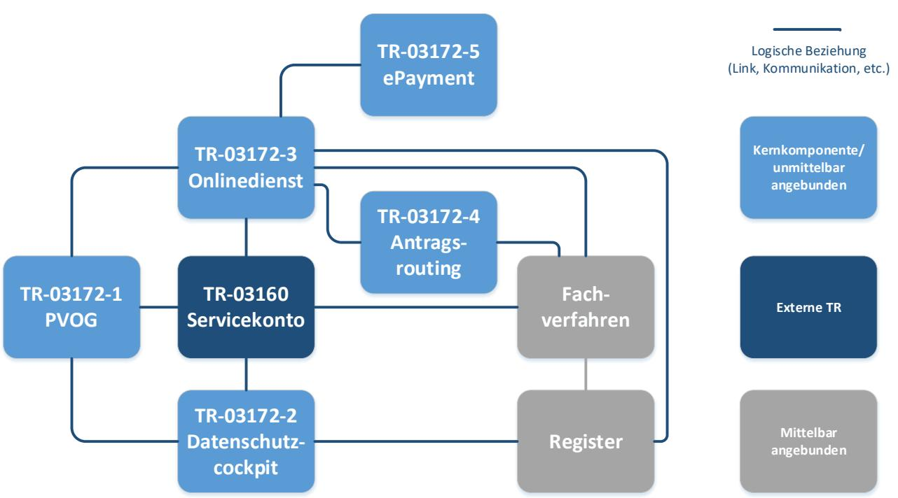
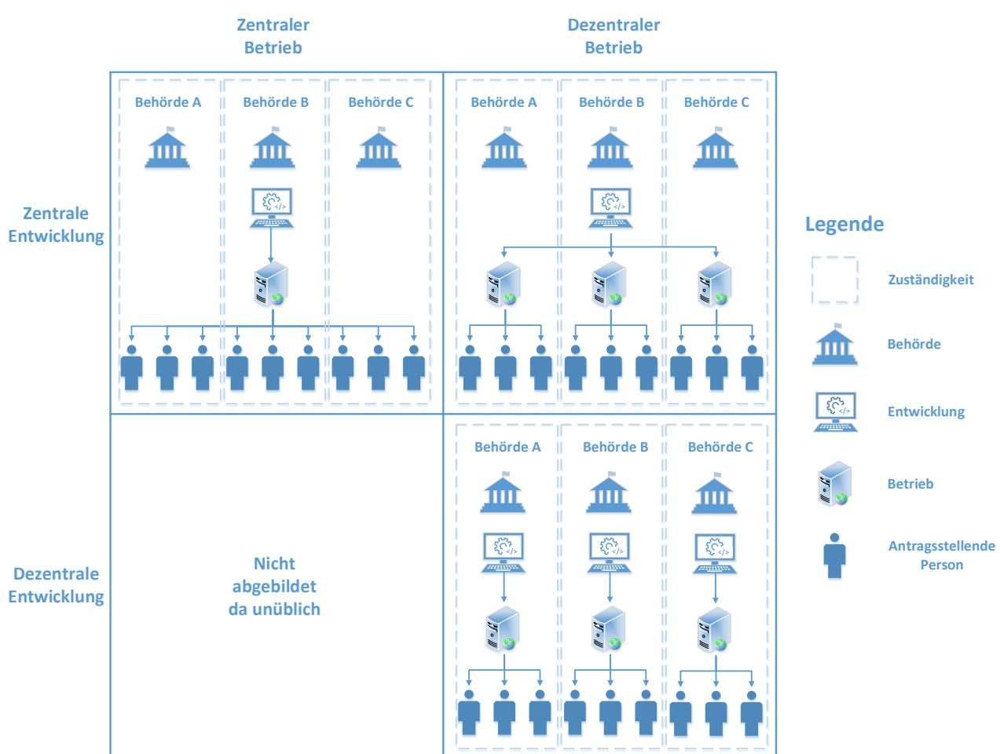

# Technische Richtlinie TR-03172-3 Portalverbund Teil 3: Onlinedienst

Version 1.0 14.11.2024

## Änderungshistorie

*Tabelle 1: Änderungshistorie*

| Version | Datum      | Name | Beschreibung     |
|---------|------------|------|------------------|
| 1.0     | 14.11.2024 | BSI  | Veröffentlichung |

Bundesamt für Sicherheit in der Informationstechnik Postfach 20 03 63 53133 Bonn Tel.: +49 22899 9582-0 E-Mail: portalverbund@bsi.bund.de Internet: https://www.bsi.bund.de © Bundesamt für Sicherheit in der Informationstechnik 2024

| 1                                  |      | Einleitung 4                                                          |   |  |
|------------------------------------|------|--------------------------------------------------------------------------|---|--|
|                                    | 1.1  | Einordnung in den Portalverbund                                          | 4 |  |
|                                    | 1.2  | Zielsetzung und Abgrenzung der Technischen Richtlinie                    | 5 |  |
| 2                                  |      | Rahmenbedingungen                                                        |   |  |
|                                    | 2.1  | Annahmen                                                                 | 6 |  |
|                                    | 2.2  | Nachnutzung                                                              | 6 |  |
|                                    | 2.3  | Schlüsselwörter                                                          | 7 |  |
| 3                                  |      | Sicherheitsanforderungen                                              | 9 |  |
|                                    | 3.1  | Allgemeine Anforderungen                                                 | 9 |  |
|                                    | 3.2  | Architektur10                                                            |   |  |
|                                    | 3.3  | Geschäftslogik10                                                         |   |  |
|                                    | 3.4  | Build- und Release- und Deploymentmanagement 11                 |   |  |
|                                    | 3.5  | Kryptografie11                                                           |   |  |
|                                    | 3.6  | Kommunikation12                                                          |   |  |
|                                    | 3.7  | Drittsoftware12                                                          |   |  |
|                                    | 3.8  | Dateiupload 13                                                        |   |  |
|                                    | 3.9  | Authentisierung, Authentifizierung und Autorisierung 13               |   |  |
|                                    | 3.10 | Anbindung eines Servicekontos nach TR-03160 14                        |   |  |
|                                    | 3.11 | Sessionmanagement15                                                      |   |  |
|                                    | 3.12 | Eingabe- und Ausgabevalidierung15                                     |   |  |
|                                    | 3.13 | Fehlerbehandlung16                                                       |   |  |
|                                    | 3.14 | Protokollierung16                                                        |   |  |
|                                    | 3.15 | Konfiguration der Webanwendung 17                                     |   |  |
|                                    | 3.16 | Zwischenspeicherung von Antragsdaten17                                   |   |  |
|                                    | 3.17 | Onlinezahlung18                                                          |   |  |
|                                    | 3.18 | Verknüpfung von Antragsdaten und Nutzeridentität18                       |   |  |
|                                    | 3.19 | Antrag absenden18                                                        |   |  |
| 4                                  |      | Risikoanalyse 20                                                      |   |  |
|                                    | 4.1  | Entgegennahme von verschlüsselten Antragsinformationen im Onlinedienst20 |   |  |
|                                    | 4.2  | Nachnutzung von Diensten und zentrale Plattformen 21                  |   |  |
| 4.3 Bedrohungen und Szenarien21 |      |                                                                          |   |  |
|                                    |      | Literaturverzeichnis23                                                   |   |  |

### 1 Einleitung

Die BSI-TR-03172 Portalverbund umfasst ein Rahmendokument mit übergreifenden Aspekten sowie Teildokumente zu den einzelnen Komponenten. Das Rahmendokument enthält ein zentrales Glossar mit allen verwendeten Begriffsbestimmungen sowie ein zentrales Abkürzungsverzeichnis, daher sind die Dokumente stets in Kombination zu lesen.

#### 1.1 Einordnung in den Portalverbund

Der vorliegende Teil der Technischen Richtlinie TR-03172 "Portalverbund" stellt Anforderungen an die Informationssicherheit der Onlinedienste (auch Antragsassistenten, Antragsmanagement oder Onlineantragsmanagementsysteme), des Portalverbundes. Onlinedienste nehmen im Kommunikationsprozess zwischen den antragsstellenden Personen (natürliche Personen, wie Bürgerinnen und Bürger oder juristische Personen, wie Organisationen) und den angebotenen Diensten der öffentlichen Verwaltung eine zentrale Rolle ein.

Ein Onlinedienst bindet wesentliche Komponenten des Portalverbunds wie Nutzerkonto, Bezahldienste und diverse Basisdienste (z. B. Karten- und Geokoordinierungsdienste) ein und übermittelt die Anträge an das Antragsrouting (BSI TR-03172-4 "Antragsrouting") bzw. die Fachverfahren in den Behörden. Zugleich kann mittels Zugriff auf bereits vorhandene Daten (Register, Zwischenstände eines Antrags, usw.) eine (Vor-, Teil-) Befüllung der Antragsdaten erfolgen und damit das *Once-Only-Prinzip* umgesetzt werden. Zwischenstände des Antrags können gespeichert und zu einem späteren Zeitpunkt wieder aufgerufen bzw. abgesendet werden. Während der Antragstellung können Dokumente o.ä. als Nachweise hochgeladen und Eingaben des Antragstellenden auf formale Korrektheit überprüft werden. Sofern Gebühren für einen Antrag fällig sind, kann ein Check-Out zum Zahlungsdienst (ePayment) erfolgen, bevor der Antrag an das Fachverfahren übermittelt wird.

I[n Abbildung 1](#page-3-2) sind die Beziehungen dargestellt, die in einem Antragsprozess hergestellt werden können. Die exemplarische Darstellung soll an dieser Stelle keinen Anspruch auf Vollständigkeit erheben.

*Abbildung 1: Beziehungen des Onlinedienstes*

Legende

Viele der dargestellten Beziehungen können optional aufgebaut werden und werden nicht in jedem Antragsprozess benötigt. Darüber hinaus kann die Architektur der verschiedenen Komponenten aufgrund unterschiedlicher Anforderungen oder Ansätze in der Umsetzung stark variieren. So kann das Fachverfahren beispielsweise unmittelbar am Onlinedienst angeschlossen sein und dieselben technischen Komponenten verwenden. Den Kern der Interaktion der dargestellten Komponenten bildet der Onlinedienst als Benutzerschnittstelle zu einer Verwaltungsleistung. Im Rahmen des Antragsprozesses können dann weitere Komponenten eingebunden werden, beispielsweise das Antragsrouting, der Zahlungsdienst, bereits vorhandene Registerdaten oder auch weitere Basisdienste.

#### 1.2 Zielsetzung und Abgrenzung der Technischen Richtlinie

Das Ziel der vorliegenden Technischen Richtlinie besteht darin, Anforderungen an die Informationssicherheit von Prozessen, Systemen und Architekturen zu definieren und Verantwortliche zu unterstützen, die Schutzziele der Verfügbarkeit, Integrität und Vertraulichkeit in web-basierten Onlinediensten zu gewährleisten. Andere, nicht-web-basierte Technologien werden im Rahmen des Dokuments nicht betrachtet.

Den Kern der Betrachtung bildet dabei die Webanwendung, in der die Formulare durch die antragstellenden Personen befüllt werden. Aufgrund der Vielzahl an unterschiedlichen Architekturen und Implementierungen können an dieser Stelle nur generische Anforderungen formuliert werden. Diese müssen im Einzelfall durch die Verantwortlichen betrachtet und auf die jeweilige Lösung angewendet werden. Die Fachverfahren sind als Beziehung in dieser TR berücksichtigt, jedoch werden in diesem Dokument keine Informationssicherheitsanforderungen an Fachverfahren formuliert. Sofern das Fachverfahren dieselben Komponenten verwendet wie der Onlinedienst, können die Anforderungen an ebendiese Komponenten Auswirkungen auf das Fachverfahren haben.

Dieses Dokument umfasst die Abläufe zwischen der Auswahl einer Antragsart und dem Absenden des befüllten Antrags. Komponenten, die auf den Antrag verweisen (z.B. Portalverbund Online-Gateway) oder die den Antrag weiterverarbeiten (z.B. Antragsroutingdienst) werden nicht berücksichtigt. Ebenfalls sind weitere Komponenten, mit denen der Onlinedienst interagiert (z.B. Servicekonto zur Authentisierung, Registerabruf, usw.), nicht Bestandteil dieses Dokuments.

### 2 Rahmenbedingungen

Ein webbasierter Onlinedienst besteht aus einer oder mehreren Webanwendungen und/oder Webservices, die auf einem oder mehreren Hintergrundsystemen, z.B. Servern laufen. Hierbei kann es möglich sein, dass unterschiedliche Funktionen eines Onlinedienstes auf unterschiedlichen, miteinander interagierenden Systemkomponenten oder Modulen verteilt sind. So ist beispielsweise ein Onlinedienst als Kombination eines Formularmanagementsystems (FMS) und einer Plattform mit zentralem IAM und Speicher möglich.

Die Technische Richtlinie in ihrer aktuellen Fassung betrachtet explizit keine dedizierte Software für Endgeräte von antragsstellenden Personen, wie bspw. native Apps für mobile Endgeräte.

#### 2.1 Annahmen

Die Technische Richtlinie 03172-3 "Onlinedienst" stellt eine Ergänzung zu einer Standard-Absicherung nach BSI Standard 200-2 [1] dar. Aus diesem Grund werden die Anforderungen aus den Blöcken des IT-Grundschutzkompendiums [2], die im Rahmen der Standard-Absicherung zu berücksichtigen sind, als umgesetzt vorausgesetzt.

#### 2.2 Nachnutzung

Die Digitalisierung der Verwaltungsleistungen unterschiedlicher Behörden kann oftmals dazu führen, dass ähnliche oder identische Leistungen von unterschiedlichen Behörden zur digitalen Beantragung angeboten werden. Unter diesem Gesichtspunkt kann grundsätzlich in drei Modelle der Umsetzung von Onlinediensten unterschieden werden, abhängig davon, ob die Entwicklung und/oder der Betrieb des Onlinedienstes zentral von einer der leistungserbringenden Behörden erbracht wird, oder individuell von jeder einzelnen Behörde und damit dezentral. Zur besseren Veranschaulichung werden die drei Modelle schematisch in [Abbildung](#page-6-1) *2* für drei Behörden dargestellt.

Das erste Modell (in der Abbildung oben links) ist das Einer-für-Alle-Modell (EfA), bei dem sowohl die Entwicklung wie auch der Betrieb des Onlinedienstes zentral durch oder im Auftrag einer verantwortlichen Behörde erfolgt. Nachnutzende Behörden können sich hier als Mandanten ressourcensparend anschließen, haben jedoch nur eine begrenzte Möglichkeit der Anpassung an individuelle Anforderungen. Der Ausfall eines solchen zentralen Onlinedienstes hätte unmittelbare Auswirkung auf zugehörige Fachverfahren sämtlicher nachnutzender Behörden.

Das zweite Modell (in der Abbildung oben rechts) ist ein nachnutzbarer, dezentral betriebener Onlinedienst. Hier findet die Entwicklung des Onlinedienstes zentral durch eine verantwortliche Stelle statt, die den Onlinedienst als entwickelte Software anderen Behörden zur Nachnutzung verfügbar macht. Nachnutzende Behörden betreiben den zentral entwickelten Onlinedienst auf eigener IT-Infrastruktur oder auf der IT-Infrastruktur eines eigenen Dienstleisters. Dieses Modell erlaubt eine kostengünstigere Entwicklung, da sie zentral stattfindet, jedoch von mehreren Stellen getragen wird, bei einer großen Möglichkeit an Anpassung und Berücksichtigung individueller Anforderungen innerhalb der dezentral betriebenen Lösungen. Aus Informationssicherheitssicht gibt es hierbei zwei Aspekte zu berücksichtigen: Schwachstellen der zentral entwickelten Lösung sind Schwachstellen, die auf sämtlichen betriebenen Instanzen vorhanden sind. Zusätzlich können einzelne Instanzen von nachnutzbaren Lösungen durch individuelle Anpassungen und Konfigurationen Schwachstellen aufweisen, die in anderen Instanzen nicht existieren.

Das dritte Modell (in der Abbildung unten rechts) ist die (dezentrale) Eigenentwicklung, bei der der Onlinedienst von jeder verantwortlichen Behörde selbst oder in ihrem Auftrag entwickelt und betrieben wird. Dies ermöglicht auf der einen Seite eine größtmögliche Freiheit an Individualisierung, um gegebene Anforderungen zu erfüllen, bindet jedoch auf der anderen Seite für die individuellen Behörden viele Ressourcen. Wichtig ist hier insbesondere das Berücksichtigen gemeinsamer Standards bei Anbindung externer IT-Komponenten des Portalverbunds. Ein Ausfall oder eine Schwachstelle würden hier stets nur die unmittelbar angebundenen Systeme und das Fachverfahren der jeweiligen Behörde betreffen.

Zusätzlich zur Nachnutzung verschiedener Onlinedienste durch andere Behörden kann es auch Nachnutzung im Sinne von Mehrfachverwendung einzelner Komponenten in mehreren Onlinediensten geben, etwa auf Portalen oder Plattformen. Hier können Funktionen, die für mehrere Onlinedienste benötigt werden durch zentrale Komponenten übernommen werden, beispielsweise ein IAM oder ein Speicher. Diese zentralen Komponenten sind Bestandteil jedes individuellen Onlinedienstes. Die Rolle zentraler Komponenten sollte hierbei besonders im Rahmen der Risikoanalyse berücksichtigt werden, da die Art der verarbeiteten Daten und darauf aufbauend die Anforderungen an die einzelnen Onlinedienste unterschiedlich sein können.

Die Anforderungen des vorliegenden Dokuments richten sich an die Entwickelnden und Betreibende von Onlinediensten. Hierbei behandeln die Anforderungen nicht nur das Front-End auf der Seite der antragsstellenden Person, sondern auch Hintergrundsysteme und -prozesse, Fachadministration und Mandantentrennung. Eine Abwägung der Risiken der verschiedenen oben beschriebenen Modelle findet in Kapitel [4.2](#page-20-0) statt.

*Abbildung* 2*: Schematische Darstellung verschiedener Umsetzung- und Nachnutzungsmodelle exemplarisch für drei Behörden, nach Entwicklung und Betrieb sortiert.*

#### 2.3 Schlüsselwörter

In den Anforderungen werden die in Versalien geschriebenen Modalverben "SOLLTE" und "MUSS" in ihren jeweiligen Formen sowie den zugehörigen Verneinungen genutzt, um zu verdeutlichen, wie die jeweiligen Anforderungen zu interpretieren sind. Die hier genutzte Definition basiert auf dem BSI IT-Grundschutz (BSI IT-Grundschutz, 2022) [2] und RFC 2119 [3].

| MUSS/DARF NUR:            | Dieser Ausdruck bedeutet, dass es sich um eine Anforderung handelt, die unbedingt erfüllt werden muss (uneingeschränkte Anforderung, für die keine Risikoübernahme möglich ist).                               |
|---------------------------|----------------------------------------------------------------------------------------------------------------------------------------------------------------------------------------------------------------------|
| DARF NICHT/DARF KEIN:     | Dieser Ausdruck bedeutet, dass etwas in keinem Fall getan werden darf (uneingeschränktes Verbot).                                                                                                                 |
| SOLLTE:                   | Dieser Ausdruck bedeutet, dass eine Anforderung normalerweise erfüllt werden muss, es aber Gründe geben kann, dies doch nicht zu tun. Dies muss aber sorgfältig abgewogen und stichhaltig begründet werden. |
| SOLLTE NICHT/SOLLTE KEIN: | Dieser Ausdruck bedeutet, dass etwas normalerweise nicht getan werden sollte, es aber Gründe gibt, dies doch zu tun. Dies muss aber sorgfältig abgewogen und stichhaltig begründet werden.                     |
| KANN:                     | Dieser Ausdruck bedeutet, dass eine bestimmte Umsetzung gewählt werden kann. Diese muss allerdings angezeigt werden.                                                                                              |

### 3 Sicherheitsanforderungen

Betreiber von IT-Systemen, die mittel- und unmittelbar mit dem Portalverbund verbunden sind, sind gemäß § 2 Absatz 1 der IT-Sicherheitsverordnung Portalverbund (ITSiV-PV) [4] verpflichtet, Maßnahmen zur Gewährleistung der IT-Sicherheit nach dem Stand der Technik zu treffen. Die vorliegende Technische Richtlinie soll die Verantwortlichen dabei unterstützen.

### 3.1 Allgemeine Anforderungen

Zur Absicherung des Onlinedienstes müssen Maßnahmen ergriffen werden, durch die sichergestellt und überprüft werden kann, dass der Onlinedienst gemäß dem Stand der Technik gegen Bedrohungen abgesichert ist. Anforderungen, die insbesondere auf die technischen und organisatorischen Rahmenbedingungen für eine solche Absicherung abzielen, sind in diesem Kapitel beschrieben.

- **A3.1.01** Die BSI-Standards 200-1, 200-2 und 200-3 [1]oder die Vorgaben der ISO/IEC 27001 [5] MÜSSEN in der jeweils geltenden Fassung umgesetzt werden. Als Mindestniveau MUSS die Standard-Absicherung für den betreffenden Informationsverbund des Onlinedienstes gewählt werden. Das Grundschutzkompendium [2] MUSS in der aktuellen Version verwendet werden. Wenn der Betrieb des Onlinedienstes auf einen externen Dienstleister (bspw. kommunales Rechenzentrum, privatwirtschaftliches Unternehmen) ausgelagert wird, MUSS der Dienstleister die Umsetzung des IT-Grundschutzes durch eine Zertifizierung nach ISO 27001 auf Basis von IT-Grundschutz [6] nachweisen.
- **A3.1.02** Der BSI-Standard 200-4 [1] oder die Vorgaben der ISO 22301 [7] MÜSSEN in der jeweils geltenden Fassung umgesetzt werden. Schnittstellen zu angeschlossenen Diensten SOLLTEN berücksichtigt werden. Es MÜSSEN im Rahmen des Notfallmanagements Maßnahmen getroffen werden, wie mit Sicherheitsvorfällen umzugehen ist.
- **A3.1.03** Die Verantwortlichen MÜSSEN die Verfügbarkeitsanforderungen an den Online-Dienst dokumentieren und die Architektur der beteiligten Systemkomponenten daran ausrichten.
- **A3.1.04** Bei der Ermittlung der Verfügbarkeitsanforderung MÜSSEN die potentielle Nutzerbasis sowie eventuelle Stichtage und Fristen im Verwaltungsverfahren berücksichtigt werden, die zu Lastspitzen bzw. erhöhten Zugriffszahlen auf den Dienst führen können. Es SOLLTEN Lasttests durchgeführt werden, um die Skalierbarkeit und Stabilität der Infrastruktur zu gewährleisten.
- **A3.1.05** Im Sicherheitskonzept MUSS der Reaktionsprozess bei Bekanntwerden einer Schwachstelle im Onlinedienst auf Basis ihrer Kritikalität klar definiert sein. Der Reaktionsprozess und die Frist zum Weiterbetrieb des Onlinedienstes MÜSSEN (insbesondere bei Nachnutzung) allen Beteiligten bekannt sein. Der Weiterbetrieb des Onlinedienstes bei bekannter Schwachstelle DARF NICHT länger sein, als die im Sicherheitskonzept definierte Übergangsfrist. Der Onlinedienst MUSS ein maschinenlesbares Dokument gemäß RFC 9116 ("security.txt") [8] führen.
- **A3.1.06** Sämtliche, mit öffentlichen Netzen verbundenen Komponenten des Onlinedienstes MÜSSEN vor der Anbindung an den Portalverbund mittels eines Penetrationstests und eines Webchecks überprüft werden. Dies gilt ebenfalls für Komponenten des Onlinedienstes, die einen hohen oder sehr hohen Schutzbedarf in mindestens einem der Schutzziele Vertraulichkeit, Integrität oder Verfügbarkeit aufweisen. Penetrationstests und Webchecks MÜSSEN spätestens nach 3 Jahren oder bei größeren Änderungen wiederholt werden1 .

1 Siehe auch IT-SiV-PV § 2

Bundesamt für Sicherheit in der Informationstechnik 9

### 3.2 Architektur

Durch die Anforderungen zur Architektur des Onlinedienstes werden Vorgaben zu Struktur und Aufbau für Anwendung und Betrieb eines Onlinedienstes formuliert. Dies beinhaltet Vorgaben zur Konzeption des Anwendungsdesigns, sowie zur Server- und Netzwerkinfrastruktur.

- **A3.2.01** Es MUSS das Prinzip *Security-by-Design* angewendet werden, d.h. Sicherheitsanforderungen an Soft- und Hardware MÜSSEN in der Anwendungsarchitektur und allen Entwicklungs- und Lebenszyklusphasen berücksichtigt werden.
- **A3.2.02** Der Onlinedienst SOLLTE eine *Web Application Firewall* (WAF) einsetzen. Die Konfiguration der eingesetzten WAF SOLLTE auf die zu schützende Webanwendung oder den Webservice angepasst werden. Nach jedem Update der Webanwendung oder des Webservices SOLLTE die Konfiguration der WAF geprüft werden. Zusätzlich SOLLTE ein *Intrusion Detection System* (IDS) eingesetzt werden.
- **A3.2.03** Die administrativen Zugriffe auf die Systeme des Onlinedienstes MÜSSEN über ein separiertes Netzwerkinterface (Managementnetz) erfolgen, um eine Trennung von Produktivnetzen zu erreichen. Netzwerkdienste, die nicht benötigt werden, MÜSSEN deaktiviert werden. Der Austausch von Informationen SOLLTE innerhalb des internen Netzes verschlüsselt stattfinden.
- **A3.2.04** Der Onlinedienst SOLLTE keine nativen Erweiterungen des Browsers voraussetzen.
- **A3.2.05** Die Produktivumgebung MUSS von weiteren Betriebsumgebungen getrennt betrieben werden. Zusätzlich SOLLTEN weitere Betriebsumgebungen für verschiedene Zwecke voneinander getrennt betrieben werden (z.B. Entwicklungsumgebung, Testumgebung, Stagingumgebung).
- **A3.2.06** Bei der Planung der Architektur MÜSSEN Datenschutzaspekte wie Zweckmäßigkeit, Datensparsamkeit und ordnungsgemäße Löschung entsprechend DSGVO [9] umgesetzt werden.
- **A3.2.07** Zur korrekten Ermittlung der Zeit SOLLTE ein Zeitserver an das Antragsmanagement redundant angebunden werden. Der Onlinedienst MUSS gemäß § 1 Abs. 2 Einheiten- und Zeitgesetz (EinhZeitG) [10] die in der Bundesrepublik gesetzliche Zeit (MEZ bzw. MESZ) nutzen. Dazu KANN der Zeitserver mindestens einen Zeitserver, welcher von der Physikalisch-Technischen Bundesanstalt (PTB) bereitgestellt wird, zur authentifizierten Zeitsynchronisation verwenden.

#### 3.3 Geschäftslogik

Dieses Kapitel beschreibt Sicherheitsanforderungen in Bezug auf den im Onlinedienst digital abgebildeten Prozess und die in diesem Kontext verarbeiteten Daten. Hierzu gehören unter anderem Anforderungen zu Meldungen des Systems, z.B. im Sinne von Rückmeldungen der Anwendungen bei Fehleingaben durch Nutzende.

- **A3.3.01** Die Geschäftslogik MUSS sicherstellen, dass die vorgesehenen Schritte von den jeweiligen Nutzenden (beispielsweise Antragsteller oder Fachadministratoren) nur in der vorgesehenen Sequenz durchlaufen werden können. Der Ablauf von Teilschritten innerhalb eines logischen Schritts KANN unter Berücksichtigung eventueller Abhängigkeiten variabel gestaltet sein (bspw. Rücksprung innerhalb verschiedener Abschnitte eines Formulars).
- **A3.3.02** Der Onlinedienst DARF dem Nutzenden KEINE sensiblen Daten oder sicherheitskritischen Informationen in Meldungen oder Benachrichtigungen anzeigen. Sensible Daten sind z. B. personenbezogene Daten, sicherheitskritische Informationen sind Informationen die Rückschlüsse auf das zugrundliegende System zulassen (z. B. HTTP Status Code 500).
- **A3.3.03** Antragsdaten DÜRFEN NICHT über die notwendige Dauer ihrer jeweiligen Verwendung hinaus im Onlinedienst gehalten werden. Sofern eine Verwendung über mehr als einen Antrag beabsichtigt ist, MUSS die antragstellende Person um Einverständnis gebeten werden.

#### 3.4 Build- und Release- und Deploymentmanagement

In diesem Kapitel werden Anforderungen an die Bereitstellung und Aktualisierung von Software im Umfeld von Entwicklung und Betrieb eines Onlinedienstes beschrieben.

- **A3.4.01** Es MUSS ein Releasemanagement umgesetzt sein, welches in einer eindeutig verständlichen Versionierung sämtliche Änderungen nachvollziehbar festhält.
- **A3.4.02** Die Bezugskanäle von Software und Updates MÜSSEN sicher und vertrauenswürdig sein. Dies kann mittels Signaturen erfolgen, die die Integrität und Authentizität sowohl der Software als auch der Bezugskanäle sicherstellen. Bei Vorhandensein einer Signatur MUSS diese vor Einspielen validiert werden. Software und Updates DÜRFEN NICHT eingespielt werden, wenn eine vorhandene Signatur nicht erfolgreich validiert werden konnte. Ist keine Signatur vorhanden, SOLLTEN Software und Updates nur nach erfolgreicher Überprüfung der Hashsumme eingespielt werden.
- **A3.4.03** Jedes Release einer Software SOLLTE vor der Auslieferung durch den Hersteller wenigstens fortgeschritten signiert werden. Manuelle Updates SOLLTEN und automatische Updates MÜSSEN durch den Hersteller wenigstens fortgeschritten digital signiert sein. Sofern Updates automatisiert eingespielt werden, wird die Integrität der Softwareupdates über die digitale Signatur sichergestellt. Zur Installation von Software und Updates vgl. **[A3.4.02](#page-10-2)**
- **A3.4.04** Das Deployment in die Produktivumgebung MUSS in einem definierten Prozess stattfinden, um eine korrekte, nachvollziehbare und einheitliche Konfiguration zu gewährleisten.
- **A3.4.05** Im Sicherheitskonzept MÜSSEN Build- und Deployment-Systeme berücksichtigt werden, speziell im Hinblick auf Besonderheiten (beispielsweise Administrationsrechte, Entwicklungs- und Testsysteme außerhalb der zentralen Managementinfrastruktur).

#### 3.5 Kryptografie

Im Kapitel Kryptografie werden Vorgaben zu kryptografischen Operationen gemacht. Dazu gehören unter anderem Schlüsselmanagement, Erzeugung von Zufallszahlen oder die Speicherung von Passwörtern.

- **A3.5.01** Es MUSS ein geeignetes Schlüsselmanagement für kryptografische Hard- und Software umgesetzt sein. Darin MUSS geregelt sein, wie Schlüssel und Zertifikate sicher erzeugt, gespeichert, verwaltet, ausgetauscht und wieder gelöscht oder vernichtet werden.
- **A3.5.02** Die Erzeugung und Verwendung des Schlüsselmaterials MUSS gemäß der Technischen Richtlinien BSI TR-03116-4 "Kryptographische Vorgaben für Projekte der Bundesregierung Teil 4 – Kommunikationsverfahren in Anwendungen" [11] und BSI TR-02102-1 "Kryptographische Verfahren: Empfehlungen und Schlüssellängen" [12] in der jeweils aktuellen Version erfolgen.
- **A3.5.03** Passwörter für die Anmeldung im Onlinedienst DÜRFEN NICHT in einer im Klartext wiederherstellbaren Form gespeichert werden. Es MÜSSEN Verfahren zum Schutz von Zugangsdaten (z.B. Salted Hashes im Falle von Passwörtern) umgesetzt sein. Hierbei MÜSSEN die Vorgaben der Technischen Richtlinie BSI TR-02102-1 "Kryptographische Verfahren: Empfehlungen und Schlüssellängen" [12] in der aktuellen Version verwendet werden.
- **A3.5.04** Es MÜSSEN alle zufällig bestimmten Werte (z.B. Zufallszahlen, zufällige Dateinamen, Session-IDs) mit einem kryptografisch sicheren Zufallszahlengenerator nach BSI TR 02102-1 "Kryptographische Verfahren: Empfehlung und Schlüssellängen" [12] generiert werden.
- **A3.5.05** Im Onlinedienst MÜSSEN geheime oder private Schlüssel parametrisierbar gespeichert werden, z. B. nicht direkt in den Quellcode eingebettet.

#### 3.6 Kommunikation

Dieses Kapitel beschreibt Anforderungen zur Absicherung der Kommunikation zwischen dem Onlinedienst und anderen Kommunikationspartnern, wie z.B. Endgeräten von antragsstellenden Personen oder anderen Komponenten des Portalverbunds.

- **A3.6.01** Die Kommunikation mit Diensten und weiteren Anwendungskomponenten (z.B. Bezahldiensten, Routingdiensten oder Fachverfahren) MUSS über vollständig dokumentierte Schnittstellen und IT-Systeme erfolgen. Die Dokumentation MUSS wenigstens Quelle, Ziel und Protokoll enthalten. Die Kommunikationspartner des Onlinedienste SOLLTEN mittels einer Allowlist auf ein notwendiges Minimum beschränkt werden.
- **A3.6.02** Für alle Kommunikationsbeziehungen des Onlinedienstes MÜSSEN die Vorgaben nach BSI TR-03116-4 "Kryptographische Vorgaben für Projekte der Bundesregierung Teil 4 – Kommunikationsverfahren in Anwendungen" [11] in der aktuellen Fassung erfüllt sein. Die anzuwendenden Algorithmen MÜSSEN in Abhängigkeit der genutzten Protokolle gewählt werden. Die BSI TR-03116-4 enthält entsprechende Vorgaben für Transport- (TLS) und Inhaltsverschlüsselung in den jeweiligen Kapiteln.
- **A3.6.03** Die Absicherung des Routings und der DNS-Infrastruktur des Onlinedienstes MUSS sichergestellt sein. Dazu MUSS der IP-Adressbereich, in dem der Onlinedienst liegt, von einer *Route Origin Authorization (ROA)* abgedeckt und die DNS-Einträge der zum Onlinedienst gehörenden Domain(s) MÜSSEN mit den *DNS Security Extensions (DNSSEC)* abgesichert sein. [13], [14]
- **A3.6.04** Der Onlinedienst SOLLTE innerhalb einer vertrauenswürdigen Domain eingebunden werden, sofern bundes- oder landesspezifische Vertrauensanker vorhanden sind (Beispielsweise bund.de, bayern.de, nrw.de, gov.de, usw. Top-Level-Domains sind kein ausreichender Vertrauensanker.).

#### 3.7 Drittsoftware

Unter Drittsoftware werden sämtliche Bibliotheken und Frameworks sowie eingebundene Softwarelösungen verstanden, die im Rahmen der Entwicklung und des Betriebs des Onlinedienstes eingesetzt werden.

- **A3.7.01** Es DARF NUR Software aus vertrauenswürdigen Quellen verwendet werden. Nicht verwendete Funktionen SOLLTEN deaktiviert werden.
- **A3.7.02** Der Hersteller/Entwickler des Onlinedienstes MUSS eine zentrale und vollständige Liste von Abhängigkeiten durch externe Software, Bibliotheken und Frameworks führen. Es SOLLTE eine *Software Bill of Materials* (SBOM), wie in der BSI TR-03183-2 "Cyber-Resilienz-Anforderungen an Hersteller und Produkte" [15] gefordert, erstellt und geführt werden.
- **A3.7.03** Eingesetzte (Dritt-) Software MUSS in einer Version verwendet werden, die mit Sicherheitsupdates versorgt wird, damit eventuell vorhandene bzw. neue Schwachstellen nicht die Webanwendung bzw. den Webservice gefährden können. Informationen über identifizierte Schwachstellen werden regelmäßig und zeitnah über einschlägige Mailinglisten und Informationsdienste, z.B. den Warnund Informationsdienst (WID) von CERT-Bund veröffentlicht. Wenn für die Anwendung relevante Schwachstellen in verwendeter Software bekannt werden, MÜSSEN die zugehörigen Sicherheitsupdates kurzfristig eingespielt werden. Die Umsetzungszeit MUSS der Kritikalität und Ausnutzbarkeit der Schwachstelle entsprechend angemessen gewählt werden. Software, die nicht länger vom Hersteller oder Entwickler gewartet wird, DARF NICHT verwendet werden.
- **A3.7.04** Sicherheitskritische Funktionen des Onlinedienstes, wie beispielsweise Sessionmanagement oder Kryptografie, SOLLTEN mittels etablierter und sicherer Frameworks und Bibliotheken realisiert werden. Die Eigenentwicklung und Implementierung von sicherheitskritischen Funktionen ist mit einem gewissen Risiko verbunden und SOLLTE vermieden werden.

#### 3.8 Dateiupload

Im Rahmen eines Antragsverfahrens sind oftmals Nachweise in Form von Dateien einzubringen. Die antragsstellende Person nutzt hierfür die Upload Funktionalität des Onlinedienstes. Durch die einfache Möglichkeit der Einbringung von großen Datenmengen bedarf die Funktionen des Dateiuploads besonderer Betrachtung bei der Absicherung durch IT-Sicherheitsmaßnahmen.

- **A3.8.01** Ein Dateiupload ist mit einem erhöhten Risiko verbunden. Grundsätzlich SOLLTE ein Dateiupload erst nach einer erfolgreichen Nutzerauthentifizierung möglich sein. Ist ein Dateiupload ohne vorherige Nutzerauthentifizierung notwendig, MÜSSEN Maßnahmen gegen eine missbräuchliche Nutzung (z. B. Bots und Spammer) der Upload-Funktion umgesetzt sein.
- **A3.8.02** Werden Dateien hochgeladen, MÜSSEN die erlaubten Dateiformate mittels Allowlist explizit zugelassen werden.
- **A3.8.03** Für Dateieigenschaften (z.B. Auflösung bei Bilddateien), Dateigröße und Dateianzahl MUSS ein plausibler Grenzwert vorgegeben werden.
- **A3.8.04** Es SOLLTEN keine ausführbaren Dateien oder Archivdateiformate und keine Dokumente oder Anhänge mit integriertem ausführbarem Code akzeptiert werden. (Beispielsweise SOLLTE ein Hochladen von PDF-Dateien mit eingebetteten JavaScipt oder Office-Dokumente mit Macros unterbunden werden) Falls ausführbare Dateien oder Archivformate akzeptiert werden, MUSS der Prozess in die Risikoanalyse aufgenommen werden.
- **A3.8.05** Die hochgeladenen Dateien MÜSSEN im Onlinedienst auf Schadsoftware hin überprüft werden. Sofern der Onlinedienst selbst die Dateien weiterverarbeitet MUSS die Schadsoftwareprüfung vorher stattfinden. Es KANN eine dynamische Malware-Analyse durchgeführt werden, die hochgeladene Dateien innerhalb einer isolierten Virtuellen Maschine oder einer Sandbox ausführt und beobachtet. Im Falle eines ungewöhnlichen Verhaltens oder der Erkennung von Schadsoftware MUSS die betroffene Datei gelöscht und die antragstellende Person informiert werden.
- **A3.8.06** Hochgeladene Dateien MÜSSEN validiert werden. Es MÜSSEN sowohl das Datenformat (MIME-Types) als auch die Inhalte inklusive Metadaten geprüft werden. Dies hat zum Ziel, dass nur Dateien angenommen werden, die eine valide Datenstruktur verwenden.
- **A3.8.07** Der Dateiname von hochgeladenen Dateien SOLLTE durch den Onlinedienst vor Speicherung geändert werden. Hierbei KANN ein zufällig generierter Dateiname nach **[A3.5.04](#page-10-3)** verwendet werden. Es MUSS sichergestellt sein, dass Kollisionen von Dateinamen nicht möglich sind. Werden Dateinamen nicht geändert, MÜSSEN Vorgaben für die Eigenschaften erlaubter Dateinamen (bspw. Länge und erlaubte Zeichen) getroffen werden.
- **A3.8.08** Hochgeladene Dateien MÜSSEN in einem vom Webserverdienst getrennten Bereich gespeichert werden, welcher zugriffsgeschützt ist und eine Ausführung von Dateien unterbindet.

#### 3.9 Authentisierung, Authentifizierung und Autorisierung

Die Anforderungen dieses Abschnitts beziehen sich nicht nur auf die Authentisierung, Authentifizierung und Autorisierung von antragsstellenden Personen, sondern auf sämtliche dieser Prozesse des Onlinedienstes. Darunter zählen insbesondere die Zugänge für Fach- und Systemadministratoren sowie Mandantenzugänge bei Nachnutzung.

**A.3.9.01** Für die Authentifizierung von Nutzern des Onlinedienstes MÜSSEN, sofern es sich dabei nicht um ein Servicekonto im Sinne der BSI TR-03160 "Servicekonten" [16] handelt, die Anforderungen der BSI TR-03107-1 "Elektronische Identitäten und Vertrauensdienste im E-Government" [17] umgesetzt werden.

- **A3.9.02** Die Betreiber des Onlinedienstes MÜSSEN ein Konzept zur Authentifizierung, Autorisierung (Rechte- und Rollenkonzept) und zum Beenden einer Anwendungssitzung dokumentieren und anwenden.
- **A3.9.03** Fach- und Systemadministratoren MÜSSEN sich bei Zugriff über öffentliche Netze mittels Multi-Faktor-Authentisierung (MFA) authentisieren.
- **A3.9.04** Jede administrative Handlung oder Tätigkeit, sowohl technisch als auch fachlich, MUSS eindeutig auf eine Person zurückführbar sein. Dies kann bspw. durch eine entsprechende Benutzerkennung innerhalb des Rollenmanagements erreicht werden.
- **A3.9.05** Für Passwort-basierte Authentifizierungsmethoden MÜSSEN starke Passwörter verwendet und technisch erzwungen werden.
- **A3.9.06** Authentifizierte Nutzer MÜSSEN die Möglichkeit haben, ihr Passwort zu ändern. Das Ändern und Rücksetzen von Passwörtern MUSS protokolliert werden, ohne das Passwort selbst zu protokollieren.
- **A3.9.07** Antragsdaten MÜSSEN zu jedem Zeitpunkt vor unberechtigtem Zugriff geschützt werden. Hierzu sind die erforderlichen Maßnahmen aus dem IT-Grundschutz umzusetzen.
- **A3.9.08** Die Authentisierungsdaten eines Nutzers DÜRFEN NICHT ohne eine ausreichende Authentifizierung und Autorisierung des jeweiligen Nutzers geändert werden.
- **A3.9.09** Es MUSS sichergestellt werden, dass Übergabeparameter wie beispielsweise die Rücksprungadresse einer Webseite nach erfolgreichem Login – sicher übertragen und validiert werden, um bspw. *Open Redirect* Angriffe zu verhindern.
- **A3.9.10** Die Autorisierung MUSS unabhängig von und im Anschluss an die Authentifizierung erfolgen. Rechte für Lese- und Schreibzugriffe MÜSSEN explizit für den jeweiligen Zweck erteilt werden.
- **A3.9.11** Angebundene Nutzer (Rollen), Anwendungen und Dienste DÜRFEN NUR die Berechtigungen haben, die für die Ausführung der konkreten Aufgabe notwendig sind. Hier KANN das Zero-Trust-Prinzip [18] umgesetzt werden.
- **A3.9.12** Der Zugriff auf Webservices des Onlinedienstes MUSS so restriktiv wie möglich gehalten sein. Eine Nutzung SOLLTE nach erfolgreicher Authentifizierung oder Autorisierung auf mindestens dem dafür vorgesehenen Vertrauensniveau erfolgen.
- **A3.9.13** Für eine eigenständige Anbindung der eID, die nicht über das Servicekonto erfolgt, MÜSSEN die Vorgaben der Technischen Richtlinien TR-03124 "eID-Client" [19], TR-03128 "Diensteanbieter für die eID-Funktion" [20] und TR-03130 "eID-Server" [21] eingehalten werden.

#### 3.10 Anbindung eines Servicekontos nach TR-03160

Die Authentisierung am Onlinedienst findet in der Regel über ein Servicekonto statt. Dabei fungiert das Servicekonto als Identityprovider (IdP) und der Onlinedienst als Service Provider (SP) / Relying Party (RP). Die im Folgenden genannten Authentifizierungs- und Autorisierungsinformationen umfassen die in TR-03160-2 Kapitel 3.2.6 aufgeführten Attribute von Assertions.

- **A3.10.01** Der Onlinedienst DARF NUR Authentifizierungs- und Autorisierungsinformationen akzeptieren, die eine eindeutige, zweifelsfreie Identifizierung auf dem geforderten Vertrauensniveau ermöglicht.
- **A3.10.02** Der Onlinedienst DARF NUR Authentifizierungs- und Autorisierungsinformationen vom ausstellenden Servicekonto (IdP) akzeptieren, die mit einer gültigen kryptografischen Signatur versehen sind.
- **A3.10.03** Der Onlinedienst DARF NUR für ihn verschlüsselte Authentifizierungs- und Autorisierungsinformationen von einem IdP entgegennehmen.

**A3.10.04** Der Onlinedienst MUSS die Authentifizierungs- und Autorisierungsinformationen prüfen, ob er das bestimmungsgemäße Ziel einer ausgestellten Authentifizierungs- und Autorisierungsinformationen ist oder nicht. Wenn der Onlinedienst nicht das bestimmungsgemäße Ziel ist, DÜRFEN die Authentifizierungs- und Autorisierungsinformationen NICHT verwendet werden und MÜSSEN gelöscht werden. Der Onlinedienst DARF Authentifizierungs- und Autorisierungsinformationen NICHT an Dritte – am Antragsprozess unbeteiligte – (z. B. eingebundene Drittdienste, wie Statistikkomponente und Geokoordinierungsdienst) weitersenden.

#### 3.11 Sessionmanagement

Dieses Kapitel beschreibt IT-Sicherheitsanforderungen an das Sessionmanagement des Onlinedienstes.

- **A3.11.01** Die Anforderungen an die *HTTP-Response-header* und Cookies aus den Grundschutzbausteinen CON.10 und APP.3.1 [2] MÜSSEN so restriktiv wie möglich konfiguriert werden.
- **A3.11.02** Der Onlinedienst SOLLTE sicherstellen, dass auf dem Endgerät der antragstellenden Person keine sensiblen Daten oder sicherheitskritische Informationen (vgl. **[A3.3.02](#page-9-2)**) zwischengespeichert werden, z. B. indem er einen *Anti-Caching Header* setzt.
- **A3.11.03** Für alle Cookies, auf die nicht mittels JavaScript zugegriffen wird und Cookies, die Sitzungsdaten enthalten, MUSS das *HTTP-Only-Flag* verwendet werden.
- **A3.11.04** Für alle Cookies MUSS das *Secure-Flag* gesetzt sein.
- **A3.11.05** Der Onlinedienst SOLLTE eine *Same-origin policy* umsetzen. Es KANN *Cross-origin resource sharing* eingesetzt werden, um fachlich notwendige Dienste einzubinden.
- **A3.11.06** Im Browser persistierte Daten SOLLTEN für weitere Hosts einer Domain unlesbar sein (d.h. Vermeidung von Domain-Cookies).
- **A3.11.07** Die *Content-Security-Policy* MUSS möglichst restriktiv gesetzt werden. Rechte für Fremddomains, die nicht von den Verantwortlichen der Webanwendung kontrolliert werden, DÜRFEN NUR in begründeten Ausnahmefällen (z. B. für die Anbindung zentraler Komponenten des Portalverbunds) unter Abwägung und Dokumentation der potenziellen Sicherheitsrisiken (vgl. Kapitel [4.3\)](#page-20-1) gewährt werden.
- **A3.11.08** Der Onlinedienst SOLLTE sicherstellen, dass keine sensiblen Daten in seinen Webkomponenten, wie z.B. *Web Application Firewalls*, *Loadbalancern* oder *Webproxies* zwischengespeichert werden.
- **A3.11.09** Der Onlinedienst MUSS bei einer Session, in der eine Authentifizierung erforderlich ist, nach einer angemessenen Zeit, in der keine Aktivität stattgefunden hat (*idle time*), eine erneute Authentifizierung fordern. Die Maximalzeiten für Länge der Session und Dauer der Inaktivität MÜSSEN die Vorgaben aus Kapitel 4.3 der BSI TR-03160-1 "Servicekonten, Teil 1 Identifizierung und Authentisierung" [16] abhängig vom Vertrauensniveau des Authentisierungsmittels erfüllt werden.
- **A3.11.10** Es MÜSSEN Maßnahmen nach Stand der Technik gegen Session-Angriffe, u.a. *Replay*, *Hijack, Session-Fixation* und *Cross-Site-Request-Forgery* implementiert sein.

#### 3.12 Eingabe- und Ausgabevalidierung

Die Anforderungen beziehen sich auf mögliche Eingaben und Ausgaben innerhalb der Webanwendung eines Onlinedienstes. Dies ist insbesondere für die sichere Deserialisierung von Objekten im Zuge der Weiterverarbeitung relevant.

**A3.12.01** Alle Eingaben MÜSSEN vor der weiteren Verarbeitung validiert werden. Dazu SOLLTEN Schemavalidierungen und Prüfungen auf gültiges Encoding (z. B. Zeichenkodierung nach DIN SPEC 91379 [22]) erfolgen. Strukturierte Eingabedaten (z.B. Ort, PLZ oder Telefonnummern) SOLLTEN nach einem zugehörigen Schema validiert werden. In den Schemata SOLLTEN wenigstens Datentyp, erlaubte Zeichen und Eingabelänge definiert sein. Es SOLLTEN zulässige und notwendige Zeichen mittels positiver Validierung (Allowlist) erlaubt werden. Werden potentiell schädliche Eingaben erkannt, MÜSSEN diese abgelehnt oder verworfen werden.

- **A3.12.02** Die Anzahl der Sonderzeichen in einem Eingabefeld SOLLTE auf ein erforderliches Maß beschränkt werden. Es MUSS weiterhin sichergestellt werden, dass keine Sonderzeichen vorkommen, die in der folgenden Verarbeitungslogik zu unerwarteten Änderungen des Programmablaufs führen können. Werden diese zwingend benötigt, MUSS ein entsprechendes Encoding verwendet werden um sie im Kontext der Ausführungsumgebung unschädlich zu machen.
- **A3.12.03** Es MÜSSEN Maßnahmen zum Schutz vor unsicherer Deserialisierung getroffen werden. Es MUSS die dynamische Ausführung von Code aus Eingabefeldern verhindert werden, z. B. *Code-Injection*.
- **A3.12.04** Ausgabedaten MÜSSEN so kodiert werden, dass schadhafter Code auf dem Zielsystem (z. B. dem Fachverfahren) nicht interpretiert oder ausgeführt wird.
- **A3.12.05** Es MÜSSEN Maßnahmen zum Schutz von Datenbanken vor *Injection-Angriffen* getroffen werden, etwa durch parametrisierte Abfragen (*Prepared Statements*) und *Stored Procedures*.
- **A3.12.06** Daten SOLLTEN verworfen werden, wenn sie nicht eindeutig validiert werden können.

#### 3.13 Fehlerbehandlung

Die sichere Fehlerbehandlung hat zum Ziel, dass weder kritische Informationen über den Onlinedienst veröffentlicht werden noch ein inkonsistenter Zustand innerhalb des Onlinedienstes auftritt.

- **A3.13.01** Treten während der Laufzeit des Onlinedienstes Fehler auf, MÜSSEN diese so behandelt werden, dass der Onlinedienst weiter in einem konsistenten Zustand bleibt. Die Fehlerursachen SOLLTEN behoben werden (Programmierfehler, Eingabevalidierung, etc.) Die Fehlerursachen MÜSSEN identifiziert und, abhängig von ihrer Kritikalität, entweder unverzüglich (Hotfix) oder im Rahmen eines regulären Updates behoben werden.
- **A3.13.02** Falls eine veranlasste Aktion einen Fehler verursacht, MUSS der Onlinedienst diese Aktion abbrechen. Der Onlinedienst MUSS im Fehlerfall den Zugriff auf eine angeforderte Ressource oder Funktion verweigern.
- **A3.13.03** Zuvor reservierte Ressourcen SOLLTEN im Rahmen der Fehlerbehandlung wieder freigegeben werden. Der Fehler SOLLTE möglichst vom Onlinedienst selbst behandelt werden.
- **A3.13.04** Der Onlinedienst MUSS die antragstellende Person über einen erfolgreichen oder nicht erfolgreichen Versand der Antragsdaten informieren. Weitere nachfolgende Statusinformationen unter Berücksichtigung der Anforderung **[A3.3.02](#page-9-2)** KÖNNEN an die antragstellende Person übermittelt werden.
- **A3.13.05** Der Onlinedienst SOLLTE die antragsstellende Person über einen während der Laufzeit im Rahmen der Nutzung aufgetretenen Fehler informieren unter Berücksichtigung der Anforderung **[A3.3.02](#page-9-2)**.

#### 3.14 Protokollierung

Protokollierung ist ein wichtiger Bestandteil zur Detektion von Sicherheitsvorfällen. Im Folgenden werden daher Anforderungen formuliert, die eine rechtzeitige Detektion von Sicherheitsvorfällen ermöglichen.

- **A3.14.01** Alle sicherheitsrelevanten Protokolle MÜSSEN in einer zentralen Stelle gesammelt werden. Die zentrale Stelle MUSS sich in einem separaten Netzsegment nach IT-Grundschutz befinden. Es MUSS eine zentrale Protokollierungsinfrastruktur im Sinne eines Logserver-Verbunds aufgebaut und ausreichend dimensioniert sein.
- **A3.14.02** Es SOLLTE sichergestellt sein, dass die Administratoren des Onlinedienstes keine Berechtigung haben, die aufgezeichneten Protokollierungsdaten zu erstellen, zu verändern oder zu löschen.
- **A3.14.03** Der Onlinedienst MUSS sicherheitsrelevante Ereignisse protokollieren. Hierzu zählen insbesondere Authentifizierungs- und aufgetretene Fehlerereignisse sowie Anmeldungen und durchgeführte Änderungen von Administratoren.
- **A3.14.04** Es MÜSSEN die Vorgaben des Mindeststandards des BSI nach § 8 Abs. 1 Satz 1 BSIG zur Protokollierung und Detektion von Cyber-Angriffen [23] eingehalten werden.
- **A3.14.05** Protokollierungsdaten SOLLTEN in einem einheitlichen Format gespeichert werden.
- **A3.14.06** Es SOLLTE ein *Security Information and Event Management* (SIEM) vorhanden sein, welches eine Häufung von atypischem Verhalten auf Basis der Logfiles detektiert und bei Überschreiten eines Schwellwerts eskaliert (siehe dazu Anforderung **[A3.2.02](#page-9-3)**).
- **A3.14.07** Es DÜRFEN KEINE vollständigen Antragsdatensätze protokolliert werden. Die Protokollierung einzelner Attribute aus dem Datensatz MUSS auf ein Minimum reduziert werden und nach den Rechtsgrundsätzen der DSGVO erfolgen.

#### 3.15 Konfiguration der Webanwendung

Dieses Kapitel beschreibt Sicherheitsanforderungen an spezifische Konfigurationen der Webanwendung sowie den Schutz der Konfiguration z.B. vor Verlust oder unbemerkter Veränderung.

- **A3.15.01** Alle beteiligte Server und Anwendungskomponenten SOLLTEN einem strukturierten Härtungsund Minimalisierungsprozess unterworfen sein.
- **A3.15.02** Die Weitergabe von Eingabedaten aus Formularfeldern an am Antragsprozess unbeteiligte Dritte, beispielsweise Dienste zur erweiterten Rechtschreibkontrolle oder zur automatischen Übersetzung, MUSS unterbunden werden.
- **A3.15.03** Die Nutzung der Funktion zur automatischen Vervollständigung für sensible Daten MUSS durch den Onlinedienst unterbunden werden. Unter sensiblen Daten können in diesem Zusammenhang z. B. Passwörter oder schützenswerte Attribute verstanden werden. Diese Vorschrift gilt nicht für eine automatische Vervollständigung öffentlicher oder unkritischer Informationen wie beispielsweise Postleitzahlen, Städte, Straßen- und Hausnummern oder Sucheingaben.
- **A3.15.04** Es SOLLTE eine Integritätssicherung der Konfiguration stattfinden, um Manipulationen und Beschädigungen der Konfigurationsdateien feststellen zu können. Die Integritätssicherung SOLLTE regelmäßig durch die Administratoren überprüft werden.
- **A3.15.05** In der Produktivumgebung SOLLTE kein Debug-Modus aktiv sein.
- **A3.15.06** Alle Konfigurationen MÜSSEN durch regelmäßige Backups auf Anwendungsebene und auf IT-Systemebene gesichert werden. Vor Administrationstätigkeiten mit potenziell weitreichenden Folgen SOLLTE ein zusätzliches Backup gemacht werden. Für Backups MUSS gewährleistet sein, dass sie im Fehlerfall wieder eingespielt werden können.

#### 3.16 Zwischenspeicherung von Antragsdaten

Im Rahmen einer Antragsstellung können Antragsdaten zwischengespeichert werden, um diese zu einem späteren Zeitpunkt zu vervollständigen, zu korrigieren oder zu löschen. Grundsätzlich ist eine Löschung des Zwischenstands nach einer längeren Inaktivität vorgesehen.

- **A3.16.01** Die Zwischenspeicherung von Antragsdaten SOLLTE integritätsgeschützt und verschlüsselt erfolgen. Hierbei MUSS für Antragsdaten der Schutzbedarf in der Umsetzung berücksichtigt werden.
- **A3.16.02** Im Falle der Speicherung des Zwischenstandes auf dem Endgerät des Nutzers MUSS der Onlinedienst Maßnahmen zum Schutz der Integrität der Zwischenspeicherung treffen, bspw. durch eine serverseitige Signatur. Bei Einspielung einer Zwischenspeicherung vom Endgerät des Nutzers

MUSS der Onlinedienst die Integrität erfolgreich prüfen und die Eingabe erneut validieren. Zwischenspeicherungen, bei denen die Integrität nicht erfolgreich geprüft worden ist MÜSSEN abgelehnt und verworfen werden.

**A3.16.03** Bei Fortführung eines zwischengespeicherten Antrags MUSS eine erneute Authentifizierung der antragstellenden Person auf dem für das Antragsverfahren notwendigen Vertrauensniveau erfolgen.

#### 3.17 Onlinezahlung

Im Kontext der Antragstellung sind verschiedene Arten der Onlinezahlung möglich. Die Bearbeitung eines Antrags findet in der Regel erst nach einer erfolgreichen Validierung des Zahlungseingangs statt. Hierbei kann grundsätzlich zwischen einer direkten und einer nachgeschalteten Validierung unterschieden werden. Bei einer direkten Validierung erhält der Onlinedienst eine Rückmeldung vom Bezahldienst über die Zahlung. Der Onlinedienst übermittelt erst bei einer positiven Rückmeldung die Antragsdaten an das Fachverfahren. Bei einer nachgeschalteten Validierung übermittelt der Onlinedienst die Antragsdaten unabhängig vom Status der Zahlung an das Fachverfahren.

- **A3.17.01** In der Geschäftslogik MUSS der Bezahlvorgang vollständig abgebildet sein. Es MUSS insbesondere berücksichtigt werden, wie im Falle des Scheiterns des Bezahlvorgangs systemseitig mit den Antragsdaten umgegangen wird. Siehe hierzu Anforderung **[A3.3.01](#page-9-4)**.
- **A3.17.02** Der Onlinedienst MUSS für die antragstellende Person kenntlich machen, welche kostenpflichtigen Leistungen von der Verwaltungsleistung angeboten oder verwendet werden.
- **A3.17.03** Sofern der Bezahlvorgang direkt durchgeführt wird (synchroner Bezahlvorgang) MUSS die antragstellende Person eine Rückmeldung über das Ergebnis der Transaktion (z.B. Erfolg/Misserfolg) ihrer Bezahlung erhalten.
- **A3.17.04** Wenn vorgesehen ist, dass der Onlinedienst die Antragsdaten erst nach positiver Rückmeldung durch den Bezahldienst an das Fachverfahren weiterleitet und die Rückmeldung nicht im Rahmen der Session erfolgt (asynchroner Bezahlvorgang), SOLLTEN die Antragsdaten bis zur Rückmeldung integritätsgeschützt und verschlüsselt zwischengespeichert werden.

#### 3.18 Verknüpfung von Antragsdaten und Nutzeridentität

Ist für das Verwaltungsverfahren eine zweifelsfreie Identifizierung der antragsstellenden Person erforderlich (bspw. im Falle des Schriftformersatzes), so ist die integritätsgeschützte Verknüpfung von Identitätsdaten und Antragsdaten auf dem entsprechenden Vertrauensniveau zwingend notwendig. Die Integrität und Authentizität der zugrundeliegenden Identitätsdaten ist dabei bereits im Onlinedienst durch Validierung gemäß der Anforderung **[A.3.9.01](#page-12-2)** bzw. **[A3.10.02](#page-13-1)** sichergestellt.

**A3.18.01** Für eine zweifelsfreie Identifizierung der antragsstellenden Person MUSS die Verknüpfung von Identitätsdaten und Antragsdaten dem Vertrauensniveau entsprechend integritätsgeschützt an das Fachverfahren übermittelt werden (bspw. mittels fortgeschrittenen oder qualifizierten elektronischen Siegeln oder Signaturen).

#### 3.19 Antrag absenden

Der finale Schritt der Antragsstellung ist das Absenden der Antragsdaten und beenden der damit verbundenen Session durch Logout oder Schließen des Browsers. Dieses Kapitel umfasst die informationssicherheitstechnischen Anforderungen, die im Rahmen dieses Prozessschrittes relevant sind.

**A3.19.01** Der Nutzer MUSS vor dem Absenden des Antrags auf die (je nach Antragsart ggf. erhöhte) rechtliche Verbindlichkeit und die persönliche Zurechnung des zu versendenden Antrags hingewiesen werden und deren Kenntnisnahme aktiv bestätigen ("Warn-Button"), um ihn vor einer übereilten Abgabe zu schützen. Dazu ist ihm die Gelegenheit zu geben, den gesamten Antrag auf Vollständigkeit und Richtigkeit zu prüfen.

- **A3.19.02** Die Antragsdaten und Identitätsdaten SOLLTEN vor der Übermittlung vom Onlinedienst an das Fachverfahren nach BSI TR-03116-4 "Kryptographische Vorgaben für Projekte der Bundesregierung Teil 4 – Kommunikationsverfahren in Anwendungen" [11] in aktueller Fassung inhaltsverschlüsselt und elektronisch signiert werden. Hierbei MUSS für Antragsdaten der Schutzbedarf in der Umsetzung berücksichtigt werden.
- **A3.19.03** Der antragstellenden Person MUSS nach Abgabe des Antrags eine Kopie der Antragsdaten (inkl. der dafür erhobenen Identitätsdaten) zum Abruf bereitgestellt werden. Hierzu SOLLTE im Rahmen der Serialisierung der Antragsdaten durch den Onlinedienst neben der maschinenlesbaren Form für die Übermittlung an das Fachverfahren auch eine, für die antragstellende Person lesbare Form erzeugt werden. Alle erzeugten Formate SOLLTEN mit einem (fortgeschrittenen oder) qualifizierten elektronischen Siegel versehen werden. Dies dient insbesondere dem Nachweis der Abgabe eines Antrags sowie dem Integritätsschutz. Zusätzlich KANN ein fortgeschrittener oder qualifizierterer elektronische Zeitstempel für eine Quittierung der Antragsannahme genutzt werden. Dies dient dazu, der antragstellenden Person bei Verfahren mit Fristen eine Möglichkeit zum Nachweis der fristgerechten Einreichung eines Antrags zu geben.
- **A3.19.04** Die Antrags- und Identitätsdaten SOLLTEN unmittelbar nach Beendigung der Session vom Onlinedienst sicher gelöscht werden. Hiervon ausgenommen sind durch die antragsstellende Person ausgelöste Zwischenspeicherungen. Antrags- und Identitätsdaten SOLLTEN spätestens nach Übermittlung an das zuständige Fachverfahren oder einen für die Übermittlung verwendeten Intermediären gelöscht werden.
- **A3.19.05** Für das Routen und Zustellen von Anträgen KANN ein Dienst gemäß TR-03172-4 "Antragsrouting" verwendet werden.
- **A3.19.06** Die Zusammenfassung der Antragsdaten vor dem Absenden KANN neben den Eingaben der antragsstellenden Person zusätzliche, den Antragsprozess betreffende Informationen, wie Identitätsdaten, Kosten und die Übersicht der Registerabrufe abbilden.

### 4 Risikoanalyse

Unabhängig von dem Schutzbedarf der im Onlinedienst verarbeiteten Informationen SOLLTE eine Risikoanalyse unter der Berücksichtigung von kontextspezifischen Bedrohungen durchgeführt werden.

#### 4.1 Entgegennahme von verschlüsselten Antragsinformationen im Onlinedienst

Sollten im Onlinedienst die Antragsinformationen bereits in inhaltsverschlüsselter Form vorliegen (bspw. die Antragsannahme über Webservices, nachgenutzte Dienste oder der Clientseitigen Verschlüsselung) MÜSSEN für die betroffenen Anforderungen aus Kapitel [3,](#page-8-0) welche nicht umgesetzt werden können, adäquate alternative Maßnahmen getroffen werden. Adäquate alternative Maßnahmen MÜSSEN im Rahmen der Risikoanalyse identifiziert werden. Von diesen Maßnahmen sind insbesondere die nachfolgenden Anforderungen aus Kapitel 3 betroffen:

#### **Kapitel [3.8](#page-12-0) [Dateiupload:](#page-12-0) [A3.8.01](#page-12-3)– [A3.8.08](#page-12-4)**

Da der Onlinedienst bei endgerätseitigen inhaltsverschlüsselten Antragsdaten diese nur im verschlüsselten Zustand erhält, kann er die Anforderungen an hochgeladene Dateien – mit Ausnahme des Chiffrats selbst – nicht prüfen. Dies erlaubt es Angreifern z.B. Schadcode unbemerkt bis zum Endpunkt der Kommunikation zu übermitteln.

#### **Kapitel [3.12](#page-14-1) Eingabe- [und Ausgabevalidierung:](#page-14-1) [A3.12.01](#page-14-2) – [A3.12.06](#page-15-2)**

Da die Eingaben den Onlinedienst inhaltsverschlüsselt erreichen, kann keine Validierung im Onlinedienst stattfinden. Somit bestehen die damit verbundenen Risiken wie z.B. *Injectionangriffe*, Schadcodeeinschleusung oder weitere Probleme aufgrund fehlender Schemavalidierung. Dies betrifft insbesondere das Fachverfahren und alle angeschlossenen Systeme, da hier die entschlüsselten Daten verarbeitet werden.

#### **Kapitel [3.16](#page-16-1) [Zwischenspeicherung von Antragsdaten:](#page-16-1) [A3.16.01](#page-16-2) – [A3.16.03](#page-17-3)**

Eine Zwischenspeicherung von Antragsdaten unter dem Aspekt der endgerätseitigen Inhaltsverschlüsselung darf für den Onlinedienst nicht lesbar stattfinden. Dies kann entweder durch eine lokale Zwischenspeicherung auf dem Endgerät der antragstellenden Person und den damit verbundenen Risiken erfolgen, oder durch die Implementierung eines Prozesses, bei dem die Antragsdaten inhaltsverschlüsselt an den Onlinedienst übertragen und von diesem abgespeichert werden, ohne dass eine Prüfung z.B. auf Schadcode stattfinden kann.

#### **Kapitel [3.18](#page-17-1) [Verknüpfung von Antragsdaten und Nutzeridentität:](#page-17-1) [A3.18.01](#page-17-4)**

Die Verknüpfung von Antragsdaten und Nutzeridentität findet i.d.R. durch das Versehen des Datensatzes (bestehend aus mindestens den Antragsdaten und den Identitätsdaten aus dem Servicekonto oder der eID) mittels eines qualifizierten elektronischen Siegels statt, so dass gleichsam die Integrität der Daten geschützt und der Bezug zwischen den Daten hergestellt ist. Hierbei wird üblicherweise der Hashwert des oben beschriebenen Datensatzes gebildet und mit dem qualifizierten elektronischen Siegel versehen.

Wenn eine lokale Inhaltsverschlüsselung stattfindet, muss der Hashwert über den Klartext der Antragsdaten lokal (auf dem Endgerät der antragstellenden Person) gebildet und zusammen mit den inhaltsverschlüsselten Antragsdaten an den Onlinedienst übermittelt werden. Im Onlinedienst muss der Hashwert der Antragsdaten mit den Identitätsdaten aus dem Servicekonto oder der eID verknüpft werden, indem über den neuen Datensatz der Hashwert gebildet und mit einem qualifizierten elektronischen Siegel versehen wird. Hierbei müssen die Vorgaben der TR-03116-4 "Kryptographische Vorgaben für Projekte der Bundesregierung Teil 4 – Kommunikationsverfahren in Anwendungen" [11]eingehalten werden.

#### **Kapitel [3.19](#page-17-2) [Antrag absenden:](#page-17-2) [A3.19.03](#page-18-0)**

Der antragstellenden Person kann eine Kopie des Antrags nach der Abgabe bereitgestellt werden. Da der Onlinedienst bei endgerätseitiger Inhaltsverschlüsselung die Antragsdaten nur in inhaltsverschlüsselter Form erhält, kann dieser keine Kopie z.B. in Form eines Downloads bereitstellen. Eine Möglichkeit besteht in der lokalen Erzeugung der Kopie auf dem Endgerät der antragsstellenden Person. Hierbei muss zuvor eine Information über die erfolgreiche Entgegennahme des Antrags vorliegen. Alternativ muss die Aufgabe der Bereitstellung durch das Fachverfahren über ein nachgelagertes System erfolgen. Bei Bereitstellung der Kopie durch ein nachgelagertes System muss wenigstens dasselbe Vertrauensniveau erreicht werden, das für die Antragstellung erforderlich ist

#### 4.2 Nachnutzung von Diensten und zentrale Plattformen

Bei nachgenutzten Onlinediensten und übergreifenden IT-Komponenten, wie sie in Kapitel [2.2](#page-5-2) beschrieben werden, sollten diese Mehrfachnutzung und die daraus entstehenden Abhängigkeiten angebundener Fachverfahren und Onlinedienste in der Risikoanalyse berücksichtigt werden.

#### **IT-Architektur**

Schon bei der Entwicklung eines Onlinedienstes, der als Plattform bzw. als zentraler Dienst später von Dritten genutzt wird, sollten die Designentscheidungen der IT-Architektur frühzeitig berücksichtigt werden. Themen wie Mandantentrennung, maximal unterstützter Schutzbedarf, Verteilung und Ausfallsicherheit sollten einen Eingang in die IT-Architektur erhalten.

#### **Service-Beschreibung**

Die Service-Beschreibung von Plattformen bzw. zentralen Diensten sollte allen Nachnutzenden bekannt sein. Die Service-Beschreibung sollte die IT-Architektur, Verfügbarkeitszusagen, Kontakt- und Eskalationsstellen sowie Mitwirkungspflichten durch die Nachnutzenden beinhalten. Eine klare Kennzeichnung von wechselseitigen Verantwortlichkeiten ist notwendig.

#### **Low-Code-Plattformen**

Low-Code-Plattformen können die Nachnutzung von Lösungen bzw. die Nutzung von zentralen Plattformen erleichtern, in dem die Anpassung von Verwaltungssystembausteine an vorhandene Verwaltungsabläufe durch die Nutzenden ermöglicht wird. Low-Code-Plattformen benötigen daher definierte Schnittstellen und getestete Funktionen, die durch die Nutzenden angepasst werden können. Auch wenn die Besonderheit von Low-Code-Plattformen die ist, dass Nutzende über kein tiefes technisches Verständnis verfügen müssen, um Antragsstrecken zu erstellen, müssen die Anforderungen des IT-Grundschutzes und der Technischen Richtlinie eingehalten werden. Daher sollte darauf geachtet werden, sichere Low-Code-Plattformen zu verwenden und sicher zu integrieren.

#### **Webcheck / Pentest**

Sollten zentrale Dienst und Plattformen durch Mandantennutzung durch eine Codebasis als Onlinedienst betrieben werden, so können Webchecks / Pentest dazu beitragen, eine Vielzahl von Lösungen mit geringem Aufwand abzusichern. Bei mehreren ähnlich gearteten Onlinediensten, die auf demselben Framework aufsetzen, auf derselben Instanz betrieben werden und sich lediglich in kleineren Dingen (wie Texten oder Anzahl an befüllbaren Formularfeldern) unterscheiden, kann bei der Planung der Pentests oder Webchecks abgewogen werden, ob die Prüfung eines Minimalsets an Onlinediensten ausreichend ist, solange über diese, sämtliche Funktionen der Onlinedienste inkludiert werden. Dies gilt insbesondere für die Konfigurationen der Dienste.

#### 4.3 Bedrohungen und Szenarien

Die nachfolgenden Bedrohungen und Szenarien sollten, zusätzlich zu den spezifischen Gefährdungen der IT-Grundschutzbausteine, bei einer Risikoanalyse herangezogen werden:

• Angriffsszenarien auf den Onlinedienst

- o Ausfall des Onlinedienstes oder beteiligter Komponenten aufgrund von *DDOS*-Angriffen
- o Angriff über den Onlinedienst oder beteiligte Komponenten mittels *Ransomware*
- o Angriffe aufgrund fehlerhafter oder unzureichender Härtung des Onlinedienstes (*Injection, Hijacking, CSRF*, etc.)
- o Verarbeitung bestimmter Dateiformate (ZIP-Format, EXE, Makros, etc.), die prozessseitig nicht ausgeschlossen werden können
- Abhängigkeiten des Onlinedienstes
	- o *Supply Chain* Attacken auf eingesetzte Hard- und Software bzw. Cloud-basierte Lösungen
	- o Verfügbarkeit und Integrität von anderen (angebundenen) Komponenten
	- o Abhängigkeiten von Drittsoftware, Bibliotheken und Standards (insbes. Sicherheitsupdates)
- Unzureichende (betriebliche) Prozesse
	- o Unzureichende Kommunikation und Planung bei bestehenden Abhängigkeiten (z.B. bei Updates und Ausfällen)
	- o Fehlerhafte oder unzureichende Mandantentrennung bei Mehrfach- bzw. Nachnutzung des Onlinedienstes
	- o Unzureichend dimensionierte Ressourcen im Informationsverbund sowie beteiligten Komponenten (Personal, Budget, IT, etc.)

Bei den hier aufgezählten Risiken handelt es sich um keine abschließende Liste. Im Rahmen der Risikoanalyse müssen weitere dienstspezifische und individuelle Risiken identifiziert und behandelt werden.

### Literaturverzeichnis

- [1] Bundesamt für Sicherheit in der Informationstechnik, BSI, "BSI-Standards," 2017. [Online]. Available: https://www.bsi.bund.de/DE/Themen/Unternehmen-und-Organisationen/Standardsund-Zertifizierung/IT-Grundschutz/BSI-Standards/bsi-standards\_node.html. [Zugriff am 19 04 2024].
- [2] Bundesamt für Sicherheit in der Informationstechnik, BSI, IT-Grundschutz-Kompendium, Bonn: Reguvis Fachmedien GmbH, 2023.
- [3] RFC-Editor, "RFC 2119 Key words for use in RFCs to Indicate Requirement Levels," 1997. [Online]. Available: https://www.rfc-editor.org/info/rfc2119. [Zugriff am 21 08 2023].
- [4] Bundesamt für Justiz, BfJ, "Verordnung zur Gewährleistung der IT-Sicherheit der im Portalverbund und zur Anbindung an den Portalverbund genutzten IT-Komponenten (IT-Sicherheitsverordnung Portalverbund - IT-SiV PV)," 2022. [Online]. Available: https://www.gesetze-im-internet.de/itsiv-pv/. [Zugriff am 21 08 2023].
- [5] International Organization for Standardization, ISO, ISO/IEC 27001 Information technology Security techniques – Information security management systems – Requirements, 2005.
- [6] Bundesamt für Sicherheit in der Informationstechnik, BSI, "ISO 27001 Zertifizierung auf Basis von IT-Grundschutz," 2023. [Online]. Available: https://www.bsi.bund.de/DE/Themen/Unternehmenund-Organisationen/Standards-und-Zertifizierung/Zertifizierung-und-Anerkennung/Zertifizierung-von-Managementsystemen/ISO-27001-Basis-IT-Grundschutz/iso-27001-basis-it-grundschutz\_node.html. [Zugriff am 21 08 2023].
- [7] International Organization for Standardization, ISO, ISO 22301:2019 Security and resilience Business continuity management systems Requirements, 2019.
- [8] RFC-Editor, "RFC 9116 A File Format to Aid in Security Vulnerability Disclosure," 2022. [Online]. Available: https://www.rfc-editor.org/info/rfc9116. [Zugriff am 24 07 2024].
- [9] Amtsblatt der Europäischen Union, "Verordnung (EU) 2016/679 des Europäischen Parlaments und des Rates vom 27. April 2016 zum Schutz natürlicher Personen bei der Verarbeitung personenbezogener Daten, zum freien Datenverkehr und zur Aufhebung der Richtlinie 95/46/EG (DSGVO)," 2016. [Online]. Available: https://eur-lex.europa.eu/legalcontent/DE/ALL/?uri=celex%3A32016R0679. [Zugriff am 21 08 2023].
- [10] Bundesamt für Justiz, BfJ, "Gesetz über die Einheiten im Messwesen und die Zeitbestimmung," 1969. [Online]. Available: https://www.gesetze-im-internet.de/me\_einhg/. [Zugriff am 21 08 2023].
- [11] Bundesamt für Sicherheit in der Informationstechnik, BSI, "BSI TR-03116 Kryptographische Vorgaben für Projekte der Bundesregierung," 2023. [Online]. Available: https://www.bsi.bund.de/EN/Themen/Unternehmen-und-Organisationen/Standards-und-Zertifizierung/Technische-Richtlinien/TR-nach-Thema-sortiert/tr03116/TR-03116\_node.html. [Zugriff am 21 08 2023].
- [12] Bundesamt für Sicherheit in der Informationstechnik, BSI, "BSI TR-02102 Kryptographische Verfahren: Empfehlungen und Schlüssellängen," 2023. [Online]. Available: https://www.bsi.bund.de/DE/Themen/Unternehmen-und-Organisationen/Standards-und-Zertifizierung/Technische-Richtlinien/TR-nach-Thema-sortiert/tr02102/tr02102\_node.html. [Zugriff am 21 08 2023].
- [13] Bundesamt für Sicherheit in der Informationstechnik, BSI, "How-To: RPKI," 2018. [Online]. Available: https://www.allianz-fuer-

cybersicherheit.de/SharedDocs/Downloads/Webs/ACS/DE/BSI-CS/BSI-CS\_118.pdf?\_\_blob=publicationFile&v=1. [Zugriff am 22 06 2023].

- [14] Bundesamt für Sicherheit in der Informationstechnik, BSI, "Umsetzung von DNSSEC," 2015. [Online]. Available: https://www.bsi.bund.de/SharedDocs/Downloads/DE/BSI/Cyber-Sicherheit/Themen/Umsetzung\_von\_DNSSEC.pdf?\_\_blob=publicationFile&v=1. [Zugriff am 22 06 2023].
- [15] Bundesamt für Sicherheit in der Informationstechnik, BSI, "BSI TR-03183 Cyber-Resilienz-Anforderungen," 2023. [Online]. Available: https://www.bsi.bund.de/DE/Themen/Unternehmenund-Organisationen/Standards-und-Zertifizierung/Technische-Richtlinien/TR-nach-Themasortiert/tr03183/TR-03183\_node.html. [Zugriff am 21 08 2023].
- [16] Bundesamt für Sicherheit in der Informationstechnik, "BSI TR-03160 Servicekonten," 2023. [Online]. Available: https://www.bsi.bund.de/DE/Themen/Unternehmen-und-Organisationen/Standards-und-Zertifizierung/Technische-Richtlinien/TR-nach-Themasortiert/tr03160/tr03160\_node.html. [Zugriff am 21 08 2023].
- [17] Bundesamt für Sicherheit in der Informationstechnik, "BSI-TR-03107 Elektronische Identitäten und Vertrauensdienste im E-Government," 2019. [Online]. Available: https://www.bsi.bund.de/DE/Themen/Unternehmen-und-Organisationen/Standards-und-Zertifizierung/Technische-Richtlinien/TR-nach-Thema-sortiert/tr03107/TR-03107\_node.html. [Zugriff am 21 08 2023].
- [18] Bundesamt für Sicherheit in der Informationstechnik, "Positionspapier Zero Trust 2023," 04 07 2023. [Online]. Available: https://www.bsi.bund.de/SharedDocs/Downloads/DE/BSI/Publikationen/TechnischeLeitlinien/Z ero-Trust/Zero-Trust\_04072023.htm. [Zugriff am 28 08 2024].
- [19] Bundesamt für Sicherheit in der Informationstechnik, "BSI TR-03124 eID-Client," 2023. [Online]. Available: https://www.bsi.bund.de/DE/Themen/Unternehmen-und-Organisationen/Standardsund-Zertifizierung/Technische-Richtlinien/TR-nach-Thema-sortiert/tr03124/TR-03124\_node.html. [Zugriff am 12 10 2023].
- [20] Bundesamt für Sicherheit in der Informationstechnik, "BSI TR-03128 Dienstanbieter für die eID-Funktion," 2023. [Online]. Available: https://www.bsi.bund.de/DE/Themen/Unternehmen-und-Organisationen/Standards-und-Zertifizierung/Technische-Richtlinien/TR-nach-Themasortiert/tr03128/TR-03128\_node.html. [Zugriff am 12 10 2023].
- [21] Bundesamt für Sicherheit in der Informationstechnik, "BSI TR-03130 eID-Server," 2023. [Online]. Available: https://www.bsi.bund.de/DE/Themen/Unternehmen-und-Organisationen/Standardsund-Zertifizierung/Technische-Richtlinien/TR-nach-Thema-sortiert/tr03130/TR-03130\_node.html. [Zugriff am 12 10 2023].
- [22] Deutsches Institut für Normung, "DIN 91379:2022-08," 08 202. [Online]. Available: https://www.dinmedia.de/de/norm/din-91379/353496133. [Zugriff am 19 04 2024].
- [23] Bundesamt für Sicherheit in der Informationstechnik, "Mindeststandard des BSI zur Protokollierung und Detektion von Cyber-Angriffen," 29 06 2023. [Online]. Available: https://www.bsi.bund.de/SharedDocs/Downloads/DE/BSI/Mindeststandards/Mindeststandard\_B SI\_Protokollierung\_und\_Detektion\_Version\_2\_0.pdf?\_\_blob=publicationFile&v=3. [Zugriff am 12 10 2023].