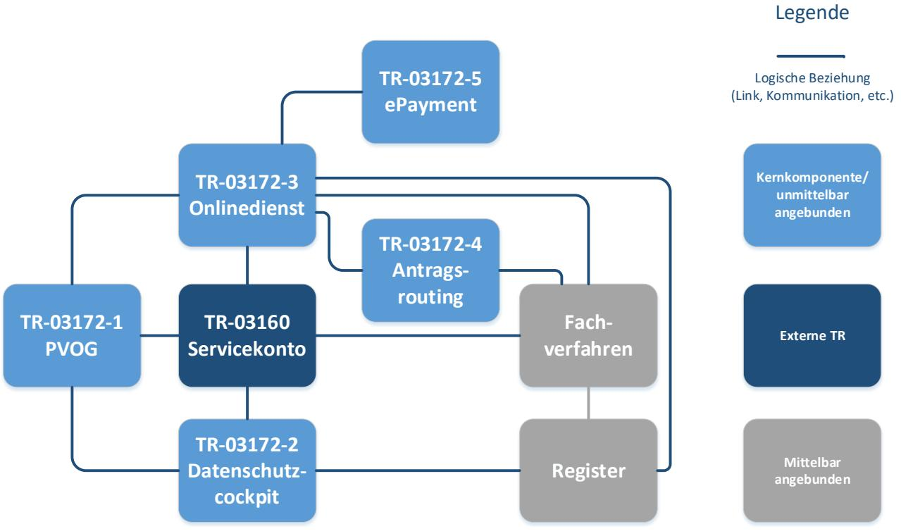
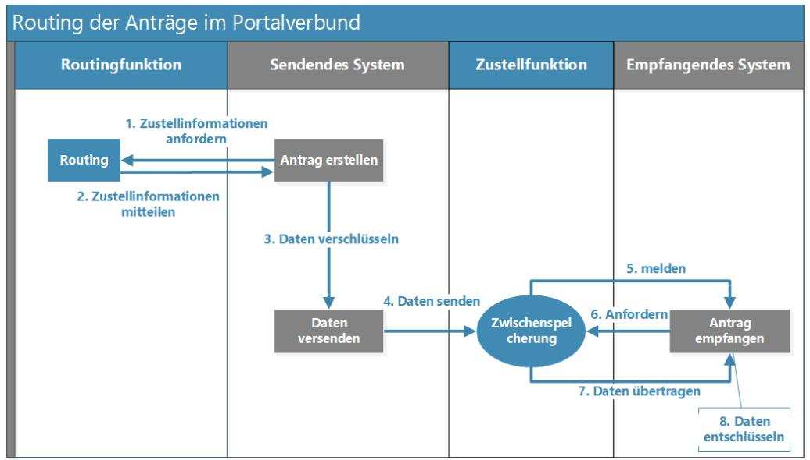

# Technische Richtlinie TR-03172-4 Portalverbund Teil 4: Antragsrouting

Version 1.0 14.11.2024

## Änderungshistorie

*Tabelle 1: Änderungshistorie*

| Version | Datum      | Name | Beschreibung             |
|---------|------------|------|--------------------------|
| 1.0     | 14.11.2024 | BSI  | Veröffentlichungsversion |

Bundesamt für Sicherheit in der Informationstechnik Postfach 20 03 63 53133 Bonn Tel.: +49 22899 9582-0 E-Mail: portalverbund@bsi.bund.de Internet: https://www.bsi.bund.de © Bundesamt für Sicherheit in der Informationstechnik 2024

| 1 |                        | Einleitung  4                                            |  |  |
|---|------------------------|----------------------------------------------------------------|--|--|
|   | 1.1                    | Einordnung in den Portalverbund  4                       |  |  |
|   | 1.2                    | Zielsetzung und Abgrenzung der Technischen Richtlinie  4 |  |  |
| 2 |                        | Rahmenbedingungen 6                                         |  |  |
|   | 2.1                    | Prozessbeschreibung 6                                       |  |  |
|   | 2.1.1                  | Anbindung von sendendem System und empfangendem System 6    |  |  |
|   | 2.1.2                  | Antragsrouting 6                                            |  |  |
|   | 2.1.3                  | Hinweise zur Rückmeldung  7                              |  |  |
|   | 2.2                    | Schlüsselwörter 7                                           |  |  |
| 3 |                        | Sicherheitsanforderungen 8                                  |  |  |
|   | 3.1                    | Allgemeine Anforderungen 8                                  |  |  |
|   | 3.2                    | Architektur 8                                               |  |  |
|   | 3.3                    | Drittsoftware 9                                             |  |  |
|   | 3.4                    | Build-, Release- und Deploymentmanagement 9              |  |  |
|   | 3.5                    | Authentisierung, Authentifizierung und Autorisierung10         |  |  |
|   | 3.6                    | Datenübertragung 10                                         |  |  |
|   | 3.7                    | Routingfunktion11                                              |  |  |
|   | 3.8                    | Protokollierung und Detektion11                                |  |  |
|   | Literaturverzeichnis13 |                                                                |  |  |

### **1 Einleitung**

### 1.1 Einordnung in den Portalverbund

Die BSI-TR-03172 Portalverbund umfasst ein Rahmendokument mit übergreifenden Aspekten sowie Teildokumente zu den einzelnen Komponenten. Das Rahmendokument enthält ein zentrales Glossar mit allen verwendeten Begriffsbestimmungen sowie ein zentrales Abkürzungsverzeichnis, daher sind die Dokumente stets in Kombination zu lesen.

Der Antragsroutingdienst ist eine Komponente des Portalverbundes, die als Routing- und Übertragungssystem zwischen dem Onlinedienst und dem Fachverfahren fungiert. Benötigt wird diese Komponente, wenn keine Direktverbindung zwischen Onlinedienst und Fachverfahren besteht und keine bekannte Adressierung des Fachverfahrens verfügbar ist. Innerhalb des Portalverbunds betreiben verschiedene Institutionen Onlinedienste und übertragen Daten (im Speziellen auch Antragsdaten) an ein oder mehrere Fachverfahren. Um das korrekte empfangende System identifizieren und die Daten senden zu können, wird das Antragsrouting benötigt.

In der folgenden [Abbildung 1](#page-3-3) ist dies veranschaulicht. Die schematische Darstellung soll an dieser Stelle keinen Anspruch auf Vollständigkeit erheben.

*Abbildung 1: Einordnung in den Portalverbund*

### 1.2 Zielsetzung und Abgrenzung der Technischen Richtlinie

Die vorliegende Technische Richtlinie behandelt innerhalb des Portalverbunds die Komponente des Antragsroutings. Das Antragsrouting ist ein Dienst zwischen antragstellender Instanz und antragsbearbeitender Instanz und hat im Wesentlichen die beiden Aufgaben, die Zieladresse zu ermitteln (Routingfunktion) und Daten zu transportieren (Zustellfunktion) (vgl. [Kapitel 2.1 Prozessbeschreibung\)](#page-5-1). Die Implementierung der beiden Funktionen ist in einem oder mehreren Diensten realisierbar. Die Anforderungen aus [Kapitel 3.7 Routingfunktion](#page-10-0) gelten nur für den Dienst, der das Routing durchführt.

Der hier dargelegte Antragsroutingdienst umfasst eine Funktion, um die Zieladresse zu ermitteln (Routing) und eine Funktion, um die Zustellung an die Vorgangs- und Sachbearbeitung zu ermöglichen. Dies kann in einer Anwendung, die beide Funktionen umfasst oder von Anwendungen, die jeweils nur eine Funktion (Routing oder Zustellung) umfassen, implementiert werden.

Verfahren, bei denen eine direkte Übertragung vom Onlinedienst zum Fachverfahren existiert oder bei denen Onlinedienst und Fachverfahren in einem System enthalten sind, werden aufgrund wesentlicher Unterschiede in der vorliegenden Version dieser Technischen Richtlinie nicht betrachtet.

Im Folgenden werden die Kommunikationsverbindungen und der Ablauf bzw. die grundlegende Funktionsweise innerhalb des Antragsroutings definiert und erläutert. Zudem wird die erstmalige Systemanbindung von Fachverfahren und Onlinedienst an den Antragsroutingdienst betrachtet (vgl[. Kapitel](#page-5-1)  [2.1 Prozessbeschreibung\)](#page-5-1).

In dieser Technischen Richtlinie werden Sicherheitsanforderungen an die Berechtigungen, die Authentifizierung, Autorisierung der einzelnen Instanzen, die Kommunikation zwischen ihnen, die Routingund Zustellfunktion sowie die Protokollierung gestellt (vgl[. Kapitel 3 Sicherheitsanforderungen\)](#page-7-0).

Für die Umsetzung des Antragsroutingdienstes gelten neben der hier vorliegenden Technischen Richtlinie auch der BSI IT-Grundschutz [1] und die IT-Sicherheitsverordnung Portalverbund [2].

### **2 Rahmenbedingungen**

### 2.1 Prozessbeschreibung

Um das Antragsrouting zu realisieren sind mehrere Prozesse erforderlich. Hierbei werden im Folgenden die einmalige und sichere Anbindung an das Antragsrouting, beispielsweise in Form einer einmaligen Registrierung oder anderweitigen Authentisierung, Authentifizierung und Autorisierung der Komponenten, sowie die wiederkehrende Datenübertragung dargestellt.

#### 2.1.1 Anbindung von sendendem System und empfangendem System

Wird ein Antragsroutingdienst genutzt, wird die Anbindung von Onlinedienst und Fachverfahren jeweils über eine Schnittstelle zum Antragsroutingdienst konfiguriert. Hieraus folgt, dass nur von registrierten Sendern Daten übermittelt und von registrierten Empfängern entgegengenommen werden können. Die Sicherheitsanforderungen für die Anbindung werden in [Kapitel 3.5 Authentisierung, Authentifizierung und](#page-9-0)  [Autorisierung](#page-9-0) beschrieben.

#### 2.1.2 Antragsrouting

Im Folgenden wird ein möglicher Prozessablauf für die asynchrone Kommunikation geschildert und anhand eines Schaubilds in [Abbildung 2](#page-5-4) skizziert. Eine synchrone Kommunikation ist ebenfalls denkbar. Hierbei entfallen die Schritte 5, 6 und 7 und statt der Zwischenspeicherung in Schritt 4 werden die Daten direkt an das empfangende System gesendet.

- 1. Das sendende System fordert die Zustellinformationen und ggf. weitere Parameter über die Routingfunktion an.
- 2. Die Routingfunktion liefert Zustellinformationen an das sendende System.
- 3. Im sendenden System werden die zu sendenden Daten verschlüsselt.
- 4. Das sendende System sendet die verschlüsselten Daten an einen Zwischenspeicher.
- 5. Das Antragsrouting meldet dem empfangenden System, dass Antragsdaten vorliegen.
- 6. Das empfangende System fordert die Daten an.
- 7. Die Daten werden an das empfangende System übermittelt.
- 8. Das empfangende System entschlüsselt die empfangenen Daten.

*Abbildung 2:Beispielhafter Prozessablauf des Antragsroutings mit asynchroner Kommunikation*

#### 2.1.3 Hinweise zur Rückmeldung

Im OZG wird ein Rückkanal gefordert, um eine antragsbezogene Folgekommunikation ausgehend von der öffentlichen Verwaltung mit der antragstellenden Person zu ermöglichen. Neben dem fachlichen Austausch (z. B. Bescheide) sind für die antragstellende Person ebenso technische Rückmeldungen (z. B. Empfangsbestätigung oder Fehlermeldungen) relevant.

Die persönlichen Daten der antragstellenden Person sollen über den Übertragungsweg hinweg geschützt werden, daher stellt sich die Adressierung dieser Person oft als Problem dar. Stellvertretend kann das sendende System adressiert werden, das die Informationen weiterleitet, wenn Kontaktinformationen zur Person vorliegen (synchrone Verbindung). Da bei der asynchronen Kommunikation nicht in jedem Fall eine sofortige Rückantwort zu erwarten ist, ist das sendende System als Empfänger der Empfangsbestätigung nur bedingt sinnvoll, da die antragstellende Person regelmäßig prüfen müsste, ob eine Empfangsbestätigung im sendenden System eingegangen ist. Die antragsbezogene Folgekommunikation ist über Messenger Dienste, Mailpostfächer, Servicekonten oder auf anderen Wegen realisierbar.

### 2.2 Schlüsselwörter

In den Anforderungen werden die in Versalien geschriebenen Modalverben "SOLLTE" und "MUSS" in ihren jeweiligen Formen sowie den zugehörigen Verneinungen genutzt, um zu verdeutlichen, wie die jeweiligen Anforderungen zu interpretieren sind. Die hier genutzte Definition basiert auf dem BSI IT-Grundschutz [1] und RFC2119 [3] .

| MUSS/ DARF NUR:            | Dieser Ausdruck bedeutet, dass es sich um eine Anforderung handelt, die unbedingt erfüllt werden muss (uneingeschränkte Anforderung).                                                                             |
|-------------------------------|----------------------------------------------------------------------------------------------------------------------------------------------------------------------------------------------------------------------|
| DARF NICHT/ DARF KEIN:     | Dieser Ausdruck bedeutet, dass etwas in keinem Fall getan werden darf (uneingeschränktes Verbot).                                                                                                                 |
| SOLLTE:                       | Dieser Ausdruck bedeutet, dass eine Anforderung normalerweise erfüllt werden muss, es aber Gründe geben kann, dies doch nicht zu tun. Dies muss aber sorgfältig abgewogen und stichhaltig begründet werden. |
| SOLLTE NICHT/ SOLLTE KEIN: | Dieser Ausdruck bedeutet, dass etwas normalerweise nicht getan werden sollte, es aber Gründe gibt, dies doch zu tun. Dies muss aber sorgfältig abgewogen und stichhaltig begründet werden.                     |
| KANN:                         | Dieser Ausdruck bedeutet, dass eine bestimmte Umsetzung gewählt werden kann. Diese muss allerdings angezeigt werden.                                                                                              |

Die Technische Richtlinie repräsentiert den Stand der Technik und wird fortlaufend aktualisiert.

### **3 Sicherheitsanforderungen**

### 3.1 Allgemeine Anforderungen

- **A3.1.01** Die BSI-Standards 200-1, 200-2 und 200-3 [4] oder die Vorgaben der ISO/IEC 27001 [5] MÜSSEN in der jeweils geltenden Fassung umgesetzt werden. Als Mindestniveau MUSS die Standard-Absicherung für den betreffenden Informationsverbund gewählt werden. Der Informationsverbund des Antragsroutingdienstes MUSS nach ISO 27001 auf der Basis von IT-Grundschutz zertifiziert sein. Das Grundschutzkompendium [1] MUSS in der aktuellen Version verwendet werden.
- **A3.1.02** Der BSI-Standard 200-4 [4] oder die Vorgaben der ISO-Norm 22301:2019 [6] MUSS in der jeweils geltenden Fassung umgesetzt werden. Schnittstellen zu angeschlossenen Diensten SOLLTEN berücksichtigt werden. Es MÜSSEN im Rahmen des Notfallmanagements Maßnahmen getroffen werden, wie mit Sicherheitsvorfällen umzugehen ist.
- **A3.1.03** Sämtliche, mit öffentlichen Netzen verbundenen Komponenten des Antragsroutingdienstes MÜSSEN vor der Anbindung an den Portalverbund mindestens mittels eines Penetrationstests bzw. Webchecks überprüft werden [2]. Dies gilt ebenfalls für Komponenten des Antragsroutingdienstes, die einen hohen oder sehr hohen Schutzbedarf in mindestens einem der Schutzziele Vertraulichkeit, Integrität oder Verfügbarkeit aufweisen. Diese MÜSSEN spätestens nach 3 Jahren oder bei größeren Änderungen wiederholt werden.
- **A3.1.04** Die Verantwortlichen MÜSSEN die Verfügbarkeitsanforderungen an den Antragsroutingdienst dokumentieren und die Architektur der beteiligten Systemkomponenten daran ausrichten.
- **A3.1.05** Bei der Ermittlung der Verfügbarkeitsanforderung MÜSSEN die potentielle Nutzerbasis sowie eventuelle Stichtage und Fristen im Verwaltungsverfahren berücksichtigt werden, die zu Lastspitzen bzw. erhöhten Zugriffszahlen auf den Dienst führen können. Es SOLLTEN Lasttests durchgeführt werden, um die Skalierbarkeit und Stabilität der Infrastruktur zu gewährleisten.
- **A3.1.06** Im Sicherheitskonzept MUSS der Reaktionsprozess bei Bekanntwerden einer Schwachstelle im Antragsroutingdienstes auf Basis ihrer Kritikalität klar definiert sein. Der Reaktionsprozess und die Frist zum Weiterbetrieb des Antragsroutingdienstes MÜSSEN allen Beteiligten bekannt sein. Der Weiterbetrieb des Antragsroutingdienstes bei bekannter Schwachstelle DARF NICHT länger sein als die im Sicherheitskonzept definierte Übergangsfrist. Es MUSS eine security.txt nach RFC 9116 [7] implementiert und regelmäßig aktualisiert werden.

### 3.2 Architektur

- **A3.2.01** Es MUSS das Prinzip Security-by-Design angewendet werden, d. h. Sicherheitsanforderungen an Soft- und Hardware MÜSSEN in der Anwendungsarchitektur und allen Entwicklungsphasen berücksichtigt werden (vgl. [8]).
- **A3.2.02** Eine *Web Application Firewall* (WAF) SOLLTE für alle Webanwendungen oder Webservices (bspw. Routingfunktion, Zustellfunktion) genutzt werden. Die Konfiguration der eingesetzten WAF SOLLTE auf die zu schützende Webanwendung oder den Webservice angepasst werden. Nach jedem Update der Webanwendung oder des Webservices SOLLTE die Konfiguration der WAF geprüft werden. Zusätzlich SOLLTE ein *Intrusion Detection System* (IDS) eingesetzt werden.
- **A3.2.03** Die administrativen Zugriffe auf die Systeme des Antragsroutingdienstes MÜSSEN über ein separiertes Netzwerkinterface (Managementnetz) erfolgen, um eine Trennung von Produktivnetzen zu erreichen. Netzwerkdienste, die nicht benötigt werden, MÜSSEN deaktiviert

werden. Der Austausch von Informationen SOLLTE innerhalb des internen Netzes verschlüsselt stattfinden.

**A3.2.04** Die Produktivumgebung MUSS von weiteren Betriebsumgebungen getrennt betrieben werden. Zusätzlich SOLLTEN weitere Betriebsumgebungen für verschiedene Zwecke voneinander getrennt betrieben werden (z. B. Entwicklungsumgebung, Testumgebung, Stagingumgebung).

#### 3.3 Drittsoftware

- **A3.3.01** Es MUSS Software aus vertrauenswürdigen Quellen verwendet werden. Nicht verwendete Funktionen SOLLTEN deaktiviert werden.
- **A3.3.02** Der Hersteller/ Entwickler des Antragsroutingdienstes MUSS eine zentrale und vollständige Liste von Abhängigkeiten durch externe Software, Bibliotheken und Frameworks führen. Es SOLLTE eine *Software Bill of Materials* (SBOM), wie in der BSI TR-03183-2 "Cyber-Resilienz-Anforderungen an Hersteller und Produkte" [9] gefordert, erstellt und geführt werden.
- **A3.3.03** Eingesetzte (Dritt-) Software MUSS in einer Version verwendet werden, die mit Sicherheitsupdates versorgt wird, damit eventuell vorhandene bzw. neue Schwachstellen nicht die Webanwendung bzw. den Webservice gefährden können. Informationen über identifizierte Schwachstellen werden regelmäßig und zeitnah über einschlägige Mailinglisten und Informationsdienste, z. B. den Warnund Informationsdienst (WID) von CERT-Bund veröffentlicht. Wenn für die Anwendung relevante Schwachstellen in verwendeter Software bekannt werden, MÜSSEN die zugehörigen Sicherheitsupdates kurzfristig eingespielt werden. Die Umsetzungszeit MUSS der Kritikalität und Ausnutzbarkeit der Schwachstelle entsprechend angemessen gewählt werden. Software, die nicht länger vom Hersteller oder Entwickler gewartet wird, DARF NICHT verwendet werden.
- **A3.3.04** Sicherheitskritische Funktionen des Antragsroutingdienstes, wie beispielsweise Sessionmanagement oder Kryptografie, SOLLTEN mittels etablierter und sicherer Frameworks und Bibliotheken realisiert werden. Die Eigenentwicklung und Implementierung von sicherheitskritischen Funktionen ist mit einem gewissen Risiko verbunden und SOLLTE vermieden werden.

### 3.4 Build-, Release- und Deploymentmanagement

- **A3.4.01** Es MUSS ein Build-, Release- und Deploymentmanagement umgesetzt werden, welches Prozesse zur Erstellung, Prüfung und Verteilung der Builds und Releases sowie zum Deployment enthält. Die Prozesse SOLLTEN dokumentiert und im Sicherheitskonzept berücksichtigt werden.
- **A3.4.02** Alle erstellten Softwarepakete und Updates SOLLTEN vor der Auslieferung mindestens fortgeschritten signiert werden. Die Gültigkeit der Signatur MUSS vor der Bereitstellung und Installation jeglicher Software validiert werden. Releases DÜRFEN NUR eingespielt werden, wenn sie erfolgreich validiert worden sind.
- **A3.4.03** Versionierungen MÜSSEN verständlich und nachvollziehbar gewählt werden. Release Notes MÜSSEN erstellt werden. Insbesondere SOLLTEN Informationen zu sicherheitskritischen Updates und Supportdauer einer Version enthalten sein.
- **A3.4.04** Das Einspielen (Deployment) der Softwarepakete und Updates in eine Produktivumgebung SOLLTE automatisiert und mit konsistenter Konfiguration stattfinden. Es KÖNNEN Tools von kontinuierlicher Integration (Continuous Integration) sowie kontinuierlicher Verteilung (Continuous Deployment) verwendet werden. Der Prozess des Einspielens SOLLTE manuell ausgelöst werden.

### 3.5 Authentisierung, Authentifizierung und Autorisierung

- **A3.5.01** Für den Antragsroutingdienst MUSS ein Berechtigungskonzept mit Rechte- und Rollenmanagement erstellt werden, das die technische Einrichtung, Administration sowie die Schnittstellen zu jeweils sendendem und empfangendem System beinhaltet. Dabei MUSS definiert werden, welche Zugriffe von wem autorisiert werden und wie eine Authentifizierung durchzuführen ist um unberechtigte Systemzugriffe zu verhindern. Die Berechtigungen SOLLTEN bedarfsgerecht einer Rolle zugewiesen werden. Hilfestellungen dafür finden sich im IT-Grundschutz (vgl. ORP 4 Identitäts- und Berechtigungsmanagement [1]).
- **A3.5.02** Sendende und empfangende Systeme MÜSSEN für die Kommunikation mit dem Antragsroutingdienst identifiziert und berechtigt werden. Für die Autorisierung MUSS ein eindeutiges Berechtigungskonzept vorliegen, in dem definiert ist, welche Dienste den Antragsroutingdienst nutzen dürfen, um Daten zu senden und zu empfangen.
- **A3.5.03** Für die initiale Anbindung eines sendenden oder empfangenden Systems an einen Antragsroutingdienst MUSS eine geeignete Authentisierung und anschließend Authentifizierung stattfinden (vgl[. Kapitel 2.1.1 Anbindung von sendendem System und empfangendem System\)](#page-5-2).
- **A3.5.04** Vor einer Übertragung der Antragsdaten MUSS der Antragsroutingdienst gemäß Berechtigungskonzept prüfen, ob das sendende System legitimiert ist, Daten zu senden.
- **A3.5.05** Vor einer Übertragung der verschlüsselten Daten SOLLTE der Antragsroutingdienst oder der Zustelldienst prüfen, ob das sendende System an ein empfangendes System Daten liefern darf.
- **A3.5.06** Wenn für die Routingfunktion und Zustellfunktion weitere Dienste eingebunden werden, SOLLTE auch hier eine geeignete Authentifizierung stattfinden.

### 3.6 Datenübertragung

Vor jeglichem Datenaustausch von Antragsdaten binden sich die sendenden und empfangenden Systeme an den Antragsroutingdienst an. Hierbei werden die Schnittstellen zu den sendenden und empfangenden Systemen konfiguriert und bereitgestellt (vgl. [Kapitel 3.5 Authentisierung, Authentifizierung und](#page-9-0)  [Autorisierung](#page-9-0) ).

Bei der Verwendung des Antragsroutingdienstes werden mehrere Kommunikationsbeziehungen eingegangen. Abhängig von den zu übertragenden Daten auf einer Übertragungsstrecke werden unterschiedliche oder aufeinander aufbauende Sicherheitsanforderungen an die Datenübertragung gestellt.

- **A3.6.01** Jede Datenübertragung MUSS an einen eindeutigen Empfänger, wie beispielsweise ein spezifisches Fachverfahren oder einen Zwischenspeicher, gerichtet sein.
- **A3.6.02** Die Benachrichtigung des empfangenden Systems darüber, dass ein Antrag vorliegt, DARF KEINE Daten zum Antrag oder zur antragstellenden Person beinhalten.
- **A3.6.03** Bei jeder Datenübertragung DARF NUR das authentifizierte empfangende System Zugriff auf die zugehörige Schnittstelle zum Bereich eines Zwischenspeichers erhalten.
- **A3.6.04** Wird eine asynchrone Kommunikation gewählt und die zu sendenden Daten werden zwischengespeichert und vom empfangenden System nicht abgeholt, MÜSSEN sie nach einem angemessenen Zeitraum automatisiert gelöscht werden und die antragstellende Person sowie das empfangende System SOLLTE in geeigneter Weise informiert werden.
- **A3.6.05** Alle Datenübertragungen MÜSSEN mit geeigneten kryptographischen Maßnahmen (vgl. BSI TR-02102 [10] und BSI TR-03116-4 [11]) vor unbefugtem Zugriff geschützt werden. Datenübertragungen zwischen Antragsroutingdienst und den angebundenen Systemen MÜSSEN mindestens transportverschlüsselt stattfinden.
- **A3.6.06** Der Antragsroutingdienst DARF den Inhalt der Nachricht NUR verschlüsselt vom sendenden System übernehmen und unverändert an das empfangende System (ggf. Zwischenspeicher) übermitteln. Der Nachrichteninhalt DARF NICHT im Klartext vorliegen und übermittelt werden.
- **A3.6.07** Bei der Übertragung der verschlüsselten Daten MUSS die Integrität bei Annahme der Daten geprüft werden. Dafür KANN das sendende System einen Hash-Wert der Daten erzeugen, welcher signiert wird. Eine weitere Möglichkeit dafür ist die Auswertung des in TLS integrierten HMAC (vgl. BSI TR-02102-2 [10]).

Bei Annahme der Daten durch das empfangende System ist es ratsam, die Signatur des sendenden Systems zu validieren, um sicherzustellen, dass die Integrität der Daten über den gesamten Sendeverlauf weiterhin gegeben ist.

### 3.7 Routingfunktion

Die Routingfunktion greift entweder auf bestehende externe Dienste oder interne Datenbanken zu. Die Informationen, die die Routingfunktion erhält, sind in der Regel öffentlich zugänglich und sind durch die entsprechenden Betreiber zu sichern. Die Anforderungen in diesem Kapitel gelten nur für den Dienst, der das Routing durchführt.

- **A3.7.01** Falls im Antragsroutingdienst eine interne Fachverfahrensadressdatenbank gehalten wird, MUSS diese dem Berechtigungskonzept entsprechend gegen unbefugten Zugriff und Änderung gesichert werden.
- **A3.7.02** Zustellinformationen SOLLTEN von der Adressdatenbank in geeigneter Weise integritätsgesichert werden. Wenn die Prüfung der Signatur fehlschlägt, SOLLTEN die Zustellinformationen nicht an das sendende System weitergeleitet werden, um eine korrekte Adressierung zu gewährleisten.
- **A3.7.03** Werden benötigte Daten von externen Diensten abgerufen und mindestens für einen begrenzten Zeitraum in Form einer Zwischenspeicherung in einer internen Datenbank gespeichert, so MUSS auch diese Datenbank gegen unbefugten Zugriff und Änderung gesichert werden.
- **A3.7.04** Die Zustellinformationen enthalten ein Zertifikat des empfangenden Systems, das zur Verschlüsselung von Antragsdaten verwendet werden kann. Die Routingfunktion SOLLTE die Zustellinformation nur weiterleiten, nachdem dieses Zertifikat validiert wurde.
- **A3.7.05** Die Absicherung des Routings und der DNS-Infrastruktur MUSS sichergestellt sein. Dazu MUSS der IP-Adressbereich von einer Route Origin Authorization (ROA) abgedeckt sein und die DNS-Einträge der zur Routingfunktion gehörenden Domain(s) MÜSSEN mit den DNS Security Extensions (DNSSEC) abgesichert sein [12], [13].

### 3.8 Protokollierung und Detektion

Es sind zwei Arten bei der Protokollierung zu unterscheiden: Die "administrative Protokollierung" und "Protokollierung der Ereignisse beim Prozessablauf":

- Die administrative Protokollierung dokumentiert Nutzerzugriffe auf das technische System des Antragsroutingdienstes (hier im speziellen durch Administratoren) und Handlungen der Selbigen.
- Im Rahmen der Protokollierung der Ereignisse beim Prozessauflauf werden alle oder ausgewählte Ereignisse vom Eingang des Antrags im Antragsroutingdienst, dem Ermitteln der benötigten Routinginformationen, der Zustellung des Antrags zum empfangenden System (und soweit nötig einer Zwischenspeicherung), Information des empfangenden Systems und späteren Abholung des Antrags dokumentiert.

Im Antragsroutingdienst sind die IT-Systeme, die für die Leistungserbringung benötigt werden, sowie Routing-, Zustell- und Zwischenspeicherfunktion als mögliche Protokollierungsinstanzen zu nennen.

Die nachfolgend aufgeführten Anforderungen gelten ergänzend zum Grundschutzbaustein OPS.1.1.5 Protokollierung und DER.1 Detektion.

- **A3.8.01** In jedem Prozessschritt SOLLTE eine Protokollierung mit Fehlerbehandlung realisiert werden, welche sendende und empfangende Systeme sowie die Administration des Antragsroutingdienstes über erfolgreiche und fehlgeschlagene Bereitstellung der Daten informiert, um beispielsweise Fehlerbilder nachvollziehen zu können und die Ursachensuche zu ermöglichen sowie zu vereinfachen.
- **A3.8.02** Die antragstellende Person SOLLTE und das empfangende System MUSS mindestens über eine erfolgreiche oder eine nicht erfolgreiche Datenübermittlung der von der antragstellenden Person abgesendeten Daten (z. B. ein Antrag), informiert werden (vgl. [Kapitel 2.1.3 Hinweise zur](#page-6-0)  [Rückmeldung\)](#page-6-0).
- **A3.8.03** Jede administrative Handlung/ Tätigkeit, sowohl technisch als auch fachlich, MUSS eindeutig auf eine Person zurückführbar sein. Dies kann bspw. durch eine entsprechende Benutzerkennung innerhalb des Rollenmanagements erreicht werden.
- **A3.8.04** Es MÜSSEN alle betriebs- und sicherheitsrelevanten Ereignisse (vgl. BSI Grundschutzbaustein DER.1 [1]) sowie fehlgeschlagene Datenübertragungen protokolliert, d. h. automatisch zentral gespeichert und für die Auswertung bereitgestellt werden, um im Bedarfsfall eine erfolgreiche und nachvollziehbare Vorfallsbearbeitung anhand der Protokolldaten durchführen zu können.
- **A3.8.05** Es SOLLTE ein Security Information and Event Management (SIEM) vorhanden sein, welches eine Häufung von atypischem Verhalten auf Basis der Logfiles detektiert und bei Überschreiten eines Schwellwerts eskaliert (siehe dazu Anforderung A3.2.02).
- **A3.8.06** Es MÜSSEN die Vorgaben des Mindeststandards des BSI nach § 8 Abs. 1 Satz 1 BSIG zur Protokollierung und Detektion von Cyber-Angriffen [14] eingehalten werden.

### **Literaturverzeichnis**

- [1] BSI, "IT-Grundschutz-Kompendium," 1 2 2023. [Online]. Available: https://www.bsi.bund.de/DE/Themen/Unternehmen-und-Organisationen/Standards-und-Zertifizierung/IT-Grundschutz/IT-Grundschutz-Kompendium/it-grundschutzkompendium\_node.html. [Zugriff am 09 04 2024].
- [2] Bundesrepublik Deutschland, *IT-Sicherheitsverordnung Portalverbund - ITSiV-PV vom 6. Januar 2022,*  Bundesgesetzblatt Jahrgang 2022 Teil I Nr. 2, ausgegeben am 19.01.2022, Seite 18, 2022.
- [3] S. Bradner, "datatracker.ietf.org," Network Working Group, März 1997. [Online]. Available: https://datatracker.ietf.org/doc/html/rfc2119. [Zugriff am 26 10 2023].
- [4] BSI, "BSI-Standards," [Online]. Available: https://www.bsi.bund.de/dok/6603458. [Zugriff am 26 10 2023].
- [5] ISO/IEC 27001:2013, "Information technology Security techniques Information Security management systems - Requirements," *International Organization for Standardization (Hrsg.),* 2013.
- [6] ISO 22301:2019, International Organization for Standardization (Hrsg.), "Security and resilience Business continuity management systems - Requirements," *ISO/TC 292,* 2019.
- [7] E. Foudil, "datatracker.ietf.org," Network Working Group, 4 2022. [Online]. Available: https://datatracker.ietf.org/doc/html/rfc9116. [Zugriff am 22 07 2024].
- [8] Cybersecurity & Infrastructure Security Agency, "Secure-by-Design," 25 10 2023. [Online]. Available: https://www.cisa.gov/resources-tools/resources/secure-by-design. [Zugriff am 24 07 2024].
- [9] Bundesamt für Sicherheit in der Informationstechnik, BSI, "BSI TR-03183 Cyber-Resilienz-Anforderungen," 2023. [Online]. Available: https://www.bsi.bund.de/dok/TR-03183 . [Zugriff am 21 08 2023].
- [10] BSI, "BSI TR-02102 Kryptographische Verfahren: Empfehlungen und Schlüssellängen," [Online]. Available: https://www.bsi.bund.de/dok/TR-02102. [Zugriff am 26 10 2023].
- [11] BSI, "BSI TR-03116 Kryptographische Vorgaben für Projekte der Bundesregierung," [Online]. Available: https://www.bsi.bund.de/dok/TR-03116. [Zugriff am 26 10 2023].
- [12] Bundesamt für Sicherheit in der Informationstechnik, "How-To: RPKI," 2018. [Online]. Available: https://www.allianz-fuer-cybersicherheit.de/SharedDocs/Downloads/Webs/ACS/DE/BSI-CS/BSI-CS\_118.pdf?\_\_blob=publicationFile&v=1. [Zugriff am 13 08 2024].
- [13] Bundesamt für Sicherheit in der Informationstechnik, "Umsetzung von DNSSEC," 2015. [Online]. Available: https://www.bsi.bund.de/SharedDocs/Downloads/DE/BSI/Cyber-Sicherheit/Themen/Umsetzung\_von\_DNSSEC.pdf?\_\_blob=publicationFile&v=1. [Zugriff am 13 08 2024].
- [14] BSI, "Mindeststandard des BSI zur Protokollierung und Detektion von Cyber-Angriffen," 29 6 2023. [Online]. Available: https://www.bsi.bund.de/dok/MST-PD. [Zugriff am 26 10 2023].