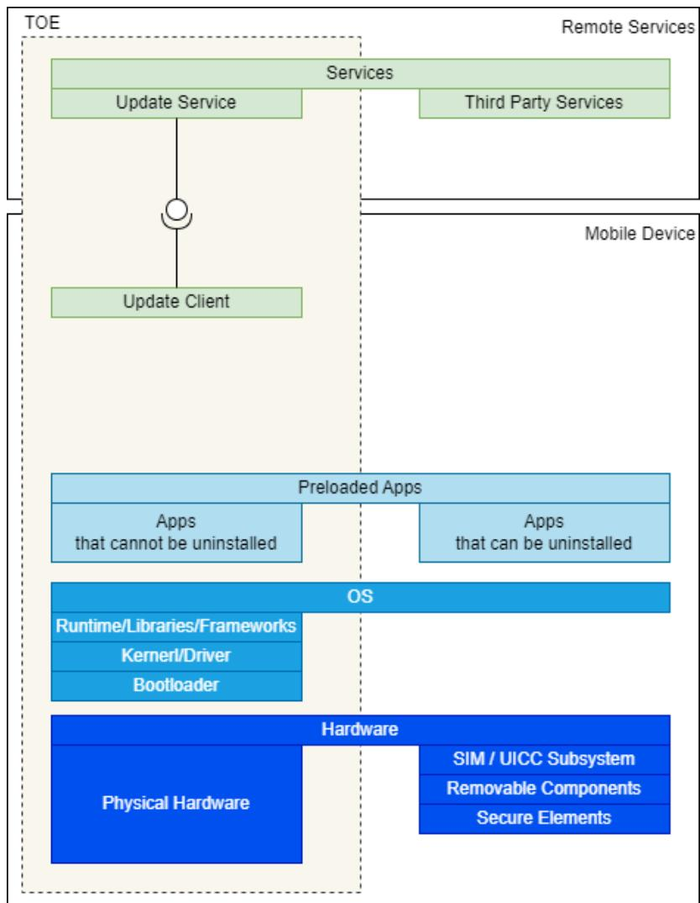
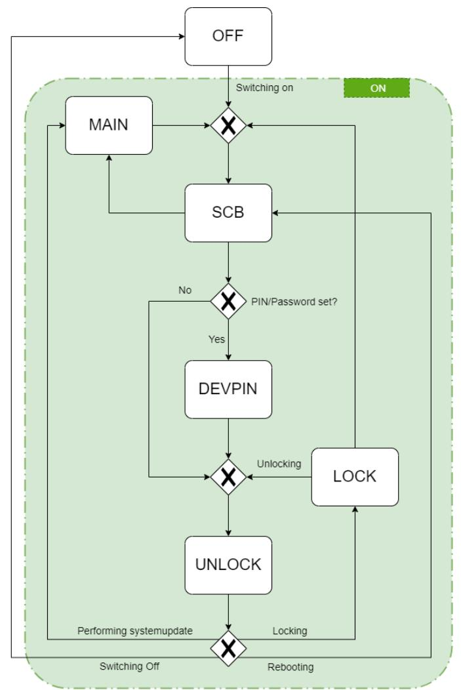

# TR-03180 A

Mobile Devices: Requirements catalogue for the IT Security Label

Version: 1.1.0 Status: Publication

# Change history

| Version | Date       | Name                                    | Description                                      |  |
|---------|------------|-----------------------------------------|--------------------------------------------------|--|
| 1.1.0   | 20.10.2024 | Federal Office for Information Security | Version: 1.1.0                                   |  |
|         |            |                                         | Minor Clarifications                             |  |
|         |            |                                         | References to Baseline Standards              |  |
|         |            |                                         | Additional recommended biometric requirements |  |
| 1.0.0   | 20.06.2024 | Federal Office for Information Security | Version 1.0.0                                    |  |
| 0.9.0   | 31.01.2024 | Federal Office for Information Security | Commentary Phase                                 |  |

Federal Office for Information Security P.O. Box 20 03 63 53133 Bonn Germany Internet: https://www.bsi.bund.de © Federal Office for Information Security 2024

| 1 |               | INTRODUCTION  4                         |  |  |  |  |
|---|---------------|-----------------------------------------|--|--|--|--|
|   | 1.1           | TARGET AUDIENCE 4                       |  |  |  |  |
|   | 1.2           | AREA OF APPLICATION 4                   |  |  |  |  |
| 2 |               | SCOPE OF THE ASSESSMENT  5              |  |  |  |  |
|   |               |                                         |  |  |  |  |
|   | 2.1           | TARGET OF EVALUATION 5                  |  |  |  |  |
|   | 2.2           | STATE OF THE TOE 6                      |  |  |  |  |
|   | 2.3           | OPERATING STATES  6                     |  |  |  |  |
|   | 2.4           | ASSETS 8                                |  |  |  |  |
|   | 2.5           | GENERAL ASSUMPTIONS 9                   |  |  |  |  |
|   | 2.6           | ASSUMED THREATS AND THREAT AGENTS 9     |  |  |  |  |
| 3 |               | ASSESSMENT PROCEDURE 11                 |  |  |  |  |
|   | 3.1           | TYPES OF REQUIREMENTS  11               |  |  |  |  |
|   | 3.2           | ROLES 11                                |  |  |  |  |
|   | 3.3           | TEST RESULTS  11                        |  |  |  |  |
|   | 3.4           | TEST METHODS 12                         |  |  |  |  |
|   | 3.5           | SPECIAL TERMS 14                        |  |  |  |  |
|   | 3.6           | TEST DOCUMENTATION  14                  |  |  |  |  |
|   | 3.7           | REUSE OF EVIDENCES 15                   |  |  |  |  |
| 4 |               | REQUIREMENTS AND TEST SPECIFICATIONS 16 |  |  |  |  |
|   | 4.1           | CRYPTOGRAPHIC SUPPORT (FCS) 16          |  |  |  |  |
|   | 4.2           | GENERAL (ALG)  19                       |  |  |  |  |
|   | 4.3           | OPERATING STATES (BZS) 22               |  |  |  |  |
|   | 4.4           | UPDATES (UPD) 27                        |  |  |  |  |
|   | 4.5           | INSTALLATION OF APPS (INS)  37          |  |  |  |  |
|   | 4.6           | CRYPTOGRAPHY (KRY) 40                   |  |  |  |  |
|   | 4.7           | USER MANAGEMENT (USR) 41                |  |  |  |  |
|   | 4.8           | DATA MANAGEMENT (DAT)  46               |  |  |  |  |
|   | 4.9           | DATA TRANSMISSION (DUE) 58              |  |  |  |  |
|   | 4.10          | INTERFACES (INT) 63                     |  |  |  |  |
|   | 4.11          | SENSORS (SEN) 72                        |  |  |  |  |
| 5 |               | MODAL VERBS74                           |  |  |  |  |
| 6 | GLOSSARY75    |                                         |  |  |  |  |
|   |               |                                         |  |  |  |  |
| 7 | REFERENCES 78 |                                         |  |  |  |  |

# 1 Introduction

This document describes which requirements a mobile (IT) device for the consumer market must fulfil (catalogue of requirements) and how the test of the requirements has to be performed (test specification) to qualify for an IT Security Label of the German Federal Office of Information Security (BSI).

Each requirement consists of a specific test property and a selection of permissible test methods for assessing the property. The purpose of specifying test properties is to enable objective testability in the context of issuing an IT Security Label. The aim is to ensure that the test results are independent of the person performing the test.

# 1.1 Target audience

The specifications in this document are intended for manufacturers of mobile IT devices for consumers to be used for the manufacturer's self-declaration when applying for an IT Security Label. They can also be used by manufacturers of mobile IT devices as part of a final or development-accompanying quality control or to define product characteristics as part of product development.

The document is also aimed at professional testers and evaluators. Ideally, the testers should be employees of testing bodies that are approved for testing/certification in accordance with the BSI Technical Guidelines.

The test results may be used as a supplement to inform the consumer as part of the device documentation.

# 1.2 Area of application

This document serves to determine the IT security level of mobile IT devices - especially smart phones and tablets – as part of the application for or granting of an IT Security Label.

The mobile IT device tested as part of the conformity assessment is referred to below as the "device under test" (DUT).

# 2 Scope of the Assessment

The following scope and assumptions based on the ETSI TS 103 732 [1] and TR-03180 [2] are used for the assessment of the security requirements set out in this document.

# 2.1 Target of evaluation

The Target of Evaluation (TOE) are the components of the DUT to which the requirements and test properties in this document apply. The composition of a mobile IT device can be generalised as follows:

Figure 1: Schematic representation of the components of the TOE

What is part of the TOE?

- The hardware, e.g., SOC ("System on Chip"), touchscreen, sensors, interfaces.
- All software components that are intended/necessary for the →regular start and →regular operation of the mobile IT device and the proper use of apps.
- All apps that cannot be uninstalled by the user.
- The TOE includes the update services and the app distribution platform service of the device manufacturer and the operating system manufacturer, including the update services of their partners. However, only the parts that affect the integrity and authenticity of the provided or downloaded software on the server side and also on the mobile device side are considered.

• Software interfaces (APIs) via which components not belonging to the TOE (e.g., removable storage devices) are addressed are included in the analysis.

What is NOT part of the TOE?

- Hardware components that are not permanently installed in the mobile device, e.g., an SD memory card and the user data on it (the device manufacturer has no way of influencing this).
- SIM subsystem consisting of hardware (controller, antennas, etc.) and associated software components (data and SIM card applets).
- Secure Element (SE), as no threats/attacks are known in the context of this TR (→ mass attacks), therefore this document contains no specific requirements for secure elements. Although Secure Elements can be used to fulfil certain requirements in this document.
- Software components that realise are not part of a →regular start or →normal operation of the mobile IT device
- Apps that are present in the delivery state but can be uninstalled
- Apps that have been subsequently installed by the user.
- External services used by the TOE (exception: update service and app distribution platform of the device manufacturer).

# 2.2 State of the TOE

The assessment **MAY** be performed anytime independent of the device state (new, factory reset or in active use). A DUT **SHALL** always be able to conform to the requirements of this document, but **MAY** be able to violate the requirements temporarily because of an insecure user configuration.

For an assessment independent of possible insecure user configuration, the DUT **SHALL** be evaluated in the following state:

- New or factory reset device
- Initial device setup performed
- Updated to the newest software version

The DUT **SHALL** ensure that deviations from the requirements during the initial device setup are not possible.

# 2.3 Operating States

A mobile IT device can assume the following operating states:

#### **OFF**

The operating state OFF is assumed when no information technology processes are running. The status is reached when the power supply to the main processor is interrupted by the user by pressing the on/off switch (or a digital representation of it) or the power supply (here: battery) is exhausted.

In the operating state OFF, there is at most a basic power supply, for example to maintain the stored information or to control the restart of the device.

#### **ON**

The operating state ON is assumed as soon as or as long as the main processor is supplied with power and at least rudimentary information technology processes are running.

The operating state ON can be understood as a superordinate state to which all other operating states (SCB, SIMPIN, DEVPIN, UNLOCK, LOCK and MAIN) can be subsumed.

#### **SCB - Secure Boot**

In this operating state, the device starts from the OFF state to a state in which the first user interaction is requested.

#### **SIMPIN - Before entering the SIM PIN**

This operating status can only be entered if a PIN has been set to control access to the SIM functions.

Note: This operating state is not considered further, as the SIM subsystem is outside the TOE - and is therefore also missing from the state transition diagram.

#### **DEVPIN - Before entering the device PIN for the first time**

This operating state can only be entered if a PIN or password has been set to control access to the device functions.

#### **UNLOCK – Unlocked**

When unlocked, all device functions are available to the user.

#### **LOCK – Locked**

When locked, the user's interaction with apps is interrupted, but the user is still logged in. However, the user interface allows limited device operation or use, such as making emergency calls and cancelling phone numbers from the contacts, controlling a music player and the alarm function of the alarm clock or calendar. If one or more authentication methods (knowledge, possession, biometrics) have been defined, the user can only continue working with apps after re-authentication.

#### **MAIN - Maintenance mode**

In maintenance mode, a kernel is loaded that is independent of the operating system and allows write access to the operating system partition. It is usually entered after the user has triggered an operating system update in the Unlocked state.

The state transitions are defined as follows:

Figure 2: Transitions between the operating states of the TOE

The →Recovery mode is not regarded as separate operating state in the sense of this TR.

# 2.4 Assets

Assets worthy of protection can be both direct and indirect. Indirectly protected assets are generally valid and not directly related to the TOE (e.g., operating system, updates and configurations). In contrast, direct data worthy of protection is related to the TOE, for example user data.

The assets worthy of protection include in particular

- Data / app data
- Information about the installed apps
- User data (examples: Files, location data, account information, communication data, user login name, sensor data, clipboard data, ...)
- Usage data of apps and the OS (examples: time the app was started, programme parts clicked, etc.)
- TOE operating system and apps
- Updates
- Configuration of security functions

The following protection classes are distinguished for the data:

000 Disclosure, falsification or unavailability of the data is of no significance either to its owner or to its user(s).

- 001 The unavailability of the data is a risk for its owner or user(s).
- 010 The falsification of the data is a danger to its owner or user(s).
- 100 Disclosure of the data is a danger to its owner or user(s).
- 999 The data is part of the TOE security system.

The security system of the TOE consists of both functional features of the TOE (e.g., rights management) and critical user data (e.g., key material or biometric data of fingerprints and facial recognition).

The data for protection class 999 includes

- Character combinations that are uniquely linked to a device
- Keys, certificates and/or other data used for the initial integrity check at system start up
- Keys, certificates and/or other data used to verify the integrity and authenticity of updates

Combinations of protection classes are possible:

011 Data with the properties of protection classes 001 and 010:

Both the falsification and the unavailability of the data are a danger for their owner or user(s).

101 Data with the properties of protection classes 001 and 100:

Both the disclosure and the unavailability of the data are a risk for their owner or user(s).

110 Data with the properties of protection classes 010 and 100: Both disclosure and falsification of the data are a danger to their owner or user(s)

111 Data with the properties of protection classes 001, 010 and 100: Both the disclosure and the falsification as well as the unavailability of the data are a danger for their owner or their user(s).

# 2.5 General Assumptions

The following assumptions are necessary for interpreting the security requirements and to perform the conformity assessment of the DUT:

- The manufacturer of the mobile IT device is assumed to be trustworthy and there is no additional need to protect the user from the manufacturer as a potential attacker.
- Mobile IT devices in the scope of this document are primarily operated in a personal context and not suitable for business related usage
- Users are not necessarily handling their personal data with sufficient care. Although they regard their data as valuable, users might be prone to favour comfort over security by ignoring warnings, delaying security updates, etc …
- Users do not share their mobile IT device with other users. Consequently, security concerns regarding multi-user usage are not considered.

# 2.6 Assumed Threats and Threat Agents

During the evaluation of the DUT some tests require the assessment if a given property or attack vector is not possible, e.g., is not possible for apps to access data without permission of the user. For the scope of the assessment the threat agents following ETSI TS 103 732 [1] are assumed.

Threat Agents:

- TA.LOCAL: a threat agent in the general vicinity of a TOE when it is used, and therefore has access to the local wireless interface.
- TA.REMOTE: a threat agent with access to the wide-area interface.
- TA.PHYSICAL: a threat agent who has physical access to the TOE, and therefore to both the user interface and the physical interface.
- TA.FLAWAPP: a malicious or poorly programmed app that the human user has installed on the TOE and that therefore has access to the application interface, and possibly to the local wireless interface and/or the wide-area network interface.

NOTE: The same person or entity can be multiple threat agents simultaneously.

Threat Agents are limited to the potential for simple attacks, i.e., easily performed local attacks on a single device, and mass attacks, widely used remote attacks not targeting a specific victim.

The security requirements and their assessment are based on possible threats caused by the threat agents. The following threats are assumed:

T.EAVESDROP: TA.LOCAL, TA.REMOTE or TA.FLAWAPP read communication between the TOE and other

entities and thereby access confidential user data assets in transit.

T.SPOOF: TA.LOCAL or TA.REMOTE create a spoofed device or service and wait for the TOE to connect to that device or service. Once the TOE connects to the spoofed device or service the threat agents actively or passively extract user data assets from the TOE.

T.MODIFY-COMMS: TA.LOCAL or TA.REMOTE initiate or intercept communication between the TOE and other entities and thereby modify user data assets in transit.

T.COUNTERFEIT\_DEVICE: TA.PHYSICAL or TA.LOCAL attempts to connect to the TOE and thereby gain

access to user data assets with a device masquerading as a trusted peer device.

T.IMPERSONATE - TA.PHYSICAL impersonates the legitimate user of the TOE thereby gaining access to the User Data Assets.

T.PHYSICAL - TA.PHYSICAL attempts to gain access to assets by accessing physical interfaces of the TOE.

T.RECOVER\_DATA - A human user sells their TOE and attempts to remove all user data assets beforehand, but the new user (TA.PHYSICAL) is still able to retrieve some or all of these user data assets.

T.MODIFY\_DEVICE - TA.PHYSICAL obtains a TOE, modifies that TOE, and reinserts that TOE into the supply

chain. Later on a legitimate human user buys this CMD and the modified CMD allows compromise of the assets of that user.

T.FLAWAPP-ACCESS - TA.FLAWAPP attempts to access to user data assets that it should not be able to access and subsequently modify them or export them to third parties. This includes additional data gathered from the TOE sensors (GPS, camera, microphone, etc.).

T.PERSISTENT - Successful realisation of one of the other threats can lead to a persistent presence on the TOE

constituting an ongoing threat in itself. The threat agent associated with the other threat can possibly control the device.

T.NEW\_ATTACKS - Any of the threat agents can make use of newly discovered vulnerabilities in the TOE and

thereby becomes able to execute one or more of the other threats.

T.FLAWAPP\_HACKS\_TOE - TA.FLAWAPP attempts to modify the security behaviour of the TOE.

T.FLAWAPP\_HACKS\_OTHER\_APPS - TA.FLAWAPP attempts to modify the behaviour of other apps, without

access permission to the peer app being granted through the operating system or the peer app.

# 3 Assessment Procedure

This document defines requirements based on a selection of security criteria from ETSI TS 103 732 [1] in conjunction with BSI TR-03180 [2] as well asthe currently known state of the Cyber Resilience Act (CRA) that are considered relevant for the area of application (see section 1.2).

Each requirement contains one **test property** and a selection of**test methods.** The **test property** specifies the requirement and defines its requirement level. In order to evaluate the **test property** in a well-founded manner, **test methods** of different test depths must be used to assess the conformity. For each **test property**, this test specification specifies which **test methods** are permissible or appropriate.

Using an authorised test method, the assessment of each test property leads to a "Pass" or "Fail" **verdict** for this test property. To derive the cumulative test result, see section 3.3

The testing of the requirements refers to the part of the test object defined by the TOE (See 2.1)

# 3.1 Types of requirements

Requirements in this document are sorted into different categories:

• Baseline Requirements: Requirements directly derived from TS 103 732 [1] or another baseline standard.

These requirements can be substituted with corresponding baseline standard and the corresponding assessment. The corresponding standard is indicated with "Referenced standard".

- Additional CRA Requirements (Marked as "CRA"): Requirements added to prepare for potential requirements of the upcoming European legislation Cyber Resilience Act (CRA)
- Additional IT Security Label Requirements (Marked as "ISL"): Additional requirements added for the consumer context of the IT Security Label
- Additional optional Requirements (Marked as "OPT"): The optional requirements may be tested by the manufacturer, but are not required for eligibility for the IT Security Label. These requirements may be used by the manufacturers to differentiate themselves.

To be eligible for the IT Security Label the manufacturer may skip OPT requirements.

# 3.2 Roles

The conformity assessment requires the following roles:

- Manufacturer: The manufacturer accountable for the device, i.e., the manufacturer putting the device on the market under his own name. The manufacturer is able to delegate parts of production or development to external suppliers. In this case the manufacturer is responsible that the outsourced components of the DUT adhere to the security requirements set out in this document. This includes technical requirements as well as requirements for processes. The manufacturer is responsible to provide the Tester with documentation required for the assessment.
- Tester: The tester assessing the conformity of the DUT to this catalogue. The conformity assessment MAY be performed by the manufacturer itself or a testing laboratory on behalf of the manufacturer.

# 3.3 Test results

The tester must answer the question whether a test property is met by the DUT as "True" or "False". If the tester cannot come to a clear test result, the test property is deemed to be "Inconclusive".

For each test property, this test specification defines the requirement level, which determines which test result leads to a "Pass" verdict and which to a "Fail" verdict.

If the DUT does not have certain technical features (such as cameras, a USB port, optional wireless interfaces such as NFC, WLAN or Bluetooth and a fingerprint sensor) or if it does not have a functionality (such as restricting access to objects to "write only" as addressed in DAT\_BER.1.3c), a test property aimed at these functionalities cannot be tested. This leads to the verdict "not applicable" for the respective test property.

The verdicts result from the correlation "test result – requirement level" as follows:

| Requirement level                                  | Test property | Test property | Test property | Test property  |
|-------------------------------------------------------|---------------|---------------|---------------|----------------|
|                                                       | True          | False         | Inconclusive  | Not testable   |
| SHALL (NOT)                                           | Pass          | Fail          | Fail          | not applicable |
| SHOULD (NOT) Without (sufficient) justification | Pass          | Fail          | Fail          | not applicable |
| SHOULD (NOT) With sufficient justification      | Pass          | Pass          | Fail          | not applicable |
| MAY                                                   | Pass          | Pass          | Pass          | not applicable |
| CAN                                                   | Pass          | Pass          | Pass          | not applicable |

Some test properties do not refer to the DUT in general, but to apps belonging to the DUT. These are apps that cannot be uninstalled by the user. These apps are usually part of the delivery state of the DUT.

If the DUT deviates from a test property with the requirement level **SHOULD** or **SHOULD NOT**, the tester must evaluate the manufacturer's justification for the deviation to determine whether it can convince him that the deviation leads to a solution that is equal/equivalent to the test property. If the justification is convincing, the verdict is "passed"; if it is not convincing or if there is no justification, the verdict is "failed".

The cumulative test result for all test properties of a requirement is "failed" as soon as at least one of the test properties has been assessed as "failed". The overall verdict is "failed" as soon as one criterion has been "failed".

The cumulative test result across all test properties of a requirement is "passed" if all test properties have been assessed as "passed" or "not applicable". In contrast, a criterion is considered "not applicable" if all of its associated test properties are "not applicable".

The overall verdict is "passed" if all requirements have been assessed as "passed" or "not applicable".

# 3.4 Test methods

There is a set of test methods that are generally applicable when assessing test properties. The set can be divided into two groups:

- Methods for the evaluation of technical properties
- Methods for the evaluation of business processes (at the manufacturer of the DUT)

The test methods for business processes and technical properties differ in their individual test depth ranging from T/P.0 to T/P.3 as shown below.

# 3.4.1 Technical Test Methods

#### **T.3 - Evaluation of implementation details**

This evaluation method requires a deep understanding of the product and is primarily intended for a selfassessment by the manufacturer in possession of necessary implementation details, like source code, configuration files or unit tests.

An external tester will require knowledge about the implementation details of a specific function or the complete product to use this test method

#### **T.2 - Investigation of device behaviour (manual or automated)**

The aim of this test method is to determine the extent to which the DUT behaves in accordance with its

functional description or the extent to which the DUT exhibits undesirable behaviour outside of regular or rule-compliant use/operation by testing control cases and limit cases.

The manual examination typically takes place using the on-board resources of the DUT, such as the system settings or the connection configuration.

The automated assessment may, involve for example the use of a special app that behaves like a malicious app and attempts to undermine the security system of the test subject.

#### **T.1 -Investigation of device behaviour (manual or automated)**:

It should be noted that the developer documentation is not limited to the parts that the device manufacturer has produced (itself). In principle, it also includes the documentation of OEMs or developers of components that the device manufacturer has installed without further adaptation/modification.

In addition to the manufacturer or developer documentation, further documentation can be used to process the test property. This typically includes

- Norms, standards, etc. on the subject area of the respective requirement
- Research results of scientific institutions
- Papers in relevant specialist journals

Presentations on specialised websites (less: forums, chat groups, social media channels)

#### **T.0 - Manufacturer's declaration**

Statements made by the manufacturer on the properties of the DUT during the test (possibly at the request of the tester) can be used as a source of information. However, the information must be assessed by the tester, in particular with regard to its credibility and plausibility. Manufacturer information that appears unreliably or implausible to the tester may not be used to derive the test opinion.

# 3.4.2 Process Test Methods

#### **P.3 - Analysis of the manufacturer's process definition:**

From the point of view of the reliability of the test results, this test specification classifies the documentation of the manufacturer's business processes in the same way as the source code with regard to their significance for the DUT, but with the restriction that the source code definitely determines the behaviour of the DUT, while the documentation of the business processes cannot guarantee that these are also implemented/lived accordingly. Against the background of today's compliance requirements and efforts, this document assumes in favour of the manufacturer that it does not - at least not wilfully - incorrectly document/describe its business processes.

#### **P.2 Retrospective and prospective assessment of manufacturer behaviour:**

The test result from the observation and evaluation of the actual manufacturer behaviour is comparable to the investigation of the device behaviour (T.2). It is usually based on the manufacturer's behaviour in the past (retrospective), but can also be carried out for current periods, starting with the testing process.

#### **P.0 Manufacturer's declaration:**

Statements made by the manufacturer on the properties of the DUT during the test (possibly at the request of the tester) can be used as a source of information. However, the information must be assessed by the tester, in particular with regard to its credibility and plausibility. Manufacturer information that appears to the tester to be untrustworthy or implausible shall not be used to derive the test opinion.

# 3.4.3 Permissible Test Methods

Each test property defines one or more permissible test methods. The tester **SHALL** use at least one of these defined test methods, but may also use a combination of the permissible test methods.

If the test is carried out by the manufacturer itself (i.e. without the use of manufacturer-independent third parties), the test depth T.0 or P.0 (manufacturer's declaration) is not sufficient.

If a test property cannot be tested in a specific case using a listed test method (although the DUT has the technical features or functionalities relevant for the test properties), the next higher test method **SHALL** be used until the test property can be tested. If none of the permitted test methods is suitable for testing a test property in a specific case, the test property **SHALL** be treated as "inconclusive".

The tester **SHALL** only use information available or submitted to him/her (e.g., source code, developer documentation, etc.) to derive the test result, if

- their completeness,
- their plausibility,
- their topicality,
- their truthfulness and
- their relevance (with regard to the DUT and the examination)

is ensured.

# 3.5 Special Terms

The Tester **SHALL** interpret the following terms accordingly:

- Acknowledged rules of technology: The requirement has to be implemented according to what is considered good and common practice in the industry. For cryptography following the acknowledged rules of technology common and well-known cryptographic references **SHALL** be used, i.e., BSI TR 02102 [3], SOG-IS Agreed Cryptographic Mechanisms [4] or comparable public references meeting the ISO/IEC 18033-1 ANNEX A [5] requirements for new ciphers. Generally, cryptographic mechanisms which are susceptible to attacks possible with widely available technology and are unable to uphold their respective security function are considered deprecated and not within the acknowledged rules of technology.
- Without undue delay: The action required has to be performed as soon as possible. The tester **SHALL** assess whether, the requested action was performed in a time not substantially longer than necessary for the specific scenario. For comparison other similar real-life scenarios **MAY** be used. When in doubt the tester **MAY** request additional information from the manufacturer, to justify any delays and ascertain that the manufacturer acted as soon as possible.
- "Not" able, possible, etc.: For some requirements the tester has to assessthatit is not possible to bypass an implemented security function. In this scenario the Tester **SHALL** act according to the assumed Threat Agents (cf. 2.6) with an attacker potential for simple attacks, i.e., easily performed local attacks on a single device, and mass attacks, widely used remote attacks not targeting a specific victim.
- Document and publish: If a requirement states that something must be documented, this means that the manufacturer possesses a record which is not necessarily available for public access. Publish means that something is documented and available for public access.

# 3.6 Test documentation

In accordance with the BSI's "Application notes and interpretations of the scheme" (AIS) on the subject of "Requirements for the structure and content of ETR parts for evaluations according to CC" [6], each individual verdict must be documented in a comprehensible manner. This documentation **SHALL** include at least the following information:

For the document

- 1. Title
- 2. Version
- 3. Date of last change
- 4. Identity of the testing body (e.g., company name of the manufacturer, company name of a testing centre)
- 5. Name of the author(s) of the test report
- 6. Name of the responsible tester
- 7. Named list of persons involved in the test and their respective roles in the test
- 8. Name of the person responsible for the review of the test report
- 9. Date of the start and end of the test

For the DUT

- 1. Name of the manufacturer
- 2. Contact address of the manufacturer
- 3. Contact person at the manufacturer
- 4. Sales description/model name
- 5. Unique model number
- 6. Operating system version
- 7. Kernel version (if available)

For each test property

- 1. Evaluation of the functionality under consideration
- 2. Test method used
- 3. Test result ("Applies", "Does not apply")
- 4. Justification for the derivation of the test result from the assessment (where appropriate, also by explaining why the assessment does not allow the derivation of the opposite test result)
- 5. Verdict ("fail", "pass" or "not applicable") derived from the test result
- 6. Reasons for a verdict that deviates from the test result (for target and target not) and for nonapplicable test properties

The protocol template in Appendix A of this document should be used to document the test properties.

# 3.7 Reuse of Evidences

For composition evidences from assessment based on other standards may be used. To reuse evidences the Test **SHALL** assess if the evidence is appropriate to meet the test property and meets the requirement for the approved test methods.

Generally, test properties based on baseline standards are compatible with the referenced standard. Evidences used and results generated for the baseline standard MAY be reused for the assessment of this guideline.

# 4 Requirements and test specifications

This section containsthe requirementsfor the IT Security Label and permissible test methodsin combination. Each set of test properties is preceded by the criterion. For the requirement, this identifier is supplemented by "a", "b", "c", etc.

# 4.1 Cryptographic Support (FCS)

The requirements for cryptographic support are taken from ETSI TS 103 732-1 and can be used to determine a baseline for the capability to use cryptography following acknowledged rules of technology.

# 4.1.1 FCS\_RNG\_EXT.1 Random number generation

# 4.1.1.1 FCS\_RNG\_EXT.1a (Mandatory)

**Test property:** The TOE **SHALL** be able to provide a physical, non-physical true, deterministic, hybrid physical or hybrid deterministic random number generator (RNG).

**Test methods: T.1, T.2, T.3**

**Referenced Standard:** ETSI TS 103 732-1 FCS\_RNG\_EXT.1.1

# 4.1.1.2 FCS\_RNG\_EXT.1b (Mandatory)

**Test property:** The TOE **SHALL** be able to provide random numbers using a deterministic RNG following best-practices or a non-deterministic RNG with evidence that the output has been statistically reviewed to provide sufficient entropy for key generation.

**Test methods: T.1, T.2, T.3**

**Referenced Standard:** TS 103 732-1 FCS\_RNG\_EXT.1.2

# 4.1.2 FCS\_CKM.1

# 4.1.2.1 FCS\_CKM.1a (Mandatory)

**Test property:** The TOE **SHALL** be able to generate cryptographic keys for asymmetric encryption in accordance with a specified cryptographic key generation algorithm following acknowledged rules of technology and specified cryptographic key sizes of at least 128 bit.

**Test methods: T.1, T.2, T.3**

**Referenced Standard:** TS 103 732-1 FCS\_CKM.1.1/Asymmetric

# 4.1.2.2 FCS\_CKM.1b (Mandatory)

**Test property:** The TOE **SHALL** be able to generate cryptographic keys for symmetric encryption in accordance with a specified cryptographic key generation algorithm using a RNG as specified in FCS\_RNG\_EXT.1 or a specified combination of precursor key material using a derivation function as specified in FCS\_COP.1d and specified cryptographic key sizes of at least 128 bit.

#### **Test methods: T.1, T.2, T.3**

**Referenced Standard:** TS 103 732-1 FCS\_CKM.1.1/Symmetric

# 4.1.3 FCS\_COP.1

## 4.1.3.1 FCS\_COP.1a (Mandatory)

**Test property:** The TOE **SHALL** support cryptographic signature services (generate and verify) in accordance with a cryptographic algorithm following acknowledged rules of technology and a cryptographic key size of at least 128 bit.

#### **Test methods: T.1, T.2, T.3**

**Referenced Standard:** TS 103 732-1 FCS\_COP.1/SigGen

## 4.1.3.2 FCS\_COP.1b (Mandatory)

**Test property:** The TOE **SHALL** support cryptographic key establishment in accordance with a cryptographic algorithm following the acknowledged rules of technology and cryptographic key sizes equal to the key sizes equal to the key sizes used for encryption

**Test methods: T.1, T.2, T.3**

**Referenced Standard:** TS 103 732-1 FCS\_COP.1/KeyEst

## 4.1.3.3 FCS\_COP.1c (Mandatory)

**Test property:** The TOE **SHALL** support symmetric encryption and decryption in accordance with cryptographic algorithm following the acknowledged rules of technology and cryptographic key sizes of at least 128 bit.

#### **Test methods: T.1, T.2, T.3**

**Referenced Standard:** TS 103 732-1 FCS\_COP.1.1/Symmetric

## 4.1.3.4 FCS\_COP.1d (Mandatory)

**Test property:** The TOE **SHALL** support derivation functions in accordance with cryptographic algorithms following acknowledged rules of technology and cryptographic key sizes of at least 128 bit.

**Test methods: T.1, T.2, T.3**

**Referenced Standard:** TS 103 732-1 FCS\_COP.1.1/Derivation

## 4.1.3.5 FCS\_COP.1e (Mandatory)

**Test property:** The TOE **SHALL** support cryptographic hashing in accordance with cryptographic algorithms following acknowledged rules of technology and cryptographic key sizes.

**Test methods: T.1, T.2, T.3**

**Referenced Standard:** TS 103 732-1 FCS\_COP.1.1/Hash

## 4.1.3.6 FCS\_COP.1.f (Mandatory)

**Test property:** The TOE **SHALL** support keyed-hash message authentication in accordance with cryptographic algorithms and cryptographic key sizes that follow following the acknowledged rules of technology.

**Test methods: T.1, T.2, T.3**

**Referenced Standard:** TS 103 732-1 FCS\_COP.1.1/KeyedHash

# 4.1.4 FCS\_CKH\_EXT.1

# *4.1.4.1* FCS\_CKH\_EXT.1.a (Mandatory)

**Test property:** The TOE **SHALL** support a key hierarchy for data encryption keys to protect data class 000.

**Test methods: T.1, T.2, T.3**

**Referenced Standard:** TS 103 732-1 FCS\_CKH\_EXT.1.1/Low

# 4.1.4.2 FCS\_CKH\_EXT.1b (Mandatory)

**Test property:** For the key hierarchy according to FCS\_CKH\_EXT.1.a, The TOE **SHALL** ensure that all keys in the key hierarchy are derived and/or generated according to *according to FCS\_CKM.1a, FCS\_CKM.1b and/or FCS\_COP.1d* ensuring that the key hierarchy usesthe DUK and no user credentials directly or indirectly in the derivation of the data encryption key(s) for data class 000.

**Test methods: T.1, T.2, T.3**

**Referenced Standard:** TS 103 732-1 FCS\_CKH\_EXT.1.2/Low

## 4.1.4.3 FCS\_CKH\_EXT.1c (Mandatory)

**Test property:** For the key hierarchy according to FCS\_CKH\_EXT.1.a, the TOE **SHALL** ensure that all keys in the key hierarchy according to and all data used in deriving the keys in the hierarchy are protected following acknowledged rules of technology.

#### **Test methods: T.1, T.2, T.3**

**Referenced Standard:** TS 103 732-1 FCS\_CKH\_EXT.1.3/Low

## 4.1.4.4 FCS\_CKH\_EXT.1d (Mandatory)

**Test property:** The TOE **SHALL** support a key hierarchy for data encryption keys to protect data of class 001 and above.

#### **Test methods: T.1, T.2, T.3**

**Referenced Standard:** TS 103 732-1 FCS\_CKH\_EXT.1.1/MediumHigh

## 4.1.4.5 FCS\_CKH\_EXT.1e (Mandatory)

**Test property:** For the key hierarchy according to FCS\_CKH\_EXT.1.d, the TOE **SHALL** ensure that all keys in the key hierarchy are derived and/or generated according to *according to FCS\_CKM.1a, FCS\_CKM.1b and/or FCS\_COP.1d* ensuring that the key hierarchy uses the DUK and the user credentials directly or indirectly in the derivation of the data encryption key(s) for data of class 001 and above.

#### **Test methods: T.1, T.2, T.3**

**Referenced Standard:** TS 103 732-1 FCS\_CKH\_EXT.1.2/MediumHigh

## 4.1.4.6 FCS\_CKH\_EXT.1f (Mandatory)

**Test property:** For the key hierarchy according to FCS\_CKH\_EXT.1.d, the TOE **SHALL** ensure that all keys in the key hierarchy and all data used in deriving the keys in the hierarchy are protected following acknowledged rules of technology.

#### **Test methods: T.1, T.2, T.3**

**Referenced Standard:** TS 103 732-1 FCS\_CKH\_EXT.1.3/MediumHigh

# 4.1.5 FCS\_CKM.4 Cryptographic key destruction

# 4.1.5.1 FCS\_CKM.4a

**Test property:** The TOE **SHALL** be able to destroy cryptographic keys in accordance with one of the following cryptographic key destruction methods:

- *For volatile memory by a single direct overwrite consisting of a random pattern, RNGs or zeroes*
- *For non-volatile EEPROM, by a single direct overwrite consisting of a random pattern, using the toe's RNG followed by a read-verify;*
- *For non-volatile flash memory, that is not wear-levelled, by a single direct overwrite consisting of zeros followed by a read-verify or a block erase that erases the reference to memory that stores data as well as the data itself;*
- *For non-volatile flash memory, that is wear-levelled, by a single direct overwrite consisting of zeros, a block erase*
- *For non-volatile memory other than EEPROM and flash, by a single direct overwrite with a random pattern that is changed before each write*

**Test methods: T.1, T.2, T.3**

**Referenced Standard:** TS 103 732-1 FCS\_CKM.4.1

# 4.2 General (ALG)

# 4.2.1 ALG\_SPR.1.1

The product information is provided in so many different national languages that all expected target groups are covered.

## 4.2.1.1 ALG\_SPR.1.1a (Recommended, ISL)

**Test property:** The manufacturer **SHOULD** have identified and documented the national languages that are predominantly spoken by users of the device model represented by the DUT living in Germany (relevant national languages), but at least German and English.

#### **Test methods: P.0, P.2, P.3**

## 4.2.1.2 ALG\_SPR.1.1b (Recommended, ISL)

**Test property:** The manufacturer **SHOULD** offer the product information in all identified relevant national languages.

**Test methods: T.1, T.2**

# 4.2.2 ALG\_SPR.1.2

The DUT allows the user to specify the language of the user interface.

## 4.2.2.1 ALG\_SPR.1.2a (Mandatory, ISL)

**Test property:** The user **SHALL** be able to select the language to be used for the user interface in the DUT settings.

## 4.2.2.2 ALG\_SPR.1.2b (Mandatory, ISL)

**Test property:** The language setting selected by the user **SHALL** NOT be changed by a system update. **Test methods: T.2**

# 4.2.3 ALG\_SPR.1.3

The DUT uses the user interface language set by the user throughout.

(For example, safety-related items must not be displayed in a language other than the one set by the user).

## 4.2.3.1 ALG\_SPR.1.3a (Mandatory, ISL)

**Test property:** In the following cases, communication with the user **SHALL** take place in the language configured by the user:

- System settings
- Error messages from system components
- Help texts from internal device memories/databases

**Test methods: T.2, T.3**

# 4.2.4 ALG\_ERG.1.1

The DUT uses standardised symbols/warning signs.

## 4.2.4.1 ALG\_ERG.1.1a (Recommended, ISL)

**Test property:** When using symbols and warning signs, the manufacturer **SHOULD** implement standardised specifications from relevant norms and standards, such as CEN-CENELEC GUIDE 11 [7] in conjunction with ISO/TC 145 Graphical Symbols.

**Test methods: T.2**

# 4.2.5 ALG\_ERG.1.2

The DUT uses the usual colour coding for signalling and status descriptions (e.g., red = bad; green = good).

## 4.2.5.1 ALG\_ERG1.2a (Recommended, ISL)

**Test property:** Warning and error messages **SHOULD** be marked with the usual graduated colour-coded (e.g., yellow or red) signal elements (background colour, framings).

#### **Test methods: T.2, T.3**

## 4.2.5.2 ALG\_ERG.1.2b (Recommended, ISL)

**Test property:** Indications of positive/sufficient quality (e.g., password length) **SHOULD** be marked with standard colour-coded (e.g., green) signal elements (background colour, framings).

#### **Test methods: T.2, T.3**

# 4.2.6 ALG\_ERG.1.3

The DUT uses at least 2 display formats for signalling and status descriptions (e.g., speech + colour or speech + image).

## 4.2.6.1 ALG\_ERG.1.3a (Recommended, ISL)

## **Test property:**

Signalling and status descriptions **SHOULD** always use a combination of the following display formats:

- Text + colour
- Text + symbol
- Symbol + colour

**Test methods: T.2, T.3**

# 4.2.7 ALG\_ERG.1.4

Existing standards are used for the design of product information (e.g., ISO/IEC Guide 14:2018; CEN-CENELEC GUIDE 11 [7], CEN-CENELEC GUIDE 6 [8] ).

## 4.2.7.1 ALG\_ERG.1.4a (Recommended, ISL)

**Test property:** The manufacturer **SHOULD** have used existing standards when designing the product information.

#### **Test methods: P.2, P.3**

# 4.2.8 ALG\_ERG.1.5

Product information is designed with the expected target groups in mind.

## 4.2.8.1 ALG\_ERG.1.5a (Optional, OPT)

**Test property:** The manufacturer **CAN** identify and document the target groups that are predominantly used by users living in Germany of the device model represented by the DUT (relevant target groups).

#### **Test methods: P.0, P.2, P.3**

## 4.2.8.2 ALG\_ERG.1.5b (Optional, OPT)

**Test property:** Based on the relevant target groups identified, the manufacturer **CAN** derive and document criteria for the customised design and content of the product information

#### **Test methods: P.0, P.2, P.3**

## 4.2.8.3 ALG\_ERG.1.5c (Optional, OPT)

**Test property:** The manufacturer **CAN** design the product information according to the derived criteria (cf. ALG\_ERG.1.1b).

**Test methods: T.1, T.2**

# 4.3 Operating states (BZS)

## 4.3.1 BZS\_AUS.1.1

In operating state OFF (cf. 2.3)

- the operating system is completely shut down and
- All system components and interfaces are switched off.

## 4.3.1.1 BZS\_AUS.1.1a (Mandatory, ISL)

**Test property:** In the OFF state, the DUT **SHALL NOT** allow any user inputs, with the exception of switching back on using the hardware button/switch.

#### **Test methods: T.1, T.2, T.3**

## 4.3.1.2 BZS\_AUS.1.1b (Recommended, ISL)

#### **Test property:**

When switched Off the DUT **SHALL NOT** be visible/accessible for other devices on the following channels:

- Bluetooth
- NFC
- WLAN
- USB data exchange (other than loading)

This requirement only concerns completely switched off devices, i.e., explicitly switched off by the user. Devices which are only apparently switched off but still retain functionality, e.g., are in an extended power saving mode for mobile payment or device allocation or are in a partially booted state after applying a power supply, are not regarded as OFF.

#### **Test methods: T.2, T.3**

# 4.3.2 BZS\_SCB.1.1

The boot process in the operating state SCB (cf. 2.3) is implemented in such a way that each stage of the bootstrap can check whether the integrity of the next stage has been maintained.

## 4.3.2.1 BZS\_SCB.1.1a (Mandatory)

**Test property:** The boot rom code **SHALL** contain a check mechanism for the boot loader.

**Test methods: T.1, T.2, T.3**

**Referenced Standard:** TS 103 732-1 FPT\_INI.1.1

## 4.3.2.2 BZS\_SCB.1.1b (Mandatory)

**Test property:** The boot loader **SHALL** contain a check mechanism for the next loader, e.g., the main loader or kernel loader.

**Test methods: T.1, T.2, T.3**

**Referenced Standard:** TS 103 732-5 FPT\_INI.1.1

## 4.3.2.3 BZS\_SCB.1.1c (Mandatory)

**Test property:**An integrity check of the individual stages of the boot process **SHALL** be supported throughout the boot process.

**Test methods: T.1, T.2, T.3**

**Referenced Standard:** TS 103 732-5 FPT\_INI.1.2

# 4.3.3 BZS\_SCB.1.2

Starting with the boot loader, each stage of the bootstrap checks the integrity of the next stage. A subsequent stage is only executed if its integrity is proven in this sense. The bootstrap is completed when the kernel is fully loaded.

## 4.3.3.1 BZS\_SCB.1.2a (Mandatory)

**Test property:** The boot rom code **SHALL** check the integrity of the boot loader and only transfers control to the boot loader if the integrity test is positive.

**Test methods: T.1, T.2, T.3**

**Referenced Standard:** TS 103 732-5 FPT\_INI.1.3

## 4.3.3.2 BZS\_SCB.1.2b (Mandatory)

**Test property:** All stages of the bootstrap **SHALL** fulfil the property from BZS\_SCB.1.2a analogously. This includes checking the integrity of the kernel before transferring control.

**Test methods: T.1, T.2, T.3**

**Referenced Standard:** TS 103 732-5 FPT\_INI.1.3

# 4.3.4 BZS\_SCB.2.1

If the integrity check according to BZS\_SCB.1.2 fails or if the test result is negative, the safety system of the device restores the original status of the device.

## 4.3.4.1 BZS\_SCB.2.1a (Recommended)

**Test property:** If the integrity of a stage of the bootstrap is not ensured, the DUT **SHOULD** be automatically restored to a state that corresponds to the factory state of the device

**Test methods: T.1, T.2, T.3**

**Referenced Standard:** TS 103 732-1 FPT\_RCV.2.2

## 4.3.4.2 BZS\_SCB.2.1b (Recommended)

**Test property:** If the integrity of a stage of the bootstrap is not ensured, the DUT **SHOULD NOT** give the user the option of choosing whether the boot process should be continued.

**Test methods: T.1, T.2, T.3**

**Referenced Standard:** TS 103 732-5 FPT\_INI.1.2

## 4.3.5 BZS\_SCB.2.2

If automatic restoration of the original status according to BZS\_SCB.2.1 is not possible or not intended, the safety system of the device starts it in a →maintenance mode (→recovery mode) which enables manual restoration of the original status of the device.

## 4.3.5.1 BZS\_SCB.2.2a (Mandatory)

**Test property:** The maintenance mode of the DUT **SHALL** contain the option to delete all user data and to install an image provided by the device manufacturer on the DUT, which corresponds to the delivery state of the device model.

**Test methods: T.2, T.3**

**Referenced Standard:** TS 103 732-1 FPT\_RCV.2.1

## 4.3.5.2 BZS\_SCB.2.2b (Mandatory)

**Test property:** If automatic restoration of the factory state according to BZS\_SCB.2.1 is not possible or not intended, the DUT **SHALL** start the maintenance mode automatically or give the user the choice to do so.

**Test methods: T.2, T.3**

**Referenced Standard:** TS 103 732-1 FPT\_RCV.2.1

# 4.3.6 BZS\_GERPIN.1.1

The DUT ensures that in the operating state DEVPIN (cf. 2.3)

- encrypted data is not decrypted and
- no user is logged in (i.e., there is no active user context) and
- only the following user interactions with the device are possible:
	- Emergency calls (including the use of so-called "emergency contacts"),
- Display of emergency information registered and permitted by the user
- Shutting down/ switching off the device and
- Enter the device PIN (and thus unlock the device).

## 4.3.6.1 BZS\_GERPIN.1.1a (Mandatory, ISL)

**Test property:** Encrypted user data on the DUT's internal storage **SHALL** stay encrypted according to the acknowledged rules of technology until the device is unlocked for the first time. Metadata such as file names, file size, permissions, etc. are not part of the user data in this sense.

#### **Test methods: T.1, T.2, T.3**

**Referenced Standard:** TS 103 732-1 FDP\_ACC.1/UserDataAsset

## 4.3.6.2 BZS\_GERPIN.1.1b (Mandatory, ISL)

#### **Test property:**

Only the following operating options **SHALL** be available to the user:

- Emergency calls (including the use of so-called "emergency contacts")
- Display of emergency information registered and permitted by the user
- Shutting down/switching off/restarting the DUT
- If a device PIN is set: Enter the device PIN (and unlocking the DUT)

#### **Test methods: T.2, T.3**

**Referenced Standard:** TS 103 732-1 FIA\_UAU.1

# 4.3.7 BZS\_UNLOCK.1.1

The behaviour of the DUT in the UNLOCK operating state (cf. 2.3) is governed by the other requirements. The state UNLOCK can only be achieved by unlocking the DUT in the operating state DEVPIN and LOCK.

# 4.3.8 BZS\_LOCK.1.1

The DUT ensures that the following functionalities can be used in the LOCK operating state (cf. 2.3) in addition to the exceptions according to BZS\_LOCK.1.1:

- Telephony (emergency calls & call acceptance) and
- Switching off/restarting the DUT
- Enter the device PIN or use another authentication mechanism (and consequently unlocking the DUT)
- Other apps or functionalities not prohibited by the user for use in the LOCK operating state

## 4.3.8.1 BZS\_LOCK.1.2a (Mandatory)

**Test property:** Call acceptance and emergency calls **SHALL** be possible in the LOCK operating state. In this context, a caller number resolution **MAY** be performed.

**Test methods: T.2, T.3**

**Referenced Standard:** TS 103 732-1 FIA\_UID.1

## 4.3.8.2 BZS\_LOCK.1.2b (Mandatory)

**Test property:** The user **SHALL** be able to switch off/restart the DUT in the LOCK operating state.

**Test methods: T.2, T.3**

**Referenced Standard:** TS 103 732-1 FIA\_UID.1

## 4.3.8.3 BZS\_LOCK.1.2c (Mandatory)

**Test property:** In the LOCK operating state the DUT **SHALL** provide the option to enter the device PIN or use another configured authentication mechanisms. Only the authentication mechanisms configured by the user **SHALL** be provided.

**Test methods: T.2, T.3**

**Referenced Standard:** TS 103 732-1 FIA\_UID.1

## 4.3.8.4 BZS\_LOCK.1.2d (Mandatory)

**Test property:**If an authentication mechanism is configured, the DUT **SHALL NOT** be able to unlock without successfully performing a configured authentication mechanism.

**Test methods: T.2, T.3**

**Referenced Standard:** TS 103 732-1 FIA\_UID.1

## 4.3.8.5 BZS\_LOCK.1.2e (Mandatory)

**Test property:** Additionally, no apps or functionalities explicitly prohibited by the user for use in the LOCK operating state **SHALL** be available.

**Test methods: T.2, T.3**

**Referenced Standard:** TS 103 732-1 FIA\_UID.1

## 4.3.9 BZS\_MAIN.1.1

The DUT ensures that encrypted user data is not decrypted in the MAIN operating state (cf. 2.3).

## 4.3.9.1 BZS\_MAIN.1.1a (Mandatory)

**Test property:** User data according to BZS\_GERPIN.1.1 **SHALL NOT** be decrypted in the MAIN operating state.

**Test methods: T.1, T.2, T.3**

**Referenced Standard:** TS 103 732-1 FDP\_ACC.1/UserDataAsset

## 4.3.10 BZS\_MAIN.1.2

The DUT ensures that only the SCB operating state is entered after the MAIN operating state.

## 4.3.10.1 BZS\_MAIN.1.2a (Mandatory, ISL)

**Test property:** The DUT **SHALL** only be able to start from the MAIN operating state via the SCB operating state to the DEVPIN operating state.

# 4.4 Updates (UPD)

# 4.4.1 UPD\_ALG.1.1

The manufacturer of the DUT publishes the frequency with which the DUT is supplied with regular security updates within its planned life cycle.

## 4.4.1.1 UPD\_ALG.1.1a (Mandatory)

**Test property:** The manufacturer **SHALL** publish (at least on its website) whether it provides the DUT with security updates throughout its life cycle.

**Test methods: P.2**

**Referenced Standard:** MDSCERT ALC\_FLR.3.4D

## 4.4.1.2 UPD\_ALG.1.1b (Mandatory)

**Test property:** The manufacturer **SHALL** publish (at least on its website) the intervals at which it provides the DUT with regular security updates over its entire life cycle.

#### **Test methods: P.2**

**Referenced Standard:** MDSCERT ALC\_FLR.3.4D

# 4.4.2 UPD\_ALG.1.2

The manufacturer of the DUT publishes when the supply of regular security updates for the DUT ends (EOL).

## 4.4.2.1 UPD\_ALG.1.2a (Mandatory)

**Test property:** At least one website of the manufacturer **SHALL** be available on which the specific date of the EOL of the DUT is indicated.

#### **Test methods: P.2**

**Referenced Standard:** MDSCERT ALC\_FLR.3.4D

## 4.4.2.2 UPD\_ALG.1.2b (Recommended, ISL)

**Test property:** The date of the EOL **SHOULD** be displayed directly in the DUT e.g., in the system settings or in conjunction with the last regular security update.

#### **Test methods: P.2**

# 4.4.3 UPD\_ALG.1.3

The manufacturer of the DUT ensures that the publications have the following properties:

- 1. publicly and easily accessible,
- 2. permanently available from market launch and beyond the EOL period,
- 3. always up to date and
- 4. provided with a specific date.

## 4.4.3.1 UPD\_ALG.1.3a (Mandatory, ISL)

**Test property:** The manufacturer's publications according to UPD\_ALG.1.1 and UPD\_ALG.1.2 concerning **SHALL** be permanently available, even beyond the EOL of the DUT.

#### **Test methods: P.0, P.2, P.3**

## 4.4.3.2 UPD\_ALG.1.3b (Mandatory, ISL)

**Test property:** The manufacturer's publications according to UPD\_ALG.1.1 and UPD\_ALG.1.2 **SHALL** contain an indication on which date the publication or amendment of a published text took place.

#### **Test methods: P.2**

## 4.4.3.3 UPD\_ALG.1.3c (Recommended, ISL)

**Test property:** An internet search on the manufacturer's name and the model's name using a common search engine or the manufacturers site combined with terms such as "updates", "life cycle", etc. **SHOULD** lead to at least one hit on the manufacturer's website according to UPD\_ALG.1.1 and UPD\_ALG.1.2 among the first 10 search results. Sponsored or otherwise artificially prioritized search results are not counted.

**Test methods: P.2**

# 4.4.4 UPD\_VUL.1.1

The manufacturer shall establish a vulnerability management system in which vulnerabilities are at least registered and documented.

## 4.4.4.1 UPD\_VUL.1.1a (Mandatory)

**Test property:** The manufacturer of the DUT **SHALL** register and document vulnerabilities. This **SHALL** be verified for the last two years (based on the time of the test).

Note: This test property may be "not applicable" for products with a general availability of less than two years.

#### **Test methods: P.2, P.3**

**Referenced Standard:** ETSI TS 103 732-1 ALC\_FLR.3.2C

## 4.4.4.2 UPD\_VUL.1.1b (Mandatory, CRA)

**Test property:** The manufacturer of the DUT **SHALL** document and implement a process to review the security of the product continuously.

#### **Test methods: P.0, P.1, P.3**

## 4.4.4.3 UPD\_VUL.1.1c (Mandatory)

**Test property:** The manufacturer **SHALL** document and implement a coordinated vulnerability disclosure (CVD) process, i.e., a process to register external vulnerability reports and disclose them in consultation with the reporting entity. As part of the CVD process the manufacturer **SHALL** at least publish a vulnerability disclosure policy containing an easy-to-reach contact address to report vulnerabilities as well as information of timelines for acknowledgement of receipt and status updates for reported issues.

#### **Test methods: P.1, P.3**

**Referenced Standard:** ETSI TS 103 732 ALC\_FLR.3

## 4.4.4.4 UPD\_VUL.1.1d (Recommended, ISL)

**Test property:** The publication of the contact information **SHOULD** be additionally supported by a common machine-processable format, e.g., security.txt [9]. The publication or exchange of vulnerability information **MAY** also be performed in a common machine-processable format, e.g., CSAF [10]

#### **Test methods: P.1, P.3**

## 4.4.4.5 UPD\_VUL.1.1e (Recommended)

**Test property:** The manufacturer **SHOULD** maintain an inventory of all known software and hardware components – (software) bill of materials - included in the DUT for internal vulnerability assessment. This **SHOULD** be done in a common machine-processable format, e.g., [11]

#### **Test methods: P.0, P.1, P.3**

Referenced Standard: ETSI TS 103 732 ALC\_CMS.2

# 4.4.5 UPD\_VUL.1.2

The manufacturer of the DUT shall subject the vulnerabilities documented in accordance with UPD\_VUL.1.1 to a risk analysis with regard to their impact on the data of protection class 001 and higher processed or stored on the DUT.

## 4.4.5.1 UPD\_VUL.1.2a (Mandatory, CRA)

**Test property:** For each vulnerability known in accordance with UPD\_VUL.1.1, the manufacturer **SHALL** carry out an assessment of its potential for damage with regard to the data of protection class 001 and higher processed or stored on the device model represented by the DUT.

**Test methods: P.2, P.3**

# 4.4.6 UPD\_VUL.1.3

The risk analysis in accordance with UPD\_VUL.1.2 takes into account all technically regular usage scenarios of the DUT.

## 4.4.6.1 UPD\_VUL.1.3a (Mandatory, CRA)

**Test property:** The manufacturer **SHALL** base the assessment of the damage potential of known vulnerabilities on the technically regular usage scenario in a typical consumer context, e.g., no usage for business related matters, no management by a dedicated IT department, etc...

**Test methods: P.2, P.3**

# 4.4.7 UPD\_VUL.1.4

The manufacturer of the DUT remediates vulnerabilities in the software components of the DUT →without (undue) delay if these jeopardise data of protection class 001 and higher according to the risk analysis in accordance with UPD\_VUL.1.2.

## 4.4.7.1 UPD\_VUL.1.4a (Mandatory)

**Test property:** The manufacturer **SHALL** document and implement a process to close vulnerabilities, i.e. provide patches or other remediations for vulnerabilities, that are used for Remote Code Execution (RCE) without undue delay after the vulnerability became known. This **SHALL** be verified for the last two years (based on the time of the test).

Note: This test property may be "not applicable" for products with a general availability of less than two years. **Test methods: P.2, P.3**

**Referenced Standard:** ETSI TS 103 732 ALC\_FLR.3.6C

# 4.4.8 UPD\_SCH.1.1

Manufacturers of operating system components provide security updates within a reasonable period of time.

A reasonable period of time is deemed to be

- for updates that close vulnerabilities that are already being exploited by mass attacks: without (undue) delay after the vulnerability becomes known to the manufacturer or the public
- for updates that close all other vulnerabilities: at the latest with the next regular security update according to UPD\_ALG.1.1
- for updates that extend or improve the general security functionalities: ideally with the next update according to UPD\_ALG.1.1

## 4.4.8.1 UPD\_SCH.1.1a (Mandatory)

**Test property: t**he manufacturer **SHALL** document and implement a process to close vulnerabilities after they became known, at the latest with the next regular security update in accordance with UPD\_ALG.1.1. This **SHALL** be verified for the last two years (based on the time of the test).

Note: This test property may be "not applicable" for products with a general availability of less than two years, if no corresponding vulnerabilities are known.

#### **Test methods: P.0, P.2**

**Referenced Standard:** ETSI TS 103 732 ALC\_FLR.3.6C

## 4.4.8.2 UPD\_SCH.1.1b (Mandatory)

**Test property:** The manufacturer **SHALL** document and implement a process to close vulnerabilities that are actively used for mass attacks without undue delay after the vulnerability became known. This **SHALL** be verified for the last two years (based on the time of the test).

Note: This test property may be "not applicable" for products with a general availability of less than two years, if no corresponding vulnerabilities are known.

#### **Test methods: P.0, P.2**

**Referenced Standard:** ETSI TS 103 732 ALC\_FLR.3.6C

4.4.8.3 UPD\_SCH.1.1c (Mandatory, ISL)

#### **Test property:**

The manufacturer **SHALL** document and implement a process to continuously improve and develop the security functionalities of the DUT.

#### **Test methods: P.0, P.1, P.3**

## 4.4.8.4 UPD\_SCH.1.1d (Recommended, CRA)

**Test property:** The manufacturer **SHOULD** document und implement a process to provide security updates without unrelated changes to the DUT functionality to facilitate the timely installation of security updates.

**Test methods: P.0, P.1, P.3**

# 4.4.9 UPD\_SCH.1.2

Manufacturers of the apps belonging to the DUT ensure that security updates for these are available within a reasonable period of time.

## 4.4.9.1 UPD\_SCH.1.2a (Mandatory)

**Test property:** The manufacturer **SHALL** document and implement a process to close vulnerabilities in apps belonging to the DUT after they became known with the next regular security update according to UPD\_ALG.1.1. This **SHALL** be verified for the last two years (based on the time of the test).

Note: This test property may be "not applicable" for products with a general availability of less than two years.

**Test methods: P.2**

**Referenced Standard:** ETSI TS 103 732 ALC\_FLR.3.6C

## 4.4.9.2 UPD\_SCH.1.2b (Mandatory)

**Test property:** The manufacturer **SHALL** document and implement a process to close vulnerabilities in apps belonging to the DUT that are used for mass attacks without undue delay after the vulnerability becoming known. This **SHALL** be verified for the last two years (based on the time of the test).

Note: This test property may be "not applicable" for products with a general availability of less than two years.

**Test methods: P.2**

**Referenced Standard:** ETSI TS 103 732 ALC\_FLR.3.6C

# 4.4.10 UPD\_SCH.1.3

Mechanisms are activated that regularly check all software (operating system and its components, as well as apps) for the presence of updates at appropriate intervals.

## 4.4.10.1 UPD\_SCH.1.3a (Mandatory)

**Test property:** The update function of the DUT **SHALL** check at least once a day whether updates are available. This function **SHALL** be enabled by default.

**Test methods: T.1, T.2, T.3**

**Referenced Standard:** ETSI TS 103 732-1 FDP\_UPF\_EXT.1.1

# 4.4.11 UPD\_SCH.1.4

Mechanisms are activated that enable the user to spontaneously check all software (operating system and its components, as well as apps) for the presence of updates.

## 4.4.11.1 UPD\_SCH.1.4a (Mandatory, ISL)

**Test property:** The DUT **SHALL** allow the user to run a manual check for updates. Different menu items can be used for operating system components and apps.

#### **Test methods: T.2, T.3**

**Referenced Standard:** ETSI TS 103 732-1 FMT\_SMF.1.1

# 4.4.12 UPD\_SCH.1.5

A mechanism has been implemented that informs the user when an update is available and gives them the option of executing the update.

## 4.4.12.1 UPD\_SCH.1.5a (Mandatory, ISL)

## **Test property:**

When an update is available, this **SHALL** be signalled to the user. Signalling can be carried out, for example, by a

- notification on the icon of an app for which an update is available,
- Information (symbol and/or text) in the status bar or
- separate information window.

**Test methods: T.2, T.3**

# 4.4.12.2 UPD\_SCH.1.5b (Mandatory, ISL)

**Test property:** The user **SHALL** be able to initiate the update from the availability information in just a few steps, e.g., two user interactions

**Test methods: T.2, T.3**

## 4.4.12.3 UPD\_SCH.1.5c (Mandatory, ISL)

**Test property:** The user **SHALL** be able to check the version of installed Apps and the OS.

**Test methods: T.2, T.3**

# 4.4.13 UPD\_UMG.1.1

The manufacturer of an update package for operating system components or apps belonging to the DUT makes the update package clearly identifiable (also with regard to its version).

## 4.4.13.1 UPD\_UMG.1.1a (Mandatory, ISL)

#### **Test property:**

Update packages for operating system components and apps belonging to the DUT **SHALL** contain at least the following information:

- Version number or patch level
- Signature
- Date of publication

# 4.4.14 UPD\_UMG.1.2

The DUT ensures that updates are not executed if the version of the app or operating system component already installed is newer than the version intended as an update.

## 4.4.14.1 UPD\_UMG.1.2a (Mandatory)

**Test property:** Before an update is installed, the system **SHALL** check whether the software version already installed is newer than the update. The update **SHALL** only be installed if the version already installed is not newer.

**Test methods: T.1, T.2, T.3**

**Referenced Standard:** ETSI TS 103 732-1 **FDP\_ACF.1.2**

# 4.4.15 UPD\_UMG.2.1

Before executing security updates of software belonging to the DUT, the manufacturer of the DUT informs the user about the background.

## 4.4.15.1 UPD\_UMG.2.1a (Mandatory, ISL)

**Test property:** Before executing a security update of software belonging to the DUT, the user **SHALL** be shown a message window in which either

- the background of the update is displayed directly, or
- A link to a trustworthy website is provided, which explains the background to the update.

**Test methods: T.1, T.2, T.3**

## 4.4.15.2 UPD\_UMG.2.1b (Mandatory, ISL)

**Test property:** In the case a publicly known vulnerabilities is closed:

The information **SHALL** contains details on

- which vulnerabilities are fixed by the update and
- what consequences the exploitation of the vulnerability may have for the user or the DUT.

**Test methods: T.1, T.2, T.3**

## 4.4.15.3 UPD\_UMG.2.1c (Mandatory, ISL)

#### **Test property:**

In the case of updating security functions:

The information **SHALL** contain details on

- which security functions are updated or supplemented and
- the consequences for the user or the DUT if the update is not carried out.

# 4.4.16 UPD\_UMG.2.2

A mechanism is implemented in the DUT that enables the user to specify whether security updates are always carried out automatically or whether he can determine the execution time himself (i.e., postpone the update).

## 4.4.16.1 UPD\_UMG.2.2a (Mandatory)

**Test property:** The DUT **SHALL** support automatic installation of available updates. This function **SHALL** be enabled by default.

**Test methods: T.2, T.3**

**Referenced Standard:** ETSI TS 103 732-1 FMT\_SMF.1.1

## 4.4.16.2 UPD\_UMG.2.2b (Mandatory)

**Test property:** The user **SHALL** be able to determine the execution time of security updates by postponing individual updates.

**Test methods: T.2, T.3**

**Referenced Standard:** ETSI TS 103 732-1 FMT\_SMF.1.1/SSW\_Update

## 4.4.16.3 UPD\_UMG.2.2c (Recommended, CRA)

**Test property:** The user **SHOULD** be able to opt-out of automatic security updates, i.e., postpone updates in general.

**Test methods: T.2, T.3**

# 4.4.17 UPD\_UMG.2.3

If a security update is postponed, the user is comprehensively informed about the consequences of rejecting the immediate update.

(See also UPD\_SCH.1.5)

## 4.4.17.1 UPD\_UMG.2.3a (Recommended, ISL)

**Test property:** The user **SHOULD** be informed about the consequences of postponing a security update.

**Test methods: T.1, T.2, T.3**

## 4.4.17.2 UPD\_UMG.2.3b (Recommended, ISL)

**Test property:** The information **SHOULD** be provided in direct (temporal) connection with the user's decision, e.g., before postponing an individual update or before a system wide opt-out of automatic updates. The information **MAY** be repeated to create awareness.

The requested user information **SHOULD** be specific for the use case. References to general information e.g., the terms of use, the general product description, the general manufacturer's homepage, are not sufficient.

# 4.4.18 UPD\_UMG.2.4

Mechanisms are implemented in the DUT that ensure that the user can only postpone the execution of security updates within a reasonable time frame. This applies in particular to time-critical security updates.

## 4.4.18.1 UPD\_UMG.2.4a (Recommended, ISL)

### **Test property:**

If a security update is pending and the user has selected to defer the security update in general, the update **SHALL NOT** be installed automatically. Instead, the user **SHALL** be asked whether the security update should be installed immediately. If the update is not installed, the user **SHALL** be notified again periodically. For recommended time frames for repeated inquiries see UPD\_UMG.2.4b-d. The user **SHALL** be able to update his device manually anytime to the most current version at least until the EOL (cf. UPD\_SCH.1.4a )

**Test methods: T.1, T.2, T.3**

## 4.4.18.2 UPD\_UMG.2.4b (Recommended, ISL)

**Test property:** If the user does not answer the question about installing the security update (see UPD\_UMG.2.4a), they **SHOULD** be asked again after 24 hours at the latest whether the security update should be installed.

#### **Test methods: T.1, T.2, T.3**

## 4.4.18.3 UPD\_UMG.2.4c (Recommended, ISL)

**Test property:** In case of a non-critical security update, if the user answers the question negative about installing the security update (see UPD\_UMG.2.4a), they **SHOULD** be asked again every 48 hours at the latest whether the security update should be installed.

#### **Test methods: T.1, T.2, T.3**

## 4.4.18.4 UPD\_UMG.2.4d (Recommended, ISL)

**Test property:** In case of an update for actively mass-exploited vulnerabilities or other time-critical security update, if the user answers the question negative about installing the security update (see UPD\_UMG.2.4a), they **SHOULD** be asked again every 24 hours at the latest whether the security update should be installed. The user **SHOULD NOT** be able to postpone the update indefinitely although not without giving the user a proper chance to prepare for the update, e.g. not directly load and install all missing updates via WLAN after a long absence.

**Test methods: T.1, T.2, T.3**

# 4.4.19 UPD\_AUT.1.1

Before executing an update, the DUT checks the integrity of the update package using cryptographic verification.

## 4.4.19.1 UPD\_AUT1.1a (Mandatory)

**Test property:** The integrity of the update package **SHALL** be verified for updates for operating system components and apps.

#### **Test methods: T.1, T.2, T.3**

**Referenced Standard:** ETSI TS 103 732-1 FDP\_ACF.1.2

# 4.4.20 UPD\_AUT.1.2

Before executing an update, the DUT checks the authenticity of the update package using cryptographic verification.

## 4.4.20.1 UPD\_AUT.1.2a (Mandatory)

**Test property:** For updates for operating system components and apps, the authenticity of the update package **SHALL** be checked using signature verification,

or

The authenticity of an app update package **SHALL** be guaranteed by the fact that the app distribution platform has carried out a signature check and only offers positively checked update packages for download.

**Test methods: T.1, T.2, T.3**

**Referenced Standard:** ETSI TS 103 732-1 FDP\_ACF.1.2

# 4.4.21 UPD\_AUT.1.3

The update is not executed if the check of the update package according to UPD\_AUT.1.1 or UPD\_AUT.1.2 has failed or has not led to a positive result.

## 4.4.21.1 UPD\_AUT.1.3a (Mandatory, ISL)

**Test property:** If the authenticity or integrity of the update package cannot be proven beyond doubt, the installation **SHALL NOT** be carried out

**Test methods: T.2, T.3**

**Referenced Standard:** ETSI TS 103 732-1 FDP\_ACF.1.2

# 4.4.22 UPD\_AUT.1.4

Update packages for apps belonging to the DUT are not installed if they originate from sources other than the DUT update service or app store.

## 4.4.22.1 UPD\_AUT.1.4a (Mandatory, ISL)

**Test property:** Update packages for apps belonging to the DUT **SHALL** only be installed if they come from the manufacturer's regular source (e.g., website or app store).

#### **Test methods: T.1, T.2, T.3**

**Referenced Standard:** ETSI TS 103 732-1 FDP\_ACF.1.2

# 4.5 Installation of apps (INS)

# 4.5.1 INS\_ALG.1.1

The installation of apps on the DUT by the user is possible.

4.5.1.1 INS\_ALG.1.1a (Mandatory, ISL)

**Test property:** The DUT **SHALL** offer the option of installing additional apps.

**Test methods: T.2**

# 4.5.2 INS\_ALG.2.1

Apps that the user has installed on the DUT can also be uninstalled by the user.

# 4.5.2.1 INS\_ALG.2.1a (Mandatory, ISL)

**Test property:** The user **SHALL** be able to uninstall apps installed by the user.

**Test methods: T.2**

# 4.5.3 INS\_ALG.2.2

After uninstalling an app, all data traces of this app are deleted in the app directory of the DUT (→Delete).

# 4.5.3.1 INS\_ALG.2.2a (Mandatory, ISL)

**Test property:** During uninstallation all data of the app in the app directory **SHALL** be deleted (see "deletion").

**Test methods: T.2, T.3**

# 4.5.4 INS\_ALG.2.3

If information about the uninstallation of an app is to be passed on to third parties (e.g., manufacturer of the DUT, manufacturer of the app, operator of the source of supply of the app), the user will be fully informed in advance about the background, the components and the addressees of the information. Third parties will not be informed about the uninstallation without the user's prior consent.

# 4.5.4.1 INS\_ALG.2.3a (Recommended, ISL)

## **Test property:**

If, in the course of uninstalling an app, data about the uninstallation of the app is deliberately passed on to third parties, the user **SHOULD** be informed in advance about the purpose, content and recipient of the transferred data.

The requested user information **SHOULD** be specific for the use case. References to general information e.g., the terms of use, the general product description, the general manufacturer's homepage, are not sufficient.

Note: If the DUT informs other apps about uninstallation events in general, this is not considered as passing data to third parties. But if an App belonging to the DUT exchanges the data of a received deinstallation event to an external service for further processing, this is deemed to be passing data to a third party.

#### **Test methods: T.2**

## 4.5.4.2 INS\_ALG.2.3b (Recommended, ISL)

**Test property:** Data about the uninstallation **SHOULD NOT** be deliberately passed on to third parties without the user's prior information and consent

**Test methods: T.1, T.3**

## 4.5.4.3 INS\_ALG.2.3c (Recommended, ISL)

**Test property:** Data about the uninstallation **SHOULD NOT** be deliberately passed on to third parties regardless of the user's consent.

#### **Test methods: T.1, T.3**

## 4.5.5 INS\_AUT.1.1

Before an app is installed, the DUT checks the integrity of the installation package using cryptographic verification.

## 4.5.5.1 INS\_AUT.1.1a (Mandatory, ISL)

**Test property:** The integrity of an installation package **SHALL** be verified before apps are installed.

**Test methods: T.1, T.2, T.3**

## 4.5.6 INS\_AUT.1.2

Before an app is installed, the DUT checks the authenticity of the installation package using cryptographic verification.

#### 4.5.6.1 INS\_AUT.1.2a (Recommended, ISL)

#### **Test property:**

When apps are installed, the authenticity of the app package is checked on the device using signature verification,

or

The authenticity of the installation package is guaranteed by the fact that the app distribution platform has carried out a signature check and only offers positively checked apps for download.

**Test methods: T.1, T.2, T.3**

# 4.5.7 INS\_AUT.1.3

Apps are not installed if the check of the installation package according to INS\_AUT.1.1 or INS\_AUT.1.2 has failed or has not led to a positive result.

## 4.5.7.1 INS\_AUT.1.3a (Mandatory, ISL)

**Test property:** If the authenticity or integrity of the installation package cannot be verified, the DUT **SHALL NOT** carry out the installation of the app by default. If the user is able to change this behaviour, the DUT **SHALL** explicitly warn the user before doing so.

**Test methods: T.2, T.3**

# 4.5.8 INS\_ROL.1.1

In the event of an error during the installation of an app, all installation steps carried out up to that point are cancelled and rolled back.

## 4.5.8.1 INS\_ROL.1.1a (Mandatory, ISL)

**Test property:** Installations **SHALL** be performed in an atomic manner i.e., are reset to the original state in case of a cancellation or error. This includes new dependencies installed as part of a failed installation or update process.

**Test methods: T.2, T.3**

# 4.6 Cryptography (KRY)

## 4.6.1 KRY\_KMG.1.1

All key material is protected against unauthorised access.

## 4.6.1.1 KRY\_KMG.1.1a (Mandatory, ISL)

**Test property:** The DUT **SHALL** have a special storage in the form of separate hardware or software components, which is protected by special access mechanisms and channels of the operating system.

Note: Although not in scope, this special storage may be realised using a secure element or any other kind of secure separate execution environment.

#### **Test methods: T.1, T2, T.3**

## 4.6.1.2 KRY\_KMG.1.1b (Mandatory, ISL)

**Test property:** Only the internal storage in accordance with KRY\_KMG.1.1a **SHALL** be used to store key material of protection class 999.

#### **Test methods: T.1, T2, T.3**

### 4.6.1.3 KRY\_KMG.1.1c (Mandatory, ISL)

**Test property:** Other secrets of the DUT that are stored outside the internal storage in accordance with KRY\_KMG.1.1a **SHALL** be protected against unauthorised access by other means.

**Test methods: T.1, T2, T.3**

## 4.6.1.4 KRY\_KMG.1.1d (Mandatory, ISL)

**Test property:** The internal storage according to KRY\_KMG.1.1a **SHALL** be generally available to all apps for storing secrets (see DAT\_KRY.2.2).

# 4.7 User management (USR)

# 4.7.1 USR\_AUT.1.1

The DUT provides the following methods for user authentication against the device:

- PIN or
- Password

## 4.7.1.1 USR\_AUT.1.1a (Mandatory, ISL)

**Test property:** At least one device PIN and password **SHALL** be available as an authentication method.

**Test methods: T.2**

## 4.7.1.2 USR\_AUT.1.1b (Voluntary, OPT)

**Test property:** The DUT MAY provide further authentication methods (pattern, biometrics, …) in addition to PIN and password.

**Test methods: T.2**

# 4.7.2 USR\_AUT.1.2

The DUT provides the following methods for user authentication:

- Fingerprint recognition
- Face recognition

## 4.7.2.1 USR\_AUT.1.2a (Voluntary, OPT)

**Test property:** The DUT **MAY** support authentication via facial recognition and/or fingerprint and/or other biometric authentication mechanisms.

**Note:** Flaws in the biometric authentication which make the device susceptible to simple impersonation attacks, e.g. a too high false acceptance rate, are regarded as vulnerabilities and have to be fixed in a timely manner according to UPD\_SCH.1.1a.

**Test methods: T.2**

## 4.7.2.2 USR\_AUT.1.2b (Recommended, ISL)

**Test property:** If the DUT supports biometric authentication, the used biometric mechanisms SHOULD provide a biometric performance of at least BAL "normal" according to TR-03166 [12].

**Test methods:** T.2

## 4.7.2.3 USR\_AUT.1.2c (Recommended, ISL)

**Test property:** If the DUT supports biometric authentication, the used biometric mechanisms SHOULD provide a resistance against presentation attacks of at least BAL "normal" according to TR-03166 [12].

# 4.7.3 USR\_AUT.1.3

For each SIM card contained in the DUT, the DUT offers the user the option of setting a PIN to control access to SIM functions (SIM PIN).

## 4.7.3.1 USR\_AUT.1.3a (Mandatory, ISL)

**Test property:** The user **SHALL** be able to define a PIN as access protection in the system settings for each SIM card inserted or installed in the DUT.

#### **Test methods: T.2**

# 4.7.4 USR\_AUT.1.4

The DUT informs the user comprehensively about the consequences of refusing to set up a PIN or password for authentication against the device.

## 4.7.4.1 USR\_AUT.1.4a (Mandatory, ISL)

**Test property:** The user **SHALL** be informed about the consequences of not assigning a PIN or password. The information **SHALL** be provided during the initial setup in accordance with USR\_MGM.1.1 and each time the PIN or password is deleted/deactivated.

The requested user information **SHALL** be specific for the use case. References to general information e.g., the terms of use, the general product description, the general manufacturer's homepage, are not sufficient.

#### **Test methods: T.2**

### 4.7.4.2 USR\_AUT.1.4b (Mandatory, ISL)

#### **Test property:**

The information **SHALL** contain at least:

- Description of the PIN/password function as centralised access protection to user data and device functionalities and
- Statements on the risks for the DUT, its functions and the data stored on the DUT if a PIN or password is not assigned.

#### **Test methods: T.2**

## 4.7.5 USR\_PWL.1.1

The DUT ensures that PINs and passwords for securing the device are at least four digits long.

## 4.7.5.1 USR\_PWL.1.1a (Mandatory, ISL)

**Test property:** The user **SHALL NOT** be able to assign a PIN or a password with three characters or less. The PIN **MAY** be completely deactivated by the user.

**Test methods: T.2**

#### 4.7.5.2 USR\_PWL.1.1b (Mandatory, ISL)

**Test property:** The user **SHOULD** be warned when assigning an easy guessable PIN or a password, e.g., 1111, 1234, password or other commonly used passwords

## 4.7.5.3 USR\_PWL.1.1c (Mandatory, ISL)

**Test property:** The user **SHALL NOT** be able to assign a pattern with three unique points or less out of at least nine available points. The Pattern **MAY** be completely deactivated by the user.

#### **Test methods: T.2**

# 4.7.6 USR\_AUF.1.1

The DUT ensures that failed attempts are recognised when a user logs on.

- The number of possible login attempts is limited.
- The number limit can be configured.
- The maximum number that can be set is no greater than 10.

## 4.7.6.1 USR\_AUF.1.1a (Mandatory, ISL)

**Test property:** If the user has entered the login information (PIN, Password, Biometrics…) incorrectly, they **SHALL** have the option of entering it again.

#### **Test methods: T.2**

## 4.7.6.2 USR\_AUF.1.1b (Mandatory, ISL)

**Test property:** The number of login attempts **SHALL** be limited. Every time the limit is reached the DUT **SHALL** react according to USR\_AUF.1.2.

#### **Test methods: T.2**

## 4.7.6.3 USR\_AUF.1.1c (Mandatory, ISL)

**Test property:** The number of permitted logins attempts before an appropriate reaction **SHALL NOT** exceed 10. This limit **SHALL NOT** be exceeded even if the number of login attempts can be configured.

**Test methods: T.2**

## 4.7.6.4 USR\_AUF.1.1d (Recommended, ISL)

**Test property:** The DUT **SHOULD** record unsuccessful login attempts and notify the user. This **MAY** be done instantly or after the next successful login.

**Test methods: T.2**

# 4.7.7 USR\_AUF.1.2

If the permitted number of login attempts is exceeded, the DUT reacts as follows:

- The device is restarted or
- A significant waiting time is enforced until the next login attempt or
- All user and usage data is securely deleted

## 4.7.7.1 USR\_AUF.1.2a (Mandatory, ISL)

**Test property:** To protect against brute force attacks on the login, the DUT **SHALL** have at least one of the following mechanisms:

• Restarting the DUT each time the number of permitted login attempts is exceeded

- Allow a significant waiting time to elapse after exceeding the number of permitted login attempts
- Require additional authentication factors, e.g., additional password of at least 8 characters, captcha, after exceeding the number of permitted login attempts

Also permitted, but not recommended for without a backup:

• →Deletion of all user and usage data on the DUT after the number of permitted login attempts has been exceeded

A significant waiting time can be achieved in particular by extending the waiting time until the next login attempt by at least 5 seconds compared to the previous waiting time.

#### **Test methods: T.2**

# 4.7.8 USR\_AUF.1.3

If the permitted number of login attempts has been exceeded and fingerprint or facial recognition is used as an authentication method, these authentication methods are deactivated until the next successful PIN/password entry.

## 4.7.8.1 USR\_AUF.1.3a (Mandatory, ISL)

**Test property:** If the maximum number of login attempts using biometrics is exceeded, only PIN/password **SHALL** be possible as an authentication method temporarily or until the first unlock.

**Test methods: T.2**

## 4.7.9 USR\_MGM.1.1

The DUT offers the user the following functions for managing their PIN/password

- Initial setup as part of the initial setup of the device PIN/password and
- Change PIN/password.

## 4.7.9.1 USR\_MGM.1.1a (Mandatory, ISL)

**Test property:** When setting up the DUT for the first time, the user **SHALL** be offered the option of assigning a PIN or password to protect access to the DUT (functions and internal storage).

**Test methods: T.2**

## 4.7.9.2 USR\_MGM.1.1b (Mandatory, ISL)

**Test property:** The user **SHALL** be able to change the PIN/password in the system settings. In the change dialogue, the user **SHALL** authenticate themself with the previous login data before they can set a new PIN/password.

**Test methods: T.2**

## 4.7.10 USR\_MGM.1.2

If fingerprint or facial recognition can be used as the authentication method, the DUT also offers the user the following functions:

- Initial setup of fingerprints or facial images and
- changing fingerprints or facial images, and

• delete fingerprints or facial images.

## 4.7.10.1 USR\_MGM.1.2a (Mandatory, ISL)

**Test property:** If the DUT supports authentication by fingerprint or facial recognition, the user **SHALL** be able to register or change fingerprints or the facial images. The user **SHALL** authenticate themselves before registering or changing biometric authentication data.

#### **Test methods: T.2**

## 4.7.10.2 USR\_MGM.1.2b (Mandatory, ISL)

**Test property:** The DUT **SHALL** support deletion and reregistration of biometric data.

# 4.8 Data management (DAT)

# 4.8.1 DAT\_ALG.1.1

Mechanisms are implemented in the DUT to protect against unauthorised use of the device and unauthorised access to data.

## 4.8.1.1 DAT\_ALG.1.1a (Mandatory, ISL)

**Test property:** The DUT **SHALL** support the assignment of a PIN / password / pattern (cf. USR\_AUT, USR\_AUF and USR\_PWL) to control access to the device functionalities and the device storage.

**Test methods: T.2**

## 4.8.1.2 DAT\_ALG.1.1b (Mandatory, ISL)

**Test property:** The DUT **SHALL** offer encryption according to the acknowledged rules of technology of the device storage.

**Test methods: T.1, T.2, T.3**

## 4.8.1.3 DAT\_ALG.1.1c (Mandatory, ISL)

**Test property:** The DUT **SHALL** have a permission concept for apps on data, interfaces and sensors.

**Test methods: T.1, T.2, T.3**

# 4.8.2 DAT\_ALG.1.2

If the DUT allows the user to decide whether protection mechanisms in accordance with DAT\_ALG.1.1 should be used, it informs the user of the possible consequences of not using protection mechanisms.

## 4.8.2.1 DAT\_ALG.1.2a (Mandatory, ISL)

**Test property:** The user **SHALL** be informed about the consequences of not assigning a PIN or password. The information **SHALL** be provided in direct (temporal) connection with the initial setup in accordance with USR\_MGM.1.1 and each time the PIN or password is deleted/deactivated.

The requested user guidance **SHALL** be specific for the use case. References to general information e.g., the terms of use, the general product description, the general manufacturer's homepage, are not sufficient.

Note: If the user is not able to unset a PIN or password, this requirement can be marked as "not applicable".

#### **Test methods: T.2**

## 4.8.2.2 DAT\_ALG.1.2b (Mandatory, ISL)

**Test property:** The user **SHALL** be informed about the consequences of a non-encrypted storage. The information **SHALL** be provided in direct (temporal) connection with the initial setup of the device.

The requested user guidance **SHALL** be specific for the use case. References to general information e.g., the terms of use, the general product description, the general manufacturer's homepage, are not sufficient.

Note: If the user cannot disable encryption, this requirement can be marked as "not applicable".

# 4.8.2.3 DAT\_ALG.1.2c (Mandatory, ISL)

**Test property:** The user **SHALL** be informed about the consequences of (overly) permissive assignment of permissions for apps. The information is provided in direct (temporal) connection with the initial setup of the device and each time an app is installed.

The requested user guidance **SHALL** be specific for the use case. References to general information e.g., the terms of use, the general product description, the general manufacturer's homepage, are not sufficient.

**Test methods: T.2**

# 4.8.3 DAT\_SKL.1.1

With the exception of accepting calls, the DUT only allows actions in connection with data of protection class 001 and higher if the user is successfully logged on to the device, i.e., in the LOCK or UNLOCK operating states.

## 4.8.3.1 DAT\_SKL.1.1a (Mandatory, ISL)

#### **Test property:**

The DUT **SHALL** prevent the use of data of protection class 001 and higher as long as the DEVPIN operating state has not yet been exited by default.

This means that the following information and actions are not available, for example:

- Display and write/send SMS
- Display and write/send e-mails
- Read and create/edit calendar entries
- Read and create/edit contacts
- Use of any app
- Display image files/videos

**Test methods: T.2, T.3**

# 4.8.4 DAT\_SKL.1.2

Access to emergency numbers (including contacts designated by the user as emergency contacts) is permitted even if no user is logged on to the device, as these are explicitly not categorised as sensitive data.

## 4.8.4.1 DAT\_SKL.1.2a (Recommended, ISL)

**Test property:** Calling emergency numbers and contacts classified by the user as emergency contacts **SHALL** be permitted in DEVPIN state.

**Test methods: T.2**

# 4.8.5 DAT\_SKL.1.3

The DUT ensures that data of protection class 999 is stored securely and is only made available to privileged system processes.

## 4.8.5.1 DAT\_SKL.1.3a (Mandatory, ISL)

**Test property:** A specially protected storage area (in software or hardware) that goes beyond the separation mechanisms for apps and processes **SHALL** be implemented (see KRY\_KMG.1.1a).

#### **Test methods: T.1, T.2, T.3**

## 4.8.5.2 DAT\_SKL.1.3b (Mandatory, ISL)

**Test property:** Access to data in this storage area **SHALL** only possible for privileged system processes (see KRY\_KMG.1.1a).

**Test methods: T.1, T.2, T.3**

## 4.8.5.3 DAT\_SKL.1.3c (Mandatory, ISL)

**Test property:** Privileged system processes **SHALL** only be able to access data in this storage area via a defined operating system API (see KRY\_KMG.1.1a).

**Test methods: T.1, T.2, T.3**

## 4.8.5.4 DAT\_SKL.1.3d (Mandatory, ISL)

**Test property:** Data of protection class 999 **SHALL** be stored exclusively in this storage area (see KRY\_KMG.1.1b).

**Test methods: T.1, T.2, T.3**

## 4.8.5.5 DAT\_SKL.1.3e (Mandatory, ISL)

**Test property:** Data of protection class 999 (e.g., biometric data) **SHALL** NOT be viewable or editable by third parties during collection, processing and storage in the specially protected area (see KRY\_KMG.1.1a).

**Test methods: T.1, T.2, T.3**

## 4.8.6 DAT\_BER.1.1

A permission model for access to objects by apps and operating system components is established in the DUT. Objects in this sense are data and system resources (storage, interfaces, sensors, etc.).

## 4.8.6.1 DAT\_BER.1.1a (Mandatory, ISL)

**Test property:** The DUT **SHALL** possess and enforce a permission model for objects by apps and operating system components.

**Test methods: T.1, T.2, T.3**

## 4.8.7 DAT\_BER.1.2

The permission model is applied to all apps and operating system components.

## 4.8.7.1 DAT\_BER.1.2a (Mandatory, ISL)

**Test property:** There **SHALL** NOT be exceptions to the enforcement of access restrictions.

Note: There MAY be components of the operating system that are not (or cannot be) subject to the permission model visible to the user due to the architecture, the still have to be considered in a complete permission model of the device.

# 4.8.8 DAT\_BER.1.3

The permission model can differentiate between read and write access.

## 4.8.8.1 DAT\_BER.1.3a (Mandatory, ISL)

**Test property:** The permission system **SHALL** make distinctions between read and write access rights for relevant permissions.

#### **Test methods: T.1, T.2, T.3**

## 4.8.8.2 DAT\_BER.1.3b (Mandatory, ISL)

**Test property:** If an app or a system component has been granted read-only access to an object of the DUT, it **SHALL** NOT be able to perform any write operations on the object.

**Test methods: T.1, T.2, T.3**

## 4.8.8.3 DAT\_BER.1.3c (Mandatory, ISL)

**Test property:** If an app or a system component has only been granted write access to an object of the DUT, it **SHALL** NOT be able to receive any data from the object.

**Test methods: T.1, T.2, T.3**

## 4.8.9 DAT\_BER.1.4

The DUT distinguishes between permissions for the following objects:

- Sensors: camera, microphone, location sensor
- Wireless interfaces: e.g., Bluetooth, WLAN, NFC
- User data: e.g., contacts, calendar, call list, images, text messages, health data
- System data: e.g., device ID, list of installed apps, system log
- Notification system: e.g., notifications of available updates, display of incoming e-mails on the lock screen.

## 4.8.9.1 DAT\_BER.1.4a (Mandatory, ISL)

#### **Test property:**

The permission model **SHALL** distinguish between permissions at least for the objects

- Sensors
- Wireless interfaces
- User data
- System data
- Notifications
- Overlay

Note: Not all permissions handled by the permission system have to be configurable and displayable for the user.

# 4.8.10 DAT\_BER.1.5

The DUT ensures that all permissions must be requested from the operating system.

## 4.8.10.1 DAT\_BER.1.5a (Mandatory, ISL)

### **Test property:**

The operating system **SHALL** deny access to all objects for which no prior explicit request for access permission has been made to the operating system. The requested permission MAY be granted with or without user interaction. This includes pregranted permissions as part of the factory state.

**Test methods: T.1, T.2, T.3**

# 4.8.11 DAT\_BER.1.6

Apps belonging to the DUT only request the permissions that are absolutely necessary to fulfil the purpose communicated to the user (least privilege principle).

## 4.8.11.1 DAT\_BER.1.6a (Mandatory, ISL)

**Test property:** There **SHALL** NOT be an app belonging to the DUT that has requested permissions that are necessary for the fulfilment of the purpose for the user, which results, for example, from its name, its function description or the general experience with apps or devices with a comparable function.

For example, there is no flashlight app requiring access to location or contacts

**Test methods: T.2, T.3**

# 4.8.12 DAT\_BER.2.1

The DUT ensures that permissions are granted exclusively by the operating system.

## 4.8.12.1 DAT\_BER.2.1a (Mandatory, ISL)

**Test property:** Permissions for objects **SHALL** be assigned exclusively by the operating system.

**Test methods: T.1, T.3**

# 4.8.13 DAT\_BER.2.2

The DUT ensures that the user can withdraw their consent in accordance with DAT\_BER.3.1 at any time.

## 4.8.13.1 DAT\_BER.2.2a (Mandatory, ISL)

**Test property:** The user **SHALL** be able to withdraw permissions once granted by him at any time.

**Test methods: T.2**

# 4.8.14 DAT\_BER.2.3

The DUT ensures that the operating system immediately withdraws a permission granted with the user's consent if the user has withdrawn their consent in accordance with DAT\_BER.2.2.

## 4.8.14.1 DAT\_BER.2.3a (Mandatory, ISL)

**Test property:** The withdrawal of a permission by the user **SHALL** be enforced immediately. **Test methods: T.2**

# 4.8.15 DAT\_BER.2.4

The DUT offers the user the option of displaying the permissions of an app.

## 4.8.15.1 DAT\_BER.2.4a (Mandatory, ISL)

**Test property:** The user **SHALL** have the option of displaying all permissions granted by the user to an app.

**Test methods: T.2**

## 4.8.15.2 DAT\_BER.2.4b (Recommended, ISL)

**Test property:** The user **SHOULD** additionally have the option of displaying all permissions granted an app.

**Test methods: T.2**

# 4.8.16 DAT\_BER.3.1

If an app belonging to the DUT requests permissions from the operating system for relevant objects that process data of protection classes 001 and higher, the operating system prompts the user to approve these permissions.

This requirement does not apply to the storage area of the app itself ("installation directory"); the app does not need to request permission from the operating system for this object.

## 4.8.16.1 DAT\_BER.3.1a (Mandatory, ISL)

#### **Test property:**

Permission requests for at least the following objects **SHALL** be submitted to the user for approval at least once per app:

- Microphone
- Camera
- Device storage (Shared Storage, Contacts, …)
- Telephone
- Location sensor

#### **Test methods: T.2, T.3**

## 4.8.16.2 DAT\_BER.3.1b (Recommended, ISL)

#### **Test property:**

Additionally, permission requests for at the following objects **SHOULD** be submitted to the user for approval at least once per app:

- WLAN
- Mobile Data (5G, LTE, GSM, …)
- Bluetooth
- NFC

**Test methods: T.2, T.3**

## 4.8.16.3 DAT\_BER.3.1c (Recommended, ISL)

### **Test property:**

The user **SHOULD** be able to choose between granting a permission permanently or to be asked every time.

**Test methods: T.2, T.3**

## 4.8.17 DAT\_BER.3.2

The DUT only grants requested permissions in accordance with DAT\_BER.3.1 if the user has agreed to this.

## 4.8.17.1 DAT\_BER.3.2a (Mandatory, ISL)

**Test property:** Newly requested permissions in accordance with DAT\_BER.3.1 **SHALL** be only granted if the user has agreed to this.

**Test methods: T.2**

# 4.8.18 DAT\_BER.3.3

If an app belonging to the DUT requests permissions from the operating system that do not belong to those explicitly stated in DAT\_BER.3.1, the operating system grants the permissions even without the user's consent.

## 4.8.18.1 DAT\_BER.3.3a (Voluntary, OPT)

**Test property:** If an app requests permissions that do not belong to those explicitly stated in DAT\_BER.3.1, the operating system MAY grant the permissions even without the user's consent

**Test methods: T.2**

## 4.8.19 DAT\_KRY.1.1

The DUT offers device encryption following to the acknowledged rules of technology, which can be used to ensure that the non-volatile storage of the DUT cannot be read in plain text in the OFF operating state.

## 4.8.19.1 DAT\_KRY.1.1a (Recommended, ISL)

**Test property:** The DUT **SHOULD** offer device encryption following the acknowledged rules of technology, which can be used to ensure that the non-volatile storage of the DUT cannot be read in plain text in the OFF operating state.

#### **Test methods: T.2, T.3**

## 4.8.20 DAT\_KRY.2.1

The DUT provides functions with which apps can encrypt data to be stored (independently of the device encryption).

## 4.8.20.1 DAT\_KRY.2.1a (Mandatory, ISL)

#### **Test property:**

The DUT **SHALL** be able to perform encryption of stored data following the acknowledged rules of technology, which can be used by apps.

**Test methods: T.2**

# 4.8.21 DAT\_KRY.2.2

The DUT provides functions with which apps can hand-over secrets used for encryption to the DUT for secure storage.

## 4.8.21.1 DAT\_KRY.2.2a (Mandatory, ISL)

**Test property:** The DUT **SHALL** be able to store secrets used for encryption of stored data in accordance with DAT\_KRY.2.1 securely, e.g., to store them in a separate storage (see KRY\_KMG.1.1a and KRY\_KMG.1.1d).

**Test methods: T.1, T.2, T.3**

# 4.8.22 DAT\_KRY.2.3

The DUT does not force apps to hand over the secrets used for encryption to the DUT for secure storage.

## 4.8.22.1 DAT\_KRY.2.3a (Mandatory, ISL)

**Test property:** Secrets used for encryption **MAY** be managed/stored in any way. The storage of this data in the DUT's storage for key material (see KRY\_KMG.1.1a) **SHALL NOT** be enforced.

**Test methods: T.1, T.2, T.3**

# 4.8.23 DAT\_KRY.2.4

The DUT ensures that biometric references cannot be read or changed outside the initial registration and authentication process.

## 4.8.23.1 DAT\_KRY.2.4a (Mandatory, ISL)

**Test property:** Biometric references **SHALL** only be readable at as part of the registration and authentication process.

**Test methods: T.1, T.2, T.3**

## 4.8.23.2 DAT\_KRY.2.4b (Mandatory, ISL)

**Test property:** Biometric references **SHALL** only be changeable as part of the (new) registration process according to USR\_MGM.1.2.

**Test methods: T.1, T.2, T.3**

# 4.8.24 DAT\_DEL.1.1

Mechanisms for deleting data from the device storage are implemented in the DUT.

# 4.8.24.1 DAT\_DEL.1.1a (Mandatory, ISL)

**Test property:** The DUT **SHALL** offer a function for →deleting files.

**Test methods: T.1, T.2, T.3**

## 4.8.24.2 DAT\_DEL.1.1b (Mandatory, ISL)

**Test property:** Deleted data **SHALL** no longer be available to apps. This is particularly the case if the deletion was carried out from outside the app (e.g., via a file manager).

**Test methods: T.2**

## 4.8.25 DAT\_TRK.1.1

The DUT gives the user the option of explicitly granting or withdrawing permission for apps to access device IDs.

## 4.8.25.1 DAT\_TRK.1.1a (Mandatory, ISL)

**Test property:** If the DUT supports access of user-installed appsto device IDs, the user **SHALL** be able to grant or withdraw the permission for each app that wishes or requests permission to access

- the IMEI and/or
- the serial number and/or
- the MAC address.

**Test methods: T.2, T.3**

## 4.8.26 DAT\_TRK.1.2

The DUT ensures that third parties have no access to the device IDs via apps installed on the DUT without explicit permission in accordance with DAT\_TRK.1.1.

## 4.8.26.1 DAT\_TRK.1.2a (Mandatory, ISL)

**Test property:** If the DUT supports user-installed app access to device IDs, Apps without explicit permission according to DAT\_TRK.1.1 **SHALL NOT** have access to

- the IMEI,
- the serial number, or
- the MAC address.

**Test methods: T.2, T.3**

## 4.8.27 DAT\_TRK.1.3

The DUT is able to generate at least one device-related, pseudonymous ID.

## 4.8.27.1 DAT\_TRK.1.3a (Recommended, ISL)

**Test property:** The DUT **SHOULD** be able to generate a device-related, pseudonymous ID (e.g., "advertising ID", "IDFA"). This **MAY** be done with or without the users request.

# 4.8.28 DAT\_TRK.1.4

A pseudonymous ID does not allow any conclusions to be drawn about the device ID.

## 4.8.28.1 DAT\_TRK.1.4a (Mandatory, ISL)

## **Test property:**

If the DUT is able to generate pseudonymous IDs, they **SHALL** be generated in such a way that they cannot be traced back immediately to

- the IMEI and
- the serial number and
- the MAC address

**Test methods: T.1, T.2, T.3**

# 4.8.29 DAT\_TRK.1.5

The DUT gives the user the option of having a new pseudonymous ID generated.

## 4.8.29.1 DAT\_TRK.1.5a (Recommended, ISL)

**Test property:** The user **SHOULD** have a new pseudonymous ID generated at a time of their choosing.

**Test methods: T.2, T.3**

## 4.8.29.2 DAT\_TRK.1.5b (Mandatory, ISL)

**Test property:** If the user is unable to generate a new pseudonymous ID at will, a new pseudonymous ID **SHALL** be automatically generated in a frequency that makes tracking the user or device unfeasible.

**Test methods: T.2, T.3**

# 4.8.30 DAT\_TRK.1.6

The DUT gives the user the option of deleting a pseudonymous ID.

## 4.8.30.1 DAT\_TRK.1.6a (Voluntary, OPT)

**Test property:** The user **MAY** be able to delete a pseudonymous ID without replacement, at a time of their choice

**Test methods: T.2**

# 4.8.31 DAT\_TRK.1.7

The DUT allows the user to specify whether the MAC address defined by the manufacturer of the DUT should be used or whether a randomly generated address should be used instead.

## 4.8.31.1 DAT\_TRK.1.7a (Mandatory, ISL)

**Test property:** The DUT **SHALL** support the generation of random MAC addresses.

## 4.8.31.2 DAT\_TRK.1.7b (Mandatory, ISL)

**Test property:** The user **SHALL** be able to configure whether the native MAC addresses or randomly generated MAC addresses should be used for network communication.

#### **Test methods: T.2**

4.8.31.3 DAT\_TRK.1.7c (Recommended, ISL)

**Test property:** The DUT **SHOULD** generate random MAC addresses by default.

**Test methods: T.2**

## 4.8.32 DAT\_SEN.1.1

The DUT ensures that the data captured by the fingerprint sensor is only available to the system services or functions that are used to realise the functions of biometric authentication.

## 4.8.32.1 DAT\_SEN.1.1a (Mandatory, ISL)

**Test property:** It **SHALL** not be possible for apps and uninvolved system components to access raw biometric data from the fingerprint or other biometric sensors belonging to the DUT.

**Test methods: T.1, T.3**

## 4.8.33 DAT\_SEN.1.2

The DUT ensures that the data captured by the fingerprint sensor to realise biometric authentication is not stored permanently and is immediately discarded as soon as authentication is complete. This does not apply to the data collected as part of the registration of the fingerprint as a biometric authentication feature.

## 4.8.33.1 DAT\_SEN.1.2a (Mandatory, ISL)

**Test property:** The raw data captured during biometric authentication using the fingerprint or other biometric sensors **SHALL** be discarded after authentication is complete, regardless of the authentication result.

**Test methods: T.1, T.2, T.3**

# 4.8.34 DAT\_SEN.2.1

The DUT ensures that if the camera is used solely to capture the ambient brightness or the user's facial image information, the data captured by the camera is only available to the system services or functions that are used to realise the convenience functions such as automatic adjustment of the screen brightness or biometric authentication. This does not apply to the data collected as part of the registration of facial recognition as a biometric authentication feature.

## 4.8.34.1 DAT\_SEN.2.1a (Mandatory, ISL)

See DAT\_SEN.1.1a

# 4.8.35 DAT\_SEN.2.2

The DUT ensures that the data recorded by the camera to control the comfort functions is not stored permanently, but is instead immediately discarded as soon as the data for controlling the comfort function has been analysed.

## 4.8.35.1 DAT\_SEN.2.2a (Mandatory, ISL)

See DAT\_SEN.1.2a

# 4.8.36 DAT\_SEN.2.3

The DUT ensures that data from photo or video recordings is only available to the app that is in the foreground when the data is captured and has permission to access the camera.

## 4.8.36.1 DAT\_SEN.2.3a (Mandatory, ISL)

**Test property:** An app **SHALL** have access to the data captured by a camera only if it is not running in the background.

**Test methods: T.1, T.2, T.3**

# 4.8.37 DAT\_SEN.3.1

The DUT ensures that no component of the device has access to data generated by the location sensor when it is deactivated.

## 4.8.37.1 DAT\_SEN.3.1a (Mandatory, ISL)

**Test property:** The DUT **SHALL** be able to deactivate the location sensor, this includes location by GPS and by mobile radio/WLAN.

#### **Test methods: T.2**

## 4.8.37.2 DAT\_SEN.3.1b (Mandatory, ISL)

**Test property:** If the location sensor is deactivated, the operating system **SHALL** ensure that any data still coming from the sensor is not available to any other system component or app. This includes preventing access to location data if the sensor is only deactivated during the runtime of an app.

**Test methods: T.1, T.2. T.3**

## 4.8.37.3 DAT\_SEN.3.1c (Recommended, ISL)

**Test property:** The location sensor **SHOULD** be deactivated by default.

# 4.9 Data transmission (DUE)

# 4.9.1 DUE\_ALG.1.1

The DUT provides functions to protect the data to be transmitted against modification and disclosure.

## 4.9.1.1 DUE\_ALG.1.1a (Mandatory, ISL)

**Test property:** The operating system **SHALL** provide functions with which transmitted data can be encrypted following to the acknowledged rules of technology.

**Test methods: T.2, T.3**

# 4.9.2 DUE\_ALG.1.2

Data of protection classes 001 and higher and below 999, whose source or destination is an app belonging to the DUT, is only transmitted in encrypted form.

## 4.9.2.1 DUE\_ALG.1.2a (Mandatory, ISL)

**Test property:** Apps belonging to the DUT that transmit potentially sensitive data **SHALL** communicate in encrypted form.

**Test methods: T.2, T.3**

# 4.9.3 DUE\_ALG.1.3

The DUT prevents data of protection class 999 from being transmitted.

## 4.9.3.1 DUE\_ALG.1.3a (Mandatory, ISL)

**Test property:** The operating system **SHALL** ensure that data of protection class 999 managed by the DUT does not leave the DUT without the user's explicit consent, e.g., sharing of WLAN key.

If data of protection class 999 is stored and managed in the form of a separate execution environment and therefore does not leave the specially protected storage area of the DUT realised in this way (see KRY\_KMG.1.1b), it is automatically guaranteed that it will not leave the DUT.

**Test methods: T.1, T.2, T.3**

## 4.9.3.2 DUE\_ALG.1.3b (Recommended, ISL)

**Test property:** The operating system **SHOULD** ensure that data of protection class 999 managed by the DUT does not leave the DUT.

If data of protection class 999 is stored and managed in the form of a separate execution environment and therefore does not leave the specially protected storage area of the DUT realised in this way (see KRY\_KMG.1.1b), it is automatically guaranteed that it will not leave the DUT.

# 4.9.4 DUE\_ALG.1.4

To transmit data, the DUT provides and supports transmission channels and protocols that guarantee authentication of the communication partners (so-called "trusted channels").

## 4.9.4.1 DUE\_ALG.1.4a (Mandatory, ISL)

**Test property:** For WLAN, mobile data (5G, LTE, GSM, …) and Bluetooth protocols the authentication of the communication partners **SHALL** be supported.

**Test methods: T.1, T.2, T.3**

## 4.9.5 DUE\_INT.1.1

The DUT ensures that no app can access signals that reach the microphone when it is deactivated.

## 4.9.5.1 DUE\_INT.1.1a (Recommended, ISL)

**Test property:** The DUT **SHOULD** be able to deactivate the microphone.

**Test methods: T.2**

## 4.9.5.2 DUE\_INT.1.1b (Mandatory, ISL)

**Test property:** When the microphone is deactivated, the operating system **SHALL** ensure that any data still coming from the microphone is not available to any other system component or app.

**Test methods: T.1, T.2, T.3**

# 4.9.6 DUE\_INT.2.1

The DUT ensures that no data is transmitted via the Bluetooth interface when it is deactivated.

## 4.9.6.1 DUE\_INT.2.1a (Mandatory, ISL)

**Test property:** The DUT **SHALL** be able to deactivate the Bluetooth interface.

**Test methods: T.2**

## 4.9.6.2 DUE\_INT.2.1b (Mandatory, ISL)

**Test property:** If the Bluetooth interface is deactivated, the operating system **SHALL** ensure that any data still coming from the interface is not available to any other system component or app.

**Test methods: T.1, T.2, T.3**

## 4.9.6.3 DUE\_INT.2.1c (Mandatory, ISL)

**Test property:** If the Bluetooth interface is deactivated, the operating system **SHALL** ensure that data addressed to the interface (from an app or an operating system component) is not sent via the interface. This also applies to data such as Bluetooth Low Energy (BLE) beacons.

**Test methods: T.1, T.2, T.3**

## 4.9.6.4 DUE\_INT.2.1d (Recommended, ISL)

**Test property:** The Bluetooth interface **SHOULD** be deactivated by default.

# 4.9.7 DUE\_INT.3.1

The DUT ensures that no data is transmitted via the NFC interface when it is deactivated.

# 4.9.7.1 DUE\_INT.3.1a (Recommended, ISL)

**Test property:** The DUT **SHOULD** be able to deactivate the NFC interface.

**Test methods: T.2**

# 4.9.7.2 DUE\_INT.3.1b (Mandatory, ISL)

**Test property:** If the NFC interface is deactivated, the operating system **SHALL** ensure that any data still coming from the interface is not available to any other system component or app.

**Test methods: T.1, T.2, T.3**

# 4.9.7.3 DUE\_INT.3.1c (Mandatory, ISL)

**Test property:** If the NFC interface is deactivated, the operating system **SHALL** ensure that data addressed to the interface (from an app or an operating system component) is not sent via the interface

**Test methods: T.1, T.2, T.3**

## 4.9.7.4 DUE\_INT.3.1d (Recommended, ISL)

**Test property:** The NFC interface **SHOULD** be deactivated by default.

**Test methods: T.2**

# 4.9.8 DUE\_INT.4.1

The DUT ensures that no data is transmitted via the WLAN interface when it is deactivated.

## 4.9.8.1 DUE\_INT.4.1a (Mandatory, ISL)

**Test property:** The DUT **SHALL** be able to deactivate the WLAN interface.

**Test methods: T.2**

## 4.9.8.2 DUE\_INT.4.1b (Mandatory, ISL)

**Test property:** If the WLAN interface is deactivated, the operating system **SHALL** ensure that any data still coming from the interface is not available to any other system component or app.

**Test methods: T.1, T.2, T.3**

# 4.9.8.3 DUE\_INT.4.1c (Mandatory, ISL)

**Test property:** If the WLAN interface is deactivated, the operating system **SHALL** ensure that data addressed to the interface (from an app or an operating system component) is not sent via the interface. This also applies to data for network searches or P2P network discovery.

**Test methods: T.1, T.2, T.3**

# 4.9.9 DUE\_INT.5.1

The DUT ensures that no data is transmitted via the mobile radio interface when it is deactivated.

## 4.9.9.1 DUE\_INT.5.1a (Mandatory, ISL)

**Test property:** The DUT **SHALL** be able to deactivate the mobile radio interface.

## **Test methods: T.2**

## 4.9.9.2 DUE\_INT.5.1b (Mandatory, ISL)

**Test property:** If the mobile radio interface is deactivated, the operating system **SHALL** ensure that any data still coming from the interface is not available to any other system component or app.

**Test methods: T.1, T.2, T.3**

## 4.9.9.3 DUE\_INT.5.1c (Mandatory, ISL)

**Test property:** If the mobile radio interface is deactivated, the operating system **SHALL** ensure that data addressed to the interface (from an app or an operating system component) is not sent via the interface.

**Test methods: T.1, T.2, T.3**

# 4.9.10 DUE\_INT.6.1

The DUT ensures that no data transfer takes place via the USB interface if the user has not agreed to the data transfer (see INT\_KAB.1.1).

In this case the DUT ensures that the USB interface can only be used to charge the device's battery.

## 4.9.10.1 DUE\_INT.6.1a (Mandatory, ISL)

**Test property:** No transfer of user data **SHALL** take place via the USB interface if the user has not consented to the data transfer

**Test methods: T.1, T.2, T.3**

## 4.9.10.2 DUE\_INT.6.1b (Mandatory, ISL)

**Test property:** In this case, the interface **SHALL** be used exclusively for charging the battery of the DUT.

**Test methods: T.1, T.2, T.3**

# 4.9.11 DUE\_INT.7.1

The DUT ensures that incoming digital signals via the jack plug connection are not processed further.

## 4.9.11.1 DUE\_INT.7.1a (Mandatory, ISL)

**Test property:** Incoming signals at the jack plug connection (microphone channel) that are not original audio signals **SHALL** not be used by the operating system as control or programme commands.

**Test methods: T.1, T.2, T.3**

# 4.9.12 DUE\_TPC.1.1

The DUT is able to initiate and operate connections via "HTTP over TLS" (HTTPS).

## 4.9.12.1 DUE\_TPC.1.1a (Mandatory, ISL)

**Test property:** The DUT **SHALL** be compliant with IETF RFC 2818 (HTTP over TLS).

#### **Test methods: T.1, T.2, T.3**

# 4.9.13 DUE\_TPC.2.1

When setting up and operating TLS connections, DUT adheres to the acknowledged rules of technology.

## 4.9.13.1 DUE\_TPC.2.1a (Mandatory, ISL)

**Test property:** The DUT **SHALL** only use Transport Layer Security (TLS) Protocol Version 1.2 (IETF RFC 5246) and higher. The DUT **SHALL** only use cipher suites and cryptographic primitives adhering to the acknowledged rules of technology.

**Test methods: T.1, T.2, T.3**

## 4.9.13.2 DUE\_TPC.2.1b (Mandatory, ISL)

**Test property:** If a certificate required for a connection is invalid, the user **SHALL** be informed that a secure connection is not possible and **SHALL** be given the choice of establishing the connection despite everything, or the connection is terminated (see IETF RFC 2818: Section 3.1, Para. 6).

# 4.10 Interfaces (INT)

# 4.10.1 INT\_ALG.1.1

The DUT offers the option of preventing communication via a common setting for all radio interfaces (socalled flight mode).

## 4.10.1.1 INT\_ALG.1.1a (Mandatory, ISL)

### **Test property:**

The user **SHALL** be able to activate/deactivate the radio interfaces

- Mobile radio
- WLAN
- Bluetooth

at the same time (so-called "flight mode").

**Test methods: T.2**

# 4.10.2 INT\_TPD.1.1

The DUT supports the establishment of connections to external devices on the basis of a trust relationship.

## 4.10.2.1 INT\_TPD.1.1a (Mandatory, ISL)

**Test property:** The DUT **SHALL** support connections to Bluetooth devices subject to the explicit consent of the user, i.e., an initial pairing.

#### **Test methods: T.2**

## 4.10.2.2 INT\_TPD.1.1b (Mandatory, ISL)

**Test property:** The DUT **SHALL** support connections to NFC-enabled devices subject to explicit consent by the user, i.e., bringing the NFC-enabled devices together

#### **Test methods: T.2**

## 4.10.2.3 INT\_TPD.1.1c (Mandatory, ISL)

**Test property:** The DUT **SHALL** support connections to WLAN devices depending on the explicit consent of the user, i.e., connecting to a WLAN network

**Test methods: T.2**

## 4.10.3 INT\_TPD.1.2

The DUT does not establish any connections to external devices that are not established on the basis of a trust relationship.

## 4.10.3.1 INT\_TPD.1.2a (Mandatory, ISL)

**Test property:** The DUT **SHALL NOT** establish Bluetooth connections without the user's explicit initiative.

#### **Test methods: T.2**

## 4.10.3.2 INT\_TPD.1.2b (Mandatory, ISL)

**Test property:** The DUT **SHALL NOT** establish connections with NFC-enabled devices without the user's explicit initiative, i.e., bringing the NFC-enabled devices together

#### **Test methods: T.2**

## 4.10.3.3 INT\_TPD.1.2c (Mandatory, ISL)

**Test property:** The DUT **SHALL NOT** establish connections to previously unknown WLAN routers without the user's explicit initiative.

#### **Test methods: T.2**

## 4.10.4 INT\_TPD.1.3

The DUT gives the user the option of authorising an external device as a trusted peer device.

## 4.10.4.1 INT\_TPD.1.3a (Mandatory, ISL)

**Test property:** The user **SHALL** be able to establish a trust relationship with an external Bluetooth device through an active pairing process, on the basis of which the DUT can automatically establish future connections to this device.

#### **Test methods: T.2**

## 4.10.4.2 INT\_TPD.1.3b (Mandatory, ISL)

**Test property:** The user **SHALL** be able to establish a trust relationship with an external NFC device by consciously bringing the DUT closer to the external device, on the basis of which data is exchanged between the two devices on a one-off basis

#### **Test methods: T.2**

## 4.10.4.3 INT\_TPD.1.3c (Mandatory, ISL)

**Test property:** The user **SHALL** be able to establish a trust relationship with a WLAN network or component for data exchange. The established trust relationship **MAY** be reused for multiple connects with the user's consent, e.g., remember this network or automatically connection functions

**Test methods: T.2**

## 4.10.5 INT\_TPD.1.4

The DUT only allows connections authorised by the user.

## 4.10.5.1 INT\_TPD.1.4a (Mandatory, ISL)

**Test property:** The DUT **SHALL** only establish Bluetooth connections if the DUT has been paired with the external device at least once beforehand

## 4.10.5.2 INT\_TPD.1.4b (Mandatory, ISL)

**Test property:** The DUT **SHALL** only exchange data with NFC-enabled devices if the user has explicitly requested this, e.g., giving general or case-by-case NFC permissions for an app, enabling payment or identification via NFC, etc …

#### **Test methods: T.2**

4.10.5.3 INT\_TPD.1.4c (Mandatory, ISL)

**Test property:** The DUT **SHALL NOT** establish connections to previously unknown WLAN routers.

**Test methods: T.2**

# 4.10.6 INT\_TPD.1.5

The DUT gives the user the option of cancelling the permission of an external device as a trusted peer device.

**Note:** For NFC, the technical capability/possibility of a connection is directly related to the permission (= bringing the two NFC interfaces closer together); moving the NFC interfaces apart immediately cancels the permission. Therefore, no test property is required here.

4.10.6.1 INT\_TPD.1.5a (Mandatory, ISL)

**Test property:** The user **SHALL** be able to cancel an existing pairing with a Bluetooth device.

**Test methods: T.2**

## 4.10.6.2 INT\_TPD.1.5b (Mandatory, ISL)

**Test property:** The user **SHALL** be able to delete a WLAN from the list of known WLANs.

**Test methods: T.2**

## 4.10.7 INT\_TPD.2.1

The DUT offers the user the option of deliberately activating or deactivating the Bluetooth interface.

## 4.10.7.1 INT\_TPD.2.1a (Mandatory, ISL)

**Test property:** The DUT **SHALL** be able to activate or deactivate Bluetooth interface separately via the system settings (i.e., also on its own, not just via aeroplane mode).

**Test methods: T.2**

## 4.10.8 INT\_TPD.2.2

The DUT displays the status of the Bluetooth interface in the status bar if there is an active connection.

## 4.10.8.1 INT\_TPD.2.2a (Mandatory, ISL)

**Test property:** An active Bluetooth connection, i.e., a connection with a paired Bluetooth device, **SHALL** be displayed in an apparent fashion, which is accessible in no more than two user interactions, e.g., unlocking the device and swiping the device edge to show active connections

## 4.10.8.2 INT\_TPD.2.2b (Recommended, ISL)

**Test property:** An active Bluetooth connection **SHOULD** be additionally displayed in the status bar. **Test methods: T.2**

# 4.10.9 INT\_TPD.2.3

The DUT ensures that the use of the Bluetooth interface complies with the acknowledged rules of technology.

4.10.9.1 INT\_TPD.2.3a (Mandatory, ISL)

**Test property:** The DUT **SHALL** support at least Bluetooth version 4.1

**Test methods: T.1, T.2, T.3**

## 4.10.10INT\_TPD.2.4

The DUT ensures that a connection to a Bluetooth device can only be established if it has previously been paired to the DUT, i.e., if the connection to this device has been explicitly authorised by the user at least once beforehand.

## 4.10.10.1 INT\_TPD.2.4a (Mandatory, ISL)

**Test property:** Data connections via Bluetooth **SHALL** only be established to devices that have previously been paired with the DUT.

**Test methods: T.2**

## 4.10.11INT\_TPD.2.5

The DUT allows the use of an individual PIN for pairing. It is sufficient if the PIN is specified by the DUT (or the Bluetooth master) and cannot be determined by the user.

## 4.10.11.1 INT\_TPD.2.5a (Mandatory, ISL)

**Test property:** The DUT **SHALL** support a PIN to secure the pairing of the DUT with a Bluetooth device.

**Test methods: T.2**

## 4.10.12INT\_TPD.2.6

The PIN for pairing Bluetooth devices is at least 4 digits long.

## 4.10.12.1 INT\_TPD.2.6a (Mandatory, ISL)

**Test property:** The DUT **SHALL NOT** use PINs consisting of 3 digits or less for Bluetooth pairing. Bluetooth pairing **MAY** be performed without a PIN.

# 4.10.13INT\_TPD.2.7

The DUT ensures that Bluetooth pairing is carried out using "Secure Simple Pairing" (SSP).

# 4.10.13.1 INT\_TPD.2.7a (Mandatory, ISL)

**Test property:** The DUT **SHALL** perform pairings at least via "Secure Simple Pairing"for Bluetooth BDR/EDR and "Secure Connections Pairing" for Bluetooth LE by default.

**Test methods: T.1, T.3**

# 4.10.14INT\_TPD.2.8

The DUT prevents more than one connection to a Bluetooth device on the same logical Bluetooth channel at the same time.

### 4.10.14.1 INT\_TPD.2.8a (Mandatory, ISL)

**Test property:** The DUT **SHALL NOT** allow more than one concurrent Bluetooth connection to the same device / address

**Test methods: T.1, T.3**

# 4.10.15INT\_TPD.2.9

The DUT generates new key pairs for the data connection and applies them in the following cases:

- after 3 failed pairings in a row,
- every 24 hours or
- after ten successful pairings with any BT device

## 4.10.15.1 INT\_TPD.2.9a (Mandatory, ISL)

**Test property:** The DUT **SHALL** generate and use new key pairs for the data connection in at least one of the following cases:

- After 3 or less failed pairings in a row
- After the tenth pairings with any Bluetooth device
- Every 24 hours

**Test methods: T.1, T.3**

## 4.10.16INT\_TPD.2.10

The DUT allows the user to specify in which cases the device is visible to other, non-paired Bluetooth devices when the Bluetooth interface is activated.

## 4.10.16.1 INT\_TPD.2.10a (Mandatory, ISL)

**Test property:** The DUT **SHALL** be able to limit its visibility to other non-paired Bluetooth devices. The DUT **SHALL NOT** be generally visible to other non-paired Bluetooth devices by default.

## 4.10.16.2 INT\_TPD.2.10b (Recommended, ISL)

**Test property:** The user **SHOULD** be able to configure one or more specific conditions under which the DUT is visible to other Bluetooth devices.

Some configuration options are

- Visibility for a limited period of time after activating the Bluetooth interface
- Visibility for the period during which the list of Bluetooth devices found in the vicinity is displayed until a desired connection is selected or until the user closes the display
- Generally, no visibility for Bluetooth devices that are not paired

#### **Test methods: T.2**

## 4.10.17INT\_TPD.3.1

The DUT offers the user the option of deliberately activating or deactivating the NFC interface.

## 4.10.17.1 INT\_TPD.3.1a (Recommended, ISL)

**Test property:** The NFC interface **SHOULD** be able to be deactivated separately via the system settings (i.e., also on its own, not just via flight mode).

#### **Test methods: T.2**

## 4.10.18INT\_TPD.3.2

The DUT displays the status of the NFC interface in the status bar if there is an active connection via it.

## 4.10.18.1 INT\_TPD.3.2a (Mandatory, ISL)

**Test property:**An active NFC connection **SHALL** be displayed in the status bar or in another apparent manner to the user (e.g., pop up, audio signal, vibration, etc…)

#### **Test methods: T.2**

## 4.10.19INT\_TPD.3.3

The DUT ensures that the use of the NFC interface complies with the acknowledged rules of technology.

## 4.10.19.1 INT\_TPD.3.3a (Mandatory, ISL)

**Test property:** The NFC interface **SHALL** be implemented in accordance with ISO/IEC 14443 A or B [13]. **Test methods: T.1, T.2, T.3**

## 4.10.20INT\_TPD.3.4

The DUT allows the user to specify whether NFC is used when the device is locked.

## 4.10.20.1 INT\_TPD.3.4a (Mandatory, ISL)

**Test property:** The user **SHALL** be able control if and how the DUT reactsto NFC in the locked state, i.e. giving the user the option to perform an authentication before an action triggered by a NFC communication is executed

**Test methods: T.2**

# 4.10.21INT\_TPD.4.1

The DUT offers the user the option of deliberately activating or deactivating the WLAN interface.

## 4.10.21.1 INT\_TPD.4.1a (Mandatory, ISL)

**Test property:** The WLAN interface **SHALL** be able to be activated or deactivated separately via the system settings (i.e., also on its own, not just via flight mode).

**Test methods: T.2**

# 4.10.22INT\_TPD.4.2

The DUT displays the status of the WLAN interface in the status bar if there is an active connection.

## 4.10.22.1 INT\_TPD.4.2a (Mandatory, ISL)

**Test property:** THE DUT **SHALL** display an established WLAN connection to a network in the status bar.

**Test methods: T.2**

# 4.10.23INT\_TPD.4.3

The DUT ensures that the use of the WLAN interface complies with the acknowledged rules of technology.

## 4.10.23.1 INT\_TPD.4.3a (Mandatory, ISL)

**Test property:** The DUT **SHALL** support at least IEEE 802.11-2020 [14]. IEEE 802.1X [15] **SHALL** only be supported with EAP-TLS [16] (in compliance with TPC\_TLS.1.2).

**Test methods: T.1, T.3**

## 4.10.23.2 INT\_TPD.4.3b (Mandatory, ISL)

**Test property:** The DUT **SHALL** generate symmetric keys at least according to PRF-384 or PRF-704 with a key length of at least 128 bits.

**Test methods: T.1, T.3**

## 4.10.23.3 INT\_TPD.4.3c (Mandatory, ISL)

**Test property:** If a certificate required for the connection is invalid, the DUT **SHALL** at least inform the user that no connection is possible.

**Test methods: T.2**

## 4.10.23.4 INT\_TPD.4.3d (Mandatory, ISL)

**Test property:** The DUT **SHALL** support at least IEEE 802.11i.

#### **Test methods: T.1, T.3**

## 4.10.23.5 INT\_TPD.4.3e (Mandatory, ISL)

**Test property:** The DUT **SHOULD NOT** support WEP and WPA (TKIP). If WEP or WPA (TKIP) is used, the DUT **SHALL** warn the user of an insecure connection before connecting.

**Test methods: T.1, T.3**

## 4.10.24INT\_TPD.4.4

A network key (also "WLAN password") represents a datum of protection class 999. The DUT securely stores the network key according to this protection class.

## 4.10.24.1 INT\_TPD.4.4a (Mandatory, ISL)

**Test property:**Network keys **SHALL** be stored in accordance with protection class 999 (i.e.,stored in a separate storage in accordance with KRY\_KMG.1.1a).

**Test methods: T.1, T.3**

## 4.10.25INT\_GSM.1.1

The DUT offers the user the option of deliberately activating or deactivating the mobile radio interface.

## 4.10.25.1 INT\_GSM.1.1a (Mandatory, ISL)

**Test property:** The user **SHALL** be able to activate or deactivate the mobile radio interface separately via the system settings (i.e., also on its own, not just via flight mode).

#### **Test methods: T.2**

## 4.10.26INT\_GSM.1.2

The DUT displays the status of the mobile radio interface in the status bar if there is an active connection.

### 4.10.26.1 INT\_GSM.1.2a (Mandatory, ISL)

**Test property:** An active mobile radio network connection **SHALL** be displayed in the status bar. The presentation MAY include additional information like the signal strength and an indicator for incoming/outgoing traffic.

**Test methods: T.2**

## 4.10.27INT\_GSM.1.3

The DUT ensures that no data is transmitted via the mobile radio interface if it is deactivated.

### 4.10.27.1 INT\_GSM.1.3a (Mandatory, ISL)

**Test property:** If the mobile phone radio is deactivated, data transmission via this interface **SHALL NOT** be possible.

# 4.10.28INT\_KAB.1.1

For each physical connection via the USB port, the DUT gives the user the option of determining whether the interface may be used for the transfer of data.

## 4.10.28.1 INT\_KAB.1.1a (Mandatory, ISL)

**Test property:**If the DUT is connected via USB to another device that uses the USB interface for data transfer, the DUT **SHALL** prompt the user to confirm whether data transfer between the DUT and the other device will be allowed. The user **SHALL** always be able to withdraw his permission.

#### **Test methods: T.2**

## 4.10.29INT\_KAB.2.1

The DUT ensures that only analogue signals are sent via the jack plug connection (i.e., to the device connected via the jack plug).

## 4.10.29.1 INT\_KAB.2.1a (Mandatory, ISL)

**Test property:** Only frequency-modulated analogue signals **SHALL** be sent to the output (loudspeaker).

#### **Test methods: T.1, T.2, T.3**

## 4.10.29.2 INT\_KAB.2.1b (Mandatory, ISL)

**Test property:** Incoming signals at the jack plug connection **SHALL** be processed exclusively as audio signals, even after conversion to digital data. The audio signals **SHALL** not be processed as programme (commands) is excluded.

# 4.11 Sensors (SEN)

## 4.11.1 SEN\_MIK.1.1

If an app requests the data collected by the microphone from the operating system, the DUT signals this in the status bar.

## 4.11.1.1 SEN\_MIK.1.1a (Mandatory, ISL)

**Test property:** Active use of the microphone by an app **SHALL** be signalled in the status bar.

**Test methods: T.2**

# 4.11.2 SEN\_MIK.1.2

The DUT offers the user the option of consciously activating or deactivating the microphone.

## 4.11.2.1 SEN\_MIK.1.2a (Mandatory, ISL)

**Test property:** Apps belonging to the DUT that use the microphone **SHALL** contain a "mute" or "push-totalk" function that allows the user to control the muting of the microphone.

**Test methods: T.2**

## 4.11.2.2 SEN\_MIK.1.2b (Mandatory, ISL)

**Test property:** Apps belonging to the DUT **SHALL** only access the microphone with the user's intent, e.g., for making a call, for using a voice recorder, for sending a voice chat message or other user actions.

**Test methods: T.0, T.1, T.3**

## 4.11.3 SEN\_KAM.1.1

When an app requests the data captured by the camera from the operating system, the DUT signals this in the status bar.

### 4.11.3.1 SEN\_KAM.1.1a (Mandatory, ISL)

**Test property:** Active use of the camera by an app **SHALL** be signalled in the status bar.

**Test methods: T.2**

## 4.11.4 SEN\_KAM.1.2

The DUT offers the user the option of deliberately activating or deactivating the basic usability of the camera.

## 4.11.4.1 SEN\_KAM.1.2a (Mandatory, ISL)

**Test property:** Apps belonging to the DUT that use the camera **SHALL** contain a function that the user can use to activate or deactivate the camera.

## 4.11.4.2 SEN\_KAM.1.2b (Mandatory, ISL)

**Test property:** Apps belonging to the DUT **SHALL** only access the camera with the user's intent, e.g., for making video calls, for taking photos or videos, for facial recognition while logging in, for dynamically controlling the brightness of the screen or for other user actions

**Test methods: T,0, T.1, T.3**

# 4.11.5 SEN\_LOC.1.1

If an app requests the data recorded by the location sensor from the operating system, the DUT signals this in the status bar.

## 4.11.5.1 SEN\_LOC.1.1a (Mandatory, ISL)

**Test property:** The active use of the location sensor by an app **SHALL** be signalled in the status bar.

**Test methods: T.2**

# 4.11.6 SEN\_LOC.1.2

The DUT offers the user the option of deliberately activating or deactivating the basic usability of the location sensor.

## 4.11.6.1 SEN\_LOC.1.2a (Mandatory, ISL)

**Test property:** Access to the location sensor **SHALL** be activated or deactivated using a configuration switch.

# 5 Modal verbs

The document uses the modal verbs (**MAY, SHOULD, SHALL**, etc.) in the definition according to IETF RFC 2119 [17] as follows for the "requirement (level)" specified in the area of the application of the test properties:

## **SHALL**

These terms mean that there is no alternative to (positive) proof of the test property or its fulfilment.

## **SHALL NOT**

These expressions characterise test properties that the DUT does not exhibit in any (absolute) case, not even in a modified form, i.e., deviations or workarounds are not permitted.

## **SHOULD**

In duly justified cases, it is permitted that the product characteristics of the DUT do not correspond 1:1 to the test characteristics. The justification must show that the manufacturer of the DUT has understood and carefully considered the implications associated with the deviation.

### **SHOULD NOT**

Analogous to **SHOULD**, these terms mean that a deviation is permissible in duly justified cases. Here too, the justification must show that the manufacturer of the DUT has understood and carefully weighed up the implications associated with the deviation.

### **MAY/CAN**

These terms characterise test properties whose fulfilment is actually voluntary in every respect.

# 6 Glossary

### **Acknowledged rules of technology / Good Practice**

Common realisation of technical issues in practice and considered as adequate solution for a given problem, a subset of the →state of the art.

### **Attacker**

A third party who has the intention of gaining unauthorised access to an IT system. This access can be targeted and non-targeted.

#### **App**

A programme (application, application software) with a user interface that can be (subsequently) installed on a mobile device and extends the functionality of the device beyond the pure operating system functionalities.

### **Best Practice**

See "State of the art"

#### **Bootloader**

A programme that is located in the →bootstrap between the boot ROM code and the kernel of the →operating system of an IT device. It is characterised in particular by the use of an abstract programming language and the ability to check and evaluate the integrity and authenticity of the processes and programs to be called or activated in the further course of the bootstrap.

#### **Bootstrap/Bootstrapping**

The process of gradually executing increasingly complex programme structures in an IT system after the purely electro technical process of switching it on (closing an electrical contact and thus supplying an electronic component with power) until the system finally runs with an elaborate →operating system that, in addition to controlling the hardware, also enables user interactions and implements protective measures such as user administration, is known as bootstrapping. Bootstrapping begins with mobile IT devices, as with classic IT devices, with an unchangeable, machine-oriented code that is stored in the ROM of the device (often called "boot ROM code"). This code is activated by electrical circuits and can already access the device storage, perform calculations with storage contents (data) and skip or execute programme steps depending on the data. The task of this code is "only" to localise and call the so-called →bootloader in the device storage, which then takes over further control of the bootstrap.

#### **Delivery state**

See original condition

#### **Device ID**

A character string for identifying a specific mobile IT device that the user cannot influence, i.e., change or delete. Several device IDs can be assigned to a mobile IT device at the same time for different requirements. Typical device IDs are: IMEI2, serial number, MAC address, etc.

#### **Device storage**

The internal non-volatile storage

#### **Delete**

Deletion in the sense of this TR means the irretrievable deprivation of access to data. This deletion can take place either by physical ("real") removal of the data from the system (by overwriting with zero information or random data) or by logical deletion of the reference points to data (e.g., by removing the start address of the files in an allocation table).

In the case of encrypted data, it may be sufficient to delete the encryption key alone in order to delete the data.

#### **Entity**

A neutral term for (usually external) individual devices, information infrastructures, users, etc., with which a mobile IT device establishes or maintains a (communication) relationship. An entity can have a more or less complex technical structure and a more or less pronounced computing power/intelligence.

#### **EOL**

The "end of life" (EOL) of technical devices is the point at which the manufacturer stops supplying spare parts and updates.

#### **Good Practice**

See Acknowledged Rules of Technology

#### **Factory state/factory reset**

As a rule, the user has the option of resetting a mobile IT device to its factory settings ("factory reset").

A reset to the factory settings deletes all user data and restores the device to a "delivery-like" state. Operating system updates carried out in the meantime are not cancelled, which means that the factory state does not correspond to the →original state. In this respect, the usual term "factory reset" is misleading, as the factory settings are not restored.

#### **Operating system (OS)**

Together with the underlying hardware, an operating system provides a runtime environment for programmes (or apps) that are used by the user. Operating systems usually consist of several software layers (e.g., the kernel, hardware drivers, etc.), which control access to the hardware (camera, fingerprint sensor, etc.), as well as many other components (e.g., services) and software interfaces for the programmes. In the case of mobile devices, the "operating system" also includes external services such as the update service or services from a manufacturer (in the case of Android, often Google services). Manufacturers also like to enrich their devices with their own apps. However, this should no longer be referred to as an "operating system", but as a "distribution".

#### **Original condition**

The device status immediately after purchase, i.e., without any configuration or functional changes by the user. As soon as an operating system update has been carried out on the device, the original status can no longer be restored.

The original condition can also be referred to as the delivery condition.

See also factory settings.

#### **Pairing**

The initial pairing of two Bluetooth devices to establish a security relationship, which the user must confirm manually. After the pairing process, the two devices can be connected automatically.

#### **Pseudonyms ID**

A character string that makes a specific mobile IT device identifiable and which, in contrast to the device ID, the user can influence, i.e., change or delete, at will. Several pseudonymous IDs can be assigned to a mobile IT device at the same time for different needs.

#### **Recovery mode**

A special state outside of →regular operation in which administrative activities such as

- Restore
- Repair
- Delete user data ("wipe")

can be executed. Recovery mode is not part of the "private use" usage scenario (see footnote 1 in chapter 1) and is therefore not considered further in this TR.

#### **Regular operation**

In the consumer world, mobile IT devices are usually operated with the operating system (OS) (pre-)installed by the device manufacturer - even if it is usually technically possible to operate an alternative OS (or operating system setup) on the hardware of a specific device (so-called "custom ROM"). This use is referred to as regular operation in this TR. The →bootloader supplied by the device manufacturer ensures that the device is only started in regular mode.

The installation of a custom ROM - and thus the uninstallation of the OS (pre-)installed by the device manufacturer - cannot usually be carried out during regular operation, but must be done by intervening in the process for starting the device, during which the control function of the bootloader is deactivated (the socalled "unlocking" of the bootloader).

#### **Regular start**

See "Regular operation"

#### **Simple attack**

An attack by means of physical access (e.g., access to a found or stolen device) to the device using comparatively simple attack techniques (trying out, inspecting, etc. the device), with which the attacker is successful with little time expenditure; it can also be associated with targeted intentions to harm the owner or legitimate user of the device (known to the perpetrator).

#### **Maintenance mode**

The device state that results from booting into an alternative kernel that is independent of the operating system. This allows the operating system partition to be repaired or changed.

#### **Mass attack**

Attacks without physical access to the device and without person-specific (i.e., without reference to a specific person) or device-specific (i.e., without reference to a physically specific device) intentions to cause damage.

#### **State of the art**

The state of the art reflects the technically realisable state of development of a technology. As a rule, it is technically more far-reaching than the → acknowledged rules of technology (see above).

#### **Status display / status bar**

Technical devices with a screen often signal the status of certain components on the screen in the so-called "status bar". This is usually located at the top of the screen on smartphones and tablets and contains, for example, the time and icons for the battery charge status, Wi-Fi and mobile phone connection quality, camera and microphone usage, etc.

#### **Users**

The human user who operates the mobile IT device. This is to be distinguished from the user account ("user"), which is the digital representation of the user on the device.

#### **Vulnerability**

Vulnerabilities within the meaning of this TR are only those found in the software of the TOE.

#### **Without (undue) delay**

Without (undue) delay does not necessarily mean "immediately", but "as soon as possible". In the case of updates to close a vulnerability, for example, it may be necessary to carry out time-consuming quality checks before delivering the update so that the update cannot be made available "on the same day" or "12 hours later". However, an unnecessary extension of the quality checks in this case would be a culpable delay.

# 7 References

- [1] ETSI, "TS 103 732 V1.1.1: Consumer Mobile Device Protection Profile," 2021.
- [2] BSI, "BSI TR-03180: Kriterienkatalog zur Bewertung des IT-Sicherheitsniveaus von Smartphones & Tablets," 2024.
- [3] BSI, "BSI TR-02102-1: Kryptographische Verfahren: Empfehlungen und Schlüssellängen," 2023.
- [4] SOG-IS Crypto Working Group, "SOG-IS Crypto Evaluation Scheme. Agreed Cryptographic Mechanisms," 2023.
- [5] ISO/IEC, "ISO/IEC 18033-1:2021: Information security Encryption algorithms Part 1: General," 2021.
- [6] BSI, "AIS "Requirements for the structure and content of ETR parts for evaluations according to CC"," 2010.
- [7] CEN-CENELEC, "CEN-CENELEC GUIDE 11," 2012.
- [8] CEN-CENELEC, "CEN-CENELEC GUIDE 6," 2014.
- [9] IETF, "RFC 9116 "A File Format to Aid in Security Vulnerability Disclosure"," 2022.
- [10] OASIS, "Common Security Advisory Framework Version 2.0," 2022.
- [11] BSI, "BSI TR-03183: Cyber Resilience Requirements for Manufacturers and Products Part 2: Software Bill of Materials (SBOM)," 2023.
- [12] BSI, "BSI TR-03166: Technical Guideline for Biometric Authentication Components in Devices for Authentication," 2024.
- [13] ISO/IEC, "ISO/IEC 14443-2:2020: Cards and security devices for personal identification Contactless proximity objects - Part 2: Radio frequency power and signal interface," 2020.
- [14] IEEE, "IEEE 802.11: "IEEE Standard for Information technology Telecommunications and information exchange between systems Local and metropolitan area networks--Specific requirements - Part 11"," 2020.
- [15] IEEE, "IEEE 802.1X: "IEEE Standard for Local and Metropolitan Area Networks Port-Based Network Access Control"," 2020.
- [16] IETF, "IETF RFC 5216: "The EAP-TLS Authentication Protocol"," 2008.
- [17] IETF, "IETF RFC 2119: Key words for use in RFCs to Indicate Requirement Levels," 1997.