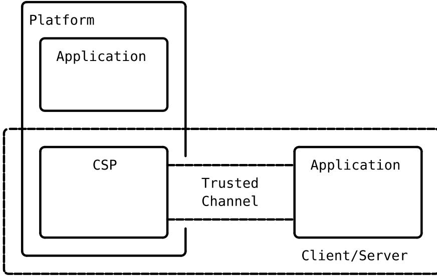
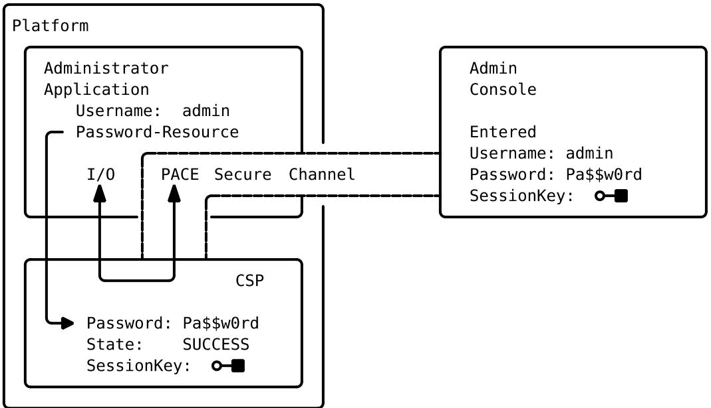
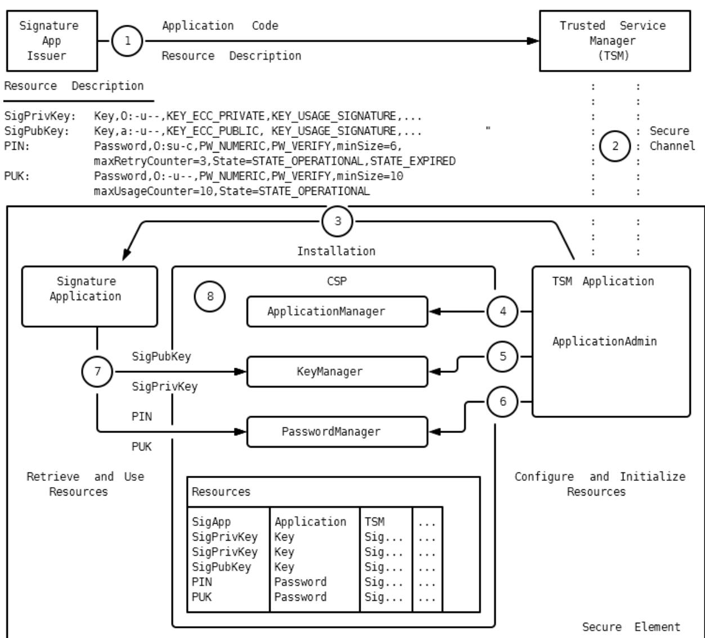
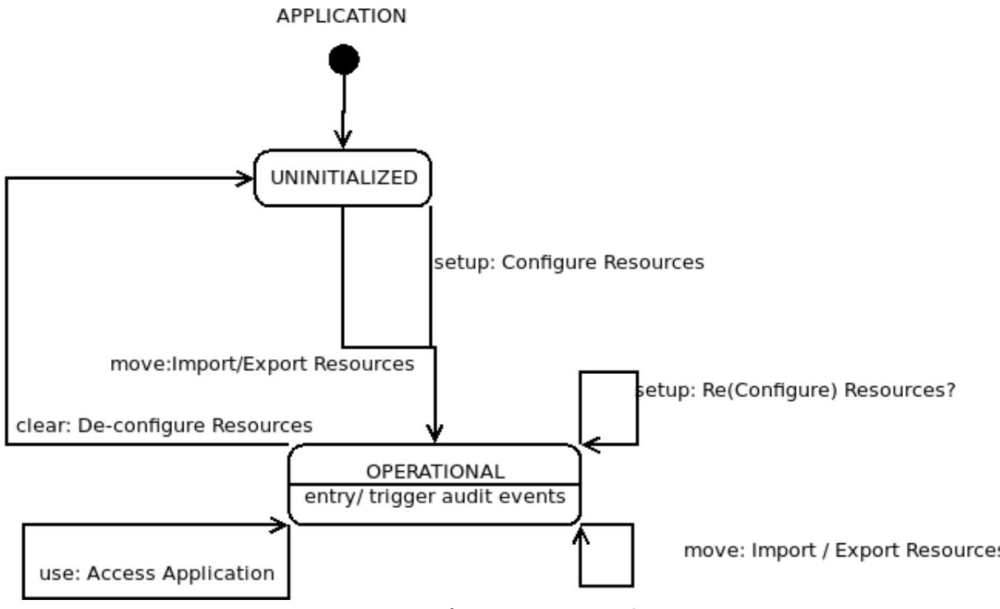
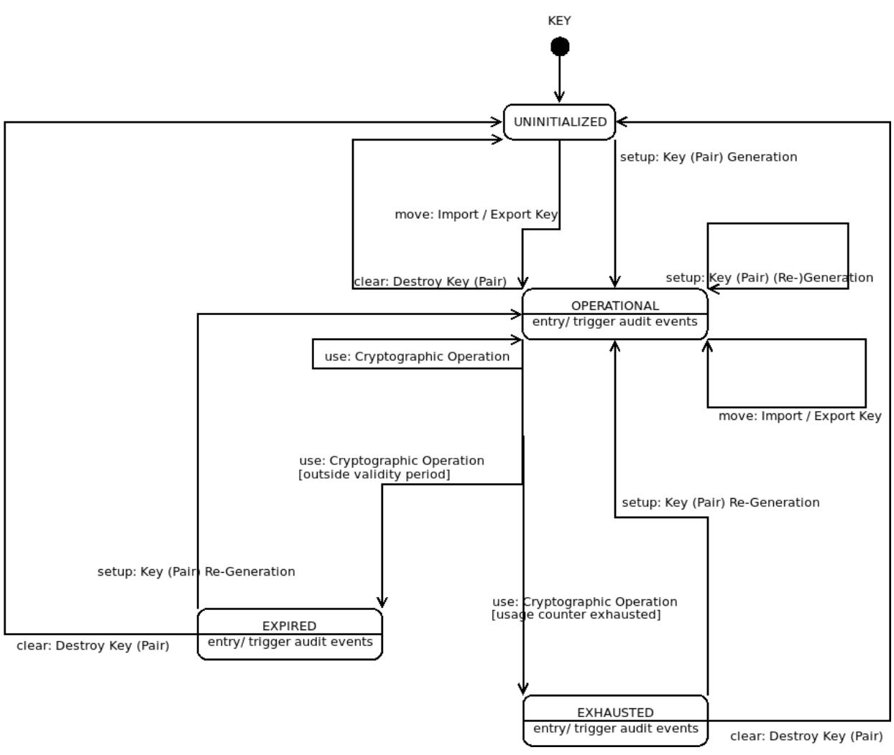
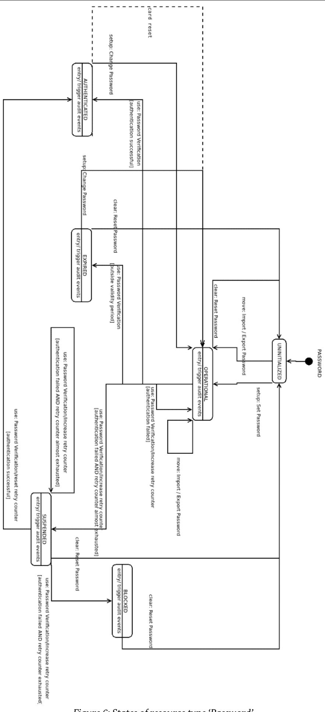
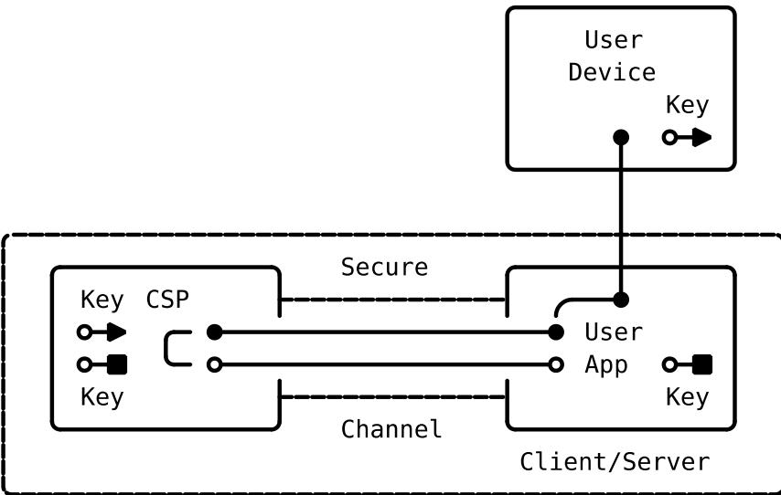
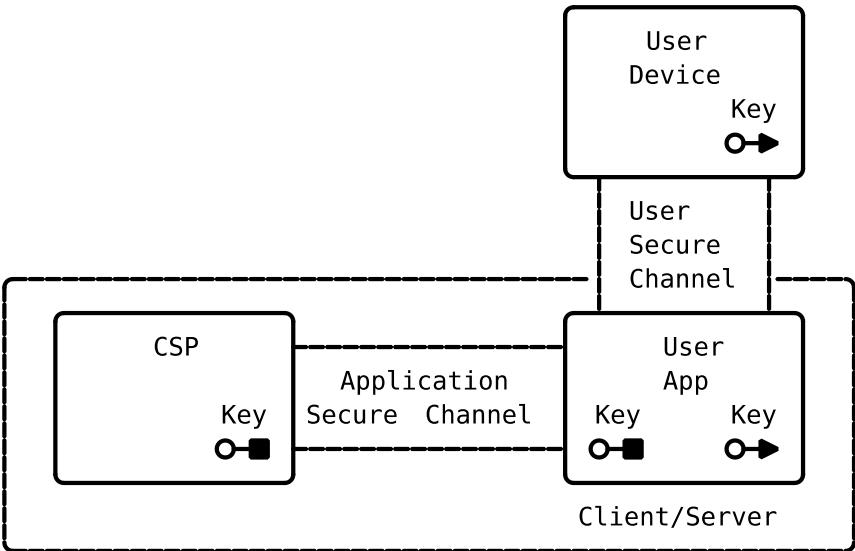
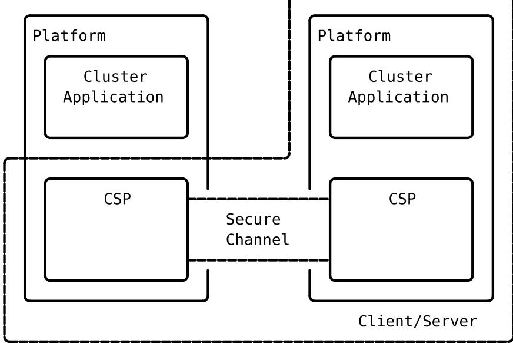

# Technical Guideline BSI TR-03181 CSP2

Cryptographic Service Provider 2

Part 1: Architecture and Concepts

Version 0.94 Public draft

| Table 1: Version history |            |                                                      |  |
|--------------------------|------------|------------------------------------------------------|--|
| Document Version         | Date       | Changes                                              |  |
| 0.1                      | 2020-09-25 | first draft                                          |  |
| 0.5                      | 2020-12-14 | content complete                                     |  |
| 0.6                      | 2021-01-29 | 1st internal review                                  |  |
| 0.7                      | 2021-02-18 | 1st public beta                                      |  |
| 0.75                     | 2021-03-23 | certificate handling, attestation, reviewer comments |  |
| 0.8                      | 2021-05-06 | 2nd public beta                                      |  |
| 0.81                     | 2021-07-21 | Life cycle integration                               |  |
| 0.9                      | 2022-02-03 | 3rd public beta                                      |  |
| 0.91                     | 2022-06-29 | scope, optional modules, reviewer comments           |  |
| 0.93                     | 2022-12-19 | reworked resource states                             |  |
| 0.94                     | 2023-04-03 | public draft as BSI-TR 03181-1 CSP2                  |  |

# **Draft Disclaimer**

This document is a draft specification for public review. It has no final status and may change at any time and in incompatible ways.

Changes to the presented generic concepts are likely to occur as the work on specific APIs for different CSP platforms and the accompanying life cycle integration progresses. Currently, the following topics are identified for possible modification:

- Responsibilities of administrative roles. The goal is to allow for securely separated application specific configuration and management of associated CSP resources.
- Availability and usability of wrapping keys for secure import of application specific assets.
- Availability and usability of attestation mechanisms and secure storage.

| 1 |       | Introduction                                               | 8  |
|---|-------|---------------------------------------------------------------|----|
|   | 1.1   | Structure                                                     | 9  |
|   | 1.2   | Terminology10                                                 |    |
| 2 |       | Architecture11                                                |    |
|   | 2.1   | Platform Mode 11                                           |    |
|   | 2.1.1 | Operational Environment in Platform Mode11                    |    |
|   | 2.2   | Client-Server Mode12                                          |    |
|   | 2.2.1 | Trusted Channel12                                             |    |
|   | 2.2.2 | Operational Environment of the CSP in Client-Server Mode      | 12 |
|   | 2.2.3 | Operational Environment of Applications in Client-Server Mode | 13 |
|   | 2.3   | Entities and Roles13                                          |    |
|   | 2.3.1 | Entity Human Users13                                          |    |
|   | 2.3.2 | CSP Roles14                                                   |    |
|   | 2.4   | Applications16                                                |    |
|   | 2.4.1 | Application Identifier16                                      |    |
|   | 2.4.2 | User Applications16                                           |    |
|   | 2.4.3 | Administrative Applications17                                 |    |
|   | 2.5   | Management Functions17                                        |    |
|   | 2.5.1 | Application Management18                                      |    |
|   | 2.5.2 | Key Management18                                              |    |
|   | 2.5.3 | Password Management 19                                     |    |
|   | 2.5.4 | System Management20                                           |    |
|   | 2.6   | Life Cycle Integration21                                      |    |
|   | 2.6.1 | CSP Life Cycle21                                              |    |
|   | 2.6.2 | Application Life cycle23                                      |    |
|   | 2.7   | Example: Application Deployment24                             |    |
| 3 |       | Resources26                                                   |    |
|   | 3.1   | Parameters26                                                  |    |
|   | 3.1.1 | Identifier26                                                  |    |
|   | 3.1.2 | Type 27                                                    |    |
|   | 3.1.3 | Owner27                                                       |    |
|   | 3.1.4 | Access Control27                                              |    |
|   | 3.1.5 | State 28                                                   |    |
|   | 3.1.6 | Policy32                                                      |    |
|   | 3.1.7 | Audit Events33                                                |    |
|   | 3.2   | Application Attributes34                                      |    |
|   | 3.2.1 | Application Key 34                                         |    |
|   | 3.2.2 | Issuer Key 34                                              |    |
|   | 3.2.3 | Derivation Key 34                                          |    |
|   |       |                                                               |    |

|   | 3.2.4 | Attestation Key34                  |  |
|---|-------|------------------------------------|--|
|   | 3.2.5 | Cluster Key35                      |  |
|   | 3.2.6 | Authentication Key35               |  |
|   | 3.2.7 | Auditor35                          |  |
|   | 3.3   | Key Attributess35                  |  |
|   | 3.3.1 | Key Type 36                     |  |
|   | 3.3.2 | Key Usage 36                    |  |
|   | 3.3.3 | Key (Pair) References37            |  |
|   | 3.3.4 | Key Usage Counter37                |  |
|   | 3.3.5 | Key Validity Period38              |  |
|   | 3.3.6 | Prepend and Append38               |  |
|   | 3.4   | Password Attributes38              |  |
|   | 3.4.1 | Password Type 39                |  |
|   | 3.4.2 | Password Usage 39               |  |
|   | 3.4.3 | Password Usage Counter39           |  |
|   | 3.4.4 | Password Validity Period40         |  |
|   | 3.4.5 | Retry Counter40                    |  |
|   | 3.5   | Example: Signature Application40   |  |
|   | 3.5.1 | Signature Application 40        |  |
|   | 3.5.2 | Logging Application42              |  |
|   | 3.5.3 | Time Application 42             |  |
| 4 |       | Operational Management Functions43 |  |
|   | 4.1   | Application Manager43              |  |
|   | 4.1.1 | Application Configuration43        |  |
|   | 4.1.2 | Application De-configuration43     |  |
|   | 4.2   | Key Manager44                      |  |
|   | 4.2.1 | Key Configuration44                |  |
|   | 4.2.2 | Key Retrieval44                    |  |
|   | 4.2.3 | Key Migration45                    |  |
|   | 4.2.4 | Public Key Handling47              |  |
|   | 4.2.5 | Key De-Configuration48             |  |
|   | 4.3   | Password Manager48                 |  |
|   | 4.3.1 | Password Configuration 48       |  |
|   | 4.3.2 | Password Retrieval49               |  |
|   | 4.3.3 | Password Migration49               |  |
|   | 4.3.4 | Password De-Configuration50        |  |
| 5 |       | Cryptographic Operations51         |  |
|   | 5.1   | Key Generation 51               |  |
|   | 5.1.1 | Elliptic Curve Domain Parameters51 |  |
|   | 5.1.2 | Elliptic Curve Derived Keys52      |  |
|   | 5.2   | Signatures52                       |  |

|   |     | 5.2.1 | Initialization52                              |  |
|---|-----|-------|-----------------------------------------------|--|
|   |     | 5.2.2 | Signature Generation and Timestamping 52   |  |
|   |     | 5.2.3 | Signature Verification52                      |  |
|   |     | 5.2.4 | Signature Suites52                            |  |
|   | 5.3 |       | Session Handling53                            |  |
|   |     | 5.3.1 | Session Protection Keys53                     |  |
|   |     | 5.3.2 | Cipher Suites55                               |  |
| 6 |     |       | Authentication and Identification Protocols56 |  |
|   | 6.1 |       | Protocol Steps56                              |  |
|   |     | 6.1.1 | Initialization56                              |  |
|   |     | 6.1.2 | Authentication56                              |  |
|   |     | 6.1.3 | Session Establishment56                       |  |
|   | 6.2 |       | Available Protocols56                         |  |
|   |     | 6.2.1 | PACE56                                        |  |
|   |     | 6.2.2 | Terminal Authentication57                     |  |
|   |     | 6.2.3 | Chip Authentication58                         |  |
|   | 6.3 |       | Combination of Protocols59                    |  |
| 7 |     |       | Secure Channel60                              |  |
|   | 7.1 |       | Application Secure Channel60                  |  |
|   | 7.2 |       | User Secure Channel60                         |  |
|   |     | 7.2.1 | Platform Mode60                               |  |
|   |     | 7.2.2 | Client-Server Mode60                          |  |
| 8 |     |       | Cluster Mode 63                            |  |
|   | 8.1 |       | User Applications63                           |  |
|   | 8.2 |       | Administrative Cluster Application 63      |  |
|   |     | 8.2.1 | Distributing Resources64                      |  |
|   |     | 8.2.2 | Changing Primary and Replica 64            |  |
| 9 |     |       | References66                                  |  |

| Figure 1: CSP Modes of Operation. Platform and Operational Environment11 |  |
|--------------------------------------------------------------------------|--|
| Figure 2: Example: User Authentication with PACE14                       |  |
| Figure 3: TSM Application Deployment 25                               |  |
| Figure 4: States of resource type 'Application'28                        |  |
| Figure 5: States of resource type 'Key'29                                |  |
| Figure 6: States of resource type 'Password' 30                       |  |
| Figure 7: Indirect User Secure Channel61                                 |  |
| Figure 8: Direct User Secure Channel62                                   |  |
| Figure 9: Cluster Application64                                          |  |

| Table 1: Version history                                           | 2 |
|-----------------------------------------------------------------------|---|
| Table 2: Key Words10                                               |   |
| Table 3: Resource Parameters26                                     |   |
| Table 4: Access Control Matrix bit positions. 27                |   |
| Table 5: Resource-specific Operations28                            |   |
| Table 6: Key Attributes of Applications34                          |   |
| Table 7: Key Attributes35                                          |   |
| Table 8: Key Types36                                               |   |
| Table 9: Key Usages37                                              |   |
| Table 10: Linking Key Resources37                                  |   |
| Table 11: Prepend and Append Information 38                     |   |
| Table 12: Password Attributes38                                    |   |
| Table 13: Password Types39                                         |   |
| Table 14: Password Usages39                                        |   |
| Table 15: Signature Application resources40                        |   |
| Table 16: Policies and Events of the Signature Application42       |   |
| Table 17: Logging Application resources42                          |   |
| Table 18: Time Application resources42                             |   |
| Table 19: Domain Parameters51                                      |   |
| Table 20: Signature Suites52                                       |   |
| Table 21: Cipher Suites55                                          |   |
| Table 22: Parameters of PACE in Chip Mode 57                    |   |
| Table 23: Parameters of PACE in Terminal Mode57                    |   |
| Table 24: Parameters of Terminal Authentication in Chip Mode 57 |   |
| Table 25: Parameters of Terminal Authentication in Terminal Mode58 |   |
| Table 26: Parameters of Chip Authentication in Chip Mode 58     |   |
| Table 27: Parameters of Chip Authentication in Terminal Mode 59 |   |

# **1 Introduction**

Security related products usually not only have to be secure, but are also constrained by development skills, time, and costs as well as certification costs and time. Even worse, such products are usually composed of several components, e.g. hardware, firmware, operating system and application(s), introducing a lot of unavoidable dependencies and complexities. The overall security of such composed products heavily depends on how those components interact with each other. Even a minor weakness in one component may have a severe side effect in another component. To ensure the security of such products, an evaluation of the whole architecture is required. While a composite certification according to Common Critiera [1] is well suited to prove that a product fulfills certain security requirements, it can be a lengthy, nondeterministic, and costly process, depending on the evaluation level and complexity of the product. This usually does not fit very well to short product (development) cycles and competitive prices in a lot of industries.

The Cryptographic Service Provider (CSP) is designed to increase the security of composed products and to reduce time and costs of certifications of products. In a nutshell, the CSP securely encapsulates essential cryptographic functions and protocols at a high level and provides them as services to applications. The Cryptographic Service Provider then requires a thorough security certification. But the certification effort for applications is heavily reduced, as they use the cryptographic functions and protocols via well-defined interfaces that are designed to prevent misuse and ensure that the application has no direct access to sensitive cryptographic data. In particular, the certification of applications using the CSP does not require a composite certification. Applications and CSP can be certified separately and with different assurance levels, utilizing *coordinated* protection profiles.

In particular, the CSP is not another cryptographic library that aims at simplifying application development. In contrast to a cryptographic library that provides implementations of cryptographic primitives and protocols at an abstract level to applications, the CSP consists of active components that are able to interact with the infrastructure (via extensions) to manage keys and credentials on behalf of the respective application that owns the key material. The cryptographic services provided by the CSP are self-contained, such that the application using the CSP is exempted from performing complicated and error-prone management obligations that often affect the security of the application.

The CSP aims at reducing the risk of incorrect use of cryptography by providing:

- Logically separated and self-contained*1* security functions, including:
	- Cryptographic Signatures including optional timestamping and signature enumeration.
	- Protected Sessions for secure communication and content protection (e.g. disk encryption).
	- Identification and authentication protocols based on passwords (PIN/PUK) and keys, e.g. PACE, CA, TA, …
- Extensive audit functionality for security relevant events.
- Secure access to sensitive cryptographic resources (e.g. keys, passwords and applications) and the option to share resources among multiple applications by enforcing a configurable role and access control model.
- Sensitive management operations that are performed by dedicated administrative applications.
- Redundancy and performance gains by clustering a set of CSPs.
- Convenient interfaces for application developers.

This implies that application developers should restrict themselves to cryptographic services provided by the CSP instead of implementing security functions on their own. To discourage application developers from extending the CSP, the interface does not allow direct access to any sensitive cryptographic material but use references instead. Application developers may still use cryptographic libraries and/or implement

*1* The CSP catches and fulfills most if not all of the obligations for secure usage of the underlying platform specific security functionality.

cryptographic primitives and protocols that are not provided by the CSP on their own. However, in those cases the application developer is also responsible for the security of the implementation.

To summarize the benefits, using the CSP in a composed IT product

- enables development and certification of the application independent of the platform.
- allows for a security certification of applications with lower security assurance, as important cryptographic operations and protocols are encapsulated in the CSP in a way that prevents typical cryptographic misuse
- provides sufficient security functionality to support a variety of security related applications.
- allows for an easy deployment within any application.

Exemplary applications using the CSP include:

- (electronic) ID applications, e.g. passports and other government issued ID cards or company IDs.
- Second Factor Authentication, e.g. u2f (CTAP1) or FIDO2 (CTAP) enabled token.
- (Timestamped) Signature Creation, e.g. for electronic record keeping systems.

Within this Technical Guideline an example application is used to explain the functionality of the CSP:

A *signature application* will be installed on a CSP-enabled Secure Element (e.g. a smart card) to become a signature creation device for an external user. The installation and configuration of the application on the Secure Element will be performed by a Trusted Service Manager (TSM), who uses a TSM Application on the Secure Element to configure the CSP with authentication data (PIN and PUK) for the external user and the signature key pair. Furthermore, the audit functionality of the CSP is used to keep track of authentication failures of the external user as well as signature generation. A logging application is used to produce a timestamped audit trail of those events.

# 1.1 Structure

The Technical Guideline *Cryptographic Service Provider* consists of several parts.

This **Part 1** of the specification describes the general architecture of the CSP and the fundamental concepts. It contains:

- A generic description of possible architectures of a composed IT product using the CSP, i.e. platform mode and client-server mode.
- A generic description of users, roles, (administrative) applications and management functions.
- Generic requirements for the life cycle of a composed IT product, including application development, provisioning and personalization.
- A description of the available types of resources, e.g. keys and passwords, their configurable attributes, access restrictions and life cycle.
- The supported cryptographic primitives, algorithms, protocols and supporting functionality.

The provided descriptions and concepts in this part try to be as open to different implementations and platforms as feasible, avoiding terminology hinting at specific technologies if possible.

The mapping of those concepts to specific platforms, e.g. Secure Elements or Hardware Security Modules, is subject of (not yet released) subsequent parts.

**Part 2** maps the provided generic concepts onto (embedded) Secure Elements running a JavaCard OS. It focuses on:

- The mapping of entities and roles typically needed in the context of (secure) composed IT products in mobile devices and smart cards.
- The usage and inclusion of card management capabilities typically found on those platforms, e.g. GlobalPlatform mechanisms.
- A JavaCard API for the provided CSP functionality, including life cycle management.

All parts may contain optional or conditional concepts and functionality, to partially reflect the limitations of specific platforms as well as specific sets of use cases. For part 1 of this technical guideline all concepts and functionality are considered mandatory with the following exceptions:

- Auditing and Timestamping, including their respective management functionality, are optional.
- Cluster Mode is optional.
- Cypher suites exclusively needed for TLS, S/MIME and SSH are optional.

The above pursues the partitioning of the protection profiles 'CSP', 'CSP Time Stamp Service and Audit' and 'CSP Time Stamp Service, Audit and Clustering', respectively.

# 1.2 Terminology

The key words "MUST," "MUST NOT," "REQUIRED," "SHALL," "SHALL NOT," "SHOULD," "SHOULD NOT," "RECOMMENDED," "MAY," and "OPTIONAL" in this document are to be interpreted as described in RFC 2119 [2]. The key word "CONDITIONAL" is to be interpreted as follows:

**CONDITIONAL:** The usage of an item is dependent on the usage of other items. It is therefore further qualified under which conditions the item is REQUIRED or RECOMMENDED.

When used in tables (profiles), the key words are abbreviated as shown in Table *[2](#page-9-1)*.

| Key word             |             | Abbrev. |
|----------------------|-------------|---------|
| MUST / SHALL         | REQUIRED    | m       |
| MUST NOT / SHALL NOT | –           | x       |
| SHOULD               | RECOMMENDED | r       |
| SHOULD NOT           | –           | –       |
| MAY                  | OPTIONAL    | o       |
| –                    | CONDITIONAL | c       |

#### Table 2: Key Words

# **2 Architecture**

The business logic of the given use case is implemented in one or more applications utilizing the provided cryptographic services of the CSP. Application and CSP may be operated either on the same platform in *Platform Mode* or on different platforms in *Client-Server Mode*. In the latter, CSP acts as the server, and the application is the client. [Figure 1](#page-10-3) gives an overview of both modes; details on the modes are described in Section *[2.1](#page-10-1)* and Section *[2.2](#page-11-0)*.

**Note**: The CSP MAY provide both modes simultaneously.

In the context of this document the term *platform* refers to the hardware and software needed to execute the CSP or application. The platform and its configuration, including additional software, form the *operational environment* of the CSP. Depending on the type of CSP and platform additional requirements for the operational environment exist, as detailed below.

The CSP platform is typically:

- A smartcard or a secure element, comprising the hardware, the operating system and additional software (e.g. the Card Manager and native libraries). In this context the CSP and its platform are often certified as a composite product, i.e. the CSP includes its platform and provides its own operation environment fulfilling all requirements. As such, the CSP itself can become the platform for further applications, see Platform Mode below.
- A Linux Appliance, comprising all hardware components including e.g. a TPM, the Linux Distribution and additional Software Packages that are required for the operation of the CSP. Here, the CSP is typically found to be implemented in software only, using the Appliance, its services and additional software as the operational environment.

# 2.1 Platform Mode

In Platform Mode, the CSP and the application that uses the CSP share the same (physical) platform.

#### 2.1.1 Operational Environment in Platform Mode

The Operational Environment of the CSP MUST ensure the following:

- Integrity of the implementation of the CSP and of the applications.
- Implicit mutual authentication of application and CSP.

#### 2 Architecture

- Integrity protection of the communication between application and CSP.
- Integrity and confidentiality of stored sensitive data.
- Authenticity of installed update code.

The underlying platform MUST provide the Operational Environment.

**Note:** Depending on the underlying platform, consisting of hard- and software, implementing the Operational Environment may require additional mechanisms implemented in software that are not directly provided by the operating system. If required, those additional mechanisms are not part of the CSP.

# 2.2 Client-Server Mode

In Client-Server Mode, the CSP and the Application run in different Operational Environments and communicate via a Trusted Channel.

#### 2.2.1 Trusted Channel

The application and the CSP MUST use a Trusted Channel that SHALL provide mutual authentication of CSP and application. The Trusted Channel SHALL protect the integrity and SHOULD protect the confidentiality of the communication. It is RECOMMENDED to use a cryptographically protected Secure Channel (cf. Section *[7](#page-59-0)*) as the Trusted Channel. In this case, the application SHALL initiate the establishment of the Secure Channel.

**Note:** To initiate a secure channel, the application must implement or use cryptographic functions to setup the Secure Channel that are not provided by the remote CSP.

If both the application and the CSP are operated in the same trusted environment, a physically protected Trusted Channel may be used instead of a Secure Channel.

#### 2.2.2 Operational Environment of the CSP in Client-Server Mode

The Operational Environment of the CSP MUST ensure the following:

- Integrity of the CSP implementation.
- Integrity and confidentiality of stored sensitive data.
- Authenticity of installed update code.

The CSP SHALL be executed on a platform that implements a suitable Operational Environment.

**Note:** Depending on the underlying platform, consisting of hard- and software, implementing the Operational Environment may require additional mechanisms developed in software that are not directly provided by the operating system. If required, those additional mechanisms are not part of the CSP.

# 2.2.3 Operational Environment of Applications in Client-Server Mode

The requirements for the Operational Environment of the application depend on the application itself. The Operational Environment SHOULD at least protect the integrity of the application code and data.

If a Secure Channel is used as the Trusted Channel, the Operational Environment of the application MUST protect the confidentiality of the credentials used to setup the Secure Channel.

# 2.3 Entities and Roles

The common types of entities interacting with the CSP are *Applications* and *Human Users*, acting in roles defined in this chapter. As the access and interaction model of the CSP is focused on (administrative) applications those are described in a separate chapter 2.4.

Specific platforms or use-cases implementing a specific life-cycle MAY define further entities, stakeholders and roles that MUST be mapped to applications acting in a roles derived from the ones presented here.

#### 2.3.1 Entity Human Users

The CSP is a security component. The functionality provided directly by the CSP SHOULD be reduced to a minimum for various reasons, e.g.:

- Any additional functionality introduces potential vulnerabilities in their implementation.
- The implementation should be reviewed and evaluated on a regular basis.
- Some of the platforms the CSP is intended to be used on are very restricted.

Therefore, the CSP SHOULD NOT provide an interface for human users. The CSP SHOULD only interact directly with applications. Administrating the CSP is thus done by administrator applications. Those applications MAY interact with human users, either directly or indirectly with a user device, e.g. a terminal.

**Note:** Applications may still implement user management without using the CSP. It is however not recommended practice.

#### 2.3.1.1 Example: Administrator Authentication

An administrator application interacting with a human administrator performs the following steps to authenticate the external user as an administrator. In this example, the PACE Protocol is used for password based authentication and establishing a secure channel. Details on using the PACE Protocol with the CSP can be found in Section *[6.2.1](#page-55-6)*. As PACE is a cryptographic protocol, the external user is required to use an administrator console, a device implementing the client side of the PACE protocol.

**Note:** The administrator console may also use a CSP to implement the PACE protocol.

[Figure 2](#page-13-1) gives an overview on the example.

Figure 2: Example: User Authentication with PACE.

The following steps are performed by the Administrator Application:

- 1. The claimed identity (admin) of the external user has to be determined. This requires the administrator application to maintain a list of valid user names.
- 2. The correct password resource on the CSP must be selected. This requires the application to map user names to password resources on the CSP.
- 3. The PACE Protocol is started. This requires the application to setup the protocol instance with the password resource and other parameters that must be negotiated with the administrator console.
- 4. Protocol data is exchanged between the CSP and the external user. This requires the application to format and forward protocol data.
- 5. When the protocol is done, the application must check the authentication status of the used password resource, to determine whether the external user was successfully authenticated as administrator.
- 6. The Secure Channel established by the CSP with the external user may be used by the application to communicate securely with the external user via the CSP.

Thus, applications SHALL manage the identities of their users on their own (Steps 1 and 2). The CSP does not care about, e.g. a user name, that is assigned to a user of an application. The CSP manages user credentials, e.g. stores and verifies passwords (Steps 3 to 5). After a successful authentication of a user, the CSP supports the application by providing security services, e.g. a secure channel (Step 6).

# 2.3.2 CSP Roles

Although the CSP SHOULD NOT interact directly with human users, some tasks have to be performed by administrators. Administrative tasks, especially if handled by human users, are error-prone and introduce potential mis-configuration and other weaknesses. Therefore, administrative tasks SHOULD also be performed by applications, which MAY interact with human administrators.

Applications with an assigned privileged role are called administrative applications (cf. Section *[2.4.3](#page-16-0)*). Such administrative applications SHALL be distinguishable from ordinary user applications by assigning applications administrator roles.

The CSP uses two separate roles for privileged tasks and a third role for unprivileged tasks:

• ApplicationAdmin

#### • DeviceAdmin

• Owner

Exactly one administrative application SHALL be assigned the role ApplicationAdmin and DeviceAdmin, respectively.

**Note:** In the following the role is directly used to indicate that a task is performed by an administrative application in that role, e.g. ApplicationAdmin is used instead of "an administrative application in role ApplicationAdmin."

Besides the administrative roles, the CSP uses the role Owner. An application is acting in role Owner when it makes use of a resource, e.g. a key or a password that is managed by the CSP and assigned to this application. Details on resources and their management can be found in Section *[3](#page-25-0)*. With respect to roles, the ownership of resources (cf. Section *[3.1.3](#page-26-1)*) and access control (cf. Section *[3.1.4](#page-26-2)*) are of particular interest.

The assignment of roles to applications is static. The CSP MUST NOT change the role or privilege of an application when a human user is authenticated via the application, i.e. the application does not gain any additional privileges:

- A user application does not become an administrative application due to authentication of a human user which is recognized as administrator.
- An application is acting as Owner of a resource assigned to the application independent of the authentication of the human user that is authorized to use the resource.

Thus, it is up to the implementation of the application, whether a human user is required to perform a certain administrative task or the application performs administrative tasks in an automated or semiautomated way. Policies MAY be used to further restrict applications from using resources in role Owner, by requiring additional authentications to be performed before access to a resource is granted. Details on policies can be found in Section *[3.1.6](#page-31-0)*.

#### 2.3.2.1 Application Administrator

The ApplicationAdmin performs all administrative tasks related to application management:

- Installation (including updates) of applications in the platform model
- Configuration of applications, i.e. the audit events to be logged.
- Configuration of keys and passwords and their access control rules to be provided by the CSP to applications.
- Initialization of resources, where required, for applications.
- De-configuration of resources
- De-installation of applications in the platform model.

Some of the tasks performed by the ApplicationAdmin MAY be further split into dedicated administrator roles, e.g. platform specific operations may be delegated to an UpdateAgent role.

#### 2.3.2.2 Device Administrator

The DeviceAdmin performs comprehensive device-related administrative tasks:

- Configure a set of CSPs to operate in Cluster Mode
- Import and export of keys and passwords in Cluster Mode.
- Configuring the available cryptographic algorithms and key sizes on a device.
- Configuring and generating global keys, e.g. for key attestation.
- Setting and synchronizing the system time

Some of the tasks performed by the DeviceAdmin MAY be further split into dedicated administrator roles, e.g. tasks related to cryptographic operations may be delegated to a CryptoOfficer and setting the system time may be delegated to a TimeKeeper.

#### 2.3.2.3 Resource Owner

The Owner usually performs all tasks related to this resource:

- Setup of the resource, e.g. key generation.
- Usage of the resource, e.g. signature creation.
- Migration of the resource, e.g. public key export.
- Clearance of the resource, e.g. key destruction.

**Note:** Setup of a resource by the Owner requires the resource to be configured beforehand by the ApplicationAdmin. The De-configuration of a resource by the ApplicationAdmin requires the resource to be cleared beforehand by the Owner.

Some of the tasks related to a resource MAY be configured by the ApplicationAdmin to be unavailable to the Owner, such that those tasks MUST be performed by the ApplicationAdmin or DeviceAdmin. On the other hand, the ApplicationAdmin MAY also configure resources to be available to other applications that are not acting in role Owner.

#### **Global resources**

Resources that are available to multiple user applications are called global resources. The Owner of a global resource is usually the DeviceAdmin or another administrative application in a sub-role of the DeviceAdmin. To allow other applications to access the resource, the access control rules to use, setup, move and clear the resource MUST explicitly be granted denied to other applications per default, unless the implications of potentially untrusted user applications performing sensitive tasks on shared resources have been taken into account.

Details on Access Control Rules can be found in Section *[3.1.4](#page-26-2)*.

# 2.4 Applications

Applications that perform non-privileged tasks are user applications (cf. Section *[2.4.2](#page-15-2)*) and applications that perform privileged tasks are administrative applications (cf. Section *[2.4.3](#page-16-0)*).

# 2.4.1 Application Identifier

Every application that is allowed to interact with the CSP is assigned a unique application identifier within the configuration process. This application identifier is used by the CSP to assign resources to applications and to implement access control rules. If a resource is assigned an application identifier as owner, then this application is acting in role Owner when using the resource.

Details on application identifiers and ownership of resources can be found in Section *[3.1.3](#page-26-1)*.

The application identifier SHALL also allow to distinguish between user applications and administrative application.

### 2.4.2 User Applications

User applications may interact with external entities and use services provided by the CSP, e.g. for authenticating users and performing cryptographic operations on behalf of their users, but may not perform any privileged management functions provided by the CSP. The CSP MUST NOT allow a user application to perform administrative management functions. The CSP SHALL limit access of user applications to resources that have been configured for the application or are available to all applications.

The user application is responsible for some management task (owner management functions, cf. Section *[2.5](#page-16-1)*) on the configured resources, but the resources are operated by the CSP, e.g. the credentials of human

users may be set and changed by the application (or the ApplicationAdmin), but all operations using the credentials are performed by the CSP.

#### 2.4.3 Administrative Applications

Management tasks are in general performed by administrative applications. Those applications are integral parts of the CSP and MUST be certified using the same assurance class as the CSP. To perform a certain management task on the CSP (operational management functions, cf. Section *[2.5](#page-16-1)*), the administrative application MUST be assigned as the respective administrative role as Owner (cf. Section *[2.3](#page-12-1)* and Section *[3.1.3](#page-26-1)*). Administrative applications also perform management tasks on the underlying platform (governing management functions, cf. Section *[2.5](#page-16-1)*). In this case, administrative applications SHOULD be operated in Platform Mode (cf. Section *[2.1](#page-10-1)*).

Examples for administrative tasks to be performed by administrative applications include, but are not limited to:

- Management of global resources in role DeviceAdmin.
- System time synchronization with external time sources in role TimeKeeper.
- Migration of resources within a cluster of CSPs in role CryptoOfficer.
- Dynamic allocation of resources in role ApplicationAdmin.
- Unattended update installation in role UpdateAgent.

Administrative applications are applications that may operate in an automated way that does not require any human interaction. User applications may interact with administrative applications via their public interfaces, e.g. a user application may request an administrative application in role TimeKeeper to synchronize the system time or it may request an administrative application in role ApplicationAdmin to allocate additional key resources.

The internal and external interfaces of the administrative applications is described in the platform specific parts of this documentation, e.g. part 2 for Secure Elements using JavaCardOS. The expected behavior of the administrative applications is described in the later sections of this document.

# 2.5 Management Functions

Application management, key management, password management, and system management are in general performed by administrative applications unless the tasks are delegated to the resource owner. Those management functions are further separated into governing, operational and owner management functions:

#### **Governing Management Functions**

Management functions that are **not** part of the core functionality of the CSP are *governing management functions*. They MUST be provided by administrative applications, e.g. using the Operational Environment, but may also use the CSP. Governing management functions do not necessarily provide a standardized interface and may be specific to the environment.

#### **Operational Management Functions**

Management functions that are directly provided by the CSP via standardized management interfaces are *operational management functions*. The use of those interfaces is in general restricted to administrative applications, however, some operational management functions can also be performed by user applications, see the respective resource management descriptions below for further details.

#### **Owner Management Functions**

Management functions that are usually performed by the owner of a resource using standardized functionality of the CSP, but not via the management interfaces, are *owner management functions*. Only the operational management functions are part of this specification. They are described in Section *[4](#page-42-0)*.

### 2.5.1 Application Management

Application Management comprises all interactions with applications and their resources. Those interactions are separated into governing management functions and operational management functions. Governing Management Functions are all interactions with the Operational Environment. Operational Management Functions are all interactions with the management interfaces of the CSP.

Application Management is performed by administrative applications in role ApplicationAdmin or one the sub-roles.

**Note:** Application Management also involves interactions with key and password resources. The governing and operational management functions described for Key Management and User Management apply accordingly.

#### 2.5.1.1 Governing Management Functions

The ApplicationAdmin is responsible for all interactions with the Operational Environment. Those governing management functions are strictly platform-specific. The governing management functions include the identification of external entities, the validation, installation, update and de-installation of user applications. The ApplicationAdmin SHALL use the installation, update, and de-installation mechanisms provided by the Operational Environment. The ApplicationAdmin usually also requires administrative privileges in the Operational Environment.

Those governing management functions are interleaved with governing management functions for key management and password management as well as mechanisms provided by the Operational Environment.

#### 2.5.1.2 Operational Management Functions

Only the ApplicationAdmin may initiate operational management functions via the ApplicationManager interface of the CSP. The ApplicationManager (cf. Section *[4.1](#page-42-1)*) provides the following application life cycle operations to the ApplicationAdmin:

- Application configuration
- Application de-configuration

There are no operational management functions that can be performed by user applications.

#### 2.5.2 Key Management

Key Management comprises all interactions with key resources. Those interactions are separated into governing management functions, which are all interactions with external entities and operational management functions, which are all interactions with the management interfaces of the CSP.

Key Management is performed by administrative applications in role ApplicationAdmin or DeviceAdmin.

**Note:** Key Management can also involve interactions with password resources. The governing and operational management functions described for Password Management apply accordingly.

#### 2.5.2.1 Governing Management Functions

Examples for governing management functions that have to be performed by administrative applications include the following use cases:

• Initialization of application key resources, where required by the application issuer. The initialization includes but is not limited to key generation and renewal, as well as the interaction with the infrastructure for key certification. The initialization is performed by the ApplicationAdmin.

- Initialization of global key resources, e.g. for device attestation, that can be used by applications. The initialization includes but is not limited to key generation and renewal, as well as the interaction with the infrastructure for key certification. The initialization is performed by the DeviceAdmin.
- Setup and management of Cluster Mode and key migration within the cluster is performed by the DeviceAdmin.

#### 2.5.2.2 Operational Management Functions

Applications may initiate operational management functions via the KeyManager interface. The KeyManager (cf. Section *[4.2](#page-43-0)*) provides basic key life cycle operations to applications:

- Key configuration
- Key retrieval
- Key migration
- Key de-configuration

The CSP MUST verify the access control rules and policies for all operational management functions on key resources that are initiated by applications. The operations for key configuration and key de-configuration SHALL NOT be available to user applications. Those operations SHALL be restricted to administrative applications in role ApplicationAdmin or DeviceAdmin.

#### 2.5.2.3 Owner Management Functions

The Owner of a key resource is responsible for all application-specific management functions related to key management, e.g. the identification of external entities, mapping key resources to entities, and initiating cryptographic operations. Those owner management functions are often interleaved with owner management functions for password management.

Applications mainly use the key retrieval operations to obtain a Key handle that can be used to perform cryptographic operations on the key resource. The following operations are made available via a Key (cf. Section *[3.3](#page-34-3)*) handle:

- Key generation
- Key usage
- Key destruction

Depending on the access control rules of a key resource configured by the ApplicationAdmin, some owner management functions cannot be performed by the Owner, instead they MUST be performed by administrative applications (either in role ApplicationAdmin or DeviceAdmin) or MAY be performed by other user applications that are not the Owner of the key.

#### 2.5.3 Password Management

Password Management comprises all interactions with password resources. Those interactions are separated into governing management functions, which are all interactions with external entities (in general human users) and operational management functions, which are all interactions with the management interfaces of the CSP.

Password Management is performed by administrative applications in role ApplicationAdmin or DeviceAdmin.

**Note:** Password Management can also involve interactions with key resources. The governing and operational management functions described for Key Management apply accordingly.

#### 2.5.3.1 Governing Management Functions

Examples for governing management functions that have to be performed by administrative applications include the following use cases:

- Initialization of application password resources, where required by the application issuer. The initialization includes but is not limited to setting and re-setting initial passwords. The initialization is performed by the ApplicationAdmin.
- Initialization of global password resources, e.g. for human users, that can be used by administrative applications. The initialization includes setting and resetting initial passwords. The initialization is performed by the DeviceAdmin.
- Setup and management of Cluster Mode and password migration within the cluster is performed by the DeviceAdmin.

#### 2.5.3.2 Operational Management Functions

Applications may initiate operational management functions via the PasswordManager interface. The PasswordManager (cf. Section *[4.3](#page-47-1)*) provides basic password operations to applications:

- Password configuration
- Password retrieval
- Password migration
- Password de-configuration

The CSP MUST verify the access control rules and policies for all operational management functions on password resources that are initiated by applications. The operations for password configuration and password de-configuration SHALL NOT be available to user applications. Those operations SHALL be restricted to administrative applications in role ApplicationAdmin or DeviceAdmin.

#### 2.5.3.3 Owner Management Functions

The Owner of a password resource is responsible for all application-specific management functions related to password management, e.g. the identification of external entities, mapping password resources to entities, and operations for password handling. Those owner management functions are often interleaved with owner management functions for key management.

Examples for owner management functions performed by user applications include the following use cases:

- Changing the password of an authenticated user.
- Resetting the retry counter of a PIN after entering the correct PUK.

Applications mainly use the password retrieval operations to obtain a Password handle that can be used to perform verification operations on the password resource. The following operations are made available via a Password (Section *[3.4](#page-37-2)*) handle:

- Password setting
- Password verification
- Password resetting

Depending on the access control rules of a password resource configured by the ApplicationAdmin, some owner management functions cannot be performed by the Owner, instead they MUST be performed by administrative applications (either in role ApplicationAdmin or DeviceAdmin) or MAY be performed by other user applications that are not the Owner of the password.

#### 2.5.4 System Management

System Management comprises all interactions with Operational Environment that are not covered by Application Management. Those interactions are separated into governing management functions, which are all interactions with the Operational Environment and operational management functions, which are all interactions with the management interfaces of the CSP.

System Management is performed by administrative applications in role DeviceAdmin.

#### 2.5.4.1 Governing Management Functions

Examples for governing management functions that have to be performed by administrative applications include the following use cases:

• Adjusting and synchronizing the system time with external time sources.

#### 2.5.4.2 Operational Management Functions

There are currently no operational management functions for System Management.

# 2.6 Life Cycle Integration

The life cycles of the CSP and applications using the CSP SHOULD be synchronized to allow for a secure deployment of the application. Within this specification, the life cycle is described in the following abstract phases:

#### **Development Phase**

The *Development Phase* includes all aspects related to the development of the product, including evaluation, certification, and in case of software-based products packaging.

#### **Initialization Phase**

The *Initialization Phase* includes the initial setup of the product and the generation or import of credentials and product-specific keying material, e.g. for attestation. In case of software-based products, the initialization also includes the installation of the software package on the underlying platform.

#### **Personalization Phase**

The *Personalization Phase* includes the setup of user-specific data, including initial credentials and keying material for users of the product.

#### **Operational Use Phase**

The *Operational Use Phase* is application-specific. It also includes the updating the product.

#### **Decommission phase**

The *Decommission Phase* includes the destruction of credentials and keying material. In case of software-based production the de-installation of the software on the underlying platform.

#### 2.6.1 CSP Life Cycle

The life cycle of the CSP depends to a large extend on the underlying platform. The life cycle of a smart card based CSP differs from the life cycle of a cloud-based CSP. In case of a composite product, the abstract life cycle MUST be mapped to the life cycle of the underlying platform.

#### 2.6.1.1 CSP Development

The manufacturer is responsible for the development of the CSP. The manufacturer SHALL select suitable platforms for the CSP and take the requirements and implications of the platform(s) into account. The evaluation and certification of the CSP SHOULD include the selected platform, e.g. as composite certificate.

If the CSP is externally developed (and certified) as software independent of a specific platform, the manufacturer is the entity that selects a suitable platform by taking the guidance of the software developer into account.

#### 2.6.1.2 CSP Initialization

The manufacturer is responsible for the initialization of the CSP. The initialization consists of the initial installation of the CSP and the administrative application DeviceAdmin on the underlying platform.

The initial setup of the CSP is performed by the DeviceAdmin using local configuration mechanisms of the CSP. The DeviceAdmin may be provided by the manufacturer of the CSP, by the manufacturer of the underlying platform, or by the operator of the underlying platform. The secure integration of the DeviceAdmin into setup procedures of the CSP MUST be considered in the development of the CSP.

The initial credentials for administrators using the DeviceAdmin MUST be generated or imported on the CSP and distributed securely to the administrators.

The CSP initialization SHOULD be performed in the secure environment of the manufacturer. If the initialization is performed outside of the secure environment of the manufacturer, then the manufacturer is responsible to ensure that the CSP is installed on a suitable platform and that the platform is in a secure state, e.g. by using mechanisms of the operating system of the underlying platform.

It is RECOMMENDED to generate or import attestation keys and corresponding certificates that can be used to verify that the CSP has been initialized in a trustworthy way. The attestation certificate SHOULD include information on the CSP (e.g. the identity of the manufacturer and the certification of the CSP) and the underlying platform. The attestation MAY include information on the entity acting in role DeviceAdmin.

**Note:** As the role DeviceAdmin is given to an application using the CSP, the application has its own life cycle separate from the life cycle of the CSP.

#### 2.6.1.3 CSP Personalization

Administrators in role DeviceAdmin are responsible for the personalization of the CSP. The personalization consists of the installation of the administrative application ApplicationAdmin on the underlying platform as well as the configuration of the CSP and the underlying platform for the ApplicationAdmin. The ApplicationAdmin SHOULD be customized for the underlying platform and/or the operator of the underlying platform to allow for a seamless integration into the procedures for operational use. The configuration MAY include the creation of administrative users on the underlying platform. The DeviceAdmin MAY generate or import global resources on the CSP, e.g. additional attestation keys or derivation keys. The DeviceAdmin MAY setup the CSP to operate in a cluster (cf. Section *[3.2.5](#page-34-0)*).

There are no generic requirements on the environment for the personalization. The DeviceAdmin SHOULD use the attestation mechanism of the CSP (if configured in the initialization phase) to verify that the CSP and the underlying platform are in a trustworthy state.

**Note:** The ApplicationAdmin is an application using the CSP, it has its own life cycle independent of the life cycle of the CSP.

#### 2.6.1.4 CSP Operational Use

Administrators in role ApplicationAdmin are responsible for the installation, configuration, update, deconfiguration and de-installation of user-applications, while the CSP is in operational use.

Administrators in role DeviceAdmin are responsible for managing the ApplicationAdmin, including updating the application and the management of credentials for administrators in role ApplicationAdmin. In cluster mode administrators in role DeviceAdmin are additionally responsible for managing the cluster of CSPs, including the addition and removal of CSPs to the cluster.

#### 2.6.1.5 CSP Decommission

Administrators in role DeviceAdmin are responsible for the decommissioning of the CSP.

#### 2.6.2 Application Life cycle

With the exception of the application development, the life cycle of the application is within the operational use of the CSP.

#### 2.6.2.1 Application Development

The application issuer is responsible for the development of the application. The application issuer MUST take the requirements imposed by the respective ApplicationAdmin into account:

- The platform used for executing the application. The platform cannot be selected by the application issuer. In platform mode, it is the underlying platform of the CSP or, in client-server mode, it is a separate platform administrated by the ApplicationAdmin. The evaluation and certification of the application MUST take requirements imposed by the respective platform into account.
- The format of application package including the resource description. The application package MUST be verifiable and installable on the underlying platform and the ApplicationAdmin MUST be able to parse the resource description of the application to be able to configure the required resources on the CSP.
- The IssuerKey MUST be securely delivered to the ApplicationAdmin, to enable the import of resources (in encrypted form) provided by the issuer as part of the application package.

#### 2.6.2.2 Application Initialization

Administrators in role ApplicationAdmin are responsible for the initialization of the application. The initialization consists of the verification of the authenticity of the application package, the installation of application on the platform (either on the underlying platform of the CSP or on a separate platform), and the configuration and initialization of the resources on the CSP according to the resource description. The initialization includes the generation, import and export of resources. Resources to be generated and then exported (in encrypted form) SHALL be returned to the application issuer.

**Note:** The initialization may be separated into configuration and pre-personalization.

#### 2.6.2.3 Application Personalization

The application personalization is application-specific. The application issuer MAY use credentials and keys that were generated and exported by the ApplicationAdmin in the initialization to remotely access the installed instance of the application.

#### 2.6.2.4 Application Operational Use

The operational use of the application is application-specific. Administrators in role ApplicationAdmin are responsible for updating the application when updates are provided by the application issuer. In cluster mode administrators in role DeviceAdmin are responsible for migrating resources of the application between CSPs in the cluster.

#### 2.6.2.5 Application Decommission

Administrators in role ApplicationAdmin are responsible for the decommission of the application. The decommission consists of the destruction and de-configuration of resources of the application on the CSP and the de-installation of the application on the platform.

# 2.7 Example: Application Deployment

Within the following example a signature application is installed on an already deployed Secure Element by a Trusted Service Manager (TSM). The TSM is an external service responsible for the life-cycle management of applications on a specific platform, e.g. applets on Secure Elements. The TSM is using a TSM Application, which is an administrative application in role ApplicationAdmin on the CSP-enabled Secure Element. Thus, the TSM is performing the initialization and personalization of the signature application via the TSM Application as management tasks on the CSP.

The CSP used in the example is already in operational use phase. Keying material to be used for the import or export of resources as part of the application personalization MUST have been previously generated by the DeviceAdmin within the CSP personalization phase. This and any other requirements imposed by the TSM MUST be taken into account as part of the application development.

Initialization of the signature application:

- 1. The TSM receives the application code and the CSP resource definition, describing the key and password resources to be provided by the CSP to the application and their configuration and initialization. The TSM verifies the application code and the CSP resource definition.
- 2. The TSM authenticates to the TSM Application and establishes a secure channel. The TSM Application is an administrative application in role ApplicationAdmin.
- 3. The TSM Application installs the application code received via secure channel from the TSM using the platform installation mechanisms.
- 4. The TSM Application creates the application resource using the ApplicationManager of the CSP.
- 5. The TSM Application creates the key and password resources and sets the access control rules and other attributes according to the resource definition using the KeyManager and PasswordManager of the CSP.

Personalization of the signature application:

- 6. The TSM Application imports wrapped passwords and wrapped keys provided by the Application Issuer using the PasswordManager and the KeyManager. Alternatively, the TSM Application may set initial passwords or keys by retrieving Password or Key handles.
- 7. The user application retrieves Key and Password handles via the KeyManager and PasswordManager, respectively, to perform owner management functions on key and password resources that are assigned to the application.

Operational use of the signature application:

8. The CSP operates the resources on behalf of the user application.

The example is also shown in .

Figure 3: TSM Application Deployment

# **3 Resources**

The CSP is responsible for securely operating the configured resources, i.e. abstract application, key and password objects within the CSP. Resources are always associated with an owner, that is either a user application or an administrative application. Before granting an application access to an operation on a resource, the CSP has to verify the configured access control rules and policies. From the perspective of the CSP, applications are also a resource. By default, an application is owned by itself.

Resources are configured by the ApplicationAdmin as described in Section *[4.1](#page-42-1)* and consist of the parameters described in Table *[3](#page-25-3)*.

| Parameter         | Description                                                                                                                                | Avail. |
|-------------------|--------------------------------------------------------------------------------------------------------------------------------------------|--------|
| Identifier        | An identifier that uniquely identifies the resource.                                                                                       | m      |
| Type              | The type of the resource, e.g. an application, a key or a password                                                                      | m      |
| Owner             | The identifier of the application (group) that owns the resource.                                                                          | m      |
| Access Control | The basic access control rules to restrict access to the resource                                                                          | m      |
| State             | The current state of the resource                                                                                                          | m      |
| Policy            | Additional policy rules to further restrict access to the resource                                                                         | o      |
| Audit Events   | Security related events of the resource to be audited by the CSP                                                                           | o      |
| Attributes        | A list of attributes specific to the resource.                                                                                             | c      |
| Value             | The content of the resource itself. This is usually a reference to an instance of an internal object or data structure of the resource. | m      |

#### Table 3: Resource Parameters

Applications may retrieve resource objects via the respective operational management functions of the CSP, i.e. using the KeyManager (cf. Section *[4.2](#page-43-0)*) or the PasswordManager (cf. Section *[4.3](#page-47-1)*). The parameters of the resource may be queried using getIdentity, getType, getOwner, getAccessControl, getPolicy, and getAuditEvents. Furthermore, attribute specific get and set operations are available as described below.

# 3.1 Parameters

### 3.1.1 Identifier

Every resource is uniquely identified by two types of resource identifiers:

#### **Application-specific resource Identifier**

An application-specific identifier is only valid within the context of an application. Thus, the concatenation of the application identifier (which is also a resource identifier) and the applicationspecific resource identifier of the resource uniquely identify the resource. Application-specific resource identifiers SHALL be used, when the resource to be identified is not bound to a certain device, e.g. the configuration files of the application issuer use application-specific resource identifiers.

#### **Device-specific resource identifier**

A device-specific identifier is only valid within a certain device or a cluster. The device-specific identifier is generated by the CSP when the device is configured. Applications MUST NOT make any assumptions on the assignment of device-specific resource identifiers. In cluster mode, the devicespecific identifier MUST also include the device identifier of the CSP that has generated the devicespecific identifier.

Applications may use the application-specific resource identifier to query the corresponding device-specific resource identifier. Once the device-specific identifier is known, the application SHOULD use the devicespecific identifier.

Global resources SHOULD be made available under their application-specific identifier under the global application namespace.

#### 3.1.2 Type

The CSP knows three types of resources: applications, keys, and passwords. Key resources include all types of keys, i.e. secret keys, private keys, public keys, and certificates, but also elliptic curve domain parameters.

**Note:** System time is *not* a resource. The system time is available to all applications and managed by an administrative application (cf. Section *[2.4.3](#page-16-0)*). The TimeKeeper is responsible for synchronizing system time with external time sources.

The type of a resource determines the attributes that can be assigned to a resource.

Application resources also act as proxy to shared system resources.

#### 3.1.3 Owner

The application identifier is used to assign resources to an application. The application is the Owner of all resources, where the application identifier is given as resource owner. Thus, a password or key resource may be assigned to a certain application by setting the owner to the respective application identifier.

As applications are also resources applications MUST be assigned an owner.

- User Applications are usually stand-alone applications. In this case the application owns itself, i.e. the application identifier is also given as owner.
- Administrative Applications get enhanced privileges by assigning the respective role (cf. Section *[2.3](#page-12-1)*) as owner, i.e. any application that is assigned ApplicationAdmin or DeviceAdmin as owner, including the sub-roles, UpdateAgent, CryptoOfficer or TimeKeeper, may perform the respective administrative operational management functions.

#### 3.1.4 Access Control

The CSP manages and operates resources on behalf of the application and uses them for security services. The access control rules are defined as a bit mask that allows (1) or forbids (0) an entity in a role to perform operations on the resource, as shown in Table *[4](#page-26-3)*.

**Note:** The access control rules of the CSP are defined analog to UNIX file permission. One may write O:su-c as compressed form of Owner:setup,use,clear to indicate that access to the operations setup, use, and clear is granted to the Owner but access to the move operation is denied.

The function getAccessControlRules returns the access control rules for the resource (i.e. Key or Password). The function setAccessControlRules SHALL be restricted to resource configuration.

| Role             | setup | use | move | clear |
|------------------|-------|-----|------|-------|
| any              | 0     | 1   | 2    | 3     |
| Owner            | 4     | 5   | 6    | 7     |
| ApplicationAdmin | 8     | 9   | 10   | 11    |
| DeviceAdmin      | 12    | 13  | 14   | 15    |

Table 4: Access Control Matrix bit positions.

The Owner of a configured resources is always an application. Depending on the corresponding access control mask the application itself, an administrative application or even other user applications may perform the respective operation on the assigned resource.

The operations setup, use, move and clear are to be mapped to resource specific operations as described in Table *[5](#page-27-2)*.

Additional there might be an operation caused by an OS when the whole system is reset. Most of the resources will keep their states after a rest. But some states can be temporary and will not be kept after an reset (e.g. states Authenticated in resource Password).

| Operation | Application               | Key                     | Password                 |
|-----------|---------------------------|-------------------------|--------------------------|
| setup     | Configure Resources    | Key (Pair) Generation   | Set / Change Password    |
| use       | Access Application        | Cryptographic Operation | Password Verification    |
| move      | Import / Export Resources | Import / Export Key     | Import / Export Password |
| clear     | De-configure Resources    | Destroy Key (Pair)      | Reset Password        |

| 5: Resource-specific Operations. | Table |  |  |
|----------------------------------|-------|--|--|
|----------------------------------|-------|--|--|

#### 3.1.5 State

Resources are associated with a state that is managed by the CSP. The following states are used by the CSP. An overview on the states and their transition for the resources Application, Key and Password are given in [Figure 4](#page-27-1)*,* [Figure 5](#page-28-0) *and* [Figure 6.](#page-29-0)

*Figure 4: States of resource type 'Application'*

*Figure 5: States of resource type 'Key'*

#### **Uninitialized**

The initial state of a resource after configuration SHALL be STATE\_UNINITIALIZED.

- The setup operation MUST be used to change the state to STATE\_OPERATIONAL.
- The move operation MAY be used to import the resource and change the state to STATE\_OPERATIONAL.
- Other operations SHALL NOT be permitted.

#### **Operational**

The state operational SHALL be set after initializing the resource.

- The setup operation MAY be used to redo the setup of the resource.
- The use operation MAY be used perform the operation associated with the resource.
- The move operation MAY be used to import / export the resource.
- The clear operation MAY be used to reset the state to STATE\_UNINITIALIZED.
- Entering the state STATE\_OPERATIONAL SHALL trigger audit events.
- The state STATE\_OPERATIONAL SHALL be persistent and kept on a power cycle.

#### **Authenticated**

If the resource is used for authentication, and the verification was successful, then the state STATE\_AUTHENTICATED SHALL be set.

- If the resource is used outside of its validity period, instead of state STATE\_AUTHENTICATED the state STATE\_EXPIRED SHALL be set.
- Entering the state STATE\_AUTHENTICATED SHALL trigger policies and audit events.

#### **Expired**

If the resource is associated with a validity period, the CSP SHALL change the state to STATE\_EXPIRED when the resource is used outside of its validity period.

- The setup operation MUST be used to re-generate the resource with a new validity period and reset the state STATE\_EXPIRED.
- Other operations SHALL NOT be permitted.
- Entering the state STATE\_EXPIRED SHALL trigger audit events.
- The state STATE\_EXPIRED SHALL be persistent and kept on a power cycle.

#### **Exhausted**

If the resource is associated with a limitation on the use operations, the CSP SHALL change the state to STATE\_EXHAUSTED when the limit is exceeded. The state STATE\_OPERATIONAL SHALL be abandoned.

- The setup operation MUST be used to re-generate the resource and reset the state STATE\_EXHAUSTED.
- Other operations SHALL NOT be permitted.
- Entering the state STATE\_EXHAUSTED SHALL trigger audit events.
- The state STATE\_EXHAUSTED SHALL be persistent and kept on a power cycle.

#### **Suspended**

If the resource is associated with a limitation on failed use operations, the CSP SHALL change the state to STATE\_SUSPENDED just before the limit is exceeded.

- The use operation is unaffected in general by STATE\_SUSPENDED but MAY be restricted by applying a policy for the use operation in state STATE\_SUSPENDED as described in Section *[3.1.6.2](#page-31-1)*.
- Entering the state STATE\_SUSPENDED SHALL trigger audit events.
- The state STATE\_SUSPENDED SHALL be persistent and kept on a power cycle.

#### **Blocked**

If the resource is associated with a limitation on failed use operations, the CSP SHALL change the state to STATE\_BLOCKED when the limit is exceeded.

- The clear operation MUST be used to reset the state STATE\_BLOCKED.
- Other operations SHALL NOT be permitted.
- Entering the state STATE\_BLOCKED SHALL trigger audit events.
- The state STATE\_BLOCKED SHALL be persistent and kept on a power cycle.

#### 3.1.6 Policy

The OPTIONAL policy can be used to further restrict operations (setup, use, move, and clear) on a resource by extending the access control rules to include additional requirements on the authentication status of other resources.

A policy consists of an access control *constraint* and a list of *conditions*.

#### **Constraint**

The *constraint* defines how to restrict the access control rules of a resource. A constraint MUST include the resource and the operation to be restricted and MAY contain a state of the resource. The constraint is written as Resource[:State].operation.

If the OPTIONAL [:State] is omitted, the default state STATE\_OPERATIONAL SHALL be used.

#### **Conditions**

The *conditions* are a list of tuples. Each condition MUST contain a resource and MAY consist a state of that resource. The conditions are written as (Resource[:State],...). If an OPTIONAL [:State] is omitted, the default state STATE\_SUCCESS SHALL be used.

The CSP SHALL NOT execute the operation on the constrained resource if one or more conditions are not satisfied, even if the (unconstrained) access control rules would allow the execution. The CSP SHALL execute the constrained operation if and only if the access control rules and **all** conditions of the constraint are satisfied.

#### 3.1.6.1 Example: Policy to associate a key with an PIN

A private key resource privkey is associated with the following policy:

#### privkey:STATE\_OPERATIONAL.use(PIN:STATE\_SUCCESS)

The CSP SHALL verify that the password resource PIN is in STATE\_SUCCESS before access to the use operation of the private key is granted. The explicit declaration of the state of the private key and the PIN may be omitted as the states STATE\_OPERATIONAL and STATE\_SUCCESS, respectively, are implicitly set.

#### 3.1.6.2 Example: Policy to associate a PIN with a CAN

A password resource PIN is associated with the following policy:

#### PIN:STATE\_SUSPENDED.use(CAN:STATE\_SUCCESS)

The CSP SHALL verify that the password resource CAN is in STATE\_SUCCESS before access to the use operation of the PIN in STATE\_SUSPENDED is granted. The explicit declaration of the state of the CAN may be omitted as this state is implicitly set to STATE\_SUCCESS. The explicit declaration of the state of the CAN must not be omitted as the state STATE\_SUSPENDED is not implicitly set.

#### 3.1.6.3 Policy Timeout

Policies MAY include timeouts on the authentication status, i.e. timeout indicates the time after which the CSP SHALL reset the authentication status of the referenced resource. The CSP SHALL support two different types of timeouts:

#### **SoftTimeout**

The CSP SHALL invalidate the conditions of a constrained resource when the constrained resource is inactive for a certain period of time.

#### **HardTimeout**

The CSP SHALL invalidate the conditions of a constrained resource after a certain period of time independent of the activity of the constrained resource.

In the example above, the policy privkey.use(PIN),SoftTimeout=1m would invalidate the condition (PIN) after 1 minute of inactivity of the private key, while the policy privkey.use(PIN),HardTimeout=1m would invalidate the condition (PIN) after one minute after

successful authentication with the PIN. The authentication state of the PIN SHALL NOT be affected by the invalidation.

Policies MAY also include a counter Limit that further restricts the execution of the operation on the constrained resource. The CSP SHALL invalidate the conditions of the constrained resource, when the counter is expired.

In the example above, the policy privkey.use(PIN),Limit=3 would invalidate the condition (PIN) after three use operations of the private key.

The policies to be applied MUST be configured by the ApplicationAdmin. The application may only query the policy of a resource with getPolicy. If a policy is set, the CSP MUST verify that the conditions are satisfied each time the constrained operation on the resource is executed.

The use of policies is explained in more details in the example described in Section *[3.5](#page-39-2)*.

#### 3.1.7 Audit Events

Operations on resources performed by the CSP are considered security relevant events. Such events may become relevant to an external entity, that has to review the operations that were performed by an application. To produce reliable audit trails, the CSP allows the ApplicationAdmin to configure each application with an Auditor, which is a separate application that receives audit events of the application under audit. Thus, the Auditor is an application that monitors some or all security related operations of the application under audit. The Auditor may be a dedicated user application or it may be an administrative application that is able to perform management functions, e.g. suspend the application under audit. The Auditor may even be the application under audit itself.

A default Auditor SHOULD be provided by the implementation of the CSP. However, applications MAY provide their own application-specific auditor.

The events to be audited MUST be configured by the ApplicationAdmin. The CSP distinguishes system events and resource events.

**Note:** Audit events resulting from operations on resources are always mapped to the application, even if the audit events result directly or indirectly from the authentication of a human user via the application.

#### 3.1.7.1 System Events

System events to be audited are configured in the application resource. System events include:

- Startup and shutdown of the CSP, e.g. following a power cycle
- Update of the system clock
- General error handling, including failed self-checks and failures with preservation of the secure state
- Update of the CSP

#### 3.1.7.2 Resource Events

Resource events to be audited are configured in the respective resource. Resource events include:

- Resource retrieval: success or failure
- Operations on resources: setup, use, move, clear
- Change of the resource state: STATE\_AUTHENTICATED, STATE\_SUCCESS, STATE\_FAILURE, STATE\_EXPIRED, STATE\_EXHAUSTED, STATE\_BLOCKED
- Change of replication state: Primary or Replica, see Section *[8](#page-62-0)*

The use of events is explained in more details in the example described in Section *[3.5](#page-39-2)*.

# 3.2 Application Attributes

Applications have a few attributes as described below that can only be set by the ApplicationAdmin when the application is configured. The attributes MUST NOT be readable or even writable by the application.

Table *[6](#page-33-5)* summarizes the keys that may be configured as attributes of an application.

| Key               | Usage                           | Owner                           | Avail. |
|-------------------|---------------------------------|---------------------------------|--------|
| ApplicationKey    | Resource Wrapping (Application) | ApplicationAdmin                | m      |
| IssuerKey         | Resource Wrapping (Issuer)      | ApplicationAdmin                | m      |
| DerivationKey     | Key Derivation                  | ApplicationAdmin DeviceAdmin | c      |
| AttestationKey    | Key Attestation                 | ApplicationAdmin DeviceAdmin | o      |
| ClusterKey        | Cluster Mode                    | DeviceAdmin                     | o      |
| AuthenticationKey | Client-Server Mode              | ApplicationAdmin                | c      |

#### Table 6: Key Attributes of Applications

# 3.2.1 Application Key

The ApplicationKey is REQUIRED. It is configured by the ApplicationAdmin as reference to a randomly generated secret key resource owned by the ApplicationAdmin. This key SHALL be used as wrapping key by the CSP if key im- or export is triggered by the application, and access control rules allow the key migration. As the ApplicationKey is randomly generated, keys can only be imported by the same instance of the application that has exported the key.

**Note:** As the ApplicationAdmin owns the key, the ApplicationAdmin MAY chose not to destroy the key, when an application is re-installed.

### 3.2.2 Issuer Key

The IssuerKey is REQUIRED. It is configured by the ApplicationAdmin as a derived key, such that the application issuer and the application share the same key. This key SHALL be used as wrapping key by the CSP if key im- or export is triggered by the ApplicationAdmin, and access control rules allow the key migration. As the IssuerKey is a derived key, keys can only be imported that have been exported by the issuer and vice versa. The ApplicationAdmin is not able to determine the key, as it is generated by the CSP as derived key.

### 3.2.3 Derivation Key

The DerivationKey is CONDITIONAL. If key resources of type KEY\_ECC\_DERIVED are generated, this key MUST be configured by the ApplicationAdmin as reference to a secret key resource owned by the ApplicationAdmin or the DeviceAdmin. This key SHALL be used by the CSP if derived keys are retrieved by the user application (cf. Section *[4.2.2.1](#page-44-1)*).

### 3.2.4 Attestation Key

The AttestationKey is OPTIONAL. It is configured by the ApplicationAdmin as reference to a private key resource owned by the ApplicationAdmin or the DeviceAdmin. If the AttestationKey is set, it SHOULD be configured to allow third parties to verify that the CSP is in a trustworthy state, i.e. certified according to the Protection Profile CSP [3] or CSPL [4] and initialized (cf. Section *[2.6.1.2](#page-21-0)*) and/or personalized (cf. Section *[2.6.1.3](#page-21-1)*) by trustworthy entities using the administrative applications DeviceAdmin and/or ApplicationAdmin, respectively.

The CSP MUST use the configured AttestationKey when the application requests the attestation of a key resource to prove that the key is managed securely by the CSP.

**Note:** As the application is also configured by a trusted ApplicationAdmin, the key attestation indirectly proves that the application and its resources are in a trusted state.

#### 3.2.5 Cluster Key

The ClusterKey is OPTIONAL. It is configured by the ApplicationAdmin as reference to a key owned by the DeviceAdmin. This key SHALL be shared by a group of devices that are part of the same cluster.

This key SHALL be used by the CSP if key im- or export is triggered by the DeviceAdmin, and access control rules allow the key migration. As the ClusterKey is shared by all devices in Cluster Mode, only those keys can be imported that have been exported by another CSP in the cluster.

It is RECOMMENDED to set up ClusterKeys as application-specific keys in the cluster, to ensure that import and export is restricted to the same application.

#### 3.2.6 Authentication Key

The AuthenticationKey attribute is CONDITIONAL. It is REQUIRED in client-server mode for explicit authentication and to setup a secure channel (cf. Section *[7](#page-59-0)*). It is configured by the ApplicationAdmin as reference to a randomly generated secret key resource owned by the ApplicationAdmin.

If an authentication key is set by ApplicationAdmin, this key MUST be used, otherwise the CSP MUST reject interaction with the application. If the authentication key is omitted, then the application MUST be operated in platform mode and is implicitly authenticated.

#### 3.2.7 Auditor

The Auditor attribute is OPTIONAL. If the attribute is set, then it references an application that may fetch, transform and clear the audit events that are generated by the CSP for this application. If the attribute is set to its own application identifier, then the application becomes its own auditor. If the attribute is omitted, audit events are discarded.

# 3.3 Key Attributess

The Key object represents a key resource that is associated with a number of attributes as specified in Table *[7](#page-34-4)*.

| Attribute            | Content                                                                                             | Avail. |
|----------------------|-----------------------------------------------------------------------------------------------------|--------|
| KeyType              | Algorithm associated with the key                                                                   | m      |
| KeyUsage             | Purpose of the key                                                                                  | m      |
| PublicReference      | Resource identifier of the corresponding public key REQUIRED for private keys                    | c      |
| PrivateReference     | Resource identifier of the corresponding private key REQUIRED for public keys                    | c      |
| DomainReference      | Resource identifier of the Domain Parameters REQUIRED for elliptic curve public and private keys | c      |
| CertificateReference | Resource identifier of a corresponding certificate                                                  | o      |
| UsageCounter         | Number of key use operations already performed with the key REQUIRED if maxUsageCounter is set   | c      |

#### Table 7: Key Attributes

#### 3 Resources

| Attribute         | Content                                                                       | Avail. |
|-------------------|-------------------------------------------------------------------------------|--------|
|                   | REQUIRED to Prepend UsageCounter REQUIRED to Apppend UsageCounter          |        |
| maxUsageCounter   | Number of key use operations that can be performed with the key               | o      |
| Prepend           | Internal information to include at the beginning of each key use operation | o      |
| Append            | Internal information to include at the end of each key use operation          | o      |
| notBefore         | Point in time when the key becomes valid REQUIRED if maxValidity is set    | c      |
| notAfter          | Point in time when the key becomes invalid REQUIRED if maxValidity is set  | c      |
| maxValidity       | Restricts the validity time [notBefore,notAfter]                              | r      |
| AllowedAlgorithms | List of allowed algorithms and key sizes                                      | r      |
| Size              | Length of the key                                                             | m      |

All key attributes are readable by the application and may be queried using a get{AttributeName} function.

#### 3.3.1 Key Type

The only way to set the KeyType of a Key is to generate or import the key or key pair. The key generation function of the CSP SHALL NOT accept parameters for the key generation that are not contained in the attribute AllowedAlgorithms. This attribute SHALL contain a list of algorithm identifiers that unambiguously describe the key or key pair. When a key is generated, the CSP SHALL verify that the requested algorithm is part of the list AllowedAlgorithms and generate the key (pair) accordingly.

The attribute AllowedAlgorithms SHOULD be set by the ApplicationAdmin when the key is configured. If they are omitted, default values set by the DeviceAdmin SHALL be used. Until a key is generated it SHALL have TYPE\_KEY\_NULL. The status of a key can also be queried with isInitialized which is equivalent to KeyType != TYPE\_KEY\_NULL. Table *[8](#page-35-2)* shows the available options.

**Note:** The attribute name KeyType may be omitted in the following as the attribute value, e.g. KEY\_AES, unambiguously identifies the attribute.

| Table 8: Key Types   |                 |                                    |  |  |
|-------------------------|-----------------|------------------------------------|--|--|
| Algorithm               | Key Type        | Description                        |  |  |
| –                       | KEY_NULL        | Uninitialized                      |  |  |
| AES128, AES256          | KEY_AES         | AES Key                            |  |  |
| SHA256, SHA512          | KEY_HASH        | KDF or HMAC                        |  |  |
| Domain Parameter Name   | KEY_ECC_DOMAIN  | Elliptic Curve Domain Parameters   |  |  |
|                         | KEY_ECC_PUBLIC  | Elliptic Curve Public Key          |  |  |
|                         | KEY_ECC_PRIVATE | Elliptic Curve Private Key         |  |  |
|                         | KEY_ECC_DERIVED | Elliptic Curve Derived Private Key |  |  |
| RSA2048,RSA3072,RSA4096 | KEY_RSA_PUBLIC  | RSA Public Key                     |  |  |
|                         | KEY_RSA_PRIVATE | RSA Private Key                    |  |  |
| –                       | KEY_CERTIFICATE | Public Key Certificate             |  |  |

#### 3.3.2 Key Usage

The attribute KeyUsage defines the purpose of a key object. The KeyUsage can only be set by the ApplicationAdmin during key configuration. Table *[9](#page-36-2)* shows the available options.

The CSP SHALL NOT allow any cryptographic operations using a key other than indicted by the KeyUsage.

**Note:** The attribute name KeyUsage may be omitted in the following as the attribute value, e.g. KEY\_USAGE\_SIGNATURE, unambiguously identifies the attribute.

| Key Usage           | Description                                    | Key Type                          | Algorithm                       |
|---------------------|------------------------------------------------|-----------------------------------|---------------------------------|
| KEY_USAGE_SIGNATURE | MAC                                            | KEY_AES KEY_HASH               | AES-CMAC HMAC-SHA            |
|                     | Electronic Signature                        | KEY_ECC_* KEY_RSA_*            | ECDSA-SHA RSA-PSS-SHA        |
| KEY_USAGE_SESSION   | Key Wrapping Key Agreement Key Transport | KEY_AES KEY_ECC_* KEY_RSA_* | WRAP-AES ECKA-EG RSA-OAEP |
| KEY_USAGE_CA1       | Chip Authentication 1                          | KEY_ECC_*                         | CA1-ECC                         |
| KEY_USAGE_CA2       | Chip Authentication 2                          | KEY_ECC_*                         | CA2-ECC                         |
| KEY_USAGE_TA1       | Terminal Authentication 1                      | KEY_ECC_* KEY_RSA_*            | TA1-ECC TA1-RSA              |
| KEY_USAGE_TA2       | Terminal Authentication 2                      | KEY_ECC_* KEY_RSA_*            | TA2-ECC TA2-RSA              |
| KEY_USAGE_PACE      | Domain Parameters for PACE                     | KEY_ECC_DOMAIN                    | PACE-ECC                        |

#### Table 9: Key Usages

#### 3.3.3 Key (Pair) References

Asymmetric key pairs consist of a public key and a corresponding private key. A key pair occupies at least two key resources, one resource for the public key and another resource for the private key that SHALL be linked to each other by a reference to the corresponding key resource. Elliptic Curve key pairs SHALL additionally have a reference to the Elliptic Curve Domain Parameters. Finally, key resources MAY be associated with one or more certificates stored in separate key resources.

Table *[10](#page-36-3)* summarizes the attributes used to link key resources.

#### Table 10: Linking Key Resources

| Attribute            | Key Resource                                        | Usage                                                             |
|----------------------|-----------------------------------------------------|-------------------------------------------------------------------|
| PrivateReference     | KEY_RSA_PUBLIC KEY_ECC_PUBLIC                    | Key identifier of the corresponding private key resource       |
| PublicReference      | KEY_RSA_PRIVATE KEY_ECC_PRIVATE                  | Key identifier of the corresponding public key resource        |
| DomainReference      | KEY_ECC_PUBLIC KEY_ECC_PRIVATE                   | Key identifier of the Elliptic Curve Domain Parameters         |
| CertificateReference | KEY_RSA_PUBLIC KEY_ECC_PUBLIC KEY_CERTIFICATE | List of key identifiers of corresponding certificate resources |

#### 3.3.4 Key Usage Counter

The OPTIONAL attributes UsageCounter and maxUsageCounter MAY be used to associate a key object with a monotonically increasing usage counter that SHALL be incremented by the CSP each time the key is used for a cryptographic operation.

The function isKeyUsageCounterEnabled may be used to query whether the attribute is set. The attributes can only be set by the ApplicationAdmin during key configuration.

If the usage counter is exhausted, i.e. the UsageCounter has reached maxUsageCounter, the CSP MUST NOT allow any usage of the key for cryptographic operations.

### 3.3.5 Key Validity Period

The CONDITIONAL attributes notBefore and notAfter are two UNIX timestamps that indicate the validity period of the key. If the attributes are set, the CSP SHALL NOT allow any cryptographic operations using the key outside the validity period.

The attributes are set internally by the CSP when the OPTIONAL attribute maxValidity was set by the ApplicationAdmin when the key was configured. The attribute maxValidity must be a positive integer. If the attribute is set, then the CSP SHALL set the attribute notBefore to the UNIX time, when the key is generated, and calculate notAfter = notBefore + maxValidity.

The function hasValidityTimePeriod may be used to query whether a key is associated with a validity time interval. In this case the function getValidityTimePeriod returns the time interval.

### 3.3.6 Prepend and Append

The CSP includes additional information in the use operations of a key when following OPTIONAL attributes are set:

- Prepend: The information to include in the operation SHALL be collected by the CSP at the beginning of the execution of the operation.
- Append: The information to include in the operation SHALL be collected by the CSP at the end of the execution of the operation.

The CSP MUST support prepending and appending key usage counters and the system time as shown in Table *[11](#page-37-3)*. The attributes can only be set by the ApplicationAdmin during key configuration. The CSP SHALL take the order of prepended and appended information into account as configured by the ApplicationAdmin.

| Information     | Prepend            | Append            |
|-----------------|--------------------|-------------------|
| KeyUsageCounter | Current value      | Incremented value |
| SystemTime      | Start of operation | End of operation  |

# 3.4 Password Attributes

The Password object represents a password resource that is associated with a number of attributes as specified in Table *[12](#page-37-4)*.

| Attribute       | Content                                                                                                     | Avail. |
|-----------------|-------------------------------------------------------------------------------------------------------------|--------|
| PasswordType    | Password character set and rules                                                                            | m      |
| PasswordUsage   | Purpose of the authentication                                                                               | m      |
| UsageCounter    | Number of password use operations already performed with the password REQUIRED if maxUsageCounter is set | c      |
| maxUsageCounter | Number of password use operations that can be performed with the password                                | o      |
| RetryCounter    | Number of consecutive failed password use operations REQUIRED if maxRetryCounter is set                  | c      |
| maxRetryCounter | Number of consecutive failed password use operations that block the password                             | o      |
| notBefore       | Point in time when the password becomes valid REQUIRED if maxValidity is set                          | c      |
| notAfter        | Point in time when the password becomes invalid REQUIRED if maxValidity is set                           | c      |

#### Table 12: Password Attributes

| Attribute   | Content                                          | Avail. |
|-------------|--------------------------------------------------|--------|
| maxValidity | Restricts the validity time [notBefore,notAfter] | r      |
| minSize     | Minimum password length                          | r      |
| maxSize     | Maximum password length                          | r      |
| Size        | Length of the password                           | m      |

All password attributes are readable by the application and may be queried using a get{AttributeName} function.

#### 3.4.1 Password Type

The PasswordType is set by the ApplicationAdmin during password configuration. Table *[13](#page-38-3)* shows the available options.

**Note:** The attribute name PasswordType may be omitted in the following as the attribute value, e.g. PASSWORD\_NUMERIC, unambiguously identifies the attribute.

| Password Type    | Description                           |
|------------------|---------------------------------------|
| PASSWORD_NULL    | Not initialized                       |
| PASSWORD_ANY     | No rules apply                        |
| PASSWORD_NUMERIC | PIN / PUK                             |
| PASSWORD_ALPHA   | Alphanumeric (0-9, A-Z and a-z) |
| PASSWORD_UTF8    | UTF8 Charset                          |
| PASSWORD_STRONG  | Enforce password rules                |
|                  |                                       |

Table 13: Password Types

#### 3.4.2 Password Usage

The attribute PasswordUsage defines the purpose of a password object. The PasswordUsage can only be set by the ApplicationAdmin during password configuration. Table *[14](#page-38-4)* shows the available options.

**Note:** The attribute name PasswordUsage may be omitted in the following as the attribute value, e.g. PASSWORD\_USAGE\_VERIFY, unambiguously identifies the attribute.

Table 14: Password Usages

| Password Usage         | Description                                     |
|------------------------|-------------------------------------------------|
| PASSWORD_USAGE_VERIFY  | Password verification by comparison             |
| PASSWORD_USAGE_PACE    | Password Authenticated Connection Establishment |
| PASSWORD_USAGE_SESSION | Password derived key                            |
| PASSWORD_USAGE_CLIENT  | Client application authentication               |
| PASSWORD_USAGE_SERVER  | Server application authentication               |

### 3.4.3 Password Usage Counter

The OPTIONAL attributes UsageCounter and MaxUsageCounter MAY be used to associate a password object with a usage counter that SHALL be incremented by the CSP each time the key is used for an authentication.

The function isPasswordUsageCounterEnabled may be used to query whether the attribute is set. The attributes can only be set by the ApplicationAdmin during password configuration.

If the usage counter is exhausted, i.e. the UsageCounter has reached MaxUsageCounter, the CSP MUST NOT allow any usage of the password for authentication.

### 3.4.4 Password Validity Period

The CONDITIONAL attributes notBefore and notAfter are two UNIX timestamps that indicate the validity period of the password. If the attributes are set, the CSP SHALL NOT allow any authentication using the password outside the validity period.

The attributes are set internally by the CSP when the OPTIONAL attribute maxValidity was set by the ApplicationAdmin when the password was configured. If the attribute is set, then the CSP SHALL set the attribute notbefore to the UNIX time, when the password is set, and calculate notAfter = notBefore + maxValidity.

The function hasValidityTimePeriod may be used to query whether a password is associated with a validity time interval. In this case the function getValidityTimePeriod returns the time interval.

#### 3.4.5 Retry Counter

For each failed authentication with a password that is associated with a RetryCounter, the counter is increased. The counter is reset after a successful authentication. A limitation on failed authentications may be set with the attribute maxRetryCounter. If the limit is exceeded the CSP SHALL set the State of the password resource to STATE\_BLOCKED as described in Section *[3.1.5](#page-27-0)*. To unblock the password, the clear operation MUST be used. The clear operation SHALL allow to reset the RetryCounter without resetting the password itself.

It is RECOMMENDED to use a policy to restrict access to the clear operation, e.g. to require authentication with a PUK to unblock a PIN.

# 3.5 Example: Signature Application

To illustrate the intended usage of application, key, and password resources we here exemplarily consider a signature creation device with time-stamping capabilities. The signature creation device consists of three applications:

- *Signature* application allowing authenticated external users to sign user data with pre-installed key material.
- *Logging* application providing signed and timestamped log messages of audit events produced by the *Signature* application.
- *Time* application allowing adjustments to the system time of the CSP.

Applications and CSP operate in platform mode.

**Note:** Public key, private key and domain parameter references and some attribute names are omitted in the example for better readability.

### 3.5.1 Signature Application

The *Signature* user application owns four resources, also shown in Table *[15](#page-39-4)*:

- A pre-installed signature key pair consisting of the private key SigPrivKey and the public key SigPubKey.
- Two pre-installed passwords, PIN and PUK for local authentication.

Table 15: Signature Application resources

| Name      | Type        | Owner     | Access                                | Attributes                                                 |
|-----------|-------------|-----------|---------------------------------------|------------------------------------------------------------|
| Signature | Application | Signature | any:use ApplicationAdmin: setup | Auditor = Logging                                          |
| PIN       | Password    | Signature | Owner: setup                       | PASSWORD_NUMERIC PASSWORD_USAGE_VERIFY STATE_EXPIRED |

| Name       | Type     | Owner     | Access       | Attributes                                                                                              |
|------------|----------|-----------|--------------|---------------------------------------------------------------------------------------------------------|
|            |          |           | use clear | minSize=6, maxRetryCounter=3                                                                            |
| PUK        | Password | Signature | Owner:use    | PASSWORD_NUMERIC PASSWORD_USAGE_VERIFY minSize=10, maxUsageCounter=10                             |
| SigPrivKey | Key      | Signature | Owner:use    | KEY_ECC_PRIVATE KEY_USAGE_SIGNATURE PublicReference=SigPubKey DomainReference=brainpoolP256r1  |
| SigPubKey  | Key      | Signature | any:use      | KEY_ECC_PUBLIC KEY_USAGE_SIGNATURE PrivateReference=SigPrivKey DomainReference=brainpoolP256r1 |

The public and private keys are linked to each other and to the domain parameters that have been configured by the DeviceAdmin as global resource.

PIN and PUK are used to authenticate an external human user as legitimate key holder. The inital PIN is a *transport PIN* that is not usable due to STATE\_EXPIRED and must be replaced by an *operational PIN* (6 digits) by the key holder before the signature key can be used. The PIN is associated with a retry-counter that blocks the PIN after three authentication failures. Each authentication failure will cause an audit event. The retry counter of the PIN can be reset by successful authentication using the PUK. Each successful authentication with the PUK will cause an audit event.

The application is allowed (access control rule Owner:use) to create signatures using the signature private key on behalf of the user as legitimate key holder. Each use of the key for the signature operation will cause an audit event.

The additionally configured polices and events on the resources, shown in Table *[16](#page-41-2)*, are enforced by the CSP.

The policies further restrict the ability of the *Signature* application to use these resources:

- Usage of the signature private key requires prior authentication of the external user as legitimate key holder. This is enforced by the policy SigPrivKey.use(PIN), which requires successful authentication with the PIN before the use operation of the SigPrivKey is allowed for a single (Limit = 1) signature operation. The PIN authentication is only valid for 3 minutes (HardTimeout = 3m).
- Changing the PIN also requires prior authentication of the external user. This is enforced by the policy PIN.setup(PIN:STATE\_AUTHENTICATED), which requires successful authentication with the PIN, even if it is expired, before the setup operation of the PIN to change the PIN is allowed.
- Resetting the retry counter of the PIN requires prior authentication with the PUK. This is enforced by the policy PIN.clear(PUK), which requires successful authentication with the PUK before the application may clear the retry counter of the PIN. Note that this policy does not allow the application to change the PIN, which would additionally require the policy PIN.setup(PUK).
- Changing or resetting the PIN is associated with a timeout of 1 minute (HardTimeout = 1m).

The CSP is furthermore instructed to provide the following events to the auditor application, which is configured as *Logging*:

- Adjusting the system time. This is enforced by configuring the event time of the *Signature* application.
- Authentication failure of the PIN. This is enforced by configuring the event STATE\_FAILURE of the password resource PIN.
- Successful authentication with the PUK. This is enforced by configuring the event STATE\_SUCCESS of the password resource PUK.

• Any signature creation. This is enforced by configuring the event use of the key resource SigPrivKey.

| Table | 16: Policies and Events of the Signature Application |
|-------|------------------------------------------------------|
|-------|------------------------------------------------------|

| Name       | Policy                                                                    | Events        |
|------------|---------------------------------------------------------------------------|---------------|
| Signature  |                                                                           | time          |
| PIN        | PIN.clear(PUK) PIN.setup(PIN:STATE_AUTHENTICATED), HardTimeout = 1m | STATE_FAILURE |
| PUK        |                                                                           | STATE_SUCCESS |
| SigPrivKey | SigPrivKey.use(PIN),Limit = 1, HardTimeout = 3m                        |               |

#### 3.5.2 Logging Application

The *Logging* application owns three resources, also shown in Table *[17](#page-41-3)*:

- A pre-installed signature key pair that is configured for timestamping with a usage counter.
- A pre-installed password for remote authentication of an external human user.

| Table | 17: Logging Application | resources |
|-------|-------------------------|-----------|
|       |                         |           |

| Name       | Type        | Owner   | Access    | Attributes                                                                                  |
|------------|-------------|---------|-----------|---------------------------------------------------------------------------------------------|
| Logging    | Application | Auditor | any:use   |                                                                                             |
| AuditorPW  | Password    | Logging | Owner:use | PASSWORD_UTF8 PASSWORD_USAGE_PACE                                                        |
| LogPrivKey | Key         | Logging | Owner:use | KEY_ECC_PRIVATE KEY_USAGE_SIGNATURE UsageCounter Append={UsageCounter, SystemTime} |
| LogPubKey  | Key         | Logging | any:use   | KEY_ECC_PUBLIC KEY_USAGE_SIGNATURE                                                       |

The *Logging* application fetches, transforms and clears the audit events produced by the *Signature* application. The transformation consists of formatting and signing the audit events to produce a provable audit trail consisting of a sequence of numbered, time stamped and then signed log messages. The numbering and time stamping is performed internally by the CSP using the key usage counter and the system time.

Neither polices nor events on the resources are configured.

### 3.5.3 Time Application

The administrative *Time* application adjusts the system time of the CSP. This application does not have any configured resources other than the application resource itself, as shown in Table *[18](#page-41-4)*.

Any external (human) user or internal application that interacts with the *Time* application may set the system time.

For details on administrative applications cf. Section *[2.4.3](#page-16-0)*.

|      | Table 18: Time Application resources |            |         |            |  |
|------|-----------------------------------------|------------|---------|------------|--|
| Name | Type                                    | Owner      | Access  | Attributes |  |
| Time | Application                             | TimeKeeper | any:use |            |  |

| 42 | Federal Office for Information Security |
|----|-----------------------------------------|

# **4 Operational Management Functions**

An overview on the management functions required for the CSP is given in Section *[2.5](#page-16-1)*. Operational management functions are the subset of management functions that are directly provided by the CSP via its management interfaces ApplicationManager, KeyManager, and PasswordManager. Those management interfaces can be used by applications to perform management tasks. Most of operational management functions are privileged operations that are restricted to administrative applications, only a subset of those functions are available to user applications.

# 4.1 Application Manager

Only the configuration and de-configuration of an application resource is handled via the ApplicationManager. The CSP SHALL restrict access to the ApplicationManager interface to the ApplicationAdmin.

**Note:** The installation, update, and de-installation of the application is a governing management function that is usually performed by the ApplicationAdmin using the mechanisms of the underlying platform.

# 4.1.1 Application Configuration

Application configuration consists of creating the application resource and setting application-specific attributes.

- The configure operation creates a new application resource and sets the
	- application identifier,
	- the owner,
	- the access control rules,
	- the reference to the application key,
	- the reference to the issuer key,
	- the reference to the CONDITIONAL derivation key,
	- the reference to the OPTIONAL attestation key, and
	- the OPTIONAL auditor attribute of the application.
- The setAuthenticationKey operation activates the Client-Server Mode and sets the authentication key to be used to setup a secure channel
- The setClusterKey operation activates the Cluster mode and sets the cluster key for key and password wrapping in the cluster.
- The addEvent operation MAY be used to include one or more system events to be audited for a given application identifier.

### 4.1.2 Application De-configuration

Application de-configuration means removing the application resource completely.

• The delete operation removes the application resource of a given application identifier and all other resources that are owned by the application identifier.

# 4.2 Key Manager

The KeyManager interface provides functions for managing the life-cycle of a key resource: key configuration, key retrieval, key migration, and key de-configuration.

### 4.2.1 Key Configuration

Key configuration consists of creating the key resource and setting application-specific attributes. Key configuration MUST be restricted to administrative applications in role ApplicationAdmin.

- The configure operation creates a new key resource and sets the following attributes:
	- the application-specific key identifier,
	- the owner,
	- the access control rules,
	- the key usage, and
	- the OPTIONAL attributes UsageCounter, maxUsageCounter, and maxValidity of the key.
- The configure operation returns a device-specific key identifier.
- The addAlgorithm operation MAY be used to include one or more algorithm and key size to the list of allowed algorithms and allowed key sizes of a previously configured key using its key identifier.
- The addEvent operation MAY be used to include one or more resource-specific events to be audited for a configured key using its key identifier.
- The addPolicy operation MAY be used to include one or more policies on the operations of a configured key using its key identifier. The policy consists of the key operation to be further restricted and a resource identifier that MUST be in state authenticated to allow the restricted operation. The policy MAY contain SoftTimeout, HardTimeout, and Count to further restrict the policy.
- The prependUsageCounter and appendUsageCounter operations MAY be used to include the value of the key usage counter in the key operation.
- The prependSystemTime and appendSystemTime operations MAY be used to include the value of the key usage counter in the key operation.

Key configuration does not generate any key material. The configured key SHALL have a KeyType of KEY\_TYPE\_NULL.

If the ApplicationAdmin has to pre-install key material, the key MUST be either explicitly generated or imported.

- To generate a key, the KeyManager interface MUST be used to retrieve a Key object before generating the key.
- To import a key, the KeyManager interface MUST be used to migrate keys.

#### 4.2.2 Key Retrieval

Operations with a key resource can only be performed after the key has been retrieved. The KeyManager offers the operation getKey to retrieve a Key object by its application-specific identifier or by its devicespecific identifier. The CSP MUST check the access control rules (cf. Section *[3.1.4](#page-26-2)*) to verify that the application retrieving the key is either the Owner of the key resource or the access control rules of the key resource allow operations to be performed by applications that are not the Owner, i.e. operations may be performed by any or by administrative applications in role ApplicationAdmin or DeviceAdmin.

The cryptographic operations, including key generation and key usage are described in Section *[5](#page-50-0)*.

#### 4.2.2.1 Derived Keys

Key resources usually represent rather static keys that are once generated and used by the user application for the validity time (if any) of the key. Only when an expired key has to be replaced, the corresponding key resource changes by generating a new key. Key migration, as described below, allows for some flexibility by using more than one key in the same key resource. This approach however requires an external infrastructure where keys are stored.

The KeyManager therefore also offers the operation deriveKey for elliptic curve keys of type KEY\_ECC\_DERIVED. The operation retrieves an ad-hoc generated key for an application-defined context. The CSP MUST ensure that the generated key is strictly context-specific.

- Exactly the same key MUST always be re-produced in the same context.
- A key generated in one context MUST NOT be generated in any other context.

Depending on the configuration of the application, the CSP SHALL interpret the context either devicespecific or application-specific by including the DerivationKey (cf. Section *[3.2.3](#page-33-3)*) in the key generation (cf. Section *[5.1.2](#page-51-0)*):

- Device-specific context: the same application on two different devices produces different keys.
- Application-specific context: the same application on two different devices produces identical keys.

#### 4.2.2.2 Transient Keys

Transient keys are keys that are internally generated by the CSP that are not made available directly to the user application.

#### 4.2.3 Key Migration

Key migration allows key resources to be swapped in and out of the CSP. Key migration may be triggered by user applications in roles Owner and any as well as by administrative applications in roles ApplicationAdmin and DeviceAdmin. The CSP MUST verify that the application triggering key export or import is allowed to perform key migration by the access control rules of the key resource.

**Note:** Although public keys are usually not sensitive, the access control rules also apply to key references containing public keys.

The CSP MUST NOT allow the export of uninitialized keys. When secret keys or private keys are exported or imported, the CSP MUST protect the key cryptographically using the respective key wrapping key as described below.

The import and export of public keys is less critical. The handling of public keys and certificates is described in Section *[4.2.4](#page-46-0)* below.

#### 4.2.3.1 User Applications

When a user application triggers export or import of secret or private keys, the CSP SHALL use the ApplicationKey for key wrapping (cf. Section *[3.2.1](#page-33-1)*).

- For key export, the CSP MUST associate the key to be wrapped with the device-specific key identifier.
- For key import, the CSP MUST match the wrapped device-specific key identifier to the devicespecific key identifier of the key resource to be used before importing the key.

The key attributes MUST NOT be exported or imported as the key can only be re-imported into the same key resource. Thus, if a key is associated with a usage counter, the counter is unaffected by import and export.

### 4.2.3.2 Application Administrator

An administrative application in role ApplicationAdmin MAY use key export and import to configure the application with keys provided by the application issuer. When the ApplicationAdmin triggers the export or import of secret or private keys, the CSP SHALL use the IssuerKey for key wrapping (cf. Section *[3.2.2](#page-33-2)*).

- For key export, the CSP MUST associate the key to be wrapped with the application-specific key identifier and the key attributes.
- For key import, the CSP MUST match the wrapped application-specific key identifier and the key attributes before importing the key.

Application-specific key identifiers are used instead of device-specific identifiers as the (wrapped) keys are to be managed by the application issuer. The application issuer is not able to interpret the internal devicespecific key identifiers used by the CSP. Therefore, the CSP MUST map the internal device-specific identifiers to external application-specific identifiers and vice-versa. When importing keys with attributes the CSP MUST ensure that the imported attributes are not in conflict to the already configured attributes. This due diligence performed by the CSP ensures the minimization of potential misconfiguration by application issuer and ApplicationAdmin.

#### 4.2.3.3 Device Administrator

An administrative application in role DeviceAdmin MAY use key export and import to support clustering. Each CSP in the Cluster SHALL have a Primary resource table and Replicas of the resources of other CSPs in the cluster stored in separate resource tables.

When the DeviceAdmin triggers the export or import of keys, the CSP SHALL use the ClusterKey for key wrapping (cf. Section *[3.2.5](#page-34-0)*).

- The CSP MUST allow export of keys in the Primary resource table.
- The CSP MUST NOT allow export of keys in a Replica resource table.
- The CSP MUST associate the keys to be exported with the device identifier, the device-specific key identifier, and the key attributes.

The DeviceAdmin MAY explicitly promote or degrade a key when it is exported or imported:

- Promote a key in a Replica resource table when it is exported. The CSP SHALL move the key from the Replica to the Primary resource table before it is exported.
- Degrade a key in the Primary resource table when it is exported to a new Primary CSP. The CSP SHALL use the device identifier of the new Primary and move the key from the Primary to the respective Replica resource table after it is exported.
- Promote a key to the Primary resource table when it is imported. The CSP SHALL store the key in the Primary resource table instead of the respective Replica resource table indicated by the device identifier.

Details on CSP Cluster Mode can be found in Section *[8](#page-62-0)*.

### 4.2.4 Public Key Handling

Public keys are public data in general and therefore less restrictions apply to handling public keys. Nevertheless, the access control rules also apply to public keys, i.e. the CSP MUST NOT allow the im- or export of a public key if the access control rule of the key resource does not allow the move operation.

#### 4.2.4.1 Public Key Export

When exporting a public key, the CSP SHALL ensure that public key is exported in an unambiguous format, e.g. in case of an elliptic curve public key, the encoded key SHALL include the domain parameters. It is RECOMMENDED to export public keys as certificates, however the procedures for issuing certificates are application-specific and have to be implemented by a user application as owner management function or by and administrative application as governing management function. The CSP supports certification procedures by providing a key attestation mechanism as described below.

Once a public key is linked to a certificate, the CSP SHALL provide the link as CertificateReference in the attributes of the key resource of the public key.

#### 4.2.4.2 Key Attestation

Key attestation proves that a (private) key is managed securely by issuing an attestation certificate. The CSP MUST verify that the private key was generated by the CSP or by another CSP in the same cluster before issuing an attestation certificate.

The CSP SHALL include the following information in the certificate:

- the public key
- all relevant attributes of the key resource, e.g. key usage, validity period, and access control rules as appropriate,
- application-provided information, e.g. a challenge received from an external entity,
- the application-specific identifier of the key,
- the application identifier of the owner of the key resource,
- the unique identity of the CSP.

The certificate SHALL be signed internally by the CSP using the OPTIONAL attestation key (cf. Section *[3.2.4](#page-33-4)*) configured for the application. If no attestation key is configured, then the CSP SHALL use the corresponding private key to generate a self-signed certificate.

#### 4.2.4.3 Public Key Import

When importing a raw public key the CSP MUST perform the following checks and reject the import otherwise.

- The key resource where the public key is imported is of the correct type.
- The key resource is not linked to a private key resource.
- The encoding of the public key to be imported in unambiguous.
- The parameters of the public key match the configured parameters of the key resource.
- The public key passes the cryptographic validity checks.

#### 4.2.4.4 Certificate Import

The CSP SHALL support CV Certificates as defined in [5]. Support for X.509 certificates is OPTIONAL.

The CSP SHALL verify a certificate before it is imported and made available as a key resource of type KEY\_CERTIFICATE. The certificate validation procedure for CV Certificates MUST follow [5]. The CSP SHALL use the Certificate Authority Reference of the certificate to be imported and the Certificate Holder Reference of the certificates in the key resources to construct and validate the certificate chain.

After successful import, the CSP SHALL provide the processed certificate metadata as attributes in the key resource:

- Key Usage
- Certificate Authority Reference
- Certificate Holder Reference
- Effective Role
- Effective Authorization
- Certificate validity period
- Certificate Extensions

The CSP SHALL set the CertificateReference attribute of the key resource used to import the certificate to link to the key resource holding the certificate of issuer of the certificate, i.e. the certificate authority.

### 4.2.5 Key De-Configuration

The destroyKey operation MUST be restricted to the ApplicationAdmin. The function destroys a key resource permanently, including the deallocation and reclaim of the memory used by the resource.

The KeyManager MUST verify that the Key is cleared by the application before the key resource can be deconfigured. To clear a key, the KeyManager provides the operation clearKey that resets the key resource to an uninitialized state, i.e. key resource attributes SHALL be reset to the initially configured state.

**Note:** The operations destroyKey and clearKey have different purposes. The operation clearKey supports the owner management functions of user applications. To refresh an expired key, the user application resets the key resource holding the expired key to an uninitialized state and may then generate a new key. The operation destroy key is used by the ApplicationAdmin, e.g. when the user application is de-installed.

# 4.3 Password Manager

The PasswordManager interface provides functions for managing the life-cycle of a password resource: password configuration, password retrieval, password migration, and password destruction.

# 4.3.1 Password Configuration

Password configuration consists of creating the password resource and setting application-specific attributes. Password configuration MUST be restricted to administrative applications in role ApplicationAdmin.

- The configure operation creates a new password resource and sets the following attributes
	- the application-specific password identifier,
	- the owner,
	- the access control rules,
	- the password type, and
	- the OPTIONAL or RECOMMENDED attributes UsageCounter, maxUsageCounter, minSize, maxSize, and maxValidity of the password.
- The configure operation returns a device-specific password identifier.
- The addEvent operation MAY be used to include one or more resource-specific events to be audited for a configured password using its password identifier.
- The addPolicy operation MAY be used to include one or more policies on the operations of a configured password using its password identifier. The policy consists of the password operation to be further restricted and a device-specific resource identifier that MUST be in state authenticated to allow the restricted operation. The policy MAY contain SoftTimeout, HardTimeout, and Limit to further restrict the policy.

Password configuration does not set any (default) password. The configured key SHALL have a PasswordType of PASSWORD\_TYPE\_NULL.

If the ApplicationAdmin has to pre-install default or transport passwords, the password MUST be either explicitly set or imported.

- To set a password, the PasswordMananger interface MUST be used to retrieve a Password object before setting the password.
- To import a password, the PasswordManager interface MUST be used to migrate passwords.

### 4.3.2 Password Retrieval

Operations with a password resource can only be performed after the password has been retrieved. The PasswordManager offers the operation getPassword to retrieve a Password object by its applicationspecific identifier or by its device-specific identifier. The CSP MUST check the access control rules (cf. Section *[3.1.4](#page-26-2)*) to verify that application retrieving the password is either the Owner of the password resource or the access control rules of the password resource allow operations to be performed by applications that are not the Owner, i.e. operations may be performed by any or administrative applications in role ApplicationAdmin or DeviceAdmin.

### 4.3.3 Password Migration

Password migration allows password resources to be swapped in and out of the CSP. Password migration may be triggered by user applications in roles Owner and any as well as by administrative applications in roles ApplicationAdmin and DeviceAdmin. The CSP MUST verify that the application triggering password export or import is allowed to perform password migration by the access control rules of the key resource.

The CSP MUST not allow the export of uninitialized password. When passwords are exported or imported, the CSP MUST protect the password cryptographically using the respective key as described below.

#### 4.3.3.1 User Applications

When a user application triggers export or import of password, the CSP SHALL use the ApplicationKey for password wrapping (cf. Section *[3.2.1](#page-33-1)*).

- For password export, the CSP MUST associate the password to be wrapped with the device-specific key identifier.
- For password import, the CSP MUST match the wrapped device-specific password identifier to the device-specific password identifier of the password resource to be used before importing the key.

The password attributes MUST NOT be exported or imported as the password can only be re-imported into the same password resource. Thus, if a password is associated with a retry or usage counter, the counter is unaffected by import and export.

#### 4.3.3.2 Application Administrator

An administrative application in role ApplicationAdmin MAY use password export and import to configure the application with passwords provided by or to the application issuer. When the ApplicationAdmin triggers the export or import of passwords, the CSP SHALL use the IssuerKey for password wrapping (cf. Section *[3.2.2](#page-33-2)*).

- For password export, the CSP MUST associate the password to be wrapped with the applicationspecific password identifier and the password attributes.
- For password import, the CSP MUST match the wrapped application-specific password identifier and the password attributes before importing the password.

Application-specific password identifiers are used instead of device-specific identifiers as the (wrapped) passwords are to be managed by the application issuer. The application issuer is not able to interpret the

#### 4 Operational Management Functions

internal device-specific password identifiers used by the CSP. Therefore, the CSP MUST map the internal device-specific identifiers to external application-specific identifiers and vice-versa. When importing passwords with attributes the CSP MUST ensure that the imported attributes are not in conflict to the already configured attributes. This due diligence performed by the CSP ensures the minimization of potential misconfiguration by application issuer and ApplicationAdmin.

#### 4.3.3.3 Device Administrator

An administrative application in role DeviceAdmin MAY use password export and import to support clustering. Each CSP in the Cluster SHALL have a Primary resource table and Replicas of the resources of other CSPs in the cluster stored in separate resource tables.

When the DeviceAdmin triggers the export or import of passwords, the CSP SHALL use the ClusterKey for password wrapping (cf. Section *[3.2.5](#page-34-0)*).

- The CSP MUST allow export of password in the Primary resource table.
- The CSP MUST NOT allow export of passwords in a Replica resource table.
- The CSP MUST associate the passwords to be exported with the device identifier, the device-specific password identifier, and the password attributes.

The DeviceAdmin MAY explicitly promote or degrade a password when it is exported or imported:

- Promote a password in a Replica resource table when it is exported. The CSP SHALL move the password from the Replica to the Primary resource table before it is exported.
- Degrade a password in the Primary resource table when it is exported to a new Primary CSP. The CSP SHALL use the device identifier of the new Primary and move the password from the Primary to the respective Replica resource table after it is exported.
- Promote a password to the Primary resource table when it is imported. The CSP SHALL store the password in the Primary resource table instead of the respective Replica resource table indicated by the device identifier.

Details on CSP Cluster Mode can be found in Section *[8](#page-62-0)*.

### 4.3.4 Password De-Configuration

The destroyPassword operation MUST be restricted to the ApplicationAdmin. The function destroys a password resource permanently, including the deallocation and reclaim of the memory used by the resource.

# **5 Cryptographic Operations**

The CSP provides the following cryptographic primitives and protocols:

- Key Generation
- Signatures and Timestamping
- Session Protection
- Identification and Authentication Protocols

**Note:** The CSP provides cryptographic operations only in a self-contained way, such that the risk of choosing insecure combinations of primitives or parameters is reduced.

# 5.1 Key Generation

Key generation is triggered by the user application or by the ApplicationAdmin to pre-generate keys, but performed internally by the CSP. The application MAY select the algorithm for key generation according to the list AllowedAlgorithms of the key resource. If the application omits the algorithm, then the first algorithm of AllowedAlgorithms SHALL be used. If AllowedAlgorithms is not configured, default algorithms SHALL be used. The defaults MUST be configured by the DeviceAdmin.

**Note:** The list of AllowedAlgorithms SHOULD be configured to contain algorithms ordered by preference.

The mapping of algorithms to key parameters is straightforward and performed internally by the CSP (cf. Table *[8](#page-35-2)*). For elliptic curve key pairs, the name of the domain parameter SHALL be used as algorithm. The configuration of key resources for domain parameters is REQUIRED prior to the generation of elliptic curve key pairs.

#### 5.1.1 Elliptic Curve Domain Parameters

Domain parameters to be supported by the CSP are shown in Table *[19](#page-50-3)*. The supported domain parameters SHALL be configured by the DeviceAdmin. The (application-specific) identifier of the key resource SHALL match the name of the domain parameter for key generation.

Domain parameters SHOULD also include the preferred hash function to be used for signatures and key derivation.

| Domain Parameters | Avail. |
|-------------------|--------|
| brainpoolP256r1   | m      |
| brainpoolP256t1   | o      |
| brainpoolP384r1   | m      |
| brainpoolP384t1   | o      |
| brainpoolP512r1   | c      |
| brainpoolP512t1   | o      |
| Curve P-256       | m      |
| Curve P-384       | m      |
| Curve P-521       | c      |
| Curve25519        | o      |

#### Table 19: Domain Parameters

The curve parameters can be found in RFC5639 [6], FIPS186-4 [7].

### 5.1.2 Elliptic Curve Derived Keys

For derived keys (cf. Section *[4.2.2.1](#page-44-1)*), it is RECOMMENDED to use a deterministic random number generator of class DRG.4 [8] to generate keys. The seed to be used for key generation SHALL be derived from the context and the DerivationKey (cf. Section *[3.2.3](#page-33-3)*).

# 5.2 Signatures

The CSP supports message authentication codes and asymmetric signatures via the Signature interface.

### 5.2.1 Initialization

A Signature is initialized with a Key and parameters as shown in Table *[20](#page-51-6)*. The signature algorithm to be used is automatically determined by the CSP by the KeyType as described in Section *[3.3.1](#page-35-0)*.

The initialization may contain the following parameters:

• A Key with usage KEY\_USAGE\_SIGNATURE and MODE. The latter selects one row of Table *[20](#page-51-6)*.

After initialization either operation sign and timestamping or signature verification can be conducted. CSP MUST check if the provided KeyType fits with the desired operation. For example if a key of type KEY\_\*\_PUBLIC was provided and the operation signature generation is started, and error should be thrown.

### 5.2.2 Signature Generation and Timestamping

Signatures are generated by calling the sign operation, which calculates the hash value, performs the cryptographic operations, and formats the signature according to the selected signature suite. The application MAY also use the update operation prior to the sign operation to update the hash function. After the sign operation, the Signature returns to the initialized state.

If information is to be prepended, the CSP SHALL collect and include the information when the first operation is executed after the initialization, i.e. the first call to either update or sign.

If information is to be appended, the CSP SHALL collect and include the information when sign is called and the hash value is calculated.

In case a signature or message authentication code requires an initialization vector, this initialization vector should be generated randomly by the CSP and provided as additional output.

### 5.2.3 Signature Verification

Signatures are verified by calling the verify operation. This operation takes an input value the data to be verified as well as other meta-data, and recalculates the signature with the key that was provided during initialization. The operation returns TRUE if the signature verifies, and FALSE, otherwise.

Additional meta-data are for example an initialization vector for verifying a message authentication code

### 5.2.4 Signature Suites

The CSP internally selects the appropriate signature suites for the selected mode. Table *[20](#page-51-6)* lists the signature suites to be supported by the CSP. Details on the algorithms can be found in RFC 8017 [9], TR-03111 [10] ISO 9797-1 [11], ISO 9797-2 [12], and Special Publication 800-38D [13]. The appropriate SHA2 hash function of ISO 101183 [14] SHOULD be selected corresponding to the strength of the used Key.

| Algorithm | Mode              | Hash | Format          | Avail. |
|-----------|-------------------|------|-----------------|--------|
| RSA       | RSASSA-PKCS1-v1_5 | SHA2 | EMSA-PKCS1-v1_5 | m      |
|           | RSASSA-PSS        | SHA2 | EMSA-PSS        | c      |

#### Table 20: Signature Suites

| Algorithm  | Mode             | Hash     | Format          | Avail. |
|------------|------------------|----------|-----------------|--------|
| ECDSA      | ECDSA-SHA2       | SHA2     | X9.62           | m      |
|            | ECDSA            | external | X9.62           | o      |
|            | ECDSA-Plain-SHA2 | SHA2     | TR-03111        | m      |
|            | ECDSA-Plain      | external | TR-03111        | o      |
| EC-Schnorr | EC-Schnorr-SHA2  | SHA2     | TR-03111        | o      |
| AES        | AES-CMAC         | none     | 2 ISO 9797-1 | m      |
|            | AES-GMAC         | none     | SP800-38D       | o      |
| HMAC       | HMAC-SHA2        | SHA2     | ISO 9797-2      | m      |

# 5.3 Session Handling

The CSP provides mechanisms to protect the integrity and/or confidentiality of user data using appropriate transient session keys operated by the CSP. The Session interface may be used by the application, once initialized to wrap and unwrap data.

- The wrap operation encrypts the plaintext and authenticates the ciphertext.
- The unwrap operation verifies the integrity of the ciphertext and decrypts the ciphertext.

The wrap and unwrap operations have additional operations initWrap and initUnwrap. These set the mode of wrapping and unwrapping, i.e. encrypt-then-mac, encrypt only or mac-only.

The Session to be protected may be either stream-oriented or block-oriented. In block-oriented mode random access SHALL be supported by the CSP.

**Note:** While a Session is often used to protect communication, it may also be used to protect the integrity and/or confidentiallity of data handled by the user application.

When derived session keys are used, the CSP SHOULD re-generate session keys depending on the position in stream oriented-mode or on the index in block-oriented mode. When session keys cannot be regenerated, the CSP MUST limit the amount of data that is processed with Session.

### 5.3.1 Session Protection Keys

The generation of transient session keys for content protection MUST be performed internally by the CSP using either a Key or a Password provided by the application with usage KEY\_USAGE\_SESSION or PASSWORD\_USAGE\_SESSION. The generation or derivation of session keys depends on the mode set by the application. Depending on the KeyType the following algorithms are supported.

#### 5.3.1.1 Key Agreement

Key Agreement SHOULD be used for keys of type KEY\_ECC\_\*, if only a single key is used. For more than one Key the alternative Key Transport MUST be used.

Transient keys are generated using ephemeral-static ECDH also known as ElGamal Key Agreement (ECKA-EG) according to [10]. ECKA-EG always requires two elliptic curve key pairs, a static key pair and an ephemeral key pair generated using the elliptic curve domain parameters of the static key pair.

The initialization may contain the following data:

- A single Key of type KEY\_ECC\_PUBLIC of a recipient. The CSP SHALL perform the following steps:
	- transparently generate an ephemeral key pair on the same elliptic curve,
	- calculate the shared secret,
	- derive the transient session keys, and

*2* ISO9797-1 Method 5 using padding method 2

- output the ephemeral public key as initialization data.
- A Key of type KEY\_ECC\_PRIVATE and initialization data. The CSP SHALL perform the following steps:
	- interpret the initialization data as ephemeral elliptic curve public key, otherwise try key transport,
	- verify and temporarily import the ephemeral public key,
	- calculate the shared secret, and
	- derive the transient session keys.

#### 5.3.1.2 Key Transport

Key Transport SHALL be used for keys of type KEY\_RSA\_\*. Use of Key Transport for keys of type KEY\_ECC\_\* is CONDITIONAL. Key Transport MUST be used if multiple public keys are used, for single keys of type KEY\_ECC\_\* the use of Key Agreement is RECOMMENDED.

Transient keys are either generated directly as randomly chosen keys or session keys are derived from a randomly generated seed. The session keys or the seed are encrypted or decrypted using RSA EME-OAEP [9] or ECKA-EG [10].

The initialization may contain the following data:

- One or more Keys of type KEY\_RSA\_PUBLIC or Key\_ECC\_PUBLIC of the recipients. The CSP SHALL perform the following steps:
	- transparently generate transient session keys (either directly or indirectly by deriving keys from a random seed),
	- encrypt the session keys or the seed with each public key, and
	- output the encrypted session keys or the encrypted seed as initialization data.
- A Key of type KEY\_RSA\_PRIVATE or KEY\_ECC\_PRIVATE and initialization data. The CSP SHALL perform the following steps:
	- interpret the initialization data as one or more encrypted session keys or encrypted seeds,
	- select the ciphertext corresponding to the given private key reference
	- verify the integrity of the ciphertext, and
	- decrypt the transient session keys or the seed and derive session keys.

#### 5.3.1.3 Key Wrapping

Key Wrapping SHALL be used for keys of type KEY\_AES.

Key Wrapping is similar to key transport, but instead of asymmetric keys, a pre-shared secret key is used to wrap the random session keys. In this case AES Key Wrapping according to RFC 3394 [15] is used.

The initialization may contain the following data:

- One or more Keys of type KEY\_AES . The CSP SHALL perform the following steps:
	- transparently generate transient session keys (either directly or indirectly by deriving keys from a random seed),
	- encrypt the session keys or the seed with each secret key, and
	- output the encrypted session keys or the encrypted seed as initialization data.
- A Key of type KEY\_AES and initialization data. The CSP SHALL perform the following steps:
	- interpret the initialization data as one or more encrypted session keys or encrypted seeds,
	- select the ciphertext corresponding to the given secret key reference
	- verify the integrity of the ciphertext, and
	- decrypt the transient session keys or the seed and derive session keys.

#### 5.3.1.4 Password-based Key Derivation

Password-based Key Derivation SHALL be used for passwords of type PASSWORD\_STRONG.

Password-based Key Derivation is similar to key wrapping, but instead of symmetric keys, a pre-shared password is used to first derive a secret key which is then used to encrypt the random session keys. RFC 8018 [16] SHALL be used for key derivation.

The initialization may contain the following data:

- One or more Passwords of type PASSWORD\_STRONG. The CSP SHALL perform the following steps:
	- derive a transient AES key from each password,
	- transparently generate transient session keys (either directly or indirectly by deriving keys from a random seed),
	- encrypt the session keys or the seed with each secret key, and
	- output the encrypted session keys or the encrypted seed as initialization data.
- A Password of type PASSWORD\_STRONG and initialization data. The CSP SHALL perform the following steps:
	- verify that the password is in state authenticated,
	- derive an transient AES key from the password,
	- interpret the initialization data as one or more encrypted session keys or encrypted seeds,
	- select the ciphertext corresponding to the given secret key reference
	- verify the integrity of the ciphertext, and
	- decrypt the transient session keys or the seed and derive session keys.

#### 5.3.2 Cipher Suites

The CSP internally selects the appropriate cipher suites and session handling for the selected mode. Table *[21](#page-54-1)* lists the cipher suites to be supported by the CSP.

**Note:** The cipher suites only applies to the transient session key. Session establishment often requires the use of identification and authentication protocols as described in Section *[6](#page-55-0)*.

| Protocol         | Cipher                     | Mode              | Integrity                  | KDF                            | Avail.      |
|------------------|----------------------------|-------------------|----------------------------|--------------------------------|-------------|
| Secure Messaging | AES128                     | CBC               | CMAC                       | X9.63                          | m           |
| TLS              | AES128 AES256 AES128 | GCM GCM CTR | (GMAC) (GMAC) CMAC   | SHA256 SHA384 SHA256     | c c c |
| S/MIME           | AES128 AES128           | CBC GCM        | none (GMAC)             | HKDF/ none HKDF/ none | o o      |
| SSH              | AES128 AES256           | CTR CTR        | HMAC-SHA256 HMAC-SHA512 | SHA256 SHA512               | o o      |

#### Table 21: Cipher Suites

# **6 Authentication and Identification Protocols**

The application interacts with the external device and uses the Protocol interface to forward protocol data between the external device and the CSP. The application SHOULD NOT actively take part in the protocol execution, however the application MAY extract or re-format protocol messages. The protocol is solely implemented by the external device and the CSP.

# 6.1 Protocol Steps

A Protocol consists of three phases:

- 1. **Initialization:** The user application identifies the external device and negotiates the protocol and parameters.
- 2. **Authentication:** The CSP and the external device interact in the protocol.
- 3. **Session Establishment:** Depending on the protocol session keys MAY be derived.

### 6.1.1 Initialization

The application prepares the CSP for protocol execution. The user application determines the identity of the user to be authenticated, negotiates protocol parameters and, if required, imports resources of the user to be used in the protocol.

The resources to be used for protocol execution are selected by the application. If external identifiers for resources have to be mapped to internal resource identifiers, the mapping MUST be performed by the application. To simplify the mapping, it is RECOMMENDED to use application-specific resource identifiers consistently for internal and external identification of resources.

### 6.1.2 Authentication

The external device and the CSP interact in the protocol. The application forwards protocol data using processAuthentication. After executing the protocol the CSP SHALL set the authentication status (success or failure) of the used resource(s) accordingly to allow the application extended access to resources according to their policies (cf. Section *[3.1.6](#page-31-0)*).

Within the authentication phase the external device and the CSP MAY also setup session keys. Those keys are ephemeral and SHOULD NOT be made available as key resources to the application in platform mode.

### 6.1.3 Session Establishment

After a successful execution of the authentication or identification protocol further communication between the external device and the user application MAY be protected by establishing a secure channel. The secure channel is based on the Session interface (cf. Section *[5.3](#page-52-0)*). Details on the secure channel are described in Section *[7](#page-59-0)*.

# 6.2 Available Protocols

### 6.2.1 PACE

The CSP MUST support Password Authenticated Connection Establishment (PACE) using Generic Mapping [5] in chip and terminal mode.

The CSP MUST establish a session after a successful execution of PACE.

#### 6.2.1.1 Chip Mode

The user application MUST provide resources as described in Table *[22](#page-56-1)* to initialize PACE in chip mode.

| Name               | Type     | Attribute                                             | Avail. |
|--------------------|----------|-------------------------------------------------------|--------|
| Reference Password | Password | PasswordUsage = PASSWORD_USAGE_PACE                | m      |
| Domain Parameter   | Key      | KeyType = KEY_ECC_DOMAIN KeyUsage = KEY_USAGE_PACE | m      |

Table 22: Parameters of PACE in Chip Mode

The selection of the parameters has to be performed by the user application. The CSP SHALL NOT accept any parameters that are REQUIRED but not configured as resources with suitable attributes. The user application is therefore restricted to the elliptic curve(s) that are configured by the ApplicationAdmin. The negotiation of parameters and/or the mapping of external user identifiers to password resources MUST be performed by the user application as owner management function.

#### 6.2.1.2 Terminal Mode

The user application MUST provide resources as described in Table *[23](#page-56-2)* to initialize PACE in terminal mode.

#### **Name Type Attribute Avail.** Entered Password Password PasswordUsage = PASSWORD\_USAGE\_PACE o Domain Parameter Key KeyType = KEY\_ECC\_DOMAIN KeyUsage = KEY\_USAGE\_PACE m

#### Table 23: Parameters of PACE in Terminal Mode

The selection of the parameters has to be performed by the user application. The CSP SHALL NOT accept any parameters that are REQUIRED but not configured as resources with suitable attributes. The user application is therefore restricted to the elliptic curve(s) that are configured by the ApplicationAdmin. The negotiation of parameters and/or the mapping of external user identifiers to password resources MUST be performed by the user application as owner management function. The Password MAY be replaced by user input without setting a password resource.

**Note:** If the OPTIONAL Password parameter is not used, the neither Policies (cf. Section *[3.1.6](#page-31-0)*) nor Audit (cf. Section *[3.1.7](#page-32-0)*) can be used for authentication with PACE.

#### 6.2.2 Terminal Authentication

The CSP MUST support Terminal Authentication in Version 1 (TA1) and Version 2 (TA2) [5] in chip and terminal mode.

Terminal Authentication cannot be used to establish a session. A session MAY be established by using Chip Authentication in combination with Terminal Authentication.

#### 6.2.2.1 Chip Mode

The user application MUST provide resources as described in Table *[24](#page-56-3)* to initialize Terminal Authentication in chip mode.

| Name                          | Type | Attribute                                              | Avail. |
|-------------------------------|------|--------------------------------------------------------|--------|
| Ephemeral Terminal Public Key | Key  | KeyType = KEY_ECC_PUBLIC KeyUsage = KEY_USAGE_CA1/2 | m      |

6 Authentication and Identification Protocols

| Name                       | Type | Attribute                                               | Avail. |
|----------------------------|------|---------------------------------------------------------|--------|
| Static Terminal Public Key | Key  | KeyType = KEY_CERTIFICATE KeyUsage = KEY_USAGE_TA1/2 | m      |

The selection of the parameters has to be performed by the user application. The CSP SHALL NOT accept any parameters that are REQUIRED but not configured as resources with suitable attributes. The user application is therefore restricted to use a Static Terminal Public Key that has been successfully imported from a Terminal certificate by the CSP, starting at a trusted root certificate configured by the ApplicationAdmin. The retrieval of the certificate chain MUST be performed by the user application as owner management function. It is RECOMMENDED that the user application looks up the Certificate Holder References of the configured root certificates and makes the information available to the other user application in terminal mode, which has to construct the certificate chain.

The Ephemeral Terminal Public Key MUST also be imported by the user application for Chip Authentication (cf. Section *[6.2.3.1](#page-57-3)*).

**Note:** In version 2 of the protocols Terminal Authentication is performed before Chip Authentication.

#### 6.2.2.2 Terminal Mode

The user application MUST provide resources as described in Table *[25](#page-57-1)* to initialize Terminal Authentication in terminal mode.

| Name                          | Type | Attribute                                              | Avail. |
|-------------------------------|------|--------------------------------------------------------|--------|
| Ephemeral Terminal Public Key | Key  | KeyType = KEY_ECC_PUBLIC KeyUsage = KEY_USAGE_CA1/2 | m      |
| Static Terminal Private Key   | Key  | KeyType = KEY_*_PRIVATE KeyUsage = KEY_USAGE_TA1/2  | m      |

Table 25: Parameters of Terminal Authentication in Terminal Mode

The selection of the parameters has to be performed by the user application. The CSP SHALL NOT accept any parameters that are REQUIRED but not configured as resources with suitable attributes. The user application is therefore restricted to use a Static Terminal Private Key that has been configured by the ApplicationAdmin. It is RECOMMENDED to request the Certificate Holder References of trusted root certificates from the other user application in chip mode and use this information to construct a certificate chain.

The Ephemeral Terminal Public Key MUST be generated by the user application as part of Chip Authentication (cf. Section *[6.2.3.2](#page-58-2)*).

**Note:** In version 2 of the protocols Terminal Authentication is performed before Chip Authentication.

### 6.2.3 Chip Authentication

CSP MUST support Chip Authentication in Version 1 (CA1) and Version 2 (CA2) [5] in chip and terminal mode.

The CSP MUST establish a session after successful execution of Chip Authentication.

#### 6.2.3.1 Chip Mode

The user application MUST provide resources as described in Table *[26](#page-57-2)* to initialize Chip Authentication in chip mode.

| Name                          | Type | Attribute                                              | Avail. |
|-------------------------------|------|--------------------------------------------------------|--------|
| Ephemeral Terminal Public Key | Key  | KeyType = KEY_ECC_PUBLIC KeyUsage = KEY_USAGE_CA1/2 | m      |

#### Table 26: Parameters of Chip Authentication in Chip Mode

| Name                    | Type | Attribute                                               | Avail. |
|-------------------------|------|---------------------------------------------------------|--------|
| Static Chip Private Key | Key  | KeyType = KEY_ECC_PRIVATE KeyUsage = KEY_USAGE_CA1/2 | m      |

The selection of the parameters has to be performed by the user application. The CSP SHALL NOT accept any parameters that are REQUIRED but not configured as resources with suitable attributes. The user application is therefore restricted to use a Static Chip Private Key that has been configured by the ApplicationAdmin. The Ephemeral Terminal Public Key MUST be requested from the other user application in terminal mode. The Ephemeral Terminal Public Key MUST be generated on the same elliptic curve as the Static Chip Private Key. It is RECOMMENDED to configure both key resources with a DomainReference to the same key resource of the domain parameters. In this case the CSP MUST reject the import of the Terminal Ephemeral Public Key when the domain parameters are incorrect.

#### 6.2.3.2 Terminal Mode

The user application MUST provide resources as described in Table *[27](#page-58-1)* to initialize Chip Authentication in terminal mode.

| Name                           | Type | Attribute                                               | Avail. |
|--------------------------------|------|---------------------------------------------------------|--------|
| Ephemeral Terminal Private Key | Key  | KeyType = KEY_ECC_PRIVATE KeyUsage = KEY_USAGE_CA1/2 | m      |
| Static Chip Public Key         | Key  | KeyType = KEY_ECC_PUBLIC KeyUsage = KEY_USAGE_CA1/2  | m      |

| Table |  | 27: Parameters of Chip Authentication in Terminal Mode |  |  |
|-------|--|--------------------------------------------------------|--|--|
|       |  |                                                        |  |  |

The selection of the parameters has to be performed by the user application. The CSP SHALL NOT accept any parameters that are REQUIRED but not configured as resources with suitable attributes. The user application must generate an Ephemeral Chip Private Key on the same Elliptic Curve as the Static Chip Public Key, however, it is also restricted to the parameters configured by the ApplicationAdmin.

# 6.3 Combination of Protocols

While some of the Authentication Protocols MAY be used stand-alone, it is often REQUIRED to execute the protocols in combination. This can be implemented by configuring Policies (cf. Section *[3.1.6](#page-31-0)*) on the resources.

To restrict the execution of Chip Authentication after a successful authentication with PACE, the Static Chip Private Key MUST be configured with a policy to require prior authentication with a password resource using PACE. To further restrict the execution of Chip Authentication after a successful authentication of the Terminal (i.e. version 2 of the protocol), the Static Chip Private Key MUST be configured with an additional policy to require prior authentication of the key resource holding the static Terminal Public Key (Certificate).

# **7 Secure Channel**

Secure communication between a User, an Application and the CSP is established by the usage of a Secure Channel. In this chapter, different use cases of secure communication between these entities are discussed, i.e. CSP <-> CSP, CSP <-> Application and CSP <-> Application <-> User.

Two different use cases are distinguished: A Secure Channel is REQUIRED between an application in Client-Server Mode and CSP and RECOMMENDED between an external user who transparently communicates with the CSP via an application.

# 7.1 Application Secure Channel

A Secure Channel between an application and the CSP is REQUIRED in Client-Server Mode. The Secure Channel MUST be set up using the key resource referenced by the AuthenticationKey attribute (cf. Section *[3.2.6](#page-34-1)*) of the application resource. The key reference attributes SHALL also indicate the secure channel protocol including the authentication mechanism and the session key derivation.

The application MUST implement the client protocol, the CSP MUST implement the server protocol. Both sides, application and CSP, MUST operate (i.e. generate, use, and destroy) session keys on their own.

# 7.2 User Secure Channel

An external user can either be a human user or a device. Setting up a secure channel is always assumed to be implemented by a device, even if the authentication is based on a password. Therefore, it is always assumed that the secure channel is established by a device.

- A secure channel between an external human user and the CSP is RECOMMENDED for passwordbased user authentication. Use of passwords without additional protection SHOULD be avoided unless in a secure environment (cf. Section *[2.2](#page-11-0)*). The Secure Channel SHALL be set up using a password resource identifier provided by the application. The password resource is usually owned by the application, i.e. the mapping of the external user to the password resource is handled by the application (cf. Section *[2.5.3](#page-18-0)*).
- A secure channel between an external device and the CSP is RECOMMENDED for key-based device authentication. The Secure Channel MUST be set up using a key resource provided by the application. The key resource is usually owned by the application, i.e. the mapping of the external device to the key resource is handled by the application (cf. Section *[2.5.2](#page-17-1)*).

A Secure Channel SHOULD be established by using the Protocol interface of the CSP as described in Section *[6](#page-55-0)*.

# 7.2.1 Platform Mode

The application MAY interact with the external device via a secure channel using the session keys that are bound to the instance of the Protocol. The application uses wrap and unwrap on outgoing and incoming messages, respectively. The CSP SHALL operate (i.e. generate, use, and destroy) session keys on behalf of the application.

# 7.2.2 Client-Server Mode

In Client-Server Mode, the user application MUST anyway operate session keys for the application secure channel to the CSP. This implies that the User Secure Channel is tunneled through the Platform Secure Channel. The CSP then actively transciphers all messages received from the User Device, i.e. the messages are en- and decrypted as follows using two Session Keys shared with the CSP, the User Session Key and the User Application Session Key:

1. The User Device encrypts and authenticates the plaintext with the User Session Key and sends the ciphertext to the User Application

- 2. The User Application receives the ciphertext, additionally encrypts and authenticates the ciphertext with the Application Session Key and sends it to the CSP.
- 3. The CSP transciphers the message:
	- 1. Verifies and decrypts the received ciphertext using the Application Session Key.
	- 2. Verifies and decrypts the resulting ciphertext using the User Session Key.
	- 3. Encrypts and authenticates the resulting plaintext using the Application Session Key and returns the ciphertext to the User Application.
- 4. The User Application receives, verifies, and decrypts the ciphertext using the Application Session Key.

To return a message from the User Application to the User Device, the same steps in opposite direction are performed. The transcipher process is also shown in [Figure 7.](#page-60-0) As transciphering is relatively inefficient, the user application may request and operate the User Session Keys on its own.

*Figure 7: Indirect User Secure Channel*

Therefore, instead of transciphering the User Secure Channel via the Application Secure Channel, the CSP MAY provide the session keys of the User Secure Channel to the user application. In this case, the user application MUST operate the session keys of the User Secure Channel without the CSP. The Direct User Secure Channel is shown in .

*Figure 8: Direct User Secure Channel*

# **8 Cluster Mode**

In Cluster Mode the CSP allows to distribute key and password resources to multiple CSPs operated in a cluster aiming at improved performance or availability. To enable key and password distribution, a cluster consisting of several CSPs must be set up accordingly, i.e. the DeviceAdmin MUST configure ClusterKey key resources (cf. Section *[3.2.5](#page-34-0)*) to be used for resource migration.

Implementation of the Cluster Mode is otional.

For each resource managed by a cluster of CSPs, exactly one CSP MUST be responsible for this resource. This CSP is called Primary, with respect to this resource. Only the Primary MAY distribute this resource to other CSPs in the cluster. The receiving CSP is then acting as Replica with respect to the resource and may use the resource within the limitations implied by the attributes (e.g. usage, validity, etc.).

# 8.1 User Applications

User applications SHOULD NOT notice any significant difference neither between a single CSP and a cluster of CSPs nor between a Primary and a Replica resource in cluster mode. User applications retrieve a Key or Password object via the KeyManager or PasswordManager, respectively, and perform operations according to the access control rules and policies.

If the resource is associated with a counter, a Replica MUST NOT allow any use of the resource that impacts the counter. The Replica MAY transparently forward the use operation to the Primary or return a failure.

# 8.2 Administrative Cluster Application

All administrative operations related to the cluster MUST be performed by administrative cluster applications in role DeviceAdmin. This cluster application is responsible for distributing resources within the cluster and managing Primary and Replica status of resources. While it is in general RECOMMENDED to operate administrative applications in Platform Mode, the cluster application SHOULD use a hybrid approach using both, the Platform Mode for local governing management functions and the Client-Server Mode for remote governing management functions. If the cluster application interacts in Client-Server Mode with a remote CSP, the AuthenticationKey of the cluster application MUST be used for authentication and establishing a secure channel to the remote CSP (cf. Section *[3.2.6](#page-34-1)*). While an application in Client-Server Mode usually has to operate the session keys and the secure channel on its own (cf. Section *[7.1](#page-59-1)*), due to the hybrid approach, the cluster application always has access to a CSP in Platform Mode.

Therefore the cluster application SHOULD use the local CSP to establish the secure channel with the remote CSP. The hybrid approach is shown in .

*Figure 9: Cluster Application*

### 8.2.1 Distributing Resources

The cluster application uses the KeyManager and the PasswordManager for key and password migration as described in Section *[4.2.3](#page-44-0)* and Section *[4.3.3](#page-48-1)*, respectively.

- The cluster application exports the resource to be distributed on the Primary CSP .
- The cluster application imports the exported resource on all Replica CSPs.

For resource distribution it is REQUIRED that all CSPs are configured with the same user application as Owner of the resource. The user application MUST be configured with the same ClusterKey (cf. Section *[3.2.5](#page-34-0)*).

The CSP SHALL support the cluster application by producing audit events for failed resource lookups of user applications. Thus, if the cluster application is assigned to be Auditor of a user application, the cluster application receives information on missing resources of a user application and may request the resource as Replica from the Primary CSP.

The procedures for determining the Primary CSP and the communication between the administrative cluster applications are out of scope.

### 8.2.2 Changing Primary and Replica

The cluster application may promote a Replica to become the new Primary of a given resource. To switch Primary and Replica of a resource the following steps MUST be performed.

- If the current Primary is still available,
	- the cluster application MUST export and degrade the key or password resource to become Replica. The CSP SHALL produce an audit event for the degradation.
	- The cluster application SHALL import and promote the key or password resource to become Primary on the new CSP. The CSP SHALL produce an audit event for the promotion.
- If the current Primary is permanently unavailable,
- the cluster application MUST export and promote the key or password resource on a Replica to become the new Primary. The CSP SHALL produce an audit event for the promotion.
- The cluster application SHALL adjust the Primary of the resource by re-importing the resource on all Replica.

The CSP SHALL support the cluster application by producing audit events for degradations and promotions. Thus, if the cluster application is assigned to be Auditor of a user application, the cluster application also receives information on Primary and Replica status of resources.

The cluster application SHOULD produce audit logs allow external entities to validate the correct operation of the cluster.

The procedures for selecting the new Primary CSP and the communication between the cluster applications are out of scope.

# **9 References**

- 1. ISO/IEC (2009) 15408-1:2009: Information technology Security techniques Evaluation criteria for IT security — Part 1: Introduction and general model
- 2. Bradner S (1997) RFC 2119: Key words for use in RFCs to indicate requirement levels
- 3. Bundesamt für Sicherheit in der Informationstechnik (2019) BSI-CC-PP-0104: Cryptographic service provider (CSP)
- 4. Bundesamt für Sicherheit in der Informationstechnik (2019) BSI-CC-PP-0111: Cryptographic service provider light (CSPL)
- 5. Bundesamt für Sicherheit in der Informationstechnik (2015) Technical Guideline TR03110: Advanced Security Mechanisms for Machine Readable Travel Documents and eIDAS Token
- 6. Lochter M, Merkle J (2010) RFC 5639: Elliptic Curve Cryptography (ECC) Brainpool Standard Curves and Curve Generation
- 7. National Institute of Standards and Technology (2013) FIPS PUB 186-4: Digital Signature Standard (DSS)
- 8. Bundesamt für Sicherheit in der Informationstechnik (2011) AIS 20/31: Functionality classes for random number generators
- 9. Moriarty K, Kaliski B, Jonsson J, Rusch A (2016) PKCS #1: RSA Cryptography Specifications Version 2.2
- 10. Bundesamt für Sicherheit in der Informationstechnik (2018) Technical Guideline TR03111: Elliptic Curve Cryptography
- 11. ISO/IEC (2011) 9797-1:2011: Information technology Security techniques Message Authentication Codes (MACs) - Part 1: Mechanisms using a block cipher
- 12. ISO/IEC (2011) 9797-2:2011: Information technology Security techniques Message Authentication Codes (MACs) — Part 2: Mechanisms using a dedicated hash-function
- 13. National Institute of Standards and Technology (2007) Recommendation for Block Cipher Modes of Operation: Galois/Counter Mode (GCM) and GMAC, NIST Special Publication 800-38D.
- 14. ISO/IEC (2018) 10118-3:2018: IT Security techniques Hash-functions Part 3: Dedicated hashfunctions
- 15. Schaad J, Housley R (2002) RFC 3394: Advanced Encryption Standard (AES) Key Wrap Algorithm
- 16. Moriarty K, Kaliski B, Rusch A (2017) PKCS #5: Password-Based Cryptography Specification Version 2.1