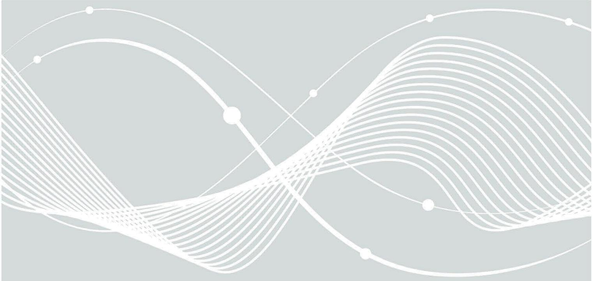

# Technical Guideline TR-03183: Cyber Resilience Requirements for Manufacturers and Products

Part 1: General requirements

# Document history

| Version | Date       | Description   |
|---------|------------|---------------|
| 0.9.0   | 2024-09-20 | Initial Draft |

*Table 1: History*

Federal Office for Information Security P.O. Box 20 03 63 53133 Bonn GERMANY E-Mail: TR03183@bsi.bund.de Internet: https://www.bsi.bund.de © Federal Office for Information Security 2024

| 1   |                                        | Introduction 5                                             |  |  |
|-----|----------------------------------------|------------------------------------------------------------|--|--|
|     | 1.1                                    | Important Note 5                                           |  |  |
| 2   |                                        | Requirements Language 6                                 |  |  |
| 3   |                                        | Basics 7                                                   |  |  |
|     | 3.1 Security objectives and scope 7 |                                                            |  |  |
| 3.2 |                                        | Roles 7                                                    |  |  |
|     | 3.2.1                                  | Consumer/User 7                                            |  |  |
|     | 3.2.2                                  | Manufacturer 7                                             |  |  |
|     | 3.2.3                                  | Evaluator 8                                                |  |  |
|     | 3.3                                    | Conformity Assessment 8                                    |  |  |
|     | 3.3.1                                  | Target of Evaluation (TOE) 8                               |  |  |
|     | 3.3.2                                  | Time of assessment 8                                       |  |  |
|     | 3.3.3                                  | Requirement structure 8                                    |  |  |
|     | 3.3.4                                  | Assessment procedure 9                                     |  |  |
| 4   |                                        | Risk assessment11                                          |  |  |
|     | 4.1                                    | Important Note11                                           |  |  |
|     | 4.2                                    | REQ_RA 1 – Risk assessment11                               |  |  |
|     | 4.2.1                                  | REQ_RA 1.111                                               |  |  |
| 5   |                                        | Security requirements12                                    |  |  |
|     | 5.1                                    | Important Note12                                           |  |  |
|     | 5.2                                    | Application Guidance 12                                 |  |  |
|     | 5.3                                    | Essential requirements related to product properties13     |  |  |
|     | 5.3.1                                  | REQ_ER 1 - Security by design13                            |  |  |
|     | 5.3.2                                  | REQ_ER 2 - No known vulnerabilities14                      |  |  |
|     | 5.3.3                                  | REQ_ER 3 – Secure default configuration15                  |  |  |
|     | 5.3.4                                  | REQ_ER 4 - Security updates15                              |  |  |
|     | 5.3.5                                  | REQ_ER 5 - Access control 17                            |  |  |
|     | 5.3.6                                  | REQ_ER 6 - Confidentiality protection20                    |  |  |
|     | 5.3.7                                  | REQ_ER 7 - Integrity protection21                          |  |  |
|     | 5.3.8                                  | REQ_ER 8 – Data minimisation23                             |  |  |
|     | 5.3.9                                  | REQ_ER 9 – Availability of essential and basic functions23 |  |  |
|     | 5.3.10                                 | REQ_ER 10 - Minimising negative impact24                   |  |  |
|     | 5.3.11                                 | REQ_ER 11 - Limit attack surfaces25                        |  |  |
|     | 5.3.12                                 | REQ_ER 12 - Mitigation of incidents25                      |  |  |
|     | 5.3.13                                 | REQ_ER 13 - Recording and monitoring26                     |  |  |
|     | 5.3.14                                 | REQ_ER 14 - Deletion of data and settings28                |  |  |

|   | 5.4   | Essential requirements related to vulnerability handling30 |  |
|---|-------|------------------------------------------------------------|--|
|   | 5.4.1 | REQ_VH 1 – Identify components and vurnerabilities30       |  |
|   | 5.4.2 | REQ_VH 2 – Address vulnerabilities31                       |  |
|   | 5.4.3 | REQ_VH 3 – Regular testing31                               |  |
|   | 5.4.4 | REQ_VH 4 - Publish addressed vulnerabilities32             |  |
|   | 5.4.5 | REQ_VH 5 – Coordinated vulnerability disclosure policy33   |  |
|   | 5.4.6 | REQ_VH 6 – Secure distribution of updates33                |  |
|   | 5.4.7 | REQ_VH 7 – Dissemination of updates33                      |  |
| 6 |       | Documentation obligations35                                |  |
|   | 6.1   | Technical documentation35                                  |  |
|   | 6.1.1 | REQ_TD 1 – General documentation35                         |  |
|   | 6.1.2 | REQ_TD 2 – Documentation of processes35                    |  |
|   | 6.1.3 | REQ_TD 3 – Documentation of cybersecurity risks36          |  |
|   | 6.1.4 | REQ_TD 4 – Documentation of the support period36           |  |
|   | 6.1.5 | REQ_TD 5 – Documentation of performed tests 36             |  |
|   | 6.1.6 | REQ_TD 6 – Documentation of components37                   |  |
|   | 6.2   | User Documentation37                                       |  |
|   | 6.2.1 | REQ_UD 1 – Documentation of the manufacturer37             |  |
|   | 6.2.2 | REQ_UD 2 – Documentation of unique identifier38            |  |
|   | 6.2.3 | REQ_UD 3 – Documentation of intended purpose38             |  |
|   | 6.2.4 | REQ_UD 4 – Documentation of the support period39           |  |
|   | 6.2.5 | REQ_UD 5 – User guidance39                                 |  |
|   | 6.2.6 | REQ_UD 6 – Documentation of components40                   |  |
| 7 |       | Annex41                                                    |  |

# 1 Introduction

The tense situation with respect to cybersecurity vulnerabilities has multiple reasons. The main reasons include firstly the low maturity regarding cybersecurity of products with digital elements as well as secondly insufficient and incoherent provision of security updates to address them. Additionally the users' lack of access to information that enable them to select and securely use products with an adequate level of cybersecurity. Users can find it difficult to assess whether the software they use has known exploitable vulnerabilities. For example, many cybersecurity managers had no information about whether their deployed products were affected by the Log4shell vulnerability, or they sometimes had to wait a long time to receive the desired information from the manufacturers. Increasing resilience to cyberattacks and technical disruptions is therefore a key task to mitigate the negative consequences of the cybersecurity threat situation for administrations, businesses and society. Therefore, all products should meet at least basic cybersecurity requirements. This includes not only the cybersecurity level and updates as mentioned above, but also the education of users as to which products have an appropriate level of cybersecurity.

The Cyber Resilience Act (CRA)1 will create a horizontal legal cybersecurity framework for the entire European Union (EU) internal market. It will establish cybersecurity requirements for the placing of products with digital elements on the Union market. This includes minimum requirements for the level of cybersecurity that all products with digital elements will have to comply with.

This Technical Guideline (TR) is intended to help manufacturers of products with digital elements in preparing for the upcoming CRA in form of requirements, recommendations, test actions and assessment criteria based on the (security) objectives stated in or derived from CRA Annex I (Essential Requirements) and Annex II (Information and Instructions to the User).

Feedback to this Technical Guideline can serve as input for the current and future work in the context of the draft standardisation request in support of Union policy on cybersecurity requirements for products with digital elements. This request asks amongst others for the development of standardisation deliverables that aim to become harmonised standards. Conformity with those harmonised standards would provide presumption of conformity within their scope.

This Technical Guideline will be:

- further adapted as a living document and requirements may be further concretised in the course of European standardisation efforts for the CRA and
- be superseded in the current form as soon as its content is covered by the corresponding standardisation deliverables under the standardisation request mentioned above.

# 1.1 Important Note

Conformity in the context of this Technical Guideline only applies to the requirements in this Technical Guideline and not necessarily to the requirements stated in the CRA. This Technical Guideline gives an initial interpretation of the upcoming European regulation.

**WARNING:** The application of this Technical Guideline:

- DOES NOT replace any legal obligation that might stem from the upcoming CRA and
- DOES NOT guarantee to fulfil any of these obligations.

1 https://www.europarl.europa.eu/doceo/document/TA-9-2024-0130\_EN.html

# 2 Requirements Language

The key words "MUST", "MUST NOT", "REQUIRED", "SHALL", "SHALL NOT", "SHOULD", "SHOULD NOT", "RECOMMENDED", "NOT RECOMMENDED", "MAY", and "OPTIONAL" in this document are to be interpreted as described in BCP 142 (RFC 21193, RFC 81744) when, and only when, they appear in all capitals, as shown here.

2 https://www.rfc-editor.org/info/bcp14

3 https://www.rfc-editor.org/rfc/rfc2119

4 https://www. rfc-editor.org/rfc/rfc8174

# 3 Basics

# 3.1 Security objectives and scope

The requirements stated in this Technical Guideline apply to all products with digital elements placed on the market which includes their remote data processing solutions. They focus primarily on the product directly and the communication and interaction with their corresponding remote data processing solutions. Organisational requirements for the operation of remote data processing solutions are not part of this document and SHOULD follow best practices for Information Security Management System (ISMS), e.g. ISO 27001 based on "IT-Grundschutz"5.

The requirements stated in this Technical Guideline are intended to mitigate baseline threats that are typically considered e.g. in use cases for private households or professional use cases for uncritical business processes. Generally, the security properties of a product with digital elements have to be appropriate to the intended purpose and reasonably foreseeable use of the product determined by the manufacturer and have to be designed, produced and maintained accordingly.

The requirements of this Technical Guideline can be used for an assessment on a technology and product agnostic level. Following this scope, guidance for the assessment is given without technical details on a possible implementation as especially the implementation of the essential requirements in section 5.3 may differ widely depending on the type of product, as well as the intended purpose and reasonably foreseeable use of the product. To address this situation this Technical Guideline gives guidance indicating when a requirement applies.

This document can be used for assessment in the current state. Nevertheless additional technical information and examples are planned to be provided in the future to facilitate an implementation of the requirements depending on the use case.

The requirements for the vulnerability handling process in section 5.4 and documentation obligations in section 6 are generally valid for all types of products and are independent of the intended purpose and foreseeable use of the products.

# 3.2 Roles

The requirements described in this Technical Guideline are based on the interaction between the following entities.

# **3.2.1 Consumer/User**

Consumers in the scope of this Technical Guideline are end consumers buying products for personal or professional use. Consumer are generally not redistributing/reselling these products in a commercial manner. The terms consumer and user are used interchangeable.

As part of the supply chain, if a consumer reuses a product with digital elements as a component for a new product with digital elements and places it on the market, the consumer takes the role of a manufacturer.

# **3.2.2 Manufacturer**

The CRA defines "manufacturer" as a natural or legal person who develops or manufactures products with digital elements or has products with digital elements designed, developed or manufactured, and markets them under its name or trademark, whether for monetisation or free of charge.

 5 https://www.bsi.bund.de/EN/Themen/Unternehmen-und-Organisationen/Standards-und-Zertifizierung/IT-Grundschutz/it-grundschutz\_node.html

As the CRA is a market access regulation, "manufacturer" is interpreted as combining the roles of "vendor" and "creator".

"Vendor" (German: "Anbieter") describes the role of the entity that providesthe product with digital elements. Alternatively, but not necessarily with a commercial background, the terms "Supplier" (German: "Lieferant") is used.

"Creator" (German: "Ersteller") describes the role of the entity that authored or created the product with digital elements.

As this Technical Guideline specifies technical requirements, it uses a different terminology and interprets "manufacturer" as a combination of the entity that produces tangible goods, such as devices, and the entity that creates or provides intangible goods, such as software and software components, usually described by the term "author". Therefore, this Technical Guideline does not mention the terms "Economic Operator", "Distributor" or "Importer" as defined by the CRA, as the roles of these parties are unrelated to the technical requirements stated here. These technical requirements are independent of the role which is fulfilling them.

# **3.2.3 Evaluator**

The entity applying the assessment criteria to the requirements of this Technical Guideline. The evaluator may be the manufacturer itself or a third-party testing body.

# 3.3 Conformity Assessment

The conformity assessment for the requirements set out in this Technical Guideline are primarily focused on a self-assessment by the manufacturer or by a third-party conformity assessment body on behalf of the manufacturer.

This Technical Guideline does not include specific implementation proposals for the requirements stated in sections 5.3 and 5.4. Those are planned to be provided in an additional guidance document.

# **3.3.1 Target of Evaluation (TOE)**

The conformity assessmentis performed on a single instance of the product(with digital elements), the Target of Evaluation (TOE). The TOE includes all parts of the product and their remote data processing solutions, which are part of the product at the time of assessment.

# **3.3.2 Time of assessment**

All requirements set out in this Technical Guideline have to be met by the TOE for its whole intended lifetime.

As it cannot be avoided that the TOE is modified to an insecure state by the user, only the state after the initial configuration following the recommendations in the user's manual and (potentially) update to the newest version are relevant for the assessment. This state can be achieved by executing the following steps:

- Obtaining a new product or resetting the product to its original state, e.g. factory reset or new installation.
- Start up of the product and initial setup following the recommendations in the user's manual.
- Preforming an update to the newest software version, if not performed during the initial setup.

# **3.3.3 Requirement structure**

Each requirement consists of the following parts:

- **Requirement/Recommendation:** Requirement/recommendation of this Technical Guideline which has to be met by the TOE. Those statements can be recommended or mandatory, as indicated by the corresponding modal verbs.
- **Condition** (Optional)**:** Requirements/Recommendations with a condition apply to the product if the condition is met. The condition is intended to give the manufacturer an indication on which requirements apply to the product.
- **Assessment criteria:** Units and criteria that need to be applied by the Evaluator to perform the conformity assessment for this Technical Guideline.

# **3.3.4 Assessment procedure**

This section specifies an assessment procedure on how to assess that the security requirements and recommendations stated in this Technical Guideline are met. For reproducibility and consistency every decision made during the assessment as well as the used method and result has to be documented by the evaluator according to section 6.1. The evaluator applies the following order for each requirement and recommendation:

- 1. Check the condition, to see if the requirement or recommendation is applicable. If that is the case or no condition is given, move on to the next assessment step. If the requirement or recommendation does not apply, mark the requirement as "N/A", document the decision and move on to the next requirement.
- 2. Perform each step of the assessment criteria, evaluate the result and mark the requirement or recommendation as "PASS", "FAIL" or "INCONCLUSIVE". A requirement or recommendation is marked as "PASS" if all assessment steps are performed successfully, otherwise FAIL. The execution of an assessment step often includes an evaluation indicated by "assess that/if/whether". Only if the evaluation by the evaluator of the assessed property is positive, the assessment step can be completed successfully. If the evaluation step cannot be completed because the evaluatoris not able to prove the assessed property beyond doubt, the test step fails and the requirement or recommendation is marked as "INCONCLUSIVE".

The requirements and recommendations do not include details on the evidences or procedures of the assessment to attain flexibility for first- and third-party assessments. Generally, it is assumed that the assessment is at least performed on a conceptual level, e.g. by checking public or internal product documentation. Conceptual assessments may also include the inspection of configuration files or source code, if no separate documentation is available.

If feasible, this procedure has to be enhanced by a functional assessment, i.e. an assessment of the TOE's real behaviour or an audit or retrospective inspection of an implemented process. If no functional assessment can be performed, the evaluator has to document a sufficient justification for not performing a functional assessment.

The assessment is preferably integrated into the development processes and continuous quality assurance processes, if possible in an automated matter.

The assessment step might include one of the following terms, which have to be interpreted by the evaluator:

- **Check:** Generate a result by a simple comparison
- **Assess:** Generate a result by analysis using evaluator expertise
- **Best practice:** The requirement has to be implemented according to what is considered state of the art for a specific use case. This expression is mostly used in conjunction with cryptography. For best practice cryptography common and well-known cryptography recommendations MUST be used, e.g. BSI TR-02102, SOG-IS Agreed Cryptographic Mechanisms or comparable standards.
- **Without undue delay:** The action required has to be performed as soon as possible. The evaluator MUST assess whether the requested action was performed in a time not substantially longer than necessary for the specific scenario. For comparison, other similar real-life scenarios MAY be used.

When in doubt the evaluator MAY request additional information from the manufacturer, to justify any delays and ascertain that the manufacturer acted as soon as possible.

• **Document and publish**: If a requirement states that something must be documented, this means that the manufacturer possesses a record which is not necessarily available for public access. Publish means that something is documented and available for public access.

The overall verdict "PASS" is given if all applicable mandatory (MUST) requirements are marked as "PASS" and all applicable recommendations (SHOULD) are either marked as:

- "PASS" or
- marked as "FAIL" or "INCONCLUSIVE" with a sufficient justification why the recommendation is not met.

Otherwise the overall verdict is "FAIL".

# 4 Risk assessment

To evaluate the cybersecurity risk related to the TOE the manufacturer has to perform a risk assessment. To be able to get a full overview of the risks related to the TOE, the risk assessment has to consider the complete life cycle of the TOE. This includes the planning, design, development and production phase, as well as the deliver, maintenance phase/support period and decommission by the user. The risk assessment also has to consider the product's intended purpose, as well as the reasonably foreseeable use by the customer. Based on the intended purpose and reasonably foreseeable use, the manufacturer has to derive potential threats and threat agents as well as their probability of occurrence and impact on the security of the TOE, including the risk for health and safety of the consumer.

# 4.1 Important Note

The focus of the risk assessment of this Technical Guideline is to identify implementation details of the essential requirements and necessary additional security capabilities for the specific product.

**WARNING:** The risk assessment of this Technical Guideline MUST NOT be used to omit any of the requirements of section 5.3, see also section 5.1.

# 4.2 REQ\_RA 1 – Risk assessment

**Requirement stated in the current draft of the CRA Annex I Part 1:** Products with digital elements shall be designed, developed and produced in such a way that they ensure an appropriate level of cybersecurity based on the risks.

# **4.2.1 REQ\_RA 1.1**

### **Requirement**

- The manufacturer MUST perform and document the risk assessment for the TOE.
- As part of the risk assessment the manufacturer MUST document how the support period is determined and how that impacts the lifecycle of the TOE.

- The evaluator MUST assess that the risk assessment for the TOE is performed and documented.
- The evaluator MUST assess that the risk assessment for the TOE contains threats and threat agents.
- The evaluator MUST assess that the risk assessment for the TOE contains security impact and probability of relevant threats.
- The evaluator MUST assess that the risk assessment for the TOE documents how the support period is determined and how that impacts the lifecycle of the TOE.

# 5 Security requirements

To minimise the cybersecurity risks throughout the TOE's lifecycle (planning, design, development, manufacturing, delivery, maintenance and decommission by the user), including when using third-party components, as well as during the support period, the manufacturer has to ensure the conformity of their product, at least with the essential requirements set out in section 5.3. These are intended to ensure an appropriate baseline level of cybersecurity according to best practices.

This Technical Guideline raises no claim of completeness and no claim of providing a tailor-made solution as this is highly dependent on the specific product and the associated risk determined by the manufacturer.

# 5.1 Important Note

Concerning the conformity to this Technical Guideline it is not possible to omit any of the requirements of section 5.3 based on the risk assessment done in section 4.2.

**WARNING:** This approach is less flexible then the risk based approach in the CRA.

# 5.2 Application Guidance

To provide some guidance on when each requirement has to be applied, even independent of a specific risk assessment, the following indicators will be used.

It must be considered what kind of data assets are stored or processed by the TOE, e.g. system data, personal data or critical security data.

# **System data:**

General non-critical and non-sensitive (security) data with no relation to a specific person and no relevant impact to the security of the TOE and the safety and security of the user in case the availability, integrity and confidentiality of the data is endangered.

### **Sensitive system data:**

Data with no relation to a specific person and no relevant impact to the security of the TOE, but with a significant potential for damage, financial or otherwise, or impact to the safety or security of the user in case the availability, integrity and confidentiality of the data is endangered. This includes e.g. confidential business information or surveillance camera recordings.

### **Personal data:**

General data concerning a specific person with no significant potential damage to the user in case the availability, integrity and confidentiality of the data is endangered. This includes e.g. names and public photos.

### **Sensitive personal data:**

Data concerning a specific person with a significant potential damage to the user in case the availability, integrity and confidentiality of the data is endangered. This includes health data, private messages and personal financial information.

### **Security data:**

Security-relevant data with no relation to a specific person, but with significant impact on the security of the TOE in case the availability, integrity and confidentiality of the data is endangered. This includes e.g. passwords, security critical configuration.

### **Critical security data:**

Security-relevant data with no relation to a specific person, but with significant impact on the security of the TOE and other products in case the integrity and confidentiality of the data is endangered. This includes e.g. master keys.

Another criterion is the potential attack surface and opportunity. This correlates on how the TOE communicates with other products with digital elements and how it can be physically accessed. A TOE which only communicates via local interfaces may pose a lower risk regarding security, than a TOE which is permanently connected to a public network.

#### **Public network:**

The TOE communicates via a Wide Area Network (WAN).

### **Local network:**

The TOE communicates via a local network (WLAN, Bluetooth, etc.) but has no capabilities to access the WAN.

### **Local (Public):**

The TOE uses local interfaces without network access (e.g. USB, NFC and local Application Programming Interfaces (API)). The TOE is foreseeably used in a public space and can be locally interacted with by anyone in a substantial time frame, e.g. an automated kiosk.

#### **Local (Restricted Public):**

The TOE uses local interfaces without network access (e.g. USB, NFC and local Application Programming Interfaces (API)). The TOE is foreseeably used in a public space and can be locally interacted with by anyone without supervision for a short period of time, e.g. temporarily unsupervised private notebook.

#### **Local (Restricted):**

The TOE uses local interfaces without network access (USB, NFC and local Application Programming Interfaces (API)). The TOE is foreseeably used in a physically restricted environment, which can only be accessed by selected individuals, e.g. Smart TV for Home Entertainment or Office Printer.

Security requirements stated in this Technical Guideline may depend on the data assets or communicative capabilities of the TOE. This is indicated by a corresponding condition.

If a TOE does not meet a requirement based on the communicative capabilities, it is possible to transfer the risk associated with the communication by delegating the requirements to a separate proxy product. This is only possible if the TOE ensures that the relevant communication is only possible via the proxy product, e.g. by establishing a trust relationship with the proxy for remote network communication.

The condition represents guidance to facilitate the decision if a requirement applies.

# 5.3 Essential requirements related to product properties

# **5.3.1 REQ\_ER 1 - Security by design**

**Requirement stated in the current draft of the CRA Annex I Part 1:** Products with digital elements shall be designed, developed and produced in such a way that they ensure an appropriate level of cybersecurity based on the risks.

# 5.3.1.1 REQ\_ER 1.1

#### **Requirement**

• The manufacturer MUST document and implement a process which ensures that the TOE is designed, developed and produced with an appropriate level of cybersecurity, based on the risk assessment in section 4.2.

#### **Assessment criteria**

• The evaluator MUST assess that the process is based on the risk assessment and contains appropriate mitigation strategies for the documented risks.

# 5.3.1.2 REQ\_ER 1.2

### **Requirement**

• The manufacturer MUST follow best practices for the secure (software-) development lifecycle e.g. OWASP SAMM, BSI TR-03185, ISO 27034.

# **Assessment criteria**

• The evaluator MUST assess that the documented process contains best practices for secure governance, design, implementation and testing of the product before set on the market and afterwards following e.g. OWASP SAMM, BSI TR-03185 and ISO 27034.

# **5.3.2 REQ\_ER 2 - No known vulnerabilities**

**Requirement stated in the current draft of the CRA Annex I Part 1:** On the basis of the cybersecurity risk assessment referred to in Article 13 (2) and where applicable, products with digital elements shall be made available on the market without known exploitable vulnerabilities.

# 5.3.2.1 REQ\_ER 2.1

# **Requirement**

• The manufacturer MUST ensure that the TOE is updated to the newest available software/firmware version during or before the initial setup.

### **Assessment criteria**

• The evaluator MUST assess that the newest security update is installed on the TOE before the first usage by the user.

# 5.3.2.2 REQ\_ER 2.2

### **Requirement**

- The manufacturer MUST test, if the security properties of the TOE are working correctly following section 5.4.3.1 before making the TOE available.
- The manufacturer MUST document the result of the test.
- The manufacturer MUST fix all known actively exploited vulnerabilities before making the TOE available.

### **Assessment criteria**

- The evaluator MUST assess that the TOE is tested following section 5.4.3.1 before being made available.
- The evaluator MUST assess that the results of the test are documented.
- The evaluator MUST check that actively exploited vulnerabilities of the TOE known to the manufacturer are fixed before being made available.

# 5.3.2.3 REC\_ER 2.3

### **Recommendation**

• The manufacturer SHOULD fix all known exploitable vulnerabilities before making the TOE available.

• The evaluator SHOULD check that exploitable vulnerabilities of the TOE known to the manufacturer are fixed before being made available.

# **5.3.3 REQ\_ER 3 – Secure default configuration**

**Requirement stated in the current draft of the CRA Annex I Part 1:** On the basis of the cybersecurity risk assessment referred to in Article 13 (2) and where applicable, products with digital elements shall be made available on the market with a secure by default configuration, unless otherwise agreed between manufacturer and business user in relation to a tailor-made product with digital elements, including the possibility to reset the product to its original state.

# 5.3.3.1 REQ\_ER 3.1

# **Requirement**

• The TOE MUST be able to be reset to its original state. The original state consists of the deletion of all local user data, resetting the software to the initial or newest version and resetting the default configuration.

# **Condition**

• The TOE can be configured.

# **Assessment criteria**

• The evaluator MUST assess that the TOE can be reset to its original state through a factory reset or reinstallation.

# 5.3.3.2 REQ\_ER 3.2

# **Requirement**

• The software of the TOE MUST NOT contain hard coded security data and critical security data.

# **Condition**

• The TOE stores security data or critical security data specific to the TOE.

# **Assessment criteria**

• The evaluator MUST assess that security data and critical security data are not hard coded in the software of the TOE.

# **5.3.4 REQ\_ER 4 - Security updates**

**Requirement stated in the current draft of the CRA Annex I Part 1:** On the basis of the cybersecurity risk assessment referred to in Article 13 (2) and where applicable, products with digital elements shall ensure that vulnerabilities can be addressed through security updates, including, where applicable, through automatic security updates that are installed within an appropriate timeframe enabled as a default setting, with a clear and easy-to-use opt-out mechanism, through the notification of available updates to users, and the option to temporarily postpone them.

# 5.3.4.1 REQ\_ER 4.1

# **Requirement**

• The manufacturer MUST ensure that the TOE and its components are updateable. This MAY exclude all components which cannot be updated, because of the security architecture or technical limitations.

- The evaluator MUST assess that all relevant components of the TOE can be updated.
- For non-updatable components, the evaluator MUST assess that the absence of an update functionality for the component is otherwise justified, because of the security architecture or technical limitations.

# 5.3.4.2 REQ\_ER 4.2

### **Requirement**

• The TOE MUST have a mechanism for the secure installation of updates. This includes verifying the integrity and authenticity of the update package using best practices.

### **Condition**

• The TOE can be updated.

#### **Assessment criteria**

• The evaluator MUST assess that the design and cryptographic methods used for the update mechanism prevent misuse by an attacker (e.g. forging of malicious update packages). This includes verifying the integrity and authenticity of the update package using best practice cryptography.

# 5.3.4.3 REQ\_ER 4.3

#### **Requirement**

• The TOE MUST have an automatic update mechanism, which is activated as the default setting.

#### **Condition**

• The TOE has an at least temporary connection to an update source.

#### **Assessment criteria**

- The evaluator MUST check that the automatic update mechanism is activated as the default setting.
- The evaluator MUST assess that the TOE checks for updates in an appropriate regular interval.
- The evaluator MUST assess that the TOE is updated automatically to the latest version.

# 5.3.4.4 REQ\_ER 4.4

#### **Requirement**

- The TOE MUST have an easy-to-use opt-out mechanism for the automatic update.
- The TOE MUST notify the user that updates are available.

- The evaluator MUST assess that the automatic update mechanism can be disabled easily.
- The evaluator MUST assess that the user is notified that updates are available, but the update is not installed without the user consent if the automatic update is disabled.

# 5.3.4.5 REQ\_ER 4.5

# **Requirement**

- The user MUST be able to postpone automatic updates. The TOE MUST repeatedly remind the user to install the update after an appropriate timeframe.
- Security updates and bugfixes without new functionalities or impact on the usage of the product MAY be installed without the option to postpone.

### **Condition**

- The TOE has an at least temporary connection to an update source.
- The automatic update mechanism is enabled.
- The installation of the update temporarily disrupts the core functionality of the TOE.

# **Assessment criteria**

- The evaluator MUST assess that the user can postpone functional updates or updates interrupting the functionality of the TOE, e.g. restart of the TOE.
- The evaluator MUST assess that the user is reminded repeatedly to install the postponed update within an appropriate timeframe.

# 5.3.4.6 REQ\_ER 4.6

# **Requirement**

• The TOE MUST notify the user with sufficient information if an update cannot be installed. This MUST also containing the reason, why the update cannot be installed.

# **Condition**

• The TOE can be updated.

### **Assessment criteria**

• The evaluator MUST assess that the user is notified if an update cannot be installed, e.g. temporarily insufficient storage or failed connection.

# **5.3.5 REQ\_ER 5 - Access control**

**Requirement stated in the current draft of the CRA Annex I Part 1:** On the basis of the cybersecurity risk assessment referred to in Article 13 (2) and where applicable, products with digital elements shall ensure protection from unauthorised access by appropriate control mechanisms, including but not limited to authentication, identity or access management systems, and report on possible unauthorised access.

# 5.3.5.1 REQ\_ER 5.1

### **Requirement**

• The TOE MUST implement mechanisms for access control with regard to different types of users, possible capabilities and access scenarios.

# **Assessment criteria**

• The evaluator MUST assess that the described access control mechanisms handle all relevant user roles, product functions and access scenarios.

• The evaluator MUST assess that the described mechanisms are sufficient to protect the TOE against unauthorised access.

# 5.3.5.2 REQ\_ER 5.2

### **Requirement**

• The TOE MUST NOT use default passwords, i.e. passwords common to multiple instances of the product, after the initial setup.

### **Condition**

• The TOE uses passwords for authentication.

#### **Assessment criteria**

- The evaluator MUST assess that the product does not use default passwords, i.e. preconfigured password that are equal for several instances of the TOE, in any other state than before the initial setup.
- If a default password is used before the initial setup, the evaluator MUST assess that the user is required to set an individual password during the initial setup of the TOE.

# 5.3.5.3 REQ\_ER 5.3

#### **Requirement**

• The TOE MUST ensure that generated passwords, API keys and other secrets used for authentication are generated with a mechanism that reduces the risk of automated attacks against a class or type of product. This includes pre-installed secrets only used in the factory state as well as secrets generated during runtime.

#### **Condition**

• The TOE uses generated secrets for authentication.

### **Assessment criteria**

- The evaluator MUST assess that the generation mechanism does not induce obvious regularities in the resulting passwords, e.g. incremental counters (such as "password1", "password2" and so on) can be **obvious** regularities.
- The evaluator MUST assess that the generation mechanism does not induce common strings or other **common** patterns in the resulting passwords.
- The evaluator MUST assess that the generation mechanism induces passwords, which are related in an obvious way to public information, e.g. MAC addresses, WLAN SSIDs, name, type and description of a **device**.
- The evaluator MUST assess that the generation mechanism induces passwords, which are considered appropriate in terms of complexity.

# 5.3.5.4 REQ\_ER 5.4

#### **Requirement**

• The TOE MUST use best practice cryptography to authenticate users, appropriate to the properties of the technology, risk and usage.

### **Condition**

• The TOE uses authentication.

- The evaluator MUST assess that authentication data is not sent in clear text over an unencrypted **channel**.
- The evaluator MUST assess that authentication data is protected using best practice cryptography.

# 5.3.5.5 REQ\_ER 5.5

### **Requirement**

• The TOE MUST provide a simple mechanism to change the authentication data used by the authenticated user or an authenticated administrator.

#### **Condition**

• The TOE uses authentication.

#### **Assessment criteria**

• The evaluator MUST assess that the authenticated user or the authenticated administrator is able to change their authentication data, e.g. password or key.

# 5.3.5.6 REQ\_ER 5.6

#### **Requirement**

- The TOE MUST implement a mechanism to make brute force attacks on the authentication mechanisms over network interfaces impracticable.
- **Condition**
	- The TOE uses authentication.

#### **Assessment criteria**

- The evaluator MUST assess that the TOE does not allow unlimited and unhindered failed authentication attempts and reacts after a certain number of attempts in an appropriate manner to make brute force attack impractical, e.g. by time delay after X failed attempts, by locking the access, by requiring a second **factor**.
- The evaluator MUST assess that passwords or other secrets used for authentication, are complex enough to avoid brute force attacks, e.g. long enough, multiple types of characters, checked against dictionaries or enhanced by other authentication features or factors.

# 5.3.5.7 REQ\_ER 5.7

#### **Requirement**

• The TOE MUST NOT give information about what authentication data was incorrect for a failed authentication attempt.

#### **Assessment criteria**

• The evaluator MUST assess that the TOE does not provide information about the correct authentication data during a failed authentication attempt.

# 5.3.5.8 REQ\_ER 5.8

### **Requirement**

• The TOE MUST implement means to report and identify possible unauthorised access attempts.

- The evaluator MUST assess that the TOE is able to identify and report failed authentication attempts, i.e. **authentication** attempts with invalid credentials.
- The evaluator MUST assess that the failed login attempts can be reviewed by the user.

# **5.3.6 REQ\_ER 6 - Confidentiality protection**

**Requirement stated in the current draft of the CRA Annex I Part 1:** On the basis of the cybersecurity risk assessment referred to in Article 13 (2) and where applicable, products with digital elements shall protect the confidentiality of stored, transmitted or otherwise processed data, personal or other, such as by encrypting relevant data at rest or in transit by state of the art mechanisms, and by using other technical means.

# 5.3.6.1 REQ\_ER 6.1

### **Requirement**

• The TOE MUST use best practice cryptography to communicate securely, suitable for the corresponding use case.

### **Condition**

• The TOE communicates over a local or public network and transmits personal data, sensitive personal data, sensitive system data or security data.

#### **Assessment criteria**

• The evaluator MUST assess that the TOE uses best practice cryptography. This includes cryptographic primitives and algorithms as well as protection against brute force and replay attacks.

# 5.3.6.2 REC\_ER 6.2

### **Recommendation**

• The TOE SHOULD use reviewed or evaluated implementations to deliver network and security functionalities which are actively maintained, particularly in the field of cryptography.

### **Condition**

• The TOE uses cryptography for transmitting personal data, sensitive personal data, sensitive system data or security data over a local or public network.

### **Assessment criteria**

- The evaluator MUST assess that the TOE uses reviewed or evaluated cryptographic implementations.
- The evaluator MUST assess that the cryptographic implementations are actively maintained.

# 5.3.6.3 REC\_ER 6.3

#### **Recommendation**

- The TOE SHOULD NOT transmit long term security data6.
- Instead of long term security data, the TOE SHOULD use temporary security data with limited validity for communication, e.g. message digest keys, session keys and nonces.

6 Long term security data is valid indefinitely or a substantial time, e.g. 180 days, until actively changed by the user.

- The evaluator MUST assess that the TOE avoids transmitting long term security data in a reconstructable way wherever possible.
- If long term security data is transmitted in a reconstructable way, the evaluator MUST assess that the reason for transmission is appropriate to the properties of the technology, risk and usage.

# 5.3.6.4 REQ\_ER 6.4

### **Requirement**

• The confidentiality of security data and critical security data stored by the TOE must be protected. Encryption and other cryptographic mechanisms MUST follow best practices.

### **Condition**

• The TOE stores security data and critical security data.

#### **Assessment criteria**

- If the TOE uses cryptography to protect the confidentiality of stored security data and critical security data the evaluator MUST assess that the TOE uses cryptography following best practices.
- If the TOE uses other or additional mechanisms to secure stored security data and critical security data, e.g. a permission system or a specially secured storage with cryptographic functions, the evaluator MUST assess that these mechanisms are appropriate to secure security data and critical security data.

# 5.3.6.5 REQ\_ER 6.5

#### **Requirement**

• The manufacturer MUST follow secure management processes forsecurity data that relate to the TOE or associated services.

### **Condition**

• The TOE uses security data generated by the manufacturer.

### **Assessment criteria**

- The evaluator MUST assess that the secure management of critical security data covers the whole life cycle of a critical security parameter by considering all of the following aspects of its life cycle:
	- o Generation, and
	- o Provisioning, and
	- o Storage, and
	- o Updates, and
	- o Decommissioning, archival, and destruction processes to handle the expiration and compromise.

# **5.3.7 REQ\_ER 7 - Integrity protection**

**Requirement stated in the current draft of the CRA Annex I Part 1:** On the basis of the cybersecurity risk assessment referred to in Article 13 (2) and where applicable, products with digital elements shall protect the integrity of stored, transmitted or otherwise processed data, personal or other, commands, programs and configuration against any manipulation or modification not authorised by the user, and report on corruptions.

# 5.3.7.1 REC\_ER 7.1

# **Recommendation**

• The TOE SHOULD be able to verify its own integrity, to prevent tampering with security properties of the TOE. If the verification fails, the TOE MUST give the user the option to restore the integrity of the TOE. There is typically an external or internal component required for the verification which cannot be verified itself and has to be otherwise protected against unwanted tampering, e.g. boat loader or external verification service.

### **Condition**

• The TOE stores sensitive user or system data.

# **Assessment criteria**

- The evaluator MUST assess that the TOE verifies its own integrity before usage in a manner sufficient to prevent tampering with security data.
- The evaluator MUST assess that the user is warned and given restoration options, if the validation fails.
- If the TOE uses cryptography to ensure its integrity, e.g. via hash values and/or signatures, the evaluator MUST assess that the TOE uses cryptography following best practices.

# 5.3.7.2 REQ\_ER 7.2

# **Requirement**

• The TOE MUST perform the installation of additional software in an atomic manner, e.g. reset the TOE to the state before the installation of the new software in case of an error or cancelation during the installation process.

### **Condition**

• The TOE allows installation of additional software, e.g. apps or plugins.

### **Assessment criteria**

• The evaluator MUST assess that a failed or cancelled installation is reverted in such a way, that the possible remains of the installation have no impact on the TOE or user and the installation can be retried.

# 5.3.7.3 REQ\_ER 7.3

# **Requirement**

• A user MUST be able to uninstall software installed by the user her/himself.

### **Condition**

• The TOE allows installation of additional software, e.g. apps or plugins.

### **Assessment criteria**

• The evaluator MUST assess that a user can uninstall software installed by the user her/himself.

# 5.3.7.4 REQ\_ER 7.4

# **Requirement**

• The TOE MUST preserve its own integrity during normal operation by handling security relevant system resources in an ordered manner to prevent unwanted system states e.g. by using transactions/exclusive access when writing security relevant data, only using allocated program memory, releasing resources when unused.

#### **Assessment criteria**

• The evaluator MUST assess that the TOE handles its own resources in an ordered manner, this includes amongst other access to the file system, usage of network connections, used/allocated memory and handling of other shared resources.

# **5.3.8 REQ\_ER 8 – Data minimisation**

**Requirement stated in the current draft of the CRA Annex I Part 1:** On the basis of the cybersecurity risk assessment referred to in Article 13 (2) and where applicable, products with digital elements shall process only data, personal or other, that are adequate, relevant and limited to what is necessary in relation to the intended purpose of the product with digital elements (minimisation of data).

# 5.3.8.1 REQ\_ER 8.1

#### **Requirement**

• The TOE MUST only collect and process data which is necessary to fulfil its intended purpose and reasonably foreseeable use.

#### **Assessment criteria**

- The evaluator MUST assess that the process of the specified data is necessary for the intended purpose and reasonably foreseeable use of the TOE.
- The evaluator MUST check that only the specified data is collected and processed by the TOE.

# **5.3.9 REQ\_ER 9 – Availability of essential and basic functions**

**Requirement stated in the current draft of the CRA Annex I Part 1:** On the basis of the cybersecurity risk assessment referred to in Article 13 (2) and where applicable, products with digital elements shall protect the availability of essential and basic functions, also after an incident, including through resilience and mitigation measures against denial-of-service attacks.

# 5.3.9.1 REQ\_ER 9.1

#### **Requirement**

• It MUST be possible to operate the TOE with a default configuration. In this configuration only the interfaces necessary for the core function of the TOE are activated.

#### **Assessment criteria**

- The evaluator MUST check that the TOE can be operated with a default configuration.
- The evaluator MUST check that all unnecessary interfaces are deactivated.

# 5.3.9.2 REQ\_ER 9.2

#### **Requirement**

• The TOE MUST be able to resume secure operation after a temporary interruption.

• The evaluator MUST assess that the TOE is able to resume secure operation after a temporary interruption. This includes common interruptions like power loss, network loss or network traffic overload, not available services.

# 5.3.9.3 REQ\_ER 9.3

### **Requirement**

• The TOE MUST maintain local safety functions even during a loss of network.

# **Condition**

• The TOE serves a basic safety function, e.g. smart locks, smoke detector, etc.

### **Assessment criteria**

• The evaluator MUST assess that local safety functions are maintained during a loss of network.

# 5.3.9.4 REQ\_ER 9.4

# **Requirement**

• The TOE MUST maintain its core functionality even without available remote data processing solutions.

# **Condition**

• The TOE does not require remote data processing solutions for its intended purpose, e.g. telemetry data processing, digital rights management, etc.

# **Assessment criteria**

• The evaluator MUST assess that the TOE maintains its core functionality even without available remote data processing solutions.

# **5.3.10 REQ\_ER 10 - Minimising negative impact**

**Requirement stated in the current draft of the CRA Annex I Part 1:** On the basis of the cybersecurity risk assessment referred to in Article 13 (2) and where applicable, products with digital elements shall minimise the negative impact by the products themselves or connected devices on the availability of services provided by other devices or networks.

# 5.3.10.1 REQ\_ER 10.1

# **Requirement**

• The TOE MUST handle network resources in an ordered manner during normal operation.

### **Assessment criteria**

• The evaluator MUST assess that the TOE handles network resources in an ordered manner during normal operation, i.e. in such a manner that network resources are only used appropriately to the TOEs intended purpose and reasonably foreseeable use and that they are released if not needed anymore.

# 5.3.10.2 REQ\_ER 10.2

# **Requirement**

• The TOE MUST communicate with other products in an orderly fashion and enables the other products to react to errors.

#### **Assessment criteria**

- The evaluator MUST assess that the TOE provides services following well-defined protocols and enables external products to react appropriately to errors in the provided services.
- The evaluator MUST assess that the used protocols and interfaces intended for external use are sufficiently documented for the use by external products. This documentation is not necessarily free of charge.

# **5.3.11 REQ\_ER 11 - Limit attack surfaces**

**Requirement stated in the current draft of the CRA Annex I Part 1:** On the basis of the cybersecurity risk assessment referred to in Article 13 (2) and where applicable, products with digital elements shall be designed, developed and produced to limit attack surfaces, including external interfaces.

# 5.3.11.1 REQ\_ER 11.1

#### **Requirement**

• The TOE MUST deactivate interfaces and services not required for usage by default.

#### **Assessment criteria**

- The evaluator MUST assess that only interfaces and services needed for the initial setup are enabled before the first usage by the user.
- The evaluator MUST assess, which interfaces and services are required for the usage of the TOE.
- The evaluator MUST assess that only these interfaces and services are enabled by default.

# 5.3.11.2 REQ\_ER 11.2

### **Requirement**

• The TOE MUST deactivate debug interfaces and functions, which can be used to bypass the security functions of the TOE by default. Debug interfaces of the TOE MAY be retrospectively be reactivated by an authorized user or administrator.

### **Condition**

• The TOE has debug interfaces with a local (public), local (public restricted), local network or public network access.

#### **Assessment criteria**

- The evaluator MUST assess that all debug interfaces are disabled by default.
- If the TOE contains debug interfaces or services which can be reenabled, the evaluator MUST assess that those interfaces can only be willingfully enabled by an authorized user.
- The evaluator MUST assess that the user is sufficiently warned, when a debug interface is activated.

# **5.3.12 REQ\_ER 12 - Mitigation of incidents**

**Requirement stated in the current draft of the CRA Annex I Part 1:** On the basis of the cybersecurity risk assessment referred to in Article 13 (2) and where applicable, products with digital elements shall be designed, developed and produced to reduce the impact of an incident using appropriate exploitation mitigation mechanisms and techniques.

Note: The requirements listed in sections 5.3.3, 5.3.4, 5.3.6, 5.3.7, 5.3.9, 5.3.10 already consider exploitation mitigation mechanisms and techniques, therefore they are not considered again here.

# 5.3.12.1 REQ\_ER 12.1

### **Requirement**

• The TOE MUST be operated with the least necessary privileges by default.

### **Assessment criteria**

• The evaluator MUST assess that the TOE only uses the least necessary privileges required to fulfil its current function by default.

# 5.3.12.2 REQ\_ER 12.2

# **Requirement**

• The TOE MUST enforce a permission system for interfaces provided for other products. The permission system MUST be granular enough to control the usage of the interface.

# **Condition**

• The TOE provides interfaces to communicate with other products.

# **Assessment criteria**

- The evaluator MUST assess that the TOE has a permission system for interfaces provided to other products.
- The evaluator MUST assess that the permission system of the TOE is granular enough to control access over the interface and enables a product communicating with the interface to operate with the least necessary privileges.
- The evaluator MUST assess that the permission system is enforced by the TOE and other products are not able to obtain additional privileges not granted by the TOE, i.e. no unintended privilege escalation.

# **5.3.13 REQ\_ER 13 - Recording and monitoring**

**Requirement stated in the current draft of the CRA Annex I Part 1:** On the basis of the cybersecurity risk assessment referred to in Article 13 (2) and where applicable, products with digital elements shall provide security related information by recording and monitoring relevant internal activity, including the access to or modification of data, services or functions, with an opt-out mechanism for the user.

# 5.3.13.1 REQ\_ER 13.1

### **Requirement**

- The TOE MUST have implemented a mechanism to record and monitor all security relevant setting modifications.
- The TOE MUST record all setting modifications by default.

- The evaluator MUST assess that there is a mechanism implemented on the TOE to record and monitor all setting modifications.
- The evaluator MUST assess that the recorded data contains enough information to analyse anomalies in security relevant setting modifications. This includes at least the initiator, the time and the content/type of the change in the settings.

• The evaluator MUST check that the setting modifications are recorded by default.

# 5.3.13.2 REQ\_ER 13.2

#### **Requirement**

- The TOE MUST have implemented a mechanism to record and monitor all user authentications.
- The TOE MUST record all user authentications by default.

#### **Assessment criteria**

- The evaluator MUST assess that there is a mechanism implemented on the TOE to record and monitor all user authentications.
- The evaluator MUST assess that the recorded data contains enough information to analyse anomalies in user authentications. This includes at least the time of authentication, the accessed interface or function, the source of the authentication if available and the result of the authentication attempt.
- The evaluator MUST check that the user authentications are recorded by default.

# 5.3.13.3 REQ\_ER 13.3

#### **Requirement**

- The TOE MUST have implemented a mechanism to record and monitor the status of all services belonging to the TOE.
- The TOE MUST record the status of all services belonging to the TOE by default.

#### **Assessment criteria**

- The evaluator MUST assess that there is a mechanism implemented on the TOE to record and monitor the status of all services belonging to the TOE.
- The evaluator MUST assess that the recorded information contains enough information to analyse anomalies in service activities. This includes at least the start up time of a service and a regular status update.
- The evaluator MUST check that the status of all services belonging to the TOE are recorded by default.

# 5.3.13.4 REQ\_ER 13.4

#### **Requirement**

• It MUST be possible to deactivate the recording and monitoring activities by an authorized user.

#### **Assessment criteria**

- The evaluator MUST check that it is possible, for an authorized user, to deactivate and reactivate the recording and monitoring.
- The evaluator MUST check that the activation and deactivation of the recording and monitoring activities are recorded.

# 5.3.13.5 REQ\_ER 13.5

#### **Requirement**

• The TOE MUST be able to record and monitor network data to detect possible security anomalies in the network communication.

#### **Condition**

• The TOE communicates with a local or public network.

#### **Assessment criteria**

• The evaluator MUST assess that the TOE records and monitors network data suitable to detect anomalies in the network connections. The recorded data MUST include at least the time, source/target and details of relevant network events.

# 5.3.13.6 REQ\_ER 13.6

### **Requirement**

• The TOE MUST be able to provide recorded data for a sufficient timeframe to facilitate a retrospective analysis.

#### **Assessment criteria**

• The evaluator MUST assess that the collected recorded data can be analysed to detect possible security anomalies retrospectively e.g. by storing the recorded data long enough (locally or remotely) to enable an analysis.

# 5.3.13.7 REQ\_ER 13.7

### **Requirement**

• The TOE MUST ensure that recorded data cannot be used to facilitate a security incident.

#### **Assessment criteria**

- The evaluator MUST assess that the recorded data exposing a security risk can only be accessed by authorized entities.
- The evaluator MUST assess that the recorded data does not contain unnecessary data exposing more risk than necessary by default, e.g. do not log personal data or secrets on the default log level.
- Additional information MAY be recorded on a case by case basis for debugging purposes.

# 5.3.13.8 REQ\_ER 13.8

### **Requirement**

• The TOE MUST ensure that recoding and monitoring is resilient against common disruptions and that problems during the recording and monitoring of security relevant data have no impact on the functionality of the TOE.

### **Assessment criteria**

- The evaluator MUST assess that the recoding and monitoring mechanism isresilient against common disruption, e.g. loss of power, low storage or network outages.
- The evaluator MUST assess, those problems with the recording and monitoring mechanism have no impact on the basic functionality of the TOE.

# **5.3.14 REQ\_ER 14 - Deletion of data and settings**

**Requirement stated in the current draft of the CRA Annex I Part 1:** On the basis of the cybersecurity risk assessment referred to in Article 13 (2) and where applicable, products with digital elements shall provide the possibility for users to securely and easily remove on a permanent basis all data and settings and, where such data can be transferred to other products or systems, ensure that this is done in a secure manner.

# 5.3.14.1 REQ\_ER 14.1

### **Requirement**

• The TOE MUST have implemented an easy-to-use mechanism to delete all personal data on the TOE.

# **Assessment criteria**

- The evaluator MUST assess that there is an easy-to-use mechanism implemented on the TOE to delete all personal data stored on the TOE.
- The evaluator MUST check that all personal data is deleted on the TOE.

# 5.3.14.2 REQ\_ER 14.2

# **Requirement**

• The TOE MUST have implemented an easy-to-use mechanism to delete all system data and to revert all modified settings back to their default values on the TOE.

# **Assessment criteria**

- The evaluator MUST assess that there isimplemented an easy-to-use mechanism on the TOE to delete all system data and settings stored on the TOE.
- The evaluator MUST check that all system data and settings are deleted on the TOE.
- The evaluator MUST check that modified settings are reverted to their default values on the TOE.

# 5.3.14.3 REQ\_ER 14.3

### **Requirement**

• The TOE MUST have implemented an easy-to-use mechanism to delete all data, belonging to the user, stored on the remote data processing solutions of the TOE, e.g. cloud services.

### **Assessment criteria**

- The evaluator MUST assess that there isimplemented an easy-to-use mechanism on the TOE to delete all data, belonging to the user, stored remote data processing solutions belonging to the TOE.
- The evaluator MUST check that all data, belonging to the user, is deleted on the remote data processing solutions of the TOE.

# 5.3.14.4 REQ\_ER 14.4

### **Requirement**

• The TOE MUST have implemented an easy-to-use mechanism to revert all data and modified settings back to the factory default.

- The evaluator MUST assess that there isimplemented an easy-to-use mechanism on the TOE to revert all data back to their factory default.
- The evaluator MUST check that all personal data is deleted on the TOE.
- The evaluator MUST check that all system data and modified settings are deleted on the TOE.
- The evaluator MUST check that modified settings are reverted to their default values on the TOE.
- The evaluator MUST check that all personal data is deleted on services belonging to the TOE.
- The evaluator MUST check that all modified system data is deleted on services belonging to the TOE.
- The evaluator MUST check that all settings are reverted back to their default value for the usage of the remote data processing solutions of the TOE.

# 5.3.14.5 REQ\_ER 14.5

### **Requirement**

• The TOE MUST transfer personal and system data in a secure way following the requirements in sections 5.3.6 and 5.3.7.

#### **Assessment criteria**

• The evaluator MUST check that all requirements in sections 5.3.6 and 5.3.7 are passed.

# 5.4 Essential requirements related to vulnerability handling

The manufacturer has to ensure that the TOE they provide has no actively exploitable vulnerability known to them and, in addition, that any vulnerabilities that become known to them are promptly addressed over the support period. To fulfil this requirement they have to operate a vulnerability handling system that includes at least the basic requirements for vulnerability handling set out below.

Note: To perform an effective vulnerability handling it should be as automated as possible and therefore machine processable formats should be used.

# **5.4.1 REQ\_VH 1 – Identify components and vurnerabilities**

**Requirement stated in the current draft of the CRA Annex I Part 2:** Manufacturers of products with digital elements shall identify and document vulnerabilities and components contained in products with digital elements, including by drawing up a software bill of materials in a commonly used and machine-readable format covering at the very least the top-level dependencies of the products.

# 5.4.1.1 REQ\_VH 1.1

### **Requirement**

- The manufacturer MUST document all software components of the TOE in a Software Bill of Materials (SBOM) according to BSI TR-03183-2.
- The manufacturer MUST document all hardware components with digital elements of the TOE.

#### **Assessment criteria**

- The evaluator MUST check that there is an SBOM documenting the software components of the TOE.
- The evaluator MUST assess that the SBOM is compliant to BSI TR-03183-2.
- The evaluator MUST assess that the hardware components with digital elements are documented.

# 5.4.1.2 REQ\_VH 1.2

#### **Requirement**

- The manufacturer MUST have a process in place to identify vulnerabilities affecting the TOE.
- The manufacturer MAY use the SBOM for the TOE to match its components against vulnerability databases, e.g. Common/European/ National Vunerability Database (CVD/EUVD/NVD).

• The manufacturer MUST document these vulnerabilities, what impact they have on the TOE and how they can be mitigated.

#### **Assessment criteria**

- The evaluator MUST assess that there a process in place to identify vulnerabilities affecting the TOE.
- The evaluator MUST assess that vulnerabilities and their mitigation measures are documented.

# **5.4.2 REQ\_VH 2 – Address vulnerabilities**

**Requirement stated in the current draft of the CRA Annex I Part 2:** Manufacturers of products with digital elements shall in relation to the risks posed to products with digital elements, address and remediate vulnerabilities without delay, including by providing security updates; where technically feasible, new security updates shall be provided separately from functionality updates.

# 5.4.2.1 REQ\_VH 2.1

### **Requirement**

• The manufacturer MUST ensure that identified vulnerabilities are addressed and corrected, i.e. by providing an update or otherwise mitigating a vulnerability, in a timely feasible manner.

### **Assessment criteria**

- The evaluator MUST assess that the manufacturer has documented and implemented a process according to which identified vulnerabilities are analysed without undue delay and assessed according to the associated risk of the vulnerability. This assessment MUST include, if the vulnerability is or can be actively exploited.
- The evaluator MUST assess that the manufacturer has documented and implemented a process to address and correct vulnerabilities in a timely feasible manner.
- The evaluator MUST assess that the documented and implemented process addresses high risk vulnerabilities or actively exploited vulnerabilities by providing security updates or other mitigations as soon as possible without waiting for a functional update or an otherwise planned update.

# **5.4.3 REQ\_VH 3 – Regular testing**

**Requirement stated in the current draft of the CRA Annex I Part 2:** Manufacturers of products with digital elements shall apply effective and regular tests and reviews of the security of the product with digital elements.

# 5.4.3.1 REQ\_VH 3.1

### **Requirement**

- The manufacturer MUST document and implement a process to test, if the security properties of the TOE are implemented correctly.
- The manufacturer MUST test the security properties of the TOE regularly.

- The evaluator MUST assess that the manufacturer documented and implemented a process to test the security properties of the TOE.
- The evaluator MUST assess that the manufacturer tests the security properties of the TOE regularly, e.g. every three months or with every major change to the product.
- The evaluator MUST assess that the test includes at least the assessment criteria with the security requirements of this Technical Guideline.
- The evaluator MUST assess that the assessment criteria contains a sufficient functional assessment for every security requirement or if no functional assessment is performed that a sufficiently plausible justification is given and documented following section 3.3.4.

# **5.4.4 REQ\_VH 4 - Publish addressed vulnerabilities**

**Requirement stated in the current draft of the CRA Annex I Part 2:** Manufacturers of products with digital elements shall once a security update has been made available, share and publicly disclose information about fixed vulnerabilities, including a description of the vulnerabilities, information allowing users to identify the product with digital elements affected, the impacts of the vulnerabilities, their severity and clear and accessible information helping users to remediate the vulnerabilities; in duly justified cases, where manufacturers consider the security risks of publication to outweigh the security benefits, they may delay making public information regarding a fixed vulnerability until after users have been given the possibility to apply the relevant patch.

# 5.4.4.1 REQ\_VH 4.1

# **Requirement**

- The manufacturer MUST inform the user about vulnerabilities affecting the TOE using Security Advisories.
- The manufacturer MAY publicly inform about vulnerabilities affecting the TOE using Security Advisories.
- The Security Advisories MUST contain information regarding the impact of the vulnerability and how to mitigate it.

### **Assessment criteria**

- The evaluator MUST assess that the manufacturer has documented and implemented a process to inform about vulnerabilities affecting the TOE with Security Advisories.
- The evaluator MUST check that the Security Advisories contain information on impact, temporary mitigation measures and ways to fix the vulnerability.

# 5.4.4.2 REQ\_VH 4.2

### **Requirement**

• The manufacturer MUST provide the Security Advisories in a machine processable way.

### **Assessment criteria**

• The evaluator MUST assess that the Security Advisories are published in a machine processable way.

# 5.4.4.3 REC\_VH 4.3

### **Recommendation**

• The manufacturer SHOULD use the Common Security Advisory Framework7 (CSAF) in accordance with BSI TR-03191.

### **Assessment criteria**

7 https://csaf.io/

• The evaluator MUST assess that the Common Security Advisory Framework is used to publish Security Advisories.

# **5.4.5 REQ\_VH 5 – Coordinated vulnerability disclosure policy**

**Requirement stated in the current draft of the CRA Annex I Part 2:** Manufacturers of products with digital elements shall put in place and enforce a policy on coordinated vulnerability disclosure.

Manufacturers of products with digital elements shall take measures to facilitate the sharing of information about potential vulnerabilities in their product with digital elements as well as in third party components contained in that product, including by providing a contact address for the reporting of the vulnerabilities discovered in the product with digital elements.

# 5.4.5.1 REQ\_VH 5.1

# **Requirement**

• The manufacturer MUST have published and implemented a vulnerability disclosure process according to BSI TR-03183-3.

# **Assessment criteria**

- The evaluator MUST assess that the manufacturer has documented and implemented a vulnerability disclosure process.
- The evaluator MUST assess that the manufacturer has published an easy-to-reach contact option to report vulnerabilities as part of vulnerability disclosure policy.
- The evaluator MUST assess that the vulnerability disclosure process is compliant to BSI TR-03183-3.

# **5.4.6 REQ\_VH 6 – Secure distribution of updates**

**Requirement stated in the current draft of the CRA Annex I Part 2:** Manufacturers of products with digital elements shall provide for mechanisms to securely distribute updates for products with digital elements to ensure that vulnerabilities are fixed or mitigated in a timely manner and, where applicable for security updates, in an automatic manner.

# 5.4.6.1 REQ\_VH 6.1

# **Requirement**

• The manufacturer MUST provide a mechanism for the distribution of updates according to section 5.3.4.

# **Assessment criteria**

• The evaluator MUST check that all requirements in section 5.3.4 are passed.

# **5.4.7 REQ\_VH 7 – Dissemination of updates**

**Requirement stated in the current draft of the CRA Annex I Part 2:** Manufacturers of products with digital elements shall ensure that, where security updates are available to address identified security issues, they are disseminated without delay and, unless otherwise agreed between a manufacturer and a business user in relation to a tailor-made product with digital elements, free of charge, accompanied by advisory messages providing users with the relevant information, including on potential action to be taken.

# 5.4.7.1 REQ\_VH 7.1

### **Requirement**

• The manufacturer MUST provide a mechanism for the addressing of updates according to sections 5.3.2, 5.3.4 and 5.3.6.

# **Assessment criteria**

• The evaluator MUST check that all requirements in sections 5.3.2, 5.3.4 and 5.3.6 are passed.

# 5.4.7.2 REQ\_VH 7.2

# **Requirement**

• The manufacturer MUST provide a user documentation or guidance on application of updates according to section 6.2.4.

# **Assessment criteria**

• The evaluator MUST check that all requirements in section 6.2.4 are passed.

# 6 Documentation obligations

# 6.1 Technical documentation

The technical documentation has to be compiled by the manufacturer according to the following requirements. It might be published by the manufacturer, but it is not required, as some of these documentation contain sensibel information.

# **6.1.1 REQ\_TD 1 – General documentation**

**Requirement stated in the current draft of the CRA Annex VII:** The technical documentation shall contain […] a general description of the product with digital elements, including its intended purpose, versions of software affecting compliance with essential cybersecurity requirements, where the product with digital elements is a hardware product, photographs or illustrations showing external features, marking and internal layout, […].

# 6.1.1.1 REQ\_TD 1.1

# **Requirement**

- The technical documentation MUST contain the intended purpose of the TOE.
- The technical documentation MUST contain the versions of software affecting compliance with the essential requirements stated in section 5.3.

# **Assessment criteria**

- The evaluator MUST assess that the intended purpose of the TOE is documented.
- The evaluator MUST assess that the versions of software affecting compliance with the essential requirements are documented.

# 6.1.1.2 REQ\_TD 1.2

# **Requirement**

• The technical documentation MUST contain photographs or illustrations showing external features, marking and internal layout of the TOE.

# **Condition**

• The TOE is a hardware device or has a hardware component.

### **Assessment criteria**

• The evaluator MUST check that the documentation includes photographs or illustrations showing external features, marking and internal layout of the TOE.

# **6.1.2 REQ\_TD 2 – Documentation of processes**

**Requirement stated in the current draft of the CRA Annex VII:** The technical documentation shall contain a description of the design, development and production of the product with digital elements and vulnerability handling processes […].

# 6.1.2.1 REQ\_TD 2.1

# **Requirement**

• The technical documentation MUST contain the information on the design, development and production of the TOE regarding its security properties.

#### **Assessment criteria**

• The evaluator MUST assess that the technical documentation includes the information on the design, development and production of the TOE regarding its security properties. This includes, where applicable, drawings, schemes and a description of the system architecture explaining how software components build on or feed into each other and integrate into the overall process.

# 6.1.2.2 REQ\_TD 2.2

### **Requirement**

• The technical documentation MUST contain the vulnerability handling process documented in section 0.

#### **Assessment criteria**

• The evaluator MUST check that the documentation according to the requirements in section 5.4 is available.

# **6.1.3 REQ\_TD 3 – Documentation of cybersecurity risks**

**Requirement stated in the current draft of the CRA Annex VII:** The technical documentation shall contain an assessment of the cybersecurity risks against which the product with digital elements is designed, developed, produced, delivered and maintained as laid down in Article 13 of the CRA, including how the essential requirements set out in Annex I, Part I of the CRA, are applicable.

# 6.1.3.1 REQ\_TD 3.1

### **Requirement**

• The technical documentation MUST contain the risk assessment process documented in section 4.2.

### **Assessment criteria**

• The evaluator MUST check that the documentation according to the requirements in section 4.2 is available.

# **6.1.4 REQ\_TD 4 – Documentation of the support period**

**Requirement stated in the current draft of the CRA Annex VII:** The technical documentation shall contain relevant information that was taken into account to determine the support period.

# 6.1.4.1 REQ\_TD 4.1

#### **Requirement**

• The technical documentation MUST contain how the support period is determined according to the risk assessment requirements in section 4.2.

#### **Assessment criteria**

• The evaluator MUST check that the requirements in section 4.2 are passed.

# **6.1.5 REQ\_TD 5 – Documentation of performed tests**

Note: Annex VII Number 5 was intentionally skipped, as no harmonised standards do yet exist.

**Requirement stated in the current draft of the CRA Annex VII:** The technical documentation shall contain reports of the tests carried out to verify the conformity of the product with digital elements and of the vulnerability handling processes with the applicable essential requirements.

# 6.1.5.1 REQ\_TD 5.1

# **Requirement**

- The technical documentation MUST contain how the assessment of the essential requirements set out in section 5.3 and the vulnerability handling requirements set out in section 5.4 was performed.
- Every decision made during the assessment, used methods or results MUST be documented. This includes the reasoning behind made decisions.

# **Assessment criteria**

• The evaluator MUST assess that the process of the performed assessment criteria is adequately documented.

# **6.1.6 REQ\_TD 6 – Documentation of components**

Note: Annex VII Number 7 was intentionally skipped, as the EU declaration of conformity is independent of this document.

**Requirement stated in the current draft of the CRA Annex VII:** The technical documentation shall contain where applicable, the software bill of materials, further to a reasoned request from a market surveillance authority provided that it is necessary in order for this authority to be able to check compliance with the essential requirements set out in Annex I.

# 6.1.6.1 REQ\_TD 6.1

# **Requirement**

• The technical documentation MUST contain the SBOM created according to section 5.4.1.

# **Assessment criteria**

• The evaluator MUST check that the requirements set out in section 5.4.1 are passed.

# 6.2 User Documentation

The user documentation has to be made publicly available and provided in conjunction with the related product.

# **6.2.1 REQ\_UD 1 – Documentation of the manufacturer**

**Requirement stated in the current draft of the CRA Annex II:** The product with digital elements shall be accompanied by the name, registered trade name or registered trademark of the manufacturer, and the postal address, the email address or other digital contact as well as, where available, the website at which the manufacturer can be contacted.

# 6.2.1.1 REQ\_UD 1.1

# **Requirement**

• The published user documentation related to the TOE MUST contain the name, registered trade name or registered trademark of the manufacturer, and the postal address, the email address or other digital contact as well as, where available, the website with the means to contact the manufacturer.

• The evaluator MUST check that the user documentation is published and contains name, registered trade name or registered trademark of the manufacturer, and the postal address, the email address or other digital contact as well as, where available, the website with the means to contact the manufacturer.

# **6.2.2 REQ\_UD 2 – Documentation of unique identifier**

**Requirement stated in the current draft of the CRA Annex II:** The product with digital elements shall be accompanied by name and type and any additional information enabling the unique identification of the product with digital elements.

# 6.2.2.1 REQ\_UD 2.1

#### **Requirement**

• The user documentation related to the TOE MUST contain the name and type and any additional information enabling the unique identification of the TOE.

#### **Assessment criteria**

- The evaluator MUST check that the user documentation contains the name and type and any additional information enabling the unique identification of the TOE.
- The evaluator MUST assess that the TOE is uniquely identifiable.

# **6.2.3 REQ\_UD 3 – Documentation of intended purpose**

Note: Annex II Number 3 was intentionally skipped, as vulnerability handling is already handled in section 5.4.

**Requirement stated in the current draft of the CRA Annex II:** The product with digital elements shall be accompanied by the intended purpose of the product with digital elements, including the security environment provided by the manufacturer, as well as the product's essential functionalities and information about the security properties and any known or foreseeable circumstances, related to the use of the product with digital elements, in accordance with its intended purpose or under conditions of reasonably foreseeable misuse, which may lead to significant cybersecurity risks.

# 6.2.3.1 REQ\_UD 3.1

### **Requirement**

• The user documentation related to the TOE MUST contain information on the intended purpose of the TOE.

#### **Assessment criteria**

• The evaluator MUST assess that the intended purpose of the TOE is documented in the user documentation.

# 6.2.3.2 REQ\_UD 3.2

### **Requirement**

• The user documentation related to the TOE MUST contain information on any known or foreseeable circumstances, related to the use of the product with digital elements, in accordance with its intended purpose or under conditions of reasonably foreseeable misuse, which may lead to significant cybersecurity risks.

#### **Assessment criteria**

• The evaluator MUST assess that the user documentation contains information on any known or foreseeable circumstances, related to the use of the product with digital elements, in accordance with its intended purpose or under conditions of reasonably foreseeable misuse, which may lead to significant cybersecurity risks.

# **6.2.4 REQ\_UD 4 – Documentation of the support period**

Note: Annex II Number 6 was intentionally skipped, as the EU declaration of conformity is independent of this document.

**Requirement stated in the current draft of the CRA Annex II:** The product with digital elements shall be accompanied by the type of technical security support offered by the manufacturer and the end-date of the support period during which users can expect vulnerabilities to be handled and to receive security updates.

# 6.2.4.1 REQ\_UD 4.1

### **Requirement**

• The user documentation related to the TOE MUST contain the type of technical security support offered by the manufacturer and the end-date of the support period during which users can expect vulnerabilities to be handled and to receive security updates.

#### **Assessment criteria**

• The evaluator MUST assess that the user documentation contains the type of technical security support offered by the manufacturer and the end-date of the support period during which users can expect vulnerabilities to be handled and to receive security updates.

# **6.2.5 REQ\_UD 5 – User guidance**

**Requirement stated in the current draft of the CRA Annex II:** The product with digital elements shall be accompanied by detailed instructions or a Universal Resource Locator (URL) referring to such detailed instructions and information relevant to the user.

# 6.2.5.1 REQ\_UD 5.1

### **Requirement**

- The user documentation related to the TOE MUST contain detailed information on the necessary measures during initial commissioning and throughout the lifetime of the TOE to ensure its secure use.
- The user documentation related to the TOE MUST contain detailed information on how modifications to the TOE can affect the security of data.
- The user documentation related to the TOE MUST contain detailed information on how securityrelevant updates can be installed.
- The user documentation related to the TOE MUST contain detailed information on the secure decommissioning of the product with digital elements, including information on how user data can be securely removed.
- The user documentation related to the TOE MUST contain detailed information on how the default setting enabling the automatic installation of security updates can be turned off.
- The user documentation related to the TOE MUST contain detailed information on where the TOE is intended for integration into other products with digital elements and the information necessary for the integrator to comply with the essential requirements.

- The evaluator MUST assess that the user documentation contains detailed information on the necessary measures during initial commissioning and throughout the lifetime of the TOE to ensure its secure use.
- The evaluator MUST assess that the user documentation contains detailed information on how modifications to the TOE can affect the security of data.
- The evaluator MUST assess that the user documentation contains detailed information on how security-relevant updates can be installed.
- The evaluator MUST assess that the user documentation contains detailed information on the secure decommissioning of the product with digital elements, including information on how user data can be securely removed.
- The evaluator MUST assess that the user documentation contains detailed information on how the default setting enabling the automatic installation of security updates can be turned off.
- The evaluator MUST assess that the user documentation contains detailed information on where the TOE is intended for integration into other products with digital elements and the information necessary for the integrator to comply with the essential requirements.

# **6.2.6 REQ\_UD 6 – Documentation of components**

**Requirement stated in the current draft of the CRA Annex II:** The product with digital elements shall be accompanied by, if the manufacturer decides to make available the software bill of materials to the user, information on where the software bill of materials can be accessed.

# 6.2.6.1 REQ\_UD 6.1

### **Recommendation**

• The user documentation related to the TOE MAY contain the SBOM created according to section 5.4.1.

### **Condition:**

• The SBOM for the TOE is published.

- The evaluator MUST check that the requirements set out in section 5.4.1 are passed.
- The evaluator MUST check that the SBOM is publicly available.

# 7 Annex

This Annex provides an overview over related standards which have been considered and build upon during the development of the requirements set out in this document.

| Requirement                             | ETSI EN 303 645                | EN IEC 62443                                                 | other standards |
|-----------------------------------------|--------------------------------|--------------------------------------------------------------|-----------------|
| REQ_RA 1 – Risk assessment              |                                |                                                              |                 |
| REQ_RA 1.1                              |                                | SR-1, SR-2                                                   | ISO 27005       |
| REQ_ER 1 - Security by design           |                                |                                                              |                 |
| REQ_ER 1.1                              |                                | 62443-4-1:                                                   |                 |
|                                         |                                | SR-1, SR-2, SR-3, SR-4, SR 5, SVV-1, SVV-2, DM-3, DM-4 |                 |
| REQ_ER 1.2                              | ETSI EN 303 645 (5.6-9)        | 62443-4-1:                                                   |                 |
|                                         |                                | SD-1, SD-2, SD-3, SD-4                                       |                 |
| REQ_ER 2 - No known vulnerabilities     |                                |                                                              |                 |
| REQ_ER 2.1                              | ETSI EN 303 645 (5.3-4, 5.3-5) | 62443-4-1:                                                   |                 |
|                                         |                                | SUM-5                                                        |                 |
| REQ_ER 2.2                              | ETSI EN 303 645 (5.3-8)        | 62443-4-1:                                                   |                 |
|                                         |                                | SV-1, SVV-3, DM-1, DM-2, DM-3, DM-4                       |                 |
| REC_ER 2.3                              | ETSI EN 303 645 (5.3-8)        | 62443-4-1:                                                   |                 |
|                                         |                                | DM-1, DM-2, DM-3, DM-4                                       |                 |
| REQ_ER 3 – Secure default configuration |                                |                                                              |                 |
| REQ_ER 3.1                              | ETSI EN 303 645 (5.11-1)       | 62443-4-2:                                                   |                 |
|                                         |                                | CR 7.4                                                       |                 |
| REQ_ER 3.2                              | ETSI EN 303 645 (5.4-3)        |                                                              |                 |
| REQ_ER 4 - Security updates             |                                |                                                              |                 |
| REQ_ER 4.1                              | ETSI EN 303 645 (5.3-1)        | 62443-4-2:                                                   |                 |
|                                         |                                | CR 3.10                                                      |                 |
| REQ_ER 4.2                              | ETSI EN 303 645 (5.3-2)        | 62443-4-2:                                                   |                 |
|                                         |                                | CR 3.10                                                      |                 |
| REQ_ER 4.3                              | ETSI EN 303 645 (5.3-5)        |                                                              |                 |
| REQ_ER 4.4                              | ETSI EN 303 645 (5.3-5)        |                                                              |                 |
| REQ_ER 4.5                              | ETSI EN 303 645 (5.3-3)        |                                                              |                 |
| REQ_ER 4.6                              | ETSI EN 303 645 (5.3-3)        | 62443-4-2:                                                   |                 |
|                                         |                                | CR 3.7                                                       |                 |
| REQ_ER 5 - Access control               |                                |                                                              |                 |

| Requirement                     | ETSI EN 303 645                       | EN IEC 62443                             | other standards                             |
|---------------------------------|---------------------------------------|------------------------------------------|---------------------------------------------|
| REQ_ER 5.1                      |                                       | 62443-4-2:                               | ISO 27001 (Annex A.9)                       |
|                                 |                                       | CR 1.1, CR 1.2                           |                                             |
| REQ_ER 5.2                      | ETSI EN 303 645 (5.1-1)               | 62443-4-2:                               |                                             |
|                                 |                                       | CR 1.5                                   |                                             |
| REQ_ER 5.3                      | ETSI EN 303 645 (5.1-2)               | 62443-4-2:                               |                                             |
|                                 |                                       | CR 1.7                                   |                                             |
| REQ_ER 5.4                      | ETSI EN 303 645 (5.1-3)               | 62443-4-2:                               |                                             |
|                                 |                                       | CR 1.5                                   |                                             |
| REQ_ER 5.5                      | ETSI EN 303 645 (5.1-4)               | 62443-4-2:                               |                                             |
|                                 |                                       | CR 1.5                                   |                                             |
| REQ_ER 5.6                      | ETSI EN 303 645 (5.1-5)               | 62443-4-2:                               |                                             |
|                                 |                                       | CR 1.11                                  |                                             |
| REQ_ER 5.7                      |                                       | 62443-4-2:                               | OWASP ASVS (V2.1)                           |
|                                 |                                       | CR 1.10                                  |                                             |
| REQ_ER 5.8                      | ETSI EN 303 645 (5.1-5)               | 62443-4-2:                               |                                             |
|                                 |                                       | CR 2.8                                   |                                             |
|                                 | REQ_ER 6 - Confidentiality protection |                                          |                                             |
| REQ_ER 6.1                      | ETSI EN 303 645 (5.5-1)               | 62443-4-2:                               |                                             |
|                                 |                                       | CR 1.5                                   |                                             |
| REC_ER 6.2                      | ETSI EN 303 645 (5.5-2)               | 62443-4-2:                               |                                             |
|                                 |                                       | CR 4.3                                   |                                             |
| REQ_ER 6.3                      |                                       | 62443-4-2:                               | OWASP ASVS (V3)                             |
|                                 |                                       | CR 4.3                                   |                                             |
| REC_ER 6.4                      | ETSI EN 303 645 (5.4-1)               | 62443-4-2:                               |                                             |
|                                 |                                       | CR 4.3                                   |                                             |
| REQ_ER 6.5                      | ETSI EN 303 645 (5.5-8)               | 62443-4-2:                               |                                             |
|                                 |                                       | CR 4.3                                   |                                             |
| REQ_ER 7 - Integrity protection |                                       |                                          |                                             |
| REC_ER 7.1                      | ETSI EN 303 645 (5.7-1, 5.7-2)        | 62443-4-2:                               |                                             |
|                                 |                                       | CR 3.1, CR 3.4, CR 3.14, CR 4.3 |                                             |
| REQ_ER 7.2                      |                                       |                                          | ETSI TS 103 732-1 (FDP_ACF.1.2) |
| REQ_ER 7.3                      |                                       |                                          | BSI TR-03180 A                              |

| Requirement                       | ETSI EN 303 645                                          | EN IEC 62443           | other standards  |
|-----------------------------------|----------------------------------------------------------|------------------------|------------------|
| REQ_ER 7.4                        |                                                          | 62443-4-2:             | OWASP ASVS (V11) |
|                                   |                                                          | CR 3.4, CR 3.6         |                  |
| REQ_ER 8 – Data minimisation      |                                                          |                        |                  |
| REQ_ER 8.1                        | ETSI EN 303 645 (5.6-7, 6-4)                             |                        |                  |
|                                   | REQ_ER 9 – Availability of essential and basic functions |                        |                  |
| REQ_ER 9.1                        | ETSI EN 303 645 (5.6-1 - 5.6-5)                          | 62443-4-2:             |                  |
|                                   |                                                          | CR 7.7                 |                  |
| REQ_ER 9.2                     | ETSI EN 303 645 (5.9-1, 5.9-2)                           | 62443-4-2:             |                  |
|                                   |                                                          | CR 3.6                 |                  |
| REQ_ER 9.3                        | ETSI EN 303 645 (5.9-1, 5.9-2)                           | 62443-4-2:             |                  |
|                                   |                                                          | CR 3.6                 |                  |
| REQ_ER 9.4                        | ETSI EN 303 645 (5.9-1, 5.9-2)                           |                        |                  |
|                                   | REQ_ER 10 - Minimising negative impact                   |                        |                  |
| REQ_ER 10.1                       | ETSI EN 303 645 (Provision 5.9-3)                        | 62443-4-2:             |                  |
|                                   |                                                          | CR 5.1                 |                  |
| REQ_ER 10.2                       | ETSI EN 303 645 (Provision 5.9-3)                        | 62443-4-2:             |                  |
|                                   |                                                          | CR 5.1                 |                  |
| REQ_ER 11 - Limit attack surfaces |                                                          |                        |                  |
| REQ_ER 11.1                       | ETSI EN 303 645 (5.6-1 - 5.6-5)                          | 62443-4-2:             |                  |
|                                   |                                                          | CR 5.1, CR 7.7         |                  |
| REQ_ER 11.2                       | ETSI EN 303 645 (5.6-4)                                  | 62443-4-2:             |                  |
|                                   |                                                          | CR 5.2, CR 7.7         |                  |
|                                   | REQ_ER 12 - Mitigation of incidents                      |                        |                  |
| REQ _ER 12.1                      | ETSI EN 303 645 (5.6-7)                                  | 62443-4-2:             |                  |
|                                   |                                                          | CR 2.1                 |                  |
| REQ_ER 12.2                       | ETSI EN 303 645 (5.6-7)                                  | 62443-4-2:             |                  |
|                                   |                                                          | CR 2.1, CR 1.3, CR 1.5 |                  |
|                                   | REQ_ER 13 - Recording and monitoring                     |                        |                  |
| REQ_ER 13.1                       | ETSI EN 303 645 (5.10-1)                                 | 62443-4-2:             |                  |
|                                   |                                                          | CR 2.8, CR 6.2         |                  |
| REQ_ER 13.2                       | ETSI EN 303 645 (5.10-1)                                 | 62443-4-2:             |                  |
|                                   |                                                          | CR 2.8, CR 6.2         |                  |
| REQ_ER 13.3                       | ETSI EN 303 645 (5.10-1)                                 | 62443-4-2:             |                  |
|                                   |                                                          | CR 2.8, CR 6.2         |                  |
|                                   |                                                          |                        |                  |

| Requirement                | ETSI EN 303 645                                    | EN IEC 62443              | other standards |
|----------------------------|----------------------------------------------------|---------------------------|-----------------|
| REQ_ER 13.4                | ETSI EN 303 645 (5.10-1)                           |                           |                 |
| REQ_ER 13.5                | ETSI EN 303 645 (5.10-1)                           | 62443-4-2:                |                 |
|                            |                                                    | CR 2.8,CR 2.10, CR 6.2 |                 |
| REQ_ER 13.6                | ETSI EN 303 645 (5.10-1)                           | 62443-4-2:                |                 |
|                            |                                                    | CR 2.8                    |                 |
| REQ_ER 13.7                | ETSI EN 303 645 (5.10-1)                           | 62443-4-2:                |                 |
|                            |                                                    | CR 3.7                    |                 |
| REQ_ER 13.8                | ETSI EN 303 645 (5.10-1)                           |                           |                 |
|                            | REQ_ER 14 - Deletion of data and settings          |                           |                 |
| REQ_ER 14.1                | ETSI EN 303 645 (5.11-1)                           | 62443-4-2:                |                 |
|                            |                                                    | CR 4.2                    |                 |
| REQ_ER 14.2                | ETSI EN 303 645 (5.11-2)                           | 62443-4-1:                |                 |
|                            |                                                    | SG-4                      |                 |
|                            |                                                    | 62443-4-2:                |                 |
|                            |                                                    | CR 4.2                    |                 |
| REQ_ER 14.3                | ETSI EN 303 645 (5.11-1)                           | 62443-4-1:                |                 |
|                            |                                                    | SG-4                      |                 |
|                            |                                                    | 62443-4-2:                |                 |
|                            |                                                    | CR 4.2                    |                 |
| REQ_ER 14.4                | ETSI EN 303 645 (5.11-1)                           | 62443-4-1:                |                 |
|                            |                                                    | SG-4                      |                 |
|                            |                                                    | 62443-4-2:                |                 |
|                            |                                                    | CR 4.2                    |                 |
| REQ_ER 14.5                | -                                                  | 62443-4-2:                |                 |
|                            |                                                    | CR 4.1, CR 4.3            |                 |
|                            | REQ_VH 1 – Identify components and vurnerabilities |                           |                 |
| REQ_VH 1.1                 |                                                    |                           |                 |
| REQ_VH 1.2                 |                                                    | 62443-4-1:                |                 |
|                            |                                                    | DM-1, DM-2, DM-3, DM-4    |                 |
|                            | REQ_VH 2 – Address vulnerabilities                 |                           |                 |
| REQ_VH 2.1                 |                                                    | 62443-4-1:                |                 |
|                            |                                                    | DM-4, SUM-1, SUM-2, |                 |
|                            |                                                    | SUM-3, SUM-4, SUM-5       |                 |
| REQ_VH 3 – Regular testing |                                                    |                           |                 |

| Requirement        | ETSI EN 303 645                                        | EN IEC 62443                               | other standards |
|--------------------|--------------------------------------------------------|--------------------------------------------|-----------------|
| REQ_VH 3.1      | ETSI EN 303 645 (5.2-3)                                | 62443-4-1:                                 |                 |
|                    |                                                        | SVV-1, SVV-2, SVV-3, SVV-4        |                 |
|                    | REQ_VH 4 - Publish addressed vulnerabilities           |                                            |                 |
| REQ_VH 4.1         |                                                        | 62443-4-1:                                 |                 |
|                    |                                                        | DM-5                                       |                 |
| REQ_VH 4.2         |                                                        |                                            |                 |
| REC_VH 4.3         |                                                        |                                            |                 |
|                    | REQ_VH 5 – Coordinated vulnerability disclosure policy |                                            |                 |
| REC_VH 5.1         | ETSI EN 303 645 (5.2-1)                                | 62443-4-1:                                 |                 |
|                    |                                                        | DM-1                                       |                 |
|                    | REQ_VH 6 – Secure distribution of updates              |                                            |                 |
| REQ_VH 6.1         |                                                        | 62443-4-1:                                 |                 |
|                    |                                                        | SUM-1, SUM-2, SUM-3, SUM-4, SUM-5 |                 |
|                    | REQ_VH 7 – Dissemination of updates                    |                                            |                 |
| REQ_VH 7.1         |                                                        |                                            |                 |
| REQ_VH 7.2         | ETSI EN 303 645 (5.3-3)                                | 62443-4-1:                                 |                 |
|                    |                                                        | SUM-2                                      |                 |
| REQ_TD 1 – General | documentation                                          |                                            |                 |
| REQ_TD 1.1         |                                                        | 62443-4-1:                                 |                 |
|                    |                                                        | SM-1, SM-3                                 |                 |
| REQ_TD 1.2         |                                                        |                                            |                 |
|                    | REQ_TD 2 – Documentation of processes                  |                                            |                 |
| REQ_TD 2.1         |                                                        | 62443-4-1:                                 |                 |
|                    |                                                        | SM-1, SM-2, SM-7, SM-9                     |                 |
| REQ_TD 2.2         |                                                        | 62443-4-1:                                 |                 |
|                    |                                                        | SM-11                                      |                 |
|                    | REQ_TD 3 – Documentation of cybersecurity risks        |                                            |                 |
| REQ_TD 3.1         |                                                        |                                            |                 |
|                    | REQ_TD 4 – Documentation of the support period         |                                            |                 |
| REQ_TD 4.1         |                                                        | 62443-4-1:                                 |                 |
|                    |                                                        | SM-1                                       |                 |
|                    | REQ_TD 5 – Documentation of performed tests            |                                            |                 |

| Requirement              | ETSI EN 303 645                                | EN IEC 62443 | other standards |
|--------------------------|------------------------------------------------|--------------|-----------------|
| REQ_TD 5.1               |                                                | 62443-4-1:   |                 |
|                          |                                                | SM-12        |                 |
|                          | REQ_TD 6 – Documentation of components         |              |                 |
| REQ_TD 6.1               |                                                |              |                 |
|                          | REQ_UD 1 – Documentation of the manufacturer   |              |                 |
| REQ_UD 1.1               |                                                |              |                 |
|                          | REQ_UD 2 – Documentation of unique identifier  |              |                 |
| REQ_UD 2.1               | ETSI EN 303 645 (5.3-16)                       |              |                 |
|                          | REQ_UD 3 – Documentation of intended purpose   |              |                 |
| REQ_UD 3.1               |                                                |              |                 |
| REQ_UD 3.2               |                                                |              |                 |
|                          | REQ_UD 4 – Documentation of the support period |              |                 |
| REQ_UD 4.1               | ETSI EN 303 645 (5.3-13)                       |              |                 |
| REQ_UD 5 – User guidance |                                                |              |                 |
| REQ_UD 5.1               | ETSI EN 303 645 (5.8.3)                        | 62443-4-1:   |                 |
|                          |                                                | SR-3, SR-4   |                 |
|                          | REQ_UD 6 – Documentation of components         |              |                 |
| REQ_UD 6.1               |                                                |              |                 |