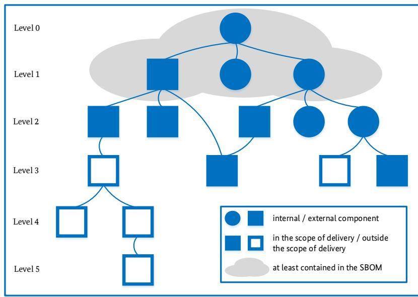
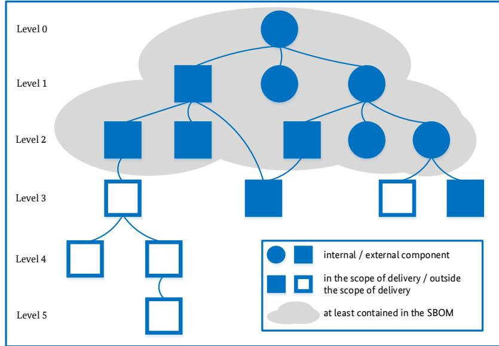
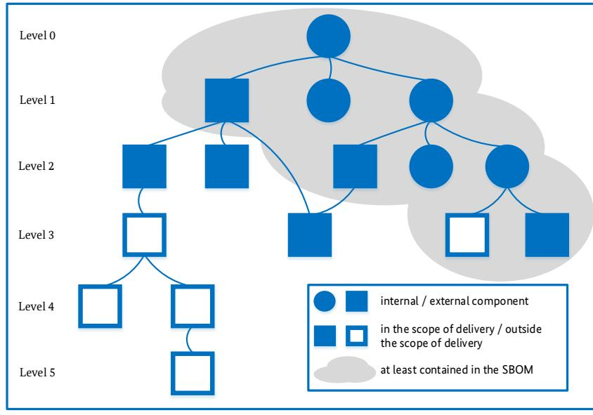
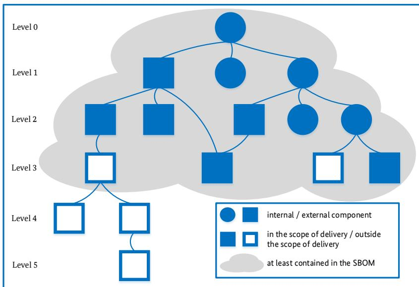
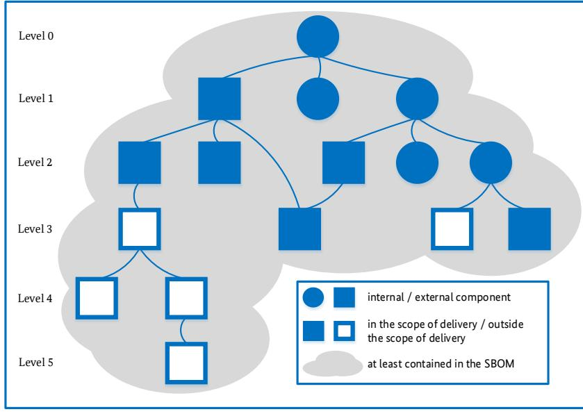

# Technical Guideline TR-03183: Cyber Resilience Requirements for Manufacturers and Products

Part 2: Software Bill of Materials (SBOM)

### Document history

*Table 1: Document History*

| Version | Date       | Description                                                                                                                                                                                                                                                                                                                                                                                                                                                                                                                                                                                                                                                                                                                                                                                |
|---------|------------|--------------------------------------------------------------------------------------------------------------------------------------------------------------------------------------------------------------------------------------------------------------------------------------------------------------------------------------------------------------------------------------------------------------------------------------------------------------------------------------------------------------------------------------------------------------------------------------------------------------------------------------------------------------------------------------------------------------------------------------------------------------------------------------------|
| 1.0     | 2023-07-12 | Version of TR-03183-2 for first publication                                                                                                                                                                                                                                                                                                                                                                                                                                                                                                                                                                                                                                                                                                                                                |
| 1.1     | 2023-11-28 | Translate to English; update requirements for creator, version and licence information                                                                                                                                                                                                                                                                                                                                                                                                                                                                                                                                                                                                                                                                                                  |
| 2.0.0   | 2024-09-20 | Add some definitions and updates in "Terms used", "Level of detail", and "Explanations"; add sections "Dependency", "Express specifications" and "Entry into force and transitional system"; add required data fields (actual filename, executable property, archive property, structured property); add additional field (concluded licences); move source code hash from additional field to optional field; add optional field (declared licences); update CycloneDX minimum version requirement from 1.4 to 1.5; alter hash value of executable component to hash value of deployable component; alter URI of the executable form of the component to URI of the deployable form of the component; extend the definition of components |

Federal Office for Information Security P.O. Box 20 03 63 53133 Bonn E-Mail: TR03183@bsi.bund.de Internet: <https://bsi.bund.de/dok/TR-03183> © Federal Office for Information Security 2023, 2024

| 1            |        | Introduction 6                            |   |  |
|--------------|--------|----------------------------------------------|---|--|
| 2            |        | Requirements Language  8               |   |  |
| 3            |        | Basics                                       | 9 |  |
|              | 3.1    | Definition of SBOM                        | 9 |  |
|              | 3.2    | Terms used                                   | 9 |  |
|              | 3.2.1  | Component                                    | 9 |  |
|              | 3.2.2  | External component 10                     |   |  |
|              | 3.2.3  | Executable file 10                        |   |  |
|              | 3.2.4  | Dependency10                                 |   |  |
|              | 3.2.5  | Vendor/Supplier vs. creator 10            |   |  |
| 4            |        | SBOM formats11                               |   |  |
| 5            |        | Content requirements12                       |   |  |
|              | 5.1    | Level of detail12                            |   |  |
|              | 5.2    | Required data fields12                       |   |  |
|              | 5.2.1  | Required data fields for the SBOM itself12   |   |  |
|              | 5.2.2  | Required data fields for each component12    |   |  |
|              | 5.3    | Additional data fields13                     |   |  |
|              | 5.3.1  | Additional data fields for the SBOM itself13 |   |  |
|              | 5.3.2  | Additional data fields for each component13  |   |  |
|              | 5.4    | Optional data fields14                       |   |  |
|              | 5.4.1  | Optional data fields for each component14    |   |  |
| 6            |        | Express specifications15                     |   |  |
|              | 6.1    | Licence identifiers and expressions15        |   |  |
| 7            |        | Transitional system16                        |   |  |
| 8 Annex17 |        |                                              |   |  |
|              | 8.1    | Explanations17                               |   |  |
|              | 8.1.1  | Machine-processable 17                    |   |  |
|              | 8.1.2  | Components17                                 |   |  |
|              | 8.1.3  | Executable property 17                    |   |  |
|              | 8.1.4  | Archive property17                           |   |  |
|              | 8.1.5  | Structured property17                        |   |  |
|              | 8.1.6  | Component creator17                          |   |  |
|              | 8.1.7  | Scope of delivery18                          |   |  |
|              | 8.1.8  | Path to component18                          |   |  |
|              | 8.1.9  | Licence Information18                        |   |  |
|              | 8.1.10 | Vulnerability information18                  |   |  |

| 8.1.11 | Digital Signature 18          |  |
|--------|----------------------------------|--|
| 8.1.12 | BOM links18                      |  |
| 8.2    | Level of detail of an SBOM 19 |  |
| 8.2.1  | Top-level SBOM19                 |  |
| 8.2.2  | n-level SBOM19                   |  |
| 8.2.3  | Transitive SBOM20                |  |
| 8.2.4  | Delivery item SBOM20             |  |
| 8.2.5  | Complete SBOM21                  |  |
| 8.3    | SBOM classification21            |  |
| 8.3.1  | Design SBOM21                    |  |
| 8.3.2  | Source SBOM21                    |  |
| 8.3.3  | Build SBOM21                     |  |
| 8.3.4  | Analysed SBOM22                  |  |
| 8.3.5  | Deployed SBOM22                  |  |
| 8.3.6  | Runtime SBOM22                   |  |
| 8.4    | Further information22            |  |
| 8.4.1  | Information from the NTIA 22  |  |
| 8.4.2  | Information from CISA 22      |  |

## 1 Introduction

This Technical Guideline describes the requirements for a "Software Bill of Materials (SBOM)". An SBOM is a machine-processable document and corresponds to an electronic bill of materials / parts list. It inventories a code base and thus contains information on all components used in a software. This information can be presented in different breadth and depths - ranging from a basic structure to a fine-granular breakdown of software products and their components. Different formats exist for the representation and distribution of an SBOM.

An SBOM should be used by every software creator and provider in order to be able to transparently represent software complexity and to know which components (e.g. libraries) are used. This knowledge is essential for software management processes, especially for a continuous IT security process and the lifecycle management of software; it is therefore considered "best practice" for a secure software supply chain. An SBOM can be public or non-public and can be distributed in different ways. Typically, software creators use one or more third-party components. They create and manage the SBOMs of their own software; likewise, they take the consumer role of the SBOMs of the included components. The abundance of SBOM information and the possible differences in the structure of SBOMs mean a great deal of work for each creator. Only automation can effectively address that.

SBOM information can be used to check whether a product is potentially affected by a vulnerability by comparing its component list with the components listed in a vulnerability database. However, an SBOM does not contain any statement regarding vulnerabilities or their exploitability. SBOM data for a given software version is considered static, while vulnerability information is of dynamic characteristics. Whether and to which extent a vulnerability of an integrated component poses a risk to the product covered by the SBOM should not be detailed by the SBOM. The exchange of vulnerability information and the potential impact should be facilitated, by means of Security Advisories e.g. CSAF1 (Common Security Advisory Framework) or VEX2 (Vulnerability Exploitability Exchange).

In order to confirm whether a product is affected by a vulnerability or not, it is necessary to compare the SBOM of the product with vulnerability information, such as the CVE (Common Vulnerabilities and Exposures) or Security Advisories of the component manufacturers or providers. Furthermore, an analysis of the software itself is necessary to determine how its potentially affected subcomponents are used, and thus whether and how one's own software product is affected. This must be carried out as part of the vulnerability management for the product. The result of this analysis is then provided to the users of the software as a Security Advisory or VEX for the product.

Originally, SBOMs were mainly used for license management. This Technical Guideline also specifies this use case in an interoperable manner, in order to provide a complete set of requirements for the common use cases of SBOMs.

In the current draft of the Cyber Resilience Act (CRA)3 the compilation of an SBOM is mandatory. The CRA is a market access regulation of the EU for products with digital elements, which obliges their providers to continuously operate a vulnerability management process and to provide information on their products in a transparent and comprehensible form. In the US, an SBOM is already required for software acquired by the Federal government by the US Executive Order 14028 of May 20214 and the FDA (Food and Drug Administration) demands an SBOM to be submitted as part of the approval of new medical devices since March 20235 .

1 <https://csaf.io/>

2 [https://www.ntia.gov/files/ntia/publications/vex\\_one-page\\_summary.pdf](https://www.ntia.gov/files/ntia/publications/vex_one-page_summary.pdf)

3 [https://ec.europa.eu/transparency/documents-register/detail?ref=COM\(2022\)454&lang=en](https://ec.europa.eu/transparency/documents-register/detail?ref=COM(2022)454&lang=en)

4 [https://www.whitehouse.gov/briefing-room/presidential-actions/2021/05/12/executive-order-on-improving](https://www.whitehouse.gov/briefing-room/presidential-actions/2021/05/12/executive-order-on-improving-the-nations-cybersecurity/)[the-nations-cybersecurity/](https://www.whitehouse.gov/briefing-room/presidential-actions/2021/05/12/executive-order-on-improving-the-nations-cybersecurity/) Section 4

5 <https://www.congress.gov/117/bills/hr2617/BILLS-117hr2617enr.pdf> Section 3305

### 2 Requirements Language

The key words "MUST", "MUST NOT", "REQUIRED", "SHALL", "SHALL NOT", "SHOULD", "SHOULD NOT", "RECOMMENDED", "NOT RECOMMENDED", "MAY", and "OPTIONAL" in this document are to be interpreted as described in BCP 146 (RFC 21197 , RFC 81748 ) when, and only when, they appear in all capitals, as shown here.

6 <https://www.rfc-editor.org/info/bcp14>

7 <https://www.rfc-editor.org/rfc/rfc2119>

8 <https://www.rfc-editor.org/rfc/rfc8174>

### 3 Basics

### 3.1 Definition of SBOM

A "Software Bill of Materials" (SBOM) is a machine-processable file containing supply chain relationships and details of the components used in a software product. It supports automated processing of information on these components. This covers both the so-called "primary component" and used (e.g. external/thirdparty) components.

An SBOM MUST contain certain minimum information (see section [5\)](#page-9-0), but MAY be expanded and detailed as desired. It describes any relationship of the covered components as detailed in sectio[n 5.](#page-9-0)

A separate SBOM MUST be generated for each software version. An updated version of the SBOM for a given software version MUST be generated if and only if additional information on the included components is provided or errors in the SBOM data are corrected. Consequently, if any component is altered, a new software version MUST be assigned to this component; and in the case of a delivery item SBOM also to all depending parent components.

An SBOM MUST NOT contain vulnerability information, because SBOM data is static with respect to software that is not changing. Nonetheless, the formats for describing an SBOM may offer the ability to include vulnerability information. Still, a document containing both SBOM and vulnerability information does not conform to this Technical Guideline; see also sectio[n 8.1.10.](#page-15-3)

#### 3.2 Terms used

#### **3.2.1 Component**

A "component" as used in this Technical Guideline is a single executable file or an archive file, hence they MUST be represented as components in the SBOM. Additionally, any other file MAY be represented as a component. Note that an archive can be an executable file, too.

The primary component, i.e. the product itself and the root of the dependency tree from the perspective of this SBOM, is also a "component" as used in this Technical Guideline.

For components that comprise multiple components in a manner that the original components cannot be determined the original components SHOULD be listed with the appropriate information according to section [5.2.2](#page-9-4) and sectio[n 5.3.2.](#page-10-2) Information that is not available due to the way a component is assembled has to be omitted even if it is specified as a required field, e.g. the hash or filename of the component.

For explanation of the terms used, see section [8.1.](#page-14-1)

For the collection of information about components the following principles MUST apply:

#### **In the case of compiled code**

The component that was used during the execution of the linker MUST be listed, even if alternative components or implementation could have been used.

If there is – for technical reasons – no linkage run the interpreted code section applies.

Both statements apply to statically and dynamically linked components / libraries.

#### **In the case of interpreted code**

The version number of the component MUST reflect the exact required version, if the component is part of the delivery item.

If the component is not part of the delivery item, the version number of the component SHOULD reflect the minimum required version as defined by the component creator. This SHOULD also take into account other factors than just the factual minimum technical requirement. This implies that the component creator SHOULD skip versions that are end-of-life or have known security vulnerabilities. The minimum required version MAY be determined by the minimum version, which was used for testing, e.g. because it was used during software development.

If multiple implementations of a single dependency exist then the "least common denominator" or the standard implementation SHOULD be used. For example:

- If a script can be run with all Bourne Shell compatible shells the component denoted in the SBOM should be the Bourne Shell.
- If a script can be run with any Python implementation the standard implementation must be used (Python) instead of an alternative implementation (Pyston).

#### **3.2.2 External component**

An "external component" is a component whose component creator differs from the component creator of the primary component.

The assignment of information to be listed in case of compiled and interpreted code is described as part of section [3.2.1.](#page-6-3)

#### **3.2.3 Executable file**

An "executable file" as used in this Technical Guideline is any file which comprises code that is executed by a computer, either directly or by a runtime system.

#### **3.2.4 Dependency**

In this Technical Guideline a dependency is a directed requirement from one component to another component. This is regardless whether a component is a dependency (as a technical term) or contained in the component, e.g. statically linked or embedded.

#### **3.2.5 Vendor/Supplier vs. creator**

In this Technical Guideline, a distinction is made between "Vendor" and "Creator", since "Manufacturer" may be interpreted as combining these two roles in the sense of "vendor of self-created software" (as the German term "Hersteller" is usually interpreted).

"Vendor" (German: "Anbieter") describes the role of the entity that provides the software or component. Alternatively, but not necessarily with a commercial background the terms "Supplier" (German: "Lieferant") are used.

"Creator" (German: "Ersteller") describes the role of the entity that authored or created the software or component. Alternatively, the term "Author" (German: "Autor") is used.

As the CRA is a market access regulation and this Technical Guideline specifies technical requirements, this Technical Guideline uses a different terminology than defined by the CRA. Therefore, this Technical Guideline does not mention the terms "Economic Operator", "Distributor" or "Importer", as the roles of these parties are unrelated to the technical requirements stated here. These technical requirements are independent of the role that is fulfilling them.

### 4 SBOM formats

A newly generated or updated SBOM MUST be in JSON- or XML-format that meets one of the following specifications in one of the specified versions.

- CycloneDX9 , version 1.5 or higher
- Software Package Data eXchange (SPDX)10, version 2.2.1 or higher

The transitional system of this Technical Guideline is specified in sectio[n 7.](#page-13-0)

9 <https://cyclonedx.org/specification/overview/>

10 <https://spdx.dev/specifications/>

### 5 Content requirements

### 5.1 Level of detail

For an SBOM that is compliant with this Technical Guideline, recursive dependency resolution MUST be performed at least for each component included in the scope of delivery **on each path** downward at least up to and including the first component that is outside the scope of delivery (see Annex, section [8.2.4\)](#page-17-1). If the primary component depends on multiple instances of a component which have different metainformation, all these instances MUST be listed separately with their individual meta-information.

SBOMs of used components MAY be linked instead of being merged into the SBOM of the primary component, if and only if they are compliant with this Technical Guideline.

This SBOM MUST contain the same information as available during the build process or equivalent information where the build process does not exist (for details related to Build SBOM, see Annex, section [8.3.3\)](#page-18-4).

#### 5.2 Required data fields

#### **5.2.1 Required data fields for the SBOM itself**

Each SBOM MUST contain at least the following information:

*Table 2: Required data fields for the SBOM itself*

| Data field          | Description                                                               |
|---------------------|---------------------------------------------------------------------------|
| Creator of the SBOM | Email address of the entity that created the SBOM. If no email address is |
|                     | available this MUST be a "Uniform Resource Locator (URL)", e.g. the       |
|                     | creator's home page or the project's web page.                   |
| Timestamp           | Date and time of the SBOM data compilation according to the               |
|                     | specification of the formats (see section 4)                           |

#### **5.2.2 Required data fields for each component**

For each component included in an SBOM, at least the following information MUST be provided11:

*Table 3: Required data fields for each component*

| Data field        | Description                                                     |
|-------------------|-----------------------------------------------------------------|
| Component creator | Email address of the entity that created and, if applicable,    |
|                   | maintains the respective component. If no email address is      |
|                   | available this MUST be a "Uniform Resource Locator (URL)", e.g. |
|                   | the creator's home page or the project's web page.              |
| Component name    | Name assigned to the component by its creator. If no name is |
|                   | assigned this MUST be the actual filename.                      |

11 cf. [https://www.ntia.gov/files/ntia/publications/sbom\\_minimum\\_elements\\_report.pdf](https://www.ntia.gov/files/ntia/publications/sbom_minimum_elements_report.pdf) sections IV and V as well as

[https://www.ntia.gov/sites/default/files/publications/ntia\\_sbom\\_framing\\_2nd\\_edition\\_20211021\\_0.pdf](https://www.ntia.gov/sites/default/files/publications/ntia_sbom_framing_2nd_edition_20211021_0.pdf) section 2.2 and [https://www.ntia.gov/files/ntia/publications/ntia\\_sbom\\_formats\\_energy\\_brief\\_2021.pdf](https://www.ntia.gov/files/ntia/publications/ntia_sbom_formats_energy_brief_2021.pdf) page 5.

| Data field                       | Description                                                                               |
|----------------------------------|-------------------------------------------------------------------------------------------|
| Component version                | Identifier used by the creator to specify changes in the component                        |
|                                  | to a previously created version. Identifiers according to Semantic                        |
|                                  | Versioning12 or alternatively Calendar Versioning13 SHOULD be                             |
|                                  | used if one determines the versioning scheme. Existing identifiers                        |
|                                  | MUST NOT be changed for this purpose.                                                     |
|                                  | If no version is assigned this MUST be the creation date of the file                |
|                                  | expressed as full-date according to RFC 333914 section 5.6. To                      |
|                                  | determine the creation time the file metadata MUST be consulted.                          |
| Filename of the component     | The actual filename of the component (i.e. not its path); see also section 3.2.1 |
| Dependencies on other components | Enumeration of all components on which this component is                                  |
|                                  | directly dependent, according to requirements in section 5.1, or                          |
|                                  | which this component contains according to requirements in                             |
|                                  | section 3.2.1.                                                                         |
| Associated licences              | Associated licence(s) of the component from the perspective of the                  |
|                                  | SBOM creator. For specifics see sections 6.1 and 8.1.9.                          |
| Hash value of the deployable     | Cryptographically secure checksum (hash value) of the                                     |
| component                        | deployed/deployable component (i.e. as a file on a mass storage                        |
|                                  | device) as SHA-512; see also section 3.2.1                                                |
| Executable property              | Describes whether the component is executable; possible values                            |
|                                  | are "executable" and "non-executable"; see also section 8.1.3                             |
| Archive property                 | Describes whether the component is an archive; possible values are                        |
|                                  | "archive" and "no archive"; see also section 8.1.4                                        |
| Structured property              | Describes whether the component is a structured file, i.e. metadata                    |
|                                  | of the contents is still present (see section 3.2.1); possible values are                 |
|                                  | "structured" and "unstructured"; see also section 8.1.5                                |
|                                  | If a component contains both structured and unstructured parts                            |
|                                  | the value "structured" MUST be used.                                                |

### 5.3 Additional data fields

#### **5.3.1 Additional data fields for the SBOM itself**

Each SBOM MUST additionally include the following information, if it exists and its prerequisites are fulfilled:

*Table 4: Additional data fields for the SBOM itself*

| Data field | Description                                      |
|------------|--------------------------------------------------|
| SBOM-URI   | "Uniform Resource Identifier (URI)" of this SBOM |

#### **5.3.2 Additional data fields for each component**

For each component included in an SBOM, the following information MUST additionally be provided, if it exists and its prerequisites are fulfilled:

12 <https://semver.org/>

13 <https://calver.org/>

14 <https://www.rfc-editor.org/rfc/rfc3339>

| Data field                    | Description                                                                       |
|-------------------------------|-----------------------------------------------------------------------------------|
| Source code URI               | "Uniform Resource Identifier (URI)" of the source code of the component,          |
|                               | e.g. the URL of the utilised source code version in its repository, or if a |
|                               | version cannot be specified the utilised source code repository itself.           |
| URI of the deployable form of | "Uniform Resource Identifier (URI)", which points directly to the                 |
| the component                 | deployable (e.g. downloadable) form of the component.                          |
| Other unique identifiers      | Other identifiers that can be used to identify the component or to look it        |
|                               | up in relevant databases, such as Common Platform Enumeration (CPE) or            |
|                               | Package URL (purl).                                                               |
| Concluded licences            | The licence(s) that the licensee of the component has concluded for this |
|                               | component. For specifics see sections 6.1 and 8.1.9.                     |

*Table 5: Additional data fields for each component*

### 5.4 Optional data fields

#### **5.4.1 Optional data fields for each component**

Each SBOM MAY additionally include the following information, if it exists and its prerequisites are fulfilled:

|  |  | Table 6: Optional data fields for each component |
|--|--|--------------------------------------------------|
|--|--|--------------------------------------------------|

| Data field                       | Description                                                                    |
|----------------------------------|--------------------------------------------------------------------------------|
| Declared licences                | The licence(s) that the licensor of the component has declared for this  |
|                                  | component. For specifics see sections 6.1 and 8.1.9.                     |
| Hash value of the source code of | Cryptographically secure checksum (hash value) of the component source         |
| the component                    | code. A specific algorithm how to create a hash value of multiple source |
|                                  | files or a source code tree, and which hash algorithm is utilised for that has |
|                                  | not yet been determined.                                                       |

Note: This list is not meant to be exhaustive.

## 6 Express specifications

This section explicitly specifies aspects of sectio[n 5](#page-9-0) in detail.

#### 6.1 Licence identifiers and expressions

Principles of licence identification:

- 1. Licences MUST be referred to (in the sense of "named") by their appropriate SPDX licence identifier or licence expression based on such an identifier. This reference is made with so-called "identifiers for licences and licence expressions" 15 .
- 2. Indication of licence identifiers not defined by SPDX If an appropriate licence identifier can neither be found in the list maintained by SPDX or constructed by an SPDX licence expression based on a defined licence identifier, the licence database "Scancode LicenseDB AboutCode" 16 MUST be consulted next. Identifiers from this database use the prefix **LicenseRef-scancode-[...]** in their SPDX licence identifier to indicate their origin.
- 3. Licences which cannot be assigned to an extant identifier or licence expression based on an extant identifier

If an appropriate licence identifier cannot be discovered in any of the established identifier lists, the prefix **LicenseRef-<licence\_inventorising\_entity>-[...]** MUST be used according to "Annex D: SPDX License Expressions"17 to assign a unique (for each LicenseRef namespace) licence identifier.

For license identification the following principles of license similarity MUST be applied:

- Licences are similar if they can be mapped to another licence according to "Annex B: License Matching Guidelines and Templates"18 .
- Placeholders and templates in licence texts If placeholders and templates exist in licence texts, a replacement of these placeholders and templates by individualised content MUST NOT be understood as a licence modification, but MUST be assigned to the same licence identifier.
- SPDX operators and licence concatenations

Licence expressions of multiple licensing, licence choices and licence exceptions MUST be mapped with SPDX operators. The licence operators link licence identifiers. Permitted operators MUST be selected according to "Annex D: SPDX License Expressions".

• Exception clauses for licences

If an exception clause is attached to a licence text, it MUST be attached to a licence identifier with **WITH** according to the allowed SPDX operators. The names of the exception clause MUST be described with identifiers analogous to the requirements on licence identification19 .

• Text modifications

If a wording in a licence text is slightly modified compared to a licence text of a licence with a known licence identifier, this licence identifier SHOULD be used for the modified licence if the modification is not substantial. Examples are the addition or removal of liability-clauses or remarks to existing trademarks.

15 <https://spdx.org/licenses/>

16 <https://scancode-licensedb.aboutcode.org/>

17 <https://spdx.github.io/spdx-spec/v2.3/SPDX-license-expressions/>

18 <https://spdx.github.io/spdx-spec/v2.3/license-matching-guidelines-and-templates/>

19 <https://spdx.github.io/spdx-spec/v2.3/SPDX-license-list/#a2-exceptions-list>

### 7 Transitional system

The version with the highest version number of this Technical Guideline available on BSI's website is called the "most recent version". To be compliant to this Technical Guideline, the most recent version MUST be used for the generation of SBOMs. Any previous version MUST NOT be applied, except for the immediately preceding version which MAY be applied to generate SBOMs compliant to this Technical Guideline up to six months after a new "most recent version" has been published.

Unless otherwise defined, an SBOM version compliant to this Technical Guideline at the delivery date of this SBOM version remains complaint to the Technical Guideline, even if new versions of this Technical Guideline have been published afterwards. Consequently, consumers of SBOMs SHOULD be able to interpret SBOM versions that were compliant to this Technical Guideline at the time being delivered.

### 8 Annex

This section provides additional, explanatory information.

While the sections [3](#page-6-0) to [5](#page-9-0) set normative requirements for contents, extent and format of a Software Bill of Materials (SBOM), this section is intended to provide helpful information on these requirements. This includes reasons for certain requirements, further explanation of some of the terms used and examples.

#### 8.1 Explanations

This section provides more information on certain terms or definitions in this Technical Guideline.

#### **8.1.1 Machine-processable**

SBOMs are defined as machine-processable files in this Technical Guideline. This implies that machines can create, read, modify, process, analyse and evaluate the content and act based on the data. The content itself is well-defined and structured. The term "machine-readable" can be interpreted in multiple ways and is therefore not used.

#### **8.1.2 Components**

In this Technical Guideline a "component" must be a single executable file20 or an archive file. Note that an archive can be an executable file, too. The use of the term "file" is necessary in order to unambiguously define which objects this Technical Guideline applies to.

#### **8.1.3 Executable property**

Examples for executable files include compiled binaries ("executables"), interpreted code (e.g. Python, Shell, Java) and shared libraries. Not covered by the term are, e.g. configuration files, graphic files, documentation.

#### **8.1.4 Archive property**

An archive is a combination of multiple components.

Note: Compression of an archive does not change this property.

#### **8.1.5 Structured property**

Structured archives contain metadata so that the original components can still be determined afterwards. Examples include containers, packages, ISO images, and archives as .zip, .tar, .tar.gz, .7z.

Unstructured archives do not contain such metadata, i.e. information about their structure is not embedded in the file. Examples for unstructured archives include firmware images or other archives that are not decomposable into their original components.

Note: Binaries containing statically linked libraries are unstructured, executable files, with the exception of self-extracting archives which are structured archives while they are executable files and potentially contain a statically linked decompression algorithm.

#### **8.1.6 Component creator**

If the source file of a component is cloned, or if the maintainer of a component renames the project, or if the contents of the components source code (if applicable) is changed, the maintainer steps into the role of the component creator.

20 see also <https://en.wikipedia.org/wiki/Executable>

Federal Office for Information Security Page 15 of 20

#### **8.1.7 Scope of delivery**

The scope of delivery of a software product comprises all parts of software, originated by the supplier or a third party, that are delivered with the software product. Not included by this term are parts of software that have to be acquired or obtained separately.

#### **8.1.8 Path to component**

A path to a component is defined as tuple of edges that connect nodes which lead to this specific component. It starts at the primary component and ends at this specific component. Note, that multiple paths to a single component exist if this component is depended upon by multiple, disjunct components. A path connects two nodes and may lead across other nodes; hence a path clearly denotes a specific chain of nodes. Consequently, if a component has *n* direct dependencies there are at least *n* paths across this node, each of them across a different direct dependency of this component.

#### **8.1.9 Licence Information**

The required fields for every component include licence information. On the one hand handling licence information is a common use case for SBOMs. On the other hand licence information can be crucial in handling vulnerabilities, e.g. if the licence of a component does not allow the user to modify the code to mitigate a vulnerability.

Declared licences are all licences that have been declared by the creator of a component.

A special case is that the primary licensee is forced by the component creator to choose from different sets of licences which are mutually exclusive. A classic example is Qt where the primary licensee has to decide between GPL and a proprietary licence; only the made choice can be handed further down the supply chain. Hence the associated licences can differ from the declared licences.

Associated licences are all licences under which a component can be used by the licensee.

Concluded licences are determined by the licensee that is the component creator of the primary component of the current SBOM.

The statement about multiple component instances with different meta-information also applies if only the licence information differs.

#### **8.1.10 Vulnerability information**

The SBOM definition in this Technical Guideline states that vulnerability information is not contained in an SBOM. Information on vulnerabilities of a certain version of a software changes over time while the crucial information of an SBOM (e.g. on dependencies) is static. If vulnerability information is included in an SBOM, this static data is unnecessarily propagated along the software supply chain in unaltered form each time the vulnerability information is updated. Consequently, it is required not to include vulnerability information in an SBOM, even though an SBOM format specification supports that. The recommended format for distributing vulnerability information is CSAF (including also VEX as a profile).

#### **8.1.11 Digital Signature**

Ideally, SBOMs should be digitally signed so recipients can verify their authenticity.

#### **8.1.12 BOM links**

If the creator of an SBOM uses external BOM links to reference SBOM information, this creator is responsible for the availability of the referenced SBOM information. The goal is to provide the SBOM information as if the SBOM creator provided the complete information themselves.

### 8.2 Level of detail of an SBOM

Structurally, an SBOM can be created in different levels of detail, e.g. according to the following classification.

#### **8.2.1 Top-level SBOM**

In addition to the full description of the primary component, the SBOM contains the full description of all components, which the primary component directly depends on.

*Figure 1: Top-level SBOM*

#### **8.2.2** *n***-level SBOM**

*Figure 2: n-level SBOM for n=2*

In addition to the full description of the primary component, the SBOM contains the full description of all components, which are directly or transitively depended upon via *n* levels by the primary component. This means that the recursive resolution of the transitive dependencies is limited to *n* steps in depth. If the path from the primary component is shorter than *n* levels, all components on this path have to be resolved and, consequently, fully described.

A top-level SBOM is a 1-level SBOM.

#### **8.2.3 Transitive SBOM**

In addition to the full description of the primary component, the SBOM contains information on at least all components, which are directly or transitively depended upon by the primary component. The full description and recursive resolution of components and their dependencies is performed **on each path** at least up to and including the first external component (i.e. third-party component). This component must also be fully described in the SBOM except for the dependencies of this component. Consequently, the dependencies of external components do not

*Figure 3: Transitive SBOM*

have to be resolved.

Compared to an n-level SBOM including a first external component the transitive SBOM may contain less information on this external component, because a transitive SBOM does not need to describe the dependencies of this external component.

#### **8.2.4 Delivery item SBOM**

*Figure 4: Delivery item SBOM*

c onsequently, these dependencies do not have to be resolved. In addition to the full description of the primary component, the SBOM contains the full description of at least all components, which belong to the scope of delivery and are directly or transitively depended upon by the primary component. The full description and recursive resolution of components and their dependencies is performed **on each path** at least up to and including the first component, which is outside the scope of delivery. This component must also be fully described in the SBOM except for the dependencies of this component;

#### **8.2.5 Complete SBOM**

In addition to the full description of the primary component, the SBOM contains the full description of all components, which are directly or transitively depended upon by the primary component. The full description and recursive resolution of the components and their dependencies is carried out completely.

*Figure 5: Complete SBOM*

#### 8.3 SBOM classification

Depending on how or when an SBOM is created as part of the development, delivery, installation and execution process of a component, the data differs, which is available in that specific situation. Consequently, the information that can be compiled in the SBOM also differs. A common differentiation is to distinguish between the following SBOM classes.

#### **8.3.1 Design SBOM**

The SBOM is created based on the planned set of included components of a new software artefact. The components do not have to exist yet.

#### **8.3.2 Source SBOM**

The SBOM is created from the development environment, the source files and the dependencies it uses.

#### **8.3.3 Build SBOM**

The SBOM is created as part of the build process based on e.g. source files, dependency information, already created components, volatile build process data and other SBOMs.

Notes:

- In order to enable capturing executable, binary components that already exist (i.e. precompiled code), creating a Build SBOM focuses on the linker run for translated code, not the compiler run.
- In order to let hash values unambiguously identify components, reproducible builds have to be employed.
- In the case of interpreted code, only the source code exists; each executable file has to be listed as a component. The interpreter has to be specified as a dependency, as far as reasonably possible.

#### **8.3.4 Analysed SBOM**

The SBOM is created after the build process by analysing artefacts such as executables, packages, containers and virtual machine images. This type is also referred to as "3rd party SBOM".

#### **8.3.5 Deployed SBOM**

The SBOM provides an inventory of the software on a system. This can be a compilation of other SBOMs, taking into account configuration options and examination of execution behaviour in a (possibly simulated) deployment environment.

#### **8.3.6 Runtime SBOM**

The SBOM is created using the system executing the software to capture running (i.e. executing) components as well as their external calls and dynamically loaded components at runtime only (i.e. in memory). This type may also be referred to as "Dynamic SBOM".

#### 8.4 Further information

#### **8.4.1 Information from the NTIA**

The "National Telecommunications and Information Administration (NTIA)" of the "United States Department of Commerce" offers a great deal of further information on the subject of SBOM at <https://ntia.gov/sbom>.

#### **8.4.2 Information from CISA**

The Cybersecurity and Infrastructure Security Agency (CISA) of the United States Department of Homeland Security also offers further information on SBOM at <https://cisa.gov/sbom>.