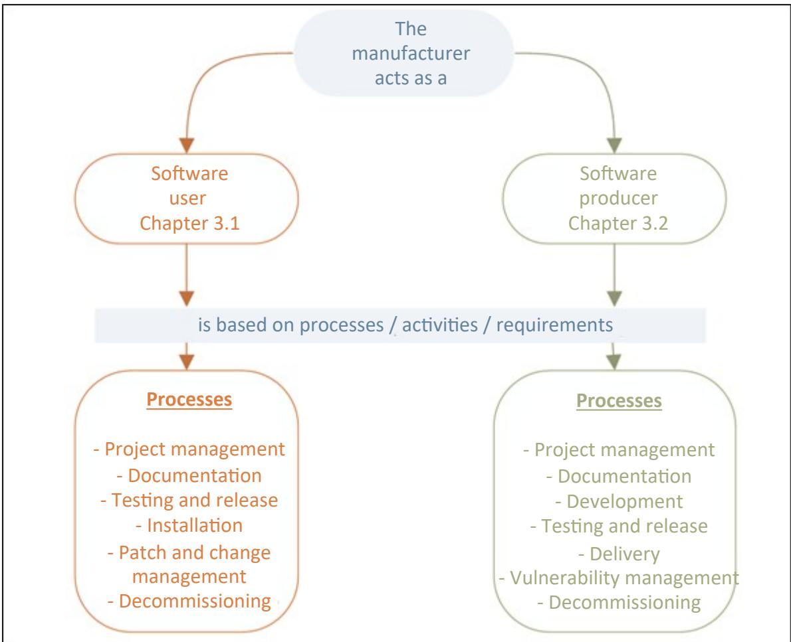

# Technical Guideline TR-03185: Secure Software Lifecycle

Version 1.0

## Document history

*Table 1 History*

| Version | Date       | Description                   |
|---------|------------|-------------------------------|
| 1.0     | 2024-09-06 | Version for first publication |

Bundesamt für Sicherheit in der Informationstechnik Postfach 20 03 63 53133 Bonn Internet: https://www.bsi.bund.de © Federal Office for Information Security (BSI) 2024

| 1   |                                                | Introduction 6                                             |  |  |
|-----|------------------------------------------------|------------------------------------------------------------|--|--|
| 2   |                                                | Structure of the TG 7                                      |  |  |
| 2.1 |                                                | Definition of terms 7                                      |  |  |
|     | 2.2                                            | Notes and explanations 8                                   |  |  |
| 3   | Requirements on the part of the manufacturer10 |                                                            |  |  |
|     | 3.1                                            | Requirements for the manufacturer as a user of software10  |  |  |
|     | 3.1.1                                          | Project management 10                                      |  |  |
|     | 3.1.2                                          | Documentation 15                                           |  |  |
|     | 3.1.3                                          | Testing and release 15                                     |  |  |
|     | 3.1.4                                          | Installation 17                                            |  |  |
|     | 3.1.5                                          | Patch and change management 18                             |  |  |
|     | 3.1.6                                          | Decommissioning 20                                         |  |  |
|     | 3.2                                            | Requirements for the manufacturer as a software producer20 |  |  |
|     | 3.2.1                                          | Project management 21                                      |  |  |
|     | 3.2.2                                          | Documentation 24                                           |  |  |
|     | 3.2.3                                          | Development 25                                             |  |  |
|     | 3.2.4                                          | Testing and release 33                                     |  |  |
|     | 3.2.5                                          | Delivery 36                                                |  |  |
|     | 3.2.6                                          | Vulnerability management 36                                |  |  |
|     | 3.2.7                                          | Decommissioning 39                                         |  |  |
|     |                                                | Glossary 40                                                |  |  |
|     |                                                | List of references 42                                      |  |  |

## List of figures

| Figure 1: Perspectives and Processes of the Manufacturer8 |  |  |
|-----------------------------------------------------------|--|--|
|-----------------------------------------------------------|--|--|

## List of tables

| Table 1 History 2                                                            |  |
|------------------------------------------------------------------------------|--|
| Table 2 System of Requirements 10                                            |  |
| Table 3 Requirements User Project Management General11                       |  |
| Table 4 Requirements User Project Management Acquisition12                   |  |
| Table 5 Requirements User Project Management Acquisition13                   |  |
| Table 6 Requirements User Project Management Personnel14                     |  |
| Table 7 Requirements User Documentation 15                                   |  |
| Table 8 Requirements User Testing and Release 15                             |  |
| Table 9 Requirements User Installation 17                                    |  |
| Table 10 Requirements User Patch and Change Management18                     |  |
| Table 11 Requirements User Decommissioning 20                                |  |
| Table 12 Requirements Producer Project Management General21                  |  |
| Table 13 Requirements Producer Project Management Personnel23                |  |
| Table 14 Requirements Producer Project Documentation24                       |  |
| Table 15 Requirements Producer User Documentation25                          |  |
| Table 16 Requirements Producer Development Development Management26          |  |
| Table 17 Requirements Producer Development Design26                          |  |
| Table 18 Requirements Producer Development Threat Modelling28                |  |
| Table 19 Requirements Producer Development Design29                          |  |
| Table 20 Requirements Producer Development Design Review29                   |  |
| Table 21 Requirements Producer Development-related testing30                 |  |
| Table 22 Requirements Producer Development Third-party Components31          |  |
| Table 23 Requirements Producer Development Code Management32                 |  |
| Table 24 Requirements Producer Compiler, Interpreter and Build Tools32       |  |
| Table 25 Requirements Producer Development Inventory33                       |  |
| Table 26 Requirements Producer Development Testing and Release33             |  |
| Table 27 Requirements Producer Testing and Release for Patches and Updates35 |  |
| Table 28 Requirements Producer Delivery 36                                   |  |
| Table 29 Requirements Producer Vulnerability Management36                    |  |
| Table 30 Requirements Producer Decommissioning39                             |  |
| Table 31 Glossary 40                                                         |  |
|                                                                              |  |

## 1 Introduction

Secure software and hardware form the basis for the secure use of IT products in government, business and society. The Federal Office for Information Security (BSI) therefore appeals to manufacturers to consider information security from the outset and to make it as easy as possible for users to use their products securely through secure pre-configuration.

Against this backdrop, this Technical Guideline (TG) was created in accordance with the requirements of the BSI IT-Grundschutz (IT basic protection) for secure software development processes, supplemented by the respective norms, standards and frameworks. The focus here was on the potential enhancement and structuring.

The European Union is also implementing the Cyber Resilience Act (CRA) to focus current legislation on the cybersecurity of IT products throughout their entire life cycle, thus placing manufacturers under an obligation to conduct the appropriate risk assessments and to maintain an adequate level of information security.

### **Objective**

This Technical Guideline

- lists and groups the requirements from existing norms and standards
- provides an introduction to the topic of a secure software lifecycle
- specifies the relevant requirements in the context of information security
- provides the opportunity to evaluate and improve in-house development processes in terms of information security.

This Technical Guideline considers

- the processes in the context of software development and
- the resources and tools used.

In its current version, the TG in its entirety does not apply to processes for developing software that are generally referred to as "Open Source Software (OSS)" or "free / libre and open source software (FLOSS / FOSS)". Requirements that demand a specific consideration of the features of open source software development must be adapted for such applications.

## 2 Structure of the TG

This chapter first outlines the TG system and the terms used within it. This is followed by the potential perspectives of the software user (Chapter 3.1) and the software producer (Chapter 3.2).

### 2.1 Definition of terms

### **Manufacturer**

"Manufacturer" in the document refers to a natural or legal person who (regardless of the organisational form or of the process model used) is responsible for producing software, i.e. developing, creating, delivering/providing and supporting such software.

### **Perspectives**

The perspective from which a manufacturer operates in the software lifecycle may vary. In the document, the manufacturer's perspectives are divided as follows:

- Software **user** This includes processes, activities and requirements of the **software (tools) used** for production.
- Software **producer**

This refers to processes, activities and requirements for the **software to be produced.** This perspective includes that of the "software user" at all times.

### **Software lifecycle**

This TG refers to the software creation processes on the manufacturer side, from the perspective of software users and software producers (see below).

The process of defining requirements for the software to be created is not considered here. It is assumed that the relevant information security requirements are available or submitted to the manufacturer as a software producer.

### **Processes and requirements**

Processes summarise the actions required to fulfil or implement the requirements for a secure software lifecycle and can be assigned to the perspectives.

Processes relating to the "software user" perspective:

- Project management
- Documentation
- Testing and release
- Installation
- Patch and change management and
- decommissioning.

Processes for the "software producer":

- Project management
- Documentation
- Development
- Testing and release
- Delivery
- Vulnerability management and
- decommissioning.

*Figure 1: Perspectives and Processes of the Manufacturer*

### 2.2 Notes and explanations

#### **Information Security Management System (ISMS)**

The information security issue relating to the provision of IT and infrastructure as a (supporting) task by the manufacturer should be taken into account within the framework of an information security concept or ISMS (e.g. pursuant to the BSI IT-Grundschutz). It does not form part of this TG.

In the context of an ISMS, terms such as protection needs, security profile, trusted source are also used in this document and are assigned a specific meaning.

#### **Project planning**

The document focuses in particular on aspects of information security and does not constitute a guide for the planning of software projects.

Similarly, the order of the processes and requirements indicated here does not represent a mandatory chronological sequence for a software project.

#### **Process model**

The TG does not require a specific process model for software development, as the processes and methods described here are so generic that they can be adapted to the process model selected in the individual case (e.g. traditionally sequential or agile).

#### **Modal verbs**

In the requirements, the modal verbs "SHOULD" and "MUST" written in capital letters are used in their respective forms and the respective negations to make clear how the respective verbs should be interpreted. The definitions used here are based on [RFC2119] and DIN 820-2:2012, Annexe H [820-2].

| MUST:       | This term means that this is a requirement that must be imperatively fulfilled (absolute requirement).                                                                                   |
|-------------|---------------------------------------------------------------------------------------------------------------------------------------------------------------------------------------------|
| MUST NOT:   | This term means that something must not be done in no case (absolute prohibition).                                                                                                       |
| SHOULD:     | This term means that a requirement usually must be fulfilled, but that there can be reasons to not fulfil the requirement. However, this must be carefully assessed and well founded. |
| SHOULD NOT: | This term means that something should not be done usually, but that there can be reasons to do it. However, this must be carefully assessed and well founded.                         |
| MAY:        | This expression denotes a requirement that is optional. The requirements indicated in the document should be considered as examples.                                                     |

## 3 Requirements on the part of the manufacturer

The following chapters list the requirements on the part of the software manufacturer. These were compiled from various norms, standards and frameworks with reference to the BSI IT-Grundschutz-Kompendium, so the requirements may therefore exhibit different language styles and levels of detail.

All the requirements in the following two chapters (perspectives) are relevant for manufacturers. This arises from the assumption that it is not possible to produce software without IT support. The potential extent of tool support may vary greatly.

The sources used are referenced in the requirements listed for further information. The basis for this:

- BSI IT-Grundschutz-Kompendium 2023
- NESAS, FS.16, Version 2.3
- DIN EN IEC 62443-4-1:2018-10
- NIST SP 800-218, Version 1.1, February 2022

In addition to the source information, further information on the requirements is available based on the following system:

*Table 2 System of Requirements*

| Requirement ID         | Abbreviation of the respective requirement          |
|------------------------|-----------------------------------------------------|
| Additional information | Sources of further information                      |
| Keywords               | Important terms used in the text of the requirement |
| Glossary               | Terms explained in the glossary                     |

### 3.1 Requirements for the manufacturer as a user of software

This chapter lists the requirements for the manufacturer from the perspective of a software user. This specifically refers to tools that support the software lifecycle (e.g. for project management, documentation, development, testing, CI/CD), which are used in particular in the processes described in Chapter 3.2.

The requirements are broken down into:

- Project management (General, acquisition, IT operations and personnel)
- Documentation
- Testing and release
- Installation
- Patch and change management and
- Decommissioning.

### 3.1.1 Project management

Project management is essential for the use of tools to support the software lifecycle. Aspects of information security should also be noted here. The relevant requirements are divided into the sub-areas: general, acquisition, IT operations and personnel.

### 3.1.1.1 General

General considerations regarding the definition of the requirements for the software tools form the basis for the further process regarding the use of tools. The relevant requirements are listed below.

*Table 3 Requirements User Project Management General*

| Requirement ID | Requirement                                                                                                                                                                                                                                                                                                                                                                                                                                                                                                                                                                                                                                                                                                                                                                                                                                                                                                                                                                                                                                                                 |
|-------------------|-----------------------------------------------------------------------------------------------------------------------------------------------------------------------------------------------------------------------------------------------------------------------------------------------------------------------------------------------------------------------------------------------------------------------------------------------------------------------------------------------------------------------------------------------------------------------------------------------------------------------------------------------------------------------------------------------------------------------------------------------------------------------------------------------------------------------------------------------------------------------------------------------------------------------------------------------------------------------------------------------------------------------------------------------------------------------------|
| USER.PM.A.1       | Before an institution introduces (new) software tools, it MUST decide and SHOULD document:  What the software tools are used for and what information (with the respective protection needs1 ) will be processed with them  How users should be involved in requirements gathering and what support they should receive during implementation  How the software tools are linked to other applications and IT systems and through which interfaces  On which IT systems the software tools will be executed and the resources required to execute the software tools, and  Whether the institution is now dependent on a manufacturer if it uses such software tools. Security aspects MUST be also considered here.                                                                                                                                                                                                                                                                                             |
| USER.PM.A.2       | Based on the planning results, the requirements for the software tools MUST be documented in a requirements catalogue. The requirements catalogue MUST include the basic functional requirements. In addition, the non-functional requirements, and in particular the security requirements, MUST be included in the requirements catalogue. The requirements of both the business owners and the IT Operations department MUST be taken into account.                                                                                                                                                                                                                                                                                                                                                                                                                                                                                                                                                                                                    |
| USER.PM.A.3       | The legal requirements arising from the context of the data to be processed MUST also be taken into account.                                                                                                                                                                                                                                                                                                                                                                                                                                                                                                                                                                                                                                                                                                                                                                                                                                                                                                                                                             |
| USER.PM.A.4       | The institution SHOULD consider the following security requirements in the requirements catalogue for the software tools:  The software tools SHOULD include general security features such as encryption, logging and authentication that are required in the application context.  The software tools SHOULD enable the hardening capabilities of the operating environment to be used. In particular, the hardening functions of the planned operating system and/or the anticipated execution environment SHOULD be considered (e.g. closing any ports that are not required, setting user permissions to a minimum).  If the software tools use (cryptographic) certificates, they SHOULD offer the option to display the certificates in a transparent manner. Moreover, it SHOULD be possible to block certificates, remove trusted certificates or add proprietary certificates.  The functions of the software tools arising from the security requirements SHOULD be used in the software operation. |

[1](#page-10-1) These protection needs may differ from the protection needs of the software to be created for subsequent use.

| Requirement ID         | Requirement                                                                                                                                                                                                                                              |
|---------------------------|----------------------------------------------------------------------------------------------------------------------------------------------------------------------------------------------------------------------------------------------------------|
| USER.PM.A.5               | The final requirements catalogue SHOULD be coordinated with all the relevant departments.                                                                                                                                                             |
| USER.PM.A.6               | A verification2 of the existing security functions MAY be considered or be useful for the tools used. The companies that manufacture the tools MAY be required to fulfil the appropriate requirements regarding the security of their tools. |
|                           | NOTE: Additional requirements exist in the context of planning for the following processes  Installation  Testing and release  Patch and change management and  decommissioning.                                          |
| Additional information | IT-Grundschutz-Kompendium, Modules APP.6, CON.8 NIST SP 800-218, Chapter PO                                                                                                                                                                           |
| Keywords                  | Requirements catalogue, protection needs                                                                                                                                                                                                                 |
| Glossary                  | Business owner                                                                                                                                                                                                                                           |

### 3.1.1.2 Acquisition

The acquisition of software tools is another aspect of project management. The relevant requirements are listed below.

| Table 4 Requirements User Project Management Acquisition |
|----------------------------------------------------------|
|----------------------------------------------------------|

| Requirement ID | Requirement                                                                                                                                                                                                                                                                                 |
|----------------|---------------------------------------------------------------------------------------------------------------------------------------------------------------------------------------------------------------------------------------------------------------------------------------------|
| USER.PM.B.1    | The software tools available on the market SHOULD be reviewed based on the requirements catalogue. They SHOULD be compared using an assessment scale.                                                                                                                                    |
|                | The next step SHOULD be to ascertain if the software tools selected fulfil the requirements of the institution. If several software tools are available, user acceptance and the additional effort for training or migration, for example, SHOULD also be considered.              |
|                | The responsible business owners SHOULD select a suitable software tool with the IT operations department based on the assessments and test results.                                                                                                                                      |
| USER.PM.B.2    | When purchasing software tools, the appropriate software MUST be selected based on the requirements catalogue. The software tool selected MUST be acquired from a trusted source3 . The trusted source SHOULD provide a method of verifying the integrity of the software tool. |
|                | Furthermore, the software tool SHOULD be acquired with an appropriate                                                                                                                                                                                                                       |

[2](#page-11-1) Verifications are e.g. audits or certifications.

[3](#page-11-3) Each institution should review and determine which internal, external sources (e.g. manufacturer's download site or original installation media) may be considered to be trustworthy. The individual protection needs should be taken into account (ISMS).

| Requirement ID            | Requirement                                                                                                                                                                                                                                                                             |
|---------------------------|-----------------------------------------------------------------------------------------------------------------------------------------------------------------------------------------------------------------------------------------------------------------------------------------|
|                           | maintenance contract or a comparable commitment from the manufacturer or software provider. These contracts or commitments SHOULD, in particular, guarantee that any vulnerabilities arising in the software tools will be promptly fixed throughout the entire period of use. |
| Additional information | IT-Grundschutz-Kompendium, Module APP.6                                                                                                                                                                                                                                                 |
| Keywords                  | Acquisition                                                                                                                                                                                                                                                                             |
| Glossary                  | -                                                                                                                                                                                                                                                                                       |

### 3.1.1.3 IT Operations

When planning, requirements in the context of the operation of software tools must also be considered. The relevant requirements are listed below.

*Table 5 Requirements User Project Management Acquisition*

| Requirement ID | Requirement                                                                                                                                                                                                                                                                                                           |
|----------------|-----------------------------------------------------------------------------------------------------------------------------------------------------------------------------------------------------------------------------------------------------------------------------------------------------------------------|
| USER.PM.C.1    | The institution SHOULD define mandatory regulations and summarise in a document how the software tools should be used and operated. All the relevant responsible persons, officers and employees of the institution SHOULD be aware of the document, which should form the basis for their work and actions. |
|                | The document SHOULD also include a user manual that explains how to (securely) use and administer the software tools.                                                                                                                                                                                              |
|                | Regular, random checks SHOULD be carried out to ensure that employees are complying with the stipulations in the document. The document SHOULD be updated regularly.                                                                                                                                            |
| USER.PM.C.2    | The types of software tools that are integrated into tool chains and how they are interconnected MUST be determined.                                                                                                                                                                                               |
| USER.PM.C.3    | The distribution, operation and maintenance of tools SHOULD be carried out in accordance with the state of the art.                                                                                                                                                                                                |
| USER.PM.C.4    | Only essential plug-ins and expansions SHOULD be installed. If expansions are used, the software tool SHOULD offer the possibility to configure and disable extensions.                                                                                                                                         |
| USER.PM.C.5    | The software product to be developed MUST be protected in terms of confidentiality, availability and integrity during the development cycle from design and implementation to release and delivery.                                                                                                             |
| USER.PM.C.6    | Private keys for the code signature MUST be specifically protected to prevent any unauthorised access or modification.                                                                                                                                                                                             |
| USER.PM.C.7    | A regular security audit of the software development environment and the software test environment MAY be considered.                                                                                                                                                                                              |
| USER.PM.C.8    | Regular testing of the integrity of the development environment using state-of-the art cryptographic mechanisms MAY be useful.                                                                                                                                                                                     |

| Requirement ID            | Requirement                                                                                                                                                                                                                        |
|---------------------------|------------------------------------------------------------------------------------------------------------------------------------------------------------------------------------------------------------------------------------|
|                           | The checksum files and the check program itself SHOULD be adequately protected to prevent tampering. Important indications of a loss of integrity SHOULD not be buried under numerous irrelevant warnings (false positives). |
| USER.PM.C.9               | Environments (e.g. development, build, test environment) SHOULD be operated separately from each other.                                                                                                                         |
| USER.PM.C.10              | All access points (e.g. user accounts) for developers, testers, designers, etc. in the project MUST be hardened and secured.                                                                                                    |
| Additional information | 62443-4-1, Chapter 5 (SM) NIST SP 800-218, Chapter PO, PS IT-Grundschutz-Kompendium APP.6                                                                                                                                    |
| Keywords                  | Development environment, documentation, integrity, user manual, tool chain                                                                                                                                                         |
| Glossary                  | -                                                                                                                                                                                                                                  |

### 3.1.1.4 Personnel

The clarification of responsibilities and roles and, where applicable, other requirements in terms of personnel are also important in the context of the use of software development tools. The following lists the relevant terms in the context of Project management – Personnel.

*Table 6 Requirements User Project Management Personnel*

| Requirement ID            | Requirement                                                                                                                                                                                                                                                                                                                                                 |
|---------------------------|-------------------------------------------------------------------------------------------------------------------------------------------------------------------------------------------------------------------------------------------------------------------------------------------------------------------------------------------------------------|
| USER.PM.D.1               | The institution MUST clarify and define the responsibilities for technical support, release and operational administration well in advance. Responsibilities MUST be documented and updated as required.                                                                                                                                              |
| USER.PM.D.2               | A person responsible for information security MUST be appointed.                                                                                                                                                                                                                                                                                            |
| USER.PM.D.3               | All employees MUST be notified of the responsibilities defined, notably what they are responsible for and the respective duties they will perform.                                                                                                                                                                                                       |
| USER.PM.D.4               | The tasks, roles and functions required SHOULD be structured in such a way that incompatible tasks such as operational and control functions are distributed among different individuals. A separation of duties SHOULD be defined and documented for incompatible functions. Representatives MUST also be subject to the separation of duties. |
| USER.PM.D.5               | Employees MUST receive adequate training to perform their respective duties. Training sessions SHOULD be held at frequent intervals.                                                                                                                                                                                                                     |
|                           | NOTE: Additional requirements in the context of personnel are stipulated for the following processes:  Testing and release  Patch and change management                                                                                                                                                                                    |
| Additional information | IT-Grundschutz-Kompendium, Modules APP.6, ORP.1, ORP.2, OPS.1.1.3, OPS.1.1.6                                                                                                                                                                                                                                                                                |

| Requirement ID | Requirement                                                            |
|----------------|------------------------------------------------------------------------|
| Keywords       | Responsibilities, roles, documentation, training, separation of duties |
| Glossary       | -                                                                      |

### 3.1.2 Documentation

When using software development tools, it is vital that any agreements and regulations are documented in writing. The requirements for documentation are listed below.

*Table 7 Requirements User Documentation*

| Requirement ID            | Requirement                                                                         |
|---------------------------|-------------------------------------------------------------------------------------|
| USER.DOC.1                | Documentation of any regulations agreed SHOULD be created and regularly updated. |
| Additional information | -                                                                                   |
| Keywords                  | Documentation                                                                       |
| Glossary                  | -                                                                                   |

### 3.1.3 Testing and release

Software tools are tested and released prior to installation and use. The relevant requirements are listed below.

| Requirement ID       | Requirement                                                                                                                                                                                                                                                                                                                                                                                                                                                                                                                                                                                                                                                                                                                              |
|----------------------|------------------------------------------------------------------------------------------------------------------------------------------------------------------------------------------------------------------------------------------------------------------------------------------------------------------------------------------------------------------------------------------------------------------------------------------------------------------------------------------------------------------------------------------------------------------------------------------------------------------------------------------------------------------------------------------------------------------------------------------|
| USER.TESTREL.A. 1 | The framework conditions for software testing MUST be defined prior to the start of testing. The following MUST be considered:                                                                                                                                                                                                                                                                                                                                                                                                                                                                                                                                                                                                        |
|                      |  Protection needs, organisational units, technical possibilities and test environments applicable within the institution  Stipulations in the requirements catalogue. Any specification sheets (if available) MUST also be taken into account  Selection of test cases such that they representatively check all the software functions specified in the requirements catalogue. Negative tests MUST also be taken into account.  The test environment must be selected to generally represent the manufacturer's IT infrastructure. Testing MUST be carried out to determine if the software is compatible and functional with the operating systems used in the existing configurations. |
| USER.TESTREL.A. 2 | The following SHOULD be set out in writing:  The types of tests to be carried out, test cases and the anticipated results  The release criteria, and  A procedure should a release be refused.                                                                                                                                                                                                                                                                                                                                                                                                                                                                                                                      |
|                      | USER.TESTREL.A. The following selection criteria SHOULD be applied when selecting software testers:                                                                                                                                                                                                                                                                                                                                                                                                                                                                                                                                                                                                                                      |

| Requirement ID        | Requirement                                                                                                                                                                                                                                                                                                                                                                           |
|-----------------------|---------------------------------------------------------------------------------------------------------------------------------------------------------------------------------------------------------------------------------------------------------------------------------------------------------------------------------------------------------------------------------------|
| 3                     |  The software testers SHOULD have the professional qualifications required for the testing.  If software is tested at the source code level, the testers SHOULD have sufficient technical knowledge of the programming language to be tested and the development environment.                                                                                     |
| USER.TESTREL.A.       | The business owners SHOULD inform the software testers regarding                                                                                                                                                                                                                                                                                                                      |
| 4                     |  the minimum types of tests to be performed and areas of the software to be tested  The use cases and potential additional features of the software.                                                                                                                                                                                                                    |
| USER.TESTREL.A. 5  | Should testers be required to access particularly sensitive information, it MAY make sense, for example, for the institution to obtain evidence of their integrity and reputation. The Chief Information Security Officer (CISO) SHOULD therefore involve the security officers or security representatives of the respective institution.                                   |
| USER.TESTREL.A. 6  | If production data that contains sensitive information is used for software testing, this test data MUST be appropriately protected. If such data contains personal information, it MUST be pseudonymised as a minimum requirement.                                                                                                                                             |
| USER.TESTREL.A.       | Software SHOULD only be tested in a designated test environment.                                                                                                                                                                                                                                                                                                                      |
| 7                     | The test environment SHOULD be operated separately from the production environment.                                                                                                                                                                                                                                                                                                |
|                       | The architectures and mechanisms used in the test environment SHOULD be documented.                                                                                                                                                                                                                                                                                                |
|                       | Procedures on how to manage the test environment after software testing is completed SHOULD be documented.                                                                                                                                                                                                                                                                         |
| USER.TESTREL.A. 8  | The software MUST be tested based on the framework conditions defined in the planning (see the requirements catalogue in USER.PM.A.2).                                                                                                                                                                                                                                             |
| USER.TESTREL.A. 9  | The installation of software tools SHOULD be checked in accordance with the regulations governing the installation and configuration of software. The installation and configuration documentation (if available) SHOULD also be checked.                                                                                                                                    |
| USER.TESTREL.A. 10 | Functional software tests MUST be used to check that all the software tool functions specified in the requirements catalogue are operating correctly. The functional software tests MUST be carried out in such a way that they do not affect productive operation.                                                                                                          |
| USER.TESTREL.A. 11 | Software tests MUST be performed to verify that all the essential non-functional requirements are fulfilled. In particular, security-specific software testing MUST be carried out if the software tool includes security-critical features.                                                                                                                                    |
| USER.TESTREL.A. 12 | Regression testing SHOULD be carried out if the software has been changed. Checks SHOULD be carried out to verify if the existing security mechanisms and settings have been unintentionally changed by the update. Full regression testing SHOULD be carried out and should also include expansions and aids. Any test cases omitted SHOULD be justified and documented. |
| USER.TESTREL.A. 13 | Penetration testing as a testing method MAY be considered for the tools. A penetration testing concept SHOULD be created. The penetration testing concept                                                                                                                                                                                                                          |

| Requirement ID            | Requirement                                                                                                                                                                                                             |
|---------------------------|-------------------------------------------------------------------------------------------------------------------------------------------------------------------------------------------------------------------------|
|                           | SHOULD document the success criteria and the test methods that will be used.                                                                                                                                            |
|                           | Penetration testing SHOULD be carried out in accordance with the framework conditions of the penetration testing concept.                                                                                            |
|                           | The security vulnerabilities revealed by penetration testing SHOULD be classified and documented.                                                                                                                    |
| USER.TESTREL.A. 14     | The results of the software testing MUST be evaluated and documented. A target actual comparison SHOULD be carried out with defined specifications.                                                                  |
| USER.TESTREL.A. 15     | The responsible organisational unit MUST verify whether the software tools have been tested in accordance with the requirements. The results of the software testing MUST align with the predefined expectations. |
|                           | Compliance with the legal and organisational requirements MUST also be checked.                                                                                                                                         |
| USER.TESTREL.A. 16     | The responsible organisational unit MUST release the software tools once the software testing has been carried out successfully. The release MUST be documented.                                                  |
| Additional information | IT-Grundschutz-Kompendium, Module OPS.1.1.6                                                                                                                                                                             |
| Keywords                  | Testing, release, regression testing, penetration testing, production data, test environment                                                                                                                         |
| Glossary                  | -                                                                                                                                                                                                                       |

### 3.1.4 Installation

The following requirements are relevant when installing tools.

| Requirement ID | Requirement                                                                                                                                                                                                                                                                                                                                                                                                                                                                                                                                                                                                                |
|----------------|----------------------------------------------------------------------------------------------------------------------------------------------------------------------------------------------------------------------------------------------------------------------------------------------------------------------------------------------------------------------------------------------------------------------------------------------------------------------------------------------------------------------------------------------------------------------------------------------------------------------------|
| USER.INST.1    | The installation and configuration of the software tools and associated components MUST be regulated and documented by IT Operations (e.g. manual and/or automatic installation). It should be noted that:                                                                                                                                                                                                                                                                                                                                                                                                           |
| USER.INST.2    |  The integrity of the "installation files" is checked before installation                                                                                                                                                                                                                                                                                                                                                                                                                                                                                                                                              |
| USER.INST.3    |  Software tools may only be used with licenses that reflect the intended purpose and the contractual provisions                                                                                                                                                                                                                                                                                                                                                                                                                                                                                                     |
| USER.INST.4    |  The software tools are installed and operate only with the minimum necessary scope of functions  The software tools are executed with the minimum authorisations  Settings are configured with a minimal amount of data (with respect to the processing of personal data)  All the relevant security updates and patches are installed after a risk assessment before the software tools are used in production, and  The person authorised to install the software and the manner in which it is installed is determined in consultation with the person responsible for the |

| Requirement ID | Requirement                                                                                                                                                                                      |
|----------------|--------------------------------------------------------------------------------------------------------------------------------------------------------------------------------------------------|
|                | subject matter.                                                                                                                                                                                  |
| USER.INST.5    |  Only unmodified versions of the released software tools may be used.                                                                                                                        |
| USER.INST.6    |  The availability of the installation and configuration files is ensured even after installation.                                                                                         |
| USER.INST.7    | Software tools MUST be installed in accordance with the current regulations.                                                                                                                     |
| USER.INST.8    | An up-to-date inventory SHOULD document the systems on which the software tools are used and under which licence.                                                                             |
|                | The security-relevant settings SHOULD also be documented.                                                                                                                                        |
|                | The inventory SHOULD be structured in such a way that it will be possible to conduct a quick overview with the necessary details (e.g. SBOM) in the event of a security incident.          |
| USER.INST.9    | Tools MUST be configured to also provide the predefined (meta) data regarding the task carried out. These will serve as measured values and help ascertain the effectiveness of the tools. |
| Additional     | IT-Grundschutz-Kompendium, Module APP.6                                                                                                                                                          |
| information    | NIST SP 800-218, Chapter PO                                                                                                                                                                      |
| Keywords       | Inventory, licence, installation                                                                                                                                                                 |
| Glossary       | -                                                                                                                                                                                                |

### 3.1.5 Patch and change management

A patch from a software tool may be used to fix bugs/vulnerabilities.

Required changes to software tools are managed in a change management process.

*Table 10 Requirements User Patch and Change Management*

| Requirement ID | Requirement                                                                                                                                                                                                                                                                                                                          |
|----------------|--------------------------------------------------------------------------------------------------------------------------------------------------------------------------------------------------------------------------------------------------------------------------------------------------------------------------------------|
| USER.PATCH.A.1 | Responsibilities for patch and change management MUST be defined. These must be documented in the role concept (see "Personnel").                                                                                                                                                                                                 |
| USER.PATCH.A.2 | If any IT components, software tools or configuration data are changed, the specifications MUST also consider the security aspects.                                                                                                                                                                                               |
|                | These MUST be documented and traced in a patch and change management document.                                                                                                                                                                                                                                                    |
|                | In general, it MUST be ensured that the level of security is maintained during and after the changes. In particular, the required security settings SHOULD be retained.                                                                                                                                                           |
| USER.PATCH.A.3 | The patch and change management document MUST indicate how to handle integrated update mechanisms (auto-update) of the software used. In particular, the security and appropriate configuration of these mechanisms MUST be determined. New components SHOULD also be tested to see what update mechanisms they contain. |
| USER.PATCH.A.4 | The authenticity and integrity of software packages SHOULD be ensured during the                                                                                                                                                                                                                                                     |

| Requirement ID | Requirement                                                                                                                                                                                                                                                                                                                                                                                                                                                                                                                                                                    |  |  |  |  |  |
|----------------|--------------------------------------------------------------------------------------------------------------------------------------------------------------------------------------------------------------------------------------------------------------------------------------------------------------------------------------------------------------------------------------------------------------------------------------------------------------------------------------------------------------------------------------------------------------------------------|--|--|--|--|--|
|                | entire patch or change process.                                                                                                                                                                                                                                                                                                                                                                                                                                                                                                                                                |  |  |  |  |  |
| USER.PATCH.A.5 | All patches and changes MUST be planned, approved and documented in an appropriate manner.                                                                                                                                                                                                                                                                                                                                                                                                                                                                                  |  |  |  |  |  |
| USER.PATCH.A.6 | Patches and changes SHOULD be appropriately tested in advance (see also the Chapter Testing and release)                                                                                                                                                                                                                                                                                                                                                                                                                                                                    |  |  |  |  |  |
| USER.PATCH.A.7 | Fallback solutions MUST be implemented if patches are installed and changes are applied.                                                                                                                                                                                                                                                                                                                                                                                                                                                                                    |  |  |  |  |  |
| USER.PATCH.A.8 | The CISO MUST be involved in any changes that may affect information security.                                                                                                                                                                                                                                                                                                                                                                                                                                                                                                 |  |  |  |  |  |
| USER.PATCH.A.9 | It SHOULD be determined for devices that are temporarily or permanently unavailable how such devices receive patches and changes.                                                                                                                                                                                                                                                                                                                                                                                                                                           |  |  |  |  |  |
|                | USER.PATCH.A.10 All change requests (CR/request for changes/RfCs) SHOULD be recorded and documented and checked by the business owner to ensure that sufficient consideration has been given to aspects of information security.                                                                                                                                                                                                                                                                                                                                         |  |  |  |  |  |
|                | USER.PATCH.A.11 The coordination process relating to changes SHOULD take into account all the relevant target groups and the impact on information security.                                                                                                                                                                                                                                                                                                                                                                                                                |  |  |  |  |  |
|                | The target groups affected by the change SHOULD be able to provide evidence of their view of the matter. A defined process SHOULD also be established to speed up major change requests.                                                                                                                                                                                                                                                                                                                                                                                 |  |  |  |  |  |
|                | USER.PATCH.A.12 The change management process SHOULD be integrated into the business processes or specialist/departmental tasks. The current situation of the business processes affected SHOULD be considered when implementing planned changes. All the relevant departments SHOULD be notified of any imminent changes. An escalation level SHOULD also be established.                                                                                                                                                                                         |  |  |  |  |  |
|                | USER.PATCH.A.13 Checks SHOULD be carried out to ascertain if a change was successful. The results of any subsequent testing SHOULD be documented.                                                                                                                                                                                                                                                                                                                                                                                                                           |  |  |  |  |  |
|                | USER.PATCH.A.14 Changes SHOULD be documented in all phases, applications and systems. The appropriate regulations SHOULD be developed for this purpose.                                                                                                                                                                                                                                                                                                                                                                                                                     |  |  |  |  |  |
|                | USER.PATCH.A.15 IT systems and software tools SHOULD be updated regularly.                                                                                                                                                                                                                                                                                                                                                                                                                                                                                                     |  |  |  |  |  |
|                | Patches SHOULD essentially be applied promptly after release. The following aspects have to be noted here:                                                                                                                                                                                                                                                                                                                                                                                                                                                                  |  |  |  |  |  |
|                |  Patches MUST be evaluated promptly after release and prioritised accordingly in accordance with the patch and change management concept. For the evaluation, a check SHOULD be carried out to ascertain whether any known vulnerabilities exist for this patch.  A decision MUST be taken whether to apply the patch: If a patch is applied, checks SHOULD be carried out to ascertain if it o was successfully applied promptly to all the relevant systems. If a patch is not applied, the decision and reasons MUST be o documented. |  |  |  |  |  |
|                | If software tools will be used that are no longer supported by the manufacturer or for which support is no longer available, the secure operation of such tools in future MUST be checked. If this is not the case, such software tools MUST cease to be used.                                                                                                                                                                                                                                                                                                           |  |  |  |  |  |
|                | USER.PATCH.A.16 If tools are used for patch and change management, information security-specific                                                                                                                                                                                                                                                                                                                                                                                                                                                                               |  |  |  |  |  |

| Requirement ID | Requirement                                                                                                                                                                   |  |  |  |  |  |
|----------------|-------------------------------------------------------------------------------------------------------------------------------------------------------------------------------|--|--|--|--|--|
|                | policies SHOULD be documented as mandatory obligations.                                                                                                                       |  |  |  |  |  |
|                | USER.PATCH.A.17 Breakpoints at which the execution of a change containing a bug is paused at a specific point MAY be defined when using patch and change management tools. |  |  |  |  |  |
| Additional     | IT-Grundschutz-Kompendium, Module OPS.1.1.3                                                                                                                                   |  |  |  |  |  |
| information    |                                                                                                                                                                               |  |  |  |  |  |
| Keywords       | Patch, change management                                                                                                                                                      |  |  |  |  |  |
| Glossary       | -                                                                                                                                                                             |  |  |  |  |  |

### 3.1.6 Decommissioning

The management of software that is no longer used must be regulated, and any decommissioning must be carried out in a controlled process.

*Table 11 Requirements User Decommissioning*

| Requirement ID            | Requirement                                                                                                                                                                                                                                                                                                                                                                                                                                                        |  |  |  |  |
|---------------------------|--------------------------------------------------------------------------------------------------------------------------------------------------------------------------------------------------------------------------------------------------------------------------------------------------------------------------------------------------------------------------------------------------------------------------------------------------------------------|--|--|--|--|
| USER.DECOM.1              | When software tools are decommissioned, the detailed process for this SHOULD be regulated. A procedure SHOULD also be implemented on how users are notified of this. Clarification SHOULD be provided regarding whether the functional requirements continue to exist (e.g. for processing specialist tasks). If so, the way in which the required functions of the respective software tools will continue to be available SHOULD be regulated. |  |  |  |  |
| USER.DECOM.2              | If software tools are uninstalled in accordance with the decommissioning regulations:  Any files that have been created and are no longer required MUST be removed  All the entries in the system files that were carried out for the product and are no longer required MUST be reversed.                                                                                                                                                  |  |  |  |  |
| Additional information | IT-Grundschutz-Kompendium, Module APP.6                                                                                                                                                                                                                                                                                                                                                                                                                            |  |  |  |  |
| Keywords                  | Decommissioning, deinstallation                                                                                                                                                                                                                                                                                                                                                                                                                                    |  |  |  |  |
| Glossary                  | -                                                                                                                                                                                                                                                                                                                                                                                                                                                                  |  |  |  |  |

## 3.2 Requirements for the manufacturer as a software producer

This chapter sets out the obligations to the manufacturer from the perspective of a producer of software.

The chapter is divided into the following topics

- Project management (general, personnel)
- Documentation (project documentation, user documentation)
- Development (development management, design, threat modelling, design/architecture, design review, in-development testing, third-party components, code management, tools, inventory)
- Testing and release (patches and updates)
- Delivery
- Vulnerability management and
- decommissioning.

**NOTE**: The process of defining requirements for the software to be created is not currently considered here. It is assumed that the relevant information security requirements are currently available or are being provided.

### 3.2.1 Project management

Information security aspects are vitally important when planning software development. The focus for the manufacturer is therefore on the requirements for the product, the company's organisation, the processes and, where applicable, the manufacturer's technical infrastructure.

### 3.2.1.1 General

The following sets out the general aspects of software development and requirements regarding information security.

| Requirement ID | Requirement                                                                                                                                                                                                                                                                                                                                                                                                                                                                                           |  |  |  |  |  |
|----------------|-------------------------------------------------------------------------------------------------------------------------------------------------------------------------------------------------------------------------------------------------------------------------------------------------------------------------------------------------------------------------------------------------------------------------------------------------------------------------------------------------------|--|--|--|--|--|
| PROD.PM.A.1    | All the information security requirements for the software development infrastructure and processes MUST be identified, documented and known at the start of the project and then constantly updated.                                                                                                                                                                                                                                                                                           |  |  |  |  |  |
| PROD.PM.A.2    | All the information security requirements for the software to be developed MUST be identified, documented and known at the start of the project and then constantly updated.                                                                                                                                                                                                                                                                                                                    |  |  |  |  |  |
| PROD.PM.A.3    | A procedure MUST exist for every development project that analyses the information security requirements for the product and the product environment to ensure they are:  Current, comprehensible and valid, and  Consistent with the results of threat modelling. This process MUST involve  Developers commissioned with the implementation  Independent testers  Clients, and  Persons responsible for the information security of the project. |  |  |  |  |  |
| PROD.PM.A.4    | Appropriate quality objectives SHOULD be defined for the development project.                                                                                                                                                                                                                                                                                                                                                                                                                         |  |  |  |  |  |
| PROD.PM.A.5    | A suitable process model for software development (including maintenance) MUST be defined. A schedule for software development MUST be created based on the process model selected.                                                                                                                                                                                                                                                                                                             |  |  |  |  |  |

*Table 12 Requirements Producer Project Management General*

| Requirement ID | Requirement                                                                                                                                                                                                                                   |  |  |  |  |
|----------------|-----------------------------------------------------------------------------------------------------------------------------------------------------------------------------------------------------------------------------------------------|--|--|--|--|
|                | The requirements for information security for the procedure MUST be integrated into the process model.                                                                                                                                     |  |  |  |  |
| PROD.PM.A.6    | An appropriate risk management system SHOULD be defined for the process model.                                                                                                                                                                |  |  |  |  |
| PROD.PM.A.7    | Strict compliance MUST be observed with the selected process model, including the specified information security requirements.                                                                                                             |  |  |  |  |
| PROD.PM.A.8    | When developing software, an appropriate control or project management model SHOULD be used based on the process model selected.                                                                                                           |  |  |  |  |
|                | When selecting the control/project management model, specific attention SHOULD be paid to the required qualifications of the personnel and the coverage of all the relevant phases during the lifecycle of the software.                |  |  |  |  |
| PROD.PM.A.9    | Documentation on software development guidelines SHOULD be created and updated.                                                                                                                                                            |  |  |  |  |
|                | The documentation on software development specifications SHOULD include naming conventions and specifications on elements that should or should not be used.                                                                            |  |  |  |  |
|                | Documentation on software development specifications SHOULD be binding for the developers.                                                                                                                                                 |  |  |  |  |
| PROD.PM.A.10   | The control or project management model SHOULD be integrated into the binding documentation for software development.                                                                                                                      |  |  |  |  |
| PROD.PM.A.11   | A project versioning tool MUST be used to identify and monitor decisions, changes and their responsibilities.                                                                                                                              |  |  |  |  |
| PROD.PM.A.12   | A process MUST be established to document and manage all the requirements and design changes throughout the development and software lifecycle.                                                                                            |  |  |  |  |
| PROD.PM.A.13   | The manufacturer MUST define the protection needs for product information (e.g. vulnerabilities, keys for signing) for the entire software lifecycle and implement the appropriate safeguards for the information requiring protection. |  |  |  |  |
| PROD.PM.A.14   | A procedure MUST be implemented to document the successful completion of all the security-related activities for the product prior to the release of the product.                                                                          |  |  |  |  |
| PROD.PM.A.15   | All the processes in the software lifecycle MUST be subjected to a process review (quality management) to ensure continuous improvement.                                                                                                   |  |  |  |  |
| Additional     | IT-Grundschutz-Kompendium, Module CON.8                                                                                                                                                                                                       |  |  |  |  |
| information    | NESAS, Chapter [REQ-GEN]                                                                                                                                                                                                                      |  |  |  |  |
|                | 62443-4-1, Chapter 5 (SM), 6 (SR), 10 (DM)                                                                                                                                                                                                    |  |  |  |  |
|                | NIST SP 800-218, Chapter PO, RV                                                                                                                                                                                                               |  |  |  |  |
| Keywords       | Project management, process model, information security requirements,                                                                                                                                                                         |  |  |  |  |
|                | documentation, process review, improvement, quality management                                                                                                                                                                                |  |  |  |  |
| Glossary       | Process model                                                                                                                                                                                                                                 |  |  |  |  |

### 3.2.1.2 Personnel

The importance of information security for an institution and its business processes must be transparent and comprehensible for all the persons involved. The following specifies the definition of roles and responsibilities in the software development process.

|  | Table 13 Requirements Producer Project Management Personnel |  |  |
|--|-------------------------------------------------------------|--|--|
|  |                                                             |  |  |

| Requirement ID | Requirement                                                                                                                                                                                                                                                                                                                                                                           |  |  |
|----------------|---------------------------------------------------------------------------------------------------------------------------------------------------------------------------------------------------------------------------------------------------------------------------------------------------------------------------------------------------------------------------------------|--|--|
| PROD.PM.C.1    | A person SHOULD be appointed who has overall responsibility for the software development process. Roles and responsibilities for all software development activities SHOULD also be defined. The roles SHOULD cover the following topics:                                                                                                                                    |  |  |
|                |  Requirements (requirements engineering) and change management  Software design and architecture  Information security in the software development  Software implementation in the areas relevant to the development project, and  Software testing.                                                                                               |  |  |
|                | The person responsible for information security SHOULD be appointed for each development project.                                                                                                                                                                                                                                                                                  |  |  |
| PROD.PM.C.2    | The tasks, roles and functions required SHOULD be structured in such a way that incompatible tasks such as operational and control functions are distributed among different individuals. A separation of duties SHOULD be defined and documented for incompatible functions. Representatives MUST also be subject to the separation of duties.                           |  |  |
| PROD.PM.C.3    | Responsibilities MUST be agreed with management and communicated to the persons responsible.                                                                                                                                                                                                                                                                                       |  |  |
| PROD.PM.C.4    | Roles and responsibilities MUST be regularly evaluated and modified where necessary.                                                                                                                                                                                                                                                                                               |  |  |
| PROD.PM.C.5    | The developers and the other members of the development team SHOULD be trained in aspects of general information security and in the areas that are specifically relevant to them:                                                                                                                                                                                              |  |  |
|                |  Requirements analysis  Project management in general and software development specifically  Risk management or threat modelling in software development  Quality management and quality assurance  Models, methods and best practices for software development  Software architecture  Software testing  Change management, and |  |  |
|                |  Information security, security requirements within the institution and security aspects in specific areas.                                                                                                                                                                                                                                                                    |  |  |
| PROD.PM.C.6    | The training courses carried out and the results of such SHOULD be documented.                                                                                                                                                                                                                                                                                                        |  |  |
| Additional     | IT-Grundschutz-Kompendium, Modules CON.8, ORP.1                                                                                                                                                                                                                                                                                                                                       |  |  |
| information    | 62443-4-1, Chapter 5 (SM)                                                                                                                                                                                                                                                                                                                                                             |  |  |

| Requirement ID | Requirement                                          |  |
|----------------|------------------------------------------------------|--|
|                | NIST SP 800-218, Chapter PO                          |  |
|                | NESAS, Chapter [REQ-GEN]                             |  |
| Keywords       | Training, roles, documentation, separation of duties |  |
| Glossary       | -                                                    |  |

### 3.2.2 Documentation

The documentation to be maintained in a (development) project may be divided into project documentation and user documentation. The project documentation should contain all the elements that enable the traceability of decisions and the evidence of results in the project (software creation).

This must be distinguished from the user documentation, which contains all the important information about the software for future users.

The following two tables list the requirements in these two areas.

### 3.2.2.1 Project documentation

| Table 14 Requirements Producer Project Documentation |  |  |
|------------------------------------------------------|--|--|
|                                                      |  |  |

| Requirement ID            | Requirement                                                                                                                                   |
|---------------------------|-----------------------------------------------------------------------------------------------------------------------------------------------|
| PROD.DOC.A.1              | Adequate project, functional and interface documentation SHOULD be created and updated.                                                    |
|                           | Software development SHOULD be documented in such a way that experts can use the documentation to understand and develop the program code. |
|                           | The documentation SHOULD also include the software architecture and threat modelling.                                                      |
|                           | The aspects of the documentation SHOULD be considered in the software development process model.                                           |
| Additional information | IT-Grundschutz-Kompendium, Module CON.8                                                                                                       |
| Keywords                  | Documentation, project documentation                                                                                                          |
| Glossary                  | -                                                                                                                                             |

### 3.2.2.2 User documentation

*Table 15 Requirements Producer User Documentation*

| Requirement ID | Requirement                                                                                                                                                                                                               |
|----------------|---------------------------------------------------------------------------------------------------------------------------------------------------------------------------------------------------------------------------|
| PROD.DOC.B.1   | User documentation MUST be created that contains specific security instructions for installation and configuration (keyword: security by default) for admins, and for the use of the product/software for the user. |

| Requirement ID            | Requirement                                                                                                                                                                                               |  |
|---------------------------|-----------------------------------------------------------------------------------------------------------------------------------------------------------------------------------------------------------|--|
| PROD.DOC.B.2              | The user documentation MUST describe the product security strategy and list the guaranteed product features.                                                                                           |  |
| PROD.DOC.B.3              | The documentation MUST contain information on the requirements stipulated by the application environment (relating to the product security strategy (defence in depth)).                            |  |
| PROD.DOC.B.4              | Specific instructions and guidance for hardening, installation and maintenance of the product MUST be created and documented.                                                                          |  |
| PROD.DOC.B.5              | In terms of product use, requirements and recommendations regarding the management of user accounts MUST be made and documented if the product has capacity for user accounts.                      |  |
| PROD.DOC.B.6              | The user documentation MUST refer to the software version delivered and MUST be current, accurate and complete.                                                                                        |  |
|                           | NOTE: The following processes may require changes/adaptations to the user documentation:  Development  Testing and release  Vulnerability management and  decommissioning. |  |
| Additional information | IT-Grundschutz-Kompendium, Module CON.8 62443-4-1, Chapter 12 (SG) NESAS, Chapter [REQ-REL]                                                                                                         |  |
| Keywords                  | Documentation, user documentation                                                                                                                                                                         |  |
| Glossary                  | Layered security strategy/defence-in-depth strategy                                                                                                                                                       |  |

### 3.2.3 Development

The implementation of the project begins with development; the basis for which are the requirements specified for the software during the analysis. The implementation of threat modelling is an important aspect. The third-party components used, the tools and the associated testing during development play a crucial role in the implementation of the program code.

The requirements listed below can help avoid technical debt.

### 3.2.3.1 Development management

A general set of rules defines the basic requirements/framework conditions for all participants.

| Requirement ID | Requirement                                                                                                                                                  |
|----------------|--------------------------------------------------------------------------------------------------------------------------------------------------------------|
| PROD.DEV.A.1   | In particular, the information security requirements, risks and related design decisions for the software to be created MUST be monitored and maintained. |
| PROD.DEV.A.2   | Available software components SHOULD be used if they meet the information security requirements specified.                                                |

*Table 16 Requirements Producer Development Development Management*

| Requirement ID | Requirement                                                                                                                                                                                                                                                 |  |  |  |  |
|----------------|-------------------------------------------------------------------------------------------------------------------------------------------------------------------------------------------------------------------------------------------------------------|--|--|--|--|
| PROD.DEV.A.3   | The software component SHOULD be created in-house only if no existing, developed software component is appropriate. The creation of such software SHOULD observe the instructions in this document.                                                   |  |  |  |  |
| PROD.DEV.A.4   | Mandatory documented specifications regarding coding standards MUST be fulfilled and periodically reviewed and updated. The specifications MUST include as a minimum:  No use of constructs for which information security issues are known or |  |  |  |  |
|                | anticipated  The use of automated tools and configurations  Secure programming techniques  Testing of the inputs (if the trust boundary is exceeded) and  Error/exception handling in the source code.                          |  |  |  |  |
| PROD.DEV.A.5   | The software SHOULD be developed so that "secure" settings are pre-set (security by default). These settings MUST be documented.                                                                                                                      |  |  |  |  |
| Additional     | NIST SP 800-218, Chapter PW                                                                                                                                                                                                                                 |  |  |  |  |
| information    | 62443-4-1, Chapter 8 (SI)                                                                                                                                                                                                                                   |  |  |  |  |
| Keywords       | Coding standards, security by default, documentation                                                                                                                                                                                                        |  |  |  |  |
| Glossary       | Error handling, trust boundary                                                                                                                                                                                                                              |  |  |  |  |

### 3.2.3.2 Design

The design determines how software can be created from the specified requirements analysis (requirements catalogue / requirements). The information security requirements in this process are listed here.

*Table 17 Requirements Producer Development Design*

| Requirement ID | Requirement                                                                                                                                                                                                                                                           |  |  |  |
|----------------|-----------------------------------------------------------------------------------------------------------------------------------------------------------------------------------------------------------------------------------------------------------------------|--|--|--|
| PROD.DEV.B.1   | The software design SHOULD consider the requirements catalogue (see Chapter 3.2 NOTE), the security profile (protection needs of data and functions) and the results of the threat modelling (see Chapter 3.2.3.3).                                             |  |  |  |
| PROD.DEV.B.2   | Decisions relating to architecture and design SHOULD be made based on secure design principles (see PROD.DEV.B.4) and observed and maintained throughout the software lifecycle (security by design).                                                           |  |  |  |
| PROD.DEV.B.3   | A secure design MUST be created for each product interface. This MUST contain:  Communication via the interface (e.g. data/control flows)  Safeguarding measures, and  Objects affected by attacks.                                              |  |  |  |
|                | The following SHOULD be observed:  A note whether the interface is accessible from the outside (from other products) or from the inside (from other product components), or both;  Information security impact of the product's information security |  |  |  |

| Requirement ID            | Requirement                                                                                                                                                                                                                                                                                                                                                                                                                                                                                                                                                                                                                                                                                                                                                                                                                                                                                                                                                                                                                                                                                                                                                                         |  |  |  |  |
|---------------------------|-------------------------------------------------------------------------------------------------------------------------------------------------------------------------------------------------------------------------------------------------------------------------------------------------------------------------------------------------------------------------------------------------------------------------------------------------------------------------------------------------------------------------------------------------------------------------------------------------------------------------------------------------------------------------------------------------------------------------------------------------------------------------------------------------------------------------------------------------------------------------------------------------------------------------------------------------------------------------------------------------------------------------------------------------------------------------------------------------------------------------------------------------------------------------------------|--|--|--|--|
|                           | environment on the external interface  Potential users of the interface and the protected objects that can be accessed through it (directly or indirectly)  A determination of if access to the interface crosses a trust boundary  IT security considerations, assumptions and/or conditions relating to the use of the interface within the IT security environment of the product, including applicable threats  The IT security roles, authorisations/rights and access authorisations required to use the interface and to access the aforementioned protected objects  The IT security capabilities and/or compensation mechanisms to protect the interface and the aforementioned protected objects, including the validation of both inputs and outputs and error handling  The use of third-party products to implement the interface and the capabilities of such with respect to IT security  Documentation that describes how to use the interface when it is accessible from outside, and  A description of how the design mitigates the threats identified in the threat model. |  |  |  |  |
| PROD.DEV.B.4              | The software design MUST be carried out in accordance with secure design principles (in terms of information security), in particular:  Input validation of data, preferably on the server  Least privilege  Security by default  Protection of data in the event of bugs and failures  Protection of data confidentiality  The use of trustworthy procedures and implementations to protect data and metadata, including user authentication and authentification  Security-relevant events must be logged in a process that can be evaluated  Information/comments relevant to the development SHOULD be removed from the production version  Reduction of the attack surface  Ability to manage errors and exceptions, and  Privacy by design.                                                                                                                                                                                                                                                                                                                                             |  |  |  |  |
| PROD.DEV.B.5              | Where possible, support SHOULD be provided for the use of standardised security functions and services (e.g. access control systems) via the appropriate interfaces.                                                                                                                                                                                                                                                                                                                                                                                                                                                                                                                                                                                                                                                                                                                                                                                                                                                                                                                                                                                                             |  |  |  |  |
| PROD.DEV.B.6              | The system design MUST be documented.                                                                                                                                                                                                                                                                                                                                                                                                                                                                                                                                                                                                                                                                                                                                                                                                                                                                                                                                                                                                                                                                                                                                               |  |  |  |  |
| Additional information | IT-Grundschutz-Kompendium, Module CON.8 62443-4-1, Chapter 7 (SD) NESAS, Chapter [REQ-DES] NIST SP 800-218, Chapter PW                                                                                                                                                                                                                                                                                                                                                                                                                                                                                                                                                                                                                                                                                                                                                                                                                                                                                                                                                                                                                                                     |  |  |  |  |
| Keywords                  | Security by design, security by default                                                                                                                                                                                                                                                                                                                                                                                                                                                                                                                                                                                                                                                                                                                                                                                                                                                                                                                                                                                                                                                                                                                                             |  |  |  |  |
| Glossary                  | Privacy by design                                                                                                                                                                                                                                                                                                                                                                                                                                                                                                                                                                                                                                                                                                                                                                                                                                                                                                                                                                                                                                                                                                                                                                   |  |  |  |  |

### 3.2.3.3 Threat modelling

Threat modelling is used to analyse the product to be developed with respect to potential threats. It is the basis for all the security-relevant aspects in subsequent activities in the development process.

*Table 18 Requirements Producer Development Threat Modelling*

| Requirement ID | Requirement                                                                                                                                                                                                                                                                                                                                                                                                                                                                                                                                                                                                                                                                                                                                |  |  |  |  |
|----------------|--------------------------------------------------------------------------------------------------------------------------------------------------------------------------------------------------------------------------------------------------------------------------------------------------------------------------------------------------------------------------------------------------------------------------------------------------------------------------------------------------------------------------------------------------------------------------------------------------------------------------------------------------------------------------------------------------------------------------------------------|--|--|--|--|
| PROD.DEV.C.1   | Threat modelling MUST be performed during the design phase of the software development.                                                                                                                                                                                                                                                                                                                                                                                                                                                                                                                                                                                                                                                 |  |  |  |  |
|                | Potential threats SHOULD therefore be identified based on the security profile, security catalogue and the planned deployment environment or deployment scenario.                                                                                                                                                                                                                                                                                                                                                                                                                                                                                                                                                                    |  |  |  |  |
|                | Threats SHOULD be assessed in terms of their likelihood of occurrence and impact.                                                                                                                                                                                                                                                                                                                                                                                                                                                                                                                                                                                                                                                          |  |  |  |  |
| PROD.DEV.C.2   | The threat model MUST consider the following aspects (where applicable):                                                                                                                                                                                                                                                                                                                                                                                                                                                                                                                                                                                                                                                                   |  |  |  |  |
|                |  The data flows of sensitive information  Trust boundaries  Processes  Data storage  Interaction with external components or systems on which the IT security of the product relies  Internal and external communication protocols implemented in the product  Debug interfaces  Potential threats and their severity as determined by a vulnerability assessment system (e.g. CVSS)  Mitigation measures and/or management of any threat  Security-related issues identified, and  External dependencies in the form of drivers or third-party applications (code not developed by the manufacturer) that are linked to the application/product. |  |  |  |  |
| PROD.DEV.C.3   | The threat model MUST be reviewed by the development team for correctness and comprehensibility.                                                                                                                                                                                                                                                                                                                                                                                                                                                                                                                                                                                                                                        |  |  |  |  |
| PROD.DEV.C.4   | The threat model MUST be reviewed and updated regularly or occasion-related for products in use and must be state-of-the-art at all times.                                                                                                                                                                                                                                                                                                                                                                                                                                                                                                                                                                                              |  |  |  |  |
| PROD.DEV.C.5   | All the threat modelling results/findings MUST be evaluated and addressed.                                                                                                                                                                                                                                                                                                                                                                                                                                                                                                                                                                                                                                                                 |  |  |  |  |
| Additional     | IT-Grundschutz-Kompendium, Module CON.8                                                                                                                                                                                                                                                                                                                                                                                                                                                                                                                                                                                                                                                                                                    |  |  |  |  |
| information    | 62443-4-1, Chapter 6 (SR)                                                                                                                                                                                                                                                                                                                                                                                                                                                                                                                                                                                                                                                                                                                  |  |  |  |  |
|                | NESAS, Chapter [REQ-DES]                                                                                                                                                                                                                                                                                                                                                                                                                                                                                                                                                                                                                                                                                                                   |  |  |  |  |
|                | NIST SP 800-218, Chapter PW                                                                                                                                                                                                                                                                                                                                                                                                                                                                                                                                                                                                                                                                                                                |  |  |  |  |
| Keywords       | Threat model, security profile                                                                                                                                                                                                                                                                                                                                                                                                                                                                                                                                                                                                                                                                                                             |  |  |  |  |
| Glossary       | Security profile                                                                                                                                                                                                                                                                                                                                                                                                                                                                                                                                                                                                                                                                                                                           |  |  |  |  |

### 3.2.3.4 Design - software architecture

The structures of the future software system are defined in the software architecture as part of the software design. This serves as the basis for the further process steps in which the architecture can be adapted.

| Table 19 Requirements Producer Development Design |  |  |
|---------------------------------------------------|--|--|
|                                                   |  |  |

| Requirement ID            | Requirement                                                                                                                                                                     |  |  |  |  |
|---------------------------|---------------------------------------------------------------------------------------------------------------------------------------------------------------------------------|--|--|--|--|
| PROD.DEV.D.1              | A secure software architecture SHOULD be developed as part of secure software design.                                                                                        |  |  |  |  |
| PROD.DEV.D.2              | Secure software architecture principles MUST be used (security by design), e.g. domain separation, encapsulation, layering.                                                  |  |  |  |  |
| PROD.DEV.D.3              | Layering MUST be implemented based on risk assessment and considering the threat model, if available. Each layer MUST provide an information security mechanism/instance. |  |  |  |  |
| Additional information | IT-Grundschutz-Kompendium, Module CON.8 NESAS, Chapter [REQ-DES] 62443-4-1, Chapter 7 (SD)                                                                                |  |  |  |  |
| Keywords                  | Domain separation, encapsulation, layering, security by design                                                                                                                  |  |  |  |  |
| Glossary                  | Defence in depth, domain separation, encapsulation, layering                                                                                                                    |  |  |  |  |

### 3.2.3.5 Design review

Here, the design is tested for compliance with the information security requirements.

*Table 20 Requirements Producer Development Design Review*

| Requirement ID | Requirement                                                                                                                                                                                                                                                                                              |  |  |  |  |
|----------------|----------------------------------------------------------------------------------------------------------------------------------------------------------------------------------------------------------------------------------------------------------------------------------------------------------|--|--|--|--|
| PROD.DEV.E.1   | The design MUST be reviewed to ensure that all the specified security requirements for the system design have been fulfilled. These include:                                                                                                                                                          |  |  |  |  |
|                |  The naming of the security requirements that the design considers sufficient and insufficient  The consideration of threats and how they use the existing interfaces  The documentation of the extent to which proven design principles (see "Design" above) were not observed. |  |  |  |  |
| PROD.DEV.E.3   | The design MUST be reviewed by an individual not involved in the design and/or by automated tools.                                                                                                                                                                                                    |  |  |  |  |
| Additional     | IT-Grundschutz-Kompendium, Module CON.8                                                                                                                                                                                                                                                                  |  |  |  |  |
| information    | NIST SP 800-218, Chapter PW 62443-4-1, Chapter 7 (SD)                                                                                                                                                                                                                                                 |  |  |  |  |
| Keywords       | Design, review, test                                                                                                                                                                                                                                                                                     |  |  |  |  |
| Glossary       | -                                                                                                                                                                                                                                                                                                        |  |  |  |  |

### 3.2.3.6 Development-related testing

Development-related testing is carried out during the implementation to detect bugs in the implementation (code) as early as possible.

*Table 21 Requirements Producer Development-related testing*

| Requirement ID            | Requirement                                                                                                                                                                                                                                                                                                                                                                                                                                                     |  |  |  |  |
|---------------------------|-----------------------------------------------------------------------------------------------------------------------------------------------------------------------------------------------------------------------------------------------------------------------------------------------------------------------------------------------------------------------------------------------------------------------------------------------------------------|--|--|--|--|
| PROD.DEV.F.1              | The basis for the development-related testing MUST be the documentation defined for binding specifications.                                                                                                                                                                                                                                                                                                                                                  |  |  |  |  |
| PROD.DEV.F.2              | Software testing MUST be carried out during development and the source code, among others, must be checked for bugs (e.g. using a code review). The business owners of the client or commissioning department SHOULD be involved in this process.                                                                                                                                                                                                      |  |  |  |  |
|                           | The development-related tests MUST include  The functional and non-functional requirements of the software  And must also cover negative testing  Additionally, check all the critical limits of the input and data types  Identify non-observed coding standards, and  Ascertain to what extent the implementation is adequately protected against the threats. Test data SHOULD be carefully selected and protected. |  |  |  |  |
|                           | Moreover, an automatic static code analysis SHOULD be performed.                                                                                                                                                                                                                                                                                                                                                                                                |  |  |  |  |
|                           | The software MUST be tested in a test and development environment that is separate from the production environment. In addition, testing MUST be carried out to evaluate if the system requirements for the intended software are sufficient.                                                                                                                                                                                                             |  |  |  |  |
| PROD.DEV.F.3              | Findings from development-related testing MUST be documented and monitored.                                                                                                                                                                                                                                                                                                                                                                                     |  |  |  |  |
| Additional information | IT-Grundschutz-Kompendium, Module CON.8 NESAS, Chapter [REQ-IMP] NIST SP 800-218, Chapter PW 62443-4-1, Chapter 8 (SI)                                                                                                                                                                                                                                                                                                                                 |  |  |  |  |
| Keywords                  | Code review, static and dynamic code analysis, documentation, test data                                                                                                                                                                                                                                                                                                                                                                                         |  |  |  |  |
| Glossary                  | -                                                                                                                                                                                                                                                                                                                                                                                                                                                               |  |  |  |  |

### 3.2.3.7 Third-party components

Using third-party components enables the use of previously implemented functionalities from external and internal sources; however, this involves additional risk. Components may be frameworks, middleware, libraries, modules, etc.

| Requirement ID            | Requirement                                                                                                                                                                                                                                                                                                                                                                      |  |  |  |  |  |
|---------------------------|----------------------------------------------------------------------------------------------------------------------------------------------------------------------------------------------------------------------------------------------------------------------------------------------------------------------------------------------------------------------------------|--|--|--|--|--|
|                           | The following aspects must be considered when using third-party components:                                                                                                                                                                                                                                                                                                      |  |  |  |  |  |
| PROD.DEV.G.1              | They MUST originate from a trustworthy source4                                                                                                                                                                                                                                                                                                                               |  |  |  |  |  |
| PROD.DEV.G.2              |  Their integrity of the sources MUST be ensured by checksums or cryptographic certificates before use.                                                                                                                                                                                                                                                                    |  |  |  |  |  |
| PROD.DEV.G.3              |  Information security risks MUST be identified and addressed (keyword: secure supply chain).  Unknown external components (or program libraries) the security of which cannot be assured by established and recognised peer reviews or similar MUST be checked for vulnerabilities.  All external components MUST be checked for potential conflicts. |  |  |  |  |  |
| PROD.DEV.G.4              |  They MUST comply with the development cycle requirements of this document if they are commissioned and affect information security.                                                                                                                                                                                                                                      |  |  |  |  |  |
| PROD.DEV.G.5              |  They MUST fulfil the manufacturer's information security requirements throughout their lifecycle.                                                                                                                                                                                                                                                                        |  |  |  |  |  |
| PROD.DEV.G.6              | Outdated versions of third-party components SHOULD NOT be used.                                                                                                                                                                                                                                                                                                                  |  |  |  |  |  |
| PROD.DEV.G.7              | Third-party components that are no longer maintained SHOULD NOT be used.                                                                                                                                                                                                                                                                                                         |  |  |  |  |  |
| Additional information | IT-Grundschutz-Kompendium, Module CON.8 NESAS, Chapter [REQ-GEN] NIST SP 800-218, Chapter PW, PO 62443-4-1, Chapter 5 (SM)                                                                                                                                                                                                                                              |  |  |  |  |  |
| Keywords                  | Third-party components, integrity, secure supply chain                                                                                                                                                                                                                                                                                                                           |  |  |  |  |  |
| Glossary                  | -                                                                                                                                                                                                                                                                                                                                                                                |  |  |  |  |  |

### 3.2.3.8 Code management

Code management is used to manage the program code.

| Table 23 Requirements Producer Development Code Management |  |  |
|------------------------------------------------------------|--|--|
|                                                            |  |  |

| Requirement ID | Requirement                                                                                                                                                                                                                                                                                                                                                                                                                           |
|----------------|---------------------------------------------------------------------------------------------------------------------------------------------------------------------------------------------------------------------------------------------------------------------------------------------------------------------------------------------------------------------------------------------------------------------------------------|
| PROD.DEV.H.1   | The source code of the development project MUST be managed using an appropriate version control system. The following aspects in particular must be considered:  Access to the version control MUST be regulated and defined.  It MUST be specified when changes to the source code should be saved as a separate version in the version control system.  All changes MUST be traceable and reversible. |

[4](#page-30-2) ) Each institution should check and determine which internal and external sources (e.g. manufacturer's download page or original installation media) are considered trustworthy. The individual protection needs should be taken into account (ISMS).

| Requirement ID | Requirement                                                                                                                      |
|----------------|----------------------------------------------------------------------------------------------------------------------------------|
|                |  Version management including data MUST be part of a data backup concept and MUST NOT be carried out without data backup. |
| Additional     | IT-Grundschutz-Kompendium, Module CON.8                                                                                          |
| information    | NESAS, Chapter [REQ-IMP]                                                                                                         |
|                | NIST SP 800-218, Chapter PS                                                                                                      |
| Keywords       | Version control, source code, data backup                                                                                        |
| Glossary       | -                                                                                                                                |

### 3.2.3.9 Compiler, interpreter and build tools

Within the framework of software development, tools are used to support the development process at different points. Requirements for tools in the implementation context are presented as follows.

*Table 24 Requirements Producer Compiler, Interpreter and Build Tools*

| Requirement ID            | Requirement                                                                                                                                           |
|---------------------------|-------------------------------------------------------------------------------------------------------------------------------------------------------|
| PROD.DEV.I.1              | Tools (compiler, interpreter and build tools) MUST be used that provide features to improve the information security of the code to be produced.   |
| PROD.DEV.I.2              | The potential of the tools used to improve information security MUST be implemented and exploited.                                                 |
| PROD.DEV.I.3              | The manufacturer MUST use an automated build tool to create reproducible builds and store the build logs.                                          |
| PROD.DEV.I.4              | Any data used in the build environment to generate a build MUST originate from a VCS (version control system). This guarantees reproducibility. |
| Additional information | NIST SP 800-218, Chapter PW NESAS, Chapter [REQ-BUI]                                                                                               |
| Keywords                  | Tools, version control                                                                                                                                |
| Glossary                  | Build tool                                                                                                                                            |

### 3.2.3.10 Inventory

An inventory is used to log the components of a software and associated information.

*Table 25 Requirements Producer Development Inventory*

| Requirement ID | Requirement                                                                                                         |
|----------------|---------------------------------------------------------------------------------------------------------------------|
| PROD.DEV.L.1   | The essential files and information (e.g. integrity-assuring information and                                        |
|                | information on the origin of any external components used) MUST be securely archived for every software release. |

| Requirement ID            | Requirement                                                                                                                                                                           |
|---------------------------|---------------------------------------------------------------------------------------------------------------------------------------------------------------------------------------|
| PROD.DEV.L.2              | A proof of origin of components used MUST be compiled and made available to third parties in accordance with the manufacturer's policy/compliance (e.g. in the form of a SBOM). |
| Additional information | NIST SP 800-218, Chapter PS BSI TR-03183                                                                                                                                           |
| Keywords                  | Archiving, SBOM                                                                                                                                                                       |
| Glossary                  | SBOM                                                                                                                                                                                  |

### 3.2.4 Testing and release

In this process, the software created is finally tested with a view to release. The following requirements must be taken into account here.

*Table 26 Requirements Producer Development Testing and Release*

| Requirement ID | Requirement                                                                                                                                                                                                                                                                                                                                                                                                                                                                                                                                                                                                                                             |
|-------------------|---------------------------------------------------------------------------------------------------------------------------------------------------------------------------------------------------------------------------------------------------------------------------------------------------------------------------------------------------------------------------------------------------------------------------------------------------------------------------------------------------------------------------------------------------------------------------------------------------------------------------------------------------------|
| PROD.TEST.A.1     | The framework conditions for software testing MUST be defined prior to the start of testing. The following MUST be considered:                                                                                                                                                                                                                                                                                                                                                                                                                                                                                                                       |
|                   |  Protection needs, organisational units, technical possibilities and test environments applicable within the institution.  Stipulations in the requirements catalogue. Any specification sheets (if available) MUST also be considered.  Selection of test cases such that they representatively check all the software functions specified in the requirements catalogue. Negative tests MUST also be considered.  The tests MUST include checking for known vulnerabilities.  The test environment must be selected to generally cover the IT infrastructure in the specified operational environment. |
| PROD.TEST.A.2     | The information security requirements and the threat model (see Chapter 3.2.3.3) MUST be taken into account when deciding which information security-related tests should be carried out.                                                                                                                                                                                                                                                                                                                                                                                                                                                         |
| PROD.TEST.A.3     | The following SHOULD be specified in writing:  The anticipated test results  Release criteria  A procedure if a release is rejected.                                                                                                                                                                                                                                                                                                                                                                                                                                                                                               |
| PROD.TEST.A.4     | The following selection criteria SHOULD be applied when selecting software testers:  The software testers SHOULD have the professional qualifications required for the testing.  If software is tested at the source code level, the testers SHOULD have sufficient technical knowledge of the programming language to be tested                                                                                                                                                                                                                                                                                                 |

|                    | and the development environment.                                                                                                                                                                                                                   |
|--------------------|----------------------------------------------------------------------------------------------------------------------------------------------------------------------------------------------------------------------------------------------------|
| PROD.TEST.A.5      | The roles "developer" and "tester" SHOULD be separated in terms of personnel.                                                                                                                                                                      |
| PROD.TEST.A.6      | The business owner SHOULD inform the software testers regarding                                                                                                                                                                                    |
|                    |  The minimum types of tests to be performed and areas of the software to be tested, and                                                                                                                                                     |
|                    |  The use cases and potential additional features of the software.                                                                                                                                                                              |
| PROD.TEST.A.7      | Should testers be required to access particularly sensitive information, it MAY make sense, for example, for the institution to obtain evidence of their integrity and reputation.                                                           |
|                    | The Chief Information Security Officer (CISO) SHOULD therefore involve the security officers or security representatives of the respective institution.                                                                                         |
| PROD.TEST.A.8      | The developed software MUST be tested based on the framework conditions defined in the planning.                                                                                                                                                |
| PROD.TEST.A.9      | Any test cases omitted SHOULD be justified and documented.                                                                                                                                                                                         |
| PROD.TEST.A.1 0 | If production data that contains sensitive information is used for software testing, this test data MUST be appropriately protected. If such data contains personal information, it MUST be pseudonymised as a minimum requirement.          |
| PROD.TEST.A.1 1 | The developed software SHOULD only be tested in a designated test environment.                                                                                                                                                                  |
|                    | The test environment SHOULD be operated separately from the production environment.                                                                                                                                                             |
|                    | The architectures and mechanisms used in the test environment SHOULD be documented.                                                                                                                                                             |
|                    | Procedures on how to manage the test environment after software testing is completed SHOULD be documented.                                                                                                                                      |
| PROD.TEST.A.1 2 | The installation of the created software SHOULD be checked in accordance with the regulations governing installation and configuration. The installation and configuration documentation SHOULD also be checked.                             |
| PROD.TEST.A.1 3 | Functional software tests MUST verify that all the software is operating fully and correctly.                                                                                                                                                   |
| PROD.TEST.A.1 4 | Software tests MUST be performed to verify that all the essential non-functional requirements are fulfilled. In particular, security-specific software testing MUST be carried out if the software tool includes security-critical features. |
| PROD.TEST.A.1 5 | Penetration testing SHOULD be carried out for developed software as a test method based on the defined concept.                                                                                                                                 |
|                    | The penetration testing concept SHOULD document the success criteria and the test methods that will be used.                                                                                                                                    |
|                    | The vulnerabilities discovered by penetration testing SHOULD be classified and documented.                                                                                                                                                      |
| PROD.TEST.A.1 6 | The results of the software testing MUST be evaluated and documented. A target actual comparison SHOULD be carried out with defined specifications.                                                                                             |
| PROD.TEST.A.1      | The responsible organisational unit MUST ascertain whether the software has                                                                                                                                                                        |

| 7           | been tested in accordance with the requirements, and release the software as soon                                                                                                                                                              |
|-------------|------------------------------------------------------------------------------------------------------------------------------------------------------------------------------------------------------------------------------------------------|
|             | as                                                                                                                                                                                                                                             |
|             |  The software tests have been carried out successfully* (*for software testing to be successful, the results MUST match the pre-defined expectations), and  All the security-related issues have been conclusively addressed. |
|             | The release MUST be documented.                                                                                                                                                                                                                |
| Additional  | IT-Grundschutz-Kompendium, Module OPS.1.1.6                                                                                                                                                                                                    |
| information | 62443-4-1, Chapter 5 (SM) and Chapter 9 (SVV)                                                                                                                                                                                                  |
|             | NIST SP 800-218, Chapter PW                                                                                                                                                                                                                    |
|             | NESAS, Chapter [REQ-TES]                                                                                                                                                                                                                       |
| Keywords    | Test, negative test, release, documentation, threat model, test environment, role separation, qualification, penetration testing                                                                                                            |
| Glossary    | -                                                                                                                                                                                                                                              |

### 3.2.4.1 Patches and updates

*Table 27 Requirements Producer Testing and Release for Patches and Updates*

| Requirement ID         | Requirement                                                                                                                                                                                                                                                                                                                                                                         |
|---------------------------|-------------------------------------------------------------------------------------------------------------------------------------------------------------------------------------------------------------------------------------------------------------------------------------------------------------------------------------------------------------------------------------|
| PROD.TEST.D.1             | Regression testing SHOULD be carried out if the software has been changed. Checks SHOULD be carried out to verify if the existing security mechanisms and settings have been unintentionally changed by the update. Regression testing SHOULD be carried out in full and should also include expansions (e.g. plug-ins, add-ons) and tools (e.g. maintenance routines). |
| PROD.TEST.D.2             | Regression testing covers updates from the manufacturer, updates to third-party components in the product, and updates to other components or platforms on which the product relies.                                                                                                                                                                                          |
|                           | A verification SHOULD also be carried out to ascertain if the application of the update does not conflict with any other constraints or restrictions.                                                                                                                                                                                                                            |
| Additional information | IT-Grundschutz-Kompendium, Module OPS.1.1.6 62443-4-1, Chapter 11 (SUM)                                                                                                                                                                                                                                                                                                          |
| Keywords                  | Update, test, regression testing                                                                                                                                                                                                                                                                                                                                                    |
| Glossary                  | Update                                                                                                                                                                                                                                                                                                                                                                              |

### 3.2.5 Delivery

Tested and released software (new builds and updates/patches) can be provided/delivered.

| Table 28 Requirements Producer Delivery |  |  |  |
|-----------------------------------------|--|--|--|
|                                         |  |  |  |

| Requirement ID            | Requirement                                                                                                                                                         |
|---------------------------|---------------------------------------------------------------------------------------------------------------------------------------------------------------------|
| PROD.REL.1                | The manufacturer MUST provide a mechanism to ensure integrity (e.g. checksums, digital signatures) for the delivery of software.                                 |
| PROD.REL.2                | Each software release MUST be assigned to a specific build version with a unique version number.                                                                 |
|                           | NOTE: Additional questions arise, particularly in the context of the delivery of patches, which are discussed further in the "vulnerability management" process. |
| Additional information | IT-Grundschutz-Kompendium, Module CON.8 62443-4-1, Chapter 5 (SM) NESAS, Chapter [REQ-REL] NIST SP 800-218, Chapter PS                                     |
| Keywords                  | Integrity assurance, delivery, version number                                                                                                                       |
| Glossary                  | -                                                                                                                                                                   |

### 3.2.6 Vulnerability management

Bugs may appear in (software) products that cause security problems arising from vulnerabilities.

Solutions (e.g. patches/updates) must be provided promptly if security-critical vulnerabilities are identified in the software developed in-house.

If solutions to security-critical vulnerabilities in third-party components are provided by the manufacturers/creators of such, it may be necessary to adapt the software developed in-house accordingly and made available as a solution in a timely manner.

This describes requirements for addressing security-related issues in a product.

| Requirement ID | Requirement                                                                                                                                                                                                                                                                                                   |
|----------------|---------------------------------------------------------------------------------------------------------------------------------------------------------------------------------------------------------------------------------------------------------------------------------------------------------------|
| PROD.FIX.A.1   | In addition to the existing documentation, documentation MUST be created that defines time windows for the provision of IT security updates (e.g. promptly). Provision includes the qualification for achievement of the target and delivery. The following must be taken into account as a minimum: |
|                |  Potential impact of the vulnerability  Public knowledge of the vulnerability  If exploits have been published for the vulnerability  The scope of the products used that are affected and the availability of effective mitigations instead of a patch.                          |
|                | A distinction SHOULD be made between the delivery channels for normal updates and IT security updates. Compliance MUST be ensured with the aspects specified in the documentation.                                                                                                                      |
| PROD.FIX.A.2   | When vulnerabilities become known, the product MUST be tested for similar/comparable vulnerabilities to address them in a proactive manner, rather                                                                                                                                                         |

*Table 29 Requirements Producer Vulnerability Management*

| Requirement ID | Requirement                                                                                                                                                                                                                                                                                                                      |  |  |
|----------------|----------------------------------------------------------------------------------------------------------------------------------------------------------------------------------------------------------------------------------------------------------------------------------------------------------------------------------|--|--|
|                | than merely reacting to external reports of vulnerabilities.                                                                                                                                                                                                                                                                     |  |  |
| PROD.FIX.A.3   | A reporting point for information security-related issues with the product MUST be created and communicated to the relevant persons.                                                                                                                                                                                          |  |  |
|                | A procedure MUST be implemented to ensure that reports (from internal and external sources) are monitored/processed.                                                                                                                                                                                                          |  |  |
| PROD.FIX.A.4   | Active research and appropriate actions MUST be carried out to ensure that security-critical vulnerabilities already detected the company's proprietary product and in libraries/software used by third-party providers are noted (e.g. in-house research).                                                             |  |  |
|                | Proprietary software MUST be tested for its susceptibility to such vulnerabilities.                                                                                                                                                                                                                                              |  |  |
| PROD.FIX.A.5   | Proprietary products MUST be tested for potentially undiscovered security-critical vulnerabilities.                                                                                                                                                                                                                           |  |  |
|                | The causes of such must be detected and observed over time for potential patterns (e.g. non-compliance with binding coding requirements).                                                                                                                                                                                     |  |  |
| PROD.FIX.A.6   | Any information security-related issues reported MUST be investigated in a timely manner5 and in a process to be defined to ascertain:                                                                                                                                                                                     |  |  |
|                |  Applicability for the product  Verifiability, and  Threats that trigger the problem.                                                                                                                                                                                                                          |  |  |
| PROD.FIX.A.7   | An analysis of information security-related issues in the product MUST be carried out in a process to be defined, with a focus on:                                                                                                                                                                                            |  |  |
|                |  The evaluation of their impact on: The actual IT security environment in which they were detected o The IT security environment of the product, and o The layered security strategy of the product o  Definition of the severity as determined by a vulnerability assessment system (e.g. CVSS) |  |  |
|                |  Identification of all products/product versions also affected by the security related issue  Identification of the root cause of the problem and other IT security-related issues.                                                                                                                             |  |  |
| PROD.FIX.A.8   | Information security-related issues MUST be addressed/managed using a specific process. Based on the analysis, a decision MUST be taken as to whether the issue should reported/disclosed6 . An acceptable residual risk level MUST be established that will be achieved when managing the problem.                  |  |  |
|                | Potential ways of fixing the issue include the following:                                                                                                                                                                                                                                                                        |  |  |
|                |  Fix (patch/code change)  Creation of a plan to fix the issue  Move to a future solution/version, or  A decision to not fix the problem if the residual risk appears acceptable.                                                                                                                        |  |  |

[5](#page-36-0) The timeliness/prompt processing will be determined by market conditions

[6](#page-36-2) Solutions that should be reported typically relate to released products where the severity of the issue is considered sufficiently high to be reported/disclosed by the manufacturer.

| Requirement ID | Requirement                                                                                                                                                                                                                                                                                              |  |  |
|----------------|----------------------------------------------------------------------------------------------------------------------------------------------------------------------------------------------------------------------------------------------------------------------------------------------------------|--|--|
|                | The following MUST apply                                                                                                                                                                                                                                                                                 |  |  |
|                |  Other (relevant) procedures must be notified of the problem. This applies to the actual product and other products.  Third-party providers will be notified if the issues affect their embedded source code.                                                                           |  |  |
|                | If the issues are resolved, recommendations SHOULD be made to avoid future problems.                                                                                                                                                                                                                  |  |  |
|                | The process MUST include a periodic review (during each release or iteration cycle as a minimum) of known/open safety-related issues.                                                                                                                                                                 |  |  |
| PROD.FIX.A.9   | A procedure MUST be implemented to ensure that information security-related issues in the product that must be reported and the solution proposed by the manufacturer (correction, remedial plan, postponement to a future solution, non correction) are available to users in a timely manner7 |  |  |
|                | The process SHOULD include coordination of the procedure with the (third-party component) manufacturer regarding the disclosure of issues in third-party components.                                                                                                                               |  |  |
| PROD.FIX.A.10  | Documentation on IT security updates for the product MUST be made available to users, including, but not limited to, the following:                                                                                                                                                                   |  |  |
|                |  The version number(s) of the product to which the patch applies  Instructions on how to apply patches manually or using an automated process  A description of any impact the patch will have on the product, including a reboot                                                |  |  |
|                |  Instructions on how to verify that a patch has been applied, and  Risks arising from the that fact that the patch is not being used or not being released by the developer.                                                                                                               |  |  |
| PROD.FIX.A.11  | Documentation on IT security updates for dependent components or operating systems MUST be made available to users, including information on                                                                                                                                                          |  |  |
|                |  Whether the product is compatible with the IT security update for the dependent component or operating system, and  If IT security updates are not approved by the product provider, the mitigation measures that will be applied if the update is not implemented.                    |  |  |
| Additional     | IT-Grundschutz-Kompendium, Module CON.8                                                                                                                                                                                                                                                                  |  |  |
| information    | 62443-4-1, Chapter 10 (DM) and 11 (SUM)                                                                                                                                                                                                                                                                  |  |  |
|                | NESAS, Chapter [REQ OPE]                                                                                                                                                                                                                                                                                 |  |  |
|                | NIST SP 800-218, Chapter RV                                                                                                                                                                                                                                                                              |  |  |
|                | BSI TR-03191 CSAF                                                                                                                                                                                                                                                                                        |  |  |
|                | CVD-Prozess, Leitlinie des BSI (CVD process, BSI guideline)                                                                                                                                                                                                                                              |  |  |
| Keywords       | Delivery channels, IT security update, solution, reporting centre, patch, vulnerability                                                                                                                                                                                                               |  |  |

[7](#page-37-0) The timeliness/prompt processing will be determined by market conditions

| Requirement ID | Requirement                                        |
|----------------|----------------------------------------------------|
| Glossary       | IT security update, solution, patch, vulnerability |

### 3.2.7 Decommissioning

The information security aspects must also be considered if a software product is discontinued and is no longer supported by the manufacturer.

| Table 30 Requirements Producer Decommissioning |  |  |
|------------------------------------------------|--|--|
|                                                |  |  |

| Requirement ID | Requirement                                                                                                                                                                                                                                    |
|----------------|------------------------------------------------------------------------------------------------------------------------------------------------------------------------------------------------------------------------------------------------|
| PROD.DECOM.1   | The decommissioning of the product or related regulations MUST be described in the user documentation.                                                                                                                                      |
|                | This must contain instructions on how to uninstall the software and remove the data used/stored.                                                                                                                                            |
| PROD.DECOM.2   | Users SHOULD be notified of the discontinuation of the software and the date on which the manufacturer will withdraw support.                                                                                                               |
|                | Users SHOULD be notified of potential migration paths.                                                                                                                                                                                         |
| PROD.DECOM.3   | The development tools used for the product SHOULD be cleaned/tidied up. For example, all access rights to product information (source code, scripts, design documents, catalogue, etc.) that are no longer required SHOULD be withdrawn. |
| Additional     | 62443-4-1, Chapter 12 (SG)                                                                                                                                                                                                                     |
| information    |                                                                                                                                                                                                                                                |
| Keywords       | User documentation, decommissioning                                                                                                                                                                                                            |
| Glossary       | -                                                                                                                                                                                                                                              |

## Glossary

#### *Table 31 Glossary*

| Term                                   | Explanation                                                                                                                                                                                                                                                                                                                          |
|----------------------------------------|--------------------------------------------------------------------------------------------------------------------------------------------------------------------------------------------------------------------------------------------------------------------------------------------------------------------------------------|
| Build tool                             | A program that automatically generates software.                                                                                                                                                                                                                                                                                     |
|                                        | (Source: https://www.heise.de/hintergrund/Continuous-Integration-mit-Java-und JavaScript-2853319.html?seite=2)                                                                                                                                                                                                                    |
| Domain                                 | Domain: a collection of data and instructions                                                                                                                                                                                                                                                                                        |
| separation                             |                                                                                                                                                                                                                                                                                                                                      |
|                                        | Domain separation: the separation of domains enables control to be exerted over the access to and use of such collections.                                                                                                                                                                                                        |
|                                        | Source: ((https://mlhale.github.io/nebraska-gencyber-modules/intro_to_first_principles/ README/))                                                                                                                                                                                                                              |
| Encapsulation                          | Data encapsulation in programming terms refers to "hiding" data or information from external access. No direct access to the internal data structure is possible, and access is exclusively via defined interfaces (black box model).                                                                                          |
|                                        | Source: https://de.wikipedia.org/wiki/Datenkapselung_(Programmierung)                                                                                                                                                                                                                                                             |
|                                        | Business ownerBusiness owners are responsible for the content of one or more business or specialist processes.                                                                                                                                                                                                                    |
|                                        | (Source: BSI Grundschutz-Kompendium, 2023)                                                                                                                                                                                                                                                                                           |
|                                        | Error handling Provisions in the source code that are implemented during development to adequately manage errors and messages that are reported back to the "program" "from outside" during runtime.                                                                                                                           |
| FLOSS                                  | Free, libre, open source software; see BSI website                                                                                                                                                                                                                                                                                   |
| Layered security strategy/defenc | Approach to protecting the system against any specific attacks by implementing several independent methods                                                                                                                                                                                                                        |
| e-in-depth strategy                 | (Source: DIN EN IEC 62443-4-1, no. 3.1.15)                                                                                                                                                                                                                                                                                           |
| IT security                            | A solution prepared for delivery, the sum of the measures from the manufacturer's                                                                                                                                                                                                                                                    |
| update                                 | perspective that are provided to users to fix a vulnerability. The decision to fix the issue                                                                                                                                                                                                                                         |
|                                        | always involves a code change (patch).                                                                                                                                                                                                                                                                                               |
| Layering                               | In programming terms, layering is the organisation of programming into separate functional components that interact in a sequential and hierarchical manner, whereby each layer typically has a single interface to the layer above and below it. (Source: https://www.computerweekly.com/de/definition/Layering-Schichten) |
| Solution (to the                       | Approach/(bundle of) measures from the manufacturer's perspective to address an accepted                                                                                                                                                                                                                                             |
| vulnerability)                         | vulnerability. May differ from the solution anticipated by the customer.                                                                                                                                                                                                                                                             |
| Patch                                  | A patch is a bug fix for executable programs; it can also contain minor functional                                                                                                                                                                                                                                                   |

| Term          | Explanation                                                                                                    |
|---------------|----------------------------------------------------------------------------------------------------------------|
|               | extensions. A patch generally contains a code change, including any essential information                      |
|               | (e.g. documentation, configuration file).                                                                      |
|               |                                                                                                                |
|               | (Source: https://de.wikipedia.org/wiki/Patch_(Software) )                                                      |
| Privacy by    | While "privacy by design" primarily refers to the protection of privacy and thus is primarily                  |
| design        | designed to ensure that specific data processing simply does not occur, "data protection by                    |
|               | design" also includes data processing that actually takes place and is legitimate.                             |
|               | (Source: https://www.bfdi.bund.de/DE/Fachthemen/Inhalte/Technik/DPbD.html)                                     |
| SBOM          | Software bill of materials, software parts list:                                                               |
|               | A "software bill of materials" (SBOM) is a machine-processable file that contains supply                       |
|               | chain relationships and details of the components used in a software product. It assists the                   |
|               | automatic processing of information regarding software components. This includes both                          |
|               | the "primary component" and any (third-party) components used.                                                 |
|               | (Source:                                                                                                       |
|               | https://www.bsi.bund.de/SharedDocs/Downloads/EN/BSI/Publications/TechGuidelines/                               |
|               | TR03183/BSI-TR-03183-2.pdf?__blob=publicationFile&v=5)                                                         |
| Protection    | The protection needs of an object with respect to the basic values considered (e.g.                            |
| needs         | availability, integrity, confidentiality) is based on the severity of the damage that could be                 |
|               | caused if the basic values are violated.                                                                       |
|               | The protection needs cannot be quantified.                                                                     |
| Vulnerability | A vulnerability is a fault or bug in an IT system or institution relating to security. The origin              |
|               | may lie in the conception, algorithms used, implementation, configuration, operation and                       |
|               | the organisation. A vulnerability may cause a threat to occur and therefore damage an                          |
|               | institution or system. A vulnerability renders an object (an institution or system) vulnerable                 |
|               | to threats.                                                                                                    |
|               | Security profile Protection needs of data and functions regarding confidentiality, integrity and availability. |
|               | Technical debt Costs for additional remedial work arising from implementing a quick solution as opposed        |
|               | to an effective one.                                                                                           |
|               |                                                                                                                |
|               | (Source: https://asana.com/de/resources/technical-debt)                                                        |
|               | Trust boundaryA limit at which the data changes the trust level.                                               |
|               | Example: the receipt of data from an unverified source, e.g. user input or network broadcast.                  |
|               |                                                                                                                |
|               | (Source: https://en.wikipedia.org/wiki/Trust_boundary)                                                         |
| Process model | Process models (e.g. waterfall model, V-model, agile development) stipulate specified action                   |
|               | steps and the sequence of such to structure and plan the software development process.                         |
|               |                                                                                                                |
|               | (Source: IT-GS CON.8: Software Development)                                                                    |

## List of references

**62443-4-1:** DIN EN IEC, "The Standard for Security for Industrial Automation and Control Systems - Part 4- 1: Secure Product Development Lifecycle Requirements (DIN EN IEC 62443-4-1:2018)," International Electrotechnical Commission, 2018.

**BSI TR-03183:** BSI, "Cyber Resilience Requirements for Manufacturers and Products – Part 2: Software Bill of Materials (SBOM) Version 1.1", Federal Office for Information Security (BSI), 28.11.2023.

**BSI TR-03191:** BSI, "Common Security Advisory Framework (CSAF) ", Version 1.0.1, Federal Office for Information Security (BSI), 2024.

**CVD-Prozess:** BSI, "BSI Guidelines on the Coordinated Vulnerability Disclosure (CVD) Process Version 1.0," Federal Office for Information Security (BSI), 2022.

**Cyber Resilience Act:** EU, "Cyber Resilience Act," European Commission, 2022.

**IT-Grundschutz-Kompendium**: BSI, "IT-Grundschutz-Kompendium," Federal Office for Information Security (BSI), 2023.

**NESAS**: GSMA, "Development and Lifecycle Security Requirements FS.16, Version 2.3," Network Equipment Security Assurance Scheme, 05.02.2021.

**NIST SP 800-218** : NIST, "Special Publication 800-218, Version 1.1," National Institute of Standards and Technology, 2022.