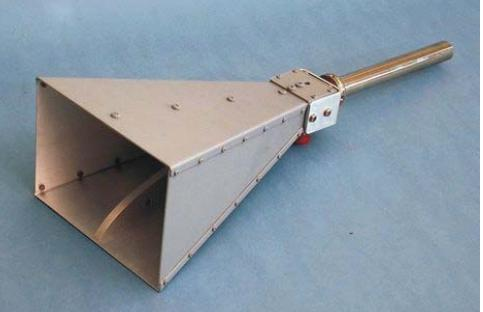

# **BSI - Technische Richtlinie**

| Bezeichnung:       | Elektromagnetische Schirmung von Gebäuden |  |  |
|--------------------|----------------------------------------------|--|--|
|                    | - Theoretische Grundlagen -                  |  |  |
| Anwendungsbereich: |                                              |  |  |
| Kürzel:            | BSI TR-03209 - 1                             |  |  |
| Version:           | 1.3                                          |  |  |
| Veröffentlichung:  | 30. April 2008                               |  |  |

| Autoren:       |                                                                                              |
|----------------|----------------------------------------------------------------------------------------------|
| Timo Frenzel   | (Leibniz Universität Hannover, Grundlagen der Elektrotechnik und Messtechnik)             |
| Johannes Rohde | (Bundesamt für Sicherheit in der Informationstechnik, Grundlagen der Lauschabwehr)        |
| Joachim Opfer  | (Bundesamt für Sicherheit in der Informationstechnik, Fachbereichsleiter Abhörsicherheit) |

#### **Zu den Ergebnissen beigetragen haben ferner:**

Ralf Heinrich (Autoflug Technische Garne) Ingenieurbüro Eule

Ein besonderer Dank gilt der Wehrtechnischen Dienststelle (WTD) 81 für ihre tatkräftige und oftmals unbürokratische Unterstützung des gesamten Messablaufs.

Bundesamt für Sicherheit in der Informationstechnik Postfach 200363 53133 Bonn Tel.: +49 (0)228 9582-0 E-Mail: [Referat223@bsi.bund.de](mailto:Referat223@bsi.bund.de) Internet: [http://www.bsi.bund.de](http://www.bsi.bund.de/) © Bundesamt für Sicherheit in der Informationstechnik, 2007

| 1   | Einleitung8                                                          |  |
|-----|----------------------------------------------------------------------|--|
| 2   | Allgemeine Grundbegriffe der Hochfrequenztechnik 10                  |  |
| 2.1 | Elektromagnetische Wellen10                                          |  |
| 2.2 | Elektrische und magnetische Ursachen von Feldern 11                  |  |
| 2.3 | Nahfeld und Fernfeld 12                                              |  |
| 2.4 | Polarisation von Wellen 13                                           |  |
| 3   | Grundlagen der Wellenausbreitung15                                   |  |
| 3.1 | Koppelpfade15                                                        |  |
| 3.2 | Entfernungsgesetz15                                                  |  |
| 3.3 | Beeinflussung durch metallische Gegenstände 15                       |  |
| 4   | Grundlagen der Schirmung 17                                          |  |
| 4.1 | Transmission und Reflexion17                                         |  |
| 4.2 | Feldwellenwiderstand 17                                              |  |
| 4.3 | Schirmdämpfung als logarithmisches Verhältnismaß 19                  |  |
| 4.4 | Einflussfaktoren für die Schirmdämpfung 20                           |  |
| 4.5 | Schirmdämpfung von Gitterstrukturen und Öffnungen21                  |  |
| 5   | Beeinflussung durch elektromagnetische Wellen23                      |  |
| 5.1 | Störstrahlung und elektromagnetische Verträglichkeit 23              |  |
| 5.2 | Bloßstellende Abstrahlung 23                                         |  |
| 5.3 | Beeinflussung biologischer Systeme 24                                |  |
| 6   | Das Zonenmodell25                                                    |  |
| 6.1 | Messung der Infrastrukturdämpfung26                                  |  |
| 7   | Messverfahren zur Bestimmung der Schirmdämpfung von Baumaterialien27 |  |
| 7.1 | Beeinflussung der Messungen durch die Abschirmkammer29               |  |
| 7.2 | Messausrüstung31                                                     |  |
| 8   | Literaturverzeichnis33                                               |  |

### Abbildungsverzeichnis

| Abbildung 2-1: Elektrisches und magnetisches Feld des elektrischen Dipols  11                                   |  |
|-----------------------------------------------------------------------------------------------------------------|--|
| Abbildung 2-2: Magnetisches und elektrisches Feld des magnetischen Dipols 12                                    |  |
| Abbildung 2-3: Die Komponenten der elektromagnetischen Welle bei vertikaler Polarisation [2] 13                 |  |
| Abbildung 2-4: Die durch unterschiedliche Polarisation zwischen Feld und Antenne entstehende Dämpfung [3] 14 |  |
| Abbildung 4-1: Darstellung der Schirmungsprinzipien [4] 17                                                      |  |
| Abbildung 4-2: Feldwellenwiderstand des magnetischen und elektrischen Dipols  18                                |  |
| Abbildung 4-3: Dämpfung im Hohlleiter 21                                                                        |  |
| Abbildung 4-4: Dämpfungsverhalten von Hohlleitern in Abhängigkeit von der Frequenz [1]  22                      |  |
| Abbildung 6-1: Grundriss eines nach Zonenmodell zu untersuchenden Bereichs [7]  25                              |  |
| Abbildung 7-1: Schematische Darstellung des gesamten Messaufbaus in der WTD 81  27                              |  |
| Abbildung 7-2: Messaufbau nach IEEE 299-1997 28                                                                 |  |
| Abbildung 7-3: Abschirmkammer als rechteckiger Wellenleiter 29                                                  |  |
| Abbildung 7-4: Auskleidung der Abschirmkammer mit Pyramidenabsorbern 31                                         |  |
| Abbildung 7-5: Darstellung von unterschiedlichen Antennenmodellen  31                                           |  |

### Abkürzungsverzeichnis

#### Lateinisch:

| c            | Lichtgeschwindigkeit                                                                 |
|--------------|--------------------------------------------------------------------------------------|
| r E       | Elektrische Feldstärke                                                               |
| f            | Frequenz                                                                             |
| ff kCut , | Cutoff-Frequenz                                                                      |
| s fRe        | Resonanzfrequenz                                                                     |
| r H       | Magnetische Feldstärke                                                               |
| l            | Länge                                                                                |
| m            | Ganze Zahl                                                                           |
| n            | Ganze Zahl                                                                           |
| p            | Ganze Zahl                                                                           |
| r            | Radius                                                                               |
| S            | Schirmfaktor                                                                         |
| SE           | Leistungsschirmdämpfung                                                              |
| t            | Zeit                                                                                 |
| x            | Koordinate, Variable                                                                 |
| y            | Koordinate, Variable                                                                 |
| z            | Koordinate, Variable                                                                 |
| Al           | Aluminium                                                                            |
| Cu           | Kupfer                                                                               |
| GK           | Gipskarton                                                                           |
| KS           | Kalksandstein                                                                        |
| PE           | Polyethylen                                                                          |
| TE           | Transversal Elektrisch                                                               |
| TEM          | Transversal Elektro-Magnetisch                                                       |
| TM           | Transversal Magnetisch                                                               |
| Griechisch:  |                                                                                      |
| Γ            | Feldwellenwiderstand                                                                 |
| ε            | = Permittivität od. Dielektrizitätskonstante ε ε ε 0 r             |
| ε 0       | 12 As − ⋅= 1085,8 Permittivität des freien Raumes ( ) ε 0 Vm |
| ε r       | Relative Permittivität                                                               |
| κ            | Elektrische Leitfähigkeit                                                            |
| λ            | Wellenlänge                                                                          |
| krit λ    | Kritische Wellenlänge                                                                |
| μ            | = Permeabilität μ μ μ 0 r                                          |
| μ 0       | 7 Vs − ⋅= 104 Permeabilität des Vakuums ( ) πμ 0 Am          |
| r μ       | Relative Permeabilität                                                               |
| π            | Kreiszahl                                                                            |
| ω            | Kreisfrequenz                                                                        |

## **1 Einleitung**

Die Sicherheit von Geräten und Systemen der Informations- und Kommunikationstechnik (IKT) wird heute überwiegend unter dem Aspekt der Software-Sicherheit betrachtet. Sichere Nutzerauthentisierung, Abhörsicherheit der Übertragungswege, Schutz vor Hackern, Viren und Trojanern sind die dominierenden Themen der IT-Sicherheit.

Seit vielen Jahren ist jedoch bekannt, dass auch die IT-Hardware Möglichkeiten für Abhörangriffe bieten kann:

Jedes elektronische Gerät erzeugt im Betrieb mehr oder weniger starke Störemissionen. Diese breiten sich als elektromagnetische Wellen ohne materiellen Träger oder entlang von metallischen Leitern aus. Bei IT-Geräten können diese Emissionen auch die gerade verarbeitete Information transportieren. Durch Empfang und Auswertung dieser Emissionen können in diesem Fall die verarbeiteten Daten aus einiger Entfernung mitgelesen werden. Der Schutz der Vertraulichkeit der Daten ist dann nicht mehr gegeben. So lässt sich zum Beispiel aus der Störstrahlung von Computerbildschirmen der gerade dargestellte Bildschirminhalt rekonstruieren. Derart informationsbehaftete Störemissionen werden als "bloßstellende Abstrahlung" bezeichnet.

Da die Intensität der Störemissionen mit wachsender Entfernung von der Störquelle abnimmt, ist die zuverlässigste Schutzmaßnahme gegen einen Abhörangriff, einen möglichst großen Sicherheitsbereich um die zu schützenden IT-Geräte zu realisieren. Ein weiterer Schutzfaktor ist durch die Eigenschaft der umgebenden Bausubstanz, elektromagnetische Emissionen abzuschwächen, gegeben. Daher liegt außerhalb des Gebäudes meist eine geringere Strahlungsintensität vor, als allein auf Grund des Abstandes zu erwarten wäre.

Diese beiden Schutzfaktoren – Distanz und Gebäudedämpfung – werden in dem im behördlichen Bereich angewandten. "Zonenmodell" berücksichtigt, um IT-Geräte vor Abhörangriffen zu schützen. Dabei wird, unter Berücksichtigung der jeweiligen Distanz- und Dämpfungsverhältnisse am Aufstellungsort, die maximal zulässige Strahlungsintensität der im Gebäude eingesetzten IT-Geräte festgelegt. In Gebäuden mit nur geringer Schirmdämpfung oder mit geringer Sicherheitsdistanz dürfen demnach nur Geräte mit einer geringen Strahlungsintensität eingesetzt werden.

Übersteigt allerdings die Strahlungsintensität vorhandener Geräte den zulässigen Grenzwert und ist ein Austausch der Geräte aus technischen oder wirtschaftlichen Gründen nicht möglich, kann als Abhilfe versucht werden, durch bauliche Maßnahmen die Dämpfungseigenschaften des Gebäudes nachträglich zu verbessern.

Da derartige nachträgliche Schirmungsmaßnahmen meist mit erheblichem Aufwand verbunden sind, ist es bei neu zu erstellenden Gebäuden sinnvoll, die voraussichtlich erforderlichen Abschirmmaßnahmen bereits in der Planungsphase durch eine geeignete Bauweise zu berücksichtigen. Häufig lässt sich allein durch zweckmäßige Wahl der Baumaterialien in Verbindung mit einer sorgfältig ausgeführten Verarbeitung der erforderliche Abstrahlschutz mit vergleichsweise geringen Mehrkosten erzielen.

Im Zuge der öffentlichen Diskussion um mögliche gesundheitliche Beeinträchtigung durch elektromagnetische Emissionen, die beispielsweise von Sendemasten oder Energieversorgungsleitungen ausgehen (Stichwort "Elektrosmog"), haben verschiedene Baustoff-Hersteller elektromagnetisch schirmende Materialien entwickelt, die die Bewohner eines damit errichteten Gebäudes vor eindringender Strahlung schützen sollen. Umgekehrt können diese Materialien natürlich auch dazu dienen, die (im Allgemeinen erheblich schwächeren und damit gesundheitlich unbedenklichen) elektromagnetischen Emissionen von IT-Geräten nach außen hin abzuschwächen.

Die vorliegende Technische Richtlinie richtet sich an Planer, projektierende Ingenieure und Bauherren, die Räume oder Gebäude mit erhöhter elektromagnetischer Dämpfung konzipieren. Sie basiert auf den Ergebnissen einer Studie, die das Bundesamt für Sicherheit in der Informationstechnik in Zusammenarbeit mit dem Institut für Grundlagen und Messtechnik der Leibniz Universität Hannover durchgeführt hat und in der verschiedenste Materialien - sowohl konventionelle Baustoffe als auch solche zur Abschirmung gegen den "Elektrosmog" – untersucht wurden.

Teil 1 der Technischen Richtlinie ist theoretisch ausgerichtet und beschreibt die wesentlichen Grundlagen der Hochfrequenztechnik, insbesondere der Entstehung und Ausbreitung elektromagnetischer Wellen. Teil 1 schließt mit der Beschreibung des Messaufbaus, der zur Untersuchung der verschiedenen Baustoffe verwendet wurde.

Teil 2 gibt praktische Planungshilfen zur Realisierung von elektromagnetisch dämpfenden Gebäuden. Zunächst wird eine Berechnungsmethode vorgestellt, mit der bereits im Planungsstadium überschlägig abgeschätzt werden kann, wie hoch die im Kontext des Zonenmodells zu erbringende Dämpfung der Bausubstanz sein muss. Den größten Umfang nimmt dann die Untersuchung von diversen Baumaterialien und Verarbeitungsmethoden ein. Die Ergebnisse werden anhand von Messkurven im Einzelnen präsentiert. Abgerundet wird die Richtlinie durch eine Wirtschaftlichkeitsbetrachtung, die die Material- und Verarbeitungskosten verschiedener Bauweisen in Bezug zu der jeweiligen Dämpfungswirkung setzt.

Insgesamt ist die Technische Richtlinie ist so strukturiert, dass die Ergebnisse aus Teil 2 auch ohne umfassende Kenntnis der theoretischen Ausführungen in Teil 1 in die Praxis umgesetzt werden können.

### **2 Allgemeine Grundbegriffe der Hochfrequenztechnik**

Die korrekte Planung elektromagnetisch schirmender oder dämpfender Gebäude setzt ein Grundverständnis über die Entstehung und Ausbreitung elektromagnetischer Wellen voraus. Daher werden in diesem Kapitel zunächst die allgemeinen Grundbegriffe der Hochfrequenztechnik vorgestellt.

#### **2.1 Elektromagnetische Wellen**

Physikalisch betrachtet, handelt es sich bei elektromagnetischen Wellen um sich ausbreitende Schwingungen des elektromagnetischen Feldes. Zu ihnen gehören unter anderem Radiowellen, Infrarotstrahlung, sichtbares Licht, UV-Strahlung sowie Röntgen- und Gammastrahlung. Im Kontext dieser Richtlinie sind lediglich die Radiowellen relevant.

Die Entstehung elektromagnetischer Wellen erklärt sich aus den maxwellschen Gleichungen. Diese besagen, dass jede zeitliche Änderung des elektrischen Feldes stets mit einer räumlichen Änderung des magnetischen Feldes verknüpft ist. Ebenso ist wiederum jede zeitliche Änderung des magnetischen Feldes mit einer räumlichen Änderung des elektrischen Feldes verknüpft. Für periodisch (insbesondere sinusförmig) wechselnde Felder ergeben diese Effekte zusammen eine sich im Raum ausbreitende elektromagnetische Welle.

Jedes Wechselfeld besitzt zusätzlich zu der charakteristischen Frequenz eine Längenausdehnung oder Wellenlänge. Für spätere Betrachtungen ist die Wellenlänge von entscheidender Bedeutung für die Gestaltung von Baumaterialien. Das Verhältnis zwischen Frequenz *f* und Wellenlänge λ ist durch die Lichtgeschwindigkeit *c* gegeben:

$$c = \mathcal{k} \cdot f \tag{2-1}$$

| Bereichsziffer | Frequenzbereich | Wellenlänge | Benennung                            | Kurzbe    |
|----------------|-----------------|-------------|--------------------------------------|-----------|
|                |                 |             |                                      | zeichnung |
| 4              | 3… 30 kHz       | 100… 10 km  | Myriameterwellen (Längstwellen)   | VLF       |
| 5              | 30… 300 kHz     | 10… 1 km    | Kilometerwellen (Langwellen)      | LF        |
| 6              | 300… 3000 kHz   | 1… 0,1 km   | Hektometerwellen (Mittelwellen)   | MF        |
| 7              | 3… 30 MHz       | 100… 10 m   | Dekameterwellen (Kurzwellen)      | HF        |
| 8              | 30… 300 MHz     | 10… 1 m     | Meterwellen (Ultrakurzwellen)     | VHF       |
| 9              | 300… 3000 MHz   | 1… 0,1 m    | Dezimeterwellen (Ultrakurzwellen) | UHF       |
| 10             | 3 30 GHz        | 10… 1 cm    | Zentimeterwellen (Mikrowellen)    | SHF       |
| 11             | 30… 300 GHz     | 1… 0,1 cm   | Millimeterwellen                     | EHF       |
| 12             | 300… 3000 GHz   | 1… 0,1 mm   | Mikrometerwellen                     | -         |

Radiowellen werden nach DIN 40015 in Abhängigkeit von ihrer Frequenz bzw. Wellenlänge in folgende Kategorien eingeteilt:

Tabelle 2-1:Benennung der Frequenz- und Wellenlängen-Bereiche nach DIN 40015

Die Untersuchungen in dieser Richtlinie beschränken sich auf den Frequenzbereich 30 MHz bis 10 GHz (Meter-, Dezimeter- und Zentimeterwellen).

#### **2.2 Elektrische und magnetische Ursachen von Feldern**

Elektromagnetische Wellen entstehen also immer dann, wenn sich ein elektrisches oder magnetisches Feld zeitlich ändert. In der unmittelbaren Umgebung der Quelle des elektromagnetischen Feldes hängt die jeweilige Stärke der elektrischen und der magnetischen Komponente sehr stark vom Entstehungsmechanismus ab. Eine vollständige mathematische Beschreibung des Feldes würde die Modellierung aller Ströme und Spannungen und der räumlichen Anordnung der elektrischen Leiter erfordern. Für das Grundverständnis reicht jedoch eine Abstraktion auf zwei idealisierte Grundtypen von Feldquellen – den elektrischen und den magnetischen Dipol - aus.

Der **elektrische** Dipol ist die Idealisierung einer kurzen Stabantenne. Er kann in einer elektronischen Schaltung z.B. in Form eines kurzen Leiterstücks (Draht, Kontakt, Lötfahne) auftreten. [Abbildung 2-1](#page-8-2) zeigt die elektrische (E-) Komponente und die magnetische (H-) Komponente des elektrischen Dipols**[1](#page-8-1)**. Man erkennt, dass das elektrische Feld in unmittelbarer Nähe des elektrischen Dipols sehr stark ist, aber mit zunehmender Distanz sehr schnell (in der dritten Potenz) abklingt. Die magnetische Komponente ist zwar deutlich geringer, klingt aber auch langsamer (in der zweiten Potenz) ab. Mit zunehmender Distanz von der Quelle nähern sich die Verläufe von elektrischer und magnetischer Komponente immer weiter aneinander an und folgen dann einem umgekehrt proportionalen Abstandsgesetz: bei einer Verdopplung des Abstandes halbiert sich die Feldstärke.

#### **Feld des elektrischen Dipols**

Abbildung 2-1: Elektrisches und magnetisches Feld des elektrischen Dipols

**1** Die exakte mathematische Beschreibung findet sich in der ausgewiesenen Literatur, hier ist nur der prinzipielle Verlauf der Feldkomponenten normiert dargestellt.

Der magnetische Dipol ist die Idealisierung einer kleinen stromdurchflossenen Leiterschleife. [Abbildung 2-2](#page-9-1) zeigt die E- und H-Komponente des **magnetischen** Dipols. Die Kurven verlaufen identisch wie in beim elektrischen Dipol, lediglich die Rollen von E- und H-Komponente sind hier vertauscht.

**Feld des magnetischen Dipols**

Abbildung 2-2: Magnetisches und elektrisches Feld des magnetischen Dipols

#### **2.3 Nahfeld und Fernfeld**

Der Bereich in der unmittelbaren Umgebung einer Feldquelle, in dem die Feldkomponenten in der dritten bzw. zweiten Potenz mit der Entfernung abnehmen, wird als **Nahfeld** bezeichnet. Der Bereich in der weiteren Umgebung der Quelle, in dem für beide Feldkomponenten das umgekehrt proportionale Entfernungsgesetz gilt, wird als Fernfeld bezeichnet. Die Distanz, bei der das Nahfeld in das Fernfeld übergeht, wird in der Literatur unterschiedlich definiert. Insbesondere wenn reale Feldquellen beschrieben werden (z.B. in der Antennentechnik), wird noch ein Übergangsbereich zwischen Nahund Fernfeld definiert, die sog. "Fresnel-Zone".

In unserer idealisierten Darstellung ist die exakte Beschreibung der Fresnel-Zone nicht zwingend notwendig, es genügt die Unterscheidung zwischen Nah- und Fernfeld. Die Distanz, bei der das Nahfeld in das Fernfeld übergeht (Fernfeldradius), ist keine feste Konstante, sie ist vielmehr abhängig von der Frequenz der Welle bzw. ihrer Wellenlänge. [Tabelle 2-2](#page-10-1) zeigt den Zusammenhang zwischen Fernfeldradius, Frequenz und Wellenlänge.

|          | Wellenlänge | Fernfeld   |  |
|----------|-------------|------------|--|
| Frequenz | (m)         | radius (m) |  |
| 100 kHz  | 3000        | 478        |  |
| 300 kHz  | 1000        | 159        |  |
| 1 MHz    | 300         | 48         |  |
| 3 MHz    | 100         | 16         |  |
| 10 MHz   | 30          | 4,8        |  |
| 30 MHz   | 10          | 1,6        |  |
| 100 MHz  | 3           | 0,48       |  |
| 300 MHz  | 1           | 0,16       |  |
| 1 GHz    | 0,3         | 0,05       |  |
| 3 GHz    | 0,1         | 0,02       |  |
| 10 GHz   | 0,03        | 0,005      |  |

Tabelle 2-2: Fernfeldradius bei kleinen Strahlern

#### **2.4 Polarisation von Wellen**

Die Polarisation beschreibt die Richtung des elektrischen Feldvektors einer elektromagnetischen Welle. Unterschieden wird dabei in ein linear polarisiertes Feld und ein zirkular polarisiertes Feld. Bei einer Linearpolarisation oszilliert der elektrische Feldvektor in einer festen Raumrichtung. Im einfachsten Fall wird ein solches Feld von einem Elementardipol erzeugt, der parallel oder senkrecht (lotrecht) zur Erdoberfläche ausgerichtet ist und die Welle somit horizontal oder vertikal linear polarisiert. Der resultierende magnetische Feldvektor ist gegenüber dem elektrischen immer um 90° gedreht angeordnet (vgl. [Abbildung 2-3\)](#page-10-2).

Abbildung 2-3: Die Komponenten der elektromagnetischen Welle bei vertikaler Polarisation [2]

Bei einer zirkular polarisierten elektromagnetischen Welle wird das Feld durch zwei oder mehr zueinander phasenverschobene elektrische Feldvektoren erzeugt, die den Zeiger des resultierenden Feldvektors auf einer Ellipse laufen lassen. Je nach Phasenlage ergibt sich eine zirkular rechtsdrehende oder linksdrehende Polarisation. Bei gleicher Größe der elektrischen Feldvektoren und einer Phasenverschiebung um 90° bildet sich ein Kreis.

Für die Messung von elektrischen Feldern ist die Polarisation von entscheidender Bedeutung, denn die maximale Leistungsübertragung (ohne Dämpfung) wird nur erreicht, wenn die Empfangsantenne gleich dem elektromagnetischen Feld polarisiert ist. Im Gegensatz dazu kann bei entgegen gesetzter Polarisation (z.B. horizontale Feldpolarisation zu vertikaler Antennepolarisation) theoretisch keine Leistung übertragen werden (Dämpfung unendlich). Daher wird bei unbekannter Polarisation des zu messenden Feldes gerne eine zirkular polarisierte Antenne verwendet. Die [Abbildung 2-4](#page-11-1) zeigt das durch die unterschiedlichen Polarisationen entstehende Dämpfungsverhalten.

| Feldpolar isation Antennen polarisation | vertikal | horizontal | zirkular rechtsdrehend | zirkular linksdrehend |
|--------------------------------------------------|----------|------------|---------------------------|--------------------------|
| vertikal                                         | 0 dB     | ∞          | 3 dB                      | 3 dB                     |
| horizontal                                       | ∞        | 0 dB       | 3 dB                      | 3 dB                     |
| zirkular rechtsdrehend                        | 3 dB     | 3 dB       | 0 dB                      | ∞                        |
| zirkular linksdrehend                         | 3 dB     | 3 dB       | ∞                         | 0 dB                     |

Abbildung 2-4: Die durch unterschiedliche Polarisation zwischen Feld und Antenne entstehende Dämpfung [3]

### **3 Grundlagen der Wellenausbreitung**

### **3.1 Koppelpfade**

Der Weg, auf dem sich eine elektromagnetische Welle ausbreitet, wird als Koppelpfad bezeichnet. Auch wenn eine elektromagnetische Welle kein materielles Trägermedium benötigt, wird ihre Ausbreitung doch stark von dem Material in ihrer der Umgebung beeinflusst. So breiten sich elektromagnetische Wellen bevorzugt entlang ausgedehnter metallischer Strukturen aus (z.B. Leitungen). Daher wird zwischen leitungsgebundenen und feldgebundenen Koppelpfaden unterschieden.

Leitungsgebundene Koppelpfade treten auf, wenn die Quelle eines elektromagnetischen Feldes mit einer Leitung verbunden ist oder sich zumindest in der Nähe einer Leitung befindet. Die Welle breitet sich dann entlang dieser Leitung aus. Abhängig von der Leitfähigkeit und den Materialien in der Umgebung der Leitung erfolgt diese Ausbreitung mit relativ geringen Energieverlusten, sodass die Feldstärke bei zunehmendem Abstand von der Quelle nur geringfügig abnimmt, was einer großen Reichweite gleichkommt.

Bei einem feldgebundenen Koppelpfad wird das Signal ohne materiellen Träger als elektromagnetisches Feld transportiert. Im freien Raum nimmt dabei die Feldstärke mit zunehmender Entfernung ab. Nähere Einzelheiten hierzu beschreibt das folgende Kapitel.

### **3.2 Entfernungsgesetz**

Für die in dieser Studie relevanten Entfernungen und Frequenzen reicht es aus, lediglich das Fernfeld des elektrischen bzw. magnetischen Dipols zu betrachten. Die in [Abbildung 2-1](#page-8-2) und [Abbildung 2-2](#page-9-1) gezeigten Feldverläufe reduzieren sich dann auf den Teil der Grafik, für den die normierte Distanz größer 1 ist (r > λ/2π). Dort gilt gemäß der Erläuterung aus Abschnitt [2.2](#page-8-3) das umgekehrt proportionale Entfernungsgesetz

$$|E\rangle |H\rangle \sim 1/r \tag{3-1}$$

d.h. bei einer Verdopplung der Distanz halbiert sich die Feldstärke.

#### **3.3 Beeinflussung durch metallische Gegenstände**

Materialien mit hohen elektrischen oder magnetischen Eigenschaften beeinflussen die Ausbreitung von elektromagnetischen Wellen. Im betrachteten Frequenzbereich von 30 MHz bis 10 GHz wirkt sich besonders stark die gute Leitfähigkeit aller Metalle aus. Aus der Leitfähigkeit ergibt sich eine spezielle Eindringtiefe der Welle in das Material. Diese liegt in Abhängigkeit der Frequenz und der Leitfähigkeit bei wenigen Mikrometern. Sofern das Metall eine ausreichende Dicke aufweist wird die Welle über die Eindringtiefe komplett reflektiert. Dabei kann es in entgegen gesetzter Ausbreitungsrichtung zur Ausprägung von stehenden Wellen kommen, welche die resultierende Feldstärke verstärken oder reduzieren. Analog zum sichtbaren Bereich der elektromagnetischen Welle wird diese Beeinflussung als Interferenz bezeichnet. Inwiefern die Wellenausbreitung beeinflusst wird, hängt dabei stark von der Wellenlänge bzw. von der Form und Ausprägung des metallischen Gegenstands ab:

• **Dipole:** Metallische Elemente, die von ihren Abmaßen gleich der halben Wellenlänge oder ihrer Oberwellen sind und dazu in Polarisationsrichtung ausgerichtet sind, können durch die Welle in Resonanz versetzt werden. Das gleiche Prinzip wird bei Dipolen von logarithmisch-periodischen Antennen angewendet. In diesem Fall bilden beispielsweise zwei metallischen Stäbe der Länge λ 4/ zusammen einen Halbwellendipol. In diesem resonanten Zustand entzieht das Element der elektromagnetischen Welle sehr viel Energie, die entweder abgeleitet wird oder bei mangelnder Ableitung an Ort und Stelle wieder an ein Feld abgegeben wird. In diesem Fall ist die ausgesendete elektromagnetische Welle allerdings nicht gerichtet, d.h. in alle Richtungen der

Elektromagnetische Schirmung von Gebäuden BSI TR-03209 - 1

Polarisationsebene gleich. Je nach Phasenlage der erzeugten Welle, kann es dabei durch Interferenzen zur Auslöschung oder Verringerung der ursprünglichen Welle kommen.

- **Metallische Flächen:** An geschlossenen Gehäusen aus Metall oder metallischen Wandelementen werden auftreffende elektromagnetische Wellen reflektiert. Das Metall wirkt dabei wie ein Kurzschluss und wirft die Welle in Abhängigkeit von der Leitfähigkeit des Metalls mehr oder weniger stark zurück. Da an metallischen Grenzflächen nahezu keine Energie der Welle absorbiert wird, kommt es dabei in Reflexionsrichtung zu stehenden Wellen und somit zu einer Erhöhung der Feldstärke.
- **Gitterstrukturen** wirken, sofern ihre Maschen in Polarisationsrichtung kleiner als die halbe Wellenlänge sind, ebenfalls wie vollmetallische Flächen. Die Reflexionsgüte ist bei diesen Strukturen allerdings abhängig vom Verhältnis aus Maschenweite und Dicke der Struktur (Drahtstärke). Bei sehr dünnen Schichten wird die Welle stärker reflektiert, wenn die Maschen wesentlich kleiner als die halbe Wellenlänge sind. Darüber hinaus empfiehlt es sich die Drahtstärke möglichst groß zu wählen, um zusätzlich für Maschen, die nur unwesentlich kleiner als die halbe Wellenlänge sind, die Dämpfung zu erhöhen. Maschenweiten, die größer als die halbe Wellenlänge sind, besitzen nahezu keine Dämpfung.
- **Schlitze in metallischen Flächen**: Wenn sich in einer metallischen Oberfläche ein Schlitz befindet, so kann dieser als so genannte Schlitzantenne wirken. Dabei muss die Breite des Schlitzes im Verhältnis zu seiner Länge sehr klein sein. Der Schlitz weist dann die Eigenschaften eines Halbwellendipols auf. Allerdings vertauschen sich hier die Feldkomponenten des elektrischen und magnetischen Feldes im Gegensatz zum ursprünglichen Dipol, so dass ein waagerechter Schlitz wie ein senkrechter Dipol wirkt. Durch so einen kaum sichtbaren Schlitz kann die an sich gute Schirmdämpfung einer metallischen Fläche stark vermindert werden.

Grundsätzlich bleibt festzuhalten, dass trotz Beeinflussung des elektromagnetischen Feldes durch rein metallische Gegenstände die Energie des Feldes erhalten bleibt, da gerade bei guten Leitern die Leitungsverluste minimal sind. In diesen Fällen findet lediglich eine Umverteilung statt. So führt eine Reflexion an einer metallischen Fläche zwar zu einer Abschwächung des Feldes in Ausbreitungsrichtung allerdings auch zu einer möglichen Verstärkung des Feldes in Reflexionsrichtung (Interferenzen).

### **4 Grundlagen der Schirmung**

Der Zweck einer elektromagnetischen Schirmung ist es, die Koppelpfade für elektromagnetische Wellen zu eliminieren. Die Wirkung einer Schirmung ist reziprok, d.h. ein Schutz vor eindringenden Feldern bewirkt gleichzeitig einen Schutz vor austretenden Feldern. Mit einem effektiven Schirm kann beispielsweise ein sensibles elektrisches Gerät vor eindringender Störstrahlung geschützt werden oder die Emission eines IT-Gerätes daran gehindert werden nach außen zu dringen.

#### **4.1 Transmission und Reflexion**

Abbildung 4-1: Darstellung der Schirmungsprinzipien [4]

Beim Auftreffen einer elektromagnetischen Welle auf eine Schirmwand wird die Welle in Abhängigkeit der elektromagnetischen Eigenschaften des Materials mehr oder weniger stark reflektiert. Der nicht reflektierte Anteil der Welle dringt in das Material ein (Transmission) und wird dort teilweise absorbiert. Beim Austritt der Welle auf der rückwärtigen Seite der Schirmung tritt wiederum eine Reflexion auf (vgl. [Abbildung 4-1\)](#page-14-1).

Eine effektive Schirmung kann entweder durch eine hohe Reflexionsgüte oder durch eine hohe Absorptionsgüte erzielt werden. Die Reflexions- und Absorptionsgüten von Materialien oder Strukturen sind stark abhängig von der Frequenz und den elektrischen bzw. magnetischen Materialeigenschaften.

#### **4.2 Feldwellenwiderstand**

Will man ein elektromagnetisches Feld abschirmen, ist die Wahl des optimalen Schirmungsmaterials davon abhängig, ob an dem Ort der Schirmung die magnetische oder die elektrische Komponente des zu schirmenden Feldes überwiegt. Diese Eigenschaft des Feldes wird durch den sog. Feldwellenwiderstand, das Verhältnis aus elektrischer und magnetischer Feldkomponente, beschrieben. Sie ist für den elektrischen und den magnetischen Dipol in [Abbildung 4-2](#page-15-1) dargestellt.

#### **Feldwellenwiderstand**

Abbildung 4-2: Feldwellenwiderstand des magnetischen und elektrischen Dipols

Bei einem elektrischen Dipol ist der Feldwellenwiderstand im Nahfeld sehr hoch (Hochimpedanzfeld), bei einem magnetischen Dipol ist er dort sehr niedrig (Niederimpedanzfeld). Im Fernfeld nähert er sich bei beiden Dipol-Typen dem konstanten Wert von ca. 377 Ohm.

Bei Niederimpedanzfeldern wird die Schirmwirkung eines Materials durch seine magnetische Leitfähigkeit (Permeabilität) bestimmt. Hohe Permeabilität haben z.B. Eisen oder Ferritmaterialien. Zur wirksamen Schirmung von Hochimpedanzfeldern benötigt man dagegen Materialien mit hoher elektrischer Leitfähigkeit (hauptsächlich Metalle).

Da im Zusammenhang mit Gebäudeschirmungen a priori nicht bekannt ist, ob die abzuschirmende Quelle magnetischer oder elektrischer Natur ist, müsste die Abschirmung grundsätzlich sowohl für niederimpedante als auch für hochimpedante Felder ausgelegt sein. Tatsächlich werden für Anwendungen mit höchsten Abschirmforderungen (z.B. abhörsichere Räume oder geschirmte Messkabinen) derartige (entsprechend teuere) Materialien verwendet.

Bei der niedrigsten in dieser Studie betrachteten Frequenz (30MHz, entspricht einer Wellenlänge von 10 m) beginnt bereits bei einer Distanz von 1,6 m das Fernfeld (vgl. [Tabelle 2-2\)](#page-10-1) mit einer Feldimpedanz von 377 Ohm, unabhängig davon, ob die Quelle der Strahlung elektrischer oder magnetischer Natur ist. Für die hier relevanten Szenarien muss also nicht zwischen magnetischen und elektrischen Quellen unterschieden werden. In diesem Frequenzbereich ist eine hohe Leitfähigkeit effektiver als eine hohe Permeabilität.

### **4.3 Schirmdämpfung als logarithmisches Verhältnismaß**

Der **Schirmfaktor S** einer Schirmung ist definiert als das Verhältnis von eindringender Feldleistung mit Schirm zu eindringender Strahlungsleistung ohne Schirm. Da dieses Verhältnis bei realen Materialien einen sehr großen Wertebereich annehmen kann (nahezu 1:1 bei schlecht schirmenden Materialien, 1:100.000 bei guten Schirmungen), ist eine logarithmische Darstellung zweckmäßiger.

Die **Schirmdämpfung SE** ist daher definiert als das logarithmische Verhältnis von einfallender Strahlungsleistung ohne Schirm zu einfallender Strahlungsleistung mit Schirm. Die Einheit der Schirmdämpfung ist Dezibel [dB]. Ein Vergleich der Schirmdämpfungsgrößen findet sich in [Tabelle](#page-16-1)  [4-1.](#page-16-1)

| Schirmdämpfung SE in dB | Anteil der eindringenden Feldleistung | Schirmungsgrad in % |
|----------------------------|------------------------------------------|---------------------|
| 0                          | 1 1                                   | 0                   |
| 3                          | 1 2                                   | 50                  |
| 6                          | 1 4                                   | 75                  |
| 7                          | 1 5                                   | 80                  |
| 10                         | 1 10                                  | 90                  |
| 13                         | 1 20                                  | 95                  |
| 16                         | 1 40                                  | 97,5                |
| 20                         | 1 100                                 | 99                  |
| 30                         | 1 1.000                               | 99,9                |
| 40                         | 1 10.000                              | 99,99               |
| 50                         | 1 100.000                             | 99,999              |
| 60                         | 1 1.000.000                           | 99,9999             |
| 70                         | 1 10.000.000                          | 99,99999            |
| 80                         | 1 100.000.000                         | 99,999999           |

#### **4.4 Einflussfaktoren für die Schirmdämpfung**

Materialien mit hoher elektrischer Leitfähigkeit, z.B. Metalle wie Kupfer oder Aluminium, weisen ein gutes Reflexionsvermögen auf. Bei einer hoch leitfähigen Oberfläche wird die Welle am Schirm zu hohen Anteilen reflektiert, nur ein sehr geringer Anteil der Welle dringt überhaupt in das Material ein. Daher ist bei Materialien mit hohem Reflexionsvermögen die Schirmung, die durch die Feldschwächung während der Transmission erreicht wird, relativ bedeutungslos.

#### **Hohe Reflexionsgüte wird erreicht durch:**

- Schirm aus Materialien hoher Leitfähigkeit (Kupfer, Aluminium, Stahl)
- Fläche oder Gitterstruktur aus leitenden Materialien mit kleiner Maschenweite ( *m* < λ2/ )

Um trotz geringer Leitfähigkeit eine hohe Schirmdämpfung zu gewährleisten, muss die Welle während der Transmission gedämpft werden. Hier sind die elektromagnetischen Eigenschaften und der Weg des Transmissionspfades entscheidend. Beim Eindringen der elektromagnetischen Welle in das Material können so zum einen Anteile der Welle an den Grenzflächen innerhalb des Mediums reflektiert werden oder es wird der elektromagnetischen Welle Energie durch Polarisationsvorgänge entzogen. Die Polarisierbarkeit eines Materials wird dabei weitestgehend durch die elektromagnetischen Eigenschaften Permeabilität und Permittivität beschrieben, wobei beide Größen komplex sind, d.h. sowohl aus einem realen als auch imaginäre Anteile zusammengesetzt sind. Letzterer bestimmt in direkter Abhängigkeit die Absorptionsverluste des Materials. Diese Eigenschaften verändern sich allerdings über der Frequenz, so dass einige Materialien nur Felder bestimmter Frequenzen gut absorbieren. Bei der Absorption wird die elektromagnetische Feldenergie in Wärme umgewandelt.

**Beispiel:** Beim Molekül Wasser wird die gute Absorptionsfähigkeit ab 2 GHz genutzt, um in Mikrowellengeräten wasserhaltige Stoffe zu erhitzen. Da Wasser eine hohe imaginäre Permittivität ab 1 GHz besitzt, die bis zu einem Maximum bei 21 GHz ansteigt und danach wieder abfällt, können elektromagnetische Felder dieses Frequenzbereichs besonders gut absorbiert werden. Materialien mit einem hohen Wassergehalt erreichen daher hohe Schirmdämpfungen im hohen Frequenzbereich.

#### **Hohe Absorptionsgüte wird erreicht durch:**

- Hohe Anzahl an Grenzflächen im Medium (Poren, Zuschlagsstoffe)
- Geringe Leitfähigkeit σ
- hohe komplexe Anteile von Permeabilität µ und Permittivität ε

#### **Zusammenfassend gilt, die Wirksamkeit aller Materialen ist stark abhängig von:**

- der Frequenz des elektromagnetischen Feldes
- Polarisation des elektromagnetischen Feldes
- den elektrischen (κ ), magnetischen ( μ ) und dielektrischen (ε) Eigenschaften
- insbesondere dem Wassergehalt im Baukörper
- Anzahl, Größe, Ausrichtung und Position von Öffnungen in der Schirmwand.

Für die vorliegende Studie wird bei den meisten Materialien davon ausgegangen, dass insbesondere alle nichtleitenden Komponenten wie beispielsweise Betone oder Gipskartonplatten makroskopisch homogene und isotrope Eigenschaften aufweisen. D.h. es ist unerheblich für die Absorptionsgüte, in welcher Polarisation das Feld vorliegt. Durch die Ausrichtung von metallischen Elementen wie Dipole, Öffnungen oder Schlitze wird allerdings eine Polarisationsabhängigkeit erwartet (vgl. Abschnitt [2.4](#page-10-3)), die speziell unter analytischen und numerischen Aspekten intensiver betrachtet wird. Aus den Erkenntnissen der vorangegangenen Abschnitte lässt sich allerdings schon prognostizieren, dass für eine optimale Schirmdämpfung eine Kombination aus hoher Reflektions- und hoher Absorptionsgüte unter Berücksichtigung der Frequenz- und Polarisationsabhängigkeit sinnvoll ist.

#### **4.5 Schirmdämpfung von Gitterstrukturen und Öffnungen**

Gitterstrukturen, deren Maschenweite klein gegenüber der Wellenlänge des Feldes ist, besitzen sehr gute Schirmdämpfungseigenschaften. Dies ist insbesondere für Baumaterialien interessant, die nicht vollflächig ausgeführt werden dürfen, damit beispielsweise beim Stahlbeton eine erhöhte Biegefestigkeit erreicht wird, gefilterte Kabeldurchführungen gewährleistet oder Fenster weiterhin lichtdurchlässig sind. Das Wirkprinzip dieser Gitterstrukturen ist dabei der Hohlleitertheorie entnommen, nach der ein elektromagnetisches Feld über die Eindringtiefe exponentiell stark gedämpft wird, sofern die Maschenweite kleiner als die halbe Wellenlänge ist [\(Abbildung 4-3\)](#page-18-1):

$$E = E\_0 \cdot e^{(-\alpha x)} \text{ mit } \alpha = \frac{2\pi}{\lambda\_k} \sqrt{1 - \left(\frac{\lambda\_k}{\lambda\_0}\right)^2} \tag{16.6:} \text{ Gleichung 4-1}$$

*m Maschenweite z Eindringtiefe* = =

*kritm eWellenläng k* =⋅= .2 λ

*ebetrachtet eWellenläng* = 0 λ

Abbildung 4-3: Dämpfung im Hohlleiter

Die Energie des Feldes wird beim Eindringen in solche Gitterstrukturen allerdings nicht absorbiert und in Wärme umgewandelt, sondern wieder an ein reflektiertes Feld abgegeben. Zum Modellverständnis der Dämpfung über der Eindringtiefe wird das Gitter dabei in viele kleine Hohlleiter aufgeteilt, deren Fläche die der Masche und deren Eindringtiefe der Drahtstärke entspricht. Gemäß Gleichung 4-1 ist die Schirmdämpfung hoch, wenn die Maschenweite klein gegenüber der Wellenlänge ist und die Drahtdicke des Gitters groß ist. Grundsätzlich besitzen Gittermaschen eine quadratische Öffnung, allerdings ist bei diesem Modell nur die Maschenweite in Polarisationsrichtung entscheidend.

Die Hohlleitertheorie kann außerdem auf Öffnungen angewandt werden, deren Abmaße größer als die halbe Wellenlänge sind. In diesem Fall ( *k* << *ff* ) wird die Welle nur schwach gedämpft (vgl.

[Abbildung 4-4](#page-19-1)). Alle Öffnungen wie beispielsweise Fenster und Türen, die ohne dämpfende Materialien ausgeführt sind, mindern in diesem Fall die Wirkung aller umgebenden Materialien. Im weiteren Sinne betrifft das auch alle Öffnungen, die durch nicht durchgängig kontaktiertes Schirmmaterial entstehen. Im ungünstigsten Fall entstehen durch schlecht kontaktiertes Schirmmaterial Schlitze, die eine Antennenwirkung haben und die Einkopplung von Feldern bestimmter Frequenzen sogar noch begünstigen (vgl. Abschnitt [3.3](#page-12-1)). Zusammenfassend ist bei der Ausführung eines Schirmes darauf zu achten, dass der Schirm um einen Bereich vollständig geschlossen ist. Dies betrifft insbesondere alle Materialübergänge, Eckbereiche sowie alle Öffnungen und Durchführungen.

α

Abbildung 4-4: Dämpfungsverhalten von Hohlleitern in Abhängigkeit von der Frequenz [1]

### **5 Beeinflussung durch elektromagnetische Wellen**

Elektromagnetische Wellen aller Frequenzbereiche beeinflussen in einem gewissen Maße jedes elektrische Gerät und alle biologischen Systeme. Dies geschieht zum einen durch technische und zum anderen durch natürliche Quellen. Beispielsweise ist die Erde ständig von einem natürlichen statischen Magnetfeld umgeben, deren Flussdichte über die Erdkugel verteilt zwischen 30 und 60 µTesla schwankt.

### **5.1 Störstrahlung und elektromagnetische Verträglichkeit**

Die von elektronischen Geräten ausgehenden elektromagnetischen Wellen sind im Allgemeinen – abgesehen von Sendeeinrichtungen – unerwünscht. Sie können je nach Frequenzbereich und Intensität andere elektronische Geräte beeinflussen oder sogar in ihrer Funktion beeinträchtigen. Daher werden sie auch als Störstrahlung bezeichnet.

Mehrere Expertengremien auf nationaler und internationaler Ebene haben die Beeinflussung durch elektromagnetische Felder bewertet und dazu Richtlinien und Empfehlungen verfasst und Normen erlassen. So setzt das "Gesetz über die elektromagnetische Verträglichkeit von Geräten" (EMVG) in Deutschland die Europäische EMV-Richtlinie (Richtlinie 89/336/EWG) in deutsches Recht um.

Dieses Gesetz gilt für "Geräte, die elektromagnetische Störungen verursachen können oder deren Betrieb durch diese Störungen beeinträchtigt werden kann", es regelt damit die "Elektromagnetische Verträglichkeit" von Geräten.

Nach diesem Gesetz müssen Geräte u. a. so beschaffen sein, dass "die Erzeugung elektromagnetischer Störungen soweit begrenzt wird, dass ein bestimmungsgemäßer Betrieb von Funk- und Telekommunikationsgeräten sowie sonstigen Geräten möglich ist". Grenzwerte für die zulässige elektromagnetische Störstrahlung von IT-Geräten sind in der europäischen Produktnorm EN 55022 festgelegt.

### **5.2 Bloßstellende Abstrahlung**

In IT-Geräten werden alle Informationen letztendlich durch das Ein- und Ausschalten elektrischer Ströme und Spannungen repräsentiert. Je nach Technologie und Gerätetyp ist das Zeitverhalten dieser Schaltvorgänge sehr unterschiedlich. Die schnellsten Vorgänge spielen sich im Prozessor eines PC ab: moderne Prozessoren arbeiten mit Taktraten von einigen GHz, d.h. pro Sekunde laufen dort mehrere Milliarden Schaltvorgänge ab. Grafikkarten verarbeiten Signale von einigen 10 bis über 100 MHz, d.h. pro Sekunde werden viele Millionen von Bildpixeln generiert und zum Monitor übertragen. Vergleichsweise langsam sind die Prozesse in einer Computertastatur. Jedes Mal, wenn eine Taste gedrückt wird, wird ein Impuls in der Größenordnung von einigen KHz zum Rechner übertragen, hier ändert sich die Spannung auf dem Tastaturkabel also mehrere Tausend Male pro Sekunde.

Wie in Kapitel [2.1](#page-7-1) beschrieben, sind diese Schaltvorgänge die Ursache für elektromagnetische Wellen, die sich durch den Raum oder entlang metallischer Leiter ausbreiten. Diese Wellen sind daher ein mehr oder weniger verzerrtes Abbild der Schaltvorgänge, von denen sie verursacht werden. Durch Empfang dieser Wellen und nachfolgender Auswertung lassen sich die Schaltvorgänge und damit die verarbeitete Information rekonstruieren. Derart informationsbehaftete elektromagnetische Wellen werden als "bloßstellende Abstrahlung" bezeichnet.

Im zivilen Bereich existieren keine verbindlichen Grenzwerte für die bloßstellende Abstrahlung. Für Anwendungen, die der staatlichen Geheimhaltung unterliegen, müssen IT-Geräte jedoch strenge Abstrahl-Grenzwerte einhalten. Im Fachjargon werden derart geschützte Geräte als "TEMPEST-Geräte bezeichnet"**[2](#page-20-1)**.

Die TEMPEST-Grenzwerte sind deutlich geringer als die Grenzwerte der EMV-Produktnormen, sodass ein EMV-konformes Gerät in der Regel nicht automatisch auch gegen bloßstellende Abstrahlung gesichert ist.

**2** TEMPEST = Temporary Emanation and Spurious Transmission

#### **5.3 Beeinflussung biologischer Systeme**

Das Bundesamt für Strahlenschutz und Strahlenhygiene (BfS) hat in Zusammenarbeit mit einer internationalen Kommission eine Richtlinie veröffentlicht, in der detailliert beschrieben ist, in welchem Maß Personen elektromagnetischen Feldern ausgesetzt werden dürfen [5, 6]. Unterschieden wird dabei nach Aufenthaltsdauer in den Expositionsbereichen. Für Bereiche, in denen Personen dauerhaft leben (Expositionsbereich 2) liegen die Grenzwerte deutlich niedriger als für Bereiche, in denen sich Personen lediglich kurzzeitig aufhalten (Bereich erhöhter Exposition). Eine zusammenfassende Darstellung für die Unfallverhütung findet sich in [6].

Die Grenzwerte für die Beeinflussung biologischer Systeme liegen um Größenordnungen über denen für die Elektromagnetische Verträglichkeit, sodass erstere für die Betrachtung der Elektromagnetischen Verträglichkeit bzw. der Abstrahlsicherheit von IT-Geräten keine unmittelbare praktische Relevanz haben. Allerdings hat die öffentliche Diskussion um eventuelle schädliche Auswirkungen elektromagnetischer Strahlung auf biologische Systeme (Stichwort "Elektrosmog") zu einem Bedarf an Baumaterialien geführt, mit denen sich Wohnbereiche gegen das Eindringen von elektromagnetischer Strahlung schützen lassen. Diese Baumaterialien sind umgekehrt auch dazu geeignet, die Ausbreitung der elektromagnetischen Störstrahlung von IT-Geräten nach außen zu verringern. Die Darstellung, inwieweit diese und andere Baumaterialien tatsächlich zur Abschirmung von Gebäuden geeignet sind, ist Gegenstand dieser Richtlinie.

### **6 Das Zonenmodell**

Das Zonenmodell soll sicherstellen, dass in den öffentlich zugänglichen und für einen Abhörangriff in Frage kommenden Bereichen keine auswertbare bloßstellende Abstrahlung feststellbar ist. Voraussetzung für die Anwendbarkeit des Zonenmodells ist daher zunächst die Festlegung der Grenze des gesicherten Bereiches, in dem nicht mit einem Angreifer zu rechnen ist (Bereichsgrenze). [Abbildung](#page-22-1)  [6-1](#page-22-1) zeigt beispielhaft eine Liegenschaft mit dem gesicherten Bereich (gestrichelte Linie) und den vorgesehenen Aufstellungsorten für IT-Geräte. Da eine direkte Feldstärkemessung an der Bereichsgrenze auf Grund des Umweltspektrums praktisch nicht möglich ist, wird eine zweistufige Messung vorgenommen, bei der die Abstrahlung der Geräte einerseits und die Ausbreitungsdämpfung zwischen Standort des emittierenden Gerätes und der Bereichsgrenze (im Folgenden als "Infrastrukturdämpfung" bezeichnet) andererseits in separaten Messungen ermittelt wird.

Bei der Infrastrukturmessung wird die elektromagnetische Dämpfung zwischen dem Standort des IT-Gerätes und der Bereichsgrenze frequenzabhängig gemessen und durch "Zonennoten" bewertet: Gebäudezone 1 für geringe Dämpfung bis Gebäudezone 3 für hohe Dämpfung.

Entsprechend der ermittelten Gebäude-Zone ergibt sich die maximal zulässige Stärke der vom IT-Gerät emittierten Strahlung. Korrespondierend zu den Zonennoten des Gebäudes wird die elektromagnetische Abstrahlung von IT-Geräten ebenfalls in drei Klassen unterteilt: Zone-1 für schwach strahlende Geräte bis Zone-3 für stark strahlende Geräte.

Die Geräte-Messung nach Zonenmodell erfolgt im BSI oder durch vom BSI anerkannte Prüfstellen nach einem standardisierten Messverfahren und ist nicht Gegenstand dieser Leitlinie.

Abbildung 6-1: Grundriss eines nach Zonenmodell zu untersuchenden Bereichs [7]

#### **6.1 Messung der Infrastrukturdämpfung**

Der für die Leitlinie bedeutsame Teil ist die Messung der Infrastrukturdämpfung bzw. Maßnahmen zu deren Verbesserung. Zum besseren Verständnis wird daher die Messung der Infrastrukturdämpfung (im Folgenden kurz "Gebäudeverzonung" genannt) kurz erläutert:

#### **Referenzmessung**

Die Referenzmessung wird einmalig durchgeführt. Ein Sender strahlt im Freifeld bei unterschiedlichen Frequenzen Testsignale mit definierter und reproduzierbarer Leistung ab. In einer Distanz von 20 m wird die empfangene Feldstärke gemessen und als Referenzkurve aufgezeichnet (E Ref).

#### **Gebäudeverzonung**

Bei der Gebäudeverzonung wird der gleiche Sender in dem zu vermessenen Raum (Position 1-7) aufgestellt. An ausgewählten Punkten an der Bereichsgrenze (Position A-I) werden die Testsignale empfangen und als Messkurve aufgezeichnet (EMess). Die frequenzabhängige Infrastrukturdämpfung ergibt sich als Differenz der beiden Feldstärkekurven (in dB).

$$D(f) = E\_{\text{Ref}}(f) - E\_{\text{Mess}}(f) \tag{1}$$

### **7 Messverfahren zur Bestimmung der Schirmdämpfung von Baumaterialien**

Die nachfolgend dargestellten Ergebnisse wurden in einer Studie erzielt, die vom Institut für Grundlagen der Elektrotechnik und Messtechnik und dem Bundesamt für Sicherheit in der Informationstechnik gefertigt wurde. Die Messungen wurden im Zeitraum vom 01/2006 bis 02/2007 in der Wehrtechnischen Dienststelle WTD 81 der Bundeswehr in Greding durchgeführt.

Das Messverfahren entspricht den Vorgaben des Standards IEEE 299-1997 (vgl. [8]), um eine vollständige Reproduzierbarkeit und Vergleichbarkeit der Ergebnisse zu gewährleisten. Die im Standard geforderten Messpunkte wurden um zusätzliche Messpunkte ergänzt, um eine möglichst lückenlose und aussagekräftige Darstellung der Schirmdämpfung zu ermöglichen.

Abbildung 7-1: Schematische Darstellung des gesamten Messaufbaus in der WTD 81

[Abbildung 7-1](#page-24-1) zeigt den Messaufbau schematisch. Deutlich zu erkennen sind die wesentlichen Elemente des Messaufbaus, bestehend aus dem Prüfkörper, dem Messgestell und einer Messkabine (Abschirmkammer). Eine zusätzliche Messkabine wird benötigt, um externe Störfelder vom Messaufbau fern zu halten. Daher ist die Kabine gegenüber allen Öffnungen außer der, die für die Messung des Schirmes notwenig ist, abgeschirmt. Zusätzlich ist die Kabine innerhalb des Prüfvolumens mit Absorbermaterial ausgekleidet, um Resonanzeffekte zu minimieren. Die Kabine selbst ist aus verzinktem Blech gefertigt.

Die Abschirmkammer ist auf einem Drehteller durch das Messgestell positioniert. Das Gestell hält die Prüfkörper und die Kammer auf Position. Da die Prüfkörper mitunter sehr schwer sind, sind Gegengewichte aus Beton angebracht. Diese sind seitlich gelagert und beeinflussen nicht direkt die elektromagnetischen Wellen in ihrer Ausbreitungsrichtung. Die Abschirmkammer ist rollend gelagert und wird an das Gestell angeschraubt. Innerhalb der Kabine befinden sich die Empfangsantenne und die zusätzliche Empfangsausrüstung, während außerhalb der Kabine eine Sendeeinheit die nötige Feldstärke generiert.

Besonders sorgfältig sind Kontaktierungen und Eingänge in die Abschirmkammer ausgearbeitet. Diese müssen speziell gegenüber eindringenden Feldern gesichert sein. Daher ist für die Stromversorgung ein HF-Filter zwischen geschaltet. Die Kontakte an der Tür und an der Öffnung sind mit Messer- bzw. Federleisten versehen. Diese gewährleisten eine schlüssige Kontaktierung aller Elemente. Für die weitere Ausarbeitung der Abschirmkammer sowie bei der Einhaltung der Mindestabstände zwischen den Geräten der Messausrüstungen werden die Vorgaben des IEEE-299-1997 Standards berücksichtigt.

Abbildung 7-2: Messaufbau nach IEEE 299-1997

Der strukturelle Versuchsaufbau ist in [Abbildung 7-2](#page-25-1) dargestellt und zeigt die Auswahl und Reihenfolge der verwendeten Messausrüstung.

Die Dämpfungsmessungen sollen unter den Bedingungen des Fernfeldes durchgeführt werden. Das bedeutet, dass Sende- und Empfangsantenne unter Berücksichtigung definierter Mindestabstände platziert sein müssen. Die Fernfeldbedingung basiert auf folgenden Voraussetzungen [4]:

- Der Abstand der Sendeantenne zum Messobjekt beträgt mindestens π λ 2 . Übertragen auf den Versuchsaufbau soll eine Entfernung zwischen der Sendeantenne und dem Prüfkörper von 1,6 m (Frequenz 30 MHz) eingehalten werden (vgl. [Tabelle 2-2\)](#page-10-1).
- Die elektrischen und magnetischen Feldvektoren der ebenen Welle stehen senkrecht aufeinander: *E H* r r ⊥ (transversal elektromagnetisches Feld = TEM-Feld).
- Der Feldwellenwiderstand des freien Raumes gibt das Verhältnis der elektrischen Feldstärke zu der magnetischen Feldstärke wieder: 120 377Ω≈Ω==Γ || || π *H E* r r

Bei der Bestimmung der Schirmdämpfung wird die Differenz aus den logarithmisierten Anteilen der Eingangsleistungen und der Referenzmessung der Dämpfungsmessung bestimmt und über den Frequenzbereich aufgetragen: *SE*

$$SE = 10\log(P\_{ohm\text{Schirm}}) - 10\log(P\_{\text{mitSchirm}}) \tag{1}$$

Durch diese Rechenoperation werden die eindringenden Leistungen einer Messung mit Schirm und einer Messung ohne Schirm miteinander verglichen. Der übrige Messaufbau bleibt gleich. D.h. der einzige Unterschied für beide Messaufbauten ergibt sich durch den Schirm aus dem zu prüfenden Baumaterial. Auf diese Weise kann zum einen direkt auf die vom Baumaterial eingebrachte Dämpfung geschlossen werden und zum anderen können durch dieses Messprinzip Resonanzeffekte minimiert werden, die durch den Messaufbau verursacht werden.

#### **7.1 Beeinflussung der Messungen durch die Abschirmkammer**

Ob und welche Beeinflussung durch die Abschirmkammer erreicht wird, soll im Folgenden erläutert werden. Die Abschirmkammer soll dazu als ein rechteckiger Wellenleiter mit festen Abmaßen b, h, l betrachtet werden ([Abbildung 7-3](#page-26-1)), in dem ebene Wellen ausbreitungsfähig sind.

Abbildung 7-3: Abschirmkammer als rechteckiger Wellenleiter

|        |   | Kammeröffnun g [m] | Kammer [m] | Absorber (Rückwand) [m] | Absorber (Seiten und Decke) [m] |
|--------|---|--------------------------|---------------|-------------------------------|---------------------------------------|
| Höhe   | h | 1,90                     | 2,38          | 0,4                           |                                       |
| Breite | b | 1,90                     | 3,00          | 0,4                           |                                       |
| Länge  | l | 0,10                     | 3,00          | 1,40                          | >0,3                                  |

Tabelle 7-1: Maße der Abschirmkammer und der Absorber

Die genauen Maße der Kammer sind der [Tabelle 7-1](#page-26-2) zu entnehmen. Wie bereits ab Seite [15](#page-12-1) ff. erläutert, gibt es sowohl für die Kammer als auch für die Kammeröffnung eine untere Grenzfrequenz in Abhängigkeit vonλ 2/ , ab der die eindringenden Felder exponentiell stark gedämpft werden. Für die Kammer ist sofort ersichtlich, dass es sich um einen Hohlleiter handelt. Zusätzlich ist die verhältnismäßig kurze Kante der Kammeröffnung von l = 10 cm als Hohlleiter anzunehmen. Durch den exponentiellen Verlauf der Dämpfung, dargestellt in [Abbildung 4-3](#page-18-1), ist die Wirkung des Hohlleiters nicht vernachlässigbar. Eine Auswertung der Schirmdämpfung unterhalb dieser Frequenzen ist aufgrund der starken Dämpfung des Messsystems nicht mehr sinnvoll, weil in diesem Fall dann nicht mehr die individuelle Schirmdämpfung des Prüfkörpers bestimmt wird, sondern der Kombination aus Messsystem und Prüfkörper. Die unteren Grenzfrequenzen als Funktion der *Cut f*

Wellenlänge λ*krit* sind der [Tabelle 7-2](#page-26-3) zu entnehmen. Die Indices m und n bezeichnen in der Tabelle die Raumrichtung. Alle niedrigeren Frequenzen werden gemäß Gleichung 4-1 über die Eindringtiefe exponentiell stark gedämpft.

| m | n | Cut f           | krit λ       | Cut f    | λ krit |
|---|---|-----------------|-----------------|----------|-----------|
|   |   | (Kammeröffnung) | (Kammeröffnung) | (Kammer) | (Kammer)  |
|   |   | [MHz]           | [m]             | [MHz]    | [m]       |
| 1 | 0 | 78,89           | 3,80            | 49,97    | 6,00      |
| 0 | 1 | 78,89           | 3,80            | 62,98    | 4,76      |

Tabelle 7-2: Grenzfrequenzen und kritische Wellenlängen *Cut f* λ*krit* der Abschirmkammer

#### Elektromagnetische Schirmung von Gebäuden BSI TR-03209 - 1

Die für den Querschnitt der Kammeröffnung berechnete Grenzfrequenz beträgt ca. 80 MHz, die für den Querschnitt der Kammer ca. 50 MHz. Bedingt durch das Verhältnis der Öffnungstiefe und Länge der Kammer lässt sich vermuten, dass Frequenzen unter 50 MHz besonders stark gedämpft werden. Frequenzen zwischen 50-80 MHz werden lediglich durch die Kammeröffnung gedämpft, bis dann für Frequenzen über 80 MHz die elektromagnetischen Wellen durch das Messsystem keine Dämpfung mehr erfahren. Erst ab dieser Grenzfrequenz sind Aussagen über die Schirmdämpfung der zu vermessenen Baumaterialien sinnvoll.

Wenn die Abschirmkammer als Hohlleiter betrachtet wird, stellt die Rückwand aus leitfähigem Material einen Kurzschluss dar, durch den die laufende Welle reflektiert wird. Durch diesen Effekt sind in der Abschirmkammer Resonanzen zu beobachten, die für bestimmte, den Abmaßen entsprechende Frequenzen gemäß [1] analytisch zu bestimmen sind:

$$f\_{\text{Res}} = \frac{c}{2} \cdot \sqrt{\left(\frac{m}{l}\right)^2 + \left(\frac{n}{b}\right)^2 + \left(\frac{p}{h}\right)^2}; m, n, p \in N \tag{16.64}$$

desMaße,, sHohlleiter (Abschirmkammer) = *hbl*

Kennung der Raumrichtung = *m,n,p*

Solche Resonanzen können zu Feldstärkeerhöhungen führen, die im Vergleich zur Referenzmessung nicht mehr zu sinnvollen Schirmdämpfungsergebnissen führen. [Tabelle 7-3](#page-27-0) zeigt die Resonanzfrequenzen der Abschirmkammer für niedrige Frequenzen. Die niedrigsten Hohleiterresonanzen entsprechen dabei der in [Tabelle 7-2](#page-26-3) eingeführten unteren Grenzfrequenz und lassen sich kontinuierlich weiterberechnen.

| m | n | p | Resonanzfrequenz [MHz] | Wellenlänge [m] |
|---|---|---|---------------------------|--------------------|
| 1 | 0 | 0 | 49,97                     | 6,00               |
| 0 | 1 | 0 | 49,97                     | 6,00               |
| 0 | 0 | 1 | 62,98                     | 4,76               |
| 1 | 1 | 0 | 70,66                     | 4,24               |
| 1 | 0 | 1 | 80,39                     | 3,73               |
| 0 | 1 | 1 | 80,39                     | 3,73               |
| 1 | 1 | 1 | 94,66                     | 3,17               |
| 0 | 2 | 0 | 99,93                     | 3,00               |
| 0 | 0 | 2 | 125,96                    | 2,38               |
| 2 | 2 | 0 | 141,32                    | 2,12               |
| 0 | 0 | 3 | 149,90                    | 2,00               |

Tabelle 7-3: Resonanzfrequenz der niedrigen Moden für die kubische Abschirmkammer

Um die Resonanzeffekte der Abschirmkammer zu reduzieren, ist diese mit einer Auskleidung aus absorbierenden Materialien versehen. Die Rückwand ist mit Pyramidenabsorbern ausgekleidet, da an dieser bedingt durch die Ausbreitungsrichtung des Feldes die stärksten Reflexionen zu erwarten sind. Die übrigen Wände und die Decke sind aufgrund Platzmangels mit flachen Absorberlagen bestückt (vgl. [Abbildung 7-4\)](#page-28-1). Die Maße der Absorber finden sich in [Tabelle 7-1](#page-26-2).

Abbildung 7-4: Auskleidung der Abschirmkammer mit Pyramidenabsorbern

Die Absorber sind aus graphitgetränktem Polyurethan gefertigt und weisen hochabsorbierende Eigenschaften im hohen Frequenzbereich auf. Nach [9] ist für die Pyramidenabsorber der Rückwand eine Dämpfung von über 35 dB für Frequenzen zu erwarten. Grundsätzlich ist [9] die Aussage zu entnehmen, dass bei Pyramidenabsorbern deren Länge, der einfachen Wellenlänge entspricht, eine Dämpfung von 33 dB zu erwarten ist. *f* ≥ 300*MHz*

#### **7.2 Messausrüstung**

Die Messausrüstung wird anhand des geforderten Frequenzbereiches ausgewählt werden. So empfiehlt sich für den Frequenzbereich f < 100 MHz die Verwendung einer bikonischen, Rahmen- oder Schleifenantenne. Für den Bereich f < 1000 MHz sind Antennen mit einer periodisch-logarithmischen Teilung vorzuziehen, während für die Frequenzen f > 1000 MHz Hornantennen verwendet werden (vgl. [Abbildung 7-5\)](#page-28-2).

Abbildung 7-5: Darstellung von unterschiedlichen Antennenmodellen

Der Frequenzbereich beschränkt ebenfalls die Auswahl von Signalgeneratoren, Messempfängern und Verstärkern. Für Schirmdämpfungsmessungen ist die Aufzeichnung des Phasenwinkels nicht notwendig. Daher ist als Messempfänger ein Feldstärkemessgerät bzw. ein Spektrumanalysator ausreichend. Alle in den Messungen verwendeten Geräte finden sich in [Tabelle 7-4](#page-29-0).

Zu erwähnen ist weiterhin, dass die Antenne für den ersten Messbereich eine Kombination aus bikonischem und periodisch-logarithmischem Teil ist und daher für den großen Frequenzbereich geeignet ist. Als Signalleitung für Frequenzen f > 1000 MHz weisen Standardkabel (RG58) eine zu hohe Dämpfung auf. Für diesen Messbereich eignen sich daher besonders dämpfungsarme Kabel.

|                  | Messbereich 1: 30 MHz – 1 GHz | Messbereich 2: 1 GHz – 10 GHz |
|------------------|----------------------------------|----------------------------------|
| Sender:          |                                  |                                  |
| Signalgenerator  | Rohde & Schwarz SMG              | Rohde & Schwarz SMP 22           |
| Antenne          | EMCO 3142C BiConiLog             | Hornantenne Modell 3115          |
| Verstärker       | Ifi Modell 5500, 10W             | -                                |
| Empfänger:       |                                  |                                  |
| Messempfänger    | Rohde & Schwarz FSP 30           | Rohde & Schwarz FSP 30           |
| Antenne          | EMCO 3142C BiConiLog             | Hornantenne Modell 3115          |
| Verstärker       | -                                | -                                |
| Signalleitungen: | RG58                             | Dämpfungsarme Kabel              |

Tabelle 7-4 Messausrüstung

Die Aufnahme der Messwerte erfolgt in Abhängigkeit des zu untersuchenden Frequenzbereichs nach zwei Methoden. Mit der für den Frequenzbereich 30 MHz – 1 GHz eingesetzten Max-Hold-Methode wird ein nahezu kontinuierlicher Amplitudengang bei einer Schrittweite von 0,5 MHz aufgenommen. Der Messempfänger empfängt innerhalb einer vorgegebenen Zeit bei einer Frequenz mehrere Leistungswerte, von denen der maximale Wert gehalten und gespeichert wird. Im Bereich von 1 GHz bis 10 GHz werden die Werte nur an diskreten Frequenzen in 1 GHz-Schritten aufgenommen. Um zusätzlich die Polarisationsabhängigkeit metallischer Elemente verschiedener Ausrichtung im Prüfkörper zu berücksichtigen, werden Messungen sowohl für die horizontale als auch für die vertikale Polarisation durchgeführt.

### **8 Literaturverzeichnis**

- [1] H. Meinke and F. W. Gundlach, *Taschenbuch der Hochfrequenztechnik*, 3 ed. Berlin, Heidelberg, New York: Springer-Verlag, 1968.
- [2] Thomas M. Lillesand, Ralph W. Kiefer, and Jonathan W. Chipman, *Remote Sensing and Image Interpretation*, 5 ed. New York: Wiley, 2004.
- [3] K. Rothammel, *Antennenbuch*. Stuttgart: Franckh-Kosmos, 1991.
- [4] D. R. J. White, *A handbook on electromagnetic shielding materials and performance*, 1980.
- [5] Rat der Europäischen Union, "Empfehlung des Rates vom 12. Juli 1999 zur Begrenzung der Exposition der Bevölkerung gegenüber elektromagnetischen Feldern (0Hz – 300GHz)," 1999.
- [6] BGFE, "BGV B11 Unfallverhütungsvorschrift Elektromagnetische Felder," Köln 01.06.2001 2001.
- [7] BSI, "Exakt messen sicher arbeiten: IT und Geheimschutz," in *BSI Forum*, vol. 4, 2006, pp. 42.
- [8] IEEE, "Standard Method for Measuring the Effectiveness of Electromagnetic Shielding Enclosures," vol. 299-1997: IEEE EMC Society, 1998, pp. 39.
- [9] Leland H. Hemming, *Electromagnetic Anechoic Chambers*. New Jersey: IEEE Press, 2002.