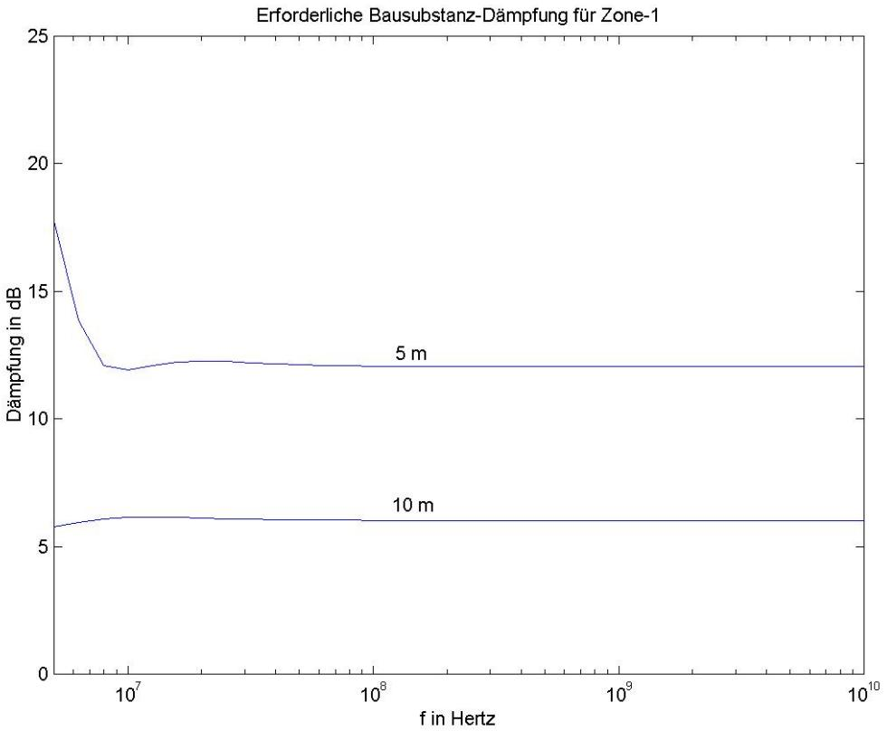
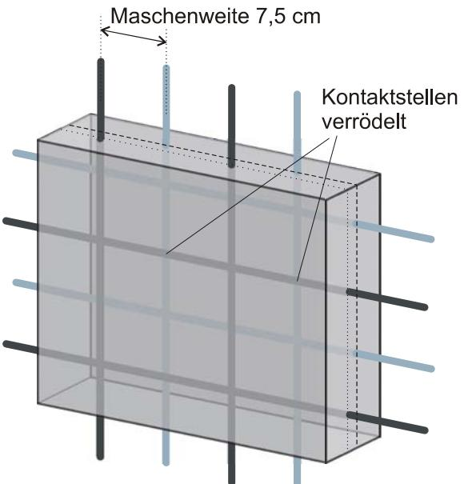
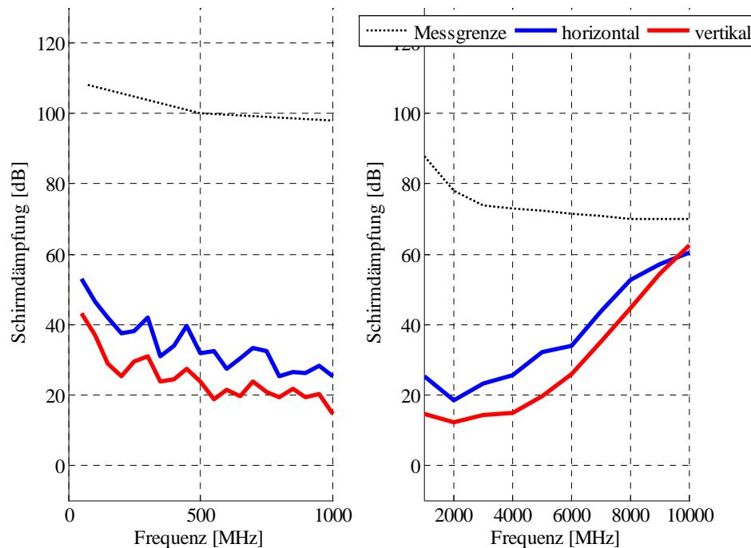
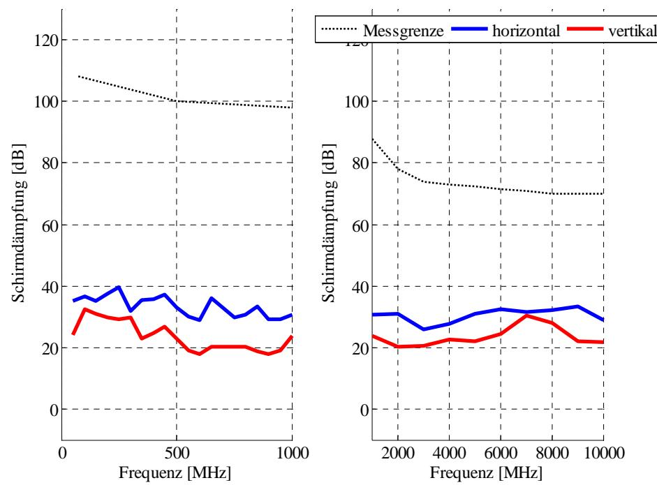

# **BSI - Technische Richtlinie**

| Bezeichnung:       | Elektromagnetische Schirmung von Gebäuden |  |
|--------------------|----------------------------------------------|--|
|                    | - Praktische Messungen -                     |  |
| Anwendungsbereich: |                                              |  |
| Kürzel:            | BSI TR-03209 - 2                             |  |
| Version:           | 1.3                                          |  |
| Veröffentlichung:  | 30.04.2008                                   |  |

#### **Autoren:**

| Timo Frenzel   | (Leibniz Universität Hannover, Grundlagen der Elektrotechnik und Messtechnik)             |
|----------------|----------------------------------------------------------------------------------------------|
| Johannes Rohde | (Bundesamt für Sicherheit in der Informationstechnik, Grundlagen der Lauschabwehr)        |
| Joachim Opfer  | (Bundesamt für Sicherheit in der Informationstechnik, Fachbereichsleiter Abhörsicherheit) |

# **Zu den Ergebnissen beigetragen haben ferner:**

Ralf Heinrich (Autoflug Technische Garne) Ingenieurbüro Eule

Ein besonderer Dank gilt der Wehrtechnischen Dienststelle (WTD) 81 für ihre tatkräftige und oftmals unbürokratische Unterstützung des gesamten Messablaufs.

Bundesamt für Sicherheit in der Informationstechnik Postfach 200363 53133 Bonn Tel.: +49 (0) 228 9582-0 E-Mail: [Referat223@bsi.bund.de](mailto:Referat223@bsi.bund.de)

Internet: [http://www.bsi.bund.de](http://www.bsi.bund.de/)

© Bundesamt für Sicherheit in der Informationstechnik, 2007

| 1   | Einleitung11                                                                                |  |  |  |
|-----|---------------------------------------------------------------------------------------------|--|--|--|
| 2   | Verfahren zur Ermittlung der erforderlichen Gebäudedämpfung12                               |  |  |  |
| 2.1 | Die Freiraumdämpfung 12                                                                     |  |  |  |
| 2.2 | Die erforderliche Zusatzdämpfung 14                                                         |  |  |  |
| 3   | Baumaterialien und Konzepte 17                                                              |  |  |  |
| 3.1 | Auswahl der Baumaterialien und Baukonzepte 17                                               |  |  |  |
| 3.2 | Übersicht gemessener Baukörper 17                                                           |  |  |  |
| 4   | Untersuchung der Baumaterialien 21                                                          |  |  |  |
| 4.1 | Mauerwerk21                                                                                 |  |  |  |
|     | 4.1.1 Kalksandstein (Magnetit) ohne Abschirmgewebe  21                                   |  |  |  |
|     | 4.1.2 Kalksandstein (Magnetit) mit Abschirmgewebe  26                                    |  |  |  |
|     | 4.1.3 Hochlochziegel ohne Alustreifen 29 4.1.4 Hochlochziegel mit Alustreifen  32  |  |  |  |
| 4.2 | Stahlbeton36                                                                                |  |  |  |
|     | 4.2.1 Stahlbeton als Boden/Decke-Ausführung mit Abstandsmatten, Bewehrung verschweißt 36 |  |  |  |
|     | 4.2.2 Stahlbeton als Wandausführung ohne Abstandsmatten 39                               |  |  |  |
|     | 4.2.3 Stahlbeton als Wandausführung ohne Abstandsmatten, Bewehrung verrödelt, mit        |  |  |  |
| 4.3 | Zusatzschirmung  42 Porenbeton46                                                         |  |  |  |
|     | 4.3.1 Porenbeton Standard 46                                                             |  |  |  |
|     | 4.3.2 Porenbeton mit Zuschlagstoffen  49                                                 |  |  |  |
| 4.4 | Trockenbauweise 52                                                                          |  |  |  |
|     | 4.4.1 Gipskarton als Trockenbauwand  52                                                  |  |  |  |
|     | 4.4.2 Gipskarton einseitig beplankt mit Beschichtung  59                                 |  |  |  |
| 4.5 | 4.4.3 Bitumenabdichtungssystem für Dächer  64 Fenster 67                              |  |  |  |
|     | 4.5.1 Fenster im Verbund mit einem Wandprüfkörper 67                                     |  |  |  |
|     | 4.5.2 Fenster im Verbund mit einem Blindrahmen 71                                        |  |  |  |
| 5   | Hinweis zur Planung und Bauausführung77                                                     |  |  |  |
| 6   | Wirtschaftlichkeitsbetrachtung 78                                                           |  |  |  |
| 6.1 | Kosten-Nutzen-Analyse 78                                                                    |  |  |  |
| 6.2 | Kriterien der Wirtschaftlichkeitsanalyse 79                                                 |  |  |  |
| 6.3 | Bestehende Schutzmaßnahmen80                                                                |  |  |  |
| 6.4 | Vergleich der Schutzmaßnahmen 81                                                            |  |  |  |
| 7   | Zusammenfassung und Bewertung 85                                                            |  |  |  |
| 8   | Häufig auftretende Fragen (FAQ)90                                                           |  |  |  |
| 9   | Literaturverzeichnis92                                                                      |  |  |  |
| 10  | Herstellerübersicht93                                                                       |  |  |  |

# Abbildungsverzeichnis

| Abbildung 2-1: Freiraumdämpfung für verschiedene Entfernungen  12                                                    |  |
|----------------------------------------------------------------------------------------------------------------------|--|
| Abbildung 2-2: Schematische Darstellung der Zoneneinteilung 13                                                       |  |
| Abbildung 2-3: Erforderliche Bausubstanz-Dämpfung für Zone 1 14                                                      |  |
| Abbildung 2-4: Erforderliche Bausubstanz-Dämpfung für Zone 2 15                                                      |  |
| Abbildung 2-5: Erforderliche Bausubstanz-Dämpfung für Zone 3 15                                                      |  |
| Abbildung 3-1: Schematische Darstellung der Verbindungssysteme beim Kalksandstein 21                                 |  |
| Abbildung 3-2: Kalksandstein (Magnetit) als Feder-Nut-System ohne Mörtel in den Vertikalfugen  22                    |  |
| Abbildung 3-3: Messergebnis Kalksandstein (Magnetit) ohne Vertikalvermörtelung 22                                    |  |
| Abbildung 3-4: Messergebnis Kalksandstein (Magnetit) mit Vertikalvermörtelung 23                                     |  |
| Abbildung 3-5: Kalksandstein (Magnetit) als planes Verbindungssystem  24                                             |  |
| Abbildung 3-6: Messergebnis Kalksandstein (Magnetit) als planes Verbindungssystem 24                                 |  |
| Abbildung 3-7: Kalksandstein (Magnetit) mit Abschirmgewebe, ohne Vertikalvermörtelung  27                            |  |
| Abbildung 3-8: Messergebnis Kalksandstein (Magnetit) mit Abschirmgewebe, ohne Vertikalvermörtelung 27             |  |
| Abbildung 3-9: Hochlochziegel, Vorbereitung für die Verwendung ohne Aluminiumstreifen 29                             |  |
| Abbildung 3-10: Standard Hochlochziegel  30                                                                          |  |
| Abbildung 3-11: Messergebnis Standard Hochlochziegel  30                                                             |  |
| Abbildung 3-12: Standard Hochlochziegel mit Abschirmfarbe (Silber) 31                                                |  |
| Abbildung 3-13: Messergebnis Standard Hochlochziegel mit Abschirmfarbe (Silber) 31                                   |  |
| Abbildung 3-14: Hochlochziegel mit Aluminiumstreifen 33                                                              |  |
| Abbildung 3-15: Messergebnis Hochlochziegel mit Aluminiumstreifen 33                                                 |  |
| Abbildung 3-16: Hochlochziegel mit Aluminiumstreifen und Abschirmfarbe 34                                            |  |
| Abbildung 3-17: Messergebnis Hochlochziegel mit Aluminiumstreifen und Abschirmfarbe 34                               |  |
| Abbildung 3-18: Beton als Boden-Decke-Element, mit Prüfrahmen und untereinander verschweißt 37                       |  |
| Abbildung 3-19: Messergebnis Beton als Boden-Decke-Element, mit Prüfrahmen und untereinander verschweißt  37      |  |
| Abbildung 3-20: Beton als Boden-Decke-Element, mit Prüfrahmen nicht verschweißt 38                                   |  |
| Abbildung 3-21: Messergebnis Beton als Boden-Decke-Element, mit Prüfrahmen nicht verschweißt 38                      |  |
| Abbildung 3-22: Beton als Wandausführung, doppellagige Bewehrung , untereinander verrödelt 40                        |  |
| Abbildung 3-23: Messergebnis Beton als Wandausführung, doppellagige Bewehrung , untereinander verrödelt 40        |  |
| Abbildung 3-24: Beton als Wandausführung, mit Prüfrahmen und Bewehrung untereinander verschweißt  41              |  |
| Abbildung 3-25: Messergebnis Beton als Wandausführung, mit Prüfrahmen und Bewehrung untereinander verschweißt  41 |  |
| Abbildung 3-26: Beton mit doppellagiger Bewehrung und Verputzung mit Streckmetall  43                                |  |
| Abbildung 3-27: Messergebnis Beton mit doppellagiger Bewehrung und Verputzung mit Streckmetall 43                 |  |
| Abbildung 3-28: Beton mit doppellagiger Bewehrung und mit Stahlfasern als Zuschlagsstoff  44                         |  |
| Abbildung 3-29: Messergebnis Beton mit doppellagiger Bewehrung und mit Stahlfasern als Zuschlagsstoff 44          |  |

| Elektromagnetische Schirmung von Gebäuden                                                                                                           | BSI TR-03209 - 2 |
|-----------------------------------------------------------------------------------------------------------------------------------------------------|------------------|
| Abbildung 3-30: Porenbeton aus Standardmaterial 47                                                                                                  |                  |
| Abbildung 3-31: Messergebnis Porenbeton aus Standardmaterial 47                                                                                     |                  |
| Abbildung 3-32: Porenbeton aus Standardmaterial und Verputzung mit Rippenstreckmetall 48                                                            |                  |
| Abbildung 3-33: Messergebnis Porenbeton aus Standardmaterial und Verputzung mit Rippenstreckmetall  48                                           |                  |
| Abbildung 3-34: Porenbeton mit leitfähigem Zuschlagstoff und mit Abschirmputz 50                                                                    |                  |
| Abbildung 3-35: Messergebnis Porenbeton mit leitfähigem Zuschlagstoff und mit Abschirmputz  50                                                      |                  |
| Abbildung 3-36: Porenbeton mit leitfähigem Zuschlagstoff, Abschirmputz und Rippenstreckmetall . 51                                                  |                  |
| Abbildung 3-37: Messergebnis Porenbeton mit leitfähigem Zuschlagstoff, Abschirmputz und Rippenstreckmetall  51                                   |                  |
| Abbildung 3-38: Gipskarton als Trockenbauwand mit Wärmedämmung 53                                                                                   |                  |
| Abbildung 3-39: Messergebnis Gipskarton als Trockenbauwand mit Wärmedämmung 53                                                                      |                  |
| Abbildung 3-40: Gipskarton als Trockenbauwand (PE) mit Abschirmfarbe (Silber) 54                                                                    |                  |
| Abbildung 3-41: Messergebnis Gipskarton als Trockenbauwand (PE) mit Abschirmfarbe (Silber) 54                                                       |                  |
| Abbildung 3-42: Gipskarton als Trockenbauwand mit HF-Schutzplatte  55                                                                               |                  |
| Abbildung 3-43: Messergebnis Gipskarton als Trockenbauwand mit HF-Schutzplatte  55                                                                  |                  |
| Abbildung 3-44: Gipskarton als Trockenbauwand mit Dampfsperre aus Aluminium 56                                                                      |                  |
| Abbildung 3-45: Messergebnis Gipskarton als Trockenbauwand mit Dampfsperre aus Aluminium 57                                                         |                  |
| Abbildung 3-46: Gipskarton als Trockenbauwand mit Dampfsperre aus Aluminium und zusätzlich aufgetragener Abschirmfarbe (Silber)  58              |                  |
| Abbildung 3-47: Messergebnis Gipskarton als Trockenbauwand mit Dampfsperre aus Aluminium und zusätzlich aufgetragener Abschirmfarbe (Silber)  58 |                  |
| Abbildung 3-48: Gipskarton mit HF-Tapete  60                                                                                                        |                  |
| Abbildung 3-49: Messergebnis Gipskarton mit HF-Tapete  60                                                                                           |                  |
| Abbildung 3-50: Gipskarton mit Abschirmfarbe auf Basis von Kohlenstoffpartikeln 61                                                                  |                  |
| Abbildung 3-51: Messergebnis Gipskarton mit Abschirmfarbe auf Basis von Kohlenstoffpartikeln 61                                                     |                  |
| Abbildung 3-52: Gipskarton mit Abschirmfarbe auf Kupfer-Silber-Basis  62                                                                            |                  |
| Abbildung 3-53: Messergebnis Gipskarton mit Abschirmfarbe auf Kupfer-Silber-Basis  62                                                               |                  |
| Abbildung 3-54: Gipskarton mit Abschirmfarbe auf Kupfer-Silber-Basis und eingebrachter Bohrung63                                                    |                  |
| Abbildung 3-55: Messergebnis Gipskarton mit Abschirmfarbe auf Kupfer-Silber-Basis und eingebrachter Bohrung 63                                   |                  |
| Abbildung 3-56: Bitumenabdichtungssystem für Steildächer 65                                                                                         |                  |
| Abbildung 3-57: Messergebnis Bitumenabdichtungssystem für Steildächer 65                                                                            |                  |
| Abbildung 3-58: Messergebnis Bitumenabdichtungssystem für Flachdächer  66                                                                           |                  |
| Abbildung 3-59: Beton, Bewehrung untereinander verrödelt und mit HF-Fenster 68                                                                      |                  |
| Abbildung 3-60: Messergebnis Beton, Bewehrung untereinander verrödelt und mit HF-Fenster 68                                                         |                  |
| Abbildung 3-61: Messergebnis Beton, Bewehrung untereinander verschweißt mit HF-Fenster 69                                                           |                  |
| Abbildung 3-62: Gipskarton Trockenbauwand mit Abschirmplatte und HF-Fenster  70                                                                     |                  |
| Abbildung 3-63: Messergebnis Gipskarton Trockenbauwand mit Abschirmplatte und HF-Fenster  70                                                        |                  |
| Abbildung 3-64: Standardfenster HF-Folie im Blindrahmen 71                                                                                          |                  |
| Abbildung 3-65: Messergebnis Standardfenster HF-Folie im Blindrahmen 72                                                                             |                  |

| BSI TR-03209 - 2                                                                                             | Elektromagnetische Schirmung von Gebäuden |
|--------------------------------------------------------------------------------------------------------------|-------------------------------------------|
| Abbildung 3-66: HF-Fenster (Variante 1) im Blindrahmen 73                                                    |                                           |
| Abbildung 3-67: Messergebnis HF-Fenster (Variante 1) im Blindrahmen 73                                       |                                           |
| Abbildung 3-68: HF-Fenster (Variante 2) im Blindrahmen, Gewebe in einlagiger Ausführung 74                   |                                           |
| Abbildung 3-69: Messergebnis HF-Fenster (Variante 2) im Blindrahmen, Gewebe in einlagiger Ausführung  74  |                                           |
| Abbildung 3-70: Messergebnis HF-Fenster (Variante 2) im Blindrahmen, Gewebe in zweilagiger Ausführung  75 |                                           |
| Abbildung 5-1: Bestehende Schutzmaßnahmen 80                                                                 |                                           |
| Abbildung 5-2: Büroraum gemäß [3] 81                                                                         |                                           |
| Abbildung 5-3: Kosten der Maßnahmen im Vergleich  84                                                         |                                           |

Abkürzungsverzeichnis

| Lateinisch: |                                                                                      |
|-------------|--------------------------------------------------------------------------------------|
| c           | Lichtgeschwindigkeit                                                                 |
| r E      | Elektrische Feldstärke                                                               |
| f           | Frequenz                                                                             |
| Cut f       | Cutoff-Frequenz                                                                      |
| s fRe       | Resonanzfrequenz                                                                     |
| r H      | Magnetische Feldstärke                                                               |
| l           | Länge                                                                                |
| m           | Ganze Zahl                                                                           |
| n           | Ganze Zahl                                                                           |
| p           | Ganze Zahl                                                                           |
| r           | Radius                                                                               |
| S           | Schirmfaktor                                                                         |
| SE          | Leistungsschirmdämpfung                                                              |
| t           | Zeit                                                                                 |
| x           | Koordinate, Variable                                                                 |
| y           | Koordinate, Variable                                                                 |
| z           | Koordinate, Variable                                                                 |
| Al          | Aluminium                                                                            |
| Cu          | Kupfer                                                                               |
| GK          | Gipskarton                                                                           |
| KS          | Kalksandstein                                                                        |
| PE          | Polyethylen                                                                          |
| TE          | Transversal Elektrisch                                                               |
| TEM         | Transversal Elektro-Magnetisch                                                       |
| TM          | Transversal Magnetisch                                                               |
| Griechisch: |                                                                                      |
| Γ           | Feldwellenwiderstand                                                                 |
| ε           | = Permittivität od. Dielektrizitätskonstante ε ε ε 0 r             |
| ε 0      | 12 As − ⋅= 1085,8 Permittivität des freien Raumes ( ) ε 0 Vm |
| ε r      | Relative Permittivität                                                               |
| κ           | Elektrische Leitfähigkeit                                                            |
| λ           | Wellenlänge                                                                          |
| krit λ   | Kritische Wellenlänge                                                                |
| μ           | = Permeabilität μ μ μ 0 r                                          |
| μ 0      | 7 Vs − ⋅= 104 Permeabilität des Vakuums ( ) πμ 0 Am          |
| r μ      | Relative Permeabilität                                                               |
| π           | Kreiszahl                                                                            |
| ω           | Kreisfrequenz                                                                        |
|             |                                                                                      |

# **1 Einleitung**

Der vorliegende Teil 2 der Technischen Richtlinie gibt praktische Planungshilfen zur Realisierung von elektromagnetisch dämpfenden Gebäuden als Schutzmaßnahme gegen bloßstellende Abstrahlung. Einen großen Umfang dieser Richtlinie nimmt die Beschreibung und Untersuchung von diversen Baumaterialien und Verarbeitungsmethoden ein. Die Ergebnisse werden anhand von Messkurven im Einzelnen präsentiert. Abgerundet wird die Richtlinie durch eine Wirtschaftlichkeitsbetrachtung, die die Material- und Verarbeitungskosten verschiedener Bauweisen in Bezug zu der jeweiligen Dämpfungswirkung setzt.

Die Technische Richtlinie ist ausdrücklich als Planungshilfe für die Auswahl und die Verarbeitung von Baumaterialien unter Abstrahlschutzaspekten konzipiert. Die Anwendung dieser Richtlinie kann keine Gewähr dafür bieten, dass die bei der Planung als Zielvorgabe zu Grunde gelegten Schirmdämpfungswerte am ausgeführten Objekt tatsächlich erreicht werden. Gründe hierfür sind die bei realen Gebäuden komplizierten und rechnerisch nicht exakt erfassbaren Ausbreitungsverhältnisse der elektromagnetischen Wellen sowie die unvermeidlichen Unwägbarkeiten bei der praktischen Ausführung von Bauvorhaben. Daher wird grundsätzlich empfohlen, bei Planung und Bauausführung ein geeignetes Fachunternehmen zu beteiligen (vgl. hierzu Kapitel [5\)](#page-74-1).

Die Anwendung dieser Richtlinie ist nur nach Maßgabe der geltenden Bauvorschriften und Normen zulässig. Daher wurden nur Materialien untersucht, die von Herstellerseite geprüft und für die Verwendung beim Bau freigegeben sind.

Sollten in dieser Richtlinie vorgestellte Materialien oder Verarbeitungsverfahren geltenden Vorschriften zuwider laufen, haben diese Vorschriften grundsätzlich Vorrang vor dieser Richtlinie.

# **2 Verfahren zur Ermittlung der erforderlichen Gebäudedämpfung**

In Teil 1 der Technischen Leitlinie wurde das Zonenmodell als Schutzmaßnahme gegen bloßstellende Abstrahlung vorgestellt. Zentraler Gedanke war dabei, dass die Intensität der bloßstellenden Abstrahlung zum einen mit wachsender Distanz zwischen Angreifer und strahlendem Gerät abnimmt, zum anderen aber auch durch die Bausubstanz abgeschwächt wird.

In diesem Kapitel wird eine Berechnungsmethode vorgestellt, mit der man anhand der vorgegebenen Sicherheitsabstände zur Bereichsgrenze ermitteln kann, welche Zonennote bestimmte Teile eines Gebäudes voraussichtlich erreichen werden. Da hierbei allein die Größen- und Abstandsverhältnisse betrachtet werden und die Dämpfungseigenschaften der Bausubstanz unberücksichtigt bleiben, lässt sich diese theoretische Abschätzung bereits in der Planungsphase vor der praktischen Realisierung des Gebäudes vornehmen.

Ist die dabei erzielte Zonenbewertung für den beabsichtigten Einsatzzweck des Gebäudes nicht ausreichend, müssen die Dämpfungseigenschaften der Bausubstanz berücksichtigt werden. Es wird gezeigt, wie sich die von der Bausubstanz zu erbringende Zusatzdämpfung ermitteln lässt.

# **2.1 Die Freiraumdämpfung**

Wie in Teil 1 der Leitlinie dargestellt, nimmt die Feldstärke einer Strahlungsquelle mit der Entfernung ab. Diese Abnahme der Feldstärke lässt sich gedanklich auch als "Dämpfung" interpretieren, so als sei sie nicht durch die Entfernungszunahme, sondern durch ein dämpfendes Material hervorgerufen worden. Die Feldstärkeabnahme auf Grund der Entfernung wird als "Freiraumdämpfung" bezeichnet, weil sie ohne Mitwirkung eines dämpfenden Materials entsteht.

Die Angabe der Freiraumdämpfung wird im Zonenmodell (Teil1, Abschnitt 6) auf eine Referenzentfernung von 20 m bezogen. Die Freiraumdämpfung im Abstand r von einer Strahlungsquelle beschreibt also, wie stark die Feldstärke der Strahlungsquelle im Abstand r abgefallen bzw. angestiegen ist im Vergleich zur Feldstärke in der Referenzentfernung von 20 m. Für Abstände r > 20 m ist die Freiraumdämpfung positiv (höhere Dämpfung als für r= 20m), für Abstände r < 20 m ist sie negativ (geringere Dämpfung als für r=20 m).

Abbildung 2-1: Freiraumdämpfung für verschiedene Entfernungen

[Abbildung 2-1](#page-9-1) zeigt die Freiraumdämpfung für verschiedene Entfernungen. Bei gegebenen Distanzverhältnissen kann man nun aus der Differenz zwischen Freiraumdämpfung und dem Zonen-Limit ermitteln, wie viel dB Dämpfung zur Einhaltung des Zonen-Limits fehlen. Diese fehlende Dämpfung muss durch die Bausubstanz erbracht werden.

Abbildung 2-2: Schematische Darstellung der Zoneneinteilung

Ein zusätzliches Schema zur Zoneneinteilung bietet [Abbildung 2-2.](#page-10-1) Wird eine Bewertung nach Zone 1 gefordert, wird diese bei einer Freiraumdistanz ≥ 20 m erreicht bzw. übertroffen. In diesem Fall müsste die Bausubstanz theoretisch keine Zusatzdämpfung erbringen. Bei einem Sicherheitsabstand kleiner 20 m reicht die Freiraumdämpfung allein nicht aus, die fehlende Dämpfung muss durch die Bausubstanz erbracht werden.

Wird eine Bewertung nach Zone 2 gefordert, wird diese erst bei einer Freiraumdistanz von > 150 m erreicht. Ist der realisierbare Sicherheitsabstand geringer, muss die fehlende Freiraumdämpfung durch die Bausubstanz erbracht werden.

Wird eine Bewertung nach Zone 3 gefordert, reicht selbst eine Freiraumdistanz von 500 m nicht aus. Die für Zone 3 beträchtlichen Dämpfungsforderungen lassen sich daher in aller Regel nur durch aufwändige Schirmungsmaßnahmen oder durch eine sehr massive Bauweise ("Bunker") erzielen.

# **2.2 Die erforderliche Zusatzdämpfung**

Als Hilfe zur Ermittlung der bei gegebenen Sicherheitsabständen und einer geforderten Zonennote von der Bausubstanz zu erbringenden Zusatzdämpfungen dienen die folgenden Grafiken, in denen die Differenz zwischen der Freiraumdämpfung bei verschiedenen Sicherheitsabständen und den jeweiligen Zonen-Limits aufgetragen ist. Grundsätzlich sollte das Gebäude, die in eine der nachfolgend aufgeführten Zonen eingeteilt wird, eine hohe, durch das Baumaterial erzeugte Dämpfung besitzen, denn der benötigte Freiraum ist in der Regel nicht vorhanden.

Abbildung 2-3: Erforderliche Bausubstanz-Dämpfung für Zone 1

Abbildung 2-4: Erforderliche Bausubstanz-Dämpfung für Zone 2

Abbildung 2-5: Erforderliche Bausubstanz-Dämpfung für Zone 3

Die Zuordnung zu den Zonen, wird vom BSI durch Messungen bestimmt. Dabei werden die tatsächlich erzielten Dämpfungswerte in der Regel geringer ausfallen als nach der hier dargestellten stark idealisierten Freifeld-Betrachtung zu erwarten wäre. So bewirkt die Bausubstanz nicht immer

Elektromagnetische Schirmung von Gebäuden BSI TR-03209 - 2

zwangsläufig eine Erhöhung der Dämpfung, durch Resonanzeffekte und leitungsgebundene Wellenausbreitung kann es durchaus auch zu einer Verringerung der Dämpfung kommen.

Der Zuordnung von Gebäuden oder Liegenschaften zu den Sicherheitszonen durch Messingenieure des BSI geht eine visuelle Bewertung der Schirmdämpfungsmaßnahmen voraus. Bei dieser visuellen Methode ist ein Sicherheitsfaktor einkalkuliert, um schwer kalkulierbare Faktoren der Wellenausbreitung zu berücksichtigen. Bei erfahrenen Messingenieuren liegt die "Trefferquote" bei der visuellen Beurteilung bei ca. 85%. Sofern der Vermessung einer Liegenschaft terminliche oder wirtschaftliche Gründe entgegenstehen, kann eine Zoneneinteilung somit rein durch die visuelle Bewertung erfolgen, auch wenn eine Nachmessung trotz vorhandenem Sicherheitsfaktor auf jeden Fall empfohlen wird.

Die Erfahrung der Messingenieure beruht weitestgehend auf den Messergebnissen, die über Jahre an Gebäuden aus unterschiedlichen Materialien erreicht wurden. Prinzipiell können die nachfolgend dargestellten Dämpfungswerte somit durch praktisch durchgeführte Zonenmessungen an Gebäuden bestätigt werden. Jedoch sind durch die Übergänge von unterschiedlichen Baumaterialien und besonders durch die Verarbeitungsqualität positive und negative Abweichungen des Dämpfungsverhaltens feststellbar.

Auffällig sind fast immer Dämpfungseinbrüche, die gemäß der Analogie *c f* λ= und deren

geradzahliger Teiler ( ; ; ; ;usw.) 248 λλλ λauftreten. Signifikant ist dabei der Dämpfungseinbruch bei der

Wellenlänge 4 λin Relation zur Apertur**[1](#page-13-0)**. Wie bereits im ersten Teil der Studie aufgezeigt,

beeinflussen solchen Aperturen die Wellenausbreitung im Sinne von Hohlleiter- und Antenneneffekten. Als Beispiel sei eine Maueröffnung von 2 m x 2 m gegeben. Hier ist gemäß dem aufgeführten Sachverhalt unter anderem ein starker Dämpfungseinbruch bei 600 MHz erkennbar. Ebenfalls lässt sich feststellen, dass Räumlichkeiten, in denen sich große metallische Gegenstände befinden (z.B. Tresorräume), eine gute Eigendämpfung besitzen. Des Weiteren sind durch Erdreich geschützte Bereiche in der Regel gut dämpfend (Keller, Bunker).

Dagegen können große metallisch reflektierende Flächen wie beispielsweise eine angrenzende Metallwand einer Fabrikhalle oder eine einseitig aufgebrachte Metallfolien Feld verstärkende Wirkung haben und somit die prognostizierte Dämpfung verringern. Klimageräte oder Schächte und angeschlossene Freileitungen sind ebenfalls unkalkulierbare Größen bei der Voraussage der elektromagnetischen Dämpfung der betrachteten Räume.

**1** Apertur: Öffnung im geschirmten Raum

# **3 Baumaterialien und Konzepte**

# **3.1 Auswahl der Baumaterialien und Baukonzepte**

Für die Bestimmung der elektromagnetischen Dämpfungseigenschaften standen über 40 nach geltenden Bauvorschriften aufgebaute Prüfkörper zur Verfügung. Jeder der Körper ist in einen Prüfkörperrahmen aus Stahl eingebunden, der wegen des Personenschutzes nach DIN VDE 0185/3 geerdet ist. Bei einigen Prüfkörpern ist die Erdung des Baumaterials bereits vom Hersteller vorgeschrieben. Der Prüfkörperrahmen dient zur formschlüssigen Kontaktierung mit dem Messaufbau. Die Einteilung der Prüfkörper erfolgt entsprechend [Tabelle 3-1](#page-14-1) in sechs Gruppen unter Berücksichtigung des Verwendungszwecks der Baumaterialien.

| Gruppennummer | Anwendungsbereich |
|---------------|-------------------|
| 1             | Mauerwerk         |
| 2             | Beton             |
| 3             | Porenbeton        |
| 4             | Trockenausbau     |
| 5             | Fenster           |

#### Tabelle 3-1: Prüfkörpergruppen

(1) und (2): Mauerwerke und Betonwände sind sehr schwere, massive Prüfkörper und können hohe Traglasten aufnehmen. Diese eignen sich daher auch für tragende Wandkonstruktionen. Darüber hinaus haben Stahlbetonelemente durch die spezielle Art der Bewehrung die größte Biegesteifigkeit. Diese eignen sich daher als einzige Elemente zur Verwendung für Böden und Decken.

(3) und (4): Porenbetonwände und die Elemente aus dem Innenausbau sind vornehmlich Konstruktionen mit geringer Tragfähigkeit. Diese Konstruktionen werden auch zur Wärmedämmung oder zum Sichtschutz eingesetzt.

(5): Die Gruppe beinhaltet alle Formen der Fensterkonstruktion und deren Anbindung. Neben dem Schirmdämpfungsmaß des reinen Fensters wird das Gesamtkonzept untersucht. Hierbei ist vor allem die mögliche Anbindung zum umgebenden Material entscheidend.

In jeder Gruppe wird zunächst ein konventioneller Prüfkörper, der gewöhnlich im Hochbau verwendet wird, vermessen. Die restlichen Prüfkörper jeder Gruppe stellen Modifikationen des herkömmlichen Körpers dar, die durch die Verwendung besonderer Materialien oder durch besondere konstruktive Eigenschaften eine erhöhte Schirmung bewirken sollen.

# **3.2 Übersicht gemessener Baukörper**

Die folgenden Tabellen bieten eine Übersicht aller in der Studie vermessenen Baukörper sowie deren Anwendungsbereiche und zeigen Unterschiede zwischen den konstruktiven Maßnahmen auf. Die sachgerechte Herstellung jedes Prüfkörpers ist durch ein unabhängiges Ingenieurbüro überwacht worden und durch ein Zertifikat belegt. Zusätzlich sind für einige Prüfkörper Modifikationen vorgesehen, die erst vor Ort durchgeführt werden. Dies umfasst beispielsweise alle Anstriche, Tapezierarbeiten und nachträgliches Verputzen.

| Gruppe    |    | Pos. | Beschreibung                                                                                                                                                                                                                                                          |  |  |  |  |
|-----------|----|------|-----------------------------------------------------------------------------------------------------------------------------------------------------------------------------------------------------------------------------------------------------------------------|--|--|--|--|
| Mauerwerk | 1. | 1.1  | Kalksandstein (Magnetit): Ausführung als Feder-Nut-System; Horizontalfugen mit HF-Mörtel; Vertikalfugen ohne Mörtel                                                                                                                                                |  |  |  |  |
|           |    | 1.2  | Kalksandstein (Magnetit): Ausführung als Feder-Nut-System; Horizontalfugen mit HF-Mörtel; Vertikalfugen nachträglich mit HF-Mörtel                                                                                                                                 |  |  |  |  |
|           |    | 1.3  | Kalksandstein (Magnetit): Ausführung als planes System; Horizontalfugen und Vertikalfugen mit HF-Mörtel                                                                                                                                                            |  |  |  |  |
|           |    | 2.1  | Kalksandstein (Magnetit): Ausführung als Feder-Nut-System; mit Außenkerndämmung; Armierungsschicht aus Abschirmgewebe; Horizontalfugen mit HF-Mörtel; Vertikalfugen ohne Mörtel                                                                                 |  |  |  |  |
|           |    | 2.2  | Kalksandstein (Magnetit): Ausführung wie 1.2.1; Horizontalfugen mit HF Mörtel; Vertikalfugen nachträglich mit HF-Mörtel                                                                                                                                            |  |  |  |  |
|           |    | 3.1  | Hochlochziegel: Horizontalfugen mit Mörtel; Vertikalfugen ohne Mörtel                                                                                                                                                                                                 |  |  |  |  |
|           |    | 3.2  | Hochlochziegel: Horizontalfugen mit Mörtel; Vertikalfugen ohne Mörtel; Abschirmfarbe (Silber)                                                                                                                                                                      |  |  |  |  |
|           |    | 4.1  | Hochlochziegel (Al-Streifen): Horizontalfugen mit Mörtel; Vertikalfugen ohne Mörtel                                                                                                                                                                                |  |  |  |  |
|           |    | 4.2  | Hochlochziegel (Al-Streifen): Horizontalfugen mit Mörtel; Vertikalfugen ohne Mörtel; Abschirmfarbe (Silber)                                                                                                                                                        |  |  |  |  |
| Beton     | 2. | 1.1  | Beton C 25/30 (Boden-Decke-Ausführung): 2 Bewehrungsmatten, getrennt durch Abstandsmatte Q 257A; am Rahmen umlaufend verschweißt; Matten miteinander verschweißt; Maschenversatz 75 mm; Betonüberdeckung beidseitig 30 mm                                    |  |  |  |  |
|           |    | 1.2  | Beton C 25/30 (Boden-Decke-Ausführung): 2 Bewehrungsmatten, getrennt durch Abstandsmatte Q 257A; am Rahmen nicht verschweißt; Matten miteinander verschweißt; Maschenversatz 75 mm; Betonüberdeckung beidseitig 30 mm,                                       |  |  |  |  |
|           |    | 2.1  | Beton C 25/30 (Wandausführung): 2 Bewehrungsmatten Q 257A (Stabdurchmesser 7 mm); mittig versetzt; Maschenversatz 75 mm; Matten alle 50 cm verrödelt; Matten mit dem Rahmen verschweißt; Betonüberdeckung beidseitig 30 mm                                   |  |  |  |  |
|           |    | 2.2  | Beton C 25/30 (Wandausführung): 2 Bewehrungsmatten Q 257A (Stabdurchmesser 7 mm); mittig versetzt; Maschenversatz 75 mm; Matten miteinander an jedem Knoten verschweißt; Matten mit dem Rahmen verschweißt; Betonüberdeckung beidseitig 30 mm                |  |  |  |  |
|           |    | 3.1  | Beton C 25/30 (Wandausführung): 2 Bewehrungsmatten Q 257A (Stabdurchmesser 7 mm); mittig versetzt; Maschenversatz 75 mm; Matten alle 50 cm verrödelt; Betonüberdeckung beidseitig 30 mm; mineral. Außenputz mit Streckmetall Stahl verzinkt, rhombische Form |  |  |  |  |
|           |    | 3.2  | Beton C 25/30 (Wandausführung): 2 Bewehrungsmatten Q 257A (Stabdurchmesser 7 mm); mittig versetzt; Maschenversatz 75 mm; Matten alle 50 cm verrödelt; Betonüberdeckung beidseitig 30 mm; Beton mit Zuschlag Stahlfaser ME 50/1,0                             |  |  |  |  |

Tabelle 3-2: Übersicht des Materials und Konzepts der gemessenen Baukörper

# BSI TR-03209 - 2 Elektromagnetische Schirmung von Gebäuden Gruppe Pos. Beschreibung 1.1 Porenbeton Mauerwerk (Standardmaterial): Außenseite mit Putzsystem für Porenbeton, versehen, versiegelt, Innenputz 1.2 Porenbeton Mauerwerk (Standardmaterial): wie 3.1.1, nachträglich verputzt mit Streckmetall 2.1 Porenbeton Mauerwerk (leitfähiger Zuschlagstoff): geklebt mit HF-**Porenbeton**  Spezialkleber, Kalkputz als Innenputz, Außenputz HF-Sonderputz **3.**  2.2 Porenbeton Mauerwerk (leitfähiger Zuschlagstoff): wie 3.2.1, nachträglich verputzt mit Streckmetall 1.1 Trockenbauwand aus Gipskartonplatten: Ständerwerk aus C-Stahl-Profilen; beidseitig beplankt; Dämmung mit Mineralwolle; Dampfsperre aus PE-Folie 1.2 Trockenbauwand aus Gipskartonplatten: Ständerwerk aus C-Stahl-Profilen; beidseitig beplankt; Dämmung mit Mineralwolle; Dampfsperre aus PE-Folie; Abschirmfarbe (Silber) 1.3 Trockenbauwand aus Gipskartonplatten: Ständerwerk aus C-Stahl-Profilen; Innenseite mit HF-Schutzplatte (Kohlenstoffpartikel); Außenseite beplankt mit Gipskartonplatte; Dämmung mit Mineralwolle; Dampfsperre aus PE-Folie 1.4 Trockenbauwand aus Gipskartonplatten: Ständerwerk aus C-Stahl-Profilen; beidseitig beplankt; Dämmung mit Mineralwolle; Dampfsperre aus Al-Folie; am Stoß verklebt mit HF-Klebeband 1.5 Trockenbauwand aus Gipskartonplatten: Ständerwerk aus C-Stahl-Profilen; beidseitig beplankt; Dämmung mit Mineralwolle; Dampfsperre aus Al-Folie; am Stoß verklebt mit HF-Klebeband; Abschirmfarbe (Silber) 2.1 Gipskartonwand (ohne Ständerwerk): einseitig beplankt; HF-Tapete 2.2 Gipskartonwand (ohne Ständerwerk): einseitig beplankt; Abschirmfarbe (Kohlenstoffpartikel) 2.3 Gipskartonwand (ohne Ständerwerk): einseitig beplankt; Abschirmfarbe (Kupfer-Silber) 2.4 Gipskartonwand (ohne Ständerwerk): einseitig beplankt; Abschirmfarbe (Kupfer-Silber); mit Bohrung, Dübel und Schraube versehen 3.1 Bitumenbahn auf Holzkonstruktion für Flachdächer **Trockenausbau 4.**  3.2 Bitumenbahn auf Holzkonstruktion für Steildächer

| Gruppe  |   | Pos. | Beschreibung                                                                                                                                                                                                                                                          |  |  |  |
|---------|---|------|-----------------------------------------------------------------------------------------------------------------------------------------------------------------------------------------------------------------------------------------------------------------------|--|--|--|
|         | 5 | 1.1  | Beton C 25/30 (Wandausführung): 2 Bewehrungsmatten Q 257A (Stabdurchmesser 7 mm); mittig versetzt; Maschenversatz 75 mm; Matten alle 50 cm verrödelt; Matten mit dem Rahmen nicht verschweißt; Betonüberdeckung beidseitig 30 mm; HF-Fenster (1,25 x 1,38 m) |  |  |  |
| Fenster |   | 1.2  | Beton C 25/30 (Wandausführung): 2 Bewehrungsmatten Q 257A (Stabdurchmesser 7 mm); mittig versetzt; Maschenversatz 75 mm; Matten miteinander verschweißt; Matten mit dem Rahmen verschweißt; Betonüberdeckung beidseitig 30 mm; HF-Fenster (1,25 x 1,38 m)    |  |  |  |
|         |   | 1.3  | Trockenbauwand aus Gipskartonplatten: Ständerwerk aus C-Stahl-Profilen; Innenseite mit HF-Schutzplatte (Kohlenstoffpartikel); Außenseite beplankt mit Gipskartonplatte; Dämmung mit Mineralwolle; Dampfsperre aus PE-Folie; HF Fenster (1,25 x 1,38 m)       |  |  |  |
|         |   | 2.1  | Standardfenster mit HF-Folie: im Blindrahmen; Folie durch HF-Klebeband mit dem Fensterrahmen verbunden                                                                                                                                                             |  |  |  |
|         |   | 2.2  | HF-Fenster (Variante 1): einlagig; im Blindrahmen; Schirmung durch abgesetztes Fenster nach außen auf den Blindrahmen geführt                                                                                                                                      |  |  |  |
|         |   | 2.3  | HF-Fenster (Variante 2): einlagig; im Blindrahmen; Schirmung auf den Fensterrahmen geführt                                                                                                                                                                         |  |  |  |
|         |   | 2.4  | HF-Fenster (Variante 2): zweilagig; im Blindrahmen; Schirmung auf den Fensterrahmen geführt                                                                                                                                                                        |  |  |  |

Tabelle 3-4: Übersicht des Materials und Konzepts der gemessenen Baukörper

# **4 Untersuchung der Baumaterialien**

Im Folgenden wird detailliert auf den Aufbau und die Messergebnisse der in der Studie verwendeten Prüfkörper eingegangen. Ein Prüfkörper besteht dabei immer aus der Kombination einer oder mehrerer Baumaterialien. Da viele Baumaterialien bereits vom Hersteller ausgewiesene Verarbeitungsrichtlinien mitbringen, werden diese als Grundlage der Konstruktion verwendet. Baumaterialien, die keine herstellerseitigen Verarbeitungsrichtlinien enthalten, werden in Absprache mit einem Ingenieurbüro und nach geltenden Bauvorschriften verwendet. Alle Prüfkörper sind in einen Prüfrahmen aus verzinktem Stahl eingefasst, der eine leitfähige und rundum geschlossene Verbindung zur Abschirmkammer garantiert.

Des Weiteren erfolgt für jeden Prüfkörper eine Bewertung hinsichtlich der Schirmdämpfungseigenschaften und der Verarbeitung. Speziell bei den Verarbeitungsrichtlinien werden Hinweise ausgeben, welche Aspekte der Verarbeitung besonderen Einfluss auf die Schirmdämpfung haben und wie die Schirmdämpfung eines Prüfkörpers evtl. erhöht werden kann. Grundsätzlich bieten Prüfkörper, die konstruktiv aufwändige Materialübergänge enthalten - insbesondere Fenstereinbauten und Türen – ein Potenzial für Öffnungen oder Schlitze, die zum Einbruch der Schirmdämpfung führen können. Daher richten sich die Hinweise speziell an die Verarbeitung dieser Prüfkörper.

# **4.1 Mauerwerk**

Mauerwerke bezeichnen alle Wandelemente, die aus Ziegeln oder Kalksandsteinen aufgebaut sind. Die Fugen zwischen den Elementen sind mit Mörtel ausgefüllt. Dabei wird aufgrund der Profilierung der Vertikalseite mitunter auf den Mörteleinsatz bei der Vertikalfuge verzichtet.

# **4.1.1 Kalksandstein (Magnetit) ohne Abschirmgewebe**

### **Beschreibung des Kalksandsteins**

Der Kalksandstein enthält einen hohen Anteil an ferromagnetischem Material (Magnetit). Durch entsprechende Anreicherung des Sandsteins erreicht dieser gerade bei hohen Frequenzen ab 1 GHz gute Schirmdämpfungseigenschaften. Der verwendete Mörtel ist ein Spezialprodukt und kann laut Herstellerangabe hochfrequente elektromagnetische Felder abschirmen.

#### **Allgemeine Verarbeitungshinweise:**

Für die Verwendung von Kalksandsteinen werden plane und Feder-Nut-Verbindungssysteme angeboten (vgl. [Abbildung 4-1\)](#page-18-1). Bei der Verarbeitung des Kalksandsteines zu einem Mauerwerk muss auf eine ebene Ausrichtung der Steine zueinander geachtet werden, um die Fugengröße möglichst gering zu halten, denn die Fugen stellen die Schwachstelle dieses Verbundes dar. Da beim Verbund als Feder-Nut-System für die vertikale Fuge kein Mörtel vorgeschrieben ist, um den Aufbau und die Ausrichtung der Ziegel zu optimieren, können durch die aufgrund fehlenden Mörtels resultierenden Öffnungen elektromagnetische Wellen eindringen.

Abbildung 4-1: Schematische Darstellung der Verbindungssysteme beim Kalksandstein

# **4.1.1.1 ohne Vertikalvermörtelung**

#### **Beschreibung der Variante**

Dieser Prüfkörper ist aus dem vom Hersteller vertriebenem Feder-Nut-System aufgebaut. In den Vertikalfugen befindet sich gemäß der Verarbeitungsrichtlinie kein Mörtel.

#### **Abbildung**

Abbildung 4-2: Kalksandstein (Magnetit) als Feder-Nut-System ohne Mörtel in den Vertikalfugen

Abbildung 4-3: Messergebnis Kalksandstein (Magnetit) ohne Vertikalvermörtelung

# **4.1.1.2 mit Vertikalvermörtelung**

#### **Beschreibung der Variante**

Der nicht vorhandene Mörtel in den Vertikalfugen führt zu Schlitzen innerhalb des Mauerwerks. Diese sind aufgrund zusätzlicher Dämmschichten für die Wärmeisolation nicht von Bedeutung, können aber entscheidenden Einfluss auf die Schirmdämpfung haben. Daher wird hier der Prüfkörper mit nachträglich aufgebrachter Vertikalvermörtelung vorgestellt. Bei dieser Variante sind die vertikalen Fugen des bestehenden Prüfkörpers aufgeschliffen und mit Mörtel gefüllt worden.

### **Abbildung**

Aufgrund der Ähnlichkeit zum vorher beschriebenen Baukörper wird auf eine Abbildung verzichtet.

Abbildung 4-4: Messergebnis Kalksandstein (Magnetit) mit Vertikalvermörtelung

# **4.1.1.3 planes Verbindungssystem**

#### **Beschreibung der Variante**

Dieser Prüfkörper aus Kalksandstein ist mit einem planen Verbindungssystem aufgebaut. Das bedeutet, dass die Vertikalfuge jedes Ziegels nicht wie bei den vorherigen Prüfkörpern aus Nut und Feder besteht, sondern eben ist. Bei diesem Verbindungssystem ist es laut Hersteller erforderlich die vertikalen Fugen mit Mörtel auszukleiden. Durch diese Variante wird eine Schlitzbildung innerhalb des Mauerwerks unterdrückt.

#### **Abbildung**

Abbildung 4-5: Kalksandstein (Magnetit) als planes Verbindungssystem

Abbildung 4-6: Messergebnis Kalksandstein (Magnetit) als planes Verbindungssystem

# **4.1.1.4 Vergleichende Bewertung**

Der Kalksandstein erreicht bei Verarbeitung gemäß Verarbeitungsrichtlinien des Herstellers bereits extrem hohe Schirmdämpfungswerte im Frequenzbereich über 1 GHz. Auffällig ist jedoch die vergleichsweise geringe Schirmdämpfung im niedrigen Frequenzbereich.

Ursache dafür ist die Verteilung des Magnetitpulvers im Stein. Da die Pulverkörner als homogene Mischung im Kalksandstein vorhanden und höchstens zufällig miteinander verbunden sind, kann sich die hohe Schirmdämpfung erst bei höheren Frequenzen als Resultat einer frequenzabhängigen Leitfähigkeit auswirken. In diesem Fall bildet sich dann zwischen den leitfähigen Elementen eine kapazitive Kopplung aus.

Für alle Prüfkörper des Kalksandsteins mit Magnetit reizt die Schirmdämpfung im Frequenzbereich ab 1 GHz die messtechnisch vorhandene Dynamik bereits voll aus. Daher liegt der Verlauf bereits an der Messgrenze. Die Unterschiede bei der Schirmdämpfung durch die verschiedenen Varianten der Vermörtelung sind in diesem Bereich nicht aufzulösen. Unterschiede in diesem Bereich ergeben in diesem Fall lediglich durch eine Veränderung der Messdynamik.

Für Frequenzen unterhalb 1 GHz lässt sich der Einfluss der Vermörtelung hingegen besser aufzeigen. Die Schirmdämpfung ist geringer, wenn die Fugen nicht mit Spezialmörtel oder gar nicht verfugt werden, denn dort befindet sich die Schwachstelle des Baukörpers. Eine kontinuierliche Verbesserung der Schirmdämpfung gerade für die vertikal polarisierten elektromagnetischen Wellen ist daher bei den Prüfkörpern zu erkennen, deren vertikale Verfugung nachbearbeitet ist bzw. die ohne Feder-Nut-System sondern mit planer Vertikalfuge ausgestattet sind. Es wird daher empfohlen, für alle Fugen Spezialmörtel mit erhöhter Schirmwirkung zu verwenden und zusätzlich die Vertikalfugen mit Mörtel zu versehen. Überdies sollte, wenn möglich, auf das plane Verbindungssystem zurückgegriffen werden.

# **4.1.2 Kalksandstein (Magnetit) mit Abschirmgewebe**

#### **Beschreibung des Kalksandsteins und des Abschirmgewebes**

Grundlage des Bauelements ist der Kalksandstein (Magnetit), auf dem ein Putz aufgetragen ist. Die Beschreibung des Kalksandsteins ist dem vorherigen Abschnitt (Seite [21](#page-18-2) ff.) zu entnehmen. In den aufgetragenen Putz der folgenden Prüfkörper ist ein Gewebe integriert. Dieses Gewebe enthält Metallfäden und zusätzlich eine metallische Beschichtung. Gewebe und Putzsystem werden vom Hersteller als komplettes System vertrieben und bekommen eine ausführliche Verarbeitungsrichtlinie des Herstellers mitgeliefert. Die genauen Bestandteile des Putzes oder des Gewebes sind nicht bekannt.

#### **Allgemeine Verarbeitungshinweise für das Abschirmgewebe**

Für die sachgerechte Verarbeitung des Abschirmgewebes ist streng nach den Richtlinien des Herstellers zu arbeiten. Entscheidend ist hier die sorgfältige Verarbeitung an Ecken und Übergängen. Es wird empfohlen das Gewebe bei diesen konstruktiv aufwändigen Bereichen großzügig (mindestens 10 cm) überlappen zu lassen.

# **4.1.2.1 ohne Vertikalvermörtelung**

#### **Beschreibung der Variante**

Dieser Prüfkörper ist aus dem vom Hersteller vertriebenem Feder-Nut-System aufgebaut. In den Vertikalfugen befindet sich gemäß der Verarbeitungsrichtlinie kein Mörtel.

### **Abbildung**

Abbildung 4-7: Kalksandstein (Magnetit) mit Abschirmgewebe, ohne Vertikalvermörtelung

Abbildung 4-8: Messergebnis Kalksandstein (Magnetit) mit Abschirmgewebe, ohne Vertikalvermörtelung

# **4.1.2.2 mit Vertikalvermörtelung**

#### **Beschreibung der Variante**

Analog zur Variante ohne Abschirmgewebe soll bei diesem Prüfkörper geprüft werden, ob sich eine nachträglich Füllung der vertikalen Fugen positiv auf die Schirmdämpfung auswirkt. Dazu werden die vertikalen Fugen der unverputzten Seite aufgeschliffen und nachträglich mit Mörtel gefüllt. Die Seite, auf der sich der Putz mit integriertem Gewebe befindet, wird unverändert gelassen.

# **Abbildung**

Da die Vertikalvermörtelung nachträglich aufgebracht wurde und für das Feder-Nut-System nicht vorgesehen ist, wird auf eine Abbildung verzichtet.

## **Messergebnis**

Abbildung 4-1: Messergebnis Kalksandstein (Magnetit) mit Abschirmgewebe, mit Vertikalvermörtelung

# **4.1.2.3 Vergleichende Bewertung**

# **Einfluss des Abschirmgewebes**

Das Abschirmgewebe erhöht die Schirmdämpfung des Prüfkörpers Kalksandstein (Magnetit) um bis zu 20 dB. Die Erhöhung durch die eingebrachte metallische Gitterstruktur des Gewebes, prägt sich gemäß Teil 1 Seite 19 ff. bis zu einer oberen Grenzfrequenz stark aus. Die Maschenweite des Gewebes und die Drahtstärke werden vom Hersteller nicht ausgegeben. Da durch dieses Gewebe eine hohe Schirmdämpfung im niedrigen Frequenzbereich erreicht wird, harmoniert dessen Wirkung gut mit der des Kalksandsteines, da Kalksandstein erst im hohen Frequenzbereich eine erhöhte Schirmdämpfung aufweist. Die resultierende Schirmdämpfung oberhalb einer Frequenz von 500 MHz liegt über 60 dB.

# **Einfluss der Verfugung**

Die Unterschiede zwischen horizontalem und vertikalem Verlauf der Schirmdämpfung, die bei den Bauelementen ohne Abschirmgewebe für Frequenzen unterhalb 1 GHz zu erkennen waren, sind bei den vorliegenden Prüfkörpern marginal. Lediglich bei 4 GHz ist ein Einbruch der Schirmdämpfung für die vertikale Polarisation erkennbar. Da insbesondere die vertikalen Fugen nachbearbeitet wurden, liegt der Verdacht nahe, dass der Einbruch durch einen durch die Verarbeitung entstandenen Schlitz

verursacht wird. Diese Fehlerquelle kann durch vertikale Vermörtelung oder Verwendung des planen Verbindungssystems minimiert werden.

# **4.1.3 Hochlochziegel ohne Alustreifen**

#### **Beschreibung des Hochlochziegels**

Dieser Hochlochziegel ist eine herkömmliche gebrannte Ziegelvariante mit einem hohen Lochanteil (Hochlöchern).

Abbildung 4-9: Hochlochziegel, Vorbereitung für die Verwendung ohne Aluminiumstreifen

### **Beschreibung der Abschirmfarbe**

Die Abschirmfarbe enthält laut Hersteller einen Anteil von Silberpartikeln. Silber besitzt eine sehr hohe Leitfähigkeit aufgrund derer eine erhöhte Schirmdämpfung zu erwarten ist. Die Farbe nutzt ein Trägermedium, um die Partikel homogen zu verteilen. Wenn das Trägermedium nach dem Anstrich eingezogen oder ausgetrocknet ist, verbleibt eine dünne Schicht der Silberpartikel auf dem Material. Die resultierende Leitfähigkeit der aufgetragenen Farbe verhält sich stark proportional zur Stärke des Auftrags.

### **Allgemeine Verarbeitungshinweise**

Die schirmende Wirkung der Ziegel wird hauptsächlich durch die Grenzflächen im Ziegel erreicht. Schlitzwirkungen der Fugen sind zu vermeiden. Somit ist analog zum Kalksandsteinmauerwerk die Fugengröße durch ebene Vermauerung möglichst gering zuhalten. Alternativ können die Fugen mit schirmendem Spezialmörtel ausgekleidet werden. Bei den verwendeten Prüfkörpern aus Hochlochziegeln wurde allerdings auf Spezialmörtel verzichtet. Auf das Mauerwerk ist abschließend einseitig ein Dünnputz aufgetragen.

Die Farbe wird vor Ort zusätzlich auf den Putz des Mauerwerks aufgetragen. Dabei muss der Untergrund gemäß den Verarbeitungsrichtlinien des Herstellers grundiert sein. Der Auftrag der Farbe kann per Rolle oder mit einer Spritzpistole erfolgen, wobei laut Hersteller letztgenannte Methode eine gleichmäßigere Verteilung gewährleistet. Die homogene Mischung der Farbe sollte bereits vor der Verarbeitung durch mehrmaliges Rühren gewährleistet werden, weil die Metallpartikel durch ihr hohes Gewicht und ihre fehlende Bindung innerhalb der Lösung mit der Zeit zu Boden sinken.

# **4.1.3.1 Ohne Abschirmfarbe**

#### **Beschreibung der Variante**

Der Prüfkörper besteht aus einem Standard-Hochlochziegel ohne zusätzlich schirmende Modifikationen.

#### **Abbildung**

Abbildung 4-10: Standard Hochlochziegel

Abbildung 4-11: Messergebnis Standard Hochlochziegel

# **4.1.3.2 Mit Abschirmfarbe**

#### **Beschreibung der Variante**

Der folgende Prüfkörper besteht aus einem Standard-Hochlochziegel, auf den nachträglich Abschirmfarbe auf Silberbasis aufgetragen ist. Als Grundierung zum Anstrich ist der Prüfkörper mit einem Dünnputz versehen, der keine schirmende Wirkung haben soll.

### **Abbildung**

Abbildung 4-12: Standard Hochlochziegel mit Abschirmfarbe (Silber)

Abbildung 4-13: Messergebnis Standard Hochlochziegel mit Abschirmfarbe (Silber)

# **4.1.3.3 Vergleichende Bewertung**

Der Prüfkörper aus Standard-Hochlochziegeln weist keine erhöhte Schirmwirkung auf. Der Anstieg im Frequenzbereich ab 6 GHz ist lediglich auf den erhöhten Wassergehalt zurückzuführen und hat eine zeitlich beschränkte Wirkung.

Eine starke Erhöhung der Schirmdämpfung zeichnet sich allerdings durch den zusätzlichen Auftrag der Abschirmfarbe auf Silberbasis ab. Die absolute Wirkung der leitfähigen Schicht aus Silberpartikeln lässt sich für den Prüfkörper mit Farbauftrag sehr gut darstellen. Die Schirmdämpfung liegt nach Auftrag über den gesamten Frequenzbereich oberhalb von 50 dB. Der Farbanstrich ist deckend ausgeführt.

# **4.1.4 Hochlochziegel mit Alustreifen**

### **Beschreibung des Hochlochziegel mit Aluminiumstreifen**

Dieser Hochlochziegel ist eine herkömmliche gebrannte Ziegelvariante mit großen Löchern (Hochlöchern). Dieser kann neben der herkömmlichen Variante als Ausführung mit eingesetzten Aluminiumstreifen erworben werden. Diese Aluminiumstreifen werden dann in Hochlöcher eingebracht. Für diese Ziegelvariante gibt es unterschiedliche Bestückungsausführungen, die sich durch die Anzahl der Reihen unterscheiden, die mit den Aluminiumstreifen bestückt sind. Es ist anzunehmen, dass die Schirmdämpfung mit Anzahl der Reihen steigt.

Jeder der Aluminiumstreifen besitzt eine Schicht aus Aluminium, die auf ein Trägermedium (Styropor) aufgebracht ist. Die Abmaße des Aluminiums sind l x b = 5 cm x 6 cm. Um die Wirksamkeit der Aluminiumstreifen zu untersuchen, werden die Prüfkörper mit und ohne Aluminiumstreifen aufgebaut und verglichen. Die Bestückung mit den Aluminiumstreifen ist in [Abbildung 4-9](#page-26-1) dargestellt.

#### **Allgemeine Verarbeitungshinweise**

Für die folgenden Prüfkörper wird eine Variante aus Hochlochziegeln verwendet, in deren Hochlöchern Aluminiumstreifen eingesetzt sind (vgl. [Abbildung 4-9](#page-26-1)). Die Verarbeitungsrichtlinien der Hersteller erlauben mitunter eine Verarbeitung des Hochlochziegels, deren Hochlöcher senkrecht zur Wandfläche ausgerichtet sind. Von dieser Verarbeitung wird abgeraten, denn eine Erhöhung der Schirmwirkung wird nur erreicht, wenn die leitende Schicht möglichst senkrecht zur Ausbreitungsrichtung der elektromagnetischen Welle ausgerichtet ist und somit parallel zur Oberfläche der Wand. Die Hochlöcher sind daher entsprechend parallel zur Oberfläche auszurichten. Zusätzlich wird für die Fugung der Hochlochziegel ein Mörtel empfohlen, der eine erhöhte elektrische Leitfähigkeit im Hochfrequenzbereich aufweist und somit in der Horizontalfuge eine leitfähige Verbindung zwischen den Aluminiumstreifen herstellen kann.

# **4.1.4.1 Ohne Abschirmfarbe**

#### **Beschreibung der Variante**

Der Hochlochziegel ist mit Aluminiumstreifen bestückt. Diese Variante wird mit unterschiedlicher Bestückung vom Hersteller vertrieben. Im vorliegenden Fall sind fünf Reihen bestückt. Zusätzlich ist eine Seite des Prüfkörpers mit einem Dünnputz versehen, der keine wirksamen schirmenden Eigenschaften aufweist.

## **Abbildung**

Abbildung 4-14: Hochlochziegel mit Aluminiumstreifen

Abbildung 4-15: Messergebnis Hochlochziegel mit Aluminiumstreifen

# **4.1.4.2 Mit Abschirmfarbe**

# **Beschreibung der Variante**

Der nachfolgende Prüfköper hat analog zu der Variante ohne Aluminiumstreifen einen Auftrag aus silberbasierter Abschirmfarbe, die nachträglich auf den Dünnputz aufgetragen wurde.

### **Abbildung**

Abbildung 4-16: Hochlochziegel mit Aluminiumstreifen und Abschirmfarbe

Abbildung 4-17: Messergebnis Hochlochziegel mit Aluminiumstreifen und Abschirmfarbe

# **4.1.4.3 Vergleichende Bewertung**

#### **Einfluss der Aluminiumstreifen**

Der Hochlochziegel mit integrierten Aluminiumstreifen zeigt im Vergleich zu der herkömmlichen Variante ohne Aluminiumstreifen eine deutliche Erhöhung der Schirmdämpfung bei vertikaler Polarisation. Diese liegt ab 400 MHz stetig über 20 dB. Dennoch ist die Messkurve durch viele Schwankungen der Schirmdämpfung charakterisiert, was auf eine hohe Resonanzwirkung der Aluminiumstreifen schließen lässt. Diese Streifen wirken bei Resonanzfrequenzen als einfache Dipole und nehmen sehr viel Energie auf. Diese wird allerdings zum größten Teil nicht abgeleitet, sondern wieder an ein Feld der gleichen Frequenz abgegeben. Daher können die Aluminiumstreifen die Einkopplung des elektromagnetischen Feldes mitunter sogar erhöhen. Prägnant sind die Unterschiede der Schirmdämpfung zwischen der vertikalen und der horizontalen Polarisationsrichtung. Dies ist auf den Einfluss der konstruktiv bedingten horizontalen Trennfuge zwischen den Hochlochziegel bei gleichzeitiger Verwendung eines herkömmlichen Mörtels zurückzuführen. Der herkömmliche Mörtel besitzt keine elektromagnetischen Eigenschaften, die eine erhöhte Schirmung bewirken. Für die einfallende elektromagnetische Welle wirken die horizontalen Fugen daher wie eine Öffnung. Durch die Verwendung eines speziellen Abschirmmörtels kann diese Einkopplung gemindert werden.

#### **Einfluss der Abschirmfarbe**

Eine starke Erhöhung der Schirmdämpfung zeichnet sich auch bei der Variante mit Aluminiumstreifen durch den zusätzlichen Auftrag der Abschirmfarbe auf Silberbasis ab. Nach dem Auftrag erreicht dieser Prüfkörper eine Schirmdämpfung, die über den gesamten Frequenzbereich oberhalb 60 dB liegt.

# **4.2 Stahlbeton**

Die folgenden Prüfkörper sind Stahlbetonkonstruktionen, die sowohl für Wände als auch als Zwischendecken verwendet werden können. Die konstruktiven Unterschiede für die Verwendung als Wand oder als Boden-Decke-Element sind der jeweiligen Beschreibung zu entnehmen. Alle Betonvarianten bestehen aus Stahlbeton C 25/30 XC3 (Standard).

Die Besonderheit aller Wandelemente ist, dass diese statt mit einlagiger Bewehrung mit zweilagiger Bewehrung ausgeführt sind. D. h. die Bewehrungsmatten sind so übereinander gelegt, dass die resultierende Maschenweite möglichst klein wird. Aufgrund dieser Maßnahme soll die durch die Maschenstruktur gegebene Grenzfrequenz, ab der eine exponentiell starke Dämpfung der elektromagnetischen Felder einsetzt, weiter gesenkt werden (vgl. Seite Teil 1 Seite 19 ff.).

Die Betonprüfkörper sind vor den Messungen mindestens acht Monate zur Trocknung gelagert worden. Die Lagerung ist für die Schirmwirkung entscheidend, da durch die Konstruktionsweise der Wassergehalt einer Betonwand anfangs äußerst hoch ist und erst durch die Aushärtung sinkt, indem Anteile des freien Wassers chemisch gebunden werden. Wasser beeinflusst die Schirmdämpfung bei hohen Frequenzen > 2 GHz (vgl. Teil 1 Seite 18 ff.).

# **4.2.1 Stahlbeton als Boden/Decke-Ausführung mit Abstandsmatten, Bewehrung verschweißt**

# **Beschreibung des Materials und des Prüfkörpers**

Stahlbeton als Boden/Decke-Ausführung bedeutet, dass die Bewehrungsmatten speziell angeordnet sind. Da bei Zwischendecken hohe Biegelasten aufgenommen werden müssen und die nur durch die Bewehrung aufgenommen werden können, werden zwei Bewehrungsmatten eingezogen. Verbunden sind diese Bewehrungsmatten durch eine so genannte Abstandsmatte. Diese soll zum einen eine Verteilung der Kräfte ohne größere Beanspruchung des Betons als auch einen möglichst großen Abstand beider Matten gewährleisten. Beides zielt auf die Erhöhung der Biegesteifigkeit. Die Ausrichtung der Matten ist aus statischen Aspekten von keiner großen Bedeutung. Die Ausrichtung kann jedoch Einfluss auf die Schirmwirkung haben. Daher wird bei der Ausführung darauf geachtet, dass die Maschen beider Matten zueinander um die halbe Maschenweite (7,5 cm) versetzt sind.

#### **Allgemeine Verarbeitungshinweise**

Das Bauteil wird als Boden/Decke-Element nach Bauvorschriften gefertigt und besteht demnach aus 200 mm Beton, zur Versteifung aus zwei Bewehrungsmatten Q257 A mit Maschenweite 15 cm, zwischen die eine modifizierte Abstandsmatte Q257 A eingebracht ist. Als Abschluss ist eine Verputzung MP 69 aufgebracht. Die Bewehrungsmatten sind so anzuordnen, dass zwischen den Matten die Maschenweite von 7,5 cm resultiert. Bei der Verarbeitung ist darauf zu achten, dass jede Kontaktierung sorgfältig verschweißt ist, um die leitfähige Verbindung zwischen den Bewehrungsstäben zu gewährleisten. Zusätzlich sind die Übergänge zwischen benachbarten Bewehrungsmatten und die Übergänge zu den Bewehrungsmatten der Wandelemente zu verschweißen, so dass sich letztendlich eine Käfigstruktur ergibt.

# **4.2.1.1 Mit Prüfrahmen verschweißt**

#### **Beschreibung der Variante**

Bei dieser Variante sind alle Kontaktstellen miteinander zu verschweißen. Zusätzlich ist das Bauteil mit dem Prüfkörperrahmen verschweißt, um eine leitfähige Kontaktierung zum Übergangsmaterial zu gewährleisten.

### **Abbildung**

Abbildung 4-18: Beton als Boden-Decke-Element, mit Prüfrahmen und untereinander verschweißt

Abbildung 4-19: Messergebnis Beton als Boden-Decke-Element, mit Prüfrahmen und untereinander verschweißt

# **4.2.1.2 Nicht mit Prüfrahmen verschweißt**

#### **Beschreibung der Variante**

Der Prüfkörper wird wie der vorangegangene aufgebaut mit dem Unterschied, dass zwischen den Bewehrungsmatten und dem Stahlrahmen keine Verschweißungen vorgenommen werden. Die Abstandsmatte aus der modifizierten Q257 A ist weiterhin mit den Bewehrungsmatten verschweißt.

#### **Abbildung**

Abbildung 4-20: Beton als Boden-Decke-Element, mit Prüfrahmen nicht verschweißt

Abbildung 4-21: Messergebnis Beton als Boden-Decke-Element, mit Prüfrahmen nicht verschweißt

# **4.2.1.3 Vergleichende Bewertung**

Die Inhaltsstoffe von Beton wie Zement und Gestein besitzen nur eine geringe elektrische Leitfähigkeit. Daher besitzt dieser Grundstoff nahezu keine dämpfenden Eigenschaften im Hochfrequenzbereich. Wasser als Molekül mit ausgeprägtem Dipol hingegen wirkt bei sehr hohen Frequenzen ab ca. 2 GHz in Abhängigkeit von seiner Konzentration stark absorbierend und somit schirmend. Der Gehalt an ungebundenem Wasser im Beton nimmt jedoch mit der Zeit ab. Trotz der langen Trocknungsphase ist für beide Prüfkörpervarianten, die als Boden-Decke-Element ausgeführt werden eine starke Steigung der Schirmdämpfung in diesem Frequenzbereich zu erkennen.

Zudem ist eine gute Schirmdämpfung für Frequenzen unterhalb 300 MHz zu erkennen. Der Einfluss der Gitterstruktur auf die Schirmdämpfung ist für diese Frequenzen noch stark ausgeprägt. Im höheren Frequenzbereich ändert sich das. Hier liegt die Schirmdämpfung beide Varianten nur bei ca. 10 – 15 dB. Eine Wirkung der zusätzlichen Verschweißung mit dem Prüfrahmen ist über das gesamte Spektrum nicht zu erkennen.

# **4.2.2 Stahlbeton als Wandausführung ohne Abstandsmatten**

#### **Beschreibung des Materials und des Prüfkörpers**

Wandelemente aus Stahlbeton sind nach Bauvorschriften statisch ausreichend, wenn bereits eine Bewehrungsmatte eingezogen ist. In der folgenden Variante werden statt einer Bewehrungsmatte zwei eingezogen. Durch einen Versatz der Maschen und der Verrödelung mit Draht wird eine direkte Lage übereinander und eine resultierende Maschenweite von 7,5 cm gewährleistet. Dadurch soll die Schirmung des Elements bis zu einer hohen Grenzfrequenz besonders effektiv sein.

#### **Allgemeine Verarbeitungshinweise**

Der Prüfkörper wird als Wandelement nach Bauvorschriften gefertigt und besteht aus 300 mm Beton, in die zur Versteifung zwei Bewehrungsmatten Q257A mit Maschenweite 15 cm eingebracht sind. Die Bewehrungsmatten sind so anzuordnen, dass zwischen den Matten die Maschenweite von 7,5 cm resultiert. Abschließend wird eine Verputzung MP 69 aufgebracht. Alle Kontaktstellen der übereinander liegenden Bewehrungsmatten sind für die eine Variante miteinander durch Rödeldraht zu verbinden für die andere Variante sind diese miteinander zu verschweißen. Durch die einfache Überlagerung und Fixierung wird ein leitfähiger Übergang zwischen den Bewehrungsmatten gewährleistet. Das Verrödeln oder Verschweißen muss daher besonders gewissenhaft ausgeführt werden.

# **4.2.2.1 Bewehrung verrödelt**

#### **Beschreibung der Variante**

Der Prüfkörper dieser Variante enthält Bewehrungsmatten, die miteinander verrödelt sind, so wie es im Hochbau üblich ist.

### **Abbildung**

Abbildung 4-22: Beton als Wandausführung, doppellagige Bewehrung , untereinander verrödelt

Abbildung 4-23: Messergebnis Beton als Wandausführung, doppellagige Bewehrung , untereinander verrödelt

### **4.2.2.2 Bewehrung untereinander und mit Prüfrahmen verschweißt**

#### **Beschreibung der Variante**

Der Prüfkörper dieser Variante enthält Bewehrungsmatten, die miteinander verschweißt sind. Zudem sind alle Kontaktstellen mit dem Prüfrahmen verschweißt. Dadurch sollen zum Prüfrahmen ein leitfähig kontaktierter Übergang und die Kontaktierung der Matten gewährleistet sein.

#### **Abbildung**

Abbildung 4-24: Beton als Wandausführung, mit Prüfrahmen und Bewehrung untereinander verschweißt

Abbildung 4-25: Messergebnis Beton als Wandausführung, mit Prüfrahmen und Bewehrung untereinander verschweißt

# **4.2.2.3 Vergleichende Bewertung**

Die Unterschiede beider Prüfkörpervarianten lag lediglich darin, dass der ein als verrödelte Ausführung und der andere als verschweißte Ausführung gefertigt wurde. Durch die Verschweißung sollte eine Erhöhung der Schirmwirkung erreicht werden. Ein daraus resultierender Unterschied ist allerdings nicht zu erkennen.

Für beide Prüfkörper lässt sich folgendes zusammenfassen:

Die Prüfkörper weisen analog zu den Boden-Decke-Elementen eine hohe Schirmdämpfung oberhalb 2 GHz auf, der von 20 dB bis zu 60 dB bei 10 GHz ansteigt. Dieser Effekt lässt sich durch die Gitterstruktur nicht erklären, denn die berechnete Grenzfrequenz, ab die durch die Hohlleiterwirkung der Gitterstruktur bedingte Schirmwirkung nicht mehr wirksam ist, liegt bei ca. 2 GHz (Teil 1 Seite 19 ff.). Als Begründung für die hohe Schirmdämpfung verbleibt die absorbierende Wirkung des Wasserdipols. Sofern der chemische Bindungsprozess im Beton abgeschlossen ist und das Wasser im Beton physikalisch gebunden bleibt und somit die Austrocknung nicht weiter fortgeführt wird, wird auch die Schirmdämpfung konstant bleiben. Es ist bei der Wahl des Betons daher darauf zu achten, dass dieser die Eigenschaft besitzt, das Wasser über die Lebensdauer hinweg physikalisch zu binden.

Wenn man die Wandelemente mit denen für Böden und Decken vergleicht, zeigt sich, dass die direkt übereinander liegenden Bewehrungsmatten eine höhere Schirmdämpfung gegenüber denen durch Abstandsmatten getrennten Bewehrungsmatten aufweisen. Der Unterschied liegt im niedrigen Frequenzbereich bei ca. 5 dB und steigt auf 15 - 20 dB für höhere Frequenzen.

Bei Boden- und Deckenelementen ist der Abstand erforderlich, um eine erhöhte Biegesteifigkeit zu garantieren. Alternativ wäre allerdings ein System aus drei Bewehrungsmatten denkbar, bei dem zwei direkt übereinander liegen und die dritte in Verbindung mit der Abstandsmatte die Biegesteifigkeit gewährleistet.

# **4.2.3 Stahlbeton als Wandausführung ohne Abstandsmatten, Bewehrung verrödelt, mit Zusatzschirmung**

Die folgenden Prüfkörper sind identisch zu den voran gegangenen Wandelementen aufgebaut. Die Bewehrungsmatten sind daher ebenso so anzuordnen, dass zwischen den Matten die Maschenweite von 7,5 cm resultiert. Alle Kontaktstellen sind miteinander zu verrödeln. Im Unterschied zu den vorherigen Wandelementen werden die Varianten noch mit zusätzlichem Material geschirmt:

In der ersten Variante wird lediglich der Putz mit Streckmetall (Stahl, verzinkt, rhombisch) armiert. Diese Armierung wird üblicherweise verwendet, um den Putz zu verstärken. Streckmetall kennzeichnet sich durch die sehr feine Gitterstruktur. Diese wird ähnlich wie die vorhandene Gitterstruktur im Beton eine hohe Schirmwirkung für elektromagnetische Felder bis zu einer Grenzfrequenz bewirken (vgl. Seite Teil 1 Seite 19 ff.). Die Maschen des Streckmetalls sind allerdings nicht quadratisch sondern rhombisch ausgeführt und besitzen Abmaße von ca. = 2 mm x 10 mm. Der Putz mit Streckmetallarmierung wird nachträglich aufgetragen. *hxb*

Bei der zweiten Variante wird in den Beton ein Zuschlagsstoff gegeben. Dieser Zuschlag besteht aus einem Stahlfaserzusatz (50 x 1 mm) von 35kg /m³. Üblicherweise werden Zuschlagstoffe eingebracht um die Stabilität zu erhöhen. Das Einbringen von Stahlfasern dient der Erhöhung der Duktilität**[2](#page-39-1)** des Betons. Da die Fasern im Beton zufällig verteilt und ausgerichtet sind, wird die Schirmdämpfung für elektromagnetische Felder niedriger Frequenz nicht erhöht. Dies kann sich für höhere Frequenzen ändern, wenn sich zwischen den Fasern eine kapazitive Kopplung ausbildet.

 **2** Duktilität: Eigenschaft eines Werkstoffs, sich bei Überbeanspruchung plastisch zu verformen

# **4.2.3.1 Streckmetallverputzung**

#### **Allgemeine Verarbeitungshinweise**

Die Zusatzschirmung des folgenden Prüfkörpers besteht aus Streckmetall, das in einer Putzschicht eingebracht ist. Bei der Aufbringung des Streckmetalls ist darauf zu achten, dass die Streckmetallmatten mindestens 10 cm überlappen und alle 5 cm mit Nägeln im Beton fixiert werden.

#### **Abbildung**

Abbildung 4-26: Beton mit doppellagiger Bewehrung und Verputzung mit Streckmetall

Abbildung 4-27: Messergebnis Beton mit doppellagiger Bewehrung und Verputzung mit Streckmetall

# **4.2.3.2 Stahlfaserzusatz**

#### **Verarbeitungshinweise**

Die Zusatzschirmung des folgenden Prüfkörpers besteht aus einem dem Beton beigemengten Zuschlagstoff aus Stahlfasern. Bei der Herstellung des Betons ist auf eine homogene Verteilung der Stahlfasern zu achten.

#### **Abbildung**

Abbildung 4-28: Beton mit doppellagiger Bewehrung und mit Stahlfasern als Zuschlagsstoff

Abbildung 4-29: Messergebnis Beton mit doppellagiger Bewehrung und mit Stahlfasern als Zuschlagsstoff

# **4.2.3.3 Vergleichende Bewertung**

Bei den vorliegenden Prüfkörpern sind zwei zusätzliche Modifikationen eingebracht. Der eine Prüfkörper erhält eine Verputzung mit Armierung aus Streckmetall und der andere Prüfkörper wird bei der Herstellung mit Stahlfasern als Zuschlagstoff versetzt.

Beide Modifikationen zeigen sehr gute Resultate bezüglich der Schirmdämpfung. Die Kombination mit dem Streckmetall erreicht über den gesamten Frequenzbereich eine Schirmdämpfung von über 35 dB, wobei nachdrücklich darauf hingewiesen wird, dass die hohe Schirmdämpfung im oberen Frequenzbereich aus dem hohen Anteil des ungebundenen Wassers im Beton resultiert.

Für die Modifikation des Betons mit dem Zuschlagstoff aus Stahlfasern ist das Verhalten im oberen Frequenzbereich ebenfalls vom Anteil der Wassermoleküle abhängig. Allerdings ist in diesem Frequenzbereich noch eine zusätzliche Erhöhung der Schirmdämpfung zu erkennen. Exemplarisch soll dazu der Frequenzbereich von 400 MHz – 1 GHz betrachtet werden, in dem eine Steigerung der Schirmdämpfung von 20 dB gegenüber dem Prüfkörper ohne Stahlfasern zu verzeichnen ist. Die Schirmdämpfung liegt in diesem Bereich somit oberhalb von 40 dB und steigt kontinuierlich bis auf 60 dB an. Es wird erwartet, dass diese gute Schirmung auch bei höheren Frequenzen beibehalten wird. Die Ursache dieser guten Schirmwirkung im hohen Frequenzbereich sind die Stahlfasern, die durch ihre homogene Verteilung innerhalb des Betons kapazitive Kopplung ausbilden und die Leitfähigkeit steigern. Die Leitfähigkeit erhöht dadurch die Schirmdämpfung.

Zur Optimierung der Schirmdämpfung bei Stahlbetonkörpern wird empfohlen, die Effekte, die alle drei vorgestellten Varianten bewirken, zu kombinieren. Somit sind Wandelemente aus Stahlbeton zu konstruieren, die einen Zuschlag aus Stahlfasern enthalten und mit einer Armierung aus Streckmetall verputzt sind. Inwiefern sich letztgenannte Modifikationen mit den Elementen für Böden und Decken kombinieren lassen, muss konstruktiv untersucht werden.

# **4.3 Porenbeton**

Die folgenden Prüfkörper sind aus Porenbeton gefertigt. Porenbeton ist ein Betonderivat, das durch Zugabe von Aluminiumverbindungen aufgeschäumt wird. Durch die entstehende Porosität erhält der Beton sehr gute Wärmedämmeigenschaften.

# **4.3.1 Porenbeton Standard**

Die Porenbetonmauerwerke bestehen aus Plansteinen der Festigkeitsklasse 4 (Pa/0,6) und sind mit Fugenkleber verbunden. Die Plansteine werden vom Hersteller mit hoher Restfeuchte geliefert, wurden allerdings nach Konstruktion zu Prüfkörpern ein halbes Jahr getrocknet. Der Wasseranteil liegt nach Produktion bei ca. 40 % und ist während der Trocknungsphase auf ca. 10 -15 % gesunken. Die Plansteine sind statt mit herkömmlichen Fugenkleber mit speziellem HF-Fugenkleber verbunden. Die erste Variante besteht aus Standardmaterialien, die zweite Variante ist aus Porenbetonelementen hergestellt, die einen Zuschlagstoff enthalten. Für höhere Frequenzen kann dieser Zuschlagstoff eine erhöhte Leitfähigkeit und dadurch eine erhöhte Schirmwirkung ausbilden.

## **4.3.1.1 Ohne Streckmetallverputzung**

#### **Beschreibung der Variante**

Die folgende Porenbetonvariante besteht aus Standardmaterialien.

#### **Verarbeitungshinweise**

Das Mauerwerk ist mit der Mineralverputzung MP 69 als Innen- und Außenputz zu versehen, die eine Kunststoffarmierung enthält. Bei der Ausrichtung der Plansteine ist auf eine Minimierung der Fugen zu achten.

#### **Abbildung**

Abbildung 4-30: Porenbeton aus Standardmaterial

Abbildung 4-31: Messergebnis Porenbeton aus Standardmaterial

## **4.3.1.2 Mit Streckmetallverputzung**

#### **Beschreibung der Variante**

#### **Verarbeitungshinweise**

Das Mauerwerk ist mit der Mineralverputzung MP 69 als Innen- und Außenputz zu versehen, die eine Kunststoffarmierung enthält. Für die Erhöhung der Schirmdämpfung ist nachträglich ein Putzsystem mit integriertem Rippenstreckmetall aufzubringen. Bei der Aufbringung des Streckmetalls ist auf eine Ausreichende Überlappung der Streckmetallelemente zu achten (mindestens 10 cm).

#### **Abbildung**

Abbildung 4-32: Porenbeton aus Standardmaterial und Verputzung mit Rippenstreckmetall

Abbildung 4-33: Messergebnis Porenbeton aus Standardmaterial und Verputzung mit Rippenstreckmetall

# **4.3.1.3 Vergleichende Bewertung**

Porenbeton enthält als Fertigprodukt eine spezielle Mischung aus aufgeschäumtem Zement, der grundsätzlich keine erhöhte elektrische oder magnetische Leitfähigkeit aufweist. Daher weißt auch der Verbund als Mauerwerk keine erhöhte Schirmwirkung auf. Lediglich durch die Kombination mit Rippenstreckmetall kann die Schirmwirkung gesteigert werden. Diese Schirmwirkung liegt dadurch anfänglich bei 40 dB, sinkt dann allerdings kontinuierlich bis 2 GHz auf ca. 20 dB ab. Analog zu den Stahlbetonkörpern ist auch hier ein starker Anstieg der Schirmdämpfung ab 2 GHz zu verzeichnen, der durch den hohen Wasseranteil des Porenbetons verursacht wird.

Deutlich ist die Differenz der Schirmwirkung bei unterschiedlicher Polarisation. Die Schirmwirkung liegt bei horizontaler Polarisation um bis zu 10 dB über der bei vertikaler Polarisation. Da dieser Unterschied frequenzunabhängig ist, ist eine Antennenwirkung der Streckmetallschlitze ausgeschlossen. Dieser Unterschied muss durch Öffnungen bedingt sein, die in vertikaler Richtung größere Abmaße aufweisen, als in horizontaler und auf mangelnde Sorgfalt bei der Überlappung schließen lassen.

# **4.3.2 Porenbeton mit Zuschlagstoffen**

Dieser Porenbeton enthält einen Zuschlagstoff, der vom Hersteller nicht benannt wurde. Daher werden diese Porenbetonelemente als "Neuentwicklung" gekennzeichnet. Dieser soll leitend sein und ist homogen im Material verteilt. Ausgehend von einer Ausprägung kapazitiver Kopplungen zwischen den leitfähigen Elementen im höheren Frequenzbereich soll sich die Schirmdämpfung mit steigender Frequenz erhöhen. Die Plansteine haben ansonsten die gleichen Dimensionen und die gleiche Festigkeitsklasse wie die Elemente ohne den Zuschlagstoff. Als Fugenkleber wird ein spezieller HF-Fugenkleber verwendet.

# **4.3.2.1 Mit Abschirmverputzung**

#### **Beschreibung der Variante**

Dieser Prüfkörper ist aus Porenbetonelementen aufgebaut, die mit einem leitfähigen Zuschlagstoff versetzt sind.

#### **Verarbeitungshinweise**

Das Mauerwerk ist einseitig mit der Mineralverputzung MP 69 zu versehen, die eine Kunststoffarmierung enthält. Auf der gegenüberliegenden Seite ist ein Abschirmputz aufgetragen. Bei der Ausrichtung der Plansteine ist auf eine Minimierung der Fugen zu achten.

#### **Abbildung**

Abbildung 4-34: Porenbeton mit leitfähigem Zuschlagstoff und mit Abschirmputz

Abbildung 4-35: Messergebnis Porenbeton mit leitfähigem Zuschlagstoff und mit Abschirmputz

#### **4.3.2.2 Mit Abschirmverputzung und Streckmetall**

#### **Beschreibung der Variante**

Das Mauerwerk ist einseitig mit der Mineralverputzung MP 69 zu versehen, die eine Kunststoffarmierung enthält. Auf der gegenüberliegenden Seite ist ein Abschirmputz aufgetragen. Bei der Ausrichtung der Plansteine ist auf eine Minimierung der Fugen zu achten. Zusätzlich ist ein Putz aufgebracht, der eine Armierung aus Streckmetall enthält.

#### **Verarbeitungshinweise**

Das Mauerwerk ist mit der Mineralverputzung MP 69 als Innen- und Außenputz zu versehen, die eine Kunststoffarmierung enthält. Für die Erhöhung der Schirmdämpfung ist nachträglich ein Putzsystem mit integriertem Rippenstreckmetall aufzubringen. Bei der Aufbringung des Streckmetalls ist auf eine ausreichende Überlappung der Streckmetallelemente zu achten (mindestens 10 cm).

#### **Abbildung**

Abbildung 4-36: Porenbeton mit leitfähigem Zuschlagstoff, Abschirmputz und Rippenstreckmetall

Abbildung 4-37: Messergebnis Porenbeton mit leitfähigem Zuschlagstoff, Abschirmputz und Rippenstreckmetall

# **4.3.2.3 Vergleichende Bewertung**

Durch die Verwendung des modifizierten Porenbetons, eines speziellen Fugenklebers und Auftrag eines Abschirmputzes, die beide einen erhöhten Anteil an leitfähigen Materialien aufweisen, steigt die Schirmdämpfung nur gering. Diese Erhöhung ist zudem erst ab einer Frequenz von 600 MHz zu erkennen. Diese Entwicklung der Schirmdämpfung ist nicht vergleichbar zu der bei Standardbeton, denn hier ist durch leitfähige Zuschlagstoffe eine Erhöhung der Schirmdämpfung erkennbar gewesen.

Ursache für den geringen Unterschied gegenüber dem Standardmaterial ist vermutlich die inhomogene Verteilung des leitfähigen Materials. Diese Inhomogenität kann nur durch den Produktionsprozess bedingt sein. Durch das Aufschäumen entstehen vermutlich Konglomerate an leitfähigen Materialien, die eine flächendeckend gleich bleibende Leitfähigkeit verhindern.

Die Kombination aus den speziell zur Schirmung konzipierten Planziegeln mit Streckmetall weist dagegen bessere Resultate auf. Gut zu erkennen ist, dass hierbei die Schirmdämpfung bei horizontaler Polarisation auch für höhere Frequenzen nahezu konstant bei 40 dB bleibt und im Gegensatz zum Prüfkörpers aus Standardmaterial nicht abfällt.

# **4.4 Trockenbauweise**

Die in diesem Abschnitt vorgestellten Materialien sind alle für den Einsatz im Innenausbau vorgesehen. Dazu gehören zum einen komplett gestaltete Baukörper für Innen- oder Trennwände, sowie Dachunterkonstruktionen und alle Farben, Lacke und Tapeten, die auf ein neutrales Medium aufgetragen werden können.

# **4.4.1 Gipskarton als Trockenbauwand**

Im Folgenden werden unterschiedliche Varianten von Gipskartonwänden untersucht. Dabei ist davon auszugehen, dass Gipskarton nahezu keine schirmdämpfende Wirkung aufweist. Interessant sind die Kombinationsmöglichkeiten mit anderen, meist metallischen Materialien und deren Beeinflussung des eindringenden elektromagnetischen Feldes.

# **4.4.1.1 Trockenbauwand mit PE-Dampfsperre**

#### **Beschreibung der Variante**

Dieser Prüfkörper ist ein standardisierter Aufbau einer Trennwand, die im Trockenausbau verwendet wird. Die grundsätzlichen Funktionen solcher Trennwände sind neben dem Sichtschutz die Schallund Wärmeisolation.

#### **Verarbeitungshinweise**

Die Wand ist gemäß [Abbildung 4-38](#page-50-1) mit Fachwerk aus C-Stahlprofilen aufzubauen. Die Verschalung besteht aus herkömmlichen 12,5 mm Gipskartonplatten, die mit den C-Stahlprofilen verschraubt sind. Zwischen die Profile ist 80 mm Mineralwolle zur Wärmedämmung eingelegt. Diese Wärmedämmung wird im Verbund mit einer Dampfsperre aus 0,2 mm Polyethylen (PE) gefertigt.

#### **Abbildung**

Abbildung 4-38: Gipskarton als Trockenbauwand mit Wärmedämmung

Abbildung 4-39: Messergebnis Gipskarton als Trockenbauwand mit Wärmedämmung

# **4.4.1.2 Trockenbauwand mit PE-Dampfsperre und Abschirmfarbe**

#### **Beschreibung der Variante**

Die Wand ist analog zum Prüfkörper 4.1 aufgebaut. Zusätzlich ist die Wand auf der Innenseite mit einer Grundierung und einem anschließenden Farbanstrich mit Abschirmfarbe auf Silberbasis versehen.

#### **Verarbeitungshinweise**

Der Farbanstrich ist gemäß den Verarbeitungsrichtlinien des Herstellers aufzutragen. Wie bei vorangegangenen Beschreibungen ist auf eine homogene Verteilung der Metallpartikel innerhalb der Farblösung zu achten. Nur so kann eine gleichmäßige Verteilung der Metallpartikel auf dem Träger gewährleistet werden.

#### **Abbildung**

Abbildung 4-40: Gipskarton als Trockenbauwand (PE) mit Abschirmfarbe (Silber)

Abbildung 4-41: Messergebnis Gipskarton als Trockenbauwand (PE) mit Abschirmfarbe (Silber)

# **4.4.1.3 Trockenbauwand mit PE-Dampfsperre und HF-Schutzplatte**

#### **Beschreibung der Variante**

Dieser Prüfkörper ist analog zu den vorherigen Trockenbauwänden aufgebaut. Im Unterschied zu diesen ist auf einer Seite eine spezielle HF-Schutzplatte angebracht. Diese Schutzplatte ist ähnlich zu verarbeiten wie Gipskartonplatten, enthält jedoch zusätzlich Zuschlagsmaterialien, die laut Hersteller eine erhöhte Schirmung von elektromagnetischen Feldern bewirken.

#### **Verarbeitungshinweise**

Die Wand ist gemäß genau wie der vorangegangene Prüfkörper aufzubauen. Doch ist nur auf der einen Seite eine herkömmliche Gipskartonplatte anzubringen, auf der anderen Seite ist eine HF-Schutzplatte gemäß Verarbeitungsrichtlinien des Herstellers vorgesehen.

#### **Abbildung**

Abbildung 4-42: Gipskarton als Trockenbauwand mit HF-Schutzplatte

Abbildung 4-43: Messergebnis Gipskarton als Trockenbauwand mit HF-Schutzplatte

# **4.4.1.4 Trockenbauwand mit Alu-Dampfsperre**

#### **Beschreibung der Variante**

Der folgende Prüfkörper enthält statt der herkömmlich verwendeten Dampfsperre aus PE-Folie eine Dampfsperre aus Aluminiumfolie. Diese Dampfsperre wird eigentlich für den Einsatz bei hohem Feuchtegehalt der Luft verwendet (beispielsweise im Saunabereich), sollte durch das Aluminium allerdings zudem eine hohe Schirmdämpfung bieten.

#### **Verarbeitungshinweise**

Die Wand ist gemäß [Abbildung 4-44](#page-53-1) mit Fachwerk aus C-Stahlprofilen aufzubauen. Die Verschalung besteht aus herkömmlichen 12,5 mm Gipskartonplatten, die mit den C-Stahlprofilen verschraubt sind. Zwischen die Profile ist 80 mm Mineralwolle ausgelegt. Im Unterschied zu den vorherigen Trockenbauwänden ist die Wärmedämmung mit einer Dampfsperre aus 0,2 mm Aluminium (Al) versehen. Dazu sind die Übergänge der Dampfsperre mit einer Überlappung von mindestens 10 cm zu gestalten. Das betrifft nicht nur die Übergänge zu den Wänden, sondern möglichst auch die zu Boden und Decke. Zusätzlich sind die Fugen nicht mit herkömmlichen sondern mit speziellem HF-Klebeband abzukleben. Es wird ein mindestens 40 mm breites Aluminiumklebeband mit leitfähigem Kleber empfohlen.

#### **Abbildung**

Abbildung 4-44: Gipskarton als Trockenbauwand mit Dampfsperre aus Aluminium

Abbildung 4-45: Messergebnis Gipskarton als Trockenbauwand mit Dampfsperre aus Aluminium

# **4.4.1.5 Trockenbauwand mit Alu-Dampfsperre und Abschirmfarbe**

#### **Beschreibung der Variante**

Die Wand ist analog zum vorangegangenen Prüfkörper aufgebaut. Zusätzlich ist die Wand auf der Innenseite mit einer Grundierung und einem anschließenden Farbanstrich mit Abschirmfarbe auf Silberbasis versehen.

#### **Verarbeitungshinweise**

Die Farbe ist nach den Verarbeitungsrichtlinien des Herstellers aufgetragen. Dabei ist besonders auf eine homogene Mischung der Farbe zu achten. Da die Metallpartikel relativ schwer und innerhalb der Lösung nicht gebunden sind, sinken sie mit der Zeit zu Boden. Es ist daher darauf zu achten, die Farbe vor dem Anstrich aber auch währenddessen gut durchzurühren.

### **Abbildung**

Abbildung 4-46: Gipskarton als Trockenbauwand mit Dampfsperre aus Aluminium und zusätzlich aufgetragener Abschirmfarbe (Silber)

## **Messergebnis**

Abbildung 4-47: Messergebnis Gipskarton als Trockenbauwand mit Dampfsperre aus Aluminium und zusätzlich aufgetragener Abschirmfarbe (Silber)

# **4.4.1.6 Vergleichende Bewertung**

Wie aus dem Verlauf der Schirmdämpfung des ersten Gipskartonprüfkörper zu erkennen, besitzt eine Trockenbauwand, die in herkömmlicher Bauweise hergestellt wird, kaum schirmdämpfende Wirkung gegenüber elektromagnetischen Feldern. Dies ergibt sich durch die Verwendung von Baustoffen die weder eine Reflexionsgüte noch eine hohe Absorptionsgüte für elektromagnetische Wellen haben. Beim Gipskarton sind das Kalk und Zellulose und bei der Dämmschicht die Mineralwolle samt Dampfsperre aus Polyethylen. Lediglich das Rahmenmaterial aus C-Stahlprofilen zeigt eine Beeinflussung der Schirmdämpfung durch die Entstehung einiger Resonanzen. An welchen Frequenzpunkten diese auftreten ist dabei direkt von den geometrischen Abmaßen der Längs- und Querträger abhängig.

An den übrigen Prüfkörpern wird deutlich, welche Effekte erzielt werden können, wenn einzelne der Materialien durch alternative Baustoffe ersetzt oder ergänzt werden, die durch ihre elektromagnetischen Eigenschaften eine erhöhte Schirmwirkung versprechen.

Lediglich geringe Wirkung ist durch die Verwendung einer HF-Schutzplatte erkennbar. Diese Platte enthält einen erhöhten Anteil an Kohlenstoffpartikeln, die eine geringe Leitfähigkeit haben. Aufgrund dessen steigt die Schirmdämpfung zwar für das Material an sich. Allerdings kann im Verbund mit dem Ständerwerk und die konstruktiv bedingten Schlitze zwischen den Platten die Schirmdämpfung nicht aufrecht erhalten werden.

Dagegen erhöht sich die Schirmdämpfung beim Austausch des Dampfsperrematerials bei Gipskartonwänden stark, wenn statt des konventionellen Kunststoffs eine Aluminiumfolie eingesetzt wird. Dabei ist darauf zu achten, dass die Folie eine ausreichende Überlappung aufweist und dass die Fugen zusätzlich mit einem schirmenden Aluminiumklebeband versiegelt sind. Dadurch sind Schirmdämpfungswerte zu erreichen, die im Bereich von 100 – 1000 MHz zwischen 50 und 30 dB liegen. Schlitze bei der Verlegung der Folie können zu einer Antennenwirkung führen und senken partiell die Schirmdämpfung.

Eine deutliche Steigerung der Schirmdämpfung ist durch die Abschirmfarbe auf Silberbasis zu erkennen. Die Farbe besteht aus einer Lösung mit Metallpartikeln, die der Oberfläche als dünne leitfähige Schicht verbleiben. Sofern der Auftrag stark genug ist, steigt aufgrund der erhöhten Leitfähigkeit die Schirmdämpfung stark an. Analog zum Porenbetonprüfkörper aus Standardmaterialien, bei dem nahezu die gesamte Schirmdämpfung über die Farbe erreicht wird, erhöht sich die Schirmdämpfung auch bei konventioneller Trockenbauweise somit auf über 50 dB. In Kombination mit der Aluminiumfolie steigt die Schirmdämpfung noch weiter, so dass über das gesamte Spektrum über 60 dB erreicht werden. Allerdings muss erwähnt werden, dass die Schirmwirkung der Abschirmfarbe stark von der Stärke des Auftrages abhängig ist. Fraglich ist außerdem wie altersbeständig Farben in der Anwendung sind. Diese sollten eine gute plastische Verformbarkeit aufweisen, um mechanische Schwächen des Untergrunds auszugleichen. Im ungünstigsten Fall können auf diese Weise Schlitzantennen entstehen.

# **4.4.2 Gipskarton einseitig beplankt mit Beschichtung**

Bei den einseitig beplankten Prüfkörpern handelt es sich um eine einfache Lage Gipskarton, die in dem Stahlrahmen eingesetzt ist. Die Fugen des Gipskartons sind verfugt. Der Gipskarton mit seiner geringen Schirmdämpfung dient hier nur als Grund für unterschiedliche Aufträge aus schirmenden Materialien wie Tapeten oder weitere Farben.

# **4.4.2.1 Gipskarton (einseitig beplankt) mit HF-Tapete**

## **Beschreibung der Variante**

Die Tapete besteht aus einem Kupfervlies, das auf einer Seite mit einem Kleber versehen ist. Der Vorteil gegenüber herkömmlicher Tapete ist, dass dieses Produkt zur Anbringung kein zusätzliches Klebematerial und keine Grundierung des Untergrunds benötigt. Außerdem eignet es sich dadurch besonders gut für die Auskleidung von oberflächlichen Materialübergängen und Ecken.

### **Verarbeitungshinweise**

Die Tapete ist nach Verarbeitungsrichtlinien des Herstellers aufzutragen. Es empfiehlt sich zusätzlich besonders in Eckbereichen auf eine ausreichende Überlappung der Tapetenabschnitte zu achten.

### **Abbildung**

Abbildung 4-48: Gipskarton mit HF-Tapete

Abbildung 4-49: Messergebnis Gipskarton mit HF-Tapete

#### **4.4.2.2 Gipskarton (einseitig beplankt) mit Abschirmfarbe (Kohlenstoffpartikel)**

#### **Beschreibung der Variante**

Der folgende Prüfkörper besteht aus Gipskarton, auf dem Farbe auf Kohlenstoffpartikelbasis aufgetragen ist. Kohlenstoffpartikeln besitzen eine geringe Leitfähigkeit. Bei ausreichender Stärke des Auftrags kann sich dadurch eine erhöhte Schirmwirkung einstellen, sofern die Fasern miteinander verbunden oder bei höheren Frequenzen untereinander kapazitiv gekoppelt sind.

#### **Verarbeitungshinweise**

Vor dem Anstrich werden die Gipskartonplatten mit einer Grundierung versehen. Die verwendete Farbe enthält Kohlenstoffpartikeln in einem Trägermedium. Zwar sind Kohlenstoffpartikeln leichter als die Metallpartikel vorher getesteter Farben, allerdings empfiehlt sich auch bei diesem Produkt, auf eine besonders homogene Verteilung zu achten und diese durch sorgfältiges Rühren vor und während des Anstrichs zu gewährleisten.

#### **Abbildung**

Abbildung 4-50: Gipskarton mit Abschirmfarbe auf Basis von Kohlenstoffpartikeln

Abbildung 4-51: Messergebnis Gipskarton mit Abschirmfarbe auf Basis von Kohlenstoffpartikeln

# **4.4.2.3 Gipskarton (einseitig beplankt) mit Abschirmfarbe (Kupfer-Silber)**

#### **Beschreibung der Variante**

Die Farbe enthält Kupferpartikel die mit einer Schicht Silber umschlossen sind. Da Silber eine höhere Leitfähigkeit als Kupfer besitzt und durch diesen Produktionsprozess weniger Silber als Kupfer benötigt wird, soll durch diese Verarbeitungsweise eine hohe Schirmdämpfung bei verhältnismäßig geringen Kosten erreicht werden. Wie bei den vorherigen Prüfkörpern wird als Prüfkörper eine einfache Beplankung des Prüfkörperrahmens vorgenommen.

#### **Verarbeitungshinweise**

Auf den Untergrund ist zuerst eine Grundierung aufzutragen um ein allzu schnelles und ungleichmäßiges Trocknen der Farbe zu verhindern. Anschließend ist die Farbe nach Verarbeitungsrichtlinien des Herstellers aufzutragen.

#### **Abbildung**

Abbildung 4-52: Gipskarton mit Abschirmfarbe auf Kupfer-Silber-Basis

# **4.4.2.4 Gipskarton (einseitig beplankt) mit Abschirmfarbe (Kupfer-Silber) und eingebrachter Bohrung**

#### **Beschreibung der Variante**

Dieser Prüfkörper ist analog zum Prüfkörper [4.4.2.3](#page-59-1) aufgebaut. Nachträglich wurde in den Farbanstrich eine Bohrung mit Dübel eingebracht, in dem eine Schraube steckt. Durch diese Modifikation soll die Auswirkung von Schädigungen der Schirmfläche verdeutlicht werden.

#### **Abbildung**

Abbildung 4-55: Messergebnis Gipskarton mit Abschirmfarbe auf Kupfer-Silber-Basis und eingebrachter Bohrung

# **4.4.2.5 Vergleichende Bewertung**

Aufgrund des dicht gewebten Kupfervlieses der Tapete ist die Schirmwirkung des ersten Prüfkörpers sehr hoch. Diese verläuft im Frequenzbereich von 30 – 1000 MHz oberhalb 75 dB und hält 60 dB im Frequenzbereich von 1 – 10 GHz. Durch die flexible Struktur, der Tapete lassen sich leichte Unebenheiten und Übergänge zu Ecken und Kanten sehr gut ausgleichen.

Die Farbe auf Basis von Kohlenstoffpartikeln enthält laut Herstellerangaben keine Metallpartikel, sondern wirkt allein durch die im Verhältnis zu Metallen geringere Leitfähigkeit des Kohlenstoffs. Aufgrund der hohen Konzentration der Kohlenstoffpartikel in der Farbe, ist eine erhöhte Schirmdämpfung zu erkennen. Diese liegt im Frequenzbereich von 80 – 1000 MHz oberhalb 40 dB und für Frequenzen ab 1 GHz über 35 dB.

Die Abschirmfarbe auf Kupfer-Silber-Basis bewirkt eine gegenüber den anderen soeben vorgestellten Beschichtungen eine geringere Schirmdämpfung. Die Schirmdämpfungswerte steigen auf ca. 30 dB im gesamten Frequenzbereich. Durch einen stärkeren Auftrag kann dieser Effekt womöglich noch gesteigert werden. Ungewiss ist die Langzeitstabilität der Verbindung aus Kupfer und Silber, die durch ihre chemischen Eigenschaften ein galvanisches Element ausbilden können.

Nach Einbringen der Bohrungen und möglicher Anschlusskabel sind leichte Veränderungen des Dämpfungsverlaufs zu erkennen. Zusätzliche metallische Strukturen innerhalb des Schirms können Resonanzen hervorrufen oder wirken sofern sie in das geschirmte Volumen eindringen sogar als Antennen. Grundsätzlich führen sie zu einer unkontrollierten Beeinflussung des elektromagnetischen Feldes innerhalb des zu schirmenden Raumes. Auch wenn nach Einbau eine vermeintlich gestiegene Schirmdämpfung festgestellt wird, ist von solchen Installationen abzuraten. Um solche Effekte zu vermeiden, ist von jeglicher Schädigung der Wände durch Bohrungen, Schrauben oder Nägel abzusehen. Durchführungen zur Energieversorgung oder für Datenaustausch sind mit entsprechenden Filtern auszustatten.

# **4.4.3 Bitumenabdichtungssystem für Dächer**

Der folgenden Prüfkörper sind aus der Gruppe Bitumenabdichtungssysteme. Diese werden zur Abdichtung von Dachkonstruktionen benutzt und dort beispielsweise direkt unter das Ziegelmaterial eingebracht. Die herkömmliche Verarbeitungsweise besteht aus Bitumenbahn und Kunstoffen, die auf eine Unterkonstruktion aufgebracht werden. Die Bitumenbahn hat dämmende Eigenschaften die Kunststoffen dienen zur Abdichtung und als Dampfsperre. Durch Austausch der Kunststoffdampfsperre in eine metallische Schicht kann analog zum Gipskartonprüfkörper mit Aluminiumfolie eine erhöhte Schirmdämpfung erzielt werden.

# **4.4.3.1 Bitumenabdichtungssystem für Steildächer**

# **Beschreibung der Variante**

In die vorliegenden Variante Unterdeckbahn aus Bitumen ist zusätzlich zur vorhandenen Kunststoffdampfsperre eine Schicht aus metallisiertem Flies eingebracht. Diese Variante ist für Steildächer ausgelegt.

# **Verarbeitungshinweise**

Bei der Verarbeitung der Bitumenbahn ist nach den Verarbeitungsrichtlinien des Herstellers vorzugehen. Entscheidend für die Schirmdämpfung ist das abschirmende Flies, welches als zusätzliche Schicht in der Unterdeckbahn integriert ist. Zur Fixierung der Unterdeckbahn können Schrauben oder Nägel eingebracht werden, die die Oberfläche beschädigen und die Schirmdämpfung senken. Eine zusätzliche Überdeckung der Fixierungselemente mit leitendem Material ist somit sinnvoll und wird für folgenden Prüfkörper aufgebracht.

Abbildung 4-56: Bitumenabdichtungssystem für Steildächer

Abbildung 4-57: Messergebnis Bitumenabdichtungssystem für Steildächer

# **4.4.3.2 Bitumenabdichtungssystem für Steildächer**

#### **Beschreibung der Variante**

In die vorliegende Variante des Bitumenabdichtungssystem ist analog zum vorherigen Prüfkörper ein metallisches Fließ zur Erhöhung der Schirmdämpfung eingesetzt. Zusätzlich ist die Kunststoffdampfsperre gegen eine Dampfsperre aus Aluminium ausgetauscht. Diese Konstruktion ist für Steildächer ausgelegt.

#### **Verarbeitungshinweise**

Siehe vorheriges Bitumenabdichtungssystem.

### **Messergebnis**

Abbildung 4-58: Messergebnis Bitumenabdichtungssystem für Flachdächer

# **4.4.3.3 Vergleichende Bewertung**

Beide Abdichtungssysteme weisen einen erhöhten Schutz gegen elektromagnetische Felder im untersuchten Frequenzspektrum auf. Für die Unterdecksysteme bei Steildächern wurde eine Bauweise mit lediglich einer Schicht hohen metallischen Anteils gewählt. Diese Schicht ist ein Flies, das in der Wärmedämmung der Bitumenbahn integriert ist. Für die Variante Flachdach wurde zusätzlich zur Wärmedämmung die Dampfsperre gegen eine aluminiumkaschierte Dampfsperre ausgetauscht.

Dadurch ergeben sich für die beiden Varianten der Unterdeckkonstruktion unterschiedlich hohe Schirmdämpfungen. Es wird deutlich, dass das metallisierte Flies einen geringere Schirmdämpfung aufweist als die aluminiumkaschierte Dampfsperre. Für eine optimale Schirmdämpfung bei Dachunterkonstruktionen wird somit eine Verwendung beider schirmenden Schichten empfohlen. Zusätzlich sind Beschädigungen, die durch die Fixierung entstehen, mit schirmendem Material abzudichten. Von wesentlicher Bedeutung sind die Übergänge zu den Wänden, denn wenn dort keine flächig leitende Verbindung vorhanden ist, ist die Gewährleistung einer hohen Schirmdämpfung ausgeschlossen.

# **4.5 Fenster**

## **Einführung**

Einige Konzepte verlangen den Einbau eines geschirmten Fensters. Solche Fenster bilden zum einen aufgrund des hohen konstruktiven Aufwands der Schirmausführung bzw. der Schirmanbindung immer eine mögliche und schwer zu beseitigende Schwachstelle eines geschirmten Bereiches und sind zum anderen sehr teuer. Daher wird empfohlen ein geschirmtes Fenster nur dann zu verbauen, wenn es absolut notwendig ist.

Als Schirmungskonzepte für Fenster sind grundsätzlich zwei vorhanden. Das erste und aufwändigere enthält Metallgewebe (meist Kupfer) das zwischen zwei Glasscheiben eingelegt ist. Dieses Metallgewebe ist so feinmaschig, dass selbst hohe Frequenzen (f > 3 GHz) gut geschirmt werden. Die Schirmwirkung kann gesteigert werden, indem mehrere Gewebeschichten eingelegt werden, deren Gitterstruktur zueinander versetzt ist. Die Anbindung des Gewebes an die umliegende Baustruktur erfolgt dabei beispielsweise über einen Metallrahmen.

Eine zweite Möglichkeit ein geschirmtes Fenster aufzubauen, ist der Auftrag eines leitfähigen Films auf eine Standardglasscheibe. Dieser kann entweder über Bedampfung der Fensteroberfläche oder über eine aufgeklebte Folie realisiert werden. Entscheidend ist auch hier die Kontaktierung zum metallischen Fensterrahmen. Da nach Bauvorschriften das Fenster eine festgelegte Wärmedämmung bieten muss und zur Vermeidung von Wärmebrücken die Glasscheibe vom Fensterrahmen entkoppelt ist, kann durch reine Modifikation des Glases keine Kontaktierung zum Prüfrahmen gewährleisten werden.

Grundsätzlich lässt sich sagen, dass die Schirmdämpfung eines Fensters mit Gewebe höher zu bewerten ist, als die mit metallisch aufgetragenem Film. Allerdings ist dieses Konzept konstruktiv auch wesentlich anspruchsvoller und daher teurer.

Des Weiteren ist bei dem Einbau von geschirmten Fenstern zu berücksichtigen, dass mit höherer Schirmwirkung eine Verringerung der Lichttransmission einhergeht. Diese sinkt sowohl durch das Einbringen mehrere Gewebeschichten als auch proportional zur Stärke einer abschirmenden Bedampfung oder Folie. Somit ist bei einer Schirmdämpfung von 60 dB nur noch mit einer Transmissionsrate von ca. 40 % zu rechnen.

#### **Allgemeine Verarbeitungshinweise**

Die Kontaktierung des Gewebes oder des metallischen Films zum Prüfrahmen ist entscheidend für die Schirmdämpfung. Dabei sind bereits Lücken in der Verbindung von mehreren Millimetern Ursache für erhebliche Einbrüche bei der Schirmdämpfung. Darüber hinaus lassen sich kleine Öffnungen aufgrund der Komplexität der Fensterprofile nur schwer lokalisieren. Wie die Kontaktierung des Gewebes zum Rahmen ausgeführt wird, ist unterschiedlich. Möglich sind sowohl genietete, geschweißte als auch kraftschlüssige Verbindungen.

Geschirmte Fenster mit metallischer Oberfläche besitzen den Nachteil, dass aufgrund der geforderten Isolation des Glases ohne zusätzliches Material keine Kontaktierung zum Prüfrahmen besteht. Bei vorliegender Variante wird daher eine Kontaktierung der Fensteroberfläche zum Prüfrahmen mit Kupferklebeband hergestellt. Eine solche Verbindung muss im Bau über andere dauerhafte Konzepte realisiert werden.

Die folgenden Prüfkörper zeigen verschiedene Konzepte von geschirmten Fenstern und deren Kombination und Anbindung zu herkömmlichen sowie modifizierten Baumaterialien.

# **4.5.1 Fenster im Verbund mit einem Wandprüfkörper**

Die folgenden Fenster sind in Verbindung mit Prüfkörpern aufgebaut, deren Schirmdämpfung in den vorangegangenen Abschnitten bereits untersucht wurde. Die folgenden Verbunde bestehen aus Stahlbetonprüfkörpern und Gipskartonprüfkörpern, in die jeweils ein Fenster mit integriertem Schirmgewebe eingesetzt ist.

# **4.5.1.1 Stahlbeton, verrödelt**

#### **Beschreibung der Variante**

Der Prüfkörper ist wie die vorangegangenen Stahlbetonwände aufgebaut. Die Bewehrung ist doppellagig ausgeführt und untereinander verrödelt. In diesen Prüfkörper ist ein geschirmtes Fenster mit Metallgewebe zur Dämpfung eingesetzt.

## **Abbildung**

Abbildung 4-59: Beton, Bewehrung untereinander verrödelt und mit HF-Fenster

Abbildung 4-60: Messergebnis Beton, Bewehrung untereinander verrödelt und mit HF-Fenster

## **4.5.1.2 Stahlbeton, verschweißt**

#### **Beschreibung der Variante**

Der Prüfkörper ist wie die verschweißte Stahlbetonwand aufgebaut und enthält eine Öffnung für ein Fenster. Diese Öffnung ist mit einem metallischen Rahmen an die Bewehrung angeschweißt, an den wiederum das geschirmte Fenster mit Metallgewebe angebunden ist.

Abbildung 4-61: Messergebnis Beton, Bewehrung untereinander verschweißt mit HF-Fenster

# **4.5.1.3 Gipskarton-Trockenbauwand mit HF-Schutzplatte**

### **Beschreibung der Variante**

Der Prüfkörper ist wie die Gipskartonwand mit zusätzlicher HF-Abschirmplatte aufgebaut und enthält ein geschirmtes Fenster mit Metallgewebe zur Gewährleistung der Schirmdämpfung.

## **Abbildung**

Abbildung 4-62: Gipskarton Trockenbauwand mit Abschirmplatte und HF-Fenster

Abbildung 4-63: Messergebnis Gipskarton Trockenbauwand mit Abschirmplatte und HF-Fenster

# **4.5.1.4 Vergleichende Bewertung**

Die Konzepte der Prüfkörper 5.1, 5.2 und 5.3 zeigen die Probleme auf, die zu erwarten sind, wenn ein hochwertiges geschirmtes Fenster in einen konventionellen und lediglich moderat dämpfenden Baukörper eingebracht wird. Die Schirmdämpfungswerte liegen hierbei wesentlich unter denen des Fensters. Nur die Stahlbetonvarianten erreichen Dämpfungen oberhalb 40 dB für einen kleinen Bereich des Frequenzspektrums. Für diesen Einsatzzweck sind bereits Fenster mit geringerer Dämpfung und geringerem Kostenaufwand ausreichend.

# **4.5.2 Fenster im Verbund mit einem Blindrahmen**

Nachdem die Fenster im Verbund mit einem authentischen Verbundmaterial wie beispielsweise Beton untersucht wurden, wird mit den folgenden Varianten die wirkliche Schirmdämpfung der Fenster untersucht. Dazu sind diese in einen so genannten Blindrahmen eingefasst. Dieser Blindrahmen besteht aus dem gleichen Material wie der Prüfkörperrahmen und besitzt somit eine annähernd hohe Schirmdämpfung (> 80 dB).

Untersucht werden neben einer HF-Folie zwei unterschiedliche Varianten der Gewebeanbindung in einen Isolierglasverbund. Bei der ersten Variante wird das Gewebe aus einer aufgesetzten Glasscheibe außen über den Rahmen auf das umgebende Material geführt. Bei der zweiten Variante wird das Gewebe innerhalb des Rahmens auf selbigen geführt. Der Rahmen muss an das umgebende Material extra angebunden werden.

# **4.5.2.1 Standardfenster mit HF-Folie**

# **Beschreibung der Variante**

Die erste Variante untersucht die Wirkung einer aufgeklebten schirmenden Folie. Diese Folie wird üblicherweise ohne Kontaktierung zum Rahmen auf das Fenster aufgebracht. Die rundherum laufende Isolierung des Fensters bietet somit für elektromagnetische Felder Öffnungen oder Schlitze, durch die das Feld kaum gedämpft oder in Kombination mit einer Antennenwirkung sogar noch verstärkt wird.

# **Verarbeitungshinweise**

In der folgenden Variante soll die reine Schirmdämpfung der Folie untersucht werden. Daher ist diese über Kupferklebeband mit dem Rahmen verbunden, die einen leitfähigen Schluss garantiert. Eine solche Verbindung ist allerdings nicht realitätsnah im Bau anzuwenden.

# **Abbildung**

Abbildung 4-64: Standardfenster HF-Folie im Blindrahmen

Abbildung 4-65: Messergebnis Standardfenster HF-Folie im Blindrahmen

# **4.5.2.2 HF-Fenster (Variante 1) im Blindrahmen**

#### **Beschreibung der Variante**

Das folgende Fenster hat zur Schirmung elektromagnetischer Felder ein Gewebe integriert. Dieses Gewebe ist einlagig ausgeführt und wird von der Fensterinnenseite nach außen auf den Rahmen geführt und dadurch mit dem umgebenden Material verbunden. Dies gelingt, da die schirmende Schicht aus einer kleineren Glasscheibe besteht, die auf den Isolierglasverbund aufgesetzt wird. Für die spätere Verblendung und zum Schutz des Gewebes wird nachträglich ein zusätzlicher Rahmen aufgebracht.

#### **Verarbeitungshinweise**

Die Verarbeitung dieser HF-Fenstervariante ist konstruktiv einfacher, da noch nach Einbau des Fensters mögliche Schlitze beseitigt werden können. Diese Art der Konstruktion erlaubt allerdings nicht die Herstellung eines zu öffnenden Fensters.

Abbildung 4-66: HF-Fenster (Variante 1) im Blindrahmen

# **Messergebnis**

Abbildung 4-67: Messergebnis HF-Fenster (Variante 1) im Blindrahmen

# **4.5.2.3 HF-Fenster (Variante 2), einlagig, im Blindrahmen**

# **Beschreibung der Variante**

Der folgende Prüfkörper besteht ebenfalls aus einer Vollmetallplatte mit eingesetztem HF-Fenster. Im Unterschied zu der Variante 1 besteht dieser aus einem Isolierglasverbund mit zusätzlicher Scheibe gleicher Größe, in dem Kupfergewebe eingeklebt ist. Dieses Kupfergewebe wird innerhalb des Rahmens an den Rahmen kontaktiert. So ist keine zusätzliche Verblendung des Rahmens nötig.

# **Verarbeitungshinweise**

Diese Fenstervariante bedarf eines hohen konstruktiven Aufwands. Um das Fenster innerhalb des Rahmens kontaktieren zu können, müssen zusätzliche Elemente gefertigt werden, die mit den genormten Rahmenprofilen harmonieren. Eine nachträgliche Überprüfung des Gewebes und die Beseitigung von Schlitzen sind hier nur schwer möglich.

#### **Abbildung**

Abbildung 4-68: HF-Fenster (Variante 2) im Blindrahmen, Gewebe in einlagiger Ausführung

Abbildung 4-69: Messergebnis HF-Fenster (Variante 2) im Blindrahmen, Gewebe in einlagiger Ausführung

# **4.5.2.4 HF-Fenster (Variante 2), zweilagig, im Blindrahmen**

#### **Beschreibung der Variante**

Der folgende Prüfkörper besteht ebenfalls aus einer Vollmetallplatte mit eingesetztem HF-Fenster. Die Konstruktionsweise entspricht der des vorherigen Prüfkörpers. Allerdings sind statt einer zwei Gewebelagen eingebracht und innerhalb des Rahmens mit selbigem kontaktiert. Diese Kupfergewebe sind gegeneinander um einen Winkel von 45° gedreht. So wird eine Verringerung der Maschenweite erreicht, die die Schirmwirkung bis in den Bereich hohen Frequenzbereich erhöht.

#### **Verarbeitungshinweise**

Siehe vorangegangener Prüfkörper.

#### **Abbildung**

Die Abbildung entspricht der des vorangegangenen Prüfkörpers.

#### **Messergebnis**

Abbildung 4-70: Messergebnis HF-Fenster (Variante 2) im Blindrahmen, Gewebe in zweilagiger Ausführung

# **4.5.2.5 Vergleichende Bewertung**

Die Folie bietet mit der Anbindung an den Rahmen sehr gute Schirmdämpfungswerte, die jedoch unter denen eines Abschirmfensters mit Gewebe bleiben. Zudem muss erwähnt werden, dass ohne die Anbindung an den Rahmen die Schirmdämpfung des Verbundkörpers aus Folie, Glas, Rahmen und Isolierung wesentlich geringer ausfällt.

Bei dem Schirmungsprinzip ohne zusätzliche Anbindung der bedampften oder beklebten Fläche ergibt sich eine starke Abhängigkeit der Schirmdämpfung zur Position und Antennencharakteristik des Senders. So ist bei einer Hauptausbreitungsrichtung in mittiger Position des Fensters mit einem Verlauf gemäß [Abbildung 4-65](#page-69-1) zu rechnen. Diese kann jedoch gerade an den sozusagen ungeschirmten Seitenbereichen stark einbrechen.

Der Prüfkörper mit HF-Fenster der Variante 1 weist für die Ausführung mit einlagig ausgeführtem Gewebe eine sehr gute Schirmwirkung für den Frequenzbereich bis 3 GHz von mindestens 50 dB auf. Bei höheren Frequenzen sinkt die Schirmdämpfung teilweise unter 30 dB. Gründe hierfür sind zum einen, dass die Gewebedicke und die Maschengröße ab diesen Frequenzen keine ausreichende

Schirmwirkung mehr bieten und zum anderen eine Resonanz des Gewebematerials bei 6 GHz zu verzeichnen ist, welche die Schirmwirkung stark senkt.

Das HF-Fenster der Variante 2 mit einlagiger Kupfergewebeausführung erreicht solide Schirmdämpfungswerte, die im Frequenzbereich von 80 MHz – 3 GHz oberhalb von 40 dB liegen. Oberhalb dieser Frequenz sinkt die Schirmdämpfung stark ab und bricht bei bis auf 20 dB ein. Ähnlich wie beim Prüfkörper der Variante 1 bieten Gewebedicke und Maschenweite ab diesen Frequenzen, aufgrund der geringen Hohlleiterdämpfung und der Resonanzen keine ausreichende Schirmwirkung mehr.

Die Ausführung mit zweilagigem Kupfergewebe erreicht dagegen wesentlich höhere Schirmdämpfungswerte. Diese liegen über den gesamten Frequenzbereich oberhalb von 50 dB; im niedrigen Frequenzbereich sogar weit darüber. Lediglich bei 6 GHz sinken sowohl bei der einlagigen als auch bei der zweilagigen Ausführung die Schirmdämpfungswerte auf 20 dB bzw. 35 dB, was analog zur vorangegangenen Variante ebenfalls auf die Resonanzen des Gewebes zurückzuführen ist. Da die Resonanzfrequenzen von den Gewebeeigenschaften abhängig sind, kann deren Effekt bei der doppelten Ausführung des Gewebes dadurch gemindert werden, dass zwei Gewebe unterschiedlicher Maschenweite oder Drahtstärke ausgewählt werden.

# **5 Hinweis zur Planung und Bauausführung**

Die im vorangegangenen Kapitel gezeigten Messergebnisse sind unter Laborbedingungen ermittelt worden und stellen das Maximum der erzielbaren Dämpfung dar. In real ausgeführten Bauten wird die Dämpfung durch Inhomogenitäten (Kombination verschiedener Materialien), durch die Verarbeitung des Materials und durch konstruktionsbedingte Öffnungen reduziert. Die Messergebnisse können daher nur Anhaltspunkte zur Materialauswahl und zur Konzeption einer Raumschirmung geben.

Mit wachsenden Anforderungen an die Schirmdämpfung kommt einer lückenlosen Ausführung der Schirmung, die alle potenziellen Schwachstellen berücksichtigt (Türen, Fenster, Materialübergänge, Durchdringung von Rohrleitungen und Kabeln etc.), eine immer stärkere Bedeutung zu. Insbesondere bei höheren Anforderungen an die Schirmdämpfung wird daher empfohlen, bei Planung und Ausführung der Gebäudeschirmung ein hierauf spezialisiertes erfahrenes Fachunternehmen zu beteiligen.

# **6 Wirtschaftlichkeitsbetrachtung**

# **6.1 Kosten-Nutzen-Analyse**

In der Kosten-Nutzen-Analyse wird der Kostenaufwand der Baukörper der ermittelten Schirmdämpfung gegenüber gestellt. Die in [Tabelle 6-1](#page-75-1) angegebenen Kosten geben den tatsächlichen Kaufwert an, den ein potenzieller Kunde beim Erwerb von Baukörpern dieser Art zu zahlen hat. Die Kostenangaben sind den Leistungsverzeichnissen des Herstellers entnommen. Der für die Studie relevante Nutzen der Baukörper ist für diese Betrachtung lediglich in der erreichten Schirmdämpfung zu sehen, unabhängig von den anderen Eigenschaften wie Witterungs-, Schal-, Brandschutz, Druckfestigkeit oder Dauerhaftigkeit.

| Nr.              | Wandkosten inkl. | Kostenfaktor | Schirmdämpfung [dB]                 |                                       |  |  |
|------------------|------------------|--------------|-------------------------------------|---------------------------------------|--|--|
| (s. Tabelle 3-1) | MWSt. [€/m²]     |              | Mittelwert ± Std.- abw. vertikal | Mittelwert ± Std.- abw. horizontal |  |  |
| 1.1.1            | 124,12           | Basis        | 23±7                                | 27±11                                 |  |  |
| 1.2.1            | 258,10           | 2,08         | 60±19                               | 61±19                                 |  |  |
| 1.3.1            | 124,24           | 1,00         | 0±3                                 | 1±3                                   |  |  |
| 1.4.1            | 279,79           | 2,25         | 28±11                               | 15±6                                  |  |  |
| 2.1.1            | 140,66           | 1,19         | 14 – 60 ± 10                        | 14 – 60 ± 10                          |  |  |
| 2.1.2            | 117,82           | Basis        | 15 – 66 ± 10                        | 15 – 66 ± 10                          |  |  |
| 2.2.1            | 146,06           | Basis        | 21 – 68 ± 7                         | 20 – 68 ± 7                           |  |  |
| 2.2.2            | 168,90           | 1,16         | 21 – 68 ± 7                         | 20 – 68 ± 7                           |  |  |
| 2.3.2.           | 211,54           | 1,45         | 40 – 68 ± 8                         | 41 – 78 ± 8                           |  |  |
| 2.3.1            | 248,51           | 1,70         | 41 – 68 ± 15                        | 42 – 68 ± 15                          |  |  |
| 4.1.1            | 64,65            | Basis        | -3±4                                | 0±4                                   |  |  |
| 4.1.2            | 93,88            | 1,45         | 60±6                                | 63±5                                  |  |  |
| 4.1.4            | 90,36            | 1,40         | 53±11                               | 48±9                                  |  |  |
| 4.1.3            | 117,62           | 1,82         | 9±4                                 | 10±3                                  |  |  |
| 5.1.1            | 244,78           | 1,68         | 35 – 60 ± 15                        | 35 – 60 ± 15                          |  |  |
| 5.1.2            | 395,80           | 2,71         | 40 – 57 ± 13                        | 40 – 58 ± 18                          |  |  |
| 5.1.3            | 183,45           | 2,84         | 24 – 45 ± 13                        | 24- 51 ± 18                           |  |  |

Tabelle 6-1: Kosten vs. Schirmdämpfung

In der Spalte "Kostenfaktor" der [Tabelle 6-1](#page-75-1) ist das Verhältnis der Kosten eines modifizierten Baukörpers zu den Kosten eines herkömmlichen Baukörpers derselben Gruppe dargestellt. Der herkömmlich aufgebaute Körper jeder Gruppe ist mit "Basis" bezeichnet. So muss z.B. für den Gipskarton-Prüfkörper mit aluminiumkaschierter Dampfsperre (Prüfkörper 4.2) 40% mehr als für den konventionell gebauten Gipskarton-Prüfkörper 4.1.1 investiert werden. In der vierten Gruppe sind zwei "Basis-Prüfkörper" vorhanden: für die Außenwände der Prüfkörper 1.1.1 und für die Decke/Boden-Elemente der Prüfkörper 2.2.1. In der [Tabelle 6-2:](#page-76-1) ist eine Kostenübersicht einiger Prüfkörper dargestellt.

Tabelle 6-2: Kosten der Prüfkörper pro Flächeneinheit

Die konventionell gebauten Prüfkörper 1.3.1 und 4.1.1 gewährleisten den Erwartungen entsprechend kaum Schirmwirkung gegenüber elektromagnetischen Wellen. Die mittlere Schirmdämpfung von – 3 dB bei Prüfkörper 4.1.1 ergibt sich durch die Resonanzen des metallischen Rahmenwerks. Dieses beeinflusst das elektromagnetische Feld innerhalb des Prüfvolumens mitunter so stark, dass gegenüber der Referenzmessung eine Erhöhung der Feldstärke bei vertikaler Polarisation festzustellen ist.

Von den untersuchten Prüfkörpern heben sich die hervor, die ein hohes Maß an Schirmdämpfung und geringe Herstellungskosten im Vergleich zu den konventionell gebauten Prüfkörpern aufweisen. So kann mit einfachen Baumitteln wie einer aluminiumkaschierte GK-Platte (Prüfkörper 4.1.4) ein hoher Schutz gegen elektromagnetische Wellen erzielt werden. Der Gipskartonprüfkörper mit der nachträglich aufgetragenen Abschirmfarbe (Prüfkörper 4.1.2) ist im Vergleich zu dem konventionellen Prüfkörper 4.1.1 lediglich um 45 % teuerer und weist im Mittel ein sehr gutes Schirmdämpfungsverhalten von bis zu 60 dB auf.

Von allen als Außenwand einsetzbaren Prüfkörpern ermöglicht der "Basis- Prüfkörper" 1.1.1 aufgrund der im Körper enthaltenen Magnetitanteile eine Schutzwirkung von ca. 25 dB. Ähnliche Schirmdämpfungswerte erreicht im Mittel der Prüfkörper 1.4.1, der im Vergleich zu Prüfkörper 1.3.1 mit einem sehr hohen Kostenmehraufwand hergestellt wird. Der durch das Abschirmgewebe modifizierte Kalksandstein-Prüfkörper 1.2.1 weist eine hohe Schirmdämpfung auf, die mit den Prüfkörpern 4.1.2 oder 4.1.4 zu vergleichen ist. Allerdings ist die hohe Standardabweichung von 19 dB ein Indiz für die hohe Diskontinuität der Schirmdämpfung über den gesamten Frequenzbereich. Da die Prüfkörper 4.1.2 und 4.1.4 als leichte Innenwände zu verwenden sind, bietet der Prüfkörper 1.2.1 unter den bislang gemessenen Außenwänden den größten Schutz gegen elektromagnetische Wellen.

Des Weiteren sind die die Prüfkörper aus Beton mit der Verputzung aus Streckmetall (2.3.1) und dem Zuschlag aus Stahlfasern (2.3.2) zu erwähnen. Beide Varianten erreichen gute Schirmdämpfungen, sind kostengünstig und leicht herzustellen.

# **6.2 Kriterien der Wirtschaftlichkeitsanalyse**

Mit der Studie zur Ermittlung der Schirmdämpfung von Baumaterialien steht Planern von geschirmten Räumen die Möglichkeit zur Verfügung, bereits im Vorfeld die Schirmwirkung zu bestimmen. Diese neue Möglichkeit soll mit vorhandenen Maßnahmen verglichen werden. Dazu soll diese Möglichkeit fortan als Maßnahme *Schirmende Baukörper* benannt sein. Zur Erhaltung der Konkurrenzfähigkeit muss ein neues Produkt nicht nur technisch hochqualitativ sein, sondern auch den Absatz bei potenziellen Kunden finden. Für den Kunden spielt neben der Produktqualität der Absatzpreis eine entscheidende Rolle. Bei der Bestimmung des Absatzpreises dienen die Zahlungsbereitschaft der Kunden oder die Preise von Konkurrenzprodukten als Orientierung.

Durch das Befragen von potenziellen Kunden kann ihre Zahlungsbereitschaft ermittelt werden. Im Fall der Schirmungsmaßnahmen soll der Kunde Auskunft geben, welchen Preis er für den Schutz vor elektromagnetischen Feldern bzw. für das Vermeiden von Datenverlust bereit wäre zu zahlen. Durch den Vergleich des Angebotspreises (Ist-Preis) und dem vom Kunden geschätzten Kaufpreises (Soll-Preis) kann die Wirtschaftlichkeit des Produktes durch den in [1] zu findenden Soll-Ist-Vergleich ermittelt werden. Eine andere und in diesem Fall effektive Möglichkeit der Wirtschaftlichkeitsanalyse ist der wertmäßige Vergleich der bestehenden Schutzmaßnahmen zu der Maßnahme *Schirmende Baukörper,* der in [1] als Betriebsvergleich definiert wird.

# **6.3 Bestehende Schutzmaßnahmen**

Im militärischen Bereich, für den die Sicherheit gegen Lauschangriffe wichtig ist, in der Industrie, in der Innovationen geheim gehalten werden, oder in der Medizintechnik, von deren Funktion oft Menschenleben abhängen, müssen Geräte für Informations- und Datenverarbeitung (IT-Geräte) geschützt werden. Eine der Schutzmöglichkeiten ist die Reduzierung der von einem IT-Gerät ausgehenden elektromagnetischen Abstrahlung. Diese Maßnahme wird Geräteentstörung genannt ([Abbildung 6-1](#page-77-1)). In diesem Zusammenhang fällt zudem oft der Begriff *TEMPEST*, der für IT-Geräte Grenzwerte der elektromagnetischen Abstrahlung beschreibt, ab der die verarbeitete Information nicht mehr auszuwerten ist. Neben der Minderung der eigenen Abstrahlung können die IT-Geräte zudem geschirmt werden ([Abbildung 6-1](#page-77-1)).

Abbildung 6-1: Bestehende Schutzmaßnahmen

Zu den Schirmungsmaßnahmen gehören das Platzieren eines IT-Gerätes in einem abgeschirmten Bereich wie einer *Abschirmkammer* oder das Unterbringen des gesamten Arbeitsplatzes in einem *Abschirmraum*. Zur Erstellung eines abschirmsicheren Arbeitsraumes werden Wände mit schirmendem Material wie Cu- bzw. Al-Tapete ausgekleidet, Netzleitungen mit Filtern versehen, HF-Fenster eingebaut und Türschlitze abgedichtet.

Eine weitere Möglichkeit zum Schutz der kompromittierenden Information ist das vom BSI weiterentwickelte *Zonenmodell* [2]. Bei diesem Modell werden die Schirmdämpfungseigenschaften eines Gebäudes und die Strahlungsintensität des im Gebäude eingesetzten IT-Gerätes individuell berücksichtigt. Dabei wird nach Durchführung der Schirmdämpfungsmessungen zuerst durch einen Vergleich mit den vorher definierten Grenzwerten eine Zone für jeden Raum festgelegt, der einen bestimmten Schutzgrad aufweist. Die Strahlungsintensität eines IT-Gerätes wird vermessen und den Zonen zugeordnet. Die Zone mit der geringsten Schirmdämpfung und somit mit dem niedrigsten Schutzgrad wird als Zone-0 bezeichnet. Zu dieser Zone gehören zumeist solche Räume, die nah am möglichen Lausch-Ort liegen. In Zone-1 werden IT-Geräte eingesetzt, die geringe Strahlungsintensität aufweisen. Mit jeder weiteren Zone steigt der Schutzgrad. Die Räume mit der höchsten Zonennummer befinden sich meistens im Inneren des Gebäudes und dürfen IT-Geräte mit stärkerer Emission beherbergen. Für den folgenden Vergleich wird das *Zonenmodell* zu den Maßnahmen der Geräteentstörung gezählt.

# **6.4 Vergleich der Schutzmaßnahmen**

Die Maßnahmen der Geräteentstörung können nicht ohne bestimmte Annahmen mit den Schirmungsmaßnahmen verglichen werden, da es sich im ersten Fall um die Präparierung der IT-Geräte handelt und im zweiten Fall der Raum bzw. das Gebäude, in dem IT-Geräte verteilt sind, schirmungssicher gestaltet werden soll. Für die weitere Analyse gelten also folgende Annahmen:

• Die Grundlage für den Vergleich der Maßnahmen untereinander stellt eine Bezugseinheit dar, die durch einen durchschnittlichen Einzel-Büroraum und ein darin aufgestelltes IT-Gerätesystem definiert wird. Mit Bezug auf [3] wird von einem Raum mit der Grundfläche von 4 x 2,5 m² und einer Höhe von 2,5 m ausgegangen (vgl. [Abbildung 6-2\)](#page-78-1).

Abbildung 6-2: Büroraum gemäß [3]

- Der Büroraum verfügt über eine Außenwand mit einem darin eingebauten Fenster, eine tragende Innenwand, zwei nicht-tragende Innenwände und zwei Boden/Decke-Elemente.
- Für die Gewährleistung des Schutzes gegen elektromagnetische Felder müssen alle vorhandenen Eingriffsstellen wie Fenster, Türen und Leitungen gesichert werden. Bei dem Vergleich wird lediglich die Möglichkeit des Fenstereinbaus berücksichtigt. Die Abmaße 1,25 m x 1,38 m für das Fenster werden entsprechend der Abmaße der Prüfkörper 5.3, 5.1 bzw. 5.2 übernommen.

Die zu den Schirmungsmaßnahmen zählende Maßnahme *Schirmende Baukörper* ist frühzeitig einzuplanen. Abhängig von der gewünschten Schirmdämpfung muss im Vergleich zur konventionellen Bau teilweise mehr als das Doppelte investiert werden [\(Tabelle 6-2\)](#page-76-1). Außerdem muss der Bau der schirmsicheren Baukörper ständig überwacht werden. Aus den untersuchten Prüfkörpern können unterschiedliche Kombinationen bezüglich des in [Abbildung 6-2](#page-78-1) dargestellten Büroraumes erstellt werden. In [Tabelle 6-3](#page-79-0) sind drei Gruppen mit je drei Kombinationen und den berechneten Kosten aufgezeigt. Der Kostenaufwand je Kombination setzt sich zusammen aus der Kostensumme aller für den Raum verwendeten Wände: Außenwand mit 2,5 m x 2,5 m, tragende Innenwand mit 2,5 m x 2,5 m, zwei nicht-tragende Innenwände mit 4 m x 2,5 m und zwei Boden/Decke-Elemente mit 4 m x 2,5 m. Die Herstellungskosten der Wand pro m² sind ebenfalls [Tabelle 6-2](#page-76-1) zu entnehmen.

| Gruppe            | Kombi- nationen | Prüfkörper entsprechend der Tabelle 6-1 |                       |                                |                 |            |                  |
|-------------------|--------------------|-----------------------------------------|-----------------------|--------------------------------|-----------------|------------|------------------|
|                   |                    | Außenwand                               | tragende Innenwand | nicht tragende Innenwand | Boden/ Decke | Kosten [€] | Kosten faktor |
|                   |                    | 6,25 m²                                 | 6,25 m²               | 20 m²                          | 20 m²           |            |                  |
| 1. Kalksandstein  | 1-1                | 1.1.1                                   | 1.1.1                 | 4.1.1                          | 2.1.1           | 5.200,90   | Basis            |
|                   | 1-2                | 1.2.1                                   | 1.1.1                 | 4.1.1                          | 2.1.2           | 6.945,08   | 1,25             |
|                   | 1-3                | 1.2.1                                   | 1.1.1                 | 4.1.4                          | 2.1.2           | 7.554,48   | 1,45             |
| 2. Hochlochziegel | 2-1                | 1.3.1                                   | 1.3.1                 | 4.1.1                          | 2.1.1           | 5.202,40   | Basis            |
|                   | 2-2                | 1.4.1                                   | 1.3.1                 | 4.1.1                          | 2.1.2           | 6.631,39   | 1,27             |
|                   | 2-3                | 1.3.2                                   | 1.4.1                 | 4.1.4                          | 2.1.2           | 9.979,58   | 1,92             |
| 3. Stahlbeton     | 3-1                | 5.1.1+Std Fenster                    | 2.2.1                 | 4.1.1                          | 2.1.1           | 6.767,20   | Basis            |
|                   | 3-2                | 5.1.2+HF Fenster                     | 2.2.1                 | 4.1.1                          | 2.1.2           | 13.246,43  | 1,96             |
|                   | 3-3                | 5.1.2+HF Fenster                     | 2.3.2                 | 4.1.4                          | 2.1.2           | 14.946,14  | 2,21             |

Tabelle 6-3: Prüfkörperkombinationen für einen Büroraum

Jede Gruppe bezieht sich auf ein bestimmtes Material hinsichtlich der Außenwand und der tragenden Innenwand. So sind z.B. in Gruppe 1 nur die Raumkombinationen zu finden, bei denen die Außenwand und die tragende Innenwand aus Kalksandstein gebaut wird. Die Gipskarton-Prüfkörper werden ausschließlich für die nicht-tragenden Innenwände eingesetzt. Als Boden/Decke-Element ist in allen Kombinationen der zur Verfügung stehende Stahlbeton-Prüfkörper 2.1.1 oder 2.1.2 zu finden. In Gruppe 3 sind alle Wände bis auf die nicht-tragenden Innenwände aus Stahlbeton. Im Vergleich zu den zwei anderen Gruppen kann in der dritten Gruppe der Fenstereinsatz berücksichtigt werden. Ein Standard-Fenster mit Aluminiumprofilen kostet ca. 675 € und ein HF-Fenster gleicher Größe ca. 5.700 € (Zeitpunkt der Kostenermittlung: I. Quartal 2006).

Die erste Kombination in jeder Gruppe stellt einen Raum aus konventionell gebauten Baukörpern dar. Die zweite Kombination bietet die kostengünstigste Modifikation des Raumes, wenn eine Schirmung gegenüber elektromagnetischen Feldern innerhalb des Gebäudes nicht benötigt wird. In diesem Fall werden die schirmsicheren Baukörper lediglich für die Außenwände und die Boden/Decke-Elemente verwendet. Als dritte Kombination in jeder Gruppe ist die kostenintensivste Modifikation angegeben. Bei diesen Kombinationen werden unabhängig von der ermittelten Schirmdämpfung die teuersten Prüfkörper verwendet. So setzt sich z.B. der Raum 3-3 in [Tabelle 6-3](#page-79-0) aus folgenden Prüfkörpern zusammen:

- 1. Stahlbeton-Prüfkörper mit den verschweißten Bewehrungsmatten und der Option für den Fenstereinsatz
- 2. Stahlbeton-Prüfkörper mit den beigemischten Stahlfasern
- 3. Gipskarton-Prüfkörper mit der einseitig eingebauten Schutzplatte (Kohlenstoffpartikel)
- 4. Stahlbeton-Prüfkörper in der Decke-Boden-Ausführung

Daraus ergibt sich im ungünstigsten Fall folgender Betrag, der für die Gestaltung eines solchen Raumes aufgewendet werden muss:

| Schirmende Baukörper |            |                       |                             |             |               |
|----------------------|------------|-----------------------|-----------------------------|-------------|---------------|
| 395,80*6,25          | +5.753,60  | +248,51*6,25          | +117,62*20                  | +140,66*20  | = 14.946,14 € |
| Außenwand            | HF-Fenster | Tragende Innenwand | nicht-tragende Innenwand | Decke/Boden | Gesamtkosten  |

Diese Kombination wird als Vergleichswert für die definierte Maßnahme *Schirmende Baukörper* festgelegt, da sie die teuerste Variation (worst-case) unter der Berücksichtigung vom Fenstereinsatz darstellt. Die Angaben in der Spalte "Kostenfaktor" der [Tabelle 6-3](#page-79-0) sind generelle Schätzungen bezüglich der prozentualen Kostensteigerung für den Bau von schirmsicheren Gebäuden gegenüber dem Bau konventioneller Gebäude. Für das aus der eben vorgestellten Kombination gebaute Gebäude wird der Kunde mehr als das Doppelte gegenüber dem konventionellen Bau investieren müssen.

Während die Maßnahme *Schirmende Baukörper* bereits bei der Erstellung des Gebäudes eingeplant werden muss und nachträglich nicht mehr anzuwenden ist, gibt es Möglichkeiten den Raum nachträglich zu schirmen. Dazu werden die Wände eines konventionell gebauten Raumes mit elektrisch leitfähigem Material ausgestattet. Diese Maßnahme soll als *Abschirmraum* definiert sein.

| Abschirmraum                      |            |                                 |               |
|-----------------------------------|------------|---------------------------------|---------------|
| (6.767,20 - 675,05)               | +5.753,60  | +150,00*(6,25 + 6,25 + 20 + 20) | = 19.720,75 € |
| Kombination 3-1 ohne A-Fenster | HF-Fenster | Cu-Tapete*Schirmfläche          | Gesamtkosten  |

Die Schirmfläche wird meistens mit Cu-Tapete mit ca. 150 €/m² bzw. Al-Tapete mit ca. 180 €/m² ausgekleidet. Die aus herkömmlichen Prüfkörpern zusammengesetzte Kombination 3-1 der [Tabelle](#page-79-0)  [6-3](#page-79-0) dient als Grundlage für den vergleichendes Gerüst für die Maßnahme *Abschirmraum.*

Um einen Raum nachträglich zu isolieren, wird der Kunde bei dieser Schutzmaßnahme das Dreifache ausgeben müssen. Die Schirmung eines größeren Gebäudes erfordert somit hohe Zusatzinvestitionen. Für die Darstellung der dritten Möglichkeit der Schirmungsmaßnahme wird exemplarisch die *Abschirmkammer der Fa. KAEFER* zugrunde gelegt*.* Da die Abschirmkammer komplett aus Metall hergestellt wird, bietet sie einen hohen Schutz gegen elektromagnetische Felder. Aufgrund fehlender Fenster ist diese allerdings nicht dazu geeignet ganze Stockwerke von Gebäuden zu ersetzen. Der Einsatzbereich ist somit stark eingeschränkt. Zur Berechnung der Gesamtkosten für die *Abschirmkammer* dient ein Kostenvoranschlag.

| Abschirmkammer |             |          |              |              |
|----------------|-------------|----------|--------------|--------------|
| 14450,00       | +4530,00    | +4350,00 | +1690,0      | = 25020,66 € |
| Messbox        | Zusatzteile | Montage  | Transportbox | Gesamtkosten |

Durch die Maßnahmen *TEMPEST* oder durch das *Zonenmodell* wird das IT-Gerätesystem gegen mögliche Abhörversuche gesichert. Laut Angaben von BSI sind für ein gemäß *TEMPEST* umgebautes IT-Gerät 100% an Mehraufwand gegenüber dem Anschaffungspreis fällig. Bei dem IT-Gerät, das nach dem Zonenmodell ausgeführt wird, sind noch 20% an Mehrkosten zu verbuchen. Aufgrund der Reparatur oder Modernisierung der Geräte, die alle zwei bis drei Jahre anstehen, entstehen erhebliche Folgekosten im Vergleich zur Schirmung, die eine relativ lange Nutzungsdauer verspricht. In [Abbildung 6-3](#page-81-1) wird gezeigt, ab welchem Anschaffungspreis eines IT-Gerätesystems die Maßnahmen der Schirmung gegenüber den Maßnahmen der Geräteentstörung sinnvoll sind. Zu beachten ist hierbei, dass für die Variante *Schirmende Baukörper* die Kosten, die für die herkömmliche Bauweise aufgewendet werden müssen, abgezogen werden. Übrig bleiben die Mehrkosten gegenüber der teuersten Basis-Variante aus [Tabelle 6-3](#page-79-0) von ca. € 8000.

Abbildung 6-3: Kosten der Maßnahmen im Vergleich

Beim Anschaffungspreis eines IT-Gerätesystems über 4.000 € lohnt sich bereits, anstatt einer IT-Härtung gemäß *TEMPEST* die Maßnahme *Schirmende Baukörper* zu wählen. Da die Maßnahme *Zonenmodell* im Vergleich zur Maßnahme *TEMPEST* eine Kostenersparnis von 80% ermöglicht, verläuft die resultierende Kostengerade der Maßnahme *Zonenmodell* flacher und schneidet die Geraden der Schirmungsmaßnahmen dementsprechend bei höheren Anschaffungskosten. Im Vergleich zu letztgenannter Maßnahme lohnt sich daher die Planung mit Schirmenden Baukörpern erst ab 7.000 € Gerätewert.

# **7 Zusammenfassung und Bewertung**

Zur Minderung von Störemissionen mittels herkömmlicher und leicht modifizierter Baukörper, sind Messungen an fast 40 Prüfkörpern durchgeführt worden. Der Einsatzbereich der Baumaterialien wurde auf den Gewerbebau ausgelegt und umfasst Boden- sowie Wandelemente aus den Bereichen Mauerwerk, Beton, Porenbeton und Innenausbau, zusätzlich wurden auch Kombinationen mit Fenstern betrachtet Diese Prüfkörper wurden entsprechend geltender Bauvorschriften aufgebaut und standardisiert vermessen.

Nachfolgende Matrix bewertet die Prüfkörper nach Ihren Eigenschaften. Neben der Schirmdämpfung waren zusätzlich von Interesse, welch finanzieller und verarbeitungstechnischer Aufwand den Endkunden bei Auswahl des Produktes erwarten. Entscheidend war hierbei der Vergleich zum konventionellen Produkt. Zur Bewertung wurden dazu Sterne gemäß des folgenden Bewertungssystems vergeben. Grundsätzlich bedeutet eine höhere Anzahl an Sternchen eine Verbesserung in der jeweiligen Kategorie.

| Erläuterung              |                           |                             |  |                 |  |                      |                 |  |  |
|--------------------------|---------------------------|-----------------------------|--|-----------------|--|----------------------|-----------------|--|--|
|                          | nicht vorhanden (0 dB) |                             |  | sehr hoch       |  |                      | sehr hoch       |  |  |
| Bewertung Schirmdämpfung | gering (0 -20 dB)      | Bewertung Kostenmehraufwand |  | hoch            |  |                      | hoch            |  |  |
|                          | mittel (20 - 40 dB)    |                             |  | mittel          |  | Verarbeitungsaufwand | mittel          |  |  |
|                          | hoch (40 – 60 dB)      |                             |  | gering          |  |                      | gering          |  |  |
|                          | sehr hoch (> 60 dB)    |                             |  | nicht vorhanden |  |                      | nicht vorhanden |  |  |

| Bewertung Baumaterial, Produkt |                                                             | Stamdard (Ja/Nein) | Schirmdämpfung 80-1000 MHz | Schirmdämpfung 1-10 GHz | Kosten | Verarbeitungsaufwand | merkung An                                      |
|--------------------------------------|-------------------------------------------------------------|--------------------|-------------------------------|----------------------------|--------|----------------------|----------------------------------------------------|
| Kalksandstein (Magnetit)             |                                                             |                    |                               |                            |        |                      | Plane Ausführung der Vertikalfugen              |
|                                      | Kalksandstein (Magnetit) + Abschirmgewebe                |                    |                               |                            |        |                      |                                                    |
| Mauerwerk                            | Hochlochziegel, natur                                       |                    |                               |                            |        |                      | Thermoplan AS ohne Aluminiumstreifen            |
|                                      | Hochlochziegel, natur + Abschirmfarbe (Silber)           |                    |                               |                            |        |                      | Farbe enthält Silberpartikel                    |
|                                      | Hochlochziegel (Al-Streifen)                             |                    |                               |                            |        |                      |                                                    |
|                                      | Hochlochziegel (Al-Streifen) + Abschirmfarbe (Silber) |                    |                               |                            |        |                      | Farbe enthält Silberpartikel                    |
|                                      | Beton Boden-Decke, unverschweißt                         |                    |                               |                            |        |                      | mit Abstandsmatte                                  |
|                                      | Beton Boden-Decke, verschweißt                           |                    |                               |                            |        |                      | mit Abstandsmatte                                  |
| Beton                                | Beton Wand, unverschweißt                                |                    |                               |                            |        |                      | doppellagig, alle Kontaktstellen verrödelt      |
|                                      | Beton Wand, verschweißt                                  |                    |                               |                            |        |                      | doppellagig, alle Kontaktstellen verschweißt |
|                                      | Beton Wand + Streckmetall                                |                    |                               |                            |        |                      | doppellagig, Streckmetall im Putz               |
|                                      | Beton Wand + Stahlfasern                                 |                    |                               |                            |        |                      | doppellagig, Stahlfasern 50 x 1 mm              |
| Porenbeton                           | Porenbeton                                                  |                    |                               |                            |        |                      |                                                    |
|                                      | Porenbeton + Streckmetall                                |                    |                               |                            |        |                      | Streckmetall im Putz                               |
|                                      | Porenbeton (leitfähiger Zuschlagstoff)                   |                    |                               |                            |        |                      |                                                    |
|                                      | Porenbeton (leitfähiger Zuschlagstoff) + Streckmetall |                    |                               |                            |        |                      | Streckmetall im Putz                               |

| Bewertung Baumaterial, Produkt |                                                                | mdard (Ja/Nein) Sta | mpfung 80-1000 MHz Schirmdä | mpfung 1-10 GHz Schirmdä | Kosten | Verarbeitungsaufwand | merkung An                                         |
|--------------------------------------|----------------------------------------------------------------|------------------------|-----------------------------------|--------------------------------|--------|----------------------|-------------------------------------------------------|
|                                      | Gipskarton PE                                                  |                        |                                   |                                |        |                      | Standardmaterial mit C-Stahlprofilen               |
| Trockenausbau                        | Gipskarton PE + Abschirmfarbe (Silber)                      |                        |                                   |                                |        |                      | Farbe enthält Silberpartikeln                      |
|                                      | Gipskarton Al                                                  |                        |                                   |                                |        |                      | Standardmaterial z.B. für den Saunabereich         |
|                                      | Gipskarton Al + Abschirmfarbe (Silber)                      |                        |                                   |                                |        |                      | Farbe enthält Silberpartikeln                      |
|                                      | Gipskarton + HF Gipskartonplatte                            |                        |                                   |                                |        |                      | Die HF Gipskartonplatte enthält Kohlefaser      |
|                                      | Gipskarton einschalig + Abschirmfarbe (Kohlenstofffaser) |                        |                                   |                                |        |                      | Farbe enthält Kohlefasern                          |
|                                      | Gipskarton einschalig + HF-Tapete                           |                        |                                   |                                |        |                      |                                                       |
|                                      | Gipskarton einschalig + Abschirmfarbe (Kupfer-Silber)    |                        |                                   |                                |        |                      | Farbe enthält silberbeschichtete Kupferpartikel |
|                                      | HF-Bitumenbahn, Flachdach                                   |                        |                                   |                                |        |                      |                                                       |
|                                      | HF-Bitumenbahn, Steildach                                   |                        |                                   |                                |        |                      |                                                       |

| Bewertung Baumaterial, Produkt |                                      | Stamdard (Ja/Nein) | Schirmdämpfung 80-1000 MHz | Schirmdämpfung 1-10 GHz | Kosten | Verarbeitungsaufwand | merkung An                                                                                                                                                              |
|--------------------------------------|--------------------------------------|--------------------|-------------------------------|----------------------------|--------|----------------------|----------------------------------------------------------------------------------------------------------------------------------------------------------------------------|
| Fenster                              | Beton, unverschweißt + HF-Fenster |                    |                               |                            |        |                      | Die Schirmdämpfung des Baukörpers ist wesentlich niedriger als die des Fensters. Bei dieser Kombination ist der hohe Kostenaufwand nicht gerechtfertigt. |
|                                      | Beton, verschweißt + HF-Fenster   |                    |                               |                            |        |                      |                                                                                                                                                                            |
|                                      | Gipskarton LaVita + HF-Fenster    |                    |                               |                            |        |                      |                                                                                                                                                                            |
|                                      | Standard-Fenster + Abschirmfolie  |                    |                               |                            |        |                      | Hohe SD nur möglich bei Anbindung an Rahmen                                                                                                                             |
|                                      | HF-Fenster, Variante 1, einlagig  |                    |                               |                            |        |                      | Resonanzverhalten bei 6 GHz                                                                                                                                             |
|                                      | HF-Fenster, Variante 2, einlagig  |                    |                               |                            |        |                      | Resonanzverhalten bei 6 GHz                                                                                                                                             |
|                                      | HF-Fenster, Variante 2, zweilagig |                    |                               |                            |        |                      | Resonanzverhalten bei 6 GHz                                                                                                                                             |
|                                      |                                      |                    |                               |                            |        |                      | SD = Schirmdämpfung                                                                                                                                                        |

# **Folgende Produkte lassen sich hervorheben:**

Im Bereich des Mauerwerks, der Betone und Porenbetone bietet der Kalksandstein mit Magnetit eine außerordentlich hohe Dämpfung gegenüber elektromagnetischen Feldern ab 1 GHz. Ähnlich gute Dämpfungseigenschaften ab 1 GHz weist der Beton auf, der mit Stahlfasern versetzt ist. Diese Eigenschaft beider Baumaterialien wird noch verstärkt durch Strukturen, die im niederfrequenten Bereich gut schirmen. Hervorzuheben ist hierbei die Verwendung des kostengünstigen Streckmetalls. Des Weiteren ist interessant, dass die Betonelemente kaum Unterschiede zwischen der verschweißten und unverschweißten (verrödelten) Ausführung zeigen. Besonders deutlich zeigt sich bei den Betonprüfkörpern der Einfluss des Wassergehalts. Ab einer Frequenz von 1 GHz ist aufgrund des eingelagerten Wassers mit einer hohen Schirmdämpfung zu rechnen. Aufgrund von chemischen Prozessen im Beton und durch Verdampfung kann dieser Wasseranteil aber nicht garantiert werden. Eine Verringerung der Schirmdämpfung bei längerer Lagerung ist daher wahrscheinlich.

Für gute Dämpfungseigenschaften im Trockenausbau eignet sich die Verwendung einer aluminiumkaschierten Dampfsperre. Zusätzlich zu den sehr guten Schirmdämpfungseigenschaften ist diese sehr kostengünstig. Zur nachträglichen Steigerung der Schirmwirkung wurden einige Farben und eine Tapete vermessen. Die Tapete zeigt dabei eine sehr gute Schirmwirkung, wenig schlechter schneiden die Farben auf Silber und Kohlenstoffbasis ab. Allerdings ist hierbei die Farbe auf Kohlenstoffbasis als kostengünstigstes Produkt hervorzuheben.

Speziell für die Schirmung gefertigte Fenster der zwei getesteten Varianten sind für die einlagige (Variante 1 + 2) und zweilagige (Variante 2) Ausführungen vermessen worden. Diese sind konstruktiv und finanziell sehr aufwändig. Daher fällt die Bewertung aus Sicht des Mehrkostenaufwandes entsprechend schlechter aus. Für eine hohe Schirmwirkung führt allerdings kein Weg an dieser Investition vorbei. Eine Alternative zu konstruktiv aufwendig, geschirmten Fenstern bietet die

Abschirmfolie. Die Schirmdämpfung dieser ist zwar aufgrund der mangelnden Anbindung nicht vergleichbar mit Geweben, dafür ist diese allerdings wesentlich günstiger. Grundsätzlich ist die Folie für Anwendungen geeignet, bei denen mittlere Schirmdämpfungen gefordert werden. Die Fenster mit eingelagertem Gewebe sind notwendig, sobald ein Bereich hochwertig geschirmt werden muss.

# **8 Häufig auftretende Fragen (FAQ)**

Oft treten bei der Schirmung von Räumen oder ganzer Gebäuden die gleichen Probleme auf, für die es mitunter einfache Lösungen gibt. Im Folgenden sollen einige Beispiele erläutert werden:

- 1. Warum bricht die Schirmdämpfung oberhalb einer Grenzfrequenz (Cutoff-Frequenz) ein? Jeder Raum, der geschirmt werden soll, besitzt Öffnungen (Aperturen) im schirmenden Medium (Türen, Fenster, Versorgungsleitungen). Die Grenzfrequenz, bis zu der eine hohe Schirmdämpfung erreicht werden kann, hängt im Wesentlichen von der Größe solcher Öffnungen ab. Je größer die Öffnung desto kleiner die Frequenz, ab der die Dämpfung einbricht. Zur Erhöhung des Grenzwertes sollten die Abmaße aller Öffnungen minimal und die Tiefe (Drahtstärke bei Gittern) maximal sein.
- 2. Warum ist meine Schirmdämpfung an einem Frequenzpunkt besonders hoch? (Resonanzstelle) Alle elektrisch leitfähigen Komponenten besitzen im Frequenzspektrum Resonanzstellen, bei denen sie zum einen die Feldenergie besonders gut aufnehmen und bei fehlender Ableitung auch wieder an ein Feld abgeben können. Dies führt zur unkontrollierten Beeinflussung des Feldes. Bei Baukörpern kann beispielsweise ein Stahlträger eine solche Komponente darstellen. Solche Elemente sind aus konstruktiver Sicht oft wichtig und die hervorgehenden Effekte mitunter nicht vermeidbar.
- 3. Warum bricht die Schirmdämpfung an einem Frequenzpunkt ein? (Schlitzantenne) Schlitze in leitfähigen Materialien können eine so genannte Schlitzantenne bilden. Durch diesen Schlitz werden dann in Abhängigkeit von der Länge des Schlitzes Felder in das Schirmvolumen eingeleitet. Die Entfernung solcher Schlitze ist mitunter schwierig, weil diese nicht immer zu erkennen sind (Haarriss im Schirm).
- 4. Warum bricht die Schirmdämpfung nach Verlegung einer Versorgungsleitung ein? (Wellenleiter) Kabel oder Rohre sind hervorragende Wellenleiter und beeinflussen das Feldbild, innerhalb eines geschirmten Raumes. Dazu müssen dringend benötigte Versorgungsleitungen durch spezielle HF-Filter gesichert oder mithilfe von optischen Kopplern verlegt werden.
- 5. Wie kann man Schwachstellen lokalisieren? Geräte für die Messung der Schirmdämpfung sind sehr kostenintensiv und sollten nur von Fachpersonal bedient werden. Schwachstellen im Schirm können mitunter mit der so genannten Sniffer-Methode lokalisiert werden. Prüfsets bestehend aus Sende- und Empfangseinheit, die nach dieser Methode arbeiten, können verhältnismäßig günstig im Handel erworben werden. Nachteilig ist, dass diese Sets meist nur für wenige diskrete Frequenzen ausgelegt sind. Schwachstellen der Schirmung, die bei nicht berücksichtigten Frequenzen auftreten, können damit schlecht oder gar nicht lokalisiert werden.
- 6. Wer führt Schirmdämpfungsmessungen durch? Schirmdämpfungsmessungen sollten nur von akkreditierten Prüflaboren und von Fachpersonal durchgeführt werden. Zum seriösen Vergleich ist eine normgerechte Prüfung notwendig.
- 7. Wie wirken sich im Haus befindliche Funkeinrichtungen (WLAN) auf die Schirmdämpfung aus? Ein wirksamer Schirm dämpft nur die durchdringenden elektromagnetischen Wellen. Wellen die sich nur innerhalb eines geschirmten Raumes ausbreiten und den Schirm somit nicht durchdringen, sind davon nicht betroffen. Im Haus befindliche Funkstrecken werden daher durch eine Schirmung nicht gedämpft. Durch eine hohe Reflexionsgüte kann ein Schirm sogar zu einer Verstärkung des Feldes innerhalb eines geschirmten Bereiches führen.
- 8. Kann es zu Versorgungsengpässen beim Mobilfunk (Radio, Fernsehen) kommen? Im Gegensatz zu im Haus befindlichen Funkstrecken benötigen Mobiltelefone und andere terrestrische oder satellitengestützte Sendesysteme die Verbindung zu außerhalb des Gebäudes stehenden Empfangs- und/ oder Sendemasten. Eine wirksame Schirmung kann diese Verbindung stören oder unterbrechen. Es muss daher innerhalb geschirmter Räume mit Versorgungsengpässen gerechnet werden. Des Weiteren ist davon abzuraten, die Funkverbindung dadurch zu verbessern,

in dem beispielsweise ein Fenster geöffnet wird. In diesem Fall ist auch die Schirmung nicht mehr wirksam.

9. Welche Alterungsbeständigkeit weist Schirmdämpfung auf?

Inwiefern sich die Schirmdämpfung von Materialien ändert, hängt stark von der Beanspruchung ab. Bekannt ist, dass gerade Kontakte aller beweglichen Elemente (z.B. Federleisten bei Türen, Fenstern) mit der Zeit abschleifen oder der Kontakt durch Fett und Schmutz beeinflusst wird. Des Weiteren reagieren manche Schirmmaterialien mit der Umgebung. So geben beispielsweise Betone und Holz ihre Restfeuchte ab oder Silber reagiert mit Schwefelwasserstoffverbindungen aus der Luft zu Silbersulfid. Durch beide Reaktionen sinken die Schirmdämpfungseigenschaften. Darüber hinaus kann durch unbedachte Umbau oder Installationsmaßnahmen oder durch mechanische Einwirkung beim Setzen eines Mauerwerks der Schirm beschädigt werden. Die Schirmdämpfung von sensiblen Bereichen muss daher immer wieder überprüft werden, um einen ausreichenden Schutz zu gewährleisten.

# **9 Literaturverzeichnis**

- [1] M. Schweitzer and H-U. Küpper, *Systeme der Kosten- und Erlösrechnung*, vol. 6. Aufl. München: Vahlen-Verlag, 1995.
- [2] BSI, "Exakt messen sicher arbeiten: IT und Geheimschutz," in *BSI Forum*, vol. 4, 2006, pp. 42.
- [3] Verwaltungs-Berufsgenossenschaft, "Bildschirm- und Büroarbeitsplätze: Leitfaden für die Gestaltung.," 2006.

# **10 Herstellerübersicht**

Zur Herstellung und für die Messungen standen beispielhaft die Produkte folgender Hersteller zur Verfügung:

| Emscreen Electromagnetic Screening GmbH                  |                                                        |             |                               |  |  |  |  |  |  |
|----------------------------------------------------------|--------------------------------------------------------|-------------|-------------------------------|--|--|--|--|--|--|
| Wallbergstraße 7                                         | D-82024                                                | Taufkirchen |                               |  |  |  |  |  |  |
| Tel:                                                     | +49 (89) 614171                                        | Internet:   | http:\\www.emscreen.de        |  |  |  |  |  |  |
| ESnord ® Technologies                                    |                                                        |             |                               |  |  |  |  |  |  |
| Theodorstr. 41 Haus P                                    | D-22761                                                | Hamburg     |                               |  |  |  |  |  |  |
| Tel:                                                     | +49 (40) 82294361                                      | Internet:   | http:\\www.esnord.de          |  |  |  |  |  |  |
| GuS GmbH & Co. KG Präzision in Kunststoff Glas und Optik |                                                        |             |                               |  |  |  |  |  |  |
| Daimlerstraße 1                                          | D-32292                                                | Lübbecke    |                               |  |  |  |  |  |  |
| Tel:                                                     | +49 (5741) 9003 10 http:\\www.gus-visionsystems.com | Internet:   |                               |  |  |  |  |  |  |
| JUWÖ Poroton-Werke Ernst Jungk & Sohn GmbH               |                                                        |             |                               |  |  |  |  |  |  |
| Postfach 16                                              | D-55597                                                | Wöllstein   |                               |  |  |  |  |  |  |
| Tel:                                                     | +49 (6703) 910                                         | Internet:   | http:\\www.juwoe.de           |  |  |  |  |  |  |
| Kalksandstein-Werk Wemding GmbH                          |                                                        |             |                               |  |  |  |  |  |  |
| Harburger Straße 100                                     | D-86650                                                | Wemding     |                               |  |  |  |  |  |  |
| Tel:                                                     | +49 (9092) 221                                         | Internet:   | http:\\www.ks-protect.de      |  |  |  |  |  |  |
| Knauf Gips KG                                            |                                                        |             |                               |  |  |  |  |  |  |
| Am Bahnhof 7                                             | D-97346                                                | Iphofen     |                               |  |  |  |  |  |  |
| Tel:                                                     | +49 (9323) 31 0                                        | Internet:   | http:\\www.knauf.de           |  |  |  |  |  |  |
| Paul Bauder GmbH & Co. KG                                |                                                        |             |                               |  |  |  |  |  |  |
| Korntaler Landstraße 63                                  | D-70499                                                | Stuttgart   |                               |  |  |  |  |  |  |
| Tel:                                                     | +49 (711) 8807 0                                       | Internet:   | http:\\www.bauder.de          |  |  |  |  |  |  |
| ProtectES Berlin                                         |                                                        |             |                               |  |  |  |  |  |  |
| Leonhardtstr. 2                                          | D-14057                                                | Berlin      |                               |  |  |  |  |  |  |
| Tel:                                                     | +49 (30) 32764576                                      | Internet:   | http:\\www.protectesberlin.de |  |  |  |  |  |  |
| STO AG                                                   |                                                        |             |                               |  |  |  |  |  |  |
| Ehrenbachstraße 1                                        | D-79780                                                | Stühlingen  |                               |  |  |  |  |  |  |
| Tel:                                                     | +49 (7744) 57 0                                        | Internet:   | http:\\www.sto.de             |  |  |  |  |  |  |
| Xella Technologie- und Forschungs- GmbH                  |                                                        |             |                               |  |  |  |  |  |  |
| Gregor von Brück Ring 9A                                 | D-14822                                                | Brück       |                               |  |  |  |  |  |  |
| Tel:                                                     | +49 (03382) 7060 178                                   | Internet:   | http:\\www.xella.de           |  |  |  |  |  |  |
| YSHIELD EMR-Protection                                   |                                                        |             |                               |  |  |  |  |  |  |
| Gewerbering 6                                            | D-94060                                                | Pocking     |                               |  |  |  |  |  |  |
| Tel:                                                     | +49 (8531) 317 138                                     | Internet:   | http:\\www.yshield.com        |  |  |  |  |  |  |

Die Kosten- und Leistungsverzeichnisse basieren auf den Angaben des folgenden Ingenieurbüros:

# **Ingenieurbüro für Bauplanung Dipl.-Ing. Peter Eule**

| Lindenstraße 2 | D-06917                | Jessen/Elster |                   |
|----------------|------------------------|---------------|-------------------|
| Tel:           | +49 (3537) 214926 Fax: |               | +49 (3537) 214927 |