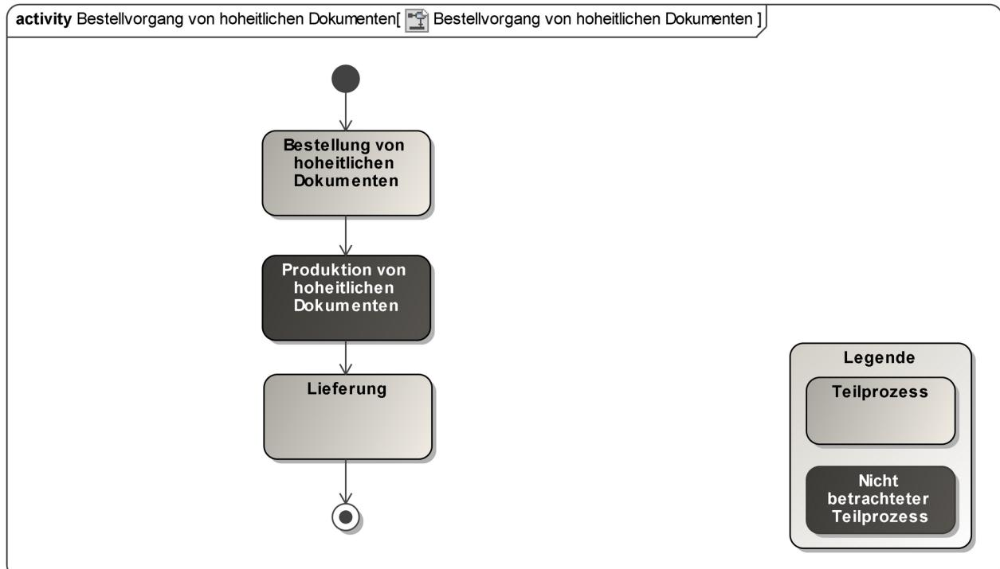
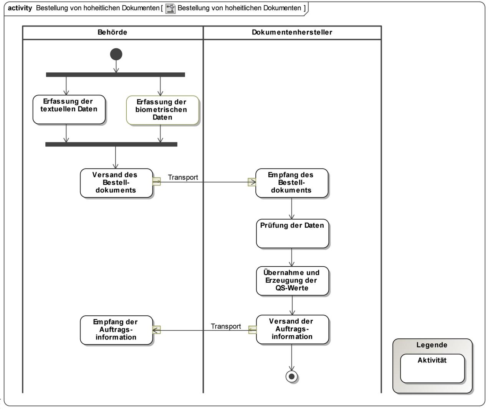
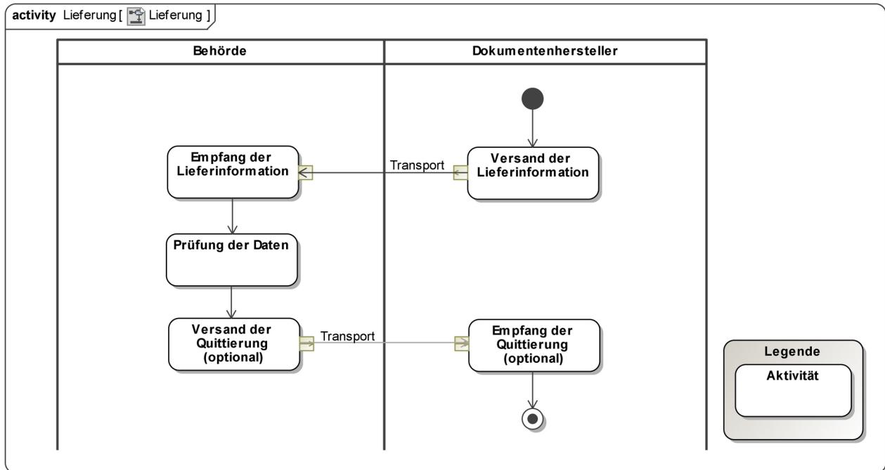
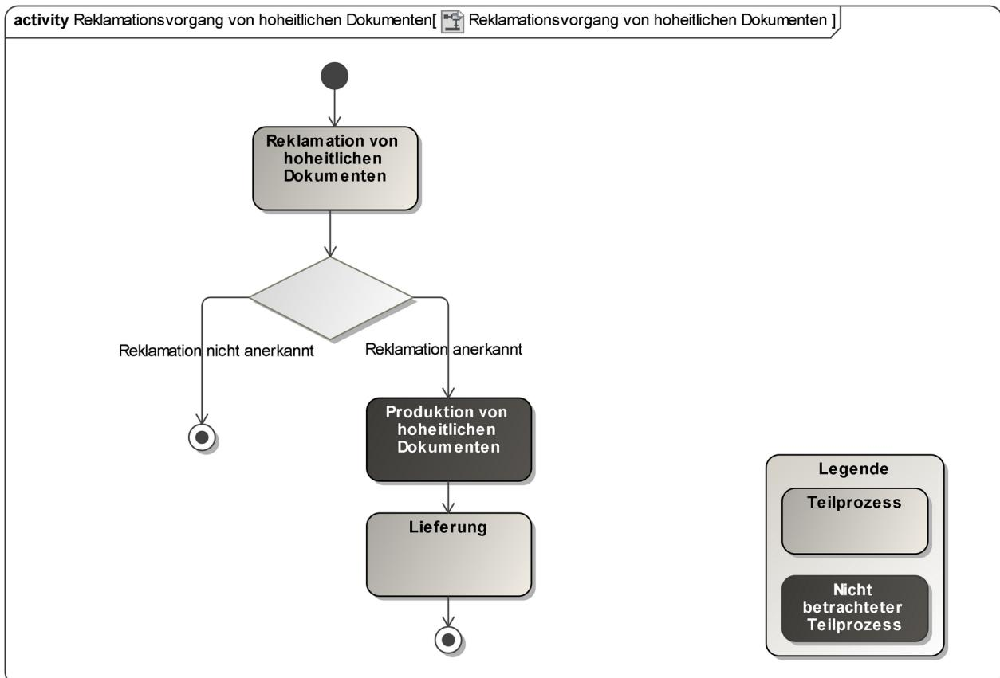
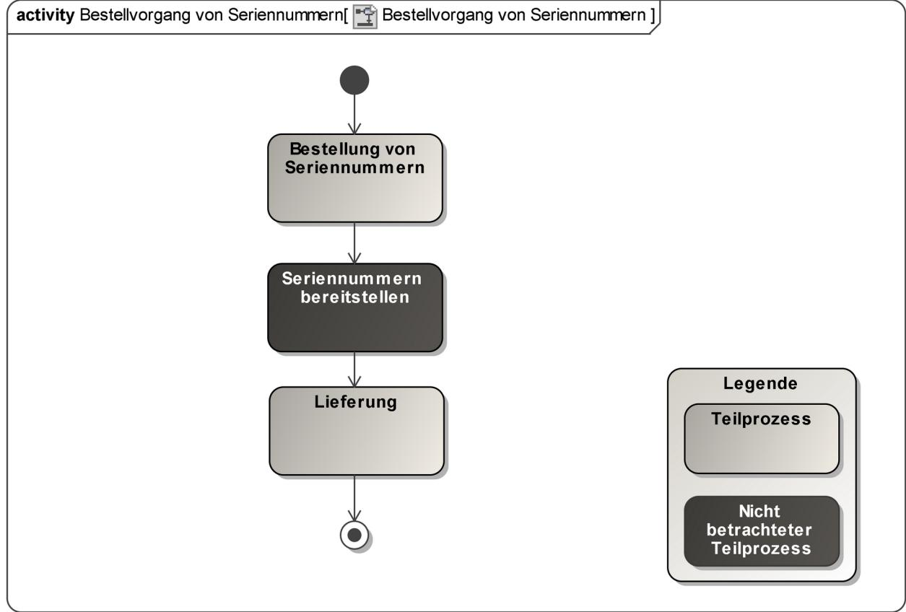
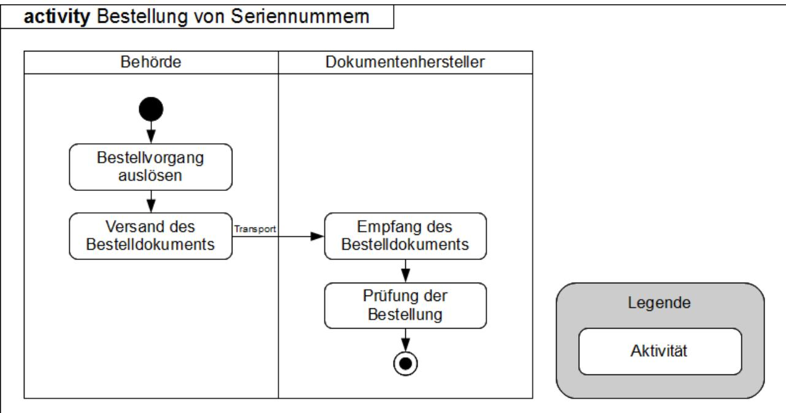
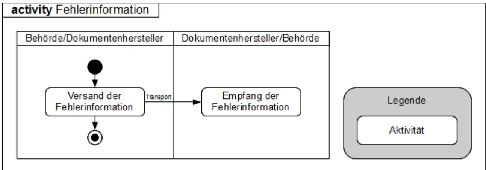

# Technische Richtlinie zur Produktionsdatenerfassung, qualitätsprüfung und -übermittlung für hoheitliche Dokumente (TR PDÜ hD)

BSI TR-03104 Version 3.3.0 26.10.2020

Bundesamt für Sicherheit in der Informationstechnik Postfach 20 03 63 53133 Bonn

E-Mail: xhd@bsi.bund.de Internet: https://www.bsi.bund.de © Bundesamt für Sicherheit in der Informationstechnik 2020

# **Versionshistorie**

| Version | Datum      | Kommentar                                                                                                                        |
|---------|------------|----------------------------------------------------------------------------------------------------------------------------------|
| 3.0     | 30.06.2009 | Initiale Veröffentlichung                                                                                                        |
| 3.1     | 25.09.2009 | Anpassung der gesetzlichen Grundlagen und der Vorgaben zur Testdatenübermittlung                                              |
| 3.1.1   | 20.11.2009 | Anpassung der Versionsnummer aufgrund von Anpassungen in der TR XhD                                                           |
| 3.2     | 01.06.2010 | Erstellung des Abschnittes "Fehlerbehandlung"                                                                                    |
| 3.2.2   | 22.07.2011 | Entfernung der Antwortnachricht "Auftragsinformation" bei Bestellung von Seriennummern und weitere editorische Anpassungen |
| 3.3.0   | 09.10.2020 | Ergänzung der eID-Karte für Unionsbürger und Layoutanpassung                                                                     |

| 1   | Einordnung 7                                      |    |
|-----|---------------------------------------------------|----|
| 2   | Übersicht 8                                       |    |
| 2.1 | Aufbau des Dokuments                              | 8  |
| 2.2 | Aufbau der Prozessbeschreibungen                  | 8  |
| 2.3 | Rollen                                            | 9  |
| 3   | Sicherheitsaspekte 10                             |    |
| 4   | Bestellvorgang von hoheitlichen Dokumenten11      |    |
| 4.1 | Bestellung von hoheitlichen Dokumenten12          |    |
| 4.2 | Lieferung                                         | 16 |
| 5   | Reklamationsvorgang von hoheitlichen Dokumenten20 |    |
| 5.1 | Reklamation von hoheitlichen Dokumenten21         |    |
| 6   | Bestellvorgang von Seriennummern 28               |    |
| 6.1 | Bestellung von Seriennummern                      | 29 |
| 6.2 | Lieferung                                         | 31 |
| 7   | Fehlerbehandlung 35                               |    |
| 7.1 | Fachliche Fehler                                  | 35 |
| 7.2 | Fehlerinformationen im fachlichen Kontext35       |    |
| 7.3 | Fehlerinformationen auf Transportebene36          |    |
| 8   | Testdatenübermittlung 37                          |    |
| 9   | Konformität und Interoperabilität 38              |    |
| 10  | Referenzen 39                                     |    |
| 11  | Abkürzungsverzeichnis 40                          |    |

| Abbildung 1: Bestellvorgang von hoheitlichen Dokumenten11      |  |
|----------------------------------------------------------------|--|
| Abbildung 2: Bestellung von hoheitlichen Dokumenten12          |  |
| Abbildung 3: Lieferung 17                                      |  |
| Abbildung 4: Reklamationsvorgang von hoheitlichen Dokumenten20 |  |
| Abbildung 5: Reklamation von hoheitlichen Dokumenten22         |  |
| Abbildung 6: Bestellvorgang von Seriennummern28                |  |
| Abbildung 7: Bestellung von Seriennummern 29                   |  |
| Abbildung 8: Lieferung 32                                      |  |
| Abbildung 9: Fehlerinformation 35                              |  |
|                                                                |  |

## **Tabellenverzeichnis**

| Tabelle 1: Übersicht über die hoheitlichen Dokumente7                      |  |
|----------------------------------------------------------------------------|--|
| Tabelle 2: Teilprozess Bestellung von hoheitlichen Dokumenten12            |  |
| Tabelle 3: Aktivität Erfassung der textuellen Daten13                      |  |
| Tabelle 4: Aktivität Erfassung der biometrischen Daten13                   |  |
| Tabelle 5: Aktivität Versand des Bestelldokuments14                        |  |
| Tabelle 6: Aktivität Bestellung des Bestelldokuments14                     |  |
| Tabelle 7: Aktivität Prüfung der Daten 14                                  |  |
| Tabelle 8: Aktivität Übernahme und Erzeugung der QS-Werte15                |  |
| Tabelle 9: Aktivität Versand der Auftragsinformation15                     |  |
| Tabelle 10: Aktivität Empfang der Auftragsinformation16                    |  |
| Tabelle 11: Teilprozess Lieferung 16                                       |  |
| Tabelle 12: Aktivität Versand der Lieferinformation17                      |  |
| Tabelle 13: Aktivität Empfang der Lieferinformation18                      |  |
| Tabelle 14: Aktivität Prüfung der Daten 18                                 |  |
| Tabelle 15: Aktivität Versand der Quittierung 19                           |  |
| Tabelle 16: Aktivität Empfang der Quittierung 19                           |  |
| Tabelle 17: Teilprozess Reklamation von hoheitlichen Dokumenten21          |  |
| Tabelle 18: Aktivität Erfassung der textuellen Daten (Reklamation)23       |  |
| Tabelle 19: Aktivität Erfassung der biometrischen Daten (Reklamation)23    |  |
| Tabelle 20: Aktivität Versand des Reklamationsdokuments (Reklamation)24    |  |
| Tabelle 21: Aktivität Empfang des Reklamationsdokuments (Reklamation)24    |  |
| Tabelle 22: Aktivität Prüfung der Daten (Reklamation)25                    |  |
| Tabelle 23: Aktivität Übernahme und Erzeugung der QS-Werte (Reklamation)25 |  |
| Tabelle 24: Aktivität Versand der Auftragsinformation (Reklamation)25      |  |
| Tabelle 25: Aktivität Empfang der Auftragsinformation (Reklamation)26      |  |
| Tabelle 26: Aktivität Prüfung und Klärung der Reklamation (Reklamation)26  |  |
| Tabelle 27: Aktivität Versand der Reklamationsinformation (Reklamation)27  |  |
| Tabelle 28: Aktivität Empfang der Reklamationsinformation (Reklamation)27  |  |
| Tabelle 29: Teilprozess Bestellung von Seriennummern29                     |  |
| Tabelle 30: Aktivität Bestellvorgang auslösen (Seriennummern)30            |  |
| Tabelle 31: Aktivität Versand des Bestelldokuments (Seriennummern)30       |  |
| Tabelle 32: Aktivität Empfang des Bestelldokuments (Seriennummern)30       |  |
| Tabelle 33: Aktivität Prüfung der Bestellung (Seriennummern)31             |  |
| Tabelle 34: Teilprozess Lieferung (Seriennummern)31                        |  |

| Tabelle 35: Aktivität Versand der Lieferinformation (Seriennummern)32 |  |
|-----------------------------------------------------------------------|--|
| Tabelle 36: Aktivität Empfang der Lieferinformation (Seriennummern)33 |  |
| Tabelle 37: Aktivität Prüfung der Daten (Seriennummern)33             |  |
| Tabelle 38: Aktivität Versand der Quittierung (Seriennummern)33       |  |
| Tabelle 39: Aktivität Empfang der Quittierung (Seriennummern)34       |  |

# **1 Einordnung**

Die Technische Richtlinie zur Produktionsdatenerfassung, -qualitätsprüfung und -übermittlung für hoheitliche Dokumente (TR PDÜ hD) dokumentiert die technischen und fachlichen Vorgaben, die im Rahmen des gesamten elektronischen Beantragungsprozesses von hoheitlichen Dokumenten umzusetzen sind. Dieses Dokument dient somit allen an den Beantragungsprozessen beteiligten Parteien, wie z.B. Behörden, Organisationen und Fachverfahrensentwicklern als Richtlinie.

| Hoheitliches Dokument                 | Gesetzliche Grundlage |
|---------------------------------------|-----------------------|
| Elektronischer Personalausweis (ePA)  | - [PAuswG]         |
|                                       | - [PAuswV]         |
| Elektronischer Aufenthaltstitel (eAT) | - [AufenthG]       |
|                                       | - [AufenthV]       |
| Elektronischer Reisepass (ePass)      | - [PassG]          |
|                                       | - [PassV]          |
| Elektronischer Reiseausweis (eRA)     | - [AufenthG]       |
|                                       | - [AufenthV]       |
| eID-Karte für Unionsbürger            | - [eIDKG]          |
|                                       | - [PAuswV]         |

Diese Richtlinie ist in der vorliegenden Version gültig für folgende hoheitliche Dokumente:

*Tabelle 1: Übersicht über die hoheitlichen Dokumente*

Die Richtlinie wurde so gestaltet, dass Vorgaben und Anforderungen für zukünftige hoheitliche Dokumente effizient integriert werden können. In diesem Dokument erfolgt eine allgemeine Beschreibung der fachlichen und prozessualen Anforderungen, die für alle hoheitlichen Dokumente gleichermaßen gelten. Spezielle Anforderungen einzelner Dokumente und technische Vorgaben bezüglich Erfassung, Kodierung und Transport werden in den Technischen Richtlinien (TR) "Biometrics for Public Sector Applications" [TR Biometrie], "XML-Datenaustauschformat für hoheitliche Dokumente" [TR XhD] und "Sichere Szenarien für Kommunikationsprozesse im Bereich hoheitlicher Dokumente" [TR SiSKo hD] spezifiziert. In [TR Biometrie] werden die Anforderungen an die Erfassung und Qualitätssicherung der biometrischen Daten auf allen Stufen des Antragsprozesses bis zur Produktion des Dokuments beschrieben. In [TR XhD] wird ein XML-Datenaustauschformat basierend auf dem XÖV-Standard [XÖV] definiert. Dieses Datenaustauschformat dient der Übertragung von Bestelldaten hoheitlicher Dokumente zwischen Behörden und Dokumentenherstellern. Durch die Beschreibung der Datenstrukturen in XML ist die Datenübertragung unabhängig vom Betriebssystem und der Anwendungssoftware der Kommunikationsbeteiligten.

Für jede Art von hoheitlichen Dokumenten existieren gesetzliche Regelungen, die die grundlegenden Vorgaben für die Umsetzung des jeweiligen hoheitlichen Dokuments bilden. Auf europäischer Ebene sind das in der Regel EG-Verordnungen, auf nationaler Ebene Gesetze und dazugehörige Verordnungen.

# **2 Übersicht**

# **2.1 Aufbau des Dokuments**

Kapitel [2](#page-7-0) gibt eine kurze Übersicht über den Aufbau der TR PDÜ hD (Kapitel [2.1\)](#page-7-2). In Kapitel [2.2](#page-7-1) ist der Aufbau der Prozesse beschrieben. In Kapitel [2.3](#page-8-0) erfolgt eine kurze Darstellung aller für die Beantragung hoheitlicher Dokumente relevanter Rollen.

In Kapitel [3](#page-9-0) werden die allgemeinen Sicherheitsaspekte beschrieben, die im Rahmen der TR PDÜ hD zu berücksichtigen sind.

Die Kapitel 4 bis 6 beschreiben die drei Hauptprozesse "Bestellvorgang von hoheitlichen Dokumenten" (Kapitel [4](#page-10-0)), "Reklamationsvorgang von hoheitlichen Dokumenten" (Kapitel [5](#page-19-0)) und "Bestellvorgang von Seriennummern" (Kapitel [6](#page-27-0)). In jedem der drei Hauptprozesse wird ein Überblick über die benötigten Teilprozesse gegeben und diese jeweils detailliert beschrieben.

Das Verfahren zur Testdatenübermittlung ist in Kapitel [8](#page-36-0) beschrieben.

Kapitel [9](#page-37-0) erläutert Anforderungen und Prüfverfahren zur Sicherstellung der Konformität und Interoperabilität der eingesetzten Komponenten.

# **2.2 Aufbau der Prozessbeschreibungen**

Für jeden Hauptprozess wird ein Überblick über die beteiligten Teilprozesse gegeben. Der Übergang von einem Teilprozess in den nächsten Teilprozess ist nur möglich, wenn der erste erfolgreich durchlaufen wurde.

Für jeden Teilprozess werden die folgenden Informationen beschrieben:

**- Vorbedingungen**

Legt Vorbedingungen fest, damit der Teilprozess durchgeführt werden kann. Falls die Vorbedingungen nicht erfüllt sind, wird der betreffende Teilprozess übergangen, d.h. nicht durchgeführt.

- **- Output** Beschreibt die Ergebnisse des Teilprozesses.
- **- Vorgängerprozess** Legt fest, welcher Teilprozess vor diesem Teilprozess durchgeführt wurde.
- **- Nachfolgeprozess**

Legt fest, welcher Teilprozess nach diesem Teilprozess durchgeführt wird.

**- beteiligte Rollen**

Legt fest, durch wen der Teilprozess durchgeführt wird.

Jeder Teilprozess besteht aus mehreren Aktivitäten. Für jede Aktivität werden die folgenden Informationen beschrieben:

**- Vorbedingungen**

Legt Vorbedingungen fest, damit die Aktivität durchgeführt werden kann. Falls die Vorbedingungen nicht erfüllt sind, wird die betreffende Aktivität übergangen, d.h. nicht durchgeführt. Der Teilprozess wird in diesem Fall mit der darauf folgenden Aktivität fortgesetzt (sofern dort die Vorbedingungen erfüllt sind).

#### **- Nachfolgeaktivität**

Legt fest, welche Aktivität nach der aktuellen Aktivität durchgeführt wird. Dabei kann zwischen zwei Möglichkeiten unterschieden werden: Erfolgsfall und Fehlerfall. Im Fehlerfall kann statt einer Nachfolgeaktivität auch ein Abbruch des Teilprozesses festgelegt werden.

#### **- beteiligte Rolle**

Legt fest, durch wen die jeweilige Aktivität durchgeführt wird.

Die Aktivitäten der Teilprozesse werden detailliert beschrieben. Dabei sind folgende Anmerkungen zu beachten:

**-** Sofern bei einer Aktivität die Rolle "Vermittlungsstelle" angegeben ist, kann statt einer direkten Kommunikation zwischen Behörde und Dokumentenhersteller eine indirekte Kommunikation über eine Vermittlungsstelle erfolgen.

### **2.3 Rollen**

Eine "Rolle" im Sinne dieses Dokuments besitzen alle Organisationen, die direkt an den Geschäftsprozessen zur Erfassung und Übermittlung von Antragsdaten für hoheitliche Dokumente beteiligt sind.

#### **2.3.1 Behörden**

Unter dem Begriff "Behörden" werden in diesem Dokument öffentliche Stellen subsumiert, die direkt am Gesamtprozess für die Produktionsdatenerfassung, -qualitätsprüfung und -übermittlung für die verschiedenen hoheitlichen Dokumente beteiligt sind und als Erfassungsstellen für die Antragsdaten fungieren. Dazu gehören z.B Meldestellen, Auslandsvertretungen und Ausländerbehörden.

#### **2.3.2 Dokumentenhersteller**

Die Dokumentenhersteller nehmen die Antragsdaten von den Behörden auf elektronischem Wege entgegen. Auf Basis dieser Daten produzieren sie die hoheitlichen Dokumente und versenden diese anschließend an die jeweiligen Behörden. Des Weiteren stellen sie Seriennummern zur Verfügung, die die Behörden verwenden können.

#### **2.3.3 Vermittlungsstellen**

Behörden können die Antragsdaten unter Nutzung ihrer IT-Systeme direkt an die Dokumentenhersteller versenden. Sie haben jedoch auch die Möglichkeit, dazu sogenannte Vermittlungsstellen zu beauftragen. Diese Vermittlungsstellen haben die Aufgabe, die Antragsdaten von den Behörden entgegen zu nehmen und an den Dokumentenhersteller unter Nutzung geeigneter Formate und Sicherheitsmaßnahmen weiterzuleiten und Rückantworten entsprechend zu verarbeiten. Details zu den Sicherheitsmaßnahmen sind Abschnitt [3](#page-9-0) zu entnehmen.

# **3 Sicherheitsaspekte**

Bei der Übertragung von Antrags- und Bestelldaten für hoheitliche Dokumente werden vertrauliche und schutzbedürftige Daten zwischen den beteiligten Rollen ausgetauscht. Es muss durch technische Verfahren sichergestellt werden, dass die nachfolgenden Sicherheitsanforderungen bei der Verarbeitung und Übertragung der Antrags- und Bestelldaten erfüllt werden:

- **-** Vertraulichkeit,
- **-** Verfügbarkeit und
- **-** Integrität.

Die oben dargestellten Sicherheitsanforderungen gelten für alle Datenübertragungen zwischen den beteiligten Rollen, z.B. auch für Lieferinformationen, da auch hier ggf. schutzbedürftige Daten ausgetauscht werden.

Detaillierte Beschreibungen dieser Sicherheitsanforderungen, Verfahren und Maßnahmen zu deren Realisierung sind den Dokumenten des BSI zum IT-Grundschutz [BSI GS] zu entnehmen.

Technische Details, Vorgaben und Maßnahmen zur Erreichung der oben dargestellten Sicherheitsanforderungen sind in [TR XhD] ausführlich dargestellt.

Die zulässigen Kommunikationsszenarien zur Übertragung der Daten zwischen Behörden und Dokumentenproduzenten werden durch die BSI TR-03132 [TR SiSKo hD] geregelt.

# **4 Bestellvorgang von hoheitlichen Dokumenten**

Der Hauptprozess Bestellvorgang von hoheitlichen Dokumenten ist in [Abbildung 1](#page-10-1) dargestellt. Er besteht aus den drei Teilprozessen:

- **-** Bestellung von hoheitlichen Dokumenten (Kapitel [4.1](#page-11-0)),
- **-** Produktion von hoheitlichen Dokumenten (wird im Kontext der TR PDÜ hD nicht weiter betrachtet) und
- **-** Lieferung (Kapitel [4.2](#page-15-0)).

Aus einem Teilprozess "Bestellung von hoheitlichen Dokumenten" resultieren die Teilprozesse "Produktion von hoheitlichen Dokumenten" und "Lieferung". In der folgenden Abbildung ist dieser Sachverhalt vereinfacht dargestellt.

*Abbildung 1: Bestellvorgang von hoheitlichen Dokumenten*

## **4.1 Bestellung von hoheitlichen Dokumenten**

| Prozessattribut   | Inhalt                                                        |
|-------------------|---------------------------------------------------------------|
| Vorbedingungen    | keine                                                         |
| Output            | Geprüfte Daten für die Produktion von hoheitlichen Dokumenten |
| Vorgängerprozess  | keiner                                                        |
| Nachfolgeprozess  | Produktion von hoheitlichen Dokumenten                        |
| beteiligte Rollen | Behörde, Dokumentenhersteller und evtl. Vermittlungsstelle    |

*Tabelle 2: Teilprozess Bestellung von hoheitlichen Dokumenten*

Innerhalb dieses Teilprozesses dürfen in einer Bestellung nur hoheitliche Dokumente desselben Dokumententyps bestellt werden. Bestellungen, die Dokumente verschiedener Typen enthalten, sind nicht zulässig.

In [Abbildung 2](#page-11-1) ist der Teilprozess "Bestellung von hoheitlichen Dokumenten" vereinfacht dargestellt. Im Folgenden wird der Ablauf mit den dazugehörigen Aktivitäten detailliert beschrieben.

Die Teilprozesse "Erfassung der textuellen Daten" und "Erfassung der biometrischen Daten" können in beliebiger Reihenfolge durchgeführt werden. Es muss jedoch sichergestellt sein, dass beide Teilprozesse erfolgreich durchgeführt worden sind, bevor der Teilprozess "Versand des Bestelldokumentes" begonnen wird.

| Prozessattribut    | Inhalt                                    |
|--------------------|-------------------------------------------|
| Vorbedingungen     | keine                                     |
| Nachfolgeaktivität | Erfolgsfall: Versand des Bestelldokuments |
|                    | Fehlerfall: Abbruch des Teilprozesses     |
| beteiligte Rolle   | Behörde                                   |

#### **4.1.1 Erfassung der textuellen Daten**

*Tabelle 3: Aktivität Erfassung der textuellen Daten*

Die Erfassung der textuellen Daten setzt sich aus Aufnahme und Qualitätssicherung der Daten zusammen und wird hier im Detail nicht näher beschrieben. Diese Aktivität wird solange ggf. auch iterativ durchgeführt, bis alle notwendigen Daten erfolgreich erfasst wurden. Art und Umfang der zu erfassenden Daten sind für die verschiedenen hoheitlichen Dokumente in der [TR XhD]spezifiziert. Im Fehlerfall kann die Erfassung der textuellen Daten auch dazu führen, dass der gesamte Teilprozess abgebrochen wird. Dies ist z.B. dann der Fall, wenn eine erfolgreiche Erfassung der benötigten Daten ausgeschlossen werden kann.

#### **4.1.2 Erfassung der biometrischen Daten**

| Prozessattribut    | Inhalt                                    |
|--------------------|-------------------------------------------|
| Vorbedingungen     | Keine                                     |
| Nachfolgeaktivität | Erfolgsfall: Versand des Bestelldokuments |
|                    | Fehlerfall: Abbruch des Teilprozesses     |
| beteiligte Rolle   | Behörde                                   |

*Tabelle 4: Aktivität Erfassung der biometrischen Daten*

Die Erfassung der biometrischen Daten ist eine Aktivität, die in [TR Biometrie] näher beschrieben wird. Im Fehlerfall kann die Erfassung der biometrischen Daten auch dazu führen, dass der gesamte Teilprozess abgebrochen wird. Dies ist z.B. dann der Fall, wenn eine erfolgreiche Erfassung der benötigten Daten ausgeschlossen werden kann.

| Prozessattribut    | Inhalt                                                                                                                                                                             |
|--------------------|------------------------------------------------------------------------------------------------------------------------------------------------------------------------------------|
| Vorbedingungen     | Die Erfassung der textuellen und biometrischen Daten war erfolgreich und ein XhD konformes XML-Dokument zur Bestellung von mindestens einem hoheitlichen Dokument liegt vor. |
| Nachfolgeaktivität | Erfolgsfall: Empfang des Bestelldokuments Fehlerfall: Abbruch des Teilprozesses; manuelle Fehleranalyse                                                                         |
| beteiligte Rolle   | Behörde und evtl. Vermittlungsstelle                                                                                                                                               |

### **4.1.3 Versand des Bestelldokuments**

*Tabelle 5: Aktivität Versand des Bestelldokuments*

Der Versand des Bestelldokuments, welches Bestellungen hoheitlicher Dokumente enthält, wird durchgeführt. Dazu wird das Bestelldokument signiert und verschlüsselt übertragen. Im Falle eines Fehlers ist eine manuelle Fehleranalyse unter Kooperation der Beteiligten (Behörde, ggf. Vermittlungsstelle, Dokumentenhersteller) durchzuführen.

### **4.1.4 Empfang des Bestelldokuments**

| Prozessattribut    | Inhalt                                                                     |
|--------------------|----------------------------------------------------------------------------|
| Vorbedingungen     | Der Versand des Bestelldokuments durch die Behörde bzw. Vermittlungsstelle |
| Nachfolgeaktivität | Erfolgsfall: Prüfung der Daten                                             |
|                    | Fehlerfall: Abbruch des Teilprozess                                        |
| beteiligte Rolle   | Dokumentenhersteller                                                       |

*Tabelle 6: Aktivität Bestellung des Bestelldokuments*

Das Dokument wird empfangen, entschlüsselt und die Signatur überprüft. Treten beim Empfang, Entschlüsselung oder Prüfung der Signatur des Dokuments Fehler auf, so wird vor Beendigung des Teilprozesses eine Fehlermeldung an den Absender übermittelt.

### **4.1.5 Prüfung der Daten**

| Prozessattribut    | Inhalt                                                               |
|--------------------|----------------------------------------------------------------------|
| Vorbedingungen     | Geprüfte Signatur und entschlüsseltes Bestelldokument sind vorhanden |
| Nachfolgeaktivität | Erfolgsfall: Übernahme und Erzeugung der QS-Werte                    |
|                    | Fehlerfall: Versand der Auftragsinformation                          |
| beteiligte Rolle   | Dokumentenhersteller                                                 |

*Tabelle 7: Aktivität Prüfung der Daten*

Die Daten der einzelnen hoheitlichen Dokumente werden geprüft. Dabei werden eine XML-Validierung und eine herstellerspezifische Prüfung durchgeführt. Zu beachten ist dabei, dass die Prüfung pro bestelltem hoheitlichem Dokument durchgeführt wird. Es ist daher möglich, dass für einzelne Dokumente der Erfolgsfall eintritt, während für andere Dokumente gemäß dem Fehlerfall verfahren wird. Beim Eintreten des Fehlerfalles entfällt die Aktivität "Übernahme und Erzeugung der QS-Werte" für den jeweils betroffenen Antragsdatensatz (siehe Abschnitt [4.1.6](#page-14-0)) und der Teilprozess wird direkt mit dem Versand der Auftragsinformation fortgesetzt. Unabhängig davon werden alle erkannten Fehler für die Aufnahme in die Auftragsinformation vermerkt.

### **4.1.6 Übernahme und Erzeugung der QS-Werte**

| Prozessattribut    | Inhalt                                                                                     |
|--------------------|--------------------------------------------------------------------------------------------|
| Vorbedingungen     | Mindestens ein korrekter Datensatz für die Produktion von hoheitlichen Dokumenten       |
| Nachfolgeaktivität | Erfolgsfall:Versand der Auftragsinformation Fehlerfall: Versand der Auftragsinformation |
| beteiligte Rolle   | Dokumentenhersteller                                                                       |

*Tabelle 8: Aktivität Übernahme und Erzeugung der QS-Werte*

In diesem Teilprozess werden QS-Werte aus den empfangenen biometrischen Daten erzeugt.

Die durch den Dokumentenhersteller durchzuführenden Auswertungen werden durch [TR Biometrie] festgelegt. Treten dabei Fehler auf, werden diese für die Aufnahme in die Auftragsinformation vermerkt.

### **4.1.7 Versand der Auftragsinformation**

| Prozessattribut    | Inhalt                                       |
|--------------------|----------------------------------------------|
| Vorbedingungen     | Durchführung der Prüfung der Daten           |
| Nachfolgeaktivität | Erfolgsfall: Empfang der Auftragsinformation |
|                    | Fehlerfall: Abbruch des Teilprozesses        |
| beteiligte Rolle   | Dokumentenhersteller                         |

*Tabelle 9: Aktivität Versand der Auftragsinformation*

Die Auftragsinformation wird erstellt und an die Behörde / Vermittlungsstelle gesendet. Die Auftragsinformation enthält u.a. Informationen über die Korrektheit der Daten. Dazu werden die in den Aktivitäten "Prüfung der Daten" und "Übernahme und Erzeugung der QS-Werte" vermerkten Fehler genutzt. Der Aufbau der Auftragsinformation ist in [TR XhD] beschrieben. Die Auftragsinformation wird signiert und verschlüsselt übertragen.

Für den Fall, dass eine Auftragsinformation nicht an die entsprechende Behörde versendet werden kann, muss die Behörde darüber informiert werden.

Nach Versand und Empfang der Auftragsinformation endet der Teilprozess und wird mit dem Teilprozess "Produktion von hoheitlichen Dokumenten" fortgesetzt, sofern mindestens ein Datensatz mit korrekten Daten existiert.

| Prozessattribut    | Inhalt                               |
|--------------------|--------------------------------------|
| Vorbedingungen     | Versendete Auftragsinformation       |
| Nachfolgeaktivität | Erfolgsfall: keine                   |
|                    | Fehlerfall: manuelle Fehleranalyse   |
| beteiligte Rolle   | Behörde und evtl. Vermittlungsstelle |

#### **4.1.8 Empfang der Auftragsinformation**

*Tabelle 10: Aktivität Empfang der Auftragsinformation*

Die Auftragsinformation wird empfangen, entschlüsselt und die Signatur überprüft. Treten bei Empfang, Entschlüsselung oder Prüfung der Signatur der Nachricht Fehler auf, so muss die Fehlerursache durch eine manuelle Fehleranalyse (ggf. in Zusammenarbeit mit dem Dokumentenhersteller) ermittelt werden.

Für den Fall, dass die Behörde bzw. Vermittlungsstelle keine Auftragsinformation empfängt, ist ebenfalls eine manuelle Fehleranalyse (z.B. in Zusammenarbeit mit dem Dokumentenhersteller) notwendig. Vorgaben zu Zeiten, nach denen eine Fehleranalyse begonnen werden muss (Timeouts), werden in der für das jeweilige hoheitliche Dokument gültigen Verordnung geregelt.

# **4.2 Lieferung**

| Prozessattribut   | Inhalt                                                     |
|-------------------|------------------------------------------------------------|
| Vorbedingungen    | Seriennummern der produzierten hoheitlichen Dokumente      |
| Output            | keiner                                                     |
| Vorgängerprozess  | Produktion von hoheitlichen Dokumenten                     |
| Nachfolgeprozess  | keiner                                                     |
| beteiligte Rollen | Behörde, Dokumentenhersteller und evtl. Vermittlungsstelle |

*Tabelle 11: Teilprozess Lieferung*

Der Teilprozess "Lieferung" beschreibt nicht die physikalische Vorbereitung und Lieferung der hoheitlichen Dokumente, sondern elektronische Informationen, die neben der eigentlichen Lieferung zur Behörde übermittelt werden.

In [Abbildung 3](#page-16-0) ist der Teilprozess "Lieferung" dargestellt. Im Folgenden wird der Ablauf mit den dazugehörigen Aktivitäten detailliert beschrieben.

*Abbildung 3: Lieferung*

#### **4.2.1 Versand der Lieferinformation**

| Prozessattribut    | Inhalt                                                |
|--------------------|-------------------------------------------------------|
| Vorbedingungen     | Seriennummern der produzierten hoheitlichen Dokumente |
| Nachfolgeaktivität | Erfolgsfall: Empfang der Lieferinformation            |
|                    | Fehlerfall: Abbruch des Teilprozesses                 |
| beteiligte Rolle   | Dokumentenhersteller                                  |

*Tabelle 12: Aktivität Versand der Lieferinformation*

Der Dokumentenhersteller erstellt eine Lieferinformation, die die Seriennummern der produzierten hoheitlichen Dokumente und evtl. zusätzliche Daten wie zum Beispiel ein Sperrkennwort enthält. Zusätzlich wird in der Lieferinformation vermerkt, ob die empfangende Behörde nach Erhalt der Lieferinformation eine Quittierung an den Dokumentenhersteller versenden muss. Details zum Aufbau der Lieferinformation sind in [TR XhD] beschrieben. Die Lieferinformation wird signiert und verschlüsselt übertragen.

| Prozessattribut    | Inhalt                                                            |
|--------------------|-------------------------------------------------------------------|
| Vorbedingungen     | Der Versand der Lieferinformation durch den Dokumentenhersteller  |
| Nachfolgeaktivität | Erfolgsfall: Prüfung der Daten                                    |
|                    | Fehlerfall: Manuelle Fehleranalyse; Versand einer Fehlernachricht |
| beteiligte Rolle   | Behörde und evtl. Vermittlungsstelle                              |

### **4.2.2 Empfang der Lieferinformation**

*Tabelle 13: Aktivität Empfang der Lieferinformation*

Für den Fall, dass die Behörde bzw. Vermittlungsstelle keine Lieferinformation empfängt, ist eine manuelle Fehleranalyse (z.B. in Zusammenarbeit mit dem Dokumentenhersteller) notwendig.Vorgaben zu Zeiten, nach denen eine Fehleranalyse begonnen werden muss (Timeouts), werden in der für das jeweilige hoheitliche Dokument gültigen Verordnung geregelt.

Es gelten für diese Aktivität die gleichen Aussagen, wie sie in Kapitel 4.1.4 für den Empfang des Bestelldokuments beschrieben sind.

### **4.2.3 Prüfung der Daten**

| Prozessattribut    | Inhalt                                                                      |
|--------------------|-----------------------------------------------------------------------------|
| Vorbedingungen     | Geprüfte Signatur und entschlüsselte Lieferinformationen sind vor handen |
| Nachfolgeaktivität | Erfolgsfall: Versand der Quittierung Fehlerfall: Versand der Quittierung |
| beteiligte Rolle   | Behörde                                                                     |

*Tabelle 14: Aktivität Prüfung der Daten*

Bei der Prüfung der Daten werden die Seriennummern und ggf. weitere Daten, wie z.B. das Sperrkennwort kontrolliert. War die Prüfung nicht in allen Fällen erfolgreich, wird dies für die Quittierung vermerkt.

| Prozessattribut    | Inhalt                                                                         |
|--------------------|--------------------------------------------------------------------------------|
| Vorbedingungen     | Durchführung der Prüfung der Daten                                             |
| Nachfolgeaktivität | Erfolgsfall: Empfang der Quittierung                                           |
|                    | Fehlerfall: Abbruch des Teilprozesses, Information an den Dokumentenhersteller |
| beteiligte Rolle   | Behörde und evtl. Vermittlungsstelle                                           |

#### **4.2.4 Versand der Quittierung**

*Tabelle 15: Aktivität Versand der Quittierung*

Falls in der Lieferinformation eine Quittierung angefordert wurde, erstellt die Behörde eine Quittierung, in der u.a. vermerkt ist, ob die Prüfung der Daten erfolgreich war. Dazu werden die in der Aktivität "Prüfung der Daten" vermerkten Fehler genutzt. Details zum Aufbau der Quittierung sind in [TR XhD] beschrieben. Die Quittierung wird signiert und verschlüsselt übertragen.

#### **4.2.5 Empfang der Quittierung**

| Prozessattribut    | Inhalt                                        |
|--------------------|-----------------------------------------------|
| Vorbedingungen     | Der Versand der Quittierung durch die Behörde |
| Nachfolgeaktivität | Erfolgsfall: keine                            |
|                    | Fehlerfall: manuelle Fehleranalyse            |
| beteiligte Rolle   | Dokumentenhersteller                          |

*Tabelle 16: Aktivität Empfang der Quittierung*

Es gelten für diese Aktivität die gleichen Aussagen, wie sie in Kapitel 4.1.4 für den Empfang des Bestelldokuments beschrieben sind.

Für den Fall, dass der Dokumentenhersteller keine Quittierung empfängt, ist eine manuelle Fehleranalyse (in Zusammenarbeit mit der Behörde) notwendig. Vorgaben zu Zeiten, nach denen eine Fehleranalyse begonnen werden muss (Timeouts), werden in der für das jeweilige hoheitliche Dokument gültigen Verordnung geregelt.

Der Teilprozess endet nach Empfang der Quittierung.

# **5 Reklamationsvorgang von hoheitlichen Dokumenten**

Der Hauptprozess Reklamationsvorgang von hoheitlichen Dokumenten ist in [Abbildung 4](#page-19-1) dargestellt. Er besteht aus den drei Teilprozessen:

- **-** Reklamation von hoheitlichen Dokumenten (Kapitel [5.1\)](#page-20-0),
- **-** Produktion von hoheitlichen Dokumenten (wird im Kontext der TR PDÜ hD nicht weiter betrachtet) und
- **-** Lieferung (Kapitel [4.2](#page-15-0)).

Der Teilprozess "Lieferung" des Hauptprozesses "Reklamationsvorgang von hoheitlichen Dokumenten" ist identisch mit dem Teilprozess "Lieferung" des Hauptprozesses "Bestellvorgang von hoheitlichen Dokumenten". Aus diesem Grund wird der Teilprozess "Lieferung" in diesem Kapitel nicht weiter beschrieben. Es wird nur der Teilprozess "Produktion von hoheitlichen Dokumenten" gestartet, wenn die Reklamation anerkannt wurde.

*Abbildung 4: Reklamationsvorgang von hoheitlichen Dokumenten*

## **5.1 Reklamation von hoheitlichen Dokumenten**

| Prozessattribut   | Inhalt                                                                                                                          |
|-------------------|---------------------------------------------------------------------------------------------------------------------------------|
| Vorbedingungen    | Abgeschlossener Bestellvorgang eines hoheitlichen Dokuments, welches reklamiert werden soll                                  |
| Output            | Anerkennung der Reklamation und geprüfte Daten für die Produktion von hoheitlichen Dokumenten oder Ablehnung der Reklamation |
| Vorgängerprozess  | Bestellvorgang von hoheitlichen Dokumenten                                                                                      |
| Nachfolgeprozess  | Produktion von hoheitlichen Dokumenten oder keiner                                                                              |
| beteiligte Rollen | Behörde, Dokumentenhersteller und evtl. Vermittlungsstelle                                                                      |

*Tabelle 17: Teilprozess Reklamation von hoheitlichen Dokumenten*

Die Reklamation von hoheitlichen Dokumenten unterscheidet sich nicht grundsätzlich von einer Bestellung. In [Abbildung 5](#page-21-0) ist der Teilprozess "Reklamation von hoheitlichen Dokumenten" dargestellt. Im Folgenden wird der Ablauf mit den dazugehörigen Aktivitäten detailliert beschrieben.

*Abbildung 5: Reklamation von hoheitlichen Dokumenten*

| Prozessattribut    | Inhalt                                    |
|--------------------|-------------------------------------------|
| Vorbedingungen     | keine                                     |
| Nachfolgeaktivität | Erfolgsfall: Versand des Bestelldokuments |
|                    | Fehlerfall: Abbruch des Teilprozesses     |
| beteiligte Rolle   | Behörde                                   |

#### **5.1.1 Erfassung der textuellen Daten**

*Tabelle 18: Aktivität Erfassung der textuellen Daten (Reklamation)*

Im Rahmen der Aktivität "Erfassung der textuellen Daten" können die Daten von der letzten Bestellung übernommen werden, wenn diese korrekt waren. Alternativ können die Daten komplett oder teilweise neu erfasst werden. Den Daten wird zusätzlich eine neue Seriennummer hinzugefügt. Für den Fall der Anerkennung der Reklamation wird unter Verwendung dieser Seriennummer ein neues Dokument erzeugt. Sonst gelten für diese Aktivität die gleichen Aussagen, wie sie in Kapitel 4.1.1 für die Erfassung der textuellen Daten bei der Bestellung hoheitlicher Dokumente beschrieben sind.

#### **5.1.2 Erfassung der biometrischen Daten**

| Prozessattribut    | Inhalt                                    |
|--------------------|-------------------------------------------|
| Vorbedingungen     | Keine                                     |
| Nachfolgeaktivität | Erfolgsfall: Versand des Bestelldokuments |
|                    | Fehlerfall: Abbruch des Teilprozesses     |
| beteiligte Rolle   | Behörde                                   |

*Tabelle 19: Aktivität Erfassung der biometrischen Daten (Reklamation)*

Im Rahmen der Aktivität "Erfassung der biometrischen Daten" können die biometrischen Daten der Erstbestellung wiederverwendet werden, wenn diese nicht fehlerhaft und qualitativ ausreichend sind, oder neu erfasst werden. Darüber hinaus gelten für diese Aktivität die gleichen Aussagen, wie sie in Kapitel 4.1.2 für die Erfassung der biometrischen Daten bei der Bestellung hoheitlicher Dokumente beschrieben sind.

| Prozessattribut    | Inhalt                                                                                                                                                                             |
|--------------------|------------------------------------------------------------------------------------------------------------------------------------------------------------------------------------|
| Vorbedingungen     | Die Erfassung der textuellen und biometrischen Daten war erfolgreich und ein XhD konformes XML-Dokument zur Bestellung von mindestens einem hoheitlichen Dokument liegt vor. |
| Nachfolgeaktivität | Erfolgsfall: Empfang des Bestelldokuments Fehlerfall: Abbruch des Teilprozesses; manuelle Fehleranalyse                                                                         |
| beteiligte Rolle   | Behörde und evtl. Vermittlungsstelle                                                                                                                                               |

#### **5.1.3 Versand der Reklamationsbestellung**

*Tabelle 20: Aktivität Versand des Reklamationsdokuments (Reklamation)*

Der Versand des Reklamationsdokuments, welches Reklamationen einer oder mehrerer hoheitlicher Dokumente enthält, wird durchgeführt. Dazu wird das Reklamationsdokument signiert und verschlüsselt übertragen.

Im Falle eines Fehlers ist eine manuelle Fehleranalyse unter Kooperation der Beteiligten (Behörde, ggf. Vermittlungsstelle, Dokumentenhersteller) durchzuführen.

#### **5.1.4 Empfang des Reklamationsdokuments**

| Prozessattribut    | Inhalt                                                                     |
|--------------------|----------------------------------------------------------------------------|
| Vorbedingungen     | Der Versand des Bestelldokuments durch die Behörde bzw. Vermittlungsstelle |
| Nachfolgeaktivität | Erfolgsfall: Prüfung der Daten Fehlerfall: Abbruch des Teilprozesses    |
| beteiligte Rolle   | Dokumentenhersteller                                                       |

*Tabelle 21: Aktivität Empfang des Reklamationsdokuments (Reklamation)*

Das Dokument wird empfangen, entschlüsselt und die Signatur überprüft. Treten beim Empfang, Entschlüsselung oder Prüfung der Signatur des Dokuments Fehler auf, so wird vor Beendigung des Teilprozesses eine Fehlermeldung an den Absender übermittelt.

| Prozessattribut    | Inhalt                                                               |
|--------------------|----------------------------------------------------------------------|
| Vorbedingungen     | Geprüfte Signatur und entschlüsseltes Bestelldokument sind vorhanden |
| Nachfolgeaktivität | Erfolgsfall: Übernahme und Erzeugung der QS-Werte                    |
|                    | Fehlerfall: Versand der Auftragsinformation                          |
| beteiligte Rolle   | Dokumentenhersteller                                                 |

#### **5.1.5 Prüfung der Daten**

*Tabelle 22: Aktivität Prüfung der Daten (Reklamation)*

Es gelten für diese Aktivität die gleichen Aussagen, wie sie in Kapitel 4.1.5 für die Prüfung der Daten beschrieben sind.

#### **5.1.6 Übernahme und Erzeugung der QS-Werte**

| Prozessattribut    | Inhalt                                                                                      |
|--------------------|---------------------------------------------------------------------------------------------|
| Vorbedingungen     | Mindestens ein korrekter Datensatz für die Produktion von hoheitlichen Dokumenten        |
| Nachfolgeaktivität | Erfolgsfall: Versand der Auftragsinformation Fehlerfall: Versand der Auftragsinformation |
| beteiligte Rolle   | Dokumentenhersteller                                                                        |

*Tabelle 23: Aktivität Übernahme und Erzeugung der QS-Werte (Reklamation)*

Es gelten für diese Aktivität die gleichen Aussagen, wie sie in Kapitel 4.1.6 Übernahme und Erzeugung der QS-Werte beschrieben sind.

### **5.1.7 Versand der Auftragsinformation**

| Prozessattribut    | Inhalt                                       |
|--------------------|----------------------------------------------|
| Vorbedingungen     | Durchführung der Prüfung der Daten           |
| Nachfolgeaktivität | Erfolgsfall: Empfang der Auftragsinformation |
|                    | Fehlerfall: Abbruch des Teilprozesses        |
| beteiligte Rolle   | Dokumentenhersteller                         |

*Tabelle 24: Aktivität Versand der Auftragsinformation (Reklamation)*

Nach Versand und Empfang der Auftragsinformation wird der Teilprozess mit der Prüfung und Klärung der Reklamation fortgesetzt, sofern mindestens ein Datensatz mit korrekten Daten existiert.

Für den Fall, dass eine Auftragsinformation nicht an die entsprechende Behörde versendet werden kann, muss die Behörde darüber informiert werden.

 Ansonsten gelten für diese Aktivität die gleichen Aussagen, wie sie in Kapitel 4.1.7 für den Versand der Auftragsinformation bei der Bestellung hoheitlicher Dokumente beschrieben sind.

#### **5.1.8 Empfang der Auftragsinformation**

| Prozessattribut    | Inhalt                                                             |
|--------------------|--------------------------------------------------------------------|
| Vorbedingungen     | Der Versand der Auftragsinformation durch den Dokumentenhersteller |
| Nachfolgeaktivität | Erfolgsfall: Prüfung und Klärung der Reklamation                   |
|                    | Fehlerfall: manuelle Fehleranalyse                                 |
| beteiligte Rolle   | Behörde und evtl. Vermittlungsstelle                               |

*Tabelle 25: Aktivität Empfang der Auftragsinformation (Reklamation)*

Die Auftragsinformation wird empfangen, entschlüsselt und die Signatur überprüft. Treten bei Empfang, Entschlüsselung oder Prüfung der Signatur der Nachricht Fehler auf, so muss die Fehlerursache durch eine manuelle Fehleranalyse (ggf. in Zusammenarbeit mit dem Dokumentenhersteller) untersucht werden.

Für den Fall, dass die Behörde bzw. Vermittlungsstelle keine Auftragsinformation empfängt, ist eine manuelle Fehleranalyse (z.B. in Zusammenarbeit mit dem Dokumentenhersteller) notwendig. Vorgaben zu Zeiten, nach denen eine Fehleranalyse begonnen werden muss (Timeouts), werden in der für das jeweilige hoheitliche Dokument gültigen Verordnung geregelt.

#### **5.1.9 Prüfung und Klärung der Reklamation**

| Prozessattribut    | Inhalt                                                                                                                                                    |
|--------------------|-----------------------------------------------------------------------------------------------------------------------------------------------------------|
| Vorbedingungen     | Der Versand der Auftragsinformation durch den Dokumentenhersteller. Mindes tens ein korrekter Datensatz für die Produktion von hoheitlichen Dokumenten |
| Nachfolgeaktivität | Erfolgsfall: Versand der Reklamationsinformation                                                                                                          |
|                    | Fehlerfall: Versand der Reklamationsinformation                                                                                                           |
| beteiligte Rolle   | Dokumentenhersteller                                                                                                                                      |

*Tabelle 26: Aktivität Prüfung und Klärung der Reklamation (Reklamation)*

Bei der Aktivität "Prüfung und Klärung der Reklamation" prüft der Dokumentenhersteller, ob die Reklamation berechtigt ist (z.B. bei einem Produktionsfehler). Diese Aktivität wird im Kontext der TR PDÜ hD nicht weiter betrachtet.

Die mit der Reklamationsbestellung übermittelte neue Seriennummer wird bei Anerkennung der Reklamation zur Produktion des neuen Dokuments verwendet. Die Seriennummer des alten Dokuments wird somit ungültig.

Im Falle einer Ablehnung der Reklamation kann die in der Reklamationsbestellung übermittelte Seriennummer erneut verwendet werden.

| Prozessattribut    | Inhalt                                           |
|--------------------|--------------------------------------------------|
| Vorbedingungen     | Die Reklamation wurde geprüft und geklärt        |
| Nachfolgeaktivität | Erfolgsfall: Empfang der Reklamationsinformation |
|                    | Fehlerfall: Abbruch des Teilprozesses            |
| beteiligte Rolle   | Dokumentenhersteller                             |

#### **5.1.10 Versand der Reklamationsinformation**

*Tabelle 27: Aktivität Versand der Reklamationsinformation (Reklamation)*

Die Reklamationsinformation wird erstellt und an die Behörde gesendet. Die Reklamationsinformation enthält Informationen über den Ausgang der Prüfung und Klärung der Reklamation. Der Aufbau der Reklamationsinformation ist in [TR XhD] beschrieben. Die Reklamationsinformation wird signiert und verschlüsselt übertragen.

#### **5.1.11 Empfang der Reklamationsinformation**

| Prozessattribut    | Inhalt                                                                 |
|--------------------|------------------------------------------------------------------------|
| Vorbedingungen     | Der Versand der Reklamationsinformation durch den Dokumentenhersteller |
| Nachfolgeaktivität | Erfolgsfall: keine                                                     |
|                    | Fehlerfall: keine                                                      |
| beteiligte Rolle   | Behörde und evtl. Vermittlungsstelle                                   |

*Tabelle 28: Aktivität Empfang der Reklamationsinformation (Reklamation)*

Es gelten für diese Aktivität die gleichen Aussagen, wie sie in Kapitel 4.1.4 für den Empfang des Bestelldokuments beschrieben sind.

Nach Versand und Empfang der Reklamationsinformation endet der Teilprozess.

# **6 Bestellvorgang von Seriennummern**

Der Hauptprozess Bestellvorgang von Seriennummern ist in [Abbildung 6](#page-27-1) dargestellt. Er besteht aus den drei Teilprozessen:

- **-** Bestellung von Seriennummern (Kapitel [6.1\)](#page-28-0),
- **-** Seriennummern bereitstellen (wird im Kontext der TR PDÜ hD nicht weiter betrachtet) und
- **-** Lieferung (Kapitel [6.2](#page-30-0)).

*Abbildung 6: Bestellvorgang von Seriennummern*

### **6.1 Bestellung von Seriennummern**

| Prozessattribut   | Inhalt                                                      |
|-------------------|-------------------------------------------------------------|
| Vorbedingungen    | keine                                                       |
| Output            | Geprüfte Bestellung für das Bereitstellen von Seriennummern |
| Vorgängerprozess  | keiner                                                      |
| Nachfolgeprozess  | Seriennummern bereitstellen                                 |
| beteiligte Rollen | Behörde, Dokumentenhersteller und evtl. Vermittlungsstelle  |

*Tabelle 29: Teilprozess Bestellung von Seriennummern*

Die Bestellung von Seriennummern unterscheidet sich von der Bestellung hoheitlicher Dokumente nur durch die übertragenen Bestelldaten und Lieferinformationen sowie den Verzicht auf eine Nachricht vom Nachrichtentyp "Auftragsinformation".

In [Abbildung 7](#page-28-1) ist der Teilprozess "Bestellung von Seriennummern" dargestellt. Im Folgenden wird der Ablauf mit den dazugehörigen Aktivitäten detailliert beschrieben.

*Abbildung 7: Bestellung von Seriennummern*

| Prozessattribut    | Inhalt                                    |
|--------------------|-------------------------------------------|
| Vorbedingungen     | keine                                     |
| Nachfolgeaktivität | Erfolgsfall: Versand des Bestelldokuments |
|                    | Fehlerfall: Abbruch des Teilprozesses     |
| beteiligte Rolle   | Behörde                                   |

#### **6.1.1 Bestellvorgang auslösen**

*Tabelle 30: Aktivität Bestellvorgang auslösen (Seriennummern)*

Der Bestellvorgang wird durch das Fachverfahren in der Behörde manuell oder automatisiert ausgelöst. Weitere Details werden im Kontext der TR PDÜ hD nicht beschrieben.

#### **6.1.2 Versand des Bestelldokuments**

| Prozessattribut    | Inhalt                                    |
|--------------------|-------------------------------------------|
| Vorbedingungen     | Ausgelöster Bestellvorgang                |
| Nachfolgeaktivität | Erfolgsfall: Empfang des Bestelldokuments |
|                    | Fehlerfall: Abbruch des Teilprozesses     |
| beteiligte Rolle   | Behörde und evtl. Vermittlungsstelle      |

*Tabelle 31: Aktivität Versand des Bestelldokuments (Seriennummern)*

Das Bestelldokument, welches die Bestellung von Seriennummern enthält, wird signiert und verschlüsselt übertragen.

### **6.1.3 Empfang des Bestelldokuments**

| Prozessattribut    | Inhalt                                                                     |
|--------------------|----------------------------------------------------------------------------|
| Vorbedingungen     | Der Versand des Bestelldokuments durch die Behörde bzw. Vermittlungsstelle |
| Nachfolgeaktivität | Erfolgsfall: Prüfung der Bestellung                                        |
|                    | Fehlerfall: Abbruch des Teilprozesses                                      |
| beteiligte Rolle   | Dokumentenhersteller                                                       |

*Tabelle 32: Aktivität Empfang des Bestelldokuments (Seriennummern)*

Es gelten für diese Aktivität die gleichen Aussagen, wie sie in Kapitel 4.1.4 für den Empfang des Bestelldokuments beschrieben sind.

| Prozessattribut    | Inhalt                                                               |
|--------------------|----------------------------------------------------------------------|
| Vorbedingungen     | Geprüfte Signatur und entschlüsseltes Bestelldokument sind vorhanden |
| Nachfolgeaktivität | Erfolgsfall: Versand der Lieferinformation                           |
|                    | Fehlerfall: Versand einer Fehlerinformation                          |
| beteiligte Rolle   | Dokumentenhersteller                                                 |

#### **6.1.4 Prüfung der Bestellung**

*Tabelle 33: Aktivität Prüfung der Bestellung (Seriennummern)*

Die Daten der Bestellung werden überprüft. Sind die Daten nicht korrekt, wird dies in einer Fehlerinformation vermerkt. Eine Bereitstellung von Seriennummern erfolgt in diesem Fall nicht.

## **6.2 Lieferung**

| Prozessattribut   | Inhalt                                                     |
|-------------------|------------------------------------------------------------|
| Vorbedingungen    | Bereitgestellte Seriennummern                              |
| Output            | keiner                                                     |
| Vorgängerprozess  | Seriennummern bereitstellen                                |
| Nachfolgeprozess  | keiner                                                     |
| beteiligte Rollen | Behörde, Dokumentenhersteller und evtl. Vermittlungsstelle |

*Tabelle 34: Teilprozess Lieferung (Seriennummern)*

Der Teilprozess "Lieferung" von Seriennummern unterscheidet sich nicht grundsätzlich vom Teilprozess "Lieferung" von hoheitlichen Dokumenten.

In [Abbildung 8](#page-31-0) ist der Teilprozess "Lieferung" dargestellt. Im Folgenden wird der Ablauf mit den dazugehörigen Aktivitäten detailliert beschrieben.

*Abbildung 8: Lieferung*

#### **6.2.1 Versand der Lieferinformation**

| Prozessattribut    | Inhalt                                     |
|--------------------|--------------------------------------------|
| Vorbedingungen     | Bereitgestellte Seriennummern              |
| Nachfolgeaktivität | Erfolgsfall: Empfang der Lieferinformation |
|                    | Fehlerfall: Abbruch des Teilprozesses      |
| beteiligte Rolle   | Dokumentenhersteller                       |

*Tabelle 35: Aktivität Versand der Lieferinformation (Seriennummern)*

Der Dokumentenhersteller erstellt eine Lieferinformation, die die bereitgestellten Seriennummern enthält. Details zum Aufbau der Lieferinformation sind in [TR XhD] beschrieben. Die Lieferinformation wird signiert und verschlüsselt übertragen.

### **6.2.2 Empfang der Lieferinformation**

| Prozessattribut    | Inhalt                                                           |
|--------------------|------------------------------------------------------------------|
| Vorbedingungen     | Der Versand der Lieferinformation durch den Dokumentenhersteller |
| Nachfolgeaktivität | Erfolgsfall: Prüfung der Daten                                   |
|                    | Fehlerfall: Abbruch des Teilprozesses                            |
| beteiligte Rolle   | Behörde und evtl. Vermittlungsstelle                             |

*Tabelle 36: Aktivität Empfang der Lieferinformation (Seriennummern)*

Es gelten für diese Aktivität die gleichen Aussagen, wie sie in Kapitel 4.1.4 für den Empfang des Bestelldokuments beschrieben sind.

### **6.2.3 Prüfung der Daten**

| Prozessattribut    | Inhalt                                                                      |
|--------------------|-----------------------------------------------------------------------------|
| Vorbedingungen     | Geprüfte Signatur und entschlüsselte Lieferinformationen sind vor handen |
| Nachfolgeaktivität | Erfolgsfall: Versand der Quittierung Fehlerfall: Versand der Quittierung |
| beteiligte Rolle   | Behörde                                                                     |

*Tabelle 37: Aktivität Prüfung der Daten (Seriennummern)*

Die bereitgestellten Seriennummern werden geprüft. War die Prüfung nicht erfolgreich, dürfen die empfangenen Seriennummern nicht genutzt werden. Es muss eine Neubestellung erfolgen.

### **6.2.4 Versand der Quittierung**

| Prozessattribut    | Inhalt                                |
|--------------------|---------------------------------------|
| Vorbedingungen     | Durchführung der Prüfung der Daten    |
| Nachfolgeaktivität | Erfolgsfall: Empfang der Quittierung  |
|                    | Fehlerfall: Abbruch des Teilprozesses |
| beteiligte Rolle   | Behörde und evtl. Vermittlungsstelle  |

*Tabelle 38: Aktivität Versand der Quittierung (Seriennummern)*

Die Behörde erstellt eine Quittierung, in der u.a. vermerkt ist, ob die Prüfung der Daten erfolgreich war. Dazu werden die in der Aktivität "Prüfung der Daten" vermerkten Fehler genutzt. Details zum Aufbau der Quittierung sind in [TR XhD] beschrieben. Die Quittierung wird signiert und verschlüsselt übertragen.

| Prozessattribut    | Inhalt                                        |
|--------------------|-----------------------------------------------|
| Vorbedingungen     | Der Versand der Quittierung durch die Behörde |
| Nachfolgeaktivität | Erfolgsfall: keine                            |
|                    | Fehlerfall: keine                             |
| beteiligte Rolle   | Dokumentenhersteller                          |

#### **6.2.5 Empfang der Quittierung**

*Tabelle 39: Aktivität Empfang der Quittierung (Seriennummern)*

Es gelten für diese Aktivität die gleichen Aussagen, wie sie in Kapitel 4.1.4 für den Empfang des Bestelldokuments beschrieben sind.

Der Teilprozess endet mit dem Empfang der Quittierung.

# **7 Fehlerbehandlung**

Die Übertragung von Daten zur Beantragung hoheitlicher Dokumente erfolgt gemäß den in [TR XhD] und [TR SiSKo hD] spezifizierten Vorgaben. Im Rahmen der Kommunikation gemäß der oben genannten Technischen Richtlinie können Fehler auf verschiedenen Ebenen auftreten, welche auch auf verschiedene Art und Weise aufgelöst werden. Die dabei zu unterscheidenden Fehlertypen sind in den folgenden Kapiteln differenziert und erläutert.

# **7.1 Fachliche Fehler**

Treten bei der Übermittlung von Antragsdaten fachliche Fehler auf, werden diese in den dafür vorgesehenen fachlichen Nachrichtentypen beantwortet. Auf diese Weise werden beispielsweise fehlerhafte Antragsdaten einer Bestellung von hoheitlichen Dokumenten in der entsprechenden Auftragsinformation beantwortet (siehe z.B. Kapitel [4.1](#page-11-0), Kapitel [4.1.7](#page-14-1) und Kapitel [4.1.8](#page-15-1)).

# **7.2 Fehlerinformationen im fachlichen Kontext**

*Abbildung 9: Fehlerinformation*

Für den Umgang mit fehlerhaften Nachrichten, die im fachlichen Kontext nicht verarbeitet werden können, wird in [TR XhD] der Nachrichtentyp Fehlerinformation definiert. Der Empfänger der fehlerhaften Nachricht sendet eine Nachricht vom Typ Fehlerinformation an den ursprünglichen Sender der fehlerhaften Nachricht (siehe Abbildung [9](#page-34-1)). Diese Nachricht dient dazu, den Sender über den aufgetretenen Fehler zu informieren. Dies kann z.B. im Falle einer fehlerhaften Bestellung der Fall sein, wenn der Fehler nicht durch eine Auftragsinformation beantwortet werden kann. Auch Fehler aus technischen Gründen werden mit einer Fehlerinformation angezeigt.

Der Empfänger einer Nachricht vom Typ Fehlerinformation darf darauf nicht selbst wieder mit einer Nachricht vom Typ Fehlerinformation antworten.

Ist aufgrund eines fehlerhaften Nachrichtenkopfes eine eindeutige Zuordnung der fehlerhaften Nachricht zu einem Sender nicht möglich, so ist eine manuelle Fehleranalyse von den beteiligten Kommunikationspartnern (Behörde, ggf. Vermittlungsstelle, Dokumentenhersteller) durchzuführen.

# **7.3 Fehlerinformationen auf Transportebene**

Vorgaben zur Behandlung von Fehlern, die auf der Ebene des Datentransports auftreten, werden in [TR SiSKo hD] spezifiziert. Auch hier wird der Nachrichtentyp Fehlerinformation genutzt.

# **8 Testdatenübermittlung**

Für die Funktionstests von Hard- und Softwarekomponenten, die zur Antragsdatenerfassung und übermittlung genutzt werden, muss ein Testsystem durch den Dokumentenhersteller zur Verfügung gestellt werden, an welches generierte Testdaten versandt werden können.

Das Testsystem muss die gleichen Schnittstellen und Datenformate wie das Produktivsystem unterstützen und identische Rückmeldungen erzeugen. Auch Zugangskonfigurationen (wie z.B. Firewallregeln) müssen den Konfigurationen des Produktivsystems entsprechen.

# **9 Konformität und Interoperabilität**

Um zu gewährleisten, dass alle Prozesse zur Erfassung, Übermittlung und Qualitätssicherung von Daten zur Beantragung hoheitlicher Dokumente sicher und integer ausgeführt werden, müssen dedizierte Komponenten bestimmten Konformitäts- und Interoperabilitätsanforderungen entsprechen. Diese Anforderungen sind in entsprechenden Prüfspezifikationen zu den jeweiligen Technischen Richtlinien festgelegt.

Existieren keine dedizierten Prüfspezifikationen zu einzelnen, im Rahmen der Erfassung, Qualitätssicherung und Übermittlung von Antragsdaten für hoheitliche Dokumente erlassenen Richtlinien, so ist durch die Hersteller entsprechender Verfahren und Komponenten die Abgabe einer Herstellererklärung erforderlich, welche die Einhaltung der Vorgaben der Technischen Richtlinien bestätigt.

# **10 Referenzen**

| [AufenthG]     | Gesetz über den Aufenthalt, die Erwerbstätigkeit und die Integration von Ausländern im Bundesgebiet                                         |
|----------------|------------------------------------------------------------------------------------------------------------------------------------------------|
| [AufenthV]     | Aufenthaltsverordnung                                                                                                                          |
| [BSI GS]       | IT-Grundschutzkataloge, BSI                                                                                                                    |
| [eIDKG]        | Gesetz über eine Karte für Unionsbürger und Angehörige des Europäischen Wirtschaftsraums mit Funktion zum elektronischen Identitätsnachweis |
| [PassG]        | Passgesetz                                                                                                                                     |
| [PassV]        | Verordnung zur Durchführung des Passgesetzes                                                                                                   |
| [PAuswG]       | Gesetz über Personalausweise und den elektronischen Identitätsnachweis                                                                         |
| [PAuswV]       | Personalausweisverordnung                                                                                                                      |
| [TR Biometrie] | Technische Richtlinie – Biometrics for Public Sector Applications, TR 03121, BSI                                                            |
| [TR SiSKo hD]  | Technische Richtlinie – Sichere Szenarien für Kommunikationsprozesse im Bereich hoheitlicher Dokumente, TR-03132, BSI                       |
| [TR XhD]       | Technische Richtlinie – XML-Datenaustauschformat für hoheitliche Dokumente (TR XhD), TR-03123, BSI                                          |
| [XÖV]          | Fachliche Standards für den elektronischen Datenaustausch in der öffentlichen Verwaltung, KoSIT                                             |

# **11 Abkürzungsverzeichnis**

| Abkürzung   | Beschreibung                                                                                                                    |
|-------------|---------------------------------------------------------------------------------------------------------------------------------|
| eAT         | Elektronischer Aufenthaltstitel                                                                                                 |
| eRA         | Elektronischer Reiseausweis                                                                                                     |
| ePass       | Elektronischer Reisepass                                                                                                        |
| EG          | Europäische Gemeinschaft                                                                                                        |
| ePA         | Elektronischer Personalausweis                                                                                                  |
| PKI         | Public Key Infrastructure                                                                                                       |
| TR          | Technische Richtlinie                                                                                                           |
| TR PDÜ hD   | Technische Richtlinie zur Produktionsdatenerfassung, -qualitätsprüfung und -übermittlung für hoheitliche Dokumente, TR-03104 |
| TR SiSKo hD | Technische Richtlinie – Sichere Szenarien für Kommunikationsprozesse im Bereich hoheitlicher Dokumente                       |
| TR XhD   | Technische Richtlinie – XML-Datenaustauschformat für hoheitliche Dokumente, TR-03123                                         |
| XML         | Extensible Markup Language                                                                                                      |