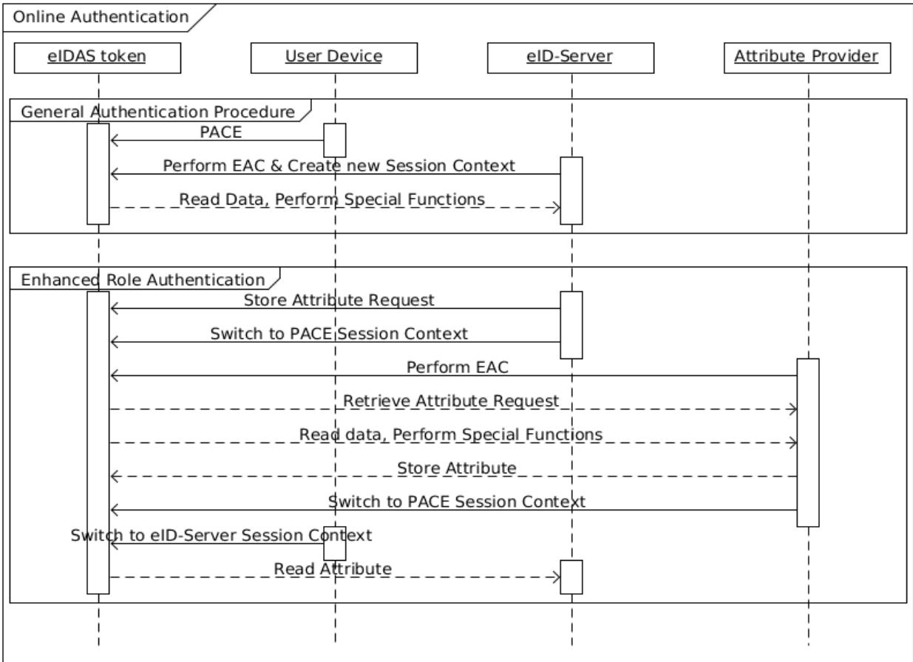
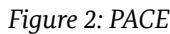
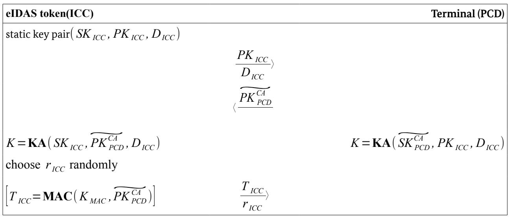

# Technical Guideline TR-03110

# Advanced Security Mechanisms for Machine Readable Travel Documents and eIDAS Token –

Part 2: Protocols for electronic IDentification, Authentication and trust Services (eIDAS)

Version 2.21 21. December 2016

#### **History**

| Version | Date       | Comment                                                                                                                             |  |
|---------|------------|-------------------------------------------------------------------------------------------------------------------------------------|--|
| 1.00    | 2006-02-08 | Initial public version.                                                                                                             |  |
| 1.01    | 2006-11-02 | Minor corrections and clarifications.                                                                                               |  |
| 1.10    | 2007-08-20 | Revised version.                                                                                                                    |  |
| 1.11    | 2008-02-21 | Minor corrections and clarifications.                                                                                               |  |
| 2.00    | 2008-10-27 | Enhanced version.                                                                                                                   |  |
| 2.01    | 2009-05-05 | Minor corrections and clarifications. Additional Mapping for PACE.                                                                  |  |
| 2.02    | 2009-11-09 | Adjustments to PACE required due to international standardization.                                                                  |  |
| 2.03    | 2010-03-24 | Clarification on the definition of a session. Standardization of domain parameters. Introduction of a secondary security object. |  |
| 2.04    | 2010-09-15 | Clarifications on certificate extensions. Improved handling of chip-specific keys for privileged terminals.                      |  |
| 2.05    | 2010-10-14 | Clarifications on RFU-bits, "Read access to eID" deprecated                                                                         |  |
| 2.10    | 2012-03-20 | Split into three parts                                                                                                              |  |
| 2.20    | 2015-02-03 | Enhanced version with additional mechanisms. Split into four parts.                                                                 |  |
| 2.21    | 2016-12-21 | Clarifications, minor corrections and optimizations. Simplification of authorization handling.                                   |  |

Federal Office for Information Security Post Box 20 03 63 D-53133 Bonn

Phone: +49 22899 9582-0 E-Mail: [ExtendedAccessControl@bsi.bund.de](mailto:ExtendedAccessControl@bsi.bund.de) Internet: [https://www.bsi.bund.de](https://www.bsi.bund.de/) © Federal Office for Information Security 2016

| 1   | Introduction 5                                            |  |
|-----|-----------------------------------------------------------|--|
| 1.1 | Cryptographic protocols and procedures of this Guideline5 |  |
| 1.2 | Requirements for eIDAS tokens and Terminals6              |  |
| 1.3 | Terminology 6                                             |  |
| 1.4 | Abbreviations 6                                           |  |
| 2   | Authentication Procedure 8                                |  |
| 2.1 | Terminal Types 8                                          |  |
| 2.2 | User Credentials 9                                        |  |
| 2.3 | Extended General Authentication Procedure10               |  |
| 2.4 | PIN Management 16                                         |  |
| 3   | Protocol Specifications 19                                |  |
| 3.1 | Cryptographic Algorithms and Notation19                   |  |
| 3.2 | PACE 25                                                   |  |
| 3.3 | Terminal Authentication Version 2 26                      |  |
| 3.4 | Chip Authentication Version 2 28                          |  |
| 3.5 | Chip Authentication Version 3 29                          |  |
| 3.6 | Restricted Identification 31                              |  |
| 3.7 | Pseudonymous Signature 32                                 |  |

| Authentication 15                              |
|------------------------------------------------|
| Figure 2: PACE 25                              |
| Figure 3: Terminal Authentication Version 2 27 |
| Figure 4: Chip Authentication Version 2 29     |
| Figure 5: Chip Authentication Version 3 30     |
| Figure 6: Restricted Identification 32         |
| Figure 7: Pseudonymous Signature 33            |
|                                                |

| Table 1: Key words 6                   |  |
|----------------------------------------|--|
| Table 2: Overview of key pairs used 20 |  |

# 1 Introduction

This Part of this Technical Guideline extends the electronic security mechanisms for electronic travel documents described in ICAO Doc 9303 [2] to protect the authenticity (including integrity), originality, and confidentiality of the data stored on tokens used for electronic identification, authentication and trust services (eIDAS tokens). An eIDAS token MAY be contactless or contact based.

The eIDAS token SHOULD at least support one of the following communication protocols and SHALL indicate this information in the EF.ATR/INFO file or ATR/ATS historical bytes as defined in [5].

- **•** T=0 according to [4],
- **•** T=1 according to [4];
- **•** T=CL according to [3].

# 1.1 Cryptographic protocols and procedures of this Guideline

The following cryptographic protocols are specified in this Part of this Guideline:

- **• Password Authenticated Connection Establishment (PACE)**. The protocol sets up a Secure Messaging channel with strong session keys based on a shared password, possibly of low entropy. A cryptographic security proof is available at [6].
- **• Terminal Authentication Version 2 (TA2)**. This protocol provides a challenge-response-based proof of the authenticity and the access rights of a terminal. It is suitable for use online, i.e. over a network. The protocol is based on the EAC-PKI specified in Part 3 of this Guideline.
- **• Chip Authentication Version 2 (CA2)**. This protocol provides a proof of authenticity (in conjunction with Passive Authentication) of the eIDAS token and sets up a Secure Messaging channel between eIDAS token and terminal authenticated by a preceding TA2. The protocol is based on an ephemeral-static Diffie-Hellman, i.e. the eIDAS token uses a static (certified) key. To provide pseudonymity, the same key must be used for a sufficiently large group of eIDAS tokens. A cryptographic evaluation of TA2 and CA2 is available at [8].
- **• Chip Authentication Version 3 (CA3)**. This version of the Chip Authentication is an alternative to Chip Authentication Version 2 combined with Restricted Identification providing also an authentication of the sector-specific identifier towards the terminal and the pseudonymity of the eIDAS token without the need to use the same keys on several eIDAS tokens. Cryptographically, the protocol is based on the combination of an ephemeral key agreement with a Pseudonymous Signature.
- **• Restricted Identification (RI)**. This protocol is used to compute a sector- and card-specific identifier, enabling the pseudonymous (re-)identification of the card-holder. The sectors used for this protocol are defined as part of the EAC-PKI in Part 3 of this Guideline, including pseudonymous revocation based on this protocol.
- **• Pseudonymous Signatures (PS)**. This protocol provides an efficient means to authenticate/sign data in a pseudonymous way, i.e. the public key for verification of signatures is sector-specific. The same sector-set-up as for RI is used. Different variants of the protocol exist. A cryptographic security proof is available at [7].

Based on these protocols the following procedures are defined:

**• General Authentication Procedure (GAP)**.

- **• Enhanced Role Authentication (ERA)**.
- **• PIN Management**.

**Note:** If compliance to ICAO Doc 9303 [2] is required, Basic Access Control/PACE and Extended Access Control in version 1 (comprising Chip Authentication version 1 and Terminal Authentication version 1) MUST be used (cf. Part 1 of this Technical Guideline).

# 1.2 Requirements for eIDAS tokens and Terminals

This Technical Guideline specifies requirements for implementations of eIDAS tokens and terminals. While eIDAS tokens must comply with those requirements according to the terminology described in Section [1.3,](#page-4-0) requirements for terminals are to be interpreted as guidance, i.e. interoperability of eIDAS token and terminal are only guaranteed if the terminal complies with those requirements, otherwise the interaction with the eIDAS token will either fail or the behavior of the eIDAS token is undefined. In general, the eIDAS token need not enforce requirements related to terminals unless the security of the eIDAS token is directly affected.

# 1.3 Terminology

The key words "MUST", "MUST NOT", "REQUIRED", "SHALL", "SHALL NOT", "SHOULD", "SHOULD NOT", "RECOMMENDED", "MAY", and "OPTIONAL" in this document are to be interpreted as described in RFC 2119 [1]. The key word "CONDITIONAL" is to be interpreted as follows:

**CONDITIONAL:** The usage of an item is dependent on the usage of other items. It is therefore further qualified under which conditions the item is REQUIRED or RECOMMENDED.

When used in tables (profiles), the key words are abbreviated as shown in Table [1.](#page-4-1)

| Key word             |             | Abbrev. |
|----------------------|-------------|---------|
| MUST / SHALL         | REQUIRED    | m       |
| MUST NOT / SHALL NOT | –           | x       |
| SHOULD               | RECOMMENDED | r       |
| MAY                  | OPTIONAL    | o       |
| –                    | CONDITIONAL | c       |

*Table 1: Key words*

# 1.4 Abbreviations

The following abbreviations are commonly used throughout this specification.

| Name                                      | Abbreviation |
|-------------------------------------------|--------------|
| Chip Identifier                           | IDICC        |
| Chip Authentication Version 2 Public Key  | PKICC        |
| Chip Authentication Version 2 Private Key | SK ICC       |
| Domain Parameters                         | D            |

| Name                                                           | Abbreviation                |
|----------------------------------------------------------------|-----------------------------|
| Cryptographic Group                                            | ( (D),∗) Γ            |
| Generator of the Cryptographic Group                           | (D) γ                    |
| Electronic Identification, Authentication and Trusted Services | eIDAS                       |
| Ephemeral Private Key                                          |  SK                     |
| Ephemeral Public Key                                           |  PK                     |
| Integrated Circuit Chip                                        | ICC                         |
| International Civil Aviation Organization                      | ICAO                        |
| Key Agreement Function                                         | KA                          |
| Key Derivation Function                                        | KDF                         |
| Pseudonymous Signature Generation Function                     | PSign                       |
| Pseudonymous Signature Verification Function                   | PVerify                     |
| Machine Readable Travel Document                               | MRTD                        |
| (Proximity) Integrated Circuit Chip                            | (P)ICC                      |
| Proximity Coupling Device                                      | PCD                         |
| Restricted Identification Public Key                           | PKID                        |
| Restricted Identification Private Key                          | SKID                        |
| Sector Public Key                                              | PKSector                    |
| Sector Private Key                                             | SKSector                    |
| Restricted Identification Sector-specific Identifier           | Sector I ID              |
| Public Key of the CVCA                                         | PKCVCA                      |
| Terminal Authentication Public Key                             | PKPCD                       |
| Terminal Authentication Private Key                            | SKPCD                       |
| Pseudonymous Signature Group Public Key                        | PKICC                       |
| Pseudonymous Signature Individual Public Keys                  | PKICC ,1, PKICC ,2    |
| Pseudonymous Signature Individual Private Keys                 | SK ICC ,1, SK ICC , 2 |
| Pseudonymous Signature Sector-specific Identifier              | Sector I ICC ,i       |
| Identifier of the Pseudonymous Signature variant               | IDDSI                       |

# 2 Authentication Procedure

This section defines Terminal Types, Passwords, PIN Management and the Extended General Authentication Procedure, comprising the General Authentication Procedure and Enhanced Role Authentication. Support for the different Terminal Types, Passwords and options of the Extended General Authentication Procedure is implementation dependent and at the discretion of the document issuer. Profiles for possible combinations are given in Part 4 of this Technical Guideline.

# 2.1 Terminal Types

This specification supports five terminal types: Inspection Systems, Authentication Terminals, Attribute Terminals, Signature Management Terminals and Signature Terminals.

## 2.1.1 Inspection System

In addition to the specifications in Part 1 of this Technical Guideline, this Part extends the definition of an Extended Inspection System to also support the General Authentication Procedure (cf. Section [2.3\)](#page-8-0).

**Note:** In the following, an Inspection System is always considered to be an extended Inspection System.

## 2.1.2 Authentication Terminal

An Authentication Terminal is a terminal that may be operated by a governmental organization (Official Domestic Document Verifier) or by any other organization (Non-Official / Foreign Document Verifier / Service Provider). The eIDAS token SHALL require an authentication terminal to authenticate itself before access according to the effective authorization is granted. To authenticate a terminal as Authentication Terminal, the General Authentication Procedure (cf. Section [2.3\)](#page-8-0) MUST be used. The authorization level of an authentication terminal SHALL be determined by the effective authorization calculated from the certificate chain.

Data formats and access rights for Authentication Terminals are described in Part 4 of this Guideline.

## 2.1.2.1 Attribute Terminal

An Attribute Terminal is an extension of an Authentication Terminal to support Enhanced Role Authentication. This terminal type allows storing/retrieving of attributes and the corresponding attribute requests on the eIDAS token. An Attribute Terminal that is authorized to read attribute requests and to store attributes on the eIDAS token is also called Attribute Provider.

Data formats and access rights for Attribute Provider are described in Part 4 of this Guideline.

## 2.1.2.2 Signature Management Terminal

A Signature Management Terminal is an extension of a Authentication Terminal to support management of the Signature Application.

This terminal allows signature creation as well as the management of the Signature Application (e.g. signature key generation).

Data formats and access rights for Signature Management Terminals are described in [9].

## 2.1.3 Signature Terminal

The Signature Terminal is a terminal that allows for the creation of electronic signatures. The eIDAS token SHALL require a Signature Terminal to authenticate itself before access according to the effective authorization is granted. To authenticate a terminal as Signature Terminal, the General Authentication Procedure (cf. Section [2.3\)](#page-8-0) MUST be used. The authorization level of a Signature Terminal SHALL be determined by the effective authorization calculated from the certificate chain.

## 2.1.4 Privileged Terminal

The eIDAS token MAY be personalized to support both token-individual and generation-specific keys for Chip Authentication Version 2. In this case, the eIDAS token SHALL restrict access to token-individual keys to *privileged* terminals. The eIDAS token MUST consider the following terminals as privileged terminals:

- **•** Inspection Systems are always privileged terminals.
- **•** Authentication Terminals with effective authorization "Privileged Terminal" (Part 4 of this Technical Guideline).

Signature Terminals SHALL never be considered as privileged terminals.

# 2.2 User Credentials

User credentials (or passwords) provide means to the eIDAS token holder to provide a user consent prior to operations to be performed on the eIDAS token. They are provided to the eIDAS token through a User Device. The user credentials supported by this part of the Technical Guideline are:

**• MRZ-Password (CONDITIONAL)**

See Part 1 of this Technical Guideline. Support of MRZ is REQUIRED for MRTD documents.

### **• CAN (REQUIRED)**

See Part 1 of this Technical Guideline.

**• PIN (REQUIRED)**

The Personal Identification Number (PIN) is a short secret password that SHALL be only known to the legitimate holder of the document.

### **• PUK (REQUIRED)**

The PIN Unblock Key (PUK) is a long secret password that SHALL be only known to the

legitimate holder of the document.

In addition, the eIDAS token MAY support other user credentials.

## 2.2.1 PIN

The PIN is a short secret user password that may be used to access the eID application or other applications.

The PIN is a blocking password, i.e. the PIN is associated with a retry counter (*RC*) that is decreased for every failed authentication (cf. Section [2.2.3\)](#page-8-1).

The PIN MAY be assigned a reset counter that is decreased after every successful reset of the PIN retry counter via the PUK. If the reset counter has reached '0', the retry counter is expired.

## 2.2.2 PUK

The PUK is a long secret user password that may be used to access the unblocking mechanism of the PIN and application-specific passwords (e.g. a local PIN of the eSign application).

The PUK MAY be a blocking or non-blocking password.

- **•** If the PUK is a non-blocking password, the eIDAS token MUST NOT block the PUK after failed authentications.
- **•** If the PUK is a blocking password, the PUK is associated with a retry counter (*RC*) that is decreased for every failed authentication (cf. Section [2.2.3\)](#page-8-1).

## 2.2.3 Password Retry Counter

The following states of the retry counter (RC) MUST be supported for blocking passwords:

*RC* = 0: The eIDAS token SHALL *block* the password, i.e. the eIDAS token MUST NOT accept any further authentication attempt using the blocked password. To unblock the blocked password an unblocking procedure MUST be used to reset the corresponding retry counter and, where applicable, to set a new password.

The following blocking procedure SHALL be enforced by contactless eIDAS tokens to prevent denial of service attacks:

- *RC* = 1: The eIDAS token SHALL *suspend* the password, i.e. the eIDAS token MUST reject authentication attempts until the password is resumed. To *resume* the suspended password the CAN MUST be entered correctly. The resumed state SHALL be volatile, i.e. the password MUST be entered in the same session (cf. Section "Secure Messaging" in Part 3 of this Technical Guideline on the definition of "session"), otherwise (e.g. after a power down) the password SHALL remain suspended. The retry counter *RC* SHALL be set according to the entered password:
	- **•** If the password is entered correctly: The retry counter *RC* is reset to the initial value.
	- **•** If the password is entered incorrectly: The retry counter is decreased to *RC* = 0.

# 2.3 Extended General Authentication Procedure

The Extended General Authentication Procedure consists of two parts:

**• General Authentication Procedure (REQUIRED)**

- The General Authentication Procedure is used for authentication as
- **◦** Extended Inspection System
- **◦** Authentication Terminal including possible extensions
- **▪** Attribute Terminal
- **▪** Signature Management Terminal
- **◦** Signature Terminal

### **• Enhanced Role Authentication (OPTIONAL)**

The Enhanced Role Authentication is used to additionally authenticate an Attribute Provider.

The eIDAS token MUST support re-authentication of the terminal with the General Authentication Procedure after a session (cf. Section "Secure Messaging" in Part 3 of this Technical Guideline on the definition of "session") has been terminated and the terminal has selected the Master File.

## 2.3.1 Switching of Session Contexts

If the eIDAS token supports multiple executions of Extended Access Control (cf. Section [2.3.4\)](#page-10-0) in one session, e.g. to support Enhanced Role Authentication, storing and restoring of session contexts MUST be supported.

- **•** The PACE Session Context MUST always be stored by the eIDAS token immediately before restarting secure messaging or switching from PACE Session Context to another session context. The PACE Session Context has the default session context identifier.
- **•** Storage of a Chip Authentication Session Context MUST be initiated by the terminal. If storage of a Chip Authentication Session Context is requested by the terminal, the terminal assigns a session context identifier to the session context. In this case, the eIDAS token SHALL store the Chip Authentication Session Context immediately before switching to another Session Context.
- **•** Restoring a stored session context SHALL be initiated by the terminal.
- **•** The storage of a session context SHALL be volatile, i.e. it MUST NOT be valid for different sessions.

In an Online Authentication (see [2.3.7\)](#page-13-0), the user device is responsible for assigning the identifier to a session context.

For details, see Part 3 of this Technical Guideline.

## 2.3.2 Password Verification

This specification supports verification of a password using two different mechanisms:

- **•** Password verification based on PACE for global passwords
- **•** Password verification based on VERIFY for application-local passwords.

## 2.3.2.1 Password Verification based on PACE

eIDAS tokens MUST require the use of PACE. The terminal MUST indicate the terminal type and MAY indicate the requested access rights as part of Password Verification. If no indication is present, the eIDAS token MUST reject a subsequent Terminal Authentication version 2.

- **•** An Inspection System SHALL use the CAN or the MRZ-Password.
- **•** An Authentication Terminal SHALL use the PIN. It MAY use the CAN if the effective authorization of the terminal allows to use the CAN ("CAN allowed").

**•** A Signature Terminal or Signature Management Terminal SHALL use the PIN, the CAN or the PUK.

If successful, the eIDAS token performs the following:

- **•** It SHALL start secure messaging.
- **•** It SHALL provide trust-points for Terminal Authentication.

### 2.3.2.2 Password Verification based on VERIFY

For local application-specific authentication, Password verification based on VERIFY using a local password MAY be supported after PACE or after the General Authentication Procedure. In this case, it is RECOMMENDED to use PACE with CAN as user credential.

## 2.3.3 Passive Authentication

Passive Authentication uses a digital signature to authenticate the data stored on the eIDAS token. This signature is generated by a Document Signer (e.g. the MRTD issuer) in the personalization phase of the eIDAS token over a Card/Chip Security Object (cf Part 3 of this Technical Guideline)

To verify Card/Chip Security Object using Passive Authentication the terminal MUST perform the following steps:

- 1. The terminal SHALL read the Card/Chip Security Object from the eIDAS token.
- 2. The terminal SHALL retrieve the corresponding Document Signer Certificate, the trusted Country Signing CA Certificate, and the corresponding Certificate Revocation List.
- 3. The terminal SHALL verify the Document Signer Certificate and the signature of the Card/Chip Security Object.

Passive Authentication enables a terminal to detect manipulation of the Card/Chip Security Object, but it does not prevent cloning of eIDAS token, i.e. copying the data stored on one eIDAS token to another eIDAS token. Cloning prevention is achieved by Chip Authentication in conjunction with Passive Authentication.

**Note:** Additional files for Passive Authentication MAY be provided by application(s) (e.g. cf. [2] or Part 1 of this Technical Guideline)

## 2.3.4 Extended Access Control

The following steps provide mutual authentication of the eIDAS token and the terminal.

### **1. Terminal Authentication Version 2 (REQUIRED)**

As part of Terminal Authentication, the terminal performs the following:

- The terminal SHALL generate the ephemeral public key to be used later on for Chip Authentication. The terminal MUST NOT use unverified domain parameters for this key, i.e. only standardized domain parameters or domain parameters explicitly known by the terminal to be secure are to be used.
- The terminal SHALL authenticate the generated ephemeral public key.

If successful, the eIDAS token performs the following:

- It SHALL grant read/write access to data groups according to the terminal's access rights.
- It SHALL restrict those access rights to Secure Messaging to be established by the authenticated ephemeral public key (except the respective Security Object).

### **2. Passive Authentication (REQUIRED)**

The terminal performs the following

- The terminal SHALL read and verify the Card/Chip Security Security Object.
- The terminal SHALL compare the unsecured SecurityInfos read before PACE to the secured contents of the Security Object.

### **3. Chip Authentication Version 2 or Version 3 (REQUIRED)**

The terminal MAY instruct the eIDAS token to store the current Session Context (cf. Section [2.3.1\)](#page-9-0). The eIDAS token SHALL (re-)start secure messaging using the keys derived during Chip Authentication.

**Note:** The terminal and the eIDAS token MUST use the established security context (i.e. secure messaging established by Chip Authentication) for all further communication.

## 2.3.5 General Authentication Procedure

The General Authentication Procedure consists of the following steps:

### **1. Password Verification based on PACE (REQUIRED)**

The terminal provides a password to the eIDAS token for verification. The terminal is in possession of a suitable password or requests the user to provide a password through a User Device. The terminal provides the password to the eIDAS token for verification.

### **2. Extended Access Control (REQUIRED)**

The eIDAS token and the terminal mutually authenticate as genuine. The eIDAS token SHALL grant access rights according to the effective authorization. If Enhanced Role Authentication is supported by the eIDAS token, the eIDAS token SHALL store the PACE Session Context prior to restarting Secure Messaging. Furthermore, if Enhanced Role Authentication is to be used, the terminal SHALL instruct the eIDAS token to store the Chip Authentication Session Context prior to switching to another session context.

## **3. Read/Write data and perform special functions (OPTIONAL)**

An authenticated terminal MAY select and use the application(s) according to the effective authorization of the terminal.

## 2.3.6 Enhanced Role Authentication

In case of an Authentication Terminal (Attribute Terminal) with effective authorization to write Attribute Requests, the Authentication Procedure MAY be continued as follows if additional attributes not stored in the eIDAS token are requested by the terminal:

### **4. Storage of Attribute Request (REQUIRED)**

The Authentication Terminal writes an Attribute Request to the eIDAS token. The eIDAS token SHALL make an internal link between the request and the Terminal Sector of the requesting

Authentication Terminal and MUST restrict read access to this Attribute Request to authenticated Attribute Providers.

#### **5. Restore Session Context (REQUIRED)**

The Authentication Terminal SHALL initiate the restoration of the PACE Session Context stored by the eIDAS token during step [2.](#page-11-0) The eIDAS token SHALL store the Chip Authentication Session Context prior to restarting Secure Messaging.

#### **6. Extended Access Control (REQUIRED)**

The eIDAS token and the Attribute Provider mutually authenticate as genuine. The eIDAS token SHALL grant access rights according to the effective authorization. The eIDAS token SHALL store the PACE Session Context prior to restarting Secure Messaging.

#### **7. Processing of Attribute Request (OPTIONAL)**

The authenticated Attribute Provider reads the stored Attribute Request from the eIDAS token and writes the resulting Attributes to the eIDAS token. The eIDAS token SHALL restrict read access for stored Specific Attributes to the Authentication Terminal authenticated during the preceding General Authentication Procedure (step [2\)](#page-11-0), and for Generic Attributes to Authentication Terminals with the required authorization, respectively.

#### **8. Restore Session Context (REQUIRED)**

The Attribute Provider SHALL initiate the restoration of the PACE Session Context stored by the eIDAS token during step [6.](#page-12-1) Subsequently, the terminal SHALL initiate restoration of the Chip Authentication Session Context stored by the eIDAS token during step [5.](#page-12-0)

#### **9. Read Attribute (OPTIONAL)**

The Authentication Terminal MAY read the stored Attribute (and other data according to the effective authorization).

## 2.3.7 Online Authentication

The eIDAS token can also be used online, i.e. eIDAS token and authentication terminal are connected by a network (see also Figure [1\)](#page-13-1). In this case, the user device and the *eID server* are distinguished:

*Figure 1: Online Authentication based on General Authentication Procedure and Enhanced Role Authentication*

**eID Server:** The eID server is the remote part of the authentication terminal. It is authorized to access eIDAS token data and contains the interfaces to the user device and to the PKI infrastructure. The eID server provides the user device with a chain of Terminal Authentication certificates and a digital signature created on the eIDAS token's challenge with the corresponding private key.

**User Device:** The user device is the local part of the authentication terminal and interacts with the user, the eIDAS token, and the eID server but is not authorized to access eIDAS token data. In particular, the user device contains an eID client software, a token reader, a display and an interface for user credential input. The chain of Terminal Authentication certificates received from the eID server are displayed to the user and only if the user accepts, the user device forwards the received certificates to the eIDAS token.

**Note:** Only after Chip Authentication when a secure end-to-end connection between eIDAS token and eID server is established, the eIDAS token grants access to eIDAS token data according to the access rights.

# 2.4 PIN Management

The PIN is the only password that may be changed. The PIN and the PUK are the only passwords that may have the states suspended and blocked. Furthermore, only the PIN may have the states activated and deactivated. The remaining passwords (CAN and MRZ) are static and non-blocking. Details on the usage of the passwords are described in Section [2.2.](#page-7-0)

PIN management consists of the following operations:

| • | Change PIN                                      | (OPTIONAL)    |
|---|-------------------------------------------------|---------------|
| • | Resume PIN                                      | (CONDITIONAL) |
|   | MUST be supported for contactless eIDAS tokens. |               |
| • | Resume PUK                                      | (CONDITIONAL) |
|   |                                                 |               |

MUST be supported for contactless eIDAS tokens if the PUK is a blocking password.

| • | Unblock PIN    | (REQUIRED) |
|---|----------------|------------|
| • | Activate PIN   | (REQUIRED) |
| • | Deactivate PIN | (REQUIRED) |

A mapping of the PIN management mechanisms Change PIN, Unblock PIN, Activate PIN, and Deactivate PIN to ISO 7816 commands is given in Part 3 of this Technical Guideline. The operation Resume PIN/PUK is not mapped to an ISO 7816 command as this is implicitly performed by the eIDAS token.

## 2.4.1 Unauthenticated Terminals

A terminal is unauthenticated before successfully completing Terminal Authentication. Unauthenticated terminals may perform PIN management operations as follows:

### **1. Password Verification based on PACE (REQUIRED)**

The terminal SHOULD NOT indicate the terminal type and required access rights as the terminal remains unauthenticated. The terminal may choose to use the CAN, PIN, or PUK as password.

If successful, the eIDAS token performs the following:

- It SHALL start secure messaging.
- If the PIN is operational (i.e. activated, and neither suspended nor blocked) and the PIN was successfully used, the eIDAS token performs the following:
	- **–** It SHALL reset the retry counter of the PIN.
	- **–** It SHALL grant access to the following PIN management mechanism: Change PIN
- If the CAN was successfully used:
	- **–** It SHALL temporarily resume the PIN.
	- **–** In case the PUK is associated with a retry counter, it MUST temporarily resume the PUK.
- If the PUK is operational and was successfully used:
	- **–** It SHALL grant access to the following PIN management mechanism: Unblock PIN
	- **–** It MAY grant access to the following PIN management mechanism: Change PIN

**–** In case the PUK is associated with a retry counter, it SHALL reset the retry counter of the PUK.

### **2. Password Verification based on PACE with PIN (CONDITIONAL)**

This step is REQUIRED in the following cases:

- To resume the PIN.
- To proceed with the General Authentication Procedure after PIN management. In this case the terminal MUST indicate the terminal type (authentication terminal) and required access rights.[1](#page-15-0)

If the PIN was successfully used and the PIN is operational or temporarily resumed, the eIDAS token performs the following:

- If the PIN is temporarily resumed it SHALL resume the PIN.
- It SHALL reset the retry counter of the PIN.
- It SHALL grant access to the following PIN management mechanism: Change PIN

### **3. PIN Management (CONDITIONAL)**

This step is REQUIRED to change or unblock the PIN.

The eIDAS token performs the following:

- It SHALL allow the terminal to perform the following PIN management operations:
	- **–** Change PIN, if the terminal has access to this operation.
	- **–** Unblock PIN, if the terminal has access to this operation.

If the PIN is associated with a reset counter, the reset counter MUST NOT be expired and the eIDAS token SHALL decrease the reset counter after a successful execution of both, the PACE protocol with the PUK and performing the operation Unblock PIN.

**Note:** Support for the PIN management operation Change PIN if PACE with PUK was used is OPTIONAL and implementation specific.

## 2.4.2 Authenticated Terminals

After successfully completing Terminal Authentication a terminal is authenticated[2](#page-15-1) .

An Authentication Terminal with effective authorization for PIN management (cf. Part 3 of this Technical Guideline) may perform PIN management operations as follows:

### **1. General Authentication Procedure (REQUIRED)**

If the terminal is authenticated as Authentication Terminal with effective authorization for PIN Management, the eIDAS token performs the following:

• It SHALL grant access to the PIN management mechanisms.

### **2. PIN Management (REQUIRED)**

The eIDAS token performs the following:

1 This is most likely the case if the CAN is used to resume the PIN as part of the General Authentication Procedure.

2 See section [3.3](#page-24-0) for requirements on terminal's access rights.

- It MAY allow the terminal to perform the following PIN management operations:
	- **–** Change PIN
	- **–** Unblock PIN
- It MUST allow the terminal to perform the following PIN management operations:
	- **–** Activate PIN
	- **–** Deactivate PIN

# 3 Protocol Specifications

In this section, cryptographic protocols for PACE, Chip Authentication and Terminal Authentication are specified assuming an arbitrary communication infrastructure. Support for the protocols is implementation dependent and at the discretion of the document issuer. Profiles for possible combinations are given in Part 4 of this Technical Guideline.

A mapping to ISO 7816 commands is given in Part 3 of this Technical Guideline.

# 3.1 Cryptographic Algorithms and Notation

The protocols are executed between two parties: the eIDAS token (ICC) and the terminal (PCD). Table [2](#page-18-0) gives an overview on the key pairs used[3](#page-17-1) , ephemeral key pairs are marked by ~. The following cryptographic operations and notations are used.

3 The table only shows the keys used for cryptographic computations within the particular protocol. Data or keys used for binding purposes between the protocols are not displayed for simplicity, but explained in the protocol specification.

| Protocol                            | eIDAS token                                          | Terminal                                       | Note                                                                                                                                                                                                                                                                                                           |
|-------------------------------------|------------------------------------------------------|------------------------------------------------|----------------------------------------------------------------------------------------------------------------------------------------------------------------------------------------------------------------------------------------------------------------------------------------------------------------|
| PACE                                | ~ ~ PACE , PK ICC PACE SKICC       | ~ ~ PACE , PKPCD PACE SK PCD | All key pairs are ephemeral key pairs.                                                                                                                                                                                                                                                                         |
| Terminal Authentication          | PKCVCA                                               | PKPCD , SKPCD ~                       | The eIDAS token verifies the certificate chain received from the terminal using the public key PKCVCA of the CVCA.                                                                                                                                                                                       |
| Chip Authentication Version 2 | PKICC , SK ~ ICC                         | ~ CA , PKPCD ~ CA SKPCD      | The key pair used by the terminal is an ephemeral key pair different from the ephemeral PACE key pair. It is already generated during Terminal Authentication.                                                                                                                                           |
| Chip Authentication Version 3 | ~ CA , PKICC CA SKICC                 | ~ CA , PKPCD CA SKPCD           | The ephemeral key pairs used are different from the ephemeral PACE key pairs. If PACE with generic mapping is performed before Chip ~ Authentication Version 3, the eIDAS token MAY use the ephemeral key pair of the PACE mapping phase as CA PKICC                                      |
|                                     | SK ICC,1 , SKICC , , 2 PKICC          | PKSector                                       | The ICC MUST NOT provide the corresponding public key PK or PKICC , ICC , 1 , 2 the terminal MUST NOT be provided the corresponding private key SKSector. The keys PKICC or PKICC and ,1 ,2 SKSector MAY be used externally to generate revocation lists or whitelists. |
| Restricted Identification        | SKID                                                 | PKSector                                       | The eIDAS token SHOULD NOT provide the corresponding public key PKID, the terminal MUST NOT be provided the corresponding private key SKSector. The keys PK ID and SKSector MAY be used externally to generate revocation lists.                                                                |
| Pseudonymous Signature           | SK , ICC ,1 SK , ICC , 2 PK ICC | PKSector                                       | The ICC MUST NOT provide the corresponding public key PK or PKICC , ICC , 1 , 2 the terminal MUST NOT be provided the corresponding private key SKSector.                                                                                                                                 |

*Table 2: Overview of key pairs used*

## 3.1.1 Hash and Compression Algorithms

The operations for computing a cryptographic hash and compressing a public key are described in an algorithm-independent way.

## 3.1.1.1 Operations

- **•** The operation for computing a hash over a message *m* is denoted by **H***m*.
- **•** The operation for computing a compressed representation of a public key *PK* is denoted by **Comp**( *PK*).

**•** The operation for computing a projected representation of a public key *PK* is denoted by Π(*PK*).

## 3.1.2 Symmetric Key Algorithms

The keys and operations for symmetric key encryption and authentication are described in an algorithm-independent way.

## 3.1.2.1 Keys

Symmetric keys are derived from a shared secret *K* and an OPTIONAL nonce *r* or from a password using a Key Derivation Function (KDF):

- **•** Deriving a key for message encryption is denoted by *KEnc*=**KDFEnc** *K ,*[*r*].
- **•** Deriving a key for message authentication is denoted by *K MAC*=**KDFMAC***K ,*[*r*].
- **•** Deriving a key from a password is denoted by *K*=**KDF** .

## 3.1.2.2 Operations

The operations for encrypting and decrypting a message are denoted as follows:

- **•** Encrypting a plaintext *m* with key *KEnc* is denoted by *c*=**E***K Enc ,m*.
- **•** Decrypting a ciphertext *c* with key *KEnc* is denoted by *m*=**D***KEnc ,c*.

The operation for computing an authentication code *T* on message *m* with key *K MAC* is denoted as *T*=**MAC**(*K MAC ,m*).

## 3.1.3 Domain parameters and underlying group operations

Domain parameters for asymmetric cryptographic operations as key agreement and signatures are denoted in an algorithm-independent way. A mapping to cryptographic primitives can be found in Part 3 of this Technical Guideline. Given domain parameters *D*,

- **•** (Γ(*D*)*,*∗) denotes the underlying cryptographic group;
- **•** γ( *D*) denotes the corresponding group generator and *ord* (γ) the order of γ(*D*);
- **• pow** (*x ,l*)=⏟*x*∗...∗*x l*−times denotes the *l*-th power of some element *x* of the group (Γ(*D*)*,*∗).

## 3.1.4 Key Agreement

The keys and operations for key agreement are described in an algorithm-independent way. A mapping to DH and ECDH can be found in Part 3 of this Technical Guideline.

## 3.1.4.1 Keys

The following key pairs are used for PACE and Chip Authentication:

- **•** For PACE both the eIDAS token and the terminal generate ephemeral Diffie-Hellman key pairs based on the ephemeral domain parameters ~*DMapped* . **◦** The eIDAS token's ephemeral public key is ~
	- *PK ICC PACE* ~ , the corresponding private key is *SKICC PACE* . **◦** The terminal's ephemeral public key is ~ *PACE* , the corresponding private key is ~
	- *PKPCD SK PCD PACE*
- **•** For Chip Authentication Version 2, the eIDAS token uses a static Diffie-Hellman key pair and the terminal generates an ephemeral key pair based on the eIDAS token's static domain parameters *DICC* .
	- **◦** The eIDAS token's static public key is *PK ICC*, the corresponding private key is *SKICC*. ~
	- **◦** The terminal's ephemeral public key is *PKPCD CA* , the corresponding private key is ~ *SKPCD CA* . ~
	- **◦** The terminal's compressed ephemeral public key is denoted by **Comp**( *PKPCD CA* )*.*
- **•** For Chip Authentication Version 3, both the eIDAS token and the Terminal generate ephemeral Diffie-Hellman key pairs based on the eIDAS token's static domain parameters *DICC* . The key pair is used to perform an anonymous key agreement in order to establish a secure channel. **◦** The eIDAS token's ephemeral public key is ~ *CA* , the corresponding private key is~
	- *PKICC SKICC CA* . ~
	- **◦** The terminal's ephemeral public key is *PKPCD CA* , the corresponding private key is ~ *SK PCD CA* .
- **•** For Restricted Identification the eIDAS token uses a static Diffie-Hellman key pair and the terminals within a sector use an (almost) static Diffie-Hellman key pair where the private key is not known to the terminal.
	- **◦** The eIDAS token's static public key is *PK ID*, the corresponding private key is *SKID*.
	- **◦** The sector's static public key is *PK Sector*, the corresponding private key is *SKSector*.
	- **◦** The revocation sector public key *PK Revocation*, the corresponding private key is *SKRevocation*.
	- **◦** The sector-specific identifier is *I ID Sector.* .

Private keys MUST be stored securely by the respective holders.

It is REQUIRED that the eIDAS token and terminals validate public keys received from each other.

**Note:** The terminal and, in case Chip Authentication Version 3 is used, also the eIDAS token will have to use different ephemeral public keys for the PACE key agreement and Chip Authentication. To ease distinction, the keys are marked with an index identifying the corresponding protocol (PACE, CA).

## 3.1.4.2 Operations

The operation for generating a shared secret *K* is denoted by *K*=**KA** *SK , PK , D* , where *SK* is a (ephemeral or static) secret key, *PK* is a (ephemeral or static) public key and *D* are the (ephemeral or static) domain parameters.

.

## 3.1.5 Signatures

The keys and operations for signatures are described in an algorithm-independent way. A mapping to RSA and ECDSA can be found in Part 3 of this Technical Guideline.

## 3.1.5.1 Keys

For Terminal Authentication the following key pair is used:

**•** The terminal has a static authentication key pair. The public key is *PK PCD*, the corresponding private key is *SKPCD*.

## 3.1.5.2 Operations

The operations for signing and verifying a message are denoted as follows:

- **•** Signing a message *m* with private key *SKPCD* is denoted by *s*=**Sign***SK PCD ,m*.
- **•** Verifying the resulting signature *s* with public key *PKPCD* is denoted by **Verify** *PK PCD ,s,m* .

## 3.1.6 Pseudonymous Signature

The keys and additional operations for pseudonymous signatures are described in an algorithm-independent way. A mapping to crypto primitives can be found in Part 3 of this Technical Guideline. In addition, pseudonymous signatures make also use of key agreement operations defined in [3.1.4.](#page-19-0)

## 3.1.6.1 Keys

For Chip Authentication Version 3 and Pseudonymous Signature, a group manager chooses static domain parameters *D M* and generates a key pair over *D M* .

- **•** The public key is denoted by *PK M* , the corresponding private key by *SK M* .The eIDAS token contains the extended domain parameters *D*^ *M* =(*DM , PK M* ). The eIDAS token's public key is denoted by *PKICC* and MUST be a group key, i.e. it MUST be used for a sufficiently large group of eIDAS token. The corresponding private key *SK ICC* is not stored on the eIDAS token.
- **•** Instead, the group manager chooses randomly a key *SK ICC ,* 2 and computes *SK ICC ,*1 such that *SK ICC*=*SKICC ,*1+*SK M SKICC* ,2 **mod** *ord* (γ) . Hence, *SK ICC ,*1 , *SK ICC ,* 2 denote the eIDAS token's individualized static private keys. The corresponding individualized public keys are denoted by *PK ICC ,* 1 and *PKICC ,*2 . These keys are not stored on the eIDAS token.
- **•** The terminal uses an (almost) static sector public key *PKSector* with the same domain parameters *D*^ *M* , the corresponding private key is *SKSector*.
- **•** The revocation sector public key is *PK Revocation*, the corresponding private key is *SKRevocation*.
- **•** The (up to two) sector-specific identifiers are denoted by *IICC ,* 1 *Sector* and *I ICC ,* 2 *Sector* .

It is REQUIRED that the eIDAS token and terminals validate public keys received from each other.

### 3.1.6.2 Operations

The pseudonymous signature of an input *M* with *SK ICC ,*1 , *SK ICC ,* 2 and sector-specific public key *PK Sector* over *D*^ *M* is denoted by *psICC*=**PSign**( *D*^ *M ,I ICC*,1 *Sector , I ICC* ,2 *Sector ,SKICC ,* 1 *,SKICC* ,2 *, IDDSI ,M* ) and is computed as follows:.

#### **Function: PSign**

**Input Parameters:** *D*^ *M* , *I ICC ,* 1 *Sector* (CONDITONAL), *I ICC ,* 2 *Sector* (CONDITIONAL), *SK ICC ,*1 , *SK ICC ,* 2 , *IDDSI* and the input *M* to be signed

#### **Output Value:** (*c ,s*1 *,s*2 )

Actions:

- 1. Choose random numbers *K*1, *K*2,∈{1, ... *, ord* (γ)−1 } .
- 2. Compute *Q*1=**pow**(γ( *DM* )*, K*1 )∗**pow**(*PK M , K*2 ) and conditionally
	- **•** *A*1=**pow**(*PKSector , K*1 ) (if *I ICC ,* 1 *Sector* was included as input),
	- **•** *A*2=**pow**(*PKSector ,K*2 ) (if *I ICC ,* 2 *Sector* was included as input).
	- **•** If *Q*1=0 , goto 1.
- 3. Witness computation:
	- **•** Compute *c*=**H**(Π(*Q*1 )||Π(*IICC ,*1 *Sector* )||Π( *A*1 )||Π(*I ICC ,* 2 *Sector* )||Π(*A*2 )||Π(*PKSector*)||*IDDSI*||*M* ).
	- **•** If *c*=0 **mod** *ord* (γ) , goto 1.
- 4. Assignment computation:
	- **•** Compute *s*1=*K*1−*c SKICC ,* 1 **mod** *ord* (γ) and *s*2=*K*2−*c SK ICC ,*2 **mod** *ord* (γ) .
	- **•** If *s*1=0 or *s*2=0 , goto 1.
- 5. Output (*c ,s*1 *,s*2 )

Verification pseudonymous signature *psICC* with the public key *PK ICC* is denoted by **PVerify**( *D*^ *M ,PK ICC , I ICC* ,1 *Sector , I ICC* ,2 *Sector , , IDDSI , psICC , M* ) and performed as follows:

#### **Function: PVerify**

**Input Parameters:** *D*^ *M* , *PKSector* , *PK ICC* , *I ICC ,*1 *Sector* (CONDITIONAL), *I ICC ,*2 *Sector* (CONDITIONAL), *IDDSI* , the input M and the signature (*c ,s*1 *,s*2 )

**Output Value:** True if the signature is valid, False otherwise.

### **Actions:**

- 1. Compute *Q*1=**pow**(*PK ICC , c* )∗**pow** (γ(*D M* )*,s*1 )∗**pow**( *PK M ,s*2 ) and (depending on the Terminal's effective authorization) conditionally
	- **◦** *A*1=**pow**(*IICC ,* 1 *Sector , c*)∗**pow**(*PK Sector ,s*1 ) and/or **◦** *A*2=**pow**(*I ICC ,*2 *Sector , c*)∗**pow**(*PK Sector ,s*2 ) .
- 2. Compute

$$\mathbf{v} = \mathbf{H}\left(\mathbf{III}(\boldsymbol{\varrho}\_{1})\|\mathbf{III}(\boldsymbol{I}\_{\mathcal{K}\mathcal{C},1}^{\text{Sector}})\|\|\mathbf{III}(\boldsymbol{A}\_{1})\|\|\mathbf{III}(\boldsymbol{I}\_{\mathcal{K}\mathcal{C},2}^{\text{Sator}})\|\|\mathbf{III}(\boldsymbol{A}\_{2})\|\|\mathbf{III}(\boldsymbol{P}\mathbf{K}\_{\text{Sator}})\|\|\boldsymbol{I}\boldsymbol{D}\_{\text{D\!I}}\|\|\boldsymbol{M}\right).$$

3. Output True if *v*=*c* , and False otherwise.

**Note:** Each of the sector-specific pseudonyms *I ICC ,* 1 *Sector* and *I ICC ,* 2 *Sector* MUST be included into the signature computation if and only if the pseudonym was generated during the corresponding Pseudonymous Signature protocol. See [3.7](#page-30-0) for further details.

# 3.2 PACE

The PACE Protocol is a password authenticated Diffie-Hellman key agreement protocol that provides secure communication and explicit password-based authentication of the eIDAS token and the terminal (i.e. eIDAS token and terminal share the same password ).

This protocol establishes Secure Messaging between an eIDAS token and a terminal based on weak (short) passwords.

## 3.2.1 Protocol Specification

| eIDAS token (ICC)                                                                                                           |                                       | Terminal (PCD)                                                                                                              |
|-----------------------------------------------------------------------------------------------------------------------------|---------------------------------------|-----------------------------------------------------------------------------------------------------------------------------|
| static domain parameters DICC                                                                                               |                                       |                                                                                                                             |
| choose random nonce s∈R Dom E                                                                                    |                                       |                                                                                                                             |
| z=E Kπ ,s                                                                                                           | DICC ⟩ z                        | s=D Kπ ,z                                                                                                           |
| ~ additional data required for Map                                                                                  | 〈 〉                                | ~ additional data required forMap                                                                                   |
| D Mapped=Map( DICC ,s)                                                                                             |                                       | D Mapped=Map( DICC ,s)                                                                                             |
| ~ ~ ~ ~ ~ choose random ephemeral key pair PACE PACE ( SKICC ,PK , D Mapped ) ICC | ~                                     | ~ ~ ~ ~ ~ choose random ephemeral key pair PACE PACE ( SKPCD ,PK , D Mapped ) PCD |
| ~ ~ ~ PACE≠ PACE check that PKPCD PK ICC                                                            | ~ PK PCD ⟨ ⟩ PK ICC | ~ PACE≠ PACE ~ check that ~ PK PKPCD ICC                                                            |
| PACE PACE K=KA( SKICC ,PK , D Mapped ) PCD                                                          |                                       | ~ K=KA( SKPCD , PKICC , DMapped )                                                                      |
| ~                                                                                                                           | T PCD 〈                         | PACE) T PCD=MAC(K , PK MAC ICC                                                                            |
| PACE ) T ICC=MAC(K , PK MAC PCD                                                                           | T ICC ⟩                            |                                                                                                                             |

The following steps are performed by the terminal and the eIDAS token, a simplified version is also shown in Figure [2:](#page-23-0)

- 1. The eIDAS token randomly and uniformly chooses a nonce *s* , encrypts the nonce to *z*=**E***Kπ ,s*, where *K*=**KDF** is derived from the shared password , and sends the ciphertext *z* together with the static domain parameters *DICC* to the terminal.
- 2. The terminal recovers the plaintext *s*=**D** *K ,z* with the help of the shared password .
- 3. Both the eIDAS token and the terminal perform the following steps:
- a) They compute the ephemeral domain parameters ~*DMapped*=**Map**( *DICC ,s*) .
	- b) They perform an anonymous Diffie-Hellman key agreement based on the ephemeral domain parameters and generate the shared secret. ~ *PACE*~ *PACE*~*, DMapped* )=**KA**( ~ *PACE*~ *PACE*~*, DMapped* ).

$$\mathbf{K} = \mathbf{K} \mathbf{A} \left( \overbrace{\mathbf{S} \mathbf{K}\_{IC}^{\widetilde{PACE}}}^{\widetilde{PACE}}, \overbrace{\mathbf{P} \mathbf{K}\_{PCD}^{\widetilde{PACE}}}^{\widetilde{PACE}}, \overbrace{\mathbf{D}\_{Mapped}} \right) = \mathbf{K} \mathbf{A} \left( \overbrace{\mathbf{S} \mathbf{K}\_{PCD}^{\widetilde{PACE}}}^{\widetilde{PACE}}, \overbrace{\mathbf{P} \mathbf{K}\_{ICC}^{\widetilde{PACE}}}^{\widetilde{PACE}}, \overbrace{\mathbf{D}\_{Mapped}} \right).$$

~ During Diffie-Hellman key agreement, each party SHOULD check that the two public keys *PK ICC* and *PKPCD* differ.

- c) They derive session keys *K MAC*=**KDFMAC** *K* and *KEnc*=**KDFEnc** *K* .
- d) They exchange and verify the authentication token *T PCD*=**MAC**(*K MAC* ~ *,PK ICC PACE* ) and *T ICC*=**MAC**( *K MAC* ~ *, PK PCD PACE* ) .

### 3.2.2 Security Status

If PACE was successfully performed, then the eIDAS token has verified the used password. Secure Messaging is started using the derived session keys *K MAC* and *KEnc*. The eIDAS token MUST NOT accept more than one execution of PACE within the same session (cf. Section "Secure Messaging" in Part 3 of this Technical Guideline on the definition of "session") unless a suspended PIN or, in case the PUK is associated with a retry counter, a suspended PUK has to be resumed using an unauthenticated terminal (cf. Section [2.4.1\)](#page-14-0) with the CAN as password. In this case, a second execution of PACE with the resumed password MAY be performed and the second execution of PACE MUST be protected by Secure Messaging established by the first execution. If the second execution of PACE was successfully performed, the eIDAS token has verified the PIN. Secure Messaging is restarted using the new derived session keys *K MAC* and *KEnc*. Otherwise, if the second execution of PACE was not successful, Secure Messaging is continued using the previously established session keys.

## 3.3 Terminal Authentication Version 2

The Terminal Authentication Protocol is a two move challenge-response protocol that provides explicit unilateral authentication of the terminal.

Terminal Authentication enables the eIDAS token to verify that the terminal is entitled to access sensitive data. As the terminal may access sensitive data afterwards, all further communication MUST be protected appropriately. Terminal Authentication therefore also authenticates an ephemeral public key chosen by the terminal that will be used to set up Secure Messaging with Chip Authentication Version 2. The eIDAS token MUST bind the terminal's access rights to Secure Messaging established by the authenticated ephemeral public key of the terminal.

In this protocol, *IDICC* is an identifier of the eIDAS token and computed using the eIDAS token's ephemeral PACE public key, i.e. *IDICC*=**Comp** ~ ( *PKICC PACE* ).

**Note:** All messages MUST be transmitted with Secure Messaging in Encrypt-then-Authenticate mode using session keys derived from PACE.

## 3.3.1 Protocol Specification

| eIDAS token (ICC)                                                                           |                                                       | Terminal (PCD)                                                                            |
|---------------------------------------------------------------------------------------------|-------------------------------------------------------|-------------------------------------------------------------------------------------------|
|                                                                                             | ~ CA Comp (PKPCD ) ⟨ [ APCD ] | ~ ~ Choose ephemeral key pair CA CA ( SKPCD ,PKPCD , DICC ) |
| choose rICC randomly                                                                        | rICC ⟩                                             |                                                                                           |
|                                                                                             | s PCD 〈                                         | ~ sPCD=Sign(SKPCD , IDICC  rICC   CA Comp( PKPCD )  [ APCD ])  |
| ~ Verify(PK PCD ,sPCD , IDICC  rICC   CA Comp( PKPCD )  [ APCD]) |                                                       |                                                                                           |

*Figure 3: Terminal Authentication Version 2*

The following steps are performed by the terminal and the eIDAS token, a simplified version is also shown in Figure [3.](#page-25-0)

- 1. The terminal sends a certificate chain to the eIDAS token. The chain starts with a certificate verifiable with the CVCA public key *PKCVCA* stored on the eIDAS token and ends with the Terminal Certificate.
- 2. The eIDAS token verifies the certificates and extracts the terminal's public key *PKPCD* .
- 3. The terminal
- a) generates an ephemeral Diffie-Hellman key pair ( ~ *SKPCD CA* ~ *,PKPCD CA , DICC* ) , and sends the compressed ephemeral public key **Comp**( ~ *PKPCD CA* ) to the eIDAS token, and
	- b) may send auxiliary data *APCD* to the eIDAS token.
- 4. The eIDAS token randomly chooses a challenge *rICC* and sends it to the terminal.
- 5. The terminal responds with the signature

$$\begin{aligned} & \text{Randomly chooses a challenge } \; r\_{IC} \text{ and sends it to the term} \\ & \text{pounds with the signature} \\ & \text{s}\_{PCD} = \textbf{Sign}(\,SK\_{PCD}, ID\_{IC}) ||r\_{IC}|| |\textbf{Comp}(\,\widehat{PK\_{PCD}^{CA}})||A\_{PCD}) . \\ & \text{In checks that} \\ & \text{y} \,(PK\_{PCD}, \textbf{s}\_{PCD}, ID\_{IC}) ||r\_{IC}|| |\textbf{Comp}(\,\widehat{PK\_{PCD}^{CA}})||A\_{PCD}) = \textbf{true} \end{aligned} $$

6. The eIDAS token checks that

$$\mathbf{Verify}\left(PK\_{\mathrm{pCD}}, \mathrm{s}\_{\mathrm{pCD}}, ID\_{\mathrm{IC}} || r\_{\mathrm{IC}} || \mathbf{Comp}\left(PK\_{\mathrm{pCD}}^{\overline{\mathrm{CA}}}\right) || A\_{\mathrm{pCD}}\right) \mathbf{=true}\text{.}\mathbf{0}$$

**Note:** In version 2 of the protocols, Chip Authentication MUST be performed after Terminal Authentication. Hence the ephemeral key pair ( ~ *SKPCD CA* ~ *,PK PCD CA , DICC* ) MUST be generated as part of Terminal Authentication, and **Comp**( ~ *PKPCD CA* ) MUST be included into the signature computation. In addition, the terminal MAY send authenticated auxiliary data *APCD* to the eIDAS token.

## 3.3.2 Security Status

If Terminal Authentication was successfully performed, the eIDAS token SHALL grant access to stored sensitive data according to the effective authorization of the authenticated terminal. The eIDAS token SHALL however restrict the terminal's access rights to Secure Messaging established by the authenticated ephemeral public key, i.e. the eIDAS token SHALL compare the compressed representation of the terminal's ephemeral public key received as part of Terminal Authentication with the compressed representation of the ephemeral public key provided by the terminal as part of Chip Authentication.

The eIDAS token MUST NOT accept more than one execution of Terminal Authentication for the same terminal (i.e. terminal with the same public key *PK PCD* in the terminal certificate) within the same session (cf. Section "Secure Messaging" in Part 3 of this Technical Guideline on the definition of "session").

Secure Messaging is not affected by Terminal Authentication. The eIDAS token SHALL retain Secure Messaging even if Terminal Authentication fails (unless a Secure Messaging error occurs).

# 3.4 Chip Authentication Version 2

The Chip Authentication Protocol is an ephemeral-static Diffie-Hellman key agreement protocol that provides secure communication and unilateral authentication of the eIDAS token.

The protocol in Version 2 provides explicit authentication of the eIDAS token by verifying the authentication token and implicit authentication of the stored data by performing Secure Messaging using the new session keys.

## 3.4.1 Protocol Specification

The following steps are performed by the terminal and the eIDAS token, a simplified version is also shown in Figure [4.](#page-27-0)

In this version, Terminal Authentication MUST be performed before Chip Authentication, as the terminal's ephemeral key pair ( ~ *SKPCD CA* ~ *,PK PCD CA , DICC* ) is generated as part of Terminal Authentication. If Terminal Authentication was performed more than once within the same session, the most recent ~ *PKPCD CA* MUST be used.

- 1. The eIDAS token sends its static Diffie-Hellman public key *PK ICC* and the domain parameters *DICC* to the terminal. 2. The terminal sends the ephemeral public key ~
- *PK PCD CA* to the eIDAS token.
- 3. The eIDAS token computes the terminal's compressed ephemeral public key **Comp** ~ ( *PKPCD CA*) and compares this to the compressed public key received in Terminal Authentication.
- 4. Both the eIDAS token and the terminal compute the following:
- a) The shared secret *K*=**KA**(*SK ICC* ~ *, PK PCD CA , DICC* )=**KA**( ~ *SK PCD CA ,PKICC , DICC* )
- 5. The eIDAS token randomly chooses a nonce *rICC* , derives session keys *K MAC*=**KDFMAC**( *K ,rICC* ) and *KEnc*=**KDFEnc** (*K ,rICC* ) for Secure Messaging from *K* and

*rICC* , computes the authentication token *T ICC*=**MAC**( *K MAC* ~ *, PKPCD CA* ) and sends *rICC* and *T ICC* to the terminal.

 6. The terminal derives session keys *K MAC*=**KDFMAC**( *K ,rICC* ) and *KEnc*=**KDFEnc** (*K ,rICC* ) for Secure Messaging from *K* and *rICC* and verifies the authentication token *T ICC* .

To verify the authenticity of the *PK ICC* the terminal SHALL perform Passive Authentication.

*Figure 4: Chip Authentication Version 2*

## 3.4.2 Security Status

If Chip Authentication Version 2 was successfully performed, Secure Messaging is restarted using the derived session keys *K MAC* and *KEnc* . Otherwise, Secure Messaging is continued using the previously established session keys (PACE).

**Note:** Passive Authentication MUST be performed in combination with Chip Authentication. While in Version 1 Passive Authentication SHOULD be performed after Chip Authentication using the Document Security Object, in Version 2 Passive Authentication MUST be performed before Chip Authentication using the Card Security Object or the Chip Security Object. Only after a successful validation of the respective Security Object the eIDAS token may be considered genuine.

# 3.5 Chip Authentication Version 3

Chip Authentication Version 3 is an alternative to Chip Authentication Version 2 and Restricted Identification providing additional features. The protocol provides

- **•** a message-deniable strong explicit authentication of the eIDAS token and of the provided sector-specific identifiers towards the terminal,
- **•** pseudonymity of the eIDAS token without the need to use the same keys on several chips,
- **•** the possibility of whitelisting eIDAS token, even in case of a group key compromise, and
- **•** the implicit authentication of the stored data by performing Secure Messaging using the new session keys.

The eIDAS token MAY return up to two sector-specific pseudonyms during execution of the protocol. The generation and output of each pseudonym is CONDITIONAL and depends on the personalization of the eIDAS token and the effective authorization of the terminal (cf. Part 3 of this Technical Guideline for details). The eIDAS token SHALL grant access to at least one pseudonym without explicit authorization of the terminal

For details, see also Part 3 of this Technical Guideline.

## 3.5.1 Protocol Specification

#### **eIDAS token (ICC) Terminal (PCD)** static domain parameters *DICC* choose random ephemeral key pair ( ~ *SKICC CA ,* ~ *PK ICC CA , DICC* ) ⟨ ~ *PK PCD CA* ~ *PKICC CA* ⟩ *K*=**KA**( ~ *SKICC CA*~ *, PKPCD CA , DICC* ) *K*=**KA**( ~ *SKPCD CA ,* ~ *PKICC CA , DICC* ) Restart Secure Messaging static keys ( *SKICC ,*1 *, SKICC ,*2 *, PKICC , D*^ *M* ) Compute *I ICC ,* 1 *Sector* =**KA**( *SKICC ,*1 *, PKSector* ) and/or *I ICC ,* 2 *Sector* =**KA**( *SKICC ,* 2 *, PK Sector*) 〈 *PKSector psICC*=**PSign**( *D*^ *M , I ICC* ,1 *Sector , I ICC* ,2 *Sector ,SKICC ,*1 *, SKICC* ,2 *, IDDSI ,* ~ *PKICC CA* ) *I ICC*,1 *Sector ,IICC*,2 *Sector psICC* 〉 **PVerify**( *D*^ *M ,PKICC , I ICC ,* 1 *Sector , I ICC* ,2 *Sector , IDDSI , psICC* ~ *,PK ICC CA* )=*true*

*Figure 5: Chip Authentication Version 3*

In this version, Terminal Authentication Version 2 MUST be performed before Chip Authentication, as the Terminal's ephemeral key pair ( ~ *SKPCD CA* ~ *,PKPCD CA , DICC* ) is generated as part of Terminal Authentication. If Terminal Authentication was performed more than once within the same session, the most recent ~ *PKPCD CA* MUST be used.

Chip Authentication Version 3 consists of the following steps, performed by Terminal and eIDAS token.

- 1. Perform Key Agreement
- **•** The Terminal sends the ephemeral public key ~ *PKPCD CA* to the eIDAS token.
	- **•** The eIDAS token computes the Terminal's compressed ephemeral public key **Comp**( ~ *PKPCD CA* ) and compares it to the compressed public key received in Terminal Authentication.
- **•** The eIDAS token generates an ephemeral Diffie Hellman key pair ~ *SKICC CA ,* ~ *PKICC CA* over *DICC* and sends ~ *PKICC CA* to the Terminal.
- **•** The eIDAS token and the Terminal compute the shared secret *K*=**KA**( ~ *SK ICC CA*~ *, PK PCD CA , DICC* )=**KA**( ~ *SK PCD CA* ~ *,PKICC CA , DICC* ) and derive session keys *KEnc*=**KDFEnc** (*K*) and *K MAC*=**KDFMAC**(*K*) .
- **•** The eIDAS token SHALL restart secure messaging using session keys *KEnc , K MAC* .
- 2. Perform Pseudonymous Signature Authentication (PSA)
	- **•** The eIDAS token SHALL compute the Pseudonymous Signature on the eIDAS token's ephemeral public key ~ *PKICC CA* as input.
- 3. The terminal checks whether a received sector-specific identifier is in the revocation list (or whitelist) received from the Documents Verifier (if applicable).

To verify the authenticity of the *PKICC* the terminal SHALL perform Passive Authentication before Chip Authentication Version 3.

**Note:** If PACE with generic mapping is performed before Chip Authentication Version 3, the eIDAS token MAY use the ephemeral key pair of the PACE mapping phase as ~ *PKICC CA* . Otherwise, the eIDAS token MUST generate a new ephemeral key pair.

## 3.5.2 Security Status

If the key agreement step during Chip Authentication Version 3 was successfully performed, Secure Messaging is restarted using the derived session keys *K MAC* and *KEnc* .

**Note:** Passive Authentication MUST be performed in combination with Chip Authentication Version 3. Only after a successful validation of the respective Security Object (including the group manager's public key), the eIDAS token may be considered genuine.

# 3.6 Restricted Identification

The Restricted Identification Protocol is a static Diffie-Hellman key agreement protocol that generates a sector-specific identifier of the eIDAS token. Support of this protocol is optional.

Restricted Identification provides a sector-specific identifier for the eIDAS token with the following properties:

- **•** Within each sector the sector-specific identifier of every eIDAS token is unique.
- **•** Across any two sectors, it is computationally infeasible to link the sector-specific identifiers of any eIDAS token.[4](#page-29-0)

The sector-specific identifier is used to (re-)identify the eIDAS token within each sector. Chip Authentication *and* Terminal Authentication MUST have been successfully performed before Restricted Identification is used.

4 Depending on the generation of the sectors a trusted third party may or may not be able to link sector identifiers between sectors.

Bundesamt für Sicherheit in der Informationstechnik 31

**Note:** Depending on the hash function used to create the sector-specific identifier, hash collisions may occur.

## 3.6.1 Protocol Specification

The following steps are performed by the terminal and the eIDAS token, a simplified version is also shown in Figure [6.](#page-30-1)

- 1. The terminal sends the static Sector Public Key *PK Sector*, and the domain parameters *D* to the eIDAS token.
- 2. The eIDAS token verifies *PK Sector*, computes and sends its sector-specific identifier *I ID Sector*=**H KA** *SKID , PKSector , D* to the terminal.
- 3. If the protocol is used to check the revocation status of the eIDAS token, the terminal checks whether the received sector-specific identifier *I ID Sector* is in the list of revoked sector identifiers received from the Document Verifier.

| eIDAS token (ICC)                                                    |                        | Terminal (PCD)                                  |
|----------------------------------------------------------------------|------------------------|-------------------------------------------------|
| unique chip identifier PK ID                                      |                        | sector public key  PK Sector , D  |
|                                                                      | PKSector 〈 D     |                                                 |
| Sector=H I KA SKID , PKSector , D  ID | Sector I ID 〉 |                                                 |

*Figure 6: Restricted Identification*

Restricted Identification SHALL only be used after Terminal Authentication *and* Chip Authentication have been successfully performed. Only then the authenticity of the Sector Public Key *PK Sector*, including the domain parameters *D*, and of the sector-specific identifier *I ID Sector* is guaranteed.

**Note:** The eIDAS token MUST verify that the hash of the Sector Public Key is contained in a Terminal Sector extension (cf. Part 3 of this Technical Guideline) of the Terminal Certificate.

## 3.6.2 Security Status

The eIDAS token's security status is not affected by Restricted Identification.

## 3.7 Pseudonymous Signature

The Pseudonymous Signature is an alternative to Restricted Identification providing additional features.

- **•** The protocol augments the Restricted Identification to allow for signatures under a sector-specific pseudonym.
- **•** The eIDAS token authenticates the sector-specific identifier towards the terminal by means of the pseudonymous signature.

**•** The protocol allows for whitelisting of original eIDAS token, even in case of a group key compromise.

The eIDAS token MAY return up to two sector-specific pseudonyms during execution of the protocol. The generation and output of each pseudonym is CONDITIONAL and depends on the personalization of the eIDAS token and the effective authorization of the terminal (cp .Part 3 of this Technical Guideline for details). However, the eIDAS token MUST deny execution of the protocol if no pseudonym would be returned to the terminal.

For details, see also Part 3 of this Technical Guideline.

Dependent on the use case, different variants of the Pseudonymous Signature protocol exist. The variants differ in the type of the input and the originator of the input that is signed pseudonymously (for details, see section [3.7.3\)](#page-32-0).

## 3.7.1 Protocol Specification

| eIDAS token (ICC)                                                                                                                        | Terminal (PCD)                                                                                                                       |
|------------------------------------------------------------------------------------------------------------------------------------------|--------------------------------------------------------------------------------------------------------------------------------------|
| ICC ,D^ static keys ( SKICC , SKICC ,PK ) ,1 ,2 M                                                             |                                                                                                                                      |
| [ M ] ⟨ PK Sector                                                                                                         |                                                                                                                                      |
| Compute                                                                                                                                  |                                                                                                                                      |
| Sector =KA(SKICC I , PK Sector , D M ) ICC , 1 ,1                                                                |                                                                                                                                      |
| and/or                                                                                                                                   |                                                                                                                                      |
| Sector =KA(SK I , PKSector , DM ) ICC , 2 ICC ,2                                                                 |                                                                                                                                      |
| D^ Sector Sector psICC=PSign ( , I , I , Sector Sector I ,IICC,2 M ICC ,1 ICC , ICC,1 |                                                                                                                                      |
| ⟩ SK ,SKICC ,2 ,IDDSI , M ) psICC ICC ,1                                                                         |                                                                                                                                      |
|                                                                                                                                          | D^ Sector Sector PVerify ( , PKICC ,I , I , IDDSI M ICC ,1 ICC ,2 psICC ,M )=true |
|                                                                                                                                          |                                                                                                                                      |

*Figure 7: Pseudonymous Signature*

The following steps are performed by the terminal and the eIDAS token, a simplified version is also shown in Figure [7.](#page-31-0)

- 1. The terminal
	- a) MAY send the input *M* to be signed (Pseudonymous Signature of a Message) or indicate the input *M* to be signed (Pseudonymous Signatures of Credentials) to the eIDAS token.
	- b) The terminal sends the static Sector Public Key *PKSector* to the eIDAS token.
- 2. The eIDAS token
	- a) verifies the input *M* using the authenticated auxiliary data *APCD* sent during Terminal Authentication if the input was sent by the terminal,
	- b) verifies *PK Sector* and derives the relevant sector-specific pseudonyms, i.e.
- **◦** *I ICC ,* 1 *Sector*=*KA*(*SKICC ,*1 *, PKSector , D M* ) is generated if the terminal is authorized to get *I ICC ,* 1 *Sector*
- **◦** *I ICC ,* 2 *Sector* =*KA*(*SK ICC ,*2 *, PKSector , DM* ) is generated if the terminal is authorized to get *I ICC ,* 2 *Sector* ,
- c) computes the pseudonymous signature *psICC* over *D*^ *M* on the input *M* and the digital signature information *IDDSI*

*psICC*=**PSign**( *D*^ *M ,I ICC*,1 *Sector , I ICC* ,1 *Sector , SKICC ,* 1 *,SKICC* ,2 *, IDDSI ,M* )

The ICC MUST include a pseudonym as input into the signature generation if and only if the pseudonym was generated in step a) (i.e. the terminal is authorized to get the pseudonym)

d) and sends the generated Pseudonyms *I ICC ,* 1 *Sector* and/or *I ICC ,* 2 *Sector* together with the Pseudonymous Signature *psICC* to the Terminal.

The ICC MUST output a pseudonym if and only if the pseudonym was generated in step a).

3. The terminal checks that

$$\mathbf{P} \mathbf{Verify} \left( \hat{D}\_{\mathcal{M}}, P \mathcal{K}\_{IC}, I\_{IC,1}^{\text{Sector}}, I\_{IC,2}^{\text{Sector}}, I \mathcal{D}\_{D \text{S} l}, \operatorname{ps}\_{IC}, M \right) \mathbf{=true} \text{ .} $$

4. If one of the sector-specific pseudonyms *IICC ,* 1 *Sector* or *I ICC ,* 2 *Sector* is used to check the revocation status of the eIDAS token, the terminal checks whether the particular sector-specific pseudonym is in the list of revoked sector identifiers received from the Document Verifier.

**Note:** The eIDAS token MUST verify the Sector Public Key using the corresponding terminal Sector extension (cf. Part 3 of this Technical Guideline) contained in the Terminal Certificate. The terminal MUST verify the group manager's public key during Passive Authentication.

## 3.7.2 Security Status

The eIDAS token's security status is not affected by the pseudonymous signature.

## 3.7.3 Variants of the Pseudonymous Signature

## 3.7.3.1 Pseudonymous Signature Authentication (PSA)

The Pseudonymous Signature is used as part of Chip Authentication Version 3. This variant of the protocol is called Pseudonymous Signature Authentication (PSA). In this case, the eIDAS token's ephemeral public key ~ *PKICC CA* of the Diffie Hellman key agreement MUST be used as input for the Pseudonymous Signature.

## 3.7.3.2 Pseudonymous Signature of a Message (PSM)

The Pseudonymous Signature of a message (PSM) is a variant of the Pseudonymous Signature. An Authentication Terminal MAY use this variant, in order to get a Pseudonymous Signature of a message by the holder of the eIDAS token.

In this case, the input to the signature computation is sent by the terminal to the eIDAS token.

**Note:** Authentication of the terminal (Terminal Authentication) and the eIDAS token (Chip Authentication Version 2 or Version 3, respectively) MUST have been successfully performed before the Pseudonymous Signature of a Message is used.

### 3.7.3.3 Pseudonymous Signature of Credentials (PSC)

The Pseudonymous Signature of Credentials (PSC) is another variant of the Pseudonymous Signature. An Attribute Terminal MAY use this variant in combination with ERA in order to get a pseudonymous signature of its attributes.

In this case, an input message is not sent by the terminal, but a data structure containing data groups and attributes determined by the Attribute Terminal are used by the eIDAS token internally as input to the pseudonymous signature computation. The eIDAS token MUST verify that the terminal has effective authorization to include the requested data into the signature generation process before computation on the signature.

**Note:** Authentication of the terminal (Terminal Authentication) and the eIDAS token (Chip Authentication Version 2 or Version 3, respectively) MUST have been successfully performed before the Pseudonymous Signature of Credentials is used.

## **Bibliography**

| [1] | Bradner, Scott. Key words for use in RFCs to indicate requirement levels, RFC 2119, 1997                                                                                                     |
|-----|----------------------------------------------------------------------------------------------------------------------------------------------------------------------------------------------|
| [2] | ICAO, Machine Readable Travel Documents, ICAO Doc9303, 2015                                                                                                                                  |
| [3] | ISO/IEC 14443. Identification cards - Contactless integrated circuit cards - Proximity cards,                                                                                             |
| [4] | ISO/IEC 7816-3:2006. Identification cards – Integrated circuit cards – Part 3: Cards with contacts — Electrical interface and transmission protocols, 2006                                |
| [5] | ISO/IEC 7816-4:2013. Identification cards – Integrated circuit cards – Part 4: Organization, security and commands for interchange, 2013                                                  |
| [6] | J. Bender, M. Fischlin, D. Kügler, Security Analysis of the PACE Key-Agreement Protocol, in ISC 2009, pp. 33-48, 2009                                                                     |
| [7] | J. Bender, O. Dagdelen, M. Fischlin, D. Kügler, Domain-Specific Pseudonymous Signatures for the German Identity Card, Lecture Notes in Computer Science Volume 7483, pp 104-119 , 2012 |
| [8] | Ö. Dagdelen, M. Fischlin, Security Analysis of the Extended Access Control Protocol for Machine Readable Travel Documents, in ISC 2010, pp. 54-68, 2010                                   |
| [9] | Technical Report - Signature creation and administration for eIDAS tokens, Version 1.0                                                                                                       |