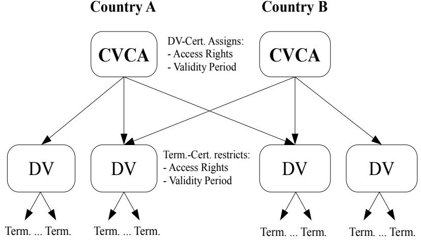
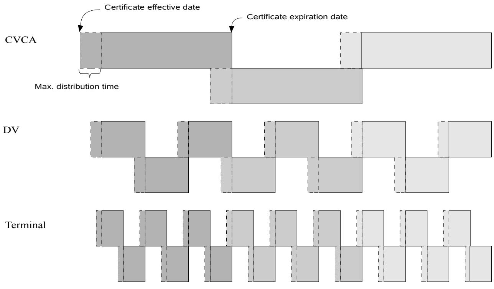
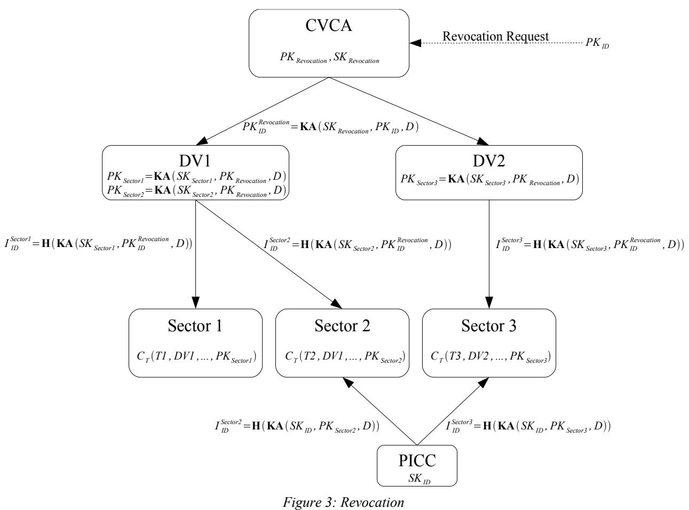
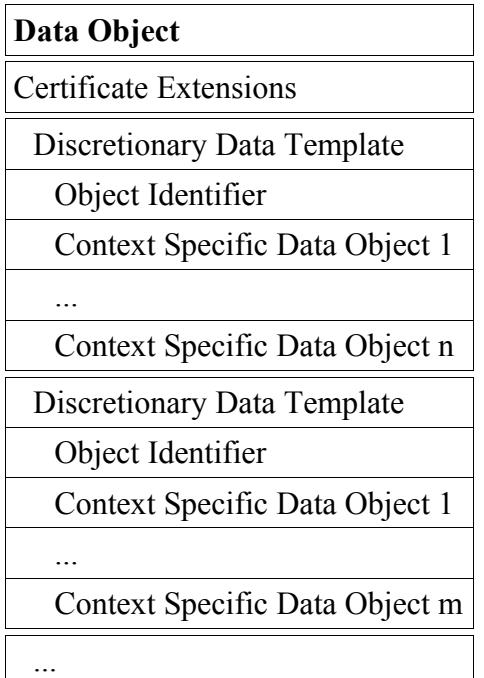
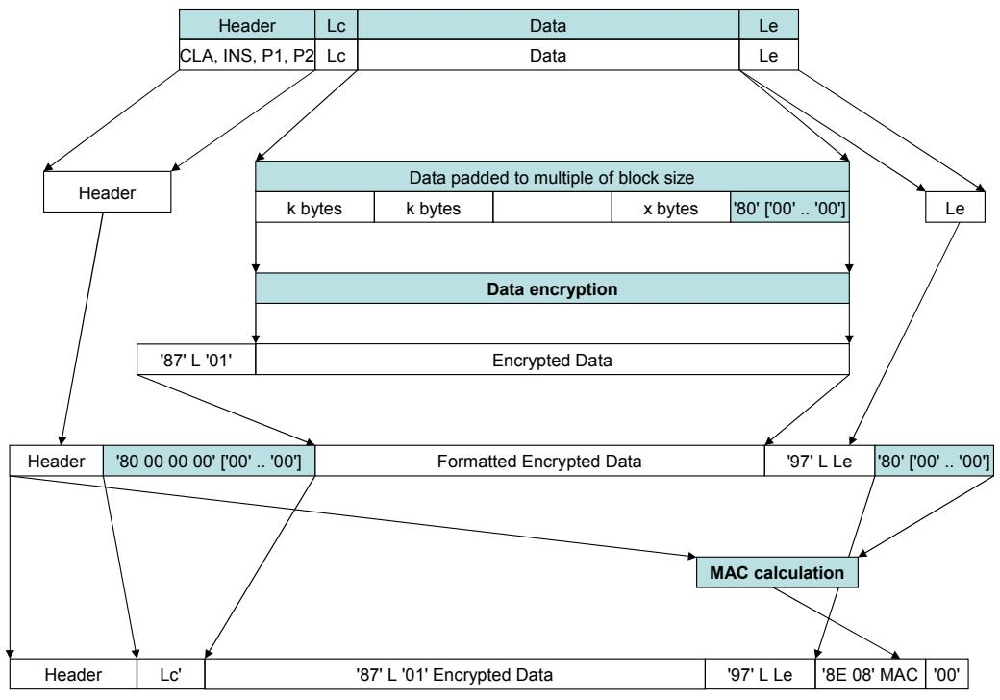
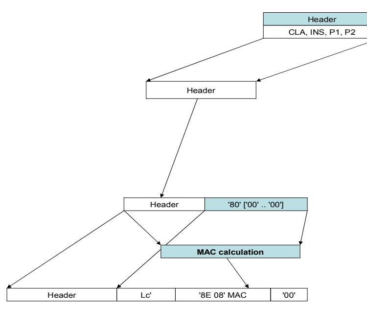
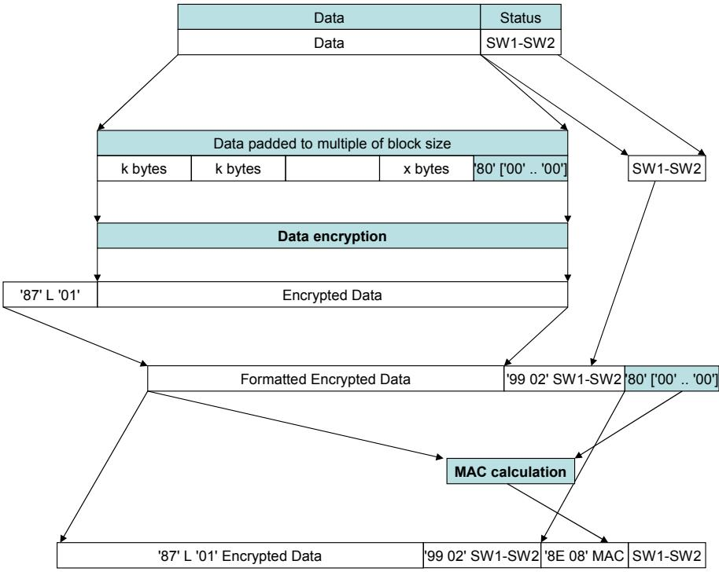

### Technical Guideline TR-03110-3

## **Advanced Security Mechanisms for Machine Readable Travel Documents –**

Part 3 – Common Specifications

Version 2.10 20. March 2012

#### **History**

| Version | Date       | Comment                                                                                                                             |  |
|---------|------------|-------------------------------------------------------------------------------------------------------------------------------------|--|
| 1.00    | 2006-02-08 | Initial public version.                                                                                                             |  |
| 1.01    | 2006-11-02 | Minor corrections and clarifications.                                                                                               |  |
| 1.10    | 2007-08-20 | Revised version.                                                                                                                    |  |
| 1.11    | 2008-02-21 | Minor corrections and clarifications.                                                                                               |  |
| 2.00    | 2008-10-27 | Enhanced version.                                                                                                                   |  |
| 2.01    | 2009-05-05 | Minor corrections and clarifications. Additional Mapping for PACE.                                                                  |  |
| 2.02    | 2009-11-09 | Adjustments to PACE required due to international standardization.                                                                  |  |
| 2.03    | 2010-03-24 | Clarification on the definition of a session. Standardization of domain<br>parameters. Introduction of a secondary security object. |  |
| 2.04    | 2010-09-15 | Clarifications on certificate extensions. Improved handling of chip<br>specific keys for privileged terminals.                      |  |
| 2.05    | 2010-10-14 | Clarifications on RFU-bits, "Read access to eID" deprecated                                                                         |  |
| 2.10    | 2012-03-20 | Split into three parts                                                                                                              |  |

Bundesamt für Sicherheit in der Informationstechnik Postfach 20 03 63 53133 Bonn

E-Mail: [ExtendedAccessControl@bsi.bund.de](mailto:ExtendedAccessControl@bsi.bund.de) Internet: [https://www.bsi.bund.de](https://www.bsi.bund.de/) © Bundesamt für Sicherheit in der Informationstechnik 2012

| 1     | Introduction7                                                  |  |
|-------|----------------------------------------------------------------|--|
| 1.1   | Requirements for MRTD Chips and Terminals7                     |  |
| 1.2   | Terminology7                                                   |  |
| 1.3   | Abbreviations9                                                 |  |
| 2     | Public Key Infrastructure10                                    |  |
| 2.1   | Country Verifying CA10                                         |  |
| 2.2   | Document Verifiers11                                           |  |
| 2.3   | Card Verifiable Certificates11                                 |  |
| 2.4   | Certificate Scheduling12                                       |  |
| 2.5   | Certificate Validation12                                       |  |
| 2.6   | Effective Authorization14                                      |  |
| 2.7   | Terminal Sector for Restricted Identification15                |  |
| A.    | ASN.1 Specifications (Normative)19                             |  |
| A.1.  | Information on Supported Security Protocols19                  |  |
| A.2.  | Key Agreement30                                                |  |
| A.3.  | PACE35                                                         |  |
| A.4.  | Chip Authentication37                                          |  |
| A.5.  | Restricted Identification38                                    |  |
| A.6.  | Terminal Authentication40                                      |  |
| B.    | ISO 7816 Mapping (Normative)47                                 |  |
| B.1.  | PACE47                                                         |  |
| B.2.  | Chip Authentication48                                          |  |
| B.3.  | Terminal Authentication49                                      |  |
| B.4.  | Restricted Identification50                                    |  |
| B.5.  | Auxiliary Data Verification50                                  |  |
| B.6.  | PIN Management51                                               |  |
| B.7.  | eSign Application51                                            |  |
| B.8.  | Reading Data Groups51                                          |  |
| B.9.  | Extended Length52                                              |  |
| B.10. | Command Chaining52                                             |  |
| B.11. | APDU Specification53                                           |  |
| C.    | CV Certificates (normative)62                                  |  |
| C.1.  | Certificate Profile62                                          |  |
| C.2.  | Certificate Requests64                                         |  |
| C.3.  | Certificate Extensions for Terminal Authentication Version 266 |  |
| C.4.  | Roles and Authorization Levels68                               |  |
| C.5.  | Certificate Policy70                                           |  |
| D.    | DER Encoding (Normative)72                                     |  |
| D.1.  | ASN.172                                                        |  |

| D.2.<br>D.3. | Data Objects72<br>Public Key Data Objects75   |  |
|--------------|-----------------------------------------------|--|
| E.           | Secure Messaging (Normative)77                |  |
| E.1.         | Message Structure of Secure Messaging APDUs77 |  |
| E.2.         | Cryptographic Algorithms78                    |  |
| E.3.         | Send Sequence Counter79                       |  |
| E.4.         | Secure Messaging Errors80                     |  |

### **List of Figures**

| Figure 1: Public Key Infrastructure10                                |  |
|----------------------------------------------------------------------|--|
| Figure 2: Certificate Scheduling12                                   |  |
| Figure 3: Revocation17                                               |  |
| Figure 4: Transformation of a command APDU80                         |  |
| Figure 5: Transformation of a command APDU if no data is available81 |  |
| Figure 6: Transformation of a response APDU81                        |  |

### **List of Tables**

| Table 1: Key words8                                                    |  |
|------------------------------------------------------------------------|--|
| Table 2: Elementary Files CardAccess, CardSecurity and ChipSecurity27  |  |
| Table 3: Algorithms and Formats for Key Agreement30                    |  |
| Table 4: Standardized Domain Parameters31                              |  |
| Table 5: Encoding of Passwords33                                       |  |
| Table 6: Object Identifiers for PACE with DH35                         |  |
| Table 7: Object Identifiers for PACE with ECDH36                       |  |
| Table 8: Object Identifiers for Chip Authentication with DH38          |  |
| Table 9: Object Identifiers for Chip Authentication with ECDH38        |  |
| Table 10: Object Identifiers for Restricted Identification with DH39   |  |
| Table 11: Object Identifiers for Restricted Identification with ECDH39 |  |
| Table 12: Certificate Holder Reference40                               |  |
| Table 13: Elementary File EF.CVCA42                                    |  |
| Table 14: Object Identifiers for Terminal Authentication with RSA43    |  |
| Table 15: Object Identifiers for Terminal Authentication with ECDSA44  |  |
| Table 16: Authenticated Auxiliary Data45                               |  |
| Table 17: CV Certificate Profile62                                     |  |

| Table 18: CV Certificate Request Profile64            |  |
|-------------------------------------------------------|--|
| Table 19: Certificate Extensions66                    |  |
| Table 20: Authorization of Inspection Systems68       |  |
| Table 21: Authorization of Authentication Terminals69 |  |
| Table 22: Authorization of Signature Terminals70      |  |
| Table 23: Overview on Data Objects (sorted by Tag)72  |  |
| Table 24: ISO/IEC 8859-1 Character Set74              |  |
| Table 25: RSA Public Key75                            |  |
| Table 26: DH Public Key76                             |  |
| Table 27: EC Public Keys76                            |  |
| Table 28: Usage of Secure Messaging Data Objects77    |  |
|                                                       |  |

# <span id="page-5-0"></span>**1 Introduction**

This Part of the Technical Guideline gives the common specifications, comprising the PKI used for Access Control as well as a mapping of the protocols to ASN.1- and APDU-specifications, for the protocols defined in Part 1 and Part 2:

- **•** Part 1:
	- **◦** Terminal Authentication version 1
	- **◦** Chip Authentication version 1
- **•** Part 2:
	- **◦** Password Authenticated Connection Establishment (PACE)
	- **◦** Chip Authentication version 2
	- **◦** Terminal Authentication version 2
	- **◦** Restricted Identification

Although the specifications of PACEv2 in [10] are compatible to the specifications in this document, please refer to [10] for an implementation of PACE according to Part 1.

In this Guideline documents which only implement the protocols described in Part 1 of this Guideline are designated "Part 1-documents", while documents implementing protocols from Part 2 or from both Parts are designated "Part 2-documents".

### **1.1 Requirements for MRTD Chips and Terminals**

This Technical Guideline specifies requirements for implementations of MRTD chips and terminals. While MRTD chips must comply with those requirements according to the terminology described in Section [1.2,](#page-5-1) requirements for terminals are to be interpreted as guidance, i.e. interoperability of MRTD chip and terminal are only guaranteed if the terminal complies with those requirements, otherwise the interaction with the MRTD chip will either fail or the behavior of the MRTD chip is undefined. In general, the MRTD chip need not enforce requirements related to terminals unless the security of the MRTD chip is directly affected.

## <span id="page-5-1"></span>**1.2 Terminology**

The key words "MUST", "MUST NOT", "REQUIRED", "SHALL", "SHALL NOT", "SHOULD", "SHOULD NOT", "RECOMMENDED", "MAY", and "OPTIONAL" in this document are to be interpreted as described in RFC 2119 [2]. The key word "CONDITIONAL" is to be interpreted as follows:

**CONDITIONAL:** The usage of an item is dependent on the usage of other items. It is therefore further qualified under which conditions the item is REQUIRED or RECOMMENDED.

When used in tables (profiles), the key words are abbreviated as shown in Table [1.](#page-6-0)

| Key word             | Abbrev.     |   |
|----------------------|-------------|---|
| MUST / SHALL         | REQUIRED    | m |
| MUST NOT / SHALL NOT | –           | x |
| SHOULD               | RECOMMENDED | r |
| MAY                  | OPTIONAL    | o |
| –                    | CONDITIONAL | c |

<span id="page-6-0"></span>*Table 1: Key words*

### **1.3 Abbreviations**

The following abbreviations are commonly used throughout this specification.

| Name                                      | Abbreviation      |
|-------------------------------------------|-------------------|
| Binary Coded Digit                        | BCD               |
| Card Verifiable                           | CV                |
| Card/Chip Security Object                 | SOC               |
| Certification Authority                   | CA                |
| Chip Identifier                           | IDPICC            |
| Chip Authentication Public Key            | PK PICC           |
| Chip Authentication Private Key           | SKPICC            |
| Country Signing CA                        | CSCA              |
| Country Verifying CA                      | CVCA              |
| Country Verifying CA Certificate          | CCVCA             |
| Document Security Object                  | SOD               |
| Data Group                                | DG                |
| Document Verifier                         | DV                |
| Document Verifier Certificate             | C DV              |
| Domain Parameters                         | D                 |
| Ephemeral Private Key                     | <br>SK           |
| Ephemeral Public Key                      | <br>PK           |
| Hash Function                             | H                 |
| International Civil Aviation Organization | ICAO              |
| Key Agreement Function                    | KA                |
| Key Derivation Function                   | KDF               |
| Logical Data Structure                    | LDS               |
| Machine Readable Travel Document          | MRTD              |
| Proximity Integrated Circuit Chip         | PICC              |
| Proximity Coupling Device                 | PCD               |
| Restricted Identification Public Key      | PKID              |
| Restricted Identification Private Key     | SKID              |
| Sector Public Key                         | PKSector          |
| Sector Private Key                        | SKSector          |
| Sector-specific Identifier                | Sector<br>I<br>ID |
| Terminal Authentication Public Key        | PK PCD            |
| Terminal Authentication Private Key       | SKPCD             |
| Terminal Certificate                      | CT                |

# <span id="page-8-0"></span>**2 Public Key Infrastructure**

Terminal Authentication requires the terminal to prove to the MRTD chip that it is entitled to access sensitive data. Such a terminal is equipped with at least one *Terminal Certificate,* encoding the terminal's public key and access rights, and the corresponding private key. After the terminal has proven knowledge of this private key, the MRTD chip grants the terminal access to sensitive data as indicated in the Terminal Certificate.

The PKI required for issuing and validating Terminal Certificates consists of the following entities:

- 1. Country Verifying CAs (CVCAs)
- 2. Document Verifiers (DVs)
- 3. Terminals

This PKI forms the basis of Extended Access Control. It is illustrated in Figure [1.](#page-8-1)

### **2.1 Country Verifying CA**

Every State is required to set up one trust-point that issues Document Verifier Certificates: the *Country Verifying CA* (CVCA).

**Note:** The Country Signing CA issuing certificates for Document Signers (cf. [8], [9]) and the Country Verifying CA MAY be integrated into a single entity, e.g. a Country CA. However, even in this case, separate key pairs MUST be used for different roles.

A CVCA determines the access rights to national MRTD chips for all DVs (i.e. official domestic DVs as well as the foreign/commercial DVs) by issuing certificates for DVs entitled to access some sensitive data. The conditions under which a CVCA grants a DV access to sensitive data is out of the scope of this document and SHOULD be stated in a certificate policy (cf. Appendix [C.5\)](#page-68-0).

Document Verifier Certificates MUST contain information, such as which data a certain DV is entitled to access. To diminish the potential risk introduced by lost or stolen terminals Document Veri-



*Arrows denote certification*

<span id="page-8-1"></span>*Figure 1: Public Key Infrastructure*

fier Certificates MUST contain a short validity period. The validity period is assigned by the issuing CVCA at its own choice and this validity period may differ depending on the Document Verifier the certificate is issued to.

### **2.2 Document Verifiers**

A *Document Verifier* (DV) is an organizational unit that manages a group of terminals (e.g. terminals operated by a State's border police) by – inter alia – issuing Terminal Certificates. A Document Verifier is therefore a CA, authorized by at least the national CVCA to issue certificates for its terminals. The Terminal Certificates issued by a DV usually inherit both the access rights and the validity period from the Document Verifier Certificate, however, the Document Verifier MAY choose to further **restrict** the access rights or the validity period depending on the terminal the certificate is issued for.

If a Document Verifier requires its terminals to access sensitive data stored on other States' MRTD chips, it MUST apply for a DV Certificate issued by the CVCA of the respective States. The Document Verifier MUST also ensure that all received Document Verifier Certificates are forwarded to the terminals within its domain.

## **2.3 Card Verifiable Certificates**

CVCA Link Certificates, DV Certificates, and Terminal Certificates are to be validated by MRTD chips. Due to the computational restrictions of those chips, the certificates MUST be in a card verifiable format:

- **•** The certificate format and profile specified in Appendix [C.1](#page-60-1) SHALL be used.
- **•** The signature algorithm, domain parameters, and key sizes to be used are determined by the CVCA of the issuing State, i.e. the same signature algorithm, domain parameters and key sizes MUST be used within a certificate chain.[1](#page-9-0)
- **•** CVCA Link Certificates MAY include a public key that deviates from the current parameters, i.e. the CVCA MAY switch to a new signature algorithm, new domain parameters, or key sizes.

<span id="page-9-0"></span><sup>1</sup> As a consequence Document Verifiers and terminals will have to be provided with several key pairs.

#### 2 Public Key Infrastructure



<span id="page-10-0"></span>*Figure 2: Certificate Scheduling*

### **2.4 Certificate Scheduling**

Each certificate MUST contain a validity period. This validity period is identified by two dates, the *certificate effective date* and the *certificate expiration date.*

- **Certificate Effective Date:** The certificate effective date SHALL be the date of the certificate generation.
- **Certificate Expiration Date:** The certificate expiration date SHALL be the date *after* which the certificate expires. It may be arbitrarily chosen by the certificate issuer.

When generating certificates the issuer MUST carefully plan the roll-over of certificates, as sufficient time for propagation of certificates and set up of certificate chains MUST be provided. Obviously, a new certificate must be generated before the current certificate expires. The resulting *maximum distribution time* equals the certificate expiration date of the old certificate minus the certificate effective date of the new certificate. For the application and distribution of certificates, the communication protocols specified in TR-03129 [4] are RECOMMENDED. Certificate scheduling is illustrated in Figure [2.](#page-10-0)

### <span id="page-10-1"></span>**2.5 Certificate Validation**

To validate a Terminal Certificate, the MRTD chip MUST be provided with a certificate chain starting at a trust-point stored on the MRTD chip. Those trust-points are more or less recent public keys of the MRTD chip's CVCA. The initial trust-point(s) SHALL be stored securely in the MRTD chip's memory in the production or (pre-) personalization phase.

As the key pair used by the CVCA changes over time, CVCA Link Certificates have to be produced. The MRTD chip is REQUIRED to internally update its trust-point(s) according to received valid link certificates.

**Note:** Due to the scheduling of CVCA Link Certificates (cf. Figure [2\)](#page-10-0), at most two trust-points per application need to be stored on the MRTD chip.

The MRTD chip MUST accept expired CVCA Link Certificates but it MUST NOT accept expired DV and Terminal Certificates. To determine whether a certificate is expired, the MRTD chip SHALL use its *current date*.

- **Current Date:** If the MRTD chip has no internal clock, the current date SHALL be approximated as described in the following. The current date stored on the MRTD chip is initially the date of the (pre-) personalization. This date is then autonomously approximated by the MRTD chip using the most recent certificate effective date contained in a valid CVCA Link Certificate, a DV Certificate or an *Accurate Terminal Certificate*.
- **Accurate Terminal Certificate:** A Terminal Certificate is accurate, if the issuing Document Verifier is trusted by the MRTD chip to produce Terminal Certificates with the correct certificate effective date.

A terminal MAY send CVCA Link Certificates, DV Certificates, and Terminal Certificates to an MRTD chip to update the current date and the trust-point stored on the MRTD chip even if the terminal does not intend to or is not able to continue with Terminal Authentication.

**Note:** The MRTD chip only verifies that a certificate is *apparently* recent (i.e. with respect to the approximated current date).

### <span id="page-11-0"></span>**2.5.1 General Procedure**

The certificate validation procedure consists of two steps:

- 1. **Certificate Verification:** The signature MUST be valid and unless the certificate is a CVCA Link Certificate, the certificate MUST NOT be expired. If the verification fails, the procedure SHALL be aborted.
- 2. **Internal Status Update:** The current date MUST be *updated*, the public key and the attributes (including relevant certificate extensions) MUST be imported, new trust-points MUST be *enabled*, expired trust-points MUST be *disabled* for the verification of DV Certificates.

The operation of *updating* the current date and the operations of *enabling* and *disabling* a trust-point MUST be implemented as an atomic operation.

**Enabling a trust-point:** The new trust-point SHALL be added to the list of trust-points.

**Disabling a trust-point:** Expired trust-points MUST NOT be used for the verification of DV Certificates but MUST remain usable for the verification of CVCA Link Certificates. Disabled trustpoints MAY be deleted after the successful import of the successive Link Certificate.

### **2.5.2 Example Procedure**

The following validation procedure, provided as an example, MAY be used to validate a certificate chain. For each received certificate the MRTD chip performs the following steps:

- 1. The MRTD chip verifies the signature on the certificate. If the signature is incorrect, the verification fails.
- 2. If the certificate is not a CVCA Link Certificate, the certificate expiration date is compared to the MRTD chip's current date. If the expiration date is before the current date, the verification fails.
- 3. The certificate is accepted as valid and the public key and the attributes (including relevant certificate extensions) contained in the certificate are imported.
	- a) For CVCA, DV, and Accurate Terminal Certificates: The certificate effective date is compared to the MRTD chip's current date. If the current date is before the effective date, the current date is updated to the effective date.
	- b) For CVCA Link Certificates: The new CVCA public key is added to the list of trustpoints stored securely in the MRTD chip's memory. The new trust-point is then enabled.
	- c) For DV and Terminal Certificates: The new DV or terminal public key is temporarily imported for subsequent certificate verification or Terminal Authentication, respectively.
- 4. Expired trust-points stored securely in the MRTD chip's memory are disabled for the verification of DV Certificates and may be removed from the list of trust-points.

### <span id="page-12-0"></span>**2.6 Effective Authorization**

Each certificate SHALL contain a *Certificate Holder Authorization Template* (cf. Appendix [C.1.5.\)](#page-61-0) that identifies the terminal type (cf. Parts 1 and 2 of this Technical Guideline) and determines the *relative authorization* of the certificate holder assigned by the issuing certificate authority. To determine the *effective authorization* of a certificate holder, the MRTD chip MUST calculate a bitwise Boolean 'and' of the relative authorization contained in the Terminal Certificate, the referenced Document Verifier Certificate, and the referenced CVCA Certificate.

### **2.6.1 Confined Authorization (Part 2-documents only)**

The effective authorization may be further restricted by using the General Authentication Procedure (cf. Part 2 of this Technical Guideline). In this case the terminal MUST indicate the terminal type and the *confined authorization* (i.e. the effective authorization required by the terminal) as part of PACE. For the computation of the effective authorization the MRTD chip SHALL include the confined authorization similarly by calculating a bitwise Boolean 'and'.

**Note:** The MRTD chip MUST verify that the terminal type indicated in the confined authorization and the terminal type in the relative authorization of each certificate of the certificate chain are equal. If a mismatch is detected, the MRTD chip SHALL reset the access rights and indicate an error (cf. Appendix [B.11.7.\)](#page-56-0).

### **2.6.2 Interpretation (all document types)**

The effective authorization SHALL be interpreted by the MRTD chip as follows:

- **•** The effective role is a CVCA:
	- **◦** This link certificate was issued by the national CVCA.
	- **◦** The MRTD chip MUST update its internal trust-point, i.e. the public key and the effective authorization.
	- **◦** The certificate issuer is a trusted source of time and the MRTD chip MUST update its current date using the Certificate Effective Date.
	- **◦** The MRTD chip MUST NOT grant the CVCA access to sensitive data (i.e. the effective authorization SHOULD be ignored).
- **•** The effective role is a DV:
	- **◦** The certificate was issued by the national CVCA for an authorized DV.
	- **◦** The certificate issuer is a trusted source of time and the MRTD chip MUST update its current date using the Certificate Effective Date.
	- **◦** The MRTD chip MUST NOT grant a DV access to sensitive data (i.e. the effective authorization SHOULD be ignored).
- **•** The effective role is a Terminal:
	- **◦** The certificate was issued by either an official domestic, a foreign, or a non-official DV.
	- **◦** If the certificate is an accurate terminal certificate (cf. Section [2.5\)](#page-10-1), the issuer is a trusted source of time and the MRTD chip MUST update its current date using the Certificate Effective Date.
	- **◦** The MRTD chip MUST grant the authenticated terminal access to sensitive data according to the effective authorization.

A valid Terminal Certificate MUST be accepted as accurate by the MRTD chip if it was issued by an official domestic DV and SHOULD NOT be accepted as accurate otherwise.

## **2.7 Terminal Sector for Restricted Identification**

To support Restricted Identification terminals MUST be assigned a Terminal Sector. The Terminal Sector SHALL be contained in the Terminal Certificate and thus, it is RECOMMENDED that the Terminal Sector is generated by the certifying Document Verifier. In any case the Terminal Sector MUST NOT be chosen by the terminal itself.

The Terminal Sector is always a public key. It MAY be chosen either verifiably at random with an unknown private key to disable tracing completely (in this case linking sector-specific identifiers across sectors is computationally impossible) or as key pair to enable revocation based on sector-specific identifiers.

### **2.7.1 Sector Key Pair**

Sector Key Pairs MUST be generated by all Document Verifiers that support sector-specific revocation of MRTD chips.

Each Document Verifier SHALL perform the following steps for every subordinated sector:

- 1. Generate a new Sector Key Pair based on the Revocation Sector Public Key.
- 2. Store the Sector Private Key securely (at the Document Verifier).
- 3. Include the Sector Public Key in every Terminal Certificate of all terminals belonging to the corresponding sector.

The Revocation Sector Key Pair SHALL be generated by the CVCA. The CVCA MAY delegate the revocation service to a service provider.

### **2.7.2 Sector-Specific Revocation of MRTD Chips**

At the (pre-) personalization of the MRTD chip a key pair for Restricted Identification SHALL be generated. The private key SHALL be stored in the MRTD chip, the public key SHALL be stored in a database together with other data identifying the holder of the MRTD.

**Note:** The generation of the key pair for Restricted Identification MAY be performed within the MRTD chip or externally. The key pair MUST be chosen to be unique and MAY be either chipspecific or holder-specific (i.e. the same key pair will be used on subsequent MRTD chips). At least one key pair used for Restricted Identification MUST be chip-specific.

To revoke the MRTD chip, the chip-specific public key of the MRTD chip is looked up in the data base and transferred to the CVCA. The CVCA then transforms the public key using its Revocation Sector Private Key. The transformed public key is then transferred to all subordinated Document Verifiers. Each Document Verifier calculates the sector-specific identifiers using the Sector Private Keys for all subordinated Terminal Sectors. Finally, the sector-specific identifier is transferred to all terminals of the corresponding sector.

### **2.7.3 Generation of Revocation Lists**

The CVCA publishes the Revocation Sector Public Key *PK Revocation* and the domain parameters *D*. Each Document Verifier randomly chooses a Sector Private Key *SKSector* for every subordinated sector and calculates the Sector Public Key as *PK Sector*=**KA***SKSector , PKRevocation , D*.



To revoke an MRTD chip a revocation request is sent to the CVCA containing the Restricted Identification Public Key *PKID* . The sector-specific identities are calculated as follows:

- 1. The CVCA calculates *PK ID Revocation*=**KA***SKRevocation , PK ID , D* using its private key *SKRevocation* and the Restricted Identification Public Key *PK ID* received with the revocation request. The transformed public key *PK ID Revocation* is forwarded to all subordinated Document Verifiers.
- 2. Each Document Verifier calculates the sector-specific identifier for all subordinated sectors. For each sector the Document Verifier calculates

$$I\_{ID}^{\text{Sector}} = \mathbf{H} \left( \mathbf{K} \mathbf{A} \left( \mathbf{S} \mathbf{K}\_{\text{Sector}}, PK\_{ID}^{\text{Revccation}}, D \right) \right)$$

using the corresponding Sector Private Key *SKSector* and the received public key *PK ID Revocation* of the MRTD chip to be revoked. The sector-specific identifier *I ID Sector* is then forwarded to the terminals of the corresponding sector.

### **2.7.4 Validity Period**

In contrast to the Terminal Key Pair (for Terminal Authentication), the Sector Key Pair is valid for a long time and MUST be chosen appropriately.

### **2.7.5 Migrating Terminals**

To migrate a terminal from one Document Verifier to another Document Verifier, the sector key pair of the terminal MUST be transferred securely to the new Document Verifier.

**Note:** Migrating a terminal to a Document Verifier supervised by another CVCA is not possible.

# <span id="page-17-0"></span>**A. ASN.1 Specifications (Normative)**

The object identifiers used in the following appendices are contained in the subtree of bsi-de:

```
bsi-de OBJECT IDENTIFIER ::= {
 itu-t(0) identified-organization(4) etsi(0) 
 reserved(127) etsi-identified-organization(0) 7 
}
```
### **A.1. Information on Supported Security Protocols**

The ASN.1 data structure SecurityInfos SHALL be provided by the MRTD chip to indicate supported security protocols. The data structure is specified as follows:

```
SecurityInfos ::= SET OF SecurityInfo
SecurityInfo ::= SEQUENCE {
 protocol OBJECT IDENTIFIER,
 requiredData ANY DEFINED BY protocol,
 optionalData ANY DEFINED BY protocol OPTIONAL
}
```
The elements contained in a SecurityInfo data structure have the following meaning:

- **•** The object identifier protocol identifies the supported protocol.
- **•** The open type requiredData contains protocol specific mandatory data.
- **•** The open type optionalData contains protocol specific optional data.

### **A.1.1. Supported Protocols**

The ASN.1 specifications for the protocols provided in this specification are described in the following.

**Note:** MRTD chips implemented according to Version 1.0.x of this specification will only provide a ChipAuthenticationPublicKeyInfo.

In this case the terminal SHOULD assume the following:

- **•** The MRTD chip supports Chip Authentication in version 1.
- **•** The MRTD chip may support Terminal Authentication in version 1.

To determine whether or not sensitive data protected by Terminal Authentication is stored on the MRTD chip, the terminal may consult the Document Security Object and the elementary file EF.CVCA.

### **A.1.1.1. PACE**

To indicate support for PACE SecurityInfos may contain the following entries:

- **•** At least one PACEInfo using a standardized domain parameter MUST be present.
- **•** For each supported set of explicit domain parameters a PACEDomainParameterInfo MUST be present.

**PACEInfo:** This data structure provides detailed information on an implementation of PACE.

- **•** The object identifier protocol SHALL identify the algorithms to be used (i.e. key agreement, symmetric cipher and MAC).
- **•** The integer version SHALL identify the version of the protocol. Version 1 is deprecated and it is RECOMMENDED to only use version 2.
- **•** The integer parameterId is used to indicate the domain parameter identifier. It MUST be used if the MRTD chip uses standardized domain parameters (cf. [Table 4\)](#page-29-0) or provides multiple explicit domain parameters for PACE.

```
id-PACE OBJECT IDENTIFIER ::= {
 bsi-de protocols(2) smartcard(2) 4
}
id-PACE-DH-GM OBJECT IDENTIFIER ::= {id-PACE 1}
id-PACE-DH-GM-3DES-CBC-CBC OBJECT IDENTIFIER ::= {id-PACE-DH-GM 1}
id-PACE-DH-GM-AES-CBC-CMAC-128 OBJECT IDENTIFIER ::= {id-PACE-DH-GM 2}
id-PACE-DH-GM-AES-CBC-CMAC-192 OBJECT IDENTIFIER ::= {id-PACE-DH-GM 3}
id-PACE-DH-GM-AES-CBC-CMAC-256 OBJECT IDENTIFIER ::= {id-PACE-DH-GM 4}
id-PACE-ECDH-GM OBJECT IDENTIFIER ::= {id-PACE 2}
id-PACE-ECDH-GM-3DES-CBC-CBC OBJECT IDENTIFIER ::= {id-PACE-ECDH-GM 1}
id-PACE-ECDH-GM-AES-CBC-CMAC-128 OBJECT IDENTIFIER ::= {id-PACE-ECDH-GM 2}
id-PACE-ECDH-GM-AES-CBC-CMAC-192 OBJECT IDENTIFIER ::= {id-PACE-ECDH-GM 3}
id-PACE-ECDH-GM-AES-CBC-CMAC-256 OBJECT IDENTIFIER ::= {id-PACE-ECDH-GM 4}
id-PACE-DH-IM OBJECT IDENTIFIER ::= {id-PACE 3}
id-PACE-DH-IM-3DES-CBC-CBC OBJECT IDENTIFIER ::= {id-PACE-DH-IM 1}
id-PACE-DH-IM-AES-CBC-CMAC-128 OBJECT IDENTIFIER ::= {id-PACE-DH-IM 2}
id-PACE-DH-IM-AES-CBC-CMAC-192 OBJECT IDENTIFIER ::= {id-PACE-DH-IM 3}
id-PACE-DH-IM-AES-CBC-CMAC-256 OBJECT IDENTIFIER ::= {id-PACE-DH-IM 4}
id-PACE-ECDH-IM OBJECT IDENTIFIER ::= {id-PACE 4}
id-PACE-ECDH-IM-3DES-CBC-CBC OBJECT IDENTIFIER ::= {id-PACE-ECDH-IM 1}
id-PACE-ECDH-IM-AES-CBC-CMAC-128 OBJECT IDENTIFIER ::= {id-PACE-ECDH-IM 2}
id-PACE-ECDH-IM-AES-CBC-CMAC-192 OBJECT IDENTIFIER ::= {id-PACE-ECDH-IM 3}
id-PACE-ECDH-IM-AES-CBC-CMAC-256 OBJECT IDENTIFIER ::= {id-PACE-ECDH-IM 4}
PACEInfo ::= SEQUENCE {
 protocol OBJECT IDENTIFIER(
 id-PACE-DH-GM-3DES-CBC-CBC | 
 id-PACE-DH-GM-AES-CBC-CMAC-128 | 
 id-PACE-DH-GM-AES-CBC-CMAC-192 | 
 id-PACE-DH-GM-AES-CBC-CMAC-256 | 
 id-PACE-ECDH-GM-3DES-CBC-CBC | 
 id-PACE-ECDH-GM-AES-CBC-CMAC-128 | 
 id-PACE-ECDH-GM-AES-CBC-CMAC-192 | 
 id-PACE-ECDH-GM-AES-CBC-CMAC-256 |
 id-PACE-DH-IM-3DES-CBC-CBC | 
 id-PACE-DH-IM-AES-CBC-CMAC-128 | 
 id-PACE-DH-IM-AES-CBC-CMAC-192 | 
 id-PACE-DH-IM-AES-CBC-CMAC-256 | 
 id-PACE-ECDH-IM-3DES-CBC-CBC | 
 id-PACE-ECDH-IM-AES-CBC-CMAC-128 | 
 id-PACE-ECDH-IM-AES-CBC-CMAC-192 | 
 id-PACE-ECDH-IM-AES-CBC-CMAC-256),
 version INTEGER, -- SHOULD be 2
 parameterId INTEGER OPTIONAL
```
}

- **PACEDomainParameterInfo:** This data structure provides one set of explicit domain parameters for PACE of the MRTD chip.
	- **•** The object identifier protocol SHALL identify the type of the domain parameters (i.e. DH or ECDH).
	- **•** The sequence domainParameter SHALL contain the domain parameters.
	- **•** The integer parameterId MAY be used to indicate the local domain parameter identifier. It MUST be used if the MRTD chip provides multiple explicit domain parameters for PACE.

```
PACEDomainParameterInfo ::= SEQUENCE {
 protocol OBJECT IDENTIFIER(
 id-PACE-DH-GM |
 id-PACE-ECDH-GM |
 id-PACE-DH-IM |
 id-PACE-ECDH-IM),
 domainParameter AlgorithmIdentifier,
 parameterId INTEGER OPTIONAL
}
```
### <span id="page-19-0"></span>**A.1.1.2. Chip Authentication**

To indicate support for Chip Authentication SecurityInfos may contain the following entries:

- **•** At least one ChipAuthenticationPublicKeyInfo MUST be present.
- **•** At least one ChipAuthenticationInfo MUST be present.
- **•** At least one ChipAuthenticationDomainParameterInfo MUST be present for Chip Authentication in version 2.

If more than one Chip Authentication Public Key is present the optional keyId MUST be used in all three data structures to indicate the local key identifier. All public keys MUST have different domain parameters.

**ChipAuthenticationInfo:** This data structure provides detailed information on an implementation of Chip Authentication.

- **•** The object identifier protocol SHALL identify the algorithms to be used (i.e. key agreement, symmetric cipher and MAC).
- **•** The integer version SHALL identify the version of the protocol. Currently, versions 1 and 2 are supported.
- **•** The integer keyId MAY be used to indicate the local key identifier. It MUST be used if the MRTD chip provides multiple public keys for Chip Authentication.

```
id-CA OBJECT IDENTIFIER ::= {
 bsi-de protocols(2) smartcard(2) 3
}
id-CA-DH OBJECT IDENTIFIER ::= {id-CA 1}
id-CA-DH-3DES-CBC-CBC OBJECT IDENTIFIER ::= {id-CA-DH 1}
id-CA-DH-AES-CBC-CMAC-128 OBJECT IDENTIFIER ::= {id-CA-DH 2}
```

```
id-CA-DH-AES-CBC-CMAC-192 OBJECT IDENTIFIER ::= {id-CA-DH 3}
id-CA-DH-AES-CBC-CMAC-256 OBJECT IDENTIFIER ::= {id-CA-DH 4}
id-CA-ECDH OBJECT IDENTIFIER ::= {id-CA 2}
id-CA-ECDH-3DES-CBC-CBC OBJECT IDENTIFIER ::= {id-CA-ECDH 1}
id-CA-ECDH-AES-CBC-CMAC-128 OBJECT IDENTIFIER ::= {id-CA-ECDH 2}
id-CA-ECDH-AES-CBC-CMAC-192 OBJECT IDENTIFIER ::= {id-CA-ECDH 3}
id-CA-ECDH-AES-CBC-CMAC-256 OBJECT IDENTIFIER ::= {id-CA-ECDH 4}
ChipAuthenticationInfo ::= SEQUENCE {
 protocol OBJECT IDENTIFIER(
 id-CA-DH-3DES-CBC-CBC | 
 id-CA-DH-AES-CBC-CMAC-128 | 
 id-CA-DH-AES-CBC-CMAC-192 | 
 id-CA-DH-AES-CBC-CMAC-256 | 
 id-CA-ECDH-3DES-CBC-CBC | 
 id-CA-ECDH-AES-CBC-CMAC-128 | 
 id-CA-ECDH-AES-CBC-CMAC-192 | 
 id-CA-ECDH-AES-CBC-CMAC-256),
 version INTEGER, -- MUST be 1 for CAv1 or 2 for CAv2
 keyId INTEGER OPTIONAL
}
```
**ChipAuthenticationDomainParameterInfo:** This data structure provides one set of domain parameters for Chip Authentication version 2 of the MRTD chip.

- **•** The object identifier protocol SHALL identify the type of the domain parameters (i.e. DH or ECDH).
- **•** The sequence domainParameter SHALL contain the domain parameters.
- **•** The integer keyId MAY be used to indicate the local key identifier. It MUST be used if the MRTD chip provides multiple public keys for Chip Authentication.

```
ChipAuthenticationDomainParameterInfo ::= SEQUENCE {
 protocol OBJECT IDENTIFIER(id-CA-DH | id-CA-ECDH),
 domainParameter AlgorithmIdentifier,
 keyId INTEGER OPTIONAL
}
```
**ChipAuthenticationPublicKeyInfo:** This data structure provides a public key for Chip Authentication of the MRTD chip.

- **•** The object identifier protocol SHALL identify the type of the public key (i.e. DH or ECDH).
- **•** The sequence chipAuthenticationPublicKey SHALL contain the public key in encoded form.
- **•** The integer keyId MAY be used to indicate the local key identifier. It MUST be used if the MRTD chip provides multiple public keys for Chip Authentication.

```
id-PK OBJECT IDENTIFIER ::= {
 bsi-de protocols(2) smartcard(2) 1
}
id-PK-DH OBJECT IDENTIFIER ::= {id-PK 1}
id-PK-ECDH OBJECT IDENTIFIER ::= {id-PK 2}
ChipAuthenticationPublicKeyInfo ::= SEQUENCE {
```

```
 protocol OBJECT IDENTIFIER(id-PK-DH | id-PK-ECDH),
 chipAuthenticationPublicKey SubjectPublicKeyInfo,
 keyId INTEGER OPTIONAL
}
```
#### **A.1.1.3. Terminal Authentication**

To indicate support for Terminal Authentication SecurityInfos may contain the following entry:

**•** At least one TerminalAuthenticationInfo SHOULD be present.

**TerminalAuthenticationInfo:** This data structure provides detailed information on an implementation of Terminal Authentication.

- **•** The object identifier protocol SHALL identify the *general* Terminal Authentication Protocol as the specific protocol may change over time.
- **•** The integer version SHALL identify the version of the protocol. Currently, versions 1 and 2 are supported.
- **•** The sequence efCVCA MAY be used in version 1 to indicate a (short) file identifier of the file EF.CVCA. It MUST be used, if the default (short) file identifier is not used.

```
id-TA OBJECT IDENTIFIER ::= {
 bsi-de protocols(2) smartcard(2) 2
}
id-TA-RSA OBJECT IDENTIFIER ::= {id-TA 1}
id-TA-RSA-v1-5-SHA-1 OBJECT IDENTIFIER ::= {id-TA-RSA 1}
id-TA-RSA-v1-5-SHA-256 OBJECT IDENTIFIER ::= {id-TA-RSA 2}
id-TA-RSA-PSS-SHA-1 OBJECT IDENTIFIER ::= {id-TA-RSA 3}
id-TA-RSA-PSS-SHA-256 OBJECT IDENTIFIER ::= {id-TA-RSA 4}
id-TA-RSA-v1-5-SHA-512 OBJECT IDENTIFIER ::= {id-TA-RSA 5}
id-TA-RSA-PSS-SHA-512 OBJECT IDENTIFIER ::= {id-TA-RSA 6}
id-TA-ECDSA OBJECT IDENTIFIER ::= {id-TA 2}
id-TA-ECDSA-SHA-1 OBJECT IDENTIFIER ::= {id-TA-ECDSA 1}
id-TA-ECDSA-SHA-224 OBJECT IDENTIFIER ::= {id-TA-ECDSA 2}
id-TA-ECDSA-SHA-256 OBJECT IDENTIFIER ::= {id-TA-ECDSA 3}
id-TA-ECDSA-SHA-384 OBJECT IDENTIFIER ::= {id-TA-ECDSA 4}
id-TA-ECDSA-SHA-512 OBJECT IDENTIFIER ::= {id-TA-ECDSA 5}
TerminalAuthenticationInfo ::= SEQUENCE {
 protocol OBJECT IDENTIFIER(id-TA),
 version INTEGER, -- MUST be 1 for TAv1 or 2 for TAv2
 efCVCA FileID OPTIONAL -- MUST NOT be used for version 2
}
FileID ::= SEQUENCE {
 fid OCTET STRING (SIZE(2)),
 sfid OCTET STRING (SIZE(1)) OPTIONAL
}
```
#### <span id="page-21-0"></span>**A.1.1.4. Restricted Identification**

To indicate support for Restricted Identification SecurityInfos may contain the following entry:

- **•** At least one RestrictedIdentificationInfo MUST be present.
- **•** At most one RestrictedIdentificationDomainParameterInfo MAY be present.

**RestrictedIdentificationInfo:** This data structure provides detailed information on an implementation of Restricted Identification.

- **•** The object identifier protocol SHALL identify the algorithms to be used (i.e. key agreement).
- **•** The integer version SHALL identify the version of the protocol. Currently, only version 1 is supported.
- **•** The integer keyId SHALL identify the private key to be used.
- **•** The boolean authorizedOnly SHALL indicate whether explicit authorization is RE-QUIRED to use the corresponding secret key.
- **•** The integer maxKeyLen MAY be used to indicate the maximum length of the supported sector specific public keys.

```
id-RI OBJECT IDENTIFIER ::= {
 bsi-de protocols(2) smartcard(2) 5
}
id-RI-DH OBJECT IDENTIFIER ::= {id-RI 1}
id-RI-DH-SHA-1 OBJECT IDENTIFIER ::= {id-RI-DH 1}
id-RI-DH-SHA-224 OBJECT IDENTIFIER ::= {id-RI-DH 2}
id-RI-DH-SHA-256 OBJECT IDENTIFIER ::= {id-RI-DH 3}
id-RI-DH-SHA-384 OBJECT IDENTIFIER ::= {id-RI-DH 4}
id-RI-DH-SHA-512 OBJECT IDENTIFIER ::= {id-RI-DH 5}
id-RI-ECDH OBJECT IDENTIFIER ::= {id-RI 2}
id-RI-ECDH-SHA-1 OBJECT IDENTIFIER ::= {id-RI-ECDH 1}
id-RI-ECDH-SHA-224 OBJECT IDENTIFIER ::= {id-RI-ECDH 2}
id-RI-ECDH-SHA-256 OBJECT IDENTIFIER ::= {id-RI-ECDH 3}
id-RI-ECDH-SHA-384 OBJECT IDENTIFIER ::= {id-RI-ECDH 4}
id-RI-ECDH-SHA-512 OBJECT IDENTIFIER ::= {id-RI-ECDH 5}
RestrictedIdentificationInfo ::= SEQUENCE {
 protocol OBJECT IDENTIFIER(
 id-RI-DH-SHA-1 |
 id-RI-DH-SHA-224 |
 id-RI-DH-SHA-256 |
 id-RI-DH-SHA-384 |
 id-RI-DH-SHA-512 |
 id-RI-ECDH-SHA-1 |
 id-RI-ECDH-SHA-224 |
 id-RI-ECDH-SHA-256 |
 id-RI-ECDH-SHA-384 |
 id-RI-ECDH-SHA-512),
 params ProtocolParams,
 maxKeyLen INTEGER OPTIONAL
}
ProtocolParams ::= SEQUENCE {
 version INTEGER, -- MUST be 1
 keyId INTEGER,
 authorizedOnly BOOLEAN
```
}

- **RestrictedIdentificationDomainParameterInfo:** This data structure provides the set of domain parameters that have been used for the generation of the public key *PKID* for revocation of the MRTD chip.
	- **•** The object identifier protocol SHALL identify the type of the domain parameters (i.e. DH or ECDH).
	- **•** The sequence domainParameter SHALL contain the domain parameters.

```
RestrictedIdentificationDomainParameterInfo ::= SEQUENCE {
 protocol OBJECT IDENTIFIER(id-RI-DH | id-RI-ECDH),
 domainParameter AlgorithmIdentifier
}
```
#### **A.1.1.5. CardInfoLocator (Part 2-documents only)**

To provide information about card capabilities and the structure of the card SecurityInfos may contain the following entry:

**•** Exactly one CardInfoLocator SHOULD be present.

**CardInfoLocator:** This data structure provides detailed information where to retrieve the CardInfo file [5].

- **•** The string url SHALL define the location that provides the most recent CardInfo file for the respective MRTD type and version.
- **•** The sequence efCardInfo MAY be used to indicate a (short) file identifier of the file EF.CardInfo.

```
id-CI OBJECT IDENTIFIER ::= {
 bsi-de protocols(2) smartcard(2) 6
}
CardInfoLocator ::= SEQUENCE {
 protocol OBJECT IDENTIFIER(id-CI),
 url IA5String,
 efCardInfo FileID OPTIONAL
}
FileID ::= SEQUENCE {
 fid OCTET STRING (SIZE(2)),
 sfid OCTET STRING (SIZE(1)) OPTIONAL
}
```
#### **A.1.1.6. eIDSecurityInfo (Part 2-documents only)**

To protect data stored in the eID application SecurityInfos may contain the following entry:

- **•** Exactly one eIDSecurityInfo SHOULD be present.
- **eIDSecurityInfo:** This data structure provides hash values of selected data groups of the eID application.
	- **•** The sequence eIDSecurityObject SHALL define the hash values of selected data groups.

**•** The sequence eIDVersionInfo MAY be used to identify the version of the eID-application.

```
id-eIDSecurity OBJECT IDENTIFIER ::= {
 bsi-de protocols(2) smartcard(2) 7
}
eIDSecurityInfo ::= SEQUENCE {
 protocol OBJECT IDENTIFIER(id-eIDSecurity),
 eIDSecurityObject EIDSecurityObject,
 eIDVersionInfo EIDVersionInfo OPTIONAL
}
EIDSecurityObject ::= SEQUENCE {
 hashAlgorithm AlgorithmIdentifier,
 dataGroupHashValues SEQUENCE OF DataGroupHash 
}
DataGroupHash ::= SEQUENCE {
 dataGroupNumber INTEGER,
 dataGroupHashValue OCTET STRING
}
EIDVersionInfo ::= SEQUENCE {
 eIDVersion PrintableString,
 unicodeVersion PrintableString
}
```
#### **A.1.1.7. PrivilegedTerminalInfo (Part 2-documents only)**

To provide additional information about Chip Authentication keys restricted to privileged terminals SecurityInfos may contain the following entry:

**•** Exactly one PrivilegedTerminalInfo MUST be present, if some Chip Authentication keys are only available to privileged terminals.

**PrivilegedTerminalInfo:** This data structure provides SecurityInfos related to Chip Authentication using chip-individual keys that are only available to privileged terminals.

**•** The set privilegedTerminalInfos SHALL encapsulate SecurityInfos corresponding to Chip Authentication keys that are only available to privileged terminals.

```
id-PT OBJECT IDENTIFIER ::= {
 bsi-de protocols(2) smartcard(2) 8
}
PrivilegedTerminalInfo ::= SEQUENCE {
 protocol OBJECT IDENTIFIER(id-PT),
 privilegedTerminalInfos SecurityInfos
}
```
#### **A.1.1.8. Other Protocols**

SecurityInfos MAY contain references to protocols that are not contained in this specification (including Active Authentication and Basic Access Control).

| File Name     | EF.CardAccess                | EF.CardSecurity                        | EF.ChipSecurity              |
|---------------|------------------------------|----------------------------------------|------------------------------|
| File ID       | 0x011C                       | 0x011D                                 | 0x011B                       |
| Short File ID | 0x1C                         | 0x1D                                   | 0x1B                         |
| Read Access   | ALWAYS                       | PACE<br>(m)<br>+ TA[IS, AT, ST]<br>(o) | PACE+TA[IS or privileged AT] |
| Write Access  | NEVER                        | NEVER                                  | NEVER                        |
| Size          | variable                     | variable                               | variable                     |
| Content       | DER encoded<br>SecurityInfos | DER encoded SignedData                 | DER encoded SignedData       |

<span id="page-25-0"></span>*Table 2: Elementary Files CardAccess, CardSecurity and ChipSecurity*

### <span id="page-25-1"></span>**A.1.2. Storage on the Chip**

The MRTD chip SHALL provide SecurityInfos in the following transparent elementary files contained in the master file (cf. Table [2\)](#page-25-0):

- **•** *CardAccess* (CONDITIONAL) SHALL be present if PACE, Chip Authentication version 2 and/or Terminal Authentication version 2 are implemented by the chip. SHALL be readable by all terminals.
- **•** *CardSecurity* (CONDITIONAL) SHALL be present if Chip Authentication version 2, Terminal Authentication version 2 or Restricted Identification are implemented by the chip. Read access to CardSecurity SHALL be restricted to terminals having successfully performed PACE and MAY be further restricted to authenticated terminals.
- **•** *ChipSecurity* (OPTIONAL) Read access to ChipSecurity SHALL be restricted to authenticated privileged terminals. If this optional file is available, all privacy-relevant SecurityInfos SHOULD be stored in

ChipSecurity and SHOULD NOT be included in CardSecurity.

If PACE according [10], Terminal Authentication version 1 or Chip Authentication version 1 are implemented, the MRTD chip SHALL provide SecurityInfos in the elementary file DG14 contained in the ePassport application.

### **A.1.2.1. CardAccess (CONDITIONAL)**

If present, the file CardAccess shall contain the relevant SecurityInfos that are required to access applications:

#### A. ASN.1 Specifications (Normative)

| • | PACEInfo                                                                                                                                                             | (REQUIRED)    |  |
|---|----------------------------------------------------------------------------------------------------------------------------------------------------------------------|---------------|--|
| • | PACEDomainParameterInfo                                                                                                                                              | (CONDITIONAL) |  |
|   | This structure(s) MUST be present if explicit domain parameters are used.<br>◦                                                                                       |               |  |
| • | ChipAuthenticationInfo                                                                                                                                               | (CONDITIONAL) |  |
|   | This structure(s) MUST be present if Chip Authentication in version 2 is supported and<br>◦<br>read access to CardSecurity is restricted to authenticated terminals. |               |  |
| • | ChipAuthenticationDomainParameterInfo                                                                                                                                | (CONDITIONAL) |  |
|   | This structure(s) MUST be present if Chip Authentication in version 2 is supported and<br>◦<br>read access to CardSecurity is restricted to authenticated terminals. |               |  |

- **•** TerminalAuthenticationInfo (CONDITIONAL)
	- **◦** This structure MUST be present if Terminal Authentication in version 2 is supported.
- **•** CardInfoLocator (RECOMMENDED)
- **•** PrivilegedTerminalInfo (CONDITIONAL)
	- **◦** This structure MUST be present if some Chip Authentication version 2 keys are only available to privileged terminals and read access to CardSecurity is restricted to authenticated terminals.
	- **◦** It SHALL encapsulate the corresponding SecurityInfos, i.e. for each Chip Authentication key that is restricted to privileged terminals a ChipAuthenticationInfo and ChipAuthenticationDomainParameterInfo MUST be included referencing the key identifier.

#### **A.1.2.2. CardSecurity (CONDITIONAL)**

If present, the file CardSecurity

- **•** SHALL contain the signed SecurityInfos supported by the MRTD chip,
- **•** SHALL contain all SecurityInfos contained in CardAccess except PrivilegedTerminalInfo,
- **•** if some Chip Authentication version 2 keys are only available to privileged terminals and no PrivilegedTerminalInfo is contained in CardAccess, SHALL contain a PrivilegedTerminalInfo, which encapsulates the corresponding SecurityInfos, and
- **•** SHALL contain the corresponding ChipAuthenticationPublicKeyInfo for each key referenced by a ChipAuthenticationInfo (**excluding** keys encapsulated in PrivilegedTerminalInfo). Generation-specific keys SHOULD be used instead of chip-individual keys.

It is RECOMMENDED that eIDSecurityInfo is not used in this file.

### **A.1.2.3. ChipSecurity (OPTIONAL)**

If present, the file ChipSecurity

- **•** SHALL contain the signed SecurityInfos supported by the MRTD chip,
- **•** SHALL contain all SecurityInfos contained in CardAccess, and
- **•** SHALL contain the corresponding ChipAuthenticationPublicKeyInfo for each key referenced by a ChipAuthenticationInfo. For each ChipAuthentication-Info encapsulated in PrivilegedTerminalInfo, the corresponding ChipAuthenticationPublicKeyInfo MUST also be included in PrivilegedTerminalInfo. All keys encapsulated in PrivilegedTerminalInfo SHOULD be chip-individual keys.

It is RECOMMENDED that eIDSecurityInfo is used to provide hashes of (static) data groups related to personal data of the holder.

#### **A.1.2.4. ePassport DG14 (CONDITIONAL)**

If PACE according to [10], Terminal Authentication version 1 or Chip Authentication version 1 are implemented by the chip, the MRTD chip SHALL also provide SecurityInfos in data group DG14 of the ePassport application. It is RECOMMENDED that DG14 and ChipSecurity (if present) contain the same keys.

#### **A.1.2.5. Signature Format for CardSecurity and ChipSecurity**

The files CardSecurity and ChipSecurity SHALL be implemented as SignedData according to [7] with content type SecurityInfos. The Security Objects SHALL be signed by the Document Signer. The Document Signer Certificate MUST be included in SignedData. The following Object Identifier SHALL be used to identify the content type:

```
id-SecurityObject OBJECT IDENTIFIER ::= {
 bsi-de applications(3) eID(2) 1 
}
```
The data structure SignedData is defined as follows; more details can be found in [7]:

```
SignedData ::= SEQUENCE{ 
 version CMSVersion, 
 digestAlgorithms DigestAlgorithmIdentifiers, 
 encapContentInfo EncapsulatedContentInfo, 
 certificates [0] IMPLICIT CertificateSet OPTIONAL, 
 crls [1] IMPLICIT RevocationInfoChoices OPTIONAL
 signerInfos SignerInfos 
}
DigestAlgorithmIdentifiers ::= SET OF DigestAlgorithmIdentifier
EncapsulatedContentInfo ::= SEQUENCE { 
 eContentType ContentType, 
 eContent [0] EXPLICIT OCTET STRING OPTIONAL
}
```
#### A. ASN.1 Specifications (Normative)

| Algorithm / Format                 | DH                      | ECDH                    |
|------------------------------------|-------------------------|-------------------------|
| Key Agreement Algorithm            | PKCS#3 [27]             | ECKA [3]                |
| X.509 Public Key Format            | X9.42 [1]               | ECC [3]                 |
| TLV Public Key Format              | TLV, cf. Appendix D.3.2 | TLV, cf. Appendix D.3.3 |
| Public Key Compression             | SHA-1 [23]              | X-Coordinate            |
| Ephemeral Public Key<br>Validation | RFC 2631 [26]           | ECC [3]                 |

<span id="page-28-0"></span>*Table 3: Algorithms and Formats for Key Agreement*

```
ContentType ::= OBJECT IDENTIFIER
SignerInfos ::= SET OF SignerInfo
SignerInfo ::= SEQUENCE { 
 version CMSVersion, 
 sid SignerIdentifier, 
 digestAlgorithm DigestAlgorithmIdentifier, 
 signatureAlgoritm SignatureAlgorithmIdentifier,
 signature SignatureValue 
}
SignerIdentifier ::= CHOICE { 
 issuerAndSerialNumber IssuerAndSerialNumber, 
 subjectKeyIdentifier [0] SubjectKeyIdentifier 
}
SignatureValue ::= OCTET STRING
```
## <span id="page-28-1"></span>**A.2. Key Agreement**

PACE, Chip Authentication, and Restricted Identification are based on key agreement protocols. This appendix specifies the general algorithms, formats and protocols.

### **A.2.1. Domain Parameters**

With the exception of domain parameters contained in PACEInfo, all domain parameters SHALL be provided as AlgorithmIdentifier, the data structure is defined as follows; more details can be found in [6]:

```
AlgorithmIdentifier ::= SEQUENCE {
 algorithm OBJECT IDENTIFIER,
 parameters ANY DEFINED BY algorithm OPTIONAL
}
```
Within PACEInfo, the ID of standardized domain parameters described in [Table 4](#page-29-0) SHALL be referenced directly. Explicit domain parameters provided by PACEDomainParameterInfo MUST NOT use those IDs reserved for standardized domain parameters.

#### **A.2.1.1. Standardized Domain Parameters**

Standardized domain parameters described in [Table 4](#page-29-0) SHOULD be used. The following object identifier SHOULD be used to reference standardized domain parameters in an AlgorithmIdentifier:

```
standardizedDomainParameters OBJECT IDENTIFIER ::= {
 bsi-de algorithms(1) 2
}
```
Within an AlgorithmIdentifier this object identifier SHALL reference the ID of the standardized domain parameter as contained in [Table 4](#page-29-0) as INTEGER.

| ID    | Name                                                  | Size     | Type | Reference  |
|-------|-------------------------------------------------------|----------|------|------------|
| 0     | 1024-bit MODP Group with 160-bit Prime Order Subgroup | 1024/160 | GFP  | [19]       |
| 1     | 2048-bit MODP Group with 224-bit Prime Order Subgroup | 2048/224 | GFP  | [19]       |
| 2     | 2048-bit MODP Group with 256-bit Prime Order Subgroup | 2048/256 | GFP  | [19]       |
| 3 - 7 | RFU                                                   |          |      |            |
| 8     | NIST P-192 (secp192r1)                                | 192      | ECP  | [25], [19] |
| 9     | BrainpoolP192r1                                       | 192      | ECP  | [20]       |
| 10    | NIST P-224 (secp224r1)*                               | 224      | ECP  | [25], [19] |
| 11    | BrainpoolP224r1                                       | 224      | ECP  | [20]       |
| 12    | NIST P-256 (secp256r1)                                | 256      | ECP  | [25], [19] |
| 13    | BrainpoolP256r1                                       | 256      | ECP  | [20]       |
| 14    | BrainpoolP320r1                                       | 320      | ECP  | [20]       |
| 15    | NIST P-384 (secp384r1)                                | 384      | ECP  | [25], [19] |
| 16    | BrainpoolP384r1                                       | 384      | ECP  | [20]       |
| 17    | BrainpoolP512r1                                       | 512      | ECP  | [20]       |
| 18    | NIST P-521 (secp521r1)                                | 521      | ECP  | [25], [19] |
| 19-31 | RFU                                                   |          |      |            |

\* This curve cannot be used with the integrated mapping.

<span id="page-29-0"></span>*Table 4: Standardized Domain Parameters*

#### **A.2.1.2. Explicit Domain Parameters**

Explicit domain parameters may be contained in the following structures:

- **•** PACEDomainParameterInfo,
- **•** ChipAuthenticationPublicKeyInfo,
- **•** ChipAuthenticationDomainParameterInfo, and

**•** RestrictedIdentificationDomainParameterInfo

The object identifier dhpublicnumber or ecPublicKey for DH or ECDH, respectively, SHALL be used to reference explicit domain parameters in an AlgorithmIdentifier:

```
dhpublicnumber OBJECT IDENTIFIER ::= {
 iso(1) member-body(2) us(840) ansi-x942(10046) number-type(2) 1
}
ecPublicKey OBJECT IDENTIFIER ::= {
 iso(1) member-body(2) us(840) ansi-x962(10045) keyType(2) 1
}
```
In the case of elliptic curves domain parameters MUST be described explicitly in the ECParameters structure, i.e. named curves and implicit domain parameters MUST NOT be used.

### **A.2.1.3. PACE and Chip Authentication**

The MRTD chip MAY support more than one set of domain parameters (i.e. the chip may support different algorithms and/or key lengths) for PACE and Chip Authentication version 1 and 2.

- **•** Domain parameters contained in EF.CardAccess, i.e. PACEDomainParameterInfo and ChipAuthenticationDomainParameterInfo (for Chip Authentication version 2), are unprotected and may be insecure. Using insecure domain parameters may lead to attacks, e.g. using insecure domain parameters for PACE will leak the used password.
	- **◦** MRTD chips MUST support at least one set of standardized domain parameters for PACE and Chip Authentication version 2, if the respective protocols are implemented, as specified in [Table 4.](#page-29-0)
	- **◦** Terminals MUST NOT use unverified domain parameters for PACE or Chip Authentication version 2, i.e. only standardized domain parameters or domain parameters explicitly known by the terminal to be secure are to be used.
- **•** Domain parameters contained in ChipAuthenticationDomainParameterInfo and ChipAuthenticationPublicKeyInfo are protected by the Security Object.
	- **◦** Chip Authentication in version 1 MUST provide at least one set of explicit domain parameters.

### **A.2.1.4. Restricted Identification**

The domain parameters for Restricted Identification are defined by the Document Verifier and MUST be provided together with the Sector Public Key in a public key data object as part of Restricted Identification (cf. Appendix [D.3](#page-73-1) and Appendix [B.4.1\)](#page-48-0). The hash of this public key data object MUST be contained in the Terminal Certificate as Terminal Sector extension (cf. Appendix [C.3.2\)](#page-65-0). The MRTD chip MUST verify the Sector Public Key using the Terminal Sector extension.

| Password | Encoding                                                |
|----------|---------------------------------------------------------|
| MRZ      | SHA-1(Serial Number    Date of Birth    Date of Expiry) |
| CAN      | Character String (cf. Appendix D.2.1.4)                 |
| PIN      | Character String (cf. Appendix D.2.1.4)                 |
| PUK      | Character String (cf. Appendix D.2.1.4)                 |

<span id="page-31-0"></span>*Table 5: Encoding of Passwords*

### <span id="page-31-1"></span>**A.2.2. Ephemeral Public Keys**

### **A.2.2.1. PACE and Chip Authentication**

The domain parameters contained in PACEInfo or PACEDomainParameterInfo and ChipAuthenticationDomainParameterInfo or ChipAuthenticationPublicKeyInfo MUST be used by the terminal for the generation of

an ephemeral public key for PACE and Chip Authentication version 1/2, respectively. Ephemeral public keys MUST be exchanged as plain public key values. More information on the encoding can be found in Appendix [D.3.4.](#page-74-1)

**Note:** The validation of ephemeral public keys is RECOMMENDED. For DH, the validation algorithm requires the MRTD chip to have a more detailed knowledge of the domain parameters (i.e. the order of the used subgroup) than usually provided by PKCS#3.

#### **A.2.2.2. Restricted Identification**

For Restricted Identification ephemeral public keys are not used.

### **A.2.2.3. Public Key Compression**

The terminal's compressed ephemeral public key **Comp** *PKPCD* as required for Terminal Authentication is defined as follows:

- **•** For DH the compressed ephemeral public key is the SHA-1 hash of the DH public value, i.e. an octet string of fixed length 20.
- **•** For ECDH the compressed ephemeral public key is the x-coordinate of the ECDH public point, i.e. an octet string of fixed length ⌈log<sup>256</sup> *p*⌉ .

### <span id="page-31-2"></span>**A.2.3. Key Derivation Function**

Let **KDFEnc** *K ,*[*r*]=**KDF***K ,*[*r*],1, **KDFMAC** *K ,*[*r*]=**KDF** *K ,*[*r*],2, be key derivation functions to derive encryption and authentication keys, respectively, from a shared secret *K* and an optional nonce *r* . Let **KDF** =**KDF** *f* ,3, be a key derivation function to derive encryption keys from a password . The encoding of passwords, i.e. *K*= *f* is specified in Table [5.](#page-31-0)

The key derivation function **KDF***K ,*[*r*] *,c*, is defined as follows:

**Input:** The following inputs are required:

- **•** The shared secret value *K* **(REQUIRED)**
- 
- **•** A 32-bit, big-endian integer counter *c* **(REQUIRED)**

**Output:** An octet string keydata.

**Actions:** The following actions are performed:

- 1. keydata=**H***K*∥*r*∥*c*
- 2. Output octet string keydata

The key derivation function **KDF***K ,*[*r*] *,c* requires a suitable hash function denoted by **H**, i.e the bit-length of the hash function SHALL be greater or equal to the bit-length of the derived key. The hash value SHALL be interpreted as big-endian byte output.

The nonce *r* is used for Chip Authentication version 2 only.

**Note:** The shared secret *K* is defined as an octet string. If the shared secret is generated with ECKA [3], the x-coordinate of the generated point SHALL be used.

### **A.2.3.1. 3DES**

To derive 112-bit 3DES [21] keys the hash function SHA-1 [23] SHALL be used and the following additional steps MUST be performed:

- **•** Use octets 1 to 8 of keydata to form keydataA and octets 9 to 16 of keydata to form keydataB; additional octets are not used.
- **•** Adjust the parity bits of keydataA and keydataB to form correct DES keys (OPTIONAL).

### **A.2.3.2. AES**

To derive 128-bit AES [22] keys the hash function SHA-1 [23] SHALL be used and the following additional step MUST be performed:

**•** Use octets 1 to 16 of keydata; additional octets are not used.

To derive 192-bit and 256-bit AES [22] keys SHA-256 [23] SHALL be used. For 192-bit AES keys the following additional step MUST be performed:

**•** Use octets 1 to 24 of keydata; additional octets are not used.

### <span id="page-32-0"></span>**A.2.4. Authentication Token**

The authentication token used in PACE and Chip Authentication in version 2 SHALL be computed over a public key data object (cf. Appendix [D.3\)](#page-73-1) containing the object identifier of the protocol used, i.e. PACE or Chip Authentication (as indicated in MSE:Set AT, cf. Appendix [B.11.1\)](#page-51-0), and the

**•** A nonce *r* **(OPTIONAL)**

received ephemeral public key using an authentication code and the key *K MAC* derived from the key agreement.

#### **A.2.4.1. 3DES**

3DES [21] SHALL be used in Retail-mode according to ISO/IEC 9797-1 [16] MAC algorithm 3 / padding method 2 with block cipher DES and *IV* =0.

### **A.2.4.2. AES**

AES [22] SHALL be used in CMAC-mode [24] with a MAC length of 8 bytes.

### **A.3. PACE**

### **A.3.1. PACE with DH**

For PACE with DH the respective algorithms and formats from Table [A.2](#page-28-0) and Table [6](#page-33-0) MUST be used.

| OID                            | Mapping    | Sym.   | Key | Secure     | Auth. |
|--------------------------------|------------|--------|-----|------------|-------|
|                                |            | Cipher | Len | Messaging  | Token |
| id-PACE-DH-GM-3DES-CBC-CBC     | Generic    | 3DES   | 112 | CBC / CBC  | CBC   |
| id-PACE-DH-GM-AES-CBC-CMAC-128 | Generic    | AES    | 128 | CBC / CMAC | CMAC  |
| id-PACE-DH-GM-AES-CBC-CMAC-192 | Generic    | AES    | 192 | CBC / CMAC | CMAC  |
| id-PACE-DH-GM-AES-CBC-CMAC-256 | Generic    | AES    | 256 | CBC / CMAC | CMAC  |
| id-PACE-DH-IM-3DES-CBC-CBC     | Integrated | 3DES   | 112 | CBC / CBC  | CBC   |
| id-PACE-DH-IM-AES-CBC-CMAC-128 | Integrated | AES    | 128 | CBC / CMAC | CMAC  |
| id-PACE-DH-IM-AES-CBC-CMAC-192 | Integrated | AES    | 192 | CBC / CMAC | CMAC  |
| id-PACE-DH-IM-AES-CBC-CMAC-256 | Integrated | AES    | 256 | CBC / CMAC | CMAC  |

<span id="page-33-0"></span>*Table 6: Object Identifiers for PACE with DH*

### **A.3.2. PACE with ECDH**

For PACE with ECDH the respective algorithms and formats from Table [A.2](#page-28-0) and Table [7](#page-34-0) MUST be used.

| OID                              | Mapping    | Sym.   | Key | Secure     | Auth. |
|----------------------------------|------------|--------|-----|------------|-------|
|                                  |            | Cipher | Len | Messaging  | Token |
| id-PACE-ECDH-GM-3DES-CBC-CBC     | Generic    | 3DES   | 112 | CBC / CBC  | CBC   |
| id-PACE-ECDH-GM-AES-CBC-CMAC-128 | Generic    | AES    | 128 | CBC / CMAC | CMAC  |
| id-PACE-ECDH-GM-AES-CBC-CMAC-192 | Generic    | AES    | 192 | CBC / CMAC | CMAC  |
| id-PACE-ECDH-GM-AES-CBC-CMAC-256 | Generic    | AES    | 256 | CBC / CMAC | CMAC  |
| id-PACE-ECDH-IM-3DES-CBC-CBC     | Integrated | 3DES   | 112 | CBC / CBC  | CBC   |
| id-PACE-ECDH-IM-AES-CBC-CMAC-128 | Integrated | AES    | 128 | CBC / CMAC | CMAC  |
| id-PACE-ECDH-IM-AES-CBC-CMAC-192 | Integrated | AES    | 192 | CBC / CMAC | CMAC  |
| id-PACE-ECDH-IM-AES-CBC-CMAC-256 | Integrated | AES    | 256 | CBC / CMAC | CMAC  |

<span id="page-34-0"></span>*Table 7: Object Identifiers for PACE with ECDH*

### <span id="page-34-1"></span>**A.3.3. Encrypted Nonce**

The MRTD chip SHALL randomly and uniformly select the nonce *s*∈*<sup>R</sup>* {02 *<sup>l</sup>*−1} as a binary bit string of length *l*, where *l* is a multiple of the block size in bits of the respective block cipher **E** chosen by the MRTD chip.

- **•** The nonce *s* SHALL be encrypted in CBC mode according to ISO 10116 [12] using the key *K* =**KDF** derived from the password and *IV* =0.
- **•** The nonce *s* SHALL be converted to a random generator using an algorithm-specific mapping function **Map**.

**Note:** Several different algorithms exist for implementing the mapping of the nonce to ephemeral domain parameters. Currently, all specified mappings implementing *<sup>D</sup>*=**Map** *<sup>D</sup>PICC ,s* map the nonce to an ephemeral generator. It is RECOMMENDED to implement the mapping as a randomized function.

### **A.3.4. ECDH Mapping**

Let *G* and *G* be the static and an ephemeral base point on the elliptic curve.

### **A.3.4.1. Generic Mapping**

The function **Map**:*<sup>G</sup> <sup>↦</sup> <sup>G</sup>* is defined as *G*=*<sup>s</sup>*⋅*G<sup>H</sup>* , where *<sup>H</sup>* ∈〈*<sup>G</sup>* 〉 is chosen s.th. log*<sup>G</sup> <sup>H</sup>* is unknown. The point *H* SHALL be calculated by an anonymous Diffie-Hellman Key Agreement [3].

**Note:** The key agreement algorithm ECKA prevents small subgroup attacks by using compatible cofactor multiplication.

### **A.3.4.2. Integrated Mapping**

The Integrated ECDH Mapping is specified by ICAO [10].

### **A.3.5. DH Mapping**

Let *g* and *g* be the static and an ephemeral generator.

### **A.3.5.1. Generic Mapping**

The function **Map**: *<sup>g</sup> <sup>↦</sup> g* is defined as *g*=*<sup>g</sup> s* ⋅*h*, where *h*∈〈 *g*〉 is chosen s.th. log*<sup>g</sup> h* is unknown. The group element *h* SHALL be calculated by an anonymous Diffie-Hellman Key Agreement.

**Note:** The public key validation method described in RFC 2631 [26] MUST be used to prevent small subgroup attacks.

### **A.3.5.2. Integrated Mapping**

The Integrated DH Mapping is specified by ICAO [10].

### **A.4. Chip Authentication**

### <span id="page-35-0"></span>**A.4.1. Chip Authentication Key Pair**

The Chip Authentication Key Pair(s) MUST be stored on the MRTD chip.

- **•** The private key SHALL be stored securely in the MRTD chip's memory.
- **•** The public key SHALL be provided as SubjectPublicKeyInfo in the ChipAuthenticationPublicKeyInfo structure.
- **•** The domain parameters MAY be additionally provided as AlgorithmIdentifier in the ChipAuthenticationDomainParameterInfo structure.

The data structures SubjectPublicKeyInfo and AlgorithmIdentifier are defined as follows; more details can be found in [6]:

```
SubjectPublicKeyInfo ::= SEQUENCE {
 algorithm AlgorithmIdentifier,
 subjectPublicKey BIT STRING
}
AlgorithmIdentifier ::= SEQUENCE {
 algorithm OBJECT IDENTIFIER,
 parameters ANY DEFINED BY algorithm OPTIONAL
}
```
The MRTD chip MAY support more than one Chip Authentication Key Pair (i.e. the chip may support different algorithms and/or key lengths). In this case the local key identifier MUST be disclosed in the corresponding ChipAuthenticationInfo, ChipAuthenticationPublicKeyInfo, and ChipAuthenticationDomainParameterInfo.

### **A.4.2. Chip Authentication with DH**

For Chip Authentication with DH the respective algorithms and formats from Table [A.2](#page-28-0) and Table [8](#page-36-1) MUST be used. For Chip Authentication in version 1 PKCS#3 [27] MUST be used instead of X9.42 [1].

| OID                       | Sym.   | Key    | Secure     | Auth. |
|---------------------------|--------|--------|------------|-------|
|                           | Cipher | Length | Messaging  | Token |
| id-CA-DH-3DES-CBC-CBC     | 3DES   | 112    | CBC / CBC  | CBC   |
| id-CA-DH-AES-CBC-CMAC-128 | AES    | 128    | CBC / CMAC | CMAC  |
| id-CA-DH-AES-CBC-CMAC-192 | AES    | 192    | CBC / CMAC | CMAC  |
| id-CA-DH-AES-CBC-CMAC-256 | AES    | 256    | CBC / CMAC | CMAC  |

<span id="page-36-1"></span>*Table 8: Object Identifiers for Chip Authentication with DH*

### **A.4.3. Chip Authentication with ECDH**

For Chip Authentication with ECDH the respective algorithms and formats from Table [A.2](#page-28-0) and Table [9](#page-36-0) MUST be used.

| OID                         | Sym.   | Key    | Secure     | Auth. |
|-----------------------------|--------|--------|------------|-------|
|                             | Cipher | Length | Messaging  | Token |
| id-CA-ECDH-3DES-CBC-CBC     | 3DES   | 112    | CBC / CBC  | CBC   |
| id-CA-ECDH-AES-CBC-CMAC-128 | AES    | 128    | CBC / CMAC | CMAC  |
| id-CA-ECDH-AES-CBC-CMAC-192 | AES    | 192    | CBC / CMAC | CMAC  |
| id-CA-ECDH-AES-CBC-CMAC-256 | AES    | 256    | CBC / CMAC | CMAC  |

<span id="page-36-0"></span>*Table 9: Object Identifiers for Chip Authentication with ECDH*

### **A.5. Restricted Identification**

### **A.5.1. MRTD Chip Private Key**

The generation of the private key *SKID* is out of the scope of this specification. If *SKID* is generated as encrypted sequential counter or as encrypted document number, the secret encryption key SHALL be generated and stored securely by a third party.

### **A.5.2. Sector Public Keys**

The Sector Public Keys MUST be generated by a (trusted) third party.

- **•** If the third party MUST be able to link sector-specific identifier across sectors, then the third party SHALL generate Sector Key Pairs and store the Sector Private Keys securely.
- **•** If the third party MUST NOT be able to link sector-specific identifier across sectors, then the third party SHALL generate Sector Public Keys in a way that the corresponding private keys are unknown.

### **A.5.3. Restricted Identification with DH**

For Restricted Identification with DH the respective algorithms and formats from Table [A.2](#page-28-0) and Table [10](#page-37-1) MUST be used.

| OID              | Hash    |  |  |
|------------------|---------|--|--|
| id-RI-DH-SHA-1   | SHA-1   |  |  |
| id-RI-DH-SHA-224 | SHA-224 |  |  |
| id-RI-DH-SHA-256 | SHA-256 |  |  |
| id-RI-DH-SHA-384 | SHA-384 |  |  |
| id-RI-DH-SHA-512 | SHA-512 |  |  |

<span id="page-37-1"></span>*Table 10: Object Identifiers for Restricted Identification with DH*

#### **A.5.4. Restricted Identification with ECDH**

For Restricted Identification with ECDH the respective algorithms and formats from Table [A.2](#page-28-0) and Table [11](#page-37-0) MUST be used. Input to the hash function SHALL be the x-coordinate of the point generated by ECKA [3].

| OID                | Hash    |
|--------------------|---------|
| id-RI-ECDH-SHA-1   | SHA-1   |
| id-RI-ECDH-SHA-224 | SHA-224 |
| id-RI-ECDH-SHA-256 | SHA-256 |
| id-RI-ECDH-SHA-384 | SHA-384 |
| id-RI-ECDH-SHA-512 | SHA-512 |

<span id="page-37-0"></span>*Table 11: Object Identifiers for Restricted Identification with ECDH*

### **A.6. Terminal Authentication**

### <span id="page-38-1"></span>**A.6.1. Public Key References**

Public keys to be used for Terminal Authentication MUST be contained in CV Certificates according to the certificate profile defined in Appendix [C.1.](#page-60-1) Each CV Certificate MUST contain two public key references, a *Certificate Holder Reference* and a *Certification Authority Reference:*

- **Certificate Holder Reference:** The Certificate Holder Reference is an identifier for the public key provided in the certificate that SHALL be used to reference this public key.
- **Certification Authority Reference:** The Certification Authority Reference is a reference to the (external) public key of the certification authority that SHALL be used to verify the signature of the certificate.

**Note:** As a consequence the Certification Authority Reference contained in a certificate MUST be equal to the Certificate Holder Reference in the corresponding certificate of the issuing certification authority.

|                 | Encoding           | Length |
|-----------------|--------------------|--------|
| Country Code    | ISO 3166-1 ALPHA-2 | 2F     |
| Holder Mnemonic | ISO/IEC 8859-1     | 9V     |
| Sequence Number | ISO/IEC 8859-1     | 5F     |

F: fixed length (exact number of octets)

V: variable length (up to number of octets)

<span id="page-38-0"></span>*Table 12: Certificate Holder Reference*

The Certificate Holder Reference SHALL consist of the following concatenated elements: *Country Code*, *Holder Mnemonic*, and *Sequence Number.* Those elements MUST be chosen according to Table [12](#page-38-0) and the following rules:

#### **1. Country Code**

The Country Code SHALL be the ISO 3166-1 ALPHA-2 code of the certificate holder's country.

#### **2. Holder Mnemonic**

The Holder Mnemonic SHALL be assigned as unique identifier as follows:

- The Holder Mnemonic of a CVCA SHALL be assigned by the CVCA itself.
- The Holder Mnemonic of a DV SHALL be assigned by the *domestic* CVCA.
- The Holder Mnemonic of an IS SHALL be assigned by the supervising DV.

#### **3. Sequence Number**

The Sequence Number SHALL be assigned by the certificate holder.

- The Sequence Number MUST be numeric or alphanumeric:
	- **–** A numeric Sequence Number SHALL consist of the characters "0"..."9".
	- **–** An alphanumeric Sequence Number SHALL consist of the characters "0"..."9" and "A"..."Z".
- The Sequence Number MAY start with the ISO 3166-1 ALPHA-2 country code of the certifying certification authority, the remaining three characters SHALL be assigned as alphanumeric Sequence Number.
- The Sequence Number MAY be reset if all available Sequence Numbers are exhausted.

### **A.6.2. Public Key Import**

Public keys imported by the certificate validation procedure (cf. Section [2.5\)](#page-10-1) are either *permanently* or *temporarily* stored on the MRTD chip. The MRTD chip SHOULD reject to import a public key, if the Certificate Holder Reference is already known to the MRTD chip.

### **A.6.2.1. Permanent Import**

Public keys contained in CVCA Link Certificates SHALL be permanently imported by the MRTD chip and MUST be stored securely in the MRTD chip's memory. A permanently imported public key and its metadata SHALL fulfill the following conditions:

- **•** It MAY be overwritten *after expiration* by a subsequent permanently imported public key.
- **•** Either it MUST be overwritten by a subsequent permanently imported public key with the same Certificate Holder Reference or the import MUST be rejected.
- **•** It MUST NOT be overwritten by a temporarily imported public key.

**Note:** It is RECOMMENDED to reject to import a public key, if the Certificate Holder Reference is already known to the MRTD chip.

Enabling and disabling a permanently imported public key MUST be an atomic operation.

### **A.6.2.2. Temporary Import**

Public keys contained in DV and Terminal Certificates SHALL be temporarily imported by the MRTD chip. A temporarily imported public key and its metadata SHALL fulfill the following conditions:

- **•** It SHALL NOT be selectable or usable after a power down of the MRTD chip.
- **•** It MUST remain usable until the subsequent cryptographic operation is successfully completed (i.e. PSO:Verify Certificate or External Authenticate).
- **•** It MAY be overwritten by a subsequent temporarily imported public key.

A terminal MUST NOT make use of any temporarily imported public key but the most recently imported.

| File Name     | EF.CVCA                                           |  |
|---------------|---------------------------------------------------|--|
| File ID       | 0x011C (default)                                  |  |
| Short File ID | 0x1C (default)                                    |  |
| Read Access   | BAC or PACE (conditional to protocol support)     |  |
| Write Access  | NEVER (internally updated only)                   |  |
| Size          | 36 bytes (fixed) padded with octets of value 0x00 |  |
| Content       | [CARi ][  CARi-1][  0x0000]                       |  |

<span id="page-40-0"></span>*Table 13: Elementary File EF.CVCA*

### **A.6.2.3. Imported Metadata**

For each permanently or temporarily imported public key the following additional data contained in the certificate (cf. Appendix [C.1\)](#page-60-1) MUST be stored:

- **•** Certificate Holder Reference
- **•** Certificate Holder Authorization (effective role and effective authorization)
- **•** Certificate Effective Date
- **•** Certificate Expiration Date
- **•** Certificate Extensions (where applicable)

The calculation of the effective role (CVCA, DV, or Terminal) and the effective authorization of the certificate holder is described in Section [2.6.](#page-12-0)

**Note:** The format of the stored data is operating system dependent and out of the scope of this specification.

### **A.6.2.4. EF.CVCA**

Support for the elementary file EF.CVCA is CONDITIONAL. If the MRTD chip supports Terminal Authentication in version 1 it MUST make the references of CVCA public keys suitable for inspection systems available in a transparent elementary file EF.CVCA contained in the ePassport application as specified in Table [13.](#page-40-0)

This file SHALL contain a sequence of Certification Authority Reference (CAR) data objects (cf. Appendix [D.2\)](#page-70-1) suitable for Terminal Authentication.

- **•** It SHALL contain at most two Certification Authority Reference data objects.
- **•** The most recent Certification Authority Reference SHALL be the first data object in this list.
- **•** The file MUST be padded by appending octets of value 0x00.

The file EF.CVCA has a default file identifier and short file identifier. If the default values cannot be used, the (short) file identifier SHALL be specified in the OPTIONAL parameter efCVCA of the TerminalAuthenticationInfo. If efCVCA is used to indicate the file identifier to be used, the default file identifier is overridden. If no short file identifier is given in efCVCA, the file EF.CVCA MUST be explicitly selected using the given file identifier.

### **A.6.3. Terminal Authentication with RSA**

For Terminal Authentication with RSA the following algorithms and formats MUST be used.

#### **A.6.3.1. Signature Algorithm**

RSA [18], [28] as specified in Table [14](#page-41-0) SHALL be used. The default parameters to be used with RSA-PSS are defined as follows:

- **•** Hash Algorithm: The hash algorithm is selected according to Table [14.](#page-41-0)
- **•** Mask Generation Algorithm: MGF1 [18], [28] using the selected hash algorithm.
- **•** Salt Length: Octet length of the output of the selected hash algorithm.
- **•** Trailer Field: 0xBC

### **A.6.3.2. Public Key Format**

The TLV-Format [15] as described in Appendix [D.3.1](#page-73-2) SHALL be used.

- **•** The object identifier SHALL be taken from Table [14.](#page-41-0)
- **•** The bit length of the modulus SHALL be 1024, 1280, 1536, 2048, or 3072.
- **•** The bit length of the exponent SHALL be at most 32.

### **A.6.4. Terminal Authentication with ECDSA**

For Terminal Authentication with ECDSA the following algorithms and formats MUST be used.

| OID                    | Signature         | Hash    | Parameters |
|------------------------|-------------------|---------|------------|
| id-TA-RSA-v1-5-SHA-1   | RSASSA-PKCS1-v1_5 | SHA-1   | N/A        |
| id-TA-RSA-v1-5-SHA-256 | RSASSA-PKCS1-v1_5 | SHA-256 | N/A        |
| id-TA-RSA-v1-5-SHA-512 | RSASSA-PKCS1-v1_5 | SHA-512 | N/A        |
| id-TA-RSA-PSS-SHA-1    | RSASSA-PSS        | SHA-1   | default    |
| id-TA-RSA-PSS-SHA-256  | RSASSA-PSS        | SHA-256 | default    |
| id-TA-RSA-PSS-SHA-512  | RSASSA-PSS        | SHA-512 | default    |

<span id="page-41-0"></span>*Table 14: Object Identifiers for Terminal Authentication with RSA*

| OID                 | Signature | Hash    |
|---------------------|-----------|---------|
| id-TA-ECDSA-SHA-1   | ECDSA     | SHA-1   |
| id-TA-ECDSA-SHA-224 | ECDSA     | SHA-224 |
| id-TA-ECDSA-SHA-256 | ECDSA     | SHA-256 |
| id-TA-ECDSA-SHA-384 | ECDSA     | SHA-384 |
| id-TA-ECDSA-SHA-512 | ECDSA     | SHA-512 |

<span id="page-42-0"></span>*Table 15: Object Identifiers for Terminal Authentication with ECDSA*

### **A.6.4.1. Signature Algorithm**

ECDSA with plain signature format [3] as specified in Table [15](#page-42-0) SHALL be used.

### **A.6.4.2. Public Key Format**

The TLV-Format [15] as described in Appendix [D.3.3](#page-74-0) SHALL be used.

- **•** The object identifier SHALL be taken from Table [15.](#page-42-0)
- **•** The bit length of the curve SHALL be 160, 192, 224, 256, 320, 384 or 512.
- **•** Domain Parameters SHALL be compliant to [3].

### **A.6.5. Authenticated Auxiliary Data for Terminal Authentication Version 2**

Usage of auxiliary data in Terminal Authentication is CONDITIONAL. It MUST be used if further operations performed by the terminal require authenticated auxiliary data (details can be found in the following sections):

- **•** For age verification, the terminal MUST commit to the required date of birth.
- **•** For document validity verification the terminal MUST commit to the current date.
- **•** For community ID verification the terminal MUST commit to (parts of) the community ID.

Authenticated auxiliary data MUST be structured as specified in Table [16:](#page-43-0)

- **•** An authentication data object that contains a sequence of discretionary data templates.
- **•** Each discretionary data template contains an object identifier and a discretionary data object. The content of the discretionary data object is defined by the object identifier.

Only after a successful authentication of the terminal the MRTD chip SHALL interpret and make the data contained in the discretionary data object available for further operations.

**Note:** If the authentication data object contains more than one discretionary data template with the same object identifier, the data of the last discretionary data template SHALL be made available for further operations.

#### **A.6.5.1. Object Identifier**

The following object identifier SHALL be used to identify authenticated auxiliary data:

```
id-AuxiliaryData OBJECT IDENTIFIER ::= {
 bsi-de applications(3) mrtd(1) 4
}
```
#### **A.6.5.2. Age Verification**

The following object identifier SHALL be used for age verification:

```
id-DateOfBirth OBJECT IDENTIFIER ::= {id-AuxiliaryData 1}
```
The discretionary data object SHALL contain the date of birth encoded as Date (cf. Part 2) that is *required* by the terminal. The MRTD chip SHALL compare the stored date of birth to the required date of birth. Age Verification is successful if the stored date of birth is not after the required date of birth.

| Data Object                 |  |
|-----------------------------|--|
| Authentication              |  |
| Discretionary Data Template |  |
| Object Identifier           |  |
| Discretionary Data          |  |
| Discretionary Data Template |  |
| Object Identifier           |  |
| Discretionary Data          |  |
|                             |  |

<span id="page-43-0"></span>*Table 16: Authenticated Auxiliary Data*

#### **A.6.5.3. Document Validity Verification**

The following object identifier SHALL be used for document validity verification:

```
id-DateOfExpiry OBJECT IDENTIFIER ::= {id-AuxiliaryData 2}
```
The discretionary data object SHALL contain the current date of the terminal encoded as Date (cf. Part 2). The MRTD chip SHALL compare the stored date of expiry to the current date. Document Validity Verification is successful if the stored date of expiry is not before the given current date.

### **A.6.5.4. Community ID Verification**

The following object identifier SHALL be used for community ID verification:

```
id-CommunityID OBJECT IDENTIFIER ::= {id-AuxiliaryData 3}
```
The discretionary data object SHALL contain (parts of) the community ID encoded as Octet-String (cf. Part 2). The MRTD chip SHALL compare the leftmost octets of the stored community ID to the transmitted (part of the) requested community ID. Community ID Verification is successful if the leftmost octets of the stored data are identical to the transmitted data.

# <span id="page-45-0"></span>**B. ISO 7816 Mapping (Normative)**

In this Appendix the protocols for PACE, Chip Authentication and Terminal Authentication are mapped to ISO 7816 APDUs (Application Protocol Data Units).

### **B.1. PACE**

The following sequence of commands SHALL be used to implement PACE. Secure messaging is CONDITIONAL. It MUST be used for the second execution of PACE if the protocol is executed twice:

- 1. MSE:Set AT
- 2. General Authenticate

The protocol specific data objects SHALL be exchanged in a chain of General Authenticate commands as shown below:

| Step | Description           | Protocol Command Data |                      | Protocol Response Data |                                                       |
|------|-----------------------|-----------------------|----------------------|------------------------|-------------------------------------------------------|
| 1.   | Encrypted Nonce       | -                     | Absent2              | 0x80                   | Encrypted Nonce                                       |
| 2.   | Map Nonce             | 0x81                  | Mapping Data         | 0x82                   | Mapping Data                                          |
| 3.   | Perform Key Agreement | 0x83                  | Ephemeral Public Key | 0x84                   | Ephemeral Public Key                                  |
| 4.   | Mutual Authentication | 0x85                  | Authentication Token | 0x86                   | Authentication Token                                  |
|      |                       |                       |                      | 0x87                   | Certification Authority<br>Reference<br>(CONDITIONAL) |
|      |                       |                       |                      | 0x88                   | Certification Authority<br>Reference<br>(CONDITIONAL) |

The Certificate Authority Reference(s) are REQUIRED if PACE is used with a Certificate Holder Authorization Template, i.e. if PACE is to be followed by Terminal Authentication version 2. In this case the data object 0x87 SHALL contain the most recent Certificate Authority Reference with respect to the terminal type indicated in the Certificate Holder Authorization Template. The data object 0x88 MAY contain the previous Certificate Authority Reference.

**Note:** The domain parameters for PACE supported by the chip are made available in EF.CardAccess (cf. Appendix [A.1.2.\)](#page-25-1). If more than one set of domain parameters is supported, the terminal MUST select the domain parameters to be used within MSE:Set AT.

### **B.1.1. Encrypted Nonce**

The encrypted nonce (cf. Appendix [A.3.3\)](#page-34-1) SHALL be encoded as octet string.

<span id="page-45-1"></span><sup>2</sup> This implies an empty Dynamic Authentication Data Object.

### **B.1.2. Mapping Data**

The exchanged data is specific to the used mapping.

### **B.1.2.1. Generic Mapping**

The ephemeral public keys (cf. Appendix [A.2.2](#page-31-1) and Appendix [D.3.4\)](#page-74-1) SHALL be encoded as elliptic curve point (ECDH) or unsigned integer (DH).

### **B.1.2.2. Integrated Mapping**

The Integrated Mapping is specified by ICAO [10].

### **B.1.3. Authentication Token**

The authentication token (cf. Appendix [A.2.4\)](#page-32-0) SHALL be encoded as octet string.

### **B.1.4. Certification Authority Reference**

The MRTD chip SHALL return the Certificate Authority References of *appropriate* CVCA public keys stored on the MRTD chip:

- **•** The references MUST by dynamically chosen to suit the terminal type indicated by PACE.
- **•** It SHALL return at most two Certification Authority Reference data objects.
- **•** The most recent Certification Authority Reference SHALL be contained in data object 0x87.

### **B.2. Chip Authentication**

The following command SHALL be used with secure messaging to implement Chip Authentication in version 1 with 3DES Secure Messaging:

1. MSE:Set KAT

**Note:** MSE:Set KAT MUST NOT be used for any other algorithms than id-CA-DH-3DES-CBC-CBC and id-CA-ECDH-3DES-CBC-CBC, i.e. Secure Messaging is restricted to 3DES.

The following sequence of commands SHALL be used with secure messaging

- **•** to implement Chip Authentication in version 1 with AES and
- **•** to implement Chip Authentication in version 2.

Additionally, this sequence MAY be used to implement Chip Authentication version 1 with 3DES.

- 1. MSE:Set AT
- 2. General Authenticate

The protocol specific data objects SHALL be exchanged with a General Authenticate command as shown below:

| Step | Description         | Protocol Command Data |                      | Protocol Response Data |                      |
|------|---------------------|-----------------------|----------------------|------------------------|----------------------|
| 1.   | Chip Authentication | 0x80                  | Ephemeral Public Key | 0x81                   | Nonce                |
|      |                     |                       |                      | 0x82                   | Authentication Token |

**Note:** Support of Protocol Response Data is CONDITIONAL: It MUST be provided for version 2 but MUST NOT be provided for version 1.

**Note:** The public keys for Chip Authentication supported by the chip are made available in the Security Objects (cf. Appendix [A.1.2.\)](#page-25-1). If more than one public key is supported, the terminal MUST select the corresponding private key of the chip to be used within MSE:Set AT.

### **B.2.1. Ephemeral Public Key**

The ephemeral public keys (cf. Appendix [A.2.2](#page-31-1) and Appendix [D.3.4\)](#page-74-1) SHALL be encoded as elliptic curve point (ECDH) or unsigned integer (DH).

### **B.2.2. Nonce**

The nonce SHALL be encoded as octet string of size 8 octets.

### **B.2.3. Authentication Token**

The authentication token (cf. Appendix [A.2.4\)](#page-32-0) SHALL be encoded as octet string.

### **B.3. Terminal Authentication**

The following sequence of commands SHALL be used with secure messaging to implement Terminal Authentication:

- 1. MSE:Set DST
- 2. PSO:Verify Certificate
- 3. MSE:Set AT
- 4. Get Challenge
- 5. External Authenticate

Steps 1 and 2 are repeated for every CV certificate to be verified (CVCA Link Certificates, DV Certificate, Terminal Certificate).

For Terminal Authentication in version 2 the MRTD chip MUST in addition support the usage of Get Challenge before step 1, i.e. the MRTD chip MUST keep a generated challenge upon usage by External Authenticate.

### **B.4. Restricted Identification**

The following sequence of commands SHALL be used with secure messaging to implement Restricted Identification:

- 1. MSE:Set AT
- 2. General Authenticate

The protocol specific data objects SHALL be exchanged with General Authenticate commands as shown below, command chaining MUST NOT be used. At least one of the steps MUST be executed:

| Step | Description                                | Protocol Command Data |                           | Protocol Response Data |                                       |  |
|------|--------------------------------------------|-----------------------|---------------------------|------------------------|---------------------------------------|--|
| 1.   | Restricted Identification<br>(CONDITIONAL) | 0xA0                  | st Sector Public Key<br>1 | 0x81                   | st Sector-specific<br>1<br>Identifier |  |
| 2.   | Restricted Identification<br>(CONDITIONAL) | 0xA2                  | nd Sector Public Key<br>2 | 0x83                   | nd Sector-specific<br>2<br>Identifier |  |

**Note:** The private keys for Restricted Identification supported by the chip are indicated in the relevant Security Objects (cf. Appendix [A.1.2.\)](#page-25-1). If more than one private key is supported, the terminal MUST select the private key to be used within MSE:Set AT.

### <span id="page-48-0"></span>**B.4.1. Public Key**

The Sector Public Key *PK Sector* SHALL be encoded as public key data object without tag 0x7F49 (i.e. 0x7F49 is replaced by 0xA0/0xA2, respectively) (cf. Appendix [D.3\)](#page-73-1), the domain parameters MUST be included.

### **B.4.2. Sector-specific Identifier**

The sector-specific identifier *I ID Sector* SHALL be encoded as octet string.

### **B.5. Auxiliary Data Verification**

The following application specific command SHALL be used with secure messaging to implement the verification function:

1. Verify

The following authenticated auxiliary data MUST have been sent to the MRTD chip as as part of Terminal Authentication:

- **•** For Age Verification the terminal MUST have sent the required date of birth.
- **•** For Document Validity Verification the terminal MUST have sent the current date.
- **•** For Community ID Verification the terminal MUST have sent the (part of the) community ID.

### **B.6. PIN Management**

### **B.6.1. Unblock or Change PIN**

The following command SHALL be used with secure messaging to implement unblocking and/or changing of the PIN:

- 1. Reset Retry Counter
	- **•** To set a new PIN and reset the retry counter the terminal SHALL use Reset Retry Counter with the new PIN as data.
	- **•** To reset the retry counter the terminal SHALL use Reset Retry Counter with no data.

Usage of the command SHALL be restricted to authorized terminals: Before using this command the terminal must either authenticate as Authentication Terminal with effective authorization for PIN Management or by using PACE with the PUK/PIN.

### **B.6.2. Activate or Deactivate PIN**

The following command SHALL be used with secure messaging to activate the PIN:

1. Activate

The following command SHALL be used with secure messaging to deactivate the PIN:

1. Deactivate

Usage of the command SHALL be restricted to authorized terminals: Before using this command the terminal must authenticate as Authentication Terminal with effective authorization for PIN Management.

### **B.7. eSign Application**

Commands for installing, updating, and using the eSign application are out of scope of this specification.

### **B.8. Reading Data Groups**

The APDUs for selecting and reading EAC-protected data groups already specified by ICAO [8], [9] SHALL be used (i.e. Select File and Read Binary). In accordance with ICAO specifications any unauthorized access to EAC-protected data groups SHALL be denied and the MRTD chip MUST respond with status bytes 0x6982 ("Security status not satisfied").

### **B.9. Extended Length**

Depending on the size of the cryptographic objects (e.g. public keys, signatures), APDUs with extended length fields MUST be used to send this data to the MRTD chip. For details on extended length see [13].

### **B.9.1. MRTD Chips**

For MRTD chips support of extended length is CONDITIONAL. If the cryptographic algorithms and key sizes selected by the issuing state require the use of extended length, the MRTD chips SHALL support extended length. If the MRTD chip supports extended length this MUST be indicated in the ATR/ATS or in EF.ATR/INFO as specified in [13].

### **B.9.2. Terminals**

For terminals support of extended length is REQUIRED. A terminal SHOULD examine whether or not support for extended length is indicated in the MRTD chip's ATR/ATS or in EF.ATR/INFO before using this option. The terminal MUST NOT use extended length for APDUs other than the following commands unless the exact input and output buffer sizes of the MRTD chip are explicitly stated in the ATR/ATS or in EF.ATR/INFO.

- **•** PSO:Verify Certificate
- **•** MSE:Set KAT
- **•** General Authenticate
- **•** External Authenticate

### **B.9.3. Errors**

The MRTD chip SHALL indicate extended length errors with status bytes 0x6700.

### **B.10. Command Chaining**

Command chaining is only used for the General Authenticate command. For details on command chaining see [13].

### **B.10.1. MRTD Chips**

For MRTD chips support of command chaining is REQUIRED and support for command chaining MUST be indicated in the historical bytes of the ATR/ATS or in the EF.ATR/INFO as specified in [13].

### **B.10.2. Terminals**

For terminals support of command chaining is REQUIRED. A terminal SHOULD test whether or not the MRTD chip supports command chaining before using this option.

### **B.10.3. Errors**

If the MRTD chip expects the end of the chain, but receives a command that is not marked as the last command, the MRTD chip SHALL indicate that the last command in a chain was expected with status bytes 0x6883.

### **B.11. APDU Specification**

In the following the APDUs required to implement the protocols are described. The MRTD chip SHALL implement the APDUs as described but MAY deviate from the description if the APDUs are used in other contexts.

The omitted CLA byte SHALL be set to indicate secure messaging with authenticated header, command chaining and application specific encoding as required by the protocols (cf. Appendix [E.1.\)](#page-75-1).

### <span id="page-51-0"></span>**B.11.1. MSE:Set AT**

The command MSE:Set AT is used to select and initialize the following protocols: PACE, Chip Authentication, Terminal Authentication, and Restricted Identification.

#### B. ISO 7816 Mapping (Normative)

| Command |        |                                                                                                                                                                                                                                                                                                                                                                                                                                                                                                                                                                                                                                                                                                                                    |             |
|---------|--------|------------------------------------------------------------------------------------------------------------------------------------------------------------------------------------------------------------------------------------------------------------------------------------------------------------------------------------------------------------------------------------------------------------------------------------------------------------------------------------------------------------------------------------------------------------------------------------------------------------------------------------------------------------------------------------------------------------------------------------|-------------|
| INS     | 0x22   | Manage Security Environment                                                                                                                                                                                                                                                                                                                                                                                                                                                                                                                                                                                                                                                                                                        |             |
| P1/P2   | 0xC1A4 | PACE:<br>Set Authentication Template for mutual authentication.                                                                                                                                                                                                                                                                                                                                                                                                                                                                                                                                                                                                                                                                    |             |
|         | 0x41A4 | Chip Authentication / Restricted Identification:<br>Set Authentication Template for internal authentication.                                                                                                                                                                                                                                                                                                                                                                                                                                                                                                                                                                                                                       |             |
|         | 0x81A4 | Terminal Authentication:<br>Set Authentication Template for external authentication.                                                                                                                                                                                                                                                                                                                                                                                                                                                                                                                                                                                                                                               |             |
| Data    | 0x80   | Cryptographic mechanism reference<br>Object Identifier of the protocol to select (value only,<br>Tag 0x06 is omitted). This data object is REQUIRED<br>for all protocols except Terminal Authentication in<br>version 1.                                                                                                                                                                                                                                                                                                                                                                                                                                                                                                           | CONDITIONAL |
|         | 0x83   | Reference of a public key / secret key<br>This data object is REQUIRED for the following<br>protocols:<br>•<br>For PACE to indicate the password to be used:<br>0x01: MRZ<br>0x02: CAN<br>0x03: PIN<br>0x04: PUK<br>•<br>For Terminal Authentication to select the public<br>key of the terminal by its ISO 8859-1 encoded<br>name.                                                                                                                                                                                                                                                                                                                                                                                                | CONDITIONAL |
|         | 0x84   | Reference of a private key / Reference for computing a<br>session key<br>This data object is REQUIRED for the following<br>protocols (cf. Appendix A.2):<br>For PACE to indicate the identifier of the domain<br>•<br>parameters to be used if the domain parameters are<br>ambiguous, i.e. more than one set of domain<br>parameters is available for PACE.<br>•<br>For Chip Authentication to indicate the identifier of<br>the private key to be used if the private key is<br>ambiguous, i.e. more than one private key is<br>available for Chip Authentication.<br>•<br>For Restricted Identification to indicate the private<br>key to be used i.e. more than one private key is<br>available for Restricted Identification. | CONDITIONAL |
|         | 0x67   | Auxiliary authenticated data<br>This data object is REQUIRED for Terminal<br>Authentication (version 2) if age verification,<br>document validity verification, or community ID<br>verification shall be used.                                                                                                                                                                                                                                                                                                                                                                                                                                                                                                                     | CONDITIONAL |
|         | 0x91   | Ephemeral Public Key                                                                                                                                                                                                                                                                                                                                                                                                                                                                                                                                                                                                                                                                                                               | CONDITIONAL |

|        |                                                                                                                                                                                                                                                                                                                                                       | ISO 7816 Mapping (Normative) B. |
|--------|-------------------------------------------------------------------------------------------------------------------------------------------------------------------------------------------------------------------------------------------------------------------------------------------------------------------------------------------------------|---------------------------------|
|        | <br>This data object is REQUIRED for Terminal<br><br>Authentication if the terminal's ephemeral public key<br>PKPCD is unknown or ambiguous to the MRTD chip<br>when Terminal Authentication is performed (i.e.<br>version 2). In this case the terminal's compressed<br>ephemeral public key Comp<br>PKPCD<br> MUST be sent<br>to the MRTD chip. |                                 |
| 0x7F4C | Certificate Holder Authorization Template<br>This data object is REQUIRED for PACE if Terminal<br>Authentication version 2 shall be used after PACE.                                                                                                                                                                                                  | CONDITIONAL                     |

#### **Response**

| Data            | –      | Absent                                                                                                                                                                                                                                                                     |  |  |
|-----------------|--------|----------------------------------------------------------------------------------------------------------------------------------------------------------------------------------------------------------------------------------------------------------------------------|--|--|
| Status<br>Bytes | 0x9000 | Normal operation<br>The protocol has been selected and initialized.                                                                                                                                                                                                        |  |  |
|                 | 0x6A80 | Incorrect parameters in the command data field<br>•<br>Algorithm not supported or initialization failed.<br>•<br>Terminal Type indicated by Certificate Holder Authorization Template is<br>not authorized to use referenced password. (PACE)                              |  |  |
|                 | 0x6A88 | Referenced data not found<br>The referenced data (i.e. password, private key, public key, domain<br>parameter) is not available.                                                                                                                                           |  |  |
| PACE            | 0x63CX | Warning<br>The password has been selected. X indicates the number of remaining<br>verification tries, if not equal to the initial value:<br>X=1: The password is suspended. The password MUST be resumed.<br>X=0: The password is blocked. The password MUST be unblocked. |  |  |
| PACE            | 0x6283 | Warning<br>The password is deactivated.                                                                                                                                                                                                                                    |  |  |
|                 | other  | Operating system dependent error<br>The initialization of the protocol failed.                                                                                                                                                                                             |  |  |

#### **Note:**

- **•** Some operating systems accept the selection of an unavailable public key and return an error only when the public key is used for the selected purpose.
- **•** Resuming and unblocking a password requires explicitly setting the CAN or the PUK using MSE:Set AT.

### **B.11.2. General Authenticate**

The command General Authenticate is used to perform the following protocols: PACE, Chip Authentication, and Restricted Identification.

| Command         |        |                                                                                                                                                                                                                                                      |          |  |
|-----------------|--------|------------------------------------------------------------------------------------------------------------------------------------------------------------------------------------------------------------------------------------------------------|----------|--|
| INS             | 0x86   | General Authenticate                                                                                                                                                                                                                                 |          |  |
| P1/P2           | 0x0000 | Keys and protocol implicitly known.                                                                                                                                                                                                                  |          |  |
| Data            | 0x7C   | Dynamic Authentication Data<br>Protocol specific data objects.                                                                                                                                                                                       | REQUIRED |  |
| Response        |        |                                                                                                                                                                                                                                                      |          |  |
| Data            | 0x7C   | Dynamic Authentication Data<br>Protocol specific data objects.                                                                                                                                                                                       | REQUIRED |  |
| Status<br>Bytes | 0x9000 | Normal operation<br>The protocol (step) was successful.                                                                                                                                                                                              |          |  |
|                 | 0x6300 | Authentication failed<br>The protocol (step) failed.                                                                                                                                                                                                 |          |  |
|                 | 0x63CX | Authentication<br>failed<br>The protocol (step) failed. X indicates the number of remaining verification<br>tries:<br>X=1: The password is suspended. The password MUST be resumed.<br>X=0: The password is blocked. The password MUST be unblocked. |          |  |
|                 | 0x6982 | Security status not satisfied<br>The terminal is not authorized to perform the protocol (e.g. the password is<br>blocked, deactivated, or suspended).                                                                                                |          |  |
|                 | 0x6983 | Authentication method blocked<br>The password is blocked.                                                                                                                                                                                            |          |  |
|                 | 0x6984 | Reference data not usable<br>The password is deactivated.                                                                                                                                                                                            |          |  |
|                 | 0x6985 | Conditions of use not satisfied<br>The password is suspended.                                                                                                                                                                                        |          |  |
|                 | 0x6A80 | Incorrect parameters in data field<br>Provided data is invalid.                                                                                                                                                                                      |          |  |
|                 | other  | Operating system dependent error<br>The protocol (step) failed.                                                                                                                                                                                      |          |  |

**Note:** The MRTD chip MAY indicate a blocked, deactivated, or suspended password by responding with status bytes 0x6982 instead of using status bytes 0x6983, 0x6984, or 0x6985, respectively.

### **B.11.3. MSE:Set KAT**

The command MSE:Set KAT is used to perform Chip Authentication version 1 with 3DES.

| Command                                                                                                                                         |                                                                                                                                                                         |                                                                                                                                                                                                                  |             |
|-------------------------------------------------------------------------------------------------------------------------------------------------|-------------------------------------------------------------------------------------------------------------------------------------------------------------------------|------------------------------------------------------------------------------------------------------------------------------------------------------------------------------------------------------------------|-------------|
| INS                                                                                                                                             | 0x22                                                                                                                                                                    | Manage Security Environment                                                                                                                                                                                      |             |
| P1/P2                                                                                                                                           | 0x41A6                                                                                                                                                                  | Set Key Agreement Template for computation.                                                                                                                                                                      |             |
| Data                                                                                                                                            | 0x91                                                                                                                                                                    | <br>Ephemeral Public Key<br>PKPCD (cf. Appendix A.2)<br>Ephemeral public key<br>encoded as plain public key value.                                                                                              | REQUIRED    |
|                                                                                                                                                 | 0x84                                                                                                                                                                    | Reference of a private key<br>This data object is REQUIRED if the private key is<br>ambiguous, i.e. more than one key pair is available for<br>Chip Authentication (cf. Appendix A.1.1.2 and<br>Appendix A.4.1). | CONDITIONAL |
| Response                                                                                                                                        |                                                                                                                                                                         |                                                                                                                                                                                                                  |             |
| Data                                                                                                                                            | –                                                                                                                                                                       | Absent                                                                                                                                                                                                           |             |
| Status<br>0x9000<br>Normal operation<br>Bytes<br>The key agreement operation was successfully performed. New session keys<br>have been derived. |                                                                                                                                                                         |                                                                                                                                                                                                                  |             |
|                                                                                                                                                 | 0x6A80<br>Incorrect Parameters in the command data field<br>The validation of the ephemeral public key failed. The previously established<br>session keys remain valid. |                                                                                                                                                                                                                  |             |

# **B.11.4. MSE:Set DST**

other *Operating system dependent error*

The command MSE:Set DST is used to setup certificate verification for Terminal Authentication.

The previously established session keys remain valid.

| Command         |        |                                                                                       |          |
|-----------------|--------|---------------------------------------------------------------------------------------|----------|
| INS             | 0x22   | Manage Security Environment                                                           |          |
| P1/P2           | 0x81B6 | Set Digital Signature Template for verification.                                      |          |
| Data            | 0x83   | Reference of a public key<br>ISO 8859-1 encoded name of the public key to be set      | REQUIRED |
| Response        |        |                                                                                       |          |
| Data            | –      | Absent                                                                                |          |
| Status<br>Bytes | 0x9000 | Normal Operation<br>The key has been selected for the given purpose.                  |          |
|                 | 0x6A88 | Referenced data not found<br>The selection failed as the public key is not available. |          |
|                 | other  | Operating system dependent error<br>The key has not been selected.                    |          |

**Note:** Some operating systems accept the selection of an unavailable public key and return an error only when the public key is used for the selected purpose.

### **B.11.5. PSO:Verify Certificate**

The command PSO:Verify Certificate is used to verify and import certificates for Terminal Authentication.

| Command         |        |                                                                                                                   |          |
|-----------------|--------|-------------------------------------------------------------------------------------------------------------------|----------|
| INS             | 0x2A   | Perform Security Operation                                                                                        |          |
| P1/P2           | 0x00BE | Verify self-descriptive certificate.                                                                              |          |
| Data            | 0x7F4E | Certificate body<br>The body of the certificate to be verified.                                                   | REQUIRED |
|                 | 0x5F37 | Signature<br>The signature of the certificate to be verified.                                                     | REQUIRED |
| Response        |        |                                                                                                                   |          |
| Data            | –      | Absent                                                                                                            |          |
| Status<br>Bytes | 0x9000 | Normal operation<br>The certificate was successfully validated and the public key has been<br>imported.           |          |
|                 | other  | Operating system dependent error<br>The public key could not be imported (e.g. the certificate was not accepted). |          |

### **B.11.6. Get Challenge**

The command Get Challenge is used to perform Terminal Authentication.

| Command  |           |                                  |          |  |
|----------|-----------|----------------------------------|----------|--|
| INS      | 0x84      | Get Challenge                    |          |  |
| P1/P2    | 0x0000    |                                  |          |  |
| Data     | –         | Absent                           |          |  |
| Le       | 0x08      |                                  | REQUIRED |  |
| Response |           |                                  |          |  |
| Data     | r<br>PICC | 8 bytes of randomness.           |          |  |
| Status   | 0x9000    | Normal operation                 |          |  |
| Bytes    | other     | Operating system dependent error |          |  |

### <span id="page-56-0"></span>**B.11.7. External Authenticate**

The command External Authenticate is used to perform Terminal Authentication.

| Command         |        |                                                                                                                                                                                                                                |  |
|-----------------|--------|--------------------------------------------------------------------------------------------------------------------------------------------------------------------------------------------------------------------------------|--|
| INS             | 0x82   | External Authenticate                                                                                                                                                                                                          |  |
| P1/P2           | 0x0000 | Keys and Algorithms implicitly known.                                                                                                                                                                                          |  |
| Data            |        | Signature generated by the terminal.<br>REQUIRED                                                                                                                                                                               |  |
| Response        |        |                                                                                                                                                                                                                                |  |
| Data            | –      | Absent                                                                                                                                                                                                                         |  |
| Status<br>Bytes | 0x9000 | Normal operation<br>The authentication was successful. Access to data groups will be granted<br>according to the effective authorization of the corresponding verified<br>certificate.                                         |  |
| 0x6300          |        | Warning<br>Signature verification failed.                                                                                                                                                                                      |  |
|                 | 0x6982 | Security status not satisfied<br>The authentication failed as the current authentication level of the terminal<br>does not allow to use Terminal Authentication (e.g. Terminal Authentication<br>was already performed, etc.). |  |
|                 | 0x6985 | Conditions of use not satisfied<br>Terminal type set by PACE does not match terminal type contained in<br>certificate chain.                                                                                                   |  |
|                 | other  | Operating system dependent error<br>The authentication failed.                                                                                                                                                                 |  |

### **B.11.8. Verify**

The command Verify is used to verify authenticated auxiliary data, i.e. to perform age verification, document validity verification, or Community ID verification.

**Note:** Due to the application specific coding the proprietary class (with secure messaging and no chaining) MUST be used, i.e. CLA=0x8C.

| Command         |        |                                                                                          |          |
|-----------------|--------|------------------------------------------------------------------------------------------|----------|
| INS             | 0x20   | Verify                                                                                   |          |
| P1/P2           | 0x8000 | Verify authenticated auxiliary data.                                                     |          |
| Data            |        | Object Identifier of the auxiliary data to be verified.                                  | REQUIRED |
| Response        |        |                                                                                          |          |
| Data            | –      | Absent                                                                                   |          |
| Status<br>Bytes | 0x9000 | Normal operation<br>Verification successful.                                             |          |
|                 | 0x6300 | Verification failed<br>Verification failed.                                              |          |
|                 | 0x6A88 | Referenced data not found<br>The referenced data was not found.                          |          |
|                 | 0x6982 | Security status not satisfied<br>The terminal is not authorized to perform verification. |          |
|                 | other  | Operating system dependent error<br>Verification failed.                                 |          |

### **B.11.9. Reset Retry Counter**

The command Reset Retry Counter is used to unblock or change the PIN.

| Command         |                                                                                 |                                                                                               |          |
|-----------------|---------------------------------------------------------------------------------|-----------------------------------------------------------------------------------------------|----------|
| INS             | 0x2C                                                                            | Reset Retry Counter                                                                           |          |
| P1              | 0x02-<br>0x03                                                                   | see below                                                                                     |          |
| P2              |                                                                                 | 0x02: CAN<br>0x03: PIN                                                                        |          |
| Data            |                                                                                 | Context specific reset data depending on P1:<br>P1=0x02: new PIN/CAN<br>P1=0x03: Absent       | REQUIRED |
| Response        |                                                                                 |                                                                                               |          |
| Data            | –                                                                               | Absent                                                                                        |          |
| Status<br>Bytes | 0x9000<br>Normal operation<br>Unblocking or changing of the PIN was successful. |                                                                                               |          |
|                 | 0x6982                                                                          | Security status not satisfied<br>The terminal is not authorized to unblock or change the PIN. |          |
|                 | other                                                                           | Operating system dependent error<br>Unblocking or changing of the PIN failed.                 |          |

**Note:** As the CAN is a non-blocking password, unblocking the CAN is not necessary. The MRTD chip MAY however support changing the CAN.

### **B.11.10. Activate**

| Command         |        |                                                                                          |  |
|-----------------|--------|------------------------------------------------------------------------------------------|--|
| INS             | 0x44   | Activate                                                                                 |  |
| P1              | 0x10   | Activate PIN referenced by parameter P2.                                                 |  |
| P2              |        | 0x03: PIN                                                                                |  |
| Data            |        | Absent                                                                                   |  |
| Response        |        |                                                                                          |  |
| Data            | –      | Absent                                                                                   |  |
| Status<br>Bytes | 0x9000 | Normal operation<br>PIN state has been set to activated.                                 |  |
|                 | 0x6982 | Security status not satisfied<br>The terminal is not authorized to change the PIN state. |  |
|                 | other  | Operating system dependent error<br>Changing of the PIN state failed.                    |  |

The command Activate is used to set the PIN to the state activated.

### **B.11.11. Deactivate**

The command Deactivate is used to set the PIN to the state deactivated.

| Command         |        |                                                                                          |  |
|-----------------|--------|------------------------------------------------------------------------------------------|--|
| INS             | 0x04   | Deactivate                                                                               |  |
| P1              | 0x10   | Deactivate PIN referenced by parameter P2.                                               |  |
| P2              |        | 0x03: PIN                                                                                |  |
| Data            |        | Absent                                                                                   |  |
| Response        |        |                                                                                          |  |
| Data            | –      | Absent                                                                                   |  |
| Status<br>Bytes | 0x9000 | Normal operation<br>PIN state has been set to deactivated.                               |  |
|                 | 0x6982 | Security status not satisfied<br>The terminal is not authorized to change the PIN state. |  |
|                 | other  | Operating system dependent error<br>Changing of the PIN state failed.                    |  |

# <span id="page-60-0"></span>**C. CV Certificates (normative)**

### <span id="page-60-1"></span>**C.1. Certificate Profile**

Self-descriptive card verifiable (CV) certificates according to ISO 7816 (cf. [13], [14], [15]) and the certificate profile specified in Table [17](#page-60-2) SHALL be used. Details on the encoding of the data objects used in the certificate profile can be found in Appendix [D.2.](#page-70-1)

### **C.1.1. Certificate Profile Identifier**

The version of the profile is indicated by the Certificate Profile Identifier. Version 1 as specified in Table [17](#page-60-2) is identified by a value of 0.

### **C.1.2. Certification Authority Reference**

The Certification Authority Reference is used to identify the public key to be used to verify the signature of the certification authority (CVCA or DV). The Certification Authority Reference MUST be equal to the Certificate Holder Reference in the corresponding certificate of the certification authority (CVCA Link Certificate or DV Certificate). Details on the Certification Authority Reference can be found in Appendix [A.6.1.](#page-38-1)

### **C.1.3. Public Key**

Details on the encoding of public keys can be found in Appendix [D.3.](#page-73-1)

| Data Object                               |   |  |
|-------------------------------------------|---|--|
| CV Certificate                            |   |  |
| Certificate Body                          | m |  |
| Certificate Profile Identifier            | m |  |
| Certification Authority Reference         | m |  |
| Public Key                                | m |  |
| Certificate Holder Reference              | m |  |
| Certificate Holder Authorization Template | m |  |
| Certificate Effective Date                | m |  |
| Certificate Expiration Date               | m |  |
| Certificate Extensions                    | o |  |
| Signature                                 | m |  |

<span id="page-60-2"></span>*Table 17: CV Certificate Profile*

### **C.1.4. Certificate Holder Reference**

The Certificate Holder Reference is used to identify the public key contained in the certificate. Details on the Certificate Holder Reference can be found in Appendix [A.6.1.](#page-38-1)

### <span id="page-61-0"></span>**C.1.5. Certificate Holder Authorization Template**

The role and authorization of the certificate holder SHALL be encoded in the Certificate Holder Authorization Template. This template is a sequence that consists of the following data objects:

- 1. An object identifier that specifies the terminal type and the format of the template.
- 2. A discretionary data object that encodes the relative authorization, i.e. the role and authorization of the certificate holder relative to the certification authority.

The content and evaluation of the Certificate Holder Authorization Template is described in Appendix [C.4.](#page-66-0)

### **C.1.6. Certificate Effective/Expiration Date**

Indicates the validity period of the certificate. The Certificate Effective Date MUST be the date of the certificate generation.

### **C.1.7. Certificate Extensions for Terminal Authentication Version 2**

Terminal Certificates for Authentication Terminals (cf. Appendix [C.4.2.\)](#page-67-0) MAY contain extensions as defined in Appendix [C.3.](#page-64-0)

### **C.1.8. Signature**

The signature on the certificate SHALL be created over the encoded certificate body (i.e. including tag and length). The Certification Authority Reference SHALL identify the public key to be used to verify the signature.

### **C.2. Certificate Requests**

Certificate requests are reduced CV certificates that may carry an additional signature. The certificate request profile specified in Table [18](#page-62-0) SHALL be used. Details on the encoding of the data objects used in the certificate request profile can be found in Appendix [D.2.](#page-70-1)

### **C.2.1. Certificate Profile Identifier**

The version of the profile is identified by the Certificate Profile Identifier. Version 1 as specified in Table [18](#page-62-0) is identified by a value of 0.

### **C.2.2. Certification Authority Reference**

The Certification Authority Reference SHOULD be used to inform the certification authority about the private key that is **expected** by the applicant to be used to sign the certificate. If the Certification Authority Reference contained in the request deviates from the Certification Authority Reference contained in the issued certificate (i.e. the issued certificate is signed by a private key that is **not expected** by the applicant), the corresponding certificate of the certification authority SHOULD also be provided to the applicant in response.

Details on the Certification Authority Reference can be found in Appendix [A.6.1.](#page-38-1)

### **C.2.3. Public Key**

Details on the encoding of public keys can be found in Appendix [D.3.](#page-73-1)

| Data Object                       | Req |
|-----------------------------------|-----|
| Authentication                    | c   |
| CV Certificate                    | m   |
| Certificate Body                  | m   |
| Certificate Profile Identifier    | m   |
| Certification Authority Reference | r   |
| Public Key                        | m   |
| Certificate Holder Reference      | m   |
| Certificate Extensions            | o   |
| Signature                         | m   |
| Certification Authority Reference | c   |
| Signature                         | c   |

<span id="page-62-0"></span>*Table 18: CV Certificate Request Profile*

### **C.2.4. Certificate Holder Reference**

The Certificate Holder Reference is used to identify the public key contained in the request and the resulting certificate. Details on the Certificate Holder Reference can be found in Appendix [A.6.1.](#page-38-1)

### **C.2.5. Certificate Extensions for Terminal Authentication Version 2**

Requests for terminal certificates of Authentication Terminals (cf. Appendix [C.4.2.\)](#page-67-0) MAY contain extensions as defined in Appendix [C.3.](#page-64-0)

### **C.2.6. Signature(s)**

A certificate request may have two signatures, an *inner signature* and an *outer signature*:

#### **Inner Signature (REQUIRED)**

The certificate body is self-signed, i.e. the inner signature SHALL be verifiable with the public key contained in the certificate request. The signature SHALL be created over the encoded certificate body (i.e. including tag and length).

#### **Outer Signature (CONDITIONAL)**

- The signature is OPTIONAL if an entity applies for the initial certificate. In this case the request MAY be additionally signed by another entity trusted by the receiving certification authority (e.g. the national CVCA may authenticate the request of a DV sent to a foreign CVCA).
- The signature is REQUIRED if an entity applies for a successive certificate. In this case the request MUST be additionally signed by the applicant using a recent key pair previously registered with the receiving certification authority.

If the outer signature is used, an authentication data object SHALL be used to nest the CV Certificate (Request), the Certification Authority Reference and the additional signature. The Certification Authority Reference SHALL identify the public key to be used to verify the additional signature. The signature SHALL be created over the concatenation of the encoded CV Certificate *and* the encoded Certification Authority Reference (i.e. both including tag and length).



<span id="page-64-1"></span>*Table 19: Certificate Extensions*

### <span id="page-64-0"></span>**C.3. Certificate Extensions for Terminal Authentication Version 2**

The certificate extension is a sequence of discretionary data templates, where every discretionary data template SHALL contain a sequence of the following data objects also shown in Table [19:](#page-64-1)

- 1. An object identifier that specifies the content and the format of the extension.
- 2. One or more context specific data objects that contain the encoded extension.

The following base object identifier is used to identify the certificate extensions defined below:

```
id-extensions OBJECT IDENTIFIER ::= {
 bsi-de applictions(3) mrtd(1) 3
}
```
**Note:** The certificate validation procedure described in Section [2.5.1](#page-11-0) does not take certificate extensions into account. Thus, extensions are uncritical attributes and the MRTD chip MUST NOT reject certificates due to unknown extensions. Unknown extensions and extensions irrelevant for the MRTD chip SHOULD NOT be imported.

### **C.3.1. Certificate Description**

The following object identifier SHALL be used for this extension:

```
id-description OBJECT IDENTIFIER ::= {id-extensions 1}
```
The following context specific data object is used to encode the certificate description:

**•** 0x80: Hash of CertificateDescription

```
CertificateDescription ::= SEQUENCE {
 descriptionType OBJECT IDENTIFIER,
 issuerName [1] UTF8String,
 issuerURL [2] PrintableString OPTIONAL,
 subjectName [3] UTF8String,
 subjectURL [4] PrintableString OPTIONAL, 
 termsOfUsage [5] ANY DEFINED BY descriptionType,
 redirectURL [6] PrintableString OPTIONAL,
 commCertificates [7] SET OF OCTET STRING OPTIONAL
}
```
The set commCertificates MAY contain hash values of admissible X.509 certificates of the remote terminal. The hash function to be used SHALL be defined by the hash function used to sign the CV-certificate. The input for the hash function is the respective DER-encoded X.509 certificate including tag and length. The hash function to be used to generate the content of the extension SHALL be defined by the hash function used to sign the certificate.

**Note:** The certificate description is used by a local terminal as part of the user interaction for online authentication of a remote terminal (cf. Part 2) and may be ignored by the MRTD chip.

#### **C.3.1.1. Plain Text Format**

The following object identifier SHALL be used to identify terms of usage in plain text format:

```
id-plainFormat OBJECT IDENTIFIER ::= {id-description 1}
PlainTermsOfUsage ::= UTF8String
```
#### **C.3.1.2. HTML Format**

The following object identifier SHALL be used to identify terms of usage in HTML format:

```
id-htmlFormat OBJECT IDENTIFIER ::= {id-description 2}
HtmlTermsOfUsage ::= IA5String
```
#### **C.3.1.3. PDF Format**

The following object identifier SHALL be used to identify terms of usage in PDF format [11]:

```
id-pdfFormat OBJECT IDENTIFIER ::= {id-description 3}
PdfTermsOfUsage ::= OCTET STRING
```
#### <span id="page-65-0"></span>**C.3.2. Terminal Sector**

The following object identifier SHALL be used for this extension:

```
id-sector OBJECT IDENTIFIER ::= {id-extensions 2}
```
The following context specific data objects are used to encode the terminal sector:

- **•** 0x80: Hash of 1st sector public key data object (cf. Appendix [D.3\)](#page-73-1).
- **•** 0x81: Hash of 2nd sector public key data object (cf. Appendix [D.3\)](#page-73-1).

The hash function to be used SHALL be defined by the hash function used to sign the certificate. The public key itself is not contained in the certificate and MUST be provided by the terminal as part of Restricted Identification. The MRTD chip SHALL compute the hash over the received public key and compare it to the received hash.

**Note:** Context-specific tagging is used for the sector public key in Restricted Identification (cf. Appendix [B.4.1\)](#page-48-0). The MRTD chip MUST replace the context-specific tag 0xA0 by the application-specific tag 0x7F49 before computing the hash value.

### <span id="page-66-0"></span>**C.4. Roles and Authorization Levels**

The following object identifier SHALL be used to identify roles and authorization levels different terminal types:

```
id-roles OBJECT IDENTIFIER ::= {
 bsi-de applications(3) mrtd(1) 2
}
```
**Note:** Access rights may be declared as *reserved for future use* (RFU). Those access rights may be assigned in later versions of this Technical Guideline. As a consequence MRTD chips already issued may have to import certificates with an unexpected certificate holder authorization. Due to the calculation of access rights, described in Section [2.6,](#page-12-0) the effective authorization will always be restricted to the access rights known by the MRTD chip at the time of personalization.

### **C.4.1. Inspection Systems**

The following Object Identifier SHALL be used for inspection systems:

```
id-IS OBJECT IDENTIFIER ::= {id-roles 1}
```
The relative authorization of the certificate holder is encoded in one byte which is to be interpreted as binary bit map as shown in Table [20.](#page-66-1) In more detail, this bit map contains a role and access rights. Both are relative to the authorization of all previous certificates in the chain.

| 7 | 6 | 5 | 4 | 3 | 2 | 1 | 0 | Description                                              |
|---|---|---|---|---|---|---|---|----------------------------------------------------------|
| x | x | - | - | - | - | - | - | Role                                                     |
| 1 | 1 | - | - | - | - | - | - | CVCA                                                     |
| 1 | 0 | - | - | - | - | - | - | DV (official domestic)                                   |
| 0 | 1 | - | - | - | - | - | - | DV (official foreign)                                    |
| 0 | 0 | - | - | - | - | - | - | Inspection System                                        |
| - | - | x | x | x | x | x | x | Access Rights                                            |
| - | - | x | x | x | x | - | - | RFU                                                      |
| - | - | - | - | - | - | 1 | - | Read access to ePassport application: DG 4 (Iris)        |
| - | - | - | - | - | - | - | 1 | Read access to ePassport application: DG 3 (Fingerprint) |

<span id="page-66-1"></span>*Table 20: Authorization of Inspection Systems*

An authenticated inspection system SHALL always have read access to less-sensitive datagroups (e.g. DG1, DG2, DG14) of the ePassport application. It SHOULD also have read access to all datagroups of the eID application.

### <span id="page-67-0"></span>**C.4.2. Authentication Terminals**

The following Object Identifier SHALL be used for authentication terminals:

id-AT OBJECT IDENTIFIER ::= {id-roles 2}

The relative authorization of the certificate holder is encoded in five bytes which are to be interpreted as binary bit map as shown in Table [21.](#page-67-1) In more detail, this bit map contains a role and access rights. Both are relative to the authorization of all previous certificates in the chain.

An authenticated authentication terminal SHALL always have access to the following functions:

| 39 | 38 | 37 | … | 33 | 32 | … | 29 | 28 | … | 8 | 7 | 6 | 5 | 4 | 3 | 2 | 1 | 0 | Description                   |
|----|----|----|---|----|----|---|----|----|---|---|---|---|---|---|---|---|---|---|-------------------------------|
| x  | x  | -  | - | -  | -  | - | -  | -  | - | - | - | - | - | - | - | - | - | - | Role                          |
| 1  | 1  | -  | - | -  | -  | - | -  | -  | - | - | - | - | - | - | - | - | - | - | CVCA                          |
| 1  | 0  | -  | - | -  | -  | - | -  | -  | - | - | - | - | - | - | - | - | - | - | DV (official domestic)        |
| 0  | 1  | -  | - | -  | -  | - | -  | -  | - | - | - | - | - | - | - | - | - | - | DV (non-official / foreign)   |
| 0  | 0  | -  | - | -  | -  | - | -  | -  | - | - | - | - | - | - | - | - | - | - | Authentication Terminal       |
| -  | -  | x  | x | x  | -  | - | -  | -  | - | - | - | - | - | - | - | - | - | - | Write Access (eID)            |
| -  | -  | 1  | - | -  | -  | - | -  | -  | - | - | - | - | - | - | - | - | - | - | DG 17                         |
| -  | -  | -  | … | -  | -  | - | -  | -  | - | - | - | - | - | - | - | - | - | - | …                             |
| -  | -  | -  | - | 1  | -  | - | -  | -  | - | - | - | - | - | - | - | - | - | - | DG 21                         |
| -  | -  | -  | - | -  | x  | x | x  | -  | - | - | - | - | - | - | - | - | - | - | RFU: R/W Access               |
| -  | -  | -  | - | -  | -  | - | -  | x  | x | x | - | - | - | - | - | - | - | - | Read Access (eID)             |
| -  | -  | -  | - | -  | -  | - | -  | 1  | - | - | - | - | - | - | - | - | - | - | DG 21                         |
| -  | -  | -  | - | -  | -  | - | -  | -  | … | - | - | - | - | - | - | - | - | - | …                             |
| -  | -  | -  | - | -  | -  | - | -  | -  | - | 1 | - | - | - | - | - | - | - | - | DG 1                          |
| -  | -  | -  | - | -  | -  | - | -  | -  | - | - | x | x | x | x | x | x | x | x | Special Functions             |
| -  | -  | -  | - | -  | -  | - | -  | -  | - | - | 1 | - | - | - | - | - | - | - | Install Qualified Certificate |
| -  | -  | -  | - | -  | -  | - | -  | -  | - | - | - | 1 | - | - | - | - | - | - | Install Certificate           |
| -  | -  | -  | - | -  | -  | - | -  | -  | - | - | - | - | 1 | - | - | - | - | - | PIN Management                |
| -  | -  | -  | - | -  | -  | - | -  | -  | - | - | - | - | - | 1 | - | - | - | - | CAN allowed                   |
| -  | -  | -  | - | -  | -  | - | -  | -  | - | - | - | - | - | - | 1 | - | - | - | Privileged Terminal           |
| -  | -  | -  | - | -  | -  | - | -  | -  | - | - | - | - | - | - | - | 1 | - | - | Restricted Identification     |
| -  | -  | -  | - | -  | -  | - | -  | -  | - | - | - | - | - | - | - | - | 1 | - | Community ID Verification     |
| -  | -  | -  | - | -  | -  | - | -  | -  | - | - | - | - | - | - | - | - | - | 1 | Age Verification              |

<span id="page-67-1"></span>*Table 21: Authorization of Authentication Terminals*

- **•** Restricted Identification unless the MRTD chip requires the terminal to be authorized to use the function (authorizedOnly is set, cf. Appen[dix A.1.](#page-21-0)1.4)
- **•** Document Validity Verification

### **C.4.3. Signature Terminals**

The following Object Identifier SHALL be used for signature terminals:

id-ST OBJECT IDENTIFIER ::= {id-roles 3}

The relative authorization of the certificate holder is encoded in one byte which is to be interpreted as binary bit map as shown in Table [22.](#page-68-1) In more detail, this bit map contains a role and access rights. Both are relative to the authorization of all previous certificates in the chain.

### <span id="page-68-0"></span>**C.5. Certificate Policy**

It is RECOMMENDED that each CVCA and every DV publishes a certificate policy and/or a certification practice statement.

### **C.5.1. Procedures**

The certificate policy SHOULD specify the following procedures:

- **•** Entity identification, authentication, and registration;
- **•** Certificate application, issuance, and distribution;
- **•** Compromise and disaster recovery;
- **•** Auditing.

| 7 | 6 | 5 | 4 | 3 | 2 | 1 | 0 | Description                             |
|---|---|---|---|---|---|---|---|-----------------------------------------|
| x | x | - | - | - | - | - | - | Role                                    |
| 1 | 1 | - | - | - | - | - | - | CVCA                                    |
| 1 | 0 | - | - | - | - | - | - | DV (Accreditation Body)                 |
| 0 | 1 | - | - | - | - | - | - | DV (Certification Service Provider)     |
| 0 | 0 | - | - | - | - | - | - | Signature Terminal                      |
| - | - | x | x | x | x | x | x | Access Rights (eSign)                   |
| - | - | x | x | x | x | - | - | RFU                                     |
| - | - | - | - | - | - | 1 | - | Generate qualified electronic signature |
| - | - | - | - | - | - | - | 1 | Generate electronic signature           |

<span id="page-68-1"></span>*Table 22: Authorization of Signature Terminals*

### **C.5.2. Usage Restrictions**

The certificate policy SHOULD imply restrictions on the devices used to store/process corresponding private keys and other sensitive (personal) data:

- **•** Physical and operational security;
- **•** Access control mechanisms;
- **•** Evaluation and certification (e.g. Common Criteria Protection Profiles);
- **•** Data Protection.

# <span id="page-70-0"></span>**D. DER Encoding (Normative)**

The Distinguished Encoding Rules (DER) according to X.690 [17] SHALL be used to encode both ASN.1 data structures and (application specific) data objects. The encoding results in a Tag-Length-Value (TLV) structure as follows:

**Tag:** The tag is encoded in one or two octets and indicates the content.

**Length:** The length is encoded as unsigned integer in one, two, or three octets resulting in a maximum length of 65535 octets. The minimum number of octets SHALL be used.

**Value:** The value is encoded in zero or more octets.

### **D.1. ASN.1**

The encoding of data structures defined in ASN.1 syntax is described in X.690 [17].

### <span id="page-70-1"></span>**D.2. Data Objects**

Table [23](#page-70-2) gives an overview on the tags, lengths, and values of the data objects used in this specification.

| Note: The tag 0x7F4C is not yet defined by ISO/IEC 7816. The allocation is requested. |  |  |  |
|---------------------------------------------------------------------------------------|--|--|--|
|---------------------------------------------------------------------------------------|--|--|--|

| Name                                         | Tag    | Len | Value             | Comment                                                                                                       |
|----------------------------------------------|--------|-----|-------------------|---------------------------------------------------------------------------------------------------------------|
| Object Identifier                            | 0x06   | V   | Object Identifier | –                                                                                                             |
| Certification Authority<br>Reference         | 0x42   | 16V | Character String  | Identifies the public key of the issuing certification authority<br>in a certificate.                         |
| Discretionary Data                           | 0x53   | V   | Octet String      | Contains arbitrary data.                                                                                      |
| Certificate Holder Reference                 | 0x5F20 | 16V | Character String  | Associates the public key contained in a certificate with an<br>identifier.                                   |
| Certificate Expiration Date                  | 0x5F24 | 6F  | Date              | The date after which the certificate expires.                                                                 |
| Certificate Effective Date                   | 0x5F25 | 6F  | Date              | The date of the certificate generation.                                                                       |
| Certificate Profile Identifier               | 0x5F29 | 1F  | Unsigned Integer  | Version of the certificate and certificate request format.                                                    |
| Signature                                    | 0x5F37 | V   | Octet String      | Digital signature produced by an asymmetric cryptographic<br>algorithm.                                       |
| Certificate Extensions                       | 0x65   | V   | Sequence          | Nests certificate extensions.                                                                                 |
| Authentication                               | 0x67   | V   | Sequence          | Contains authentication related data objects.                                                                 |
| Discretionary Data Template                  | 0x73   | V   | Sequence          | Nests arbitrary data objects.                                                                                 |
| CV Certificate                               | 0x7F21 | V   | Sequence          | Nests certificate body and signature.                                                                         |
| Public Key                                   | 0x7F49 | V   | Sequence          | Nests the public key value and the domain parameters.                                                         |
| Certificate Holder<br>Authorization Template | 0x7F4C | V   | Sequence          | Encodes the role of the certificate holder (i.e. CVCA, DV,<br>Terminal) and assigns read/write access rights. |
| Certificate Body                             | 0x7F4E | V   | Sequence          | Nests data objects of the certificate body.                                                                   |

F: fixed length (exact number of octets), V: variable length (up to number of octets)

<span id="page-70-2"></span>*Table 23: Overview on Data Objects (sorted by Tag)*

### **D.2.1. Encoding of Values**

The basic value types used in this specification are the following: (unsigned) integers, elliptic curve points, dates, character strings, octet strings, object identifiers, and sequences.

### <span id="page-71-0"></span>**D.2.1.1. Unsigned Integers**

All integers used in this specification are unsigned integers. An unsigned integer SHALL be converted to an octet string using the binary representation of the integer in big-endian format. The minimum number of octets SHALL be used, i.e. leading octets of value 0x00 MUST NOT be used.

**Note:** In contrast the ASN.1 type INTEGER is always a signed integer.

### **D.2.1.2. Elliptic Curve Points**

The conversion of Elliptic Curve Points to octet strings is specified in [3]. The uncompressed format SHALL be used.

#### **D.2.1.3. Dates**

A date is encoded in 6 digits *d*1⋯*d* <sup>6</sup> in the format YYMMDD using timezone GMT. It is converted to an octet string *o*1⋯*o*6 by encoding each digit *d <sup>j</sup>* to an octet *o<sup>j</sup>* as unpacked BCDs 1≤ *j*≤6 .

The year YY is encoded in two digits and to be interpreted as 20YY, i.e. the year is in the range of 2000 to 2099.

| Code | 0    | 1 | 2 | 3 | 4  | 5 | 6 | 7 | 8 | 9 | A | B | C | D   | E | F |
|------|------|---|---|---|----|---|---|---|---|---|---|---|---|-----|---|---|
| 0    |      |   |   |   |    |   |   |   |   |   |   |   |   |     |   |   |
| 1    |      |   |   |   |    |   |   |   |   |   |   |   |   |     |   |   |
| 2    | SP   | ! | " | # | \$ | % | & | ' | ( | ) | * | + | , | -   |   | / |
| 3    | 0    | 1 | 2 | 3 | 4  | 5 | 6 | 7 | 8 | 9 | : | ; | < | =   | > | ? |
| 4    | @    | A | B | C | D  | E | F | G | H | I | J | K | L | M   | N | O |
| 5    | P    | Q | R | S | T  | U | V | W | X | Y | Z | [ | \ | ]   | ^ | _ |
| 6    | '    | a | b | c | d  | e | f | g | h | i | j | k | l | m   | n | o |
| 7    | p    | q | r | s | t  | u | v | w | x | y | z | { |   | }   | ~ |   |
| 8    |      |   |   |   |    |   |   |   |   |   |   |   |   |     |   |   |
| 9    |      |   |   |   |    |   |   |   |   |   |   |   |   |     |   |   |
| A    | NBSP | ¡ | ¢ | £ | ¤  | ¥ | ¦ | § | ¨ | © | ª | « | ¬ | SHY | ® | ¯ |
| B    | °    | ± | ² | ³ | ´  | µ | ¶ | · |   | ¹ | º | » | ¼ | ½   | ¾ | ¿ |
| C    | À    | Á | Â | Ã | Ä  | Å | Æ | Ç | È | É | Ê | Ë | Ì | Í   | Î | Ï |
| D    | Ð    | Ñ | Ò | Ó | Ô  | Õ | Ö | × | Ø | Ù | Ú | Û | Ü | Ý   | Þ | ß |
| E    | à    | á | â | ã | ä  | å | æ | ç | è | é | ê | ë | ì | í   | î | ï |
| F    | ð    | ñ | ò | ó | ô  | õ | ö | ÷ | ø | ù | ú | û | ü | ý   | þ | ÿ |

SP: Space, NBSP: Non-breaking Space, SHY: Soft Hyphen

<span id="page-72-1"></span>*Table 24: ISO/IEC 88591 Character Set*

### <span id="page-72-0"></span>**D.2.1.4. Character Strings**

A character string *c*1⋯*cn* is a concatenation of *n* characters *c <sup>j</sup>* with 1≤ *j*≤*n* . It SHALL be converted to an octet string *o*1⋯*on* by converting each character *c <sup>j</sup>* to an octet *o<sup>j</sup>* using the ISO/IEC 8859-1 character set. For informational purposes the character set can be found in Table [24.](#page-72-1)

The character codes 0x00-0x1F and 0x7F-0x9F are unassigned and MUST NOT be used. The conversion of an octet to an unassigned character SHALL result in an error.

### **D.2.1.5. Octet Strings**

An octet string *o*1⋯*on* is a concatenation of *n* octets *o<sup>j</sup>* with 1≤ *j*≤*n* . Every octet *o<sup>j</sup>* consists of 8 bits.

#### **D.2.1.6. Object Identifiers**

An object identifier *i*<sup>1</sup> .*i*2 .⋯.*in* is encoded as an ordered list of *n* unsigned integers *i <sup>j</sup>* with 1≤ *j*≤*n* . It SHALL be converted to an octet string *o*1⋯*o<sup>n</sup>*−<sup>1</sup> using the following procedure:

1. The first two integers *i*1 and *i*2 are packed into a single integer *i* that is then converted to the octet string *o*<sup>1</sup> . The value *i* is calculated as follows:

*i*=*i*1⋅4 0*i*<sup>2</sup>

2. The remaining integers *i <sup>j</sup>* are directly converted to octet strings *o <sup>j</sup>*−<sup>1</sup> with 3≤ *j*≤*n* .

More details on the encoding can be found in [17].

**Note:** The unsigned integers are encoded as octet strings using the big-endian format as described in Appendix [D.2.1.1,](#page-71-0) however only bits 1-7 of each octet are used. Bit 8 (the leftmost bit) set to one is used to indicate that this octet is *not* the last octet in the string.

#### **D.2.1.7. Sequences**

A sequence *D*1⋯*Dn* is an ordered list of *n* data objects *D <sup>j</sup>* with 1≤ *j*≤*n* . The sequence SHALL be converted to a concatenated list of octet strings *O*1⋯*On* by DER encoding each data object *D<sup>j</sup>* to an octet string *O <sup>j</sup>* .

### <span id="page-73-1"></span>**D.3. Public Key Data Objects**

A public key data object contains a sequence of an object identifier and several context specific data objects:

- **•** The object identifier is application specific and refers not only to the public key format (i.e. the context specific data objects) but also to its usage.
- **•** The context specific data objects are defined by the object identifier and contain the public key value and the domain parameters.

The format of public keys data objects used in this specification is described below.

### <span id="page-73-2"></span>**D.3.1. RSA Public Keys**

The data objects contained in an RSA public key are shown in Table [25.](#page-73-3) The order of the data objects is fixed.

| Data Object       | Abbrev. | Tag  | Type              | CV Certificate |
|-------------------|---------|------|-------------------|----------------|
| Object Identifier |         | 0x06 | Object Identifier | m              |
| Composite modulus | n       | 0x81 | Unsigned Integer  | m              |
| Public exponent   | e       | 0x82 | Unsigned Integer  | m              |

<span id="page-73-3"></span>*Table 25: RSA Public Key*

### <span id="page-73-0"></span>**D.3.2. Diffie Hellman Public Keys**

The data objects contained in a DH public key are shown in Table [26.](#page-74-2) The order of the data objects is fixed.

| Data Object           | Abbrev. | Tag  | Type              |
|-----------------------|---------|------|-------------------|
| Object Identifier     |         | 0x06 | Object Identifier |
| Prime modulus         | p       | 0x81 | Unsigned Integer  |
| Order of the subgroup | q       | 0x82 | Unsigned Integer  |
| Generator             | g       | 0x83 | Unsigned Integer  |
| Public value          | y       | 0x84 | Unsigned Integer  |

<span id="page-74-2"></span>*Table 26: DH Public Key*

### <span id="page-74-0"></span>**D.3.3. Elliptic Curve Public Keys**

The data objects contained in an EC public key are shown in Table [27.](#page-74-3) The order of the data objects is fixed, CONDITIONAL domain parameters MUST be either all present, except the cofactor, or all absent as follows:

| Data Object             | Abbrev. | Tag  | Type                 | CV Certificate |
|-------------------------|---------|------|----------------------|----------------|
| Object Identifier       |         | 0x06 | Object Identifier    | m              |
| Prime modulus           | p       | 0x81 | Unsigned Integer     | c              |
| First coefficient       | a       | 0x82 | Unsigned Integer     | c              |
| Second coefficient      | b       | 0x83 | Unsigned Integer     | c              |
| Base point              | G       | 0x84 | Elliptic Curve Point | c              |
| Order of the base point | r       | 0x85 | Unsigned Integer     | c              |
| Public point            | Y       | 0x86 | Elliptic Curve Point | m              |
| Cofactor                | f       | 0x87 | Unsigned Integer     | c              |

<span id="page-74-3"></span>*Table 27: EC Public Keys*

- **•** CVCA Link Certificates MAY contain domain parameters.
- **•** DV and Terminal Certificates MUST NOT contain domain parameters. The domain parameters of DV and terminal public keys SHALL be inherited from the respective CVCA public key.
- <span id="page-74-1"></span>**•** Certificate Requests MUST always contain domain parameters.

### **D.3.4. Ephemeral Public Keys**

For ephemeral public keys the format and the domain parameters are already known. Therefore, only the plain public key value, i.e. the public value *y* for Diffie-Hellman public keys and the public point *Y* for Elliptic Curve public keys, is used to convey the ephemeral public key in a context specific data object.

# <span id="page-75-0"></span>**E. Secure Messaging (Normative)**

Secure Messaging provides a secure channel (i.e. encrypted and authenticated) between MRTD chip and terminal. Secure Messaging can be set up by Chip Authentication, PACE, or Basic Access Control. The provided security level however depends on the mechanism used to set up Secure Messaging.

A *session* is started when secure messaging is established. The session only ends with the release of secure messaging, e.g. by sending a command without secure messaging. Within a session the secure messaging keys (i.e. established by Chip Authentication, PACE, or Basic Access Control) may be changed.

**Note:** The MRTD chip MAY implicitly select the Master File when a session is terminated.

As this guideline only considers command APDUs with even instruction byte, Appendix F solely takes into account Secure Messaging for command/response pairs where the command APDU has an even INS byte.

### <span id="page-75-1"></span>**E.1. Message Structure of Secure Messaging APDUs**

Secure Messaging Data Objects SHALL be used according to Table [28](#page-75-2) in the following order:

| • | Command APDU:  | [DO'87'] | [DO'97'] | DO'8E' |
|---|----------------|----------|----------|--------|
| • | Response APDU: | [DO'87'] | DO'99'   | DO'8E' |

All secure messaging data objects SHALL be encoded in DER (cf. Appendix [D.2\)](#page-70-1). The actual value of Lc will be modified to Lc' after application of secure messaging. If required, an appropriate data object may optionally be included into the APDU data part in order to convey the original value of Le. In the protected command APDU the *new Le* byte SHALL be set to '00'.

**Note:** Secure messaging MUST be indicated by using class byte CLA = 'XC', with a bit mask X, where bit 8 (set to 0) indicates the interindustry class and bit 5 (set to 1) indicates command chaining.

### **E.1.1. Command APDU**

The command with applied Secure Messaging therefore SHALL have the following structure, depending on the case of the respective unsecured command:

| Name                                             | Tag  | Len | Command | Response |
|--------------------------------------------------|------|-----|---------|----------|
| Padding-content indicator followed by cryptogram | 0x87 | V   | c       | c        |
| Protected Le                                     | 0x97 | 2V  | c       | x        |
| Processing Status                                | 0x99 | 2F  | x       | m        |
| Cryptographic Checksum                           | 0x8E | 8F  | m       | m        |

F: fixed length (exact number of octets), V: variable length (up to number of octets)

<span id="page-75-2"></span>*Table 28: Usage of Secure Messaging Data Objects*

**Case 1:** CH || Lc' || DO'8E' || new Le **Case 2:** CH || Lc' || DO'97' || DO'8E' || new Le **Case 3:** CH || Lc' || DO'87' || DO'8E' || new Le **Case 4:** CH || Lc' || DO'87' || DO'97' || DO'8E' || new Le with CH: Command Header (CLA INS P1 P2)

### **E.1.2. Response APDU**

The response with applied Secure Messaging SHALL have the following structure, depending on the case of the respective unsecured command:

**Case 1:** DO'99' || DO'8E' || SW1SW2 **Case 2:** DO'87' || DO'99' || DO'8E' || SW1SW2 **Case 3:** DO'99' || DO'8E' || SW1SW2 **Case 4:** DO'87' || DO'99' || DO'8E' || SW1SW2

### **E.1.3. Padding**

The data to be encrypted SHALL be padded according to ISO 7816-4 [13] using padding-content indicator 0x01. For the calculation of the cryptographic checksum the APDU SHALL be padded according to ISO 7816-4 [13].

**Note:** Padding is always performed by the secure messaging layer not by the underlying cryptographic algorithm.

### **E.1.4. Examples**

Three Examples are provided at the end of this section:

- **•** Figure [4](#page-78-0) shows the transformation of an unprotected command APDU to a protected command APDU in the case Data and/or Le are available. If no Data is available, leave building DO '87' out. If Le is not available, leave building DO '97' out.
- **•** Figure [5](#page-79-1) shows the transformation of an unprotected command APDU to a protected command APDU in the case Data and Le are not available.
- **•** Figure [6](#page-79-0) shows the transformation of an unprotected response APDU to a protected response APDU in the case Data are available. If no Data is available, leave building DO '87' out.

### **E.2. Cryptographic Algorithms**

Secure Messaging is based on either 3DES [21] or AES [22] in encrypt-then-authenticate mode, i.e. data is encrypted first and afterwards the formatted encrypted data is input to the authentication calculation. The session keys SHALL be derived from PACE or Chip Authentication using the key derivation function described in Appendix [A.2.3.](#page-31-2)

**Note:** If a command does not contain command data, no encryption applies for the command. If a response does not contain response data, no encryption applies for the response.

### **E.2.1. 3DES**

3DES is specified in [21].

#### **E.2.1.1. 3DES Encryption**

For message encryption two key 3DES SHALL be used in CBC-mode according to ISO 10116 [12] with key *KEnc* and *IV* =0.

#### **E.2.1.2. 3DES Authentication**

For message authentication 3DES SHALL be used in Retail-mode according to ISO/IEC 9797-1 [16] MAC algorithm 3 with block cipher DES, key *K MAC* and *IV* =0. The datagram to be authenticated SHALL be prepended by the Send Sequence Counter.

### **E.2.2. AES**

AES is specified in [22].

#### **E.2.2.1. AES Encryption**

For message encryption AES SHALL be used in CBC-mode according to ISO 10116 [12] with key *KEnc* and *IV*=**E***KEnc , SSC* .

#### **E.2.2.2. AES Authentication**

For message authentication AES SHALL be used in CMAC-mode [24] with *K MAC* with a MAC length of 8 bytes. The datagram to be authenticated SHALL be prepended by the Send Sequence Counter.

### **E.3. Send Sequence Counter**

An unsigned integer SHALL be used as Send Sequence Counter (SSC). The bitsize of the SSC SHALL be equal to the blocksize of the block cipher used for Secure Messaging, i.e. 64 bit for 3DES and 128 bit for AES.

The SSC SHALL be increased every time before a command or response APDU is generated, i.e. if the starting value is *x*, in the next command the value of the SSC is *x*1. The value of SSC for the first response is *x*2.

If Secure Messaging is restarted, the SSC is used as follows:

- **•** The commands used for key agreement are protected with the old session keys and old SSC. This applies in particular for the response of the last command used for session key agreement.
- **•** The Send Sequence Counter is set to its new start value, i.e. within this specification the SSC is set to 0.
- **•** The new session keys and the new SSC are used to protect subsequent commands/responses.

### **E.4. Secure Messaging Errors**

The MRTD chip MUST abort Secure Messaging if and only if a plain APDU is received or a Secure Messaging error occurs:

- **•** If expected Secure Messaging data objects are missing, the MRTD chip SHALL respond with status bytes 0x6987
- **•** If Secure Messaging data objects are incorrect, the MRTD chip SHALL respond with status bytes 0x6988

If Secure Messaging is aborted, the MRTD chip SHALL delete the stored session keys and reset the terminal's access rights.



<span id="page-78-0"></span>*Figure 4: Transformation of a command APDU*



<span id="page-79-1"></span>*Figure 5: Transformation of a command APDU if no data is available*



<span id="page-79-0"></span>*Figure 6: Transformation of a response APDU*

### **Bibliography**

| [1]  | ANSI. Public Key Cryptography for the Financial Services Industry: Agreement<br>of Symmetric Keys Using Discrete Logarithm Cryptography, ANSI X9.42-2000,<br>1999                                                                       |
|------|-----------------------------------------------------------------------------------------------------------------------------------------------------------------------------------------------------------------------------------------|
| [2]  | Bradner, Scott. Key words for use in RFCs to indicate requirement levels, RFC<br>2119, 1997                                                                                                                                             |
| [3]  | BSI. Elliptic Curve Cryptography (ECC) Version 1.11, TR-03111, 2009                                                                                                                                                                     |
| [4]  | BSI. PKIs for Machine Readable Travel Documents – Protocols for the<br>Management of Certificates and CRLs, TR-03129, 2009                                                                                                              |
| [5]  | BSI. eCard-API-Framework - ISO24727-3 Interface Version 1.1.1, TR-03112-4,<br>2011                                                                                                                                                      |
| [6]  | Cooper, David; Santesson, Stefan; Farrell, Stephen; Boeyen, Sharon; Housley,<br>Russell and Polk, Tim. Internet X.509 public key infrastructure - certificate and<br>certificate revocation list (CRL) profile, RFC 5280, 2008          |
| [7]  | Housley, Russel. Cryptographic message syntax (CMS), RFC 5652, 2009                                                                                                                                                                     |
| [8]  | ICAO, Machine Readable Travel Documents - Part 1: Machine Readable<br>Passport, Specifications for electronically enabled passports with biometric<br>identification capabilities, ICAO Doc 9303, 2006                                  |
| [9]  | ICAO, Machine Readable Travel Documents - Part 3: Machine Readable Official<br>Travel Documents, Specifications for electronically enabled official travel<br>documents with biometric identification capabilities, ICAO Doc 9303, 2008 |
| [10] | ICAO. Supplemental Access Control for Machine Readable Travel Documents,<br>Technical Report, 2010                                                                                                                                      |
| [11] | ISO 32000-1:2008. Document management − Portable document format − Part 1:<br>PDF 1.7, 2008                                                                                                                                             |
| [12] | ISO/IEC 10116:2006. Information technology − Security techniques − Modes of<br>operation for an n-bit block cipher, 2006                                                                                                                |
| [13] | ISO/IEC 7816-4:2005. Identification cards – Integrated circuit cards – Part 4:<br>Organization, security and commands for interchange, 2005                                                                                             |
| [14] | ISO/IEC 7816-6:2004. Identification cards – Integrated circuit cards – Part 6:<br>Interindustry data elements for interchange, 2004                                                                                                     |
| [15] | ISO/IEC 7816-8:2004. Identification cards – Integrated circuit cards – Part 8:<br>Commands for security operations, 2004                                                                                                                |
| [16] | ISO/IEC 9797-1:1999. Information technology − Security techniques − Message<br>Authentication Codes (MACs) − Part 1: Mechanisms using a block cipher, 1999                                                                              |
| [17] | ITU-T. Information Technology – ASN.1 encoding rules: Specification of Basic<br>Encoding Rules(BER), Canonical Encoding Rules (CER) and Distinguished<br>Encoding Rules (DER), X.690, 2002                                              |

| [18] | Jonsson, Jakob and Kaliski, Burt. Public-key cryptography standards (PKCS)#1:<br>RSA cryptography specifications version 2.1, RFC 3447, 2003 |
|------|----------------------------------------------------------------------------------------------------------------------------------------------|
| [19] | Lepinski, Matt; Kent, Stephen. Additional Diffie-Hellman Groups for Use with<br>IETF Standards, RFC 5114, 2008                               |
| [20] | Lochter, Manfred; Merkle, Johannes. Elliptic Curve Cryptography (ECC)<br>Brainpool Standard Curves and Curve Generation, RFC 5639, 2010      |
| [21] | NIST. Data Encryption Standard (DES), FIPS PUB 46-3, 1999                                                                                    |
| [22] | NIST. Specification for the Advanced Encryption Standard (AES), FIPS PUB<br>197, 2001                                                        |
| [23] | NIST. Secure hash standard (and Change Notice to include SHA-224), FIPS PUB<br>180-2, 2002                                                   |
| [24] | NIST. Recommendation for Block Cipher Modes of Operation: The CMAC Mode<br>for Authentication, Special Publication 800-38B, 2005             |
| [25] | NIST. Digital Signature Standard (DSS), FIPS 186-3, 2009                                                                                     |
| [26] | Rescorla, Eric. Diffie-Hellman key agreement method, RFC 2631, 1999                                                                          |
| [27] | RSA Laboratories. PKCS#3: Diffie-Hellman key-agreement standard, RSA<br>Laboratories Technical Note, 1993                                    |
| [28] | RSA Laboratories. PKCS#1 v2.1: RSA cryptography standard, RSA Laboratories<br>Technical Note, 2002                                           |