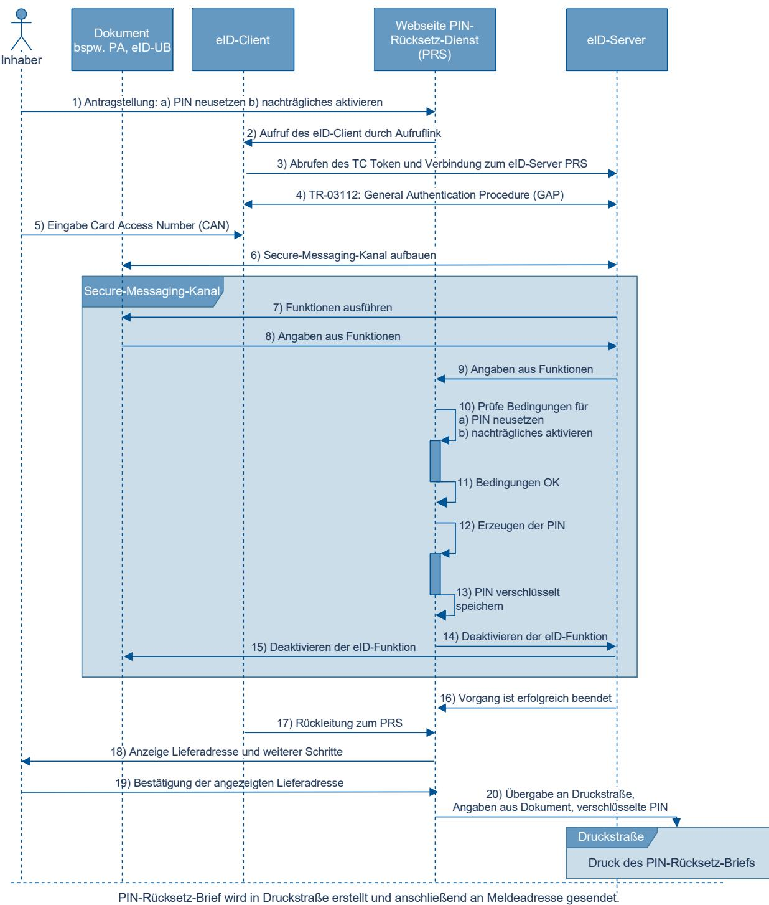
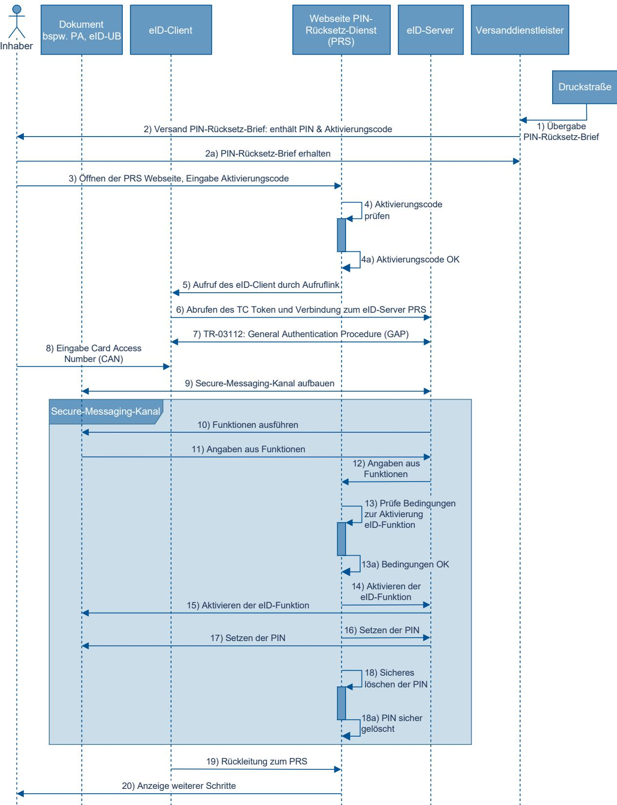
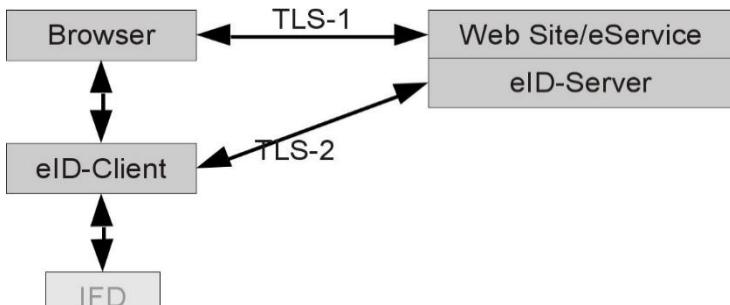

# Technische Richtlinie TR-03128 Diensteanbieter für die eID-Funktion

Teil 3: Änderungsdienste mit hoheitlicher Berechtigung

Version 1.2 26.02.2025

# Änderungshistorie

| Version   | Datum                                     | Beschreibung                                                                                                                                                            |  |  |
|-----------|-------------------------------------------|-------------------------------------------------------------------------------------------------------------------------------------------------------------------------|--|--|
| 0.1 Draft | 26.03.2021                                | Erster Entwurf                                                                                                                                                          |  |  |
| 0.2 Draft | 04.05.2021                                | Anpassung des Ablaufs, Entfall der Information an die Ausweisbehörde, Festlegung konkreter Werte für Antragswiederholung, Vereinheitlichung der Begrifflichkeiten |  |  |
| 0.3 Draft | 13.08.2021                                | Ergänzung des Zentralen Schreibdienstes, kleinere Anpassungen für den PIN-Rücksetz-Dienst                                                                            |  |  |
| 1.0       | 29.09.2021                                | Finalisierung                                                                                                                                                           |  |  |
| 1.1       | 17.04.2023 Anpassung für Adressanzeige |                                                                                                                                                                         |  |  |
| 1.2       | 26.02.2025                                | Anpassung für CAN-Allowed am Zentralen Schreibdienst, kleinere Anpassungen für den PIN-Rücksetz-Dienst                                                               |  |  |

Tabelle 1: Änderungshistorie

Bundesamt für Sicherheit in der Informationstechnik Postfach 20 03 63 53133 Bonn Tel.: +49 22899 9582-0 E-Mail: eid@bsi.bund.de Internet: https://www.bsi.bund.de © Bundesamt für Sicherheit in der Informationstechnik 2025

| 1 | Einleitung und Geltungsbereich 5 |                                                                   |  |  |  |
|---|----------------------------------|-------------------------------------------------------------------|--|--|--|
|   | 1.1                              | Hoheitliche Berechtigungen 5                                      |  |  |  |
| 2 |                                  | PIN-Rücksetz-Dienst 6                                             |  |  |  |
|   | 2.1                              | Rahmenbedingungen der Nutzung 6                                   |  |  |  |
|   | 2.2                              | Ablauf 7                                                          |  |  |  |
|   | 2.2.1                            | Elektronischer Antrag  7                                          |  |  |  |
|   | 2.2.2                            | Erzeugen der PIN 8                                                |  |  |  |
|   | 2.2.3                            | Druck und Zustellung des PIN-Rücksetz-Briefs 9                    |  |  |  |
|   | 2.2.4                            | Verwendung des Aktivierungscodes 9                                |  |  |  |
|   | 2.2.5                            | Setzen der PIN  9                                                 |  |  |  |
|   | 2.3                              | Ablaufdiagramme 11                                                |  |  |  |
| 3 |                                  | Zentraler Schreibdienst13                                         |  |  |  |
|   | 3.1                              | Rahmenbedingungen der Nutzung13                                   |  |  |  |
|   | 3.2                              | Ablauf14                                                          |  |  |  |
|   | 3.2.1                            | Übermittlung der Auftragsdaten und Weiterleitung14                |  |  |  |
|   | 3.2.2                            | Verbindungsaufbau und Schreiben der Anschrift14                   |  |  |  |
|   | 3.2.3                            | Übermittlung der Ergebnismeldung und Weiterleitung15              |  |  |  |
|   | 3.3                              | Ablaufdiagramm16                                                  |  |  |  |
| 4 |                                  | Funktionale Anforderungen17                                       |  |  |  |
|   | 4.1                              | Technische Umsetzung17                                            |  |  |  |
|   | 4.1.1                            | Serverseitige Integration17                                       |  |  |  |
|   | 4.1.2                            | Clientseitige Integration18                                       |  |  |  |
|   | 4.1.3                            | [PRS] Sichere Erzeugung und Speicherung der PIN18                 |  |  |  |
|   | 4.1.4                            | [PRS] Aktivierungscode 19                                         |  |  |  |
|   | 4.1.5                            | [ZSD] Schnittstelle für den Schreibauftrag19                      |  |  |  |
|   | 4.2                              | Nutzerführung19                                                   |  |  |  |
|   | 4.2.1                            | eID-Client19                                                      |  |  |  |
|   | 4.2.2                            | Webseitenempfehlungen19                                           |  |  |  |
|   | 4.2.3                            | Fehlerbehandlung20                                                |  |  |  |
|   | 4.2.4                            | Barrierefreiheit21                                                |  |  |  |
| 5 |                                  | Anforderungen an den sicheren Betrieb22                           |  |  |  |
|   | 5.1                              | Sicherheitskonzept22                                              |  |  |  |
|   | 5.2                              | Informationssicherheitsmanagementsystem22                         |  |  |  |
|   | 5.3                              | eID-Server Betrieb 22                                             |  |  |  |
|   | 5.4                              | Ausgelagerter Betrieb 22                                          |  |  |  |
|   | 5.5                              | Vertraulichkeit und Integrität der Kommunikationsschnittstellen23 |  |  |  |

| 5.6 | Einhaltung gesetzlicher Anforderungen23 |  |
|-----|-----------------------------------------|--|
|     | Literaturverzeichnis24                  |  |

# 1 Einleitung und Geltungsbereich

Teil 1 der vorliegenden Technische Richtlinie [1] beschreibt die Nutzung von Dokumenten mit eID-Funktion basierend auf Extended Access Control (EAC). Dazu zählen der elektronische Personalausweis, der elektronische Aufenthaltstitel und die eIDzum elektronischen Identitätsnachweis sowie beim Vor-Ort-Auslesen durch Diensteanbieter im eGovernment und eBusiness.

Einige Daten und Funktionalitäten des Ausweises können auch nach Personalisierung im Herstellungsprozess und der Ausgabe an den Inhaber geändert werden:

- Ändern der Adresse und des amtlichen Gemeindeschlüssels;
- Setzen einer neuen eID-PIN;
- Aktivieren der eID-Funktion

Neben der Umsetzung die - nach TR-03131 [2] in den Räumen einer -03127 [3] Kapitel 7.1), sieht das PAuswG [4] und das eIDKG [5] derartige Änderungen für Personalausweise und eID-Karten auch auf Basis eines elektronisch gestellten Antrags vor. Der Ausweisinhaber nutzt dabei clientseitig, wie beim elektronischen Identitätsnachweis, eine eID-Client Software in Verbindung mit seinem eigenen Kartenleser oder mobilen Endgerät. Serverseitig betreibt der hierfür gesondert legitimierte Betreiber einen spezialisierten eID-Server mit hoheitlicher Berechtigung.

Der vorliegende Teil dieser Technischen Richtlinie regelt gemäß §2 Nummer 2 PAuswV [6] die technischen Grundlagen, Anforderungen und Prozesse für die folgenden derartigen Änderungsdienste mit hoheitlichen Berechtigungen:

- -Rücksetz- -PIN und das nachträgliche Aktivieren der eID-Funktion nach elektronischem Antrag durch den Ausweisinhaber (vgl. TR-03127 [3] Kapitel 7.2)..
- das Ändern der Adresse und des amtlichen Gemeindeschlüssels nach elektronischer Anmeldung gemäß § 23a BMG [7] durch den Ausweisinhaber (vgl. TR-03127 [3] Kapitel 7.3)..

### 1.1 Hoheitliche Berechtigungen

Zur Erfüllung ihrer Aufgaben erhalten die Betreiber der Änderungsdienste hoheitliche Berechtigungszertifikate aus der CVCA-eID. Sie agieren damit als hoheitliches nationales Authentisierungsterminal (vgl. TR-03127 [3]) und beziehen die benötigten Terminalzertifikate von einem hoheitlichen Document Verifier (DV). Diese Berechtigungszertifikate sind dabei im Umfang der Berechtigungen auf die für die Aufgabenerfüllung notwendigen Rechte beschränkt und enthalten im Gegensatz zu anderen hoheitlichen Zertifikaten zusätzlich die notwendigen Certificate Extensions für die Funktionalitäten Sperrlistenabruf und dienste- und kartenspezifische Kennung (DKK), sowie den elektronischen Identitätsnachweis (siehe dazu CP-eID [8], TR-03127 [3] und TR-03110-4 [9]).

Die genauen technischen und organisatorischen Abläufe werden in der Certificate Policy (CP) des hoheitlichen DVs festgelegt, der diese basierend auf der Certificate Policy CP-eID [8] der Wurzel-Instanz der Berechtigungs-PKI erstellt. Die Kommunikationsprotokolle werden in TR-03129 [10] festgelegt.

# 2 PIN-Rücksetz-Dienst

#### §7 PAuswG [4] führt aus:

(3a) Für das elektronisch beantragte Neusetzen der Geheimnummer sowie für die elektronische Beantragung des nachträglichen Einschaltens der Funktion zum elektronischen Identitätsnachweis ist der Ausweishersteller zuständig.

Die PAuswV [6] regelt die näheren Bedingungen für das Neusetzen der PIN in §20:

(2) Ein Ausweisinhaber, der eine Meldeadresse im Inland hat, kann das Neusetzen der Geheimnummer auch durch Verwendung der Zugangsnummer und eines hierfür vom Ausweishersteller zur Verfügung gestellten elektronischen Formulars beantragen. Der Ausweishersteller schaltet die Funktion zum elektronischen Identitätsnachweis ab und versendet eine neue, zufällig generierte Geheimnummer in einem Brief an die im Speicher- und Verarbeitungsmedium gespeicherte Anschrift des Ausweisinhabers. Bei der Übergabe ist die Identität des Ausweisinhabers durch den Zusteller durch Vorlage des Personalausweises zu überprüfen. Nach Erhalt der neuen Geheimnummer meldet sich der Ausweisinhaber erneut beim Ausweishersteller unter Verwendung der Zugangsnummer an. Der Ausweishersteller schaltet die Funktion zum elektronischen Identitätsausweis wieder ein und schreibt die neue, zufällig generierte Geheimnummer in das Speicher- und Verarbeitungsmedium. Der Ausweisinhaber ändert die neue, zufällig generierte Geheimnummer in eine selbst gewählte Geheimnummer.

Das nachträgliche Einschalten der eID-Funktion wird in PAuswV [6] §22 geregelt:

(2) Der Antrag [Anm: auf nachträgliches Aktivieren der eID-Funktion] nach § 10 Absatz 3 Satz 1 des Personalausweisgesetzes kann durch den Ausweisinhaber, der eine Meldeadresse im Inland hat, auch durch Verwendung der Zugangsnummer und eines hierfür vom Ausweishersteller zur Verfügung gestellten elektronischen Formulars gestellt werden. Der Ausweishersteller versendet eine neue, zufällig generierte Gerheimnummer in einem Brief an die im Speicher- und Verarbeitungsmedium gespeicherte Anschrift des Ausweisinhabers. Bei der Übergabe ist die Identität des Ausweisinhabers durch den Zusteller durch Vorlage des Personalausweises zu überprüfen. Nach Erhalt der neuen Geheimnummer meldet sich der Ausweisinhaber erneut beim Ausweishersteller unter Verwendung der Zugangsnummer an. Der Ausweishersteller schaltet die Funktion zum elektronischen Identitätsausweis ein und schreibt die neue, zufällig generierte Geheimnummer in das Speicher- und Verarbeitungsmedium. Der Ausweisinhaber ändert die neue, zufällig generierte Geheimnummer in eine selbst gewählte Geheimnummer.

Der Ausweishersteller betreibt für die Umsetzung beider Funktionalitäten einen PIN-Rücksetz-Dienst (PIN Reset Service - PRS) gemäß diesem Teil der vorliegenden Technischen Richtlinie. Da auch bei einem nachträglichen Einschalten der eID-Funktion ein Neusetzen der Geheimnummer (eID-PIN, bzw. PIN) erforderlich ist und auch beim Neusetzen der PIN temporär die eID-Funktion abgeschaltet wird, sind beide Vorgänge in technischer Umsetzung und Ablauf eng verwandt. Die folgenden Ausführungen behandeln somit beides, soweit nicht explizit anders erwähnt.

### 2.1 Rahmenbedingungen der Nutzung

Ausweisinhaber, die zum Zeitpunkt des Antrags mindestens das 16. Lebensjahr vollendet haben und eine Meldeadresse im Inland haben, können den PIN-Rücksetz-Dienst nutzen, um eine vergessene PIN

neusetzen zu lassen (§20 Absatz 2 PAuswV [6]), oder die eID-Funktion nachträglich einzuschalten, falls diese zuvor abgeschaltet war (§22 Absatz 2 PAuswV [6]).

Sie benötigen dafür neben ihrem Ausweisdokument (Personalausweis, eID-Karte) ein internetfähiges Gerät mit einem installierten eID-Client, z.B. die vom Bund bereitgestellte AusweisApp1 und einen geeigneten Kartenleser oder ein Smartphone mit NFC2 -Schnittstelle.

Das Ausweisdokument muss gültig und darf nicht gesperrt sein. Um Missbrauch zu verhindern, kann die Antragstellung auf eine Maximalzahl innerhalb von 90 Tagen eingeschränkt werden. Um Fehlbedienungen zu verhindern, soll zudem ein erneuter Antrag auf Neusetzen der PIN erst nach 7 Tagen gestellt werden können. Die Kontrolle geschieht über begrenzte Speicherung und Abgleich des Pseudonyms (DKK).

Die neu gesetzte Ausweis-PIN wird dem Ausweisinhaber postalisch an die aus dem Ausweisdokument ausgelesene Meldeadresse zugestellt. Um sicherzustellen, dass nur der Ausweisinhaber Kenntnis der neu gesetzten PIN erhält, erfolgt eine persönliche Zustellung mit Identitätsfeststellung. Damit sichergestellt werden kann, dass die eID-Funktion erst nach Zustellung der neuen PIN genutzt werden kann, wird die eID-Funktion bei Antragstellung deaktiviert und kann erst nach Zustellung des PIN-Rücksetz-Briefes durch den Ausweisinhaber wieder aktiviert werden.

Die aus dem Dokument ausgelesene Meldeadresse wird dem Ausweisinhaber am Schluss des Antragsvorgangs zur Kontrolle angezeigt und dieser hat die Möglichkeit den Briefversand zu stornieren, sollte er unter dieser Anschrift im Versandzeitraum nicht erreichbar sein, beispielsweise aufgrund eines aktuellen Auslandaufenthalts oder einer unterlassenen Änderung der Meldeanschrift.

#### 2.2 Ablauf

Der Ablauf des Neusetzens der PIN bzw. der Aktivierung der eID-Funktion gliedert sich in die folgenden Schritte:

- 1. Elektronische Antragstellung durch den Ausweisinhaber.
- 2. Erzeugen einer neuen PIN und Deaktivieren der eID-Funktion durch den PRS.
- 3. Persönliche Zustellung der neuen PIN an den Ausweisinhaber.
- 4. Fortsetzen des Vorgangs durch Verwendung des Aktivierungscodes.
- 5. Setzen der neuen PIN und Aktivieren der eID-Funktion durch den PRS.

Diese Schritte sind in den nachfolgenden Abschnitte[n 2.2.1](#page-6-1) bi[s 2.2.5](#page-8-2) näher beschrieben sowie in Abschnitt [2.3](#page-10-0) als Ablaufdiagramme aufbereitet.

#### 2.2.1 Elektronischer Antrag

Die Antragstellung für das Neusetzen der PIN oder die nachträgliche Aktivierung der eID-Funktion erfolgt über eine durch den Ausweishersteller betriebene Webseite.

Auf dieser Webseite muss der Ausweishersteller über die Bedingungen und Auswirkungen des Antrags sowie die Datenschutzbestimmungen informieren.

Zur Vermeidung späterer Fehler empfiehlt es sich dabei zunächst die folgenden Vorbedingungen explizit durch den Ausweisinhaber bestätigen zu lassen:

- Art des Antrags (Nachträgliches aktivieren oder PIN neusetzen)?
- Vorliegendes Dokument (PA oder eID-Karte)?
- Wurde das 16. Lebensjahr vollendet?
- Inlandsmeldeadresse?

1 https://www.ausweisapp.bund.de

2 Near Field Communication (NFC); Funkschnittstelle

Nach Bestätigung erfolgt der Aufruf des eID-Clients durch den Aufruflink (siehe TR-03124-1 [11])(vgl. [Abbildung 1,](#page-10-1) Schritte 1 & 2).

#### 2.2.2 Erzeugen der PIN

Der eID-Client ruft gemäß TR-03124-1 [11] das TCToken ab und verbindet sich mit dem eID-Server des PRS.

eID-Server und eID-Client kommunizieren gemäß TR-03112 [12] und führen gemeinsam die General Authentication Procedure (GAP) als Authentisierungsterminal (siehe TR-03110-3 [13]) durch. Als Passwort kommt hierbei die durch den Ausweisinhaber einzugebende Zugangsnummer (Card Access Number, CAN) zum Einsatz (vgl. [Abbildung 1,](#page-10-1) Schritte 3 bis 6).

Über den im Ergebnis zur GAP etablierten Secure-Messaging-Kanal führt der eID-Server dann die folgenden Funktionen gemäß TR-03110-3 [13] durch (vgl. [Abbildung 1,](#page-10-1) Schritte 7 & 8):

- Gültigkeitsprüfung
- Abfrage des Sperrmerkmals
- Altersverifikation (16. Lebensjahr vollendet?)
- Restricted Identification (Pseudonym)
- Auslesen von Dokumententyp, Vorname, Nachname, Geburtsdatum und Anschrift

Für das Au -Grundverordnung (DSGVO) [14] zu beachten. Es dürfen nur die Daten erhoben werden, welche im Prozess auch tatsächlich benötigt werden.

OHNE den Secure-Messaging-Kanal abzubauen prüft nun die Anwendungslogik des PRS folgende Bedingungen (vgl[. Abbildung 1,](#page-10-1) Schritte 9 & 10) für das Neusetzen der PIN bzw. das nachträgliche Aktivieren der eID-Funktion. eID-Server und Webserver des PRS müssen deshalb eine interne Schnittstelle verwenden (siehe Abschnit[t 4.1\)](#page-16-1):

- Ausweis ist gültig und nicht gesperrt.
- Der Ausweisinhaber hat das 16. Lebensjahr vollendet.
- Der Dokumententyp ist ID oder UB.
- Für das Pseudonym darf ein Antrag gestellt werden3 .
- Die Meldeadresse liegt in Deutschland.

Sind eine oder mehrere der Bedingungen nicht erfüllt, bricht der eID-Server den Vorgang durch schließen des Secure-Messaging-Kanals ab.

Sind die Bedingungen erfüllt, erzeugt der PRS eine neue, zufällige PIN und speichert diese verschlüsselt ab (vgl[. Abbildung 1,](#page-10-1) Schritte 11 bis 13). Anschließend veranlasst der PRS die Deaktivierung der eID-Funktion (vgl[. Abbildung 1,](#page-10-1) Schritte 14 & 15) und der Secure-Messaging-Kanal wird geschlossen.

Der eID-Server signalisiert dem PRS den erfolgreichen Abschluss des Vorgangs und der eID-Client leitet den Ausweisinhaber anschließend über die Rücksprungadresse zurück zum Webserver des PRS. Hier müssen dem Ausweisinhaber das Ergebnis des Vorgangs und die weiteren Schritte angezeigt werden (vgl[. Abbildung](#page-10-1)  [1,](#page-10-1) Schritte 17 & 18).

Im Erfolgsfall erfolgt eine Anzeige der ausgelesenen Meldeadresse, an die der Briefversand erfolgen wird. Es besteht die Möglichkeit für den Ausweisinhaber den Antrag über einen angebotenen Button zu stornieren. In diesem Fall erfolgt kein Briefversand und die Antragsdaten werden gelöscht.

Bei Bestätigung der Meldeadresse veranlasst der PRS die Erstellung des PIN-Rücksetz-Briefs mit den zuvor ermittelten Angaben aus dem Dokument und der verschlüsselten PIN (vgl[. Abbildung 1,](#page-10-1) Schritte 19 & 20).

3 Um Missbrauch und Fehlbedienung zu verhindern kann, wie in Abschnitt [2.1](#page-5-1) beschrieben, die Antragsstellung pro Ausweis temporär eingeschränkt werden.

Im Fehlerfall ist der Ausweisinhaber über den Grund des Fehlschlags zu informieren. Bei mutmaßlich temporärer Ursache für den Fehlschlag, soll dem Ausweisinhaber die Möglichkeit gegeben werden, den Authentisierungsvorgang direkt erneut zu versuchen, ohne den gesamten Antrag erneut zu starten.

#### 2.2.3 Druck und Zustellung des PIN-Rücksetz-Briefs

Hat der Ausweishersteller erfolgreich eine neue PIN erzeugt und verschlüsselt gespeichert und der Ausweisinhaber den Vorgang nicht storniert, erstellt der Ausweishersteller einen PIN-Rücksetz-Brief (vgl. [Abbildung 1,](#page-10-1) Schritt 17). Der PIN-Rücksetz-Brief wird an die ausgelesene Meldeadresse des Ausweisinhabers adressiert und informiert den Ausweisinhaber im Anschreiben über den gestarteten Versuch einer PIN-Rücksetzung und die weiteren Schritte. Der Ausweisinhaber soll auch darauf hingewiesen werden, die neu gesetzte PIN anschließend in eine selbstgewählte PIN zu ändern.

Der PIN-Rücksetz-Brief enthält die neu gesetzte PIN unter einer Sicherheitsabdeckung (analog zum initialen Transport-PIN-Brief) verborgen. Zusätzlich enthält der PIN-Rücksetz-Brief einen Aktivierungscode, mit dem nach Empfang des Briefes die gesetzte PIN aktiviert werden muss. Aus drucktechnischen Gründen ist auch der Aktivierungscode unter einer Sicherheitsabdeckung verborgen, obwohl diese aus sicherheitstechnischer Sicht nicht erforderlich ist.

Als Komfortfunktion enthält der PIN-Rücksetz-Brief die URL des PRS zur Eingabe des Aktivierungscodes zusätzlich zur Angabe in Klartext auch als QR-Code, wobei dort der Aktivierungscode auch direkt mit übergeben werden kann.

Der PIN-Rücksetz-Brief wird dem Ausweisinhaber mittels eines sicheren Zustellverfahrens zugestellt (vgl. [Abbildung 2,](#page-11-0) Schritte 1 & 2). Der Zusteller gleicht den Empfänger durch Lichtbildabgleich gegen ein hoheitliches Dokument ab. Nach erfolgreichem Abgleich übergibt der Zusteller den PIN-Rücksetz-Brief. Der Versanddienstleister bestätigt die Zustellung des PIN-Rücksetz-Briefs an den Ausweishersteller (vgl. [Abbildung 2,](#page-11-0) Schritt 2a).

Kann der PIN-Rücksetz-Brief nicht zugestellt werden, erfolgt die Rücksendung an den Ausweishersteller, dieser vernichtet den PIN-Rücksetz-Brief.

#### 2.2.4 Verwendung des Aktivierungscodes

Der Ausweisinhaber kehrt zur Webseite des PRS zurück (durch manuelle URL-Eingabe oder Scannen des QR-Codes) und gibt den Aktivierungscode ein (vgl. [Abbildung 2,](#page-11-0) Schritt 3). Der PRS prüft die Gültigkeit des Aktivierungscodes. Der Aktivierungscode muss gültig sein, damit der Prozess mit den weiteren Schritten fortgesetzt wird (vgl. [Abbildung 2,](#page-11-0) Schritt 4 & 4a). Es sollten Vorkehrungen für einen Missbrauchsschutz umgesetzt werden, so dass sich gültige Aktivierungscodes bspw. nicht durch einen Brute-Force Angriff ermitteln lassen. Eine Limitierung der Anzahl an Anfragen auf Basis der anfragenden IP Adresse kann vorgesehen werden.

Der Aktivierungscode selbst kann innerhalb der Gültigkeit beliebig oft erneut genutzt werden, um den Vorgang fortzusetzen, solange dieser nicht erfolgreich abgeschlossen werden konnte.

Um Fehlbedienungen zu verhindern, soll ein erneuter Antrag auf PIN-Änderung für denselben Ausweis erst nach Ablauf einer Frist von 7 Tagen wieder möglich sein. Diese Frist orientiert sich an der typischen maximalen postalischen Laufzeit des PIN-Rücksetz-Briefs.

#### 2.2.5 Setzen der PIN

Der Aufruflink für das Setzen der PIN startet den eID-Client des Ausweisinhabers, um erneut eine GAP mit Passwort (CAN) durchzuführen und einen Secure-Messaging-Kanal zwischen Dokument und eID-Server zu etablieren (vgl[. Abbildung 2,](#page-11-0) Schritte 5 bis 9). Um die PIN zu setzen führt der eID-Server dann die folgenden Funktionen gemäß TR-03110-3 [13] durch (vgl. [Abbildung 2,](#page-11-0) Schritte 10 bis 12):

• Gültigkeitsprüfung

- Abfrage des Sperrmerkmals
- Restricted Identification (Pseudonym)

OHNE den Secure-Messaging-Kanal abzubauen prüft nun die Anwendungslogik des PRS die Bedingungen für das Setzen der PIN (vgl[. Abbildung 2,](#page-11-0) Schritt 13):

- Der Ausweis ist gültig und nicht gesperrt.
- Das Pseudonym des Ausweises passt zum Aktivierungscode.

Sind eine oder mehrere der Bedingungen nicht erfüllt, bricht der eID-Server den Vorgang durch schließen des Secure-Messaging-Kanals ab.

Sind die Bedingungen erfüllt, aktiviert der PRS die eID-Funktion und setzt die PIN indem folgende Funktionen gemäß TR-03110-3 [13] durchgeführt werden (vgl[. Abbildung 2,](#page-11-0) Schritte 13a bis 18a):

- 1. Aktivieren der eID-Funktion.
- 2. PIN entschlüsseln und setzen.
- 3. Sicheres löschen der PIN im PRS.
- 4. Schließen des Secure-Messaging-Kanals

Der eID-Client leitet den Ausweisinhaber anschließend über die Rücksprungadresse zurück zum Webserver des PRS. Hier muss dem Ausweisinhaber das Ergebnis des Vorgangs und die weiteren Schritte angezeigt werden (vgl[. Abbildung 2,](#page-11-0) Schritte 19 & 20).

Im Fehlerfall ist der Ausweisinhaber über den Grund des Fehlschlags zu informieren. Bei mutmaßlich temporärer Ursache für den Fehlschlag, soll dem Ausweisinhaber die Möglichkeit gegeben werden, den Authentisierungsvorgang direkt erneut zu versuchen.

# 2.3 Ablaufdiagramme

I[n Abbildung 1](#page-10-1) sind die Schritte aus den Abschnitten [2.2.1](#page-6-1) bi[s 2.2.3](#page-8-0) als Ablaufdiagramm dargestellt.

Abbildung 1: Ablaufdiagramm zur Beantragung von Neusetzen der PIN für eID-Funktion via PIN-Rücksetz-Dienst bis Versand des PIN-Rücksetz-Briefs.

Abbildung 2: Ablaufdiagramm Empfang des PIN-Rücksetz-Briefs und Aktivierung der eID-Funktion via PIN-Rücksetz-Dienst.

# 3 Zentraler Schreibdienst

Nach einem Wohnsitzwechsel kann die erforderliche Anmeldung bei der zuständigen Meldebehörde gemäß §23a BMG [7] auch elektronisch erfolgen. In diesem Fall kann die notwendige Änderung der Anschrift auf dem Ausweisdokument ebenfalls auf elektronischem Wege erfolgen.

#### §18 PAuswG [4] führt aus:

(6) Personalausweisbehörden dürfen im Rahmen der Änderung der Anschrift auf dem elektronischen Speicher- und Verarbeitungsmedium nach einer elektronischen Anmeldung gemäß § 23a des Bundesmeldegesetzes einen elektronischen Identitätsnachweis durchführen und hierzu ein hoheitliches Berechtigungszertifikat verwenden.

Die PAuswV [6] regelt die näheren Bedingungen für die elektronische Änderung der Anschrift in §19:

(2) Hat der Ausweisinhaber eine elektronische Anmeldung nach §23a des Bundesmeldegesetzes durchgeführt, hat er die Änderung der Anschrift auf dem elektronischen Speicher-und Verarbeitungsmedium einzuleiten. Hierzu wird durch die Personalausweisbehörde ein elektronisches Formular bereitgestellt. Der Ausweisinhaber weist seine Identität gegenüber der Personalausweisbehörde mit einem elektronischen Identitätsnachweis nach §18 Absatz2 Satz1 Nummer1 des Personalausweisgesetzes nach. Die zuständige Personalausweisbehörde ändert die Anschrift auf dem elektronischen Speicher-und Verarbeitungsmedium des Personalausweises und trägt diese in das Personalausweisregister ein. 

Die Personalausweisbehörden können sich hierbei des Zentralen Schreibdienstes gemäß diesem Teil der vorliegenden Technischen Richtlinie bedienen. Die Komponente Zentraler Schreibdienst (ZSD) arbeitet hierbei mit dem Onlinedienst elektronische Wohnsitzanmeldung (eWA) zusammen, der den Gesamt-Workflow der elektronischen Anmeldung nach §23a BMG [7] orchestriert. Sowohl der Onlinedienst eWA als auch der Zentrale Schreibdienst sind als EfA-Dienst (Einer für Alle) umgesetzt worden. Eine von einem Bundesland implementierte Leistung wird zentral betrieben und steht somit allen Ländern zur Verfügung.

### 3.1 Rahmenbedingungen der Nutzung

Ausweisinhaber, die eine elektronische Anmeldung Ihres Wohnsitzes nach einem Umzug gemäß §23a BMG [7] durchgeführt haben, können im Anschluss mittels des Zentralen Schreibdienstes die auf Ihrem physikalischen Ausweisdokument gespeicherte Anschrift ändern lassen. Dies gilt ebenso für die Ausweisdokumente von Familienmitgliedern, die im Rahmen der elektronischen Wohnsitzanmeldung rechtmäßig ebenfalls mit umgemeldet wurden.

Der Antragsteller benötigt dafür neben seinem Ausweisdokument (Personalausweis, elektronischer Aufenthaltstitel, eID-Karte) und seiner PIN zur Authentifizierung am Onlinedienst eWA ein internetfähiges Gerät mit einem installierten eID-Client, z.B. die vom Bund bereitgestellte AusweisApp4 und einen geeigneten Kartenleser oder ein Smartphone mit NFC5 -Schnittstelle.

Die elektronische Adressänderung auf den Ausweisen aller umgemeldeten Familienangehörigen erfolgt mit dem jeweiligen Ausweisdokument und der zugehörigen Zugangsnummer (CAN). Alle Ausweisdokumente müssen gültig und dürfen nicht gesperrt sein.

4 https://www.ausweisapp.bund.de

5 Near Field Communication (NFC); Funkschnittstelle

# 3.2 Ablauf

Die elektronische Änderung der Anschrift erfolgt im Anschluss an den elektronischen Ummeldevorgang, dessen Ablauf hier nicht weiter betrachtet wird. Für die Änderung der Anschrift auf dem/den betroffenen Ausweisdokument(en) der umgemeldeten Person(en) ist ein elektronischer Identitätsnachweis durch den Antragsteller notwendig. (vgl[. Abbildung 3,](#page-15-1) Schritt1 1& 2). Der Onlinedienst eWA leitet anschließend für jedes betroffene Ausweisdokument separat und unabhängig voneinander die Änderung der Anschrift durch Übermitteln der Auftragsdaten an den Zentralen Schreibdienst ein.

- 1. Übermittlung der Auftragsdaten und Weiterleitung des Antragstellers zum Zentralen Schreibdienst
- 2. Verbindungsaufbau zum Ausweisdokument mittels Zugangsnummer (CAN) und anschließendes Schreiben der neuen Anschrift
- 3. Übermittlung der erfolgten Adressänderung und Weiterleitung des Antragstellers zum Onlinedienst

Diese Schritte sind in den Abschnitten [3.2.1](#page-13-1) bi[s 3.2.3](#page-14-0) näher beschrieben sowie in Abschnitt [3.2](#page-13-0) als Ablaufdiagramm aufbereitet.

#### 3.2.1 Übermittlung der Auftragsdaten und Weiterleitung

Für jedes von der Ummeldung betroffene Ausweisdokument übermittelt der Onlinedienst eWA über eine durch den ZSD bereitgestellte Schnittstelle die Auftragsdaten für den Schreibvorgang. Um das Ausweisdokument dem Schreibauftrag zuordnen zu können, werden die personenbezogenen Daten des Ausweisinhabers benötigt, damit diese mit dem Ausweisdokument abgeglichen werden können (vgl. [Abbildung 3,](#page-15-1) Schritt 3). Die Nutzung des DKK (Pseudonyms) für diese Zwecke ist aufgrund der verschiedenen Berechtigungszertifikate von Onlinedienst eWA und ZSD nicht möglich. Zudem erfolgt der elektronische Identitätsnachweis am Onlinedienst eWA mit dem Ausweisdokument des Antragstellers. Ein Abgleich mit den Ausweisdokumenten von ebenfalls umgemeldeten Familienmitgliedern ist daher nicht möglich.

- Dokumententyp
- Name und Vorname, ggf. Geburtsname
- Geburtsdatum
- Geburtsort
- Alte Anschrift
- Neue Anschrift
- Neuer Gemeindeschlüssel

Beim Anlegen des Schreibauftrags erhält der Onlinedienst eWA vom ZSD einen Session-Identifier mitgeteilt. Anschließend leitet der Onlinedienst eWA den Browser des Nutzers über einen Redirect unter Angabe des Session-Identifiers an den ZSD weiter (vgl. [Abbildung 3,](#page-15-1) Schritte 4 bis 6).

#### 3.2.2 Verbindungsaufbau und Schreiben der Anschrift

Der eService des ZSD prüft die Gültigkeit des Session-Identifiers und durch Nutzerinteraktion erfolgt der Aufruf des eID-Clients durch den Aufruflink (siehe TR-03124-1 [11]).

Der eID-Client ruft gemäß TR-03124-1 [11] das TCToken ab und verbindet sich mit dem eID-Server des ZSD.

eID-Server und eID-Client kommunizieren gemäß TR-03112 [12] und führen gemeinsam die General Authentication Procedure (GAP) als Authentisierungsterminal (siehe TR-03110-3 [13]) durch. Als Passwort kommt hierbei die CAN des Ausweisdokumentes zum Einsatz (vgl[. Abbildung 3,](#page-15-1) Schritte 7 bis 11).

Über den im Ergebnis zur GAP etablierten Secure-Messaging-Kanal führt der eID-Server dann die folgenden Funktionen gemäß TR-03110-3 [13] durch (vgl. [Abbildung 3,](#page-15-1) Schritte 12 & 13):

- Gültigkeitsprüfung
- Abfrage des Sperrmerkmals

• Auslesen von Dokumententyp, Vorname, Nachname, Geburtsname, Geburtsdatum, Geburtsort und Anschrift.

Für das Auslesen (Datenerhe -Grundverordnung (DSGVO) [14] zu beachten. Es dürfen nur die Daten erhoben werden, welche im Prozess auch tatsächlich benötigt werden.

OHNE den Secure-Messaging-Kanal abzubauen prüft nun die Anwendungslogik des ZSD folgende Bedingungen (vgl[. Abbildung 3,](#page-15-1) Schritt 14). eID-Server und Webserver des ZSD müssen deshalb eine interne Schnittstelle verwenden (siehe Abschnit[t 4.1\)](#page-16-1):

- Ausweis ist gültig und nicht gesperrt.
- Der Dokumententyp ist ID, AR, AS, AF oder UB.
- Die Personendaten und Dokumententyp entsprechen dem zugehörigen Schreibauftrag.
- Die gespeicherte Anschrift entspricht der alten Anschrift.

Sind eine oder mehrere der Bedingungen nicht erfüllt, bricht der eID-Server den Vorgang durch schließen des Secure-Messaging-Kanals ab und behandelt dies intern als Fehler.

Sind die Bedingungen erfüllt, schreibt der eID-Server über den Secure-Messaging-Kanal die neue Anschrift und den neuen Gemeindeschlüssel in das Dokument und liest beides im Anschluss zur Kontrolle erneut aus (vgl[. Abbildung 3,](#page-15-1) Schritte 15 bis 18).

Anschließend wird der Secure-Messaging-Kanal geschlossen und bei erfolgreich geschriebener Anschrift ist der Schreibvorgang erfolgreich abgeschlossen, ansonsten erfolgt auch hier intern eine Fehlerbehandlung.

#### 3.2.3 Übermittlung der Ergebnismeldung und Weiterleitung

Der eID-Server signalisiert dem ZSD den erfolgreichen Abschluss des Vorgangs bzw. einen der beschriebenen Fehlerfälle, sodass der zum Vorgang gehörige Status entsprechend gesetzt und ab dann durch den Onlinedienst eWA über die Statusschnittstelle (vgl. Abschnit[t 4.1.5\)](#page-18-1) abgerufen werden kann (vgl. [Abbildung 3,](#page-15-1) Schritt 19 & 20).

Der eID-Client leitet den Antragsteller anschließend über die Rücksprungadresse zurück zum Webserver des ZSD (vgl[. Abbildung 3,](#page-15-1) Schritt 21).

Im Fehlerfall ist der Antragsteller dort über den Grund des Fehlschlags zu informieren. Bei mutmaßlich temporärer Ursache für den Fehlschlag, soll dem Antragsteller die Möglichkeit gegeben werden, den Schreibvorgang direkt erneut zu versuchen, ohne den gesamten Antrag erneut zu starten.

Im Positivfall wird der Browser des Antragstellers automatisch über die dem ZSD bekannte oder bei Anlegen des Schreibauftrages übermittelte Rücksprungadresse zurück zum Onlinedienst eWA geleitet (vgl. [Abbildung 3,](#page-15-1) Schritt 23). Dort wird dem Antragsteller das Ergebnis des Vorgangs und die weiteren Schritte angezeigt. Auch wenn hierbei der Status des Schreibvorgangs übermittelt werden kann, sollte der Status explizit durch Aufrufen der Statusschnittstelle ermittelt werden. Insbesondere kann der Schreibvorgang erfolgreich abgeschlossen sein, auch wenn der finale Redirect des Nutzers zum Onlinedienst eWA fehlschlägt oder abgebrochen wurde.

Im Fall von mit umgemeldeten Familienangehörigen werden die Schritte in den Abschnitte[n 3.2.1](#page-13-1) bi[s 3.2.3](#page-14-0) für alle weiteren Ausweisdokumente wiederholt.

# 3.3 Ablaufdiagramm

I[n Abbildung 3](#page-15-1) sind die Schritte aus den Abschnitte[n 3.2.1](#page-13-1) bi[s 3.2.3](#page-14-0) als Ablaufdiagramm dargestellt.

| Dokument bspw. PA, eID-UB Inhaber                                       | eID-Client                                          | Webseite Online-Dienst eWA                             | Zentraler Schreibdienst          |
|-------------------------------------------------------------------------------|-----------------------------------------------------|-----------------------------------------------------------|-------------------------------------|
| 1) Ruft OD auf, alte und neue Adresse liegen beim OD vor                      |                                                     |                                                           |                                     |
| 2) Identifizierung mit eID und PIN (Schritte und Entitäten nicht dargestellt) |                                                     |                                                           |                                     |
|                                                                               |                                                     | 3) Schreib-Request wird angelegt                          |                                     |
| Wiederholung für jedes betroffene Ausweisdokument 1n                          |                                                     |                                                           | 4) Session-Identifier               |
|                                                                               |                                                     | 5) Session-Identifier zurückgeben                         | anlegen                             |
|                                                                               |                                                     | 6) redirect auf ZSD                                       |                                     |
|                                                                               |                                                     | 7) Aufruf des eID-Client durch Aufruflink                 |                                     |
|                                                                               |                                                     | 8) Abrufen des TC Token und Verbindung zum eID-Server PRS |                                     |
|                                                                               |                                                     | 9) TR-03112: General Authentication Procedure (GAP)       |                                     |
| 10) Eingabe CAN                                                               | 11) Aufbau Secure Messaging Kanal                   |                                                           |                                     |
| Secure Messaging Kanal                                                        |                                                     |                                                           |                                     |
|                                                                               | 12) Funktionen ausführen (lesen)                    |                                                           |                                     |
|                                                                               | 13) Angaben aus Funktionen                          |                                                           |                                     |
|                                                                               |                                                     |                                                           | 14) Prüfe Daten und Documenttype |
|                                                                               |                                                     |                                                           |                                     |
|                                                                               | 16) Funktionen ausführen                            |                                                           | 15) Bedingungen OK                  |
|                                                                               | (schreiben und lesen) 17) Angaben aus Funktionen |                                                           |                                     |
|                                                                               |                                                     |                                                           | 18) Prüfe Daten                     |
|                                                                               |                                                     |                                                           |                                     |
|                                                                               |                                                     | 6) redirect auf redirect_uri                              | 19) Bedingungen OK                  |
|                                                                               |                                                     |                                                           | 20) Schreibe                        |
|                                                                               |                                                     |                                                           | Protokolleintrag                    |
|                                                                               |                                                     | 21) Rückleitung zum ZSD                                   |                                     |
|                                                                               |                                                     |                                                           | 22) Lösche Schreib                  |
|                                                                               |                                                     | 23) Redirect zum OD                                       | vorgang                             |
|                                                                               |                                                     |                                                           |                                     |

Abbildung 3: Ablaufdiagramm zum Ändern der Anschrift auf dem Ausweisdokument.

# 4 Funktionale Anforderungen

Dieser Abschnitt formuliert funktionale Anforderungen für Änderungsdienste mit hoheitlicher Berechtigung. Im -Rücksetz-Dienst (PRS) bzw. den Zentralen -Rücksetz-Dienst) respektive den Betreiber des Zentralen Schreibdienstes. Unterscheiden sich Anforderungen für die verschiedenen Änderungsdienste sind diese jeweils gekennzeichnet.

# 4.1 Technische Umsetzung

Die technische Integration des Dienstes erfolgt auf Seiten des Ausweisinhabers durch einen Webbrowser und einen eID-Client (siehe TR-03124-1 [11]), auf Seiten des Diensteanbieters durch einen eID-Server (siehe TR-03130-1 [15]) und einen Webdienst / eService.

Abbildung 4: Attached eID-Server

#### 4.1.1 Serverseitige Integration

Attached eID- [Abbildung 4\)](#page-16-3). Bei einer abweichenden Umsetzung sind bereits formulierte Anforderungen einzuhalten.

#### 4.1.1.1 eID-Server

Der eID-Server kapselt die Kommunikation mit dem eID-Client / dem Ausweis und der Hintergrundinfrastruktur (Berechtigungs-PKI). Die Realisierung der Website des Dienstes (eService) kann in direkter Verbindung mit dem eID- Attached eID- gemäß TR-03130-1 [15]) erfolgen.

Die Kommunikation zwischen eID-Client und eID-Server ist in TR-03124 [11] standardisiert. Um die Interoperabilität sicherzustellen, wird der Einsatz von konformitätszertifizierten eID-Clients / eID-Servern (vgl. TR-03124, Teil 2 [16] und TR-03130, Teil 4 [9]) empfohlen.

Für den hoheitlichen Dienst darf auf einem mandantenfähigen eID-Server nur der PRS- bzw. SD-Mandant konfiguriert sein. Weitere Mandanten mit nicht-hoheitlichem Berechtigungszertifikat sind nicht zulässig. Ebenso ist es nicht erlaubt, diesen hoheitlichen Dienst als eID-Service Dritten zur Verfügung zu stellen.

Der eID-Server muss für diesen hoheitlichen Dienst qualitativ hochwertige TLS Zertifikate (Extended-Validation-SSL-Zertifikate, Qualifizierte Zertifikate für die Website-Authentifizierung - QWAC) verwenden.

#### 4.1.1.2 Schlüssel und PKI-Anbindung

Voraussetzung für die Nutzung des Dienstes ist ein hoheitliches Berechtigungszertifikat, das von einer hoheitlichen Document Verifier (hDV) CA bezogen werden kann. Die Zertifikate müssen täglich (automatisiert) erneuert werden, ebenso müssen die von den hDV-CAs bezogenen Sperrlisten regelmäßig aktualisiert werden.

Die zu den Berechtigungszertifikaten gehörenden Schlüssel werden im eID-Server gespeichert. Für die Nutzung von hoheitlichen Zertifikaten ist die Nutzung sicherer Hardware für die Schlüsselspeicherung vorgegeben (Sicherheitslevel 2 nach Key Lifecycle [17]).

Die Kommunikation mit der Hintergrundinfrastruktur zum regelmäßigen Erneuern der Berechtigungszertifikate und der Ausweissperrlisten erfolgt automatisiert durch den eID-Server. Der Betreiber muss sicherstellen, dass die Kommunikation mit dem hDV möglich ist.

Für Details zu diesem Abschnitt siehe [8].

#### 4.1.1.3 Webseite / Applicationserver (eService)

Die Benutzerführung des Dienstes wird über eine Webseite, die der eService bereitstellt, gestartet (vgl. [Abbildung 4,](#page-16-3) TLS-1). Diese Webseite enthält die entsprechenden Links zum eID-Client (siehe TR-03124-1 Kap 2.2 [11]). Über TLS-2 (vgl[. Abbildung 4\)](#page-16-3) nimmt der eID-Client zuerst Verbindung zum eService und dann zum eID-Server auf.

#### [PRS]

Nach erfolgreicher Antragstellung übermittelt der eID-Server die Daten für den PIN-Rücksetz-Brief an den eService. Der eService initiiert den Druck des PIN-Rücksetz-Briefs.

Dem Ausweisinhaber werden die erfolgreiche Änderung und die weiteren Schritte im Browser angezeigt. Sollte es zu Fehlern kommen, erhält der Ausweisinhaber entsprechende Informationen.

Der eService persistiert für die Weiterbearbeitung benötigte Daten, mindestens:

- Datum der Antragstellung
- Pseudonym (DKK)
- Aktivierungscode

Es sind die gesetzlichen Löschfristen (siehe Abschnit[t 5.6\)](#page-22-1) einzuhalten. Der Aktivierungscode soll zur Vermeidung von Kollisionen (siehe Abschnit[t 4.1.4\)](#page-18-0) für die doppelte Zeit seiner Gültigkeitsdauer gespeichert bleiben.

#### [ZSD]

Nach Durchführung des Schreibvorgangs und Rückleitung des Ausweisinhabers in den Browser zeigt der eService das Ergebnis des Vorgangs an bzw. leitet den Ausweisinhaber zurück auf die Webseite des Onlinedienstes eWA.

#### [Alle]

- domain -03124-1 Kap 2.1 [11]).

#### 4.1.2 Clientseitige Integration

Der Dienst muss als webbasierter Dienst (d.h. der Dienst wird über eine Webseite zur Verfügung gestellt) realisiert werden. Der Dienst muss dabei die Anforderungen aus der TR-03128-1 [1] an die Webseitenbasierte Integration erfüllen. Ein App-basierter Dienst (d.h. für den Dienst wird eine dedizierte App genutzt) ist optional. Details siehe TR-03128-1 Kap. 2.4.2.1 [1].

#### 4.1.3 [PRS] Sichere Erzeugung und Speicherung der PIN

Die Erzeugung der neuen PIN erfolgt durch geeignete Hardware (Zufallswert, wie bei Transport-PIN oder CAN), sie wird Ende-zu-Ende verschlüsselt abgespeichert und transportiert und nur unmittelbar vor dem Beschreiben bzw. Drucken entschlüsselt.

### 4.1.4 [PRS] Aktivierungscode

Der Aktivierungscode ist ein zufälliger Wert (nicht erratbar, kein direkter Bezug zu Personen- oder Vorgangsdaten), der dem Ausweisinhaber im PIN-Rücksetz-Brief zugesendet wird. Da er vom Ausweisinhaber manuell in ein Online-Formular übertragen werden soll, ist hier ein Kompromiss zwischen Qualität und Handhabbarkeit zu finden. Es muss dabei eine Entropie von mindestens 40 Bit gewährleistet sein. Leicht verwechselbare Zeichen ("1 wie eins" und "I wie Ida") sind zu vermeiden. Auch bei einer hohen Entropie, muss der eService sicherstellen, dass kein bereits im System gespeicherter Aktivierungscode vergeben wird.

Der Aktivierungscode kann vom Ausweisinhaber sofort nach der Zustellung genutzt werden.

### 4.1.5 [ZSD] Schnittstelle für den Schreibauftrag

Der ZSD stellt eine bzw. zwei Schnittstellen bereit, über die die Auftragsdaten übermittelt werden können und der Status eines Auftrags abgefragt werden kann.

Diese Schnittstellen dürfen nur durch authentisierte Aufrufer (Onlinedienstes eWA) genutzt werden können. Bei einer Anbindung mehrerer Onlinedienste ist sicherzustellen, dass nur jeweils zugehörige Aufträge eingesehen werden können.

Darüber hinaus müssen die im Schreibauftrag enthaltenden Inhaltsdaten verschlüsselt und signiert übertragen werden und die Signatur durch den ZSD geprüft werden.

#### 4.2 Nutzerführung

Die Nutzerführung auf der Webseite bzw. in der Anwendungsapp obliegt dem Diensteanbieter. Es sind die im Folgenden dargestellten Punkte zu beachten.

#### 4.2.1 eID-Client

Der webbasierte Dienst erfordert eine vorhandene, funktionsfähige Installation eines geeigneten eID-Clients. Es wird empfohlen auch auf der Webseite, des Dienstes den Ausweisinhaber auf Downloadmöglichkeiten für eID-Clients hinzuweisen (siehe TR-03128-1 Kap 2.6.1 [1]).

#### 4.2.2 Webseitenempfehlungen

Das BSI empfiehlt, die Diensteanbieter-Webseite so zu gestalten, dass sie von einem Ausweisinhaber, der sich an die Sicherheitsempfehlungen des BSI hält, ohne Einschränkungen nutzbar ist. Die Empfehlungen finden sich auf der Webseite<https://www.bsi.bund.de/BSIFB> bzw. [https://www.ausweisapp.bund.de](https://www.ausweisapp.bund.de/) und umfassen insbesondere:

- Verwendung eines aktuellen Virenschutzes und Firewall.
- Vermeidung aktiver Inhalte.
- Einsatz geeigneter Komponenten (Smartcard-Lesegerät / Smartphone mit NFC-Schnittstelle als Kartenleser, eID-Client) für die Ausweisnutzung.

Die Nutzung von aktiven Inhalten oder Cookies auf der Webseite sollte auf das fachlich Notwendige beschränkt werden. Sofern aktive Inhalte zum Einsatz kommen, sollen ausschließlich verbreitete aktive Webtechniken verwendet werden, deren Unterstützung bereits in modernen Browsern in Verbindung mit geeigneten Sicherheitsmaßnahmen integriert ist.

Es soll dabei beachtet werden, dass die Ausführung von aktiven Inhalten u.a. durch den Ausweisinhaber blockiert werden kann. Die Nutzung des Dienstes sollte daher auch ohne die Verwendung aktiver Inhalte auf Seiten des Ausweisinhabers ermöglicht werden.

Da bei einem hoheitlichen Änderungsdienst Schreibvorgänge auf dem Ausweis stattfinden, ist es besonders wichtig, den Ausweisinhaber über das Risiko aufzuklären, wenn die Verbindung (insbesondere stabile Netzwerkverbindungen und sicherer Kontakt Ausweis Kartenleser bzw. Smartphone mit NFC-Schnittstelle), während des Schreibvorgangs unterbrochen wird.

#### 4.2.3 Fehlerbehandlung

#### [PRS]

Wurde der Antrag zuvor erfolgreich mit Produktion eines PIN-Rücksetz-Briefs abgeschlossen und der Ausweisinhaber versucht es innerhalb von 7 Tagen erneut, erhält er die Information, dass sein Antrag in Arbeit ist und er den Aktivierungscode, den er via PIN-Rücksetz-Brief erhält, eingeben kann. Er erhält auch die Information, ab welchem Datum eine Antragswiederholung möglich ist. Der eService erkennt den erneuten Versuch für den gleichen Ausweis anhand des Pseudonyms (DKK). Ist dieser identisch mit dem Wert, der beim ersten Antrag gespeichert wurde, handelt es sich um einen Wiederholungsversuch. Wurde ein vorheriger Antrag unterbrochen, kann der Ausweisinhaber den Vorgang wiederholen ohne dass ein neuer Antrag gestellt wird. Der PRS soll vorherige Fehler erkennen und den Ausweisinhaber ohne weitere Interaktion eine Wiederholung/Fortsetzung des Vorgangs ermöglichen.

Der Ausweisinhaber kann nach Ablauf von 7 Tagen einen weiteren Antrag stellen. Dadurch storniert er automatisch den vorhergehenden Antrag und der zugehörige Aktivierungscode wird invalidiert. Er muss darüber informiert werden, dass der PIN-Rücksetz-Brief der vorherigen Antragstellung ungültig wird. Der PIN-Rücksetz-Brief soll deshalb auch das Datum der Antragstellung enthalten, damit der Ausweisinhaber diesen eindeutig zuordnen kann.

Mit geeigneten Maßnahmen (Fristen, Anzahl möglicher Wiederholungen, siehe Abschnitt [2.1\)](#page-5-1) ist sicherzustellen, dass kein Missbrauch erfolgt und damit keine größere Anzahl PIN-Rücksetz-Briefe an denselben Ausweisinhaber gesendet wird.

In folgenden Fehlerfällen ist dem Ausweisinhaber anzuzeigen, dass er mit seinem Ausweis den PRS nicht nutzen kann, sondern sich möglicherweise an seine zuständige Ausweisbehörde wenden muss oder die eID-Funktion nicht aktiviert werden kann:

- Ausweis ist gesperrt.
- Ausweis ist abgelaufen.
- Beim verwendeten Ausweis handelt sich um einen Aufenthaltstitel (eAT).
- Der Besitzer des Ausweises hat das 16. Lebensjahr noch nicht vollendet.
- Es gibt keine Meldeadresse im Inland.

In diesen Fällen wird weder auf dem Ausweis noch im eService etwas gespeichert.

#### [ZSD]

Bei Übergabe des Nutzers an den eService des ZSD prüft dieser zunächst die Existenz und Gültigkeit des referenzierten Schreibauftrags.

Schlägt das Schreiben der Adresse auf den Ausweis fehl, ist der Nutzer entsprechend der Ursache zu informieren. Nach einem Abbruch durch den Benutzer, Serverfehler oder Verbindungsabbruch soll der Schreibvorgang direkt erneut gestartet werden können. Mögliche Fehlersituationen, die eine Wiederholung des Vorgangs hingegen ausschließen umfassen:

- Ausweis ist gesperrt.
- Ausweis ist abgelaufen.
- Personendaten/Dokumententyp passen nicht zum Schreibauftrag (falscher Ausweis).
- Anschrift wurde bereits geändert.

Wird für den Vorgang keine Wiederholung angeboten, erfolgt die Rückleitung des Benutzers zum Onlinedienst eWA an die bekannte oder übermittelte Rücksprungadresse. Über die Statusschnittstelle (vgl. Abschnit[t 4.1.5\)](#page-18-1) kann zudem der Fehlerstatus abgerufen werden.

[Alle]

Die Webseite erhält über die Rücksprungadresse (Refresh URL) die Möglichkeit dem Ausweisinhaber Informationen anzuzeigen, die der eID-Client generiert (siehe TR-03124-1 [11]):

• ResultMajor=ok: es ist kein Fehler aufgetreten, der Ausweisinhaber wird über weitere Schritte informiert. Wird die Erfolgsseite nicht mehr angezeigt (z.B. Netzwerkproblem) ist der Antrag trotzdem erfolgreich.

[PRS] Der Antrag wird abgespeichert und der PIN-Rücksetz-Brief wird gedruckt. [ZSD] Die Anschrift wurde geändert und der Onlinedienst eWA kann die Erfolgsmeldung über die Statusschnittstelle abrufen.

- ResultMajor=error&ResultMinor=res\_min: es ist ein Fehler aufgetreten; die folgenden Fehlercodes für res\_min sind definiert:
	- o trustedChannelEstablishmentFailed: Der eID-Client konnte keinen sichern Kanal zum eID-Server aufbauen (der Ausweisinhaber kann es später noch einmal versuchen oder den Support kontaktieren).
	- o cancellationByUser: Der Ausweisinhaber hat die Bearbeitung abgebrochen (z. B. weil er den Ausweis nicht griffbereit hatte oder weil er nach einer falschen PIN Eingabe nicht fortfahren wollte). Der Ausweisinhaber kann es später noch einmal versuchen.
	- o serverError: Der eID-Server meldet ein Problem. Der Ausweisinhaber kann es später noch einmal versuchen oder den Support kontaktieren.
	- o clientError: Jeder andere Fehler. Der Ausweisinhaber kann es später noch einmal versuchen oder den Support kontaktieren.

Wird keine Refresh URL bereitgestellt, wird eine Fehlerseite angezeigt, es sind folgende Optionen möglich:

- Im TCToken gibt es eine CommunicationErrorAddress : Diese Seite wird aufgerufen mit den URL-Parametern ResultMajor=error&ResultMinor=communicationError;
- Es gibt keine CommunicationErrorAddress : Der eID-Client übermittelt den Fehler Bad Request

#### 4.2.4 Barrierefreiheit

Der webbasierte Dienst ist im Einklang mit den Bestimmungen des Behindertengleichstellungsgesetzes des Bundes (BGG) [18] sowie der Barrierefreien-Informationstechnik-Verordnung (BITV 2.0) [19] zur Umsetzung der Richtlinie (EU) 2016/2102 [20] barrierefrei zugänglich zu machen.

Ausnahmen, z.B. durch Verlinkung auf externe Seiten, sind kenntlich zu machen und zu dokumentieren.

# 5 Anforderungen an den sicheren Betrieb

Dieser Abschnitt formuliert Anforderungen an den sicheren Betreib für Änderungsdienste mit hoheitlicher PIN-Rücksetz-Dienst) respektive den Betreiber des Zentralen Schreibdienstes. Unterscheiden sich Anforderungen für die verschiedenen hoheitlichen Änderungsdienste sind diese jeweils gekennzeichnet.

# 5.1 Sicherheitskonzept

Für die Prozesse und Komponenten des hoheitlichen Änderungsdienstes muss ein Sicherheitskonzept erstellt werden.

Das Sicherheitskonzept soll regelmäßige Penetrations-Tests des Application-Servers sowie des eID-Servers vorsehen. Dafür sollen die Auditzyklen der Zertifizierung (siehe Abschnitt [5.2\)](#page-21-2) als wiederkehrende Ausführungszeitpunkte vorgesehen werden.

### 5.2 Informationssicherheitsmanagementsystem

Das Sicherheitskonzept muss Bestandteil eines zertifizierten Informationssicherheitsmanagementsystems (ISMS) nach ISO 27001 [21] oder ISO 27001 auf Basis IT-Grundschutz [22] sein. Das ISMS muss alle am Betrieb der eID-Infrastruktur beteiligten Organisationseinheiten umfassen.

Im Sicherheitskonzept muss ein Rollenkonzept definiert werden. Es soll eine Rolle spezifiziert werden, welche Zugriff auf Schlüsselmaterial erhält. Bei Bedarf können weitere Rollen entsprechend ISO 27001 [21] definiert werden. Bei der Besetzung von Rollen mit Personen muss beachtet werden, dass Rollen mit Interessenskonflikten nicht von derselben Person eingenommen werden dürfen. Das Rollenkonzept soll für kritische Prozesse zusätzlich ein Vier-Augen-Prinzip definieren.

# 5.3 eID-Server Betrieb

Das Sicherheitskonzept muss insbesondere die Maßnahmen zum sicheren Betrieb des eID-Servers beschreiben. Die Mindestanforderungen, die durch dieses Sicherheitskonzept im Einzelnen abgedeckt werden müssen, sind in TR-03130-2 [23] beschrieben. Ferner sind die nach der Certificate Policy der Country Verifying Certification Authority (CP CVCA-eID) [8] geforderten Sicherheitsmaßnahmen im Sicherheitskonzept zu berücksichtigen.

# 5.4 Ausgelagerter Betrieb

[PRS]

Der ausgelagerte Betrieb hoheitlicher Funktionalitäten außerhalb des Sicherheitsbereichs des Ausweisherstellers ist nicht zulässig. Zu den hoheitlichen Funktionalitäten zählen insbesondere die Erzeugung der neuen PIN (siehe Abschnitt [2.2.2\)](#page-7-0), die Erstellung des PIN-Rücksetz-Briefs (siehe Abschnitt [2.2.3\)](#page-8-0) und der operative Betrieb des eID-Servers mit hoheitlichem Berechtigungszertifikat.

Ein ausgelagerter Betrieb beschränkt sich auf nicht-hoheitliche Funktionalitäten, wie bspw. der Versand des PIN-Rücksetz-Brief durch ein sicheres Zustellverfahren (siehe Abschnit[t 2.2.3\)](#page-8-0).

[ZSD]

Die Auslagerung des operativen Betriebs des ZSD mit daran angeschlossenem eID-Servers mit hoheitlichem Berechtigungszertifikat ist nur in Abstimmung mit dem Bundesamt für Sicherheit in der Informationstechnik zulässig.

[Alle]

Werden nicht-hoheitliche Komponenten des hoheitlichen Änderungsdienstes für den operativen Betrieb an Dritte ausgelagert, so bleibt der Anbieter des hoheitlichen Änderungsdienstes für die Einhaltung aller IT-Sicherheitsvorschriften und datenschutzrechtlicher Vorgaben verantwortlich. Der Dritte, an den der Betrieb ausgelagert wurde, muss über ein zertifiziertes ISMS nach ISO 27001 [21] oder nach ISO 27001 auf Basis von IT-Grundschutz [22] verfügen.

## 5.5 Vertraulichkeit und Integrität der Kommunikationsschnittstellen

Werden personenbezogene Daten über öffentliche Netzwerke übermittelt, so müssen die Anforderungen gemäß TR-03116-4 [24] umgesetzt werden.

### 5.6 Einhaltung gesetzlicher Anforderungen

Der Diensteanbieter muss die einschlägigen rechtlichen Anforderungen, insbesondere PAuswG [4] / PAuswV [6] und BDSG [25] / DSGVO [14], einhalten.

laut Artikel 5 der Datenschutz-Grundverordnung (DSGVO) zu beachten.

[PRS]

Zur Löschung von personenbezogenen Daten ist insbesondere die PAuswV §5, Absatz (5) zu beachten:

Der Ausweishersteller löscht die zur Bearbeitung von elektronischen Anträgen nach § 20 Absatz 2 und § 22 Absatz 2 zu erhebenden personenbezogenen Daten, sobald er die Benachrichtigung bekommen hat, dass der Antragsteller die zufällig neu generierte Geheimnummer erhalten hat, spätestens aber nach 30 Tagen. Satz 1 gilt nicht für das dienste- und kartenspezifische Kennzeichen 6 , welches spätestens nach 90 Tagen zu löschen ist.

Des Weiteren verwendet der Ausweishersteller laut PAuswV §20 und §22 für das Ändern der Daten nach Absatz 2 Satz 2 sowie für das Einschalten nach Absatz 2 Satz 5 ein hoheitliches Berechtigungszertifikat.

[ZSD]

Der Betreiber des ZSD muss die Auftragsdaten unmittelbar nach der erfolgreichen Änderung der Anschrift jedoch spätestens nach 30 Tagen (z.B. bei Abbruch des Vorgangs) löschen.

Die Personalausweisbehörde bzw. der von dieser beauftragte Betreiber des ZSD verwendet laut PAuswV §19 Absatz 3 für den elektronischen Identitätsnachweis und die Änderung der Anschrift ein hoheitliches Berechtigungszertifikat.

6 dienste- und kartenspezifische Kennzeichen (DKK) gleichbedeutend zu Pseudonym.

# Literaturverzeichnis

- [1] -03128-1, Diensteanbieter für die eID-Funktion Teil 1: Elektronischer Identitätsnachweis und Vor-Ort-
- [2] -03131, EAC-Box Architektur und Schnit
- [3] -03127, eID-Karten mit eID- und eSign-Anwendung basierend auf
- [4] vom 5.
- [5] -Karte-Gesetz vom 21. Juni 2019 (BGBl. I S. 846), das zuletzt durch Artikel 3 des Gesetzes vom 5. Juli
- [6] 1. November 2010 (BGBl. I S. 1460), die zuletzt durch Artikel 3 der
- [7] 28.
- [8] -Anwendung, Elektronischer Identitätsnachweis und Vor-Ort-
- [9] BSI -03110-4, Advanced Security Mechanisms for Machine Readable Travel
- [10] -03129, PKIs for Machine Readable Travel Documents-Protocols for the Management of Certificates and
- [11] -03124-1 eID-
- [12] -03112, eCard-API-
- [13] -03110-3, Advanced Security Mechanisms for Machine Readable Travel
- [14] -VERORDNUNG (EU) 2016/679 DES EUROPÄISCHEN PARLAMENTS UND DES RATES zum Schutz natürlicher Personen bei der Verarbeitung personenbezogener Daten, zum freien Datenverkehr und zur Aufhebung der Richtlinie 95/46/EG (Datenschutz- [Online]. Available: https://eur-lex.europa.eu/legalcontent/DE/TXT/?uri=celex%3A32016R0679.
- [15] -03130-1 eID-Server, Part 1: Fu
- [16] -03124-2 eID-
- [17]
- [18] 1468), das zuletzt durch Artikel 9
- [19] Behindertengleichstellungsgesetz (Barrierefreie-Informationstechnik-Verordnung -
- [20] vom 26. Oktober 2016 über den barrierefreien Zugang zu den Websites und mobilen Anwendungen [Online]. Available: https://eur-lex.europa.eu/legalcontent/DE/TXT/?uri=CELEX%3A32016L2102.
- [21] Security techniques Information security management systems -
- [22] BSI, -Standard 100-2: IT-Grundschutz-
- [23] -03130-2 eID-Server, Part 2: Security Framework for eID-Server
- [24] -03116-4, Kryptographische Vorgaben für Projekte der
- [25]