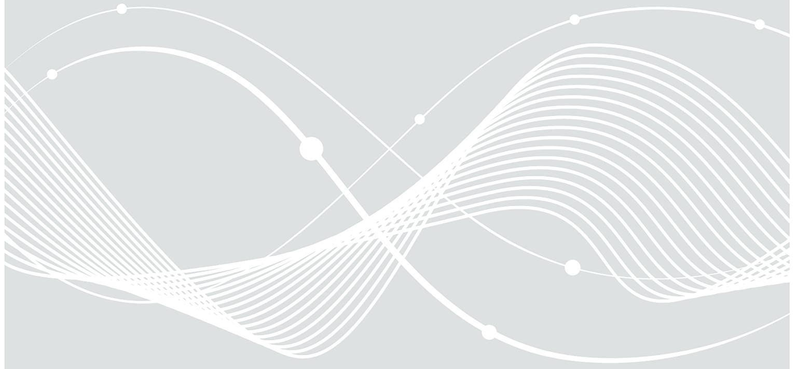
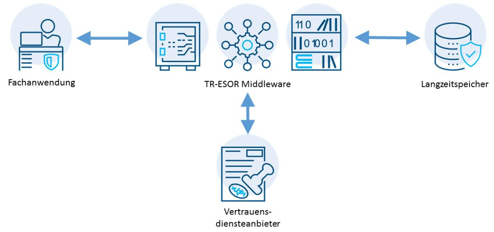

# TR-ESOR einfach erklärt

Was ist "Beweiswerterhaltung elektronischer Daten und Dokumente" und warum wird sie empfohlen?

Bundesamt für Sicherheit in der Informationstechnik Postfach 20 03 63 53133 Bonn E-Mail: tresor@bsi.bund.de Internet: https://www.bsi.bund.de © Bundesamt für Sicherheit in der Informationstechnik 2024

| 1                      | Einleitung                                             | 4 |
|------------------------|--------------------------------------------------------|---|
| 2                      | Funktionsweise von TR-ESOR                             | 6 |
| 3                      | Zertifizierung nach der Technischer Richtlinie TR-ESOR | 8 |
| 4                      | Weitere Informationen zur IT-Sicherheit                | 9 |
| Literaturverzeichnis10 |                                                        |   |

## 1 Einleitung

Die öffentliche Verwaltung ist grundsätzlich zur Aktenführung verpflichtet. Ziel ist es, eine vollständige und rechtssichere Nachvollziehbarkeit der Entscheidungsfindung innerhalb von Geschäftsvorgängen zu gewährleisten. Diese Nachvollziehbarkeit ist durch den langfristen Beweiswerterhalt von Dokumenten und Daten im Kontext ihrer Aufbewahrung gegeben. Der Beweiswerterhalt erfordert dabei unter anderem eine Nachweisbarkeit der folgenden vier Eigenschaften:

- **Authentizität:** Dokumente und Daten sind authentisch, wenn sie mit den Ursprungsdaten übereinstimmen und die Identität des Ausstellers zweifelsfrei nachweisbar ist.
- **Integrität:** Dokumente und Daten sind integer, wenn sie vollständig sind und nachweislich keine Veränderungen oder Manipulationen festgestellt werden können.
- **Lesbarkeit:** Dokumente und Daten müssen in einer verständlichen Form lesbar sein.
- **Verkehrsfähigkeit:** Dokumente und Akten müssen von einem System zu einem anderen übertragbar sein, bei der die "Qualität" des Dokuments sowie seine Integrität und Authentizität nachweisbar bleiben müssen.

Bei papierbasierten Dokumenten und Akten resultiert der Beweiswert unter anderem aus der Schriftform, der manuellen Unterschrift und den physischen Eigenschaften des Papiers. Da digitale Dokumente und Daten diese Eigenschaften nicht aufweisen, muss der Beweiswert auf eine andere Weise sichergestellt werden. Dazu werden elektronische Signaturen, elektronische Siegel und elektronische Zeitstempel nach der eIDAS-Verordnung [\[eIDAS-VO\]](#page-9-1) verwendet, um die Authentizität und Integrität zu gewährleisten. Die Integrität und Authentizität wird durch Verwendung kryptografischer Algorithmen sichergestellt, die dem aktuellen Stand der Technik entsprechen. Dieser Stand der Technik entwickelt sich jedoch stetig weiter. Infolgedessen muss der Authentizitäts- und Integritätsschutz im Bedarfsfall aktualisiert werden, um eine Erhaltung des Beweiswertes langfristig zu gewährleisten.

Mit der Technischen Richtlinie TR 03125 TR-ESOR "Beweiswerterhaltung kryptografisch signierter Dokumente" [\[TR-ESOR\]](#page-9-2) stellt das BSI dazu einen Leitfaden zur Verfügung, der auf einschlägigen nationalen und internationalen Standards basiert. Dieser beschreibt, wie der Beweiswert elektronisch signierter Daten und Dokumente während der gesetzlich vorgeschriebenen Aufbewahrungszeiträume im Sinne der rechtswirksamen Beweiswerterhaltung vertrauenswürdig erhalten werden kann1 . Neben der Erhaltung der Authentizität und Integrität spezifiziert die TR-ESOR die Archivinformationspakete2 und zwei obere TR-ESOR-Eingangs-Schnittstellen3 und den technischen Beweisdatensatz (Evidence Record)4 , so dass deren technische Lesbarkeit und Interoperabilität erhalten bleibt.

Der Einsatz von Produkten zur Beweiswerterhaltung, die nach der Technischen Richtlinie TR-ESOR zertifiziert sind, ist in der öffentlichen Verwaltung ebenso wie in der Wirtschaft bereits etabliert. Gemäß §15 Vertrauensdienstegesetz [\[VDG\]](#page-10-0) und §6a E-Government-Gesetz [\[eGovG\]](#page-9-3)5 muss die langfristige Beweiswerterhaltung nach dem Stand der Technik erfolgen, der Einsatz von TR-ESOR-Produkten erfüllt diese Anforderung.

Vornehmlicher Anwendungsbereich der Technische Richtlinie TR-ESOR sind die Bundesbehörden im Rahmen der gesetzlichen Aufbewahrungspflichten. Dies umfasst etwa die elektronische Akte, aber auch

1 Weitere Informationen und Erklärungen zu den technischen Verfahren sind unter <https://www.bsi.bund.de/dok/6597616> zu finden ebenso wie i[n \[BSI Leitlinie Signatur\]](#page-9-4) un[d \[TR-ESOR-](#page-9-5)[LEIT\].](#page-9-5)

2 Sieh[e \[TR-ESOR-F\]](#page-9-6)

3 Sieh[e \[TR-ESOR-E\]](#page-9-7)

4 Sieh[e \[TR-ESOR-ERS\]](#page-9-8) und [\[RFC 4998\]](#page-9-9)

5 Siehe ebenfalls Bundestags-Drucksache 17/11473

Prozesse und Abläufe wie das Ersetzende Scannen nach TR-RESISCAN6 . Darüber hinaus besitzt die Technische Richtlinie TR-ESOR empfehlenden Charakter.

6 Weitere Informationen unte[r https://www.bsi.bund.de/resiscan](https://www.bsi.bund.de/resiscan)

### 2 Funktionsweise von TR-ESOR

Aus Sicht von typischen Endanwendenden ist eine zur TR-ESOR konforme Lösung idealerweise kaum wahrnehmbar. Deutlich sichtbarer ist es für Anwendende mit besonderen Aufgaben in Bezug auf die Langzeitspeicherung – das können bspw. auch Fachadministratoren sein. Aus Sicht des IT-Betriebs ist ein TR-ESOR-Produkt eine Middleware, also eine Software, die als Vermittler zwischen den einzelnen Komponenten dient. Sie ist entscheidend für die gesamte Funktionalität, obwohl sie für den Endanwender nicht direkt sichtbar oder zugänglich ist. Zum Verständnis der Funktionsweise ist es in jedem Fall nützlich, sich zu vergegenwärtigen, welche anderen Akteure sich um ein TR-ESOR-Produkt herum befinden und welche Beziehungen zwischen diesen bestehen:

*Abbildung 1 TR-ESOR Middleware und umgebende Systeme*

Abbildung 1 beschreibt den Zusammenhang zwischen:

- **Fachanwendung**: Auch Geschäftsanwendung oder Applikation genannt. Die Fachanwendung bildet die fachlichen Aufgaben der Behörde digital ab. Sie stellt unter anderem Funktionen zur Verwaltung elektronischer Dokumente oder auch elektronischer Akten bereit.
- **TR-ESOR Middleware:** Kommuniziert mit Fachanwendung, Langzeitspeicher und Vertrauensdiensteanbietern. Dokumente und Daten aus dem Fachverfahren werden entgegengenommen, eingebettet in einem Archivinformationspaket. Die Gültigkeit der Signaturen wird geprüft und - falls die Prüfung erfolgreich ist - beweiswerterhaltend langzeitgespeichert. Das technologische Fundament bildet dabei der technische Beweisdatensatz (*Evidence Record*) nach [\[RFC 4998\]](#page-9-9) und qualifizierte elektronische Zeitstempel. Dadurch wird eine vertrauenswürdige und gleichsam effiziente Langzeitaufbewahrung von fortgeschrittenen und qualifizierten elektronischen Signaturen und Siegel gemäß der eIDAS-Verordnung [\(\[eIDAS-VO\]\)](#page-9-1) ermöglicht.
- **Vertrauensdiensteanbieter7** : Die TR-ESOR-Middleware kann Vertrauensdiensteanbieter als externe Dienste nutzen, die elektronische Signaturen auf Gültigkeit prüfen und das Prüfergebnis dokumentieren, sofern die Middleware diese Funktionen nicht selbst übernimmt. Ebenso kann ein qualifizierter Vertrauensdiensteanbieter eingebunden werden, der qualifizierte elektronische Zeitstempel erzeugt bzw. prüft. Für die Funktionsweise der TR-ESOR-Lösung selbst sind

7 [https://www.bundesnetzagentur.de/EVD/DE/Uebersicht\\_eVD/start.html](https://www.bundesnetzagentur.de/EVD/DE/Uebersicht_eVD/start.html)

qualifizierte elektronische Zeitstempel essentiell. Eine TR-ESOR Middleware erlaubt die Einbindung von einem oder mehrerer (qualifizierter) Vertrauensdiensteanbieter.

 **Langzeitspeicher**: Elektronische Dokumente und Daten - eingebettet in Archivinformationspaketen -werden für lange Zeit technisch sicher, unverändert und zuverlässig aufbewahrt. Der Langzeitspeicher ist für die Fachanwendung entweder nicht oder nur lesend erreichbar, die Fachanwendung kann daher nicht direkt in den Langzeitspeicher schreiben.

#### **Funktionen der TR-ESOR Middleware**

Eine TR-ESOR Middleware stellt für die Bewahrung des Beweiswerts folgende Funktionen bereit [\(\[TR-ESOR-](#page-9-7)[E\]\)](#page-9-7):

- Ablage, Aktualisierung und Löschung elektronischer Dokumente und Daten, eingebettet in Archivinformationspakte
- Abruf von langzeitbewahrten und beweiswerterhaltenden elektronischen Dokumenten und Daten, gebündelt in Archivinformationspaketen
- Erzeugung und Abruf der technischen Beweisdaten (Evidence Record)
- Prüfung von technischen Beweisdaten und beweisrelevanten Daten (elektronische Signaturen, Siegeln, Zeitstempeln, Sperrinformationen, etc.)

Die zur Ablage übergebenen Daten werden dem TR-ESOR-System als Archivinformationspakete übergeben. Innerhalb dieser Archivinformationspakete befinden sich neben den eigentlichen Daten und Dokumenten auch Metadaten, um die Suche zu ermöglichen, beweisrelevante Daten und technische Beweisdaten. Die so gebildeten Archivinformationspakete werden dann in dem Langzeitspeicher dauerhaft abgelegt. Die zugrundeliegende Motivation ist die folgende: Durch digitale Signaturen geschützte Dokumente und Daten behalten ihren Beweiswert, solange die jeweilige digitale Signatur bzw. der elektronische Zeitstempel nicht angreifbar sind. Das Verfahren, mit der eine digitale Signatur erstellt wurde (der kryptographische Algorithmus), kann heute dem Stand der Technik entsprechen, in einigen Jahren in der Zukunft jedoch möglicherweise nicht mehr. Der Einsatz einer TR-ESOR-Lösung wirkt dem entgegen und trifft im Bedarfsfall aktive Maßnahmen zur Erhaltung des Beweiswerts.

### **Referenz: Digitales Zwischenarchiv des Bundes**

Im Rahmen der IT-Konsolidierung stellt das Bundesarchiv den öffentlichen Stellen des Bundes mit dem Digitalen Zwischenarchiv des Bundes (DZAB) einen zentralen Langzeitspeicher zur Verfügung, der den Erhalt des Beweiswertes kryptografisch signierter Daten sowie die rechtssichere Aufbewahrung digitaler Unterlagen garantiert. Hierzu verfügt das DZAB über eine Komponente, deren technische Umsetzung vollständig dem nationalen Standard BSI TR-03125 (TR-ESOR) entspricht. Zudem kann über das DZAB die Aussonderung, also die Anbietung und Abgabe archivwürdiger Unterlagen an das Bundesarchiv, erfolgen. Einschlägige Informationen und weitere Materialien zum DZAB sind zu finden auf der Homepage des Bundesarchivs8 .

Ein BSI-Zertifikat, welches die Umsetzung der Technischen Richtlinie TR-ESOR nachweist, lässt sich auf der Website des BSI9 vorfinden.

8 [https://www.bundesarchiv.de/DE/Navigation/Anbieten/Behoerdenberatung/Nutzung-](https://www.bundesarchiv.de/DE/Navigation/Anbieten/Behoerdenberatung/Nutzung-Zwischenarchiv/nutzung-zwischenarchiv.html)[Zwischenarchiv/nutzung-zwischenarchiv.html](https://www.bundesarchiv.de/DE/Navigation/Anbieten/Behoerdenberatung/Nutzung-Zwischenarchiv/nutzung-zwischenarchiv.html)

9 [https://www.bsi.bund.de/SharedDocs/Zertifikate\\_TR/TR-ESOR/BSI-K-TR-0433-2022.html](https://www.bsi.bund.de/SharedDocs/Zertifikate_TR/TR-ESOR/BSI-K-TR-0433-2022.html)

### 3 Zertifizierung nach der Technischer Richtlinie TR-ESOR

Um das hohe Vertrauen in ein Beweiswerterhaltungssystem zu rechtfertigen, muss dieses strengen Anforderungen genügen. Der Verlust des Beweiswertes der verwalteten Dokumente und Daten stellt im Einsatz weitreichende Risiken dar und muss unbedingt vermieden werden. Die ordnungsgemäße Berücksichtigung der Anforderungen der Technischen Richtlinie TR-ESOR verhindert diese Probleme in der Praxis. Im Zuge des Einsatzes eines TR-ESOR-konformen Softwareproduktes ist weiterhin die korrekte Umsetzung der technischen Schnittstellen wichtig, da sonst unerwartete Hürden bei der Integration von Fachverfahren entstehen können. Um eine Übereinstimmung mit der TR-ESOR-Spezifikation sicherzustellen und somit die Wahl von sicheren Beweiswerterhaltungsprodukten möglichst einfach und transparent zu gestalten, existiert der Prozess der Zertifizierung.

Unter einer Zertifizierung wird der Prozess verstanden, der die **Übereinstimmung** ("Konformität") der Funktionsweise eines bestimmten Produktes mit einer formellen Spezifikation sicherstellt – hier der Technischen Richtlinie TR-ESOR. Diese Prüfung umfasst einerseits die funktionale Konformitätsprüfung, die eine Übereinstimmung der Funktionalität der Middleware mit der TR-ESOR-Richtlinie sicherstellt. Andererseits stellt die technische Konformitätsprüfung die Korrektheit und Interoperabilität der technischen Umsetzung der einzelnen Bestandteile des Produktes, nämlich des Archivinformationspakets, der oberen Eingangsschnittstelle sowie des Evidence Records sicher.

Dieser Prozess wird vom jeweiligen Hersteller einer TR-ESOR-Middleware beantragt und von zwei separaten Institutionen durchgeführt:

- Eine vom BSI anerkannte **Prüfstelle** führt als sachverständige Stelle die Evaluierung des Softwareproduktes auf Basis der vom BSI vorgegebenen Prüfspezifikationen durch und erfasst die Ergebnisse anhand eines Prüfberichts und Prüfprotokolls oder mehrerer Prüfprotokolle.
- Das BSI als unabhängige **Zertifizierungsstelle** überprüft die Protokolle und Berichte und nutzt diese als Entscheidungsgrundlage für die Ausstellung eines Zertifikats.

Ein Zertifikat aus einem erfolgreichen Zertifizierungsprozess kann vom Hersteller genutzt werden, um die Konformität des jeweiligen Softwareproduktes mit den hohen Anforderungen der TR-ESOR nachzuweisen. Für Anwendende der Software dient ein solches Zertifikat somit als hilfreiches Auswahlkriterium. Ein zertifiziertes TR-ESOR-Produkt ist eine Lösung, die eine beweiswerterhaltende Aufbewahrung von elektronischen Daten und Dokumenten ermöglicht. Aus diesem Grund empfiehlt das BSI grundsätzlich den Einsatz zertifizierter Lösungen.

Eine Liste aller vom BSI zertifizierten Softwareprodukte zur Beweiswerterhaltung kryptografisch signierter Dokumente ist öffentlich auf der Website des BSI einsehbar10. Weitere Informationen zur Zertifizierung sind dort ebenfalls vorzufinden11, ebenso wie eine Liste der anerkannten Prüfstellen12 .

10 Diese Liste ist im Internet unte[r https://www.bsi.bund.de/dok/6618080](https://www.bsi.bund.de/dok/6618080) einsehbar

11 [https://www.bsi.bund.de/DE/Themen/Unternehmen-und-Organisationen/Standards-und-](https://www.bsi.bund.de/DE/Themen/Unternehmen-und-Organisationen/Standards-und-Zertifizierung/Zertifizierung-und-Anerkennung/zertifizierung-und-anerkennung_node.html)[Zertifizierung/Zertifizierung-und-Anerkennung/zertifizierung-und-anerkennung\\_node.html](https://www.bsi.bund.de/DE/Themen/Unternehmen-und-Organisationen/Standards-und-Zertifizierung/Zertifizierung-und-Anerkennung/zertifizierung-und-anerkennung_node.html)

12 [https://www.bsi.bund.de/DE/Themen/Unternehmen-und-Organisationen/Standards-und-](https://www.bsi.bund.de/DE/Themen/Unternehmen-und-Organisationen/Standards-und-Zertifizierung/Zertifizierung-und-Anerkennung/Zertifizierung-von-Produkten/Zertifizierung-nach-TR/Pruefstellen-Auditoren/Liste_TR-Pruefstellen/Liste_TR-Pruefstellen_node.html)[Zertifizierung/Zertifizierung-und-Anerkennung/Zertifizierung-von-Produkten/Zertifizierung-nach-](https://www.bsi.bund.de/DE/Themen/Unternehmen-und-Organisationen/Standards-und-Zertifizierung/Zertifizierung-und-Anerkennung/Zertifizierung-von-Produkten/Zertifizierung-nach-TR/Pruefstellen-Auditoren/Liste_TR-Pruefstellen/Liste_TR-Pruefstellen_node.html)[TR/Pruefstellen-Auditoren/Liste\\_TR-Pruefstellen/Liste\\_TR-Pruefstellen\\_node.html](https://www.bsi.bund.de/DE/Themen/Unternehmen-und-Organisationen/Standards-und-Zertifizierung/Zertifizierung-und-Anerkennung/Zertifizierung-von-Produkten/Zertifizierung-nach-TR/Pruefstellen-Auditoren/Liste_TR-Pruefstellen/Liste_TR-Pruefstellen_node.html)

### 4 Weitere Informationen zur IT-Sicherheit

Der Erwerb und Betrieb eines zertifizierten TR-ESOR-Systems bietet, wie zuvor beschrieben, bereits eine ganze Reihe an Vorteilen für die nutzende Behörde. Die Sicherheit hängt jedoch auch zu wesentlichen Teilen von der Sicherheit benachbarter Systeme ab. In [\[TR-ESOR\]](#page-9-2) wird dies in Kapitel 8 "Sicherheitskonzept" ausführlicher dargestellt. Das Sicherheitskonzept beinhaltet Maßnahmen und Vorkehrungen zur Gewährleistung der Schutzziele Vertraulichkeit, Integrität und Verfügbarkeit sowie der beiden abgeleiteten Sicherheitsziele Authentizität und Verbindlichkeit. Abschnitt 8.2.1 führt aus: "*Vor dem Einrichten einer elektronischen (beweiswerterhaltenden) Langzeitspeicherung mit dem Fokus auf dem Beweiswerterhalt muss ein die technischen Systeme und sämtliche relevanten Prozesse abdeckendes IT-Sicherheitskonzept basierend auf einer standardisierten Methodik erstellt und mit der Inbetriebnahme umgesetzt werden.*" Genannt wird konkret der [\[BSI IT-Grundschutz\].](#page-9-10) Eine erste Einführung in den IT-Grundschutz bietet das Dokument *"Informationssicherheit mit System - Der IT-Grundschutz des BSI"*13. Ziel ist die Implementierung eines Managementsystems für Informationssicherheit auf Basis der BSI Standards 200-1 "*Managementsysteme für Informationssicherheit"*, 200-2 *"IT-Grundschutz-Methodik"*, 200-3: *"Risikomanagement"* und 200-4 *"Business Continuity Management"*. Hervorzuheben ist besonders der Baustein OPS.1.2.2 Archivierung, der sich konkret mit der in diesem Dokument beschriebenen Thematik befasst.

Die Umsetzung des IT-Grundschutzes wird für Behörden und Institutionen der öffentlichen Verwaltung grundsätzlich empfohlen. Für Behörden des Bundes ist sie obligatorisch und stellt damit keine zusätzliche Anforderung dar.

TR-ESOR kann weiterhin auch als Komponente in einen (qualifizierten) Vertrauensdienst zur Bewahrung eingesetzt werden. Für diese Vertrauensdiensteanbieter gelten jedoch weitergehende Anforderungen. Sie müssen sich auf Basis der ETSI Standard[s \[ETSI EN 319 401\]](#page-9-11) un[d \[ETSI TS 119 511\]](#page-9-12) zertifizieren lassen. Die in dem Rahmen der Zertifizierung genutzten Prüfkriterien liegen in zwei Teilen vor und umfassen dabei sowohl allgemeine Prüfkriterien für alle Vertrauensdienste nach ETSI EN 319 401 [\[TSP1\]](#page-10-1) als auch Prüfkriterien für Bewahrungsdienste nach ETSI TS 119 511 [\[TSP2\].](#page-10-2) Dabei führt ein zertifiziertes TR-ESOR-Produkt als Komponente in einem Bewahrungsdienst zu Prüferleichterungen.

Zusammenfassend lässt sich feststellen, dass der Betrieb eines TR-ESOR-System von fachkundigem Personal geplant und durchgeführt werden muss. Es kommen jedoch bekannte und bewährte Mittel zum Einsatz, für die bereits fertige Konzepte verfügbar sind. Weiterführende Informationen findet der geneigte Leser in der "Leitlinie für die beweiswerterhaltende Aufbewahrung gemäß BSI TR-03125 TR-ESOR" [\[TR-ESOR-LEIT\]](#page-9-5)– darin findet sich auch eine Übersicht über alle weiteren TR-ESOR Dokumente.

13 <https://www.bsi.bund.de/grundschutz>

### Literaturverzeichnis

| [BSI IT-Grundschutz]     | BSI, IT-Grundschutz-Kompendium. 2023, https://www.bsi.bund.de/DE/Themen/Unternehmen-und Organisationen/Standards-und-Zertifizierung/IT-Grundschutz/IT-Grundschutz Kompendium/it-grundschutz-kompendium_node.html                                                                                                                                           |
|--------------------------|------------------------------------------------------------------------------------------------------------------------------------------------------------------------------------------------------------------------------------------------------------------------------------------------------------------------------------------------------------------------|
| [BSI Leitlinie Signatur] | BSI, Leitlinie für digitale Signatur- / Siegel-, Zeitstempelformate sowie technische Beweisdaten (Evidence Record), 2020, https://www.bsi.bund.de/tr-esor                                                                                                                                                                                                  |
| [eIDAS-VO]               | Verordnung (EU) Nr. 910/2014 des Europäischen Parlaments und des Rates vom 23. Juli 2014 über elektronische Identifizierung und Vertrauensdienste für elektronische Transaktionen im Binnenmarkt und zur Aufhebung der Richtlinie 1999/93/EG. 2014                                                                                                            |
|                          | Verordnung (EU) 2024/1183 des Europäischen Parlaments und des Rates vom 11. April 2024 zur Änderung der Verordnung (EU) Nr. 910/2014 im Hinblick auf die Schaffung des europäischen Rahmens für eine digitale Identität, https://eur lex.europa.eu/legal-content/DE/TXT/?uri=CELEX%3A32024R1183                                                               |
| [eGovG]                  | E-Government-Gesetz vom 25. Juli 2013 (BGBl. I S. 2749), das zuletzt durch Artikel 2 des Gesetzes vom 19. Juli 2024 (BGBl. 2024 I Nr. 245) geändert worden ist                                                                                                                                                                                                      |
| [ETSI EN 319 401]        | ETSI, ETSI TS 119 511 - Electronic Signatures and Infrastructures (ESI) - Policy and security requirements for trust service providers providing long-term preservation of digital signatures or general data using digital signature techniques, 2021, https://www.etsi.org/deliver/etsi_en/319400_319499/319401/02.03.01_60/en_31940 1v020301p.pdf |
| [ETSI TS 119 511]        | ETSI, ETSI EN 319 401 -Electronic Signatures and Infrastructures (ESI)- General Policy Requirements for Trust Service Providers, 2021, https://www.etsi.org/deliver/etsi_ts/119500_119599/119511/01.01.01_60/ts_119511 v010101p.pdf                                                                                                                        |
| [RFC 4998]               | T. Gondrom, R. Brandner, U. Pordesch, Request for Comments 4998 "Evidence Record Syntax", 2007, https://datatracker.ietf.org/doc/html/rfc4998                                                                                                                                                                                                                    |
| [TR-ESOR]                | BSI, BSI TR-03125 Beweiswerterhaltung kryptographisch signierter Dokumente (TR ESOR), 2022, Bonn, https://www.bsi.bund.de/tr-esor                                                                                                                                                                                                                                |
| [TR-ESOR-E]              | BSI, BSI TR-03125 Beweiswerterhaltung kryptographisch signierter Dokumente (TR ESOR): Anlage TR-ESOR-E: Konkretisierung der Schnittstellen auf Basis des eCard-API Frameworks und ETSI TS 119 512, V1.3", 2022, Bonn, https://www.bsi.bund.de/tr esor                                                                                                         |
| [TR-ESOR-ERS]            | BSI, BSI TR-03125 Beweiswerterhaltung kryptographisch signierter Dokumente (TR ESOR): Anlage TR-ESOR-E: Konkretisierung der Schnittstellen auf Basis des eCard-API Frameworks und ETSI TS 119 512, V1.3, 2022, Bonn. https://www.bsi.bund.de/tr-esor                                                                                                             |
| [TR-ESOR-F]              | BSI, BSI TR-03125 Beweiswerterhaltung kryptographisch signierter Dokumente (TR ESOR): Anlage TR-ESOR-ERS Evidence Record gemäß RFC4998 und RFC6283, V1.3, 2022, Bonn, https://www.bsi.bund.de/tr-esor                                                                                                                                                            |
| [TR-ESOR-LEIT]           | BSI, Leitlinie für die beweiswerterhaltende Aufbewahrung gemäß BSI TR-03125 TR ESOR – Eine Handlungshilfe für Behörden und Unternehmen, 2021, Bonn, https://www.bsi.bund.de/tr-esor                                                                                                                                                                           |

| [TSP1] | BSI, Criteria for Assessing Trust Service Providers against ETSI Policy Requirements - |
|--------|-------------------------------------------------------------------------------------------|
|        | Part 1: Assessment Criteria for all TSP - ETSI EN 319 401, 2019,                       |
|        | https://www.bsi.bund.de/SharedDocs/Downloads/DE/BSI/Publikationen/Technisc                |
|        | heRichtlinien/TR03125/Assessment                                                          |
|        | Handbuch_ETSI_319_401.pdf?__blob=publicationFile&v=3                                      |
| [TSP2] | BSI, Criteria for Assessing Trust Service Providers against ETSI Policy Requirements -    |
|        | Part 2: Assessment Criteria providing long-term preservation of digital signatures or     |
|        | general data using digital signature techniques - ETSI TS 119 511, 2020,            |
|        | https://www.bsi.bund.de/SharedDocs/Downloads/DE/BSI/Publikationen/Technisc                |
|        | heRichtlinien/TR03125/Assessment                                                          |
|        | Handbuch_ETSI_319_511.pdf?__blob=publicationFile&v=2                                      |
| [VDG]  | Vertrauensdienstegesetz vom 18. Juli 2017 (BGBl. I S. 2745), das durch Artikel 2 des      |
|        | Gesetzes vom 18. Juli 2017 (BGBl. I S. 2745) geändert worden ist. 2017                    |