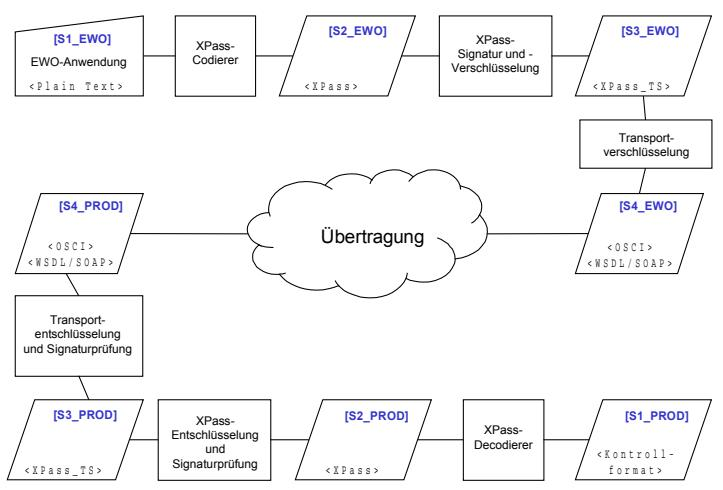

# **Prüfspezifikationen zur Technische Richtlinie zur Produktionsdatenerfassung, -qualitätsprüfung und -übermittlung für Pässe**

Prüfspezifikation XPass und Transport

# **BSI TR-03118-3 (PS XPass)**

Version 2.1 Datum 14.07.2007

BSI TR-03118-3 (PS XPass) Version 2.1

Bundesamt für Sicherheit in der Informationstechnik

Postfach 20 03 63 53133 Bonn Tel.: +49 (0) 1888 9582 0 E-Mail: tr-pdu@bsi.bund.de Internet: http://www.bsi.bund.de

© Bundesamt für Sicherheit in der Informationstechnik 2007

| 1.    | Vorbemerkungen                                                        | 5  |
|-------|-----------------------------------------------------------------------|----|
| 1.1   | Titel und Einordnung                                                  | 5  |
| 1.2   | Kennzeichnung                                                         | 5  |
| 1.3   | Fachlich zuständige Stelle                                            | 5  |
| 2.    | Prüfvorgänge                                                          | 6  |
| 2.1   | Komponenten für die Erfassung und Übertragung der Passantragsdaten | 6  |
| 2.2   | Spezifikation des Kontrollformats                                     | 7  |
| 2.2.1 | Darstellung der Daten                                                 | 7  |
| 2.2.2 | Umsetzung der Daten                                                   | 7  |
| 2.2.3 | Fehlermeldungen                                                       | 19 |
| 2.3   | Test EWO: Gültige EWO-Eingabedaten                                    | 19 |
| 2.4   | Test EWO: Ungültige EWO-Eingabedaten                                  | 21 |
| 2.5   | Test PROD: Gültige Passantragsdaten                                   | 23 |
| 2.6   | Test PROD: Ungültige Passantragsdaten                                 | 24 |
| 2.7   | Test EWO/PROD: Transportprotokoll                                     | 26 |
| 3.    | Referenzen                                                            | 28 |

Inhaltsverzeichnis

# **1. Vorbemerkungen**

Kapitel [1](#page-4-0) enthält Angaben zur Bezeichnung dieser Prüfspezifikation und zur fachlich zuständigen Stelle.

# **1.1 Titel und Einordnung**

Dieses Dokument trägt den Titel "Prüfspezifikation XPASS und Transport". Es ist normativer Teil der Prüfspezifikationen zur TR 03104 "Technische Richtlinie zur Produktionsdatenerfassung, -qualitätsprüfung und -übermittlung für Pässe" [TR\_PDÜ].

Die TR macht Vorgaben für alle Systeme, die für die Erfassung, Qualitätsprüfung und Übermittlung der Produktionsdaten für Pässe eingesetzt werden. Der Anwendungsbereich dieses Dokuments gilt entsprechend der TR 03104.

### **1.2 Kennzeichnung**

Dieser Anhang der TR wird gekennzeichnet mit "BSI TR-03118-3 (PS XPASS)"

### **1.3 Fachlich zuständige Stelle**

Fachlich zuständig für die Formulierung und Betreuung dieses Anhangs der TR ist das Bundesamt für Sicherheit in der Informationstechnik (BSI).

| Anschrift: | Bundesamt für Sicherheit in der Informationstechnik (BSI) |
|------------|--------------------------------------------------------------|
|            | Abteilung 3                                                  |
|            | Postfach 20 03 63                                            |
|            | 53133 Bonn                                                   |
|            |                                                              |

E-Mail: [tr-pdu@bsi.bund.de](mailto:tr-pdu@bsi.bund.de)

Zu Umfang und Qualität der Eingabedaten sind verschiedene Prüffolgen für gültige und ungültige Eingabe- bzw. Passantragsdaten definiert. Die nachfolgenden Tabellen zeigen die Prüfvorgänge, die für die Prüffolgen jeweils separat bearbeitet werden.

In den Prüffolgen werden u.a. (un-)gültige XPass-Feldformate, sowie (un-)gültige Feldlängen und –typen simuliert.

## **2.1 Komponenten für die Erfassung und Übertragung der Passantragsdaten**

Um die Nachvollziehbarkeit der Prüfvorgänge zu vereinfachen, wird an dieser Stelle noch einmal das der Prüfung zugrundeliegende Kommunikationsschema aus [TR\_PDÜ\_A4] zitiert:

#### **Abbildung 1: Kommunikationsschema zur Übertragung der Passantragsdaten zwischen Passbehörde (EWO) und Passhersteller (PROD)**

*Legende:*

| EWO    | Passbehörde                                                                                                                                       |
|--------|---------------------------------------------------------------------------------------------------------------------------------------------------|
| PROD   | Passhersteller                                                                                                                                    |
|        | Zu prüfende Komponente.                                                                                                                           |
|        | Schnittstellen im System der Passbehörde/des Passherstellers, an der Daten für die Konformitätsprüfung abgegriffen werden (Prüfschnittstelle). |
| g      | Externe Kommunikationsstrecke (z.B. WWW, Wählverbindung, etc.)                                                                                    |
| <xxxx> | Datenformat der Prüfschnittstelle                                                                                                                 |

Die Prüfschnittstelle [S1\_PROD] stellt eine zusätzliche Ausgabe der interpretierten Daten dar und ist standardmäßig nicht Teil des IT-Systems des Passherstellers. Das Kontrollformat wird in Kapitel [2.2](#page-6-0) beschrieben.

# **2.2 Spezifikation des Kontrollformats**

Das Format der Prüfschnittstelle [S1\_PROD] soll ein triviales Format sein, um den zusätzlichen Aufwand zur Erzeugung dieser Schnittstelle so gering wie möglich zu halten und Inkompatibilitäten zwischen Prüfling und Prüfer/Prüfsoftware zu vermeiden.

### **2.2.1 Darstellung der Daten**

Alle Knoten und deren Werte, unabhängig davon, ob diese definiert sind oder leer, werden zeilenweise in eine ASCII Datei geschrieben. Als Dateiformat wird UNIX verwendet, d.h. der Zeilenumbruch wird nur durch LineFeed (ASCII 0x10) dargestellt. Als Zeichensatz wird generell UTF-8 verwendet. Das Datumsformat ist gemäß ISO-8601: **YYYY-MM-DD oder mit Uhrzeit YYYY-MM-DDThh:mm:ss**

Die Reihenfolge der Abschnitte entspricht dem Auftreten der Anträge in der ursprünglichen XML-Struktur. Die in einer Bestellung enthaltenen Anträge werden mittels Antrag-Start/Ende-Trennzeilen separiert.

### **2.2.2 Umsetzung der Daten**

<Zeile>=<Elementwert>

Die Umsetzung der Daten der XPass-Schnittstelle in die PROD-Schnittstelle erfolgt an Hand der unten aufgeführten, eindeutigen und verbindlich festgelegten Zeilennummern. Zeilen des Nummerkreises Hxxx beinhalten Daten des Kopfdatensatzes, Zeilen des Nummernkreises Bxxx beinhalten Daten der Antragsdatensätze. Die Werte der Elemente werden mit einem Gleichheitszeichen "=" getrennt daran angeschlossen. Bei fehlerhaften Werten wird ein Ausrufezeichen "!" statt des Gleichheitszeichens verwendet. Es darf keine Zeilennummer ausgelassen werden, d.h. die Schnittstelle enthält immer alle relevanten Antragsdaten. Sind zu einem Antragsdatum keine Angaben vorhanden (z.B. bei optionalen Feldern), ist dieses mit der Zeichenkette "#LEER" als Wert zu versehen:

| <Zeile>!<FehlerCode>[:<Fehlertext>] |                                                                                      |                                                                          |  |
|-------------------------------------|--------------------------------------------------------------------------------------|--------------------------------------------------------------------------|--|
|                                     |                                                                                      |                                                                          |  |
| Zeile                               | Inhalt / Bedeutung                                                                   | Einschränkung Wertebereich                                               |  |
| H001                                | Fehlercode bei fehlerhaftem Kopfdatensatz; "#LEER" bei korrektem Kopfdatensatz |                                                                          |  |
| H002                                | Behördenkennziffer aus dem Verfahrenskennzeichen                                  |                                                                          |  |
| H003                                | Priorität der Bestellung aus dem Verfahrenskennzeichen                            | Express, Regulär                                                      |  |
| H004                                | Vorgangsnummer aus dem Verfahrenskennzeichen                                      |                                                                          |  |
| H005                                | Art des Bestellprodukts aus dem Verfahrenskennzeichen                             | Bürgerpass, Bürgerpass Express, Dienstpass, Dienstpass Express, |  |

| Zeile | Inhalt / Bedeutung                               | Einschränkung Wertebereich                                                                                                                                                                                                                                                                                                                                                                                              |
|-------|--------------------------------------------------|-------------------------------------------------------------------------------------------------------------------------------------------------------------------------------------------------------------------------------------------------------------------------------------------------------------------------------------------------------------------------------------------------------------------------|
|       |                                                  | Diplomatenpass, Diplomatenpass Express, Personalausweis, Reiseausweis Ausländer, Reiseausweis Ausländer Express Reiseausweis Flüchtlinge, Reiseausweis Flüchtlinge Express, Reiseausweis Staatenlose, Reiseausweis Staatenlose Express, Reisepass, Reisepass mit VISA, Reisepass mit VISA Express                                                                             |
| H006  | Bestellnummer                                    |                                                                                                                                                                                                                                                                                                                                                                                                                         |
| H007  | Bestellzeitpunkt                                 |                                                                                                                                                                                                                                                                                                                                                                                                                         |
| H008  | Art des Bestellprodukts                          | Bürgerpass, Bürgerpass Express, Dienstpass, Dienstpass Express, Diplomatenpass, Diplomatenpass Express, Personalausweis, Reiseausweis Ausländer, Reiseausweis Ausländer Express Reiseausweis Flüchtlinge, Reiseausweis Flüchtlinge Express, Reiseausweis Staatenlose, Reiseausweis Staatenlose Express, Reisepass, Reisepass mit VISA, Reisepass mit VISA Express |
| H009  | Anzahl der bestellten Dokumente                  | [1  350]                                                                                                                                                                                                                                                                                                                                                                                                                |
| H010  | Verpackungsart                                   | Einweg. Einweg Jiffy-Tasche, Einweg Karton, Einweg Karton (Großmenge)                                                                                                                                                                                                                                                                                                                                          |
| H011  | Empfänger (Kennung)                              |                                                                                                                                                                                                                                                                                                                                                                                                                         |
| H012  | Behördenkennziffer                               |                                                                                                                                                                                                                                                                                                                                                                                                                         |
| H013  | Außenstelle                                      |                                                                                                                                                                                                                                                                                                                                                                                                                         |
| H014  | Kreisgemeindeschlüssel                           |                                                                                                                                                                                                                                                                                                                                                                                                                         |
| H015  | Anwenderkennung                                  |                                                                                                                                                                                                                                                                                                                                                                                                                         |
| H016  | Behördeninternes Kennzeichen für die Bestellung. |                                                                                                                                                                                                                                                                                                                                                                                                                         |
| H017  | Expressbestellung                                | Ja, Nein                                                                                                                                                                                                                                                                                                                                                                                                             |
| H018  | Reklamationskennzeichen                          | Ja, Nein                                                                                                                                                                                                                                                                                                                                                                                                             |
| H019  | Kommentar                                        |                                                                                                                                                                                                                                                                                                                                                                                                                         |

Trennzeile am Anfang jedes Antrags: "—S—ANTRAG:<Laufende Nr. des Antrags>"

| Zeile | Inhalt / Bedeutung                                                                             | Einschränkung Wertebereich |
|-------|------------------------------------------------------------------------------------------------|----------------------------|
| B001  | Fehlercode bei fehlerhaftem Antragsdatensatz; "#LEER" bei korrektem Antragsdatensatz     |                            |
| B002  | Laufende Nummer des Antrags                                                                 |                            |
| B003  | Seriennummer des bestellten Dokuments                                                       |                            |
| B004  | Datum der Antragstellung durch den Bürger                                                      |                            |
| B005  | Kennzeichnung des Dokuments mit "Muster"                                                       | Ja, Nein                |
| B006  | Verfügbarkeit des Passbildes                                                                   | Ja, Nein                |
| B007  | Verfügbarkeit des 1. Fingerabdrucks                                                            | Ja, Nein                |
| B008  | Verfügbarkeit des 2. Fingerabdrucks                                                            | Ja, Nein                |
| B009  | Verfügbarkeit der Unterschrift                                                                 | Ja, Nein                |
| B010  | Geschlecht                                                                                     | Männlich, Weiblich      |
| B011  | Akademischer Titel                                                                             |                            |
| B012  | Familienname, Zeile 1                                                                       |                            |
| B013  | Familienname, Zeile 2                                                                       |                            |
| B014  | Familienname, Zeile 3                                                                       |                            |
| B015  | Familienname, Zeile 4                                                                       |                            |
| B016  | Vorname, Zeile 1                                                                            |                            |
| B017  | Vorname, Zeile 2                                                                            |                            |
| B018  | Vorname, Zeile 3                                                                            |                            |
| B019  | Geburtsname, Zeile 1                                                                        |                            |
| B020  | Geburtsname, Zeile 2                                                                        |                            |
| B021  | Geburtsname, Zeile 3                                                                        |                            |
| B022  | Wohnort, Zeile 1                                                                               |                            |
| B023  | Wohnort, Zeile 2                                                                               |                            |
| B024  | Geburtsdatum                                                                                   |                            |
| B025  | Geburtsort, Zeile 1                                                                            |                            |
| B026  | Geburtsort, Zeile 2                                                                            |                            |
| B027  | Geburtsort, Zeile 3                                                                            |                            |
| B028  | Nationalität                                                                                   |                            |
| B029  | Körpergröße                                                                                    | [1  999]                   |
| B030  | Augenfarbe                                                                                     |                            |
| B031  | Von der Behörde vorgegebenes Datum bis zu dem das bestellte Dokument gültig sein soll |                            |
| B032  | Familienname aus der MRZ, Zeile 1                                                              |                            |
| B033  | Familienname aus der MRZ, Zeile 2                                                              |                            |
| B034  | Familienname aus der MRZ, Zeile 3                                                              |                            |

| Zeile | Inhalt / Bedeutung                                                                                                | Einschränkung Wertebereich                                          |
|-------|-------------------------------------------------------------------------------------------------------------------|---------------------------------------------------------------------|
| B035  | Familienname aus der MRZ, Zeile 4                                                                              |                                                                     |
| B036  | Vorname aus der MRZ, Zeile 1                                                                                   |                                                                     |
| B037  | Vorname aus der MRZ, Zeile 2                                                                                   |                                                                     |
| B038  | Vorname aus der MRZ, Zeile 3                                                                                   |                                                                     |
| B039  | Zusatzzeile Ausw. Amt, Zeile 1 (Dienstort, Dienstbezeichnung)                                                  |                                                                     |
| B040  | Zusatzzeile Ausw. Amt, Zeile 2 (Dienstort, Dienstbezeichnung)                                                  |                                                                     |
| B041  | Zusatzzeile Ausw. Amt, Zeile 3 (Dienstort, Dienstbezeichnung)                                                  |                                                                     |
| B042  | Zusatzzeile Ausw. Amt, Zeile 4 (Dienstort, Dienstbezeichnung)                                                  |                                                                     |
| B043  | Zusatzzeile Ausw. Amt, Zeile 5 (Dienstort, Dienstbezeichnung)                                                  |                                                                     |
| B044  | Zusatzzeile Ausw. Amt, Zeile 6 (Passaktennummer)                                                               |                                                                     |
| B045  | Seriennummer des reklamierten Dokuments                                                                        |                                                                     |
| B046  | Klasse des Reklamationsgrundes                                                                                    | Bild, Chip, Daten, Material, Sonstiges, Unterschrift |
| B047  | Zusätzliche Informationen zur Reklamation                                                                         |                                                                     |
| B048  | Name des QS-Bewertungsmoduls für das Lichtbild                                                                 |                                                                     |
| B049  | Version des QS-Bewertungsmoduls und des verwendeten Parametersatzes mit den Sollwerten für das Lichtbild |                                                                     |
| B050  | Name und Version der verwendeten Hardware zur Aufnahme des Lichtbildes                                   |                                                                     |
| B051  | Version der verwendeten Software zur Aufnahme des Lichtbildes                                               |                                                                     |
| B052  | Farben unnatürlich, Qualitätswert                                                                                 |                                                                     |
| B053  | Farben unnatürlich, Min. Wert des Wertebereichs                                                                   |                                                                     |
| B054  | Farben unnatürlich, Min. Wert des Toleranzbereichs                                                                |                                                                     |
| B055  | Farben unnatürlich, Max. Wert des Wertebereichs                                                                   |                                                                     |
| B056  | Farben unnatürlich, Max. Wert des Toleranzbereichs                                                                |                                                                     |
| B057  | Farbraum, Qualitätswert                                                                                        |                                                                     |
| B058  | Farbraum, Min. Wert des Wertebereichs                                                                          |                                                                     |
| B059  | Farbraum, Min. Wert des Toleranzbereichs                                                                       |                                                                     |
| B060  | Farbraum, Max. Wert des Wertebereichs                                                                          |                                                                     |
| B061  | Farbraum, Max. Wert des Toleranzbereichs                                                                       |                                                                     |
| B062  | Farbtiefe, Qualitätswert                                                                                          |                                                                     |

| Zeile | Inhalt / Bedeutung                                       | Einschränkung Wertebereich |
|-------|----------------------------------------------------------|----------------------------|
| B063  | Farbtiefe, Min. Wert des Wertebereichs                   |                            |
| B064  | Farbtiefe, Min. Wert des Toleranzbereichs                |                            |
| B065  | Farbtiefe, Max. Wert des Wertebereichs                   |                            |
| B066  | Farbtiefe, Max. Wert des Toleranzbereichs                |                            |
| B067  | Kompressionsartefakte, Qualitätswert                     |                            |
| B068  | Kompressionsartefakte, Min. Wert des Wertebereichs       |                            |
| B069  | Kompressionsartefakte, Min. Wert des Toleranzbereichs |                            |
| B070  | Kompressionsartefakte, Max. Wert des Wertebereichs       |                            |
| B071  | Kompressionsartefakte, Max. Wert des Toleranzbereichs |                            |
| B072  | Kompressionsgrad, Qualitätswert                          |                            |
| B073  | Kompressionsgrad, Min. Wert des Wertebereichs            |                            |
| B074  | Kompressionsgrad, Min. Wert des Toleranzbereichs         |                            |
| B075  | Kompressionsgrad, Max. Wert des Wertebereichs            |                            |
| B076  | Kompressionsgrad, Max. Wert des Toleranzbereichs         |                            |
| B077  | Bildhöhe, Qualitätswert                                  |                            |
| B078  | Bildhöhe, Min. Wert des Wertebereichs                    |                            |
| B079  | Bildhöhe, Min. Wert des Toleranzbereichs                 |                            |
| B080  | Bildhöhe, Max. Wert des Wertebereichs                    |                            |
| B081  | Bildhöhe, Max. Wert des Toleranzbereichs                 |                            |
| B082  | Bildbreite, Qualitätswert                                |                            |
| B083  | Bildbreite, Min. Wert des Wertebereichs                  |                            |
| B084  | Bildbreite, Min. Wert des Toleranzbereichs               |                            |
| B085  | Bildbreite, Max. Wert des Wertebereichs                  |                            |
| B086  | Bildbreite, Max. Wert des Toleranzbereichs               |                            |
| B087  | Auflösung, Qualitätswert                                 |                            |
| B088  | Auflösung, Min. Wert des Wertebereichs                   |                            |
| B089  | Auflösung, Min. Wert des Toleranzbereichs                |                            |
| B090  | Auflösung, Max. Wert des Wertebereichs                   |                            |
| B091  | Auflösung, Max. Wert des Toleranzbereichs                |                            |
| B092  | Belichtung korrekt, Qualitätswert                        |                            |
| B093  | Belichtung korrekt, Min. Wert des Wertebereichs          |                            |
| B094  | Belichtung korrekt, Min. Wert des Toleranzbereichs       |                            |
| B095  | Belichtung korrekt, Max. Wert des Wertebereichs          |                            |
| B096  | Belichtung korrekt, Max. Wert des Toleranzbereichs       |                            |
| B097  | Kontrast, Qualitätswert                                  |                            |
| B098  | Kontrast, Min. Wert des Wertebereichs                    |                            |
| B099  | Kontrast, Min. Wert des Toleranzbereichs                 |                            |
| B100  | Kontrast, Max. Wert des Wertebereichs                    |                            |

| Zeile | Inhalt / Bedeutung                                            | Einschränkung Wertebereich |
|-------|---------------------------------------------------------------|----------------------------|
| B101  | Kontrast, Max. Wert des Toleranzbereichs                      |                            |
| B102  | Fokus/Schärfentiefe, Qualitätswert                            |                            |
| B103  | Fokus/Schärfentiefe, Min. Wert des Wertebereichs              |                            |
| B104  | Fokus/Schärfentiefe, Min. Wert des Toleranzbereichs           |                            |
| B105  | Fokus/Schärfentiefe, Max. Wert des Wertebereichs              |                            |
| B106  | Fokus/Schärfentiefe, Max. Wert des Toleranzbereichs           |                            |
| B107  | Drehung Halsachse (Yaw), Qualitätswert                        |                            |
| B108  | Drehung Halsachse (Yaw), Min. Wert des Wertebereichs       |                            |
| B109  | Drehung Halsachse (Yaw), Min. Wert des Toleranzbereichs    |                            |
| B110  | Drehung Halsachse (Yaw), Max. Wert des Wertebereichs       |                            |
| B111  | Drehung Halsachse (Yaw), Max. Wert des Toleranzbereichs    |                            |
| B112  | Drehung Ohrenachse (Pitch), Qualitätswert                     |                            |
| B113  | Drehung Ohrenachse (Pitch), Min. Wert des Wertebereichs    |                            |
| B114  | Drehung Ohrenachse (Pitch), Min. Wert des Toleranzbereichs |                            |
| B115  | Drehung Ohrenachse (Pitch), Max. Wert des Wertebereichs    |                            |
| B116  | Drehung Ohrenachse (Pitch), Max. Wert des Toleranzbereichs |                            |
| B117  | Drehung Nasenachse (Roll), Qualitätswert                      |                            |
| B118  | Drehung Nasenachse (Roll), Min. Wert des Wertebereichs     |                            |
| B119  | Drehung Nasenachse (Roll), Min. Wert des Toleranzbereichs  |                            |
| B120  | Drehung Nasenachse (Roll), Max. Wert des Wertebereichs     |                            |
| B121  | Drehung Nasenachse (Roll), Max. Wert des Toleranzbereichs  |                            |
| B122  | Mund geschlossen, Qualitätswert                               |                            |
| B123  | Mund geschlossen, Min. Wert des Wertebereichs                 |                            |
| B124  | Mund geschlossen, Min. Wert des Toleranzbereichs              |                            |
| B125  | Mund geschlossen, Max. Wert des Wertebereichs                 |                            |
| B126  | Mund geschlossen, Max. Wert des Toleranzbereichs              |                            |
| B127  | Augenbrauen angehoben, Qualitätswert                          |                            |
| B128  | Augenbrauen angehoben, Min. Wert des Wertebereichs         |                            |
| B129  | Augenbrauen angehoben, Min. Wert des Toleranzbereichs      |                            |

| Zeile | Inhalt / Bedeutung                                             | Einschränkung Wertebereich |
|-------|----------------------------------------------------------------|----------------------------|
| B130  | Augenbrauen angehoben, Max. Wert des Wertebereichs          |                            |
| B131  | Augenbrauen angehoben, Max. Wert des Toleranzbereichs       |                            |
| B132  | Augen nicht geschlossen, Qualitätswert                         |                            |
| B133  | Augen nicht geschlossen, Min. Wert des Wertebereichs        |                            |
| B134  | Augen nicht geschlossen, Min. Wert des Toleranzbereichs     |                            |
| B135  | Augen nicht geschlossen, Max. Wert des Wertebereichs        |                            |
| B136  | Augen nicht geschlossen, Max. Wert des Toleranzbereichs     |                            |
| B137  | Augen nicht verdeckt, Qualitätswert                            |                            |
| B138  | Augen nicht verdeckt, Min. Wert des Wertebereichs              |                            |
| B139  | Augen nicht verdeckt, Min. Wert des Toleranzbereichs        |                            |
| B140  | Augen nicht verdeckt, Max. Wert des Wertebereichs              |                            |
| B141  | Augen nicht verdeckt, Max. Wert des Toleranzbereichs        |                            |
| B142  | Augen blicken zur Kamera, Qualitätswert                     |                            |
| B143  | Augen blicken zur Kamera, Min. Wert des Wertebereichs    |                            |
| B144  | Augen blicken zur Kamera, Min. Wert des Toleranzbereichs |                            |
| B145  | Augen blicken zur Kamera, Max. Wert des Wertebereichs    |                            |
| B146  | Augen blicken zur Kamera, Max. Wert des Toleranzbereichs |                            |
| B147  | Augenposition, Qualitätswert                                   |                            |
| B148  | Augenposition, Min. Wert des Wertebereichs                     |                            |
| B149  | Augenposition, Min. Wert des Toleranzbereichs                  |                            |
| B150  | Augenposition, Max. Wert des Wertebereichs                     |                            |
| B151  | Augenposition, Max. Wert des Toleranzbereichs                  |                            |
| B152  | Augenabstand, Qualitätswert                                    |                            |
| B153  | Augenabstand, Min. Wert des Wertebereichs                      |                            |
| B154  | Augenabstand, Min. Wert des Toleranzbereichs                   |                            |
| B155  | Augenabstand, Max. Wert des Wertebereichs                      |                            |
| B156  | Augenabstand, Max. Wert des Toleranzbereichs                   |                            |
| B157  | Hintergrund einfarbig, Qualitätswert                           |                            |
| B158  | Hintergrund einfarbig, Min. Wert des Wertebereichs             |                            |
| B159  | Hintergrund einfarbig, Min. Wert des Toleranzbereichs       |                            |

| Zeile | Inhalt / Bedeutung                                                                     | Einschränkung Wertebereich |
|-------|----------------------------------------------------------------------------------------|----------------------------|
| B160  | Hintergrund einfarbig, Max. Wert des Wertebereichs                                     |                            |
| B161  | Hintergrund einfarbig, Max. Wert des Toleranzbereichs                               |                            |
| B162  | Hintergrund mit Schatten, Qualitätswert                                                |                            |
| B163  | Hintergrund mit Schatten, Min. Wert des Wertebereichs                               |                            |
| B164  | Hintergrund mit Schatten, Min. Wert des Toleranzbereichs                            |                            |
| B165  | Hintergrund mit Schatten, Max. Wert des Wertebereichs                               |                            |
| B166  | Hintergrund mit Schatten, Max. Wert des Toleranzbereichs                            |                            |
| B167  | Keine weiteren Personen im Hintergrund, Qualitätswert                            |                            |
| B168  | Keine weiteren Personen oder Objekte im Hintergrund, Min. Wert des Wertebereichs    |                            |
| B169  | Keine weiteren Personen oder Objekte im Hintergrund, Min. Wert des Toleranzbereichs |                            |
| B170  | Keine weiteren Personen oder Objekte im Hintergrund, Max. Wert des Wertebereichs    |                            |
| B171  | Keine weiteren Personen oder Objekte im Hintergrund, Max. Wert des Toleranzbereichs |                            |
| B172  | Anzahl der Gesichter, Qualitätswert                                                    |                            |
| B173  | Anzahl der Gesichter, Min. Wert des Wertebereichs                                      |                            |
| B174  | Anzahl der Gesichter, Min. Wert des Toleranzbereichs                                |                            |
| B175  | Anzahl der Gesichter, Max. Wert des Wertebereichs                                      |                            |
| B176  | Anzahl der Gesichter, Max. Wert des Toleranzbereichs                                |                            |
| B177  | Gesicht mit Schatten, Qualitätswert                                                 |                            |
| B178  | Gesicht mit Schatten, Min. Wert des Wertebereichs                                   |                            |
| B179  | Gesicht mit Schatten, Min. Wert des Toleranzbereichs                                |                            |
| B180  | Gesicht mit Schatten, Max. Wert des Wertebereichs                                   |                            |
| B181  | Gesicht mit Schatten, Max. Wert des Toleranzbereichs                             |                            |
| B182  | Gesicht mit Hot Spots, Qualitätswert                                                |                            |
| B183  | Gesicht mit Hot Spots, Min. Wert des Wertebereichs                                  |                            |
| B184  | Gesicht mit Hot Spots, Min. Wert des Toleranzbereichs                            |                            |
| B185  | Gesicht mit Hot Spots, Max. Wert des Wertebereichs                                  |                            |
| B186  | Gesicht mit Hot Spots, Max. Wert des Toleranzbereichs                            |                            |
| B187  | Brilleneffekte, Qualitätswert                                                          |                            |

| Zeile | Inhalt / Bedeutung                                                                                                     | Einschränkung Wertebereich |
|-------|------------------------------------------------------------------------------------------------------------------------|----------------------------|
| B188  | Brilleneffekte, Min. Wert des Wertebereichs                                                                            |                            |
| B189  | Brilleneffekte, Min. Wert des Toleranzbereichs                                                                         |                            |
| B190  | Brilleneffekte, Max. Wert des Wertebereichs                                                                            |                            |
| B191  | Brilleneffekte, Max. Wert des Toleranzbereichs                                                                         |                            |
| B192  | Verhältnis Kopfbreite zu Bildbreite, Qualitätswert                                                                     |                            |
| B193  | Verhältnis Kopfbreite zu Bildbreite, Min. Wert des Wertebereichs                                                    |                            |
| B194  | Verhältnis Kopfbreite zu Bildbreite, Min. Wert des Toleranzbereichs                                                 |                            |
| B195  | Verhältnis Kopfbreite zu Bildbreite, Max. Wert des Wertebereichs                                                    |                            |
| B196  | Verhältnis Kopfbreite zu Bildbreite, Max. Wert des Toleranzbereichs                                                 |                            |
| B197  | Verhältnis Kopfhöhe zu Bildhöhe, Qualitätswert                                                                         |                            |
| B198  | Verhältnis Kopfhöhe zu Bildhöhe, Min. Wert des Wertebereichs                                                        |                            |
| B199  | Verhältnis Kopfhöhe zu Bildhöhe, Min. Wert des Toleranzbereichs                                                     |                            |
| B200  | Verhältnis Kopfhöhe zu Bildhöhe, Max. Wert des Wertebereichs                                                        |                            |
| B201  | Verhältnis Kopfhöhe zu Bildhöhe, Max. Wert des Toleranzbereichs                                                     |                            |
| B202  | Horizontale Zentrierung, Qualitätswert                                                                                 |                            |
| B203  | Horizontale Zentrierung, Min. Wert des Wertebereichs                                                                |                            |
| B204  | Horizontale Zentrierung, Min. Wert des Toleranzbereichs                                                             |                            |
| B205  | Horizontale Zentrierung, Max. Wert des Wertebereichs                                                                |                            |
| B206  | Horizontale Zentrierung, Max. Wert des Toleranzbereichs                                                             |                            |
| B207  | Gesamtergebnis für die Lichtbildaufnahme                                                                            | Angenommen, Abgelehnt   |
| B208  | Zeitpunkt der Lichtbildaufnahme                                                                                        |                            |
| B209  | Name des QS-Bewertungsmoduls für die Fingerabdrücke                                                              |                            |
| B210  | Version des QS-Bewertungsmoduls und des verwendeten Parametersatzes mit den Sollwerten für die Fingerabdrücke |                            |
| B211  | Name und Version der verwendeten Hardware zur Aufnahme der Fingerabdrücke                                           |                            |
| B212  | Version der verwendeten Software zur Aufnahme der Fingerabdrücke                                                    |                            |
| B213  | Name des eingesetzten Matching-Algorithmus für                                                                      |                            |

| Zeile | Inhalt / Bedeutung                                                        | Einschränkung Wertebereich |
|-------|---------------------------------------------------------------------------|----------------------------|
|       | Fingerabdrücke                                                            |                            |
| B214  | Version des eingesetzten Matching-Algorithmus für Fingerabdrücke       |                            |
| B215  | 1. Finger: 1. Aufnahme, Qualitätswert                                     |                            |
| B216  | 1. Finger: 1. Aufnahme, Min. Wert des Wertebereichs                       |                            |
| B217  | 1. Finger: 1. Aufnahme, Min. Wert des Toleranzbereichs                 |                            |
| B218  | 1. Finger: 1. Aufnahme, Max. Wert des Wertebereichs                       |                            |
| B219  | 1. Finger: 1. Aufnahme, Max. Wert des Toleranzbereichs                 |                            |
| B220  | 1. Finger: 2. Aufnahme, Qualitätswert                                     |                            |
| B221  | 1. Finger: 2. Aufnahme, Min. Wert des Wertebereichs                       |                            |
| B222  | 1. Finger: 2. Aufnahme, Min. Wert des Toleranzbereichs                 |                            |
| B223  | 1. Finger: 2. Aufnahme, Max. Wert des Wertebereichs                       |                            |
| B224  | 1. Finger: 2. Aufnahme, Max. Wert des Toleranzbereichs                 |                            |
| B225  | 1. Finger: 3. Aufnahme, Qualitätswert                                     |                            |
| B226  | 1. Finger: 3. Aufnahme, Min. Wert des Wertebereichs                       |                            |
| B227  | 1. Finger: 3. Aufnahme, Min. Wert des Toleranzbereichs                 |                            |
| B228  | 1. Finger: 3. Aufnahme, Max. Wert des Wertebereichs                       |                            |
| B229  | 1. Finger: 3. Aufnahme, Max. Wert des Toleranzbereichs                 |                            |
| B230  | 1. Finger: Match 1. vs. 2. Aufnahme, Qualitätswert                     |                            |
| B231  | 1. Finger: Match 1. vs. 2. Aufnahme, Min. Wert des Wertebereichs    |                            |
| B232  | 1. Finger: Match 1. vs. 2. Aufnahme, Min. Wert des Toleranzbereichs |                            |
| B233  | 1. Finger: Match 1. vs. 2. Aufnahme, Max. Wert des Wertebereichs    |                            |
| B234  | 1. Finger: Match 1. vs. 2. Aufnahme, Max. Wert des Toleranzbereichs |                            |
| B235  | 1. Finger: Match 1. vs. 3. Aufnahme, Qualitätswert                     |                            |
| B236  | 1. Finger: Match 1. vs. 3. Aufnahme, Min. Wert des Wertebereichs    |                            |
| B237  | 1. Finger: Match 1. vs. 3. Aufnahme, Min. Wert des Toleranzbereichs |                            |
| B238  | 1. Finger: Match 1. vs. 3. Aufnahme, Max. Wert des Wertebereichs    |                            |
| B239  | 1. Finger: Match 1. vs. 3. Aufnahme, Max. Wert des Toleranzbereichs |                            |
| B240  | 1. Finger: Match 2. vs. 3. Aufnahme, Qualitätswert                     |                            |

| Zeile | Inhalt / Bedeutung                                                     | Einschränkung Wertebereich |
|-------|------------------------------------------------------------------------|----------------------------|
| B241  | 1. Finger: Match 2. vs. 3. Aufnahme, Min. Wert des Wertebereichs    |                            |
| B242  | 1. Finger: Match 2. vs. 3. Aufnahme, Min. Wert des Toleranzbereichs |                            |
| B243  | 1. Finger: Match 2. vs. 3. Aufnahme, Max. Wert des Wertebereichs    |                            |
| B244  | 1. Finger: Match 2. vs. 3. Aufnahme, Max. Wert des Toleranzbereichs |                            |
| B245  | 1. Finger: Index der gewählten Aufname                                 |                            |
| B246  | 2. Finger: 1. Aufnahme, Qualitätswert                               |                            |
| B247  | 2. Finger: 1. Aufnahme, Min. Wert des Wertebereichs                 |                            |
| B248  | 2. Finger: 1. Aufnahme, Min. Wert des Toleranzbereichs           |                            |
| B249  | 2. Finger: 1. Aufnahme, Max. Wert des Wertebereichs                 |                            |
| B250  | 2. Finger: 1. Aufnahme, Max. Wert des Toleranzbereichs           |                            |
| B251  | 2. Finger: 2. Aufnahme, Qualitätswert                               |                            |
| B252  | 2. Finger: 2. Aufnahme, Min. Wert des Wertebereichs                 |                            |
| B253  | 2. Finger: 2. Aufnahme, Min. Wert des Toleranzbereichs           |                            |
| B254  | 2. Finger: 2. Aufnahme, Max. Wert des Wertebereichs                 |                            |
| B255  | 2. Finger: 2. Aufnahme, Max. Wert des Toleranzbereichs           |                            |
| B256  | 2. Finger: 3. Aufnahme, Qualitätswert                               |                            |
| B257  | 2. Finger: 3. Aufnahme, Min. Wert des Wertebereichs                 |                            |
| B258  | 2. Finger: 3. Aufnahme, Min. Wert des Toleranzbereichs           |                            |
| B259  | 2. Finger: 3. Aufnahme, Max. Wert des Wertebereichs                 |                            |
| B260  | 2. Finger: 3. Aufnahme, Max. Wert des Toleranzbereichs           |                            |
| B261  | 2. Finger: Match 1. vs. 2. Aufnahme, Qualitätswert                     |                            |
| B262  | 2. Finger: Match 1. vs. 2. Aufnahme, Min. Wert des Wertebereichs    |                            |
| B263  | 2. Finger: Match 1. vs. 2. Aufnahme, Min. Wert des Toleranzbereichs |                            |
| B264  | 2. Finger: Match 1. vs. 2. Aufnahme, Max. Wert des Wertebereichs    |                            |
| B265  | 2. Finger: Match 1. vs. 2. Aufnahme, Max. Wert des Toleranzbereichs |                            |
| B266  | 2. Finger: Match 1. vs. 3. Aufnahme, Qualitätswert                     |                            |
| B267  | 2. Finger: Match 1. vs. 3. Aufnahme, Min. Wert des Wertebereichs    |                            |
| B268  | 2. Finger: Match 1. vs. 3. Aufnahme, Min. Wert des                     |                            |

| Zeile              | Inhalt / Bedeutung                                                                                                  | Einschränkung Wertebereich                                                                                                                                                                                                                                     |
|--------------------|---------------------------------------------------------------------------------------------------------------------|----------------------------------------------------------------------------------------------------------------------------------------------------------------------------------------------------------------------------------------------------------------|
|                    | Toleranzbereichs                                                                                                    |                                                                                                                                                                                                                                                                |
| B269               | 2. Finger: Match 1. vs. 3. Aufnahme, Max. Wert des Wertebereichs                                              |                                                                                                                                                                                                                                                                |
| B270               | 2. Finger: Match 1. vs. 3. Aufnahme, Max. Wert des Toleranzbereichs                                           |                                                                                                                                                                                                                                                                |
| B271               | 2. Finger: Match 2. vs. 3. Aufnahme, Qualitätswert                                                               |                                                                                                                                                                                                                                                                |
| B272               | 2. Finger: Match 2. vs. 3. Aufnahme, Min. Wert des Wertebereichs                                              |                                                                                                                                                                                                                                                                |
| B273               | 2. Finger: Match 2. vs. 3. Aufnahme, Min. Wert des Toleranzbereichs                                           |                                                                                                                                                                                                                                                                |
| B274               | 2. Finger: Match 2. vs. 3. Aufnahme, Max. Wert des Wertebereichs                                              |                                                                                                                                                                                                                                                                |
| B275               | 2. Finger: Match 2. vs. 3. Aufnahme, Max. Wert des Toleranzbereichs                                           |                                                                                                                                                                                                                                                                |
| B276               | 2. Finger: Index der gewählten Aufname                                                                              |                                                                                                                                                                                                                                                                |
| B277               | 1. Finger: Kennzeichen                                                                                              | Kein Finger aufgenommen, Rechter Daumen, Rechter Zeigefinger, Rechter Mittelfinger, Rechter Ringfinger, Rechter kleiner Finger, Linker Daumen, Linker Zeigefinger, Linker Mittelfinger, Linker Ringfinger, Linker kleiner Finger |
| B278               | 1. Finger: Gesamtergebnis für die Aufnahme                                                                          | Angenommen, Abgelehnt                                                                                                                                                                                                                                       |
| B279               | 2. Finger: Kennzeichen                                                                                              | Kein Finger aufgenommen, Rechter Daumen, Rechter Zeigefinger, Rechter Mittelfinger, Rechter Ringfinger, Rechter kleiner Finger, Linker Daumen, Linker Zeigefinger, Linker Mittelfinger, Linker Ringfinger, Linker kleiner Finger |
| B280               | 2. Finger: Gesamtergebnis für die Aufnahme                                                                          | Angenommen, Abgelehnt                                                                                                                                                                                                                                       |
| B281               | Zeitpunkt der Fingerabdruckaufnahmen                                                                                |                                                                                                                                                                                                                                                                |
| B282 – B299  | - nicht genutzt -                                                                                                   |                                                                                                                                                                                                                                                                |
| B3<(2n * 1)> | Name der n. Teilkomponenten, die zur Erfassung des Lichtbildes und zu seiner Bewertung verwendet wurden |                                                                                                                                                                                                                                                                |

| Zeile          | Inhalt / Bedeutung                                                                                                 | Einschränkung Wertebereich |
|----------------|--------------------------------------------------------------------------------------------------------------------|----------------------------|
| * B3<(2n)>  | Version der n. Teilkomponenten, die zur Erfassung des Lichtbildes und zu seiner Bewertung verwendet wurden   |                            |
| B4<(2n 1)>* | Name der n. Teilkomponenten, die zur Erfassung der Fingerabdrücke und zu ihrer Bewertung verwendet wurden    |                            |
| * B4<(2n)>  | Version der n. Teilkomponenten, die zur Erfassung der Fingerabdrücke und zu ihrer Bewertung verwendet wurden |                            |

Trennzeile am Ende jedes Antrags: "--E—ANTRAG:< Laufende Nr. des Antrags >"

### **2.2.3 Fehlermeldungen**

Die PROD-Schnittstelle bildet neben den Daten auch evtl. auftretende Fehlerfälle und deren Meldungen mit ab.

Im Fehlerfall wird als Elementwert nicht der Wert des Elementes oder Attributes benutzt, sondern die Zeichenkette "Fehler".

Für sonstige Fehlerfälle sind die Zeilen H001 und B001 zu verwenden.

# **2.3 Test EWO: Gültige EWO-Eingabedaten**

| Prüfumgebung  | • PC / Laptop (optional)                                                            |
|---------------|----------------------------------------------------------------------------------------|
| Prüfwerkzeuge | Prüfsoftware zur Ermittlung und Protokollierung des Prüfergebnisses • (optional) |

**\*** Da die Anzahl der zu listenden Teilkomponenten variabel ist, können hier keine absoluten Zeilennummern vorgegeben werden. Stattdessen ist eine Berechnungsvorschrift für die Zeilennummer angegeben, mit der jeweils alternierend Name und Versionsnummer der verwendeten Teilkomponente gelistet werden sollen. Die Teilkomponenten sind in der Kontrollschnittstelle dabei in der Reihenfolge zu listen, in der sie im Antragsdatenblock übertragen wurden. Dabei ist darauf zu achten, dass der 300er Nummernkreis für die Teilkomponenten zur Lichtbilderfassung und der 400er Nummernkreis für die Teilkomponenten zur Fingerabdruckerfassung vorgesehen sind.

- Beispiel:
- B301: Name 1. Teilkomponente Gesicht
- B302: Version 1. Teilkomponente Gesicht
- B303: Name 2. Teilkomponente Gesicht
- B304: Version 2. Teilkomponente Gesicht
- B401: Name 1. Teilkomponente Finger
- B402: Version 1. Teilkomponente Finger
- B403: Name 2. Teilkomponente Finger
- B404: Version 2. Teilkomponente Finger
- B405: Name 3. Teilkomponente Finger
- B406: Version 3. Teilkomponente Finger
- B407: Name 4. Teilkomponente Finger
- B408: Version 4. Teilkomponente Finger

| Qualifikation | Gegeben durch Akkreditierung der Prüfstelle als solche durch das BSI. |
|---------------|-----------------------------------------------------------------------|
| des           |                                                                       |
| Prüfpersonals |                                                                       |

#### **Tabelle 2: Anforderungen an das Prüfobjekt**

| Hersteller nachweise | Keine                                                                                                                                                                                                                                                                                     |
|-------------------------|-------------------------------------------------------------------------------------------------------------------------------------------------------------------------------------------------------------------------------------------------------------------------------------------|
| Schnittstellen          | Benutzereingabe ([S1_EWO]) • • Dateischnittstelle zur Ausgabe der XPass-formatierten Daten ([S2_EWO]) Dateischnittstelle zur Ausgabe der XPass-signierten und –verschlüsselten Daten • ([S3_EWO]) Versand der Antragsdaten an einen alternativen Passhersteller • |
| Funktionalität          | Abwicklung eines Passantrags                                                                                                                                                                                                                                                              |

#### **Tabelle 3: Prüfvorgang "Gültige EWO-Eingabedaten [EWO]"**

| Prüfvorgang      | Gültige EWO-Eingabedaten [EWO]                                                                                                                                                                                                                                                                                                                                                                                 |                                                                                                                                                                |                    |  |
|------------------|----------------------------------------------------------------------------------------------------------------------------------------------------------------------------------------------------------------------------------------------------------------------------------------------------------------------------------------------------------------------------------------------------------------|----------------------------------------------------------------------------------------------------------------------------------------------------------------|--------------------|--|
| Prüfzweck        | Wird bei Eingabe gültiger Daten in die Komponente "EWO-Anwendung" ein gültiger XPass-Datensatz erzeugt und an den Passhersteller geschickt?                                                                                                                                                                                                                                                           |                                                                                                                                                                |                    |  |
| Startbedingungen | Die EWO-Anwendung wird im gleichen Modus betrieben, wie es in einem regulären Passantragsverfahren üblich ist, wobei als Adressat für die Passantragsdaten die URL des eigens für die Prüfung etablierten Webservers ("virtueller Passhersteller") zu anzugeben ist und die zu verwendenden Signatur und Verschlüsselungszertifikate auf die des "virtuellen Passherstellers" umzustellen sind. |                                                                                                                                                                |                    |  |
| Prüfschritte     | Beschreibung                                                                                                                                                                                                                                                                                                                                                                                                   | Erwartetes Resultat                                                                                                                                            | Erzieltes Resultat |  |
| 1.               | Eingabe der Testdaten (soweit möglich) in die EWO-Anwendung über die Benutzerschnittstelle und Start des Verarbeitungsvorgangs.                                                                                                                                                                                                                                                              | Daten werden ohne Fehlermeldung, Systemabstürze, etc. verarbeitet.                                                                                    |                    |  |
| 2.               | Einlesen der Daten aus [S2_EWO] und Extraktion der Passdaten auf Basis der XPass Formatvorschriften. Vergleich der Passdaten mit [S1_EWO].                                                                                                                                                                                                                                                | [S2_EWO] ist gültiges XML. Die extrahierte Passdaten stimmen mit den Daten aus [S1_EWO] überein.                                             |                    |  |
| 3.a)             | Bei gültiger [S2_EWO]: Einlesen und Entschlüsselung der Daten aus [S3_EWO] Vergleich der XPass Datenblöcke mit                                                                                                                                                                                                                                                                               | [S3_EWO] kann entschlüsselt werden und das mitgelieferte Signaturtzertifikat gehört zur tatsächlich verwendeten XPass Signatur. Die XPass |                    |  |

| Prüfvorgänge |
|--------------|
|--------------|

|                | [S2_EWO].                                                                                                                                                                                                                                                                                                                                                                                                                        | Datenblöcke stimmen mit den Datenblöcken aus [S2_EWO] überein.                           |  |
|----------------|----------------------------------------------------------------------------------------------------------------------------------------------------------------------------------------------------------------------------------------------------------------------------------------------------------------------------------------------------------------------------------------------------------------------------------|---------------------------------------------------------------------------------------------------|--|
| 3.b)           | Bei ungültiger [S2_EWO]: Einlesen und Entschlüsselung der Daten aus [S3_EWO], Vergleich der XPass Datenblöcke mit [S2_EWO].                                                                                                                                                                                                                                                                                 | Es existiert keine [S3_EWO] oder die entschlüsselte [S3_EWO] enthält keine Passdaten. |  |
| Endbedingungen | Die Schnittstellen [S2_EWO] und [S3_EWO] entsprechen den erwarteten Resultaten.                                                                                                                                                                                                                                                                                                                                            |                                                                                                   |  |
| Prüfurteil     | Resultat der Prüfung PASS, falls für alle Prüfschritte das erzielte Resultat mit dem erwarteten • Resultat übereinstimmt und das EWO-System die Endbedingung erfüllt FAIL, falls für einen Prüfschritt das erzielte Resultat nicht mit dem • erwarteten Resultat übereinstimmt oder das EWO-System die Endbedingung nicht erfüllt und dieser Fehler dem Prüfobjekt zugeordnet werden kann |                                                                                                   |  |
| Bemerkungen    |                                                                                                                                                                                                                                                                                                                                                                                                                                  |                                                                                                   |  |

# **2.4 Test EWO: Ungültige EWO-Eingabedaten**

| Prüfumgebung                          | PC / Laptop (optional) •                                                         |
|---------------------------------------|----------------------------------------------------------------------------------------|
| Prüfwerkzeuge                         | Prüfsoftware zur Ermittlung und Protokollierung des Prüfergebnisses • (optional) |
| Qualifikation des Prüfpersonals | Gegeben durch Akkreditierung der Prüfstelle als solche durch das BSI.                  |

#### **Tabelle 4: Anforderungen an die Prüfstelle**

#### **Tabelle 5: Anforderungen an das Prüfobjekt**

| Hersteller nachweise | keine                                                                                                                                                                                                                                                                                     |
|-------------------------|-------------------------------------------------------------------------------------------------------------------------------------------------------------------------------------------------------------------------------------------------------------------------------------------|
| Schnittstellen          | Benutzereingabe ([S1_EWO]) • Dateischnittstelle zur Ausgabe der XPass-formatierten Daten ([S2_EWO]) • Dateischnittstelle zur Ausgabe der XPass-signierten und –verschlüsselten Daten • ([S3_EWO]) • Versand der Antragsdaten an einen alternativen Passhersteller |
| Funktionalität          | Abwicklung eines Passantrags                                                                                                                                                                                                                                                              |

| Prüfvorgang      | Ungültige EWO-Eingabedaten [EWO]                                                                                                                                                                                                                                                                                                                                                                                |                                                                                                                                                                                                                                              |                    |  |
|------------------|-----------------------------------------------------------------------------------------------------------------------------------------------------------------------------------------------------------------------------------------------------------------------------------------------------------------------------------------------------------------------------------------------------------------|----------------------------------------------------------------------------------------------------------------------------------------------------------------------------------------------------------------------------------------------|--------------------|--|
| Prüfzweck        | Wird bei Eingabe ungültiger Daten in die Komponente "EWO-Anwendung" kein XPass-Datensatz erzeugt und an den Passhersteller geschickt?                                                                                                                                                                                                                                                                  |                                                                                                                                                                                                                                              |                    |  |
| Startbedingungen | Die EWO-Anwendung wird im gleichen Modus betrieben, wie es in einem regulären Passantragsverfahren üblich ist, wobei als Adressat für die Passantragsdaten die URL des eigens für die Prüfung etablierten Webservers ("virtueller Passhersteller") anzugeben ist und die zu verwendenden Signatur- und Verschlüsselungszertifikate auf die des "virtuellen Passherstellers" umzustellen sind. |                                                                                                                                                                                                                                              |                    |  |
| Prüfschritte     | Beschreibung                                                                                                                                                                                                                                                                                                                                                                                                    | Erwartetes Resultat                                                                                                                                                                                                                          | Erzieltes Resultat |  |
| 1.               | Eingabe der Testdaten (soweit möglich) in die EWO-Anwendung über die Benutzerschnittstelle und Start des Verarbeitungsvorgangs.                                                                                                                                                                                                                                                                  | Das EWO-System lehnt die Eingabe mit oder ohne Fehlermeldung ab.                                                                                                                                                                 |                    |  |
| 2.               | Einlesen der Daten aus [S2_EWO] und Extraktion der Passdaten auf Basis der XPass Formatvorschriften. Vergleich der Passdaten mit den Testdaten.                                                                                                                                                                                                                                               | a) Es existiert keine [S2_EWO]; b) [S2_EWO] ist gültiges XML, enthält jedoch keine Passdaten; c) [S2_EWO] ist gültiges XML und enthält die fehlerbereinigten Passdaten;                         |                    |  |
| 3.a)             | Bei gültiger [S2_EWO]: Einlesen und Entschlüsselung der Daten aus [S3_EWO], Vergleich der XPass Datenblöcke mit [S2_EWO].                                                                                                                                                                                                                                                                     | [S3_EWO] kann entschlüsselt werden und das mitgelieferte Signaturtzertifikat gehört zur tatsächlich verwendeten XPass Signatur. Die XPass Datenblöcke stimmen mit den Datenblöcken aus [S2_EWO] überein. |                    |  |
| 3.b)             | Bei ungültiger [S2_EWO]: Einlesen und Entschlüsselung der Daten aus [S3_EWO] Vergleich der XPass Datenblöcke mit [S2_EWO].                                                                                                                                                                                                                                                                 | Es existiert keine [S3_EWO] oder die entschlüsselte [S3_EWO] enthält keine Passdaten.                                                                                                                                      |                    |  |
| Endbedingungen   | Die Schnittstellen [S2_EWO] und [S3_EWO] entsprechen den erwarteten                                                                                                                                                                                                                                                                                                                                          |                                                                                                                                                                                                                                              |                    |  |

#### **Tabelle 6: Prüfvorgang "Ungültige EWO-Eingabedaten [EWO]"**

|             | Resultaten.                                                                                                                                                                                                                                                                                                                                                                                                                      |
|-------------|----------------------------------------------------------------------------------------------------------------------------------------------------------------------------------------------------------------------------------------------------------------------------------------------------------------------------------------------------------------------------------------------------------------------------------|
| Prüfurteil  | Resultat der Prüfung • PASS, falls für alle Prüfschritte das erzielte Resultat mit dem erwarteten Resultat übereinstimmt und das EWO-System die Endbedingung erfüllt • FAIL, falls für einen Prüfschritt das erzielte Resultat nicht mit dem erwarteten Resultat übereinstimmt oder das EWO-System die Endbedingung nicht erfüllt und dieser Fehler dem Prüfobjekt zugeordnet werden kann |
| Bemerkungen |                                                                                                                                                                                                                                                                                                                                                                                                                                  |

# **2.5 Test PROD: Gültige Passantragsdaten**

#### **Tabelle 7: Anforderungen an die Prüfstelle**

| Prüfumgebung                          | PC / Laptop (optional) •                                                            |
|---------------------------------------|----------------------------------------------------------------------------------------|
| Prüfwerkzeuge                         | • Prüfsoftware zur Ermittlung und Protokollierung des Prüfergebnisses (optional) |
| Qualifikation des Prüfpersonals | Gegeben durch Akkreditierung der Prüfstelle als solche durch das BSI.                  |

#### **Tabelle 8: Anforderungen an das Prüfobjekt**

| Hersteller nachweise | keine                                                                                                                                                                                      |
|-------------------------|--------------------------------------------------------------------------------------------------------------------------------------------------------------------------------------------|
| Schnittstellen          | • Dateischnittstelle zur Ausgabe der XPass-formatierten Daten ([S2_PROD]) Dateischnittstelle zur Ausgabe der extrahierten Passantragsdaten • (Kontrollschnittstelle [S1_PROD]) |
|                         | Annahme XPass-signierten und verschlüsselten Passantragsdaten von einer • alternativen Passbehörde                                                                                |
| Funktionalität          | Verarbeitung eines Passantrags                                                                                                                                                             |

#### **Tabelle 9: Prüfvorgang "Gültige Passantragsdaten [PROD]"**

| Prüfvorgang          | Gültige Passantragsdaten [PROD]                                                                                                                                                                                                                                                                                                                                                                 |                                  |                    |
|----------------------|-------------------------------------------------------------------------------------------------------------------------------------------------------------------------------------------------------------------------------------------------------------------------------------------------------------------------------------------------------------------------------------------------|----------------------------------|--------------------|
| Prüfzweck            | Werden bei der Sendung eines XPass-konformen Datensatzes an den Server des Passherstellers die Antragsdaten korrekt extrahiert?                                                                                                                                                                                                                                                           |                                  |                    |
| Startbedingunge n | Der Server des Passherstellers wird im gleichen Modus betrieben, wie es in einem regulären Passantragsverfahren üblich ist. Der Prüfer benutzt eine Prüfsoftware, welche dem Passhersteller gegenüber als Passbehörde auftritt ("virtuelle Passbehörde"). Die virtuelle Passbehörde verwendet im Sinne des Passherstellers gültige Zertifikate für Signatur und Verschlüsselung. |                                  |                    |
| Prüfschritte         | Beschreibung                                                                                                                                                                                                                                                                                                                                                                                    | Erwartetes Resultat              | Erzieltes Resultat |
| 1.                   | Ein gültiger Datensatz auf Basis von [S1_EWO]                                                                                                                                                                                                                                                                                                                                                | Datensatz wird vom System des |                    |

|                | wird in XPass codiert ([S2_EWO]), signiert und verschlüsselt ([S3_EWO]), in eine gültige WSDL/SOAP Nachricht ([S4_EWO]) umgewandelt und an den Passhersteller geschickt.                                                                                                                                                                                                                                                                 | Passherstellers angenommen und weiterverarbeitet.                                                                    |  |
|----------------|---------------------------------------------------------------------------------------------------------------------------------------------------------------------------------------------------------------------------------------------------------------------------------------------------------------------------------------------------------------------------------------------------------------------------------------------------------------|----------------------------------------------------------------------------------------------------------------------------|--|
| 2.             | Einlesen der Daten aus [S2_PROD] und Vergleich der Feldinhalte mit [S2_EWO].                                                                                                                                                                                                                                                                                                                                                                         | [S2_PROD] existiert und ist gültiges XML. Die Feldinhalte stimmen mit den Daten aus [S2_EWO] überein. |  |
| 3.a)           | Bei gültiger [S2_PROD]: Einlesen der Daten aus [S1_PROD] und Vergleich der Inhalte mit [S1_EWO].                                                                                                                                                                                                                                                                                                                                                  | [S1_PROD] existiert und die Inhalte stimmen mit [S1_EWO] überein.                                        |  |
| 3.b)           | Bei ungültiger [S2_PROD]: Einlesen der Daten aus [S1_PROD] und Vergleich der Inhalte mit [S1_EWO].                                                                                                                                                                                                                                                                                                                                             | Es existiert keine [S1_PROD] oder [S1_PROD] enthält keine Passdaten.                                        |  |
| Endbedingungen | Die Schnittstellen [S2_PROD] und [S1_PROD] entsprechen den erwarteten Resultaten.                                                                                                                                                                                                                                                                                                                                                                    |                                                                                                                            |  |
| Prüfurteil     | Resultat der Prüfung • PASS, falls für alle Prüfschritte das erzielte Resultat mit dem erwarteten Resultat übereinstimmt und das System des Passherstellers die Endbedingung erfüllt • FAIL, falls für einen Prüfschritt das erzielte Resultat nicht mit dem erwarteten Resultat übereinstimmt oder das System des Passherstellers die Endbedingung nicht erfüllt und dieser Fehler dem Prüfobjekt zugeordnet werden kann |                                                                                                                            |  |
| Bemerkungen    |                                                                                                                                                                                                                                                                                                                                                                                                                                                               |                                                                                                                            |  |

# **2.6 Test PROD: Ungültige Passantragsdaten**

| Prüfumgebung                          | PC / Laptop (optional) •                                                         |
|---------------------------------------|----------------------------------------------------------------------------------------|
| Prüfwerkzeuge                         | • Prüfsoftware zur Ermittlung und Protokollierung des Prüfergebnisses (optional) |
| Qualifikation des Prüfpersonals | Gegeben durch Akkreditierung der Prüfstelle als solche durch das BSI.                  |

#### **Tabelle 10: Anforderungen an die Prüfstelle**

| Hersteller nachweise | keine                                                                                                                                                                                                                                                                                                     |
|-------------------------|-----------------------------------------------------------------------------------------------------------------------------------------------------------------------------------------------------------------------------------------------------------------------------------------------------------|
| Schnittstellen          | • Dateischnittstelle zur Ausgabe der XPass-formatierten Daten ([S2_PROD]) • Dateischnittstelle zur Ausgabe der extrahierten Passantragsdaten (Kontrollschnittstelle [S1_PROD]) Annahme XPass-signierten und verschlüsselten Passantragsdaten von einer • alternativen Passbehörde |
| Funktionalität          | Verarbeitung eines Passantrags                                                                                                                                                                                                                                                                            |

#### **Tabelle 12: Prüfvorgang "Ungültige Passantragsdaten [PROD]"**

| Prüfvorgang      | Ungültige Passantragsdaten [PROD]                                                                                                                                                                                                                                                                                                                                                                                                                               |                                                                                                                                                                                                                                                            |                    |  |
|------------------|-----------------------------------------------------------------------------------------------------------------------------------------------------------------------------------------------------------------------------------------------------------------------------------------------------------------------------------------------------------------------------------------------------------------------------------------------------------------|------------------------------------------------------------------------------------------------------------------------------------------------------------------------------------------------------------------------------------------------------------|--------------------|--|
| Prüfzweck        | Lehnt das IT-System des Passherstellers Sendungen ab, die nicht XPass-konforme Datensätze enthalten?                                                                                                                                                                                                                                                                                                                                                         |                                                                                                                                                                                                                                                            |                    |  |
| Startbedingungen | Der Server des Passherstellers wird im gleichen Modus betrieben, wie es in einem regulären Passantragsverfahren üblich ist, wobei der Prüfer dem. Der Prüfer benutzt eine Prüfsoftware welche dem Passhersteller gegenüber als Passbehörde auftritt ("virtuelle Passbehörde") und die für die XPass-Signatur und –Verschlüsselung verschiedene Zertifikate verwendet, die der Passhersteller als gültig bzw. als nicht gültig anerkennen muß. |                                                                                                                                                                                                                                                            |                    |  |
| Prüfschritte     | Beschreibung                                                                                                                                                                                                                                                                                                                                                                                                                                                    | Erwartetes Resultat                                                                                                                                                                                                                                        | Erzieltes Resultat |  |
| 1.               | Ein ungültiger Datensatz auf Basis von [S1_EWO] wird in XPass codiert ([S2_EWO]), signiert und verschlüsselt ([S3_EWO]), in eine gültige WSDL/SOAP Nachricht ([S4_EWO]) umgewandelt und an den Passhersteller geschickt.                                                                                                                                                                                                          | Datensatz wird vom System des Passherstellers angenommen und weiterverarbeitet.                                                                                                                                                             |                    |  |
| 2.               | Einlesen der Daten aus [S2_PROD] und Vergleich der Feldinhalte mit [S2_EWO].                                                                                                                                                                                                                                                                                                                                                                        | a) Es existiert keine [S2_PROD]; b) [S2_PROD] ist gültiges XML, enthält jedoch keine Passantragsdaten; c) [S2_PROD] ist gültiges XML und die Feldinhalte stimmen mit den Daten aus [S2_EWO] überein. |                    |  |

| 3.a)           | Bei gültiger [S2_PROD]: Einlesen der Daten aus [S1_PROD] und Vergleich der Inhalte mit den extrahierten Daten aus [S2_PROD].                                                                                                                                                                                                                                                                                                                | [S1_PROD] existiert, enthält jedoch statt der Passantragsdaten eine Fehlermeldung. |  |
|----------------|------------------------------------------------------------------------------------------------------------------------------------------------------------------------------------------------------------------------------------------------------------------------------------------------------------------------------------------------------------------------------------------------------------------------------------------------------------------------|------------------------------------------------------------------------------------------------|--|
| 3.b)           | Bei ungültiger oder leerer [S2_PROD]: Einlesen der Daten aus [S1_PROD]                                                                                                                                                                                                                                                                                                                                                                                        | [S1_PROD] existiert, enthält jedoch statt der Passantragsdaten eine Fehlermeldung. |  |
| Endbedingungen | Die Schnittstellen [S2_PROD] und [S1_PROD] entsprechen den erwarteten Resultaten.                                                                                                                                                                                                                                                                                                                                                                                   |                                                                                                |  |
| Prüfurteil     | Resultat der Prüfung PASS, falls für alle Prüfschritte das erzielte Resultat mit dem erwarteten • Resultat übereinstimmt und das System des Passherstellers die Endbedingung erfüllt FAIL, falls für einen Prüfschritt das erzielte Resultat nicht mit dem • erwarteten Resultat übereinstimmt oder das System des Passherstellers die Endbedingung nicht erfüllt und dieser Fehler dem Prüfobjekt zugeordnet werden kann |                                                                                                |  |
| Bemerkungen    |                                                                                                                                                                                                                                                                                                                                                                                                                                                                        |                                                                                                |  |

# **2.7 Test EWO/PROD: Transportprotokoll**

| Tabelle 13: Anforderungen an die Prüfstelle |  |  |
|---------------------------------------------|--|--|
|---------------------------------------------|--|--|

| Prüfumgebung                          | PC / Laptop (optional) •                                                         |
|---------------------------------------|----------------------------------------------------------------------------------------|
| Prüfwerkzeuge                         | Prüfsoftware zur Ermittlung und Protokollierung des Prüfergebnisses • (optional) |
| Qualifikation des Prüfpersonals | Gegeben durch Akkreditierung der Prüfstelle als solche durch das BSI.                  |

#### **Tabelle 14: Anforderungen an das Prüfobjekt**

| Hersteller nachweise | keine                                                                                                              |
|-------------------------|--------------------------------------------------------------------------------------------------------------------|
| Schnittstellen          | Dateischnittstelle zur Ausgabe der gesendeten XPass-signierten und – • verschlüsselten Daten ([S3_EWO])      |
|                         | Dateischnittstelle zur Ausgabe der empfangenen XPass-signierten und – • verschlüsselten Daten ([S3_PROD]) |
| Funktionalität          | Initiierung und Verarbeitung eines Passantrags                                                                     |

| Prüfvorgang      | Transportprotokoll [EWO/PROD]                                                                                                                                                                                                                                                                                                                                                                                                                                          |                                                                                                                                                                                                                                                                                                                         |                    |  |
|------------------|------------------------------------------------------------------------------------------------------------------------------------------------------------------------------------------------------------------------------------------------------------------------------------------------------------------------------------------------------------------------------------------------------------------------------------------------------------------------|-------------------------------------------------------------------------------------------------------------------------------------------------------------------------------------------------------------------------------------------------------------------------------------------------------------------------|--------------------|--|
| Prüfzweck        | Werden die Passantragsdaten durch das Transportprotokoll nicht nicht beeinträchtigt?                                                                                                                                                                                                                                                                                                                                                                                |                                                                                                                                                                                                                                                                                                                         |                    |  |
| Startbedingungen | Die EWO-Anwendung wird im gleichen Modus betrieben, wie es in einem regulären Passantragsverfahren üblich ist. Der Adressat für die Passantragsdaten ist der Server des tatsächlich zuständigen Passhersteller. Es wird ein Passantrag mit Testdaten erstellt.                                                                                                                                                                                          |                                                                                                                                                                                                                                                                                                                         |                    |  |
| Prüfschritte     | Beschreibung                                                                                                                                                                                                                                                                                                                                                                                                                                                           | Erwartetes Resultat                                                                                                                                                                                                                                                                                                     | Erzieltes Resultat |  |
| 1. 2.         | Eingabe der Testdaten (soweit möglich) in die EWO-Anwendung über die Benutzerschnittstelle und Start des Verarbeitungsvorgangs inkl. Versendung an den Passhersteller. Einlesen der Daten aus [S3_PROD] und byteweiser Vergleich des XPass verschlüsselten Datenblocks mit dem Pendant aus [S3_EWO].                                                                                                                | Daten werden ohne Fehlermeldung, Systemabstürze, etc. verarbeitet und vom System des Passherstellers angenommen und weiterverarbeitet. [S3_PROD] ist gültiges XML. Die verschlüsselten Datenblöcke aus [S3_PROD] sind byteidentisch mit den jeweiligen Datenblöcken aus |                    |  |
|                  |                                                                                                                                                                                                                                                                                                                                                                                                                                                                        | [S3_EWO].                                                                                                                                                                                                                                                                                                               |                    |  |
| Endbedingungen   | Die Schnittstelle [S3_PROD] entspricht den erwarteten Resultaten.                                                                                                                                                                                                                                                                                                                                                                                                      |                                                                                                                                                                                                                                                                                                                         |                    |  |
| Prüfurteil       | Resultat der Prüfung PASS, falls für alle Prüfschritte das erzielte Resultat mit dem erwarteten • Resultat übereinstimmt und das System des Passherstellers die Endbedingung erfüllt • FAIL, falls für einen Prüfschritt das erzielte Resultat nicht mit dem erwarteten Resultat übereinstimmt oder das System des Passherstellers die Endbedingung nicht erfüllt und dieser Fehler dem Prüfobjekt zugeordnet werden kann |                                                                                                                                                                                                                                                                                                                         |                    |  |
| Bemerkungen      |                                                                                                                                                                                                                                                                                                                                                                                                                                                                        |                                                                                                                                                                                                                                                                                                                         |                    |  |

**Tabelle 15: Prüfvorgang "Transportprotokoll [EWO/PROD]"**

# **3. Referenzen**

| [TR_PDÜ]    | BSI-TR-03104, Technische Richtlinie zur Produktionsdatenerfassung, -qualitätsprüfung und -übermittlung für Pässe, Version 2.1                                              |
|-------------|----------------------------------------------------------------------------------------------------------------------------------------------------------------------------------|
| [TR_PDÜ_A4] | BSI-TR-03104 Annex 4 (Konformität), Konformität zur Technischen Richtlinie zur Produktionsdatenerfassung, -qualitätsprüfung und -übermittlung für Pässe, Version 2.1 |
| [XPASS]     | BSI TR-03104 Annex 3 (XPass-Datenmodell), Datenaustauschformat für die Übermittlung von Daten für elektronische Pässe, Version 2.1                                         |