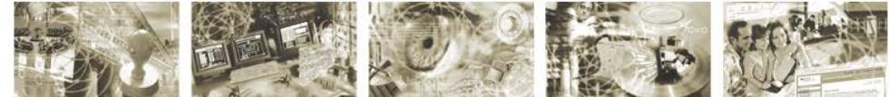
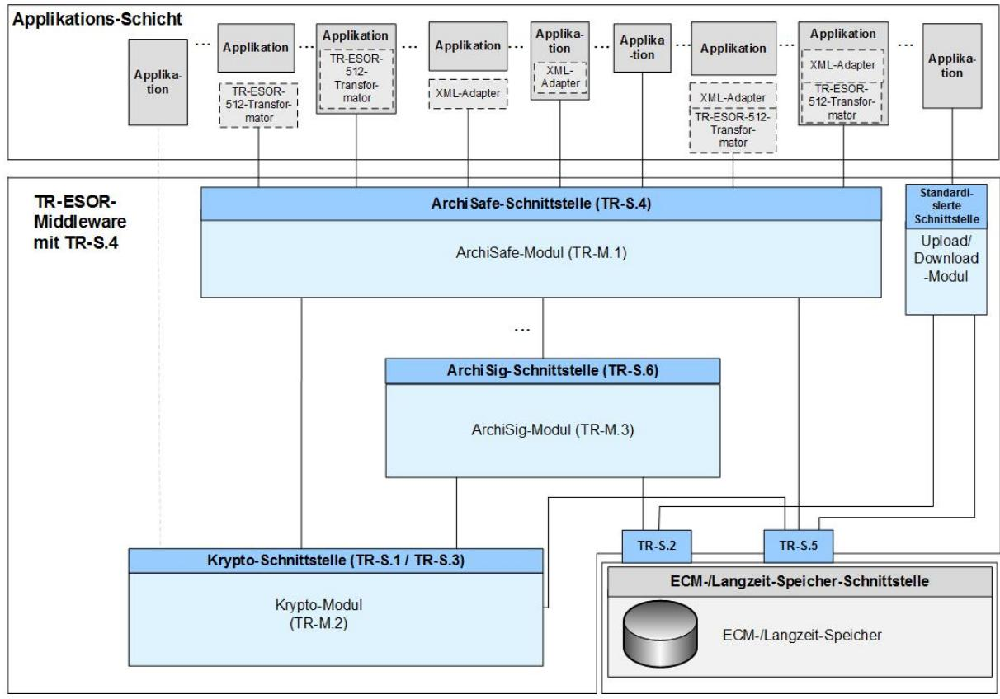
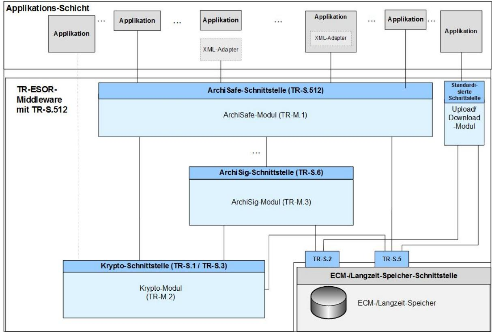

# Profilierung im Rahmen der BSI Technischen Richtlinie 03125 Beweiswerterhaltung kryptographisch signierter Dokumente

## **Anlage TR-ESOR-Profil-APP: Appendix für TR-ESOR V1.2.1 und TR-ESOR V1.2.2 - Profilierung einiger TR-ESOR-Assessment-Kriterien zur ETSI TS 119 511 Prüferleichterung**

| Bezeichnung | Profilierung einiger TR-ESOR-Assessment-Kriterien zur ETSI TS 119 511 Prüferleichterung als Appendix für TR-ESOR V1.2.1 und TR-ESOR V1.2.2 |
|-------------|-----------------------------------------------------------------------------------------------------------------------------------------------------|
| Kürzel      | BSI TR-ESOR-APP                                                                                                                                     |
| Version     | 1.2.1 und 1.2.2 (auf Basis der eIDAS-Verordnung und ETSI Preservation Standards)                                                              |
| Datum       | 01.04.2021                                                                                                                                          |

# **Inhaltsverzeichnis**

| 1.    | Einführung6                                                                                                                                                                                                                                                                                                  |
|-------|--------------------------------------------------------------------------------------------------------------------------------------------------------------------------------------------------------------------------------------------------------------------------------------------------------------|
| 2.    | Übersicht9                                                                                                                                                                                                                                                                                                   |
| 2.1   | Nutzung eines zertifizierte TR-ESOR Produktes in Kombination mit einem Bewahrungsdienst eines Preservation Service Provider (PSP)9                                                                                                                                                                        |
| 2.2   | Nutzung eines zertifizierte TR-ESOR Produktes (V1.2.1 und V1.2.2) in Kombination mit einem Bewahrungsdienst eines Preservation Service Provider (PSP) 9                                                                                                                                                |
| 2.3   | Wesentlichen Ergänzungen in diesem Appendix 9                                                                                                                                                                                                                                                             |
| 3.    | Appendix zum TR-ESOR Hauptdokument 11                                                                                                                                                                                                                                                                     |
| 3.1   | Ergänzung zu Kapitel "4.1 Bundesarchivgesetz und Landesarchivgesetze"11                                                                                                                                                                                                                                      |
| 3.2   | Ergänzung zu Kapitel 5 "Funktionen einer Middleware zum Beweiswerterhalt"11                                                                                                                                                                                                                                  |
| 3.3   | Ergänzung zu Kapitel "5.1.1 Bewahrung kryptographisch signierter und unsignierter Daten"11                                                                                                                                                                                                                   |
| 3.4   | Änderung in Kapitel "Ändern von bereits archivierten Daten"13                                                                                                                                                                                                                                                |
| 3.5   | Ergänzung zu Kapitel "5.1.5 Löschen bewahrter Daten"13                                                                                                                                                                                                                                                       |
| 3.6   | Ergänzung zu Kapitel "6.1 Systemtechnische Anforderungen"13                                                                                                                                                                                                                                                  |
| 3.7   | Ergänzung zu Kapitel "ArchiSig-Modul (TR-ESOR-M.3)" 14                                                                                                                                                                                                                                                    |
| 3.8   | Ergänzung zu Kapitel "8.2.3 Maßnahmen zum Schutz der Authentizität, Integrität und Verbindlichkeit" 14                                                                                                                                                                                                 |
| 3.9   | Ergänzung zu Kapitel "13 Quellenverzeichnis"15                                                                                                                                                                                                                                                               |
| 3.10  | Ergänzung zu Kapitel "4 Grundlegende Anforderungen und Parameter"15                                                                                                                                                                                                                                          |
| 3.11  | Ergänzung zu Kapitel "5.1.2 Validierung digitaler Signaturen" 15                                                                                                                                                                                                                                          |
| 3.12  | Zeitstempel 16                                                                                                                                                                                                                                                                                            |
| 4.    | Appendix zu TR-ESOR-M.3 17                                                                                                                                                                                                                                                                                |
| 4.1   | Ergänzung des Titels von Kap. 2.5 "Vorgehensweise beim Import von XAIPs mit Evidence Records" 17                                                                                                                                                                                                    |
| 4.2   | Ergänzung zu Kap. 2.7: Details zum Export-Import Prozess von ECM/Langzeitspeicher Beständen 17                                                                                                                                                                                                         |
| 4.3   | Ergänzung zu Kap. 3.1 "Grundlegender Aufbau und funktionale Abgrenzung" 18                                                                                                                                                                                                                                |
| 4.4   | Ergänzung zu Kap.4.5 "Erzeugung initialer Archivzeitstempel"18                                                                                                                                                                                                                                               |
| 4.5   | Ergänzung zu Kap. 5.3: Überwachung der Gültigkeitszeiträume von Algorithmen 19                                                                                                                                                                                                                            |
| 5.    | Appendix zu TR-ESOR-ERS 20                                                                                                                                                                                                                                                                                |
| 5.1   | Ergänzung zu Kapitel 5.1: Erstellung eines Evidence Records gem. Basis-ERS-Profil 20                                                                                                                                                                                                                      |
| 6.    | Appendix zu TR-ESOR-E 22                                                                                                                                                                                                                                                                                  |
| 6.1   | Ergänzung zu Kapitel 2: Überblick 22                                                                                                                                                                                                                                                                      |
| 6.2   | Ergänzung zu Kapitel 3, Unterkapitel 3.6.1 ArchiveDataRequest 23                                                                                                                                                                                                                                          |
| 6.3   | Ergänzung zu Kapitel 4: Funktionen der Preservation-API gemäß ETSI TS 119 512 in der Profilierung [TR-ESOR-TRANS] (ab TR-ESOR V1.2.2) 23                                                                                                                                                            |
| 7.    | Additional Test Cases for Conformity Level 1 – Functional Conformity25                                                                                                                                                                                                                                    |
| 7.1   | Additional Tests for all products25                                                                                                                                                                                                                                                                          |
| 7.1.1 | A-11 – What happens to the Data at the End of the Preservation Period shall be stated in the in                                                                                                                                                                                                           |
| 7.1.2 | the Preservation Evidence Policy of the TR-ESOR Product-Manufacturer25 A-12 – The TOT shall support at least one Preservation Profile, which is publicly published and can be retrieved as described in the User Manual and Preservation Evidence Policy (PEP) of the TOT (TR-ESOR Product)27 |

Bundesamt für Sicherheit in der Informationstechnik Postfach 20 03 63 53133 Bonn Tel.: +49 228 99 9582-0 E-Mail: [tresor@bsi.bund.de](mailto:tresor@bsi.bund.de) Internet: [https://www.bsi.bund.de](https://www.bsi.bund.de/) © Bundesamt für Sicherheit in der Informationstechnik 2021

#### **TR-ESOR-Profil-APP: Appendix zu TR-ESOR V1.2.1 und TR-ESOR V1.2.2**

| 7.1.3          | A-13 – Each installed Preservation Profile shall contain an identifier which uniquely identifies this Preservation Profile 30                                                                                                                                                                                                                                      |
|----------------|-----------------------------------------------------------------------------------------------------------------------------------------------------------------------------------------------------------------------------------------------------------------------------------------------------------------------------------------------------------------------------|
| 7.1.4          | A-14 – The Preservation Evidence Policy of the TR-ESOR-Product Manufacturer shall contain the description of how the preservation evidence is created including which cryptographic algorithms are used31                                                                                                                                                          |
| 7.1.5          | A-15 – The Evaluation Report of the TR-ESOR-Product, written by the Testing Body, shall contain the digital fingerprints of the relevant Programs of the TR-ESOR-Product32                                                                                                                                                                                            |
| 7.2            | Appendix to Module 2 – Crypto-Module 33                                                                                                                                                                                                                                                                                                                               |
| 7.2.1          | M.2-05 – Support of Hash functions33                                                                                                                                                                                                                                                                                                                                     |
| 7.2.2          | M.2-11 – Suitability of cryptographic algorithms should be defined by User Manual and the Preservation Evidence Policy (PEP) of the TR-ESOR-Product Manufacturer, based on the BSI- [TR-ESOR-PEPT]35                                                                                                                                                               |
| 7.2.3          | M.2-18 – Crypto-Module supports [RFC 3161], [RFC5816], [RFC5652] and [EN 319 422] and suitable algorithms36                                                                                                                                                                                                                                                        |
| 7.2.4          | M.2-20 – Crypto-Module shall validate digital signatures of received electronic time-stamps or hash values (or another cryptographic security element) in <asic:DataObjectReference> of a LXAIP according to the signature validation policy 39                                                                                                              |
| 7.3            | Appendix to Module 3 – ArchiSig Module 42                                                                                                                                                                                                                                                                                                                             |
| 7.3.1 7.3.2 | M.3-04 – Creation of Initial Archive Timestamps according to [RFC4998] or [RFC6283]42 M.3-13– ArchiSig-Module supports Timestamp Renewal and Hash-Tree Renewal 44                                                                                                                                                                                               |
| 7.3.3 7.3.4 | M.3-14 – Timestamp Renewal 48 M.3-15 – ArchiSig-Module shall validate requested electronic time-stamps 50                                                                                                                                                                                                                                                 |
| 7.3.5          | M.3-16 – Time-stamps shall be verified prior to renewal 53                                                                                                                                                                                                                                                                                                            |
| 7.3.6          | M.3-23 – The Process of requesting Export-Import package(s) and the Production Methods of the Export-Import Packages shall be stated in the User Manual and in the published TR-ESOR Product Preservation Evidence Policy (PEP) of the TOT, based on the BSI-[TR-ESOR-PEPT], and is allowed for authorized clients or preservation services (TR-ESOR Product)56 |
| 7.3.7          | M.3-24 - How the Request for an Export-Import Package can be done with standardised formats, shall be stated in the User Manual and in the published TR-ESOR-Product Preservation Evidence Policy (PEP) of the TOT59                                                                                                                                               |
| 7.3.8          | M.3-25 – The TR-ESOR middleware shall keep records of all released export-import packages and shall allow only authorized clients or preservation services to request export-import packages 61                                                                                                                                                                 |
| 7.4            | Interface S463                                                                                                                                                                                                                                                                                                                                                              |
| 7.4.1          | S.4.1-05 – 13 additional Test Steps to "Archive Submission includes the validation of supplemental evidence data and evidence records validation and storage of results"63                                                                                                                                                                                            |
| 8.             | Generelle Änderung von TR-ESOR-C.1 V1.2.1 seit 30.7.2019 unabhängig davon, ob der Einsatzes eines TR-ESOR-Produktes in einen Bewahrungsdienst gemäß [ETSI TS 119 511] angestrebt wird und die Prüferleichterungen gemäß [ASS 119 511] in Anspruch genommen werden sollen73                                                                                         |

## **Abbildungsverzeichnis**

| Abbildung 1: Schematische Darstellung der IT-Referenzarchitektur für TR-S.47              |  |
|-------------------------------------------------------------------------------------------|--|
| Abbildung 2: Schematische Darstellung der IT-Referenzarchitektur mit TR-S.512 (ab TR-ESOR |  |
| V1.2.2)7                                                                                  |  |

## **Tabellenverzeichnis**

| Tabelle 1: Aktuell zugelassene Hashalgorithmen für die Erzeugung technische Beweisdaten (Evidence |  |
|---------------------------------------------------------------------------------------------------------|--|
| Records) (Stand Januar.2021)21                                                                       |  |

#### **Profilierung einiger TR-ESOR-Assessment-Kriterien zur ETSI TS 119 511 Prüferleichterung**

| Tabelle 2: Aktuell zusätzlich erforderliche Hashalgorithmen für die Verifikation eines Evidence |  |
|-------------------------------------------------------------------------------------------------------|--|
| Records (Stand Januar 2021) 21                                                                  |  |

## **1. Einführung**

Ziel der Technischen Richtlinie "Beweiswerterhaltung kryptographisch signierter Dokumente" ist die Spezifikation sicherheitstechnischer Anforderungen für den langfristigen Beweiswerterhalt von kryptographisch signierten elektronischen Dokumenten und Daten nebst zugehörigen elektronischen Verwaltungsdaten (Metadaten).

Eine für diese Zwecke definierte Middleware (TR-ESOR-Middleware) im Sinn dieser Richtlinie umfasst alle diejenigen Module (**M**) und Schnittstellen (**S)**, die zur Sicherung und zum Erhalt der Authentizität und zum Nachweis der Integrität der aufbewahrten Dokumente und Daten eingesetzt werden.

Die im Hauptdokument dieser Technischen Richtlinie vorgestellte Referenzarchitektur besteht aus den nachfolgend beschriebenen Schnittstellen, Funktionen und logischen Einheiten:

- der S.4- oder **ab TR-ESOR V1.2.2** auch die TS119512-Schnittstelle S.512 in der Profilierung [TR-ESOR-TRANS] der TR-ESOR-Middleware, die dazu dient, die TR-ESOR-Middleware in die bestehende IT- und Infrastrukturlandschaft einzubetten;
- dem "ArchiSafe-Modul" (**[TR-ESOR-M.1]**), welches den Informationsfluss in der Middleware regelt, die Sicherheitsanforderungen an die Schnittstellen zu den IT-Anwendungen umsetzt und für eine Entkopplung von Anwendungssystemen und ECM/Langzeitspeicher sorgt;
- dem "Krypto"-Modul (**[TR-ESOR-M.2]**) nebst den zugehörigen Schnittstellen S.1 und S.3, das alle erforderlichen Funktionen zur Berechnung von Hashwerten, zur Prüfung elektronischer Signaturen bzw. Siegel bzw. Zeitstempel, zur Nachprüfung elektronischer Zertifikate und zum Einholen qualifizierter Zeitstempel sowie (optional) elektronischer Signaturen bzw. Siegel für die Middleware zur Verfügung stellt. Darüber hinaus kann es Funktionen zur Ver- und Entschlüsselung von Daten und Dokumenten zur Verfügung stellen;
- dem "ArchiSig-Modul" (**[TR-ESOR-M.3]**) mit der Schnittstelle S.6, das die erforderlichen Funktionen für die Beweiswerterhaltung der digital signierten Unterlagen bereitstellt;
- einem ECM/Langzeitspeicher mit den Schnittstellen S.2 und S.5, der die physische Archivierung/Aufbewahrung und auch das Speichern der beweiswerterhaltenden Zusatzdaten übernimmt.

*Dieser ECM/Langzeitspeicher ist nicht mehr direkt Teil der Technischen Richtlinie*

*gleichwohl werden über die beiden Schnittstellen, die noch Teil der TR-ESOR-Middleware sind, Anforderungen daran gestellt.*

*Ebenso wenig ist die Applikationsschicht, die auch einen XML-Adapter enthalten kann, direkter Teil der Technischen Richtlinie, auch wenn dieser XML-Adapter als Teil einer Middleware implementiert werden kann.*

Die empfohlene IT-Referenzarchitektur ist in Abbildung 1 und Abbildung 2 dargestellt und besteht im Wesentlichen aus den in (**[TR-ESOR]**, Kap. 7) grob beschriebenen logischen Komponenten und Schnittstellen. Diese werden in Anhängen zur TR weiter detailliert. Die Grafik zeigt zudem die externen Komponenten und Systeme an, die das Bild vervollständigen. Grundsätzlich wird als obere Schnittstelle der TR-ESOR-Middleware entweder die S.4-Schnittstelle gemäß **[TR-ESOR-E]**, die in Abbildung 1 dargestellt ist, oder **ab TR-ESOR v1.2.2** auch die S.512-Schnittstelle gemäß **[ETSI TS 119512]** in der Profilierung **[TR-ESOR-TRANS]**, die in Abbildung 2 gezeigt wird, unterstützt.

#### **Profilierung einiger TR-ESOR-Assessment-Kriterien zur ETSI TS 119 511 Prüferleichterung**

#### **Abbildung 1: Schematische Darstellung der IT-Referenzarchitektur für TR-S.4**

#### **Abbildung 2: Schematische Darstellung der IT-Referenzarchitektur mit TR-S.512 (ab TR-ESOR V1.2.2)**

Die in [Abbildung 1](#page-6-0) bzw. [Abbildung 2](#page-6-1) dargestellte IT-Referenzarchitektur orientiert sich an der Archi-Safe Referenzarchitektur und soll die logische (funktionale) Interoperabilität künftiger Produkte mit den Zielen und Anforderungen der Technischen Richtlinie ermöglichen und unterstützen.

Sofern der optionale XML-Adapter und/oder der optionale TR-ESOR-512-Transformator[1](#page-7-0) vorhanden sind, können beide in folgenden Ausprägungen vorliegen:

- Jeweils eigenständige Komponente mit Schnittstellen zur Applikation sowie zum ArchiSafe-Modul
- Jeweils eigenständige Komponente, jedoch Teil der Applikation mit Schnittstelle zum Archi-Safe-Modul
- XML-Adapter und TR-ESOR-512-Transformator als eine gemeinsame Komponente, die beide Teile enthält mit Schnittstellen zur Applikation sowie zum ArchiSafe-Modul
- XML-Adapter und TR-ESOR-512-Transformator als eine gemeinsame Komponente, die beide Teile enthält und Teil der Applikation ist, mit Schnittstelle zum ArchiSafe-Modul.

Der Einsatz des TR-ESOR-512-Transformators wird EMPFOHLEN, sofern das TR-ESOR-Produkt mit einer TR-S.4-Schnittstelle in Europa zum Einsatz kommt und Interoperabilität mit europäischen (qualifizierten) Bewahrungsdiensten und Bewahrungsprodukten hergestellt werden soll.

Diese Technische Richtlinie ist modular aufgebaut und spezifiziert in einzelnen Anlagen zum Hauptdokument die funktionalen und sicherheitstechnischen Anforderungen an die erforderlichen IT-Komponenten und Schnittstellen der TR-ESOR-Middleware. Die Spezifikationen sind strikt plattform- , produkt-, und herstellerunabhängig.

Das vorliegende Dokument trägt die Bezeichnung "TR-ESOR-Appendix" [**TR-ESOR-APP]** und stellt eine Ergänzung für **[TR-ESOR(-C.1), V1.2.1][2](#page-7-1)** und **[TR-ESOR(-C.1), V1.2.2]** dar, um die in **[TR-ESOR(-C.1), V1.2.1]** und **[TR-ESOR(-C.1), V1.2.2]** fehlenden, aber in **[TR-ESOR(-C.1) V1.3]** vorhandenen notwendigen zusätzlichen Anforderungen und Testfälle gemäß **[ETSI TS 119511]** für eine TR-ESOR-Zertifizierung **[TR-ESOR V1.2.1]** bzw. **[TR-ESOR V1.2.2]** bereitzustellen, so dass die Zertifizierungserleichterungen für einen Preservation Service (deutsch auch Bewahrungsdienst genannt) gemäß **[ASS 119 511]** in Anspruch genommen werden können.

1 Siehe [ETSI TS 119512 TR-ESOR Transformator unter einer Open Source Lizenz,](https://github.com/de-bund-bsi-tr-esor/tresor-ETSITS119512-transformator) ab TR-ESOR V1.2.2

2 [TR-ESOR(-C.1)] bedeutet [TR-ESOR] bzw. [TR.ESOR-C.1]

# **2. Übersicht**

## **2.1 Nutzung eines zertifizierte TR-ESOR Produktes in Kombination mit einem Bewahrungsdienst eines Preservation Service Provider (PSP)**

Falls der Preservation Service Provider ein zertifiziertes **TR-ESOR Produkt [TR-ESOR] der Version V1.2.1 oder höher** nutzt,

• nachgewiesen durch einen entsprechenden aktuellen TR-ESOR-Prüfbericht und das TR-ESOR-Zertifizierungs-Test-Protokoll,

und dieses **[TR-ESOR] z**ertifizierte Produkt in der Tat für diesen Preservation Service produktiv eingesetzt wird,

• nachgewiesen z.B. durch Vergleich des digitalen Fingerabdrucks der relevanten ausführbaren Dateien,

dann kann das Prüfergebnis der äquivalenten [**ETSI TS 119 511]** – Testfälle durch die äquivalenten TR-ESOR-Zertifizierungs-Ergebnisse ersetzt werden und diese **[ETSI TS 119 511]** - Assessment Testschritte sind zu streichen.

## **2.2 Nutzung eines zertifizierte TR-ESOR Produktes (V1.2.1 und V1.2.2) in Kombination mit einem Bewahrungsdienst eines Preservation Service Provider (PSP)**

Eine TR-ESOR-Zertifizierung gemäß TR-ESOR V1.2.1 bzw. TR-ESOR V1.2.2 kann auch ohne diesen optionalen Appendix **[TR-ESOR-APP]** durchgeführt werden.

Sofern aber ein Produktionseinsatz dieses TR-ESOR-Produktes in einen Bewahrungsdienst gemäß **[ETSI TS 119 511]** angestrebt wird und die Prüferleichterungen gemäß **[ASS 119 511]** in Anspruch genommen werden sollen, dann sollten die in diesem Anhang enthaltenden Anforderungen und Testfälle die in **[TR-ESOR-C.1, V1.2.1]** bzw. **[TR-ESOR-C.1, V1.2.2]** enthaltenden Anforderungen und Testfälle ersetzen, so dass

• die Assessment-Testschritte von **[ETSI TS 119 511]**, die gemäß [ASS 119 511] äquivalent zu TR-ESOR (ab V1.2.1 und höher) -Testschritten sind,

entfallen können.

Dadurch wird bei der PSP-Zertifizierung eine vollumgängliche Verringerung der Testfälle erreicht, wie im Assessment Handbuch **[ASS 119 511]** dargestellt.

Diese unter diesen Umständen erforderlichen Änderungen und Ergänzungen der TR-ESOR-Anforderungen und –Testfälle sind hier in der Kopie der ursprünglichen TR-ESOR-V1.2.1/V1.2.2- Texte jeweils in "**Fettdruck und kursiv**" in den folgenden Kapiteln dargestellt.

In TR-ESOR V1.3 sind die hier enthaltenden Anforderungen und Testfälle als reguläre Anforderungen und Testfälle enthalten.

## **2.3 Wesentlichen Ergänzungen in diesem Appendix**

Neben Ergänzungen in den TR-ESOR V1.2.1/V1.2.2-Texten **müssen** gemäß **[TR 119 511]** auch das aktuelle "**Preservation Profile**" gemäß **[ETSI TS 119 511, Anhang 6.4]** und **[ETSI TS 119 512, Anhang 5.4.7]**, die aktuelle und historische "**Preservation Evidence Policies**" **[ETSI TS 119 511, Anhang 6.5]** und die "**Signature Validation Policy**" **[ETSI TS 119 511, Anhang 6.6**] bereitgestellt werden. Das BSI stellt hierfür den TR-ESOR-Anhang [**TR-ESOR-PEPT]: "Preservation Evidence Policy Template for TR-ESOR (PEPT)"** zur Verfügung.

# **3. Appendix zum TR-ESOR Hauptdokument**

Die Änderungen und Ergänzungen sind in den folgenden Kapiteln im Fettdruck, kursiv und größer dargestellt.

## **3.1 Ergänzung zu Kapitel "4.1 Bundesarchivgesetz und Landesarchivgesetze"**

Auf Basis von OVR-6.1-09: Hier wird lediglich eine zusätzliche Anforderungsnummer "(A4.1-1)" eingeführt, damit diese Anforderung geeignet referenziert werden kann. Die ergänzte Textstelle sieht dann wie folgt aus:

*"(A4.1-1) Alle öffentlichen Stellen des Bundes und der Länder sind gesetzlich verpflichtet, Unterlagen, die für die Aufgabenwahrnehmung nicht mehr benötigt werden, vor ihrer Vernichtung dem Bundes- bzw. Landesarchiv zur Übernahme als Archivgut des Bundes / des Landes anzubieten (vgl. §§ 3 und 5 [BArchG] und entsprechende Landesarchivgesetze). Diese Anbietungspflicht gilt selbstverständlich auch für elektronische Unterlagen."*

## **3.2 Ergänzung zu Kapitel 5 "Funktionen einer Middleware zum Beweiswerterhalt"**

In Hinblick auf PRP-8.1-06 wird die Anforderung am Ende ergänzt. "

*(A5.1-1)* Der Zugriff auf die TR-ESOR-Middleware bzw. den ECM/Langzeitspeicher zu Zwecken der Ablage, des Änderns, des Abrufs der Daten oder des Abrufs von technischen Beweisdaten *oder der Bewahrungs-Profile oder Log-Daten* oder auch des Löschens abgelegter Dokumente und Daten muss in jedem Falle nachweisbar (z.B. protokolliert) über definierte Schnittstellen aus den vorgelagerten IT-Anwendungen erfolgen. Diese Aktionen/Vorgänge dürfen nur von dazu autorisierten (natürlichen oder juristischen) Personen vorgenommen werden. Unberechtigte Zugriffe sind zuverlässig zu verhindern. Die Nachweisführung muss in der Middleware an geeigneter Stelle, z.B. im Archi-Safe-Modul, erfolgen *und kann im vorhandenen Berechtigungsfall für eine vorgegebene AOID zur Verfügung gestellt werden."*

## **3.3 Ergänzung zu Kapitel "5.1.1 Bewahrung kryptographisch signierter und unsignierter Daten"**

Im folgenden Text wird ergänzt, welche binären Datentypen erlaubt sind mit näheren Informationen zu AOID (siehe PRP-8.1-05).

**"(A5.1-3)** *Die Ablagen der Dokumente und Daten müssen in einem Archivinformationspaket (AIP) als ein XML-basiertes Archivdatenobjekt (XAIP) gemäß ([TR-ESOR-F], Kap. 3.1) oder als ein logisches XAIP (LXAIP) gemäß ([TR-ESOR-F], Kapitel [3.2\)](#page-10-2) oder als ein ASiC-AIP gemäß ([TR-ESOR-F], Kapitel 3.3) erfolgen. Dieses AIP muss grundsätzlich in der Lage sein, 1-n Dokumente und Daten aufzunehmen. Das XAIP-Format gemäß Kapitel 3.1 ist das Default-Format und muss in jedem Fall unterstützt werden können. Zusätzlich kann die Ablage als ein logisches XAIP (LXAIP)[3](#page-10-4) gemäß ([TR-ESOR-F], Kap. 3.2, oder als ein ASiC-AIP gemäß ([TR-ESOR-F], Kap. 3.3) erfolgen. Nur für die in [TR-ESOR F, Hinweis 2], angegebenen binären Datentypen CAdES, XAdES, PAdES, ASiC-E und DigestList oder bei der Nutzung eines "Upload-Requests" zusammen mit einem LXAIP ist die Ablage der Daten außerhalb eines Archivinformationspakets (AIP) möglich. Bei der Ablage der Dokumente und Daten im ECM/Langzeitspeicher muss jedem* 

3 Eine Variante des XAIP, bei dem auf extern im ECM/Langzeitspeicher abgelegte Datenobjekte verwiesen werden kann.

*Archivdatenobjekt (z.B. für ein XML-basiertes Archivdatenobjekt (XAIP) gemäß ([TR-ESOR-F], Kap. 3.1) oder ein logisches XAIP (LXAIP) gemäß ([TR-ESOR-F], Kap. 3.2) oder ein ASiC-AIP gemäß ([TR-ESOR-F], Kap. 3.3)) ein eindeutiger und in der Regel unveränderbarer Bezeichner (Archivdatenobjekt ID, AOID) zugewiesen werden. Durch die Übergabe eines AOID-Elementes bei der Bewahrung kryptographisch signierter und unsignierter Daten kann die AOID von der aufrufenden Anwendung vergeben werden, wie z.B. im Fall eines LXAIP. Im Regelfall eines XAIP fehlt dieses Element und die AOID wird vom aufgerufenen Modul bereitgestellt. Die AOID dient der zuverlässigen Wiederauffindbarkeit der gespeicherten Dokumente und Daten und als Schlüssel für den autorisierten Zugriff auf die im ECM/Langzeitspeicher abgelegten Archivdatenobjekte.*"

In Bezug zu OVR-9.3-01 und OVR-9.3-02 wird hier wird lediglich die folgende Ergänzung vorgenommen: "according to the signature validation policy supported by the Preservation Profile".

**"(A5.1-5)** Für die Aufbewahrung kryptographisch signierter Daten muss die Middleware die Möglichkeit vorsehen, die digitalen Signaturen bzw. elektronischen Zeitstempel vor der Übergabe an den ECM/Langzeitspeicher umfassend sowohl auf Basis des Schalenmodells als auch des Kettenmodells *gemäß den in dem Bewahrungs- Profil (engl. "Preservation Profile") referenzierten Signaturbzw. Zeitstempel-Validierungs-Richtlinien (engl. "signature validation policy" bzw. "time-stamp validation policy")* zu prüfen oder bei einem (qualifizierten) Vertrauensdiensteanbieter prüfen zu lassen und die Prüfergebnisse gemeinsam mit den kryptographisch signierten Daten abzulegen. *Im Fall, dass die Validierungsdaten der digitalen Signaturen bzw. Zeitstempel von der IT-Anwendung nicht übergeben wurden, muss die TR-ESOR-Middleware alle Anstrengungen unternehmen, die Validierungsdaten gemäß der Signatur- bzw. Zeitstempel-Validierungs-Richtlinien zu sammeln und zu prüfen. Wenn die Middleware nicht in der Lage ist, alle Validierungsdaten gemäß der der Signaturbzw. Zeitstempel-Validierungs-Richtlinien zu sammeln und zu verifizieren, dann muss die TR-ESOR-Middleware eine entsprechende verständliche Fehlermeldung an die IT-Anwendung zurückgegeben und diesen Fall als Fehlerfall behandeln. In jedem Fall ist es* für eine Weiterverarbeitung erforderlich, dass mindestens eines der beiden Validierungsmodelle (Schalenmodell bzw. Kettenmodell) erfolgreich ist. Schlägt die Prüfung für beide Validierungsmodelle (Schalenmodell bzw. Kettenmodell) fehl, soll, ggf. auf Basis von konfigurierbaren Optionen, wie folgt vorgegangen werden:

- a. Im Fall XAIP oder ASiC-AIP: ArchiSafe **[TR-ESOR-M.1]** liefert eine verständliche Fehlermeldung an die Anwendung zurück und lehnt die Aufbewahrung des Objekts ab.
- **b.** Im Fall LXAIP: Die entsprechende Fehlermeldung kommt zusammen mit allen anderen ggf. vorhandenen Prüfinformationen in die Credential-Section. Das Objekt wird danach im ECM/Langzeitspeicher abgelegt. Zusätzlich wird eine Fehlermeldung an die IT-Anwendung oder den XML-Adapter gegeben.[4](#page-11-0)
- *c.* Im Fall eines logischen XAIP (LXAIP) ist stets der vorstehende Fall b) anzuwenden. Auf Basis von konfigurierbaren Optionen *soll* die IT-Anwendung oder der XML-Adapter nach Empfang der Fehlermeldung das LXAIP und die dazugehörigen Datenobjekte im ECM/Langzeitspeicher löschen. *Es wird empfohlen, die Datenobjekte, deren Signaturprüfung fehlschlägt, durch die Anwendung in ein dezidiertes Fehlerverzeichnis auszugeben und zu analysieren. Für nicht mehr prüfbare digitale Signaturen und Zeitstempel wird die Ablage dieser Objekte (geschützt oder nicht geschützt) in der MetaDataSection empfohlen.*

4 Wenn mindestens eine Signaturprüfung fehlschlägt dann ist es nicht mehr "…/resultmajor#ok". Wenn mindestens Ketteoder Schalenprüfung einer Signatur nicht fehlschlägt, sollte "…/resultmajor#warning" und

&quot;…/resultminor/arl/XAIP\_NOK\_SIG" zurückgeliefert werden. Im anderen Fall "../resultmajor#error".

## **3.4 Änderung in Kapitel "Ändern von bereits archivierten Daten"**

Das Wort "soll" wird durch "müssen ersetzt:

"**(A5.1-17) S**ämtliche Änderungen *müssen* nachvollziehbar protokolliert werden. Soweit als möglich ist der Zeitpunkt der Änderung, der Urheber und der Inhalt der Änderung zu protokollieren."

## **3.5 Ergänzung zu Kapitel "5.1.5 Löschen bewahrter Daten"**

Gemäß *OVR-6.1-09* ist es erforderlich, zu erklären, was mit den bewahrten Archivdatenobjekten nach Ablauf der Aufbewahrungspflicht passiert.

*"(A5.1-29)* Das Löschen von Daten und Dokumenten **nach Ablauf** des gesetzlich vorgeschriebenen Aufbewahrungszeitraums kann durch organisatorisch berechtigte Nutzer einer technisch berechtigten vorgelagerten IT-Anwendung angestoßen werden, oder durch einen zentralen Prozess, der diese Funktion für *den gesamten ECM/Langzeitspeicher ausführt und entsprechend berechtigt ist. In jedem Fall muss die Middleware den Ablauf von Aufbewahrungsfristen sowie den Umgang mit den Archivdatenobjekten nach Ablauf der Aufbewahrungsfrist überwachen und dies entsprechend in der Preservation Evidence Policy des Herstellers dokumentieren."*

## **3.6 Ergänzung zu Kapitel "6.1 Systemtechnische Anforderungen"**

Gemäß **[ETSI TS 119 511]** und **[ETSI TS 119 512]** ist es erforderlich, ein aktuelles "Preservation Profile" gemäß **[ETSI TS 119 511, Anhang 6.4]** und **[ETSI TS 119 512, Anhang 5.4.7]** sowie eine "Preservation Evidence Policy" gemäß **[ETSI TS 119 512, Anhang 6.5]** zu veröffentlichen.

Siehe auch OVR-6.4-01, OVR-6.4-04a), PRP-8.1-04 und PRP-8.1-05, OVR-6.5-03, OVR-7.14-01, OVR-7.14-02, OVR-7.15-03.

Hier werden die nachfolgenden drei neuen Anforderungen (A6.1-6), (A6.1-7), (A6.1-8) an das Ende des Kapitels 6.1 im Hauptdokument eingefügt**.** Die drei ergänzten Textstellen sehen dann wie folgt aus:

*"(A6.1-6) Die TR-ESOR-Middleware muss mindestens ein aktuelles "Preservation Profile" gemäß [ETSI TS 119 512, Anhang 5.4.7] unterstützen und die vorausgegangenen "Preservation Profile" gemäß [ETSI TS 119 512, Anhang 5.4.7] referenzieren. Diese "Preservation Profile", aufgebaut auf Basis des BSI TR-ESOR "Preservation Profile-Templates" (PEPT), müssen als öffentliche Dokumente auf der Webseite des TR-ESOR-Produkt-Herstellers und in der veröffentlichten Preservation Evidence Policy (PEP) des entsprechenden TR-ESOR-Produkts des TR-ESOR-Produkt-Herstellers zu finden sein. Jedes Preservation Profile muss einen eindeutigen Identifikator enthalten."*

*"(A6.1-7) Die TR-ESOR-Middleware muss mindestens eine "Preservation Evidence Policy" (PEP) gemäß [ETSI TS 119 511, Anhang 6.5], aufbauend auf dem "Preservation Evidence Policy Template" (PEPT) des BSI, unterstützen, die im "Preservation Profile" des TR-ESOR-Produkt-Herstellers referenziert und auf der Webseite des TR-ESOR-Produkt-Herstellers veröffentlicht ist. Die "Preservation Evidence Policy" muss die Beschreibung, wie der "Preservation Evidence" erzeugt wird, und welcher kryptographische Algorithmus dabei verwendet werden, enthalten*.*"*

*"(A6.1-8) Falls einer der Algorithmen oder Parameter, die im "Preservation Evidence" genutzt werden, droht, seine Sicherheitseignung zu verlieren oder ein relevantes Zertifikat droht, seine Gültigkeit zu verlieren, dann muss der "Preservation Evidence" durch die TR-ESOR-Middleware gemäß einer neuen "Preservation Evidence Policy" während der Aufbewahrungszeit "augmentiert" werden. Diese neue "Preservation Evidence Policy" muss für zukünftige Aufnahmen von neu zu speichernden Archivdatenobjekte vorher vom TR-ESOR-Produkt Herstellers erstellt und veröffentlicht worden sein und dann vom Bewahrungsdienst (engl. Preservation Service Provider (PSP)) im "Preservation Service Practice Statement" (PSPS) neu eingefügt werden*.*"* 

*"(A6.1-9) Das Monitoring der verwendeten kryptographischen Algorithmen sollte auf Basis eines elektronischen Algorithmenkatalogs gemäß [TS119312] und [SOGIS] automatisch vorgenommen werden."*

## **3.7 Ergänzung zu Kapitel "ArchiSig-Modul (TR-ESOR-M.3)"**

Eine neue Anforderung

*"(A7.4-13) Für die Aufbewahrung der Archivdatenobjekte und der kryptographischen Beweisdaten muss das ArchiSig-Modul über eine (oder mehrere) sichere und performante Schnittstelle(n) TR-S.2 zu einem (oder mehreren) vertrauenswürdigen elektronischen ECM/Langzeitspeicher(n) verfügen."* 

*" (A7.4-14) Für die Erzeugung von Hashwerten und die Anforderung, den Abruf und die Verifikation von qualifizierten Zeitstempeln muss das ArchiSig-Modul über eine sichere und performante Schnittstelle TR-S.3[5](#page-13-2) auf ein kryptographisches Modul zugreifen können, das mindestens die in der Anlage [TR-ESOR-M.2] dieser TR beschriebenen obligatorischen Anforderungen erfüllt.*

## **3.8 Ergänzung zu Kapitel "8.2.3 Maßnahmen zum Schutz der Authentizität, Integrität und Verbindlichkeit"**

Gemäß **[ETSI TS 119 511]** ist es erforderlich, OVR-9.3-03 zu erfüllen: *"[PDS] To extend the ability to validate a digital signature and to maintain its validity status, the preservation service shall, at the minimum, provide a proof of existence of the signature and of the validation data needed to validate the signature using digital signature techniques (digital signatures, time-stamps, evidence records)."*

Hier wird daher die nachfolgende Anforderung (A8.2-1) entsprechend ergänzt. (A8.2-1) sieht dann wie folgt aus:

5 Um einen performanten Umgang mit der Hashwertberechnung innerhalb des ArchiSig-Moduls zu ermöglichen, ist es durchaus möglich, das dafür vorgesehene Krypto-Modul über ein alternatives Binding der Schnittstelle mit dem ArchiSig-Modul zu verbinden. So könnte beispielweise durch die Verwendung eines direkten Java-Binding der Overhead der SOAP-basierten Remote-Kommunikation zwischen den ArchiSig- und Krypto-Modulen entfallen. Eine solche Konstellation hätte zur Folge, dass es sich innerhalb der Middleware mehr als eine Instanz (hier genau 2) des (gleichen) Krypto-Moduls befinden würden:

1. Eine Instanz für die alleinige Benutzung durch das ArchiSig für die Berechnung der Hashwerte, angesprochen über die direkte Java Schnittstelle (In-Proc-Binding)

2. Eine zweite Instanz für die sonstigen Aufgaben des Krypto-Moduls, erreichbar wie gewöhnlich durch einen entfernten Aufruf der SOAP-basierten Schnittstelle (HTTPS-SOAP-Binding).

#### **Profilierung einiger TR-ESOR-Assessment-Kriterien zur ETSI TS 119 511 Prüferleichterung**

*"(A8.2-1)* Um die langfristige Nachprüfbarkeit der digitalen Signaturen bzw. elektronische Zeitstempel zu gewährleisten, müssen die digitalen Signaturen bzw. elektronischen Zeitstempeln und Signaturbzw. Siegel- bzw. Zeitstempelprüfdaten (Zertifikate und Statusabfragen/-informationen) in standardisierten Datenformaten abgelegt werden. Details dazu finden sich in [TR-ESOR-F] bzw. [TR-ESOR-ERS]. *Um die langfristige Nachprüfbarkeit digitaler Signaturen und deren Gültigkeitsstatus sowie der signierten Daten zu erhalten, muss die TR-ESOR-Middleware einen Existenzbeweis dieser digitalen Signaturen und deren Prüfdaten, die für eine Prüfung der Signaturen erforderlich sind, sowie der signierten Daten unter Verwendung von Evidence Records gemäß (A8.2-5)erzeugen."* 

## **3.9 Ergänzung zu Kapitel "13 Quellenverzeichnis"**

Die folgenden Referenzen werden für [TR-ESOR], V1.2.1 und V1.2.2 ergänzt:

- [TR-ESOR-APP] Profilierungen im Rahmen der BSI Technischen Richtlinie 03125 Beweiswerterhaltung kryptographisch signierter Dokumente*, Anlage TR-ESOR-Profile-APP: Appendix für TR-ESOR V1.2.1 und TR-ESOR V1.2.2 – Profilierung einiger Assessment-Kriterien auf Basis von ETSI TS 119 511,* V1.2.1 und V1.2.2
- [TR-ESOR-PEPT] BSI TR 03125: Preservation of Evidence of Cryptographically Signed Documents: *Annex TR-ESOR-PEPT: Preservation Evidence Policy Template,* V1.2.1 and higher
- [TR-ESOR-TRANS] BSI TR 03125 Beweiswerterhaltung kryptographisch signierter Dokumente*, Appendix zu Anlage TR-ESOR-E: Konkretisierung der Schnittstellen auf Basis des eCard-API-Frameworks – Grobkonzept ETSI TS119512 TR-ESOR Transformator,* V1.2.1 und V1.2.2Appendix zu TR-ESOR-M.2

## **3.10 Ergänzung zu Kapitel "4 Grundlegende Anforderungen und Parameter"**

Hier wird eine zusätzliche Anforderungsnummer "(A4.1-1)" eingeführt, damit diese Anforderung geeignet referenziert werden kann und der Absatz leicht überarbeitet. Siehe auch OVR-6.5-03, OVR-6.5-04, OVR-7.14-03. Die ergänzte Textstelle sieht dann wie folgt aus.

*"(A4.0-1)* Diese Vorgaben *gemäß [ETSI TS 119 312][6](#page-14-3) und [SOG-IS][7](#page-14-4)* sind für das Krypto-Modul verbindlich und müssen stets den aktuellen Empfehlungen gemäß **[ETSI TS 119 312]** und **[SOG-IS]** folgend angepasst werden. Weiterhin *müssen* die allgemeinen Empfehlungen des BSI hinsichtlich der Sicherheitseignung kryptographischer Funktionen *beachtet werden* (**[TR-02102]**: Kryptographische Verfahren: Empfehlungen und Schlüssellängen). Auch hier *muss* das Krypto-Modul an aktualisierte Empfehlungen laufend *angepasst werden*."

## **3.11 Ergänzung zu Kapitel "5.1.2 Validierung digitaler Signaturen"**

Gemäß **[ETSI TS 119 511, Kap. 6-6]** wird die folgende Ergänzung eingefügt:**"** gemäß der in dem Bewahrungs-Profil (engl. Preservation profile) referenzierten "signature validation policy" erfolgen und**"** 

**"(A5.1-10)** Diese Funktion muss selbst prüfen können oder durch den beauftragten Vertrauensdiensteanbieter prüfen lassen, ob das für die Erstellung der digitalen Signatur verwendete Nutzer-Zertifikat zum Zeitpunkt der Signatur- bzw. Siegelerstellung gültig war (vgl. Kapitel 5.1.3 und **[eIDAS-VO, Artikel 32 bzw. 40]**) sowie ob die durch den Aussteller der Zertifikats gesetzte Signatur bzw. das Siegel gültig ist und ob Zertifikatserweiterungen gemäß **[eIDAS-VO, Artikel 28 bzw. 38 Absatz 3]**

6 ETSI TS 119 312: "ETSI: Electronic Signatures and Infrastructures (ESI); Cryptographic Suites"

7 SOG-IS Crypto Working Group: "SOG-IS Crypto Evaluation Scheme – Agreed Cryptographic Mechanisms", 2016[, https://www.sogis.org/uk/supporting\\_doc\\_en.html](https://www.sogis.org/uk/supporting_doc_en.html)

und der Verwendungszweck des Zertifikates richtig gesetzt wurden. Die Gültigkeitsprüfung muss *gemäß der in dem Bewahrungs-Profil (engl. Preservation profile) referenzierten "signature validation policy" erfolgen und* vollständig sein, d. h. die gesamte Zertifikatskette bis hin zu einem vertrauenswürdigen Wurzel-Zertifikat umfassen. Diese Funktion des Krypto-Moduls muss bei der Prüfung ermittelte oder erhaltene zusätzliche Prüfinformationen an das aufrufende Modul zurückgeben. Diese hierbei ermittelten Prüfinformationen (Zertifikate, Sperrlisten, OCSP-Responses) sind im Archivdatenobjekt zu ergänzen oder als Prüfbericht gemäß **[OASIS-VR]** bzw. **[TR-ESOR-VR]** zurückzugeben." Siehe auch OVR-9.3-01.

Eine zusätzliche Anforderung bzgl. des LXAIP:

*"(A5.1-14) Im Falle eines LXAIP muss das Krypto-Modul über geeignete Funktionen verfügen, die im LXAIP gem. [TR-ESOR F] enthaltenen Verweise auf die extern im ECM/Langzeitspeicher abgelegten Inhaltsdaten aufzulösen und so die Signaturprüfung vornehmen zu können. Dabei muss das Krypto-Modul über eine sichere und performante Schnittstelle auf den ECM/Langzeitspeicher zugreifen, um die signierten/gesiegelten/zeitgestempelten Daten zur Prüfung der kryptographischen Signaturen/Siegel/Zeitstempel gemäß Kap. 5.1.2, 5.1.3, 5.4.2 bzw. 5.2 abzurufen und den Hashwert bzw. das kryptographischen Sicherungsmittels in der <asic:DataObjectReference> zu prüfen."* 

Zusätzlich die Angabe eines "Reason Codes" im Fall einer "Public Key Certificate"-Sperrung erforderlich:

 **"(A5.1-17)** Die Validierung der Zertifikatsgültigkeit muss auf der Basis eines Standardprotokolls erfolgen. Empfohlen wird das Protokoll:

• OCSP – Online Certificate Status Protocol (**[RFC6960],** vormals **[RFC2560]**) *mit Angabe eines "Reason Codes" im Fall einer "Public Key Certificate"-Sperrung:…*"

Siehe auch OVR-7.5-03.

## **3.12 Zeitstempel**

*"(A5.4-1)* Das Krypto-Modul muss über eine Funktion zur Abfrage eines qualifizierten Zeitstempels verfügen. Falls die Abfrage bei einem qualifizierten Vertrauensdiensteanbieter erfolgt, muss dieser mindestens die Anforderungen nach den **[eIDAS-VO, Artikel 24],** erfüllen, in der Vertrauensliste der Europäischen Kommission gemäß Kapitel 3.3 mit dem Status "**granted**" gelistet sein und qualifizierte Zeitstempel gemäß **[eIDAS-VO, Artikel 42]** erzeugen. *Darüber hinaus soll dieser qualifizierter Vertrauensdiensteanbieter konform zu ETSI EN 319 421 sein."* 

Siehe auch OVR-7.5-02.

# **4. Appendix zu TR-ESOR-M.3**

## **4.1 Ergänzung des Titels von Kap. 2.5 "Vorgehensweise beim Import** *von XAIPs mit* **Evidence Records"**

Ergänzung: "*von XAIPs mit* .." Siehe dazu OVR-7.16-01.

## **4.2 Ergänzung zu Kap. 2.7: Details zum Export-Import Prozess von ECM/Langzeitspeicher-Beständen**

"*Im Fall einer TR-ESOR-Middleware, kombiniert mit einem ECM/Langzeitspeicher, wie in Abbildung 1 bzw. Abbildung 2 beschrieben, ist es eine wichtige Anforderung bzgl. der Interoperabilität, dass es möglich sein muss, den gesamten Datenbestand von einem Bewahrungsdienst exportieren und zu einem anderen anschließend importieren zu können.* 

*Für diesen Zweck muss mindestens ein der folgenden Ansätze verfolgt werden:*

- *Mindestanforderung: Ansatz 1: Anwendung der im Kap. 2.6 dargestellten generischen Methode für die Migration der bewahrten Bestände,*
- *Optional: Ansatz 2: Export-Import der (L)XAIPs mit den dort eingebetteten reduzierten Evidence Records gemäß der Beschreibung aus dem Kap. 2.5.*

*Da Evidence Records gemäß [RFC 4998] oder [RFC 6283] nur reduzierte Hash-Bäume enthalten, die nur den Teil des Hash-Baums enthalten, der relevant ist für ein(e) spezifisches (spezifische) (Menge von) Archivdatenobjekt(en), können die konventionellen Funktionen ArchiveRetrieval gemäß [TR-ESOR-E] für den Export von Archivdatenobjekten und ArchiveSubmission für den Import von Archivdatenobjekts gemäß [TR-EOSR-M.3, Kap. 2.5] nicht immer für die Migration des gesamten Datenbestandes von einem Bewahrungsdienst zu einem anderen optimal geeignet sein. In solchem Fall kann der Ansatz 1 seine Anwendung finden.*

*Bezüglich des Prozesses und der Anfrage von "Export-Import Paketen" gelten die folgenden Anforderungen:*"

Siehe auch OVR-6.1-07, OVR-7.16-01, OVR-6.1-08, OVR-7.16-02. Daher werden bezüglich des Prozesses und der Anfrage von "Export-Import Paketen" die folgenden

Anforderungen eingefügt:

*"(A2.7-1) Die TR-ESOR-Middleware muss eine der zwei folgenden Prozess-Alternativen für die Anfrage von einem (oder mehreren) "Export-Import-Paket(en)" mit dem (den) Archivdatenobjekt(en) mit den beweisrelevanten Daten und technischen Beweisdaten auf Basis des Ansatzes 1 unterstützen:*

- *a) Alternative 1a gemäß [TR-ESOR-E], Kap. 3: unter Verwendung der standardisierten Funktionen ArchiveRetrieval und ArchiveEvidence für den Export der Archivdatenobjekte und korrespondierenden Beweisdaten (Evidence Records), Verify für die Ermittlung der Prüfprotokolle für die Beweisdaten und ArchiveSubmission sowie ArchiveUpdate für den Import der Daten in das Zielsystem,*
- *b) Alternative 1b gemäß [TR-ESOR-E], Kap. 4: unter der Verwendung der standardisierten Funktionen RetrievePO für den Export der Archivdatenobjekte und zugehörigen Beweisdaten, ValidateEvidence für die Ermittlung der Prüfprotokolle und PreservePO für den Import der Archivdatenobjekte samt Beweisdaten und Prüfprotokolle in das Zielsystem,*

*Retrieval (inklusive Evidence Records) für den Export von Archivdatenobjekten und Ar-*

*,oder eine der zwei folgenden Prozess-Alternativen im Falle der Wahl des Ansatzes 2 verfolgen: c) Alternative 2a gemäß [TR-ESOR-E], Kap. 3: die standardisierten Funktionen Archive-* *chiveSubmission mit Evidence Records für den Import von den Archivdatenobjekten gemäß [TR-EOSR-M.3, Kap. 2.5],* 

*d) Alternative 2b gemäß [TR-ESOR-E], Kap. 4: die standardisierten Funktionen RetrievePO für den Export von Archivdatenobjekten und PreservePO für den Import von den Archivdatenobjekten gemäß [TR-ESOR-M.3], Kap. 2.5"*

*"(A2.7-2) Die TR-ESOR-Middleware muss den Ansatz 1 gemäß [TR-ESOR-M.3], Kap. 2.6 für das Erzeugen des (der) Export-Import-Pakets(e) im produktiven Betrieb wie folgt unterstützten:*

- *a) Die TR-ESOR-Produkt-Hersteller müssen den Ansatz 1 unterstützen und dabei entscheiden, ob sie Alternative 1a oder Alternative 1b unterstützen. Zusätzlich können die TR-ESOR-Produkt-Hersteller auch Ansatz 2 mit entweder Alternative 2a oder Alternative 2b unterstützen. Das Ergebnis ihrer Entscheidungen müssen die TR-ESOR-Produkt-Hersteller in ihre aktuelle "Preservation Evidence Policy" (PEP) übernehmen und diese PEP veröffentlichen.*
- *b) Die Datenformate des ganzen Export-Import Datenbestandes muss eine Menge von XAIPs mit reduzierten EvidenceRecords gemäß [TR-ESOR-F] sein.*
- *c) Die TR-ESOR-Produkt-Hersteller müssen das Datenformat des Export-Import-Datenbestandes in ihre aktuelle "Preservation Evidence Policy" (PEP) übernehmen und diese PEP veröffentlichen.*
- d) *Falls der "Preservation Service Provider" (PSP) im Rahmen seines Produktionseinsatzes eines TR-ESOR-Produktes die Erleichterungen gemäß [ASS 119 511] im Rahmen seiner Bewahrungs-Konformitätsprüfung in Anspruch nehmen will, so muss er das ergänzte PEP seines TR-ESOR-Produktherstellers vervollständigen, in sein "Preservation Service Practice Statement" (PSPS) einfügen und sein PSPS sowie sein PEP veröffentlichen. Der PSP muss den Inhalt dieses PSP in eigene allgemeine Geschäftsbedingungen aufnehmen.*"

*"(A2.7-3) Die TR-ESOR-Middleware muss Log-Daten über alle ausgelieferten Export-Import Pakete speichern, inklusive Information über das Datum der Auslieferung und die Kriterien, auf dessen Basis die Menge der Bewahrungs-Objekte ausgewählt wurden, die in das Export-Import-Paket eingefügt wurden."*

### **4.3 Ergänzung zu Kap. 3.1 "Grundlegender Aufbau und funktionale Abgrenzung"**

**"(A3.1-6)** *Das ArchiSig-Modul muss eine sichere Datenablage, das Teil des ArchiSig-Moduls ist oder zum ArchiSig-Modul allokiert ist, zur Aufnahme der Archivzeitstempel und der Archivdatenobjekt ID gewährleisten (siehe Hauptdokument, Kapitel 7.1) in so einer Art und Weise, dass bzgl. der Hashbäume ein Hashwert zugehörig zu einem AOID und, falls anwendbar, zu einer VersionID mit absoluter Sicherheit zu jedem Zeitpunkt identifiziert werden kann."* 

## **4.4 Ergänzung zu Kap.4.5 "Erzeugung initialer Archivzeitstempel"**

Gemäß **[TS 119 511, Kap. 9.3, OVR-9.3-03]** gilt: *"[PDS] To extend the ability to validate a digital signature and to maintain its validity status, the preservation service shall, at the minimum, provide a* 

#### **Profilierung einiger TR-ESOR-Assessment-Kriterien zur ETSI TS 119 511 Prüferleichterung**

*proof of existence of the signature and of the validation data needed to validate the signature using digital signature techniques (digital signatures, time-stamps, evidence records)***".** 

Daher wir die Anforderung wie folgt ergänzt.

**"(A4.5-3**) Der Zeitstempel muss sämtliche Informationen tragen, die für eine Gültigkeitsprüfung des Zeitstempels einschließlich der darin enthaltenen *digitalen Signatur erforderlich sind. Zusätzlich muss im Fall von signierten Daten in (L)XAIP sichergestellt sein, dass mindestens die digitale Signatur selbst und ihre Validierungsdaten, die notwendig sind, um die digitale Signatur zu prüfen, auch durch den Evidence Record geschützt werden*."

Siehe auch OVR-9.3-04.

**"(A4.5-5)** Es wird empfohlen, die Erstellung eines initialen Archivzeitstempels über neu archivierte Archivdatenobjekte bzw. (L)XAIP-Versionen wenigstens einmal pro Tag automatisch durch das ArchiSig-Modul auszuführen. *Darüber hinaus wird empfohlen, die Evidence Records der neu archivierten Archivdatenobjekte zeitnah in dem dafür vorgesehenen Feld, z.B. in der Credential Section des korrespondierenden Archivdatenobjekts (L)XAIP, abzulegen [TR-ESOR-F]."* 

### **4.5 Ergänzung zu Kap. 5.3: Überwachung der Gültigkeitszeiträume von Algorithmen**

Gemäß OVR-7.14-03: Ersetzen "oder" durch "und" in (A5.3-1)

"(A5.3-1) Die Gültigkeitszeiträume von verwendeten Algorithmen und Parametern müssen überwacht und im ArchiSig-Modul verwaltet werden. Die Gültigkeitszeiträume der verwendeten Algorithmen und Parameter zur Durchführung von Erneuerungen der Zeitstempel inkl. der darin enthaltenen digitalen Signatur müssen auf *[EN 119 312] und [SOG-IS]* beruhen.'

# **5. Appendix zu TR-ESOR-ERS**

## **5.1 Ergänzung zu Kapitel 5.1: Erstellung eines Evidence Records gem. Basis-ERS-Profil**

Hier wird lediglich eine zusätzliche Anforderungsnummer "**(A5.1-1)**" eingeführt, damit diese Anforderung geeignet referenziert werden kann. Die ergänzte Textstelle sieht dann wie folgt aus:

*(A5.1-1)* Die Anforderungen an die kryptographischen Algorithmen und Parameter bei der Erstellung von Evidence Records unter Einsatz von qualifizierten Zeitstempeln gemäß **[eIDAS-VO, Artikel 42]** basieren auf den Vorgaben der jeweils aktuellen Fassung des Algorithmenkataloges **[ETSI TS 119 312][8](#page-19-2)** , der auf der Webseite [https://portal.etsi.org/TBSiteMap/ESI/ESIActivities.aspx](https://pprtal.etsi.org/TBSiteMap/ESI/ESIActivites.aspx) veröffentlicht wird, und der auf dem Algorithmenkatalog **[SOG-IS],** veröffentlicht auf der Webseite [https://www.sogis.org/uk/supporting\\_doc\\_en.htmlwww.sogis.org,](https://www.sogis.org/uk/supporting_doc_en.htmlwww.sogis.org) basiert Diese Vorgaben sind verbindlich und müssen stets den aktuellen Vorgaben gemäß **[ETSI TS 119 312]** und **[SOG-IS][9](#page-19-3)** *angepasst* werden.

Für die Erzeugung von technischen Beweisdaten (Evidence Records) gilt die Anforderung **(A4.3-1)**  des **Krypto-Moduls M.2**.

Für die Verifikation von technischen Beweisdaten (Evidence Records) gilt die Anforderung *(A4.0-1) und* **(A4.2-3)** des **Krypto-Moduls M.2**. Bei der Verifikation eines Evidence Records müssen im Bedarfsfall auch die *weiteren* Hashalgorithmen gemäß (vgl. **[ALGCAT]**, Kapitel 6) unterstützt werden.

Die OIDs der verwendeten Algorithmen sind **[ETSI TS 119 312]** zu entnehmen.

Hier werden zusätzliche Anforderungsnummer und in den Tabellen zusätzliche Algorithmen oder geänderte URN eingeführt, damit diese Anforderung geeignet referenziert werden kann. Die ergänzte Textstelle sieht dann wie folgt aus:

*(A5.1-2)* Aktuell dürfen nur folgende Hashalgorithmen für die Erzeugung von technischen Beweisdaten (Evidence Records) gemäß Kap. 3 verwendet werden:

| Algorithmus | OID/URN                                              | Normative Refe renzen |
|-------------|------------------------------------------------------|--------------------------|
| SHA-256     | OID: 2.16.840.1.101.3.4.2.1                          | [RFC4055]                |
|             | URN: http://www.w3.org/2001/04/xmlenc#sha256         | [XMLENC]                 |
| SHA-384     | OID: 2.16.840.1.101.3.4.2.2                          | [RFC4055]                |
|             | URN: http://www.w3.org/2001/04/xmldsig-more#sha384   | [RFC6931]                |
| SHA-512     | OID: 2.16.840.1.101.3.4.2.3                          | [RFC4055]                |
|             | URN: http://www.w3.org/2001/04/xmlenc#sha512         | [XMLENC]                 |
| SHA3-256    | OID: 2.16.840.1.101.3.4.2.8                          | [FIPS202]                |
|             | URN: http://www.w3.org/2007/05/xmldsig-more#sha3-256 | [RFC6931]                |

8 *Vgl. [https://portal.etsi.org/TBSiteMap/ESI/ESIActivities.aspx](https://portal.etsi.org/TBSiteMap/ESI/ESIActivites.aspx)* 

*9 Vgl. [https://www.sogis.eu/uk/supporting\\_doc\\_en.html](https://www.sogis.eu/uk/supporting_doc_en.html)*

#### **Profilierung einiger TR-ESOR-Assessment-Kriterien zur ETSI TS 119 511 Prüferleichterung**

| Algorithmus | OID/URN                                              | Normative Refe renzen |
|-------------|------------------------------------------------------|--------------------------|
| SHA3-384    | OID: 2.16.840.1.101.3.4.2.9                          | [FIPS202]                |
|             | URN: http://www.w3.org/2007/05/xmldsig-more#sha3-384 | [RFC6931]                |
| SHA3-512    | OID: 2.16.840.1.101.3.4.2.10                         | [FIPS202]                |
|             | URN: http://www.w3.org/2007/05/xmldsig-more#sha3-512 | [RFC6931]                |

**Tabelle 1: Aktuell zugelassene Hashalgorithmen für die Erzeugung technische Beweisdaten (Evidence** 

**Records)** *(Stand Januar.2021)*

*(A5.1-3)* Hier sind die Vorgaben und Empfehlungen gemäß **[ETSI TS 119 312]** und **[SOG-IS]** einzuhalten.

*(A5.2-1)* Für das Prüfen eines Evidence Records müssen alle Algorithmen unterstützt werden, die in diesem Evidence Record verwendet werden. Auch Hash- und Signatur- bzw. Siegel-Algorithmen, deren Sicherheitseignung abgelaufen ist, müssen weiterhin für die Validierung der Beweisdaten vom System unterstützt werden.

Aktuell müssen im Bedarfsfall zusätzlich mindestens auch noch die folgenden Hashalgorithmen unterstützt werden.

| Algorithmus | OID/URN                                            | Normative Refe renzen |
|-------------|----------------------------------------------------|--------------------------|
| SHA-1       | OID: 1.3.14.3.2.26 [RFC3279]                    |                          |
|             | URN: http://www.w3.org/2000/09/xmldsig#sha1        | [XMLENC]                 |
| SHA-224     | OID: 2.16.840.1.101.3.4.2.1                        | [RFC4055]                |
|             | URN: http://www.w3.org/2001/04/xmldsig-more#sha384 | [RFC4051]                |
| RIPEMD-160  | OID: 1.3.36.3.2.1                                  | [CRYPTO3N2]              |
|             | URN: http://www.w3.org/2001/04/xmlenc#ripemd160    | [XMLENC]                 |

**Tabelle 2: Aktuell zusätzlich erforderliche Hashalgorithmen für die Verifikation eines Evidence Records** *(Stand Januar 2021)*

*(A5.2.2)* Für die Erzeugung müssen die Vorgaben und Empfehlungen gemäß **[ETSI TS 119 312]** und **[SOG-IS]** beachtet werden.

Darüber hinaus sollen nach aktuellem Stand bei der Prüfung auch noch die folgenden Signatur- bzw. Siegelalgorithmen unterstützt werden (vgl. Tabelle 23):

# **6. Appendix zu TR-ESOR-E**

## **6.1 Ergänzung zu Kapitel 2: Überblick**

Neue Anforderung:

*"(A2.0-1) Als ArchiSafe-Schnittstelle muss entweder die nachfolgend spezifizierte TR-S.4- Schnittstelle implementiert sein oder ab TR-ESOR V1.2.2 die TS119512-Schnittstelle gemäß [ETSI TS 119 512] in der Profilierung [TR-ESOR-TRANS]."* 

Neue Anforderungsnummer und Ergänzungen:

*"(A2.0-2) Falls die TR-S.4-Schnittstelle unterstützt wird, dann* müssen die im Folgenden näher aufgeführten Funktionen mit den hier beschriebenen Parameterkonstellationen unterstützt werden:

- ArchiveSubmissionRequest und ArchiveSubmissionResponse (siehe Abschnitt 3.1)
- ArchiveUpdateRequest und ArchiveUpdateResponse (siehe Abschnitt 3.2)
- ArchiveRetrievalRequest und ArchiveRetrievalResponse (siehe Abschnitt 3.3)
- ArchiveEvidenceRequest und ArchiveEvidenceResponse (siehe Abschnitt 3.4)
- ArchiveDeletionRequest und ArchiveDeletionResponse (siehe Abschnitt 3.5)

*Falls die TR-S.4-Schnittstelle unterstützt wird, dann* sollen *in der der Schnittstelle TR-S.4* die folgenden im vorliegenden Dokument näher aufgeführten Funktionen mit den hier beschriebenen Parameterkonstellationen unterstützt werden:

- ArchiveDataRequest und ArchiveDataResponse (siehe Abschnitt 3.6)
- VerifyRequest und VerifyResponse (siehe Abschnitt 3.7)"

#### Neue Anforderung:

*"(A2.0-3) Falls die TS119512-Schnittstelle in TR-ESOR V1.2.2 unterstützt wird, dann müssen die im Folgenden näher aufgeführten Funktionen mit den in [ETSI TS 119 512] in der Profilierung [TR-ESOR-TRANS] beschriebenen Parameterkonstellationen unterstützt werden:*

- *PreservePO und PreservePOResponse (siehe [ETSI TS 119 512, Abs. 5.3.3], [TR-ESOR-TRANS], Abs. 3.2)*
- *UpdatePOC und UpdatePOC (siehe Abschnitt [ETSI TS 119 512, Abschnitt 5.3.6], [TR-ESOR-TRANS], Abs. 3.3)*
- *RetrievePO und RetrievePOResponse (siehe Abschnitt [ETSI TS 119 512, Abschnitt 5.3.4], [TR-ESOR-TRANS], Abs. 3.4)*
- *DeletePO und DeletePOResponse (siehe Abschnitt [ETSI TS 119 512, Abschnitt 5.3.5], [TR-ESOR-TRANS], Abs. 3.5)*
- *RetrieveInfo und RetrieveInfoResponse (siehe Abschnitt [ETSI TS 119 512, Abschnitt 5.3.2], [TR-ESOR-TRANS], Abs. 3.1).*

*Falls die TS119512-Schnittstelle unterstützt wird, dann sollen in der der TS119512-Schnittstelle die folgenden in [ETSI TS 119 512] näher aufgeführten Funktionen mit den dort beschriebenen Parameterkonstellationen unterstützt werden:*

• *Search und SearchResponse (siehe Abschnitt [ETSI TS 119 512, Abschnitt 5.3.9], [TR-ESOR-TRANS], Abs. 3.7)*

• *ValidateEvidence und ValidateEvidenceResponse (siehe Abschnitt [ETSI TS 119 512, Abschnitt 5.3.8], [TR-ESOR-TRANS], Abs. 3.6)"*

#### **6.2 Ergänzung zu Kapitel 3, Unterkapitel 3.6.1 ArchiveDataRequest**

Auf Basis von PRP-8.1-09: Hier wird lediglich eine zusätzliche Anforderungsnummer "(A3.6-1)" bzgl. "tr:DataLocation" eingeführt, damit diese Anforderung geeignet referenziert werden kann. Die ergänzte Textstelle sieht dann wie folgt aus:

*"(A3.6-1)* Sofern der ArchiveDataRequest unterstützt wird, muss dieser die Details der an der Schnittstelle angebotenen Funktionalität dokumentieren."

### **6.3 Ergänzung zu Kapitel 4: Funktionen der Preservation-API gemäß ETSI TS 119 512 in der Profilierung [TR-ESOR-TRANS] (ab TR-ESOR V1.2.2)**

Hier wird lediglich eine zusätzliche Anforderungsnummer "**(A4.0-1)**" eingeführt, damit diese Anforderung geeignet referenziert werden kann. Siehe auch PRP-8.1-06, PRP-8.1-09, PRP-8.1-10, PRP-8.1- 11, PRP-8.1-12, PRP-8.1-14. Die ergänzte Textstelle sieht dann wie folgt aus:

*(A4.0-1)* Für den Einsatz der "Preservation-API" gemäß **[ETSI TS 119 512]** in der Profilierung **[TR-ESOR-TRANS]** im Rahmen der vorliegenden Technischen Richtlinie müssen die folgenden Mindestanforderungen unterstützt werden:

- RetrieveInfo gemäß Abschnitt 3.1 von **[TR-ESOR-TRANS]** muss unterstützt werden. Hierbei muss zumindest ein Bewahrungsprofil unterstützt werden, welches das Bewahrungsschema http://uri.etsi.org/19512/scheme/pds+pgd+aug+wst+ers gemäß Annex F.1 von **[ETSI TS 119 512]** umsetzt.
- PreservePO gemäß Abschnitt 3.2 von **[TR-ESOR-TRANS]** muss unterstützt werden, wobei zumindest eines der in **[TR-ESOR-F]** definierten Archivdatenobjekt-Formate (XAIP, LXAIP oder ASiC-AIP) unterstützt werden muss.
- RetrievePO gemäß Abschnitt 3.4 von **[TR-ESOR-TRANS]** muss unterstützt werden, wobei zumindest eines der in **[TR-ESOR-F]** definierten Archivdatenobjekt-Formate (XAIP, LXAIP oder ASiC-AIP) sowie Evidence Records gemäß **[RFC4998]** bzw. gemäß [RFC4998] in der Profilierung gemäß **[TR-ESOR-ERS]** unterstützt werden müssen.
- DeletePO gemäß Abschnitt 3.5 von **[TR-ESOR-TRANS]** muss unterstützt werden.
- UpdatePOC gemäß Abschnitt 3.3 von **[TR-ESOR-TRANS]** muss unterstützt werden.
- RetrieveTrace gemäß Abschnitt 5.3.7 von **[ETSI TS 119 512]** kann unterstützt werden.
- ValidateEvidence gemäß Abschnitt 3.6 von **[TR-ESOR-TRANS]** soll unterstützt werden. Sofern diese Operation unterstützt wird, muss zumindest die Validierung von Evidence Records gemäß **[RFC4998]** oder gemäß **[RFC4998]** in der Profilierung gemäß **[TR-ESOR-ERS, Basic-ERS-Profile] und** die Validierung der in **[TR-ESOR-F]** definierten Archivdatenobjekt-Formate **(XAIP, LXAIP oder ASiC-AIP)** unterstützt werden. Darüber hinaus kann die Validierung von Evidence Records gemäß **[RFC6283]** unterstützt werden.
- Search gemäß Abschnitt 3.7 von **[TR-ESOR-TRANS]** kann unterstützt werden.
- (Α4.0−2) Die Belegung der Eingabe- und Ausgabe-Parameter der unterstützten Funktionen im Rahmen des "Preservation-APIs" muss gemäß dem TR-ESOR-Anlage **[TR-ESOR-TRANS]** erfolgen, der eine geeignet profilierte Ausprägung der Preservation-API gemäß **[ETSI TS 119 512]** spezifiziert, die auf die TR-ESOR S.4-Schnittstelle gemäß **[BSI TR-ESOR-E]** abgebildet werden kann.
- (Α4.0−3) Für den Einsatz der "Preservation-API" gemäß **[ETSI TS 119 512]** in der Profilierung **[TR-ESOR-TRANS]** im Rahmen der vorliegenden Technischen Richtlinie müssen die folgenden Basistypen für "Request" und "Response" unterstützt werden:
	- Falls das optional OptionalInputs Element vorhanden ist, dann muss es eine Sub-Komponente, wie definiert in (**[OASIS DSS-X]**, Kapitel 4.1.8), enthalten.
	- Falls das optional OptionalOutputs Element vorhanden ist, dann muss es eine Sub-Komponente, wie definiert in (**[OASIS DSS-X]**, Kapitel 4.1.9), enthalten.

# **7. Additional Test Cases for Conformity Level 1 – Functional Conformity**

Wenn die Zertifizierung des Preservation Service, in dem ein TR-ESOR V1.2.1- bzw. TR-ESOR V1.2.2-Produkt integriert ist, auf Basis von **[ASS 119 401]** und **[ASS 119 511]** durchgeführt wird, dann ist es empfehlenswert, die folgenden Testfälle in dem hier vorliegenden Anhang [**TR-ESOR-APP]** als einen zusätzlichen Baustein für die TR-ESOR-V1.2.1 – bzw. TR-ESOR-V1.2.2 - Zertifizierung anzuwenden.

## **7.1 Additional Tests for all products**

**7.1.1 A-11 – What happens to the Data at the End of the Preservation Period shall be stated in the in the Preservation Evidence Policy of the TR-ESOR Product-Manufacturer**

#### **TR-ESOR-Profil-APP: Appendix zu TR-ESOR V1.2.1 und TR-ESOR V1.2.2**

| Identifier                                                                                                                                |                                                                                                                                                                                                                                            |  | A-11                                                                                                                                                           |              |
|-------------------------------------------------------------------------------------------------------------------------------------------|--------------------------------------------------------------------------------------------------------------------------------------------------------------------------------------------------------------------------------------------|--|----------------------------------------------------------------------------------------------------------------------------------------------------------------|--------------|
| MD: A4.1-1 Requirement OVR-6.1-09                                                                                                |                                                                                                                                                                                                                                            |  |                                                                                                                                                                |              |
|                                                                                                                                           | The test shall verify that in the Preservation Evidence Policy (PEP) of the TR-ESOR-Product Manufacturer, based on the BSI-[TR-ESOR-PEPT], is described Test Purpose what happens to the data at the end of the preservation period. |  |                                                                                                                                                                |              |
| CONFIG_ArchiSafe Configuration                                                                                                         |                                                                                                                                                                                                                                            |  |                                                                                                                                                                |              |
|                                                                                                                                           | Pre-test conditions • Preservation Evidence Policy (PEP) of the TR-ESOR-Product-Manufacturer, based on the BSI-[TR-ESOR-PEPT], is present and published.                                                                       |  |                                                                                                                                                                |              |
| Step                                                                                                                                      | Test sequence                                                                                                                                                                                                                              |  | Expected Results                                                                                                                                               | Observations |
| 1. Check the Preservation Evidence Policy for information about what happens to the data at the end of the preserva tion period. |                                                                                                                                                                                                                                            |  | The necessary details of what happens to the data at the end of the preservation period.are stated.                                                      |              |
|                                                                                                                                           | 2. Check onsite and verify: - whether what happens to the data at the end of the preservation period, takes place as documented                                                                                                |  | What happens to the data at the end of the preservation period, takes place as documented in the Preservation Evidence Policy of the TR-ESOR product. |              |
|                                                                                                                                           | 3. Conditional: In case of federal and state public bodies, check, whether the requirement (A4.1-1) pursuant to [TR-ESOR], clause 4 is fulfilled at the end of the preser vation period.                                       |  | What happens to the data at the end of the preservation period, takes place as documented in [TR-ESOR], clause 4, (A4.1-1).                              |              |
|                                                                                                                                           | Verdict                                                                                                                                                                                                                                    |  |                                                                                                                                                                |              |
|                                                                                                                                           |                                                                                                                                                                                                                                            |  |                                                                                                                                                                |              |

**7.1.2 A-12 – The TOT shall support at least one Preservation Profile, which is publicly published and can be retrieved as described in the User Manual and Preservation Evidence Policy (PEP) of the TOT (TR-ESOR Product)**

#### **TR-ESOR-Profil-APP: Appendix zu TR-ESOR V1.2.1 und TR-ESOR V1.2.2**

|                                                                                                                                               | Identifier A-12                                                                                                                                                                                                                                                                                     |                                                        |                                                                                                                                                                                                                                                                                                               |              |
|-----------------------------------------------------------------------------------------------------------------------------------------------|--------------------------------------------------------------------------------------------------------------------------------------------------------------------------------------------------------------------------------------------------------------------------------------------------------|--------------------------------------------------------|---------------------------------------------------------------------------------------------------------------------------------------------------------------------------------------------------------------------------------------------------------------------------------------------------------------|--------------|
|                                                                                                                                               | Requirement                                                                                                                                                                                                                                                                                            | MD:A6.1-6 OVR-6.4-01 OVR-6.4-04 b) PRP-8.1-04 |                                                                                                                                                                                                                                                                                                               |              |
| Test Purpose Profile.                                                                                                                      |                                                                                                                                                                                                                                                                                                        |                                                        | The test shall verify that how to retrieve the Preservation Profile is described in the User Manual. The test shall verify that the supported input formats and conditionally additional output formats are contained or referred in each publicly published Preservation                                  |              |
| CONFIG_ArchiSafe Configuration                                                                                                             |                                                                                                                                                                                                                                                                                                        |                                                        |                                                                                                                                                                                                                                                                                                               |              |
| • Pre-test conditions User manual is present. • Preservation Evidence Policy • Preservation Profile is present • • |                                                                                                                                                                                                                                                                                                        |                                                        | (PEP) of the TR-ESOR-Product Manufacturer, based on the BSI-[TR-ESOR-PEPT], is present and published. and published. The middleware is installed and configured. Either the S.4 interface or the TS119512 interface S.512 in the profiling of [TR-ESOR-TRANS] shall be configured. |              |
| Step                                                                                                                                          | Test sequence                                                                                                                                                                                                                                                                                          |                                                        | Expected Results                                                                                                                                                                                                                                                                                              | Observations |
| 1.                                                                                                                                            | Check whether at least one Preservation Profile is pub lished and supported by the TOT.                                                                                                                                                                                                          |                                                        | At least one Preservation Profile is published and is supported by the TOT.                                                                                                                                                                                                                             |              |
| 2.                                                                                                                                            | Check the user manual and Preservation Evidence Policy for information about how to retrieve the Preservation Profile.                                                                                                                                                                        |                                                        | The necessary details, how to retrieve the Preservation Profile, are stated.                                                                                                                                                                                                                            |              |
| 3.                                                                                                                                            | Retrieve the publicly published Preservation Profiles and check, whether the supported input formats and condi tionally additional output formats are contained or re ferred in each received Preservation Profile described in a documentation referenced by the Preservation Profile. |                                                        | For each operation the Preservation Profile contains: • the supported input formats • and [CONDITIONAL] additional output formats.                                                                                                                                                             |              |
| 4.                                                                                                                                            | Use the interface function "RetrieveInfo" to receive a Preservation Profile.                                                                                                                                                                                                                        |                                                        | The call of the function is possible.                                                                                                                                                                                                                                                                         |              |
| 5.                                                                                                                                            | Observe the output of the interface function "Re trieveInfoResponse".                                                                                                                                                                                                                               |                                                        | A positive feedback is received. No error message or error code occurs. At least one Preservation Profile is received.                                                                                                                                                                                  |              |

#### **Profilierung einiger TR-ESOR-Assessment-Kriterien zur ETSI TS 119 511 Prüferleichterung**

|         | Identifier                                                                                  |                                                                                                                                                                                    | A-12                                                                                                                                                                                                 |  |
|---------|---------------------------------------------------------------------------------------------|------------------------------------------------------------------------------------------------------------------------------------------------------------------------------------|------------------------------------------------------------------------------------------------------------------------------------------------------------------------------------------------------|--|
| 6.      | put formats in each received Preservation Profile tion Profile (e.g. [TR-ESOR-E]). | Observe the received Preservation Profiles and verify, whether the supported input formats and additional out are described in a documentation referenced by the Preserva | The supported input formats and additional output formats in each received Preservation Profile are described in a documentation referenced by the Preservation Profile (e.g. [TR-ESOR-E]). |  |
| Verdict |                                                                                             |                                                                                                                                                                                    |                                                                                                                                                                                                      |  |

#### **7.1.3 A-13 – Each installed Preservation Profile shall contain an identifier which uniquely identifies this Preservation Profile**

| Identifier          |                                                                 | A-13                                                                                                                                                                                                                                                                          |                                                    |              |  |
|---------------------|-----------------------------------------------------------------|-------------------------------------------------------------------------------------------------------------------------------------------------------------------------------------------------------------------------------------------------------------------------------|----------------------------------------------------|--------------|--|
| Requirement         |                                                                 | MD:A6.1-6 OVR-6.4-04 a                                                                                                                                                                                                                                                     |                                                    |              |  |
| Test Purpose        |                                                                 | The test shall verify that each installed Preservation Profile contains an identifier, which uniquely identifies this Preservation Profile.                                                                                                                                   |                                                    |              |  |
| Configuration       |                                                                 | CONFIG_Common                                                                                                                                                                                                                                                                 |                                                    |              |  |
| Pre-test conditions |                                                                 | • Preservation Profile is present. • User has administrator rights on the system. • If required, perform identification and authentication. • Test case A-12 was performed successful and the identifiers of the active Preservation Profiles are known. |                                                    |              |  |
| Step                | Test sequence                                                   |                                                                                                                                                                                                                                                                               | Expected Results                                   | Observations |  |
| 1.                  | Compare on-site the known Preservation Profile identifi ers. |                                                                                                                                                                                                                                                                               | No two Preservation Profile identifiers are equal. |              |  |
|                     | Verdict                                                         |                                                                                                                                                                                                                                                                               |                                                    |              |  |
|                     |                                                                 |                                                                                                                                                                                                                                                                               |                                                    |              |  |

#### **7.1.4 A-14 – The Preservation Evidence Policy of the TR-ESOR-Product Manufacturer shall contain the description of how the preservation evidence is created including which cryptographic algorithms are used.**

| Identifier          |                                                                                                                                                                                                  | A-14                                                                                                                                                                                                                                                                                                                          |                                                                                                                                                                                                                              |              |
|---------------------|--------------------------------------------------------------------------------------------------------------------------------------------------------------------------------------------------|-------------------------------------------------------------------------------------------------------------------------------------------------------------------------------------------------------------------------------------------------------------------------------------------------------------------------------|------------------------------------------------------------------------------------------------------------------------------------------------------------------------------------------------------------------------------|--------------|
| Requirement         |                                                                                                                                                                                                  | MD:A6.1-7 OVR-6.5-03                                                                                                                                                                                                                                                                                                       |                                                                                                                                                                                                                              |              |
| Test Purpose        |                                                                                                                                                                                                  | The test shall verify that each installed Preservation Evidence Policy (PEP) of the TR-ESOR-Product Manufacturer, based on the BSI-[TR-ESOR-PEPT], shall contain the description of how the preservation evidence is created including which cryptographic algorithms are used.                                            |                                                                                                                                                                                                                              |              |
| Configuration       |                                                                                                                                                                                                  | CONFIG_Common                                                                                                                                                                                                                                                                                                                 |                                                                                                                                                                                                                              |              |
| Pre-test conditions |                                                                                                                                                                                                  | • Preservation Evidence Policy (PEP) of the TR-ESOR-Product Manufacturer, based on the BSI-[TR-ESOR-PEPT], is present and published. • Preservation Profile is present and published. • Test case A-12 was performed successful and the identifiers of the active Preservation Profiles are known. |                                                                                                                                                                                                                              |              |
| Step                | Test sequence                                                                                                                                                                                    |                                                                                                                                                                                                                                                                                                                               | Expected Results                                                                                                                                                                                                             | Observations |
| 1.                  | Check the Preservation Evidence Policy, which is refer enced by the Preservation Profile.                                                                                                     |                                                                                                                                                                                                                                                                                                                               | This Preservation Evidence Policy contains or references the de scription of how the preservation evidence is created and describes which cryptographic algorithms are used.                                           |              |
| 2.                  | Check and compare on-site - how the preservation evidence is created and - which cryptographic algorithms are used with the documentation in the Preservation Evidence Policy. |                                                                                                                                                                                                                                                                                                                               | The result of the comparison is that • how the preservation evidence is created and • which cryptographic algorithms are used, are implemented and work as documented in the Preservation Evidence Policy. |              |
| Verdict             |                                                                                                                                                                                                  |                                                                                                                                                                                                                                                                                                                               |                                                                                                                                                                                                                              |              |
|                     |                                                                                                                                                                                                  |                                                                                                                                                                                                                                                                                                                               |                                                                                                                                                                                                                              |              |

#### **7.1.5 A-15 – The Evaluation Report of the TR-ESOR-Product, written by the Testing Body, shall contain the digital fingerprints of the relevant Programs of the TR-ESOR-Product.**

| Identifier          |                                                                                                                                                                                                    | A-14                                                                                                                                                                                           |                                                                                                                                                                                                              |              |  |
|---------------------|----------------------------------------------------------------------------------------------------------------------------------------------------------------------------------------------------|------------------------------------------------------------------------------------------------------------------------------------------------------------------------------------------------|--------------------------------------------------------------------------------------------------------------------------------------------------------------------------------------------------------------|--------------|--|
| Requirement         |                                                                                                                                                                                                    | MD:A9.0-1                                                                                                                                                                                      |                                                                                                                                                                                                              |              |  |
| Test Purpose        |                                                                                                                                                                                                    | The test shall verify that the Evaluation Report of the TR-ESOR-Product, written by the Testing Body, contains the digital fingerprints of the relevant programs of the TR-ESOR-Product. |                                                                                                                                                                                                              |              |  |
| Configuration       |                                                                                                                                                                                                    | CONFIG_Common                                                                                                                                                                                  |                                                                                                                                                                                                              |              |  |
| Pre-test conditions |                                                                                                                                                                                                    | • User Manual • Evaluation Report of the Testing Body                                                                                                                                 |                                                                                                                                                                                                              |              |  |
| Step                | Test sequence                                                                                                                                                                                      |                                                                                                                                                                                                | Expected Results                                                                                                                                                                                             | Observations |  |
| 1.                  | Check the User Manual of the TR-ESOR-Product con cerning the "digital Fingerprints" concerning the relevant programs of the TR-ESOR-Product.                                                 |                                                                                                                                                                                                | The "digital Fingerprints" of the relevant programs of the TR ESOR-Product.are listed in the user manual.                                                                                              |              |  |
| 2.                  | Compare the "digital fingerprints" of the relevant pro grams of the evaluated TR-ESOR-Product with the "digi tal fingerprints" written down in the user manual.                           |                                                                                                                                                                                                | The "digital Fingerprints" of the relevant programs of the TR ESOR-Product are equal to the "digital Fingerprints" of the rele vant programs of the TR-ESOR-Product, documented in the user manual. |              |  |
| 3.                  | Check the own Evaluation Report (of the testing body), whether the "digital Fingerprints" concerning the rele vant programs of the TR-ESOR-Product are written down and documented there. |                                                                                                                                                                                                | The "digital Fingerprints" of the relevant programs of the TR ESOR-Product are documented in the own Evaluation Report of the Testing Body.                                                            |              |  |
| Verdict             |                                                                                                                                                                                                    |                                                                                                                                                                                                |                                                                                                                                                                                                              |              |  |
|                     |                                                                                                                                                                                                    |                                                                                                                                                                                                |                                                                                                                                                                                                              |              |  |

## **7.2 Appendix to Module 2 – Crypto-Module**

#### **7.2.1 M.2-05 – Support of Hash functions**

Preservation Evidence Policy included.

| Identifier          | M.2-05                                                                                                                                                                          |  |  |
|---------------------|---------------------------------------------------------------------------------------------------------------------------------------------------------------------------------|--|--|
| Requirement         | M2:A4.2-1                                                                                                                                                                       |  |  |
|                     | M2:A4.2-2                                                                                                                                                                       |  |  |
|                     | M2:A4.2-3                                                                                                                                                                       |  |  |
|                     | M2:A5.3-1                                                                                                                                                                       |  |  |
|                     | OVR-6.5-04 OVR-7.14-03                                                                                                                                                       |  |  |
|                     |                                                                                                                                                                                 |  |  |
| Test Purpose        | The Cryptographic-Module shall have functions to calculate hash values for information packages. In doing so, the requirements for hash procedures shall be ful filled.10 |  |  |
| Configuration       | CONFIG_ArchiSafe                                                                                                                                                                |  |  |
| Pre-test conditions | • The list of hash algorithms and parameters recommended by [ETSI TS 119 312] and [SOG-IS] is accessible.                                                              |  |  |
|                     | • User manual is present.                                                                                                                                                 |  |  |
|                     | • Preservation Evidence Policy (PEP) of the TR-ESOR-Product Manufacturer, based on the BSI-[TR-ESOR-PEPT], is present and published.                                |  |  |
|                     | • XAIP means "XAIP" or "LXAIP" pursuant to [TR-ESOR-F] V1.2.2.                                                                                                               |  |  |
|                     | • DXAIP means "DXAIP" or "DLXAIP" pursuant to [TR-ESOR-F] V1.2.2.                                                                                                            |  |  |
|                     | • XAIP shall be supported, "LXAIP" may be supported, if configured.                                                                                                          |  |  |

10 Exclusively those hash algorithms and parameters recommended by **[ETSI TS 119 312]** and **[SOG-IS]** shall be used to form hash values. However, the Cryptographic- Module shall continue to support all hash algorithms previously used by the Cryptographic-Module in order to enable validation of hash values generated in the past according to **[AL-GCAT]**, **[ETSI TS 119 312]/[SOG-IS]** and **[TR-ESOR-ERS, chapter 5.2.1])**.

| Identifier |                                                                                                                                                                                                                                                                                                                                                                                              |                                                                                                                                                                                                                                     | M.2-05                                                                                                        |              |  |
|------------|----------------------------------------------------------------------------------------------------------------------------------------------------------------------------------------------------------------------------------------------------------------------------------------------------------------------------------------------------------------------------------------------|-------------------------------------------------------------------------------------------------------------------------------------------------------------------------------------------------------------------------------------|---------------------------------------------------------------------------------------------------------------|--------------|--|
| Step       | Test sequence                                                                                                                                                                                                                                                                                                                                                                                |                                                                                                                                                                                                                                     | Expected Results                                                                                              | Observations |  |
| 1.         | Check the user manual and Preservation Evidence Poli cy of the TR-ESOR-Manufacturer for the hash algo rithms, which are used by the Cryptographic-Module. The Cryptographic-Module shall support at least two hash algorithms which have been assessed by [ETSI TS 119 312] and [SOG-IS] and [TR 03116] and [TR 02102] as suitable for security and published. |                                                                                                                                                                                                                                     | The used hash algorithms are in the list of the recommended algo rithms.                                   |              |  |
| 2.         | Check the user manual cy of the TR-ESOR-Manufacturer previously used pursuant to[ALGCAT] hash values computed in the past.                                                                                                                                                                                                                                                          | and Preservation Evidence Poli whether the Crypto graphic-Module continues to support all hash algorithms or ([TR-ESOR ERS], Chap. 5.2.1) in order to enable the validation of                                          | The used hash algorithms are in the list of the supported algo rithms.                                     |              |  |
| 3.         | Check the user manual and cy of the TR-ESOR-Manufacturer hash algorithms.                                                                                                                                                                                                                                                                                                              | Preservation Evidence Poli for the supported                                                                                                                                                                                     | The Cryptographic-Module supports all previously used hash algorithms.                                     |              |  |
| 4.         | "Hash".                                                                                                                                                                                                                                                                                                                                                                                      | Transfer the signed XAIP_OK, DXAIP_OK or BIN to the Cryptographic-Module using the interface function                                                                                                                            | The call of the function with this XAIP / DXAIP_OK / BIN as parameter is possible.                         |              |  |
| 5.         | Observe the output of the interface function "Hash".                                                                                                                                                                                                                                                                                                                                         |                                                                                                                                                                                                                                     | A positive feedback and a HashResponse-Element will be re ceived.                                          |              |  |
| 6.         | signed XAIP_OK or DXAIP_OK or BIN.                                                                                                                                                                                                                                                                                                                                                           | Check the Hash-Element in the HashResponse-Element whether the Hash-value is correct by using a certified tool or product, e.g. a certified eCard-Crypto-Modul, for comparison of the Hash-value calculated on base of the | The received Hash-value was verified by comparison of the hash calculations with a certified Crypto-Modul. |              |  |
| 7.         | No. 1 to No. 6 are to be repeated for LXAIP.                                                                                                                                                                                                                                                                                                                                                 | Conditional: If LXAIP is implemented, test steps from                                                                                                                                                                               | See expected results of the test cases from No. 1 to No. 6 for LXAIP.                                      |              |  |
|            | Verdict                                                                                                                                                                                                                                                                                                                                                                                      |                                                                                                                                                                                                                                     |                                                                                                               |              |  |

#### **7.2.2 M.2-11 – Suitability of cryptographic algorithms should be defined by User Manual and the Preservation Evidence Policy (PEP) of the TR-ESOR-Product Manufacturer, based on the BSI-[TR-ESOR-PEPT]**

| Preservation Evidence Policy included. |  |
|----------------------------------------|--|
|----------------------------------------|--|

| Identifier          |                                                                                                                                                                   | M.2-11                                                                                                                                                                         |                                                                                                                                  |              |  |
|---------------------|-------------------------------------------------------------------------------------------------------------------------------------------------------------------|--------------------------------------------------------------------------------------------------------------------------------------------------------------------------------|----------------------------------------------------------------------------------------------------------------------------------|--------------|--|
| Requirement         |                                                                                                                                                                   | M3:A5.3-2                                                                                                                                                                      |                                                                                                                                  |              |  |
| Test Purpose        |                                                                                                                                                                   | Check whether the validity periods of hash and digital signature algorithms are stored and managed in the form of a Preservation Evidence Policy file                    |                                                                                                                                  |              |  |
| Configuration       |                                                                                                                                                                   | CONFIG_Common                                                                                                                                                                  |                                                                                                                                  |              |  |
| Pre-test conditions |                                                                                                                                                                   | • User manual is present. • Preservation Evidence Policy (PEP) of the TR-ESOR-Product Manufacturer, based on the BSI- [TR-ESOR-PEPT], is present and published. |                                                                                                                                  |              |  |
| Step                | Test sequence                                                                                                                                                     |                                                                                                                                                                                | Expected Results                                                                                                                 | Observations |  |
| 1.                  | Check the user manual and the Preservation Evidence Policy how the validity periods of hash and digital signa ture algorithms are stored and managed. |                                                                                                                                                                                | The validity periods of hash and digital signature algo rithms should be stored and managed in the form of a pol icy file. |              |  |
| Verdict             |                                                                                                                                                                   |                                                                                                                                                                                |                                                                                                                                  |              |  |

#### **7.2.3 M.2-18 – Crypto-Module supports [RFC 3161], [RFC5816], [RFC5652] and [EN 319 422] and suitable algorithms**

The test case is extended by Step 3 and 4.

| Identifier         |                                                                                                                                                                                                                                                          | M.2-18                                                                                                                                                                                                                                                                                                                                                                                                     |                                                                                                                                                                                                                                                                                          |              |
|--------------------|----------------------------------------------------------------------------------------------------------------------------------------------------------------------------------------------------------------------------------------------------------|------------------------------------------------------------------------------------------------------------------------------------------------------------------------------------------------------------------------------------------------------------------------------------------------------------------------------------------------------------------------------------------------------------|------------------------------------------------------------------------------------------------------------------------------------------------------------------------------------------------------------------------------------------------------------------------------------------|--------------|
| Requirement        |                                                                                                                                                                                                                                                          | M2:A5.4-3 M3:A4.7-4 OVR-9.2-01                                                                                                                                                                                                                                                                                                                                                                       |                                                                                                                                                                                                                                                                                          |              |
| Test Purpose       |                                                                                                                                                                                                                                                          | The Cryptographic-Module shall check whether requested electronic time-stamp fulfils the requirements and specifications of the electronic time-stamp protocol pursuant to [RFC3161], [RFC5816], [RFC5652] and [EN 319 422]] and whether the limitations for algorithms and parameters assessed as suitable for security according to [ETSI TS 119 312] and [SOG-IS] are implemented. |                                                                                                                                                                                                                                                                                          |              |
| Configuration      |                                                                                                                                                                                                                                                          | CONFIG_Common                                                                                                                                                                                                                                                                                                                                                                                              |                                                                                                                                                                                                                                                                                          |              |
| Pre-test condition |                                                                                                                                                                                                                                                          | • Install an access to a qualified time-stamp Trust Service Provider, which accepts requests compliant with TSP (RFC 3161). • Configure the Crypto-Module to use this Time-Stamp Service. • Supply the list of algorithms and parameters assessed as suitable according to [ETSI TS 119 312] and [SOG-IS].                                                                      |                                                                                                                                                                                                                                                                                          |              |
| Step               | Test sequence                                                                                                                                                                                                                                            |                                                                                                                                                                                                                                                                                                                                                                                                            | Expected Results                                                                                                                                                                                                                                                                         | Observations |
| 1.                 | Configure the Crypto-Module according to the guidance; especially the protocol used to access the qualified time stamp trust service provider according to [eIDAS-VO, Articel 42c]. Check also whether there are guidance hints regarding |                                                                                                                                                                                                                                                                                                                                                                                                            | It is expected that there are at least some hints regarding the con figuration of algorithms according to the eIDAS recommendations of [ETSI TS 119 312] and [SOG-IS].                                                                                                          |              |
|                    | the configuration of algorithms and other cryptographic parameters.                                                                                                                                                                                   |                                                                                                                                                                                                                                                                                                                                                                                                            |                                                                                                                                                                                                                                                                                          |              |
| 2.                 | Request the qualified electronic time-stamp using the interface function "TimestampRequest" for each hash algorithm supported by the Cryptographic-Module. The requestData contain the corresponding hash-algorithm identifier.           |                                                                                                                                                                                                                                                                                                                                                                                                            | The request of the qualified electronic time-stamp with algorithm identifier in requestData as parameter is possible. A positive feedback will be received; no error message or error code. The electronic time-stamp shall be received for at least one algorithm. |              |

|    | Identifier                                                                                                                                                                                                                                             |  | M.2-18                                                                                                                                                                   |  |  |
|----|--------------------------------------------------------------------------------------------------------------------------------------------------------------------------------------------------------------------------------------------------------|--|--------------------------------------------------------------------------------------------------------------------------------------------------------------------------|--|--|
| 3. | Check whether the time-stamp protocol is pursuant to [RFC3161], [RFC5816], [RFC5652] and [EN 319 422].                                                                                                                                     |  | The time-stamp protocol, used in step 2, has an allowed format pursuant to [RFC3161], [RFC5816], [RFC5652] and [EN 319 422].                              |  |  |
| 4. | Check whether the cryptographic algorithms and pa rameters used in the time-stamp protocol are suitable for security according to [ETSI TS 119 312] and [SOG IS].                                                                       |  | The cryptographic algorithms and parameters used in the time stamp protocol in step 2 are suitable for security according to [ETSI TS 119 312] and [SOG-IS]. |  |  |
| 5. | Request a qualified electronic time-stamp using the interface function "TimestampRequest" where the time of the executing the request has been manipulated in such a manner that it differs substantial from the moment of the request. |  | The Crypto-Module returns an error message indicating that the returned time is incorrect.                                                                            |  |  |
| 6. | Request an electronic time-stamp using the interface function "TimestampRequest" where the digital signa ture of the electronic time-stamp is invalid.                                                                                     |  | The Crypto-Module returns an error message indicating that the digital signature of the electronic time-stamp is invalid.                                       |  |  |
|    | Verdict                                                                                                                                                                                                                                                |  |                                                                                                                                                                          |  |  |
|    |                                                                                                                                                                                                                                                        |  |                                                                                                                                                                          |  |  |

**7.2.4 M.2-20 – Crypto-Module shall validate digital signatures of received electronic time-stamps or hash values (or another cryptographic security element) in <asic:DataObjectReference> of a LXAIP according to the signature validation policy** 

The Testcase M.2-20 is extended by Step 1, 6 and 7.

| Identifier                                                                                                                                                            |  | M.2-20                                                                                                                                                                                                                                                                                                                                                                                                                                                                                                                                                                                                                                                                                                                                                                                 |                                                                                                                                                                                                                                                                                                                                                                                                                      |              |
|-----------------------------------------------------------------------------------------------------------------------------------------------------------------------|--|----------------------------------------------------------------------------------------------------------------------------------------------------------------------------------------------------------------------------------------------------------------------------------------------------------------------------------------------------------------------------------------------------------------------------------------------------------------------------------------------------------------------------------------------------------------------------------------------------------------------------------------------------------------------------------------------------------------------------------------------------------------------------------------|----------------------------------------------------------------------------------------------------------------------------------------------------------------------------------------------------------------------------------------------------------------------------------------------------------------------------------------------------------------------------------------------------------------------|--------------|
| MD: A7.4-4 Requirement MD: A7.4-7 M2:A5.4-4 M2:A5.4-5 OVR-7.10-02 PRP-8.1-06 OVR-9.3-01                                                          |  | OVR-9.3-02                                                                                                                                                                                                                                                                                                                                                                                                                                                                                                                                                                                                                                                                                                                                                                             |                                                                                                                                                                                                                                                                                                                                                                                                                      |              |
| Test Purpose                                                                                                                                                          |  | Check whether the Cryptographic-Module validates the authenticity and integrity of received qualified electronic time-stamps immediately upon receipt and prior to further processing including the validation of the certificate chain back to a trustworthy root TSP • by itself according to the Time-Stamp Validation Policy supported by the Preservation Profile or Preservation Evidence Policy (PEP) of the TR-ESOR Product Manufacturer, based on the BSI-[TR-ESOR-PEPT]. • by requesting a validation service from a Trust Service Provider according to the Time-Stamp Validation Policy supported by the Preservation Profile or Preservation Evidence Policy (PEP) of the TR-ESOR-Product Manufacturer, based on the BSI-[TR-ESOR-PEPT]. |                                                                                                                                                                                                                                                                                                                                                                                                                      |              |
| Configuration Pre-test conditions                                                                                                                                  |  | CONFIG_Common • User manual is present. • Preservation Evidence Policy • • • •                                                                                                                                                                                                                                                                                                                                                                                                                                                                                                                                                                                                                                                                                 | (PEP) of the TR-ESOR-Product Manufacturer, based on the BSI-[TR-ESOR-PEPT], is present and published. Preservation Profile is present and published. Signature and Time-Stamp Validation Policy is present and published. Configure Crypto-Module to maximum verbose logging. The Cryptographic-Module may be configured to ask for a time-stamp validation service from a Trust Service Provider. |              |
| Step Test sequence                                                                                                                                                 |  |                                                                                                                                                                                                                                                                                                                                                                                                                                                                                                                                                                                                                                                                                                                                                                                        | Expected Results                                                                                                                                                                                                                                                                                                                                                                                                     | Observations |
| 1. Check the Preservation Evidence Policy (PEP) of the TR-ESOR-Product Manufacturer where to find the actual Preservation Profile. Check the Preservation |  |                                                                                                                                                                                                                                                                                                                                                                                                                                                                                                                                                                                                                                                                                                                                                                                        | In the PEP of the TR-ESOR-Product Manufacturer, there is the information, where to find the actual Preservation Profile. In the actual profile, the Time-Stamp Validation Policy or a reference                                                                                                                                                                                                                |              |

| Identifier |                                                                                                                                                                                                                                                                                              |                                                                                                                                                         | M.2-20                                                                                                                                                                       |  |
|------------|----------------------------------------------------------------------------------------------------------------------------------------------------------------------------------------------------------------------------------------------------------------------------------------------|---------------------------------------------------------------------------------------------------------------------------------------------------------|------------------------------------------------------------------------------------------------------------------------------------------------------------------------------|--|
|            | Profile in order to find a Time-Stamp Validation Policy or a reference to a Time-Stamp Validation Policy.                                                                                                                                                                              |                                                                                                                                                         | to the Time-Stamp Validation Policy is to be found.                                                                                                                          |  |
| 2.         | Request a qualified electronic time-stamp using the functions of the Crypto-Module.                                                                                                                                                                                                    |                                                                                                                                                         | The Crypto-Module performs the request.                                                                                                                                      |  |
| 3.         | Check log files or other evidences whether the Crypto Module has verified the authenticity and integrity of the received qualified electronic time-stamp (the digital signature) by itself or by a connected time-stamp valida tion service from a Trust Service Provider. |                                                                                                                                                         | The Crypto-Module or the connected Time-Stamp Validation Trust Service Provider has successfully verified the mathematical correctness of the digital signature. |  |
| 4.         | Check log files or other evidences whether the Crypto Module or the connected Time-Stamp Validation Trust Service Provider has verified the certificate used for digital signature.                                                                                              |                                                                                                                                                         | The Crypto-Module or the connected Time-Stamp Validation Trust Service Provider has verified successfully the digital signa ture certificate.                    |  |
| 5.         | Service Provider sign the certificate used for digital signature.                                                                                                                                                                                                                         | Check log files or other evidences whether the Crypto Module or the connected Time-Stamp Validation Trust has verified the CA certificate used to | The Crypto-Module or the connected Time-Stamp Validation Trust Service Provider has verified successfully the CA certificate                                        |  |
| 6.         | Emulate the check of invalid digital signatures and certif icates.                                                                                                                                                                                                                        |                                                                                                                                                         | The Cryptographic-Module detects and logs the failures with its reason codes.                                                                                          |  |
| 7.         | Check that the validation of the digital signatures of the received electronic time-stamps and the validation of the certificate chain back to a trustworthy root TSP were done according to the Time-Stamp Validation Policy.                                                   |                                                                                                                                                         | The validation of the digital signatures and the certificate were done according to the Time-Stamp Validation Policy.                                                     |  |
| 8.         | Conditional: If LXAIP is implemented: Store an LXAIP_OK quest" or the "PreservePO" function.                                                                                                                                                                                           | using the "ArchiveSubmissionRe                                                                                                                          | The function call is possible.                                                                                                                                               |  |
| 9.         | Conditional: If LXAIP is implemented: or the "PreservePOResponse" function.                                                                                                                                                                                                               | Check the output of the "ArchiveSubmissionResponse"                                                                                                     | The XAIP/BIN object is assigned to an AOID and returned suc cessfully.                                                                                                    |  |
| 10.        | Conditional: If LXAIP is implemented:                                                                                                                                                                                                                                                        | Check log files or other evidences whether the Crypto                                                                                                   | The Crypto-Module has retrieved the data object, referenced in in the <asic:DataObjectReference> from the ECM-/ Long-Term                                                 |  |

| Identifier |                                                                                                                                                                                                                                                                                                                                                                    |                                                     | M.2-20                                                                                                                                                                                                                                                                                                                                                      |  |
|------------|--------------------------------------------------------------------------------------------------------------------------------------------------------------------------------------------------------------------------------------------------------------------------------------------------------------------------------------------------------------------|-----------------------------------------------------|-------------------------------------------------------------------------------------------------------------------------------------------------------------------------------------------------------------------------------------------------------------------------------------------------------------------------------------------------------------|--|
|            | Module has retrieved the data object, referenced in in the <asic:DataObjectReference> from the ECM-/ Long Term Storage and verified the hash value (or another cryptographic security element) in the <asic:DataObjectReference> of the LXAIP_OK.                                                                                                   |                                                     | Storage and has verified successfully the hash value (or another cryptographic security element) in the <asic:DataObjectReference> of the LXAIP_OK.                                                                                                                                                                                                |  |
| 11.        | Conditional: If LXAIP is implemented: Store an LXAIP_NOK using the "ArchiveSubmission Request" or the "PreservePO" function, where the hash value or another cryptographic security element in the <asic:DataObjectReference> of the LXAIP_NOK is wrong.                                                                                      |                                                     | The function call is possible.                                                                                                                                                                                                                                                                                                                              |  |
| 12.        | Conditional: If LXAIP is implemented: or the "PreservePOResponse" function.                                                                                                                                                                                                                                                                                     | Check the output of the "ArchiveSubmissionResponse" | The XAIP/BIN object is not assigned to an AOID and a negative feedback will be received with error message and error code.                                                                                                                                                                                                                               |  |
| 13.        | Conditional: If LXAIP is implemented: Check log files or other evidences whether the Crypto Module has retrieved the data object, referenced in in the <asic:DataObjectReference> from the ECM-/ Long Term Storage and verified the hash value (or another cryptographic security element) in the <asic:DataObjectReference> of the LXAIP_OK. |                                                     | The Crypto-Module has retrieved the data object, referenced in in the <asic:DataObjectReference> from the ECM-/ Long-Term Storage and has not verified successfully the hash value (or another cryptographic security element) in the <asic:DataObjectReference> of the LXAIP_OK. The Cryptographic module detects and logs the failures. |  |
|            | Verdict                                                                                                                                                                                                                                                                                                                                                            |                                                     |                                                                                                                                                                                                                                                                                                                                                             |  |
|            |                                                                                                                                                                                                                                                                                                                                                                    |                                                     |                                                                                                                                                                                                                                                                                                                                                             |  |

## **7.3 Appendix to Module 3 – ArchiSig Module**

#### **7.3.1 M.3-04 – Creation of Initial Archive Timestamps according to [RFC4998] or [RFC6283]**

The Testcase M.3-04 is extended by Step 4 extended and Step 5 new.

| Identifier                                                                                                                                                                                                                                                                                                                                                                                                                                                               |               | M.3-04                                                                                                                                                                     |              |  |
|--------------------------------------------------------------------------------------------------------------------------------------------------------------------------------------------------------------------------------------------------------------------------------------------------------------------------------------------------------------------------------------------------------------------------------------------------------------------------|---------------|----------------------------------------------------------------------------------------------------------------------------------------------------------------------------|--------------|--|
| M3:A4.5-1 Requirement M3:A4.5-4 OVR-9.3-03 OVR-9.3-04                                                                                                                                                                                                                                                                                                                                                                                                        |               |                                                                                                                                                                            |              |  |
| The test shall verify that the creation of the Initial Archive Timestamp is automated and take place according to configurable rules reliably stored in the ArchiSig Test Purpose Module. Conditional: In case of digitally signed or timestamped data, the test should verify that the Initial Archive Timestamp.gives a proof of existence of the signature or time-stamp and of the validation data needed to validate the signatures or time-stamp |               | and on the other side gives a proof of existence of the signed data.                                                                                                       |              |  |
| Configuration                                                                                                                                                                                                                                                                                                                                                                                                                                                            |               | CONFIG_Common                                                                                                                                                              |              |  |
| Pre-test conditions                                                                                                                                                                                                                                                                                                                                                                                                                                                      |               | • User has administrator rights on the system. • If required, perform identification and authentication. • At least one archive object is already archived. |              |  |
| Step                                                                                                                                                                                                                                                                                                                                                                                                                                                                     | Test sequence | Expected Results                                                                                                                                                           | Observations |  |

|    | Identifier                                                                                                                                                     |                                                                                                                                                                                | M.3-04                                                                                                                  |  |
|----|----------------------------------------------------------------------------------------------------------------------------------------------------------------|--------------------------------------------------------------------------------------------------------------------------------------------------------------------------------|-------------------------------------------------------------------------------------------------------------------------|--|
| 1. | rable rules for the creation of Timestamps.                                                                                                                 | Check the ArchiSig-Module, whether there are configu Initial Archive                                                                                                        | There are configurable rules for the creation of Initial Archive Timestamps.                                         |  |
| 2. | Timestamp will be created.                                                                                                                                     | Configure the ArchiSig-Module in such a way that every 10 minutes (or another short time period) a new Archive                                                              | Configuration is possible.                                                                                              |  |
| 3. | time) a new ER of an already archived object (3 or 4 times).                                                                                                | Request every 10 minutes (or the configured period of                                                                                                                          | ER can be retrieved.                                                                                                    |  |
| 4. | Check the last Initial Archive Timestamp.                                                                                                                      |                                                                                                                                                                                | The check is performed successfully. The Initial Archive Timestamp is created according to [RFC4998]11 or [RFC6283]. |  |
| 5. | stamped data, of existence of the signature or time-stamp validation data needed to validate the signatures or time-stamp ence of the signed data. | Conditional: In case of digitally signed data or time Check, that the Initial Archive Timestamp.gives a proof and of the and on the other side gives a proof of exist | The check is performed successfully                                                                                     |  |
|    | Verdict                                                                                                                                                        |                                                                                                                                                                                |                                                                                                                         |  |

11 **[RFC4998]** must be supported, **[RFC6283]** can be supported.

Bundesamt für Sicherheit in der Informationstechnik 43

#### **7.3.2 M.3-13– ArchiSig-Module supports Timestamp Renewal and Hash-Tree Renewal**

Preservation Evidence Policy added, Extended test case, see step 2, 7, 15, 16, 17.

|                                                             | Identifier    |                                                                                                                                                                                                                                                                    | M.3-13                                                                                                                                                                                                                                                                                                                                                                                                                                                                                                                                                                                                                                                                                                                                                                                                                                                                                                                                                                                  |              |
|-------------------------------------------------------------|---------------|--------------------------------------------------------------------------------------------------------------------------------------------------------------------------------------------------------------------------------------------------------------------|-----------------------------------------------------------------------------------------------------------------------------------------------------------------------------------------------------------------------------------------------------------------------------------------------------------------------------------------------------------------------------------------------------------------------------------------------------------------------------------------------------------------------------------------------------------------------------------------------------------------------------------------------------------------------------------------------------------------------------------------------------------------------------------------------------------------------------------------------------------------------------------------------------------------------------------------------------------------------------------------|--------------|
|                                                             | Requirement   | MD:A5.1-6 MD:A5.1-7 MD:A6.1-8 MD:A6.1-9 MD:A8.2-6 MD:A8.2-7 OVR-6.5-08 OVR-7.14-01 OVR-7.14-02 OVR-7.14-03 OVR-7.15-01 OVR-7.15-03 OVR-9.2-03                                                                                  |                                                                                                                                                                                                                                                                                                                                                                                                                                                                                                                                                                                                                                                                                                                                                                                                                                                                                                                                                                                         |              |
|                                                             | Test Purpose  | verify that pursuant to § 15 of the "Vertrauensdienstegesetz" The test shall the signed data can be re-signed and re-hashed by augmenting the preservation evidence in order to "achieve the corresponding preservation goal" (OVR-7.15-01, OVR-7.15-03). |                                                                                                                                                                                                                                                                                                                                                                                                                                                                                                                                                                                                                                                                                                                                                                                                                                                                                                                                                                                         |              |
|                                                             | Configuration | CONFIG_ArchiSafe                                                                                                                                                                                                                                                   |                                                                                                                                                                                                                                                                                                                                                                                                                                                                                                                                                                                                                                                                                                                                                                                                                                                                                                                                                                                         |              |
| Pre-test conditions • • • • • • • • |               | Catalogue ETSI TS 119 312.                                                                                                                                                                                                                                         | Preservation Evidence Policy (PEP) of the TR-ESOR-Product Manufacturer, based on the BSI-[TR-ESOR-PEPT], is present and published. Preservation Profile is present and published. Test user has administrative rights on the system. There are XAIPs or LXAIPs or BINs, restricted to the preservation object formats described in clause 2, Notice 4, which were successfully stored in the ECM/long-term storage and their AOID's were given back by the Response –Messages and therefore are now "known" in this test case. If required, perform identification and authentication. Either the S.4 interface or the TS119512 interface S.512 in the profiling of [TR-ESOR-TRANS] shall be configured. The BSI-ERVerify-Tool is accessible and the tester has access rights to it. Conditional: The TR-ESOR-Product supports an automated monitoring of the strength of the used cryptographic algorithms on base of the ETSI Algo |              |
| Step                                                        | Test sequence |                                                                                                                                                                                                                                                                    | Expected Results                                                                                                                                                                                                                                                                                                                                                                                                                                                                                                                                                                                                                                                                                                                                                                                                                                                                                                                                                                        | Observations |

| Identifier |                                                                                                                                                                |                                                                                                                                                                            | M.3-13                                                                                                                                                                               |  |
|------------|----------------------------------------------------------------------------------------------------------------------------------------------------------------|----------------------------------------------------------------------------------------------------------------------------------------------------------------------------|--------------------------------------------------------------------------------------------------------------------------------------------------------------------------------------|--|
| 1.         | Use several interface functions "ArchiveEvi denceRequest" or "RetrievePO" tOfRetrieval "Evidence" " with the known AOIDs pursuant to S.4 or S.512. | with Subjec If required, perform identification and authentication.                                                                                                     | Several calls of the function with the AOIDs as parameters are possible. Appropriate Evidence Records will be received.                                                        |  |
| 2.         | on interfaces provided by the ArchiSig-Module.                                                                                                                 | Change the Preservation Evidence Policy, referenced actually by the PSPS, concerning the signature algorithm and start the re-sign (Timestamp Renewal) process based | The initiation of the re-sign process is possible. No error is indica ted.                                                                                                        |  |
| 3.         | Check log for information about the re-sign process.                                                                                                           |                                                                                                                                                                            | No error messages or error codes for the re-signing are in the log.                                                                                                                  |  |
| 4.         | Use several interface functions "ArchiveEvi denceRequest" or "RetrievePO" tOfRetrieval "Evidence" " with the known AOIDs pursuant to S.4 or S.512. | with Subjec                                                                                                                                                                | Appropriate Evidence Records will be received.                                                                                                                                       |  |
| 5.         | dence Records of the XAIPs or BINs from step 1.                                                                                                                | Compare the new Evidence Records with the old Evi                                                                                                                          | The new and the old Evidence Records are not equal. The new Evidence Records base on the new digital signature algorithms pursuant to the new Preservation Evidence Policy. |  |
| 6.         | Change old hash-algorithm against new one.                                                                                                                     |                                                                                                                                                                            | The change of Hash-Algorithm is possible.                                                                                                                                            |  |
| 7.         | and initiate re-hash (Hash-tree Renewal) process.                                                                                                              | Change the Preservation Evidence Policy, referenced actually by the PSPS, concerning the signature algorithm                                                            | The initiation of the re-hash process is possible.                                                                                                                                   |  |
| 8.         | Check log for information about the re-hash process.                                                                                                           |                                                                                                                                                                            | No error messages or error codes for the re-hashing are in the log.                                                                                                                  |  |
| 9.         | interfaces provided by the ArchiSig-Module.                                                                                                                    | Start the re-sign (Timestamp Renewal) process based on                                                                                                                     | The initiation of the re-sign process is possible. No error is indica ted.                                                                                                        |  |
| 10.        | Check log for information about the re-sign process.                                                                                                           |                                                                                                                                                                            | No error messages or error codes for the re-signing are in the log.                                                                                                                  |  |
| 11.        | Use several interface functions "ArchiveEvi denceRequest" or "RetrievePO" tOfRetrieval "Evidence" " with the known AOIDs.                             | with Subjec                                                                                                                                                                | Appropriate Evidence Records will be received.                                                                                                                                    |  |

|     | Identifier                                                                                                                                                                                                                                                                                                              |  | M.3-13                                                                                                                                                                                                            |  |
|-----|-------------------------------------------------------------------------------------------------------------------------------------------------------------------------------------------------------------------------------------------------------------------------------------------------------------------------|--|-------------------------------------------------------------------------------------------------------------------------------------------------------------------------------------------------------------------|--|
| 12. | Compare the new Evidence Records with the old Evi dence Records of the XAIPs or BINs from step 1 and step 4 and check whether there is a new Preservation Evidence Policy.                                                                                                                                     |  | The new and the old Evidence Records from step 1, 4 and 12 are not equal. The new Evidence Records base on the new hash and digital signature algorithms on base of a new Preservation Evi dence Policy. |  |
| 13. | Use several interface functions "ArchiveRetriev alRequest" or "RetrievePO" with SubjectOf Retrieval "PO"" Request with the known AOIDs pursuant to S.4 or S.512.                                                                                                                                               |  | The XAIP's are retrieved from the storage.                                                                                                                                                                        |  |
| 14. | Check the credential section of the XAIPs.                                                                                                                                                                                                                                                                              |  | The respective "old" Evidence Records with old hash value are included in the credential section.                                                                                                              |  |
| 15. | Conditional (on-site): Check whether there exist an automatic monitoring of the strength of every crypto graphic algorithm, that is used in connection with the actual Preservation Evidence Policy, referenced by one of the actual profile on base of an ETSI Algorithm Cata logue ETSI TS 119 322. |  | On-Site: The automatic monitoring is activated and the produced monitoring protocol shows whether the strength of every cryp tographic algorithm used is no longer sufficient.                              |  |
| 16. | Check the new Evidence Record of test step 4 with the BSI-ERVerify-Tool.                                                                                                                                                                                                                                             |  | The verification report, returned from the BSI-ERVerify-Tool, shows no errors.                                                                                                                                 |  |
| 17. | Check the new Evidence Record of test step 11 with the BSI-ERVerify-Tool.                                                                                                                                                                                                                                            |  | The verification report, returned from the BSI-ERVerify-Tool, shows no errors.                                                                                                                                 |  |
|     | Verdict                                                                                                                                                                                                                                                                                                                 |  |                                                                                                                                                                                                                   |  |
|     |                                                                                                                                                                                                                                                                                                                         |  |                                                                                                                                                                                                                   |  |

#### **7.3.3 M.3-14 – Timestamp Renewal**

Preservation Profile and Preservation Evidence Policy added.

Check User manual or Preservation Profile.

| Identifier                                                                                                               | M.3-14                                                                                                                                                                                                             |                                                                                                                                                                                                                                                                                                                                                                                                                                                                              |              |  |
|--------------------------------------------------------------------------------------------------------------------------|--------------------------------------------------------------------------------------------------------------------------------------------------------------------------------------------------------------------|------------------------------------------------------------------------------------------------------------------------------------------------------------------------------------------------------------------------------------------------------------------------------------------------------------------------------------------------------------------------------------------------------------------------------------------------------------------------------|--------------|--|
| Requirement                                                                                                              | MD:A6.1-8 M3:A4.7-1 M3:A4.7-3 OVR-6.5-07 OVR-7.14-02 OVR-7.15-01 OVR-7.15-03                                                                                                                     |                                                                                                                                                                                                                                                                                                                                                                                                                                                                              |              |  |
| Test Purpose                                                                                                             | The test shall verify that when the function for renewal of the Archive Timestamp is requested, the latest Archive Timestamp will be renewed according to a new version of the Preservation Evidence Policy. |                                                                                                                                                                                                                                                                                                                                                                                                                                                                              |              |  |
| Configuration                                                                                                            | CONFIG_Common                                                                                                                                                                                                      |                                                                                                                                                                                                                                                                                                                                                                                                                                                                              |              |  |
| Pre-test conditions • User manual is present. • • • • • • The BSI-ERVerify-Tool is accessible |                                                                                                                                                                                                                    | The Preservation Profile is present and published. The Preservation Evidence Policy (PEP) of the TR-ESOR-Product Manufacturer, based on the BSI-[TR-ESOR-PEPT], is present and published. User has administrator rights on the system. If required, perform identification and authentication. There are already archived Archival Information Packages without Archive Timestamp in the ECM/long-term storage. and the tester has access rights to it. |              |  |
| Step Test sequence                                                                                                    |                                                                                                                                                                                                                    | Expected Results                                                                                                                                                                                                                                                                                                                                                                                                                                                             | Observations |  |

|    | Identifier                                                                                             |  | M.3-14                                                                                                                                                                                                                       |  |
|----|--------------------------------------------------------------------------------------------------------|--|------------------------------------------------------------------------------------------------------------------------------------------------------------------------------------------------------------------------------|--|
| 1. | Use the function for renewal of the Archive Timestamp.                                                 |  | The renewal of the latest Archive Timestamps is done.                                                                                                                                                                        |  |
| 2. | Request the ERs for the archive object archived or up dated at the very last.                       |  | The ERs must contain the hash value of the archive object and an initial Archive Timestamp. The latestelectronic time-stamp should show the time of calling the function in step 1 or an earlier time.              |  |
| 3. | Check the new Evidence Record of test step 2 with the BSI-ERVerify-Tool.                            |  | The verification report, returned from the BSI-ERVerify Tool, shows no errors. Therefore, the solution for re-signing is compatible with the "Evidence Record Syntax" according to [RFC4998] or [RFC6283]. |  |
| 4. | Check, if the User manual and Preservation Profile reference a new Preservation Evidence Policy. |  | There is a new published Preservation Evidence Policy, doc umented in user manual of TOT (TR-ESOR-Product) and ref erenced by the Preservation Profile.                                                             |  |
| 5. | Disconnect the Crypto-Module from the ArchiSig Module and perform this test case again.             |  | The calculation of the initial Archive Timestamp (the hash value) is not possible because ArchiSig itself does not have this functionality.                                                                            |  |
|    | Verdict                                                                                                |  |                                                                                                                                                                                                                              |  |
|    |                                                                                                        |  |                                                                                                                                                                                                                              |  |

#### **7.3.4 M.3-15 – ArchiSig-Module shall validate requested electronic time-stamps**

The Testcase M.3-15 is extended by Step 16.

| Identifier          | M.3-15                                                                                                                                                                                                                                                                                                                                                                                                                                                                                                                                          |  |
|---------------------|-------------------------------------------------------------------------------------------------------------------------------------------------------------------------------------------------------------------------------------------------------------------------------------------------------------------------------------------------------------------------------------------------------------------------------------------------------------------------------------------------------------------------------------------------|--|
| Requirement         | MD:A5.1-26                                                                                                                                                                                                                                                                                                                                                                                                                                                                                                                                      |  |
|                     | M3:A4.5-3                                                                                                                                                                                                                                                                                                                                                                                                                                                                                                                                       |  |
|                     | M3:A4.7-5                                                                                                                                                                                                                                                                                                                                                                                                                                                                                                                                       |  |
|                     | M3:A4.8-2                                                                                                                                                                                                                                                                                                                                                                                                                                                                                                                                       |  |
|                     | M3:A4.8-5                                                                                                                                                                                                                                                                                                                                                                                                                                                                                                                                       |  |
|                     | OVR-9.3-01                                                                                                                                                                                                                                                                                                                                                                                                                                                                                                                                      |  |
|                     | OVR-9.3-02                                                                                                                                                                                                                                                                                                                                                                                                                                                                                                                                      |  |
|                     | OVR-9.3-03                                                                                                                                                                                                                                                                                                                                                                                                                                                                                                                                      |  |
|                     | OVR-9.3-04                                                                                                                                                                                                                                                                                                                                                                                                                                                                                                                                      |  |
|                     | OVR-7.5-03                                                                                                                                                                                                                                                                                                                                                                                                                                                                                                                                      |  |
|                     | OVR-7.15-03                                                                                                                                                                                                                                                                                                                                                                                                                                                                                                                                     |  |
| Test Purpose        | The ArchiSig-Module shall in case of generating new electronic time-stamps ensure that the electronic time-stamp contains all information required for validation of the electronic time-stamp, including the advanced digital signatures contained therein.                                                                                                                                                                                                                                                                              |  |
|                     | In case of renewal of the hash trees the electronic time-stamp shall contain all information required for validation of the electronic time-stamp, including the ad vanced digital signatures contained therein.                                                                                                                                                                                                                                                                                                                       |  |
|                     | The concluding Archive Timestamp of the hash trees to be renewed will be re-verified for integrity and authenticity before these Archive Timestamps are trans ferred into a new hash tree or included there. To do so, the digital signature of this Archive Timestamp and the associated certificate chain will be re-verified with the help of the functions of the TR-ESOR-M.2 Cryptographic-Module. An inclusion of this Archive Timestamp in the new hash tree only takes place if this valida tion has had a positive result. |  |
|                     | If this validation has had a positive result, the renewed Archive Timestamp gives proof of existence of the digital signature of the previous Archive Timestamp and of the validation data needed to validate the digital signature.                                                                                                                                                                                                                                                                                                         |  |
| Configuration       | CONFIG_Common                                                                                                                                                                                                                                                                                                                                                                                                                                                                                                                                   |  |
| Pre-test conditions | • ECM/long-term storage contains already some objects and AOIDs are known. • Tester emulate a TR-ESOR M.2 Cryptographic-Module.                                                                                                                                                                                                                                                                                                                                                                                                        |  |

| Identifier |                                                                                                                                                                          | M.3-15                                                       |                                                                                                                                                                                                                                                                                                                                                        |              |
|------------|--------------------------------------------------------------------------------------------------------------------------------------------------------------------------|--------------------------------------------------------------|--------------------------------------------------------------------------------------------------------------------------------------------------------------------------------------------------------------------------------------------------------------------------------------------------------------------------------------------------------|--------------|
|            |                                                                                                                                                                          | • • • • • The BSI-ERVerify-Tool is accessible | Test case M.3-16 was performed successfully. Some archive objects are already archived. The Signature and Time-Stamp Validation Policy is present and published. The Cryptographic-Module has a connection to a Trust Service Providers, in order to request the validation of certificates. and the tester has access rights to it. |              |
| Step       | Test sequence                                                                                                                                                            |                                                              | Expected Results                                                                                                                                                                                                                                                                                                                                       | Observations |
| 1.         | Ensure that ArchiSig creates a new Archive Timestamp (e.g. by using a Crypto-Module).                                                                                 |                                                              | ATS is generated.                                                                                                                                                                                                                                                                                                                                      |              |
| 2.         | Request an Evidence Records for one known AOID.                                                                                                                          |                                                              | Requesting of an Evidence Record was performed successfully.                                                                                                                                                                                                                                                                                           |              |
| 3.         | Check the Evidence Record for information about time stamps and validations (including OCSP Responses, CRL-Reports) of digital signatures of time-stamps.       |                                                              | The information about the time-stamps, its digital signatures and the validation information of the digital signatures are present (including OCSP Responses with reason code, CRL-Reports) and show all information required for validation of the time-stamp up to the certificate of a trustworthy root TSP.                            |              |
| 4.         | Start the Hash-tree Renewal process.                                                                                                                                     |                                                              | The Hash-tree Renewal process was started successfully.                                                                                                                                                                                                                                                                                                |              |
| 5.         | Observe the requests of the ArchiSig-Module to the Cryptographic-Module.                                                                                              |                                                              | ArchiSig will request validation of the very last Archive Timestamp with its digital signature.                                                                                                                                                                                                                                                     |              |
| 6.         | Emulation: the Cryptographic-Module send negative response.                                                                                                           |                                                              | Sending of negative response was performed successfully.                                                                                                                                                                                                                                                                                               |              |
| 7.         | Check the log files of the ArchiSig-Module or observe otherwise the reaction of ArchiSig.                                                                             |                                                              | ArchiSig should at least mention the failed validation of the quali fied time-stamp. The ArchiSig-Module must stop the hash tree renewal and log an exception.                                                                                                                                                                                   |              |
| 8.         | Request an Evidence Record for one known AOID.                                                                                                                           |                                                              | Requesting of an Evidence Record was performed successfully.                                                                                                                                                                                                                                                                                           |              |
| 9.         | Check the Evidence Records by the BSI test tool "ER Verify"12 for information about the Archive Timestamp and digital signature validation (OCSP Responses, CRL |                                                              | The check of the tool shows that the ERs resp. the Archive Timestamp Chain is not integer.                                                                                                                                                                                                                                                          |              |

12 The only appropriate tool is the ERVerifyTool from the Federal Office of Information Security see: https://github.com/de-bund-bsi-tr-esor/ERVerifyTool.

|         | Identifier                                                                                                                                                                                                                                                 | M.3-15                                                                                                                                                                                                                         |  |
|---------|------------------------------------------------------------------------------------------------------------------------------------------------------------------------------------------------------------------------------------------------------------|--------------------------------------------------------------------------------------------------------------------------------------------------------------------------------------------------------------------------------|--|
|         | Reports).                                                                                                                                                                                                                                                  |                                                                                                                                                                                                                                |  |
| 10.     | Start the Hash-tree Renewal process manually or wait the preconfigured period of time till automatic renewal process.                                                                                                                                | The Hash-tree Renewal process was started successfully.                                                                                                                                                                        |  |
| 11.     | Observe the requests of the ArchiSig-Module to the Cryptographic-Module.                                                                                                                                                                                | ArchiSig will request validation of the very last Archive Timestamp with its digital signature.                                                                                                                             |  |
| 12.     | Emulation: the Cryptographic-Module sends positive response.                                                                                                                                                                                            | Sending of positive response was performed successfully.                                                                                                                                                                       |  |
| 13.     | Check the log files of the ArchiSig-Module or observe otherwise the reaction of ArchiSig.                                                                                                                                                               | ArchiSig should continue and finish the Hash-tree Renewal.                                                                                                                                                                     |  |
| 14.     | Request an Evidence Record for one known AOID.                                                                                                                                                                                                             | Requesting of an Evidence Record was performed successfully.                                                                                                                                                                   |  |
| 15.     | Check the Evidence Records by the appropriate tool12 for information about the Archive Timestamp and the digital signature validation of steps 11./12./13. (OCSP Respons es, CRL-Reports)                                                         | The check of the tool shows that the ERs resp. the Archive Timestamp chain for the steps 11./12/13. is integer and for the steps 5./6./7. is not integer.                                                                |  |
| 16.     | Check that the new Archive Timestamp of the Evidence Records also covers the proof of existence of the previ ous Archive Timestamps and of the validation data needed to validate the digital signature of the previous Archive Timestamps. | The ERs should contain the new Archive Timestamp as a proof of existence of the previous Archive Timestamps and of the vali dation data needed to validate the digital signature of the previ ous Archive Timestamps. |  |
| 17.     | Check the new Evidence Record of test step 2 and 8 with the BSI-ERVerify-Tool.                                                                                                                                                                       | The verification report, returned from the BSI-ERVerify-Tool, shows no errors.                                                                                                                                              |  |
|         |                                                                                                                                                                                                                                                            | Therefore, the solution for re-signing is compatible with the "Evi dence Record Syntax" according to [RFC4998] or [RFC6283].                                                                                             |  |
| Verdict |                                                                                                                                                                                                                                                            |                                                                                                                                                                                                                                |  |

#### **7.3.5 M.3-16 – Time-stamps shall be verified prior to renewal**

The Testcase M.3-16 is extended by Step 14.

|                     | Identifier                                                                                                   |                                                                                                                                                                                                                                                                                                                                                                                                                                                                       | M.3-16                                                                                                                                                                                                                                                  |              |  |
|---------------------|--------------------------------------------------------------------------------------------------------------|-----------------------------------------------------------------------------------------------------------------------------------------------------------------------------------------------------------------------------------------------------------------------------------------------------------------------------------------------------------------------------------------------------------------------------------------------------------------------|---------------------------------------------------------------------------------------------------------------------------------------------------------------------------------------------------------------------------------------------------------|--------------|--|
| Requirement         |                                                                                                              | M3:A4.7-2 M3:A4.7-3                                                                                                                                                                                                                                                                                                                                                                                                                                                |                                                                                                                                                                                                                                                         |              |  |
| Test Purpose        |                                                                                                              | Check, whether a complete Archive Timestamp Renewal verifies the integrity and authenticity of the Archive Timestamps to be renewed and whether the hash values of these Archive Timestamps are included in the new Archive Timestamp.                                                                                                                                                                                                                          |                                                                                                                                                                                                                                                         |              |  |
|                     |                                                                                                              | needed to validate the digital signature.                                                                                                                                                                                                                                                                                                                                                                                                                          | Check, whether a renewed Archive Timestamp gives proof of existence of the digital signature of the previous Archive Timestamp and of the validation data                                                                                               |              |  |
|                     |                                                                                                              |                                                                                                                                                                                                                                                                                                                                                                                                                                                                       | Check, whether an Archive Timestamp to be renewed gives proof of existence of the digital signature of the previous Archive Timestamp and of the validation data needed to validate the digital signature of the Archive Timestamp to be renewed. |              |  |
| Configuration       |                                                                                                              | CONFIG_Common                                                                                                                                                                                                                                                                                                                                                                                                                                                         |                                                                                                                                                                                                                                                         |              |  |
| Pre-test conditions |                                                                                                              | • Submit several archive objects to the storage and configure the automatic Archive Timestamping in such a way, that several Archive Timestamps will be generated in parallel and they are not "covered" by a superior Archive Timestamp • If required, perform identification and authentication. The Time-stamp Validation Policy13 is present and published in the PEP of the TR-ESOR-Product Manufacturer (TR-ESOR-Product PEP), based on the • |                                                                                                                                                                                                                                                         |              |  |
|                     |                                                                                                              | BSI-[TR-ESOR-PEPT].                                                                                                                                                                                                                                                                                                                                                                                                                                                   |                                                                                                                                                                                                                                                         |              |  |
|                     |                                                                                                              | • The BSI-ERVerify-Tool is accessible and the tester has access rights to it.                                                                                                                                                                                                                                                                                                                                                                             |                                                                                                                                                                                                                                                         |              |  |
| Step                | Test sequence                                                                                                |                                                                                                                                                                                                                                                                                                                                                                                                                                                                       | Expected Results                                                                                                                                                                                                                                        | Observations |  |
| 1.                  | Request the ERs of these archive objects, which are covered by the mentioned parallel Archive Timestamps. |                                                                                                                                                                                                                                                                                                                                                                                                                                                                       | The hash value of each of the parallel Archive Timestamps is documented in one ERS.                                                                                                                                                               |              |  |
| 2.                  |                                                                                                              |                                                                                                                                                                                                                                                                                                                                                                                                                                                                       | Start the complete Archive Timestamp Renewal process. The complete Archive Timestamp Renewal process was started successfully.                                                                                                                       |              |  |
| 3.                  | Observe the requests of the ArchiSig-Module to the Cryptographic-Module.                                  |                                                                                                                                                                                                                                                                                                                                                                                                                                                                       | ArchiSig will request validation of the very last Archive Timestamp signature.                                                                                                                                                                       |              |  |

13 See http://www.bsi.bund.de/DE/tr-esor/sigpolicy/verify-timestamp

|     | Identifier                                                                                                                                                                                                                                              |  | M.3-16                                                                                                                                                                                                                         |
|-----|---------------------------------------------------------------------------------------------------------------------------------------------------------------------------------------------------------------------------------------------------------|--|--------------------------------------------------------------------------------------------------------------------------------------------------------------------------------------------------------------------------------|
| 4.  | Emulation: the Cryptographic-Module sends a negative response.                                                                                                                                                                                       |  | Sending of negative response was performed successfully.                                                                                                                                                                       |
| 5.  | Check the log files of the ArchiSig-Module or observe otherwise the reaction of ArchiSig.                                                                                                                                                            |  | ArchiSig shall mention the failed validation of the qualified time stamp and stop the complete Archive Timestamp Renewal.                                                                                                |
| 6.  | Request an Evidence Records for one known AOID.                                                                                                                                                                                                         |  | Requesting of an Evidence Records was performed successfully.                                                                                                                                                               |
| 7.  | Check the Evidence Records (ERs) for information about the Archive Timestamp and its digital signature valida tion of steps 3./4./5. (OCSP Responses, CRL-Reports).                                                                               |  | The ERs should contain no new Archive Timestamp.                                                                                                                                                                               |
| 8.  | Start the connection to the true Cryptographic-Module again and start the complete Archive Timestamp Renew al process.                                                                                                                         |  | The complete Archive Timestamp Renewal process was started successfully.                                                                                                                                                    |
| 9.  | Observe the requests of the ArchiSig-Module to the Cryptographic-Module.                                                                                                                                                                             |  | ArchiSig will request validation of the very last Archive Timestamp with its digital signature.                                                                                                                             |
| 10. | Emulation: The Cryptographic-Module sends a positive response.                                                                                                                                                                                       |  | Sending of positive response was performed successfully.                                                                                                                                                                       |
| 11. | Check the log files of the ArchiSig-Module or observe otherwise the reaction of ArchiSig.                                                                                                                                                            |  | ArchiSig should continue and finish the complete Archive Timestamp Renewal.                                                                                                                                                 |
| 12. | Request an Evidence Records for one known AOID                                                                                                                                                                                                          |  | Requesting of an Evidence Records was performed successfully.                                                                                                                                                                  |
| 13. | Check the Evidence Records for information about the Archive Timestamp and check its digital signature con cerning the check of steps 9./10./11. (OCSP Responses, CRL-Reports) and the hash algorithm used for this time stamp.             |  | The ERs should contain the new Archive Timestamp. All the hash values of the parallel Archive Timestamps are covered by the new Archive Timestamp.                                                                       |
| 14. | Check that the new Archive Timestamp of the Evidence Records also covers the proof of existence of the previ ous Archive Timestamps and of the validation data needed to validate the digital signature in the previous Archive Timestamps. |  | The ERs should contain the new Archive Timestamp as a proof of existence of the previous Archive Timestamps and of the vali dation data needed to validate the digital signature in the previ ous Archive Timestamps. |
| 15. | Check the new Evidence Record of test step 12 with the BSI-ERVerify-Tool.                                                                                                                                                                         |  | The verification report, returned from the BSI-ERVerify-Tool, shows no errors.                                                                                                                                              |

| Identifier | M.3-16 |
|------------|--------|
| Verdict    |        |
|            |        |

**7.3.6 M.3-23 – The Process of requesting Export-Import package(s) and the Production Methods of the Export-Import Packages shall be stated in the User Manual and in the published TR-ESOR-Product Preservation Evidence Policy (PEP) of the TOT, based on the BSI-[TR-ESOR-PEPT], and is allowed for authorized clients or preservation services (TR-ESOR Product)**

This is a new Test Case.

|                      | Identifier                                                                                                                                                                                                                                                                                                                           |                                                                                                                                                                                                                                                                                                                        | M.3-23                                                                                                                                                                                                 |                                                                                                                                       |
|----------------------|--------------------------------------------------------------------------------------------------------------------------------------------------------------------------------------------------------------------------------------------------------------------------------------------------------------------------------------|------------------------------------------------------------------------------------------------------------------------------------------------------------------------------------------------------------------------------------------------------------------------------------------------------------------------|--------------------------------------------------------------------------------------------------------------------------------------------------------------------------------------------------------|---------------------------------------------------------------------------------------------------------------------------------------|
|                      | Requirement                                                                                                                                                                                                                                                                                                                          | M.3:A2.7-1 M.3:A2.7-2 OVR-6.1-07 OVR-6.1-08 OVR-7.16-01 OVR-7.16-03 PRP-8.1-03                                                                                                                                                                                                                       |                                                                                                                                                                                                        |                                                                                                                                       |
| Test Purpose BSI. |                                                                                                                                                                                                                                                                                                                                      |                                                                                                                                                                                                                                                                                                                        | The test shall verify that the process of requesting export-import package(s) and the production methods clients or preservation services only as described in the User Manual and in the PEP | of the export-import package(s) are allowed for authorized of the TR-ESOR-Product Manufacturer, based on the [TR-ESOR-PEPT] of the |
|                      | Configuration                                                                                                                                                                                                                                                                                                                        | CONFIG_Common                                                                                                                                                                                                                                                                                                          |                                                                                                                                                                                                        |                                                                                                                                       |
| Pre-test conditions  |                                                                                                                                                                                                                                                                                                                                      | • The User Manual is present of TOT (TR-ESOR-Product). • The PEP of the TR-ESOR-Product Manufacturer (TR-ESOR-Product PEP), based on the BSI-[TR-ESOR-PEPT], is published. • Tester has read/write permissions on the middleware. • If required, perform identification and authentication. |                                                                                                                                                                                                        |                                                                                                                                       |
| Step                 | Test sequence                                                                                                                                                                                                                                                                                                                        |                                                                                                                                                                                                                                                                                                                        | Expected Results                                                                                                                                                                                       | Observations                                                                                                                          |
| 1.                   | Check the user manual and the TR-ESOR-Product PEP for information about the process of requesting export import package(s) and check whether the PSP had chosen and described one process out of the alterna tives: Alternative 1a) or Alternative 1b), described in [TR-ESOR-M.3], clause 2.7. (A2.7-1). |                                                                                                                                                                                                                                                                                                                        | The necessary details of the process of requesting export-import package(s) are stated, as expected.                                                                                             |                                                                                                                                       |
| 2.                   | Check the user manual and the TR-ESOR-Product PEP for information about the production methods of the export-import package(s) and check whether the PSP had chosen and described the production method, described in [TR-ESOR-APP], clause 5.1, (A2.7-2).                                                      |                                                                                                                                                                                                                                                                                                                        | The necessary details of the production methods of the export import package(s) are stated in the user manual and the published TR-ESOR-Product PEP.                                    |                                                                                                                                       |
| 3.                   | of the BSI.                                                                                                                                                                                                                                                                                                                          | Check that the TR-ESOR-Product PEP of the "TR-ESOR Product Manufacturer" based on the [TR-ESOR-PEPT]                                                                                                                                                                                                                | On base of BSI-[TR-ESOR-PEPT], the "TR-ESOR Product Manu facturer" had refined his actual PEP.                                                                                                   |                                                                                                                                       |

| Identifier |                                                                                                                                                                                                                                                                      |                                                                                                                                                                                                                                                                                                | M.3-23                                                                                                                                                                                                                                                                                                                                                                                                                                                                                                                                                                                                                  |  |
|------------|----------------------------------------------------------------------------------------------------------------------------------------------------------------------------------------------------------------------------------------------------------------------|------------------------------------------------------------------------------------------------------------------------------------------------------------------------------------------------------------------------------------------------------------------------------------------------|-------------------------------------------------------------------------------------------------------------------------------------------------------------------------------------------------------------------------------------------------------------------------------------------------------------------------------------------------------------------------------------------------------------------------------------------------------------------------------------------------------------------------------------------------------------------------------------------------------------------------|--|
| 4.         | Check and compare on-site - the installed process age(s) - the installed production methods containing the preserved data, the evidences and all information needed to validate the evidences, with the documentation in the user manual. | of requesting export-import pack of the export-import package(s) (e.g. file type, data structure, integrity, etc.),-                                                                                                                                                                     | The result of the comparison is that - the process of requesting export-import package(s) pursuant to [TR-ESOR-APP, clause 5.1] (A2.7-1), • either Alternative 1a • or Alternative 1b and - production method for export-import package(s),e.g. pursuant to [TR-ESOR-APP, clause 5.1] (A2.7-2), • [see also approach 1, TR-ESOR-M.3, clause 2.6 V1.3] • containing the preserved data, the evidences and all information needed to validate the evidences, are implemented and working as documented in the manual and in the TR-ESOR-Product PEP. |  |
| 5.         | date the evidences.                                                                                                                                                                                                                                                  | Check the user manual whether only the preservation client or another authorized preservation service or au thorized natural or legal persons are allowed to request the export-import package(s), containing the preserved data, the evidences and all information needed to vali | The necessary details concerning who is allowed to request the export-import packages are stated.                                                                                                                                                                                                                                                                                                                                                                                                                                                                                                                 |  |
| 6.         | Check and verify on-site - legal or natural person or preservation client.                                                                                                                                                                                     | that the delivery of the preservation package(s) only takes place in case of a successful authorization of the                                                                                                                                                                              | The verification is successful. It is able to show at least one example of an export-import package for each Preservation Evidence Policy in connection with an au thorized person and with an unauthorized person.                                                                                                                                                                                                                                                                                                                                                                                         |  |
|            | Verdict                                                                                                                                                                                                                                                              |                                                                                                                                                                                                                                                                                                |                                                                                                                                                                                                                                                                                                                                                                                                                                                                                                                                                                                                                         |  |
|            |                                                                                                                                                                                                                                                                      |                                                                                                                                                                                                                                                                                                |                                                                                                                                                                                                                                                                                                                                                                                                                                                                                                                                                                                                                         |  |

**7.3.7 M.3-24 - How the Request for an Export-Import Package can be done with standardised formats, shall be stated in the User Manual and in the published TR-ESOR-Product Preservation Evidence Policy (PEP) of the TOT**

This is a new Test Case.

|                                                       | Identifier                                                                                                                                                                                                                                                                                                                                                                                 |                                                                                                                                                                                           | M.3-24                                                                                                                                                                                                   |              |  |
|-------------------------------------------------------|--------------------------------------------------------------------------------------------------------------------------------------------------------------------------------------------------------------------------------------------------------------------------------------------------------------------------------------------------------------------------------------------|-------------------------------------------------------------------------------------------------------------------------------------------------------------------------------------------|----------------------------------------------------------------------------------------------------------------------------------------------------------------------------------------------------------|--------------|--|
| M3:A2.7-3 Requirement OVR-6.2-05 OVR-7.16-02 |                                                                                                                                                                                                                                                                                                                                                                                            |                                                                                                                                                                                           |                                                                                                                                                                                                          |              |  |
|                                                       | Test Purpose                                                                                                                                                                                                                                                                                                                                                                               |                                                                                                                                                                                           | The test shall verify that, how the request for an export-import package can be done, are described in the User Manual and in the TR-ESOR-Product PEP.                                                |              |  |
| Configuration                                         |                                                                                                                                                                                                                                                                                                                                                                                            | CONFIG_Common                                                                                                                                                                             |                                                                                                                                                                                                          |              |  |
| Pre-test conditions                                   |                                                                                                                                                                                                                                                                                                                                                                                            | • User Manual of TOT (TR-ESOR-Product) is present. • The PEP of the TR-ESOR-Product Manufacturer (TR-ESOR-Product PEP ), based on the BSI-[TR-ESOR-PEPT], is published. |                                                                                                                                                                                                          |              |  |
| Step                                                  | Test sequence                                                                                                                                                                                                                                                                                                                                                                              |                                                                                                                                                                                           | Expected Results                                                                                                                                                                                         | Observations |  |
| 1.                                                    | Check the user manual and the TR-ESOR-Product PEP for information how the request for an export-import package can be done.                                                                                                                                                                                                                                                       |                                                                                                                                                                                           | The necessary details, how the request for an export-import pack age can be done, are stated.                                                                                                   |              |  |
| 2.                                                    | Check the user manual and the TR-ESOR-Product PEP for information concerning a standardised format for the export-import package(s)                                                                                                                                                                                                                                                  |                                                                                                                                                                                           | The necessary details of a standardised format for the export import package(s) are stated in [TR-ESOR-M.3], clause 2.7 and referenced in the user manual and in the TR-ESOR-Product PEP. |              |  |
| 3.                                                    | Check on-site that there is at least one example of -the request for an export-import Package and -an export-import package for each Preservation Evi dence Policy and verify that : - a standardised format for the request and for the export import package(s) is implemented as stated in the user manual and in and the TR-ESOR-Product PEP of the TOT. |                                                                                                                                                                                           | A standardised format for the request for an export-import-package and for the export-import package(s) are implemented as stated in the user manual and in and the TR-ESOR-Product PEP.        |              |  |
|                                                       | Verdict                                                                                                                                                                                                                                                                                                                                                                                    |                                                                                                                                                                                           |                                                                                                                                                                                                          |              |  |

**7.3.8 M.3-25 – The TR-ESOR middleware shall keep records of all released export-import packages and shall allow only authorized clients or preservation services to request export-import packages** 

This is a new Test Case.

| Identifier                                                                                               |                                                                                                                                                                                                                                                                                             |                                                                                                                                                                                       | M.3-25                                                                                                                                   |              |  |
|----------------------------------------------------------------------------------------------------------|---------------------------------------------------------------------------------------------------------------------------------------------------------------------------------------------------------------------------------------------------------------------------------------------|---------------------------------------------------------------------------------------------------------------------------------------------------------------------------------------|------------------------------------------------------------------------------------------------------------------------------------------|--------------|--|
| M1:A4.0-3 Requirement M3:A2.7-4 OVR-7.16-01 OVR-7.16-04 PRP-8.1-03                        |                                                                                                                                                                                                                                                                                             |                                                                                                                                                                                       |                                                                                                                                          |              |  |
| The test shall verify that Test Purpose vices are allowed to request the export-import package(s). |                                                                                                                                                                                                                                                                                             |                                                                                                                                                                                       | the TR-ESOR middleware shall keep records of all released export-import packages and that only authorized clients or preservation ser |              |  |
| CONFIG_ArchiSafe Configuration                                                                        |                                                                                                                                                                                                                                                                                             |                                                                                                                                                                                       |                                                                                                                                          |              |  |
| Pre-test conditions                                                                                      |                                                                                                                                                                                                                                                                                             | • User Manual of TOT (TR-ESOR-Product) is present. • Tester has read/write permissions on the middleware. • If required, perform identification and authentication. |                                                                                                                                          |              |  |
| Step                                                                                                     | Test sequence                                                                                                                                                                                                                                                                               |                                                                                                                                                                                       | Expected Results                                                                                                                         | Observations |  |
| 1.                                                                                                       | Request export-import packages according to [TR ESOR-M.3], clause 2.7, (A2.7-1) using the credentials of an unauthorised user.                                                                                                                                                     |                                                                                                                                                                                       | Access is denied.                                                                                                                        |              |  |
| 2.                                                                                                       | Request export-import packages according to [TR ESOR-M.3], clause 2.7, (A2.7-1) using the credentials of an authorised user.                                                                                                                                                       |                                                                                                                                                                                       | Access is granted.                                                                                                                       |              |  |
| 3.                                                                                                       | Observe the output of the export-import process.                                                                                                                                                                                                                                            |                                                                                                                                                                                       | A positive feedback is received. No error message or error code occurs. An AOID is assigned.                                       |              |  |
| 4.                                                                                                       | Check the log files of the ArchiSafe-Module, if there is information about all released export-import packages including the date of the event and the criteria that has been used to select the set of preservation objects to be included in the export-import package. |                                                                                                                                                                                       | There is information about the export-import process as required.                                                                        |              |  |
| Verdict                                                                                                  |                                                                                                                                                                                                                                                                                             |                                                                                                                                                                                       |                                                                                                                                          |              |  |
|                                                                                                          |                                                                                                                                                                                                                                                                                             |                                                                                                                                                                                       |                                                                                                                                          |              |  |

**Profilierung einiger TR-ESOR-Assessment-Kriterien zur ETSI TS 119 511 Prüferleichterung**

## **7.4 Interface S4**

**7.4.1 S.4.1-05 – 13 additional Test Steps to "Archive Submission includes the validation of supplemental evidence data and evidence records validation and storage of results"** 

13 additional Test Cases.

| Identifier    | S.4.1-05                                                                                                                                                                                                                                                                                                                                                                                                                                    |
|---------------|---------------------------------------------------------------------------------------------------------------------------------------------------------------------------------------------------------------------------------------------------------------------------------------------------------------------------------------------------------------------------------------------------------------------------------------------|
| Requirement   | MD:A5.1-5                                                                                                                                                                                                                                                                                                                                                                                                                                   |
|               | M1:A4.1-3                                                                                                                                                                                                                                                                                                                                                                                                                                   |
|               | M1:A4.1-4                                                                                                                                                                                                                                                                                                                                                                                                                                   |
|               | M2:A5.2-1                                                                                                                                                                                                                                                                                                                                                                                                                                   |
|               | M2:A5.2-2                                                                                                                                                                                                                                                                                                                                                                                                                                   |
|               | M2:A5.2-3                                                                                                                                                                                                                                                                                                                                                                                                                                   |
|               | M3:A4.1-1                                                                                                                                                                                                                                                                                                                                                                                                                                   |
|               | OVR-6.2-06                                                                                                                                                                                                                                                                                                                                                                                                                                  |
|               | OVR-7.5-03                                                                                                                                                                                                                                                                                                                                                                                                                                  |
|               | PRP-8.1-05                                                                                                                                                                                                                                                                                                                                                                                                                                  |
|               | PRP-8.1-08                                                                                                                                                                                                                                                                                                                                                                                                                                  |
|               | OVR-9.3-01                                                                                                                                                                                                                                                                                                                                                                                                                                  |
|               | OVR-9.3-02                                                                                                                                                                                                                                                                                                                                                                                                                                  |
| Test Purpose  | The test shall verify that the ArchiSafe Module is able to initiate the validation of the supplemental evidence data (e.g. signatures, seals, time-stamps, certificates, revocation lists, ocsp responses, etc.) and technical evidence records of the XAIPs or BINs before they are stored, -                                                                                                                                        |
|               | The test shall verify that an error message is received in the case of a failed validation of supplemental evidence data (e.g. signatures, seals, time-stamps, certificates, revocation lists, ocsp responses, etc.) and/or technical evidence records.                                                                                                                                                                               |
|               | The test shall verify that it is possible for the ArchiSafe Module to enter all validation results including the associated certificate information into the archive object.                                                                                                                                                                                                                                                             |
|               | The validation results shall be returned either in the form of a Verification Report pursuant to [TR-ESOR-VR] or as a supplement of the XAIP container handed over pursuant to [TR-ESOR-F].                                                                                                                                                                                                                                     |
|               | The test shall verify, that if the validation data of digital signatures or time-stamps is submitted by the preservation client, the TR-ESOR-Middlewar automati cally shall verify the validation data pursuant to the "signature validation policy" or "time-stamp validation policy" and shall verify that the submitted valida tion data is appropriate, otherwise it should collect and verify the appropriate validation data |
|               | The test shall verify, that if the validation data of digital signatures or time-stamps is not submitted or is not completely submitted by the preservation client, the TR-ESOR-Middleware automatically shall make its best efforts to collect and verify the validation data pursuant to the "signature validation policy" or "time stamp validation policy".                                                                    |
|               | The test shall verify, that if the validation data of digital signatures or time-stamps is not completely submitted by the preservation client, and it is unable to collect and verify all the validation data, the TR-ESOR-Middleware automatically shall return an understandable error message to the preservation client and handle this case as a case of failure.                                                            |
| Configuration | CONFIG_ArchiSafe                                                                                                                                                                                                                                                                                                                                                                                                                            |

#### **Profilierung einiger TR-ESOR-Assessment-Kriterien zur ETSI TS 119 511 Prüferleichterung**

| Identifier                                                                                                                                                                                                                                                                                                                                                                                                                                       |                                                                                                                                                                                                                                                          | S.4.1-05                                                                                                                                                                                                                                                                                                                                                                                                                                                                                                                                                                                                                                                                                                                                                                                                                                                                                                                                                                                                                                                                                                                   |                                                                                                                                                                                                                                                                                                                                                  |              |
|--------------------------------------------------------------------------------------------------------------------------------------------------------------------------------------------------------------------------------------------------------------------------------------------------------------------------------------------------------------------------------------------------------------------------------------------------|----------------------------------------------------------------------------------------------------------------------------------------------------------------------------------------------------------------------------------------------------------|----------------------------------------------------------------------------------------------------------------------------------------------------------------------------------------------------------------------------------------------------------------------------------------------------------------------------------------------------------------------------------------------------------------------------------------------------------------------------------------------------------------------------------------------------------------------------------------------------------------------------------------------------------------------------------------------------------------------------------------------------------------------------------------------------------------------------------------------------------------------------------------------------------------------------------------------------------------------------------------------------------------------------------------------------------------------------------------------------------------------------|--------------------------------------------------------------------------------------------------------------------------------------------------------------------------------------------------------------------------------------------------------------------------------------------------------------------------------------------------|--------------|
| Pre-test conditions                                                                                                                                                                                                                                                                                                                                                                                                                              |                                                                                                                                                                                                                                                          | • User Manual is present. • Preservation Evidence Policy (PEP) of the TR-ESOR-Product Manufacturer, based on the BSI-[TR-ESOR-PEPT], is present and published. • Preservation Profile is present and published • "Signature Validation Policy" and "Time-Stamp Validation Policy"are present. • The Cryptographic-Module has a connection to a Trust Service Providers, in order to request the validation of certificates. • Tester has Read/Write permissions on the system. • Perform authentication, if necessary • XAIP means "XAIP" or "LXAIP" pursuant to [TR-ESOR-F]. • DXAIP means "DXAIP" or "DLXAIP" pursuant to [TR-ESOR-F]. • XAIP shall be supported, "LXAIP" may be supported, if configured. • BIN is restricted to the preservation object formats described in clause 2, Notice 4. • Either the S.4 interface or the TS119512 interface S.512 in the profiling of [TR-ESOR-TRANS] shall be configured. • Conditional: The BSI-AIPeIDASValidation-Tool is accessible and the tester has access rights to it. |                                                                                                                                                                                                                                                                                                                                                  |              |
| Step                                                                                                                                                                                                                                                                                                                                                                                                                                             | Test sequence                                                                                                                                                                                                                                            |                                                                                                                                                                                                                                                                                                                                                                                                                                                                                                                                                                                                                                                                                                                                                                                                                                                                                                                                                                                                                                                                                                                            | Expected Results                                                                                                                                                                                                                                                                                                                                 | Observations |
| 1                                                                                                                                                                                                                                                                                                                                                                                                                                                | Check the user manual or the Preservation Evidence Policy where to find the actual Preservation Profile. Check the Preservation Profile in order to find a signa ture validation policy or a reference to a time-stamp validation policy. |                                                                                                                                                                                                                                                                                                                                                                                                                                                                                                                                                                                                                                                                                                                                                                                                                                                                                                                                                                                                                                                                                                                            | In the user manual or the Preservation Evidence Policy there is the information, where to find the actual Preservation Profile. In the actual profile, the signature validataion policy and time-stamp validation policy or a reference to the signature validation policy or time stamp validation policy are to be found. |              |
| 2 The automatic validation of the supplemental evidence data (e.g. signatures, seals, time-stamps, certificates, revocation lists, OCSP responses with its reason codes, etc.) and technical evidence records is enabled. Store an XAIP_OK_SIG with appropriate validation data, collected by the client, to the ECM/Long-term Storage using the interface function "ArchiveSub missionRequest" or "PreservePO"-Request. |                                                                                                                                                                                                                                                          |                                                                                                                                                                                                                                                                                                                                                                                                                                                                                                                                                                                                                                                                                                                                                                                                                                                                                                                                                                                                                                                                                                                            | The call of the function is possible.                                                                                                                                                                                                                                                                                                            |              |

| Identifier |                                                                                                                                                                        |                                                                                                                                                                                                                                                                                                                 | S.4.1-05                                                                                                                                                                                                                                                                                                                                                                                                                                                                                                     |  |  |
|------------|------------------------------------------------------------------------------------------------------------------------------------------------------------------------|-----------------------------------------------------------------------------------------------------------------------------------------------------------------------------------------------------------------------------------------------------------------------------------------------------------------|--------------------------------------------------------------------------------------------------------------------------------------------------------------------------------------------------------------------------------------------------------------------------------------------------------------------------------------------------------------------------------------------------------------------------------------------------------------------------------------------------------------|--|--|
| 3          | Observe the output of the interface function "Ar chiveSubmissionResponse" or "PreservePO"- Response.                                                             |                                                                                                                                                                                                                                                                                                                 | The automatic validation of the supplemental evidence data (e.g. signatures, seals, time-stamps, certificates, revocation lists, OCSP responses, etc.) was successfully completed pursuant to the signa ture validation policy or time-stamp validation policy. The validation results is returned either in the form of a                                                                                                                                                                 |  |  |
|            |                                                                                                                                                                        |                                                                                                                                                                                                                                                                                                                 | Verification Report pursuant to [TR-ESOR-VR] or as a supplement of the XAIP container.                                                                                                                                                                                                                                                                                                                                                                                                                    |  |  |
| 4          | etc.) and technical evidence records is enabled. Store an XAIP_OK_SIG PO"-Request.                                                                               | The automatic validation of the supplemental evidence data (e.g. signatures, seals, time-stamps, certificates, revocation lists, OCSP responses, with its reason codes without validation data to the ECM/Long-term Storage using the interface function "ArchiveSubmissionRequest" or "Preserve | The call of the function is possible.                                                                                                                                                                                                                                                                                                                                                                                                                                                                        |  |  |
| 5          | Observe the output of the interface function "Ar Response.                                                                                                          | chiveSubmissionResponse" or "PreservePO"-                                                                                                                                                                                                                                                                       | The automatic validation of the supplemental evidence data (e.g. signatures, seals, time-stamps, certificates, revocation lists, OCSP responses, etc.) was successfully completed pursuant to the signa ture validation policy or time-stamp validation policy. The validation results is enriched in order that an ap propriate validation data is returned either in the form of a Verification Report pursuant to [TR-ESOR-VR] or as a supplement of the XAIP container. |  |  |
| 6          | evidence records is enabled. Store an XAIP_OK_SIG data to the ECM/Long-term Storage using the function "ArchiveSubmissionRequest" or "PreservePO"-Request. | The automatic validation of the supplemental evidence data (e.g. signatures, seals, time-stamps, certificates, revocation lists, OCSP responses, etc.) and technical without complete validation interface                                                                                          | The call of the function is possible.                                                                                                                                                                                                                                                                                                                                                                                                                                                                        |  |  |

| Identifier |                                                                                                                                                                                                                                                                                                                                                                                                                                   | S.4.1-05                                                                                                                                                                                                                                                                                         |                                                                                                                                                                                                                                                                                                                                                                                                                                                                                                                 |  |
|------------|-----------------------------------------------------------------------------------------------------------------------------------------------------------------------------------------------------------------------------------------------------------------------------------------------------------------------------------------------------------------------------------------------------------------------------------|--------------------------------------------------------------------------------------------------------------------------------------------------------------------------------------------------------------------------------------------------------------------------------------------------|-----------------------------------------------------------------------------------------------------------------------------------------------------------------------------------------------------------------------------------------------------------------------------------------------------------------------------------------------------------------------------------------------------------------------------------------------------------------------------------------------------------------|--|
| 7          | Observe the output of the interface function "Ar Response.                                                                                                                                                                                                                                                                                                                                                                     | chiveSubmissionResponse" or "PreservePO"-                                                                                                                                                                                                                                                        | The automatic validation of the supplemental evidence data (e.g. signatures, seals, time-stamps, certificates, revocation lists, OCSP responses, etc.) was successfully completed pursuant to the signa ture validation policy or time-stamp validation policy. The validation results is enriched in order that an ap propriate validation data is returned either in the form of a Verification Report pursuant to [TR-ESOR-VR] or as a supplement of the XAIP container. |  |
| 8          | The automatic validation of the supplemental evidence data (e.g. signatures, seals, time-stamps, certificates, revocation lists, OCSP responses, etc.) and technical evidence records is not enabled. Store an XAIP_OK_SIG with not appropriate valida tion data, collected by the client, to the ECM/Long-term Storage using the interface function "ArchiveSub missionRequest" or "PreservePO"-Request. |                                                                                                                                                                                                                                                                                                  | The call of the function is possible.                                                                                                                                                                                                                                                                                                                                                                                                                                                                           |  |
| 9          | Observe the output of the interface function "Ar Response.                                                                                                                                                                                                                                                                                                                                                                     | chiveSubmissionResponse" or "PreservePO"-                                                                                                                                                                                                                                                        | The automatic validation of the supplemental evidence data (e.g. signatures, seals, time-stamps, certificates, revocation lists, OCSP responses, etc.) was not successfully completed. The validation results is returned with an understandable error message either in the form of a Verification Report pursuant to [TR-ESOR-VR] or as a supplement of the XAIP container.                                                                                                        |  |
| 10         | cate chain back to a trustworthy root TSP stamp validation policy.                                                                                                                                                                                                                                                                                                                                                             | Check that the validation of the digital signatures or the electronic time-stamps and the validation of the certifi were done according to the signature validation policy or time                                                                                                      | The validation of the digital signatures or the time stamp and the certificate were done according to the signature validation policy or time-stamp validation policy.                                                                                                                                                                                                                                                                                                                                 |  |
| 11         | ject.                                                                                                                                                                                                                                                                                                                                                                                                                             | Verify that the configuration of the ArchiSafe-Module enables the automatic validation of the supplemental evidence data (e.g. signatures, seals, time-stamps, certifi cates, revocation lists, OCSP responses, etc.) and tech nical evidence records while submitting an archive ob | The automatic validation of the supplemental evidence data (e.g. signatures, seals, time-stamps, certificates, revocation lists, OCSP responses, etc.) and technical evidence records can be enabled and is enabled. The validation results will be returned either in the form of a Verification Report pursuant to [TR-ESOR-VR] or as a supplement of the XAIP container.                                                                                                             |  |

| Identifier |                                                                                                                                                                                                | S.4.1-05                                                              |                                                                                                                                                                                                                                                                                                           |  |
|------------|------------------------------------------------------------------------------------------------------------------------------------------------------------------------------------------------|-----------------------------------------------------------------------|-----------------------------------------------------------------------------------------------------------------------------------------------------------------------------------------------------------------------------------------------------------------------------------------------------------|--|
| 12         | Store an XAIP_NOK_SIG or BIN_NOK_SIG with a revoked public key certificate or "PreservePO"-Request.                                                                                      | to the TOT using the interface function "ArchiveSubmissionRequest" | The call of the function is possible.                                                                                                                                                                                                                                                                     |  |
| 13         | Observe the output of the interface function "Ar Response.                                                                                                                                  | chiveSubmissionResponse" or "PreservePO"-                             | A negative feedback will be received in form of a Verification Report. An error message or error code occurs. The log file con tains an error message. The archive object may be stored with an "OCSP with reason code" as a supplement of the XAIP container and an AOID may be returned. |  |
| 14         | Store an XAIP_OK_SIG or BIN Storage using the interface function "ArchiveSub missionRequest" or "PreservePO"-Request.                                                                    | to the ECM/Long-term                                                  | The call of the function is possible.                                                                                                                                                                                                                                                                     |  |
| 15         | SubmissionResponse" or "PreservePO"- Response.                                                                                                                                              | Observe the output of the interface function "Archive                 | A positive feedback is received. No error message or error code occurs. An AOID is assigned to the stored archive object.                                                                                                                                                                              |  |
| 16         | Store an XAIP_NOK_SIG or BIN_NOK_SIG to the sionRequest" or "PreservePO"-Request.                                                                                                           | TOT using the interface function "ArchiveSubmis                       | The call of the function is possible.                                                                                                                                                                                                                                                                     |  |
| 17         | SubmissionResponse" or "PreservePO"- Response.                                                                                                                                              | Observe the output of the interface function "Archive                 | A negative feedback will be received. An error message or error code occurs. The log file contains an error message. The archive object may be stored and an AOID may be returned.                                                                                                                  |  |
| 18         | Retrieve the XAIP_OK_SIG by using the "Archiv eRetrievalRequest" or "RetrievePO" the AOID from step 3.                                                                                   | with SubjectOfRetrieval "PO"" Request function and                 | The XAIP_OK_SIG is retrieved.                                                                                                                                                                                                                                                                          |  |
| 19         | Check the XAIP_OK_SIG, especially the credential section, whether the supplemental evidence data (e.g. signatures, seals, time-stamps, certificates, revocation ords are included. | lists, OCSP responses, etc.) and technical evidence rec               | The certificates, certification validation information and if existent, further supplemental evidence data (e.g. signatures, seals, time stamps, certificates, revocation lists, OCSP responses, etc.) and technical evidence records are included in the retrieved XAIP_OK_SIG.           |  |

| Identifier |                                                                                                                                                                                                                                                         |                                                                                                                                                                              | S.4.1-05                                                                                                                                                                                                                                                                                      |  |  |
|------------|---------------------------------------------------------------------------------------------------------------------------------------------------------------------------------------------------------------------------------------------------------|------------------------------------------------------------------------------------------------------------------------------------------------------------------------------|-----------------------------------------------------------------------------------------------------------------------------------------------------------------------------------------------------------------------------------------------------------------------------------------------|--|--|
| 20         | Check whether the XAIP_OK_SIG is positively validat ed, e.g. using the BSI-AIPeIDASValidation-Tool.                                                                                                                                            |                                                                                                                                                                              | If implemented and running, the BSI-AIPeIDASValidation-Tool returns a Verification Report with a positive result. The schema of the XAIP_OK_SIG and the Signatures or Seals or Time-Stamps are positively tested pursuant to [TR-ESOR-F].                                      |  |  |
| 21         | If archived/stored, retrieve the XAIP_NOK_SIG by using the "ArchiveRetrievalRequest" or "Re trievePO" with SubjectOfRetrieval "PO"" Request function and the AOID from step 5.                                                              |                                                                                                                                                                              | The XAIP_NOK_SIG is retrieved.                                                                                                                                                                                                                                                             |  |  |
| 22         | Check the XAIP_NOK_SIG, especially the credential section, whether the supplemental evidence data (e.g. signatures, seals, time-stamps, certificates, revocation lists, OCSP responses, etc.) and technical evidence rec ords are included. |                                                                                                                                                                              | The certificates, certification validation information and if existent, further supplemental evidence data (e.g. signatures, seals, time stamps, certificates, revocation lists, OCSP responses, etc.) and technical evidence records are included in the retrieved XAIP_NOK_SIG. |  |  |
| 23         | Check whether the XAIP_NOK_SIG is positively vali dated, e.g. by using the BSI-AIPeIDASValidation-Tool.                                                                                                                                        |                                                                                                                                                                              | If implemented and running, the BSI-AIPeIDASValidation-Tool returns a Verification Report with a negative test result.                                                                                                                                                                     |  |  |
| 24         | Retrieve the XAIP(BIN) by using the "Archiv eRetrievalRequest" or "RetrievePO" with the AOID from step 7.                                                                                                                                         | SubjectOfRetrieval "PO"" Request function and                                                                                                                                | The XAIP(BIN) is retrieved in the XAIP format including all assigned metadata and the BIN data as content.                                                                                                                                                                                 |  |  |
| 25         | Check the retrieved XAIP and all the metadata whether the supplemental evidence data (e.g. signatures, seals, time-stamps, certificates, revocation lists, OCSP re sponses, etc.) and technical evidence records are includ ed.          |                                                                                                                                                                              | The certificates, certification validation information and the sup plemental evidence data (e.g. signatures, seals, time-stamps, certif icates, revocation lists, OCSP responses, etc.) and technical evi dence records are included in the retrieved XAIP                        |  |  |
| 26         | If archived/stored, retrieve the BIN_NOK_SIG by using the "ArchiveRetrievalRequest" or "Retrieve PO" with SubjectOfRetrieval "PO"" Request function and the AOID from step 9.                                                                  |                                                                                                                                                                              | The BIN_NOK_SIG is retrieved in the XAIP format including all assigned metadata and the BIN data as content.                                                                                                                                                                            |  |  |
| 27         | time-stamps, certificates, revocation lists, OCSP re ed.                                                                                                                                                                                             | Check the retrieved XAIP and all the metadata whether the supplemental evidence data (e.g. signatures, seals, sponses, etc.) and technical evidence records are includ | The certificates, certification validation information and the sup plemental evidence data (e.g. signatures, seals, time-stamps, certif icates, revocation lists, OCSP responses, etc.) and technical evi dence records are included in the retrieved XAIP                        |  |  |

| Identifier |                                                                                                                                                                                                                                                                              | S.4.1-05                                                                                               |                                                                                                                                                                                                                                                                                                    |  |
|------------|------------------------------------------------------------------------------------------------------------------------------------------------------------------------------------------------------------------------------------------------------------------------------|--------------------------------------------------------------------------------------------------------|----------------------------------------------------------------------------------------------------------------------------------------------------------------------------------------------------------------------------------------------------------------------------------------------------|--|
| 28         | Store an XAIP_OK_SIG_OK_ER to the TOT using the interface function "ArchiveSubmissionRequest" or "PreservePO"-Request.                                                                                                                                                 |                                                                                                        | The call of the function is possible.                                                                                                                                                                                                                                                              |  |
| 29         | Observe the output of the interface function "Archive SubmissionResponse" or "PreservePO"-Response.                                                                                                                                                                       |                                                                                                        | A positive feedback is received. No error message or error code occurs. An AOID is assigned to the stored archive object.                                                                                                                                                                       |  |
| 30         | Retrieve the XAIP_OK_SIG_OK_ER by using the "Ar chiveRetrievalRequest" or "RetrievePO" with SubjectOfRetrieval "PO"" Request func tion and the AOID from step 15.                                                                                             |                                                                                                        | The XAIP_OK_SIG_OK_ER is retrieved.                                                                                                                                                                                                                                                             |  |
| 31         | Check the XAIP_OK_SIG_OK_ER, especially the cre dential section, whether the supplemental evidence data (e.g. signatures, seals, time-stamps, certificates, revoca tion lists, OCSP responses, etc.) and evidence record validation information are included. |                                                                                                        | The certificates, certification validation information and the sup plemental evidence data (e.g. signatures, seals, time-stamps, certif icates, revocation lists, OCSP responses, etc.) and evidence record validation information are included in the retrieved XAIP_OK_SIG_OK_ER. |  |
| 32         | Check whether the XAIP_OK_SIG_OK_ER validated, e.g by using the Tool.                                                                                                                                                                                                  | is positively BSI-AIPeIDASValidation                                                                | If implemented, the BSI-AIPeIDASValidation-Tool returns a Verification Report with a positive result. The schema of the XAIP_OK_SIG_OK_ER and the Signatures or Seals or Time Stamps are positively tested pursuant to [TR-ESOR-F].                                                 |  |
| 33         | or "PreservePO"-Request.                                                                                                                                                                                                                                                     | Store an XAIP_NOK_SIG_OK_ER to the TOT using the interface function "ArchiveSubmissionRequest"      | The call of the function is possible.                                                                                                                                                                                                                                                           |  |
| 34         |                                                                                                                                                                                                                                                                              | Observe the output of the interface function "Archive SubmissionResponse" or "PreservePO"-Response. | A negative feedback will be received. An error message or error code occurs. The log file contains an error message with a digital signature and an evidence record. The archive object may be stored and an AOID may be returned.                                                        |  |
| 35         | If archived/stored, retrieve the XAIP_NOK_SIG_OK_ER by using the "Archiv eRetrievalRequest" or "RetrievePO" with the AOID from step 19.                                                                                                                             | SubjectOfRetrieval "PO"" Request function and                                                          | The XAIP_NOK_SIG_OK_ER is retrieved in the XAIP format.                                                                                                                                                                                                                                         |  |

| Identifier |                                                                                                                                                                                                                                                                                   | S.4.1-05 |                                                                                                                                                                                                                                                                                                                  |  |
|------------|-----------------------------------------------------------------------------------------------------------------------------------------------------------------------------------------------------------------------------------------------------------------------------------|----------|------------------------------------------------------------------------------------------------------------------------------------------------------------------------------------------------------------------------------------------------------------------------------------------------------------------|--|
| 36         | Check whether the XAIP_NOK_SIG_OK_ER is posi tively validated, e.g. by using the BSI AIPeIDASValidation-Tool.                                                                                                                                                         |          | If implemented, the BSI-AIPeIDASValidation-Tool returns a Verification Report with a negative test result.                                                                                                                                                                                                 |  |
| 37         | Check the retrieved XAIP and all the metadata whether the supplemental evidence data (e.g. signatures, seals, time-stamps, certificates, revocation lists, OCSP re sponses, etc.) and the evidence record validation infor mation are included.                       |          | The certificates, certification validation information and the sup plemental evidence data (e.g. signatures, seals, time-stamps, certif icates, revocation lists, OCSP responses, etc.) and the evidence record validation information are included in the retrieved XAIP                            |  |
| 38         | Store an XAIP_NOK_ER to the TOT using the interface function "ArchiveSubmissionRequest" or "Pre servePO"-Request.                                                                                                                                                           |          | The call of the function is possible.                                                                                                                                                                                                                                                                            |  |
| 39         | Observe the output of the interface function "Archive SubmissionResponse" or "PreservePO"- Response.                                                                                                                                                                        |          | A negative feedback will be received. An error message or error code occurs. The log file contains an error message with an evi dence record. The archive object may be stored and an AOID may be returned.                                                                                             |  |
| 40         | If archived/stored, retrieve the XAIP_NOK_ER by using the "ArchiveRetrievalRequest" or "Re trievePO" with SubjectOfRetrieval "PO"" Request function and the AOID from step 23.                                                                                        |          | The XAIP_NOK_ER is retrieved in the XAIP format.                                                                                                                                                                                                                                                              |  |
| 41         | Check the retrieved XAIP and all the metadata whether the supplemental evidence data (e.g. signatures, seals, time-stamps, certificates, revocation lists, OCSP re sponses, etc.) and technical evidence and the evidence record validation information are included. |          | The certificates, certification validation information and the sup plemental evidence data (e.g. signatures, seals, time-stamps, certif icates, revocation lists, OCSP responses, etc.) and technical evi dence and the evidence record validation information are included in the retrieved XAIP |  |
| 42         | Check whether the XAIP_NOK_ER is positively validat ed, e.g. by using the BSI-AIPeIDASValidation-Tool.                                                                                                                                                                   |          | If implemented, the BSI-AIPeIDASValidation-Tool returns a Verification Report with a negative test result.                                                                                                                                                                                                    |  |
| 43         | Conditional: If LXAIP is implemented, test steps from No. 1 to No. 35 are to be repeated for LXAIP.                                                                                                                                                                            |          | See expected results of the test cases from No. 1 to No. 25 for LXAIP.                                                                                                                                                                                                                                        |  |
| Verdict    |                                                                                                                                                                                                                                                                                   |          |                                                                                                                                                                                                                                                                                                                  |  |
|            |                                                                                                                                                                                                                                                                                   |          |                                                                                                                                                                                                                                                                                                                  |  |

#### **8. Generelle Änderung von TR-ESOR-C.1 V1.2.1 seit 30.7.2019 unabhängig davon, ob der Einsatzes eines TR-ESOR-Produktes in einen Bewahrungsdienst gemäß** [ETSI TS 119 511] **angestrebt wird und die Prüferleichterungen gemäß** [ASS 119 511] **in Anspruch genommen werden sollen**

Der Testfall "M.1-01 – ArchiSafe-module satisfies the requirements of PP-0049" in Kapitel 4.2.1 des Anhangs TR-ESOR-C.1 V1.2.1 wurde am 30.07.2019 im TR-ESOR-Anhang TR-ESOR-C.1 gestrichen, siehe auch den BSI-Link "bsi.bund.de/tr-esor":

"Das im Jahr 2014 publizierte [Common Criteria Protection Profile \(ACMPP\): BSI-CC-PP-0049-2014](https://www.bsi.bund.de/SharedDocs/Zertifikate_CC/PP/aktuell/PP_0049+PP0049_2014.html?nn=130088#download=1) ist historisch und wird nicht mehr gepflegt und nicht auf die eIDAS-Verordnung und die neuen ETSI Preservation Standards ETSI TS 119 511 und ETSI TS 119 512 umgestellt. Daher entfallen alle in der TR-03125 V1.2.1 und TR-03125 V1.2.2 enthaltenen Anforderungen und Referenzen bezüglich "Common Criteria Protection Profile (ACMPP)", insbesondere die Anforderungen bzgl. TR-ESOR M1:A3.3-1 und TR-ESOR C.1:M.1-01."