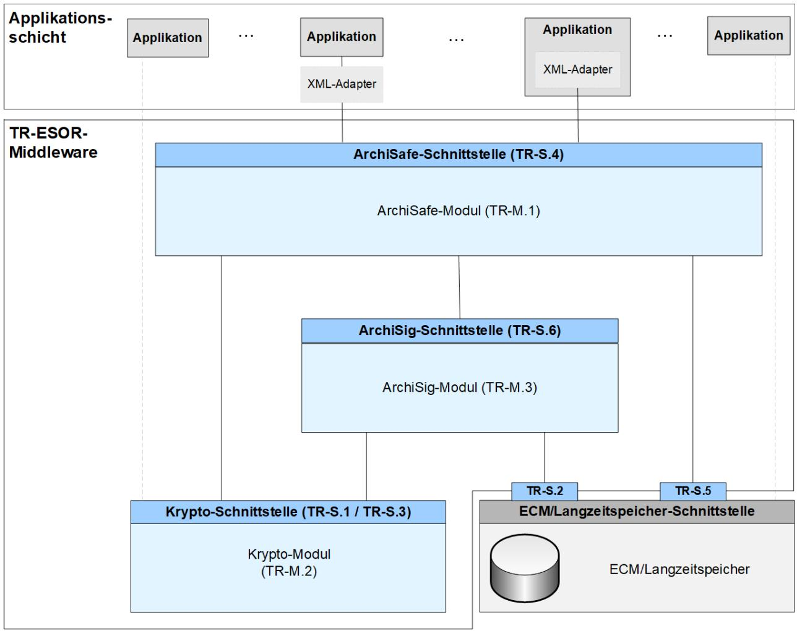

# BSI Technische Richtlinie 03125 Beweiswerterhaltung kryptographisch signierter Dokumente

# **Anlage TR-ESOR-B: Profilierung für Bundesbehörden**

| Bezeichnung | Profilierung für Bundesbehörden        |
|-------------|----------------------------------------|
| Kürzel      | BSI TR-ESOR-B                          |
| Version     | 1.2.1 (auf Basis der eIDAS-Verordnung) |
| Datum       | 15.03.2018                             |

Bundesamt für Sicherheit in der Informationstechnik Postfach 20 03 63 53133 Bonn Tel.: +49 228 99 9582-0 E-Mail: [tresor@bsi.bund.de](mailto:tresor@bsi.bund.de) Internet: [https://www.bsi.bund.de](https://www.bsi.bund.de/) © Bundesamt für Sicherheit in der Informationstechnik 2018

| 1. Einführung                                                           | 4 |
|-------------------------------------------------------------------------|---|
| 2. Übersicht                                                            | 6 |
| 3. Profilierung der Anforderungen für die Behörden der Bundesverwaltung | 9 |
| 3.1 TR-ESOR Hauptdokument9                                              |   |
| 3.2 TR-ESOR Anlage E10                                                  |   |
| 3.3 TR-ESOR Anlage F12                                                  |   |
| 3.4 TR-ESOR Anlage S13                                                  |   |
| 3.5 TR-ESOR Anlage M.113                                                |   |
| 3.6 TR-ESOR Anlage M.214                                                |   |
| 3.7 TR-ESOR Anlage M.314                                                |   |
| 3.8 TR-ESOR Anlage ERS14                                                |   |
| 3.9 TR-ESOR Anlage VR14                                                 |   |
|                                                                         |   |

# **1. Einführung**

Ziel der Technischen Richtlinie "Beweiswerterhaltung kryptographisch signierter Dokumente" ist die Spezifikation sicherheitstechnischer Anforderungen für den langfristigen Beweiswerterhalt von kryptographisch signierten elektronischen Dokumenten und Daten nebst zugehörigen elektronischen Verwaltungsdaten (Metadaten).

Eine für diese Zwecke definierte Middleware (TR-ESOR-Middleware) im Sinn dieser Richtlinie umfasst alle diejenigen Module (**M**) und Schnittstellen (**S)**, die zur Sicherung und zum Erhalt der Authentizität und zum Nachweis der Integrität der aufbewahrten Dokumente und Daten eingesetzt werden.

Die im Hauptdokument dieser Technischen Richtlinie vorgestellte Referenzarchitektur besteht aus den nachfolgend beschriebenen funktionalen und logischen Einheiten:

- der Eingangs-Schnittstelle S.4 der TR-ESOR-Middleware, die dazu dient, die TR-ESOR-Middleware in die bestehende IT- und Infrastrukturlandschaft einzubetten;
- dem "ArchiSafe-Modul" (vgl. **[TR-ESOR-M.1]**), welches den Informationsfluss in der Middleware regelt, die Sicherheitsanforderungen an die Schnittstellen zu den IT-Anwendungen umsetzt und für eine Entkopplung von Anwendungssystemen und ECM/Langzeitspeicher sorgt;
- dem "Krypto-Modul" (vgl. **[TR-ESOR-M.2]**) nebst den zugehörigen Schnittstellen S.1 und S.3, das alle erforderlichen Funktionen zur Berechnung von Hashwerten, Prüfung elektronischer Signaturen bzw. Siegeln bzw. Zeitstempeln, zur Nachprüfung elektronischer Zertifikate und zum Einholen qualifizierter Zeitstempel sowie (optional) elektronischer Signaturen bzw. Siegel für die Middleware zur Verfügung stellt. Darüber hinaus kann es Funktionen zur Ver- und Entschlüsselung von Daten und Dokumenten zur Verfügung stellen;
- dem "ArchiSig-Modul" (vgl. **[TR-ESOR-M.3]**) mit der Schnittstelle S.6, das die erforderlichen Funktionen für die Beweiswerterhaltung der digital signierten Unterlagen bereitstellt;
- einem ECM/Langzeitspeicher mit den Schnittstellen S.2 und S.5, der die physische Archivierung/Aufbewahrung und auch das Speichern der beweiswerterhaltenden Zusatzdaten übernimmt.

*Dieser ECM/Langzeitspeicher ist nicht mehr direkt Teil der Technischen Richtlinie, gleichwohl werden über die beiden Schnittstellen, die noch Teil der TR-ESOR-Middleware sind, Anforderungen daran gestellt.* 

*Ebenso wenig ist die Applikationsschicht, die auch einen XML-Adapter enthalten kann, direkter Teil der Technischen Richtlinie, auch wenn dieser XML-Adapter als Teil einer Middleware implementiert werden kann.*

Die in Abbildung 1 dargestellte IT-Referenzarchitektur orientiert sich an der ArchiSafe[1](#page-3-1) Referenzarchitektur und soll die logische (funktionale) Interoperabilität künftiger Produkte mit den Zielen und Anforderungen der Technischen Richtlinie ermöglichen und unterstützen.

1 Siehe dazu [http://www.archisafe.de](http://www.archisafe.de/)

**Abbildung 1: Schematische Darstellung der IT-Referenzarchitektur**

Diese Technische Richtlinie ist modular aufgebaut und spezifiziert in einzelnen Anlagen zum Hauptdokument die funktionalen und sicherheitstechnischen Anforderungen an die erforderlichen IT-Komponenten und Schnittstellen der TR-ESOR-Middleware. Die Spezifikationen sind strikt plattform-, produkt-, und herstellerunabhängig.

Das vorliegende Dokument trägt die Bezeichnung "Anlage TR-ESOR-B" und konkretisiert Anforderungen, Datenformate und Protokolle für die beweiswerterhaltende Aufbewahrung kryptografisch signierter Daten und Dokumente speziell für die Belange in der Bundesverwaltung.

Dieses Profil sollte von Bundesbehörden mindestens dann angewendet werden, wenn die Neubeschaffung oder die Aktualisierung eines Archivsystems oder einer Archiv-Middleware für die Aufbewahrung von kryptographisch signierten Unterlagen ansteht. Für bestehende Installationen, mit denen kryptographisch signierte Unterlagen für lange Zeit aufbewahrt werden sollen, wird die Anwendung dieses Profils nachdrücklich empfohlen.

# **2. Übersicht**

Die vollständige und korrekte Aufbewahrung elektronischer Dokumente und Daten in der öffentlichen Verwaltung ist bestimmt durch die grundsätzliche Verpflichtung zur wahrheitsgetreuen und vollständigen Aktenführung.

Die Verpflichtung zur wahrheitsgetreuen und vollständigen Aktenführung sichert die Kontinuität und Überprüfbarkeit des Verwaltungshandelns und dient der Nachvollziehbarkeit von Verwaltungsentscheidungen. Eine Akte hat insbesondere in der öffentlichen Verwaltung rechtlichen Informations- und Beweiswert (Protokoll- und Evidenzfunktion der Akte).[2](#page-5-1) In der Aktenführungspflicht öffentlicher Verwaltungen sind daher Beweiszweck und als Voraussetzung dafür auch Verfügbarkeit und Verkehrsfä higkeit aufzubewahrender elektronischer Dokumente inklusive der zum Nachweis ihrer Integrität und Authentizität erforderlichen Daten bereits impliziert.

Für die beweiswerterhaltende Aufbewahrung vor allem auch elektronisch signierter bzw. gesiegelter bzw. zeitgestempelter Daten und Dokumente in der Bundesverwaltung von besonderem Gewicht sind die Gemeinsame Geschäftsordnung der Bundesministerien (GGO) sowie die Registraturrichtlinie für das Bearbeiten und Verwalten von Schriftgut in den Bundesministerien (RegR). In beiden Regelungen werden die elektronische Kommunikation und der Einsatz elektronischer Medien ausdrücklich berücksichtigt. Dies umfasst die Regelung des elektronischen Eingangs in § 13 Abs. 2 GGO und der zugehörigen Anlage, aber auch den Einsatz von elektronischen Signaturen bzw. Siegen bzw. Zeitstempeln gemäß der eIDAS-Verordnung **[eIDAS-VO]** sowie dem Vertrauensdienstegesetz **[VDG]** bei unmittelbarer Rechtswirkung des Dokuments oder bei besonderer politischer Bedeutung (§ 18 Abs. 3 GGO). § 18 RegR bestimmt für die Aufbewahrung von elektronischem Schriftgut, dass durch geeignete Maßnahmen, die nicht näher vorgegeben werden, Vollständigkeit, Integrität, Authentizität und Lesbarkeit zu gewährleisten sind (§ 18 Abs. 1 Satz 2 RegR). In § 18 Abs. 3 RegR wird darüber hinaus klargestellt, dass elektronisch gesichertes Schriftgut der laufenden Pflege bedarf und rechtzeitig und ohne inhaltliche Veränderungen auf Formate und Datenträger übertragen werden muss, die dem Stand der Technik entsprechen.

Die Annahme und der Nachweis der Authentizität[3](#page-5-2) elektronischer Dokumente stützen sich auf die vier nachfolgend genannten Aspekte[4](#page-5-3) :

- a) die *Zuverlässigkeit*, d. h. es existieren begründete und nachvollziehbare Fakten oder Hinweise, dass der Inhalt eines Dokuments als vollständige und korrekte Wiedergabe derjenigen Tatsachen oder Ereignisse angesehen werden kann, von denen es vorgibt, Zeugnis abzulegen oder zu berichten,
- b) die *Verkehrsfähigkeit* (Verfügbarkeit und Lesbarkeit) elektronischer Dokumente, d.h. die Tatsache, dass die als authentisch apostrophierten Dokumente und Daten jederzeit lokalisiert und wieder vorgelegt, d. h. auf den zum Zeitpunkt der Wiedervorlage gängigen IT-Systemen präsentiert und interpretiert (gelesen) werden können,
- c) die *Integrität* oder *Unverändertheit* elektronischer Dokumente sowie
- d) die eindeutige und nachweisbare, d. h. nicht abstreitbare, Zuordnung der *Urheberschaft* eines elektronischen Dokuments zu einer Person oder sonstigen Quelle.

Der Nachweis der Integrität elektronischer Dokumente und Daten lässt sich durch kryptographische Maßnahmen führen, die darauf beruhen, von dem Dokument bzw. den Daten einen digitalen "Finger-

2 Vgl. [KNAACK 2003], S. 46

3 Im allgemeinen Sprachgebrauch wird der Begriff Authentizität i. d. R. mit der Eigenschaft assoziiert, aufgrund erfüllter (oder auch nur erfüllbarer) Tatsachen oder Ereignisse akzeptanzwürdig oder glaubwürdig zu sein. Als authentisch gilt demnach ein Objekt, wenn aufgrund nachvollziehbarer Tatsachen oder Ereignisse die Wahrnehmung des Objektes mit seinem Wesen, seiner Bestimmung in Übereinstimmung befunden werden kann. Die Behauptung oder Annahme der Authentizität elektronischer Dokumente ist somit vornehmlich eine Folgerung, die aus bekannten und nachvollziehbaren, resp. nachprüfbaren Tatsachen oder Ereignissen gezogen oder begründet werden kann, die sowohl die Art und Weise be treffen, wie ein Dokument erstellt wurde, als auch wie mit ihm verfahren und vor allem wie es erhalten (aufbewahrt) wurde (vgl. hierzu auch [NATARCHUK2002], S. 8).

4 Siehe hierzu auch [HIGGINS 2010], [NATARCHUK 2002]

abdruck" herzustellen, der geeignet ist, nachträgliche Manipulationen sicher zu erkennen.[5](#page-6-0)

Für das zweifelsfreie Feststellen der Urheberschaft elektronischer Dokumente und Daten benötigt man darüber hinaus:

- 1. eine vertrauenswürdige und vor allem nachprüfbare digitale Identität[6](#page-6-1) des Urhebers, respektive der Quelle des Dokuments sowie
- 2. eine unauflösbare, fälschungssichere und jederzeit nachweisbare, d. h. nachvollziehbare Verknüpfung dieser digitalen Identität mit dem Dokument – z.B. eine elektronische Signatur bzw. Siegel bzw. Zeitstempel.

Um die beweisrechtliche Eignung elektronisch signierter Daten und Dokumente für die Dauer der Aufbewahrung zu unterstützen und zu erhalten, müssen daher

- die Daten und Dokumente in einer langfristig verkehrsfähigen und standardisierten Form abgelegt werden, so dass die Wiedergabe auf den zum Zeitpunkt der Wiedervorlage gängigen IT-Systemen als gesichert angenommen werden kann,
- elektronische Signaturen bzw. Siegel und Zeitstempel in der durch Rechtsvorschriften geforderten Qualität sicher und zuverlässig erzeugt, geprüft, erneuert und aufbewahrt werden und
- darüber hinaus sollten die für eine spätere Signatur- bzw. Siegel- bzw. Zeitstempelprüfung erforderlichen Verifikationsdaten rechtzeitig, d. h. möglichst unmittelbar nach der Signatur- bzw. Siegel- bzw. Zeitstempelerstellung und/oder -prüfung beschafft und gemeinsam mit den aufzubewahrenden Dokumenten und Daten ebenfalls in langfristig verkehrsfähiger und standardisierter Form abgelegt werden.

Vor diesem Hintergrund und mit der Absicht, die Interoperabilität elektronischer Archivlösungen in den Behörden der Bundesverwaltung zu erhöhen, konkretisiert das vorliegende Dokument die funktionalen und technischen Anforderungen der TR 03125 für das Einrichten und den Betrieb elektronischer Archive in der Bundesverwaltung. Dabei werden in den nachfolgenden Abschnitten nur die Anforderungen erwähnt, die für Bundesbehörden auch eine besondere Ausprägung erhalten. Alle nicht genannten Anforderungen der TR 03125 gelten unverändert auch hier. Es werden in diesem Dokument keine zusätzlichen Anforderungen definiert, sondern ausschließlich bestehende weiter konkretisiert.

#### **HINWEIS:**

*Hinweis: Im folgenden Text umfasst der Begriff "Digitale Signatur" "fortgeschrittene elektronische Signaturen" gemäß [eIDAS-VO, Artikel 3 Nr. 11], "qualifizierte elektronische Signaturen" gemäß [eI-DAS-VO, Artikel 3 Nr. 12], "fortgeschrittenen elektronische Siegel" gemäß [eIDAS-VO, Artikel 3 Nr. 26] und "qualifizierte elektronische Siegel" gemäß [eiDAS-VO, Artikel 3 Nr. 27]. Insofern umfasst der Begriff "digital signierte Dokumente" sowohl solche, die fortgeschrittene elektronische Signaturen oder Siegel bzw. qualifizierte elektronische Signaturen oder Siegel tragen.* 

*Mit dem Begriff der "kryptographisch signierten Dokumente" sind in dieser TR neben den gemäß [eI-DAS-VO, Artikel 3 Nr. 12] qualifiziert signierten, den gemäß [eIDAS-VO, Artikel 3 Nr. 27] qualifiziert gesiegelten oder den gemäß [eIDAS-VO, Artikel 3 Nr. 34] qualifiziert zeitgestempelten Dokumenten (im Sinne der eIDAS-Verordnung) ) auch Dokumente mit einer fortgeschrittenen Signatur gemäß [eIDAS-VO, Artikel 3 Nr. 11] oder mit einem fortgeschrittenen Siegel gemäß [eIDAS-VO, Artikel 3 Nr. 26] oder mit einem elektronischen Zeitstempel gemäß [eIDAS-VO, Artikel 3 Nr. 33] erfasst, wie sie oft in der internen Kommunikation von Behörden entstehen. Nicht gemeint sind hier Dokumente mit einfachen Signaturen oder Siegeln basierend auf anderen (z. B. nicht-kryptographischen) Verfahren.*

5 Solche "Fingerabdrücke" werden mit kryptographisch sicheren Hashfunktionen berechnet und zusammen mit dem Dokument versandt bzw. gespeichert, so dass der Empfänger oder Objektnutzer anhand dieses Fingerabdrucks die Integrität des Objekts prüfen kann (vgl. [SCHNEIER], S. 491 ff.)

6 Die heute gebräuchlichste Form elektronischer Identitäten sind elektronische Zertifikate. Mit diesen erfolgt die Bindung digital kodierter, realer Identitätsmerkmale (Name, Anschrift, usw.) eines Individuums oder eines Objektes an ein digita les Attribut, welches durch einen vertrauenswürdigen Dritten, den Aussteller des Zertifikats, in einer elektronischen, d.h. maschinenlesbaren Datei bescheinigt und für die elektronisch eindeutige Identifizierung benutzt wird.

**(A2.0-1)** Sofern für aus mindestens einem in dieser Richtlinie spezifizierten Modul bestehenden Produktes oder Systems die technische Konformität der *Konformitätsstufe 3* nachgewiesen werden soll, muss zusätzlich zur *Konformitätsstufe 2* die Konformität mit den in diesem Dokument niedergelegten Anforderungen der TR 03125 gemäß [TR-ESOR-C.3] nachgewiesen werden.

# **3. Profilierung der Anforderungen für die Behörden der Bundesverwaltung**

Im Folgenden werden die Anforderungen aufgeführt, die für Bundesbehörden konkreter gefasst sind. Zur besseren Nachvollziehbarkeit sind hier jeweils die Original-Fassung der Anforderungen und die geänderte Fassung aufgeführt. Weiterhin ist für jede geänderte Anforderung eine Begründung angegeben.

# **3.1 TR-ESOR Hauptdokument**

#### **5.1 Funktionen der Middleware zum Beweiswerterhalt**

- [A5.1-4] Die Middleware soll vor der Ablage im ECM/Langzeitspeicher die Syntax der zur
- OriginalAufbewahrung übergebenen Archivdatenobjekte auf Konformität mit dem für die Archivierung
- durch die Nutzer und Betreiber eines Archivsystems definierten und spezifizierten Datenformate prüfen. Bei Nichtübereinstimmung muss dann die Ablage im ECM/Langzeitspeicher abgelehnt werden.

nkretisieru n g [A5.1-4B] Die Middleware *muss* vor der Ablage im ECM/Langzeitspeicher die Syntax der zur Aufbewahrung übergebenen Archivdatenobjekte auf Konformität mit dem für die Archivierung durch die Nutzer und Betreiber eines Archivsystems definierten und spezifizierten Datenformate *(auf der Basis eines gültigen XML-Schemas)* prüfen. Bei Nichtübereinstimmung muss dann die Ablage im ECM/Langzeitspeicher abgelehnt werden.

K

Erläuterung:

o

Mit der Syntaxprüfung der zur Aufbewahrung an den Langzeitspeicher übergebenen Archivdatenobjekte muss die Korrektheit der aus den vorgelagerten Fachanwendungen abgelegten Daten sichergestellt und zugleich gewährleistet werden, dass ein Re-Import aufbewahrter Daten in die vorgelagerten Fachanwendungen mit den für die Aufbewahrung spezifizierten Datenformaten ohne Weiteres möglich bleibt.

#### **6.2 Empfohlene Datenformate**

Original [A6.2-1] Im Interesse der dauerhaften Verfügbarkeit und Verkehrsfähigkeit der zu archivierenden Dokumente und Daten sollen ausschließlich Datenformate eingesetzt werden, die eine plattform- und herstellerunabhängige Archivierung in langfristig verkehrsfähiger Form ermöglichen.

kretisieru n g [A6.2-1B] Im Interesse der dauerhaften Verfügbarkeit und Verkehrsfähigkeit der zu archivierenden Dokumente und Daten *müssen* ausschließlich Datenformate eingesetzt werden, die eine plattform- und herstellerunabhängige Archivierung in langfristig verkehrsfähiger Form ermöglichen. Darüber hinaus kann im Bedarfsfall das Original zusätzlich abgelegt werde.

Ko n

Erläuterung:

§ 18 RegR bestimmt für die Aufbewahrung von elektronischem Schriftgut, dass durch geeignete Maßnahmen die Lesbarkeit – und damit auch die Verfügbarkeit – über die Dauer der Aufbewahrung zu gewährleisten ist. Dies lässt sich am ehesten durch die Nutzung standardisierter, plattform- und herstellerunabhängiger Datenformate erreichen.

# **3.2 TR-ESOR Anlage E**

#### **2.0 Überblick**

Original [A2.0-1] Demnach muss in *Konformitätsstufe 1* lediglich die funktionale und logische Konformität eines aus mindestens einem in dieser Richtlinie spezifizierten Modul bestehenden Produktes oder Systems mit den Anforderungen der Richtlinie nachgewiesen werden. Die Unterstützung der einzelnen in **[TR-ESOR-S]** und hier beschriebenen Schnittstellen ist somit optional.

on kretisieru n g [A2.0-1B] Demnach muss *für die Konformität zum Bundesbehördenprofil lediglich* die funktionale *und logische* Konformität[7](#page-9-1) *und technische Interoperabilität[8](#page-9-2)* eines aus mindestens einem in dieser Richtlinie spezifizierten Modul bestehenden Produktes oder Systems mit den Anforderungen der Richtlinie nachgewiesen werden. *Die Unterstützung der einzelnen in [TR-ESOR-S] und hier beschriebenen Schnittstellen ist somit optional.*

Erläuterung:

K

§ 18 RegR bestimmt für die Aufbewahrung von elektronischem Schriftgut, dass durch geeignete Maßnahmen die Integrität und Authentizität zu gewährleisten sind. Die gilt insbesondere für signierte Unterlagen. In Übereinstimmung mit den Zielen und Intentionen dieser Technischen Richtlinie folgt hieraus unmittelbar, dass für die technische Umsetzung von Maßnahmen zum Erhalt des Beweiswertes signierter Unterlagen, die funktionale und logische Konformität eines aus mindestens einem in dieser Richtlinie spezifizierten Modul bestehenden Produktes oder Systems mit den Anforderungen der Richtlinie nachgewiesen werden muss.

Diese Anforderung impliziert nicht, dass bei einem Produkt, dass mehrere Module der TR in sich vereint, auch sämtliche rein internen Schnittstellen den XML-basierten Schnittstellenspezifikationen dieser TR entsprechen müssen.

## **2.0 Überblick**

Original [A2.0-2] Sofern bei der Realisierung eines aus mindestens einem in dieser Richtlinie spezifizierten Modul bestehenden Produktes oder Systems die technische Konformität und Interoperabi-

lität der Konformitätsstufe 2 nachgewiesen werden soll, muss diese auf Basis der in diesem Dokument beschriebenen Profilierung des eCard-API-Frameworks umgesetzt werden. Hierbei müssen zumindest die folgenden, im vorliegenden Dokument näher aufgeführten Funktionen mit den hier beschriebenen Parameterkonstellationen unterstützt werden.

n g [A2.0-2B] Sofern bei der Realisierung eines aus mindestens einem in dieser Richtlinie spezifi-

kretisieru zierten Modul bestehenden Produktes oder Systems die *Konformität zum Bundesbehördenprofil*

nachgewiesen werden soll, muss diese auf Basis der in diesem Dokument beschriebenen Profilie-

rung des eCard-API-Frameworks umgesetzt werden. Hierbei müssen zumindest die folgenden, im

o n vorliegenden Dokument näher aufgeführten Funktionen mit den hier beschriebenen Parameter-

K konstellationen unterstützt werden.

#### Erläuterung:

Das eCard-API-Framework ist Teil der eCard-Strategie der Bundesregierung und stellt eine Reihe standardisierter, homogener Schnittstellen für die Ausführung kryptografischer Operationen zur Ver-

7 Siehe [TR-ESOR-C.1]

8 Siehe [TR-ESOR-C.2]

fügung. Um die Interoperabilität mit zertifizierten und im Rahmen der Bundesverwaltung bereits eingesetzten Produkten (Komponenten) zu gewährleisten, ist es erforderlich, Schnittstellen für den Beweiswerterhalt signierter Dokumente auf der Grundlage des in der TR beschriebenen Profils des eCard-API-Frameworks umzusetzen.

#### **2.0 Überblick**

 [A2.0-3] Sofern bei der Realisierung eines aus mindestens einem in dieser Richtlinie spezifi-

Originalzierten Modul bestehenden Produktes oder Systems die technische Konformität und Interoperabilität der *Konformitätsstufe 2* nachgewiesen werden soll, soll XAIP aus **[TR-ESOR-F]** als XML-Datenformat verwendet werden. Abweichungen im verwendeten XML-Datenformat sind zulässig, allerdings muss dann erläutert werden, wie eine gleichwertige Funktionalität realisiert wird. Insbesondere ist zu erläutern, wie eine Transformation in das XAIP Format aus **[TR-ESOR-F]** erfolgen kann.

- n g [A2.0-3B] Sofern bei der Realisierung eines aus mindestens einem in dieser Richtlinie spezifi-
- zierten Modul bestehenden Produktes oder Systems die technische Konformität und Interoperabi-
- lität *zum Bundesbehördenprofil* nachgewiesen werden soll, *muss dieses Produkt bzw. System an*
- kretisieru*allen seinen über die TR definierten externen Schnittstellen einen XML-Container basierend*
- K o n *auf dem XML-Schema XAIP aus Kapitel 3 Anlage F als XML-Datenformat nutzen. soll XAIP aus [TR-ESOR-F] als XML-Datenformat verwendet werden. Abweichungen im verwendeten XML-Datenformat sind zulässig, allerdings muss dann erläutert werden, wie eine gleichwertige Funktionalität realisiert wird. Insbesondere ist zu erläutern, wie eine Transformation in das XAIP Format aus [TR-ESOR-F] erfolgen kann.*

Erläuterung:

Für den Nachweis der technischen Konformität und Interoperabilität von Produkten oder Komponenten für die Beweiswert-erhaltende Aufbewahrung elektronischer Unterlagen mit den Zielen und Intentionen dieser TR ist die Verwendung eines einheitlichen und standardisierten Datenformats für die zu archivierenden Datenobjekte erforderlich.

# **2.0 Überblick**

 <keine Entsprechung>

Original

K

o

n

kretisieru

n

 g *[A2.0-xB] Falls im Rahmen der Metadaten XBARCH [XBARCH], XDOMEA [XDOMEA] bzw. [PREMIS] genutzt wird, soll die Einbindung von XBARCH, XDOMEA bzw. PREMIS gemäß dem TR-ESOR-Profil "TR-ESOR-Profile-XBDP: Profilierung des XAIP mit XBARCH, XDOMEA und PREMIS" erfolgen.*

Erläuterung:

Um auch über Behördengrenzen hinweg langfristig eine Interoperabilität von Produkten oder Komponenten für die Beweiswert-erhaltende Aufbewahrung elektronischer Unterlagen mit den Zielen und Intentionen dieser TR zu erreichen, ist eine weitergehende Vereinheitlichung des Datenformats für die zu archivierenden Datenobjekte erforderlich.

# **3.3 TR-ESOR Anlage F**

#### **3. Definition der Archivdatenobjekte (XAIP)**

 [A3-1] Für den Beweiswerterhalt kryptographisch signierter Dokumente soll das in diesem

OriginalAbschnitt beschriebene und durch das XML-Schema im Anhang näher spezifizierte XAIP-Format genutzt werden. Abweichungen im verwendeten XML-Format sind zulässig, allerdings muss dann erläutert werden, dass gleichwertige Funktionalität unterstützt wird. Insbesondere ist zu erläutern, wie eine Transformation in das hier spezifizierte XAIP-Format erfolgen kann.

 g [A3-1B] Für den Beweiswerterhalt kryptographisch signierter Dokumente *in Bundesbehörden muss ein XML-Container basierend auf dem XML-Schema XAIP aus Kapitel 3 Anlage F als XML-Datenformat genutzt werden.*

Ko n

kretisieru

n

Erläuterung:

In den "Standards und Architekturen für E-Government-Anwendungen (SAGA)" ist XML als obligatorischer Standard für den Datenaustausch in der Bundesverwaltung bestimmt. Dem trägt das im Anhang der Anlage F spezifizierte XAIP-Format in adäquater Weise Rechnung.

#### **5.6 Empfehlungen für die Umsetzung**

 [A5.6-1] Um sowohl beliebige Datenformate verarbeiten zu können als auch die zugehörigen

- Originalkryptographischen Daten und Metadaten mit den Nutzdaten verknüpfen zu können, soll der in Kapitel 3 definierte XAIP Container oder eine Ableitung davon als zentrales Datenelement im
- Protokoll genutzt werden. Das bedeutet für das Protokoll insbesondere, dass alle Daten in einem einzigen Datenelement untergebracht und so logisch miteinander verbunden sind. Das Protokoll ist nicht für die logische Korrektheit dieses Datenelementes nach Empfang verantwortlich.

kretisieru n g [A5.6-1B] Um sowohl beliebige Datenformate verarbeiten zu können als auch die zugehörigen kryptographischen Daten und Metadaten mit den Nutzdaten verknüpfen zu können, *muss ein XML-Container basierend auf dem XML-Schema XAIP aus Kapitel 3 Anlage F als XML-Datenformat genutzt werden.* 

K 

o

n

#### Erläuterung:

Ziel und Intention der TR-ESOR ist es, technische Beweisdaten zum Nachweis der Authentizität und Integrität kryptografisch signierter Dokumente gemeinsam mit den Dokumenten aufzubewahren und zu verwalten. Dem trägt die Spezifikation des XAIP Containers in geeigneter Weise Rechnung, indem die Dokumente und technische Beweisdaten gemeinsam in einer abgeschlossenen und selbst-erklärenden XML-Datenstruktur abgelegt (gekapselt) werden. Die Anforderungen wird hier bezüglich der Verwendung von XML als Datenformat verschärft. Andere Container-Datenformate außer XML sind nicht gewünscht.

## **5.6 Empfehlungen für die Umsetzung**

Original [A5.6-8] Empfehlung für das Protokoll auf Applikations-Schicht ist SOAP Document-Literal Encoding. Die externen Schnittstellen aller Archivsystem-Komponenten werden mit WSDL publiziert; diesen kann ein externes XML Schema zu Grunde liegen.

kretisieru g [A5.6-8B] *Um Konformität mit dem Bundesbehördenprofil zu erreichen, muss zuvor die Konformitätsstufe 2 der TR erfüllt werden.*

Erläuterung:

K

o

n

n

Eines der Ziele dieses Profils ist das Sicherstellen der technischen Interoperabilität von Modulen des gesamten Archivsystems. Zu diesem Zweck wird hier das Erreichen der Konformitätsstufe 2 der TR gefordert. Dies schließt die exakte Implementierung der externen Schnittstellen der einzelnen Module nach den aufgezeigten XML-Spezifikationen als auch das Nutzen von SOAP als Protokoll und XML als Containerformat mit ein.

Diese Anforderung impliziert nicht, dass bei einem Produkt, dass mehrere Module der TR in sich vereint, auch sämtliche rein internen Schnittstellen den XML-basierten Schnittstellenspezifikationen dieser TR entsprechen müssen.

## **3.4 TR-ESOR Anlage S**

Die Anforderungen in diesem Dokument gelten unverändert für Bundesbehörden.

# **3.5 TR-ESOR Anlage M.1**

#### **4.4 Löschen von Archivdaten – ArchiveDeletionRequest**

Original [A4.4-1] Im Falle des Löschens vor Ablauf der Aufbewahrungsfristen muss der Aufruf eine protokollierbare Begründung enthalten. Das ArchiSafe-Modul muss das Einhalten der Aufbewahrungsfristen und die Existenz einer protokollierbaren Begründung bei vorzeitigem Löschen durchsetzen.

[A4.4-2] Das Löschen muss mit einer aussagekräftigen und verständlichen Fehlermeldung abgewiesen werden, wenn eine AOID ungültig ist oder im Falle eines vorzeitigen Löschens kein Begründungstext übergeben wurde.

kretisieru n g[A4.4-1B] *Im Falle des Löschens muss der Bewertungs- oder Aussonderungsvermerk des zuständigen staatlichen Archivs (z.B. Bundesarchiv) überprüft werden. Falls es sich um ein vorzeitiges Löschen handelt, muss der Lösch-Aufruf eine protokollierbare Begründung enthalten*

- *und der amtliche Bewertungsvermerk den Wert "V" aufweisen. Im Falle, dass die Aufbewah-*
- on *rungsfrist abgelaufen ist, muss der Bewertungsvermerk auf "V" stehen. Sofern die archivwür-*
- K *digen Daten bereits an das zuständige Archiv übergeben wurden und eine Freigabe des Archivars vorliegt, ist der Bewertungs- oder Aussonderungsvermerk der verbleibenden Archivdatenobjekte damit vor dem Löschen auf "V" zu ändern[9](#page-12-2) .*

*Der Bewertungs-/Aussonderungsvermerk kann im Archivdatenobjekt gemäß [TR-ESOR-F], Kap. 3.2 vorliegen. Andere Umsetzungen bzgl. des Bewertungs-/Aussonderungsvermerks sind ebenfalls zulässig. Allerdings muss dann erläutert werden, dass gleichwertige Funktionalität unterstützt wird.*

9 Dem Setzen des Bewertungsvermerks muss eine fachlich-organisatorische Entscheidung der anwendenden Behörde entsprechend der Bewertungsentscheidung des zuständigen öffentlichen Archivs vorausgehen. Rechtliche Aspekte sind durch die Behörde im Benehmen mit dem Archiv zu klären.

Das ArchiSafe-Modul muss das Einhalten der Aufbewahrungsfristen und die Existenz einer protokollierbaren Begründung bei vorzeitigem Löschen durchsetzen.

[A4.4-2B] Das Löschen muss mit einer aussagekräftigen und verständlichen Fehlermeldung abgewiesen werden, wenn eine AOID ungültig ist oder im Falle eines vorzeitigen Löschens kein Begründungstext übergeben wurde *oder der Bewertungs-/Aussonderungvermerk keinen Wert gemäß vorstehender Ausführung enthält.*

Erläuterung:

Für die Behörden gilt gemäß. § 2 Bundesarchivgesetz bzw. gemäß den entsprechenden Landesarchivgesetzen die Anbietungspflicht gegenüber dem zuständigen öffentlichen Archiv. Demgemäß darf ein Löschen nur in Abhängigkeit vom Wert des sog. Bewertungs-/Aussonderungsvermerks vorgenommen werden. Unabhängig davon bleibt das Recht auf sofortige Löschung von personenbezogenen Daten gemäß dem Datenschutzgesetz.

#### **3.6 TR-ESOR Anlage M.2**

Die Anforderungen in diesem Dokument gelten unverändert für Bundesbehörden.

## **3.7 TR-ESOR Anlage M.3**

Die Anforderungen in diesem Dokument gelten unverändert für Bundesbehörden.

## **3.8 TR-ESOR Anlage ERS**

Die Anforderungen in diesem Dokument gelten unverändert für Bundesbehörden.

## **3.9 TR-ESOR Anlage VR**

Die Anforderungen in diesem Dokument gelten unverändert für Bundesbehörden.