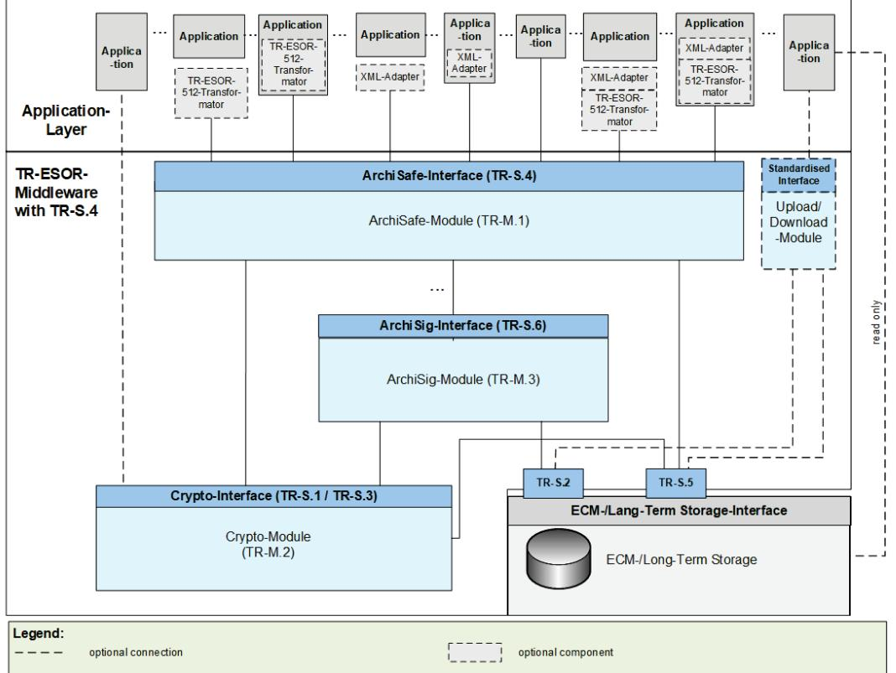
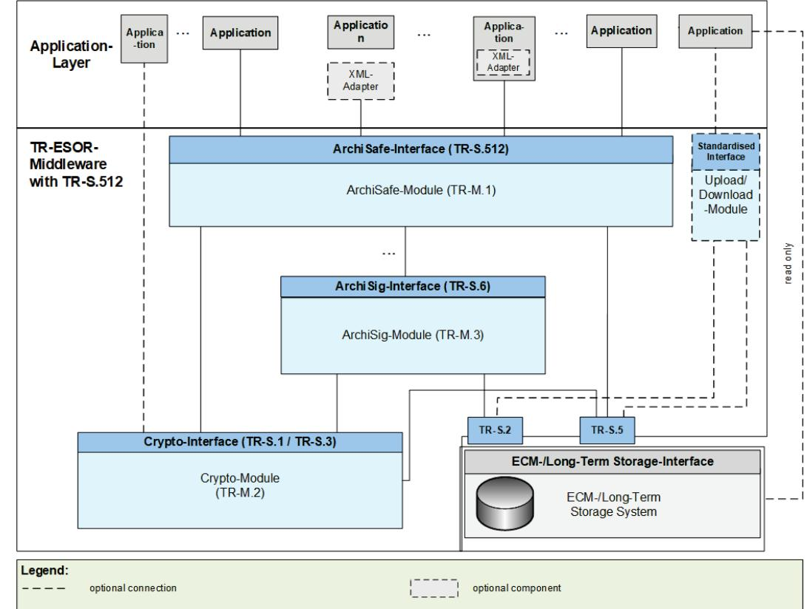

# BSI Technical Guideline 03125 Preservation of Evidence of Cryptographically Signed Documents

#### Annex TR-ESOR-C.1:

Conformity Test Specification (Level 1 Functional Conformity)

| Designation  | Functional Conformity Test Specification (Level 1)                              |
|--------------|---------------------------------------------------------------------------------|
| Abbreviation | BSI TR-ESOR-C.1                                                                 |
| Version      | 1.3 (on base of the eIDAS-Regulation and ETSI Preservation Standards with a new |
|              | certification scheme)                                                           |
| Date         | 31.03.2022                                                                      |

# Document history

| Version | Date       | Editor | Description |
|---------|------------|--------|-------------|
| 1.3     | 31.03.2022 | BSI    | TR-ESOR-C.1 |
|         |            |        |             |

Table 1: Document history

Federal Office for Information Security P.O. Box 20 03 63 53133 Bonn Phone: +49 229 99 9582-0 E-Mail: tresor@bsi.bund.de Internet: https://www.bsi.bund.de © Federal Office for Information Security 2022

# Table of Contents

| 1. |        | Introduction 7                                                                                                                                                                                                                                        |  |
|----|--------|-------------------------------------------------------------------------------------------------------------------------------------------------------------------------------------------------------------------------------------------------------|--|
| 2. |        | Overview11                                                                                                                                                                                                                                            |  |
| 3. |        | Test Approach14                                                                                                                                                                                                                                       |  |
|    | 3.1    | Structure of the Test Case Specifications14                                                                                                                                                                                                           |  |
|    | 3.2    | Strictness of Test Result Assessment15                                                                                                                                                                                                                |  |
|    | 3.3    | Baseline for all Test Cases15                                                                                                                                                                                                                         |  |
|    | 3.3.1  | Standard Test Configurations 15                                                                                                                                                                                                                       |  |
|    | 3.3.2  | Standard Test Objects17                                                                                                                                                                                                                               |  |
|    | 3.4    | Occurring Abbreviations23                                                                                                                                                                                                                             |  |
| 4. |        | The Test Cases for Conformity Level 1 – Functional Conformity28                                                                                                                                                                                       |  |
|    | 4.1    | Tests for all products28                                                                                                                                                                                                                              |  |
|    | 4.1.1  | A-01 – Middleware modules should be realised as separate modules28                                                                                                                                                                                    |  |
|    | 4.1.2  | A-02 – The external upper interfaces (inbound and outbound) of the TR-ESOR Middleware shall be either the TR-S.4- or TR-S.512-interface and in case of Upload-/Download Module shall be based on open, standardised cryptographic protocols. 30 |  |
|    | 4.1.3  | A-03 – No access without mutual authentication32                                                                                                                                                                                                      |  |
|    | 4.1.4  | A-04 – Authentication procedure shall be resistant against replay attacks45                                                                                                                                                                           |  |
|    | 4.1.5  | A-05 – Protection of communication channel and interface shall be robust against DoS attacks46                                                                                                                                                     |  |
|    | 4.1.6  | A-06 – A secure tunnel can be maintained after successful authentication48                                                                                                                                                                            |  |
|    | 4.1.7  | A-07 – Secure administration interfaces51                                                                                                                                                                                                             |  |
|    | 4.1.8  | A-08 – No security breach induced by administration interfaces or components53                                                                                                                                                                        |  |
|    | 4.1.9  | A-09 – Administration interfaces shall be available for authorised accounts only 54                                                                                                                                                                   |  |
|    | 4.1.10 | A-10 – Additional interfaces shall not compromise security56                                                                                                                                                                                          |  |
|    | 4.1.11 | A-11 – What happens to the data at the end of the preservation period shall be stated in the Preservation Evidence Policy of the TR-ESOR Product-Manufacturer58                                                                                    |  |
|    | 4.1.12 | A-12 – The TOT shall support at least one Preservation Profile, which is publicly published and can be retrieved as described in the User Manual and Preservation Evidence Policy (PEP) of the TOT (TR-ESOR Product)60                          |  |
|    | 4.1.13 | A-13 – Each installed Preservation Profile shall contain an identifier which uniquely identifies this Preservation Profile 63                                                                                                                      |  |
|    | 4.1.14 | A-14 – The Preservation Evidence Policy of the TR-ESOR-Product Manufacturer shall contain the description of how the preservation evidence is created including, which cryptographic algorithms are used. 64                                    |  |
|    | 4.2    | Module 1 – ArchiSafe66                                                                                                                                                                                                                                |  |
|    | 4.2.1  | M.1-01 Preservation Services conform to [eIDAS-VO], [ETSI TS 119 401], [ETSI TS 119 511] and using the preservation product [TR-ESOR] should fulfil the security objectives and requirements of [ASS 319 4011] and [ASS 119 511]66              |  |
|    | 4.2.2  | M.1-02 – ArchiSafe-Module shall be separated and deployed on a trustworthy IT system 67                                                                                                                                                               |  |

| 4.2.3  | M.1-03 – Access to ECM storage shall be claimed to be controlled by ArchiSafe-Module and if existent, also by the Upload- and Download-Module 69                                                     |  |
|--------|---------------------------------------------------------------------------------------------------------------------------------------------------------------------------------------------------------|--|
| 4.2.4  | M.1-04 – Support of specified functions71                                                                                                                                                               |  |
| 4.2.5  | M.1-05 – Using interfaces TR-S.1 and TR-S.6 is possible76                                                                                                                                               |  |
| 4.2.6  | M.1-06 – Comprehensive and configurable options for logging shall be offered78                                                                                                                          |  |
| 4.2.7  | M.1-07 – Access to log files shall be possible by authorized persons only82                                                                                                                             |  |
| 4.2.8  | M.1-09 – ArchiSafe-Module is capable of serving and separating multiple clients84                                                                                                                       |  |
| 4.2.9  | M.1-10 – ArchiSafe-Module shall be thread safe 87                                                                                                                                                       |  |
| 4.2.10 | M.1-11 – Access rights shall be enforced for individual archive objects90                                                                                                                               |  |
| 4.3    | Module 2 – Cryptographic-Module (Crypto-Module)94                                                                                                                                                       |  |
| 4.3.1  | M.2-01 – Crypto- Module may request digital signatures from a Trust Service Provider according to [eIDAS-VO] 94                                                                                      |  |
| 4.3.2  | M.2-02 – Cryptographic algorithms shall be exchangeable 98                                                                                                                                              |  |
| 4.3.3  | M.2-03 – Crypto-Module should fulfil the requirements of TR-03112 as stated in [TR ESOR-E] 100                                                                                                       |  |
| 4.3.4  | M.2-04 – Random number generators fulfil the BSI requirements 101                                                                                                                                       |  |
| 4.3.5  | M.2-05 – Support of Hash functions 102                                                                                                                                                                  |  |
| 4.3.6  | M.2-06 – Crypto-Module supports canonicalisation for the validation of XML digital signatures 105                                                                                                    |  |
| 4.3.7  | M.2-07 – Canonicalisation procedures do not change the content data 107                                                                                                                                 |  |
| 4.3.8  | M.2-08 – Reliable validation of digital signatures by itself or by a Trust Service Provider 108                                                                                                      |  |
| 4.3.8  | M.2-09 – Crypto-Module shall have function to validate certificate chains or trust anchor by itself or by a Trust Service Provider 114                                                               |  |
| 4.3.9  | M.2-10 – Validation of digital signatures and evidence records yields standardised and comprehensive Verification Report 118                                                                         |  |
| 4.3.10 | M.2-11 – Suitable cryptographic algorithms should be defined by User Manual and the Preservation Evidence Policy (PEP) of the TR-ESOR-Product Manufacturer, based on the BSI- [TR-ESOR-PEPT]  122 |  |
| 4.3.11 | M.2-12 – Protect its own security 123                                                                                                                                                                   |  |
| 4.3.12 | M.2-13 – Recording security functions 124                                                                                                                                                               |  |
| 4.3.13 | M.2-14 – Responsivity to unauthorized access 125                                                                                                                                                        |  |
| 4.3.15 | M.2-15 – Configuration of cryptographic functions  127                                                                                                                                                  |  |
| 4.3.16 | M.2-16 – Validation of certificates based on a standardized protocol 128                                                                                                                                |  |
| 4.3.17 | M.2-17 – Crypto-Module shall be able to request qualified Electronic Time-Stamps from a qualified Trust Service Provider  130                                                                        |  |
| 4.3.18 | M.2-18 – Crypto-Module supports [RFC 3161], [RFC5816], [RFC5652] and [EN 319 422] and suitable algorithms 133                                                                                        |  |
| 4.3.19 | M.2-19 – Qualified Electronic Time-Stamps shall fulfil the requirements of [eIDAS-VO], Article 42  135                                                                                               |  |
| 4.3.20 | M.2-20 – Crypto-Module shall validate digital signatures of received Electronic Time Stamps according to the Time-Stamp Validation Policy  138                                                       |  |

|     | 4.3.21 | M.2-21 – The Cryptographic-Module shall have a trustworthy communication channel to a qualified Trust Service Provider in order to request qualified electronic time-stamps according to [eIDAS-VO], Article 3 (34)  143                                                                                                                            |  |
|-----|--------|-----------------------------------------------------------------------------------------------------------------------------------------------------------------------------------------------------------------------------------------------------------------------------------------------------------------------------------------------------------|--|
| 4.4 |        | Module 3 – ArchiSig-Module  145                                                                                                                                                                                                                                                                                                                           |  |
|     | 4.4.1  | M.3-01 – ArchiSig-Module should be realised as a separate module 146                                                                                                                                                                                                                                                                                      |  |
|     | 4.4.2  | M.3-02 – Using interface TR-S.3 is possible 148                                                                                                                                                                                                                                                                                                           |  |
|     | 4.4.3  | M.3-04 – Creation of Initial Archive Timestamps according to [RFC4998]  149                                                                                                                                                                                                                                                                               |  |
|     | 4.4.4  | M.3-05 – AOID shall be unique 151                                                                                                                                                                                                                                                                                                                         |  |
|     | 4.4.5  | M.3-06 – ArchiSig-Module creates Evidence Records according to RFC4998 152                                                                                                                                                                                                                                                                                |  |
|     | 4.4.6  | M.3-07 – ArchiSig-Module must not implement cryptographic functions 155                                                                                                                                                                                                                                                                                   |  |
|     | 4.4.7  | M.3-08 – ArchiSig-Module shall be thread safe 157                                                                                                                                                                                                                                                                                                         |  |
|     | 4.4.8  | M.3-09 – Instances of ArchiSig-Module should be deployable on different machines 159                                                                                                                                                                                                                                                                      |  |
|     | 4.4.9  | M.3-11 – Canonicalisation of XML is performed prior to hashing and noted in (L)XAIP 160                                                                                                                                                                                                                                                                   |  |
|     | 4.4.10 | M.3-12 – Hashing of relevant parts is performed with suitable algorithms 162                                                                                                                                                                                                                                                                              |  |
|     | 4.4.11 | M.3-13 – ArchiSig-Module supports Timestamp Renewal and Hash-Tree Renewal  164                                                                                                                                                                                                                                                                            |  |
|     | 4.4.12 | M.3-14 – Timestamp Renewal 168                                                                                                                                                                                                                                                                                                                            |  |
|     | 4.4.13 | M.3-15 – ArchiSig-Module shall validate requested electronic time-stamps using the                                                                                                                                                                                                                                                                        |  |
|     |        | Crypto-Module 170                                                                                                                                                                                                                                                                                                                                         |  |
|     | 4.4.14 | M.3-16 – Time-Stamps shall be verified prior to renewal  173                                                                                                                                                                                                                                                                                              |  |
|     | 4.4.15 | M.3-17 – Timestamp Renewal can only be requested by authorised users through administrative interfaces 176                                                                                                                                                                                                                                             |  |
|     | 4.4.16 | M.3-18 – Hash-tree Renewal can only be requested through administrative interface 178                                                                                                                                                                                                                                                                     |  |
|     | 4.4.17 | M.3-19 – Authenticity and integrity of ArchiSig-Module needs to be guaranteed 180                                                                                                                                                                                                                                                                         |  |
|     | 4.4.18 | M.3-20 – ArchiSig-Module should be able to maintain parallel hash-trees 181                                                                                                                                                                                                                                                                               |  |
|     | 4.4.19 | M.3-22 – Deletion of an archive object shall not impair the conclusiveness of others. 182                                                                                                                                                                                                                                                                 |  |
|     | 4.4.20 | M.3-23 – The Process of requesting Export-Import package(s) and the Production Methods of the Export-Import Packages shall be stated in the User Manual and in the published TR-ESOR-Product Preservation Evidence Policy (PEP) of the TOT, based on the BSI-[TR-ESOR PEPT], and is allowed for authorized clients or preservation services  185 |  |
|     | 4.4.21 | M.3-24 – How the Request for an Export-Import Package can be done with standardised                                                                                                                                                                                                                                                                       |  |
|     |        | formats, shall be stated in the User Manual and in the published TR-ESOR-Product Preservation Evidence Policy (PEP) of the TOT  188                                                                                                                                                                                                                    |  |
|     | 4.4.22 | M.3-25 – The TR-ESOR middleware shall keep records of all released export-import packages and shall allow only authorized clients or preservation services to request export                                                                                                                                                                           |  |
|     |        | import packages 190                                                                                                                                                                                                                                                                                                                                       |  |
| 4.5 |        | Interface functions 192                                                                                                                                                                                                                                                                                                                                   |  |
|     | 4.5.1  | Interface TR-S.1  192                                                                                                                                                                                                                                                                                                                                     |  |
|     | 4.5.2  | Interface S.2 193                                                                                                                                                                                                                                                                                                                                         |  |
|     | 4.5.3  | Interface S.3 193                                                                                                                                                                                                                                                                                                                                         |  |
|     | 4.5.4  | TR-ESOR-Interface TR-S.4 or TR-S.512  194                                                                                                                                                                                                                                                                                                                 |  |
|     | 4.5.5  | Interface S.5 259                                                                                                                                                                                                                                                                                                                                         |  |
|     |        |                                                                                                                                                                                                                                                                                                                                                           |  |

| 4.5.6 | Interface S.6 260      |  |
|-------|------------------------|--|
| 4.6   | Annex [TR-ESOR-F]  260 |  |

| Figure 1: Schematic Depiction of the IT Reference Architecture with TR-S.4  8   |  |
|---------------------------------------------------------------------------------|--|
| Figure 2: Schematic Depiction of the IT Reference Architecture with TR-S.512  9 |  |

| Table 1: Document history  2                      |  |
|---------------------------------------------------|--|
| Table 2: Definition of test objects  17           |  |
| Table 3: Definition of test data in detail  21 |  |
| Table 4: Occurring Abbreviations  23              |  |

# 1. Introduction

The goal of the Technical Guideline "Preservation of Evidence of Cryptographically Signed Documents" is to specify technical security requirements for the longterm preservation of evidence of cryptographically signed electronic documents and data along with associated electronic administrative data (meta data).

A Middleware defined for this purpose (TR-ESOR-Middleware) in the sense of this Guideline includes all of the modules (M) and interfaces (S) [for the German "Schnittstellen"] used for securing and preserving the authenticity and proving the integrity of the stored documents and data.

The Reference Architecture introduced in the Main Document of this Technical Guideline consists of the interfaces and logical units described in the following:

- the TR-S.4 and the TS119512 input interface TR-S.512 in the profiling [TR-ESOR-TRANS] of the TR-ESOR-Middleware, which serves to embed the TR-ESOR-Middleware in the existing IT and infrastructure landscape;
- the "ArchiSafe-Module" [TR-ESOR-M.1], which regulates the flow of information in the Middleware, implements the security requirements for the interfaces with the IT applications and ensures that the application systems are decoupled from the ECM-/Long-term storage;
- the "Cryptographic-Module" [TR-ESOR-M.2] and the associated interfaces S.1 and S.3 that provide the required functions for creating hash values and verifying electronic signatures or seals or time-stamps, verifying electronic certificates and for obtaining qualified electronic time-stamps or (optional) electronic signatures or seals for the Middleware. Furthermore, it can provide the functions for the encryption and decryption of data and documents;
- the "ArchiSig-Module" [TR-ESOR-M.3] with the S.6 interface that provides the required functions for the preservation of evidence of the digitally signed documents;
- • an ECM-/Long-Term Storage with the S.2 and S.5 interfaces that assumes the physical archiving/storage and also the storage of the meta data that preserve evidence.

This ECM-/Long-Term Storage is no longer directly a part of the Technical Guideline, but requirements will be set for it through the two interfaces that are still part of the TR-ESOR-Middleware. The application layer that can include an XML-Adapter is not a direct part of this Technical Guideline, either, even though this XML-Adapter can be implemented as part of a Middleware.

The IT Reference Architecture depicted in Figure 1 and Figure 2 is based on the ArchiSafe Reference Architecture and is supposed to enable and support the logical (functional) interoperability of future products with the objectives and requirements of the Technical Guideline. In principle, the upper interface of the TR-ESOR-Middleware is either the S.4-Interface (TR-S.4) pursuant to [TR-ESOR-E], according to Figure 1, or the TR-S.512-Interface (TR-S.512) pursuant to [ETSI TS 119 512] in the profiling of [TR-ESOR-TRANS], according to Figure 2.

Figure 1: Schematic Depiction of the IT Reference Architecture with TR-S.4

Figure 2: Schematic Depiction of the IT Reference Architecture with TR-S.512

The optional XML-Adapter and/or the optional TR-ESOR-512-Transformato[r1](#page-8-1) may be integrated under the following circumstances:

- Both as separate components with two interfaces to the IT-application and the ArchiSafe-Module,
- Both as separate components, but as parts of the IT-application with interfaces to the ArchiSafe-Module,
- One common component, separate from the IT-application and including the XML-Adapter and TR-ESOR-512-Transformator as parts, with two interfaces to the IT-application and the ArchiSafe-Module,

1 Se[e ETSI TS 119512 TR-ESOR Transformator unter einer Open Source Lizenz.](https://github.com/de-bund-bsi-tr-esor/tresor-ETSITS119512-transformator)

- One common component including the XML-Adapter and TR-ESOR-512-Transformator as parts, which is part of the IT-application, with an interface to the ArchiSafe-Module.

The ["TS119512 TR-ESOR Transformator"](https://github.com/de-bund-bsi-tr-esor/tresor-ETSITS119512-transformator) enables preservation services pursuant to [\[eIDAS-](https://eur-lex.europa.eu/legal-content/EN/TXT/?uri=CELEX:32014R0910)VO] to transform incomin[g ETSI TS119512 \(V1.1.2\)](https://www.etsi.org/deliver/etsi_ts/119500_119599/119512/01.01.01_60/ts_119512v010101p.pdf) messages[2](#page-9-0) TR-S.512 into [TR-S4](https://www.bsi.bund.de/SharedDocs/Downloads/EN/BSI/Publications/TechGuidelines/TR03125/TR-03125_E_v1_2_2.pdf) messages. These messages can be sent to an attached http://www.bsi.bund.de/EN/tr-esor system without any need for changing the system.

The usage of the ["ETSI TS119512 TR-ESOR Transformator"](https://github.com/de-bund-bsi-tr-esor/tresor-ETSITS119512-transformator) is recommended in case that a TR-ESOR-Product with a TR-S.4-Interface should be used in Europe supporting interoperability with other European (qualified) Preservation Services or Preservation Products.

This Technical Guideline is modularly structured, and the individual annexes to the Main Document specify the functional and technological security requirements for the needed IT components and interfaces of the TR-ESOR-Middleware. The specifications are strictly platform, product, and manufacturer independent.

The document at hand bears the designation "Annex TR-ESOR-C.1" and describes and specifies the conformity tests for the conformity level 1 "Functional Conformity" for TR-ESOR V1.3 supporting also the archive information package LXAIP, ASiC-AIP (not yet ready for certification), the Upload- and Downloadinterface and the upper ETSI TS119512-interface TR-S.512 in the profiling of [TR-ESOR-TRANS], alternatively to the TR-ESOR upper interface TR-S.4.

Products that want to be certified pursuant to the Technical Guideline 03125 TR-ESOR shall prove their conformity pursuant to this document [TR-ESOR-C.2] and [TR-ESOR-C.1].

2 In the profiling of [TR-ESOR-TRANS].

# 2. Overview

Products or systems, which want to get certified according to this Technical Guideline have to demonstrate their conformance to the specifications. There are two defined conformance levels, which mainly differ in the technical detail specifications of interfaces and data formats used:

- Conformity Level 1 Functional Conformity,
- Conformity Level 2 Technical Conformity.

This document specifies the functional conformity criteria (tests) derived from the requirements specified in the documents of the Technical Guideline.

The technical test criteria (tests) for reaching "Conformity Level 2 – Technical Conformity" are to be found in [TR-ESOR-C.2].

In order to become certified according to "TR 03125 TR-ESOR", a product shall pass all mandatory conformity criteria (tests) pursuant to [TR-ESOR-C.1] and [TR-ESOR-C.2]. If one or more mandatory tests are not successful, the conformity cannot be certified.

In the following chapter, the test criteria will be derived from the requirements defined of the TR. Furthermore, the requirements and therefore also the test criteria are assigned to Conformity Level 1 or Conformity Level 2.

Based on two assignments the subsequent chapters define the test cases for Conformity Level 1 (Functional Conformity) in detail. Red headlined (marked) test cases MUST be passed for fulfilling the conformity criteria.

The test case specifications are written in such a way that this document (or the respective parts of it) could be used as template for the documentation of the final results of actual testing.

Because [TR-ESOR-C.2] extends [TR-ESOR-C.1], it is necessary for the testing body to assess the assessment criteria of [TR-ESOR-C.1] beforehand.

#### NOTICE 1:

In TR-ESOR-Version1.3 the three terms "Archive Information Package (AIP)", "Archive Information Container" and "Archive Data Object" are used synonymously. 

#### NOTICE 2:

The TR-ESOR input interface TR-S.4 or the TS119512 input interface TR-S.512 pursuant to the preservation-API of [ETSI TS 119 512] in the profiling of [TR-ESOR-TRANS] shall be used which logically corresponds to the input-interface TR-S.4 of the TR-ESOR-Middleware [TR-ESOR-E], as shown in the table 2 of [TR-ESOR-E], clause 4.1. Another input interface instead of TR-S.4 or TR-S.512 is not allowed. To improve readability, the insertion of the TS119512-function calls, equivalent to TR-S.4, is renounced, at several places in this document and the footnote "Either TR-S.4 or TR-S.512 shall be supported." is added to each test case concerning "TR-S.4" or "TR-S.512".

#### NOTICE 3:

In this TR-ESOR- Version, the word "AIP" means in all TR-ESOR-Annexes :

a) the XML-based archival information package "XAIP" pursuant to [TR-ESOR-F], clause 3.1 as well as 

b) the logical XAIP "LXAIP" pursuant to [TR-ESOR-F], clause 3.2 as well as 

c) the "ASiC-AIP" pursuant to [TR-ESOR–F], clause 3.3 on base of [ETSI EN 319162-1]. 

In general, this TR-ESOR Version differentiates in detail between "XAIP", "LXAIP" and "ASiC-AIP".

To improve readability, at several places in this document, the insertion of "LXAIP" and "ASiC-AIP" is renounced, and the footnote ""XAIP" shall be supported, "LXAIP" and "ASiC-AIP, if implemented" may be supported" is added to each "XAIP".

#### NOTICE 4:

In this TR-ESOR- Version, BIN is restricted to the following preservation object formats: 

-ASiC-ERS (in TR-ESOR v1.3 called ASiC-AIP) pursuant to [ETSI TS 119 512], Annex A.3.1 and A.3.1.3 [\(http://uri.etsi.org/ades/ASiC/type/ASiC-ERS\)](http://uri.etsi.org/ades/ASiC/type/ASiC-ERS) and pursuant to [TR-ESOR-F], Clause 3.3); 

-CAdES pursuant to [ETSI TS 119 512] Annex A.1.1 [\(http://uri.etsi.org/ades/CAdES\)](http://uri.etsi.org/ades/CAdES). If there is no MIME type filled, then the default application/cms is used; 

-XAdES pursuant to [ETSI TS 119 512] Annex A.1.2 [\(http://uri.etsi.org/ades/XAdES\)](http://uri.etsi.org/ades/XAdES). If there is no MIME type filled, then the default application/xml is used; 

-PAdES pursuant to [ETSI TS 119 512] Annex A.1.3 [\(http://uri.etsi.org/ades/PAdES\)](http://uri.etsi.org/ades/PAdES). If there is no MIME Type filled, then the default application/pdf is used; 

-ASiC-E pursuant to [ETSI TS 119 512] Annex A.1.4 [\(http://uri.etsi.org/ades/ASiC/type/ASiC-E\)](http://uri.etsi.org/ades/ASiC/type/ASiC-E). If there is no MIME type filled, then the default application/vnd.etsi.asic-e+zip is used; 

-ASiC-S pursuant to [ETSI EN 319 162] [\(http://uri.etsi.org/ades/ASiC/type/ASiC-S\)](http://uri.etsi.org/ades/ASiC/type/ASiC-S). If there is no MIME type filled, then the default application/vnd.etsi.asic-s+zip is used,

-DigestList pursuant to [ETSI TS 119 512] Annex A.1.6 [\(http://uri.etsi.org/19512/format/DigestList\)](http://uri.etsi.org/19512/format/DigestList). If there is no MIME Type filled, then the default application/xml is used; 

In case of Upload- and Download-function the following format is allowed additionally:

-Binary Data (BIN) as Octet Stream, which is stored in the ECM-/Long-Term Storage by an "Upload-Request", – but only, 

if connected with a corresponding LXAIP and referenced there acc. to [TR-ESOR-F], Sec. 3.2,

 if appropriate, retrieved by a "Download-Request" – linked to a corresponding LXAIP or embedded in a XAIP and retrieved by an ArchiveRetrieval-Request, – and, neither Upload of XAIP nor LXAIP, nor ASiC-AIP is possible.. 

#### ATTENTION 1:

If implemented, an ASiC-AIP-Container pursuant to clause 3.3 in [TR-ESOR-F] shall be inserted in the TS119152-intefrace as a base64Binary-coded ASiC-AIP-Container with the Type[=http://uri.etsi.org/ades/ASiC/type/ASiC-ERS](http://uri.etsi.org/ades/ASiC/type/ASiC-ERS) Attribute (se[e https://www.w3.org/TR/xmlschema-2/#base64Binary\)](https://www.w3.org/TR/xmlschema-2/#base64Binary).

In TR-ESOR V1.3, actually, ASiC-AIP is announced but it is still not released and does not lead to a certification.

#### NOTICE 5:

In the following text the term "digital signature" covers "advanced electronic signatures" pursuant to [eIDAS-VO], Article 3(11), "qualified electronic signatures" pursuant to [eIDAS-VO], Article 3(12), "advanced electronic seals" pursuant to [eIDAS-VO], Article 3(26) and "qualified electronic seals" pursuant to [eIDAS-VO], Article 3(27). Insofar, the term "digital signed document" covers as well documentssigned by advanced electronic signatures or seals as documents signed by qualified electronic signatures or seals. 

In this TR the term "cryptographic signed documents" covers not only qualified signed documents pursuant to [eIDAS-VO], Article 3(12) or qualified sealed documents pursuant to [eIDAS-VO], Article 3(27) or qualified time-stamped documents pursuant to [eIDAS-VO], Article 3(34) (within the meaning of the eIDAS regulation) ) but also documents with advanced electronic signatures pursuant to [eIDAS-VO], Article 3(11) or with advanced electronic seals pursuant to [eIDAS-VO], Article 3(26) or with electronic time-stamps pursuant to [eIDAS-VO], Article 3(33), as they are often used in the internal communication of public authorities. The documents with simple signatures or seals based on other (e.g. non-cryptographic) technologies are not meant here.

# 3. Test Approach

The following test specifications are based on the recommended reference architecture in chapter 7.1 of [TR-ESOR]. Thus, in the following differences between expected and observed test results should be carefully interpreted by the testers respecting the fact that actual implementations of components and / or modules of the middleware may deviate from the recommended reference architecture. This may result also in different characteristics of implemented and provided interfaces.

Besides this testing the conformity to this guideline may refer to a single module only. This may result also in different characteristics and expected results of implemented and provided features and interfaces.

The TR-ESOR interfaces S.2 and S.5 are actually not part of the TR-ESOR middleware because they will be provided by the storage system. Therefore, no conformity tests will be specified here.

For fulfilling the required conformity in general, the red marked test specifications in this document shall be tested and passed.

For fulfilling the required conformity in compliance with the pre-suppositions written down before the test cases, the yellow marked test specifications in this document shall be tested and passed.

All other test specifications shall be passed or the non-fulfilment must be justified.

## 3.1 Structure of the Test Case Specifications

Some test cases are ordered according to the modules M.1 – M.3 and "all products". These test cases cannot be assigned to the certain interface of the module but check general properties of the module.

The other test cases are ordered according to the interface specifications S.1 – S.6. The reason for that is that these tests will only be performed on the level of external interfaces of a certain product. If a product claims compliance with the module specified in the Technical Guideline, the respective interfaces of the module (product) will be tested.

Below this structural level, the test cases are ordered according to the logical functions of this interface, e.g. "ArchiveSubmission" or "ArchiveDeletion". For each logical function of the interface a set of test cases test all relevant requirements.

Each test case is identified by a unique ID. The test case description also refers to the respective requirements, which will be (partly) tested with this test case. The test case also states the purpose of the test as a summary of the test case. The baseline configuration of the test system will be stated as well as all pre-conditions, which must exist prior performance of the test. The test case defines the single test steps, which must be performed in the given order. Per test step the expected result is defined and there is space that the tester could document the actual findings. Finally, the tester can state the final verdict of the test case (PASS/FAIL).

FAIL shall be assigned if any of the test steps does not match the expected result and a justification for this difference is not possible.

## 3.2 Strictness of Test Result Assessment

The Technical Guideline differs between three major classes of requirements (cf. [RFC 2119])

- CAN (or synonymously MAY, COULD): These requirements are just hints or optional features. These requirements will not be tested.
- SHOULD: These requirements are strong recommendations. Respective test cases should demonstrate the specified behaviour. Alternatively, the vendor explains why its product uses another approach and why the resulting security level is equal to the security level described in the Technical Guideline.
- MUST (or synonymously SHALL): These are strict requirements. It is not allowed to use another approach or alternative techniques.

Test cases, which test MUST requirements, are identified with a red coloured title line. The expected results of these test cases must exactly be the actual results.

Test cases identified by a grey coloured title line are pure SHOULD requirements. The expected test results may differ from the actual test results, if the vendor can demonstrate the same or higher security level.

## 3.3 Baseline for all Test Cases

This section describes the basics valid and usable for all test cases.

### 3.3.1 Standard Test Configurations

Here, a set of standard configurations of the test setup will be described. These setups are referenced in the test cases and should be used to actually perform the tests.

#### 3.3.1.1 CONFIG\_Common

This is the standard configuration for all tests.

- The test setup shall contain the TR-ESOR-Middleware as the TR-ESOR product to be tested (Target of Testing, TOT).
- The user manual in the test setup shall refer at least to one Preservation Profile pursuant to [ETSI TS 119 512], clause 5.4.7[3](#page-14-3) , to one actual Preservation Evidence Policy pursuant to [ETSI TS 119 511], clause 6.5 and to one actual signature validation policy and time-stamp validation policy pursuant to [ETSI TS 119 511], clause 6.6.
- The test setup shall contain all other modules of the reference architecture (including the storage) functionally not covered by the TOT. The purpose is that a functionally complete system can be tested.
- The TOT and all other modules required shall be installed and configured according to the respective guidance including all security recommendations.
- • The TOT and all other modules shall be physically and logically interconnected. The connections shall be secured as described in the respective guidance documents (e.g. enabling encryption, explicit physical connection).

 3 The provided profile shall describe the interface of TOT to be tested, either TR-S.4 or TR-S.512.

• The test system shall be connected to an external Trust Service Provider as required by the TOT or the tests.

• At least it is recommended to install three separated client application instances for using and testing the multi-client-capability of the middleware (if the TOT supports/provides a multi-client-capability). In this case, the middleware in turn shall be configured to handle these three applications as different clients (multi-client-capability). Per client application, at least two user accounts and an administrator account shall be configured.

- The BSI "ERVerifyTool"[4](#page-15-0) is installed together with an integrated validator and running in a proper working mode.
- The BSI-Tool "AIPeIDASValidator"[5](#page-15-1) is installed together with an integrated validator and running in a proper working mode.

The complete test setup shall be started and running in a proper operational and working mode.

### 3.3.1.2 CONFIG\_ArchiSafe

This configuration includes CONFIG\_Common.

Additionally, the ArchiSafe-Module (as part of the TOT) shall be configured as follows:

- XAIP shall be mandatory.
	- The default value in case of "no-input of the PO-Format" is "XAIP".
	- If configurable, LXAIP or ASiC-AIP (not yet ready for certification) shall be optional and may be enabled and used in parallel with XAIP.
- A XSD defining the XAIPs or LXAIPs pursuant to [TR-ESOR-F], chapter 8 shall be configured.
- The XSD verification of (L)XAIP containers during ArchiveSubmission and ArchiveUpdate shall be enabled.
- The validation of digital signatures and electronic time-stamps[6](#page-15-2) , (L)XAIP (and in future ASiC-AI[P7](#page-15-3) ) during ArchiveSubmission and ArchiveUpdate shall be enabled.
- The requesting of qualified time-stamps from a qualified Trust Service Provider and of verification of (qualified) time-stamps (doing by itself or upon request from an external Trust Service Provider) shall be enabled.
- Either the interface TR-S.4 pursuant to [TR-ESOR-E], chapter 3 or the interface TR-S.512 pursuant to [TR-ESOR-E], chapter 4 and especially [TR-ESOR-TRANS] shall be configured.
	- The default value in case of "no interface configuration" is the interface "TR-S.4".
- Either the interface TR-S.4 pursuant to [TR-ESOR-E], chapter 3 or the interface TR-S.512 pursuant to [TR-ESOR-E], chapter 4 and especially [TR-ESOR-

 4 Se[e Free Verification Testtool for Evidence Records under an Open Source License.](https://github.com/de-bund-bsi-tr-esor/ERVerifyTool) 5 See Fre[e tr-esor-AIP-eIDAS-SigValidator](https://github.com/de-bund-bsi-tr-esor/tr-esor-AIP-eIDAS-SigValidator)

6 The validation of digital signatures or electronic time-stamps of documents included in the XAIP or passed over as binary data.

7 The ASiC-AIP is passed over as binary data pursuant to [TR-ESOR-E], chapter 3.1.1.

TRANS] shall only be accessible using a "secure Channel" (e.g. TLS tunnel) with certificate-based mutual authentication.

- If configurable, OptionalInput and OptionalOutput pursuant to [TR-ESOR-E] may be supported. 3.3.1.3 CONFIG\_Upload
- If configurable, CONFIG\_Upload is defined and Upload shall be enabled, but only usable for BIN linked to a corresponding LXAIP and referenced there acc. to [TR-ESOR-F], Sec. 3.2, , and only, if CONFIG\_Download is also defined.
- 3.3.1.4 CONFIG\_Download

If configurable, CONFIG\_Download is defined and Download shall be enabled, but only, if CONFIG\_Upload is also defined.

### 3.3.2 Standard Test Objects

For most of the tests test data is required. In order to make the tests repeatable, this section defines some standard test objects.

#### NOTICE 6:

The word "XAIP" in the following table names represents "XAIP" or "LXAIP" or "ASiC-AIP" pursuant to [TR-ESOR-F]. The word "DXAIP" in the following container names represents "DXAIP" or "DLXAIP" pursuant to [TR-ESOR-F].

#### The following test objects are available for the two Conformity Levels 1 and 2.

Table 2: Definition of test objects

| No | Container Name | Used in Conformity Level | Description                                                                                                                                     |
|----|-------------------|-----------------------------------|-------------------------------------------------------------------------------------------------------------------------------------------------|
| 1  | XAIP_OK           | 1                                 | The XAIP is syntactically correct and passes the defined consistency checks.                                                                    |
| 2  | LXAIP_OK          | 1                                 | The LXAIP is syntactically correct and passes the defined consistency checks.                                                                   |
| 3  | XAIP_OK_SIG       | 1                                 | The XAIP is syntactically correct and passes the defined consistency checks and there is a valid digital signature or electronic time-stamp. |

| No | Container Name                 | Used in Conformity Level | Description                                                                                                                                                                                                                                                                                                                     |
|----|-----------------------------------|-----------------------------------|---------------------------------------------------------------------------------------------------------------------------------------------------------------------------------------------------------------------------------------------------------------------------------------------------------------------------------|
| 4  | LXAIP_OK_SIG                      | 1                                 | The LXAIP is syntactically correct and passes the defined consistency checks and there is a valid digital signature or electronic time stamp.                                                                                                                                                                                |
| 5  | (L)XAIP_OK_SIG                    | 1                                 | A XAIP_OK_SIG or a LXAIP_OK_SIG.                                                                                                                                                                                                                                                                                                |
| 6  | XAIP_NOK                          | 1                                 | The schema validation of the XAIP fails.                                                                                                                                                                                                                                                                                        |
| 7  | LXAIP_NOK                         | 1                                 | The schema validation of the LXAIP fails.                                                                                                                                                                                                                                                                                       |
| 8  | XAIP_NOK_SIG                      | 1                                 | The XAIP is syntactically correct and passes the defined consistency checks, but the XAIP contains an invalid digital signature or electronic time-stamp.                                                                                                                                                                    |
|    |                                   |                                   | Invalid digital signature or electronic time- stamp means that the digital signature or electronic time-stamp is syntactically not correct or at least one of the evidence relevant data, for example a digital signature or electronic time-stamp or certificate or revocation list or OCSP-response, etc., is wrong. |
| 9  | XAIP_NOK_SIGSHELL_OK_S IGCHAIN | 1                                 | The XAIP is syntactically correct and passes the defined consistency checks, but the XAIP contains a digital signature or electronic time-stamp, which only passes the digital signature validation on base of the chain model, but not on base of the shell model.                                                       |
| 10 | XAIP_NOK_TSPSHELL_OK_ TSPCHAIN | 1                                 | The XAIP is syntactically correct and passes the defined consistency checks, but the XAIP contains an electronic timestamp, which only passes the time-stamp validation on base of the chain model, but not on base of the shell model.                                                                                   |
| 11 | XAIP_NOK_ER                       | 1                                 | The XAIP is syntactically correct and passes the defined consistency checks, but the XAIP contains an invalid Evidence Record.                                                                                                                                                                                               |
|    |                                   |                                   | Invalid Evidence Record means, that the Evidence Record is syntactically not correct or does not pass the defined consistency checks according to annex TR-ESOR-C.2, chapter 4.1. or annex TR-ESOR-ERS.                                                                                                                      |

| No | Container Name  | Used in Conformity Level | Description                                                                                                                                                                                                                                                                                                                                                       |
|----|--------------------|-----------------------------------|-------------------------------------------------------------------------------------------------------------------------------------------------------------------------------------------------------------------------------------------------------------------------------------------------------------------------------------------------------------------|
| 12 | XAIP_NOK_SIG_OK_ER | 1                                 | The XAIP is syntactically correct and passes the defined consistency checks and there is a correct Evidence Record or a number of correct Evidence Records, but the XAIP contains a digital signature or electronic time-stamp, which was not correct at the time of its archiving.                                                                         |
| 13 | XAIP_OK_SIG_OK_ER  | 1                                 | The XAIP is syntactically correct and passes the defined consistency checks and there is a valid digital signature or electronic time-stamp and a valid Evidence Record or a number of correct Evidence Records.                                                                                                                                               |
| 14 | BIN                | 1                                 | This test object is a binary document, restricted to the described in clause 2, preservation object formats Notice 4, which is provided in the ArchiveData-element. , BIN may be an ASiC-AIP. If implemented                                                                                                                        |
| 15 | XAIP(BIN)          | 1                                 | The XAIP(BIN) is a XAIP, which is part of the response of a successful interface function, either or RetrievePO, concerning an archive data object, which was previously inserted ArchiveRetrieval as a BIN in the long-term storage by an ArchiveSubmissionRequest or a PreservePO-Request ([TR ESOR-E] and especially [TR-ESOR-TRANS]). |
| 16 | DXAIP              | 1                                 | The DXAIP represents an update container ("Delta XAIP") for XAIP_OK, which contains the corresponding AOID.                                                                                                                                                                                                                                                    |
| 17 | DLXAIP             | 1                                 | The DLXAIP represents an update container ("Delta LXAIP") for LXAIP_OK, which contains the corresponding AOID.                                                                                                                                                                                                                                                 |
| 18 | DXAIP_OK           | 1                                 | The DXAIP is syntactically correct and represents a valid update container ("Delta XAIP") for XAIP_OK, which contains the corresponding AOID.                                                                                                                                                                                                                  |
| 19 | DXAIP_OK_SIG       | 1                                 | The DXAIP is syntactically correct and represents a valid update container ("Delta XAIP") for XAIP_OK, which contains the corresponding AOID and contains a valid digital signature or electronic time-stamp.                                                                                                                                                  |
| 20 | DXAIP_NOK          | 1                                 | The DXAIP is syntactically not correct because the schema validation fails.                                                                                                                                                                                                                                                                                       |

| No | Container Name                  | Used in Conformity Level | Description                                                                                                                                                                                                                                                                                    |
|----|------------------------------------|-----------------------------------|------------------------------------------------------------------------------------------------------------------------------------------------------------------------------------------------------------------------------------------------------------------------------------------------|
| 21 | DXAIP_NOK_SIG                      | 1                                 | The schema validation for the Delta XAIP succeeds, but the XAIP contains an invalid digital signature or electronic time-stamp.                                                                                                                                                             |
| 22 | DXAIP_NOK_SIGSHELL_OK_SIG CHAIN | 1                                 | The DXAIP is syntactically correct and passes the defined consistency checks, but the DXAIP contains a digital signature, which only passes the digital signature validation on base of the chain model, but not on base of the shell model.                                             |
| 23 | DXAIP_NOK_TSPSHELL_OK_TSP CHAIN | 1                                 | The DXAIP is syntactically correct and passes the defined consistency checks, but the DXAIP contains an electronic time-stamp, which includes a digital signature, which only passes the digital signature validation on base of the chain model, but not on base of the shell model. |

These test objects are referred in the test cases by their unique name.

The actual test objects (the files) for this annex are provided as appendix to this document.

- "Container Name" contains the unique name of the container and is identical to the file name.
- "XML Schema"
	- "valid" means that a XML-based object conforms with the specified XML Schema.
	- "not valid" means that a XML-based object does not conform with the specified XML Schema.
	- "---" means that this is a binary object which does not claim conformance to a XML schema.
- "Binary"
	- "no" means that this is an XML object.
	- "yes" means that this is a binary (a non-XML) object.
- "Preservation Time"
	- "Future" means that the minimum retention date is somewhere in the future (e.g. 01.01.2100).
	- "Past" means that the minimum retention date is somewhere in the past (e.g. 01.01.2000).
- "Signature"
	- "No signature" means that the user data contained in the test object does not contain a digital signature or electronic time-stamp.
- "Valid" means that the user data contained in the test object contains a digital signature/seal or electronic time-stamp which is mathematically correct, produced with an approved algorithm and with a valid (neither expired nor revoked) certificate issued by a known and trustworthy Trust Service Provider. It does not need to be a qualified electronic signature or seal or time-stamp.
- "Not Valid" means that the user data contained in the test object contains a digital signature or electronic time-stamp which is mathematically not correct but produced with an approved algorithm and with a valid (neither expired nor revoked) certificate issued by a known and trustworthy Trust Service Provider. It does not need to be a qualified electronic signature or seal or time-stamp.
- "undefined".

| Container Name | Schema XML | Binary | Preservation Time | Digital Signature or electronic Time-stamp    |
|-------------------|---------------|--------|----------------------|-----------------------------------------------------------|
| XAIP_OK           | Valid         | No     | Future               | No digital signature and no Electronic time-stamp   |
| XAIP_OK_SIG       | Valid         | No     | Future               | Valid                                                     |
| XAIP_NOK_EXPIRED  | Valid         | No     | Past                 | undefined                                                 |
| XAIP_NOK          | Not Valid     | No     | Future               | undefined                                                 |
| XAIP_NOK_SIG      | Valid         | No     | Future               | Not Valid                                                 |
| XAIP_NOK_ER       | Valid         | No     | Future               | Evidence Record NOT Valid                                 |
|                   |               |        |                      | Digital Signature / Electronic time-stamp undefined |

#### Table 3: Definition of test data in detail

| Container Name  | Schema XML | Binary | Preservation Time | Digital Signature or electronic Time-stamp    |
|--------------------|---------------|--------|----------------------|-----------------------------------------------------------|
| XAIP_NOK_SIG_OK_ER | Valid         | No     | Future               | Evidence Record Valid                                     |
|                    |               |        |                      | Digital Signature / Electronic time-stamp Not Valid |
| XAIP_OK_SIG_OK_ER  | Valid         | No     | Future               | Evidence Record Valid                                     |
|                    |               |        |                      | Digital Signature / Electronic time-stamp Valid        |
| XAIP(BIN)          | Valid         | No     | Future               | Evidence Record Valid                                     |
|                    |               |        |                      | Digital Signature / Electronic time-stamp Valid        |

| Container Name                                                                                          | Schema XML | Binary | Preservation Time | Digital Signature or electronic Time-stamp             |
|------------------------------------------------------------------------------------------------------------|---------------|--------|----------------------|--------------------------------------------------------------------|
| BIN restricted to the formats preservation object described in clause 2, Notice 4        | ---           | Yes    | undefined            | If existing, Digital Signature / Electronic time-stamp valid |
| BIN_NOK_SIG restricted to the object preservation pursuant to clause formats 2, Notice 4 | ---           | Yes    | undefined            | Digital Signature / Electronic time-stamp Not Valid          |
| DXAIP_OK                                                                                                   | Valid         | No     | Future               | No Digital Signature and no Electronic time-stamp               |
| DXAIP_OK_SIG                                                                                               | Valid         | No     | Future               | Valid Digital Signature / Electronic time-stamp                 |
| DXAIP_NOK                                                                                                  | Not Valid     | No     | Future               | Undefined                                                          |
| DXAIP_NOK_SIG                                                                                              | Valid         | No     | Future               | Not Valid                                                          |

## 3.4 Occurring Abbreviations

Table 4: Occurring Abbreviations

| Abbreviation | Meaning                                 |
|--------------|-----------------------------------------|
| AES-128      | Advanced Encryption Standard (128 bits) |

| Abbreviation | Meaning                                 |
|--------------|-----------------------------------------|
| AOID         | Archive Object Identifier               |
| ATS          | Archive Time-Stamp                      |
| BIN          | Binary                                  |
| BSI          | Federal Office for Information Security |
| C14N         | Canonical XML Version 1.0               |
| C14N11       | Canonical XML Version 1.1               |
| C14N20       | Canonical XML Version 2.0               |
| CMS          | Cryptographic Message Syntax            |
| CRL          | Certificate Revocation List             |
| DES          | Data Encryption Standard                |
| DoS          | Denial of Service                       |
| DLXAIP       | Delta-LXAIP                             |
| DXAIP        | Delta-XAIP                              |
| e.g.         | for example (exempli gratia)            |
| EC14N        | Exclusive XML Canonicalization          |
| ECM          | Enterprise Content Management           |

| Abbreviation | Meaning                                       |
|--------------|-----------------------------------------------|
| ERS          | Evidence Record Syntax                        |
| ETSI         | European Telecommunication Standard Institute |
| HTTP         | Hypertext Transfer Protocol                   |
| i.e.         | in other words (id est)                       |
| ID           | Identifier                                    |
| IT           | Information Technology                        |
| LXAIP        | Logical XAIP                                  |
| (L)XAIP      | XAIP or LXAIP                                 |
| M            | Modules                                       |
| MER          | Merkle hash trees                             |
| n/a          | not applicable                                |
| No.          | Number                                        |
| OCSP         | Online Certificate Status Protocol            |
| Par.         | Paragraph                                     |
| PKCS         | Public Key Cryptographic Standard             |
| PKI          | Public Key Infrastructure                     |

| Abbreviation | Meaning                                                  |
|--------------|----------------------------------------------------------|
| RC2          | Rivest Cipher 2                                          |
| resp.        | respectively                                             |
| RFC          | Request for Comments                                     |
| RMI          | Remote Method Invocation                                 |
| RPC          | Remote Procedure Call                                    |
| S            | Interfaces                                               |
| SASL         | Simple Authentication and Security Layer                 |
| SCVP         | Server-based Certification Validation Protocol           |
| Sig          | Signature                                                |
| SOAP         | Simple Object Access Protocol                            |
| SQL          | Structured Query Language                                |
| ST           | Security Target                                          |
| TCP          | Transmission Control Protocol                            |
| TLS          | Transport Layer Security                                 |
| TSP          | Trust Service Provider                                   |
| TOT          | Target of Testing, here the to be tested TR-ESOR Product |

| Abbreviation | Meaning                                             |
|--------------|-----------------------------------------------------|
| TR           | Technical Guideline (German: Technische Richtlinie) |
| Transformer  | "ETSI TS119512 TR-ESOR Transformator"               |
| TSP          | Time-Stamp Protocol                                 |
| USB          | Universal Serial Bus                                |
| WSDL         | Web Services Description Language                   |
| XAIP         | XML-based Archive Information Package               |
| XML          | Extensible Markup Language                          |
| XSD          | XML Schema Description                              |

# 4. The Test Cases for Conformity Level 1 – Functional Conformity

## 4.1 Tests for all products

### 4.1.1 A-01 – Middleware modules should be realised as separate modules

| Identifier          | A-01                                                                                                                                                                                                                                                                                                                                                                              |
|---------------------|-----------------------------------------------------------------------------------------------------------------------------------------------------------------------------------------------------------------------------------------------------------------------------------------------------------------------------------------------------------------------------------|
| Requirement         | M1:A3.2-1, M1:A3.1-1                                                                                                                                                                                                                                                                                                                                                              |
|                     | M2:A3.2-1                                                                                                                                                                                                                                                                                                                                                                         |
|                     | M3:A3.1-4                                                                                                                                                                                                                                                                                                                                                                         |
| Test Purpose        | The test shall verify that the middleware or middleware components runs as independent applications or independent (functionally delimited) parts of an application on a trustworthy IT system. They are neither a logical nor functional component of upstream IT specialist applications and can be replaced by new, functionally compatible implementations at any time. |
| Configuration       | CONFIG_Common                                                                                                                                                                                                                                                                                                                                                                     |
| Pre-test conditions | • The middleware documentation is available. • User manual is present.                                                                                                                                                                                                                                                                                                   |

| Step | Test sequence of A-01                                 | Expected Results                                                 | Observations |
|------|-------------------------------------------------------|------------------------------------------------------------------|--------------|
| 1.   | Check the definition of the modules in the            | The middleware is based on modular components, which can         |              |
|      | middleware documentation. Check especially the        | be replaced by new implementations or there are explanations     |              |
|      | interface definitions and whether there is a guidance | why this is not necessary. The interfaces and upgrade strategies |              |
|      | for upgrading the modules to a new product version.   | are documented.                                                  |              |
|      |                                                       |                                                                  |              |

| Step | Test sequence of A-01                                                                                                                                                                                                                                                                                                     | Expected Results                                                                                                             | Observations |
|------|---------------------------------------------------------------------------------------------------------------------------------------------------------------------------------------------------------------------------------------------------------------------------------------------------------------------------|------------------------------------------------------------------------------------------------------------------------------|--------------|
| 2.   | Check, whether the IT system is trustworthy, on which the module is implemented. For this purpose, the vendor could provide an especially hardened system or could assume an especially hardened system. The test fails, if no settings for the baseline system are assumed or already provided.8 | There are vendor statements about the trustworthy IT system, which serves as a platform for the execution of the modules. |              |
| 3.   | Check the TOT and/or the user manual, whether the Modules are neither a logical or a functional component of an upstream IT specialized applications.                                                                                                                                                            | The Modules are neither a logical nor a functional component of upstream IT specialist applications.                      |              |

#### Verdict of A-01

8 For example, if the vendor just states that the product runs on the platform XYZ, the test fails. If the vendor states that the products runs on the platform XYZ and a security white paper of the vendor of this platform may be considered, the test passes.

### 4.1.2 A-02 – The external upper interfaces (inbound and outbound) of the TR-ESOR-Middleware shall be either the TR-S.4- or TR-S.512-interface and in case of Upload-/Download-Module shall be based on open, standardised cryptographic protocols.

| Identifier          | A-02                                                                                                                                                                                                                                                                                                                                                                                                                                                              |
|---------------------|-------------------------------------------------------------------------------------------------------------------------------------------------------------------------------------------------------------------------------------------------------------------------------------------------------------------------------------------------------------------------------------------------------------------------------------------------------------------|
| Requirement         | MD:A4.3-1                                                                                                                                                                                                                                                                                                                                                                                                                                                         |
|                     | MD:A6.1-1, :A6.1-2, MD:A6.2-1, MD:A6.3-3                                                                                                                                                                                                                                                                                                                                                                                                                          |
|                     | MD:A7.2-7, MD:A7.2-8                                                                                                                                                                                                                                                                                                                                                                                                                                              |
|                     | M1:A3.2-1, M1:A3.2-2                                                                                                                                                                                                                                                                                                                                                                                                                                              |
| Test Purpose        | The test shall verify that the interfaces for the exchange of data between                                                                                                                                                                                                                                                                                                                                                                                        |
|                     | - client application or XML-Adapter or Transformer Module and - the TR-ESOR-Middleware are generally described in the user manual and realised as either XML-based TR-S.4- or TR-S.512-interfaces and corresponding schema definitions. If the Upload- and Download-Modules are also implemented, it shall also to be checked whether these interfaces are also based on open, standardised protocols and data formats and interfaces. |
| Configuration       | CONFIG_Common,                                                                                                                                                                                                                                                                                                                                                                                                                                                    |
|                     | Conditional: CONFIG_Uplaod,                                                                                                                                                                                                                                                                                                                                                                                                                                       |
|                     | Conditional: CONFIG_Download.                                                                                                                                                                                                                                                                                                                                                                                                                                     |
| Pre-test conditions | • Test user has user manual and user guide. • Conditional: If existent, the Upload- and Download-Module are installed and configured. Upload-Module shall be configured in such a way that only Upload of BIN, linked to a LXAIP and referenced there acc. to [TR-ESOR-F], Sec. 3.2, is possible. The Upload-/Download-Module shall use standardised, non-proprietary and published cryptographic protocols only.                                  |

| Step | Test sequence of A-02                                                                                                                                                                                                                                                                  | Expected Results                                                                                                                                                                                                         | Observations |
|------|----------------------------------------------------------------------------------------------------------------------------------------------------------------------------------------------------------------------------------------------------------------------------------------|--------------------------------------------------------------------------------------------------------------------------------------------------------------------------------------------------------------------------|--------------|
| 1.   | Check in the user manual, whether the TOT external upper interface for data exchange is described and defined pursuant to either TR-S.4- or TR-S.512 (e.g. take a look at the interface definitions within the annex [TR-ESOR-E]).                                      | The interface is defined pursuant to either TR-S.4- or TR-S.512 (c.f. [TR-ESOR-E]).                                                                                                                             |              |
| 2.   | Compare the implemented data exchange interface with their definitions described in the user manual.                                                                                                                                                                                | The interface is implemented the way it has been defined and fulfils the requirements of the [TR-ESOR-E]                                                                                                           |              |
| 3.   | Conditional: If the Upload- and Download-Module , check in the user manual, whether are implemented the interfaces of the Upload- and Download-Module, use open, standardised interfaces of standardised and interfaces19. cryptographic protocols | The interfaces of the Upload- and Download-Module are standardised and published interfaces of standardised cryptographic protocols. The used standards are documented in the user manual of the middleware. |              |
| 4.   | Conditional: If the Upload- and Download-Module , compare the implemented data are implemented exchange of the with Upload- and Download-Module their definitions described in the user manual.                                                 | The interfaces and protocols are implemented the way they have been defined and fulfil the requirements of the [TR-ESOR E].                                                                                        |              |

|  | Verdict of A-02 |
|--|-----------------|
|--|-----------------|

#### 4.1.3 A-03 – No access without mutual authentication[9](#page-31-1)

| Identifier          | A-03                                                                                                                                                                                                                                                                                                                                                                                                                                                                                         |  |
|---------------------|----------------------------------------------------------------------------------------------------------------------------------------------------------------------------------------------------------------------------------------------------------------------------------------------------------------------------------------------------------------------------------------------------------------------------------------------------------------------------------------------|--|
| Requirement         | MD:A7.2-2, MD:A7.2-4, MD:A7.2-5, MD:A7.2-6, MD:A7.2-7, MD:A7.2-11                                                                                                                                                                                                                                                                                                                                                                                                                            |  |
|                     | MD:A7.4-23, MD:A7.4-24                                                                                                                                                                                                                                                                                                                                                                                                                                                                       |  |
|                     | M1:A4.0-5                                                                                                                                                                                                                                                                                                                                                                                                                                                                                    |  |
|                     | M3:A5.1-1, M3:A5.1-2                                                                                                                                                                                                                                                                                                                                                                                                                                                                         |  |
|                     | OVR-7.16-03                                                                                                                                                                                                                                                                                                                                                                                                                                                                                  |  |
|                     | PRP-8.1-01, PRP-8.1-03                                                                                                                                                                                                                                                                                                                                                                                                                                                                    |  |
| Test Purpose        | The test shall verify (i) that any access from a source module to a target module can only take place via defined interfaces and is impossible without prior mutual authentication, (ii) that the mutual authentication between source and target module is cryptographically sufficient so that it is impossible to exchange individual components without being noticed and (iii) that it is impossible to bypass authentication mechanisms of two components by a replay attack. |  |
| Configuration       | CONFIG_Common                                                                                                                                                                                                                                                                                                                                                                                                                                                                                |  |
| Pre-test conditions | • Source and target module are not mutually authenticated. • User manual is present.                                                                                                                                                                                                                                                                                                                                                                                                |  |

| Step | Test sequence of A-03                                                   | Expected Results                                                                                           | Observation |
|------|-------------------------------------------------------------------------|------------------------------------------------------------------------------------------------------------|-------------|
| 1.   | Check the user manual for information about standardised interfaces. | The list of interfaces and authentications possibilities pursuant to a standardised protocol is stated. |             |

9 The following test course assumes that the mutual authentication of the entities can be separated. In fact, there are situations where for security reasons such a separation isn't possible. In such cases the test course shall be anticipated.

| Step | Test sequence of A-03                                                                                                                                                                 | Expected Results                                                                                                                                                                                                       | Observation |
|------|---------------------------------------------------------------------------------------------------------------------------------------------------------------------------------------|------------------------------------------------------------------------------------------------------------------------------------------------------------------------------------------------------------------------|-------------|
| 2.   | Check the user manual for information about the used standard, which is fulfilled by the protocol between the source and target module.                                         | A standardised protocol is in usage.                                                                                                                                                                                   |             |
| 3.   | the target module (the TOT10) without Send requests to any identification or authentication at all.                                                                             | One of the following results is expected: - A response is given that the request couldn't be executed.                                                                                                           |             |
| 4.   | Send requests to the target module (the TOT) after the valid authentication of the source module only.                                                                             | One of the following results is expected: - A response is given that the request couldn't be executed.                                                                                                           |             |
| 5.   | Send requests to the target module (the TOT) after the valid authentication of source and target module.                                                                           | A valid response is sent back by the target module.                                                                                                                                                                    |             |
| 6.   | After step 4 send another request to the target module (the TOT) without mutual authentication.                                                                                    | If there is no secured tunnel established: - A response is given that the request couldn't be executed. If there is a secured tunnel established: - A valid response is sent back by the target module. |             |
| 7.   | Replace the source module by a fake. Do not take over the authentication credentials of the source module.                                                                         | The replacement took place.                                                                                                                                                                                            |             |
| 8.   | Try to establish a connection between source and target component (the TOT) without authentication.                                                                                | - A response is given that the request couldn't be executed.                                                                                                                                                        |             |
| 9.   | Try to establish a connection between source and target component (the TOT) with authentication. Try to also fake the authentication credentials of the faked source module. | - A response is given that the request couldn't be executed.                                                                                                                                                        |             |

10 TOT means here ArchiSafe or Upload-Module or Download-Module (see also A-03.1 and A-03.2).

| Step | Test sequence of A-03                                                                                                                                                                                                            | Expected Results                                                                      | Observation |
|------|----------------------------------------------------------------------------------------------------------------------------------------------------------------------------------------------------------------------------------|---------------------------------------------------------------------------------------|-------------|
| 10.  | Start logging the data traffic between the TOT and another component.                                                                                                                                                         | The data logging process has been started.                                            |             |
| 11.  | Establish a valid and mutually authenticated connection between the two components and place more than one request from source to target module (TOT) and more than one response from target module (TOT) to source. | A valid connection is established and a valid answer from the TOT is received.     |             |
| 12.  | Close the connection of the two components.                                                                                                                                                                                      | The complete data exchange between the components has been intercepted and logged. |             |

| Verdict of A-03 |
|-----------------|
|                 |
|                 |

4.1.3.1 A-03.1 – Mutual authenticated secure communication channel between client application and ArchiSafe-Module or (conditional) Upload-Module or Download-Module[11](#page-34-0)

| Identifier          | A-03.1                                                                                                                                                                                                                                                                                                                                                                                                                                                                                                                                                                                                                                                                                                                                                                                                                                                                                                                                                           |
|---------------------|------------------------------------------------------------------------------------------------------------------------------------------------------------------------------------------------------------------------------------------------------------------------------------------------------------------------------------------------------------------------------------------------------------------------------------------------------------------------------------------------------------------------------------------------------------------------------------------------------------------------------------------------------------------------------------------------------------------------------------------------------------------------------------------------------------------------------------------------------------------------------------------------------------------------------------------------------------------|
| Requirement         | MD:A.5.1-28                                                                                                                                                                                                                                                                                                                                                                                                                                                                                                                                                                                                                                                                                                                                                                                                                                                                                                                                                      |
|                     | MD:A.7.2-2, MD:A.7.2-5, MD:A.7.2-6, MD:A.7.2-7                                                                                                                                                                                                                                                                                                                                                                                                                                                                                                                                                                                                                                                                                                                                                                                                                                                                                                                   |
|                     | M.1:A.4.0-5                                                                                                                                                                                                                                                                                                                                                                                                                                                                                                                                                                                                                                                                                                                                                                                                                                                                                                                                                      |
|                     | PRP-8.1-01, PRP-8.1-03                                                                                                                                                                                                                                                                                                                                                                                                                                                                                                                                                                                                                                                                                                                                                                                                                                                                                                                                        |
| Test Purpose        | The test shall verify whether a secure communication channel with certificate-based, mutual authentication and data encryption is used for each transmission between the ArchiSafe-Module or (conditional) Upload-Module or Download-Module and the client application.                                                                                                                                                                                                                                                                                                                                                                                                                                                                                                                                                                                                                                                                                    |
| Configuration       | CONFIG_ArchiSafe (includes secure Channel enforcement by ArchiSafe) if an ArchiSafe-Module is present                                                                                                                                                                                                                                                                                                                                                                                                                                                                                                                                                                                                                                                                                                                                                                                                                                                            |
|                     | Conditional: CONFIG_Upload ( with secure Channel, e.g. TLS or other standardized enforcement by Upload) if an Upload-Module is present                                                                                                                                                                                                                                                                                                                                                                                                                                                                                                                                                                                                                                                                                                                                                                                                                           |
|                     | Conditional: CONFIG_Download ( with secure Channel, e.g. TLS or other standardized enforcement by Download) if an Download-Module is present                                                                                                                                                                                                                                                                                                                                                                                                                                                                                                                                                                                                                                                                                                                                                                                                                     |
| Pre-test conditions | • The IT system documentation is available. • If required, perform identification and authentication. • Administration access to the IT systems is needed. • "XAIP" shall be supported, "LXAIP" and/or "ASiC-AIP" may be supported, if configured. Either the TR-S.4 interface or the TS119512 interface TR-S.512 in the profiling of [TR-ESOR-TRANS] shall • be configured. BIN • shall be restricted to the described in clause 2, Notice 4. object formats preservation • Conditional: If existent, the Upload- and Download-Module are installed and configured. Upload-Module is configured in such a way that only Upload of BIN linked to a LXAIP and referenced there acc. to [TR-ESOR-F], Sec. 3.2 is possible. The Upload-/Download-Modules use standardised and published cryptographic protocols only. • The test dispenses if the pre-supposition is not valid. |

 11 The following test course assumes that the mutual authentication of the entities can be separated. In fact, there are situations where for security reasons such a separation isn't possible. In such cases the test course shall be anticipated.

| Step | Test sequence of A-03.1                                                                                                                                                                                                                                                                                         | Expected Results                                                                                                                                                                                                                                                                                                                                                         | Observations |
|------|-----------------------------------------------------------------------------------------------------------------------------------------------------------------------------------------------------------------------------------------------------------------------------------------------------------------|--------------------------------------------------------------------------------------------------------------------------------------------------------------------------------------------------------------------------------------------------------------------------------------------------------------------------------------------------------------------------|--------------|
| 1.   | Verify that the client application also use a secure channel for the communication with either the TR S.412 or TR-S.512 interface of ArchiSafe or the Upload Module or the Download-Module.                                                                                                            | The client application is configured in such a way that a secure channel with certificate-based mutual authentication will be used.                                                                                                                                                                                                                                |              |
|      | The Upload-Module is usable only If implemented for Upload BIN linked to a LXAIP and referenced there acc. to [TR-ESOR-F], Sec. 3.2; no Upload of XAIP nor LXAIP is possible. The Upload-and Download Module use standardised, non-proprietary and published cryptographic protocols only. | The client application and the Upload-Module, if implemented, are configured in such a way that only Upload of BIN linked to a LXAIP and referenced there acc. to [TR-ESOR-F], Sec. 3.2 is possible. Upload-/Download-Module uses standardised, non proprietary and published cryptographic protocols only No Upload of XAIP nor LXAIP is possible. |              |
| 2.   | Try to store a XAIP_OK_SIG or LXAIP_OK_SIG or BIN and then retrieve a new (L)XAIP_OK_SIG or XAIP(BIN).                                                                                                                                                                                                 | Data can be transmitted and the function be called. The XAIP/BIN can be stored. Only TR-ESOR TR-S.4 or the TR-S.512 of [ETSI TS 119 512] 13 - interface is used.                                                                                                                                                                                             |              |
| 3.   | Disable the authentication on the client application site.                                                                                                                                                                                                                                                   | Authentication is not active any more on client application site. ArchiSafe or the equivalent middleware interface still requires a mutual authentication.                                                                                                                                                                                                      |              |
| 4.   | Try to store a XAIP_OK_SIG or LXAIP_OK_SIG or BIN and then retrieve a new XAIP_OK_SIG or XAIP(BIN). Try to update an existing archive object. Try to delete an existing archive object.                                                                                                             | No data is transmitted because no encryption tunnel with authentication is active. ArchiSafe or the equivalent middleware interface does not accept any connection without authentication. 14 - Only TR-ESOR TR-S.4 or the TR-S.512 of [ETSI TS 119 512] interface of ArchiSafe is used.                                                            |              |

 12 Either S.4 or S.512 shall be supported.

13 Either S.4 or S.512 shall be supported.

14 Either S.4 or S.512 shall be supported.

| Step | Test sequence of A-03.1                                                                                                                                                                                                                               | Expected Results                                                                                                                                                                                                                                                         | Observations |
|------|-------------------------------------------------------------------------------------------------------------------------------------------------------------------------------------------------------------------------------------------------------|--------------------------------------------------------------------------------------------------------------------------------------------------------------------------------------------------------------------------------------------------------------------------|--------------|
| 5.   | Create a new secure channel und then disable Data encryption on the client application site.                                                                                                                                                       | Data encryption s not active any more on client application site. ArchiSafe or the equivalent middleware interface still requires data encryption                                                                                                                  |              |
| 6.   | Try to store a XAIP_OK_SIG or LXAIP_OK_SIG or BIN and then retrieve a new XAIP_OK_SIG or XAIP(BIN). Try to update an existing archive object. Try to delete an existing archive object.                                                   | No data is transmitted because no encryption tunnel is active. ArchiSafe or the equivalent middleware interface does not accept any unencrypted connection. 15 - Only TR-ESOR TR-S.4 or the TR-S.512 of [ETSI TS 119 512] interface of ArchiSafe is used. |              |
| 7.   | Conditional: the test steps If implemented, LXAIP is from No. 2 to No. 4 are to be repeated for LXAIP.                                                                                                                              | See expected results of the test cases from No. 2 to No. 4 for LXAIP.                                                                                                                                                                                              |              |
| 8.   | Conditional: test If implemented, the ASiC-AIP is steps from No. 2 to No. 4 are to be repeated for ASiC AIP.                                                                                                                  | See expected results of the test cases from No. 2 and No. 4 for ASiC-AIP.                                                                                                                                                                                             |              |
| 9.   | Conditional: If the Upload-Module and the verify that the Download-Module are implemented, client application also use a secure channel for the communication with the Upload –Module and the Download-Module. | The client application is configured in such a way that a secure channel with certificate-based mutual authentication will be used. No XAIP or LXAIP is transmitted by Upload-Module, because no XAIP nor LXAIP are allowed to be stored by Upload Module.   |              |
| 10.  | Conditional: If the Upload-Module and the verify that the Download-Module are implemented, client application also use a secure channel for the communication with the Upload- and Download Module.               | The client application is configured in such a way that a secure channel with certificate-based mutual authentication will be used.                                                                                                                                |              |

 15 Either S.4 or S.512 shall be supported.

| Step | Test sequence of A-03.1                                                                                                                                                                                                                                               | Expected Results                                                                                                                                                                                                    | Observations |
|------|-----------------------------------------------------------------------------------------------------------------------------------------------------------------------------------------------------------------------------------------------------------------------|---------------------------------------------------------------------------------------------------------------------------------------------------------------------------------------------------------------------|--------------|
| 11.  | Conditional: If the Upload-Module and the try to upload a Download-Module are implemented, BIN linked to a LXAIP and referenced there acc. to [TR-ESOR-F], Sec. 3.2 and then to download this BIN and to retrieve XAIP(BIN).      | Data can be transmitted and the function be called. The BIN can be stored. Then, the BIN is downloaded successfully and the XAIP(BIN) is also retrieved successfully.                                         |              |
| 12.  | Conditional: If the Upload-Module and the disable the Download-Module are implemented, authentication on the client application site.                                                                                                      | Authentication is not active any more on client application site. Upload Module and Download-Module still require a mutual authentication.                                                                 |              |
| 13.  | Conditional: If the Upload-Module and the try to store a Download-Module are implemented, BIN linked to a LXAIP and referenced there acc. to [TR-ESOR-F], Sec. 3.2 and then to download this BIN and retrieve a new XAIP(BIN). | No data is transmitted by Upload- or Download-Module, because no tunnel with authentication is active. The Upload Module and the Download-Module do not accept any connection without authentication |              |
| 14.  | Conditional: If the Upload-Module and the disable data Download-Module are implemented, encryption on the client application site.                                                                                                      | Data encryption is not active any more on client application site. Upload Module and Download-Module still require data encryption.                                                                           |              |
| 15.  | Conditional: If the Upload-Module and the try to store a Download-Module are implemented, BIN linked to a LXAIP and referenced there acc. to [TR-ESOR-F], Sec. 3.2 and then to download this BIN and retrieve a new XAIP(BIN). | No data is transmitted by Upload- or Download-Module, because no encryption tunnel is active. The Upload-Module and the Download-Module do not accept any unencrypted connection.                       |              |

#### Verdict of A-03.1

4.1.3.2 A-03.2 – Mutual authenticated secure communication between (XML-Adapter or Transformer-Module) and (ArchiSafe-Module or Upload-Module or Download-Module) and (if existing) between (Upload- or Download-Module) and the ECM-/Long-Term Storage

#### Pre-supposition:

• An ArchiSafe-Module or (conditional) Upload- or Download-Module, which has an interface to an XML-Adapter or Transformer-Module. and/or

• An Upload- or Download-Module, which has an interface to the ECM-/Long-Term Storage.

| Identifier          | A-03.2                                                                                                                                                                                                                                                                                                                                                                   |  |
|---------------------|--------------------------------------------------------------------------------------------------------------------------------------------------------------------------------------------------------------------------------------------------------------------------------------------------------------------------------------------------------------------------|--|
| Requirement         | MD:A.7.2-2, MD:A.7.2-3, MD:A.7.2-4, MD:A.7.2-5, MD:A.7.2-6, MD:A.7.2-7                                                                                                                                                                                                                                                                                                   |  |
|                     | PRP-8.1-01, PRP-8.1-03                                                                                                                                                                                                                                                                                                                                                |  |
| Test Purpose        | The test shall verify that when using a secure communication channel without certificate-based authentication, a transmission between the ArchiSafe Module or Upload- or Download-Module and the XML-Adapter or Transformer-Module is not possible.                                                                                                          |  |
| Configuration       | CONFIG_ArchiSafe (includes secure Channel enforcement by ArchiSafe) if an ArchiSafe-Module is present                                                                                                                                                                                                                                                                    |  |
|                     | Conditional: CONFIG_Upload (includes e.g. TLS or other standardized enforcement by Upload) if an Upload-Module is present                                                                                                                                                                                                                                                |  |
|                     | Conditional: CONFIG_Download (includes e.g. TLS or other standardized enforcement by Download) if an Download-Module is present                                                                                                                                                                                                                                          |  |
| Pre-test conditions | • The IT system documentation is available.                                                                                                                                                                                                                                                                                                                           |  |
|                     | • If required, perform identification and authentication.                                                                                                                                                                                                                                                                                                             |  |
|                     | • Administration access to the IT systems is needed.                                                                                                                                                                                                                                                                                                                  |  |
|                     | • This test dispenses if neither a XML-Adapter nor a Transformer-Module nor an Upload-/Download-Module is implemented Either the TR-S.4 interface or the TS119512 interface TR-S.512 in the profiling of [TR-ESOR-TRANS] shall • be configured.                                                                                                              |  |
|                     | • Conditional: If existent, the Upload- and Download-Module are installed and configured. Upload-Module is configured in such a way that only Upload of BIN linked to LXAIP and referenced there acc. to [TR-ESOR-F], Sec. 3.2 is possible. The Upload-/Download-Module uses standardised, non-proprietary and published cryptographic protocols only. |  |
|                     | • The test dispenses if the pre-supposition is not valid.                                                                                                                                                                                                                                                                                                             |  |

| Step | Test sequence of A-03.2                                                                                                                                                                                                                                                                                                                   | Expected Results                                                                                                                                                                                                                                                                   | Observations |
|------|-------------------------------------------------------------------------------------------------------------------------------------------------------------------------------------------------------------------------------------------------------------------------------------------------------------------------------------------|------------------------------------------------------------------------------------------------------------------------------------------------------------------------------------------------------------------------------------------------------------------------------------|--------------|
| 1.   | Verify that, if existent, the XML-Adapter and if existent, the Transformer-Module uses a secure channel tunnel for the communication with the TR S.4 or TR-S.512 of [ETSI TS119512] 16 interface of ArchiSafe.                                                                                                          | If existent, the XML-Adapter and if existent, the Transformer Module is configured in such a way that a communication channel with certificate-based mutual authentication with the TR-S.4 or TR-S.512 of [ETSI TS 119 512] 17 interface of ArchiSafe will be used. |              |
| 2.   | Establish a communication channel without using a certificate on client application site.                                                                                                                                                                                                                                              | A secure channel cannot be established.                                                                                                                                                                                                                                            |              |
| 3.   | Establish a communication channel without using a valid certificate on client application site.                                                                                                                                                                                                                                     | A channel cannot be established.                                                                                                                                                                                                                                                   |              |
| 4.   | Conditional: If the Upload-Module and the verify that the Download-Module are implemented, Upload-Module or Download-Module also use a secure channel tunnel for the communication with the ECM-/Long-Term Storage by using standardised, non-proprietary and published cryptographic protocols | Upload-Module or Download-Module are configured in such a way that a secure channel enforcement will be used by using standardised, non-proprietary and published cryptographic protocols.                                                                             |              |
| 5.   | Conditional: If the Upload-Module and the Download-Module or Transformer-Module are establish a communication channel by implemented, using standardised, non-proprietary and published cryptographic protocols without using a certificate on client application site.                         | A secure channel cannot be established.                                                                                                                                                                                                                                            |              |

 16 Either S.4 or S.512 shall be supported.

17 Either S.4 or S.512 shall be supported.

| Step | Test sequence of A-03.2                                  | Expected Results                 | Observations |
|------|----------------------------------------------------------|----------------------------------|--------------|
| 6.   | Conditional: If the Upload-Module and the | A channel cannot be established. |              |
|      | Download-Module or Transformer-Module are          |                                  |              |
|      | establish a communication channel implemented,        |                                  |              |
|      | standardised, non-proprietary and published              |                                  |              |
|      | cryptographic protocols without using a valid            |                                  |              |
|      | certificate on client application site.                  |                                  |              |
|      |                                                          |                                  |              |

| Verdict of A-03.2 |
|-------------------|
|                   |
|                   |

#### 4.1.3.3 A-03.3 – secure communication channels are based on suitable cryptographic procedures

| Identifier          | A-03.3                                                                                                                                                                                                                       |  |
|---------------------|------------------------------------------------------------------------------------------------------------------------------------------------------------------------------------------------------------------------------|--|
| Requirement         | MD:A7.2-3 PRP-8.1-01                                                                                                                                                                                                      |  |
| Test Purpose        | The test shall verify that secure communication channels use cryptographic procedures that are strong enough to ensure data integrity and confidentiality.                                                                |  |
| Configuration       | CONFIG_ArchiSafe (includes secure channel (e.g. TLS) enforcement by ArchiSafe) if an ArchiSafe-Module is present                                                                                                             |  |
| Pre-test conditions | • The middleware documentation is available. • The IT system documentation is available. • If required, perform identification and authentication. • Administration access to the IT systems is needed. |  |

| Step | Test sequence of A-03.3                                                                                                                                 | Expected Results                                                                                                                                                                                                                                                                                                                        | Observations |
|------|---------------------------------------------------------------------------------------------------------------------------------------------------------|-----------------------------------------------------------------------------------------------------------------------------------------------------------------------------------------------------------------------------------------------------------------------------------------------------------------------------------------|--------------|
| 1.   | Verify that the client application also uses an encrypted communication tunnel for the communication with the TR-S.418 interface of ArchiSafe. | The client application is configured in such a way that an encrypted communication tunnel with certificate-based mutual authentication will be used. The used algorithms are sufficiently strong cryptographic procedures pursuant to the 19 including [TR 02102] BSI Minimum Standard [BSIMindTLS] and [TR 03116-4]. |              |
| 2.   | Try to establish an encrypted communication tunnel using a weak encryption algorithm (e.g. RC2, DES) on client application site.                  | A communication tunnel cannot be established.                                                                                                                                                                                                                                                                                           |              |
| 3.   | Try to establish an encrypted communication tunnel using a strong encryption algorithm (e.g. AES-128) on client application site.                 | A communication tunnel can be established.                                                                                                                                                                                                                                                                                              |              |
| 4.   | Try to establish an encrypted tunnel with illegal parameters in the handshake message                                                                | A tunnel cannot be established.                                                                                                                                                                                                                                                                                                         |              |
| 5.   | Try to establish an encrypted tunnel with a wrong or incomplete certificate                                                                          | A tunnel cannot be established.                                                                                                                                                                                                                                                                                                         |              |
| 6.   | Try to establish an encrypted tunnel with a certificate expired.                                                                                     | A tunnel cannot be established.                                                                                                                                                                                                                                                                                                         |              |

 18 Either S.4 or S.512 shall be supported.

19 Se[e https://www.bsi.bund.de/DE/Themen/Oeffentliche-Verwaltung/Mindeststandards/TLS-Protokoll/TLS-Protokoll\\_node.html](https://www.bsi.bund.de/DE/Themen/Oeffentliche-Verwaltung/Mindeststandards/TLS-Protokoll/TLS-Protokoll_node.html)

| Step | Test sequence of A-03.3                                             | Expected Results                | Observations |
|------|---------------------------------------------------------------------|---------------------------------|--------------|
| 7.   | Try to establish an encrypted tunnel with a wrong MAC algorithm. | A tunnel cannot be established. |              |

| Verdict of A-03.3 |
|-------------------|
|                   |
|                   |

| Identifier          | A-04                                                                                                                     |  |  |  |
|---------------------|--------------------------------------------------------------------------------------------------------------------------|--|--|--|
| Requirement         | MD:A7.2-11                                                                                                               |  |  |  |
|                     | MD:A7.4-25, MD:A7.4-26                                                                                                   |  |  |  |
| Test Purpose        | The test shall verify that it is impossible to bypass authentication mechanisms of two components by a replay attack. |  |  |  |
| Configuration       | CONFIG_Common                                                                                                            |  |  |  |
| Pre-test conditions |                                                                                                                          |  |  |  |

### 4.1.4 A-04 – Authentication procedure shall be resistant against replay attacks

| Step | Test sequence of A-04                                                                                                                            | Expected Results                                                                      | Observations |
|------|--------------------------------------------------------------------------------------------------------------------------------------------------|---------------------------------------------------------------------------------------|--------------|
| 1.   | Start logging the data traffic between the TOT and another component.                                                                         | The data logging process has been started.                                            |              |
| 2.   | Establish a valid and mutually authenticated connection between the two components and place a request from source to target module (TOT). | A valid connection is established and a valid answer from the TOT is received.     |              |
| 3.   | Close the connection of the two components.                                                                                                      | The complete data exchange between the components has been intercepted and logged. |              |
| 4.   | Replay the intercepted data in order to establish a valid authenticated connection between the attacker and the TOT.                       | No connection is established.                                                         |              |

#### Verdict of A-04

### **4.1.5** A-05 – Protection of communication channel and interface shall be robust against DoS-attacks

| Identifier          | A-05                                                                                                                                                                                                                                                                                                                          |  |  |  |
|---------------------|-------------------------------------------------------------------------------------------------------------------------------------------------------------------------------------------------------------------------------------------------------------------------------------------------------------------------------|--|--|--|
| Requirement         | MD:A7.2-12                                                                                                                                                                                                                                                                                                                    |  |  |  |
|                     | MD:A7.4-26                                                                                                                                                                                                                                                                                                                    |  |  |  |
| Test Purpose        | The test shall verify that any unauthorised access to authentication or payload data during communication is reliably prevented and that the interface is implemented in such a way that denial of service (DoS) or consequential errors, such as buffer overflow or SQL injections are not possible.                |  |  |  |
| Configuration       | CONFIG_Common                                                                                                                                                                                                                                                                                                                 |  |  |  |
| Pre-test conditions | • If required, perform identification and authentication. • About 30 threads can be started for about 60 seconds. • There are 5 types of (L)XAIPs ready to be used for a PreservePO-Request (TR-S.512) or ArchiveSubmisseionRequest (TR-S.4): < 50 MB < 100 MB < 500 MB < 1 GB MB > 1 GB. |  |  |  |

| Step | Test sequence of A-05                                                                                                                                                                                                                                                                                                          | Expected Results                                                                                                                                                   | Observations |
|------|--------------------------------------------------------------------------------------------------------------------------------------------------------------------------------------------------------------------------------------------------------------------------------------------------------------------------------|--------------------------------------------------------------------------------------------------------------------------------------------------------------------|--------------|
| 1.   | Start logging the data traffic between the TOT and another component.                                                                                                                                                                                                                                                       | The data logging process has been started.                                                                                                                         |              |
| 2.   | Establish a valid and mutually authenticated connection between the two components and place a request from source to target module (TOT).                                                                                                                                                                               | A valid connection is established and a valid answer from the TOT is received.                                                                                  |              |
| 3.   | Close the connection of the two components.                                                                                                                                                                                                                                                                                    | The complete data exchange between the components has been intercepted and logged.                                                                              |              |
| 4.   | Check if the logged traffic data reveals any authorisation or payload data.                                                                                                                                                                                                                                                 | No authorisation or payload data is revealed.                                                                                                                      |              |
| 5.   | Automatically send a large amount of small requests to the TOT interface in a short period of time and check if its availability is affected (DoS). Use several client applications on several computers in parallel in order to completely fill the network bandwidth of at least 10 Mbit provided to the TOT. | The availability is not affected in a negative way. The TOT responses to all the requests or identify the DoS targets and block them.                     |              |
| 6.   | Establish a valid connection between the components and place requests to the TOT with large amounts of data to provoke buffer overflows.                                                                                                                                                                                | - The sent data is properly processed and checked for plausibility. - Invalid data is rejected - No buffer overflow will occur                   |              |
| 7.   | Establish a valid connection between the components and place requests to the TOT with included database command sequences.                                                                                                                                                                                              | - The sent data is properly processed and checked for plausibility. - Invalid data is rejected - The included database commands are not executed |              |

| Verdict of A-05 |  |  |  |  |
|-----------------|--|--|--|--|
|                 |  |  |  |  |
|                 |  |  |  |  |

### 4.1.6 A-06 – A secure tunnel can be maintained after successful authentication

| Identifier          | A-06                                                                                                                                                                                                                                                                                                                                                                                                                                                                                                                                                                                                                                                                                                                                                                                       |  |
|---------------------|--------------------------------------------------------------------------------------------------------------------------------------------------------------------------------------------------------------------------------------------------------------------------------------------------------------------------------------------------------------------------------------------------------------------------------------------------------------------------------------------------------------------------------------------------------------------------------------------------------------------------------------------------------------------------------------------------------------------------------------------------------------------------------------------|--|
| Requirement         | M2:A6.2-1                                                                                                                                                                                                                                                                                                                                                                                                                                                                                                                                                                                                                                                                                                                                                                                  |  |
|                     | MD:7.2-4, MD:7.2-6                                                                                                                                                                                                                                                                                                                                                                                                                                                                                                                                                                                                                                                                                                                                                                         |  |
| Test Purpose     | A secure tunnel can be maintained after successful authentication                                                                                                                                                                                                                                                                                                                                                                                                                                                                                                                                                                                                                                                                                                                          |  |
| Configuration       | CONFIG_ArchiSafe                                                                                                                                                                                                                                                                                                                                                                                                                                                                                                                                                                                                                                                                                                                                                                           |  |
| Pre-test conditions | • Tester has access rights to the Cryptographic-Module. • No mutual authentication between the Cryptographic-Module and the interface partner was made. • M.2 is configured to use a secure tunnel. • The hash of XAIP_OK_SIG or XAIP(BIN) or BIN is present. • XAIP means "XAIP" or "LXAIP" or "ASiC-AIP" pursuant to [TR-ESOR-F]. • DXAIP means "DXAIP" or "DLXAIP" pursuant to [TR-ESOR-F]. • XAIP shall be supported, "LXAIP" and/or "ASiC-AIP" may be supported, if configured. • Either the TR-S.4 interface or the TS119512 interface TR-S.512 in the profiling of [TR-ESOR-TRANS] shall be configured. • BIN shall be restricted to the preservation object formats described in clause 2, Notice 4. |  |

| Step | Test sequence of A-06                                                                                                                                                                                                                                                                                                                                                               | Expected Results                                                                                                                                                                                                                                     | Observations |
|------|-------------------------------------------------------------------------------------------------------------------------------------------------------------------------------------------------------------------------------------------------------------------------------------------------------------------------------------------------------------------------------------|------------------------------------------------------------------------------------------------------------------------------------------------------------------------------------------------------------------------------------------------------|--------------|
| 1.   | Transfer the archival information package XAIP_OK_SIG or XAIP(BIN) or BIN or DXAIP_OK_SIG to the TOT using the interface (TR-S.4 function either "Verify" or "ValidateEvidence" [TS 119 512] (TR-S.512). Observe either the output "VerifyResponse" or "ValidateEvidenceResponse".                                                                    | The call of the function with this XAIP / XAIP(BIN) / BIN / DXAIP_OK_SIG as parameter is possible but a negative feedback will be received or the call of the function is not possible at all because Crypto-Module declined connection. |              |
| 2.   | Establish a valid connection between the components and perform the mutual authentication.                                                                                                                                                                                                                                                                                       | A valid connection is established and performing of the authentication is possible.                                                                                                                                                               |              |
| 3.   | Transfer the archival information package XAIP_OK_SIG or XAIP(BIN) or BIN to the TOT using the interface function either "Verify" or "ValidateEvidence" in case of (TR-S.4) - or TR S.512-interfaces.                                                                                                                                                    | The call of the function with this XAIP / XAIP(BIN) / BIN /XAIP_OK_SIG as parameter is possible.                                                                                                                                               |              |
| 4.   | Observe either the output of "VerifyResponse" or "ValidateEvidenceResponse".                                                                                                                                                                                                                                                                                                     | A positive feedback will be received; no error message or error code.                                                                                                                                                                             |              |
| 5.   | Conditional: Sign ([TR-ESOR-E], If the function " " 5.1.2) clause exists and a valid connection is ArchiSafe established between and Crypto-Module, transfer the archival information package XAIP_OK or XAIP(BIN) or BIN or DXAIP_OK_SIG to the TOT using the interface (TR-S.1) function "Sign". | If the function exists, the call of the function with this XAIP / X(BIN)/ BIN/DXAIP_OK_SIG as parameter is possible.                                                                                                                              |              |
| 6.   | Observe the output of "SignResponse".                                                                                                                                                                                                                                                                                                                                               | A positive feedback will be received; no error message or error code.                                                                                                                                                                             |              |

| Step | Test sequence of A-06                                                                                                                                                                                                                                                                                                                    | Expected Results                                                                                | Observations |
|------|------------------------------------------------------------------------------------------------------------------------------------------------------------------------------------------------------------------------------------------------------------------------------------------------------------------------------------------|-------------------------------------------------------------------------------------------------|--------------|
| 7.   | Establish a valid connection between ArchiSafe and Crypto-Module and transfer the hash of the archival information package XAIP_OK or XAIP(BIN) or BIN or DXAIP_OK_SIG to the TOT using the interface (TR S.3) function "Sign ([TR-ESOR-E], clause 5.3.1) requesting a timestamp" as a TimestampRequest34. | The call of the function with this hash as parameter is possible.                               |              |
| 8.   | Observe the output of the interface function "SignResponse with timestamp".                                                                                                                                                                                                                                                        | A positive feedback will be received; no error message or error code.                        |              |
| 9.   | Transfer the archival information package XAIP_OK or XAIP(BIN) or BIN or DXAIP_OK_SIG to the TOT using the interface (TR-S.3) function "Hash" ([TR ESOR-E], clause 5.3.3).                                                                                                                                          | The call of the function with this XAIP / X(BIN)/ BIN/DXAIP_OK_SIG as parameter is possible. |              |
| 10.  | Observe the output of "HashResponse".                                                                                                                                                                                                                                                                                                    | A positive feedback will be received; no error message or error code.                        |              |
| 11.  | Conditional: the test steps If LXAIP is implemented, No. 1 to No. 10 are repeated for LXAIP.                                                                                                                                                                                                                           | See expected results of No. 1 to No. 10.                                                        |              |
| 12.  | Conditional: the test If ASiC-AIP is implemented, steps from No. 1 to No. 10 are to be repeated for ASiC AIP.                                                                                                                                                                                                    | See expected results of the test case from No. 1 and No. 10 for ASiC-AIP.                    |              |

Verdict of A-01

### 4.1.7 A-07 – Secure administration interfaces

| Identifier          | A-07                                                                                                                                                          |  |
|---------------------|---------------------------------------------------------------------------------------------------------------------------------------------------------------|--|
| Requirement         | MD:A6.1-5                                                                                                                                                     |  |
| Test Purpose        | The test shall verify that the middleware supports secure administration and configuration.                                                                |  |
| Configuration       | CONFIG_ArchiSafe                                                                                                                                              |  |
| Pre-test conditions | • The middleware is installed and configured. • The middleware documentation is available. • The user has administration rights on the system. |  |

| Step | Test sequence of A-07                                                                                                           | Expected Results                                                                                              | Observations |
|------|---------------------------------------------------------------------------------------------------------------------------------|---------------------------------------------------------------------------------------------------------------|--------------|
| 1.   | Check the middleware documentation for the possibilities of administration and configuration.                                | The documentation states that secure administration and configuration is possible.                         |              |
| 2.   | Check the middleware's administration and configuration features.                                                            | The middleware supports secure administration and configuration.                                        |              |
| 3.   | Start a data traffic capture tool to record the data between client application and middleware.                              | Data traffic capturing is started.                                                                            |              |
| 4.   | Try to connect remotely to the middleware administration and configuration interface.                                        | The credentials of an authorised user are needed to access the administration and configuration interface. |              |
| 5.   | Try to log in to the middleware administration and configuration interface using the credentials of an unauthorised user. | Access is denied.                                                                                             |              |

| Step | Test sequence of A-07                                                                                                         | Expected Results                                                                        | Observations |
|------|-------------------------------------------------------------------------------------------------------------------------------|-----------------------------------------------------------------------------------------|--------------|
| 6.   | Try to log in to the middleware administration and configuration interface using the credentials of an authorised user. | Access is granted.                                                                      |              |
| 7.   | Change several options and save the current settings.                                                                         | It is possible to change the configuration and save the new settings.                |              |
| 8.   | Stop the data traffic capture tool.                                                                                           | Data traffic capturing is stopped.                                                      |              |
| 9.   | Check the captured traffic log file.                                                                                          | All the data that was transmitted during the administration process is encrypted. |              |

Verdict of A-07

### 4.1.8 A-08 – No security breach induced by administration interfaces or components

| Identifier          | A-08                                                                                                                                                                                                                                                                                                                      |
|---------------------|---------------------------------------------------------------------------------------------------------------------------------------------------------------------------------------------------------------------------------------------------------------------------------------------------------------------------|
| Requirement         | MD:A7.4-22                                                                                                                                                                                                                                                                                                                |
|                     | M2:A6.3-4                                                                                                                                                                                                                                                                                                                 |
| Test Purpose        | The test shall verify, that security characteristics of the middleware overall and of individual components, as well as the integrity and the authenticity of the stored data and documents can not compromised by an administration interface of the middleware or individual components without being noticed. |
| Configuration       | CONFIG_Common                                                                                                                                                                                                                                                                                                             |
| Pre-test conditions |                                                                                                                                                                                                                                                                                                                           |

| Step | Test sequence of A-08                                                                                                                                          | Expected Results                                                                                   | Observations |
|------|----------------------------------------------------------------------------------------------------------------------------------------------------------------|----------------------------------------------------------------------------------------------------|--------------|
| 1.   | Check whether the access to administration interfaces is possible without any means of identification and authentication.                                | When accessing the administration interfaces, the user is asked for authentication.             |              |
| 2.   | Check whether any archive data can be accessed using the administrative interfaces that should not be accessible for the authenticated administrator. | No unauthorised access to any documents is possible.                                               |              |
| 3.   | Check whether any administration settings can be accessed that should not be accessible for an authenticated non-administrative user.                 | No unauthorised access to any administration setting is possible.                               |              |
| 4.   | Check whether the administrative interface can still be used for administration after logging out.                                                          | After logging out of any administration interface none of its functions are available any more. |              |

| Step | Test sequence of A-08                                                                                                                             | Expected Results                                                                                                 | Observations |
|------|---------------------------------------------------------------------------------------------------------------------------------------------------|------------------------------------------------------------------------------------------------------------------|--------------|
| 5.   | Check whether the actions performed by the administration interfaces are recorded in a log file.                                               | The log file shows the performed administrative actions.                                                         |              |
| 6.   | Check whether the administration interfaces allow altering digitally signed documents while bypassing the required cryptographic functions. | It is not possible to alter a digitally signed document while bypassing the required cryptographic functions. |              |

| Verdict of A-08 |  |  |  |  |
|-----------------|--|--|--|--|
|                 |  |  |  |  |
|                 |  |  |  |  |

### 4.1.9 A-09 – Administration interfaces shall be available for authorised accounts only

| Identifier          | A-09                                                                                                                                                      |
|---------------------|-----------------------------------------------------------------------------------------------------------------------------------------------------------|
| Requirement         | MD:A7.4-22, MD:A7.4-23                                                                                                                                    |
|                     | M1:A4.0-4                                                                                                                                                 |
|                     | PRP-8.1-01                                                                                                                                                |
|                     | PRP-8.1-03                                                                                                                                                |
| Test Purpose        | The test shall verify that any administration interfaces of the middleware or of any individual components are accessible to authorised accounts only. |
| Configuration       | CONFIG_Common                                                                                                                                             |
| Pre-test conditions | • The middleware is installed and configured.                                                                                                          |
|                     | • The middleware documentation is available.                                                                                                           |

| Step | Test sequence of A-09                                                                                                            | Expected Results                                                                      | Observations |
|------|----------------------------------------------------------------------------------------------------------------------------------|---------------------------------------------------------------------------------------|--------------|
| 1.   | Check if there is an official definition of an authorised account.                                                            | The authorised accounts are defined.                                                  |              |
| 2.   | Try to access the administration interfaces without authentication.                                                           | It is not possible to access the administration interfaces without authentication. |              |
| 3.   | Try to intercept the authentication of an authorised person to perform a replay attack.                                       | The administration interfaces cannot be accessed.                                     |              |
| 4.   | Try to access the administration interfaces by guessing administrator credentials or unchanged system default credentials. | The administration interfaces cannot be accessed.                                     |              |

Verdict of A-09

| 4.1.10 A-10 – Additional interfaces20 shall not compromise security |  |
|---------------------------------------------------------------------|--|
|---------------------------------------------------------------------|--|

| Identifier          | A-10                                                                                                                                                                  |
|---------------------|-----------------------------------------------------------------------------------------------------------------------------------------------------------------------|
| Requirement         | M1:A3.2-3                                                                                                                                                             |
| Test Purpose        | The test shall verify that the implementation of additional interfaces do not compromise the guarantee of basic security-relevant requirements (see Chapter 5). |
| Configuration       | CONFIG_Common                                                                                                                                                         |
| Pre-test conditions | • The test dispenses if no additional interfaces are implemented. • User manual is present.                                                                  |

| Step | Test sequence of A-10                                                                                                                                                                                          | Expected Results                                                                                                                          | Observations |
|------|----------------------------------------------------------------------------------------------------------------------------------------------------------------------------------------------------------------|-------------------------------------------------------------------------------------------------------------------------------------------|--------------|
| 1.   | Perform test cases A-4 and A-5, and check whether the additional interfaces of the TOT enables an attacker to spoof another secure module (e.g. ArchiSafe or the storage).                            | The additional interfaces do not provide such a capability or do even not provide the property to connect from or to other modules. |              |
| 2.   | Perform test cases A-4 and A-5, and check whether the additional interfaces of the TOT enables an attacker to submit a data object or to request Evidence Records by circumventing security features. | The additional interfaces do not provide such a capability or do even not provide the property to connect from or to other modules. |              |

 20 Other than either the S.4- or S.512 interface

| Step | Test sequence of A-10                                                                                                                                  | Expected Results                                            | Observations |
|------|--------------------------------------------------------------------------------------------------------------------------------------------------------|-------------------------------------------------------------|--------------|
| 3.   | Perform test cases A-4 and A-5, and check whether the additional interfaces of the TOT enables an attacker to circumvent the self-test function. | The additional interfaces do not provide such a capability. |              |

| Verdict of A-10 |
|-----------------|
|                 |
|                 |

### 4.1.11 A-11 – What happens to the data at the end of the preservation period shall be stated in the Preservation Evidence Policy of the TR-ESOR Product-Manufacturer[21](#page-57-1)

| Identifier          | A-11                                                                                                                                                                                                                          |
|---------------------|-------------------------------------------------------------------------------------------------------------------------------------------------------------------------------------------------------------------------------|
| Requirement         | MD:A4.1-1                                                                                                                                                                                                                     |
|                     | MD:A5.1-29                                                                                                                                                                                                                    |
|                     | OVR-6.1-09                                                                                                                                                                                                                    |
| Test Purpose        | The test shall verify that in the Preservation Evidence Policy (PEP) of the TR-ESOR-Product Manufacturer, based on the BSI-[TR-ESOR-PEPT], is described what happens to the data at the end of the preservation period. |
| Configuration       | CONFIG_ArchiSafe                                                                                                                                                                                                              |
| Pre-test conditions | • Preservation Evidence Policy (PEP) of the TR-ESOR-Product-Manufacturer, based on the BSI-[TR-ESOR-PEPT], is present and published.                                                                                    |

 21 New requirement, also included in [TR-ESOR-APP] for TR-ESOR V1.2.1 and V1.2.2.

| Step | Test sequence of A-11                                                                                                                                                                         | Expected Results                                                                                                                                            | Observations |
|------|-----------------------------------------------------------------------------------------------------------------------------------------------------------------------------------------------|-------------------------------------------------------------------------------------------------------------------------------------------------------------|--------------|
| 1.   | Check the Preservation Evidence Policy for information about what happens to the data at the end of the preservation period.                                                            | The necessary details of what happens to the data at the end of the preservation period are stated.                                                |              |
| 2.   | Check onsite and verify: - whether what happens to the data at the end of the preservation period, takes place as documented                                                      | What happens to the data at the end of the preservation period, takes place as documented in the Preservation Evidence Policy of the TR-ESOR product. |              |
| 3.   | Conditional: In case of federal and state public bodies, check, whether the requirement (A4.1-1) pursuant to [TR-ESOR], clause 4 is fulfilled at the end of the preservation period. | What happens to the data at the end of the preservation period, takes place as documented in [TR-ESOR], clause 4, (A4.1-1).                              |              |

| Verdict of A-11 |  |
|-----------------|--|
|                 |  |
|                 |  |

### 4.1.12 A-12 – The TOT shall support at least one Preservation Profile, which is publicly published and can be retrieved as described in the User Manual and Preservation Evidence Policy (PEP) of the TOT (TR-ESOR Product)[22](#page-59-1)

| Identifier          | A-12                                                                                                                                                       |
|---------------------|------------------------------------------------------------------------------------------------------------------------------------------------------------|
| Requirement         | MD:A6.1-6                                                                                                                                                  |
|                     | b) OVR-6 OVR-6 .4-01, .4-04                                                                                                                    |
|                     | PRP-8.1-04                                                                                                                                                 |
| Test Purpose        | The test shall verify that how to retrieve the Preservation Profile is described in the User Manual.                                                    |
|                     | The test shall verify that the supported input formats and conditionally additional output formats are contained or referred in each publicly published |
|                     | Preservation Profile.                                                                                                                                      |
| Configuration       | CONFIG_ArchiSafe                                                                                                                                           |
| Pre-test conditions | • User manual is present.                                                                                                                               |
|                     | • Preservation Evidence Policy (PEP) of the TR-ESOR-Product Manufacturer, based on the BSI-[TR-ESOR-PEPT], is present and published.                    |
|                     | • Preservation Profile is present and published.                                                                                                        |
|                     | • The middleware is installed and configured.                                                                                                           |
|                     | Either the TR-S.4 interface or the TS119512 interface TR-S.512 in the profiling of [TR-ESOR-TRANS] shall • be configured.                            |

 22 New requirement, also included in [TR-ESOR-APP] for TR-ESOR V1.2.1 and V1.2.2.

| Step | Test sequence of A-12                                                                                                                                                                                                                                                                                                                    | Expected Results                                                                                                                                                                                                                                                       | Observations |
|------|------------------------------------------------------------------------------------------------------------------------------------------------------------------------------------------------------------------------------------------------------------------------------------------------------------------------------------------|------------------------------------------------------------------------------------------------------------------------------------------------------------------------------------------------------------------------------------------------------------------------|--------------|
| 1.   | Check whether at least one Preservation Profile is published and supported by the TOT.                                                                                                                                                                                                                                                | At least one Preservation Profile is published and is supported by the TOT.                                                                                                                                                                                         |              |
| 2.   | Check the user manual and Preservation Evidence Policy for information about how to retrieve the Preservation Profile.                                                                                                                                                                                                             | The necessary details, how to retrieve the Preservation Profile, are stated.                                                                                                                                                                                     |              |
| 3.   | Retrieve the published Preservation Profiles and check, whether the supported input formats and output formats and operations are contained or referred in each received Preservation Profile described in a documentation referenced by the Preservation Profile.                                                        | For each operation the Preservation Profile contains: • The supported operations • and supported input and output parameter, • incl. used data formats.                                                                                        |              |
| 4.   | Use the interface function "RetrieveInfo" to receive a Preservation Profile.                                                                                                                                                                                                                                                          | The call of the function is possible.                                                                                                                                                                                                                               |              |
| 5.   | Observe the output of "RetrieveInfoResponse".                                                                                                                                                                                                                                                                                            | A positive feedback is received. No error message or error code occurs. At least one Preservation Profile is received, which is also publicly published.                                                                                                         |              |
| 6.   | Observe the received Preservation Profiles and verify, whether the supported operations, input formats and output formats in each received Preservation Profile are described in the Preservation Evidence Policy (PEP) of the TR-ESOR-Product Manufacturer referenced by the Preservation Profile (e.g. [TR ESOR-E]). | The supported operations, input formats and output formats in each received Preservation Profile are described in the Preservation Evidence Policy (PEP) of the TR-ESOR-Product Manufacturer referenced by the Preservation Profile (e.g. [TR ESOR-E]). |              |

Verdict of A-12

### 4.1.13 A-13 – Each installed Preservation Profile shall contain an identifier which uniquely identifies this Preservation Profile [23](#page-62-1)

| Identifier          | A-13                                                                                                                                                                                                                                                                          |  |
|---------------------|-------------------------------------------------------------------------------------------------------------------------------------------------------------------------------------------------------------------------------------------------------------------------------|--|
| Requirement         | MD:A6.1-6                                                                                                                                                                                                                                                                     |  |
|                     | OVR-6.4-04 a                                                                                                                                                                                                                                                               |  |
| Test Purpose        | The test shall verify that each installed Preservation Profile contains an identifier, which uniquely identifies this Preservation Profile.                                                                                                                                |  |
| Configuration       | CONFIG_Common                                                                                                                                                                                                                                                                 |  |
| Pre-test conditions | • Preservation Profile is present. • User has administrator rights on the system. • If required, perform identification and authentication. • Test case A-12 was performed successful and the identifiers of the active Preservation Profiles are known. |  |

| Step | Test sequence of A-13                                          | Expected Results                                   | Observations |
|------|----------------------------------------------------------------|----------------------------------------------------|--------------|
| 1.   | Compare on-site the known Preservation Profile identifiers. | No two Preservation Profile identifiers are equal. |              |

| Verdict of A-13 |  |
|-----------------|--|
|                 |  |
|                 |  |

 23 New requirement, also included in [TR-ESOR-APP] for TR-ESOR V1.2.1 and V1.2.2.

### 4.1.14 A-14 – The Preservation Evidence Policy of the TR-ESOR-Product Manufacturer shall contain the description of how the preservation evidence is created including, which cryptographic algorithms are used.[24](#page-63-1)

| Identifier          | A-14                                                                                                                                                                                                                                                                                                                    |  |
|---------------------|-------------------------------------------------------------------------------------------------------------------------------------------------------------------------------------------------------------------------------------------------------------------------------------------------------------------------|--|
| Requirement         | MD:A6.1-7 OVR-6.5-03                                                                                                                                                                                                                                                                                                 |  |
| Test Purpose        | The test shall verify that each installed (PEP) of the TR-ESOR-Product Manufacturer, based on the BSI-[TR-ESOR-PEPT], Preservation Evidence Policy shall contain the description of how the preservation evidence is created including which cryptographic algorithms are supported.               |  |
| Configuration       | CONFIG_Common                                                                                                                                                                                                                                                                                                           |  |
| Pre-test conditions | • Preservation Evidence Policy (PEP) of the TR-ESOR-Product Manufacturer, based on the BSI-[TR-ESOR-PEPT], is present and published. • Preservation Profile is present and published. • Test case A-12 was performed successful and the identifiers of the active Preservation Profiles are known. |  |

 24 New requirement, also included in [TR-ESOR-APP] for TR-ESOR V1.2.1 and V1.2.2.

| Step | Test sequence of A-14                                                                                                                                                                                 | Expected Results                                                                                                                                                                                                             | Observations |
|------|-------------------------------------------------------------------------------------------------------------------------------------------------------------------------------------------------------|------------------------------------------------------------------------------------------------------------------------------------------------------------------------------------------------------------------------------|--------------|
| 1.   | Check the Preservation Evidence Policy, which is referenced by the Preservation Profile.                                                                                                           | This Preservation Evidence Policy contains or references the description of how the preservation evidence is created and describes which cryptographic algorithms are used.                                      |              |
| 2.   | Check and compare on-site - how the preservation evidence is created and - which cryptographic algorithms are supported with the documentation in the Preservation Evidence Policy. | The result of the comparison is that • how the preservation evidence is created and which cryptographic algorithms are used, • are implemented and work as documented in the Preservation Evidence Policy. |              |

Verdict of A-14

## 4.2 Module 1 – ArchiSafe

#### Pre-supposition:

A product which claims to comply with the M.1 ArchiSafe specification of this TR (Conformity level 1 – Functional Conformity) has to pass

- all test cases in this section and
- all test cases for the interface TR-S.4 specified in Section 4.5.4.

### 4.2.1 M.1-01 Preservation Services conform to [eIDAS-VO], [ETSI TS 119 401], [ETSI TS 119 511] and using the preservation product [TR-ESOR] should fulfil the security objectives and requirements of [ASS 319 4011] and [ASS 119 511]

#### *NOTICE 7:*

The following assessment-criteria for ETSI 319 401 and ETSI TS 119 511 are developed as **Assessment/Audit Manuals for Conformity Assessment Bodies (CABs), see:**

| Short Name    | Title                                                                                                                                                                                                                                                     |
|---------------|-----------------------------------------------------------------------------------------------------------------------------------------------------------------------------------------------------------------------------------------------------------|
| [ASS 319 401] | BSI, Criteria for Assessing Trust Service Providers against ETSI Policy Requirements, Part 1: Assessment Criteria for all TSP - ETSI EN 319 401                                                                                                  |
| [ASS 119 511] | BSI, Criteria for Assessing Trust Service Providers against ETSI Policy Requirements, Part 2: Assessment Criteria providing long-term preservation of digital signatures or general data using digital signature techniques - ETSI TS 119 511 |

and are to be found under the link [https://www.bundesnetzagentur.de/cln\\_121/EVD/DE/Fachkreis/Empfehlungen/Empfehlungen-node.html](https://www.bundesnetzagentur.de/cln_121/EVD/DE/Fachkreis/Empfehlungen/Empfehlungen-node.html)

#### NOTICE 8:

"If the PSP claims to use a certified TR-ESOR product [TR-ESOR] of version V1.2.1 or higher and the claimed [TR-ESOR] certified product is in fact deployed for providing this service, proved e.g. by comparing the digital fingerprint of relevant executables, then the assessment result of the equivalent [ETSI TS 119 511] - test case is substituted by the TR-ESOR-certification result and this [ETSI TS 119 511] - assessment test step SHALL be omitted." (see [ASS 119 511], clause 3.4.1)

The Federal Office for Information Security **recommends** that the certification of Preservation Services pursuant to **[eIDAS-VO]**, **[ETSI TS 119 401]**, **[ETSI TS 119 511]** is based on these Criteria for Assessing Trust Service Providers **[ASS 319 401]** and **[ASS 319 401]** including the **Integration of TR-ESOR Products in the ETSI TS 119 511 certification process, as described in [ASS 119 511]**.

## 4.2.2 M.1-02 – ArchiSafe-Module shall be separated and deployed on a trustworthy IT system

| Identifier          | M.1-02                                                                                                                                                                                                                         |  |
|---------------------|--------------------------------------------------------------------------------------------------------------------------------------------------------------------------------------------------------------------------------|--|
| Requirement         | M1:A3.1-2                                                                                                                                                                                                                      |  |
|                     |                                                                                                                                                                                                                                |  |
| Test Purpose        | The test shall verify that the ArchiSafe-Module is a component of the middleware and runs as an independent application or as an independent (functionally separated) part of an application on a trustworthy IT system. |  |
| Configuration       | CONFIG_ArchiSafe                                                                                                                                                                                                               |  |
| Pre-test conditions | • The middleware documentation is available. • The IT system documentation is available.                                                                                                                              |  |

| Step | Test sequence of M.1-02                                                                                        | Expected Results                                                                                                                                                                                 | Observations |
|------|----------------------------------------------------------------------------------------------------------------|--------------------------------------------------------------------------------------------------------------------------------------------------------------------------------------------------|--------------|
| 1.   | Check the IT system documentation about the implemented security mechanisms for the underlying platform. | There are recommendations or requirements to ensure the trustworthiness of the platform ArchiSafe is running on. Alternatively, ArchiSafe is delivered on a security enhanced platform. |              |
| 2.   | Check the middleware documentation for a description of the design of the ArchiSafe-Module.              | The ArchiSafe-Module is designed as an independent module or is at least functionally separated from other parts of the product.                                                           |              |

Verdict of M.1-02

### 4.2.3 M.1-03 – Access to ECM storage shall be claimed to be controlled by ArchiSafe-Module and if existent, also by the Upload- and Download-Module

| Identifier          | M.1-03                                                                                                                                                                                                                                                                                                                                                                                                                                                                                                                                              |  |
|---------------------|-----------------------------------------------------------------------------------------------------------------------------------------------------------------------------------------------------------------------------------------------------------------------------------------------------------------------------------------------------------------------------------------------------------------------------------------------------------------------------------------------------------------------------------------------------|--|
| Requirement         | MD:A7.4-1, MD:A7.4-2, MD:A7.4-15, MD:A7.4-16                                                                                                                                                                                                                                                                                                                                                                                                                                                                                                        |  |
|                     | M1:A3.1-1, M1:A3.1-3                                                                                                                                                                                                                                                                                                                                                                                                                                                                                                                                |  |
|                     | M1:A5.0-2                                                                                                                                                                                                                                                                                                                                                                                                                                                                                                                                           |  |
| Test Purpose        | The test shall verify that any application access to the data on the ECM-/Long-Term Storage via the TOT (TR-ESOR Middleware) is claimed to be controlled and performed by the ArchiSafe-Module and if existent, also by the Upload- or Download-Module.                                                                                                                                                                                                                                                                                    |  |
| Configuration       | CONFIG_ArchiSafe                                                                                                                                                                                                                                                                                                                                                                                                                                                                                                                                    |  |
|                     | Conditional: CONFIG_Upload                                                                                                                                                                                                                                                                                                                                                                                                                                                                                                                          |  |
|                     | Conditional: CONFIG_Download                                                                                                                                                                                                                                                                                                                                                                                                                                                                                                                        |  |
| Pre-test conditions | • The ArchiSafe-Module is installed and configured. • The middleware documentation is available. • The user has administration rights on the system. • Conditional: the Upload- and Download-Module are installed and configured. Upload-Module is configured in such a way that only If existent, Upload of BIN linked to a LXAIP and referenced there acc. to [TR-ESOR-F], Sec. 3.2 is possible. The Upload-/Download-Module use standardised, non-proprietary and published cryptographic protocols only. |  |

| Step | Test sequence of M.1-03                                                                  | Expected Results                                                                                                                                                                                                                                                                                                                                                                                                                                                                                                        | Observations |
|------|------------------------------------------------------------------------------------------|-------------------------------------------------------------------------------------------------------------------------------------------------------------------------------------------------------------------------------------------------------------------------------------------------------------------------------------------------------------------------------------------------------------------------------------------------------------------------------------------------------------------------|--------------|
| 1.   | Check the middleware documentation for the description of the data storage process.   | New data objects are not sent to the ECM-/Long-Term Storage directly but only by using the middleware function calls either "ArchiveSubmission" or "PreservePO" of the ArchiSafe Module or, the protocols and interfaces of the if existent, Upload- and Download-Module. Upload-Module is only allowed to upload BIN linked to a LXAIP and referenced there acc. to [TR-ESOR-F], Sec. 3.2 by using standardised, non-proprietary and published cryptographic protocols only. |              |
| 2.   | Check the middleware documentation for the description of the data change process. | Existing data objects are not changed on the ECM-/Long-Term Storage directly but only by using the middleware function calls of the ArchiSafe-Module.                                                                                                                                                                                                                                                                                                                                                             |              |
| 3.   | Check the middleware documentation for the description of the data deletion process.  | Existing data objects are not deleted from the ECM-/Long Term Storage directly but only by using the middleware function calls either "ArchiveDeletion" or the "DeletePO" of the ArchiSafe-Module.                                                                                                                                                                                                                                                                                                             |              |

| Verdict of M.1-03 |  |  |  |  |  |
|-------------------|--|--|--|--|--|
|                   |  |  |  |  |  |
|                   |  |  |  |  |  |

### 4.2.4 M.1-04 – Support of specified functions

| Identifier    | M.1-04                                                                                                                                                                                                                                                                                                                                                                  |
|---------------|-------------------------------------------------------------------------------------------------------------------------------------------------------------------------------------------------------------------------------------------------------------------------------------------------------------------------------------------------------------------------|
| Requirement   | MD: A5.1-1, MD: A5.1-2, MD: A5.1-3, MD: A5.1-4; MD: A5.1-5                                                                                                                                                                                                                                                                                                  |
|               | MD: A5.1-11, MD: A5.1-13, MD: A5.1-16, MD: A5.1-17                                                                                                                                                                                                                                                                                                          |
|               | MD: A5.1-20, MD: A5.1-22, MD: A5.1-25, MD: A5.1-26, MD: A5.1-27, MD: A5.1-29                                                                                                                                                                                                                                                                          |
|               | MD: A5.1-31, MD: A5.1-32, MD: A5.1-34, MD: A5.1-37, MD: A5.1-38, MD: A5.1-39                                                                                                                                                                                                                                                                                   |
|               | MD: A5.1-40, MD: A5.1-41, MD: A5.1-42                                                                                                                                                                                                                                                                                                                                   |
|               | MD:A6.1-1, MD:A6.2-1, MD:A6.3-1, MD:A6.3-2, MD A7.4-1, MD A7.4-2                                                                                                                                                                                                                                                                                                        |
|               | M1:A4.0-1                                                                                                                                                                                                                                                                                                                                                               |
|               | AF:A3-1                                                                                                                                                                                                                                                                                                                                                                 |
|               | PRP-8.1-02, PRP-8.1-05, PRP-8.1-08, PRP-8.1-09, PRP-8.1-10, PRP-8.1-11, PRP-8.1-12, PRP-8.1-14                                                                                                                                                                                                                                                     |
| Test Purpose  | verify that only the interface TR--S.4 or the TS119512 interface TR-S.512 in the profiling of [TR-ESOR-TRANS] provides at least the following The test shall functions:                                                                                                                                                                                           |
|               | • A function for the secure and reliable storage of archival information packages • A function for retrieving archival information packages (in (L)XAIP format)                                                                                                                                                                                                |
|               | • A function for retrieving technical (cryptographic) Evidence Records • A function for deleting archived data                                                                                                                                                                                                                                                 |
|               | • A function for updating archival information packages that have already been archived • A function for retrieving Preservation Profile(s)                                                                                                                                                                                                                    |
|               | verify that the interface TR--S.4 or the TS119512 interface TR-S.512 in the profiling of [TR-ESOR-TRANS] provides the following The test should functions, if implemented:                                                                                                                                                                                        |
|               | • A function for retrieving data elements of individual archival information packages • A function to verify an archive data object with evidence relevant data (digital signature, electronic time-stamp, certificate, revocation lists, OCSP-responses, ) and technical evidence data (evidence record) • A function for retrieving audit traces |
| Configuration | CONFIG_ArchiSafe                                                                                                                                                                                                                                                                                                                                                        |

| Identifier          | M.1-04                                                                                                                                                                                                                                                                                                                                                                                                                                                                                                                                                                           |
|---------------------|----------------------------------------------------------------------------------------------------------------------------------------------------------------------------------------------------------------------------------------------------------------------------------------------------------------------------------------------------------------------------------------------------------------------------------------------------------------------------------------------------------------------------------------------------------------------------------|
| Pre-test conditions | • Preservation Evidence Policy (PEP) of the TR-ESOR-Product Manufacturer, based on the BSI-[TR-ESOR-PEPT], is present and published. • Either the S.4 or S.512 Preservation Profile is present and published. User manual for TR-S.4 interface or for the TS119512 interface TR-S.512 in the profiling of [TR-ESOR-TRANS] is accessible • Developer documents of TR-S.4 interface or of the of TS119512 interface TR-S.512 in the profiling of [TR-ESOR-TRANS] are accessible • • XAIP means "XAIP" or "LXAIP" or "ASiC-AIP" pursuant to [TR-ESOR-F], |
|                     | • DXAIP means "DXAIP" or "DLXAIP"" pursuant to [TR-ESOR-F]. • XAIP shall be supported, "LXAIP" and/or "ASiC-AIP" may be supported, if configured. Either the TR-S.4 interface or the TS119512 interface TR-S.512 in the profiling of [TR-ESOR-TRANS] shall • be configured. BIN • shall be restricted to the described in clause2, Notice 4. preservation object formats                                                                                                                                                      |

| Step | Test Sequence of M.1-04                                                                                                                                                                                                                                                                                               | Expected Results                                                                                                                                                                                                                           | Observations |
|------|-----------------------------------------------------------------------------------------------------------------------------------------------------------------------------------------------------------------------------------------------------------------------------------------------------------------------|--------------------------------------------------------------------------------------------------------------------------------------------------------------------------------------------------------------------------------------------|--------------|
| 1.   | Check if the middleware documentation contains the description of the necessary functions either pursuant to either TR-S.4 or TR-S.512 and that this description corresponds with the interface specification of the Preservation Profile, also included in the Preservation Evidence Policy (PEP). | The necessary functions are defined in the documentation. This description corresponds with the interface specification of the published Preservation Profile, also included in the published Preservation Evidence Policy (PEP). |              |
| 2.   | Store anXAIP_OK_SIG or BIN using either the "ArchiveSubmission" or the "PreservePO" function pursuant to either TR-S.4 or TR-S.512.                                                                                                                                                                       | The function call is possible, the corresponding AOID will be returned.                                                                                                                                                              |              |
| 3.   | Check the output of the "ArchiveSubmissionResponse" or the "PreservePOResponse".                                                                                                                                                                                                                                | The XAIP/BIN object is assigned to an AOID and returned successfully. The AOID can be used to retrieve the corresponding XAIP/BIN.                                                                                                |              |

| Step | Test Sequence of M.1-04                                                                                                                                                                                                                                  | Expected Results                                                                                                                                                                                | Observations |
|------|----------------------------------------------------------------------------------------------------------------------------------------------------------------------------------------------------------------------------------------------------------|-------------------------------------------------------------------------------------------------------------------------------------------------------------------------------------------------|--------------|
| 4.   | Use either the "ArchiveUpdate" or the "UpdatePOC" function with the AOID from step 3 and a DXAIP_OK to change the data stored within the XAIP/ XAIP(BIN) pursuant to either TR-S.4 or TR S.512.                                  | The function call is possible.                                                                                                                                                                  |              |
| 5.   | Check the output of the "ArchiveUpdateResponse" or the "UpdatePOCResponse".                                                                                                                                                                        | A new version ID is received.                                                                                                                                                                   |              |
| 6.   | Use either the "ArchiveRetrieval" or the "RetrievePO with SubjectOfRetrieval "PO"" function with the AOID from step 3 to retrieve a XAIP with all versions (e.g. Version Id = "all") from the storage pursuant to TR-S.4 or TR-S.512.        | The function call is possible.                                                                                                                                                                  |              |
| 7.   | Check the output of the "ArchiveRetrievalResponse" or the "RetrievePOResponse".                                                                                                                                                                    | The archive data object is received in XAIP format.                                                                                                                                             |              |
| 8.   | Use either the "ArchiveEvidence" or the "RetrievePO with SubjectOfRetrieval "Evidence" " function with the AOID from step 3 to check the XAIP / BIN authenticity and integrity concerning all versions pursuant to TR-S.4 or TR S.512. | The function call is possible.                                                                                                                                                                  |              |
| 9.   | Check the output of the "ArchiveEvidenceResponse" or the "RetrievePOResponse".                                                                                                                                                                     | If there exist only one version of the archive data object, one Evidence Record is received. Otherwise, the Evidence Record of the actual version of the XAIP or LXAIP is received. |              |

| Step | Test Sequence of M.1-04                                                                                                                                                                                                                                                                                                                              | Expected Results                                                                                                | Observations |
|------|------------------------------------------------------------------------------------------------------------------------------------------------------------------------------------------------------------------------------------------------------------------------------------------------------------------------------------------------------|-----------------------------------------------------------------------------------------------------------------|--------------|
| 10.  | ArchiveData Search If either the " " or the " " , use the "ArchiveData" or function is implemented the "Search " function with the AOID from step 3 and a valid dataLocation parameter to identify an individual data element within the XAIP or BIN pursuant to either TR-S.4 or TR-S.512. | The function call is possible.                                                                                  |              |
| 11.  | ArchiveData or the If either the " " "Search" , check the output function implemented is of the "ArchiveDataResponse" or the "SearchResponse".                                                                                                                                                                | The requested data value and the original location value are received.                                       |              |
| 12.  | Use either the "ArchiveDeletion" or the "DeletePO" function with the AOID from step 3 to delete the XAIP or the BIN pursuant to TR-S.4 or TR S.512.                                                                                                                                                                                         | The function call is possible.                                                                                  |              |
| 13.  | Check the output of the "ArchiveDeletionResponse" or the "DeletePOResponse".                                                                                                                                                                                                                                                                   | The XAIP or BIN has been deleted from the storage.                                                              |              |
| 14.  | Use either the "Verify" or the "ValidateEvidence" function with the XAIP/BIN from step 3 and the evidence records from step 9 to check the XAIP, the evidence relevant data and the evidence record(s) pursuant to TR-S.4 or TR-S.512.                                                                                                   | The function call is possible.                                                                                  |              |
| 15.  | Check the output of the "VerifyResponse" or the ValidateEvidenceResponse.                                                                                                                                                                                                                                                                      | The "Verify" function call is possible and returns a return code or a verification report, if ordered. |              |

| Step | Test Sequence of M.1-04                                                                                                                                             | Expected Results                                                                                                                                        | Observations |
|------|---------------------------------------------------------------------------------------------------------------------------------------------------------------------|---------------------------------------------------------------------------------------------------------------------------------------------------------|--------------|
| 16.  | Use either the TR-S.4-"RetrieveInfo" or TR-S.512- "RetrieveInfo" function to retrieve the actual Preservation Profile.                                        | The function call is possible.                                                                                                                          |              |
| 17.  | Check the output of the TR-S.4-"RetrieveInfo" or TR-S.512-"RetrieveInfo" function.                                                                            | The actual Preservation Profile is received.                                                                                                            |              |
| 18.  | use either the TR-S.4-"ArchiveTrace" If implemented, or TR-S.512-"RetrieveTrace" function to request an audit trail element for a specific AOID.        | The function call is possible.                                                                                                                          |              |
| 19.  | heck the output of the TR-S.4- If implemented, c "ArchiveTrace" or TR-S.512-"RetrieveTrace" function.                                                | The received Trace contains information with respect to the relevant events, which happened within a preservation service for the specified AOID. |              |
| 20.  | Conditional: test steps If LXAIP is implemented, the from No. 1 to No. 15 are to be repeated for LXAIP.                                     | See expected results of the test cases from No. 1 to No. 15 for LXAIP.                                                                            |              |
| 21.  | Conditional: the test If ASiC-AIP is implemented, steps from No. 1 to No. 15 except test steps No. 4 and 5 are to be repeated for ASiC-AIP. | See expected results of the test cases from No. 1 to No. 15 for ASiC-AIP.                                                                         |              |

|  | Verdict of M.1-04 |  |  |  |
|--|-------------------|--|--|--|
|--|-------------------|--|--|--|

## 4.2.5 M.1-05 – Using interfaces TR-S.1 and TR-S.6 is possible

#### Pre-supposition:

A product, which claims to functionally comply with the interfaces specification TR-S.1 and TR-S.6 of this TR or part of it, has to pass the following test case or part of it or prove that it supports functional analogous interfaces.

| Identifier          | M.1-05                                                                                                                                                                                                                                           |  |
|---------------------|--------------------------------------------------------------------------------------------------------------------------------------------------------------------------------------------------------------------------------------------------|--|
| Requirement         | M1:A3.2-2                                                                                                                                                                                                                                        |  |
|                     | M1:A3.1-4                                                                                                                                                                                                                                        |  |
|                     | M1:A4.1-6                                                                                                                                                                                                                                        |  |
| Test Purpose        | The test shall verify that the ArchiSafe-Module is able to access the other modules of the middleware via dedicated interfaces as described in the annexes [TR-ESOR-M.2], [TR-ESOR-M.3] and [TR-ESOR-E] of this technical guideline. |  |
| Configuration       | CONFIG_ArchiSafe                                                                                                                                                                                                                                 |  |
| Pre-test conditions | • The tests of test case M.1-01 have been successfully completed. • The middleware documentation is available.                                                                                                                          |  |
|                     | • The test dispenses if the pre-supposition is not valid.                                                                                                                                                                                     |  |

| Step | Test sequence of M.1-05                                                                                                | Expected Results                                 | Observations |
|------|------------------------------------------------------------------------------------------------------------------------|--------------------------------------------------|--------------|
| 1.   | Check if the ArchiSafe documentation contains the description of how to connect to the interface TR-S.1.            | The interface is described in the documentation. |              |
| 2.   | Check if the ArchiSafe documentation contains the description of how to connect to the interface TR-S.6.            | The interface is described in the documentation. |              |
| 3.   | Check if it is possible for the ArchiSafe-Module to communicate with the Crypto-Module via the TR-S.1 interface. | Communication is possible.                       |              |

| Step | Test sequence of M.1-05                                                                                                  | Expected Results           | Observations |
|------|--------------------------------------------------------------------------------------------------------------------------|----------------------------|--------------|
| 4.   | Check if it is possible for the ArchiSafe-Module to communicate with the ArchiSig-Module via the TR S.6 interface. | Communication is possible. |              |

| Verdict of M.1-05 |  |  |  |
|-------------------|--|--|--|
|                   |  |  |  |
|                   |  |  |  |

| 4.2.6 | M.1-06 – Comprehensive and configurable options for logging shall be offered |  |  |  |
|-------|------------------------------------------------------------------------------|--|--|--|
|       |                                                                              |  |  |  |

| Identifier          | M.1-06                                                                                                                                                                                                                                                                                                                                                                                                                                                                                                                                                                                                                                                                                                    |  |  |  |
|---------------------|-----------------------------------------------------------------------------------------------------------------------------------------------------------------------------------------------------------------------------------------------------------------------------------------------------------------------------------------------------------------------------------------------------------------------------------------------------------------------------------------------------------------------------------------------------------------------------------------------------------------------------------------------------------------------------------------------------------|--|--|--|
| Requirement         | MD:A5.1-1, MD:A5.1-17, MD:A5.1-33, MD: A5.1-41, MD: A5.1-42, MD:A5.2-1                                                                                                                                                                                                                                                                                                                                                                                                                                                                                                                                                                                                                              |  |  |  |
|                     | M1:A4.0-3, M1:A4.4-6                                                                                                                                                                                                                                                                                                                                                                                                                                                                                                                                                                                                                                                                                      |  |  |  |
|                     | OVR-7.10-02                                                                                                                                                                                                                                                                                                                                                                                                                                                                                                                                                                                                                                                                                               |  |  |  |
|                     | OVR-7.16-04                                                                                                                                                                                                                                                                                                                                                                                                                                                                                                                                                                                                                                                                                               |  |  |  |
|                     | PRP-8.1-06                                                                                                                                                                                                                                                                                                                                                                                                                                                                                                                                                                                                                                                                                                |  |  |  |
| Test Purpose        | The test shall verify that the ArchiSafe-Module offers comprehensive and configurable options for logging any access to the archive.                                                                                                                                                                                                                                                                                                                                                                                                                                                                                                                                                                   |  |  |  |
| Configuration       | CONFIG_ArchiSafe                                                                                                                                                                                                                                                                                                                                                                                                                                                                                                                                                                                                                                                                                          |  |  |  |
| Pre-test conditions | • User manual is present. • Preservation Profile is present and published. • The ArchiSafe-Module is installed and configured. • The user has administration rights on the system. • XAIP means "XAIP" or "LXAIP" or "ASiC-AIP" pursuant to [TR-ESOR-F]. • DXAIP means "DXAIP" or "DLXAIP" pursuant to [TR-ESOR-F]. • XAIP shall be supported, "LXAIP" and/or "ASiC-AIP" may be supported, if configured. Either the TR-S.4 interface or the TS119512 interface TR-S.512 in the profiling of [TR-ESOR-TRANS] shall • be configured. BIN • shall be restricted to the preservation object formats escribed in clause2, Notice 4. d |  |  |  |

| Step | Test sequence of M.1-06                                       | Expected Results                                                                    | Observations |
|------|---------------------------------------------------------------|-------------------------------------------------------------------------------------|--------------|
| 1.   | Check the user manual of the software for logging options. | Comprehensive and configurable logging options are described in the user manual. |              |

| Step | Test sequence of M.1-06                                                                                                                                                                                                                                | Expected Results                                                                                                                                                                                             | Observations |
|------|--------------------------------------------------------------------------------------------------------------------------------------------------------------------------------------------------------------------------------------------------------|--------------------------------------------------------------------------------------------------------------------------------------------------------------------------------------------------------------|--------------|
| 2.   | Configure the log function to the most comprehensive level.                                                                                                                                                                                         | Any kind of access to the archive will be logged to the log file.                                                                                                                                            |              |
| 3.   | Use the "RetrieveInfo" function in the context of either the TR-S.4 or TR-S.512 interface.                                                                                                                                                          | The function call is possible. The RetrieveInfoResponse may contain the following sub-components: - Zero or one or more Profile elements.                                                        |              |
| 4.   | Store an XAIP_OK_SIG or BIN using either the "ArchiveSubmission" or "PreservePO" function pursuant to TR-S.4 or TR-S.512.                                                                                                               | The function call is possible. The XAIP / BIN object is assigned an AOID and stored successfully.                                                                                                         |              |
| 5.   | Use either the "ArchiveUpdate" or "UpdatePOC" function with the AOID from step 4 and a DXAIP_OK_SIG or DXAIP_OK to change the data contained within the XAIP or XAIP(BIN) pursuant to TR-S.4 or TR-S.512.                            | The function call is possible. A new version ID is received.                                                                                                                                                 |              |
| 6.   | Use either the "ArchiveRetrieval" or "RetrievePO with SubjectOfRetrieval "PO"" function with the AOID from step 3 and SubjectOfRetrieval "PO" to retrieve the XAIP/XAIP(BIN) from the storage pursuant to either TR-S.4 or TR-S.512. | The function call is possible. The archive data object is received in XAIP format.                                                                                                                        |              |
| 7.   | Use either the "ArchiveEvidence" or "RetrievePO with SubjectOfRetrieval "Evidence" " function with the AOID from step 3 to check the XAIP / BIN authenticity and integrity for all versions pursuant to either TR-S.4 or TR-S.512.      | The function call is possible. If there exist only one version of the archive data object, one Evidence Record is received. Otherwise, for each existing version an Evidence Record is received. |              |
| 8.   | Conditional: If implemented, use either the ArchiveData Search with the function " " or " " AOID from step 3 and the dataLocation parameter to                                                                  | The function call is possible. The requested data value and the original locationValue are received.                                                                                                      |              |

| Step | Test sequence of M.1-06                                                                                                                                                                                                                                                               | Expected Results                                                                                                                                   | Observations |
|------|---------------------------------------------------------------------------------------------------------------------------------------------------------------------------------------------------------------------------------------------------------------------------------------|----------------------------------------------------------------------------------------------------------------------------------------------------|--------------|
|      | identify an individual data element within the XAIP / BIN pursuant to either TR-S.4 or TR-S.512.                                                                                                                                                                                   |                                                                                                                                                    |              |
| 9.   | Use either the "ArchiveDeletion" or "DeletePO" function with the AOID from step 3 to delete the XAIP / BIN pursuant to either TR-S.4 or TR-S.512.                                                                                                                               | The function call is possible.                                                                                                                     |              |
| 10.  | Check the deletion by calling either the "ArchiveRetrieval" or "RetrievePO with SubjectOfRetrieval "PO"" function with AOID from step 3 and SubjectOfRetrieval "PO".                                                                                                   | The "ArchiveRetrievalResponse" or "RetrievePOResponse" indicates that no stored object with corresponding AOID can be found in the storage   |              |
| 11.  | Use either the Verify or ValidateEvidence " " " "- function with the XAIP / BIN from step 3 and the evidence records from step 7 to check the XAIP/BIN, the evidence relevant data and the evidence record(s) pursuant to either TR-S.4 or TR-S.512. | The function call is possible.                                                                                                                     |              |
| 12.  | Check the output "VerifyResponse" or "ValidateEvidenceResponse" pursuant to either TR-S.4 or TR-S.512.                                                                                                                                                                          | The "Verify" or function is possible " "- ValidateEvidence and returns a return code or a verification report, if ordered.       |              |
| 13.  | Check the log file for logs of all the access procedures from the previous steps.                                                                                                                                                                                                  | The log file contains all the access procedures from the previous steps and also the return codes (error, success) and actual return values. |              |
| 14.  | use either the TR-S.4-"ArchiveTrace" If implemented, or TR-S.512-"RetrieveTrace" function to request an audit trail element for AOID from step 3.                                                                                                                         | The function call is possible.                                                                                                                     |              |

| Step | Test sequence of M.1-06                                                                                                      | Expected Results                                                                                                                                        | Observations |
|------|------------------------------------------------------------------------------------------------------------------------------|---------------------------------------------------------------------------------------------------------------------------------------------------------|--------------|
| 15.  | heck the output of either the TR If implemented, c S.4-"ArchiveTrace" or TR-S.512-"RetrieveTrace" function.   | The received Trace contains information with respect to the relevant events, which happened within a preservation service for the specified AOID. |              |
| 16.  | Conditional: the test steps If is implemented, LXAIP from No. 1 to No. 13 are to be repeated for LXAIP. | See expected results of the test cases from No. 1 to No. 13 for LXAIP.                                                                               |              |
| 17.  | Conditional: test steps If ASiC-AIP is implemented, from No. 1 to No. 13 are to be repeated for ASiC-AIP.  | See expected results of the test cases from No. 1 to 13 for ASiC AIP.                                                                                |              |

Verdict of M.1-06

### 4.2.7 M.1-07 – Access to log files shall be possible by authorized persons only

| Identifier          | M.1-07                                                                                                                                 |  |
|---------------------|----------------------------------------------------------------------------------------------------------------------------------------|--|
| Requirement         | MD:A5.1-1                                                                                                                              |  |
|                     | M1:A4.0-4                                                                                                                              |  |
|                     | PRP-8.1-03                                                                                                                             |  |
| Test Purpose        | The test shall verify that only authorised persons are able to access the log files that have been created by the ArchiSafe-Module. |  |
| Configuration       | CONFIG_ArchiSafe                                                                                                                       |  |
| Pre-test conditions | • The ArchiSafe-Module is installed and configured.                                                                                 |  |
|                     | • The user has administration rights on the system.                                                                                 |  |

| Step | Test sequence of M.1-07                                                                                                                                                                        | Expected Results                                                                                                                                                                                                                                                                                  | Observations |
|------|------------------------------------------------------------------------------------------------------------------------------------------------------------------------------------------------|---------------------------------------------------------------------------------------------------------------------------------------------------------------------------------------------------------------------------------------------------------------------------------------------------|--------------|
| 1.   | Check the vendor documentation whether there is a description how to restrict the access to the log records.                                                                             | There is such a description or the documentation refers to the access control mechanism of the underlying platform.                                                                                                                                                                         |              |
| 2.   | Check the vendor documentation whether there are recommendations regarding the access control restrictions for the log files.                                                            | There are such recommendations. It is recommended that only the authorized persons shall be able to access (read) the log files. Nobody shall be able to modify the log files. Only administrators are allowed to delete the log files after archiving or after the end of use. |              |
| 3.   | Configure access restrictions as recommended in the guidance.                                                                                                                               | Successfully possible.                                                                                                                                                                                                                                                                            |              |
| 4.   | Verify that an unauthorized person is not able to access the log records. Please take all recommended security mechanisms into account, also the organizational and physical ones. | Access is not possible.                                                                                                                                                                                                                                                                           |              |
| 5.   | use either the TR-S.4-"ArchiveTrace" If implemented, or TR-S.512-"RetrieveTrace" function to request an audit trail element for a specific AOID.                                   | The function call is possible.                                                                                                                                                                                                                                                                    |              |

| Verdict of M.1-07 |
|-------------------|
|                   |
|                   |

### 4.2.8 M.1-09 – ArchiSafe-Module is capable of serving and separating multiple clients

#### Pre-supposition:

An ArchiSafe-Module, which is capable of serving and separating multiple clients (multi-client-capability).

| Identifier          | M.1-09                                                                                                                       |  |
|---------------------|------------------------------------------------------------------------------------------------------------------------------|--|
| Requirement         | MD:A6.1-3                                                                                                                    |  |
|                     | MD:A7.4-19                                                                                                                   |  |
| Test Purpose        | The test shall check whether the middleware is able to manage multiple clients and separate the different clients' data.  |  |
| Configuration       | CONFIG_ArchiSafe                                                                                                             |  |
|                     | Conditional: CONFIG_Upload                                                                                                   |  |
|                     | Conditional: CONFIG_Download                                                                                                 |  |
| Pre-test conditions | • The middleware documentation is available.                                                                              |  |
|                     | • If required, perform identification and authentication.                                                                 |  |
|                     | • XAIP means "XAIP" or "LXAIP" or "ASiC-AIP" pursuant to [TR-ESOR-F].                                                     |  |
|                     | • XAIP shall be supported, "LXAIP" and/or "ASiC-AIP" may be supported, if configured.                               |  |
|                     | Either the TR-S.4 interface or the TS119512 interface TR-S.512 in the profiling of [TR-ESOR-TRANS] shall be configured. • |  |
|                     | BIN • shall be restricted to the described in clause 2, Notice 4. preservation object formats        |  |
|                     | • Conditional: If existent, the Upload- and Download-Module are installed and configured.                              |  |
|                     | • The test dispenses if the pre-supposition is not valid.                                                                 |  |

| Step | Test sequence of M.1-09                                                                                                                                                                                                                                                | Expected Results                                                                                     | Observations |
|------|------------------------------------------------------------------------------------------------------------------------------------------------------------------------------------------------------------------------------------------------------------------------|------------------------------------------------------------------------------------------------------|--------------|
| 1.   | Check the middleware documentation for the management of multiple clients.                                                                                                                                                                                          | It is possible to manage multiple clients simultaneously while storing their data separately.     |              |
| 2.   | Authenticate with valid user credentials of client A.                                                                                                                                                                                                                  | The authentication is successful.                                                                 |              |
| 3.   | Store an XAIP_OK or BIN25 using either the interface function "ArchiveSubmission" or "PreservePO" or, if the Upload-Module is implemented, a BIN, using the Upload-Function.                                                                   | The call of the function with this XAIP / BIN as a parameter is possible.                         |              |
| 4.   | Observe the output of "ArchiveSubmissionResponse" or "PreservePOResponse".                                                                                                                                                                                       | A positive feedback is received. No error message or error code is returned. An AOID is assigned. |              |
| 5.   | Authenticate with valid user credentials of client B.                                                                                                                                                                                                                  | The authentication is successful.                                                                    |              |
| 6.   | Attempt to get either a positive "ArchiveRetrievalResponse" or "RetrievePOResponse" with SubjectOfRetrieval "PO" with the AOID from client A (step 4).                                                                                            | A negative feedback is received (e.g. unknownAOID or noPermision error code).                     |              |
| 7.   | Repeat the test sequence storing first an XAIP_OK or BIN assigned to client B and then attempt to access stored data (by either the "ArchiveRetrieval" or "RetrievePO with SubjectOfRetrieval "PO"" function) with an authentication of client A. | A negative feedback is received (e.g. unknownAOID or noPermision error code).                     |              |
| 8.   | Conditional: the test steps If LXAIP is implemented, from No. 3 to No. 7 are to be repeated for LXAIP.                                                                                                                                               | See expected results from test case No. 3 to No. 7 for LXAIP.                                        |              |

 25 BIN restricted to the preservation object formatsdescribed in clause Notice 4.

| Step | Test sequence of M.1-09                                                                                                    | Expected Results                                                        | Observations |
|------|----------------------------------------------------------------------------------------------------------------------------|-------------------------------------------------------------------------|--------------|
| 9.   | Conditional: test steps If ASiC-AIP is implemented, from No. 3 to No. 7 are to be repeated for ASiC-AIP. | See expected results from test case No. 3 to and No. 7 for ASiC AIP. |              |

| Verdict of M.1-09 |
|-------------------|
|                   |
|                   |

### 4.2.9 M.1-10 – ArchiSafe-Module shall be thread safe

| Identifier          | M.1-10                                                                                                                                                                                                                                                                                                                                                                                                                                                                                                                                                                                                                                                                                                                                                                                                                                                                                                                                                                                                                                                                                                                                                                                                                            |  |
|---------------------|-----------------------------------------------------------------------------------------------------------------------------------------------------------------------------------------------------------------------------------------------------------------------------------------------------------------------------------------------------------------------------------------------------------------------------------------------------------------------------------------------------------------------------------------------------------------------------------------------------------------------------------------------------------------------------------------------------------------------------------------------------------------------------------------------------------------------------------------------------------------------------------------------------------------------------------------------------------------------------------------------------------------------------------------------------------------------------------------------------------------------------------------------------------------------------------------------------------------------------------|--|
| Requirement         | MD:A7.2-9                                                                                                                                                                                                                                                                                                                                                                                                                                                                                                                                                                                                                                                                                                                                                                                                                                                                                                                                                                                                                                                                                                                                                                                                                         |  |
|                     | MD:A7.2-13                                                                                                                                                                                                                                                                                                                                                                                                                                                                                                                                                                                                                                                                                                                                                                                                                                                                                                                                                                                                                                                                                                                                                                                                                        |  |
| Test Purpose        | The test shall verify that the ArchiSafe-Module can process several transactions simultaneously.                                                                                                                                                                                                                                                                                                                                                                                                                                                                                                                                                                                                                                                                                                                                                                                                                                                                                                                                                                                                                                                                                                                               |  |
| Configuration       | CONFIG_ArchiSafe                                                                                                                                                                                                                                                                                                                                                                                                                                                                                                                                                                                                                                                                                                                                                                                                                                                                                                                                                                                                                                                                                                                                                                                                                  |  |
|                     | Conditional: CONFIG_Upload                                                                                                                                                                                                                                                                                                                                                                                                                                                                                                                                                                                                                                                                                                                                                                                                                                                                                                                                                                                                                                                                                                                                                                                                        |  |
|                     | Conditional: CONFIG_Download                                                                                                                                                                                                                                                                                                                                                                                                                                                                                                                                                                                                                                                                                                                                                                                                                                                                                                                                                                                                                                                                                                                                                                                                      |  |
| Pre-test conditions | • The middleware documentation is available. • The IT system documentation is available. • The application documentation is available. • If required, establish a session with the TOT in order to perform the following tests. • If required, perform identification and authentication. • A sufficient amount of XAIPs or BINs, restricted to the described in clause2, Notice 4, have already been stored on the preservation object formats ECM storage to perform the technical tests. • XAIP means "XAIP" or "LXAIP" or "ASiC-AIP" pursuant to [TR-ESOR-F]. • "XAIP" shall be, "LXAIP" and "ASiC-AIP" may be supported, if configured. Either the TR-S.4 interface or the TS119512 interface TR-S.512 in the profiling of [TR-ESOR-TRANS] shall • be configured. • Conditional: If existent, the Upload- and Download-Module are installed and configured. Upload-Module is configured in such a way that only Upload of BIN linked to a LXAIP and referenced there acc. to [TR-ESOR-F], Sec. 3.2 is possible. The Upload-/Download-Module use standardised, non-proprietary and published cryptographic protocols only. |  |

| Step | Test sequence of M1.-10                      | Expected Results                                      | Observations |
|------|----------------------------------------------|-------------------------------------------------------|--------------|
| 1.   | Use either a number of "ArchiveRetrieval" or | The function calls with the given AOIDs are possible. |              |
|      | "PreservePO" functions with valid AOIDs to   |                                                       |              |

| Step | Test sequence of M1.-10                                                                                                                                                                                                                                                                                                         | Expected Results                                                                                                                                                              | Observations |
|------|---------------------------------------------------------------------------------------------------------------------------------------------------------------------------------------------------------------------------------------------------------------------------------------------------------------------------------|-------------------------------------------------------------------------------------------------------------------------------------------------------------------------------|--------------|
|      | request a number (at least 20) of XAIPs from one client application pursuant to TR-S.4 or TR-S.512.                                                                                                                                                                                                                          |                                                                                                                                                                               |              |
| 2.   | Observe the output of the severeal "ArchiveRetrievalResponses" or "RetrievePOResponses".                                                                                                                                                                                                                                  | Positive feedbacks are received. No error messages or error codes occur. The requested XAIPs are retrieved successfully.                                                   |              |
| 3.   | If possible use either a number of "ArchiveRetrieval" or "RetrievePO with SubjectOfRetrieval "PO"" functions with valid AOIDs to request a number (at least 20) of XAIPs from at least 2 client applications simultaneously. (Request the same XAIPs from both clients) pursuant to TR-S.4 or TR-S.512. | The function calls with the given AOIDs are possible.                                                                                                                         |              |
| 4.   | Observe the output of the several "ArchiveRetrievalResponses" or "PreservePOResponses".                                                                                                                                                                                                                                   | Positive feedbacks are received. No error messages or error codes occur. The requested XAIPs are retrieved successfully by both client applications.                    |              |
| 5.   | Conditional: the test steps If is implemented, LXAIP from No. 1 to No. 4 are to be repeated for LXAIP.                                                                                                                                                                                                     | See expected results for the test cases from No. 1 to No. 4 for LXAIP.                                                                                                     |              |
| 6.   | Conditional: test If ASiC-AIP is implemented, the steps from No. 1 to No. 5 are to be repeated for ASiC AIP.                                                                                                                                                                                            | See expected results of the test case from No. 1 and No. 5 for ASiC-AIP.                                                                                                   |              |
| 7.   | Conditional: If the Upload-Module and the use a number of Download-Module are implemented, "Download-Requests" with valid AOIDs to request a number (at least 20) of BINs from one client application.                                                                                      | The function calls with the given AOIDs are possible. The Download-Module uses standardised, non-proprietary and published cryptographic protocols and interfaces only. |              |

| Step | Test sequence of M1.-10                                                                                                                                                     | Expected Results                                                                                                           | Observations |
|------|-----------------------------------------------------------------------------------------------------------------------------------------------------------------------------|----------------------------------------------------------------------------------------------------------------------------|--------------|
| 8.   | Conditional: If the Upload-Module and the observe the Download-Module are implemented, outputs of the interface function "Download Response". | Positive feedbacks are received. No error messages or error codes occur. The requested BINs are retrieved successfully. |              |

| Verdict of M.1-10 |
|-------------------|
|-------------------|

## 4.2.10 M.1-11 – Access rights shall be enforced for individual archive objects

#### Pre-supposition:

• The TR-ESOR-Middleware supports Multi-Tenancy.

| Identifier          | M.1-11                                                                                                                                                                                                                                                                                                                                                                                                                                                                                                                                                                                                                                                                                                                                                                                                                                                                                                                                                                                                                                                                                                                                                                                                                                                                                                                                                                                                                                                                                                                                                                                                                                                                                                                                                                                                                             |  |
|---------------------|------------------------------------------------------------------------------------------------------------------------------------------------------------------------------------------------------------------------------------------------------------------------------------------------------------------------------------------------------------------------------------------------------------------------------------------------------------------------------------------------------------------------------------------------------------------------------------------------------------------------------------------------------------------------------------------------------------------------------------------------------------------------------------------------------------------------------------------------------------------------------------------------------------------------------------------------------------------------------------------------------------------------------------------------------------------------------------------------------------------------------------------------------------------------------------------------------------------------------------------------------------------------------------------------------------------------------------------------------------------------------------------------------------------------------------------------------------------------------------------------------------------------------------------------------------------------------------------------------------------------------------------------------------------------------------------------------------------------------------------------------------------------------------------------------------------------------------|--|
| Requirement         | MD: A5.1-1 M1:A3.1-1, M1:A4.0-6, M1:A5.0-1, M1:A5.0-3 PRP-8.1-03 OVR-7.16-03,                                                                                                                                                                                                                                                                                                                                                                                                                                                                                                                                                                                                                                                                                                                                                                                                                                                                                                                                                                                                                                                                                                                                                                                                                                                                                                                                                                                                                                                                                                                                                                                                                                                                                                                                             |  |
| Test Purpose        | The test shall verify that client software can only access archive objects for which it has access rights. This is also stringently enforced when several archival information packages are requested simultaneously and, as applicable, there are only access rights to a few of them.                                                                                                                                                                                                                                                                                                                                                                                                                                                                                                                                                                                                                                                                                                                                                                                                                                                                                                                                                                                                                                                                                                                                                                                                                                                                                                                                                                                                                                                                                                                                   |  |
| Configuration       | CONFIG_ArchiSafe (including at least two different and separated clients configured)                                                                                                                                                                                                                                                                                                                                                                                                                                                                                                                                                                                                                                                                                                                                                                                                                                                                                                                                                                                                                                                                                                                                                                                                                                                                                                                                                                                                                                                                                                                                                                                                                                                                                                                                               |  |
| Pre-test conditions | • If required, perform identification and authentication. • If required, the tester has to manually simulate access requests as if they were issued by client applications. • XAIP means "XAIP" or "LXAIP" or "ASiC-AIP" pursuant to [TR-ESOR-F]. • DXAIP means "DXAIP" or "DLXAIP" pursuant to [TR-ESOR-F] • XAIP shall be supported, "LXAIP" and/or "ASiC-AIP" may be supported, if configured. BIN • shall be restricted to the described in clause2, Notice 4. object formats preservation Either the TR-S.4 interface or the TS119512 interface TR-S.512 in the profiling of [TR-ESOR-TRANS] shall • be configured. The call of the function "ArchiveSubmission" or "PreservePO" by a client application A with a XAIP_OK or BIN, restricted • to the preservation object formats described in clause 2, Notice 4, as a parameter is possible. A positive feedback is received. No error message or error code occurs. An AOID A1 is assigned. The call of the function "ArchiveSubmission" or "PreservePO" by a client application A with another XAIP_OK or BIN, restricted • to the preservation object formats described in clause 2, Notice 4, as a parameter is possible. A positive feedback is received. No error message or error code occurs. An AOID A2 is assigned. The call of the function "ArchiveSubmission" or "PreservePO" by a client application B with a XAIP_OK or BIN, restricted • to the preservation object formats described in clause 2, Notice 4, as a parameter is possible. A positive feedback is received. No error message or error code occurs. An AOID B1 is assigned. • The test dispenses if the pre-supposition is not valid. |  |

| Step | Test sequence of M.1-11                                                                                                                                                                                                                | Expected Results                                                                                                                                                                  | Observations |
|------|----------------------------------------------------------------------------------------------------------------------------------------------------------------------------------------------------------------------------------------|-----------------------------------------------------------------------------------------------------------------------------------------------------------------------------------|--------------|
| 1.   | By using client application A: Using either the interface function "ArchiveRetrieval" or "RetrievePO with SubjectOfRetrieval "PO"" and the AOID A1 to request the XAIP pursuant to TR-S.4 or TR-S.512.               | The call of the function with this AOID as a parameter is possible.                                                                                                            |              |
| 2.   | Observe the output of "ArchiveRetrievalResponse" or "RetrievePOResponse".                                                                                                                                                        | A positive feedback is received. No error message or error code occurs. An XAIP is received.                                                                                   |              |
| 3.   | By using client application B: Using either the interface function "ArchiveUpdate" or "UpdatePOC" and the AOID A1 with any DXAIP_OK as update data to update the XAIP or XAIP(BIN) pursuant to TR-S.4 or TR-S.512.   | The call of the function with this AOID as a parameter is possible.                                                                                                            |              |
| 4.   | Observe the output of "ArchiveUpdateResponse" or "UpdatePOCResponse".                                                                                                                                                               | A negative feedback is received. An error message or error code (e.g. noPermission or parameterError) occurs because access is denied. The XAIP / XAIP(BIN) is not updated. |              |
| 5.   | By using client application B: Using either the interface function "ArchiveRetrieval" or "RetrievePO with SubjectOfRetrieval "PO"" and the AOID A1. to request the XAIP/XAIP(BIN) pursuant to TR-S.4 or TR-S.512. | The call of the function with this AOID as a parameter is possible.                                                                                                            |              |
| 6.   | Observe the output of "ArchiveRetrievalResponse" or "RetrievePOresponse".                                                                                                                                                        | A negative feedback is received. An error message or error code (e.g. unknownAOID, noPermission) occurs because access is denied. No XAIP is received.                      |              |
| 7.   | By using client application B: Using either the interface function "ArchiveDeletion" or                                                                                                                                             | The call of the function with this AOID as a parameter is possible.                                                                                                            |              |

| Step | Test sequence of M.1-11                                                                                                                                                                                                                                               | Expected Results                                                                                                                              | Observations |
|------|-----------------------------------------------------------------------------------------------------------------------------------------------------------------------------------------------------------------------------------------------------------------------|-----------------------------------------------------------------------------------------------------------------------------------------------|--------------|
|      | "DeletePO" and the AOID A1 to delete the XAIP or BIN pursuant to TR-S.4 or TR-S.512.                                                                                                                                                                            |                                                                                                                                               |              |
| 8.   | Observe the output of "ArchiveDeletionResponse" or "DeletePOResponse".                                                                                                                                                                                          | A negative feedback is received. An error message or error code occurs because access is denied. The XAIP / BIN is not deleted.            |              |
| 9.   | By using client application A: Using either the interface function "ArchiveRetrieval" or "RetrievePO with SubjectOfRetrieval "PO"" and the AOID A1, A2 and B1 to request the XAIPs pursuant to TR-S.4 or TR-S.512.                               | The call of the function with this AOID as a parameter is possible.                                                                        |              |
| 10.  | Observe the output of "ArchiveRetrievalResponse" or "RetrievePOResponse".                                                                                                                                                                                       | A mixed feedback is received. The XAIP's A1 and A2 could be retrieved, for B1 an error was received.                           |              |
| 11.  | By using client application B: Using either the interface function "ArchiveRetrieval" or "RetrievePO with SubjectOfRetrieval "PO"" three times for the AOIDs A1, A2 and B1 to request the XAIPs pursuant to TR-S.4 or TR-S.512.                  | The call of the function with this AOID as a parameter is possible.                                                                        |              |
| 12.  | Observe the output of "ArchiveRetrievalResponse" or "RetrievePOResponse".                                                                                                                                                                                       | A mixed feedback is received. The XAIP B1 could be retrieved, for A1 and A2 an error was received.                             |              |
| 13.  | Try to use a client application C, which is not an authorized archive application, to submit a XAIP or BIN, a XAIP or XAIP(BIN), to retrieve a XAIP to update or to delete a XAIP or BIN of another client pursuant to TR-S.4 or TR-S.512. | A negative feedback is received. An error message or error code occurs. Access to the middleware and the storage is denied in any case. |              |

| Step | Test sequence of M.1-11                                                                                                               | Expected Results                                                             | Observations |
|------|---------------------------------------------------------------------------------------------------------------------------------------|------------------------------------------------------------------------------|--------------|
| 14.  | Conditional: test steps from If is implemented, LXAIP No. 1 to No. 13 are to be repeated for LXAIP.                 | See expected results of the test cases from No. 1 to No. 13 for LXAIP.    |              |
| 15.  | Conditional: test steps If implemented, ASiC-AIP is from No. 1 to and No. 13 are to be repeated for ASiC AIP. | See expected results of the test cases from No. 1 to No. 13 for ASiC-AIP. |              |

| Verdict of M.1-11 |
|-------------------|
|                   |
|                   |

## 4.3 Module 2 – Cryptographic-Module (Crypto-Module)

A product which claims to comply with the M.2 Crypto-Module specification of this TR (conformity level 1) has to pass

- all test cases in this section and
- the test cases for the interface TR-S.1 and TR-S.3 specified in section 4.5.1 and 4.5.3.

### 4.3.1 M.2-01 – Crypto- Module may request digital signatures from a Trust Service Provider according to [eIDAS-VO]

#### Pre-supposition:

A product which claims to comply the M.2 Crypto-Module specification of this TR and which intends to request digital signatures from a trust service provider according to [eIDAS-VO], Article 3(19) or 3(20) has to pass the following test case.

| Identifier          | M.2-01                                                                                                                                                                                                                                                                                                                                                                                                                                                                                                                                                                                                                                                                                                                                                                                                                                                                                                                                                                                                                                                                                                                                                                                                                         |  |
|---------------------|--------------------------------------------------------------------------------------------------------------------------------------------------------------------------------------------------------------------------------------------------------------------------------------------------------------------------------------------------------------------------------------------------------------------------------------------------------------------------------------------------------------------------------------------------------------------------------------------------------------------------------------------------------------------------------------------------------------------------------------------------------------------------------------------------------------------------------------------------------------------------------------------------------------------------------------------------------------------------------------------------------------------------------------------------------------------------------------------------------------------------------------------------------------------------------------------------------------------------------|--|
| Requirement         | MD:A4.3-2, MD: A4.3-3                                                                                                                                                                                                                                                                                                                                                                                                                                                                                                                                                                                                                                                                                                                                                                                                                                                                                                                                                                                                                                                                                                                                                                                                       |  |
|                     | M2:A3.4-2, M2:A3.4-3                                                                                                                                                                                                                                                                                                                                                                                                                                                                                                                                                                                                                                                                                                                                                                                                                                                                                                                                                                                                                                                                                                                                                                                                           |  |
|                     | M2:A5.1-1, M2:A5.1-2, M2:A5.1-3, M2:A5.1-4, M2:A5.1-5, M2:A5.1-6, M2:A5.1-7                                                                                                                                                                                                                                                                                                                                                                                                                                                                                                                                                                                                                                                                                                                                                                                                                                                                                                                                                                                                                                                                                                                                                    |  |
| Test Purpose        | If the Crypto-Module intends to request digital signatures from a trust service provider according to [eIDAS-VO], Article 3(19) or 3(20), the Crypto Module shall fulfil the requirements of [TR-ESOR-M2], A3.4-2 and [TR-ESOR-M2], A3.4-3. The digital signature format generated by a trust service provider shall fulfil one of the following digital signature formats. The trust service provider shall be able to generate the following digital signature formats. • XadES-signatures according to the actual COMMISSION IMPLEMENTING DECISION (EU) [2015/1506/EU] and ◦ ◦ the requirements in [TR-ESOR-F], (A5.1-2); • CAdES-signatures according to the actual COMMISSION IMPLEMENTING DECISION (EU) [2015/1506/EU] and ◦ the requirements in [TR-ESOR-F], (A5.1-1); ◦ • PAdES-signatures according to the actual COMMISSION IMPLEMENTING DECISION (EU) [2015/1506/EU] and ◦ the requirements in [TR-ESOR-F], (A5.1-3); ◦ • ASiC-Container with AdES-signatures, time-stamps and Evidence Records according to the actual COMMISSION IMPLEMENTING DECISION (EU) [2015/1506/EU] and ◦ the requirements in [TR-ESOR-F], (A5.1-4). ◦ |  |
| Configuration       | CONFIG_Common                                                                                                                                                                                                                                                                                                                                                                                                                                                                                                                                                                                                                                                                                                                                                                                                                                                                                                                                                                                                                                                                                                                                                                                                                  |  |
| Pre-test conditions | User manual is present. 1. 2. If the Crypto-Module requests digital signatures from a trust service provider, install a trustworthy communication channel to a trust service provider, according to [BSIMindTLS] including [TR 03116], Part 4 and [TR 02102]. The test dispenses if the pre-supposition is not valid. 3.                                                                                                                                                                                                                                                                                                                                                                                                                                                                                                                                                                                                                                                                                                                                                                                                                                                                                     |  |

| Step | Test sequence of M.2-01                                                                                                                                                                                                                                                       | Expected Results                                                                                                                                                                                                                                                                                                                                                                                                                                                                                                                                                                                                                                                                                                                                                                                                                                                                  | Observations |
|------|-------------------------------------------------------------------------------------------------------------------------------------------------------------------------------------------------------------------------------------------------------------------------------|-----------------------------------------------------------------------------------------------------------------------------------------------------------------------------------------------------------------------------------------------------------------------------------------------------------------------------------------------------------------------------------------------------------------------------------------------------------------------------------------------------------------------------------------------------------------------------------------------------------------------------------------------------------------------------------------------------------------------------------------------------------------------------------------------------------------------------------------------------------------------------------|--------------|
| 1.   | Check the user manual and related documentation, if there is described that the Cryptographic-Module may request a digital signature from a trust service provider according to [eIDAS-VO], Article 3(19) or 3(20) via a trustworthy communication channel. | In the user manual, there is a confirmation, that the Cryptographic Module may request a digital signature from a trust service provider according to [eIDAS-VO], Article 3(19) or 3(20) via a trustworthy communication channel according to [eIDAS-VO], 52 .and according to [BSIMindTLS] including [TR 03116], Part 4 and [TR 02102].                                                                                                                                                                                                                                                                                                                                                                                                                                                                                                                  |              |
| 2.   | Check the user manual for information about which digital signature formats are supported by the Cryptographic Module.                                                                                                                                                  | The Cryptographic-Module - by requesting a signature generation service from a trust service provider - supports • XAdES-signatures according to the actual COMMISSION IMPLEMENTING ◦ DECISION (EU) [2015/1506/EU] and the requirements in [TR-ESOR-F], (A5.1-2); ◦ • CAdES-signatures according to the actual COMMISSION IMPLEMENTING ◦ DECISION (EU) [2015/1506/EU] and the requirements in [TR-ESOR-F], (A5.1-1); ◦ • PAdES-signatures according to the actual COMMISSION IMPLEMENTING ◦ DECISION (EU) [2015/1506/EU] and the requirements in [TR-ESOR-F], (A5.1-3); ◦ • ASiC-Container with AdES-signatures, time-stamps and Evidence Records according to the actual COMMISSION IMPLEMENTING ◦ DECISION (EU) [2015/1506/EU] and the requirements in [TR-ESOR-F], (A5.1-4). ◦ |              |
| 3.   | Check whether a secure communication channel, according to [BSIMindTLS] including [TR 03116], Part 4 and [TR 02102], between the Cryptographic Module and the trust service provider is configured and activated.                                        | A secure communication channel, according to [BSIMindTLS] including [TR 03116], Part 4 and [TR 02102], is set up and active.                                                                                                                                                                                                                                                                                                                                                                                                                                                                                                                                                                                                                                                                                                                                          |              |

| Step | Test sequence of M.2-01                                                                                                                                                            | Expected Results                                                                                                                                      | Observations |
|------|------------------------------------------------------------------------------------------------------------------------------------------------------------------------------------|-------------------------------------------------------------------------------------------------------------------------------------------------------|--------------|
| 4.   | Start logging the data traffic between the Cryptographic-Module and the trust service provider.                                                                                 | The data logging process has been started.                                                                                                            |              |
| 5.   | Request a digital signature using the corresponding interface functions from a (qualified) trust service provider according to [eIDAS-VO].                                   | The request of a digital signature is possible.                                                                                                       |              |
| 6.   | Observe the output of the interface function.                                                                                                                                      | A positive feedback will be received; no error message or error code. The digital signature shall be received.                            |              |
| 7.   | Check the digital signature whether it is a valid one using a common certified tool or product or a validation function of a (qualified) trust service provider.          | The digital signature is a valid signature.                                                                                                           |              |
| 8.   | Check that the generated digital signature fulfils one of the digital signature formats according to test step 2.                                                            | The digital signature format of the received generated digital signature fulfils one of the digital signature formats according to test step 2. |              |
| 9.   | Check the IT system documentation for the used protocol within the secure communication channel protocol between the Cryptographic-Module and the trust service provider. | The documentation states which protocol is used (e.g. HTTP, RPC, RMI,).                                                                            |              |
| 10.  | Check the documentation for this protocol whether technical confirmations of receipts are implemented.                                                                          | The protocol implements such confirmations (e.g. TCP ACK, HTTP Return codes,).                                                                     |              |
| 11.  | Close the connection of the two components. Stop logging the data traffic.                                                                                                      | The complete data exchange between the components has been intercepted and logged.                                                                 |              |
| 12.  | Check the data traffic log file for unprotected document data.                                                                                                                  | No document data (in clear text) can be accessed.                                                                                                     |              |

| Verdict of M.2-01 |
|-------------------|
|                   |
|                   |

#### 4.3.2 M.2-02 – Cryptographic algorithms shall be exchangeable

| Identifier          | M.2-02                                                                                                                                                 |  |
|---------------------|--------------------------------------------------------------------------------------------------------------------------------------------------------|--|
| Requirement         | MD:A7.4-6                                                                                                                                              |  |
|                     | M2:A3.2-1                                                                                                                                              |  |
|                     | M3:A5.3-1 OVR-7.14-01                                                                                                                               |  |
|                     | OVR-7.14-02                                                                                                                                            |  |
|                     | OVR-7.15-03                                                                                                                                            |  |
| Test Purpose        | The algorithms and parameters of the Cryptographic-Module that are suitable for security shall be exchanged in a quick and uncomplicated manner. |  |
| Configuration       | CONFIG_Common                                                                                                                                          |  |
| Pre-test conditions | • User has administrator rights on the system.                                                                                                      |  |
|                     | • User manual is present.                                                                                                                           |  |
|                     | • Preservation Evidence Policy (PEP) of the TR-ESOR-Product Manufacturer, based on the BSI-[TR-ESOR-PEPT], is present and published.                |  |

| Step | Test sequence of M.2-02                                                                                                                                                                                                                                                                                                               | Expected Results                                                                                                                                                                                                                  | Observations |
|------|---------------------------------------------------------------------------------------------------------------------------------------------------------------------------------------------------------------------------------------------------------------------------------------------------------------------------------------|-----------------------------------------------------------------------------------------------------------------------------------------------------------------------------------------------------------------------------------|--------------|
| 1.   | Check the user manual and Preservation Evidence Policy PEP, clause 7.7.4, whether a hash-algorithm and parameters can be changed in a quick and uncomplicated manner, before the preservation evidence cannot be used anymore to achieve the corresponding preservation goal.                                          | The hash-algorithm and parameters can be changed in a quick and uncomplicated manner, before the preservation evidence cannot be used anymore to achieve the corresponding preservation goal.                            |              |
| 2.   | Check the user manual and Preservation Evidence Policy PEP, clause 7.7.4, whether a digital signature or electronic time-stamp algorithm and parameters can be changed in a quick and uncomplicated manner, before the preservation evidence cannot be used anymore to achieve the corresponding preservation goal. | The digital signature-or time-stamp algorithm and parameters can be changed in a quick and uncomplicated manner, before the preservation evidence cannot be used anymore to achieve the corresponding preservation goal. |              |

Verdict of M.2-02

### 4.3.3 M.2-03 – Crypto-Module should fulfil the requirements of TR-03112 as stated in [TR-ESOR-E]

| Identifier          | M.2-03                                                                                                                                                                     |
|---------------------|----------------------------------------------------------------------------------------------------------------------------------------------------------------------------|
| Requirement         | MD:A7.4-7                                                                                                                                                                  |
| Test Purpose        | The interfaces of the Cryptographic-Module should fulfil the requirements of the BSI Technical Guideline TR-03112 (eCard-API-Framework) as stated in [TR-ESOR-E]. |
| Configuration       | CONFIG_Common                                                                                                                                                              |
| Pre-test conditions | • User manual is present.                                                                                                                                               |

| Step | Test sequence of M.2-03                                                                                   | Expected Results                                                                    | Observations |
|------|-----------------------------------------------------------------------------------------------------------|-------------------------------------------------------------------------------------|--------------|
| 1.   | Check, if at least the external interfaces of the Cryptographic-Module are implemented in software. | The external interfaces may be implemented in software (e.g. libraries, API). |              |
| 2.   | If step 1 passed:                                                                                         | A conformity statement to TR-03112 exist.                                           |              |
|      | Check whether there is a conformity statement to TR 03112.                                             |                                                                                     |              |

| Verdict of M.2-03 |  |  |
|-------------------|--|--|
|                   |  |  |
|                   |  |  |

## 4.3.4 M.2-04 – Random number generators fulfil the BSI requirements

#### Pre-supposition:

A product, which claims to comply the M.2 Crypto-Module specification of this TR and which intends to generate random numbers, has to pass the following test case.

| Identifier          | M.2-04                                                                                                                                                                                                                                                                                                                                               |
|---------------------|------------------------------------------------------------------------------------------------------------------------------------------------------------------------------------------------------------------------------------------------------------------------------------------------------------------------------------------------------|
| Requirement         | M2:A4.1-2                                                                                                                                                                                                                                                                                                                                            |
| Test Purpose        | The random number generators used by the Cryptographic-Module fulfil the requirements set forth in the BSI Minimum Standard [BSIMindTLS] including the BSI Technical Guidelines [TR 03116] and [TR 02102] pursuant to [AIS 20] for pseudo random number generators or according to [AIS 31] for physical random number generators. |
| Configuration       | CONFIG_Common                                                                                                                                                                                                                                                                                                                                        |
| Pre-test conditions | • User manual are present. • The test dispenses if the pre-supposition is not valid.                                                                                                                                                                                                                                                        |

| Step | Test sequence of M.2-04                                                                                                                                                                                                                                                                                                 | Expected Results                                                     | Observations |
|------|-------------------------------------------------------------------------------------------------------------------------------------------------------------------------------------------------------------------------------------------------------------------------------------------------------------------------|----------------------------------------------------------------------|--------------|
| 1.   | Check user manual and developer documents, whether the random number generators fulfil the requirements defined by set for the BSI Minimum Standard [BSIMindTLS] including the BSI Technical Guidelines [TR 03116] and [TR 02102] pursuant to [AIS20] for pseudo random number generators or | The random number generators fulfil the defined requirements set. |              |
|      | according to [AIS 31] for physical random number generators.                                                                                                                                                                                                                                                      |                                                                      |              |

| Verdict of M.2-04 |
|-------------------|
|                   |
|                   |

### 4.3.5 M.2-05 – Support of Hash functions[26](#page-101-1)

| Identifier          | M.2-05                                                                                                                                                                                                                                                                                                                                                                                                                                                                                                                                    |  |
|---------------------|-------------------------------------------------------------------------------------------------------------------------------------------------------------------------------------------------------------------------------------------------------------------------------------------------------------------------------------------------------------------------------------------------------------------------------------------------------------------------------------------------------------------------------------------|--|
| Requirement         | M2:A4.2-1, M2:A4.2-2, M2:A4.2-3, M2:A5.3-1 OVR-6.5-04 OVR-7.14-03                                                                                                                                                                                                                                                                                                                                                                                                                                                                   |  |
| Test Purpose        | The Cryptographic-Module shall have functions to calculate hash values for information packages. In doing so, the requirements for hash procedures shall be fulfilled.27                                                                                                                                                                                                                                                                                                                                                            |  |
| Configuration       | CONFIG_ArchiSafe                                                                                                                                                                                                                                                                                                                                                                                                                                                                                                                          |  |
| Pre-test conditions | • The list of hash algorithms and parameters recommended by [ETSI TS 119 312] and [SOG-IS] is accessible. • User manual is present. • Preservation Evidence Policy (PEP) of the TR-ESOR-Product Manufacturer, based on the BSI-[TR-ESOR-PEPT], is present and published. • XAIP means "XAIP" or "LXAIP" or "ASiC-AIP" pursuant to [TR-ESOR-F]. • DXAIP means "DXAIP" or "DLXAIP" pursuant to [TR-ESOR-F]. • XAIP shall be supported, "LXAIP" and/or "ASiC-AIP" may be supported, if configured. |  |

 26 Extended requirement, also included in [TR-ESOR-APP] for TR-ESOR V1.2.1 and V1.2.2.

27 Exclusively those hash algorithms and parameters recommended by [ETSI TS 119 312] and [SOG-IS] shall be used to form hash values. However, the Cryptographic-Module shall continue to support all hash algorithms previously used by the Cryptographic-Module in order to enable validation of hash values generated in the past according to [ALGCAT], [ETSI TS 119 312]/[SOG-IS] and [TR-ESOR-ERS], chapter 5.2.1.

| Step | Test sequence of M.2-05                                                                                                                                                                                                                                                                                                                                                                                                                        | Expected Results                                                                                               | Observations |
|------|------------------------------------------------------------------------------------------------------------------------------------------------------------------------------------------------------------------------------------------------------------------------------------------------------------------------------------------------------------------------------------------------------------------------------------------------|----------------------------------------------------------------------------------------------------------------|--------------|
| 1.   | Check the user manual and Preservation Evidence Policy of the TR-ESOR-Manufacturer for the hash algorithms, which are used by the Cryptographic Module. The Cryptographic-Module shall support at least two hash algorithms which have been assessed by [ETSI TS 119 312] and [SOG-IS] and the Minimum Standard [BSIMindTLS] including the BSI [TR 03116] and [TR 02102] as suitable for security and published. | The used hash algorithms are in the list of the recommended algorithms.                                     |              |
| 2.   | Check the user manual and Preservation Evidence Policy of the TR-ESOR-Manufacturer whether the Cryptographic-Module continues to support all hash algorithms previously used pursuant [TR-ESOR ERS], Chap. 5.2.1 in order to enable the validation of hash values computed in the past.                                                                                                                                         | The used hash algorithms are in the list of the supported algorithms.                                       |              |
| 3.   | Check the user manual and Preservation Evidence Policy of the TR-ESOR-Manufacturer for the supported hash algorithms.                                                                                                                                                                                                                                                                                                                    | The Cryptographic-Module supports all previously used hash algorithms.                                      |              |
| 4.   | Transfer the BIN to the Cryptographic-Module using the interface function "Hash".                                                                                                                                                                                                                                                                                                                                                        | The call of the function with this BIN as parameter is possible.                                               |              |
| 5.   | Observe the output of the interface function "Hash".                                                                                                                                                                                                                                                                                                                                                                                           | A positive feedback and a HashResponse-Element will be received.                                            |              |
| 6.   | Check the Hash-Element in the HashResponse whether the Hash-value is correct by using a Element certified tool or product, e.g. a certified eCard Crypto-Module, for comparison of the Hash-value calculated on base of the BIN                                                                                                                                                                                                 | The received Hash-value was verified by comparison of the hash calculations with a certified Crypto-Module. |              |

| Step | Test sequence of M.2-05                                                                                                                                                            | Expected Results                                                                                                                             | Observations |
|------|------------------------------------------------------------------------------------------------------------------------------------------------------------------------------------|----------------------------------------------------------------------------------------------------------------------------------------------|--------------|
| 7.   | Conditional: Transfer an If implemented: LXAIP is instance of asic:DataObjectReference to the Cryptographic-Module using the interface function "Hash". | The call of the function with this instance of asic:DataObjectReference as parameter is possible.                                      |              |
| 8.   | Conditional: Observe the If implemented: LXAIP is output of the interface function "Hash".                                                                       | A positive feedback and a HashResponse-Element, containing the hash value computed on base of the referenced data will be received. |              |
| 9.   | Conditional: test steps If ASiC-AIP is implemented, from No. 1 to No. 6 are to be repeated for ASiC-AIP.                                                         | See expected results of the test cases from No. 1 to No. 6 for ASiC-AIP.                                                                  |              |

| Verdict of M.2-05 |  |
|-------------------|--|
|                   |  |
|                   |  |
|                   |  |

### 4.3.6 M.2-06 – Crypto-Module supports canonicalisation for the validation of XML digital signatures

| Identifier          | M.2-06                                                                                                                  |  |
|---------------------|-------------------------------------------------------------------------------------------------------------------------|--|
| Requirement         | M2:A4.4-2                                                                                                               |  |
|                     | M2:A4.4-4                                                                                                               |  |
| Test Purpose        | Support of canonicalisation procedures for the validation of XML digital signatures.                                    |  |
|                     | The support of canonicalisation procedure C14N - Canonical XML Version 1.0 [C14N] - is supported at a minimum. |  |
|                     | Note: If the TOT does not support XML digital signatures the test case can be passed as fulfilled.                      |  |
| Configuration       | CONFIG_ArchiSafe                                                                                                        |  |
| Pre-test conditions | • User manual is present.                                                                                            |  |
|                     | • Security architecture design is present.                                                                           |  |
|                     | • A valid signed XMLobject, e.g. XAIP or BIN, is present.                                                            |  |
|                     | • XAIP means XAIP" or "LXAIP" or "ASiC-AIP" pursuant to [TR-ESOR-F].                                                 |  |
|                     | • XAIP shall be supported, "LXAIP" and/or "ASiC-AIP" may be supported, if configured.                          |  |

| Step | Test sequence of M.2-06                                                                                                                                                                                                        | Expected Results                                                                                                                                  | Observations |
|------|--------------------------------------------------------------------------------------------------------------------------------------------------------------------------------------------------------------------------------|---------------------------------------------------------------------------------------------------------------------------------------------------|--------------|
| 1.   | Check the user manual and security architecture design, whether the support of canonicalisation procedures at least for the validation of digital signatures of XML contents by the Cryptographic Module is given. | The support of canonicalisation procedures for the validation of digital signatures of XML contents by the Cryptographic Module is present. |              |
| 2.   | Check the developer documents for information about how the canonicalisation procedure was implemented.                                                                                                                  | The implementation of the canonicalisation procedure support C14N – Canonical XML Version 1.0 [C14N] at a minimum.                       |              |

| Step | Test sequence of M.2-06                                                                                                                                                                             | Expected Results                                                                                                                                                            | Observations |
|------|-----------------------------------------------------------------------------------------------------------------------------------------------------------------------------------------------------|-----------------------------------------------------------------------------------------------------------------------------------------------------------------------------|--------------|
|      |                                                                                                                                                                                                     | C14N11 – Canonical XML Version 1.1 [C14N11], C14N20 – Canonical XML Version 2.0 [C14N20] and EC14N - Exclusive XML Canonicalization – should also be supported. |              |
| 3.   | If the pre-supposition of chapter 4.3.1 is fulfilled, send a request to a Trust Service Provider to generate a signed XML, e.g. a signed XAIP or BIN.                                      | A positive feedback will be received; no error message or error code. The signed XAIP or BIN with a valid digital signature shall be received.                        |              |
| 4.   | Verify the digital signature of the XAIP / BIN.                                                                                                                                                     | The validation result should show a positive result. Digital signature is valid.                                                                                      |              |
| 5.   | Modify the signed XAIP/BIN in such a way so that it is not canonicalised (e.g. by entering empty lines and spaces between the XML tags). Do not modify or remove the digital signature. | ---                                                                                                                                                                         |              |
| 6.   | Verify the digital signature of the XAIP/BIN.                                                                                                                                                       | The validation result should show a positive result. The digital signature is valid.                                                                                  |              |
| 7.   | Conditional: test steps from If implemented, LXAIP is No. 1 to No. 5 are to be repeated for LXAIP.                                                                                | See expected results of the test cases from No. 1 to No. 5 for LXAIP.                                                                                                    |              |
| 8.   | Conditional: test steps If ASiC-AIP is implemented, from No. 1 to No. 5 are to be repeated for ASiC-AIP.                                                                          | See expected results of the test cases from No. 1 to No. 5 for ASiC-AIP.                                                                                                 |              |

| Verdict of M.2-06 |
|-------------------|
|                   |
|                   |

### 4.3.7 M.2-07 – Canonicalisation procedures do not change the content data

| Identifier          | M.2-07                                                                                                                                                                                                                                                                                                                                                                                                                                  |  |  |
|---------------------|-----------------------------------------------------------------------------------------------------------------------------------------------------------------------------------------------------------------------------------------------------------------------------------------------------------------------------------------------------------------------------------------------------------------------------------------|--|--|
| Requirement         | M2:A4.4-3                                                                                                                                                                                                                                                                                                                                                                                                                               |  |  |
| Test Purpose        | The implemented canonicalisation procedures shall not change the content data. Note: if the TOT does not support "Verify" or "ValidateEvidence" functions with XML data as parameters the test case can be passed as fulfilled.                                                                                                                                                                                                |  |  |
| Configuration       | CONFIG_ArchiSafe                                                                                                                                                                                                                                                                                                                                                                                                                        |  |  |
| Pre-test conditions | • XML-data with empty tags, additional white spaces, wrong order of XML-tags and digital signature is present, e.g. from test case M.2-09. • XML_data means "XAIP" or "LXAIP" pursuant to [TR-ESOR-F]. • XAIP shall be supported, "LXAIP" may be supported, if configured. Either the TR-S.4 interface or the TS119512 interface TR-S.512 in the profiling of [TR-ESOR-TRANS] shall • be configured. • |  |  |

| Step | Test sequence of M.2-07                                                                                                                                                  | Expected Results                                                                                                                                      | Observations |
|------|--------------------------------------------------------------------------------------------------------------------------------------------------------------------------|-------------------------------------------------------------------------------------------------------------------------------------------------------|--------------|
| 1.   | Using either the interface function "Verify" or "ValidateEvidence" send XML-data to the Cryptographic-Module.                                                      | The sending of the XML-data is possible.                                                                                                              |              |
| 2.   | Observe the output of the "VerifyResponse" or "ValidateEvidenceResponse".                                                                                             | A positive feedback will be received; no error message or error code.                                                                              |              |
| 3.   | Check the field "responseData".                                                                                                                                          | The field "responseData" contains • no XML-data but only the results of the validation OR • XML-data and the results of the validation |              |
| 4.   | If XML-data are returned, compare the received XML data with original XML data.                                                                                       | The contents of both XML-files are equal (unmodified) or the XML-data is modified (assumed: canonicalised).                                        |              |
| 5.   | Check the result of canonicalisation whether the unmodified and the modified XML-data is equal related to the content and mappable for XML syntax and XSD used. | The canonicalisation is correct.                                                                                                                      |              |
| 6.   | Conditional: test steps from If LXAIP is implemented, No. 1 to No. 5 are to be repeated for LXAIP.                                                     | See expected results of the test cases from No. 1 to No. 5 for LXAIP.                                                                              |              |

| Verdict of M.2-07 |
|-------------------|
|                   |
|                   |

### 4.3.8 M.2-08 – Reliable validation of digital signatures by itself or by a Trust Service Provider

| Identifier          | M.2-08                                                                                                                                                                                                                                                                                                                                                                                                                                                                                                                                                                                                                                                                                                                                                                                                                                                                                                                                                                                                                                                                                                                                                                                                                                                                                                           |
|---------------------|------------------------------------------------------------------------------------------------------------------------------------------------------------------------------------------------------------------------------------------------------------------------------------------------------------------------------------------------------------------------------------------------------------------------------------------------------------------------------------------------------------------------------------------------------------------------------------------------------------------------------------------------------------------------------------------------------------------------------------------------------------------------------------------------------------------------------------------------------------------------------------------------------------------------------------------------------------------------------------------------------------------------------------------------------------------------------------------------------------------------------------------------------------------------------------------------------------------------------------------------------------------------------------------------------------------|
| Requirement         | M2:A5.1-8, M2:A5.1-9, M2:A5.1-11, M2:A5.1-13 M2:A3.4-2, M2:A3.4-3                                                                                                                                                                                                                                                                                                                                                                                                                                                                                                                                                                                                                                                                                                                                                                                                                                                                                                                                                                                                                                                                                                                                                                                                                                             |
| Test Purpose        | The Cryptographic Module that conforms to this Guideline shall provide functions • for the reliable validation of digital advanced and qualified signatures by itself or ◦ by requesting the validation of digital signatures from a Trust Service Provider according to [eIDAS-VO], Article 3(19) or 3(20) The digital ◦ signature validation function of the Cryptographic Module shall support by itself or by the aid of a Trust Service Provider at least the following signature formats • for XAdES-signatures according to the actual COMMISSION IMPLEMENTING DECISION (EU) [2015/1506/EU] and ◦ the requirements in [TR-ESOR-F], (A5.1-2); ◦ for CAdES-signatures according to • the actual COMMISSION IMPLEMENTING DECISION (EU) [2015/1506/EU] and ◦ the requirements in [TR-ESOR-F], (A5.1-1); ◦ for PAdES-signatures according to • ◦ the actual COMMISSION IMPLEMENTING DECISION (EU) [2015/1506/EU] and the requirements in [TR-ESOR-F], (A5.1-3); ◦ for ASiC-Container with AdES-signatures, time-stamps and Evidence Records according to if supported • , the actual COMMISSION IMPLEMENTING DECISION (EU) [2015/1506/EU] and ◦ the requirements in [TR-ESOR-F], (A5.1-4). ◦ |
| Configuration       | CONFIG_ArchiSafe                                                                                                                                                                                                                                                                                                                                                                                                                                                                                                                                                                                                                                                                                                                                                                                                                                                                                                                                                                                                                                                                                                                                                                                                                                                                                                 |
| Pre-test conditions | • User manual is present. • Preservation Evidence Policy (PEP) of the TR-ESOR-Product Manufacturer, based on the BSI-[TR-ESOR-PEPT] is present and published. • If the Crypto-Module requests the validation of digital signatures from a Trust Service Provider instead of doing it by itself, install an access to a Trust Service Provider. • XAIP shall be supported, "LXAIP" and/or "ASiC-AIP" may be supported, if configured. Either the TR-S.4 interface or the TS119512 interface TR-S.512 in the profiling of [TR-ESOR-TRANS] shall • be configured.                                                                                                                                                                                                                                                                                                                                                                                                                                                                                                                                                                                                                                                                                                            |

| Step | Test sequence of M.2-08                                                                                                                                                                                                                                                                                                         | Expected Results                                                                                                                                                                                                                                                                                                                                                                                                                                                                                                                                                                                                                                                                                                                                                                                                                                                                                                                                                | Observations |
|------|---------------------------------------------------------------------------------------------------------------------------------------------------------------------------------------------------------------------------------------------------------------------------------------------------------------------------------|-----------------------------------------------------------------------------------------------------------------------------------------------------------------------------------------------------------------------------------------------------------------------------------------------------------------------------------------------------------------------------------------------------------------------------------------------------------------------------------------------------------------------------------------------------------------------------------------------------------------------------------------------------------------------------------------------------------------------------------------------------------------------------------------------------------------------------------------------------------------------------------------------------------------------------------------------------------------|--------------|
| 1.   | Check the user manual and Preservation Evidence Policy (PEP), if the Cryptographic Module provides a function for the reliable validation of digital signatures by itself or if it requests the validation of a digital signature from a Trust Service Provider according to [eIDAS-VO], Article 3(19) or 3(20). | The Cryptographic Module provides such a function.                                                                                                                                                                                                                                                                                                                                                                                                                                                                                                                                                                                                                                                                                                                                                                                                                                                                                                              |              |
| 2.   | Check the user manual and Preservation Evidence Policy (PEP), for information about which digital signature formats are supported by the Cryptographic Module.                                                                                                                                                         | The Cryptographic Module by itself or by requesting a validation service from a Trust Service Provider supports at least the following digital signature formats: • XAdES-signatures according to the actual COMMISSION IMPLEMENTING ◦ DECISION (EU) [2015/1506/EU] and the requirements in [TR-ESOR-F], (A5.1-2); ◦ • CAdES-signatures according to the actual COMMISSION IMPLEMENTING ◦ DECISION (EU) [2015/1506/EU] and the requirements in [TR-ESOR-F], (A5.1-1); ◦ • PAdES-signatures according to ◦ the actual COMMISSION IMPLEMENTING DECISION (EU) [2015/1506/EU] and the requirements in [TR-ESOR-F], (A5.1-3); ◦ • and conditional: ASiC-Container with AdES signatures, time-stamps and Evidence Records according to the actual COMMISSION IMPLEMENTING ◦ DECISION (EU) [2015/1506/EU] and the requirements in [TR-ESOR-F], (A5.1-4). ◦ |              |

| Step | Test sequence of M.2-08                                                                                                                                                                                                                                                                                                                                                                                                                               | Expected Results                                                                                                                                   | Observations |
|------|-------------------------------------------------------------------------------------------------------------------------------------------------------------------------------------------------------------------------------------------------------------------------------------------------------------------------------------------------------------------------------------------------------------------------------------------------------|----------------------------------------------------------------------------------------------------------------------------------------------------|--------------|
| 3.   | If the Crypto-Module requests the validation of digital signatures from Service Provider instead of a Trust check whether a secure doing it by itself, communication channel between the Cryptographic Module and the Trust Service Provider according to the BSI Minimum Standard [BSIMindTLS] including the [TR 03116], Part 4 and [TR 02102], is configured and activated. | A secure communication channel according to [BSIMindTLS] including the BSI [TR 03116], Part 4 and [TR 02102], is set up and active. |              |
| 4.   | If the Crypto-Module requests the validation of digital from Provider instead of signatures a Trust Service start logging the data traffic between doing it by itself, the Cryptographic Module and the Trust Service Provider.                                                                                                                                                           | The data logging process has been started.                                                                                                         |              |
| 5.   | Use either the "Verify" - or "ValidateEvidence"- function to verify XML signatures according to [2015/1506/EU] and [TR ESOR-F], A5.1-2, [TR-ESOR-M.2], A5.1-8.                                                                                                                                                                                                                                                                      | Validation of these XML signatures are supported by that function.                                                                              |              |
| 6.   | Compare signature validation results of the Cryptographic module with results of a common certified tool or product. Alternatively: the Crypto-Module is certified according to BSI [TR-03112]. Then, this test step is not required.                                                                                                                                                                                                  | The signature validations offer identical results OR the product is certified according to BSI TR-03112.                                     |              |
| 7.   | Use either the "Verify" or "ValidateEvidence"- function to verify CMS signatures according to [RFC3275], [2015/1506/EU] and [TR-ESOR-F], A5.1- 1, [TR-ESOR-M.2], A5.1-8.                                                                                                                                                                                                                                                                  | Validation of these CMS signatures are supported by that function.                                                                              |              |

| Step | Test sequence of M.2-08                                                                                                                                                                                                                            | Expected Results                                                                                                 | Observations |
|------|----------------------------------------------------------------------------------------------------------------------------------------------------------------------------------------------------------------------------------------------------|------------------------------------------------------------------------------------------------------------------|--------------|
| 8.   | Compare signature validation results of the Cryptographic module with results of a common certified tool or product. Alternatively: the Crypto-Module is certified according to BSI TR-03112. Then, this test step is not required. | The signature validations offer identical results OR the product is certified according to BSI TR-03112.   |              |
| 9.   | Use either the "Verify" - or "ValidateEvidence"- function to verify PAdES signatures according to [RFC3275], [2015/1506/EU] and [TR-ESOR-F], A5.1-3, [TR-ESOR-M.2], A5.1-8.                                                         | Validation of these PAdES signatures are supported by that function.                                          |              |
| 10.  | Compare signature validation results of the Cryptographic module with results of a common certified tool or product. Alternatively: the Crypto-Module is certified according to BSI TR-03112. Then, this test step is not required. | The signature validations offer identical results OR the product is certified according to BSI [TR-03112]. |              |
| 11.  | Use either the "Verify" - or "ValidateEvidence"- function to verify ASIC Container according to [RFC3275], [2015/1506/EU] and [TR-ESOR-F], A5.1-4, [TR-ESOR-M.2], A5.1-8.                                                           | Validation of these ASiC containers are supported by that function.                                           |              |
| 12.  | Compare signature validation results of the Cryptographic module with results of a common certified tool or product. Alternatively: the Crypto-Module is certified according to BSI TR-03112. Then, this test step is not required. | The signature validations offer identical results OR the product is certified according to BSI [TR-03112]. |              |

| Step | Test sequence of M.2-08                                                                                                                                                                                                                                                                                                                                                      | Expected Results                                                                      | Observations |
|------|------------------------------------------------------------------------------------------------------------------------------------------------------------------------------------------------------------------------------------------------------------------------------------------------------------------------------------------------------------------------------|---------------------------------------------------------------------------------------|--------------|
| 13.  | If the Crypto-Module requests the validation of digital from of signatures a Trust Service Provider instead heck the IT system documentation doing by itself, it c for the used protocol within the secure communication channel protocol between the Cryptographic Module and the Trust Service Provider. | The documentation states which protocol is used (e.g. HTTP, RPC, RMI,).            |              |
| 14.  | If the Crypto-Module requests the validation of digital from Provider instead of signatures a Trust Service heck the documentation for this doing it by itself, c protocol whether technical confirmations of receipts are implemented.                                                                       | The protocol implements such confirmations (e.g. TCP ACK, HTTP Return codes,).     |              |
| 15.  | If the Crypto-Module requests the validation of digital signatures from Service Provider instead of a Trust lose the connection of the two doing it by itself, c components. Stop logging the data traffic.                                                                                                      | The complete data exchange between the components has been intercepted and logged. |              |
| 16.  | If the Crypto-Module requests the validation of digital signatures from Service Provider instead of a Trust heck the data traffic log file for doing it by itself, c unprotected document data.                                                                                                                  | No document data can be accessed.                                                     |              |

| Verdict of M.2-08 |  |
|-------------------|--|
|                   |  |
|                   |  |

### **4.3.8** M.2-09 – Crypto-Module shall have function to validate certificate chains or trust anchor by itself or by a Trust Service Provider

| Identifier          | M.2-09                                                                                                                                                                                                                                                                                                                                                                                                                                                                                                                                                                                                                                                                                                                                                                                                                                                                                                       |  |
|---------------------|--------------------------------------------------------------------------------------------------------------------------------------------------------------------------------------------------------------------------------------------------------------------------------------------------------------------------------------------------------------------------------------------------------------------------------------------------------------------------------------------------------------------------------------------------------------------------------------------------------------------------------------------------------------------------------------------------------------------------------------------------------------------------------------------------------------------------------------------------------------------------------------------------------------|--|
| Requirement         | MD:A4.3-2, MD:A5.1-5, MD: A7.4-4                                                                                                                                                                                                                                                                                                                                                                                                                                                                                                                                                                                                                                                                                                                                                                                                                                                                             |  |
|                     | M2:A5.1-8, M2:A5.1-10, M2:A5.1-14, M2:A5.1-19                                                                                                                                                                                                                                                                                                                                                                                                                                                                                                                                                                                                                                                                                                                                                                                                                                                                |  |
|                     | M2:A3.4-2, M2:A3.4-3                                                                                                                                                                                                                                                                                                                                                                                                                                                                                                                                                                                                                                                                                                                                                                                                                                                                                         |  |
|                     | OVR-9.3-01,                                                                                                                                                                                                                                                                                                                                                                                                                                                                                                                                                                                                                                                                                                                                                                                                                                                                                                  |  |
|                     | OVR-9.3-02                                                                                                                                                                                                                                                                                                                                                                                                                                                                                                                                                                                                                                                                                                                                                                                                                                                                                                   |  |
| Test Purpose        | have a function to validate certificate chains or trust anchor28 by itself or by using a Trust Service Provider The Cryptographic-Module shall according to [eIDAS-VO], Article 3(19) or 3(20), in order to verify the integrity of archived certificate chains and archived packages (see [RFC5280], Section 6 and [TR ESOR-M.3]). The list of trusted certificates can be configurable.                                                                                                                                                                                                                                                                                                                                                                                                                                                                                                     |  |
| Configuration       | CONFIG_ArchiSafe                                                                                                                                                                                                                                                                                                                                                                                                                                                                                                                                                                                                                                                                                                                                                                                                                                                                                             |  |
| Pre-test conditions | • User manual is present. • Preservation Evidence Policy (PEP) of the TR-ESOR-Product Manufacturer, based on the BSI-[TR-ESOR-PEPT] is present and published • If the Crypto-Module requests the validation of certificates from a Trust Service Provider instead of doing it by itself, The Trust Service Provider shall be listed in the trust list according to [TR-ESOR-M.2], chapter 33 and has the status "granted". ◦ The TOT shall install an access to a Trust Service Provider ◦ • XAIP means XAIP" or "LXAIP" or "ASiC-AIP" pursuant to [TR-ESOR-F]. • DXAIP means "DXAIP" or "DLXAIP" pursuant to [TR-ESOR-F]. • XAIP shall be supported, "LXAIP" and/or "ASiC-AIP" may be supported, if configured. Either the TR-S.4 interface or the TS119512 interface TR-S.512 in the profiling of [TR-ESOR-TRANS] shall • be configured. |  |

 28 According to the preservation evidence policy (PEP)28 derived from [TR-ESOR-PEPT] of the TR-ESOR-Product Manufacturer or respectively of the preservation service.

| Step | Test sequence of M.2-09                                                                                                                                                                                                                                                                                                                                                                                                                  | Expected Results                                                                                                                     | Observations |
|------|------------------------------------------------------------------------------------------------------------------------------------------------------------------------------------------------------------------------------------------------------------------------------------------------------------------------------------------------------------------------------------------------------------------------------------------|--------------------------------------------------------------------------------------------------------------------------------------|--------------|
| 1.   | A Trust Service Provider signs the XAIP_OK or DXAIP_OK or BIN archival information package using a valid and not expired certificate issued by a Trust Center.                                                                                                                                                                                                                                                         | The signed XAIP_OK / DXAIP_OK / BIN was created successfully.                                                            |              |
| 2.   | Conditional: If the Crypto-Module requests the validation of certificates from a Trust Service Provider check whether a secure of itself, instead doing it by communication channel between the Cryptographic Module and the Trust Service Provider, e.g. according to [BSIMindTLS] including [TR 03116], Part 4 and [TR 02102], is configured and activated. | A secure communication channel, . according to [BSIMindTLS] including [TR 03116], Part 4 and [TR 02102], is set up and active. |              |
| 3.   | Conditional: If the Crypto-Module requests the validation of certificates from Service Provider a Trust start logging the data instead of doing it by itself, traffic between the Cryptographic-Module and the Trust Service Provider.                                                                                                                                       | The data logging process has been started.                                                                                           |              |
| 4.   | Transfer the signed XAIP_OK or DXAIP_OK or BIN to the Crypto-Module or TOT using the interface function "Verify" or "ValidateEvidence".                                                                                                                                                                                                                                                                                | The call of the function with this XAIP / DXAIP_OK / BIN as parameter is possible.                                             |              |
| 5.   | Observe the output "VerifyResponse" or "ValidateEvidenceResponse".                                                                                                                                                                                                                                                                                                                                                                    | A positive feedback will be received; the digital signature has been verified.                                                 |              |
| 6.   | Check the validation results whether the certificate used for the digital signature of the XAIP / DXAIP_OK / BIN was verified.                                                                                                                                                                                                                                                                                                     | The certificate used for the digital signature was verified. The validation results are included.                                 |              |

| Step | Test sequence of M.2-09                                                                                                                                                                                                                                                                                                                                                                | Expected Results                                                                                                                                                                                                                                                                                                                                                         | Observations |
|------|----------------------------------------------------------------------------------------------------------------------------------------------------------------------------------------------------------------------------------------------------------------------------------------------------------------------------------------------------------------------------------------|--------------------------------------------------------------------------------------------------------------------------------------------------------------------------------------------------------------------------------------------------------------------------------------------------------------------------------------------------------------------------|--------------|
| 7.   | Check the validation results whether the CA certificate used for the digital signature of the certificate was verified.                                                                                                                                                                                                                                                          | The CA certificate was verified. The validation results are included. There shall be an indication that this certificate is a trustworthy root CA certificate or trust anchor according to the preservation evidence policy (PEP)29 derived from [TR-ESOR-PEPT] of the TR-ESOR-Product Manufacturer or respectively of the preservation service. |              |
| 8.   | Conditional: If the Crypto-Module requests the validation of certificates from Service Provider a Trust heck the IT system instead of doing it by itself, c documentation for the used protocol within the secure communication channel protocol between the Cryptographic-Module and the Trust Service Provider. | The documentation states which protocol is used (e.g. HTTP, RPC, RMI, etc.).                                                                                                                                                                                                                                                                                          |              |
| 9.   | Conditional: If the Crypto-Module requests the of certificates from validation a Trust Service Provider heck the documentation instead of doing by itself, it c for this protocol whether technical confirmations of receipts are implemented.                                                                          | The protocol implements such confirmations (e.g. TCP ACK, HTTP Return codes, etc.).                                                                                                                                                                                                                                                                                   |              |
| 10.  | Conditional: If the Crypto-Module requests the validation of certificates from Provider a Trust Service lose the connection of instead of doing it by itself, c the two components. Stop logging the data traffic.                                                                                                         | The complete data exchange between the components has been intercepted and logged.                                                                                                                                                                                                                                                                                    |              |
| 11.  | Conditional: If the Crypto-Module requests the validation of certificates from Provider a Trust Service                                                                                                                                                                                                                                               | No document data can be accessed.                                                                                                                                                                                                                                                                                                                                        |              |

29 Siehe [TR-ESOR-PEPT], clause 7.7.2, Validation

| Step | Test sequence of M.2-09                                                                                                                                                                                            | Expected Results                                                                 | Observations |
|------|--------------------------------------------------------------------------------------------------------------------------------------------------------------------------------------------------------------------|----------------------------------------------------------------------------------|--------------|
|      | heck the data traffic log of itself, instead doing it by c file for unprotected document data.                                                                                             |                                                                                  |              |
| 12.  | Check the user manual and Preservation Evidence Policy (PEP), if the list of trusted certificates may be configured.                                                                                      | The list of trusted certificates may be configured.                           |              |
| 13.  | Perform a test with a configured list of trusted certificates                                                                                                                                                   | The Cryptographic-Module can check a configured list of trusted certificates. |              |
| 14.  | In case of a qualified certificate according to [eIDAS VO], Article 3(15), check, whether the qualified certificate used for signature or seal full-fills the requirements of [eIDAS-VO], Annex I or III. | The certificate full-fills the requirements of [eIDAS-VO], Annex I or III.    |              |
| 15.  | Conditional: test steps from If is implemented, LXAIP No. 1 to No. 14 are to be repeated for LXAIP.                                                                                              | See expected results of the test cases from No. 1 to No. 14 for LXAIP.        |              |
| 16.  | Conditional: test steps If ASiC-AIP is implemented, from No. 1 to No. 14 are to be repeated for ASiC-AIP.                                                                                        | See expected results of the test cases from No. 1 to No. 14 for ASiC-AIP.     |              |

### 4.3.9 M.2-10 – Validation of digital signatures and evidence records yields standardised and comprehensive Verification Report

| Identifier          | M.2-10                                                                                                                                                                                                                                                                                                                                                                                           |
|---------------------|--------------------------------------------------------------------------------------------------------------------------------------------------------------------------------------------------------------------------------------------------------------------------------------------------------------------------------------------------------------------------------------------------|
| Requirement         | MD:A5.1-5, MD:A5.1-10                                                                                                                                                                                                                                                                                                                                                                            |
|                     | MD: A7.4-4                                                                                                                                                                                                                                                                                                                                                                                       |
|                     | M2:A5.1-10, M2:A5.1-11, M2:A5.1-12, M2:A5.2-1                                                                                                                                                                                                                                                                                                                                                    |
|                     | OVR-6.2-06                                                                                                                                                                                                                                                                                                                                                                                       |
|                     | OVR-9.3-01, OVR-9.3-02                                                                                                                                                                                                                                                                                                                                                                        |
|                     | PRP-8.1-08                                                                                                                                                                                                                                                                                                                                                                                       |
| Test Purpose        | The Cryptographic Module is able to validate digital (advanced and qualified) signatures and evidence records generating digital signature validation results in standardised formats by itself or by requesting a (qualified) Trust Service Provider with the status "granted".                                                                                                              |
|                     | The Cryptographic Module shall be able to return digital signature and evidence record validation results, including related certificate information and further supplemental evidence data including e.g. signatures, seals, time-stamps, CRLs, OCSP-Responses etc.                                                                                                                       |
|                     | The Cryptographic Module shall offer a function that is able to validate user certificates for digital signatures. The validation shall be complete up to a trustworthy root certificate or trust anchor according to the preservation evidence policy (PEP)30 derived from [TR-ESOR-PEPT] of the TR-ESOR-Product Manufacturer or respectively of the preservation service. |
| Configuration       | CONFIG_ArchiSafe                                                                                                                                                                                                                                                                                                                                                                                 |
| Pre-test conditions | • User manual is present. Either the TR-S.4 interface or the TS119512 interface TR-S.512 in the profiling of [TR-ESOR-TRANS] shall • be configured. • Preservation Evidence Policy (PEP) of the TR-ESOR-Product Manufacturer, based on the BSI-[TR-ESOR-PEPT] is present and published.                                                                                        |

 30 Siehe [TR-ESOR-PEPT], clause 7.7.2, Validation

| Step | Test sequence of M.2-10                                                                                                                                                                                                                                                                                                                                                                                                                        | Expected Results                                                                                                                                              | Observations |
|------|------------------------------------------------------------------------------------------------------------------------------------------------------------------------------------------------------------------------------------------------------------------------------------------------------------------------------------------------------------------------------------------------------------------------------------------------|---------------------------------------------------------------------------------------------------------------------------------------------------------------|--------------|
| 1.   | Check the user manual and the PEP of the TR-ESOR Product Manufacturer, whether the cryptographic module has a function that is able to demonstrably verify the presence and validity status of user certificates for digital advanced and qualified signatures and time-stamps at the time of signature creation by itself or by requesting a (qualified) trust validation service provider with the status "granted". | The cryptographic module provides such a function.                                                                                                            |              |
| 2.   | Transfer the archival information package XAIP_OK_SIG and / or BIN31 to the TOT using either the interface function "Verify" or "ValidateEvidence" pursuant to TR-S.4 or TR S.512.                                                                                                                                                                                                                                              | The call of the function with this signed object as parameter is possible.                                                                                 |              |
| 3.   | Observe the output "VerifyResponse" or "ValidateEvidenceResponse".                                                                                                                                                                                                                                                                                                                                                                       | A positive feedback will be received; no error message or error code.                                                                                      |              |
| 4.   | Check, whether validation information is missing. The complete validation information of the digital signature, the certificate and all certificates back to a trustworthy root CA or trust anchor according to the preservation evidence policy (PEP) derived from [TR ESOR-PEPT] of the TR-ESOR-Product Manufacturer or respectively of the preservation service shall be present.                                | All the digital signature validation results, including related certificate information, are returned without changes to the module making the request. |              |

31 See clause 2, Notice 4.

| Step | Test sequence of M.2-10                                                                                                                                                                                                                                                                                                                                                                                      | Expected Results                                                                                                                                                                                                                                                                         | Observations |
|------|--------------------------------------------------------------------------------------------------------------------------------------------------------------------------------------------------------------------------------------------------------------------------------------------------------------------------------------------------------------------------------------------------------------|------------------------------------------------------------------------------------------------------------------------------------------------------------------------------------------------------------------------------------------------------------------------------------------|--------------|
| 5.   | Check the format for the validation results. Check the user guidance to determine the format used.                                                                                                                                                                                                                                                                                                        | The results are documented in a standardized format. If supported and requested pursuant to [TR-ESOR-E], clause 3.7.1, the "VerificationReport" of the [OASIS-VR] or [TR-ESOR-VR] is used.                                                                                   |              |
| 6.   | Transfer the archival information package XAIP_OK_SIG and / or BIN (see clause 2, Notice 4) to the TOT using either the interface function "Verify" or "ValidateEvidence" and, if supported, asking for a ReturnVerificationReport pursuant to TR-S.4 or TR-S.512.                                                                                                                      | The call of the function with this signed object as parameter is possible.                                                                                                                                                                                                            |              |
| 7.   | Observe the output "VerifyResponse" or "ValidateEvidenceResponse".                                                                                                                                                                                                                                                                                                                                        | A positive feedback will be received; no error message or error code.                                                                                                                                                                                                                 |              |
| 8.   | Check, whether validation information is missing. The complete validation information of the digital signature, the certificate and all certificates back to a trustworthy root CA or trust anchor according to the preservation evidence policy (PEP) derived from [TR ESOR-PEPT] of the TR-ESOR-Product Manufacturer or respectively of the preservation service shall be present. | All the digital signature validation results, including related certificate information, are returned without changes to the module making the request. If supported, a ReturnVerificationReport-element according [OASIS VR], [eCard-2] and [TR-ESOR-VR] is returned. |              |
| 9.   | Check the format for the validation results. Check the user guidance to determine the format used.                                                                                                                                                                                                                                                                                                        | The results are documented in a standardized format, e.g. of a "VerificationReport" of the eCard-API-Framework ([OASIS VR], [eCard-2] and [TR-ESOR-VR]).                                                                                                                     |              |
| 10.  | Transfer the archival information package XAIP_OK_SIG and / or BIN (see clause 2, Notice 4) together with at least one evidence record to the TOT using either the interface function "Verify" or                                                                                                                                                                                             | The call of the function with this signed object as parameter is possible.                                                                                                                                                                                                            |              |

| Step | Test sequence of M.2-10                                                                                                                                                                                                                                                                                                                                                                                      | Expected Results                                                                                                                                                                                                                                                                                                                              | Observations |
|------|--------------------------------------------------------------------------------------------------------------------------------------------------------------------------------------------------------------------------------------------------------------------------------------------------------------------------------------------------------------------------------------------------------------|-----------------------------------------------------------------------------------------------------------------------------------------------------------------------------------------------------------------------------------------------------------------------------------------------------------------------------------------------|--------------|
|      | "ValidateEvidence" and, if supported, asking for a ReturnVerificationReport pursuant to TR-S.4 or TR S.512.                                                                                                                                                                                                                                                                                         |                                                                                                                                                                                                                                                                                                                                               |              |
| 11.  | Observe the output "VerifyResponse" or "ValidateEvidenceResponse".                                                                                                                                                                                                                                                                                                                                        | A positive feedback will be received; no error message or error code.                                                                                                                                                                                                                                                                      |              |
| 12.  | Check, whether validation information is missing. The complete validation information of the digital signature, the certificate and all certificates back to a trustworthy root CA or trust anchor according to the preservation evidence policy (PEP) derived from [TR ESOR-PEPT] of the TR-ESOR-Product Manufacturer or respectively of the preservation service shall be present. | All the digital signature validation results, including related certificate information, and evidence record validation results are returned without changes to the module making the request. If supported, at least one ReturnVerificationReport-element according [OASIS VR], [eCard-2] and [TR-ESOR-VR] is returned. |              |
| 13.  | Check the format for the validation results. Check the user guidance to determine the format used.                                                                                                                                                                                                                                                                                                        | The results are documented in a standardized format, e.g. of a "VerificationReport" of the eCard-API-Framework ([OASIS VR], [eCard-2] and [TR-ESOR-VR]).                                                                                                                                                                          |              |

### 4.3.10 M.2-11 – Suitable cryptographic algorithms should be defined by User Manual and the Preservation Evidence Policy (PEP) of the TR-ESOR-Product Manufacturer, based on the BSI-[TR-ESOR-PEPT][32](#page-121-1)

| Identifier          | M.2-11                                                                                                                                                                   |
|---------------------|--------------------------------------------------------------------------------------------------------------------------------------------------------------------------|
| Requirement         | M3:A5.3-2                                                                                                                                                                |
| Test Purpose        | Check whether the validity periods of hash and digital signature algorithms are stored and managed in the form of a Preservation Evidence Policy file.                   |
| Configuration       | CONFIG_Common                                                                                                                                                            |
| Pre-test conditions | • User manual is present. • Preservation Evidence Policy (PEP) of the TR-ESOR-Product Manufacturer, based on the BSI- [TR-ESOR-PEPT], is present and published. |

| Step | Test sequence of M.2-11                                                                                                                                     | Expected Results                                                                                                                  | Observations |
|------|-------------------------------------------------------------------------------------------------------------------------------------------------------------|-----------------------------------------------------------------------------------------------------------------------------------|--------------|
| 1.   | Check the user manual and the Preservation Evidence Policy, how the validity periods of hash and digital signature algorithms are stored and managed. | The validity periods of hash and digital signature algorithms should be stored and managed in the form of a policy file. |              |

| Verdict of M.2-11 |  |  |  |
|-------------------|--|--|--|
|                   |  |  |  |
|                   |  |  |  |

 32 Extended requirement, also included in [TR-ESOR-APP] for TR-ESOR V1.2.1 and V1.2.2.

### 4.3.11 M.2-12 – Protect its own security

| Identifier          | M.2-12                                                                                                                              |  |
|---------------------|-------------------------------------------------------------------------------------------------------------------------------------|--|
| Requirement         | M2:A6.2-2                                                                                                                           |  |
| Test Purpose     | Check whether the Cryptographic-Module includes a function to verify its own integrity as internal defence against manipulation. |  |
| Configuration       | CONFIG_Common                                                                                                                       |  |
| Pre-test conditions | • Developer documents are present. • Design documents are present.                                                         |  |

| Step | Test sequence of M.2-12                                                                                                                | Expected Results                                                                                                                                                                              | Observations |
|------|----------------------------------------------------------------------------------------------------------------------------------------|-----------------------------------------------------------------------------------------------------------------------------------------------------------------------------------------------|--------------|
| 1.   | Check the middleware documentation for a description of the design of the Cryptographic Module module.                        | The Cryptographic-Module module is designed as an independent module or is at least functionally separated from other parts of the product pursuant to [TR-ESOR-M.2], clause 3.1. |              |
| 2.   | Check the vendor documentation for information whether the Cryptographic-Module includes a function to verify its own integrity. | The Cryptographic-Module includes a function to verify its own integrity.                                                                                                                  |              |

| Verdict of M.2-12 |
|-------------------|
|                   |
|                   |

### 4.3.12 M.2-13 – Recording security functions

| Identifier          | M.2-13                                                                                                                      |  |
|---------------------|-----------------------------------------------------------------------------------------------------------------------------|--|
| Requirement         | M2:A6.2-3                                                                                                                   |  |
|                     | OVR-7.10-02                                                                                                                 |  |
|                     | PRP-8.1-06                                                                                                                  |  |
| Test Purpose     | Check whether the Cryptographic-Module has functions to record all security functions in a meaningful and traceable manner. |  |
| Configuration       | CONFIG_Common                                                                                                               |  |
| Pre-test conditions | • Developer documents are present.                                                                                       |  |
|                     | • Design documents are present.                                                                                          |  |

| Step | Test sequence of M.2-13                                                                                                                                                             | Expected Results                                                                                                                                               | Observations |
|------|-------------------------------------------------------------------------------------------------------------------------------------------------------------------------------------|----------------------------------------------------------------------------------------------------------------------------------------------------------------|--------------|
| 3.   | Check the vendor documentation for information whether the Cryptographic-Module includes a function to record all security functions in a meaningful and traceable manner. | The Cryptographic-Module includes a function which records the administration and the exchange of software or keys in a meaningful and traceable manner. |              |
| 4.   | Check the log files (records) of the Cryptographic Module.                                                                                                                    | The log files record the execution of the security functions in a meaningful and traceable manner.                                                          |              |

#### Verdict of M.2-13

### 4.3.13 M.2-14 – Responsivity to unauthorized access

| Identifier          | M.2-14                                                                                                                                                                                                                    |
|---------------------|---------------------------------------------------------------------------------------------------------------------------------------------------------------------------------------------------------------------------|
| Requirement         | M2:A6.2-4                                                                                                                                                                                                                 |
|                     | M2:A3.4-3                                                                                                                                                                                                                 |
|                     | PRP-8.1-01                                                                                                                                                                                                                |
|                     | PRP-8.1-03                                                                                                                                                                                                                |
| Test Purpose     | Check whether the Cryptographic-Module is capable of cancelling the execution of a function with a meaningful and comprehensible error message in the event of unauthorised access in the module's security functions. |
| Configuration       | CONFIG_Common                                                                                                                                                                                                             |
| Pre-test conditions | • Developer documents are present.                                                                                                                                                                                     |
|                     | • User manual is present.                                                                                                                                                                                              |

| Step | Test sequence of M.2-14                                                                                                                                                                                                                                     | Expected Results                                                                                                                                                                           | Observations |
|------|-------------------------------------------------------------------------------------------------------------------------------------------------------------------------------------------------------------------------------------------------------------|--------------------------------------------------------------------------------------------------------------------------------------------------------------------------------------------|--------------|
| 1.   | Check the vendor documentation for information whether the Cryptographic-Module is capable of cancelling the execution of a function.                                                                                                                 | The Cryptographic-Module is capable of cancelling the execution of functions.                                                                                                           |              |
| 2.   | Check the vendor documentation for information if the capability of cancelling the execution of a function produces a meaningful and comprehensible error message in the event of unauthorised access in the module's security functions. | of the execution of a function produces a The cancellation meaningful and comprehensible error message in the event of unauthorised access in the module's security functions. |              |
| 3.   | Check the error messages produced during test case A-03 due to unauthorized access. Are these error messages meaningful and comprehensible?                                                                                                     | All these error messages are meaningful and comprehensible.                                                                                                                                |              |

#### Verdict of M.2-14

### 4.3.15 M.2-15 – Configuration of cryptographic functions

| Identifier          | M.2-15                                                                                                            |
|---------------------|-------------------------------------------------------------------------------------------------------------------|
| Requirement         | M2:A6.3-1, M2:A6.3-2, M2:A6.3-3                                                                                   |
|                     | OVR-6.5-04                                                                                                        |
|                     | OVR-7.14-01, OVR-7.14-03                                                                                       |
|                     | OVR-7.15-01, OVR-7.15-03                                                                                       |
| Test Purpose     | Check whether the Cryptographic-Module has a central function to configure cryptographic functions.               |
|                     | Check whether the configuration is managed by a configuration file and whether this file complies with [RFC5698]. |
| Configuration       | CONFIG_Common                                                                                                     |
| Pre-test conditions | • User manual is present.                                                                                      |
|                     | • Product design documents are present.                                                                        |

| Step | Test sequence of M.2-15                                                                                                                                                                                                              | Expected Results                                                                                                                                                                                                                                                                                                                                            | Observations |
|------|--------------------------------------------------------------------------------------------------------------------------------------------------------------------------------------------------------------------------------------|-------------------------------------------------------------------------------------------------------------------------------------------------------------------------------------------------------------------------------------------------------------------------------------------------------------------------------------------------------------|--------------|
| 1.   | Check the vendor documentation and assess the Crypto-Module to identify how the Cryptographic Module realises the configuration of cryptographic functions, especially the algorithms and parameters used for operation. | The Cryptographic-Module has a central function to configure cryptographic functions, preferably in a configuration file. or the Crypto-Module just supports those algorithms and parameters assessed as suitable for [eIDAS-VO] with [EN 119 312] (hard-wired) and the Crypto-Modules needs to be updated in order to change that. |              |
| 2.   | , check whether this files If a configuration file is used complies with [DSSC].                                                                                                                                   | The [DSSC] format is used.                                                                                                                                                                                                                                                                                                                               |              |

| Verdict of M.2-15 |
|-------------------|
|                   |
|                   |

### 4.3.16 M.2-16 – Validation of certificates based on a standardized protocol

| Identifier          | M.2-16                                                                                                                  |
|---------------------|-------------------------------------------------------------------------------------------------------------------------|
| Requirement         | M2:A5.1-16                                                                                                              |
|                     | OVR-6.2-06                                                                                                              |
|                     | OVR-9.3-01                                                                                                              |
|                     | OVR-9.3-02                                                                                                              |
| Test Purpose        | The validation of the validity of the certificate shall occur based on a standardized protocol. (see A5.1-16 in M.2) |
| Configuration       | CONFIG_Common                                                                                                           |
| Pre-test conditions | • User manual is present.                                                                                            |
|                     | • Developer documents are present.                                                                                   |

| Step | Test sequence of M.2-16                                                                                                                                     | Expected Results                                                                                                         | Observations |
|------|-------------------------------------------------------------------------------------------------------------------------------------------------------------|--------------------------------------------------------------------------------------------------------------------------|--------------|
| 1.   | Check the user manual and developer documents for information about which protocols for the validation of the validity of certificates are supported. | The list of supported protocols for the validation of the validity of the certificate is given. OCSP is supported. |              |
| 2.   | Check each other supported validation protocol, if it is standardized.                                                                                   | All other supported protocols for the validation of the validity of the certificate are standardized.                 |              |

| Verdict of M.2-16 |
|-------------------|
|                   |
|                   |

### 4.3.17 M.2-17 – Crypto-Module shall be able to request qualified Electronic Time-Stamps from a qualified Trust Service Provider

| Identifier          | M.2-17                                                                                                                                                               |  |
|---------------------|----------------------------------------------------------------------------------------------------------------------------------------------------------------------|--|
| Requirement         | M2:A3.4-1                                                                                                                                                            |  |
|                     | M2:A5.4-1                                                                                                                                                            |  |
|                     | OVR-A-03                                                                                                                                                             |  |
| Test Purpose        | The Cryptographic-Module has a function to request a qualified electronic time-stamp according to [eIDAS-VO], Article 42 from a qualified Trust Service Provider. |  |
| Configuration       | CONFIG_Common                                                                                                                                                        |  |
| Pre-test conditions | • User manual is present. • The Cryptographic-Module is configured to request an electronic time-stamp by a qualified Trust Service Provider.               |  |

| Step | Test sequence of M.2-17                                                                                                                                                                                                    | Expected Results                                                                                                                                                                                                          | Observations |
|------|----------------------------------------------------------------------------------------------------------------------------------------------------------------------------------------------------------------------------|---------------------------------------------------------------------------------------------------------------------------------------------------------------------------------------------------------------------------|--------------|
| 1.   | Check the user manual whether the Cryptographic Module has a function to request a qualified electronic time-stamp.                                                                                                  | The Cryptographic-Module has a function to request a qualified electronic time-stamp.                                                                                                                                  |              |
| 2.   | Check whether a secure communication channel between the Cryptographic-Module and the Trust Service Provider is configured and activated.                                                                            | A secure communication channel is set up and active.                                                                                                                                                                      |              |
| 3.   | Start logging the data traffic between the Cryptographic-Module and the Trust Service Provider.                                                                                                                      | The data logging process has been started.                                                                                                                                                                                |              |
| 4.   | Request a qualified electronic time-stamp using the corresponding interface function from a qualified Trust Service Provider according to [eIDAS-VO], Article 42c.                                             | The request of the qualified electronic time-stamp is possible.                                                                                                                                                           |              |
| 5.   | Observe the output of the interface function.                                                                                                                                                                              | A positive feedback will be received; no error message or error code. The electronic time-stamp shall be received.                                                                                                  |              |
| 6.   | Check the electronic time-stamp whether it is a qualified one.                                                                                                                                                          | The electronic time-stamp is a qualified electronic time-stamp.                                                                                                                                                           |              |
| 7.   | Check whether the Trust Service Provider is listed in the trust list of the European Commission according to [eIDAS-VO, Article 22 (4)] for providing qualified electronic time-stamps with the status "granted". | The qualified Trust Service Provider is listed in the trust list of the European Commission according to [eIDAS-VO], Article 22 (4) for providing qualified electronic time-stamps with the status "granted". |              |
| 8.   | heck the IT system documentation for the used C protocol within the secure communication channel protocol between the Cryptographic-Module and the Trust Service Provider.                                     | The documentation states which protocol is used (e.g. HTTP, RPC, RMI,).                                                                                                                                                |              |

| Step | Test sequence of M.2-17                                                                                       | Expected Results                                                                      | Observations |
|------|---------------------------------------------------------------------------------------------------------------|---------------------------------------------------------------------------------------|--------------|
| 9.   | heck the documentation for this protocol whether C technical confirmations of receipts are implemented. | The protocol implements such confirmations (e.g. TCP ACK, HTTP Return codes,).     |              |
| 10.  | lose the connection of the two components. Stop C logging the data traffic.                             | The complete data exchange between the components has been intercepted and logged. |              |
| 11.  | heck the data traffic log file for unprotected C document data.                                         | No document data can be accessed.                                                     |              |

Verdict of M.2-17

### 4.3.18 M.2-18 – Crypto-Module supports [RFC 3161], [RFC5816], [RFC5652] and [EN 319 422] and suitable algorithms[33](#page-132-1)

| Identifier         | M.2-18                                                                                                                                                                                                                                                                                                                                                                                               |
|--------------------|------------------------------------------------------------------------------------------------------------------------------------------------------------------------------------------------------------------------------------------------------------------------------------------------------------------------------------------------------------------------------------------------------|
| Requirement        | M2:A5.4-3                                                                                                                                                                                                                                                                                                                                                                                            |
|                    | M3:A4.7-4                                                                                                                                                                                                                                                                                                                                                                                            |
|                    | OVR-9.2-01                                                                                                                                                                                                                                                                                                                                                                                           |
| Test Purpose       | The Cryptographic-Module shall check whether requested electronic time-stamp fulfils the requirements and specifications of the electronic time-stamp protocol pursuant to [RFC3161], [RFC5816], [RFC5652] and [EN 319 422]] and whether the limitations for algorithms and parameters assessed as suitable for security according to [ETSI TS 119 312] and [SOG-IS] are implemented. |
| Configuration      | CONFIG_Common                                                                                                                                                                                                                                                                                                                                                                                        |
| Pre-test condition | • Install an access to a qualified time-stamp Trust Service Provider, which accepts requests compliant with TSP (RFC 3161). • Configure the Crypto-Module to use this Time-Stamp Service. • Supply the list of algorithms and parameters assessed as suitable according to [ETSI TS 119 312] and [SOG-IS].                                                                         |

| Step | Test sequence of M.2-18                                                                                                                                                                                                                                                                                                         | Expected Results                                                                                                                                                            | Observations |
|------|---------------------------------------------------------------------------------------------------------------------------------------------------------------------------------------------------------------------------------------------------------------------------------------------------------------------------------|-----------------------------------------------------------------------------------------------------------------------------------------------------------------------------|--------------|
| 1.   | Configure the Crypto-Module according to the guidance; especially the protocol used to access the qualified time-stamp trust service provider according to [eIDAS-VO], Articel 42c. Check also whether there are guidance hints regarding the configuration of algorithms and other cryptographic parameters. | It is expected that there are at least some hints regarding the configuration of algorithms according to the eIDAS recommendations of [ETSI TS 119 312] and [SOG-IS]. |              |

 33 Extended requirement, also included in [TR-ESOR-APP] for TR-ESOR V1.2.1 and V1.2.2.

| Step | Test sequence of M.2-18                                                                                                                                                                                                                                                                              | Expected Results                                                                                                                                                                                                                                                                   | Observations |
|------|------------------------------------------------------------------------------------------------------------------------------------------------------------------------------------------------------------------------------------------------------------------------------------------------------|------------------------------------------------------------------------------------------------------------------------------------------------------------------------------------------------------------------------------------------------------------------------------------|--------------|
| 2.   | Request the qualified electronic time-stamp using the interface function "Sign" requesting a timestamp" as TimestampRequest"34 for each hash algorithm a supported by the Cryptographic-Module. The requestData contain the corresponding hash algorithm-identifier.            | The request of the qualified electronic time-stamp with algorithm-identifier in requestData as parameter is possible. A positive feedback will be received; no error message or error code. The electronic time-stamp shall be received for at least one algorithm. |              |
| 3.   | Check whether the time-stamp protocol is pursuant to [RFC3161], [RFC5816], [RFC5652] and [EN 319 422].                                                                                                                                                                                   | The time-stamp protocol, used in step 2, has an allowed format pursuant to [RFC3161], [RFC5816], [RFC5652] and [EN 319 422].                                                                                                                                           |              |
| 4.   | Check whether the cryptographic algorithms and parameters used in the time-stamp protocol are suitable for security according to [ETSI TS 119 312] and [SOG-IS].                                                                                                                         | The cryptographic algorithms and parameters used in the time stamp protocol in step 2 are suitable for security according to [ETSI TS 119 312] and [SOG-IS].                                                                                                              |              |
| 5.   | Request a qualified electronic time-stamp using the interface function "Sign" (TR-S.3) requesting a timestamp" as a TimestampRequest"34 where the time of the executing the request has been manipulated in such a manner that it differs substantial from the moment of the request. | The Crypto-Module returns an error message indicating that the returned time is incorrect.                                                                                                                                                                                      |              |
| 6.   | Request an electronic time-stamp using the interface function "Sign" (TR-S.3) requesting a timestamp" as a TimestampRequest"34 where the digital signature of the electronic time-stamp is invalid.                                                                                         | The Crypto-Module returns an error message indicating that the digital signature of the electronic time-stamp is invalid.                                                                                                                                                       |              |

 34 See [TR-ESOR-E], clause 5.3

| Verdict of M.2-18 |  |  |
|-------------------|--|--|
|                   |  |  |
|                   |  |  |

### 4.3.19 M.2-19 – Qualified Electronic Time-Stamps shall fulfil the requirements of [eIDAS-VO], Article 42

| Identifier          | M.2-19                                                                                                                                                                                                                                                                                                                                                                                                                                                          |  |
|---------------------|-----------------------------------------------------------------------------------------------------------------------------------------------------------------------------------------------------------------------------------------------------------------------------------------------------------------------------------------------------------------------------------------------------------------------------------------------------------------|--|
| Requirement         | M2:A3.4-1                                                                                                                                                                                                                                                                                                                                                                                                                                                       |  |
|                     | M2:A3.4-3                                                                                                                                                                                                                                                                                                                                                                                                                                                       |  |
|                     | M2:A5.4-2                                                                                                                                                                                                                                                                                                                                                                                                                                                       |  |
|                     | OVR-7.14-0                                                                                                                                                                                                                                                                                                                                                                                                                                                      |  |
|                     | OVR-7.5-02                                                                                                                                                                                                                                                                                                                                                                                                                                                      |  |
|                     | OVR-7.15-01                                                                                                                                                                                                                                                                                                                                                                                                                                                     |  |
|                     | OVR-7.15-03                                                                                                                                                                                                                                                                                                                                                                                                                                                     |  |
|                     | OVR-A-03                                                                                                                                                                                                                                                                                                                                                                                                                                                        |  |
| Test Purpose        | The Cryptographic-Module shall check whether                                                                                                                                                                                                                                                                                                                                                                                                                 |  |
|                     | • the qualified electronic time-stamp requested and received from a qualified Trust Service Provider with status "granted" on base of § 17 [VDG] (see also [TR-ESOR-M.3]), including a valid digital signature created by this qualified Trust Service Provider , fulfils the requirements of o [eIDAS-VO], Article 42;                                                                                                                             |  |
|                     | • requested qualified electronic time-stamps include an advanced electronic signature or an advanced electronic seal from the qualified Trust Service Provider issuing qualified electronic time-stamp according to [eIDAS-VO], Article 42.                                                                                                                                                                                                               |  |
| Configuration       | CONFIG_Common                                                                                                                                                                                                                                                                                                                                                                                                                                                   |  |
| Pre-test conditions | • User manuals are present • Install an access to a qualified Time-Stamp Trust Service Provider which accepts requests compliant with TSP (RFC 3161) • Cryptographic-Module is configured (if possible) to check whether requested qualified electronic time-stamps for re-signing include an advanced electronic signature or an advanced electronic seal from a qualified Trust Service Provider issuing qualified electronic time-stamp |  |

| Step | Test sequence of M.2-19                                                                                                                                                                                                                                                                                                                                                                                                                                   | Expected Results                                                                                                                                                                                                                                                                                                                                                                                                            | Observations |
|------|-----------------------------------------------------------------------------------------------------------------------------------------------------------------------------------------------------------------------------------------------------------------------------------------------------------------------------------------------------------------------------------------------------------------------------------------------------------|-----------------------------------------------------------------------------------------------------------------------------------------------------------------------------------------------------------------------------------------------------------------------------------------------------------------------------------------------------------------------------------------------------------------------------|--------------|
| 1.   | Check the user manual and related documentation, if there is described that the Cryptographic-Module has a trustworthy communication channel, e.g. according to [BSIMindTLS] including [TR 03116], Part 4 and [TR 02102], to a qualified Trust Service Provider with status "granted" according to [eIDAS-VO], Article 2 (20) in order to request qualified electronic time stamps according to [eIDAS-VO], Article 3 (34). | In the user manual there is a confirmation, that the Cryptographic-Module has a trustworthy communication channel, e.g. according to [BSIMindTLS] including [TR 03116], Part 4 and [TR 02102], to a qualified Trust Service Provider with status "granted" according to [eIDAS-VO], Article 2 (20) in order to request qualified electronic time-stamps according to [eIDAS-VO], Article 3 (34). |              |
| 2.   | Check the user manual and related documentation, if the qualified electronic time-stamp requested and received from a qualified Trust Service Provider on base of § 17 [VDG] (see also [TR-ESOR-M.3) fulfils the requirements of o [eIDAS-VO], Article 42.                                                                                                                                                                                    | In the user manuals there is a confirmation, that the qualified electronic time-stamp requested and received from a qualified Trust Service Provider on base of § 17 [VDG] (see also [TR ESOR-M.3) fulfils the requirements of o [eIDAS-VO], Article 42.                                                                                                                                                        |              |
| 3.   | If possible, configure the electronic Time-Stamp Trust Service Provider in such a way that the electronic time-stamps will be qualified signed. Otherwise, use an electronic Time-Stamp Trust Service Provider actually generating qualified signed time-stamps.                                                                                                                                                                           | The test set-up is possible.                                                                                                                                                                                                                                                                                                                                                                                             |              |
| 4.   | The Cryptographic-Module requests a qualified electronic time-stamp from the qualified Time-Stamp Trust Service Provider.                                                                                                                                                                                                                                                                                                                           | The Cryptographic-Module requests the qualified electronic time-stamp.                                                                                                                                                                                                                                                                                                                                                   |              |
| 5.   | Observe the output of the Cryptographic-Module.                                                                                                                                                                                                                                                                                                                                                                                                           | A positive feedback will be received; no error message or error code. The Cryptographic-Module accepts the qualified electronic time-stamp.                                                                                                                                                                                                                                                                           |              |
| 6.   | If possible, configure the qualified Trust Service Provider issuing qualified electronic time-stamps in                                                                                                                                                                                                                                                                                                                                                | The test set-up is possible.                                                                                                                                                                                                                                                                                                                                                                                                |              |

| Step | Test sequence of M.2-19                                                                                                                                           | Expected Results                                                                                                                                                                                                     | Observations |
|------|-------------------------------------------------------------------------------------------------------------------------------------------------------------------|----------------------------------------------------------------------------------------------------------------------------------------------------------------------------------------------------------------------|--------------|
|      | such a way that the electronic time-stamps will be not qualified signed.                                                                                       |                                                                                                                                                                                                                      |              |
|      | Otherwise, use an electronic time-stamp service provider actually generating signed electronic time stamps but not qualified signed.                        |                                                                                                                                                                                                                      |              |
| 7.   | Let the Cryptographic-Module request an electronic time-stamp from the Trust Service Provider issuing electronic time-stamps.                               | The Cryptographic-Module requests the electronic time-stamp.                                                                                                                                                         |              |
| 8.   | Observe the output of the Cryptographic-Module.                                                                                                                   | A negative feedback will be received; an error message or error code on display or in error log will appear. The Cryptographic Module does not accept not qualified signed qualified electronic time-stamp. |              |
| 9.   | If possible, configure the Time-Stamp Trust Service Provider or the requesting middleware in such a way that the electronic time-stamps will be not signed. | The test set-up is possible.                                                                                                                                                                                         |              |
|      | Otherwise, use a Time-Stamp Trust Service Provider actually generating not signed electronic time stamps.                                                   |                                                                                                                                                                                                                      |              |
| 10.  | Let the Cryptographic-Module request an electronic time-stamp from the Time-Stamp Trust Service Provider.                                                   | The Cryptographic-Module requests the electronic time-stamp.                                                                                                                                                         |              |
| 11.  | Observe the output of the Cryptographic-Module.                                                                                                                   | A negative feedback will be received; an error message or error code on display or in error log will appear. The Cryptographic Module doesn't accept not signed qualified electronic time stamp.            |              |

| Verdict of M.2-19 |  |  |  |
|-------------------|--|--|--|
|                   |  |  |  |
|                   |  |  |  |

4.3.20 M.2-20 – Crypto-Module shall validate digital signatures of received Electronic Time-Stamps according to the Time-Stamp Validation Policy[35](#page-137-1)

| Identifier  | M.2-20      |
|-------------|-------------|
| Requirement | MD:A5.1-5   |
|             | MD: A7.4-4  |
|             | MD: A7.4-5  |
|             | MD: A7.4-6  |
|             | M2:A5.4-4   |
|             | M2:A5.4-5   |
|             | OVR-7.10-02 |
|             | PRP-8.1-06  |
|             | OVR-9.3-01  |
|             | OVR-9.3-02  |

 35 Extended requirement, also included in [TR-ESOR-APP] for TR-ESOR V1.2.1 and V1.2.2.

| Identifier          | M.2-20                                                                                                                                                                                                                                                                                                                                                                                                                                                                                                     |  |
|---------------------|------------------------------------------------------------------------------------------------------------------------------------------------------------------------------------------------------------------------------------------------------------------------------------------------------------------------------------------------------------------------------------------------------------------------------------------------------------------------------------------------------------|--|
| Test Purpose        | Check whether the Cryptographic-Module validates the authenticity and integrity of received qualified electronic time-stamps immediately upon receipt and prior to further processing including the validation of the certificate chain back to a trustworthy root certificate or trust anchor according to the preservation evidence policy (PEP)36 derived from [TR-ESOR-PEPT] of the TR-ESOR-Product Manufacturer or respectively of the preservation service                                  |  |
|                     | - according to the Time-Stamp Validation Policy supported by the Preservation Evidence Policy PEP, clause 7 and clause 7.7.5.2, (To-Do7.7.5-4) and by the Preservation Profile of the TR-ESOR-Product Manufacturer, derived from the BSI-[TR-ESOR-PEPT] or                                                                                                                                                                                                                                        |  |
|                     | - by requesting a validation service from a Trust Service Provider according to the Time-Stamp Validation Policy supported by the Preservation Profile and Preservation Evidence Policy (PEP), clause 7.7.3.2 and clause 7.7.5.2 of the TR-ESOR-Product Manufacturer, derived from the BSI-[TR ESOR-PEPT].                                                                                                                                                                                     |  |
| Configuration       | CONFIG_Common                                                                                                                                                                                                                                                                                                                                                                                                                                                                                              |  |
| Pre-test conditions | • User manual is present. • Preservation Evidence Policy (PEP) of the TR-ESOR-Product Manufacturer, based on the BSI-[TR-ESOR-PEPT], is present and published. • Preservation Profile is present and published. • Signature and Time-Stamp Validation Policy is present and published. • Configure Crypto-Module to maximum verbose logging. • The Cryptographic-Module may be configured to ask for a time-stamp validation service from a Trust Service Provider. |  |

| Step | Test sequence of M.2-20                                                                                                                                                                                                                                                               | Expected Results                                                                                                                                                                                                                                             | Observations |
|------|---------------------------------------------------------------------------------------------------------------------------------------------------------------------------------------------------------------------------------------------------------------------------------------|--------------------------------------------------------------------------------------------------------------------------------------------------------------------------------------------------------------------------------------------------------------|--------------|
| 1.   | Check the Preservation Evidence Policy (PEP) of the TR-ESOR-Product Manufacturer where to find the actual Preservation Profile. Check the Preservation Profile in order to find a Time-Stamp Validation Policy or a reference to a Time-Stamp Validation Policy. | In the PEP of the TR-ESOR-Product Manufacturer, there is the information, where to find the actual Preservation Profile. In the actual profile, the Time-Stamp Validation Policy or a reference to the Time-Stamp Validation Policy is to be found. |              |
| 2.   | Request a qualified electronic time-stamp using the functions of the Crypto-Module.                                                                                                                                                                                                | The Crypto-Module performs the request.                                                                                                                                                                                                                      |              |

 36 Siehe [TR-ESOR-PEPT], clause 7.7.2, Validation

| Step | Test sequence of M.2-20                                                                                                                                                                                                                                                                                                                                                                                                                              | Expected Results                                                                                                                                                       | Observations |
|------|------------------------------------------------------------------------------------------------------------------------------------------------------------------------------------------------------------------------------------------------------------------------------------------------------------------------------------------------------------------------------------------------------------------------------------------------------|------------------------------------------------------------------------------------------------------------------------------------------------------------------------|--------------|
| 3.   | Check log files or other evidences whether the Crypto-Module has verified the authenticity and integrity of the received qualified electronic time stamp (the digital signature) by itself or by a connected time-stamp validation service from a Trust Service Provider.                                                                                                                                                             | The Crypto-Module or the connected Time-Stamp Validation Trust Service Provider has successfully verified the mathematical correctness of the digital signature. |              |
| 4.   | Check log files or other evidences whether the Crypto-Module or the connected Time-Stamp Validation Trust Service Provider has verified the certificate used for digital signature.                                                                                                                                                                                                                                                      | The Crypto-Module or the connected Time-Stamp Validation Trust Service Provider has verified successfully the digital signature certificate.                     |              |
| 5.   | Check log files or other evidences whether the Crypto-Module or the connected Time-Stamp Validation Trust Service Provider has verified the CA certificate used to sign the certificate used for digital signature.                                                                                                                                                                                                                      | The Crypto-Module or the connected Time-Stamp Validation Trust Service Provider has verified successfully the CA certificate                                     |              |
| 6.   | Emulate the check of invalid digital signatures and certificates.                                                                                                                                                                                                                                                                                                                                                                                 | The Cryptographic-Module detects and logs the failures with its reason codes.                                                                                       |              |
| 7.   | Check that the validation of the digital signatures of the received electronic time-stamps and the validation of the certificate chain back to a trustworthy root certificate or trust anchor according to the preservation evidence policy (PEP) derived from [TR-ESOR-PEPT] of the TR-ESOR-Product Manufacturer or respectively of the preservation service.were done according to the Time-Stamp Validation Policy. | The validation of the digital signatures and the certificate were done according to the Time-Stamp Validation Policy.                                               |              |

| Step | Test sequence of M.2-20                                                                                                                                                                                                                                                                                                                                                            | Expected Results                                                                                                                                                                                                                                                                             | Observations |
|------|------------------------------------------------------------------------------------------------------------------------------------------------------------------------------------------------------------------------------------------------------------------------------------------------------------------------------------------------------------------------------------|----------------------------------------------------------------------------------------------------------------------------------------------------------------------------------------------------------------------------------------------------------------------------------------------|--------------|
| 8.   | Conditional: If implemented: LXAIP is Store an LXAIP_OK_SIG using either the "ArchiveSubmission" or the "PreservePO" function.                                                                                                                                                                                                                             | The function call is possible.                                                                                                                                                                                                                                                               |              |
| 9.   | Conditional: If is implemented: LXAIP Check the output "ArchiveSubmissionResponse" or the "PreservePOResponse".                                                                                                                                                                                                                                               | The LXAIP_OK_SIG object is assigned to an AOID and returned successfully.                                                                                                                                                                                                              |              |
| 10.  | Conditional: If LXAIP is implemented: Check log files or other evidences whether the Crypto-Module has retrieved the data object, referenced in in the <asic:DataObjectReference> from the ECM-/ Long-Term Storage and verified the hash value (or another cryptographic security element) in the <asic:DataObjectReference> of the LXAIP_OK_SIG. | The Crypto-Module has retrieved the data object, referenced in in the <asic:DataObjectReference> from the ECM-/Long-Term Storage and has verified successfully the hash value (or another cryptographic security element) in the <asic:DataObjectReference> of the LXAIP_OK_SIG. |              |
| 11.  | Conditional: If LXAIP is implemented: Store an LXAIP_OK_SIG using either the "ArchiveSubmission" or the "PreservePO" function, where the hash value or another cryptographic security element in the <asic:DataObjectReference> of the LXAIP_OK_SIG is wrong.                                                                                  | The function call is possible.                                                                                                                                                                                                                                                               |              |

| Step | Test sequence of M.2-20                                                                                                                                                                                                                                                                                                                                                            | Expected Results                                                                                                                                                                                                                                                                                                                                             | Observations |
|------|------------------------------------------------------------------------------------------------------------------------------------------------------------------------------------------------------------------------------------------------------------------------------------------------------------------------------------------------------------------------------------|--------------------------------------------------------------------------------------------------------------------------------------------------------------------------------------------------------------------------------------------------------------------------------------------------------------------------------------------------------------|--------------|
| 12.  | Conditional: If is implemented: LXAIP Check the output "ArchiveSubmissionResponse" or the "PreservePOResponse".                                                                                                                                                                                                                                               | The LXAIP_OK_SIG object is not assigned to an AOID and a negative feedback will be received with error message and error code.                                                                                                                                                                                                                      |              |
| 13.  | Conditional: If LXAIP is implemented: Check log files or other evidences whether the Crypto-Module has retrieved the data object, referenced in in the <asic:DataObjectReference> from the ECM-/ Long-Term Storage and verified the hash value (or another cryptographic security element) in the <asic:DataObjectReference> of the LXAIP_OK_SIG. | The Crypto-Module has retrieved the data object, referenced in in the <asic:DataObjectReference> from the ECM-/ Long-Term Storage and has not verified successfully the hash value (or another cryptographic security element) in the <asic:DataObjectReference> of the LXAIP_OK_SIG. The Cryptographic module detects and logs the failures. |              |

#### Verdict of M.2-20

4.3.21 M.2-21 – The Cryptographic-Module shall have a trustworthy communication channel to a qualified Trust Service Provider in order to request qualified electronic time-stamps according to [eIDAS-VO], Article 3 (34)

| Identifier          | M.2-21                                                                                                                                                                                                                                                                                                                      |  |
|---------------------|-----------------------------------------------------------------------------------------------------------------------------------------------------------------------------------------------------------------------------------------------------------------------------------------------------------------------------|--|
| Requirement         | M2:A3.4-1                                                                                                                                                                                                                                                                                                                   |  |
|                     | M2:A3.4-3                                                                                                                                                                                                                                                                                                                   |  |
|                     | M2:A5.1-15                                                                                                                                                                                                                                                                                                                  |  |
|                     | OVR-7.5-02                                                                                                                                                                                                                                                                                                                  |  |
|                     | PRP-8.1-01                                                                                                                                                                                                                                                                                                                  |  |
| Test Purpose        | The Cryptographic-Module shall have a trustworthy communication channel to a qualified Trust Service Provider according to [eIDAS-VO], Article 2 (20) in order to request qualified electronic time-stamps according to [eIDAS-VO], Article 3 (34)                                                                    |  |
| Configuration       | CONFIG_Common                                                                                                                                                                                                                                                                                                               |  |
| Pre-test conditions | • User manual is present. • Preservation Evidence Policy (PEP) of the TR-ESOR-Product Manufacturer, based on the BSI-[TR-ESOR-PEPT], is present and published. • Install an access to two qualified Time-Stamp Trust Service Providers, which accepts requests compliant with TSP pursuant to [RFC 3161]. |  |

| Step | Test sequence of M.2-21                                                                                                                                                                                                                                                                                                                                                                                                    | Expected Results                                                                                                                                                                                                                                                                                                                                                                                                                         | Observations |
|------|----------------------------------------------------------------------------------------------------------------------------------------------------------------------------------------------------------------------------------------------------------------------------------------------------------------------------------------------------------------------------------------------------------------------------|------------------------------------------------------------------------------------------------------------------------------------------------------------------------------------------------------------------------------------------------------------------------------------------------------------------------------------------------------------------------------------------------------------------------------------------|--------------|
| 1.   | Check the Preservation Evidence Policy (PEP) of the TR-ESOR-Product Manufacturer and related documentation, if there is described that the Cryptographic-Module has a trustworthy communication channel, e.g. according to [BSIMindTLS] including. [TR 03116], Part 4and [TR 02102], to a qualified Trust Service Provider according to [eIDAS-VO], Article 2 (20) in order to request | In the PEP of the TR-ESOR-Product Manufacturer there is a confirmation, that the Cryptographic-Module has a trustworthy communication channel, e.g. according to [BSIMindTLS] including. [TR 03116], Part 4 and [TR 02102], to a qualified Trust Service Provider according to [eIDAS-VO], Article 2 (20) in order to request qualified electronic time stamps according to [eIDAS-VO], Article 3 (34). |              |

| Step | Test sequence of M.2-21                                                                                                                                                                                                                                            | Expected Results                                                                                                                                  | Observations |
|------|--------------------------------------------------------------------------------------------------------------------------------------------------------------------------------------------------------------------------------------------------------------------|---------------------------------------------------------------------------------------------------------------------------------------------------|--------------|
|      | qualified electronic time-stamps according to [eIDAS-VO], Article 3 (34).                                                                                                                                                                                       |                                                                                                                                                   |              |
| 2.   | If possible, configure the electronic Time-Stamp Trust Service Provider or the requesting middleware in such a way, that the qualified electronic time-stamps will be used                                                                                | The test set-up is possible.                                                                                                                      |              |
|      | Otherwise, use an electronic Time-Stamp Trust Service Provider actually generating qualified electronic time-stamps.                                                                                                                                         |                                                                                                                                                   |              |
| 3.   | The Cryptographic-Module requests a qualified electronic time-stamp from the qualified Time-Stamp Trust Service Provider.                                                                                                                                    | The Cryptographic-Module receives the qualified electronic time-stamp.                                                                         |              |
| 4.   | Observe the output of the Cryptographic-Module.                                                                                                                                                                                                                    | A positive feedback will be received; no error message or error code. The Cryptographic-Module accepts the qualified electronic time-stamp. |              |
| 5.   | Conditional: he Cryptographic-Module If supported, t sends the received qualified electronic time-stamp to an external (qualified) Validation Time-Stamp Trust Service Provider (VAL) to validate this qualified electronic time-stamp. | The Cryptographic-Module receives a response of the qualified Trust Service Provider.                                                          |              |
| 6.   | Observe the output from the qualified Trust Service Provider.                                                                                                                                                                                                   | A positive feedback will be received; no error message or error code. The qualified electronic time-stamp is valid.                            |              |

#### Verdict of M.2-21

## 4.4 Module 3 – ArchiSig-Module

#### Pre-supposition:

A product which claims to be conform to the M.3 ArchiSig specification of this TR (conformity level 1) has to pass

- all test cases in this section and
- • all test cases for the interface S.6 specified in sectio[n 0.](#page-259-2)

### 4.4.1 M.3-01 – ArchiSig-Module should be realised as a separate module

| Identifier          | M.3-01                                                                                                                                                                                                                                                                           |
|---------------------|----------------------------------------------------------------------------------------------------------------------------------------------------------------------------------------------------------------------------------------------------------------------------------|
| Requirement         | MD:A7.4-9                                                                                                                                                                                                                                                                        |
|                     | MD:A7.4-12                                                                                                                                                                                                                                                                       |
|                     | M3:A3.1-1                                                                                                                                                                                                                                                                        |
|                     | M3:A3.1-4                                                                                                                                                                                                                                                                        |
| Test Purpose        | The test shall verify that the ArchiSig-Module runs as an independent application or independent (functionally delimited) part of an application on a trustworthy IT system37 and is neither a logical nor a functional component of upstream IT business applications. |
| Configuration       | CONFIG_Common                                                                                                                                                                                                                                                                    |
| Pre-test conditions | • User manual is present.                                                                                                                                                                                                                                                     |

37 The term trustworthy has been applied to IT systems that are inherently secure, available and reliable.

| Step | Test sequence of M.3-01                                                                                                                                                                                                                                                                                                             | Expected Results                                                                                               | Observations |
|------|-------------------------------------------------------------------------------------------------------------------------------------------------------------------------------------------------------------------------------------------------------------------------------------------------------------------------------------|----------------------------------------------------------------------------------------------------------------|--------------|
| 1.   | Check TOT and the user manual, whether the ArchiSig-Module is an independent application or independent (functionally delimited) part of an application.                                                                                                                                                                   | The ArchiSig-Module is an independent application or independent part of an application.                    |              |
| 2.   | Check, whether the IT system is trustworthy, on which the module is implemented. For this purpose, the vendor could provide an especially hardened system or could assume an especially hardened system. The test fails, if no settings for the baseline system are assumed or already provided.38 | There are statements about the trustworthy IT system.                                                          |              |
| 3.   | Check the TOT and/or the user manual, whether the ArchiSig-Module is either a logical or a functional component of the upstream IT specialist applications.                                                                                                                                                                   | The ArchiSig-Module is neither a logical nor a functional component of upstream IT specialist applications. |              |

Verdict of M.3-01

38 For example, if the vendor just states that the product runs on the platform XYZ, the test fails.

If the vendor states that the products runs on the platform XYZ and the security white paper of the vendor of this platform have to be considers, the test passes.

### 4.4.2 M.3-02 – Using interface TR-S.3 is possible

#### Pre-supposition:

A product which claims to comply with the interfaces specification TR-S.3, of this TR or part of it has to pass the following test case or part of it or prove that they support functional analogous interfaces.

| Identifier          | M.3-02                                                                                                                                                                                                                           |
|---------------------|----------------------------------------------------------------------------------------------------------------------------------------------------------------------------------------------------------------------------------|
| Requirement         | M3:A3.2-2                                                                                                                                                                                                                        |
| Test Purpose        | The test shall verify that the ArchiSig-Module is able to access the other modules of the middleware via dedicated interfaces as described in the annexes [TR-ESOR-M.2] and [TR-ESOR-E] of this technical guideline. |
| Configuration       | CONFIG_Common                                                                                                                                                                                                                    |
| Pre-test conditions | • The middleware documentation is available. • The test dispenses if the pre-supposition is not valid.                                                                                                                  |

| Step | Test sequence of M.3-02                                                                                                       | Expected Results                                 | Observations |
|------|-------------------------------------------------------------------------------------------------------------------------------|--------------------------------------------------|--------------|
| 1.   | Check whether the ArchiSig documentation contains the description of how to connect to the interface TR S.3 interface.  | The interface is described in the documentation. |              |
| 2.   | Check whether it is possible for the ArchiSig-Module to communicate with the Crypto-Module via the TR S.3 interface. | Communication is possible.                       |              |

| Verdict of M.3-02 |  |
|-------------------|--|
|                   |  |

| Identifier          | M.3-04                                                                                                                                                                                                                                                                                                                                     |
|---------------------|--------------------------------------------------------------------------------------------------------------------------------------------------------------------------------------------------------------------------------------------------------------------------------------------------------------------------------------------|
| Requirement         | M3:A4.5-1, M3:A4.5-4                                                                                                                                                                                                                                                                                                                       |
|                     | OVR-9.3-03, OVR-9.3-04                                                                                                                                                                                                                                                                                                                  |
| Test Purpose        | The test shall verify that the creation of the Initial Archive Timestamp is automated and take place according to configurable rules reliably stored in the ArchiSig-Module.                                                                                                                                                            |
|                     | Conditional: In case of digitally signed or timestamped data, the test should verify that the Initial Archive Timestamp.gives a proof of existence of the signature or time-stamp and of the validation data needed to validate the signatures or time-stamp and on the other side gives a proof of existence of the signed data. |
| Configuration       | CONFIG_Common                                                                                                                                                                                                                                                                                                                              |
| Pre-test conditions | • User has administrator rights on the system. • If required, perform identification and authentication. • At least one archive object is already archived.                                                                                                                                                                 |

#### 4.4.3 M.3-04 – Creation of Initial Archive Timestamps according to [RFC4998][39](#page-148-1) [40](#page-148-2)

39 Extended requirement, also included in [TR-ESOR-APP] for TR-ESOR V1.2.1 and V1.2.2.

40 [RFC4998] shall be supported, [RFC6283] is not scope of this certification.

| Step | Test sequence of M.3-04                                                                                                                                                                                                                                                                                                                           | Expected Results                                                                                               | Observations |
|------|---------------------------------------------------------------------------------------------------------------------------------------------------------------------------------------------------------------------------------------------------------------------------------------------------------------------------------------------------|----------------------------------------------------------------------------------------------------------------|--------------|
| 1.   | Check the ArchiSig-Module, whether there are configurable rules for the creation of Initial Archive Timestamps.                                                                                                                                                                                                                          | There are configurable rules for the creation of Initial Archive Timestamps.                                |              |
| 2.   | Configure the ArchiSig-Module in such a way that every 10 minutes (or another short time period) a new Archive Timestamp will be created.                                                                                                                                                                                                   | Configuration is possible.                                                                                     |              |
| 3.   | Request every 10 minutes (or the configured period of time) a new ER of an already archived object (3 or 4 times).                                                                                                                                                                                                                          | ER can be retrieved.                                                                                           |              |
| 4.   | Check the last Initial Archive Timestamp.                                                                                                                                                                                                                                                                                                         | The check is performed successfully. The Initial Archive 41. Timestamp is created according to [RFC4998] |              |
| 5.   | Conditional: In case of digitally signed data or time stamped data, check, that the Initial Archive Time-Stamp .gives a proof of existence of the signature or time-stamp and of the validation data needed to validate the signatures or time-stamp and on the other side gives a proof of existence of the signed data. | The check is performed successfully                                                                            |              |

 41 [RFC4998] shall be supported, [RFC6283] is not scope of this certification.

| Verdict of M.3-04 |  |
|-------------------|--|
|                   |  |
|                   |  |

### 4.4.4 M.3-05 – AOID shall be unique

| Identifier          | M.3-05                                                                                                                                                                                                                                   |  |
|---------------------|------------------------------------------------------------------------------------------------------------------------------------------------------------------------------------------------------------------------------------------|--|
| Requirement         | M3:A4.2-2                                                                                                                                                                                                                                |  |
| Test Purpose        | The test shall verify that the generation of an AOID shall be unique (collision free).                                                                                                                                             |  |
| Configuration       | CONFIG_Common                                                                                                                                                                                                                            |  |
| Pre-test conditions | • User has administrator rights on the system. • If required, perform identification and authentication. • Test case S.4.1-05 was performed successfully and the AOIDs were given back and are known in this test case.42 |  |

| Step | Test sequence of M.3-05  | Expected Results        | Observations |
|------|--------------------------|-------------------------|--------------|
| 1.   | Compare the known AOIDs. | No two AOIDs are equal. |              |

• 42 There are XAIPs or LXAIPs or BINs restricted to the preservation object formats described in clause Notice 4, which were successfully stored in the ECM-/Long-Term Storage and their AOID's were given back by the Response –Messages and therefore are "known" in this test case.

| Verdict of M.3-05 |  |
|-------------------|--|
|                   |  |
|                   |  |

### 4.4.5 M.3-06 – ArchiSig-Module creates Evidence Records according to RFC4998

| Identifier          | M.3-06                                                                                                                                                                                                                                                                                                                                                                                                                      |  |  |
|---------------------|-----------------------------------------------------------------------------------------------------------------------------------------------------------------------------------------------------------------------------------------------------------------------------------------------------------------------------------------------------------------------------------------------------------------------------|--|--|
| Requirement         | MD:A5.1-24, MD:A5.1-8                                                                                                                                                                                                                                                                                                                                                                                                       |  |  |
|                     | MD:A8.2-5, M3:A3.1-1, M3:A4.10-1                                                                                                                                                                                                                                                                                                                                                                                            |  |  |
|                     | OVR-6.5-08, OVR-9.2-03, OVR-9.3-03, OVR-9.3-04                                                                                                                                                                                                                                                                                                                                                                     |  |  |
|                     | PRP-8.1-10                                                                                                                                                                                                                                                                                                                                                                                                                  |  |  |
| Test Purpose        | Check whether the Middleware is able to provide technical evidence for the authenticity and unsophisticatedness of the archival information packages upon request as well as all electronic Evidence Records needed for this purpose.                                                                                                                                                                                    |  |  |
|                     | The function shall calculate all Evidence Records (ERs) pursuant to the ERS standard for an Archival Information Package identified uniquely by the AOID, and the result shall be returned in an allowed format [RFC4998] 43 to the application or module making the request.                                                                                                                                   |  |  |
| Configuration       | CONFIG_ArchiSafe                                                                                                                                                                                                                                                                                                                                                                                                            |  |  |
| Pre-test conditions | • User manual is present. • Tester has read/write permissions on the Middleware. • If required, perform identification and authentication. Either the TR-S.4 interface or the TS119512 interface TR-S.512 in the profiling of [TR-ESOR-TRANS] shall • be configured. • The BSI-ERVerifyTool under an Open Source License (Apache 2.0) is installed and the tester has access rights to it. |  |  |

43 [RFC4998] shall be supported, [RFC6283] is not scope of this certification.

| Step | Test sequence of M.3-06                                                                                                                                                                                                                                                                | Expected Results                                                                                                                                  | Observations |
|------|----------------------------------------------------------------------------------------------------------------------------------------------------------------------------------------------------------------------------------------------------------------------------------------|---------------------------------------------------------------------------------------------------------------------------------------------------|--------------|
| 1.   | Check the user manual if an Evidence Record is calculated pursuant to the ERS standard for an Archival Information Package identified uniquely by the AOID.                                                                                                                   | The Evidence Record is calculated pursuant to the ERS standard [RFC4998].                                                                      |              |
| 2.   | Store an XAIP_OK_SIG using either the "ArchiveSubmission" or the "PreservePO" function pursuant to either TR-S.4 or TR-S.512.                                                                                                                                                 | The function call is possible, the corresponding AOID will be returned.                                                                        |              |
| 3.   | Check the output of the "ArchiveSubmissionResponse" or the "PreservePOResponse".                                                                                                                                                                                                 | The XAIP/BIN object is assigned to an AOID and returned successfully. The AOID can be used to retrieve the corresponding XAIP/BIN.       |              |
| 4.   | Using either the interface function "ArchiveEvidence" or the "RetrievePO with SubjectOfRetrieval "Evidence" " and an existing AOID request all Evidence Records identified uniquely by the AOID of the XAIP_OK_SIG of Test step 3 pursuant to TR-S.4 or TR-S.512. | The call of the function with this AOID as parameter is possible.                                                                                 |              |
| 5.   | Observe the output "ArchiveEvidenceResponse" or the "RetrievePOResponse".                                                                                                                                                                                                           | A positive feedback will be received; no error message or error code. All Evidence Records idenified uniquely by the AOID will be received. |              |
| 6.   | Check whether each Evidence Record contains the hash values according to the version of the archive object.                                                                                                                                                                   | Each Evidence Record contains the hash values according to the version.                                                                        |              |
| 7.   | Check whether each Evidence Record contains an Archive Timestamp Sequence, which demonstrates the integrity of the archive object.                                                                                                                                               | Each Evidence Record contains such a sequence.                                                                                                    |              |

| Step | Test sequence of M.3-06                                                                                                                                                                                         | Expected Results                                                                                                                                                                            | Observations |
|------|-----------------------------------------------------------------------------------------------------------------------------------------------------------------------------------------------------------------|---------------------------------------------------------------------------------------------------------------------------------------------------------------------------------------------|--------------|
| 8.   | Check whether the electronic time-stamps of the Archive Timestamp Sequence are qualified electronic time-stamps, which demonstrates the integrity and possibly the authenticity of the archive object. | All electronic time-stamps are qualified electronic time-stamps, i.e. time-stamps completed by an advanced digital signature (signature or seal) according to [eIDAS-VO], Article 42. |              |
| 9.   | Check whether the Evidence Record has an allowed format [RFC4998], using the BSI-ERVerifyTool.                                                                                                               | The BSI-ERVerifyTool returns a Verification Report with a positive result. The Evidence Record has an allowed format: [RFC4998].                                                      |              |

| Verdict of M.3-06 |
|-------------------|
|                   |
|                   |

| 4.4.6 |  |  | M.3-07 – ArchiSig-Module must not implement cryptographic functions |
|-------|--|--|---------------------------------------------------------------------|
|-------|--|--|---------------------------------------------------------------------|

| Identifier          | M.3-07                                                                                                                                                                                                                                                                                                                                                                                                                                                                                                                                                                                                                                            |  |
|---------------------|---------------------------------------------------------------------------------------------------------------------------------------------------------------------------------------------------------------------------------------------------------------------------------------------------------------------------------------------------------------------------------------------------------------------------------------------------------------------------------------------------------------------------------------------------------------------------------------------------------------------------------------------------|--|
| Requirement         | M3:A3.1-5                                                                                                                                                                                                                                                                                                                                                                                                                                                                                                                                                                                                                                         |  |
|                     | M3:A4.4-3                                                                                                                                                                                                                                                                                                                                                                                                                                                                                                                                                                                                                                         |  |
| Test Purpose        | The test shall verify that the ArchiSig-Module itself has not implemented cryptographic functions for the protection of the authenticity or validation of the integrity and authenticity with the exception of the canonicalisation functions and the functions for generation of Merkle hash trees.                                                                                                                                                                                                                                                                                                                                        |  |
| Configuration       | CONFIG_ArchiSafe                                                                                                                                                                                                                                                                                                                                                                                                                                                                                                                                                                                                                                  |  |
| Pre-test conditions | • Disconnect the Crypto-Module from the ArchiSig-Module. • User manual is present. • User has administrator rights on the system. • If required, perform identification and authentication. • XAIP means "XAIP" or "LXAIP" or "ASiC-AIP" pursuant to [TR-ESOR-F]. • XAIP shall be supported, "LXAIP" and/or "ASiC-AIP" may be supported, if configured. Either the TR-S.4 interface or the TS119512 interface TR-S.512 in the profiling of [TR-ESOR-TRANS] shall • be configured. BIN • shall be restricted to the preservation object formats described in clause 2, Notice 4. |  |

| Step | Test sequence of M.3-07                                                                                                                                                                                                                        | Expected Results                                                                                                                                                                                                                                              | Observations |
|------|------------------------------------------------------------------------------------------------------------------------------------------------------------------------------------------------------------------------------------------------|---------------------------------------------------------------------------------------------------------------------------------------------------------------------------------------------------------------------------------------------------------------|--------------|
| 1.   | Check, whether ArchiSig could be configured in such a way that no Crypto-Module needs to be used.                                                                                                                                           | The TOT may or may not have such a configuration option. If it does not, this test case is finished and considered to be passed. If it does, the security guidance of the vendor clearly states that this configuration is not recommended. |              |
| 2.   | Call either the "ArchiveSubmission" or "PreservePO" function of ArchiSafe using XAIP_OK or BIN (see clause 2, Notice 4) as parameter pursuant to TR-S.4 or TR-S.512. If required, perform identification and authentication. | The call of the function with this XAIP / BIN as parameter is possible.                                                                                                                                                                                    |              |
| 3.   | Observe the output "ArchiveSubmissionResponse" or "PreservePOResponse".                                                                                                                                                                  | A negative feedback will be received; an error message or error code should show that the digital signature or electronic time stamp cannot be verified because a hash value for the XAIP / BIN couldn't be calculated.                           |              |
| 4.   | Conditional: test steps from If implemented, LXAIP is No. 1 to No. 3 are to be repeated for LXAIP.                                                                                                                           | See expected results of the test cases from No. 1 to No. 3 for LXAIP.                                                                                                                                                                                      |              |
| 5.   | Conditional: test steps If implemented, ASiC-AIP is from No. 1 to No. 3 are to be repeated for ASiC-AIP.                                                                                                                     | See expected results of the test cases from No. 1 to No. 3 for ASiC-AIP.                                                                                                                                                                                   |              |

#### Verdict of M.3-07

### 4.4.7 M.3-08 – ArchiSig-Module shall be thread safe

| Identifier          | M.3-08                                                                                                                                                                                                                                                                                                                                                                                                                                                    |  |
|---------------------|-----------------------------------------------------------------------------------------------------------------------------------------------------------------------------------------------------------------------------------------------------------------------------------------------------------------------------------------------------------------------------------------------------------------------------------------------------------|--|
| Requirement         | MD:A7.2-13, MD:A7.2-9                                                                                                                                                                                                                                                                                                                                                                                                                                     |  |
|                     | MD:A7.4-10, MD:A7.4-11, MD:A7.4-12                                                                                                                                                                                                                                                                                                                                                                                                                        |  |
| Test Purpose        | The ArchiSig-Module shall be able to work parallel in multiple entities, in particular with regard to the case when all archival information packages present in the ECM-/Long-term storage have to be re-signed and/or to be re-hashed.                                                                                                                                                                                                            |  |
| Configuration       | CONFIG_ArchiSafe If possible, configure ArchiSig to work parallel in multiple entities on one computer; consult the guidance for that purpose.                                                                                                                                                                                                                                                                                                         |  |
| Pre-test conditions | • Test case S.4.1-06 was performed successful and the AOID is noted. • User has administrator rights on the system. • User manual is present. • If required, perform identification and authentication. • Ensure that there are a lot (several thousand) of archive objects in the archive. Either the TR-S.4 interface or the TS119512 interface TR-S.512 in the profiling of [TR-ESOR-TRANS] shall • be configured. |  |

| Step | Test sequence of M.3-08                                                                                                                                                                                                                                                                                 | Expected Results                                                                                                                | Observations |
|------|---------------------------------------------------------------------------------------------------------------------------------------------------------------------------------------------------------------------------------------------------------------------------------------------------------|---------------------------------------------------------------------------------------------------------------------------------|--------------|
| 1.   | Start a complete resigning of the archival information packages.                                                                                                                                                                                                                                     | The resigning of the archival information packages starts.                                                                      |              |
| 2.   | This shall be done during the resigning Request some archival information package from the TOT using either the interface function "ArchiveRetrieval" or "RetrievePO" with SubjectOfRetrieval "PO"" and the noted AOID from the test case S.4.1-06 pursuant to TR-S.4 or TR S.512. | The call of the function with this AOID as parameter is possible. The results were received in an acceptable amount of time. |              |

| Step | Test sequence of M.3-08                                                                                                                                                                                                                                                                                    | Expected Results                                                                                                                | Observations |
|------|------------------------------------------------------------------------------------------------------------------------------------------------------------------------------------------------------------------------------------------------------------------------------------------------------------|---------------------------------------------------------------------------------------------------------------------------------|--------------|
| 3.   | This shall be done during the resigning Submit some archival information package to the TOT using either the interface function "ArchiveSubmission" or "PreservePO" pursuant to TR-S.4 or TR-S.512.                                                                                            | The call of the function is possible. The results (the AOID) were received in an acceptable amount of time.                  |              |
| 4.   | Start a complete rehashing of the archival information packages.                                                                                                                                                                                                                                        | The rehashing of the archival information packages starts.                                                                      |              |
| 5.   | This shall be done during the rehashing Request some archival information package from the TOT using either the interface function "ArchiveRetrieval" or "RetrievePO" with SubjectOfRetrieval "PO"" and the noted AOID from the test case S.4.1-06 pursuant to TR-S.4 or TR S.512. | The call of the function with this AOID as parameter is possible. The results were received in an acceptable amount of time. |              |
| 6.   | This shall be done during the rehashing Submit some archival information package to the TOT using either the interface function "ArchiveSubmission" or "PreservePO" pursuant to TR-S.4 or TR-S.512.                                                                                            | The call of the function is possible. The results (the AOID) were received in an acceptable amount of time (<= 2 Min).    |              |

#### Verdict of M.3-08

### 4.4.8 M.3-09 – Instances of ArchiSig-Module should be deployable on different machines

| Identifier          | M.3-09                                                                              |
|---------------------|-------------------------------------------------------------------------------------|
| Requirement         | MD:A7.4-10                                                                          |
|                     | MD:A7.4-11                                                                          |
| Test Purpose        | The individual entities of ArchiSig should be able to run on different machines. |
| Configuration       | CONFIG_Common                                                                       |
| Pre-test conditions | • If required, perform identification and authentication.                        |

| Step | Test sequence of M.3-09                                                                                                                         | Expected Results                                                              | Observations |
|------|-------------------------------------------------------------------------------------------------------------------------------------------------|-------------------------------------------------------------------------------|--------------|
| 1.   | Perform test case M.3-01                                                                                                                        | This demonstrates that multiple entities of ArchiSig on one computer work. |              |
| 2.   | Configure ArchiSig in such a way that the multiple entities are running on different computers. Consulting the guidance for that purpose. | That should be possible.                                                   |              |
| 3.   | Perform test case M.3-01 again.                                                                                                                 | This demonstrates that multiple entities on different computers work.      |              |

| Verdict of M.3-09 |
|-------------------|
|                   |
|                   |

### 4.4.9 M.3-11 – Canonicalisation of XML is performed prior to hashing and noted in (L)XAIP

| Identifier          | M.3-11                                                                                                                                                                                                                                 |
|---------------------|----------------------------------------------------------------------------------------------------------------------------------------------------------------------------------------------------------------------------------------|
| Requirement         | M3:A4.3-1                                                                                                                                                                                                                              |
|                     | M3:A4.3-2                                                                                                                                                                                                                              |
| Test Purpose        | The test shall verify that the algorithm used for the canonicalisation is entered into the corresponding field of the Package Headers of the XAIP before the canonicalisation and hash value calculation.                        |
| Configuration       | CONFIG_ArchiSafe                                                                                                                                                                                                                       |
| Pre-test conditions | • Developer documents are present. • XAIP means "XAIP" or "LXAIP" pursuant to [TR-ESOR-F], Either the TR-S.4 interface or the TS119512 interface TR-S.512 in the profiling of [TR-ESOR-TRANS] shall • be configured. |

| Step | Test sequence of M.3-11                                                                                                                                                                                                                                                                   | Expected Results                                            | Observations |
|------|-------------------------------------------------------------------------------------------------------------------------------------------------------------------------------------------------------------------------------------------------------------------------------------------|-------------------------------------------------------------|--------------|
| 1.   | Prepare an XAIP_OK in such a way that it is not canonicalised (e.g. entering some blanks between tags), has the canonicalization algorithm set to the default one and versionMenifest secured by using a protectedObjectPointer. Check that no AOID is stated in the XAIP. | ---                                                         |              |
| 2.   | Submit this special XAIP_OK to the archive using the respective TR-S.4 or TS119512 function TR-S.512.                                                                                                                                                                               | This works without error.                                   |              |
| 3.   | Retrieve this special XAIP_OK using the respective TR-S.4 or TS119512 function TR-S.512.                                                                                                                                                                                            | This works. The XAIP_OK is retrieved.                    |              |
| 4.   | Retrieve the corresponding evidence record, using the respective function of either TR-S.4 or TR-S.512.                                                                                                                                                                                | Evidence record of submitted XAIP_OK will be delivered.  |              |
| 5.   | In XAIP_OK delivered in step 3 remove the canonicalization algorithm from packageHeader.                                                                                                                                                                                            | Prepared XAIP_OK without stated canonicalization algorithm. |              |
| 6.   | Verify the prepared XAIP_OK from step 5 together with evidence record from step 4 by using either "verify" function of TR-S.4 or "validatePO" of TR S.512.                                                                                                                    | A positive result will be returned.                         |              |
| 7.   | Conditional, if any other canonicalization algorithm is supported: Replace the canonicalization algorithm in result XAIP_OK from step 3 with the other canonicalization algorithm                                                                                                | Prepared XAIP_OK with other canonicalization algorithm.     |              |

| 8. | Verify the prepared XAIP_OK from step 7 together with evidence record from step 4 by using either "verify" function of TR-S.4 or "validatePO" of TR S.512. | A negative result will be returned.                                      |  |
|----|---------------------------------------------------------------------------------------------------------------------------------------------------------------------|--------------------------------------------------------------------------|--|
| 9. | Conditional: test steps If LXAIP is implemented, the from No. 1 to No. 5 are to be repeated for LXAIP.                                         | See expected results of the test cases from No. 1 to No. 5 for LXAIP. |  |

| Verdict of M.3-11 |
|-------------------|
|                   |
|                   |

### 4.4.10 M.3-12 – Hashing of relevant parts is performed with suitable algorithms

| Identifier          | M.3-12                                                                                                                                                                                                                        |  |  |
|---------------------|-------------------------------------------------------------------------------------------------------------------------------------------------------------------------------------------------------------------------------|--|--|
| Requirement         | MD:A5.1-6                                                                                                                                                                                                                     |  |  |
|                     | MD:A6.1-8                                                                                                                                                                                                                     |  |  |
|                     | MD:A7.4-14                                                                                                                                                                                                                    |  |  |
|                     | M3:A4.4-1, M3:A4.4-2                                                                                                                                                                                                          |  |  |
| Test Purpose        | The test shall verify that the calculation of the hash value for the relevant parts of the Archival Information Package is based on algorithms and parameters which are capable to protect the security for long-terms. |  |  |
| Configuration       | Config_Common                                                                                                                                                                                                                 |  |  |
| Pre-test conditions | • User manual is present • Preservation Evidence Policy (PEP) of the TR-ESOR-Product Manufacturer, based on the BSI-[TR-ESOR-PEPT], is present and published.                                                        |  |  |

| Step | Test sequence of M.3-12                                                                                                                                                                                                                                                                                                                                                  | Expected Results                                                                                                                                                                                                                                                         | Observations |
|------|--------------------------------------------------------------------------------------------------------------------------------------------------------------------------------------------------------------------------------------------------------------------------------------------------------------------------------------------------------------------------|--------------------------------------------------------------------------------------------------------------------------------------------------------------------------------------------------------------------------------------------------------------------------|--------------|
| 1.   | Check the user manual and the Preservation Evidence Policy (PEP), whether the calculation of the hash value, done by the Cryptographic Module in order of the ArchiSafe-module or ArchiSig-Module, is done on the basis of suitable algorithms and parameters as recommended by [eIDAS-VO] and [ETSI TS 119 312] and [SOG-IS] and [TR-ESOR-ERS]. | The calculatation of the hash value is done on the basis of at least one of the recommended algorithms and parameters according to [eIDAS-VO] and [ETSI TS 119 312] and [SOG-IS], which can be configured in the ArchiSig-Module or Cryptographic Module. |              |
| 2.   | Check whether in the Evidence Record of M.3-06, No. 7 whether the calculation of the hash value, done by the Cryptographic Module in order of the ArchiSig Module, is done on the basis of suitable algorithms and parameters as recommended by [eIDAS-VO] and [ETSI TS 119 312] and [SOG-IS].                                                         | The calculatation of the hash value is done on the basis of at least one of the recommended algorithms and parameters according to [eIDAS-VO] and [ETSI TS 119 312] and [SOG-IS], which can be configured in the ArchiSig-Module or Cryptographic Module. |              |

#### Verdict of M.3-12

### 4.4.11 M.3-13 – ArchiSig-Module supports Timestamp Renewal and Hash-Tree Renewal[44](#page-163-1)

| Identifier          | M.3-13                                                                                                                                                                                                                                                                                                                                                                                                                                                                                                                                                                                                                                                |  |  |
|---------------------|-------------------------------------------------------------------------------------------------------------------------------------------------------------------------------------------------------------------------------------------------------------------------------------------------------------------------------------------------------------------------------------------------------------------------------------------------------------------------------------------------------------------------------------------------------------------------------------------------------------------------------------------------------|--|--|
| Requirement         | MD:A5.1-6, MD:A5.1-7                                                                                                                                                                                                                                                                                                                                                                                                                                                                                                                                                                                                                                  |  |  |
|                     | MD:A6.1-8, MD:A6.1-9                                                                                                                                                                                                                                                                                                                                                                                                                                                                                                                                                                                                                                  |  |  |
|                     | MD:A7.4-12, MD:A8.2-6, MD:A8.2-7                                                                                                                                                                                                                                                                                                                                                                                                                                                                                                                                                                                                                      |  |  |
|                     | OVR-6.5-08                                                                                                                                                                                                                                                                                                                                                                                                                                                                                                                                                                                                                                            |  |  |
|                     | OVR-7 .14-01, OVR-7.14-02, OVR-7.14-03                                                                                                                                                                                                                                                                                                                                                                                                                                                                                                                                                                                                       |  |  |
|                     | OVR-7.15-01, OVR-7.15-03                                                                                                                                                                                                                                                                                                                                                                                                                                                                                                                                                                                                                           |  |  |
|                     | OVR-9.2-03                                                                                                                                                                                                                                                                                                                                                                                                                                                                                                                                                                                                                                            |  |  |
| Test Purpose        | verify that pursuant to § 15 of the "Vertrauensdienstegesetz"the signed data can be re-signed and re-hashed by augmenting the The test shall preservation evidence in order to "achieve the corresponding preservation goal" (OVR-7.15-01, OVR-7.15-03).                                                                                                                                                                                                                                                                                                                                                                                        |  |  |
| Configuration       | CONFIG_ArchiSafe                                                                                                                                                                                                                                                                                                                                                                                                                                                                                                                                                                                                                                      |  |  |
| Pre-test conditions | • Preservation Evidence Policy (PEP) of the TR-ESOR-Product Manufacturer, based on the BSI-[TR-ESOR-PEPT], is present and published. • Preservation Profile is present and published. • Test user has administrative rights on the system. • There are XAIPs or LXAIPs or BINs, restricted to the described in clause 2, Notice 4, which were successfully stored in formats preservation object the ECM-/Long-Term Storage and their AOID's were given back by the Response –Messages and therefore are now known in this test case. • If required, perform identification and authentication. |  |  |
|                     | Either the TR-S.4 interface or the TS119512 interface TR-S.512 in the profiling of [TR-ESOR-TRANS] shall • be configured. • The BSI-ERVerify-Tool is accessible and the tester has access rights to it.                                                                                                                                                                                                                                                                                                                                                                                                                                   |  |  |
|                     | • Conditional: The TR-ESOR-Product supports an automated monitoring of the strength of the used cryptographic algorithms on base of the ETSI Algo Catalogue ETSI TS 119 312.                                                                                                                                                                                                                                                                                                                                                                                                                                                                    |  |  |

 44 Extended requirement, also included in [TR-ESOR-APP] for TR-ESOR V1.2.1 and V1.2.2.

| Step | Test sequence of M.3-13                                                                                                                                                                                                                                | Expected Results                                                                                                                                                                 | Observations |
|------|--------------------------------------------------------------------------------------------------------------------------------------------------------------------------------------------------------------------------------------------------------|----------------------------------------------------------------------------------------------------------------------------------------------------------------------------------|--------------|
| 1.   | Use either interface function "ArchiveEvidence" or "RetrievePO" with SubjectOfRetrieval "Evidence" " with the known AOID pursuant to TR-S.4 or TR-S.512. If required, perform identification and authentication.                        | The call of the function with the AOID as parameter is possible. Appropriate Evidence Record will be received.                                                                |              |
| 2.   | Change and publish the Preservation Evidence Policy (PEP) of the TR-ESOR-Product Manufacturer concerning the signature algorithm and start the re sign (Timestamp Renewal) process based on interfaces provided by the ArchiSig-Module. | The initiation of the re-sign process is possible. No error is indicated.                                                                                                     |              |
| 3.   | Check log for information about the re-sign process.                                                                                                                                                                                                   | No error messages or error codes for the re-signing are in the log.                                                                                                        |              |
| 4.   | Use either interface function "ArchiveEvidence" or "RetrievePO" with SubjectOfRetrieval "Evidence" " with the AOID pursuant to TR-S.4 or TR-S.512.                                                                                         | Appropriate Evidence Record will be received.                                                                                                                                    |              |
| 5.   | Compare the new Evidence Record with the old Evidence Record of the XAIPs or BINs from step 1.                                                                                                                                                      | The new and the old Evidence Records are not equal. The new Evidence Record base on the new digital signature algorithms pursuant to the new Preservation Evidence Policy. |              |
| 6.   | Change old hash-algorithm against new one.                                                                                                                                                                                                             | The change of Hash-Algorithm is possible.                                                                                                                                        |              |
| 7.   | Change and publish the Preservation Evidence Policy (PEP) of the TR-ESOR-Product Manufacturer, concerning the hash algorithm and initiate re-hash (Hash-tree Renewal) process.                                                             | The initiation of the re-hash process is possible.                                                                                                                               |              |

| Step | Test sequence of M.3-13                                                                                                                                                                                                                                                                                             | Expected Results                                                                                                                                                                                                              | Observations |
|------|---------------------------------------------------------------------------------------------------------------------------------------------------------------------------------------------------------------------------------------------------------------------------------------------------------------------|-------------------------------------------------------------------------------------------------------------------------------------------------------------------------------------------------------------------------------|--------------|
| 8.   | Check log for information about the re-hash process.                                                                                                                                                                                                                                                                | No error messages or error codes for the re-hashing are in the log.                                                                                                                                                        |              |
| 9.   | Start the re-sign (Timestamp Renewal) process based on interfaces provided by the ArchiSig-Module.                                                                                                                                                                                                            | The initiation of the re-sign process is possible. No error is indicated.                                                                                                                                                  |              |
| 10.  | Check log for information about the re-sign process.                                                                                                                                                                                                                                                                | No error messages or error codes for the re-signing are in the log.                                                                                                                                                     |              |
| 11.  | Use either interface function "ArchiveEvidence" or "RetrievePO" with SubjectOfRetrieval "Evidence" " with the AOID from step 1 pursuant to TR-S.4 or TR-S.512.                                                                                                                                    | Appropriate Evidence Record will be received.                                                                                                                                                                                 |              |
| 12.  | Compare the new Evidence Record with the old Evidence Records of the XAIP or BIN from step 1 and step 4 and check whether there is a new Preservation Evidence Policy (PEP).                                                                                                                               | The old Evidence Records from step 1, 4 and the new one from step 12 are not equal. The new Evidence Records base on the new hash and digital signature algorithms on base of a new Preservation Evidence Policy. |              |
| 13.  | Conditional, "tr:IncludeERS" in case of TR-S.4 or "POwithEmbeddedEvidence" in case of TR-S.512 is supported: Use either interface function "ArchiveRetrieval" or "RetrievePO" with SubjectOfRetrieval "POwithEmbeddedEvidence" with the AOID from step 1 pursuant to eitherTR-S.4 or TR-S.512. | The XAIP with embedded EvidenceRecord from step 11 is retrieved from the storage.                                                                                                                                          |              |
| 14.  | Check the credential section of the XAIP.                                                                                                                                                                                                                                                                           | The new Evidence Record from step 12 is embedded in the credentialsSection-Element of given XAIP. The old Evidence Records from step 1, 4 and the embedded new one are not equal.                                    |              |

| Step | Test sequence of M.3-13                                                                                                                                                                                                                                                                                                         | Expected Results                                                                                                                                                                       | Observations |
|------|---------------------------------------------------------------------------------------------------------------------------------------------------------------------------------------------------------------------------------------------------------------------------------------------------------------------------------|----------------------------------------------------------------------------------------------------------------------------------------------------------------------------------------|--------------|
| 15.  | Conditional (on-site): Check whether there exist an automatic monitoring of the strength of every cryptographic algorithm, that is used in connection with the actual Preservation Evidence Policy (PEP), referenced by one of the actual profiles on base of an ETSI Algorithm Catalogue ETSI TS 119 322. | On-Site: The automatic monitoring is activated and the produced monitoring protocol shows whether the strength of every cryptographic algorithm used is no longer sufficient. |              |
| 16.  | Check the new Evidence Record of test step 4 with the BSI-ERVerify-Tool.                                                                                                                                                                                                                                                     | The verification report, returned from the BSI-ERVerify-Tool, shows no errors.                                                                                                      |              |
| 17.  | Check the new Evidence Record of test step 11 with the BSI-ERVerify-Tool.                                                                                                                                                                                                                                                    | The verification report, returned from the BSI-ERVerify-Tool, shows no errors.                                                                                                      |              |

#### Verdict of M.3-13

### 4.4.12 M.3-14 – Timestamp Renewal[45](#page-167-1)

| Identifier          | M.3-14                                                                                                                                                                                                                                                                                                                                                                                                                                                                                                                                                                       |  |
|---------------------|------------------------------------------------------------------------------------------------------------------------------------------------------------------------------------------------------------------------------------------------------------------------------------------------------------------------------------------------------------------------------------------------------------------------------------------------------------------------------------------------------------------------------------------------------------------------------|--|
| Requirement         | MD:A6.1-8, MD:A7.4-12, MD:A8.2-6                                                                                                                                                                                                                                                                                                                                                                                                                                                                                                                                             |  |
|                     | M3:A4.7-1, M3:A4.7-3                                                                                                                                                                                                                                                                                                                                                                                                                                                                                                                                                         |  |
|                     | OVR-6.5-07                                                                                                                                                                                                                                                                                                                                                                                                                                                                                                                                                                   |  |
|                     | OVR-7.14-02, OVR-7.15-01, OVR-7.15-03                                                                                                                                                                                                                                                                                                                                                                                                                                                                                                                                  |  |
| Test Purpose        | The test shall verify that when the function for renewal of the Archive Timestamp is requested, the latest Archive Timestamp will be renewed according to a new version of the Preservation Evidence Policy.                                                                                                                                                                                                                                                                                                                                                        |  |
| Configuration       | CONFIG_Common                                                                                                                                                                                                                                                                                                                                                                                                                                                                                                                                                                |  |
| Pre-test conditions | • User manual is present. • The Preservation Profile is present and published. • The Preservation Evidence Policy (PEP) of the TR-ESOR-Product Manufacturer, based on the BSI-[TR-ESOR-PEPT], is present and published. • User has administrator rights on the system. • If required, perform identification and authentication. • There are already archived Archival Information Packages without Archive Timestamp in the ECM-/Long-Term Storage. • The BSI-ERVerify-Tool is accessible and the tester has access rights to it. |  |

 45 Extended requirement, also included in [TR-ESOR-APP] for TR-ESOR V1.2.1 and V1.2.2.

| Step | Test sequence of M.3-14                                                                                   | Expected Results                                                                                                                                                                                                        | Observations |
|------|-----------------------------------------------------------------------------------------------------------|-------------------------------------------------------------------------------------------------------------------------------------------------------------------------------------------------------------------------|--------------|
| 1.   | Use the function for renewal of the Archive Timestamp.                                                 | The renewal of the latest Archive Timestamps is done.                                                                                                                                                                   |              |
| 2.   | Request the ERs for the archive object archived or updated at the very last.                           | The ERs shall contain the hash value of the archive object and an initial Archive Timestamp. The latest electronic time-stamp should show the time of calling the function in step 1 or an earlier time. |              |
| 3.   | Check the new Evidence Record of test step 2 with the BSI-ERVerify-Tool.                               | The verification report, returned from the BSI-ERVerify Tool, shows no errors. Therefore, the solution for re-signing is compatible with the "Evidence Record Syntax" according to [RFC4998].                  |              |
| 4.   | Check, if the User manual and Preservation Profile reference a new Preservation Evidence Policy (PEP). | There is a new published Preservation Evidence Policy, documented in user manual of TOT (TR-ESOR-Product) and referenced by the Preservation Profile.                                                             |              |
| 5.   | Disconnect the Crypto-Module from the ArchiSig Module and perform this test case again.                | The calculation of the initial Archive Timestamp (the hash value) is not possible because ArchiSig itself does not have this functionality.                                                                       |              |

| Verdict of M.3-14 |  |
|-------------------|--|
|                   |  |
|                   |  |

### 4.4.13 M.3-15 – ArchiSig-Module shall validate requested electronic time-stamps using the Crypto-Module[46](#page-169-1)

| Identifier          | M.3-15                                                                                                                                                                                                                                                                                                                                                                                                                                                                                                                                                                                                                                                                                                                                                               |  |
|---------------------|----------------------------------------------------------------------------------------------------------------------------------------------------------------------------------------------------------------------------------------------------------------------------------------------------------------------------------------------------------------------------------------------------------------------------------------------------------------------------------------------------------------------------------------------------------------------------------------------------------------------------------------------------------------------------------------------------------------------------------------------------------------------|--|
| Requirement         | MD:A5.1-26, MD:A7.4-14, M3:A4.5-3, M3:A4.7-5, M3:A4.8-2, M3:A4.8-5                                                                                                                                                                                                                                                                                                                                                                                                                                                                                                                                                                                                                                                                                                   |  |
|                     | OVR-9.3-01, OVR-9.3-02, OVR-9.3-03, OVR-9.3-04, OVR-7.5-03, OVR-7.15-03                                                                                                                                                                                                                                                                                                                                                                                                                                                                                                                                                                                                                                                                               |  |
| Test Purpose        | The ArchiSig-Module shall in case of generating new electronic time-stamps ensure that the electronic time-stamp contains all information required for validation of the electronic time-stamp, including the advanced digital signatures contained therein.                                                                                                                                                                                                                                                                                                                                                                                                                                                                                                |  |
|                     | In case of renewal of the hash trees the electronic time-stamp shall contain all information required for validation of the electronic time-stamp, including the advanced digital signatures contained therein.                                                                                                                                                                                                                                                                                                                                                                                                                                                                                                                                                |  |
|                     | The concluding Archive Timestamp of the hash trees to be renewed will be re-verified for integrity and authenticity before these Archive Timestamps are transferred into a new hash tree or included there. To do so, the digital signature of this Archive Timestamp and the associated certificate chain will be re verified with the help of the functions of the TR-ESOR-M.2 Cryptographic-Module. An inclusion of this Archive Timestamp in the new hash tree only takes place if this validation has had a positive result.                                                                                                                                                                                                                           |  |
|                     | If this validation has had a positive result, the renewed Archive Timestamp gives proof of existence of the digital signature of the previous Archive Timestamp and of the validation data needed to validate the digital signature.                                                                                                                                                                                                                                                                                                                                                                                                                                                                                                                              |  |
| Configuration       | CONFIG_Common                                                                                                                                                                                                                                                                                                                                                                                                                                                                                                                                                                                                                                                                                                                                                        |  |
| Pre-test conditions | • ECM-/Long-Term Storage contains already some objects and AOIDs are known. • The Preservation Profile is present and published. • The Preservation Evidence Policy (PEP) of the TR-ESOR-Product Manufacturer, based on the BSI-[TR-ESOR-PEPT], is present and published. • Tester emulate a TR-ESOR M.2 Cryptographic-Module. • Test case M.3-16 was performed successfully. • Some archive objects are already archived. • The Signature and Time-Stamp Validation Policy is present and published. • The Cryptographic-Module has a connection to a Trust Service Providers, in order to request the validation of certificates. • The BSI-ERVerify-Tool is accessible and the tester has access rights to it. |  |

46 Extended requirement, also included in [TR-ESOR-APP] for TR-ESOR V1.2.1 and V1.2.2.

| Step | Test sequence of M.3-15                                                                                                                                            | Expected Results                                                                                                                                                                                                                                                                                                                                                                                                                                                                                             | Observations |
|------|--------------------------------------------------------------------------------------------------------------------------------------------------------------------|--------------------------------------------------------------------------------------------------------------------------------------------------------------------------------------------------------------------------------------------------------------------------------------------------------------------------------------------------------------------------------------------------------------------------------------------------------------------------------------------------------------|--------------|
| 1.   | Ensure that ArchiSig creates a new Archive Timestamp (e.g. by using a Crypto-Module).                                                                           | ATS is generated.                                                                                                                                                                                                                                                                                                                                                                                                                                                                                            |              |
| 2.   | Request an Evidence Records for one known AOID.                                                                                                                    | Requesting of an Evidence Record was performed successfully.                                                                                                                                                                                                                                                                                                                                                                                                                                                 |              |
| 3.   | Check the Evidence Record for information about time-stamps and validations (including OCSP Responses, CRL-Reports) of digital signatures of time stamps. | The information about the time-stamps, its digital signatures and the validation information of the digital signatures are present (including OCSP Responses with reason code, CRL Reports) and show all information required for validation of the time-stamp up to a trustworthy root certificate or trust anchor according to the preservation evidence policy (PEP) derived from [TR-ESOR-PEPT] of the TR-ESOR-Product Manufacturer or respectively of the preservation service. |              |
| 4.   | Start the Hash-tree Renewal process.                                                                                                                               | The Hash-tree Renewal process was started successfully.                                                                                                                                                                                                                                                                                                                                                                                                                                                   |              |
| 5.   | Observe the requests of the ArchiSig-Module to the Cryptographic-Module.                                                                                        | ArchiSig will request validation of the very last Archive Timestamp with its digital signature.                                                                                                                                                                                                                                                                                                                                                                                                           |              |
| 6.   | Emulation: the Cryptographic-Module send negative response.                                                                                                     | Sending of negative response was performed successfully.                                                                                                                                                                                                                                                                                                                                                                                                                                                     |              |
| 7.   | Check the log files of the ArchiSig-Module or observe otherwise the reaction of ArchiSig.                                                                       | ArchiSig should at least mention the failed validation of the qualified time-stamp. The ArchiSig-Module shall stop the hash tree renewal and log an exception.                                                                                                                                                                                                                                                                                                                                   |              |
| 8.   | Request an Evidence Record for one known AOID.                                                                                                                     | Requesting of an Evidence Record was performed successfully.                                                                                                                                                                                                                                                                                                                                                                                                                                                 |              |

| Step | Test sequence of M.3-15                                                                                                                                                                                                                                | Expected Results                                                                                                                                                                                                                | Observations |
|------|--------------------------------------------------------------------------------------------------------------------------------------------------------------------------------------------------------------------------------------------------------|---------------------------------------------------------------------------------------------------------------------------------------------------------------------------------------------------------------------------------|--------------|
| 9.   | Check the Evidence Records by the BSI test tool BSI "ERVerifyTool"47 for information about the Archive Timestamp and digital signature validation (OCSP Responses, CRL-Reports).                                                              | The check of the tool shows that the ERs resp. the Archive Timestamp Chain is not integer.                                                                                                                                   |              |
| 10.  | Start the Hash-tree Renewal process manually or wait the preconfigured period of time till automatic renewal process.                                                                                                                            | The Hash-tree Renewal process was started successfully.                                                                                                                                                                         |              |
| 11.  | Observe the requests of the ArchiSig-Module to the Cryptographic-Module.                                                                                                                                                                            | ArchiSig will request validation of the very last Archive Timestamp with its digital signature.                                                                                                                              |              |
| 12.  | Emulation: the Cryptographic-Module sends positive response.                                                                                                                                                                                        | Sending of positive response was performed successfully.                                                                                                                                                                        |              |
| 13.  | Check the log files of the ArchiSig-Module or observe otherwise the reaction of ArchiSig.                                                                                                                                                           | ArchiSig should continue and finish the Hash-tree Renewal.                                                                                                                                                                   |              |
| 14.  | Request an Evidence Record for one known AOID.                                                                                                                                                                                                         | Requesting of an Evidence Record was performed successfully.                                                                                                                                                                    |              |
| 15.  | Check the Evidence Records by the BSI test tool "ERVerify"47 for information about the Archive Timestamp and the digital signature validation of steps 11./12./13. (OCSP Responses, CRL-Reports)                                              | The check of the tool47 shows that the ERs resp. the Archive Timestamp chain for the steps 11./12/13. is integer and for the steps 5./6./7. is not integer.                                                               |              |
| 16.  | Check that the new Archive Timestamp of the Evidence Records also covers the proof of existence of the previous Archive Timestamps and of the validation data needed to validate the digital signature of the previous Archive Timestamps. | The ERs should contain the new Archive Timestamp as a proof of existence of the previous Archive Timestamps and of the validation data needed to validate the digital signature of the previous Archive Timestamps. |              |

 47 The only appropriate Evidence Record test tool is the ERVerifyTool from the Federal Office of Information Security see: https://github.com/de-bund-bsi-tresor/ERVerifyTool.

| Step | Test sequence of M.3-15                                                           | Expected Results                                                                                                                                                                                       | Observations |
|------|-----------------------------------------------------------------------------------|--------------------------------------------------------------------------------------------------------------------------------------------------------------------------------------------------------|--------------|
| 17.  | Check the new Evidence Record of test step 2 and 8 with the BSI-ERVerify-Tool. | The verification report, returned from the BSI-ERVerify-Tool, shows no errors. Therefore, the solution for re-signing is compatible with the "Evidence Record Syntax" according to [RFC4998]. |              |

| Verdict of M.3-15 |
|-------------------|
|                   |
|                   |

### 4.4.14 M.3-16 – Time-Stamps shall be verified prior to renewal

| Identifier          | M.3-16                                                                                                                                                                                                                                                                                                          |
|---------------------|-----------------------------------------------------------------------------------------------------------------------------------------------------------------------------------------------------------------------------------------------------------------------------------------------------------------|
| Requirement         | M3:A4.7-2                                                                                                                                                                                                                                                                                                       |
|                     | M3:A4.7-3                                                                                                                                                                                                                                                                                                       |
| Test Purpose        | Check, whether a complete Archive Timestamp Renewal verifies the integrity and authenticity of the Archive Timestamps to be renewed and whether the hash values of these Archive Timestamps are included in the new Archive Timestamp.                                                                       |
|                     | Check, whether a renewed Archive Timestamp gives proof of existence of the digital signature of the previous Archive Timestamp and of the validation data needed to validate the digital signature.                                                                                                          |
|                     | Check, whether an Archive Timestamp to be renewed gives proof of existence of the digital signature of the previous Archive Timestamp and of the validation data needed to validate the digital signature of the Archive Timestamp to be renewed                                                             |
| Configuration       | CONFIG_Common                                                                                                                                                                                                                                                                                                   |
| Pre-test conditions | • Submit several archive objects to the storage and configure the automatic Archive Timestamping in such a way, that several Archive Timestamps will be generated in parallel and they are not "covered" by a superior Archive Timestamp. • If required, perform identification and authentication. |

| Identifier | M.3-16                                                                                                                                                                     |  |
|------------|----------------------------------------------------------------------------------------------------------------------------------------------------------------------------|--|
|            | • The Time-stamp Validation Policy48 is present and published in the PEP of the TR-ESOR-Product Manufacturer (TR-ESOR-Product PEP), based on the BSI-[TR-ESOR-PEPT]. |  |
|            | • The BSI-ERVerify-Tool is accessible and the tester has access rights to it.                                                                                           |  |

| Step | Test sequence of M.3-16                                                                                                                                                     | Expected Results                                                                                                                | Observations |
|------|-----------------------------------------------------------------------------------------------------------------------------------------------------------------------------|---------------------------------------------------------------------------------------------------------------------------------|--------------|
| 1.   | Request the ERs of these archive objects which are covered by the mentioned parallel Archive Timestamps.                                                           | The hash value of each of the parallel Archive Timestamps is documented in one ERS.                                          |              |
| 2.   | Start the complete Archive Timestamp Renewal process.                                                                                                                    | The complete Archive Timestamp Renewal process was started successfully.                                                     |              |
| 3.   | Observe the requests of the ArchiSig-Module to the Cryptographic-Module.                                                                                                 | ArchiSig will request validation of the very last Archive Timestamp signature.                                               |              |
| 4.   | Emulation: the Cryptographic-Module sends a negative response.                                                                                                           | Sending of negative response was performed successfully.                                                                        |              |
| 5.   | Check the log files of the ArchiSig-Module or observe otherwise the reaction of ArchiSig.                                                                                | ArchiSig shall mention the failed validation of the qualified time-stamp and stop the complete Archive Timestamp Renewal. |              |
| 6.   | Request an Evidence Records for one known AOID.                                                                                                                             | Requesting of an Evidence Records was performed successfully.                                                                   |              |
| 7.   | Check the Evidence Records (ERs) for information about the Archive Timestamp and its digital signature validation of steps 3./4./5. (OCSP Responses, CRL Reports). | The ERs should contain no new Archive Timestamp.                                                                             |              |

48 See http://www.bsi.bund.de/DE/tr-esor/sigpolicy/verify-timestamp

| Step | Test sequence of M.3-16                                                                                                                                                                                                                                | Expected Results                                                                                                                                                                                                                | Observations |
|------|--------------------------------------------------------------------------------------------------------------------------------------------------------------------------------------------------------------------------------------------------------|---------------------------------------------------------------------------------------------------------------------------------------------------------------------------------------------------------------------------------|--------------|
| 8.   | Start the connection to the true Cryptographic Module again and start the complete Archive Timestamp Renewal process.                                                                                                                            | The complete Archive Timestamp Renewal process was started successfully.                                                                                                                                                     |              |
| 9.   | Observe the requests of the ArchiSig-Module to the Cryptographic-Module.                                                                                                                                                                            | ArchiSig will request validation of the very last Archive Timestamp with its digital signature.                                                                                                                              |              |
| 10.  | Emulation: The Cryptographic-Module sends a positive response.                                                                                                                                                                                      | Sending of positive response was performed successfully.                                                                                                                                                                        |              |
| 11.  | Check the log files of the ArchiSig-Module or observe otherwise the reaction of ArchiSig.                                                                                                                                                           | ArchiSig should continue and finish the complete Archive Timestamp Renewal.                                                                                                                                               |              |
| 12.  | Request an Evidence Records for one known AOID                                                                                                                                                                                                      | Requesting of an Evidence Records was performed successfully.                                                                                                                                                                   |              |
| 13.  | Check the Evidence Records for information about the Archive Timestamp and check its digital signature concerning the check of steps 9./10./11. (OCSP Responses, CRL-Reports) and the hash algorithm used for this time-stamp.             | The ERs should contain the new Archive Timestamp. All the hash values of the parallel Archive Timestamps are covered by the new Archive Timestamp.                                                                     |              |
| 14.  | Check that the new Archive Timestamp of the Evidence Records also covers the proof of existence of the previous Archive Timestamps and of the validation data needed to validate the digital signature in the previous Archive Timestamps. | The ERs should contain the new Archive Timestamp as a proof of existence of the previous Archive Timestamps and of the validation data needed to validate the digital signature in the previous Archive Timestamps. |              |
| 15.  | Check the new Evidence Record of test step 12 with the BSI-ERVerify-Tool.                                                                                                                                                                           | The verification report, returned from the BSI-ERVerify-Tool, shows no errors.                                                                                                                                               |              |

#### Verdict of M.3-16

### 4.4.15 M.3-17 – Timestamp Renewal can only be requested by authorised users through administrative interfaces

| Identifier          | M.3-17                                                                                                                                                                                                                        |
|---------------------|-------------------------------------------------------------------------------------------------------------------------------------------------------------------------------------------------------------------------------|
| Requirement         | M3:A4.7-6                                                                                                                                                                                                                     |
|                     | M3:A4.8-6                                                                                                                                                                                                                     |
|                     | PRP-8.1-03                                                                                                                                                                                                                    |
| Test Purpose        | The test shall verify that the function "Renewal of Archive Timestamp" can – beside the automated function – only be requested manually by authorised users through administrative interfaces and will be logged. |
| Configuration       | CONFIG_Common                                                                                                                                                                                                                 |
| Pre-test conditions | • If required, perform identification and authentication.                                                                                                                                                                  |

| Step | Test sequence of M.3-17                                                                                                 | Expected Results                                                                                                                                | Observations |
|------|-------------------------------------------------------------------------------------------------------------------------|-------------------------------------------------------------------------------------------------------------------------------------------------|--------------|
| 1.   | Check whether there is a function "Renewal of Archive Timestamp" for manual start of the renewal process at all.  | There may be a function or not. If not, the remaining test steps do not need to be performed, and the test is considered to be passed. |              |
| 2.   | Use the function "Renewal of Archive Timestamp" with an user who has administrator rights on the system.          | A positive feedback will be received; no error message or error code.                                                                        |              |
| 3.   | Check the log files of the ArchiSig-Module, if there is information about the renewal of Archive Timestamps.      | There is information about the renewal of Archive Timestamps.                                                                                   |              |
| 4.   | Use the function "Renewal of Archive Timestamp" with a user who has no administrator rights on the system.        | A call of the function is not possible and a clear and understandable error message or error code will be received.                          |              |
| 5.   | Check the log files of the ArchiSig-Module, if there is information about the try of renewing Archive Timestamps. | There is no information that the function was performed successfully, but there shall be information about the failed request.         |              |

### 4.4.16 M.3-18 – Hash-tree Renewal can only be requested through administrative interface

| Identifier          | M.3-18                                                                                                                                                                                                                                                                                                                                                                                                                                                                                                                                                                                                                                                                                                                                                                                                                           |  |
|---------------------|----------------------------------------------------------------------------------------------------------------------------------------------------------------------------------------------------------------------------------------------------------------------------------------------------------------------------------------------------------------------------------------------------------------------------------------------------------------------------------------------------------------------------------------------------------------------------------------------------------------------------------------------------------------------------------------------------------------------------------------------------------------------------------------------------------------------------------|--|
| Requirement         | M3:A4.8-6                                                                                                                                                                                                                                                                                                                                                                                                                                                                                                                                                                                                                                                                                                                                                                                                                        |  |
|                     | OVR-6.5-07                                                                                                                                                                                                                                                                                                                                                                                                                                                                                                                                                                                                                                                                                                                                                                                                                       |  |
| Test Purpose        | The test shall check whether the function "Renewal of Hash Tree" calculates new hash values on the basis of configured hash algorithm for all archival information packages stored in the ECM-/Long-Term Storage that have been registered by the TR-ESOR-Middleware as well as the Archive Timestamp Sequences stored in the data storage of the ArchiSig-Module.                                                                                                                                                                                                                                                                                                                                                                                                                                                   |  |
| Configuration       | CONFIG_ArchiSafe                                                                                                                                                                                                                                                                                                                                                                                                                                                                                                                                                                                                                                                                                                                                                                                                                 |  |
| Pre-test conditions | • Test user has administrative rights on the system. • There are XAIPs / BINs, restricted to the preservation object formats described in clause 2, Notice 4, registered by the TR-ESOR-Middleware, stored in ECM-/Long-Term Storage. • There are XAIPs / BINs restricted to the preservation object formats described in clause 2, Notice 4, stored in ECM-/Long-Term Storage, which are not registered by the TR-ESOR-Middleware. • If required, perform identification and authentication. • XAIP means XAIP" or "LXAIP" or "ASiC-AIP" pursuant to [TR-ESOR-F]. BIN • XAIP shall be supported, "LXAIP" and/or "ASiC-AIP" may be supported, if configured shall be restricted to the preservation object formats described in clause 2, Notice 4 |  |

| Step | Test sequence M.3-18                                                                                                                                   | Expected Results                                                                                                                                                                                                            | Observations |
|------|--------------------------------------------------------------------------------------------------------------------------------------------------------|-----------------------------------------------------------------------------------------------------------------------------------------------------------------------------------------------------------------------------|--------------|
| 1.   | Change the hash algorithm configuration of the Crypto-Module so that another algorithm will be used since now.                                   | Configuration is possible (even if the complete Crypto-Module must be replaced for that purpose).                                                                                                                        |              |
| 2.   | Configure the storage in such a way that the access to objects can be traced (e.g. activate detailed logging).                                      | Tracing of every object access is activated.                                                                                                                                                                             |              |
| 3.   | Use the function "Renewal of Archive Timestamp" (with an administrative user).                                                                      | A positive feedback will be received; no error message or error code.                                                                                                                                                    |              |
| 4.   | Check the ECM -/Long-Term Storage, whether objects, which are not registered by the TR-ESOR Middleware, can be accessed by the middleware. | The middleware should not have accessed these objects.                                                                                                                                                                   |              |
| 5.   | Check the ECM -/Long-Term Storage, if XAIPs / BINs, which are registered by the TR-ESOR-Middleware, get a new hash value.                  | The middleware should have accessed these objects.                                                                                                                                                                       |              |
| 6.   | Request the ERs for all these objects.                                                                                                                 | It can be demonstrated that every XAIP / BIN got a new hash value with the new configured algorithm and that the "old" Archive Timestamp Sequences are also covered by the Hash tree Renewal (see M.3 sec. 2.4.4). |              |
| 7.   | Conditional: test steps from If is implemented, LXAIP No. 1 to No. 6 are to be repeated for LXAIP.                                   | See expected results of the test cases from No. 1 to No. 6 for LXAIP.                                                                                                                                                    |              |
| 8.   | Conditional: test steps If ASiC-AIP is implemented, from No. 1 to No. 6 are to be repeated for ASiC-AIP.                             | See expected results of the test cases from No. 1 to No. 6 for ASiC-AIP.                                                                                                                                                 |              |

#### Verdict of M.3-18

### 4.4.17 M.3-19 – Authenticity and integrity of ArchiSig-Module needs to be guaranteed

| Identifier          | M.3-19                                                                                                        |
|---------------------|---------------------------------------------------------------------------------------------------------------|
| Requirement         | M3:A5.1-3                                                                                                     |
|                     | OVR-9.3-02                                                                                                    |
| Test Purpose        | Check whether the authenticity and integrity of the installed ArchiSig-Module is guaranteed during operation. |
| Configuration       | CONFIG_Common                                                                                                 |
| Pre-test conditions | • User manual is present.                                                                                  |
|                     | • Development and design documents are present.                                                            |

| Step | Test sequence M.3-19                                                                                                                                     | Expected Results                                                                                             | Observations |
|------|----------------------------------------------------------------------------------------------------------------------------------------------------------|--------------------------------------------------------------------------------------------------------------|--------------|
| 1.   | Check the user manual whether there are statements how to ensure the authenticity and integrity of the installed ArchiSig-Module during operation. | The guidance contains such statements and the statements are clear and intelligible.                   |              |
| 2.   | Check whether the ArchiSig-Module is a signed software module.                                                                                        | The ArchiSig-Module is signed or otherwise integrity-proteced (e.g. hardware sealed).                     |              |
| 3.   | Check the user manual whether the ArchiSig-Module includes a function to verify its own integrity as self defence against manipulation.            | The ArchiSig-Module includes a function to verify its own integrity as self-defence against manipulation. |              |

#### Verdict of M.3-19

#### 4.4.18 M.3-20 – ArchiSig-Module should be able to maintain parallel hash-trees

#### Pre-supposition:

An ArchiSig-Module, which manages parallel hash-trees.

| Identifier          | M.3-20                                                                                                           |
|---------------------|------------------------------------------------------------------------------------------------------------------|
| Requirement         | M3:A5.2-2                                                                                                        |
|                     | M3:A4.8-7                                                                                                        |
|                     |                                                                                                                  |
| Test Purpose        | Check whether the ArchiSig-Module returns several reduced Evidence Records when parallel hash-trees are managed. |
| Configuration       | CONFIG_Common                                                                                                    |
| Pre-test conditions | • Configure ArchiSig in such a way that at least two parallel hash-trees are managed.                         |
|                     | • Archive (submit) several archive objects to build up the trees.                                             |
|                     | • Ensure that at least one initial Archive Timestamp is created to build up the trees.                        |
|                     | • The test dispenses if the pre-supposition is not valid.                                                     |

| Step | Test sequence M.3-20                                                                              | Expected Results                                                                                      | Observations |
|------|---------------------------------------------------------------------------------------------------|-------------------------------------------------------------------------------------------------------|--------------|
| 1.   | Request the ERs of archive objects submitted to the archive.                                   | The ERs for these archive objects can be retrieved.                                                   |              |
| 2.   | Check the ERs whether there are reduced Evidence Records for every managed hash-tree included. | For every managed hash-tree a separate Evidence Record proofs the integrity of the archive object. |              |

| Verdict of M.3-20 |  |  |
|-------------------|--|--|
|                   |  |  |
|                   |  |  |

### 4.4.19 M.3-22 – Deletion of an archive object shall not impair the conclusiveness of others

| Identifier          | M.3-22                                                                                                                                                                                                                                                                                                                                                                                                                                                                                                                                                    |  |
|---------------------|-----------------------------------------------------------------------------------------------------------------------------------------------------------------------------------------------------------------------------------------------------------------------------------------------------------------------------------------------------------------------------------------------------------------------------------------------------------------------------------------------------------------------------------------------------------|--|
| Requirement         | MD:A5.1-32                                                                                                                                                                                                                                                                                                                                                                                                                                                                                                                                                |  |
| Test Purpose        | The test shall verify that the conclusiveness of the remaining documents in the ECM storage is not affected by the deletion of individual XAIPs or BINs.                                                                                                                                                                                                                                                                                                                                                                                               |  |
| Configuration       | CONFIG_ArchiSafe                                                                                                                                                                                                                                                                                                                                                                                                                                                                                                                                          |  |
| Pre-test conditions | • Tester has read/write permissions on the middleware. • If required, perform identification and authentication. • XAIP means XAIP" or "LXAIP" or "ASiC-AIP" pursuant to [TR-ESOR-F]. • XAIP shall be supported, "LXAIP" and/or "ASiC-AIP" may be supported, if configured. Either the TR-S.4 interface or the TS119512 interface TR-S.512 in the profiling of [TR-ESOR-TRANS] shall • be configured. BIN • shall be restricted to the preservation object formats described in clause 2, Notice 4. |  |

| Step | Test sequence M.3-22                                                                                                                                                                         | Expected Results                                                                                     | Observations |
|------|----------------------------------------------------------------------------------------------------------------------------------------------------------------------------------------------|------------------------------------------------------------------------------------------------------|--------------|
| 1.   | Store an XAIP_OK_SIG or BIN using either the interface function "ArchiveSubmission" or "PreservePO" pursuant to TR-S.4 or TR-S.512.                                                 | The call of the function with this XAIP / BIN as a parameter is possible.                         |              |
| 2.   | Observe the output "ArchiveSubmissionResponse" or "PreservePOResponse".                                                                                                                | A positive feedback is received. No error message or error code occurs. An AOID is assigned.      |              |
| 3.   | Store another XAIP_OK_SIG or BIN using either the interface function "ArchiveSubmission" or "PreservePO" pursuant to TR-S.4 or TR-S.512.                                         | The call of the function with this XAIP / BIN as a parameter is possible.                         |              |
| 4.   | Observe the output of "ArchiveSubmissionResponse" or "PreservePOresponse".                                                                                                             | A positive feedback is received. No error message or error code occurs. Another AOID is assigned. |              |
| 5.   | Perform either the interface function "ArchiveEvidence" or "RetrievePO" with SubjectOfRetrieval "Evidence" " with the AOID received in step 2 pursuant to TR-S.4 or TR S.512. | The function call is possible.                                                                       |              |
| 6.   | Observe the output of the interface function "ArchiveEvidenceResponse" or "RetrievePOResponse".                                                                                        | An Evidence Record for the XAIP / BIN that has been stored in step 1 is received.                 |              |
| 7.   | Perform either the interface function "ArchiveEvidence" or "RetrievePO" with SubjectOfRetrieval "Evidence" " with the AOID received in step 4 pursuant to TR-S.4 or TR S.512. | The function call is possible.                                                                       |              |

| Step | Test sequence M.3-22                                                                                                                                                                         | Expected Results                                                                                                                                                           | Observations |
|------|----------------------------------------------------------------------------------------------------------------------------------------------------------------------------------------------|----------------------------------------------------------------------------------------------------------------------------------------------------------------------------|--------------|
| 8.   | Observe the output of "ArchiveEvidence" or "RetrievePO".                                                                                                                                  | An archive Evidence Record for the XAIP / BIN that has been stored in step 3 is received.                                                                               |              |
| 9.   | Using either the interface function "ArchiveDeletion" or "DeletePO" and the AOID from step 2, delete the XAIP_OK_SIG or BIN pursuant to TR-S.4 or TR-S.512.                      | The call of the function with this AOID as a parameter is possible.                                                                                                     |              |
| 10.  | Observe the output of "ArchiveDeletionResponse" or "DeletePOResponse".                                                                                                                 | A positive feedback is received. No error message or error code occurs. The XAIP / BIN is deleted.                                                                      |              |
| 11.  | Perform either the interface function "ArchiveEvidence" or "RetrievePO" with SubjectOfRetrieval "Evidence" " with the AOID received in step 4 pursuant to TR-S.4 or TR S.512. | The function call is possible.                                                                                                                                             |              |
| 12.  | Observe the output of the interface function "ArchiveEvidence" or "RetrievePO" pursuant to TR-S.4 or TR-S.512.                                                                         | An Evidence Record for the XAIP / BIN that has been stored in step 3 is received.                                                                                       |              |
| 13.  | Compare the two Evidence Records of the XAIP / BIN that was stored in step 3.                                                                                                             | The Evidence Records are equal. It may be possible that in the meantime an Timestamp Renewal of a Hash-tree Renewal occurred. This would be reflected in the ERS. |              |
| 14.  | Conditional: test steps from If is implemented, LXAIP No. 1 to No. 13 are to be repeated for LXAIP.                                                                        | See expected results of the test cases from No. 1 to No. 13 for LXAIP.                                                                                                  |              |
| 15.  | Conditional: test steps If implemented, ASiC-AIP is from No. 1 to No. 13 are to be repeated for ASiC-AIP.                                                                  | See expected results of the test cases from No. 1 to No. 13 for ASiC-AIP.                                                                                               |              |

| Verdict of M.3-22 |
|-------------------|
|                   |
|                   |

4.4.20 M.3-23 – The Process of requesting Export-Import package(s) and the Production Methods of the Export-Import Packages shall be stated in the User Manual and in the published TR-ESOR-Product Preservation Evidence Policy (PEP) of the TOT, based on the BSI-[TR-ESOR-PEPT], and is allowed for authorized clients or preservation services [49](#page-184-1)

| Identifier          | M.3-23                                                                                                                                                                                                                                                                                                                                                                             |  |
|---------------------|------------------------------------------------------------------------------------------------------------------------------------------------------------------------------------------------------------------------------------------------------------------------------------------------------------------------------------------------------------------------------------|--|
| Requirement         | M.3:A2.7-1, M.3:A2.7-2                                                                                                                                                                                                                                                                                                                                                             |  |
|                     | OVR-6.1-07, OVR-6.1-08, OVR-7.16-01, OVR-7.16-03                                                                                                                                                                                                                                                                                                                          |  |
|                     | PRP-8.1-03                                                                                                                                                                                                                                                                                                                                                                         |  |
| Test Purpose        | The test shall verify that the package(s) and the package(s) are allowed for process of requesting export-import production methods of the export-import authorized clients or preservation services only as described in the User Manual and in the PEP of the TR-ESOR-Product Manufacturer, based on the [TR ESOR-PEPT] of the BSI. |  |
| Configuration       | CONFIG_Common                                                                                                                                                                                                                                                                                                                                                                      |  |
| Pre-test conditions | • The User Manual is present of TOT (TR-ESOR-Product), • The PEP of the TR-ESOR-Product Manufacturer (TR-ESOR-Product PEP), based on the BSI-[TR-ESOR-PEPT], is published. • Tester has read/write permissions on the middleware. • If required, perform identification and authentication.                                                                |  |

 49 New requirement, also included in [TR-ESOR-APP] for TR-ESOR V1.2.1 and V1.2.2.

| Step | Test sequence of M.3-23                                                                                                                                                                                                                                                                                                                                                                                                | Expected Results                                                                                                                                                                                                                                                                                                                                                                                                                                                                                                                                             | Observations |
|------|------------------------------------------------------------------------------------------------------------------------------------------------------------------------------------------------------------------------------------------------------------------------------------------------------------------------------------------------------------------------------------------------------------------------|--------------------------------------------------------------------------------------------------------------------------------------------------------------------------------------------------------------------------------------------------------------------------------------------------------------------------------------------------------------------------------------------------------------------------------------------------------------------------------------------------------------------------------------------------------------|--------------|
| 1.   | Check the user manual and the TR-ESOR-Product PEP for information about the process of requesting and check whether the PSP package(s) export-import had chosen and described one process out of the alternatives: Alternative 1a) or Alternative 1b) , described in [TR-ESOR-M.3], clause 2.7. (A2.7-1)                                                                                    | The necessary details of the process of requesting export package(s) stated, as expected. import are                                                                                                                                                                                                                                                                                                                                                                                                                                    |              |
| 2.   | Check the user manual and the TR-ESOR-Product PEP for information about the of production methods and check whether the the package(s) export-import PSP had chosen and described the production method, described in [TR-ESOR-M.3], clause 2.7, (A2.7-2).                                                                                                                            | The necessary details of the production methods of the export stated in the user manual and the package(s) import are published TR-ESOR-Product PEP.                                                                                                                                                                                                                                                                                                                                                                           |              |
| 3.   | Check that the TR-ESOR-Product PEP of the "TR ESOR Product Manufacturer" based on the [TR ESOR-PEPT] of the BSI.                                                                                                                                                                                                                                                                                              | On base of BSI-[TR-ESOR-PEPT], the "TR-ESOR Product Manufacturer" had refined his actual PEP.                                                                                                                                                                                                                                                                                                                                                                                                                                                             |              |
| 4.   | Check and compare on-site - the of requesting export-import installed process package(s) - the of the export installed production methods import package(s) (e.g. file type, data structure, integrity, etc.),- containing the preserved data, the evidences and all information needed to validate the evidences, with the documentation in the user manual. | The result of the comparison is that - the process of requesting export-import package(s) • pursuant to [TR-ESOR-M.3], clause 2.7 (A2.7-1), either Alternative 1a) o or Alternative 1b) and o - the production method for export-import package(s),e.g. • pursuant to [TR-ESOR-M.3], clause 2.7 (A2.7-2), • containing the preserved data, the evidences and all information needed to validate the evidences, are implemented and working as documented in the manual and in the TR-ESOR-Product PEP. |              |

| Step | Test sequence of M.3-23                                                                                                                                                                                                                                                                                                                                       | Expected Results                                                                                                                                                                                                                  | Observations |
|------|---------------------------------------------------------------------------------------------------------------------------------------------------------------------------------------------------------------------------------------------------------------------------------------------------------------------------------------------------------------|-----------------------------------------------------------------------------------------------------------------------------------------------------------------------------------------------------------------------------------|--------------|
| 5.   | Check the user manual whether only the preservation client or another authorized preservation service or authorized natural or legal persons are allowed to request the export-import package(s), containing the preserved data, the evidences and all information needed to validate the evidences. | The necessary details concerning who is allowed to request the export-import packages are stated.                                                                                                                           |              |
| 6.   | Check and verify on-site - that the delivery of the preservation package(s) only takes place in case of a successful authorization of the legal or natural person or preservation client.                                                                                                                                                      | The verification is successful. It is able to show at least one example of an export-import for each Preservation Evidence Policy in connection package with an authorized person and with an unauthorized person. |              |

Verdict of M.3-23

### 4.4.21 M.3-24 – How the Request for an Export-Import Package can be done with standardised formats, shall be stated in the User Manual and in the published TR-ESOR-Product Preservation Evidence Policy (PEP) of the TOT[50](#page-187-1)

| Identifier          | M.3-24                                                                                                                                                                            |  |
|---------------------|-----------------------------------------------------------------------------------------------------------------------------------------------------------------------------------|--|
| Requirement         | M.3:A2.7-1                                                                                                                                                                        |  |
|                     | M.3:A2.7-2                                                                                                                                                                        |  |
|                     | M3:A2.7-3                                                                                                                                                                         |  |
|                     | OVR-6.2-05                                                                                                                                                                        |  |
|                     | OVR-7.16-02                                                                                                                                                                       |  |
| Test Purpose        | The test shall verify that, are described in the User Manual and in the TR-ESOR-Product PEP. how the request for package can be done, an export-import |  |
| Configuration       | CONFIG_Common                                                                                                                                                                     |  |
| Pre-test conditions | • User manual of TOT (TR-ESOR-Product) is present.                                                                                                                             |  |
|                     | • The PEP of the TR-ESOR-Product Manufacturer (TR-ESOR-Product PEP), based on the BSI-[TR-ESOR-PEPT], is published.                                                         |  |

 50 New requirement, also included in [TR-ESOR-APP] for TR-ESOR V1.2.1 and V1.2.2.

| Step | Test sequence of M.3-24                                                                                                                                                                                                                                                                                                                                                                   | Expected Results                                                                                                                                                                                         | Observations |
|------|-------------------------------------------------------------------------------------------------------------------------------------------------------------------------------------------------------------------------------------------------------------------------------------------------------------------------------------------------------------------------------------------|----------------------------------------------------------------------------------------------------------------------------------------------------------------------------------------------------------|--------------|
| 1.   | Check the user manual and the TR-ESOR-Product PEP for information how the request for an export import package can be done.                                                                                                                                                                                                                                                   | The necessary details, how the request for an export-import package can be done, are stated.                                                                                                    |              |
| 2.   | Check the user manual and the TR-ESOR-Product PEP for information concerning a standardised format for the export-import package(s)                                                                                                                                                                                                                                              | The necessary details of a standardised format for the export import package(s) are stated in [TR-ESOR-M.3], clause 2.7 and referenced in the user manual and in the TR-ESOR-Product PEP. |              |
| 3.   | Check on-site that there is at least one example of -the request for an export-import Package and -an export-import package for each Preservation Evidence Policy and verify that : - a standardised format for the request and for the export-import package(s) is implemented as stated in the user manual and in and the TR-ESOR-Product PEP of the TOT. | A standardised format for the request for an export-import package and for the export-import package(s) are implemented as stated in the user manual and in and the TR-ESOR-Product PEP.  |              |

| Verdict of M.3-24 |
|-------------------|
|                   |

### 4.4.22 M.3-25 – The TR-ESOR middleware shall keep records of all released export-import packages and shall allow only authorized clients or preservation services to request export-import packages[51](#page-189-1)

| Identifier          | M.3-25                                                                                                                                                                                                                                 |
|---------------------|----------------------------------------------------------------------------------------------------------------------------------------------------------------------------------------------------------------------------------------|
| Requirement         | M1:A4.0-4                                                                                                                                                                                                                              |
|                     | M1:A4.0-5                                                                                                                                                                                                                              |
|                     | M3:A2.7-2                                                                                                                                                                                                                              |
|                     | M3:A2.7-3                                                                                                                                                                                                                              |
|                     | OVR-7 .16-01                                                                                                                                                                                                                        |
|                     | OVR-7 .16-04                                                                                                                                                                                                                        |
|                     | PRP-8.1-03                                                                                                                                                                                                                             |
| Test Purpose        | The test shall verify that the TR-ESOR middleware shall keep records of all released export-import packages and that only authorized clients or preservation services are allowed to request the export-import package(s). |
| Configuration       | CONFIG_Common                                                                                                                                                                                                                          |
| Pre-test conditions | • User Manual of TOT (TR-ESOR-Product) is present.                                                                                                                                                                                  |
|                     | • Tester has read/write permissions on the middleware.                                                                                                                                                                              |
|                     | • If required, perform identification and authentication.                                                                                                                                                                           |

 51 New requirement, also included in [TR-ESOR-APP] for TR-ESOR V1.2.1 and V1.2.2.

| Step | Test sequence of M.3-25                                                                                                                                                                                                                                                                        | Expected Results                                                                                | Observations |
|------|------------------------------------------------------------------------------------------------------------------------------------------------------------------------------------------------------------------------------------------------------------------------------------------------|-------------------------------------------------------------------------------------------------|--------------|
| 1.   | Request export-import packages according to [TR ESOR-M.3], clause 2.7, (A2.7-1) using the credentials of an unauthorised user.                                                                                                                                                        | Access is denied.                                                                               |              |
| 2.   | Request export-import packages according to [TR ESOR-M.3], clause 2.7, (A2.7-1) using the credentials of an authorised user.                                                                                                                                                          | Access is granted.                                                                              |              |
| 3.   | Observe the output of the export-import process.                                                                                                                                                                                                                                               | A positive feedback is received. No error message or error code occurs. An AOID is assigned. |              |
| 4.   | Check the log files of the ArchiSafe-Module, if there is information about all released export-import packages including the date of the event and the criteria that has been used to select the set of preservation objects to be included in the export import package. | There is information about the export-import process as required.                            |              |

Verdict of M.3-25

## 4.5 Interface functions

A product, which claims to comply

- with TR-ESOR V1.3, has to pass
- the following test cases concerning the interface functions and additional
- the tool-based test cases pursuant to TR-ESOR-C.2 for testing
	- a. the interface TR-S.4 Test-Tool or the TR-S.512 Test-Tool[52](#page-191-2)
	- b. (optional) the interface ETSI TS119512 interface TR-S.512 using the BSI-Tool ["Tresor-ETSITS119512-transformator"](https://github.com/de-bund-bsi-tr-esor/tresor-ETSITS119512-transformator) in combination with a TR-ESOR-Product with TR-S.4-interface and
	- c. the tool-based tests cases with the BSI-Tool ("AIPeIDASValidator"), testing XAIP and optionally also LXAIP and in future ASiC-AIP[53](#page-191-3).

### 4.5.1 Interface TR-S.1

The primary purpose of the TR-ESOR-S.1 interface between the ArchiSafe-Module and the Cryptographic-Module is the validation and creation of digital signatures that were or should be attached to electronic data to be archived ((L)XAIP or BIN documents or in future also ASiC-AIP). BIN documents shall be restricted to the preservation object formats described in clause 2, Notice 4,

#### 4.5.1.1Verify

The test cases of the "Verify" or "ValidateEvidence" - function of the interface TR-S.4 (sec[. 0\)](#page-246-0) are also relevant here.

#### 4.5.1.2 Sign

The test cases M.2-05 (sec[. 4.3.5](#page-101-3) Support of Hash functions), M.2-06 (sec[. 4.3.6](#page-104-1) Crypto-Module supports canonicalisation for the validation of XML digital signatures), M.2-07 (sec. [4.3.7](#page-106-1) Canonicalisation procedures do not change the content data), and M.2-08 (sec[. 4.3.8](#page-107-1) Reliable validation of digital signatures by itself or by a Trust Service Provider ) are also relevant here.

 52 not yet ready for certification

53 not yet ready for certification

## 4.5.2 Interface S.2

The main purpose of the TR-ESOR-S.2 interface between the ArchiSig-Module or (conditional) Upload-Module and the ECM-/Long-Term Storage is to make the necessary read and write access to ArchiSig's own database and the archive database in the ECM-/Long-Term Storage possible for the ArchiSig-Module.

This is an interface of a component, which is not part of the TR-ESOR Middle-Ware. Therefore, no conformity tests will be specified here.

### 4.5.3 Interface S.3

The primary purpose of the TR-ESOR-S.3 interface between the ArchiSig-Module and the Cryptographic-Module is the generation of hash values and the generation and validation of qualified time-stamps. Both kinds of data are needed for the development of the Merkle hash trees [MER 1980].

#### Pre-supposition:

A product, which claims to functionally comply with the Interface S.3 specification of this TR has to pass

• all test cases in this section or prove that it supports functional analogous interfaces.

#### 4.5.3.1 Timestamp Generation

The test cases M.2-17 (sec. 4.3.17 Crypto-Module is able to request qualified electronic time-stamps from a Trust Service Provider ), M.2-18 (sec. 4.3.18 Crypto-Module supports [RFC 3161], [RFC5816], [RFC5652] and [EN 319 422] and suitable algorithms ), M.2-19 (sec. 4.3.19 M.2-19 – Qualified Electronic Time-Stamps fulfil the requirements of [eIDAS-VO], Article 42) and M.2-20 (sec. 4.3.20 ) are also relevant here.

#### 4.5.3.2 Verify

The test cases of the "Verify" or "ValidateEvidence" - function of the interface S.1 (sec[. 4.5.1.2\)](#page-191-4) are also relevant here.

#### 4.5.3.3 Hash

The test cases M.2-05 (sec[. 4.3.5](#page-101-3) M.2-05 – Support of Hash functions), M.2-09 (sec. 4.3.9), and M.2-07 (sec. [4.3.7](#page-106-1) ) are also relevant here.

## 4.5.4 TR-ESOR-Interface TR-S.4 or TR-S.512

The TR-ESOR interfaces TR-S.4 or the TS119512 interface TR-S.512 in the profiling of [TR-ESOR-TRANS] shall make it possible for the business applications to access the TR-ESOR-Middleware in a standardised and functional manner. Furthermore, the interface shall reliably prevent unauthorised access to the ECM-/Long-Term Storage.

Note: The term "ArchiSafe" in the following means the logical entry in the TR-ESOR-Middleware. 

#### Pre-supposition:

A product, which claims to comply with TR-ESOR V1.3, has to pass

- the following test cases in this section concerning the interface functions and additional and
- the tool-based test cases pursuant to TR-ESOR-C.2 for testing
	- o the interface TR-S.4 Test-Tool or the TR-S.512 Test-Tool
- the tool-based test cases with the BSI-Tool ("ERVerify"), testing Evidence Records and
- the tool-based tests cases with the BSI-Tool ("AIPeIDASValidator"), testing XAIP and optionally also LXAIP and in future ASiC-AIP.
- 4.5.4.1 ArchiveSubmission or PreservePO

#### 4.5.4.1.1 S.4.1-04 – ArchiveSubmission or PreservePO is always possible via a secure communication channel

| Identifier          | S.4.1-04                                                                                                                                                                                                                                                                                                                                                                                                                                                                                                                                                                                            |  |
|---------------------|-----------------------------------------------------------------------------------------------------------------------------------------------------------------------------------------------------------------------------------------------------------------------------------------------------------------------------------------------------------------------------------------------------------------------------------------------------------------------------------------------------------------------------------------------------------------------------------------------------|--|
| Requirement         | MD:A5.1-2, PRP-8.1-01                                                                                                                                                                                                                                                                                                                                                                                                                                                                                                                                                                            |  |
| Test Purpose        | The test shall verify whether the storage of electronic documents and data from external IT applications is always possible via a secure communication channel.                                                                                                                                                                                                                                                                                                                                                                                                                               |  |
| Configuration       | CONFIG_ArchiSafe                                                                                                                                                                                                                                                                                                                                                                                                                                                                                                                                                                                    |  |
| Pre-test conditions | • The IT system documentation is available. • If required, perform identification and authentication. • Administration access to the IT systems is needed • XAIP means "XAIP" or "LXAIP" or "ASiC-AIP" pursuant to [TR-ESOR-F]. • XAIP shall be supported, "LXAIP" and "ASiC-AIP" may be supported, if configured. • Either the TR-S.4 interface or the TS119512 interface TR-S.512 in the profiling of [TR-ESOR-TRANS] shall be configured. • BIN is restricted to the described in clause 2, Notice 4. object formats preservation |  |

| Step | Test sequence of S.4.1-04                                                                                                                                              | Expected Results                                                                                               | Observations |
|------|------------------------------------------------------------------------------------------------------------------------------------------------------------------------|----------------------------------------------------------------------------------------------------------------|--------------|
| 1.   | Check whether a secure communication channel between upstream application and TOT is configured and activated by using the TR-S.4 or TR-S.512 interface only. | A secure communication channel is set up and active. Only TR S.4 or TR-S.512 is used.                       |              |
| 2.   | Start logging the data traffic between the external IT application and the middleware by using the TR-S.4 or TR-S.512 interface only.                            | The data logging process has been started. Only TR-S.4 or TR S.512 is used.                                 |              |
| 3.   | Store an XAIP_OK_SIG or BIN from the external IT application via the middleware to the ECM by using the TR-S.4 or TR-S.512 interface only.                 | The function call is possible. Only TR-S.4 or TR.S.512 is used.                                                |              |
| 4.   | Close the connection of the two components. Stop logging the data traffic.                                                                                          | The complete data exchange between the components has been intercepted and logged.                          |              |
| 5.   | Check the data traffic log file for unprotected document data.                                                                                                      | No document data can be accessed.                                                                              |              |
| 6.   | Store an XAIP_OK_SIG or BIN from the external IT application via the middleware to the ECM by not using TR-S.4 or TR-S.512.                                | The request will be rejected by ArchiSafe-Module including an error message documenting the failed request. |              |
| 7.   | Conditional: If LXAIP is implemented, the test steps from No. 1 to No. 6 are to be repeated for LXAIP.                                                              | See expected results of the test cases from No. 1 to No. 6 for LXAIP.                                       |              |
| 8.   | Conditional: If ASiC-AIP is implemented, the test steps from No. 1 to No. 6 are to be repeated for ASiC-AIP.                                                        | See expected results of the test cases from No. 1 to No. 6 for ASiC-AIP.                                    |              |

Verdict of S.4.1-04

4.5.4.1.2 S.4.1-05 – ArchiveSubmission or PreservePO includes the validation of supplemental evidence data and evidence records validation and storage of results[54](#page-197-0)

| Identifier   | S.4.1-05                                                                                                                                                                                                                                                                                                                                                                                                                                               |  |
|--------------|--------------------------------------------------------------------------------------------------------------------------------------------------------------------------------------------------------------------------------------------------------------------------------------------------------------------------------------------------------------------------------------------------------------------------------------------------------|--|
| Requirement  | MD:A5.1-5                                                                                                                                                                                                                                                                                                                                                                                                                                              |  |
|              | MD:A8.2.-3                                                                                                                                                                                                                                                                                                                                                                                                                                             |  |
|              | M1:A4.1-3, M1:A4.1-4                                                                                                                                                                                                                                                                                                                                                                                                                                   |  |
|              | M2:A5.2-1, M2:A5.2-2, M2:A5.2-3                                                                                                                                                                                                                                                                                                                                                                                                                        |  |
|              | M3:A4.1-1                                                                                                                                                                                                                                                                                                                                                                                                                                              |  |
|              | OVR-6.2-06, OVR-7.5-03, PRP-8.1-05, PRP-8.1-08                                                                                                                                                                                                                                                                                                                                                                                                |  |
| Test Purpose | The test shall verify that the ArchiSafe-Module is able to initiate the validation of the supplemental evidence data (e.g. signatures, seals, time-stamps, certificates, revocation lists, ocsp responses, etc.) and technical evidence records of the XAIPs or BINs before they are stored, -                                                                                                                                                   |  |
|              | The test shall verify that an error message is received in the case of a failed validation of supplemental evidence data (e.g. signatures, seals, time-stamps, certificates, revocation lists, ocsp responses, etc.) and/or technical evidence records.                                                                                                                                                                                          |  |
|              | The test shall verify that it is possible for the ArchiSafe-Module to enter all validation results including the associated certificate information into the archive object.                                                                                                                                                                                                                                                                     |  |
|              | The validation results shall be returned either in the form of a Verification Report pursuant to [TR-ESOR-VR] or as a supplement of the XAIP container handed over pursuant to [TR-ESOR-F].                                                                                                                                                                                                                                                |  |
|              | The test shall verify, that if the validation data of digital signatures or time-stamps is submitted by the preservation client, the TR-ESOR-Middleware automatically shall verify the validation data pursuant to the "signature validation policy" or "time-stamp validation policy" and shall verify that the submitted validation data is appropriate, otherwise it should collect and verify the appropriate validation data |  |
|              | The test shall verify, that if the validation data of digital signatures or time-stamps is not submitted or is not completely submitted by the preservation client, the TR-ESOR-Middleware automatically shall make its best efforts to collect and verify the validation data pursuant to the "signature validation policy" or "time-stamp validation policy".                                                                         |  |

 54 New requirement, also included in [TR-ESOR-APP] for TR-ESOR V1.2.1 and V1.2.2.

| Identifier          | S.4.1-05                                                                                                                                                                                                                                                                                                                                                                                                                                                                                                                                                                                                                                                                                                                                                                                                                                                                                                                                                                                                                                                                                                                                                                                                                                                                                                                                                                                                                                                                          |  |
|---------------------|-----------------------------------------------------------------------------------------------------------------------------------------------------------------------------------------------------------------------------------------------------------------------------------------------------------------------------------------------------------------------------------------------------------------------------------------------------------------------------------------------------------------------------------------------------------------------------------------------------------------------------------------------------------------------------------------------------------------------------------------------------------------------------------------------------------------------------------------------------------------------------------------------------------------------------------------------------------------------------------------------------------------------------------------------------------------------------------------------------------------------------------------------------------------------------------------------------------------------------------------------------------------------------------------------------------------------------------------------------------------------------------------------------------------------------------------------------------------------------------|--|
|                     | The test shall verify, that if the validation data of digital signatures or time-stamps is not completely submitted by the preservation client, and unable it is to , the TR-ESOR-Middleware automatically shall return an understandable error message to the preservation client and collect and verify all the validation data handle this case as a case of failure.                                                                                                                                                                                                                                                                                                                                                                                                                                                                                                                                                                                                                                                                                                                                                                                                                                                                                                                                                                                                                                                                   |  |
| Configuration       | CONFIG_ArchiSafe                                                                                                                                                                                                                                                                                                                                                                                                                                                                                                                                                                                                                                                                                                                                                                                                                                                                                                                                                                                                                                                                                                                                                                                                                                                                                                                                                                                                                                                                  |  |
| Pre-test conditions | • User Manual is present. • Preservation Evidence Policy (PEP) of the TR-ESOR-Product Manufacturer, based on the BSI-[TR-ESOR-PEPT], is present and published. • Preservation Profile is present and published. • "Signature Validation Policy" and "Time-Stamp Validation Policy" are present. • The Cryptographic-Module has a connection to a Trust Service Providers, in order to request the validation of certificates. • Tester has Read/Write permissions on the system. • Perform authentication, if necessary • XAIP means "XAIP" or "LXAIP" or "ASiC-AIP" pursuant to [TR-ESOR-F]. • DXAIP means "DXAIP" or "DLXAIP" pursuant to [TR-ESOR-F]. • XAIP shall be supported, "LXAIP" and/or "ASiC-AIP" may be supported, if configured. • BIN is restricted to the preservation object formats described in clause 2, Notice 4. • An XAIP_NOK_SIGSHELL_OK_SIGCHAIN with qualified or advanced electronic signature or seal is present. • An XAIP_NOK_TSPSHELL_OK_TSPCHAIN with (qualified) time-stamp is present. • Conditional: The Verification Report pursuant to [TR-ESOR-VR] supports the element <CertifictePathValidationStrategy>. Either the TR-S.4 interface or the TS119512 interface TR-S.512 in the profiling of [TR-ESOR-TRANS] shall be configured. • • The BSI-AIPeIDASValidation-Tool is installed and the tester has access rights to it. |  |

| Step | Test sequence of S.4.1-05                                                                                                                                                                                                                            | Expected Results                                                                                                                                                                                                                                                                                                                          | Observations |
|------|------------------------------------------------------------------------------------------------------------------------------------------------------------------------------------------------------------------------------------------------------|-------------------------------------------------------------------------------------------------------------------------------------------------------------------------------------------------------------------------------------------------------------------------------------------------------------------------------------------|--------------|
| 1.   | Check the user manual or the Preservation Evidence Policy where to find the actual Preservation Profile. Check the Preservation Profile in order to find a signature validation policy or a reference to a time stamp validation policy. | In the user manual or the Preservation Evidence Policy there is the information, where to find the actual Preservation Profile. In the actual profile, the signature validation policy and time-stamp validation policy or a reference to the signature validation policy or time-stamp validation policy are to be found. |              |

| Step | Test sequence of S.4.1-05                                                                                                                                                                                                                                                                                                                                                                                                                        | Expected Results                                                                                                                                                                                                                                                                                                                                                                                                                            | Observations |
|------|--------------------------------------------------------------------------------------------------------------------------------------------------------------------------------------------------------------------------------------------------------------------------------------------------------------------------------------------------------------------------------------------------------------------------------------------------|---------------------------------------------------------------------------------------------------------------------------------------------------------------------------------------------------------------------------------------------------------------------------------------------------------------------------------------------------------------------------------------------------------------------------------------------|--------------|
| 2.   | The automatic validation of the supplemental evidence data (e.g. signatures, seals, time-stamps, certificates, revocation lists, OCSP responses with its reason codes, etc.) and technical evidence records is enabled. Store an XAIP_OK_SIG with appropriate validation data, collected by the client, to the ECM- /Long-Term Storage using either the interface function "ArchiveSubmission" or "PreservePO". | The call of the function is possible.                                                                                                                                                                                                                                                                                                                                                                                                       |              |
| 3.   | Observe the output of the interface function "ArchiveSubmissionResponse" or "PreservePOResponse".                                                                                                                                                                                                                                                                                                                                          | The automatic validation of the supplemental evidence data (e.g. signatures, seals, time-stamps, certificates, revocation lists, OCSP responses, etc.) was successfully completed pursuant to the signature validation policy or time-stamp validation policy. The validation results is returned either in the form of a Verification Report pursuant to [TR-ESOR-VR] or as a supplement of the XAIP container. |              |
| 4.   | The automatic validation of the supplemental evidence data (e.g. signatures, seals, time-stamps, certificates, revocation lists, OCSP responses, with its reason codes etc.) and technical evidence records is enabled. Store an XAIP_OK_SIG without validation data to the ECM-/Long-Term Storage using either the interface function "ArchiveSubmission" or "PreservePO".                                     | The call of the function is possible.                                                                                                                                                                                                                                                                                                                                                                                                       |              |

| Step | Test sequence of S.4.1-05                                                                                                                                                                                                                                                                                                                                                                 | Expected Results                                                                                                                                                                                                                                                                                                                                                                                                                                                                                                                           | Observations |
|------|-------------------------------------------------------------------------------------------------------------------------------------------------------------------------------------------------------------------------------------------------------------------------------------------------------------------------------------------------------------------------------------------|--------------------------------------------------------------------------------------------------------------------------------------------------------------------------------------------------------------------------------------------------------------------------------------------------------------------------------------------------------------------------------------------------------------------------------------------------------------------------------------------------------------------------------------------|--------------|
| 5.   | Observe the output of the interface function "ArchiveSubmission" or "PreservePO".                                                                                                                                                                                                                                                                                                   | The automatic validation of the supplemental evidence data (e.g. signatures, seals, time-stamps, certificates, revocation lists, OCSP responses, etc.) was successfully completed pursuant to the signature validation policy or time-stamp validation policy. The validation results is enriched in order that an appropriate validation data is returned either, if supported and requested, in the form of a Verification Report pursuant to [TR-ESOR-VR] or as a supplement of the XAIP container. |              |
| 6.   | The automatic validation of the supplemental evidence data (e.g. signatures, seals, time-stamps, certificates, revocation lists, OCSP responses, etc.) and technical evidence records is enabled. Store an XAIP_OK_SIG without complete validation data to the ECM-/Long-Term Storage using either the interface function "ArchiveSubmission" or "PreservePO". | The call of the function is possible.                                                                                                                                                                                                                                                                                                                                                                                                                                                                                                      |              |
| 7.   | Observe the output of the interface function "ArchiveSubmission" or "PreservePO".                                                                                                                                                                                                                                                                                                      | The automatic validation of the supplemental evidence data (e.g. signatures, seals, time-stamps, certificates, revocation lists, OCSP responses, etc.) was successfully completed pursuant to the signature validation policy or time-stamp validation policy. The validation results is enriched in order that an appropriate validation data is returned either in the form of a Verification Report pursuant to [TR-ESOR-VR] or as a supplement of the XAIP container.                                 |              |
| 8.   | The automatic validation of the supplemental evidence data (e.g. signatures, seals, time-stamps, certificates, revocation lists, OCSP responses, etc.) and technical evidence records is not enabled.                                                                                                                                                                            | The call of the function is possible.                                                                                                                                                                                                                                                                                                                                                                                                                                                                                                      |              |

| Step | Test sequence of S.4.1-05                                                                                                                                                                                                                                                                                                                                                                                                                                             | Expected Results                                                                                                                                                                                                                                                                                                                                                                                      | Observations |
|------|-----------------------------------------------------------------------------------------------------------------------------------------------------------------------------------------------------------------------------------------------------------------------------------------------------------------------------------------------------------------------------------------------------------------------------------------------------------------------|-------------------------------------------------------------------------------------------------------------------------------------------------------------------------------------------------------------------------------------------------------------------------------------------------------------------------------------------------------------------------------------------------------|--------------|
|      | Store an XAIP_OK_SIG with not appropriate validation data, collected by the client, to the ECM- /Long-Term Storage using either the interface function "ArchiveSubmission" or "PreservePO".                                                                                                                                                                                                                                                            |                                                                                                                                                                                                                                                                                                                                                                                                       |              |
| 9.   | Observe the output of the interface function "ArchiveSubmission" or "PreservePO".                                                                                                                                                                                                                                                                                                                                                                                  | The automatic validation of the supplemental evidence data (e.g. signatures, seals, time-stamps, certificates, revocation lists, OCSP responses, etc.) was not successfully completed. The validation results is returned with an understandable error message either in the form of a Verification Report pursuant to [TR ESOR-VR] or as a supplement of the XAIP container. |              |
| 10.  | Check that the validation of the digital signatures or the electronic time-stamps and the validation of the certificate chain back to a trustworthy root TSP or trust anchor according to the preservation evidence policy (PEP) derived from [TR-ESOR-PEPT] of the TR-ESOR-Product Manufacturer or respectively of the preservation service were done according to the signature validation policy or time-stamp validation policy. | The validation of the digital signatures or the time-stamp and the certificate were done according to the signature validation policy or time-stamp validation policy.                                                                                                                                                                                                                          |              |
| 11.  | Verify that the configuration of the ArchiSafe-Module enables the automatic validation of the supplemental evidence data (e.g. signatures, seals, time-stamps, certificates, revocation lists, OCSP responses, etc.) and technical evidence records while submitting an archive object.                                                                                                                                                                | The automatic validation of the supplemental evidence data (e.g. signatures, seals, time-stamps, certificates, revocation lists, OCSP responses, etc.) and technical evidence records can be enabled and is enabled. The validation results will be returned either in the form of a Verification Report pursuant to [TR-ESOR-VR] or as a supplement of the XAIP container.   |              |

| Step | Test sequence of S.4.1-05                                                                                                                                               | Expected Results                                                                                                                                                                                                                                                                                            | Observations |
|------|-------------------------------------------------------------------------------------------------------------------------------------------------------------------------|-------------------------------------------------------------------------------------------------------------------------------------------------------------------------------------------------------------------------------------------------------------------------------------------------------------|--------------|
| 12.  | Store an XAIP_NOK_SIG with a revoked public to the TOT using either the interface key certificate function "ArchiveSubmission" or "PreservePO". | The call of the function is possible.                                                                                                                                                                                                                                                                       |              |
| 13.  | Observe the output of the interface function "ArchiveSubmission" or "PreservePO".                                                                                    | A negative feedback will be received in form of a Verification Report. An error message or error code occurs. The log file contains an error message. The archive object may be stored with an "OCSP with reason code" as a supplement of the XAIP container and an AOID may be returned. |              |
| 14.  | Store an XAIP_OK_SIG to the ECM-/Long-Term Storage using either the interface function "ArchiveSubmission" or "PreservePO".                                    | The call of the function is possible.                                                                                                                                                                                                                                                                       |              |
| 15.  | Observe the output of the interface function "ArchiveSubmission" or "PreservePO".                                                                                    | A positive feedback is received. No error message or error code occurs. An AOID is assigned to the stored archive object.                                                                                                                                                                                |              |
| 16.  | Store an XAIP_NOK_SIG to the TOT using either the interface function "ArchiveSubmission" or "PreservePO".                                                      | The call of the function is possible.                                                                                                                                                                                                                                                                       |              |
| 17.  | Observe the output of the interface function "ArchiveSubmission" or "PreservePO".                                                                                    | A negative feedback will be received. An error message or error code occurs. The log file contains an error message. The archive object may be stored and an AOID may be returned.                                                                                                              |              |
| 18.  | Retrieve the XAIP_OK_SIG by using either the "ArchiveRetrieval" or "RetrievePO" with SubjectOfRetrieval "PO"" function and the AOID from step 3.         | The XAIP_OK_SIG is retrieved.                                                                                                                                                                                                                                                                            |              |

| Step | Test sequence of S.4.1-05                                                                                                                                                                                                                                | Expected Results                                                                                                                                                                                                                                                                                | Observations |
|------|----------------------------------------------------------------------------------------------------------------------------------------------------------------------------------------------------------------------------------------------------------|-------------------------------------------------------------------------------------------------------------------------------------------------------------------------------------------------------------------------------------------------------------------------------------------------|--------------|
| 19.  | Check the XAIP_OK_SIG, especially the credential section, whether the supplemental evidence data (e.g. signatures, seals, time-stamps, certificates, revocation lists, OCSP responses, etc.) and technical evidence records are included. | The certificates, certification validation information and if existent, further supplemental evidence data (e.g. signatures, seals, time stamps, certificates, revocation lists, OCSP responses, etc.) and technical evidence records are included in the retrieved XAIP_OK_SIG. |              |
| 20.  | Check whether the XAIP_OK_SIG is positively validated, using the BSI-AIPeIDASValidation-Tool.                                                                                                                                                      | The BSI-AIPeIDASValidation-Tool returns a Verification Report with a positive result. The schema of the XAIP_OK_SIG and the Signatures or Seals or Time-Stamps are positively tested pursuant to [TR-ESOR-F].                                                                       |              |
| 21.  | If archived/stored, retrieve the XAIP_NOK_SIG by using either the "ArchiveRetrieval" or "RetrievePO" with SubjectOfRetrieval "PO"" function and the AOID from step 5.                                                                        | The XAIP_NOK_SIG is retrieved.                                                                                                                                                                                                                                                               |              |
| 22.  | Check the XAIP_NOK_SIG, especially the credential section, whether the supplemental evidence data (e.g. signatures, seals, time-stamps, certificates, revocation lists, OCSP responses, etc.) and technical evidence records are included.   | The certificates, certification validation information and if existent, further supplemental evidence data (e.g. signatures, seals, time stamps, certificates, revocation lists, OCSP responses, etc.) and technical evidence records are included in the retrieved XAIP_NOK_SIG.   |              |
| 23.  | Check whether the XAIP_NOK_SIG is positively validated, using the BSI-AIPeIDASValidation-Tool.                                                                                                                                                     | The BSI-AIPeIDASValidation-Tool returns a Verification Report with a negative test result.                                                                                                                                                                                                   |              |
| 24.  | Store an XAIP_OK_SIG_OK_ER to the TOT using either the interface function "ArchiveSubmission" or "PreservePO".                                                                                                                                  | The call of the function is possible.                                                                                                                                                                                                                                                           |              |
| 25.  | Observe the output of the interface function "ArchiveSubmission" or "PreservePO"-.                                                                                                                                                                    | A positive feedback is received. No error message or error code occurs. An AOID is assigned to the stored archive object.                                                                                                                                                                    |              |

| Step | Test sequence of S.4.1-05                                                                                                                                                                                                                                                  | Expected Results                                                                                                                                                                                                                                                                                    | Observations |
|------|----------------------------------------------------------------------------------------------------------------------------------------------------------------------------------------------------------------------------------------------------------------------------|-----------------------------------------------------------------------------------------------------------------------------------------------------------------------------------------------------------------------------------------------------------------------------------------------------|--------------|
| 26.  | Retrieve the XAIP_OK_SIG_OK_ER by using either the "ArchiveRetrieval" or "RetrievePO" with SubjectOfRetrieval "PO"" function and the AOID from step 15.                                                                                                        | The XAIP_OK_SIG_OK_ER is retrieved.                                                                                                                                                                                                                                                              |              |
| 27.  | Check the XAIP_OK_SIG_OK_ER, especially the credential section, whether the supplemental evidence data (e.g. signatures, seals, time-stamps, certificates, revocation lists, OCSP responses, etc.) and evidence record validation information are included. | The certificates, certification validation information and the supplemental evidence data (e.g. signatures, seals, time-stamps, certificates, revocation lists, OCSP responses, etc.) and evidence record validation information are included in the retrieved XAIP_OK_SIG_OK_ER. |              |
| 28.  | Check whether the XAIP_OK_SIG_OK_ER is positively validated, using the BSI AIPeIDASValidation-Tool.                                                                                                                                                                  | The BSI-AIPeIDASValidation-Tool returns a Verification Report with a positive result. The schema of the XAIP_OK_SIG_OK_ER and the Signatures or Seals or Time-Stamps are positively tested pursuant to [TR-ESOR-F].                                                                     |              |
| 29.  | Store an XAIP_NOK_SIG_OK_ER to the TOT using either the interface function "ArchiveSubmission" or "PreservePO".                                                                                                                                                      | The call of the function is possible.                                                                                                                                                                                                                                                               |              |
| 30.  | Observe the output of the interface function "ArchiveSubmissionResponse" or "PreservePO"- Response.                                                                                                                                                                  | A negative feedback will be received. An error message or error code occurs. The log file contains an error message with a digital signature and an evidence record. The archive object may be stored and an AOID may be returned.                                                   |              |
| 31.  | If archived/stored, retrieve the XAIP_NOK_SIG_OK_ER by using either the "ArchiveRetrieval" or "RetrievePO" with SubjectOfRetrieval "PO"" function and the AOID from step 19.                                                                                | The XAIP_NOK_SIG_OK_ER is retrieved in the XAIP format.                                                                                                                                                                                                                                          |              |

| Step | Test sequence of S.4.1-05                                                                                                                                                                                                                                                           | Expected Results                                                                                                                                                                                                                                                                                              | Observations |
|------|-------------------------------------------------------------------------------------------------------------------------------------------------------------------------------------------------------------------------------------------------------------------------------------|---------------------------------------------------------------------------------------------------------------------------------------------------------------------------------------------------------------------------------------------------------------------------------------------------------------|--------------|
| 32.  | Check whether the XAIP_NOK_SIG_OK_ER is positively validated, using the BSI AIPeIDASValidation-Tool.                                                                                                                                                                          | The BSI-AIPeIDASValidation-Tool returns a Verification Report with a negative test result.                                                                                                                                                                                                                 |              |
| 33.  | Check the retrieved XAIP and all the metadata whether the supplemental evidence data (e.g. signatures, seals, time-stamps, certificates, revocation lists, OCSP responses, etc.) and the evidence record validation information are included.                           | The certificates, certification validation information and the supplemental evidence data (e.g. signatures, seals, time-stamps, certificates, revocation lists, OCSP responses, etc.) and the evidence record validation information are included in the retrieved XAIP                           |              |
| 34.  | Store an XAIP_NOK_ER to the TOT using either the interface function "ArchiveSubmission" or "PreservePO".                                                                                                                                                                      | The call of the function is possible.                                                                                                                                                                                                                                                                         |              |
| 35.  | Observe the output of the interface function "ArchiveSubmission" or "PreservePO".                                                                                                                                                                                                | A negative feedback will be received. An error message or error code occurs. The log file contains an error message with an evidence record. The archive object may be stored and an AOID may be returned.                                                                                     |              |
| 36.  | If archived/stored, retrieve the XAIP_NOK_ER by using either the "ArchiveRetrieval" or "RetrievePO" with SubjectOfRetrieval "PO"" function and the AOID from step 23.                                                                                                | The XAIP_NOK_ER is retrieved in the XAIP format.                                                                                                                                                                                                                                                           |              |
| 37.  | Check the retrieved XAIP and all the metadata whether the supplemental evidence data (e.g. signatures, seals, time-stamps, certificates, revocation lists, OCSP responses, etc.) and technical evidence and the evidence record validation information are included. | The certificates, certification validation information and the supplemental evidence data (e.g. signatures, seals, time-stamps, certificates, revocation lists, OCSP responses, etc.) and technical evidence and the evidence record validation information are included in the retrieved XAIP |              |

| Step | Test sequence of S.4.1-05                                                                                                                                                                                                                           | Expected Results                                                                                                                                                             | Observations |
|------|-----------------------------------------------------------------------------------------------------------------------------------------------------------------------------------------------------------------------------------------------------|------------------------------------------------------------------------------------------------------------------------------------------------------------------------------|--------------|
| 38.  | Check whether the XAIP_NOK_ER is positively validated, e.g. by using the BSI-AIPeIDASValidation Tool.                                                                                                                                      | The BSI-AIPeIDASValidation-Tool returns a Verification Report with a negative test result.                                                                                |              |
| 39.  | Transfer the archival information package XAIP_NOK_SIGSHELL_OK_SIGCHAIN (see pre-test conditions) to the TOT using either the interface function "ArchiveSubmission" or "PreservePO" (conditional) asking for a Verification Report. | The call of the function with this XAIP_NOK_SIGSHELL_OK_SIGCHAIN as parameter is possible.                                                                                |              |
| 40.  | Observe the output of the interface function "ArchiveSubmission" or "PreservePO".                                                                                                                                                                | A positive feedback will be received containing (conditional) a Verification Report included in "ArchiveSubmissionResponse" or "PreservePO"-Response.               |              |
| 41.  | Conditional: If Verification the Report pursuant to [TR-ESOR-VR] the element supports <CertifictePathValidationStrateg y>, this element. examine                                                          | Verification The Report includes in the element <CertifictePathValidationStrateg the content y> ".55 "uri:oid:1 .3.6.1.4.1.8301.3.5.2 |              |
| 42.  | Transfer the archival information package XAIP_NOK_TSPSHELL_OK_TSPCHAIN (see pre-test conditions) to the TOT using either the interface function "ArchiveSubmission" or "PreservePO" (conditional) asking for a Verification Report. | The call of the function with this XAIP_NOK_TSPSHELL_OK_TSPCHAIN as parameter is possible.                                                                                |              |
| 43.  | Observe the output of the interface function "ArchiveSubmission" or "PreservePO".                                                                                                                                                                | A positive feedback will be received (no error message or error code) containing (conditional) a Verification Report included in                                          |              |

55 &quot;The *CertifictePathValidationStrategy*-element shall contain one of the following values:

1. uri:oid:1.3.6.1.4.1.8301.3.5.255 – the certificate path has been validated pursued to the shell-validation-model

2. uri:oid:1.3.6.1.4.1.8301.3.5.1 – the certificate path has been validated pursued to the chain-validation-model (c.f. [Common-PKI])." (see [TR-ESOR-VR])

| Step | Test sequence of S.4.1-05                                                                                                                                                                  | Expected Results                                                                                                                                                            | Observations |
|------|--------------------------------------------------------------------------------------------------------------------------------------------------------------------------------------------|-----------------------------------------------------------------------------------------------------------------------------------------------------------------------------|--------------|
|      |                                                                                                                                                                                            | "ArchiveSubmissionResponse" or "PreservePOResponse"- Parameter.                                                                                                          |              |
| 44.  | Conditional: If Verification the Report pursuant to [TR-ESOR-VR] the element supports <CertifictePathValidationStrateg y>, this element. examine | Verification The Report includes in the element <CertifictePathValidationStrateg the content y> "55 "uri:oid:1 .3.6.1.4.1.8301.3.5.2 |              |
| 45.  | Conditional: test steps from If LXAIP is implemented, No. 1 to No. 42 are to be repeated for LXAIP.                                                                      | See expected results of the test cases from No. 1 to No. 42 for LXAIP.                                                                                                      |              |
| 46.  | Conditional: test steps If ASiC-AIP is implemented, from No. 1 to No. 42 are to be repeated for ASiC-AIP.                                                                | See expected results of the test cases from No. 1 to No. 42 for ASiC AIP.                                                                                                |              |

#### 4.5.4.1.3 S.4.1-06 – ArchiveSubmission or PreservePO Request does not change the data objects within the XAIP or BIN

| Identifier          | S.4.1-06                                                                                                                                                                                                                                                                                                                                                                                                                                                                                                                                                          |  |
|---------------------|-------------------------------------------------------------------------------------------------------------------------------------------------------------------------------------------------------------------------------------------------------------------------------------------------------------------------------------------------------------------------------------------------------------------------------------------------------------------------------------------------------------------------------------------------------------------|--|
| Requirement         | M1:A4.1-7                                                                                                                                                                                                                                                                                                                                                                                                                                                                                                                                                         |  |
|                     | PRP-8.1-05                                                                                                                                                                                                                                                                                                                                                                                                                                                                                                                                                        |  |
| Test Purpose        | The test shall verify that the ArchiSafe-Module does not change the primary data objects within the XAIPs or BINs.                                                                                                                                                                                                                                                                                                                                                                                                                                             |  |
| Configuration       | CONFIG_ArchiSafe                                                                                                                                                                                                                                                                                                                                                                                                                                                                                                                                                  |  |
| Pre-test conditions | • If required, perform identification and authentication. • XAIP means "XAIP" or "LXAIP" or "ASiC-AIP" pursuant to [TR-ESOR-F]. • DXAIP means "DXAIP" or "DLXAIP" pursuant to [TR-ESOR-F]. • XAIP shall be supported, "LXAIP" and/or "ASiC-AIP" may be supported, if configured. Either the TR-S.4-interface or the TS119512 interface TR-S.512 in the profiling of [TR-ESOR-TRANS] shall • be configured. • BIN is restricted to the described in clause 2, Notice 4. object formats preservation |  |

| Step | Test sequence of S.4.1-06                                                                                                                        | Expected Results                                                                                                  | Observations |
|------|--------------------------------------------------------------------------------------------------------------------------------------------------|-------------------------------------------------------------------------------------------------------------------|--------------|
| 1.   | Store an XAIP_OK_SIG or BIN using either the interface function "ArchiveSubmission" or "PreservePO".                                 | The call of the function is possible.                                                                             |              |
| 2.   | Observe the output of the interface function "ArchiveSubmission" or "PreservePO".                                                             | A positive feedback is received. No error message or error code occurs. An AOID is assigned to the XAIP / BIN. |              |
| 3.   | Request the XAIP with either the "ArchiveRetrieval" or "RetrievePO" with SubjectOfRetrieval "PO"" function and the AOID from step 2. | The call of the function is possible.                                                                             |              |

| Step | Test sequence of S.4.1-06                                                                                                                                                                            | Expected Results                                                            | Observations |
|------|------------------------------------------------------------------------------------------------------------------------------------------------------------------------------------------------------|-----------------------------------------------------------------------------|--------------|
| 4.   | Compare the data objects of the retrieved XAIP with the data objects of the XAIP / BIN that has originally been stored in step 1.                                                              | The data objects are identical.                                             |              |
| 5.   | Check vendor documentation whether ArchiSafe resp. the TOT provides any function to modify the actual primary data content or whether a conversion of the primary data content is required. | No such function or requirement exists.                                     |              |
| 6.   | Conditional: test steps from If is implemented, LXAIP No. 1 to No. 5 are to be repeated for LXAIP.                                                                                 | See expected results of the test cases from No. 1 to No. 5 for LXAIP.    |              |
| 6.   | Conditional: test steps If implemented, ASiC-AIP is from No. 1 to No. 5 are to be repeated for ASiC-AIP.                                                                        | See expected results of the test cases from No. 1 to No. 5 for ASiC-AIP. |              |

#### Verdict of S.4.1-06

4.5.4.2ArchiveUpdate or UpdatePOC

#### 4.5.4.2.1 S.4.2-05 – Only authorised entities can change data

#### Pre-supposition:

• The TR-ESOR-Middleware supports Multi-Tenancy.

| Identifier          | S.4.2-05                                                                                                                                               |  |
|---------------------|--------------------------------------------------------------------------------------------------------------------------------------------------------|--|
| Requirement         | MD:A5.1-11, MD:A5.1-12                                                                                                                                 |  |
|                     | PRP-8.1-01                                                                                                                                             |  |
|                     | PRP-8.1-14                                                                                                                                             |  |
| Test Purpose        | The test shall verify that changes to documents and data including the associated meta data is not possible for unauthorised users or applications. |  |
| Configuration       | CONFIG_ArchiSafe                                                                                                                                       |  |
| Pre-test conditions | • Tester has no read/write permissions on the middleware.                                                                                           |  |
|                     | • Do not perform any authentication against ArchiSafe.                                                                                              |  |
|                     | • XAIP means "XAIP" or "LXAIP" or "ASiC-AIP" pursuant to [TR-ESOR-F].                                                                               |  |
|                     | • DXAIP means "DXAIP" or "DLXAIP" pursuant to [TR-ESOR-F].                                                                                          |  |
|                     | • XAIP shall be supported, "LXAIP" and/or "ASiC-AIP" may be supported, if configured.                                                         |  |
|                     | Either the TR-S.4-interface or the TS119512 interface TR-S.512 in the profiling of [TR-ESOR-TRANS] shall • be configured.                        |  |
|                     | • BIN is restricted to the described in clause 2, Notice 4. formats preservation object                                           |  |
|                     | • The test dispenses if the pre-supposition is not valid.                                                                                           |  |

| Step | Test sequence of S.4.2-05                                                                                                                                           | Expected Results                                   | Observations |
|------|---------------------------------------------------------------------------------------------------------------------------------------------------------------------|----------------------------------------------------|--------------|
| 1.   | Submit a XAIP_OK or BIN to the middleware using an account A from a client A (if TOT is multi-client capable). Perform authentication when required. | The XAIP / BIN was archived. An AOID was returned. |              |

| Step | Test sequence of S.4.2-05                                                                                                                                                           | Expected Results                                                                                                                                                                     | Observations |
|------|-------------------------------------------------------------------------------------------------------------------------------------------------------------------------------------|--------------------------------------------------------------------------------------------------------------------------------------------------------------------------------------|--------------|
| 2.   | Retrieve a XAIP using the AOID and an account A from a client A (if TOT is multi-client-capable). Perform authentication when required.                                       | XAIP could be retrieved.                                                                                                                                                          |              |
| 3.   | Update the XAIP / XAIP(BIN) several times using the AOID and an account A from a client A (if TOT is multi-client-capable). Perform authentication when required.       | All updates are successfully performed.                                                                                                                                              |              |
| 4.   | Disconnect from the TOT.                                                                                                                                                            | Any existing secure channels are terminated.                                                                                                                                         |              |
| 5.   | Reconnect to the TOT and try to retrieve a XAIP using the AOID and an account B from a client A (if TOT is multi-client-capable). Perform authentication when required. | A negative feedback is received. An error message or error code (e.g. unknownAOID, noPermission) occurs because access is denied. No XAIP is received.                         |              |
| 6.   | Update the XAIP / XAIP(BIN) using the AOID and an account B from a client A (if TOT is multi-client capable). Perform authentication when required.                        | A negative feedback is received. An error message or error code (e.g. noPermission or parameterError) occurs because access is denied. The XAIP / XAIP(BIN) is not updated.    |              |
| 7.   | Retrieve a XAIP using the AOID and an account A from a client B (if TOT is multi-client-capable). Perform authentication when required.                                    | A negative feedback is received. An error message or error code (e.g. unknownAOID, noPermission) occurs because access is denied. No XAIP is received.                         |              |
| 8.   | Update the XAIP / XAIP(BIN) using the AOID and an account A from a client B (if TOT is multi-client capable). Perform authentication when required.                     | A negative feedback is received. An error message or error code (e.g. noPermission or parameterError) occurs because access is denied. The XAIP / XAIP(BIN) is not updated. |              |
| 9.   | Conditional: test steps from If implemented, LXAIP is No. 1 to No. 8 are to be repeated for LXAIP.                                                                | See expected results of the test cases from No. 1 to No. 8 for LXAIP.                                                                                                             |              |
| 10.  | Conditional: test steps If ASiC-AIP is implemented, from No. 1 to No. 8 are to be repeated for ASiC-AIP.                                                          | See expected results of the test cases from No. 1 to No. 8 for ASiC-AIP.                                                                                                          |              |

| Verdict of S.4.2-05 |
|---------------------|
|                     |
|                     |

4.5.4.2.2 S.4.2-06 – Digital Signature, electronic time-stamp and data format validation are also performed on update

| Identifier          | S.4.2-06                                                                                                                                                                                                                                                                                                                                                                                                                                                                                                                                      |  |
|---------------------|-----------------------------------------------------------------------------------------------------------------------------------------------------------------------------------------------------------------------------------------------------------------------------------------------------------------------------------------------------------------------------------------------------------------------------------------------------------------------------------------------------------------------------------------------|--|
| Requirement         | MD:A5.1-4, MD:A5.1-5, MD:A5.1-13                                                                                                                                                                                                                                                                                                                                                                                                                                                                                                              |  |
|                     | M1:A4.2-3, M1:A4.2-4, M1:A4.2-7                                                                                                                                                                                                                                                                                                                                                                                                                                                                                                               |  |
|                     | PRP-8.1-14                                                                                                                                                                                                                                                                                                                                                                                                                                                                                                                                    |  |
| Test Purpose        | The test shall verify that the same data format and digital signature and time-stamp validations that are performed for the archival of documents and XAIPs are also performed when already archived XAIPs are changed.                                                                                                                                                                                                                                                                                                                 |  |
| Configuration       | CONFIG_ArchiSafe                                                                                                                                                                                                                                                                                                                                                                                                                                                                                                                              |  |
| Pre-test conditions | • Tester has write permissions on the Middleware. • If required, perform identification and authentication. • XAIP means "XAIP" or "LXAIP" or "ASiC-AIP" pursuant to [TR-ESOR-F]. • DXAIP means "DXAIP" or "DLXAIP" pursuant to [TR-ESOR-F]. or the TS119512 interface TR-S.512 in the profiling of [TR-ESOR-TRANS] shall • Either the TR-S.4 interface be configured. • The BSI- AIPeIDASValidation under an Open Source License (Apache 2.0) is installed and the tester has access rights to it. |  |

| Step | Test sequence o f S.4.2-06                                                                                                     | Expected Results                                                                                                 | Observations |
|------|--------------------------------------------------------------------------------------------------------------------------------|------------------------------------------------------------------------------------------------------------------|--------------|
| 1.   | Add a digitally signed and separated electronic time stamped data object to an already archived XAIP in form of a DXAIP. | The DXAIP with a signature and separated time stamp in credentialsSection is successfully created.            |              |
| 2.   | Check whether the signature and the time stamp from step 1 can be found in DXAIP using the BSI AIPeIDASValidation-Tool.  | The BSI-AIPeIDASValidation-Tool found the new signature and the new timestamp.                                |              |
| 3.   | Perform either the "ArchiveUpdate" or "UpdatePOC" function with this DXAIP from step 1.                               | The XAIP was successfully updated. The added digital signatures of signed data objects was also validated. |              |

| Step | Test sequence o f S.4.2-06                                                                                                                                                                                                                                                                                                                                    | Expected Results                                                                                                                                         | Observations |
|------|---------------------------------------------------------------------------------------------------------------------------------------------------------------------------------------------------------------------------------------------------------------------------------------------------------------------------------------------------------------|----------------------------------------------------------------------------------------------------------------------------------------------------------|--------------|
| 4.   | Perform either the "ArchiveRetrieval" or "RetrievePO" function AOID of corresponding DXAIP from step 1.                                                                                                                                                                                                                                              | The XAIP in the version generated in step 3 will be returned.                                                                                            |              |
| 5.   | Conditional: a proper verification service is integrated into the BSI-AIPeIDASValidation-Tool: Add a digitally signed data object with a wrong signature to an already archived XAIP in form of a DXAIP_NOK_SIG.                                                                                                                               | The DXAIP_NOK_SIG is successfully created.                                                                                                               |              |
| 6.   | Conditional: a proper verification service is integrated into the BSI-AIPeIDASValidation-Tool: Check whether the DXAIP_OK_SIG_NOK_SIG is positively validated, using the BSI-AIPeIDASValidation-Tool.                                                                                                                                             | The BSI-AIPeIDASValidation-Tool returns a Verification Report with a negative result. The Signatures is negatively tested pursuant to [TR-ESOR-F]. |              |
| 7.   | Conditional: a proper verification service is integrated into the BSI-AIPeIDASValidation-Tool: Perform test case S.4.1-06 but either with the "ArchiveUpdate" or "UpdatePOC" function instead of the "ArchiveSubmission" or "PreservePO"- function with this DXAIP_NOK_SIG.                                                              | The XAIP was not successfully updated. The added digital signatures of signed data objects was validated with a negative result.                |              |
| 8.   | Conditional: a proper verification service is integrated into the BSI-AIPeIDASValidation-Tool: Transfer the archival information package DXAIP_NOK_SIGSHELL_OK_SIGCHAIN (see pre-test conditions) to the TOT using either the interface function "ArchiveUpdate" or "UpdatePOC" (conditional) asking for a Verification Report. | The call of the function with this DXAIP_NOK_SIGSHELL_OK_SIGCHAIN as parameter is possible.                                                        |              |

| Step | Test sequence o f S.4.2-06                                                                                                                                                                                                                                                                                                                                        | Expected Results                                                                                                                                                                                              | Observations |
|------|-------------------------------------------------------------------------------------------------------------------------------------------------------------------------------------------------------------------------------------------------------------------------------------------------------------------------------------------------------------------|---------------------------------------------------------------------------------------------------------------------------------------------------------------------------------------------------------------|--------------|
| 9.   | Conditional: a proper verification service is integrated into the BSI-AIPeIDASValidation-Tool: Observe the output of the interface function "ArchiveUpdate" or "UpdatePOCResponse".                                                                                                                                                                   | A positive feedback will be received containing (conditional) a Verification Report included in "ArchiveUpdateResponse" or "UpdatePOCResponse".                                                      |              |
| 10.  | Conditional: a proper verification service is integrated into the BSI-AIPeIDASValidation-Tool: Transfer the archival information package DXAIP_NOK_TSPSHELL_OK_TSPCHAIN (see pre-test conditions) to the TOT using either the interface function "ArchiveUpdate" or "UpdatePOC", (conditional) asking for a Verification Report. | The call of the function with this DXAIP_NOK_TSPSHELL_OK_TSPCHAIN as parameter is possible.                                                                                                             |              |
| 11.  | Conditional: a proper verification service is integrated into the BSI-AIPeIDASValidation-Tool: Observe the output of the interface function "ArchiveUpdate" or "UpdatePOC".                                                                                                                                                                           | A positive feedback will be received (no error message or error code) containing (conditional) a Verification Report included in "ArchiveUpdateResponse" or "UpdatePOCResponse"- Parameter. |              |

Verdict of S.4.2-06

#### 4.5.4.2.3 S.4.2-08 – Update shall not impair the probative value

| Identifier          | S.4.2-08                                                                                                                                                                                                                                                                                                                                                                                                                                                                                                                                                                                                                                                                                                                                                                                 |  |
|---------------------|------------------------------------------------------------------------------------------------------------------------------------------------------------------------------------------------------------------------------------------------------------------------------------------------------------------------------------------------------------------------------------------------------------------------------------------------------------------------------------------------------------------------------------------------------------------------------------------------------------------------------------------------------------------------------------------------------------------------------------------------------------------------------------------|--|
| Requirement         | MD:A5.1-15, M1:A4.2-7, PRP-8.1-14                                                                                                                                                                                                                                                                                                                                                                                                                                                                                                                                                                                                                                                                                                                                                     |  |
| Test Purpose        | The test shall verify that the probative value is not compromised by changes.                                                                                                                                                                                                                                                                                                                                                                                                                                                                                                                                                                                                                                                                                                         |  |
| Configuration       | CONFIG_ArchiSafe                                                                                                                                                                                                                                                                                                                                                                                                                                                                                                                                                                                                                                                                                                                                                                         |  |
| Pre-test conditions | • Tester has read/write and administrative permissions on the Middleware. • Test S.4.2-07 has been performed successfully. • If required, perform identification and authentication. • XAIP means "XAIP" or "LXAIP" or "ASiC-AIP" pursuant to [TR-ESOR-F]. • DXAIP means "DXAIP" or "DLXAIP" pursuant to [TR-ESOR-F]. • XAIP shall be supported, "LXAIP" and/or "ASiC-AIP" may be supported, if configured. Either the TR-S.4-interface or the TS119512 interface TR-S.512 in the profiling of [TR-ESOR-TRANS] shall • be configured. • The BSI-ERVerifyTool is accessible and the tester has access rights to it. • BIN is restricted to the described in clause 2, Notice 4. preservation object formats |  |

| Step | Test sequence S.4.2-08                                                                                                                                                 | Expected Results                                                                                | Observations |
|------|------------------------------------------------------------------------------------------------------------------------------------------------------------------------|-------------------------------------------------------------------------------------------------|--------------|
| 1.   | Store an XAIP_OK or BIN to the ECM-/Long-Term Storage using either the interface function "ArchiveSubmission" or "PreservePO".                          | The call of the function with this XAIP / BIN as a parameter is possible.                    |              |
| 2.   | Observe the output of the interface function "ArchiveSubmission" or "PreservePO".                                                                                   | A positive feedback is received. No error message or error code occurs. An AOID is assigned. |              |
| 3.   | Request Evidence Records using the AOID from step 2 and either the interface function "ArchiveEvidence" or "RetrievePO" with SubjectOfRetrieval "Evidence" ". | The call of the function with this AOID as a parameter is possible.                          |              |

| Step | Test sequence S.4.2-08                                                                                                                                                    | Expected Results                                                                                                                                   | Observations |
|------|---------------------------------------------------------------------------------------------------------------------------------------------------------------------------|----------------------------------------------------------------------------------------------------------------------------------------------------|--------------|
| 4.   | Observe the output of the interface function "ArchiveEvidence" or "RetrievePO".                                                                                        | A positive feedback is received. No error message or error code occurs. An Evidence Record is received for the first version ID (e.g. "v1"). |              |
| 5.   | Verify the retrieved ERs by using the BSI ERVerifyTool.                                                                                                                | The tool shows that the ERs is upright.                                                                                                            |              |
| 6.   | Change the hash algorithm.                                                                                                                                                | The hash algorithm is changed.                                                                                                                     |              |
| 7.   | Initiate the Hash-tree Renewal process.                                                                                                                                   | The re-hash process is initiated.                                                                                                                  |              |
| 8.   | Using either the interface function "ArchiveUpdate" or "UpdatePOC" Request and the AOID from step 2 add additional changes to XAIP_OK / XAIP(BIN).         | The call of the function with this AOID and binary data as parameters is possible.                                                              |              |
| 9.   | Observe the output of the interface function "ArchiveUpdate" or "UpdatePOC".                                                                                        | A positive feedback is received. No error message or error code occurs. A new augmented Version ID is assigned (e.g. "v2").                     |              |
| 10.  | Request the XAIP using the AOID from step 2 and either the interface function "ArchiveRetrieval" or "RetrievePO" with SubjectOfRetrieval "PO"".                  | The call of the function with this AOID as a parameter is possible.                                                                             |              |
| 11.  | Observe the output of the interface function "ArchiveRetrieval" or "RetrievePO".                                                                                       | A positive feedback is received. No error message or error code occurs. An XAIP is received.                                                    |              |
| 12.  | Request Evidence Records using the AOID from step 2 and either the interface function "ArchiveEvidence" or "RetrievePO" with SubjectOfRetrieval "Evidence" ". | The call of the function with this AOID as a parameter is possible.                                                                             |              |

| Step | Test sequence S.4.2-08                                                                                                                                                    | Expected Results                                                                                                                                           | Observations |
|------|---------------------------------------------------------------------------------------------------------------------------------------------------------------------------|------------------------------------------------------------------------------------------------------------------------------------------------------------|--------------|
| 13.  | Observe the output of the interface function "ArchiveEvidence" or "RetrievePO".                                                                                        | A positive feedback is received. No error message or error code occurs. An Evidence Record is received for the new augmented version ID (e.g. "v2"). |              |
| 14.  | Verify the retrieved ERs by using the BSI ERVerifyTool.                                                                                                                | The tool shows that the ERs are upright.                                                                                                                   |              |
| 15.  | Using either the interface function "ArchiveUpdate" or "UpdatePOC" and the AOID from step 2 to change the XAIP_OK /XAIP(BIN) (add metadata) using DXAIP_OK.      | The call of the function with this AOID and the DXAIP_OK as parameters is possible.                                                                     |              |
| 16.  | Observe the output of the interface function "ArchiveUpdate" or "UpdatePOC".                                                                                           | A positive feedback is received. No error message or error code occurs. A new Version ID is assigned.                                                   |              |
| 17.  | Request the XAIP with the AOID from step 2 and either the interface function "ArchiveRetrieval" or "RetrievePO" with SubjectOfRetrieval "PO"".                   | The call of the function with this AOID as a parameter is possible.                                                                                     |              |
| 18.  | Observe the output of the interface function "ArchiveRetrievalResponse" or "RetrievePO" Response.                                                                   | A positive feedback is received. No error message or error code occurs. An XAIP is received.                                                            |              |
| 19.  | Request Evidence Records using the AOID from step 2 and either the interface function "ArchiveEvidence" or "RetrievePO" with SubjectOfRetrieval "Evidence" ". | The call of the function with this AOID as a parameter is possible.                                                                                     |              |
| 20.  | Observe the output of the interface function "ArchiveEvidence" or "RetrievePO".                                                                                        | A positive feedback is received. No error message or error code occurs. An Evidence Record is received for the new augmented version ID (e.g. "v3"). |              |

| Step | Test sequence S.4.2-08                                                                                                                                                     | Expected Results                                                                                                                                       | Observations |
|------|----------------------------------------------------------------------------------------------------------------------------------------------------------------------------|--------------------------------------------------------------------------------------------------------------------------------------------------------|--------------|
| 21.  | Verify the retrieved ERs by using the BSI ERVerifyTool.                                                                                                                 | The tool shows that the ERs are integer.                                                                                                               |              |
| 22.  | Compare the ERs from step 19 with the ERs from step 12.                                                                                                                 | The evidence data from step 19 differs from the evidence data retrieved in step 12.                                                                 |              |
| 23.  | Using either the interface function "ArchiveUpdate" or "UpdatePOC" and the AOID from step 2 to delete the changes to XAIP_OK /XAIP(BIN) added in step 9.          | The call of the function with this AOID and binary data as parameters is possible.                                                                  |              |
| 24.  | Observe the output of the interface function "ArchiveUpdate" or "UpdatePOC".                                                                                            | A positive feedback is received. No error message or error code occurs. A new Version ID is assigned.                                               |              |
| 25.  | Request the XAIP with the AOID from step 2 and either the interface function "ArchiveRetrieval" or "RetrievePO" with SubjectOfRetrieval "PO"".                 | The call of the function with this AOID as a parameter is possible.                                                                                 |              |
| 26.  | Observe the output of the interface function "ArchiveRetrieval" or "RetrievePO".                                                                                        | A positive feedback is received. No error message or error code occurs. An XAIP is received.                                                        |              |
| 27.  | Request Evidence Records using the AOID from step 2 and the either the interface function "ArchiveEvidence" or "RetrievePO" with SubjectOfRetrieval "Evidence" ". | The call of the function with this AOID as a parameter is possible.                                                                                 |              |
| 28.  | Observe the output of the interface function "ArchiveEvidence" or "RetrievePO".                                                                                         | A positive feedback is received. No error message or error code occurs. An Evidence Record is received for new augmented version ID (e.g. "v4"). |              |
| 29.  | Calculate manually the evidence data for the updated XAIP / XAIP(BIN). For this purpose, use the time                                                                   | The evidence data has been calculated.                                                                                                                 |              |

| Step | Test sequence S.4.2-08                                                                                                                                                                                                     | Expected Results                                                                                                                                             | Observations |
|------|----------------------------------------------------------------------------------------------------------------------------------------------------------------------------------------------------------------------------|--------------------------------------------------------------------------------------------------------------------------------------------------------------|--------------|
|      | stamp information provided in the ERs retrieved in the previous step.                                                                                                                                                   |                                                                                                                                                              |              |
| 30.  | Compare the manually calculated evidence data with the evidence data of the requested Evidence Record.                                                                                                                  | The evidence data is equal but differs from the evidence data retrieved in step 20.                                                                       |              |
| 31.  | Request Evidence Records using the AOID from step 2 and either the interface function "ArchiveEvidence" or "RetrievePO" with SubjectOfRetrieval "Evidence" " for all Version Ids (e.g. Version ID = "all"). | The call of the function with this AOID as a parameter is possible.                                                                                       |              |
| 32.  | Observe the output of the interface function "ArchiveEvidence" or "RetrievePO".                                                                                                                                         | A positive feedback is received. No error message or error code occurs. The Evidence Records for the previously created four versions are received. |              |
| 33.  | Conditional: test steps from If implemented, LXAIP is No. 1 to No. 32 are to be repeated for LXAIP.                                                                                                      | See expected results of the test cases from No. 1 to No. 32 for LXAIP.                                                                                    |              |
| 34.  | Conditional: test steps If ASiC-AIP is implemented, from No. 1 to No. 32 are to be repeated for ASiC-AIP.                                                                                                | See expected results of the test cases from No. 1 to No. 32 for ASiC-AIP.                                                                                 |              |

| Verdict of S.4.2-08 |
|---------------------|
|---------------------|

#### 4.5.4.2.4 S.4.2-09 – Update cannot delete data / Versions can be retrieved separately

| Identifier          | S.4.2-09                                                                                                                                                                                                                                                                                                                                                                                                                                                                                                                                                                                                                    |  |
|---------------------|-----------------------------------------------------------------------------------------------------------------------------------------------------------------------------------------------------------------------------------------------------------------------------------------------------------------------------------------------------------------------------------------------------------------------------------------------------------------------------------------------------------------------------------------------------------------------------------------------------------------------------|--|
| Requirement         | MD:A5.1-16, MD:A5.1-20                                                                                                                                                                                                                                                                                                                                                                                                                                                                                                                                                                                                      |  |
|                     | M1:A4.2-2, M1:A4.2-7, M1:A4.3-2                                                                                                                                                                                                                                                                                                                                                                                                                                                                                                                                                                                             |  |
|                     | PRP-8.1-14                                                                                                                                                                                                                                                                                                                                                                                                                                                                                                                                                                                                                  |  |
| Test Purpose        | The test shall verify that the update function cannot be used to completely and ultimately delete any data, meta data or complete XAIPs/BINs.                                                                                                                                                                                                                                                                                                                                                                                                                                                                            |  |
|                     | The test shall verify that it is possible to retrieve each version of a changed data structure individually by using the version ID as a parameter when issuing the archive retrieval request.                                                                                                                                                                                                                                                                                                                                                                                                                     |  |
| Configuration       | CONFIG_ArchiSafe                                                                                                                                                                                                                                                                                                                                                                                                                                                                                                                                                                                                            |  |
| Pre-test conditions | • Tester has read/write permissions on the Middleware. • If required, perform identification and authentication. • XAIP means "XAIP" or "LXAIP" or "ASiC-AIP" pursuant to [TR-ESOR-F]. • DXAIP means "DXAIP" or "DLXAIP" pursuant to [TR-ESOR-F]. • XAIP shall be supported, "LXAIP" and/or "ASiC-AIP" may be supported, if configured. Either the TR-S.4 interface or the TS119512 interface TR-S.512 in the profiling of [TR-ESOR-TRANS] shall • be configured. • BIN is restricted to the described in clause 2, Notice 4. object formats preservation |  |

| Step | Test sequence S.4.2-09                                                                                                                                      | Expected Results                                                                                                                                                          | Observations |
|------|-------------------------------------------------------------------------------------------------------------------------------------------------------------|---------------------------------------------------------------------------------------------------------------------------------------------------------------------------|--------------|
| 1.   | Store an XAIP_OK or BIN with data to the ECM- /Long-Term Storage using either the interface function "ArchiveSubmission" or "PreservePO". | The call of the function with this XAIP / BIN as a parameter is possible.                                                                                              |              |
| 2.   | Observe the output of the interface function "ArchiveSubmission" or "PreservePO".                                                                        | A positive feedback is received. No error message or error code occurs. An AOID is assigned and returned. The first version (e.g. v1) of XAIP_OK is assigned. |              |

| Step | Test sequence S.4.2-09                                                                                                                                                                                          | Expected Results                                                                                                                          | Observations |
|------|-----------------------------------------------------------------------------------------------------------------------------------------------------------------------------------------------------------------|-------------------------------------------------------------------------------------------------------------------------------------------|--------------|
| 3.   | Using either the interface function "ArchiveUpdate" or "UpdatePOC" Request and the AOID and the VersionID from step 2 add an additional data element to the already existing archive data object    | The call of the function with a data element and the AOID as parameters is possible.                                                   |              |
| 4.   | Observe the output of the interface function "ArchiveUpdate" or "UpdatePOC".                                                                                                                                 | A positive feedback is received. No error message or error code occurs. A second version (e.g. v2) is assigned.                     |              |
| 5.   | By using either the interface function "ArchiveUpdate" or "UpdatePOC" Request and the AOID from step 2 and VersionID from step 4, by removing one existing protectedObjectPointer Element. | The call of the function with this AOID and the empty data element as parameters is possible.                                          |              |
| 6.   | Observe the output of the interface function "ArchiveUpdate" or "UpdatePOC".                                                                                                                              | A positive feedback is received. No error message or error code occurs. A third Version (e.g. v3) is assigned.                   |              |
| 7.   | Using either the interface function "ArchiveRetrieval" or "RetrievePO" with SubjectOfRetrieval "PO"", the AOID from step 2 and the Version ID from step 6.                                          | The call of the function with this AOID and Version ID as parameters is possible.                                                      |              |
| 8.   | Observe the output of the interface function "ArchiveRetrieval" or "RetrievePO".                                                                                                                             | A positive feedback is received. No error message or error code occurs. An XAIP only in requested version (e.g. v3) is received. |              |
| 9.   | Check whether the data element is included and whether this data element is identical to the data element used in step 3.                                                                                 | The data element is not included.                                                                                                         |              |
| 10.  | Using either the interface function "ArchiveRetrieval" or "RetrievePO" with                                                                                                                               | The call of the function with this AOID and Version ID as parameters is possible.                                                      |              |

| Step | Test sequence S.4.2-09                                                                                                          | Expected Results                                                                                                                    | Observations |
|------|---------------------------------------------------------------------------------------------------------------------------------|-------------------------------------------------------------------------------------------------------------------------------------|--------------|
|      | SubjectOfRetrieval "PO"", the AOID from step 2 and the Version ID from step 4.                                               |                                                                                                                                     |              |
| 11.  | Observe the output of the interface function "ArchiveRetrieval" or "RetrievePO".                                             | A positive feedback is received. No error message or error code occurs. An XAIP only in requested version (e.g. v2) is received. |              |
| 12.  | Check whether the data element is included and whether this data element is identical to the data element used in step 3. | The data element is included and is identical to the data element used in step 3.                                                |              |
| 13.  | Conditional: test steps from If implemented, LXAIP is No. 1 to No. 12 are to be repeated for LXAIP.           | See expected results of the test cases from No. 1 to No. 12 for LXAIP.                                                        |              |
| 14.  | Conditional: test steps If implemented, ASiC-AIP is from No. 1 to No. 12 are to be repeated for ASiC-AIP.     | See expected results of the test cases from No. 1 to No. 12 for ASiC-AIP.                                                        |              |

#### Verdict of S.4.2-09

#### 4.5.4.2.5 S.4.2-10 – All updates are logged

| Identifier          | S.4.2-10                                                                                                                                                            |  |
|---------------------|---------------------------------------------------------------------------------------------------------------------------------------------------------------------|--|
| Requirement         | MD:A5.1-17                                                                                                                                                          |  |
|                     | OVR-7.10-02, PRP-8.1-01, PRP-8.1-06, PRP-8.1-14                                                                                                            |  |
| Test Purpose        | The test shall verify that all changes are logged to a log file.                                                                                                 |  |
| Configuration       | CONFIG_ArchiSafe                                                                                                                                                    |  |
| Pre-test conditions | • Tester has read permissions on the file system. • Test case S.4.2-03 has been performed. • If required, perform identification and authentication. |  |

| Step | Test sequence                                                                          | Expected Results                                                                                                                                                       | Observations |
|------|----------------------------------------------------------------------------------------|------------------------------------------------------------------------------------------------------------------------------------------------------------------------|--------------|
| 4.5  | Check the vendor documentation how and where the middleware records the updates. | A log file exists, the updates are recorded directly within the XAIPs or there is any other type of records, especially for the BINs.                            |              |
| 2.   | Check the log records for update events triggered in test case S.4.2-09.            | All the updates have been logged, incl. the time when the updates were performed, the changed data and the user name of the person/account who updated the data. |              |

| Verdict of S.4.2-10 |  |
|---------------------|--|
|                     |  |
|                     |  |

#### 4.5.4.3 ArchiveRetrieval or RetrievePO and et. Al

4.5.4.3.1 S.4.3-01 – AOID and secure channel is required for ArchiveSubmission, ArchiveUpdate, ArchiveRetrieval, ArchiveEvidence, ArchiveDelete, ArchiveData

| Identifier          | S.4.3-01                                                                                                                                                                                                                                                                                                                                                                                                                                                                                                                                                                                                          |  |
|---------------------|-------------------------------------------------------------------------------------------------------------------------------------------------------------------------------------------------------------------------------------------------------------------------------------------------------------------------------------------------------------------------------------------------------------------------------------------------------------------------------------------------------------------------------------------------------------------------------------------------------------------|--|
| Requirement         | MD:A5.1-19, MD:A5.1-18, MD:A5.1-20                                                                                                                                                                                                                                                                                                                                                                                                                                                                                                                                                                                |  |
|                     | M1:A4.0-5, M1:A4.3-1, M1:A4.3-2                                                                                                                                                                                                                                                                                                                                                                                                                                                                                                                                                                                   |  |
|                     | PRP-8.1-01                                                                                                                                                                                                                                                                                                                                                                                                                                                                                                                                                                                                        |  |
| Test Purpose        | The test shall verify that the upstream IT applications can send and retrieve any data only through a secure communication channel and only if a valid AOID (if required) is used as a parameter.                                                                                                                                                                                                                                                                                                                                                                                                           |  |
| Configuration       | CONFIG_ArchiSafe                                                                                                                                                                                                                                                                                                                                                                                                                                                                                                                                                                                                  |  |
| Pre-test conditions | • Tester has read permissions on the Middleware. • If required, perform identification and authentication. • XAIP means XAIP" or "LXAIP" or "ASiC-AIP" pursuant to [TR-ESOR-F]. • DXAIP means "DXAIP" or "DLXAIP" pursuant to [TR-ESOR-F]. • XAIP shall be supported, "LXAIP" and "ASiC-AIP" may be supported, if configured. Either the TR-S.4 interface or the TS119512 interface TR-S.512 in the profiling of [TR-ESOR-TRANS] shall • be configured. • BIN is restricted to the described in clause 2, Notice 4. preservation object formats |  |

| Step | Test sequence of S.4.3-01                                                                                      | Expected Results                                                                                                  | Observations |
|------|----------------------------------------------------------------------------------------------------------------|-------------------------------------------------------------------------------------------------------------------|--------------|
| 1.   | Start a data traffic capture tool to monitor the traffic between upstream client application and ArchiSafe. | Data traffic capturing is started.                                                                                |              |
| 2.   | Store some XAIP_OKs or BINs using either the interface function "ArchiveSubmission" or "PreservePO".     | The calls of the function with this XAIP / BIN as a parameter are possible.                                    |              |
| 3.   | Observe the output of the interface functions "ArchiveSubmission" or "PreservePO".                          | A positive feedback is received. No error message or error code occurs. An AOID is assigned per stored object. |              |

| Step | Test sequence of S.4.3-01                                                                                                                                                                                                         | Expected Results                                                                                     | Observations |
|------|-----------------------------------------------------------------------------------------------------------------------------------------------------------------------------------------------------------------------------------|------------------------------------------------------------------------------------------------------|--------------|
| 4.   | Use either the interface function "ArchiveRetrieval" or "RetrievePO" with SubjectOfRetrieval "PO"" and one AOID from step 2 to request the XAIP.                                                                      | The call of the function with this AOID as a parameter is possible.                               |              |
| 5.   | Observe the output of the interface function "ArchiveRetrieval" or "RetrievePO".                                                                                                                                               | A positive feedback is received. No error message or error code occurs. An XAIP is received.      |              |
| 6.   | Use either the interface function "ArchiveRetrieval" or "RetrievePO" with SubjectOfRetrieval "PO"" and an AOID which does not exist to request an XAIP.                                                               | The call of the function with this AOID as a parameter is possible.                               |              |
| 7.   | Observe the output of the interface function "ArchiveRetrievalResponse" or "RetrievePO" Response.                                                                                                                           | A negative feedback will be received. An error message or error code occurs. No XAIP is received. |              |
| 8.   | Use either several "ArchiveUpdate" or "UpdatePOC" functions with the AOIDs from step 2 to change the data contained within all the XAIP or XAIP(BIN).                                                                 | The function calls are possible.                                                                     |              |
| 9.   | Check the output of the "ArchiveUpdate" or "UpdatePOC" functions.                                                                                                                                                              | A new version ID per XAIP / XAIP(BIN) is received.                                                   |              |
| 10.  | Use either several interface functions "ArchiveRetrieval" or "RetrievePO" with SubjectOfRetrieval "PO"" and several AOIDs from step 2 together with the respective version IDs from step 11 to request some XAIPs. | The calls of the function with these AOIDs as a parameter are possible.                           |              |

| Step | Test sequence of S.4.3-01                                                                                                                                                                                           | Expected Results                                                                                                                            | Observations |
|------|---------------------------------------------------------------------------------------------------------------------------------------------------------------------------------------------------------------------|---------------------------------------------------------------------------------------------------------------------------------------------|--------------|
| 11.  | Observe the output of the interface functions "ArchiveRetrieval" or "RetrievePO".                                                                                                                                | A positive feedback is received. No error message or error code occurs. The correct versions of all the requested XAIPs are received. |              |
| 12.  | Use either the "ArchiveUpdate" or "UpdatePOC" function with an AOID which does not exist.                                                                                                                     | The function call is possible.                                                                                                              |              |
| 13.  | Check the output of the "ArchiveUpdate" or "UpdatePOC" function.                                                                                                                                                 | A negative feedback will be received. An error message or error code occurs.                                                             |              |
| 14.  | Use either the "ArchiveEvidence" or "RetrievePO" with SubjectOfRetrieval "Evidence" " function with an AOID which does not exist.                                                                          | The function call is possible.                                                                                                              |              |
| 15.  | Check the output of the "ArchiveEvidence" or "RetrievePO" function.                                                                                                                                              | A negative feedback will be received. An error message or error code occurs.                                                             |              |
| 16.  | , use either the "ArchiveData" or the If supported "Search" function with one AOID from step 2 and the dataLocation parameter to identify an individual data element within the XAIP / XAIP(BIN). | The function call is possible.                                                                                                              |              |
| 17.  | Check the output of the "ArchiveData" or the "Search" function.                                                                                                                                               | The requested data value and the original locationValue are received.                                                                    |              |
| 18.  | If supported, use either the "ArchiveData" or the "Search" function with an AOID which does not exist.                                                                                                     | The function call is possible.                                                                                                              |              |
| 19.  | Check the output of the "ArchiveData" or the "Search" function.                                                                                                                                               | A negative feedback will be received. An error message or error code occurs.                                                          |              |

| Step | Test sequence of S.4.3-01                                                                                                   | Expected Results                                                                                                        | Observations |
|------|-----------------------------------------------------------------------------------------------------------------------------|-------------------------------------------------------------------------------------------------------------------------|--------------|
| 20.  | Use either the "ArchiveDeletion" or "DeletePO" function with an AOID which does not exist.                            | The function call is possible.                                                                                          |              |
| 21.  | Check the output of the "ArchiveDeletion" or "DeletePO" function.                                                     | A negative feedback will be received. An error message or error code occurs.                                         |              |
| 22.  | Use either the "ArchiveDeletion" or "DeletePO" function with one AOID from step 2 to delete the XAIP / BIN.           | The function call is possible.                                                                                          |              |
| 23.  | Check the output of the "ArchiveDeletion" or "DeletePO" function.                                                        | The XAIP / BIN has been deleted from the storage.                                                                       |              |
| 24.  | Stop the data traffic capture tool.                                                                                         | Data traffic capturing is stopped.                                                                                      |              |
| 25.  | Check the captured data.                                                                                                    | The captured data is encrypted or otherwise protected. No references to the previous access procedures can be found. |              |
| 26.  | Conditional: test steps from If is implemented, LXAIP No. 1 to No. 34 are to be repeated for LXAIP.       | See expected results of the test cases from No. 1 to No. 34 for LXAIP.                                               |              |
| 27.  | Conditional: test steps If implemented, ASiC-AIP is from No. 1 to No. 34 are to be repeated for ASiC-AIP. | See expected results of the test cases from No. 1 to No. 34 for ASiC-AIP.                                            |              |

#### Verdict of S.4.3-01

#### 4.5.4.4 ArchiveEvidence or RetrievePO

#### 4.5.4.4.1 S.4.4-01 – Preservation of evidence possible and does not impair possibility to use documents

| Identifier          | S.4.4-01                                                                                                                                                                                                                                                                                                                                                                                                                                                                                                                                                                                                                                                                                                                                                                                                                                                                                                                |  |
|---------------------|-------------------------------------------------------------------------------------------------------------------------------------------------------------------------------------------------------------------------------------------------------------------------------------------------------------------------------------------------------------------------------------------------------------------------------------------------------------------------------------------------------------------------------------------------------------------------------------------------------------------------------------------------------------------------------------------------------------------------------------------------------------------------------------------------------------------------------------------------------------------------------------------------------------------------|--|
| Requirement         | MD:A6.1-2                                                                                                                                                                                                                                                                                                                                                                                                                                                                                                                                                                                                                                                                                                                                                                                                                                                                                                               |  |
| Test Purpose        | The test shall verify that • that the middleware is able to create correct electronic Evidence Records for each version of an XAIP so that their authenticity and integrity since the time of archiving is ensured even if changes were performed in the meantime. • the procedures used for the preservation of evidence of signed electronic documents do not impair the ability to continue using the electronic documents from the archive.                                                                                                                                                                                                                                                                                                                                                                                                                                                 |  |
| Configuration       | CONFIG_ArchiSafe                                                                                                                                                                                                                                                                                                                                                                                                                                                                                                                                                                                                                                                                                                                                                                                                                                                                                                        |  |
| Pre-test conditions | • If required, perform identification and authentication. • The call of the function "ArchiveSubmission" or "PreservePO" with a XAIP_OK _Sig as a parameter is possible. A positive feedback is received. No error message or error code occurs. An AOID is assigned. • The call of the function "ArchiveUpdate" or "UpdatePOC" with a valid AOID and for adding a DXAIP_OK as a parameter is possible. A positive feedback is received. No error message or error code occurs. A new Version ID is received. • XAIP means "XAIP" or "LXAIP" or "ASiC-AIP" pursuant to [TR-ESOR-F]. • DXAIP means "DXAIP" or "DLXAIP" pursuant to [TR-ESOR-F]. • XAIP shall be supported, "LXAIP" and "ASiC-AIP" may be supported, if configured. Either the TR-S.4 interface or the TS119512 interface TR-S.512 in the profiling of [TR-ESOR-TRANS] shall • be configured. |  |

| Step | Test sequence of S.4.4-01                                                                                              | Expected Results                                                                                | Observations |
|------|------------------------------------------------------------------------------------------------------------------------|-------------------------------------------------------------------------------------------------|--------------|
| 1.   | Start the Timestamp Renewal process.                                                                                   | The Timestamp Renewal is in process.                                                            |              |
| 2.   | Use the interface function"ArchiveRetrieval or "RetrievePO" with SubjectOfRetrieval "PO"" to request an XAIP. | The call of the function is possible.                                                           |              |
| 3.   | Observe the output "ArchiveRetrievalResponse" or "RetrievePOResponse".                                           | A positive feedback is received. No error message or error code occurs. An XAIP is received. |              |

| Step | Test sequence of S.4.4-01                                                                                                                                                                                                                                   | Expected Results                                                                                                                                                             | Observations |
|------|-------------------------------------------------------------------------------------------------------------------------------------------------------------------------------------------------------------------------------------------------------------|------------------------------------------------------------------------------------------------------------------------------------------------------------------------------|--------------|
| 4.   | Check the retrieved XAIP and especially the content data.                                                                                                                                                                                                | All data objects can successfully be retrieved from the archive system, encapsulated in a valid XAIP as defined in the middleware documentation.                       |              |
|      |                                                                                                                                                                                                                                                             | The actual content data is not modified and can be used as usual.                                                                                                         |              |
| 5.   | Use either the interface function "ArchiveEvidence" or "RetrievePO" with SubjectOfRetrieval "Evidence" and a valid AOID to request the Evidence Records for the XAIP/BIN.                                                                          | The call of the function is possible.                                                                                                                                        |              |
| 6.   | Observe and check the output "ArchiveEvidenceResponse" or "RetrievePOResponse" with the BSI ERVerifyTool.                                                                                                                                          | A positive feedback is received. No error message or error code occurs. The correct Evidence Records in ERS as specified in RFC 4998 is received.                      |              |
| 7.   | Use either the interface function "ArchiveEvidence" or "RetrievePO" with SubjectOfRetrieval "Evidence" with a valid AOID and an assigned version ID indicating the very first version to request the Evidence Record for the archived XAIP/BIN. | The call of the function with this AOID and the VersionID as parameters is possible.                                                                                      |              |
| 8.   | Observe and check the output "ArchiveEvidenceResponse" or "RetrievePOResponse" with the BSI ERVerifyTool.                                                                                                                                          | A positive feedback will be received; no error message or error code. A correct Evidence Record in ERS as specified in RFC 4998 is received.                           |              |
| 9.   | Evaluate the received Evidence Records from step 7 and 9 by using the BSI-ERVerifyTool.                                                                                                                                                                  | The Evidence Records are valid with respect to specification in RFC 4998, and contain the necessary data to prove the integrity and authenticity of the XAIP versions. |              |

| Step | Test sequence of S.4.4-01                                                                                                                                                          | Expected Results                                                                                                                                                                                       | Observations |
|------|------------------------------------------------------------------------------------------------------------------------------------------------------------------------------------|--------------------------------------------------------------------------------------------------------------------------------------------------------------------------------------------------------|--------------|
|      |                                                                                                                                                                                    | The hash values of the Evidence Records from step 4 and one Evidence Record of step 2 are equal and cover therefore the same version of the XAIP/BIN.                                         |              |
|      |                                                                                                                                                                                    | In step 4 there is one Evidence Record for one Version ID. In step 2 for each Version ID of the AOID, there is one Evidence Record which contains evidences for this version of the XAIP/BIN. |              |
|      |                                                                                                                                                                                    | The integrity and authenticity can be proven back to the time of first archival.                                                                                                                    |              |
| 10.  | Start the Hash-tree Renewal process.                                                                                                                                               | The Hash-tree Renewal is in process and finalized.                                                                                                                                                     |              |
| 11.  | Using either the interface function "ArchiveRetrieval" or "RetrievePO with SubjectOfRetrieval "PO"" to request an XAIP.                                                      | The call of the function is possible.                                                                                                                                                                  |              |
| 12.  | Observe the output "ArchiveRetrievalResponse" or "RetrievePOResponse".                                                                                                       | A positive feedback is received. No error message or error code occurs. An XAIP is received.                                                                                                        |              |
| 13.  | Check the retrieved XAIP and especially the content data.                                                                                                                       | All data objects can successfully be retrieved from the archive system, encapsulated in a valid XAIP as defined in the middleware documentation.                                                 |              |
|      |                                                                                                                                                                                    | The actual content data is not modified and can be used as usual.                                                                                                                                   |              |
| 14.  | Use either the interface function "ArchiveEvidence" or "RetrievePO" with SubjectOfRetrieval "Evidence" and a valid AOID to request the Evidence Records for the XAIP/BIN. | The call of the function is possible.                                                                                                                                                                  |              |

| Step | Test sequence of S.4.4-01                                                                                                                                                                                                                                   | Expected Results                                                                                                                                                                                                                                                                                                                                                                                                                                                                                                                                                                                                                             | Observations |
|------|-------------------------------------------------------------------------------------------------------------------------------------------------------------------------------------------------------------------------------------------------------------|----------------------------------------------------------------------------------------------------------------------------------------------------------------------------------------------------------------------------------------------------------------------------------------------------------------------------------------------------------------------------------------------------------------------------------------------------------------------------------------------------------------------------------------------------------------------------------------------------------------------------------------------|--------------|
| 15.  | Observe and check the output "ArchiveEvidenceResponse" or "RetrievePOResponse" with the BSI ERVerifyTool.                                                                                                                                          | A positive feedback is received. No error message or error code occurs. The correct Evidence Records in ERS as specified in RFC 4998 is received.                                                                                                                                                                                                                                                                                                                                                                                                                                                                                      |              |
| 16.  | Use either the interface function "ArchiveEvidence" or "RetrievePO" with SubjectOfRetrieval "Evidence" with a valid AOID and an assigned version ID indicating the very first version to request the Evidence Record for the archived XAIP/BIN. | The call of the function with this AOID and the Version ID as parameters is possible.                                                                                                                                                                                                                                                                                                                                                                                                                                                                                                                                                     |              |
| 17.  | Observe and check the output "ArchiveEvidenceResponse" or "RetrievePOResponse" with the BSI ERVerifyTool.                                                                                                                                          | A positive feedback will be received; no error message or error code. A correct Evidence Record in ERS as specified in RFC 4998 is received.                                                                                                                                                                                                                                                                                                                                                                                                                                                                                        |              |
| 18.  | Evaluate the received Evidence Records from step 14 and 16 by using the BSI-ERVerifyTool.                                                                                                                                                                | The Evidence Records are valid with respect to specification in RFC 4998, and contain the necessary data to prove the integrity and authenticity of the XAIP versions. The hash values of the Evidence Records from step 4 and one Evidence Record of step 2 are equal and cover therefore the same version of the XAIP/BIN. In step 4 there is one Evidence Record for one Version ID. In step 2 for each Version ID of the AOID, there is one Evidence Record which contains evidences for this version of the XAIP/BIN. The integrity and authenticity can be proven back to the time of first archival. |              |

| Step | Test sequence of S.4.4-01                                                                                                   | Expected Results                                                             | Observations |
|------|-----------------------------------------------------------------------------------------------------------------------------|------------------------------------------------------------------------------|--------------|
| 19.  | Conditional: test steps from If is implemented, LXAIP No. 1 to No. 12 are to be repeated for LXAIP.       | See expected results of the test cases from No. 1 to No. 12 for LXAIP.    |              |
| 20.  | Conditional: test steps If implemented, ASiC-AIP is from No. 1 to No. 12 are to be repeated for ASiC-AIP. | See expected results of the test cases from No. 1 to No. 12 for ASiC-AIP. |              |

| Verdict of S.4.4-01 |  |  |
|---------------------|--|--|
|                     |  |  |
|                     |  |  |

#### 4.5.4.5 ArchiveDelete or DeletePO

#### 4.5.4.5.1 S.4.5-04 – Deletion of an archive object shall be logged

| S.4.5-04                                                                                                                                                                                                                                                                                                                                                                                                                                                                                                                                                                                                                                                                                                                                                                                                                                                   |  |
|------------------------------------------------------------------------------------------------------------------------------------------------------------------------------------------------------------------------------------------------------------------------------------------------------------------------------------------------------------------------------------------------------------------------------------------------------------------------------------------------------------------------------------------------------------------------------------------------------------------------------------------------------------------------------------------------------------------------------------------------------------------------------------------------------------------------------------------------------------|--|
| MD:A5.1-33                                                                                                                                                                                                                                                                                                                                                                                                                                                                                                                                                                                                                                                                                                                                                                                                                                                 |  |
| OVR-7.10-02, PRP-8.1-01, PRP-8.1-06, PRP-8.1-11, PRP-8.1-12                                                                                                                                                                                                                                                                                                                                                                                                                                                                                                                                                                                                                                                                                                                                                                                    |  |
| The test shall verify that every deletion is logged.                                                                                                                                                                                                                                                                                                                                                                                                                                                                                                                                                                                                                                                                                                                                                                                                    |  |
| CONFIG_ArchiSafe                                                                                                                                                                                                                                                                                                                                                                                                                                                                                                                                                                                                                                                                                                                                                                                                                                           |  |
| • Tester has read/write permissions on the middleware. • If required, perform identification and authentication. • XAIP means "XAIP" or "LXAIP" or "ASiC-AIP" pursuant to [TR-ESOR-F]. • DXAIP means "DXAIP" or "DLXAIP" pursuant to [TR-ESOR-F]. • XAIP shall be supported, "LXAIP" and "ASiC-AIP" may be supported, if configured. • The call of the function "ArchiveSubmission" or "PreservePO" with a XAIP_OK_Sig or BIN_OK_Sig as a parameter is possible. A positive feedback is received. No error message or error code occurs. An AOID is assigned. Either the TR-S.4 interface or the TS119512 interface TR-S.512 in the profiling of [TR-ESOR-TRANS] shall • be configured. • BIN is restricted to the described in clause 2, Notice 4. preservation object formats |  |
|                                                                                                                                                                                                                                                                                                                                                                                                                                                                                                                                                                                                                                                                                                                                                                                                                                                            |  |

| Step | Test sequence of S.4.5-04                                                                                                                                                         | Expected Results                                                                                               | Observations |
|------|-----------------------------------------------------------------------------------------------------------------------------------------------------------------------------------|----------------------------------------------------------------------------------------------------------------|--------------|
| 1.   | Check for the existence of a log file or any other type of records that is used by the middleware to log deletions.                                                         | There is such an event log.                                                                                    |              |
| 2.   | Store an XAIP_OK_SIG or BIN using either the interface function "ArchiveSubmission" or "PreservePO".                                                                  | The call of the function with this XAIP / BIN as a parameter is possible.                                   |              |
| 3.   | Observe the output "ArchiveSubmissionResponse" or "PreservePOResponse".                                                                                                     | A positive feedback is received. No error message or error code occurs. An AOID is assigned.                |              |
| 4.   | Using either the interface function "ArchiveDeletion" or "DeletePO" Request and the AOID from step 3, delete the XAIP_OK_SIG or theBIN with a reason for deletion. | The call of the function with this AOID as a parameter is possible.                                         |              |
| 5.   | Observe the output "ArchiveDeletionResponse" or "DeletePOResponse".                                                                                                            | A positive feedback is received. No error message or error code occurs. The XAIP / BIN is deleted.          |              |
| 6.   | Check the log for the log data of the deletion procedure.                                                                                                                      | The log contains all the data about the deletion of the XAIP / BIN including the reason why it was deleted. |              |
| 7.   | Conditional: test steps from If LXAIP is implemented, No. 1 to No. 6 are to be repeated for LXAIP.                                                              | See expected results of the test cases from No. 1 to No. 6 for LXAIP.                                       |              |
| 8.   | Conditional: test steps If ASiC-AIP is implemented, from No. 1 to No. 6 are to be repeated for ASiC-AIP.                                                        | See expected results of the test cases from No. 1 to No. 6 for ASiC-AIP.                                    |              |

Verdict of S.4.5-04

#### 4.5.4.5.2 S.4.5-06 – Deletion should be possible in an irreversible manner

| Identifier          | S.4.5-06                                                                                                                                                                                                                                                                                                                                                                                                                                                                                                                                                                                                                                                                                                                                                                                                                                              |  |
|---------------------|-------------------------------------------------------------------------------------------------------------------------------------------------------------------------------------------------------------------------------------------------------------------------------------------------------------------------------------------------------------------------------------------------------------------------------------------------------------------------------------------------------------------------------------------------------------------------------------------------------------------------------------------------------------------------------------------------------------------------------------------------------------------------------------------------------------------------------------------------------|--|
| Requirement         | M1:A4.4-5                                                                                                                                                                                                                                                                                                                                                                                                                                                                                                                                                                                                                                                                                                                                                                                                                                             |  |
|                     | PRP-8.1-11                                                                                                                                                                                                                                                                                                                                                                                                                                                                                                                                                                                                                                                                                                                                                                                                                                            |  |
| Test Purpose        | The test shall verify that the ArchiSafe-Module is able to initiate a permanent deletion of XAIPs/BINs in the ECM-/Long-Term Storage.                                                                                                                                                                                                                                                                                                                                                                                                                                                                                                                                                                                                                                                                                                              |  |
| Configuration       | CONFIG_ArchiSafe                                                                                                                                                                                                                                                                                                                                                                                                                                                                                                                                                                                                                                                                                                                                                                                                                                      |  |
| Pre-test conditions | • Tester has administration permissions on the file system. • The middleware user manual is available. • The user manual for the ECM-/Long-Term Storage is available. • The ECM-/Long-Term Storage supports permanent deletion. • Check the ArchiSafe documentation how the permanent deletion in the storage can be configured/initiated. • Configure ArchiSafe and the storage in such a way that the permanent deletion will be used. • XAIP means "XAIP" or "LXAIP" or "ASiC-AIP" pursuant to [TR-ESOR-F]. • DXAIP means "DXAIP" or "DLXAIP" pursuant to [TR-ESOR-F]. • XAIP shall be supported, "LXAIP" and "ASiC-AIP" may be supported, if configured. Either the TR-S.4 interface or the TS119512 interface TR-S.512 in the profiling of [TR-ESOR-TRANS] shall be configured. • |  |

| Step | Test sequence of S.4.5-06                                                                                                                            | Expected Results                                                                                      | Observations |
|------|------------------------------------------------------------------------------------------------------------------------------------------------------|-------------------------------------------------------------------------------------------------------|--------------|
| 1.   | Store an XAIP_OK or BIN using either the interface function "ArchiveSubmission" or "PreservePO".                                         | The call of the function with this XAIP / BIN as a parameter is possible.                       |              |
| 2.   | Observe the output "ArchiveSubmissionResponse" or '"PreservePOResponse".                                                                       | A positive feedback is received. No error message or error code occurs. An AOID is assigned.       |              |
| 3.   | Use either the interface function "ArchiveDeletion" or "DeletePO" and the AOID from step 2 to request the deletion of the XAIP_OK / BIN. | The call of the function with this AOID as a parameter is possible.                                |              |
| 4.   | Observe the output "ArchiveDeletionResponse" or "DeletePO" Response.                                                                              | A positive feedback is received. No error message or error code occurs. The XAIP / BIN is deleted. |              |
| 5.   | Use all available (administration) functions of ArchiSafe and the storage for attempting to recover the XAIP.                                  | The deleted XAIPs / BINs cannot be recovered.                                                         |              |
| 6.   | Conditional: test steps from If LXAIP is implemented, No. 1 to No. 5 are to be repeated for LXAIP.                                 | See expected results of the test cases from No. 1 to No. 5 for LXAIP.                              |              |
| 7.   | Conditional: test steps If ASiC-AIP is implemented, from No. 1 to No. 5 are to be repeated for ASiC-AIP.                           | See expected results of the test cases from No. 1 to No. 5 for ASiC-AIP.                           |              |

# Verdict of S.4.5-06

#### 4.5.4.6 ArchiveData or Search

#### Pre-supposition:

A product which claims to comply with the "ArchiveData" or the "Search" - functionality according to M.1-04 of this TR has to pass the following test case or prove that it supports functional analogous functions.

#### 4.5.4.6.1 S.4.6-01 – ArchiveData shall require valid AOID and dataLocation

| Identifier          | S.4.6-01                                                                                                                                                                                                                                                                                                                                                                                                                                                                                                                                                                          |  |
|---------------------|-----------------------------------------------------------------------------------------------------------------------------------------------------------------------------------------------------------------------------------------------------------------------------------------------------------------------------------------------------------------------------------------------------------------------------------------------------------------------------------------------------------------------------------------------------------------------------------|--|
| Requirement         | M1:A4.6-1, M1:A4.6-2, M1:A4.6-3                                                                                                                                                                                                                                                                                                                                                                                                                                                                                                                                                   |  |
|                     | PRP-8.1-09, PRP-8.1-10                                                                                                                                                                                                                                                                                                                                                                                                                                                                                                                                                         |  |
| Test Purpose        | The test shall verify that the "ArchiveData" or "Search" function will retrieve and return a data element from an XAIP/BIN, if the request is performed with a valid AOID and at least one valid dataLocation parameter.                                                                                                                                                                                                                                                                                                                                                    |  |
|                     | The test shall verify that data elements that are retrieved with an "ArchiveData" or "Search" function are returned as they have been stored originally without being changed.                                                                                                                                                                                                                                                                                                                                                                                              |  |
|                     | The test shall verify that an "ArchiveDataRequest" or "Search" with an invalid AOID returns an understandable error code or error message.                                                                                                                                                                                                                                                                                                                                                                                                                                     |  |
| Configuration       | CONFIG_ArchiSafe                                                                                                                                                                                                                                                                                                                                                                                                                                                                                                                                                                  |  |
| Pre-test conditions | • If required, perform identification and authentication • XAIP means "XAIP" or "LXAIP" pursuant to [TR-ESOR-F]. • DXAIP means "DXAIP" or "DLXAIP" pursuant to [TR-ESOR-F]. • XAIP shall be supported, "LXAIP" may be supported, if configured • BIN is restricted to the described in clause 2, Notice 4. preservation object formats • Either the TR-S.4 interface or the TS119512 interface TR-S.512 pursuant to [TR-ESOR-TRANS] shall be configured. • The test dispenses if the pre-supposition is not valid. |  |

| Step | Test sequence of S.4.6-01                                                                                      | Expected Results                                                                                                      | Observations |
|------|----------------------------------------------------------------------------------------------------------------|-----------------------------------------------------------------------------------------------------------------------|--------------|
| 1.   | Store several XAIP_OK's or BIN's using either the interface function "ArchiveSubmission" or "PresevePO". | The calls of the function with this XAIP as a parameter are possible.                                              |              |
| 2.   | Observe the output of either the interface function "ArchiveSubmissionResponse" or "PreservePOResponse". | Positive feedbacks are received. No error messages or error codes are returned. A list of AOIDs has been assigned. |              |

| Step | Test sequence of S.4.6-01                                                                                                                                                                                                                                                                                                                            | Expected Results                                                                                                                               | Observations |
|------|------------------------------------------------------------------------------------------------------------------------------------------------------------------------------------------------------------------------------------------------------------------------------------------------------------------------------------------------------|------------------------------------------------------------------------------------------------------------------------------------------------|--------------|
| 3.   | If interface function ArchiveData the " " or Search" , use either the interface " is implemented function "ArchiveData" or "Search" with one AOID from step 2 with one valid dataLocation parameter to retrieve a data element that has been stored in the XAIP_OK / BIN in step 1.            | The call of the function with these parameters is possible.                                                                                    |              |
| 4.   | Observe the output "ArchiveDataResponse" or the "SearchResponse".                                                                                                                                                                                                                                                                                 | A positive feedback is received. No error message or error code is returned. The intended data element is received.                         |              |
| 5.   | Compare the retrieved data element with the version that has originally been stored in the XAIP / BIN in step 1.                                                                                                                                                                                                                               | The data elements are equal.                                                                                                                   |              |
| 6.   | ArchiveData If interface function the " " or Search" use either the interface implemented, " is function "ArchiveData" or "Search" with all the AOIDs from step 2 with one valid dataLocation parameter to retrieve the data elements that has been stored in the XAIP_OK's / BIN's in step 1. | The call of the function with these parameters is not possible at all or an error occurs.                                                   |              |
| 7.   | "ArchiveData If the interface function " or Search , use either the interface is implemented " " function "ArchiveData" or "Search" with one AOID from step 2 with two valid dataLocation parameters to retrieve a data element that has been stored in the XAIP_OK / BIN in step 1.        | The call of the function with these parameters is possible.                                                                                    |              |
| 8.   | Observe the output "ArchiveDataResponse" or the "SearchResponse".                                                                                                                                                                                                                                                                                 | A positive feedback is received. No error message or error code is returned. The data elements of the addressed XAIP / BIN are received. |              |

| Step | Test sequence of S.4.6-01                                                                                                                                                                                                                                           | Expected Results                                                                                             | Observations |
|------|---------------------------------------------------------------------------------------------------------------------------------------------------------------------------------------------------------------------------------------------------------------------|--------------------------------------------------------------------------------------------------------------|--------------|
| 9.   | Compare the retrieved data element with the version that has originally been stored in the XAIP / BIN in step 1.                                                                                                                                              | The data elements are equal.                                                                                 |              |
| 10.  | ArchiveData If the interface function " " or Search use either the interface is implemented, " " function "ArchiveData" or "Search" with an invalid AOID and an arbitrary dataLocation parameter.                      | The call of the function with these parameters is possible.                                                  |              |
| 11.  | Observe the output "ArchiveDataResponse" or the "Search"-Response.                                                                                                                                                                                               | A negative feedback is received. An error message or error code is returned. No data element is received. |              |
| 12.  | ArchiveDataRequest If the interface function " " Search , use the or the implemented, " "-Request is interface function "ArchiveData" or "Search" with one AOID from step 2 with an invalid dataLocation parameter. | The call of the function with these parameters is possible.                                                  |              |
| 13.  | Observe the output n "ArchiveDataResponse" or the "Search"-Response.                                                                                                                                                                                             | A negative feedback is received. An error message or error code is returned. No data element is received. |              |
| 14.  | Conditional: test steps from If LXAIP is implemented, No. 1 to No. 13 are to be repeated for LXAIP.                                                                                                                                               | See expected results of the test cases from No. 1 to No. 13 for LXAIP.                                    |              |

|  | Verdict of S.4.6-01 |  |
|--|---------------------|--|
|  |                     |  |
|  |                     |  |

#### 4.5.4.7 S.4.8-01 – Performance Requirements

| Identifier          | S.4.8-01                                                                                                                                                                                                                                                                                                                                                                                                                                                                                                                                                                                                                                                                                                                                                                                                                                                                                                                                                                                                                       |  |
|---------------------|--------------------------------------------------------------------------------------------------------------------------------------------------------------------------------------------------------------------------------------------------------------------------------------------------------------------------------------------------------------------------------------------------------------------------------------------------------------------------------------------------------------------------------------------------------------------------------------------------------------------------------------------------------------------------------------------------------------------------------------------------------------------------------------------------------------------------------------------------------------------------------------------------------------------------------------------------------------------------------------------------------------------------------|--|
| Requirement         | There is actually no requirement in the TR, but the TOT shall ensure a suitable performance while executing Archive Requests                                                                                                                                                                                                                                                                                                                                                                                                                                                                                                                                                                                                                                                                                                                                                                                                                                                                                                |  |
| Test Purpose        | The test shall verify that the TOT is able to ensure a suitable performance while executing Archive Requests.                                                                                                                                                                                                                                                                                                                                                                                                                                                                                                                                                                                                                                                                                                                                                                                                                                                                                                               |  |
| Configuration       | CONFIG_ArchiSafe                                                                                                                                                                                                                                                                                                                                                                                                                                                                                                                                                                                                                                                                                                                                                                                                                                                                                                                                                                                                               |  |
| Pre-test conditions | • The middleware documentation /user manual is available. • The documentation / user manual for the ECM-/Long-Term Storage is available. • XAIP means "XAIP" or "LXAIP" or "ASiC-AIP" pursuant to [TR-ESOR-F]. • DXAIP means "DXAIP" or "DLXAIP" pursuant to [TR-ESOR-F]. • XAIP shall be supported, "LXAIP" and "ASiC-AIP" may be supported, if configured. • BIN is restricted to the described in clause 2, Notice 4. preservation object formats Either the TR-S.4 interface or the TS119512 interface TR-S.512 in the profiling of [TR-ESOR-TRANS] shall be configured. • • The execution of the necessary Archive Requests is possible with the help of a configurable time control. • About 30 threads can be started for about 60 seconds. • There are 5 types of (L)XAIPs ready to be used for a PreservePO-Request (TR-S.S512) or ArchiveSubmisseionRequest (TR-S.4): < 50 MB < 100 MB < 500 MB < 1 GB MB > 1 GB. |  |

| Step | Test sequence of S.4.8-01                           | Expected Results                                          | Observations |
|------|-----------------------------------------------------|-----------------------------------------------------------|--------------|
| 1.   | Check the documentation of the TOT and (optionally) | The documentation of ArchiSafe and (optional) of the ECM- |              |
|      | of the ECM-/Long-Term Storage, if there are any     | /Long-Term Storage contain some assertions and related    |              |
|      | assertions and related conditions or constraints    |                                                           |              |

| Step | Test sequence of S.4.8-01                                                                                                                                                                                                                                                                                                                                                                                                                                   | Expected Results                                                                                   | Observations |
|------|-------------------------------------------------------------------------------------------------------------------------------------------------------------------------------------------------------------------------------------------------------------------------------------------------------------------------------------------------------------------------------------------------------------------------------------------------------------|----------------------------------------------------------------------------------------------------|--------------|
|      | regarding the performance of the TOT while executing Archive Requests (means for example: how long does proceeding of a request with an archive object of the size x take)                                                                                                                                                                                                                                                                         | conditions or constraints regarding the performance of the TOT while executing Archive Requests |              |
| 2.   | Store an XAIP_OK or BIN_OK using either the interface function "ArchiveSubmission" or "PreservePO" and measure the assured performance for executing the function, i.e. the reaction time within which the "ArchiveSubmissionRequest" or "PreservePO" Request will be answered by an "ArchiveSubmissionResponse" or "PreservePO" Response. Please take care to just measure the TOT performance, not other modules/systems.   | The measure confirms the assured performance                                                       |              |
| 3.   | Store a XAIP_OK_Sig or BIN_OK_Sig using either the interface function "ArchiveSubmission" or "PreservePO" and measure the assured performance to execute the request, i.e. the reation time within which the "ArchiveSubmissionRequest" or "PreservePO" Request will be answered by an "ArchiveSubmissionResponse" or "PreservePO" Response. Please take care to just measure the TOT performance, not other modules/systems. | The measure confirms the assured performance                                                       |              |
| 4.   | Repeat steps 2 and 3 at least with 3 data objects which differ notably in the size.                                                                                                                                                                                                                                                                                                                                                                      | The measure confirms the assured performance                                                       |              |

| Step | Test sequence of S.4.8-01                                                                                                                                                                                                                                                                                                                                                                                                                                                                                                                                                                      | Expected Results                             | Observations |
|------|------------------------------------------------------------------------------------------------------------------------------------------------------------------------------------------------------------------------------------------------------------------------------------------------------------------------------------------------------------------------------------------------------------------------------------------------------------------------------------------------------------------------------------------------------------------------------------------------|----------------------------------------------|--------------|
| 5.   | Use the AOID retrieved in step 2 for calling an "ArchiveRetrievalRequest" or "RetrievePO" with SubjectOfRetrieval "PO"" Request for the retrieval of the corresponding XAIP_OK / BIN_OK and measure the assured performance to execute the request, i. e. measure the reaction time within which the "ArchiveRetrievalRequest" or "RetrievePORequest" with SubjectOfRetrieval "PO"" will be answered by an "ArchiveRetrievalResponse" or "RetrievePOResponse". Please take care to just measure the TOT performance, not other modules/systems.         | The measure confirms the assured performance |              |
| 6.   | Use the AOID retrieved in step for calling an "ArchiveRetrievalRequest" or "RetrievePO" with SubjectOfRetrieval "PO"" Request for the retrieval of the corresponding XAIP_OK_Sig or BIN_OK_Sig and measure the assured performance to execute the request, i. e. measure the reaction time whithin which the "ArchiveRetrievalRequest" or "RetrievePORequest" with SubjectOfRetrieval "PO"" will be answered by an "ArchiveRetrievalResponse" or "RetrievePOResponse". Please take care to just measure the TOT performance, not other modules/systems. | The measure confirms the assured performance |              |
| 7.   | Repeat steps 5 and 6 with the AOID's retrieved in step 4                                                                                                                                                                                                                                                                                                                                                                                                                                                                                                                                    | The measure confirms the assured performance |              |

| Step | Test sequence of S.4.8-01                                                                                                  | Expected Results                                                            | Observations |
|------|----------------------------------------------------------------------------------------------------------------------------|-----------------------------------------------------------------------------|--------------|
| 8.   | Conditional: test steps from If implemented, LXAIP is No. 1 to No.7 are to be repeated for LXAIP.        | See expected results of the test cases from No. 1 to No. 7 for LXAIP.    |              |
| 9.   | Conditional: test steps If implemented, ASiC-AIP is from No. 1 to No. 7 are to be repeated for ASiC-AIP. | See expected results of the test cases from No. 1 to No. 7 for ASiC-AIP. |              |

| Verdict of S.4.8-01 |  |  |  |
|---------------------|--|--|--|
|                     |  |  |  |
|                     |  |  |  |

#### 4.5.4.8 Verify or ValidateEvidence

The test cases of the "Verify" or "ValidateEvidence"- function of the interface S.1 (sec. [4.5.1](#page-191-5) …) are also relevant here.

4.5.4.8.1 S.4.9-01 – Verify or ValidateEvidence – Validation of digital signature, of Evidence Records and supplemented evidence data (including certificates, certificate status information and certificate path validation according to the signature validation policy) and of Archive Information Package (AIP)

| Identifier          | S.4.9-01                                                                                                                                                                                                                                                                                                                                                                                                                                                                                                                                                                                                                                                                                                                                                                                                                                                                                                       |  |
|---------------------|----------------------------------------------------------------------------------------------------------------------------------------------------------------------------------------------------------------------------------------------------------------------------------------------------------------------------------------------------------------------------------------------------------------------------------------------------------------------------------------------------------------------------------------------------------------------------------------------------------------------------------------------------------------------------------------------------------------------------------------------------------------------------------------------------------------------------------------------------------------------------------------------------------------|--|
| Requirement         | M1:A3.2-1, M1:A3.2-2, M1:A4.0-1                                                                                                                                                                                                                                                                                                                                                                                                                                                                                                                                                                                                                                                                                                                                                                                                                                                                                |  |
|                     | M2:A5.1-9, M2:A5.1-10, M2:A5.1-11                                                                                                                                                                                                                                                                                                                                                                                                                                                                                                                                                                                                                                                                                                                                                                                                                                                                              |  |
|                     | OVR-6.2-06, OVR-7.5-01, PRP-8.1-08, OVR-9.3-01, OVR-9.3-02                                                                                                                                                                                                                                                                                                                                                                                                                                                                                                                                                                                                                                                                                                                                                                                                                                         |  |
| Test Purpose        | The function is able to verify whether the user certificate used to generate the digital signature was valid at the time the digital signature was generated or validated ([TR-ESOR-PEPT, clause 7.7.3.2). Validity validation shall be complete, i.e. it includes the entire certificate chain back to a trustworthy root certificate or trust anchor according to the preservation evidence policy (PEP) derived from [TR-ESOR-PEPT] of the TR-ESOR-Product Manufacturer or respectively of the preservation service . The Cryptographic-Module shall be able to verify digital signatures (advanced and qualified electronic signatures and seals). Qualified time-stamps with digital signatures as well as Evidence Records as DXAIPs shall be verifiable, i.e. the validity of the time-stamp digital signature at the time of time-stamp generation shall be verified. |  |
| Configuration       | CONFIG_ArchiSafe                                                                                                                                                                                                                                                                                                                                                                                                                                                                                                                                                                                                                                                                                                                                                                                                                                                                                               |  |
| Pre-test conditions | • Preservation Evidence Policy (PEP) of the TR-ESOR-Product Manufacturer, based on the BSI-[TR-ESOR-PEPT], is present and published. • Preservation Profile is present and published.                                                                                                                                                                                                                                                                                                                                                                                                                                                                                                                                                                                                                                                                                                              |  |
|                     | • "Signature Validation Policy"56 and "Time-Stamp Validation Policy"57 are present and published. • An XAIP_OK_Sig_Q / BIN_OK_Sig_Q is present. XAIP_OK_Sig_Q / BIN_OK_Sig_Q is a XAIP_OK_SIG / BIN with qualified electronic signature or seal or time-stamp.                                                                                                                                                                                                                                                                                                                                                                                                                                                                                                                                                                                                                            |  |
|                     | • An XAIP_OK_Sig_A / BIN_OK_Sig_A is present. XAIP_OK_Sig_A / BIN_OK_Sig_A is a XAIP_OK_SIG / BIN with advanced electronic signature or seal or time-stamp.                                                                                                                                                                                                                                                                                                                                                                                                                                                                                                                                                                                                                                                                                                                                     |  |
|                     | • An XAIP_OK_Sig_Q_ERS is present. XAIP_OK_Sig_Q_ERS is a XAIP_OK_SIG_OK_ER with qualified electronic signature or seal or time-stamp and                                                                                                                                                                                                                                                                                                                                                                                                                                                                                                                                                                                                                                                                                                                                                             |  |

 56 See <http://www.bsi.bund.de/DE/tr-esor/sigpolicy/verify-xaip> or [http://www.bsi.bund.de/DE/tr-esor/sigpolicy/verify](http://www.bsi.bund.de/DE/tr-esor/sigpolicy/verify-xaip/chain)[xaip/chain](http://www.bsi.bund.de/DE/tr-esor/sigpolicy/verify-xaip/chain) or http://www.bsi.bund.de/DE/tr-esor/sigpolicy/verify-xaip/shell.

57 See http://www.bsi.bund.de/DE/tr-esor/sigpolicy/verify-timestamp or [http://www.bsi.bund.de/DE/tr](http://www.bsi.bund.de/DE/tr-esor/sigpolicy/verify-timestamp/chain)[esor/sigpolicy/verify-timestamp/chain](http://www.bsi.bund.de/DE/tr-esor/sigpolicy/verify-timestamp/chain) or http://www.bsi.bund.de/DE/tr-esor/sigpolicy/verify-timestamp/shell.

| Identifier | S.4.9-01                                                                                                                                                                                                                                 |
|------------|------------------------------------------------------------------------------------------------------------------------------------------------------------------------------------------------------------------------------------------|
|            | at least one evidence record.                                                                                                                                                                                                            |
|            | • An XAIP_OK_Sig_A_ERS is present. XAIP_OK_Sig_A_ERS is a XAIP_OK_SIG_OK_ER with advanced electronic signature or seal or time-stamp and at least one evidence record.                                                       |
|            | • An XAIP_NOK_Sig_Q / BIN_NOK_Sig_Q is present. XAIP_NOK_Sig_Q / BIN_NOK_Sig_Q is a XAIP_NOK_SIG / BIN_NOK_SIG with qualified electronic signature or seal or time-stamp.                                                    |
|            | • An XAIP_NOK_Sig_A / BIN_NOK_Sig_A is present. XAIP_NOK_Sig_A / BIN_NOK_Sig_A is a XAIP_NOK_SIG / BIN_NOK_SIG with advanced electronic signature or seal or time-stamp.                                                        |
|            | • An XAIP_NOK_Sig_Q_ERS is present. XAIP_NOK_Sig_Q_ERS is a XAIP_NOK_SIG_OK_ER with qualified electronic signature or seal or time-stamp and at least one evidence record.                                                   |
|            | • An XAIP_NOK_Sig_A_ERS is present. XAIP_NOK_Sig_A_ERS is a XAIP_NOK_SIG_OK_ER with advanced electronic signature or seal or time-stamp and at least one evidence record.                                                       |
|            | • An XAIP_NOK_ERS is present. XAIP_NOK_ERS is a XAIP_NOK_ER with qualified electronic signature or seal or time-stamp and at least one evidence record.                                                                      |
|            | • A DXAIP_OK_SIG is present. DXAIP_OK_SIG is a DXAIP_OK_SIG with qualified or advanced electronic signature or seal or (qualified) time-stamp referenced to an XAIP_OK.                                                      |
|            | • A DXAIP_NOK_SIG is present. DXAIP_NOK_SIG is a DXAIP_NOK_SIG with qualified or advanced electronic signature or seal or (qualified) time stamp referenced to an XAIP_OK.                                                   |
|            | • An XAIP_NOK_SIGSHELL_OK_SIGCHAIN with qualified or advanced electronic signature or seal is present.                                                                                                                             |
|            | • An XAIP_NOK_TSPSHELL_OK_TSPCHAIN with (qualified) time-stamp is present.                                                                                                                                                            |
|            | • A DXAIP_NOK_SIGSHELL_OK_SIGCHAIN with qualified or advanced electronic signature or seal is present.                                                                                                                             |
|            | • A DXAIP_NOK_TSPSHELL_OK_TSPCHAIN with (qualified) time-stamp is present.                                                                                                                                                            |
|            | • Conditional: The Verification Report pursuant to [TR-ESOR-VR] supports the element <CertifictePathValidationStrategy>.                                                                                                           |
|            | • Developer documents are present                                                                                                                                                                                                     |
|            | • If the Cryptographic-Module is not a certified signature product (e. g. according to BSI-TR-03112) a suitable test-bed should be used to verify the correctness of the implementation of the signature-related functionality. |
|            | • XAIP means "XAIP" or "LXAIP" or "ASiC-AIP" pursuant to [TR-ESOR-F].                                                                                                                                                                 |
|            | • DXAIP means "DXAIP" or "DLXAIP" pursuant to [TR-ESOR-F].                                                                                                                                                                            |
|            | • XAIP shall be supported, "LXAIP" and "ASiC-AIP" may be supported, if configured.                                                                                                                                                 |
|            | • Either the TR-S.4 interface or the TS119512 interface TR-S.512 in the profiling of [TR-ESOR-TRANS] shall be configured.                                                                                                             |
|            | • BIN is restricted to the preservation object formats described in clause 2, Notice 4.                                                                                                                                      |

| Step | Test sequence of S.4.9-01                                                                                                                                                                      | Expected Results                                                                                                                                                                                                                                                                                                                                      | Observations |
|------|------------------------------------------------------------------------------------------------------------------------------------------------------------------------------------------------|-------------------------------------------------------------------------------------------------------------------------------------------------------------------------------------------------------------------------------------------------------------------------------------------------------------------------------------------------------|--------------|
| 1.   | Transfer the archival information package XAIP_OK_Sig_Q / BIN_OK_Sig_Q (see pre-test conditions) to the TOT using the interface function either "Verify" or "ValidateEvidence".    | The call of the function with this XAIP / BIN as parameter is possible.                                                                                                                                                                                                                                                                            |              |
| 2.   | Observe either the output "VerifyResponse" or "ValidateEvidenceResponse".                                                                                                                   | A positive feedback will be received; no error message or error code. A Verification Report is included either in "VerifyResponse" or "ValidateEvidenceResponse".                                                                                                                                                                               |              |
| 3.   | Examine the Verification Report, if the validity validation would be done by the Cryptographic Module.                                                                                   | The validity validation shall be correct and complete, i.e. it includes the entire certificate chain back to a trustworthy root certificate or trust anchor according to the preservation evidence policy (PEP) derived from [TR-ESOR-PEPT] of the TR-ESOR-Product Manufacturer or respectively of the preservation service . |              |
| 4.   | Transfer the archival information package XAIP_OK_Sig_A / BIN_OK_Sig_A (see pre-test conditions) to the TOT using the interface function either "Verify" or "ValidateEvidence". | The call of the function with this XAIP / BIN as parameter is possible.                                                                                                                                                                                                                                                                            |              |
| 5.   | Observe either the output "VerifyResponse" or "ValidateEvidenceResponse".                                                                                                                   | A positive feedback will be received; no error message or error code. A Verification Report is included either in "VerifyResponse" or "ValidateEvidenceResponse".                                                                                                                                                                            |              |
| 6.   | Examine the Verification Report, if the validity validation would be done by the Cryptographic Module.                                                                                   | The validity validation shall be correct and complete, i.e. it includes the entire certificate chain back to a trustworthy root certificate or trust anchor according to the preservation evidence policy (PEP) derived from [TR-ESOR-PEPT] of the TR-ESOR-Product Manufacturer or respectively of the preservation service.     |              |

| Step | Test sequence of S.4.9-01                                                                                                                                                                                                                          | Expected Results                                                                                                                                                          | Observations |
|------|----------------------------------------------------------------------------------------------------------------------------------------------------------------------------------------------------------------------------------------------------|---------------------------------------------------------------------------------------------------------------------------------------------------------------------------|--------------|
| 7.   | Transfer the archival information package XAIP_NOK_Sig_Q / BIN_NOK_Sig_Q (see pre-test conditions) to the TOT using the interface function either "Verify" or "ValidateEvidence" (conditional) asking for a Verification Report.       | The call of the function with this XAIP / BIN as parameter is possible.                                                                                                |              |
| 8.   | Observe either the output "VerifyResponse" or "ValidateEvidenceResponse".                                                                                                                                                                       | A negative feedback will be received with error message and error code. A Verification Report is included either in"VerifyResponse" or "ValidateEvidenceResponse".  |              |
| 9.   | Examine the Verification Report if the validity validation would be done by the Cryptographic Module.                                                                                                                                        | The Verification Reports includes Verification Report structures for the digital signatures, time-stamps, Evidence Records and the XAIP.                            |              |
| 10.  | Transfer the archival information package XAIP_NOK_Sig_A / BIN_NOK_Sig_A (see pre-test conditions) to the TOT using the interface function either "Verify" or "ValidateEvidence" (conditional) asking for a Verification Report. | The call of the function with this XAIP / BIN as parameter is possible.                                                                                                |              |
| 11.  | Observe either the output "VerifyResponse" or "ValidateEvidenceResponse".                                                                                                                                                                       | A negative feedback will be received with error message and error code. A Verification Report is included either in "VerifyResponse" or "ValidateEvidenceResponse". |              |
| 12.  | Examine the Verification Report if the validity validation would be done by the Cryptographic Module.                                                                                                                                        | The Verification Reports includes verification report structures for the digital signatures, time-stamps, Evidence Records and the XAIP.                            |              |
| 13.  | Transfer the archival information package XAIP_OK_Sig_Q_ERS (see pre-test conditions) to the TOT using the interface function either "Verify" or "ValidateEvidence".                                                                      | The call of the function with this XAIP as parameter is possible.                                                                                                         |              |

| Step | Test sequence of S.4.9-01                                                                                                                                                        | Expected Results                                                                                                                                                                                                                                                                                                                               | Observations |
|------|----------------------------------------------------------------------------------------------------------------------------------------------------------------------------------|------------------------------------------------------------------------------------------------------------------------------------------------------------------------------------------------------------------------------------------------------------------------------------------------------------------------------------------------|--------------|
| 14.  | Observe either the output "VerifyResponse" or "ValidateEvidenceResponse".                                                                                                     | A positive feedback will be received; no error message or error code. A Verification Report is either included in "VerifyResponse" or "ValidateEvidenceResponse". The validation of the ER was also successful.                                                                                                                       |              |
| 15.  | Examine the Verification Report if the validity validation would be done by the Cryptographic Module.                                                                   | The validity validation shall be correct and complete, i.e. it includes the entire certificate chain back to a trustworthy root certificate or trust anchor according to the preservation evidence policy (PEP) derived from [TR-ESOR-PEPT] of the TR-ESOR-Product Manufacturer or respectively of the preservation service. |              |
| 16.  | Transfer the archival information package XAIP_OK_Sig_A_ERS (see pre-test conditions) to the TOT using the interface function either "Verify" or "ValidateEvidence". | The call of the function with this XAIP as parameter is possible.                                                                                                                                                                                                                                                                              |              |
| 17.  | Observe either the output "VerifyResponse" or "ValidateEvidenceResponse".                                                                                                     | A positive feedback will be received; no error message or error code. A Verification Report is included either in "VerifyResponse" or "ValidateEvidenceResponse". The validation of the ER was also successful.                                                                                                                       |              |
| 18.  | Examine the Verification Report if the validity validation would be done by the Cryptographic Module.                                                                      | The validity validation shall be correct and complete, i.e. it includes the entire certificate chain back to a trustworthy root certificate or trust anchor according to the preservation evidence policy (PEP) derived from [TR-ESOR-PEPT] of the TR-ESOR-Product Manufacturer or respectively the preservation service.    |              |
| 19.  | Transfer the archival information package XAIP_NOK_Sig_Q_ERS (see pre-test conditions) to the TOT using the interface function either "Verify" or                          | The call of the function with this XAIP as parameter is possible.                                                                                                                                                                                                                                                                              |              |

| Step | Test sequence of S.4.9-01                                                                                                                                                                                                           | Expected Results                                                                                                                                                          | Observations |
|------|-------------------------------------------------------------------------------------------------------------------------------------------------------------------------------------------------------------------------------------|---------------------------------------------------------------------------------------------------------------------------------------------------------------------------|--------------|
|      | "ValidateEvidence" asking for a Verification Report.                                                                                                                                                                             |                                                                                                                                                                           |              |
| 20.  | Observe either the output "VerifyResponse" or "ValidateEvidenceResponse"e.                                                                                                                                                       | A negative feedback will be received with error message and error code. A Verification Report is included either in "VerifyResponse" or "ValidateEvidenceResponse". |              |
| 21.  | Examine the Verification Report if the validity validation would be done by the Cryptographic Module.                                                                                                                         | The Verification Reports includes verification report structures for the digital signatures, time-stamps, Evidence Records and the XAIP.                            |              |
| 22.  | Transfer the archival information package XAIP_NOK_Sig_A_ERS (see pre-test conditions) to the TOT using the interface function either "Verify" or "ValidateEvidence" (conditional) asking for a Verification Report. | The call of the function with this XAIP as parameter is possible.                                                                                                         |              |
| 23.  | Observe either the output "VerifyResponse" or "ValidateEvidenceResponse".                                                                                                                                                        | A negative feedback will be received with error message and error code. A Verification Report is included in either "VerifyResponse" or "ValidateEvidenceResponse". |              |
| 24.  | Examine the Verification Report if the validity validation would be done by the Cryptographic Module.                                                                                                                         | The Verification Reports includes verification report structures for the digital signatures, time-stamps, Evidence Records and the XAIP.                            |              |
| 25.  | Transfer the archival information package XAIP_NOK_ERS (see pre-test conditions) to the TOT using either the interface function "Verify" or "ValidateEvidence" (conditional) asking for a Verification Report.          | The call of the function with this XAIP as parameter is possible.                                                                                                         |              |

| Step | Test sequence of S.4.9-01                                                                                                                                                                                                   | Expected Results                                                                                                                                                                                                                                                                                                                               | Observations |
|------|-----------------------------------------------------------------------------------------------------------------------------------------------------------------------------------------------------------------------------|------------------------------------------------------------------------------------------------------------------------------------------------------------------------------------------------------------------------------------------------------------------------------------------------------------------------------------------------|--------------|
| 26.  | Observe either the output "VerifyResponse" or "ValidateEvidenceResponse".                                                                                                                                                | A negative feedback will be received with error message and error code. A Verification Report is included either in "VerifyResponse" or "ValidateEvidenceResponse" .                                                                                                                                                                     |              |
| 27.  | Examine the Verification Report if the validity validation would be done by the Cryptographic Module.                                                                                                                 | The Verification Reports includes verification report structures for the digital signatures, time-stamps, Evidence Records and the XAIP.                                                                                                                                                                                                 |              |
| 28.  | Transfer the archival information package DXAIP_OK_SIG (see pre-test conditions) to the TOT, using either the interface function "Verify" or "ValidateEvidence".                                                   | The call of the function with this DXAIP_OK_SIG as parameter is possible.                                                                                                                                                                                                                                                                   |              |
| 29.  | Observe either the output of the interface function "VerifyResponse" or "ValidateEvidenceResponse".                                                                                                                   | A positive feedback will be received; no error message or error code. A Verification Report is included either in "VerifyResponse" or "ValidateEvidenceResponse". The validation of the DXAIP_OK_SIG was also successful.                                                                                                             |              |
| 30.  | Examine the Verification Report if the validity validation would be done by the Cryptographic Module.                                                                                                                 | The validity validation shall be correct and complete, i.e. it includes the entire certificate chain back to a trustworthy root certificate or trust anchor according to the preservation evidence policy (PEP) derived from [TR-ESOR-PEPT] of the TR-ESOR-Product Manufacturer or respectively of the preservation service. |              |
| 31.  | Transfer the archival information package DXAIP_NOK_SIG (see pre-test conditions) to the TOT using either the interface function "Verify" or "ValidateEvidence" (conditional) asking for a Verification Report. | The call of the function with this DXAIP_NOK_OK as parameter is possible.                                                                                                                                                                                                                                                                   |              |

| Step | Test sequence of S.4.9-01                                                                                                                                                                                                                                                                                                                                                                                                                          | Expected Results                                                                                                                                                                           | Observations |
|------|----------------------------------------------------------------------------------------------------------------------------------------------------------------------------------------------------------------------------------------------------------------------------------------------------------------------------------------------------------------------------------------------------------------------------------------------------|--------------------------------------------------------------------------------------------------------------------------------------------------------------------------------------------|--------------|
| 32.  | Observe either the output of the interface function "VerifyResponse" or "ValidateEvidenceResponse".                                                                                                                                                                                                                                                                                                                                          | A negative feedback will be received with error message and error code. A Verification Report is included either in "VerifyResponse" or "ValidateEvidenceResponse" .                 |              |
| 33.  | Examine the Verification Report if the validity validation would be done by the Cryptographic Module.                                                                                                                                                                                                                                                                                                                                        | The Verification Reports includes verification report structures for the digital signatures, time-stamps, Evidence Records and the XAIP.                                             |              |
| 34.  | Transfer the archival information package XAIP_NOK_SIGSHELL_OK_SIGCHAIN (see pre-test conditions) to the TOT using either the interface function "Verify" or "ValidateEvidence" (conditional) asking for a Verification Report. Conditional: on base of the signature policy http://www.bsi.bund.de/DE/tr esor/sigpolicy/verify-xaip/shell defined by VerifyUnderSignaturePolicy58 input parameter | The call of the function with this XAIP_NOK_SIGSHELL_OK_SIGCHAIN as parameter is possible.                                                                                              |              |
| 35.  | Observe either the output "VerifyResponse" or "ValidateEvidenceResponse".                                                                                                                                                                                                                                                                                                                                                                       | A negative feedback will be received with error message and error code. A (conditional) Verification Report is included either in "VerifyResponse" or "ValidateEvidenceResponse". |              |
| 36.  | Conditional: If the Verification Report pursuant to [TR-ESOR-VR] the element supports                                                                                                                                                                                                                                                                                                                                   | The Verification includes the element Report in <CertifictePathValidationStrateg y> the content "59 "uri:oid:1 .3.6.1.4.1.8301.3.5.2                   |              |

58 See clause 3.7.1 [TR-ESOR-E]

59 The CertifictePathValidationStrategy-element shall contain one of the following values:

| Step | Test sequence of S.4.9-01                                                                                                                                                                                                                                                                                                                                                                                                                                                                                                                            | Expected Results                                                                                                                                                                      | Observations |
|------|------------------------------------------------------------------------------------------------------------------------------------------------------------------------------------------------------------------------------------------------------------------------------------------------------------------------------------------------------------------------------------------------------------------------------------------------------------------------------------------------------------------------------------------------------|---------------------------------------------------------------------------------------------------------------------------------------------------------------------------------------|--------------|
|      | <CertifictePathValidationStrateg y>, examine this element.                                                                                                                                                                                                                                                                                                                                                                                                                                                                               |                                                                                                                                                                                       |              |
| 37.  | Transfer the archival information package (see XAIP NOK TSPSHELL OK TSPCHAIN pre-test _ _ _ _ conditions) to the using the interface function TOT Verify ValidateEvidence either " " or " " (conditional) asking for a Verification Report. Conditional on base of the policy signature http://www.bsi.bund.de/DE/tr esor/sigpolicy/verify-xaip/chain defined by VerifyUnderSignaturePolicy58 input parameter | The call of the function with this XAIP_NOK_SIGSHELL_OK_SIGCHAIN as parameter is possible.                                                                                         |              |
| 38.  | Observe either the output "VerifyResponse" or "ValidateEvidenceResponse".                                                                                                                                                                                                                                                                                                                                                                                                                                                                         | A positive feedback will be received, no error message or error code. A (conditional) Verification Report is included either in "VerifyResponse" or "ValidateEvidenceResponse". |              |
| 39.  | Conditional: If the Verification Report pursuant to[TR-ESOR-VR] the element supports <CertifictePathValidationStrateg y>,                                                                                                                                                                                                                                                                                                                                                                                           | The Verification includes the element Report in <CertifictePathValidationStrateg y> the content "60 "uri:oid:1 .3.6.1.4.1.8301.3.5.1              |              |

3. uri:oid:1.3.6.1.4.1.8301.3.5.259 – the certificate path has been validated pursued to the shell-validation-model

4. uri:oid:1.3.6.1.4.1.8301.3.5.1 – the certificate path has been validated pursued to the chain-validation-model (c.f. [Common-PKI]).

60 The CertifictePathValidationStrategy-element shall contain one of the following values:

- 5. uri:oid:1.3.6.1.4.1.8301.3.5.260 the certificate path has been validated pursued to the shell-validation-model
- 6. uri:oid:1.3.6.1.4.1.8301.3.5.1 the certificate path has been validated pursued to the chain-validation-model (c.f. [Common-PKI]).

| Step | Test sequence of S.4.9-01                                                                                                                                                                                                                                                                                                                                                                                                                                                                                                                                                                                             | Expected Results                                                                                                                                                                                   | Observations |
|------|-----------------------------------------------------------------------------------------------------------------------------------------------------------------------------------------------------------------------------------------------------------------------------------------------------------------------------------------------------------------------------------------------------------------------------------------------------------------------------------------------------------------------------------------------------------------------------------------------------------------------|----------------------------------------------------------------------------------------------------------------------------------------------------------------------------------------------------|--------------|
|      | examine this element.                                                                                                                                                                                                                                                                                                                                                                                                                                                                                                                                                                                           |                                                                                                                                                                                                    |              |
| 40.  | Conditional: If the element • VerifyUnderSignaturePolicy58 and • ReturnVerificationReport58 of the dss:OptionalInputs either of the Verify interface function " " or ValidateEvidence " " if Verification is supported, and the Report pursuant to[TR-ESOR-VR] supports the element • <CertifictePathValidationStr ategy>, examine, whether the OID in the <CertifictePathValidationStrateg y> in matches with the [PEP] the Verification Report , To-Do-7 .7.3-4. | If supported: The Verification includes the element Report <CertifictePathValidationStrateg y> and matches with [PEP], and. To-Do-7.7.3-4 To-Do-7.7.5-2. |              |
| 41.  | Conditional: test steps from If LXAIP is implemented, No. 1 to No. 33 are to be repeated for LXAIP.                                                                                                                                                                                                                                                                                                                                                                                                                                                                                                 | See expected results of the test cases from No. 1 to No. 33 for LXAIP.                                                                                                                       |              |
| 42.  | Conditional: test steps If ASiC-AIP is implemented, from No. 1 to No. 33 are to be repeated for ASiC-AIP.                                                                                                                                                                                                                                                                                                                                                                                                                                                                                           | See expected results of the test cases from No. 1 to No. 33 for ASiC-AIP.                                                                                                                       |              |

#### Verdict S.4.9-01

#### 4.5.4.8.2 S.4.9-02 – Verify or ValidateEvidence - Unavailable CRL results in invalid certificate

#### Pre-supposition:

A product which claims to use CRLs for certificate validation instead of OCSPs has to pass this test case.

| Identifier          | S.4.9-02                                                                                                                                                                                                                                                                                                                                |  |
|---------------------|-----------------------------------------------------------------------------------------------------------------------------------------------------------------------------------------------------------------------------------------------------------------------------------------------------------------------------------------|--|
| Requirement         | M2:A5.1-18                                                                                                                                                                                                                                                                                                                              |  |
| Test Purpose        | If CRLs are used for certificate validation instead of OCSPs and the CRL is not available or CRL inquiries failed (or the repository, which hosts the CRL cannot accept inquiries), then the respective certificate will be classified as invalid.                                                                                   |  |
| Configuration       | CONFIG_ArchiSafe                                                                                                                                                                                                                                                                                                                        |  |
| Pre-test conditions | • Certificate of a Trust Service Provider which supports CRLs instead of OCSPs is present. Either the TR-S.4 interface or the TS119512 interface TR-S.512 in the profiling of [TR-ESOR-TRANS] shall • be configured. • BIN is restricted to the preservation object formats described in clause 2, Notice 4. |  |

| Step | Test sequence                                                                                                                                                                  | Expected Results                                                                                                              | Observations |
|------|--------------------------------------------------------------------------------------------------------------------------------------------------------------------------------|-------------------------------------------------------------------------------------------------------------------------------|--------------|
| 1.   | Sign the XAIP_OK / DXAIP_OK_SIG / BIN archival information package using a valid and not expired certificate issued by a Trust Service Provider, which offers CRL. | The signed XAIP_OK / DXAIP_OK_SIG / BIN was created successfully.                                                    |              |
| 2.   | Configure the Cryptographic-Module for using CRL.                                                                                                                              | Configuration of the Cryptographic-Module was successful.                                                                     |              |
| 3.   | Block the network connection to the repository, which hosts the CRL.                                                                                                        | The network connection to CRL is blocked.                                                                                     |              |
| 4.   | Transfer the signed XAIP_OK / DXAIP_OK_SIG / BIN to the TOT using the interface function either "Verify" or "ValidateEvidence" pursuant to TR-S.4 or TR-S.512.  | The call of the function with this XAIP_OK / DXAIP_OK_SIG / BIN as parameter is possible.                            |              |
| 5.   | Observe either the output "VerifyResponse" or "ValidateEvidenceresponse".                                                                                                   | A negative feedback will be received in form of an error message or error code. The certificate was classified as invalid. |              |

#### Verdict of S.4.9-02

### 4.5.5 Interface S.5

The TR-ESOR-S.5 interface enables accesses from the ArchiSafe-Module or (conditional) the Download-Module to the ECM-/Long-Term Storage without technical dependence of the cryptographically secured Evidence Records.

This is an interface of a component not part of the TR-ESOR middleware. Therefore, no conformity tests can be specified here.

## 4.5.6 Interface S.6

The archiving of (new) archival information packages is possible with the TR-ESOR-S.6 interface described here, which can be used to include the ArchiSig-Module directly in the archiving procedure. This is a direct way to generate the securing hash values. Thus, it is impossible to circumvent this security function.

#### Pre-supposition:

A product, which claims to functionally comply with the Interface S.6 specification of this TR has to pass all test cases in this section or prove that it supports functional analogous interfaces.

4.5.6.1 ArchiveSubmission

The test cases of the "ArchiveSubmission" or "PreservePO" function of the interface TR-S.4 (sec. [4.5.4.1\)](#page-193-1) are also relevant here.

4.5.6.2 ArchiveUpdate

The test cases of the "ArchiveUpdate" or "UpdatePOC" - function of the interface TR-S.4 (sec. [4.5.4.2\)](#page-209-0) are also relevant here.

4.5.6.3 ArchiveEvidence

The test cases of the "ArchiveEvidence" or "RetrievePO with SubjectOfRetrieval "Evidence"" - function of the interface TR-S.4 (sec[. 4.5.4.3\)](#page-224-0) are also relevant here.

## 4.6Annex [TR-ESOR-F]

All requirements of Annex TR-ESOR-F are tested at the respective modules or interfaces.