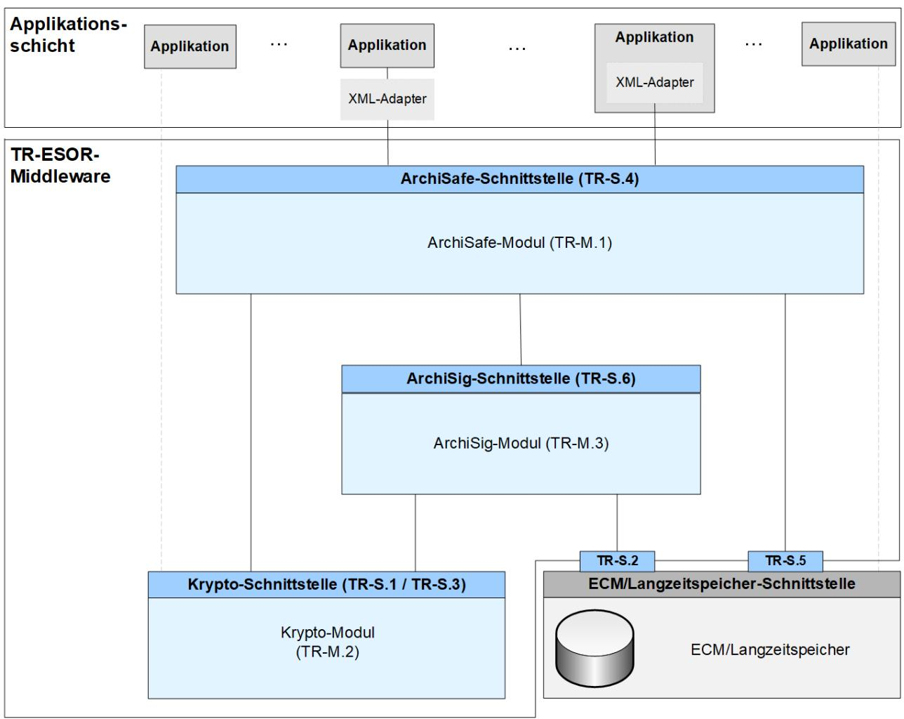
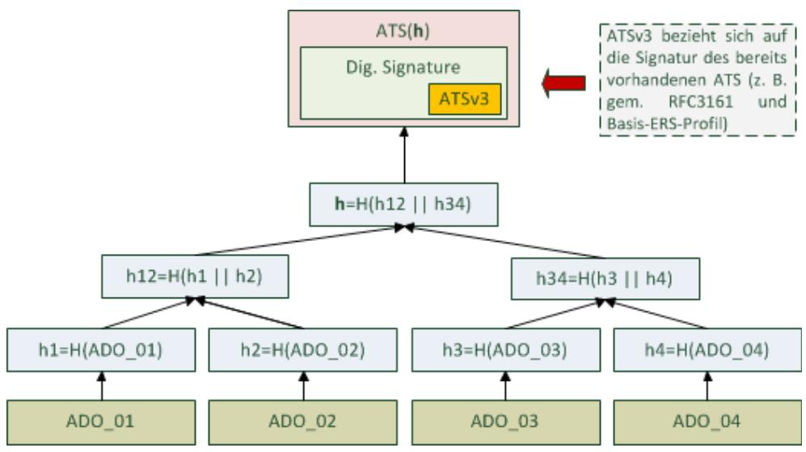
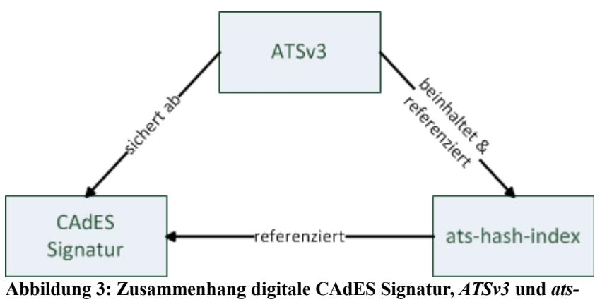

# BSI Technische Richtlinie 03125 Beweiswerterhaltung kryptographisch signierter Dokumente

# **Anlage TR-ESOR-ERS: Profilierung der Evidence Records gemäß RFC4998 und RFC6283 (Konformitätsstufe 2 - technische Konformität)**

| Bezeichnung | Profilierung derEvidence Records gemäß RFC 4998 und RFC 6283 |
|-------------|--------------------------------------------------------------|
|             | (Konformitätsstufe 2 - technische Konformität)               |
| Kürzel      | BSI TR-ESOR-ERS                                              |
| Version     | 1.2.1 (auf Basis der eIDAS-Verordnung)                       |
| Datum       | 15.03.2018                                                   |

Bundesamt für Sicherheit in der Informationstechnik Postfach 20 03 63 53133 Bonn Tel.: +49 228 99 9582-0 E-Mail: [tresor@bsi.bund.de](mailto:tresor@bsi.bund.de) Internet: [https://www.bsi.bund.de](https://www.bsi.bund.de/) © Bundesamt für Sicherheit in der Informationstechnik 2018

# **Inhaltsverzeichnis**

| 1. Einführung                                                                            | 5        |
|------------------------------------------------------------------------------------------|----------|
| 2. Überblick                                                                             | 7        |
| 3. Profilierung des Evidence Record (normativ)                                           | 8        |
| 3.1. Einleitung8                                                                         |          |
| 3.2. Definition des Verpflichtungsgrades8                                                |          |
| 3.3. Strukturen eines Evidence Records gem. dem Basis-ERS-Profil9                        |          |
| 3.3.1. Typ EvidenceRecord                                                                | 9        |
| 3.4. Regeln für den TimeStampToken im ASN.1-Format11                                     |          |
| 3.4.1. Typ TimeStampToken                                                                | 12       |
| 3.4.2. Typ SignedData                                                                    | 12       |
| 3.4.3. Typ SignerInfo                                                                    | 17       |
| 3.4.4. Signierte Attribute (signed attributes)                                           | 19       |
| 3.5. Erzeugen eines Evidence Records21                                                   |          |
| 3.5.1. Behandlung des Archivzeitstempels                                                 | 21       |
| 3.6. Verifikation eines Evidence Records22                                               |          |
| 4. Anhang A: Profil-Überblick (normativ)                                                 | 24       |
| 4.1. Basis-ERS-Profil – Überblick24                                                      |          |
| 5. Anhang B: Anforderungen an die kryptographischen Algorithmen und Parameter (normativ) | 26       |
| 5.1. Erstellung eines Evidence Records gem. Basis-ERS-Profil26                           |          |
| 5.1.1. Hashalgorithmen                                                                   | 26       |
| 5.1.2. Digitale Signaturalgorithmen                                                      | 26       |
| 5.2. Verifikation eines Evidence Records26                                               |          |
| 5.2.1. Hashalgorithmen                                                                   | 27       |
| 5.2.2. Digitale Signaturalgorithmen<br>5.2.3. ESSCertIDv2 und ESSCertID                  | 27<br>28 |
|                                                                                          |          |
| 6. Anhang C: Weitere ERS-Profile (informativ)                                            | 29       |
| 6.1. Struktur eines Evidence Records gem. dem Basis-XERS-Profil29                        |          |
| 6.2. Zeitstempelerneuerung mithilfe eines ATSv3 (nur CMS-basiert)31                      |          |
| 6.2.1. Verwendung von ATSv3<br>6.2.2. Attribut archive-time-stamp-v3 (ATSv3)             | 31<br>32 |
| 6.2.3. Attribut ats-hash-index                                                           | 33       |
| 7. Anhang D Syntaxdefinitionen (informativ)                                              | 36       |
| 7.1. Evidence Records gem. [RFC4998]36                                                   |          |
| 7.1.1. Element EvidenceRecord gem. [RFC4998]                                             | 36       |
| 7.1.2. Element ArchiveTimeStamp gem. [RFC4998]                                           | 36       |
| 7.2. Evidence Records gem. [RFC6283]36                                                   |          |
| 7.2.1. Element <EvidenceRecord> gem. [RFC6283]                                           | 36       |
| 7.2.2. Element <HashTree> gem. [RFC6283]                                                 | 37       |
| 7.2.3. Element <TimeStamp> gem. [RFC6283]                                                | 37       |

# **Abbildungsverzeichnis**

| Abbildung 1: Schematische Darstellung der IT-Referenzarchitektur6             |  |
|-------------------------------------------------------------------------------|--|
| Abbildung 2: Zeitstempelerneuerung mithilfe eines ATSv332                     |  |
| Abbildung 3: Zusammenhang digitale CAdES Signatur, ATSv3 und ats-hash-index34 |  |

# **Tabellenverzeichnis**

| Tabelle 1: Felder des Typs EvidenceRecord10                                                                                         |  |
|-------------------------------------------------------------------------------------------------------------------------------------|--|
| Tabelle 2: Aufbau des Typs ArchiveTimeStampSequence10                                                                               |  |
| Tabelle 3: Aufbau des Typs ArchiveTimeStampChain10                                                                                  |  |
| Tabelle 4: Felder des Typs ArchiveTimeStamp11                                                                                       |  |
| Tabelle 5: Aufbau des Typs PartialHashtree11                                                                                        |  |
| Tabelle 6: Felder des Typs ContentInfo eines TimeStampTokens12                                                                      |  |
| Tabelle 7: Felder des Typs SignedData14                                                                                             |  |
| Tabelle 8: Felder des Typs EncapsulatedContentInfo15                                                                                |  |
| Tabelle 9: Aufbau des Typs CertificateSet (gem. [RFC5652], Kap. 10.2.3)15                                                           |  |
| Tabelle 10: Aufbau des Typs CertificateChoices (gem. [RFC5652], Kap. 10.2.2)16                                                      |  |
| Tabelle 11: Aufbau des Typs RevocationInfoChoices (gem. [RFC5652], Kap. 10.2.1)16                                                   |  |
| Tabelle 12: Aufbau des Typs RevocationInfoChoices (gem. [RFC5652], Kap. 10.2.1)17                                                   |  |
| Tabelle 13: Felder des Typs SignerInfo18                                                                                            |  |
| Tabelle 14: Felder des Typs Attribute gem. [RFC5652]18                                                                              |  |
| Tabelle 15: Auflistung der relevanten signierten Attribute (Zeitstempel gem. [RFC3161])20                                           |  |
| Tabelle 16: Attribut content-type gem. [RFC5652]20                                                                                  |  |
| Tabelle 17: Attribut message-digest gem. [RFC5652]20                                                                                |  |
| Tabelle 18: Attribut signing-certificate-v2 gem. [RFC5035]21                                                                        |  |
| Tabelle 19: Überblick über den Aufbau eines Evidence Records gem. dem Basis-ERS-Profil24                                            |  |
| Tabelle 20: Überblick über den Aufbau eines Zeitstempels gem. dem Basis-ERS-Profil25                                                |  |
| Tabelle 21: Aktuell zugelassene Hashalgorithmen für die Erzeugung technische Beweisdaten<br>(Evidence Records) (Stand 30.09.2014)26 |  |
| Tabelle 22: Aktuell zusätzlich erforderliche Hashalgorithmen für die Verifikation eines Evidence<br>Records (Stand 01.08.2014)27    |  |
| Tabelle 23: Weitere aktuell zu unterstützende digitale Signatur-Suites bei der Prüfung eines Evidence                               |  |
| Records (Stand: 01.08.2014)28                                                                                                       |  |
| Tabelle 24: Der Typ EvidenceRecordType gem. [RFC6283] und Basis-XERS-Profil29                                                       |  |
| Tabelle 25: Der Typ ArchiveTimeStampChainType gem. [RFC6283] und Basis-XERS-Profil30                                                |  |
| Tabelle 26: Der Typ ArchiveTimeStampType gem. [RFC6283] und Basis-XERS-Profil31                                                     |  |
| Tabelle 27: Der Typ TimeStampType gem. [RFC6283] und Basis-XERS-Profil31                                                            |  |
| Tabelle 28: Attribut archive-time-stamp-v3 gem. [ETSI 101733] Kap. 6.4.333                                                          |  |
| Tabelle 29: Aufbau von message imprint eines ATSv333                                                                                |  |
| Tabelle 30: Das Attribut ats-hash-index34                                                                                           |  |
| Tabelle 31: Felder des Typs ATSHashIndex34                                                                                          |  |

# <span id="page-4-0"></span>**1. Einführung**

Ziel der Technischen Richtlinie "Beweiswerterhaltung kryptographisch signierter Dokumente" ist die Spezifikation sicherheitstechnischer Anforderungen für den langfristigen Beweiswerterhalt von kryptographisch signierten elektronischen Dokumenten und Daten nebst zugehörigen elektronischen Verwaltungsdaten (Metadaten).

Eine für diese Zwecke definierte Middleware (TR-ESOR-Middleware) im Sinn dieser Richtlinie umfasst alle diejenigen Module (**M**) und Schnittstellen (**S)**, die zur Sicherung und zum Erhalt der Authentizität und zum Nachweis der Integrität der aufbewahrten Dokumente und Daten eingesetzt werden.

Die im Hauptdokument dieser Technischen Richtlinie vorgestellte Referenzarchitektur besteht aus den nachfolgend beschriebenen funktionalen und logischen Einheiten:

- der Eingangs-Schnittstelle S.4 der TR-ESOR-Middleware, die dazu dient, die TR-ESOR-Middleware in die bestehende IT- und Infrastrukturlandschaft einzubetten;
- dem "ArchiSafe-Modul" (vgl. **[TR-ESOR-M.1]**), welches den Informationsfluss in der Middleware regelt, die Sicherheitsanforderungen an die Schnittstellen zu den IT-Anwendungen umsetzt und für eine Entkopplung von Anwendungssystemen und ECM/Langzeitspeicher sorgt;
- dem "Krypto-Modul" (vgl. **[TR-ESOR-M.2]**) nebst den zugehörigen Schnittstellen S.1 und S.3, das alle erforderlichen Funktionen zur Berechnung von Hashwerten, Prüfung elektronischer Signaturen bzw. Siegel bzw. Zeitstempel, zur Nachprüfung elektronischer Zertifikate und zum Einholen qualifizierter Zeitstempel sowie (optional) elektronischer Signaturen bzw. Siegel für die Middleware zur Verfügung stellt. Darüber hinaus kann es Funktionen zur Ver- und Entschlüsselung von Daten und Dokumenten zur Verfügung stellen;
- dem "ArchiSig-Modul" (vgl. **[TR-ESOR-M.3]**) mit der Schnittstelle S.6, dass die erforderlichen Funktionen für die Beweiswerterhaltung der digital signierten Unterlagen bereitstellt;
- einem ECM/Langzeitspeicher mit den Schnittstellen S.2 und S.5, der die physische Archivierung/Aufbewahrung und auch das Speichern der beweiswerterhaltenden Zusatzdaten übernimmt.

*Dieser ECM/Langzeitspeicher ist nicht mehr direkt Teil der Technischen Richtlinie, gleichwohl werden über die beiden Schnittstellen, die noch Teil der TR-ESOR-Middleware sind, Anforderungen daran gestellt.*

*Ebenso wenig ist die Applikationsschicht, die auch einen XML-Adapter enthalten kann, direkter Teil der Technischen Richtlinie, auch wenn dieser XML-Adapter als Teil einer Middleware implementiert werden kann.*

Die in Abbildung 1 dargestellte IT-Referenzarchitektur orientiert sich an der ArchiSafe[1](#page-4-1) Referenzarchitektur und soll die logische (funktionale) Interoperabilität künftiger Produkte mit den Zielen und Anforderungen der Technischen Richtlinie ermöglichen und unterstützen.

<span id="page-4-1"></span><sup>1</sup>

Siehe dazu [http://www.archisafe.de](http://www.archisafe.de/)



### **Abbildung 1: Schematische Darstellung der IT-Referenzarchitektur**

Diese Technische Richtlinie ist modular aufgebaut und spezifiziert in einzelnen Anlagen zum Hauptdokument die funktionalen und sicherheitstechnischen Anforderungen an die erforderlichen IT-Komponenten und Schnittstellen der TR-ESOR-Middleware. Die Spezifikationen sind strikt plattform-, produkt-, und herstellerunabhängig.

Das vorliegende Dokument trägt die Bezeichnung "Profilierungder Evidence Records gemäß RFC 4998/6283" (auch kurz "Anlage TR-ESOR-ERS" bzw. nur "TR-ESOR-ERS" genannt) und beschreibt die vorgeschriebene Belegung der Felder der gemäß **[RFC4998]** und **[RFC6283]** aufgebauten Evidence Records.

# <span id="page-6-0"></span>**2. Überblick**

Die TR 03125 TR-ESOR stellt ein Konzept für die Beweiswerterhaltung elektronischer Unterlagen durch den Einsatz kryptographisch-signierter Daten und Dokumente bereit.

Wesentliche Grundlagen dieses Konzeptes sind daher u.a. die Erzeugung, Prüfung und Rückgabe technischer Beweisdaten als informationstechnische Umsetzung der Evidence Record[2](#page-6-1) Syntax (kurz: ERS) Standards der IETF (vgl. **[RFC4998]** bzw. **[RFC6283]**[3](#page-6-2) ) sowie die Prüfung und ggf. Erzeugung von beweisrelevanten Daten, z. B. Zeitstempel, elektronischer Signaturen, Siegel, Zertifikaten, Sperrinformationen, etc.

In den folgenden Abschnitten befindet sich die Darstellung der Profilierungen des Evidence Records und der darin enthaltenen beweisrelevanten Daten, insbesondere auch in Bezug auf die Zeitstempelsignatur bzw. -siegel, mit dem **Ziel der nachhaltigen Erhaltung des Beweiswerts und der technischen Konformität und Interoperabilität** zwischen unterschiedlichen TR-ESOR-konformen Systemen.

Um Interoperabilität zu erreichen, wird in diesem Profil nur eine begrenzte Anzahl von möglichen Elementen und Attributen für technische Beweisdaten und beweisrelevante Daten zugelassen bzw. vorgeschrieben, die weithin genutzt werden und als interoperabel anzusehen sind.

Es werden insbesondere zwei Basis-Profile für den Aufbau eines Evidence Records vorgestellt:

- Basis-ERS-Profil ein obligatorisches Profil, das den Aufbau eines ERS gem. **[RFC4998]** regelt (vgl. Kapitel [3\)](#page-7-2),
- Basis-XERS-Profil ein optionales Profil, das den Aufbau eines ERS gem. **[RFC6283]** regelt (vgl. Kapitel [6.1\)](#page-28-0).

### *Hinweis 1:*

*Um die Übersichtlichkeit und Lesbarkeit des Dokumentes besser zu gestalten, wurden an einigen Stellen in diesem Dokument Fragmente anderer Standards und Richtlinien zitiert. Die sich somit ergebende Redundanz wird demnach bewusst gepflegt. Grundsätzlich gilt, dass die Originalquellen einen Vorrang genießen. Die explizit gewünschten Abweichungen von der Originalfassung der Standards werden in der Form von Anforderungen im Dokument definiert und explizit gekennzeichnet.*

### *Hinweis 2:*

*Im folgenden Text umfasst der Begriff "Digitale Signatur" "fortgeschrittene elektronische Signaturen" gemäß [eIDAS-VO, Artikel 3 Nr. 11], "qualifizierte elektronische Signaturen" gemäß [eIDAS-VO, Artikel 3 Nr. 12], "fortgeschrittenen elektronische Siegel" gemäß [eIDAS-VO, Artikel 3 Nr. 26] und "qualifizierte elektronische Siegel" gemäß [eiDAS-VO, Artikel 3 Nr. 27]. Insofern umfasst der Begriff "digital signierte Dokumente" sowohl solche, die fortgeschrittene elektronische Signaturen oder Siegel bzw. qualifizierte elektronische Signaturen oder Siegel tragen.* 

*Mit dem Begriff der "kryptographisch signierten Dokumente" sind in dieser TR neben den gemäß [eI-DAS-VO, Artikel 3 Nr. 12] qualifiziert signierten, den gemäß [eIDAS-VO, Artikel 3 Nr. 27] qualifiziert gesiegelten oder den gemäß [eIDAS-VO, Artikel 3 Nr. 34] qualifiziert zeitgestempelten Dokumenten (im Sinne der eIDAS-Verordnung) ) auch Dokumente mit einer fortgeschrittenen Signatur gemäß [eIDAS-VO, Artikel 3 Nr. 11] oder mit einem fortgeschrittenen Siegel gemäß [eIDAS-VO, Artikel 3 Nr. 26] oder mit einem elektronischen Zeitstempel gemäß [eIDAS-VO, Artikel 3 Nr. 33] erfasst, wie sie oft in der internen Kommunikation von Behörden entstehen. Nicht gemeint sind hier Dokumente mit einfachen Signaturen oder Siegeln basierend auf anderen (z. B. nicht-kryptographischen) Verfahren.*

<span id="page-6-1"></span><sup>2</sup> Hinweis! Der Begriff **Evidence Record** wird im weiteren Verlauf auch mit **ER** abgekürzt.

<span id="page-6-2"></span><sup>3</sup> Hinweis! Die Liste der Quellen wird im Hauptdokument der TR-03125 gepflegt.

# <span id="page-7-2"></span>**3. Profilierung des Evidence Record (normativ)**

# <span id="page-7-1"></span>**3.1. Einleitung**

Der Zweck dieser Spezifikation ist es, ein Interoperabilitätsprofil für die technischen Beweisdaten (Evidence Record) gemäß **[RFC4998]** bzw. **[RFC6283]** zu erstellen, das eine langfristige und weitgehend system- und plattformunabhängige Interpretierbarkeit der Daten und eine Interoperabilität zwischen unterschiedlichen TR-ESOR- Implementierungen unterstützt.

In den folgenden Abschnitten werden die Ausführungen in **[TR-ESOR-F]**, insbesondere in Kapitel 5 "Kryptographische Datenformate", auf Basis

- der "Cryptographic Message Syntax (CMS)" gemäß **[RFC5652]** bzw. vormals **[RFC3852]**,
- des "Time-Stamp Protocol (TSP)" gemäß **[RFC3161]** und **[RFC5816] (**zukünftig **[EN 319 422]**),
- der Langzeit-Signaturprofilefür CMS-basierte digitale Signaturen,

**[ETSI 101733]** (bzw. **[RFC5126]**) bzw. insbesondere das im Durchführungsrechtsakt **[2015/1506/EU]** referenzierte CAdES Baseline Profile **[ETSI 103 173]**, (zukünftig **[ETSI EN 319122-1]** bzw. **[ETSI EN 319122-2] bzw. [ETSI EN 319122-3])**,

- der Evidence Record Syntax Standards **[RFC4998]** und **[RFC6283]** sowie
- des Langzeitsignaturprofils für CMS-basierte digitale Signaturen **[ISO14533-1]** und des Langzeitsignaturprofils für XML-basierte digitale Signaturen **[ISO14533-2]** weiter verfeinert.

Die in **[TR-ESOR-F]** formulierten Anforderungen werden dabei als bekannt vorausgesetzt und ggf. bedarfsgerecht ergänzt.

Die Syntax der Evidence Records gemäß **[RFC4998]** und **[RFC6283]** ist im Kapitel [7](#page-35-5) - Anhang D skizziert worden.

In den folgenden Kapiteln wird zunächst die Struktur des Basis-ERS-Profils eines Evidence Records gem. **[RFC4998]** vorgestellt (vgl. Kap. [3.3,](#page-8-1) [3.4\)](#page-10-0) und beschrieben sowie grundsätzliche Aussagen zur Erstellung und Prüfung von Evidence Records getroffen (vgl. Kap. [3.5](#page-20-1) und [3.6\)](#page-21-0).

# <span id="page-7-0"></span>**3.2. Definition des Verpflichtungsgrades**

Der Grad der Verpflichtung (VG) der einzelnen Elemente wird durch die folgenden Symbole gekennzeichnet:

- V verpflichtend,
- O optional,
- B bedingt.

**(A3.2-1)** Elemente, deren Verpflichtungsgrad "*V – verpflichtend"* ist, müssen in einem Evidence Record gemäß diesem Profil wie vorgegeben implementiert sein. Wenn dieses Element optionale Unterelemente hat, so muss mindestens eines dieser Unterelemente umgesetzt sein.

**(A3.2-2)** Sofern bei der Erzeugung oder Verifikation eines Evidence Records die technische Konformität und Interoperabilität der *Konformitätsstufe 2* nachgewiesen werden soll, muss dieses auf Basis der in diesem Dokument beschriebenen Profilierung "Basis-ERS-Profil" und "Basis-XERS-Profil" umgesetzt werden.

Dabei ist die Erzeugung und Verifizierung eines Evidence Records gem. **[RFC4998]** konform

zum nachstehenden Basis-ERS-Profile aufgebaut, wenn:

 die Verarbeitung aller Elemente des Evidence Records, dessen erforderlicher Grad der Verpflichtung im Basis-ERS-Profil "*V – verpflichtend*" ist, so durchgeführt wird, wie es nachfolgend in Kapitel [3.3](#page-8-1) und Kapitel [3.4](#page-10-0) vorgegeben ist.

Dabei ist die Erzeugung und Verifizierung eines Evidence Records gem. **[RFC6283]** konform zum nachstehenden Basis-XERS-Profile aufgebaut, wenn:

- die Verarbeitung aller Elemente des Evidence Records, dessen erforderlicher Grad der Verpflichtung im Basis-XERS-Profil "*V – verpflichtend*" ist, so durchgeführt wird, wie es nachfolgend in Kapitel [6.1](#page-28-0) und Kapitel [3.4](#page-10-0) vorgegeben ist.
- Insbesondere beinhalten alle im Evidence Record enthaltenen Instanzen des Elementes *TimeStampToken* einen gem. dem Basis-ERS-Profil aufgebauten Zeitstempeltoken (vgl. Kapitel [3.4\)](#page-10-0)

# <span id="page-8-1"></span>**3.3. Strukturen eines Evidence Records gem. dem Basis-ERS-Profil**

Eine grundlegende Einführung zum "Beweisdatenbericht" (Evidence Record) auf Basis von **[RFC4998]** bzw. **[RFC6283]** befindet sich in **[TR-ESOR-F]**, Kap. 5.5.

Die folgenden Unterkapitel stellen ergänzend dazu dar:

- die benötigten Datenstrukturen für den Beweisdatenbericht,
- den Verpflichtungsgrad der darin enthaltenen Felder, Elemente und/oder Attribute sowie
- den Bezug zu den zugrunde liegenden Standards und machen
- z. T. Vorgaben für den Inhalt der Felder, Elemente und/oder Attribute.

## <span id="page-8-0"></span>**3.3.1. Typ EvidenceRecord**

Die grundlegenden Beschreibungen der Felder des Typs *Evidence Records* sind dem Anhang **[TR-ESOR-F]**, Kapitel 5.5.1 zu entnehmen. Der folgende Text definiert noch darüber hinaus gehende Beschreibungen oder Belegungen der Felder.

Der Typ *EvidenceRecord* gem. **[RFC4998]** besteht aus drei verpflichtenden und zwei optionalen Feldern (vgl. Tabelle 1), für die in diesem Profil Folgendes gilt:

| Feld                             | Typ                                | VG   | Referenz                                                  |
|----------------------------------|------------------------------------|------|-----------------------------------------------------------|
| EvidenceRecord ::<br>=SEQUENCE { |                                    |      |                                                           |
| version                          | INTEGER                            | V(a) | [RFC4998], Kapitel 3.1                                    |
| digestAlgorithms                 | SEQUENCE OF<br>AlgorithmIdentifier | V    | [RFC4998], Kapitel 3.1,<br>dieses Dokument, Kapitel 5.1.1 |
| cryptoInfos                      | CryptoInfos                        | O(b) | [RFC4998], Kapitel 3.1                                    |
| encryptionInfo                   | EncryptionInfo                     | O(c) | [RFC4998], Kapitel 3.1                                    |
| archiveTimeStampSequence         | ArchiveTimeStampSequence           | V    | [RFC4998], Kapitel 3.1                                    |
| }                                |                                    |      |                                                           |
|                                  |                                    |      |                                                           |

Anforderungen **(A3.3-1)**:

(a) – Das Feld *version* muss aktuell gem. **[RFC4998]**, Kap. 3.1 auf "1" gesetzt werden.

(b) – Das Feld *cryptoInfos* soll im Rahmen des Basis-ERS-Profils nicht vorhanden.

| Feld | Typ | VG | Referenz |
|------|-----|----|----------|
|      |     |    |          |

(c) – Das Feld *encryptionInfo* soll im Rahmen des Basis-ERS-Profils nicht vorhanden sein.

**Tabelle 1: Felder des Typs** *EvidenceRecord*

### **3.3.1.1. Typ ArchiveTimeStampSequence und Typ ArchiveTimeStampChain**

Es gelten die folgenden Festlegungen (vgl. Tabelle 2 und 3).

| Typ                      | Subtyp                               | VG      | Referenz               |
|--------------------------|--------------------------------------|---------|------------------------|
| ArchiveTimeStampSequence | SEQUENCE OF<br>ArchiveTimeStampChain | V(a)(b) | [RFC4998], Kapitel 5.1 |

### Anforderungen **(A3.3-2)**:

(a) – Dieses Feld *ArchiveTimeStampSequence* muss mindestens ein Feld vom Typ *ArchiveTimeStampChain* enthalten*,*

(b) – Die Felder vom Typ *ArchiveTimeStampChain* im Feld *ArchiveTimeStampSequence* sind aufsteigend nach dem Zeitpunkt der beinhalteten Zeitstempel zu sortieren[4](#page-9-0) .

| Typ                   | Subtyp                          | VG      | Referenz               |
|-----------------------|---------------------------------|---------|------------------------|
| ArchiveTimeStampChain | SEQUENCE OF<br>ArchiveTimeStamp | V(a)(b) | [RFC4998], Kapitel 5.1 |

Anforderungen **(A3.3-3)**:

- (a) Das Feld *ArchiveTimeStampChain* muss mindestens ein Feld vom Typ *ArchiveTimeStamp* enthalten.
- (b) Die Felder *ArchiveTimeStamp* im Feld *ArchiveTimeStampChain* sind aufsteigend nach dem Zeitpunkt der beinhalteten abschließenden Zeitstempel zu sortieren.

**Tabelle 3: Aufbau des Typs** *ArchiveTimeStampChain*

### **3.3.1.2. Typ ArchiveTimeStamp und Typ PartialHashtree**

Der Typ *ArchiveTimeStamp* beinhaltet drei optionale und ein verpflichtendes Feld (vgl. **[RFC4998]**, Kapitel 4.1 und Tabelle 4).

Darüber hinaus gelten die folgenden Anforderungen:

| Feld                                | Typ                            | VG   | Referenz                                                  |
|-------------------------------------|--------------------------------|------|-----------------------------------------------------------|
| ArchiveTimeStamp :: =<br>SEQUENCE { |                                |      |                                                           |
| digestAlgorithm                     | AlgorithmIdentifier            | O(a) | [RFC4998], Kapitel 4.1,<br>dieses Dokument, Kapitel 5.1.1 |
| attributes                          | Attributes                     | O(b) | [RFC4998], Kapitel 4.1                                    |
| reducedHashtree                     | SEQUENCE OF<br>PartialHashtree | O(c) | [RFC4998], Kapitel 4.1                                    |
| timeStamp                           | ContentInfo                    | V(d) | [RFC4998], Kapitel 4.1                                    |

<span id="page-9-0"></span><sup>4</sup> Es muss der im **[RFC4998]**, Kap. 5.1 beschriebene Sortieralgorithmus beachtet werden.

| Typ                                                                                                                                                                                                                                   | VG | Referenz |  |
|---------------------------------------------------------------------------------------------------------------------------------------------------------------------------------------------------------------------------------------|----|----------|--|
|                                                                                                                                                                                                                                       |    |          |  |
| Anforderungen (A3.3.-4):                                                                                                                                                                                                              |    |          |  |
| (a) – Wenn dieses Feld digestAlgorithm fehlt, dann muss der Digest-Algorithmus des Zeitstempels<br>timeStamp benutzt werden. (vgl. [RFC4998], Kapitel 4.1)                                                                            |    |          |  |
| (b) – Dieses Feld attributes<br>soll im Rahmen dieses Profils nicht vorhanden sein .                                                                                                                                                  |    |          |  |
| (c) – Alle Vorkommen von reducedHashtree innerhalb der einzelnen Elemente vom Typ<br>ArchiveTimeStamp einer Archivzeitstempelkette ArchiveTimeStampChain müssen den<br>gleichen Hashalgorithmus verwenden (vgl. [RFC4998], Kap. 5.1). |    |          |  |
|                                                                                                                                                                                                                                       |    |          |  |

(d) – Dieses Feld *timeStamp* muss den Anforderungen an einen Zeitstempeltoken gemäß **[RFC3161]** genügen.

Tabelle 4: Felder des Typs *ArchiveTimeStamp*

### Grundsätzlich gilt dabei:

*reducedHashtree* [optional]:

Das Feld *reducedHashtree* besteht aus einer oder mehreren Listen der Hashwerte, die jeweils einen partiellen Hashbaum repräsentieren. Dieser kann soweit reduziert sein, dass er nur noch die Hashwerte enthält, die für die Verifikation eines einzigen Datenobjektes erforderlich sind. Ein solcher *reducedHashtree* kann dazu genutzt werden, den Zeitstempel *timestamp* des *ArchiveTimeStamp* und die geschützten Datenobjekte zu verbinden. Falls das optionale Feld reducedHashtree nicht vorhanden ist, dann bezieht sich der Zeitstempel des ArchiveTimeStamps auf ein einziges Datenobjekt bzw. eine einzige Datenobjektgruppe, das bzw. die entweder ein originäres signiertes Datenobjekt darstellt oder ein vorausgegangener Zeitstempel ist.

Ein Feld vom Typ *PartialHahstree* beinhaltet eine Sequenz von Ketten der binären Daten (vgl. Tabelle 5).

| Typ             | Subtyp                      | VG   | Referenz               |
|-----------------|-----------------------------|------|------------------------|
| PartialHashtree | SEQUENCE OF OCTET<br>STRING | V(a) | [RFC4998], Kapitel 4.1 |

Bemerkungen:

(a) – Dieses Feld beinhaltet einen oder mehrere in Form von binären Daten abgelegte(n) Hashwert(e), die in einer Sequenz abgelegt sind. Die einzelnen Sequenzelemente werden im Zuge der Erstellung des reduzierten Hashbaums (vgl. **[RFC4998]**, Kap. 4.2) erstellt.

**Tabelle 5: Aufbau des Typs** *PartialHashtree*

## <span id="page-10-0"></span>**3.4. Regeln für den** *TimeStampToken* **im ASN.1-Format**

Dieses Kapitel ist in vier Abschnitte unterteilt. In Anlehnung an **[RFC5652]** und **[ETSI 101733]** beschreibt dieses Kapitel im ersten Teil allgemeine Eigenschaften des *TimeStampTokens[5](#page-10-1)* , im zweiten Teil den Typ *SignedData*, im dritten Teil den Typ *SignerInfo* und im letzten Teil den Typ *SignedAttribute*.

Dabei gilt grundsätzlich das Folgende:

 die Wertebelegung der Elemente des *TimeStampToken* im ASN.1-Format erfolgt in diesem Profil in Anlehnung an **[COMMON PKI]**, Part 3. Abweichungen oder Verfeinerungen

<span id="page-10-1"></span><sup>5</sup> Vgl. **[RFC3161]** bzw. **[TR-ESOR-F]**, Kap. 5.5.1.

werden dabei im folgenden Text als weitere Anforderungen in den jeweiligen Tabellen dargestellt.

### <span id="page-11-1"></span>**3.4.1.** Typ *TimeStampToken*

Der Typ *ContentInfo* beinhaltet zwei Elemente und stellt grundsätzlich einen universellen (abstrakten) Behälter für die Inhaltsdaten dar.

Grundsätzlich gilt daher:

*contentType* [verpflichtend]

Das Element *contentType* beinhaltet eine OID des Datentyps, der in *content* als "associated and protected object" (vgl. **[COMMON PKI]**, Kap. 3.1) enthalten ist.

*content* [verpflichtend]

Das Element beinhaltet ein "associated and protected object", z. B. eine CMS-Signatur (vgl. **[RFC3852]**), die um die der Beweiskrafterhaltung dienenden Aspekte erweitert wird, wie z. B. Zertifikate oder Sperrlisten etc.

Im vorliegenden Profil gelten darüber hinaus die folgenden Anforderungen und Festlegungen:

| Feld                           | Typ         | VG   | Referenz                                                                                         |
|--------------------------------|-------------|------|--------------------------------------------------------------------------------------------------|
| ContentInfo :: =<br>SEQUENCE { |             |      |                                                                                                  |
| contentType                    | ContentType | V(a) | [RFC5652] Kapitel 5.1,<br>[ETSI 101733], Kapitel 4.3.1,<br>Kapitel 5.3<br>[RFC4998], Kapitel 4.1 |
| content                        | SignedData  | V(b) | [RFC5652], Kapitel 5.1<br>[ETSI 101733], Kapitel 5.4                                             |
| }                              |             |      |                                                                                                  |

Anforderungen **(A3.4-2)**:

(a) – Diese OID für den *contentType* von *SignedData* muss "1.2.840.113549.1.7.2" lauten.

(b) – Die in diesem Anwendungsfall zur Geltung kommende Ausprägung des Behälters muss der Typ *SignedData* (vgl. **[RFC3161]**, Kapitel 2.4.2, Seite 7) sein.

**Tabelle 6: Felder des Typs** *ContentInfo* **eines** *TimeStampTokens* 

## <span id="page-11-0"></span>**3.4.2. Typ** *SignedData*

Der Typ *SignedData* beinhaltet sechs Felder (vgl. **[RFC5652]**, Kapitel 5.1), die alle im Rahmen dieses Profils verpflichtend sind. Dies weicht von den zitierten internationalen Standards ab, in denen die Felder *certificates* und *crls* nicht verpflichtend sind[6](#page-11-2) . Grundsätzlich gilt Folgendes:

*version* [verpflichtend]

*Der Wert dieses Elementes bestimmt die zugrunde liegende Syntax-Version von diesem SignedData-Element* 

<span id="page-11-2"></span><sup>6</sup> Im Rahmen dieses Profils dienen die beiden Felder der Ablage der vollständigen Prüfinformationen (Sperrmaterial, Zertifikate), die eine erfolgreiche Verifikation der digitalen Signatur ermöglichen (vgl. LT-Level-Konformitätsstufe gem. **[ETSI EN 319122-2]**).

```
digestAlgorithms [verpflichtend]
```
In diesem Element wird eine Sammlung von Kennungen der Hashalgorithmen abgelegt, die für die Hashwertberechnung des zu signierenden Objektes benutzt werden.

*encapContentInfo* [verpflichtend]

Spezifiziert und enthält ggf. den zu schützenden (zu unterschreibenden) Inhalt. (vgl. auch **[RFC5652]**, Kap. 5.2)

*certificates* [verpflichtend][7](#page-12-0)

Eine Möglichkeit der Ablage der Zertifikate, die für die Verifikation der digitalen Signaturen benutzt werden.

*crls* [verpflichtend][8](#page-12-1)

Eine Möglichkeit der Ablage der Sperrinformation für die vollständige Verifikation der digitalen Signaturen.

*signerInfos* [verpflichtend]

Eine Sammlung von Daten bzgl. des Signierenden zusammen mit seiner digitalen Signatur[9](#page-12-2) .

Im Rahmen dieses Profils werden dabei die folgenden Festlegungen getroffen:

| Feld                         | Typ                        | VG                    | Referenz                                                                              |
|------------------------------|----------------------------|-----------------------|---------------------------------------------------------------------------------------|
| SignedData:: =<br>SEQUENCE { |                            |                       |                                                                                       |
| version                      | CMSVersion                 | V(a)                  | [RFC5652], Kapitel 5.1<br>[ETSI 101733], Kapitel 5.4                                  |
| digestAlgorithms             | DigestAlgorithmidentifiers | V                     | [RFC5652], Kapitel 5.1<br>[ETSI 101733], Kapitel 5.4<br>dieses Dokument, Kap. 5.1.1   |
| encapContentInfo             | EncapsulatedContentInfo    | V                     | [RFC5652], Kapitel 5.1<br>[ETSI 101733], Kapitel 5.4                                  |
| certificates                 | CertificateSet             | Hier:<br>V(b) (c) (f) | [RFC5652], Kapitel 5.1<br>[ETSI 103173], Kapitel 8.1<br>[ETSI EN 319122-2], Kap. 8.1  |
| crls                         | RevocationInfoChoices      | Hier:<br>V(d)(f)      | [RFC5652], Kapitel 5.1<br>[ETSI 103173], Kapitel 8.2,<br>[ETSI EN 319122-2], Kap. 8.2 |
| signerInfos                  | SignerInfos                | V(e)                  | [RFC5652], Kapitel 5.1<br>[ETSI 101733], Kapitel 5.4                                  |
| }                            |                            |                       |                                                                                       |

Anforderungen (**A3.4-3**):

(a) – Der Wert in dem Feld *version* muss "3" gem. **[COMMON PKI]**, Part 3 sein.

(b) – Im Rahmen dieses Profil müssen innerhalb des Feldes *certificates* die verwendeten Zertifikate

<span id="page-12-0"></span><sup>7</sup> Abweichend von den zitierten internationalen Standards ist dieses Element hier verpflichtend.

<span id="page-12-1"></span><sup>8</sup> Abweichend von den zitierten internationalen Standards ist dieses Element hier verpflichtend.

<span id="page-12-2"></span><sup>9</sup> Vgl. **[COMMON PKI]**, Part 3

| Feld | Typ | VG | Referenz |
|------|-----|----|----------|
|      |     |    |          |

inkl. des vollständigen Zertifikatspfads inklusive der vertrauenswürdigen Wurzelzertifikate abgelegt werden.

- (c) Hinweis! Die Referenz auf das Signatur- bzw. Siegelzertifikat muss im Feld *signerInfo* im signierten Attribut *SigningCertificateReference* zusätzlich beigelegt werden.[10](#page-13-0)
- (d) Im Rahmen dieses Profils muss die vollständige Sperrinformation, benötigt für die Prüfung der digitalen Signatur, in dem Feld *crls* abgelegt werden. Primär handelt sich dabei um Sperrlisten (CRLs) und/oder OSCP-Antworten.[11](#page-13-1)
- (e) Das Feld *signerInfos* darf gem. **[RFC3161]** nur eine Instanz beinhalten.
- (f) Abweichend von den zitierten internationalen Standards sind die Felder *certificates* und *crls* in diesem Profil verpflichtend.

**Tabelle 7: Felder des Typs** *SignedData*

### **3.4.2.1. Typ EncapsulatedContentInfo**

Das Elemente *encapContentInfo* vom Typ EncapsulatedContentInfo beschreibt den Inhalt, der im Rahmen der Signatur- bzw. Siegelbildung zu verhashen ist. Das Feld besteht aus einem Identifier *eContentType* und dem Inhalt *eContent* selbst.

### Dabei gilt es:

e*ContentType* [verpflichtend]

Das Element *eContentType* ist ein Objekt-Identifikator, der eine OID des Datentyps beinhaltet, der in *eContent* abgelegt ist und im Rahmen der digitalen Signatur zu hashen ist (vgl.

**[COMMON PKI]**, Kap. 3.1).

*eContent* [verpflichtend][12](#page-13-2)

In diesem Profil beinhaltet das Feld aber stets eine DER-kodierte Instanz der Datenstruktur *TSTInfo* (vgl. **[RFC3161],** Kap. 2.4.2). Dabei enthält das Attribut "*messageImprint*" im *TSTInfo* generell eine Hash-Algorithmus OID (vgl. hashAlgorithm in **[RFC3161]**) und den Hashwert der Daten (vgl. *hashedMessage* in **[RFC3161]**), die zeitgestempelt werden sollen.

Das Elementes *encapContentInfo* muss der in der Tabelle 8 vorgestellten Struktur entsprechen (vgl. **[RFC3161]** Kap. 2.4.2).

| Feld         | Typ          | VG      | Referenz                                             |
|--------------|--------------|---------|------------------------------------------------------|
| eContentType | ContentType  | V(a)    | [RFC5652], Kapitel 5.2<br>[ETSI 101733], Kapitel 5.5 |
| eContent     | OCTET STRING | V(b)(c) | [RFC5652], Kapitel 5.2<br>[ETSI 101733], Kapitel 5.5 |

### Anforderungen **(A3.4-4)**:

(a) – Der Wert dieses Feldes *eContentType* ist konstant und muss "1.2.840.113549.1.9.16.1.4" (*idct-TSTInfo,* vgl. **[RFC3161],** Kap. 2.4.2) lauten.

(b) – laut **[RFC5652]** ist dieses Feld *eContent* optional. Im vorliegenden Fall eines Zeitstempels muss dieses Feld (vgl. **[RFC3161],** Kap. 2.4.2) vorhanden sein.

<span id="page-13-0"></span><sup>10</sup> Siehe auch **[TR-ESOR-F]**, Kap. 5.1.1

<span id="page-13-1"></span><sup>11</sup> Siehe auch **[TR-ESOR-F]**, Kap. 5.1.1

<span id="page-13-2"></span><sup>12</sup>Abweichend von den zitierten internationalen Standards ist dieses Element hier verpflichtend.

| Feld | Typ | VG | Referenz |
|------|-----|----|----------|
|      |     |    |          |

<sup>(</sup>c) – Dieses Feld *eContent* muss hier eine DER-kodierte Instanz der Datenstruktur *TSTInfo* (vgl. **[RFC3161],** Kap. 2.4.2) beinhalten. Dabei gilt:

Falls der Evidence Record im *initialArchiveTimeStamp* einen *reducedHashtree* enthält, muss im Attribut *hashedMessage* des *TSTInfo.messageImprint* der *DER-kodierte "root hash value" des reducedHashtrees* enthalten sein. Der Hashwert wird vom Inhalt des OCTET STRINGs ohne umschließende Tags und Länge des OCTET STRINGs übernommen.

Andernfalls muss im Fall eines *initialArchiveTimeStamp* im Attribut *hashedMessage* des *TSTInfo.messageImprint,* wie bei einem normalen Zeitstempel, mindestens der DER-kodierte Hashwert **der zeitzustempelnden Daten** eines Datenobjektes enthalten sein. Der Hashwert wird vom Inhalt des OCTET STRINGs ohne umschließende Tags und Länge des OCTET STRINGs verwendet.

Im Fall der Zeitstempelerneuerung muss im Attribut *hashedMessage* des TSTInfo.messageImprint der Hashwert des Elements *timeStamp des alten Archivzeitstempels* gespeichert sein. Der Hashwert wird vom Inhalt des OCTET STRINGs ohne umschließende Tags und Länge des OCTET STRINGs verwendet.

Im Fall der Hashbaumerneuerung muss hier im Attribut hashedMessage des *TSTInfo.messageImprint* der *DER-kodierte "root hash value" des neu erzeugten reducedHashtrees* gespeichert sein.

### **Tabelle 8: Felder des Typs** *EncapsulatedContentInfo*

### **3.4.2.2. Typ CertificateSet und Typ RevocationInfoChoices**

Ein Element *certificates* vom Typ *CertificateSet* besteht aus einer nicht leeren Menge von Elementen des Typs *CertificateChoices*.

| Subtyp                    | VG   | Referenz                  |
|---------------------------|------|---------------------------|
| SET OF CertificateChoices | V(a) | [RFC5652], Kapitel 10.2.3 |
|                           |      |                           |

Anforderungen **(A3.4-5)**:

(a) – Dieses Feld CertificateSet muss zumindest ein Element vom Typ *CertificateChoices*  enthalten.

### **Tabelle 9: Aufbau des Typs** *CertificateSet* **(gem. [RFC5652], Kap. 10.2.3)**

Der Typ *CertificateChoices* spezifiziert eine Auswahl aus 5 unterschiedlichen zur Verfügung stehenden Elementen (vgl. Tabelle 10).

| Feld                               | Typ                    | VG   | Referenz                  |
|------------------------------------|------------------------|------|---------------------------|
| CertificateChoices ::<br>=CHOICE { |                        |      |                           |
| certificate                        | Certificate            | V(a) | [RFC5652], Kapitel 10.2.2 |
| extendedCertificate                | ExtendedCertificate    | B(x) | [RFC5652], Kapitel 10.2.2 |
| v1AttrCert                         | AttributeCertificateV1 | B(x) | [RFC5652], Kapitel 10.2.2 |
| v2AttrCert                         | AttributeCertificateV2 | B(y) | [RFC5652], Kapitel 10.2.2 |
| other                              | OtherCertificateFormat | B(y) | [RFC5652], Kapitel 10.2.2 |
| }                                  |                        |      |                           |

| Feld                                                                                                                                          | Typ | VG | Referenz |  |
|-----------------------------------------------------------------------------------------------------------------------------------------------|-----|----|----------|--|
| Anforderungen (A3.4-6):                                                                                                                       |     |    |          |  |
| (a) – Im vorliegenden Profil muss<br>certificate vom Typ Certificate genutzt werden.                                                          |     |    |          |  |
| Bemerkungen:                                                                                                                                  |     |    |          |  |
| (x) – diese Daten sind gem. [RFC5652], Kap. 10.2.2 bereits obsolet und werden deshalb im Rahmen<br>dieser Profilierung nicht weiter verfolgt. |     |    |          |  |
| (y) – werden im Rahmen dieser Profilierung nicht unterstützt.                                                                                 |     |    |          |  |
| Tabelle 10: Aufbau des Typs CertificateChoices (gem. [RFC5652], Kap. 10.2.2)                                                                  |     |    |          |  |

*certificate* [verbindlich]

Enthält ein X.509-v3-Zertifikat (vgl. **[RFC5280]**, Kap. 3.1 und 4 sowie ggf. **[RFC6818]**).

Ein Element *crls* vom Typ *RevocationInfoChoices* besteht aus einer nicht leeren Menge von Elementen des Typs *RevocationInfoChoice* (vgl. Tabelle 11).

| Typ                                                                              | Subtyp                      | VG   | Referenz                  |  |
|----------------------------------------------------------------------------------|-----------------------------|------|---------------------------|--|
| RevocationInfoChoices                                                            | SET OF RevocationInfoChoice | V(a) | [RFC5652], Kapitel 10.2.1 |  |
| Anforderungen (A3.4-7):                                                          |                             |      |                           |  |
| (a) – Dieses Feld RevocationInfoChoices<br>muss<br>zumindest ein Element vom Typ |                             |      |                           |  |
| RevocationInfoChoice enthalten.                                                  |                             |      |                           |  |

**Tabelle 11: Aufbau des Typs** *RevocationInfoChoices* **(gem. [RFC5652], Kap. 10.2.1)**

Der Typ *RevocationInfoChoice* stellt eine Auswahl von einem aus 2 zur Verfügung stehenden Elementen (vgl. Tabelle 12) zur Verfügung.

*crl* [bedingt]

*ist Speicherplatz für die Sperrliste (CRL gem. [RFC5280], Kapitel 5).*

*other* [bedingt]

Enthält sonstige Sperrinformationen, insbesondere eine OCSP-Antwort gem. **[RFC2560]**, Kapitel 4.2.

| Typ                                  | Subtyp                    | VG         | Referenz                  |
|--------------------------------------|---------------------------|------------|---------------------------|
| RevocationInfoChoice ::<br>=CHOICE { |                           |            |                           |
| crl                                  | CertificateList           | B(a)       | [RFC5652], Kapitel 10.2.1 |
| other                                | OtherRevocationInfoFormat | B(b)(c)(a) | [RFC5652], Kapitel 10.2.1 |
| }                                    |                           |            |                           |

Anforderungen **(A3.4-8)**:

(a) – Zertifikatssperrlisten X.509 Certificate Revocation Lists (CRLs) sind eine oft genutzte Quelle für Sperrstatusinformationen. Sofern für das zu prüfende Zertifikat sowohl Sperrinformationen in Form von CRLs als auch OCSP-Responses vorliegen, sollen hier OCSP-Responses verwendet werden (vgl. **[TR-ESOR-F]**, Fußnote 20).

(b) – Wenn OCSP-Auskünfte genutzt werden, muss das Attribut *otherRevInfoFormat* die OID *idpkix-ocsp-basic* mit dem Wert "1.3.6.1.5.5.7.48.1.1" beinhalten und das Element *otherRevInfo* muss *BasicOCSPResponse* enthalten.

| Typ                                                                                       | Subtyp | VG | Referenz |  |
|-------------------------------------------------------------------------------------------|--------|----|----------|--|
| (c) – BasicOCSPResponse gemäß [RFC2560]<br>muss mindestens ein OCSP signer certificate in |        |    |          |  |

*BasicOCSPResponse.certs* enthalten. Bezogen auf das Feld *ResponderID* soll die Auswahl *byName* genutzt werden.

(d) – Der *SingleResponse.singleExtensions* enthält *CertHash*, das in **[Common PKI]**, Part 4 und Part 9 definiert ist.

**Tabelle 12: Aufbau des Typs** *RevocationInfoChoices* **(gem. [RFC5652], Kap. 10.2.1)**

## <span id="page-16-0"></span>**3.4.3. Typ** *SignerInfo*

Der Typ *SignerInfo* ist in **[RFC5652]**, im Kapitel 5.3 festgelegt.

Es gilt im Allgemeinen:

*version* [verpflichtend]

Der Wert dieses Elements beschreibt die zugrunde liegende Version der Syntax.

*sid* [verpflichtend]

Spezifiziert das Signatur- bzw. Siegel-Zertifikat (signer's certificate) und damit den dabei verwendeten öffentlichen Schlüssel, der für die Verifikation der digitalen Signatur erforderlich ist.

```
digestAlgorithm [verpflichtend]
```
Beinhaltet die Kennung (ggf. auch zusätzliche Parameter) des Hashalgorithmus und wird benutzt für die Berechnung des sog. *message digests*.

*signedAttrs* [verpflichtend]

Dieses Element beherbergt eine Sammlung von Attributen, die mit signiert wurden (zu beachten ist insbesondere Bemerkung (e) in der Tabelle 13).

```
signatureAlgorithm [verpflichtend]
```
Mithilfe dieses Elements wird die Kennung des benutzten digitalen Signaturalgorithmus (ggf. mit zusätzlichen Parametern) beschrieben.

```
signatureValue [verpflichtend]
```
Innerhalb vom diesem Element wird das Ergebnis der Anwendung des privaten Schlüssels auf den berechneten *message digest*, vorgegeben durch den Inhalt des Elements *signatureAlgorithm*.

```
unsignedAttrs [optional]
```
Dieses Element beinhaltet die Sammlung von Attributen, die nicht signiert wurden (insbesondere ist die Bemerkung (f) in der Tabelle 13 zu beachten).

Im Rahmen dieser Profilierung werden folgende Festlegungen getroffen:

| Feld                          | Typ              | VG   | Referenz                                                                           |
|-------------------------------|------------------|------|------------------------------------------------------------------------------------|
| SignerInfo :: =<br>SEQUENCE { |                  |      |                                                                                    |
| version                       | CMSVersion       | V(a) | [RFC5652], Kapitel 5.3<br>[ETSI 101733], Kapitel 5.6<br>[COMMON PKI], Part 3       |
| sid                           | SignerIdentifier | V(b) | [RFC5652], Kapitel 5.3<br>[ETSI 101733], Kapitel 5.6<br>[COMMON PKI], Part 3, T. 4 |

| Feld               | Typ                          | VG       | Referenz                                                                            |
|--------------------|------------------------------|----------|-------------------------------------------------------------------------------------|
| digestAlgorithm    | DigestAlgorithIdentifier     | V(c)     | [RFC5652], Kapitel 5.3<br>[ETSI 101733], Kapitel 5.6<br>dieses Dokument, Kap. 5.1.1 |
| signedAttrs        | SignedAttributes             | V(d) (e) | [RFC5652], Kapitel 5.3<br>[ETSI 101733], Kapitel 5.6                                |
| signatureAlgorithm | SignatureAlgorithmIdentifier | V        | [RFC5652], Kapitel 5.3<br>[ETSI 101733], Kapitel 5.6                                |
| signatureValue     | SignatureValue               | V        | [RFC5652], Kapitel 5.3<br>[ETSI 101733], Kapitel 5.6                                |
| unsignedAttrs      | UnsignedAttributes           | O(f)     | [RFC5652], Kapitel 5.3<br>[ETSI 101733], Kapitel 5.6                                |
| }                  |                              |          |                                                                                     |

### Anforderungen **(A3.4-9)**:

- (a) Das Feld *version* muss den Wert "1" gem. **[COMMON PKI]**, Part 3 enthalten.
- (b) Im Feld *sid* innerhalb von diesem Profil muss die gem. **[COMMON PKI]**, Part 3 geforderte *issuerAndSerialNumber* benutzt werden.
- (c) Der im Feld *digestAlgorithm* angegebene Wert muss mit einem der Werte in dem Feld *SignedData.digestAlgorithms* übereinstimmen.
- (d) Gem. **[RFC5652]** ist dieses Feld *signedAttrs* optional, gem. **[RFC3161]** muss dieses Feld aber das *SigningCertificate*- bzw. *SigningCertificateV2*-Attribut beinhalten und wird daher verpflichtend. Im Rahmen dieses Profils muss das *SigningCertificateV2*-Attribut (vgl. **[RFC5035]**) verwendet werden.
- (e) Das Feld *signedAttrs* ist ein Set von Attributen, das signiert wird und DER-kodiert sein muss.
- (f) Das Feld *unsignedAttrs* ist gem. **[RFC5652]** optional, es soll aber im Rahmen dieses Profils bei der Erzeugung eines *TimeStampToken* nicht benutzt werden.

**Tabelle 13: Felder des Typs** *SignerInfo*

Der Typ *SignedAttributes* bzw. *UnsignedAttributes* ist in **[RFC5652]** im Kapitel 5.3 vorgegeben, und besteht jeweils aus zwei verpflichtenden Feldern (vgl. Tabelle 14).

| Feld                       | Typ                      | VG | Referenz               |
|----------------------------|--------------------------|----|------------------------|
| Attribute::=<br>SEQUENCE { |                          |    |                        |
| attrType                   | OBJECT IDENTIFIER        | V  | [RFC5652], Kapitel 5.3 |
| attrValues                 | SET OF<br>AttributeValue | V  | [RFC5652], Kapitel 5.3 |
| }                          |                          |    |                        |
| Bemerkungen: keine         |                          |    |                        |

**Tabelle 14: Felder des Typs** *Attribute* **gem. [RFC5652]**

*attrType [verpflichtend]*

Der Wert von diesem Feld beschreibt den Typ eines Attributes.

*attrValues* [verpflichtend]

Dieses Feld beinhaltet eine Menge von Attributwerten, deren Wert durch den Wert des Feldes *attrType* eindeutig charakterisiert wurde. Der festgelegte Typ des Attributs kann auch die Anzahl der vorhandenen Werte einschränken.

## <span id="page-18-0"></span>**3.4.4. Signierte Attribute (signed attributes)**

Die Tabelle 15 stellt eine Auflistung der für diese Profilierung relevanten signierten Attribute. Das *signing-certificate-reference* Attribut ist im Falle eines Zeitstempels gem. **[RFC3161],** Kapitel 2.4.2 verpflichtend.

*Hinweis! [RFC3161] verbietet nicht die Verwendung von weiteren signierten Attributen. Im Rahmen dieses Profils dürfen nur genau[13](#page-18-1) die in der Tabelle 16 definierten Attribute vorhanden sein, d.h. neben den obligatorischen signierten Attributen (ContentType und messageDigest ) darf nur das signierte Attribut SigningCertificateV2 in der ESSCertIDv2- Ausprägung gemäß [RFC5816] vorhanden sein.*

Es gilt im Allgemeinen:

*content-type* [verpflichtend]

Dieses Attribut beschreibt den Inhaltstyp der unterschriebenen Daten.

*message-digest* [verpflichtend]

Das Attribut beinhaltet den Hashwert, berechnet über den Inhalt, spezifiziert durch den Wert von *SigneData.encapContentInfo.eContent* (vgl. Tabelle 8).

*signing-certificate-reference* [verpflichtend]

Gem. **[RFC3161],** Kap. 2.4.2 ist die Referenz auf das Signatur- bzw. Siegelzertifikat zwingend innerhalb dieses Attributs abzulegen.

### Darüber hinaus gelten die folgenden Anforderungen:

| Attribut                                    | Typ       | VG      | Referenz                                                                                        |
|---------------------------------------------|-----------|---------|-------------------------------------------------------------------------------------------------|
| SignedAttributes :: = SET OF<br>Attribute { |           |         |                                                                                                 |
| content-type                                | Attribute | V       | [RFC5652], Kapitel 11.1<br>[ETSI 101733], Kapitel 5.7.1                                         |
| message-digest                              | Attribute | V(a)(b) | [RFC5652], Kapitel 11.2<br>[ETSI 101733], Kapitel 5.7.2<br>dieses Dokument, Kap. 5.1.1          |
| signing-certificate-reference               | Attribute | V(c)    | [RFC2634], Kapitel 5.4<br>[RFC5035], Kapitel 5.4.1<br>[ETSI 101733], Kapitel 5.7.3<br>[RFC5816] |
| }                                           |           |         |                                                                                                 |

### Anforderungen **(A3.4-10)**:

(a) – Das Attribut *message-digest* darf nur einen einzigen Attributwert enthalten, nämlich den

<span id="page-18-1"></span><sup>13</sup> Das hier definierte Profil schränkt absichtlich die **[RFC3161]**-Definition eines Zeitstempels ein.

| Attribut | Typ | VG | Referenz |
|----------|-----|----|----------|
|----------|-----|----|----------|

Hashwert des Inhalts in *encapContentInfo.eContent*.

- (b) Das *SignedAttributes* in a *signerInfo* darf nur eine Instanz des *message-digest* Attributs enthalten. In dem Falle handelt sich um ein Hashwert über eine Instanz des Elementes *TSTInfo* aus *SignedData*.
- (c) In diesem Profil darf kein *ESS signing-certificate* gem. **[RFC2634]** oder **[ETSI 101733]**, Kap. 5.7.3.1 genutzt werden, da es auf dem Hashalgorithmus SHA-1 aufsetzt. Vielmehr muss ein *ESS signing-certificate-v2* gem. **[RFC5035]** oder **[ETSI 101733]**, Kap. 5.7.3.2 Attribut benutzt werden.

#### **Tabelle 15: Auflistung der relevanten signierten Attribute (Zeitstempel gem. [RFC3161])**

Die Tabelle 16 stellt die für den Zeitstempeltoken (gem. **[RFC3161]**) benutze Ausprägung des signierten Attributes *content-type*.

| Feld       | Typ               | VG       | Referenz                                |
|------------|-------------------|----------|-----------------------------------------|
| attrType   | OBJECT IDENTIFIER | V (a)    | [RFC5652], 11.1<br>[ETSI 101733], 5.7.1 |
| attrValues | ContentType       | V (b)(c) | [RFC5652], 11.1<br>[ETSI 101733], 5.7.1 |

Anforderungen (**A3.4-11**):

(a) – Der OID von *attrType* im Attribut *content-type* muss gem. **[RFC5652]**, Kap. 11.1 auf "1.2.840.113549.1.9.3" gesetzt werden.

(b) – Der OID von *attrValues* im Attribut *content-type* muss gem. **[RFC3161]**, Kap. 2.4.2 auf "1.2.840.113549.1.9.16.1.4" (*TSTInfo*) gesetzt werden.

(c) – gem. **[RFC5625]**, Kap. 11.1 muss dieser Wert von *attrValues Attribut content-type* dem Wert des Elementes *SignedData.encapContentInfo.eContentType* entsprechen.

**Tabelle 16: Attribut** *content-type* **gem. [RFC5652].**

| Die Tabelle 17 beschreibt den syntaktischen Aufbau des message-digest Attributes. |  |
|-----------------------------------------------------------------------------------|--|
|-----------------------------------------------------------------------------------|--|

| Feld                   | Typ               | VG    | Referenz                |
|------------------------|-------------------|-------|-------------------------|
| attrType               | OBJECT IDENTIFIER | V (a) | [RFC5652], Kapitel 11.2 |
| attrValues             | MessageDigest     | V     | [RFC5652], Kapitel 11.2 |
| Anforderung (A3.4-12): |                   |       |                         |

(a) – Der OID von *attrValues* im Attribut *message-digest* muss gem. **[RFC5652],** Kap. 11.2 auf "1.2.840.113549.1.9.4" gesetzt werden.

### **Tabelle 17: Attribut** *message-digest* **gem. [RFC5652].**

#### *attrValues* [verpflichtend]

Beinhaltet den Hashwert berechnet über die Daten, welche durch den Inhalt des Elements *SignedData.encapContentInfo.eContent* gegeben sind*.* In diesem Profil handelt sich um eine DER-kodierte Instanz des Elements *TST-Info* (vgl. Tabelle 8 und **[RFC3161],** Kap. 2.4.2).

Gem. **[RFC3161]** Kap. 2.4.2 ist das Vorhandensein des signierten Attributes *signingcertificate-reference* in einer digitalen Signatur eines Zeitstempels verpflichtend. Die

| Feld       | Typ                      | VG                | Referenz                                   |
|------------|--------------------------|-------------------|--------------------------------------------|
| attrType   | OBJECT IDENTIFIER        | V(a)              | [RFC5035], 5.4.1<br>[ETSI 101733], 5.7.3.2 |
| attrValues | ESS SigningCertificateV2 | V(b)(c)(d)<br>(e) | [RFC5035], 5.4.1<br>[ETSI 101733], 5.7.3.2 |

Struktur des *signing-certificate-v2*-Attribut (vgl. **[RFC5035]**, Kapitel 5.4.1) ist in der Tabelle 18 dargestellt.

### Anforderung (**A3.4-13**):

- (a) Der OID von *attrValues* im *signing-certificate-v2*-Attribut muss gem. **[RFC5035],** Kapitel 5.4.1 gesetzt auf "1.2.840.113549.1.9.16.2.47".
- (b) Der Wert vom *SigningCertificateV2*-Attribut muss mindestens eine Referenz ESSCertIDv2 zum *signer certificate* enthalten.
- (c) Der Wert vom *SigningCertificateV2*-Attribut soll eine Referenz zum vollständigen Zertifikatspfad inklusive des vertrauenswürdigen Wurzelzertifikats enthalten.
- (d) Das Format dieser Referenz muss dem *ESSCertIDv2* gem. **[RFC5035]** entsprechen.

**Tabelle 18: Attribut** *signing-certificate-v2* **gem. [RFC5035].**

# <span id="page-20-1"></span>**3.5. Erzeugen eines Evidence Records**

(**A3.5-1**) Die Erzeugung eines Evidence Records gem. **[RFC4998]**, der konform zum Basis-ERS-Profil aufgebaut ist, muss unterstützt werden.

(**A3.5-2**) Die Erzeugung eines Evidence Records gem. **[RFC6283]**, der konform zum Basis-XERS-Profil (vgl. Kapitel 6) aufgebaut ist, kann unterstützt werden.

## <span id="page-20-0"></span>**3.5.1. Behandlung des Archivzeitstempels**

Die folgende Anforderung gilt sowohl für die initial angeforderten Zeitstempeltoken als auch für die Zeitstempeltoken, die im Zuge der Zeitstempelerneuerung oder Hashbaumerneuerung angefordert werden.

Nachfolgend wird ein Überblick über die einzelnen Schritte, die im Zuge der Zeitstempelbeschaffung sowohl auf der Seite des Zeitstempelproviders als auch auf der Seite der TR-ESOR-Middleware durchzuführen sind, skizziert.

Bevor die Erzeugung des eigentlichen *timestamp* im Rahmen des *ArchiveTimeStamps* erfolgreich abgeschlossen wird, müssen mindestens die folgenden Schritte durchgeführt werden:

- Die TR-ESOR-Middleware berechnet den zu zeitstempelnden Hashwert und bereitet eine Zeitstempelanfrage (TS-Request) vor,
- Die TR-ESOR-Middleware sendet die vorbereitete Zeitstempelanfrage an den Zeitstempelanbieter.
- Der Zeitstempelanbieter wählt das Zertifikat für die Erzeugung des *timestamp* aus und baut den vollständigen Zertifikatspfad inklusive dem vertrauenswürdigen Wurzelzertifikat auf.
- Wenn mehrere Zertifikatspfade möglich sind, wird ein für die Verifikation geeigneter Zertifikatspfad ausgewählt.
- Es wird ein Zeitstempel über den in der Zeitstempelanfrage enthaltenen Hashwert erzeugt. Dabei ist darauf zu achten, einen Zeitstempelanbieter zu wählen, der die folgenden Bedingungen erfüllt:

a) Das Zertifikat für die Erzeugung des *timestamp* und dessen vollständiger Zertifikatspfad inklusive das vertrauenswürdige Wurzelzertifikat werden im Feld *SignedData.certificates* abgelegt,

b) eine Referenz *ESSCertIDv2* zum *signer certificate* wird im *SigningCertificateV2–* Attribut hinterlegt und c) eine Referenz zum vollständigen Zertifikatspfad inklusive dem vertrauenswürdigen Wurzelzertifikat wird im *SigningCertificateV2–* Attribut hinterlegt.

- Der erzeugte *timestamp* wird an die TR-ESOR-Middleware zurückgeliefert.
- Die TR-ESOR-Middleware prüft den erhaltenen Zeitstempel mit Hilfe der Funktion verifyRequest (vgl. **[TR-ESOR-E]**, Kap. 4.3.2) und setzt dabei die ReturnUpdatedSignatur-Policy mit dem Type-Attribut *[http://www.bsi.bund.de/tr](https://www.bsi.bund.de/DE/Publikationen/TechnischeRichtlinien/tr03125/URL-Hinweis-Tr-esor-E.html)[esor/api/1.2](https://www.bsi.bund.de/DE/Publikationen/TechnischeRichtlinien/tr03125/URL-Hinweis-Tr-esor-E.html)* ein (vgl. **[TR-ESOR-E]**, Kap. 4.3.2.1), damit alle bei der Prüfung verwendeten Zertifikate und Sperrinformationen gem. den Profilen aus diesem Dokument im timestamp hinterlegt werden.

*Hinweis! Gem. [RFC4998], Kapitel 4.2, letzter Absatz*, gilt bei der Erstellung eines Archivzeitstempels: "The data (e.g. certificates, Certificate Revocation Lists (CRLs), or Online Certificate Status Protocol (OCSP) responses) needed to verify the timestamp MUST be preserved, and SHOULD be stored in the timestamp itself unless this causes unnecessary duplication. A timestamp according to **[RFC3161]** is a CMS object in which certificates can be stored in the certificates field and CRLs can be stored in the crls field of signed data."

Nachdem der neue Archivzeitstempel erzeugt wurde, muss er den vollständigen Zertifikatspfad inklusive dem vertrauenswürdigen Wurzelzertifikat für die Validierung der im Rahmen der Archivzeitstempels benutzten Signatur- bzw. Siegelzertifikate enthalten.

# <span id="page-21-0"></span>**3.6. Verifikation eines Evidence Records**

(**A3.6-1**) Die Prüfung von Evidence Records, die gem. dem Basis-ERS-Profil aufgebaut sind, muss unterstützt werden.

(**A3.6-2**) Die Prüfung eines gem. dem Basis-XERS-Profil aufgebauten Evidence Records muss unterstützt werden[14](#page-21-1) .

(**A3.6-3**) Wenn das *SigningCertificateV2–*Attribut Angaben zum Zertifikatspfad enthält, müssen diese Zertifikate für die Signatur- bzw. Siegelprüfung verwendet werden.

Falls der vollständige Zertifikatspfad inklusive dem vertrauenswürdigen Wurzelzertifikat in dem zeitlich zuletzt erstellten *timestamp* nicht bereits hinterlegt ist und die fehlenden Informationen immer noch beschafft werden können, fließen diese in die Prüfung hinein und sollen für die zukünftige Verwendung mit den geprüften Artefakten abgespeichert werden. Dabei gilt:

(**A3.6-4**) Falls der vollständige Zertifikatspfad inklusive dem vertrauenswürdigen Wurzelzertifikat in dem zeitlich zuletzt erstellten *timestamp* nicht bereits hinterlegt ist, muss die Signatur- bzw. Siegelprüfungsanwendung in der Lage sein:

- den vollständigen Zertifikatspfad inklusive dem vertrauenswürdigen Wurzelzertifikat aufzubauen sowie
- wenn mehrere Zertifikatspfade vorhanden sind, einen zur Verifikation geeigneten Pfad auszuwählen.

Sofern ein Fehler dabei aufgetreten ist, wird entweder

 der Prüfbericht in Form eines *VerificationReport*-Elementes oder

<span id="page-21-1"></span><sup>14</sup> Im Spezialfall eines Import eines gem. Basis-XERS-Profils aufgebauten Evidence Records muss dieser nicht zwingend in dieser Form fortgeschrieben werden.,

 das um diese Prüfinformationen ergänzte Archivdatenobjekt in Form eines *xaip:XAIP*-Elements enthalten im Element *VerifyResponse* als Antwort auf den *VerifyRequest* (vgl. **[TR-ESOR-E]**) zurückgegeben.

Dabei gilt im Detail:

- Sollten während der Prüfung eines Evidence Records die in den Basis-ERS-Profil und Basis-XERS-Profil ausgeschlossenen Datenstrukturen gefunden werden (z. B. das Element cryptoInfos oder das Element encryptionInfo etc.), so muss dieses mit einer Warnung gekennzeichnet werden.
- Sollten während der Verifikation eines Evidence Records zusätzliche Zertifikate oder Sperrinformationen beschafft worden sein, so sollen diese innerhalb der Credential-Section des dazugehörigen XAIP-Containers abgelegt werden.

# <span id="page-23-1"></span>**4. Anhang A: Profil-Überblick (normativ)**

# <span id="page-23-0"></span>**4.1. Basis-ERS-Profil – Überblick**

In den folgenden Tabellen wird ein Überblick über die durch das Basis-ERS-Profil verpflichtende Elemente bezogen auf das ERS selbst und die Zeitstempeltoken gegeben.

| Element                              | Grad der Verpflichtung | Wert       |
|--------------------------------------|------------------------|------------|
| EvidenceRecord                       | V                      | 1          |
| digestAlgorithms                     | V (a)                  |            |
| archiveTimeStampSequence             | V                      |            |
| ArchiveTimeStampChain                | V (b)                  |            |
| ArchiveTimeStamp                     | V (b)                  |            |
| digestAlgorithm                      | O (a)                  |            |
| reducedHashtree                      | O                      |            |
| timeStamp                            | V                      | SignedData |
| Anmerkungen:                         |                        |            |
| (a) – vgl. Kapitel 5.1.1             |                        |            |
| (b) – enthält mindestens ein Element |                        |            |

### **Tabelle 19: Überblick über den Aufbau eines** *Evidence Records* **gem. dem Basis-ERS-Profil**

| Element                       | Grad der Verpflichtung | Wert                               |
|-------------------------------|------------------------|------------------------------------|
| ContentType                   | V                      | Id-signedData                      |
|                               |                        | (OID = "1.2.840.113549.1.7.2")     |
| Content                       | V                      | Signed Data                        |
| CMSVersion                    | V                      | 3                                  |
| DigestAlgorithmIdentifiers    | V (a)                  | Hash-alg-oid                       |
| EncapsulatedContentInfo       | V                      |                                    |
| eContentType                  | V                      | Id-ct-TSTInfo                      |
|                               |                        | (OID= "1.2.840.113549.1.9.16.1.4") |
| eContent                      | V                      | DER-encoded value of TSTInfo       |
| CertificateSet (certificates) | V(d)                   | X509v3                             |
| RevocationInfoChoices (crls)  | V (c)(d)               | CertificateList                    |
|                               |                        | oder                               |
|                               |                        | pkix-basic-response                |
|                               |                        | (OID="1.3.6.1.5.5.7.48.1.1")       |
| SignerInfos                   | V                      |                                    |
| SignerInfo                    | V                      |                                    |
| CMSVersion                    | V                      |                                    |
| SignerIdentifier              | V                      |                                    |
| DigestAlgorithmIdentifier     | V (a)                  |                                    |
| SignedAttributes              | V                      |                                    |

| Element                      | Grad der Verpflichtung | Wert                                 |
|------------------------------|------------------------|--------------------------------------|
| ContentType                  | V                      | Id-signedData                        |
|                              |                        | (OID = "1.2.840.113549.1.7.2")       |
| ContentType                  | V                      | attrType(OID="1.2.840.113549.1.9.3") |
|                              |                        | attrValues(id-ct-TSTInfo)            |
| MessageDigest                | V                      |                                      |
| SigningCertificateReference  | V                      |                                      |
| ESS SigningCertificate v2    | V(d)                   | ESSCertIDv2                          |
|                              |                        | OID="1.2.840.113549.1.9.16.2.47"     |
| SignatureAlgorithmIdentifier | V(b)                   |                                      |
| SignatureValue               | V                      |                                      |
| UnsignedAttributes           | B(e)                   |                                      |
| ATSHashIndex                 | B(e)                   | AttrType: id-aa-ATSHashIndex         |
|                              |                        | OID="0.4.0.1733.2.5"                 |
| Anmerkungen:                 |                        |                                      |
| (a) – vgl. Kapitel 5.1.1     |                        |                                      |
| (b) – vgl. Kapitel 5.1.2     |                        |                                      |

(c) – nach Möglichkeit soll die Benutzung von OCSP-Antworten bevorzugt werden.

(d) – in diesem Profil abweichend vom Standard verbindlich

(e) – Attribut nur zulässig, wenn im Rahmen einer Zeitstempelerneuerung ein ATSv3 gemäß Kap. [6.2](#page-30-1) eingefügt wird.

*Tabelle 20: Überblick über den Aufbau eines Zeitstempels gem. dem Basis-ERS-Profil*

# <span id="page-25-4"></span>**5. Anhang B: Anforderungen an die kryptographischen Algorithmen und Parameter (normativ)**

# <span id="page-25-3"></span>**5.1. Erstellung eines Evidence Records gem. Basis-ERS-Profil**

Bei der Erstellung eines Evidence Records gem. Basis-Profil (vgl. Kapitel 3) sind folgende Vorgaben zu den verwendeten Algorithmen zu befolgen.

Die Anforderungen an die kryptographischen Algorithmen und Parameter bei der Erstellung von Evidence Records unter Einsatz von qualifizierten Zeitstempeln gemäß **[eIDAS-VO, Artikel 42]** basieren auf den Vorgaben der jeweils aktuellen Fassung des Algorithmenkataloges **[ETSI TS 119 312]**, der auf der Webseite [https://portal.etsi.org/TBSiteMap/ESI/ESIActivities.aspx](https://pprtal.etsi.org/TBSiteMap/ESI/ESIActivites.aspx) veröffentlicht wird, und der auf dem Algorithmenkatalog **[SOG-IS],** veröffentlicht auf der Webseite  [https://www.sogis.org/uk/supporting\\_doc\\_en.html www.sogis.org,](https://www.sogis.org/uk/supporting_doc_en.htmlwww.sogis.org) basiert Diese Vorgaben sind verbindlich und müssen stets den aktuellen Vorgaben gemäß **[ETSI TS 119 312]** und **[SOG-IS]** werden.

Für die Erzeugung von technischen Beweisdaten (Evidence Records) gilt die Anforderung **(A4.3-1)** des **Krypto-Moduls M.2**.

Für die Verifikation von technischen Beweisdaten (Evidence Records) gilt die Anforderung **(A4.2-3)** des **Krypto-Moduls M.2**. Bei der Verifikation eines Evidence Records müssen im Bedarfsfall auch die Hashalgorithmen gemäß (vgl. **[ALGCAT]**, Kapitel 6) unterstützt werden. Die OIDs der verwendeten Algorithmen sind **[ETSI TS 119 312]** zu entnehmen.

## <span id="page-25-2"></span>**5.1.1. Hashalgorithmen**

Aktuell dürfen nur folgende Hashalgorithmen für die Erzeugung von technischen Beweisdaten (Evidence Records) gemäß Kap. 3 verwendet werden:

| Algorithmus | OID/URN                                            | Normative Referenzen |
|-------------|----------------------------------------------------|----------------------|
| SHA-256     | OID: 2.16.840.1.101.3.4.2.1                        | [RFC4055]            |
|             | URN: http://www.w3.org/2001/04/xmlenc#sha256       | [XMLENC]             |
| SHA-384     | OID: 2.16.840.1.101.3.4.2.2                        | [RFC4055]            |
|             | URN: http://www.w3.org/2001/04/xmldsig-more#sha384 | [RFC6931]            |
| SHA-512     | OID: 2.16.840.1.101.3.4.2.3                        | [RFC4055]            |
|             | URN: http://www.w3.org/2001/04/xmlenc#sha512       | [XMLENC]             |

**Tabelle 21: Aktuell zugelassene Hashalgorithmen für die Erzeugung technische Beweisdaten (Evidence Records) (Stand 30.09.2014)**

## <span id="page-25-1"></span>**5.1.2. Digitale Signaturalgorithmen**

Hier sind die Vorgaben und Empfehlungen gemäß **[ETSI TS 119 312]** und **[SOG-IS]** einzuhalten.

## <span id="page-25-0"></span>**5.2. Verifikation eines Evidence Records**

Zusätzlich zu den in den Kapiteln [5.1.1](#page-25-2) aufgelisteten Algorithmen sollen folgende Hashalgorithmen während der Verifikation eines Evidence Records unterstützt werden.

## <span id="page-26-1"></span>**5.2.1. Hashalgorithmen**

Für das Prüfen eines Evidence Records müssen alle Algorithmen unterstützt werden, die in diesem Evidence Record verwendet werden. Auch Hash- und Signatur- bzw. Siegel algorithmen, deren Sicherheitseignung abgelaufen ist, müssen weiterhin für die Validierung der Beweisdaten vom System unterstützt werden.

Aktuell müssen im Bedarfsfall zusätzlich mindestens auch noch die folgenden Hashalgorithmen unterstützt werden. Grundsätzlich gilt **[ALGCAT]**, insbesondere Kapitel 6, in der jeweils gültigen Fassung.

| Algorithmus | OID/URN                                            | Normative Referenzen |
|-------------|----------------------------------------------------|----------------------|
| SHA-1       | OID: 1.3.14.3.2.26                                 | [RFC3279]            |
|             | URN: http://www.w3.org/2000/09/xmldsig#sha1        | [XMLENC]             |
| SHA-224     | OID: 2.16.840.1.101.3.4.2.1                        | [RFC4055]            |
|             | URN: http://www.w3.org/2001/04/xmldsig-more#sha384 | [RFC4051]            |
| RIPEMD-160  | OID: 1.3.36.3.2.1                                  | [CRYPTO3N2]          |
|             | URN: http://www.w3.org/2001/04/xmlenc#ripemd160    | [XMLENC]             |

*Tabelle 22: Aktuell zusätzlich erforderliche Hashalgorithmen für die Verifikation eines Evidence Records (Stand 01.08.2014)*

## <span id="page-26-0"></span>**5.2.2. Digitale Signaturalgorithmen**

Für die Erzeugung müssen die Vorgaben und Empfehlungen gemäß **[ETSI TS 119 312] und [SOG-IS]** beachtet werden.

Darüber hinaus sollen nach aktuellem Stand bei der Prüfung auch noch die folgenden Signatur- bzw. Siegelalgorithmen unterstützt werden (vgl. Tabelle 23):

| Algorithmus                             | OID/URN                                                                                                                       | Normative<br>Referenzen |
|-----------------------------------------|-------------------------------------------------------------------------------------------------------------------------------|-------------------------|
| sha1WithRSAEncryption                   | OID: 1.2.840.113549.1.1.5                                                                                                     | [RFC3279]               |
|                                         | URN: http://www.w3.org/2000/09/xmldsig#rsa-sha1                                                                               | [XMLDSIG]               |
| sha224WithRSAEncryption                 | OID: 1.2.840.113549.1.1.14                                                                                                    | [RFC4055]               |
|                                         | URN: http://www.w3.org/2000/09/xmldsig#rsa<br>sha244                                                                          | [XMLDSIG]               |
| RSASSA-PSS mit mgf1-                    | OID: 1.2.840.113549.1.1.10                                                                                                    | [RFC4055]               |
| SHA-1und:<br>SHA-1<br><br><br>SHA-224 | URN:<br>http://www.w3.org/2007/05/xmldsig-more#sha1-rsa<br>MGF1<br>http://www.w3.org/2007/05/xmldsig-more#sha224-<br>rsa-MGF1 | [RFC6931]               |
| dsa-with-sha1                           | OID: 1.2.840.10040.4.3                                                                                                        | [RFC3279]               |
|                                         | URN: http://www.w3.org/2000/09/xmldsig#dsa-sha1                                                                               | [XMLDSIG]               |
| dsa-with-sha224                         | OID: 2.16.840.1.101.3.4.3.1                                                                                                   | [RFC5758]               |
|                                         | URN: urn:oid:2.16.840.1.101.3.4.3.1                                                                                           |                         |

| Algorithmus            | OID/URN                                                     | Normative<br>Referenzen |
|------------------------|-------------------------------------------------------------|-------------------------|
| ecdsa-with-sha1        | OID: 1.2.840.10045.4.1                                      | [ANSI X9.62]            |
|                        | URN: http://www.w3.org/2001/04/xmldsig<br>more#ecdsa-sha1   | [RFC6931]               |
| ecdsa-with-sha224      | OID: 1.2.840.10045.4.3.1                                    | [ANSI X9.62]            |
|                        | URN: http://www.w3.org/2001/04/xmldsig<br>more#ecdsa-sha224 | [RFC6931]               |
| ecgSignatureWithsha115 | OID: 1.3.36.3.3.2.5.4.2                                     |                         |
|                        | URN: urn:oid:1.3.36.3.3.2.5.4.2                             |                         |
| ecgSignatureWithsha224 | OID: 1.3.36.3.3.2.5.4.3                                     |                         |
|                        | URN: urn:oid:1.3.36.3.3.2.5.4.3                             |                         |

<span id="page-27-1"></span>**Tabelle 23: Weitere aktuell zu unterstützende digitale Signatur-Suites bei der Prüfung eines Evidence Records (Stand: 01.08.2014)**

# <span id="page-27-0"></span>**5.2.3. ESSCertIDv2 und ESSCertID**

**(A5.2-1)** Die Zertifikatsreferenzen in der ESSCertIDv2-Ausprägung (vgl. **[RFC5816]**) müssen und die ESSCertID-Ausprägung (vgl. **[RFC2634]**) sollen bei der Verifikation eines Evidence Records unterstützt werden.

<span id="page-27-2"></span><sup>15</sup> Siehe [https://www.teletrust.de/fileadmin/docs/projekte/oid/OID-Liste\\_1\\_3\\_36\\_3\\_3\\_2\\_5.pdf](https://www.teletrust.de/fileadmin/docs/projekte/oid/OID-Liste_1_3_36_3_3_2_5.pdf) .

# <span id="page-28-1"></span>**6. Anhang C: Weitere ERS-Profile (informativ)**

# <span id="page-28-0"></span>**6.1. Struktur eines Evidence Records gem. dem Basis-XERS-Profil**

Im Dokument **[TR-ESOR-M.3]** wird eine XML-basierte Ausprägung des Evidence Records gem. **[RFC6283]** detailliert beschrieben, sowie ein Beispiel für einen XML-basierten Zeitstempel vorgestellt. Um den Beweiskraft des beinhalteten Zeitstempels langfristig zu erhalten, muss dieser um die Sperrinformationen angereichert werden. Die folgenden Unterkapitel beschreiben das Basis-XERS-Profil, das die nachhaltige Erhaltung des Beweiswerts eines gem. **[RFC6283]** erzeugten Evidence Record sichert.

Der Typ *EvidenceRecordType* weist folgende Struktur auf:

Versio*n* [verpflichtend]

Durch dieses Attribut wird die Version der Syntax beschrieben.

EncryptionInformation [optional]

Dieses Element enthält ggf. Information bezüglich der benutzten Verschlüsselung.

SupportinginformationList [optional]

Mithilfe dieses Elements können Informationen zur notwendigen Verarbeitung von Evidence Record spezifiziert werden (z. B. Eingabe von bestimmten Policies).

ArchiveTimeStampSequence [verpflichtend]

Dieses Element muss vorhanden sein.

*ArchiveTimeStampChain* [verpflichtend]

Dieses Element muss vorhanden sein und eine Sequenz von Archivzeitstempel beinhalten.

| Feld                      | Typ                          | VG   | Referenz               |
|---------------------------|------------------------------|------|------------------------|
| Version (Attr)            | decimal (x)                  | V(a) | [RFC6283], Kapitel 2.1 |
| EncryptionInformation     | EncryptioInfo                | O(b) | [RFC6283], Kapitel 2.1 |
| SupportingInformationList | SupportingInformationType    | O(c) | [RFC6283], Kapitel 2.1 |
| ArchiveTimeStampSequence  | ArchiveTimeStampSequenceType | V    | [RFC6283], Kapitel 2.1 |
| ArchiveTimeStampChain     | (inline definition)          | V(d) | [RFC6283], Kapitel 2.1 |

Anforderungen (**A6.1-1**):

(x) – Definition ist durch XML-Schema gegeben (vgl. **[XSD2012]**).

(a) – der Wert des Feldes *Version* ist fix und muss auf "1.0" gesetzt werden.

(b) – das Feld *EncryptionInformation* soll im Basis-XERS-Profil NICHT vorhanden sein.

(c) – das Feld *SupportingInformationList* soll im Basis-XERS-Profil NICHT vorhanden sein.

(d) – das Feld *ArchiveTimeStampChain* muss mindestens ein mal enthalten sein.

**Tabelle 24: Der Typ** *EvidenceRecordType* **gem. [RFC6283] und Basis-XERS-Profil**

Ein Element *ArchiveTimeStampChain* wird wie folgt aufgebaut:

@Ord*er* [verpflichtend]

Dieses Attribut erlaubt die Sortierung der einzelnen Zeitstempelketten in der Reihenfolge deren Entstehung.

DigestMetho*d* [verpflichtend]

Der Inhalt dieses Elementes spezifiziert den Hashalgorithmus, der innerhalb der aktuellen Zeitstemeplkette für die Berechnung der Hashwerte benutzt wird.

CanonicalizationMeth*od* [verpflichtend]

Der Inhalt von diesem Element spezifiziert, welche Kanonisierungsmethoden auf die XMLbasierte Elemente angewandt werden sollen, bevor diese gehasht werden.

ArchiveTimeSta*mp* [verpflichtend]

Der tatsächliche Archivzeitstempel muss in diesem Element abgelegt werden.

| Feld                   | Typ                        | VG   | Referenz                                              |
|------------------------|----------------------------|------|-------------------------------------------------------|
| Order (Attr)           | INTEGER                    | V(a) | [RFC6283], Kapitel 2.1                                |
| DigestMethod           | DigestMethodType           | V(b) | [RFC6283], Kapitel 2.1<br>dieses Dokument, Kap. 5.1.1 |
| CanonicalizationMethod | CanonicalizationMethodType | V(c) | [RFC6283], Kapitel 2.1                                |
| ArchiveTimeStamp       | ArchiveTimeStampType       | V(d) | [RFC6283], Kapitel 2.1                                |

Anforderungen (**A6.1-2**):

(a) – Das Attribut *Order* muss gesetzt werden.

(b) – Der Wert dieses Elementes *DigestMethod* muss gesetzt sein und ist durch die Liste im Kapit[el](#page-25-2) [5.1.1](#page-25-2) verschränkt.

(c) – Das Feld *CanonicalizationMethod* muss vorhanden sein.

(d) – Das Attribut *ArchiveTimeStamp* muss mindestens ein Element enthalten.

**Tabelle 25: Der Typ** *ArchiveTimeStampChainType* **gem. [RFC6283] und Basis-XERS-Profil**

Der Typ *ArchiveTimeStampType* weist folgende Struktur auf:

HashTre*e* [optional]

Ein optionales Element, das den entsprechenden reduzierten Hashbaum beinhaltet.

*Tim*eStam*p* [verpflichtend]

In diesem Element muss der Zeitstempeltoken abgelegt werden.

Attribute*s* [optional]

Dieses Element kann weitere Informationen beinhalten (z. B. Policies), die für die Verarbeitung des Evidence Records notwendig sind. Im Basis-XERS-Profil soll dieses Element nicht vorhanden sein.

| Feld       | Typ           | VG   | Referenz               |
|------------|---------------|------|------------------------|
| HashTree   | HashTreeType  | O    | [RFC6283], Kapitel 3.1 |
| TimeStamp  | TimeStampType | V(a) | [RFC6283], Kapitel 3.1 |
| Attributes | Attributes    | O(b) | [RFC6283], Kapitel 3.1 |
|            |               |      |                        |

### Anforderungen (**A6.1-3**):

(a) – In dem Element *TimeStamp* muss der Zeitstempeltoken abgelegt werden.

(b) – das Element *Attributes* soll im Basis-XERS-Profil nicht vorhanden sein.

### **Tabelle 26: Der Typ** *ArchiveTimeStampType* **gem. [RFC6283] und Basis-XERS-Profil**

Der Typ *TimeStampType* weist folgende Struktur auf:

TimeStampToke*n* [verpflichtend]

Innerhalb dieses Elements muss der Zeitstempeltoken in Form von Rohdaten abgelegt werden.

TimeStampToken.Typ*e* [verpflichtend]

Dieses Attribut muss gesetzt werden und innerhalb vom Basis-XERS-Profil muss der Wert dieses Attributs "RFC3161" lauten.

*CryptographicInformationList* [optional]

Dieses Element bietet eine Möglichkeit zum Speichern von zusätzlichen Validierungsinformationen (z. B. Zertifikate oder Sperrlisten bzw. OCSP-Antworten), wenn diese nicht innerhalb des Zeitstempeltokens selbst abgelegt werden können.

| Feld                         | Typ                          | VG      | Referenz                                             |
|------------------------------|------------------------------|---------|------------------------------------------------------|
| TimeStampToken               | any                          | V(a)(b) | [RFC6283], Kapitel 3.1.2<br>dieses Dokument, Kap.3.4 |
| TimeStampToken.Type (Attr)   | NMTOKEN                      | V(c)    | [RFC6283], Kapitel 3.1.2                             |
| CryptographicInformationList | CryptographicInformationType | O(d)    | [RFC6283], Kapitel 3.1.3                             |

Bemerkungen:

(a) – der Wert *TimeStampToken* muss aus einem gem. **[RFC3161]** Zeitstempeltoken bestehen

(b) – der Wert *TimeStampToken* muss zum Basis-ERS-Profil konform sein.

(c) – der Wert *TimeStampToken.Type* ist fix und muss auf "RFC3161" gesetzt werden

(d) – das Element *CryptographicInformationList* soll im Basis-XERS-Profil nicht vorhanden sein.

**Tabelle 27: Der Typ TimeStampType gem. [RFC6283] und Basis-XERS-Profil**

## <span id="page-30-1"></span>**6.2. Zeitstempelerneuerung mithilfe eines ATSv3 (nur CMS-basiert)**

### <span id="page-30-0"></span>**6.2.1. Verwendung von ATSv3**

Es kann auch eine Zeitstempelkette mithilfe eines ATSv3-Zeitstempels im Rahmen einer Zeitstempelerneuerung abgeschlossen werden oder als Archivzeitstempel verwendet werden, wenn nur ein Archivdatenobjekt vorhanden ist. Solch ein ATSv3-Zeitstempel wird sich im Fall der Zeitstempelerneuerung auf den letzten bereits vorhanden Zeitstempel der letzten bereits vorhandenen Zeitstempelkette beziehen (vgl. Abbildung 2).



**Abbildung 2: Zeitstempelerneuerung mithilfe eines ATSv3**

**(A6.2-1)** Die Prüfung von im Evidence Record enthaltenen Zeitstempeltokens gem. ATSv3 soll unterstützt werden.

Der Vorteil von ATSv3 besteht darin, dass es in den letzten ATSv3-Zeitstempel weitere *crls* und *certificates* in *signedData.certificates* bzw. *signedData.crls* abgelegt werden können, ohne den letzten ATSv3 zu zerstören. Ein weiterer Vorteil des ATSv3-Zeitstempels besteht darin, dass ein auf dieser Weise aufgebaute Zeitstempel gem. Basis-ERS-Profil den "LTA-Level"-Konformitätsanforderungen gemäß **[ETSI EN 319122-2]**, Kap. 9, Tabelle 13 genügen kann.Auf der anderen Seite wird für jedes zu schützende Archivdatenobjekt ein eigenständiger Zeitstempel benötigt; die Verwendung von Hashbäumen ist bei ATSv3-artigen Zeitstempeln bislang nicht vorgesehen.

Ein gem. **[RFC4998]** und dem Basis-ERS-Profil erstellte Evidence Record beinhaltet eine Sequenz von Archivzeitstempel (vgl. Kapitel [3](#page-7-2) und **[RFC4998]** Kap. 3.1). Ein einzelner Archivzeitstempel beinhaltet einen gem. **[RFC3161]** ausgestellten Zeitstempeltoken (vgl. **[RFC4998]**, Kap. 4.1), der gem. dem Basis-ERS-Profil erweitert wurde (vgl. Kapitel [3.4](#page-10-0)).

Für eine auf diese Weise vorbereitete Datenstruktur kann auch mit Hilfe der hier beschriebenen alternativen Methode eine Zeitstempelerneuerung durchgeführt werden, indem für diese Operation ein Zeitstempel vom Typ *archive-time-stamp-v3* (ATSv3) zusammen mit der gesammelten Sperrinformation verwendet wird. Das erstellte *ATSv3*-Attribut wird abschließend als ein unsigniertes Attribut der digitalen Signatur des zuletzt gültigen Archivzeitstempels abgelegt (vgl. Abbildung 2).

### <span id="page-31-0"></span>**6.2.2. Attribut** *archive-time-stamp-v3* **(***ATSv3***)**

Es können mehrerer Instanzen von einem *ATSv3* in einer digitalen Signatur auftreten (vgl. hierzu **[ETSI 101733]**, Kap. 6.4.3).

Der Aufbau des *ATSv3*-Attributes ist angelehnt an **[RFC5652]** Kapitel 5.3 wie in der Tabelle 28 festgelegt.

| Feld         | Typ                          | VG | Referenz                     |
|--------------|------------------------------|----|------------------------------|
| attrType     | OBJECT IDENTIFIER (a)        | V  | [ETSI 101733], Kapitel 6.4.3 |
| attrValues   | ArchiveTimeStampToken (b)(c) | V  | [ETSI 101733], Kapitel 7.4   |
| Bemerkungen: |                              |    |                              |

| Feld                                                                                                                                     | Typ | VG | Referenz |
|------------------------------------------------------------------------------------------------------------------------------------------|-----|----|----------|
| (a) – gem. [ETSI 101733] (Kapitel 6.4.3) ist das Feld attrType gesetzt auf "0.4.0.1733.2.4".                                             |     |    |          |
| (b) – gem. [ETSI 101733] (Kapitel 6.4.3) muss ein ATSv3-Attribut genau einen attrValue in Form<br>eines ArchiveTimeStampToken enthalten. |     |    |          |
| (c) – der Inhalt der enthaltenen Archivzeitstempels, insbesondere im Hinblick auf den Aufbau des                                         |     |    |          |

sog. "*message imprint*", muss gem. **[ETSI 101733]** Kap. 6.4.3 und 6.4.2 erstellt werden.

**Tabelle 28: Attribut archive-time-stamp-v3 gem. [ETSI 101733] Kap. 6.4.3**

Die Tabelle 29 skizziert den Aufbau des "*message imprint*" gem. **[ETSI 101733],** Kap. 6.4.3. Die Reihenfolge ist wichtig. Die Werte der einzelnen Felder werden miteinander konkateniert.

| Feld                             | Typ                          | VG | Referenz                                                            |
|----------------------------------|------------------------------|----|---------------------------------------------------------------------|
| SignedData<br>encapContentInfo   |                              |    |                                                                     |
| eContentType                     | ContentType                  | V  | [RFC5652], Kapitel 5.2                                              |
| Hash über signierte<br>Daten (a) | OCTET STRING                 | V  | [ETSI 101733], Kapitel 6.4.3,<br>Punkt 2)<br>[RFC5652], Kapitel 5.4 |
| SignedData                       |                              |    |                                                                     |
| SignerInfo (b)                   |                              | V  | [RFC5652], Kapitel 5.3                                              |
| version                          | CMSVersion                   |    |                                                                     |
| sid                              | SignerIdentifier             |    |                                                                     |
| digestAlgorithm                  | DigestAlgorithmIdentifier    |    |                                                                     |
| signedAttrs                      | SignedAttributes             |    |                                                                     |
| signatureAlgorithm               | SignatureAlgorithmIdentifier |    |                                                                     |
| signature                        | SignatureValue               |    |                                                                     |
| ATSHashindex (c)                 | ats-hash-index               | V  | [ETSI 101733], Kapitel 6.4.2                                        |

Bemerkungen:

(a) – wird analog zu dem signierten Attribut *message-digest* der digitalen Signatur berechnet.

(b) – es werden alle Instanzen des Elementes *SignerInfo* in der Reihenfolge des Auftretens berücksichtigt.

(c) – siehe Kapitel [6.2.3](#page-32-0) für weiter Informationen

**Tabelle 29: Aufbau von** *message imprint* **eines** *ATSv3*

## <span id="page-32-0"></span>**6.2.3. Attribut** *ats-hash-index*

Ein *ats-hash-index* stellt ein Attribut im Sinne von **[RFC5652],** Kapitel 5.3 dar, dessen Aufbau der Tabelle 30 zu entnehmen ist.

| Feld                                                                   | Typ                   | VG | Referenz                     |
|------------------------------------------------------------------------|-----------------------|----|------------------------------|
| attrType                                                               | OBJECT IDENTIFIER (a) | V  | [ETSI 101733], Kapitel 6.4.2 |
| attrValues                                                             | ATSHashIndex (b)      | V  | [ETSI 101733], Kapitel 6.4.2 |
| Bemerkungen:                                                           |                       |    |                              |
| (a) – gem. [ETSI 101733] (Kapitel 6.4.3) gesetzt auf "0.4.0.1733.2.5". |                       |    |                              |

| Feld                                                                                                           | Typ | VG | Referenz |  |
|----------------------------------------------------------------------------------------------------------------|-----|----|----------|--|
| (b) – gem. [ETSI 101733] (Kapitel 6.4.2) muss ein ats-hash-index-Attribut genau ein Wert<br>Element enthalten. |     |    |          |  |

**Tabelle 30: Das Attribut** *ats-hash-index*

Ein *ats-hash-index* Attribut bezieht sich auf eine digitale CAdES-Signatur, welche mit einem *ATSv3* abgesichert wird. Der *ATSv3* referenziert das *ats-hash-index* Attribut und beherbergt dieses als ein unsigniertes Attribut der eigenen digitalen Signatur (vgl. Abbildung 3).



*hash-index*

Die Nutzung des *ats-hash-index* Attributs ermöglicht das Hinzufügen von Zertifikaten, Sperrinformationen in *SignedData.certificate* und *SignedData.crls* (vgl. Tabelle 7), auch nachdem schon ein Archivzeitstempel für die vorliegende digitale Signatur erstellt wurde (vgl. [ETSI 101733], Kap. 6.4.2, Note 3 oder [ETSI 319122], Kap. 6.5.1, Note 3).

Der Aufbau des Elements vom Typ *ATSHashIndex*, das der Wert des *ats-hash-index* Attributs darstellt ist der Tabelle 31 zu entnehmen.

| Feld                   | Typ                     | VG | Referenz                     |
|------------------------|-------------------------|----|------------------------------|
| hashIndAlgorithm       | AlgorithmIdentifier (a) | V  | [ETSI 101733], Kapitel 6.4.2 |
| certificatesHashIndex  | SEQ OF OCTET STRING     | V  | [ETSI 101733], Kapitel 6.4.2 |
| crlsHashIndex          | SEQ OF OCTET STRING     | V  | [ETSI 101733], Kapitel 6.4.2 |
| unsignedAttrsHashIndex | SEQ OF OCTET STRING     | V  | [ETSI 101733], Kapitel 6.4.2 |
| Bemerkungen:           |                         |    |                              |

(a) – gem. **[ETSI 101733],**Kapitel 6.4.2 standardmäßig *id-sha256*

### **Tabelle 31: Felder des Typs** *ATSHashIndex*

### *hashIndAlgorithm* **[verpflichtend]**

Beinhaltet die Kennung des für die Erstellung der Hashwerte von *certificatesHashIndex*, *crlsHashIndex* und *unsignedAttrsHashIndex* benutzen Hashalgorithmus. Der Algorithmus soll dem aus der Erstellung von *message imprint* in dem dazugehörigen *ATSv3* identisch sein.

### *certificatesHashIndex* **[verpflichtend]**

Eine Abfolge von Hashwerten berechnet über jedes Element (hier vom *Typ CertificateChoices*) des Feldes *SignedData.certificates* (vgl. Tabelle 7).

#### *crlsHashIndex* **[verpflichtend]**

Eine Abfolge von berechneten Hashwerten über jedes Element (hier vom Typ *RevocationInfoChoice*) des Feldes *SignedData.crls* (vgl. Tabelle 7).

#### *unsignedAttrsHashIndex* **[verpflichtend]**

Der Inhalt dieses Element stellt eine Abfolge von berechneten Hashwerten über jedes Attribut aus der Menge der unsignierten Attribute bezogen auf jede Instanz des Elementes *SignerInfo* (vgl. Tabelle 13).

# <span id="page-35-5"></span>**7. Anhang D Syntaxdefinitionen (informativ)**

In diesem Kapitel wird ein Extrakt der wichtigsten Syntaxdefinitionen aus dem Dokumenten **[RFC4998]** und **[RFC6283]** als ein Nachschlagewerk dargestellt.

# <span id="page-35-4"></span>**7.1. Evidence Records gem. [RFC4998]**

Ein Evidence Record wird gem. **[RFC4889]** mithilfe von ASN.1 kodiert. Die nachfolgenden Kapitel stellen in Auszügen aus **[RFC4998]** den syntaktischen Aufbau eines ASN.1 Evidence Records.

## <span id="page-35-3"></span>**7.1.1. Element** *EvidenceRecord* **gem. [RFC4998]**

Der *EvidenceRecord* hat die folgende ASN.1 Syntax (vgl. Listing 1).

```
EvidenceRecord ::= SEQUENCE {
       version INTEGER { v1(1) } ,
       digestAlgorithms SEQUENCE OF AlgorithmIdentifier,
       cryptoInfos [0] CryptoInfos OPTIONAL,
       encryptionInfo [1] EncryptionInfo OPTIONAL,
       archiveTimeStampSequence ArchiveTimeStampSequence
       }
CryptoInfos ::= SEQUENCE SIZE (1..MAX) OF Attribute
```
**Listing 1: Das Element** *EvidenceRecord* **gem. [RFC4998]**

## <span id="page-35-2"></span>**7.1.2. Element** *ArchiveTimeStamp* **gem. [RFC4998]**

```
Der ArchiveTimeStamp hat die folgende ASN.1 Syntax (vgl. Listing 2):
```

```
ArchiveTimeStamp ::= SEQUENCE {
       digestAlgorithm [0] AlgorithmIdentifier OPTIONAL,
       attributes [1] Attributes OPTIONAL,
       reducedHashtree [2] SEQUENCE OF PartialHashtree OPTIONAL,
       timeStamp ContentInfo}
PartialHashtree ::= SEQUENCE OF OCTET STRING
Attributes ::= SET SIZE (1..MAX) OF Attribute
```
Listing 2: Das Element ArchiveTimeStamp gem. [RFC4998]

# <span id="page-35-1"></span>**7.2. Evidence Records gem. [RFC6283]**

Ein Evidence Record gem. [RFC6283] wird mithilfe von Extensible Markup Language (XML) definiert. Im Folgenden wird mithilfe der Auszüge aus dem **[RFC6283]** der Aufbau eines Evidence Records dargestellt.

*Hinweis! Die folgenden Definitionen wurden mithilfe eines Pseudo-XML-Dialektes dargestellt. Es gelten dabei folgende Annahmen bezüglich der Kardinalität der Elemente:* 

*- "?" - bedeutet 0 oder 1 (0..1),* 

*- "+" - bedeutet 1 oder mehr (1..n),*

<span id="page-35-0"></span>*- "\*" - bedeutet 0 oder mehr (0..n).*

## **7.2.1. Element** *<EvidenceRecord>* **gem. [RFC6283]**

Das Element *<EvidenceRecord>* weist gem. **[RFC6283]** die im Listing 3 abgebildete Struktur auf.

<EvidenceRecord Version> <EncryptionInformation> <EncryptionInformationType> <EncryptionInformationValue> </EncryptionInformation> ? <SupportingInformationList> <SupportingInformation Type /> + </SupportingInformationList> ? <ArchiveTimeStampSequence> <ArchiveTimeStampChain Order> <DigestMethod Algorithm /> <CanonicalizationMethod Algorithm /> <ArchiveTimeStamp Order> <HashTree /> ? <TimeStamp> <TimeStampToken Type /> <CryptographicInformationList> <CryptographicInformation Order Type /> + </CryptographicInformationList> ? </TimeStamp> <Attributes> <Attribute Order Type /> + </Attributes> ? </ArchiveTimeStamp> + </ArchiveTimeStampChain> + </ArchiveTimeStampSequence> </EvidenceRecord>

**Listing 3: Das Element** *<EvidenceRecord>*

## <span id="page-36-1"></span>**7.2.2. Element** *<HashTree>* **gem. [RFC6283]**

Das Element *<HashTree>* muss der folgenden Datenstruktur entsprechen (vgl. Listing 4).

<HashTree>

<Sequence Order>

<DigestValue>base64 encoded hash value</DigestValue> +

</Sequence> +

</HashTree>

### **Listing 4: Das Element** *<HashTree>*

## **7.2.3. Element** *<TimeStamp>* **gem. [RFC6283]**

<span id="page-36-0"></span>Das Element *<TimeStamp>* abhängig vom Wert des Attributs *Type* beinhaltet entweder einen gem. **[RFC3161]** erstellten Zeitstempeltoken, oder eine alternative Darstellung, wie. z. B. **[TS-ENTRUST]** (vgl. **[RFC6283]**, Kap. 3.1.2).