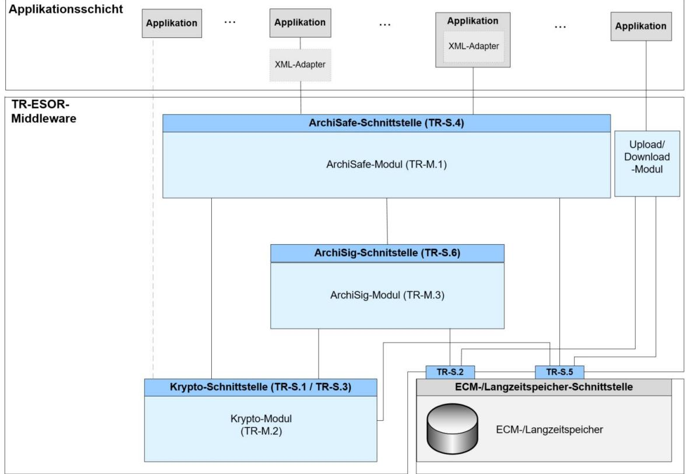
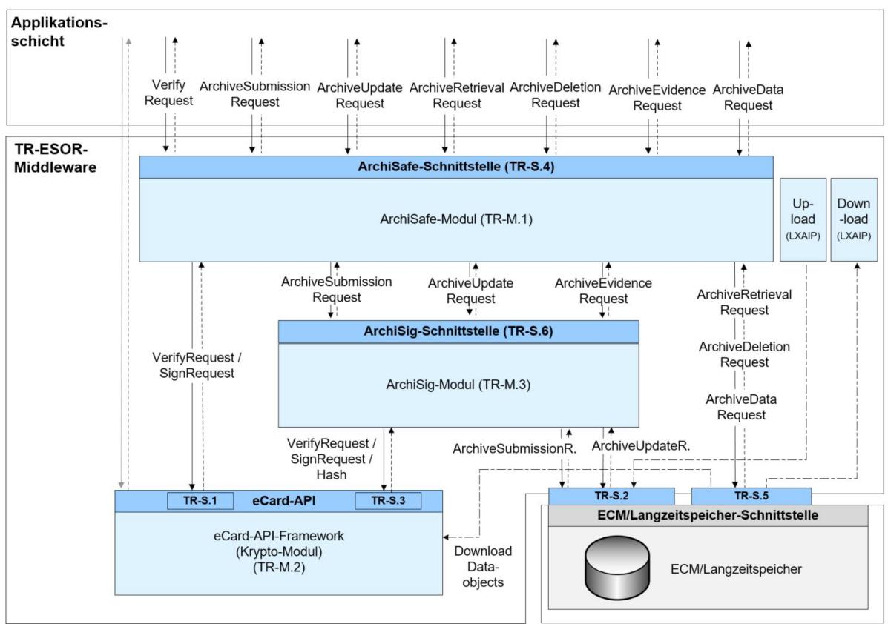
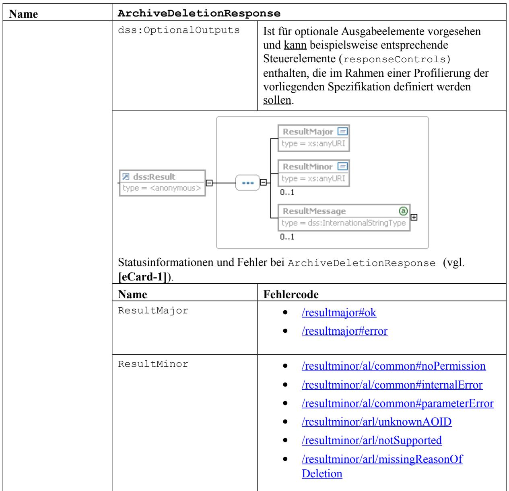
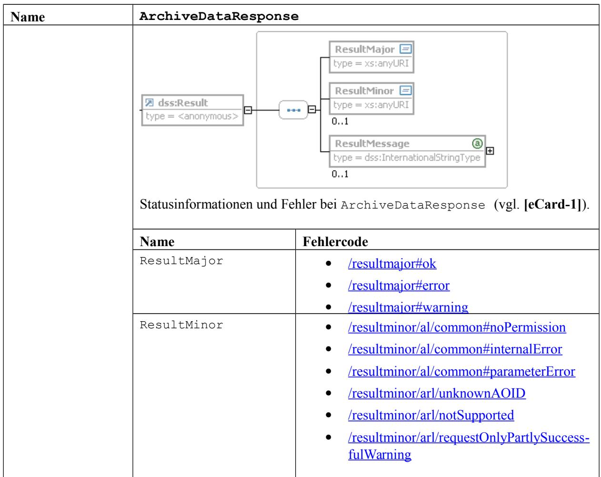

# BSI Technische Richtlinie 03125 Beweiswerterhaltung kryptographisch signierter Dokumente

# **Anlage TR-ESOR-E:**

# **Konkretisierung der Schnittstellen auf Basis des eCard-API-Frameworks**

| Bezeichnung | Konkretisierung der Schnittstellen auf Basis des eCard-API<br>Frameworks   |
|-------------|----------------------------------------------------------------------------|
| Kürzel      | BSI TR-ESOR-E                                                              |
| Version     | 1.2.2 (auf Basis der eIDAS-Verordnung und der ETSI Preservation Standards) |
| Datum       | 02.05.2019                                                                 |

Bundesamt für Sicherheit in der Informationstechnik Postfach 20 03 63 53133 Bonn Tel.: +49 228 99 9582-0 E-Mail: [tresor@bsi.bund.de](mailto:tresor@bsi.bund.de) Internet: [https://www.bsi.bund.de](https://www.bsi.bund.de/) © Bundesamt für Sicherheit in der Informationstechnik 2019

# **Inhaltsverzeichnis**

| 1.Einführung5                                                                                                  |  |
|----------------------------------------------------------------------------------------------------------------|--|
| 2.Überblick7                                                                                                   |  |
| 3.Funktionen der ArchiSafe-Schnittstelle (TR-ESOR-S.4)9                                                        |  |
| 3.1ArchiveSubmissionRequest und ArchiveSubmissionResponse9                                                     |  |
| 3.1.1ArchiveSubmissionRequest10                                                                                |  |
| 3.1.2ArchiveSubmissionResponse13                                                                               |  |
| 3.2ArchiveUpdateRequest und ArchiveUpdateResponse15                                                            |  |
| 3.2.1ArchiveUpdateRequest15<br>3.2.2ArchiveUpdateResponse16                                                    |  |
| 3.3ArchiveRetrievalRequest und ArchiveRetrievalResponse18                                                      |  |
| 3.3.1ArchiveRetrievalRequest18                                                                                 |  |
| 3.3.2ArchiveRetrievalResponse20                                                                                |  |
| 3.4ArchiveEvidenceRequest und ArchiveEvidenceResponse22                                                        |  |
| 3.4.1ArchiveEvidenceRequest22<br>3.4.2ArchiveEvidenceResponse24                                                |  |
| 3.5ArchiveDeletionRequest und ArchiveDeletionResponse26                                                        |  |
| 3.5.1ArchiveDeletionRequest26                                                                                  |  |
| 3.5.2ArchiveDeletionResponse27                                                                                 |  |
| 3.6ArchiveDataRequest und ArchiveDataResponse28                                                                |  |
| 3.6.1ArchiveDataRequest29<br>3.6.2ArchiveDataResponse30                                                        |  |
| 3.7VerifyRequest und VerifyResponse32                                                                          |  |
| 3.7.1VerifyRequest32                                                                                           |  |
| 3.7.2VerifyResponse36                                                                                          |  |
| 4.Funktionen der Preservation-API gemäß ETSI TS 119 51238                                                      |  |
| 4.1Vergleich der ETSI TS 119 512 Preservation-API mit der TR-ESOR-S.4-Schnittstelle38                          |  |
| 5.Funktionen der internen Schnittstellen39                                                                     |  |
| 5.1TR-ESOR-S.1 (ArchiSafe-Modul – Krypto-Modul)39                                                              |  |
| 5.1.1Prüfung von digitalen Signaturen, beweisrelevanten Daten, Beweisdaten und                                 |  |
| Archivdatenobjekten39                                                                                          |  |
| 5.1.2Anforderung einer digitalen Signatur39<br>5.2TR-ESOR-S.2 (ArchiSig-Modul – ECM-/Langzeitspeichersystem)41 |  |
| 5.2.1Speichern eines Archivdatenobjektes41                                                                     |  |
| 5.2.2Ergänzen einer neuen Version eines Archivdatenobjektes41                                                  |  |
| 5.2.3Auslesen von Archivdatenobjekten41                                                                        |  |
| 5.3TR-ESOR-S.3 (ArchiSig-Modul – Krypto-Modul)42                                                               |  |
| 5.3.1Anfordern eines (qualifizierten) Zeitstempels42                                                           |  |
| 5.3.2Prüfen eines (qualifizierten) Zeitstempels43<br>5.3.3Berechnung eines Hashwertes45                        |  |
| 5.4TR-ESOR-S.5 (ArchiSafe-Modul – ECM-Langzeitspeichersystem)47                                                |  |
| 5.4.1Abfrage beweiswerterhaltend archivierter Daten47                                                          |  |
| 5.4.2Löschen von Archivdatenobjekten48                                                                         |  |
| 5.4.3Abfrage diskreter Datenobjekte48                                                                          |  |
| 5.5TR-ESOR-S.6 (ArchiSafe-Modul – ArchiSig-Modul)48                                                            |  |

| 5.5.1Beweiswerterhaltende Archivierung elektronischer Daten48<br>5.5.2Ergänzen einer neuen Version eines Archivdatenobjektes48<br>5.5.3Rückgabe technischer Beweisdaten48 |  |
|---------------------------------------------------------------------------------------------------------------------------------------------------------------------------|--|
| 6.Fehlercodes49                                                                                                                                                           |  |
| 7.Spezifikation einer Webservice-basierten Schnittstelle51                                                                                                                |  |
| 7.1Spezifikation der Aufruf- und Rückgabeparameter als XML-Schema51                                                                                                       |  |
| 7.2WSDL-Spezifikation der Schnittstelle TR-ESOR-S.457                                                                                                                     |  |

## **Abbildungsverzeichnis**

| Abbildung 1: Schematische Darstellung der IT-Referenzarchitektur6                     |  |
|---------------------------------------------------------------------------------------|--|
| Abbildung 2: Umsetzung der IT-Referenzarchitektur auf Basis des eCard-API-Frameworks8 |  |

## **Tabellenverzeichnis**

Tabelle 1: Vergleich ETSI TS 119 512 Preservation-API mit TR-ESOR-S.4-Schnittstelle...................39

# <span id="page-4-0"></span>**1. Einführung**

Ziel der Technischen Richtlinie "Beweiswerterhaltung kryptographisch signierter Dokumente" ist die Spezifikation sicherheitstechnischer Anforderungen für den langfristigen Beweiswerterhalt von kryptographisch signierten elektronischen Dokumenten und Daten nebst zugehörigen elektronischen Verwaltungsdaten (Metadaten).

Eine für diese Zwecke definierte Middleware (TR-ESOR-Middleware) im Sinn dieser Richtlinie umfasst alle diejenigen Module (**M**) und Schnittstellen (**S)**, die zur Sicherung und zum Erhalt der Authentizität und zum Nachweis der Integrität der aufbewahrten Dokumente und Daten eingesetzt werden.

Die im Hauptdokument dieser Technischen Richtlinie vorgestellte Referenzarchitektur besteht aus den nachfolgend beschriebenen funktionalen und logischen Einheiten:

- der Eingangs-Schnittstelle S.4 der TR-ESOR-Middleware, die dazu dient, die TR-ESOR-Middleware in die bestehende IT- und Infrastrukturlandschaft einzubetten;
- dem "ArchiSafe-Modul" (**[TR-ESOR-M.1]**), welches den Informationsfluss in der Middleware regelt, die Sicherheitsanforderungen an die Schnittstellen zu den IT-Anwendungen umsetzt und für eine Entkopplung von Anwendungssystemen und ECM/Langzeitspeicher sorgt;
- dem "Krypto-Modul" (**[TR-ESOR-M.2]**) nebst den zugehörigen Schnittstellen S.1 und S.3, das alle erforderlichen Funktionen zur Berechnung von Hashwerten, Prüfung elektronischer Signaturen bzw. Siegel bzw. Zeitstempel, zur Nachprüfung elektronischer Zertifikate und zum Einholen qualifizierter Zeitstempel sowie (optional) elektronischer Signaturen bzw. Siegel für die Middleware zur Verfügung stellt. Darüber hinaus kann es Funktionen zur Ver- und Entschlüsselung von Daten und Dokumenten zur Verfügung stellen;
- dem "ArchiSig-Modul" (**[TR-ESOR-M.3]**) mit der Schnittstelle S.6, das die erforderlichen Funktionen für die Beweiswerterhaltung der digital signierten Unterlagen bereitstellt;
- einem ECM/Langzeitspeicher mit den Schnittstellen S.2 und S.5, der die physische Archivierung/Aufbewahrung und auch das Speichern der beweiswerterhaltenden Zusatzdaten übernimmt.

*Dieser ECM/Langzeitspeicher ist nicht mehr direkt Teil der Technischen Richtlinie, gleichwohl werden über die beiden Schnittstellen, die noch Teil der TR-ESOR-Middleware sind, Anforderungen daran gestellt.*

*Ebenso wenig ist die Applikationsschicht, die auch einen XML-Adapter enthalten kann, direkter Teil der Technischen Richtlinie, auch wenn dieser XML-Adapter als Teil einer Middleware implementiert werden kann.*

Die in Abbildung Abbildung 1 dargestellte IT-Referenzarchitektur orientiert sich an der ArchiSafe[1](#page-4-1) Referenzarchitektur und soll die logische (funktionale) Interoperabilität künftiger Produkte mit den Zielen und Anforderungen der Technischen Richtlinie ermöglichen und unterstützen.

<span id="page-4-1"></span><sup>1</sup> Siehe dazu [http://www.archisafe.de](http://www.archisafe.de/)



<span id="page-5-0"></span> **Abbildung 1: Schematische Darstellung der IT-Referenzarchitektur**

Diese Technische Richtlinie ist modular aufgebaut und spezifiziert in einzelnen Anlagen zum Hauptdokument die funktionalen und sicherheitstechnischen Anforderungen an die erforderlichen IT-Komponenten und Schnittstellen der TR-ESOR-Middleware. Die Spezifikationen sind strikt plattform-, produkt-, und herstellerunabhängig.

Das vorliegende Dokument trägt die Bezeichnung "Anlage TR-ESOR-E" und konkretisiert die TR-ESOR-spezifischen Schnittstellen auf Basis des in der BSI TR 03112 spezifizierten eCard-API-Frameworks.

# <span id="page-6-0"></span>**2. Überblick**

In der Schnittstelle TR-S.4 müssen die im Folgenden näher aufgeführten Funktionen mit den hier beschriebenen Parameterkonstellationen unterstützt werden:

- ArchiveSubmissionRequest und ArchiveSubmissionResponse (siehe Abschnitt [3.1\)](#page-8-0)
- ArchiveUpdateRequest und ArchiveUpdateResponse (siehe Abschnitt [3.2\)](#page-14-1)
- ArchiveRetrievalRequest und ArchiveRetrievalResponse (siehe Abschnitt [3.3\)](#page-17-1)
- ArchiveEvidenceRequest und ArchiveEvidenceResponse (siehe Abschnitt [3.4\)](#page-21-1)
- ArchiveDeletionRequest und ArchiveDeletionResponse (siehe Abschnitt [3.5\)](#page-25-1)

Darüber hinaus sollen die folgenden im vorliegenden Dokument näher aufgeführten Funktionen mit den hier beschriebenen Parameterkonstellationen unterstützt werden:

- ArchiveDataRequest und ArchiveDataResponse (siehe Abschnitt [3.6\)](#page-27-0)
- VerifyRequest und VerifyResponse (siehe Abschnitt [3.7\)](#page-31-1)



#### <span id="page-6-1"></span>**Abbildung 2: Umsetzung der IT-Referenzarchitektur auf Basis des eCard-API-Frameworks**

Wie in Abbildung 2 angedeutet, werden bei der vollständigen Umsetzung der IT-Referenzarchitektur auf Basis des eCard-API-Frameworks

- 1. die Schnittstellen des Krypto-Moduls gemäß des eCard-API-Frameworks (Technische Richtlinie des BSI TR 03112) realisiert und
- 2. auch die Schnittstellen des ArchiSafe-, ArchiSig-Modul und ECM/Langzeitspeichers nutzen die gleichen grundlegenden Schnittstellentypen (dss:RequestBaseType und

dss:ResponseBaseType) aus **[OASIS-DSS]**, die auch bei den Signatur- und Verschlüsselungsfunktionen aus **[eCard-2]** genutzt werden.

Die URI-Fehlercodes in den Rückgaben der nicht bereits in der Technischen Richtlinie des BSI TR 03112 definierten Funktionen haben das Präfix http://www.bsi.bund.de/tr-esor/api/1.2, welches um entsprechende Bezeichner ergänzt wird. Dieser Namensraum ist in den visualisierten XML-Strukturen am Kürzel "tr" erkennbar.

Falls die in diesem Dokument beschriebenen Schnittstellen und Funktionen asynchron genutzt werden sollen, kann dies unter Verwendung der hierfür vorgesehenen Mechanismen aus **[OASIS-Async]** realisiert werden.

In den folgenden Abschnitten findet sich eine XML-basierte Spezifikation der Funktionen zur Beweiswerterhaltung kryptographisch signierter Dokumente. Hierbei werden die Funktionen der ArchiSafe-Schnittstelle (TR-S.4) in Abschnitt [3](#page-8-1) spezifiziert. In Abschnitt 4 wird das Preservation-API von **[TR 119 512]** beschrieben und mit der TR-ESOR-S.4-Schnittstelle verglichen. In Abschnitt [5](#page-40-3) findet sich eine Beschreibung der internen Schnittstellen der TR-ESOR-Middleware, die auf die vorherige Spezifikation der Funktionen in Abschnitt [3](#page-8-1) Bezug nimmt. In Abschnitt [6](#page-50-0) sind die verwendeten Fehlercodes zusammengefasst und näher erläutert und in Abschnitt [7](#page-52-1) finden sich schließlich die normativen XML-Schema- und WSDL-Spezifikationen für die in Abschnitt [3](#page-8-1) spezifizierte ArchiSafe-Schnittstelle (TR-S.4).

*HINWEIS: Im folgenden Text umfasst der Begriff "Digitale Signatur" "fortgeschrittene elektronische Signaturen" gemäß [eIDAS-VO, Artikel 3 Nr. 11], "qualifizierte elektronische Signaturen" gemäß [eIDAS-VO, Artikel 3 Nr. 12], "fortgeschrittenen elektronische Siegel" gemäß [eIDAS-VO, Artikel 3 Nr. 26] und "qualifizierte elektronische Siegel" gemäß [eIDAS-VO, Artikel 3 Nr. 27]. Insofern umfasst der Begriff "digital signierte Dokumente" sowohl solche, die fortgeschrittene elektronische Signaturen oder Siegel bzw. qualifizierte elektronische Signaturen oder Siegel tragen.* 

*Mit dem Begriff der "kryptographisch signierten Dokumente" sind in dieser TR neben den gemäß [eIDAS-VO, Artikel 3 Nr. 12] qualifiziert signierten, den gemäß [eIDAS-VO, Artikel 3 Nr. 27] qualifiziert gesiegelten oder den gemäß [eIDAS-VO, Artikel 3 Nr. 34] qualifiziert zeitgestempelten Dokumenten (im Sinne der eIDAS-Verordnung) ) auch Dokumente mit einer fortgeschrittenen Signatur gemäß [eIDAS-VO, Artikel 3 Nr. 11] oder mit einem fortgeschrittenen Siegel gemäß [eIDAS-VO, Artikel 3 Nr. 26] oder mit einem elektronischen Zeitstempel gemäß [eIDAS-VO, Artikel 3 Nr. 33] erfasst, wie sie oft in der internen Kommunikation von Behörden entstehen. Nicht gemeint sind hier Dokumente mit einfachen Signaturen oder Siegeln basierend auf anderen (z. B. nicht-kryptographischen) Verfahren.*

## <span id="page-8-1"></span>**3. Funktionen der ArchiSafe-Schnittstelle (TR-ESOR-S.4)**

In diesem Abschnitt findet sich eine XML-basierte Spezifikation der Funktionen der TR-ESOR-Middleware an der ArchiSafe-Schnittstelle **TR-ESOR-S.4 (TR-S.4)**:

- ArchiveSubmissionRequest und ArchiveSubmissionResponse (siehe Abschnitt [3.1\)](#page-8-0)
- ArchiveUpdateRequest und ArchiveUpdateResponse (siehe Abschnitt [3.2\)](#page-14-1)
- ArchiveRetrievalRequest und ArchiveRetrievalResponse (siehe Abschnitt [3.3\)](#page-17-1)
- ArchiveEvidenceRequest und ArchiveEvidenceResponse (siehe Abschnitt [3.4\)](#page-21-1)
- ArchiveDeletionRequest und ArchiveDeletionResponse (siehe Abschnitt [3.5\)](#page-25-1)
- ArchiveDataRequest und ArchiveDataResponse (siehe Abschnitt [3.6\)](#page-27-0)
- VerifyRequest und VerifyResponse (siehe Abschnitt [3.7\)](#page-31-1)

Die graphische Darstellung der Schnittstellen in diesem Kapitel wurde - analog zur Spezifikation des eCard-API-Frameworks (siehe z.B. **[eCard-2]**) - mit einem XML-Viewer erstellt und dient lediglich der Veranschaulichung der XML-Strukturen. Die normative Spezifikation der Schnittstellen ist durch das XML-Schema bzw. die darauf aufbauende WSDL-Spezifikation (siehe Abschnitt [7\)](#page-52-1) gegeben.

## <span id="page-8-0"></span>**3.1 ArchiveSubmissionRequest und ArchiveSubmissionResponse**

Mit der Funktion ArchiveSubmissionRequest wird dem aufgerufenen Modul ein Archivdatenobjekt zur Ablage übergeben und das aufrufende Modul erhält im Erfolgsfall in der ArchiveSubmissionResponse eine AOID zurück, mit der später wieder auf das archivierte Objekt oder die zugehörigen technischen Beweisdaten zugegriffen werden kann. Hierbei kann im xaip:XAIP-Element entweder ein physisches XAIP (siehe Abschnitt 3.1 in **[TR-ESOR-F]**) oder ein logisches XAIP (LXAIP) (siehe Abschnitt 3.2 in **[TR-ESOR-F]**) übergeben werden. Alternativ können im ArchiveData-Element binäre Nutzdaten übergeben werden. Hierbei wird der Typ des übergebenen Datenobjektes durch das Type-Attribut näher bestimmt. Dabei kann insbesondere ein base64Binary-codierter[2](#page-8-2) ASiC-AIP-Container gemäß Abschnitt 3.3 in **[TR-ESOR-F]** mit einem Type[=http://uri.etsi.org/ades/ASiC/type/ASiC-ERS](http://uri.etsi.org/ades/ASiC/type/ASiC-ERS) Attribut übergeben werden.

Wie in Abbildung 2 ersichtlich, wird diese Funktion neben der hier betrachteten Schnittstelle TR-S.4 auch in den Schnittstellen TR-S.2 (vgl. Abschnitt [5.2\)](#page-42-2) und TR-S.6 (vgl. Abschnitt [5.5\)](#page-49-0) genutzt.

<span id="page-8-2"></span><sup>2</sup> Siehe<https://www.w3.org/TR/xmlschema-2/#base64Binary>.

| Name         | ArchiveSubmissionRequest                                                                                                                                                                                 |              |  |
|--------------|----------------------------------------------------------------------------------------------------------------------------------------------------------------------------------------------------------|--------------|--|
| Beschreibung | Mit der Funktion ArchiveSubmissionRequest wird dem aufgerufenen Modul<br>ein Archivdatenobjekt übergeben.                                                                                                |              |  |
|              | Hierbei kann für eine effiziente Übertragung von großen Binärdaten der<br>optimierte Nachrichtenübertragungsmechanismus "SOAP Message Transmission<br>Optimization Mechanism (MTOM)"3<br>genutzt werden. |              |  |
| Aufruf       | Aufruf der ArchiveSubmissionRequest-Funktion                                                                                                                                                             |              |  |
|              | Name                                                                                                                                                                                                     | Beschreibung |  |

#### <span id="page-9-0"></span>**3.1.1 ArchiveSubmissionRequest**

<span id="page-9-1"></span><sup>3</sup> Siehe<https://www.w3.org/TR/soap12-mtom/>.

<span id="page-10-0"></span>

| dss:OptionalInputs | Ist für optionale Eingabeelemente vorgesehen.                                                                                                                                                                                                                                                                                                                                                                                                                                                                                                                                                                                                                                                                                                                                                                                                                                                                |
|--------------------|--------------------------------------------------------------------------------------------------------------------------------------------------------------------------------------------------------------------------------------------------------------------------------------------------------------------------------------------------------------------------------------------------------------------------------------------------------------------------------------------------------------------------------------------------------------------------------------------------------------------------------------------------------------------------------------------------------------------------------------------------------------------------------------------------------------------------------------------------------------------------------------------------------------|
|                    | (A3.1.1-1): Gemäß der vorliegenden Spezifikation<br>sollen folgende Elemente unterstützt werden:                                                                                                                                                                                                                                                                                                                                                                                                                                                                                                                                                                                                                                                                                                                                                                                                             |
|                    | <br>AOID,                                                                                                                                                                                                                                                                                                                                                                                                                                                                                                                                                                                                                                                                                                                                                                                                                                                                                                   |
|                    | <br>ReturnVerificationReport,                                                                                                                                                                                                                                                                                                                                                                                                                                                                                                                                                                                                                                                                                                                                                                                                                                                                               |
|                    | <br>ImportEvidence.                                                                                                                                                                                                                                                                                                                                                                                                                                                                                                                                                                                                                                                                                                                                                                                                                                                                                         |
|                    | Dabei gilt:                                                                                                                                                                                                                                                                                                                                                                                                                                                                                                                                                                                                                                                                                                                                                                                                                                                                                                  |
|                    | <br>AOID                                                                                                                                                                                                                                                                                                                                                                                                                                                                                                                                                                                                                                                                                                                                                                                                                                                                                                    |
|                    | Durch die Übergabe eines AOID<br>Elementes kann die AOID von der<br>aufrufenden Anwendung vergeben<br>werden. Im Regelfall fehlt dieses Element<br>und die AOID wird vom aufgerufenen<br>Modul bereitgestellt.                                                                                                                                                                                                                                                                                                                                                                                                                                                                                                                                                                                                                                                                                               |
|                    | <br>ReturnVerificationReport                                                                                                                                                                                                                                                                                                                                                                                                                                                                                                                                                                                                                                                                                                                                                                                                                                                                                |
|                    | Durch die Übergabe eines<br>ReturnVerificationReport<br>Elementes gemäß [OASIS VR] bzw.<br>[eCard-2]<br>kann ein ausführlicher<br>Prüfbericht in Form eines<br>VerificationReport-Elementes für<br>die im XAIP-Element oder im unten<br>genannten ImportEvidence-Element<br>enthaltenen Signatur- bzw. Siegel- bzw.<br>Zeitstempelobjekte oder Beweisdaten<br>angefordert werden. Bei einem<br>übergebenen xaip:XAIP-Element wird<br>im Details-Element des<br>IndividualReport-Elementes des<br>zurückgelieferten Prüfberichts (vgl.<br>Abschnitt 3.3 in [OASIS VR]) ein<br>XAIPReport-Element gemäß [TR<br>ESOR-VR] zurückgeliefert.<br>Sofern kein xaip:XAIP sondern ein<br>ArchiveData-Element und im<br>ImportEvidence-Element (siehe<br>unten) ein Evidence Record übergeben<br>wird, wird für jeden übergebenen<br>Evidence Record ein<br>EvidenceRecordReport gemäß<br>[TR-ESOR-VR] zurückgeliefert. |
|                    |                                                                                                                                                                                                                                                                                                                                                                                                                                                                                                                                                                                                                                                                                                                                                                                                                                                                                                              |

|           | <br>ImportEvidence<br>Mit der Übergabe des nachfolgend<br>dargestellten ImportEvidence<br>Elementes kann der Import von einem<br>oder mehreren zu einer bestimmten XAIP<br>bzw. LXAIP-Version bzw. zu den<br>übergebenen Binärdaten gehörenden<br>Evidence Records gemäß [RFC4998] oder<br>[RFC6283]4<br>oder [TR-ESOR-ERS]<br>angestoßen werden. Die Struktur des<br>xaip:evidenceRecord-Elementes ist in<br>[TR-ESOR-F] erläutert. Um Evidence<br>Records für mehrere Versionen eines<br>XAIPs oder LXAIPs importieren zu<br>können, kann dieses Element mehrmals<br>auftreten. Das<br>xaip:evidenceRecord-Element<br>muss hier die Attribute AOID und<br>VersionID enthalten.<br>Sofern die zu importierenden Evidence<br>Records bereits im XAIP bzw. LXAIP<br>enthalten sind, wird statt des Evidence<br>Records hier die entsprechende<br>CredentialID übergeben.<br>(A3.1.1-2): Im Zuge des Imports von<br>Evidence Records müssen diese von der<br>TR-ESOR-Middleware vollständig geprüft<br>werden. Dies umfasst die im<br>entsprechenden ERS-Standard<br>vorgesehenen Prüfungungsschritte5<br>, wobei<br>die jeweiligen Zertifikate der Zeitstempel<br>vollständig bis hin zu einer<br>vertrauenswürdigen Wurzel geprüft<br>werden müssen. |
|-----------|-------------------------------------------------------------------------------------------------------------------------------------------------------------------------------------------------------------------------------------------------------------------------------------------------------------------------------------------------------------------------------------------------------------------------------------------------------------------------------------------------------------------------------------------------------------------------------------------------------------------------------------------------------------------------------------------------------------------------------------------------------------------------------------------------------------------------------------------------------------------------------------------------------------------------------------------------------------------------------------------------------------------------------------------------------------------------------------------------------------------------------------------------------------------------------------------------------------------------------------------------------|
| xaip:XAIP | Enthält ein XML-basiertes Archivdatenobjekt                                                                                                                                                                                                                                                                                                                                                                                                                                                                                                                                                                                                                                                                                                                                                                                                                                                                                                                                                                                                                                                                                                                                                                                                           |
|           | gemäß [TR-ESOR-F], das durch den Aufruf der<br>beweiswerterhaltenden Archivierung zugeführt<br>werden soll.<br>Hierbei kann es sich entweder ein physisches                                                                                                                                                                                                                                                                                                                                                                                                                                                                                                                                                                                                                                                                                                                                                                                                                                                                                                                                                                                                                                                                                           |
|           | XAIP (siehe Abschnitt 3.1 in [TR-ESOR-F]) oder<br>ein logisches XAIP (LXAIP) (siehe Abschnitt 3.2<br>in [TR-ESOR-F]) handeln.                                                                                                                                                                                                                                                                                                                                                                                                                                                                                                                                                                                                                                                                                                                                                                                                                                                                                                                                                                                                                                                                                                                         |

<span id="page-11-0"></span>4 **[RFC4998]** muss, **[RFC6283]** kann unterstützt werden.

<span id="page-11-1"></span><sup>5</sup> Siehe Abschnitt 3.3 in **[RFC4998]** und Abschnitt 2.3 in **[RFC6283]** sowie **[TR-ESOR-ERS]**.

| ArchiveData | Enthält ein in einem beliebigen anderen Format<br>vorliegendes Archivdatenobjekt. Der hierfür<br>genutzte ArchiveDataType ist als anyType mit<br>einem optionalen Type-Attribut definiert.                                                                                                   |
|-------------|----------------------------------------------------------------------------------------------------------------------------------------------------------------------------------------------------------------------------------------------------------------------------------------------|
|             | Durch das Type-Attribut                                                                                                                                                                                                                                                                      |
|             | http://uri.etsi.org/ades/ASiC/typ<br>e/ASiC-ERS wird klargestellt, dass es sich um<br>base64Binary-codierten6<br>einen<br>ASiC-AIP<br>Container gemäß Abschnitt 3.3 in [TR-ESOR-F]<br>handelt.                                                                                               |
|             | Durch das Type-Attribut<br>http://www.bsi.bund.de/tr<br>esor/api/1.2/type/binaryData wird<br>klargestellt, dass im ArchiveData-Element ein<br>Kindelement binaryData übergeben wird, das<br>Base 64 codierte Nutzdaten und ein MimeType<br>Attribut enthält, die beim entsprechenden XAIP in |
|             | ein dataObject-Element eingebettet werden.<br>Weitere Übergabetypen können im Rahmen einer<br>Profilierung der vorliegenden Spezifikation<br>spezifiziert werden.                                                                                                                            |

#### <span id="page-12-0"></span>**3.1.2 ArchiveSubmissionResponse**

| Name         | ArchiveSubmissionResponse                                                                                                                                                                                                      |                                                                                                                                                                    |
|--------------|--------------------------------------------------------------------------------------------------------------------------------------------------------------------------------------------------------------------------------|--------------------------------------------------------------------------------------------------------------------------------------------------------------------|
| Beschreibung | Als Antwort auf einen ArchiveSubmissionRequest wird ein entsprechendes<br>ArchiveSubmissionResponse-Element zurückgeliefert, das im Erfolgsfall<br>einen eindeutigen Identifikator des Archivdatenobjektes, die AOID, enthält. |                                                                                                                                                                    |
| Rückgabe     |                                                                                                                                                                                                                                |                                                                                                                                                                    |
|              | ArchiveSubmissionResponse ist die Antwort zum<br>ArchiveSubmissionRequest-Aufruf                                                                                                                                               |                                                                                                                                                                    |
|              | Name                                                                                                                                                                                                                           | Beschreibung                                                                                                                                                       |
|              | dss:Result                                                                                                                                                                                                                     | Enthält die Statusinformationen und die Fehler zu<br>einer durchgeführten Aktion. Die Struktur dieses<br>Elements ist in [eCard-1] und unten näher<br>beschrieben. |

<span id="page-12-1"></span><sup>6</sup> Siehe<https://www.w3.org/TR/xmlschema-2/#base64Binary>.

| Name | ArchiveSubmissionResponse                                                                         |                                                                                                                                                                                                                                                                                                                                                                                                                                                                                                                            |
|------|---------------------------------------------------------------------------------------------------|----------------------------------------------------------------------------------------------------------------------------------------------------------------------------------------------------------------------------------------------------------------------------------------------------------------------------------------------------------------------------------------------------------------------------------------------------------------------------------------------------------------------------|
|      | dss:OptionalOutputs                                                                               | Ist für optionale Ausgabeelemente vorgesehen.<br>(A3.1.2-1): Gemäß der vorliegenden Spezifikation<br>kann das folgende Element auftreten:<br><br>VerificationReport gemäß [OASIS<br>VR] bzw. [eCard-2] und [TR-ESOR-VR],<br>der zurückgeliefert werden muss, sofern er<br>explizit angefordert wurde oder bei der<br>Prüfung der übergebenen Daten ein Fehler<br>oder eine Warnung aufgetreten ist und deshalb<br>als ResultMajor ein Fehlercode<br>/resultmajor#error oder<br>/resultmajor#warning zurückgeliefert wird. |
|      | AOID                                                                                              | Muss, sofern die AOID7<br>vom aufgerufenen Modul<br>erzeugt oder ergänzt wurde, vorhanden sein und<br>für zukünftige Zugriffe auf das Archivdatenobjekt<br>genutzt werden.                                                                                                                                                                                                                                                                                                                                                 |
|      |                                                                                                   | (vgl.                                                                                                                                                                                                                                                                                                                                                                                                                                                                                                                      |
|      | Statusinformationen und Fehler bei ArchiveSubmissionResponse<br>[eCard-1] Abschnitt 4.1 und 4.2). |                                                                                                                                                                                                                                                                                                                                                                                                                                                                                                                            |
|      | Name                                                                                              | Fehlercode                                                                                                                                                                                                                                                                                                                                                                                                                                                                                                                 |
|      | ResultMajor                                                                                       | <br>/resultmajor#ok<br><br>/resultmajor#error<br><br>/resultmajor#warning                                                                                                                                                                                                                                                                                                                                                                                                                                               |

<span id="page-13-0"></span><sup>7</sup> Die AOID (Archive Object Identifier) im vorliegenden Dokument entspricht dem POID (Preservation Object Identifier) aus **[ETSI TS 119 512]**.

| Name | ArchiveSubmissionResponse |                                              |
|------|---------------------------|----------------------------------------------|
|      | ResultMinor               | /resultminor/al/common#noPermission<br>     |
|      |                           | <br>/resultminor/al/common#internalError    |
|      |                           | /resultminor/al/common#parameterError<br>   |
|      |                           | /resultminor/arl/lowSpaceWarning<br>        |
|      |                           | /resultminor/arl/noSpaceError<br>           |
|      |                           | <br>/resultminor/arl/existingAOID           |
|      |                           | /resultminor/arl/notSupported<br>           |
|      |                           | /resultminor/arl/unknownArchiveDataType<br> |
|      |                           | /resultminor/arl/XAIP_NOK<br>               |
|      |                           | <br>/resultminor/arl/XAIP_NOK_EXPIRED       |
|      |                           | /resultminor/arl/XAIP_NOK_SUBMTIME<br>      |
|      |                           | /resultminor/arl/XAIP_NOK_SIG<br>           |
|      |                           | /resultminor/arl/XAIP_NOK_ER<br>            |

## <span id="page-14-1"></span>**3.2 ArchiveUpdateRequest und ArchiveUpdateResponse**

Mit der Funktion ArchiveUpdateRequest wird eine neue Version für ein bereits abgelegtes Archivdatenobjekt erzeugt. Hierbei werden die bereits abgelegten Daten nicht verändert, sondern es wird lediglich zusätzlich eine neue Version hinzugefügt.

Wie in Abbildung Abbildung 2 ersichtlich, wird diese Funktion neben der hier betrachteten Schnittstelle TR-S.4 auch in TR-S.2 (vgl. Abschnitt [5.2\)](#page-42-2) und TR-S.6 (vgl. Abschnitt [5.5\)](#page-49-0) genutzt.

| Name         | ArchiveUpdateRequest                                                                                                                       |                                                                                                                                                                                                           |
|--------------|--------------------------------------------------------------------------------------------------------------------------------------------|-----------------------------------------------------------------------------------------------------------------------------------------------------------------------------------------------------------|
| Beschreibung | Mit der Funktion ArchiveUpdateRequest wird eine neue Version für ein<br>bereits abgelegtes Archivdatenobjekt erzeugt (vgl. [TR-ESOR-M.1]). |                                                                                                                                                                                                           |
|              | Aufruf der ArchiveUpdateRequest-Funktion                                                                                                   |                                                                                                                                                                                                           |
|              | Name                                                                                                                                       | Beschreibung                                                                                                                                                                                              |
|              | dss:OptionalInputs                                                                                                                         | Ist für optionale Eingabeelemente vorgesehen.                                                                                                                                                             |
|              |                                                                                                                                            | (A3.2.1-1): Gemäß der vorliegenden Spezifikation<br>sollen hier die auf Seite 11 spezifizierten<br>optionalen Eingabeelemente AOID,<br>ReturnVerificationReport und<br>ImportEvidence unterstützt werden. |

#### <span id="page-14-0"></span>**3.2.1 ArchiveUpdateRequest**

#### <span id="page-15-0"></span>**3.2.2 ArchiveUpdateResponse**

| Name         | ArchiveUpdateResponse                                                                                                                                                                                                                                                  |                                                                                                                                                                                                                                                                                                                                                                                  |  |
|--------------|------------------------------------------------------------------------------------------------------------------------------------------------------------------------------------------------------------------------------------------------------------------------|----------------------------------------------------------------------------------------------------------------------------------------------------------------------------------------------------------------------------------------------------------------------------------------------------------------------------------------------------------------------------------|--|
| Beschreibung | Als Antwort auf einen ArchiveUpdateRequest wird ein entsprechendes<br>ArchiveUpdateResponse-Element zurückgeliefert, das im Erfolgsfall einen<br>im Kontext einer AOID eindeutigen Identifikator der neuen Version des<br>Archivdatenobjektes, die VersionID, enthält. |                                                                                                                                                                                                                                                                                                                                                                                  |  |
| Rückgabe     |                                                                                                                                                                                                                                                                        | ArchiveUpdateResponse ist die Antwort zum ArchiveUpdateRequest                                                                                                                                                                                                                                                                                                                   |  |
|              | Aufruf                                                                                                                                                                                                                                                                 |                                                                                                                                                                                                                                                                                                                                                                                  |  |
|              | Name                                                                                                                                                                                                                                                                   | Beschreibung                                                                                                                                                                                                                                                                                                                                                                     |  |
|              | dss:Result                                                                                                                                                                                                                                                             | Enthält die Statusinformationen und die Fehler zu<br>einer durchgeführten Aktion. Die Struktur dieses<br>Elements ist in [eCard-1] und unten näher<br>beschrieben.                                                                                                                                                                                                               |  |
|              | dss:OptionalOutputs                                                                                                                                                                                                                                                    | Ist für optionale Ausgabeelemente vorgesehen.                                                                                                                                                                                                                                                                                                                                    |  |
|              |                                                                                                                                                                                                                                                                        | (A3.2.2-1): Gemäß der vorliegenden Spezifikation<br>kann das folgende Element auftreten:                                                                                                                                                                                                                                                                                         |  |
|              |                                                                                                                                                                                                                                                                        | VerificationReport gemäß [OASIS<br><br>VR] bzw. [eCard-2] und [TR-ESOR-VR],<br>der zurückgeliefert werden muss, sofern er<br>explizit angefordert wurde oder bei der<br>Prüfung der übergebenen Daten ein Fehler<br>oder eine Warnung aufgetreten ist und<br>deshalb als ResultMajor ein Fehlercode<br>/resultmajor#error oder<br>/resultmajor#warning zurückgeliefert<br>wird. |  |

| Name | ArchiveUpdateResponse |                                                                                                                                                                                                                                                                                                                                                                                                                                                                                                                                                                                                                                                     |  |
|------|-----------------------|-----------------------------------------------------------------------------------------------------------------------------------------------------------------------------------------------------------------------------------------------------------------------------------------------------------------------------------------------------------------------------------------------------------------------------------------------------------------------------------------------------------------------------------------------------------------------------------------------------------------------------------------------------|--|
|      | VersionID             | Ist im Erfolgsfall vorhanden und enthält den<br>bezüglich des über die AOID identifizierten<br>Archivdatenobjektes eindeutigen Versions<br>Identifikator. Die VersionID soll in der Form v1, v2,<br>… vx gebildet werden.                                                                                                                                                                                                                                                                                                                                                                                                                           |  |
|      |                       |                                                                                                                                                                                                                                                                                                                                                                                                                                                                                                                                                                                                                                                     |  |
|      |                       | Statusinformationen und Fehler bei ArchiveUpdateResponse<br>(vgl. [eCard<br>1] Abschnitt 4.1 und 4.2).                                                                                                                                                                                                                                                                                                                                                                                                                                                                                                                                              |  |
|      | Name                  | Fehlercode                                                                                                                                                                                                                                                                                                                                                                                                                                                                                                                                                                                                                                          |  |
|      | ResultMajor           | /resultmajor#ok<br><br>/resultmajor#error<br><br>/resultmajor#warning<br>                                                                                                                                                                                                                                                                                                                                                                                                                                                                                                                                                                        |  |
|      | ResultMinor           | /resultminor/al/common#noPermission<br><br>/resultminor/al/common#internalError<br><br>/resultminor/al/common#parameterError<br><br>/resultminor/arl/lowSpaceWarning<br><br>/resultminor/arl/noSpaceError<br><br>/resultminor/arl/existingPackage<br><br>InfoWarning<br>/resultminor/arl/notSupported<br><br>/resultminor/arl/DXAIP_NOK<br><br>/resultminor/arl/DXAIP_NOK_AOID<br><br>/resultminor/arl/DXAIP_NOK_EXPIRED<br><br>/resultminor/arl/DXAIP_NOK_SUBM<br><br>TIME<br>/resultminor/arl/DXAIP_NOK_SIG<br><br>/resultminor/arl/XAIP_NOK_ER<br><br>/resultminor/arl/DXAIP_NOK_ID<br><br>/resultminor/arl/DXAIP_NOK_Version<br> |  |

## <span id="page-17-1"></span>**3.3 ArchiveRetrievalRequest und ArchiveRetrievalResponse**

Mit der Funktion ArchiveRetrievalRequest wird das zu einer übergebenen AOID und VersionID gehörende physische XAIP-Archivdatenobjekt gemäß **[TR-ESOR-F]** (Abschnitt 3.1), das logische XAIP gemäß **[TR-ESOR-F]** (Abschnitt 3.2) oder das ASiC-AIP gemäß **[TR-ESOR-F]** (Abschnitt 3.3) über die TR-ESOR-Middleware aus dem ECM-/Langzeitspeichersystem ausgelesen.

Wie in Abbildung 2 ersichtlich, wird diese Funktion neben der hier betrachteten Schnittstelle TR-S.4 in ähnlicher Weise auch in den Schnittstellen S.2 (vgl. Abschnitt [5.2\)](#page-42-2) und S.5 (vgl. Abschnitt [5.4\)](#page-48-1) genutzt.

#### <span id="page-17-0"></span>**3.3.1 ArchiveRetrievalRequest**

| Name         | ArchiveRetrievalRequest                                                                                                                                                                                  |              |
|--------------|----------------------------------------------------------------------------------------------------------------------------------------------------------------------------------------------------------|--------------|
| Beschreibung | Mit der Funktion ArchiveRetrievalRequest wird ein im Langzeitspeicher<br>abgelegtes Archivdatenobjekt ausgelesen und zurückgeliefert.                                                                    |              |
|              | Hierbei kann für eine effiziente Übertragung von großen Binärdaten der<br>optimierte Nachrichtenübertragungsmechanismus "SOAP Message<br>Transmission Optimization Mechanism (MTOM)"8<br>genutzt werden. |              |
| Beschreibung | Aufruf der ArchiveRetrievalRequest-Funktion                                                                                                                                                              |              |
|              | Name                                                                                                                                                                                                     | Beschreibung |

<span id="page-17-2"></span><sup>8</sup> Siehe<https://www.w3.org/TR/soap12-mtom/>.

| Name              | ArchiveRetrievalRequest                                                                                                                                                                                                                                                                                                                                                                                                                                                                                                                                                                                                      |  |
|-------------------|------------------------------------------------------------------------------------------------------------------------------------------------------------------------------------------------------------------------------------------------------------------------------------------------------------------------------------------------------------------------------------------------------------------------------------------------------------------------------------------------------------------------------------------------------------------------------------------------------------------------------|--|
| dss:OptionalInput | Ist für optionale Eingabeelemente vorgesehen.                                                                                                                                                                                                                                                                                                                                                                                                                                                                                                                                                                                |  |
| s                 | (A3.3.1-1): Gemäß der vorliegenden Spezifikation<br>sollen die folgenden optionalen Eingabeelemente<br>unterstützt werden:                                                                                                                                                                                                                                                                                                                                                                                                                                                                                                   |  |
|                   | •<br>POFormat                                                                                                                                                                                                                                                                                                                                                                                                                                                                                                                                                                                                                |  |
|                   | •<br>IncludeERS                                                                                                                                                                                                                                                                                                                                                                                                                                                                                                                                                                                                              |  |
|                   | – gibt das AIP-Format an, wobei<br>POFormat9                                                                                                                                                                                                                                                                                                                                                                                                                                                                                                                                                                                 |  |
|                   | folgende Formate definiert sind:                                                                                                                                                                                                                                                                                                                                                                                                                                                                                                                                                                                             |  |
|                   | •<br>http://www.bsi.bund.de/tr<br>esor/xaip/1.2 – für ein XAIP gemäß<br>Abschnitt 3.1 in [TR-ESOR-F],                                                                                                                                                                                                                                                                                                                                                                                                                                                                                                                        |  |
|                   | •<br>http://www.bsi.bund.de/tr-<br>esor/l xaip/1.3 – für ein "Logisches<br>XAIP" gemäß Abschnitt 3.2 in [TR-ESOR-F],                                                                                                                                                                                                                                                                                                                                                                                                                                                                                                         |  |
|                   | •<br>http://uri.etsi.org/ades/ASiC/type/ASiC-ERS<br>für<br>einen base64Binary-codierten ASiC-AIP<br>Container gemäß Abschnitt 3.3 in [TR-ESOR<br>F] in einem PO-Element gemäß [ETSI TS 119<br>512], das im dss:OptionalOutputs<br>Element des ArchiveRetrievalResponse<br>zurückgeliefert wird.                                                                                                                                                                                                                                                                                                                              |  |
|                   | Bei Nicht-Eingabe eines POFormats ist<br>XAIP das Default-Format.                                                                                                                                                                                                                                                                                                                                                                                                                                                                                                                                                            |  |
|                   | IncludeERS – gibt an, dass das zurückgelieferte XAIP<br>oder das logische XAIP (LXAIP) oder das ASiC-AIP den<br>bzw. die entsprechenden Evidence Record(s) im<br>angegebenen Format (vgl. ERSFormat, Seite 23)<br>enthalten soll.                                                                                                                                                                                                                                                                                                                                                                                            |  |
|                   |                                                                                                                                                                                                                                                                                                                                                                                                                                                                                                                                                                                                                              |  |
|                   | Dieser bzw. diese Evidence Record(s) wird bzw. werden<br>bei XAIP bzw. LXAIP im dafür vorgesehenen<br>xaip:credential/xaip:EvidenceRecord<br>Element oder im Fall ASiC-AIP im ASiC-AIP-Container<br>gemäß Abschnitt 3.3 in [TR-ESOR-F] zurückgeliefert.<br>(A3.3.1-2): Das VersionID-Attribut des<br>xaip:EvidenceRecord Elementes muss auf<br>die entsprechende Version verweisen.<br>Sofern das versionManifest nicht<br>kryptographisch geschützt ist, muss mit einem<br>unprotectedObjectPointer Element im<br>entsprechenden versionManifest auf die<br>credentialID des xaip:credential<br>Elementes verwiesen werden. |  |

| Name | ArchiveRetrievalRequest |                                                                                                                                                                                         |
|------|-------------------------|-----------------------------------------------------------------------------------------------------------------------------------------------------------------------------------------|
|      |                         | Umgekehrt muss auf die vom Evidence Record<br>geschützten Datenobjekte im relatedObjects<br>Attribut des xaip:credential-Elementes<br>verwiesen werden.                                 |
|      | AOID                    | Enthält den eindeutigen Identifikator des<br>angeforderten Archivdatenobjektes.                                                                                                         |
|      | VersionID               | Kann eine Folge von Versions-Identifikatoren<br>enthalten, durch die angegeben wird welche<br>Versionen des Archivdatenobjektes XAIP bzw.<br>LXAIP genau zurückgeliefert werden sollen. |
|      |                         | Sofern das VersionID-Element nicht angegeben<br>ist, werden die zur letzten Version gehörigen<br>Datenobjekte und Verwaltungsinformationen eines<br>XAIPs bzw. LXAIPs zurückgeliefert.  |
|      |                         | Durch die Angabe von all werden alle<br>existierenden Versionen eines Archivdatenobjektes<br>zurückgeliefert.                                                                           |

#### <span id="page-19-0"></span>**3.3.2 ArchiveRetrievalResponse**

| Name         | ArchiveRetrievalResponse                                                                                                                                                                                          |              |
|--------------|-------------------------------------------------------------------------------------------------------------------------------------------------------------------------------------------------------------------|--------------|
| Beschreibung | Als Antwort auf einen ArchiveRetrievalRequest wird ein entsprechendes<br>ArchiveRetrievalResponse-Element zurückgeliefert, welches im<br>Erfolgsfall das angeforderte Archivdatenobjekt im xaip:XAIP-Format gemäß |              |
| Rückgabe     | [TR-ESOR-F] enthält.<br>ArchiveRetrievalResponse ist die Antwort zum<br>ArchiveRetrievalRequest-Aufruf                                                                                                            |              |
|              | Name                                                                                                                                                                                                              | Beschreibung |

<sup>9</sup> Das POFormat-Element ist in **[ETSI TS 119 512]** folgendermaßen definiert: <element name="POFormat" type="anyURI" />

| Name | ArchiveRetrievalResponse |                                                                                                                                                                                                                                                                                                                                                                                                |
|------|--------------------------|------------------------------------------------------------------------------------------------------------------------------------------------------------------------------------------------------------------------------------------------------------------------------------------------------------------------------------------------------------------------------------------------|
|      | dss:Result               | Enthält die Statusinformationen und die Fehler zu<br>einer durchgeführten Aktion. Die Struktur dieses<br>Elements ist in [eCard-1] und weiter unten näher<br>beschrieben.<br>Sofern nur ein Teil der angeforderten Versionen<br>des Archivdatenobjektes zurückgeliefert werden<br>konnte, wird dies durch den Fehlercode<br>/resultminor/arl/requestOnlyPartlySuccessfulWar<br>ning angezeigt. |
|      | dss:OptionalOutputs      | Ist für optionale Ausgabeelemente vorgesehen, die<br>im Rahmen einer Profilierung der vorliegenden<br>Spezifikation definiert werden sollen.<br>Insbesondere kann hier ein PO-Element gemäß<br>[ETSI TS 119 512] enthalten sein, das ein<br>base64Binary-codierten ASiC-AIP gemäß<br>Abschnitt 3.3 in [TR-ESOR-F] enthält, sofern<br>dieses angefordert wird.                                  |
|      | xaip:XAIP                | Sofern kein Fehler aufgetreten ist, wird das<br>angeforderte XML-basierte Archivdatenobjekt<br>(XAIP oder LXAIP) gemäß [TR-ESOR-F]<br>zurückgeliefert.                                                                                                                                                                                                                                         |
|      | [eCard-1]).              | Statusinformationen und Fehler bei ArchiveRetrievalResponse<br>(vgl.                                                                                                                                                                                                                                                                                                                           |
|      | Name                     | Fehlercode                                                                                                                                                                                                                                                                                                                                                                                     |
|      | ResultMajor              | <br>/resultmajor#ok                                                                                                                                                                                                                                                                                                                                                                           |
|      |                          | <br>/resultmajor#error                                                                                                                                                                                                                                                                                                                                                                        |
|      |                          | <br>/resultmajor#warning                                                                                                                                                                                                                                                                                                                                                                      |

| Name |               | ArchiveRetrievalResponse                                                                                                                                                                                                                                                                                                                                          |  |
|------|---------------|-------------------------------------------------------------------------------------------------------------------------------------------------------------------------------------------------------------------------------------------------------------------------------------------------------------------------------------------------------------------|--|
|      | ResultMinor   | <br>/resultminor/al/common#noPermission<br>/resultminor/al/common#internalError<br><br><br>/resultminor/al/common#parameterError<br><br>/resultminor/arl/unknownAOID<br><br>/resultminor/arl/notSupported<br><br>/resultminor/arl/requestOnlyPartlySuc<br>cessfulWarning<br><br>/resultminor/arl/unknownVersionID<br><br>/resultminor/arl/unknownPOFormat |  |
|      | ResultMessage | Beim Auftreten der Fehlermeldung /unknown<br>VersionID<br>soll die problematische VersionID<br>hier zurückgeliefert werden.                                                                                                                                                                                                                                       |  |

## <span id="page-21-1"></span>**3.4 ArchiveEvidenceRequest und ArchiveEvidenceResponse**

Mit der Funktion ArchiveEvidenceRequest werden die zugehörigen technischen Beweisdaten (Evidence Records gemäß **[RFC4998]** oder **[RFC6283]**[10](#page-21-2) oder **[RFC4998]** mit der Profilierung aus **[TR-ESOR-ERS]**) für beweiswerterhaltend aufbewahrte und über AOID-Elemente adressierte Archivdatenobjekte (xaip:XAIP) zurückgeliefert.

Wie in Abbildung Abbildung 2 ersichtlich, wird diese Funktion neben der hier betrachteten Schnittstelle TR-S.4 auch in TR-S.6 (vgl. Abschnitt [5.5\)](#page-49-0) genutzt.

| Name         | ArchiveEvidenceRequest                                                                                                                                                                                                                                        |              |
|--------------|---------------------------------------------------------------------------------------------------------------------------------------------------------------------------------------------------------------------------------------------------------------|--------------|
| Beschreibung | Mit der Funktion ArchiveEvidenceRequest können für beweiswerterhaltend<br>abgelegte Archivdatenobjekte technische Beweisdaten in Form von Evidence<br>Records gemäß [RFC4998] oder [RFC6283]11 in der Profilierung gemäß<br>[TR-ESOR-ERS] angefordert werden. |              |
| Beschreibung | Aufruf der ArchiveEvidenceRequest-Funktion                                                                                                                                                                                                                    |              |
|              | Name                                                                                                                                                                                                                                                          | Beschreibung |

<span id="page-21-0"></span>**3.4.1 ArchiveEvidenceRequest**

<span id="page-21-2"></span><sup>10</sup> **[RFC4998]** muss, **[RFC6283]** kann unterstützt werden.

<span id="page-21-3"></span><sup>11</sup> **[RFC4998]** muss, **[RFC6283]** kann unterstützt werden.

<span id="page-22-0"></span>

| Name | ArchiveEvidenceRequest |                                                                                                                                                                                                                                                                                                                                                                                                                                                                                          |
|------|------------------------|------------------------------------------------------------------------------------------------------------------------------------------------------------------------------------------------------------------------------------------------------------------------------------------------------------------------------------------------------------------------------------------------------------------------------------------------------------------------------------------|
|      | dss:OptionalInputs     | Ist für optionale Eingabeelemente vorgesehen.<br>(A3.4.1-1): Gemäß der vorliegenden Spezifikation<br>soll das folgende Element unterstützt werden:                                                                                                                                                                                                                                                                                                                                       |
|      |                        | Mit dem Element tr:ERSFormat vom Typ<br>anyURI kann das gewünschte Format der<br>zurückgelieferten Evidence Records angegeben<br>werden, wobei folgende URIs vorgesehen sind:                                                                                                                                                                                                                                                                                                            |
|      |                        | für ASN.1-basierte<br>urn:ietf:rfc:4998<br><br>Evidence Records gemäß [RFC4998]<br>oder<br>urn:ietf:rfc:6283 für XML-basierte<br><br>Evidence Records gemäß [RFC6283].                                                                                                                                                                                                                                                                                                                 |
|      |                        | Fehlt das ERSFormat-Element, so werden<br>ASN.1-basierte Evidence Records gemäß<br>[RFC4998] in der Profilierung gemäß<br>[TR-ESOR-ERS] zurückgeliefert.                                                                                                                                                                                                                                                                                                                                 |
|      | AOID                   | Ist der eindeutige Identifikator des angeforderten<br>Archivdatenobjektes.                                                                                                                                                                                                                                                                                                                                                                                                               |
|      | VersionID              | Kann mehrfach auftreten und angeben für welche<br>Versionen eines über die AOID identifizierten<br>Archivdatenobjektes XAIP bzw. LXAIP Evidence<br>Records zurückgeliefert werden sollen.<br>Sofern das VersionID-Element nicht angegeben<br>ist, wird der Beweisdatensatz für die aktuelle<br>Version des XAIP bzw. des LXAIP<br>zurückgeliefert.<br>Durch die Angabe von all werden Evidence<br>Records für alle existierenden Versionen eines<br>Archivdatenobjektes zurückgeliefert. |
|      |                        |                                                                                                                                                                                                                                                                                                                                                                                                                                                                                          |

| Name         | ArchiveEvidenceResponse                                                      |                                                                                                                                                                                                                                                                                                                                                                                                                                                                 |
|--------------|------------------------------------------------------------------------------|-----------------------------------------------------------------------------------------------------------------------------------------------------------------------------------------------------------------------------------------------------------------------------------------------------------------------------------------------------------------------------------------------------------------------------------------------------------------|
| Beschreibung | Beweisdaten enthält.                                                         | Als Antwort auf einen ArchiveEvidenceRequest wird ein entsprechendes<br>ArchiveEvidenceResponse-Element zurückgeliefert, das die angeforderten                                                                                                                                                                                                                                                                                                                  |
| Rückgabe     |                                                                              |                                                                                                                                                                                                                                                                                                                                                                                                                                                                 |
|              | ArchiveEvidenceResponse ist die Antwort zum<br>ArchiveEvidenceRequest-Aufruf |                                                                                                                                                                                                                                                                                                                                                                                                                                                                 |
|              | Name                                                                         | Beschreibung                                                                                                                                                                                                                                                                                                                                                                                                                                                    |
|              | dss:Result                                                                   | Enthält die Statusinformationen und die Fehler zu<br>einer durchgeführten Aktion. Die Struktur dieses<br>Elements ist in Abschnitt 4.1.2 von [eCard-1] und<br>unten näher beschrieben.<br>Sofern nicht für alle mittels der übergebenen AOID<br>adressierten Archivdatenobjekte entsprechende<br>Beweisdaten (Evidence Records) zurückgeliefert<br>werden konnten, wird dies durch<br>die /resultminor/arl/requestOnlyPartly<br>SuccessfulWarning<br>angezeigt. |
|              | dss:OptionalOutputs                                                          | Ist für optionale Ausgabeelemente vorgesehen und<br>kann beispielsweise entsprechende Steuerelemente<br>(responseControls) enthalten, die im Rahmen<br>einer Profilierung der vorliegenden Spezifikation<br>definiert werden sollen.                                                                                                                                                                                                                            |
|              | xaip:evidenceRecord                                                          | Sofern vom ArchiSig-Modul entsprechende<br>Evidence Records12 gemäß [RFC4998] bzw.<br>[RFC6283] konstruiert werden können, werden<br>diese hier in der Profilierung gemäß [TR-ESOR<br>ERS] zurückgeliefert. Die detaillierte Struktur<br>dieses Elementes ist nachfolgend erläutert.                                                                                                                                                                            |

#### <span id="page-23-0"></span>**3.4.2 ArchiveEvidenceResponse**

<span id="page-23-1"></span><sup>12</sup> Sofern die TR-ESOR-Middleware mehrere redundante Hashbäume pflegt, werden hier mehrere Evidence Records zurückgeliefert.

| Name | ArchiveEvidenceResponse                                                                                                                                                                                                                                                                                                                                                                                                  |                                                                   |
|------|--------------------------------------------------------------------------------------------------------------------------------------------------------------------------------------------------------------------------------------------------------------------------------------------------------------------------------------------------------------------------------------------------------------------------|-------------------------------------------------------------------|
|      |                                                                                                                                                                                                                                                                                                                                                                                                                          |                                                                   |
|      | Das xaip:evidenceRecord-Element gemäß [TR-ESOR-F] ist vom Typ<br>xaip:EvidenceRecordType, der als Erweiterung des<br>ec:EvidenceRecordType aus [eCard-2] definiert ist und zusätzlich die<br>Attribute AOID und VersionID, enthält, die in [TR-ESOR-F] näher erläutert<br>sind.<br>(A3.4.2-1): Bei der hier beschriebenen Verwendung von<br>xaip:evidenceRecord müssen die Attribute AOID und VersionID gesetzt<br>sein. |                                                                   |
|      | Name                                                                                                                                                                                                                                                                                                                                                                                                                     | Beschreibung                                                      |
|      | xmlEvidenceRecord                                                                                                                                                                                                                                                                                                                                                                                                        | Enthält einen XML-basierten Evidence Record<br>gemäß [RFC6283].   |
|      | asn1EvidenceRecord                                                                                                                                                                                                                                                                                                                                                                                                       | Enthält einen ASN.1-basierten Evidence Record<br>gemäß [RFC4998]. |
|      |                                                                                                                                                                                                                                                                                                                                                                                                                          |                                                                   |
|      | Statusinformationen und Fehler bei ArchiveEvidenceResponse<br>(vgl.<br>[eCard-1]).                                                                                                                                                                                                                                                                                                                                       |                                                                   |
|      | Name                                                                                                                                                                                                                                                                                                                                                                                                                     | Fehlercode                                                        |
|      | ResultMajor                                                                                                                                                                                                                                                                                                                                                                                                              | /resultmajor#ok<br>                                              |
|      |                                                                                                                                                                                                                                                                                                                                                                                                                          | /resultmajor#error<br>                                           |
|      |                                                                                                                                                                                                                                                                                                                                                                                                                          | /resultmajor#warning<br>                                         |

| Name | ArchiveEvidenceResponse |   |                                       |
|------|-------------------------|---|---------------------------------------|
|      | ResultMinor             |  | /resultminor/al/common#noPermission   |
|      |                         |  | /resultminor/al/common#internalError  |
|      |                         |  | /resultminor/al/common#parameterError |
|      |                         |  | /resultminor/arl/notSupported13       |
|      |                         |  | /resultminor/arl/unknownAOID          |
|      |                         |  | /resultminor/arl/unknownVersionID/    |
|      |                         |  | resultminor/arl/requestOnlyPartly     |
|      |                         |   | SuccessfulWarning                     |
|      |                         |   |                                       |
|      |                         |   |                                       |

## <span id="page-25-1"></span>**3.5 ArchiveDeletionRequest und ArchiveDeletionResponse**

Mit der Funktion ArchiveDeletionRequest wird ein Archivdatenobjekt über die TR-ESOR-Middleware aus dem ECM-/Langzeitspeichersystem gelöscht.

Wie in Abbildung 2 ersichtlich, wird diese Funktion neben der hier betrachteten Schnittstelle TR-S.4 auch in der Schnittstelle TR-S.5 (vgl. Abschnitt [5.4\)](#page-48-1) genutzt.

| Name         | ArchiveDeletionRequest                                                                                                                                   |  |
|--------------|----------------------------------------------------------------------------------------------------------------------------------------------------------|--|
| Beschreibung | Mit der Funktion ArchiveDeletionRequest kann ein im Langzeitspeicher<br>abgelegtes Archivdatenobjekt (XAIP oder LXAIP oder ASiC-AIP) gelöscht<br>werden. |  |
| Beschreibung | Aufruf der ArchiveDeletionRequest-Funktion<br>Name<br>Beschreibung                                                                                       |  |

<span id="page-25-0"></span>**3.5.1 ArchiveDeletionRequest**

<span id="page-25-2"></span><sup>13</sup> Im ResultMessage-Element sollen nähere Informationen darüber zurückgeliefert werden, welche angeforderte Funktionalität nicht unterstützt wird.

| Name | ArchiveDeletionRequest |                                                                                                                                                                                                                                                      |
|------|------------------------|------------------------------------------------------------------------------------------------------------------------------------------------------------------------------------------------------------------------------------------------------|
|      | dss:OptionalInputs     | Ist für optionale Eingabeelemente vorgesehen.<br>Insbesondere bei einer vorzeitigen Löschung muss<br>das folgende Element ReasonOfDeletion<br>genutzt und unterstützt werden:                                                                        |
|      |                        | (A3.5.1-1): Das ReasonOfDeletion-Element<br>muss vorhanden sein, sofern die<br>Aufbewahrungsdauer der letzten Version noch<br>nicht abgelaufen ist, und enthält neben dem<br>Namen der aufrufenden Instanz auch eine<br>Begründung für die Löschung. |
|      |                        | (A3.5.1-2): Die gesamte Aktion einschließlich der<br>Begründung muss protokolliert werden und der<br>übergebene RequestorName<br>soll mit den<br>verwendeten Authentisierungsinformationen                                                           |
|      |                        |                                                                                                                                                                                                                                                      |
|      |                        | abgeglichen werden.                                                                                                                                                                                                                                  |
|      | AOID                   | Das AOID-Element gibt an, welches<br>Archivdatenobjekt gelöscht werden soll.                                                                                                                                                                         |

### <span id="page-26-0"></span>**3.5.2 ArchiveDeletionResponse**

| Name         | ArchiveDeletionResponse                                                                                                                                                                            |                                                                                                                                                                    |
|--------------|----------------------------------------------------------------------------------------------------------------------------------------------------------------------------------------------------|--------------------------------------------------------------------------------------------------------------------------------------------------------------------|
| Beschreibung | Als Antwort auf einen ArchiveDeletionRequest wird ein entsprechendes<br>ArchiveDeletionResponse-Element zurückgeliefert, das Informationen über<br>den Erfolg oder Misserfolg der Anfrage enthält. |                                                                                                                                                                    |
| Rückgabe     | ArchiveDeletionRequest-Aufruf                                                                                                                                                                      | ArchiveDeletionResponse ist die Antwort zum                                                                                                                        |
|              | Name<br>Beschreibung                                                                                                                                                                               |                                                                                                                                                                    |
|              | dss:Result                                                                                                                                                                                         | Enthält die Statusinformationen und die Fehler zu<br>einer durchgeführten Aktion. Die Struktur dieses<br>Elements ist in [eCard-1] und unten näher<br>beschrieben. |



## <span id="page-27-0"></span>**3.6 ArchiveDataRequest und ArchiveDataResponse**

Mit der Funktion ArchiveDataRequest können diskrete Datenelemente aus einem bereits abgelegten Archivdatenobjekt (xaip:XAIP) ausgelesen werden.

Die detaillierte Ausgestaltung dieser Funktion wird dem Hersteller überlassen. Der Hersteller ist zur Dokumentation der an der Schnittstelle unterstützten Funktionalität verpflichtet. Im Zuge der Zertifizierung wird geprüft, dass die in der Dokumentation beschriebene Funktionalität umgesetzt ist.

Wie in Abbildung 2 ersichtlich, wird diese Funktion neben der hier betrachteten Schnittstelle TR-S.4 auch in TR-S.5 (vgl. Abschnitt [5.4\)](#page-48-1) genutzt.

| Name         | ArchiveDataRequest                                                                                                                                                                                                                               |                                                                                                                                                                                                                                                                                                                                                                                                                                                                                                                       |
|--------------|--------------------------------------------------------------------------------------------------------------------------------------------------------------------------------------------------------------------------------------------------|-----------------------------------------------------------------------------------------------------------------------------------------------------------------------------------------------------------------------------------------------------------------------------------------------------------------------------------------------------------------------------------------------------------------------------------------------------------------------------------------------------------------------|
| Beschreibung | Mit der Funktion ArchiveDataRequest können diskrete Datenelemente aus<br>einem im ECM-/Langzeitspeichersystem abgelegten, zumindest logisch im<br>xaip:XAIP-Format gemäß<br>[TR-ESOR-F] vorliegenden,<br>Archivdatenobjekt<br>ausgelesen werden. |                                                                                                                                                                                                                                                                                                                                                                                                                                                                                                                       |
| Beschreibung | Aufruf der ArchiveDataRequest-Funktion                                                                                                                                                                                                           |                                                                                                                                                                                                                                                                                                                                                                                                                                                                                                                       |
|              | Name                                                                                                                                                                                                                                             | Beschreibung                                                                                                                                                                                                                                                                                                                                                                                                                                                                                                          |
|              | dss:OptionalInputs                                                                                                                                                                                                                               | Ist für optionale Eingabeelemente vorgesehen und<br>kann beispielsweise Steuerelemente<br>(requestControls) enthalten, die im Rahmen<br>einer Profilierung der vorliegenden Spezifikation<br>definiert werden sollen.<br>Die vorliegende Spezifikation definiert keine<br>solchen optionalen Eingabelemente.                                                                                                                                                                                                          |
|              | AOID                                                                                                                                                                                                                                             | Dieses Element enthält den Identifikator eines<br>bestimmten Archivdatenobjektes.                                                                                                                                                                                                                                                                                                                                                                                                                                     |
|              | tr:DataLocation                                                                                                                                                                                                                                  | Das tr:DataLocation-Element kann mehrmals<br>auftreten und bestimmt die "Lokation" der<br>auszulesenden diskreten Datenelemente bezüglich<br>eines zumindest logisch im xaip:XAIP-Format<br>gemäß [TR-ESOR-F] vorliegenden<br>Archivdatenobjektes.<br>Die detaillierte Ausgestaltung der hier unterstützen<br>Funktionalität bleibt dem Hersteller überlassen.<br>Sofern der ArchiveDataRequest unterstützt<br>wird, muss dieser die Details der an der<br>Schnittstelle angebotenen Funktionalität<br>dokumentieren. |

### <span id="page-28-0"></span>**3.6.1 ArchiveDataRequest**

<span id="page-29-1"></span>

| Name | ArchiveDataRequest                                                                                                                                                           |
|------|------------------------------------------------------------------------------------------------------------------------------------------------------------------------------|
|      | Das DataLocation-Element spezifiziert, welche Teile eines Archivobjektes<br>zurückgeliefert werden sollen und ist folgendermaßen definiert:<br><element name="DataLocation"> |
|      | <complexType><br><complexContent>                                                                                                                                            |
|      | <extension base="anyType"><br><attribute name="Type" type="anyURI"/><br></extension><br></complexContent>                                                                    |
|      | </complexType>                                                                                                                                                               |
|      | </element>                                                                                                                                                                   |
|      | Im Type-Attribut wird angegeben, welche Transformation für den Zugriff auf<br>die gewünschten Daten angewandt werden soll, wobei die folgenden URIs<br>vorgesehen sind:      |
|      | http://www.w3.org/TR/2007/REC-xpath20-20070123/ für XPath,<br>                                                                                                              |
|      | http://www.w3.org/TR/2007/REC-xquery-20070123/ für XQuery und<br>                                                                                                           |
|      | http://www.w3.org/TR/2003/REC-xptr-framework-20030325 für<br><br>XPointer                                                                                                   |

#### <span id="page-29-0"></span>**3.6.2 ArchiveDataResponse**

| Name         | ArchiveDataResponse                                               |                                                                                                                                                                                                                                                                                                                                                                             |
|--------------|-------------------------------------------------------------------|-----------------------------------------------------------------------------------------------------------------------------------------------------------------------------------------------------------------------------------------------------------------------------------------------------------------------------------------------------------------------------|
| Beschreibung | Informationen enthält.                                            | Als Antwort auf einen ArchiveDataRequest wird ein entsprechendes<br>ArchiveDataResponse-Element zurückgeliefert, das die gewünschten                                                                                                                                                                                                                                        |
| Rückgabe     | ArchiveDataResponse ist die Antwort zum ArchiveDataRequest-Aufruf |                                                                                                                                                                                                                                                                                                                                                                             |
| Name         |                                                                   | Beschreibung                                                                                                                                                                                                                                                                                                                                                                |
|              | dss:Result                                                        | Enthält die Statusinformationen und die Fehler zu<br>einer durchgeführten Aktion. Die Struktur dieses<br>Elements ist in [eCard-1] und unten näher<br>beschrieben. Sofern nur ein Teil der angefragten<br>diskreten Datenobjekte zurückgeliefert werden<br>konnte, wird dies durch den Fehlercode<br>…/resultminor/arl/requestOnlyPartlySuccessfulWar<br>ning<br>angezeigt. |

| Name | ArchiveDataResponse |                                                                                                                                                                                                                                                                                                                                                                                                   |
|------|---------------------|---------------------------------------------------------------------------------------------------------------------------------------------------------------------------------------------------------------------------------------------------------------------------------------------------------------------------------------------------------------------------------------------------|
|      | dss:OptionalOutputs | Ist für optionale Ausgabeelemente vorgesehen und<br>kann beispielsweise entsprechende Steuerelemente<br>(responseControls) enthalten, die im Rahmen<br>einer Profilierung der vorliegenden Spezifikation<br>definiert werden sollen.                                                                                                                                                              |
|      | XAIPData            | Enthält im Erfolgsfall die gewünschten Daten und<br>die "Lokation", aus der diese aus der im<br>ECM-/Langzeitspeichersystem zumindest logisch<br>existierenden XAIP- bzw. LXAIP-Struktur<br>ausgelesen wurden. Die detaillierte Struktur dieses<br>Elementes ist nachfolgend dargestellt und erläutert.                                                                                           |
|      |                     | Das XAIPData-Element enthält im Erfolgsfall die gewünschten Daten.                                                                                                                                                                                                                                                                                                                                |
|      | Name                | Beschreibung                                                                                                                                                                                                                                                                                                                                                                                      |
|      | dss:Result          | Gibt an, ob die Anfrage erfolgreich durchgeführt<br>werden konnte oder nicht.<br>Als ResultMajor<br>sind die beiden folgenden<br>Werte möglich:<br>/resultmajor#ok<br><br>/resultmajor#error<br><br>Als ResultMinor<br>sind die folgenden Werte<br>möglich:<br>/resultminor/arl/unknownLocation<br><br>/resultminor/al/common#parameterError<br><br>/resultminor/al/common#internalError<br> |
|      | tr:DataLocation     | Das DataLocation-Element spezifiziert, welche<br>Teile eines Archivobjektes zurückgeliefert werden.<br>Die detaillierte Ausgestaltung dieses Parameters ist<br>dem Hersteller überlassen. Siehe auch oben (Seite<br>30).                                                                                                                                                                          |
|      | Value               | Enthält im Erfolgsfall die gewünschten Daten.                                                                                                                                                                                                                                                                                                                                                     |



## <span id="page-31-1"></span>**3.7 VerifyRequest und VerifyResponse**

### <span id="page-31-0"></span>**3.7.1 VerifyRequest**

Mit der Funktion VerifyRequest werden XML-basierte Archivdatenobjekte (XAIP), logische XAIP (LXAIP) oder ASiC-AIP-basierte Datencontainer samt der darin enthaltenen oder zusätzlich übergebenen beweisrelevanten Daten (Signaturen, Siegel, Zeitstempel, Zertifikate, Sperrlisten, OCSP-Responses etc.) und Beweisdaten (Evidence Records) geprüft.

Wie in Abbildung 2 ersichtlich, wird diese Funktion neben der hier betrachteten Schnittstelle TR-S.4 auch in TR-S.1 (vgl. Abschnitt [5.1\)](#page-40-2) genutzt.

| Name            | VerifyRequest                      |                                                                                                                                                                                                                                                                                                                                                                                                |
|-----------------|------------------------------------|------------------------------------------------------------------------------------------------------------------------------------------------------------------------------------------------------------------------------------------------------------------------------------------------------------------------------------------------------------------------------------------------|
| Beschreibung    |                                    | Mit der Funktion VerifyRequest (vgl. Abschnitt 3.2.2 von [eCard-2]) werden<br>XML-basierte Archivdatenobjekte (XAIP), logische XAIP oder ASiC-AIP<br>basierte Datencontainer samt der darin enthaltenen oder zusätzlich übergebenen<br>beweisrelevanten Daten (Signaturen, Siegel, Zeitstempel, Zertifikate, Sperrlisten,<br>OCSP-Responses etc.) und Beweisdaten (Evidence Records), geprüft. |
| Aufrufparameter | Aufruf der VerifyRequest-Funktion. |                                                                                                                                                                                                                                                                                                                                                                                                |
|                 | Name                               | Beschreibung                                                                                                                                                                                                                                                                                                                                                                                   |

| Name | VerifyRequest      |                                                                                                                                                                                                                                                                                                                                                                  |
|------|--------------------|------------------------------------------------------------------------------------------------------------------------------------------------------------------------------------------------------------------------------------------------------------------------------------------------------------------------------------------------------------------|
|      | dss:OptionalInputs | Das OptionalInputs-Element kann zusätzliche<br>Eingabeelemente enthalten.                                                                                                                                                                                                                                                                                        |
|      |                    | (A3.7.1-1): Hierbei sollen insbesondere die in<br>[eCard-2] definierten Elemente und Aufrufoptionen<br>unterstützt werden.                                                                                                                                                                                                                                       |
|      |                    | Dies umfasst insbesondere die folgenden Elemente:                                                                                                                                                                                                                                                                                                                |
|      |                    | <br>VerifyUnderSignaturePolicy,                                                                                                                                                                                                                                                                                                                                 |
|      |                    | <br>ReturnVerificationReport                                                                                                                                                                                                                                                                                                                                    |
|      |                    | Es gilt im Einzelnen:                                                                                                                                                                                                                                                                                                                                            |
|      |                    | <br>VerifyUnderSignaturePolicy                                                                                                                                                                                                                                                                                                                                  |
|      |                    | Sofern in einem                                                                                                                                                                                                                                                                                                                                                  |
|      |                    | dss:Document/InlineXML-Kindelement                                                                                                                                                                                                                                                                                                                               |
|      |                    | von dss:InputDocuments ein XAIP                                                                                                                                                                                                                                                                                                                                  |
|      |                    | Element in Form eines gewöhnlichen XAIP<br>oder eines logischen XAIP gemäß [TR                                                                                                                                                                                                                                                                                   |
|      |                    | ESOR-F] enthalten ist, kann mit dem Element                                                                                                                                                                                                                                                                                                                      |
|      |                    | und der<br>VerifyUnderSignaturePolicy                                                                                                                                                                                                                                                                                                                            |
|      |                    | im DefaultPolicy/                                                                                                                                                                                                                                                                                                                                                |
|      |                    | SignaturePolicyIdentifier-Element                                                                                                                                                                                                                                                                                                                                |
|      |                    | angegebenen Signature-Policy                                                                                                                                                                                                                                                                                                                                     |
|      |                    | http://www.bsi.bund.de/tr<br>esor/sigpolicy/verify-xaip                                                                                                                                                                                                                                                                                                          |
|      |                    | die Prüfung und Ergänzung aller im                                                                                                                                                                                                                                                                                                                               |
|      |                    | übergebenen XAIP- bzw. LXAIP-Container                                                                                                                                                                                                                                                                                                                           |
|      |                    | bzw. ASiC-AIP enthaltenen digitalen                                                                                                                                                                                                                                                                                                                              |
|      |                    | Signaturen angefordert werden.                                                                                                                                                                                                                                                                                                                                   |
|      |                    | (A3.7.1-2): Hierbei müssen alle digitalen<br>Signaturinformationen (Signaturen, Siegel,<br>Zeitstempel, Zertifikate, Sperrlisten, OCSP<br>Responses etc.) bis hin zu einer<br>vertrauenswürdigen Wurzel geprüft werden.                                                                                                                                          |
|      |                    | Die hierbei ermittelten Prüfinformationen<br>(Zertifikate, Sperrlisten, OCSP-Responses)<br>werden nach Möglichkeit als unsignierte<br>Attribute bzw. Properties in den<br>entsprechenden digitalen Signaturen bzw. in<br>den Kind-Elementen certificateValues<br>bzw. revocationValues des credential<br>Elementes abgelegt.<br>Wenn sowohl die Signature-Policy |

| Name | VerifyRequest      |                                                                                                                                                                                                                                                                                                                                                                                                                                                                                                                                                                                                                                                                                                                                                                                                                                                                                                                                                                                                                                                                                                                                                                                             |
|------|--------------------|---------------------------------------------------------------------------------------------------------------------------------------------------------------------------------------------------------------------------------------------------------------------------------------------------------------------------------------------------------------------------------------------------------------------------------------------------------------------------------------------------------------------------------------------------------------------------------------------------------------------------------------------------------------------------------------------------------------------------------------------------------------------------------------------------------------------------------------------------------------------------------------------------------------------------------------------------------------------------------------------------------------------------------------------------------------------------------------------------------------------------------------------------------------------------------------------|
|      |                    | http://www.bsi.bund.de/tr<br>esor/sigpolicy/verify-xaip<br>als auch das Element<br>ReturnVerificationReport übergeben<br>wird, dann muss der dann erzeugte Prüfbericht<br>in das Kind-Element<br>vr:VerificationReport des<br>credential- Elements abgelegt werden.<br>(A3.7.1-3): Sofern in der credentialSection<br>des übergebenen XAIP-, LXAIP- oder ASiC-AIP<br>Containers ein oder mehrere<br>xaip:EvidenceRecord-Elemente gemäß [TR<br>ESOR-F] enthalten sind, müssen diese entsprechend<br>geprüft werden.<br><br>ReturnVerificationReport<br>Durch die Übergabe eines<br>ReturnVerificationReport-Elementes<br>gemäß [OASIS VR] bzw. [eCard-2] und<br>[TR-ESOR-VR]<br>kann ein ausführlicher<br>Prüfbericht in Form eines<br>VerificationReport-Elementes für die<br>übergebenen Objekte (Signaturen, Siegel,<br>Zeitstempel, Zertifikate, Sperrinformationen,<br>Evidence Records, XAIP, LXAIP, ASiC-AIP<br>mit den vorgenannten Daten) angefordert<br>werden. Wenn nur das Element<br>ReturnVerificationReport übergeben<br>wird ohne Angabe der Signature-Policy, dann<br>ist im Rahmen des VerifyResponse nur das<br>erzeugte VerificationReport- Element<br>zurück zu geben. |
|      | dss:InputDocuments | Das dss:InputDocuments-Element enthält die zur<br>Prüfung benötigten Dokumente, sofern diese nicht<br>bereits im unten erläuterten SignatureObject<br>Element enthalten sind.<br>Außerdem kann in einem<br>dss:Document/InlineXML-Kindelement ein XAIP<br>Element mit einem XAIP gemäß [TR-ESOR-F]<br>(Abschnitt 3.1) oder einem LXAIP-Element gemäß<br>[TR-ESOR-F] (Abschnitt 3.2) bzw. in einem<br>dss:Document/dss:Base64Data-Kindelement<br>ein ASiC-AIP gemäß [TR-ESOR-F] (Abschnitt 3.3)<br>übergeben werden, so dass alle darin enthaltenen<br>digitalen Signaturen in Verbindung mit der oben<br>angegebenen Signature-Policy geprüft und ergänzt<br>werden oder die Prüfung der darin enthaltenen<br>Evidence Records angestoßen wird.                                                                                                                                                                                                                                                                                                                                                                                                                                             |

| Name | VerifyRequest           |                                                                                                                                                                                                                                                                                                                                                                                                                                            |
|------|-------------------------|--------------------------------------------------------------------------------------------------------------------------------------------------------------------------------------------------------------------------------------------------------------------------------------------------------------------------------------------------------------------------------------------------------------------------------------------|
|      | dss:Signature<br>Object | In dss:SignatureObject-Elementen können<br>grundsätzlich eigenständige digitale Signaturen<br>(detached digital signatures) zur Prüfung übergeben<br>werden. Wenn digitale Signaturen bereits im<br>dss:InputDocuments enthalten sind, können die<br>optionalen dss:SignatureObject-Elemente<br>entfallen.                                                                                                                                 |
|      |                         | (A3.7.1-4): Als Kindelement von<br>dss:SignatureObject/Other kann auch ein<br>xaip:EvidenceRecord-Element<br>übergeben<br>werden, um die entsprechende Prüfung des Evidence<br>Record anzustoßen. In diesem Fall müssen<br>die<br>Attribute AOID und VersionID vorhanden sein und<br>das zugehörige XAIP- bzw. LXAIP- bzw. ASiC-AIP<br>Element muss als Kindelement von<br>dss:InputDocuments/dss:<br>Document/InlineXML übergeben werden. |
|      |                         | Sofern das dss:SignatureObject-Element fehlt,<br>muss genau ein dss:InputDocuments-Element<br>vorhanden sein, das die zu prüfenden digitalen<br>Signaturobjekte enthält.                                                                                                                                                                                                                                                                   |

#### <span id="page-35-0"></span>**3.7.2 VerifyResponse**

| Name         | VerifyResponse                      |                                                                                                                                                                                                                                            |  |
|--------------|-------------------------------------|--------------------------------------------------------------------------------------------------------------------------------------------------------------------------------------------------------------------------------------------|--|
| Beschreibung | zurückgeliefert.                    | Als Antwort auf einen VerifyRequest wird ein entsprechendes<br>VerifyResponse-Element gemäß Abschnitt 3.2.2 von [eCard-2]                                                                                                                  |  |
| Rückgabe     | Rückgabe der VerifyRequest-Funktion |                                                                                                                                                                                                                                            |  |
|              | Name                                | Beschreibung                                                                                                                                                                                                                               |  |
|              | dss:Result                          | Enthält die Statusinformationen und die Fehler<br>zu einer durchgeführten Aktion. Die Struktur<br>dieses Elements und die möglichen Fehlercodes<br>sind in Abschnitt 4.1.2 von [eCard-1] und<br>Abschnitt 3.2.2 von [eCard-2] beschrieben. |  |

| Name | VerifyResponse      |                                                                                                                                                                                                                                                                                       |
|------|---------------------|---------------------------------------------------------------------------------------------------------------------------------------------------------------------------------------------------------------------------------------------------------------------------------------|
|      | dss:OptionalOutputs | Sofern ein VerificationReport angefordert wurde<br>oder ein Fehler aufgetreten ist, enthält dieses<br>Element den Prüfbericht in Form eines<br>VerificationReport-Elementes oder das um<br>diese Prüfinformationen ergänzte<br>Archivdatenobjekt in Form eines xaip:XAIP<br>Elements. |
|      |                     | Die grundsätzliche Struktur des Prüfberichtes ist<br>in [OASIS-VR] näher beschrieben. In<br>[TR-ESOR-VR] finden sich entsprechende<br>Korrekturen für den EvidenceRecordReport<br>sowie die Beschreibung des XAIPReport.                                                              |
|      |                     | Details zur Ablage dieser Prüfinformationen im<br>(L)XAIP-Container finden sich in [TR-ESOR<br>F].                                                                                                                                                                                    |

## <span id="page-37-1"></span>**4. Funktionen der Preservation-API gemäß ETSI TS 119 512**

Neben der in Abschnitt [3](#page-8-1) spezifizierten TR-ESOR-S.4 Schnittstelle steht mit der "Preservation-API" aus **[ETSI TS 119 512]** eine funktional weitgehend äquivalente, aber in Kürze international standardisierte Alternative zur Verfügung, die zusätzlich oder anstatt der TR-ESOR-S.4-Schnittstelle als Eingangsschnittstelle zur TR-ESOR-Middleware genutzt werden kann.

Für den Einsatz der "Preservation-API" gemäß **[ETSI TS 119 512]** im Rahmen der vorliegenden Technischen Richtlinie werden im Rahmen von TR-ESOR die folgenden Mindestanforderungen definiert:

- RetrieveInfo gemäß Abschnitt 5.3.2 von **[ETSI TS 119 512]** muss unterstützt werden. Hierbei muss zumindest ein Bewahrungsprofil unterstützt werden, welches das Bewahrungsschema http://uri.etsi.org/19512/scheme/pds+pgd+aug+wst+ers gemäß Annex F.1 von **[ETSI TS 119 512]** umsetzt.
- PreservePO gemäß Abschnitt 5.3.3 von **[ETSI TS 119 512]** muss unterstützt werden, wobei zumindest eines der in **[TR-ESOR-F]** definierten Archivdatenobjekt-Formate (XAIP, LXAIP oder ASiC-AIP) unterstützt werden muss.
- RetrievePO gemäß Abschnitt 5.3.4 von **[ETSI TS 119 512]** muss unterstützt werden, wobei zumindest eines der in **[TR-ESOR-F]** definierten Archivdatenobjekt-Formate (XAIP, LXAIP oder ASiC-AIP) sowie Evidence Records gemäß **[RFC4998]** in der Profilierung gemäß **[TR-ESOR-ERS]** unterstützt werden müssen.
- DeletePO gemäß Abschnitt 5.3.5 von **[ETSI TS 119 512]** muss unterstützt werden.
- UpdatePOC gemäß Abschnitt 5.3.6 von **[ETSI TS 119 512]** muss unterstützt werden.
- RetrieveTrace gemäß Abschnitt 5.3.7 von **[ETSI TS 119 512]** kann unterstützt werden.
- ValidateEvidence gemäß Abschnitt 5.3.8 von **[ETSI TS 119 512]** soll unterstützt werden. Sofern diese Operation unterstützt wird, muss zumindest die Validierung von Evidence Records gemäß **[RFC4998]** in der Profilierung gemäß **[TR-ESOR-ERS] sowie** die Validierung der in **[TR-ESOR-F]** definierten Archivdatenobjekt-Formate **(XAIP, LXAIP oder ASiC-AIP)** unterstützt werden. Darüber hinaus kann die Validierung von Evidence Records gemäß **[RFC6283]** unterstützt werden.
- Search gemäß Abschnitt 5.3.7 von **[ETSI TS 119 512]** kann unterstützt werden.

## <span id="page-37-0"></span>**4.1 Vergleich der ETSI TS 119 512 Preservation-API mit der TR-ESOR-S.4-Schnittstelle**

Hierbei entspricht die Preservation-API gemäß **[ETSI TS 119 512]** der Eingangs-Schnittstelle S.4 zur TR-ESOR-Middleware **[TR-ESOR-F],** wie in der folgenden Tabelle dargestellt.

| ETSI TS 119 512         | Verbindlich<br>-keitsgrad | TR-ESOR V1.2 ff          | Verbindlich<br>keitsgrad |
|-------------------------|---------------------------|--------------------------|--------------------------|
| PreservePO              | mandatory                 | ArchiveSubmissionRequest | mandatory                |
| DeletePO                | mandatory                 | ArchiveDeletionRequest   | mandatory                |
| RetrievePO              | mandatory                 | ArchiveEvidenceRequest   | Mandatory                |
| RetrievePO              | mandatory                 | ArchiveRetrievalRequest  | mandatory                |
| UpdatePOC<br>(optional) | optional                  | ArchiveUpdateRequest     | optional                 |
| Validate Evidence       | optional                  | VerifyRequest            | optional                 |
| RetrieveInfo            | mandatory                 |                          |                          |
| RetrieveTrace           | optional                  |                          |                          |
| Search                  | optional                  | ArchiveDataRequest       | optional                 |

#### **Tabelle 1: Vergleich ETSI TS 119 512 Preservation-API mit TR-ESOR-S.4-Schnittstelle**

In TR-ESOR V1.3 wird die Transformation von der ETSI TS 119 512 Preservation-API mit der TR-ESOR-S.4-Schnittstelle im Detail weiter ausgearbeitet.

## <span id="page-40-3"></span>**5. Funktionen der internen Schnittstellen**

In diesem Abschnitt werden die internen Schnittstellen der Referenzarchitektur TR-S.1 bis TR-S.3 und TR-S.5 bis TR-S.6 (vgl. Abbildung Abbildung 2) erläutert:

- TR-S.1: TR-ESOR-S.1 (ArchiSafe-Modul Krypto-Modul) (siehe Abschnitt [5.1\)](#page-40-2)
- TR-S.2: TR-ESOR-S.2 (ArchiSig-Modul ECM-/Langzeitspeichersystem) (siehe Abschnitt [5.2\)](#page-42-2)
- TR-S.3: TR-ESOR-S.3 (ArchiSig-Modul Krypto-Modul) (siehe Abschnitt [5.3\)](#page-43-1)
- TR-S.5: TR-ESOR-S.5 (ArchiSafe-Modul –ECM-/Langzeitspeichersystem) (siehe Abschnitt [5.4\)](#page-48-1)
- TR-S.6: TR-ESOR-S.6 (ArchiSafe-Modul ArchiSig-Modul) (siehe Abschnitt [5.5\)](#page-49-0)

## <span id="page-40-2"></span>**5.1 TR-ESOR-S.1 (ArchiSafe-Modul – Krypto-Modul)**

Dieser Abschnitt beschreibt, wie die Abbildung 2 dargestellte Schnittstelle TR-S.1 auf Basis des eCard-API-Frameworks (**[BSI TR 03112]**) umgesetzt werden kann.

Diese Schnittstelle TR-S.1 umfasst zwei wesentliche Funktionen:

- Prüfung von digitalen Signaturen, beweisrelevanten Daten, Beweisdaten und Archivdatenobjekten (VerifyRequest / VerifyResponse)
- <span id="page-40-1"></span>Anforderung von digitalen Signaturen (optional) (SignRequest / SignResponse)

#### **5.1.1 Prüfung von digitalen Signaturen, beweisrelevanten Daten, Beweisdaten und Archivdatenobjekten**

Für die Prüfung von digitalen Signaturen, beweisrelevanten Daten (Zertifikaten, Zertifikatstatusinformationen, Zeitstempeln, etc.), Beweisdaten (Evidence Records) und Archivdatenobjekten (XAIPs bzw. LXAIPs bzw. ASiC-AIPs) ist in **[OASIS-DSS]** und **[eCard-2]** der Funktionsaufruf VerifyRequest und die zugehörige Antwort VerifyResponse definiert. Entsprechende Korrekturen und Ergänzungen sind darüber hinaus in **[TR-ESOR-VR] bzw.** in Abschnitt [3.7](#page-31-1) erläutert.

Die Durchführung der eigentlichen Prüffunktion von beweisrelevanten Daten sowie Beweisdaten muss im Krypto-Modul (siehe Anlage **[TR-ESOR-M.2]**) als Komponente der TR-ESOR-Middleware oder in einem, vom Krypto-Modul aufgerufen, (qualifizierten) Vertrauensdiensteanbieter erfolgen. Die für die Prüfung notwendigen Prüfinformationen (z.B. OCSP-Antworten oder Sperrlisten) müssen von den Vertrauensdiensteanbietern abgerufen werden.

### <span id="page-40-0"></span>**5.1.2 Anforderung einer digitalen Signatur**

Für die Anforderung einer digitalen Signatur ist in **[OASIS-DSS]** und **[eCard-2]** die Funktion **SignRequest** und die zugehörige Antwort **SignResponse** definiert.

#### **5.1.2.1 SignRequest (Anforderung einer digitalen Signatur)**

Ein SignRequest im Kontext der Schnittstelle S.1 übergibt ein Archivdatenobjekt (XAIP- bzw. LXAIP- bzw. ASiC-AIP-Dokument) an das Krypto-Modul zur Anforderung einer digitalen Signatur.

| Name         | SignRequest                                                                                                                                                                                                                                     |                                                                                                                                          |
|--------------|-------------------------------------------------------------------------------------------------------------------------------------------------------------------------------------------------------------------------------------------------|------------------------------------------------------------------------------------------------------------------------------------------|
| Beschreibung | Mit der Funktion SignRequest aus [eCard-2]<br>kann für das übergebene<br>Archivdatenobjekt eine digitale Signatur von einem (qualifizierten)<br>Vertrauensdiensteanbieter gemäß [eIDAS-VO, Artikel 3 Nr. 19 bzw. Nr. 20]<br>angefordert werden. |                                                                                                                                          |
| Beschreibung | Aufruf der<br>SignRequest-Funktion                                                                                                                                                                                                              |                                                                                                                                          |
|              | Name                                                                                                                                                                                                                                            | Beschreibung                                                                                                                             |
|              | dss:OptionalInputs                                                                                                                                                                                                                              | Kann eines oder mehrere der in [eCard-2]<br>definierten optionalen Eingabeelemente enthalten.                                            |
|              | dss:InputDocuments                                                                                                                                                                                                                              | Enthält die zu signierenden Dokumente oder<br>Datenstrukturen. Weitere Informationen hierzu<br>finden sich in [OASIS-DSS] und [eCard-2]. |

#### **5.1.2.2 SignResponse**

| Name         | SignResponse                                                                                                                                                  |                                                                                                                                                                                                                                               |  |
|--------------|---------------------------------------------------------------------------------------------------------------------------------------------------------------|-----------------------------------------------------------------------------------------------------------------------------------------------------------------------------------------------------------------------------------------------|--|
| Beschreibung | Als Antwort auf einen SignRequest wird vom Krypto-Modul ein<br>entsprechendes SignResponse-Element gemäß Abschnitt 3.2.1 von<br>[eCard-2]<br>zurückgeliefert. |                                                                                                                                                                                                                                               |  |
| Rückgabe     |                                                                                                                                                               |                                                                                                                                                                                                                                               |  |
|              |                                                                                                                                                               | SignResponse ist die Antwort zum SignRequest-Aufruf                                                                                                                                                                                           |  |
|              | Name                                                                                                                                                          | Beschreibung                                                                                                                                                                                                                                  |  |
|              | dss:Result                                                                                                                                                    | Enthält die Statusinformationen und die Fehler zu<br>einer durchgeführten Aktion. Die Struktur dieses<br>Elements und die möglichen Fehlercodes sind in<br>Abschnitt 4.1.2 von [eCard-1] und in Abschnitt<br>3.2.1 von [eCard-2] beschrieben. |  |

| Name | SignResponse        |                                                                                                                                                                                                                                                                                                                                             |
|------|---------------------|---------------------------------------------------------------------------------------------------------------------------------------------------------------------------------------------------------------------------------------------------------------------------------------------------------------------------------------------|
|      | dss:OptionalOutputs | Kann ein DocumentWithSignature-Element<br>enthalten, in denen z.B. ein XAIP-Element mit der<br>eingebetteten digitalen Signatur enthalten ist.<br>Details finden sich in Abschnitt 3.2.1 von [eCard<br>2].                                                                                                                                  |
|      | dss:SignatureObject | Kann eine erzeugte digitale Signatur in Form eines<br>dss:SignatureObject-Elementes enthalten.<br>Details finden sich in Abschnitt 3.2.1 von [eCard<br>2]. Sofern die erstellte digitale Signatur bereits im<br>oben genannten DocumentWithSignature<br>Element vorhanden ist, wird kein<br>dss:SignatureObject-Element<br>zurückgeliefert. |

## <span id="page-42-2"></span>**5.2 TR-ESOR-S.2 (ArchiSig-Modul – ECM-/Langzeitspeichersystem)**

Dieser Abschnitt beschreibt in den folgenden Unterkapiteln, wie die in Abbildung 2 dargestellte Schnittstelle TR-S.2 auf Basis der auch dem eCard-API-Frameworks (**[BSI TR 03112]**) zu Grunde liegenden Basistypen aus **[OASIS-DSS]** umgesetzt werden kann.

Diese Schnittstelle umfasst drei wesentliche Funktionen:

- Speichern eines Archivdatenobjektes (ArchiveSubmissionRequest / ArchiveSubmissionResponse)
- Ergänzen einer neuen Version eines Archivdatenobjektes (ArchiveUpdateRequest / ArchiveUpdateResponse)
- Auslesen eines Archivdatenobjektes (ArchiveRetrievalRequest / ArchiveRetrievalResponse)

Neben der Umsetzung der Funktion "ArchivSubmission-Request/-Response" zum Speichern eines Archivdatenobjektes" (Upload) auf Basis der, auch dem eCard-API-Frameworks (**[BSI TR 03112]**) zu Grunde liegenden, Basistypen aus **[OASIS-DSS]** kann diese Funktion auch anders technisch umgesetzt werden, um den Upload von Datenobjekten im Rahmen eines logischen XAIP (LXAIP) gemäß (**[TR-ESOR-F]**, Kap. 3.2) technisch performant zu ermöglichen. Dabei sind die Anforderungen gemäß (**[TR-ESOR]**, Kap. 7.2 und 7.4.4) zu erfüllen.

Laut **[ETSI TS 119 511]** gilt: OVR-7.8-02 [WST] The preservation service shall be integrated in the IT environment implemented in such a way that all storage access by the preservation client changing the content of the storage shall only be done by the preservation service.

Daher ist es erforderlich, dass die eigentliche "Upload-Komponente" ein (eigenständiges) Modul des TR-ESOR-Bewahrungsdienstes darstellt und logisch als Teil des TR-ESOR-Systems zu betrachten ist.

### <span id="page-42-1"></span>**5.2.1 Speichern eines Archivdatenobjektes**

Für das Speichern eines Archivdatenobjektes ist in Abbildung 2 der Funktionsaufruf ArchiveSubmissionRequest und die zugehörige Antwort ArchiveSubmissionResponse gemäß Abschnitt [3.1](#page-8-0) vorgesehen.

#### <span id="page-42-0"></span>**5.2.2 Ergänzen einer neuen Version eines Archivdatenobjektes**

Für das Ergänzen einer neuen Version eines Archivdatenobjektes ist in Abbildung 2 der Funktionsaufruf ArchiveUpdateRequest und die zugehörige Antwort ArchiveUpdateResponse gemäß Abschnitt [3.2](#page-14-1) vorgesehen.

### <span id="page-43-2"></span>**5.2.3 Auslesen von Archivdatenobjekten**

Für das Auslesen von Archivdatenobjekten ist in Abbildung 2 der Funktionsaufruf ArchiveRetrievalRequest und ArchiveRetrievalResponse gemäß Abschnitt [3.3](#page-17-1) vorgesehen.

## <span id="page-43-1"></span>**5.3 TR-ESOR-S.3 (ArchiSig-Modul – Krypto-Modul)**

Dieser Abschnitt beschreibt, wie die in Abbildung 2 dargestellte Schnittstelle TR-S.3 auf Basis des eCard-API-Frameworks (BSI TR 03112) umgesetzt werden kann.

Die Schnittstelle TR-S.3 umfasst drei wesentliche Funktionen:

- Anfordern eines (qualifizierten) Zeitstempels (TimestampRequest / TimeStampResponse)
- Prüfen eines (qualifizierten) Zeitstempels (VerifyRequest / VerifyResponse)
- <span id="page-43-0"></span>Berechnung eines Hashwertes (Hash / HashResponse)

#### **5.3.1 Anfordern eines (qualifizierten) Zeitstempels**

Zum Anfordern eines (qualifizierten) Zeitstempels kann ein geeignet profilierter Funktionsaufruf SignRequest mit entsprechender Antwort SignResponse gemäß **[OASIS-DSS]** bzw. **[eCard-2]** genutzt werden.

Der qualifizierte Zeitstempel muss von einem qualifizierten Vertrauensdiensteanbieter gemäß **[eIDAS-VO, Artikel 3 Nr. 20]** durch das Krypto-Modul (siehe Anlage **[TR-ESOR-M.2]**) als eine Komponente der Middleware angefordert werden.

| Name         | SignRequest                                                                                                                                                     |                                                                                                                                                                                                                                                                                                                               |
|--------------|-----------------------------------------------------------------------------------------------------------------------------------------------------------------|-------------------------------------------------------------------------------------------------------------------------------------------------------------------------------------------------------------------------------------------------------------------------------------------------------------------------------|
| Beschreibung | Ein SignRequest im Kontext der Schnittstelle S.3 übergibt einen Hashwert, zu<br>dem ein (qualifizierter) Zeitstempel erstellt werden soll, an das Krypto-Modul. |                                                                                                                                                                                                                                                                                                                               |
| Beschreibung |                                                                                                                                                                 |                                                                                                                                                                                                                                                                                                                               |
|              | Aufruf der SignRequest-Funktion                                                                                                                                 |                                                                                                                                                                                                                                                                                                                               |
|              | Name                                                                                                                                                            | Beschreibung                                                                                                                                                                                                                                                                                                                  |
|              | dss:OptionalInputs                                                                                                                                              | Enthält genau ein Element SignatureType mit<br>der URI urn:ietf:rfc:3161, durch die klargestellt<br>wird, dass ein Zeitstempel gemäß [RFC3161]<br>erzeugt werden soll.                                                                                                                                                        |
|              | dss:InputDocuments                                                                                                                                              | (A4.3.1.1-1): Während das Element<br>dss:InputDocuments in [OASIS-DSS] und<br>[eCard-2] optional ist, muss es hier vorhanden sein<br>und genau ein dss:Document-Element in der<br>DocumentHash-Ausprägung enthalten. Dieses<br>Element enthält den Hashwert, aus dem ein<br>(qualifizierter) Zeitstempel erzeugt werden soll. |

#### **5.3.1.1 SignRequest für das Anfordern eines Zeitstempels**

| Name         | SignResponse                                                                                                                                                                                                                                               |                                                                                                                                                                                                                                               |
|--------------|------------------------------------------------------------------------------------------------------------------------------------------------------------------------------------------------------------------------------------------------------------|-----------------------------------------------------------------------------------------------------------------------------------------------------------------------------------------------------------------------------------------------|
| Beschreibung | Als Antwort auf einen SignRequest wird vom Krypto-Modul ein<br>entsprechendes SignResponse-Element gemäß Abschnitt 3.2.1 von [eCard-2]<br>zurückgeliefert. Im Kontext der Schnittstelle S.3 wird hier ein (qualifizierter)<br>Zeitstempel zurückgeliefert. |                                                                                                                                                                                                                                               |
| Rückgabe     |                                                                                                                                                                                                                                                            | SignResponse ist die Antwort zum SignRequest-Aufruf                                                                                                                                                                                           |
|              | Name<br>Beschreibung                                                                                                                                                                                                                                       |                                                                                                                                                                                                                                               |
|              | dss:Result                                                                                                                                                                                                                                                 | Enthält die Statusinformationen und die Fehler zu<br>einer durchgeführten Aktion. Die Struktur dieses<br>Elements und die möglichen Fehlercodes sind in<br>Abschnitt 4.1.2 von [eCard-1] und in Abschnitt<br>3.2.1 von [eCard-2] beschrieben. |
|              | dss:OptionalOutputs                                                                                                                                                                                                                                        | Das optionale Element dss:OptionalOutputs<br>ist nicht vorhanden.                                                                                                                                                                             |
|              | dss:SignatureObject                                                                                                                                                                                                                                        | Enthält – sofern kein Fehler aufgetreten ist –<br>genau ein dss:SignatureObject-Element,<br>das ein dss:Timestamp-Element enthält, in<br>dem der Zeitstempel in Form eines<br>RFC3161TimeStampToken-Elementes enthalten<br>ist.               |

#### **5.3.1.2 SignResponse mit Zeitstempel**

### <span id="page-44-0"></span>**5.3.2 Prüfen eines (qualifizierten) Zeitstempels**

Zum Prüfen eines (qualifizierten) Zeitstempels ist in TR-S.3 (vgl. Abbildung 2) der Funktionsaufruf VerifyRequest und die Antwort VerifyResponse gemäß **[OASIS-DSS]** und **[eCard-2]** vorgesehen.

Die Durchführung der eigentlichen Prüffunktion eines (qualifizierten Zeitstempels) muss im Krypto-Modul (siehe Anlage **[TR-ESOR-M.2]**) als Komponente der TR-ESOR-Middleware oder in einem, vom Krypto-Modul aufgerufen, externen Validierungsdienst eines (qualifizierten) Vertrauensdiensteanbieters erfolgen. Die für die Prüfung notwendigen Prüfinformationen (z.B. OCSP-Antworten oder Sperrlisten) müssen von den (qualifizierten) Vertrauensdiensteanbietern abgerufen werden.

| Name            | VerifyRequest                                                                                                                                                                                                                                                                                                                                                                                                             |                                                                                                                                                                                                                                                                                                                                                                                                                                                                                                                                                                                                                                                                                                                                 |
|-----------------|---------------------------------------------------------------------------------------------------------------------------------------------------------------------------------------------------------------------------------------------------------------------------------------------------------------------------------------------------------------------------------------------------------------------------|---------------------------------------------------------------------------------------------------------------------------------------------------------------------------------------------------------------------------------------------------------------------------------------------------------------------------------------------------------------------------------------------------------------------------------------------------------------------------------------------------------------------------------------------------------------------------------------------------------------------------------------------------------------------------------------------------------------------------------|
| Beschreibung    | Ein VerifyRequest im Kontext der Schnittstelle S.3 übergibt einen<br>(qualifizierten) Zeitstempel an das Krypto-Modul zur Verifikation der darin<br>enthaltenen digitalen Signatur. Außerdem werden die für die Prüfung genutzten<br>Zertifikate und Sperrinformationen in den zurück gelieferten Zeitstempel<br>eingefügt. Entsprechende Empfehlungen für die Ablage dieser Informationen<br>finden sich in [TR-ESOR-F]. |                                                                                                                                                                                                                                                                                                                                                                                                                                                                                                                                                                                                                                                                                                                                 |
| Aufrufparameter | Aufruf der VerifyRequest-Funktion.                                                                                                                                                                                                                                                                                                                                                                                        |                                                                                                                                                                                                                                                                                                                                                                                                                                                                                                                                                                                                                                                                                                                                 |
|                 | Name                                                                                                                                                                                                                                                                                                                                                                                                                      | Beschreibung                                                                                                                                                                                                                                                                                                                                                                                                                                                                                                                                                                                                                                                                                                                    |
|                 | dss:OptionalInputs                                                                                                                                                                                                                                                                                                                                                                                                        | Kann optionale Eingabeelemente enthalten.<br>(A4.3.2.1-1): Gemäß der vorliegenden<br>Spezifikation muss das optionale Eingabeelement<br>ReturnUpdatedSignature aus Abschnitt<br>4.5.8 von [OASIS-DSS] unterstützt werden, bei<br>dem mit dem Type-Attribut<br>http://www.bsi.bund.de/tr-esor/api/1.2 klargestellt<br>wird, dass alle bei der Prüfung verwendeten<br>Zertifikate und Sperrinformationen wie in [TR<br>ESOR-F] spezifiziert in den Zeitstempel eingefügt<br>werden müssen.<br>(A4.3.2.1-2): Darüber hinaus soll das optionale<br>Eingabeelement<br>ReturnVerificationReport unterstützt<br>werden, so dass für den entsprechenden Zeitstempel<br>ein Prüfbericht gemäß [OASIS-VR] zurückgeliefert<br>werden kann. |
|                 | dss:InputDocuments                                                                                                                                                                                                                                                                                                                                                                                                        | Das optionale Element dss:InputDocuments<br>soll<br>nicht vorhanden sein und wird ignoriert.                                                                                                                                                                                                                                                                                                                                                                                                                                                                                                                                                                                                                                    |

#### **5.3.2.1 VerifyRequest**

| Name | VerifyRequest       |                                                                                                                                                                         |
|------|---------------------|-------------------------------------------------------------------------------------------------------------------------------------------------------------------------|
|      | dss:SignatureObject | Es ist genau ein dss:SignatureObject-Element<br>in der dss:TimeStamp/<br>Ausprägung<br>RFC3161TimeStampToken<br>vorhanden, das den zu prüfenden Zeitstempel<br>enthält. |

#### **5.3.2.2 VerifyResponse**

| Name         | VerifyResponse                                                                                                                                                    |                                                                                                                                                                                                                                                                                                                                                                                                                                                                                                                                        |
|--------------|-------------------------------------------------------------------------------------------------------------------------------------------------------------------|----------------------------------------------------------------------------------------------------------------------------------------------------------------------------------------------------------------------------------------------------------------------------------------------------------------------------------------------------------------------------------------------------------------------------------------------------------------------------------------------------------------------------------------|
| Beschreibung | Als Antwort auf einen VerifyRequest wird vom Krypto-Modul ein<br>entsprechendes VerifyResponse-Element gemäß Abschnitt 3.2.2 von<br>[eCard-2]<br>zurückgeliefert. |                                                                                                                                                                                                                                                                                                                                                                                                                                                                                                                                        |
| Rückgabe     | Rückgabe der VerifyRequest-Funktion                                                                                                                               |                                                                                                                                                                                                                                                                                                                                                                                                                                                                                                                                        |
|              | Name<br>Beschreibung                                                                                                                                              |                                                                                                                                                                                                                                                                                                                                                                                                                                                                                                                                        |
|              | dss:Result                                                                                                                                                        | Enthält die Statusinformationen und die Fehler<br>zu einer durchgeführten Aktion. Die Struktur<br>dieses Elements und die möglichen Fehlercodes<br>sind in Abschnitt 4.1.2 von [eCard-1] und in<br>Abschnitt 3.2.2 von [eCard-2] beschrieben.                                                                                                                                                                                                                                                                                          |
|              | dss:OptionalOutputs                                                                                                                                               | Sofern nicht ein Fehler aufgetreten ist, muss<br>ein<br>UpdatedSignature-Element vorhanden sein,<br>das ein dss:SignatureObject-Element in<br>der dss:TimeStamp/<br>RFC3161TimeStampToken-Ausprägung<br>enthält, in dem sich der um die bei der Prüfung<br>genutzten Zertifikate und Sperrinformationen<br>ergänzte Zeitstempel befindet.<br>Darüber hinaus kann ein<br>VerificationReport-Element gemäß<br>[OASIS VR] vorhanden sein, das im<br>IndividualReport/Details-Element<br>ein IndividualTimeStampReport<br>Element enthält. |

### <span id="page-46-0"></span>**5.3.3 Berechnung eines Hashwertes**

Zur Berechnung eines Hashwertes ist in TR-S.3 (vgl. Abbildung 2) der Funktionsaufruf Hash und die Antwort HashResponse aus **[eCard-4]** in Verbindung mit dem Generic Cryptography-Protokoll aus **[eCard-7]** vorgesehen.

#### **5.3.3.1 Hash**

| Name                | Hash                                                                                                             |                                                                                                                                                                                                                                                                                                                                                  |
|---------------------|------------------------------------------------------------------------------------------------------------------|--------------------------------------------------------------------------------------------------------------------------------------------------------------------------------------------------------------------------------------------------------------------------------------------------------------------------------------------------|
| Beschreibung        | Bei einem Hash-Aufruf im Kontext der Schnittstelle S.3 wird für die übergebenen<br>Daten ein Hashwert berechnet. |                                                                                                                                                                                                                                                                                                                                                  |
| Aufruf<br>parameter |                                                                                                                  |                                                                                                                                                                                                                                                                                                                                                  |
|                     | Aufruf der Funktion Hash.                                                                                        |                                                                                                                                                                                                                                                                                                                                                  |
|                     | Name                                                                                                             | Beschreibung                                                                                                                                                                                                                                                                                                                                     |
|                     | ConnectionHandle                                                                                                 | Das ConnectionHandle-Element (vgl. [eCard-4],<br>Abschnitt 3.1.3) gibt bei Bedarf an, auf welchem<br>Hardwaremodul oder entfernten eCard-API-Framework<br>die Berechnung des Hashwertes erfolgen soll. Sofern<br>die Berechnung des Hashwertes durch das lokale<br>Software-Modul erfolgen soll, soll das<br>ConnectionHandle-Element leer sein. |
|                     | DIDName14                                                                                                        | Dieser Parameter spezifiziert den zu verwendenden<br>Hashalgorithmus. Welche kryptographischen<br>Algorithmen zu einem bestimmten Zeitpunkt als<br>geeignet erachtet werden, ist Gegenstand von [ETSI TS<br>119 312] und [SOG-IS].                                                                                                               |
|                     | DIDScope                                                                                                         | Löst im ISO/IEC 24727-3 Standard Mehrdeutigkeiten<br>zwischen lokalen und globalen DIDs mit gleichem<br>Namen auf. Dieser Parameter wird hier nicht verwendet<br>und sofern vorhanden ignoriert.                                                                                                                                                 |
|                     | Message                                                                                                          | Enthält die Nachricht (bzw. einen Teil derselben, siehe<br>[eCard-7]), aus der ein Hashwert berechnet werden soll.                                                                                                                                                                                                                               |

<span id="page-47-0"></span><sup>14</sup> Eine in ISO/IEC 24727 näher beschriebene Differential Identity ermöglicht die Ausführung von kryptographischen Operationen. Der DIDName ist der logische Name, der für den Zugriff auf dieses kryptographische Objekt genutzt wird.

| Name         | HashResponse                                                                                                                                                  |                                                                                                                                                                                                                                                  |  |
|--------------|---------------------------------------------------------------------------------------------------------------------------------------------------------------|--------------------------------------------------------------------------------------------------------------------------------------------------------------------------------------------------------------------------------------------------|--|
| Beschreibung | Als Antwort auf einen Hash-Aufruf wird vom Krypto-Modul ein<br>entsprechendes HashResponse-Element gemäß Abschnitt 3.5.4 von [eCard<br>4]<br>zurückgeliefert. |                                                                                                                                                                                                                                                  |  |
| Rückgabe     | Rückgabe der Funktion Hash.                                                                                                                                   |                                                                                                                                                                                                                                                  |  |
|              | Name                                                                                                                                                          | Beschreibung                                                                                                                                                                                                                                     |  |
|              | dss:Result                                                                                                                                                    | Enthält die Statusinformationen und die<br>Fehler zu einer durchgeführten Aktion. Die<br>Struktur dieses Elements und die möglichen<br>Fehlercodes sind in Abschnitt 4.1.2 von<br>[eCard-1] und in Abschnitt 3.5.4 von<br>[eCard-4] beschrieben. |  |
|              | Hash                                                                                                                                                          | Enthält den Hashwert, sofern ein solcher<br>berechnet werden konnte.                                                                                                                                                                             |  |

#### **5.3.3.2 HashResponse**

## <span id="page-48-1"></span>**5.4 TR-ESOR-S.5 (ArchiSafe-Modul – ECM-Langzeitspeichersystem)**

Dieser Abschnitt beschreibt in den folgenden Unterkapiteln, wie die in TR-S.5 (vgl. Abbildung 2) skizzierte Schnittstelle auf Basis der auch dem eCard-API-Framework (**[BSI TR 03112]**) zu Grunde liegenden Basistypen aus **[OASIS-DSS]** umgesetzt werden kann.

Die in TR-S.5 definierte Schnittstelle umfasst die folgenden Funktionen:

- Abfrage beweiswerterhaltend archivierter Daten (ArchiveRetrievalRequest / -Response)
- Löschen von Archivdatenobjekten (ArchiveDeletionRequest / -Response)
- Abfrage diskreter Datenobjekte (ArchiveDataRequest / -Response)

Neben der Umsetzung der Funktion "ArchivRetrieval-Request/-Request" zum Auslesen eines Archivdatenobjektes" (Download) auf Basis der, auch dem eCard-API-Frameworks (**[BSI TR 03112]**) zu Grunde liegenden, Basistypen aus **[OASIS-DSS]** kann diese Funktion auch anders technisch umgesetzt werden, um den Download von Datenobjekten im Rahmen eines logischen XAIP (LXAIP) gemäß (**[TR-ESOR-F]**, Kap. 3.2) technisch performant zu ermöglichen. Dabei sind die Anforderungen gemäß des Hauptdokuments (**[TR-ESOR]**, Kap. 7.2 und 7.45) zu erfüllen.

#### <span id="page-48-0"></span>**5.4.1 Abfrage beweiswerterhaltend archivierter Daten**

Für die Abfrage beweiswerterhaltend archivierter Daten ist der Funktionsaufruf ArchiveRetrievalRequest und die Antwort ArchiveRetrievalResponse gemäß Abschnitt [3.3](#page-17-1) vorgesehen.

#### <span id="page-49-2"></span>**5.4.2 Löschen von Archivdatenobjekten**

Für das Löschen von Archivdatenobjekten ist der Funktionsaufruf ArchiveDeletionRequest und ArchiveDeletionResponse gemäß Abschnitt [3.5](#page-25-1) vorgesehen.

#### <span id="page-49-1"></span>**5.4.3 Abfrage diskreter Datenobjekte**

Für die Abfrage diskreter Datenobjekte ist der Funktionsaufruf ArchiveDataRequest und ArchiveDataResponse gemäß Abschnitt [3.5](#page-25-1) vorgesehen.

## <span id="page-49-0"></span>**5.5 TR-ESOR-S.6 (ArchiSafe-Modul – ArchiSig-Modul)**

Dieser Abschnitt beschreibt, wie die in Abbildung 2 dargestellte Schnittstelle TR-S.6 auf Basis der auch dem eCard-API-Framework (BSI TR-03112) zu Grunde liegenden Basistypen aus **[OASIS-DSS]** umgesetzt werden kann.

Die in Abbildung 2 dargestellte Schnittstelle TR-S.6 umfasst die folgenden Funktionen:

- Beweiswerterhaltende Archivierung elektronischer Daten (ArchiveSubmissionRequest / ArchiveSubmissionResponse)
- Ergänzen einer neuen Version eines Archivdatenobjektes (ArchiveUpdateRequest / ArchiveUpdateResponse)
- Rückgabe technischer Beweisdaten (ArchiveEvidenceRequest / ArchiveEvidenceResponse)

#### <span id="page-49-5"></span>**5.5.1 Beweiswerterhaltende Archivierung elektronischer Daten**

Für die beweiswerterhaltende Archivierung elektronischer Daten ist der Funktionsaufruf ArchiveSubmissionRequest und die Antwort ArchiveSubmissionResponse gemäß Abschnitt [3.1](#page-8-0) vorgesehen.

#### <span id="page-49-4"></span>**5.5.2 Ergänzen einer neuen Version eines Archivdatenobjektes**

Für das Ergänzen einer neuen Version eines Archivdatenobjektes ist der Funktionsaufruf ArchiveUpdateRequest und die Antwort ArchiveUpdateResponse gemäß Abschnitt [3.2](#page-14-1) vorgesehen.

#### <span id="page-49-3"></span>**5.5.3 Rückgabe technischer Beweisdaten**

Für die Rückgabe technischer Beweisdaten ist der Funktionsaufruf ArchiveEvidenceRequest und die Antwort ArchiveEvidenceResponse gemäß Abschnitt [3.4](#page-21-1) vorgesehen.

## <span id="page-50-0"></span>**6. Fehlercodes**

Die vorliegende Spezifikation nutzt die folgenden generellen Fehlercodes aus **[eCard-1]**:

- .../resultmajor#ok
- .../resultmajor#error
- .../resultmajor#warning
- .../resultminor/al/common#noPermission
- .../resultminor/al/common#internalError
- .../resultminor/al/common#parameterError

Darüber hinaus werden zusätzlich die folgenden Fehlercodes definiert:

| Fehlercode                                      | Beschreibung                                                                                                                                                                                                                                                                                                                  |
|-------------------------------------------------|-------------------------------------------------------------------------------------------------------------------------------------------------------------------------------------------------------------------------------------------------------------------------------------------------------------------------------|
| /resultminor/arl/DXAIP_NOK                      | Die Syntax des beim<br>ArchiveUpdateRequest<br>übergebenen Delta-XAIP-Elements ist nicht korrekt.                                                                                                                                                                                                                             |
| /resultminor/arl/DXAIP_NOK_AOID                 | Die AOID in dem beim ArchiveUpdateRequest<br>übergebenen Delta-XAIP ist nicht bekannt.                                                                                                                                                                                                                                        |
| /resultminor/arl/DXAIP_NOK_EXPIRED              | Das beim<br>ArchiveUpdateRequest<br>übergebene<br>Delta-XAIP-Element kann nicht abgelegt werden, da die<br>Aufbewahrungsfrist abgelaufen ist.                                                                                                                                                                                 |
| /resultminor/arl/DXAIP_NOK_SUBMTIME             | Die beim ArchiveUpdateRequest im übergebenen<br>Delta-XAIP-Element angegebene submissionTime<br>ist nicht korrekt, da sie in der Zukunft liegt.                                                                                                                                                                               |
| /resultminor/arl/DXAIP_NOK_SIG                  | Das beim<br>ArchiveUpdateRequest<br>übergebene<br>Delta-XAIP-Element enthält zumindest eine ungültige<br>digitale Signatur.                                                                                                                                                                                                   |
| /resultminor/arl/DXAIP_NOK_ER                   | Das beim<br>ArchiveUpdateRequest<br>übergebene<br>Delta-XAIP-Element<br>enthält<br>zumindendest<br>einen<br>ungültigen Evidence Record.                                                                                                                                                                                       |
| /resultminor/arl/DXAIP_NOK_ID                   | Die beim<br>ArchiveUpdateRequest<br>in einem<br>placeHolder-Element übebergebene XML-ID ist im<br>bereits abgelegten XAIP-Elemen nicht vorhanden.                                                                                                                                                                             |
| /resultminor/arl/DXAIP_NOK_Version              | Die<br>beim<br>ArchiveUpdateRequest<br>im<br>prevVersion-Element übergebene Version ist nicht<br>die aktuellste Version.                                                                                                                                                                                                      |
| /resultminor/arl/existingAOID                   | Die im Rahmen des ArchiveSubmissionRequest<br>übergebene AOID existiert bereits.                                                                                                                                                                                                                                              |
| /resultminor/arl/existingPackage<br>InfoWarning | Bei der ArchiveUpdateRequest-Funktion wird ein<br>Delta-XAIP-Element<br>übergeben,<br>das<br>ein<br>packageInfo-Element enthält. Da im vorher<br>existierenden XAIP bereits das packageInfo-Element<br>belegt war, wird das übergebene<br>packageInfo<br>Element ignoriert und eine entsprechende Warnung<br>zurückgeliefert. |

| Fehlercode                                              | Beschreibung                                                                                                                                                          |
|---------------------------------------------------------|-----------------------------------------------------------------------------------------------------------------------------------------------------------------------|
| /resultminor/arl/lowSpaceWarning                        | Diese Warnung gibt an, dass der verfügbare<br>Speicherplatz einen kritischen Wert unterschritten hat.                                                                 |
| /resultminor/arl/missingReasonOf<br>Deletion            | Da<br>beim<br>ArchiveDeletionRequest<br>kein<br>ReasonOfDeletion-Element übergeben wurde, muss<br>der Löschvorgang abgewiesen werden.                                 |
| /resultminor/arl/noSpaceError                           | Diese Fehlermeldung gibt an, dass kein Speicherplatz<br>verfügbar war und deshalb das Archivdatenobjekt nicht<br>abgelegt werden konnte.                              |
| /resultminor/arl/notSupported                           | Diese Fehlermeldung gibt an, dass eine angeforderte<br>Funktion, ein angefordertes Format oder ein übergebener<br>optionaler Eingabeparameter nicht unterstützt wird. |
| /resultminor/arl/requestOnlyPartly<br>SuccessfulWarning | Diese Warnung gibt an, dass nicht alle angeforderten<br>Daten zurückgeliefert werden konnten.                                                                         |
| /resultminor/arl/unknownArchiveDataType                 | Es wird ein binäres Datenobjekt mit einem nicht<br>unterstützten Datenformat übergeben.                                                                               |
| /resultminor/arl/unknownLocation                        | Die<br>im<br>ArchiveDataRequest<br>angegebene<br>DataLocation ist nicht vorhanden bzw. fehlerhaft.                                                                    |
| /resultminor/arl/unknownAOID                            | Die übergebene AOID existiert nicht.                                                                                                                                  |
| /resultminor/arl/unknownVersionID                       | Die übergebene VersionID ist im entsprechenden<br>XAIP nicht bekannt.                                                                                                 |
| /resultminor/arl/XAIP_NOK                               | Die Syntax des übergebenen AIP-Containers (d.h. XAIP,<br>LXAIP, ASiC-AIP) ist nicht korrekt.                                                                          |
| /resultminor/arl/XAIP_NOK_ER                            | Der übergebene AIP-Container (d.h. XAIP, LXAIP,<br>ASiC-AIP) enthält zumindest einen ungültigen Evidence<br>Record.                                                   |
| /resultminor/arl/XAIP_NOK_EXPIRED                       | Der übergebene AIP-Container (d.h. XAIP, LXAIP,<br>ASiC-AIP)<br>kann nicht abgelegt werden, da die<br>Aufbewahrungsfrist abgelaufen ist.                              |
| /resultminor/arl/XAIP_NOK_SIG                           | Der übergebene AIP-Container (d.h. XAIP, LXAIP,<br>ASiC-AIP) enthält zumindest eine ungültige Signatur.                                                               |
| /resultminor/arl/XAIP_NOK_SUBMTIME                      | Die im übergebenen AIP-Container (d.h. XAIP, LXAIP,<br>ASiC-AIP) angegebene submissionTime ist nicht<br>korrekt, da sie in der Zukunft liegt.                         |
| /resultminor/arl/noDataAccessWarning                    | Der Zugriff auf die in einem übergebenen LXAIP<br>referenzierten Daten ist nicht möglich.                                                                             |
| /resultminor/arl/unknownPOFormat                        | Der angeforderte POFormat- Typ ist nicht bekannt.                                                                                                                     |

## <span id="page-52-1"></span>**7. Spezifikation einer Webservice-basierten Schnittstelle**

Die Spezifikation der Webservice-basierten Schnittstelle besteht aus zwei Bestandteilen: Zunächst werden die Aufruf- und Rückgabeparameter als XML-Schema **[XSD]** spezifiziert (vgl. Abschnitt [7.1\)](#page-52-0). Darauf aufbauend wird in einem zweiten Schritt eine Webservice-Spezifikation gemäß **[WSDL]**  entwickelt.

Abschnitt [7.2](#page-58-0) enthält die Webservice-Spezifikation der Schnittstelle TR-S.4 (vgl. Abschnitt [3\)](#page-8-1). Die internen Schnittstellen der TR-ESOR-Middleware können bei Bedarf leicht daraus abgeleitet werden, indem nur die benötigte Teilmenge der Funktionen genutzt wird.

Die Unterstützung des optimierten Nachrichtenübertragungsmechanismus "SOAP Message Transmission Optimization Mechanism (MTOM)"[15](#page-52-2) kann durch den Import des geringfügig angepassten XAIP-Schema (tr-esor-xaip-v1.2+xmlmime.xsd) erfolgen.

## <span id="page-52-0"></span>**7.1 Spezifikation der Aufruf- und Rückgabeparameter als XML-Schema**

```
<?xml version="1.0" encoding="UTF-8"?>
<schema xmlns="http://www.w3.org/2001/XMLSchema"
      xmlns:tr="http://www.bsi.bund.de/tr-esor/api/1.2"
      xmlns:xaip="http://www.bsi.bund.de/tr-esor/xaip/1.2"
      xmlns:ers="urn:ietf:params:xml:ns:ers"
      xmlns:ec="http://www.bsi.bund.de/ecard/api/1.1"
      xmlns:dss="urn:oasis:names:tc:dss:1.0:core:schema"
      xmlns:saml="urn:oasis:names:tc:SAML:2.0:assertion"
      targetNamespace="http://www.bsi.bund.de/tr-esor/api/1.2"
      elementFormDefault="qualified" attributeFormDefault="unqualified">
      <!-- ======================================= -->
      <!-- Version 1.2 (+xmlmime) vom 20.12.2018 -->
      <!-- ======================================= -->
      <import namespace="http://www.bsi.bund.de/tr-esor/xaip/1.2"
            schemaLocation="tr-esor-xaip-v1.2+xmlmime.xsd" />
      <import namespace="urn:oasis:names:tc:dss:1.0:core:schema"
            schemaLocation="./deps/oasis-dss-core-schema-v1.0-os.xsd" />
      <import namespace="urn:ietf:params:xml:ns:ers"
            schemaLocation="./deps/xml-ers-rfc6283.xsd" />
      <import namespace="http://www.bsi.bund.de/ecard/api/1.1"
            schemaLocation="./deps/eCard.xsd" />
      <import namespace="urn:oasis:names:tc:SAML:2.0:assertion"
            schemaLocation="./deps/saml-schema-assertion-2.0.xsd" />
      <!-- =================================== -->
```
<span id="page-52-2"></span><sup>15</sup> Siehe<https://www.w3.org/TR/soap12-mtom/>.

```
<!-- Uebergreifende Definitionen -->
      <!-- =================================== -->
      <complexType name="RequestType">
            <complexContent>
                  <restriction base="dss:RequestBaseType">
                        <sequence>
                              <element ref="dss:OptionalInputs" 
maxOccurs="1"
                                    minOccurs="0" />
                        </sequence>
                  </restriction>
            </complexContent>
      </complexType>
      <complexType name="ResponseType">
            <complexContent>
                  <restriction base="dss:ResponseBaseType">
                        <sequence>
                              <element ref="dss:Result" />
                              <element ref="dss:OptionalOutputs" 
maxOccurs="1"
                                    minOccurs="0" />
                        </sequence>
                  </restriction>
            </complexContent>
      </complexType>
      <element name="AOID" type="string"/>
      <!-- ================================ -->
      <!-- ArchiveSubmissionRequest -->
      <!-- ================================ -->
      <complexType name="ArchiveDataType">
            <complexContent>
                  <extension base="anyType">
                        <attribute name="Type" type="anyURI" />
                  </extension>
            </complexContent>
      </complexType>
      <element name="ImportEvidence" type="tr:ImportEvidenceType"/>
      <complexType name="ImportEvidenceType">
            <choice>
```

```
<element ref="xaip:evidenceRecord" maxOccurs="unbounded" 
minOccurs="1" />
                  <element name="CredentialID" type="string" 
maxOccurs="unbounded" minOccurs="1" />
            </choice>
      </complexType>
      <element name="ArchiveSubmissionRequest">
            <complexType>
                  <complexContent>
                        <extension base="tr:RequestType">
                               <choice>
                                     <element ref="xaip:XAIP"></element>
                                     <element name="ArchiveData" 
type="tr:ArchiveDataType"></element>
                               </choice>
                        </extension>
                  </complexContent>
            </complexType>
      </element>
      <element name="ArchiveSubmissionResponse">
            <complexType>
                  <complexContent>
                        <extension base="tr:ResponseType">
                               <sequence>
                                     <element name="AOID" type="string" 
maxOccurs="1"
                                           minOccurs="0">
                                     </element>
                               </sequence>
                        </extension>
                  </complexContent>
            </complexType>
      </element>
      <!-- ========================== -->
      <!-- ArchiveUpdateRequest -->
      <!-- ========================== -->
      <element name="ArchiveUpdateRequest">
            <complexType>
                  <complexContent>
                        <extension base="tr:RequestType">
```

```
<sequence>
                                     <element ref="xaip:DXAIP"></element>
                               </sequence>
                        </extension>
                  </complexContent>
            </complexType>
      </element>
      <element name="ArchiveUpdateResponse">
            <complexType>
                  <complexContent>
                        <extension base="tr:ResponseType">
                               <sequence>
                                     <element name="VersionID" type="string"
maxOccurs="1" minOccurs="0"></element>
                               </sequence>
                        </extension>
                  </complexContent>
            </complexType>
      </element>
      <!-- ================================ -->
      <!-- ArchiveRetrievalRequest -->
      <!-- ================================ -->
      <element name="ArchiveRetrievalRequest">
            <complexType>
                  <complexContent>
                        <extension base="tr:RequestType">
                               <sequence>
                                     <element name="AOID" type="string" />
                                     <element name="VersionID" type="string"
maxOccurs="unbounded" minOccurs="0"></element>
                               </sequence>
                        </extension>
                  </complexContent>
            </complexType>
      </element>
      <element name="IncludeERS" type="anyURI" />
      <element name="ArchiveRetrievalResponse">
            <complexType>
                  <complexContent>
                        <extension base="tr:ResponseType">
```

```
<sequence>
                                                 <element ref="xaip:XAIP" 
maxOccurs="1" minOccurs="0"/>
                               </sequence>
                        </extension>
                  </complexContent>
            </complexType>
      </element>
      <!-- ================================ -->
      <!-- ArchiveEvidenceRequest -->
      <!-- ================================ -->
      <element name="ArchiveEvidenceRequest">
            <complexType>
                  <complexContent>
                        <extension base="tr:RequestType">
                               <sequence>
                                     <element name="AOID" 
type="string"></element>
                                     <element name="VersionID" type="string"
maxOccurs="unbounded" minOccurs="0"></element>
                               </sequence>
                        </extension>
                  </complexContent>
            </complexType>
      </element>
      <element name="ERSFormat" type="anyURI" />
      <element name="ArchiveEvidenceResponse">
            <complexType>
                  <complexContent>
                        <extension base="tr:ResponseType">
                               <sequence>
                        <element ref="xaip:evidenceRecord" 
maxOccurs="unbounded"
                               minOccurs="0">
                        </element>
                               </sequence>
                        </extension>
                  </complexContent>
            </complexType>
      </element>
```

```
<!-- ================================ -->
      <!-- ArchiveDeletionRequest -->
      <!-- ================================ -->
      <element name="ArchiveDeletionRequest">
            <complexType>
                  <complexContent>
                        <extension base="tr:RequestType">
                              <sequence>
                                    <element name="AOID" 
type="string"></element>
                              </sequence>
                        </extension>
                  </complexContent>
            </complexType>
      </element>
      <element name="ReasonOfDeletion">
            <complexType>
                  <sequence>
                        <element name="RequestorName" 
type="saml:NameIDType" />
                        <element name="RequestInfo" type="string" />
                  </sequence>
            </complexType>
      </element>
      <element name="ArchiveDeletionResponse" type="tr:ResponseType"/>
      <!-- ========================== -->
      <!-- ArchiveDataRequest -->
      <!-- ========================== -->
      <element name="ArchiveDataRequest">
            <complexType>
                  <complexContent>
                        <extension base="tr:RequestType">
                              <sequence>
                                    <element name="AOID" 
type="string"></element>
                                    <element ref="tr:DataLocation"
                                           maxOccurs="unbounded" 
minOccurs="1" />
                              </sequence>
                        </extension>
                  </complexContent>
            </complexType>
```

```
</element>
      <element name="DataLocation">
            <complexType>
                  <complexContent>
                         <extension base="anyType">
                               <attribute name="Type" type="anyURI" />
                         </extension>
                  </complexContent>
            </complexType>
      </element>
      <element name="ArchiveDataResponse">
            <complexType>
                  <complexContent>
                         <extension base="tr:ResponseType">
                               <sequence>
                                     <element name="XAIPData"
                                            maxOccurs="unbounded" 
minOccurs="1">
                                            <complexType>
                                                  <sequence>
                                                        <element 
ref="dss:Result" maxOccurs="1" minOccurs="1" />
                                                        <element 
ref="tr:DataLocation" />
                                                        <element name="Value"
type="anyType" maxOccurs="1" minOccurs="0" />
                                                  </sequence>
                                            </complexType>
                                     </element>
                               </sequence>
                         </extension>
                  </complexContent>
            </complexType>
      </element>
```
</schema>

## <span id="page-58-0"></span>**7.2 WSDL-Spezifikation der Schnittstelle TR-ESOR-S.4**

```
<?xml version="1.0" encoding="UTF-8"?>
<wsdl:definitions targetNamespace="http://www.bsi.bund.de/tr-esor/api/1.2"
      xmlns:wsdl="http://schemas.xmlsoap.org/wsdl/"
      xmlns:xsd="http://www.w3.org/2001/XMLSchema"
      xmlns:soap="http://schemas.xmlsoap.org/wsdl/soap/"
      xmlns:dss="urn:oasis:names:tc:dss:1.0:core:schema"
      xmlns:tr="http://www.bsi.bund.de/tr-esor/api/1.2"
```

```
>
      <!--============================================================-->
      <!-- Version 1.2 (+xmlmime) vom 20.12.2018 -->
      <!--============================================================-->
      <!-- =================== -->
      <!-- Definition of types -->
      <!-- (only include XSDs) -->
      <!-- =================== -->
      <wsdl:types>
            <xsd:schema targetNamespace="http://www.bsi.bund.de/tr-
esor/api/1.2"
                  xmlns:xsd="http://www.w3.org/2001/XMLSchema"
                  xmlns:xaip="http://www.bsi.bund.de/tr-esor/xaip/1.2"
                  xmlns:dss="urn:oasis:names:tc:dss:1.0:core:schema"
                  elementFormDefault="qualified">
                  <xsd:include schemaLocation="tr-esor-interfaces-
v1.2+xmlmime.xsd" />
            </xsd:schema>
      </wsdl:types>
      <!-- ====================== -->
      <!-- Definition of messages -->
      <!-- ====================== -->
 <!-- ArchiveSubmissionRequest -->
      <wsdl:message name="ArchiveSubmissionRequest">
            <wsdl:part name="parameters" 
element="tr:ArchiveSubmissionRequest" />
      </wsdl:message>
      <wsdl:message name="ArchiveSubmissionResponse">
            <wsdl:part name="parameters" 
element="tr:ArchiveSubmissionResponse"/>
      </wsdl:message>
 <!-- ArchiveUpdateRequest -->
      <wsdl:message name="ArchiveUpdateRequest">
            <wsdl:part name="parameters" element="tr:ArchiveUpdateRequest"
/>
      </wsdl:message>
      <wsdl:message name="ArchiveUpdateResponse">
```

```
<wsdl:part name="parameters" 
element="tr:ArchiveUpdateResponse"/>
      </wsdl:message>
 <!-- ArchiveRetrievalRequest -->
      <wsdl:message name="ArchiveRetrievalRequest">
            <wsdl:part name="parameters" 
element="tr:ArchiveRetrievalRequest" />
      </wsdl:message>
      <wsdl:message name="ArchiveRetrievalResponse">
            <wsdl:part name="parameters" 
element="tr:ArchiveRetrievalResponse" />
      </wsdl:message>
 <!-- ArchiveEvidenceRequest -->
      <wsdl:message name="ArchiveEvidenceRequest">
            <wsdl:part name="parameters" 
element="tr:ArchiveEvidenceRequest" />
      </wsdl:message>
      <wsdl:message name="ArchiveEvidenceResponse">
            <wsdl:part name="parameters" 
element="tr:ArchiveEvidenceResponse" />
      </wsdl:message>
 <!-- ArchiveDeletionRequest -->
      <wsdl:message name="ArchiveDeletionRequest">
            <wsdl:part name="parameters" 
element="tr:ArchiveDeletionRequest" />
      </wsdl:message>
      <wsdl:message name="ArchiveDeletionResponse">
            <wsdl:part name="parameters" 
element="tr:ArchiveDeletionResponse" />
      </wsdl:message>
 <!-- ArchiveDataRequest -->
      <wsdl:message name="ArchiveDataRequest">
            <wsdl:part name="parameters" element="tr:ArchiveDataRequest" />
      </wsdl:message>
      <wsdl:message name="ArchiveDataResponse">
            <wsdl:part name="parameters" element="tr:ArchiveDataResponse"
/>
      </wsdl:message>
```

```
 <!-- VerifyRequest -->
      <wsdl:message name="VerifyRequest">
            <wsdl:part name="parameters" element="dss:VerifyRequest" />
      </wsdl:message>
      <wsdl:message name="VerifyResponse">
            <wsdl:part name="parameters" element="dss:VerifyResponse"/>
      </wsdl:message>
      <!-- ====================== -->
      <!-- Definition of portType -->
      <!-- ====================== -->
      <wsdl:portType name="S4">
            <wsdl:operation name="ArchiveSubmission">
                  <wsdl:input message="tr:ArchiveSubmissionRequest" />
                  <wsdl:output message="tr:ArchiveSubmissionResponse" />
            </wsdl:operation>
            <wsdl:operation name="ArchiveUpdate">
                  <wsdl:input message="tr:ArchiveUpdateRequest" />
                  <wsdl:output message="tr:ArchiveUpdateResponse" />
            </wsdl:operation>
            <wsdl:operation name="ArchiveRetrieval">
                  <wsdl:input message="tr:ArchiveRetrievalRequest" />
                  <wsdl:output message="tr:ArchiveRetrievalResponse" />
            </wsdl:operation>
            <wsdl:operation name="ArchiveEvidence">
                  <wsdl:input message="tr:ArchiveEvidenceRequest" />
                  <wsdl:output message="tr:ArchiveEvidenceResponse" />
            </wsdl:operation>
            <wsdl:operation name="ArchiveDeletion">
                  <wsdl:input message="tr:ArchiveDeletionRequest" />
                  <wsdl:output message="tr:ArchiveDeletionResponse" />
            </wsdl:operation>
            <wsdl:operation name="ArchiveData">
                  <wsdl:input message="tr:ArchiveDataRequest" />
                  <wsdl:output message="tr:ArchiveDataResponse" />
            </wsdl:operation>
            <wsdl:operation name="Verify">
                  <wsdl:input message="tr:VerifyRequest" />
                  <wsdl:output message="tr:VerifyResponse" />
            </wsdl:operation>
```

```
</wsdl:portType>
```

```
<!-- ===================== -->
      <!-- Definition of Binding -->
      <!-- ===================== -->
      <wsdl:binding name="S4" type="tr:S4">
            <soap:binding style="document"
                  transport="http://schemas.xmlsoap.org/soap/http" />
            <wsdl:operation name="ArchiveSubmission">
                  <soap:operation
                         soapAction="http://www.bsi.bund.de/tr-
esor/ArchiveSubmission" />
                  <wsdl:input>
                         <soap:body use="literal" />
                  </wsdl:input>
                  <wsdl:output>
                         <soap:body use="literal" />
                  </wsdl:output>
            </wsdl:operation>
            <wsdl:operation name="ArchiveUpdate">
                  <soap:operation
                         soapAction="http://www.bsi.bund.de/tr-
esor/ArchiveUpdate" />
                  <wsdl:input>
                         <soap:body use="literal" />
                  </wsdl:input>
                  <wsdl:output>
                         <soap:body use="literal" />
                  </wsdl:output>
            </wsdl:operation>
            <wsdl:operation name="ArchiveRetrieval">
                  <soap:operation
                         soapAction="http://www.bsi.bund.de/tr-
esor/ArchiveRetrieval" />
                  <wsdl:input>
                         <soap:body use="literal" />
                  </wsdl:input>
                  <wsdl:output>
                         <soap:body use="literal" />
                  </wsdl:output>
            </wsdl:operation>
            <wsdl:operation name="ArchiveEvidence">
                  <soap:operation
                         soapAction="http://www.bsi.bund.de/tr-
esor/ArchiveEvidence" />
                  <wsdl:input>
                         <soap:body use="literal" />
                  </wsdl:input>
                  <wsdl:output>
                         <soap:body use="literal" />
```

```
</wsdl:output>
            </wsdl:operation>
            <wsdl:operation name="ArchiveDeletion">
                  <soap:operation
                         soapAction="http://www.bsi.bund.de/tr-
esor/ArchiveDeletion" />
                  <wsdl:input>
                         <soap:body use="literal" />
                  </wsdl:input>
                  <wsdl:output>
                         <soap:body use="literal" />
                  </wsdl:output>
            </wsdl:operation>
            <wsdl:operation name="ArchiveData">
                  <soap:operation
                         soapAction="http://www.bsi.bund.de/tr-
esor/ArchiveData" />
                  <wsdl:input>
                         <soap:body use="literal" />
                  </wsdl:input>
                  <wsdl:output>
                         <soap:body use="literal" />
                  </wsdl:output>
            </wsdl:operation>
            <wsdl:operation name="Verify">
                  <soap:operation
                         soapAction="http://www.bsi.bund.de/tr-esor/Verify"
/>
                  <wsdl:input>
                         <soap:body use="literal" />
                  </wsdl:input>
                  <wsdl:output>
                         <soap:body use="literal" />
                  </wsdl:output>
            </wsdl:operation>
      </wsdl:binding>
      <!-- Definition of Support-Service -->
      <wsdl:service name="S4">
            <wsdl:port name="S4" binding="tr:S4">
                  <soap:address location="http://127.0.0.1:18080" />
            </wsdl:port>
      </wsdl:service>
</wsdl:definitions>
```