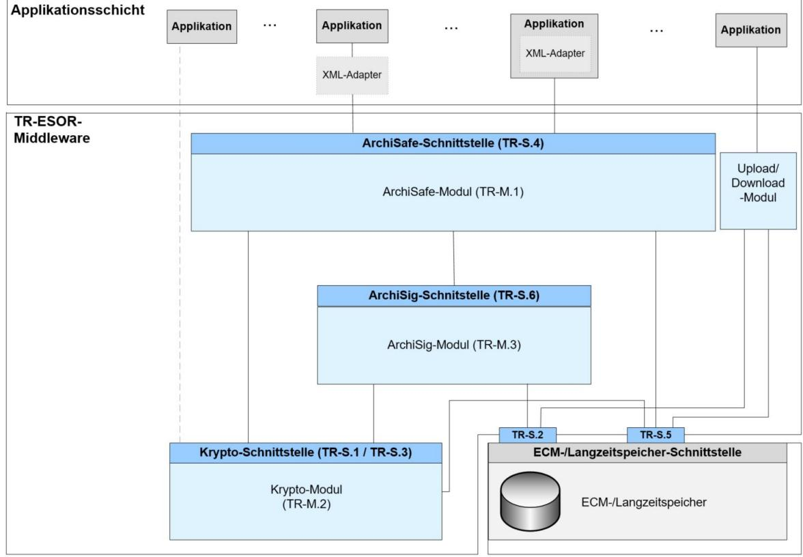
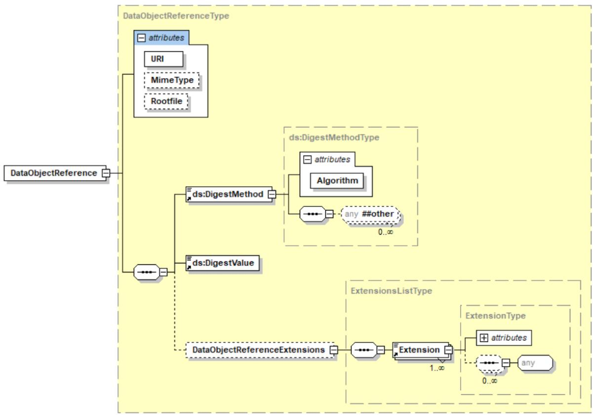
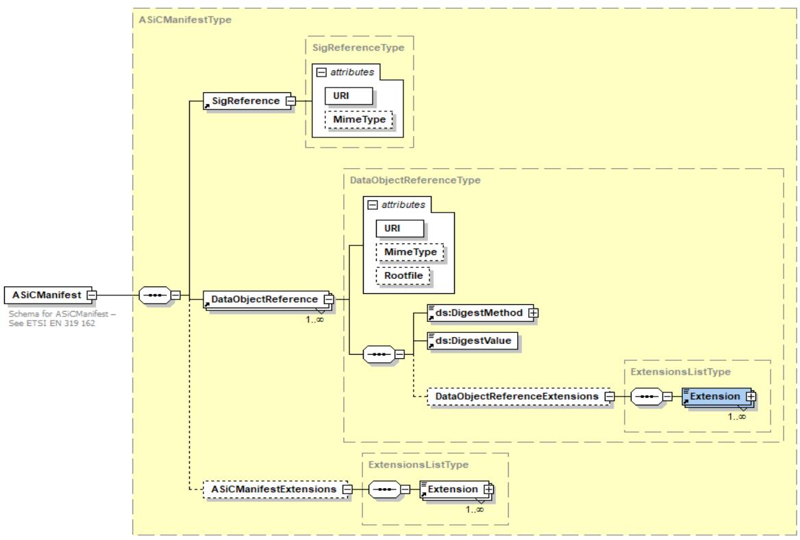
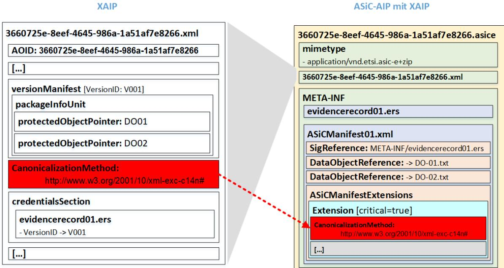
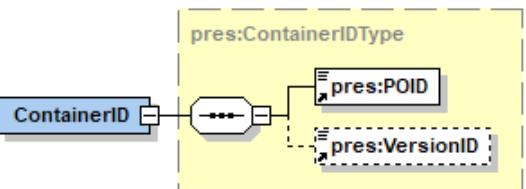
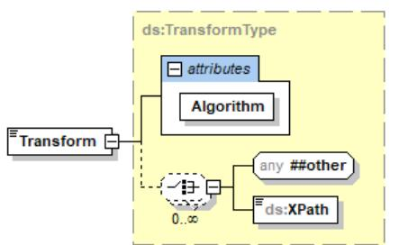
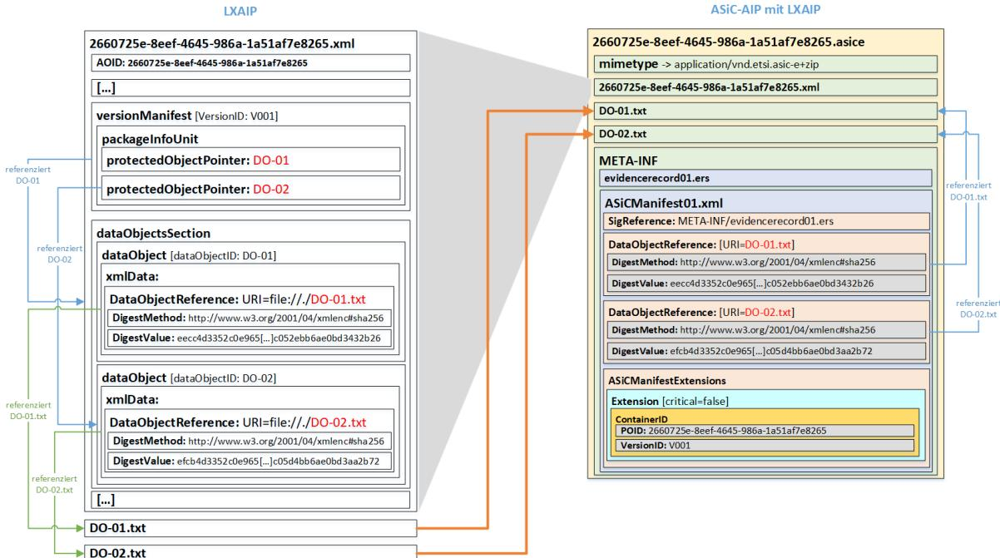
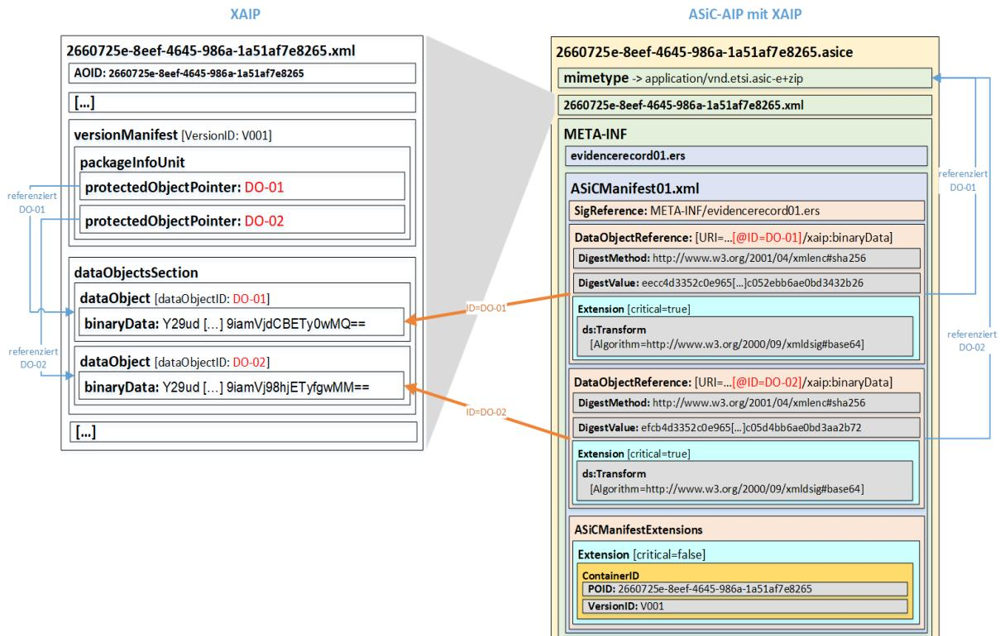
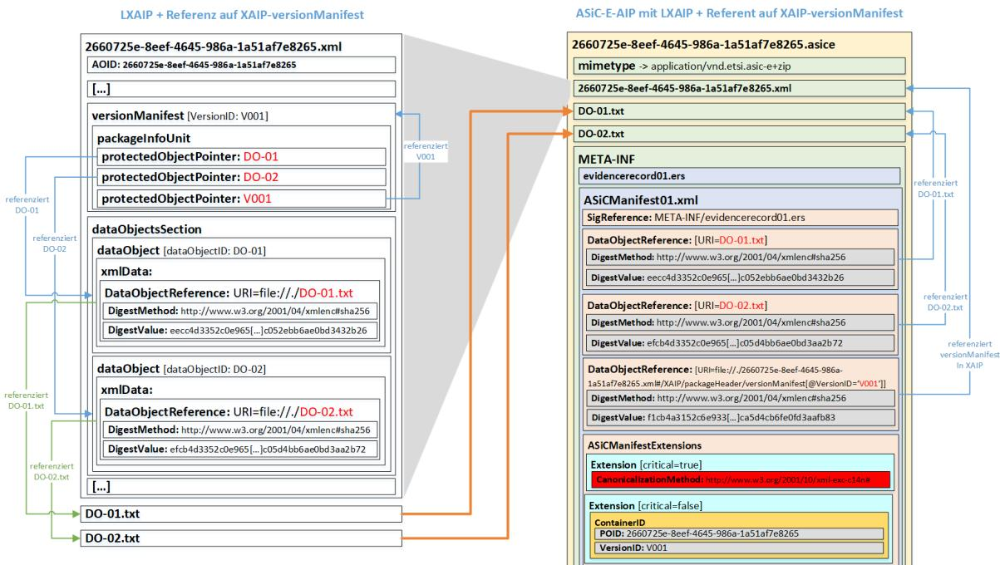
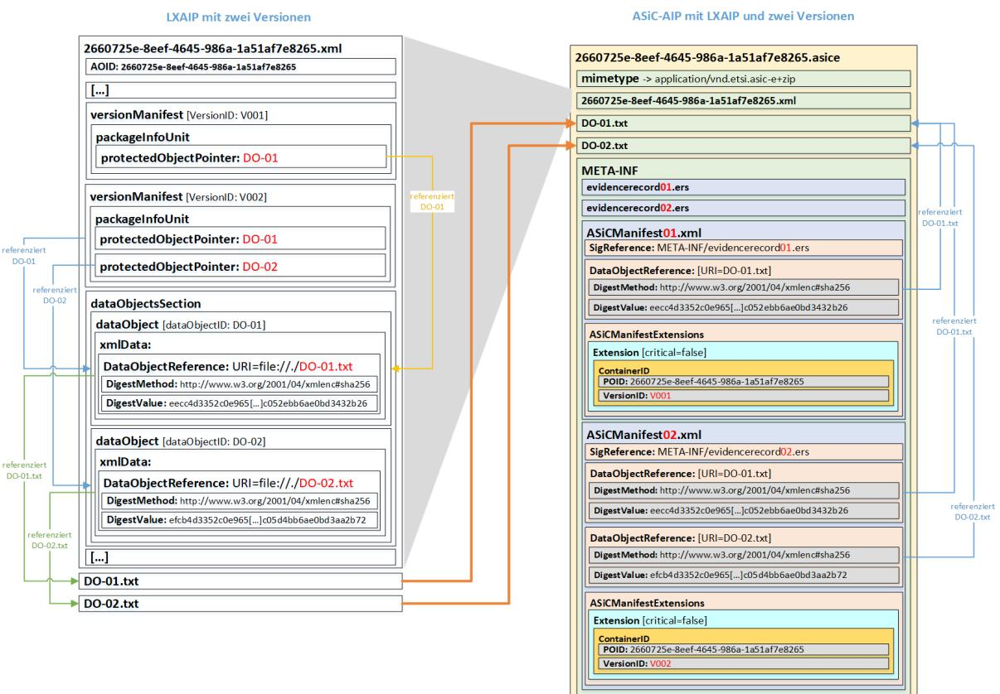

# BSI Technische Richtlinie 03125 Beweiswerterhaltung kryptographisch signierter Dokumente

# **Anlage TR-ESOR-F: Formate**

| Bezeichnung | Formate                                                                    |
|-------------|----------------------------------------------------------------------------|
| Kürzel      | BSI TR-ESOR-F                                                              |
| Version     | 1.2.2 (auf Basis der eIDAS-Verordnung und der ETSI Preservation Standards) |
| Datum       | 02.05.2019                                                                 |

Bundesamt für Sicherheit in der Informationstechnik Postfach 20 03 63 53133 Bonn Tel.: +49 228 99 9582-0 E-Mail: [tresor@bsi.bund.de](mailto:tresor@bsi.bund.de) Internet: [https://www.bsi.bund.de](https://www.bsi.bund.de/) © Bundesamt für Sicherheit in der Informationstechnik 2019

Bundesamt für Sicherheit in der Informationstechnik

| 1.Einführung5                                                                                                                                                                           |  |
|-----------------------------------------------------------------------------------------------------------------------------------------------------------------------------------------|--|
| 2.Übersicht7                                                                                                                                                                            |  |
| 3.Definition der Archivdatenobjekte9                                                                                                                                                    |  |
| 3.1XAIP9                                                                                                                                                                                |  |
| 3.1.1Überblick über die XAIP-Datenstruktur – das <XAIP>-Element10<br>3.1.2Der xaip:packageHeaderType11<br>3.1.3Der xaip:metaDataSectionType16<br>3.1.4Der xaip:dataObjectsSectionType19 |  |
| 3.1.5Der xaip:credentialSectionType22                                                                                                                                                   |  |
| 3.1.6Das Delta-XAIP-Element <DXAIP>24                                                                                                                                                   |  |
| 3.2Logisches XAIP (LXAIP)26<br>3.2.1Verlinkung der Datenobjekte in einem LXAIP26<br>3.2.2Das Delta-LXAIP-Element28                                                                      |  |
| 3.2.3Formaterkennung und -validierung eines LXAIP29                                                                                                                                     |  |
| 3.3ASiC-AIP (Ankündigung)29                                                                                                                                                             |  |
| 3.3.1ASiC-AIP mit einem logischen XAIP33<br>3.3.2ASiC-AIP mit einem gewöhnlichen XAIP34<br>3.3.3ASiC-AIP und Verlinkung der XML-Daten34                                                 |  |
| 3.3.4ASiC-AIP - Umgang mit Versionen35                                                                                                                                                  |  |
| 3.3.5Formaterkennung und -validierungValidieren eines ASiC-AIP36                                                                                                                        |  |
| 4.Nutzdatenformate38                                                                                                                                                                    |  |
| 4.1Metadaten38                                                                                                                                                                          |  |
| 4.1.1Extensible Markup Language (XML)38<br>4.1.2XML Schema (XSD)39                                                                                                                      |  |
| 4.2Inhaltsdaten (Objektdaten)39                                                                                                                                                         |  |
| 4.2.1Dokumente (Schriftgut)40<br>4.2.2Multi-Media Formate45                                                                                                                             |  |
| 4.3Base64 Kodierung47                                                                                                                                                                   |  |
| 5.Kryptographische Datenformate49                                                                                                                                                       |  |
| 5.1Signatur- und Siegelformate49                                                                                                                                                        |  |
| 5.1.1PKCS#7 / CMS / CAdES49                                                                                                                                                             |  |
| 5.1.2Digitale XML Signaturen / XAdES50                                                                                                                                                  |  |
| 5.1.3Digitale PAdES-Signaturen51<br>5.1.4Digitale AdES-Signaturen im ASiC-Container51                                                                                                   |  |
| 5.1.5Sonstige Signatur- bzw. Siegelformate51                                                                                                                                            |  |
| 5.2Zertifikatsformate52                                                                                                                                                                 |  |
| 5.3Zertifikatsvalidierungsformate52                                                                                                                                                     |  |
| 5.3.1Online Certificate Status Protocol (OCSP / RFC 2560 / RFC 6960)52                                                                                                                  |  |
| 5.3.2Server-Based Certificate Validation Protocol (SCVP / RFC 5055)52                                                                                                                   |  |
| 5.4Zeitstempel53                                                                                                                                                                        |  |

| 5.5Beweisdatenbericht (Evidence Record gemäß RFC 4998 /RFC 6283)53 |  |
|--------------------------------------------------------------------|--|
| 5.5.1EvidenceRecord gemäß RFC 499854                               |  |
| 5.5.2<EvidenceRecord> gemäß RFC 628355                             |  |
| 6.Anhang – XML-Schema-Definition58                                 |  |

# **Abbildungsverzeichnis**

| Abbildung 1: Schematische Darstellung der IT-Referenzarchitektur6                      |  |
|----------------------------------------------------------------------------------------|--|
| Abbildung 2: Definition des Elements asic:DataObjectReference aus dem ASiC-Manifest    |  |
| (vgl. [ETSI EN 319 162-1])28                                                           |  |
| Abbildung 3: Aufbau des Elements asic:AsiCManifest (vgl. [ETSI EN 319 162-1])30        |  |
| Abbildung 4: ASiC-AIP-Manifest, Definition der globalen Kanonisierungsmethode31        |  |
| Abbildung 5: Aufbau des Elements pres:ContainerID (vgl. [ETSI TS 119 512])32           |  |
| Abbildung 6: Aufbau des Elements ds:Transform32                                        |  |
| Abbildung 7: Beispiel für ein ASiC-AIP mit einem LXAIP33                               |  |
| Abbildung 8: Beispiel für ein ASiC-AIP-Manifest mit einem gewöhnlichen XAIP34          |  |
| Abbildung 9: Beispiel für ein ASiC-AIP mit einem LXAIP mit einer Referenz auf das      |  |
| Element xaip:versionManifest in LXAIP35                                                |  |
| Abbildung 10: Ein Beispiel für ein LXAIP mit zwei Versionen und ein korrespondierenden |  |
| ASiC-AIP36                                                                             |  |
|                                                                                        |  |

# **Tabellenverzeichnis**

# <span id="page-4-0"></span>**1. Einführung**

Ziel der Technischen Richtlinie "Beweiswerterhaltung kryptographisch signierter Dokumente" ist die Spezifikation sicherheitstechnischer Anforderungen für den langfristigen Beweiswerterhalt von kryptographisch signierten elektronischen Dokumenten und Daten nebst zugehörigen elektronischen Verwaltungsdaten (Metadaten).

Eine für diese Zwecke definierte Middleware (TR-ESOR-Middleware) im Sinn dieser Richtlinie umfasst alle diejenigen Module (**M**) und Schnittstellen (**S)**, die zur Sicherung und zum Erhalt der Authentizität und zum Nachweis der Integrität der aufbewahrten Dokumente und Daten eingesetzt werden.

Die im Hauptdokument dieser Technischen Richtlinie vorgestellte Referenzarchitektur besteht aus den nachfolgend beschriebenen funktionalen und logischen Einheiten:

- der Eingangs-Schnittstelle S.4 der TR-ESOR-Middleware, die dazu dient, die TR-ESOR-Middleware in die bestehende IT- und Infrastrukturlandschaft einzubetten;
- dem "ArchiSafe-Modul" (**[TR-ESOR-M.1]**), welches den Informationsfluss in der Middleware regelt, die Sicherheitsanforderungen an die Schnittstellen zu den IT-Anwendungen umsetzt und für eine Entkopplung von Anwendungssystemen und ECM/Langzeitspeicher sorgt;
- dem "Krypto-Modul" (**[TR-ESOR-M.2]**) nebst den zugehörigen Schnittstellen S.1 und S.3, das alle erforderlichen Funktionen zur Berechnung von Hashwerten, Prüfung elektronischer Signaturen bzw. Siegel bzw. Zeitstempel, zur Nachprüfung elektronischer Zertifikate und zum Einholen qualifizierter Zeitstempel sowie (optional) elektronische Signaturen bzw. Siegel für die Middleware zur Verfügung stellt. Darüber hinaus kann es Funktionen zur Ver- und Entschlüsselung von Daten und Dokumenten zur Verfügung stellen;
- dem "ArchiSig-Modul" (**[TR-ESOR-M.3]**) mit der Schnittstelle S.6, das die erforderlichen Funktionen für die Beweiswerterhaltung der digital signierten Unterlagen bereitstellt;
- einem ECM/Langzeitspeicher mit den Schnittstellen S.2 und S.5, der die physische Archivierung/Aufbewahrung und auch das Speichern der beweiswerterhaltenden Zusatzdaten übernimmt.

*Dieser ECM/Langzeitspeicher ist nicht mehr direkt Teil der Technischen Richtlinie, gleichwohl werden über die beiden Schnittstellen, die noch Teil der TR-ESOR-Middleware sind, Anforderungen daran gestellt.*

*Ebenso wenig ist die Applikationsschicht, die auch einen XML-Adapter enthalten kann, direkter Teil der Technischen Richtlinie, auch wenn dieser XML-Adapter als Teil einer Middleware implementiert werden kann.*

Die in Abbildung Abbildung 1 dargestellte IT-Referenzarchitektur orientiert sich an der ArchiSafe Referenzarchitektur und soll die logische (funktionale) Interoperabilität künftiger Produkte mit den Zielen und Anforderungen der Technischen Richtlinie ermöglichen und unterstützen.



**Abbildung 1: Schematische Darstellung der IT-Referenzarchitektur**

Diese Technische Richtlinie ist modular aufgebaut und spezifiziert in einzelnen Anlagen zum Hauptdokument die funktionalen und sicherheitstechnischen Anforderungen an die erforderlichen IT-Komponenten und Schnittstellen der TR-ESOR-Middleware. Die Spezifikationen sind strikt plattform-, produkt-, und herstellerunabhängig.

Das vorliegende Dokument trägt die Bezeichnung "Anlage TR-ESOR-F" und spezifiziert Datenformate, die aus Sicht der funktionalen und rechtlichen Anforderungen für den Beweiskrafterhalt kryptographisch signierter Dokumente geeignet sind.

# <span id="page-6-0"></span>**2. Übersicht**

Das Ziel einer auf lange Zeiträume angelegten beweiswerterhaltenden Ablage elektronischer Daten ist die nachprüfbare authentische, d. h. zurechenbare und unversehrte Speicherung, Konservierung und Verfügbarkeit der elektronischer Daten und Metadaten zumindest für die Dauer gesetzlich vorgeschriebener Aufbewahrungspflichten. Zur Sicherung der Verfügbarkeit elektronischer Dokumente gehört dabei auch die Gewährleistung der Verkehrsfähigkeit, d. h. der Lesbarkeit und des Zusammenhangs der Daten und Metadaten mit den ihnen zugrunde liegenden Geschäftsvorfällen über lange Zeiträume auf den zum Zeitpunkt der Verfügbarmachung üblichen IT-Systemen.

Der Inhalt elektronischer Daten und Dokumente ist auf der Anwendungsebene von IT-Systemen in der Regel als ein Strom (Folge) von Zeichen eines endlichen Zeichensatzes Z<sup>1</sup> codiert. Auch die Metadaten sind als Folge eines Zeichensatzes Z2 codiert. Die Zeichensätze Z1 und Z2 können, müssen aber nicht übereinstimmen. Darüber hinaus genügen die Metadaten bestimmten syntaktischen und semantischen Regeln, die in der Spezifikation der Metadatensätze begründet sind.

Die zugehörigen Metadaten lassen sich in zwei Kategorien unterscheiden:

- Ein Metadatensatz M1 enthält Informationen über den zur Codierung der Unterlagen verwendeten Zeichensatz Z1 und umfasst somit Informationen zur Darstellung und Formatierung der eigentlichen Inhaltsdaten.
- Ein Metadatensatz M2 enthält zusätzliche beschreibende Metainformationen zu den digitalen Unterlagen (z.B. Ersteller, Datum, Aktenzeichen, usw.) und stellt somit beispielsweise sicher, dass die Dokumente oder Daten wieder gefunden und einem Geschäftsvorgang zugeordnet werden können.

Das Ziel einer beweiswerterhaltenden Ablage elektronischer Dokumente ist es daher, für die digitalen Inhalte sowie deren Metadaten und Zeichensätze

- die Authentizität (daraus folgt auch die Nichtabstreitbarkeit),
- die Integrität (Unversehrtheit) und die
- Verfügbarkeit

für lange Zeiträume, mindestens aber für die Dauer gesetzlicher Aufbewahrungsfristen zu gewährleisten. Voraussetzung dafür sind standardisierte, zuverlässige und nachprüfbar vertrauenswürdige Dateninfrastrukturen und Funktionsaufrufe für die aufzubewahrenden elektronischen Dokumente.

Um die langfristige Verfügbarkeit der aufbewahrten elektronischen Dokumente sicher zu stellen, sollen deshalb sowohl für die Inhaltsdaten als auch die Metadaten nach Möglichkeit ausschließlich[1](#page-6-1) offene, standardisierte und stabile Datenformate verwendet werden, die eine langfristige und weitgehend system- und plattformunabhängige Interpretierbarkeit der Daten unterstützen. Die vornehmliche Intention dieser Anforderung ist, eine Formattransformation der gespeicherten elektronischen Dokumente zumindest für die Dauer der gesetzlich vorgeschriebenen Aufbewahrungsfristen zu vermeiden, da dies – vor allem bei elektronisch signierten Dokumenten – mit nicht unerheblichem Aufwand verbunden ist.

Für den Nachweis der Integrität und Authentizität der aufzubewahrenden Daten sieht diese Richtlinie den Einsatz vertrauenswürdiger kryptographischer Sicherungsmittel vor, die sowohl die eigentlichen Inhaltsdaten als auch die "beschreibenden" Metadaten umfassen, zuverlässig mit den geschützten Daten verknüpfen und imstande sind, den Beweiswert der

<span id="page-6-1"></span><sup>1</sup> Sofern die ursprünglichen Daten erst in ein standardisiertes und langfristig stabiles Format überführt werden müssen und die zur Verarbeitung der Dokumente notwendigen IT-Systeme voraussichtlich während der geplanten Aufbewahrungszeit verfügbar sein werden, kann es sinnvoll sein, zusätzlich die ursprünglichen Daten im Original-Format aufzubewahren.

kryptographischen Sicherungsmittel für die Dauer der gesetzlichen Aufbewahrungsfristen zu erhalten bzw. rechtskonform zu erneuern.

Zur Sicherstellung der Authentizität aufbewahrter elektronischer Daten und Dokumente gehört auch, dass die aufbewahrten elektronischen Unterlagen zuverlässig und dauerhaft mit sämtlichen Metainformationen verknüpft werden und bleiben, die für die Auffindbarkeit der Unterlagen sowie die rechts- und revisionssichere Nachvollziehbarkeit (Rekonstruktion) der den Daten zugrunde liegenden Geschäftsvorfälle erforderlich sind.

Der Zweck dieser Spezifikation ist es, elektronische Datenformate und Transaktionsprotokolle zu definieren und zu beschreiben, die geeignet sind, die rechtlichen und funktionalen Anforderungen an eine beweiswerterhaltende Langzeitspeicherung im Sinne dieser Richtlinie adäquat abzubilden und umzusetzen.

Der Abschnitt [3](#page-8-1) dieses Dokuments spezifiziert mit dem <XAIP>-Element ein XML-basiertes Containerformat für Archivdatenobjekte (XAIP) gemäß Kapitel [3.1](#page-8-0) bzw. (LXAIP) gemäß Kapitel [3.2](#page-25-1) und ein ZIP- basiertes Containerformat ASiC-AIP gemäß Kapitel [3.3,](#page-28-0) das von TRkonformen Middlewarekomponenten erzeugt oder von der Applikationsschicht übergeben wird, sowie mit dem Delta-XAIP-Element <DXAIP>-Element gemäß Kapitel [3.1.6](#page-23-0) bzw. Delta-LXAIP-Element gemäß Kapitel [3.2.2](#page-27-0) eine beim ArchiveUpdateRequest (vgl. **[TR-ESOR-E]**) übergebene Delta-(L)XAIP-Struktur.

Der Abschnitt [4](#page-37-2) dieses Dokuments beschreibt hierauf folgend elektronische Datenformate für die Inhaltsdaten (Primärinformationen) und die Metadaten, die zum Zeitpunkt der Veröffentlichung dieser Technischen Richtlinie für die langfristige Aufbewahrung von Nutzdaten vornehmlich unter dem Gesichtspunkt der nachhaltigen Verfügbarkeit sowie maschinellen Lesbarkeit und Interpretierbarkeit empfohlen werden.

Der Abschnitt [5](#page-48-2) dieses Dokuments beschreibt Strukturen, Formate und Algorithmen für die Erzeugung und Interpretation kryptographischer Daten, die zum Zeitpunkt der Veröffentlichung dieser Technischen Richtlinie für die langfristige Sicherung der Integrität, Authentizität und Beweiskraft elektronischer Dokumente geeignet sind.

Der diesem Dokument beigefügte Anhang (siehe Abschnitt [6\)](#page-57-0) enthält schließlich das vollständige spezifizierte XML-Schema.

*HINWEIS: Im folgenden Text umfasst der Begriff "Digitale Signatur" "fortgeschrittene elektronische Signaturen" gemäß [eIDAS-VO, Artikel 3 Nr. 11], "qualifizierte elektronische Signaturen" gemäß [eIDAS-VO, Artikel 3 Nr. 12], "fortgeschrittenen elektronische Siegel" gemäß [eIDAS-VO, Artikel 3 Nr. 26] und "qualifizierte elektronische Siegel" gemäß [eiDAS-VO, Artikel 3 Nr. 27]. Insofern umfasst der Begriff "digital signierte Dokumente" sowohl solche, die fortgeschrittene elektronische Signaturen oder Siegel bzw. qualifizierte elektronische Signaturen oder Siegel tragen.*

*Mit dem Begriff der "kryptographisch signierten Dokumente" sind in dieser TR neben den gemäß [eIDAS-VO, Artikel 3 Nr. 12] qualifiziert signierten, den gemäß [eIDAS-VO, Artikel 3 Nr. 27] qualifiziert gesiegelten oder den gemäß [eIDAS-VO, Artikel 3 Nr. 34] qualifiziert zeitgestempelten Dokumenten (im Sinne der eIDAS-Verordnung) ) auch Dokumente mit einer fortgeschrittenen Signatur gemäß [eIDAS-VO, Artikel 3 Nr. 11] oder mit einem fortgeschrittenen Siegel gemäß [eIDAS-VO, Artikel 3 Nr. 26] oder mit einem elektronischen Zeitstempel gemäß [eIDAS-VO, Artikel 3 Nr. 33] erfasst, wie sie oft in der internen Kommunikation von Behörden entstehen. Nicht gemeint sind hier Dokumente mit einfachen Signaturen oder Siegeln basierend auf anderen (z.B. nicht-kryptographischen) Verfahren.*

# <span id="page-8-1"></span>**3. Definition der Archivdatenobjekte**

Das vorliegende Dokument spezifiziert drei Archivdatenobjekt-Formate: Abschnitt [3.1](#page-8-0) spezifiziert das bereits in vorherigen TR-Versionen enthaltene, XML-basierte Archivdatenobjekt-Format XAIP. Abschnitt [3.2](#page-25-1) spezifiziert mit dem "logischen XAIP" (LXAIP) eine Variante des XAIP, bei dem auf extern abgelegte Datenobjekte verwiesen werden kann, und Abschnitt [3.3](#page-28-0) spezifiziert schließlich ein auf dem in der Europäischen Norm **[ETSI EN 319 162-1]** definierten ASiC-E-Format basierendes Archivdatenobjekt-Format (ASiC-AIP).

In der vorliegenden Richtlinie wird der Begriff AIP im Sinne von XAIP, LXAIP oder ASiC-AIP verwendet.

 Für den Beweiswerterhalt kryptographisch signierter Dokumente muss das in diesem Abschnitt beschriebene und näher spezifizierte XAIP-Format gemäß Kapitel [3.1](#page-8-0) oder das LXAIP-Format gemäß Kapitel [3.2](#page-25-1) oder das ASiC-AIP-Format gemäß Kapitel [3.3](#page-28-0) genutzt werden.

# <span id="page-8-0"></span>**3.1 XAIP**

Ein Archivdatenobjekt, d. h. ein für die langfristige Ablage in einem elektronischen Archivsystem bestimmtes elektronisches Dokument im Sinne dieser Richtlinie, ist ein selbstbeschreibendes und wohlgeformtes XML-Dokument, das gegen ein gültiges und autorisiertes XML-Schema geprüft werden kann (im Weiteren auch: **XML formatted Archival Information Package** oder kurz: **XAIP**).

Ein solches Archivdatenobjekt enthält sämtliche Inhaltsdaten (Primärinformationen) und Metainformationen, die für eine zuverlässige und vollständige Rekonstruktion von Geschäftsoder Verwaltungsvorgängen bis zum Ablauf der gesetzlich vorgeschriebenen Aufbewahrungsfristen erforderlich sind.

Die Beschreibung der Archivdatenobjekte durch ein gültiges XML-Schema gewährleistet, dass:

- die Archivdatenobjekte vor der Übergabe an den elektronischen Langzeitspeicher auf syntaktische Richtigkeit evaluiert werden können,
- erforderliche Ergänzungen oder Erweiterungen der Metadaten mit wenig Aufwand durch Ergänzung und Erweiterung vorhandener Metadatenstrukturen und/oder Einschluss zusätzlicher XML-Schemata möglich sind, sowie
- die für den Nachweis der Authentizität und Integrität aufbewahrungspflichtiger Daten aus rechtlichen Erfordernissen benötigten kryptographischen Sicherungsmittel, wie digitale Signaturen oder elektronische Zeitstempel, dauerhaft und zuverlässig mit den zu sichernden Daten verknüpft werden können.

Die folgenden Abschnitte definieren und beschreiben grundsätzliche syntaktische und semantische Strukturen, die ein zu den Zielen und Anforderungen dieser Technischen Richtlinie konformes Archivdatenobjekt implementieren soll. Sie stützen sich in weiten Teilen auf Vereinbarungen und Erfahrungen des ArchiSafe Projektes der Physikalisch-Technischen Bundesanstalt **[PTB 05]** sowie auf Konzepten des OAIS Referenzmodells **[OAIS]**, des Metadata Encoding and Transmission Standards **[METS]**, der Victorian Electronic Records Strategy **[VERS]** sowie dem XML Formatted Data Unit **[XFDU]** Standards des Consultative Committee for Space Data Systems (CCSDS) der amerikanischen Luft- und Raumfahrtbehörde.

In der Definition und Beschreibung der XML Datenstrukturen unterscheidet diese Spezifikation zwischen verbindlichen (obligatorischen) und optionalen Datenelementen. Ein verbindliches Datenelement muss in einem zu dieser Spezifikation konformen Archivdatenobjekt vorhanden sein und durch zu dieser Richtlinie konforme elektronische Archivsysteme interpretierbar sein. Ein optionales Element kann auftreten. Es muss nicht notwendig interpretiert werden können, darf jedoch die maschinelle Verarbeitung (Interpretation) anderer Elemente nicht behindern. Ein optionales Element muss auftreten, wenn sein Vorhandensein an bestimmte Bedingungen, wie bspw. das Vorhandensein elektronischer Signaturen, geknüpft ist und diese Bedingungsvoraussetzungen erfüllt sind. Es gilt die folgende Anforderung:

#### <span id="page-9-0"></span>**3.1.1 Überblick über die XAIP-Datenstruktur – das <XAIP>-Element**

Ein Archivdatenobjekt gemäß dieser Richtlinie besteht aus einem <XAIP>-Element, das folgendermaßen definiert ist:

<xs:element name="XAIP" type="xaip:XAIPType"/>

Der **xaip:XAIPType** ist folgendermaßen definiert:

```
<xs:complexType name="XAIPType">
        <xs:sequence>
                <xs:element name="packageHeader"
                        type="xaip:packageHeaderType">
                </xs:element>
                <xs:element name="metaDataSection"
                        type="xaip:metaDataSectionType" maxOccurs="1" minOccurs="0">
                </xs:element>
                <xs:element name="dataObjectsSection"
                        type="xaip:dataObjectsSectionType" maxOccurs="1" 
minOccurs="0">
                </xs:element>
                <xs:element name="credentialsSection"
                        type="xaip:credentialsSectionType" maxOccurs="1" 
minOccurs="0">
                </xs:element>
        </xs:sequence>
</xs:complexType>
```
Der **xaip:XAIPType** enthält folgende Elemente:

<packageHeader> [required]

Das <packageHeader>-Element enthält generelle Informationen zum Archivdatenobjekt und beschreibt beispielsweise die logische Struktur desselben. Weitere Informationen zum **xaip:packageHeaderType** finden sich in Abschnitt [3.1.2.](#page-10-0)

<metaDataSection> [optional]

Das <metaDataSection>-Element enthält Metainformationen zur Beschreibung des Geschäfts- und Archivierungskontextes, sofern solche vorhanden sind. Die metaDataSection soll alle Informationen enthalten, die zur transparenten und nachhaltigen Interpretation des Geschäfts- und Archivierungskontextes benötigt werden. Weitere Informationen zum **xaip:metaDataSectionType** finden sich in Abschnitt [3.1.3.](#page-15-0)

<dataObjectsSection> [optional]

Das <dataObjectsSection>-Element enthält die Nutzdaten des Archivdatenobjektes, sofern solche vorhanden sind. Dieses Element kann beispielsweise dafür genutzt werden, Inhaltsdaten in verschiedenen plattform- oder anwendungsspezifischen Datenformaten in einem XAIP-Container zu speichern oder ganze Akten mit vielen unterschiedlichen Dokumenten gemeinsam zu archivieren. Weitere Informationen zum **xaip:dataObjectsSectionType** finden sich in Abschnitt [3.1.4.](#page-18-0)

<credentialsSection> [optional]

Das <credentialsSection>-Element enthält bei Bedarf Beweisdaten in Form von Evidence Records oder beweisrelevante Informationen, wie z.B. Signaturen, Siegel, Zeitstempel, Zertifikate oder Signaturprüfinformationen. Weitere Informationen zum **xaip:credentialsSectionType** finden sich in Abschnitt [3.1.5.](#page-21-0)

#### <span id="page-10-0"></span>**3.1.2 Der xaip:packageHeaderType**

Der **xaip:packageHeaderType** wird für die Definition des XAIP-Elementes genutzt und ist folgendermaßen definiert:

```
<xs:complexType name="packageHeaderType">
        <xs:sequence>
                <xs:element name="AOID" type="xs:string"
                        maxOccurs="1" minOccurs="0">
                </xs:element>
                <xs:element name="packageInfo" type="xs:string"
                        minOccurs="0">
                </xs:element>
                <xs:element name="versionManifest" type="xaip:versionManifestType"
                        maxOccurs="unbounded" minOccurs="1">
                </xs:element>
                <xs:element ref="ds:CanonicalizationMethod"
                        maxOccurs="1" minOccurs="0">
                </xs:element>
                <xs:element name="extension" type="xaip:extensionType"
                        maxOccurs="1" minOccurs="0">
                </xs:element>
        </xs:sequence>
        <xs:attribute name="packageID" type="xs:ID" use="required"/>
</xs:complexType>
```
<AOID> [optional[2](#page-10-1) ]

> Das <AOID>-Element dient als eineindeutiger Identifikator des Archivdatenobjektes, das in der Regel durch die TR-ESOR Middleware oder den ECM/Langzeitspeicher erzeugt wird. Die interne Struktur dieses Identifikators ist nicht durch diese Spezifikation festgelegt, sondern bleibt dem Hersteller bzw. Anwender der TR-ESOR-Middleware überlassen.

```
<packageInfo> [optional]
```
Das <packageInfo>-Element kann Basisinformationen über das Archivdatenobjekt im Textformat enthalten, die einen Nutzer auch in Zukunft in die Lage versetzen, das Format des XAIP Dokumentes zu verstehen und die Inhalte zu interpretieren.

<versionManifest> [required, unbounded]

Das <versionManifest>-Element dient als "versionsspezifisches Inhaltsverzeichnis" und kann mehrfach auftreten. Es enthält jeweils Informationen zu einer Version des Archivdatenobjektes. Die Struktur des **xaip:VersionManifestType** ist unten näher erläutert.

<span id="page-10-1"></span><sup>2</sup> Das <AOID>-Element ist optional, um im Rahmen des ArchiveSubmissionRequest (siehe Anlage E) die Erzeugung der AOID durch die aufgerufene Komponente zu ermöglichen. Sofern dieses Element nicht bereits vorhanden ist, muss es durch die TR-ESOR-Middleware oder den ECM/Langzeitspeicher erzeugt werden.

<ds:CanonicalizationMethod> [optional]

Das <CanonicalizationMethod>-Element spezifiziert die anzuwendende Kanonisierungsmethode. Sofern dieses Element fehlt, erfolgt die Kanonisierung durch die TR-ESOR-Middleware mit dem Standard-Algorithmus (C14N - Canonical XML **[C14N]**).

```
<extension> [optional]
```
Durch das optionale <extension>-Element können benutzerspezifische Erweiterungen geschaffen werden. Die Struktur des **xaip:extensionType** ist unten dargestellt.

Es wird empfohlen, diese Erweiterungen und hierdurch entstehende XAIP-Profile mit dem Bundesamt für Sicherheit in der Informationstechnik abzustimmen.

#### <span id="page-11-1"></span>@packageID [required]

Mit dem packageID-Attribut steht ein eindeutiger Identifikator des <packageHeader>-Elementes bereit, der bei Bedarf als Bezugspunkt innerhalb des Archivdatenobjektes dienen kann. Sofern das <packageHeader>-Element kryptographisch geschützt werden soll, wird durch ein <protectedObjectPointer>-Element auf dieses packageID-Attribut verwiesen. Das packageID-Attribut kann von der Geschäftsanwendung erzeugt werden und in dieser als weiterer Identifikator dienen.

#### <span id="page-11-0"></span>Die Struktur des **xaip:extensionType** ist folgendermaßen definiert:

```
<xs:complexType name="extensionType">
        <xs:sequence>
                <xs:any processContents="lax" minOccurs="0" maxOccurs="unbounded" />
        </xs:sequence>
</xs:complexType>
```
Die Struktur des **xaip:VersionManifestType** ist folgendermaßen gegeben:

```
<xs:complexType name="versionManifestType">
        <xs:sequence>
                <xs:element name="versionInfo" type="xs:string"
                        maxOccurs="1" minOccurs="0">
                </xs:element>
                <xs:element name="preservationInfo" type="xaip:preservationInfoType"
                        >
                </xs:element>
                <xs:element name="submissionInfo" type="xaip:submissionInfoType"
                        maxOccurs="1" minOccurs="0">
                </xs:element>
                <xs:element name="packageInfoUnit" type="xaip:packageInfoUnitType"
                        maxOccurs="unbounded" minOccurs="1">
                </xs:element>
                <xs:element name="extension" type="xaip:extensionType"
                        maxOccurs="1" minOccurs="0">
                </xs:element>
        </xs:sequence>
        <xs:attribute name="VersionID" type="xs:ID" use="required"/>
</xs:complexType>
```
#### <versionInfo> [optional]

Das <versionInfo>-Element enthält Informationen zur entsprechenden Version des Archivdatenobjektes im Textformat.

<preservationInfo> [required]

Das <preservationInfo>-Element enthält Informationen zur Aufbewahrung (z.B. Aufbewahrungsdauer, Archivierungsbewertung) des Archivdatenobjektes. Die Struktur des **xaip:preservationInfoType** ist unten näher erläutert.

<submissionInfo> [optional]

```
Das <submissionInfo>-Element enthält Informationen über den Absender des
      Archivdatenobjektes. Die Struktur des xaip:submissionInfoType ist unten näher erläutert.
<packageInfoUnit> [required, unbounded]
      Das <packageInfoUnit>-Element enthält Informationen zu einer bestimmten
```
Inhaltsdateneinheit. Dieses Element kann mehrmals auftreten. Die Struktur des **xaip:packageInfoUnitType** ist unten näher erläutert.

<extension> [optional]

Durch das optionale <extension>-Element können benutzerspezifische Erweiterungen geschaffen werden. Die Struktur des **xaip:extensionType** ist auf Seite [12](#page-11-0) dargestellt.

Es wird empfohlen, diese Erweiterungen und hierdurch entstehende XAIP-Profile mit dem Bundesamt für Sicherheit in der Informationstechnik abzustimmen.

```
@VersionID [required]
```
Mit dem VersionID-Attribut steht ein eindeutiger Identifikator der Version des Archivdatenobjektes bereit. Das VersionID-Attribut soll in der Form "v1", "v2", "v3" etc. gebildet werden.

Die Struktur des **xaip:preservationInfoType** ist folgendermaßen gegeben:

```
<xs:complexType name="preservationInfoType">
        <xs:sequence>
                <xs:element name="retentionPeriod" type="xs:date" />
                <xs:element name="status" type="xs:string"
                        maxOccurs="1" minOccurs="0">
                </xs:element>
                <xs:element name="extension" type="xaip:extensionType"
                        maxOccurs="1" minOccurs="0">
                </xs:element>
        </xs:sequence>
</xs:complexType>
```
<retentionPeriod> [required]

Das <retentionPeriod>-Element spezifiziert das Datum bis zu dem die Unterlagen aufbewahrt werden müssen. Dieses Element wird beim ArchiveDeletionRequest

(vgl. **[TR-ESOR-E]**) ausgewertet.

```
<status> [optional]
```
Das <status>-Element kann Informationen über den Status des Archivdatenobjektes enthalten, die vor dem Löschen des Archivdatenobjektes ausgewertet werden können.[3](#page-12-0)

Die konkrete Belegung und Auswertung dieses Elementes ist nicht Gegenstand der vorliegenden Spezifikation. Vielmehr sollen derartige Festlegungen Gegenstand von XAIP-Profilen sein. Es wird empfohlen, solche XAIP-Profile mit dem Bundesamt für Sicherheit in der Informationstechnik abzustimmen.

<extension> [optional]

Durch das optionale <extension>-Element können benutzerspezifische Erweiterungen geschaffen werden. Die Struktur des **xaip:extensionType** ist auf Seite [12](#page-11-0) dargestellt.

Es wird empfohlen, diese Erweiterungen und hierdurch entstehende XAIP-Profile mit

<span id="page-12-0"></span><sup>3</sup> Mit diesem Element kann insbesondere der im behördlichen Umfeld benötigte "Bewertungsvermerk" realisiert werden.

dem Bundesamt für Sicherheit in der Informationstechnik abzustimmen.

Die Struktur des **xaip:submissionInfoType** ist folgendermaßen gegeben:

```
<xs:complexType name="submissionInfoType">
        <xs:sequence>
                <xs:element name="clientID" type="saml:NameIDType">
                </xs:element>
                <xs:element name="submissionUnit" type="saml:NameIDType"
                        maxOccurs="1" minOccurs="0">
                </xs:element>
                <xs:element name="submissionAuthor" type="saml:NameIDType"
                        maxOccurs="1" minOccurs="0">
                </xs:element>
                <xs:element name="submissionTime" type="xs:dateTime"
                        maxOccurs="1" minOccurs="0">
                </xs:element>
                <xs:element name="extension" type="xaip:extensionType"
                        maxOccurs="1" minOccurs="0">
                </xs:element>
        </xs:sequence>
</xs:complexType>
```
<clientID> [required]

Das <clientID>-Element enthält den Identifikator der aufrufenden Geschäftsanwendung. Weitere Details zu diesem Element sind in **[SAMLv2]** Abschnitt 2.2.2 spezifiziert. Dieses Element kann von der TR-ESOR-Middleware aus den verfügbaren Authentisierungsinformationen abgeleitet werden.

```
<submissionUnit> [optional]
```
Das <submissionUnit>-Element bezeichnet bei Bedarf die Organisationseinheit der aufrufenden Geschäftsanwendung. Die Struktur des Elements ist in **[SAMLv2]** Abschnitt 2.2.2 spezifiziert.

```
<submissionAuthor> [optional]
```

```
Das <submissionAuthor>-Element bezeichnet bei Bedarf den Autor bzw.
Absender des Archivdatenobjektes. Die Struktur des Elements ist in [SAMLv2]
Abschnitt 2.2.2 spezifiziert.
```
<submissionTime> [optional]

Das <submissionTime>-Element soll von der aufrufenden Geschäftsanwendung eingefügt werden und gibt den Zeitpunkt der Übergabe des Archivdatenobjektes an.

<extension> [optional]

Durch das optionale <extension>-Element können benutzerspezifische Erweiterungen geschaffen werden. Die Struktur des **xaip:extensionType** ist auf Seite [12](#page-11-0) dargestellt.

Es wird empfohlen, diese Erweiterungen und hierdurch entstehende XAIP-Profile mit dem Bundesamt für Sicherheit in der Informationstechnik abzustimmen.

Die Struktur des **xaip:packageInfoUnitType** ist folgendermaßen gegeben:

```
<xs:complexType name="packageInfoUnitType">
        <xs:sequence>
                <xs:element name="unitType" type="xs:string"
                        minOccurs="0">
                </xs:element>
                <xs:element name="textInfo" type="xs:string"
                        minOccurs="0">
                </xs:element>
```

```
<xs:element name="protectedObjectPointer" type="xs:IDREF"
                        minOccurs="1" maxOccurs="unbounded">
                </xs:element>
                <xs:element name="unprotectedObjectPointer" type="xs:IDREF"
                        minOccurs="0" maxOccurs="unbounded">
                </xs:element>
                <xs:element name="packageInfoUnit" type="xaip:packageInfoUnitType"
                        minOccurs="0" maxOccurs="unbounded">
                </xs:element>
                <xs:element name="extension" type="xaip:extensionType"
                        maxOccurs="1" minOccurs="0">
                </xs:element>
        </xs:sequence>
        <xs:attribute name="packageUnitID" type="xs:ID" use="required" />
</xs:complexType>
```
#### <unitType> [optional]

Das <unitType>-Element gibt den Typ der betreffenden Inhaltsdateneinheit an. Die möglichen Ausprägungen des <unitType>-Elementes sollen im Rahmen von XAIP-Profilen festgelegt werden. Es wird empfohlen, die XAIP-Profile mit dem Bundesamt für Sicherheit in der Informationstechnik abzustimmen.

<textInfo> [optional]

<span id="page-14-1"></span>Das <textInfo>-Element enthält Informationen zur abgelegten Inhaltsdateneinheit. <protectedObjectPointer> [required, unbounded]

Durch die Menge der hier angegebenen <protectedObjectPointer>-Elemente wird definiert, welche Teile des Archivdatenobjektes in die Hashwertbildung einfließen und deshalb vom entsprechenden Evidence Record geschützt werden. Hinsichtlich der Details der Hashwertbildung wird zwischen Nutzdaten und beweisrelevanten Daten einerseits und Metadaten und sonstigen XAIP-spezifischen XML-Strukturen, wie z.B. VersionManifest und packageInfoUnit, unterschieden:

Bei *Nutzdaten und beweisrelevanten Daten* werden die eigentlichen Daten – **ohne** umschließende XML-Tags und in ihrem ursprünglichen Format (d.h. ohne Base64- Codierung) – der Hashwertbildung zugeführt, so dass solche bereits durch Evidence Records geschützte Daten nahtlos importiert und in einen XAIP-Container eingebettet werden können.

Bei *Metadaten und sonstigen XAIP-spezifischen XML-Strukturen* hingegen wird das komplette XML-Element – **inklusive** der umschließenden XML-Tags und der möglicherweise darin enthaltenen XML-Attribute – mit dem spezifizierten Kanonisierungsverfahren kanonisiert und sodann der Hashwertbildung zugeführt.*[4](#page-14-0)*

Die in dieser Weise gebildeten Hashwerte bilden eine Datenobjekt-Gruppe (data object group) im Sinne von **[RFC4998]** und **[RFC6283]**.

<unprotectedObjectPointer> [optional, unbounded]

Durch einen hier angegebenen unprotectedObjectPointer wird klargestellt, dass das Objekt, auf das hier verwiesen wird, logisch zur angegebenen XAIP-Version gehört. Allerdings fließt dieses Objekt *nicht* in die Hashwertbildung ein und es ist deshalb nicht von einem Evidence Record umfasst und kryptographisch geschützt. Beispielsweise kann mit einem solchen Element auf einen zu dieser Version

<span id="page-14-0"></span><sup>4</sup> Beispielsweise könnte hier auf das packageID-Attribut (siehe Seite [12\)](#page-11-1) verwiesen werden, um das packageHeader-Element in die Hashbaumbildung einzubeziehen. Allerdings ist in diesem Fall zu berücksichtigen, dass sich die packageHeader-Struktur durch weitere Updates verändern würde und deshalb der kryptographische Schutz des packageHeader-Elementes oft nur dann sinnvoll ist, sofern keine weiteren Aktualisierungen mehr zu erwarten sind.

gehörenden Evidence Record verwiesen werden, der in der Credential Section abgelegt ist.

<packageInfoUnit> [optional, unbounded]

Ein packageInfoUnit-Element kann wiederum eine Folge von packageInfoUnit-Elementen enthalten, so dass hierdurch hierarchisch verschachtelte Strukturen abgebildet werden können.

<extension> [optional]

Durch das optionale <extension>-Element können benutzerspezifische Erweiterungen geschaffen werden. Die Struktur des **xaip:extensionType** ist auf Seite [12](#page-11-0) dargestellt.

Es wird empfohlen, diese Erweiterungen und hierdurch entstehende XAIP-Profile mit dem Bundesamt für Sicherheit in der Informationstechnik abzustimmen.

@packageUnitID [required]

Das packageUnitID-Attribut fungiert als eindeutiger Identifikator der Inhaltsdateneinheit.

#### <span id="page-15-0"></span>**3.1.3 Der xaip:metaDataSectionType**

Die Struktur des **xaip:metaDataSectionType** ist folgendermaßen gegeben:

```
<xs:complexType name="metaDataSectionType">
        <xs:sequence>
                <xs:element ref="xaip:metaDataObject"
                        maxOccurs="unbounded" minOccurs="1">
                </xs:element>
        </xs:sequence>
</xs:complexType>
```
<xs:element name="metaDataObject" type="xaip:metaDataObjectType" />

<metaDataObject> [required, unbounded]

Der **xaip:metaDataSectionType** besteht aus einer Folge von xaip:metaDataObject-Elementen vom Typ **xaip:metaDataObjectType** in denen die entsprechenden Metadaten abgelegt sind.

Die Struktur des **xaip:metaDataObjectType** ist folgendermaßen gegeben:

```
<xs:complexType name="metaDataObjectType">
 <xs:complexContent>
 <xs:restriction base="xs:anyType">
 <xs:attribute name="metaDataID" type="xs:ID" use="required"/>
 <xs:attribute name="dataObjectID" type="xs:IDREFS" use="required" />
 <xs:attribute name="category" type="xs:string" />
 <xs:attribute name="classification" type="xs:string" />
 <xs:attribute name="type" type="xs:string" />
 </xs:restriction>
 </xs:complexContent>
</xs:complexType>
```
Demnach kann ein xaip:metaDataObject beliebig strukturiert sein und die nachfolgend aufgeführten Attribute beinhalten:

@metaDataID [required]

Das metaDataID-Attribut fungiert als eindeutiger Identifikator des Metadatenobjektes, so dass auf dieses Bezug genommen werden kann.

@dataObjectID [required]

Mit dem dataObjectID-Attribut wird klargestellt, auf welche Datenobjekte[5](#page-16-0) oder auf welche XAIP-Strukturelemente sich das vorliegende Metadatenobjekt bezieht. Allerdings ist hierbei zu bedenken, dass die dataObjectID eines binären Datenobjektes (vgl. Abschnitt [3.1.4\)](#page-18-0) nicht durch kryptographische Mechanismen geschützt ist und deshalb durch den oben erläuterten protectedObjectPointer-Mechanismus ein Metadatenobjekt später unbemerkt einem anderen Datenobjekt zugeordnet werden könnte. Um diese Mehrdeutigkeit zu vermeiden, soll ein Metadatenobjekt, das auf ein binäres Datenobjekt verweist, ein unten erläutertes dataObjectCheckSum-Element enthalten, durch das das Datenobjekt eindeutig bezeichnet wird.

@category [optional]

Das category-Attribut bestimmt die generelle Kategorie, dem das Metadatenobjekt zugeordnet ist.

@classification [optional]

Das classification-Attribut liefert weitere Informationen zur näheren Klassifizierung des Metadatenobjektes innerhalb der über das category-Attribut definierten Kategorie.

@type [optional]

Das type-Attribut gibt den konkreten Typ des Metadatenobjektes an. Dieses Attribut bestimmt die interne syntaktische Struktur und Semantik des metaDataObject-Elementes.

Die verwendeten type-Attribute und die dazu korrespondierenden Kind-Elemente des xaip:metaDataObject-Elementes sollen in XAIP-Profilen festgeschrieben werden. Es wird empfohlen, diese XAIP-Profile mit dem Bundesamt für Sicherheit in der Informationstechnik abzustimmen.

Sofern nicht durch eine XAIP-Profilierung etwas anderes bestimmt ist, sollen für die category und classification Attribute die folgenden, in **[XFDU]** definierten und dem OAIS-Modell entsprechenden Werte genutzt werden:

| Category | Classification | Beschreibung                                                                                                                                                                                       |
|----------|----------------|----------------------------------------------------------------------------------------------------------------------------------------------------------------------------------------------------|
| DMD6     | DESCRIPTION    | beschreibende, fachliche<br>Metadaten, die das<br>referenzierte Datenobjekt<br>näher beschreiben, um<br>beispielsweise das Auffinden<br>und den Zugriff zu<br>ermöglichen oder zu<br>unterstützen. |
|          | OTHER          | Sonstige beschreibende<br>Metadaten.                                                                                                                                                               |

<span id="page-16-0"></span><sup>5</sup> Ein Meta-Datenobjekt kann einem (oder mehreren) Nutzdatenobjekt (dataObject) , einem (oder mehreren) Beweisdatenobjekt (credential) oder einem anderen (oder mehreren anderen) Meta-

Datenobjekt (metaDataObject) oder einem (oder mehreren) XAIP-Strukturelement zugeordnet sein.

<span id="page-16-1"></span><sup>6</sup> DMD = Descriptive Meta Data

| Category    | Classification                                                                                                                                                   | Beschreibung                                                                                                                                       |
|-------------|------------------------------------------------------------------------------------------------------------------------------------------------------------------|----------------------------------------------------------------------------------------------------------------------------------------------------|
| REP7        | SYNTAX                                                                                                                                                           | Metadaten, die die Syntax<br>eines anderen Datenobjektes<br>näher beschreiben.8                                                                    |
|             | DED9                                                                                                                                                             | Metadaten, die die Semantik<br>eines anderen Datenobjektes<br>näher beschreiben.10                                                                 |
|             | OTHER                                                                                                                                                            | Sonstige Metadaten, die die<br>Darstellung eines anderen<br>Datenobjektes unterstützen.                                                            |
| PDI11 12 13 | REFERENCE                                                                                                                                                        | Metadaten, die die Bildung<br>von Identifikatoren<br>beschreiben und externen<br>Systemen den Zugriff auf ein<br>Archivdatenobjekt<br>ermöglichen. |
|             | CONTEXT                                                                                                                                                          | Metadaten, die die<br>Umgebung beschreiben in<br>der das Archivdatenobjekt<br>entstanden ist.                                                      |
|             | PROVENANCE                                                                                                                                                       | Metadaten, die die<br>Entstehungsgeschichte des<br>Archivdatenobjektes<br>dokumentieren.14                                                         |
|             | OTHER                                                                                                                                                            | Sonstige<br>aufbewahrungsspezifische<br>Metadaten.                                                                                                 |
| OTHER       | Mit der Kategorie "OTHER" können<br>Metadaten abgelegt werden, die sich nicht<br>eindeutig einer der vorgenannten Kategorien<br>(DMD, REP, PDI) zuordnen lassen. |                                                                                                                                                    |

<span id="page-17-0"></span><sup>7</sup> REP = Representation Meta Data

<span id="page-17-1"></span><sup>8</sup> Hier soll das verwendete Datenformat in einer für die spätere Verarbeitung hinreichend präzisen Weise beschrieben werden. Beispielsweise können hier XML-Schema-Dateien abgelegt werden, die bei einer Schema-Validierung von anwendungsspezifischen Datenobjekten eingesetzt werden können.

<span id="page-17-2"></span><sup>9</sup> DED = Data Entity Dictionary

<span id="page-17-3"></span><sup>10</sup> Beispielsweise können hier Ontologie-Dateien abgelegt werden, in denen die Semantik von anwendungsspezifischen Datenobjekten beschrieben ist.

<span id="page-17-4"></span><sup>11</sup> PDI = Preservation Description Information

<span id="page-17-5"></span><sup>12</sup> Es sei angemerkt, dass im XAIP **keine** Metadaten der Klasse FIXITY auftreten, da die Elemente zum Schutz der Integrität und Authentizität im XAIP in der Credential-Section abgelegt werden.

<span id="page-17-6"></span><sup>13</sup> Bei den Metadaten der Kategorie PDI kann es sich sowohl um fachliche (z.B. Aktenzusammenhang, Bearbeitungs- und Protokollinformationen) als auch technische (z.B. Informationen zu erfolgten Konvertierungen sowie zur Soft- und Hardwareumgebung) Metadaten handeln.

<span id="page-17-7"></span><sup>14</sup> Für die Spezifikation von Metadaten der Klasse PROVENANCE können beispielsweise die in **[PREMIS]** definierten Ereignisse genutzt werden.

```
<xs:element name="dataObjectCheckSum" type="xaip:checkSumType"/>
```
<dataObjectCheckSum> [optional]

Durch das dataObjectCheckSum-Element kann bei Bedarf der kryptographische Hashwert des Datenobjektes, auf das sich das vorliegende Metadatenobjekt bezieht und auf das mit dem unten genannten dataObjectID-Attribut verwiesen wird, in das Metadatenobjekt eingefügt werden, so dass die Zuordnung zwischen dem zu Grunde liegenden Datenobjekt und dem vorliegenden Metadatenobjekt mit kryptographischen Mitteln sichergestellt wird.

<span id="page-18-0"></span>**3.1.4 Der xaip:dataObjectsSectionType** Die Struktur des **xaip:dataObjectsSectionType** ist folgendermaßen gegeben:

```
<xs:complexType name="dataObjectsSectionType">
        <xs:sequence>
                <xs:element ref="xaip:dataObject"
                        maxOccurs="unbounded" minOccurs="1">
                </xs:element>
        </xs:sequence>
</xs:complexType>
<xs:element name="dataObject" type="xaip:dataObjectType" />
```
<dataObject> [required, unbounded]

Der **xaip:dataObjectsSectionType** besteht aus einer Folge von xaip:dataObject-Elementen vom Typ **xaip:dataObjectType**.

Die Struktur des **xaip:dataObjectType** ist folgendermaßen gegeben:

```
<xs:complexType name="dataObjectType">
        <xs:sequence>
                <xs:choice>
                        <xs:element name="binaryData">
                                <xs:complexType>
                                        <xs:simpleContent>
                                                 <xs:extension base="xs:base64Binary"
xmime:expectedContentTypes="*/*">
                                                         <xs:attribute 
name="MimeType"
                                                          type="xs:string" 
use="optional" />
                                                 </xs:extension>
                                        </xs:simpleContent>
                                </xs:complexType>
                        </xs:element>
                        <xs:element name="xmlData" type="dss:AnyType" />
                </xs:choice>
                <xs:element name="checkSum" type="xaip:checkSumType"
                        minOccurs="0">
                </xs:element>
                <xs:element name="transformInfo" type="xaip:tranformInfoType"
                        minOccurs="0">
                </xs:element>
        </xs:sequence>
        <xs:attribute name="dataObjectID" type="xs:ID" use="required"/>
</xs:complexType>
```
<binaryData> [choice]

Dieses Element wird für die Ablage von Binärdaten verwendet. Hierbei müssen die Daten gemäß **[RFC4648]** Base64 kodiert sein und der Typ der Daten soll im MimeType-Attribut gemäß der von IANA gepflegten Liste der registrierten Media-Types[15](#page-19-0) angegeben werden. Die TR-ESOR-Middleware soll eine entsprechende Validierung der übergebenen Daten hinsichtlich des durch das MimeType-Attribut spezifizierten Datenformates durchführen.

<xmlData> [choice]

Dieses Element wird für die Ablage von XML-Daten verwendet, wobei der in **[OASIS-DSS]** definierte **dss:AnyType** zum Einsatz kommt.

Die TR-ESOR-Middleware soll eine entsprechende Validierung der übergebenen Daten bezüglich administrativ festgelegter XML-Schema-Dateien durchführen.

<checksum> [optional]

Dieses Element enthält bei Bedarf die kryptographische Prüfsumme des Datenobjektes. Gegenstand der Berechnung der Prüfsumme ist bei <binaryData>- Elementen das Base64-dekodierte Nutzdatenobjekt und bei <xmlData>-Elementen die gemäß <packageHeader>/<CanonicalizationMethod> kanonisierten XML-Daten. Weitere Details des **xaip:checkSumType** sind unten näher erläutert. Die Checksumme bezieht sich dabei immer auf die Nutzdaten wie sie tatsächlich im XAIP vorliegen, also insbesondere unter Berücksichtigung möglicher, bereits durchgeführter Transformationen.

<transformInfo> [optional]

Dieses Element wird dazu benutzt, um eine oder mehrere Operationen (Transformationen), die auf den Originaldaten vor der Ablage im Archivsystem ausgeführt wurden[16](#page-19-1), zu dokumentieren, um diese Schritte bei Bedarf erneut durchführen oder – sofern es sich um eine reversible Transformation handelt – automatisiert rückgängig machen zu können. Die Syntax des **xaip:transformInfoType** ist unten definiert.

Die Festlegung weiterer Details muss im Rahmen eines entsprechenden XAIP-Profils erfolgen. Es wird empfohlen, XAIP-Profile mit dem Bundesamt für Sicherheit in der Informationstechnik abzustimmen.

Sofern eine Transformation auch manuelle Abläufe oder unvollständig spezifizierte Prozessschritte umfasst, die nicht vollständig automatisiert rückgängig gemacht werden könnten, soll das transformInfo-Element nicht genutzt werden. Vielmehr wird in einem solchen Fall die Verwendung eines geeigneten Metadatenobjektes mit category=PDI und classification=PROVENANCE empfohlen.

@dataObjectID [required]

Das dataObjectID-Attribut fungiert als eindeutiger Identifikator des Datenobjektes.

Die Struktur des **xaip:checkSumType** ist folgendermaßen gegeben:

| <xs:complexType name="checkSumType"> |                                                          |  |
|--------------------------------------|----------------------------------------------------------|--|
| <xs:sequence>                        |                                                          |  |
|                                      | <xs:element name="checkSumAlgorithm" type="xs:anyURI" /> |  |

<span id="page-19-0"></span><sup>15</sup> Siehe<http://www.iana.org/assignments/media-types/media-types.xhtml>.

<span id="page-19-1"></span><sup>16</sup> Beispielsweise können hierdurch verschlüsselt abgelegte Daten zur Verarbeitung entschlüsselt werden. Darüber hinaus kann das transformInfo-Element dazu genutzt werden, um notwendige Decodierungsund Konvertierungsschritte zu beschreiben. Die Beschreibung der obligatorischen Base64-Codierung bei der Verarbeitung von Binärdaten muss jedoch nicht angegeben werden. Vielmehr bezieht sich die Prüfsumme hier ohnehin auf die ursprünglichen Originaldaten.

```
<xs:element name="checkSum" type="xs:hexBinary" />
        </xs:sequence>
</xs:complexType>
```
<checkSumAlgorithm> [required]

Dieses Element spezifiziert den für die Erstellung der Prüfsumme verwendeten Algorithmus. Eine Auflistung der hierfür geeigneter Algorithmen ist der jeweils aktuellen Version von [ETSI TS 119 312] oder [SOG-IS] zu entnehmen.

Eine Einschränkung der zu verwendenden Algorithmen oder die Spezifikation zusätzlicher Algorithmen kann im Rahmen eines XAIP-Profils erfolgen.

<checkSum> [required]

Dieses Element enthält die mit dem oben angegebenen Algorithmus berechnete kryptographische Prüfsumme.

Die Struktur des **xaip:transformInfoType** umfasst eine Folge von transformObject-Elementen und ist folgendermaßen gegeben:

```
<xs:complexType name="transformInfoType">
        <xs:sequence>
                <xs:element name="transformObject" type="xaip:transformObjectType"
                        maxOccurs="unbounded">
                </xs:element>
        </xs:sequence>
</xs:complexType>
```
Die Struktur des **xaip:transformObjectType** ist folgendermaßen gegeben:

```
<xs:complexType name="transformObjectType">
        <xs:sequence>
                <xs:element name="transformAlgorithm" type="xs:anyURI" />
                <xs:element name="Parameters" type="xs:anyType"
                        maxOccurs="1" minOccurs="0">
                </xs:element>
        </xs:sequence>
        <xs:attribute name="transformObjectID" type="xs:ID" use="required"/>
        <xs:attribute name="order" type="xs:string" />
</xs:complexType>
```
<transformAlgorithm> [required]

Dieses Element spezifiziert den für die Transformation verwendeten Algorithmus, wobei es sich beispielsweise um einen Kompressions-, Kanonisierungs- oder Verschlüsselungsalgorithmus handeln kann.

#### <parameters> [optional]

Dieses Element enthält bei Bedarf weitere Parameter, welche für die Durchführung der Transformation benötigt werden. Die detaillierte Struktur dieses Elements ist abhängig vom verwendeten Transformationsalgorithmus.

```
@transformObjectID [required]
```
Das transformObjectID-Attribut fungiert als eindeutiger Identifikator des Transformationsobjektes.

@order [optional]

Sofern mehrere reversible Transformationen vorhanden sind, spezifiziert das order-Attribut in welcher Reihenfolge die Folge der Transformationen rückgängig gemacht werden kann. Angelehnt an **[XFDU]** ist das order-Attribut eine positive ganze Zahl und der Beginn der Bearbeitung startet bei der Zahl "1" und wird in jedem Schritt inkrementiert.

Eine Festlegung der zulässigen Algorithmen und Parameter muss im Rahmen eines XAIP-Profils erfolgen. Es wird empfohlen, ein solches XAIP-Profil mit dem Bundesamt für Sicherheit in der Informationstechnik abzustimmen.

### <span id="page-21-0"></span>**3.1.5 Der xaip:credentialSectionType**

Die Struktur des **xaip:credentialSectionType** ist folgendermaßen gegeben:

```
<xs:complexType name="credentialsSectionType">
        <xs:sequence>
                <xs:element ref="xaip:credential"
                        maxOccurs="unbounded" minOccurs="1">
                </xs:element>
        </xs:sequence>
</xs:complexType>
```
<xs:element name="credential" type="xaip:credentialType" />

<credential> [required, unbounded]

Der **xaip:credentialSectionType** besteht aus einer Folge von xaip:credential-Elementen vom Typ **xaip:credentialType,** die "technische Beweisdaten" oder "beweisrelevante Daten"[17](#page-21-1) enthalten.

Die Struktur des **xaip:credentialType** ist folgendermaßen gegeben:

```
<xs:complexType name="credentialType">
        <xs:choice>
                <xs:element ref="dss:SignatureObject" />
                <xs:element name="certificateValues"
                        type="xades:CertificateValuesType" />
                <xs:element name="revocationValues"
                        type="xades:RevocationValuesType" />
                <xs:element ref="xaip:evidenceRecord" />
                <xs:element ref="vr:VerificationReport" />
                <xs:element name="other" type="xaip:extensionType" />
        </xs:choice>
        <xs:attribute name="relatedObjects" type="xs:IDREFS" />
        <xs:attribute name="credentialID" type="xs:ID" use="required"/>
</xs:complexType>
```
<dss:SignatureObject> [choice]

<span id="page-21-1"></span><sup>17</sup> "Technische Beweisdaten" dienen dem Nachweis der Unversehrtheit, der Integrität und Authentizität der archivierten Datenobjekte. In Übereinstimmung mit den Spezifikationen des ERS-Standards der IETF enthält ein technischer Beweisdatensatz Archivzeitstempel ausreichender Qualität über die gespeicherten (signierten) Archivdatenobjekte, die die Unversehrtheit der Daten nachweisen und zusätzlich Informationen die die Richtigkeit und die Gültigkeit digitaler Signaturen zum Signaturzeitpunkt sowie die rechtzeitige und rechtskonforme Signatur- bzw. Siegelerneuerung belegen. "Beweisrelevante Daten" sind Signaturen bzw. Siegel bzw. Zeitstempel zu genau einem Datenobjekt bzw. Dokument und enthalten auch die für die Prüfung der Signatur bzw. Siegel bzw. Zeitstempelsignatur bzw. - Siegel notwendigen Prüfdaten wie z. B. Zertifikate sowie CRL-Listen und OCSP-Responses zu diesen Zertifikaten. Die Beweisdaten belegen, dass das Dokument ab dem Zeitpunkt der Archivierung nicht mehr verändert wurde. Die beweisrelevanten Daten belegen, dass die ggf. außerhalb des Archives erzeugten digitalen Signaturen und Zeitstempel zum Erstellungszeitpunkt bzw. Archivierungszeitpunkt gültig waren.

In diesem Element können bei Bedarf Signaturobjekte und Zeitstempel für Nutz- oder Metadatenobjekte abgelegt werden, auf die mit dem relatedObjects-Attribut verwiesen wird. Die Struktur des dss:SignatureObject-Elementes ist in **[OASIS-DSS]** definiert.

<certificateValues> [choice]

In diesem Element können bei Bedarf[18](#page-22-0) Zertifikate abgelegt werden, die für die Prüfung von digitalen Signaturen und Zeitstempeln benötigt werden. Die Struktur dieses Elementes ist in **[XAdES]** definiert. Das relatedObjects-Attribut soll in diesem Fall auf die entsprechenden digitalen Signaturen oder Zeitstempel verweisen.

<revocationValues> [choice]

In diesem Element können bei Bedarf[19](#page-22-1) Zertifikatstatusinformationen[20](#page-22-2) abgelegt werden, die für die Prüfung von digitalen Signaturen und Zeitstempeln benötigt werden. Die Struktur dieses Elementes ist in **[XAdES]** definiert. Das relatedObjects-Attribut soll in diesem Fall auf die entsprechenden Signaturen oder Siegeln oder Zeitstempel verweisen.

<evidenceRecord> [choice]

In diesem Element können bei Bedarf Beweisdaten in Form von Evidence Records gemäß **[RFC4998]** und **[RFC6283]**[21](#page-22-3) abgelegt werden. Die Struktur des xaip:evidenceRecord-Elementes ist unten näher erläutert. Gemäß der vorliegenden Spezifikation bezieht sich ein Evidence Record im Regelfall auf eine bestimmte XAIP-Version und das relatedObjects-Attribut soll auf das entsprechende versionID-Attribut des <versionManifest>-Elementes verweisen. Durch diesen Verweis können bei Bedarf die entsprechenden <protectedObjectPointer>-Elemente ermittelt werden, wodurch klargestellt ist, auf welche Datenobjekte sich der Evidence Record genau bezieht. Darüber hinaus ist bei der Beschreibung des <protectedObjectPointer>-Elementes (siehe Seite [15\)](#page-14-1) klargestellt, wie die Hashwertbildung bei den verschiedenen Objekten genau erfolgt.

<vr:VerificationReport> [choice]

In diesem Element sollen die Ergebnisse der bei der Übergabe durchgeführten Signatur- bzw. Siegel- bzw. Zeitstempelprüfung abgelegt werden. Wie in **[OASIS-VR]** näher erläutert, enthält ein vr:VerificationReport-Element eine Folge von IndividualReport-Elementen, in denen sich Prüfergebnisse für individuelle Beweisdatenobjekte befinden. Sofern ein vr:VerificationReport mehrere IndividualReport-Elemente enthält, muss im WhichDocument-Attribut des IndividualReport/SignedObjectIdentifier-Elementes auf das geprüfte Beweisdatenobjekt verwiesen werden. Details zum vr:VerificationReport-Element sind in **[OASIS-VR]** definiert.

<other> [choice]

Im other-Element können andere beweisrelevante Daten und Beweisdaten abgelegt werden.

@relatedObjects [optional]

<span id="page-22-0"></span><sup>18</sup> Wie in Abschnitt [5.1](#page-48-1) erläutert, soll dieses Element nur bei sonstigen Signaturformaten (vgl. Abschnitt [5.1.5\)](#page-50-0), die *nicht* dem PKCS#7/CMS/CAdES- oder XML/XAdES-Standard genügen, genutzt werden.

<span id="page-22-1"></span><sup>19</sup> Wie in Abschnitt [5.1](#page-48-1) erläutert, soll dieses Element nur bei sonstigen Signaturformaten (vgl. Abschnitt [5.1.5\)](#page-50-0), die *nicht* dem PKCS#7/CMS/CAdES- oder XML/XAdES-Standard genügen, genutzt werden.

<span id="page-22-2"></span><sup>20</sup> Sofern für das zu prüfende Zertifikat sowohl Sperrinformationen in Form von CRLs als auch OCSP-Responses vorliegen sollen hier OCSP-Responses verwendet werden.

<span id="page-22-3"></span><sup>21</sup> **[RFC4998]** muss, **[RFC6283]** kann unterstützt werden.

Das relatedObjects-Attribut verweist bei Bedarf auf das oder die Objekte, auf das sich das Beweisdatenobjekt (Credential) bezieht. Falls es sich bei dem Beweisdatenobjekt um ein evidenceRecord-Element handelt, verweist das relatedObjects-Attribut auf das zugehörige VersionID-Attribut. Bei einem vr:VerificationReport-Element verweist das vorliegende Attribut auf das geprüfte Objekt, das beispielsweise ein dss:SignatureObject oder ein evidenceRecord sein kann.

@credentialID [required]

Das credentialID-Attribut fungiert bei Bedarf als eindeutiger Identifikator des Beweisdatenobjektes (Credential).

Das xaip:evidenceRecord-Element basiert auf dem **xaip:evidenceRecordType**, der gestützt auf dem in **[eCard-2]** näher beschriebenen **ec:EvidenceRecordType** folgendermaßen definiert ist:

```
<xs:element name="evidenceRecord" type="xaip:EvidenceRecordType" />
<xs:complexType name="EvidenceRecordType" >
        <xs:complexContent>
                <xs:extension base="ec:EvidenceRecordType">
                        <xs:attribute name="AOID" type="xs:string" />
                        <xs:attribute name="VersionID" type="xs:string" />
                </xs:extension>
        </xs:complexContent>
</xs:complexType>
```
Der **ec:evidenceRecordType** aus **[eCard-2]** ist folgendermaßen definiert:

```
<complexType name="EvidenceRecordType">
        <choice>
                <element name="xmlEvidenceRecord" type="ers:EvidenceRecordType" />
                <element name="asn1EvidenceRecord" type="base64Binary" />
        </choice>
</complexType>
```
XML-basierte Evidence Records gemäß **[RFC6283]** werden im xmlEvidenceRecord-Element abgelegt. ASN.1-basierte Evidence Records gemäß **[RFC4998]** werden Base64 codiert im asn1EvidenceRecord-Element abgelegt.

Sofern das xaip:evidenceRecord-Element wie hier in ein entsprechendes credential-Element innerhalb eines XAIP-Elementes eingebettet ist, kann auf die zusätzlichen Attribute (AOID und VersionID) verzichtet werden.

#### <span id="page-23-0"></span>**3.1.6 Das Delta-XAIP-Element <DXAIP>**

Im Rahmen der ArchiveUpdate-Funktion (siehe Anlage **[TR-ESOR-E]**) wird ein <DXAIP>-Element übergeben, das zusätzlich zur üblichen <XAIP>-Struktur (siehe Abschnitt [3\)](#page-8-1) eine zusätzliche updateSection vom Typ **xaip:updateSectionType** enthält und folgendermaßen spezifiziert ist:

```
<xs:element name="DXAIP" type="xaip:DXAIPType" />
<xs:complexType name="DXAIPType">
        <xs:complexContent>
                <xs:extension base="xaip:XAIPType">
```

```
 <xs:sequence>
                        <xs:element name="updateSection" 
type="xaip:updateSectionType"/>
                 </xs:sequence>
                </xs:extension>
        </xs:complexContent>
</xs:complexType>
```
Hiermit enthält das <DXAIP>-Element folgende Kindelemente:

<packageHeader> [required]

Das <packageHeader>-Element im <DXAIP>-Element umfasst folgende Kindelemente:

- <AOID> [required] spezifiziert das durch das Delta-XAIP zu ergänzende Archivdatenobjekt.
- <packageInfo> [optional] sofern dieses Element noch nicht im XAIP existiert wird es entsprechend angelegt. Sofern das Element bereits vorhanden ist, wird das übergebene Element ignoriert und es wird eine entsprechende Warnung zurückgeliefert.
- <versionManifest> [required] muss genau einmal vorhanden sein und spezifiziert die neue Version des Archivdatenobjektes. Das in diesem Element enthaltene versionID-Attribut darf nicht unter den bereits im existierenden <XAIP>-Element vergebenen Identifikatoren sein und soll durch Inkrementierung der im <updateSection>-Element angegebenen Version ermittelt werden. Die hierin enthaltenen <protectedObjectPointer> und <unprotectedObjectPointer>-Elemente müssen entweder auf neu übergebene Meta-, Nutz- oder Credential-Datenobjekte, oder auf entsprechende Platzhalter im <updateSection>-Element verweisen.

Daten können in einer neuen Version logisch gelöscht werden, indem die entsprechenden protectedObjectPointer- bzw. unprotectedObjectPointer-Elemente entfernt werden.

<metaDataSection> [optional]

Das <metaDataSection>-Element kann zusätzliche Metainformationen zur Beschreibung des Geschäfts- und Archivierungskontextes enthalten. Weitere Informationen zum **xaip:metaDataSectionType** finden sich in Abschnitt [3.1.3.](#page-15-0)

```
<dataObjectsSection> [optional]
```
Das <dataObjectsSection>-Element kann zusätzliche Nutzdaten des Archivdatenobjektes. Weitere Informationen zum **xaip:dataObjectsSectionType** finden sich in Abschnitt [3.1.4.](#page-18-0)

<credentialsSection> [optional]

Das <credentialsSection>-Element kann zusätzliche Beweisdaten in Form von Evidence Records oder beweisrelevante Informationen, wie z.B. Signaturen, Siegeln, Zeitstempel, Zertifikate oder Signatur- bzw. Siegel- bzw. Zeitstempelprüfinformationen enthalten. Weitere Informationen zum **xaip:credentialsSectionType** finden sich in Abschnitt [3.1.5.](#page-21-0)

<updateSection> [required]

Das <updateSection>-Element muss die Information auf welche Version des Archivdatenobjektes sich das Update bezieht und bei Bedarf weitere Platzhalter-Elemente enthalten, die das ID-Attribut eines unverändert aus einer Vorversion übernommenen Meta-, Nutz- oder Credential-Datenobjektes tragen.

Die Struktur des **xaip:updateSectionType** ist folgendermaßen gegeben:

```
<xs:complexType name="updateSectionType">
        <xs:sequence>
                <xs:element name="prevVersion" type="xs:string" />
                <xs:element name="placeHolder" type="xaip:placeHolderType"
                        maxOccurs="unbounded" minOccurs="0" />
        </xs:sequence>
</xs:complexType>
```
<prevVersion> [required]

Das <prevVersion>-Element muss den eindeutigen Identifikator der Version des Archivdatenobjektes enthalten auf das sich der Updatevorgang bezieht. Weitere Informationen zum VersionID-Attribut des versionManifest-Elementes finden sich auf Seite [13.](#page-12-1) Damit der Update-Vorgang erfolgreich durchgeführt werden kann, muss das übergebene <prevVersion>-Element dem VersionID-Attribut der aktuellsten Version des Archivdatenobjektes entsprechen.

<placeHolder> [optional, unbounded]

Die <placeHolder>-Elemente stellen bei Bedarf die fehlenden ID-Attribute von unverändert aus einer Vorversion übernommenen Meta-, Nutz- oder Credential-Datenobjekten bereit.

Die Struktur des **xaip:placeHolderType** ist folgendermaßen gegeben:

```
<xs:complexType name="placeHolderType">
                <xs:attribute name="objectID" type="xs:ID" use="required"/>
</xs:complexType>
```
Somit enthält das oben genannte <placeHolder>-Element genau das objectID-Attribut: @objectID [required]

Das objectID-Attribut des <placeHolder>-Elementes muss dem ID-Attribut eines bereits in einer Vorversion des Archivdatenobjektes enthaltenen Meta-, Nutzoder Credential-Datenobjektes entsprechen.

### <span id="page-25-1"></span>**3.2 Logisches XAIP (LXAIP)**

Basierend auf der XAIP-Definition aus Abschnitt [3.1](#page-8-0) wird nachfolgend die Definition eines logischen XAIP (LXAIP) dargelegt. Ein LXAIP unterscheidet sich von einem XAIP, dadurch, dass die Inhalte, d.h. die Sequenz der Elemente xaip:dataObject aus der xaip:dataObjectsSection herausgenommen werden, in separate Datenobjekte (z.B. Dateien) abgelegt werden und dafür in das XAIP eine Sequenz von Referenzen auf die dataObject(s) eingefügt werden, so dass im XAIP eine entsprechende Verlinkung auf die ausgelagerten Datenobjekte entsteht.

#### <span id="page-25-0"></span>**3.2.1 Verlinkung der Datenobjekte in einem LXAIP**

Die einzelnen Datenobjekte werden im XAIP innerhalb des Elements xaip:dataObjectsSection abgelegt. Hierbei stehen zwei mögliche Ablageoptionen zur Verfügung (vgl. Kap. 3.1.4):

- Ablage als Binärdaten innerhalb des Elements xaip:binaryData,
- Ablage als beliebige XML-Daten innerhalb des Elements xaip:xmlData.

Der Inhalt der abgelegten Daten wird bislang von einer TR-ESOR-Implementierung nicht näher analysiert und "interpretiert".

Der Weg für die Erzeugung eines LXAIP, bei dem entsprechende Verweise in ein XAIP-Objekt eingebracht werden, ohne dabei das XAIP-Schema ändern zu müssen, besteht darin, dass ein spezifisches, XML-basiertes, mit einer besonderen Semantik versehenes Element innerhalb des Elements xaip:xmlData abgelegt wird, so dass eine TR-ESOR-Implementierung diesem Element besondere Bedeutung beimessen und eine entsprechende Behandlung des spezifischen Inhalts vornehmen kann.

**[ETSI EN 319 162-1]** definiert unter anderem ein XML-Manifest-Element, das wiederum ein asic:DataObjectReference beinhaltet, dessen Aufgabe genau darin besteht, auf die relevanten Datenobjekte zu verweisen (vgl. Abbildung 2). Sollte eine Instanz des Elements asic:DataObjectReference im Element xaip:xmlData vorzufinden sein, dann bedeutet es, dass es sich nicht direkt um die Inhaltsdaten handelt, sondern um eine Referenz, die zunächst vom Kryptomodul aufgelöst werden muss, um die eigentlichen Inhaltsdaten erhalten zu können. Es gilt dabei folgende Bedeutung für die Belegung der einzelnen Unterelemente:

- URI Attribut des Elements asic:DataObjectReference die Ablage der URI, die eindeutig die verlinkten Daten referenziert (z.B. eine URL),
- ds:DigestMethod gibt den verwendeten Hashalgorithmus für den obligatorischen Hashwert an, abgelegt im Attribut Algorithm (z. B. [http://www.w3.org/2001/04/xmlenc#sha256\)](http://www.w3.org/2001/04/xmlenc#sha256),
- ds:DigestValue beinhaltet den Wert des obligatorischen Hashwertes,
- asic:DataObjectReferenceExtensions kann eine beliebige Erweiterung zu der Referenz beinhalten. Dieses Element bleibt im Rahmen dieser Spezifikation unberührt.



**Abbildung 2: Definition des Elements asic:DataObjectReference aus dem ASiC-Manifest (vgl. [ETSI EN 319 162-1])**

Basierend auf dem Element asic:DataObjectReference enthält das folgende Codefragment ein Beispiel einer in xaip:dataObjectsSection eingebetteten Verlinkung eines LXAIP. Eine Textdatei (hier DO-03.txt) wird durch den Inhalt des Elements xaip:dataObject mit dem Attribut dataObjectID="DO-03" referenziert. Die Attribut URI des Elements asic:DataObjectReference verweist auf die o. g. Datei mit Inhaltsdaten und die Elemente ds:DigestMethod und ds:DigestValue beinhalten den obligatorischen Integritätsschutz in Form einer kryptographischen Prüfsumme. .

```
[…]
<xaip:dataObjectsSection>
 <xaip:dataObject dataObjectID="DO-03">
 <xaip:xmlData>
 <asic:DataObjectReference URI="file://./DO-03.txt">
 <ds:DigestMethod Algorithm="http://www.w3.org/2001/04/xmlenc#sha256"/>
 <ds:DigestValue>4763AA261F8EF67E[…]E649FFD73BC5D73C2E</ds:DigestValue>
 </xaip:xmlData>
 </xaip:dataObject>
</xaip:dataObjectsSection>
```
#### […]

### <span id="page-27-0"></span>**3.2.2 Das Delta-LXAIP-Element**

Die im Abschnitt 3.1.6 ausgeführte Regeln für ein Delta-XAIP-Element gelten gleichwohl für

ein Delta-LXAIP-Element, wenn die Regeln für den Aufbau eines LXAIP aus dem Abschnitt 3.2.1 entsprechend Ihre Anwendung finden.

#### <span id="page-28-1"></span>**3.2.3 Formaterkennung und -validierung eines LXAIP**

Die Validierung eines LXAIP samt der darin enthaltenen beweisrelevanten Daten erfolgt grundsätzlich gem. dem im Kapitel 7.4.6 des Hauptdokuments beschriebenen Ablauf. Es müssen im Gegensatz zur Validierung eines physischen XAIP jedoch einige zusätzliche Schritte erfolgen:

Im ersten Schritt muss sichergestellt werden, dass es sich um ein LXAIP handelt. Für diesen Zweck wird der Inhalt jedes einzelnen Elements xaip:dataObject[22](#page-28-2) aus dem Element xaip:dataObjectsSection überprüft. Beinhaltet dieses Element ein Element xaip:xmlData, das wiederum ein Element asic:DataobjectReference beinhaltet, so handelt sich dabei um ein LXAIP.

Im nächsten Schritt muss sichergestellt werden, dass alle im LXAIP enthaltenen Referenzen auf die zugehörigen Datenobjekte erfolgreich aufgelöst werden können. Es folgt die Überprüfung der obligatorischen korrespondierenden Prüfsummen (vgl. die Elemente ds:DigestMethod und ds:DigestValue aus dem Element asic:DataObjectReference). Bei positiven Ausgang der o.g. Prüfungen kann die LXAIP analog zu einem XAIP validiert werden.

# <span id="page-28-0"></span>**3.3 ASiC-AIP (Ankündigung)**

*Hinweis! Das in diesem Kapitel spezifizierte ASiC-AIP basiert auf dem "Associated Signature Containers (ASiC)" gemäß [ETSI EN 319 162-1]. Da der Standard ETSI EN 319 162 in Kürze noch einmal seitens ETSI überarbeitet werden soll, ist die Darstellung des ASiC-AIP als Ankündigung zu verstehen. Eine Implementierung des ASiC-AIP ist zum gegenwärtigen Zeitpunkt noch nicht empfehlenswert.*

Der Associated Signature Container (ASiC) ist in **[ETSI EN 319 162-1]** spezifiziert und gilt in der Ausprägung ASiC Baseline Profile gem. eIDAS-VO als einer der zu unterstützenden Signaturformate (vgl. **[eIDAS]**, **[2015/1506/EU]**). Es handelt sich dabei um einen Binärcontainer, dessen Inhalte mit Hilfe des ZIP-Algorithmus (vgl. **[ISO21320]**) platzsparend komprimiert sind.

Die erweiterte Variante von ASiC, ASiC-E[23](#page-28-3), erlaubt grundsätzlich die Ablage einer beliebigen Anzahl von digitalen Signaturen oder Zeitstempeln bzw. Evidence Records (*time assertions*-Objekte) sowie von zugehörigen Datenobjekten direkt im Wurzelverzeichnis der Container-Datei. Die digitalen Signaturen oder Zeitstempel bzw. Evidence Records (*time assertion*-Objekte) sowie (bei Bedarf) weitere Anwendung-relevante Dateien werden in einem dedizierten Verzeichnis *META-INF* abgelegt. Datenobjekte dagegen sind in der Regel direkt

- <span id="page-28-3"></span>• Einfacher Container – ASiC-S,
- Erweiterter Container ASiC-E.

<span id="page-28-2"></span><sup>22</sup> Die gegenwärtige Version der Spezifikation des LXAIP lässt das Vorhandensein der Referenzen auf die externe Datenobjekte nur innerhalb des Elements xaip:dataObjectsSection zu.

<sup>23</sup> Je nach Anzahl der aufzubewahren Signaturen wird dabei zwischen zwei Varianten des ASiC unterschieden:

Da ASiC-S über eine Einschränkung verfügt, die die Ablage von nur einem Signatur- oder "time assertion"- Objekt erlaubt, ist dieses Format für weitere Untersuchungen zwecks Nutzung als AIP-Format zur Aufnahme von mehreren Dateien in TR-ESOR ungeeignet.

im Wurzelverzeichnis platziert. Die logische Verbindung zwischen einem Signatur- oder "*time assertion*"-Objekt und den zugehörigen Datenobjekten wird explizit in einer dedizierten Manifest-Datei (ASiCManifest.xml) innerhalb des *META-INF*-Verzeichnis abgelegt (vgl. Kap. 4.4.2 **[ETSI EN 319 162-1]** und Abbildung 3).



**Abbildung 3: Aufbau des Elements asic:AsiCManifest (vgl. [ETSI EN 319 162-1])**

Angelegt an die Bedürfnisse eines AIP und unter Berücksichtigung der Regeln zum Aufbau eines ASiC-E, wurde folgende Definition eines ASiC-AIP erarbeitet. Generell werden zwei Ausprägungen eines ASiC-AIP, in Abhängigkeit von der Art, wie die Inhaltsdaten behandelt werden, unterschieden:

- 1. ASiC-AIP mit einem logischen XAIP mit den abgesetzten Inhaltsdaten,
- 2. ASiC-AIP mit einem gewöhnlichen XAIP mit den darin eingebetteten Inhaltsdaten.

Einen zusätzlichen Aspekt stellt die Berücksichtigung der Protected Pointers dar, die auf einen Teil des XAIPs verweisen, das im XML-Format vorliegt, z.B. das Element xaip:VersionManifest etc.

Das zugrundeliegende Konzept besteht darin, alle in einer Version eines XAIP aufgezählten Protected Pointers entsprechend in einem ASiC-Manifest abzubilden, wobei dieser um notwendige Transformationen- und Kanonisierungseingaben vervollständigt wird.

Gem. **[TR-ESOR-F]** enthält das Element /xaip:XAIP/xaip:packageHeader/ds:CanonicalizationMethod (weiter als globale Kanonisierungsmethode bezeichnet) Eingaben, welche Kanonisierungsmethode global auf das XAIP angewandt werden muss, bevor dessen Inhalte für die Erstellung bzw. Prüfung der Beweisdaten verhasht werden. Das Fehlen dieses optionalen Elements impliziert die Anwendung des Standard-Algorithmus (C14N - Canonical XML **[C14N]**) (vgl. **[TR-ESOR-F]**, Kap. 3.2). Diese Information muss entsprechend auch in einem ASiC-AIP-Manifest enthalten sein. Für die Ablage der globalen Kanonisierungsmethode wird eine Instanz des Elements asic:ASiCManifestExtensions (eine durch ASiC definierte Methode für die Ablage notwendigen Erweiterungen) verwendet. Nachfolgende Abbildung illustriert die beschriebene Vorgehensweise (vgl. Abbildung 4)[24](#page-30-0) .



**Abbildung 4: ASiC-AIP-Manifest, Definition der globalen Kanonisierungsmethode**

Die rechte Seite der Abbildung 4 beinhaltet ein beispielhaftes ASiC-AIP, das wiederum ein beispielhaftes XAIP beinhaltet (dargestellt auf der linken Seite der Abbildung 4). Die innerhalb des XAIP dargestellte globale Kanonisierungsmethode (links in rot) wird als eine kritische[25](#page-30-1) Erweiterung in das ASiC-Manifest (rechts in rot) übernommen.

Eine weitere Erweiterung, die für die Umsetzung von ASiC-AIP benötigt wird beschreibt die AOID und die VersionID. Für diesen Zweck wurde das Element pres[26](#page-30-2):ContainerID gem. **[ETSI TS 119 512]** verwendet (vgl. nachfolgende Abbildung 5).

<span id="page-30-0"></span><sup>24</sup> Die globale Kanonisierungsmethode ist nur dann zwingend notwendig, wenn XML-Teile von einem (L)XAIP durch einen ER geschützt werden. Nur in solchen Fällen ist die Erweiterung als kritisch abzulegen. In allen anderen Fällen ist die Erweiterung optional und kann auch gänzlich ausgelassen werden.

<span id="page-30-1"></span><sup>25</sup> Der Wert des Attributs critical besagt, ob die Erweiterung bei der Prüfung verstanden werden muss. Sollten keine Teile des XAIP geschützt werden, so ist diese Erweiterung nicht zwingend zu verstehen und somit auch nicht kritisch. Im Falle, dass das ASiC-Manifest (somit auch der Evidence Record) einige Teil des XAIP referenziert (z.B. aisc:VersionManifest), so muss diese Erweiterung verstanden werden und somit ist sie als kritisch zu markieren.

<span id="page-30-2"></span><sup>26</sup> Es gilt: xmlns:pres="http://uri.etsi.org/019512/v1.0#"



#### **Abbildung 5: Aufbau des Elements pres:ContainerID (vgl. [ETSI TS 119 512])**

Es ergibt sich dabei folgende Belegung der einzelnen Elemente:

- pres:POID entspricht dem Element xaip:AOID
- pres:VersionID entspricht dem Attribut VersionID des entsprechenden Elements xaip:versionManifest.

Letztendlich kann mit Hilfe des Elements ds:Tranform[27](#page-31-0) folgende Erweiterung definiert werden, die die notwendige Transformation, im Sinne der Base64-Dekodierung, vorschreibt.



#### **Abbildung 6: Aufbau des Elements ds:Transform**

Die Bedeutung der einzelnen Unterelemente und Attribute des Elements ds:Transform ist dem Kapitel 4.3.3.4 **[XMLDSIG]** zu entnehmen. Im Sinne dieser Spezifikation wird auf folgenden möglichen Wert des Attributs Algorithm hingewiesen (vgl. Kap. 6.6.2 **[XMLDSIG]**):

• http://www.w3.org/2000/09/xmldsig#base64 – die Daten müssen Base64 dekodiert werden (vgl. **[RFC4648]**).

<span id="page-31-0"></span><sup>27</sup> Um die größtmögliche Kompatibilität mit den zukünftigen EU-Normen zum Thema Beweiswerterhaltung (z.B. **[TS-119512]**) zu erreichen, wurde an dieser Stelle auf die Verwendung des aus dem XAIP-Umfeld stammenden Elements xaip:transfromInfo zu Gunsten des Elements ds:Transform (vgl. **[XMLDSIG]**) verzichtet.

### <span id="page-32-0"></span>**3.3.1 ASiC-AIP mit einem logischen XAIP**

Im Falle eines logischen XAIP (LXAIP, vgl. Kap. 3.2) sind die Inhaltsdaten bereits aus dem XAIP extrahiert worden und können somit direkt aus dem ASiC-AIP-Manifest referenziert werden. Nachfolgende Abbildung zeigt das Zusammenspiel eines LXAIP und des korrespondierenden ASiC-AIP-Manifest[28](#page-32-1) .



**Abbildung 7: Beispiel für ein ASiC-AIP mit einem LXAIP**

Auf der rechten Seite der Abbildung ist ein beispielhaftes ASiC-AIP dargestellt (2660725e-8eef-4645-986a-1a51af7e8265.asice), das wiederum ein logisches XAIP (2660725e-8eef-4645-986a-1a51af7e8265.xml) und zwei dazugehörige Datenobjekte (DO-01.txt und DO-02.txt) beinhaltet (siehe die linke Seite der Abbildung 7). Innerhalb des ASiC-AIP werden sowohl das LXAIP als auch die Inhaltsdaten in dem Wurzelverzeichnis abgelegt. Weiterhin beinhaltete das o.g. ASiC-AIP einen über die Version V001 des o.g. LXAIP berechneten Evidence Record (META-INF/evidencerecord01.ers) sowie das zugehörige ASiC-Manifest-Datei (META-INF/ASiCManifest01.xml). Die Integrität der innerhalb des ASiC-Manifests referenzierten Inhaltsdaten wird durch die jeweilige Eingabe einer Prüfsumme (Elemente DigestMethod und DigestValue innerhalb des Elements DataObjectReference) zusätzlich geschützt. Da die Inhaltsdaten bereits außerhalb LXAIP liegen, sind diese nicht transformiert und somit ist die Anwendung der Base64-Transformation (vgl. Kap. 3.3) nicht notwendig. Die übrigen Erweiterungen zur genauer Spezifikation des gemeinten Containers (AOID und VersionID innerhalb des Elements pres:ContainerID) sowie die globale Kanonisierungsmethode für LXAIP müssen in diesem Beispiel nicht zwingend verstanden werden und sind somit als unkritisch eingestuft worden[29](#page-32-2) .

<span id="page-32-1"></span><sup>28</sup> In diesem Beispiel ist die Erweiterung zur Definition der globalen Kanonisierungsmethode nicht notwendig, daher wurde ausgelassen.

<span id="page-32-2"></span><sup>29</sup> Das auf dieser Weise aufgebaute Beispiel kann ohne Weiteres durch einen gem. **[ETSI EN 319 162-1]** aufgebauten out-of-the-box-Validator erfolgreich validiert werden.

#### <span id="page-33-1"></span>**3.3.2 ASiC-AIP mit einem gewöhnlichen XAIP**

In einem gewöhnlichen XAIP sind die Inhaltsdaten vollständig in das XAIP eingebettet und werden daher aus dem ASiC-AIP-Manifest direkt im besagten XAIP referenziert. Nachfolgende Abbildung stellt ein Beispiel eines XAIP, in dem die Version V001 auf zwei eingebettete Inhaltsdatenobjekte DO-01 und DO-02 verweist, sowie ein zugehöriges ASiC-AIP-Manifest dar[30](#page-33-2) .



**Abbildung 8: Beispiel für ein ASiC-AIP-Manifest mit einem gewöhnlichen XAIP**

Das Referenzieren der Daten innerhalb des XAIP erfolgt durch eine URI und muss außer der Referenz auf die XAIP-Datei selbst auch den XPath-Ausdruck beinhalten, der den Weg zu den Daten innerhalb des XAIP beschreibt. Die folgende URI

• URI=["file:///./3660725e-8eef-4645-986a-](file:///home/KorteUlrike/Korte/TR_ESOR/Fortentwicklung_2016/TE_ESOR_V13/V122/3660725e-8eef-4645-986a-1a51af7e8266.xml#/XAIP/dataObjectsSection/dataObject[@dataObjectID=)[1a51af7e8266.xml#/XAIP/dataObjectsSection/dataObject\[@dataObjectID='DO-](file:///home/KorteUlrike/Korte/TR_ESOR/Fortentwicklung_2016/TE_ESOR_V13/V122/3660725e-8eef-4645-986a-1a51af7e8266.xml#/XAIP/dataObjectsSection/dataObject[@dataObjectID=)[01'\]/esor:binaryData"](file:///home/KorteUlrike/Korte/TR_ESOR/Fortentwicklung_2016/TE_ESOR_V13/V122/3660725e-8eef-4645-986a-1a51af7e8266.xml#/XAIP/dataObjectsSection/dataObject[@dataObjectID=)

referenziert beispielsweise den Inhalt des Elements xaip:dataObject, dessen Attribut dataObjectID den Wert "DO-01" besitzt.

#### <span id="page-33-0"></span>**3.3.3 ASiC-AIP und Verlinkung der XML-Daten**

Die Verlinkung der XML-Daten kann sowohl im Falle des gewöhnlichen als auch des logischen XAIP vorkommen. Es können einerseits die Inhaltsdaten, die in dem Element xaip:xmlData abgelegt werden, sowie andererseits auch beliebige Teile des XAIP selbst mit einem Protected Pointer (innerhalb XAIP) geschützt werden. Nachfolgende Abbildung stellt ein Beispiel dar, in dem die ASiC-AIP-Instanz aus dem Kap. 3.2.1 zusätzlich zu den

<span id="page-33-2"></span><sup>30</sup> Die Erweiterung zur Definition der globalen Kanonisierungsmethode wurde als nicht notwendig ausgelassen.

zwei Inhaltsobjekten noch das gesamte Element xaip:versionManifest der Version V001 als dritten Protected Pointer schützt[31](#page-34-1) .



### **Abbildung 9: Beispiel für ein ASiC-AIP mit einem LXAIP mit einer Referenz auf das Element xaip:versionManifest in LXAIP**

Ein weiterer Unterschied zu der Darstellung aus dem Kap. 3.2.1 besteht in der Kritikalität der Erweiterung zur Spezifikation der globalen Kanonisierungsmethode. Diese Erweiterung ist nämlich in diesem Beispiel als kritisch eingestuft worden und darf somit bei der Verarbeitung des vorliegenden ASiC-AIP nicht ignoriert werden.

#### <span id="page-34-0"></span>**3.3.4 ASiC-AIP - Umgang mit Versionen**

Im Falle von (L)XAIP werden die Versionen des Archivdatenobjekts mit Hilfe des Attributs VersionID des Elements xaip:versionManifest innerhalb des Elements xaip:packageHeader abgebildet (vgl. Kap. 3.1.1). Dieses Verhalten kann auf das ASiC-AIP projiziert werden, indem jeder der im (L)XAIP vorhandenen Versionen ein korrespondierendes ASiC-Manifest zugeordnet wird.

<span id="page-34-1"></span><sup>31</sup> Die Erweiterung zur Definition der globalen Kanonisierungsmethode ist zwingend erforderlich, daher wurde diese mit der Kritikalität gesetzt auf "true" in das Manifest aufgenommen.



#### **Abbildung 10: Ein Beispiel für ein LXAIP mit zwei Versionen und ein korrespondierenden ASiC-AIP**

Folgende Abbildung stellt ein LXAIP dar, das über zwei Versionen verfügt. Die erste Version schützt ein Datenobjekt (DO-01.txt). Die zweite Version dagegen schützt zwei Datenobjekte (DO-01.txt und DO-02.txt). Entsprechend sind im korrespondierenden ASiC-AIP-Container zwei ASiC-Manifest-Dateien (ASiCManifest01.xml und ASiCManifest02.xml) enthalten, die jeweils entsprechend die Versionen V001 und V002 innerhalb des Containers abbilden.

#### <span id="page-35-0"></span>**3.3.5 Formaterkennung und -validierungValidieren eines ASiC-AIP**

Abhängig von der Art des verwendeten Validators, sind entsprechende Vorbedingungen zu erfüllen, damit ein ASiC-AIP erfolgreich validiert werden kann. Im weiteren Verlauf werden dafür grundsätzlich zwei Arten von Validatoren kurz betrachtet:

- 1. ein ASiC-E-konformer Validator (vgl. **[ETSI EN 319 162-1]**),
- 2. ein TR-ESOR-XAIP-konformes Validator (vgl. **[TR-ESOR-F]**).

#### **3.3.5.1 Verwendung eines ASiC-E-konformen Validators**

Damit ein ASiC-E-konformer Validator ein ASiC-AIP erfolgreich prüfen kann, müssen grundsätzlich folgende zusätzliche Voraussetzungen erfüllt werden:

- 1. der Validator muss die Erweiterung für die Definition der globalen Kanonisierungsmethode verstehen und diese entsprechend auf das enthaltene XAIP anwenden können (vgl. Kap. 3.3),
- 2. der Validator muss die für den Umgang mit den Base64-kodierten Daten definierten Transformationen verstehen und anwenden können (vgl. Kap. 3.3)
- 3. der Validator soll die Bedeutung des im Rahmen einer Erweiterung angebrachtes Elementes pres:ContainerID (vgl. Kap. 3.3) erkennen und interpretieren

können.

Alle XML-basierte Daten, die aus dem zugehörigen XAIP für die Prüfung des korrespondierenden Evidence Record extrahiert werden, müssen zuvor mit Hilfe der globalen Kanonisierungsmethode in entsprechendes Format überführt werden (vgl. Punkt 1 oben).

Sollten binäre Daten aus der zugehörigen XAIP extrahiert werden, so müssen diese entsprechend der definierten Base64-Transformation in die binäre Repräsentation überführt werden (vgl. Punkt 2 oben), bevor diese weiter interpretiert werden.

Es soll stets mit Hilfe der im Element pres:ContainerID der zugehörigen Erweiterung abgelegten Referenzen auf AOID (hier POID) und die Version, auf die Übereinstimmung mit den im zugehörigen XAIP geführten Daten geprüft werden (vgl. Punkt 3 oben).

Weiteres Verlauf der Verifikation ist **[ETSI EN 319 162-1]** zu entnehmen.

#### **3.3.5.2 Verwendung eines TR-ESOR-konformes Validators**

Ein TR-ESOR-konformer Validator prüft ein vorliegendes ASiC-AIP entweder indem ein ASiC-E-konformes Validator unter Einhaltung der Voraussetzungen aus dem Kap. 3.3.5.1 verwendet wird, oder indem das enthaltene (L)XAIP sowie zugehörige Evidence Record aus dem ASiC-AIP extrahiert werden und die Prüfregel für ein XAIP bzw. LXAIP angewandt werden (vgl. hierzu auch Kap. 7.4.6 im Hauptdokument).

# <span id="page-37-2"></span>**4. Nutzdatenformate**

Der folgende Abschnitt beschreibt elektronische Datenformate, die zum Zeitpunkt der Veröffentlichung dieser Technischen Richtlinie für die langfristige Aufbewahrung von Nutzdaten vornehmlich unter dem Gesichtspunkt der nachhaltigen Verfügbarkeit sowie maschinellen Lesbarkeit und Interpretierbarkeit empfohlen werden.[32](#page-37-3)

Zu den Nutzdaten gehören sowohl die eigentlichen Inhaltsdaten (Primärinformationen oder auch Objektdaten) als auch die den Geschäfts- und Archivierungskontext beschreibenden Metadaten.

# <span id="page-37-1"></span>**4.1 Metadaten**

Metadaten sind im weitesten Sinne Daten, die andere Daten beschreiben. Metadaten sind Auszeichnungsdaten (Markups), die die Strukturen und den Zusammenhang von Daten bei der Verarbeitung der Daten durch IT-Systeme beschreiben, die die Daten erzeugen, bearbeiten, verwalten und speichern. Metadaten eines Archivdatenobjektes dienen der Identifikation und Rekonstruktion des Verwaltungs- oder Geschäftskontextes der gespeicherten Inhaltsdaten.

Für die strukturelle Auszeichnung (Beschreibung) elektronischer Dokumente, d. h. die Abbildung und maschinenlesbare Beschreibung von Dokumentstrukturen haben sich heute XML-basierte Lösungen als globaler Standard für einen plattformübergreifenden Datenaustausch fest etabliert. [33](#page-37-4)

Ein Archivdatenobjekt, d. h. ein für die langfristige Ablage in einem elektronischen Archivsystem bestimmtes elektronisches Dokument im Sinne dieser Richtlinie ist deshalb ein selbst-beschreibendes und wohlgeformtes XML-Dokument, das gegen ein gültiges und autorisiertes XML-Schema geprüft werden kann.

### <span id="page-37-0"></span>**4.1.1 Extensible Markup Language (XML)**

Die Extensible Markup Language **[XML]** ist eine vor allem für das Internet entwickelte Formatbeschreibungssprache für den Austausch strukturierter Daten und wurde 1997 vom Word Wide Web Consortium (W3C) standardisiert.[34](#page-37-5)

Auf syntaktischer Ebene unterstützt XML als textbasierte Meta-Auszeichnungssprache nicht nur die Beschreibung, sondern vor allem die automatisierte Darstellung, Manipulation und Verarbeitung logisch strukturierter Daten und zeichnet sich darüber hinaus durch eine gute Erweiterbarkeit und eine große Flexibilität aus.

Auf semantischer Ebene unterstützen Regeln und Strukturdefinitionen in XML-Syntax (XML-Schema) die Abbildung strukturierter Inhaltsmodelle. XML-Schemata erlauben nicht nur die formale und maschinenlesbare Beschreibung eines für den Datenaustausch erlaubten XML-Vokabulars, sondern darüber hinaus den Aufbau komplexer Datenstrukturen und die Formulierung von Verarbeitungsanweisungen. Ein XML-Schema legt mittels einer formalen Grammatik fest, welche XML-Elemente definiert sind, welche Verarbeitungsregeln wie umgesetzt werden sollen und welche Bedeutung die einzelnen Elemente besitzen.

<span id="page-37-3"></span><sup>32</sup> Weitere Festlegungen und Empfehlungen zu geeigneten Dokumentenformaten finden sich auch unter <http://www.kbst.bund.de/saga>.

<span id="page-37-4"></span><sup>33</sup> Die Standards und Architekturen für E-Government Anwendungen **[SAGA]** in der Version 3.0 vom Oktober 2006 fordern deshalb XML als universellen und primären Standard für den Datenaustausch in und mit der Verwaltung einzusetzen. Neu zu beschaffende Systeme sollen grundsätzlich in der Lage sein, über XML Daten auszutauschen.

<span id="page-37-5"></span><sup>34</sup> mehr unter:<http://www.w3c.org/XML/>

Die Vertraulichkeit von XML-Dokumenten kann durch "XML Encryption" **[XMLENC]** sichergestellt werden, die Integrität und Authentizität durch "XML Signatures" **[XMLDSIG]**. Dabei werden verschiedene Formen von XML-Signaturen unterschieden, abhängig davon, ob die Signatur innerhalb oder außerhalb des XML-Dokumentes liegt.

#### **Verwendung**

Für sämtliche Daten/Dokumente und als Zeichensatz und Beschreibungssprache für alle zu dieser technischen Richtlinie konformen Archivdatenobjekte: Ein gültiges XML formatiertes Archivdatenobjekt muss die XML Spezifikation des World Wide Web Consortium (W3C) erfüllen **[XML]**.

### <span id="page-38-1"></span>**4.1.2 XML Schema (XSD)**

XML Schema ist eine XML Auszeichnungssprache zur Definition der Struktur von XML Dokumenten (XML Instanzen). Mit Hilfe eines XML Schemas ist es möglich, eine in der Form von Regeln oder Strukturmodellen ausgedrückte Formalisierung von Strukturen und Beschränkungen, die auf eine Klasse von XML Dokumenten zutreffen, zu formulieren. XML Schemas werden i. d. R. dazu verwendet, um ein zutreffendes und gültiges XML-Vokabular für den Datenaustausch innerhalb eines Geschäftsbereiches oder Branche zu dokumentieren. Der hauptsächliche Zweck eines XML Schemas ist dabei die Validierung von XML Dokumenten. Mit der Validierung eines XML Dokumentes gegen ein Schema kann man sicherstellen, dass der Inhalt eines XML-Dokumentes den vereinbarten Regeln entspricht. Ein Archivdatenobjekt im Sinne dieser Richtlinie muss vor der Ablage im elektronischen Langzeitspeicher gegen ein gültiges und autorisiertes XML-Schema geprüft werden können. Die Autorisierung muss sicherstellen, dass der Ersteller (Besitzer) des Schemas eindeutig identifiziert und das Schema nicht unbemerkt manipuliert werden kann.

#### **Verwendung**

Für alle zu dieser Richtlinie konformen Archivdatenobjekte: Ein zu dieser Richtlinie konformes Schema muss die normativen Empfehlungen der XML Schema Working Group des W3C **[XSD]** umsetzen[35](#page-38-2) .

### <span id="page-38-0"></span>**4.2 Inhaltsdaten (Objektdaten)**

Für eine dauerhafte und rechtskonforme Aufbewahrung von elektronischen Primärinformationen (Inhaltsdaten) muss sichergestellt sein, dass die Verkehrsfähigkeit und (maschinelle) Lesbarkeit der aufbewahrten elektronischen Informationen mindestens für die Dauer der gesetzlich vorgeschriebenen Aufbewahrungsfristen durch geeignete Maßnahmen gewährleistet werden kann.

Um die langfristige Verkehrsfähigkeit sicher zu stellen, sollen daher ausschließlich standardisierte und langfristig stabile Datenformate verwendet werden, deren Beschreibung offen gelegt wurde.[36](#page-38-3) Die Verwendung von Standardformaten verringert nicht nur die Abhängigkeit von Hard- und Softwareumgebungen, sondern auch die Notwendigkeit

<span id="page-38-2"></span><sup>35</sup> Ein grundlegender Satz von Anforderungen, der in der XML Schema Requirements Note des W3C formal beschrieben vorliegt, führt eine Anzahl von Anwendungsfällen für Schemas und die ihnen zugrunde liegenden Entwurfsrichtlinien auf (Siehe unter: <http://www.w3.org/TR/NOTE-xml-schema-req>).

<span id="page-38-3"></span><sup>36</sup> Siehe dazu auch: Drucksache 16/5927 des Deutschen Bundestages vom 04.07.2007. Danach sollen Standards dann als offen betrachtet werden, "wenn sie den Austausch zwischen verschiedenen Plattformen und Applikationen ermöglichen und ausreichend dokumentiert sind. Die Schnittstellen müssen offen gelegt und die technischen Spezifikationen umsetzbar sein. Die Ausgestaltung der Nutzungsbedingungen soll dabei den Vorgaben der internationalen Standardisierungsorganisationen entsprechen."

künftiger Formattransformationen, die insbesondere beim Einsatz digitaler Signaturen mit nicht unerheblichem Aufwand verbunden ist.

### <span id="page-39-0"></span>**4.2.1 Dokumente (Schriftgut)**

Das Organisationskonzept der öffentlichen Verwaltung [37](#page-39-1) und die Standards und Architekturen für E-Government-Anwendungen (SAGA)[38](#page-39-2) [39](#page-39-3)empfehlen, ebenso wie die von der Europäischen Kommission geförderte Anforderungsspezifikation für die elektronische Schriftgutverwaltung ("Model Requirements for the Management of Electronic Records - Moreq10[40](#page-39-4)), für die langfristige Ablage von elektronischem Schriftgut nur wenige und einheitliche Datenformate zu benutzen.

Dazu gehören (zum Zeitpunkt der Veröffentlichung dieser Technischen Richtlinie):

### <span id="page-39-8"></span>**4.2.1.1 Text (ASCII)**

ASCII (American Standard Code for Information Interchange) steht für einen Zeichensatz und für ein Textformat. Ein ASCII-Text beschreibt ein Dokument, das nur aus Zeichen des ASCII-Zeichensatzes besteht, also keine Layoutinformationen beinhaltet und eignet sich somit besonders für einfache Textinformationen und Metadaten. Der ASCII-Code wurde 1972 von der International Organization for Standardization als ISO 646[41](#page-39-5) spezifiziert und bietet aus heutiger Sicht die besten Voraussetzungen für eine andauernde Verkehrsfähigkeit. Da ASCII per Definition keine Zeichensätze einbindet, ist eine korrekte Darstellung nicht in jedem Falle gewährleistet.

Das Format besteht ursprünglich aus 7 bit, mit denen 128 (Zeichen-) Kombinationen dargestellt werden können, also ein Zeichensatz, der auf dem lateinischen Alphabet basiert, wie es in der modernen englischen Sprache verwendet wird. Um einige Sonderzeichen, z. B. die Umlaute der deutschen Sprache, abzubilden, wurden 8-bit-ASCII-Zeichensätze definiert.

Eine Weiterentwicklung der ASCII-Kodierung stellt der sogenannte Unicode-Standard[42](#page-39-6) dar. Er basiert je nach Kodierungstabelle auf 8 (UTF-8), 16 (UTF-16) oder 32 (UTF-32) Bit pro Zeichencode.

#### **Verwendung**

Für einfache, unformatierte Texte (Textdateien): Dokumente (Textdaten) in ausschließlich lateinischen Schriftzeichen sollen den im ISO Standard ISO 646:1991 (ASCII) definierten Zeichensatz verwenden **[ANSIX3.4]**.

Dokumente (Textdaten) mit nicht ausschließlich lateinischen Schriftzeichen sollen die aktuelle Version des Unicode Standards **[UNICODE]** verwenden.

Unicode ist funktional äquivalent zum Standard ISO 10646-1:2000. Unicode konforme Texte werden grundsätzlich in UTF-8 oder UTF-16 kodiert*.*

### **4.2.1.2 PDF/A**

PDF/A-1[43](#page-39-7) ist ein als ISO-Norm verabschiedeter Standard auf Basis von **[PDF 1.4]** für die Langzeitarchivierung elektronischer Dokumente.

<span id="page-39-1"></span><sup>37</sup> Siehe [http://www.verwaltung](http://www.verwaltung-innovativ.de/DE/E_Government/orgkonzept_everwaltung/orgkonzept_everwaltung_node.html)[innovativ.de/DE/E\\_Government/orgkonzept\\_everwaltung/orgkonzept\\_everwaltung\\_node.html](http://www.verwaltung-innovativ.de/DE/E_Government/orgkonzept_everwaltung/orgkonzept_everwaltung_node.html) 

<span id="page-39-2"></span><sup>38</sup> Siehe<http://www.kbst.bund.de/saga>

<span id="page-39-3"></span><sup>39</sup> Siehe [http://www.cio.bund.de/Web/DE/Architekturen-und-Standards/SAGA/saga\\_node.html](http://www.cio.bund.de/Web/DE/Architekturen-und-Standards/SAGA/saga_node.html)

<span id="page-39-4"></span><sup>40</sup> Siehe [http://ec.europa.eu/archival-policy/index\\_en.htm](http://ec.europa.eu/archival-policy/index_en.htm) und<http://www.moreq.info/index.php>

<span id="page-39-5"></span><sup>41</sup> siehe<http://www.iso.org/>

<span id="page-39-6"></span><sup>42</sup> Diese Spezifikation ist unter<http://www.unicode.org/>verfügbar.

<span id="page-39-7"></span><sup>43</sup> siehe<http://www.adobe.com/enterprise/pdfs/pdfarchiving.pdf>

Veröffentlicht als ISO 19005-1:2005[44](#page-40-0), legt PDF/A-1 Anforderungen an ein Norm-konformes PDF fest und regelt die Verwendung von PDF unter dem Gesichtspunkt der langfristigen Stabilität und Reproduzierbarkeit.

Die Norm spezifiziert zwei Konformitätsebenen:

- PDF/A-1a Level A conformance: sowohl eindeutige visuelle Reproduzierbarkeit wie auch durchgängige Verwendung von Unicode und inhaltliche Strukturierung des Dokuments.
- PDF/A-1b Level B conformance: eindeutige visuelle Reproduzierbarkeit.

PDF/A ist als Normreihe angelegt. Weitere Teile wurden innerhalb des zuständigen ISO-Komitees (ISO TC171 SC2 WG5) erarbeitet. 2011 erschien ein zweiter Normteil PDF/A-2, der auf der ISO-Version des PDF-Formats (ISO32000[45](#page-40-1)) aufsetzt und einige zwischenzeitlich eingeflossene technischen Neuerungen, wie beispielsweise JPEG2000, berücksichtigt. Der dritte Normteil PDF/A-3[46](#page-40-2), basierend auf **[PDF 1.7]**, wurde im Jahr 2012 veröffentlicht, der den Standard um die Einbettung beliebiger Datentypen (XML, CAD, usw.) zur Archivierung erweitert.

Da mit PDF/X[47](#page-40-3) – für den Austausch von Druckvorlagen in der grafischen Industrie – bereits seit 2001 eine weitere auf PDF basierende Normenreihe existiert, wurde bei der Erarbeitung von PDF/A darauf geachtet, dass eine gültige PDF/A-Datei gleichzeitig auch eine gültige PDF/X-Datei sein kann.

PDF/A unterstützt, wie bereits PDF Version 1.4, verschiedene Sicherheitsmechanismen, insbesondere auch die Einbettung elektronischer Signaturen, Siegeln bzw. Zeitstempeln im international anerkannten PKCS#7-Format **[PKCS#7]**, wodurch das inzwischen in ISO32000 und **[ETSI EN 319 142-1]** standardisierte PAdES-Format entstanden ist.

PDF/A wird auch in der von der Europäischen Kommission geförderten Richtlinie für die elektronische Schriftgutverwaltung **[Moreq10]** als Format für die Archivierung empfohlen.

#### **Verwendung**

Für sämtliche (vorwiegend zeichenorientierte) statischen Dokumente.

#### **Empfehlung**

PDF Dateien sollen den Standard ISO 19005-1 (PDF/A-1) erfüllen. Bei Verwendung von PDF/A-1 gelten je nach Konformitätsebene folgende Einschränkungen :

- **Konvertierung:** Wird die Datei von einem anderen Dateiformat, z. B. Microsoft Word, in PDF/A konvertiert, dann muss dabei ein Programm verwendet werden, das explizit die Erstellung von PDF/A-konformen Dateien ermöglicht. Alternativ kann eine Ausgabe in Version 1.4 von PDF erfolgen, etwa mit Hilfe des von Adobe entwickelten Programm Acrobat Distiller in Version 5.0 oder höher oder dem frei verfügbaren AFPL GhostScript in Version 7.0 oder höher. Auch in diesem Fall ist aber eine abschließende Konvertierung in PDF/A mit einem entsprechenden Konverter durchzuführen, da PDF 1.4 Strukturen und Inhalte erlaubt, die in PDF/A untersagt sind.
- **Tagged PDF:** Tagged PDF schreibt für den textuellen Inhalt einer PDF-Datei eine definierte interne Struktur vor, um die Inhalte mit geeigneten Werkzeugen auslesen und für andere Zwecke weiterverarbeiten zu können. Mögliche Anwendungen sind die Übertragung von Inhalten in Dateiformate wie XML, HTML oder RTF. Dateien sind so zu erstellen, dass sie Tagged PDF, wie in **[PDF 1.4]** beschrieben, entsprechen. Damit kann die Konformitätsebene A (PDF/A-1a) erreicht werden.

<span id="page-40-0"></span><sup>44</sup> siehe<http://www.iso.org/>

<span id="page-40-1"></span><sup>45</sup> siehe<http://www.iso.org/>

<span id="page-40-2"></span><sup>46</sup> siehe [http://www.iso.org/iso/iso\\_catalogue/catalogue\\_tc/catalogue\\_detail.htm%3Fcsnumber%3D57229](http://www.iso.org/iso/iso_catalogue/catalogue_tc/catalogue_detail.htm%3Fcsnumber%3D57229)

<span id="page-40-3"></span><sup>47</sup> PDF/X ist in den ISO-Standards 15929 und 15930 genormt, ISO 15929 definiert den PDF/X-Ansatz insgesamt, ISO 15930 definiert konkrete Normteile, mehr unter<http://www.iso.org/>

- **Linearisiertes PDF:** Linearisiertes PDF ist entwickelt worden, um die Seiten einer PDF-Datei innerhalb von Netzwerkumgebungen, z. B. im World Wide Web, möglichst rasch anzeigen zu können. Dieses Profil beeinträchtigt die langfristige Archivierbarkeit einer Datei nicht, seine Verwendung beim Generieren von PDF-Dateien ist zulässig.
- **Metadaten:** Eine archivierbare Datei soll möglichst selbstbeschreibend sein, was unter anderem auch durch die Speicherung von Metadaten auf Basis der von Adobe entwickelten eXtensible Metadata Platform (XMP)[48](#page-41-0) in der Datei selbst gewährleistet werden kann. Die Ablage von Metadaten ist zwingend im XMP-Format durchzuführen. Dies betrifft auch die originären PDF-Metadaten wie Autor, Titel, Erstellungswerkzeug etc. sofern diese im Dokument verwendet werden.
- **Verschlüsselung und andere Sicherheitseinstellungen:** Der lesende Zugriff auf eine Datei darf keinerlei Beschränkungen unterliegen, insbesondere dürfen keine Passwörter verwendet werden, um die Anwendung bestimmter Funktionen auf die Datei zu unterbinden. Damit ist z. B. gewährleistet, dass die Datei zu Zwecken der Archivierung in andere Formate übertragen werden kann, wenn dies zur Erhaltung ihres Inhalts notwendig ist. Druckeinschränkungen sind zu vermeiden. Darüber hinaus gehende Sicherheitsoptionen, wie Einschränkungen bzgl. der Extraktion von Textpassagen, oder Kopieroptionen dürfen nicht verwendet werden.
- **Authentizität und Integrität**: Die Verwendung kryptographischer Verfahren (elektronische Signaturen, Siegel und Zeitstempel) zum Nachweis der Authentizität und Integrität einer PDF-Datei, wird, wenn nicht durch gesetzliche Vorschriften ausdrücklich geboten, empfohlen. Für die Einbettung von elektronischen Signaturen, Siegeln und Zeitstempel in PDF-Dokumente ist, wie in **[2015/1506/EU]** gefordert, das PAdES Baseline Profile gemäß **[ETSI TS 103 172]** bzw. zukünftig die Europäische Norm **[ETSI EN 319 142-1]** zu berücksichtigen.
- **Text:** Jede im Text der Datei verwendete Schriftart muss in die Datei eingebettet sein, die Datei muss also neben dem eigentlichen Text auch die grafischen Beschreibungen aller darin verwendeten Schriftarten enthalten. Zur Optimierung müssen nur die für die Beschreibung der aktuell im Text verwendeten Zeichen eingebettet werden (Subsetting). Diese Maßnahme gewährleistet, dass PDF-Anzeigeprogramme die Datei stets in der vom Autor/von der Autorin beabsichtigten Form darstellen können, ohne auf Ersatz-Schriftarten zurückgreifen zu müssen, welche die visuelle Darstellung der Datei verändern könnten. Auch die von Adobe zur Verfügung gestellten Standard-Schriftarten sind, sofern sie im Dokument verwendet werden, immer einzubetten. Grundsätzlich sollen nur öffentlich verfügbare Schriftarten verwendet werden, die keinerlei von den Inhabern an deren Rechten festgelegten Beschränkungen unterliegen. Möglichst alle in der Datei enthaltenen Zeichen sollen in maschinenlesbar codierter Form vorliegen und nicht als digitalisierte Bilder von Zeichen, damit sie für Suchfunktionen zur Verfügung stehen. Für Textabschnitte, die Zeichen enthalten, welche über den Zeichensatz ISO-8859-1 für US-amerikanische und westeuropäische Sprachen **[ISO-Latin-1]**[49](#page-41-1) hinausgehen, soll der Zeichensatz **[UNICODE]** verwendet werden. Ein Autor/eine Autorin soll Texte also entweder in ISO-Latin-1 oder in UNICODE codieren, was konkret durch die Auswahl entsprechender Schriftarten, die über eine durchgängige Codierung verfügen, realisiert wird, z. B. Arial Unicode MS. **Grafiken:** Enthält die Datei grafische Darstellungen (Abbildungen), dann müssen

<span id="page-41-0"></span><sup>48</sup> Siehe XMP Adobe eXtensible Metadata Platform; mehr unter<http://www.adobe.com/products/xmp>

<span id="page-41-1"></span><sup>49</sup> ISO/IEC 8859-1:1998 Information technology -8-bit single-byte coded graphic character sets, Part 1: Latin alphabet No. 1, siehe unter:<http://www.iso.org/>

diese entweder mit ihren Quellfarbprofilen (z.B. CalRGB) eingebunden sein, oder allen Grafiken wird ein einheitliches Zielfarbprofil bzw. OutputIntent (z.B. Standard Red–Green–Blue **[sRGB]**[50](#page-42-0)) zugewiesen. Damit wird eine geräteunabhängige Farbraumspezifikation erreicht. Der als visueller Effekt in Version 1.4 von PDF eingeführte so genannte Transparenzschlüssel, der es ermöglicht, einander überlappende und durchscheinende Grafiken zu erzeugen, darf generell nicht verwendet werden. Entsprechende Bilder mit Transparenzen sind zu konvertieren (flattening). Alternative Darstellungen (z.B. so genanntes Downsampling für die schnelle Vorschau im Web) sind weder für Farb- noch für Grauwertbilder zulässig. Das gleiche gilt für Ebenen. Zulässige Bildformate in einer PDF/A-1-Datei sind u.a. TIFF/G4, JBIG, JBIG2 und JPEG. Das Format JPEG2000 ist in PDF/A-1 nicht erlaubt.

- **Einbindungen:** Alle für die Darstellung des Dokuments notwendigen Inhalte müssen in der Datei selbst enthalten sein, so dass kein Laden von Datenströmen aus externen Quellen erforderlich ist. Die Datei darf kein eingebundenes Objekt enthalten, dessen Darstellung ein externes Anwendungsprogramm erfordern würde. Eine Darstellung, die ein Rendering für spezifische Ausgabegeräte erfordert, ist nicht zulässig.
- **Audio/Video:** Aus den im vorigen Absatz angeführten Gründen darf eine Datei auch weder Audio- noch Video-Datenströme enthalten.
- **Verknüpfungen (Links):** Interne Verknüpfungen, die auf Sprungmarken innerhalb der Datei, wie etwa Überschriften, verweisen, sind zulässig. Externe Verknüpfungen, die auf Sprungmarken außerhalb der Datei verweisen, beispielsweise Hyperlinks zu Ressourcen im Internet, sollen nach Möglichkeit so aufgebaut sein, dass alle symbolischen Adressen dieser Marken, also Dateipfade, Uniform Resource Locators (URL) oder Persistent Identifiers, im Text der Datei enthalten sind und ohne zusätzliche Maßnahmen am Bildschirm angezeigt bzw. auf Papier ausgedruckt werden können. Ein Beispiel: statt "Website des Projektes ArchiSafe" mit dahinter liegendem Link sollte geschrieben werden: "Website des Projektes ArchiSafe [\(http://www.archisafe.de\)](http://www.archisafe.de/)".
- **Kommentare:** Die Verwendung von Kommentaren ist zulässig, solange diese keine Audio- oder Video-Datenströme und keine sonstigen Dateianhänge enthalten.
- **Ausführbare Aktionen:** Die Datei darf keine Aufrufe von ausführbaren Anweisungsfolgen, wie z. B. Scripts, beinhalten, insbesondere darf weder innerhalb von Feldern in Formularen noch an anderer Stelle JavaScript eingebunden sein. Formularfelder selbst sind zulässig.

### **4.2.1.3 ODF**

Das Open Document Format (ODF) wurde von OASIS[51](#page-42-1) als XML-basiertes Dokumentenformat für Texte, Tabellenkalkulationen, Präsentationen und andere Office-Dokumente standardisiert. Inhalt der Dokumente und Informationen über ihr Layout sind voneinander getrennt und können dadurch unabhängig verarbeitet werden. Es kann zum Austausch von komplexen Dokumenten eingesetzt werden, die zur Weiterbearbeitung vorgesehen sind.

Im November 2006 erfolgte die Veröffentlichung von OpenDocument v1.0 unter dem Namen ISO/IEC 26300:2006[52](#page-42-2) als Standard. Das OpenDocument Format wird u. a. durch das

<span id="page-42-0"></span><sup>50</sup> IEC-Standard: IEC 61966-2-1 – Ed. 1.0 – Bilingual Multimedia systems and equipment - Colour measurement and management - Part 2-1: Colour management - Default RGB colour space - sRGB, siehe unter:<http://webstore.iec.ch/webstore/webstore.nsf/artnum/025408>

<span id="page-42-1"></span><sup>51</sup> siehe<http://www.oasis-open.org/committees/download.php/12572/OpenDocument-v1.0-os.pdf>

<span id="page-42-2"></span><sup>52</sup> siehe<http://www.iso.org/>

plattformunabhängige, lizenzkostenfreie und offene Office-Paket von OpenOffice.org[53](#page-43-0) unterstützt.

#### **Verwendung**

Für sämtliche (vorwiegend) zeichenorientierte Dokumente.

#### **4.2.1.4 TIFF [54](#page-43-1)**

Das "Tagged Image File Format" (TIFF) erlaubt das Speichern von Grafikinformationen ohne Informationsverlust und ist nach ISO 12639 für die medienunabhängige Bildverarbeitung standardisiert worden. Die Kodierung des Formats erlaubt es, mehrere Darstellungen (z. B. Thumbnails) oder Versionen einer Grafik oder auch Textinformation als Metadaten in einer Datei abzulegen.

Der Einsatz von TIFF ist vor allem immer dann angezeigt, wenn die grafischen Informationen eines Dokuments von maßgeblicher Bedeutung für die Aussagekraft sind. Unterstützt wird TIFF durch alle gängigen Grafik- und Präsentationsprogramme.

Um maximale Interoperabilität zu erreichen, sollen ausschließlich Eigenschaften aus der "Baseline TIFF" [55](#page-43-2) eingesetzt werden. TIFF kann zum Einsatz kommen, wenn die Fähigkeit des Formats benötigt wird, mehrseitige Dokumente darzustellen. Für eingescannte Textdokumente ist TIFF besonders geeignet.

#### **Verwendung**

Für Abbildungen (Non Coded Information, bspw. Rasterbilder).

TIFF Dateien sollen die Basis-TIFF-Spezifikation in der Version 6.0 erfüllen **[TIFF6]**.

Darüber hinaus können folgende Erweiterungen genutzt werden:

- CCITT Bilevel Kodierung und
- LZW Kompression.

#### **4.2.1.5 JPEG**

Das JPEG-Format[56](#page-43-3) (Joint Photographic Experts Group) steht für ein Kompressionsverfahren und ein Grafikformat und ist eines der häufigsten im Internet verwendeten Grafikformate. Der JPEG-Standard wurde als ISO / IEC 10918-1 im Jahr 1992 veröffentlicht. Da die Definition der Struktur von JPEG-Dateien viele Freiheiten erlaubt, wurde mit dem "JPEG File Interchange Format" (JFIF) ein Standard definiert, der den Austausch von JPEGkomprimierten Bilddaten organisiert. JFIF baut auf den JPEG-Standard auf und ist plattformunabhängig.

Die Verwendung des JPEG-Formates als Alternative zu TIFF kann angezeigt sein, wenn ein Kompromiss zwischen Bildqualität und Dateigröße gefunden werden muss.

#### **Verwendung**

Für Abbildungen (Non Coded Information, bspw. Rasterbilder).

### **4.2.1.6 PNG**

PNG[57](#page-43-4) (Portable Network Graphics Format) wurde von der späteren "PNG Development

<span id="page-43-0"></span><sup>53</sup> siehe<http://de.openoffice.org/>

<span id="page-43-1"></span><sup>54</sup> Siehe [http://partners.](http://partners.adobe.com/public/developer/en/tiff/TIFF6.pdf) [adobe](http://partners.adobe.com/public/developer/en/tiff/TIFF6.pdf)[.com/public/developer/en/tiff/TIFF6.pdf](http://partners.adobe.com/public/developer/en/tiff/TIFF6.pdf)

<span id="page-43-2"></span><sup>55</sup> Unter "Baseline TIFF" sind Eigenschaften von TIFF-Dateien zusammengefasst, die jedes TIFF-fähige Programm unterstützen sollte. Beispielsweise gehören zu "Baseline TIFF" ausschließlich die beiden Komprimierungsverfahren "Huffman" und "Packbits", während "LZW", "JPEG", "ZIP" und "CCITT" optionale Erweiterungen sind, die nicht in jedem TIFF-fähigen Programm implementiert sind.

<span id="page-43-3"></span><sup>56</sup> siehe <http://www.jpeg.org/index.html?langsel=de> , standardisiert als ISO/IEC 10918-1:1994, siehe

<http://www.iso.org/> , standardisiert als ITU-T.81, siehe <http://www.itu.int/rec/T-REC-T.81/en>

<span id="page-43-4"></span><sup>57</sup> siehe <http://www.w3.org/TR/PNG/>

Group" als Alternative zum GIF-Format entwickelt und eignet sich wegen der Möglichkeit der verlustfreien Kompression und inkrementellen Anzeige der Grafiken vor allem für Anwendungen im Internet. Die PNG-Spezifikation ist offen gelegt und wurde als ISO / IEC 15948 im Jahr 2003 zum internationalen Standard erhoben[58](#page-44-1). Das PNG-Format wird von den meisten Bildverarbeitungsprogrammen standardmäßig unterstützt. So genannte Kalibrierungs-Datenblöcke erlauben die Kalibrierung der Darstellung damit z. B. der Ausdruck eines Bildes genauso aussieht, wie es der Autor an seinem Bildschirm gesehen hat.

#### **Verwendung**

Für Abbildungen (Non Coded Information, bspw. Rasterbilder).

#### <span id="page-44-0"></span>**4.2.2 Multi-Media Formate**

"Multimedia" ist durch die Möglichkeit der gleichzeitigen Verwendung diverser digitaler Darstellungsformen von Informationen charakterisiert (Video, Ton, Bild und Text).

Ein Multimedia-Format ist in diesem Zusammenhang ein selbst-beschreibendes Dateiformat, welches die Inhaltsdaten enthält und (im Fall von Containerformaten, siehe unten) deren Struktur und Zwischenbeziehungen definiert.

Zu unterscheiden sind drei Multimedia-Formate:

- Ein Audioformat beschreibt den Aufbau einer Audiodatei
- Ein Videoformat beschreibt den Aufbau einer Videodatei
- Ein Containerformat kann mehrere Datenelemente (genannt "Streams") mit unterschiedlichen Formaten enthalten. Dies ist zunächst nicht nur auf Multimedia-Formate beschränkt. Der Container regelt auch das Zusammenspiel und die Reihenfolge der einzelnen Datenströme. So kann ein Container z. B. mehrere Audiostreams zu einem Videostream enthalten und es besteht die Möglichkeit der Einbettung von Untertiteln (z.B. in Form von Grafiken). Die Audiostreams können auch mit verschiedenen Codecs[59](#page-44-2), die zur Kodierung bzw. Dekodierung analoger Signale bzw. digitaler Audio- oder Videodaten verwendet werden, codiert sein und so z. B. unterschiedliche Tonqualitäten abbilden.

In den folgenden Abschnitten werden die häufigsten Vertreter der Dateiformatklassen "Audio" und "Video" sowie "Container" kurz erläutert. Die gängigen Containerformate werden normalerweise nicht als Containerformate sondern als Audio- bzw. Videoformate wahrgenommen. Daher werden die Containerformate in den beiden folgenden Abschnitten mit dargestellt. Die empfohlenen Dateiformate sind entsprechend gekennzeichnet.

**HINWEIS:** Die heute gängigen und in die in diesem Dokument empfohlenen Multimediaformate wurden noch nicht hinreichend auf ihre Eignung für die Langzeitspeicherung vergleichbar zu PDF untersucht. Demzufolge kann es für eine langfristige Verfügbarkeit der archivierten Daten notwendig sein, neben den Rohdaten weitere Daten wie z. B. Sound-Modelle oder Video-Treiber zu archivieren.

<span id="page-44-1"></span><sup>58</sup> siehe <http://www.iso.org/>

<span id="page-44-2"></span><sup>59</sup> Codec, Kunstwort für Coder / Decoder; ein Programm oder Verfahren (Format) mit dem Multimediadaten (Audio- und/oder Videosignale) für die Übertragung durch digitale Dienste / Netze digital kodiert und beim Abspielen wieder dekodiert werden. In den meisten Fällen werden beim Kodiervorgang die analogen Signale nicht verlustfrei digitalisiert, sondern es wird eine Dynamikreduktion des analogen Signals sowie eine Datenkompression des digitalen Signals vorgenommen, die je nach Ausmaß und Verfahren maßgeblich die Qualität bei der Rückwandlung des digitalen Datenstroms in analoge Signale beeinflusst. Vornehmliches Ziel der Dynamikreduktion und Kompression ist eine Verringerung der für die Übertragung des digitalen Signals notwendigen Bandbreite, bzw. eine Verringerung der für die Speicherung notwendigen Speicherkapazität Die komprimierten Dateien werden in dem speziellen Code-Format abgelegt.

**HINWEIS:** Selbstverständlich kann hier nur ein kleiner Ausschnitt zu empfehlender Multimediaformate gegeben werden. Es existieren noch zahlreiche anderer Formate, die im Rahmen der digitalen Speicherung von Ton- und Videoinformationen Verwendung finden. Im Kontext der Langzeitspeicherung können diese Formate jedoch derzeit nur bedingt oder gar nicht empfohlen werden, da ihnen entweder die Verbreitung fehlt, keine offen gelegte Spezifikation vorliegt oder die rechtliche Situation (insbesondere die Lizenzbedingungen) eine Verwendung erschweren bzw. nicht empfehlen. Diese Richtlinie orientiert sich daher – soweit möglich und sinnvoll – an den generellen Standards und Architekturen für E-Government-Anwendungen des Bundes (SAGA V5.0).

### **4.2.2.1 Audioformate**

#### **4.2.2.1.1 Ogg Encapsulation Format**

Ogg **[RFC3533]** ist ein Containerformat für Multimedia-Dateien. Die Entwicklung des Container-Formats wird von der Xiph.Org Foundation[60](#page-45-0) geleitet. Es werden ebenfalls Codecs zur Verfügung gestellt.

Der bekannteste und weit verbreitetste Codec ist der Audio-Codec **Vorbis**[61](#page-45-1). Für eine bessere Qualität kann als Alternative der verlustfreie Audio-Codec **FLAC[62](#page-45-2)** verwendet werden.

Ogg ist eine von Softwarepatenten freie und unbeschränkte Alternative zu proprietären Formaten und ist daher geeignet für eine elektronische Langzeitspeicherung, insbesondere durch die zur Verfügung stehende und detaillierte Format-Spezifikation.

Ogg-Vorbis wird in SAGA V 5.0 (Standards und Architekturen für E-Government-Anwendungen) als Audioformat empfohlen.

Das Format hat zudem den Vorteil, dass es auch als empfohlenes Videoformat (mit anderem Codec) genutzt werden kann, was dazu beiträgt, die Anzahl der insgesamt für die Langzeitspeicherung geeigneten Datenformate zu reduzieren.

#### **4.2.2.1.2 MP4 / MPEG-4 Part 14**

MP4 ist ebenfalls ein Containerformat für Multimedia-Dateien. Die Entwicklung des Container-Formats wurde von der Moving Picture Experts Group geleitet und ist in ISO/IEC 14496-12 und -14 (MPEG-4 Teil 12 und 14)[63](#page-45-3) standardisiert.

MPEG-4 als Audioformat ist ein offener, herstellerunabhängiger Standard und ist geeignet für eine elektronische Langzeitspeicherung. Das Audioformat wird in SAGA V 5.0 empfohlen.

MP4 hat zudem den Vorteil, dass es auch als empfohlenes Videoformat (mit anderem Codec) genutzt werden kann, was dazu beiträgt, die Anzahl der insgesamt für die Langzeitspeicherung geeigneten Datenformate zu reduzieren.

#### **4.2.2.1.3 Advanced Audio Coding (AAC)**

Advanced Audio Coding (AAC) ist ein standardisiertes verlustbehaftetes Audio-Format. AAC ist spezifiziert in ISO/IEC 13818-7[64](#page-45-4) und wird als verbesserter Nachfolge von MP3 gehandelt, da die Qualität bei gleicher Bitrate meist höher ist.

AAC ist Teil der MPEG-2 und MPEG-4 Spezifikation und wurden von der Moving Pictures Experts Group entwickelt. AAC selbst ist frei von Patenten und Lizenzen, allerdings müssen Hersteller von Codecs für AAC Lizenzgebühren zahlen.

SAGA 5.0 erwähnt AAC nicht. Dessen ungeachtet kann es aufgrund seiner Offenheit und zu erwartenden Verbreitung in der Zukunft durchaus für die Langzeitspeicherung empfohlen

<span id="page-45-0"></span><sup>60</sup> Siehe unter<https://xiph.org/flac/>

<span id="page-45-1"></span><sup>61</sup> Siehe unter [http://www.vorbis.com](http://www.vorbis.com/)

<span id="page-45-2"></span><sup>62</sup> Siehe unter [http://flac.sourceforge.net/](http://floc.sourceforge.net/)

<span id="page-45-3"></span><sup>63</sup> Siehe unter<http://www.iso.org/>

<span id="page-45-4"></span><sup>64</sup> Siehe unter<http://www.iso.org/>

werden.

#### **4.2.2.1.4 EBU Broadcast Wave Format (BWF)**

In gewissen Situationen kann auch die Nutzung des von der European Broadcasting Union (EBU) spezifizierte Broadcast Wave Formats (BWF) gemäß **[EBU-BWF]** für die langfristige Aufbewahrung von Audiodaten sinnvoll sein.

#### **4.2.2.2 Videoformate**

#### **4.2.2.2.1 Ogg Encapsulation Format**

Wie bereits oben erwähnt ist Ogg **[RFC3533]** ein Containerformat für Multimedia-Dateien. Als passenden Codec gibt es den Video-Codec **Theora**[65](#page-46-1) der ebenfalls von der Xiph.Org Foundation entwickelt wurde.

Ogg ist eine von Softwarepatenten freie und unbeschränkte Alternative zu proprietären Formaten und ist geeignet für eine elektronische Langzeitspeicherung, insbesondere durch die zur Verfügung stehende und detaillierte Format-Spezifikation.

Ogg-Theora wird in SAGA V 5.0 (Standards und Architekturen für E-Government-Anwendungen) als Videoformat empfohlen.

#### **4.2.2.2.2 MP4 / MPEG-4 Part 14**

MP4 ist ebenfalls ein Containerformat für Multimedia-Dateien. Die Entwicklung des Container-Formats wurde von der Moving Picture Experts Group geleitet und ist in ISO/IEC 14496-12 und -14 (MPEG-4 Teil 12 und 14)[66](#page-46-2) standardisiert.

MPEG-4 als Videoformat ist ein offener, herstellerunabhängiger Standard und ist geeignet für eine elektronische Langzeitspeicherung. Das Videoformat wird in SAGA V 5.0 empfohlen.

MP4 hat zudem den Vorteil, dass es auch als empfohlenes Audioformat (mit anderem Codec) genutzt werden kann, was dazu beiträgt, die Anzahl der insgesamt für die Langzeitspeicherung geeigneten Datenformate zu reduzieren.

### <span id="page-46-0"></span>**4.3 Base64 Kodierung**

Sämtliche (binären) Primärinformationen (Inhaltsdaten), die in Kapitel [3.1.4](#page-18-0) vorgestellt wurden, sollen innerhalb der dataObjectsSection der XAIP Struktur des Archivdatenobjektes (siehe Kapitel [3.1.4\)](#page-18-0) gespeichert werden. Gleichzeitig besteht natürlich auch hier die Anforderung, dass das Format und die Daten über eine lange Zeit hinweg und auch von anderen Systemen und Plattformen in der Zukunft lesbar sein sollen.

Das unveränderte Einfügen von binären Daten in eine XML-Struktur ist zwar technisch möglich, verursacht in der Regel jedoch einige Probleme und führt sicher zu einer gewissen Abhängigkeit von einer Software oder einer Plattform. Daher müssen die Binärdaten zunächst in eine plattformunabhängige Form gebracht werden. Aus rechtlichen Gründen darf die dafür notwendige Codierung am Inhalt der Binärdaten keine Änderungen durchführen; es muss sich also um eine bijektive Abbildung[67](#page-46-3) handeln.

Die meist verbreitete Methode ist die BASE64 Codierung nach **[RFC4648]**. Sie findet vor allem auch im Internet-Standard MIME[68](#page-46-4) (Multipurpose Internet Mail Extensions)

<span id="page-46-1"></span><sup>65</sup> Siehe unter<http://www.theora.org/>

<span id="page-46-2"></span><sup>66</sup> Siehe unter<http://www.iso.org/>

<span id="page-46-3"></span><sup>67</sup> Eine Abbildung f:AB heißt bijektiv (oder umkehrbar eindeutig), wenn verschiedene Elemente einer Originalmenge A auf verschiedene Elemente einer Bildmenge B abgebildet werden, und umgekehrt jedes Element aus B als (Ab-)Bild genau eines Elementes der Originalmenge A vorkommt.

<span id="page-46-4"></span><sup>68</sup> Siehe unter [http://www.ietf.org/rfc/rfc2045.txt](http://www.ietf.org/rfc/rfc2945.txt)

Anwendung und wird damit hauptsächlich zum Versenden von E-Mail-Anhängen verwendet. Nötig ist dies, um den problemlosen Transport von beliebigen Binärdaten zu gewährleisten, da das Simple Mail Transfer Protocol (SMTP)[69](#page-47-0) in seiner ursprünglichen Fassung nur für den Versand von 7-Bit-ASCII-Zeichen ausgelegt war.

Bei der BASE64 Codierung werden jeweils 3 Byte (24 Bit) der Originaldatei auf 4 Blöcke mit jeweils 6 Bit der Zieldatei abgebildet. Die Reihenfolge der Bits bleibt dabei erhalten. 6 Bit pro Block erlauben 2<sup>6</sup> = 64 mögliche Zeichen. Daher auch der Name des Verfahrens. Für diese 64 möglichen Zeichen wurden die Zeichen A–Z, a–z, 0–9, + und / ausgewählt. Diese Zeichen sind sowohl in ASCII als auch in EBCDIC enthalten und unabhängig von einer Codepage. So können Daten auch zwischen nicht-ASCII Systemen ausgetauscht werden.

Durch die Abbildung von 3 Bytes auf 4 Zeichen steigt der Platzbedarf um 33%. Dieser Nachteil wird in der Regel jedoch in Kauf genommen.[70](#page-47-1)

Für Kapselung von Inhaltsdaten in einem zu dieser Technischen Richtlinie konformen XAIP Dokument soll folgendes Verfahren zur Anwendung kommen:

- Bestehen die Inhaltsdaten ausschließlich aus Text (ASCII) (siehe Kapitel [4.2.1.1\)](#page-39-8) oder XML, können diese Daten ohne Umkodierung in die XAIP Datenstruktur eingefügt werden.
- Alle anderen Datenformate müssen BASE64 codiert werden, bevor sie in die XAIP Datenstruktur eingefügt werden.
- Für BASE64 kodierte Daten soll in dem Metadatenabschnitt, der Informationen darüber enthält, die möglicherweise für eine adäquate Repräsentation der Inhaltsdaten benötigt werden, ein Eintrag für das entsprechende MIME-Format der Inhaltsdaten vorgesehen werden.

<span id="page-47-0"></span><sup>69</sup> Siehe unter<http://www.ietf.or/rfc/rfc821.txt>

<span id="page-47-1"></span><sup>70</sup> Es existieren noch andere Kodierungsverfahren Diese sind jedoch zumeist nur für spezielle Anwendungen verbreitet (z.B. im Post-Script Dateiformat von Adobe oder zur Adresskodierung von IPv6 Adressen) oder haben gar keine Verbreitung gefunden.

# <span id="page-48-2"></span>**5. Kryptographische Datenformate**

Der folgende Abschnitt beschreibt einige kryptographische Datenformate, die zum Zeitpunkt der Veröffentlichung dieser Technischen Richtlinie für die vertrauenswürdige Langzeitspeicherung empfohlen werden.

# <span id="page-48-1"></span>**5.1 Signatur- und Siegelformate**

Zu den in der Praxis gebräuchlichen Signatur- bzw. Siegelformaten zählen insbesondere

- die ASN.1-basierten digitalen Signaturen der CMS-Familie gemäß
	- des im Durchführungsrechtsakt **[2015/1506/EU]** referenzierten CAdES Baseline Profile **[ETSI TS 103 173]** bzw. zukünftig der Europäischen Norm **[ETSI EN 319 122-1]**,
- die XML-basierten digitalen Signaturen gemäß
	- des im Durchführungsrechtakt **[2015/1506/EU]** referenzierten XAdES-Baseline Profile **[ETSI TS 103 173]** bzw. zukünftig gemäß der Europäischen Norm **[ETSI EN 319 132-1]**,
- die PDF-basierten digitalen Signaturen gemäß
	- des im Durchführungsrechtakt **[2015/1506/EU]** referenzierten PAdES-Baseline Profile **[ETSI TS 103 172]** bzw. zukünftig gemäß der Europäischen Norm **[ETSI EN 319 142-1]** und schließlich
- die ZIP-basierten ASiC-Container für digitale Signaturen, elektronische Zeitstempel und Evidence Records gemäß
	- des im Durchführungsrechtakt **[2015/1506/EU]** referenzierten ASiC-Baseline Profile **[ETSI TS 103 174]** und der Europäischen Norm **[ETSI EN 319 162-1]**.

Sofern im Umfeld der vertrauenswürdigen Langzeitspeicherung Einfluss auf die verwendeten Signatur- bzw. Siegel- bzw. Zeitstempelformate genommen werden kann, sollen diese Formate verwendet werden, wobei die Empfehlungen in den Abschnitten [5.1.1,](#page-48-0) [5.1.2,](#page-49-0) [5.1.3](#page-50-2) und [5.1.4](#page-50-1) berücksichtigt werden sollen.

Grundsätzlich kann jedoch – abhängig von den anwendungsspezifischen Anforderungen – auch der Einsatz von anderen Signatur- bzw. Siegelformaten (vgl. **[HK 06b]**) notwendig und sinnvoll sein. In diesem Fall sollen die Empfehlungen in Abschnitt [5.1.5](#page-50-0) berücksichtigt werden.

### <span id="page-48-0"></span>**5.1.1 PKCS#7 / CMS / CAdES**

Das auf **[PKCS#7]** zurückgehende Cryptographic Message Syntax (CMS) Signaturformat gemäß **[RFC3852]** bzw. **[RFC5652]** ist das in der Praxis am häufigsten eingesetzt ASN.1 basierte Signatur- bzw. Siegelformat. Da bei diesem Signatur- bzw. Siegelformat die zu signierenden Daten lediglich als binäre Objekte – ohne Betrachtung einer internen Struktur – behandelt werden, können zwar beliebige Daten signiert bzw. gesiegelt werden, die digitalen Signaturen können aber nicht ohne weiteres in die Nutzdaten eingebettet werden.

Aufbauend auf der grundlegenden CMS-Struktur sind in **[ETSI TS 101 733]** bzw. **[RFC5126]** spezifische Erweiterungen definiert, die den besonderen Anforderungen für fortgeschrittene elektronische Signaturen gemäß **[eIDAS-VO, Artikel 26]** bzw. den fortgeschrittenen elektronischen Siegeln gemäß **[eIDAS-VO, Artikel 36]** Rechnung tragen. Beispielsweise sind hier Attribute für das Gegenzeichnen einer digitalen Signatur (CounterSignature), das Einfügen von Attributzertifikaten (SignatureAttributes), Zeitstempeln (ContentTimeStamp, SignatureTimeStampToken, ESCTimeStampToken, TimestampedCertsCRLs und ArchiveTimeStampToken), Zertifikaten (CertificateValues) und Sperrinformationen (RevocationValues) vorgesehen. Für die langfristige Aufbewahrung von CAdES-basierten digitalen Signaturen existiert darüber hinaus ein internationales Standardprofil **[ISO14533-1]** und im CAdES Baseline Profile **[ETSI TS 103 173]**, das im Durchführungsrechtakt **[2015/1506/EU]** referenziert wird, sowie in **[ETSI EN 319 122]** finden sich Festlegungen, die auf eine Steigerung der Interoperabilität abzielen.

Für die Behandlung von CMS- und CAdES-basierten digitalen Signaturen sieht die vorliegende Richtlinie Folgendes vor:

**(A5.1-1)** CMS-basierte digitale Signaturen müssen vor der Erstellung des initialen Archivzeitstempels geprüft werden. Hierbei müssen im Einklang mit **[ISO14533-1]** und **[ETSI TS 103 173][71](#page-49-1)** gemäß [2015/1506/EU] alle bei der Prüfung verwendeten Zertifikate im Element SignedData.certificates abgelegt werden. In entsprechender Weise müssen auch die für die Prüfung herangezogenen Sperrinformationen im Element SignedData.crls abgelegt werden, wobei Sperrlisten in der Option SignedData.crls.crl und OCSP-Responses in der Option SignedData.crls.other abzulegen sind.

#### <span id="page-49-0"></span>**5.1.2 Digitale XML Signaturen / XAdES**

Neben den oben erläuterten CMS-basierten digitalen Signaturen werden in der Praxis zunehmend auch XML-basierte digitale Signaturen gemäß **[XMLDSIG]** eingesetzt. Der Vorteil dieses Signatur- bzw. Siegelformates ist, dass den spezifischen Besonderheiten von XML-basierten Daten Rechnung getragen wird und deshalb beispielsweise nur explizit definierte Teile eines Dokumentes signiert werden können und digitale Signaturen selbst in die Nutzdaten eingebettet werden können. Auch hier existieren spezifische Erweiterungen für fortgeschrittene elektronische Signaturen gemäß **[eIDAS-VO, Artikel 26]** bzw. für fortgeschrittene elektronische Siegeln gemäß **[eIDAS-VO, Artikel 36]**, die in **[ETSI TS 101 903], [XAdES]** bzw. **[ETSI EN 319 132-1/2/(3)]** definiert sind.

Beispielsweise sind hier Signatur- bzw. Siegeleigenschaften (Properties) für das Gegenzeichnen einer digitalen Signatur (CounterSignature), das Einfügen von Attributzertifikaten (SignerRole), Zeitstempeln (AllDataObjectsTimeStamp, IndividualDataobjectsTimeStamp, SignatureTimeStamp, SigAndRefsTimeStamp, RefsOnlyTimeStamp und ArchiveTimeStamp), Zertifikaten (CertificateValues) und Sperrinformationen (RevocationValues) vorgesehen. Für die langfristige Aufbewahrung von XAdES-basierten digitaler Signaturen existiert darüber hinaus ein internationales Standardprofil **[ISO14533-2]** und im XAdES Baseline Profile **[ETSI TS 103 171]**, das im Durchführungsrechtakt **[2015/1506/EU]** referenziert wird, sowie in **[ETSI EN 319 132-1]** finden sich Festlegungen, die auf eine Steigerung der Interoperabilität abzielen.

Für die Behandlung von XML- und XAdES-basierten digitaler Signaturen sieht die vorliegende Richtlinie Folgendes vor:

<span id="page-49-2"></span>**(A5.1-2)** XML-basierte digitale Signaturen müssen vor der Erstellung des initialen Archivzeitstempels geprüft werden. Hierbei müssen im Einklang mit **[ISO14533-2]** und

<span id="page-49-1"></span><sup>71</sup> sowie zukünftig **[ETSI EN 319 122-1]**

**[ETSI TS 103 171][72](#page-50-3)** gemäß **[2015/1506/EU]** die für die Signatur- bzw. Siegelprüfung verwendeten Zertifikate, die nicht bereits im ds:KeyInfo-Element enthalten sind, in das xades:CertificateValues-Element der XAdES-Signatur bzw. des XAdES-Siegels eingefügt werden. In ähnlicher Weise müssen die bei der Signatur- bzw. Siegelprüfung herangezogenen Sperrinformationen, die nicht bereits im ds:KeyInfo-Element vorhanden sind, in das xades:RevocationValues-Element der XAdES-Signatur bzw. des XAdES-Siegels eingefügt werden.

### <span id="page-50-2"></span>**5.1.3 Digitale PAdES-Signaturen**

Für die langfristige Aufbewahrung von PAdES-basierten digitalen Signaturen existiert darüber hinaus ein internationales Standardprofil **[ISO14533-3]** und im PAdES Baseline Profile **[ETSI TS 103 172]**, das im Durchführungsrechtakt **[2015/1506/EU]** referenziert wird, sowie in **[ETSI EN 319 142]** finden sich Festlegungen, die auf eine Steigerung der Interoperabilität abzielen.

Für die Behandlung von digitalen PAdES-Signaturen sieht die vorliegende Richtlinie folgende Empfehlungen vor:

**(A5.1-3)** PAdES-basierte digitale Signaturen müssen vor der Erstellung des initialen Archivzeitstempels geprüft werden. Hierbei müssen im Einklang mit **[ISO14533-3]** und **[ETSI TS 103 172][73](#page-50-4)** gemäß **[2015/1506/EU]** die für die Signatur- bzw. Siegelprüfung verwendeten Zertifikate und Sperrinformationen in entsprechende Elemente der PAdES-Signatur, z.B. DSS Dictionary bzw. Signature VRI Dictionary, abgelegt werden.

### <span id="page-50-1"></span>**5.1.4 Digitale AdES-Signaturen im ASiC-Container**

Für die Behandlung von digitalen AdES-Signaturen in ASiC-Containern sieht die vorliegende Richtlinie folgende Empfehlungen vor:

**(A5.1-4)** Die im ASiC-Container enthaltenen digitalen AdES-Signaturen müssen vor der Erstellung des initialen Archivzeitstempels des neuen Evidence-Records geprüft werden. Hierbei müssen im Einklang mit **[ETSI TS 103 174][74](#page-50-5)** gemäß **[2015/1506/EU]** die für die Signatur- bzw. Siegelprüfung verwendeten Zertifikate und Sperrinformationen in entsprechende Elemente der jeweiligen Signatur bzw. des jeweiligen Siegels gemäß Abschnitt [5.1.1,](#page-48-0) [5.1.2,](#page-49-0)abgelegt werden.

#### <span id="page-50-0"></span>**5.1.5 Sonstige Signatur- bzw. Siegelformate**

Für die Behandlung von sonstigen digitalen Signaturen, bei denen es sich nicht um standardkonforme digitale PKCS#7/CMS/CAdES-, XML/XAdES- oder PDF/PAdES-Signaturen handelt, sieht die vorliegende Richtlinie folgende Empfehlungen vor:

**(A5.1-5)** Auch diese digitalen Signaturen sollen vor der Erstellung des initialen Archivzeitstempels geprüft werden.Die im Rahmen der Signatur- bzw. Siegelprüfung verwendeten Zertifikate und Sperrinformationen sollen in entsprechenden <credential>- Elementen abgelegt werden, so dass bei Bedarf auf diese Informationen zugegriffen werden

<span id="page-50-3"></span><sup>72</sup> sowie zukünftig **[ETSI EN 319 132-1]**

<span id="page-50-4"></span><sup>73</sup> sowie zukünftig **[ETSI EN 319 142-1]**

<span id="page-50-5"></span><sup>74</sup> sowie zukünftig **[ETSI EN 319 162-1]**

kann. Hierbei sollen Zertifikate im <certificateValues>-Element und Sperrinformationen im <revocationValues>-Element innerhalb eines <credential>-Elementes abgelegt werden.

# <span id="page-51-3"></span>**5.2 Zertifikatsformate**

Unter den verschiedenen standardisierten Zertifikatsformaten sind für die vertrauenswürdige Langzeitspeicherung insbesondere die Public-Key- und Attribut-Zertifikate gemäß **[X.509]** bedeutsam.

Im Umfeld der vertrauenswürdigen Langzeitspeicherung werden Zertifikate insbesondere bei der Prüfung von (qualifizierten) digitalen Signaturen genutzt. Hierbei sollen entsprechende Prüfungen des Zertifikatsstatus (vgl. Abschnitt [5.3\)](#page-51-2) durchgeführt werden.

**(A5.2-1)** Die hierbei gebildeten Zertifikatsketten bis hin zu einer vertrauenswürdigen Wurzelinstanz müssen wie in Abschnitt [5.1](#page-48-1) erläutert in die digitale Signatur bzw. den XAIP-Container eingefügt werden.

# <span id="page-51-2"></span>**5.3 Zertifikatsvalidierungsformate**

**(A5.3-1)** Sofern die Gültigkeit der Zertifikate in den bei der Signatur- bzw. Siegelprüfung gebildeten Zertifikatspfaden nicht anderweitig sichergestellt ist, muss eine explizite Prüfung des Gültigkeitsstatus der Zertifikate erfolgen.

Hierfür soll das Online Certificate Status Protocol (OCSP) gemäß **[RFC2560]** bzw. **[RFC6960]** eingesetzt werden. Alternativ dazu kann das Server-Based Certificate Validation Protocol (SCVP) gemäß **[RFC5055]** eingesetzt werden, sofern sich dieses auf OCSP-Auskünfte der Zertifikatsaussteller stützt.

Sofern im Umfeld der vertrauenswürdigen Langzeitspeicherung Einfluss auf die für die verwendeten Zertifikate verfügbaren Mechanismen zur Prüfung des Zertifikatsstatus genommen werden kann, sollen keine Sperrlisten gemäß **[RFC5280]** eingesetzt werden, da hierdurch die Gültigkeit einer digitalen Signatur im Allgemeinen nicht zweifelsfrei bestimmt werden kann.

### <span id="page-51-1"></span>**5.3.1 Online Certificate Status Protocol (OCSP / RFC 2560 / RFC 6960)**

Beim Online Certificate Status Protocol (OCSP) gemäß **[RFC2560]** bzw. **[RFC6960]** werden aktuelle Auskünfte über den Zertifikatstatus über ein Challenge-Response-Protokoll i.d.R. direkt beim Aussteller des Zertifikates angefordert. Da die Auskunft des Ausstellers praktisch zum Zeitpunkt der Signatur- bzw. Siegelprüfung erfolgt, ist die Aktualität der Sperrinformationen – anders als beispielsweise bei Einsatz von Sperrlisten – sicher gestellt. In Umgebungen mit einer hohen Anzahl an OCSP-Transaktionen können die Empfehlungen gemäß **[RFC5019]** beachtet werden.

**(A5.3.1-1)** OCSP-basierte Statusinformationen müssen wie in Abschnitt [5.1](#page-48-1) beschrieben in die entsprechende digitale Signatur bzw. in den XAIP-Container eingefügt werden.

### <span id="page-51-0"></span>**5.3.2 Server-Based Certificate Validation Protocol (SCVP / RFC 5055)**

Beim Server-Based Certificate Validation Protocol (SCVP) gemäß **[RFC5055]** können die unter Umständen sehr komplexen Aufgaben, die im Rahmen der Validierung eines Zertifikates notwendig sind, an einen hierfür spezialisierten Dienst ausgelagert werden. Dies ist beispielsweise dann sinnvoll, wenn eine komplexe Signatur- bzw. Siegelprüfung von einer Komponente mit geringer Rechenleistung (z.B. mobiles Endgerät) durchgeführt werden muss. Für diese Zwecke schickt der SCVP-Client eine Anfrage an den SCVP-Server, in dem beispielsweise das zu prüfende Zertifikat übermittelt oder anderweitig spezifiziert ist. Daraufhin bildet und prüft der SCVP-Server den kompletten Zertifikatspfad, wobei er sich auf die primären – typischerweise vom Aussteller des Zertifikates bereit gestellten – Sperrinformationen in Form von OCSP-Responses oder Sperrlisten stützt.

Beim Aufruf das SCVP-Servers soll im wantBack-Element (im query-Element des CVRequest) durch Angabe der OID id-swb-pkc-revocation-info klargestellt werden, dass entsprechende Sperrinformationen zurückgeliefert werden sollen.

**(A5.3.2-1)** Die in der CVResponse (im replyObjects/replyWantBacks/revInfoWantBack/RevocationInfos) zurückgelieferten Sperrinformationen sollen extrahiert und wie in Abschnitt [5.1](#page-48-1) beschrieben in die entsprechende digitale Signatur bzw. in den XAIP-Container eingefügt werden.

# <span id="page-52-0"></span>**5.4 Zeitstempel**

Für den Bezug von (qualifizierten) Zeitstempeln soll insbesondere[75](#page-52-2) das Time-Stamp Protocol (TSP) gemäß **[RFC3161], [RFC5816], [RFC5652]** und **[ETSI EN 319 422]** genutzt werden. **(A5.4-1)** Damit die spätere Prüfung der Zeitstempel leicht möglich wird, soll im SignedData-Container nur die Signatur bzw. das Siegel des Zeitstempeldienstes enthalten sein und es muss nach dem Erstellen eines Zeitstempels und dem Ablauf der so genannten "Grace Period" (vgl. **[ETSI TS 101 733]**, Abschnitt 4.4.2) automatisch die Prüfung des Zeitstempels erfolgen. Hierbei müssen im Einklang mit **[ETSI TS 103 173]**, das im Durchführungsrechtsakt [2015/1506/EU][76](#page-52-3) referenziert wird, alle bei der Prüfung verwendeten Zertifikate im Element SignedData.certificates abgelegt werden. In entsprechender Weise müssen auch die für die Prüfung herangezogenen Sperrinformationen im Element SignedData.crls abgelegt werden, wobei Sperrlisten in der Option SignedData.crls.crl und OCSP-Responses in der Option SignedData.crls.other abzulegen sind.

# <span id="page-52-1"></span>**5.5 Beweisdatenbericht (Evidence Record gemäß RFC 4998 /RFC 6283)**

Ein Evidence Record ist gemäß dem Evidence Record Syntax (ERS) Standard der IETF **[RFC4998]** bzw. **[RFC6283]**[77](#page-52-4) eine Dateneinheit, mit der die Existenz gespeicherter Daten und Dokumente zu einem definierten Zeitpunkt technisch nachgewiesen werden kann. Sie enthält kryptographische Beweisdaten, mit denen die Integrität und Authentizität elektronisch gespeicherter Daten und Dokumente jederzeit verifiziert werden können. Technisch basiert der ERS-Standard auf dem Ansatz, dass kryptographische Prüfsummen (Hashwerte) der Archivdatenobjekte (XAIP-Dokumente) als kryptographisch eindeutige Repräsentanten der aufzubewahrenden Daten bei der Ablage im Archivsystem in einem Hashbaum (nach Merkle **[MER 1980]**) angeordnet werden und die Wurzel des Hashbaumes für den Nachweis der Integrität mit einem qualifizierten Zeitstempel gesichert ("versiegelt") werden (siehe auch Anlage **[TR-ESOR-M.3]**). Dieser erste Zeitstempel wird gemäß dem ERS-Standard

<span id="page-52-2"></span><sup>75</sup> Darüber hinaus empfiehlt sich in Umgebungen mit einer hohen Anzahl an notwendigen individuellen Zeitstempeln die Anwendung der darauf aufbauenden und in **[RFC4998]** bzw. **[RFC6283]** standardisierten Hashbaum-basierten Archivzeitstempel (ArchiveTimeStamp) oder die in **[HK 09]** erläuterte Konstruktion der so genannten "Intervall-qualifizierten Zeitstempel".

<span id="page-52-3"></span><sup>76</sup> sowie zukünftig **[ETSI EN 319 122-1]**

<span id="page-52-4"></span><sup>77</sup> RFC 4998 muss, RFC 6283 kann unterstützt werden.

**[RFC4998]** bzw. **[RFC6283]** auch als initialer Archivzeitstempel bezeichnet.

Vertrauensanker für den Archivzeitstempel und damit für eine rechtskonforme Signatur- bzw. Siegel- bzw. Zeitstempelerneuerung gemäß § 15 des Vertrauensdienstegesetzes **[VDG]** ist der qualifizierte Zeitstempel. Seine Datenstruktur soll die Anforderungen des "Time-Stamp Protocol (TSP)" **[RFC3161]** und der "Cryptographic Message Syntax (CMS)" gemäß **[RFC5816]** bzw. **[RFC5652] und [ETSI EN 319 422]** sowie **[ISO14533-1]** erfüllen.

Bei einer notwendigen Signatur- bzw. Siegel- bzw. Zeitstempelerneuerung, die ausreichend ist, sofern nur das eingesetzte digitale Signaturverfahren seine Sicherheitseignung einzubüßen droht, aber der genutzte Hashalgorithmus weiterhin geeignet ist, umschließt ein neuer Archivzeitstempel den Hashwert des ursprünglichen Zeitstempels in einem neu zu bildenden Hashbaum mit einem neuen qualifizierten Zeitstempel als Abschluss, so dass eine sichere und nachweisliche, chronologische Beweiskette aus kryptographisch miteinander verknüpften Archivzeitstempeln entsteht. Der hierdurch entstehende Evidence Record enthält im bereits vorher existierenden ArchiveTimestampChain-Element gemäß **[RFC4998]** bzw. **[RFC6283]** ein zusätzliches ArchiveTimeStamp-Element.

Sofern (auch) die Sicherheitseignung des eingesetzten Hashalgorithms bedroht ist, muss eine Hashbaum-Erneuerung vorgenommen werden. Hierbei wird das Archivdatenobjekt mit einem geeigneten Algorithmus gehasht und ein *neues* ArchiveTimestampChain-Element mit einem entsprechenden ArchiveTimeStamp-Element in das ArchiveTimeStampSequence-Element eingefügt. Weitere Informationen hierzu finden sich auch in **[RFC4998]** bzw. **[RFC6283]**.

Der technische Nachweis der Aufrechterhaltung der Integrität und deshalb ggf. der Authentizität der im elektronischen Langzeitspeicher abgelegten Daten erfolgt dann, neben der Vorlage der eigentlichen Archivdaten und der zugehörigen, gültigen Zertifikate vorhandener digitaler Signaturen, vor allem über den Nachweis der Integrität der kryptographischen Repräsentanten der Archivdatenobjekte, d. h. der Hashwerte und Archivzeitstempel.

Der ERS-Standard spezifiziert für diese Zwecke einen so genannten "Beweisdatenbericht" (Evidence Record). Dieser Beweisdatenbericht enthält insbesondere eine Folge von Archivzeitstempeln mit denen die Integrität und Authentizität der Archivdatenobjekte nachgewiesen werden kann. Ein Archivzeitstempel enthält wiederum alle notwendigen Daten aus dem Hashbaum (reducedHashTree), die für die Prüfung der Zugehörigkeit des Archivdatenobjektes zum Hashbaum notwendig sind. Die Wurzel des Hashbaumes wird mit einem qualifizierten Zeitstempel versehen (siehe auch Anlage **[TR-ESOR-M.3]**).

(**A5.5-1**) Die Erzeugung eines ERS gem. **[RFC4998]** muss unterstützt werden. Die Erzeugung eines ERS gem. **[RFC6283]** kann unterstützt werden. Der Aufbau und die Belegung der Evidence Records ist dem Anhang **[TR-ESOR-ERS]** zu entnehmen. Im nachfolgenden Text wird ein grober Überblick gegeben.

#### <span id="page-53-0"></span>**5.5.1 EvidenceRecord gemäß RFC 4998**

Ein Evidence Record gemäß **[RFC4998]** ist eine folgendermaßen definierte ASN.1-Struktur: EvidenceRecord ::= SEQUENCE {

```
version INTEGER { v1(1) },
      digestAlgorithms SEQUENCE OF AlgorithmIdentifier,
      cryptoInfos [0] CryptoInfos OPTIONAL,
      encryptionInfo [1] EncryptionInfo OPTIONAL,
      archiveTimeStampSequence ArchiveTimeStampSequence
}
CryptoInfos ::= SEQUENCE SIZE (1..MAX) OF Attribute
Das version Feld (bspw. v1) beschreibt die aktuelle Version des ERS-Standards.
```
Das Feld digestAlgorithms enthält eine Aufzählung sämtlicher Hashalgorithmen, mit denen Hashwerte über die gespeicherten Daten während des Aufbewahrungszeitraums erzeugt wurden.

Das optionale Feld cryptoInfos ermöglicht den Transport von Daten, die für die Validierung der im Feld archiveTimeStampSequence enthaltenen Informationen benötigt werden.

Das ebenfalls optionale Feld encryptionInfo enthält notwendige Informationen zum korrekten Umgang mit verschlüsselten Inhalten.

Das Feld archiveTimeStampSequence enthält eine Folge verketteter Archivzeitstempelketten (ArchiveTimestampChain-Elemente), die im Verlaufe des Aufbewahrungszeitraums über die gespeicherten Daten gebildet wurden. Ein ArchiveTimestampChain-Element beinhaltet eine Sequenz von zumindest einem oder mehreren Elementen vom Typ ArchiveTimeStamp, die aufsteigend nach der Zeit des beinhalteten Zeitstempels sortiert sind.

ArchiveTimeStampSequence ::= SEQUENCE OF ArchiveTimeStampChain

ArchiveTimeStampChain ::= SEQUENCE OF ArchiveTimeStamp

ArchiveTimeStampChain und ArchiveTimeStampSequence sind zeitlich geordnet nach dem Zeitpunkt der abschließenden Zeitstempel. Innerhalb einer Archivzeitstempelkette haben alle reduzierten Hashbäume denselben Hashalgorithmus zur Grundlage.

Ein Archivzeitstempel ist nach dem ERS-Standard der IETF wie folgt definiert:

```
ArchiveTimeStamp ::= SEQUENCE {
       digestAlgorithm [0] AlgorithmIdentifier OPTIONAL,
       attributes [1] Attributes OPTIONAL,
       reducedHashtree [2] SEQUENCE OF PartialHashtree OPTIONAL,
       timeStamp ContentInfo -- TimeStampToken nach [RFC3161]
}
TimeStampToken ::= ContentInfo
-- [RFC3161]
```

```
-- contentType is id-signedData ([RFC3852])
```

```
-- content is SignedData ([RFC3852])
```
Das Feld digestAlgorithm identifiziert den verwendeten Hashalgorithmus. Ist das Feld nicht vorhanden, geht der ERS-Standard davon aus, dass für die Hashwertbildung der Hashalgorithmus des Zeitstempels verwendet wurde.

 Das optionale Feld attributes kann zusätzliche Informationen zu den für die Signatur- bzw. Siegelerneuerung oder Anwendung der Archivzeitstempel angewendeten Regeln aufnehmen.

Das Feld reducedHashtree enthält sämtliche Hashwerte, die für die mathematische Verifikation der Hashwert-Knoten, in die der ursprüngliche Hashwert des Archivdatenobjektes inklusive des abschließenden qualifizierten Zeitstempels eingeflossen ist, benötigt werden.

Das Feld timeStamp enthält einen qualifizierten Zeitstempel, der unter Verwendung einer fortgeschrittenen elektronischen Signatur bzw. Siegel erstellt wurde, als kryptographische Bestätigung der Integrität der mit dem Evidence Record zurückgelieferten Daten.

#### <span id="page-54-0"></span>**5.5.2 <EvidenceRecord> gemäß RFC 6283**

Ein <EvidenceRecord>-Element gemäß **[RFC6283]** ist vom Typ **EvidenceRecordType**, der folgende Struktur besitzt:

```
<xs:element name="EvidenceRecord" type="EvidenceRecordType" />
```

```
<xs:complexType name="EvidenceRecordType">
```

```
<xs:sequence>
                <xs:element name="EncryptionInformation"
                        type="EncryptionInfo" minOccurs="0" />
                <xs:element name="SupportingInformationList"
                        type="SupportingInformationType" minOccurs="0" />
                <xs:element name="ArchiveTimeStampSequence"
                        type="ArchiveTimeStampSequenceType" />
        </xs:sequence>
        <xs:attribute name="Version" type="xs:decimal" use="required"
                fixed="1.0" />
</xs:complexType>
```
<EncryptionInformation> [optional]

Das <EncryptionInfo>-Element kann bei Bedarf Informationen für die Behandlung von verschlüsselten Daten enthalten. Weitere Details zum **EncryptionInfo**-Typ finden sich in **[RFC6283]**.

```
<SupportingInfoList> [optional]
```
Das <SupportingInfoList>-Element kann weitere unterstützende Informationen, wie beispielsweise Informationen zur Sicherheitseignung von kryptographischen Algorithmen gemäß **[RFC5698]** enthalten. Weitere Details zum **SupportingInformationType** finden sich in **[RFC6283]**.

<ArchiveTimeStampSequence> [required]

Das <ArchiveTimeStampSequence>-Element enthält ähnlich wie beim ASN.1 basierten Evidence Record gemäß **[RFC4998]** eine Folge <ArchiveTimeStampChain>-Elementen, die wiederum eine Folge von <ArchiveTimeStamp>-Elementen enthält. Weitere Details zum **ArchiveTimeStampSequenceType** finden sich in **[RFC6283]**.

# <span id="page-57-0"></span>**6. Anhang – XML-Schema-Definition**

```
<?xml version="1.0" encoding="UTF-8"?>
<xs:schema xmlns:xaip="http://www.bsi.bund.de/tr-esor/xaip/1.2"
       xmlns:xs="http://www.w3.org/2001/XMLSchema"
       xmlns:ds="http://www.w3.org/2000/09/xmldsig#"
       xmlns:xades="http://uri.etsi.org/01903/v1.3.2#"
       xmlns:ers="urn:ietf:params:xml:ns:ers"
       xmlns:vr="urn:oasis:names:tc:dss-
x:1.0:profiles:verificationreport:schema#"
       xmlns:dss="urn:oasis:names:tc:dss:1.0:core:schema"
       xmlns:ec="http://www.bsi.bund.de/ecard/api/1.1"
       xmlns:saml="urn:oasis:names:tc:SAML:2.0:assertion"
       xmlns:xmime="http://www.w3.org/2005/05/xmlmime"
       targetNamespace="http://www.bsi.bund.de/tr-esor/xaip/1.2"
       elementFormDefault="qualified" attributeFormDefault="unqualified">
       <xs:import namespace="http://www.w3.org/2000/09/xmldsig#"
              schemaLocation="http://ws.openecard.org/schema/xmldsig-core-
schema.xsd" />
       <xs:import namespace="http://uri.etsi.org/01903/v1.3.2#"
              schemaLocation="http://ws.openecard.org/schema/XAdES-1-3-
2.xsd" />
       <xs:import namespace="urn:ietf:params:xml:ns:ers"
              schemaLocation="http://ws.openecard.org/schema/xml-ers-
rfc6283.xsd" />
       <xs:import namespace="urn:oasis:names:tc:dss-
x:1.0:profiles:verificationreport:schema#"
              schemaLocation="http://ws.openecard.org/schema/oasis-dssx-
1.0-profiles-verification-report-cs1.xsd" />
       <xs:import namespace="urn:oasis:names:tc:dss:1.0:core:schema"
              schemaLocation="http://ws.openecard.org/schema/oasis-dss-
core-schema-v1.0-os.xsd" />
       <xs:import namespace="http://www.bsi.bund.de/ecard/api/1.1"
              schemaLocation="http://ws.openecard.org/schema/eCard.xsd" />
       <xs:import namespace="urn:oasis:names:tc:SAML:2.0:assertion"
              schemaLocation="http://ws.openecard.org/schema/saml-schema-assertion-
2.0.xsd"/>
       <xs:import namespace="http://www.w3.org/2005/05/xmlmime"
              schemaLocation="./deps/xmlmime.xsd"/>
       <!--============================================================-->
       <!-- Version 1.2 (+xml-mime) vom 20.12.2018 -->
       <!--============================================================-->
       <!--============================================================-->
       <!-- XAIP gesamt -->
       <!--============================================================-->
       <xs:element name="XAIP" type="xaip:XAIPType"/>
       <xs:complexType name="XAIPType">
              <xs:sequence>
                     <xs:element name="packageHeader"
                            type="xaip:packageHeaderType">
                     </xs:element>
                     <xs:element name="metaDataSection"
```

```
type="xaip:metaDataSectionType" maxOccurs="1" 
minOccurs="0">
                     </xs:element>
                     <xs:element name="dataObjectsSection"
                             type="xaip:dataObjectsSectionType" 
maxOccurs="1" minOccurs="0">
                     </xs:element>
                     <xs:element name="credentialsSection"
                             type="xaip:credentialsSectionType" 
maxOccurs="1" minOccurs="0">
                     </xs:element>
              </xs:sequence>
       </xs:complexType>
       <!--============================================================-->
       <!-- packageHeaderType -->
       <!--============================================================-->
       <xs:complexType name="packageHeaderType">
              <xs:sequence>
                     <xs:element name="AOID" type="xs:string"
                             maxOccurs="1" minOccurs="0">
                     </xs:element>
                     <xs:element name="packageInfo" type="xs:string"
                             minOccurs="0">
                     </xs:element>
                     <xs:element name="versionManifest" 
type="xaip:versionManifestType"
                             maxOccurs="unbounded" minOccurs="1">
                     </xs:element>
                     <xs:element ref="ds:CanonicalizationMethod"
                             maxOccurs="1" minOccurs="0">
                     </xs:element>
                     <xs:element name="extension" type="xaip:extensionType"
                             maxOccurs="1" minOccurs="0">
                     </xs:element>
              </xs:sequence>
              <xs:attribute name="packageID" type="xs:ID" use="required"/>
       </xs:complexType>
       <xs:complexType name="extensionType">
              <xs:sequence>
                     <xs:any processContents="lax" minOccurs="0" 
maxOccurs="unbounded" />
              </xs:sequence>
       </xs:complexType>
       <xs:complexType name="versionManifestType">
              <xs:sequence>
                     <xs:element name="versionInfo" type="xs:string"
                             maxOccurs="1" minOccurs="0">
                     </xs:element>
                     <xs:element name="preservationInfo" 
type="xaip:preservationInfoType" />
                     <xs:element name="submissionInfo" 
type="xaip:submissionInfoType"
                             maxOccurs="1" minOccurs="0">
                     </xs:element>
                     <xs:element name="packageInfoUnit"
```

```
type="xaip:packageInfoUnitType"
                             maxOccurs="unbounded" minOccurs="1">
                      </xs:element>
                      <xs:element name="extension" type="xaip:extensionType"
                             maxOccurs="1" minOccurs="0">
                      </xs:element>
              </xs:sequence>
              <xs:attribute name="VersionID" type="xs:ID" use="required"/>
       </xs:complexType>
       <xs:complexType name="preservationInfoType">
              <xs:sequence>
                      <xs:element name="retentionPeriod" type="xs:date" />
                      <xs:element name="status" type="xs:string"
                             maxOccurs="1" minOccurs="0">
                      </xs:element>
                      <xs:element name="extension" type="xaip:extensionType"
                             maxOccurs="1" minOccurs="0">
                      </xs:element>
              </xs:sequence>
       </xs:complexType>
       <xs:complexType name="otherContentType">
              <xs:complexContent>
                      <xs:extension base="xs:anyType">
                             <xs:attribute name="Type" type="xs:anyURI" />
                      </xs:extension>
              </xs:complexContent>
       </xs:complexType>
       <xs:complexType name="submissionInfoType">
              <xs:sequence>
                      <xs:element name="clientID" type="saml:NameIDType">
                      </xs:element>
                      <xs:element name="submissionUnit" 
type="saml:NameIDType"
                             maxOccurs="1" minOccurs="0">
                      </xs:element>
                      <xs:element name="submissionAuthor" 
type="saml:NameIDType"
                             maxOccurs="1" minOccurs="0">
                      </xs:element>
                      <xs:element name="submissionTime" type="xs:dateTime"
                             maxOccurs="1" minOccurs="0">
                      </xs:element>
                      <xs:element name="extension" type="xaip:extensionType"
                             maxOccurs="1" minOccurs="0">
                      </xs:element>
              </xs:sequence>
       </xs:complexType>
       <xs:complexType name="packageInfoUnitType">
              <xs:sequence>
                      <xs:element name="unitType" type="xs:string"
                             minOccurs="0">
                      </xs:element>
                      <xs:element name="textInfo" type="xs:string"
                             minOccurs="0">
                      </xs:element>
                      <xs:element name="protectedObjectPointer" 
type="xs:IDREF"
```

```
minOccurs="1" maxOccurs="unbounded">
                     </xs:element>
                     <xs:element name="unprotectedObjectPointer" 
type="xs:IDREF"
                             minOccurs="0" maxOccurs="unbounded">
                     </xs:element>
                     <xs:element name="packageInfoUnit" 
type="xaip:packageInfoUnitType"
                             minOccurs="0" maxOccurs="unbounded">
                     </xs:element>
                     <xs:element name="extension" type="xaip:extensionType"
                             maxOccurs="1" minOccurs="0">
                     </xs:element>
              </xs:sequence>
              <xs:attribute name="packageUnitID" type="xs:ID" 
use="required"/>
       </xs:complexType>
       <!--============================================================-->
       <!-- MetadataSection -->
       <!--============================================================-->
       <xs:complexType name="metaDataSectionType">
              <xs:sequence>
                     <xs:element ref="xaip:metaDataObject"
                             maxOccurs="unbounded" minOccurs="1">
                     </xs:element>
              </xs:sequence>
       </xs:complexType>
       <xs:element name="metaDataObject" type="xaip:metaDataObjectType" />
       <xs:complexType name="metaDataObjectType">
              <xs:complexContent>
                     <xs:extension base="xs:anyType">
                             <xs:attribute name="metaDataID" type="xs:ID" 
use="required"/>
                             <xs:attribute name="dataObjectID" 
type="xs:IDREFS" use="required" />
                             <xs:attribute name="category" type="xs:string"
/>
                             <xs:attribute name="classification" 
type="xs:string" />
                             <xs:attribute name="type" type="xs:string" />
                     </xs:extension>
              </xs:complexContent>
       </xs:complexType>
       <xs:element name="dataObjectCheckSum" type="xaip:checkSumType"/>
       <!--============================================================-->
       <!-- DataObjectsSection -->
       <!--============================================================-->
       <xs:complexType name="dataObjectsSectionType">
              <xs:sequence>
                     <xs:element ref="xaip:dataObject"
                             maxOccurs="unbounded" minOccurs="1">
                     </xs:element>
              </xs:sequence>
```

```
</xs:complexType>
       <xs:element name="dataObject" type="xaip:dataObjectType" />
       <xs:complexType name="dataObjectType">
              <xs:sequence>
                      <xs:choice>
                             <xs:element name="binaryData">
                                    <xs:complexType
xmime:expectedContentTypes="*/*">
                                            <xs:simpleContent>
                                                   <xs:extension 
base="xs:base64Binary">
                                                          <xs:attribute 
name="MimeType" type="xs:string" use="optional" />
                                                   </xs:extension>
                                            </xs:simpleContent>
                                    </xs:complexType>
                             </xs:element>
                             <xs:element name="xmlData" type="dss:AnyType"
/>
                      </xs:choice>
                      <xs:element name="checkSum" type="xaip:checkSumType"
                             minOccurs="0">
                      </xs:element>
                      <xs:element name="transformInfo"
                             type="xaip:tranformInfoType" minOccurs="0">
                      </xs:element>
              </xs:sequence>
              <xs:attribute name="dataObjectID" type="xs:ID" 
use="required"/>
       </xs:complexType>
       <xs:complexType name="checkSumType">
              <xs:sequence>
                      <xs:element name="checkSumAlgorithm" type="xs:anyURI"
/>
                      <xs:element name="checkSum" type="xs:hexBinary" />
              </xs:sequence>
       </xs:complexType>
       <xs:complexType name="tranformInfoType">
              <xs:sequence>
                      <xs:element name="transformObject" 
type="xaip:transformObjectType"
                             maxOccurs="unbounded">
                      </xs:element>
              </xs:sequence>
       </xs:complexType>
       <xs:complexType name="transformObjectType">
              <xs:sequence>
                      <xs:element name="transformAlgorithm" type="xs:anyURI"
/>
                      <xs:element name="Parameters" type="xs:anyType"
                             maxOccurs="1" minOccurs="0">
                      </xs:element>
              </xs:sequence>
              <xs:attribute name="transformObjectID" type="xs:ID"
```

```
use="required"/>
              <xs:attribute name="order" type="xs:string" />
       </xs:complexType>
       <!--============================================================-->
       <!-- CredentialsSection -->
       <!--============================================================-->
       <xs:complexType name="credentialsSectionType">
              <xs:sequence>
                     <xs:element ref="xaip:credential"
                             maxOccurs="unbounded" minOccurs="1">
                     </xs:element>
              </xs:sequence>
       </xs:complexType>
       <xs:element name="credential" type="xaip:credentialType" />
       <xs:complexType name="credentialType">
              <xs:choice>
                     <xs:element ref="dss:SignatureObject" />
                     <xs:element name="certificateValues" 
type="xades:CertificateValuesType" />
                     <xs:element name="revocationValues" 
type="xades:RevocationValuesType" />
                     <xs:element ref="xaip:evidenceRecord" />
                     <xs:element ref="vr:VerificationReport" />
                     <xs:element name="other" type="xaip:extensionType" />
              </xs:choice>
              <xs:attribute name="relatedObjects" type="xs:IDREFS" />
              <xs:attribute name="credentialID" type="xs:ID" 
use="required"/>
       </xs:complexType>
       <xs:element name="evidenceRecord" type="xaip:EvidenceRecordType" />
       <xs:complexType name="EvidenceRecordType" >
              <xs:complexContent>
                     <xs:extension base="ec:EvidenceRecordType">
                             <xs:attribute name="AOID" type="xs:string" />
                             <xs:attribute name="VersionID" type="xs:string"
/>
                     </xs:extension>
              </xs:complexContent>
       </xs:complexType>
       <!--============================================================-->
       <!-- Delta-XAIP -->
       <!--============================================================-->
       <xs:element name="DXAIP" type="xaip:DXAIPType" />
       <xs:complexType name="DXAIPType">
              <xs:complexContent>
                     <xs:extension base="xaip:XAIPType">
                             <xs:sequence>
                                    <xs:element name="updateSection"
```

```
type="xaip:updateSectionType"/>
                             </xs:sequence>
                      </xs:extension>
              </xs:complexContent>
       </xs:complexType>
       <xs:complexType name="updateSectionType">
              <xs:sequence>
                      <xs:element name="prevVersion" type="xs:string" />
                      <xs:element name="placeHolder" 
type="xaip:placeHolderType" maxOccurs="unbounded" minOccurs="0" />
              </xs:sequence>
       </xs:complexType>
       <xs:complexType name="placeHolderType">
                      <xs:attribute name="objectID" type="xs:ID" 
use="required" />
       </xs:complexType>
```
</xs:schema>