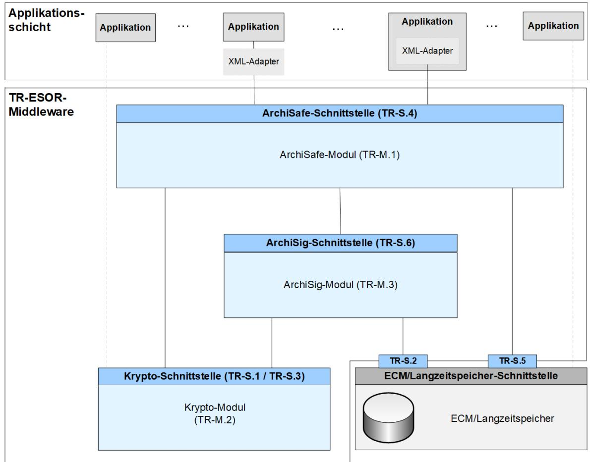

# BSI Technische Richtlinie 03125 Beweiswerterhaltung kryptographisch signierter Dokumente

### **Anlage TR-ESOR-M.1: ArchiSafe-Modul**

| Bezeichnung | Archisafe-Modul                        |
|-------------|----------------------------------------|
| Kürzel      | BSI TR-ESOR-M.1                        |
| Version     | 1.2.1 (auf Basis der eIDAS-Verordnung) |
| Datum       | 15.03.2018                             |

Bundesamt für Sicherheit in der Informationstechnik Postfach 20 03 63 53133 Bonn Tel.: +49 228 99 9582-0 E-Mail: [tresor@bsi.bund.de](mailto:tresor@bsi.bund.de) Internet: [https://www.bsi.bund.de](https://www.bsi.bund.de/) © Bundesamt für Sicherheit in der Informationstechnik 2018

## **Inhaltsverzeichnis**

| 1. Einführung                                                                                                                                        | 4  |
|------------------------------------------------------------------------------------------------------------------------------------------------------|----|
| 2. Übersicht                                                                                                                                         | 6  |
| 2.1 Ziele Überschrift bündig zum Rand gesetzt                                                                                                        | 6  |
| 3. Definition des ArchiSafe-Moduls                                                                                                                   | 8  |
| 3.1 Grundlegender Aufbau und funktionale Abgrenzung                                                                                                  | 8  |
| 3.2 Integration des ArchiSafe-Moduls                                                                                                                 | 8  |
| 3.3 Erfüllung sicherheitstechnischer Grundanforderungen                                                                                              | 8  |
| 4. Funktionale Anforderungen                                                                                                                         | 9  |
| 4.1 Archivierung elektronischer Daten – ArchiveSubmissionRequest                                                                                     | 10 |
| 4.2 Aktualisieren archivierter Daten – ArchiveUpdateRequest                                                                                          | 12 |
| 4.3 Abruf archivierter Daten – ArchiveRetrievalRequest                                                                                               | 13 |
| 4.4 Löschen von Archivdaten – ArchiveDeletionRequest                                                                                                 | 14 |
| 4.5 Rückgabe technischer Beweisdaten – ArchiveEvidenceRequest                                                                                        | 14 |
| 4.6 Rückgabe von Datenelementen – ArchiveDataRequest                                                                                                 | 15 |
| 4.7 Prüfen des Archivdatenobjektes samt der darin enthaltenen oder zusätzlich übergebenen beweisre levanten Daten und Beweisdaten – VerifyRequest | 15 |
| 5. Sicherheitsfunktionen                                                                                                                             | 16 |

## **1. Einführung**

Ziel der Technischen Richtlinie "Beweiswerterhaltung kryptographisch signierter Dokumente" ist die Spezifikation sicherheitstechnischer Anforderungen für den langfristigen Beweiswerterhalt von kryptographisch signierten elektronischen Dokumenten und Daten nebst zugehörigen elektronischen Verwaltungsdaten (Metadaten).

Eine für diese Zwecke definierte Middleware (TR-ESOR-Middleware) im Sinn dieser Richtlinie umfasst alle diejenigen Module (**M**) und Schnittstellen (**S)**, die zur Sicherung und zum Erhalt der Authentizität und zum Nachweis der Integrität der aufbewahrten Dokumente und Daten eingesetzt werden.

Die im Hauptdokument dieser Technischen Richtlinie vorgestellte Referenzarchitektur besteht aus den nachfolgend beschriebenen funktionalen und logischen Einheiten:

- der Eingangs-Schnittstelle S.4 der TR-ESOR-Middleware, die dazu dient, die TR-ESOR-Middleware in die bestehende IT- und Infrastrukturlandschaft einzubetten;
- dem zentralen Middlewaremodul (**[TR-ESOR-M.1]**), welches den Informationsfluss in der Middleware regelt, die Sicherheitsanforderungen an die Schnittstellen zu den IT-Anwendungen umsetzt und für eine Entkopplung von Anwendungssystemen und ECM/Langzeitspeicher sorgt;
- dem "Krypto"-Modul (**[TR-ESOR-M.2]**) nebst den zugehörigen Schnittstellen S.1 und S.3, das alle erforderlichen Funktionen zur Berechnung von Hashwerten, Prüfung elektronischer Signaturen bzw. Siegeln bzw. Zeitstempeln, zur Nachprüfung elektronischer Zertifikate und zum Einholen qualifizierter Zeitstempel sowie (optional) elektronischer Signaturen bzw. Siegel für die Middleware zur Verfügung stellt. Darüber hinaus kann es Funktionen zur Ver- und Entschlüsselung von Daten und Dokumenten zur Verfügung stellen;
- dem "ArchiSig-Modul" (**[TR-ESOR-M.3]**) mit der Schnittstelle S.6, das die erforderlichen Funktionen für die Beweiswerterhaltung der digital signierten Unterlagen bereitstellt;
- einem ECM/Langzeitspeicher mit den Schnittstellen S.2 und S.5, der die physische Archivierung/Aufbewahrung und auch das Speichern der beweiswerterhaltenden Zusatzdaten übernimmt.

*Dieser ECM/Langzeitspeicher ist nicht mehr direkt Teil der Technischen Richtlinie, gleichwohl werden über die beiden Schnittstellen, die noch Teil der TR-ESOR-Middleware sind, Anforderungen daran gestellt.*

*Ebenso wenig ist die Applikationsschicht, die auch einen XML-Adapter enthalten kann, direkter Teil der Technischen Richtlinie, auch wenn dieser XML-Adapter als Teil einer Middleware implementiert werden kann.*

**Abbildung 1: Schematische Darstellung der IT-Referenzarchitektur Format**

Die in Abbildung Abbildung 1 dargestellte IT-Referenzarchitektur orientiert sich an der ArchiSafe 1 Referenzarchitektur und soll die logische (funktionale) Interoperabilität künftiger Produkte mit den Zielen und Anforderungen der Technischen Richtlinie ermöglichen und unterstützen.

Diese Technische Richtlinie ist modular aufgebaut und spezifiziert in einzelnen Anlagen zum Hauptdokument die funktionalen und sicherheitstechnischen Anforderungen an die erforderlichen IT-Komponenten und Schnittstellen der TR-ESOR-Middleware. Die Spezifikationen sind strikt plattform-, produkt-, und herstellerunabhängig.

Das vorliegende Dokument trägt die Bezeichnung "Anlage TR-ESOR-M.1" und spezifiziert die funktionalen und sicherheitstechnischen Anforderungen an das Modul TR-ESOR-M.1 (im Folgenden kurz: ArchiSafe-Modul2 [\)](#page-4-1).

1 Siehe dazu [http://www.archisafe.de](http://www.archisafe.de/)

2 Der Name "ArchiSafe" bezieht sich auf das E-Government Projekt "ArchiSafe – rechts und revisionssichere Langzeitspeicherung elektronischer Dokumente" der Physikalisch-Technischen Bundesanstalt im Jahre 2005, das im Rahmen der E-Government Programms "BundOnline 2005" gefördert wurde. Ziel des Projektes war die Spezifikation und Umsetzung einer service-orientierten informationstechnischen Lösung für die rechts- und revisionssichere Langzeitspeicherung elektronischer Dokumente (mehr dazu unter: [http://www.archisafe.de\)](http://www.archisig.de/)

## **2. Übersicht**

### **2.1 Ziele**

Ziel und Zweck des ArchiSafe-Moduls ist die Realisierung einer einheitlichen Schnittstelle mindestens der Archiv-Funktionen, die für den Beweiswerterhalt eine Rolle spielen. Um eine strikte logische Trennung der vorgelagerten IT-Fachanwendungen von den eigentlichen ECM/Langzeitspeichersystemen zu erreichen, wird empfohlen, alle notwendigen Archiv-Funktionen über das ArchiSafe-Modul herstellerunabhängig zu abstrahieren.

Das ArchiSafe-Modul entkoppelt logisch und funktional den Datenfluss zwischen den IT-Fachanwendungen und dem elektronischen ECM/Langzeitspeicher zur Ablage oder zum Aufruf archivierter Daten und Dokumente. Darüber hinaus bietet dieses Modul einheitliche Schnittstellen zur Kommunikation mit kryptographischen Komponenten (**[TR-ESOR-M.2]** und **[TR-ESOR-M.3]** in Abbildung Abbildung 1), die den Erhalt der Authentizität und Integrität der gespeicherten elektronischen Unterlagen unterstützen.

Jede Archivoperation der vorgelagerten externen IT-Anwendungen, die dem Zweck dient, den Beweiswert elektronischer Unterlagen zu sichern, zu erhalten oder nachzuweisen, muss über das ArchiSafe-Modul erfolgen.

Die externe IT-Anwendung eröffnet zu diesem Zweck einen sicheren Kommunikationskanal [3](#page-5-1) mit dem ArchiSafe-Modul und versendet eine Archivanfrage (Archive *Funktionsname* Request). Das ArchiSafe-Modul identifiziert und authentifiziert die aufrufende Anwendung und bietet die konfigurierbare Option, die syntaktische Gültigkeit der von der aufrufenden Anwendung übermittelten Archivdatenobjekte anhand der im ArchiSafe-Modul abgelegten Konfigurationsdaten (XML-Schemata, Kommunikations- und Verarbeitungsregeln) zu prüfen.

Bei der Ablage der Archivdatenobjekte initiiert das ArchiSafe-Modul die Sicherung der beweisrechtlichen Qualität der zu archivierenden Informationen, indem:

- 1. vorhandene beweisrelevanten Daten (Signaturen, Siegel, Zeitstempel, Zertifikate, Sperrlisten, OCSP-Responses etc.) und technische Beweisdaten (Evidence Records) auf Gültigkeit geprüft und die Prüfergebnisse in standardisierter Form so gespeichert werden, dass der Bezug zu den Signatur- bzw. Siegel- bzw. Zeitstempeldaten erhalten bleibt. Die Prüfung der beweisrelevanten Daten (Signaturen, Siegel, Zeitstempel, Zertifikate, Sperrlisten, OCSP-Responses etc.) und technische Beweisdaten (Evidence Records) wird durch eine kryptographische Komponente (Modul) realisiert, die den in der Anlage **[TR-ESOR-M.2]** dieser TR beschrieben Anforderungen genügen muss.
- 2. das ArchiSig-Modul (siehe Anlage **[TR-ESOR-M.3]** dieser TR) angestoßen wird, jedes zu archivierende Archivdatenobjekt mit einer eindeutigen Dokumentenkennung (Archivdatenobjekt ID, AOID) zu versehen, sofern dieses Element nicht bereits vorhanden ist.[4](#page-5-2) und einen oder mehrere Hashwerte über das gesamte Archivobjekt oder die kryptographisch zu schützenden Bestandteile des Archivdatenobjekts mit AOID zu berechnen.[5](#page-5-3)

Anschließend werden die zu archivierenden Daten und die AOID über einen sicheren Kommunikationskanal an einen authentifizierten ECM/Langzeitspeicher übergeben. Die erfolgreiche Ablage von Archivdatenobjekten wird durch die Rückgabe der Archivdatenobjekt ID (AOID) an die aufrufende Anwendung abgeschlossen.

Diese AOID wird für jeden Abruf, jedes Update und das Löschen von archivierten Daten durch die vorgelagerten IT-Fachanwendungen benötigt. Ein Abruf der Beweisdaten zu archivierten Daten ist ebenfalls nur bei Vorlage einer gültigen AOID möglich.

3 Bei diesem Kanal kann es sich z. B. um physikalisch gesicherte Leitungen handeln oder um eine verschlüsselte Verbin dung mit angemessen starker Authentisierung der beiden Parteien (vgl. auch **[TR-ESOR-F]**, Kapitel 5.6).

4 Das Erzeugen der Archivdatenobjekt ID (AOID) kann auch in anderen Komponenten erfolgen, z.B. auch im ECM/Langzeitspeicher. Darüber hinaus kann eine syntaktisch korrekte Dokumentenkennung (AOID) auch von der Geschäftsanwendung erzeugt und übergeben werden.

5 Details, über welche Elemente/Bereiche eines Archivdatenobjektes ein Hashwert gebildet wird, finden sich in Anhang F.

*Hinweis: Im folgenden Text umfasst der Begriff "Digitale Signatur" "fortgeschrittene elektronische Signaturen" gemäß [eIDAS-VO, Artikel 3 Nr. 11], "qualifizierte elektronische Signaturen" gemäß [eIDAS-VO, Artikel 3 Nr. 12], "fortgeschrittenen elektronische Siegel" gemäß [eIDAS-VO, Artikel 3 Nr. 26] und "qualifizierte elektronische Siegel" gemäß [eiDAS-VO, Artikel 3 Nr. 27]. Insofern umfasst der Begriff "digital signierte Dokumente" sowohl solche, die fortgeschrittene elektronische Signaturen oder Siegel bzw. qualifizierte elektronische Signaturen oder Siegel tragen.* 

*Mit dem Begriff der "kryptographisch signierten Dokumente" sind in dieser TR neben den gemäß [eI-DAS-VO, Artikel 3 Nr. 12] qualifiziert signierten, den gemäß [eIDAS-VO, Artikel 3 Nr. 27] qualifiziert gesiegelten oder den gemäß [eIDAS-VO, Artikel 3 Nr. 34] qualifiziert zeitgestempelten Dokumenten (im Sinne der eIDAS-Verordnung) ) auch Dokumente mit einer fortgeschrittenen Signatur gemäß [eIDAS-VO, Artikel 3 Nr. 11] oder mit einem fortgeschrittenen Siegel gemäß [eIDAS-VO, Artikel 3 Nr. 26] oder mit einem elektronischen Zeitstempel gemäß [eIDAS-VO, Artikel 3 Nr. 33] erfasst, wie sie oft in der internen Kommunikation von Behörden entstehen. Nicht gemeint sind hier Dokumente mit einfachen Signaturen oder Siegeln basierend auf anderen (z. B. nicht-kryptographischen) Verfahren.*

### **3. Definition des ArchiSafe-Moduls**

Der Begriff "**ArchiSafe-Modul**" umfasst alle Funktionen, die der Realisierung der Eingangs-Schnittstelle der TR-ESOR-Middleware sowie der Steuerung und Kontrolle des Zugriffs externer, vorgelagerter IT-Fachanwendungen auf den ECM/Langzeitspeicher dienen (siehe Abbildung 1). Vornehmlicher Zweck des ArchiSafe-Moduls ist die Implementierung eines zuverlässigen Sicherheitsgateways für die Kommunikation - und damit auch die Entkopplung externer Anwendungen - mit einem ECM/Langzeitspeicher, die Regelung des Informationsflusses in der TR-ESOR-Middleware sowie die Steuerung der durch die TR-ESOR-Middleware bereitgestellten Funktionen zum langfristigen Beweiswerterhalt der kryptographisch signierten Dokumente.

### **3.1 Grundlegender Aufbau und funktionale Abgrenzung**

**(A3.1-1)** Das ArchiSafe-Modul soll eine Middleware-Komponente oder Teil einer Middleware-Komponente sein, die vertrauenswürdig und zuverlässig den Zugriff auf den ECM/Langzeitspeicher vermittelt und kontrolliert.

**(A3.1-2)** Das ArchiSafe-Modul muss als selbstständige Anwendung oder als selbstständiger (funktional abgegrenzter) Teil einer Anwendung (auch des ECM/Langzeitspeichers) auf einem vertrauenswürdigen IT-System (IT-Plattform) laufen.

**(A3.1-3)** Die Systemplattform, auf der das ArchiSafe-Modul betrieben wird, muss vor unberechtigten Zugriffen auf die Daten und Funktionen des Moduls ausreichend geschützt sein.

**(A3.1-4)** Das ArchiSafe-Modul muss zum Erhalt des beweisrechtlichen Werts digital signierter bzw. zeitgestempelter Daten, bspw. für eine rechtskonforme Signatur- bzw. Zeitstempelerneuerung, vertrauenswürdige kryptographische Komponenten nutzen, die in den Anlagen **[TR-ESOR-M.2]** und **[TR-ESOR-M.3]** zu dieser TR beschrieben sind und über die in der Anlage **[TR-ESOR-S]** definierten Schnittstellen S.1 und S.6 angesprochen werden.[6](#page-7-4)

### **3.2 Integration des ArchiSafe-Moduls**

**(A3.2-1)** Das ArchiSafe-Modul soll Modulcharakter besitzen und jederzeit durch neue, funktional kompatible Implementierungen ersetzt werden können.

**(A3.2-2)** Für die Integration des ArchiSafe-Moduls in bestehende oder geplante IT-Einsatzumgebungen im Sinne dieser Richtlinie muss das ArchiSafe-Modul mindestens die in der Anlage **[TR-ESOR-S]** dieser TR spezifizierten Schnittstellen S.1, S.4, S.5 und S.6 implementieren bzw. nutzen können. Dabei wird das ArchiSafe-Modul über die Schnittstelle S.4 von externen Applikationen aufgerufen und ruft über die Schnittstelle S.1 das Krypto-Modul , über die Schnittstelle S.6 das ArchiSig-Modul sowie über die Schnittstelle S.5 das ECM/Langzeitspeichersystem auf.

**(A3.2-3)** Die Implementierung und Nutzung zusätzlicher Schnittstellen darf nicht die Gewährleistung der sicherheitstechnischen Grundanforderungen (siehe auch Abschnitt 3.3) kompromittieren.

### **3.3 Erfüllung sicherheitstechnischer Grundanforderungen**

**(A3.3-1)** Ein zu dieser Richtlinie konformes ArchiSafe-Modul muss die Sicherheitsziele und Anforderungen des Schutzprofils **[ACMPP]** erfüllen.

6 Die Anforderung schließt ausdrücklich nicht aus, dass die Funktionen des ArchiSafe-Moduls und der kryptographischen Komponenten in einem einheitlichen Sicherheitsgateway subsumiert werden.

### **4. Funktionale Anforderungen**

Dieser Abschnitt der Technischen Richtlinie spezifiziert und erläutert auf der Grundlage des Schutzprofils **[ACMPP]** die funktionalen Anforderungen an ein ArchiSafe-Modul. Die Aufrufschnittstellen (Schnittstellensignaturen) des ArchiSafe-Moduls sind in der Anlage **[TR-ESOR-S]** dieser Richtlinie als S.4 spezifiziert.

#### **Begriffsdefinitionen:**

- Ein **Datenobjekt** ist ein zu archivierendes Dokument oder Datum. Das Datenobjekt kann dabei in jedem beliebigen Format vorliegen, vorzugsweise jedoch in den Formaten, die in Anhang F empfohlen werden.
- Ein **Archivdatenobjekt** i. S. dieser Richtlinie entspricht syntaktisch dem in Anhang F dieser TR beschriebenen XML formatted Archive Information Package (XAIP). Ein Archivdatenobjekt kann damit ein oder mehrere Datenobjekte umfassen sowie zusätzlich noch Metadaten. Die Archivdatenobjekt-ID (AOID) bezieht sich jedoch immer auf ein Archivdatenobjekt. Es ist nicht notwendig, dass Datenobjekte in einem Archivdatenobjekt für die Archivierung übergeben werden, noch ist es notwendig, dass Archivdatenobjekte physisch im ECM/Langzeitspeicher abgelegt sind. Es wird lediglich gefordert, dass alle Funktionen der TR-ESOR-Middleware sich auf ein Archivdatenobjekt und damit auf alle Datenobjekte, die damit Bezug haben, beziehen und insbesondere die Abfragefunktionen ein Archivdatenobjekt (oder Teile davon) in einem gültigen XML-Format (vgl. Anhang F) zurück liefern.
- Ein **Datenelement** ist ein Teil der XML-Struktur des Archivdatenobjektes. Es kann sich dabei um das gesamte Archivdatenobjekt handeln, um einen Teilbaum der XML-Struktur, um ein einzelnes XML-Element oder auch nur um den Wert eines XML-Elements.

**(A4.0-1)** Ein zu dieser Richtlinie konformes ArchiSafe-Modul muss mindestens die folgenden Operatione[n](#page-8-1)7 zur Verfügung stellen:

- **1.** Archivierung eines (Archiv-) Datenobjektes[8](#page-8-2) im ECM/Langzeitspeicher (ArchiveSubmissionRequest),
- **2.** Abfrage eines Archivdatenobjektes aus dem ECM/Langzeitspeicher (ArchiveRetrievalRequest),
- **3.** Löschen eines Archivdatenobjektes im ECM/Langzeitspeicher (ArchiveDeletionRequest),
- **4.** Abfrage von technischen Beweisdaten zum Nachweis der Authentizität und Integrität archivierter Archivdatenobjekte (ArchiveEvidenceRequest).

Ein zu dieser Richtlinie konformes ArchiSafe-Modul soll zusätzlich die folgenden Operationen zur Verfügung stellen:

- **1.** Aktualisieren eines bereits archivierten Archivdatenobjektes im ECM/Langzeitspeicher (ArchiveUpdateRequest)
- **2.** Abfrage von einzelnen Datenelementen aus einem archivierten Archivdatenobjekt (ArchiveDataRequest)
- **3.** Prüfung der in einem Archivdatenobjekt enthaltenen oder mit einem Funktionsaufruf zusätzlich übergebenen beweisrelevanten Daten (Signaturen, Siegel, Zeitstempel, Zertifikate, Sperrlisten, OCSP-Responses etc.) und Beweisdaten (Evidence Records) (**VerifyRequest / -Response)**

**(A4.0-2)** Falsche oder fehlerhaft parametrisierte Anfragen dürfen nicht zu einer fehlerhaften Funktion des ArchiSafe-Moduls führen.

**(A4.0-3)** Das ArchiSafe-Modul soll umfassende und konfigurierbare Möglichkeiten zur Protokollierung der diversen Zugriffe bzw. Zugriffsversuche auf das Archiv besitzen.

7 Eine Operation ist eine Anfrage einer externen Client Software an das ArchiSafe-Modul zur Ausführung definierter Ope rationen in der TR-ESOR-Middleware bzw. im ECM/Langzeitspeicher.

8 Es ist vorgesehen, dass die Schnittstelle sowohl komplette Archivdatenobjekte als auch einzelne Datenobjekte akzeptiert. Rückgabe ist immer eine AOID, die sich auf ein Archivdatenobjekt bezieht.

Bundesamt für Sicherheit in der Informationstechnik 9

**(A4.0-4)** Die vom ArchiSafe-Modul erzeugten Protokolle müssen zugriffsgeschützt sein, so dass nur zugriffsberechtigte Personen9 (z. B. der Datenschutzbeauftragte, der Sicherheitsbeauftragte oder der Administrator des Archivsystems) tatsächlich Zugriff erhalten.

**(A4.0-5)** Für alle unter (A4.0-1) aufgeführten Funktionen gilt: Das ArchiSafe-Modul muss imstande sein, für den Aufruf der Funktion einen sicheren Kommunikationskanal mit der aufrufenden Client-Anwendung aufzubauen.

**(A4.0-6)** Für alle unter (A4.0-1) aufgeführten Funktionen gilt: eine aufrufende Client Software darf nur auf die Archivdatenobjekte Zugriff erhalten, für die sie eine Zugriffsberechtigungen besitzt.

### **4.1 Archivierung elektronischer Daten – ArchiveSubmissionRequest**

Die Funktion **ArchiveSubmissionRequest** ermöglicht, dass eine autorisierte IT-Anwendung (Client Software[10](#page-9-2)) ein (neues) (Archiv)Datenobjekt im ECM/Langzeitspeicher über einen sicheren Kommunikationskanal ablegen kann.

**(A4.1-1)** Das ArchiSafe-Modul muss imstande sein, mit einem ArchiveSubmissionRequest XML-basierte Datenobjekte zu archivieren. Darüber soll es auch imstande sein, mit einem ArchiveSubmission-Request Binärdaten zu archivieren.

**(A4.1-2)** Das zu archivierende (Archiv)Datenobjekt muss Bestandteil des Aufrufs sein. Ist das zu archivierende (Archiv)Datenobjekt eine XML-Struktur (XAIP), muss es gegen ein im ArchiSafe-Modul hinterlegtes und autorisiertes XML-Schema auf syntaktische Richtigkeit geprüft werden können. Schlägt die Syntaxprüfung fehl, muss die Archivierung mit einer aussagekräftigen und verständlichen Fehlermeldung abgewiesen werden.

**(A4.1-3)** Das ArchiSafe-Modul muss imstande sein, auf der Grundlage von im Modul hinterlegten Konfigurationsdaten die Prüfung des Archivdatenobjektes samt der darin enthaltenen oder zusätzlich übergebenen beweisrelevanten Daten (Signaturen, Siegel, Zeitstempel, Zertifikate, Sperrlisten, OCSP-Responses etc.) und/oder technischen Beweisdaten (Evidence Records) anzustoßen. Enthält das zu archivierende Archivdatenobjekt digitale Signaturen bzw. elektronische Zeitstempel und ggf. weitere beweisrelevante Daten oder technische Beweisdaten, muss das ArchiSafe-Modul die Gültigkeit der beweisrelevanten Daten und technischen Beweisdaten sowohl auf Basis des Schalenmodells als auch des Kettenmodells prüfen lassen und die Prüfergebnisse in standardisierter Form in das Archivdatenobjekt eintragen. Dabei gilt:

- Wenn mindestens eine Signaturprüfung fehlschlägt, dann wird nicht mehr "…/resultmajor#ok" zurückgegeben.
- Wenn mindestens Kette- oder Schalenprüfung einer Signatur nicht fehlschlägt sollte "…/resultmajor#warning" und "…/resultminor/arl/XAIP\_NOK\_SIG" zurückgeliefert werden.
- In anderem Fall ist "../resultmajor#error" zurückzugeben.

Für eine Weiterverarbeitung ist es erforderlich, dass mindestens eines der beiden Validierungsmodelle (Schalenmodell bzw. Kettenmodell) erfolgreich ist. Schlägt die Prüfung für beide Validierungsmodelle (Schalenmodell bzw. Kettenmodell) fehl, soll, ggf. auf Basis von konfigurierbaren Optionen, wie folgt vorgegangen werden:

- **1.** Das ArchiSafe-Modul liefert eine verständliche Fehlermeldung an die Anwendung zurück und lehnt die Archivierung des Objekts ab.
- **2.** Die entsprechende Fehlermeldung kommt zusammen mit allen anderen ggf. vorhandenen Prüfinformationen in die Credential-Section. Das Objekt wird danach im Speicher abgelegt. Zusätzlich gibt das ArchiSafe-Modul eine Fehlermeldung an die Anwendung gegeben.

9 Welche Personen tatsächlich Zugriff auf die Protokolle erhalten sollen, ist im lokal gültigen IT-Sicherheitskonzept zu re geln.

10 Eine Client Anwendung ist im Sinne dieser Richtlinie eine externe (vorgelagerte) IT-Anwendung, die imstande und autorisiert ist, über das ArchiSafe-Modul Daten im ECM/Langzeitspeicher zu archivieren, archivierte Daten zu suchen, zu aktualisieren, abzurufen oder zu löschen.

Das ArchiSafe-Modul übergibt dazu vor der eigentlichen Speicherung im ECM/Langzeitspeicher das (Archiv-) Datenobjekt samt der darin enthaltenen oder zusätzlich übergebenen beweisrelevanten Daten (Signaturen, Siegel, Zeitstempel, Zertifikate, Sperrlisten, OCSP-Responses etc.) und/oder Beweisdaten (Evidence Records) über die Schnittstelle S.1 dem Krypto-Modul (siehe Anlagen **[TR-ESOR-S]** und **[TR-ESOR-M.2]** sowie **[TR-ESOR-E]**).

Das Krypto-Modul muss entweder die Verifikation beweisrelevanter Daten oder technischer Beweisdaten bei einem externen Vertrauensdiensteanbieter gemäß [eIDAS-VO] anfordern oder Funktionen zur zuverlässigen lokalen Verifikation beweisrelevanter Daten (Signaturen, Siegel, Zeitstempel, Zertifikate, Sperrlisten, OCSP-Responses etc.) und/oder technischen Beweisdaten (Evidence Records) gemäß **[EN 319 102]** zur Verfügung stellen. Die dabei ermittelten Prüfergebnisse (Zertifikate, Sperrlisten, OCSP-Responses) sollen anschließend vom Krypto-Modul in die dafür vorgesehenen Datenstrukturen des (Archiv-)Datenobjektes eingetragen und anschließend das um die Prüfinformationen ergänzte (Archiv-) Datenobjekt oder ein Prüfbericht (siehe **[OASIS-VR]** oder **[TR-ESOR-VR]**) an das ArchiSafe-Modul zurück geliefert werden. Alternativ gibt das Krypto-Modul nur die Prüfergebnisse als Prüfbericht gemäß **[OASIS-VR]** bzw. **[TR-ESOR-VR]** an das ArchiSafe-Modul zurück und dieses trägt die Prüfergebnisse in die vorgesehenen Datenstrukturen des Archivdatenobjektes ein.

Die Middleware soll die Möglichkeit vorsehen, dass für ein XML-basiertes Archivdatenobjekt (XAIP) samt der darin enthaltenen oder zusätzlich übergebenen beweisrelevanten Daten (Signaturen, Siegeln, Zeitstempel, Zertifikate, Sperrlisten, OCSP-Responses etc.) und technischen Beweisdaten ein ausführlicher Prüfbericht **[TR-ESOR-VR]** über die Speicherung angefordert werden kann.

Schlägt die Prüfung von beweisrelevanten Daten und technischen Beweisdaten bzw. die Zertifikatsprüfung fehl (z.B. wegen veralteter Algorithmen, die vom Krypto-Modul nicht mehr unterstützt werden), muss eine aussagekräftige und verständliche Fehlermeldung an die Geschäftsanwendung übergeben werden. Eine Speicherung kann in einem solchen Falle erfolgen, wenn zusammen mit einem aussagekräftigen Prüfbericht eine Begründung in der CredentialSection des Archivdatenobjektes abgelegt wird. Anderenfalls soll die Speicherung abgelehnt werden.

**HINWEIS:** Es ist dringend zu empfehlen, die Möglichkeit der Prüfung von beweisrelevanten Daten und technischen Beweisdaten zu nutzen. Andernfalls könnten bereits manipulierte Daten oder ungültige digitale Signaturen bzw. elektronische Zeitstempel in das Archivsystem gelangen, wobei dieser Verlust der Integrität erst Jahre später bemerkt wird.

**(A4.1-4)** Die Prüfergebnisse von beweisrelevanten Daten und technischen Beweisdaten, inklusive der zugehörigen Zertifikatsinformationen, müssen vom ArchiSafe-Modul in die dafür vorgesehenen XML-Datenelemente des XML-basierten Archivdatenobjektes (siehe Anlage **[TR-ESOR-F]**) eingetragen werden können, sofern dieses vom Krypto-Modul noch nicht durchgeführt wurde. Wird kein XML-basiertes Archivdatenobjekt genutzt, können die Prüfergebnisse von beweisrelevanten Daten und technischen Beweisdaten in das übergebene (binäre) Inhaltsdatenobjekt eingefügt werden, falls das verwendete Format dies erlaubt.

**(A4.1-5)** Das ArchiSafe-Modul soll vor der endgültigen Ablage im ECM/Langzeitspeicher das (Archiv-) Datenobjekt über die Schnittstelle S.6 an das ArchiSig-Modul (siehe Anlage **[TR-ESOR-S]** und **[TR-ESOR-M.3]**) übergeben.[11](#page-10-0) Anschließend wird das (Archiv-)Datenobjekt vom ArchiSig-Modul im ECM/Langzeitspeicher abgelegt

Alternativ übergibt das ArchiSafe-Modul das (Archiv)Datenobjekt direkt an den ECM/Langzeitspeicher und die Funktionen des ArchiSig-Moduls werden für dieses (Archiv)Datenobjekt zu einem späteren Zeitpunkt von einer anderen Instanz aufgerufen. Es muss dabei sichergestellt sein, dass der genannte Zeitpunkt nicht deutlich vom Zeitpunkt der Archivierung abweicht (z.B. um Wochen), dass auch tatsächlich (nachweislich) alle neu archivierten (Archiv)Datenobjekte von dieser Funktion erfasst werden und das für die Behandlung eines eventuellen Fehlerfalls ausreichende Maßnahmen implementiert sind.

11 Die Richtlinie empfiehlt dringend, dass das ArchiSafe-Modul das Datenobjekt unmittelbar und direkt an das ArchiSig-Modul zum Berechnen des Hashwertes übergibt, und das Datenobjekt nicht erst in den ECM/Langzeitspeicher legt. Im letztgenannten Fall ergibt die Zeitspanne zwischen Speichern und Hashwert berechnen eine gewisse Unsicherheit.

**(A4.1-6)** Das ArchiSafe-Modul darf auf keinen Fall die Nutzdaten (im Archivdatenobjekt) verändern oder löschen.

**(A4.1-7)** Ein bereits im ECM/Langzeitspeicher existierendes (Archiv)Datenobjekt darf mit diesem Aufruf im ECM/Langzeitspeicher nicht überschrieben oder geändert (modifiziert) werden.

**(A4.1-8)** Im Falle einer erfolgreichen Speicherung wird die eindeutige Dokumentenkennung, die Archivdatenobjekt ID (AOID), an die aufrufende Client Anwendung zurückgegeben.

#### **4.2 Aktualisieren archivierter Daten – ArchiveUpdateRequest**

Die Funktion **ArchiveUpdateRequest** ermöglicht, dass eine autorisierte IT-Anwendung (Client Software) eine neue Version für ein bereits bestehendes Archivdatenobjekt im ECM/Langzeitspeicher über einen sicheren Kommunikationskanal hinzufügen kann.

Der Grund für diese neue Version könnte ein zusätzliches Element sein, ein geändertes Element oder ein gelöschtes Element. Technisch gesehen wird jedoch immer nur die neue Version hinzugefügt; es werden an keiner Stelle mit diesem Aufruf bestehende Daten geändert oder gelöscht.

Der beweisrechtliche Wert der bereits archivierten Daten darf durch den ArchiveUpdateRequest nicht beeinträchtigt werden.

**(A4.2-1)** Bestandteil des Aufrufs muss eine gültige (syntaktisch korrekte und tatsächlich vergebene) Archivdatenobjekt ID (AOID) sein.

**(A4.2-2)** Bestandteil des Aufrufs muss ein syntaktisch korrektes, ergänzendes XML-basiertes Archivdatenobjekt (Delta-XAIP) gemäß **[TR-ESOR-F]** sein mit dem Ziel des Hinzufügens und Löschens von Dokumenten, Daten, Metadaten, Signaturen, Credentials - wie z.B. Siegeln, Zeitstempeln, weiteren beweisrelevanten Daten, Signatur- bzw. Siegel- bzw. Zeitstempelprüfinformationen oder anderen technischen Beweisdaten - zu/von Archivdatenobjekten sowie dem Ändern von Dokumente, Daten oder Metadaten in einer neuen Version sowie der Angabe der vorausgegangenen Version. Es können mehrere zu ändernde/hinzuzufügende/zu löschende Elemente für dieses Archivdatenobjekt in einer gemeinsamen Struktur übergeben werden. Die Übergabe von leeren Strukturelementen mit dem Ziel des Überschreibens (Löschens) von existierenden Strukturelementen unter Umgehung des Versionierungsmechanismus ist nicht erlaubt.[12](#page-11-1)

**(A4.2-3)** Es muss ein ergänzendes XML-basiertes Archivdatenobjekt (Delta-XAIP) gemäß **[TR-ESOR-F]** übergeben werden, dessen Struktur analog zur Neuarchivierung geprüft werden muss (vgl. [\(A4.1-1\)](#page-9-3) and [\(A4.1-3\)](#page-9-4) ).

**(A4.2-4)** Werden beweisrelevanten Daten (Signaturen, Siegel, Zeitstempel, Zertifikate, Sperrlisten, OCSP-Responses etc.) und/oder technische Beweisdaten (Evidence Records) übergeben, ist mit diesen Daten analog zur Neuarchivierung zu verfahren (vgl. [\(A4.1-3\)](#page-9-4) und [\(A4.1-4\)\)](#page-10-1).[13](#page-11-2)

**(A4.2-5)** Jede Aktualisierung muss eine neue Version des Archivdatenobjektes zur Folge haben. Wesentliches Kennzeichen ist dabei eine neue Versionsnummer mit gleichbleibender AOID und ein neues Versions-Verzeichnis (Versions-Manifest, für Details hierzu siehe Anhang F).

**(A4.2-6)** Das "Ändern" von Metadaten/Datenobjekten im Archivdatenobjekt muss innerhalb der Middleware nach folgendem Prinzip, nicht jedoch zwingend in der angegebenen Reihenfolge erfolgen:[14](#page-11-3)

12 Das Löschen eines einzelnen Elementes erfolgt rein logisch, indem in einer neuen Version des XAIP das versionManifest keinen Eintrag mehr für dieses Element hat. Die eigentlichen Daten sind nach wie vom im XAIP enthalten und können mit der Abfrage der vorherigen Version immer noch aus dem Speicher geliefert werden. Sollte nun über den Update-Mechanismus ein Element tatsächlich überschrieben werden, wäre es nicht nur in der neuen Version sondern aus dem gesamten XAIP entfernt – was nicht zulässig ist.

13 Wird eine Signatur bzw. ein Siegel bzw. ein Zeitstempel nachträglich zu einem bestehenden Nutzdatenobjekt archiviert, ist für die Prüfung der Signatur bzw. des Siegels bzw. des Zeitstempels das Nutzdatenobjekt zuvor aus dem ECM/Langzeitspeicher auszulesen.

14 Es steht den Herstellern frei, vor dieser Prozedur den Evidence Record (ER) der "alten" Version des Archivdatenobjektes zu berechnen und ihn in das Archivdatenobjekt einzubetten. Dies erleichtert die ERS-Berechnung über die Funktion ArchiveEvidenceRequest etwas, ist aber nicht zwingend notwendig.

1. Anlegen eines neuen Versions-Manifests[15](#page-12-1) auf Basis der entsprechenden Daten des übergebenen Delta-XAIPs, u.a durch Übernahme des neuen Version-Manifests aus dem Delta-XAIP.

2. Erzeugen/Vergeben einer neuen Versionsnummer. Mit Hilfe des im Delta-XAIP enthaltenen <prevVersion>-Element muss geprüft werden, ob zwischenzeitlich bereits neue Versionen erzeugt wurden und es deshalb ggf. zu Konflikten kommt.

3. Hinzufügen der "neuen" Metadaten/Datenobjekte/Credentials zum Archivdatenobjekt. (Bestehende Daten werden dabei nicht geändert oder gelöscht).

4. Entfernen der Manifest-Einträge[16](#page-12-2) der Metadaten/Datenobjekte aus dem neuen Versions-Manifest, die in der neuen Version nicht mehr enthalten sind (bei Bedarf). Die eigentlichen Metadaten/Datenobjekte werden hingegen nicht entfernt.

5. Hinzufügen oder Ändern von Manifest-Einträgen auf die "neuen" Metadaten/Datenobjekte im neuen Versions-Manifest.

**(A4.2-7)** Zulässig ist nur das Hinzufügen von Versions-Manifesten, Metadaten, Datenobjekten und Credentials in neuen Versionen des Archivdatenobjektes. Tatsächliche Änderungen an bestehenden Daten sind nicht zulässig. Änderungsanfragen für versionsunabhängige (oder anderweitig als veränderungsfest gekennzeichnete) Metadaten (z.B. AOID oder packageInfo) sind nicht zulässig.

**(A4.2-8)** Das neue (geänderte) Archivdatenobjekt soll unmittelbar danach an das ArchiSig-Modul übergeben werden. Alternativ muss sichergestellt sein, dass auch die neue Version über das ArchiSig-Modul gesichert wird (vgl. [\(A4.1-5\)\)](#page-10-2).

**(A4.2-9)** Die Rückgabe muss einen Statuswert enthalten, der den Erfolg der Operation anzeigt. Im Erfolgsfall muss zusätzlich die neue Versionsnummer zurückgegeben werden.

#### **4.3 Abruf archivierter Daten – ArchiveRetrievalRequest**

Die Funktion **ArchiveRetrievalRequest** ermöglicht den Abruf eines Archivdatenobjektes aus dem ECM/Langzeitspeicher durch eine authentifizierte Client Anwendung über einen sicheren Kommunikationskanal und unter Vorlage einer gültigen Archivdatenobjekt ID (AOID) und ggf. zusätzlich einer oder mehrerer VersionIDs. Wird auf die Angabe der VersionID verzichtet, wird jeweils die aktuelle Version zurück gegeben. Alle Versionen eines Archivdatenobjektes müssen abrufbar sein.

**(A4.3-1)** Bestandteil des Aufrufs muss eine gültige (syntaktisch korrekte und tatsächlich vergebene) Archivdatenobjekt ID (AOID) sein. Optional können noch eine oder mehrere gültige (syntaktisch korrekte und tatsächlich vergebene) VersionID angegeben werden.

**(A4.3-2)** Zurückgegeben werden muss das mit der AOID und ggf. der VersionID im ECM/Langzeitspeicher verknüpfte Archivdatenobjekt. Enthält die VersionID den Wert all, dann müssen alle existierenden Versionen eines Archivdatenobjektes zurückgeliefert werden. Im Fehlerfalle (bspw. keine für den Aufruf gültige AOID oder keine gültige VersionID) muss der Aufruf mit einer aussagekräftigen und verständlichen Fehlermeldung abgewiesen werden.[17](#page-12-3)

**(A4.3-3)** Das Archivdatenobjekt muss in einem XML-Format (XAIP) zurück geliefert werden. Das XML-Format muss einem prüfbaren XML-Schema folgen, das vom Nutzer des Gesamtsystems konfigurierbar ist. Es gelten für das XML-Format bzw. das XML-Schema die Anforderungen aus Anhang **[TR-ESOR-F]**. [18](#page-12-4)

15 vgl. XAIP- und Delta-XAIP - Spezifikation in Anhang F

16 Gemäß **[TR-ESOR-F]**, Kap. 3.2, bestimmen die protectedPointer und unprotectedPointer eines versionManifest jeweils eine Version.

17 Es bleibt dem Hersteller überlassen, ob er den Aufruf komplett oder nur teilweise ausführt bzw. mit einer Fehlermeldung quittiert, wenn eine oder mehrere VersionIDs in einer übergebenen Liste von VersionIDs nicht korrekt sind.

18 Es ist zu beachten, dass sich dieses XML-Schema im Laufe der Zeit ändern kann und bereits archivierte XAIPs dem neuen Schema dann ggf. nicht mehr entsprechen. Dem Hersteller steht es frei, wie er diesen Aspekt löst. Denkbar wäre z.B., dass festgehalten wird, welches XAIP auf Basis welchen Schemas einmal archiviert wurde, die Gültigkeitszeiträume der diverse Schemata könnten pauschal dokumentiert werden, das zurück zu liefernde XAIP wird jeweils in neue XAIP auf Basis des neuen Schemas eingebettet, etc. (siehe auch **[TR-ESOR-M.3]**, A2.6-1)

**(A4.3-4)** Beim Abruf (Rückgabe) archivierter Daten kann angefordert werden, dass das zurückgelieferte XAIP pro Version einen entsprechenden Evidence Record im angegebenen Format (gem. **[RFC4998]** und ggf. darüber hinaus zusätzlich gem. **[RFC6283]**) enthalten soll.

### **4.4 Löschen von Archivdaten – ArchiveDeletionRequest**

Die Funktion **ArchiveDeletionRequest** ermöglicht das Löschen eines zu einer AOID gehörenden Archivdatenobjektes im ECM/Langzeitspeicher.

**(A4.4-1)** Das Löschen muss durch den ECM/Langzeitspeicher nachvollziehbar bestätigt werden.

**(A4.4-2)** Falls der ECM/Langzeitspeicher keine Löschfunktion besitzt oder die verwendeten Medien ein Löschen nicht erlauben, soll das ArchiSafe-Modul den Aufruf dieser Funktion mit einem entsprechenden Fehler beantworten.

**(A4.4-3)** Im Falle des Löschens vor Ablauf der Aufbewahrungsfristen muss der Aufruf eine protokollierbare Begründung enthalten. Das ArchiSafe-Modul muss das Einhalten der Aufbewahrungsfristen und die Existenz einer protokollierbaren Begründung bei vorzeitigem Löschen durchsetzen.

**(A4.4-4)** Das Löschen muss mit einer aussagekräftigen und verständlichen Fehlermeldung abgewiesen werden, wenn eine AOID ungültig ist oder im Falle eines vorzeitigen Löschens kein Begründungstext übergeben wurde.

**(A4.4-5)** Das ArchiSafe-Modul soll per Konfiguration oder Parametrisierung des ECM-/Langzeitspeichers in der Lage sein, ein physikalisch nicht umkehrbares Löschen von Archivdatenobjekten im ECM/Langzeitspeicher anzustoßen.

**(A4.4-6)** Das ArchiSafe-Modul muss bei vorzeitigem Löschen den vorhandenen Begründungstext abspeichern/protokollieren.[19](#page-13-2)

### **4.5 Rückgabe technischer Beweisdaten – ArchiveEvidenceRequest**

Die Funktion **ArchiveEvidenceRequest** ermöglicht den Abruf eines technischen Beweisdatensatzes über die Unverfälschtheit einer Version eines im ECM/Langzeitspeicher abgelegten Archivdatenobjektes. Das ArchiSafe-Modul gibt diesen Aufruf über die Schnittstelle **TR-ESOR-S.6** weiter zur Ausführung an das ArchiSig-Modul. Das ArchiSig-Modul gibt über die gleiche Schnittstelle einen versionsspezifischen Evidence Record (siehe Anlage **[TR-ESOR-M.3]**) als Beweisdatensatz zurück.

**(A4.5-1)** Bestandteil des Aufrufs müssen eine gültige Archivdatenobjekt ID (AOID) sowie eine oder mehrere VersionID(s) sein. Das Rückgabedatum muss ein Evidence Record für jede VersionID in ERS-Notation gemäß **[RFC4998]** sowie ggf. darüber hinaus **[RFC6283]**[20](#page-13-3) sein.

**(A4.5-2)** Im Fehlerfall (bspw. keine gültige AOID) muss der Aufruf mit einer aussagekräftigen und verständlichen Fehlermeldung an die Geschäftsanwendung beantwortet werden.

**(A4.5-3)** Das ArchiSafe-Modul darf die übergebene AOID bzw. VersionIDs und die empfangenen Beweisdaten nicht verändern, sondern nur weiterreichen.

**(A4.5-4)** Im Falle von geänderten (versionierten) Archivdatenobjekten muss sichergestellt sein, dass für jede Version ein ER erzeugt und zurück geliefert wird, damit die Integrität und Authentizität bis zum Zeitpunkt der erstmaligen Archivierung nachgewiesen werden kann (vgl. [\(A4.2-6\)](#page-11-5) und Fußnote 14 auf Seite [12\)](#page-11-4).

19 Es kann hier nicht festgelegt werden, wo, in welcher Form und für welchen Zeitraum diese Begründungstexte abgespeichert werden und welche Personen in welcher Form darauf Zugriff erhalten. Vorstellbar sind u.a. das Abspeichern in den normalen Log-Dateien des ArchiSafe-Moduls oder auch das Abspeichern der Begründung im Datenspeicher des Archi-Sig-Moduls zusammen mit dem noch vorhandenen Hashwert des Dokumentes. Einem Hersteller steht auch die Imple mentierung einer anderen, ausreichend sicheren Lösung frei.

20 **[RFC4998]** muss, **[RFC6283]** kann unterstützt werden.

### **4.6 Rückgabe von Datenelementen – ArchiveDataRequest**

Die Funktion **ArchiveDataRequest** ermöglicht den diskreten (lesenden) Abruf von einzelnen Datenelementen aus einem Archivdatenobjekt, ohne jeweils das gesamten Archivdatenobjekt aus dem ECM-/Langzeitspeicher auslesen zu müssen.

Das ArchiSafe-Modul greift über die Schnittstelle **TR-ESOR-S.5** auf den ECM/Langzeitspeicher zu und fordert die relevanten Datenelemente des durch die AOID identifizierten Archivdatenobjektes an. Die ausgelesenen Datenelemente werden über die Schnittstelle **TR-ESOR-S.4** zurück an die aufrufende Geschäftsanwendung übergeben.

**(A4.6-1)** Bestandteil des Aufrufs müssen genau eine gültiges Archivdatenobjekt ID (AOID) sowie eindeutige Identifikationsmerkmale für die auszulesenden Datenelemente sein.

**(A4.6-2)** Zurückgegeben werden die ausgelesenen Datenelemente. Die Datenelemente dürfen beim Auslesen nicht manipuliert oder verändert werden.

**(A4.6-3)** Im Fehlerfall (bspw. keine gültige AOID) muss der Aufruf mit einer aussagekräftigen und verständlichen Fehlermeldung an die aufrufende Anwendung beantwortet werden.

### **4.7 Prüfen des Archivdatenobjektes samt der darin enthaltenen oder zusätzlich übergebenen beweisrelevanten Daten und Beweisdaten – VerifyRequest**

Die Funktion **VerifyRequest** ermöglicht die Prüfung eines Archivdatenobjektes samt der darin enthaltenen oder zusätzlich übergebenen beweisrelevanten Daten (Signaturen, Siegel, Zeitstempel, Zertifikate, Sperrlisten, OCSP-Responses etc.) und/oder technischen Beweisdaten (Evidence Records).

Das ArchiSafe-Modul greift über die Schnittstelle **TR-ESOR-S.1** auf das Krypto-Modul (**[TR-ESOR-M2]**) zu und übergibt die zur Prüfung benötigten Daten. Die durch das Krypto-Modul ermittelten Prüfinformationen (Zertifikate, Sperrlisten, OCSP-Responses) werden als Attribute bzw. Properties in den entsprechenden digitalen Signaturen bzw. elektronische Zeitstempel bzw. in die entsprechenden Elemente des Archivdatenobjektes oder als eigenständiger Prüfbericht zurück gegeben. Das Ergebnis des Funktionsaufrufes wird über die Schnittstelle **TR-ESOR-S.4** zurück an die aufrufende Geschäftsanwendung übergeben. Die syntaktische Prüfung XML-basierter Archivdatenobjekte wird durch das ArchiSafe-Modul selbst durchgeführt.

**(A.4.7-1)** Bestandteil des Aufrufs müssen die zur Prüfung benötigten Daten sowie die darin enthaltenen oder zusätzlich übergebenen beweisrelevanten Daten oder technischen Beweisdaten (siehe **[TR-ESOR-S]** bzw. **[TR-ESOR-E]**) sein.

**(A4.7-2)** Zurückgegeben werden muss entweder das um die erzeugten Prüfinformationen ergänzte Archivdatenobjekt oder ein Prüfbericht gemäß **[OASIS-VR]** bzw. **[TR-ESOR-VR]**, der auch die Ergebnisse der Konformitätsprüfung eines XAIP enthält.

**(A.4.7-3)** Im Fehlerfall (bspw. eine ungültige Signatur) muss der Aufruf mit einer aussagekräftigen und verständlichen Fehlermeldung an die aufrufende Anwendung beantwortet werden. Die Übergabe eines Prüfberichtes gemäß **[OASIS-VR]** bzw. **[TR-ESOR-VR]** kann explizit angefordert werden.

### **5. Sicherheitsfunktionen**

Basierend auf der logischen und funktionalen Entkopplung des Datenflusses zwischen den IT-Fachanwendungen und dem ECM/Langzeitspeicher muss das ArchiSafe-Modul mindestens die folgenden sicherheitsrelevanten Funktionen zur Verfügung stellen:

**(A5.0-1)** die Abwendung unberechtigter Zugriffe auf den ECM/Langzeitspeicher durch die zuverlässige Identifikation und Authentifikation[21](#page-15-1) vorgelagerter externer IT-Anwendungen (siehe auch [\(A3.1-1\)](#page-7-5) und [\(A4.0-6\)\)](#page-9-5),

**(A5.0-2)** die zuverlässige und nachprüfbare Ablage der Archivdatenobjekte ausschließlich in den dafür vorgesehenen ECM/Langzeitspeichern,[22](#page-15-2)

**(A5.0-3)** die Zusicherung, dass archivierte Daten ausschließlich von den Anwendungen geändert, abgefragt und gelöscht werden können, die dafür autorisiert sind.

Ein unbegründetes Löschen von Daten vor Ablauf der gesetzlichen Aufbewahrungsfrist ist zuverlässig zu verhindern (siehe auch [\(A3.1-1\),](#page-7-5) [\(A4.0-6\)](#page-9-5) und [\(A4.4-3\)\)](#page-13-4).[23](#page-15-3)

Maßnahmen zum Schutz der Vertraulichkeit der archivierten Informationen, bspw. durch Verschlüsselung der Daten, werden ebenso wie die Maßnahmen zur Erzeugung und Valdierung von digitalen Signaturen bzw. elektronischen Zeitstempeln und die Maßnahmen zur Signatur-/Siegel bzw. Zeitstempelerneuerung kryptographisch signierter Daten außerhalb des ArchiSafe-Moduls realisiert.

21 Siehe dazu auch Modul "Authentisierung im E-Government" des E-Government-Handbuchs unter [http://www.e-govern](http://www.E-Government-handbuch.de/)[ment-handbuch.de\)](http://www.E-Government-handbuch.de/).

22 Gemäß der empfohlenen IT-Referenzarchitektur (siehe Abbildung 1) und der Beschreibung der Prozesse im Hauptdokument dieser TR **[TR-ESOR]** übergibt das ArchiSafe-Modul die neu zu archivierenden Archivdatenobjekte zunächst an das ArchiSig-Modul (siehe Anlage **[TR-ESOR-M.3**]). Daher kann das ArchiSafe-Modul nur indirekt die tatsächliche Speicherung im ECM/Langzeitspeicher beeinflussen. Die Anforderung sagt deshalb aus, dass ArchiSafe alle von der IT-Fachanwendung übergebenen (und erfolgreich geprüften) Archivdatenobjekte tatsächlich (indirekt) an den ECM/Langzeitspeicher übergibt. Die Ablage im ECM/Langzeitspeicher gilt dann und nur dann als erfolgt, wenn der ECM/Langzeitspeicher eine Archivdatenobjekt ID (AOID) über das ArchiSafe-Modul an die IT-Fachanwendung zurückgegeben hat.

23 Das Berechtigungsmodell innerhalb von ArchiSafe soll es durchaus ermöglichen, dass für die aufgeführten Archivierungsfunktionen getrennt die Berechtigungen vergeben werden können. Es soll also nicht nur möglich sein, einer Anwendung den gesamten Zugriff zu gestatten oder nicht, sondern man soll festlegen können, welche Funktion diese Anwen dung nutzen darf.