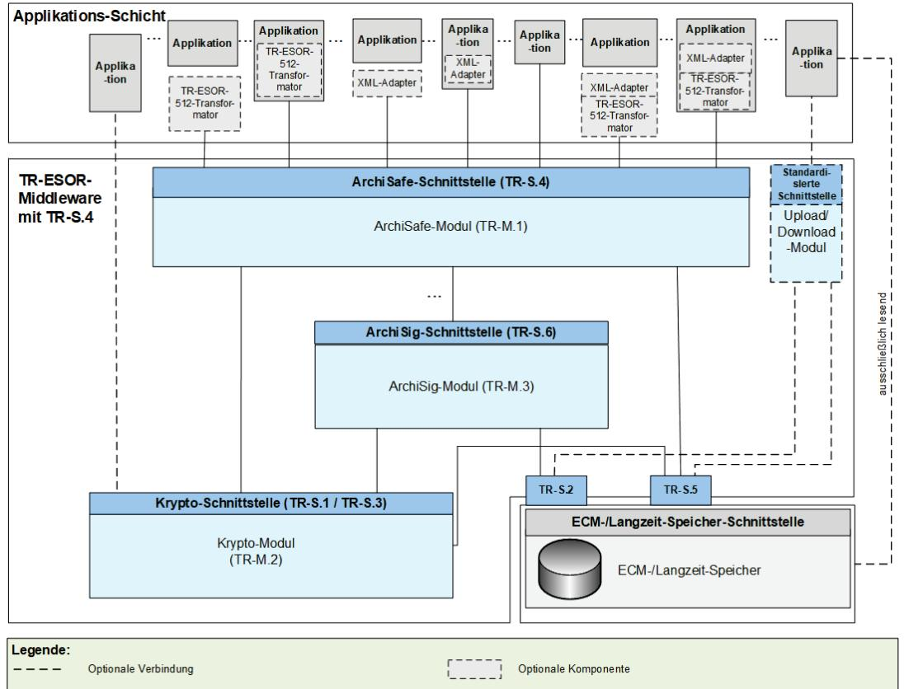
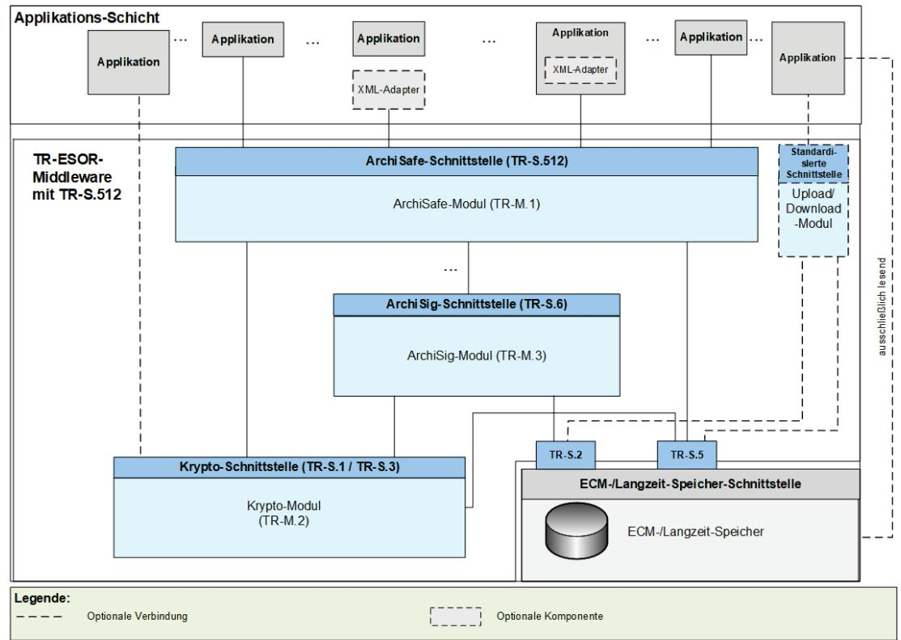

# BSI Technische Richtlinie 03125 Beweiswerterhaltung kryptographisch signierter Dokumente

### Anlage TR-ESOR-M.2: Krypto-Modul

| Bezeichnung | Krypto-Modul                                                                                                      |
|-------------|-------------------------------------------------------------------------------------------------------------------|
| Kürzel      | BSI TR-ESOR-M.2                                                                                                   |
| Version     | 1.3 (auf Basis der eIDAS-Verordnung und der ETSI Preservation Standards mit einem neuen Zertifizierungsschema) |
| Datum       | 31.03.2022                                                                                                        |

# Änderungshistorie

| Version | Datum      | Name | Beschreibung |
|---------|------------|------|--------------|
| 1.3     | 31.03.2022 | BSI  | TR-ESOR-M.2  |
|         |            |      |              |

Tabelle 1: Änderungshistorie

Bundesamt für Sicherheit in der Informationstechnik Postfach 20 03 63 53133 Bonn Tel.: +49 22899 9582-0 E-Mail: tresor@bsi.bund.de Internet[: https://www.bsi.bund.de](https://www.bsi.bund.de/) © Bundesamt für Sicherheit in der Informationstechnik 2022

| 1                 |     |       | Einführung 5                                                 |  |  |  |
|-------------------|-----|-------|--------------------------------------------------------------|--|--|--|
| 2 Übersicht  8 |     |       |                                                              |  |  |  |
|                   | 2.1 |       | Ziele 10                                                     |  |  |  |
|                   | 2.2 |       | Funktionsweise  10                                           |  |  |  |
| 3                 |     |       | Definition des Krypto-Moduls 11                              |  |  |  |
|                   | 3.1 |       | Grundlegender Aufbau 11                                      |  |  |  |
| 3.2               |     |       | Modulare Einbindung der kryptographischen Funktionen  11     |  |  |  |
|                   | 3.3 |       | Vertrauenslisten  11                                         |  |  |  |
|                   | 3.4 |       | Verbindung zu (qualifizierten) Vertrauensdiensteanbieter  12 |  |  |  |
| 4                 |     |       | Grundlegende Anforderungen an Algorithmen und Parameter  13  |  |  |  |
|                   | 4.1 |       | Erzeugen von Zufallszahlen 13                                |  |  |  |
|                   | 4.2 |       | Bilden von Hashwerten 13                                     |  |  |  |
|                   | 4.3 |       | Anforderung von digitalen Signaturen (optional) 14           |  |  |  |
|                   | 4.4 |       | Kanonisierungsverfahren 15                                   |  |  |  |
| 5                 |     |       | Funktionen des Krypto-Moduls 16                              |  |  |  |
|                   | 5.1 |       | Digitale Signaturen  16                                      |  |  |  |
|                   |     | 5.1.1 | Anfordern einer digitalen Signatur  16                       |  |  |  |
|                   |     | 5.1.2 | Validierung digitaler Signaturen  17                         |  |  |  |
|                   |     | 5.1.3 | Validierung von Zertifikaten 18                              |  |  |  |
|                   | 5.2 |       | Prüfung der technischen Beweisdaten  21                      |  |  |  |
|                   | 5.3 |       | Erzeugung eines Hashwertes 21                                |  |  |  |
|                   | 5.4 |       | Zeitstempel  22                                              |  |  |  |
|                   |     | 5.4.1 | Anforderung eines qualifizierten Zeitstempels 22             |  |  |  |
|                   |     | 5.4.2 | Validierung eines qualifizierten Zeitstempels 22             |  |  |  |
|                   |     | 5.4.3 | Kanonisierung von XML-Objekten (optional)  23                |  |  |  |
| 6                 |     |       | Sicherheitsfunktionen des Krypto-Moduls 24                   |  |  |  |
|                   | 6.1 |       | Verwaltung von kryptographischen Schlüsseln  24              |  |  |  |
|                   |     | 6.1.1 | Private Schlüssel 24                                         |  |  |  |
|                   |     | 6.1.2 | Öffentliche Schlüssel / Zertifikate  24                      |  |  |  |
|                   | 6.2 |       | Schutz des Krypto-Moduls vor Manipulation 24                 |  |  |  |
|                   | 6.3 |       | Konfiguration der kryptographischen Funktionen 24            |  |  |  |

# Abbildungen

| Abbildung 1: Schematische Darstellung der IT-Referenzarchitektur mit TR-S.4.  6   |  |
|-----------------------------------------------------------------------------------|--|
| Abbildung 2: Schematische Darstellung der IT-Referenzarchitektur mit TR-S.512.  6 |  |

# 1 Einführung

Ziel der Technischen Richtlinie "Beweiswerterhaltung kryptographisch signierter Dokumente" ist die Spezifikation sicherheitstechnischer Anforderungen für den langfristigen Beweiswerterhalt von kryptographisch signierten elektronischen Dokumenten und Daten nebst zugehörigen elektronischen Verwaltungsdaten (Metadaten).

Eine für diese Zwecke definierte Middleware (TR-ESOR-Middleware) im Sinn dieser Richtlinie umfasst alle diejenigen Module (M) und Schnittstellen (S), die zur Sicherung und zum Erhalt der Authentizität und zum Nachweis der Integrität der aufbewahrten Dokumente und Daten eingesetzt werden.

Die im Hauptdokument dieser Technischen Richtlinie vorgestellte Referenzarchitektur besteht aus den nachfolgend beschriebenen Schnittstellen, Funktionen und logischen Einheiten:

- der TR-S.4- und TS119512-Schnittstelle TR-S.512 in der Profilierung [TR-ESOR-TRANS] der TR-ESOR-Middleware, die dazu dient, die TR-ESOR-Middleware in die bestehende IT- und Infrastrukturlandschaft einzubetten;
- dem "ArchiSafe-Module" (vgl. [TR-ESOR-M.1]), welches den Informationsfluss in der Middleware regelt, die Sicherheitsanforderungen an die Schnittstellen zu den IT-Anwendungen umsetzt und für eine Entkopplung von Anwendungssystemen und ECM-/Langzeitspeicher sorgt;
- dem "Krypto"-Modul (vgl. [TR-ESOR-M.2]) nebst den zugehörigen Schnittstellen TR-S.1 und TR-S.3, das alle erforderlichen Funktionen zur Berechnung von Hashwerten, zur Prüfung elektronischer Signaturen bzw. Siegel bzw. Zeitstempel, zur Nachprüfung elektronischer Zertifikate und zum Einholen qualifizierter Zeitstempel sowie (optional) elektronischer Signaturen bzw. Siegel für die Middleware zur Verfügung stellt. Darüber hinaus kann es Funktionen zur Ver- und Entschlüsselung von Daten und Dokumenten zur Verfügung stellen;
- dem "ArchiSig-Modul" (vgl. [TR-ESOR-M.3]) mit der Schnittstelle TR-S.6, das die erforderlichen Funktionen für die Beweiswerterhaltung der digital signierten Unterlagen bereitstellt;
- einem ECM-/Langzeitspeicher mit den Schnittstellen TR-S.2 und TR-S.5, der die physische Archivierung/Aufbewahrung und auch das Speichern der beweiswerterhaltenden Zusatzdaten übernimmt.

Dieser ECM-/Langzeitspeicher ist nicht mehr direkt Teil der Technischen Richtlinie, gleichwohl werden über die beiden Schnittstellen, die noch Teil der TR-ESOR-Middleware sind, Anforderungen daran gestellt. 

Ebenso wenig ist die Applikationsschicht, die auch einen XML-Adapter enthalten kann, direkter Teil der Technischen Richtlinie, auch wenn dieser XML-Adapter als Teil einer Middleware implementiert werden kann.

Die in [Abbildung](#page-5-0) 1 und [Abbildung](#page-5-1) 2 dargestellte IT-Referenzarchitektur orientiert sich an der ArchiSafe Referenzarchitektur und soll die logische (funktionale) Interoperabilität künftiger Produkte mit den Zielen und Anforderungen der Technischen Richtlinie ermöglichen und unterstützen.

Die empfohlene IT-Referenzarchitektur ist in [Abbildung](#page-5-0) 1 und [Abbildung](#page-5-1) 2 dargestellt und besteht im Wesentlichen aus den nachfolgend grob beschriebenen logischen Komponenten und Schnittstellen. Diese werden in Anhängen zur TR weiter detailliert.

Die Grafik zeigt zudem die externen Komponenten und Systeme an, die das Bild vervollständigen.

Grundsätzlich wird als obere Schnittstelle der TR-ESOR-Middleware entweder die TR-S.4-Schnittstelle gemäß [TR-ESOR-E], die in [Abbildung](#page-5-0) 1 dargestellt ist, oder die TR-S.512-Schnittstelle gemäß [ETSI TS 119 512] in der Profilierung [TR-ESOR-TRANS], die in [Abbildung](#page-5-1) 2 gezeigt wird, unterstützt.

Abbildung 1: Schematische Darstellung der IT-Referenzarchitektur mit TR-S.4.

Abbildung 2: Schematische Darstellung der IT-Referenzarchitektur mit TR-S.512.

Sofern der optionale XML-Adapter und/oder der optionale TR-ESOR-512-Transformator[1](#page-5-2) vorhanden sind, können beide in folgenden Ausprägungen vorliegen:

1 Siehe ["Freier ETSI TS 119512 TR-ESOR Transformator unter einer Open Source Lizenz"](https://github.com/de-bund-bsi-tr-esor/tresor-ETSITS119512-transformator).

- Jeweils eigenständige Komponente mit Schnittstellen zur Applikation sowie zum ArchiSafe-Modul
- Jeweils eigenständige Komponente, jedoch Teil der Applikation mit Schnittstelle zum ArchiSafe-Modul
- XML-Adapter und TR-ESOR-512-Transformator als eine gemeinsame Komponente, die beide Teile enthält mit Schnittstellen zur Applikation sowie zum ArchiSafe-Modul
- XML-Adapter und TR-ESOR-512-Transformator als eine gemeinsame Komponente, die beide Teile enthält und Teil der Applikation ist, mit Schnittstelle zum ArchiSafe-Modul.

Der "ETSI TS119512 TR-ESOR Transformator" ermöglicht Bewahrungsdiensten gemäß [eIDAS-VO], empfangene ETSI TS119512 (V1.1.2) Nachrichten[2](#page-6-0) in TR-S4 Nachrichten zu transformieren. Diese Nachrichten können dann an ein angeschlossenen TR-ESOR-System[3](#page-6-1) geschickt werden, ohne irgendwelche Änderungen dieses TR-ESOR-Systems.

Der Einsatz des TR-ESOR-512-Transformators wird empfohlen, sofern das TR-ESOR-Produkt mit einer TR-S.4-Schnittstelle in Europa zum Einsatz kommt und Interoperabilität mit europäischen (qualifizierten) Bewahrungsdiensten und Bewahrungsprodukten hergestellt werden soll.

Diese Technische Richtlinie ist modular aufgebaut und spezifiziert in einzelnen Anlagen zum Hauptdokument die funktionalen und sicherheitstechnischen Anforderungen an die erforderlichen IT-Komponenten und Schnittstellen der TR-ESOR-Middleware. Die Spezifikationen sind strikt plattform-, produkt-, und herstellerunabhängig.

Das vorliegende Dokument trägt die Bezeichnung "Anlage TR-ESOR-M.2: Krypto-Modul" und spezifiziert die funktionalen und sicherheitstechnischen Anforderungen an ein Modul, dass die für den Beweiswerterhalt notwendigen kryptographischen Funktionen zur Verfügung stellt. Hierbei handelt es sich im Wesentlichen um das Validieren von elektronischen Signaturen bzw. Siegeln bzw. Zeitstempeln und den damit zusammenhängenden Zertifikaten, das Berechnen von Hashwerten und das Abfragen von (qualifizierten) Zeitstempeln sowie (optional) von elektronischen Signaturen bzw. Siegeln.

 2 In der Profilierung von [TR-ESOR-TRANS]

3 Sieh[e https://www.bsi.bund.de/EN/tr-esor](https://www.bsi.bund.de/EN/tr-esor) oder [https://www.bsi.bund.de/DE/tr-esor.](https://www.bsi.bund.de/DE/tr-esor)

# 2 Übersicht

Der folgende Abschnitt gibt einen Überblick über grundsätzliche Ziele und Anforderungen an die für den Beweiswerterhalt elektronischer Daten erforderlichen kryptographischen Funktionen.

#### HINWEIS 1

In der vorliegenden TR-ESOR Version 1.3 werden die drei Begriffe "(beweiswerterhaltende) Langzeitspeicherung", "(beweiswerterhaltende) Bewahrung" und "(beweiswerterhaltende) Archivierung" synonym verwendet. 

Ebenso werden die drei Begriffe "Archivinformationspaket (AIP)", "Archivinformationscontainer" und "Archivdatenobjekt" sowie die Begriffe "aufbewahren" und "archivieren" synonym verwendet. 

#### HINWEIS 2

TR-ESOR spezifiziert ein Bewahrungsprodukt (engl. Preservation Product) gemäß [ETSI SR 019510], [ETSI TS 119511] und [ETSI TS 119512] und [eIDAS]. 

Die TR 03125 TR-ESOR ist in [ETSI SR 019510] in dem Kapitel 4.7.3 und 5.2 und B3.2 beschrieben. Die in TR-ESOR erforderlichen grundlegenden Bewahrungstechniken, z.B. das Bewahrungsprotokoll, das Beweisdaten-Format Evidence Record, die Archivdaten-Format (L)XAIP und ASiC-AIP sind in der ETSI-Publikation [ETSI TS 119512] als normative Elemente enthalten.

#### HINWEIS 3

Die obere TR-ESOR-Eingangs-Schnittstelle TR-S.4 oder die TS119512-Eingangsschnittstelle TR-S.512 gemäß der "Preservation-API" in [ETSI TS 119512] in der Profilierung von [TR-ESOR-TRANS], die logisch äquivalent zur Eingangsschnittstelle TR-S.4 gemäß [TR-ESOR-E] ist wie in der Tabelle 2 in [TR-ESOR-E], Kap. 4.1 dargestellt, muss benutzt werden. Eine andere Eingangs-Schnittstelle anstelle von TR-S.4 bzw. TR-S.512 ist nicht erlaubt.

#### HINWEIS 4

In der vorliegenden TR-ESOR-Version 1.3 umfasst der Begriff "Archivinformationscontainer" (AIP) in allen TR-ESOR-Anhängen:

- a) das Archivdatenobjekt "XAIP" gemäß [TR-ESOR-F], Kapitel 3.1 als auch
- b) das logische XAIP "LXAIP" gemäß [TR-ESOR-F], Kapitel 3.2 und
- c) das "ASiC-AIP" gemäß [TR-ESOR-F], Kapitel 3.3 auf Basis von [ETSI EN 319162-1].
- In TR-ESOR Version 1.3 wird zwischen XAIP, LXAIP und ASiC-AIP differenziert.

Mit (L)XAIP wird XAIP oder LXAIP bezeichnet.

#### HINWEIS 5

In dieser TR-ESOR Version 1.3 ist "BIN" beschränkt auf die folgenden Bewahrungsobjekt-Formate (engl. preservation object formats):

- CAdES gemäß [ETSI TS 119512], Annex A.1.1 [\(http://uri.etsi.org/ades/CAdES\)](http://uri.etsi.org/ades/CAdES). Sofern kein MIME Type gesetzt ist, wird als Default application/cms verwendet;
- XAdES gemäß [ETSI TS 119512], Annex A.1.2 [\(http://uri.etsi.org/ades/XAdES\)](http://uri.etsi.org/ades/XAdES). Sofern kein MIME Type gesetzt ist, wird als Default application/xml verwendet;
- PAdES gemäß [ETSI TS 119512], Annex A.1.3 [\(http://uri.etsi.org/ades/PAdES\)](http://uri.etsi.org/ades/PAdES). Sofern kein MIME Type gesetzt ist, wird als Default application/pdf verwendet;
- ASiC-E gemäß [ETSI TS 119512], Annex A.1.4 [\(http://uri.etsi.org/ades/ASiC/type/ASiC-E\)](http://uri.etsi.org/ades/ASiC/type/ASiC-E). Sofern kein MIME Type gesetzt ist, wird als Default application/vnd.etsi.asic-e+zip verwendet;
- ASiC-S gemäß [ETSI EN 319162]( [\(http://uri.etsi.org/ades/ASiC/type/ASiC-S\)](http://uri.etsi.org/ades/ASiC/type/ASiC-S).. Sofern kein MIME Type gesetzt ist, wird als Default application/vnd.etsi.asic-s+zip verwendet;
- DigestList gemäß [ETSI TS 119512], Annex A.1.6 (http://uri.etsi.org/19512[/format/DigestList\)](http://uri.etsi.org/19512/format/DigestList). Sofern kein MIME Type gesetzt ist, wird als Default application/xml verwendet;
- ASiC-ERS (in TR-ESOR v1.3 mit ASiC-AIP bezeichnet) gemäß [TR-ESOR-F], Kap. 3.3) und gemäß [ETSI TS 119512] Annex A.3.1 and A.3.1.3 [\(http://uri.etsi.org/ades/ASiC/type/ASiC-ERS\)](http://uri.etsi.org/ades/ASiC/type/ASiC-ERS);

Im Fall der Upload- und Download-Funktion ist zusätzlich das folgende Format erlaubt:

Binärdaten (BIN) als "Octet Stream", die in den ECM-/Langzeitspeicher mit "Upload-Request" gespeichert werden, – aber nur sofern: 

a) verbunden mit einem korrespondierenden LXAIP und dort referenziert gemäß [TR-ESOR-F], Kap. 3.2, 

b) ggf. auslesbar mit "Download-Request" – verbunden mit einem korrespondierenden LXAIP, das mit 

der "ArchiveRetrieval"-Funktion ausgelesen wurde, – oder eingebettet in einem XAIP und ausgelesen mit 

der "ArchiveRetrieval"-Funktion. 

c) Der Upload von XAIP oder LXAIP oder ASiC-AIP ist nicht zulässig. 

#### HINWEIS 6

-

Im folgenden Text umfasst der Begriff "Digitale Signatur": 

- "fortgeschrittene elektronische Signaturen" gemäß [eIDAS-VO], Artikel 3 Nr. 11,
- "qualifizierte elektronische Signaturen" gemäß [eIDAS-VO], Artikel 3 Nr. 12,
- "fortgeschrittenen elektronische Siegel" gemäß [eIDAS-VO], Artikel 3 Nr. 26 und
- "qualifizierte elektronische Siegel" gemäß [eiDAS-VO], Artikel 3 Nr. 27.

Insofern umfasst der Begriff "digital signierte Dokumente" sowohl solche, die fortgeschrittene elektronische Signaturen oder Siegel bzw. qualifizierte elektronische Signaturen oder Siegel tragen. Mit dem Begriff der "kryptographisch signierten Dokumente" sind in dieser TR neben: 

- den gemäß [eIDAS-VO], Artikel 3 Nr. 12 qualifiziert signierten,
- den gemäß [eIDAS-VO], Artikel 3 Nr. 27 qualifiziert gesiegelten oder
- den gemäß [eIDAS-VO], Artikel 3 Nr. 34 qualifiziert zeitgestempelten Dokumenten (im Sinne der eIDAS-Verordnung)

auch Dokumente: 

- mit einer fortgeschrittenen Signatur gemäß [eIDAS-VO], Artikel 3 Nr. 11 oder
- mit einem fortgeschrittenen Siegel gemäß [eIDAS-VO], Artikel 3 Nr. 26 oder
- mit einem elektronischen Zeitstempel gemäß [eIDAS-VO], Artikel 3 Nr. 33

erfasst, wie sie oft in der internen Kommunikation von Behörden entstehen. Nicht gemeint sind hier Dokumente mit einfachen Signaturen oder Siegeln basierend auf anderen (z. B. nicht-kryptographischen) Verfahren.

## 2.1 Ziele

Das Krypto-Modul stellt vornehmlich kryptographische Funktionen bereit, die für den langfristigen Beweiswerterhalt digital signierter Dokumente benötigt werden. Das Krypto-Modul kann darüber hinaus auch Funktionen für die Erstellung oder Prüfung zusätzlicher kryptographischer Sicherungsmittel bereitstellen.

In diesem Dokument werden darüber hinaus grundlegende Anforderungen an die eingesetzten (kryptographischen) Algorithmen, sowie an erforderliche Sicherheitsfunktionalitäten und die Konfiguration des Krypto-Moduls definiert und beschrieben.

## 2.2 Funktionsweise

Das Krypto-Modul stellt folgende kryptographischen und unterstützenden Funktionen zur Verfügung:

#### 1. Kryptographische Funktionen:

- Validierung digitaler Signaturen (selbst oder per Anfrage bei einem externen Vertrauensdiensteanbieter),
- Validierung elektronischer Zertifikate bis hin zu einem vertrauenswürdigen Wurzelzertifikat (selbst oder per Anfrage bei einem externen Vertrauensdiensteanbieter) bzw. Vertrauensanker gemäß der vom [TR-ESOR-PEPT] abgeleiteten veröffentlichten Preservation Evidence Policy (PEP) des TR-ESOR-Produktes bzw. Bewahrungs-Vertrauensdienstes[4](#page-9-2) ,
- • Erzeugen von Hashwerten über vorgelegte elektronische Daten,
- Anforderung qualifizierter Zeitstempel bei einem qualifizierten Vertrauensdiensteanbieter,
- Validierung von (qualifizierten) Zeitstempeln (selbst oder per Anfrage bei einem externen Vertrauensdiensteanbieter),
- Anforderung digitaler Signaturen bei einem externen Vertrauensdiensteanbieter (optional).

#### 2. Unterstützende Funktionen

• Kanonisierung von XML-Objekten (optional)

Das Krypto-Modul stellt diese Funktionen über die Schnittstellen TR-S.1 und TR-S.3 den Modulen ArchiSafe (siehe [TR-ESOR-M.1]) und ArchiSig (siehe [TR-ESOR-M.3]) zur Verfügung.

Es kann diese und weitere Funktionen über andere Schnittstellen, die nicht Gegenstand dieser TR sind, auch anderen Modulen und Systemen zur Verfügung stellen.

4 Siehe **[TR-ESOR-PEPT], Kap. 1.1.1, To-Do-1.1.1-2.**

# 3 Definition des Krypto-Moduls

Der Begriff "Krypto-Modul" umfasst sämtliche funktionalen Einheiten, die zur Validierung digitaler Signaturen und Zeitstempel, zum Hashen und zum Abfragen von (qualifizierten) elektronischen Zeitstempeln und (optional) zum Anfordern von digitalen Signaturen im Zusammenhang mit dem Beweiswerterhalt elektronischer Dokumente benötigt werden.

Das Krypto-Modul kann darüber hinaus auch weitere Funktionen für die Erstellung oder Prüfung zusätzlicher kryptographischer Sicherungsmittel nach dem Stand der Technik und unter Beachtung der aktuell geltenden rechtlichen Vorgaben und Normen bereitstellen.

## 3.1 Grundlegender Aufbau

Die technische Realisierung des Krypto-Moduls steht dem Produkt-Anbieter weitgehend frei, solange er die Anforderungen der folgenden Abschnitte erfüllt. Folgende Implementierungsvarianten stehen beispielsweise zur Verfügung:

- Direkte Einbindung eines in Software implementierten Krypto-Moduls (als Bibliothek oder Service),
- Direkte Einbindung einer Software-Bibliothek oder eines Service, die einen Zugriff auf ein in Hardware implementiertes Krypto-Modul erlaubt,
- Direkter Zugriff auf ein Hardware-Krypto-Modul.

Darüber hinaus besitzt das Krypto-Modul eine

• Verbindung zu einem (qualifizierten) Vertrauensdiensteanbieter gemäß [eIDAS-VO], Artikel 3 Nr. 19 bzw. Nr. 20.

Diese grundsätzlichen Realisierungsoptionen entbinden einen Hersteller (Lieferanten) nicht von der Erfüllung von Anforderungen, die aufgrund geltender rechtlicher Vorschriften und Normen gestellt werden, um gesetzeskonforme fortgeschrittene, bzw. qualifizierte elektronische Signaturen, Siegel und (qualifizierte) Zeitstempel anfordern und prüfen zu können.

## 3.2 Modulare Einbindung der kryptographischen Funktionen

Aufgrund möglicher sehr langer Aufbewahrungsfristen elektronischer Dokumente ist es erforderlich, von Anfang an mögliche zukünftige kryptographische Anforderungen zu berücksichtigen. Das bedeutet:

(A3.2-1) Das Krypto-Modul muss Modul-Charakter besitzen. Ein schneller und unkomplizierter Austausch nicht mehr sicherheitsgeeigneter oder sicherheitsgefährdeter Algorithmen und Parameter des Krypto-Moduls durch sicherheitsgeeignete Algorithmen und Parameter oder des gesamten Krypto-Moduls muss jederzeit möglich sein.

## 3.3 Vertrauenslisten

Gemäß [eIDAS-VO], Artikel 22 Absatz 1 müssen von jedem Mitgliedstaat sogenannte Vertrauenslisten, die Angaben zu den qualifizierten Vertrauensdiensteanbietern im jeweiligen Mitgliedsstaat sowie zu den von diesen erbrachten Vertrauensdiensten, aufstellen, führen und veröffentlichen. Die Veröffentlichung muss auf einer gesicherten Weise in einer elektronisch unterzeichneten bzw. besiegelten Form erfolgen, die für eine automatisierte Verarbeitung geeignet ist (vgl. [eIDAS-VO], Artikel 22 Absatz 2). Die Informationen über die erstellenden nationalen Stellen werden gem. [eIDAS-VO], Artikel 22 Absatz 3 an die Kommission übermittelt.

Für Deutschland verantwortlicher Herausgeber ist die [Bundesnetzagentur](http://www.bundesnetzagentur.de/DE/Home/home_node.html) für Elektrizität, Gas, Telekommunikation, Post und Eisenbahnen (BNetzA) und die korrespondierende Vertrauensliste wird auf der Internetseite:

• [https://www.bundesnetzagentur.de/cln\\_111/EVD/DE/Fachkreis/DeutscheVertrauensliste/Deutsch](https://www.bundesnetzagentur.de/cln_111/EVD/DE/Fachkreis/DeutscheVertrauensliste/DeutscheVertrauensliste-start.html) [eVertrauensliste-start.html](https://www.bundesnetzagentur.de/cln_111/EVD/DE/Fachkreis/DeutscheVertrauensliste/DeutscheVertrauensliste-start.html)

im Bundesanzeiger und auf den Internetseiten der Bundesnetzagentur veröffentlicht.

Die Kommission dagegen publiziert eine Vertrauensliste mit der Zusammenstellung der Eingaben über die einzelnen nationalen Stellen, zumindest den Ort der Herausgabe sowie die zur Unterzeichnung oder Besiegelung verwendeten Zertifikate (vgl. [eIDAS-VO], Artikel 22 Absatz 4).

#### HINWEIS 7

Die entsprechende Vertrauensliste der Europäischen Kommission, die auf die nationalen Vertrauenslisten verweist, und für die BSI TR-03125 (TR-ESOR) verbindlich ist, ist unter der folgenden Web-Adresse <https://ec.europa.eu/tools/lotl/eu-lotl.xml> zu beziehen.

Vertrauensdiensten, die nicht mit dem Status "granted" auf dieser Seite aufgeführt sind, sind bisher nicht anerkannt und erfüllen somit auch nicht nachweislich die Anforderungen gemäß [eIDAS-VO] und [VDG].

Für den Erhalt des Beweiswertes von archivierten Daten und Dokumenten ist es daher notwendig, durch geeignete technische und organisatorische Maßnahmen die Möglichkeit der dauerhaften Prüfung von digitalen Signaturen bzw. elektronischen Zeitstempeln gemäß [eIDAS-VO], Artikel 3 Nr. 33, 34 und Zertifikate gemäß [eIDAS-VO], Artikel 3 Nr. 14, 15 sicher zu stellen.

## 3.4 Verbindung zu (qualifizierten) Vertrauensdiensteanbieter

(A3.4-1) Das Krypto-Modul muss mindestens eine Verbindung zu einem Vertrauensdienst gemäß [eIDAS-VO], Artikel 2 Absatz 20 besitzen, über den es qualifizierte Zeitstempel gemäß [eIDAS-VO], Artikel 3 Nr. 34 anfordern kann.

(A3.4-2) Optional kann ein Krypto-Modul auch Verbindungen zu Vertrauensdiensten gemäß der [eIDAS-VO] besitzen, um

- die Validierung von digitalen Signaturen oder elektronischen Zeitstempeln gemäß [eIDAS-VO], Artikel 3 Nr. 33, 34[5](#page-11-1) ,
- die Validierung von Zertifikaten oder
- die Erzeugung von digitalen Signaturen

anzufordern.

Sofern Signatur-/Siegel-/Zeitstempelprüfung durch das Krypto-Modul im Rahmen eines (qualifizierten) Bewahrungsdiensts gemäß [eIDAS-VO] und [ETSI TS 119511] gegenüber externen Behörden erbracht wird, muss es auch Verbindungen zur Vertrauensdiensten gemäß der [eIDAS-VO] besitzen, um

- die Validierung von digitalen Signaturen oder elektronischen Zeitstempeln gemäß [eIDAS-VO], Artikel 3 Nr. 33, 34,
- die Validierung von Zertifikaten

anzufordern.

In Deutschland kann ein Krypto-Modul zusätzlich auch eine Verbindung:

• zur Bundesnetzagentur als Vertrauensinfrastruktur zur dauerhaften Prüfbarkeit qualifizierter elektronischer Zertifikate und qualifizierter elektronischer Zeitstempel gemäß [VDG, § 16]

besitzen,

• um die Validierungen von Zertifikaten und Zeitstempeln, dessen herausgebender qualifizierter Vertrauensdiensteanbieter seinen Dienst nicht mehr wahrnimmt,

#### zu ermöglichen.

(A3.4-3) Der Kommunikationskanal zu den Vertrauensdiensteanbietern muss in geeigneter Weise geschützt werden (siehe z. B. [TR 03116], Teil 4 und [TR 02102] sowie [TR-ESOR], Kap. 8.2.2).

 5 Die Verbindung zu qualifizierten Validierungsdiensten bietet sich bspw. dann an, wenn eine Prüfung qualifizierter elektronischer Signaturen, Siegel, Zeitstempel durch das Dauerhafte Verzeichnis der Bundesnetzagentur nach § 16 [VDG] notwendig ist (Vgl.

https://www.bundesnetzagentur.de/EVD/DE/Verbraucher/AuskunftDAVE/DAVE/DAVE.html).

# 4 Grundlegende Anforderungen an Algorithmen und Parameter

Die Anforderungen an das Krypto-Modul hinsichtlich der verwendeten Algorithmen und Parameter basieren auf den Vorgaben und Empfehlungen gemäß [ETSI TS 119312] [6](#page-12-3) und [SOG-IS][7](#page-12-4) .

(A4.0-1) Diese Vorgaben gemäß [ETSI TS 119312][8](#page-12-5)und [SOG-IS][9](#page-12-6)  sind für das Krypto-Modul verbindlich und müssen stets den aktuellen Empfehlungen gemäß [ETSI TS 119312] und [SOG-IS] folgend angepasst werden. Weiterhin müssen die allgemeinen Empfehlungen des BSI hinsichtlich der Sicherheitseignung kryptographischer Funktionen beachtet werden (vgl. [TR-02102]). Auch hier muss das Krypto-Modul an aktualisierte Empfehlungen laufend angepasst werden.

#### HINWEIS 8

Dieses Kapitel beschreibt für einzelne kryptographische Verfahren die jeweils anzuwendenden Vorgaben. Sowohl die Auswahl der Verfahren als auch die aufgeführten Vorgaben richten sich dabei ausschließlich an der für den Beweiswerterhalt minimal notwendigen Funktionalität des Krypto-Moduls aus. Dieses Dokument beschreibt nicht umfassend alle Verfahren und Vorgaben, die ein allgemeines Krypto-Modul erfüllen sollte bzw. kann.

## 4.1 Erzeugen von Zufallszahlen

Kryptographische Verfahren verwenden Zufallszahlen in verschiedenen Funktionen, u. a. zur Erzeugung von

- kryptographischen Schlüsseln bzw. Systemparametern (z. B. in Form von Primzahlen),
- temporär zur Authentisierung genutzten Daten (Challenges),
- Zufallszeichen zur Ergänzung von Zeichenfolgen (z. B. kryptographischer Schlüssel und Nachrichten) bis zu einer festgelegten Länge (Padding).

(A4.1-1) Zufallszahlen können unter Ausnutzung physikalischer Effekte (physikalische Generatoren) oder mathematischer Algorithmen (Pseudozufallszahlengeneratoren) erzeugt werden.

(A4.1-2) Die vom Krypto-Modul genutzten Zufallszahlgeneratoren sollen gemäß den Technischen Richtlinien [TR 03116] und [TR 02102] des BSI die Anforderungen nach [AIS 20] für Pseudozufallszahlengeneratoren bzw. nach [AIS 31] für physikalische Zufallszahlgeneratoren erfüllen.

## 4.2 Bilden von Hashwerten

Um Veränderungen an elektronischen Daten festzustellen, werden Hash-Funktionen eingesetzt, die unter Verwendung nicht-umkehrbarer mathematischer Funktionen[10](#page-12-7) Daten beliebiger Länge auf einen eindeutigen Ergebniswert (einen so genannten "digitalen Fingerabdruck") mit festgelegter Länge abbilden. Im Folgenden wird ausschließlich von deterministischen Hash-Funktionen ohne Zufallskomponenten ausgegangen, die für (und nur für) identische Daten auch identische Hashwerte liefern.[11](#page-12-8)

 6 Vgl. ETSI TS 119 312: "ETSI: Electronic Signatures and Infrastructures (ESI); Cryptographic Suites".

7 Vgl. SOG-IS Crypto Working Group: "SOG-IS Crypto Evaluation Scheme – Agreed Cryptographic Mechanisms", in der jeweils gültigen Fassung, [https://www.sogis.eu/uk/supporting\\_doc\\_en.html.](https://www.sogis.eu/uk/supporting_doc_en.html)

8 Vgl. ETSI TS 119 312: "ETSI: Electronic Signatures and Infrastructures (ESI); Cryptographic Suites".

9 Vgl. SOG-IS Crypto Working Group: "SOG-IS Crypto Evaluation Scheme – Agreed Cryptographic Mechanisms", in der jeweils gültigen Fassung, [https://www.sogis.eu/uk/supporting\\_doc\\_en.html.](https://www.sogis.eu/uk/supporting_doc_en.html)

10 Die Nicht-Umkehrbarkeit beruht dabei meist auf dem heute notwendigen extrem hohen Rechenaufwand für die Umkehrung, der eine praktikable Anwendung nicht zulässt.

11 Da der Bildbereich von Hashfunktionen zumeist erheblich kleiner ist als der abzubildende Datenbereich, können Kollisionen auftreten, d. h. zwei unterschiedliche Datenobjekte können auf den

- (A4.2-1) Das Krypto-Modul muss mindestens einen aktuell gemäß [ETSI TS 119312] und [SOG-IS] als sicherheitsgeeignet eingestuften und veröffentlichten Hash-Algorithmus anbieten (siehe hierzu auch [TR 03116], [TR 02102] und [ETSI TS 119312] und [SOG-IS]).
- (A4.2-2) Das Krypto-Modul soll darüber hinaus mindestens einen zusätzlichen aktuellen gemäß [ETSI TS 119312] und [SOG-IS] als sicherheitsgeeignet eingestuften und veröffentlichten Hash-Algorithmus anbieten (siehe hierzu [TR 03116], [TR 02102] und [ETSI TS 119312] und [SOG-IS]), um auf einen Verlust der Sicherheitseignung eines eingesetzten Hash-Algorithmus unverzüglich reagieren zu können.
- (A4.2-3) Für die Bildung neuer Hashwerte dürfen keine anderen als die von gemäß [ETSI TS 119312] und [SOG-IS] empfohlenen Hash-Algorithmen und Parameter eingesetzt werden. Das Krypto-Modul muss jedoch alle in der Vergangenheit eingesetzten Hash-Algorithmen gemäß [ETSI TS 119312] und [SOG-IS] und [ALGCAT] bzw. [TR-ESOR-ERS], Kap. 5.2.1 weiterhin unterstützen, um eine Prüfung der in der Vergangenheit erzeugten Hashwerte zu ermöglichen.

## 4.3 Anforderung von digitalen Signaturen (optional)

Für die unmittelbaren Zwecke der Erhaltung des Beweiswertes kryptographisch signierter elektronischer Unterlagen ist es nicht erforderlich, dass das Krypto-Modul imstande ist, selbst digitale Signaturen bzw. elektronische Zeitstempel zu erzeugen.[12](#page-13-1) [13.](#page-13-2)

#### HINWEIS 9

Diese möglichen zusätzlichen Fähigkeiten der Erstellung digitaler Signaturen (Signaturen bzw. Siegel) sind nicht Betrachtungsgegenstand dieser BSI TR-03125 (TR-ESOR). 

In dieser TR muss das Krypto-Modul qualifizierte Zeitstempel von einem qualifizierten Vertrauensdiensteanbieter gemäß [eIDAS-VO], Artikel 3 Nr. 20 anfordern können (sieh[e \(A3.4-2\)\)](#page-11-2). 

Darüber hinaus kann das Krypto-Modul auch digitale Signaturen bzw. elektronische Zeitstempel von einem Vertrauensdiensteanbieter gemäß [eIDAS-VO], Artikel 3 Nr. 19 bzw. Nr. 20 erzeugen oder validieren lassen (sieh[e \(A3.4-2\)\)](#page-11-2).[14](#page-13-3)

14 Für Algorithmen im Kontext qualifizierter elektronischer Signaturen bzw. Siegel bzw. Zeitstempel muss durch den Vertrauensdiensteanbieter der Algorithmenkatalog gemäß [ETSI TS 119 312] und [SOG-IS] in der jeweils aktuellen Fassung eingehalten werden. Für die den kryptographischen Signaturen zugrunde liegende Bildung von Hashwerten müssen die Anforderungen aus Kapite[l 4.2](#page-12-2) umgesetzt werden.

gleichen Hashwert abgebildet werden. Um die Integrität von Daten zweifelsfrei nachprüfen zu können, muss für die eingesetzten Algorithmen und Parameter daher zusätzlich die Eigenschaft der Kollisionsresistenz gefordert werden. Hashfunktionen werden als kollisionsresistent bezeichnet, wenn es praktisch unmöglich ist, ein Paar verschiedener Eingabedaten zu finden, deren Hashwerte übereinstimmen.

12 Auf Verlangen des ArchiSafe-Moduls kann das Krypto-Modul optional einen Eingangszeitstempel oder eine Eingangssignatur bzw. ein Eingangssiegel von einem (qualifizierten) Vertrauensdiensteanbieter anfordern oder selbst einen Hashwert über das zu archivierende Datenobjekt erzeugen. Diese Signatur bzw. dieser Siegel oder dieser Zeitstempel oder dieser Hashwert dient jedoch ausschließlich der Integritätssicherung.

13 Das ArchiSig-Modul benötigt qualifizierte elektronische Zeitstempel zum Aufbau der Hashbäume. Im Regelfall werden derartige Zeitstempel samt Signatur bzw. Siegel durch das Krypto-Modul von qualifizierten Vertrauensdiensteanbietern angefordert, da gemäß [eIDAS-VO], Artikel 42 Absatz 1 Buchstabe c gilt, dass i. d. R. ein qualifizierter elektronischer Zeitstempel "mit einer fortgeschrittenen elektronischen Signatur unterzeichnet oder einem fortgeschrittenen elektronischen Siegel des qualifizierten Vertrauensdiensteanbieters versiegelt" wird.

## 4.4 Kanonisierungsverfahren

Bei der Berechnung von Hashwerten bzw. bei der digitalen Signatur von XML-Daten muss sichergestellt werden, dass es zu keinen Mehrdeutigkeiten kommt. Um dies erreichen zu können, ist zunächst eine so genannte Kanonisierung des Inhalts erforderlich. Bei der Kanonisierung werden syntaktische Unterschiede der XML-Daten angeglichen, die keine semantische Bedeutung haben, z. B. leere Tags, Reihenfolge der XML-Elemente, Zeilenumbrüche, Whitespaces und Sonderzeichen. Die Kanonisierung ist die Grundlage für eine eindeutige Bildung von Hashwerten aus XML-Daten.

Die empfohlene Referenzarchitektur (vgl. [Abbildung 1](#page-5-0) bzw. [Abbildung 2\)](#page-5-1) geht davon aus, dass das Krypto-Modul

- a) die Hashwerte über die Archivdatenobjekte berechnet, die für die ArchiSig-Hashbäume notwendig sind. In diesem Fall muss das ArchiSig-Modul (siehe [TR-ESOR-M.3]) die Kanonisierung vornehmen.
- b) (fortgeschrittene oder qualifizierte) elektronische Signaturen bzw. Siegel über Archivdatenobjekte durch Vertrauensdiensteanbieter erzeugen lässt (Bewahrungs-Eingangssignatur bzw. -siegel). Die hierfür notwendige Kanonisierung vor der Hashwertbildung muss vom Krypto-Modul oder Vertrauensdiensteanbieter durchgeführt werden.
- c) in der Lage sein muss, (qualifizierte und fortgeschrittene) elektronische Signaturen bzw. Siegel von zu archivierenden Datenobjekten lokal oder mittels eines externen Vertrauensdienstes zu validieren. Die hierfür notwendige Kanonisierung vor der Hashwertbildung muss vom Krypto-Modul durchgeführt werden.

Daher ist die Kanonisierungsfunktionalität im Krypto-Modul ein obligatorischer Bestandteil; ein Anbieten dieser Funktionalität über externe Schnittstellen ist jedoch optional.

(A4.4-1) Die Unterstützung von Kanonisierungsverfahren für die reine Hashwertberechnung und die digitale Signatur von XML-Inhalten durch das Krypto-Modul ist optional.

(A4.4-2) Die Unterstützung von Kanonisierungsverfahren für die lokale Signatur- bzw. Siegelprüfung von XML-Inhalten durch das Krypto-Modul ist verpflichtend.

(A4.4-3) Durch die implementierten Kanonisierungsverfahren dürfen Inhaltsdaten nicht verändert werden.

(A4.4-4) Für die Implementierung eines Kanonisierungsverfahrens gibt es zum Zeitpunkt der Veröffentlichung dieser Richtlinie keinerlei Vorgaben durch das Bundesamt für Sicherheit in der Informationstechnik oder die Bundesnetzagentur oder die [eIDAS-VO] und ihre Durchführungsrechtakte oder das [VDG]. Es muss mindestens das Verfahren

• C14N - Canonical XML Version 1.0 [C14N]

unterstützt werden. Zusätzlich wird die Unterstützung des folgenden Verfahrens empfohlen:

- C14N11 Canonical XML Version 1.1 [C14N11]
- C14N20 Canonical XML Version 2.0 [C14N20]
- EC14N Exclusive XML Canonicalization [EC14N].

# 5 Funktionen des Krypto-Moduls

Der folgende Abschnitt beschreibt sowohl verpflichtende als auch optionale Funktionen, die durch das Krypto-Modul über externe Schnittstellen anderen Modulen der TR-ESOR-Middleware zur Verfügung gestellt werden. Das Krypto-Modul kann diese Funktionen auch anderen Systemen anbieten und auch weitere Funktionen beinhalten. Allerdings dürfen diese anderen Funktionen die in diesem Abschnitt aufgeführten Funktionen weder technisch noch sicherheitstechnisch beeinträchtigen oder die in Kapitel 6 beschriebenen Sicherheitsfunktionen umgehen.

## 5.1 Digitale Signaturen

Digitale Signaturen sind eine technische Lösung zur elektronischen Dokumentation der Urheberschaft und zum Nachweis der Integrität elektronischer Daten. Sie basieren auf asymmetrischen kryptographischen Verfahren und der Bildung von Hashwerten. Es gelten die aktuellen Vorgaben gemäß der [eIDAS-VO], [VDG] sowie [ETSI TS 119511] und [ETSI TS 119512].

Auf Grundlage dieser Verfahren können digitale Signaturen gesetzeskonform[15](#page-15-3) erzeugt werden. Dabei wird gemäß [eIDAS-VO], Artikel 3 u. a. unterschieden zwischen:

- "fortgeschrittenen elektronischen Signaturen", gem. [eIDAS-VO], Artikel 3 Nr. 11 und Artikel 26,
- "qualifizierten elektronischen Signaturen", gem. [eIDAS-VO], Artikel 3 Nr. 12 und Artikel 32,
- "fortgeschrittenen elektronischen Siegeln", gem. [eIDAS-VO], Artikel 3 Nr. 26 und Artikel 36,
- "qualifizierten elektronischen Siegeln", gem. [eIDAS-VO], Artikel 3 Nr. 27 und Artikel 40.

## 5.1.1 Anfordern einer digitalen Signatur

Für den unmittelbaren Zweck der Erhaltung des Beweiswertes kryptographisch signierter elektronischer Unterlagen ist es nicht erforderlich, dass das Krypto-Modul selbst digitale Signaturen erzeugen kann. Daher ist die Erzeugung einer digitalen Signatur hier nicht Gegenstand dieser TR.

- (A5.1-1) Das Krypto-Modul kann in der Lage sein, digitale Signaturen von (qualifizierten) Vertrauensdiensteanbietern gemäß der [eIDAS-VO] anzufordern.[16](#page-15-4)
- (A5.1-2) Der Abruf qualifizierter elektronischer Signaturen bzw. Siegel durch ein zu dieser TR konformes Krypto-Modul bei einem qualifizierten Vertrauensdiensteanbieter, ist optional. Das Krypto-Modul kann solche Funktionen bereitstellen, um auf Anforderung oder regelbasiert qualifizierte elektronische Signaturen oder qualifizierte elektronische Siegel für XML-Daten oder binäre Daten abzurufen.
- (A5.1-3) Digitale Signaturen für XML-Daten sollen gemäß den folgenden Formatvorgaben bzgl. XAdES-Signaturen erzeugt werden:
	- gemäß der jeweils aktuellen Fassung der Durchführungsrechtakte [2015/1506/EU] und
	- gemäß den Anforderungen in [TR-ESOR-F], (A5.1-2).

Bei Verwendung dieses Formates ist der Einsatz eines Kanonisierungsverfahrens erforderlich.

 15 Nach [eIDAS-VO], Artikel 3.

16 Für den Beweiswerterhalt an sich sind keine qualifizierten elektronischen Signaturen bzw. Siegel notwendig, da für den Beweiswerterhalt keine erneuten Willenserklärungen im juristischen Sinne abzugeben sind. Die für die Signatur- bzw. Siegelerneuerung ggf. notwendigen digitalen Signaturen von qualifizierten Zeitstempeln werden bei dem qualifizierten Vertrauensdiensteanbieter gemäß [eIDAS-VO, Artikel 3 Nr. 20] angefordert, der auch den qualifizierten Zeitstempel gemäß [eIDAS-VO, Artikel 42] ausstellt. Nur wenn das Krypto-Modul selbst diese Zeitstempel erzeugt, muss es auch in der Lage sein, digitale Signaturen zu erzeugen, und es muss durch oder im Auftrag eines qualifizierten Vertrauensdiensteanbieters betrieben werden.

- (A5.1-4) Digitale Signaturen für binäre Daten sollen gemäß den folgenden Formatvorgaben bzgl. CAdES-Signaturen erzeugt werden:
	- gemäß der jeweils aktuellen Fassung der Durchführungsrechtakte [2015/1506/EU] und
	- gemäß den Anforderungen in [TR-ESOR-F], (A5.1-1).
- (A5.1-5) Digitale PAdES-Signaturen sollen gemäß den folgenden Formatvorgaben erzeugt werden:
	- gemäß der jeweils aktuellen Fassung der Durchführungsrechtakte [2015/1506/EU] und
	- gemäß den Anforderungen in [TR-ESOR-F], (A5.1-3).
- (A5.1-6) ASiC-Container mit AdES-Signaturen, Zeitstempeln bzw. Evidence Records sollen gemäß den folgenden Formatvorgaben erzeugt werden:
	- gemäß der jeweils aktuellen Fassung der Durchführungsrechtakte [2015/1506/EU] und
	- gemäß den Anforderungen in [TR-ESOR-F], (A5.1-4).
- (A5.1-7) Die auf Anforderung von einem (qualifizierten) Vertrauensdiensteanbieter erzeugten digitalen Signaturdaten müssen durch das Krypto-Modul an das aufrufende Modul unverändert geliefert werden.

#### 5.1.2 Validierung digitaler Signaturen

Die digitale Signatur elektronischer Daten wird validiert, indem aus den Daten (ohne die digitale Signatur) erneut ein Hashwert gebildet und dieser mit dem bei der Signatur- bzw. Siegelerzeugung errechneten Hashwert verglichen wird. Dazu wird zunächst das Nutzer-Zertifikat des Signatur- bzw. Siegelschlüssel-Inhabers, das dessen öffentlichen Schlüssel[17](#page-16-1) (vgl. Kapitel [6.1.2\)](#page-23-3) enthält, der digitalen Signatur entnommen oder im Verzeichnisdienst des Ausstellers des Zertifikates abgerufen. Durch eine Anfrage beim Aussteller wird anschließend die Gültigkeit des Zertifikats zum Zeitpunkt der Signatur- bzw. Siegelerstellung (Kettenmodell) oder zum Zeitpunkt der Signatur- bzw. Siegelprüfung (Schalenmodell) validiert (vgl. Kapitel [5.1.3\)](#page-17-0).[18](#page-16-2) Mit dem aus dem Nutzer-Zertifikat extrahierten öffentlichen Schlüssel des Signatur- bzw. Siegelschlüssel-Inhabers wird die digitale Signatur geprüft. Ist diese Prüfung positiv und entstammt der öffentliche Signatur- bzw. Siegelprüfschlüssel aus einem zum Zeitpunkt der digitalen Signaturerstellung gültigen Zertifikat, ist die digitale Signatur gültig (Kettenmodell) bzw. aus einem zum Zeitpunkt der digitalen Signaturprüfung gültigen Zertifikat, so ist die digitale Signatur gültig (Schalenmodell).

Die Prüfung der Gültigkeit und Anwendbarkeit des zugeordneten Zertifikates muss entlang eines Zertifizierungspfades zu einem – aus Sicht des Prüfenden – vertrauenswürdigen Vertrauensdiensteanbieter erfolgen. Dabei müssen mindestens die folgenden Punkte geprüft werden (siehe auch [HK 06], Abschnitt 4.2):

- Mathematische Gültigkeit der digitalen Signaturen,
- Gültigkeit der Zertifikate gemäß Gültigkeitsmodell,
- • Korrektheit des Verwendungszwecks der Zertifikate.

Je nach Anwendungsfall kann die Validierung der digitalen Signatur noch weitere Aspekte umfassen, z. B. ob das Zertifikat des Erstellers der digitalen Signatur ein qualifiziertes ist, oder ob die Zertifikate unter einer bestimmten Zertifizierungspolitik (Certificate Policy) ausgestellt wurden.

(A5.1-8) Die Validierung digitaler Signaturen ist für den Beweiswerterhalt digital signierter Daten unverzichtbar. Die Validierungsfunktion muss sowohl Kettenmodell als auch Schalenmodell unterstützen. Mindestens eines der beiden Modelle muss[19](#page-16-3) erfolgreich durchlaufen werden. Ein zu dieser Richtlinie konformes Krypto-Modul muss daher die Validierung digitaler Signaturen entweder auf Basis des Schalenmodells oder des Kettenmodells entweder bei einem externen Vertrauensdiensteanbieter

 17 Der öffentliche Schlüssel wird gemäß [2014/910/EU, Anhang I] bzw. [2014/910/EU, Anhang III] auch Signatur- bzw. Siegel- Validierungsdaten genannt.

18 Die Anfrage beim Aussteller (Vertrauensdiensteanbieter), ob er dieses Zertifikat ausgestellt hat, ist nicht nur erforderlich, um dessen ordnungsgemäße Existenz nachweisen zu können, sondern das Ergebnis der Abfrage wird auch benötigt, um die Gültigkeit des Zertifikats zum Signatur- bzw. Siegel-Erstellungszeitpunkt (Kettenmodell) bzw. Prüfzeitpunkt (Schalenmodell) nachweisen zu können (vgl. auch [eIDAS-VO], Artikel 32 bzw. Artikel 40, [SFD 06], S. 96 ff.).

19 gemäß [TR-ESOR-PEPT], Kapitel 7.2.3 bzw. 7.2.6

gemäß [eIDAS-VO] anfordern oder Funktionen zur zuverlässigen lokalen Validierung digitaler Signaturen gemäß [EN 319 102] zur Verfügung stellen.

- (A5.1-9) Die Validierungsfunktion des Krypto-Moduls, ausgeführt mittels Abruf bei einem Vertrauensdiensteanbieter oder als lokaler Service, muss mindestens die in der Durchführungsrechtakte [2015/1506/EU] und die in [TR-ESOR-F], Kap. 5.1.1 bis 5.1.4 sowie hier in Kapitel [5.1.1](#page-15-2) genannten Signatur- bzw. Siegeldatenformate unterstützen.
- (A5.1-10) Diese Validierungsfunktion muss selbst prüfen können oder durch den beauftragten Vertrauensdiensteanbieter prüfen lassen, ob das für die Erstellung der digitalen Signatur verwendete Nutzer-Zertifikat zum Zeitpunkt der Signatur- bzw. Siegelerstellung (Kettenmodell) gültig war bzw. zum Zeitpunkt der Signatur bzw. Siegelprüfung gültig ist (Schalenmodell) (vgl. Kapitel [5.1.3](#page-17-0) und [eIDAS-VO], Artikel 32 bzw. 40) sowie ob die durch den Aussteller der Zertifikats gesetzte Signatur bzw. das Siegel gültig ist und ob Zertifikatserweiterungen gemäß [eIDAS-VO], Artikel 28 bzw. 38 Absatz 3 und der Verwendungszweck des Zertifikates richtig gesetzt wurden. Die Gültigkeitsprüfung muss gemäß der in dem Bewahrungs-Profil (engl. Preservation Profile) referenzierten "Signature Validation Policy" erfolgen und vollständig sein, d. h. die gesamte Zertifikatskette bis hin zu einem vertrauenswürdigen Wurzel-Zertifikat bzw. Vertrauensanker gemäß der vom [TR-ESOR-PEPT] abgeleiteten veröffentlichten Preservation Evidence Policy (PEP) des TR-ESOR-Produktes bzw. Bewahrungsdienstes umfassen. Diese Funktion des Krypto-Moduls muss bei der Prüfung ermittelte oder erhaltene zusätzliche Prüfinformationen an das aufrufende Modul zurückgeben. Diese hierbei ermittelten Prüfinformationen (Zertifikate, Sperrlisten, OCSP-Responses) sind im Archivdatenobjekt gemäß [TR-ESOR-F], Kap. 5.1 zu ergänzen.
- (A5.1-11) Diese Validierungsfunktion, ausgeführt mittels Abruf bei einem Vertrauensdiensteanbieters oder als lokaler Service, muss fortgeschrittene elektronische Signaturen bzw. Siegel gemäß [eIDAS-VO], Artikel 26 bzw. 36 und qualifizierte elektronische Signaturen bzw. Siegel gemäß [eIDAS-VO], Artikel 32 bzw. 40 prüfen können.
- (A5.1-12) Die Signatur- bzw. Siegel-Prüfergebnisse müssen von dieser Validierungsfunktion des Krypto-Moduls in standardisierten Formaten erzeugt werden können. Es wird empfohlen, hierfür die Prüfberichte [OASIS-VR] bzw. [TR-ESOR-VR])) zu nutzen. Die Übergabe eines Prüfberichtes gemäß [OASIS-VR] bzw. [TR-ESOR-VR] muss vom Krypto-Modul vollzogen werden, falls vom Client angefordert.
- (A5.1-13) Die Signatur- bzw. Siegel-Prüfergebnisse, inklusive der zugehörigen Zertifikatsinformationen, müssen vom Krypto-Modul unverändert an das aufrufende Modul geliefert werden.
- (A5.1-14) Im Falle eines LXAIP muss das Krypto-Modul über geeignete Funktionen verfügen, die im LXAIP[20](#page-17-1) enthaltenen Verweise auf die extern im ECM-/Langzeitspeicher abgelegten Inhaltsdaten aufzulösen und so die Signaturprüfung vornehmen zu können. Dabei muss das Krypto-Modul über eine sichere und performante Schnittstelle auf den ECM-/Langzeitspeicher zugreifen, um die signierten/gesiegelten/zeitgestempelten Daten zur Prüfung der kryptographischen Signaturen/Siegel/Zeitstempel gemäß Kap. [5.1.2,](#page-16-0) [5.1.3,](#page-17-0) [5.4.2](#page-21-2) bzw. [5.2](#page-20-0) abzurufen und den Hashwert bzw. das kryptographische Sicherungsmittels im asic:DataObjectReference-Element zu prüfen.

### 5.1.3 Validierung von Zertifikaten

Teil einer jeden Signatur- bzw. Siegelprüfung und eine wesentliche Voraussetzung für die Ermittlung des Beweiswertes digital signierter Dokumente ist die Validierung des der digitalen Signatur zugrundeliegenden Nutzer-Zertifikats (vgl. [eIDAS-VO], Artikel 32 bzw. 40, [SFD 06], S. 90). Das Nutzer-Zertifikat bestätigt die Zuordnung des Signatur- bzw. Siegelschlüssel-Inhabers[21](#page-17-2) zum Signatur- bzw. Siegelprüfschlüssel

 20 gem. [TR-ESOR F]

21 In der [eIDAS-VO] auch "Signatur- bzw. Siegel-ersteller" genannt, in [VDG] "verantwortende Person" genannt.

(öffentlicher Schlüssel)[22](#page-18-0), mit dessen korrespondierenden privaten Signatur- bzw. Siegelschlüssel[23](#page-18-1) die digitale Signatur erstellt wurde. Handelt es sich zudem um ein zum Zeitpunkt der Signatur- bzw. Siegelerstellung gültiges qualifiziertes Zertifikat (Kettenmodell) oder um ein zum Zeitpunkt der Prüfung gültiges qualifiziertes Zertifikates (Schalenmodell), kann auch der Nachweis der Authentizität eines elektronischen Dokumentes grundsätzlich erbracht werden. Für den Beweiswerterhalt digital signierter Daten ist es daher von entscheidender Bedeutung, dass die Existenz des Nutzerzertifikats und seine Gültigkeit zum Signatur- bzw. Siegelerstellungszeitpunkt oder zum Zeitpunkt der Prüfung nachweisbar bleiben.

Voraussetzung hierfür ist neben der Vorlage des Nutzer-Zertifikats die Prüfung der digitalen Signatur des Vertrauensdiensteanbieters sowie das Hinzuziehen des Zertifikats des Vertrauensdiensteanbieters sowie

- des Wurzelzertifikats (vgl. [SFD 06], S. 91) bzw.
- des Vertrauensankers gemäß der vom [TR-ESOR-PEPT] abgeleiteten veröffentlichten Preservation Evidence Policy (PEP) des TR-ESOR-Produktes bzw. Bewahrungsdienstes.

Um darüber hinaus ausschließen zu können, dass die digitale Signatur auf einem Zertifikat beruht, das in missbräuchlicher Weise unter dem Namen eines Vertrauensdiensteanbieters erstellt worden ist, ist zusätzlich eine Gültigkeitsabfrage beim Vertrauensdiensteanbieter erforderlich. Durch diese Abfrage wird nachweislich bestätigt, dass das Zertifikat von ihm ausgestellt wurde und dass es zum Zeitpunkt der Signatur- bzw. Siegelerstellung[24](#page-18-2) gültig war.

- (A5.1-15) Der Nutzer/Betreiber des Krypto-Moduls muss sicher stellen, dass das Krypto-Modul alle Vertrauensdiensteanbieter[25](#page-18-3)unterstützt, deren Zertifikate für die Erstellung von digitalen Signaturen für zu archivierende Daten von Geschäftsanwendungen mit der Anforderung des Beweiswerterhaltes verwendet werden - also potenziell alle Vertrauensdiensteanbieter, die von Geschäftsanwendungen verwendet werden.
- (A5.1-16) Das Krypto-Modul muss eine Funktion, ausgeführt mittels Abruf bei einem Vertrauensdiensteanbieters oder als lokaler Service, anbieten, um das Vorhandensein und den Gültigkeitsstatus von Nutzer-Zertifikaten digitaler Signaturen zum Zeitpunkt der Erstellung (Kettenmodell) oder zum Zeitpunkt der Prüfung (Schalenmodell) der digitalen Signaturen nachweislich verifizieren zu können. Die Validierung muss vollständig bis hin zu einem vertrauenswürdigen Wurzel-Zertifikat der obersten Vertrauensdiensteanbieterinstanz der Zertifizierungskette bzw. Vertrauensanker gemäß der vom [TR-ESOR-PEPT] abgeleiteten veröffentlichten Preservation Evidence Policy (PEP) des TR-ESOR-Produktes bzw. Bewahrungs-Vertrauensdienste[s4](#page-9-3) erfolgen.[26](#page-18-4)

(A5.1-17) Zur Abfrage der Zertifikatskette können, die Standardprotokolle

- HTTP (vgl. [RFC1945] bzw. [RFC2616] [27](#page-18-5)) oder
- LDAP (vgl. [RFC4510])

eingesetzt werden. Es wird empfohlen, einen vertrauenswürdigen Kommunikationskanal, z. B. TLS/SSL-Verschlüsselung der Protokolle, mit einer Authentisierung des Vertrauensdiensteanbieters bzw. dessen Verzeichnisdienst zu verwenden.

23 In [2014/910/EU, Artikel 3 und 26] bzw. [2014/910/EU, Artikel 3 und 36] auch "Signatur- bzw. Siegel-Erstellungsdaten" genannt.

 22 In [2014/910/EU, Anhang I] bzw. [2014/910/EU, Anhang III] auch "Signatur- bzw. Siegel-Validierungsdaten" genannt.

24 Um diese Aussage beim OCSP Protokoll zu erhalten, bedarf es (insbesondere bei nicht-qualifizierten Zertifikaten) ggf. zusätzlich einer Abfrage der CRL.

25 Hier wird der Begriff Vertrauensdiensteanbieter nicht nur mit qualifizierten, sondern auch mit nichtqualifizierten Zertifikaten in Zusammenhang gebracht.

26 Vgl. auch [HK 06], Kapitel 4.5

27 Bitte beachten die Weiterentwicklung und entsprechend die RFC7230 bis RFC7235.

- (A5.1-18) Die Validierung der Zertifikatsgültigkeit muss auf der Basis eines Standardprotokolls erfolgen. Empfohlen wird das Protokoll:
	- OCSP Online Certificate Status Protocol (vgl. [RFC6960]) mit Angabe eines "Reason Codes" im Fall einer "Public Key Certificate"-Sperrung

OCSP ist ein vom IETF verabschiedeter Standard ([RFC6960], vormals [RFC2560]) für ein Protokoll zur Prüfung des aktuellen Status eines digitalen Zertifikates. Entgegen der Prüfung mit sogenannten Sperrlisten (Certificate Revocation List, CRL) kann hier die Client-Anwendung, z. B. ein Browser, direkt die Gültigkeit eines Zertifikates abfragen. Dazu schickt der Prüfer eine Anfrage (OCSP-Request) an eine autorisierte Auskunftsstelle (OCSP-Responder).

Dieser OCSP-Responder wird in der Regel vom Aussteller des Zertifikats (Vertrauensdiensteanbieter) betrieben und liefert als Antwort "good" (d. h. das Zertifikat ist nicht gesperrt), "revoked" (d. h. Zertifikat ist gesperrt) oder "unknown" (d. h. der Status konnte nicht ermittelt werden, z. B. weil der Herausgeber des Zertifikats dem OCSP-Responder nicht bekannt ist). Darüber hinaus besteht die Möglichkeit, dass der OCSP-Responder so genannte Positiv-Auskünfte erteilt. Dabei wird der Antwort ein Hashwert des Zertifikats mitgegeben, wenn das Zertifikat tatsächlich existiert.

Die Antwort (OCSP-Response) ist stets vom OCSP-Responder digital signiert und kann somit vom Client auf ihre Echtheit und Unverfälschtheit geprüft werden.

OCSP erlaubt es auch, in einer Anfrage die Gültigkeit mehrerer Zertifikate abzufragen; der OCSP-Responder liefert dann in seiner Antwort eine Liste mit dem jeweiligen Zertifikatsstatus.[28](#page-19-0)

• Darüber hinaus kann das SCVP - Server-Based Certificate Validation Protocol [RFC5055] eingesetzt werden:

Das Server-Based Certificate Validation Protocol (SCVP) ist ein Internet-Protokoll, das es Clients ermöglicht, den Aufbau einer X.509-Zertifikatskette und deren Gültigkeitsprüfung auszulagern. Dies wird vor allem bei Clients, die mit dem Kettenaufbau und der Gültigkeitsprüfung aufgrund fehlender Ressourcen oder Protokolle überlastet sind, benötigt. SCVP kann dem Client alle Aufgaben (Aufbau der Kette, Überprüfung auf Widerruf, Validierung) einer vollständigen Zertifikatsprüfung abnehmen.

Im Gegensatz zu OCSP besteht SCVP aus zwei Nachrichten:

- Zunächst fragt der Client den Server nach unterstützen Validation Policies, welche bestimmen, für welche Anwendungen der Server konfiguriert wurde.
- Danach schickt der Client dem Server die Zertifikat-IDs und gibt an, welche Aktionen durchzuführen sind, die der Server signiert beantwortet.

Bisher wird SCVP allerdings kaum eingesetzt und nur von wenigen Anwendungen unterstützt.

(A5.1-19) Zur Validierung der aktuellen Zertifikatsgültigkeit können ergänzend Sperrlisten (CRL – Certificate Revocation Lists) verwendet werden. Hierbei wird vorausgesetzt, dass Zertifikate nicht

 28 Sofern ein OCSP-Responder auf einer aktuellen Datenbasis (z. B. einer Replikation der Datenbank des Vertrauensdiensteanbieters) arbeitet, gibt er stets den gegenwärtigen Sperrstatus des Zertifikates an. Für die Gültigkeitsprüfung einer digitalen Signatur ist aber vor allem der Status des Zertifikates zum Zeitpunkt der Signatur- bzw. Siegelerstellung relevant. Daher können die OCSP-Antworten bei einem gesperrten Zertifikat auch den Sperrzeitpunkt angeben, so dass sich daraus ermitteln lässt, ob dieses Zertifikat zu einem bestimmten Zeitpunkt noch gültig war. Falls jedoch der Vertrauensdiensteanbieter vorübergehende Sperrungen (Suspendierungen) zulässt, kann man einer positiven OCSP-Antwort nicht entnehmen, ob dieses Zertifikat zwischenzeitlich suspendiert war. Allerdings wird dies nicht als Nachteil von OCSP gewertet, sondern vielmehr die Suspendierung von Signatur- bzw. Siegelzertifikaten als problematisch für spätere Validierungen angesehen.

vorübergehend gesperrt und wieder freigegeben werden, sondern dass alle Zertifikatssperren endgültig sind.[29](#page-20-3)

- (A5.1-20) Wenn Sperrlisten für die Zertifikatsgültigkeitsprüfung eingesetzt werden und die Ergebnisse der Sperrlistenabfrage nicht eindeutig sind (oder die Sperrliste nicht abgefragt werden kann), müssen die entsprechenden Fehlermeldungen zusammen mit allen anderen ggf. vorhandenen Prüfinformationen im Prüfbericht oder in dem um diese Prüfinformationen ergänzten Archivdatenobjekt an das aufrufende Modul zurückgegeben werden.
- (A5.1-21) Das Krypto-Modul muss über eine Funktion oder Aufruffunktion beim Vertrauensdiensteanbieter zur Validierung von Zertifikatsketten verfügen, um die Integrität von archivierten Zertifikatsketten und von archivierten Objekten nachweisen zu können (vgl. [RFC5280] Abschnitt 6 und [TR-ESOR-M.3]). Die Liste der vertrauenswürdigen Zertifikate soll konfigurierbar sein.

## 5.2 Prüfung der technischen Beweisdaten

- (A5.2-1) Das Krypto-Modul muss in der Lage sein, auf Anforderung beweisrelevante Daten, z. B. Signaturen, Siegel, Zeitstempel, Zertifikate, Sperrlisten, OCSP-Responses etc., auf Basis von [EN 319 102- 1] sowie auch technische Beweisdaten (Evidence Records) auf Basis von [RFC4998] und [RFC6283] lokal oder teils lokal im Zusammenspiel mit einem Vertrauensdiensteanbieter zu prüfen oder durch einen Vertrauensdiensteanbieter prüfen zu lassen.
- (A5.2-2) Das Krypto-Modul muss technische Beweisdaten und beweisrelevante Daten lokal oder teils lokal im Zusammenspiel mit einem Vertrauensdiensteanbieter prüfen oder durch einen Vertrauensdiensteanbieter prüfen zu lassen, wenn im Zuge eines Aufrufs Evidence Records und weitere beweisrelevante Daten übergeben werden
- (A5.2-3) Das Krypto-Modul soll das in Anhang [TR-ESOR-ERS] spezifizierte Profil "Basis-ERS-Profil" gemäß [RFC4998] für Evidence Records und darüber hinaus auch das in Anhang [TR-ESOR-ERS] spezifizierte Profil "Basis-XERS-Profil" gemäß [RFC6283] für Evidence Records unterstützen.
- (A5.2-4) Die Prüfergebnisse müssen entweder in Form eines Prüfberichtes gemäß [OASIS-VR] bzw. [TR-ESOR-VR] oder als Ergänzung des übergebenen (L)XAIP oder ASiC-AIP-Containers gemäß [TR-ESOR-F] zurückgegeben werden.

### 5.3 Erzeugung eines Hashwertes

Für den Beweiswerterhalt ist die Bildung und Prüfung von Hashwerten für die Validierung der Unverfälschtheit archivierter Daten erforderlich. Das bedeutet:

- (A5.3-1) Das Krypto-Modul muss über Funktionen verfügen, um Hashwerte für Datenobjekte zu berechnen. Hierbei müssen die Anforderungen an Hash-Verfahren (vgl. Kapitel [4.2\)](#page-12-2) erfüllt werden.
- (A5.3-2) Im Falle eines LXAIP muss das Krypto-Modul über geeignete Funktionen verfügen, die im LXAIP gem. [TR-ESOR F] enthaltenen Verweise auf die extern im ECM-/Langzeitspeicher abgelegten Daten bzgl. der metaDataSection, bzw. dataObjectsSection bzw. credentialsSection aufzulösen und sowie die erforderlichen Hashwerte für die Daten-Objekte gem. [\(A5.3-1\)](#page-20-2) zu berechnen. Falls diese Daten-Objekte nicht binär sind, müssen vor der Erzeugung der erforderlichen Hashwerte diese zu verhashenden Daten-Objekte gemäß Kapite[l 4.4](#page-14-0) kanonisiert werden.

 29 Bei der Verwendung von Sperrlisten ist jedoch zu beachten, dass diese im Gegensatz zu den sekundengenauen OCSP-Antworten nur in bestimmten Intervallen erstellt werden, und damit nicht notwendig aktuell sind. Hinzu kommt, dass aus einer Sperrliste nicht hervorgeht, ob ein Zertifikat jemals ausgestellt wurde, somit nicht gesperrte Zertifikate von gefälschten Zertifikaten auf Grundlage einer Sperrliste allein nicht sicher unterschieden werden können. Hierfür ist die zusätzliche Abfrage einer Positivliste erforderlich.

## 5.4 Zeitstempel

Mit Hilfe eines elektronischen Zeitstempels werden die Uhrzeit und das Datum eines Ereignisses in elektronischer Form dokumentiert. Im Zusammenhang mit digitalen Signaturen[30](#page-21-3) gelten die Anforderungen für qualifizierte Zeitstempel gemäß [eIDAS-VO], Artikel 42. Hierfür stehen gemäß der veröffentlichten Vertrauensliste der Europäischen Kommission[31](#page-21-4) qualifizierte Vertrauensdiensteanbieter zur Verfügung.

Im Zusammenhang mit dem Beweiswerterhalt können qualifizierte Zeitstempel für mehrere Ereignisse relevant sein, unter anderem zur Dokumentation

- des Zeitpunktes der Bewahrung eines Datenobjekts,
- eines Zeitpunktes, zu dem das (oder die) archivierte(n) Objekt(e) noch nachweislich integer war(en),
- des Zeitpunktes einer Signatur- bzw. Siegelerstellung oder Signatur- bzw. Siegelprüfung und
- des Zeitpunktes der Erstellung technischer Beweisdaten gemäß des ERS-Standards der IETF [RFC4998] sowie darüber hinaus [RFC6283][32](#page-21-5) zum Nachweis der Authentizität und Integrität archivierter Daten.

#### 5.4.1 Anforderung eines qualifizierten Zeitstempels

Mit einer Zeitstempel-Anfrage durch das Krypto-Modul wird ein qualifizierter Zeitstempel bei einem qualifizierten Vertrauensdiensteanbieter angefordert.

- (A5.4-1) Das Krypto-Modul muss über eine Funktion zur Abfrage eines qualifizierten Zeitstempels verfügen. Falls die Abfrage bei einem qualifizierten Vertrauensdiensteanbieter erfolgt, muss dieser mindestens die Anforderungen nach den [eIDAS-VO], Artikel 24, erfüllen, in der Vertrauensliste der Europäischen Kommissio[n33](#page-21-6) mit dem Status "granted" gelistet sein und qualifizierte Zeitstempel gemäß [eIDAS-VO], Artikel 42, erzeugen. Darüber hinaus soll dieser qualifizierter Vertrauensdiensteanbieter konform zu [ETSI EN 319421] sein.
- (A5.4-2) Das Krypto-Modul muss prüfen, ob angeforderte qualifizierte Zeitstempel von einem qualifizierten Vertrauensdiensteanbieter mit dem Status "granted" zur Erneuerung von digitalen Signaturen gemäß § 15 des Vertrauensdienstegesetzes[34](#page-21-7) die Anforderungen gemäß [eIDAS-VO], Artikel 42 erfüllen und mit einer gültigen digitalen Signatur des Ausstellers des Zeitstempels versehen sind, um auch langfristig die Integrität und Authentizität des Zeitstempels nachweisbar zu machen.
- (A5.4-3) Das Krypto-Modul muss prüfen, ob angeforderte Zeitstempel die Anforderungen und Spezifikationen des Zeitstempelprotokolls gemäß [RFC3161], [RFC5816], [RFC5652] und [EN 319 422] erfüllen; hierbei müssen durch das Krypto-Modul die Einschränkungen auf Algorithmen und Parameter geprüft werden, die gemäß [ETSI TS 119312] und [SOG-IS] als sicherheitsgeeignet eingestuft werden (vgl. Kapite[l 4.2\)](#page-12-2).
- (A5.4-4) Das Krypto-Modul muss die Integrität erhaltener qualifizierter Zeitstempel sofort nach deren Eingang und vor der Weiterverarbeitung mathematisch prüfen und die Authentizität bzw. die Vertrauenswürdigkeit gemäß [eIDAS-V], Artikel 42, selbst oder mittels einer Abfrage bei einem Vertrauensdiensteanbieter gemäß [eIDAS-VO], Artikel 33, absichern[35](#page-21-8) (vgl. Kapitel [5.4.2\)](#page-21-2).

#### 5.4.2 Validierung eines qualifizierten Zeitstempels

**(A5.4-5)** Qualifizierte Zeitstempel mit digitaler Signatur müssen validiert werden können, d. h. es muss überprüft werden, ob die digitale Signatur des Zeitstempels zum Zeitpunkt der Zeitstempelerstellung gültig war (Kettenmodell), bzw. zum Zeitpunkt der digitalen Signaturprüfung gültigen ist

 30 Vgl. Kapitel [5.1.](#page-15-1)

31 Siehe Kapitel [3.3.](#page-10-3)

32 [RFC4998] muss, [RFC6283] kann unterstützt werden. 33 Gemäß Kapite[l 3.3.](#page-10-3)

34 Siehe auch [VDG] und Anlage [TR-ESOR-M.3] sowie [TS 119 511] und [TS 119 512].

35 Eine vollständige Prüfung der Authentizität zeitnah zum Empfang des Zeitstempels ist in der Regel nicht möglich, da die Sperrlisten des Zeitstempeldiensteanbieters dann noch nicht aktualisiert sind.

(Schalenmodell[\)19.](#page-16-4) Diese Funktion entspricht der Validierung einer digitalen Signatur. Anforderungen an diese Funktion wurden bereits in Abschnitt [5.1.2](#page-16-0) dargestellt.

#### HINWEIS 10

Die Nutzung nicht-qualifizierter Zeitstempel ist nicht geeignet, den Beweiswert von qualifiziert signierten, archivierten Dokumente zu erhalten.

#### 5.4.3 Kanonisierung von XML-Objekten (optional)

Im Kontext dieser Technischen Richtlinie wird davon ausgegangen, dass digital signierte oder zu signierende XML-Daten beim Übergang in die TR-ESOR-Middleware bereits in kanonisierter Form vorliegen.

(A5.4-6) Das Krypto-Modul kann über eine Funktion zur Kanonisierung von XML-Objekten verfügen.

(A5.4-7) Falls eine Funktion zur Kanonisierung von XML-Objekten implementiert wird, müssen die Anforderungen an Kanonisierungs-Verfahren (vgl. Kapite[l 4.4\)](#page-14-0) erfüllt werden

# 6 Sicherheitsfunktionen des Krypto-Moduls

Der folgende Abschnitt beschreibt grundlegende Sicherheitsfunktionen, die durch ein zu dieser TR konformes Krypto-Modul umgesetzt werden müssen bzw. sollen.

## 6.1 Verwaltung von kryptographischen Schlüsseln

### 6.1.1 Private Schlüssel

Private Schlüssel werden vornehmlich für die Erzeugung von digitalen Signaturen benötigt.

Da die Erzeugung von digitalen Signaturen für den unmittelbaren Zweck der Erhaltung des Beweiswertes kryptographisch signierter elektronischer Dokumente nicht erforderlich ist und das Krypto-Modul daher selbst keine digitalen Signaturen erzeugen kann, ist die Betrachtung der Verwaltung privater kryptographischer Schlüssel nicht Gegenstand dieser TR.

### 6.1.2 Öffentliche Schlüssel / Zertifikate

**(A6.1-1)** Für öffentliche Schlüssel und Zertifikate sind keine zusätzlichen (Sicherheits-)Funktionen notwendig.

## 6.2 Schutz des Krypto-Moduls vor Manipulation

Aufgrund des modularen Charakters des Krypto-Moduls (vgl. Abschnitt [3.2\)](#page-10-2) besteht eine potentielle Gefahr des unberechtigten Austausches bzw. der Manipulation des Krypto-Moduls.

- **(A6.2-1)** Der Zugriff auf das Krypto-Modul darf erst nach einer erfolgreichen gegenseitigen Authentifizierung zwischen dem Krypto-Modul und dem Schnittstellenpartner erfolgen. Das Krypto-Modul muss den Zugriff autorisieren. Die Authentifizierung ist für jeden Aufruf zu wiederholen, alternativ kann nach einer erfolgreichen Authentisierung ein sicherer Tunnel aufrechterhalten werden. (vgl. [TR-ESOR], Kap. 7.2)
- **(A6.2-2)** Das Krypto-Modul soll über eine Funktion zur Prüfung der eigenen Integrität zum Selbstschutz vor Manipulationen verfügen.
- **(A6.2-3)** Das Krypto-Modul muss die Ausführung aller sicherheitsrelevanten Funktionen in aussagekräftiger und nachvollziehbarer Form protokollieren. Sicherheitsrelevante Funktionen sind alle Funktionen, welche die Sicherheit des Moduls, die Sicherheit des kryptographischen Materials, die Korrektheit der Ausführung kryptographischer Funktionen beeinflussen können (wie bspw. Softwareupdates, Schlüsselaustausch oder die Konfiguration des Zufallszahlengenerators).
- **(A6.2-4)** Das Krypto-Modul mussimstande sein, die Ausführung einer Funktion mit einer aussagekräftigen und verständlichen Fehlermeldung abzubrechen, wenn ein unautorisierter Eingriff in die Sicherheitsfunktionen des Moduls erfolgt.

## 6.3 Konfiguration der kryptographischen Funktionen

Um veränderten kryptographischen Anforderungen begegnen zu können, ist es erforderlich, dass die Konfiguration des Krypto-Moduls durch dazu berechtigte Personen angepasst werden kann.

- **(A6.3-1)** Das Krypto-Modul muss über eine zentrale Funktion zur Konfiguration der kryptographischen Funktionen verfügen, um den Einsatz von ausschließlich gemäß [ETSI TS 119312] und [SOG-IS] als sicherheitsgeeignet eingestufte Algorithmen und Parameter steuern zu können. Es wird empfohlen, die Konfiguration durch eine zentrale Konfigurationsdatei zu steuern, die die Gültigkeit der verwendenden Algorithmen und Schlüssellängen vorgibt. Alternativ kann eine Konfigurationsänderung durch den Austausch des Krypto-Moduls oder Teilen des Krypto-Moduls erfolgen.
- **(A6.3-2)** Die Konfigurationsänderungen sind in jedem Fall in aussagekräftiger und nachvollziehbarer Form zu protokollieren und dauerhaft aufzubewahren.
- **(A6.3-3)** Es wird empfohlen, für die Konfiguration des Krypto-Moduls das Format DSSC (Data Structure for Security Suitabilities of Cryptographic Algorithms, vgl. [DSSC]) zu unterstützen, sobald dieses Format durch [ETSI TS 119312] als geeignet empfohlen wird.
- **(A6.3-4)** Die Konfiguration der kryptographischen Funktionen muss über eine geschützte Schnittstelle des Krypto-Moduls erfolgen, die eine unautorisierte Administration des Moduls verhindert[36.](#page-24-0)

 36 Da diese Schnittstelle äußerst produktspezifisch sein kann, wird sie in dieser Technischen Richtlinie nicht weiter erörtert. Eine mögliche Ausprägung eines solchen Interfaces wird in [eCard-3] beschrieben.