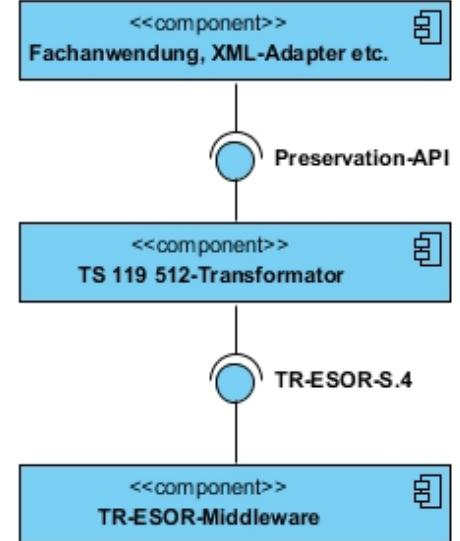
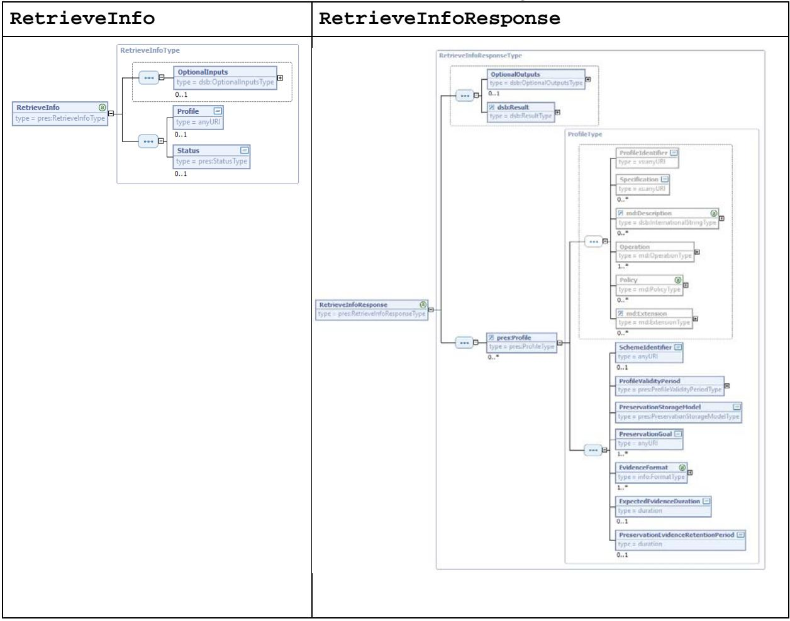
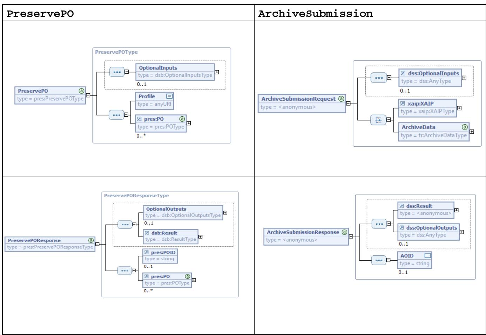
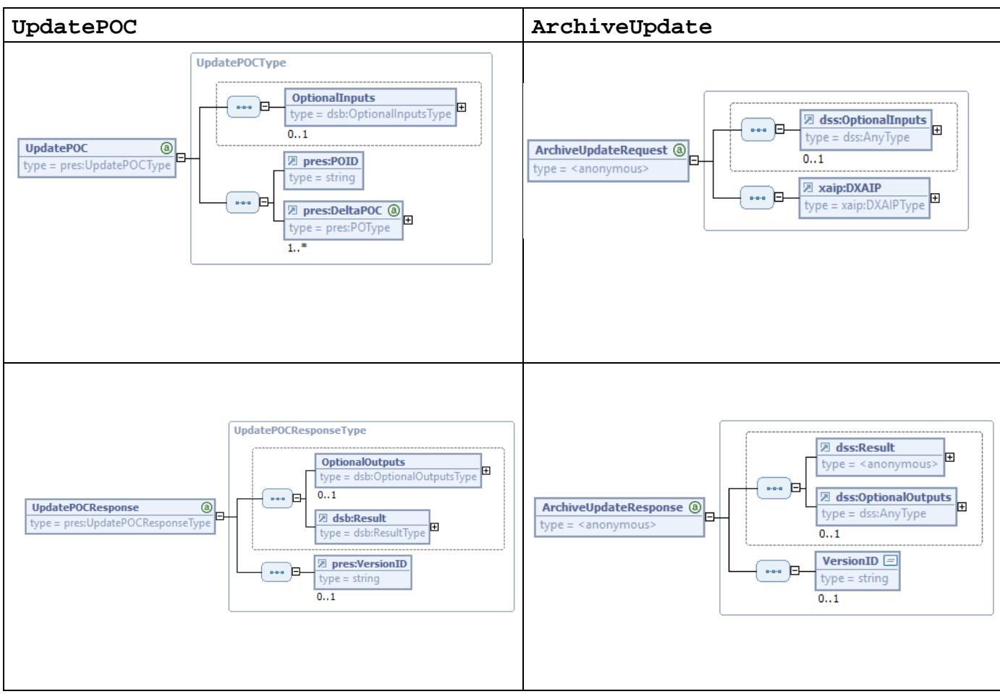
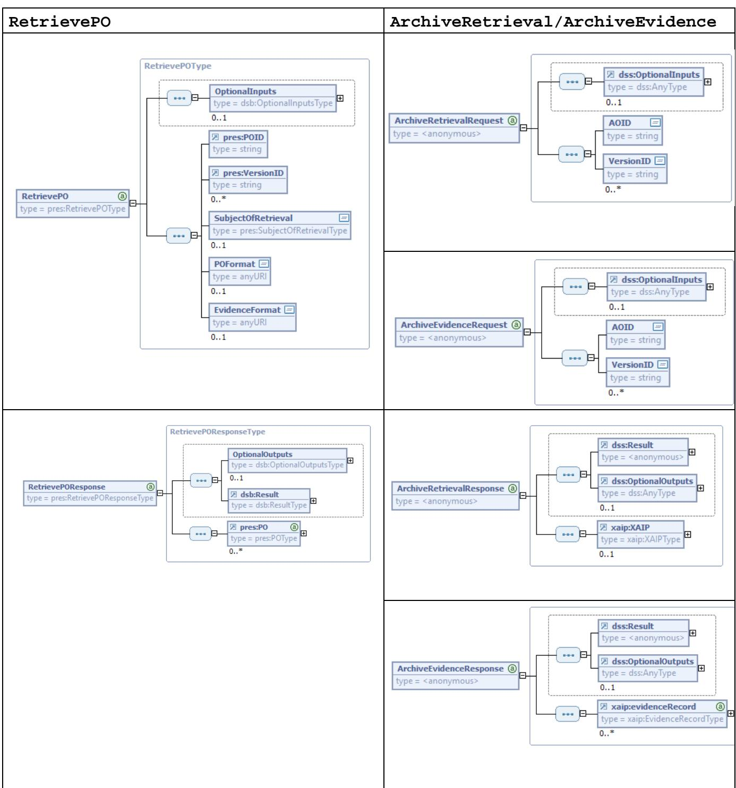
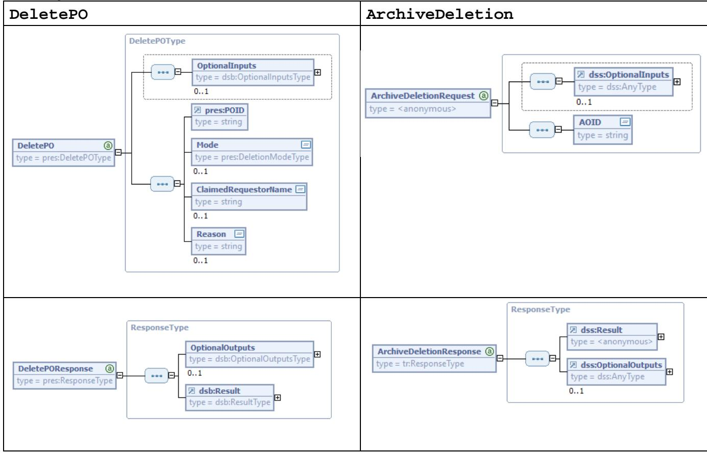
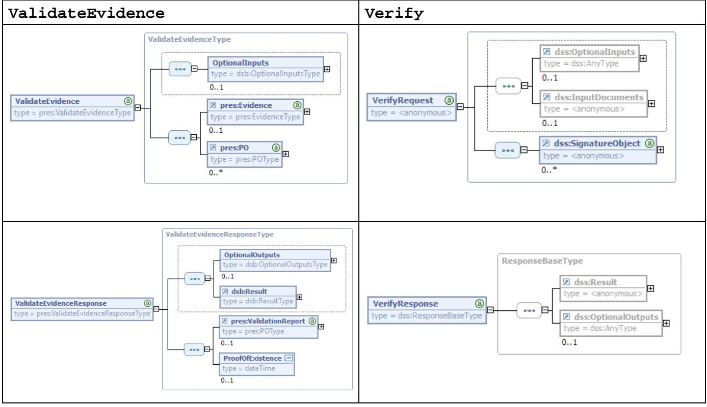
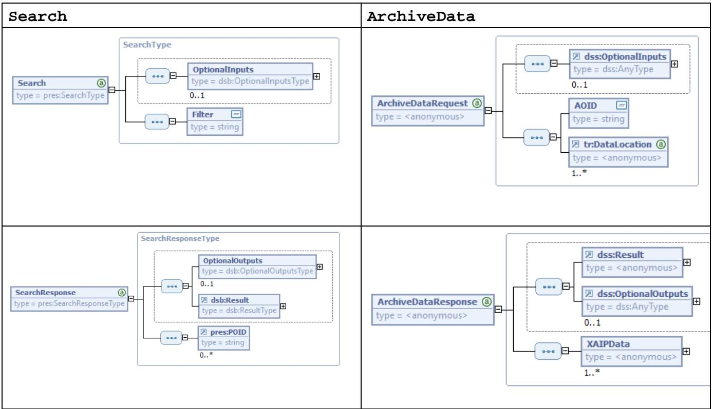

# BSI Technische Richtlinie 03125 Beweiswerterhaltung kryptographisch signierter Dokumente

# **Appendix zu Anlage TR-ESOR-E: Konkretisierung der Schnittstellen auf Basis des eCard-API-Frameworks**

| Bezeichnung | Grobkonzept ETSI TS119512<br>TR-ESOR<br>Transformator |
|-------------|-------------------------------------------------------|
| Kürzel      | BSI TR-ESOR-TRANS                                     |
| Version     | 1.2.1 und<br>1.2.2                                    |
| Datum       | 15.05.2020                                            |

Bundesamt für Sicherheit in der Informationstechnik Postfach 20 03 63 53133 Bonn Tel.: +49 228 99 9582-0 E-Mail: [tresor@bsi.bund.de](mailto:tresor@bsi.bund.de) Internet: [https://www.bsi.bund.de](https://www.bsi.bund.de/) © Bundesamt für Sicherheit in der Informationstechnik 2020

### Inhalt

| 1.             | Zusammenfassung                                                                         | 5        |
|----------------|-----------------------------------------------------------------------------------------|----------|
| 2.             | Zielsetzung                                                                             | 6        |
| 3.             | Spezifikation                                                                           | 7        |
| 3.1            | RetrieveInfo                                                                            | 7        |
| 3.2            | PreservePO ↔ ArchiveSubmission                                                          | 8        |
| 3.2.1<br>3.2.2 | PreservePO → ArchiveSubmissionRequest<br>ArchiveSubmissionResponse → PreservePOResponse | 9<br>10  |
| 3.3            | UpdatePOC ↔ ArchiveUpdate                                                               | 11       |
| 3.3.1<br>3.3.2 | UpdatePOC → ArchiveUpdateRequest<br>ArchiveUpdateResponse → UpdatePOCResponse           | 12<br>13 |
| 3.4            | RetrievePO ↔ ArchiveRetrieval / ArchiveEvidence                                         | 14       |
| 3.4.1          | RetrievePO → ArchiveRetrievalRequest / ArchiveEvidenceRequest                           | 15       |
| 3.4.2          | ArchiveRetrievalResponse → RetrievePOResponse                                           | 17       |
| 3.4.3          | ArchiveEvidenceResponse → RetrievePOResponse                                            | 18       |
| 3.5            | DeletePO ↔ ArchiveDeletion                                                              | 19       |
| 3.5.1<br>3.5.2 | DeletePO → ArchiveDeletionRequest<br>ArchiveDeletionResponse → DeletePOResponse         | 19<br>20 |
| 3.6            | ValidateEvidence ↔ Verify                                                               | 21       |
| 3.6.1          | ValidateEvidence → VerifyRequest                                                        | 21       |
| 3.6.2          | VerifyResponse → ValidateEvidenceResponse                                               | 23       |
| 3.7            | Search ↔ ArchiveData                                                                    | 24       |
| 3.7.1          | Search → ArchiveDataRequest                                                             | 24       |
| 3.7.2          | ArchiveDataResponse → SearchResponse                                                    | 25       |
| 4.             | Referenzen                                                                              | 27       |

### Abbildung

| Abbildung 1 System mit dem "ETSI TS119512-<br>TR-ESOR-Transformator"6               |  |
|-------------------------------------------------------------------------------------|--|
| Abbildung 2 RetrieveInfo –<br>Aufruf und Antwort<br>7                               |  |
| Abbildung 3 PreservePo/ArchiveSubmission –<br>Aufruf und Antwort9                   |  |
| Abbildung 4 UpdatePOC/ArchiveUpedate –<br>Aufruf und Antwort12                      |  |
| Abbildung 5 RetrievePO/ArchiveRetrieval/EvidenceRetrieval –<br>Aufruf und Antwort15 |  |
| Abbildung 7 DeletePO/ArchiveDeletion –<br>Aufruf und Antwort<br>19                  |  |
| Abbildung 8 ValidateEvidence/Verify –<br>Aufruf und Antwort21                       |  |
| Abbildung 9 Search / ArchiveData –<br>Aufruf und Antwort<br>24                      |  |

### Tabelle

| Tabelle 1 Returncodes für PreservePO / ArchiveSubmission11 |  |
|------------------------------------------------------------|--|
|------------------------------------------------------------|--|

#### Appendix TR-ESOR-E: Grobkonzept **ETSI TS119512-TR-ESOR-Transformator**

| Tabelle 2 Returncodes für UpdatePOC / ArchiveUpdate<br>14     |  |
|---------------------------------------------------------------|--|
| Tabelle 4 Returncodes für RetrievePO / ArchiveRetrieval<br>18 |  |
| Tabelle 5 Returncodes für RetrievePO / ArchiveEvidence19      |  |
| Tabelle 6 Returncodes für DeletePO / ArchiveDeletion<br>21    |  |
| Tabelle 7 Returncodes für ValidateEvidence / Verify<br>24     |  |
| Tabelle 8 Returncodes für Search / ArchiveData26              |  |

### <span id="page-4-0"></span>**1. Zusammenfassung**

Das vorliegende Dokument spezifiziert die BSI-Transformator-Komponente "ETSI TS119512-TR-ESOR-Transformator", welche eine geeignet profilierte Ausprägung der Preservation-API gemäß [ETSI TS 119 512] auf die TR-ESOR S.4-Schnittstelle gemäß [BSI TR-03125-E] Version 1.2.1 und 1.2.2 abbildet.

## <span id="page-5-0"></span>**2. Zielsetzung**

Das Bundesamt für Sicherheit in der Informationstechnik (BSI) ist die zuständige Behörde für sichere Informationsverarbeitung und Kompetenzträger im Umfeld der elektronischen Signatur.

Vor diesem Hintergrund hat das BSI eine Technische Richtlinie für die "Beweiswerterhaltung kryptographisch signierter Dokumente" (TR-03125 / TR-ESOR) entwickelt, die insbesondere die TR-ESOR-S.4-Schnittstelle gemäß [BSI TR-03125-E], Version 1.2.1 bzw. Version 1.2.2 umfasst.

Außerdem hat das BSI ausgehend von der "TR-ESOR-S.4"-Schnittstelle die Standardisierung von Preservation Services bei ETSI ESI unterstützt, wobei insbesondere die "Preservation-API" gemäß [ETSI TS 119 512] entstanden ist.

Auf dieser Basis wurde ein so genannter "ETSI TS119512-TR-ESOR-Transformator" entwickelt und nach Projektabschluss als Open Source bereitgestellt, der Aufrufe an der bei ETSI ESI entwickelten "Preservation-API" auf entsprechende Aufrufe an der "TR-ESOR-S.4"-Schnittstelle abbildet, so dass TR-ESOR-Middleware-Produkte Version 1.2.1 bzw. Version 1.2.2, die bereits die "TR-ESOR-S.4"- Schnittstelle unterstützen, durch den "ETSI TS119512-TR-ESOR- Transformator" automatisch auch ein geeignetes Profil der "Preservation-API" anbieten können. Als Kurzname wird im Bedarfsfall für "ETSI TS119512-TR-ESOR-Transformator" auch die Bezeichnung "TS 119 512-Transformator" oder "TR-ESOR-Transformator" genutzt, z.B. in der nachstehenden Abbildung 1.

Hinweis: Wenn im folgenden Text nur [BSI TR-03125-E] bzw. [BSI TR-03125-F] steht, gilt es für [BSI TR-03125-E], Version 1.2.1 und Version 1.2.2. Ansonsten wird die Ergänzung "nur Version 1.2.2" hinzugefügt.



<span id="page-5-1"></span>**Abbildung 1** System mit dem "ETSI TS119512- TR-ESOR-Transformator"

## <span id="page-6-0"></span>**3. Spezifikation**

### <span id="page-6-1"></span>**3.1 RetrieveInfo**

Der Aufruf der RetrieveInfo Funktion liefert ein statisch hinterlegtes Profile-Element zurück.



#### <span id="page-6-2"></span>**Abbildung 2** RetrieveInfo – Aufruf und Antwort

Das Profile-Element hat folgende Kindelemente:

- ProfileIdentifier http://www.bsi.bund.de/tr-esor/V1.2.1/profile/preservationapi/v1.1.1 bzw. [http://www.bsi.bund.de/tr-esor/V1.2.2/profile/preservation-api/v1.1.1](http://www.bsi.bund.de/tr-esor/preservation-api/1.0http:/www.bsi.bund.de/tr-esor/profile/preservation-api/v1.1.1http:/www.bsi.bund.de/tr-esor/V1.2.2/profile/preservation-api/v1.1.1)[1](#page-6-3) .
- Specification URL-basierte Verweise auf veröffentlichte Spezifikationsdokumente [BSI TR-03125-E] und [ETSI TS 119 512]
- Operation spezifiziert die relevanten Informationen zu den unterstützten Funktionen und Formaten (für Details siehe folgende Abschnitte)
- Policy/PolicyByRef/PolicyID URL-basierter Verweis auf noch zu definierende Policy
- SchemeIdentifier <http://uri.etsi.org/19512/scheme/pds+pgd+aug+wst+ers>
- ProfileValidityPeriod/ValidFrom konfigurierbares Datum

<span id="page-6-3"></span> <sup>1</sup> Das dem Quellcode beigelegte beispielhafte Profile-Element beinhaltet den folgenden ProfileIdentifier: http://www.bsi.bund.de/tr-esor/V1.2.2/profile/preservation-api/v1.1.1 .

- PreservationStorageModel WithStorage
- PreservationGoal
	- o <http://uri.etsi.org/19512/goal/pds>
	- o <http://uri.etsi.org/19512/goal/pgd>
	- o <http://uri.etsi.org/19512/goal/aug>
- EvidenceFormat
	- o urn:ietf:rfc:4998:EvidenceRecord (Dieser Wert, sofern anwendbar, wird als default angenommen falls das EvidenceFormat Element nicht angegeben ist)[2](#page-7-1)
	- o urn:ietf:rfc:6283:EvidenceRecord[3](#page-7-2)

<span id="page-7-0"></span>Die Returncodes sind [ETSI TS 119 512] zu entnehmen.

### **3.2 PreservePO ↔ ArchiveSubmission**

Beim Aufruf von PreservePO aus [ETSI TS 119 512] wird der Inputparameter PreservePO aus [ETSI TS 119 512] auf einen Eingabeparameter ArchiveSubmissionRequest gemäß [BSI TR-03125-E] sowie umgekehrt der Rückgabeparameter von ArchiveSubmissionResponse gemäß [BSI TR-03125-E] wird auf den Rückgabeparameter PreservePOResponse aus [ETSI TS 119 512] abgebildet.

<span id="page-7-1"></span><sup>2</sup> Hierbei ist zu beachten, dass die entsprechende URI gemäß [BSI TR-03125-E] urn:ietf:rfc:4998 ist.

<span id="page-7-2"></span><sup>3</sup> Hierbei ist zu beachten, dass die entsprechende URI gemäß [BSI TR-03125-E] urn:ietf:rfc:6283 ist.



<span id="page-8-1"></span>**Abbildung 3** PreservePo/ArchiveSubmission – Aufruf und Antwort

### <span id="page-8-0"></span>**3.2.1 PreservePO →ArchiveSubmissionRequest**

Hierbei werden die Parameter im PreservePO folgendermaßen behandelt:

- OptionalInputs die in [BSI TR-03125-E] definierten OptionalInputs (AOID, ReturnVerificationReport und ImportEvidence) werden an die TR-ESOR-S.4- Schnittstelle durchgereicht, sofern sie im PreservePO-Aufruf übergeben worden sind. Andere OptionalInputs führen zu einem entsprechenden Fehler[4](#page-8-2) .
- Profile erwartet http://www.bsi.bund.de/tr-esor/V1.2.1/profile/preservation-api/v1.1.1 bzw. [http://www.bsi.bund.de/tr-esor/V1.2.2/profile/preservation-api/v1.1.1.](http://www.bsi.bund.de/tr-esor/preservation-api/1.0http:/www.bsi.bund.de/tr-esor/profile/preservation-api/v1.1.1http:/www.bsi.bund.de/tr-esor/V1.2.2/profile/preservation-api/v1.1.1) , wodurch klargestellt wird, dass das in diesem Dokument spezifizierte Profil (siehe auch Abschnitt 3.1) angefordert wird.
- PO enthält genau ein Preservation Object, das im ArchiveSubmissionRequest übergeben wird. Hierbei werden folgende Formate unterstützt:

<span id="page-8-2"></span><sup>4</sup> <http://uri.etsi.org/19512/error/notSupported>

Bundesamt für Sicherheit in der Informationstechnik 9

- o XAIP v1.2[5](#page-9-1) gemäß [BSI TR-03125-F] (V1.2.2, Abschnitt 3.1 bzw. V1.2.1, Abschnitt 3) und gemäß [ETSI TS 119 512] Annex A.3.2 [\(http://www.bsi.bund.de/tr](http://www.bsi.bund.de/tr-esor/xaip/1.2)[esor/xaip/1.2\)](http://www.bsi.bund.de/tr-esor/xaip/1.2) wird in ArchiveSubmissionRequest/XAIP übergeben.
- o LXAIP gemäß [BSI TR-03125-F] (nur V1.2.2, Abschnitt 3.2) und gemäß [ETSI TS 119 512] Annex A.3.2 [\(http://www.bsi.bund.de/tr-esor/lxaip/1.3\)](http://www.bsi.bund.de/tr-esor/lxaip/1.3) wird in ArchiveSubmissionRequest/XAIP übergeben.
- o ASiC-ERS gemäß [BSI TR-03125-F] (nur V1.2.2, Abschnitt 3.3) und gemäß [ETSI TS 119 512] Annex A.3.1 [\(http://uri.etsi.org/ades/ASiC/type/ASiC-ERS\)](http://uri.etsi.org/ades/ASiC/type/ASiC-ERS) wird in ArchiveSubmissionRequest/ArchiveData als binaryData Element gemäß [BSI TR-03125-E] (nur Version 1.2.2, Abschnitt 3.1.1) übergeben.
- o CAdES gemäß [ETSI TS 119 512] Annex A.1.1 [\(http://uri.etsi.org/ades/CAdES\)](http://uri.etsi.org/ades/CAdES) wird in ArchiveSubmissionRequest/ArchiveData als binaryData Element gemäß [BSI TR-03125-E] (nur Version 1.2.2, Abschnitt 3.1.1) übergeben. Sofern kein MIME Type gesetzt ist, wird als Default [application/cms](https://www.iana.org/assignments/media-types/application/vnd.etsi.asic-e+zip) verwendet.
- o XAdES gemäß [ETSI TS 119 512] Annex A.1.2 [\(http://uri.etsi.org/ades/XAdES\)](http://uri.etsi.org/ades/XAdES) wird in ArchiveSubmissionRequest/ArchiveData als binaryData Element gemäß [BSI TR-03125-E], Version 1.2.2, Abschnitt 3.1.1 übergeben. Sofern kein MIME Type gesetzt ist, wird als Default [application/x](https://www.iana.org/assignments/media-types/application/vnd.etsi.asic-e+zip)ml verwendet.
- o PAdES gemäß [ETSI TS 119 512] Annex A.1.3 [\(http://uri.etsi.org/ades/PAdES\)](http://uri.etsi.org/ades/PAdES) wird in ArchiveSubmissionRequest/ArchiveData als binaryData Element gemäß [BSI TR-03125-E] (nur Version 1.2.2, Abschnitt 3.1.1) übergeben. Sofern kein MIME Type gesetzt ist, wird als Default [application/pdf](https://www.iana.org/assignments/media-types/application/vnd.etsi.asic-e+zip) verwendet.
- o ASiC-E gemäß [ETSI TS 119 512] Annex A.1.4 (http://uri.etsi.org/ades/ASiC/type/ASiC-E) wird in ArchiveSubmissionRequest/ArchiveData als binaryData Element gemäß [BSI TR-03125-E] (nur Version 1.2.2, Abschnitt 3.1.1) übergeben. Sofern kein MIME Type gesetzt ist, wird als Default application/vnd.etsi.asic-e+zip verwendet.
- o DigestList gemäß [ETSI TS 119 512] Annex A.1.6 (http://uri.etsi.org/19512/format/DigestList) wird in ArchiveSubmissionRequest/ArchiveData als binaryData Element gemäß [BSI TR-03125-E] (nur Version 1.2.2, Abschnitt 3.1.1) übergeben. Sofern kein MIME Type gesetzt ist, wird als Default [application/xm](https://www.iana.org/assignments/media-types/application/vnd.etsi.asic-e+zip)l verwendet.

### <span id="page-9-0"></span>**3.2.2 ArchiveSubmissionResponse → PreservePOResponse**

- dss[6](#page-9-2):Result wird wie unten näher dargestellt auf dsb[7:](#page-9-3)Result abgebildet.
- OptionalOutputs das möglicherweise in OptionalOutputs zurückgelieferte VerificationReport Element (vgl. [BSI TR-03125-E], Abschnitt 3.1.2) wird an das gleichnamige Element der Preservation-API weitergereicht.
- AOID wird auf POID abgebildet.

Die Fehlercodes setzen sich aus einem generellen Präfix und einem spezifischen Suffix zusammen und werden folgendermaßen abgebildet:

<span id="page-9-1"></span><sup>5</sup> Hinweis! Die mit der Version 1.2.2 der BSI TR-03125 freigegebene XAIP-Schema unterscheidet sich gegenüber der vorherigen Ausprägung (Version 1.2.1) in der Definition des Typs xaip:metaDataObjectType. Die gegenwärtige Version erlaubt mehrere Objekte (die durch die Metadaten beschrieben werden) zu referenzieren (xs:IDREFS). In der vorherigen Version durfte nur ein Datenobjekt referenziert werden (xs:IDREF). Die Änderung ist vollständig rückwärtskompatibel.

<span id="page-9-2"></span><sup>6</sup> Namensraum "dss" wird in "urn:oasis:names:tc:dss:1.0:core:schema" aufgelöst.

<span id="page-9-3"></span><sup>7</sup> Namensraum "dsb" wird in "http://docs.oasis-open.org/dss-x/ns/base" aufgelöst.

| ETSI TS 119 512                                            | BSI TR-03125-E                                                                                            |  |  |  |
|------------------------------------------------------------|-----------------------------------------------------------------------------------------------------------|--|--|--|
| :Success                                                   | #ok<br>#warning                                                                                           |  |  |  |
| :resultmajor:RequesterError<br>:resultmajor:ResponderError | #error                                                                                                    |  |  |  |
| :resultmajor:InsufficientInformation                       | -                                                                                                         |  |  |  |
| Präfix für ResultMinor                                     |                                                                                                           |  |  |  |
| http://uri.etsi.org/19512                                  | http://www.bsi.bund.de/tr<br>esor/api/1.2/resultminor                                                     |  |  |  |
| Suffixes für ResultMinor                                   |                                                                                                           |  |  |  |
| /error/noPermission                                        | /al/common#noPermission                                                                                   |  |  |  |
| /error/internalError                                       | /al/common#internalError                                                                                  |  |  |  |
| /error/externalServiceUnavailable                          |                                                                                                           |  |  |  |
| /error/parameterError                                      | /al/common#parameterError                                                                                 |  |  |  |
| /error/noSpaceError                                        | /arl/noSpaceError                                                                                         |  |  |  |
| /warning/lowSpace                                          | /arl/lowSpaceWarning                                                                                      |  |  |  |
| /error/notSupported                                        | /arl/notSupported                                                                                         |  |  |  |
| /error/unknownPOFormat                                     | /arl/unknownArchiveDataType                                                                               |  |  |  |
| /error/POFormatError                                       | /arl/XAIP_NOK<br>/arl/XAIP_NOK_EXPIRED<br>/arl/XAIP_NOK_SUBMTIME<br>/arl/XAIP_NOK_SIG<br>/arl/XAIP_NOK_ER |  |  |  |
| /error/existingAOID8                                       | /resultminor/arl/existingAOID                                                                             |  |  |  |

<span id="page-10-1"></span>**Tabelle 1** Returncodes für PreservePO / ArchiveSubmission

### <span id="page-10-0"></span>**3.3 UpdatePOC ↔ ArchiveUpdate**

Die Funktion UpdatePOC aus [ETSI TS 119 512] wird auf die Funktion ArchiveUpdate gemäß [BSI TR-03125-E] abgebildet. Entsprechend wird der Eingabeparameter UpdatePOC gem. [ETSI TS 119 512] auf den Eingabeparameter ArchiveUpdateRequest gem. [BSI TR-03125-E], sowie umgekehrt wird der Rückgabeparameter ArchiveUpdateResponse gemäß [BSI TR-03125-E] auf den Rückgabeparameter UpdatePOCResponse aus [ETSI TS 119 512] abgebildet.

<span id="page-10-2"></span><sup>8</sup> Dieser Fehlercode existiert nicht in [ETSI TS <sup>119</sup> 512] und entsteht durch die Ergänzung von OptionalInputs/AOID.



<span id="page-11-1"></span>**Abbildung 4** UpdatePOC/ArchiveUpedate – Aufruf und Antwort

### <span id="page-11-0"></span>**3.3.1 UpdatePOC → ArchiveUpdateRequest**

Hierbei werden die Parameter im UpdatePOC folgendermaßen behandelt:

- OptionalInputs die in [BSI TR-03125-E] definierten OptionalInputs (Return-VerificationReport und ImportEvidence) werden an die TR-ESOR-S.4- Schnittstelle an dss:OptionalInputs durchgereicht. Andere OptionalInputs führen zu einem entsprechenden Fehle[r9](#page-11-2) .
- POID muss identisch zu DXAIP/PackageHeader/AOID sein und wird zur Konsistenzprüfung genutzt und liefert bei fehlender Übereinstimmung einen entsprechenden Fehler[10.](#page-11-3)
- DeltaPOC wird in ArchiveUpdateRequest/DXAIP-Element übergeben und muss entweder ein
	- o Delta-XAIP-Element gemäß [BSI TR-03125-F] (V1.2.1 Abschnitt 3.6 bzw. V1.2.2, Abschnitt 3.1.6) (FormatId[=http://www.bsi.bund.de/tr-esor/dxaip/1.2](http://www.bsi.bund.de/tr-esor/dxaip/1.2)[11\)](#page-11-4) oder ein
	- o Delta-LXAIP-Element gemäß [BSI TR-03125-F] (nur V1.2.2, Abschnitt 3.2.2) (FormatId[=http://www.bsi.bund.de/tr-esor/dlxaip/1.2](http://www.bsi.bund.de/tr-esor/dlxaip/1.2)[12](#page-11-5))

<span id="page-11-2"></span><sup>9</sup> <http://uri.etsi.org/19512/error/notSupported>

<span id="page-11-3"></span><sup>10</sup> <http://uri.etsi.org/19512/error/DeltaPOCInternalProblem>

<span id="page-11-5"></span><span id="page-11-4"></span><sup>11</sup> Diese URL muss in einer zukünftigen Version von ETSI TS 119 512 ergänzt werden.

sein.

#### <span id="page-12-0"></span>**3.3.2 ArchiveUpdateResponse → UpdatePOCResponse**

- dss:Result wird wie unten näher dargestellt auf dsb:Result abgebildet.
- OptionalOutputs das möglicherweise in dss:OptionalOutputs zurückgelieferte VerificationReport Element (vgl. [BSI TR-03125-E], Abschnitt 3.2.2) wird an das gleichnamige Element der Preservation-API weitergereicht.
- VersionID wird auf das gleichnamige Element der Preservation-API abgebildet.

Die Fehlercodes setzen sich aus einem generellen Präfix und einem spezifischen Suffix zusammen und werden folgendermaßen abgebildet:

| ETSI TS 119 512                                            | BSI TR-03125-E                                                                                                                                                              |  |
|------------------------------------------------------------|-----------------------------------------------------------------------------------------------------------------------------------------------------------------------------|--|
| Präfix für ResultMajor                                     |                                                                                                                                                                             |  |
| urn:oasis:names:tc:dss:1.0:resultmajor                     | http://www.bsi.bund.de/tr<br>esor/api/1.2/resultmajor                                                                                                                       |  |
| Suffixes für ResultMajor                                   |                                                                                                                                                                             |  |
| :Success                                                   | #ok<br>#warning                                                                                                                                                             |  |
| :resultmajor:RequesterError<br>:resultmajor:ResponderError | #error                                                                                                                                                                      |  |
| :resultmajor:InsufficientInformation                       | -                                                                                                                                                                           |  |
| Präfix für ResultMinor                                     |                                                                                                                                                                             |  |
| http://uri.etsi.org/19512                                  | http://www.bsi.bund.de/tr<br>esor/api/1.2/resultminor                                                                                                                       |  |
| Suffixes für ResultMinor                                   |                                                                                                                                                                             |  |
| /error/noPermission                                        | /al/common#noPermission                                                                                                                                                     |  |
| /error/internalError                                       | /al/common#internalError                                                                                                                                                    |  |
| /error/externalServiceUnavailable                          |                                                                                                                                                                             |  |
| /error/parameterError                                      | /al/common#parameterError                                                                                                                                                   |  |
| /error/transferError                                       |                                                                                                                                                                             |  |
| /error/notSupported                                        | /arl/notSupported                                                                                                                                                           |  |
| /error/unknownDeltaPOCType                                 |                                                                                                                                                                             |  |
| /error/noSpaceError                                        | /arl/noSpaceError                                                                                                                                                           |  |
| /error/unknownPOID                                         | /arl/DXAIP_NOK_AOID                                                                                                                                                         |  |
| /error/DeltaPOCInternalProblem                             | /arl/existingPackageInfoWarning<br>/arl/DXAIP_NOK<br>/arl/DXAIP_NOK_EXPIRED<br>/arl/DXAIP_NOK_SUBMTIME<br>/arl/DXAIP_NOK_SIG<br>/arl/DXAIP_NOK_ID<br>/arl/DXAIP_NOK_Version |  |

12 Diese URL muss in einer zukünftigen Version von ETSI TS 119 512 ergänzt werden.

| ETSI TS 119 512      | BSI TR-03125-E       |
|----------------------|----------------------|
| /error/POFormatError | /arl/XAIP_NOK_ER     |
| /warning/lowSpace    | /arl/lowSpaceWarning |

<span id="page-13-1"></span>**Tabelle 2** Returncodes für UpdatePOC / ArchiveUpdate

### <span id="page-13-0"></span>**3.4 RetrievePO ↔ ArchiveRetrieval / ArchiveEvidence**

Der Aufruf RetrievePO aus [ETSI TS 119 512] wird auf die Aufrufe ArchiveRetrieval bzw. ArchiveEvidence gemäß [BSI TR-03125-E] abgebildet. Entsprechend wird der Eingabepataremeter RetrievePO gem. [ETSI TS 119 512] auf die korrespondierende Parameter ArchiveRetrievalRequest bzw. ArchiveEvidenceRequest gem. [BSI TR-03125-E] abgebildet. Umgekehrt werden die Rückgabeparameter ArchiveRetrievalResponse bzw. ArchiveEvidenceResponse gemäß [BSI TR-03125-E] auf den Rückgabeparameter RetrievePOResponse aus [ETSI TS 119 512] abgebildet.



<span id="page-14-1"></span>**Abbildung 5** RetrievePO/ArchiveRetrieval/EvidenceRetrieval – Aufruf und Antwort

#### <span id="page-14-0"></span>**3.4.1 RetrievePO →ArchiveRetrievalRequest / ArchiveEvidenceRequest**

Hierbei werden die Kindelemente von RetrievePO folgendermaßen behandelt:

• OptionalInputs führen beim Aufruf von RetrievePO zu einem Fehler[13.](#page-14-2)

<span id="page-14-2"></span><sup>13</sup> <http://uri.etsi.org/19512/error/notSupported>

Bundesamt für Sicherheit in der Informationstechnik 15

- POID wird auf ArchiveRetrievalRequest/AOID bzw. ArchiveEvidenceRequest/AOID abgebildet, wobei die Unterscheidung zwischen ArchiveEvidenceRequest oder ArchiveRetrievalRequest anhand des SubjectOfRetrieval-Parameters erfolgt.
- VersionID wird auf ArchiveRetrievalRequest/VersionID bzw. ArchiveEvidenceRequest/VersionID abgebildet.
- SubjectOfRetrieval legt fest, ob ArchiveRetrievalRequest oder ArchiveEvidenceRequest aufgerufen wird und ist entweder
	- o PO zum Abholen des (L)XAIP oder ASiC-ERS ohne entsprechenden Evidence Record, so dass ArchiveRetrievalRequest aufgerufen wird,
	- o Evidence zum Abholen von Evidence Records, so dass ArchiveEvidence-Request aufgerufen wird, wobei der Evidence Record als xaip:evidenceRecord-Element gemäß [BSI TR-03125-F] (Version 1.2.1, Abschnitt 3.5 bzw. Version 1.2.2, Abschnitt 3.1.5) vom Typ xaip:EvidenceRecordType zurückgegeben wird, der als Erweiterung des ec:EvidenceRecordType aus [eCard-2] definiert ist und zusätzlich die Attribute AOID und VersionID, enthalten muss.
	- o POwithEmbeddedEvidence zum Abholen des (L)XAIP oder ASiC-ERS mit entsprechendem Evidence Record, was durch einen Aufruf von ArchiveRetrievalRequest unter Verwendung des OptionalInputs/IncludeERS aus [BSI TR-03125-E] (Abschnitt 3.4.1) realisiert wird. Dieser Wert wird als default angenommen falls das SubjectOfRetrieval Element nicht angegeben ist.
	- o POwithDetachedEvidence wird nicht unterstützt und liefert einen Fehler[14](#page-15-0).
- POFormat wird auf ArchiveRetrievalRequest/OptionalInputs/POFormat aus [BSI TR-03125-E] (Abschnitt 3.4.1) abgebildet und ist entweder
	- o <http://www.bsi.bund.de/tr-esor/xaip/1.2> für XAIP v1.2 gemäß [BSI TR-03125-F] (V1.2.1, Abschnitt 3 bzw. V1.2.2, Abschnitt 3.1) (Dieser Wert wird als default angenommen falls das POFormat Element nicht angegeben ist),
	- o <http://www.bsi.bund.de/tr-esor/lxaip/1.3> für LXAIP gemäß [BSI TR-03125-F] (nur V1.2.2, Abschnitt 3.2) oder
	- o <http://uri.etsi.org/ades/ASiC/type/ASiC-ERS> für ASiC-ERS.

Hinweis: Im Rahmen von S.4 erfolgt die Rückgabe eines XAIP oder LXAIP im ArchiveRetrievalResponse/XAIP Element und die Rückgabe eines ASiC-AIP über ein ArchiveRetrievalResponse/OptionalOutputs/PO Element.

- EvidenceFormat ist entweder
	- o urn:ietf:rfc:4998:EvidenceRecord (Dieser Wert, sofern anwendbar, wird als default angenommen falls das EvidenceFormat Element nicht angegeben ist) oder
	- o urn:ietf:rfc:6283:EvidenceRecord[15](#page-15-1),

was an der S.4-Schnittstelle zu ArchiveEvidenceRequest/OptionalInputs/ERSFormat (siehe [BSI TR-03125-E], Abschnitt 3.4.1), bzw. ArchiveRetrievalRequest/OptionalInputs/IncludeERS (siehe [BSI TR-03125-E],

<span id="page-15-0"></span><sup>14</sup> <http://uri.etsi.org/19512/error/notSupported>

<span id="page-15-1"></span><sup>15</sup> Hierbei ist zu beachten, dass die entsprechende URI gemäß [BSI TR-03125-E] urn:ietf:rfc:6283 ist.

Abschnitt 3.3.1) korrespondiert. Der EvidenceRecord wird als xaip:evidenceRecord-Element gemäß [BSI TR-03125-F] (V1.2.1, Abschnitt 3.5 bzw. V1.2.2, Abschnitt 3.1.5) bzw. [BSI TR-03125-E] (Abschnitt 3.3.1 bzw. 3.4.2) vom Typ xaip:EvidenceRecordType zurückgegeben.

#### <span id="page-16-0"></span>**3.4.2 ArchiveRetrievalResponse → RetrievePOResponse**

- dss:Result wird wie unten näher dargestellt auf dsb:Result abgebildet.
- OptionalOutputs das möglicherweise in OptionalOutputs zurückgelieferte PO Element (vgl. [BSI TR-03125-E], Abschnitt 3.3.2) mit einem base64Binary-codierten ASiC-AIP im RetrievePOResponse/PO Element zurückgeliefert.
- XAIP mit einem XAIP oder LXAIP wird auf das RetrievePOResponse/PO Element abgebildet.

Die Fehlercodes setzen sich aus einem generellen Präfix und einem spezifischen Suffix zusammen und werden folgendermaßen abgebildet:

| ETSI TS 119 512                                            | BSI TR-03125-E                                        |  |
|------------------------------------------------------------|-------------------------------------------------------|--|
| Präfix für ResultMajor                                     |                                                       |  |
| urn:oasis:names:tc:dss:1.0:resultmajor                     | http://www.bsi.bund.de/tr<br>esor/api/1.2/resultmajor |  |
| Suffixes für ResultMajor                                   |                                                       |  |
| :Success                                                   | #ok<br>#warning                                       |  |
| :resultmajor:RequesterError<br>:resultmajor:ResponderError | #error                                                |  |
| :resultmajor:InsufficientInformation                       | -                                                     |  |
| Präfix für ResultMinor                                     |                                                       |  |
| http://uri.etsi.org/19512                                  | http://www.bsi.bund.de/tr<br>esor/api/1.2/resultminor |  |
| Suffixes für ResultMinor                                   |                                                       |  |
| /error/noPermission                                        | /al/common#noPermission                               |  |
| /error/internalError                                       | /al/common#internalError                              |  |
| /error/parameterError                                      | /al/common#parameterError                             |  |
| /error/transferError16                                     |                                                       |  |
| /error/notSupported                                        | /arl/notSupported                                     |  |
| /error/unknownPOFormat                                     | /arl/unknownPOFormat                                  |  |
| /error/unknownPOID                                         | /arl/unknownAOID                                      |  |
| /error/unknownVersionID                                    | /arl/unknownVersionID                                 |  |

<span id="page-16-1"></span><sup>16</sup> Diesen Fehlercode gibt es aktuell in [ETSI TS <sup>119</sup> 512] nicht für RetrievePOResponse. Sinnvoll wäre es hier ggf., diesen Fehlercode bei Gelegenheit entsprechend zu ergänzen.

Bundesamt für Sicherheit in der Informationstechnik 17

| ETSI TS 119 512                      | BSI TR-03125-E                          |
|--------------------------------------|-----------------------------------------|
| /warning/requestOnlyPartlySuccessful | /arl/requestOnlyPartlySuccessfulWarning |

<span id="page-17-1"></span>**Tabelle 3** Returncodes für RetrievePO / ArchiveRetrieval

#### <span id="page-17-0"></span>**3.4.3 ArchiveEvidenceResponse → RetrievePOResponse**

- dss:Result wird wie unten näher dargestellt auf dsb:Result abgebildet.
- OptionalOutputs sind in ArchiveEvidenceResponse gemäß (vgl. [BSI TR-03125-E], Abschnitt 3.4.2) nicht vorhanden bzw. führen zu einem entsprechenden Fehler[17](#page-17-2) an der Preservation API gemäß [ETSI TS 119 512].
- evidenceRecord wird auf das RetrievePOResponse/PO Element abgebildet, wobei sich das Format des zurückgelieferten Evidence Records im FormatId-Attribut des PO-Elementes wiederspiegelt.

Die Fehlercodes setzen sich aus einem generellen Präfix und einem spezifischen Suffix zusammen und werden folgendermaßen abgebildet:

| ETSI TS 119 512                                            | BSI TR-03125-E                                        |  |
|------------------------------------------------------------|-------------------------------------------------------|--|
| Präfix für ResultMajor                                     |                                                       |  |
| urn:oasis:names:tc:dss:1.0:resultmajor                     | http://www.bsi.bund.de/tr<br>esor/api/1.2/resultmajor |  |
| Suffixes für ResultMajor                                   |                                                       |  |
| :Success                                                   | #ok<br>#warning                                       |  |
| :resultmajor:RequesterError<br>:resultmajor:ResponderError | #error                                                |  |
| :resultmajor:InsufficientInformation                       | -                                                     |  |
| Präfix für ResultMinor                                     |                                                       |  |
| http://uri.etsi.org/19512                                  | http://www.bsi.bund.de/tr<br>esor/api/1.2/resultminor |  |
| Suffixes für ResultMinor                                   |                                                       |  |
| /error/noPermission                                        | /al/common#noPermission                               |  |
| /error/internalError                                       | /al/common#internalError                              |  |
| /error/parameterError                                      | /al/common#parameterError                             |  |
| /error/notSupported                                        | /arl/notSupported18                                   |  |

<span id="page-17-2"></span><sup>17</sup> <http://uri.etsi.org/19512/error/notSupported>

<span id="page-17-3"></span><sup>18</sup> Alternativ wäre es perspektivisch denkbar, einen spezifischen Fehlercode …/arl/unknownEvidenceFormat für ArchiveEvidenceResponse in [BSI TR-03125-E] zu ergänzen.

| ETSI TS 119 512                      | BSI TR-03125-E                          |
|--------------------------------------|-----------------------------------------|
| /error/unknownEvidenceFormat         |                                         |
| /error/unknownPOID                   | /arl/unknownAOID                        |
| /error/unknownVersionID              | /arl/unknownVersionID                   |
| /warning/requestOnlyPartlySuccessful | /arl/requestOnlyPartlySuccessfulWarning |

<span id="page-18-3"></span>**Tabelle 4** Returncodes für RetrievePO / ArchiveEvidence

### <span id="page-18-0"></span>**3.5 DeletePO ↔ ArchiveDeletion**

Der Aufruf von DeletePO aus [ETSI TS 119 512] wird auf den Aufruf von ArchiveDeletion gemäß [BSI TR-03125-E] abgebildet. Entsprechend wird der Eingabeparameter DeletePO aus [ETSI TS 119 512] auf den Eingabeparameter ArchiveDeleteRequest aus [BSI TR-03125-E], bzw. umgekehrt der Rückgabeparameter ArchiveDeletionResponse gemäß [BSI TR-03125- E] wird auf den Rückgabeparameter DeletePOResponse aus [ETSI TS 119 512] abgebildet. abgebildet.



<span id="page-18-2"></span>**Abbildung 6** DeletePO/ArchiveDeletion – Aufruf und Antwort

#### <span id="page-18-1"></span>**3.5.1 DeletePO → ArchiveDeletionRequest**

Hierbei werden die Kindelemente von DeletePO folgendermaßen abgebildet:

- OptionalInputs führen beim Aufruf von DeletePO zu einem Fehler[19](#page-19-1).
- POID wird auf ArchiveDeletionRequest/AOID abgebildet.
- Mode muss gleich SubDOsAndEvidence oder nicht vorhanden sein. Im Fall eines syntaktisch korrekten Aufrufs, bei dem Mode gleich OnlySubDOs ist, wird die Löschung nicht durchgeführt und ein Fehler[20](#page-19-2) zurückgeliefert.
- ClaimedRequestorName wird auf ArchiveDeletionRequest/OptionalInputs/ReasonOfDeletion/RequestorName abgebildet.
- Reason wird auf ArchiveDeletionRequest/OptionalInputs/ReasonOfDeletion/RequestInfo abgebildet.

#### <span id="page-19-0"></span>**3.5.2 ArchiveDeletionResponse → DeletePOResponse**

- dss:Result wird wie unten näher dargestellt auf dsb:Result abgebildet.
- OptionalOutputs sind in ArchiveDeletionResponse gemäß (vgl. [BSI TR-03125-E], Abschnitt 3.5.2) nicht vorhanden bzw. führen zu einem entsprechenden Fehler[21](#page-19-3) an der Preservation API gemäß [ETSI TS 119 512].

Die Fehlercodes setzen sich aus einem generellen Präfix und einem spezifischen Suffix zusammen und werden folgendermaßen abgebildet:

| ETSI TS 119 512                                            | BSI TR-03125-E                                        |  |
|------------------------------------------------------------|-------------------------------------------------------|--|
| Präfix für ResultMajor                                     |                                                       |  |
| urn:oasis:names:tc:dss:1.0:resultmajor                     | http://www.bsi.bund.de/tr<br>esor/api/1.2/resultmajor |  |
| Suffixes für ResultMajor                                   |                                                       |  |
| :Success                                                   | #ok<br>#warning                                       |  |
| :resultmajor:RequesterError<br>:resultmajor:ResponderError | #error                                                |  |
| :resultmajor:InsufficientInformation                       | -                                                     |  |
| Präfix für ResultMinor                                     |                                                       |  |
| http://uri.etsi.org/19512                                  | http://www.bsi.bund.de/tr<br>esor/api/1.2/resultminor |  |
| Suffixes für ResultMinor                                   |                                                       |  |
| /error/noPermission                                        | /al/common#noPermission                               |  |
| /error/internalError                                       | /al/common#internalError                              |  |

<span id="page-19-1"></span><sup>19</sup> <http://uri.etsi.org/19512/error/notSupported>

<span id="page-19-2"></span><sup>20</sup> <http://uri.etsi.org/19512/error/notSupported>

<span id="page-19-3"></span><sup>21</sup> <http://uri.etsi.org/19512/error/notSupported>

| ETSI TS 119 512       | BSI TR-03125-E               |
|-----------------------|------------------------------|
| /error/parameterError | /al/common#parameterError    |
|                       | /arl/missingReasonOfDeletion |
| /error/notSupported   | /arl/notSupported            |
| /error/unknownPOID    | /arl/unknownAOID             |

<span id="page-20-3"></span>**Tabelle 5** Returncodes für DeletePO / ArchiveDeletion

### <span id="page-20-0"></span>**3.6 ValidateEvidence ↔ Verify**

Die Funktion ValidateEvidence aus [ETSI TS 119 512] wird auf die Funktion Verify gemäß [BSI TR-03125-E] (Abschnitt 3.7) abgebildet. Der Eingabeparameter ValidateEvidence gem. [ETSI TS 119 512] wird auf den Eingabeparameter VerifyRequest gem. [BSI TR-03125-E] sowie der Rückgabeparameter VerifyResponse gem. [BSI TR-03125-E] auf den Rückgabeparameter ValidateEvidenceResponse gem. [ETSI TS 119 512] abgebildet.



<span id="page-20-2"></span>**Abbildung 7** ValidateEvidence/Verify – Aufruf und Antwort

#### <span id="page-20-1"></span>**3.6.1 ValidateEvidence → VerifyRequest**

Hierbei werden die Kindelemente von ValidateEvidence folgendermaßen abgebildet:

• OptionalInputs – die in [BSI TR-03125-E] (Abschnitt 3.7.1) definierten OptionalInputs (VerifyUnderSignaturePolicy[22](#page-20-4) und ReturnVerificationReport)

<span id="page-20-4"></span> <sup>22</sup> Dieses Element ist im TR-ESOR 1.2.2 Schema Bundle nicht enthalten und wird in der nächsten Version in tr-esorinterfaces-v1.3.xsd ergänzt.

Bundesamt für Sicherheit in der Informationstechnik 21

werden an die TR-ESOR-S.4-Schnittstelle durchgereicht. Andere OptionalInputs führen zu einem entsprechenden Fehle[r23](#page-21-0).

- Evidence wird, sofern vorhanden, auf das entsprechende Kindelement von VerifyRequest/SignatureObject abgebildet, wobei die Details vom Format der Preservation Evidence gemäß Annex A.2 von [ETSI TS 119 512] abhängen:
	- o ein Evidence Record gemäß RFC 4998 (A.2.2) oder RFC 6283 (A.2.3)[24](#page-21-1) wird auf ein VerifyRequest/SignatureObject/Other/EvidenceRecord-Element abgebildet. Falls sich der übergebene Evidence Record auf einen Preservation Object Container (siehe PO nachstehend) bezieht, muss der Evidence Record als xaip:evidenceRecord-Element gemäß [BSI TR-03125-F] (V1.2.1, Abschnitt 3.5 bzw. V1.2.2, Abschnitt 3.1.5) bzw. [BSI TR-03125-E] (Abschnitt 3.3.1, 3.4.2) vom Typ xaip:EvidenceRecordType übergeben werden.
	- o eine CAdES-Signatur gemäß [ETSI TS 119 122-3], die einen Evidence Record gemäß RFC 4998 enthält, wird auf ein VerifyRequest/SignatureObject/Base64Signature-Element abgebildet. Das FormatId-Attribut des Evidence-Elementes ist in diesem Fall gleich http://uri.etsi.org/ades/CAdES/EvidenceRecord.
	- o andere Preservation Evidences werden nicht unterstützt und führen zu einem Fehler[25.](#page-21-2)
- PO ist entweder ein einfaches binäres Datenobjekt, das von der separat übergebenen Evidence geschützt wird und auf VerifyRequest/InputDocuments/Document/Base64Data abgebildet wird, oder ein unterstützter Preservation Object Container. Hierbei werden folgende Formate unterstützt:
	- o XAIP v1.2 gemäß [BSI TR-03125-F] (V1.2.1, Abschnitt 3 bzw. V1.2.2, Abschnitt 3.1) [\(http://www.bsi.bund.de/tr-esor/xaip/1.2\)](http://www.bsi.bund.de/tr-esor/xaip/1.2) wird in VerifyRequest/InputDocuments/Document/InlineXML übergeben.
	- o LXAIP gemäß [BSI TR-03125-F] (nur V1.2.2, Abschnitt 3.2) [\(http://www.bsi.bund.de/tr-esor/lxaip/1.3\)](http://www.bsi.bund.de/tr-esor/lxaip/1.3) wird in VerifyRequest/InputDocuments/Document/InlineXML übergeben.
	- o ASiC-ERS gemäß [BSI TR-03125-F] (nur V1.2.2, Abschnitt 3.3) und gemäß [ETSI TS 119 512] Annex A.3.1 und A.3.1.3 [\(http://uri.etsi.org/ades/ASiC/type/ASiC-](http://uri.etsi.org/ades/ASiC/type/ASiC-ERS)[ERS\)](http://uri.etsi.org/ades/ASiC/type/ASiC-ERS) wird in VerifyRequest/InputDocuments/Document/Base64Data übergeben.
	- o CAdES gemäß [ETSI TS 119 512] Annex A.1.1 [\(http://uri.etsi.org/ades/CAdES\)](http://uri.etsi.org/ades/CAdES) wird in VerifyRequest/InputDocuments/Document/Base64Data übergeben. Sofern kein MIME Type gesetzt ist, wird als Default [application/cm](https://www.iana.org/assignments/media-types/application/vnd.etsi.asic-e+zip)s verwendet.
	- o XAdES gemäß [ETSI TS 119 512] Annex A.1.2 [\(http://uri.etsi.org/ades/XAdES\)](http://uri.etsi.org/ades/XAdES) wird in VerifyRequest/InputDocuments/Document/Base64Data übergeben. Sofern kein MIME Type gesetzt ist, wird als Default [application/xm](https://www.iana.org/assignments/media-types/application/vnd.etsi.asic-e+zip)l verwendet.
	- o PAdES gemäß [ETSI TS 119 512] Annex A.1.3 [\(http://uri.etsi.org/ades/PAdES\)](http://uri.etsi.org/ades/PAdES) wird in VerifyRequest/InputDocuments/Document/Base64Data übergeben.

<span id="page-21-0"></span><sup>23</sup> <http://uri.etsi.org/19512/error/notSupported>

<span id="page-21-1"></span><sup>24</sup> XML Evidence Records nach RFC 6283 sind inkompatibel zu dem in TR-ESOR 1.2.2 verwendeten draft schema (http://www.setcce.org/schemas/ers). Dies wird in einer folgenden Schemaversion harmonisiert.

<span id="page-21-2"></span><sup>25</sup> <http://uri.etsi.org/19512/error/notSupported>

Sofern kein MIME Type gesetzt ist, wird als Default [application/pdf](https://www.iana.org/assignments/media-types/application/vnd.etsi.asic-e+zip) verwendet.

- o ASiC-E gemäß [ETSI TS 119 512] Annex A.1.4 (http://uri.etsi.org/ades/ASiC/type/ASiC-E) wird in VerifyRequest/InputDocuments/Document/Base64Data übergeben. Sofern kein MIME Type gesetzt ist, wird als Default application/vnd.etsi.asice+zip verwendet.
- o DigestList gemäß [ETSI TS 119 512] Annex A.1.6 (http://uri.etsi.org/19512/format/DigestList) wird in VerifyRequest/InputDocuments/Document/Base64Data übergeben. Sofern kein MIME Type gesetzt ist, wird als Default [application/xm](https://www.iana.org/assignments/media-types/application/vnd.etsi.asic-e+zip)l verwendet.

#### <span id="page-22-0"></span>**3.6.2 VerifyResponse → ValidateEvidenceResponse**

- dss:Result wird wie unten näher dargestellt auf dsb:Result abgebildet.
- OptionalOutputs enthält möglicherweise einen VerificationReport gemäß [BSI TR-03125-VR], der auf das pres:ValidationEvidenceReport/ValidationReport-Element abgebildet wird. Außerdem wird im Erfolgsfall das Element ProofOfExistence gefüllt.

Die Fehlercodes setzen sich aus einem generellen Präfix und einem spezifischen Suffix zusammen und werden folgendermaßen abgebildet:

| ETSI TS 119 512                                            | BSI TR-03125-E                                        |  |
|------------------------------------------------------------|-------------------------------------------------------|--|
| Präfix für ResultMajor                                     |                                                       |  |
| urn:oasis:names:tc:dss:1.0:resultmajor                     | http://www.bsi.bund.de/tr<br>esor/api/1.2/resultmajor |  |
| Suffixes für ResultMajor                                   |                                                       |  |
| :Success                                                   | #ok<br>#warning                                       |  |
| :resultmajor:RequesterError<br>:resultmajor:ResponderError | #error                                                |  |
| :resultmajor:InsufficientInformation                       | -                                                     |  |
| Präfix für ResultMinor                                     |                                                       |  |
| http://uri.etsi.org/19512                                  | http://www.bsi.bund.de/tr<br>esor/api/1.2/resultminor |  |
| Suffixes für ResultMinor                                   |                                                       |  |
| /error/noPermission                                        | /al/common#noPermission                               |  |
| /error/internalError                                       | /al/common#internalError                              |  |
| /error/parameterError                                      | /al/common#parameterError                             |  |
|                                                            | /arl/missingReasonOfDeletion                          |  |
| /error/notSupported                                        | /arl/notSupported                                     |  |
|                                                            |                                                       |  |

<span id="page-23-3"></span>**Tabelle 6** Returncodes für ValidateEvidence / Verify

### <span id="page-23-0"></span>**3.7 Search ↔ ArchiveData**

Die Funktion Search aus **[ETSI TS 119 512]** wird auf die Funktion ArchiveData gemäß **[BSI TR-03125-E]** (Abschnitt 3.6) abgebildet. Der Eingabeparamater Search aus [ETSI TS 119 512] wird auf den Eingabeparameter ArchiveDataRequest aus [BSI TR-03125-E] und der Rückgabeparameter ArchiveDataReponse aus [BSI TR-03125-E] auf den Rückgabeparameter SearchResponse aus [ETSI TS 119 512] abgebildet.



<span id="page-23-2"></span>**Abbildung 8** Search / ArchiveData – Aufruf und Antwort

#### <span id="page-23-1"></span>**3.7.1 Search →ArchiveDataRequest**

Hierbei werden die Kindelemente von Search folgendermaßen auf ArchiveDataRequest abgebildet:

• Filter – enthält eine durch das folgende JSON-Schema definierte Struktur:

```
"FilterType": {
 "type": "object",
 "properties": {
 "AOID": {
 "type": "string"
 },
 "XPath": {
 "type": "string"
 }
 },
```

```
"required": ["AOID", "XPath"]
}
```
Hierbei besitzen die Parameter folgende Semantik:

- o AOID identifiziert ein bestimmtes Preservation Object und wird auf das ArchiveDataRequest/AOID-Element abgebildet.
- o XPathFilter spezifiziert das Datenobjekt innerhalb des XAIP, das über die AOID addressiert und auf das ArchiveDataRequest/DataLocation abgebildet wird. Dieses Element wurde im Schema tr-esor-interfaces-v1.2+xmlmime.xsd ergänzt.

Hierbei wird unterstellt, dass die ArchiveDataRequest-Implementierung der angeschlossenen TR-ESOR-Middleware zumindest einfache XPath-Ausdrücke unterstützt, die den Abruf eines Datenelements ermöglichen, das durch eine ID in der XML-Struktur des per AOID addressierten XAIP ermöglicht.

#### <span id="page-24-0"></span>**3.7.2 ArchiveDataResponse → SearchResponse**

- dss:Result wird wie unten näher dargestellt auf dsb:Result abgebildet.
- OptionalOutputs sind nicht vorhanden und führen zu einem Fehler[26](#page-24-1).
- XAIPData werden auf SearchResponse/OptionalOutputs/Other/XAIPData abgebildet.

Die Fehlercodes setzen sich aus einem generellen Präfix und einem spezifischen Suffix zusammen und werden folgendermaßen abgebildet:

| ETSI TS 119 512                                            | BSI TR-03125-E                                        |  |
|------------------------------------------------------------|-------------------------------------------------------|--|
| Präfix für ResultMajor                                     |                                                       |  |
| urn:oasis:names:tc:dss:1.0:resultmajor                     | http://www.bsi.bund.de/tr<br>esor/api/1.2/resultmajor |  |
| Suffixes für ResultMajor                                   |                                                       |  |
| :Success                                                   | #ok<br>#warning                                       |  |
| :resultmajor:RequesterError<br>:resultmajor:ResponderError | #error                                                |  |
| :resultmajor:InsufficientInformation                       | -                                                     |  |
| Präfix für ResultMinor                                     |                                                       |  |
| http://uri.etsi.org/19512                                  | http://www.bsi.bund.de/tr<br>esor/api/1.2/resultminor |  |
| Suffixes für ResultMinor                                   |                                                       |  |
| /error/noPermission                                        | /al/common#noPermission                               |  |

<span id="page-24-1"></span><sup>26</sup> <http://uri.etsi.org/19512/error/notSupported>

Bundesamt für Sicherheit in der Informationstechnik 25

| ETSI TS 119 512                                            | BSI TR-03125-E                                        |  |
|------------------------------------------------------------|-------------------------------------------------------|--|
| Präfix für ResultMajor                                     |                                                       |  |
| urn:oasis:names:tc:dss:1.0:resultmajor                     | http://www.bsi.bund.de/tr<br>esor/api/1.2/resultmajor |  |
| Suffixes für ResultMajor                                   |                                                       |  |
| :Success                                                   | #ok<br>#warning                                       |  |
| :resultmajor:RequesterError<br>:resultmajor:ResponderError | #error                                                |  |
| :resultmajor:InsufficientInformation                       | -                                                     |  |
| Präfix für ResultMinor                                     |                                                       |  |
| http://uri.etsi.org/19512                                  | http://www.bsi.bund.de/tr<br>esor/api/1.2/resultminor |  |
| Suffixes für ResultMinor                                   |                                                       |  |
| /error/internalError                                       | /al/common#internalError                              |  |
| /error/parameterError                                      | /al/common#parameterError                             |  |
|                                                            | /arl/unknownLocation                                  |  |
|                                                            | /arl/unknownAOID                                      |  |
| /error/notSupported                                        | /arl/notSupported                                     |  |

<span id="page-25-0"></span>**Tabelle 7** Returncodes für Search / ArchiveData

### <span id="page-26-0"></span>**4. Referenzen**

- [BSI TR-03125-E] BSI: Beweiswerterhaltung kryptographisch signierter Dokumente, Anlage TR-ESOR-E, Konkretisierung der Schnittstellen auf Basis des eCard-API-Frameworks, Version 1.2.2 oder Version 1.2.1, [www.bsi.bund.de/EN/tr-esor](http://www.bsi.bund.de/EN/tr-esor) oder <https://www.bsi.bund.de/tr-esor>
- [BSI TR-03125-F] BSI: Beweiswerterhaltung kryptographisch signierter Dokumente, Anlage TR-ESOR-F, Formate, Version 1.2.2 oder Version 1.2.1, [www.bsi.bund.de/EN/tr](http://www.bsi.bund.de/EN/tr-esor)[esor](http://www.bsi.bund.de/EN/tr-esor) oder <https://www.bsi.bund.de/tr-esor>
- [BSI TR-03125-VR] BSI: Preservation of Evidence of Cryptographically Signed Documents, BSI TR-03125, Annex TR-ESOR-VR: Verification Reports for Selected Data Structures, Version 1.2.1, [https://www.bsi.bund.de/SharedDocs/Downloads/DE/BSI/Publikationen/Techni](https://www.bsi.bund.de/SharedDocs/Downloads/DE/BSI/Publikationen/TechnischeRichtlinien/TR03125/BSI_TR_03125_Anlage_VR_V1_2_1.pdf) [scheRichtlinien/TR03125/BSI\\_TR\\_03125\\_Anlage\\_VR\\_V1\\_2\\_1.pdf](https://www.bsi.bund.de/SharedDocs/Downloads/DE/BSI/Publikationen/TechnischeRichtlinien/TR03125/BSI_TR_03125_Anlage_VR_V1_2_1.pdf)
- [eCard-2] BSI: eCard-API-Framework Part 2 eCard-Interface, BSI TR-03112-2
- [ETSI TS 119 122-3] ETSI TS 119 122-3: Electronic Signatures and Infrastructures (ESI); CAdES digital signatures; Part 3: Incorporation of Evidence Record Syntax (ERS) mechanisms in CAdES, V1.1.1
- [ETSI TS 119 512] ETSI TS 119 512: Electronic Signatures and Infrastructures (ESI); Protocols for trust service providers providing long-term data preservation services, V1.1.1