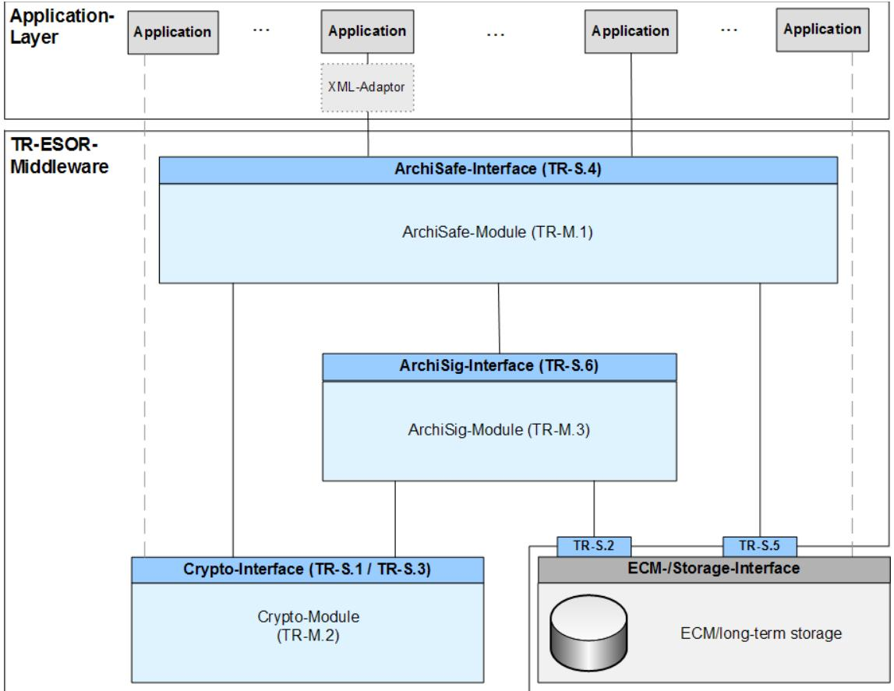

# BSI Technical Guideline 03125 Preservation of Evidence of Cryptographically Signed Documents

## **Annex TR-ESOR-VR: Verification Reports for Selected Data Structures**

| Designation  | Verification Reports for Selected Data Structures |
|--------------|---------------------------------------------------|
| Abbreviation | BSI TR-ESOR-VR                                    |
| Version      | 1.2.1 (on base of the eIDAS-Regulation)           |
| Datum        | 15.03.2018                                        |

Federal Office for Information Security Post Box 20 03 63 53133 Bonn Phone: +49 228 99 9582-0 E-Mail: [tr es or@bsi.bund.de](mailto:digsig@bsi.bund.de) Internet: [https://www.bsi.bund.de](https://www.bsi.bund.de/) © Federal Office for Information Security 2018

Federal Office for Information Security

# **Table of Contents**

| 1. Introduction                      | 4  |
|--------------------------------------|----|
| 2. Overview                          | 6  |
| 3. Evidence Record                   | 7  |
| 3.1 EvidenceRecordValidityType7      |    |
| 3.2 ArchiveTimeStampValidityType9    |    |
| 4. XAIP                              | 12 |
| 4.1 XAIPValidityType12               |    |
| 4.2 packageHeaderValidityType13      |    |
| 4.3 versionManifestValidityType14    |    |
| 4.4 submissionInfoValidityType15     |    |
| 4.5 packageInfoUnitValidityType15    |    |
| 4.6 metaDataSectionValidityType16    |    |
| 4.7 dataObjectsSectionValidityType17 |    |
| 4.8 credentialsSectionValidityType19 |    |
| 4.9 updateSectionValidityType20      |    |
| 5. Appendix - XML-Schema-Definition  | 22 |

# **Table of Figures**

## **Index of Tables**

## <span id="page-3-0"></span>**1. Introduction**

The goal of the Technical Guideline "Preservation of Evidence of Cryptographically Signed Documents" is to specify technical security requirements for the long-term preservation of evidence of cryptographically signed electronic documents and data along with associated electronic administrative data (meta data).

A Middleware defined for this purpose (TR-ESOR-Middleware) in the sense of this Guideline includes all of the modules (**M**) and interfaces (**S**) [for the German "*Schnittstellen"*] used for securing and preserving the authenticity and proving the integrity of the stored documents and data.

The Reference Architecture introduced in the Main Document of this Technical Guideline consists of the functions and logical units described in the following:

- The input interface S.4 of the TR-ESOR-Middleware serves to embed the TR-ESOR-Middleware in the existing IT and infrastructure landscape;
- The central Middleware module "ArchiSafe" (see **[TR-ESOR-M.1]**), which regulates the flow of information in the Middleware, that implements the security requirements for the interfaces with the IT applications and which ensures that the application systems are decoupled from the ECM/long-term storage;
- The "Cryptographic" module (see **[TR-ESOR-M.2]**) and the associated interfaces S.1 and S.3 that provide the functions needed for the calculation of hash values, the verification of electronic signatures, seals or timestamps, the post-verification of electronic certificates, and for the obtainment of qualified time stamps and (optional) of electronic signatures and seals for the Middleware. Furthermore, it can provide the functions for the encryption and decryption of data and documents;
- The "ArchiSig" module (see **[TR-ESOR-M.3]**) with the interface S.6 that provides the functions needed for the preservation of evidence of the digitally signed documents;
- An ECM/long-term storage with the interfaces S.2 and S.5 that assumes the physical archiving/storage and also the storage of the meta data that preserve evidence.

*This ECM/long-term storage is no longer directly a part of the Technical Guideline, but requirements may be induced through the two interfaces that are still part of the TR-ESOR-Middleware.*

*The application layer that can include an XML-adapter is not a direct part of this Technical Guideline, either, even though this XML-adapter can be implemented as part of a Middleware.*

The IT Reference Architecture depicted in Figure 1 is based on the ArchiSafe[1](#page-3-1) Reference Architecture and is supposed to make possible and support the logical (functional) interoperability of future products with the goals and requirements of the Technical Guideline.

<span id="page-3-1"></span><sup>1</sup> For more information, see [http://www.archisafe.de.](http://www.archisafe.de/)



*Figure 1: Schematic Depiction of the IT Reference Architecture*

This Technical Guideline is modularly structured, and the individual annexes to the Main Document specify the functional and technological security requirements for the needed IT components and interfaces of the TR-ESOR-Middleware. The specifications are strictly platform, product and manufacturer independent.

The document at hand bears the designation "Annex TR-ESOR-VR" and specifies verification reports for selected data structures.

## <span id="page-5-0"></span>**2. Overview**

The present section defines verification report structures for

- Evidence Records (see section [3\)](#page-6-1) and
- XAIP (see section [4\)](#page-11-1).

Unless otherwise specified the following identifier may appear in any ResultMajor-element:

- http://www.bsi.bund.de/ecard/api/1.1/resultmajor#ok
- http://www.bsi.bund.de/ecard/api/1.1/resultmajor#warning
- http://www.bsi.bund.de/ecard/api/1.1/resultmajor#error

Furthermore following identifier may always appear in any ResultMinor-element:

- http://www.bsi.bund.de/ecard/api/1.1/resultminor/al/common#noPermission
- http://www.bsi.bund.de/ecard/api/1.1/resultminor/al/common#internalError
- http://www.bsi.bund.de/ecard/api/1.1/resultminor/al/common#parameterError
- http://www.bsi.bund.de/ecard/tr-esor/1.2/resultminor/arl/notSupported

*NOTICE 1: Please consider, the official scheme definition of the OASIS verification report[2](#page-5-1) provided by OASIS on the web page doesn't fully match the corresponding specification document[3](#page-5-2) . According to the specification, the element <vr:ChainingOK> of the type <vr:CertificateValidityType> must be optional and not required.*

*NOTICE 2: In the following text "digital signature" subsumes "advanced electronic signature" according to [eIDAS-VO, Article 3 (11)], "qualified electronic signature" according to [eIDAS-VO, Article 3(12)], "advanced electronic seal" according to [eIDAS-VO, Article 3(26)] and "qualified electronic seal" according to [eIDAS-VO, Article 3(27)]. The term "cryptographically signed documents" means qualified digital signed documents according to [eIDAS-VO Article 3(12)] as well as qualified digital sealed documents [eI-DAS-VO Article 3(27)] and qualified electronically time-stamped documents [eIDAS-VO 3 (34)] but also documents with advanced digital signatures [eIDAS-VO, Article 3(11)], advanced digital seals [eIDAS-VO, Article 3(26)] or electronic time-stamps [eIDAS-VO, Article 3(33)] which are often used in the internal communication of public administrations. Not mentioned in this text are documents with simple electronic signatures or seals based on other (e.g. non-cryptographical) procedures.*

<span id="page-5-1"></span><sup>2</sup> <http://docs.oasis-open.org/dss-x/profiles/verificationreport/oasis-dssx-1.0-profiles-vr-cd02.xsd>

<span id="page-5-2"></span><sup>3</sup> <http://docs.oasis-open.org/dss-x/profiles/verificationreport/oasis-dssx-1.0-profiles-vr-cs01.pdf>

## <span id="page-6-1"></span>**3. Evidence Record**

In order to verify the conformity of evidence records according to **[RFC4998]** or **[RFC6283]** the VerifyRequest returns an <EvidenceRecordReport>-element in the <Details>-element within the <IndividualReport>-element defined in section 3.3 of **[OASIS VR]**.

This element is defined as follows, where changes to **[OASIS VR]** are marked yellow:

```
<element name="EvidenceRecordReport" type="tr:EvidenceRecordValidityType" />
```
### <span id="page-6-0"></span>**3.1 EvidenceRecordValidityType**

The **tr:EvidenceRecordValidityType** is based on the definition of the EvidenceRecordelement in **[RFC4998]** defined as follows:

```
<complexType name="EvidenceRecordValidityType">
      <sequence>
             <element name="FormatOK" type="vr:VerificationResultType" />
             <element name="Version" type="anyURI" maxOccurs="1"
                    minOccurs="0" />
             <element name="DigestAlgorithm"
                    type="vr:AlgorithmValidityType" maxOccurs="unbounded"
                    minOccurs="0" />
             <element name="CryptoInfos" maxOccurs="1" minOccurs="0">
                    <complexType>
                           <sequence>
                                  <element name="Attribute"
                                         type="vr:AttributeType"
                                          maxOccurs="unbounded" minOccurs="1" />
                           </sequence>
                    </complexType>
             </element>
             <element name="EncryptionInfo" maxOccurs="1"
                    minOccurs="0">
                    <complexType>
                           <sequence>
                                  <element name="EncryptionInfoType"
                                         type="vr:AlgorithmValidityType" />
                                  <element name="EncryptionInfoValue"
                                         type="dss:AnyType" />
                           </sequence>
                    </complexType>
             </element>
             <element name="ArchiveTimeStampSequence" maxOccurs="1"
                    minOccurs="1">
                    <complexType>
                           <sequence maxOccurs="unbounded" minOccurs="0">
                                  <element name="ArchiveTimeStampChain">
                                         <complexType>
                                                <sequence maxOccurs="unbounded"
                                                       minOccurs="0">
                                                       <element
                                                        name="ArchiveTimeStamp"
                                         type="vr:ArchiveTimeStampValidityType" />
                                                </sequence>
                                         </complexType>
                                  </element>
                           </sequence>
                    </complexType>
             </element>
      </sequence>
```
<attribute name="Id" type="ID" use="optional" /> </complexType>

It contains the following elements and attributes:

@Id [optional]

This attribute contains an optional identifier for the element.

<FormatOK> [required]

This element indicates, whether the format of the evidence record according to **[RFC4998]** or **[RFC6283]** is ok or not. More information on the use of the **vr:VerificationResultType** may be found in section 3.4 of **[OASIS VR]**.The following identifier for ResultMinor may occur in case of an error:

- http://www.bsi.bund.de/ecard/api/1.1/resultminor/al/common#parameterError
- http://www.bsi.bund.de/tr-esor/api/1.2/resultminor/arl/notSupported
- http://www.bsi.bund.de/tr-esor/api/1.2/resultminor/invalidFormat

<Version> [optional]

This element contains, if present, the format and version of the Evidence Record Syntax, where the following values are supported:

urn:ietf:rfc:4998 for Evidence Records according to **[RFC4998]**

urn:ietf:rfc:6283 for Evidence Records according to **[RFC6283]**

A missing <Version> element indicates that an ASN.1-based Evidence Record according to **[RFC4998]** is used.

<DigestAlgorithm> [optional[4](#page-7-0) , unbounded]

This element appears for each hash algorithm used to produce the evidence record and contains information about the hash algorithm and possibly its suitability. The **vr:AlgorithmValidityType** is defined in section 3.5.2 of **[OASIS VR]**.

The currently supported digest algorithms are listed in **[TR-ESOR-ERS]**.

For DigestAlgorithm/Suitability/ResultMinor the following URI may appear in case of an error:

- http://www.bsi.bund.de/ecard/api/1.1/resultminor/il/algorithm#hashAlgorithmNotSuita ble
- http://www.bsi.bund.de/ecard/api/1.1/resultminor/il/algorithm#hashAlgorithmNotSupp orted

<CryptoInfos> [optional]

In general this element MAY contain further data useful in the validation of the <ArchiveTimeStampSequence>-element. As explained in **[RFC4998]** and **[RFC6283]** (cf. <SupportingInformationList>-element) this MAY include possible Trust Anchors, certificates, revocation information, or the information concerning the suitability of

<span id="page-7-0"></span><sup>4</sup> Note! In case an evidence record according to [RFC4998] is about to be verified, than is this element required and has to be contained in the verification report. In case an evidence record according to [RFC6283] is verified, the element remains optional and can be omitted in the verification report.

cryptographic algorithms. In the present profile of the EvidenceRecordReport-structure[5](#page-8-1) this element MUST be omitted.

```
<EncryptionInfo> [optional]
```
In general this element MAY contain the necessary information to support encrypted content (cf. **[RFC4998]**, section 6.1 and **[RFC6283]**, sections 2.1 and 6, <EncryptionInformation>-element). In the present profile of the EvidenceRecordReportstructure[6](#page-8-2) this element MUST be omitted.

```
<ArchiveTimeStampSequence> [required]
```
This element is required and MAY contain a sequence of <ArchiveTimeStampChain> elements (cf. **[RFC4998]**, section 5 and **[RFC6283]**, section 4), which in turn MAY contain a sequence of <ArchiveTimeStamp>-elements, which are of type **vr:ArchiveTimeStampValidityType** defined below.

### <span id="page-8-0"></span>**3.2 ArchiveTimeStampValidityType**

The **vr:ArchiveTimeStampValidityType** is based on the definition of the ArchiveTimeStampelement in **[RFC4998]** defined as follows:

```
<complexType name="ArchiveTimeStampValidityType">
      <sequence>
             <element name="FormatOK" type="vr:VerificationResultType" />
             <element name="DigestAlgorithm"
                    type="vr:AlgorithmValidityType" maxOccurs="1" minOccurs="0" />
             <element name="Attributes" maxOccurs="1" minOccurs="0">
                    <complexType>
                           <sequence>
                                  <element name="Attribute"
                                         type="vr:AttributeType"
                                          maxOccurs="unbounded" minOccurs="1" />
                           </sequence>
                    </complexType>
             </element>
             <element name="ReducedHashTree" maxOccurs="1"
                    minOccurs="0">
                    <complexType>
                           <sequence maxOccurs="unbounded" minOccurs="1">
                                  <element name="PartialHashTree">
                                         <complexType>
                                                <sequence maxOccurs="unbounded"
                                                      minOccurs="1">
                                                      <element name="HashValue"
                                                       type="vr:HashValueType" />
                                                </sequence>
                                         </complexType>
                                  </element>
                           </sequence>
                    </complexType>
             </element>
             <element name="TimeStamp" type="vr:TimeStampValidityType" />
      </sequence>
      <attribute name="Id" type="ID" use="optional" />
</complexType>
```
It contains the following elements and attributes:

<span id="page-8-1"></span><sup>5</sup> See BSI, [TR-ESOR-ERS]

<span id="page-8-2"></span><sup>6</sup> See BSI, [TR-ESOR-ERS]

@Id [optional]

This attribute contains an optional identifier for the element.

<FormatOK> [required]

This element indicates, whether the format of the evidence record according to **[RFC4998]** or **[RFC6283]** is ok or not. More information on the use of the **vr:VerificationResultType** MAY be found in section 3.4 of **[OASIS VR]**.

The following identifier may appear in ResultMinor in case of an error:

- http://www.bsi.bund.de/tr-esor/api/1.2/resultminor/invalidFormat
- http://www.bsi.bund.de/tr-esor/api/1.2/resultminor/hashValueMismatch

This error code indicates that the hash value in the time stamp (MessageImprint) under consideration is not equal to the hash value of the data (user provided content data or previous time stamps in a time stamp chain / sequence), which is meant to be protected by the given time stamp.

- http://www.bsi.bund.de/ecard/api/1.1/resultminor/il/signature#signatureFormatNot Supported
- http://www.bsi.bund.de/ecard/api/1.1/resultminor//il/algorithm#signatureAlgorithm NotSupported
- http://www.bsi.bund.de/ecard/api/1.1/resultminor//il/algorithm#signatureAlgorithm NotSuitable
- http://www.bsi.bund.de/tr-esor/api/1.1/resultminor/unknownAttribute
- http://www.bsi.bund.de/ecard/api/1.1/resultminor/al/common#parameterError
- http://www.bsi.bund.de/tr-esor/api/1.2/resultminor/arl/notSupported

<DigestAlgorithm> [optional]

This element contains, if present, information about the hash algorithm and possibly its suitability. The **vr:AlgorithmValidityType** is defined in section 3.5.2 of **[OASIS VR]**.

For DigestAlgorithm/Suitability/ResultMinor the following URI may appear in case of an error:

- http://www.bsi.bund.de/ecard/api/1.1/resultminor/il/algorithm#hashAlgorithmNotS uitable
- http://www.bsi.bund.de/ecard/api/1.1/resultminor/il/algorithm#hashAlgorithmNotS upported

<Attributes> [optional]

This element contains, if present, information about further attributes related to the archive time stamp. In the present profile of the EvidenceRecordReport-structure[7](#page-9-0) this element MUST be omitted.

<ReducedHashTree> [optional]

<span id="page-9-0"></span><sup>7</sup> See BSI TR-ESOR-ERS

This element MAY contain a sequence of <PartialHashTree>-elements, which in turn contain a list of <HashValue>-elements of type **vr:HashValueType** defined below.

<TimeStamp> [required]

This element is of type **vr:TimeStampValidityType** (cf. section 3.5.4.4 of **[OASIS VR]**) and contains information about the validity of the conventional time stamp, which is included in the present archive time stamp.

## <span id="page-11-1"></span>**4. XAIP**

To verify the conformity of an XAIP according to **[TR-ESOR-F]** one may use the VerifyRequest function, which returns an <XAIPReport>-element in the <Details>-element within the <IndividualReport>-element defined in section 3.3 of **[OASIS VR]**. This element is defined as follows:

<element name="XAIPReport" type="tr:XAIPValidityType" />

## <span id="page-11-0"></span>**4.1 XAIPValidityType**

```
The tr:XAIPValidityType is defined as follows:
```

```
<complexType name="XAIPValidityType">
      <sequence>
             <element name="FormatOK" type="vr:VerificationResultType" />
             <element name="packageHeader"
                    type="tr:packageHeaderValidityType" >
             </element>
             <element name="metaDataSection"
                    type="tr:metaDataSectionValidityType" maxOccurs="1"
                    minOccurs="0">
             </element>
             <element name="dataObjectsSection"
                    type="tr:dataObjectsSectionValidityType" maxOccurs="1"
                    minOccurs="0">
             </element>
             <element name="credentialsSection"
                    type="tr:credentialsSectionValidityType" maxOccurs="1" 
                    minOccurs="0">
             </element>
             <element name="updateSection"
                    type="tr:updateSectionValidityType" maxOccurs="1" 
minOccurs="0">
             </element>
      </sequence>
</complexType>
```
<FormatOK> [required]

This element indicates, whether the format of the XAIP according to **[TR-ESOR-F]** is syntactically correct or not. More information on the use of the **vr:VerificationResultType** may be found in section 3.4 of **[OASIS VR]**.

The following identifier MAY appear in ResultMinor in case of an error:

http://www.bsi.bund.de/tr-esor/api/1.2/resultminor/invalidFormat

<packageHeader> [optional]

This element provides information about the result of the verification of the packageHeader-element of the XAIP as specified in **[TR-ESOR-F]**. More details about the **tr:packageHeaderValidityType** are provided below (see section [4.2,](#page-12-0) page [13\)](#page-12-0).

<metaDataSection> [optional]

This element provides information about the result of the verification of the metaDataSection-element of the XAIP as specified in **[TR-ESOR-F]**. More details about the **tr:metaDataSectionValidityType** are provided below (see section [4.6,](#page-15-0) page [16\)](#page-15-0).

```
<dataObjectSection> [optional]
```
This element provides information about the result of the verification of the dataObjectSection-element of the XAIP as specified in **[TR-ESOR-F]**. More details about the **tr:dataObjectSectionValidityType** are provided below (see section [4.7,](#page-16-0) page [17\)](#page-16-0).

```
<credentialSection> [optional]
```
This element provides information about the result of the verification of the credentialSection-element of the XAIP as specified in **[TR-ESOR-F]**. More details about the **tr:redentialSectionValidityType** are provided below (see section [4.8,](#page-18-0) page [19\)](#page-18-0).

#### <span id="page-12-0"></span>**4.2 packageHeaderValidityType**

The **tr:packageHeaderValidityType** is based on the definition of the packageHeader-element in **[TR-ESOR-F]** defined as follows:

```
<complexType name="packageHeaderValidityType">
      <sequence>
             <element name="AOID" type="string" maxOccurs="1" minOccurs="0"/>
             <element name="versionManifest"
                    type="tr:versionManifestValidityType"
                    maxOccurs="unbounded" minOccurs="0" />
             <element name="canonicalizationMethod"
                    type="vr:VerificationResultType" maxOccurs="1"
                    minOccurs="0" />
             <element name="extension" type="vr:VerificationResultType"
                    maxOccurs="1" minOccurs="0" />
      </sequence>
      <attribute name="packageID" type="string" use="required"/>
</complexType>
```
It contains the following elements and attributes:

#### @packageID [required]

Contains the packageID-attribute of the XAIP for informational purposes.

#### <AOID> [optional]

Contains the AOID-element of the XAIP for informational purposes, if it is present.

```
<versionManifest> [optional, unbounded]
```
This element is present for each version of the XAIP and provides information about the result of the verification step. The **tr:versionManifestValidityType** is described below (see section [4.3,](#page-13-0) page [14\)](#page-13-0).

<canonicalizationMethod> [optional]

This element indicates, whether the provided canonicalizationMethod-URI is among the admissible values, which are currently specified as follows (see **[XML-SACR]**):

- <http://www.w3.org/TR/2001/REC-xml-c14n-20010315>
- [http://www.w3.org/2001/10/xml-exc-c14n#](http://www.w3.org/2001/10/xml-exc-c14n)

More information on the use of the **vr:VerificationResultType** may be found in section 3.4 of **[OASIS VR]**. If the provided URI is not among the admissible values the following error code is provided in ResultMinor:

 http://www.bsi.bund.de/tresor/api/1.2/resultminor/unknownCanonicalizationMethod <extension> [optional]

This element indicates, whether the content of the extension-element is correct or not. More information on the use of the **vr:VerificationResultType** may be found in section 3.4 of **[OASIS VR]**. In the present profile of the XAIP-structure the extension element MUST be omitted.

### <span id="page-13-0"></span>**4.3 versionManifestValidityType**

The **tr:versionManifestValidityType** is based on the definition of the versionManifestelement in **[TR-ESOR-F]** defined as follows:

```
<complexType name="versionManifestValidityType">
      <sequence>
             <element name="preservationInfo" type="vr:VerificationResultType"/>
             <element name="submissionInfo" type="tr:submissionInfoValidityType"
                    maxOccurs="1" minOccurs="0" />
             <element name="packageInfoUnit" type="tr:packageInfoUnitValidityType"
                    maxOccurs="unbounded" minOccurs="0" />
             <element name="extension" type="vr:VerificationResultType"
                    maxOccurs="1" minOccurs="0"/>
      </sequence>
      <attribute name="VersionID" type="string" use="required"/>
</complexType>
```
It contains the following elements and attributes:

@VersionID [required]

Contains the VersionID-attribute of the archive data object for informational purposes.

<preservationInfo> [required]

Contains the result of the verification process for the preservationInfo-element. Within this check, which is applied within the execution of ArchiveSubmissionRequest for example, it is verified that the preservation period of the XAIP is not yet expired. The result is structured as **vr:VerificationResultType** according to section 3.4 of **[OASIS VR]** where the following identifier may appear in ResultMinor in case of an error:

http://www.bsi.bund.de/tr-esor/api/1.2/resultminor/preservationPeriodExpired

<submissionInfo> [optional]

This element provides information about the result of the verification of the submissionInfo-element of the XAIP as specified in **[TR-ESOR-F]**. More details about the **tr:submissionInfoValidityType** are provided below (see section [4.4,](#page-14-1) page [15\)](#page-14-1).

```
<packageInfoUnit> [optional, unbounded]
```
This element provides information about the result of the verification of the packageInfoUnit-element of the XAIP as specified in **[TR-ESOR-F]**. More details about the **tr:packageInfoUnitValidityType** are provided below (see section [4.5,](#page-14-0) page [15\)](#page-14-0).

<extension> [optional]

This element indicates, whether the content of the extension-element is correct or not. More information on the use of the **vr:VerificationResultType** may be found in section 3.4 of **[OASIS VR]**. In the present profile of the XAIP-structure the extension element MUST be omitted.

#### <span id="page-14-1"></span>**4.4 submissionInfoValidityType**

The **tr:SubmissionInfoValidityType** is based on the definition of the submissionInfoelement in **[TR-ESOR-F]** defined as follows:

```
<complexType name="submissionInfoValidityType">
      <sequence>
             <element name="submissionTime" type="vr:VerificationResultType"
                    maxOccurs="1" minOccurs="0" />
             <element name="extension" type="vr:VerificationResultType"
                    maxOccurs="1" minOccurs="0"/>
      </sequence>
</complexType>
```
It contains the following elements and attributes:

<submissionTime> [optional]

Contains the result of the verification process for the submissionTime/generalTimeelement. Within this check, which is applied within the execution of ArchiveSubmissionRequest for example, it is verified that the submission time is equal to the system time of the TR-ESOR-middleware modulo a specified tolerance range. The result is structured as **vr:VerificationResultType** according to section 3.4 of **[OASIS VR]** where the following identifier may appear in ResultMinor in case of an error:

 http://www.bsi.bund.de/tresor/api/1.2/resultminor/submissionTimeDeviationBeyondLimit

<extension> [optional]

This element indicates, whether the content of the extension-element is correct or not. More information on the use of the **vr:VerificationResultType** may be found in section 3.4 of **[OASIS VR]**. In the present profile of the XAIP-structure the extension element MUST be omitted.

#### <span id="page-14-0"></span>**4.5 packageInfoUnitValidityType**

The **tr:packageInfoUnitValidityType** is based on the definition of the packageInfoUnitelement in **[TR-ESOR-F]** defined as follows:

```
<complexType name="packageInfoUnitValidityType">
      <sequence>
             <element name="objectPointer" type="vr:VerificationResultType"/>
             <element name="extension" type="vr:VerificationResultType"
                    maxOccurs="1" minOccurs="0"/>
      </sequence>
      <attribute name="packageUnitID" type="string" use="required"/>
</complexType>
```
It contains the following elements and attributes:

@packageUnitID [required]

Contains the packageUnitID-attribute of this content data unit for informational purposes.

<objectPointer> [required]

Contains the result of the verification process for the protectedObjectPointer and unprotectedObjectPointer elements. Within this check it is verified that there is no object, which is protected and unprotected. The result is structured as **vr:VerificationResultType** according to section 3.4 of **[OASIS VR]** where the following identifier may appear in ResultMinor in case of an error:

http://www.bsi.bund.de/tr-esor/api/1.2/resultminor/ambiguousObjectPointerStatus

<extension> [optional]

This element indicates, whether the content of the extension-element is correct or not. More information on the use of the **vr:VerificationResultType** may be found in section 3.4 of **[OASIS VR]**. In the present profile of the XAIP-structure the extension-element MUST be omitted.

#### <span id="page-15-0"></span>**4.6 metaDataSectionValidityType**

The **tr:metaDataSectionValidityType** is based on the definition of the metadataSectionelement in **[TR-ESOR-F]** defined as follows:

```
<complexType name="metaDataSectionValidityType">
      <sequence>
             <element name="metaDataObject"
                    type="tr:metaDataObjectValidityType" maxOccurs="unbounded">
             </element>
      </sequence>
</complexType>
```
It contains the following sequence of elements:

<metaDataObject> [required, unbounded]

Contains the result of the verification procedure for a metaDataObject-element, which is of type **tr:metaDataObjectValidityType**.

The **tr:metaDataObjectValidityType** is defined as follows:

```
<complexType name="metaDataObjectValidityType">
      <sequence>
             <element name="dataObjectCheckSum" type="vr:VerificationResultType"
                    maxOccurs="1" minOccurs="0"/>
             <element name="category" type="vr:VerificationResultType"
                    maxOccurs="1" minOccurs="0"/>
             <element name="classification" type="vr:VerificationResultType"
                    maxOccurs="1" minOccurs="0"/>
             <element name="content" type="vr:VerificationResultType" maxOccurs="1"
                    minOccurs="0"/>
      </sequence>
      <attribute name="metaDataID" type="string" use="required"/>
      <attribute name="dataObjectID" type="string" use="required"/>
</complexType>
```
@metaDataID [required]

This attribute contains a unique identifier of current meta data object.

@dataObjectID [required]

```
The value of this attribute describes the element, which the 
meta data is pointing to.
```
<dataObjectCheckSum> [optional]

If the metaDataObject-element contains a dataObjectCheckSum-element there will be a

corresponding element within the verification report, which contains the result of the corresponding verification procedure. More information on the use of the **vr:VerificationResultType** may be found in section 3.4 of **[OASIS VR]**.

The following identifier may appear in the dataObjectCheckSum/ResultMinor-element:

- http://www.bsi.bund.de/tresor/api/1.2/resultminor/checkSumAlgorithmNotSupportedWarning
- http://www.bsi.bund.de/tr-esor/api/1.2/resultminor/checkSumInvalid

<category> [optional]

This element indicates, whether the specified category-attribute is among the admissible or recommended values as specified in **[TR-ESOR-F]** or not. More information on the use of the **vr:VerificationResultType** may be found in section 3.4 of **[OASIS VR]**.

<classification> [optional]

This element indicates, whether the specified classification-attribute is among the admissible or recommended values as specified in **[TR-ESOR-F]** or not. More information on the use of the **vr:VerificationResultType** may be found in section 3.4 of **[OASIS VR]**.

<content> [optional]

This element indicates, whether the content of the provided metaDataObject-element is as specified by a certain profile. Unless the verification of the XAIP is performed with respect to a specific profile, this element is omitted. More information on the use of the **vr:VerificationResultType** may be found in section 3.4 of **[OASIS VR]**.

#### <span id="page-16-0"></span>**4.7 dataObjectsSectionValidityType**

The **tr:dataObjectsSectionValidityType** is based on the definition of the dataObjectSectionelement in **[TR-ESOR-F]** defined as follows:

```
<complexType name="dataObjectsSectionValidityType">
      <sequence>
             <element name="dataObject" type="tr:dataObjectValidityType"
                    maxOccurs="unbounded" />
      </sequence>
</complexType>
```
It contains the following sequence of elements:

<dataObject> [required, unbounded]

Contains the result of the verification procedure for a dataObject-element, which is of type **tr:dataObjectValidityType**.

The **tr:dataObjectValidityType** is defined as follows:

```
<complexType name="dataObjectValidityType">
      <sequence>
             <element name="FormatOK" type="vr:VerificationResultType"
                    maxOccurs="1" minOccurs="0"/>
             <element name="checkSum" type="vr:VerificationResultType"
                    maxOccurs="1" minOccurs="0"/>
             <element name="transformInfo" type="tr:transformInfoValidityType"
                    maxOccurs="1" minOccurs="0"/>
```

```
</sequence>
      <attribute name="dataObjectID" type="string" use="required"/>
</complexType>
```
@dataObjectID [required]

The value of this attribute describes the unique id of this data object.

<FormatOK> [optional]

If present, this element indicates, whether the format of the dataObject-element is syntactically correct or not. For data provided in the binaryData alternative this check SHOULD include a validation according to the document format specified by the MimeType-attribute within the binaryData-element. For XML-based data within xmlDataelement this check MUST ensure that the contained data is well formed XML. Furthermore an implementation MAY support additional XML-schema validation steps. More information on the use of the **vr:VerificationResultType** may be found in section 3.4 of **[OASIS VR]**.

The following identifier may appear in the FormatOK/ResultMinor-element:

- http://www.bsi.bund.de/tr-esor/api/1.2/resultminor/invalidFormat
- http://www.bsi.bund.de/tr-esor/api/1.2/resultminor/uncheckedFormatWarning

<checkSum> [optional]

If the dataObject-element contains a checkSum-element there will be a checkSum-element within the verification report, which contains the result of the corresponding verification procedure. More information on the use of the **vr:VerificationResultType** may be found in section 3.4 of **[OASIS VR]**.

The following identifier may appear in the checkSum/ResultMinor-element:

- http://www.bsi.bund.de/tresor/api/1.2/resultminor/checksumAlgorithmNotSupportedWarning
- http://www.bsi.bund.de/tr-esor/api/1.2/resultminor/checksumInvalid

<transformInfo> [optional]

If present contains this element the verification for the transformation objects. The element is of type **tr:transformInfoValidityType**.

The **tr:transformInfoValidityType** is defined as follows:

```
<complexType name="TransformInfoValidityType">
      <sequence>
             <element name="transformObject" type="vr:VerificationResultType"
                    maxOccurs="unbounded" />
      </sequence>
      <attribute name="transformObjectID" type="string" use="required"/>
</complexType>
```

```
@transformObjectID [required]
```
This attribute allows to unique reference given transformation object.

<transformObject> [required]

For each transformObject-element contained in the XAIP there will be transformObject within the verification report, which contains the result of the corresponding verification

procedure. More information on the use of the **vr:VerificationResultType** may be found in section 3.4 of **[OASIS VR]**. In the present profile of the XAIP-structure the transformInfo-element MUST be omitted.

#### <span id="page-18-0"></span>**4.8 credentialsSectionValidityType**

The **tr:credentialsSectionValidityType** is based on the definition of the credentialsSectionelement in **[TR-ESOR-F]** defined as follows:

```
<complexType name="credentialsSectionValidityType">
      <sequence>
             <element name="credential" type="tr:credentialValidityType"
                    maxOccurs="unbounded" minOccurs="1">
             </element>
      </sequence>
</complexType>
```
It contains the following sequence of elements:

<credential> [required, unbounded]

Contains the result of the verification procedure for a credential-element, which is of type **tr:credentialValidityType**.

The **tr:credentialValidityType** is defined as follows:

```
<complexType name="credentialValidityType">
      <sequence>
             <element name="relatedObjects" maxOccurs="1" minOccurs="0">
              <complexType>
                    <sequence>
                           <element name="XPath" type="string"
                            maxOccurs="unbounded" minOccurs="1" />
                    </sequence>
              </complexType>
             </element>
             <choice>
                    <element ref="vr:DetailedSignatureReport" />
                    <element ref="vr:IndividualCertificateReport" />
                    <element ref="vr:IndividualAttributeCertificateReport" />
                    <element ref="vr:IndividualCRLReport" />
                    <element ref="vr:IndividualOCSPReport" />
                    <element ref="vr:IndividualTimeStampReport" />
                    <element ref="tr:EvidenceRecordReport" />
                    <element name="other" type="vr:VerificationResultType" />
             </choice>
      </sequence>
      <attribute name="credentialID" type="string" use="required"/>
</complexType>
```
@credentialID [required]

Contains the credentialID-attribute of the current credential object for informational purposes.

<relatedObjects> [optional]

If the credential-element in the XAIP contains a relatedObjects-attribute there will be a relatedObjects-element in the verification report, which point to the elements in the XAIP using corresponding XPath-expressions.

```
<DetailedSignatureReport> [choice]
```
If the credential-element in the XAIP contains a dss:SignatureObject-element with an included ds:Signature, dss:Base64Signature or dss:SignaturePtr there will be a vr:DetailedSignatureReport-element according to **[OASIS VR]** (section 3.5) in the verification report.

<IndividualCertificateReport> [choice]

If the credential-element in the XAIP contains a certificateValues- or certificateRefs-element with an X.509-based public key certificate there will be a vr:IndividualCertificateReport-element according to **[OASIS VR]** (section 3.5.6) in the verification report.

<IndividualAttributeCertificateReport> [choice]

If the credential-element in the XAIP contains a certificateValues- or certificateRefs-element with an X.509-based attribute certificate there will be a vr:IndividualAttributeCertificateReport-element according to **[OASIS VR]** (section 3.5.7) in the verification report.

<IndividualCRLReport> [choice]

If the credential-element in the XAIP contains a revocationValues- or revocationsRefs-element with an X.509-based certificate revocation list there will be a vr:IndividualCRLReport-element according to **[OASIS VR]** (section 3.5.8) in the verification report.

<IndividualOCSPReport> [choice]

If the credential-element in the XAIP contains a revocationValues- or revocationsRefs-element with an OCSP response according to **[RFC2560]** there will be a vr:IndividualOCSPReport-element according to **[OASIS VR]** (section 3.5.8) in the verification report.

<IndividualTimeStampReport> [choice]

If the credential-element in the XAIP contains a dss:SignatureObject-element with an included dss:Timestamp-element there will be a vr:IndividualTimeStampReport-element according to **[OASIS VR]** (section 3.5.5) in the verification report.

<EvidenceRecordReport> [choice]

If the credential-element in the XAIP contains an evidenceRecord-element there will be an tr:EvidenceRecordReport-element according to section [3.1](#page-6-0) in the verification report.

<other> [choice]

If the credential-element in the XAIP contains an other-element there will be other verification information. More information on the use of the **vr:VerificationResultType** may be found in section 3.4 of **[OASIS VR]**. In the present profile of the XAIP-structure the other-element MUST be omitted.

#### <span id="page-19-0"></span>**4.9 updateSectionValidityType**

The **tr:updateSectionValidityType** is based on the definition of the updateSection-element in **[TR-ESOR-F]** defined as follows:

```
<complexType name="updateSectionValidityType">
      <sequence>
             <element name="prevVersion" type="vr:VerificationResultType" />
             <element name="placeHolder" type="vr:VerificationResultType"
                    maxOccurs="unbounded" minOccurs="0" />
      </sequence>
</complexType>
```
It contains the following sequence of elements:

<prevVersion> [required]

Indicates whether the indicated previous version exists and is the most recent version within the existing XAIP. More information on the use of the **vr:VerificationResultType** may be found in section 3.4 of **[OASIS VR]**.

<placeHolder> [optional, unbounded]

Indicates whether the corresponding element, which is specified by the placeHolderelement exists within the existing XAIP. More information on the use of the **vr:VerificationResultType** may be found in section 3.4 of **[OASIS VR]**.

## <span id="page-21-0"></span>**5. Appendix - XML-Schema-Definition**

```
<?xml version="1.0" encoding="UTF-8"?>
<schema targetNamespace="http://www.bsi.bund.de/tr-esor/vr/1.2"
      xmlns="http://www.w3.org/2001/XMLSchema"
      xmlns:tr="http://www.bsi.bund.de/tr-esor/vr/1.2"
      xmlns:vr="urn:oasis:names:tc:dss-
x:1.0:profiles:verificationreport:schema#"
      xmlns:xaip="http://www.bsi.bund.de/tr-esor/xaip/1.2"
      xmlns:ec="http://www.bsi.bund.de/ecard/api/1.1"
      xmlns:dss="urn:oasis:names:tc:dss:1.0:core:schema"
      elementFormDefault="qualified" attributeFormDefault="unqualified">
      <!-- ======================================= -->
      <!-- Version 1.2 vom 08.07.2016 -->
      <!-- ======================================= -->
      <import namespace="http://www.bsi.bund.de/ecard/api/1.1" 
schemaLocation="./deps/eCard.xsd" /> 
      <import namespace="urn:oasis:names:tc:dss:1.0:core:schema" 
schemaLocation="./deps/oasis-dss-core-schema-v1.0-os.xsd" />
      <import namespace="urn:oasis:names:tc:dss-
x:1.0:profiles:verificationreport:schema#" schemaLocation="./deps/oasis-
dssx-1.0-profiles-verification-report-cs1.xsd" />
      <!-- ========================== -->
      <!-- EvidenceRecordValidityType -->
      <!-- ========================== -->
      <element name="EvidenceRecordReport" 
type="tr:EvidenceRecordValidityType" />
      <complexType name="EvidenceRecordValidityType">
            <sequence>
                  <element name="FormatOK" type="vr:VerificationResultType"
/>
                  <element name="Version" type="anyURI" maxOccurs="1"
                        minOccurs="0" />
                  <element name="DigestAlgorithm"
                        type="vr:AlgorithmValidityType" 
maxOccurs="unbounded"
                        minOccurs="0" />
                  <element name="CryptoInfos" maxOccurs="1" minOccurs="0">
                        <complexType>
                              <sequence>
                                    <element name="Attribute"
                                          type="vr:AttributeType" 
maxOccurs="unbounded" minOccurs="1" />
                              </sequence>
                        </complexType>
                  </element>
                  <element name="EncryptionInfo" maxOccurs="1"
                        minOccurs="0">
                        <complexType>
                              <sequence>
                                    <element name="EncryptionInfoType"
```
type="vr:AlgorithmValidityType" /> <element name="EncryptionInfoValue" type="dss:AnyType" /> </sequence> </complexType> </element> <element name="ArchiveTimeStampSequence" maxOccurs="1" minOccurs="1"> <complexType> <sequence maxOccurs="unbounded" minOccurs="0"> <element name="ArchiveTimeStampChain"> <complexType> <sequence maxOccurs="unbounded" minOccurs="0"> <element name="ArchiveTimeStamp" type="vr:ArchiveTimeStampValidityType" /> </sequence> </complexType> </element> </sequence> </complexType> </element> </sequence> <attribute name="Id" type="ID" use="optional" /> </complexType> <complexType name="ArchiveTimeStampValidityType"> <sequence> <element name="FormatOK" type="vr:VerificationResultType" /> <element name="DigestAlgorithm" type="vr:AlgorithmValidityType" maxOccurs="1" minOccurs="0" /> <element name="Attributes" maxOccurs="1" minOccurs="0"> <complexType> <sequence> <element name="Attribute" type="vr:AttributeType" maxOccurs="unbounded" minOccurs="1" /> </sequence> </complexType> </element> <element name="ReducedHashTree" maxOccurs="1" minOccurs="0"> <complexType> <sequence maxOccurs="unbounded" minOccurs="1"> <element name="PartialHashTree"> <complexType> <sequence maxOccurs="unbounded" minOccurs="1"> <element name="HashValue"

```
type="vr:HashValueType" />
                                                 </sequence>
                                           </complexType>
                                     </element>
                               </sequence>
                        </complexType>
                  </element>
                  <element name="TimeStamp" type="vr:TimeStampValidityType"
/>
            </sequence>
            <attribute name="Id" type="ID" use="optional" />
      </complexType>
      <complexType name="HashValueType">
            <sequence>
                  <element name="HashValue" type="hexBinary" />
            </sequence>
            <attribute name="HashedObject" type="IDREF" use="optional" />
      </complexType>
      <!-- ================ -->
      <!-- XAIPValidityType -->
      <!-- ================ -->
<element name="XAIPReport" type="tr:XAIPValidityType" />
<complexType name="XAIPValidityType">
      <sequence>
            <element name="FormatOK" type="vr:VerificationResultType" />
            <element name="packageHeader"
                  type="tr:packageHeaderValidityType">
            </element>
            <element name="metaDataSection"
                  type="tr:metaDataSectionValidityType" maxOccurs="1" 
minOccurs="0">
            </element>
            <element name="dataObjectsSection"
                  type="tr:dataObjectsSectionValidityType" maxOccurs="1" 
minOccurs="0">
            </element>
            <element name="credentialsSection"
                  type="tr:credentialsSectionValidityType" maxOccurs="1" 
minOccurs="0">
            </element>
            <element name="updateSection"
                  type="tr:updateSectionValidityType" maxOccurs="1" 
minOccurs="0">
            </element>
      </sequence>
</complexType>
<complexType name="packageHeaderValidityType">
      <sequence>
            <element name="AOID" type="string" maxOccurs="1" minOccurs="0"
/>
```

```
<element name="versionManifest"
                  type="tr:versionManifestValidityType" 
maxOccurs="unbounded"
                  minOccurs="0" />
            <element name="canonicalizationMethod" 
type="vr:VerificationResultType" maxOccurs="1" minOccurs="0" />
            <element name="extension" type="vr:VerificationResultType" 
maxOccurs="1" minOccurs="0" />
      </sequence>
      <attribute name="packageID" type="string" use="required"/>
</complexType>
<complexType name="versionManifestValidityType">
      <sequence>
            <element name="preservationInfo" 
type="vr:VerificationResultType" maxOccurs="1" minOccurs="0" />
            <element name="submissionInfo" 
type="tr:submissionInfoValidityType" maxOccurs="1" minOccurs="0" />
            <element name="packageInfoUnit" 
type="tr:packageInfoUnitValidityType" maxOccurs="unbounded" minOccurs="0"/>
            <element name="extension" type="vr:VerificationResultType" 
maxOccurs="1" minOccurs="0"/>
      </sequence>
      <attribute name="VersionID" type="string" use="required"/>
</complexType>
<complexType name="submissionInfoValidityType">
      <sequence>
            <element name="submissionTime" type="vr:VerificationResultType"
                  maxOccurs="1" minOccurs="0" />
            <element name="extension" type="vr:VerificationReportType"
                  maxOccurs="1" minOccurs="0">
            </element>
      </sequence>
</complexType>
<complexType name="packageInfoUnitValidityType">
      <sequence>
            <element name="objectPointer" 
type="vr:VerificationResultType"/>
            <element name="extension" type="vr:VerificationResultType" 
maxOccurs="1" minOccurs="0"/>
      </sequence>
      <attribute name="packageUnitID" type="string" use="required" />
</complexType>
<complexType name="metaDataSectionValidityType">
      <sequence>
            <element name="metaDataObject"
                  type="tr:metaDataObjectValidityType" 
maxOccurs="unbounded">
            </element>
      </sequence>
</complexType>
<complexType name="metaDataObjectValidityType">
      <sequence>
            <element name="dataObjectCheckSum" 
type="vr:VerificationResultType" maxOccurs="1" minOccurs="0"/>
```

```
<element name="category" type="vr:VerificationResultType" 
maxOccurs="1" minOccurs="0"/>
            <element name="classification" type="vr:VerificationResultType"
maxOccurs="1" minOccurs="0"/>
            <element name="content" type="vr:VerificationResultType" 
maxOccurs="1" minOccurs="0"/>
      </sequence>
 <attribute name="metaDataID" type="string" use="required" />
 <attribute name="dataObjectID" type="string" use="required" />
</complexType>
<complexType name="dataObjectsSectionValidityType">
      <sequence>
            <element name="dataObject" type="tr:dataObjectValidityType" 
maxOccurs="unbounded" />
      </sequence>
</complexType>
<complexType name="dataObjectValidityType">
      <sequence>
            <element name="FormatOK" type="vr:VerificationResultType" 
maxOccurs="1" minOccurs="0"/>
            <element name="checksum" type="vr:VerificationResultType" 
maxOccurs="1" minOccurs="0"/>
            <element name="transformInfo" 
type="tr:transformInfoValidityType" maxOccurs="1" minOccurs="0"/>
      </sequence>
 <attribute name="dataObjectID" type="string" use="required" />
</complexType>
<complexType name="transformInfoValidityType">
      <sequence>
            <element name="transformObject" 
type="vr:VerificationResultType" maxOccurs="unbounded" />
      </sequence>
      <attribute name="transformObjectID" type="string" use="required"/>
</complexType>
<complexType name="credentialsSectionValidityType">
      <sequence>
            <element name="credential" type="tr:credentialValidityType"
                  maxOccurs="unbounded" minOccurs="1">
            </element>
      </sequence>
</complexType>
<complexType name="credentialValidityType">
      <sequence>
            <element name="relatedObjects" maxOccurs="1" minOccurs="0">
                  <complexType>
                        <sequence>
                              <element name="XPath" type="string" 
maxOccurs="unbounded" minOccurs="1"></element>
                        </sequence>
                  </complexType>
            </element>
```

```
<choice>
                  <element ref="vr:DetailedSignatureReport" />
                  <element ref="vr:IndividualCertificateReport" />
                  <element ref="vr:IndividualAttributeCertificateReport" />
                  <element ref="vr:IndividualCRLReport" />
                  <element ref="vr:IndividualOCSPReport" />
                  <element ref="vr:IndividualTimeStampReport" />
                  <element ref="tr:EvidenceRecordReport" />
                  <element name="other" type="vr:VerificationResultType" />
            </choice>
      </sequence>
      <attribute name="credentialID" type="string" use="required" />
</complexType>
<complexType name="updateSectionValidityType">
      <sequence>
            <element name="prevVersion" type="vr:VerificationResultType" />
            <element name="placeHolder" type="vr:VerificationResultType" 
maxOccurs="unbounded" minOccurs="0" />
      </sequence>
</complexType>
</schema>
```