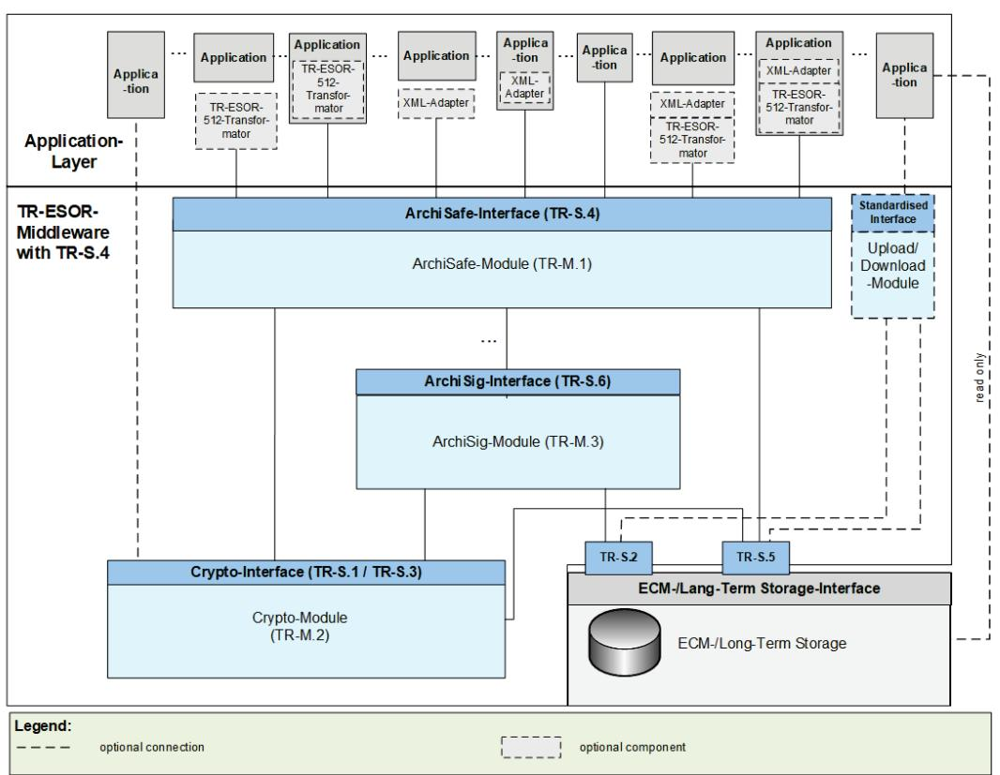
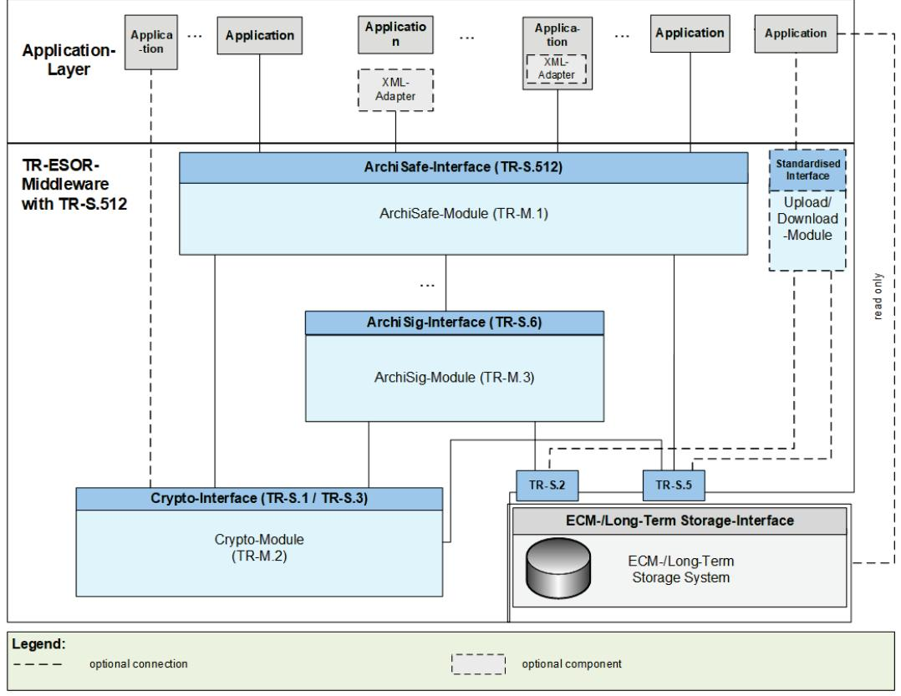
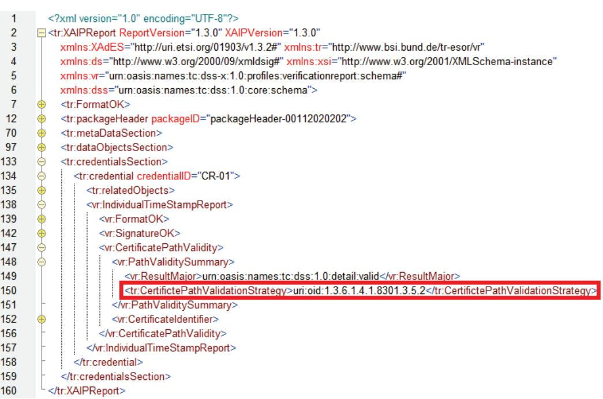
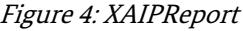

# BSI Technical Guideline 03125 Preservation of Evidence of Cryptographically Signed Documents

# Annex TR-ESOR-VR:

# Verification Reports for Selected Data Structures

| Designation  | Verification Reports for Selected Data Structures                                                            |
|--------------|--------------------------------------------------------------------------------------------------------------|
| Abbreviation | BSI TR-ESOR-VR                                                                                               |
| Version      | 1.3 (on base of the eIDAS-Regulation and the ETSI Preservation Standards with a new<br>certification scheme) |
| Date         | 31.03.2022                                                                                                   |

# Document history

| Version | Date       | Editor | Description     |
|---------|------------|--------|-----------------|
| V1.3    | 31.03.2022 | BSI    | TR-ESOR-VR V1.3 |
|         |            |        |                 |

Table 1: Document History

Federal Office for Information Security P.O. Box 20 03 63 53133 Bonn Phone: +49 229 99 9582-0 E-Mail: tresor@bsi.bund.de Internet: https://www.bsi.bund.de © Federal Office for Information Security 2022

| 1 |                    | Introduction 4                                       |  |  |
|---|--------------------|------------------------------------------------------|--|--|
| 2 |                    | Overview  7                                          |  |  |
| 3 | Evidence Record 10 |                                                      |  |  |
|   | 3.1                | EvidenceRecordValidityType 10                        |  |  |
|   | 3.2                | ArchiveTimeStampValidityType 11                      |  |  |
|   | 3.2.1              | tr:CertificatePathValidationStrategyType  13         |  |  |
| 4 |                    | XAIP 15                                              |  |  |
|   | 4.1                | XAIPValidityType 15                                  |  |  |
|   | 4.2                | packageHeaderValidityType 16                         |  |  |
|   | 4.2.1              | versionManifestValidityType 17                       |  |  |
|   | 4.3                | metaDataSectionValidityType 19                       |  |  |
|   | 4.3.1              | Referenced metaDataObjects in the metaDataSection 20 |  |  |
|   | 4.4                | dataObjectsSectionValidityType 21                    |  |  |
|   | 4.4.1              | Referenced dataObjects in the dataObjectsSection 22  |  |  |
|   | 4.5                | credentialsSectionValidityType  23                   |  |  |
|   | 4.5.1              | Referenced Credentials in the credentialSection 26   |  |  |
|   | 4.6                | updateSectionValidityType 27                         |  |  |
| 5 |                    | Appendix - XML-Schema-Definition 28                  |  |  |

| Figure 1: Schematic Depiction of the IT Reference Architecture with TR-S.4 5                   |  |
|------------------------------------------------------------------------------------------------|--|
| Figure 2: Schematic Depiction of the IT Reference Architecture with TR-S.512 5                 |  |
| Figure 3: Usage of CertifictePathValidationStrategy-element in EvidenceRecordReport-element 13 |  |
| Figure 4: XAIPReport 26                                                                        |  |

# <span id="page-3-0"></span>1 Introduction

The goal of the Technical Guideline "Preservation of Evidence of Cryptographically Signed Documents" is to specify technical security requirements for the long-term preservation of evidence of cryptographically signed electronic documents and data along with associated electronic administrative data (meta data).

A Middleware defined for this purpose (TR-ESOR-Middleware) in the sense of this Guideline includes all of the modules (M) and interfaces (S) [for the German "Schnittstellen"] used for securing and preserving the authenticity and proving the integrity of the stored documents and data.

The Reference Architecture introduced in the Main Document of this Technical Guideline consists of the functions and logical units described in the following:

- the input interfaces TR-S.4 or TS 119512-Interface TR-S.512 in the profiling [TR-ESOR-TRANS] of the TR-ESOR-Middleware serves to embed the TR-ESOR-Middleware in the existing IT and infrastructure landscape;
- the "ArchiSafe"-Module (see [TR-ESOR-M.1]), which regulates the flow of information in the Middleware, that implements the security requirements for the interfaces with the IT applications and which ensures that the application systems are decoupled from the ECM-/Long-Term Storage;
- the "Cryptographic" module (see [TR-ESOR-M.2]) and the associated interfaces TR-S.1 and TR-S.3 that provide the functions for creating hash values, verifying electronic signatures or seals or timestamps, verifying electronic certificates and for obtaining qualified time-stamps or (optional) of electronic signatures or seals for the Middleware. Furthermore, it can provide the functions for the encryption and decryption of data and documents;
- the "ArchiSig" module (see [TR-ESOR-M.3]) with the interface TR-S.6 that provides the functions needed for the preservation of evidence of the digitally signed documents;
- an ECM-/Long-Term Storage with the interfaces TR-S.2 and TR-S.5 that assumes the physical archiving/storage and also the storage of the meta data that preserve evidence. This ECM-/Long-Term Storage is no longer directly a part of the Technical Guideline, but requirements may be induced through the two interfaces that are still part of the TR-ESOR-Middleware.

The application layer that can include an XML-adapter is not a direct part of this Technical Guideline, either, even though this XML-adapter can be implemented as part of a Middleware.

The IT Reference Architecture depicted in [Figure 1](#page-4-2) and [Figure 2](#page-4-1) is based on the ArchiSafe Reference Architecture and is supposed to enable and support the logical (functional) interoperability of future products with the objectives and requirements of the Technical Guideline. In principle, the upper interface of the TR-ESOR-Middleware is either the TR-S.4-Interface pursuant to [TR-ESOR-E], according to [Figure 1,](#page-4-2) or the TR-S.512-Interface pursuant to [ETSI TS 119 512] in the profiling [TR-ESOR-TRANS], according t[o Figure 2.](#page-4-1) 

<span id="page-4-2"></span>

<span id="page-4-0"></span>Figure 1: Schematic Depiction of the IT Reference Architecture with TR-S.4



<span id="page-4-1"></span>Figure 2: Schematic Depiction of the IT Reference Architecture with TR-S.512

The optional XML-Adapter and/or the optional TR-ESOR-512-Transformator[1](#page-5-0) may be integrated under the following circumstances:

- Both as separate components with two interfaces to the IT-application and the ArchiSafe-Module,
- Both as separate components, but as parts of the IT-application with interfaces to the ArchiSafe-Module,
- One common component, separate from the IT-application and including the XML-Adapter and TR-ESOR-512-Transformator as parts, with two interfaces to the IT-application and the ArchiSafe-Module,
- One common component including the XML-Adapter and TR-ESOR-512-Transformator as parts, which is part of the IT-application, with an interface to the ArchiSafe-Module.

The ["ETSI TS119512 T](https://github.com/de-bund-bsi-tr-esor/tresor-ETSITS119512-transformator)R-ESOR [Transformator"](https://github.com/de-bund-bsi-tr-esor/tresor-ETSITS119512-transformator) enables preservation services pursuant to [\[eIDAS-](https://eur-lex.europa.eu/legal-content/EN/TXT/?uri=CELEX:32014R0910)VO] to transform incoming [ETSI TS 119 512 \(V1.1.2\)](https://www.etsi.org/deliver/etsi_ts/119500_119599/119512/01.01.01_60/ts_119512v010101p.pdf) messages[2](#page-5-1) into [TR-S.4](https://www.bsi.bund.de/SharedDocs/Downloads/EN/BSI/Publications/TechGuidelines/TR03125/TR-03125_E_v1_2_2.pdf) messages. These messages can be sent to an attache[d TR-ESOR](http://www.bsi.bund.de/EN/tr-esor) system without any need for changing th[e TR-ESOR](http://www.bsi.bund.de/EN/tr-esor) system.

The usage of the ["ETSI TS119512 TR-ESOR Transformator"](https://github.com/de-bund-bsi-tr-esor/tresor-ETSITS119512-transformator) is recommended in case that a TR-ESOR-Product with a TR-S.4-Interface should be used in Europe supporting interoperability with other European (qualified) Preservation Services or Preservation Products.

This Technical Guideline is modularly structured, and the individual annexes to the Main Document specify the functional and technological security requirements for the needed IT components and interfaces of the TR-ESOR-Middleware. The specifications are strictly platform, product and manufacturer independent.

The document at hand bears the designation "Annex TR-ESOR-VR" and specifies verification reports for selected data structures.

<span id="page-5-0"></span><sup>1</sup> Se[e https://github.com/de-bund-bsi-tr-esor/tresor-ETSITS119512-transformator.](https://github.com/de-bund-bsi-tr-esor/tresor-ETSITS119512-transformator)

<span id="page-5-1"></span><sup>2</sup> In the profiling of [TR-ESOR-TRANS].

# <span id="page-6-0"></span>2 Overview

The present section defines verification report structures for

- Evidence Records (see section [3\)](#page-9-0) and
- XAIP (see section [4\)](#page-14-0).

Unless otherwise specified the following identifier may appear in any ResultMajor-element:

- http://www.bsi.bund.de/ecard/api/1.1/resultmajor#ok
- http://www.bsi.bund.de/ecard/api/1.1/resultmajor#warning
- http://www.bsi.bund.de/ecard/api/1.1/resultmajor#error

Furthermore, following identifier may always appear in any ResultMinor-element:

- http://www.bsi.bund.de/ecard/api/1.1/resultminor/al/common#noPermission
- http://www.bsi.bund.de/ecard/api/1.1/resultminor/al/common#internalError
- http://www.bsi.bund.de/ecard/api/1.1/resultminor/al/common#parameterError
- http://www.bsi.bund.de/ecard/tr-esor/1.3/resultminor/arl/notSupported

### *NOTICE 1*

Please consider, the official scheme definition of the OASIS verification report[3](#page-6-1) provided by OASIS on the web page does not fully match the corresponding specification document[4](#page-6-2). According to the specification, the element <*vr:ChainingOK*> of the type <*vr:CertificateValidityType*> must be optional and not required. 

## *NOTICE 2*

In TR-ESOR-Version1.3 the three terms "Archive Information Package (AIP)", "Archive Information Container" and "Archive Data Object" are used synonymously.

## *NOTICE 3*

The TR-ESOR input interface TR-S.4 or the TS119512 input interface TR-S.512 pursuant to the preservation-API of [ETSI TS 119 512] in the profiling of [TR-ESOR-TRANS] shall be used which logically corresponds to the input-interface TR-S.4 of the TR-ESOR-Middleware [TR-ESOR-E], as shown in the table 2 of [TR-ESOR-E], clause 4.1. Another input interface instead of TR-S.4 or TR-S.512 is not allowed.

To improve readability, the insertion of the TS119512-function calls, equivalent to TR-S.4, is renounced, at several places in this document and the footnote "Either TR-S.4 or TR-S.512 shall be supported." is added to each test case concerning "TR-S.4" or "TR-S.512. 

## *NOTICE 4*

In this TR-ESOR- Version, the word "AIP" means in all TR-ESOR-Annexes :

- a) the XML-based archival information package "XAIP" pursuant to [TR-ESOR-F], clause 3.1 as well as
- b) the logical XAIP "LXAIP" pursuant to [TR-ESOR-F], clause 3.2 as well as
- c) the "ASiC-AIP" pursuant to [TR-ESOR-F], clause 3.3 on base of [ETSI EN 319162-1].

In general, this TR-ESOR Version differentiates in detail between "XAIP", "LXAIP" and "ASiC-AIP".

<span id="page-6-2"></span><span id="page-6-1"></span><sup>3</sup> [See http://docs.oasis-open.org/dss-x/profiles/verificationreport/oasis-dssx-1.0-profiles-vr-cd02.xsd.](http://docs.oasis-open.org/dss-x/profiles/verificationreport/oasis-dssx-1.0-profiles-vr-cd02.xsd)

<sup>4</sup> [See http://docs.oasis-open.org/dss-x/profiles/verificationreport/oasis-dssx-1.0-profiles-vr-cs01.pdf.](http://docs.oasis-open.org/dss-x/profiles/verificationreport/oasis-dssx-1.0-profiles-vr-cs01.pdf)

To improve readability, at several places in this document, the insertion of "LXAIP" and "ASiC-AIP" is renounced, and the footnote ""XAIP" shall be supported, "LXAIP" and "ASiC-AIP, if implemented" may be supported" is added to each "XAIP".

But in this document, the word "(L)XAIP" represents "XAIP" or "LXAIP" pursuant to [TR-ESOR-F] and the word "DXAIP" represents "DXAIP" or "DLXAIP"" pursuant to [TR-ESOR-F] except in claus[e 4.3.1](#page-19-0) , claus[e 4.4.1](#page-21-0) and claus[e 4.5.1](#page-25-0) .

### *NOTICE 5*

In this TR-ESOR- Version, BIN is restricted to the following preservation object formats:

- ASiC-ERS (in TR-ESOR v1.3 called ASiC-AIP) pursuant to [ETSI TS 119 512] Annex A.3.1 and A.3.1.3 [\(http://uri.etsi.org/ades/ASiC/type/ASiC-ERS\)](http://uri.etsi.org/ades/ASiC/type/ASiC-ERS) and pursuant to [ TR-ESOR-F] Clause 3.3;
- CAdES pursuant to [ETSI TS 119 512] Annex A.1.1 [\(http://uri.etsi.org/ades/CAdES\)](http://uri.etsi.org/ades/CAdES). If there is no MIME type filled, then the default application/cms is used;
- XAdES pursuant to [ETSI TS 119 512] Annex A.1.2 [\(http://uri.etsi.org/ades/XAdES\)](http://uri.etsi.org/ades/XAdES). If there is no MIME type filled, then the default application/xml is used
- -PAdES pursuant to [ETSI TS 119 512] Annex A.1.3 [\(http://uri.etsi.org/ades/PAdES\)](http://uri.etsi.org/ades/PAdES). If there is no MIME Type filled, then the default application/pdf is used;
- ASiC-E pursuant to [ETSI TS 119 512] Annex A.1.4 (http://uri.etsi.org/ades/ASiC/type/ASiC-E). If there is no MIME type filled, then the default application/vnd.etsi.asic-e+zip is used;
- ASiC-S pursuant to [ETSI EN 319 162] (http://uri.etsi.org/ades/ASiC/type/ASiC-S). If there is no MIME type filled, then the default application/vnd.etsi.asic-s+zip is used;
- DigestList pursuant to [ETSI TS 119 512] Annex A.1.6 (http://uri.etsi.org/19512/format/DigestList). If there is no MIME Type filled, then the default application/xml is used;

In case of Upload- and Download-function the following format is allowed additionally:

- Binary Data (BIN) as Octet Stream, which is stored in the ECM-/Long-Term Storage by an "Upload-Request", – but only,
- if connected with a corresponding LXAIP and referenced there acc. to [TR-ESOR-F], Sec. 3.2,
- if appropriate, retrieved by a "Download-Request" – linked to a corresponding LXAIP or embedded in a XAIP and retrieved by an ArchiveRetrieval-Request – and
- no Upload of XAIP, nor LXAIP, nor ASiC-AIP is possible.

## *NOTICE 6*

If implemented, an ASiC-AIP-Container pursuant to clause 3.3 in [TR-ESOR-F] shall be inserted in the TS119152-interface as a base64Binary-coded ASiC-AIP-Container with the Type[=http://uri.etsi.org/ades/ASiC/type/ASiC-ERS A](http://uri.etsi.org/ades/ASiC/type/ASiC-ERS)ttribute (se[e https://www.w3.org/TR/xmlschema-](https://www.w3.org/TR/xmlschema-2/#base64Binary)[2/#base64Binary\)](https://www.w3.org/TR/xmlschema-2/#base64Binary).

### *Attention 1.*

In TR-ESOR V1.3, actually, ASiC-AIP is announced but it is still not released and does not lead to a certification. 

## *NOTICE 7*

In the following text the term "digital signature" covers "advanced electronic signatures" pursuant to [eIDAS-VO], Article 3(11), "qualified electronic signatures" pursuant to [eIDAS-VO], Article 3(12), "advanced electronic seals" pursuant to [eIDAS-VO], Article 3(26) and "qualified electronic seals" pursuant to [eIDAS-VO], Article 3(27). Insofar, the term "digital signed document" covers documents signed by advanced electronic signatures or seals as well as documents signed by qualified electronic signatures or seals.

In this TR the term "cryptographic signed documents" covers not only qualified signed documents pursuant to [eIDAS-VO], Article 3(12) or qualified sealed documents pursuant to [eIDAS-VO], Article 3(27) or qualified time-stamped documents pursuant to [eIDAS-VO], Article 3(34) (within the meaning of the eIDAS regulation), but also documents with advanced electronic signatures pursuant to [eIDAS-VO], Article 3(11) or with advanced electronic seals pursuant to [eIDAS-VO], Article 3(26) or with electronic time-stamps pursuant to [eIDAS-VO], Article 3(33), as they are often used in the internal communication of public authorities. The documents with simple signatures or seals based on other (e.g. non-cryptographic) technologies are not meant here.

# <span id="page-9-0"></span>3 Evidence Record

In order to verify the conformity of evidence records according to [RFC4998] or [RFC6283] the VerifyRequest returns an <EvidenceRecordReport>-element in the <Details>-element within the <IndividualReport>-element defined in section 3.3 of [OASIS VR].

This element is defined as follows, where changes to [OASIS VR] are marked yellow:

<element name="EvidenceRecordReport" type="tr:EvidenceRecordValidityType" />

# <span id="page-9-1"></span>3.1 EvidenceRecordValidityType

The tr:EvidenceRecordValidityType is based on the definition of the EvidenceRecord-element in [RFC4998] defined as follows:

```
<complexType name="EvidenceRecordValidityType">
 <sequence>
 <element name="FormatOK" type="vr:VerificationResultType"/>
 <element name="Version" type="anyURI" minOccurs="0"/>
 <element name="DigestAlgorithm" type="vr:AlgorithmValidityType" 
 maxOccurs="unbounded" minOccurs="0"/>
 <element name="CryptoInfos" minOccurs="0">
 <complexType>
 <sequence>
 <element name="Attribute" type="vr:AttributeType" maxOccurs="unbounded"/>
 </sequence>
 </complexType>
 </element>
 <element name="EncryptionInfo" minOccurs="0">
 <complexType>
 <sequence>
 <element name="EncryptionInfoType" type="vr:AlgorithmValidityType"/>
 <element name="EncryptionInfoValue" type="dss:AnyType"/> 
 </sequence>
 </complexType>
 </element>
 <element name="ArchiveTimeStampSequence">
 <complexType>
 <sequence maxOccurs="unbounded" minOccurs="0">
 <element name="ArchiveTimeStampChain">
 <complexType>
 <sequence maxOccurs="unbounded" minOccurs="0">
 <element name="ArchiveTimeStamp" 
 type="vr:ArchiveTimeStampValidityType"/>
 </sequence>
 </complexType>
 </element>
 </sequence>
 </complexType>
 </element>
 </sequence>
 <attribute name="Id" type="ID" use="optional"/> 
 <attribute name="ReportVersion" fixed="1.3.0" use="required"/>
</complexType>
```
It contains the following elements and attributes:

@Id [optional]

This attribute contains an optional identifier for the element.

@ReportVersion [fixed]

This attribute describes the version of current verification report and is set in this case to "1.3.0".

<FormatOK> [required]

This element indicates whether the format of the evidence record according to [RFC4998] or [RFC6283]

is ok or not. More information on the use of the vr:VerificationResultType may be found in section 3.4 of [OASIS VR].The following identifier for ResultMinor may occur in case of an error:

- http://www.bsi.bund.de/ecard/api/1.1/resultminor/al/common#parameterError
- http://www.bsi.bund.de/tr-esor/api/1.3/resultminor/arl/notSupported
- http://www.bsi.bund.de/tr-esor/api/1.3/resultminor/invalidFormat

<Version> [optional]

This element contains, if present, the format and version of the Evidence Record Syntax, where the following values are supported:

- urn:ietf:rfc:4998 for Evidence Records according to [RFC4998]
- urn:ietf:rfc:6283 for Evidence Records according to [RFC6283]

A missing <Version> element indicates that an ASN.1-based Evidence Record according to [RFC4998] is used.

<DigestAlgorithm> [optional[5](#page-10-1) , unbounded]

This element appears for each hash algorithm used to produce the evidence record and contains information about the hash algorithm and possibly its suitability. The vr:AlgorithmValidityType is defined in section 3.5.2 of [OASIS VR].

The currently supported digest algorithms are listed in [TR-ESOR-ERS].

For DigestAlgorithm/Suitability/ResultMinor the following URI may appear in case of an error:

- http://www.bsi.bund.de/ecard/api/1.1/resultminor/il/algorithm#hashAlgorithmNotSuitable
- http://www.bsi.bund.de/ecard/api/1.1/resultminor/il/algorithm#hashAlgorithmNotSupported

#### <CryptoInfos> [optional]

In general this element may contain further data useful in the validation of the <ArchiveTimeStampSequence>-element. As explained in [RFC4998] and [RFC6283] (cf. <SupportingInformationList>-element) this may include possible Trust Anchors, certificates, revocation information, or the information concerning the suitability of cryptographic algorithms. In the present profile of the EvidenceRecordReport-structure[6](#page-10-2) this element must be omitted.

<EncryptionInfo> [optional]

In general this element MAY contain the necessary information to support encrypted content (cf. [RFC4998], section 6.1 and [RFC6283], sections 2.1 and 6, <EncryptionInformation>-element). In the present profile of the EvidenceRecordReport-structure[7](#page-10-3) this element must be omitted.

<ArchiveTimeStampSequence> [required]

This element is required and MAY contain a sequence of <ArchiveTimeStampChain>-elements (cf. [RFC4998], section 5 and [RFC6283], section 4), which in turn MAY contain a sequence of <ArchiveTimeStamp>-elements, which are of type vr:ArchiveTimeStampValidityType defined below.

# <span id="page-10-0"></span>3.2 ArchiveTimeStampValidityType

The vr:ArchiveTimeStampValidityType is based on the definition of the ArchiveTimeStamp-element in [RFC4998] defined as follows:

<complexType name="ArchiveTimeStampValidityType"> <sequence>

<span id="page-10-2"></span><sup>6</sup> See BSI, [TR-ESOR-ERS].

<span id="page-10-3"></span><sup>7</sup> See BSI, [TR-ESOR-ERS].

<span id="page-10-1"></span> <sup>5</sup> Note! In case an evidence record according to [RFC4998] is about to be verified, this element is required and has to be contained in the verification report. In case an evidence record according to [RFC6283] is verified, the element remains optional and can be omitted in the verification report.

```
Evidence Record
```

```
 <element name="FormatOK" type="vr:VerificationResultType"/>
 <element name="DigestAlgorithm" type="vr:AlgorithmValidityType" minOccurs="0"/>
 <element name="Attributes" minOccurs="0">
 <complexType>
 <sequence>
 <element name="Attribute" type="vr:AttributeType" maxOccurs="unbounded"/>
 </sequence>
 </complexType>
 </element>
 <element name="ReducedHashTree" minOccurs="0">
 <complexType>
 <sequence maxOccurs="unbounded">
 <element name="PartialHashTree">
 <complexType>
 <sequence maxOccurs="unbounded">
 <element name="HashValue" type="vr:HashValueType"/>
 </sequence>
 </complexType>
 </element>
 </sequence>
 </complexType>
 </element>
 <element name="TimeStamp" type="vr:TimeStampValidityType"/>
 </sequence>
 <attribute name="Id" type="ID" use="optional"/>
</complexType>
```
It contains the following elements and attributes:

@Id [optional]

This attribute contains an optional identifier for the element.

<FormatOK> [required]

This element indicates whether the format of the evidence record according to [RFC4998] or [RFC6283] is ok or not. More information on the use of the vr:VerificationResultType may be found in section 3.4 of [OASIS VR].

The following identifier may appear in ResultMinor in case of an error:

• http://www.bsi.bund.de/tr-esor/api/1.3/resultminor/invalidFormat

• http://www.bsi.bund.de/tr-esor/api/1.3/resultminor/hashValueMismatch

This error code indicates that the hash value in the time stamp (MessageImprint) under consideration is not equal to the hash value of the data (user provided content data or previous time-stamps in a time stamp chain / sequence), which is meant to be protected by the given time stamp.

• http://www.bsi.bund.de/ecard/api/1.1/resultminor/il/signature#signatureFormatNotSupported

• http://www.bsi.bund.de/ecard/api/1.1/resultminor//il/algorithm#signatureAlgorithmNotSupported

• http://www.bsi.bund.de/ecard/api/1.1/resultminor//il/algorithm#signatureAlgorithmNotSuitable

• http://www.bsi.bund.de/tr-esor/api/1.1/resultminor/unknownAttribute

• http://www.bsi.bund.de/ecard/api/1.1/resultminor/al/common#parameterError

• http://www.bsi.bund.de/tr-esor/api/1.3/resultminor/arl/notSupported.

<DigestAlgorithm> [optional]

This element contains, if present, information about the hash algorithm and possibly its suitability. The vr:AlgorithmValidityType is defined in section 3.5.2 of [OASIS VR].

For DigestAlgorithm/Suitability/ResultMinor the following URI may appear in case of an error:

- http://www.bsi.bund.de/ecard/api/1.1/resultminor/il/algorithm#hashAlgorithmNotSuitable
- http://www.bsi.bund.de/ecard/api/1.1/resultminor/il/algorithm#hashAlgorithmNotSupported

<Attributes> [optional]

This element contains, if present, information about further attributes related to the archive time stamp. In the present profile of the EvidenceRecordReport-structure[8](#page-12-2) this element must be omitted.

<ReducedHashTree> [optional]

This element MAY contain a sequence of <PartialHashTree>-elements, which in turn contain a list of <HashValue>-elements of type vr:HashValueType defined below.

<TimeStamp> [required]

This element is of type vr:TimeStampValidityType (cf. section 3.5.4.4 of [OASIS VR]) and contains information about the validity of the conventional time stamp, which is included in the present archive time stamp.

The used certificate path validation strategy SHOULD be manifested by inserting a corresponding instance of element <CertificatePathValidationStrategy> (cf. section [3.2.1\)](#page-12-0) as a last subelement of the element:

• <TimeStamp>/<CertificatePathValidity>/<PathValiditySummary>, e.g.:

| 1   |                                                                                                  | <?xml version="1.0" encoding="UTF-8"?>                                                                   |  |
|-----|--------------------------------------------------------------------------------------------------|----------------------------------------------------------------------------------------------------------|--|
| 2   | = <tr:EvidenceRecordReport ReportVersion="1.3.0" xmlns:XAdES="http://uri.etsi.org/01903/v1.3.2#" |                                                                                                          |  |
| 3   | xmlns:tr="http://www.bsi.bund.de/tr-esor/vr" xmlns:ds="http://www.w3.org/2000/09/xmldsigf"       |                                                                                                          |  |
| 4   |                                                                                                  | xmlns:xsi="http://www.w3.org/2001/XMLSchema-instance"                                                    |  |
| 5   |                                                                                                  | xmlns:vr="urn:oasis:names:tc:dss-x:1.0:profiles:verificationreport:schema#"                              |  |
| 6   |                                                                                                  | xmlns:dss="urn:oasis:names:tc:dss:1.0:core:schema">                                                      |  |
| 7   |                                                                                                  | <tr:FormatOK>                                                                                            |  |
| 12  |                                                                                                  | <tr:Version>urn:ietf.rfc:4998</tr:Version>                                                               |  |
| 13  |                                                                                                  | <tr:DigestAlgorithm>                                                                                     |  |
| 22  |                                                                                                  | <tr:CryptoInfos>                                                                                         |  |
| 32  | 45                                                                                               | <tr:EncryptionInfo>                                                                                      |  |
| 44  |                                                                                                  | <tr:ArchiveTimeStampSequence>                                                                            |  |
| 45  |                                                                                                  | <tr:ArchiveTimeStampChain>                                                                               |  |
| 46  | 0-0-0-0-0-0-0-0-0-0-0-0-0-0                                                                      | <tr:ArchiveTimeStamp>                                                                                    |  |
| 47  |                                                                                                  | <vr:FormatOK>                                                                                            |  |
| 52  |                                                                                                  | <vr:DigestAlgorithm>                                                                                     |  |
| 61  |                                                                                                  | <vr Attributes>                                                                                          |  |
| 71  |                                                                                                  | <vr:ReducedHashTree>                                                                                     |  |
| 78  |                                                                                                  | <vr:TimeStamp>                                                                                           |  |
| 79  |                                                                                                  | <vr:FormatOK>                                                                                            |  |
| 84  |                                                                                                  | <vr:TimeStampContent>                                                                                    |  |
| 95  |                                                                                                  | <vr:MessageHashAlgorithm>                                                                                |  |
| 104 |                                                                                                  | < SignatureOK>                                                                                           |  |
| 120 |                                                                                                  | <vr:CertificatePathValidity>                                                                             |  |
| 121 |                                                                                                  | <vr:PathValiditySummary>                                                                                 |  |
| 122 |                                                                                                  | <vr:ResultMajor>urn:oasis:names:tc:dss:1.0:detail:valid</vr:ResultMajor>                                 |  |
| 123 |                                                                                                  | <tr:CertifictePathValidationStrategy>ur:oid:1.3.6.1.4.1.8301.3.5.2</tr:CertifictePathValidationStrategy> |  |
| 124 |                                                                                                  | </vr:PathValiditySummary>                                                                                |  |
| 125 |                                                                                                  | < vr.Certificate dentifier>                                                                              |  |
| 129 |                                                                                                  | <vr:PathValidityDetail>                                                                                  |  |
| 227 |                                                                                                  | </vr:CertificatePathValidity>                                                                            |  |
| 228 |                                                                                                  | </vr:TimeStamp>                                                                                          |  |
| 229 | </tr:ArchiveTimeStamp>                                                                           |                                                                                                          |  |
| 230 | </tr:ArchiveTimeStampChain>                                                                      |                                                                                                          |  |
| 231 | </tr:ArchiveTimeStampSequence>                                                                   |                                                                                                          |  |
| 232 | </tr:EvidenceRecordReport>                                                                       |                                                                                                          |  |

<span id="page-12-1"></span>Figure 3: Usage of *CertificatePathValidationStrategy*-element in *EvidenceRecordReport*-element

# <span id="page-12-0"></span>3.2.1 tr:CertificatePathValidationStrategyType

The strategy has been used to validate the given certificate path SHOULD be manifested by using the dedicated element <CertificatePathValidationStrategy> of type tr:CertificatePathValitationStrategyType, as defined below:

<element name="CertificatePathValidationStrategy"

<span id="page-12-2"></span><sup>8</sup> See BSI, [TR-ESOR-ERS].

```
type="tr:CertificatePathValidationStrategyType"/> 
<simpleType name="CertificatePathValidationStrategyType">
 <restriction base="string">
 <enumeration value="uri:oid:1.3.6.1.4.1.8301.3.5.1"/> 
 <enumeration value="uri:oid:1.3.6.1.4.1.8301.3.5.2"/> 
 </restriction>
</simpleType>
```
The CertificatePathValidationStrategy-element shall contain one of the following values:

- uri:oid:1.3.6.1.4.1.8301.3.5.2[9](#page-13-0) the certificate path has been validated pursued to the shell-validationmodel
- uri:oid:1.3.6.1.4.1.8301.3.5.1 the certificate path has been validated pursued to the chain-validationmodel (c.f. [Common-PKI]).

<span id="page-13-0"></span><sup>9</sup> Se[e https://www.hrz.tu-darmstadt.de/services/it\\_services/oids/oids\\_der\\_informatik\\_cdc/index.en.jsp](https://www.hrz.tu-darmstadt.de/services/it_services/oids/oids_der_informatik_cdc/index.en.jsp) .

# <span id="page-14-0"></span>4 XAIP

To verify the conformity of an XAIP according to [TR-ESOR-F] one may use the Verify function, which returns an <XAIPReport>-element in the <Details>-element within the <IndividualReport>-element defined in section 3.3 of [OASIS VR].

This element is defined as follows:

<element name="XAIPReport" type="tr:XAIPValidityType" />

# <span id="page-14-1"></span>4.1 XAIPValidityType

The tr:XAIPValidityType is defined as follows:

```
<complexType name="XAIPValidityType"> 
 <sequence> 
 <element name="FormatOK" type="vr:VerificationResultType"/> 
 <element name="packageHeader" type="tr:packageHeaderValidityType"/> 
 <element name="metaDataSection" type="tr:metaDataSectionValidityType" 
 minOccurs="0"/> 
 <element name="dataObjectsSection" type="tr:dataObjectsSectionValidityType" 
 minOccurs="0"/> 
 <element name="credentialsSection" type="tr:credentialsSectionValidityType" 
 minOccurs="0"/>
 <element name="updateSection" type="tr:updateSectionValidityType" 
 minOccurs="0"/> 
 </sequence> 
 <attribute name="ReportVersion" type="string" use="required"/> 
 <attribute name="XAIPVersion" fixed="1.3.0" use="required"/>
</complexType>
```
@ReportVersion [required, fixed]

This attribute contains the version of the underlying XAIP verification report specification. In this case, it shall be set to "1.3.0".

@XAIPVersion [required]

This attribute contains the version of the verified XAIP.

<FormatOK> [required]

This element indicates whether the format of the XAIP according to [TR-ESOR-F] is syntactically correct or not. More information on the use of the vr:VerificationResultType may be found in section 3.4 of [OASIS VR].

The following identifier may appear in ResultMinor in case of an error:

• http://www.bsi.bund.de/tr-esor/api/1.3/resultminor/invalidFormat.

<packageHeader> [optional]

This element provides information about the result of the verification of the packageHeader-element of the XAIP as specified in [TR-ESOR-F]. More details about the tr:packageHeaderValidityType are provided below (see sectio[n 4.2,](#page-15-0) page [16\)](#page-15-0).

<metaDataSection> [optional]

This element provides information about the result of the verification of the metaDataSection-element of the XAIP as specified in [TR-ESOR-F]. More details about the tr:metaDataSectionValidityType are provided below (see sectio[n 4.3,](#page-18-0) page [19\)](#page-18-0).

<dataObjectSection> [optional]

This element provides information about the result of the verification of the dataObjectSection-element of the XAIP as specified in [TR-ESOR-F]. More details about the tr:dataObjectSectionValidityType are provided below (see sectio[n 4.4,](#page-20-0) page [21\)](#page-20-0).

<credentialSection> [optional]

This element provides information about the result of the verification of the credentialSection-element of the XAIP as specified in [TR-ESOR-F]. More details about the tr:credentialSectionValidityType are provided below (see sectio[n 4.5,](#page-22-0) page [23\)](#page-22-0).

<updateSection> [optional]

This element provides information about the result of the verification of the updateSection-element of the XAIP as specified in [TR-ESOR-F]. More details about the tr:updateSectionValidityType are provided below (see section [4.6,](#page-26-0) pag[e 27\)](#page-26-0).

# <span id="page-15-0"></span>4.2 packageHeaderValidityType

The tr:packageHeaderValidityType is based on the definition of the packageHeader-element in [TR-ESOR-F] defined as follows:

```
<complexType name="packageHeaderValidityType">
 <sequence>
 <element name="AOID" type="string" maxOccurs="1" minOccurs="0"/>
 <element name="versionManifest" type="tr:versionManifestValidityType"
 maxOccurs="unbounded" minOccurs="0"/>
 <element name="canonicalizationMethod" type="vr:VerificationResultType" 
 minOccurs="0"/>
 <element name="extension" type="vr:VerificationResultType" minOccurs="0"/>
 </sequence>
 <attribute name="packageID" type="string" use="required"/>
</complexType>
```
It contains the following elements and attributes:

@packageID [required]

Contains the packageID-attribute of the XAIP for informational purposes.

<AOID> [optional]

Contains the AOID-element of the XAIP for informational purposes, if it is present.

<versionManifest> [optional, unbounded]

This element is present for each version of the XAIP and provides information about the result of the verification step. The tr:versionManifestValidityType is described below (see section [4.2.1,](#page-16-0) page [17\)](#page-16-0).

<canonicalizationMethod> [optional]

This element indicates whether the provided canonicalizationMethod-URI is among the admissible values, which are currently specified as follows (see [XML-SACR]):

- <http://www.w3.org/TR/2001/REC-xml-c14n-20010315>
- [http://www.w3.org/2001/10/xml-exc-c14n#](http://www.w3.org/2001/10/xml-exc-c14n)

More information on the use of the vr:VerificationResultType may be found in section 3.4 of [OASIS VR]. If the provided URI is not among the admissible values the following error code is provided in ResultMinor:

• http://www.bsi.bund.de/tr-esor/api/1.3/resultminor/unknownCanonicalizationMethod.

<extension> [optional]

This element indicates whether the content of the extension-element is correct or not. More information on the use of the vr:VerificationResultType may be found in section 3.4 of [OASIS VR]. In the present profile of the XAIP-structure the extension element must be omitted.

# <span id="page-16-0"></span>4.2.1 versionManifestValidityType

The tr:versionManifestValidityType is based on the definition of the versionManifest-element in [TR-ESOR-F] defined as follows:

```
<complexType name="versionManifestValidityType">
 <sequence>
 <element name="preservationInfo" type="vr:VerificationResultType"/>
 <element name="submissionInfo" type="tr:submissionInfoValidityType"
 minOccurs="0" />
 <element name="packageInfoUnit" type="tr:packageInfoUnitValidityType"
 maxOccurs="unbounded" minOccurs="0"/>
 <element name="idAssignmentList" type="tr:idAssignmentListValidityType"
 minOccurs="0"/>
 <element name="extension" type="vr:VerificationResultType" minOccurs="0"/>
 </sequence>
 <attribute name="VersionID" type="string" use="required"/>
</complexType>
```
It contains the following elements and attributes:

@VersionID [required]

Contains the VersionID-attribute of the archive data object for informational purposes.

<preservationInfo> [required]

Contains the result of the verification process for the preservationInfo-element. Within this check, which is applied within the execution of ArchiveSubmissionRequest for example, it is verified that the preservation period of the XAIP is not yet expired. The result is structured as vr:VerificationResultType according to section 3.4 of [OASIS VR] where the following identifier may appear in ResultMinor in case of an error:

• http://www.bsi.bund.de/tr-esor/api/1.3/resultminor/preservationPeriodExpired.

<submissionInfo> [optional]

This element provides information about the result of the verification of the submissionInfo-element of the XAIP as specified in [TR-ESOR-F]. More details about the tr:submissionInfoValidityType are provided below (see sectio[n 4.2.1.1,](#page-16-1) page [17\)](#page-16-1).

```
<packageInfoUnit> [optional, unbounded]
```
This element provides information about the result of the verification of the packageInfoUnit-element of the XAIP as specified in [TR-ESOR-F]. More details about the tr:packageInfoUnitValidityType are provided below (see sectio[n 4.2.1.2,](#page-17-0) page [18\)](#page-17-0).

<idAssignmentList> [optional]

This element provides about the result of the verification of the idAssignmentList-element of the XAIP as specified in [TR-ESOR-F]. More details about tr:idAssignmentListValidityType are provided below (see sectio[n 4.2.1.3,](#page-17-1) page [18\)](#page-17-1).

<extension> [optional]

This element indicates whether the content of the extension-element is correct or not. More information on the use of the vr:VerificationResultType may be found in section 3.4 of [OASIS VR]. In the present profile of the XAIP-structure the extension element must be omitted.

### <span id="page-16-1"></span>4.2.1.1 submissionInfoValidityType

The tr:SubmissionInfoValidityType is based on the definition of the submissionInfo-element in [TR-ESOR-F] defined as follows:

```
<complexType name="submissionInfoValidityType">
 <sequence>
 <element name="submissionTime" type="vr:VerificationResultType" minOccurs="0"/>
 <element name="extension" type="vr:VerificationResultType" minOccurs="0"/>
```

```
 </sequence>
</complexType>
```
XAIP

It contains the following elements and attributes:

<submissionTime> [optional]

Contains the result of the verification process for the submissionTime/generalTime-element. Within this check, which is applied within the execution of ArchiveSubmissionRequest for example, it is verified that the submission time is equal to the system time of the TR-ESOR-middleware modulo a specified tolerance range. The result is structured as vr:VerificationResultType according to section 3.4 of [OASIS VR] where the following identifier may appear in ResultMinor in case of an error:

• http://www.bsi.bund.de/tr-esor/api/1.3/resultminor/submissionTimeDeviationBeyondLimit.

```
<extension> [optional]
```
This element indicates whether the content of the extension-element is correct or not. More information on the use of the vr:VerificationResultType may be found in section 3.4 of [OASIS VR]. In the present profile of the XAIP-structure the extension element must be omitted.

## <span id="page-17-0"></span>4.2.1.2 packageInfoUnitValidityType

The tr:packageInfoUnitValidityType is based on the definition of the packageInfoUnit-element in [TR-ESOR-F] defined as follows:

```
<complexType name="packageInfoUnitValidityType">
 <sequence>
 <element name="objectPointer" type="vr:VerificationResultType"/>
 <element name="extension" type="vr:VerificationResultType" minOccurs="0"/>
 </sequence>
 <attribute name="packageUnitID" type="string" use="required"/>
</complexType>
```
#### It contains the following elements and attributes:

#### @packageUnitID [required]

Contains the packageUnitID-attribute of this content data unit for informational purposes.

#### <objectPointer> [required]

Contains the result of the verification process for the protectedObjectPointer and unprotectedObjectPointer elements. Within this check, it is verified that there is no object, which is protected and unprotected. The result is structured as vr:VerificationResultType according to section 3.4 of [OASIS VR] where the following identifier may appear in ResultMinor in case of an error:

• http://www.bsi.bund.de/tr-esor/api/1.3/resultminor/ambiguousObjectPointerStatus.

<extension> [optional]

This element indicates whether the content of the extension-element is correct or not. More information on the use of the vr:VerificationResultType may be found in section 3.4 of [OASIS VR]. In the present profile of the XAIP-structure the extension-element must be omitted.

## <span id="page-17-1"></span>4.2.1.3 idAssignmentListValidityType

The tr:idAssignmentListValidityType is based on the definition of the idAssignmentList-element in [TR-ESOR-F] defined as follows:

```
<complexType name="idAssignmentListValidityType">
 <sequence>
 <element name="idAssignmentPointer" type="tr:idAssignmentPointerValidityType"
 maxOccurs="unbounded"/>
 </sequence>
 <attribute name="idAssignmentListID" type="string" use="required"/>
</complexType>
```
It contains the following elements and attributes:

@idAssignmentListID [required]

Contains the idAssignmentListID-attribute of this data structure for informational purposes.

<idAssignmentPointer> [required, unbounded]

Contains the result of the verification procedure for a idAssignmentPointer-element, which is of type tr:idAssignmentPointerValidityType.

The **tr:idAssignmentPointerValidityType** is based on the definition of the idAssignmentPointer-element in [TR-ESOR-F] defined as follows:

```
<complexType name="idAssignmentPointerValidityType">
 <sequence>
 <element ref="checkSum" type="vr:VerificationResultType"/>
 </sequence>
 <attribute name="objectRef" type="string" use="required"/>
</complexType>
```
It contains the following elements and attributes:

@objectRef [required]

Contains the value of the referenced dataObjectID-attribut or metaDataID-attribut, as defined in [TR-ESOR-F], chapter 3.1.2.

<idAssignmentPointer> [required, unbounded]

Contains the result of the verification procedure. More information on the use of the vr:VerificationResultType may be found in section 3.4 of [OASIS VR].

The following identifier may appear in ResultMinor in case of an error:

- http://www.bsi.bund.de/tr-esor/api/1.3/resultminor/checkSumAlgorithmNotSupportedWarning
- http://www.bsi.bund.de/tr-esor/api/1.3/resultminor/checkSumInvalid.

# <span id="page-18-0"></span>4.3 metaDataSectionValidityType

The tr:metaDataSectionValidityType is based on the definition of the metadataSection-element in [TR-ESOR-F] defined as follows:

```
<complexType name="metaDataSectionValidityType">
 <sequence>
 <element name="metaDataObject" type="tr:metaDataObjectValidityType" 
 maxOccurs="unbounded">
 </element>
 </sequence>
</complexType>
```
It contains the following sequence of elements:

<metaDataObject> [required, unbounded]

Contains the result of the verification procedure for a metaDataObject-element, which is of type tr:metaDataObjectValidityType.

The tr:metaDataObjectValidityType is defined as follows:

```
<complexType name="metaDataObjectValidityType">
 <sequence>
 <element name="relatedObjects" minOccurs="0">
 <complexType>
 <sequence>
 <element name="XPath" type="string" maxOccurs="unbounded"/>
 </sequence>
 </complexType>
 </element>
 <element name="checkSum" type="vr:VerificationResultType" minOccurs="0"/>
 <element name="category" type="vr:VerificationResultType" minOccurs="0"/>
 <element name="classification" type="vr:VerificationResultType" minOccurs="0"/>
 <element name="content" type="vr:VerificationResultType" minOccurs="0"/>
```

```
 <element name="dataObjectReference" type="tr:dataObjectReferenceValidityType" 
 minOccurs="0"/>
 </sequence>
 <attribute name="metaDataID" type="string" use="required"/>
</complexType>
```
@metaDataID [required]

This attribute contains a unique identifier of current meta data object.

<relatedObjects> [optional]

If the metaDataObject-element in the XAIP contains a relatedObjects-attribute there will be a relatedObjects-element in the verification report, which point to the elements in the XAIP using corresponding XPath-expressions.

<checkSum> [optional]

If the metaDataObject-element contains a checkSum-element there will be a corresponding checkSumelement within the verification report, which contains the result of the corresponding verification procedure. More information on the use of the vr:VerificationResultType may be found in section 3.4 of [OASIS VR].

The following identifier may appear in the dataObjectCheckSum/ResultMinor-element:

- http://www.bsi.bund.de/tr-esor/api/1.3/resultminor/checkSumAlgorithmNotSupportedWarning
- http://www.bsi.bund.de/tr-esor/api/1.3/resultminor/checkSumInvalid.

#### <category> [optional]

This element indicates whether the specified category-attribute is among the admissible or recommended values as specified in [TR-ESOR-F] or not. More information on the use of the vr:VerificationResultType may be found in section 3.4 of [OASIS VR].

<classification> [optional]

This element indicates whether the specified classification-attribute is among the admissible or recommended values as specified in [TR-ESOR-F] or not. More information on the use of the vr:VerificationResultType may be found in section 3.4 of [OASIS VR].

<content> [optional]

This element indicates whether the content of the provided metaDataObject-element is as specified by a certain profile. Unless the verification of the XAIP is performed with respect to a specific profile, this element is omitted. More information on the use of the vr:VerificationResultType may be found in section 3.4 of [OASIS VR].

<dataObjectReference> [optional]

This element may contains the result of the verification of given reference of a meta data object, in case of LXAIP (c.f. sectio[n 4.3.1](#page-19-0) for more information).

# <span id="page-19-0"></span>4.3.1 Referenced metaDataObjects in the metaDataSection

In case of a LXAIP, there will be one or more asic:DataObjectReference-elements (c.f. [TR-ESOR-F], section 3.2.1) in xaip:xmlMetaData -elements existing. The verification result of such elements can be documented in tr:dataObjectReferenceValidityType, which is defined as follows:

```
<complexType name="dataObjectReferenceValidityType">
 <sequence>
 <element name="FormatOK" type="vr:VerificationResultType"/>
 <element name="ReferenceOK" type="vr:VerificationResultType"/>
 </sequence>
</complexType>
```
#### It contains the following sequence of elements:

<FormatOK> [required]

This element indicates whether the format of the given asic:DataObjectReference-element according to

[TR-ESOR-F] is syntactically correct or not. More information on the use of the vr:VerificationResultType may be found in section 3.4 of [OASIS VR].

The following identifier may appear in ResultMinor in case of an error:

• http://www.bsi.bund.de/tr-esor/api/1.3/resultminor/invalidFormat.

<ReferenceOK> [required]

This element indicates whether the reference contained in the given asic:DataObjectReference-element according to [TR-ESOR-F] could be successfully resolved. More information on the use of the vr:VerificationResultType may be found in section 3.4 of [OASIS VR].

The following identifier may appear in ResultMinor in case of an error:

- http://www.bsi.bund.de/tr-esor/api/1.3/resultminor/checkSumAlgorithmNotSupportedWarning
- http://www.bsi.bund.de/tr-esor/api/1.3/resultminor/checkSumInvalid
- <http://www.bsi.bund.de/tr-esor/api/1.3/resultminor/unknownURIType>
- http://www.bsi.bund.de/tr-esor/api/1.3/resultminor/URINotResolvable.

# <span id="page-20-0"></span>4.4 dataObjectsSectionValidityType

The tr:dataObjectsSectionValidityType is based on the definition of the dataObjectSection-element in [TR-ESOR-F] defined as follows:

```
<complexType name="dataObjectsSectionValidityType">
 <sequence>
 <element name="dataObject" type="tr:dataObjectValidityType"
 maxOccurs="unbounded" />
 </sequence>
</complexType>
```
It contains the following sequence of elements:

<dataObject> [required, unbounded]

Contains the result of the verification procedure for a dataObject-element, which is of type tr:dataObjectValidityType.

The tr:dataObjectValidityType is defined as follows:

```
<complexType name="dataObjectValidityType">
 <sequence>
 <element name="relatedObjects" minOccurs="0">
 <complexType>
 <sequence>
 <element name="XPath" type="string" maxOccurs="unbounded"/>
 </sequence>
 </complexType>
 </element>
 <element name="FormatOK" type="vr:VerificationResultType" minOccurs="0"/>
 <element name="checkSum" type="vr:VerificationResultType" minOccurs="0"/>
 <element name="transformInfo" type="tr:transformInfoValidityType" 
 minOccurs="0"/>
 <element name="dataObjectReference" type="tr:dataObjectReferenceValidityType"
 minOccurs="0"/>
 </sequence>
 <attribute name="dataObjectID" type="string" use="required"/>
</complexType>
```

```
@dataObjectID [required]
```
The value of this attribute describes the unique id of this data object.

<relatedObjects> [optional]

If the dataObject-element in the XAIP contains a relatedObjects-attribute there will be a relatedObjects-element in the verification report, which point to the designated metaDataObject or credential-elements etc. in the XAIP using corresponding XPath-expressions.

#### <FormatOK> [optional]

If present, this element indicates whether the format of the dataObject-element is syntactically correct or not. For data provided in the binaryData alternative, this check should include a validation according to the document format specified by the MimeType-attribute within the binaryData-element. For XML-based data within xmlData-element this check must ensure that the contained data is well formed XML. Furthermore, an implementation may support additional XML-schema validation steps. More information on the use of the vr:VerificationResultType may be found in section 3.4 of [OASIS VR].

The following identifier may appear in the FormatOK/ResultMinor-element:

- http://www.bsi.bund.de/tr-esor/api/1.3/resultminor/invalidFormat
- http://www.bsi.bund.de/tr-esor/api/1.3/resultminor/uncheckedFormatWarning.

#### <checkSum> [optional]

If the dataObject-element contains a checkSum-element there will be a checkSum-element within the verification report, which contains the result of the corresponding verification procedure. More information on the use of the vr:VerificationResultType may be found in section 3.4 of [OASIS VR].

The following identifier may appear in the checkSum/ResultMinor-element:

- http://www.bsi.bund.de/tr-esor/api/1.3/resultminor/checksumAlgorithmNotSupportedWarning
- http://www.bsi.bund.de/tr-esor/api/1.3/resultminor/checksumInvalid.

<transformInfo> [optional]

If present, this element contains the verification for the transformation objects. The element is of type tr:transformInfoValidityType.

The tr:transformInfoValidityType is defined as follows:

```
<complexType name="TransformInfoValidityType">
 <sequence>
 <element name="transformObject" type="vr:VerificationResultType"
 maxOccurs="unbounded"/>
 </sequence>
 <attribute name="transformObjectID" type="string" use="required"/>
</complexType>
```

```
@transformObjectID [required]
```
This attribute allows to unique reference given transformation object.

<transformObject> [required]

For each transformObject-element contained in the XAIP there will be transformObject within the verification report, which contains the result of the corresponding verification procedure. More information on the use of the vr:VerificationResultType may be found in section 3.4 of [OASIS VR]. In the present profile of the XAIP-structure the transformInfo-element must be omitted.

<dataObjectReference> [optional]

This element may contains the result of the verification of given reference of a data object, in case of LXAIP (c.f. section [4.4.1](#page-21-0) for more information).

# <span id="page-21-0"></span>4.4.1 Referenced dataObjects in the dataObjectsSection

In case of a LXAIP, there will be one or more asic:DataObjectReference-elements (c.f. [TR-ESOR-F], section 3.2.1) in xaip:xmlData-elements existing. The verification result of such elements can be documented in tr:dataObjectReferenceValidityType, which is defined as follows:

```
<complexType name="dataObjectReferenceValidityType">
 <sequence>
 <element name="FormatOK" type="vr:VerificationResultType"/>
 <element name="ReferenceOK" type="vr:VerificationResultType"/>
 </sequence>
</complexType>
```
It contains the following sequence of elements:

#### <FormatOK> [required]

This element indicates whether the format of the given asic:DataObjectReference-element according to [TR-ESOR-F] is syntactically correct or not. More information on the use of the vr:VerificationResultType may be found in section 3.4 of [OASIS VR].

The following identifier may appear in ResultMinor in case of an error:

• http://www.bsi.bund.de/tr-esor/api/1.3/resultminor/invalidFormat.

#### <ReferenceOK> [required]

This element indicates whether the reference contained in the given asic:DataObjectReference-element according to [TR-ESOR-F] could be successfully resolved. More information on the use of the vr:VerificationResultType may be found in section 3.4 of [OASIS VR].

The following identifier may appear in ResultMinor in case of an error:

- http://www.bsi.bund.de/tr-esor/api/1.3/resultminor/checkSumAlgorithmNotSupportedWarning
- http://www.bsi.bund.de/tr-esor/api/1.3/resultminor/checkSumInvalid
- <http://www.bsi.bund.de/tr-esor/api/1.3/resultminor/unknownURIType>
- http://www.bsi.bund.de/tr-esor/api/1.3/resultminor/URINotResolvable.

# <span id="page-22-0"></span>4.5 credentialsSectionValidityType

The tr:credentialsSectionValidityType is based on the definition of the credentialsSection-element in [TR-ESOR-F] defined as follows:

```
<complexType name="credentialsSectionValidityType">
 <sequence>
 <element name="credential" type="tr:credentialValidityType" 
 maxOccurs="unbounded"/>
 </sequence>
</complexType>
```
It contains the following sequence of elements:

<credential> [required, unbounded]

Contains the result of the verification procedure for a credential-element, which is of type tr:credentialValidityType.

#### *NOTICE 8*

As the given signature object could consist of multiple signatures[10](#page-22-1) , the resulting verification report must include the same number of *credential*-elements, containing the same *credentialID*.

### *NOTICE 9*

Some attached signatures embedded into the signed data[11](#page-22-2) would not be placed in the credential section but depending of kind of carrying data (together with the data) in the data section or (together with the metadata) in the metadata section of an XAIP. In such a case, dedicated *credential*-elements (containing the verification reports of the particular embedded signatures) must be created in the element *tr:credentialsSection* of the verification report (element *tr:XAIPReport*). The *credentialID*–attribute of each created *credential*-element must be set to the value of the corresponding *dataObject*-element.

<span id="page-22-1"></span> <sup>10</sup> E.g. a single CAdES could contain multiple SignerInfo-elements and thus consists of multiple signatures, which are referencing the same signed object.

<span id="page-22-2"></span><sup>11</sup> This could be e.g. PAdES or enveloped XAdES etc..

The tr:credentialValidityType is defined as follows:

```
<complexType name="credentialValidityType">
 <sequence>
 <element name="relatedObjects" minOccurs="0">
 <complexType>
 <sequence>
 <element name="XPath" type="string" maxOccurs="unbounded"/>
 </sequence>
 </complexType>
 </element>
 <choice>
 <element ref="vr:DetailedSignatureReport"/>
 <element ref="vr:IndividualCertificateReport"/>
 <element ref="vr:IndividualAttributeCertificateReport"/>
 <element ref="vr:IndividualCRLReport"/>
 <element ref="vr:IndividualOCSPReport"/>
 <element ref="vr:IndividualTimeStampReport"/>
 <element ref="tr:EvidenceRecordReport"/>
 <element ref="evr:ValidityReport"/>
 <element name="other" type="vr:VerificationResultType"/>
 </choice>
 <element name="dataObjectReference" type="tr:dataObjectReferenceValidityType"
 minOccurs="0"/>
 </sequence>
 <attribute name="credentialID" type="string" use="required"/>
</complexType>
```
@credentialID [required]

Contains the credentialID-attribute of the current credential object for informational purposes.

<relatedObjects> [optional]

If the credential-element in the XAIP contains a relatedObjects-attribute there will be a relatedObjects-element in the verification report, which point to the elements in the XAIP using corresponding XPath-expressions.

<DetailedSignatureReport> [choice]

If the credential-element in the XAIP contains a dss:SignatureObject-element with an included ds:Signature, dss:Base64Signature or dss:SignaturePtr there will be a vr:DetailedSignatureReport-element according to [OASIS VR], section 3.5 in the verification report.

<IndividualCertificateReport> [choice]

If the credential-element in the XAIP contains a certificateValues- or certificateRefs-element with an X.509-based public key certificate, there will be a vr:IndividualCertificateReport-element according to [OASIS VR], section 3.5.6 in the verification report.

<IndividualAttributeCertificateReport> [choice]

If the credential-element in the XAIP contains a certificateValues- or certificateRefs-element with an X.509-based attribute certificate, there will be a vr:IndividualAttributeCertificateReportelement according to [OASIS VR], section 3.5.7 in the verification report.

<IndividualCRLReport> [choice]

If the credential-element in the XAIP contains a revocationValues- or revocationsRefs-element with an X.509-based certificate revocation list, there will be a vr:IndividualCRLReport-element according to [OASIS VR], section 3.5.8 in the verification report.

<IndividualOCSPReport> [choice]

If the credential-element in the XAIP contains a revocationValues- or revocationsRefs-element with an OCSP response according to [RFC2560] there will be a vr:IndividualOCSPReport-element according to [OASIS VR], section 3.5.8 in the verification report.

#### <IndividualTimeStampReport> [choice]

If the credential-element in the XAIP contains a dss:SignatureObject-element with an included dss:Timestamp-element there will be a vr:IndividualTimeStampReport-element according to [OASIS VR], section 3.5.5 in the verification report.

<EvidenceRecordReport> [choice]

If the credential-element in the XAIP contains an evidenceRecord-element there will be an tr:EvidenceRecordReport-element according to section [3.1](#page-9-1) in the verification report.

#### <ValidityReport> [choice]

Alternative to the elements named above a validation report according to [ETSI TS 119102-2] can be placed in the evr:ValidityReport-element in the verification report.

#### <other> [choice]

If the credential-element in the XAIP contains an other-element there will be other verification information. More information on the use of the vr:VerificationResultType may be found in section 3.4 of [OASIS VR]. In the present profile of the XAIP-structure the other-element must be omitted.

#### *NOTICE 10*

The used certificate path validation strategy should be manifested by inserting a corresponding instance of element <CertificatePathValidationStrategy> (cf. section 3.2.1) in the corresponding element of a particular report under consideration:

- *<DetailedSignatureReport>/<CertificatePathValidity>/<PathValiditySummary>*
- *<IndividualCertificateReport>/<ChainingOK>*
- *<IndividualAttributeCertificateReport>/<CertificatePathValidity>/<PathValiditySummary>*
- *<IndividualCRLReport>/<CertificatePathValidity>/<PathValiditySummary>*
- *<IndividualOCSPReport>/<CertificatePathValidity>/<PathValiditySummary>*
- *<IndividualTimeStampReport>/<CertificatePathValidity>/<PathValiditySummary>*
- *<tr:EvidenceRecordReport> c.f. section [3.1](#page-9-1)*

#### , e.g. for XAIPReport:

*<tr:XAIPReport>/<tr:credentialsSection>/<tr:credential>/<vr:IndividualTimeStampReport>/<v r:CertificatePathValidity>/<vr:PathValiditySummary>/<tr:CertificatePathValidationStrategy >*

#### , see also the following [Figure 4.](#page-25-1)



<span id="page-25-1"></span>

<dataObjectReference> [optional]

This element may contains the result of the verification of given reference of a credential, in case of LXAIP (c.f. section [4.5.1](#page-25-0) for more information).

# <span id="page-25-0"></span>4.5.1 Referenced Credentials in the credentialSection

In case of a LXAIP, there will be one or more asic:DataObjectReference-elements (c.f. [TR-ESOR-F], section 3.2.1) in xaip:other -elements existing. The verification result of such elements can be documented in tr:dataObjectReferenceValidityType, which is defined as follows:

```
<complexType name="dataObjectReferenceValidityType"> 
 <sequence> 
 <element name="FormatOK" type="vr:VerificationResultType"/> 
 <element name="ReferenceOK" type="vr:VerificationResultType"/> 
 </sequence> 
</complexType>
```
It contains the following sequence of elements:

<FormatOK> [required]

This element indicates whether the format of the given asic:DataObjectReference-element according to [TR-ESOR-F] is syntactically correct or not. More information on the use of the vr:VerificationResultType may be found in section 3.4 of [OASIS VR].

The following identifier may appear in ResultMinor in case of an error:

• http://www.bsi.bund.de/tr-esor/api/1.3/resultminor/invalidFormat

<ReferenceOK> [required]

This element indicates whether the reference contained in the given asic:DataObjectReference-element according to [TR-ESOR-F] could be successfully resolved. More information on the use of the vr:VerificationResultType may be found in section 3.4 of [OASIS VR].

The following identifier may appear in ResultMinor in case of an error:

- http://www.bsi.bund.de/tr-esor/api/1.3/resultminor/checkSumAlgorithmNotSupportedWarning
- http://www.bsi.bund.de/tr-esor/api/1.3/resultminor/checkSumInvalid
- <http://www.bsi.bund.de/tr-esor/api/1.3/resultminor/unknownURIType>

XAIP

• http://www.bsi.bund.de/tr-esor/api/1.3/resultminor/URINotResolvable.

# <span id="page-26-0"></span>4.6 updateSectionValidityType

The tr:updateSectionValidityType is based on the definition of the updateSection-element in [TR-ESOR-F] defined as follows:

```
<complexType name="updateSectionValidityType">
 <sequence>
 <element name="prevVersion" type="vr:VerificationResultType"/>
 <element name="placeHolder" type="vr:VerificationResultType" 
 maxOccurs="unbounded" minOccurs="0"/>
 </sequence>
</complexType>
```
It contains the following sequence of elements:

<prevVersion> [required]

Indicates whether the indicated previous version exists and is the most recent version within the existing XAIP. More information on the use of the vr:VerificationResultType may be found in section 3.4 of [OASIS VR].

<placeHolder> [optional, unbounded]

Indicates whether the corresponding element, which is specified by the placeHolder-element exists within the existing XAIP. More information on the use of the vr:VerificationResultType may be found in section 3.4 of [OASIS VR].

# <span id="page-27-0"></span>5 Appendix - XML-Schema-Definition

```
<?xml version="1.0" encoding="UTF-8"?>
<schema xmlns="http://www.w3.org/2001/XMLSchema" 
 xmlns:tr="http://www.bsi.bund.de/tr-esor/vr"
 xmlns:vr="urn:oasis:names:tc:dss-x:1.0:profiles:verificationreport:schema#"
 xmlns:xaip="http://www.bsi.bund.de/tr-esor/xaip" 
 xmlns:dss="urn:oasis:names:tc:dss:1.0:core:schema"
 xmlns:evr="http://uri.etsi.org/19102/v1.2.1#" 
 targetNamespace="http://www.bsi.bund.de/tr-esor/vr"
 elementFormDefault="qualified" attributeFormDefault="unqualified" 
 version="1.3.0">
 <!-- ======================================= -->
 <!-- Version 1.3.0 vom 14.03.2022 -->
 <!-- ======================================= -->
 <import namespace="urn:oasis:names:tc:dss:1.0:core:schema"
 schemaLocation="./deps/oasis-dss-core-schema-v1.0-os.xsd"/>
 <import namespace="urn:oasis:names:tc:dss-x:1.0:profiles:verificationreport:schema#"
 schemaLocation="./deps/oasis-dssx-1.0-profiles-verification-report-cs1.xsd"/>
 <import namespace="http://uri.etsi.org/19102/v1.2.1#" 
 schemaLocation="./deps/TS119102-2-v122.xsd"/>
 <!-- ===================================================== -->
 <!-- EvidenceRecordValidityType, section 3.1 of TR-ESOR-VR -->
 <!-- ===================================================== -->
 <element name="EvidenceRecordReport" type="tr:EvidenceRecordValidityType"/>
 <complexType name="EvidenceRecordValidityType">
 <sequence>
 <element name="FormatOK" type="vr:VerificationResultType"/>
 <element name="Version" type="anyURI" minOccurs="0"/>
 <element name="DigestAlgorithm" type="vr:AlgorithmValidityType" minOccurs="0" 
 maxOccurs="unbounded"/>
 <element name="CryptoInfos" minOccurs="0">
 <complexType>
 <sequence>
 <element name="Attribute" type="vr:AttributeType" maxOccurs="unbounded"/>
 </sequence>
 </complexType>
 </element>
 <element name="EncryptionInfo" minOccurs="0">
 <complexType>
 <sequence>
 <element name="EncryptionInfoType" type="vr:AlgorithmValidityType"/>
 <element name="EncryptionInfoValue" type="dss:AnyType"/>
 </sequence>
 </complexType>
 </element>
 <element name="ArchiveTimeStampSequence">
 <complexType>
 <sequence minOccurs="0" maxOccurs="unbounded">
 <element name="ArchiveTimeStampChain">
 <complexType>
 <sequence minOccurs="0" maxOccurs="unbounded">
 <element name="ArchiveTimeStamp" 
 type="vr:ArchiveTimeStampValidityType"/>
 </sequence>
 </complexType>
 </element>
 </sequence>
 </complexType>
 </element>
 </sequence>
 <attribute name="Id" type="ID" use="optional"/>
 <attribute name="ReportVersion" use="required" fixed="1.3.0"/>
 </complexType>
 <!-- section 3.2 of TR-ESOR-VR -->
 <complexType name="ArchiveTimeStampValidityType">
 <sequence>
 <element name="FormatOK" type="vr:VerificationResultType"/>
 <element name="DigestAlgorithm" type="vr:AlgorithmValidityType" minOccurs="0"/>
```

```
 <element name="Attributes" minOccurs="0">
 <complexType>
 <sequence>
 <element name="Attribute" type="vr:AttributeType" maxOccurs="unbounded"/>
 </sequence>
 </complexType>
 </element>
 <element name="ReducedHashTree" minOccurs="0">
 <complexType>
 <sequence maxOccurs="unbounded">
 <element name="PartialHashTree">
 <complexType>
 <sequence maxOccurs="unbounded">
 <element name="HashValue" type="vr:HashValueType"/>
 </sequence>
 </complexType>
 </element>
 </sequence>
 </complexType>
 </element>
 <element name="TimeStamp" type="vr:TimeStampValidityType"/>
 </sequence>
 <attribute name="Id" type="ID" use="optional"/>
 </complexType>
 <complexType name="HashValueType">
 <sequence>
 <element name="HashValue" type="hexBinary"/>
 </sequence>
 <attribute name="HashedObject" type="IDREF" use="optional"/>
 </complexType>
 <!-- section 3.2.1 of TR-ESOR-VR, introduced in the TR-ESOR-1.3 in order to document 
the signature validation model -->
 <element name="CertificatePathValidationStrategy" 
 type="tr:CertificatePathValidationStrategyType"/>
 <simpleType name="CertificatePathValidationStrategyType">
 <restriction base="string">
 <!-- validityModelChain -->
 <enumeration value="uri:oid:1.3.6.1.4.1.8301.3.5.1"/>
 <!-- validityModelShell -->
 <enumeration value="uri:oid:1.3.6.1.4.1.8301.3.5.2"/>
 </restriction>
 </simpleType>
 <!-- ================ -->
 <!-- XAIPValidityType: section 4 of TR-ESOR-VR -->
 <!-- ================ -->
 <element name="XAIPReport" type="tr:XAIPValidityType"/>
 <!-- section 4.1 of TR-ESOR-VR -->
 <complexType name="XAIPValidityType">
 <sequence>
 <element name="FormatOK" type="vr:VerificationResultType"/>
 <element name="packageHeader" type="tr:packageHeaderValidityType"/>
 <element name="metaDataSection" type="tr:metaDataSectionValidityType" 
 minOccurs="0"/>
 <element name="dataObjectsSection" type="tr:dataObjectsSectionValidityType" 
 minOccurs="0"/>
 <element name="credentialsSection" type="tr:credentialsSectionValidityType" 
 minOccurs="0"/>
 <element name="updateSection" type="tr:updateSectionValidityType" minOccurs="0"/>
 </sequence>
 <attribute name="XAIPVersion" type="string" use="required"/>
 <attribute name="ReportVersion" use="required" fixed="1.3.0"/>
 </complexType>
 <!-- section 4.2 of TR-ESOR-VR -->
 <complexType name="packageHeaderValidityType">
 <sequence>
 <element name="AOID" type="string" minOccurs="0"/>
 <element name="versionManifest" type="tr:versionManifestValidityType" minOccurs="0" 
 maxOccurs="unbounded"/>
 <element name="canonicalizationMethod" type="vr:VerificationResultType" 
 minOccurs="0"/>
 <element name="extension" type="vr:VerificationResultType" minOccurs="0"/>
```

```
 </sequence>
 <attribute name="packageID" type="string" use="required"/>
 </complexType>
 <!-- section 4.2.1 of TR-ESOR-VR -->
 <complexType name="versionManifestValidityType">
 <sequence>
 <element name="preservationInfo" type="vr:VerificationResultType"/>
 <element name="submissionInfo" type="tr:submissionInfoValidityType" minOccurs="0"/>
 <element name="packageInfoUnit" type="tr:packageInfoUnitValidityType" minOccurs="0" 
 maxOccurs="unbounded"/>
 <element name="idAssignmentList" type="tr:idAssignmentListValidityType" 
 minOccurs="0"/>
 <element name="extension" type="vr:VerificationResultType" minOccurs="0"/>
 </sequence>
 <attribute name="VersionID" type="string" use="required"/>
 </complexType>
 <!-- section 4.2.1.1 of TR-ESOR-VR -->
 <complexType name="submissionInfoValidityType">
 <sequence>
 <element name="submissionTime" type="vr:VerificationResultType" minOccurs="0"/>
 <element name="extension" type="vr:VerificationResultType" minOccurs="0"/>
 </sequence>
 </complexType>
 <!-- section 4.2.1.2 of TR-ESOR-VR -->
 <complexType name="packageInfoUnitValidityType">
 <sequence>
 <element name="objectPointer" type="vr:VerificationResultType"/>
 <element name="extension" type="vr:VerificationResultType" minOccurs="0"/>
 </sequence>
 <attribute name="packageUnitID" type="string" use="required"/>
 </complexType>
 <!-- section 4.2.1.3 of TR-ESOR-VR -->
 <complexType name="idAssignmentListValidityType">
 <sequence>
 <element name="idAssignmentPointer" type="tr:idAssignmentPointerValidityType" 
 maxOccurs="unbounded"/>
 </sequence>
 <attribute name="idAssignmentListID" type="string" use="required"/>
 </complexType>
 <complexType name="idAssignmentPointerValidityType">
 <sequence>
 <element name="checkSum" type="vr:VerificationResultType"/>
 </sequence>
 <attribute name="objectRef" type="string" use="required"/>
 </complexType>
 <!-- section 4.3 of TR-ESOR-VR -->
 <complexType name="metaDataSectionValidityType">
 <sequence>
 <element name="metaDataObject" type="tr:metaDataObjectValidityType" 
 maxOccurs="unbounded"/>
 </sequence>
 </complexType>
 <complexType name="metaDataObjectValidityType">
 <sequence>
 <element name="relatedObjects">
 <complexType>
 <sequence>
 <element ref="tr:XPath" maxOccurs="unbounded"/>
 </sequence>
 </complexType>
 </element>
 <!-- depending on the discussion outcome -->
 <element name="checkSum" type="vr:VerificationResultType" minOccurs="0"/>
 <element name="category" type="vr:VerificationResultType" minOccurs="0"/>
 <element name="classification" type="vr:VerificationResultType" minOccurs="0"/>
 <element name="content" type="vr:VerificationResultType" minOccurs="0"/>
 <element name="dataObjectReference" type="tr:dataObjectReferenceValidityType" 
 minOccurs="0"/>
 </sequence>
 <attribute name="metaDataID" type="string" use="required"/>
 </complexType>
```

```
 <!-- section 4.4 in TR-ESOR-VR -->
 <complexType name="dataObjectsSectionValidityType">
 <sequence>
 <element name="dataObject" type="tr:dataObjectValidityType" maxOccurs="unbounded"/>
 </sequence>
 </complexType>
 <complexType name="dataObjectValidityType">
 <sequence>
 <element name="metaDataObjectRefs" minOccurs="0">
 <complexType>
 <sequence>
 <element ref="tr:XPath" maxOccurs="unbounded"/>
 </sequence>
 </complexType>
 </element>
 <element name="FormatOK" type="vr:VerificationResultType" minOccurs="0"/>
 <element name="checksum" type="vr:VerificationResultType" minOccurs="0"/>
 <element name="transformInfo" type="tr:transformInfoValidityType" minOccurs="0"/>
 <element name="dataObjectReference" type="tr:dataObjectReferenceValidityType" 
 minOccurs="0"/>
 </sequence>
 <attribute name="dataObjectID" type="string" use="required"/>
 </complexType>
 <complexType name="transformInfoValidityType">
 <sequence>
 <element name="transformObject" type="vr:VerificationResultType" 
 maxOccurs="unbounded"/>
 </sequence>
 <attribute name="transformObjectID" type="string" use="required"/>
 </complexType>
 <complexType name="dataObjectReferenceValidityType">
 <sequence>
 <element name="FormatOK" type="vr:VerificationResultType"/>
 <element name="ReferenceOK" type="vr:VerificationResultType"/>
 </sequence>
 </complexType>
 <!-- section 4.5 in TR-ESOR-VR -->
 <complexType name="credentialsSectionValidityType">
 <sequence>
 <element name="credential" type="tr:credentialValidityType" maxOccurs="unbounded"/>
 </sequence>
 </complexType>
 <element name="XPath" type="string"/>
 <complexType name="credentialValidityType">
 <sequence>
 <element name="relatedObjects" minOccurs="0">
 <complexType>
 <sequence>
 <element ref="tr:XPath" maxOccurs="unbounded"/>
 </sequence>
 </complexType>
 </element>
 <choice>
 <element ref="vr:DetailedSignatureReport"/>
 <element ref="vr:IndividualCertificateReport"/>
 <element ref="vr:IndividualAttributeCertificateReport"/>
 <element ref="vr:IndividualCRLReport"/>
 <element ref="vr:IndividualOCSPReport"/>
 <element ref="vr:IndividualTimeStampReport"/>
 <element ref="tr:EvidenceRecordReport"/>
 <!-- in order to support ETSI verification reports according to ETSI TS 119102-2 
-->
 <element ref="evr:ValidationReport"/>
 <element name="other" type="vr:VerificationResultType"/>
 </choice>
 <element name="dataObjectReference" type="tr:dataObjectReferenceValidityType" 
 minOccurs="0"/>
 </sequence>
 <attribute name="credentialID" type="string" use="required"/>
 </complexType>
 <!-- section 4.6 in TR-ESOR-VR -->
```
