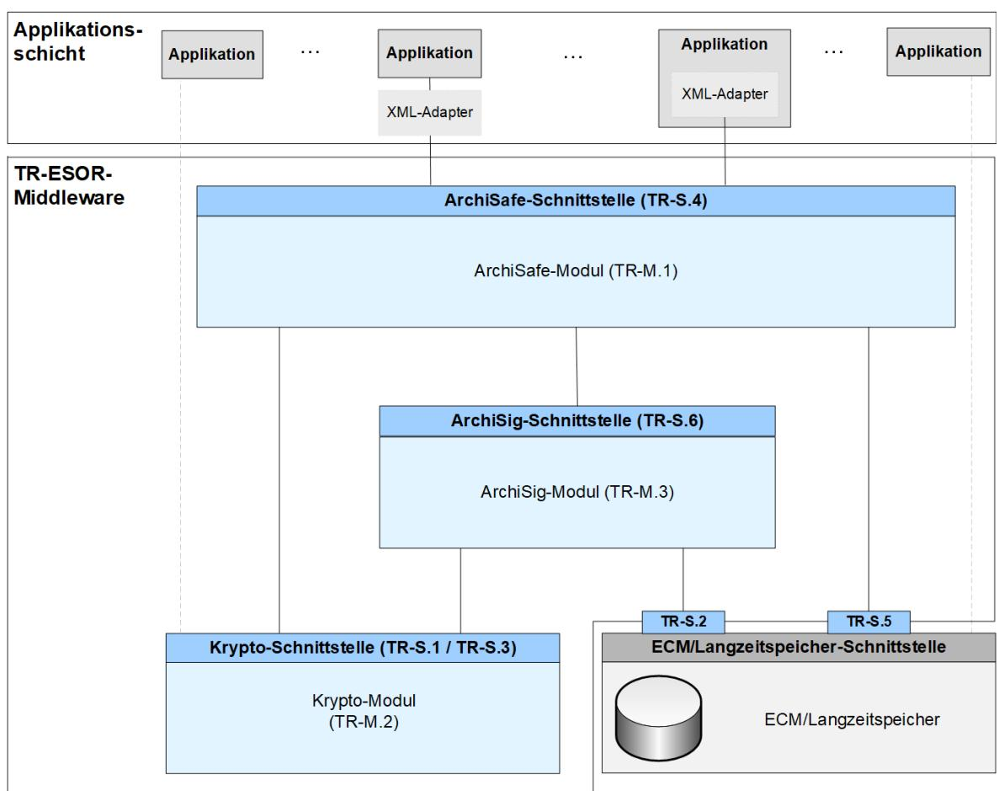
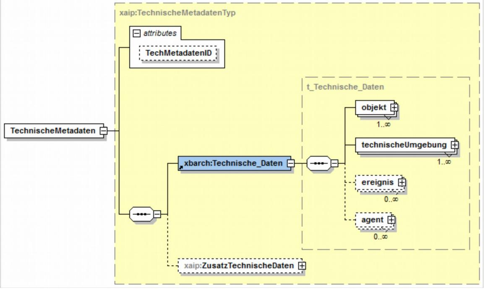
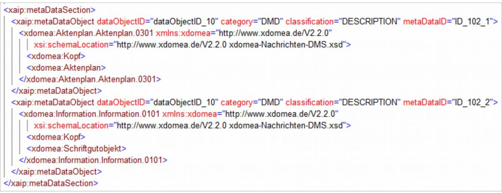

# Profilierungen im Rahmen der BSI Technischen Richtlinie 03125 Beweiswerterhaltung kryptographisch signierter Dokumente

## **Anlage TR-ESOR-Profil-XBDP: Profilierung des XAIP mit XBARCH, XDOMEA und PREMIS**

| Bezeichnung | Profilierung des XAIP mit XBARCH, XDOMEA und PREMIS |
|-------------|-----------------------------------------------------|
| Kürzel      | BSI TR-ESOR-Profil-XBDP                             |
| Version     | 1.2.1 (auf Basis der eIDAS-Verordnung)              |
| Datum       | 15.03.2018                                          |

Bundesamt für Sicherheit in der Informationstechnik Postfach 20 03 63 53133 Bonn Tel.: +49 228 99 9582-0 E-Mail: [tresor@bsi.bund.de](mailto:tresor@bsi.bund.de) Internet: [https://www.bsi.bund.de](https://www.bsi.bund.de/) © Bundesamt für Sicherheit in der Informationstechnik 2018

# **Inhaltsverzeichnis**

| 4                                                                                        |
|------------------------------------------------------------------------------------------|
| 6                                                                                        |
| 3. Profilierung des XML-Schemas für XAIP im Zusammenhang mit XBARCH, XDOMEA und PRE 7 |
| 3.1 TR-ESOR Anlage F7                                                                    |
| 7                                                                                        |
| 8                                                                                        |
| 9                                                                                        |
| 3.2 Technische Metadaten (optional)10                                                    |
| 3.3 Fachliche Metadaten (optional)11                                                     |
| 3.4 Wertesystem für Kategorisierung und Klassifizierung der Metadaten11                  |
| 13                                                                                       |
| 4.1 XAIP-Schema-Erweiterung13                                                            |
| 4.2 XBarch-Schema-Erweiterung13                                                          |
|                                                                                          |

## **Abbildungsverzeichnis**

| Abbildung 1: Schematische Darstellung der IT-Referenzarchitektur5                 |  |
|-----------------------------------------------------------------------------------|--|
| Abbildung 2: Aufbau des Datentypes xaip:TechnischeMetadatenTyp10                  |  |
| Abbildung 3: Beispiel einer Ablage von technischen Metadaten11                    |  |
| Abbildung 4: Beispiel einer Ablage von fachlichen Metadaten11                     |  |
| Abbildung 5: XAIP-Schema erweitert um die Aspekte dieser Profilierung13           |  |
| Abbildung 6 Definition des vom XBarch abgeleiteten Typs xbarch:Technische_Daten14 |  |

### **Tabellenverzeichnis**

|  | Tabelle 1: Wertesystem für Kategorisierung und Klassifizierung der Metadaten12 |  |
|--|--------------------------------------------------------------------------------|--|
|  |                                                                                |  |

## **1. Einführung**

Ziel der Technischen Richtlinie "Beweiswerterhaltung kryptographisch signierter Dokumente" ist die Spezifikation sicherheitstechnischer Anforderungen für den langfristigen Beweiswerterhalt von kryptographisch signierten elektronischen Dokumenten und Daten nebst zugehörigen elektronischen Verwaltungsdaten (Metadaten).

Eine für diese Zwecke definierte Middleware (TR-ESOR-Middleware) im Sinn dieser Richtlinie umfasst alle diejenigen Module (**M**) und Schnittstellen (**S)**, die zur Sicherung und zum Erhalt der Authentizität und zum Nachweis der Integrität der aufbewahrten Dokumente und Daten eingesetzt werden.

Die im Hauptdokument dieser Technischen Richtlinie vorgestellte Referenzarchitektur besteht aus den nachfolgend beschriebenen funktionalen und logischen Einheiten:

- der Eingangs-Schnittstelle S.4 der TR-ESOR-Middleware, die dazu dient, die TR-ESOR-Middleware in die bestehende IT- und Infrastrukturlandschaft einzubetten;
- dem zentralen Middlewaremodul (vgl. **[TR-ESOR-M.1]**), welches den Informationsfluss in der Middleware regelt, die Sicherheitsanforderungen an die Schnittstellen zu den IT-Anwendungen umsetzt und für eine Entkopplung von Anwendungssystemen und ECM/Langzeitspeicher sorgt;
- dem "Krypto"-Modul (vgl. **[TR-ESOR-M.2]**) nebst den zugehörigen Schnittstellen S.1 und S.3, das alle erforderlichen Funktionen zur Berechnung von Hashwerten, Prüfung elektronischer Signaturen bzw. Siegel bzw. Zeitstempel, zur Nachprüfung elektronischer Zertifikate und zum Einholen qualifizierter Zeitstempel sowie (optional) elektronischer Signaturen bzw. Siegel für die Middleware zur Verfügung stellt. Darüber hinaus kann es Funktionen zur Ver- und Entschlüsselung von Daten und Dokumenten zur Verfügung stellen;
- dem "ArchiSig-Modul" (vgl. **[TR-ESOR-M.3]**) mit der Schnittstelle S.6, das die erforderlichen Funktionen für die Beweiswerterhaltung der digital signierten Unterlagen bereitstellt;
- einem ECM/Langzeitspeicher mit den Schnittstellen S.2 und S.5, der die physische Archivierung/Aufbewahrung und auch das Speichern der beweiswerterhaltenden Zusatzdaten übernimmt.

*Dieser ECM/Langzeitspeicher ist nicht mehr direkt Teil der Technischen Richtlinie, gleichwohl werden über die beiden Schnittstellen, die noch Teil der TR-ESOR-Middleware sind, Anforderungen daran gestellt.*

*Ebenso wenig ist die Applikationsschicht, die auch einen XML-Adapter enthalten kann, direkter Teil der Technischen Richtlinie, auch wenn dieser XML-Adapter als Teil einer Middleware implementiert werden kann.*

Die in Abbildung 1 dargestellte IT-Referenzarchitektur orientiert sich an der ArchiSafe [1](#page-3-1) Referenzarchitektur und soll die logische (funktionale) Interoperabilität künftiger Produkte mit den Zielen und Anforderungen der Technischen Richtlinie ermöglichen und unterstützen.

Diese Technische Richtlinie ist modular aufgebaut und spezifiziert in einzelnen Anlagen zum Hauptdokument die funktionalen und sicherheitstechnischen Anforderungen an die erforderlichen IT-Komponenten und Schnittstellen der TR-ESOR-Middleware. Die Spezifikationen sind strikt plattform-, produkt-, und herstellerunabhängig.

Das vorliegende Dokument trägt die Bezeichnung "Anlage TR-ESOR-Profil-XBDP: Profilierung des XAIP mit XBARCH, XDOMEA und PREMIS" **[TR-ESOR-XBDP]** und spezifiziert die Integration von XBARCH-, XDOMEA- und PREMIS-Datenelementen in die Datenstruktur xaip:XAIP gemäß Anhang **[TR-ESOR-F]** im Rahmen des **Bundesbehördenprofils** gemäß **[TR-ESOR-B]**.

1 Siehe dazu [http://www.archisafe.de](http://www.archisafe.de/)

**Abbildung 1: Schematische Darstellung der IT-Referenzarchitektur**

# **2. Übersicht**

Insbesondere im behördlichen Umfeld ist die langfristige beweiswerterhaltende Aufbewahrung elektronisch signierter Daten und Dokumente von großen Bedeutung. Dabei ist nicht nur die Auswahl geeigneter Formate für die Aufbewahrung der Daten und Dokumente sondern auch die Bereitstellung von Informationen über die Daten und Dokumente selbst (sog. Metadaten) sehr wichtig.

Ziel des vorliegenden Dokumentes ist eine Profilierung des *XAIP* gemäß (**[TR-ESOR-F]**, V1.2), um Metadaten gemäß **[XBARCH]**, **[XDOMEA]** und **[PREMIS]** geeignet zu integrieren.

Das Dokument ist daher als ergänzende Profilierung der Anlage **[TR-ESOR-F]** im Rahmen des **Bundesbehördenprofils** gemäß **[TR-ESOR-B]** anzusehen.

Dabei werden folgenden Typen von Metadaten unterschieden:

- **technische Metadaten** Darstellung der technischen Aspekte der aufbewahrten Daten und Dokumente, die eine Wiedergabe zu einem späteren Zeitpunkt erlaubt.
- **fachliche Metadaten** Beschreibung der fachlichen Bedeutung der aufbewahrten Daten und Dokumenten sowie die Darstellung des fachlichen Zusammenhangs der Daten und Dokumente.

#### **HINWEIS:**

*Die Definition der Element der xaip:XAIP-Datenstruktur liegt in englischer Sprache vor. Die in diesem Dokument referenzierten Standards sind überwiegend in der deutschen Sprache definiert und werden daher im folgenden Text auch so belassen.*

#### **HINWEIS:**

*Im folgenden Text umfasst der Begriff "Digitale Signatur" "fortgeschrittene elektronische Signaturen" gemäß [eIDAS-VO, Artikel 3 Nr. 11], "qualifizierte elektronische Signaturen" gemäß [eIDAS-VO, Artikel 3 Nr. 12], "fortgeschrittenen elektronische Siegel" gemäß [eIDAS-VO, Artikel 3 Nr. 26] und "qualifizierte elektronische Siegel" gemäß [eiDAS-VO, Artikel 3 Nr. 27]. Insofern umfasst der Begriff "digital signierte Dokumente" sowohl solche, die fortgeschrittene elektronische Signaturen oder Siegel bzw. qualifizierte elektronische Signaturen oder Siegel tragen.* 

*Mit dem Begriff der "kryptographisch signierten Dokumente" sind in dieser TR neben den gemäß [eI-DAS-VO, Artikel 3 Nr. 12] qualifiziert signierten, den gemäß [eIDAS-VO, Artikel 3 Nr. 27] qualifiziert gesiegelten oder den gemäß [eIDAS-VO, Artikel 3 Nr. 34] qualifiziert zeitgestempelten Dokumenten (im Sinne der eIDAS-Verordnung) ) auch Dokumente mit einer fortgeschrittenen Signatur gemäß [eIDAS-VO, Artikel 3 Nr. 11] oder mit einem fortgeschrittenen Siegel gemäß [eIDAS-VO, Artikel 3 Nr. 26] oder mit einem elektronischen Zeitstempel gemäß [eIDAS-VO, Artikel 3 Nr. 33] erfasst, wie sie oft in der internen Kommunikation von Behörden entstehen. Nicht gemeint sind hier Dokumente mit einfachen Signaturen oder Siegeln basierend auf anderen (z. B. nicht-kryptographischen) Verfahren.*

## **3. Profilierung des XML-Schemas für XAIP im Zusammenhang mit XBARCH, XDOMEA und PREMIS für die Behörden der Bundesverwaltung**

Im Folgenden werden die Anforderungen an ein *XAIP* gemäß Anhang TR-ESOR F (vgl. **[TR-ESOR-F])** im Zusammenhang mit **[XBARCH], [XDOMEA] und [PREMIS]** speziell für die Belange in der Bundesverwaltung konkretisiert. Zur besseren Nachvollziehbarkeit sind hier jeweils die Original-Fassung der Anforderungen und die geänderte Fassung (bzw. Erweiterung) aufgeführt. Weiterhin ist für jede geänderte Anforderung eine Begründung angegeben.

### **3.1 TR-ESOR Anlage F**

#### **3.1.1 Überblick über die XAIP-Datenstruktur – das <XAIP>-Element**

#### **3.1 Überblick über die XAIP-Datenstruktur – das <XAIP>-Element**

Original Das <metaDataSection>-Element enthält Metainformationen zur Beschreibung des Geschäftsund Archivierungskontextes, sofern solche vorhanden sind. Die metaDataSection soll alle Informationen enthalten, die zur transparenten und nachhaltigen Interpretation des Geschäfts- und Archivierungskontextes benötigt werden.

- *(A3.1-1B) Sofern zusätzliche Metadaten auf Basis von [XDOMEA], [XBARCH] bzw. [PRE-*
- *MIS] vorhanden sind, sollen diese Metadaten im Rahmen dieses Profils, wie im weiteren Verlauf dieses Kapitels ausgeführt, in der metaDataSection des XAIP-Containers gespeichert wer-*
- Konkretisierung*den. Andere technische Umsetzungen der Speicherung technische Metadaten bzw. fachliche Metadaten sind zulässig, allerdings muss dann erläutert werden, dass gleichwertige Funktio-*
- *nalität unterstützt wird.*

*(A3.1-2B) Sofern zusätzliche Absender-Metadaten auf Basis von [XDOMEA], [XBARCH] bzw. [PREMIS] zur Speicherung im Archivdatenobjekt zur Verfügung stehen, sollen diese Metadaten im Rahmen dieses Profils, wie im weiteren Verlauf dieses Kapitels ausgeführt, im Element "Extension" des "Package Headers" des XAIP gemäß TR-ESOR-F, Kapitel 3, gespeichert werden. Andere technische Umsetzungen der Speicherung der Absender-Metadaten sind zulässig, allerdings muss dann erläutert werden, dass gleichwertige Funktionalität unterstützt wird.* 

Erläuterung:

§ 18 RegR bestimmt für die Aufbewahrung von elektronischem Schriftgut, dass durch geeignete Maßnahmen, die nicht näher vorgegeben werden, Vollständigkeit, Integrität, Authentizität und Lesbarkeit zu gewährleisten sind (§ 18 Abs. 1 Satz 2 RegR). Insbesondere müssen die Daten und Dokumente in einer langfristig verkehrsfähigen und standardisierten Form abgelegt werden, so dass die Wiedergabe auf den zum Zeitpunkt der Wiedervorlage gängigen IT-Systemen als gesichert angenommen werden kann. Dazu ist insbesondere auch eine "Metadata Preservation Stategy" mit einer standardisierten Ablage der Metadaten im Archivdatenobjekt erforderlich.

#### **3.1.2 Der xaip:packageHeaderType**

| 3.2 Der xaip:packageHeaderType                                                                                                                                                                                                                                         |                                                                                                                                                                                                                                                                                                                 |  |  |                                                                                                                                                                                                                                                                         |  |  |
|------------------------------------------------------------------------------------------------------------------------------------------------------------------------------------------------------------------------------------------------------------------------|-----------------------------------------------------------------------------------------------------------------------------------------------------------------------------------------------------------------------------------------------------------------------------------------------------------------|--|--|-------------------------------------------------------------------------------------------------------------------------------------------------------------------------------------------------------------------------------------------------------------------------|--|--|
| Original                                                                                                                                                                                                                                                               | Die Struktur des xaip:preservationInfoType ist folgendermaßen gegeben: […]                                                                                                                                                                                                                                   |  |  |                                                                                                                                                                                                                                                                         |  |  |
|                                                                                                                                                                                                                                                                        | <status> [optional]                                                                                                                                                                                                                                                                                             |  |  |                                                                                                                                                                                                                                                                         |  |  |
|                                                                                                                                                                                                                                                                        | Das <status>-Element kann Informationen über den Status des Archivdatenobjektes ent halten, die vor dem Löschen des Archivdatenobjektes ausgewertet werden können.2                                                                                                                                          |  |  |                                                                                                                                                                                                                                                                         |  |  |
|                                                                                                                                                                                                                                                                        | Die konkrete Belegung und Auswertung dieses Elementes ist nicht Gegenstand der vorlie genden Spezifikation. Vielmehr sollen derartige Festlegungen Gegenstand von XAIP-Pro filen sein. Es wird empfohlen, solche XAIP-Profile mit dem Bundesamt für Sicherheit in der Informationstechnik abzustimmen. |  |  |                                                                                                                                                                                                                                                                         |  |  |
| Konkretisierung                                                                                                                                                                                                                                                        | Die Struktur des xaip:preservationInfoType ist folgendermaßen gegeben: […]                                                                                                                                                                                                                                   |  |  |                                                                                                                                                                                                                                                                         |  |  |
| <status> [optionalrequired] Das <status>-Element kann Informationen über den Status des Archivdatenobjektes ent halten, die vor dem Löschen des Archivdatenobjektes ausgewertet werden können.3                                                                  |                                                                                                                                                                                                                                                                                                                 |  |  |                                                                                                                                                                                                                                                                         |  |  |
|                                                                                                                                                                                                                                                                        |                                                                                                                                                                                                                                                                                                                 |  |  | Die konkrete Belegung und Auswertung dieses Elementes ist nicht Gegenstand der vorlie genden Spezifikation. Vielmehr sollen derartige Festlegungen Gegenstand von XAIP-Pro filen sein. Es wird empfohlen, solche XAIP-Profile mit dem Bundesamt für Sicherheit in |  |  |
|                                                                                                                                                                                                                                                                        | der Informationstechnik abzustimmen.                                                                                                                                                                                                                                                                            |  |  |                                                                                                                                                                                                                                                                         |  |  |
|                                                                                                                                                                                                                                                                        | (A3.2-1B)                                                                                                                                                                                                                                                                                                       |  |  |                                                                                                                                                                                                                                                                         |  |  |
|                                                                                                                                                                                                                                                                        | Dieses Feld muss im vorliegenden Profil den sog. Bewertungsvermerk enthalten. Fol gende Werte sind zugelassen:                                                                                                                                                                                               |  |  |                                                                                                                                                                                                                                                                         |  |  |
| A – (archivwürdig) – das Löschen ist erst nach der erfolgreichen Übergabe der  Daten an die zuständige Archivbehörde und einer stattgefundenen Löschfrei gabe des öffentlichen Archivs bezogen auf die Kopien im Langzeitspeicher möglich,                |                                                                                                                                                                                                                                                                                                                 |  |  |                                                                                                                                                                                                                                                                         |  |  |
|                                                                                                                                                                                                                                                                        | B – (bewerten) – das Löschen ist erst nach einer zuvor stattgefundenen Bewer  tung möglich; sollten die Daten als "archivwürdig" bewertet werden, dann gel ten die entsprechenden Regeln,                                                                                                             |  |  |                                                                                                                                                                                                                                                                         |  |  |
|                                                                                                                                                                                                                                                                        | V – (vernichten) – das Löschen ist direkt möglich.                                                                                                                                                                                                                                                          |  |  |                                                                                                                                                                                                                                                                         |  |  |
| Der Bewertungsvermerk soll im Archivdatenobjekt gemäß [TR-ESOR-F], Kap. 3.2 vorliegen. Ganz andere technische Umsetzungen bzgl. des Bewertungsvermerks sind zulässig, allerdings muss dann erläutert werden, dass gleichwertige Funktionalität unterstützt wird. |                                                                                                                                                                                                                                                                                                                 |  |  |                                                                                                                                                                                                                                                                         |  |  |
|                                                                                                                                                                                                                                                                        | Erläuterung:                                                                                                                                                                                                                                                                                                    |  |  |                                                                                                                                                                                                                                                                         |  |  |
|                                                                                                                                                                                                                                                                        | Für die Behörden sind das Bundesarchivgesetz bzw. die entsprechenden Länderarchivgesetze bzgl. der Anbietungspflicht zu beachten.                                                                                                                                                                            |  |  |                                                                                                                                                                                                                                                                         |  |  |

2 Mit diesem Element kann insbesondere der im behördlichen Umfeld benötigte "Bewertungsvermerk" realisiert werden.

3 Mit diesem Element kann insbesondere der im behördlichen Umfeld benötigte "Bewertungsvermerk" realisiert werden.

#### **3.1.3 Profilierung der XAIP-MetaDataSection im Zusammenhang mit XBARCH und XDOMEA**

Die TR 03125 TR-ESOR V1.2 lässt es zu, dass eine Profilierung der Metadaten, zum Beispiel *auf Basis von [XDOMEA], [XBARCH] oder [PREMIS], in der jeweils gültigen Fassung* vorgenommen werden kann.

*Die in diesem Dokument definierte Profilierung bezieht sich im Wesentlichen auf die Behandlung von elektronischen Akten und anderem elektronischen Schriftgut. Für weitere Arten von aufzubewahrenden Daten können u. U. andere XÖV-Standards besser geeignet sein.*

Die hier vorliegende Profilierung des *XAIP* auf Basis von *XBARCH*, *XDOMEA* und *PREMIS* sieht die Ablage der folgenden zwei Arten von Metainformationen innerhalb der *Metadaten* eines *XAIP*-Containers vor:

- technischen Metadaten, die sich auf ein innerhalb des *XAIP*-Containers enthaltenes Datenobjekt beziehen (vgl. Kapitel [3.2\)](#page-9-1),
- fachliche Metadaten, die bezogen auf ein enthaltenes Datenobjekt dessen fachliche Inhalte näher charakterisieren (vgl. Kapitel [3.3\)](#page-10-3).

Im Kapitel [3.4](#page-10-2) ist ein für dieses Profil geltende Wertebelegung für Kategorisierung und Klassifizierung der Metadaten enthalten.

Für die technische Umsetzung der Ablage in der *MetaDataSection* werden hier die folgenden Empfehlungen ausgesprochen.

**(A3.3-1B)** Jede Instanz von *xaip:dataObject*, aus *xaip:dataObjectsSection* (vgl. **[TR-ESOR-F]**, Kapitel 3.4), soll durch eine Instanz des Elementes *xaip:TechnischeMetadaten* beschrieben werden.

Jede Instanz *xaip:credential*, aus *xaip:credentialsSection* (vgl. **[TR-ESOR-F]**, Kap. 3.5), die nicht gemäß einem internationalen Standard aufgebaut ist, soll ebenfalls durch eine Instanz des Elementes *xaip:TechnischeMetadaten* beschrieben werden.

Eine Empfehlung für den Aufbau des Elementes *xaip:TechnischeMetadaten* ist dem Kapite[l](#page-9-1) [3.2](#page-9-1) zu entnehmen.

**(A3.3-2B)** Jede Instanz von *xaip:dataObject*, aus *xaip:dataObjectsSection* (vgl. **[TR-ESOR-F]**, Kapitel 3.4), soll durch die Ablage von fachlichen Metadaten beschrieben werden. Eine Empfehlung für den Aufbau der fachlichen Metadaten ist dem Kapitel [3.3](#page-10-3) zu entnehmen.

**(A3.3-3B)** Bei der Ablage der technischen bzw. fachlichen Metadaten müssen die im Kapite[l](#page-10-2) [3.4](#page-10-2) beschriebenen Werte für die Attribute *category* und *classification* eines Elementes vom Typ *xaip:metaDataObjectType* benutzt werden.

**Es gelten derzeit die folgenden Namensräume (namespaces):**

- "xaip" "http://www.bsi.bund.de/tr-esor/xaip/1.2",
- "xbarch" "http://www.xbarch.de" [4](#page-8-1) (in der Version 1.4.3),
- "xdomea" ["http://www.xdomea.de/V2.2.0"](http://www.xdomea.de/V2.2.0),
- "premis" "info:lc/xmlns/premis-v2" (in der Version 2.3)

Wenn der benutzte Namensraum im Falle eines Elementes nicht explizit benannt wurde, dann wird davon ausgegangen, dass der Namensraum "*xaip*" gemeint wird.

4 Momentan handelt es sich hierbei ausschließlich um den Bezeichner eines Namensraums; unter der entsprechenden URL findet sich kein Schema.

### **3.2 Technische Metadaten (optional)**

Die technischen Metadaten werden mit Hilfe des Elements *xaip:TechnischeMetadaten* beschrieben.

#### **Abbildung 2: Aufbau des Datentypes xaip:TechnischeMetadatenTyp**

Die Struktur des Elementes *xaip:TechnischeMetadaten* ist durch den Datentyp *xaip:TechnischeMetadatenType* vorgegeben und weist folgenden Aufbau auf:

#### *@TechMetadatenID* [optional]

Das *TechMetadatenID*-Attribut identifiziert eindeutig dieses Element, somit kann auf dieses Element auch eindeutig Bezug genommen werden.

*xbarch:Technische\_Daten* [required]

Das *xbarch:Technische\_Daten*-Element beinhaltet eine technische Beschreibung der Objekte, sowie der für die Langzeitspeicherung/Archivierung notwendigen technischen Maßnahmen gemäß **[XBARCH]**, welches sich stark an den Industriestandard **[PREMIS]** orientiert.

*ZusatzTechnischeDaten* [optional]

Das *ZusatzTechnischeDaten*-Element bietet eine Möglichkeit an, zusätzlich technische Daten abzulegen. Das Element beinhaltet nur ein Feld.

*any* [optional, unbounded]

Das *any*-Element steht für beliebige Elemente aus dem Namensraum "*premis*" und bietet somit eine Möglichkeit an, ggf. die technische Beschreibung durch Einsatz des *PREMIS*-Standards zu erweitern.

#### **Beispiel:**

Die Abbildung 3 ist eine beispielhafte Darstellung einer Ablage von technischen Metadaten innerhalb der xaip:metaDataSection. Die Metadaten beziehen sich auf das *XAIP*-Element mit der ID "*dataObjectID\_10*". Zusätzlich zum obligatorischen Element *xbarch:Technische\_Daten* wurde ein Element direkt aus dem *PREMIS*-Standard innerhalb des Elementes *xaip:ZusatzTechnischeMetadaten* abgelegt.

#### **3.3 Fachliche Metadaten (optional) Abbildung 3: Beispiel einer Ablage von technischen Metadaten.**

Die fachlichen Metadaten werden durch den direkten Einsatz der aus *XDOMEA*-Standard kommenden Elemente unterstützt. Es wird für die Beschreibung der fachlichen Metadaten keine gesonderte Datenstruktur verwendet.

#### **Beispiel:**

Die Abbildung 4 stellt ein Beispiel einer Ablage von fachlichen Metadaten dar. Es wurden zwei Elemente aus dem *XDOMEA*-Standard bezogen auf das *XAIP*-Element mit der ID "*dataObjectID\_10*" abgelegt:

- xdomea:Aktenplan.Aktenplan.0301,
- xdomea:Information.Information.0101.

#### **3.4 Wertesystem für Kategorisierung und Klassifizierung der Metadaten Abbildung 4: Beispiel einer Ablage von fachlichen Metadaten**

Die Tabelle 1 führt die festgelegte Wertebelegung auf, mit der die Attribute *category* und *classification* eines Elementes des Datentyps *xaip:metaDataObjectType* innerhalb dieses Profils versehen werden sollen. Die Belegung ist aus dem im **[TR-ESOR-F]**, Kapitel 3.3 vorgestellten Wertesystem entnommen worden.

| Information          | @category | @classification | Erläuterung                                                                                                                                        |
|----------------------|-----------|-----------------|----------------------------------------------------------------------------------------------------------------------------------------------------|
| technische Metadaten | OTHER     | -               | Aufgrund der Heterogenität der in nerhalb des XBARCH-Standards be nutzten Datenstrukturen, lässt sich keine präzisere Zuordnung ableiten. |
| fachliche Metadaten  | DMD       | DESCRIPTION     | Fachliche Metadaten, die das refe renzierendes Objekt näher beschrei ben.                                                                    |

**Tabelle 1: Wertesystem für Kategorisierung und Klassifizierung der Metadaten**

# **4. Anhang A – XML-Schema-Definition**

### **4.1 XAIP-Schema-Erweiterung**

#### **Abbildung 5: XAIP-Schema erweitert um die Aspekte dieser Profilierung**

### **4.2 XBarch-Schema-Erweiterung**

Der überwiegende Anzahl der *XBarch*-Elemente ist in Form einer inline-Definition abgelegt. Um die innerhalb des *XBarch*-Standards definierte Beschreibung der technischen Daten verwenden zu können, müssten diese in einer Wrapper-Schema als ein Datentyp redefiniert werden (vgl. Abbildung 6). Die Ausgestaltung der Unterelemente (z. B. *xbarch:objekt*, *xbarch:agent* etc.) weicht von der Originaldefinition nicht ab, weshalb auf deren detaillierte Darstellung hier verzichtet wurde.

#### **Abbildung 6 Definition des vom XBarch abgeleiteten Typs xbarch:Technische\_Daten**