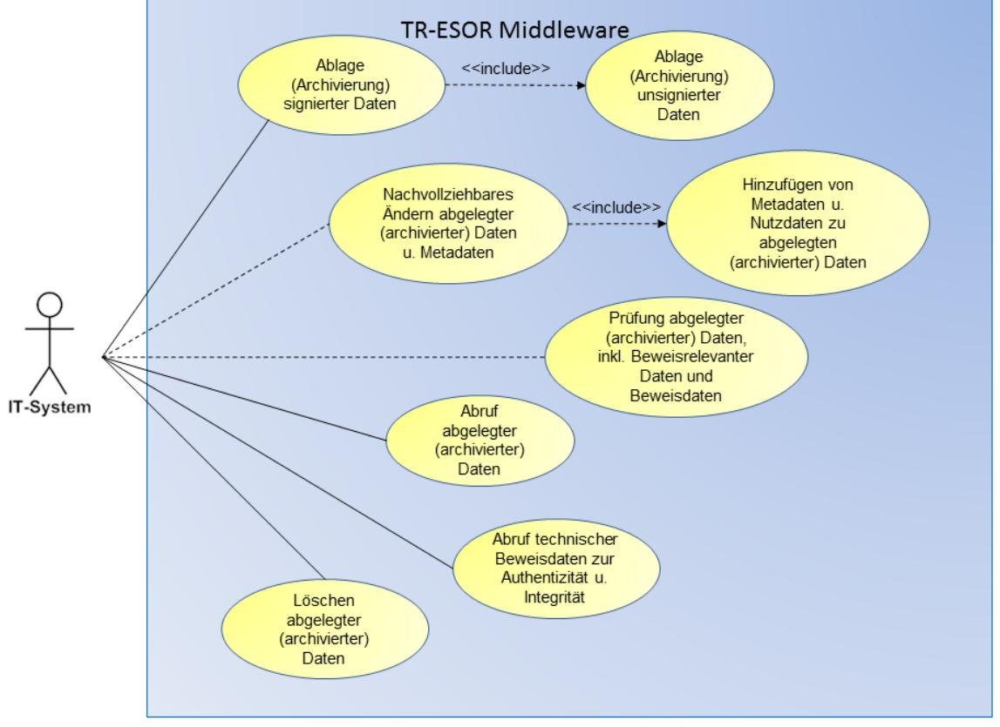
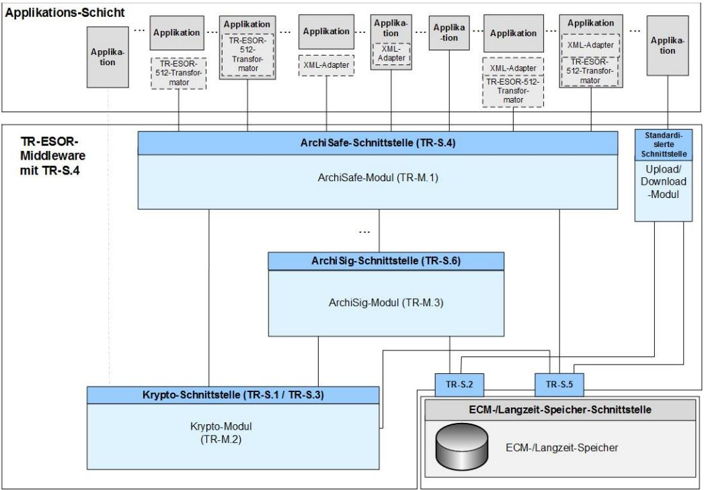
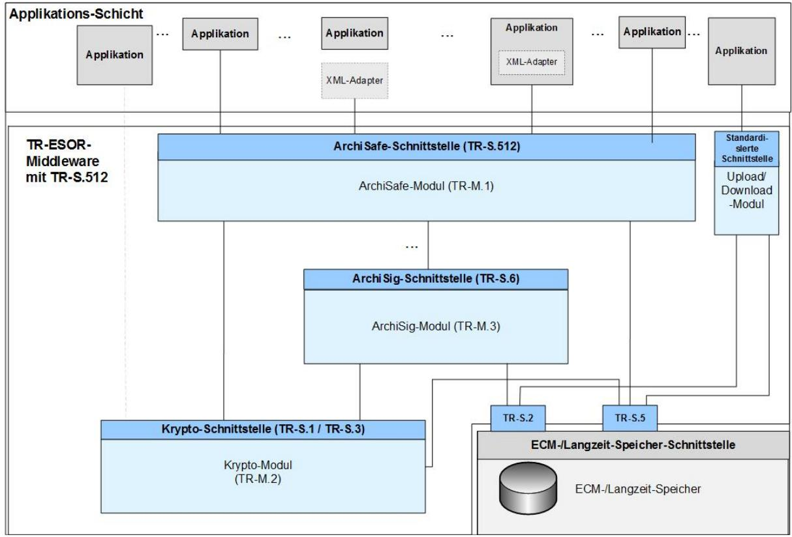
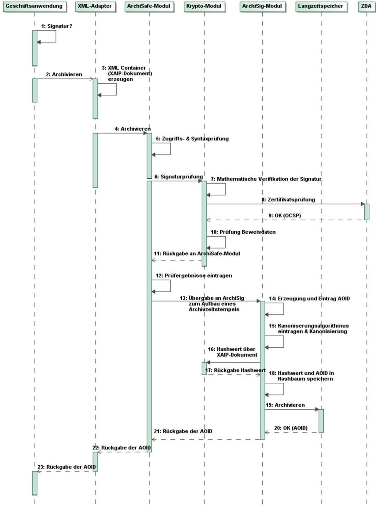
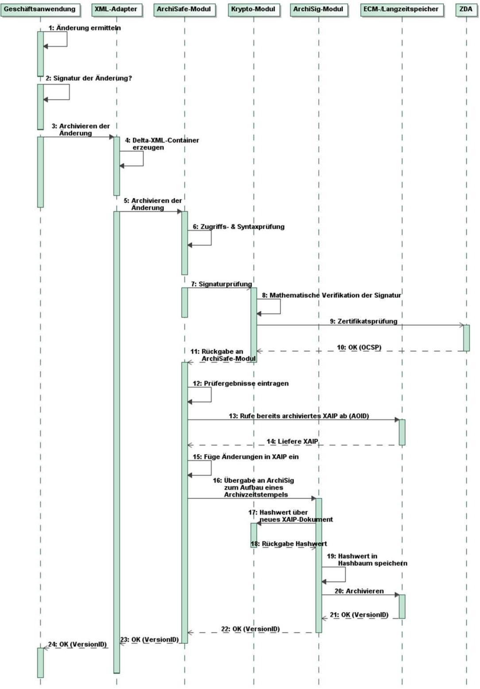
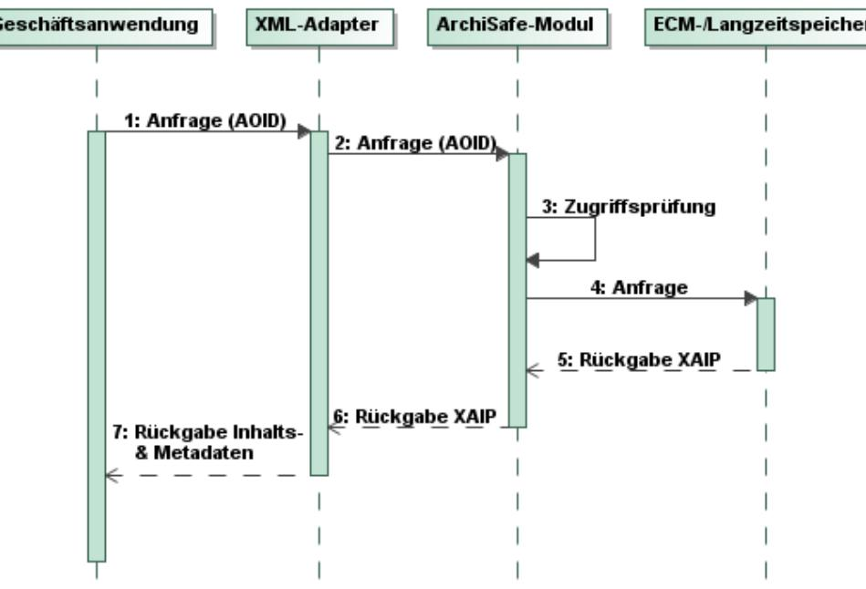
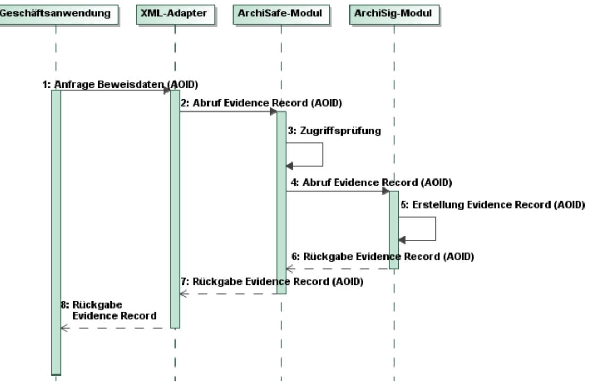
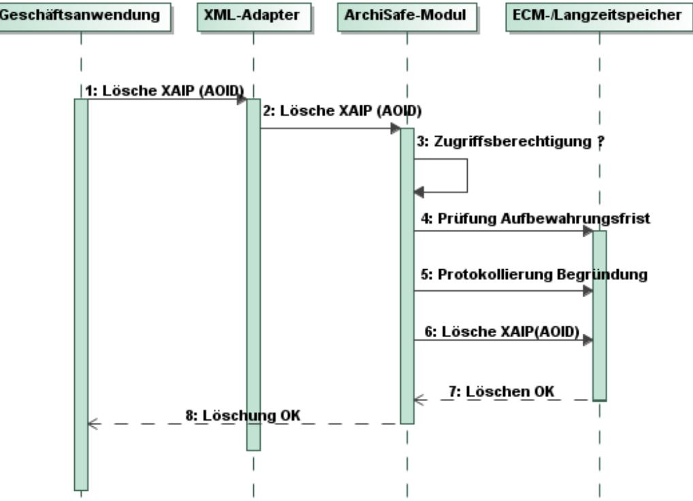
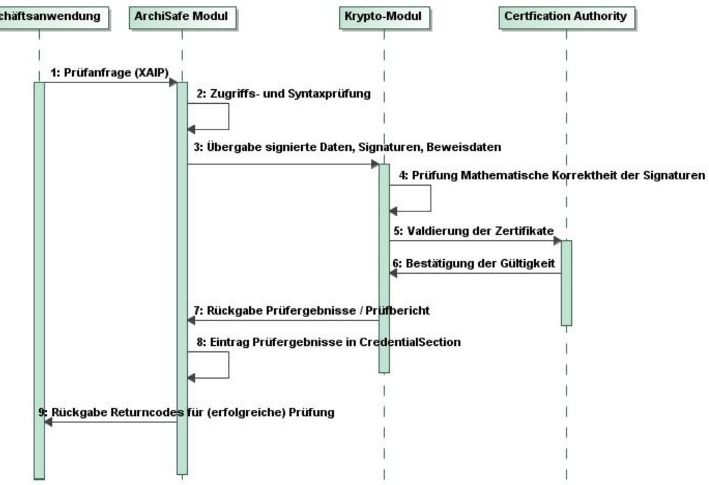
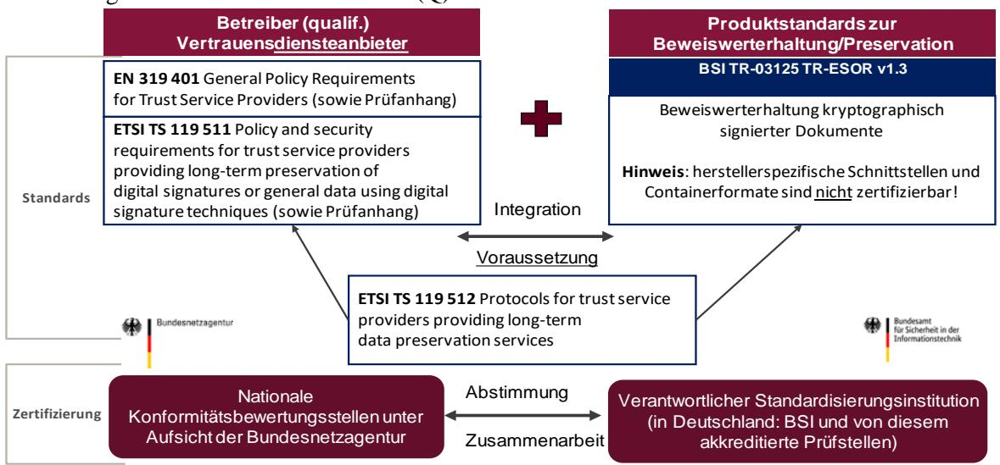

## BSI Technische Richtlinie 03125 Beweiswerterhaltung kryptographisch signierter Dokumente

| Bezeichnung | TR-ESOR – Beweiswerterhaltung kryptographisch signierter Dokumente                                                                 |
|-------------|---------------------------------------------------------------------------------------------------------------------------------------|
| Kürzel      | BSI TR-ESOR - 03125                                                                                                                |
| Version     | 1.2.2 (auf Basis der eIDAS-Verordnung und ETSI Preservation Standards, NEW: LXAIP and Upload-/Download-Module, TS119512-Interface) |
| Datum       | 01.04.2021                                                                                                                            |

Bundesamt für Sicherheit in der Informationstechnik Postfach 20 03 63 53133 Bonn Tel.: +49 228 99 9582-0 E-Mail: [tresor@bsi.bund.de](mailto:tresor@bsi.bund.de) Internet: [https://www.bsi.bund.de](https://www.bsi.bund.de/)

© Bundesamt für Sicherheit in der Informationstechnik 2021

### **Vorwort des Präsidenten**

Papier ist geduldig, heißt es. Und darüber hinaus hat es viele weitere, ganz handfeste, positive Eigenschaften. Doch Papier ist nicht mehr en vogue: Unternehmen, die öffentliche Verwaltung und die Justiz sind schon seit längerem bestrebt, ihre Geschäftsprozesse möglichst weitgehend in elektronischer Form durchzuführen und die zugehörigen Unterlagen auch in digitaler Form aufzubewahren. Das Substituieren der bisher üblichen, gar sprichwörtlichen Papierberge durch elektronische Dokumente beeinflusst dabei nicht nur die Kommunikation und die unmittelbare Vorgangsbearbeitung oder Geschäftsabwicklung, sondern hat ohne Zweifel für die Archivierung elektronischer Dokumente weitreichende Folgen.

Papierdokumente verfügen aufgrund ihrer Körperlichkeit über Eigenschaften, die elektronische Dokumente per se nicht aufweisen. Aus sich heraus können elektronische Dokumente weder wahrgenommen oder gelesen werden, noch Anhaltspunkte für Integrität und Authentizität aufweisen. Diese Eigenschaften zum Beweiswert aber sind entscheidend. Sie müssen bei der Migration von papiergetragenen zu elektronischen Datenformaten zwingend bedacht werden. Insbesondere für den längerfristigen Beweiswerterhalt signierter elektronischer Dokumente ist neben der Erhaltung der Lesbarkeit und Vollständigkeit auch der Nachweis der Integrität und Authentizität unabdingbar und muss durch technische und organisatorische Maßnahmen hergestellt und dauerhaft erhalten werden – mindestens für die Dauer gesetzlich vorgeschriebener Aufbewahrungsfristen.

Tatsächlich existiert bereits eine Reihe von nationalen und internationalen Anforderungskatalogen oder Standards für elektronische Vorgangs- oder Aufbewahrungssysteme. So haben etwa die amerikanische Luft- und Raumfahrtbehörde NASA, das europäische DLM-Forum oder die IETF-LTANS-Arbeitsgruppe Anstrengungen in dieser Sache unternommen. In Deutschland sind aus dem durch das BMWi geförderten Verbundprojekt "ArchiSig" umfangreiche Ausführungen zu den rechtlichen Anforderungen an die Aufbewahrung elektronisch signierter Dokumente hervorgegangen. Diese Regelungen für die Aufbewahrung gelten jedoch in den meisten Fällen nur für bestimmte Branchen oder beziehen sich auf einzelne konkrete Fragestellungen und spezifizieren in der Regel wenig detaillierte Anforderungen für den Beweiswerterhalt elektronisch signierter Dokumente insgesamt.

Die mit diesem Dokument vorgelegte "Technische Richtlinie zur Beweiswerterhaltung kryptographisch signierter Dokumente (TR-ESOR)" spezifiziert auf der Grundlage der VERORDNUNG (EU) Nr. 910/2014 DES EUROPÄISCHEN PARLAMENTS UND DES RATES über elektronische Identifizierung und Vertrauensdienste für elektronische Transaktionen im Binnenmarkt und zur Aufhebung der Richtlinie 1999/93/EG vom 23.07.2014, der diese untersetzenden Ausführungsbestimmungen sowie des Gesetzes zur Durchführung der Verordnung (EU) Nr. 910/2014 des Europäischen Parlaments und des Rates vom 23. Juli 2014 über elektronische Identifizierung und Vertrauensdienste für elektronische Transaktionen im Binnenmarkt und zur Aufhebung der Richtlinie 1999/93/EG (eIDAS-Durchführungsgesetz) mit dem Vertrauensdienstegesetz als Artikel 1 und weiterer bestehender rechtlicher Normen und technischer Standards sowie nationaler und internationaler Erfahrungen in einem modular aufgebauten Gesamtkonzept übergreifende Anforderungen und Kriterien für die langfristige Beweiswerterhaltung kryptographisch signierter Dokumente im Kontext ihrer Aufbewahrung und schreibt diese fort.

Ziel der TR-ESOR ist es, die Auswahl und den adäquaten Einsatz geeigneter Sicherungsmittel für die Beweiswerterhaltung signierter elektronischer Dokumente nachhaltig zu unterstützen. Auf der Basis einer hersteller- und produktunabhängigen Referenzarchitektur werden funktionale und sicherheitstechnische Mindestanforderungen definiert, gemäß denen Systeme, Komponenten, Schnittstellen und deren Zusammenspiel für den Beweiswerterhalt aufgebaut, überprüft und in Betrieb genommen werden können.

Papier ist nicht nur geduldig, sondern vor allem auch verlässlich. Wir können heute noch problemlos Jahrhunderte alte Papierschriften entziffern. Eine solche Dauerhaftigkeit ist bekanntermaßen mit elektronisch lesbaren Datenträgern nicht zu erreichen. Sechs Jahrhunderte lang war Papier der wichtigste Datenträger, besser: Wissensträger. Jenseits aller gesetzlichen Vorgaben ist es daher auch unser Auftrag, das digitale Wissen unserer Zeit für künftige Generationen nutzbar zu machen.

Bonn, im Mai 2019

Arne Schönbohm , Präsident des BSI

# **Inhaltsverzeichnis**

| 1.             | Vorbemerkungen                                                                                                            | 8        |
|----------------|---------------------------------------------------------------------------------------------------------------------------|----------|
| 1.1            | Titel                                                                                                                     | 8        |
| 1.2            | Kennzeichnung                                                                                                             | 8        |
| 1.3            | Fachlich zuständige Stelle                                                                                                | 8        |
| 1.4            | Versionsverwaltung                                                                                                        | 8        |
| 1.5            | Änderungsdienst / Fortschreibung                                                                                          | 10       |
| 1.6            | Veröffentlichung                                                                                                          | 10       |
| 1.7            | Konventionen                                                                                                              | 10       |
| 2.             | Anwendungsbereich                                                                                                         | 11       |
| 3.             | Allgemeines und Übersicht                                                                                                 | 12       |
| 3.1            | Aufbau und Inhalte der Technischen Richtlinie                                                                             | 12       |
| 3.2            | Untersuchungsgegenstand und Begriffsdefinitionen                                                                          | 12       |
| 3.3            | Übersicht                                                                                                                 | 15       |
| 4.             | Allgemeine Anforderungen an eine beweiswerterhaltende Aufbewahrung                                                        | 17       |
| 4.1            | Bundesarchivgesetz und Landesarchivgesetze                                                                                | 17       |
| 4.2            | Rechtliche Rahmenbedingungen                                                                                              | 17       |
| 4.2.1          | eIDAS-Verordnung 2014/910/EU und Deutsches eIDAS-Durchführungsgesetz als Artikelgesetz mit dem Vertrauensdienstegesetz | 17       |
| 4.2.2          | Sarbanes-Oxley-Act (SOX)                                                                                                  | 24       |
| 4.2.3          | Naibutousei - SOX auf Japanisch                                                                                        | 25       |
| 4.3            | Funktionale Anforderungen an die Beweiswerterhaltung (kryptographisch signierter) Dokumente                            | 25       |
| 4.3.1          | Nachweis von Integrität und Authentizität                                                                                 | 26       |
| 5.             | Funktionen einer Middleware zum Beweiswerterhalt                                                                          | 29       |
| 5.1            | Anwendungsfälle                                                                                                           | 31       |
| 5.1.1          | Archivierung kryptographisch signierter und unsignierter Daten                                                            | 31       |
| 5.1.2          | Ändern von bereits archivierten Daten                                                                                     | 33       |
| 5.1.3 5.1.4 | Abruf (Rückgabe) archivierter Daten Abruf von technischen Beweisdaten                                                  | 33 34 |
| 5.1.5          | Löschen archivierter Daten                                                                                                | 35       |
| 5.1.6          | Prüfen eines Archivdatenobjektes samt der darin enthaltenen oder zusätzlich übergebenen                                   |          |
|                | beweisrelevanten Daten und technischen Beweisdaten                                                                        | 36       |
| 5.2            | Organisatorische Anforderungen                                                                                            | 36       |
| 5.2.1          | Die Einrichtung der Middleware zum Beweiswerterhalt                                                                       | 36       |
| 5.2.2 5.2.3 | Anforderungen an die Einsatzumgebung Datenschutz, Datensicherheit und Vertraulichkeit                                  | 36 37 |
| 6.             | Abgeleitete technische Anforderungen                                                                                      | 38       |
| 6.1            | Systemtechnische Anforderungen                                                                                            | 38       |
| 6.2            | Empfohlene Dokumentformate                                                                                                | 38       |
| 6.3            | Empfohlene Austausch- und Speicherformate                                                                              | 39       |
| 6.4            | IT-Infrastruktur                                                                                                          | 40       |
| 6.5            | IT-Anwendungen beim Einsatz von Archivierungsverfahren                                                                    | 41       |
| 7.             | IT-Architektur                                                                                                            | 44       |

| 7.1            | Empfohlene IT-Referenzarchitektur                                                                                                 | 44       |
|----------------|-----------------------------------------------------------------------------------------------------------------------------------|----------|
| 7.2            | Anforderungen fü r die Umsetzung der äußeren Schnittstellen                                                                       | 47       |
| 7.3            | Alternative Architekturen                                                                                                         | 48       |
| 7.4            | Komponenten und Module                                                                                                            | 48       |
| 7.4.1          | ArchiSafe-Modul (TR-ESOR-M.1)                                                                                                     | 48       |
| 7.4.2          | Krypto-Modul (TR-ESOR-M.2)                                                                                                        | 49       |
| 7.4.3          | ArchiSig-Modul (TR-ESOR-M.3)                                                                                                      | 50       |
| 7.4.4 7.4.5 | Upload-Modul Download-Modul                                                                                                    | 51 51 |
| 7.4.6          | XML-Adapter zur Anbindung von Geschäftsanwendungen an die Middleware                                                              | 51       |
| 7.4.7          | Die Kommunikationskanäle und Schnittstellen in der TR-ESOR Middleware                                                             | 52       |
| 7.5            | Zusammenspiel der Komponenten                                                                                                     | 53       |
| 7.5.1          | Ablage elektronischer Unterlagen                                                                                                  | 53       |
| 7.5.2          | Ändern archivierter Daten                                                                                                         | 57       |
| 7.5.3          | Abfrage archivierter Daten                                                                                                        | 60       |
| 7.5.4 7.5.5 | Rückgabe technischer Beweisdaten Löschen von Archivdaten                                                                       | 62 64 |
| 7.5.6          | Prüfen von beweisrelevanten Daten und technischen Beweisdaten                                                                     | 65       |
| 8.             | IT-Sicherheitskonzept                                                                                                             | 67       |
| 8.1            | Sicherheitsziele                                                                                                                  | 67       |
| 8.2            | Maßnahmen                                                                                                                         | 68       |
| 8.2.1          | Übergreifende Maßnahmen                                                                                                           | 68       |
| 8.2.2          | Maßnahmen zum Schutz der Vertraulichkeit                                                                                          | 68       |
| 8.2.3          | Maßnahmen zum Schutz der Authentizität, Integrität und Verbindlichkeit                                                            | 70       |
| 8.2.4          | Maßnahmen zum Schutz der Verfügbarkeit                                                                                            | 72       |
| 8.2.5          | Maßnahmen zur Autorisierung                                                                                                       | 73       |
| 9.             | Konformität und Interoperabilität                                                                                                 | 74       |
| 9.1            | Konformität und Konformitätsprüfung                                                                                               | 75       |
| 9.1.1          | Konformitätsstufe 1 - Funktionale Konformität                                                                                  | 76       |
| 9.1.2 9.1.3 | Konformitätsstufe 2 - Technische Konformität Konformitätsstufe 3 - Konformität gemäß der Profilierung für Bundesbehörden | 76 77 |
| 9.2            | Beteiligte Instanzen bei der Konformitätsprüfung                                                                                  | 77       |
| 9.2.1          | Antragsteller                                                                                                                     | 77       |
| 9.2.2          | Prüfgegenstand                                                                                                                    | 78       |
| 9.2.3          | Prüfstelle                                                                                                                        | 78       |
| 9.2.4          | Bestätigungsstelle                                                                                                                | 78       |
| 9.3            | Abwicklung der Konformitätsprüfung                                                                                                | 79       |
| 9.3.1          | Vorphase                                                                                                                          | 79       |
| 9.3.2          | Durchführung der Konformitätsprüfung                                                                                              | 79       |
| 9.3.3          | Konformitätsbestätigung                                                                                                           | 80       |
| 9.4            | Interoperabilität                                                                                                                 | 80       |
| 10.            | Anlagen                                                                                                                           | 81       |
| 10.1           | TR-ESOR-M.1 ArchiSafe-Modul                                                                                                       | 81       |
| 10.2           | TR-ESOR-M.2 Krypto-Modul                                                                                                          | 81       |
| 10.3           | TR-ESOR-M.3 ArchiSig-Modul                                                                                                        | 82       |
| 10.4           | TR-ESOR-S Schnittstellen                                                                                                          | 83       |
| 10.5           | TR-ESOR-ERS Profilierung der Evidence Records gemäß RFC4998 und RFC6283                                                           | 83       |
| 10.6           | TR-ESOR-VR Verification Reports for Selected Data Structures                                                                      | 83       |

| 10.7  | TR-ESOR-F Formate                                                                                  | 83  |
|-------|----------------------------------------------------------------------------------------------------|-----|
| 10.8  | TR-ESOR-B Profilierung für Bundesbehörden                                                          | 84  |
| 10.9  | TR-ESOR-E Konkretisierung der Schnittstellen auf Basis des eCard-API-Frameworks                    | 84  |
| 10.10 | TR-ESOR-C.1 Conformity Test Specification (Level 1 - Functional Conformity)                     | 84  |
| 10.11 | TR-ESOR-C.2 Conformity Test Specification (Level 2 - Technical Conformity)                      | 84  |
| 10.12 | TR-ESOR-C.3 Conformity Test Specification (Level 3 - Conformity with Federal Agency Profile) | 84  |
| 11.   | Abkürzungsverzeichnis                                                                              | 85  |
| 12.   | Glossar                                                                                            | 88  |
| 13.   | Quellenverzeichnis                                                                                 | 109 |

### **Abbildungsverzeichnis**

| Abbildung 1: Typische Infrastruktur zur beweiswerterhaltenden Langzeitarchivierung 15  |  |
|-------------------------------------------------------------------------------------------|--|
| Abbildung 2: Funktionale Anforderungen29                                                  |  |
| Abbildung 3: Schematische Darstellung der IT-Referenzarchitektur mit TR-S.445             |  |
| Abbildung 4: Schematische Darstellung der IT-Referenzarchitektur mit TR-S.51245           |  |
| Abbildung 5: Schematischer Ablauf der Archivierung im Fall XAIP56                         |  |
| Abbildung 6: Ändern archivierter Daten im Fall XAIP60                                     |  |
| Abbildung 7: Abfrage archivierter Daten für den Fall XAIP 62                           |  |
| Abbildung 8: Schematischer Ablauf des Abrufs technischer Beweisdaten63                    |  |
| Abbildung 9: Schematischer Ablauf des Löschens von Archivdatenobjekten im Fall XAIP 64 |  |
| Abbildung 10: Prüfung von beweisrelevaten Daten (z.B. Signaturen) und Beweisdaten 66   |  |
| Abbildung 11: Zusammenspiel zwischen den Zertifizierungsverfahren von (Q)PSP und TR-ESOR  |  |
| Produkten74                                                                               |  |

### **Tabellenverzeichnis**

| Tabelle 1: Teile der TR 03125 TR-ESOR 10    |  |
|------------------------------------------------|--|
| Tabelle 2: Glossar der TR 03125 TR-ESOR 108 |  |

## **1. Vorbemerkungen**

Kapitel [1](#page-7-0) enthält Angaben zur Bezeichnung dieser Technischen Richtlinie (TR), zur fachlich zuständigen Stelle, zur Versionsverwaltung, zum Änderungsdienst und der Fortschreibung der TR.

### **1.1 Titel**

Diese TR trägt den Titel

"Technische Richtlinie zur Beweiswerterhaltung kryptographisch signierter Dokumente (TR-ESOR)".

### **1.2 Kennzeichnung**

Diese TR wird gekennzeichnet mit "BSI TR-03125".

### **1.3 Fachlich zuständige Stelle**

Fachlich zuständig für die Formulierung und Betreuung dieser TR ist das Bundesamt für Sicherheit in der Informationstechnik (BSI).

Anschrift: Bundesamt für Sicherheit in der Informationstechnik (BSI) Postfach 20 03 63 53133 Bonn Tel.: +49 228 99 9582-0 E-Mail[: tresor@bsi.bund.de](mailto:tresor@bsi.bund.de) Internet: [https://www.bsi.bund.de](https://www.bsi.bund.de/)

### **1.4 Versionsverwaltung**

Diese TR besteht aus diesem Dokument und weiteren separaten normativen Anhängen (siehe hierzu Kapitel [10\)](#page-80-0). Darüber hinaus wird es weitere Anhänge mit den entsprechenden Prüfspezifikationen für die notwendigen Konformitätsprüfungen geben.

Die zurzeit gültigen Teile dieser TR sind:

| Teile der TR                    | Version | Datum (JJJJ-MM-TT) | Bemerkung                                                                       |
|------------------------------------|---------|-----------------------|---------------------------------------------------------------------------------|
| Hauptdokument (dieses Dokument)    | 1.2.2   | 2021-04-01            | neu                                                                             |
| Anlage TR-ESOR-M.1                 | 1.2.1   |                       | Anlage M.1                                                                      |
| ArchiSafe-Modul                    |         | 2018-03-15            | V1.2.1 wird in TR-ESOR V1.2.2 unverändert übernommen.               |
| Anlage TR-ESOR-M.2 Krypto-Modul | 1.2.1   | 2018-03-15            | Anlage M.2 V1.2.1 wird in TR-ESOR V1.2.2 unverändert übernommen. |

| Teile der TR                                                                                 | Version         | Datum        | Bemerkung                                                                                           |
|-------------------------------------------------------------------------------------------------|-----------------|--------------|-----------------------------------------------------------------------------------------------------|
|                                                                                                 |                 | (JJJJ-MM-TT) |                                                                                                     |
| Anlage TR-ESOR-M.3 ArchiSig-Modul                                                            | 1.2.1           | 2018-03-15   | Anlage M.3 V1.2.1 wird in TR-ESOR V1.2.2 unverändert übernommen.                     |
| Anlage TR-ESOR-S Definition der Schnittstellen der Referenzarchitektur                    | 1.2.1           | 2018-03-15   | Anlage S: V1.2.1 ist historisch und wird ab TR ESOR V1.2.2 nicht weiter gepflegt. |
| Anlage TR-ESOR-E Konkretisierung der Schnittstellen auf                                      | 1.2.2           | 2019-05-02   | neu                                                                                                 |
| Basis des eCard-API-Frameworks Anlage TR-ESOR-F Formate                                   | 1.2.2           | 2019-05-02   | neu                                                                                                 |
| Anlage TR-ESOR-ERS Profilierung der Evidence Records gemäß RFC 4998 und RFC 6283          | 1.2.1           | 2018-03-15   | Anlage ERS V1.2.1 wird in TR-ESOR V1.2.2 unverändert übernommen. .                   |
| Anlage TR-ESOR-VR Verification Reports for Selected Data Structures                       | 1.2.1           | 2018-03-15   | Anlage VR V1.2.1 wird in TR-ESOR V1.2.2 unverändert übernommen.                      |
| Anlage TR-ESOR-B Profilierung für Bundesbehörden                                             | 1.2.1           | 2018-03-15   | Anlage B V1.2.1 wird in TR-ESOR V1.2.2 unverändert übernommen.                       |
| Anlage Anlage TR-ESOR-Profil-XBDP: Profilierung des XAIP mit XBARCH, XDOMEA und PREMIS | 1.2.1           | 2018-03-15   | Anlage XBDP V1.2.1 wird in TR-ESOR V1.2.2 unverändert übernommen.                    |
| Anlage TR-ESOR-C.1 Conformity Test Specification                                             | 1.2.2           | 2021-03-15   | neu                                                                                                 |
| (Level 1 - Functional Conformity)                                                            |                 |              |                                                                                                     |
| Anlage TR-ESOR-APP                                                                              | 1.2.1+ 1.2.2 | 2021-04-01   | neu                                                                                                 |

| Teile der TR     | Version         | Datum (JJJJ-MM-TT) | Bemerkung |
|---------------------|-----------------|-----------------------|-----------|
| Anlage TR-ESOR-LEIT | 1.2.1+ 1.2.2 | 2021-04-09            | neu       |

**Tabelle 1: Teile der TR 03125 TR-ESOR**

### **1.5 Änderungsdienst / Fortschreibung**

Die TR und ihre normativen Anhänge unterliegen fortwährender weiterer Verbesserung und Anpassung an neue Anforderungen. Die Fortführung muss geordnet verlaufen, d.h. dass abgestimmte Versionen der TR in einem formalen Akt freigegeben werden.

Formal freigegebene Versionen oder Patches werden auf der Webseite des BSI veröffentlicht. Die Veröffentlichung erfolgt geregelt.

### **1.6 Veröffentlichung**

Die gültigen Versionen werden auf den TR-ESOR Webseiten des BSI zum Download angeboten.

In einem auf den TR-ESOR Webseiten des BSI verfügbaren Änderungsverzeichnis werden die Versionen mit Beschreibung der Erweiterung oder Änderung und des Datums geführt.

### **1.7 Konventionen**

Die in dieser Technischen Richtlinie spezifizierten Anforderungen und Empfehlungen an Systeme zur Beweiswerterhaltung kryptographisch signierter Dokumente werden eindeutig gekennzeichnet. Hierbei gilt:

- Der Anforderung wird ihre eindeutige Kennung der Form **(Ax.y-z)** vorangestellt, wobei
	- x das jeweilige Hauptkapitel
	- y das jeweilige Unterkapitel und
	- z eine fortlaufende Nummer innerhalb des Unterkapitels ist.

Jede Anforderung wird in Anlehnung an **[RFC2119]** explizit als verpflichtend, empfohlen oder als optional spezifiziert.

Verpflichtende Anforderungen (MUSS-Anforderungen), sind Anforderungen, deren Umsetzung zwingend gefordert wird. Sie sind im Text mit den Worten muss (müssen) / ist (sind) / darf (dürfen) nur / darf (dürfen) nicht, ausgezeichnet.

Empfohlene Anforderungen (SOLL-Anforderungen) sollten umgesetzt werden. Sie sind im Text mit den Worten soll (sollen) / empfohlen ausgezeichnet.

Optionale Anforderungen (KANN-Anforderungen) können umgesetzt werden. Sie sind im Text mit den Worten kann (können) / darf (dürfen) ausgezeichnet.

In manchen Fällen ist es unumgänglich, leicht modifizierte Varianten der oben genannten Wörter zu benutzen. Der Sinn von MUSS, SOLL und KANN wird dabei jedoch immer klar und die obigen Definitionen gelten entsprechend. Weitere Erläuterungen zu diesen kennzeichnenden Begriffen sind in Kapitel [9.3](#page-78-0) zu finden.

Unter dem in dieser TR in der Regel verwendeten Begriff "Dokumente" werden, sofern nicht ausdrücklich in anderer Bedeutung gebraucht, Daten und Dokumente subsumiert.

## **2. Anwendungsbereich**

Vornehmlicher Anwendungsbereich der vorliegenden Technischen Richtlinie sind die Bundesbehörden im Rahmen der gesetzlichen Aufbewahrungspflichten. Darüber hinaus besitzt die Technische Richtlinie empfehlenden Charakter.

## **3. Allgemeines und Übersicht**

In diesem Kapitel werden der Aufbau und die Inhalte der Technischen Richtlinie sowie die grundsätzlichen Ziele und Herausforderungen an eine langfristige Beweiswerterhaltung im Kontext der Aufbewahrung elektronischer Dokumente erläutert.

### **3.1 Aufbau und Inhalte der Technischen Richtlinie**

Die Technische Richtlinie besteht aus diesem Hauptdokument sowie einer Reihe ergänzender Anlagen, in denen einzelne Aspekte näher spezifiziert und erläutert werden.

In diesem Hauptdokument werden die rechtlichen Rahmenbedingungen und Normen, die grundsätzlichen Ziele und Anforderungen, sowie die abzubildenden Prozesse und Funktionen beschrieben. Daraus abgeleitet werden Anforderungen an das Einrichten sowie die Systemtechnik an sich und eine empfohlene Systemarchitektur (Referenzarchitektur). Ergänzend folgen die Sicherheitsziele und Sicherheitsmaßnahmen für ein solches System. Der Umfang und die Inhalte einer Konformitätsprüfung technischer Produktlösungen gegen die in dieser Richtlinie definierten Anforderungen bilden den Abschluss.

Darüber hinaus enthält dieses Hauptdokument in Kapitel [10](#page-80-0) eine Übersicht über die mit diesem Dokument veröffentlichten und geplanten Anlagen. In diesen ergänzenden Anlagen werden die in diesem Hauptdokument definierten Anforderungen auf der Grundlage einer in Kapitel [6.5](#page-40-0) beschriebenen plattform- und produktneutralen, funktionalen Referenzarchitektur spezifiziert und erläutert.

Die Beschreibung der Ziele und Anforderungen ist strikt produkt- und herstellerneutral und orientiert sich allein an den entsprechenden Anforderungen zur gesetzlich geregelten Beweiswerterhaltung bei kryptographisch signierten elektronischen Unterlagen.

### **3.2 Untersuchungsgegenstand und Begriffsdefinitionen**

Die dauerhafte und unveränderbare Aufbewahrung (Speicherung) von elektronischen Dokumenten und anderen Daten wird im informationstechnischen Sprachgebrauch allgemein als "**elektronische Archivierung**" bezeichnet. Der mit dem Begriff "dauerhaft" bezeichnete Zeithorizont ist dabei aus informationstechnischer Sicht die Umschreibung eines nicht näher fixierten Zeitraums, in dem wesentliche, im Allgemeinen aber kaum vorhersehbare technische oder technologische Veränderungen eintreten können, die u. U. dazu führen, dass die informationstechnischen Systeme, mit denen Dokumente ursprünglich erfasst, erstellt und gespeichert wurden, nicht mehr zur Verfügung stehen. Hierfür wird im deutschen Sprachgebrauch mitunter auch der Begriff der "**elektronischen (digitalen) Langzeitspeicherung**" verwendet, um den Unterschied zur kurzzeitigen "**lebenden Schriftgutablage**" bzw. zum Backup hervorzuheben[.1](#page-11-3)

Aus rechtlicher Sicht ist der Begriff der **"Archivierung"** in Deutschland durch die Archivgesetze des Bundes und der Länder konkretisiert und belegt und daher von der zeitlich beschränkten Aufbewahrung zu unterscheiden.

Archivierung im juristisch korrekten Sinne betrifft allein Unterlagen von bleibendem Wert, die – sofern sie von einer öffentlichen Stelle des Bundes erzeugt wurden und für deren Zwecke nicht mehr benötigt werden – durch eine zuständige staatliche Einrichtung (Bundesarchiv) auf Dauer verwahrt werden.

Zur Feststellung des bleibenden Wertes (Bewertung) haben die öffentlichen Stellen dem zuständigen Archiv alle Unterlagen zur Übernahme anzubieten. Sofern es sich bei den Unterlagen der abgebenden Stellen um Zwischenarchivgut handelt, ist eine Bewertung bereits während der Aufbewahrungsfristen zulässig (vgl. §§ 1, 3, 5 und 8 BArchG).

1 Die Begriffsdefinitionen "lebende Schriftgutablage", "Langzeitspeicher" und "Archivspeicher" finden sich im eGovernment-Masterplan 2010 des Landes Niedersachsen auf Seite 26; siehe <http://www.niedersachsen.de/download/45825>

Behördliche elektronische Unterlagen unterliegen damit den rechtlich geregelten Archivregelungen gemäß BArchG. Das heißt für Bundesbehörden, dass spätestens nach Ablauf der Aufbewahrungsfristen eine gesetzlich festgelegte Anbietungspflicht an das Bundesarchiv besteht. Die Anbietung von Zwischenarchivgut zur Bewertung kann jedoch bereits während der Aufbewahrungsfristen erfolgen. Die damit zusammenhängenden Fragestellungen und Anforderungen werden in dieser Technischen Richtlinie berücksichtigt.

Ebenso wenig formuliert diese Technische Richtlinie generelle Anforderungen an die Aufbewahrung und Speicherung beliebiger elektronischer Dokumente.

**Gegenstand und Ziel dieser Technischen Richtlinie** ist die **Beweiswerterhaltung von kryptographisch signierten Dokumenten** im Kontext ihrer Aufbewahrung. Erwähnenswert ist hier, dass die Notwendigkeit einer solchen Beweiswerterhaltung nicht per se gegeben ist sondern fachlichen Anforderungen entsprechen soll.

Zum Begriff der "Beweiswerterhaltung" ist anzumerken, dass jedes elektronische Dokument als Beweismittel gemäß § 286 ZPO im Rahmen der freien Beweiswürdigung fungieren kann. Davon zu unterscheiden ist der erleichterte Anscheinsbeweis nach § 371a ZPO. Um diesen zu führen, sind nach der heutigen Rechtslage besondere Maßnahmen (wie z.B. die Prüfung der qualifizierten elektronischen Signatur nach Artikel 32 der **[eIDAS-VO]** sowie u.U. eine Signatur- bzw. Siegel- bzw. Zeitstempelerneuerung nach § 15 des Vertrauensdienstegesetzes **[VDG])** bzw. **[ETSI SR 019 510]**, **[ETSI TS 119 511]** und **[ETSI TR 119 512]** erforderlich. Werden diese Maßnahmen unterlassen, verliert ein Dokument dadurch nicht jeglichen Beweiswert, sondern es entfällt lediglich die besondere Beweiskraft nach § 371a ZPO. Der Begriff "Beweiswerterhalt" in dieser Richtlinie ist in diesem Sinne zu verstehen und zu interpretieren.

*Hinweis: Im folgenden Text umfasst der Begriff "Digitale Signatur" "fortgeschrittene elektronische Signaturen" gemäß [eIDAS-VO, Artikel 3 Nr. 11], "qualifizierte elektronische Signaturen" gemäß [eIDAS-VO, Artikel 3 Nr. 12], "fortgeschrittenen elektronische Siegel" gemäß [eIDAS-VO, Artikel 3 Nr. 26] und "qualifizierte elektronische Siegel" gemäß [eIDAS-VO, Artikel 3 Nr. 27]. Insofern umfasst der Begriff "digital signierte Dokumente" sowohl solche, die fortgeschrittene elektronische Signaturen oder Siegel bzw. qualifizierte elektronische Signaturen oder Siegel tragen.*

*Mit dem Begriff der "kryptographisch signierten Dokumente" sind in dieser TR neben den gemäß [eIDAS-VO, Artikel 3 Nr. 12] qualifiziert signierten, den gemäß [eIDAS-VO, Artikel 3 Nr. 27] qualifiziert gesiegelten oder den gemäß [eIDAS-VO, Artikel 3 Nr. 34] qualifiziert zeitgestempelten Dokumenten (im Sinne der eIDAS-Verordnung) ) auch Dokumente mit einer fortgeschrittenen Signatur gemäß [eIDAS-VO, Artikel 3 Nr. 11] oder mit einem fortgeschrittenen Siegel gemäß [eIDAS-VO, Artikel 3 Nr. 26] oder mit einem elektronischen Zeitstempel gemäß [eIDAS-VO, Artikel 3 Nr. 33] erfasst, wie sie oft in der internen Kommunikation von Behörden entstehen. Nicht gemeint sind hier Dokumente mit einfachen Signaturen oder Siegeln basierend auf anderen (z. B. nicht-kryptographischen) Verfahren.*

Digitale Signaturen im Sinne

- der VERORDNUNG (EU) Nr. 910/2014 DES EUROPÄISCHEN PARLAMENTS UND DES RATES über elektronische Identifizierung und Vertrauensdienste für elektronische Transaktionen im Binnenmarkt und zur Aufhebung der Richtlinie 1999/93/EG vom 23.07.2014 **[eIDAS-VO]** – kurz **eIDAS-Verordnung** genannt –) und
- des Gesetzes zur Durchführung der Verordnung (EU) Nr. 910/2014 des Europäischen Parlaments und des Rates vom 23. Juli 2014 über elektronische Identifizierung und Vertrauensdienste für elektronische Transaktionen im Binnenmarkt und zur Aufhebung der Richtlinie 1999/93/EG (eIDAS-Durchführungsgesetz) **[eIDAS-DG],**
- insbesondere des Vertrauensdienstegesetzes **[VDG]** als Artikel 1 des eIDAS-Durchführungsgesetz **[eIDAS-DG]**

dienen dem Nachweis der Authentizität und Integrität elektronischer Dokumente und Daten.

"*"Elektronischer Zeitstempel" bezeichnet Daten in elektronischer Form, die andere Daten in elektronischer Form mit einem bestimmten Zeitpunkt verknüpfen und dadurch den Nachweis erbringen, dass diese anderen Daten zu diesem Zeitpunkt vorhanden waren*" **[eIDAS-VO, Artikel 3 Nr. 33].**

"*Für qualifizierte elektronische Zeitstempel gemäß* **[eIDAS-VO, Artikel 3 Nr. 34]** *gilt die Vermutung der Richtigkeit des Datums und der Zeit, die darin angegeben sind, sowie der Unversehrtheit der mit dem Datum und der Zeit verbundenen Daten*" **[eIDAS-VO, Artikel 41 Absatz 2]**. Qualifizierte elektronische Zeitstempel dienen daher dem Nachweis der Integrität und der Existenz zu einem bestimmten Zeitpunkt.

Dabei kann allerdings der Beweiswert dieser digitalen Signaturen bzw. elektronischen Zeitstempel im Laufe der Zeit abnehmen, z.B. weil die Sicherheitseignung der verwendeten kryptographischen Verfahren nicht mehr gegeben ist. Zur Erhaltung des vollen Beweiswerts und der Möglichkeit der erleichterten Beweisführung (s.o.) sind daher neben der unveränderbaren Aufbewahrung der Dokumente und digitalen Signaturen bzw. elektronischen Zeitstempel in vielen Fällen noch weitere Maßnahmen erforderlich. Diese Maßnahmen werden in dieser Technischen Richtlinie definiert und spezifiziert.

Die Technische Richtlinie geht dabei von der Nutzung selbsttragender Archivdatencontainer[2](#page-13-0) [3](#page-13-1) unter Verwendung stabiler Datenformate aus, die für die angedachten Aufbewahrungszeiträume angemessen sind; die Transformation kryptographisch signierter Dokumente in andere Datenformate wird hier nicht betrachtet.[4](#page-13-2)

*Hinweis: In der vorliegenden TR-ESOR-Version 1.2.2 umfasst der Begriff "XAIP" in allen TR-ESOR-Anhängen außer im Hauptdokument, im Anhang F und E sowohl:*

*a) das Archivdatenobjekt "XAIP" gemäß TR-ESOR V1.2.2, Anhang F, Kapitel 3.1 als auch*

*b) das logische XAIP "LXAIP" gemäß TR-ESOR V1.2.2, Anhang F, Kapitel 3.2 und*

*c) das "ASiC-AIP" gemäß TR-ESOR V1.2.2, Anhang F, Kapitel 3.3 auf Basis von [ETSI EN 319162-1].*

*In TR-ESOR Version 1.2.2 wird im Hauptdokument, Anhang F und E im Detail zwischen XAIP, LXAIP und ASiC-AIP differenziert.*

Eine geeignete IT-Komponente zur Sicherung des Beweiswerts wird in dieser Technischen Richtlinie als "**TR-ESOR-Middleware**" bezeichnet. Eine derartige Komponente umfasst weder die Fachanwendungen noch die eigentlichen Speicher- bzw. Archivierungssysteme[5](#page-13-3) , sondern bündelt die notwendigen Funktionen zur kryptographischen Beweiswerterhaltung. Eine zu dieser Richtlinie konforme

TR-ESOR-Middleware ist imstande, den beweisrechtlichen Wert signierter und unsignierter elektronischer Daten oder Dokumente über die gesamte Dauer des Aufbewahrungszeitraumes zu erhalten.

Weitere wichtige Begriffsdefinitionen wie z.B. Daten, Dokument, Metadaten etc. sind dem Kapitel [12](#page-87-0) zu entnehmen.

2 Vgl. Anhang F

3 Unter einem selbsterklärenden oder selbsttragenden Archivdatenobjekt wird ein Datencontainer verstanden, der alle zur Erfüllung des Aufbewahrungszwecks notwendigen Daten (z.B. Metadaten, Nutzdaten, beweisrelevante Daten, technische Beweisdaten) in einem Containerobjekt beinhaltet, also z.B. alle Dokumente einer Akte/eines Vorgangs, alle Daten einer Studie etc. Durch den Änderungsprozess kann der Container kontinuierlich anwachsen, so z.B. bis zum Abschluss einer Akte/eines Vorgangs oder einer Studie und so eine korrekte Aufbewahrung gewährleistet werden.

4 Mit der Transformation solcher Dokumente befasste sich das TransiDoc Projekt, siehe [https://www.uni](https://www.uni-kassel.de/fb07/fileadmin/datas/fb07/5-Institute/IWR/Ro%C3%9Fnagel/projekte_abgeschlossen/projekt_TransiDoc.pdf)[kassel.de/fb07/fileadmin/datas/fb07/5-](https://www.uni-kassel.de/fb07/fileadmin/datas/fb07/5-Institute/IWR/Ro%C3%9Fnagel/projekte_abgeschlossen/projekt_TransiDoc.pdf)

[Institute/IWR/Roßnagel/projekte\\_abgeschlossen/projekt\\_TransiDoc.pdf.](https://www.uni-kassel.de/fb07/fileadmin/datas/fb07/5-Institute/IWR/Ro%C3%9Fnagel/projekte_abgeschlossen/projekt_TransiDoc.pdf)

5 Die TR-ESOR-Komponente ist sowohl von den Fachanwendungen als auch dem Speicher- bzw. Archivierungssystem entkoppelt.

### **3.3 Übersicht**

Das Ziel einer auch auf lange Zeiträume angelegten Beweiswerterhaltung kryptographisch signierter Unterlagen ist, die für die Dauer der Aufbewahrung mögliche Nachweisführung, dass bestimmte digitale Dokumente und Daten (Inhaltsdaten) sowie zugehörige Metainformationen zu einem nachweisbaren Zeitpunkt vorgelegen haben und seitdem nicht verändert wurden (Integrität). Soweit erforderlich, sind zusätzlich nachprüfbare Nachweise über den Aussteller (Authentizität) der aufbewahrten Dokumente und Daten entsprechend den rechtlichen Anforderungen vorzuhalten.

Das Ziel und die Herausforderung eines Gesamtsystems zur Speicherung und zum Beweiswerterhalt kryptographisch signierter Unterlagen ist es, für die digitalen Inhalte und die beweisrelevanten Zusatzdaten

- die Verfügbarkeit und Lesbarkeit,
- die Integrität (Unversehrtheit),
- die Authentizität (daraus folgt auch die Nichtabstreitbarkeit)
- die Verkehrsfähigkeit und
- Datenschutz, Datensicherheit und Vertraulichkeit

für lange Zeiträume zu gewährleisten.

Ein solches Gesamtsystem umfasst deshalb auch diejenigen Elemente (Komponenten) und Prozesse, die zur Erzeugung, Speicherung, Indexierung, Suche, Verwaltung, Lesbarmachung und langfristigen und unveränderlichen Aufbewahrung von zu speichernden Daten eingesetzt werden, auch wenn diese Elemente (Komponenten) und Prozesse nicht in dieser TR beschrieben werden. Dazu gehören i. d. R.

- die zur Archivierung (Langzeitspeicherung) eingesetzte IT-Infrastruktur (siehe unten)
- die IT-Anwendungen, die Daten und Dokumente archivieren bzw. mit archivierten Daten arbeiten.

| VDA |  |  |  |
|-----|--|--|--|
|     |  |  |  |
|     |  |  |  |

#### **Abbildung 1: Typische Infrastruktur zur beweiswerterhaltenden Langzeitarchivierung**

Die zur Archivierung eingesetzte IT-Infrastruktur besteht typischerweise, wie auch in Abbildung 1 dargestellt, aus

- einem Enterprise Content Management (ECM)-/Langzeitspeichersystem, das die unterschiedlichen zur Archivierung eingesetzten Speichermedien umfasst und verwaltet, und den zuverlässigen und sicheren Zugriff auf die Speichermedien für die Ablage, den Abruf oder die Löschung archivierter Dokumente und Daten gewährleistet,
- der Middleware inklusive der darin enthaltenen kryptographischen Komponente, die den Erhalt des beweisrechtlichen Wertes der archivierten Unterlagen (Dokumente und Daten) unterstützt.

Diese Middleware wird in dieser TR als TR-ESOR-Middleware oder einfach nur als Middleware bezeichnet.

Die zur Archivierung eingesetzten IT-Anwendungen umfassen typischerweise Programme zur Erzeugung, Indexierung und Verwaltung der zu archivierenden Unterlagen, zur Recherche sowie zur Wiedergabe oder auch dem Löschen von Daten und Dokumenten aus dem Archivierungssystem. Die Technische Richtlinie beschränkt sich auf die für den Beweiswerterhalt erforderlichen Funktionen, Schnittstellen und Komponenten. Darüber hinausgehende Funktionen, Schnittstellen und Komponenten sind zulässig, sofern sie die Funktionen zum Beweiswerterhalt nicht einschränken oder deren Sicherheit gefährden. Dies ist in Abbildung 1 mit den gestrichelten Linien angedeutet. Diese zusätzlichen Funktionen, Schnittstellen und Komponenten werden jedoch hier nicht weiter betrachtet.

Die Sicherung der **Verfügbarkeit und Lesbarkeit** elektronischer Unterlagen kann dabei von der im Zentrum dieser Technischen Richtlinie stehenden Middleware nicht alleine gewährleistet werden, sondern muss durch geeignete technische und organisatorische Maßnahmen sowohl in den vorgelagerten IT-Anwendungen als in den eingesetzten ECM-/Langzeitspeichersystemen unterstützt werden.

Unabhängig von der eingesetzten Technologie, den eingesetzten Verfahren und Anwendungen sind die gesetzlichen Vertreter verantwortlich für die Einhaltung der gesetzlichen Anforderungen, die für den langfristigen Beweiswerterhalt erforderlich sind. Im Einzelnen sind diese in den nachfolgenden Abschnitten beschrieben.

## **4. Allgemeine Anforderungen an eine beweiswerterhaltende Aufbewahrung**

Die vorliegende Technische Richtlinie befasst sich mit der langfristigen Beweiswerterhaltung kryptographisch signierter Dokumente.

Die Aufbewahrung von Unterlagen ist grundsätzlich so auszugestalten, dass die aus rechtlicher Sicht bestehenden Aufbewahrungspflichten und –ziele für die Dauer der gesetzlich festgelegten Aufbewahrungsfristen erfüllt werden können.[6](#page-16-4)

*Hinweis: Strebt der die Unterlagen Aufbewahrende an, die Aufbewahrung kryptographisch signierter Dokumente so auszugestalten, dass der Beweiswert der Dokumente erhalten bleibt, sind die diesbezüglichen rechtlichen Rahmenbedingungen[7](#page-16-5) zu berücksichtigen und die funktionalen Anforderungen entsprechend zu bestimmen.*

### **4.1 Bundesarchivgesetz und Landesarchivgesetze**

Alle öffentlichen Stellen des Bundes und der Länder sind gesetzlich verpflichtet, Unterlagen, die für die Aufgabenwahrnehmung nicht mehr benötigt werden, vor ihrer Vernichtung dem Bundes- bzw. Landesarchiv zur Übernahme als Archivgut des Bundes / des Landes anzubieten (vgl. §§ 3 und 5 BArchG und entsprechende Landesarchivgesetze). Diese Anbietungspflicht gilt selbstverständlich auch für elektronische Unterlagen.

*Hinweis: Nach §§ 3 und 5 BArchG sind zunächst grundsätzlich alle Unterlagen von Bundesbehörden aufzubewahren; die bereichsspezifischen Regelungen nach BGB, HGB etc. stellen keine Löschungsermächtigung dar, sondern bezeichnen gesetzliche Mindestfristen für die Aufbewahrung. Die Entscheidung über die Aufbewahrungswürdigkeit (»Archivwürdigkeit«) als "bleibender Wert" steht nach §§ 3 und 5 BArchG allein dem Bundesarchiv im Benehmen mit den anbietenden Stellen des Bundes zu. Die Kriterien einer Entscheidung über den "bleibenden Wert" ergeben sich nicht zwingend aus den fachrechtlichen Gründen für die Entstehung der Unterlagen (vgl. § 1 BArchG).*

### **4.2 Rechtliche Rahmenbedingungen**

### **4.2.1 eIDAS-Verordnung 2014/910/EU und Deutsches eIDAS-Durchführungsgesetz als Artikelgesetz mit dem Vertrauensdienstegesetz**

Auf Basis der Erfahrungen, die mit der Implementierung der "European Signature Directive **[1999/93/EC]**" in den verschiedenen Mitgliedstaten der Europäischen Union seit 1999 gesammelt wurden und auf Basis der erkennbaren Barrieren beim Einsatz elektronischer Signaturtechnologien in grenzübergreifenden Szenarien startete die Europäische Kommission im Juni 2012 das Gesetzgebungsverfahren **[2012/0146/COD]** und veröffentlichte im Jahre 2012 "Proposal for a regulation of the European Parliament and of the Council on electronic identification and trust services for electronic transactions in the internal market" **[COM(2012)238]**, das schließlich im Jahr 2014 als "Regulation (EU) No 910/2014 of the European Parliament and of the council on electronic identification and trust services for electronic transactions in the internal market and repealing Directive 1999/93/EC" **[eIDAS-VO]** verordnet wurde und im folgenden Text als "**eIDAS-Verordnung**" bezeichnet und mit **[eIDAS-VO]** referenziert wird.

*Hinweis: Als EU-Verordnung ist die eIDAS-Verordnung [eIDAS-VO] unmittelbar geltendes Recht in allen 28 EU-Mitgliedstaaten sowie im Europäischen Wirtschaftsraum.*

In Deutschland wurde daraufhin das **Deutsche Signaturgesetz [SigG]** im Jahr 2017 durch Artikel 12 des eIDAS-Durchführungsgesetzes "Gesetz zur Durchführung der Verordnung (EU) Nr. 910/2014 des Europäischen Parlaments und des Rates vom 23. Juli 2014 über elektronische Identifizierung und

6 Siehe hierzu § 18 Abs. 1 Satz2 Registraturrichtlinie der Bundesministerien (RegR)

7 Siehe beispielsweise §§ 110a-d Sozialgesetzbuch IV

Vertrauensdienste für elektronische Transaktionen im Binnenmarkt und zur Aufhebung der Richtlinie 1999/93/EG (**eIDAS-Durchführungsgesetz**)" **[eIDAS-DG]** aufgehoben. Das **eIDAS-Durchführungsgesetz** ist ein Artikelgesetz, dessen Kernstück als Artikel 1 das Vertrauensdienstegesetz **[VDG]** darstellt. Da mit dem Außerkrafttreten des **Deutschen Signaturgesetzes** auch die Rechtsgrundlage für die **Deutsche Signaturverordnung [SigV]** wegfällt, ist auch diese aufgehoben.

Bislang gab es nach dem Deutschen Signaturgesetz **[SigG]** neben qualifizierten elektronischen Zeitstempeln **nur elektronische Signaturen** in den folgenden Ausprägungen: (einfache) elektronische Signaturen gemäß **[SigG, § 2 Nr. 1]**, fortgeschrittene elektronische Signaturen **[SigG, § 2, Nr. 2]**, qualifizierte elektronische Signaturen **[SigG, § 2, Nr. 3]** und qualifizierte elektronische Signaturen mit Anbieterakkreditierung **[SigG, § 15]** und qualifizierte elektronische Signaturen mit Herstellererklärung **[SigG, § 17]**.

Die eIDAS-Verordnung **[eIDAS-VO]** spezifiziert neben (einfachen) elektronischen Signaturen **[eIDAS-VO, Artikel 3 Nr. 10]** fortgeschrittene Signaturen **[eIDAS-VO, Artikel 3 Nr. 11]** und qualifizierte Signaturen **[eIDAS-VO, Artikel 3 Nr. 12]** sowie darüber hinaus elektronische Zeitstempel **[eIDAS-VO, Artikel 3 Nr. 33]** und qualifizierte elektronische Zeitstempel **[eIDAS-VO, Artikel 3 Nr. 34]**.

Qualifizierte elektronische Zeitstempel genügen den Anforderungen gemäß **[eIDAS-VO, Artikel 42]**  und werden mit einer fortgeschrittenen elektronischen Signatur eines qualifizierten Vertrauensdiensteanbieters versehen oder mit einem fortgeschrittenen elektronischen Siegel eines qualifizierten Vertrauensdiensteanbieters versiegelt oder es wird ein gleichwertiges Verfahren verwendet.

Zusätzlich führt die eIDAS-Verordnung **[eIDAS-VO]** als Pendant zu elektronischen Signaturen für natürliche Personen zusätzlich **elektronische Siegel** ein, die auch von Organisationen (juristischen Personen) verwendet werden können, und definiert dabei neben einfachen Siegeln **[eIDAS-VO, Artikel 3 Nr. 25]** auch fortgeschrittene Siegel **[eIDAS-VO, Artikel 3 Nr. 26]** und qualifizierte Siegel **[eiDAS-VO, Artikel 3 Nr. 27].** Darüber hinaus werden in der **[eIDAS-VO]** neue Vertrauensdienste wie z.B. elektronische Zustelldienste, Webseitenzertifikate und Bewahrungsdienste eingeführt.

Gemäß der **[eIDAS-VO]** gibt es nur zwei Klassen von Vertrauensdiensteanbietern, nicht-qualifizierte Vertrauensdiensteanbieter **[eIDAS-VO, Artikel 3 Nr. 19]** und qualifizierte Vertrauensdiensteanbieter **[eIDAS-VO, Artikel 3 Nr. 20]**.

Laut dem Signaturgesetz **[SigG, § 5, Abs. 6]** musste der Zertifizierungsdiensteanbieter sich in geeigneter Weise davon überzeugen, dass der Signatur-Antragsteller die zugehörige sichere Signaturerstellungseinheit besitzt. Anders gilt gemäß der eIDAS-Verordnung **[eIDAS-VO, Anhang II Absatz 3],** dass im Namen eines Unterzeichners (einer verantwortenden Person) das Erzeugen oder Verwalten von elektronischen Signaturerstellungsdaten möglich ist, allerdings darf es nur von einem Vertrauensdiensteanbieter durchgeführt werden.

Weitere Details zu den rechtlichen Rahmenbedingungen bzgl. der eIDAS-Verordung [eIDAS-VO] erscheinen in Kürze unter folgendem Link

[https://www.bsi.bund.de/DE/Themen/Oeffentliche-Verwaltung/Moderner-](https://www.bsi.bund.de/DE/Themen/Oeffentliche-Verwaltung/Moderner-Staat/ElektronischeSignatur/RechtlRahmenbedingungen/rechtlrahmenbedingungen_node.html)

[Staat/ElektronischeSignatur/RechtlRahmenbedingungen/rechtlrahmenbedingungen\\_node.html.](https://www.bsi.bund.de/DE/Themen/Oeffentliche-Verwaltung/Moderner-Staat/ElektronischeSignatur/RechtlRahmenbedingungen/rechtlrahmenbedingungen_node.html)

Nach dem deutschen Prozessrecht kommt einem elektronischen Dokument ein besonderer, einer Urkunde vergleichbarer Beweiswert zu, wenn es qualifiziert signiert ist. Nach § 371a Abs. 1 ZPO wird von der **erfolgreichen Prüfung einer qualifizierten elektronischen Signatur nach [eIDAS-VO, Artikel 32]** auf den Anschein der Echtheit des Dokuments geschlossen, sofern keine ernstlichen Zweifel bestehen, dass die Erklärung von der verantwortenden Person abgegeben worden ist.[8](#page-17-0)

8 § 371a Abs. 1 Satz 2 ZPO: "*Der Anschein der Echtheit einer in elektronischer Form vorliegenden Erklärung, der sich auf Grund der Prüfung der qualifizierten elektronischen Signatur nach Artikel 32 der [Verordnung \(EU\) Nr.](http://eur-lex.europa.eu/eli/reg/2014/910/oj) 910/2014 des Europäischen Parlaments und des Rates vom 23. Juli 2014 über elektronische Identifizierung und Vertrauensdienste für elektronische Transaktionen im Binnenmarkt und zur Aufhebung der Richtlinie 1999/93/EG (ABl. L 257 vom 28.8.2014, S. 73) ergibt, kann nur durch Tatsachen erschüttert werden, die ernstliche Zweifel daran begründen, dass die Erklärung von der verantwortenden Person abgegeben worden ist."*

Falls ein elektronisches Dokument von einer erstellenden öffentlichen Behörde oder von einer mit öffentlichen Glauben versehenden Person mit einer qualifizierten elektronischen Signatur versehen wird, gilt nach § 371a Abs. 3 Satz 2 ZPO darüber hinaus die Vermutung der Echtheit nach § 437 Abs. 1 ZPO, sofern das Dokument nach Form und Inhalt sich als öffentliches Dokument darstellt.

Der Anschein bzw. die Vermutung der Echtheit[9](#page-18-0) signierter elektronischer Dokumente bezieht sich dabei sowohl auf die Zurechnung des Dokuments zu der verantwortenden Person als auch, dass sie die im Dokument enthaltene Erklärung so abgegeben hat (vgl. § 416 ZPO). Soweit es sich bei dem Dokument um eine öffentliche Urkunde im Sinne von § 415 ZPO handelt, erbringt es sogar vollen Beweis über die beurkundeten Tatsachen.

Laut der **[eIDAS-VO]** gelten u.a. die folgenden Beweisvorschriften:

- **[eIDAS-VO, Artikel 25 Absatz 2]**: "*Eine qualifizierte elektronische Signatur hat die gleiche Rechtswirkung wie eine handschriftliche Unterschrift*".
- **[eIDAS-VO, Artikel 35 Absatz 2]**: "*Für ein qualifiziertes elektronisches Siegel gilt die Vermutung der Unversehrtheit der Daten und der Richtigkeit der Herkunftsangabe der Daten, mit denen das qualifizierte elektronische Siegel verbunden is*t."
- **[eIDAS-VO, Artikel 41 Absatz 2]:** "*Für qualifizierte elektronische Zeitstempel gilt die Vermutung der Richtigkeit des Datums und der Zeit, die darin angegeben sind, sowie der Unversehrtheit der mit dem Datum und der Zeit verbundenen Daten*."

Wesentliche Voraussetzung für die Bestimmung des Beweiswerts eines digital signierten bzw. zeitgestempelten Dokuments ist die Durchführung der Validierung von elektronischen Signaturen, Siegeln bzw. Zeitstempeln. Für die langfristige Sicherstellung der Beweiskraft digitaler Signaturen und elektronischer Zeitstempel sind daher Sicherungsmaßnahmen notwendig, die geeignet sind, die Authentizität und Integrität der digital signierten bzw. zeitgestempelten Daten dauerhaft, mindestens aber für die Zeit der gesetzlich vorgeschriebenen Aufbewahrungsfristen, zu gewährleisten. Dies gilt insbesondere dann, wenn die aufzubewahrenden Unterlagen über die Dauer der Aufbewahrung weiterhin in kryptographisch signierter Form benötigt werden und zugleich festgestellt wird, dass die den digitalen Signaturen bzw. elektronischen Zeitstempeln zugrunde liegenden Algorithmen und Parameter keine ausreichende Sicherheit mehr für den vorgeschriebenen oder gewünschten Aufbewahrungszeitraum bieten und damit eine neue Sicherung i. S. von § 15 des Vertrauensdienstegesetzes **[VDG]** bzw. **[ETSI SR 019 510], [ETSI TS 119 511]** und **[ETSI TS 119 512]** erforderlich machen.

#### **4.2.1.1 Dauerhafter Nachweis der Authentizität kryptographisch signierter Dokumente**

Hinsichtlich der Sicherung der Authentizität der kryptographisch signierten Daten (signierten, gesiegelten bzw. zeitgestempelten gemäß Kapitel [3.2\)](#page-11-2) muss vor allem langfristig nachweisbar sein und bleiben, wem die elektronische Signatur bzw. das elektronische Siegel bzw. der elektronische Zeitstempel zugerechnet werden kann, d. h. der Urheber der kryptographisch signierten Daten muss eindeutig erkennbar sein. Die für eine langfristige Aufbewahrung elektronischer Daten erforderlichen Vorkehrungen zur Sicherung der Authentizität sind in der eIDAS-Verordnung **[eIDAS-VO, Artikel 34]**  und **[ETSI SR 019 510], [ETSI TS 119 511]** und **[ETSI TS 119 512]** sowie im Vertrauensdienstegesetz **[VDG, § 13 und § 15]** im Wesentlichen enthalten.

Darüberhinausgehende fehlende Vorkehrungen müssen daher aus einer sicherheitstechnischen Betrachtung und den beweisrechtlichen Anforderungen an eine Prüfung von Zertifikaten gemäß **[eIDAS-VO, Article 24, Annex I, III and IV]** und **[VDG, § 16]** entwickelt werden.

Die Zurechnung der qualifizierten Signatur bzw. des qualifizierten Siegels erfolgt über qualifizierte Zertifikate mit dem in **[eIDAS-VO, Anhang I]** bzw. **[eIDAS-VO, Anhang III]** sowie im **[VDG, § 12]** bestimmten Inhalten. Ein solches Zertifikat ist die Bestätigung der Zuordnung eines zuverlässig identifizierten Signatur-Unterzeichners bzw. Siegel-Erstellers zu den entsprechenden elektronischen Signatur- bzw. Siegel-Validierungsdaten gemäß **[eIDAS-VO, Anhang I]** bzw. **[eIDAS-VO, Anhang** 

9 Nähere Ausführungen und Konkretisierungen zum Anscheinsbeweis und zu der Vermutungsregel sind in der Technischen Richtlinie TR-03138 RESISCAN, Anlage TR-RESISCAN-R **[TR-03138-R]**, des BSI zu finden.

**III]**, mit dessen korrespondierenden Signatur- bzw. Siegel-Erstellungsdaten gemäß **[eIDAS-VO, Artikel 3 Nr. 13]** bzw. **[eIDAS-VO, Artikel 3 Nr. 28]** die qualifizierte Signatur bzw. das qualifizierte Siegel erstellt wurde.

*Hinweis: Im folgenden Text werden Signatur- bzw. Siegel-Validierungsdaten gemäß [eIDAS-VO] auch Signatur- bzw. Siegel- Prüfschlüssel sowie Signatur- bzw. Siegel-Erstellungsdaten gemäß der [eIDAS-VO] auch (private) Signatur- bzw. Siegelschlüssel genannt.*

Sind im Fall einer qualifizierten elektronischen Signatur die Anforderungen gemäß **[eIDAS-VO, Artikel 32]** bzw. sind im Fall eines qualifizierten elektronischen Siegels die Anforderungen gemäß **[eIDAS-VO, Artikel 40]** sinngemäß erfüllt, dann kann der Nachweis der Authentizität grundsätzlich erbracht werden[10.](#page-19-0)

#### **Prüfbarkeit der erforderlichen Zertifikate**

Für den langfristigen Nachweis der Integrität und Authentizität signierter bzw. gesiegelter Daten, insbesondere auch elektronischer Zeitstempel, ist daher wesentlich, dass die Existenz des Nutzerzertifikats sowie seine Gültigkeit zum Signatur- bzw. Siegelerstellungszeitpunkt nachweisbar bleiben **[eIDAS-VO, Artikel 32 Absatz 1 Buchstabe b]** bzw. **[eIDAS-VO, Artikel 40]**.

Eine notwendige Voraussetzung für eine Prüfung eines qualifizierten Zertifikats gemäß **[eIDAS-VO]** ist es, dass das Zertifikat überhaupt vorliegt. Ein qualifizierter Vertrauensdiensteanbieter hat die von ihm ausgestellten qualifizierten Zertifikate gemäß **[eIDAS-VO, Artikel 24 Absatz 2 Buchstabe k und Absatz 4]** sowie **[eIDAS-VO, Anhang I bzw. Anhang III]** über öffentlich erreichbare Kommunikationsverbindungen jederzeit nachprüfbar und mit Zustimmung des Signatur-Unterzeichners bzw. Siegel-Erstellers auch abrufbar zu halten **[eIDAS-VO, Artikel 24 Absatz 2 Buchstabe f Satz i].**

Die Nachprüfbarkeit setzt voraus, dass das Zertifikat in dem vom qualifizierten Vertrauensdiensteanbieter gemäß **[eIDAS-VO, Artikel 24 Absatz 2 Buchstabe k]** zu führenden Zertifikatsverzeichnis vorhanden ist. Eine Signatur-, Siegelprüfung, auch im Rahmen einer Zeitstempelprüfung, nach **[eIDAS-VO]** erfordert daher, zusätzlich zur Überprüfung der technischen Gültigkeit der Signatur bzw. des Siegels, also der Überprüfung,

- ob die Signatur bzw. das Siegel im kryptographischen Sinne korrekt validiert werden kann und
- ob die Signatur und die signierten Daten bzw. das Siegel und die gesiegelten Daten technisch zueinander gehören,

stets auch eine Abfrage beim qualifizierten Vertrauensdiensteanbieter, ob das der Signatur bzw. dem Siegel zugrundeliegende Zertifikat zum angegebenen Zeitpunkt des Signierens bzw. des Siegelns vorhanden, gültig und nicht gesperrt war. Der qualifizierte Vertrauensdiensteanbieter hat diese Auskunft gemäß **[eIDAS-VO, Artikel 24 Absatz 4]** und **[eIDAS-VO Anhang I Buchstabe h und Buchstabe i]**  bzw. **[eIDAS-VO Anhang III Buchstabe h und Buchstabe i]** über öffentlich erreichbare Kommunikationsverbindungen zu erteilen. Da die Authentizität der Auskunft nachweisbar sein muss, werden Auskünfte der qualifizierte Vertrauensdiensteanbieter üblicherweise mit einer qualifizierten elektronischen Signatur bzw. qualifizierten elektronischen Siegel versehen.

Allerdings sind diese Pflichten des qualifizierten Vertrauensdiensteanbieter beschränkt. Zunächst kann der verantwortende Signatur-Unterzeichner bzw. Siegel-Ersteller gemäß **[eIDAS-VO, Artikel 24 Absatz 2 Buchstabe f Satz i]** bestimmen, dass sein Zertifikat nicht abrufbar sein soll. Dem qualifizierten Vertrauensdiensteanbieter ist in diesem Fall nicht gestattet, das Zertifikat zum Abruf bereitzustellen. Der Signatur-Unterzeichner bzw. Siegel-Ersteller selbst muss das Zertifikat dem bestimmungsgemäßen Empfänger der von ihm signierten bzw. gesiegelten Daten auf andere Weise zur Verfügung stellen, beispielsweise dadurch, dass das Zertifikat der Signatur bzw. dem Siegel beigefügt wird.

Auf Basis des Vertrauensdienstegesetzes **[VDG, § 16]** werden "auf Dauer prüfbare Vertrauensdienste" sichergestellt. Das bedeutet im Einzelnen das Folgende.

Sofern ein qualifizierter Vertrauensdiensteanbieter seinen Betrieb einstellt, hat der qualifizierte Vertrauensdiensteanbieter sicher zu stellen, dass "*bei Einstellung der Tätigkeit, Entzug des Qualifikationsstatus oder wenn die Eröffnung eines Insolvenzverfahrens beantragt und die Tätigkeit* 

10 Siehe § 371a Abs. 1 Satz 2 ZPO

*nicht fortgesetzt wird, alle von ihm ausgegebenen qualifizierten Zertifikate im Zusammenhang mit elektronischen Signaturen und Siegeln sowie Zertifikate im Zusammenhang mit Anhang I Buchstabe g, Anhang III Buchstabe g und Artikel 42 Absatz 1 Buchstabe c der Verordnung (EU) Nr. 910/2014 einschließlich der Widerrufsinformationen*

*1. von einem anderen qualifizierten Vertrauensdiensteanbieter übernommen werden können oder*

*2. von der Bundesnetzagentur in die Vertrauensinfrastruktur nach Absatz 5 übernommen werden können*" **[VDG, § 16 Absatz 1]**. Darüber hinaus ist die Bundesnetzagentur (BNetzA) verpflichtet, "*eine Vertrauensinfrastruktur zur dauerhaften Prüfbarkeit qualifizierter elektronischer Zertifikate und qualifizierter elektronischer Zeitstempel einzurichten, zu unterhalten und laufend zu aktualisieren*" **[VDG, § 16 Absatz 5]** . [11](#page-20-0)

#### **Vorhalten der erforderlichen Validierungsdaten**

Aus der gesetzlichen Beschränkung der dauerhaften Prüfbarkeit nur auf qualifizierte elektronische Zertifikate und qualifizierte elektronische Zeitstempel gemäß **[VDG, § 16 Absatz 5]** ergibt sich somit unter Umständen die Obliegenheit bzw. Verpflichtung des Empfängers kryptographisch signierter Daten, selbst dafür zu sorgen, dass er das Zertifikat und die zugehörigen Prüfinformationen[12](#page-20-1) vorlegen kann, wenn sie für ein Beweisbegehren benötigt werden. In der Regel wird der Empfänger daher die Vorkehrung treffen, nicht nur die signierten Daten und die digitale Signatur bzw. Zeitstempel, sondern auch die erforderlichen Zertifikate und Prüfinformationen, wenn schon nicht beim Eingang oder der Ausstellung kryptographisch signierter Daten, so doch dann spätestens bei der Ablage im elektronischen ECM/Langzeitspeicher, einzuholen und gemeinsam mit den kryptographisch signierten Daten zu speichern mittels der TR-ESOR Middleware zur Beweiswerterhaltung.[13](#page-20-2)

Für digitale Signaturen basierend auf einem qualifizierten Zertifikat sind für den schlüssigen und nachvollziehbaren Nachweis der Existenz und der Gültigkeit des Zertifikats zum Signatur- bzw. Siegelerstellungszeitpunkt die Vorlage und technische Validierung folgender Daten erforderlich (s. **[ARO 07]**, S. 73):

- das Nutzerzertifikat mit Zertifikatskette bis zum Wurzelzertifikat,
- eine Status-(OCSP-)Auskunf[t14](#page-20-3) des qualifizierten Vertrauensdiensteanbieters über die Existenz und die Gültigkeit des Zertifikats, ebenfalls mit Zertifikatskette bis zum Wurzelzertifikat,
- ein qualifizierter elektronischer Zeitstempel bezogen auf die Signatur bzw. Siegel ebenfalls mit Zertifikatskette bis zum Wurzelzertifikat.

Dabei ist es dem Anwender überlassen, wo er die Daten aufbewahrt. Er kann diese unmittelbar der Signatur bzw. dem Siegel oder den signierten Daten beifügen oder aber in einer gesonderten

11 Für nicht-qualifizierte Vertrauensdiensteanbieter bzw. nicht-qualifizierte Vertrauensdienste sind keine auf Dauer prüfbare Vertrauensdienste gemäß **[VDG, § 16]** vorgesehen.

12 "Prüfinformationen" sind die Ergebnisse einer Gültigkeitsprüfung einer digitalen Signatur oder eines elektronischen Zeitstempels und aller damit in Zusammenhang stehenden Zertifikate, die die Gültigkeit der Signatur, des Siegels oder des Zeitstempels und der Zertifikate zu einem gewissen Zeitpunkt (normalerweise dem Zeitpunkt der Signatur- bzw. Siegel- bzw. Zeitstempelerstellung) angeben.

13 Die Auskunft des qualifizierten Vertrauensdiensteanbieters enthält neben den Angaben darüber, ob das qualifizierte Zertifikat im Verzeichnis vorhanden ist, auch eine Information über den Status des Zertifikats **[eIDAS-VO, Artikel 24 Nr. 4]**. Sperrungen hat der qualifizierten Vertrauensdiensteanbieter gemäß **[eIDAS-VO, Artikel 24 Nr. 3]** zeitnah und in jedem Fall innerhalb von 24 Stunden nach Erhalt des Ersuchens im Zertifikatsverzeichnis zu veröffentlichen. Mit der Veröffentlichung wird der Widerruf wirksam. Da der Sperrstatus für eine Prüfung eines qualifizierten Zertifikats einer qualifizierten Signatur bzw. Siegels gemäß **[eIDAS-VO, Artikel 32 b]** bzw. **[eIDAS-VO, Artikel 40]** zum Zeitpunkt des Signierens bzw. Siegelns benötigt wird, sollten die Auskünfte auch aus diesem Grund unverzüglich einholt, geprüft und gespeichert werden.

14 Online Certificate Status Protocol (OCSP), Client-Server Protokoll für die Online Statusabfrage eines Zertifikats bei einem qualifizierten Vertrauensdiensteanbieter,<http://www.ietf.org/rfc/rfc2560.txt>

Objektdatenbank vorhalten und über eine eindeutige Referenzierung einen Zugriff auf diese zur Sicherstellung der Verfügbarkeit gewährleisten[15.](#page-21-0)

#### **4.2.1.2 Maßnahmen zur langfristigen Beweiswerterhaltung gemäß § 15 des Vertrauensdienstegesetzes [VDG]** und **[ETSI SR 019 510], [ETSI TS 119 511]** und **[ETSI TS 119 512]**

Zu den für die langfristige Prüfbarkeit erforderlichen Sicherheitsmaßnahmen gehören auch Maßnahmen zur langfristigen Beweiswerterhaltung gemäß § 15 des Vertrauensdienstegesetzes **[VDG, § 15]** und **[ETSI SR 019 510]**, **[ETSI TS 119 511]** und **[ETSI TS 119 512],** die zur Gewährleistung der Integrität und zum Nachweis der Existenz zu einem bestimmten Zeitpunkt (engl. "proof of existence") erforderlich sind.

*Hinweis: In [ETSI SR 019 510], [ETSI TS 119 511] und [ETSI TS 119 512] werden Basis-Modelle für Bewahrungsdienste sowie Basis-Bewahrungstechniken gemäß [eIDAS-VO] beschrieben.*

*Die in dieser BSI-TR 03125 [TR-ESOR] eingesetzte Bewahrungstechniken werden in*

*[ETSI SR 019 510] in den Kapiteln 4.7.3 sowie 5.2 und B3.2 und in [[ETSI SR 019 512]*

*- in den Kapiteln A.1.4 und A.3.1 bzgl. der "Bewahrungs-Objekt-Formate (engl. preservation object format)" ASiC-E/ASiC-ERS gemäß [TR-ESOR-F, Kap. 3.3] und*

*- in den Kapiteln A.1.5 und A.3.2 bzgl. der "Bewahrungs-Objekt-Formate" XAIP und LXAIP gemäß [TR-ESOR-F, Kap. 3.1 und Kap. 3.2] und*

*- in Annex E bzgl. der Versionierung von "Bewahrungs-Objekt-Containern", die z.B. in Verbindung mit XAIPs oder LXAIPs genutzt werden kann, näher dargestellt.*

### **4.2.1.3 Vertrauensdienstegesetz [VDG, § 15]**

Bzgl. **[VDG, § 15]** gilt im Einzelnen:

Gemäß **[VDG, § 15]** sind qualifiziert digital signierte oder zeitgestempelte Daten "*durch geeigneten Maßnahmen neu zu schützen, bevor der Sicherheitswert der vorhandenen Signaturen, Siegel oder Zeitstempel durch Zeitablauf geringer wird*", wenn sie für längere Zeit in kryptographisch signierter Form benötigt werden, als der Signatur-, Siegel- bzw. Zeitstempelalgorithmus als geeignet (technisch sicher) beurteilt werden kann.

Da auch Validierungsdaten elektronische Signaturen bzw. Siegel bzw. Zeitstempel enthalten, unterliegen sie ebenso dem Erfordernis der Maßnahmen zur langfristigen Beweiswerterhaltung gemäß **[VDG, § 15]**. Erst durch ihre Einbeziehung in diese Maßnahmen gemäß **[VDG, § 15]** kann die Unversehrtheit und damit Echtheit eines Zertifikats, einer Gültigkeitsabfrage oder eines Zeitstempels langfristig überprüft werden.

§ 15 des Vertrauensdienstegesetz **[VDG, § 15]** begründet allerdings keine Rechtspflichten.[16](#page-21-1) Der Zweck dieser technischen Vorschrift ist darauf beschränkt, ein geeignetes Verfahren für eine langfristige Beweiswerterhaltung zu beschreiben. Der qualifizierte Vertrauensdiensteanbieter hat jedoch den Signatur-Unterzeichner bzw. Siegel- bzw. Zeitstempelersteller gemäß **[VDG, § 13 Absatz 1 Satz 2]** darauf hinzuweisen, dass Daten mit einer qualifizierten elektronischen Signatur bzw. einem qualifizierten elektronischen Siegel bzw. mit einem qualifizierten elektronischen Zeitstempel bei Bedarf

15 Beim Abruf eines XAIPs mittels des ArchiveRetrievalRequests/-Responses sind diese Daten in der credentialSection

des auszuliefernden XAIPs zu speichern

16 "*Damit wird zugleich klargestellt, dass keine Pflicht besteht, jegliche Daten langfristig zu sichern.*" **[eIDAS-DG, zu § 15, S. 43]**

gemäß § 15 des Vertrauensdienstegesetzes **[VDG, § 15]** durch geeignete Maßnahmen neu zu schützen sind, bevor der Sicherheitswert der vorhandenen Signaturen, Siegel oder Zeitstempel durch Zeitablauf geringer wird. Die Anwendung des Verfahrens ist damit grundsätzlich als eine Obliegenheit im Umgang mit kryptographisch signierten Daten anzusehen.

Auch wenn **[VDG, § 15]** somit grundsätzlich lediglich eine Obliegenheit begründet, kann eine Rechtspflicht zur Anwendung des **[VDG, § 15]** bestehen. Diese muss sich dann jedoch aus anderen Gesetzen, Normen oder aus vertraglichen Regelungen ergeben. Eine Rechtspflicht zur Anwendung des **[VDG, § 15]** besteht immer dann, wenn der Empfänger auf Grund von Gesetzen oder Verträgen verpflichtet ist, den besonderen Beweiswert qualifiziert signierter bzw. gesiegelter bzw. zeitgestempelter elektronischer Dokumente zu erhalten.

Das eIDAS-Durchführungsgesetz **[eIDAS-DG, S. 43]** enthält unter "Begründung, B. Besonderer Teil, Zu Teil 2 (Allgemeine Vorschriften für qualifizierte Vertrauensdienste), zu § 15 (Langfristige Beweiserhaltung)" die folgenden weiteren Ausführungen zum Verfahren, wie und wann die langfristige Sicherung qualifiziert kryptographisch signierter Daten zu erfolgen hat:

*"Die langfristige Sicherung qualifiziert signierter Daten erfolgt derzeit durch Neusignieren oder erneutes Zeitstempeln der signierten Daten, bevor die verwendeten Algorithmen und Parameter ihre Sicherheitseignung verlieren. Die Beobachtung der Sicherheitseignung und die Neusignierung bzw. das erneute Zeitstempeln ist nicht Bewahrungsdiensten vorbehalten, sondern kann auch von den genannten Personen selbst vorgenommen werden.*

*Die Einhaltung des Standes der Technik wird jedenfalls dann vermutet, wenn die entsprechenden und jeweils aktuellsten, im Bundesanzeiger bekanntgemachten Schutzprofile und Technischen Richtlinien des BSI eingehalten werden. Auf die Konformität mit europäischen Standards ist zu achten."*

Dies ist die Grundlage der Beweiswerterhaltung elektronischer Dokumente.

Mit **[VDG, § 15]** wurde eine Norm geschaffen, die den Rahmen für eine technische Lösung umreißt, die den Anforderungen an die Beweiswerterhaltung genügt. Intention des vom Gesetzgeber normierten Verfahrens ist die fortdauernde Sicherstellung der Integrität und Authentizität des ursprünglich kryptographisch signierten Dokuments.

Nach vorherrschender Rechtsmeinung (siehe hierzu **[ARO 07]**, Kap. 4.2.1.1) ist die durch **[VDG, § 15]** geforderte erneute **langfristige Sicherung** qualifiziert digital signierter oder zeitgestempelter Daten keine (erneute) Willenserklärung, sondern ein Sicherungsmittel für vorhandene Willenserklärungen.

Das Ziel des Verfahrens ist es, die Integrität einer qualifizierten elektronischen Signatur bzw. eines qualifizierten elektronischen Siegels bzw. eines qualifizierten elektronischen Zeitstempels auch dann noch feststellen zu können, wenn die mathematische Signatur-, bzw. Siegel- bzw. Zeitstempelprüfung aufgrund mangelnder Sicherheitseignung der verwendeten Algorithmen nicht mehr geeignet ist, die Integrität der Signatur bzw. des Siegels bzw. des Zeitstempels zu belegen. Um sicherzustellen, dass die Echtheit qualifizierter elektronischer Signaturen bzw. qualifizierter elektronischer Siegel bzw. qualifizierter elektronischer Zeitstempel − trotz später möglicherweise bekanntwerdender Sicherheitsmängel - auf Dauer nachweisbar ist, wird eine Integritätssicherung benötigt, die die Signaturen bzw. Siegel bzw. Zeitstempel zu einem Zeitpunkt "konserviert", zu dem diese Mängel im Nachhinein als noch nicht relevant anzusehen sind. Diese Integritätssicherung muss den Nachweis darüber erbringen können, dass die Signatur bzw. das Siegel bzw. der Zeitstempel und die signierten bzw. gesiegelten bzw. zeitgestempelten elektronischen Daten bereits zu diesem Zeitpunkt vorlagen. Die Integritätssicherung muss daher die Daten und die Signatur bzw. Siegel bzw. Zeitstempel umfassen, und die Dokumentation des Zeitpunktes muss durch einen vertrauenswürdigen Dritten erfolgen, z. B. durch einen qualifizierten Vertrauensdiensteanbieter.

Qualifizierte elektronische Zeitstempel gemäß **[eIDAS-VO]** können genau diesem Zweck dienen. Ein qualifizierter elektronischer Zeitstempel ist gemäß **[eIDAS-VO, Artikel 41 und 42]** die durch einen qualifizierten Vertrauensdiensteanbieter signierte oder versiegelte elektronische Bescheinigung darüber, dass dem Vertrauensdiensteanbieter bestimmte elektronische Daten zu einem bestimmten Zeitpunkt vorgelegen haben. Gemäß **[eIDAS-VO, Artikel 41 Absatz 2]** gilt: "*(2) Für qualifizierte elektronische Zeitstempel gilt die Vermutung der Richtigkeit des Datums und der Zeit, die darin angegeben sind, sowie der Unversehrtheit der mit dem Datum und der Zeit verbundenen Daten*."

Die erneute Signatur bzw. das erneute Siegel bzw. der erneute Zeitstempel muss rechtzeitig, d. h. vor Ablauf der Sicherheitseignung der verwendeten Algorithmen und zugehörigen Parameter mit neuen sicherheitsgeeigneten Algorithmen erfolgen. Entsprechende Übersichten geeigneter Algorithmen werden von **[ETSI TS 119 312]** und **[SOG-IS]** veröffentlicht.

Die neue Sicherung muss alle vorhandenen elektronischen Signaturen bzw. Siegel bzw. Zeitstempel umschließen. Nur so lässt sich die Gesamtstruktur des Dokuments und der dazugehörigen elektronischen Signaturen bzw. Siegel bzw. Zeitstempel und Informationen erhalten. Da die neue Sicherung lediglich als Sicherungsmittel dient, kann die neue Sicherung beliebig viele Daten umschließen. Es muss sich jedoch beweisen lassen, dass ein bestimmtes Dokument in der Umschließung enthalten ist, das heißt (gemeinsam mit anderen) erneut kryptographisch signiert wurde.

Elektronische Zeitstempel sind technisch gesehen in der Regel ebenfalls elektronische Signaturen bzw. Siegel, deren sicherheitstechnische Eignung im Laufe der Zeit verloren gehen kann. Bevor dies geschieht, müssen diese elektronischen Zeitstempel daher ebenfalls konserviert werden, indem ein erneuter elektronischer Zeitstempel eingeholt wird.

§ 15 des Vertrauensdienstegesetzes **[VDG, § 15]** unterscheidet nicht danach, ob der Hash-Algorithmus, der Signatur-Algorithmus oder beide ihre Eignung verlieren. Der qualifizierte elektronische Zeitstempel muss sich aber nur dann sowohl auf die signierten bzw. gesiegelten Daten als auch auf die Signatur bzw. das Siegel beziehen, wenn das verwendete Hash-Verfahren unsicher zu werden droht. Falls der Hash-Algorithmus noch geeignet ist, muss sich der zu bildende neue elektronische Zeitstempel nur auf die Signatur bzw. das Siegel des vorausgegangenen elektronischen Zeitstempels beziehen. Dies reicht aus, da die Daten weiterhin zuverlässig mit der alten Signatur bzw. mit dem alten Siegel des vorausgegangenen Zeitstempels verknüpft sind. Sicherheitstechnisch gesehen ist es nicht erforderlich, für die Daten einen neuen Hashwert zu bilden, um diesen dann neu zu signieren.

Um eine wirtschaftliche neue Sicherung zu ermöglichen, ist es zudem nach **[VDG, § 15]** nicht erforderlich, für jedes elektronische Datum, das erneut signiert bzw. gesiegelt bzw. zeitgestempelt werden muss, einen eigenen elektronischen Zeitstempel einzuholen. Ein elektronischer Zeitstempel darf sich vielmehr auf beliebig viele signierte bzw. gesiegelte bzw. zeitgestempelte Daten beziehen.

Sicherheitstechnisch gesehen ist dies ohne weiteres möglich. Die Wirkung eines elektronischen Zeitstempels als Mittel zur Integritätssicherung ist nicht davon abhängig, wie viele elektronische Signaturen bzw. Siegel gleichzeitig konserviert werden. Auch wurde bereits in der amtlichen Begründung zu § 18 SigV 1997 ausgeführt, dass "für eine beliebige Anzahl signierter Daten eine (übergreifende) neue digitale Signatur " angebracht werden kann.

Die neue Sicherung von Teilen eines elektronischen Archivs ist damit auch automatisiert möglich. Als automatisierte elektronische Signatur bzw. automatisches elektronisches Siegel für elektronische Daten, auch für elektronische Zeitstempel, wird eine Signatur bzw. Siegel verstanden, die bzw. das von einem automatischen Prozess ohne Mitwirkung eines Menschen erzeugt wird. Dabei wird davon ausgegangen, dass ein Mensch diesen Prozess zwar bewusst einleitet, er aber weder die zu signierenden bzw. zu siegelnden Daten im Einzelfall vor der Erstellung der elektronischen Signatur bzw. des elektronischen Siegels überprüft, noch den Signatur- bzw. Siegelschlüssel[17](#page-23-1) im Einzelfall freischaltet. Die Erstellung qualifizierter elektronischer Signaturen bzw. Siegel oder qualifizierter Zeitstempel im Massenverfahren ist ebenfalls zulässig.[18](#page-23-2) In **[eIDAS-VO, Erwägungsgrund (52)]** wird auch die Fernsignatur ausdrücklich erwähnt und insofern ebenso möglich.

### **4.2.2 Sarbanes-Oxley-Act (SOX)**

In den USA existiert seit 2002 der sogenannte "Sarbanes-Oxley-Act" (SOX). Das Gesetz findet Anwendung für alle Unternehmen, die an der New York Stock Exchange notiert sind. SOX hat die Aufgabe, die Transparenz und Nachvollziehbarkeit in den Unternehmen bei Prüfungen durch die SEC

17 gemäß **[eIDAS-VO, Artikel 3 und 26]** auch Signatur-Erstellungsdaten bzw. gemäß **[eIDAS-VO, Artikel 3 und 36]** Siegel-Erstellungsdaten genannt

18 Siehe hierzu eingehend **[ARO 07]**, Kap. 4.2.1.2

(Securities und Exchange Commission) zu verbessern. Unternehmen werden verpflichtet, u. a. ein internes Kontrollsystem für die Rechnungslegung zu unterhalten, die Wirksamkeit der Systeme zu beurteilen und die Richtigkeit der Jahres- und Quartalsberichte beglaubigen zu lassen. Die Erfüllung dieser Verpflichtungen wird unter dem Stichwort "Compliance" (Übereinstimmung, Erfüllung) zusammengefasst.

Direkte Auswirkungen auf die Anforderungen zur Langzeitspeicherung elektronischer Dokumente hat vor allem der Abschnitt 802 von SOX, wonach Sanktionen im Falle der Zerstörung, der Veränderung oder Manipulation aufbewahrungspflichtiger elektronischer Unterlagen angedroht werden. Die Unternehmen werden dabei durch SOX nicht nur verpflichtet aufbewahrungspflichtige elektronische Dokumente gegen vorsätzliche Löschung, Veränderung oder Zerstörung zu schützen, sondern müssen darüber hinaus auch den Nachweis erbringen können, dass Veränderungen oder Manipulationen an diesen Dokumenten nicht stattgefunden haben.

### **4.2.3 Naibutousei - SOX auf Japanisch**

Die japanische "Financial Services Agency" hat am 15. Februar 2007 neue Anforderungen für Unternehmen veröffentlicht, die an der japanischen Börse gelistet sind.

Der japanische Standard Naibutousei - auch J-SOX genannt - orientiert sich an den Anforderungen des US-Wertpapiergesetzes Sarbanes-Oxley Act von 2002 (SOX). J-SOX stellt für japanische Unternehmen eine ähnlich hohe Herausforderung dar wie für Unternehmen, die zuvor nach den Richtlinien der USamerikanischen Börsenaufsicht, der Securities and Exchange Commission (SEC), gelistet waren.

### **4.3 Funktionale Anforderungen an die Beweiswerterhaltung (kryptographisch signierter) Dokumente**

Die Maßnahmen zur Beweiswerterhaltung gliedern sich (wie oben in Kapitel [3.3](#page-14-0) beschrieben) in den Kontext eines Gesamtsystems ein, in dem auch die Aufbewahrung der Dokumente, der beweisrelevanten Daten (Signaturen, Siegel, Zeitstempel, Zertifikate, Sperrlisten, OCSP-Responses, Signatur- bzw. Siegel- bzw. Zeitstempelprüfinformationen etc.) und technischen Beweisdaten (Evidence Records) in einem Archiv- / ECM- / Storage-System erfolgt.

**(A4.3-1)** Diese Aufbewahrung muss in einer Form erfolgen, welche die Vollständigkeit, Verfügbarkeit, Lesbarkeit und Integrität der gespeicherten Daten über den gesamten Aufbewahrungszeitraum sicherstellt. Neben zahlreichen anderen Aspekten impliziert dies insbesondere die Verwendung von offen standardisierten und eindeutig interpretierbaren Nutzdatenformaten, für die eine nachhaltige Verkehrsfähigkeit mindestens über die Dauer der gesetzlichen Aufbewahrungsfristen nach heutigem Wissensstand angenommen werden kann und deren Spezifikation standardisiert und öffentlich zugänglich ist. Ebenso dürfen während der Aufbewahrungszeit keine Formatkonvertierungen erfolgen, durch die vorhandenen digitalen Signaturen bzw. elektronischen Zeitstempel wertlos werden können. Neben den kryptographischen Maßnahmen ist es zur Beweiswerterhaltung notwendig, die Dokumente jederzeit in einer dem Aufbewahrungszweck entsprechenden Form aufzubewahren[19](#page-24-2)

Auch die vorgelagerten IT-Fachanwendungen müssen ihre Aufgaben in geeigneter Weise erfüllen. Sie müssen z.B. sicherstellen, dass die kryptographisch zu signierenden Dokumente von den dafür autorisierten Signatur-Unterzeichner bzw. Siegel- bzw. Zeitstempelersteller oder den dafür geeigneten (qualifizierte) Vertrauensdiensteanbietern mit geeigneten Signatur-, Siegel- bzw.

19 Die öffentliche Verwaltung ist entsprechend dem Prinzip der Aktenmäßigkeit verpflichtet, ihre aktenrelevanten Unterlagen im Aktenzusammenhang, also nicht als einzelne Dokumente, aufzubewahren. Sie führt nach § 99 VwGO den Beweis anhand von Akten. Neben der Authentizität und Integrität der Dokumente ist insofern auch die Korrektheit des Aktenzusammenhangs nachzuweisen was einschlägige Urteile zeigen (z.B. Az. 6 K 152/14.WI.A; 6 K 808/17.WI.A oder 6 K 1567/14.WI). Ähnliche spezielle Vorgaben gelten z.B. für wissenschaftliche Studien, Dokumentationen in komplexen Zulassungsverfahren oder steuerrelevante Dokumente, bei denen bspw. Forschungsergebnisse für die Aufbewahrungsdauer reproduzierbar zu halten sind oder die Auswertbarkeit der Dokumente gegeben sein muss, was durch die zur Aufbewahrung eingesetzten Komponenten entsprechend zu berücksichtigen ist.

Zeitstempelungsverfahren und Signatur- bzw. Siegelerstellungseinheit zum richtigen Zeitpunkt digital signiert bzw. zeitgestempelt werden und dass die Dokumentenablage und die Nutzung von TR-ESOR-Middleware-Funktionen zur richtigen Zeit in der richtigen Weise erfolgt.

Diese oben genannten Punkte sind nicht Gegenstand der vorliegenden Richtlinie. Die folgenden Anforderungen zum Beweiswerterhalt setzen allerdings voraus, dass das Gesamtsystem diese Voraussetzungen erfüllt.

### **4.3.1 Nachweis von Integrität und Authentizität**

Voraussetzung für eine mögliche oder auch beabsichtigte Rechtswirkung elektronisch aufbewahrter Informationen ist, die aufbewahrten Daten und Dokumente so zu erhalten, wie sie ursprünglich abgefasst worden sind, d. h. ohne nachträgliche Änderungen und der Möglichkeit, auch nach langer Zeit den Aussteller des Dokuments zweifelsfrei bestimmen zu können. Das bedeutet:

Die aus rechtlicher Sicht geforderten und zu erbringenden Nachweise über die Integrität und Authentizität der Dokumente und Daten müssen noch nach langer Zeit geführt werden können.

Da zu den Wesensmerkmalen elektronischer Daten und Dokumente die Flüchtigkeit und ihre fehlende Verkörperung gehören, bezeichnet Integritätsnachweis im Sinne dieser Richtlinie die (technische) Fähigkeit, die Unverändertheit elektronischer Informationen nachzuweisen.

Die Feststellung der Authentizität elektronischer Daten und Dokumente im Sinne dieser Richtlinie bezeichnet die (technische) Fähigkeit, auch nach langer Zeit den Aussteller eines elektronischen Dokumentes erkennen und zuordnen zu können.

Zum Beweiswerterhalt müssen digitale Signaturen und elektronische Zeitstempel in der durch Rechtsvorschriften geforderten Qualität sicher und zuverlässig erzeugt, geprüft, erneuert und aufbewahrt werden.

Um die beweisrechtliche Eignung kryptographisch signierter Daten und Dokumente für die Dauer der Aufbewahrung zu erhalten, ist zusätzlich erforderlich:

Die für eine spätere Validierung digitaler Signaturen bzw. elektronischer Zeitstempel erforderlichen Validierungsdaten sollen unmittelbar nach der Signatur-, Siegel- bzw. Zeitstempelerstellung und/oder prüfung beschafft und gemeinsam mit den zu archivierenden Dokumenten und Daten in langfristig verkehrsfähiger Form abgelegt werden.

Die Gültigkeitsprüfung der digitalen Signaturen bzw. elektronischen Zeitstempel muss in jedem Falle umfassend, vollständig und so ausgestaltet sein, dass aus dem Prüfergebnis die Erfüllung der in der eIDAS-Verordnung **[eIDAS-VO]** wie auch im Vertrauensdienstegesetz **[VDG]** festgelegten Anforderungen an fortgeschrittene und qualifizierte elektronische Signaturen bzw. Siegel bzw. Zeitstempel festgestellt werden kann. Sie muss sich darüber hinaus auf die gesamten Zertifikatsketten (Zertifikate des Signatur-, Siegel- bzw. Zeitstempel-Ausstellers, des Vertrauensdiensteanbieters und des Wurzel-Vertrauensdiensteanbieters ("trust anchor")) sowie auf alle Validierungsdaten und Zeitstempel beziehen und nachweislich erkennbar machen, dass die einer digitalen Signatur bzw. eines elektronischen Zeitstempels zugrunde liegenden bzw. beigefügten Zertifikate zum Signatur-, Siegelbzw. Zeitstempelzeitpunkt gültig und nicht gesperrt und die eingesetzten kryptographischen Algorithmen und Parameter zum Signatur-, Siegel- bzw. Zeitstempelzeitpunkt sicherheitsgeeignet waren. Sämtliche Prüfschritte und Prüfergebnisse müssen in übersichtlicher Weise nachvollziehbar protokolliert und angezeigt werden können.[20](#page-25-1)

Bei der Validierung digitaler Signaturen soll der Signatur- bzw. Siegelzeitpunkt grundsätzlich aus einem vertrauenswürdigen Zeitstempel der digitalen Signatur entnommen werden können (vgl. auch **[HK 06]**,

20 Da die digitale Signatur bzw. der elektronische Zeitstempel selbst lediglich durch eine digitale Zeichenfolge repräsentiert wird, sind nachprüfbare und damit beweisstützende Aussagen über die Authentizität und Integrität und damit letztlich über die Echtheit der elektronischen Daten erst über eine umfassende Signatur-, Siegelbzw. Zeitstempelprüfung unter Hinzuziehung der kryptographisch signierten Daten, geeigneter Hard- und Software zur Anzeige der Daten, der Signatur-, Siegel- bzw. Zeitstempelzertifikate und der Gültigkeitsabfragen und durch eine schlüssige Interpretation der Signatur-, Siegel- bzw. Zeitstempelprüfergebnisse möglich. Das eCard-API-Framework **[eCard-2]** unterstützt die Protokollierung und Interpretation dieser Prüfergebnisse durch die Erzeugung eines Prüfberichtes in einem standardisierten Format.

S. 85). Sofern ein solcher Zeitstempel nicht vorhanden ist und die Existenz und Authentizität der digitalen Signatur zu einem früheren Zeitpunkt nicht anderweitig belegt werden kann, muss die Validierung bezüglich des aktuellen Zeitpunkts erfolgen.

Um die Prüfbarkeit kryptographisch signierter Dokumente über die gesetzlich vorgeschriebenen Aufbewahrungsfristen hin zu gewährleisten, müssen bei der Signatur-, Siegel- bzw. Zeitstempelerstellung standardisierte Datenformate verwendet werden. Dies betrifft neben den eigentlichen digitalen Signaturdatenformaten auch die Formate von Zertifikaten, Sperrlisten und Zertifikatsstatusabfragen sowie Zeitstempeln. Dabei muss die Kompatibilität mit den Normen nach dem Stand der Technik und insbesondere mit dem europäischen Durchführungsrechtakt 2015/1506 EU und dort zitierten ETSI-Standards sowie den technischen Richtlinien und Empfehlungen der Bundesnetzagentur und des Bundesamtes für Sicherheit in der Informationstechnik sichergestellt sein (siehe hierzu **[eCard-2]**).

Digitale Signaturen bzw. elektronische Zeitstempel gemäß der **[eIDAS-VO]** ermöglichen es nur dann, die Integrität bzw. Authentizität elektronischer Daten nachweisbar zu machen, wenn die den digitalen Signaturen bzw. elektronischen Zeitstempeln zugrundeliegenden Algorithmen mathematisch und technisch sicherheitsgeeignet sind. Fortschritte in der Entwicklung von Computern und neue Methoden der Kryptographie können jedoch dazu führen, dass die Algorithmen oder ihre Parameter im Laufe der Zeit ihre Sicherheitseignung einbüßen.[21](#page-26-0) Ein dauerhafter und nachweisbarer Erhalt der Authentizität und Integrität elektronischer Daten erfordert deshalb den Einsatz zusätzlicher Sicherungsmittel, die den Nachweis ermöglichen, dass insbesondere kryptographisch signierte Daten über die Dauer der Aufbewahrungsfristen unverfälscht aufbewahrt wurden. Digitale Signaturen bzw. elektronische Zeitstempel müssen daher rechtzeitig vor Ablauf der Sicherheitseignung der verwendeten kryptographischen Algorithmen und zugehörigen Parameter gemäß den Vorgaben der eIDAS-Verordnung **[eIDAS-VO]** und **[ETSI SR 019 510], [ETSI TS 119 511]** und **[ETSI TS 119 512]** sowie des Vertrauensdienstegesetzes **[VDG]** durch geeignete Bewahrungsmaßnahmen neu geschützt werden. Diese Bewahrungsmaßnahmen müssen entsprechend der rechtlichen Anforderungen sowie weitgehend automatisch und wirtschaftlich erfolgen können.

Vornehmliche Intention der Bewahrungsmaßnahmen ist der Erhalt der Nachweisbarkeit der Integrität und Authentizität der bereits kryptographisch signierten Dokumente. Nach geltender Rechtslage gemäß **[eIDAS-VO, Artikel 41 Absatz 2]** und **[VDG, § 15]** ist es daher für eine Bewahrungsmaßnahme ausreichend, wenn kryptographisch signierte Daten mit einem qualifizierten Zeitstempel versehen werden. Die erneute kryptographische Signatur kann beliebig viele Daten umschließen und auch über kryptographische Repräsentanten (Hashwerte, verschlüsselte Daten) der kryptographisch signierten Daten ausgeführt werden, sofern die kryptographischen Repräsentanten die kryptographisch signierten Daten eindeutig repräsentieren und die zur Herstellung der Repräsentation genutzten Algorithmen und zugehörigen Parameter zum Zeitpunkt der erneuten digitalen Signatur bzw. des erneuten elektronischen Zeitstempels weiterhin als sicherheitsgeeignet beurteilt werden können.

Nur der Beweiswert kryptographisch signierter Dokumente kann erhalten werden, der von Anfang an besteht und sich letztlich natürlich daraus bestimmt, welche Anforderungen der Aufbewahrende an die Zweckerfüllung der Beweisführung stellt bzw. zu stellen verpflichtet ist. Maßgeblich für den beweisrechtlichen Wert kryptographisch signierter Dokumente ist die Qualität der eingesetzten Signaturen, Siegel, Zeitstempel sowie Signatur- bzw. Siegelerstellungseinheiten. Daraus folgt:

Für die Erstellung elektronischer Signaturen, Siegel und Zeitstempel sind ausschließlich von ETSI in **[ETSI TS 119 312]** und **[SOG-IS]** veröffentlichte und als sicherheitstechnisch unbedenklich eingestufte Schlüssellängen und Algorithmen zu verwenden.

**(A4.3-1)** Qualifizierte elektronische Signaturen bzw. Siegel müssen die Anforderungen an fortgeschrittene elektronische Signaturen bzw. Siegel erfüllen und gemäß **[eIDAS-VO, Artikel 32 Absatz 1 Buchstabe a und b bzw. Artikel 40]** auf einem zum Zeitpunkt ihrer Erzeugung gültigen qualifizierten Zertifikat beruhen sowie nach **[eIDAS-VO, Artikel 32 Absatz 1 Buchstabe f bzw.** 

21 Die jeweils als sicher angesehenen Algorithmen sind in **[ETSI TS 119 312]** und **[SOG-IS]** aufgeführt und werden dort regelmäßig aktualisiert.

**Artikel 40]** mit einer sicheren qualifizierten elektronischen Signatur- bzw. Siegelerstellungseinheit erzeugt worden sein. Qualifizierte Zeitstempel müssen die Anforderungen von **[eIDAS-VO, Artikel 3 Nr. 34 und Artikel 42]** erfüllen.

Die technische Sicherheit qualifizierter elektronischer Signaturen bzw. Siegel wird durch den Einsatz geeigneter qualifizierte Signatur- **[eIDAS-VO, Artikel 29]** bzw. Siegelerstellungseinheiten **[eIDAS-VO, Artikel 39]** erreicht. Nach **[eIDAS-VO, Anhang II]** sind die Komponenten so zu gestalten, dass sie gegen unberechtigte Nutzung geschützt sind und sich Fälschungen von Signaturen bzw. Siegeln und Manipulationen kryptographisch signierter Daten zuverlässig erkennen lassen.

**(A4.3-2)** Die Vergabe qualifizierter Zertifikate ist nach **[eIDAS-VO, Anhang I bzw. III]** qualifizierten Vertrauensdiensteanbietern vorbehalten, die mindestens die Sicherheitsanforderungen der eIDAS-Verordnung **[eIDAS-VO]** erfüllen. Gemäß **[eIDAS-VO, Artikel 34 Absatz 1]** muss ein qualifizierter Bewahrungsdienst für qualifizierte elektronische Signaturen von einem qualifizierten Vertrauensdiensteanbietern gemäß **[eIDAS-VO, Artikel 3 Nr. 17]** erbracht werden.

Für die langfristige Sicherung und Überprüfbarkeit der Authentizität und Integrität kryptographisch signierter Daten und Dokumente folgt daraus:

Die Erstellung und Prüfung qualifizierter elektronischer Signaturen, Siegel bzw. Zeitstempel für aufbewahrte kryptographisch signierte elektronische Daten und Dokumente sollen gemäß der eIDAS-Verordnung **[eIDAS-VO]** und des Vertrauensdienstegesetzes **[VDG]** erfolgen.

Die Integrität nicht signierter, gesiegelter bzw. zeitgestempelter Daten kann zusätzlich ab dem Zeitpunkt der Überführung in einen ECM/Langzeitspeicher automatisch durch geeignete kryptographische Sicherungsmittel wie elektronische Archiv(eingangs)hashwerte oder -signaturen bzw. -siegel oder (qualifizierte) Archiv(eingangs)zeitstempel gesichert werden.

## **5. Funktionen einer Middleware zum Beweiswerterhalt**

Die für den Benutzer (die Geschäftsanwendung) aufrufbaren Funktionen der Middleware zum Beweiswerterhalt müssen sich selbstverständlich an den Zwecken des Archivs orientieren und darauf aufsetzen. Es müssen jedoch nicht alle Funktionalitäten eines Archivsystems abgebildet werden.

Im ersten Abschnitt dieses Kapitels werden daher die Funktionen des Archivsystems, die **aus Anwendersicht** vorhanden und nutzbar sein und daher auch von der Middleware berücksichtigt werden müssen, beschrieben. Darauf bauen die technischen Anforderungen an die Middleware auf, die in Kapitel [6](#page-37-0) zu finden sind.

Im zweiten Abschnitt dieses Kapitels werden die wichtigsten organisatorischen Aspekte angesprochen, die eine Behörde oder ein Unternehmen zu beachten hat, um den Beweiswert der archivierten Unterlagen auch tatsächlich zu erhalten. Hierbei ist zu bedenken, dass diese Hinweise nur eine grobe Orientierung liefern können und kein umfassendes Sicherheitskonzept aller organisatorischen Belange darstellen. Hierzu sei auf Kapitel [8](#page-66-0) verwiesen.

#### **Abbildung 2: Funktionale Anforderungen**

Die funktionalen Anforderungen legen fest, welche Funktionen ein Archivsystem und damit auch die Middleware für den Beweiswerterhalt aus Sicht eines Benutzers mindestens zur Verfügung stellen muss. Dabei werden, wie in Abbildung 2 dargestellt, die folgenden grundsätzlichen Anwendungsfälle unterschieden:[22](#page-28-2)

22 Weitere Funktionen wie z. B. "Suchen" (auch geschäftsanwendungsübergreifend), oder "Strukturieren in Verzeichnisse" sind sicherlich wünschenswert, für den Beweiswerterhalt jedoch nicht notwendig. Diese Technische Richtlinie beschränkt sich daher auf die oben aufgeführten verpflichtenden und optionalen Basisfunktionen.

- die Ablage (Archivierung) kryptographisch unsignierter (d.h. nicht signierter bzw. nicht gesiegelter bzw. nicht zeitgestempelter) und kryptographisch signierter Daten, ggf. inklusive bereits vorhandener zugehöriger beweisrelevanter Daten und technischer Beweisdaten (engl.: Evidence Records),
- der Abruf archivierter Daten,
- der Abruf beweisgeeigneter Nachweise über die Authentizität und Integrität der aufbewahrten Daten,
- das nachvollziehbare Ändern von bereits archivierten Metadaten und Nutzdaten, was auch das Hinzufügen von weiteren Metadaten und Nutzdaten zu bereits archivierten Datenstrukturen beinhaltet[23,](#page-29-0) und
- das Löschen von Date[n24](#page-29-1).

Es ist zu erwähnen, dass selbst diese Minimal-Funktionen nicht in jedem tatsächlichen Anwendungsfall notwendig sind. In einem klassischen Archiv[25](#page-29-2) werden z.B. eher selten Daten geändert sondern nur abgelegt, aufgerufen und ggf. noch gelöscht. Daher wurden folgende Funktionen auch nur als mögliche Optionen festgelegt:

- das gezielte Auslesen einzelner Datenelemente aus einem Archivdatenobjekt, ohne jeweils die gesamten Archivdatenobjekte an die IT-Anwendung zurückgeben zu müssen,[26](#page-29-3)
- das Prüfen des Archivdatenobjektes samt der darin enthaltenen oder zusätzlich übergebenen beweisrelevanten Daten und technischen Beweisdaten (engl.: Evidence Records).

#### Grundsätzlich gilt:

**(A5.1-1)** Der Zugriff auf die TR-ESOR-Middleware bzw. den ECM/Langzeitspeicher zu Zwecken der Ablage, des Änderns, des Abrufs der Daten oder des Abrufs von technischen Beweisdaten oder auch des Löschens abgelegter Dokumente und Daten muss in jedem Falle nachweisbar (z.B. protokolliert) über die in **[TR-ESOR-E]** definierten Schnittstellen aus den vorgelagerten IT-Anwendungen erfolgen. Diese Aktionen/Vorgänge dürfen nur von dazu autorisierten Personen vorgenommen werden. Unberechtigte Zugriffe sind zuverlässig zu verhindern. Die Nachweisführung muss in der Middleware an geeigneter Stelle, z.B. im ArchiSafe-Modul, erfolgen.

23 z.B. Ablage von Dokumenten beim ersetzenden Scannen gem. [TR-RESISCAN] im Aktenzusammenhang und Hinzufügung weiterer Dokumente des gleichen Vorgangs/der gleichen Akte sowie nach Abschluss die übrigen Dokumente des kompletten Vorgangs/der kompletten Akte zwecks ordnungsgemäßer Aufbewahrung

24 "Löschen" meint hier "unwiderrufliches Löschen der Daten im behördeneigenen Langzeitspeichersystem". Die Aussonderungen gemäß den Archivgesetzen (**[BArchG]**) bleiben davon unberührt. Dabei gilt für die Behörden gemäß. § 5 Bundesarchivgesetz bzw. gemäß den entsprechenden Landesarchivgesetzen die Anbietungspflicht gegenüber dem zuständigen öffentlichen Archiv (siehe auch **[TR-ESOR-B]**).

25 Gemeint ist damit ein Archiv(system), das tatsächlich ausschließlich für die Langzeitaufbewahrung von Unterlagen genutzt wird. Die sog. "frühe Archivierung" und die damit einhergehende Anforderung an die Änderbarkeit von Unterlagen findet hier keinen Eingang.

26 Die Funktion kann beispielsweise zum Aufbau von Suchindizes, zum Ermitteln des Objekteigentümers, zum Ermitteln der Mindestaufbewahrungsfrist oder zum Auslesen von elektronischen Signaturen genutzt werden.

### **5.1 Anwendungsfälle**

#### **5.1.1 Archivierung kryptographisch signierter und unsignierter Daten**

**(A5.1-2)** Eine Ablage elektronischer Dokumente und Daten (im Weiteren auch: Archivdatenobjekte) muss zu jedem Zeitpunkt aus externen IT-Anwendungen und/oder vorgelagerten Prozessen heraus über einen sicheren Kommunikationskanal[27](#page-30-2)[28](#page-30-3) möglich sein.

**(A5.1-3)** Bei der Ablage der Dokumente und Daten im ECM/Langzeitspeicher muss jedem Archivdatenobjekt (für ein XML-basiertes Archivdatenobjekt (XAIP) gemäß (**[TR-ESOR-F]**, Kap. 3.1) oder ein logisches XAIP (LXAIP) gemäß (**[TR-ESOR-F]**, Kap. 3.2, (d.h. eine Variante des XAIP, bei dem auf extern im ECM/Langzeitspeicher abgelegte Datenobjekte verwiesen werden kann)) oder ein ASiC-AIP gemäß (**[TR-ESOR-F]**, Kap. 3.3) ein eindeutiger und in der Regel unveränderbarer Bezeichner (Archivdatenobjekt ID, AOID) zugewiesen werden. Durch die Übergabe eines AOID-Elementes bei der Archivierung kryptographisch signierter und unsignierter Daten kann die AOID von der aufrufenden Anwendung vergeben werden, wie z.B. im Fall eines LXAIP. Im Regelfall eines XAIP fehlt dieses Element und die AOID wird vom aufgerufenen Modul bereitgestellt. Die AOID dient der zuverlässigen Wiederauffindbarkeit der gespeicherten Dokumente und Daten und als Schlüssel für den autorisierten Zugriff auf die im ECM/Langzeitspeicher abgelegten Archivdatenobjekte.

**(A5.1-4)** Um die Ablage von Daten und Dokumenten zu verhindern, deren Format nicht für eine dauerhafte und plattformübergreifende Aufbewahrung geeignet ist, ist zusätzlich zu beachten: Die Middleware soll vor der Ablage im ECM/Langzeitspeicher die Syntax der zur Aufbewahrung übergebenen Archivdatenobjekte (als ein XAIP gemäß (**[TR-ESOR-F]**, Kap. 3.1) oder ein logisches XAIP (LXAIP) gemäß (**[TR-ESOR-F]**, Kap. 3.2) oder ein ASiC-AIP gemäß (**[TR-ESOR-F]**, Kap. 3.3)) auf Konformität mit den für die Archivierung durch die Nutzer und Betreiber eines Archivsystems definierten und spezifizierten Datenformaten prüfen.

- a) Bei Nichtübereinstimmung im Fall eines (L)XAIP oder ASiC-AIP muss dann die Ablage im ECM/Langzeitspeicher abgelehnt werden.
- b) Im Fall eines LXAIP soll auf Basis von konfigurierbaren Optionen wie folgt vorgegangen werden: Die entsprechende Fehlermeldung kommt zusammen mit allen anderen ggf. vorhandenen Prüfinformationen in die credentialSection. Das Objekt wird danach im ECM/Langzeitspeicher abgelegt. Zusätzlich wird eine Fehlermeldung an die IT-Anwendung gegeben.

**(A5.1-5)** Für die Aufbewahrung kryptographisch signierter Daten muss die Middleware die Möglichkeit vorsehen, die digitalen Signaturen bzw. elektronischen Zeitstempel vor der Übergabe an den ECM/Langzeitspeicher umfassend sowohl auf Basis des Schalenmodells als auch des Kettenmodells **[Common-PKI]** zu prüfen oder bei einem (qualifizierten) Vertrauensdiensteanbieter prüfen zu lassen und die Prüfergebnisse gemeinsam mit den kryptographisch signierten Daten abzulegen. Für eine Weiterverarbeitung ist es erforderlich, dass mindestens eines der beiden Validierungsmodelle (Schalenmodell bzw. Kettenmodell) erfolgreich ist. Schlägt die Prüfung für beide Validierungsmodelle (Schalenmodell bzw. Kettenmodell) fehl, soll, ggf. auf Basis von konfigurierbaren Optionen, wie folgt vorgegangen werden:

• Im Fall XAIP oder ASiC-AIP: ArchiSafe **[TR-ESOR-M.1]** liefert eine verständliche Fehlermeldung an die Anwendung zurück und lehnt die Archivierung des Objekts ab.

27 Vgl. hierzu die Ausführungen in Kapitel [8.2.](#page-67-0)

28 Unter einem sicheren Kommunikationskanal wird dabei ein Übertragungsweg für die Daten verstanden, der die Daten vor Abhören/Mitlesen schützt, Manipulationen zumindest erkennt, wenn nicht verhindert, und bei dem das Quell- und Zielsystem hinreichend stark authentisiert sind. Die Stärke der jeweils verwendeten Mechanismen hängt vom Schutzbedarf der übertragenen Daten ab und kann daher hier nicht pauschal angegeben werden.

• Im Fall LXAIP: Die entsprechende Fehlermeldung kommt zusammen mit allen anderen ggf. vorhandenen Prüfinformationen in die credentialSection. Das Objekt wird danach im ECM/Langzeitspeicher abgelegt. Zusätzlich wird eine Fehlermeldung an die IT-Anwendung oder den XML-Adapter gegeben.[29](#page-31-0)

*Hinweis: Im Fall eines logischen XAIP (LXAIP) ist stets der vorstehende Fall b) anzuwenden. Auf Basis von konfigurierbaren Optionen kann die IT-Anwendung oder der XML-Adapter nach Empfang der Fehlermeldung das LXAIP und die dazugehörigen Datenobjekte im ECM/Langzeitspeicher löschen.*

**(A5.1-6)** Für die Beweiswerterhaltung elektronischer Signaturen, Siegel bzw. Zeitstempel müssen bei einem drohenden Verlust der Sicherheitseignung der für die Signatur, Siegel bzw. Zeitstempel verwendeten Algorithmen und zugehörigen Parameter nach dem Vertrauensdienstegesetz **[VDG, § 15]**, **[ETSI SR 019 510], [ETSI TS 119 511]** und **[ETSI TS 119 512]** die kryptographisch signierten Daten unter Einbezug aller bereits bestehenden Signaturen, Siegeln bzw. Zeitstempeln durch geeignete Bewahrungsmaßnahmen erneut geschützt werden. Daraus folgt:

**(A5.1-7)** Die Middleware muss imstande sein, eine gesetzeskonforme geeignete Bewahrungsmaßnahme, *"*durch Neusignieren oder erneutes Zeitstempeln der signierten Daten"*[30](#page-31-1)* gemäß **[VDG, § 15][31](#page-31-2)** über sämtliche im ECM/Langzeitspeicher aufbewahrten, kryptographisch signierten Daten und Dokumente mittels Anfrage bei einem qualifizierten Vertrauensdiensteanbieter durchführen lassen.[32](#page-31-3)

**(A5.1-8)** Die Lösung zum Neusignieren bzw. erneuten Zeitstempeln (sowohl das Verfahren als auch das Format der technischen Beweisdaten) muss kompatibel zum "Evidence Record Syntax"- Standard der IETF **[RFC4998]** sein. Optional kann zusätzlich auch die XML Spezifikation der Evidence Record Syntax **[RFC6283]** unterstützt werden (siehe dazu auch Anlage TR-ESOR-M.3 "ArchiSig-Modul" dieser Richtlinie).[33](#page-31-4)

**(A5.1-9)** Der dauerhafte Nachweis der Integrität kryptographisch unsignierter Daten und Dokumente, zumindest ab dem Zeitpunkt des Übergangs in das Archivsystem, kann durch einen elektronischen Archiv-Eingangs-Hashwert, eine elektronische Archiv-Eingangs-Signatur bzw. - Siegel bzw. einen elektronischen Archiv-Eingangs-Zeitstempel zusätzlich sichergestellt werden. Die benötigte Qualität des Archiv-Eingangs-Hashwerts, der Archiv-Eingangs-Signatur bzw. -Siegel bzw. des Archiv-Eingangs-Zeitstempels bestimmt sich aus dem erforderlichen oder auch beabsichtigten Beweiszweck. [34](#page-31-5) [35](#page-31-6)

 29 Wenn mindestens eine Signaturprüfung fehlschlägt dann ist es nicht mehr "…/resultmajor#ok". Wenn mindestens Ketteoder Schalenprüfung einer Signatur nicht fehlschlägt, sollte "…/resultmajor#warning" und "…/resultminor/arl/XAIP\_NOK\_SIG" zurückgeliefert werden. Im anderen Fall "../resultmajor#error".

30 Siehe Begründung, B. Besonderer Teil, Zu Teil 2 (Allgemeine Vorschriften für qualifizierte Vertrauensdienste), zu § 15 (Langfristige Beweiserhaltung)"

31 Siehe auch **[ETSI SR 019 510], [ETSI TS 119 511]** und **[ETSI TS 119 512]**

32 "sämtliche im ECM/Langzeitspeicher" meint hier alle Daten und Dokumente, die im ECM/Langzeitspeicher aufbewahrt werden und für die der Beweiswerterhalt angestrebt und über die Nutzung der TR-ESOR-Middleware umgesetzt ist. Der ECM/Langzeitspeicher kann darüber hinaus durchaus noch weitere Datenbestände halten, für die ein Beweiswerterhalt weder notwendig noch angestrebt ist.

33 Für die rein funktionale Konformität kann von der strengen Anforderung der Kompatibilität mit **[RFC4998]** bzw. **[RFC6283]** abgewichen werden, wenn die Lösung einerseits die gesetzeskonforme Signatur- bzw. Zeitstempelerneuerung nachweisen kann und andererseits die Lösung auf nationalen oder internationalen Standards/Normen basiert.

34 Sofern kryptographisch unsignierte elektronische Dokumente in das Archiv gegeben werden, bietet es sich an, diese beim Eingang des Dokuments in das Archiv durch einen initialen Archivzeitstempel abzusichern. Zwar kann ein solcher nicht die in der Vergangenheit unterlassene Signierung ausgleichen, jedoch kann das Vorliegen des Dokumentes zu einem bestimmten Zeitpunkt nachgewiesen werden. (siehe **[ARO 07]**, S. 108).

35 Einen Eingangszeitstempel oder eine Eingangssignatur bzw. ein Eingangssiegel kann i.d.R. von einem (qualifizierten) vertrauensdiensteanbieter anfordern werden, wohingegen ein Eingangs-Hashwert über das zu archivierende Datenobjekt

**(A5.1-10)** Die Middleware soll die Möglichkeit vorsehen, dass ein ausführlicher Prüfbericht nach **[TR-ESOR-VR]** für ein XML-basierte Archivdatenobjektes (XAIP) gemäß (**[TR-ESOR-F]**, Kap. 3.1) oder ein logisches XAIP (LXAIP) gemäß (**[TR-ESOR-F]**, Kap. 3.2) oder ein ASiC-AIP gemäß (**[TR-ESOR-F]**, Kap. 3.3) samt der darin enthaltenen oder zusätzlich übergebenen beweisrelevanten Daten (Signaturen, Siegel, Zeitstempel, Zertifikate, Sperrlisten, OCSP-Responses etc.) und technischen Beweisdaten (Evidence Records) angefordert werden kann.

### **5.1.2 Ändern von bereits archivierten Daten**

**(A5.1-11)** Ein Ändern von bereits (beweiswerterhaltend) archivierten Dokumenten und Daten einschließlich der zugehörigen Metadaten muss möglich sein. Eine im Sinne dieser TR zulässige Änderung von Archivdatenobjekten ist

- (1) das Hinzufügen von weiteren Dokumenten, Daten, Metadaten, Signaturen, Siegeln, Zeitstempeln, Signaturprüfinformationen oder anderen technischen Beweisdaten zu Archivdatenobjekten,
- (2) die Änderung von Metadaten
- (3) die logische Löschung von Daten oder Metadaten.

**(A5.1-12)** Änderungen im obigen Sinne dürfen nur von den berechtigten IT-Anwendungen über einen sicheren Kommunikationskanal zur TR-ESOR-Middleware ausgeführt werden. In der Regel wird dies die IT-Anwendung sein, die auch die Daten ursprünglich archiviert hat.

**(A5.1-13)** Beim Ändern muss ein ergänzendes XML-basiertes Archivdatenobjekt (Delta-XAIPoder Delta-LXAIP-element) gemäß **[TR-ESOR-F]** übergeben werden, für das die gleichen Anforderungen an das Prüfen der Datenformate und Signaturen, Siegeln bzw. Zeitstempeln wie beim Archivieren (vgl. [\(A5.1-4\),](#page-30-4) [\(A5.1-5\)](#page-30-5) und [\(A5.1-9\)\)](#page-31-7) gelten.

**(A5.1-14)** Sämtliche Änderungen müssen nachvollziehbar sein. Jegliche Änderung muss daher in einer neuen Version des entsprechenden Archivdatenobjektes erfolgen. Bereits archivierte Versionen von Archivdatenobjekten dürfen nicht mehr verändert werden. Die Bildung einer neuen Version soll gemäß **[TR-ESOR-F]**, Kap. 3.1.2, erfolgen[.36](#page-32-2)

**(A5.1-15)** Der Beweiswert darf durch Änderungen nicht kompromittiert werden. Dies gilt für alle Versionen eines geänderten Archivdatenobjektes. Weiterhin gelten die Anforderungen [\(A5.1-6\)](#page-31-8) und [\(A5.1-7\)](#page-31-9) auch für alle Versionen eines Archivdatenobjektes.

**(A5.1-16)** Die "Ändern"-Funktion muss so implementiert sein, dass ein Löschen von Daten, Metadaten oder ganzen Archivdatenobjekten nicht möglich ist, auch nicht durch Überschreiben mit leeren Datenstrukturen.[37](#page-32-3)

**(A5.1-17)** Sämtliche Änderungen sollen nachvollziehbar protokolliert werden. Soweit als möglich ist der Zeitpunkt der Änderung, der Urheber und der Inhalt der Änderung zu protokollieren.

### **5.1.3 Abruf (Rückgabe) archivierter Daten**

Mit dem Abruf von archivierten Daten wird ein im Langzeitspeicher abgelegtes Archivdatenobjekt ausgelesen und zurückgeliefert.

Beim Archivdatenobjekt kann es sich sowohl um ein selbsttragendes XAIP gemäß (**[TR-ESOR-F]**, Kap. 3.1) mit kompletten Aktenstrukturen, oder um ein logisches XAIP (LXAIP) gemäß (**[TR-ESOR-F]**, Kap. 3.2) oder ein ASiC-AIP gemäß (**[TR-ESOR-F]**, Kap. 3.3) handeln oder um einzelne Dokumente oder nur Elemente von Dokumenten handeln.

vom Krypto-Modul selbst erzeugt werden kann (siehe dazu auch Anlage TR-ESOR-M.2 "Krypto-Modul" dieser Richtlinie).

36 Gemäß **[TR-ESOR-F]**, Kap. 3.1.2, bestimmen die protectedObjectPointer und unprotectedObjectPointer eines versionManifests jeweils eine Version.

37 Das Überschreiben mit anderen Inhalten kommt dem Ändern der Inhalte gleich und muss durch die Versionierung nachvollziehbar bleiben. Insbesondere müssen im ECM/Langzeitspeichersystem auch die ursprünglichen Inhalte in der vorherigen Version erhalten bleiben.

Diese Unterscheidungen werden hier nicht getroffen, sondern werden erst bei der technischen Definition in Kapitel [7](#page-43-0) wieder aufgegriffen.

**(A5.1-18)** Der Abruf (die Rückgabe) archivierter Daten muss aus den vorgelagerten IT-Anwendungen über einen sicheren Kommunikationskanal erfolgen.

**(A5.1-19)** Für den Abruf (die Rückgabe) archivierter Daten muss eine gültige Archivdatenobjekt ID an das Archivsystem übergeben werden.

**(A5.1.20)** Jede Version eines geänderten Archivdatenobjektes muss einzeln abrufbar sein und auch alle Versionen eines Archivdatenobjektes müssen abrufbar sein. Beim Abruf einer bestimmten Version muss die gesuchte Version zusätzlich über einen Versions-Identifikator, im folgenden Text VersionID genannt, identifiziert werden können.

**(A5.1.21)** Der Abruf archivierter Daten kann durch geeignete zusätzliche Suchfunktionen unterstützt werden (siehe dazu auch TR-ESOR-M.1, Kap. 4.6). Diese Funktionen dienen jedoch nicht dem Beweiswerterhalt und brauchen daher nicht in der TR-ESOR-Middleware implementiert werden.

#### **(A5.1.22)**

*Hinweis/A5.1-22: Im Fall eines logischen XAIP (LXAIP) gemäß ([TR-ESOR-F], Kap. 3.2), d.h. einer Variante des XAIP, bei dem im LXAIP auf extern im ECM/Langzeitspeicher abgelegte Datenobjekte verwiesen werden kann, kann der Abruf des Archivdatenobjekts durch die IT-Anwendung oder den XML-Adapter auf Basis vorliegender Konfigurationsdaten auf zwei Arten erfolgen:*

*1) in zwei Schritten;*

*a) als Abruf des logischen XAIPs durch Aufruf der TR-ESOR-Middleware und*

*b) als Abruf der zugehörigen extern im ECM/Langzeitspeicher abgelegten Datenobjekte von dem ECM/Langzeitspeicher durch Aufruf des Download-Moduls*

*oder*

*2) mit einem Schritt:*

*a) als Abruf eines XAIP durch Aufruf der TR-ESOR-Middleware.*

**(A5.1.23)** Der Abruf archivierter Daten kann durch eine (konfigurierbare) automatische Integritätsprüfung der abgerufenen Daten ergänzt werden. Zusammen mit den abgerufenen Daten würde die Fachanwendung ebenfalls den Nachweis der Integrität dieser Daten erhalten. Diese Funktion dient jedoch nicht dem Beweiswerterhalt und braucht daher nicht in der TR-ESOR-Middleware implementiert werden.

**(A5.1.24)** Beim Abruf (Rückgabe) archivierter Daten kann angefordert werden, dass das zurückgelieferte (L)XAIP, d.h. XAIP gemäß (**[TR-ESOR-F]**, Kap. 3.1) oder logische XAIP (LXAIP) gemäß (**[TR-ESOR-F]**, Kap. 3.2) pro Version einen entsprechenden Evidence Record im angegebenen Format enthalten soll. Dieser Evidence Record muss in einem xaip:evidenceRecord-Element in die credentialSection eingefügt werden und es muss über das VersionID-Attribut auf die entsprechende Version des (L)XAIP verwiesen werden. Falls das versionManifest nicht selbst kryptographisch geschützt ist, muss zusätzlich ein unprotectedObjectPointer eingefügt werden, der auf den Evidence Record in der credentialSection verweist.

#### **5.1.4 Abruf von technischen Beweisdaten**

**(A5.1.25)** Die Middleware muss imstande sein, auf Anforderung technische Belege für die Echtheit und Unverfälschtheit von Archivdatenobjekten zu erbringen. Die Archivdatenobjekte werden dabei anhand ihrer AOID identifiziert.

**(A5.1.26)** Beim Abruf von Nachweisen zur Echtheit und Unverfälschtheit von Archivdatenobjekten muss die Middleware sämtliche hierfür erforderlichen technischen Beweisdaten[38](#page-33-1) erstellen und zurück geben. Die technischen Beweisdaten müssen sämtliche Informationen enthalten,

38 "Technische Beweisdaten" meint hier den Evidence Record gemäß **[RFC4998]** oder **[RFC6283]**.

die zur Validierung der Authentizität und Integrität der gespeicherten Daten, deren Signaturen, Siegeln, Zeitstempeln, Zertifikaten und zur Signatur- bzw. Zeitstempelerneuerungen benötigt werden.

**(A5.1.27)** Die Middleware muss in der Lage sein, für jede Version eines Archivdatenobjektes getrennt oder für alle Versionen eines Archivdatenobjektes zusammen die technischen Beweisdaten zu erstellen. Im zweiten Fall muss ein lückenloser Nachweis der Integrität und Authentizität seit dem Zeitpunkt der Archivierung möglich sein, auch wenn das Archivdatenobjekt in der Zwischenzeit kontrolliert verändert (versioniert) wurde.

**(A5.1.28)** Der Abruf von technischen Beweisdaten muss über einen sicheren Kommunikationskanal erfolgen.

### **5.1.5 Löschen archivierter Daten**

Am Ende des 'Lebenszyklus' eines Archivdatenobjektes, d. h. in der Regel nach dem Ablauf gesetzlich vorgeschriebener Aufbewahrungsfristen, kann das Objekt aus dem Archiv gelöscht werden. Da dies ein äußerst kritischer Vorgang ist, muss durch geeignete technische und organisatorische Maßnahmen eine besonders zuverlässige und nachvollziehbare Durchführung gewährleistet werden.

*Hinweis: Nach Ablauf der vorgeschriebenen Mindestaufbewahrungsfristen dürfen Archivdatenobjekte in der öffentlichen Verwaltung erst dann aus dem ECM/Langzeitspeicher gelöscht werden, wenn diese zuvor dem zuständigen Bundes- bzw. Landesarchiv angeboten und von diesem übernommen wurden bzw. von ihm die Ermächtigung zum Löschen erteilt wurde.*

- **(A5.1-29)** Das Löschen von Daten und Dokumenten **nach Ablauf** des gesetzlich vorgeschriebenen Aufbewahrungszeitraums kann durch organisatorisch berechtigte Nutzer einer technisch berechtigten vorgelagerten IT-Anwendung angestoßen werden, oder durch einen zentralen Prozess, der diese Funktion für das gesamte Archiv ausführt und entsprechend berechtigt ist.
- **(A5.1-30)** Das Löschen von Daten und Dokumenten **vor Ablauf** des gesetzlich vorgeschriebenen Aufbewahrungszeitraums muss durch organisatorisch berechtigte Nutzer einer technisch berechtigten vorgelagerten IT-Anwendung angestoßen werden. Der Löschauftrag muss eine Begründung für das Löschen enthalten.[39](#page-34-1)
- **(A5.1-31)** Bei einem Löschauftrag müssen sämtliche Daten und Metadaten sowie alle Versionen eines Archivdatenobjektes gelöscht werden.
- **(A5.1-32)** Die Beweiskraft der im ECM/Langzeitspeicher verbleibenden Dokumente muss bei Löschen anderer Archivdatenobjekte erhalten bleiben.
- **(A5.1-33)** Um die Nachvollziehbarkeit des Handelns zu gewährleisten, muss der Löschvorgang protokolliert werden.

### **(A5.1-34)**

*Hinweis/(A5.1-34): Im Fall eines logischen XAIP (LXAIP) gemäß ([TR-ESOR-F], Kap. 3.2), d.h. einer Variante des XAIP, bei dem im LXAIP auf extern im ECM/Langzeitspeicher abgelegte Datenobjekte verwiesen werden kann, muss das Löschen eines Archivdatenobjekts durch die in zwei Schritten erfolgen:*

*a) Die IT-Anwendung oder der XML-Adapter sendet einen ArchiveDeletionRequest zur TR-ESOR-Middleware;*

*b) Die TR-ESOR-Middleware muss das logische XAIP (LXAIP) und die zugehörigen extern im ECM/Langzeitspeicher abgelegten Datenobjekte in dem ECM/Langzeitspeicher löschen und ein ArchiveDeletionResponse an die IT-Anwendung oder den XML-Adapter zurücksenden.*

39 Es ist hier anzumerken, dass die entsprechenden Geschäftsanwendungen eine Funktion für vorzeitiges Löschen nur dann implementieren sollen, wenn es aus fachlicher Sicht auch die Notwendigkeit für eine solche Funktion gibt.

#### **5.1.6 Prüfen eines Archivdatenobjektes samt der darin enthaltenen oder zusätzlich übergebenen beweisrelevanten Daten und technischen Beweisdaten**

**(A5.1-35)** Die Middleware soll über eine externe Schnittstelle die Möglichkeit vorsehen, XMLbasierte Archivdatenobjekte (L)XAIP oder ASiC-AIP entgegen zu nehmen und diese samt der darin enthaltenen oder zusätzlich übergebenen beweisrelevanten Daten (Signaturen, Siegel, Zeitstempel, Zertifikate, Sperrlisten, OCSP-Responses etc.) und technischen Beweisdaten (Evidence Records) selbst zu prüfen oder eine entsprechende Prüfung bei einem (qualifizierten) Vertrauensdienstanbieter anzufordern.

**(A5.1-36)** Die Middleware soll in diesem Zusammenhang auch die Möglichkeit vorsehen, dass ein ausführlicher Prüfbericht **[TR-ESOR-VR]** bei der Übergabe eines XML-basierten Archivdatenobjektes (L)XAIP oder ASiC-AIP samt der darin enthaltenen oder zusätzlich übergebenen beweisrelevanten Daten (Signaturen, Siegel, Zeitstempel, Zertifikate, Sperrlisten, OCSP-Responses etc.) und technischen Beweisdaten (Evidence Records) angefordert werden kann.

### **5.2 Organisatorische Anforderungen**

Die organisatorischen Anforderungen legen die nicht-technischen Bedingungen fest, die vorzugsweise bereits vor oder bei der Einführung einer Middleware für den Beweiswerterhalt geschaffen werden müssen.

Dieses Kapitel versteht sich als Hinweis an die Benutzer einer solchen Middleware und legt keine formalen Kriterien fest.

#### **5.2.1 Die Einrichtung der Middleware zum Beweiswerterhalt**

Die gesetzlichen Vertreter eines Unternehmens oder einer Behörde tragen die Verantwortung dafür, dass im Rahmen der IT-Strategie ein langfristiges Konzept zum Einsatz von Archivierungsverfahren und dem Beweiswerterhalt aufgestellt und mit dem IT-Sicherheitskonzept abgestimmt wird.

Zum Erhalt des Beweiswertes muss über den technischen oder organisatorischen Prozess der Archivierung gewährleistet sein, dass alle relevanten Dokumente und Daten durch die TR-ESOR-Middleware erfasst werden, für welche der Beweiswerterhalt notwendig ist oder festgelegt wurde.

Ferner sind Festlegungen zur Integration der TR-ESOR-Middleware in die IT-Infrastruktur, zur Identifikation, Auswahl und Verwaltung der Daten und Dokumente mit Anforderungen an den Beweiswerterhalt sowie zur periodischen Überprüfung der erzielten Beweiskraft zu treffen.

Sämtliche durch die TR-ESOR-Middleware erstellten Protokolle sind gemäß der jeweils relevanten rechtlichen und/oder betrieblichen Vorschriften aufzubewahren.

*Hinweis: Im Fall eines (L)XAIP bzw. ASiC-AIP ergibt sich hier die Anforderung, dass der ECM/Langzeitspeicher die entsprechenden Protokolle bzgl. des Speichern, der Rückgabe, der Ändern oder des Löschens von Archivdatenobjekten in dem ECM/Langzeitspeicher gemäß der jeweils relevanten rechtlichen und/oder betrieblichen Vorschriften aufbewahren muss.*

### **5.2.2 Anforderungen an die Einsatzumgebung**

Eine wesentliche Voraussetzung für den Beweiswerterhalt ist ein angemessenes Problembewusstsein der gesetzlichen Vertreter und der Mitarbeiter für mögliche Risiken. Dafür sind die beteiligten Mitarbeiter auf der Grundlage einer aussagekräftigen und vollständigen Verfahrensdokumentation ausreichend zu schulen und einzuweisen.

Die Beschreibung zum Prozess des Beweiswerterhalts ist Teil der Archivierungsprozesse und muss damit verbindlich festgelegt werden. Die Verfahrens-Dokumentation dient zum Verständnis und ist damit ebenfalls aufbewahrungspflichtig.

Insbesondere sind die folgenden Bereiche bezüglich des Beweiswerterhalts im Rahmen der Ablauforganisation zu regeln:

• Identifikation der Dokumente und Daten, für die der Beweiswert erhalten werden soll

- Festlegung des Archivierungszeitpunktes (Belegstatus);
- Festlegung der Archivierungsprozesse inkl. der Prozesse zum Beweiswerterhalt;
- zulässige/gewünschte Archivdatenformate und
- Festlegung von Aufgaben und Verantwortlichkeiten bezüglich der Prozesse zum Beweiswerterhalt.

In Organisationsanweisungen ist der Regelbetrieb der TR-ESOR-Middleware festzulegen, etwa die Aufgaben und Befugnisse von Administratoren oder Regelungen zum Change-Management.

### **5.2.3 Datenschutz, Datensicherheit und Vertraulichkeit**

Jegliche Art der Aufbewahrung elektronischer Informationen unterliegt zwangsläufig allgemeinen und gegebenenfalls auch bereichsspezifischen datenschutzrechtlichen Regelungen und Anforderungen.[40](#page-36-1) Daraus folgt:

Die für die Beweiswerterhaltung notwendige Verarbeitung von Daten und Dokumenten muss den gesetzlichen und bereichsspezifischen Anforderungen an den Daten- und Geheimnisschutz genügen. Insbesondere die Verarbeitung und Speicherung personenbezogener Daten im Zusammenhang mit digitalen Signaturen bzw. elektronischen Zeitstempeln und den zugehörigen Validierungsdaten muss auf ein Minimum begrenzt werden. Dabei muss zugleich sichergestellt sein, dass Unbefugte unter keinen Umständen Zugang zu personenbezogenen oder anderweitig dem Geheimnisschutz unterliegenden Daten erhalten.

Spezielle, den Daten- und Geheimnisschutz betreffende Anforderungen müssen mit einem wirtschaftlich vertretbaren Aufwand erfüllbar sein. Es muss daher auch der Beweiswert von verschlüsselten Dokumenten und Daten erhalten werden können.

Soweit für bestimmte Zwecke, z. B. die Transformation von Daten, digitale Signaturen bzw. elektronische Zeitstempel des (technischen) Archivars benötigt werden, sollen diese auch unter einem Pseudonym möglich sein.

40Verordnung (EU) 2016/679 vom 27. April 2016 zum Schutz natürlicher Personen bei der Verarbeitung personenbezogener Daten, zum freien Datenverkehr und zur Aufhebung der Richtlinie 95/46/EG (Datenschutz-Grundverordnung – DSGVO)

## **6. Abgeleitete technische Anforderungen**

Der folgende Abschnitt beschreibt abgeleitete und vornehmlich technische Anforderungen, die bei der Einrichtung und dem Betrieb einer zu dieser Richtlinie konformen Middleware zum Beweiswerterhalt zu erfüllen sind.

### **6.1 Systemtechnische Anforderungen**

**(A6.1-1)** Um proprietäre, d. h. produkt- oder herstellerabhängige Lösungen zu vermeiden, muss die vollständige logische Entkopplung der Middleware von den Fachanwendungen oder dem ECM/Langzeitspeicher sichergestellt sein. Ebenso muss die Integrierbarkeit der Middleware in bestehende und auch in Zukunft neu beschaffte Informationssysteme sowie die Interoperabilität, Verfügbarkeit und Verkehrsfähigkeit der verwendeten Austauschformate für die Nutzdaten, die Metainformationen, beweisrelevanten Daten (z.B. Signaturen, Siegel, Zeitstempel, Zertifikate, und Signaturprüfinformationen (Validierungsdaten, etc.) und technischen Beweisdaten mindestens für die Dauer gesetzlich vorgeschriebener Aufbewahrungsfristen gewährleistet werden können.

**(A6.1-2)** Die für den Beweiswerterhalt kryptographisch signierter elektronischer Dokumente eingesetzten Verfahren und technischen Lösungen dürfen die weitere Verwendbarkeit der elektronischen Dokumente für unterschiedliche Anwendungszwecke und in unterschiedlichen Anwendungssystemen (Fachverfahren) nicht beeinträchtigen. Durch Verfahren und technische Lösungen zur Beweiswerterhaltung, z.B. durch Erneuerung von Signaturen, Siegeln bzw. elektronischen Zeitstempeln, dürfen insbesondere keine Behinderungen entstehen für:

- den Austausch von Dokumenten zwischen Anwendungssystemen,
- den Wechsel von Datenformaten in Anwendungssystemen,[41](#page-37-3)
- den Austausch von Anwendungssystemen oder -komponenten.

**(A6.1-3)** Die TR-ESOR-Middleware soll in der Lage sein, getrennte Mandanten zu verwalten. Dies bedeutet insbesondere eine strikte (logische) Separierung der im ECM/Langzeitspeicher abgelegten Archivdatenobjekte aber auch eine Trennung der für den Beweiswerterhalt relevanten Daten (Hashbäume).

**(A6.1-4)** Die TR-ESOR-Middleware soll in der Lage sein, dem zuständigen Archiv Zugriff auf die jeweiligen Mandanten zu gewähren, um eine Bewertung während der Aufbewahrungsfristen zu ermöglichen. Die Dokumentation der Bewertungsentscheidung kann außerhalb des Archivdatenobjekts erfolgen.

**(A6.1-5)** Technische Lösungen für die Middleware müssen eine sichere Administration und Konfiguration unterstützen.

### **6.2 Empfohlene Dokumentformate**

Dieser Abschnitt beschäftigt sich mit den Formaten, die von den Fachanwendungen für die eigentlichen Nutzdaten – die Primärinformationen – verwendet werden können bzw. sollen. Der nächste Abschnitt hingegen beschreibt Datenstrukturen, die für die tatsächliche Speicherung im Archivsystem empfohlen werden und die Nutzdaten sowie die Metadaten und weitere Verwaltungsinformationen enthalten.

[Institute/IWR/Roßnagel/projekte\\_abgeschlossen/projekt\\_TransiDoc.pdf](https://www.uni-kassel.de/fb07/fileadmin/datas/fb07/5-Institute/IWR/Ro%C3%9Fnagel/projekte_abgeschlossen/projekt_TransiDoc.pdf) .

41 Gemeint ist, dass das Anwendungssystem das Datenformat wechseln kann und auch mit diesem neuen Datenformat die Mechanismen des Beweiswerterhalts funktionieren. Konkreter: die Funktionen zur Beweiswerterhaltung dürfen nicht auf spezielle Datenformate eingeschränkt sein. Es wird in dieser TR davon ausgegangen, dass einmal archivierte Daten von einem Formatwechsel nicht betroffen sind und daher eine Transformation von (signierten, gesiegelten bzw. zeitgestempelten) Daten nicht notwendig ist. Falls dies doch der Fall sein sollte, sollte auf die Ergebnisse des TransiDoc Projektes zurückgegriffen werden, siehe [https://www.uni-kassel.de/fb07/fileadmin/datas/fb07/5-](https://www.uni-kassel.de/fb07/fileadmin/datas/fb07/5-Institute/IWR/Ro%C3%9Fnagel/projekte_abgeschlossen/projekt_TransiDoc.pdf)

**(A6.2-1)** Im Interesse der dauerhaften Verfügbarkeit und Verkehrsfähigkeit der zu archivierenden Dokumente und Daten sollen ausschließlich Datenformate eingesetzt werden, die eine plattform- und herstellerunabhängige Archivierung in langfristig verkehrsfähiger Form ermöglichen.

Das Organisationskonzept elektronische Verwaltungsarbeit [42](#page-38-1) und die Standards und Architekturen für E-Government-Anwendungen (**[SAGA-5]**)[43](#page-38-2) empfehlen, ebenso wie die von der Europäischen Kommission geförderte Anforderungsspezifikation für die elektronische Schriftgutverwaltung ("Model Requirements for the Management of Electronic Records - **[Moreq10]**[44\)](#page-38-3), für die langfristige Ablage von elektronischem Schriftgut nur wenige und einheitliche Datenformate zu benutzen.

Kapitel 4 von **[TR-ESOR-F]** führt im Detail die für diese Technische Richtlinie empfohlenen Formate auf.

### **6.3 Empfohlene Austausch- und Speicherformate**

Dieser Abschnitt beschreibt Datenstrukturen, die für die tatsächliche Speicherung von Nutzdaten (siehe vorheriger Abschnitt) sowie Metadaten und weiteren Verwaltungsinformationen im Archivsystem empfohlen werden.

Dem Programm von Bund, Ländern und Kommunen für die Standardisierung des Datenaustausches in und mit der öffentlichen Verwaltun[g45](#page-38-4) folgend, wird für die Langzeitspeicherung und insbesondere für die beweiswerterhaltende Langzeitspeicherung folgendes empfohlen:

**(A6.3-1)** Den Empfehlungen nationaler (**[SAGA-5]**[46,](#page-38-5) **[XÖV]**[47,](#page-38-6) **[ArchiSafe]**[48](#page-38-7)) und internationaler (**[Moreq10]**[49](#page-38-8), **[OAIS]**, **[OASIS]**[50](#page-38-9)) Standardisierungsinitiativen folgend, sollen Inhaltsdaten, Metadaten und Validierungsdate[n51](#page-38-10) langfristig aufzubewahrender Daten und Dokumente in einem abgeschlossenen und selbst-erklärenden Archivdatenobjekt auf der Basis von XML (kurz **XAIP** für: **X**ML formatted **A**rchival **I**nformation **P**ackage[52](#page-38-11)) oder in einem logischen XAIP gemäß (**[TR-ESOR-F], Kap. 3.2)** und einer formalisierten Dokumenttypbeschreibung in XML-Syntax (XML-Schema) oder

42 Siehe [http://www.verwaltung](http://www.verwaltung-innovativ.de/DE/E_Government/orgkonzept_everwaltung/orgkonzept_everwaltung_node.html)[innovativ.de/DE/E\\_Government/orgkonzept\\_everwaltung/orgkonzept\\_everwaltung\\_node.html](http://www.verwaltung-innovativ.de/DE/E_Government/orgkonzept_everwaltung/orgkonzept_everwaltung_node.html)

43 Siehe [http://www.cio.bund.de/Web/DE/Architekturen-und-Standards/SAGA/saga\\_node.html](http://www.cio.bund.de/Web/DE/Architekturen-und-Standards/SAGA/saga_node.html)

44 Siehe<http://www.moreq.info/>

45 Die gemeinsam von Bund, Ländern und Kommunen verabredete Standardisierung des Datenaustausches soll die automatisierte und medienbruchfreie Datenverbindung zwischen Kommunen, Landes- und Bundesbehörden und ihren Kunden ermöglichen. Ziel dieses Vorhabens im Rahmen des Aktionsplans Deutschland Online ist die Schaffung eines gemeinsamen, durch Bund, Länder und Kommunen getragenen Gesamtkonzepts für die Entwicklung und den bundesweiten Einsatz von einheitlichen fachlichen Datenformaten und Datenstrukturen (fachliche Standards) und technischer Schnittstellen zum elektronischen Austausch von Geschäfts- und Verwaltungsnachrichten innerhalb und mit der öffentlichen Verwaltung auf der Grundlage von XML. Mehr dazu unter [http://www.it](http://www.it-planungsrat.de/SharedDocs/Downloads/DE/Projekte/Aktionsplan%202009.html)[planungsrat.de/SharedDocs/Downloads/DE/Projekte/Aktionsplan%202009.html](http://www.it-planungsrat.de/SharedDocs/Downloads/DE/Projekte/Aktionsplan%202009.html)

46 siehe [http://www.cio.bund.de/Web/DE/Architekturen-und-Standards/SAGA/saga\\_node.html](http://www.cio.bund.de/Web/DE/Architekturen-und-Standards/SAGA/saga_node.html) und speziell [http://www.cio.bund.de/SharedDocs/Publikationen/DE/Architekturen-und-](http://www.cio.bund.de/SharedDocs/Publikationen/DE/Architekturen-und-Standards/SAGA/saga_modul_tech_spez_de_bund_5_0_download.pdf)[Standards/SAGA/saga\\_modul\\_tech\\_spez\\_de\\_bund\\_5\\_0\\_download.pdf](http://www.cio.bund.de/SharedDocs/Publikationen/DE/Architekturen-und-Standards/SAGA/saga_modul_tech_spez_de_bund_5_0_download.pdf) , Kap. 13, S. 74ff\_\_

47 siehe [http://www.it-planungsrat.de/SharedDocs/Downloads/DE/Projekte/Aktionsplan\\_2011.html](http://www.it-planungsrat.de/SharedDocs/Downloads/DE/Projekte/Aktionsplan_2011.html)

48 siehe [http://www.archisafe.de](http://www.archisafe.de/) und speziell [http://www.archisafe.de/s/c/bBTTJx6K/ArchiSafe\\_Dokumente/Fachkonzept\\_V11.pdf](http://www.archisafe.de/s/c/bBTTJx6K/ArchiSafe_Dokumente/Fachkonzept_V11.pdf) , Kap. 5.3, S. 86ff

49 siehe<http://www.moreq.info/>

50 siehe<http://docs.oasis-open.org/>

51 Es handelt sich dabei z.B. um Signaturen und zugehörige Zertifikate sowie um die Prüfinformationen zu beiden. Im Fall einer Migration in ein neues Archivsystem können hier auch die ERS-Beweisdaten aus dem alten Archivsystem enthalten sein.

52 Die Bezeichnung folgt der Notation des Referenzmodells für Offene Archivinformationssysteme (OAIS) der Nationalen Luft- und Raumfahrtbehörde der USA. Mehr dazu unter <http://public.ccsds.org/publications/archive/650x0b1.pdf>

in einem ASiC-AIP gemäß (**[TR-ESOR-F]**, Kap. 3.3) auf Basis von ETSI EN 319 162-1 abgelegt und verwaltet werden können[.53](#page-39-1)

**(A6.3-2)** Ergänzend zu Anforderung [\(A6.3-1\)](#page-38-12) müssen bei einer Abfrage oder einem Export der aufzubewahrenden Daten und Dokumente diese in einem abgeschlossenen und selbsterklärenden Austauschformat auf der Basis von XML und gemäß einer formalisierten Dokumenttypbeschreibung in XML-Syntax (XML-Schema) zurück geliefert werden – unabhängig vom tatsächlich verwendeten Speicherformat im ECM/Langzeitspeicher.

Die Aufbewahrung oder zumindest der Austausch von Daten und Dokumenten in einem selbsterklärenden Archivdatenobjekt auf Basis von XML unterstützt nicht nur die Plattform- und Produktneutralität, sondern auch die beweiswerterhaltende Migration archivierter Daten.[54](#page-39-2)

Eine ausführliche Darstellung der Syntax und Semantik eines geeigneten XAIP- oder LXAIP oder ASiC-AIP-Containers findet sich in Kapitel 3 von Anlage **[TR-ESOR-F]** "Formate" dieser Richtlinie.[55](#page-39-3)

**(A6.3-3)** Den Empfehlungen nationaler (**[SAGA-5]**, **[XÖV]**[56,](#page-39-4) **[ArchiSafe]**) und internationaler (**[Moreq10]**[57](#page-39-5), **[OAIS]**, **[OASIS]**) Standardisierungsinitiativen folgend, sollen die Schnittstellen für den Datenaustausch zwischen den Komponenten und Bestandteilen einer zu dieser Richtlinie konformen Middleware sowie zu externen Komponenten (z.B. den Fachanwendungen und dem ECM/Langzeitspeicher) grundsätzlich über XML und entsprechende Schemadefinitionen oder vergleichbare offene, standardisierte Datenformate beschrieben und realisiert werden.

In der Anlage **[TR-ESOR-E]** dieser Technischen Richtlinie sind beispielhaft die Schnittstellen der IT-Referenzarchitektur, die weiter unten eingeführt wird, entsprechend beschrieben.

### **6.4 IT-Infrastruktur**

Die nachfolgend genannten technischen Sicherungsmaßnahmen für die TR-ESOR-Middleware und des gesamten Archivsystems dienen dem Beweiswerterhalt und umfassen physische Sicherungsmaßnahmen, logische Zugriffskontrollen sowie Datensicherungs- und Auslagerungsverfahren für den Regel- und den Notbetrieb.

Dieses Kapitel versteht sich als Hinweis an die Benutzer/Betreiber einer solchen Middleware und legt keine formalen Kriterien fest. Detailliertere Ausführungen sind in **[IT-GSK-B-A]**, **[IT-GSK-U-A]** bzw. **[ETSI TS 119 511]** and **[ETSI TS 119 512]** zu finden.

Der ECM/Langzeitspeicher stellt die Datensenke des elektronischen Archivs dar. Die archivierten Daten und Dokumente sind hier sicher gespeichert, inklusive aller für die langfristige Aufbewahrung und Verfügbarkeit nötigen Verkehrs- und Verwaltungsinformationen.

53 Es ist anzumerken, dass sich das Volumen von binären Inhaltsdaten um ca. 36% vergrößert, wenn sie für das Einbetten in ein XML-Objekt BASE64-codiert werden. Damit erhöht sich auch die Wahrscheinlichkeit, dass die Objekte eine Größe erreichen bzw. überschreiten, die eine automatische Verarbeitung verhindern, sofern kein LXAIP eingesetzt wird.

54 Auf syntaktischer Ebene unterstützt XML als textbasierte Meta-Auszeichnungssprache nicht nur die Beschreibung, sondern vor allem die automatisierte Darstellung, Manipulation und Verarbeitung logisch strukturierter Daten und zeichnet sich darüber hinaus durch eine gute Erweiterbarkeit und eine große Flexibilität aus. Auf semantischer Ebene unterstützen Regeln und Strukturdefinitionen in XML-Syntax (XML-Schema) die Abbildung strukturierter Inhaltsmodelle. XML-Schemata erlauben nicht nur die formale und maschinenlesbare Beschreibung eines für den Datenaustausch erlaubten XML-Vokabulars, sondern darüber hinaus den Aufbau komplexer Datenstrukturen und die Formulierung von Verarbeitungsanweisungen.

55 Anlage **[TR-ESOR-F]** dieser Technischen Richtlinie beschreibt grundsätzliche syntaktische und semantische Strukturen für ein Archivdatenobjekt, elektronische Datenformate für die langfristige Aufbewahrung von Nutzdaten und Metadaten sowie Strukturen, Formate und Algorithmen für die Erzeugung und Interpretation kryptographischer Daten, die für den langfristigen Nachweis der Integrität und Authentizität elektronischer Dokumente (Objekte) geeignet sind.

56 siehe [http://www.it-planungsrat.de/SharedDocs/Downloads/DE/Projekte/Aktionsplan\\_2011.html,](http://www.it-planungsrat.de/SharedDocs/Downloads/DE/Projekte/Aktionsplan_2011.html) [http://www.xoev.de/](http://www.xoev.de/detail.php?gsid=bremen60.c.1388.de&template=20_glossar_d&begriff=X%D6V#glossar_2087)

57 siehe [http://www.moreq.info/](http://www.moreq.info/index.php)

Es kann sich um einen Speicher handeln, der sowohl die Archivdatenobjekte als auch die Verwaltungsinformationen und die Daten zur Integritäts- und Authentizitätssicherung enthält (u.a. die Hashbäume). Die beiden Datenarten können auch in unterschiedlichen Speichern abgelegt werden.

Es kann sich um eine beliebige Art von Speichersystem (SAN, NAS, Festplattensystem mit beliebigem Dateisystem, relationale Datenbank, objektorientierte Datenbank, XML-fähige Datenbank, Archivsystem, etc.) handeln, solange dieses System alle anderen Anforderungen erfüllt.

Das Speichersystem kann physisch in mehrere Speicher aufgeteilt sein; auch in Speicher mit unterschiedlichen Schnittstellen, Kapazitäten, physischen Merkmalen wie z. B. Medien, Anbindungsart (Latenzzeit, Bandbreite), Standorten, etc.

Durch physikalische Sicherungsmaßnahmen müssen die IT-Infrastruktur zur beweiswerterhaltenden Archivierung und die entsprechenden Speichermedien vor Verlust, Zerstörung sowie unberechtigter Veränderung geschützt werden.

Neben den Zugriffsschutzmechanismen der vorgelagerten IT-Anwendungen muss zum Schutz der archivierten Daten und Dokumente auch im ECM/Langzeitspeicher ein geeignetes Berechtigungskonzept implementiert werden.

Das Gesamtsystem muss geeignete Maßnahmen vorsehen und implementieren, die eine unzulässige Manipulation oder den unzulässigen Austausch von Komponenten oder Modulen zuverlässig verhindern.

Von den Speichermedien können Sicherungs-Kopien angefertigt und an einem räumlich vom Archivierungssystem getrennten Standort ausgelagert werden.

Zur Sicherung der Lesbarkeit der Speichermedien über die gesamte Aufbewahrungsfrist sind vom Medientyp abhängige Kontrollen und Maßnahmen vorzusehen, wie etwa der regelmäßige Test auf Lesbarkeit der Speichermedien.

Bei redundant ausgelegten Archivierungssystemen (inkl. der Middleware) ist zu testen, ob die Funktionsübergabe bei Ausfall eines Teilsystems ordnungsgemäß erfolgt und ob bei Wiederanlauf des ausgefallenen Systems ein ordnungsgemäßer Abgleich der Daten zwischen den Systemen erfolgt.

Zur Sicherstellung des Betriebs des Archivierungssystems (inkl. der Middleware) müssen Maßnahmen, die beim Ausfall eines Archivierungssystems oder der Middleware ergriffen werden müssen, in einem Notfallkonzept festgehalten werden. Im Fall einer ungeplanten Unterbrechung ist nach Wiederanlauf sicherzustellen, dass die Konsistenz der Daten gewährleistet ist.

Dies ist insbesondere für die Daten der TR-ESOR-Middleware von Bedeutung. Bei einer auch nur kleinen Inkonsistenz kann der Nachweis der Integrität und Authentizität der archivierten Daten und Dokumente nicht mehr zuverlässig erbracht werden.

### **6.5 IT-Anwendungen beim Einsatz von Archivierungsverfahren**

Neben Anforderungen an die IT-Infrastruktur und natürlich die TR-ESOR-Middleware müssen auch diverse Anforderungen an die vorgelagerten Fachanwendungen gestellt werden.

Dieses Kapitel versteht sich als Empfehlung an die Benutzer/Betreiber einer TR-ESOR-Middleware und legt keine formalen Kriterien fest.

Bei den zur Archivierung eingesetzten IT-Anwendungen handelt es sich im Regelfall um Softwaresysteme, die an die organisationsspezifischen Besonderheiten und Archivierungsanforderungen anzupassen sind. Eine Anwendung im Sinn dieser Richtlinie kann aus mehreren Einzelkomponenten oder Programmen bestehen. Es ist nicht notwendigerweise ein monolithisches Programm oder ein einzelnes System. In den vorgelagerten Anwendungssystemen werden die später zu archivierenden Dokumente und Daten erzeugt und bearbeitet. Bis zum Zeitpunkt der Archivierung werden sie dabei auf den zu diesen Anwendungssystemen gehörenden Datenspeichern vorgehalten.

Die zur Archivierung eingesetzten IT-Anwendungen oder IT-Services sollen folgende Mindestanforderungen erfüllen:

- Die Erzeugung der zu archivierenden Daten in definierten langfristig verkehrsfähigen und standardisierten Datenformaten (z. B. PDF/A oder XML, vgl. Kapitel [6.2\)](#page-37-2).
- Falls aus fachlicher Sicht, d. h. durch Rechtsvorschriften oder sonstige Regelungen, geboten, muss die Anwendung bzw. der Anwender imstande sein, die zu archivierenden Nutzdaten vor der Ablage im Archivsystem mit einer digitalen Signatur bzw. einen elektronischen Zeitstempel in einer durch die Rechtsvorschriften oder sonstigen Regelungen geforderten Qualität zu versehen[.58](#page-41-0)

Um die Gültigkeit der digitalen Signatur bzw. des elektronischen Zeitstempels über die Dauer der gesetzlich vorgeschriebenen Aufbewahrungsfristen nachweisen zu können, wird empfohlen, mit der Ausführung der digitalen Signatur bzw. des elektronischen Zeitstempels zugleich sämtliche für den Gültigkeitsnachweis der digitalen Signatur bzw. des elektronischen Zeitstempels erforderlichen Validierungsdaten zu beschaffen und gemeinsam mit den Signatur-, Siegel- bzw. Zeitstempeldaten innerhalb des Datenspeichers der Geschäftsanwendung abzulegen. Der Umfang der erforderlichen Validierungsdaten bestimmt sich vornehmlich aus dem Ziel der erforderlichen Nachweissicherung (siehe dazu auch Kapitel 4.1).[59,](#page-41-1) [60](#page-41-2)

- Weiterhin muss die Anwendung eine Funktion zum Prüfen von digitalen Signaturen bzw. elektronischen Zeitstempeln anbieten, auch von solchen elektronischen Signaturen, Siegeln bzw. Zeitstempeln, die nicht durch die Anwendung selbst erstellt wurde (z.B. wenn die Anwendung zwischenzeitlich durch andere abgelöst wurde).[61](#page-41-3)
- Für die Anzeige von qualifiziert signierten, gesiegelten bzw. zeitgestempelten elektronischen Daten und Dokumenten soll die Anwendung oder die Anwendungsumgebung eine vertrauenswürdige Anzeigekomponente (Trusted Viewer) zur Verfügung stellen.
- Die IT-Anwendungen müssen Schnittstellenfunktionalitäten zur Ablage der zu archivierenden Dokumente und Daten besitzen.
- Die IT-Anwendungen müssen Schnittstellenfunktionalitäten zum Abruf und Löschen[62](#page-41-4) bereits archivierter Dokumente und Daten sowie zum Abruf der technischen Beweisdaten zum Nachweis der Authentizität und Integrität von archivierten Informationen auf der Basis der vom Archivsystem bzw. der Middleware zurückgegebenen Archivdatenobjekt-IDs (AOID) und ggf. der VersionIDs besitzen und müssen Schnittstellenfunktionen zum Ändern bereits archivierter Daten und zum Prüfen des Archivdatenobjektes samt der darin enthaltenen oder zusätzlich übergebenen beweisrelevanten Daten und technischen Beweisdaten besitzen.

Der Löschvorgang wird dabei nicht von der ECM/Long-Term Storage oder TR-ESOR-Middleware initiiert, sondern von der IT-Anwendung bzw. XML-Adapters. Nach Aufruf von der IT-Anwendung bzw. XML-Adapters führt die TR-ESOR-Middleware zusammen mit dem ECM/Langzeit-Speicher den Löschvorgang durch. Ein vollständiges und explizites Löschen (im

58 Es können dazu natürlich die von der TR-ESOR-Middleware angebotenen kryptographischen Funktionen genutzt werden.

59 Validierungsdaten müssen nach **[SFD 06]** nicht notwendigerweise beschafft und aufbewahrt werden, wenn sie vom qualifizierten Vertrauensdiensteanbieter mindestens solange vorgehalten werden, wie das signierte, gesiegelte bzw. zeitgestempelte Dokument aufbewahrt werden muss.

60 Hintergrund dieser Forderung ist, dass zwischen dem Zeitpunkt der Signatur-, Siegel- bzw. Zeitstempelerstellung und der eigentlichen Archivierung eine beträchtliche Zeitspanne liegen kann. Das Archivsystem prüft zwar laut Empfehlung die enthaltenen digitalen Signaturen bzw. elektronischen Zeitstempel bei Archiveingang, kann die Gültigkeit der dafür genutzten Zertifikate zum Signatur-, Siegel- bzw. Zeitstempelerstellungszeitpunkt jedoch nur dann prüfen, wenn die Vertrauensdiensteanbieter oder die Bundesnetzagentur gemäß dem **[VDG, § 16, (5)]** entsprechende Informationen noch vorhalten. Ist dies nicht (mehr) der Fall, können die enthaltenen elektronischen Signaturen, Siegeln bzw. Zeitstempel nicht geprüft werden und die Beweiskraft der Daten ist quasi verloren.

61 Für die Prüfung von elektronischen Signaturen, Siegeln bzw. Zeitstempeln kann die Anwendung auch Funktionen der TR-ESOR Middleware nutzen.

62 Im Falle einer (Bundes-)Behörde stößt die IT-Anwendung nach Abgabe des Schriftguts an die Archivbehörde das Löschen des Schriftgutes im Langzeitspeichersystem an.

Sinne einer unwiederbringlichen Vernichtung) von archivierten Objekten muss auch vor Ablauf der bei der Archivierung übergebenen Aufbewahrungsfrist möglich sein.

- Die Fähigkeit zur Protokollierung durchgeführter Archivoperationen.
- Die Verwaltung und Zuordnung der Archivdatenobjekt-IDs (AOID's) zu den zugehörigen Geschäftsprozessen und den Ablageorten der archivierten Daten[63](#page-42-0).
- Die IT-Anwendungen müssen über sichere Zugriffsschutzmechanismen auf der Grundlage eines zuverlässigen und konfigurierbaren Berechtigungssystems verfügen. Die Anwendung oder die Anwendungsumgebung muss daher auch über ein eigenes zuverlässiges und sicheres Identifikations- und Authentisierungssystem verfügen. Es ist organisatorisch sicher zu stellen, dass nur die autorisierten Benutzer auch tatsächlich die notwendigen Berechtigungen innerhalb der Anwendung erhalten bzw. besitzen.

63 Bei der Migration von Fachanwendungen ist selbstverständlich auch die Migration der AOIDs zu berücksichtigen. Nur so kann die neue Fachanwendung später auf die archivierten Daten der Altanwendung zugreifen.

## **7. IT-Architektur**

Die IT-Architektur einer zu dieser Richtlinie konformen Middleware zum Beweiswerterhalt muss die in dieser technischen Richtlinie aufgeführten Anforderungen (insbesondere die geforderte Funktionalität aus den Kapitel[n 5](#page-28-0) und [6](#page-37-0) und die Anforderungen aus Kapitel [4\)](#page-16-0) zuverlässig umsetzen.

In diesem Abschnitt wird eine hersteller- und produktunabhängige (funktionale) IT-Referenzarchitektur empfohlen, die alle aufgeführten Anforderungen erfüllt und daher die Basis für eine entsprechende Umsetzung sein kann. Auf der Grundlage dieser IT-Referenzarchitektur werden systemlogische Komponenten und Schnittstellen grob identifiziert und beschrieben. Die weitere, ausführliche Spezifikation der anhand der IT-Referenzarchitektur identifizierten logischen Komponenten und Schnittstellen erfolgt in den Anlagen zu dieser Technischen Richtlinie.

*Hinweis: Es sei darauf hingewiesen, dass die hier beschriebene Aufteilung der Funktionen auf die Module der IT-Referenzarchitektur nicht verpflichtend ist. Eine zu dieser Technischen Richtlinie konforme Middleware muss jedoch alle Funktionen in der erforderlichen Qualität und auf dem notwendigen Sicherheitsniveau anbieten.*

### **7.1 Empfohlene IT-Referenzarchitektur**

Die empfohlene IT-Referenzarchitektur ist in Abbildung 3 und Abbildung 4 dargestellt und besteht im Wesentlichen aus den nachfolgend grob beschriebenen logischen Komponenten und Schnittstellen. Diese werden in Anhängen zur TR weiter detailliert.

Grundsätzlich wird als obere Schnittstelle der TR-ESOR-Middleware entweder die TR-S.4-Schnittstelle gemäß **[TR-ESOR-E]**, die in Abbildung 3 dargestellt ist, oder die TR-S.512-Schnittstelle gemäß **[ETSI TS 119 512]**, die in Abbildung 4 gezeigt wird, unterstützt.

**(A7.1-1)** Die obere TR-ESOR-Eingangs-Schnittstelle S.4 oder die TS119512- Eingangsschnittstelle S.512 gemäß der "Preservation-API" in **[ETSI TS 119 512]** in der Profilierung von **[TR-ESOR-TRANS]**, die logisch äquivalent zur Eingangsschnittstelle S.4 gemäß [TR-ESOR-E] ist wie in der Tabelle 1 in **[TR-ESOR-E, clause 4.1]** dargestellt, muss benutzt werden. Eine andere Eingangs-Schnittstelle anstelle von S.4 bzw. S.512 ist nicht erlaubt.

**Abbildung 3: Schematische Darstellung der IT-Referenzarchitektur mit TR-S.4**

#### **Abbildung 4: Schematische Darstellung der IT-Referenzarchitektur mit TR-S.512**

Die Grafik zeigt zudem die externen Komponenten und Systeme an, die das Bild vervollständigen.

#### **Externe Komponenten und Systeme**

• Vorgelagerte Anwendungen, die die Middleware und damit indirekt den ECM/Langzeitspeicher für die langfristige und beweiswerterhaltende Ablage elektronischer Daten und Dokumente nutzen, z.B. XML-Adapter.

- Ein ECM/Langzeitspeicher zur eigentlichen Datenspeicherung. Dies umfasst sowohl die Speicherung der eigentlichen Archivdatenobjekte als auch aller von der Middleware zusätzlich erzeugten und verwalteten Daten zur Beweiswertsicherung. Die Ablage der durch das ArchiSig-Modul erzeugten kryptographischen Beweisdaten soll dabei zumindest logisch getrennt in einem eigenen Speicherbereich oder besser physikalisch getrennt in einer eigenen Speichereinheit erfolgen.
- Vertrauensdiensteanbieter für (qualifizierte) elektronische Signaturen bzw. Siegel bzw. Zeitstempel und Zertifikate, (nicht abgebildet), die entsprechende Dienste der TR-ESOR-Middleware anbieten. Es kann sich dabei um eigene Organisationen handeln, die ihre Dienste über das Internet anbieten, aber z.B. auch um selbstbetriebene zugekaufte Geräte, die eine entsprechende Zertifizierung und Zulassung besitzen.

#### **Module und Schnittstellen der TR-ESOR-Middleware**

- Das ArchiSafe-Modul (**[TR-ESOR-M.1]**), das für eine Entkopplung von Anwendungssystemen und ECM/Langzeitspeicher sowie für eine effektive und zuverlässige Zugriffskontrolle auf den ECM/Langzeitspeicher sorgen soll.
- Ein Krypto-Modul (**[TR-ESOR-M.2]**), das alle erforderlichen Funktionen zur Berechnung von Hashwerten,Validierung elektronischer Signaturen bzw. Siegeln bzw. Zeitstempel, zur Nachprüfung elektronischer Zertifikate und zum Einholen qualifizierter Zeitstempel sowie (optional) elektronischer Signaturen bzw. Siegel für die Middleware zur Verfügung stellt sowie über mindestens eine Schnittstelle zu einem (qualifizierten) Vertrauensdiensteanbieter verfügt.[64](#page-45-0)
- • Ein ArchiSig-Modul (**[TR-ESOR-M.3]**), das die erforderlichen Funktionen für das Erneuern der elektronischen Signaturen, Siegel und Zeitstempel sowie das Erstellen kryptographischer Nachweise (bspw. einen Evidence Record gem. **[RFC 4998]** bzw. **[RFC6283]**[65\)](#page-45-1) für die Integrität archivierter Datenobjekte bereithält.
- Ein **optionales** Upload-Modul ermöglicht es im Fall eines logischen XAIP (LXAIP) gemäß (**[TR-ESOR-F]**, Kap. 3.2), dass große, zu einem LXAIP zugehörige Archivdatenobjekte performant in den ECM/Langzeitspeicher hochgeladen (gespeichert) werden können.
- Ein **optionales** Download-Modul ermöglicht es, dass im Fall eines logischen XAIP (LXAIP) gemäß (**[TR-ESOR-F]**, Kap. 3.2) die zu einem LXAIP zugehörigen im ECM/Langzeitspeicher abgelegten Datenobjekte performant abgerufen werden können.
- Die Schnittstellen zwischen diesen Modulen, u. a.
	- **-** die Schnittstelle zwischen den vorgelagerten Anwendungen und dem ArchiSafe-Modul.
	- **-** die Schnittstellen zwischen den internen und externen Komponenten der Middleware (benannt nach dem Schema **[TR-ESOR-E]**).

Der mit "TR-ESOR Middleware" bezeichnete Rahmen in Abbildung 3 und [Abbildung 4](#page-44-1) zeigt den inhaltlichen Umfang dieser Technischen Richtlinie auf. Weder die Fachanwendungen, der ECM/Langzeitspeicher noch der Vertrauensdiensteanbieter (nicht abgebildet) sind Gegenstand dieser Technischen Richtlinie.

64 Dieses Modul kann auch Funktionen für das Ver- und Entschlüsseln von Archivdaten übernehmen, sollten dieses im konkreten Einsatz notwendig sein. Da dies für den reinen Beweiswerterhalt nicht notwendig ist, wird in der TR auf diesen Aspekt nicht weiter eingegangen.

65 **[RFC4998]** muss, **[RFC6283]** kann zusätzlich unterstützt werden.

## **7.2** Anforderungen fü r die Umsetzung der äußeren Schnittstellen

Basierend auf den oben aufgeführten Anforderungen gibt dieser Abschnitt Empfehlungen und Anforderungen, in welcher Weise diese Anforderungen für die folgenden externen Schnittstellen umgesetzt werden sollen:

- a) IT-Anwendung/XML-Adapter ArchiSafe-Modul (TR-S.4) bzw.
- b) IT-Anwendung/XML-Adapter Upload-Modul bzw.
- c) IT-Anwendung/XML-Adapter Download-Modul bzw.
- d) Upload-Modul ECM/Langzeit-Speicher (S.2) bzw.
- e) Download-Modul ECM/Langzeit-Speicher (S.2) bzw.
- f) IT-Anwendung XML-Adapter.

Für alle anderen Schnittstellen kann das gleiche Verfahren verwendet werden.

- **(A7.2-1)** Um sowohl beliebige Datenformate verarbeiten zu können als auch die zugehörigen kryptographischen Daten und Metadaten mit den Nutzdaten verknüpfen zu können, muss der in (**[TR-ESOR-F],** Kapitel 3.1) definierte XAIP-Container oder der in (**[TR-ESOR-F]**, Kapitel 3.2) definierte LXAIP-Container oder der in (**[TR-ESOR-F]**, Kapitel 3.3) definierte ASiC-AIP-Container als zentrales Datenelement im Protokoll genutzt werden. Das bedeutet für das Protokoll insbesondere, dass alle Daten jeweils in einem einzigen selbsttragenden Datenelement physisch untergebracht sind (im Falle von XAIP oder ASiC-AIP) oder logisch miteinander verbunden sind (im Falle von LXAIP und den darin referenzierten Datenobjekten). Das Protokoll ist nicht für die logische Korrektheit dieses Datenelementes nach Empfang verantwortlich.
- **(A7.2-2)** Zum Schutz der Integrität und Vertraulichkeit bei der Übertragung sowie zur Authentisierung der Anfragen und Antworten muss ein "Trusted Channel", z. B. TLS-Tunnel, mit beidseitiger zertifikatsbasierter Authentisierung vor jeglicher Kommunikation zwischen Client-Modul und Server-Modul im Rahmen der obigen Schnittstellen a), b), c), d), e) und f) aufgebaut werden. Weder Anfragen noch Antworten dürfen über ungesicherte Leitungen gesendet werden. Sowohl der Client als auch der Server sollen dies sicherstellen.
- **(A7.2-3)** Der "Trusted Channel" muss die Integrität und Vertraulichkeit der darin übertragenen Daten mit hinreichend starken kryptographischen Verfahren gemäß **[TR 02102]** sichern. Die TR-ESOR-Middleware bzw., falls vorhanden, das Upload-Modul bzw. das Download-Modul bzw. der ECM/Langzeit-Speicher muss dies durchsetzen und darf keine schwachen Verfahren beim Tunnelaufbau akzeptieren.
- **(A7.2-4)** Der "Trusted Channel" muss mindestens für die Dauer einer Transaktion[66](#page-46-1) aufrecht erhalten werden. Anfragen und Antworten zu einer Transaktion müssen über den gleichen "Trusted Channel" übermittelt werden.
- **(A7.2-5)** Wird ein "Trusted Channel" während der Laufzeit einer Transaktion aus beliebigen Gründen abgebrochen, darf der Client nicht mit einer Antwort jeglicher Art vom Server, z.B. ECM/Langzeitspeicher, rechnen. Der Client muss in diesem Fall einen neuen "Trusted Channel" aufbauen und den Empfang der Anfrage, den aktuellen Status bzw. das Ende der Transaktion mittels STATUS Anfragen an den Server ermitteln.
- **(A7.2-6)** Der "Trusted Channel" soll beliebig lange aufrecht erhalten bleiben und für beliebig viele Transaktionen (auch parallel) genutzt werden.
- **(A7.2-7)** Als Übertragungsprotokoll innerhalb des "Trusted Channel" muss ein standardisiertes Protokoll gewählt werden, mittels dem u. a. die technische Bestätigung des Empfangs einer Client-Anfrage realisiert wird.

66 Dier Begriff "Transaktion" umfasst hier den Client-Request an einen Server und den daraus resultierenden Server-Response an den Client.

- **(A7.2-8)** Empfehlung für das Protokoll zwischen der Applikations-Schicht und dem XML-Adapter, falls vorhanden, bzw. zwischen IT-Applikation oder XML-Adapter und dem ArchiSafe-Modul (TR-S.4) ist SOAP Document-Literal Encoding[67.](#page-47-3) Die externen Schnittstellen aller TR-ESOR-Middleware-Komponenten werden mit WSDL publiziert; diesen kann ein externes XML Schema zu Grunde liegen. Das Protokoll zwischen der IT-Applikation oder dem XML-Adapter und dem Upload-Modul oder Download-Modul sowie zwischen dem Upload-Modul oder Download-Modul und dem ECM/Langzeitspeicher (TR-S.2) zwecks Ablage oder Auslesen von assoziierten Datenobjekten im Rahmen von LXAIP ist bis auf die vorstehenden Anforderungen nicht näher spezifiziert.
- **(A7.2-9)** Es muss weiterhin berücksichtigt werden, dass die Archiv-Module mehrere (viele) Transaktionen – auch von mehreren Client-Anwendungen ausgehend – gleichzeitig bearbeiten können.
- **(A7.2-10)** Im Fall der Schnittstelle "b) IT-Anwendung/XML-Adapter Upload-Modul" muss das Upload-Modul in der technischen Bestätigung des Empfangs der Client-Anfrage
	- entweder ein AOID als eineindeutigen Identifikator des gespeicherten Archivdatenobjektes und eine gefüllte <xaip:dataObjectsSection> gemäß ([TR-ESOR-F], Kapitel 3.2.1), u.a..mit einem Verweis oder mit mehreren Verweisen auf das oder die extern abgelegte Datenobjekt(en) mit der jeweilig entsprechenden Prüfsumme, zurückgeben
	- oder ein gefülltes logisches XAIP (LXAIP) zurückgeben.

### **7.3 Alternative Architekturen**

Insofern alle in den Kapiteln 4 bis 6 beschriebenen Anforderungen an die Middleware und den Beweiswerterhalt auch mit einer anderen IT-Architektur bzw. einer angepassten IT-Referenzarchitektur erfüllt werden, ist eine derartige IT-Architektur prinzipiell auch zulässig. Die weitere Beschreibung der Technischen Richtlinie, insbesondere die detaillierteren Beschreibungen in den Anhängen, bezieht sich jedoch immer auf die oben aufgeführte und empfohlene Referenzarchitektur.

### **7.4 Komponenten und Module**

Es folgt eine kurze Beschreibung der verschiedenen Komponenten und Module der Middleware aus der IT-Referenzarchitektur, weitergehende Beschreibungen und Detaillierungen erfolgen in den Anlagen (siehe dazu auch Kapitel [10](#page-80-0) [Anlagen\)](#page-80-0).

### **7.4.1 ArchiSafe-Modul[68](#page-47-4) (TR-ESOR-M.1)**

Das ArchiSafe-Modul ist zunächst ein einheitliches und sicheres Gateway, welches den Zugriff von Geschäftsanwendungen auf den ECM/Langzeitspeicher kontrolliert.

Ziel ist die Realisierung einer strikten logischen Trennung der vorgelagerten Anwendungssysteme (den IT-Fachanwendungen) von den eigentlichen ECM/Langzeitspeichersystemen.

Unter dem Gesichtspunkt des Beweiswerterhalts entfaltet das ArchiSafe-Modul jedoch erst dann seine Hauptfunktion, wenn ein XML-Austauschformat - bzw. ggf. -Speicherformat (vgl. Kapitel [6.3\)](#page-38-0) gemäß **[TR-ESOR-F]**) genutzt wird. Das ArchiSafe-Modul ist nur in diesem Fall in der Lage, das von der Fachanwendung an die Middleware übergebene Archivdatenobjekt auf syntaktische Korrektheit zu

67 Literal Encoding nutzt ein XML Schema zum Validieren der SOAP-Daten und bietet insbesondere bei großen Nutzdaten eine deutlich bessere Performance als RPC Encoding (siehe hierzu auch **[FC 07]**, S. 76 ff. oder [http://www-128.ibm.com/developerworks/webservices/library/ws-soapenc\)](http://www-128.ibm.com/developerworks/webservices/library/ws-soapenc).

68 Der Name "ArchiSafe" bezieht sich auf das E-Government Projekt "ArchiSafe – rechts- und revisionssichere Langzeitspeicherung elektronischer Dokumente" der Physikalisch-Technischen Bundesanstalt im Jahre 2005, das im Rahmen der E-Government Programms "BundOnline 2005" gefördert wurde. Ziel des Projektes war die Spezifikation und Umsetzung einer service-orientierten informationstechnischen Lösung für die rechtsund revisionssichere Langzeitspeicherung elektronischer Dokumente (mehr dazu unter: [http://www.archisafe.de\)](http://www.archisafe.de/).

prüfen. Des Weiteren ist ein standardisiertes, sprich Archivprodukt[69-](#page-48-1)unabhängiges ArchiSafe-Module auch nur in diesem Fall in der Lage, eingebundene elektronische Signaturen bzw. Siegel bzw. Zeitstempel sowie Zertifikate, etc. durch das Krypto-Modul prüfen zu lassen und die Ergebnisse in das Archivdatenobjekt noch vor der eigentlichen Archivierung einzutragen. Die Empfehlungen aus Kapitel [6.3](#page-38-0) werden daher an dieser Stelle nochmals betont.

**(A7.4-1)** Jeder (schreibende/ändernde/löschende) Zugriff der Fachanwendungen auf den ECM/ Langzeitspeicher unter Nutzung der in Kapitel [5](#page-28-0) aufgeführten Archiv-Funktionen muss über das, von den Fachanwendungen und dem XML-Adapter vollständig logisch entkoppelte, ArchiSafe-Modul oder im Fall eines logischen XAIPs (LXAIP) gemäß (**[TR-ESOR-F]**, Kap. 3.2) über das Upload-Modul, das komplett entkoppelt ist von der IT-Anwendung und dem XML-Adapter, erfolgen, eine andere Zugriffsmöglichkeit auf die Middleware oder den ECM/Langzeitspeicher durch die Fachanwendungen muss durch geeignete technische Maßnahmen ausgeschlossen werden, außer im Fall eines logischen XAIPs (LXAIP) gemäß (**[TR-ESOR-F]**, Kap. 3.2), wo der Zugriff auf den ECM/Langzeitspeicher mittels des Upload-Moduls erfolgt.

Es ist jedoch durchaus zulässig, dass der ECM/Langzeitspeicher selbst Schnittstellen z.B. zum Ablegen oder Ändern anbietet, die auch von den Fachanwendungen direkt genutzt werden – allerdings dann nicht mehr mit dem Fokus des Beweiswerterhalts und insbesondere nicht für das Ändern von (kryptographisch signierten) Unterlagen, die zuvor über das ArchiSafe-Modul abgelegt (gespeichert) wurden; ein reines Lesen wäre hingegen zulässig. Der ECM/Langzeitspeicher darf auch mehr Funktionen anbieten als die Middleware. Hier sind direkte Zugriffe auf den ECM/Langzeitspeicher zulässig.[70](#page-48-2)

### **7.4.2 Krypto-Modul (TR-ESOR-M.2)**

Das Krypto-Modul stellt verschiedene kryptographische Funktionen, die für den Beweiswerterhalt benötigt werden, bereit.

Dies umfasst im Wesentlichen kryptographische Verfahren, die für das Berechnung von Hashwerten, die Validierung von elektronischen Signaturen bzw. Siegeln bzw. Zeitstempeln, zur Nachprüfung elektronischer Zertifikate benötigt werden sowie Mechanismen zum Einholen von qualifizierten Zeitstempeln sowie von (optional) elektronischen Signaturen bzw. Siegeln (vgl. auch Fußnote 57 auf Seit[e 46\)](#page-45-2).

**(A7.4-2)** Das Krypto-Modul kann in verschiedenen Ausprägungen implementiert sein:

- als eigenständiges Hardware-Modul, das über spezielle Hardwareschnittstellen von anderen Modulen der Middleware angesprochen wird,
- als Mischung aus Hardware und Software; andere Module der Middleware greifen auf die Funktionen dieses Moduls ausschließlich über die angebotenen Softwareschnittstellen zu, oder
- sämtliche kryptographischen Funktionen sind komplett in Software implementiert. Das Krypto-Modul wird als Bibliothek oder Service eingebunden und von anderen Software-Paketen der Middleware genutzt.
- Darüber hinaus besitzt das Krypto-Modul eine Verbindung zu mindestens einem (qualifizierten) Vertrauensdiensteanbieter gemäß **[eIDAS-VO, Artikel 3 Nr. 19 bzw. Nr. 20**].

**(A7.4-3)** Das Krypto-Modul muss die Anforderungen gemäß **[eIDAS-VO, Artikel 32 und 40]** selbst oder in Verbindung mit einem (qualifizierten) Vertrauensdiensteanbieter erfüllen.

**(A7.4-4)** ("conditional") Im Fall LXAIP muss das Krypto-Modul in der Lage sein, den Content des Archivdatenobjekts auf Basis des in der dataObjectsSection enthaltenen Links vom ECM/Langzeit-Speicher abrufen zu können zwecks Signatur-/Siegel-/Zeitstempelprüfung und

69 Gemeint ist hier ein ECM-System für die eigentliche Archivierung (Speicherung)

70 Es wird darauf hingewiesen, dass das ArchiSafe-Konzept eine komplette logische Entkopplung von Fachanwendung und ECM/Langzeitspeicher vorsieht.

Hasherzeugung, sofern er nicht vom aufrufenden Module mit übergeben wurde und zwecks Prüfung des Hashwerts in <asic:DataObjectReference (siehe [TR-ESOR-F, Kap. 3.2]).

**(A7.4-5)** Da sich die für gesetzeskonforme elektronische Signaturen bzw. Siegel bzw. Zeitstempel zulässigen Algorithmen und Parameter zum Hashen oder zum Prüfen elektronischer Signaturen bzw. Siegel bzw. Zeitstempel gemäß **[eIDAS-VO, Artikel 32 und 40]** ändern können, muss für die Validierung ein schneller und unkomplizierter Austausch nicht mehr sicherheitsgeeigneter oder sicherheitsgefährdeter Algorithmen und Parameter des Krypto-Moduls durch sicherheitsgeeignete Algorithmen und Parameter jederzeit möglich sein.

**(A7.4-6)** Falls die Schnittstellen des Krypto-Moduls oder das gesamte Krypto-Modul in Software implementiert sind, sollen sie die Anforderungen der Technischen Richtlinie TR-03112 (eCard-API Framework) des BSI in der aktuell gültigen Fassung erfüllen.

**(A7.4-7)** Sofern für das Archivdatenobjekt ein logisches XAIP (LXAIP) gemäß ([TR-ESOR-F], Kap. 3.2, (d.h. eine Variante des XAIP, bei dem auf extern im ECM/Langzeitspeicher abgelegte Datenobjekte verwiesen werden kann) verwendet wird, muss das Krypto-Modul über eine sichere und performante Schnittstelle **TR-S.5** auf den ECM/Langzeitspeicher zugreifen und die signierten/gesiegelten/zeitgestempelten Daten zur Prüfung der kryptographischen Signaturen/Siegel/Zeitstempel und zur Prüfung des Hashwerts bzw. kryptographischen Sicherungsmittels in der <asic:DataObjectReference> (siehe [TR-ESOR-F, Kap. 3.2]) abrufen und den Hashwert bzw. das kryptographischen Sicherungsmittels in der <asic:DataObjectReference> prüfen.

### **7.4.3 ArchiSig-Modul[71](#page-49-1) (TR-ESOR-M.3)**

Das ArchiSig-Modul stellt vornehmlich Funktionen für den Erhalt und die Erneuerung der Beweiskraft elektronischer Signaturen bzw. Siegel bzw. Zeitstempel sowie für die Integrität der archivierten Datenobjekte und das Erstellen von technischen Beweisdaten (engl. Evidence Record) gemäß RFC4998/RFC6283[72](#page-49-2) bereit (ausführlicher in der Anlage TR-ESOR-M.3 dieser Richtlinie).

Für alle kryptographischen Funktionen greift das ArchiSig-Modul auf das bereits vorgestellte Krypto-Modul zurück. Das ArchiSig-Modul muss also selbst keine kryptographischen Funktionen implementieren.

**(A7.4-8)** Das ArchiSig-Modul soll Modul-Charakter besitzen und damit leicht austauschbar sein.

**(A7.4-9)** Das ArchiSig-Modul soll in der Lage sein, in mehreren Instanzen parallel zu arbeiten, insbesondere was den Fall der Beweiswerterhaltungs-Mechanismen bzgl. Signaturen bzw. Siegel bzw. Zeitstempel bzw. die Erneuerung der Hashwerte aller vorhandenen Archivdatenobjekte im ECM/Langzeitspeicher angeht. In diesem Fall bedarf es jedoch noch eines steuernden Objektes, das die Arbeiten der einzelnen ArchiSig-Instanzen steuert.

**(A7.4-10)** Die einzelnen Instanzen sollen sowohl auf einer als auch auf unterschiedlichen Maschinen laufen können, um sowohl die Bandbreite als auch die Rechenleistung voll ausnutzen zu können.

**(A7.4-11)** Das ArchiSig-Modul muss auch während der kompletten Beweiswerterhaltungs-Mechanismen bzgl. Signaturen bzw. Siegel bzw. Zeitstempel bzw. der Erneuerung der Hashwerte aller vorhandenen Archivdatenobjekte im ECM/Langzeitspeicher die laufenden Anfragen aus dem regulären Betrieb in akzeptabler Zeit bedienen können.

71 Der Name "ArchiSig" bezieht sich auf das Verbundprojekt "ArchiSig – Beweiskräftige und sichere Langzeitarchivierung digital signierter Dokumente", das in den Jahren 2001 bis 2003 vom Bundesministerium für Wirtschaft und Arbeit im Rahmen des Programms "VERNET - Sichere und verlässliche Transaktionen in offenen Kommunikationsnetzen" gefördert wurde. Ziel des Projektes war die Entwicklung einer gesetzeskonformen, wirtschaftlichen und leistungsfähigen informationstechnischen Lösung für eine beweiskräftige und sichere Langzeitarchivierung digital signierter Dokumente (mehr dazu unter: [https://www.uni-kassel.de/fb07/fileadmin/datas/fb07/5-](https://www.uni-kassel.de/fb07/fileadmin/datas/fb07/5-Institute/IWR/Ro%C3%9Fnagel/projekte_abgeschlossen/projekt_ArchiSig.pdf) [Institute/IWR/Ro%C3%9Fnagel/projekte\\_abgeschlossen/projekt\\_ArchiSig.pdf,](https://www.uni-kassel.de/fb07/fileadmin/datas/fb07/5-Institute/IWR/Ro%C3%9Fnagel/projekte_abgeschlossen/projekt_ArchiSig.pdf) [ArchiSig] sowie [https://www.teletrust.de/fileadmin/files/ag8\\_isis-mtt-langzeitarchiv.pdf\)](https://www.teletrust.de/fileadmin/files/ag8_isis-mtt-langzeitarchiv.pdf)

72 **[RFC4998]** muss, **[RFC6283]** kann zusätzlich unterstützt werden.

### **7.4.4 Upload-Modul**

Im Fall eines logischen XAIP (LXAIP) gemäß (**[TR-ESOR-F]**, Kap. 3.2) ermöglicht es das **optionale** Upload-Modul, dass die IT-Anwendung oder der XML-Adapter die zu einem LXAIP zugehörigen Archivdatenobjekte über dieses Upload-Modul extern in den ECM/Langzeitspeicher hochladen (speichern) können.

Das Upload-Modul verfügt über zwei **externe Schnittstellen**:

a) zu der IT-Anwendung bzw. zu dem XML-Adapter,

b) zum ECM/Langzeitspeicher,

**(A7.4-12)** Die von dem Upload-Modul verwendeten externen Schnittstellen und die dabei verwendeten Kommunikations-Protokolle müssen die Anforderungen aus Kapitel [7.2](#page-46-0) erfüllen. Bei diesen Schnittstellen muss es sich um offene, nicht herstellerabhängige Schnittstellen handeln, deren Spezifikation in einem anerkannten nationalen oder internationalen Standard spezifiziert und vollständig öffentlich frei verfügbar ist.[73](#page-50-3) Das Gleiche gilt für die beim Upload-Modul verwendeten Verfahren und technischen Funktionen.

**(A7.4-13)** Über das Upload-Modul dürfen ausschließlich binäre Daten, die zu einem zugehörigen LXAIP gehören und dort gemäß [TR-ESOR-F, Kap. 3.2] referenziert werden, abgelegt werden.

### **7.4.5 Download-Modul**

Das **optionale** Download-Modul ermöglicht es, dass die IT-Anwendung oder der XML-Adapter im Fall eines logischen XAIP (LXAIP) gemäß (**[TR-ESOR-F]**, Kap. 3.2) die zu einem LXAIP zugehörigen extern im ECM/Langzeitspeicher abgelegten Datenobjekte über das Download-Modul abrufen können.

Das Download-Modul verfügt über zwei **externe Schnittstellen**:

a) zu der IT-Anwendung bzw. dem XML-Adapter,

b) zum ECM/Langzeitspeicher.

**(A7.4-14)** Die von dem Download-Modul verwendeten externen Schnittstellen und die dabei verwendeten Kommunikations-Protokolle müssen die Anforderungen aus Kapitel [7.2](#page-46-0) erfüllen. Bei diesen Schnittstellen muss es sich um offene, nicht herstellerabhängige Schnittstellen handeln, deren Spezifikation in einem anerkannten nationalen oder internationalen Standard spezifiziert und vollständig öffentlich frei verfügbar ist.[74](#page-50-4) Das Gleiche gilt für die beim Download-Modul verwendeten Verfahren und technischen Funktionen.

### **7.4.6 XML-Adapter zur Anbindung von Geschäftsanwendungen an die Middleware**

Die **optionalen** XML-Adapter sind anwendungsspezifische oder anwendungstypspezifische Datenkonverter, die aus den (proprietären) Daten und Dokumenten der vorgelagerten Anwendungen ein einheitliches (XML basiertes) Datenformat für die Ablage erzeugen, respektive umgekehrt, den Import der XML-Daten in die vorgelagerten IT-Anwendungen unterstützen. Dies kann auch die Konvertierung von proprietären Datenformaten in offene Datenformate (z.B. PDF/A) beinhalten. Eine Ablage von offenen Datenformaten im Vergleich zu proprietären hat auf lange Sicht gesehen den Vorteil, dass ein Lesbarmachen auf jeden Fall möglich ist. Andernfalls besteht die Gefahr, dass die vorgesehene Export-

73 Z.B. Standards anerkannter (inter-)nationaler Standardisierungsgremien wie z.B. DIN, ETSI, CEN, ISO, IETF, OASIS, W3C etc.

74 Z.B. Standards anerkannter (inter-)nationaler Standardisierungsgremien wie z.B. DIN, ETSI, CEN, ISO, IETF, OASIS, W3C etc.

Funktion (vgl. Kapitel [7.5.3\)](#page-59-0) in der Zukunft gar nicht mehr in der Lage ist, eine entsprechende Konvertierung durchzuführen.

Über die XML-Adapter wird auch die standardisierte Kommunikation mit dem ArchiSafe-Modul geführt. Der XML-Adapter übernimmt dabei die Rolle eines standardisierten Konnektors.

**(A7.4-15)** Grundsätzlich kann ein solcher Adapter in verschiedenen Ausprägungen implementiert werden:

- als (fester) Bestandteil der Anwendung, d. h. als anwendungsintegrierte Archivierungsschnittstelle,
- als eigenständiger Dienst, der Datenstrukturen und Kommunikationsprotokoll in die standardisierten Formate des elektronischen Archivs überführt,
- als (fester) (mandantenfähiger) Bestandteil des ArchiSafe-Moduls.

Insbesondere bei der letztgenannten Variante ist jedoch sicherzustellen, dass z. B. Blockaden des XML-Adapters durch fehlerhafte Anwendungen oder sicherheitstechnische Fehlfunktionen eines einzelnen XML-Adapters nicht zu einer generellen Fehlfunktion des gesamten ArchiSafe-Moduls führt. Daher ist diese Variante (XML-Adapter ist architektonischer Bestandteil des ArchiSafe-Moduls) in der Regel nicht zu empfehlen.

Bei der zweiten Möglichkeit (eigenständiger Dienst) kann man die Möglichkeit in Betracht ziehen, mehrere gleichartige Anwendungen (z. B. mehrere Module eines SAP-Systems oder mehrere SAP-Systeme unterschiedlicher Mandanten eines Archivierungsdienstleisters) über genau einen XML-Adapter in das Archiv zu führen. Hierbei ist jedoch insbesondere aus Sicherheitssicht sicherzustellen, dass weder eine anwendungsübergreifende Kommunikation über den XML-Adapter möglich ist, noch dass eine Anwendung auf die archivierten Unterlagen einer anderen Anwendung zugreifen kann.

Die erste Möglichkeit (Bestandteil der Anwendung) kann sich wiederum in zwei Alternativen aufspalten:

- Inhärenter Teil der Anwendung. Dies bedeutet, die Geschäftsanwendung implementiert die Archivschnittstellen direkt.
- Modul für die Geschäftsanwendung. Dies bedeutet, die Archivschnittstellen sind in einem eigenständigen Modul (im Sinn einer Bibliothek) implementiert, das von der Geschäftsanwendung direkt genutzt wird. Die Geschäftsanwendung braucht also, um das Archiv nutzen zu können, selbst nicht angepasst zu werden.

**(A7.4-16)** Der XML-Adapter soll (sofern er vorhanden ist und genutzt wird), je nach Gesamtarchitektur des Archivs und Bedarf, mandantenfähig sein.

**(A7.4-17)** Der XML-Adapter muss (sofern er vorhanden ist und genutzt wird) in der Lage sein, alle Funktionen des ArchiSafe-Moduls und im Bedarfsfall auch alle Funktionen des Upload-Moduls bzw. des Download-Moduls, an das er angeschlossen ist, korrekt zu nutzen und eine sichere und zuverlässige Kommunikation in beide Richtungen (IT-Anwendung und ArchiSafe bzw. IT-Anwendung und Upload-Modul bzw. IT-Anwendung und Download-Modul) korrekt abzubilden.

### **7.4.7 Die Kommunikationskanäle und Schnittstellen in der TR-ESOR Middleware**

Die IT-Referenzarchitektur beinhaltet verschiedene Schnittstellen innerhalb der Middleware und auch zu den externen Komponenten (ausführlicher in der Anlage **[TR-ESOR-E]**).

Im Wesentlichen sind dabei zu unterscheiden die

- externen Schnittstellen: zu den Anwendungen, zum ECM/Langzeitspeicher und zu den qualifizierten Vertrauensdiensteanbieter
- internen Schnittstellen: z. B. zwischen dem ArchiSafe-Modul und dem Krypto-Modul

Nicht enthalten in Abbildung 3 und [Abbildung 4](#page-44-1) sind notwendige administrative Schnittstellen zu den einzelnen Komponenten. Diese sind in der Regel produktspezifisch ausgeprägt (z. B. als textbasiertes interaktives Interface, als Konfigurationsdatei, als web-basierte Administrationsschnittstelle, etc.) und spielen für diese Technische Richtlinie nur eine untergeordnete Rolle.[75](#page-52-2)

**(A7.4-18)** Schnittstellen zur Administration der gesamten Middleware oder einzelner Komponenten dürfen nur ausdrücklich berechtigten Personen zugänglich sein.

**(A7.4-19)** Schnittstellen zur Administration der gesamten Middleware oder einzelner Komponenten dürfen nicht die Sicherheitseigenschaften der Middleware oder einzelner Komponenten sowie Integrität und Authentizität der gespeicherten Daten und Dokumente kompromittieren.

Im Folgenden werden die sicherheitstechnischen Anforderungen für internen Schnittstellen (ehemals TR-ESOR-S, Kap. 6) aufgeführt:

**(A7.4-20)** Der Zugriff auf das Ziel-Modul darf erst nach einer erfolgreichen gegenseitigen Authentifizierung zwischen dem Quell-Modul und dem Ziel-Modul (ggf. der aufrufenden Fachanwendung) erfolgen. Die Authentifizierung ist für jeden Aufruf zu wiederholen, alternativ kann ein sicherer Tunnel aufrechterhalten werden. Ein Request oder Response darf nicht ausgeführt werden, wenn die Authentifizierung zwischen der aufrufenden und dem ausführenden Modul auf der Vermittlungs-, Transport- oder Anwendungsschicht nicht möglich oder nicht erfolgreich war.

**(A7.4-21)** Die wechselseitige Authentisierung muss kryptographisch ausreichend sein, so dass ein unbemerkter Austausch einzelner Komponenten nicht möglich ist.

**(A7.4-22)** Das Replay einer Authentisierung oder anderer Nachrichten darf nicht möglich sein.

**(A7.4-23)** Ein unberechtigter Zugriff auf Authentisierungs- oder Nutzdaten während der Kommunikation muss zuverlässig verhindert werden. Die Schnittstelle muss so implementiert werden, dass auch Blockierungen (DoS) oder Folgefehler, wie z. B. Buffer Overflow oder SQL-Injections ausgeschlossen werden können.

### **7.5 Zusammenspiel der Komponenten**

Der folgende Abschnitt veranschaulicht das Zusammenspiel der Komponenten in der dargestellten IT-Referenzarchitektur an den wesentlichen Anwendungsfällen (siehe Abbildung 3 und [Abbildung 4\)](#page-44-1), der Ablage elektronischer Daten, dem Ändern bereits archivierter Daten, dem Abruf archivierter Daten und technischer Beweisdaten, dem Löschen archivierter Daten und dem Prüfen von technischen Beweisdaten und beweisrelevanten Daten.

Bei allen dargestellten Abläufen wird davon ausgegangen, dass als **Austauschformat XAIP oder LXAIP** verwendet wird. Abweichungen, die sich aus dem Verwenden eines anderen Formates ergeben, sind hier nicht erwähnt.

#### **7.5.1 Ablage elektronischer Unterlagen**

Für die beweiswerterhaltende Archivierung elektronischer Unterlagen ist auf der Grundlage der IT-Referenzarchitektur folgender grundsätzlicher Ablauf vorgesehen (siehe [Abbildung 5\)](#page-55-0). Dabei wird aus Gründen der Übersichtlichkeit hier nur der positive Fall angegeben.

An allen Entscheidungsknoten sind jedoch entsprechende Fehlerabfragen und Verzweigungen im Prozess vorzusehen. Im Fehlerfall muss der Prozess mit einer aussagekräftigen und verständlichen Fehlermeldung abgebrochen werden.

75 Neben den in den Anlagen zu diesem Dokument beschriebenen funktionalen und technischen Aspekten der Schnittstellen (Daten-, Aufrufformate, etc.) sind an dieser Stelle insbesondere auch Aspekte der Verfügbarkeit und Performance zu beachten. Daraus ergeben sich weitere projekt- und produktspezifische Detailarchitekturfragestellungen, wie beispielsweise nach der geeigneten Kommunikationsinfrastruktur (z. B. synchrone oder asynchrone Kommunikationsbeziehungen, Implementierung von Datenpuffern und Warteschlangen, usw.). Diese lassen sich nicht pauschal beantworten, sondern nur unter Berücksichtigung des Volumens der zu erwartenden Archivanfragen und der Größe der zu speichernden Archivdatenobjekte sowie der Anzahl und der Standorte der anzuschließenden Anwendungen.

Zudem wird vorausgesetzt, dass jedem Funktionsaufruf und Transport von Daten über eine der in der IT-Referenzarchitektur benannten Schnittstellen eine erfolgreiche technische Authentisierung auf der Vermittlungs-, Transport- oder Anwendungsschicht zwischen den beteiligten Modulen vorausgegangen ist.

*Schritt 1:* **OPTIONAL** - Die zu archivierenden Inhaltsdaten werden innerhalb der Geschäftsanwendung mit einer digitalen Signatur bzw. einem elektronischen Zeitstempel versehen oder liegen unsigniert vor. Je nach Datenformat kann die digitale Signatur bzw. der elektronische Zeitstempel dabei direkt in die Nutzdaten eingebettet sein oder als eigenständiges Objekt (z. B. als Datei) existieren.

**Alternativ und ebenfalls optional** – Die in einem anderen TR-ESOR-System bereits abgelegten Daten werden von dort zusammen mit ihren beweisrelevanten Daten und technischen Beweisdaten exportiert mit dem Ziel, in diesem (neuen) TR-ESOR-System weiter aufbewahrt zu werden. In diesem Fall würde man mit Schritt 4 fortsetzen.

- *Schritt 2:* Die (kryptographisch signierten) Inhaltsdaten und Metainformationen[76](#page-53-0) werden dem XML-Adapter übergeben. Das hier verwendete Format hängt im Wesentlichen von der Geschäftsanwendung ab und kann daher nicht näher spezifiziert werden.
- *Schritt 3:* Der XML-Adapter erzeugt aus den (kryptographisch signierten) Inhaltsdaten und den Metainformationen ein Archivdatenobjekt in XML-Syntax (XAIP- oder LXAIP-Dokument) gemäß eines definierten XML-Schemas (siehe auch Kapitel [6.3](#page-38-0) und Anlage **[TR-ESOR-F]**).

In die Metadaten ist mindestens das Format der Nutzdaten und ein eindeutiges Identifizierungsmerkmal der zuständigen Fachanwendung einzutragen. Soweit das Ende des Aufbewahrungszeitraums bereits bekannt ist, soll dieses ebenfalls eingetragen werden. Ansonsten ist dieses Datum nachträglich über die "Ändern" Funktion (vgl. Kapitel [7.5.2\)](#page-56-0) einzubringen.

*Schritt 4:* ("conditional") Fall XAIP: Der XML-Adapter übergibt das Archivdatenobjekt an das ArchiSafe-Modul zur Archivierung über die Schnittstelle TR-ESOR-S.4.

> ("conditional") Fall LXAIP: Der XML-Adapter übergibt (kryptographisch signierten) Inhaltsdaten an den ECM/Langzeitspeicher zur Archivierung unter Nutzung des Upload-Moduls über eine standardisierte Schnittstelle und ein LXAIP an das ArchiSafe-Modul über eine Schnittstelle gemäß **TR-ESOR-E]**.

*Schritt 5:*Das ArchiSafe-Modul überprüft die Zugriffsberechtigung der Geschäftsanwendung auf der Grundlage des im Aufrufs übergebenen Identifizierungsmerkmals und die Syntax des übergebenen XML-Dokuments (L)XAIP auf Basis eines im ArchiSafe-Moduls hinterlegten und autorisierten XML-Schemas. Das XML-Schema ist kunden- und einsatzspezifisch.

*Schritt 6:* Beweisrelevante Daten und technische Beweisdaten sollen über die Schnittstelle TR-ESOR-S.1 an das Krypto-Modul zur Prüfung übergeben werden.

Falls das ArchiSafe-Modul so konfiguriert ist, dass enthaltene oder zusätzlich übergebene technische Beweisdaten geprüft werden müssen und solche technische Beweisdaten vorhanden sind/übergeben wurden, muss das ArchiSafe-Modul die technischen Beweisdaten zur Validierung an das Krypto-Modul über die Schnittstelle TR-ESOR-S.1 übergeben.

*Schritt 7:*Das Krypto-Modul verifiziert die mathematische Richtigkeit der digitalen Signaturen bzw. des elektronischen Zeitstempels.

*Hinweis: ("conditional") Fall LXAIP:*

76 Elektronische Signaturen bzw. Siegel bzw. Zeitstempel der Nutzdaten, die nicht direkt in die Nutzdaten eingebettet sind, werden hier unter dem Begriff Metadaten subsumiert. Der XML-Adapter behandelt die elektronischen Signaturen bzw. Siegel bzw. Zeitstempel jedoch etwas anders und speichert sie vor allem an einer anderen Stelle im (L)XAIP – in der credentialSection.

*Falls bei einem Funktionsaufruf an das Krypto-Modul nur eine Referenz als <asic:DataObjectReference (siehe [TR-ESOR-F, Kap. 3.2]) mit dem Hashwert, anstelle des erforderlichen Archivdatenobjekts übergeben wurde, dann liest das Krypto-Modul die (kryptographisch signierten) Inhaltsdaten aus dem ECM/Speichersystem selbst ein und prüft die Richtigkeit des übergebenen Hashwerts in <asic:DataObjectReference>.*

- *Schritt 8:*Das Krypto-Modul validiert die Gültigkeit der zugeordneten Zertifikate über eine Abfrage beim zuständigen Vertrauensdiensteanbieter bzw. bei der Bundesnetzagentur gemäß **[VDG, § 16]**. Dazu muss ein Zertifizierungspfad bis hin zu einer, aus Sicht des Prüfenden, vertrauenswürdigen "Wurzel-Vertrauensdienst" gebildet und geprüft werden.
- *Schritt 9:*Der Vertrauensdiensteanbieter liefert eine Bestätigung der Gültigkeit der angefragten Zertifikate als OCSP- oder SCVP-Antwort zurück (siehe Anlage **[TR-ESOR-M.2]**).
- *Schritt 10:* Das Krypto-Modul validiert die vorhandenen technischen Beweisdaten und beweisrelevanten Daten, bis hin zu einer Wurzel.
- *Schritt 11:* Das Krypto-Modul liefert je nach Fall die Ergebnisse der Prüfung der digitalen Signaturen und elektronischen Zeitstempel und einen ausführlichen Prüfbericht für die Beweisdatenverifikation in Form eines VerificationReport-Elementes (siehe **[TR-ESOR-VR]**) dem ArchiSafe-Modul über die Schnittstelle TR-ESOR-S.1 zurück.
- *Schritt 12:* Die Prüfergebnisse werden vom ArchiSafe-Modul unverändert in das Archivdatenobjekt in die credentialSection des (L)XAIP-Dokuments eingetragen.
- *Schritt 13:* Das angereicherte Archivdatenobjekt wird über die Schnittstelle TR-ESOR-S.6 dem ArchiSig-Modul zum Aufbau des initialen Archiv-Zeitstempels übergeben (siehe auch Anlage **[TR-ESOR-M.3]**)
- *Schritt 14:* Das ArchiSig-Modul erzeugt eine neue AOID für dieses Archivdatenobjekt falls die AOID von der aufrufenden Anwendung nicht übergeben wurde - oder lässt vom ECM/Langzeitspeicher eine AOID erzeugen und trägt diese AOID als Attribut in das (L)XAIP-Dokument ein (siehe Anlage **[TR-ESOR-F]**).
- *Schritt 15:* Das ArchiSig-Modul trägt im *PackageHeader* des (L)XAIP den Kanonisierungsalgorithmus ein, mit dem das ArchiSig-Modul das (L)XAIP anschließend kanonisiert.
- *Schritt 16:* Unmittelbar darauf lässt das ArchiSig-Modul über die Schnittstelle TR-ESOR-S.3 vom Krypto-Modul einen Hashwert über das Archivdatenobjekt erzeugen. Details finden sich in Anhang **[TR-ESOR-M.3]**, Kapitel 2.4.1.
- *Schritt 17:* Das Krypto-Modul liefert den Hashwert über die Schnittstelle TR-ESOR-S.3 an das ArchiSig-Modul zurück.
- *Schritt 18:* Das ArchiSig-Modul speichert diesen Hashwert zusammen mit der AOID im Hashbaum ab (siehe Anlage **[TR-ESOR-M.3]**).
- *Schritt 19:* Das ArchiSig-Modul übergibt das (L)XAIP über die Schnittstelle TR-ESOR-S.2 an den ECM/Langzeitspeicher zur Persistierung.
- *Schritt 20:* Der ECM/Langzeitspeicher quittiert die erfolgreiche Speicherung, z. B. Im XAIP-Fall durch Rückgabe der AOID oder im LXAIP-Fall durch einen entsprechenden Returncode.
- *Schritt 21:* Das ArchiSig-Modul gibt an das ArchiSafe-Modul über die Schnittstelle TR-ESOR-S.6 die AOID als positive Rückmeldung zurück.
- *Schritt 22:* Das ArchiSafe-Modul gibt die AOID über die Schnittstelle TR-ESOR-S.4 als Bestätigung für die erfolgreiche Archivierung an den aufrufenden XML-Adapter zurück.
- *Schritt 23:* Der XML-Adapter liefert die AOID an die Geschäftsanwendung.

**Abbildung 5: Schematischer Ablauf der Archivierung im Fall XAIP**

Zu einem späteren Zeitpunkt erstellt das ArchiSig-Modul über die in letzter Zeit erzeugten Hashwerte einen initialen Archivzeitstempel und fügt diesen zusammen mit den Hashwerten dem Hashbaum hinzu. Dieser Prozess muss nicht unmittelbar bei der Archivierung erfolgen, sondern wird in der Regel periodisch und automatisiert angestoßen. Details finden sich im Anhang **[TR-ESOR-M.3]**.

### **7.5.2 Ändern archivierter Daten**

Für die beweiswerterhaltende Änderung bereits archivierter elektronischer Unterlagen ist auf der Grundlage der IT-Referenzarchitektur folgender grundsätzlicher Ablauf vorgesehen (siehe [Abbildung](#page-59-1)  [6\)](#page-59-1). Dabei wird aus Gründen der Übersichtlichkeit hier nur der positive Fall angegeben.

An allen Entscheidungsknoten sind jedoch entsprechende Fehlerabfragen und Verzweigungen im Prozess vorzusehen. Im Fehlerfalle muss der Prozess mit einer aussagekräftigen und verständlichen Fehlermeldung abgebrochen werden.

Zudem wird vorausgesetzt, dass jedem Funktionsaufruf und Transport von Daten über eine der in der IT-Referenzarchitektur benannten Schnittstellen eine erfolgreiche technische Authentisierung auf der Vermittlungs-, Transport- oder Anwendungsschicht zwischen den beteiligten Modulen vorausgegangen ist.

- *Schritt 1:*Auf Ebene der Geschäftsanwendung wird entschieden, welche Änderungen an einem bereits archivierten Datenobjekt vorgenommen werden bzw. welche weiteren Nutzdaten und/oder Metadaten einem bereits archivierten Datenobjekt hinzugefügt werden sollen.
- *Schritt 2:***OPTIONAL** Die zusätzlich zu archivierenden Inhaltsdaten werden innerhalb der Geschäftsanwendung mit einer elektronischen Signatur bzw. einem elektronischen Siegel bzw. einem elektronischen Zeitstempel versehen.

Je nach Datenformat kann die elektronische Signatur bzw. das elektronische Siegel bzw. der elektronische Zeitstempel dabei direkt in die Nutzdaten eingebettet sein oder als eigenständiges Objekt (z. B. als Datei) existieren.

- *Schritt 3:*Die zusätzlich zu archivierenden Inhaltsdaten[77](#page-56-1) werden dem XML-Adapter samt der entsprechenden AOID von der Geschäftsanwendung übergeben, sofern ein XML-Adapter existiert. Der XML-Adapter erzeugt ein ergänzendes XML-basiertes Archivdatenobjekt (Delta-XAIP oder Delta-LXAIP) gemäß **[TR-ESOR-F]**.
- *Schritt 4:*Der XML-Adapter erzeugt aus den (kryptographisch signierten) Inhaltsdaten und/oder den Metainformationen ein Archivdatenobjekt in XML-Syntax gemäß eines definierten XML-Schemas, das ausschließlich die Änderungen enthält (Delta-XAIP-Dokument gemäß (**[TR-ESOR-F]**, Kap. 3.1.6) oder Delta-LXAIP-Dokument gemäß (**[TR-ESOR-F]**, Kap. 3.2.1)).
- *Schritt 5:*Der XML-Adapter übergibt das Delta-XAIP-Dokument bzw. Delta-LXAIP-Dokument an das ArchiSafe-Modul zur Archivierung über die Schnittstelle TR-ESOR-S.4. Im Fall eines Delta-LXAIP-Dokument können zusätzlich die Nutzdaten separat via einer anwendungs spezifischen Schnittstelle an den ECM/Langzeitspeicher übergeben werden.
- *Schritt 6:*Das ArchiSafe-Modul überprüft die Zugriffsberechtigung der Geschäftsanwendung und die Syntax des übergebenen XML-Dokuments auf Basis eines im ArchiSafe-Moduls hinterlegten und autorisierten XML-Schemas.
- *Schritt 7:*Das ArchiSafe-Modul soll die kryptographisch signierten Daten und deren elektronische Signaturen bzw. Siegeln bzw. Zeitstempeln zur Prüfung an das Krypto-Modul über die Schnittstelle TR-ESOR-S.1 übergeben.
- *Schritt 8:*Das Krypto-Modul verifiziert die mathematische Richtigkeit der digitalen Signaturen bzw. des elektronischen Zeitstempels.
- *Schritt 9:*Das Krypto-Modul validiert die Gültigkeit der zugeordneten Zertifikate über eine Abfrage beim Zertifikatsaussteller (i.d.R. ein Vertrauensdiensteanbieter). Dazu muss ein

77 Signaturen der Nutzdaten, die nicht direkt in die Nutzdaten eingebettet sind, werden hier unter dem Begriff Metadaten subsumiert. Der XML-Adapter behandelt die Signaturen jedoch etwas anders und speichert sie vor allen an einer anderen Stelle im XAIP – in der credentialSection.

Zertifizierungspfad bis hin zu einem, aus Sicht des Prüfenden, vertrauenswürdigen Vertrauensdiensteanbieter gebildet und geprüft werden.

#### *Hinweis: ("conditional") Fall Delta-LXAIP:*

*Falls bei einem Funktionsaufruf an das Krypto-Modul nur eine Referenz als <asic:DataObjectReference (siehe [TR-ESOR-F, Kap. 32]) mit dem Hashwert, anstelle des erforderlichen Archivdatenobjekts übergeben wurde, dann liest Krypto-Modul die (kryptographisch signierten) Inhaltsdaten aus dem ECM/Speichersystem selbst ein und prüft den Hashwert in der <asic:DataObjectReference> (siehe [TR-ESOR-F, Kap. 3.2]) .*

- *Schritt 10:* Der Vertrauensdiensteanbieter liefert eine Bestätigung der Gültigkeit der angefragten Zertifikate als OCSP- oder SCVP-Antwort zurück (siehe Anlage **[TR-ESOR-M.2]**).
- *Schritt 11:* Das Krypto-Modul validiert die vorhandenen technischen Beweisdaten und beweisrelevanten Daten, bis hin zu einer Wurzel.
- *Schritt 12:* Das Krypto-Modul liefert dem ArchiSafe-Modul über die Schnittstelle TR-ESOR-S.1 die Ergebnisse zurück.
- *Schritt 13:* Die Prüfergebnisse werden vom ArchiSafe-Modul unverändert in das Delta-XAIP-Archivdatenobjekt bzw. Delta-LXAIP-Archivdatenobjekt in die credentialSection eingetragen.
- *Schritt 14:* Das ArchiSafe-Modul ruft das bereits archivierte Archivdatenobjekt über die Schnittstelle TR-ESOR-S.5 aus dem ECM/Langzeitspeicher ab. Identifiziert wird das Archivdatenobjekt dabei über die AOID, die bei einer Änderungs-Funktion nicht verändert wird.
- *Schritt 15:* Der ECM/Langzeitspeicher liefert das Archivdatenobjekt an das ArchiSafe-Modul zurück. Der ECM/Langzeitspeicher liefert dabei immer das komplette Archivdatenobjekt zurück. Dieses enthält ggf. bereits mehrere Versionen.
- *Schritt 16:* Das ArchiSafe-Modul fügt die Änderungen aus dem Delta-XAIP-Archivdatenobjekt bzw. Delta-LXAIP-Archivdatenobjekt in das vom ECM/Langzeitspeicher abgefragte Archivdatenobjekte ein und erzeugt dabei automatisch eine neue Version mit einer neuen VersionID. Wesentlich ist hier, dass das Manifest der neuen Version alle hinzugefügten Datenelemente auflistet, bei geänderten Daten auf die neueste Version des entsprechenden Datenelementes zeigt und die Datenelemente nicht mehr aufführt, die in dieser Version nicht mehr enthalten sind (weil sie durch andere/neuere Datenelemente ersetzt wurden) (Näheres siehe **[TR-ESOR-M.1]** und **[TR-ESOR-F]**).
- *Schritt 17:* Das geänderte komplette Archivdatenobjekt wird über die Schnittstelle TR-ESOR-S.6 dem ArchiSig-Modul zum Aufbau des Archiv-Zeitstempels übergeben (siehe auch Anlage **[TR-ESOR-M.3]**)
- *Schritt 18:* Das ArchiSig-Modul kanonisiert das Archivdatenobjekt mit dem Algorithmus, der im *PackageHeader* angegeben ist und übergibt es anschließend über die Schnittstelle TR-ESOR-S.3 an das Krypto-Modul, um über dieses Archivdatenobjekt entsprechende Hashwerte zu erzeugen.
- *Schritt 19:* Das Krypto-Modul liefert die berechneten Hashwerte über die Schnittstelle TR-ESOR-S.3 an das ArchiSig-Modul zurück.
- *Schritt 20:* Das ArchiSig-Modul speichert die Hashwerte zusammen mit der AOID und der VersionID im Hashbaum ab (siehe Anlage TR-ESOR-M.3).
- *Schritt 21:* Das ArchiSig-Modul übergibt das Archivdatenobjekt über die Schnittstelle TR-ESOR-S.2 an den ECM/Langzeitspeicher zur Persistierung.

*Schritt 22:* Der ECM/Langzeitspeicher quittiert die erfolgreiche Speicherung.

*Schritt 23:* Das ArchiSig-Modul gibt an das ArchiSafe-Modul über die Schnittstelle TR-ESOR-S.6 die VersionID als positive Rückmeldung zurück.

*Schritt 24:* Das ArchiSafe-Modul gibt die VersionID über die Schnittstelle TR-ESOR-S.4 als Bestätigung für die erfolgreiche Änderung an den aufrufenden XML-Adapter zurück.

*Schritt 25:* Der XML-Adapter liefert die VersionID an die Geschäftsanwendung.

Zu einem späteren Zeitpunkt erstellt das ArchiSig-Modul über die in letzter Zeit erzeugten Hashwerte einen initialen Archivzeitstempel und fügt diesen zusammen mit den Hashwerten dem Hashbaum hinzu. Dieser Prozess muss nicht unmittelbar bei der Archivierung erfolgen, sondern wird in der Regel periodisch und automatisiert angestoßen. Details finden sich im Anhang **[TR-ESOR-M.3]**.

**Abbildung 6: Ändern archivierter Daten im Fall XAIP**

### **7.5.3 Abfrage archivierter Daten**

Für den Abruf archivierter elektronischer Unterlagen ist auf der Grundlage der IT-Referenzarchitektur folgender grundsätzlicher Ablauf vorgesehen (siehe auch [Abbildung 7\)](#page-61-1). Auch hier wird vom positiven Fall ausgegangen, die notwendigen Fehlerprüfungen und Verzweigungen sind aus Gründen der Übersichtlichkeit im Ablauf nicht berücksichtigt.

An allen Entscheidungsknoten sind jedoch entsprechende Fehlerabfragen und Verzweigungen im Prozess vorzusehen. Im Fehlerfalle muss der Prozess mit einer aussagekräftigen und verständlichen Fehlermeldung abgebrochen werden.

Zudem wird vorausgesetzt, dass jedem Funktionsaufruf und Transport von Daten über eine der benannten Schnittstellen eine erfolgreiche technische Authentisierung auf der Vermittlungs-, Transportoder Anwendungsschicht [78](#page-60-0) zwischen den beteiligten Modulen vorausgegangen ist.

*Schritt 1:*Die Geschäftsanwendung stellt eine Anfrage zum Abruf archivierter Daten über den XML-Adapter an die Middleware. Das Format der Anfrage richtet sich nach der Geschäftsanwendung.[79](#page-60-1) Es muss allerdings die AOID und ggf. die VersionID oder mehrere VersionIDs des abzufragenden Archivdatenobjektes enthalten sein. Ist keine VersionID angegebene, wird automatisch die letzte (neueste) Version angeliefert.

Die Geschäftsanwendung legt bei diesem Aufruf per Parameter fest, ob das gesamte Archivdatenobjekt (L)XAIP) mit oder ohne technische Beweisdaten, nur die Nutzdaten, nur die Metadaten oder eine Kombination davon zurückgeliefert werden sollen. Im weiteren Verlauf wird nicht näher auf die relevanten Unterschiede eingegangen und das Verfahren generisch beschrieben.

- *Schritt 2:*Der XML-Adapter richtet die Anfrage zum Abruf archivierter Daten an das ArchiSafe-Modul über die Schnittstelle TR-ESOR-S.4. Die Anfrage muss die zu den archivierten Daten gehörige Archivdatenobjekt-ID (AOID), ggf. die VersionID(s) und ein eindeutiges Identifizierungsmerkmal der Fachanwendung enthalten.
- *Schritt 3:*Das ArchiSafe-Modul überprüft die Zugriffsberechtigung der Geschäftsanwendung.
- *Schritt 4:*Das ArchiSafe-Modul fragt das mittels AOID und ggf. VersionID(s) identifizierte Archivdatenobjekt (L)XAIP mit oder ohne technische Beweisdaten bzw. die Daten eines mittels AOID und ggf. VersionID(s) identifizierten Archivdatenobjektes vom ECM/Langzeitspeicher über die Schnittstelle TR-ESOR-S.5 ab.
- *Schritt 5:*Der ECM/Langzeitspeicher gibt das zu der AOID und ggf. VersionID(s) gehörige Archivdatenobjekt (L)XAIP, ggf. inkl. der angefragten technischen Beweisdaten, über die Schnittstelle TR-ESOR-S.5 an das ArchiSafe-Modul zurück. Das Archivdatenobjekt wird dabei bitgenau vom ECM/Langzeitspeicher reproduziert. ArchiSafe erhält das Archivdatenobjekt also exakt so, wie es ursprünglich archiviert wurde (siehe Kapitel 7.4.1 Schritt 17 bzw. 7.4.2 Schritt 20).[80](#page-60-2)
- *Schritt 6:*Das ArchiSafe-Modul gibt das Archivdatenobjekt, ggf. inkl. der angefragten technischen Beweisdaten, über die Schnittstelle TR-ESOR-S.4 an den XML-Adapter zurück.
- *Schritt 7:*Der XML-Adapter gibt das komplette Archivdatenobjekt (L)XAIP oder die extrahierten Inhalts- und Metadaten an die Geschäftsanwendung zurück.

78 Siehe dazu bspw. **[BLESS 05]**, Seite 22

79 Erst der XML-Adapter stellt im Schritt 2 eine äquivalente Anfrage an das ArchiSafe-Modul in der Syntax, die das ArchiSafe-Modul erwartet. Deshalb ist in diesem Schritt noch eine geschäftsanwendungs-spezifische Syntax erlaubt.

80 Sollte das Datenobjekt ursprünglich nicht in der XAIP-Form archiviert worden sein, bedarf es an dieser Stelle noch einer Transformation in ein XAIP. Ob diese Transformation der ECM/Langzeitspeicher oder das ArchiSafe-Modul durchführt, regelt diese TR nicht. Festzuhalten bleibt nur, dass durch diese Transformation die eigentlichen Nutzdaten (z.B. eine PDF-Datei oder eine eMail im Text-Format) sowie digitaler Signaturen bzw. elektronischer Zeitstempel nicht verändert werden dürfen, um den Beweiswert dieser Daten zu erhalten.

#### **Abbildung 7: Abfrage archivierter Daten für den Fall XAIP**

#### **7.5.4 Rückgabe technischer Beweisdaten**

Zur Validierung der Integrität und Authentizität der archivierten Daten können die zugehörigen technischen Beweisdaten von der Middleware abgefragt werden. Der nachfolgend beschriebene Ablauf geht von der vorgestellten IT-Referenzarchitektur aus und beschreibt ausschließlich den positiven Fall (siehe auch [Abbildung 8\)](#page-62-0). Die notwendigen Fehlerprüfungen und Verzweigungen sind aus Gründen der Übersichtlichkeit im Ablauf nicht berücksichtigt.

An allen Entscheidungsknoten sind jedoch entsprechende Fehlerabfragen und Verzweigungen im Prozess vorzusehen. Im Fehlerfalle muss der Prozess mit einer aussagekräftigen und verständlichen Fehlermeldung abgebrochen werden.

Zudem wird vorausgesetzt, dass jedem Funktionsaufruf und Transport von Daten über eine der benannten Schnittstellen eine erfolgreiche technische Authentisierung auf der Vermittlungs-, Transportoder Anwendungsschicht [81](#page-61-2) zwischen den beteiligten Modulen vorausgegangen ist.

- *Schritt 1:*Die Geschäftsanwendung stellt eine Anfrage bezüglich der technischen Beweisdaten archivierter Daten an den XML-Adapter. Das Format der Anfrage richtet sich nach der Geschäftsanwendung. Es muss allerdings die AOID und ggf. die VersionID(s) des nachzuprüfenden Archivdatenobjektes enthalten sein.
- *Schritt 2:*Der XML-Adapter richtet eine Anfrage zum Abruf der technischen Beweisdaten über die Schnittstelle TR-ESOR-S.4 an das ArchiSafe-Modul.
- *Schritt 3:*Das ArchiSafe-Modul überprüft die Zugriffsberechtigung der Geschäftsanwendung.
- *Schritt 4:*Das ArchiSafe-Modul fragt die technischen Beweisdaten des per AOID und ggf. VersionID(s) identifizierten Archivdatenobjektes über die Schnittstelle TR-ESOR-S.6 vom ArchiSig-Modul an.

81 Siehe dazu bspw. **[BLESS 05]**, Seite 22

- *Schritt 5:*Das ArchiSig-Modul ermittelt aus dem Hashbaum in seinem Datenspeicher[82](#page-62-1) die technischen Beweisdaten (engl.: Evidence Record) im ERS-Format zu dem per AOID identifizierten Archivdatenobjekt.
- *Schritt 6:*Existieren zu diesem Archivdatenobjekt mehrere Versionen im ECM/Langzeitspeicher, müssen bei Angabe von all im VersionID-Element die Evidence Records für alle Versionen berechnet und dem Ergebnis beigefügt werden, um die Integrität und Authentizität der Daten seit dem Zeitpunkt der ersten Archivierung nachweisen zu können. Wurde zusätzlich zu einer AOID noch eine VersionID oder mehrere VersionIDs angegeben, muss das ArchiSig-Modul den Evidence Record für diese VersionID bzw. diese VersionIDs zurück liefern. Sofern das VersionID-Element nicht angegeben ist, wird der Beweisdatensatz für die aktuelle Version des (L)XAIP zurückgeliefert. Verwaltet das ArchiSig-Modul mehrere redundante Hashbäume[83](#page-62-2), wird aus jedem Hashbaum der entsprechende reduzierte Evidence Record bzw. die Evidence Records berechnet und im Rückgabewert eingebettet.
- *Schritt 7:*Das ArchiSig-Modul gibt den berechneten Evidence Record bzw. die Evidence Records über die Schnittstelle TR-ESOR-S.6 an das ArchiSafe-Modul zurück.
- *Schritt 8:*Das ArchiSafe-Modul übergibt die empfangenen technischen Beweisdaten über die Schnittstelle TR-ESOR-S.4 an den XML-Adapter.
- *Schritt 9:*Der XML-Adapter gibt alle ermittelten technischen Beweisdaten an die Geschäftsanwendung zurück.

**Abbildung 8: Schematischer Ablauf des Abrufs technischer Beweisdaten**

82 Gemäß der empfohlenen IT-Referenzarchitektur in Kapitel 7.1 verwaltet ArchiSig seine Daten in einem mindestens logisch von den eigentlichen Archivdaten separierten Speicher. Die Schnittstelle TR-ESOR-S.2 formuliert die entsprechenden Zugriffsfunktionen nicht aus, weshalb hier nicht Bezug auf diese Schnittstelle und auch nicht auf den ECM/Langzeitspeicher genommen wird.

83 vgl. **[TR-ESOR-M.3]** und auch **[RFC4998]** bzw. **[RFC6283]**

### **7.5.5 Löschen von Archivdaten**

Selbstverständlich müssen auch in einem Archiv Daten grundsätzlich gelöscht werden können. Dabei ist jedoch zu unterscheiden, ob die Daten vor oder nach ihrer festgelegten Mindestaufbewahrungsfrist gelöscht werden sollen. Ein vorzeitiges Löschen kann z. B. dann notwendig werden, wenn personenbezogene Daten gespeichert sind und die betreffende Person der Speicherung nicht mehr zustimmt bzw. widerspricht. In jedem Falle muss das Löschen archivierter Daten aus den vorgelagerten IT-Anwendungen heraus nur von ausdrücklich autorisierten Personen erlaubt sein. Die entsprechenden Sicherheitsmerkmale müssen durch die vorgelagerten IT-Anwendungen durchgesetzt werden. Für Behörden ist vor dem Löschen auf die Anbietungspflicht zu achten (vgl. Kapitel [5.1.5\)](#page-34-0).

Voraussetzung für diese Funktion ist natürlich, dass der verwendete ECM/Langzeitspeicher bzw. dessen Medien ein Löschen überhaupt zulassen. Ist dies nicht der Fall, hat der ECM/Langzeitspeicher bzw. die Middleware den Aufruf dieser Lösch-Funktion mit einem Fehler zu quittieren.

Der nachfolgend beschriebene Ablauf (siehe auch [Abbildung 9\)](#page-63-1) geht von der in Kapitel [7.1](#page-43-1) vorgestellten IT-Referenzarchitektur aus und beschreibt ausschließlich den positiven Fall. Die notwendigen Fehlerprüfungen und Verzweigungen sind aus Gründen der Übersichtlichkeit im Ablauf nicht berücksichtigt.

An allen Entscheidungsknoten sind jedoch entsprechende Fehlerabfragen und Verzweigungen im Prozess vorzusehen. Im Fehlerfalle muss der Prozess mit einer aussagekräftigen und verständlichen Fehlermeldung abgebrochen werden.

Zudem wird vorausgesetzt, dass jedem Funktionsaufruf und Transport von Daten über eine der in der IT-Referenzarchitektur benannten Schnittstellen eine erfolgreiche technische Authentisierung auf der Vermittlungs-, Transport- oder Anwendungsschicht des TCP/IP-Schichtenmodells[84](#page-63-2) zwischen den beteiligten Modulen vorausgegangen ist.

**Abbildung 9: Schematischer Ablauf des Löschens von Archivdatenobjekten im Fall XAIP**

*Schritt 1:*Die Geschäftsanwendung stellt eine Anfrage zum Löschen archivierter Daten an den XML-Adapter. Das Format der Anfrage richtet sich nach der Geschäftsanwendung. Es muss allerdings die AOID des zu löschenden Archivdatenobjektes enthalten sein.

84 Siehe dazu bspw. **[BLESS 05]**, Seite 22

Handelt es sich um ein Löschen vor Ablauf der Mindestaufbewahrungsfrist, muss der Aufruf zusätzlich eine protokollierbare Begründung für das vorzeitige Löschen beinhalten.

- *Schritt 2:*Der XML-Adapter richtet eine Anfrage zum Löschen archivierter Daten an das ArchiSafe-Modul (über Schnittstelle TR-ESOR-S.4). Die Anfrage muss die AOID des zu löschenden Archivdatenobjektes enthalten. Handelt es sich um ein Löschen vor Ablauf der Mindestaufbewahrungsfrist, muss der Aufruf zusätzlich die protokollierbare Begründung für das vorzeitige Löschen beinhalten.
- *Schritt 3:*Das ArchiSafe-Modul überprüft die Zugriffsberechtigung der Geschäftsanwendung.
- *Schritt 4:*Das ArchiSafe-Modul prüft, ob die Mindestaufbewahrungsfrist bereits erreicht wurde. Hierzu fragt das ArchiSafe-Modul die entsprechenden Metadaten aus dem (L)XAIP aus dem ECM/Langzeitspeicher über die Schnittstelle TR-ESOR-S.5 ab.[85F](#page-64-1)alls die Mindestaufbewahrungsfrist noch nicht abgelaufen ist, prüft das ArchiSafe-Modul, ob die Löschanfrage eine Begründung für das vorzeitige Löschen enthält.
- *Schritt 5:*Im Fall eines vorzeitigen Löschens protokolliert das ArchiSafe-Modul den übergebenen Begründungstext gemeinsam mit der AOID.[86](#page-64-2)
- *Schritt 6:*Das ArchiSafe-Modul fordert den ECM/Langzeitspeicher über die Schnittstelle TR-ESOR-S.5 auf, das per AOID identifizierte Archivdatenobjekt zu löschen.
- *Schritt 7:*Der ECM/Langzeitspeicher löscht das Archivdatenobjekt[87.](#page-64-3)Der ECM / Langzeitspeicher quittiert über die Schnittstelle TR-ESOR-S.5 den Erfolg der Löschaktion an das ArchiSafe-Modul. Beim Löschen von LXAIP sind zwei Schritte notwendig: Löschen Nutzdaten und Löschen LXAIP.
- *Schritt 8:*Da alle Versionen eines Archivdatenobjektes technisch innerhalb dieses Archivdatenobjektes enthalten sind, werden bei einem Löschen automatisch alle Versionen eines Archivdatenobjektes gelöscht. Dies ist ein beabsichtigtes Verhalten!
- *Schritt 9:*Das ArchiSafe-Modul quittiert das erfolgte Löschen über den XML-Adapter an die Fachanwendung, die die Löschaktion ausgelöst hat.[88](#page-64-4)

#### **7.5.6 Prüfen von beweisrelevanten Daten und technischen Beweisdaten**

Die TR-ESOR Middleware soll die Möglichkeit anbieten, Archivdatenobjekte samt der darin enthaltenen oder zusätzlich übergebenen beweisrelevanten Daten (Signaturen, Siegeln, Zeitstempel, Zertifikate, Sperrlisten, OCSP-Responses usw.) und technische Beweisdaten (Evidence Records gemäß RFC4998) zu prüfen. Dafür ist der nachfolgend beschrieben Ablauf (siehe auch [Abbildung 10\)](#page-65-0) vorgesehen.

*Schritt 1:* Übergabe des XML-Dokuments an das ArchiSafe-Modul

*Schritt 2:* Das ArchiSafe-Modul überprüft die Zugriffsberechtigung der Geschäftsanwendung auf der Grundlage des im Aufruf übergebenen Identifizierungsmerkmals und die Syntax des übergebenen XML-Dokuments auf Basis eines im ArchiSafe-Moduls hinterlegten und autorisierten XML-Schemas. Das XML-Schema ist kunden- und einsatzspezifisch.

85 Falls das entsprechende Archivdatenobjekt in mehreren Versionen existiert, ist die Mindestaufbewahrungsfrist der letzten (neuesten) Version ausschlaggebend.

86 Dieser Schritt sollte immer vor dem eigentlichen Löschen erfolgen, so dass sichergestellt ist, dass der Begründungstext immer vorhanden ist, auch wenn der ECM/Langzeitspeicher beim eigentlichen Löschen ausfällt.

87 Dabei ist sicher zu stellen, dass die zu löschenden Daten im ECM/Langzeitspeicher unwiederbringlich gelöscht, d. h. auf dem Speichermedium irreversibel unkenntlich gemacht werden.

88 Falls auch das ArchiSig-Modul Kenntnis von einem gelöschten Archivdatenobjekt erhalten soll, kann dies an dieser Stelle vom ArchiSafe-Modul angestoßen werden.

- *Schritt 3:*Das ArchiSafe-Modul übergibt die kryptographisch signierten Daten und deren elektronischen Signaturen bzw. Siegeln bzw. Zeitstempeln sowie ggf. dazu gehörige technische Beweisdaten zur Prüfung an das Krypto-Modul über die Schnittstelle TR-ESOR-S.1.
- *Schritt 4:*Das Krypto-Modul validiert die mathematische Richtigkeit der übergebenen technischen Beweisdaten und beweisrelevanten Daten selbst oder mittels Anfrage bein einem Vertrauensdiensteanbieter.
- *Schritt 5:*Das Krypto-Modul validiert die Gültigkeit der zugeordneten Zertifikate über eine Abfrage beim Zertifikatsaussteller (z.B. OCSP Anfrage). Dazu muss ein Zertifizierungspfad bis hin zu einer, aus Sicht des Prüfenden, vertrauenswürdigen Zertifizierungsinstanz gebildet und geprüft werden.
- *Schritt 6:*Der Vertrauensdiensteanbieter liefert eine Bestätigung der Gültigkeit der angefragten Zertifikate zum Beispiel als OCSP- oder SCVP-Antwort zurück (siehe Anlage **[TR-ESOR-M.2]**).
- *Schritt 7:*Das Krypto-Modul liefert die Ergebnisse der Prüfung der übergebenen technischen Beweisdaten und beweisrelevanten Daten und ggf. einen ausführlichen Prüfbericht in Form eines VerificationReport-Elementes für das Archivdatenobjekt und/oder technische Beweisdaten (siehe **[TR-ESOR-VR]**) dem ArchiSafe-Modul über die Schnittstelle TR-ESOR-S.1 zurück.
- *Schritt 8:*Die Prüfergebnisse werden vom ArchiSafe-Modul unverändert in das Archivdatenobjekt in die credentialSectio*n* des (L)XAIP-Dokuments eingetragen.
- *Schritt 9:*Das ArchiSafe-Modul gibt die Returncodes über die Schnittstelle TR-ESOR-S.4 als Bestätigung für die erfolgreiche Prüfung an die aufrufende Geschäftsanwendung zurück.

**Abbildung 10: Prüfung von beweisrelevaten Daten (z.B. Signaturen) und Beweisdaten**

## **8. IT-Sicherheitskonzept**

In diesem Abschnitt wird auf der Grundlage der in Kapitel [4](#page-16-0) beschriebenen allgemeinen Anforderungen sowie der in Kapitel [7](#page-43-0) empfohlenen IT-Referenzarchitektur ein generisches Sicherheitskonzept mit Blick auf das Gesamtsystem entwickelt.

Neben Anforderungen an die Middleware für die Beweiswerterhaltung von kryptographisch signierten Dokumenten sind dabei auch Forderungen an die Einsatzumgebung, zu der auch die Fachanwendungen und die ECM/Langzeitspeicher gehören, unumgänglich. Keine Komponente der Einsatzumgebung ist jedoch möglicher Gegenstand einer Konformitätsprüfung gegen diese Technische Richtlinie; die hier angegebenen Eigenschaften werden lediglich als gegeben vorausgesetzt und sind rein informeller Natur.

### **8.1 Sicherheitsziele**

Voraussetzung für eine beweiswerterhaltende elektronische Ablage aufbewahrungspflichtiger Unterlagen sind hinreichend sichere Archivierungsverfahren. Die hierfür erforderlichen organisatorischen und technischen Maßnahmen und Vorkehrungen sind Bestandteil eines organisationsspezifischen Sicherheitskonzepts, das zur Gewährleistung des erforderlichen Grades an Informationssicherheit entwickelt und umgesetzt werden muss. Bestandteil eines solchen Sicherheitskonzeptes sind insbesondere Maßnahmen und Vorkehrungen zur Gewährleistung der folgenden Sicherheitsziele:

#### • **Vertraulichkeit**

Das Kriterium Vertraulichkeit verlangt, dass Daten nicht unberechtigt eingesehen, weitergegeben oder veröffentlicht werden können. Dieser Anforderung ist auch beim Einsatz von Archivierungssystemen Rechnung zu tragen, indem die Middleware-Komponenten, das eigentliche ECM/Langzeitspeichersystem, die Speichermedien, etwaige Sicherheitskopien und die Kommunikationsverbindungen mittels physischer und/oder logischer Zugangs- und Zugriffskontrollen vor unberechtigter Kenntnisnahme geschützt werden.

#### • **Integrität**

Die Integrität eines elektronischen Archivierungssystems ist gegeben, wenn die zu archivierenden Dokumente und Daten nachweislich vollständig und unverfälscht aufbewahrt werden. Um die Integrität sicherzustellen, sind der ECM/Langzeitspeicher insgesamt und die gespeicherten Dokumente und Daten vor Manipulation und ungewollten oder fehlerhaften Änderungen zu schützen. Manipulationen und ungewollte oder fehlerhafte Änderungen müssen immer entdeckt werden können.

#### • **Verfügbarkeit**

Das Sicherheitsziel der Verfügbarkeit gibt an, dass die zur Aufbewahrung bestimmten Daten und Dokumente bei Bedarf (jederzeit) in einer angemessenen Zeitspanne vollständig und unverfälscht aus dem ECM/Langzeitspeicher ausgelesen werden können müssen. Das betrifft auch die zum Nachweis der Authentizität und Integrität erzeugten und gespeicherten Validierungsdaten.

Aus diesen grundsätzlichen Zielen der IT-Sicherheit können für den Beweiswerterhalt noch weitere Sicherheitsziele abgeleitet werden:

#### • **Authentizität**

Für den Beweiswerterhalt archivierter Dokumente oder Daten ist neben der Unverfälschtheit die nachprüfbare Authentizität der Dokumente und Daten von entscheidender Bedeutung. Es muss zweifelsfrei nachweisbar sein und bleiben, dass eine bestimmte (natürliche) Person ein bestimmtes Datum zu einer bestimmten Zeit mit dem vorliegenden Inhalt und in der vorliegenden Form erzeugt oder zur Kenntnis genommen hat. Dieser Nachweis muss im Fall des Langzeitarchivs auch nach mehreren Jahrzehnten noch möglich sein. Zur Authentizität archivierter Dokumente und Daten gehört auch, dass die im elektronischen ECM/Langzeitspeicher aufbewahrten Informationen vollständig sind (vgl. Integrität) und zweifelsfrei einem bestimmten Geschäftsvorfall zugeordnet werden können. Dieses Sicherheitsziel stützt sich auf das Sicherheitsziel der Integrität ab, stellt jedoch noch deutlich höhere Anforderungen.

#### • **Verbindlichkeit**

Unter Verbindlichkeit wird die Eigenschaft verstanden, gewollte Rechtsfolgen dauerhaft zu gewährleisten.

Elektronische Daten sind grundsätzlich geeignet, im Geschäftsverkehr Beweiskraft für gewollte Rechtsfolgen zu erbringen. Der beweisrechtliche Wert elektronischer Daten hängt dabei maßgeblich davon ab, wie es gelingt, nachzuweisen, dass die Dokumente seit ihrer Erstellung oder Aufbewahrung nicht mehr verändert worden sind (Integrität) und in Form und Inhalt vom bezeichneten Aussteller herrühren (Authentizität).

Im Sinne des Beweiswerterhalts bedeutet Verbindlichkeit zudem, dass jegliche Operation auf den Archivdatenobjekten während der Aufbewahrung nachvollziehbar dokumentiert werden kann. Dies bezieht sich insbesondere auf die Überarbeitung von Metainformation und das vorzeitige Löschen von Archivdatenobjekten.

### **8.2 Maßnahmen**

Um die oben angegebenen Sicherheitsziele für die Middleware und den ECM/Langzeitspeicher in der Ausprägung der empfohlenen Referenzarchitektur zu erfüllen, sind die folgenden Maßnahmen erforderlich.

Dieses Kapitel versteht sich als Hinweis an die Benutzer einer solchen Middleware bzw. eines ECM/Langzeitspeichers und legt keine formalen Kriterien fest.

*Hinweis: Es ist zu beachten, dass dieser generische Maßnahmenkatalog auf keinen Fall ein konkretes Sicherheitskonzept gemäß bspw. den IT-Grundschutz-Kompendium 2019 des BSI (siehe B Baustein OPS 1.2.2 Archivierung [IT-GSK-B-A] und Umsetzungshinweise OPS 1.2.2 Archivierung [IT-GSK-U-A]) ersetzen kann, das den lokalen und organisationsspezifischen Bedürfnissen und Gegebenheiten angepasst ist.*

### **8.2.1 Übergreifende Maßnahmen**

Vor dem Einrichten eines elektronischen Archivsystems mit dem Fokus auf dem Beweiswerterhalt muss ein die technischen Systeme und sämtliche relevanten Prozesse abdeckendes IT-Sicherheitskonzept basierend auf einer standardisierten Methodik (z. B. als Konzept für ein Managementsystem für Informationssicherheit (ISMS)) auf Basis der BSI-Standards 200-1, -2, -3. **IT-GS]**) erstellt und mit der Inbetriebnahme umgesetzt werden.

Das IT-Sicherheitskonzept muss regelmäßig (z. B. einmal pro Jahr) auf den aktuellen Stand gebracht werden.

Die Maßnahmen, die sich aus dem IT-Sicherheitskonzept und dessen Überarbeitung ergeben, müssen soweit wirtschaftlich vertretbar - zeitnah umgesetzt werden. Dies gilt insbesondere für die Definition und Umsetzung der Verantwortlichkeiten und Kompetenzen, der fachlichen Prozesse sowie sicherer Administrations- und Kontrollprozesse.

Insbesondere für Einrichtungen, Organisationen und Unternehmen der öffentlichen Verwaltung soll das Einrichten und der Betrieb eines Archivsystems mit einer Middleware zum Beweiswerterhalt einem IT-Grundschutz-Audit mit dem Ziel der Zertifizierung unterzogen werden, um auch die jeweiligen Prozesse und Organisationen in der Einsatzumgebung nachweislich zielgerichtet definiert zu haben.

#### **8.2.2 Maßnahmen zum Schutz der Vertraulichkeit**

Das ECM/Langzeitspeichersystem und dessen Medien muss in Räumen betrieben werden, die zutrittsgesichert sind. Zutritt zu diesen Räumen ist nur sehr restriktiv zu gewähren. Dies gilt auch für eventuell vorhandene redundante Systeme und Backup-Systeme und dessen Medien.

Die Handhabung und Verwaltung (Transport, Lagerung, Entsorgung) von Wechseldatenträgern (hier insbesondere Backup-Medien) muss exakt definiert und sehr restriktiv gehandhabt werden. Über die Backup-Medien darf der Zugriff nicht vereinfacht und der Kreis der Zugriffsfähigen (nicht deckungsgleich mit den Berechtigten) nur soweit als unbedingt notwendig ausgeweitet werden.

Der Zutritt von Personen zu diesen Räumen soll protokolliert und stichprobenartig überprüft werden. Optional kann eine unabhängige Überwachung der Räume, z. B. per Videoanlage, erfolgen.

Jegliche Aktion im Zusammenhang mit Backupmedien (Auslagerung, Einlagerung, Umschichtung, Prüfung der Lesbarkeit, Entsorgung, etc.) soll protokolliert werden. Die Protokolle sollen mindestens aufzeigen, welche Person wann aus welchem Grund welche Aktion mit welchen Medien durchgeführt hat.

Sämtliche Archivdaten im ECM/Langzeitspeicher können verschlüsselt werden. In einem solchen Fall ist jedoch besonderes Augenmerk auf das sichere Schlüsselmanagement und die Wiederherstellbarkeit sämtlicher Daten im Fehlerfall zu legen. Aus Gründen der Wirtschaftlichkeit wird daher empfohlen, bei Bedarf die erforderlichen Ver- und Entschlüsselungsprozesse und die damit verbundene Administrationsinfrastruktur auf externe, vorgelagerte IT-Anwendungen zu verlagern. Eine Verschlüsselung ersetzt jedoch nicht die generell notwendigen Zugriffskontrollmechanismen.

Der ECM/Langzeitspeicher kann für die Wiederherstellung verloren gegangener oder beschädigter Daten Backupsysteme nutzen, die die Daten während der Aufbewahrung auf den Backupmedien verschlüsseln. Auch hier ist in diesem Fall besonderes Augenmerk auf die Wiederherstellbarkeit der Daten im Fehlerfall zu legen.

Sofern Kommunikationsverbindungen zwischen einzelnen Komponenten des Gesamtsystems nicht durch anderweitige Maßnahmen geschützt sind (vgl. Kapitel [7.4.7\)](#page-51-0), müssen die physischen Kommunikationsverbindungen in gesicherten Räumen und/oder in gesicherten Leitungsführungen untergebracht sein. Ein unerlaubter Zugriff auf die Leitungen muss sehr zeitnah erkannt werden können.

Jegliche Kommunikation zwischen den Komponenten der Middleware und mit externen Komponenten[89](#page-68-0) darf erst nach einer erfolgreichen Authentisierung dieser Komponenten aufgenommen werden. Hierbei müssen unterschiedliche Authentisierungsstufen berücksichtigt werden:

- Die Authentisierungsverfahren müssen so ausgelegt sein, dass keine Komponente der Middleware oder des ECM/Langzeitspeichers oder des XML-Adapters oder Upload-Modul oder Download-Modul, falls vorhanden, unbemerkt ausgetauscht oder umgangen werden kann.
- Die Authentisierungsverfahren müssen hinreichend stark sein. Dabei ist insbesondere zu beachten, ob die Kommunikationsbeziehungen und Komponenten physisch geschützt sind oder nicht.
- Die Authentisierung von den von der Middleware genutzten externen Dienstleistern (z. B. den Vertrauensdiensteanbietern) kann nur in dem Maße genutzt werden, wie die Dienstleister dies anbieten. Die angebotenen Möglichkeiten müssen genutzt werden.
- Die Authentisierung von externen Dienstleistern, die auf die Middleware und deren Komponenten zugreifen möchten (z.B. zur Fernwartung) oder auf die durch die Middleware zugegriffen wird, muss eine hinreichende Stärke aufweisen, damit kein unerlaubter Zugang und Zugriff von diesen Systemen zur Middleware oder zum ECM/Langzeitspeicher und dessen Daten möglich ist.
- Die Authentisierung externer Systeme (hier insbesondere die Geschäftsanwendungen) muss ebenfalls eine hinreichende Stärke aufweisen, damit kein unerlaubter Zugang und Zugriff von diesen Systemen zur Middleware oder zum ECM/Langzeitspeicher und dessen Daten möglich ist.[90](#page-68-1)

89 z. B. die Fachanwendung oder ein Vertrauensdiensteanbieter

90 Der XML-Adapter wird in diesem Zusammenhang, obwohl durch diese Technische Richtlinie definiert, als eine externe Komponente betrachtet. Es bedarf also einer Authentisierung zwischen XML-Adapter und

• Die an die Middleware angebundenen Geschäftsanwendungen müssen eine personenbezogene Authentisierung und Autorisierung durchsetzen. Ausschließlich den fachlich autorisierten Personen soll so der Zugriff auf die Middleware möglich sein.

Fehlgeschlagene Authentifizierungsversuche sind zu protokollieren. Es ist aus fachlicher Sicht abzuwägen, ob Zugänge nach mehrfachen fehlerhaften Authentifizierungsversuchen gesperrt werden, da dies auch relativ leicht für Denial-of-Service Attacken genutzt werden kann.

Erfolgreiche Authentifizierungen können protokolliert werden.

Jegliche Kommunikation zwischen den Komponenten der Middleware und externen Anwendungen oder Dienstleistern (bspw. Vertrauensdiensteanbietern) soll verschlüsselt werden. Sollte eine physische Absicherung einer Kommunikationsbeziehung nicht möglich sein, muss die Kommunikation verschlüsselt werden.

Sollte ein externer Dienstleister keine Verschlüsselungsoption für die Kommunikation anbieten, muss geprüft werden, ob ein anderer Dienstleister, der eine Verschlüsselungsoption anbietet, diese Dienstleistungen gleichwertig erbringen kann.

Für die Kommunikationsverschlüsselung sind hinreichend starke Verschlüsselungsverfahren und Schlüssellängen einzusetzen. Eine Aushandlung einer unzureichenden oder nicht vorhandenen Verschlüsselungsstärke bei Sitzungsaufbau muss verhindert werden. Es darf keine Kommunikation mit zu schwacher Verschlüsselung stattfinden. Das Ereignis ist zu protokollieren.

Jede Kommunikation wird nur bei Bedarf und nur von der dafür eingerichteten Komponente oder den dazu autorisierten Personen initiiert. Unbegründete bzw. unerwartete Kommunikationsverbindungsanfragen sind von allen Komponenten abzulehnen.

Der Zugriff auf Protokolldaten der Middleware ist ebenso möglichst restriktiv zu halten.

Sollte die TR-ESOR-Middleware einen mandantenfähigen Betrieb anbieten, muss die TR-ESOR-Middleware einen mandantenübergreifenden Zugriff auf die Archivdatenobjekte zuverlässig verhindern. Bei sehr hohen Anforderungen an die Vertraulichkeit sollte die TR-ESOR-Middleware auch nach Covered Channels und anderen Angriffsvektoren bezüglich Vertraulichkeitsverletzungen untersucht werden.

Sollte ein mandantenfähiger Betrieb der TR-ESOR-Middleware erforderlich sein, sollten diese Mandanten sich auch im verwendeten ECM-/Langzeitspeicher konsistent fortsetzen.

#### **8.2.3 Maßnahmen zum Schutz der Authentizität, Integrität und Verbindlichkeit**

Sofern die Sicherung der Authentizität und Integrität elektronischer Daten mit Hilfe digitaler Signaturen bzw. elektronischer Zeitstempeln, (d.h. Zeitstempel gemäß **[eIDAS-VO, Artikel 3 Nr. 33 und 34)],**  normiert oder gewünscht ist, müssen digitale Signaturen bzw. elektronische Zeitstempeln gemäß **[eIDAS-VO, Artikel 3 Nr. 33 und 34]** von Daten und Dokumenten in hinreichender Qualität grundsätzlich durch die Anwendungen und vor der Ablage im ECM/Langzeitspeicher realisiert werden.

Um sicherzustellen, dass es bei der Hashwertbildung und auch bei der digitalen Signatur von Inhaltsdaten in XML-Notation zu keinen Mehrdeutigkeiten kommt, wird vor Bildung der Hashwerte bzw. der digitalen Signatur eine Kanonisierung der Inhaltsdaten empfohlen. Ausführlichere Details sind dazu in Anlage TR-ESOR-M.2 Krypto-Modul, Kapitel 4.4 und TR-ESOR-M.3 ArchiSig-Modul, Kap. 4.3 zu entnehmen.

Die digitalen Signaturen bzw. elektronischen Zeitstempeln gemäß **[eIDAS-VO, Artikel 3 Nr. 33 und 34]** sind so mit den kryptographisch signierten Daten zu verbinden, dass der Zusammenhang zwischen den digitalen Signaturen bzw. elektronischen Zeitstempeln gemäß **[eIDAS-VO, Artikel 3 Nr. 33 und 34]** und den kryptographisch signierten Daten jederzeit und zweifelsfrei auch durch Dritte reproduziert werden kann.

Middleware. Weiterhin muss sichergestellt sein, dass der XML-Adapter nicht von unautorisierten Geschäftsanwendungen genutzt werden kann.

Darüber hinaus sollen die für eine vollständige Prüfung der Gültigkeit der digitalen Signaturen bzw. elektronischen Zeitstempeln gemäß **[eIDAS-VO, Artikel 3 Nr. 33 und 34]** erforderlichen Prüfdaten bei oder unmittelbar nach der Erstellung der digitalen Signatur bzw. des elektronischen Zeitstempels gemäß **[eIDAS-VO, Artikel 3 Nr. 33 und 34]** beschafft und ebenfalls vor der Ablage im ECM/Langzeitspeicher so mit den digitalen Signaturen bzw. elektronischen Zeitstempeln und kryptographisch signierten Daten verbunden werden, dass der Zusammenhang jederzeit und auch durch Dritte reproduziert werden kann. Diese Validierungsdaten müssen spätestens bei der Ablage im Archivsystem durch das ArchiSafe-Modul beschafft werden.

Es wird deshalb empfohlen, mindestens die digitalen Signaturdaten bzw. elektronischen Zeitstempeldaten gemeinsam mit den Signatur- bzw. Siegel- bzw. Zeitstempelvalidierungsdaten (beweisrelevanten Daten) sowie technischen Beweisdaten (Evidence Records) und den Inhaltsdaten in einem XML-basierten Archivdatenobjekt (siehe Anlage **[TR-ESOR-F], [TR-ESOR-VR]** und **[TR-ESOR-ERS]**) abzulegen.

**(A8.2-1)** Um die langfristige Nachprüfbarkeit der digitalen Signaturen bzw. elektronische Zeitstempel zu gewährleisten, müssen die digitalen Signaturen bzw. elektronischen Zeitstempeln und Signatur- bzw. Siegel- bzw. Zeitstempelprüfdaten (Zertifikate und Statusabfragen/-informationen) in standardisierten Datenformaten abgelegt werden. Details dazu finden sich in **[TR-ESOR-F]** bzw. **[TR-ESOR-ERS]**.

**(A8.2-2)** Liegt das zu archivierende Datenobjekt in einem XML-Format vor, muss dieses Archivdatenobjekt durch das ArchiSafe-Modul gegen eine in dieser Komponente hinterlegte und durch die Fachanwendung autorisierte XML-Schemadatei auf syntaktische Richtigkeit geprüft werden. Schlägt die Überprüfung fehl, ist die Anforderung [\(A5.1-4\)](#page-30-4) zu befolgen.

**(A8.2-3)** Enthält das zu archivierende Archivdatenobjekt digitale Signaturen bzw. elektronische Zeitstempel und ggf. technische Beweisdaten, muss das ArchiSafe-Modul die Gültigkeit der digitalen Signaturen bzw. elektronischen Zeitstempel und technischen Beweisdaten sowohl auf Basis des Schalenmodells als auch des Kettenmodells prüfen (lassen) und die Prüfergebnisse in standardisierter Form in das Archivdatenobjekt eintragen. Für eine Weiterverarbeitung ist es erforderlich, dass mindestens eines der beiden Validierungsmodelle (Schalenmodell bzw. Kettenmodell) erfolgreich ist. Schlägt die Prüfung für beide Validierungsmodelle (Schalenmodell bzw. Kettenmodell) fehl, soll, ggf. auf Basis von konfigurierbaren Optionen, ist die Anforderung [\(A5.1-5\)](#page-30-5) zu befolgen.

**(A8.2-4)** Ist die Prüfung erfolgreich, kann das ArchiSafe-Modul das gesamte Archivdatenobjekt zusätzlich mit einer fortgeschrittenen elektronischen Signatur bzw. Siegel oder einem elektronischen Zeitstempel versehen.

**(A8.2-5)** Alle noch nicht integritätsgeschützten Hashwerte in der ArchiSig-Datenbasis müssen regelmäßig durch einen qualifizierten Zeitstempel gemäß **[eIDAS-VO, Artikel 42]** als "Archivzeitstempel" nach dem in der Anlage **[TR-ESOR-M.3]** "ArchiSig-Modul" näher beschriebenen ERS-Standard der IETF gesichert werden[.91](#page-70-0)

Empfehlung: mindestens einmal pro Tag.

**(A8.2-6)** Rechtzeitig vor dem Auslaufen der Sicherheitseignung oder bei Bekanntwerden[92](#page-70-1) einer Angreifbarkeit der für den Archivzeitstempel verwendeten Algorithmen und Parameter[93](#page-70-2) muss der Inhalt des Zeitstempelfeldes des letzten (zeitlich vorangegangenen) Archivzeitstempels neu gehashed und ein neuer Archivzeitstempel errechnet werden. Dieser neue Zeitstempel basiert auf sicherheitsgeeigneten Algorithmen und ist ebenfalls der ArchiSig-Datenbasis hinzuzufügen.

91 Ein "Archivzeitstempel" kann auf Datenobjekte oder Gruppen von Datenobjekten angewendet werden. Die kryptographischen Repräsentanten (Hashwerte) der Datenobjekte bzw. Datenobjektgruppen werden zunächst in einem so genannten Merkle-Hashbaum **[MER 1980]** zusammengefasst und der letzte Hashwert des Baums wird dann zunächst mit einem initialen Zeitstempel versehen. Auf diese Weise sind alle unter einem Hashbaum subsumierten Hashwerte mit zunächst nur einem initialen Zeitstempel kryptographisch geschützt (siehe auch TR-ESOR-M.3 und unter [http://www.ietf.org/rfc/rfc4998.txt\)](http://www.ietf.org/rfc/rfc4998.txt).

92 Der Zeitpunkt des Bekanntwerdens ist ein entsprechender Eintrag in dem aktuellen ETSI-Algorithmenkatalog **[ETSI TS 119 312] und [SOG-IS]**.

93 Dies schließt sowohl das Hash-Verfahren als auch das Signaturverfahren ein.

**(A8.2-7)** Rechtzeitig vor dem Auslaufen der Sicherheitseignung oder dem Bekanntwerden einer Angreifbarkeit der für die Berechnung der Hashwerte der Archivdatenobjekte verwendeten Algorithmen und Parameter müssen für alle diese Archivdatenobjekte im ECM/Langzeitspeicher neue Hashwerte auf Basis sicherheitsgeeigneter Algorithmen und Parameter berechnet und mit neuen Archivzeitstempeln nach dem ERS-Standard der IETF **[RFC4998]** bzw. **[RFC6283]** gesichert werden. Der ECM/Langzeitspeicher muss für diese Operation dem ArchiSig-Modul einen performanten, sicheren und zuverlässigen Zugriff zur Verfügung stellen.

Da diese Operation abhängig vom Volumen der gespeicherten Daten möglicherweise einen nicht unerheblichen Zeitraum beanspruchen wird, soll die Middleware als Fallback-Lösung zusätzlich eine sekundäre ArchiSig-Datenbasis parallel zur primären Datenbasis pflegen. Diese sekundäre Datenbasis muss auf anderen kryptographischen Algorithmen und Parametern als die primäre Datenbasis aufsetzen. Die sekundäre Datenbasis muss genau die gleichen Datenobjekte wie die primäre Datenbasis absichern und jederzeit parallel zur primären Datenbasis in Betrieb genommen werden können.

ArchiSig-Datenbestände dürfen nicht gelöscht werden oder durch sonstige Umstände verloren gehen. Dies gilt auch dann, wenn einzelne Archivdatenobjekte schon gelöscht oder wenn die verwendeten Algorithmen ausgelaufen sind oder gebrochen wurden.

Die ArchiSig-Datenbestände müssen auf bzw. in Speichern[94](#page-71-1) gehalten werden, die grundlegende integritätssichernde Mechanismen zur Verfügung stellen. Dies bezieht sich nicht nur auf die Zeitstempel und Hashwerte sowie die Archivdatenobjekt IDs selbst, sondern auch auf die Verknüpfungen zwischen diesen Datenelementen.

Der ECM/Langzeitspeicher muss derart gewählt werden, dass eine bitgenaue Reproduktion der gespeicherten Archivdatenobjekte (L)XAIP), im Fall eines LXAIP auch die referenzierten externen Datenobjekte, oder des ASiC-AIP und der ArchiSig-Datenbestände garantiert werden kann.

Alle im ECM/Langzeitspeicher gehaltenen Medien (auch Backup-Medien) sowie die darauf gespeicherten Daten müssen regelmäßig auf ihre Lesbarkeit hin überprüft werden. Selbst bei Identifikation nur geringfügiger Fehler (z. B. Bit-Fehler auf Medium) muss das entsprechende Medium ersetzt bzw. die betroffenen Datenbestände von integren Backup-Medien zurückgesichert werden.

Alle Komponenten der Middleware und des ECM/Langzeitspeichers müssen derart ausgelegt sein, dass der parallele Zugriff einer oder mehrerer unterschiedlicher Geschäftsanwendungen, auch mit unterschiedlicher Rechenkapazitäts- und Bandbreitenausnutzung, nicht zu unerwünschten Verfälschungen an den übertragenen oder gespeicherten Daten führt.

Die kryptographischen Beweisdaten im Speichersystem müssen gegen unautorisierten (schreibenden) Zugriff geschützt werden. Insbesondere ist auch sicherzustellen, dass Administratoren- und Anwender-Accounts für die Archivdatenobjekt-Datenbestände keinen Zugriff auf die Beweisdaten-Datenbestände besitzen. Es empfiehlt sich dazu, eine mindestens logische Trennung dieser beiden Datenbestände einzuhalten.

### **8.2.4 Maßnahmen zum Schutz der Verfügbarkeit**

Archivdatenobjekte dürfen nur gelöscht werden, wenn die definierte Mindestaufbewahrungsdauer abgelaufen ist und ein Löschauftrag im Falle einer vorzeitigen Löschung eine Begründung für ein vorzeitiges Löschen enthält. Die Begründung ist im Falle eines vorzeitigen Löschens nachweislich durch den ECM/Langzeitspeicher zu protokollieren und für die Dauer der Aufbewahrungsfristen (die sich auf das Löschprotokoll bezieht, nicht auf das Original-Dokument) unverfälscht vorzuhalten. Es ist zu empfehlen, dass für das (vorzeitige) Löschen innerhalb der Geschäftsanwendung ein 4-Augen-Prinzip oder ein anderes Berechtigungs- und Kontrollmodell durchgesetzt wird.[95](#page-71-2)

Der ECM/Langzeitspeicher soll sämtliche Daten redundant speichern. In welchem Grad dies notwendig ist, muss das konkrete IT-Sicherheitskonzept aufzeigen. Dies gilt sowohl für die eigentlichen Archivdatenobjekte als auch für die ArchiSig-Datenbasis.

94 Es wird nicht gefordert, dass das Langzeitspeichersystem diese Mechanismen zur Verfügung stellt. Das ArchiSig-Modul könnte diese auch selbst realisieren.

95 Im behördlichen Umfeld sind weitere Vorschriften vorhanden.

Die Infrastruktur und die technischen Komponenten des gesamten Archivsystems sowie die Anbindungen an externe Komponenten müssen hinreichend verfügbar und ggf. redundant ausgelegt werden. In welchem Grad dies notwendig ist, muss das konkrete IT-Sicherheitskonzept aufzeigen.

Alle Komponenten der Middleware müssen derart ausgelegt sein, dass keine der angeschlossenen Geschäftsanwendungen den Zugriff auf die Middleware oder den ECM/Langzeitspeicher blockieren kann.

Alle Komponenten der Middleware müssen derart ausgelegt sein, dass keine Middleware-internen Aktionen den zeitnahen Zugriff für die Geschäftsanwendungen blockieren können.

#### **8.2.5 Maßnahmen zur Autorisierung**

Die an der Middleware angeschlossenen Geschäftsanwendungen müssen ein zuverlässiges Authentisierungs- und Autorisierungssystem implementieren, das den Zugriff auf die Middleware nur berechtigten Personen ermöglicht.

Das ArchiSafe-Modul muss bei jeder Archivanfrage überprüfen können, ob die anfragende Geschäftsanwendung für einen Zugriff (Ablage, Ändern, Rückgabe, Prüfung beweisrelevanter Daten und technischer Beweisdaten oder Löschen) auf die Middleware autorisiert ist.

Das ArchiSafe-Modul muss überprüfen können, ob die anfragende Geschäftsanwendung für den Zugriff (Ändern, Rückgabe, Prüfung beweisrelevanter Daten und technischer Beweisdaten oder Löschen) auf das durch eine AOID identifiziertes Archivdatenobjekt autorisiert ist.

Das ArchiSafe-Modul muss überprüfen können, ob eine Archivanfrage (z. B. Ablage, Ändere, Suchen, Löschen, etc.) ein zulässiger Befehl ist.

## **9. Konformität und Interoperabilität**

Dieses Kapitel erläutert die vorgesehenen Stufen der Konformität zu dieser TR und das Verfahren zum Nachweis dieser Konformität.

Aktuell wurden von ETSI auf Basis von **[eIDAS-VO]** die zwei Standards für qualifizierte und nichtqualifizierte Bewahrungs**dienste** (engl: "Preservation Trust Service") veröffentlicht:

- ETSI TS 119 511 v1.1.1. Electronic Signatures and Infrastructures (ESI); Policy and security requirements for trust service providers providing long-term preservation of digital signatures or general data using digital signature techniques **[ETSI TS 119 511],**
- ETSI TS 119 512 Protocols for trust service providers providing long-term data preservation services **[ETSI TS 119 512].**

**[eIDAS-VO]** und die **ETSI-Standards** unterscheiden dabei zwischen zwei Vertrauenslevel bzgl. Vertrauensdienste und Vertrauensdienstbetreiber:

- normaler Vertrauensdienst und Vertrauensdienstbetreiber (TSP) und
- **qualifizierter** Vertrauensdienst und Vertrauensdienstbetreiber (**QTSP**), der zusätzliche gesetzliche Vorgaben erfüllen muss und der Gegenstand von sich periodisch wiederholenden "independent third party conformity assessments by accredited conformity assessment bodies (CAB)" **[ASS 119 511, Anhang 1]** ist.

(Q)TSP bezeichnet TSP oder QTSP.

(Qualifizierte oder nicht qualifizierte) Bewahrungs – Vertrauensdienstbetreiber (engl: preservation service providers) werden mit (Q)PSP abgekürzt.

Die Zertifizierungsverfahren von (Q)PSP und TR-ESOR-Produkten in Deutschland greifen unmittelbar ineinander – ein TR-ESOR-zertifiziertes Produkt und dessen Einsatz nach dem Stand der Technik ist eine wesentliche technische Grundlage zur Zertifizierung des (Q)PSP.

Die folgende Abbildung 11 zeigt das Zusammenspiel zwischen den Zertifizierungsverfahren von Bewahrungs – Vertrauensdienstbetreiber (Q)PSP und TR-ESOR-Produkten.

#### **Abbildung 11: Zusammenspiel zwischen den Zertifizierungsverfahren von (Q)PSP und TR-ESOR-Produkten**

Dabei wird die Zertifizierung von (qualifizierten) Bewahrungsdiensteanbieters durch nationale Konformitätsbewertungsstellen unter der Aufsicht der Bundesnetzagentur durchgeführt (siehe **[ETSI**  **EN 319 403]** und **[eIDAS-VO]**. Für diese Zertifizierung wurden vom BSI in Abstimmung mit der BnetzA die folgenden Prüfkriterien erstellt:

- BSI Criteria for Assessing: Criteria for Assessing Trust Service Providers against ETSI Policy Requirements, Part 1: Assessment Criteria for all TSP - ETSI EN 319 401 (**[\[ASS](https://www.bundesnetzagentur.de/EVD/SharedDocuments/Downloads/QES/Assessment-Handbuch_ETSI_319_401.pdf)  [319 401\]](https://www.bundesnetzagentur.de/EVD/SharedDocuments/Downloads/QES/Assessment-Handbuch_ETSI_319_401.pdf)**) sowie
- BSI Criteria for Assessing: Criteria for Assessing Trust Service Providers against ETSI Policy Requirements, Part 2: Assessment Criteria providing long-term preservation of digital signatures or general data using digital signature techniques - ETSI TS 119 511 (**[\[ASS 119 511\]](https://www.bundesnetzagentur.de/EVD/SharedDocuments/Downloads/QES/Assessment-Handbuch_ETSI_119_511.pdf)**).

Nähere Angaben zum Zusammenspiel zwischen den Zertifizierungsverfahren von (**Q)TSP** und **TR-ESOR-Produkten** im Detail sind im Assessment-Handbuch **[ASS 119 511]** zu finden. Das Zertifizierungsverfahren von **TR-ESOR-Produkten** wird im folgenden Text dargestellt.

**(A9.0-1):**

#### *Hinweis:*

**(A9.0-1)** *Falls für einen (qualifizierten) Bewahrungsdienst, der ein TR-ESOR zertifiziertes Produkt ab V1.2.1 oder V1.2.1 gemäß [TR-ESOR-C.1] und [TR-ESOR-APP] einsetzt, die Assessment-Testschritte in [ASS 119 511], die äquivalent zu entsprechenden TR-ESOR-Testschritten sind, entfallen sollen, dann muss:*

*a) der Prüfbericht der Zertifizierung des TR-ESOR-Produktes die digitalen "Fingerabdrücke (engl. Fingerprints)" der relevanten Programme des TR-ESOR-Produkts ausweisen;*

*b) der Prüfbericht der Zertifizierung des TR-ESOR-Produktes sowie im Bedarfsfall auch das zugehörige Prüfprotokoll nach Anfrage der Konformitätsbewertungsstelle vorliegen;*

*c) die Konformitätsbewertungsstelle anhand eines Vergleichs der digitalen "Fingerabdrücke (engl. Fingerprints)" der relevanten Programme des TR-ESOR-Produkts in Produktion mit denen der TR-ESOR-Zertifizierung (siehe Prüfbericht und auch Kapitel 8.1) prüfen, dass das zertifizierte TR-ESOR-Produkt tatsächlich in Produktion eingesetzt ist.*

### **9.1 Konformität und Konformitätsprüfung**

Es sind drei aufeinander aufbauende Stufen für die Konformitätsprüfung von einzelnen Modulen oder ganzen Systemen (siehe **[HKS 12]**) vorgesehen.

Diese drei Konformitätsstufen unterscheiden sich in technischen Detailspezifikationen der Schnittstellen und Formate.

Produkte und Systeme, die gemäß der Technischen Richtlinie 03125 TR-ESOR zertifiziert werden möchten, haben ihre Konformität gemäß den entsprechenden vorliegenden Testspezifikationen nachzuweisen.

Um entsprechend der angestrebten Konformitätsstufe zertifiziert zu werden, muss ein Produkt oder System alle Muss-Konformitätskriterien (Muss-Testfälle) für diese Konformitätsstufe und für alle tieferen Konformitätsstufen erfüllen.

Eine Komponente oder ein System ist konform gemäß der TR, wenn die Komponente bzw. das System die erforderliche Konformitätsprüfung ohne Abweichung von der für die Konformitätsstufe geltenden Spezifikationen durchlaufen hat.

Eine bestandene Konformitätsprüfung ist der Nachweis, dass die Komponente oder das System die technischen Anforderungen der TR erfüllt.

Ein zu prüfendes System kann komplett konform sein oder nur die Anforderungen einzelner Module implementieren.

Bzgl. der Konformitätsstufen ist das Folgende festzuhalten:

### **9.1.1 Konformitätsstufe 1 - Funktionale Konformität**

Ein System oder eine Komponente ist funktional konform zu dieser Technischen Richtlinie, wenn das System oder die Komponente funktional auf die in dieser Richtlinie beschriebene Systemkomposition oder auf einzelne (auch mehrere) Module dieser Systemkomposition abgebildet werden kann und die Übereinstimmung zu den Anforderungen (Ax.y-z) an das Gesamtsystem oder an einzelne Module festgestellt wird.

Funktional konform im Sinne dieser TR bedeutet, dass die Komponenten die in dieser TR definierten funktionalen und sicherheitstechnischen Anforderungen erfüllen, die logische Abbildung der funktionalen Anforderungen nachvollziehbar dargestellt wird und die Komponenten zweckmäßig auf der Basis der in dieser TR aufgeführten Ziele und Standards miteinander arbeiten können.

Funktional konform im Sinne dieser TR bedeutet nicht, dass für die Ablage im ECM/Langzeitspeicher ausschließlich XML-basiert Archivdatenobjekte verwendet werden müssen.

Funktional konform im Sinne dieser TR bedeutet nicht, dass die Schnittstellen der Komponente bzw. des Systems den ASN.1- oder XML- Spezifikationen exakt entsprechen müssen. Gleichwohl sind als Input-Schnittstellen ausschließlich die in **[TR-ESOR-E]** definierten Schnittstellen logisch-konform zu verwenden.

Wesentliches Ziel dieser Konformitätsprüfung ist der Nachweis, dass das Modul bzw. das Gesamtsystem den entsprechenden Anteil für die Beweiswerterhaltung, funktional umsetzt. Die entsprechenden Testspezifikationen für die logisch-funktionale Konformitätsstufe 1 befinden sich in **([TR-ESOR-C.1])**.

*Hinweis: Falls ein (qualifizierter) Bewahrungsdienst ein TR-ESOR zertifiziertes Produkt* 

*- ab V1.2.1 oder V1.2.1 gemäß [TR-ESOR-C.1] und [TR-ESOR-APP]*

*einsetzt, entfallen die Assessment-Testschritte in [ASS 119 511], die äquivalent zu entsprechenden TR-ESOR-Testschritten sind, unter den folgenden Bedingungen:*

### **9.1.2 Konformitätsstufe 2 - Technische Konformität**

*Hinweis: Eine Prüfung der Konformitätsstufe 2 (technischen Konformität) ist für TR-ESOR-V1.2.2 nicht vorgesehen.*

*Die Inhalte dieses Kapiteld 9.1.2 von TR-ESOR V1.2.2 fließen in die Überarbeitung der für die Zertifizierung relevanten Testspezifikationen für TR-ESOR V1.3 ein.*Ein System oder eine Komponente ist technisch konform, wenn zusätzlich zum Nachweis der funktionalen Konformität auch die oberste externe betreffende Schnittstelle S.x gemäß der Referenzarchitektur (siehe **[TR-ESOR-E]**, Abbildung 2) auf Basis der eCard-API, wie in **[TR-ESOR-E]** beschrieben, umgesetzt ist sowie ein definiertes XML-Datenformat (z.B. (L)XAIP bzw. ASiC-AIP), Beweisdatenformat[96](#page-75-2) und VerificationReport-Format[97](#page-75-3) für die Kommunikation und das Speichern verwendet wird.[98](#page-75-4)

Wesentliches Ziel dieser zusätzlichen Prüfung ist der Nachweis, dass eine technische Interoperabilität auf Basis eines wohldefinierten Standards erreicht werden kann. Dies ist insbesondere dann relevant, wenn generell der Einsatz offener, interoperabler und standardisierter Datenformate und herstellerunabhängiger Schnittstellen entsprechend nationaler[99](#page-75-5) und internationaler[100](#page-75-6) Standards

96 **[RFC 4998]** muss, **[RFC 6283]** kann unterstützt werden.

97 Siehe **[TR-ESOR-VR]**

98 Es ist hier zu beachten, dass triviale XML-Datenformate, die lediglich ein proprietäres Format kapseln, nicht zulässig sind. Als XML-Datenformat soll XAIP aus Anhang F verwendet werden. Abweichungen im verwendeten XML-Datenformat sind zulässig, allerdings muss dann erläutert werden, dass gleichwertige Funktionalität unterstützt wird. Insbesondere ist zu erläutern, wie eine Transformation in das XAIP Format aus Anhang F erfolgen kann.

99 **[SAGA-5]**, **[XÖV]**, **[ArchiSafe]**

100 **[Moreq10]**, **[OASIS-DSS]**,

angestrebt wird oder wenn nur einzelne Module geprüft werden, die als eigenständige Produkte vertrieben werden und damit mit anderen Modulen/Systemen zusammenarbeiten müssen.

Die Prüfung der technischen Konformität umfasst dabei insbesondere:

- 1. die Prüfung der in **[TR-ESOR-E]** spezifizierten relevanten oberen externen Webservice-Schnittstelle,
- 2. die Prüfung der syntaktischen und semantischen Korrektheit der Evidence Records gemäß **[RFC4998]** bzw. **[RFC6283]**[101](#page-76-3) und **[TR-ESOR-ERS]**,
- 3. die Prüfung der syntaktischen und semantischen Korrektheit der (L)XAIP-Container bzw. ASiC-AIP,
- 4. die Prüfung des Prüfberichtes in Form eines VerificationReport-Elementes gemäß **[TR-ESOR-VR]**.

Als XML-Datenformat soll (L)XAIP bzw. Delta-(L)XAIP bzw. als ZIP-Format soll ASiC-AIP aus **[TR-ESOR-F]** verwendet werden. Abweichungen im verwendeten XML-/ZIP-Datenformat sind zulässig, allerdings muss dann erläutert werden, dass gleichwertige Funktionalität unterstützt wird. Insbesondere ist zu erläutern, wie eine Transformation in das (L)XAIP bzw. ASiC-Format aus **[TR-ESOR-F]**  erfolgen kann.

Die entsprechenden Testspezifikationen für die technische Konformitätsstufe 2 befinden sich in **([TR-ESOR-C.2])**.

#### **9.1.3 Konformitätsstufe 3 - Konformität gemäß der Profilierung für Bundesbehörden**

*Hinweis: Eine Prüfung der Konformitätsstufe 3 ist für TR-ESOR-V1.2.2 ist nicht vorgesehen.*

*Die Inhalte dieses Kapitels 9.1.3 von TR-ESOR V1.2.2 fließen in die Überarbeitung der für die Zertifizierung relevanten Testspezifikationen für TR-ESOR V1.3 ein.*

Die Testfälle der Konformitätsstufe 3 basieren auf den zusätzlichen Anforderungen gemäß Anhang **[TR-ESOR-B]**.

Die entsprechenden Testspezifikationen für die Konformitätsstufe 3 gemäß der Profilierung für Bundesbehörden befinden sich in **([TR-ESOR-C.3])**.

### **9.2 Beteiligte Instanzen bei der Konformitätsprüfung**

Die folgenden Instanzen sind an einer Konformitätsprüfung beteiligt:

Antragsteller Hersteller, Vertreiber oder Betreiber einer Komponente/eines Systems im Sinne dieser TR

- Prüfgegenstand Komponente/System nach dieser TR, die/das zur Konformitätsprüfung bereitgestellt wird.
- Prüfstelle Vom BSI zugelassene Stelle oder Einrichtung, welche die Konformitätsprüfung durchführt

Bestätigungsstelle Konformitätsbestätigungsstelle des BSI.

#### **9.2.1 Antragsteller**

Der Antragsteller möchte die Konformität seines Systems oder seiner Komponente(n) gemäß einer der beiden oben angegebenen Stufen der TR prüfen und bestätigen lassen.

Dazu stellt er beim BSI einen Antrag auf Bestätigung der Konformität seines Systems oder seiner Komponente(n). Das offizielle Antragsdatum ist für die Reihenfolge der Bearbeitung der verschiedenen Bestätigungsverfahren beim BSI maßgebend. Es wird dem Antragsteller vom BSI mitgeteilt, wenn der Antrag vollständig eingegangen ist und die Verfahrensnummer vergeben wurde.

Der Antragsteller schließt mit der Prüfstelle einen Vertrag zur Durchführung der Konformitätsprüfung.

Der Antragsteller verpflichtet sich, alle für die Durchführung der Konformitätsprüfung nötigen Informationen, den Prüfgegenstand selbst und ggf. erforderliche Testwerkzeuge und Schulungen zur

101 **[RFC 4998]** muss, **[RFC 6283]** kann unterstützt werden.

Verfügung zu stellen. Er ist für die Richtigkeit seiner Angaben zu seinem System oder seiner Komponente verantwortlich.

### **9.2.2 Prüfgegenstand**

Das System oder die Komponente, deren Konformität bestätigt werden soll, wird als Prüfgegenstand bezeichnet.

Dabei kann es sich um Software handeln, die auf einer bestimmten Plattform zur Ausführung kommt und in einer bestimmten Einsatzumgebung zu verwenden ist. Ebenso kann es sich um Hardwareprodukte handeln oder eine Kombination aus Software und Hardware.

Zum Zeitpunkt der Durchführung der Konformitätsprüfung muss der Prüfgegenstand vollständig vorliegen und die Entwicklung für den zur Prüfung eingereichten Versionsstand abgeschlossen sein. Der Versionsstand des Prüfgegenstandes wird bei Antragstellung festgehalten.

Nachbesserungen am Prüfgegenstand während der Konformitätsprüfung sind nur in Absprache mit dem BSI möglich.

### **9.2.3 Prüfstelle**

Konformitätsprüfungen mit dem Ziel der Bestätigung durch das BSI werden von den durch das BSI zugelassenen Prüfstellen durchgeführt.

Eine Voraussetzung für die Zulassung ist die Einhaltung der DIN EN ISO/IEC 17025.

Die Prüfstelle ist für die Richtigkeit ihrer Prüfergebnisse verantwortlich und dokumentiert diese Ergebnisse in einem Prüfbericht. Die Durchführung der Konformitätsprüfung erfolgt erst, nachdem ein Antrag auf Konformität offiziell vom BSI angenommen wurde. Dazu stimmt die Prüfstelle die Planung und Durchführung der Konformitätsprüfung mit der Bestätigungsstelle des BSI aktiv ab. Diese Abstimmung beinhaltet die zeitliche Planung, die Planung der technischen Durchführung und Angaben zu den im Verfahren eingesetzten Prüfern.

Der Prüfbericht dokumentiert den Prüfablauf und die Ergebnisse. Er wird der Bestätigungsstelle zur Prüfung und Abnahme zur Verfügung gestellt. Den abschließenden Prüfbericht erhält der Antragsteller nach Abnahme durch die Bestätigungsstelle von der Prüfstelle.

Die durch das BSI zugelassenen Prüfstellen und das BSI haben einen Vertrag geschlossen, der ihre gegenseitigen Rechte und Pflichten regelt.

Die anerkannte Prüfstelle ist verpflichtet, Herstellerinformationen und Prüfgegenstände sowie die Ergebnisse der Prüfungen vertraulich zu handhaben und sie vor unbefugter Kenntnisnahme zu schützen. Das need-to-know Prinzip ist anzuwenden. In der Kommunikation mit der Bestätigungsstelle ist die Vertraulichkeit zu wahren. Alle Prüfunterlagen sind als firmenvertraulich zu kennzeichnen.

Herstellerinformationen und Prüfberichte müssen in der Prüfstelle einem Konfigurationsmanagement unterliegen.

Die Dienstleistung der Prüfstelle muss in ein Qualitätsmanagementsystem der Prüfstelle eingegliedert sein.

Zugelassene Prüfstellen werden vom BSI in regelmäßig aktualisierten Publikationen veröffentlicht und können auf der BSI Webseite eingesehen werden.

#### **9.2.4 Bestätigungsstelle**

Aufgabe der Bestätigungsstelle ist es, den Ablauf der Konformitätsprüfung zu überwachen (Prüfbegleitung) und nach erfolgreich durchgeführter Prüfung den Konformitätsreport und den Konformitätsbescheid zu erstellen.

Die Bestätigungsstelle prüft den Antrag auf Bestätigung der Konformität. Bei der Abstimmung der Durchführung der Prüfung durch die im Antrag angegebene Prüfstelle werden die Angaben der Prüfstelle zur zeitlichen Planung, zur Planung der technischen Durchführung der Prüfung und ggf. die Angaben zur Kompetenz der genannten Prüfer geprüft. Lizenz- und Kompetenzfragen werden ggf. mit der Akkreditierungsstelle des BSI abgestimmt.

Nachdem die Antragsprüfung abgeschlossen ist, wird dem Antragsteller und der Prüfstelle das offizielle Antragsdatum und eine Verfahrensnummer mitgeteilt. Die Verfahrensnummer ist die Vorgangskennung beim BSI. Sie wird bei jedem Schriftwechsel zur Kennzeichnung der Dokumente und der Bestätigungsurkunde verwendet.

Die Bestätigungsstelle des BSI oder ein von ihr beauftragter BSI Mitarbeiter nimmt ggf. an Teilen der Durchführung der technischen Konformitätsprüfung teil. Der von der Prüfstelle vorgelegte Prüfbericht wird geprüft, ggf. kommentiert und abgenommen.

Zum Abschluss des Prüfverfahrens erstellt die Bestätigungsstelle ein Zertifikat sowie den zugehörigen Konformitätsbescheid.

Bestätigte Produkte und Systeme werden vom BSI – sofern der Antragsteller dem zustimmt – durch die Bestätigungsstelle veröffentlicht.

### **9.3 Abwicklung der Konformitätsprüfung**

Konformitätsprüfungen werden von einer Prüfstelle durchgeführt. Die Prüfgegenstände durchlaufen bei der Konformitätsprüfung nacheinander die folgende drei Phasen:

- 1. Vorphase
- 2. Durchführung der Konformitätsprüfung
- 3. Konformitätsbestätigung

#### **9.3.1 Vorphase**

Die erste Phase besteht aus den Schritten:

- Beantragung durch den Antragsteller mit Angabe der Konformitätsstufe
- Antragsprüfung durch die Bestätigungsstelle
- offizielle Annahme des Antrags durch das BSI
- Abstimmung der Durchführung der Prüfung zwischen den Parteien
- Bereitstellung des Prüfgegenstands und der nach der TR notwendigen Unterlagen durch den Hersteller/Betreiber

#### **9.3.2 Durchführung der Konformitätsprüfung**

In der zweiten Phase wird die ausgewählte und parametrisierte Prüffolge durch die Prüfstelle abgearbeitet. Je nach Prüfmethode werden verschiedene Prüfverfahren oder Prüfwerkzeuge eingesetzt. Die während der Prüfung anfallenden Prüfresultate werden gesammelt und geeignet archiviert. Außerdem werden die während der Durchführung der Prüfung erzielten und beobachteten Prüfresultate analysiert und dokumentiert und es wird ein Prüfbericht erstellt. Dabei besteht die Konformitätsprüfung aus folgenden Schritten:

- Durchführung der technischen Prüfung durch die Prüfstelle entsprechend den Spezifikationen der TR und entsprechend der mit der Bestätigungsstelle abgestimmten Planung und Durchführung; ggf. beobachtende Begleitung der Prüfung vor Ort durch das BSI, um eine einheitliche Vorgehensweise und Methodik und ggf. vergleichbare Bewertungen sicherzustellen.
- Dokumentation der Teilschritte der Durchführung und der Ergebnisse der Prüfung in einem Prüfbericht durch die Prüfstelle.
- Prüfung, ggf. Kommentierung und Abnahme des Prüfberichtes durch das BSI.

Bei der Prüfung werden alle muss[102](#page-78-3)-Anforderungen auf ihre uneingeschränkte Umsetzung hin überprüft. Eine Abweichung von den muss-Anforderungen ist nicht zulässig.

Ebenso werden alle soll-Anforderungen geprüft. Ihre Nichteinhaltung muss durch den Antragsteller, schlüssig und nachvollziehbar, schriftlich begründet werden.

kann-Anforderungen sind nicht Gegenstand der Prüfung.

102 Diese Prüfungen beziehen sich natürlich auch auf alle Forderungen mit dem Wortlaut "ist", "darf nicht", etc.

### **9.3.3 Konformitätsbestätigung**

Diese Phase umfasst:

- Erstellung des Konformitätsreportes, des Zertifikates und Erteilung des Konformitätsbescheides durch das BSI,
- Veröffentlichung des Ergebnisses, sofern dem der Antragsteller zugestimmt hat.

### **9.4 Interoperabilität**

Während durch die funktionale Konformitätsprüfung die Übereinstimmung von implementierten Komponenten zu den eher funktionalen Anforderungen der TR festgestellt wird, bedeutet Interoperabilität zwischen konformen Komponenten, dass diese Komponenten auf einer technischen Ebene zusammenwirken können.

Die funktionale Konformität ist daher Voraussetzung für die Interoperabilität, aber nicht immer hinreichend. Wenn funktional konforme Komponenten jeweils verschiedene Anforderungen einer Spezifikation erfüllen, welche keine gemeinsame Schnittmenge haben, dann sind die Komponenten jeweils einzeln funktional konform zur Spezifikation, aber nicht miteinander interoperabel.

Im Rahmen dieser TR werden für die funktionale Konformitätsprüfung keine eigenen Interoperabilitätsprüfungen durchgeführt, sondern es wird durch geeignete Festlegungen der Konformitätskriterien erreicht, dass die Komponenten logisch und funktionell interoperabel gestaltet sind.

Für die technische Interoperabilitätsprüfung muss ein nachvollziehbarer technischer Nachweis erbracht werden, dass die geprüften Komponenten oder Module die mit Hilfe der eCard-API spezifizierten Schnittstellen korrekt implementiert haben.

## **10.Anlagen**

Diese Technische Richtlinie umfasst dieses Hauptdokument und gemäß der empfohlenen Referenzarchitektur aus Kapitel [7](#page-43-0) die folgenden Anlagen zu den in der Referenzarchitektur definierten Modulen (Komponenten) und Schnittstellen.

### **10.1 TR-ESOR-M.1 ArchiSafe-Modul**

Die Anlage mit der Bezeichnung "TR-ESOR-M.1 ArchiSafe Modul" spezifiziert und erläutert die funktionalen und sicherheitstechnischen Anforderungen an ein sicheres Gateway, welches den Informationsfluss innerhalb der Middleware und damit zusammenhängend auch den Zugriff auf den ECM/Langzeitspeicher für folgende Operationen regelt:

- die Ablage von Datenobjekten,
- das Ändern von Archivdatenobjekten (optional),
- den Abruf von Archivdatenobjekten (ganz oder teilweise),
- die Abfrage von technischen Beweisdaten,
- das Prüfen von beweisrelevanten Daten und technischen Beweisdaten (optional) und
- das Löschen von Archivdatenobjekten.

Ziel des ArchiSafe-Moduls ist die Realisierung einer strikten logischen Trennung der vorgelagerten IT-Fachanwendungen von den eigentlichen ECM-/Langzeitspeichersystemen. Bei der Ablage digital signierter bzw. zeitgestempelter Daten und Dokumente sichert das ArchiSafe-Modul zudem die beweisrechtliche Qualität der zu archivierenden Informationen, indem

- **1.** elektronische Signaturen, Siegel bzw. Zeitstempel und ggf. weiter beweisrelevante Daten (Zertifikate, Sperrlisten, OCSP-Responses etc.) und technische Beweisdaten (Evidence Records) auf Gültigkeit geprüft und die Prüfergebnisse in standardisierter Form in die XML-Dokumente eingebettet bzw. anderweitig abgelegt werden. Die Signatur-, Siegelbzw. Zeitstempelprüfung und ggf. die Prüfung weiter beweisrelevanter Daten und die Beweisdatenprüfung wird durch kryptographische Module realisiert, die den in der Anlage TR-ESOR-M.2 beschriebenen Anforderungen genügen müssen. Die Schnittstelle zwischen dem ArchiSafe-Modul und den kryptographischen Einheiten ist in Anlage TR-ESOR-S (dort S.1) spezifiziert.
- **2.** das für die Beweiswerterhaltungsmaßnahmen, z.B. durch Signatur-, Siegel- bzw. Zeitstempelerneuerung, verantwortliche ArchiSig-Modul (siehe Anlage TR-ESOR-M.3) die Archivdatenobjekt ID (AOID) nach der dort durchgeführten Hashwertberechnung zurückgibt. Nur mittels dieser AOID wird ein späterer Zugriff auf das Archivdatenobjekt möglich.

Darüber hinaus bietet dieses Modul einheitliche Schnittstellen zur Kommunikation mit den kryptographischen Komponenten (TR-ESOR-M.2 und TR-ESOR-M.3), die den Erhalt des Beweiswertes der gespeicherten elektronischen Unterlagen unterstützen.

Jeder Archivaufruf von einer vorgelagerten, externen IT-Anwendung zur Ablage, zum Ändern oder zum Abruf archivierter Daten und Dokumente in bzw. aus dem ECM/Langzeitspeicher mit dem Nebenziel des Beweiswerterhalts muss über das ArchiSafe-Modul erfolgen.

Die externe IT-Anwendung öffnet zu diesem Zweck einen sicheren Kommunikationskanal mit dem ArchiSafe-Modul und versendet eine Archivanfrage. Das ArchiSafe-Modul identifiziert und authentifiziert die aufrufende Anwendung und überprüft die syntaktische Gültigkeit der von der aufrufenden Anwendung übermittelten Archivanfrage anhand der im ArchiSafe-Modul abgelegten Konfigurationsdaten (z.B. XML-Schemata, Kommunikations- und Verarbeitungsregeln).

### **10.2 TR-ESOR-M.2 Krypto-Modul**

Die Anlage mit der Bezeichnung "TR-ESOR-M.2 Krypto-Modul" spezifiziert und erläutert die funktionalen und sicherheitstechnischen Anforderungen an kryptographische Module zur HashwertErstellung, Prüfung elektronischer Signaturen, Siegel bzw. Zeitstempel und zur Einholung von qualifizierten Zeitstempeln und (optional) elektronischen Signaturen und Siegeln.

Das Krypto-Modul stellt benötigte kryptographische Funktionen zentral oder per Anfrage bei einem Vertrauensdiensteanbieter bereit, die für den Beweiswerterhalt benötigt werden. Im Wesentlichen umfasst dies kryptographische Verfahren, die für das Validierung von technischen Beweisdaten und beweisrelevanten Daten, z.B. elektronischen Signaturen, Siegeln, bzw. Zeitstempeln und die Hashwert-Erzeugung benötigt werden.

Das Krypto-Modul besitzt folgende kryptographischen Funktionen, es implementiert keine fachlichen Prozesse:

- Kryptographische Funktionen:
	- Validierung digitaler Signaturen (selbst oder per Anfrage bei einem externen Vertrauensdiensteanbieters)
	- Validierung elektronischer Zertifikate bis hin zu einem vertrauenswürdigen Wurzelzertifikat (selbst oder per Anfrage bei einem Vertrauensdiensteanbieter)
	- Erzeugung von Hash-Werten über vorgelegte elektronische Daten
	- Anforderung qualifizierter Zeitstempel bei einem qualifizierten Vertrauensdiensteanbieters
	- Validierung von (qualifizierten) Zeitstempeln (selbst oder per Anforderung bei einem externen Vertrauensdiensteanbieter),
	- Anforderung digitaler Signaturen (elektronischer Signaturen bzw. Siegel) bei einem Vertrauensdiensteanbieter (optional)

Des Weiteren beschreibt das Krypto-Modul grundlegende Anforderungen an eingesetzte Algorithmen, die Kanonisierung von XML-Objekten sowie an erforderliche Sicherheitsfunktionalitäten und die Konfiguration des Krypto-Moduls.

### **10.3 TR-ESOR-M.3 ArchiSig-Modul**

Die Anlage mit der Bezeichnung "TR-ESOR-M.3 ArchiSig-Modul" spezifiziert und erläutert die funktionalen und sicherheitstechnischen Anforderungen an ein kryptographisches Modul zum Erhalt und der Erneuerung der Beweiskraft elektronischer Signaturen, Siegel bzw. Zeitstempel nach dem ERS-Standard der IETF ([RFC4998] bzw. [RFC6283])[103.](#page-81-1)

Kryptographische Operationen wie elektronische Signaturen, Siegel bzw. Zeitstempel ermöglichen es nur dann, die Integrität bzw. Authentizität elektronischer Daten nachweisbar zu machen, wenn die den Signaturen, Siegeln bzw. Zeitstempeln zugrundeliegenden Algorithmen mathematisch und technisch sicherheitsgeeignet sind. Ein dauerhafter und nachweisbarer Erhalt der Authentizität und Integrität elektronischer Daten erfordert deshalb den Einsatz zusätzlicher Sicherungsmittel, die den Nachweis ermöglichen, dass insbesondere digital signierte bzw. zeitgestempelte Daten über die Dauer der Aufbewahrungsfristen unverfälscht aufbewahrt wurden.

Aufgabe des ArchiSig-Moduls ist der Erhalt des Beweiswertes durch zusätzliche kryptographische Sicherungsmittel und die Erzeugung und Rückgabe von technischen Beweisdaten.

Das ArchiSig-Modul implementiert für diesen Zweck eine kryptographische Lösung, die insbesondere sicherstellt, dass das durch § 15 des Vertrauensdienstegesetzes **[VDG, § 15][104](#page-81-2)** normierte Verfahren zur Aufrechterhaltung der Sicherheit und Vertrauenswürdigkeit elektronischer Signaturen, Siegel bzw. Zeitstempel durch geeignete Beweiswerterhaltungsmaßnahmen, z.B. erneuter qualifizierter elektronischer Zeitstempel, zuverlässig und wirtschaftlich, d. h. auch für große Datenmengen, erfüllt werden kann. Der erneute qualifizierte elektronische Zeitstempel gemäß **[eIDAS-VO, Artikel 42]** enthält eine erneute digitale Signatur und muss die Daten und frühere elektronische Zeitstempeln mit dessen digitalen Signaturen einschließen und mit sicherheitsgeeigneten kryptographischen Algorithmen

103 **[RFC 4998]** muss, **[RFC 6283]** kann unterstützt werden.

**(A5.1-1)**104 Siehe auch **[ETSI SR 019 510], [ETSI TS 119 511]** und **[ETSI TS 119 512].**

und Parametern erzeugt werden. Das Erneuerungsverfahren kann automatisiert und so eingerichtet werden, dass viele Dokumente gemeinsam elektronisch neu digital signiert bzw. zeitgestempelt werden. Die erneuten qualifizierten elektronischen Zeitstempel gemäß **[eIDAS-VO, Artikel 3 Nr. 34 und Artikel 42]** mit einer jeweils entsprechenden digitalen Signatur auf Basis von qualifizierten Zertifikaten, wird auf Anforderung von qualifizierten Vertrauensdiensteanbietern mit dem Status "granted" gemäß **[eIDAS-VO, Artikel 3 Nr. 17 und Artikel 24]** herausgegeben.

Grundlage des ArchiSig-Moduls ist die informationstechnische Umsetzung des Evidence Record Syntax (kurz: ERS) Standards der IETF ([RFC4998] bzw. [RFC6283]). ERS definiert im Detail, wie geeignete Beweiserhaltungsmaßnahmen für große Dokumentenmengen automatisch durchgeführt werden können. Darüber hinaus legt der Standard die Datenformate fest, in denen die technischen Beweisdaten über einen unbegrenzten Zeitraum bereitgestellt und ausgetauscht werden. Datenschutz-technische Aspekte werden ebenso berücksichtigt, da mit dem ERS-Standard auch Teile aus dem Dokumentenbestand gelöscht werden können, ohne die Beweiskraft der übrigen Teile zu beeinträchtigen.

Technisch basiert der ERS-Standard auf dem Ansatz, dass kryptographische Prüfsummen (Hashwerte) der Archivdatenobjekte als kryptographisch eindeutige Repräsentanten der aufzubewahrenden Daten bei der Ablage im ECM/Langzeitspeicher zusätzlich mit einem qualifizierten Archivzeitstempel gesichert werden.

### **10.4 TR-ESOR-S Schnittstellen**

Die Anlage mit der Bezeichnung "TR-ESOR-S" ist auf dem Stand V1.2.1 historisch und wird nicht mehr weiterentwickelt.

### **10.5 TR-ESOR-ERS Profilierung der Evidence Records gemäß RFC4998 und RFC6283**

Der Anhang ERS "Evidence Record Syntax" spezifiziert ein Interoperabilitätsprofil für technische Beweisdaten (Evidence Record) gemäß **[RFC4998]** bzw. **[RFC6283]**. Dieses Profil soll eine langfristige und weitgehend system- und plattformunabhängige Interpretierbarkeit technischer Beweisdaten zwischen unterschiedlichen TR-ESOR- Implementierungen sicherstellen.

Dieser Anhang gibt wesentliche Kriterien für die Prüfung der *technischen Konformität* vor.

### **10.6 TR-ESOR-VR Verification Reports for Selected Data Structures**

Der Anhang VR "Verification Reports for Selected Data Structures" beschreibt und spezifiziert die Prüfberichte für ein Archivdatenobjekt und ggf. auch für die dazugehörigen technischen Beweisdaten. Dieser Anhang steht gegenwärtig nur in englischer Fassung zur Verfügung. Die deutsche Übersetzung ist geplant.

Dieser Anhang gibt wesentliche Kriterien für die Prüfung der *technischen Konformität* vor.

### **10.7 TR-ESOR-F Formate**

Die Anlage mit der Bezeichnung "TR-ESOR-F Formate" (**[TR-ESOR-F]**) spezifiziert mit dem <XAIP>-Element ein XML-basiertes Containerformat für Archivdatenobjekte (XML-basiertes Archivdatenobjekt (XAIP) gemäß (**[TR-ESOR-F]**, Kap. 3.1) oder ein logisches XAIP (LXAIP) gemäß (**[TR-ESOR-F]**, Kap. 3.2, (d.h. eine Variante des XAIP, bei dem auf extern im ECM/Langzeitspeicher abgelegte Datenobjekte verwiesen werden kann)) oder ein ASiC-AIP gemäß (**[TR-ESOR-F]**, Kap. 3.3)), das von TR-konformen Middleware-Komponenten erzeugt und verarbeitet wird, sowie mit dem <DXAIP>- bzw. <DLXAIP>-Element eine beim ArchiveUpdateRequest (vgl. TR-ESOR-E) übergebene Delta-XAIP- bzw. Delta-LXAIP-Struktur.

Darüber hinaus spezifiziert und erläutert die Anlage F (**[TR-ESOR-F]**) die funktionalen und sicherheitstechnischen Anforderungen an Datenformate für die Ablage der Nutzdaten, Metainformationen und Signaturdaten (Archivdatenobjekte). Weiterhin werden in diesem Dokument die empfohlenen Formate für die Kommunikation mit externen Systemen und Partnern, wie bspw. den Vertrauensdiensteanbietern, erläutert.

### **10.8 TR-ESOR**-**B Profilierung für Bundesbehörden**

Die Anlage B **"**Profilierung für Bundesbehörden**"** konkretisiert Anforderungen, Datenformate und Protokolle für die beweiserhaltende Aufbewahrung kryptographisch signierter Daten und Dokumente speziell für die Belange in der Bundesverwaltung.

"*Dieses Profil soll von Bundesbehörden mindestens dann angewendet werden, wenn die Neubeschaffung oder die Aktualisierung eines Archivsystems oder einer Archiv-Middleware für die Aufbewahrung von kryptographisch signierten Unterlagen ansteht. Für bestehende Installationen, mit denen kryptographisch signierte Unterlagen für lange Zeit aufbewahrt werden sollen, wird die Anwendung dieses Profiles nachdrücklich empfohlen*" (siehe **[TR-ESOR-B]**).

### **10.9 TR-ESOR-E Konkretisierung der Schnittstellen auf Basis des eCard-API-Frameworks**

Die genannte Anlage E (**[TR-ESOR-E]**) beinhaltet eine XML-basierte Spezifikation der verschiedenen eingeführten Funktionen zur Beweiswerterhaltung kryptographisch signierter Dokumente.

Dieser Anhang stellt die Basis für die Prüfung der *technischen Konformität* dar. Für die Stufe "Funktionale Konformität" ist dieses Dokument nicht von Belang.

### **10.10 TR-ESOR-C.1 Conformity Test Specification (Level 1 - Functional Conformity)**

Der Anhang C.1 "Conformity Test Specification (Level 1 - Functional Conformity)" beschreibt und spezifiziert die Konformitätstestfälle bezüglich des Konformitätslevels 1 "Funktionale Konformität". Dieser Anhang steht gegenwärtig nur in englischer Fassung zur Verfügung. Die deutsche Übersetzung ist geplant.

### **10.11 TR-ESOR-C.2 Conformity Test Specification (Level 2 - Technical Conformity)**

Der Anhang C.2 "Conformity Test Specification (Level 2 - Technical Conformity)" beschreibt und spezifiziert die Konformitätstestfälle bezüglich des Konformitätslevels 2 "Technische Konformität". Dieser Anhang steht gegenwärtig nur in englischer Fassung zur Verfügung. Die deutsche Übersetzung ist geplant.

### **10.12 TR-ESOR-C.3 Conformity Test Specification (Level 3 - Conformity with Federal Agency Profile)**

Der Anhang C.3 "Conformity Test Specification (Level 3 - **Conformity with the German Federal Agency Profiling**)" beschreibt und spezifiziert die Konformitätstestfälle bezüglich des Konformitätslevels 3 "Technische Konformität gemäß der Profilierung für Bundesbehörden".

Dieser Anhang steht gegenwärtig nur in englischer Fassung zur Verfügung. Die deutsche Übersetzung ist geplant.

## **11.Abkürzungsverzeichnis**

| AIP      | Archival Information Package                                                          |
|----------|---------------------------------------------------------------------------------------|
| AOID     | Archive Object ID (Identifier)                                                        |
| API      | Application Programming Interface                                                     |
| ARS      | ArchiSafe Recordkeeping Strategy                                                      |
| ASCII    | American Standard Code for Information Interchange                                    |
| ASiC-AIP | Associated Signature Container (ASiC) Archive Information Package                     |
| ASN.1    | Abstract Syntax Notation One                                                          |
| ATS      | Archive Timestamp                                                                     |
| BaFin    | Bundesanstalt für Finanzdienstleistungsaufsicht                                       |
| BArchG   | Bundesarchivgesetz                                                                    |
| BDSG     | Bundesdatenschutzgesetz                                                               |
| BFH      | Bundesfinanzhof                                                                       |
| BGB      | Bürgerliches Gesetzbuch                                                               |
| BGBl     | Bundesgesetzblatt                                                                     |
| BGH      | Bundegerichtshof                                                                      |
| BMF      | Bundesministerium für Finanzen                                                        |
| BMI      | Bundesministerium des Innern                                                          |
| BMWi     | Bundesministerium für Wirtschaft und Technologie                                      |
| BNetzA   | Bundesnetzagentur für Elektrizität, Gas, Telekommunikation, Post u. Eisenbahnen       |
| BSI      | Bundesamt für Sicherheit in der Informationstechnik                                   |
| BStBl    | Bundessteuerblatt                                                                     |
| CA       | Certification Authority                                                               |
| CC       | Common Criteria for Information Technology Security Evaluation                        |
| CCITT    | Comité Consultatif International Téléphonique et Télégraphique                        |
| CMS      | Cryptographic Message Syntax                                                          |
| CRL      | Certificate Revocation List (Zertifikatsperrliste)                                    |
| DIN      | Deutsches Institut für Normung                                                        |
| DOMEA    | Dokumentenmanagement und elektronische Archivierung im IT-gestützten Geschäftsgang |
| DSS      | Digital Signature Standard                                                            |
| DSSC     | Data Structure for Security Suitability's of Cryptographic Algorithms                 |
| DTD      | Document Type Definition                                                              |
| DXAIP    | Delta-XAIP-Archivdatenobjekt                                                          |
| DLXAIP   | Delta-LXAIP-Archivdatenobjekt                                                         |
| ECM      | Enterprise Content Management                                                         |

| eIDAS-DG | Gesetzes zur Durchführung der Verordnung (EU) Nr. 910/2014 des Europäischen Parlaments und des Rates vom 23. Juli 2014 über elektronische Identifizierung und Vertrauensdienste für elektronische Transaktionen im Binnenmarkt und zur Aufhebung der Richtlinie 1999/93/EG (eIDAS-Durchführungsgesetz) |
|----------|--------------------------------------------------------------------------------------------------------------------------------------------------------------------------------------------------------------------------------------------------------------------------------------------------------------------|
| eIDAS-VO | VERORDNUNG (EU) Nr. 910/2014 DES EUROPÄISCHEN PARLAMENTS UND DES RATES vom 23. Juli 2014 über elektronische Identifizierung und Vertrauensdienste für elektronische Transaktionen im Binnenmarkt und zur Aufhebung der Richtlinie 1999/93/EG                                                              |
| ERS      | Evidence Record Syntax                                                                                                                                                                                                                                                                                             |
| ETSI     | European Telecommunications Standards Institute                                                                                                                                                                                                                                                                    |
| EuGH     | Europäischer Gerichtshof                                                                                                                                                                                                                                                                                           |
| GDPdU    | Grundsätze zum Datenzugriff und zur Prüfbarkeit digitaler Unterlagen, ersetzt durch GoBD                                                                                                                                                                                                                        |
| GoB      | Grundsätze ordnungsgemäßer Buchführung                                                                                                                                                                                                                                                                             |
| GoBD     | Grundsätze der ordnungsmäßigen Führung und Aufbewahrung von Büchern, Aufzeichnungen und Unterlagen in elektronischer Form sowie zum Datenzugriff (GoBD)                                                                                                                                                      |
| GoBS     | Grundsätze ordnungsgemäßer DV gestützter Buchführungssysteme, ersetzt durch GoBD                                                                                                                                                                                                                                |
| HSM      | Hardware Security Module                                                                                                                                                                                                                                                                                           |
| HTTP     | Hypertext Transfer Protocol                                                                                                                                                                                                                                                                                        |
| IETF     | Internet Engineering Task Force                                                                                                                                                                                                                                                                                    |
| IPSec    | Internet Protocol Security                                                                                                                                                                                                                                                                                         |
| ISIS-MTT | Industrial Signature Interoperability Specification-Mailshot                                                                                                                                                                                                                                                       |
| ISO      | International Organization for Standardization                                                                                                                                                                                                                                                                     |
| IT       | Informationstechnologie                                                                                                                                                                                                                                                                                            |
| ITSEC    | Information Technology Security Evaluation Criteria                                                                                                                                                                                                                                                                |
| JPEG     | Joint Photographic Experts Group                                                                                                                                                                                                                                                                                   |
| LDAP     | Lightweight Directory Access Protocol                                                                                                                                                                                                                                                                              |
| LXAIP    | logisches XAIP gemäß ([TR-ESOR-F], Kap. 3.2)                                                                                                                                                                                                                                                                       |
| (L)XAIP  | XAIP gemäß ([TR-ESOR-F], Kap. 3.1) oder LXAIP gemäß ([TR-ESOR-F], Kap. 3.2)                                                                                                                                                                                                                                     |
| MIME     | Multipurpose Internet Mail Extension                                                                                                                                                                                                                                                                               |
| NIST     | National Institute of Standards and Technology (USA)                                                                                                                                                                                                                                                               |
| Nr.      | Nummer                                                                                                                                                                                                                                                                                                             |
| OAIS     | Open Archival Information System                                                                                                                                                                                                                                                                                   |
| OCSP     | Online Certificate Status Protocol                                                                                                                                                                                                                                                                                 |
| ODF      | Open Document Format                                                                                                                                                                                                                                                                                               |
| OSCI     | Online Service Computer Interface                                                                                                                                                                                                                                                                                  |
| PDF      | Portable Document Format                                                                                                                                                                                                                                                                                           |
| PK-DML   | Prüfkriterien für Dokumentenmanagement-Lösungen                                                                                                                                                                                                                                                                    |

| PKCS   | Public Key Cryptography Standard                                                         |
|--------|------------------------------------------------------------------------------------------|
| PKI    | Public Key Infrastructure                                                                |
| PKIX   | PKI-Arbeitsgruppe der IETF                                                               |
| PNG    | Portable Network Graphics Format                                                         |
| PP     | Protection Profile                                                                       |
| RFC    | Request for Comments                                                                     |
| S/MIME | Secure Multipurpose Internet Mail Extension                                              |
| SAGA   | Standards und Architekturen für E-Government-Anwendungen                                 |
| SASL   | Simple Authentication and Security Layer                                                 |
| SCVP   | Server-Based Certificate Validation Protocol                                             |
| SigG   | Gesetz über Rahmenbedingungen für elektronische Signaturen-(deutsches) Signaturgesetz |
| SigV   | Verordnung zur elektronischen Signatur-(deutsche) Signaturverordnung                     |
| SMTP   | Simple Mail Transfer Protocol                                                            |
| SNIA   | Storage Network Industry Association                                                     |
| SR     | Special Report                                                                           |
| SSL    | Secure Sockets Layer (Protocol)                                                          |
| ST     | Security Target                                                                          |
| TAP    | Trustworthy Archival Protocol                                                            |
| TC     | Trust Center                                                                             |
| TCP/IP | Transmission Control Protocol / Internet Protocol                                        |
| TIFF   | Tagged Image File Format                                                                 |
| TLS    | Transport Layer Security                                                                 |
| TS     | Time Stamping                                                                            |
| TSP    | Time Stamp Protocol                                                                      |
| UML    | Unified Modelling Language                                                               |
| URI    | Uniform Resource Identifier                                                              |
| URL    | Uniform Resource Locator                                                                 |
| USB    | Universal Serial Bus                                                                     |
| VDA    | Vertrauensdiensteanbieter                                                                |
| VDG    | Vertrauensdienstegesetz                                                                  |
| WWW    | Word Wide Web                                                                            |
| XAIP   | XML formatted Archival Information Package                                               |
| XML    | eXtensible Markup Language                                                               |
| XSD    | XML Schema Definition                                                                    |
| ZDA    | Zertifizierungsdiensteanbieter                                                           |
| ZPO    | Zivilprozessordnung                                                                      |

## **12.Glossar**

| Begriff                              | Begriffsdefinitionen                                                                                                                                                                                                                                                                                                                                                                                                                                                                                                                                                                                                                                                                                                                                                                                                             |
|--------------------------------------|----------------------------------------------------------------------------------------------------------------------------------------------------------------------------------------------------------------------------------------------------------------------------------------------------------------------------------------------------------------------------------------------------------------------------------------------------------------------------------------------------------------------------------------------------------------------------------------------------------------------------------------------------------------------------------------------------------------------------------------------------------------------------------------------------------------------------------|
| Absender                             | Eine externe (vorgelagerte) IT-Anwendung (Client Software), die Daten zur Archivierung an das Archivsystem übergibt.                                                                                                                                                                                                                                                                                                                                                                                                                                                                                                                                                                                                                                                                                                          |
| Abstract Syntax Notation One (ASN.1) | Die Abstract Syntax Notation One (ASN.1) ermöglicht es, die Syntax von Daten präzise und unabhängig von der tatsächlichen Codierung zu beschreiben. Sie wurde im Rahmen des [X.408]-Standards entwickelt und dann in [X.680] standardisiert.                                                                                                                                                                                                                                                                                                                                                                                                                                                                                                                                                                            |
| Anscheinsbeweis                      | Ein Anscheinsbeweis liegt vor, wenn ein erwiesener Sachverhalt der Lebenserfahrung nach auf einen bestimmten (typischen) Ablauf eines damit zusammenhängenden Sachverhalts hinweist, dieser also indirekt dem Anschein nach bewiesen wird. Anscheinsbeweis (prima-facie-Beweis) ist möglich bei typischen Geschehensabläufen. Steht ein Sachverhalt fest, der nach aller Lebenserfahrung auf einen bestimmten Geschehensablauf hinweist, kann dieser Ablauf als bewiesen angesehen werden. Der Anscheinsbeweis ist gesetzlich nicht geregelt. Das Gesetz nimmt aber vereinzelt auf den Anscheinsbeweis Bezug (so etwa § 371a der deutschen Zivilprozessordnung für qualifizierte elektronische Signaturen).                                                                                           |
| ArchiSafe                            | Im Rahmen des E-Government Projektes des Bundes "ArchiSafe Rechtssichere Langzeitarchivierung elektronischer Dokumente" wurden die Grundlagen für eine kostengünstige und skalierbare elektronische Archivlösung definiert und in Form eines Pilotsystems realisiert. Die während des Projektes erarbeiteten informationstechnischen Konzepte ermöglichen die dauerhafte sichere elektronische Ablage digitaler Unterlagen. Das Projekt knüpft bewusst an die Ergebnisse des Projektes "ArchiSig – Beweiskräftige und sichere Langzeitarchivierung digital signierter Dokumente" an, in dem wesentliche Grundlagen der die Beweiskraft erhaltende Archivierung kryptographisch signierter Dokumente erarbeitet wurden. Mehr dazu unter http://www.archisafe.de |
|                                      | Im Rahmen der Technischen Richtlinie bezeichnet der Begriff "ArchiSafe Modul" eine einheitliche, funktionale Archivschnittstellenkomponente, die ein strikte logische Trennung vorgelagerter IT-Fachanwendungen von den eigentlichen Langzeitspeichersystemen gewährleistet und so imstande ist, unberechtigte Zugriffe auf das Langzeitspeichersystem zuverlässig zu                                                                                                                                                                                                                                                                                                                                                                                                                                                |

verhindern.

#### **Begriff Begriffsdefinitionen**

**ArchiSig** ArchiSig ist ein vom Bundesministerium für Wirtschaft und Technologie (BMWi) im Rahmen des Programms "VERNET – Sichere und verlässliche Transaktionen in offenen Kommunikationsnetzen" gefördertes Verbundprojekt zur beweiskräftigen und sicheren Langzeitspeicherung kryptographisch signierter Dokumente. Im Rahmen des Projektes ArchiSig wurden aus den allgemeinen gesetzlichen Regelungen konkrete rechtliche Anforderungen an Systeme zur langfristigen Aufbewahrung kryptographisch signierter Dokumente abgleitet und prototypisch implementiert. Es konnte erstmalig gezeigt werden, dass die Langzeitaufbewahrung kryptographisch signierter Dokumente gesetzeskonform, performant und akzeptabel umgesetzt werden kann.

Mehr dazu unter:

[https://www.uni-kassel.de/fb07/fileadmin/datas/fb07/5-](https://www.uni-kassel.de/fb07/fileadmin/datas/fb07/5-Institute/IWR/Ro%C3%9Fnagel/projekte_abgeschlossen/projekt_ArchiSig.pdf) [Institute/IWR/Ro%C3%9Fnagel/projekte\\_abgeschlossen/projekt\\_ArchiSig.pdf](https://www.uni-kassel.de/fb07/fileadmin/datas/fb07/5-Institute/IWR/Ro%C3%9Fnagel/projekte_abgeschlossen/projekt_ArchiSig.pdf)

Im Rahmen der Technischen Richtlinie bezeichnet der Begriff "ArchiSig-Modul" eine kryptographische Lösung, welche die Nachweisbarkeit von Authentizität, Integrität und damit des beweisrechtlichen Werts vor allem kryptographisch signierter Dokumente durch zusätzliche kryptographische Sicherungsmittel entsprechend der gesetzlichen Anforderungen gewährleistet. Das ArchiSig-Modul implementiert für diesen Zweck eine kryptographische Lösung, die insbesondere sicherstellt, dass das durch § 17 SigV, seit 2017

| Begriff           | Begriffsdefinitionen bleibenden Wertes (Bewertung) haben die öffentlichen Stellen dem zuständigen Archiv alle Unterlagen zur Übernahme anzubieten. Sofern es sich bei den Unterlagen der abgebenden Stellen um Zwischenarchivgut handelt, ist eine Bewertung bereits während der Aufbewahrungsfristen zulässig (vgl. §§ 1, 3, 5 und 8 BarchG).                                               |
|-------------------|-------------------------------------------------------------------------------------------------------------------------------------------------------------------------------------------------------------------------------------------------------------------------------------------------------------------------------------------------------------------------------------------------------------|
| Archivoperation   | Eine Archivoperation ist zunächst eine Ausführung definierter Funktionen (Operationen) in der TR-ESOR-Middleware. Das Ausführen dieser Funktionen zieht i.d.R. eine Funktion im Langzeitspeicher nach sich.                                                                                                                                                                                           |
| Archivzeitstempel | Ein Archivzeitstempel ist ein Zeitstempel, der in Verbindung mit einer digitalen Signatur bzw. Siegel bestätigt, dass bestimmte zur Ablage im Archiv vorgesehene Daten zu einem bestimmten Zeitpunkt vorgelegen haben. Dies                                                                                                                                                                           |
|                   | entsprechenden Daten bezieht.                                                                                                                                                                                                                                                                                                                                                                               |
|                   | Gemäß der eIDAS- S- - VO]) ist ein qualifizierter elektronischer Zeitstempel gemäß [eIDAS-VO, Artikel 42] entweder mit einer fortgeschrittenen elektronischen Signatur unterzeichnet oder einem fortgeschrittenen elektronischen Siegel des qualifizierten Vertrauensdiensteanbieters versiegelt oder es wird ein gleichwertiges Verfahren verwendet. |
|                   | Nach dem ArchiSig-Konzept muss nicht jedes Dokument einzeln                                                                                                                                                                                                                                                                                                                            |
|                   | Dokumente repräsentieren, mit einem qualifizierten elektronischen Zeitstempel, der eine Signatur oder ein Siegel enthält, an der Wurzel zu versehen.                                                                                                                                                                                                                                   |
|                   | Der sog. "reduzierte Hashbaum" umfasst genau die Menge an Einträgen dieses Hashbaumes, die für den Nachweis der Integrität eines Dokumentes notwendig sind.                                                                                                                                                                                                                                           |
|                   | Beispiel: Gegeben sei folgender Hashbaum:                                                                                                                                                                                                                                                                                                                                                                   |
|                   |                                                                                                                                                                                                                                                                                                                                                                                                             |
|                   |                                                                                                                                                                                                                                                                                                                                                                                                             |

Der "reduzierte Hashbaum" für XAIP2 besteht entsprechend aus folgenden Sequenzen: (H1, H2, H3), (HXAIP1, HXAIP3), (HXAIP4). Die Hashwerte HXAIP2, Ha, Hb können über die gelieferten Werte erschlossen und mit AZS der Integritätsnachweis geführt werden.

**Asymmetrische Kryptoalgorithmen** Für asymmetrische kryptographische Algorithmen existiert ein komplementäres Schlüsselpaar (privater und öffentlicher Schlüssel), das zur

> Vereinbarung geheimer Schlüssel oder zur Verschlüsselung verwendet werden kann. Das Konzept asymmetrischer Kryptoalgorithmen geht zurück auf W. Diffie und M. Hellman [DiHe 76]. Der heute gebräuchlichste asymmetrische Algorithmus ist der RSA-Algorithmus.

| Begriff                             | Begriffsdefinitionen                                                                                                                                                                                                                                                                                                                                                                                                                                                                                                                                                                                                                                                            |
|-------------------------------------|---------------------------------------------------------------------------------------------------------------------------------------------------------------------------------------------------------------------------------------------------------------------------------------------------------------------------------------------------------------------------------------------------------------------------------------------------------------------------------------------------------------------------------------------------------------------------------------------------------------------------------------------------------------------------------|
| ASiC Container                      | "The ASiC is a data container holding a set of file objects and associated digital                                                                                                                                                                                                                                                                                                                                                                                                                                                                                                                                                                                              |
|                                     | signatures and/or time assertions using the ZIP [5] format."(see (see [EN 3119 162-1-V1.1.1])                                                                                                                                                                                                                                                                                                                                                                                                                                                                                                                                                                             |
| ASiC Manifest File                  | "file whose name matches "*ASiCManifest*.xml" containing one ASiCManifest element instance conformant to clause A.4 of ETSI EN 319 162-1 [i.46]" (see [TR 119 001-V1.2.1])                                                                                                                                                                                                                                                                                                                                                                                                                                                                                                |
| Authentifikation, Authentifizierung | Dient dem Nachweis der Identität eines Benutzers oder eines Kommunikationspartners bzw. der Quelle einer Nachricht. Bei der Authentifizierung werden zur Feststellung der Identität Zertifikate einer vertrauenswürdigen Instanz verwendet. Zur Überprüfung der Unversehrtheit (und der Quelle) einer Nachricht dienen Funktionen, die einen kryptographisch gesicherten (signierten oder gesiegelten) "Fingerabdruck" der unkodierten Originalnachricht erstellen und mit versenden.                                                                                                                            |
| Authentizität                       | übereinstimmen und ihnen zweifelsfrei die Identität eines Ausstellers (Verfassers, Erstellers und/oder Absenders) zugeordnet werden kann.                                                                                                                                                                                                                                                                                                                                                                                                                                                                                                                                    |
| BArchG                              | Das Bundesarchivgesetz oder Gesetz über die Sicherung und Nutzung von Archivgut des Bundes in Deutschland bestimmt, wie das Archivgut des Bundes durch das Bundesarchiv auf Dauer zu sichern, nutzbar zu machen und wissenschaftlich zu verwerten ist.                                                                                                                                                                                                                                                                                                                                                                                                                 |
|                                     | Archive in diesem Zusammenhang sind (staatliche) Einrichtungen, die die Unterlagen aller Behörden ihres Zuständigkeitsbereichs - im Falle des Bundesarchivs (= Staatsarchiv der Bundesregierung und Bundesverwaltung) also aller Bundesbehörden - übernehmen, bewerten und für die spätere Nutzung im Archiv erschließen und bereitstellen, sobald diese für die Zwecke der Behörde, bei der sie entstanden sind, nicht mehr benötigt werden (§§1, 3 und 5 BArchG). Die Archivierung erfolgt hier nicht auf lange, sondern auf unbegrenzte Zeit (dauerhaft "für die Ewigkeit". Vgl. Bundesarchivgesetz, Handkommentar, Baden-Baden 2006, § 1 Rz 18). |
| BASE64                              | Base64 ist ein Begriff zur Kodierung von Binärdaten in eine Zeichenfolge, die nur aus wenigen, Codepage-unabhängigen ASCII-Zeichen besteht. Das Verfahren findet vor allem im Internet-Standard MIME (Multipurpose Internet Mail Extensions) Anwendung und wird damit z. B. beim Versenden von E Mail-Anhängen verwendet. Nötig ist dies, um den problemlosen Transport von beliebigen Binärdaten zu gewährleisten, da SMTP in seiner ursprünglichen Fassung nur für den Versand von 7-Bit ASCII-Zeichen ausgelegt war.                                                                                                                                       |
|                                     | Zur Kodierung werden jeweils drei Byte des Bytestroms (=24 bit) in vier 6-bit Blöcke aufgeteilt. Jeder dieser 6-bit-Blöcke bildet eine Zahl zwischen 0 und 63, woraus sich auch der Name des Algorithmus erklärt. Diese Zahlen werden anhand einer Umsetzungstabelle in "druckbare ASCII-Zeichen" umgewandelt und ausgegeben.                                                                                                                                                                                                                                                                                                                                       |
|                                     | Durch diese Kodierung steigt der Platzbedarf um ca. 36% an (33% durch die Kodierung an sich, weitere 3% durch Zeilenumbrüche).                                                                                                                                                                                                                                                                                                                                                                                                                                                                                                                                               |
| Beweisdaten, technische             | Technische Beweisdaten (engl. Evidence Records) dienen dem Nachweis der Unversehrtheit der Integrität und Authentizität der archivierten Datenobjekte. In Übereinstimmung mit den Spezifikationen des ERS-Standards der IETF enthält ein technischer Beweisdatensatz Archivzeitstempel ausreichender Qualität über die gespeicherten (signierten, gesiegelten bzw. zeitgestempelten)                                                                                                                                                                                                                                                                                |
|                                     | zusätzlich Informationen, welche die Richtigkeit und die Gültigkeit elektronischer Signaturen, Siegel bzw. Zeitstempel zum Signatur-, Siegel- bzw. Zeitstempelzeitpunkt sowie die rechtzeitige Signatur- bzw. Zeitstempelerneuerung entsprechend der rechtlichen Anforderungen belegen.                                                                                                                                                                                                                                                                                                                                                                 |

| Begriff                                           | Begriffsdefinitionen                                                                                                                                                                                                                                                                                                                                                                                                                                                                                                             |
|---------------------------------------------------|----------------------------------------------------------------------------------------------------------------------------------------------------------------------------------------------------------------------------------------------------------------------------------------------------------------------------------------------------------------------------------------------------------------------------------------------------------------------------------------------------------------------------------|
| Beweisrelevante Daten                             | el zu genau                                                                                                                                                                                                                                                                                                                                                                                                                                                                                                                      |
|                                                   | einem Datenobjekt bzw. Dokument und enthalten auch die für die Prüfung der Signatur, Siegel bzw. Zeitstempelsignatur bzw. Zeitstempelsiegel notwendigen Prüfdaten wie z. B. Zertifikate sowie CRL-Listen und OCSP-Responses zu diesen Zertifikaten.                                                                                                                                                                                                                                                                     |
|                                                   | Archivierung existierten und seitdem nicht mehr verändert wurde. Die beweisrelevanten Daten belegen, dass die ggf. außerhalb des Archives erzeugten Signaturen, Siegel und Zeitstempel gültig sind bzw. zum Erstellungszeitpunkt gültig waren.                                                                                                                                                                                                                                                                          |
| Beweiswerterhalt                                  | Beweiswerterhalt im Sinne dieser technischen Richtlinie bedeutet, dass ein zu dieser Richtlinie konformes System imstande ist, den beweisrechtlichen Wert der in ihm aufbewahrten elektronischen Informationen über die Dauer des Aufbewahrungszeitraumes zu erhalten und so die mit der Aufbewahrung bezweckten Rechtsfolgen elektronischer Unterlagen mindestens für die Dauer der gesetzlich vorgeschriebenen Aufbewahrungszeiträume zu gewährleisten. Tec realisiert.                                   |
| Beweiswerterhaltende Maßnahmen                    | Nachsignatur bzw. Nachzeitstemplung, ggf. inklusive einem Re-Hashing, gemäß dem Vertrauensdienstegesetzes [VDG] bzw. [ETSI SR 019 510], [ETSI TS 119 511] und [ETSI TS 119 512].                                                                                                                                                                                                                                                                                                                                           |
| Client Software                                   | Eine externe (vorgelagerte) IT-Anwendung, die imstande und autorisiert ist, -Modul Daten im Langzeitspeicher zu archivieren, archivierte Daten zu suchen, abzurufen oder zu löschen.                                                                                                                                                                                                                                                                                                                                       |
| Common Criteria (CC)                              | Mit den Common Criteria for Information Technology Security Evaluation (kurz. Common Criteria [CC]) wurde ein internationaler Standard (ISO 15408) für die Bewertung und Zertifizierung der Sicherheit von Computersystemen geschaffen. Die CC sehen verschiedene Vertrauenswürdigkeitsstufen (Evaluation Assurance Level) vor, von den Stufen "EAL 1" (funktionell getestet) bis "EAL 7" (formal verifizierter Entwurf und getestet).                                                             |
| Cryptographic Message Syntax (CMS) RFC 5652 | Die Cryptographic Message Syntax (CMS) ist eine durch die Internet Engineering Task Force (IETF) veröffentlichte Spezifikation, die in ASN.1 Syntax beschreibt, wie Daten durch kryptographische Maßnahmen wie digitale Signaturen oder Verschlüsselung geschützt, respektive Signaturdaten über das Internet ausgetauscht werden können.                                                                                                                                                                            |
|                                                   | Sie basiert auf dem ursprünglich durch die RSA Laboratories veröffentlichten PKCS#7 (Public Key Cryptography Standard) Dokument in der Version 1.5, das eine allgemeine Syntax für Daten darstellt, auf die kryptographische Operationen wie digitale Signaturen oder digitale Umschläge angewendet wurden. Der PKCS#7v1.5 Standard ist Grundlage des S/MIME Protokolls und der in PDF-Dokumenten eingebetteten elektronischen Signaturen sowie der Authentizitätssicherung von ausführbaren Software-Dateien. |
|                                                   | Die Syntax ist rekursiv, so dass Daten und Umschläge verschachtelt oder bereits chiffrierte Daten unterschrieben werden können. Die Syntax ermöglicht zudem, dass weitere Attribute, wie z. B. Zeitstempel, mit den Daten oder dem Nachrichteninhalt authentifiziert werden können und unterstützt eine Vielzahl von Architekturen für die Schlüsselverwaltung auf der Basis von elektronischen Zertifikaten.                                                                                                     |
| Daten                                             | Oberbegriff für alle Informationen, die von elektronischen Medien gelesen, elektronisch verarbeitet oder auf elektronischen Medien gespeichert werden. In der Informationstechnik werden häufig Daten von Dokumenten unterschieden.                                                                                                                                                                                                                                                                                        |

| Begriff                       | Begriffsdefinitionen                                                                                                                                                                                                                                                                                                                                                                                                                                                                                                                                                                                                                                                                                                                                                                                                                                                                                                               |
|-------------------------------|------------------------------------------------------------------------------------------------------------------------------------------------------------------------------------------------------------------------------------------------------------------------------------------------------------------------------------------------------------------------------------------------------------------------------------------------------------------------------------------------------------------------------------------------------------------------------------------------------------------------------------------------------------------------------------------------------------------------------------------------------------------------------------------------------------------------------------------------------------------------------------------------------------------------------------|
| Datenmodell                   | nder. Die Beschreibung des Modells erfolgt in der Regel durch eine formale Darstellung, bspw. durch ein UML-Klassendiagramm und zusätzliche textuelle Beschreibung.                                                                                                                                                                                                                                                                                                                                                                                                                                                                                                                                                                                                                                                                                                                                     |
| Deterministischer Algorithmus | ein Algorithmus, der zu einer bestimmten Eingabe immer die gleiche Folge von Operationen ausführt, d. h. zu jedem Zeitpunkt ist die folgende Operation des Algorithmus eindeutig festgelegt.                                                                                                                                                                                                                                                                                                                                                                                                                                                                                                                                                                                                                                                                                                                                 |
| Dokument, elektronisch        | ist ein Text, eine Zahlentabelle, ein Bild oder eine Folge oder Kombination von Texten, Tabellen oder Bildern, die durch Digitalisieren (Umwandlung in einen Binärcode) in Dateiform angelegt oder überführt wurden. Im weiteren Sinne bezieht sich der Begriff auf alle Arten von schwach strukturierten oder unstrukturierten Informationen, die als geschlossene Einheit in einem EDV System als Datei vorliegen. (Quelle: Wikipedia)                                                                                                                                                                                                                                                                                                                                                                                                                                                                            |
| DOMEA                         | DOMEA steht für "Dokumentenmanagement und elektronische Archivierung im IT-gestützten Geschäftsgang" und ist ein Konzept für Dokumentenmanagement und elektronische Archivierung in der öffentlichen Verwaltung. Wesentliches Ziel des DOMEA-Konzeptes ist die Einführung der elektronischen Akte als Weiterentwicklung des Konzeptes "Papierarmes Büro" aus dem Jahr 1996. Da für die elektronische Akte die gleichen Gesetze, Geschäftsordnungen, Richtlinien und Vorschriften wie für Papierakten gelten, müssen behördliche Geschäftsprozesse, Vorgangsbearbeitung und Archivierung vollständig in konforme IT-Prozesse überführt werden. Das DOMEA-Konzept liefert dafür Richtlinien, ist aber trotz seiner weiten Verbreitung und der Möglichkeit der Zertifizierung kein genormter Standard. Das Konzept liegt seit November 2005 in der Version 2.1 vor. |
| Eigentümer                    |                                                                                                                                                                                                                                                                                                                                                                                                                                                                                                                                                                                                                                                                                                                                                                                                                                                                                                                                    |
|                               | Software, die das -Modul übergeben hat.                                                                                                                                                                                                                                                                                                                                                                                                                                                                                                                                                                                                                                                                                                                                                                                                                                                                                         |
| eIDAS-Durchführungsgesetz     | Das deutsche Bundeskabinett hat am 29.03.2017 das Gesetz zur Durchführung der eIDAS-Verordnung der EU verabschiedet. "Das Herzstück dieses Artikelgesetzes, das "Vertrauensdienstegesetz", erleichtert die Nutzung elektronischer Vertrauensdienste, wie z. B. die "digitale Unterschrift". Sie bieten ein technisch hohes Sicherheitsniveau, eine hohe juristische Beweiskraft und sie ermöglichen es Bürgern, Behörden und Unternehmen, EU-weit Geschäfte und E-Government-Leistungen kostengünstig, einfach handhabbar und papierlos abzuwickeln."105                                                                                                                                                                                                                                                                                                                                                   |

 105 Siehe [http://www.bmwi.de/Redaktion/DE/Pressemitteilungen/2017/20170329-zypries-digitale-signatur-spart-kosten-und](http://www.bmwi.de/Redaktion/DE/Pressemitteilungen/2017/20170329-zypries-digitale-signatur-spart-kosten-und-ist-sicher.html)[ist-sicher.html](http://www.bmwi.de/Redaktion/DE/Pressemitteilungen/2017/20170329-zypries-digitale-signatur-spart-kosten-und-ist-sicher.html)

| Begriff                                    | Begriffsdefinitionen                                                                                                                                                                                                                                                                                                                                                                                                                                                                                                                                                                                                                                                                                                                                                                                                                                                                                                           |
|--------------------------------------------|--------------------------------------------------------------------------------------------------------------------------------------------------------------------------------------------------------------------------------------------------------------------------------------------------------------------------------------------------------------------------------------------------------------------------------------------------------------------------------------------------------------------------------------------------------------------------------------------------------------------------------------------------------------------------------------------------------------------------------------------------------------------------------------------------------------------------------------------------------------------------------------------------------------------------------|
| eIDAS-Verordnung                           | "Ab dem 01.07.2016 können in allen 28 EU-Mitgliedsstaaten und im EWR Vertrauensdienste nach der Verordnung (EU) Nr. 910/2014 über elektronische Identifizierung und Vertrauensdienste für elektronische Transaktionen im Binnenmarkt und zur Aufhebung der Richtlinie 1999/93/EG, kurz eIDAS Verordnung, angeboten werden. Neben einer Neuregelung elektronischer Signaturen zählen dazu auch Dienste rund um elektronische Siegel und Zeitstempel, Zustellung elektronischer Einschreiben und Webseiten-Zertifikate. Die eIDAS-Verordnung enthält verbindliche europaweit geltende Regelungen in den Bereichen "Elektronische Identifizierung" und "Elektronische Vertrauensdienste". Mit der Verordnung werden einheitliche Rahmenbedingungen für die grenzüberschreitende Nutzung elektronischer Identifizierungsmittel und Vertrauensdienste geschaffen. |
|                                            | Als EU-Verordnung ist diese unmittelbar geltendes Recht in allen 28 EU- [eIDAS                                                                                                                                                                                                                                                                                                                                                                                                                                                                                                                                                                                                                                                                                                                                                                                                                                              |
|                                            | VO]"106                                                                                                                                                                                                                                                                                                                                                                                                                                                                                                                                                                                                                                                                                                                                                                                                                                                                                                                        |
| Elektronisches Siegel                      | Siegel, elektronisches                                                                                                                                                                                                                                                                                                                                                                                                                                                                                                                                                                                                                                                                                                                                                                                                                                                                                                         |
| elektronische Validierungsdaten         | Siegel Siegel-Validierungsdaten, elektronische                                                                                                                                                                                                                                                                                                                                                                                                                                                                                                                                                                                                                                                                                                                                                                                                                                                                              |
| Elektronische Signatur                     | Signatur, elektronischer                                                                                                                                                                                                                                                                                                                                                                                                                                                                                                                                                                                                                                                                                                                                                                                                                                                                                                       |
| elektronische Validierungsdaten         | Signatur-Validierungsdaten, elektronische Signatur                                                                                                                                                                                                                                                                                                                                                                                                                                                                                                                                                                                                                                                                                                                                                                                                                                                                          |
| Elektronischer Zeitstempel                 | Zeitstempel, elektronischer                                                                                                                                                                                                                                                                                                                                                                                                                                                                                                                                                                                                                                                                                                                                                                                                                                                                                                    |
| Evidence Record                            | [RFC4998] [RFC6283]                                                                                                                                                                                                                                                                                                                                                                                                                                                                                                                                                                                                                                                                                                                                                                                                                                                                                                         |
| Evidence Record Syntax                     |                                                                                                                                                                                                                                                                                                                                                                                                                                                                                                                                                                                                                                                                                                                                                                                                                                                                                                                                |
| Fortgeschrittene elektronisches Siegel     | Siegel, fortgeschrittenes elektronisches                                                                                                                                                                                                                                                                                                                                                                                                                                                                                                                                                                                                                                                                                                                                                                                                                                                                                       |
| Fortgeschrittene elektronische Signatur | Signatur, fortgeschrittene elektronische                                                                                                                                                                                                                                                                                                                                                                                                                                                                                                                                                                                                                                                                                                                                                                                                                                                                                       |
| Hashbaum                                   | Von Merkle [MER 1990] stammt der Vorschlag, gleichzeitig mehrere Datensätze mit Hilfe eines so genannten Authentifizierungsbaums (engl. Authentication Tree, Hash Tree, Merkle Tree) durch eine einzige, an der Wurzel dieses Baums getätigte Signatur oder Zeitstempel zu signieren. Merkle hat für einen solchen Authentifizierungsbaum eine binäre Baumstruktur vorgesehen.                                                                                                                                                                                                                                                                                                                                                                                                                                                                                                                                  |
|                                            | Datenobjekte gebildet. In den Knoten des binären Authentifizierungsbaums Der                                                                                                                                                                                                                                                                                                                                                                                                                                                                                                                                                                                                                                                                                                                                                                                                                                                |
|                                            | Hashwert der Wurzel, der unzweifelhaft alle Datenobjekte repräsentiert, wird                                                                                                                                                                                                                                                                                                                                                                                                                                                                                                                                                                                                                                                                                                                                                                                                                                                   |
|                                            | bestimmten Datums aus der Gesamtmenge der mittels dieses Baums signierten Daten gespeichert. Die Daten selbst sind nicht Bestandteil des Baums, sie werden ausschließlich durch ihre digitalen "Fingerabdrücke" (Hashwerte) repräsentiert.                                                                                                                                                                                                                                                                                                                                                                                                                                                                                                                                                                                                                                                                            |
|                                            | Die von Merkle vorgeschlagene binäre Struktur ist ein Spezialfall. Es sind durchaus Authentifizierungsbäume denkbar, deren Knoten maximal k (k > 2) statt maximal 2 Kinder haben.                                                                                                                                                                                                                                                                                                                                                                                                                                                                                                                                                                                                                                                                                                                                        |

106 Siehe [https://www.bsi.bund.de/DE/Themen/DigitaleGesellschaft/eIDAS/eIDAS\\_node.html](https://www.bsi.bund.de/DE/Themen/DigitaleGesellschaft/eIDAS/eIDAS_node.html)

| Begriff           | Begriffsdefinitionen                                                                                                                                                                                                                                                                                                                                                                                                                                                                                                   |
|-------------------|------------------------------------------------------------------------------------------------------------------------------------------------------------------------------------------------------------------------------------------------------------------------------------------------------------------------------------------------------------------------------------------------------------------------------------------------------------------------------------------------------------------------|
| Hashfunktion      | Eine Hashfunktion ist ein kryptographischer Algorithmus, bei dem                                                                                                                                                                                                                                                                                                                                                                                                                                  |
|                   | Länge (z. B. 160 Bit) abgebildet werden. Bei kryptographisch geeigneten Hashfunktionen ist es praktisch unmöglich zwei Nachrichten mit dem gleichen esistenz) und für einen gegebenen Hashwert                                                                                                                                                                                                                                                                                                                   |
|                   | abgebildet werden kann (Einwegeigenschaft).                                                                                                                                                                                                                                                                                                                                                                                                                                                                            |
| Hashwert          | Ein Hashwert ist eine eindeutige Repräsentation elektronischer Daten und wird auch als Message Digest oder digitaler "Fingerabdruck" der Daten bezeichnet.                                                                                                                                                                                                                                                                                                                                                          |
|                   | oder anderweitig definierte Funktion, die ein Eingabedatum variabler Länge aus einem Urbildbereich (auch als "Universum" bezeichnet) auf ein (in der Regel kürzeres) Ausgabedatum fester Länge (den Hashwert) in einem Bildbereich abbildet. Das Ziel ist, einen "Fingerabdruck" der Eingabe zu erzeugen, die eine                                                                                                                                                                                            |
|                   | Aussage darüber erlaubt, ob eine bestimmte Eingabe aller Wahrscheinlichkeit nach mit dem Original übereinstimmt.                                                                                                                                                                                                                                                                                                                                                                                                    |
|                   | Hashwerte werden im Kontext digitaler Signaturen (elektronischer Signaturen, Siegel) und elektronischer Zeitstempel als eindeutige digitale Repräsentanten der kryptographisch zu signierenden Daten benutzt.                                                                                                                                                                                                                                                                                                    |
| IETF              | Internet Engineering Task Force, eine offene, technisch orientierte internationale Gemeinschaft von Netzwerkdesignern, professionellen Anwendern und Herstellern, die sich mit den technischen Grundlagen des Internets sowie mit Netzwerkmanagement befasst.                                                                                                                                                                                                                |
| Information       | Für die Aneignung, Übermittlung und Verarbeitung "in Form" gebrachte Kenntnisse oder Tatsachen, wie Mitteilungen, Nachrichten, Daten oder Messwerte. In der Informatik werden Informationen betrachtet, die Gegenstand von maschineller Speicherung, Verarbeitung und Übertragung sind, überwiegend als Folge von Zeichen aus einem bestimmten Zeichenvorrat (bspw. einem Alphabet).                                                                                                  |
| Inhaltsdaten      | Inhaltsdaten (synonym: Primärdaten) ist ein Satz an Information (Texte, Dokumente, Vorgänge oder Akten bzw. Aktenteile), der das eigentliche Ziel der Erhaltung (Langzeitspeicherung) ist.                                                                                                                                                                                                                                                                                                                       |
| Integrität        | Elektronische Daten sind integer, wenn sie vollständig sind und nachweislich keine Veränderungen oder Manipulationen an den Daten festgestellt werden können.                                                                                                                                                                                                                                                                                                                                                    |
| Interoperabilität | Interoperabilität bezeichnet im weiteren Sinne die Fähigkeit verschiedener Geräte- oder Softwarekomponenten, direkt miteinander kommunizieren, d. h. insbesondere Daten austauschen zu können. Im engeren Sinne ist I. die Fähigkeit von IT-Systemen, direkt mit anderen Systemen zu kommunizieren, wenn sie über ein Netz verbunden sind.                                                                                                                                                                 |
| ISO 15498         | ISO 15489 ist ein internationaler Standard, der in Deutschland unverändert als DIN-Norm übernommen wurde. Er bietet Leitlinien zur Verwaltung von Schriftgut von öffentlichen und privaten Organisationen. Schlüsselbegriffe sind 'Aktenführung', 'Schriftgutverwaltung' oder Records Management. Die Zielsetzung der Norm besteht darin, für die Verwaltung und Aufbewahrung von Unterlagen - unabhängig von ihrer physischen Beschaffenheit und der logischen Struktur - einen Rahmen zu schaffen. |
| Kanonisieren      | Die Kanonisierung oder auch Normalisierung eines XML Dokumentes beschreibt den Vorgang, ein XML Dokument in eine eindeutige physische Repräsentation zu bringen (Leerzeichen, Zeilenumbrüche, etc.). Hintergrund ist die eindeutige bitgenaue Darstellung des XML Dokument, so dass insbesondere                                                                                                                                                                                                              |

| Begriff                                | Begriffsdefinitionen                                                                                                                                                                                                                                                                                                                                                                                                                                                                                                                                                                                                                                                                                              |
|----------------------------------------|-------------------------------------------------------------------------------------------------------------------------------------------------------------------------------------------------------------------------------------------------------------------------------------------------------------------------------------------------------------------------------------------------------------------------------------------------------------------------------------------------------------------------------------------------------------------------------------------------------------------------------------------------------------------------------------------------------------------|
| Konfigurationsdaten                    | Dazu zählen alle Modul-internen Daten, die für eine korrekte Ausführung der sicherheitsrelevanten Funktionen, insbesondere die korrekte und zuverlässige Identifizierung und Authentifizierung der externen Anwendungen, sowie der internen Module des Archivsystems sowie die Überprüfung und Ausführung der Archivanfrage benötigt werden.                                                                                                                                                                                                                                                                                                                                                          |
| Konformität                            | Konformität bedeutet die Übereinstimmung eines Systems oder Komponente mit den für diese Art von Systemen oder Komponenten (System- bzw. Komponentenklasse) definierten Anforderungen.                                                                                                                                                                                                                                                                                                                                                                                                                                                                                                                      |
| Konkatenieren                          | Beschreibt den Vorgang, zwei oder mehrere Bit- oder Zeichenketten aneinander zu fügen und als eine Bit- oder Zeichenkette zurückzuliefern. Bei Bedarf werden die Bit-/Zeichenketten vor der Verknüpfung sortiert, um eine Reproduzierbarkeit der Ergebnisse zu ermöglichen.                                                                                                                                                                                                                                                                                                                                                                                                                              |
| Kryptographisch signierte Dokumente | Mit dem Begriff der "kryptographisch signierten Dokumente" sind dabei in dieser TR neben den qualifiziert signierten bzw. gesiegelten bzw. zeitgestempelten Dokumenten (im Sinne der [eIDAS-VO, Artikel 3 Nr. 12 bzw. Nr. 27 bzw. Nr. 34])) auch Dokumente mit einer fortgeschrittenen Signatur bzw. Siegel (im Sinne der eIDAS-Verordnung [eIDAS-VO, Artikel 3 Nr. 11 bzw. Nr. 26] sowie auch Dokumente mit Zeitstempel [eIDAS-VO, Artikel 3 Nr. 33] erfasst, wie sie oft in der internen Kommunikation von Be hörden entstehen. Nicht gemeint sind hier Dokumente mit einfachen Signaturen basierend auf anderen (ggf. auch nicht-kryptographischen) Verfahren. |
| Langzeitarchivierung                   |                                                                                                                                                                                                                                                                                                                                                                                                                                                                                                                                                                                                                                                                                                                   |
| Langzeitspeicherung                    |                                                                                                                                                                                                                                                                                                                                                                                                                                                                                                                                                                                                                                                                                                                   |
| Mandantenfähig                         | Als mandantenfähig (auch mandantentauglich) wird Informationstechnik bezeichnet, die auf demselben Server oder demselben Software-System mehrere Mandanten, also Kunden oder Auftraggeber, bedienen kann, ohne dass diese gegenseitigen Einblick in ihre Daten, Benutzerverwaltung und ähnliches haben. Ein IT-System, das dieser Eigenschaft genügt, bietet die Möglichkeit der disjunkten, mandantenorientierten Datenhaltung, Präsentation (GUI) und Konfiguration (Customizing). Jeder Kunde kann nur seine Daten sehen und ändern. (Quelle: Wikipedia)                                                                                                                                  |
| Metadaten                              | Metadaten sind im weitesten Sinne Daten, die andere Daten beschreiben. Metadaten sind i. d. R. Daten, die die Strukturen und den Zusammenhang von Daten bei der Verarbeitung der Daten durch die IT-Systeme beschreiben, die die Daten erzeugen, bearbeiten, verwalten und speichern. - oder XML-basierte                                                                                                                                                                                                                                                                                                                                                                                             |
|                                        | Metadaten zur Identifikation und Rekonstruktion des Verwaltungs- oder Geschäftskontextes der Nutzdaten.                                                                                                                                                                                                                                                                                                                                                                                                                                                                                                                                                                                                        |
| Middleware                             | Middleware (deutsch etwa "Zwischenanwendung") bezeichnet in der Informatik anwendungsneutrale Programme, die so zwischen Anwendungen vermitteln, dass die Komplexität dieser Applikationen und ihrer Infrastruktur verborgen wird. Man kann Middleware auch als eine Verteilungsplattform, d. h. als ein Protokoll (oder Protokollbündel) auf einer höheren Schicht als die der gewöhnlichen Rechnerkommunikation auffassen. Im Gegensatz zu niveautieferen Netzwerkdiensten, welche die einfache Kommunikation zwischen Rechnern handhaben, unterstützt Middleware die Kommunikation zwischen Prozessen. (Quelle: Wikipedia)                                              |

| Begriff                                | Begriffsdefinitionen                                                                                                                                                                                                                                                                                                                                                                                                                                                                                                                                                                                                                                                                                                                                                                                                                                                                                                                                                                                                                                                                                                                                                                                                                                                                                                                                                                                                                                                                                                                                                                                                                               |
|----------------------------------------|----------------------------------------------------------------------------------------------------------------------------------------------------------------------------------------------------------------------------------------------------------------------------------------------------------------------------------------------------------------------------------------------------------------------------------------------------------------------------------------------------------------------------------------------------------------------------------------------------------------------------------------------------------------------------------------------------------------------------------------------------------------------------------------------------------------------------------------------------------------------------------------------------------------------------------------------------------------------------------------------------------------------------------------------------------------------------------------------------------------------------------------------------------------------------------------------------------------------------------------------------------------------------------------------------------------------------------------------------------------------------------------------------------------------------------------------------------------------------------------------------------------------------------------------------------------------------------------------------------------------------------------------------|
| Migration                              | Der Begriff Migration bezeichnet in der Informationstechnik die Transformation von Daten auf ein anderes Betriebs- oder Speichersystem oder in ein anderes Datenformat. Für die vertrauenswürdige Langzeitaufbewahrung elektronischer Daten von besonderer Bedeutung ist dabei die Tatsache, dass bei einem solchen Vorgang die Authentizität und Integrität der Daten nicht beeinträchtigt werden darf. Wie das zu bewerkstelligen ist, ist Gegenstand des Projektes TransiDoc.                                                                                                                                                                                                                                                                                                                                                                                                                                                                                                                                                                                                                                                                                                                                                                                                                                                                                                                                                                                                                                                                                                                            |
| MoReq10                                | MoReq (Model Requirements for the Management of Electronic Documents and Records) ist der europäische Standard für das elektronische Records Management. Er wurde im Rahmen des IDA-Programmes der Europäischen Kommission entwickelt und vom DLM-Forum veröffentlicht. Ursprünglich sollte MoReq zur Vereinheitlichung des Dokumentenaustauschs zwischen der europäischen Kommission und den Regierungen der Mitgliedsstaaten beitragen. Inzwischen hat sich MoReq als Grundlage für verschiedene Standards für das elektronische Dokumenten-, Archiv- und Records Management etabliert. An MoReq orientieren sich z. B. die Standards für das Records Management in der öffentlichen Verwaltung in England (TNA), in den Niederlanden (ReMano), in Norwegen (NOARK) und Luxemburg (SEL ECM). MoReq liefert im Gegensatz zu anderen Standards (wie z. B. ISO 15489) eine sehr detaillierte Anforderungsliste sowohl für funktionale Anforderungen an ein elektronisches und papierbasiertes Records Management System, als auch für die dazugehörigen elektronischen Vorgangsbearbeitungs- und Dokumenten Management-Systeme. MoReq schließt auch Richtlinien zur Betrachtung von operationalen Systemen und Managementsystemen ein und erstellt nicht nur Anforderungen für eine Aufbewahrung von elektronischen Aufzeichnungen, sondern auch für die Anforderungen anderer elektronischer dokumentenbezogener Funktionen wie Workflow, E-Mail und Elektronische Signaturen. MoReq10 ist die aktuelle und umfassendste Spezifikation für Records Management. |
| Nachsignatur bzw. Nachzeitstemplung | Die für die digitale Signatur bzw. elektronischen Zeitstempel eingesetzten Algorithmen und Parameter können mit wachsender Rechenleistung oder der Verfügbarkeit verbesserter Algorithmen ihre Sicherheitseignung verlieren, so dass die Beweiskraft kryptographisch signierter Daten abnehmen würde. Deshalb sieht § 15 des Vertrauensdienstegesetzes [VDG] bzw. [ETSI SR 019 510], [ETSI TS 119 511] und [ETSI TS 119 512] vor, dass Daten mit einer qualifizierten elektronischen Signatur bzw. Siegel bzw. mit einem qualifizierten elektronischen Zeitstempel neu zu sichern sind und somit den Beweiswert langfristig zu erhalten. "Sofern hierfür Bedarf besteht, sind qualifiziert elektronisch signierte, gesiegelte oder zeitgestempelte Daten durch geeignete Maßnahmen neu zu schützen, bevor der Sicherheitswert der vorhandenen Signaturen, Siegel oder Zeitstempel durch Zeitablauf geringer wird. Die neue Sicherung muss nach dem Stand der Technik erfolgen" [VDG, § 15]                                                                                                                                                                                                                                                                                                                                                                                                                                                                                                                                                                                                               |
| Nichtabstreitbarkeit                   | Unter Nichtabstreitbarkeit (eng. non-repudiation) versteht man, dass die Urheberschaft, der Versand oder der Empfang von Daten und Informationen nicht in Abrede gestellt werden können.                                                                                                                                                                                                                                                                                                                                                                                                                                                                                                                                                                                                                                                                                                                                                                                                                                                                                                                                                                                                                                                                                                                                                                                                                                                                                                                                                                                                                                                     |
| Nutzdaten                              | Als Nutzdaten (Englisch: payload) werden üblicherweise diejenigen während einer Kommunikation zwischen zwei Kommunikationsend-punkten transportierten Daten eines Datenpakets bezeichnet, die keine Steuer- oder Protokollinformationen enthalten.                                                                                                                                                                                                                                                                                                                                                                                                                                                                                                                                                                                                                                                                                                                                                                                                                                                                                                                                                                                                                                                                                                                                                                                                                                                                                                                                                                               |

beweisrelevante Daten.

| Begriff                             | Begriffsdefinitionen                                                                                                                                                                                                                                                                                                                                                                                                                                                     |
|-------------------------------------|--------------------------------------------------------------------------------------------------------------------------------------------------------------------------------------------------------------------------------------------------------------------------------------------------------------------------------------------------------------------------------------------------------------------------------------------------------------------------|
| OAIS                                | OAIS steht für Open Archival Information System bzw. Offenes Archiv Informations-System (ISO-Standard 14721:2012).                                                                                                                                                                                                                                                                                                                                                    |
|                                     | Der Grund für die Entwicklung dieses Modells bestand in der Einsicht, dass elektronisch archivierte Dokumente nach längerer Zeit aus vielfältigen Gründen nicht mehr lesbar sein könnten.                                                                                                                                                                                                                                                                          |
|                                     | Das Referenzmodell beschreibt ein Archiv als Organisation, in dem Menschen und Systeme zusammenwirken, um einer definierten Nutzergemeinde Archivgut verfügbar zu machen. Die Implementierung eines OAIS-konformen Archivs ist dabei jedoch nicht festgelegt.                                                                                                                                                                                                   |
|                                     | Die Entwicklung des Standards wurde von der NASA initiiert und gemeinsam mit der Raumfahrtorganisation ESA und Weltraumforschungszentren in Großbritannien, Kanada, Frankreich, Deutschland, Brasilien, Japan und Russland vorangetrieben. Im Mai 1999 legte das Beratungskomitee für Weltraumdatensysteme (CCSDS) den Entwurf "Referenzmodell für ein offenes Archiv-Informationssystem (OAIS)" vor.                                                     |
| OCSP (RFC 2560 und RFC 5960)        | Das Online Certificate Status Protocol [RFC2560] bzw. [RFC5960] ist ein Protokoll für die Online-Statusabfrage eines elektronischen Zertifikats bei einem Vertrauensdiensteanbieter.                                                                                                                                                                                                                                                                               |
| Öffentlicher Schlüssel              | Ein öffentlicher Schlüssel ist Teil eines kryptographischen Schlüsselpaars der öffentlich bekannt und frei zugänglich ist. Er ist gewöhnlich Teil eines Zertifikates und wird genutzt zur Validierung von digitalen Signaturen oder Zeitstempel oder um Daten für eine bestimmte Person zu verschlüsseln. Nur diese Person dann die Daten wieder entschlüsseln mit dem zugehörigen privaten Schlüssel, zu dem nur diese Person einen Zugang hat. |
| Öffentlicher Siegel-Schlüssel       | Ein öffentlicher Siegel-Schlüssel ist jener Teil eines kryptographischen Schlüsselpaares, der öffentlich bekannt und frei zugänglich ist. Er kann in einem Zertifikat enthalten sein und wird neben der Prüfung digitaler Siegeln auch verwendet, um Daten zu verschlüsseln.                                                                                                                                                                                    |
|                                     | In der eIDAS-VO wird der öffentliche Siegel Siegel-Validierungsdaten genannt (siehe [eIDAS-VO, Artikel 3 Nr. 40] in sinngemäßer Anwendung).                                                                                                                                                                                                                                                                                                                        |
| Öffentlicher Signatur-Schlüssel     | Ein öffentlicher Signatur-Schlüssel ist jener Teil eines kryptographischen Schlüsselpaares, der öffentlich bekannt und frei zugänglich ist. Er kann in einem Zertifikat enthalten sein und wird neben der Prüfung elektronischer Signaturen auch verwendet, um Daten zu verschlüsseln.                                                                                                                                                                          |
|                                     | In der eIDAS-VO wird der öffentliche Signatur-Schlüssel auch -Validierungsdaten " genannt (siehe [eIDAS-VO, Artikel 3 Nr. 40]).                                                                                                                                                                                                                                                                                                               |
| Personal Security Environment (PSE) | Eine PSE ist ein Aufbewahrungsmedium für private Schlüssel und vertrauenswürdige Zertifikate. Eine PSE kann entweder als Software-Lösung, z. B. als eine mittels Passwort geschützte Datei im PKCS#12 Format oder als Hardware-Lösung, beispielsweise in Form einer Smart Card (Chipkarte) realisiert sein.                                                                                                                                                  |
| Privater Schlüssel                  | Ein privater Schlüssel ist Teil eines kryptographischen Schlüsselpaars zu dem nur der Besitzer des Schlüsselpaares Zugang hat. Der private Schlüssel ist ein einem personal security environment (PSE)gespeichert und erzeugt digitale Signaturen ktronische Zeitstempel oder er entschlüsselt Daten.                                                                                                                                                     |
| Privater Siegel-Schlüssel           | Der private Siegel-Schlüssel, in [eIDAS-VO, Artikel 36] - Erstellungsdaten genannt, ist jener Teil eines kryptographischen Schlüsselpaares, der "mit einem hohen Maß an Vertrauen unter () alleiniger Kontrolle" [eIDAS-VO, Artikel 36 Buchstabe c] des Unterzeichners zur Erstellung von Siegeln genutzt kann                                                                                                                          |

| Begriff                                                         | Begriffsdefinitionen                                                                                                                                                                                                                                                                                                                                                                                                    |
|-----------------------------------------------------------------|-------------------------------------------------------------------------------------------------------------------------------------------------------------------------------------------------------------------------------------------------------------------------------------------------------------------------------------------------------------------------------------------------------------------------|
| Privater Signatur-Schlüssel                                     | Der private Signatur-Schlüssel, in [eIDAS-VO, Artikel 26] - Erstellungsdaten genannt, ist jener Teil eines kryptographischen Schlüsselpaares, der mit einem hohen Maß an Vertrauen unter () alleiniger Kontrolle" [eIDAS-VO, Artikel 26 Buchstabe c] des Unterzeichners genutzt werden kann. Er wird verwendet, um Daten zu signieren und um verschlüsselte Daten zu entschlüsseln. |
| Protokolldaten                                                  | Protokolldaten sind Log-Informationen, die durch ein Modul erzeugt und für                                                                                                                                                                                                                                                                                                                                              |
| Prüfinformationen                                               | hinzugefügt werden. Prüfinformationen sind die Ergebnisse einer Gültigkeitsprüfung einer elektronischen Signatur, eines elektronischen Siegels oder eines elektronischen Zeitstempels oder eines Evidence Records (siehe                                                                                                                                                                                       |
|                                                                 | stehenden Zertifikate, die die Gültigkeit der Signatur, des Siegels oder des Zeitstempels und der Zertifikate zu einem gewissen Zeitpunkt (normalerweise dem Zeitpunkt der Signatur- bzw. Siegel- bzw. Zeitstempelerstellung) angeben.                                                                                                                                                                   |
| Public Key Cryptography Standards (PKCS)                     | PKCS ist eine von der US amerikanischen Firma RSA Security Inc. entwickelte Reihe von Standards für Technologien auf Basis von asymmetrischen Kryptoalgorithmen. Zu den wichtigsten Standards in dieser Reihe gehören:                                                                                                                                                                                            |
|                                                                 | • PKCS#1: RSA Cryptography Standard, ein sehr häufig eingesetztes Low-Level-Signaturformat auf der Basis des RSA-Algorithmus. Die aktuelle Version ist PKCS#1, V. 2.1 [RFC3447]                                                                                                                                                                                                                                |
|                                                                 | • PKCS#7: Cryptographic Message Syntax Standard, ein sehr weit verbreitetes High-Level-Signaturformat, das von vielen Standard Softwarekomponenten unterstützt wird. Die CMS-Spezifikation der IETF [RFC2630, RFC3369, RFC3852, RFC5652] basiert auf diesem Standard.                                                                                                                                    |
|                                                                 | • PKCS#11: Cryptographic Token Interface Standard, eine Programmierschnittstelle für den standardisierten Zugriff auf Chipkartenfunktionen.                                                                                                                                                                                                                                                  |
|                                                                 | • PKCS#12: Personal Information Exchange Syntax Standard, ein Datenformat für den Austausch von mittels Passwort verschlüsselten privaten Schlüsseln.                                                                                                                                                                                                                                                          |
| Public Key Infrastructure (PKI)                                 | Eine PKI ist eine technische und organisatorische Infrastruktur, die es ermöglicht, auf asymmetrischen Kryptoverfahren basierende digitale Zertifikate auszustellen, zu verteilen, zu verwalten und zu prüfen.                                                                                                                                                                                     |
| Qualifiziertes elektronisches Siegel                            | ektronisches                                                                                                                                                                                                                                                                                                                                                                                                            |
| Qualifizierte elektronische Signatur                            |                                                                                                                                                                                                                                                                                                                                                                                                                         |
| Qualifizierte elektronische Siegelerstellungseinheit         |                                                                                                                                                                                                                                                                                                                                                                                                                         |
| Qualifizierte elektronische Signaturerstellungseinheit       |                                                                                                                                                                                                                                                                                                                                                                                                                         |
| Qualifizierter Vertrauensdienst                                 |                                                                                                                                                                                                                                                                                                                                                                                                                         |
| Qualifizierter Vertrauensdiensteanbieter                     |                                                                                                                                                                                                                                                                                                                                                                                                                         |
| Qualifizierter Zeitstempel                                      | qualifizierter                                                                                                                                                                                                                                                                                                                                                                                                          |
| Qualifiziertes Zertifikat für elektronische Siegel     |                                                                                                                                                                                                                                                                                                                                                                                                                         |
| Qualifiziertes Zertifikat für elektronische Signaturen | Zertifikat, qualifiziertes für elektronische Signaturen                                                                                                                                                                                                                                                                                                                                                                 |

| Begriff                                                                | Begriffsdefinitionen                                                                                                                                                                                                                                                                                                                                                                                                                                                                                                                                                                                                                                                                                                                                                                                         |
|------------------------------------------------------------------------|--------------------------------------------------------------------------------------------------------------------------------------------------------------------------------------------------------------------------------------------------------------------------------------------------------------------------------------------------------------------------------------------------------------------------------------------------------------------------------------------------------------------------------------------------------------------------------------------------------------------------------------------------------------------------------------------------------------------------------------------------------------------------------------------------------------|
| Relax NG                                                               | Regular Language Description for XML New Generation (RELAX NG) ist eine einfache Schemasprache für XML. Ein RELAX-NG-Schema spezifiziert Muster für die Struktur und den Inhalt eines XML-Dokuments. Dabei ist ein RELAX-NG-Schema selbst ein XML-Dokument, jedoch bietet es auch eine kompakte Nicht-XML-Syntax an.                                                                                                                                                                                                                                                                                                                                                                                                                                                                             |
|                                                                        | RELAX NG ist beschrieben in einem Dokument der OASIS RELAX NG Technical Committee und darüber hinaus als internationaler Standard ISO/IEC 19757-2 innerhalb der Document Schema Definition Languages (DSDL).In der Komplexität steht Relax NG etwa zwischen DTD und XML-Schema. Gegenüber der einfachen DTD hat Relax NG vor allem den Vorteil, (wahlweise) XML-Syntax zu verwenden und auch ungeordnete Inhalte zu unterstützen. Darüber hinaus kennt es Datentypen und Namespaces.                                                                                                                                                                                                                                                                                                       |
|                                                                        | Siehe auch unter http://relaxng.org/                                                                                                                                                                                                                                                                                                                                                                                                                                                                                                                                                                                                                                                                                                                                                                         |
| RSA-Algorithmus                                                        | Der nach seinen Erfindern (Rivest, Shamir und Adleman) benannte RSA Algorithmus ist ein asymmetrischer Kryptoalgorithmus, der zur Verschlüsselung und zur Erzeugung digitaler Signaturen verwendet werden kann. Die Sicherheit des Verfahrens beruht auf der Annahme, dass das dem Algorithmus zugrunde liegende Faktorisierungsproblem für große Zahlen nicht effizient gelöst werden kann.                                                                                                                                                                                                                                                                                                                                                                                |
| Repräsentationsinformationen                                           | Informationen über Datenformate oder Informationen über Softwareapplikationen, die für eine maschinenlesbare Darstellung der Inhaltsdaten zum Zeitpunkt der Ablage im Langzeitspeicher verwendet wurden.                                                                                                                                                                                                                                                                                                                                                                                                                                                                                                                                                                                |
| SAGA Standards und Architekturen für E-Government Anwendungen | Die Richtlinie "Standards und Architekturen für E-Government-Anwendungen (SAGA)" definiert Empfehlungen zum Einsatz von IT-Standards und IT Architekturen in E-Government-Projekten der Bundesverwaltung. Ziel ist, die Interoperabilität, die Offenheit und Skalierbarkeit, Wiederverwendbarkeit und die Investitionssicherheit von E-Government Anwendungen zu fördern.                                                                                                                                                                                                                                                                                                                                                                                                                        |
| SASL                                                                   | Simple Authentication and Security Layer (SASL) ist ein Framework, das von verschiedenen Protokollen zur Authentifizierung verwendet wird. Es wurde im Oktober 1997 als RFC 2222 definiert und im Juni 2006 durch [RFC4422] ersetzt. SASL bietet dem Applikationsprotokoll eine standardisierte Möglichkeit der Aushandlung von Kommunikationsparametern. Im Regelfall wird nur eine Authentifizierungsmethode ausgehandelt, es kann aber auch vereinbart werden, dass zuerst auf ein verschlüsseltes Transportprotokoll, wie beispielsweise TLS, gewechselt wird. Die SASL-Implementierungen auf beiden Seiten der Kommunikationspartner einigen sich auf ein Verfahren und dieses kann dann von der Applikation transparent benutzt werden. |
| Schema, XML                                                            | Ein Schema beschreibt die syntaktische Struktur einer XML-Datei und definiert damit einen Dokumententyp von XML-Dokumenten. Verbreitete Sprachen für die Erstellung von Schemata sind XML-Schema (XSD) und Relax NG.                                                                                                                                                                                                                                                                                                                                                                                                                                                                                                                                                                                   |
| Schnittstelle (Interface)                                              | Verbindungs- oder Berührungspunkte von Systemen oder Komponenten, die miteinander kommunizieren oder zusammenarbeiten. Die Informationstechnik unterscheidet Hardware, Software- und Benutzerschnittstellen. Software Schnittstellen dienen dem Datenaustausch von Anwendungen oder Komponenten untereinander bzw. mit dem Betriebssystem.                                                                                                                                                                                                                                                                                                                                                                                                                                  |

| Begriff                                     | Begriffsdefinitionen                                                                                                                                                                                                                                                                                                                                                                                                                                                                                         |
|---------------------------------------------|--------------------------------------------------------------------------------------------------------------------------------------------------------------------------------------------------------------------------------------------------------------------------------------------------------------------------------------------------------------------------------------------------------------------------------------------------------------------------------------------------------------|
| SCVP                                        | Server-Based Certificate Validation Protocol (SCVP) ist ein Internet-Protokoll, das es Clients ermöglicht, den Aufbau einer X.509-Zertifikatskette und deren Validierung auszulagern. Dies wird vor allem bei Clients, die mit dem Kettenaufbau und der Validierung aufgrund fehlender Ressourcen oder Protokolle überlastet sind, benötigt. SCVP kann dem Client alle Aufgaben (Aufbau der Kette, Überprüfung auf Widerruf, Validierung) einer vollständigen Zertifikatsprüfung abnehmen. |
|                                             | us zwei Nachrichten:                                                                                                                                                                                                                                                                                                                                                                                                                                                                                         |
|                                             | Zunächst fragt der Client den Server nach unterstützten Validation Policies, die bestimmen für welche Anwendungen der Server konfiguriert wurde. Danach schickt der Client dem Server die Zertifikats-IDs und gibt an, welche Aktionen durchzuführen sind, die der Server signiert beantwortet. SCVP ist noch sehr neu und wird bisher nur von wenigen Anwendungen unterstützt.                                                                                                                  |
| Semantik                                    | Die Semantik definiert – im Gegensatz zur Syntax – die Bedeutung der gültigen Zeichen, Wörter und Sätze einer Sprache.                                                                                                                                                                                                                                                                                                                                                                                    |
| Sicherungsmittel                            | Sicherungsmittel sind technische und organisatorische Maßnahmen (Vorkehrungen) mit dem Ziel, eine langfristige und unveränderbare Aufbewahrung elektronischer Dokumente sicherzustellen.                                                                                                                                                                                                                                                                                                |
|                                             | Systembezogene Sicherungsmittel beschränken durch eine individuelle Konfiguration des jeweiligen Systems oder der auf dieses zugreifenden Komponenten den Zugriff auf die Daten, z. B. durch Berechtigungssysteme.                                                                                                                                                                                                                                                                                     |
|                                             | Datenträgerbezogene Sicherungsmittel sind Speichermedien, die ein Überschreiben oder Verändern der auf ihnen abgelegten Informationen ausschließen.                                                                                                                                                                                                                                                                                                                                     |
|                                             | Dokumentbezogene Sicherungsmittel sind solche, die die elektronischen Dokumente selbst gegen unbemerkte Veränderungen und unberechtigte Kenntnisnahme zu schützen imstande sind, z. B. Verschlüsselungstechno logien.                                                                                                                                                                                                                                                                               |
| Siegel, elektronisches Siegel               | " "Elektronisches Siegel" sind Daten in elektronischer Form, die anderen Daten in elektronischer Form beigefügt oder logisch mit ihnen verbunden werden, um deren Ursprung und Unversehrtheit sicherzustellen." [eIDAS-VO, Artikel 3 Nr. 25]                                                                                                                                                                                                                                                        |
| Siegel-Ersteller                            | Erzeuger eines Siegels                                                                                                                                                                                                                                                                                                                                                                                                                                                                                       |
| Siegel-Erstellungsdaten, elektronische      | Daten gemäß [eIDAS-VO2, Artikel 3 und 36], mit denen eine Siegel erzeugt werden kann, z.B. ein privater Siegelschlüssel, die mit entsprechenden Siegel Validierungsdaten gemäß [eIDAS-VO, Anhang III], z.B. ein öffentlicher Siegelschlüssel zur Siegelprüfung, logisch verbunden sind, und so z.B. ein Schlüsselpaar für einen asymmetrischen Kryptographie-Algorithmus darstellen                                                                                               |
| Siegel, fortgeschrittenes elektronisches | Ein "fortgeschrittenes elektronisches Siegel" ist ein elektronisches Siegel, das die Anforderungen gemäß [eIDAS-VO, Artikel 36] erfüllt (siehe [eIDAS-VO, Artikel 3 Nr. 26]).                                                                                                                                                                                                                                                                                                                          |
| Siegel, qualifiziertes elektronisches       | ""Qualifiziertes elektronisches Siegel" ist ein fortgeschrittenes elektronisches Siegel, das von einer qualifizierten elektronischen Siegelerstellungseinheit erstellt wird und auf einem qualifizierten Zertifikat für elektronische Siegel beruht." [eIDAS-VO, Artikel 3 Nr. 27]                                                                                                                                                                                                                  |

| Begriff                                                  | Begriffsdefinitionen                                                                                                                                                                                                                                                                                                                                                                                                                                                                                                                                                                                         |
|----------------------------------------------------------|--------------------------------------------------------------------------------------------------------------------------------------------------------------------------------------------------------------------------------------------------------------------------------------------------------------------------------------------------------------------------------------------------------------------------------------------------------------------------------------------------------------------------------------------------------------------------------------------------------------|
| Siegel-Erstellungsdaten                                  | Daten gemäß [2014/910/EU, Artikel 3 Nr. 28], mit denen ein Siegel erzeugt werden kann, z.B. ein privater Siegelschlüssel, die mit entsprechenden Siegel Validierungsdaten gemäß [2014/910/EU, Anhang III], z.B. ein öffentlicher Siegelschlüssel zur Siegelprüfung, logisch verbunden sind, und so z.B. ein Schlüsselpaar für einen asymmetrischen Kryptographie-Algorithmus darstellen.                                                                                                                                                                                          |
| Siegelerstellungseinheit, elektronische                  | ""Elektronische Siegelerstellungseinheit" ist eine konfigurierte Software oder Hardware, die zum Erstellen eines elektronischen Siegels verwendet wird." [eIDAS-VO, Artikel 3 Nr. 31]                                                                                                                                                                                                                                                                                                                                                                                                               |
| Siegelerstellungseinheit, qualifizierte elektronische | ""Qualifizierte elektronische Siegelerstellungseinheit" ist eine elektronische Siegelerstellungseinheit, die die Anforderungen des Anhangs II sinngemäß erfüllt." [eIDAS-VO, Artikel 3 Nr. 32 ]                                                                                                                                                                                                                                                                                                                                                                                                        |
| Siegelprüfung                                            | Die Siegelprüfung umfasst zwei Prüfungsschritte. Beim ersten Schritt wird die mathematische Gültigkeit des Siegels zum Nachweis der Integrität geprüft. Im zweiten Schritt wird für den Nachweis der Authentizität die Gültigkeit des Siegels im Hinblick auf das zugrunde liegende Gültigkeitsmodell geprüft. Dies                                                                                                                                                                                                                                                                                 |
|                                                          | Referenzzeitpunkt gemäß Kettenmodell. d.h. zum Zeitpunkt der Siegelerstellung, bzw. gemäß Schalenmodell, d.h. zum aktuelle Zeitpunkt, gültig ist. Für die Gültigkeit eines Zertifikats wird geprüft, ob die durch den Aussteller der Zertifikats gesetzte Signatur bzw. Siegel gültig ist, ob Zertifikatserweiterungen gemäß [eIDAS-VO, Artikel 38 Absatz 3] und der Verwendungszweck des Zertifikats richtig gesetzt wurden und ob ein Zertifikatspfad zu einem vertrauenswürdigen Wurzelzertifikat gebildet werden kann und ob das Zertifikat nicht gesperrt wurde. |
| Siegelunterzeichner                                      | Erzeuger eines Siegels                                                                                                                                                                                                                                                                                                                                                                                                                                                                                                                                                                                       |
| Siegel-Validierungsdaten, elektronische               | Daten, mit denen eine Siegel geprüft werden kann, z.B. ein öffentlicher Siegelschlüssel, die mit entsprechenden Siegel-Erstellungsdaten gemäß [eIDAS-VO, Artikel 3 Nr. 28], z.B. ein privater Siegelschlüssel zur Siegelerzeugung, logisch verbunden sind, und so z.B. ein Schlüsselpaar für einen asymmetrischen Kryptographie-Algorithmus darstellen                                                                                                                                                                                                                                           |
| Signatur, digital                                        | Der Begriff "Digitale Signatur" in dem vorliegenden Dokument umfasst "fortgeschrittene elektronische Signaturen", "qualifizierte elektronische Signaturen", "fortgeschrittene elektronische Siegel" und "qualifizierte elektronische Siegel" gemäß der eIDAS-Verordnung (EU) No 910/2014 [eIDAS-VO].                                                                                                                                                                                                                                                                  |

| Begriff                                                    | Begriffsdefinitionen                                                                                                                                                                                                                                                                                                                                                                                                                                                                                                                                                                                                                                                                               |
|------------------------------------------------------------|----------------------------------------------------------------------------------------------------------------------------------------------------------------------------------------------------------------------------------------------------------------------------------------------------------------------------------------------------------------------------------------------------------------------------------------------------------------------------------------------------------------------------------------------------------------------------------------------------------------------------------------------------------------------------------------------------|
| Signatur, elektronische S.                                 | ""Elektronische Signatur" sind Daten in elektronischer Form, die anderen elektronischen Daten beigefügt oder logisch mit ihnen verbunden werden und die der Unterzeichner zum Unterzeichnen verwendet." [eIDAS-VO, Artikel 3 Nr. 10]                                                                                                                                                                                                                                                                                                                                                                                                                                                      |
|                                                            | Ihre Aufgabe ist die Identifizierung des Urhebers der Daten, d. h. der Nachweis, dass die Daten tatsächlich vom Urheber herrühren (Echtheitsfunktion) und dies vom Empfänger der Daten auch geprüft werden kann (Validierungsfunktion). Beides lässt sich nach dem heutigen Stand der Technik zuverlässig am ehesten auf der Grundlage kryptographischer Authentifizierungssysteme, bestehend aus sicheren Signaturalgorithmen sowie dazu passenden und personifizierten Signaturschlüsseln, in [eIDAS-VO, Artikel 3 Nr. 13 und Nr. 40] auch Signaturerstellungsdaten und Validierungsdaten genannt, realisieren.                                                             |
|                                                            | Technisch bezeichnet eine elektronische (digitale) Signatur den mit einem                                                                                                                                                                                                                                                                                                                                                                                                                                                                                                                                                                                                                          |
|                                                            | eindeutiger elektronischer Repräsentant der Information angesehen werden                                                                                                                                                                                                                                                                                                                                                                                                                                                                                                                                                                                                                           |
|                                                            | Die Validierung der elektronischen Signatur erfolgt mit Hilfe des öffentlichen Schlüssels des Ausstellers der Information, der entweder in der Signatur selbst enthalten ist oder über die in der Signatur enthaltenen Zertifikatsinformationen beschafft werden kann.                                                                                                                                                                                                                                                                                                                                                                                                                    |
| Signatur, fortgeschrittene elektronische                | ""Fortgeschrittene elektronische Signatur" ist eine elektronische Signatur, die die Anforderungen des Artikels 26 erfüllt." [eIDAS-VO, Artikel 3 Nr. 11]                                                                                                                                                                                                                                                                                                                                                                                                                                                                                                                                        |
| Signatur, qualifizierte elektronische                      | ""Qualifizierte elektronische Signatur" ist eine fortgeschrittene elektronische Signatur, die von einer qualifizierten elektronischen Signaturerstellungseinheit erstellt wurde und auf einem qualifizierten Zertifikat für elektronische Signaturen beruht." [eIDAS-VO, Artikel 3 Nr. 12]                                                                                                                                                                                                                                                                                                                                                                                                |
| Signatur-Erstellungsdaten                                  | Daten gemäß [eIDAS-VO, Artikel 3 Nr. 13 und Artikel 26], mit denen eine Signatur erzeugt werden kann, z.B. ein privater Signaturschlüssel, die mit entsprechenden Signatur-Validierungsdaten gemäß [eIDAS-VO, 3 Nr. 40 und Anhang I], z.B. ein öffentlicher Signaturschlüssel zur Signaturprüfung, logisch verbunden sind, z.B. ein Schlüsselpaar für einen asymmetrischen Kryptographie-Algorithmus darstellen.                                                                                                                                                                                                                                               |
| Signaturerstellungseinheit, elektronisch                | ""Elektronische Signaturerstellungseinheit" ist eine konfigurierte Software oder Hardware, die zum Erstellen einer elektronischen Signatur verwendet wird." [eIDAS-VO, Artikel 3 Nr. 22]                                                                                                                                                                                                                                                                                                                                                                                                                                                                                                     |
| Signaturerstellungseinheit, Qualifizierte elektronische | ""Qualifizierte elektronische Signaturerstellungseinheit" ist eine elektronische Signaturerstellungseinheit, die die Anforderungen des Anhangs II sinngemäß erfüllt". [eIDAS-VO, Artikel 3 Nr. 23]                                                                                                                                                                                                                                                                                                                                                                                                                                                                                           |
| Signaturprüfung                                            | Die Signaturprüfung, in [eIDAS-VO, Artikel 3 Nr. 4] Validierung genannt, umfasst zwei Prüfungsschritte. Beim ersten Schritt wird die mathematische Gültigkeit der Signatur zum Nachweis der Integrität geprüft. Im zweiten Schritt wird für den Nachweis der Authentizität die Gültigkeit der gesamten Signatur im Hinblick auf das zugrunde liegende Gültigkeitsmodell geprüft. Dies umfasst                                                                                                                                                                                                                                                                                          |
|                                                            | Referenzzeitpunkt, d. h. bei einer qualifizierten elektronischen Signatur gemäß Kettenmodell der Zeitpunkt der Signaturerstellung und bei einer zur Authentifizierung verwendeten Signatur gemäß Schalenmodell der aktuelle Zeitpunkt, gültig ist. Für die Gültigkeit eines Zertifikats wird geprüft, ob die durch den Aussteller der Zertifikats gesetzte Signatur bzw. gesetzte Siegel gültig ist, ob Zertifikatserweiterungen [eIDAS-VO, Artikel 28 Absatz 3] und der Verwendungszweck des Zertifikates richtig gesetzt wurden und ob ein Zertifikatspfad zu einem vertrauenswürdigen Wurzelzertifikat gebildet werden kann und ob das Zertifikat nicht gesperrt wurde. |

| Begriff                          | Begriffsdefinitionen                                                                                                                                                                                                                                                                                                                                                                                                                                                                                                                                                                                                                                                                                                                                                                                      |
|----------------------------------|-----------------------------------------------------------------------------------------------------------------------------------------------------------------------------------------------------------------------------------------------------------------------------------------------------------------------------------------------------------------------------------------------------------------------------------------------------------------------------------------------------------------------------------------------------------------------------------------------------------------------------------------------------------------------------------------------------------------------------------------------------------------------------------------------------------|
| Signaturunterzeichner            | Erzeuger eines Signatur                                                                                                                                                                                                                                                                                                                                                                                                                                                                                                                                                                                                                                                                                                                                                                                   |
| Signatur-Validierungsdaten       | Daten, mit denen eine Signatur geprüft werden kann, z.B. ein öffentlicher Signaturschlüssel, die mit entsprechenden Signatur-Erstellungsdaten gemäß [eIDAS, Artikel 3 Nr. 40 und Artikel 26], z.B. ein privater Signaturschlüssel zur Signaturerzeugung, logisch verbunden sind, z.B. ein Schlüsselpaar für einen asymmetrischen Kryptographie-Algorithmus darstellen.                                                                                                                                                                                                                                                                                                                                                                                                                        |
| Standard                         | Ein Standard bezweckt die Vereinheitlichung von Gütern, Leistungen oder Prozessen nach bestimmten Mustern. In der Informationstechnik dienen Standards bspw. dem Ziel, für eine Gruppe von Anwendern und für einen gewissen Zeitraum allgemein akzeptierte und öffentlich zugängliche Regeln aufzustellen, die es ermöglichen, verschiedenartige IT-Systeme im Verbund einzusetzen. Absicht einer derartigen Standardisierung ist ein technisches oder logisches Muster für die Harmonisierung des Datenaustausches zwischen den IT-Systemen mit dem Ziel, die Transaktionskosten der Datenaustauschprozesse zu senken und die Qualität zu erhöhen.                                                                                                                               |
| Syntax                           | Die Syntax definiert, wie gültige Sätze einer Sprache aufgebaut werden. So besteht eine Sprache aus einer Menge gültiger Symbole (Zeichen, Wörter) und einem Regelwerk (Grammatik), das besagt, wie die einzelnen Zeichen oder Wörter miteinander kombiniert werden, um gültige Sätze zu formen. Die Syntax trifft aber keine Aussage über die Bedeutung (Semantik) der gebildeten Sätze.                                                                                                                                                                                                                                                                                                                                                                                                  |
| Time-Stamp Protocol (TSP)        | TSP ist ein in [RFC3161] von der IETF standardisiertes Client-Server-Protokoll zur Ausstellung von Zeitstempeln.                                                                                                                                                                                                                                                                                                                                                                                                                                                                                                                                                                                                                                                                                       |
| TransiDoc                        | TransiDoc (Transformation signierter Dokumente) ist ein vom BMWi gefördertes Forschungsprojekt mit dem Ziel, Anforderungen und Regeln (Normen) für die rechtssichere Transformation elektronisch signierter Dokumente zu spezifizieren.                                                                                                                                                                                                                                                                                                                                                                                                                                                                                                                                                          |
| TR-ESOR-Middleware               | Die in dieser TR als Referenzarchitektur vorgeschlagene TR-ESOR Middle eware zwischen den Client-Anwendungen und dem eigentlichem Speichersystem, die vor allem Funktionen für den langfristigen Beweiswerterhalt kryptographisch signierter Dokumente sowie                                                                                                                                                                                                                                                                                                                                                                                                                                                                                                                                  |
|                                  | technische) besitzt.                                                                                                                                                                                                                                                                                                                                                                                                                                                                                                                                                                                                                                                                                                                                                                                      |
| UML Unified Modeling Language | Die Unified Modelling Language (UML) ist eine seit Ende der 1990er Jahre entwickelte grafische Modellierungssprache für die einheitliche Beschreibung und Darstellung von Geschäftsprozessen sowie der Funktionalität und Kommunikation komponentenbasierter IT-Systeme. Sie hat sich nach der Standardisierung durch die Object Management Group (OMG) weltweit zum Standard für Analyse und Designnotationen entwickelt. UML liegt seit August 2003 in der Version UML 2 vor und wird im Software Engineering besonders in der Frühphase der Anforderungsdefinition und der Systemkonzeption eingesetzt und stellt Diagramme und Notationselemente zur Verfügung, mit deren Hilfe statische und dynamische Aspekte beliebiger Anwendungsgebiete modelliert werden können. |
| Unterzeichner                    | -Unterzeich -Unterzeichner                                                                                                                                                                                                                                                                                                                                                                                                                                                                                                                                                                                                                                                                                                                                                                             |
| Verbindlichkeit                  | Unter Verbindlichkeit versteht man, dass ein Rechtsgeschäft seine beabsichtigte rechtliche Wirkung entfaltet. Voraussetzung ist teilweise die Einhaltung von Formerfordernissen (bspw. Schriftform) und das Vorhandensein von Beweismitteln.                                                                                                                                                                                                                                                                                                                                                                                                                                                                                                                                   |
| Verfügbarkeit                    | Elektronische Informationen sind verfügbar, wenn auf sie in einer angemessenen Zeit zugegriffen werden kann, und wenn sie auf den zum Zeitpunkt des Zugriffs eingesetzten IT-Systemen für menschliche Benutzer lesbar dargestellt werden können.                                                                                                                                                                                                                                                                                                                                                                                                                                                                                                                                                 |

| Begriff                                      | Begriffsdefinitionen                                                                                                                                                                                                                                                                                                                                                                                                                                                                                                                                        |
|----------------------------------------------|-------------------------------------------------------------------------------------------------------------------------------------------------------------------------------------------------------------------------------------------------------------------------------------------------------------------------------------------------------------------------------------------------------------------------------------------------------------------------------------------------------------------------------------------------------------|
| Validierungsdaten                            | Validierungsdaten sind Daten, die dem Nachweis des Übereinstimmens von Ist Eigenschaften mit den durch ein Ziel, einen Zweck oder eine Spezifikation definierten Soll-Eigenschaften eines Systems, einer Komponente oder von Daten oder Datengruppen dienen. Die Art und der Umfang der für einen solchen Nachweis erforderlichen Verifikationsdaten bestimmt sich daher immer auch aus den ziel- oder zweckbestimmten Soll-Eigenschaften.                                                                                                   |
| Verkehrsfähigkeit                            | Daten / Dokumente sind "verkehrsfähig", wenn sie (und die zugehörigen digitalen Signaturen bzw. elektronischen Zeitstempeln und Validierungsdaten) in Formaten vorliegen, die ein typischer Benutzer zum Zeitpunkt der Verwendung (also hier mindestens bis zum Ende der Aufbewahrungsfrist) mit üblicher Standard-IT-Ausstattung lesen und interpretieren kann, wobei die Übereinstimmung mit dem Original gewährleistet ist. Danach wäre z.B. PDF/A oder XML aus heutiger Sicht verkehrsfähig, eine MS-Word-Datei (.doc) aber nicht. |
| Vertrauensdienst                             | ""Vertrauensdienst" ist ein elektronischer Dienst, der in der Regel gegen Entgelt erbracht wird und aus Folgendem besteht:                                                                                                                                                                                                                                                                                                                                                                                                                               |
|                                              | a) Erstellung, Überprüfung und Validierung von elektronischen Signaturen, elektronischen Siegeln oder elektronischen Zeitstempeln, und Diensten für die Zustellung elektronischer Einschreiben sowie von diese Dienste betreffenden Zertifikaten oder                                                                                                                                                                                                                                                                                              |
|                                              | b) Erstellung, Überprüfung und Validierung von Zertifikaten für die Website Authentifizierung oder                                                                                                                                                                                                                                                                                                                                                                                                                                                       |
|                                              | c) Bewahrung von diese Dienste betreffenden elektronischen Signaturen, Siegeln oder Zertifikaten." [eIDAS-VO, Artikel 3 Nr. 16]                                                                                                                                                                                                                                                                                                                                                                                                                          |
| Vertrauensdienst, qualifizierter             | ""Qualifizierte Vertrauensdienste" können von qualifizierten Vertrauensdiensteanbietern erbracht werden, "nachdem der qualifizierte Status in den in Artikel 22 Absatz 1 genannten Vertrauenslisten ausgewiesen wurde" [eIDAS-VO, Artikel 3 Nr. 17, Nr. 21, Nr. 23].                                                                                                                                                                                                                                                                   |
| Vertrauensdiensteanbieter                    | "Vertrauensdiensteanbieter" ist eine natürliche oder juristische Person, die einen oder mehrere Vertrauensdienste als qualifizierter oder nichtqualifizierter Vertrauensdiensteanbieter erbringt." [eIDAS-VO, Artikel 3 Nr. 19]                                                                                                                                                                                                                                                                                                                       |
| Vertrauensdiensteanbieter, qualifizierter | ""Qualifizierter Vertrauensdiensteanbieter" ist ein Vertrauensdienste anbieter, der einen oder mehrere qualifizierte Vertrauensdienste erbringt und dem von der Aufsichtsstelle der Status eines qualifizierten Anbieters verliehen wurde." [eIDAS-VO, Artikel 3 Nr. 20]                                                                                                                                                                                                                                                               |

| Begriff                           | Begriffsdefinitionen                                                                                                                                                                                                                                                                                                                                                                                                                                                                                                                                                                                                                                                                                                                                                                                                                                                                                                                                                                        |
|-----------------------------------|---------------------------------------------------------------------------------------------------------------------------------------------------------------------------------------------------------------------------------------------------------------------------------------------------------------------------------------------------------------------------------------------------------------------------------------------------------------------------------------------------------------------------------------------------------------------------------------------------------------------------------------------------------------------------------------------------------------------------------------------------------------------------------------------------------------------------------------------------------------------------------------------------------------------------------------------------------------------------------------------|
| Vertrauensliste                   | Gemäß [eIDAS-VO, Artikel 22 Absatz 1] müssen von jedem Mitgliedstaat sog. Vertrauenslisten, die Angaben zu den qualifizierten Vertrauensdiensteanbietern im jeweiligen Mitgliedsstaat sowie zu den von diesen erbrachten Vertrauensdiensten, aufstellen, führen und veröffentlichen. Die Veröffentlichung muss auf einer gesicherten Weise in einer elektronisch unterzeichneten bzw. besiegelten Form erfolgen, die für eine automatisierte Verarbeitung geeignet ist (vgl. [eIDAS-VO, Artikel 22 Absatz 2]. Die Informationen über die erstellenden nationalen Stellen werden gem. [eIDAS VO, Artikel 22 Absatz 3] an die Kommission übermittelt. Die Kommission dagegen publiziert eine Vertrauensliste mit der Zusammenstellung der Eingaben über die einzelnen nationalen Stellen, zumindest den Ort der Herausgabe sowie die zur Unterzeichnung oder Besiegelung verwendeten Zertifikate (vgl. [eIDAS-VO, Artikel 22 Absatz 4]. |
|                                   | Für Deutschland verantwortlicher Herausgeber ist die Bundesnetzagentur für Elektrizität, Gas, Telekommunikation, Post und Eisenbahnen (BNetzA) und die korrespondierende Vertrauensliste wird unter dem Link https://www.nrca ds.de/tsl.htm im Bundesanzeiger und auf den Internetseiten der Bundesnetzagentur hier veröffentlicht.                                                                                                                                                                                                                                                                                                                                                                                                                                                                                                                                                                                                                        |
|                                   | Die entsprechende Vertrauensliste der Europäischen Kommission, die auf die nationalen Vertrauenslisten verweist, ist unter folgender Web-Adresse zu beziehen: https://ec.europa.eu/tools/lotl/eu-lotl.xml .                                                                                                                                                                                                                                                                                                                                                                                                                                                                                                                                                                                                                                                                                                                                                                           |
| Vertraulichkeit                   | Schutz vor unbefugter Kenntnisnahme zur Sicherung personenbezogener Daten und betriebs- oder berufsbezogener Geheimnisse.                                                                                                                                                                                                                                                                                                                                                                                                                                                                                                                                                                                                                                                                                                                                                                                                                                                                |
|                                   | Die Vertraulichkeit ist die einzige bei der Aufbewahrung elektronischer Dokumente zu berücksichtigende Anforderung zur IT-Sicherheit, die sich nicht aus den Aufbewahrungszwecken, sondern aus anderen zu schützenden Rechtsgütern ergibt.                                                                                                                                                                                                                                                                                                                                                                                                                                                                                                                                                                                                                                                                                                                                         |
| W3C World Wide Web Consortium  | Das W3C ist ein Zusammenschluss von Wirtschaft und Wissenschaft mit dem Ziel, interoperable Technologien zu entwickeln, um das gesamte Potenzial des World Wide Web ausschöpfen zu können. Es erstellt seine Standards als Empfehlungen und hat sich verpflichtet, ausschließlich Technologien zu verwenden, die frei von Patent-Gebühren sind.                                                                                                                                                                                                                                                                                                                                                                                                                                                                                                                                                                                                                                 |
| X.509                             | [X.509] ist ein internationales Standardformat für die Ausstellung digitaler PKI Zertifikate über die Identität des Zertifikatinhabers.                                                                                                                                                                                                                                                                                                                                                                                                                                                                                                                                                                                                                                                                                                                                                                                                                                                  |
| XML Extensible Markup Language | Die Extensible Markup Language (XML) ist eine vor allem für das Internet entwickelte Formatbeschreibungssprache für den Austausch strukturierter Daten und wurde 1997 vom Word Wide Web Consortium (W3C) standardisiert (mehr unter: http://www.w3c.org/XML/).                                                                                                                                                                                                                                                                                                                                                                                                                                                                                                                                                                                                                                                                                                                     |
| XML Schema Definition             | XML-Schema Definition (XSD) ist eine Empfehlung des W3C zur Spezifikation syntaktischer Regeln für den Aufbau von XML-Dokument strukturen. Anders als bei einer klassischen XML-DTD wird die Struktur in Form eines XML-Dokuments, d. h. in XML-Syntax, beschrieben. Neben der Definition von Elementen, Attributen und Verarbeitungsanweisungen erlauben XML-Schemata die Formulierung von Bedingungen und Beschränkungen für den Zugriff auf diese.                                                                                                                                                                                                                                                                                                                                                                                                                                                                                                                     |

| Begriff                             | Begriffsdefinitionen                                                                                                                                                                                                                                                                                                                                                                                                                                                                                                                                                                                                               |
|-------------------------------------|------------------------------------------------------------------------------------------------------------------------------------------------------------------------------------------------------------------------------------------------------------------------------------------------------------------------------------------------------------------------------------------------------------------------------------------------------------------------------------------------------------------------------------------------------------------------------------------------------------------------------------|
| XML-DSig                            | Die XML Signatur Spezifikation (auch XML-DSig, RFC3275) definiert eine XML Syntax für digitale Signaturen. In ihrer Funktion ähnelt sie dem PKCS#7 Standard, ist aber leichter zu erweitern und auf das Signieren von XML Dokumenten spezialisiert. Sie findet Einsatz in vielen weiterführenden Web Standards wie etwa SOAP, SAML oder dem deutschen OSCI.                                                                                                                                                                                                                                                            |
|                                     | Mit XML Signaturen können Daten jeden Typs signiert werden. Dabei kann die XML-Signatur Bestandteil des XML Datenpakets sein (enveloped signature), die Daten können aber auch in die XML-Signatur selbst eingebettet sein (enveloping signature) oder mit einer URL adressiert werden (detached signature).                                                                                                                                                                                                                                                                                                           |
|                                     | Eine XML Signatur ist immer mindestens einer Ressource zugeordnet, das heißt ein XML Baum oder beliebige Binärdaten, auf die ein XML-Link verweist. Beim XML Baum muss sichergestellt sein, dass es zu keinen Mehrdeutigkeiten kommt. Um dies erreichen zu können, ist eine so genannte Kanonisierung des Inhalts erforderlich. Dabei werden nach Maßgabe des Standards alle Elemente in der Reihenfolge ihres Auftretens aneinandergereiht und alle Attribute alphabetisch geordnet, so dass sich ein längerer UTF-8 String ergibt. Aus diesem wird dann der eigentliche Hashwert für die Signatur gebildet. |
|                                     | Da die Signatur eine binäre Zeichenfolge ist, lässt sie sich nicht direkt in ein XML Dokument einbetten. Man codiert die binären Werte im Base64-Format [RFC 1521], um so aus ihnen ASCII lesbare Zeichen zu gewinnen.                                                                                                                                                                                                                                                                                                                                                                                                       |
|                                     | Im Rahmen der Struktur eines XML Dokuments lassen sich Subelemente explizit vom Signieren ausschließen, so auch die Signatur selbst. Umgekehrt lassen sich beliebig viele Referenzen auflisten, die als Gesamtheit zu signieren sind.                                                                                                                                                                                                                                                                                                                                                                                     |
| Zeitstempel, elektronischer         | Ein Zeitstempel ist eine von einem vertrauenswürdigen Dritten zuverlässig bescheinigte elektronische Angabe von Zeit und Datum. Ein Zeitstempel dient dazu, verlässlich und nachweislich zu belegen, dass digitale Daten eines bestimmten Inhalts zu einem bestimmten Zeitpunkt bei dem Aussteller des Zeitstempels (i. d. R. ein qualifizierten Vertrauensdiensteanbieter) vorgelegen haben.                                                                                                                                                                                                                       |
|                                     | Siehe auch: ""Elektronischer Zeitstempel" bezeichnet Daten in elektronischer Form, die andere Daten in elektronischer Form mit einem bestimmten Zeitpunkt verknüpfen und dadurch den Nachweis erbringen, dass diese anderen Daten zu diesem Zeitpunkt vorhanden waren." [eIDAS-VO, Artikel 3 Nr. 33]                                                                                                                                                                                                                                                                                                                      |
| Zeitstempel, qualifizierter         | ""Qualifizierter elektronischer Zeitstempel" ist ein elektronischer Zeitstempel, der die Anforderungen des Artikels 42 erfüllt." [eIDAS-VO, Artikel 3 Nr. 34]                                                                                                                                                                                                                                                                                                                                                                                                                                                                   |
| Zeitstempelerstellers               | Erzeuger eines Zeitstempels                                                                                                                                                                                                                                                                                                                                                                                                                                                                                                                                                                                                        |
| Zertifikat                          | Gemäß [eIDAS, Artikel 3 Nr. 14] gilt: ""Zertifikat für elektronische Signaturen" ist eine elektronische Bescheinigung, die elektronische Signaturvalidierungsdaten mit einer natürlichen Person verknüpft und die mindestens den Namen oder das Pseudonym dieser Person bestätigt."                                                                                                                                                                                                                                                                                                                  |
|                                     | Gemäß [eIDAS, Artikel 3 Nr. 29] gilt: ""Zertifikat für elektronische Siegel" ist eine elektronische Bescheinigung, die elektronische Siegelvalidierungsdaten mit einer juristischen Person verknüpft und den Namen dieser Person bestätigt." Das Zertifikat enthält neben dem öffentlichen Schlüssel insbesondere Angaben zum Unterzeichner, der von der ausstellenden Instanz zum Zeitpunkt der Zertifikatserstellung geprüft wurden, sowie zum Gültigkeitszeitraum.                                                                                                                                            |
| Zertifikat für elektronische Siegel | "Zertifikat für elektronische Siegel ist eine elektronische Bescheinigung, die elektronische Siegelvalidierungsdaten mit einer juristischen Person verknüpft und den Namen dieser Person bestätigt." [eIDAS-VO, Artikel 3 Nr. 29]                                                                                                                                                                                                                                                                                                                                                                                            |

| Begriff                                                          | Begriffsdefinitionen                                                                                                                                                                                                                                                                                                 |
|------------------------------------------------------------------|----------------------------------------------------------------------------------------------------------------------------------------------------------------------------------------------------------------------------------------------------------------------------------------------------------------------|
| Zertifikat, qualifiziertes für elektronische Siegel           | ""Qualifiziertes Zertifikat für elektronische Siegel" ist ein von einem qualifizierten Vertrauensdiensteanbieter ausgestelltes Zertifikat für elektronische Siegel, das die Anforderungen des Anhangs III erfüllt." [eIDAS VO, Artikel 3 Nr. 30]                                                |
| Zertifikat für elektronische Signaturen                 | ""Zertifikat für elektronische Signaturen" ist eine elektronische Bescheinigung, die elektronische Signaturvalidierungsdaten mit einer natürlichen Person verknüpft und die mindestens den Namen oder das Pseudonym dieser Person bestätigt." [eIDAS-VO, Artikel 3 Nr. 14] |
| Zertifikat, qualifiziertes für elektronische Signaturen | " "Qualifiziertes Zertifikat für elektronische Signaturen" ist ein von einem qualifizierten Vertrauensdiensteanbieter ausgestelltes Zertifikat für elektronische Signaturen, das die Anforderungen des Anhangs I erfüllt." [eIDAS-VO, Artikel 3 Nr. 15]                    |
| Zertifikatsperrliste                                             | Eine Zertifikatsperrliste (engl. Certificate Revocation List – CRL) ist eine Liste, die die Ungültigkeit von Zertifikaten beschreibt. Sie ermöglicht es, festzustellen, ob ein Zertifikat gesperrt oder widerrufen wurde und warum.                                                                         |

**Tabelle 2: Glossar der TR 03125 TR-ESOR**

## **13.Quellenverzeichnis**

- [1999/93/EC] *Directive 1999/93/EC of the European Parliament and of the Council on a Community framework for electronic signatures),* http://data.europa.eu/eli/dir/1999/93/oj, 1999.
- [2012/0146/COD] *European Commission. Procedure 2012/0146/COD*, http://eurlex.europa.eu/procedure/EN/2012\_146, June 2012.
- [2015/1506/EU] *COMMISSION IMPLEMENTING DECISION (EU) 2015/1506 of 8 September 2015 laying down specifications relating to formats of advanced electronic signatures and advanced seals to be recognised by public sector bodies pursuant to Articles 27(5) and 37(5) of Regulation (EU) No 910/2014 of the European Parliament and of the Council on electronic identification and trust services for electronic transactions in the internal market,* [http://eur-lex.europa.eu/legal](http://eur-lex.europa.eu/legal-content/DE/TXT/?uri=uriserv%3AOJ.L_.2015.235.01.0037.01.DEU)[content/DE/TXT/?uri=uriserv%3AOJ.L\\_.2015.235.01.0037.01.DEU,](http://eur-lex.europa.eu/legal-content/DE/TXT/?uri=uriserv%3AOJ.L_.2015.235.01.0037.01.DEU) September 2015.
- [2016/679/EU] *REGULATION 2016/679/EU of the European Parliament and of the Council on the protection of natural persons with regard to the processing of personal data and on the free movement of such data, and repealing Directive 95/46/EC (General Data Protection Regulation), 27 April 2016* <http://eur-lex.europa.eu/legal-content/DE/TXT/?uri=CELEX%3A32016R0679>
- [ACMPP] Bundesamt für Sicherheit in der Informationstechnik (BSI): *Common Criteria Protection Profile for an ArchiSafe Compliant Middleware for Enabling the Long-Term Preservation of Electronic Documents (ACM\_PP)*, jeweils aktuell gültige Fassung, aktuell BSI-CC-PP-0049-2014
- [AIS 20] BSI: *Anwendungshinweise und Interpretationen zum Schema (AIS), Funktionalitätsklassen und Evaluationsmethodologie für deterministische Zufallszahlengeneratoren*, Version 3 siehe unter [https://www.bsi.bund.de/SharedDocs/Downloads/DE/BSI/Zertifizierung/Interpretat](https://www.bsi.bund.de/SharedDocs/Downloads/DE/BSI/Zertifizierung/Interpretationen/AIS_20_pdf.html) [ionen/AIS\\_20\\_pdf.html](https://www.bsi.bund.de/SharedDocs/Downloads/DE/BSI/Zertifizierung/Interpretationen/AIS_20_pdf.html)
- [AIS 31] BSI: *Anwendungshinweise und Interpretationen zum Schema (AIS)*, *Funktionalitätsklassen und Evaluationsmethodologie für physikalische Zufallszahlengeneratoren*,Version 3 siehe unter [https://www.bsi.bund.de/SharedDocs/Downloads/DE/BSI/Zertifizierung/Interpretat](https://www.bsi.bund.de/SharedDocs/Downloads/DE/BSI/Zertifizierung/Interpretationen/AIS_31_pdf.pdf?__blob=publicationFile)

[ionen/AIS\\_31\\_pdf.pdf?\\_\\_blob=publicationFile](https://www.bsi.bund.de/SharedDocs/Downloads/DE/BSI/Zertifizierung/Interpretationen/AIS_31_pdf.pdf?__blob=publicationFile)

- [ALGCAT] *Geeignete Kryptoalgorithmen zur Erfüllung der Anforderungen nach §17 Abs. 1 bis 3 SigG vom 22. Mai 2001 in Verbindung mit Anlage 1 Abschnitt I Nr. 2 SigV vom 22. November 2001*, jeweils aktuell gültige Fassung, siehe [https://www.bundesnetzagentur.de/DE/Service-](https://www.bundesnetzagentur.de/DE/Service-Funktionen/ElektronischeVertrauensdienste/QES/WelcheAufgabenhatdieBundesnetzagentur/GeeigneteAlgorithmenfestlegen/geeignetealgorithmenfestlegen_node.html)[Funktionen/ElektronischeVertrauensdienste/QES/WelcheAufgabenhatdieBundesne](https://www.bundesnetzagentur.de/DE/Service-Funktionen/ElektronischeVertrauensdienste/QES/WelcheAufgabenhatdieBundesnetzagentur/GeeigneteAlgorithmenfestlegen/geeignetealgorithmenfestlegen_node.html) [tzagentur/GeeigneteAlgorithmenfestlegen/geeignetealgorithmenfestlegen\\_node.ht](https://www.bundesnetzagentur.de/DE/Service-Funktionen/ElektronischeVertrauensdienste/QES/WelcheAufgabenhatdieBundesnetzagentur/GeeigneteAlgorithmenfestlegen/geeignetealgorithmenfestlegen_node.html) [ml](https://www.bundesnetzagentur.de/DE/Service-Funktionen/ElektronischeVertrauensdienste/QES/WelcheAufgabenhatdieBundesnetzagentur/GeeigneteAlgorithmenfestlegen/geeignetealgorithmenfestlegen_node.html)
- [ANSI X3.4] ANSI X3.4 Information Systems *Coded Character Sets – 7-Bit American National Standard Code for Information Interchange (7-Bit ASCII)*
- [ANSI X9.62] ANSI X9.62 *Public Key Cryptography for the Financial Services Industry, The Elliptic Curve Digital Signature Algorithm (ECDSA)*
- [ARCHISAFE] ARCHISAFE[, http://www.archisafe.de](http://www.archisafe.de/)

| [ArchiSig]    | A. Rossnagel, P. Schmücker (Hrsg.): Beweiskräftige elektronische Archivierung. Ergebnisse des Forschungsprojektes "ArchiSig – Beweiskräftige und sichere Langzeitarchivierung digital signierter Dokumente", Economica Verlag, 2006                                                                                                                                                                        |
|---------------|------------------------------------------------------------------------------------------------------------------------------------------------------------------------------------------------------------------------------------------------------------------------------------------------------------------------------------------------------------------------------------------------------------------------|
| [ARO 07]      | A. Rossnagel, S. Fischer-Dieskau, S. Jandt, M. Knopp: Langfristige Aufbewahrung elektronischer Dokumente, Band 17 der Reihe "Der elektronische Rechtsverkehr", 1. Auflage, Nomos-Verlag, 2007.                                                                                                                                                                                                                   |
| [ASN.1]       | O. Dubuisson, ASN.1 – Communication between heterogeneous systems, Academic Press, 2001                                                                                                                                                                                                                                                                                                                          |
| [ASS 319 401] | BSI, Criteria for Assessing: Criteria for Assessing Trust Service Providers against ETSI Policy Requirements, Part 1: Assessment Criteria for all TSP - ETSI EN 319 401, 2020, siehe unter https://www.bundesnetzagentur.de/EVD/SharedDocuments/Downloads/QES/Asses sment-Handbuch_ETSI_319_401.pdf                                                                                                     |
| [ASS 119 511] | BSI, Criteria for Assessing: Criteria for Assessing Trust Service Providers against ETSI Policy Requirements, Part 2: Assessment Criteria providing long-term preservation of digital signatures or general data using digital signature techniques - ETSI TS 119 511, 2020, siehe unter https://www.bundesnetzagentur.de/EVD/SharedDocuments/Downloads/QES/Asses sment-Handbuch_ETSI_119_511.pdf |
| [BArchG]      | Gesetz über die Nutzung und Sicherung von Archivgut des Bundes (Bundesarchivgesetz – BarchG) vom 10.03.2017, siehe unter https://www.gesetze-im internet.de/barchg_2017/                                                                                                                                                                                                                                         |
| [BASE64]      | Freed, N, Borenstein, N.: Multipurpose Internet Mail Extensions (MIME) Part One: Format of Internet Message Bodies, section 6.8, Base64 Content-Transfer Encoding, IETF RFC 2045, November 1996.                                                                                                                                                                                                              |
| [BDSG]        | Bundesdatenschutzgesetz, in der Fassung der Bekanntmachung vom 14.01.2003 (BGBl. I S. 66), zuletzt geändert durch Gesetz vom 30.06.2017 (BGBl. I S. 2097) m.W.v. 06.07.2017 ; siehe unter https://dejure.org/gesetze/BDSG 2017                                                                                                                                                                          |
| [BGB]         | Bürgerliches Gesetzbuch, in der Fassung der Bekanntmachung vom 2. Januar 2002 (BGBl. I S. 42, 2909; 2003 I S. 738), zuletzt geändert durch Artikel 1 des Gesetzes vom 4. Juli 2008 (BGBl. I S. 1188) siehe unter www.gesetze-im-internet.de/bundesrecht/bgb/gesamt.pdf                                                                                                                                        |
| [BLESS 05]    | Bless, R., et al.: Sichere Netzwerkkommunikation. Grundlagen, Protokolle und Architekturen, Springer Verlag, Berlin Heidelberg, 2005                                                                                                                                                                                                                                                                                |
| [BORG 03]     | Borghoff, C., et al.: Long-Term Preservation of Digital Documents, Principles and Practices, Springer, 2003                                                                                                                                                                                                                                                                                                         |
| [BT 01]       | Bröhl, G. M., Tettenborn, A., Das neue Recht der elektronischen Signaturen, Bundesanzeigerverlag, 2001                                                                                                                                                                                                                                                                                                              |
| [C14N]        | Canonical XML, Version 1.0, W3C Recommendation, Mai 2001, siehe unter http://www.w3.org/TR/xml-c14n                                                                                                                                                                                                                                                                                                              |
| [C14N11]      | Canonical XML, Version 1.1, W3C Recommendation, 2 May 2008, siehe unter http://www.w3.org/TR/xml-c14n11                                                                                                                                                                                                                                                                                                             |
| [C14N20]      | Canonical XML, Version 2.0, W3C Recommendation, 11 April 2013, siehe unter https://www.w3.org/TR/xml-c14n2/                                                                                                                                                                                                                                                                                                         |
| [CC]          | Common Criteria for Information Technology Security Evaluation (CC), Version 3.1, siehe unter http://www.commoncriteriaportal.org                                                                                                                                                                                                                                                                                |

| [COM(2012)238]      | European Commission. Proposal for a regulation of the European Parliament and of the Council on electronic identification and trust services for electronic transactions in the internal market, June 2012. http://eurlex.europa.eu/LexUriServ/LexUriServ.do?uri=COM:2012:0238:FIN:EN: PDF                                                                                                       |
|---------------------|--------------------------------------------------------------------------------------------------------------------------------------------------------------------------------------------------------------------------------------------------------------------------------------------------------------------------------------------------------------------------------------------------------------|
| [Common-PKI]        | T7 e.V. und TeleTrusT e.V.: Common PKI Specification, Version 2.0, Januar 2009, siehe unter https://www.bundesnetzagentur.de/EVD/SharedDocuments/Downloads/QES/Com mon_PKI_v2.0_02.pdf                                                                                                                                                                                                              |
| [CRYPTO3N2]         | CryptoBytes, Volume 3, Number 2. The Cryptographic Hash Function RIPEMD 160. RSA Laboratories. Autumn 1997                                                                                                                                                                                                                                                                                                |
| [DOL02]             | Dollar, C. M., Authentic Electronic Records: Strategies for Long-Term Access, Cohasset Associates , Inc., 2002                                                                                                                                                                                                                                                                                            |
| [DSGVO]             | Verordnung (EU) 2016/679 vom 27. April 2016 zum Schutz natürlicher Personen bei der Verarbeitung personenbezogener Daten, zum freien Datenverkehr und zur Aufhebung der Richtlinie 95/46/EG (Datenschutz-Grundverordnung – DSGVO)                                                                                                                                                                   |
| [DSSC]              | T. Kunz, S. Okunick, U. Pordesch: IETF RFC5698 - Data Structure for Security Suitabilities of Cryptographic Algorithms (DSSC), siehe unter http://www.ietf.org/rfc/rfc5698.txt                                                                                                                                                                                                                      |
| [EBU-BWF]           | European Broadcasting Union (EBU): EBU Broadcast Wave Format – a format for audio data files in broadcasting, Version 1, July 2001, http://tech.ebu.ch/docs/tech/tech3285.pdf                                                                                                                                                                                                                    |
| [EC14N]             | Exclusive XML Canonicalization, Version 1.0, W3C Recommendation, Juli 2002, siehe unter http://www.w3.org/TR/xml-exc-c14n                                                                                                                                                                                                                                                                              |
| [eCard-1]           | BSI: eCard-API-Framework – Part 1 – Overview and general definitions, BSI TR 03112-1                                                                                                                                                                                                                                                                                                                |
| [eCard-2]           | BSI: eCard-API-Framework – Part 2 – eCard-Interface, BSI TR-03112-2                                                                                                                                                                                                                                                                                                                                    |
| [eCard-3]           | BSI: eCard-API-Framework – Part 3 – Management-Interface, BSI TR-03112-3                                                                                                                                                                                                                                                                                                                               |
| [eCard-4]           | BSI: eCard-API-Framework – Part 4 – ISO24727-3-Interface, BSI TR-03112-4                                                                                                                                                                                                                                                                                                                               |
| [eCard-7]           | BSI, eCard-API-Framework – Part 7 – Protokols, BSI TR-03112-7                                                                                                                                                                                                                                                                                                                                          |
| [eGov-Org]          | Die Bundesregierung: Organisationskonzept elektronische Verwaltungsarbeit, siehe unter http://www.verwaltung innovativ.de/DE/E_Government/orgkonzept_everwaltung/orgkonzept_everwaltung                                                                                                                                                                                                             |
| [eIDAS-DG]          | Gesetzes zur Durchführung der Verordnung (EU) Nr. 910/2014 des Europäischen Parlaments und des Rates vom 23. Juli 2014 über elektronische Identifizierung und Vertrauensdienste für elektronische Transaktionen im Binnenmarkt und zur Aufhebung der Richtlinie 1999/93/EG (eIDAS-Durchführungsgesetz), Bundesgesetzblatt Jahrgang 2017 Teil I Nr. 52, ausgegeben zu Bonn am 28. Juli 2017 |
| [eIDAS-VO]          | VERORDNUNG (EU) Nr. 910/2014 DES EUROPÄISCHEN PARLAMENTS UND DES RATES über elektronische Identifizierung und Vertrauensdienste für elektronische Transaktionen im Binnenmarkt und zur Aufhebung der Richtlinie 1999/93/EG vom 23.07.2014                                                                                                                                                           |
| [ETSI EN 319 102-1] | ETSI EN 319 102 – 1, Electronic Signatures and Infrastructers (ESI); Procedures for Creation and Validation of AdES Digital Signatures; Part 1:                                                                                                                                                                                                                                                        |

*Creation and Validation, V1.1.1, (2016-04),* siehe unter

*http://www.etsi.org/deliver/etsi\_en/319100\_319199/31910201/01.01.01\_60/en\_319 10201v010101p.pdf*

- [ETSI EN 319 122-1] ETSI *EN 319 122 – 1, Electronic Signatures and Infrastructers (ESI); CAdES digital signatures*, *Part 1: Building blocks and CAdES baseline signatures,* V1.1.1, (2016-04), siehe unter [http://www.etsi.org/deliver/etsi\\_en/319100\\_319199/31912201/01.01.01\\_60/en\\_319](http://www.etsi.org/deliver/etsi_en/319100_319199/31912201/01.01.01_60/en_31912201v010101p.pdf) [12201v010101p.pdf](http://www.etsi.org/deliver/etsi_en/319100_319199/31912201/01.01.01_60/en_31912201v010101p.pdf)
- [ETSI EN 319 122-2] ETSI *EN 319 122 – 2, Electronic Signatures and Infrastructers (ESI); CAdES digital signatures*, *Part 2: Extended CAdES signatures,* V1.1.1, (2016-04), siehe unter [http://www.etsi.org/deliver/etsi\\_en/319100\\_319199/31912202/01.01.01\\_60/en\\_319](http://www.etsi.org/deliver/etsi_en/319100_319199/31912202/01.01.01_60/en_31912202v010101p.pdf) [12202v010101p.pdf](http://www.etsi.org/deliver/etsi_en/319100_319199/31912202/01.01.01_60/en_31912202v010101p.pdf)
- [ETSI EN 319 132-1] ETSI *EN 319 132 – 1, Electronic Signatures and Infrastructures (ESI); XAdES digital signatures*, *Part 1: Building blocks and XAdES baseline signatures*, V1.1.1, (2016-04), siehe unter

[http://www.etsi.org/deliver/etsi\\_en/319100\\_319199/31912201/01.01.01\\_60/](http://www.etsi.org/deliver/etsi_en/319100_319199/31912201/01.01.01_60/en_31912201v010101p.pdf) [en\\_31912201v010101p.pdf](http://www.etsi.org/deliver/etsi_en/319100_319199/31912201/01.01.01_60/en_31912201v010101p.pdf)

- [ETSI EN 319 132-2] ETSI *EN 319 132 – 2, Electronic Signatures and Infrastructures (ESI); XAdES digital signatures*, *Part 2: Extended XAdES signatures,* V1.1.1, (2016-04), siehe unter [http://www.etsi.org/deliver/etsi\\_en/319100\\_319199/31913202/01.01.01\\_60/en\\_319](http://www.etsi.org/deliver/etsi_en/319100_319199/31913202/01.01.01_60/en_31913202v010101p.pdf) [13202v010101p.pdf](http://www.etsi.org/deliver/etsi_en/319100_319199/31913202/01.01.01_60/en_31913202v010101p.pdf)
- [ETSI EN 319 142-1] ETSI *EN 319 142 – 1, Electronic Signatures and Infrastructeres (ESI); PAdES digital Signatures*, *Part 1: Building blocks and PAdES baseline signatures*, V1.1.1 (2016-04), siehe unter [http://www.etsi.org/deliver/etsi\\_en/319100\\_319199/31914201/01.01.01\\_60/en\\_319](http://www.etsi.org/deliver/etsi_en/319100_319199/31914201/01.01.01_60/en_31914201v010101p.pdf) [14201v010101p.pdf](http://www.etsi.org/deliver/etsi_en/319100_319199/31914201/01.01.01_60/en_31914201v010101p.pdf)
- [ETSI EN 319 142-2] ETSI *EN 319 142 – 2, Electronic Signatures and Infrastructeres (ESI); PAdES digital Signatures*, *Part 2: Additional PAdES signatures profiles*, V1.1.1 (2016-04), siehe unter [http://www.etsi.org/deliver/etsi\\_en/319100\\_319199/31914202/01.01.01\\_60/en\\_319](http://www.etsi.org/deliver/etsi_en/319100_319199/31914202/01.01.01_60/en_31914202v010101p.pdf) [14202v010101p.pdf](http://www.etsi.org/deliver/etsi_en/319100_319199/31914202/01.01.01_60/en_31914202v010101p.pdf)
- [ETSI EN 319 142-3] ETSI *EN 319 142 – 3, Electronic Signatures and Infrastructeres (ESI); PAdES digital Signatures*, *Part 3: Part 3: PAdES Document Time-stamp digital signatures*  (PadES-DTS), V1.1.1 (2016-04), siehe unter [http://www.etsi.org/deliver/etsi\\_ts/119100\\_119199/11914203/01.01.01\\_60/ts\\_1191](http://www.etsi.org/deliver/etsi_ts/119100_119199/11914203/01.01.01_60/ts_11914203v010101p.pdf) [4203v010101p.pdf](http://www.etsi.org/deliver/etsi_ts/119100_119199/11914203/01.01.01_60/ts_11914203v010101p.pdf)
- [ETSI EN 319 162-1] ETSI *EN 319 162 – 1, Electronic Signatures and Infrastrucutres (ESI); Associated Signature Containers (ASiC)*, *Part 1: Building blocks and ASiC baseline containers*, V1.1.1 (2016-04), siehe unter [http://www.etsi.org/deliver/etsi\\_en/319100\\_319199/31916201/01.01.01\\_60/](http://www.etsi.org/deliver/etsi_en/319100_319199/31916201/01.01.01_60/)
- [ETSI EN 319 162-2] ETSI EN 319 162 2, *Electronic Signatures and Infrastrucutres (ESI); Associated Signature Containers (ASiC), Part 2: Additional ASiC containers,*  V1.1.1 (2016-04), siehe unter <https://portal.etsi.org/TBSiteMap/ESI/ESIActivities.aspx>
- [ETSI EN 319 422] ETSI EN 319 422, *Electronic Signatures and Infrastrucutres (ESI); Timestamping protocol and time-stamp token profiles,,* V1.1.1 (2016-03), siehe unter <https://portal.etsi.org/TBSiteMap/ESI/ESIActivities.aspx>
- [ETSI SR 019 510] ETSI SR 019 510, *Electronic Signatures and Infrastrucutres (ESI); Scoping study and framework for standardization of long-term data preservation services, including preservation of/with digital signatures,* V1.1.1 (2017-05), siehe unter <https://portal.etsi.org/TBSiteMap/ESI/ESIActivities.aspx>
- [ETSI TS 101 733] ETSI TS 101 733, *Electronic Signatures and Infrastructures (ESI); CMS Advanced Electronic Signatures (CAdES),* Version 2.2.1. (2013-04), [http://www.etsi.org/deliver/etsi\\_ts/101700\\_101799/101733/02.02.01\\_60/ts\\_101733](http://www.etsi.org/deliver/etsi_ts/101700_101799/101733/02.02.01_60/ts_101733v020201p.pdf) [v020201p.pdf](http://www.etsi.org/deliver/etsi_ts/101700_101799/101733/02.02.01_60/ts_101733v020201p.pdf)
- [ETSI TS 101 903] ETSI TS 101 903, *Electronic Signatures and Infrastructures (ESI); XML Advanced Electronic Signatures (XAdES)*, Version 1.4.2, Dezember 2010, siehe unter [https://www.etsi.org/deliver/etsi\\_ts/101900\\_101999/101903](https://www.etsi.org/deliver/etsi_ts/101900_101999/101903)
- [ETSI TS 103 171] ETSI TS 103 171, *Electronic Signatures and Infrastructures (ESI)*, *XAdES Baseline Profile,* V2.1.1 (2012-03). siehe unter [http://www.etsi.org/deliver/etsi\\_ts/103100\\_103199/103171/02.01.01\\_60/ts\\_103171](http://www.etsi.org/deliver/etsi_ts/103100_103199/103171/02.01.01_60/ts_103171v020101p.pdf) [v020101p.pdf](http://www.etsi.org/deliver/etsi_ts/103100_103199/103171/02.01.01_60/ts_103171v020101p.pdf)
- [ETSI TS 103 172] ETSI TS 103 172, *Electronic Signatures and Infrastructures (ESI)*, *PAdES Baseline Profile,* V2.2.2 (2013-04). siehe unter [http://www.etsi.org/deliver/etsi\\_ts/103100\\_103199/103172/02.02.02\\_60/ts\\_103172](http://www.etsi.org/deliver/etsi_ts/103100_103199/103172/02.02.02_60/ts_103172v020202p.pdf) [v020202p.pdf](http://www.etsi.org/deliver/etsi_ts/103100_103199/103172/02.02.02_60/ts_103172v020202p.pdf)
- [ETSI TS 103 173] ETSI TS 103 173, *Electronic Signatures and Infrastructures (ESI)*, *CAdES Baseline Profile*, V2.2.1 (2013-04), siehe unter [http://www.etsi.org/deliver/etsi\\_ts/103100\\_103199/103173/02.02.01\\_60/ts\\_103173](http://www.etsi.org/deliver/etsi_ts/103100_103199/103173/02.02.01_60/ts_103173v020201p.pdf) [v020201p.pdf](http://www.etsi.org/deliver/etsi_ts/103100_103199/103173/02.02.01_60/ts_103173v020201p.pdf)
- [ETSI TS 103 174] ETSI TS 103 174, *Electronic Signatures and Infrastructures (ESI), ASiC Baseline Profile,* V2.2.1 (2013-06), siehe unter [http://www.etsi.org/deliver/etsi\\_ts/103100\\_103199/103174/02.02.01\\_60/ts\\_103174](http://www.etsi.org/deliver/etsi_ts/103100_103199/103174/02.02.01_60/ts_103174v020201p.pdf) [v020201p.pdf](http://www.etsi.org/deliver/etsi_ts/103100_103199/103174/02.02.01_60/ts_103174v020201p.pdf)
- [ETSI TS 119 122-3] ETSI TS 119 122 3*, Electronic Signatures and Infrastructers (ESI); CAdES digital signatures*, *Part 3: Incorporation of ERS mechanisms in CAdES*, V1.1.1, (2017-01), siehe unter [http://www.etsi.org/deliver/etsi\\_ts/119100\\_119199/11912203/01.01.01\\_60/ts\\_1191](http://www.etsi.org/deliver/etsi_ts/119100_119199/11912203/01.01.01_60/ts_11912203v010101p.pdf) [2203v010101p.pdf](http://www.etsi.org/deliver/etsi_ts/119100_119199/11912203/01.01.01_60/ts_11912203v010101p.pdf)
- [ETSI TS 119 132-3] ETSI TS 119 132 3*, Electronic Signatures and Infrastructures (ESI); Electronic Signatures and Infrastructures (ESI);*XAdES digital signatures; *Part 3: Incorporation of Evidence Record Syntax (ERS) mechanisms in XAdES,* siehe unter

https://www.etsi.org/deliver/etsi\_ts/119100\_119199/11913203/01.01.01\_60/ts\_119 13203v010101p.pdf

- [ETSI TS 119 312] ETSI TS 119 312: *Electronic Signatures and Infrastructures (ESI); Cryptographic Suites*, siehe unter [https://www.etsi.org/deliver/etsi\\_ts/119300\\_119399/119312/\ETSI TS 119 511] ETSI TS 119 511, *Electronic Signatures and Infrastrucutres (ESI); Policy and security requirements for trust service providers providing long-term preservation of digital signatures or general data using digital signature techniques,* V1.1.1, siehe unter [https://www.etsi.org/deliver/etsi\\_ts/119500\\_119599/119511/01.01.01\\_60/ts\\_11951](https://www.etsi.org/deliver/etsi_ts/119500_119599/119511/01.01.01_60/ts_119511v010101p.pdf) [1v010101p.pdf](https://www.etsi.org/deliver/etsi_ts/119500_119599/119511/01.01.01_60/ts_119511v010101p.pdf)
- [ETSI TS 119 512] ETSI TS 119 512, *Electronic Signatures and Infrastrucutres (ESI); Protocols for trust service providers providing long-term data preservation services,* V1.1.1, siehe unte[r https://portal.etsi.org/TBSiteMap/ESI/ESIActivities.aspx](https://portal.etsi.org/TBSiteMap/ESI/ESIActivities.aspx)

| [FC 07]        | F. Cohen: FastSOA, Elsevier Inc., 2007                                                                                                                                                                                                                                                                                                                                                                                                      |
|----------------|---------------------------------------------------------------------------------------------------------------------------------------------------------------------------------------------------------------------------------------------------------------------------------------------------------------------------------------------------------------------------------------------------------------------------------------------|
| [FIPS180-2]    | United States of America National Institute for Standards and Technology (NIST): Secure Hash Standard (SHS), Federal Information Processing Standard (FIPS), Publication 180-4, August 2015, siehe unter http://nvlpubs.nist.gov/nistpubs/FIPS/NIST.FIPS.180-4.pdf                                                                                                                                                                 |
| [GDPdU]        | Grundsätze zum Datenzugriff und zur Prüfbarkeit digitaler Unterlagen (GDPdU) (BMF-Schreiben vom 16. Juli 2001 - IV D 2 - S 0316 - 136/01 -), siehe unter www.zdh.de/fileadmin/user_upload/themen/Steuerinfo/BMF Schreiben_16-07-01_GdPDU.pdf                                                                                                                                                                           |
| [GLAD 07]      | Gladney, H. M.: Preserving Digital Information, Springer Publ., 2007                                                                                                                                                                                                                                                                                                                                                                        |
| [GoBD]         | Grundsätze der ordnungsmäßigen Führung und Aufbewahrung von Büchern, Aufzeichnungen und Unterlagen in elektronischer Form sowie zum Datenzugriff (GoBD), (BMF-Schreiben vom 14. November 2014, - IV A 4 – S 0316/13/10003 - 2014/0353090), siehe unter http://www.bundesfinanzministerium.de/Content/DE/Downloads/BMF_Schreiben/ Weitere_Steuerthemen/Abgabenordnung/Datenzugriff_GDPdU/2014-11-14- GoBD.html |
| [GoBS]         | Grundsätze ordnungsmäßiger DV-gestützter Buchführungssysteme (GoBS), Schreiben des Bundesministeriums der Finanzen an die obersten Finanzbehörden der Länder vom November 1995 - IV A 8 - S 0316 - 52/95- BStBl 1995 I S. 738 siehe unter www.bundesfinanzministerium.de/                                                                                                                                              |
| [GON 07]       | Gondrom, T.: Evidence Record Syntax, in: N. Pohlmann et al.: ISSE/SECURE 2007 Securing Electronic Business Processes: Highlights of the Information Security Solutions Europe/SECURE 2007 Conference, Vieweg + Teubner, 2007, 367 ff.                                                                                                                                                                                           |
| [HGB]          | Handelsgesetzbuch, vom 10. Mai 1897, RGBl 1987, 219, zuletzt geändert durch Art. 1 G. v. 3.8.2005 I 2267, siehe unter http://bundesrecht.juris.de/bundesrecht/hgb                                                                                                                                                                                                                                                                  |
| [HIGGINS 2010] | Higgins, S.: Standards Watch Papers ISO15498, abgerufen unter: http://www.dcc.ac.uk/resources/briefing-papers/standards-watch-papers/iso-15489                                                                                                                                                                                                                                                                                           |
| [HK 06]        | Hühnlein, D., Korte, U.: Grundlagen der elektronischen Signatur, Bundesamt für Sicherheit in der Informationstechnik und Secu Media Verlag, Bonn / Ingelheim, 2006                                                                                                                                                                                                                                                                    |
| [HK 06b]       | Hühnlein, D., Korte, _U.: Signaturformate für elektronische Rechnungen, in Horster P. (Hrsg.): Tagungsband "D•A•CH Security", 2006, IT-Verlag, ISBN 3- 00-018166-0, 2006 Seiten 1-14, http://www.ecsec.de/pub/2006_DACH_Signaturformate.pdf                                                                                                                                                                                        |
| [HKS 12]       | Hühnlein, D., Korte, U., Schumacher, A.: Die BSI-Richtlinien TR-ESOR und TR RESISCAN, in Schartner, P., Taeger, J. (Hrsg.): "D•A•CH Security", 2012, Syssec, ISBN 978-3-00-039221-4, S. 409-420, 2012.                                                                                                                                                                                                                                |
| [HORN 04]      | Hornung, G.: Der zukünftige Einsatz von Chipkarten im deutschen Gesundheitswesen, in: Horster p. (Hrsg.), D·A·CH Security 2004, 226                                                                                                                                                                                                                                                                                                      |
| [HORN 05]      | Hornung, G.: Die digitale Identität. Rechtsprobleme von Chipkartenausweisen: digitaler Personalausweis, elektronische Gesundheitskarte, Job-Card-Verfahren, Baden-Baden, 2005                                                                                                                                                                                                                                                         |
| [HUE 04]       | Hühnlein, D.: Intervall-Qualifizierte Zeitstempel, in: P. Horster (Hrsg), Elektronische Geschäftsprozesse, S. 341, IT-Verlag, 2005, siehe auch.: http://www.ecsec.de/pub/2004_EGP_IQZeitstempel.pdf                                                                                                                                                                                                                                   |

| [INHE 1995]   | Inhester, M.: Rechtliche Konsequenzen des Einsatzes von Bildarchivierungs- und Kommunikationssystemen (PACS), NJW 1995, 685                                                                                                                                                                         |
|---------------|-----------------------------------------------------------------------------------------------------------------------------------------------------------------------------------------------------------------------------------------------------------------------------------------------------------|
| [IT-GS]       | BSI, IT-Grundschutz, Die BSI-Standards – Fundament für die Informationssicherheit, 2017, siehe auch: https://www.bsi.bund.de/DE/Themen/ITGrundschutz/ITGrundschutzStandards/IT GrundschutzStandards_node.html                                                                           |
| [IT-GSK-B-A]  | BSI, IT-Grundschutz-Kompendium 2019, Bausteine, OPS Betrieb, OPS 1.2.2 Archivierung, siehe auch: https://www.bsi.bund.de/DE/Themen/ITGrundschutz/ITGrundschutzKompendium/ bausteine/OPS/OPS_1_2_2_Archivierung.html                                                                           |
| [IT-GSK-U-A]  | BSI, IT-Grundschutz-Kompendium 2019, Umsetzungshinweise, OPS Betrieb, OPS 1.2.2 Archivierung, siehe auch: https://www.bsi.bund.de/DE/Themen/ITGrundschutz/ITGrundschutzKompendium/ umsetzungshinweise/OPS/Umsetzungshinweise_zum_Baustein_OPS_1_2_2_Archi vierung.html                     |
| [ISO 13527]   | ISO 13527:2010, Space data and information transfer systems -- XML formatted data unit (XFDU) structure and construction rules, 2010                                                                                                                                                                |
| [ISO 14533-1] | ISO 14533-1:2014, Processes, data elements and documents in commerce, industry and administration – Long term signature profiles Part 1: Long term signature profiles for CMS Advanced Electronic Signatures (CAdES), siehe unter http://www.iso.org/                                         |
| [ISO 14533-2] | ISO 14533-2:2012, Processes, data elements and documents in commerce, industry and administration – Long term signature profiles – Part 2: Long term signature profiles for XML Advanced Electronic Signatures (XAdES), siehe unter http://www.iso.org/                                    |
| [ISO 14533-3] | ISO 14533-3:2016, Processes, data elements and documents in commerce, industry and administration – Long term signature profiles – Part 3: Long term signature profiles for PDF Advanced Electronic Signatures (PAdES), siehe unter http://www.iso.org/                                    |
| [ISO 14533-3] | ISO 14533-4:2019, Processes, data elements and documents in commerce, industry and administration – Part 4: Attributes pointing to (external) Proof of Existence objects used in Long term signature formats (PoEAttributes). see http://www.iso.org/                                         |
| [ISO 16684-1  | ISO 16684-1, Graphic technology – Extensible metadata platform (XMP) specification – Part 1: Data model, serialization and core properties, 2012                                                                                                                                                 |
| [ISO19005-1]  | ISO19005-1, Document management — Electronic document file format for long term preservation – Part 1: Use of PDF 1.4 (PDF/A-1), 2005                                                                                                                                                            |
| [ISO 19005-3] | ISO 19005-3:2012: Document management – Electronic document file format for lang-term preservation – Part 3: Use of ISO 32000-1 with support for embedded files (PFD/A-3), 2012, siehe unter http://www.iso.org/iso/iso_catalogue/catalogue_tc/catalogue_detail.htm%3Fcsnum ber%3D57229 |
| [ISO32000-1]  | ISO 32000-1, Document management — Portable document format – Part 1: PDF 1.7, 2008                                                                                                                                                                                                              |
| [ISO-Latin-1] | ISO/IEC 8859-1:1998: Information technology -8-bit single-byte coded graphic character sets, Part 1: Latin alphabet No. 1, siehe unter: http://www.iso.org/                                                                                                                                            |

| [KAMPFF 97]  | Kampffmeyer, U., Rogalla, J.:Grundsätze der elektronischen Archivierung, VOI Kompendium Band 3. VOI Verband Organisations- und Informationssysteme e. V., Darmstadt 1997, ISBN 3-932898-03-6                                                         |
|-----------------|------------------------------------------------------------------------------------------------------------------------------------------------------------------------------------------------------------------------------------------------------------------|
| [KNAACK 2003]   | Knaack, I.: Handbuch IT-gestützte Vorgangsbearbeitung in der öffentlichen Verwaltung, Nomos Verlag 2003                                                                                                                                                       |
| [KUSSEL 03]     | Kussel, S., Die Digitalisierung der Verwaltungsgerichtsbarkeit, Berlin, 2003                                                                                                                                                                                     |
| [LAZ 01]        | Lazinger, S. S.: Digital Preservation and Metadata, Greenwood Publishing, 2001                                                                                                                                                                                |
| [LeitLieSig]    | BSI, Leitlinie für digitale Signatur-/Siegel-, Zeitstempelformate sowie technische Beweisdaten (Evidence Record), Bundesamt für Sicherheit in der Informationstechnik, 2020                                                                          |
| [LTAP]          | A. Jerman Blazic, P. Sylvester, C. Wallace: Long-term Archive Protocol (LTAP) – draft-ietf-ltans-ltap-08, siehe unter http://tools.ietf.org/html/draft-ietf-ltans-ltap-08                                                                                  |
| [MER 1980]      | Merkle, R. C.: Protocols for Public Key Cryptosystems, Proceedings of the 1980 IEEE Symposium on Security and Privacy (Oakland, CA, USA), pages 122-134, April 1980                                                                                        |
| [MER 1990]      | Merkle, R. C.: A Certified Digital Signature, Advances in Cryptology; CRYPTO `89, LNCS, Bd. 0435, S. 218-238, Springer Verlag, 1990                                                                                                                        |
| [METS]          | Metadata Encoding and Transmission Standards, siehe unter http://www.loc.gov/standards/mets/                                                                                                                                                               |
| [Moreq10]       | "Model Requirements for the Management of Electronic Records – Moreq10, Modular Requirements for Records Systems, Version 1.1 (englisch), ISBN: 978-92- 79-18519-9, siehe unter http://www.moreq.info/index.php                                      |
| [NATARCHUK2002] | Generische Anforderungen zur langzeitlichen Erhaltung elektronischer Informationen, abgerufen unter: http://www.nationalarchives.gov.uk/documents/de_generic_requirements_vol1.pdf                                                                      |
| [OAIS]          | ISO 14721:2012 Space Data and Information Transfer Systems – Open Archival Information System (OAIS) – Reference Model. (2012), siehe unter http://www.iso.org/iso/iso_catalogue/catalogue_tc/catalogue_detail.htm%3Fcsnum ber%3D57284         |
| [OASIS VR]      | Hühnlein, D., OASIS DSS v1.0 Profile for Comprehensive Multi-Signature Verification Reports Version 1.0, Committee Specification 01, 12 November 2010, http://docs.oasis-open.org/dss-x/profiles/verificationreport/oasis-dssx-1.0-profiles vr-cs01.pdf |
| [OASIS VR XSD]  | http://docs.oasis-open.org/dss-x/profiles/verificationreport/oasis-dssx-1.0-profiles vr-cs01.html                                                                                                                                                             |
| [OASIS-Async]   | Kuehne, A.: Asynchronous Processing Abstract Profile of the OASIS Digital Signature Services Version 1.0, OASIS Standard, 11 April 2007, siehe unter http://docs.oasis-open.org/dss/v1.0/oasis-dss-profiles-asynchronous_processing spec-v1.0-os.pdf    |
| [OASIS-DSS]     | OASIS: Digital Signature Service Core Protocols, Elements, and Bindings, Version 1.0, OASIS Standard, siehe unter http://docs.oasis-open.org/dss/v1.0/oasis-dss-core spec-v1.0-os.pdf                                                                      |
| [PDF 1.4]       | Adobe Systems Inc., PDF – Reference – Third Edition – Adobe Portable Document Format Version 1.4, Addison Wesley, ISBN 0-201-75839-3, siehe unter http://www.adobe.com/content/dam/acom/en/devnet/pdf/pdf_reference_archive/PD                 |
|                 |                                                                                                                                                                                                                                                                  |

|           | FReference.pdf, November 2001                                                                                                                                                                                                                               |
|-----------|----------------------------------------------------------------------------------------------------------------------------------------------------------------------------------------------------------------------------------------------------------------|
| [PDF 1.7] | Adobe Systems Inc., PDF – Reference – Sixt Edition – Adobe Portable Document Format Version 1.7, November 2006, siehe unter                                                                                                                     |
|           | http://www.adobe.com/content/dam/Adobe/en/devnet/acrobat/pdfs/pdf_reference_ 1-7.pdf                                                                                                                                                                        |
| [PDF/A-3] | ISO 19005-3:2012: Document management – Electronic document file format for lang-term preservation – Part 3: Use of ISO 32000-1 with support for embedded files (PFD/A-3), 2012, siehe unter                                                       |
|           | http://www.iso.org/iso/iso_catalogue/catalogue_tc/catalogue_detail.htm%3Fcsnum ber%3D57229                                                                                                                                                                  |
| [PK-DML]  | PK-DML Prüfkriterien für elektronische Dokumenten-Management- und Dokumenten-Managementlösungen, VOI Verband Organisations- und Informationssysteme e.V., Bonn, 4. vollständig überarbeitete Auflage 2014/2015, siehe unter https://www.voi.de/ |
| [PKCS#12] | RSA Laboratories: PKCS#12: Personal Information Exchange Syntax Standard, Version 1.1, Juli 2014, siehe unter https://tools.ietf.org/html/rfc7292                                                                                                        |
| [PKCS#7]  | RSA Laboratories: PKCS#7: Cryptographic Message Syntax Standard, Version 1.5, November 1993, siehe unter https://tools.ietf.org/html/rfc2315                                                                                                             |
| [PREMIS]  | Library of Congress: Preservation Metadata Maintenance Activity, http://www.loc.gov/standards/premis/                                                                                                                                                       |
| [PTB 05]  | Physikalisch-Technische Bundesanstalt: ArchiSafe-Webseite, siehe unter http://www.archisafe.de                                                                                                                                                           |
| [RegR]    | Richtlinie für das Bearbeiten und Verwalten von Schriftgut (Akten und Dokumenten) in Bundesministerien (RegR), siehe unter www.bmi.bund.de                                                                                                               |
| [RFC1521] | Borenstein, N., Freed, N.: IETF RFC 1521 – MIME (Multipurpose Internet Mail Extensions) Part One: Mechanisms for Specifying and Describing the Format of Internet Message Bodies, siehe unter http://www.ietf.org/rfc/rfc1521.txt                  |
| [RFC1945] | Berners-Lee, T., Fielding, R., Frystyk, H.: IETF RFC 1945 – Hypertext Transfer Protocol - HTTP/1.0, siehe unter http://www.ietf.org/rfc/rfc1945.txt                                                                                                |
| [RFC2119] | Bradner, S.: IETF RFC 2119 – Key words for use in RFCs to Indicate Requirement Levels, siehe unter http://www.ietf.org/rfc/rfc2119.txt                                                                                                                |
| [RFC2401] | Kent, S., Atkinson, R.: IETF RFC 2401 – Security Architecture for the Internet Protocol (IPSec), siehe unter http://www.ietf.org/rfc/rfc2401.txt                                                                                                      |
| [RFC2459] | Housley, R., Ford, W.: IETF RFC 2459 – Internet X.509 Public Key Infrastructure Certificate and CRL Profile, siehe unter http://www.ietf.org/rfc/rfc2459.txt                                                                                          |
| [RFC2560] | Myers, M., Ankney, A., Malpani, A, Galperin, S., Adams, C.: IETF RFC 2560 – X.509 Internet Public Key Infrastructure - Online Certificate Status Protocol – OCSP, siehe unter http://www.ietf.org/rfc/rfc2560.txt obsolet, ersetzt durch [RFC6960] |
| [RFC2616] | Fielding, R., Gettys, J., Mogul, J., Frystyk, H., Masinter, P., Leach, P., Berneres Lee, T.: IETF RFC 2616 – Hypertext Transfer Protocol - HTTP/1.1, siehe unter http://www.ietf.org/rfc/rfc2616.txt                                            |

| [RFC2634] | Hoffman, P., Editor, Enhanced Security Services for S/MIME, RFC 2634, June 1999, http://www.ietf.org/rfc/rfc2634.txt                                                                                                                            |
|-----------|----------------------------------------------------------------------------------------------------------------------------------------------------------------------------------------------------------------------------------------------------|
| [RFC3161] | Adams, C., Cain, P., Pinkas, D., Zuccherrato, R.: IETF RFC 3161 – Internet X.509 Public-Key Infrastructure – Time Stamp Protocol (TSP), siehe unter http://www.ietf.org/rfc/rfc3161.txt                                                |
| [RFC3275] | Eastlake, D., Reagle, J., Solo, D.: IETF RFC 3275 – (Extensible Markup Language) XML –Signature Syntax and Processing, siehe unter http://www.ietf.org/rfc/rfc3275.txt                                                                 |
| [RFC3280] | Housley, R., Polk, W., Ford, W., Solo, D.: IETF RFC 3280 – Public Key Infrastructure Certificate and Certificate Revocation List (CRL) Profile, siehe unter http://www.ietf.org/rfc/rfc3280.txt obsolet, ersetzt durch [RFC5280] |
| [RFC3281] | Farrell. S., Housley, R.: IETF RFC3281 – An Internet Attribute Certificate Profile for Authorization, siehe unter http://www.ietf.org/rfc/rfc3281.txt, April 2002 obsolet, ersetzt durch [RFC5755]                                     |
| [RFC3447] | Jonsson, J., Kaliski, B.: IETF RFC 3447 – Public-Key Cryptography Standards (PKCS)#1: RSA Cryptography Specifications Version 2.1, siehe unter http://www.ietf.org/rfc/rfc3447.txt, 2003                                               |
| [RFC3533] | Pfeiffer, S.: IETF RFC 3533 – The Ogg Encapsulation Format Version 0, siehe unter http://www.ietf.org/rfc/rfc3533.txt, 2003                                                                                                                     |
| [RFC3852] | Housley, R.: IETF RFC 3852 – Cryptographic Message Syntax (CMS), siehe unter http://www.ietf.org/rfc/rfc3852.txt, siehe auch RFC5652 obsolet, ersetzt durch [RFC5652]                                                                  |
| [RFC4346] | Dierks, T., Rescorla, E.: IETF RFC 4346 - The Transport Layer Security (TLS) Protocol, Version 1.1, siehe unter http://www.ietf.org/rfc/rfc4346.txt                                                                                          |
| [RFC4422] | Melnikov, A., Zeilenga, K.: IETF RFC 4422 – Simple Authentication and Security Layer (SASL), siehe unter http://www.ietf.org/rfc/rfc4422.txt                                                                                              |
| [RFC4510] | Zeilenga, K., Ed.: IETF RFC 4510 – Lightweight Directory Access Protocol (LDAP): Technical Specification Road Map, siehe unter http://www.ietf.org/rfc/rfc4510.txt                                                                        |
| [RFC4514] | Zeilenga K., Lightweight Directory Access Protocol (LDAP): String Representation of Distinguished Names, RFC 4514, June 2006, http://www.ietf.org/rfc/rfc4514.txt                                                                            |
| [RFC4648] | Josefsson, S., SJD: IETF RFC 4510 – The Base16, Base32, and Base64 Data Encodings, siehe unter http://www.ietf.org/rfc/rfc4648.txt                                                                                                        |
| [RFC4810] | Wallace, C., Pordesch, U., Brandner, R.: IETF RFC 4810 – Long-Term Archive Service Requirements, siehe unter http://www.ietf.org/rfc/rfc4810.txt                                                                                          |
| [RFC4998] | Gondrom, T., Brandner, R., Pordesch, u.: IETF RFC 4998 – Evidence Record Syntax (ERS), siehe unter http://www.ietf.org/rfc/rfc4998.txt                                                                                                    |
| [RFC5019] | Deacon, A., Hurst, R.: IETF RFC5019 – The Lightweight Online Certificate Status Protocol (OCSP) Profile for High-Volume Environments, http://www.ietf.org/rfc/rfc5019.txt , September 2007                                             |
| [RFC5035] | Schaad, J., Enhanced Security Services (ESS) Update: Adding CertID Algorithm Agility, August 2007, http://tools.ietf.org/html/rfc5035                                                                                                           |

| [RFC5055]  | Freeman, T., Housley, R., Malpani, A., Cooper, D., Polk, W.: IETF RFC 5055 – Server-Based Certification Validation Protocol, siehe unter http://www.ietf.org/rfc/rfc5055.txt                                                                         |
|------------|---------------------------------------------------------------------------------------------------------------------------------------------------------------------------------------------------------------------------------------------------------------|
| [RFC5126]  | Pinkas, D.,Ross, J., und Pope, N.: IETF RFC5126– CMS Advanced Electronic Signatures (CAdES), Request For Comments, http://www.ietf.org/rfc/rfc5126.txt , Februar 2008                                                                             |
| [RFC5276]  | Wallace, C.: IETF RFC5276 – Using the Server-Based Certificate Validation Protocol (SCVP) to Convey Long-Term Evidence Records http://www.ietf.org/rfc/rfc5276.txt, August 2008                                                                |
| [RFC5280]  | Cooper, D., Santesson, S., Farrell, S., Boeyen, S., Housley, R., Polk, W.: IETF RFC 5280 – Internet X.509 Public Key Infrastructure Certificate and Certificate Revocation List (CRL) Profile, siehe unter http://www.ietf.org/rfc/rfc5280.txt |
| [RFC5652]  | Housley, R.: IETF RFC 5652 – Cryptographic Message Syntax (CMS), http://www.ietf.org/rfc/rfc5652.txt , September 2009                                                                                                                                |
| [RFC5755]  | Farrell. S., Housley, R., Turner, S.: IETF RFC5755 – An Internet Attribute Certificate Profile for Authorization, http://www.ietf.org/rfc/rfc5755.txt, Januar 2010                                                                                   |
| [RFC5816]  | Santesson, S., Pope, N., ESSCertIDv2 Update for RFC 3161, März 2010, siehe unter http://tools.ietf.org/html/rfc5816                                                                                                                                        |
| [RFC6283]  | Blazic, A. J., Saljic, S., SETCCE, Gondrom, T.: Extensible Markup Language Evidence Record Syntax (XMLERS), IETF Proposed Standard , siehe unter http://tools.ietf.org/html/rfc6283, July 2011                                                          |
| [RFC6818]  | Yee, P.: Updates to the Internet X.509 Public Key Infrastructure Certificate and Certificate Revocation List (CRL) Profile, siehe unter http://tools.ietf.org/html/rfc6818, Januar 2013.                                                                |
| [RFC6960]  | Santesson, S., Myers, M., Ankney, R., Malpani, A., Galperin, S., Adams, C.: X.509 Internet Public Key Infrastructure Online Certificate Status Protokcol – OCSP, siehe unter http://tools.ietf.org/html/rfc6960, Juni 2013                           |
| [RoSc05]   | Alexander Rossnagel und Paul Schmücker (Herausgeber). Beweiskräftige und sichere Langzeitarchivierung elektronisch signierter Dokumente / Ergebnisse des Forschungsvorhabens ArchiSig (Verlagsgruppe Huthig, Jehle, Rehm, 2005)                         |
| [SAGA-5]   | IT-Rat der Bundesregierung: SAGA 5, November 2011, siehe unter http://www.cio.bund.de/Web/DE/Architekturen-und Standards/SAGA/saga_node.html                                                                                                            |
| [SAMLv2]   | Cantor, S., Kemp, J., Philpott, R., Maler, E.: Assertions and Protocol for the OASIS Security Assertion Markup Language (SAML) V2.0, OASIS Standard, 15.03.2005                                                                                         |
| [SBJ 1991] | Schmidt-Beck, J. R.:Rechtliche Aspekte der EDV-gestützten ärztlichen Dokumentation, NJW 1991, 2335                                                                                                                                                         |
| [SBR 04]   | Brumme, S, Gustmann, U, Krebs, F.:Erfolgreiche Einführung elektronischer Archive, Deutscher Sparkassen Verlag, Stuttgart, 2004                                                                                                                             |
| [SCHNEIER] | Schneier, B.: Angewandte Kryptographie, Addison-Wesley, München 1996                                                                                                                                                                                          |
| [SFD 06]   | Fischer-Dieskau, S.: Das elektronisch signierte Dokument als Mittel zur Beweissicherung, Band 12 der Reihe "Der elektronische Rechtsverkehr", 1. Auflage 2006, Nomos-Verlag.                                                                         |

| [SigG]        | Gesetz über die Rahmenbedingungen für elektronische Signaturen und zur Änderung weiterer Vorschriften (SigG), vom 16.5.2001, BGBl. 2001, Teil I Nr. 22, S. 876 ff., geändert durch Art 1 G v. 4.1.2005 I 2 , zuletzt durch Art. 4 G v. 17.07.2009 http://www.bundesnetzagentur.de/SharedDocs/Downloads/DE/Sachgebiete/QES/R echtsgrundlagen/SignaturGesetz16052001Id2247pdf.pdf |
|---------------|------------------------------------------------------------------------------------------------------------------------------------------------------------------------------------------------------------------------------------------------------------------------------------------------------------------------------------------------------------------------------------------------|
| [SigV]        | Verordnung zur elektronischen Signatur (Signaturverordnung – SigV), vom 16.11.2001, BGBl. 2001, Teil I Nr. 59, S. 3075 ff., geändert durch Art 2 G v. 4.1.2005 I 2, zuletzt durch Art. 1 ÄndVO v. 15.11.2010 http://www.bundesnetzagentur.de/SharedDocs/Downloads/DE/Sachgebiete/QES/R echtsgrundlagen/SignaturVerordnungId18198pdf.pd                                       |
| [SNIA 08]     | SNIA - Information Management – Extensible Access Method (XAM) – Part 1: Architecture, Version 1.0 , Working Draft, April, 2008, siehe unter http://www.snia.org/sites/default/files/XAM_Arch_v1.0-DRAFT.pdf                                                                                                                                                                    |
| [SOG-IS]      | SOG-IS Crypto Working Group: SOG-IS Crypto Evaluation Scheme – Agreed Cryptographic Mechanisms, siehe unter https://www.sogis.org/uk/supporting_doc_en.html                                                                                                                                                                                                                        |
| [sRGB]        | Bilingual Multimedia systems and equipment - Colour measurement and management - Part 2-1: Colour management - Default RGB colour space - sRGB, siehe unter: http://www.srgb.com/srgb.html bzw. als IEC-Standard: IEC 61966- 2-1 – Ed. 1.0 – http://webstore.iec.ch/webstore/webstore.nsf/ http://webstore.iec.ch/webstore/webstore.nsf/artnum/025408            |
| [TAP 03]      | Wallace, C., Chokani, S.: Trusted Archive Protocol (TAP), Internet Draft , draft ietf-pkix-tap-00.txt, February 2003, siehe unter https://tools.ietf.org/html/draft-ietf-pkix-tap-00                                                                                                                                                                                                  |
| [TIFF6]       | Adobe Systems Inc., TIFF – Revision 6.0, vom 3. Juni 1992, siehe unter http://files.dnb.de/nestor/kurzartikel/thema_06-TIFF.pdf                                                                                                                                                                                                                                                       |
| [TR 02102]    | BSI TR-02102: Kryptographische Verfahren: Empfehlungen und Schlüssellängen                                                                                                                                                                                                                                                                                                                     |
| [TR 03116]    | BSI TR-03116: Kryptographische Vorgaben für Projekte der Bundesregierung                                                                                                                                                                                                                                                                                                                       |
| [TR-ESOR]     | BSI TR 03125: Beweiswerterhaltung kryptographisch signierter Dokumente, Hauptdokument, dieses Dokument, V1.2.2                                                                                                                                                                                                                                                                              |
| [TR-ESOR-APP] | BSI TR 03125: Profilierungen im Rahmen der BSI Technischen Richtlinie 03125: Beweiswerterhaltung kryptographisch signierter Dokumente, Anlage TR-ESOR Profile-APP: Appendix für TR-ESOR V1.2.1 und TR-ESOR V1.2.2 – Profilierung einiger TR-ESOR-Assessment-Kriterien zur ETSI TS 119 511-Prüferleichterung                                                                  |
| [TR-ESOR-B]   | BSI TR 03125: Beweiswerterhaltung kryptographisch signierter Dokumente: Anlage TR-ESOR-B: Profilierung für Bundesbehörden, V1.2.1                                                                                                                                                                                                                                                           |
| [TR-ESOR-C.1] | BSI TR 03125: Preservation of Evidence of Cryptographically Signed Documents: Annex TR-ESOR-C.1: Conformity Test Specification (Level 1 - Functional Conformity), V1.2.2                                                                                                                                                                                                           |
| [TR-ESOR-E]   | BSI TR 03125: Beweiswerterhaltung kryptographisch signierter Dokumente: Anlage TR-ESOR-E: Konkretisierung der Schnittstellen auf Basis des eCard-API Frameworks, V1.2.2                                                                                                                                                                                                                  |
| [TR-ESOR-ERS] | BSI TR 03125: Beweiswerterhaltung kryptographisch signierter Dokumente: Anlage TR-ESOR-ERS Evidence Record gemäß RFC4998 und RFC6283, V1.2.1                                                                                                                                                                                                                                                |
| [TR-ESOR-F]   | BSI TR 03125: Beweiswerterhaltung kryptographisch signierter Dokumente: Anlage TR-ESOR-F Formate und Protokolle, V1.2.2                                                                                                                                                                                                                                                                     |

| [TR-ESOR-LEIT] | BSI TR 03125: Leitlinie für die beweiswerterhaltende Aufbewahrung gemäß BSI TR-03125 TR-ESOR – Eine Handlungshilfe für Behörden und Unternehmen, V1.2.1 und V1.2.2                                                                                                                                                                                                                                                                                     |
|----------------|--------------------------------------------------------------------------------------------------------------------------------------------------------------------------------------------------------------------------------------------------------------------------------------------------------------------------------------------------------------------------------------------------------------------------------------------------------------------|
| [TR-ESOR-M.1]  | BSI TR 03125: Beweiswerterhaltung kryptographisch signierter Dokumente: Anlage TR-ESOR-M.1 ArchiSafe Modul, V1.2.1                                                                                                                                                                                                                                                                                                                                              |
| [TR-ESOR-M.2]  | BSI TR 03125: Beweiswerterhaltung kryptographisch signierter Dokumente: Anlage TR-ESOR-M.2 Krypto-Modul, V1.2.1                                                                                                                                                                                                                                                                                                                                                 |
| [TR-ESOR-M.3]  | BSI TR 03125: Beweiswerterhaltung kryptographisch signierter Dokumente: Anlage TR-ESOR-M.3 ArchiSig-Modul, V1.2.1                                                                                                                                                                                                                                                                                                                                               |
| [TR-ESOR-S]    | BSI TR 03125: Beweiswerterhaltung kryptographisch signierter Dokumente: Anlage TR-ESOR-S Schnittstellenspezifikation, historisch                                                                                                                                                                                                                                                                                                                             |
|                | [TR-ESOR-TRANS] BSI TR 03125: Beweiswerterhaltung kryptographisch signierter Dokumente: Appendix zu Anlage TR-ESOR-E; Konkretisierung der Schnittstellen auf Basis des eCard-API-Frameworks – Grobkonzept ETSI TS119512 TR-ESOR Transformator, V1.2.1 und V1.2.2 [TR-ESOR-VR] BSI TR 03125: Preservation of Evidence of Cryptographically Signed Documents: Annex TR-ESOR-VR: Verification Reports for Selected Data Structures, V1.2.1 |
| [TR-ESOR-XBDP] | BSI TR 03125: Beweiswerterhaltung kryptographisch signierter Dokumente: Anlage TR-ESOR-XBDP: Profilierung des XAIP mit XBARCH, XDOMEA und PREMIS, V1.2.1                                                                                                                                                                                                                                                                                                  |
| [TR-03138]     | BSI TR 03138: Ersetzendes Scannen, (RESISCAN)                                                                                                                                                                                                                                                                                                                                                                                                                      |
| [TR-03138-R]   | BSI TR 03138: Ersetzendes Scannen, Anlage TR 03138-R, Unverbindliche rechtliche Hinweise                                                                                                                                                                                                                                                                                                                                                                        |
| [UNICODE]      | Unicode Consortium: Unicode Standard (ISBN 0-201-61633-5), siehe unter http://www.unicode.org/versions/Unicode10.0.0/ , 20.07.2017, siehe auch ISO/IEC 10646:2016 – Information technology – Universal Coded Character unter https://www.iso.org/standard/56921.html Set (UCS)                                                                                                                                                          |
| [VDG]          | Vertrauensdienstegesetz – VDG, Artikel 1 des Gesetzes zur Durchführung der Verordnung (EU) Nr. 910/2014 des Europäischen Parlaments und des Rates vom 23. Juli 2014 über elektronische Identifizierung und Vertrauensdienste für elektronische Transaktionen im Binnenmarkt und zur Aufhebung der Richtlinie 1999/93/EG (eIDAS-Durchführungsgesetz), Bundesgesetzblatt Jahrgang 2017 Teil I Nr. 52, ausgegeben zu Bonn am 28. Juli 2017          |
| [VERS]         | Victorian Electronic Records Strategy, siehe unter https://www.prov.vic.gov.au/recordkeeping-government/a-z-topics/vers                                                                                                                                                                                                                                                                                                                                      |
| [VOI 05]       | VOI – Verband Organisation und Informationssysteme e.V.: Dokumenten Management - Vom Archiv zum Enterprise-Content-Management, Bonn, 2005                                                                                                                                                                                                                                                                                                                 |
| [WSDL]         | W3C Recommendation: Web Services Description Language (WSDL) Version 1.1, siehe unter http://www.w3.org/TR/wsdl                                                                                                                                                                                                                                                                                                                                                 |
| [X.408]        | ITU-T: ITU-T Recommendation X.408, Message Handling Systems : Encoded Information Type Conversion Rules, 1988                                                                                                                                                                                                                                                                                                                                                |
| [X.509]        | ITU-T: ITU-T Recommendation X.509 (2012) - ISO/IEC 9594-8:Information Technology – Open Systems Interconnection – The Directory: Public-key and attribute certificate frameworks, 2012, siehe unter http://www.itu.int/rec/T-REC X.509/en                                                                                                                                                                                                  |
| [X.680]        | ITU-T: ITU-T Recommendation X.680(2002) – ISO/IEC 8824-1:2002. Information Technology – Abstract Syntax One (ASN.1): Specification of Basic Notation, 2002                                                                                                                                                                                                                                                                                             |

| [XBARCH]     | https://www.bundesarchiv.de/fachinformationen/00895/index.html.de, Version 1.4.4, 2015                                                                                                                                                                                                  |
|--------------|--------------------------------------------------------------------------------------------------------------------------------------------------------------------------------------------------------------------------------------------------------------------------------------------|
| [XDOMEA]     | https://www.xrepository.de/Inhalt/urn:uuid:cd757f0b-8658-4202-a845- aafa1414d1c0.xhtml, Version 2.3.0                                                                                                                                                                                   |
| [XFDU]       | Nikhinson, S., Reich, L.: XML formatted Data Unit (XFDU), Structure and construction rules, CCSDS 661.0-R-1, January 2007, siehe heute [ISO 13527]                                                                                                                                      |
| [XML Name]   | W3C: Namespaces in XML 1.1 (Second Edition), W3C Recommendation 16 August 2006 siehe unter http://www.w3.org/TR/REC-xml-names/                                                                                                                                                       |
| [XML]        | Bray, T. et al.: Extensible Markup Language (XML) 1.1, second edition, W3C Recommendation, 16.August 2006, siehe unter http://www.w3.org/TR/xml                                                                                                                                      |
| [XMLDSIG]    | Eastlake, D. , et al.: XML Signature Syntax and Processing (Second Edition), W3C Recommendation 10 June 2008 siehe unter http://www.w3.org/TR/2008/REC-xmldsig-core-20080610/                                                                                                     |
| [XMLENC]     | Imamura, T. et al.: XML Encryption Syntax and Processing, W3C Recommendation 10 December 2002 siehe unter http://www.w3.org/TR/2002/REC-xmlenc-core-20021210/                                                                                                                     |
| [XMLENC 12]  | Imamura, T. et al.: XML Encryption Syntax and Processing Version 1.1, W3C Recommendation 11 April 2013 siehe unter http://www.w3.org/TR/xmlenc-core1/                                                                                                                             |
| [XMLENTRUST] | EnTrust XML Schema, http://www.si-tsa.gov.si/dokumenti/timestamp-protocol 20020207.xsd                                                                                                                                                                                                  |
| [XMLERS]     | Blazic, A. J., Saljic, S., SETCCE, Gondrom, T.: Extensible Markup Language Evidence Record Syntax (XMLERS), IETF Proposed Standard , July 2011 siehe unter http://tools.ietf.org/html/rfc6283                                                                                        |
| [XMLSACR]    | World Wide Web Consortium (W3C): XML Security Algorithm Cross-Reference. W3C Working Draft 05 January 2012 siehe unter http://www.w3.org/TR/2012/WD-xmlsec-algorithms-20120105/                                                                                                      |
| [XML-SRC]    | World Wide Web Consortium (W3C): XML Security Algorithm Cross-Reference, W3C Working Group Note 11 April 2013, http://www.w3.org/TR/xmlsec algorithms/                                                                                                                               |
| [XÖV]        | Aktionsplan Deutschland-Online 2011, http://www.it planungsrat.de/SharedDocs/Downloads/DE/Projekte/Aktionsplan_2011.html                                                                                                                                                             |
| [XSD]        | Fallside, D. C., et al.: (Ed.): XML Schema, W3C Recommendation, 28. October 2004 siehe unter http://www.w3.org/TR/xmlschema-0/ (Primer) siehe unter http://www.w3.org/TR/xmlschema-1/ (Structures) siehe unter http://www.w3.org/TR/xmlschema-2/ (Datatypes) |
| [XSD2012]    | W3C, W3C XML Schema Definition Language (XSD) 1.1 Part 2: Datatypes, Version 1.1, http://www.w3.org/TR/xmlschema11-2, April 2012                                                                                                                                                        |
| [ZPO]        | Zivilprozessordnung, siehe unter www.gesetze-im-internet.de/zpo                                                                                                                                                                                                                         |