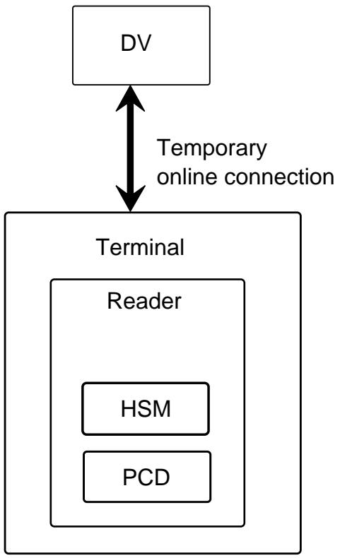
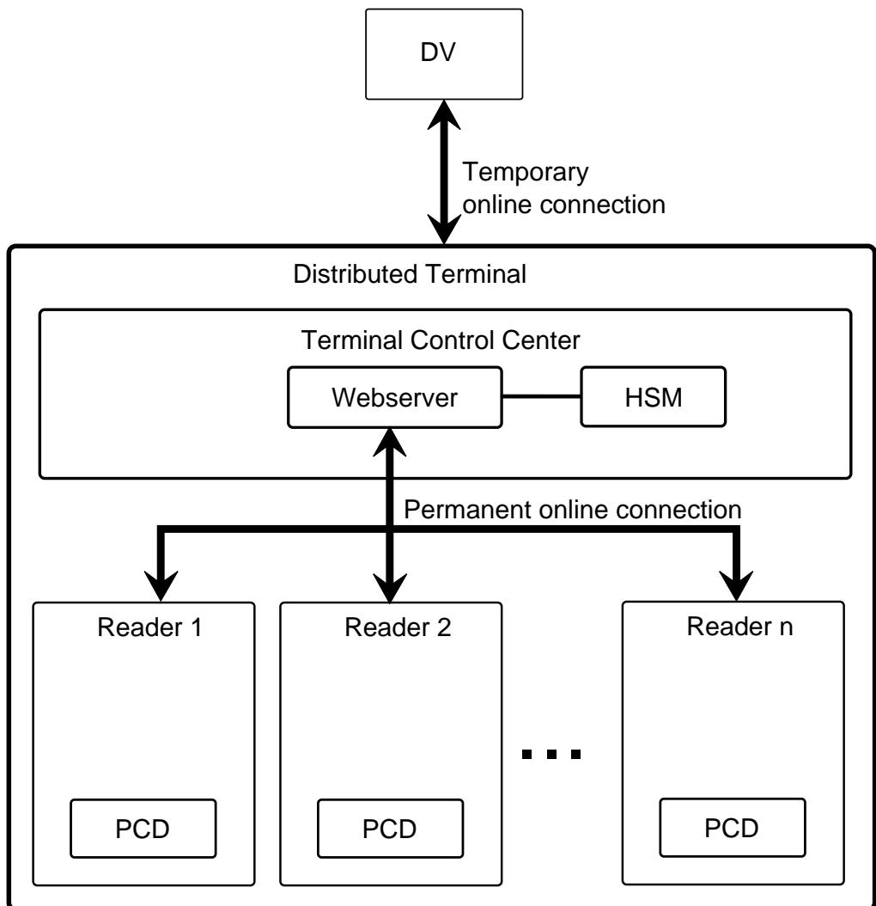
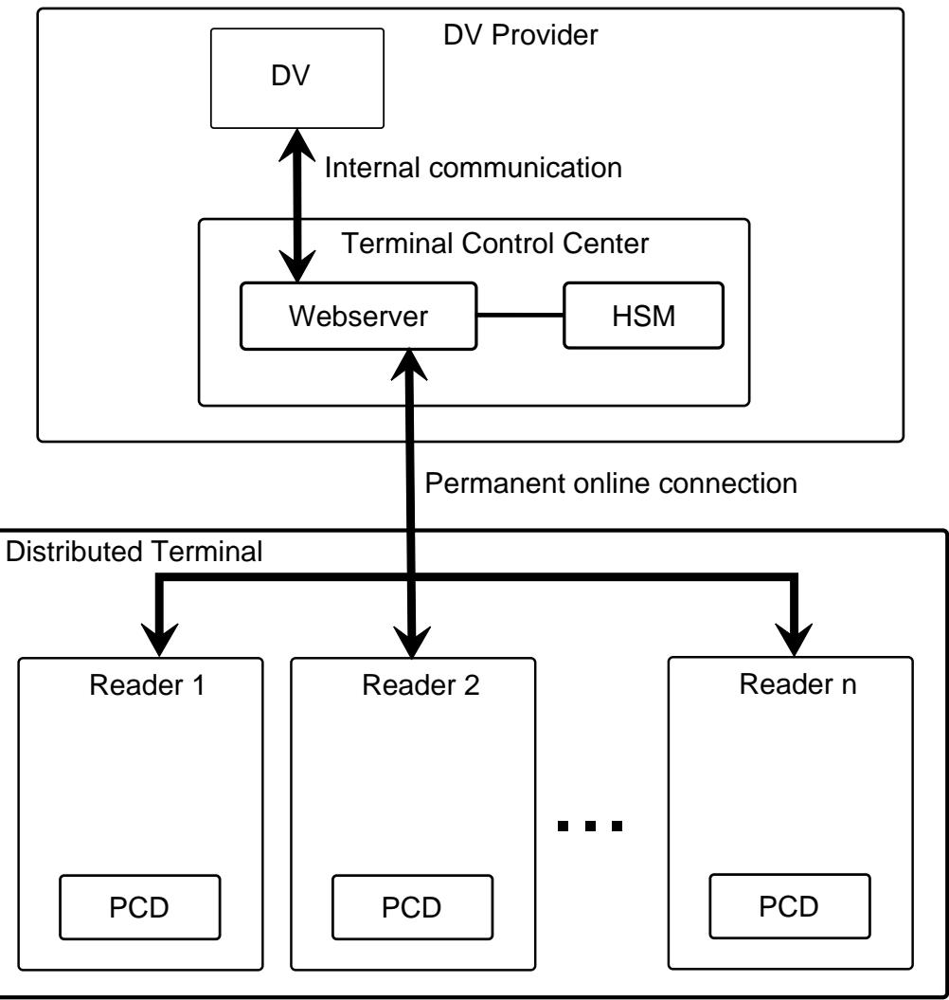

BSI Technical Guideline TR-03129-2

# Protocols for the Management of Certificates and CRLs in Public-Key-Infrastructures (PKIs)

Part 2: Supplemental specifications for public and official authorities

Version 1.4

Federal Office for Information Security P.O. Box 20 03 63 53133 Bonn E-Mail: tredokpruefung@bsi.bund.de Internet: https://www.bsi.bund.de © Federal Office for Information Security 2023

| 1.   | Changelog<br>                                                         | 1  |
|------|-----------------------------------------------------------------------|----|
| 1.1. | Changelog 1.4<br>                                                     | 1  |
| 2.   | Introduction<br>                                                      | 3  |
| 2.1. | Terminology<br>                                                       | 3  |
| 2.2. | Roles<br>                                                             | 3  |
| 2.3. | Procedures<br>                                                        | 4  |
| 2.4. | Communication Model<br>                                               | 4  |
| 3.   | Protocols for Passive Authentication<br>                              | 5  |
| 3.1. | Implementation as Web Services<br>                                    | 5  |
| 3.2. | Distribution of Document Signer Lists / DS Certificates<br>           | 5  |
| 3.3. | Passive Authentication for distributed terminals<br>                  | 6  |
| 4.   | Protocols for Terminal Authentication<br>                             | 11 |
| 4.1. | Implementation as Web Services<br>                                    | 11 |
| 4.2. | Terminal Authentication for distributed terminals<br>                 | 11 |
| 4.3. | Terminal Authentication for DVs that forbid callbacks from CVCAs<br>  | 13 |
| 4.4. | Terminal Authentication for DVs that request foreign certificates<br> | 14 |
| 5.   | Protocols for Digital Seals<br>                                       | 16 |
| 5.1. | Implementation as Web Services<br>                                    | 16 |
| 5.2. | Distribution of Signer Lists<br>                                      | 16 |
| 5.3. | Digital Seal Verification for distributed terminals<br>               | 18 |
| 6.   | Digital Seal Formats<br>                                              | 23 |
| 6.1. | VDS<br>                                                               | 23 |
| 6.2. | VDS-NC<br>                                                            | 27 |
| 6.3. | EUCWT<br>                                                             | 36 |
| 7.   | Defect Lists for ePassport Application<br>                            | 41 |
| 7.1. | Defect List Format<br>                                                | 41 |
| 7.2. | Defect Categories<br>                                                 | 42 |
| 8.   | Signed Data Profiles for Signer Lists<br>                             | 47 |
| 8.1. | Document Signer List Format<br>                                       | 47 |
| 8.2. | EU Health Seal Signer List Format<br>                                 | 47 |
| 8.3. | ICAO Health Seal Signer List Format<br>                               | 48 |
| 8.4. | Sovereign Seal Signer List Format<br>                                 | 48 |
| A.   | Infrastructures for Terminals<br>                                     | 49 |
| A.1. | Integrated Terminals                                                  | 49 |
| A.2. | Distributed Terminals<br>                                             | 50 |
|      | List of Abbreviations<br>                                             | 53 |

| Bibliography |  | 55 |
|--------------|--|----|
|--------------|--|----|

# **List of Figures**

| A.1. | Integrated terminal<br>                                                  | 50 |
|------|--------------------------------------------------------------------------|----|
| A.2. | Distributed terminal with local control centre<br>                       | 51 |
| A.3. | Distributed terminal with control centre operated by the DV provider<br> | 52 |

# <span id="page-5-0"></span>1. Changelog

The following tables present the changes introduced between the latest versions of this technical guideline. The changelog lists the changes grouped per part of this Technical Guideline, element (section, table, fi gure) and type of change, refer to [\[KeepAChangelog\]:](#page-59-1)

- **•** *Added* for new features
- **•** *Changed* for changes in existing functionality
- **•** *Deprecated* for soon-to-be removed features
- **•** *Removed* for now removed features
- **•** *Fixed* for any bug fixes
- **•** *Security* in case of vulnerabilities

# <span id="page-5-1"></span>1.1. Changelog 1.4

| TR Building Block                                 | Type of<br>Change | Change Description                                                                                                                               |
|---------------------------------------------------|-------------------|--------------------------------------------------------------------------------------------------------------------------------------------------|
| Whole document                                    | Changed           | Updated references:                                                                                                                              |
|                                                   |                   | •<br>TR-03129 to TR-03129-1 and TR-03129-3                                                                                                       |
|                                                   |                   | •<br>TR-03110 to TR-03110-1 and TR-03110-3                                                                                                       |
|                                                   |                   | •<br>ICAO Doc 9303 Seventh Edition to ICAO Doc 9303 Eigth Edition                                                                                |
| Accompanying WSDL files                           | Changed           | Changed structure to achieve "once only" for type definitions                                                                                    |
| Accompanying WSDL files                           | Added             | Added DigitalSeals folder and files corresponding to the new chapter Protocols<br>for Digital Seals                                              |
| Chapter Introduction                              | Changed           | Revised the chapter.                                                                                                                             |
| Chapter Implementation as<br>Web Services         | Removed           | Removed chapter because it was integrated into the other chapters.                                                                               |
| Chapter Protocols for Passive                     | Changed           | Revised chapter:                                                                                                                                 |
| Authentication                                    |                   | •<br>Changed descriptions.                                                                                                                       |
|                                                   |                   | •<br>Changed the names of some parameters to allow references from the chapter<br>Protocols for Digital Seals and to streamline the terminology. |
| Chapter Protocols for Passive<br>Authentication   | Changed           | Added new parameters per defect returned by the TCC for GetDocumentSig<br>nerInformation:                                                        |
|                                                   |                   | •<br>"applied" allows a TCC to indicate if it already applied a Defect.                                                                          |
|                                                   |                   | •<br>"preDefectResult" allows a TCC to communicate the original result of a<br>check, before the corresponding defect was applied.               |
| Chapter Protocols for Termi<br>nal Authentication | Added             | Added specification for Terminal Authentication in distributed Terminals origi<br>nating from TR-03129, i.e.                                     |
|                                                   |                   | GetCertificateChain<br>•                                                                                                                         |
|                                                   |                   | GetTASignature<br>•                                                                                                                              |
| Chapter Protocols for Termi<br>nal Authentication | Added             | Added message RequestForeignCertificate originating from TR-03129                                                                                |

| TR Building Block                                 | Type of<br>Change | Change Description                                                                                           |
|---------------------------------------------------|-------------------|--------------------------------------------------------------------------------------------------------------|
| Chapter Protocols for Termi<br>nal Authentication | Added             | Added message GetDVCertificates                                                                              |
| Chapter Protocols for Digital                     | Added             | Added chapter to support checking digital seals                                                              |
| Seals                                             |                   | Added the following messages:                                                                                |
|                                                   |                   | •<br>GetSignerList                                                                                           |
|                                                   |                   | •<br>SendSignerList                                                                                          |
|                                                   |                   | GetSignerCertificate<br>•                                                                                    |
|                                                   |                   | •<br>GetDigitalSealVerification                                                                              |
| Chapter Digital Seal Formats                      | Added             | Added chapter to support checking digital seals.                                                             |
|                                                   |                   | Added descriptions for the following formats:                                                                |
|                                                   |                   | •<br>VDS                                                                                                     |
|                                                   |                   | •<br>VDSNC                                                                                                   |
|                                                   |                   | EUCWT<br>•                                                                                                   |
| Chapter Defect Lists for<br>ePassport Application | Changed           | Revised introduction.                                                                                        |
| Chapter Defect Lists for<br>ePassport Application | Changed           | Updated RFC3852 reference to RFC5652 reference.                                                              |
| Chapter Defect Lists for                          | Changed           | Changed details of the following defects:                                                                    |
| ePassport Application                             |                   | •<br>Document Signer Certificate Malformed : Added ASN.1 Definition for para<br>meter ReplacementCertificate |
|                                                   |                   | •<br>Authentication Protocol Failure : Added more status codes                                               |
|                                                   |                   | •<br>Wrong Signer Identifier : Added ASN.1 Definition for parameter correctedSi<br>gnerIdentifier            |
|                                                   |                   | •<br>Card Security Object Malformed : Added ASN.1 Definition for parameter cor<br>rectedCardSecurityObject   |
| Chapter Signed Data Profile                       | Added             | Added specifications for new signer lists:                                                                   |
| for Signer Lists                                  |                   | id-euHealthSealSignerList<br>•                                                                               |
|                                                   |                   | •<br>id-icaoHealthSealSignerList                                                                             |
|                                                   |                   | •<br>id-sovereignSealSignerList                                                                              |
| Chapter WSDL and XML<br>Scheme specifications     | Removed           | Removed chapter because it became unnecessary.                                                               |
| Appendix A                                        | Added             | Added content from former TR-03129.                                                                          |

**Table 1.1** Changelog

# <span id="page-7-0"></span>2. Introduction

This technical guideline specifies [Public Key Infrastructure \(PKI\)-related communication protocols for secu](#page-57-1) rity mechanisms in the context of [Machine Readable Travel Documents \(MRTDs\)](#page-57-2). This guideline is part of the BSI TR-03129 series and depends on the basic document [\[BSI-TR-03129-1\]](#page-59-2) and on the PKI-related communi cation protocols for security mechanims of [Electronic Identity Documents \(eIDs\)](#page-57-3) based on [Extended Access](#page-57-4) [Control \(EAC\)](#page-57-4) described in [\[BSI-TR-03129-3\].](#page-59-3)

The target audience for this document are public services and official authorities that want to implement an [Inspection System \(IS\)](#page-57-5) for [MRTDs](#page-57-2) and travel related documents. This guidline describes the [PKI-related com](#page-57-1) munication inside a distributed terminal (see [Appendix A](#page-53-2)) and between the members of a background ser vice infrastructure. Implementing the protocols described in this [Technical Guideline \(TR\)](#page-58-0) enables verifying [Electronic Machine Readable Travel Documents \(eMRTDs\)](#page-57-6) and travel related documents with digital seals.

# <span id="page-7-1"></span>2.1. Terminology

The key words "MUST", "MUST NOT", "REQUIRED", "SHALL", "SHALL NOT", "SHOULD", "SHOULD NOT", "RECOMMENDED", "MAY", and "OPTIONAL" in this document are to be interpreted as described in [\[RFC2119\]](#page-59-4) when, and only when, they appear in capital letters.

The key word "CONDITIONAL" is to be interpreted as follows: The usage of an item depends on the use of other items. It is therefore further qualified under which conditions the item REQUIRED or RECOMMEN DED.

# <span id="page-7-2"></span>2.2. Roles

#### 2.2.1. Reader

A reader contains a [Proximity Coupling Device \(PCD\)](#page-57-7) used for communication with the [Integrated Circuit](#page-57-8) [\(IC\)](#page-57-8) of an [eMRTD.](#page-57-6)

#### 2.2.2. Hardware Security Module (HSM)

A [Hardware Security Module \(HSM\)](#page-57-9) offers secure storage for digital keys.

#### 2.2.3. Terminal

A terminal consists of at least one reader and one secure key store, usually a [HSM.](#page-57-9)

#### **2.2.3.1. Distributed Terminal**

A terminal with a [Terminal Control Centre \(TCC\)](#page-58-1). All readers belonging to the distributed terminal need to have a permanently active connection to the [TCC](#page-58-1).

#### 2.2.4. Terminal Control Centre (TCC)

A part of a distributed terminal. It manages a secure key storage (usually a [HSM\)](#page-57-9) and offers a communication interface to all readers that belong to the distributed terminal. It MUST be assured that a [TCC](#page-58-1) only commu nicates with known readers.

#### 2.2.5. Document Verifier (DV)

An entity in the background infrastructure. Above the [TCC](#page-58-1) in the hierarchy. Below the [Country Verifying](#page-57-10) [Certificate Authority \(CVCA\)](#page-57-10) respectively [National Public Key Directory \(NPKD\)](#page-57-11) in the hierarchy.

#### 2.2.6. Country Verifying Certificate Authority (CVCA)

An entity in the background infrastructure. Above the [Document Verifier \(DV\)](#page-57-12) in the hierarchy.

#### 2.2.7. National Public Key Directory (NPKD)

An entity in the background infrastructure. Above the [DV](#page-57-12) in the hierarchy. The [NPKD](#page-57-11) is the national key store for known certificates in the context of [MRTDs](#page-57-2).

### <span id="page-8-0"></span>2.3. Procedures

Data stored on [eMRTDs](#page-57-6) can be proven authentic with [Passive Authentication \(PA\)](#page-57-13) (see [\[ICAO Doc 9303 p11\]\)](#page-59-5). To execute [PA](#page-57-13) an [IS](#page-57-5) needs access to [Country Signing Certificate Authority \(CSCA\)](#page-57-14) certificates and [Document](#page-57-15) [Signer \(DS\)](#page-57-15) certificates.

[eMRTDs](#page-57-6) can be protected against unauthorized access with [Terminal Authentication \(TA\)](#page-58-2) (see [\[BSI-](#page-59-6)[TR-03110-1\]](#page-59-6)). To execute [TA](#page-58-2) an [IS](#page-57-5) needs access to [CVCA](#page-57-10) certificates, [DV](#page-57-12) certificates, terminal certificates and a matching private terminal key.

In a distributed terminal, access to certificates and private keys is provided to all connected readers via the [TCC](#page-58-1). Hence, any [TA](#page-58-2) triggers a request to the [TCC](#page-58-1) which then passes cryptographic operations to the secure key store. Regardless at which reader of a distributed terminal an [eMRTD](#page-57-6) is presented, an identical key pair and [Card Verifiable \(CV\)](#page-57-16) certificates are used for [TA](#page-58-2) between the distributed terminal and an [eMRTD.](#page-57-6)

# <span id="page-8-1"></span>2.4. Communication Model

To communicate between sender and receiver, [\[BSI-TR-03129-1\]](#page-59-2) defines and describes:

- **•** Messages
- **•** Common Parameters
- **•** Common Return Codes

The authentication of the sender and receiver of messages as well as the confidentiality and integrity of the contents of the messages are not considered at the level of these messages. Recommendations are described in [\[BSI-TR-03129-1\],](#page-59-2) see "Authentication, Confidentiality, and Integrity Protection".

# <span id="page-9-0"></span>3. Protocols for Passive Authentication

All protocols and specifications for [PA](#page-57-13) SHALL be implemented as specified in [\[BSI-TR-03129-3\]](#page-59-3) with the fol lowing exceptions:

- **•** References to the role "Terminal" SHALL be interpreted as references to the role "[TCC](#page-58-1)".
- **•** References to the role "[CVCA"](#page-57-10) SHALL be interpreted as references to the role ["NPKD"](#page-57-11).
- **•** The role "[TCC](#page-58-1)" SHALL implement an additional Web Service towards its connected readers supporting the following messages:
	- **•** GetMasterList (see [\[BSI-TR-03129-3\]\)](#page-59-3)
	- **•** GetDefectList (see [\[BSI-TR-03129-3\]\)](#page-59-3)
	- **•** GetDocumentSignerList ( [Section 3.2.1](#page-10-1))
	- **•** GetDocumentSignerInformation ( [Section 3.3.1\)](#page-11-0)

In contrast to the specifications given in [\[BSI-TR-03129-3\]](#page-59-3), this Web Service SHALL only support synchro nous communication: Hence, the input paramter callbackIndicator MUST be set to callback\_not\_possi ble. Furthermore parameters messageID and responseURL MUST be omitted.

- **•** The role "[TCC](#page-58-1)" SHALL implement the additional message SendDocumentSignerList ( [Section 3.2.2\)](#page-10-2) for the Web Service towards the role "[DV](#page-57-12)".
- **•** The role "[DV"](#page-57-12) SHALL implement the additional message GetDocumentSignerList ( [Section 3.2.1\)](#page-10-1) for the Web Service towards the role ["TCC"](#page-58-1).
- **•** The role "[DV"](#page-57-12) SHALL implement the additional message SendDocumentSignerList ( [Section 3.2.2](#page-10-2)) for the Web Service towards the role "[NPKD](#page-57-11)".
- **•** The role ["NPKD](#page-57-11)" SHALL implement the additional message GetDocumentSignerList ( [Section 3.2.1\)](#page-10-1) for the Web Service towards the role "[DV](#page-57-12)".

### <span id="page-9-1"></span>3.1. Implementation as Web Services

It is RECOMMENDED that the messages defined in this chapter are realized using the [Simple Object Access](#page-57-17) [Protocol \(SOAP\)](#page-57-17) messages described in the attached WSDL specifications.

# <span id="page-9-3"></span><span id="page-9-2"></span>3.2. Distribution of Document Signer Lists / DS Certificates

The following messages are used for the distribution of Document Signer Lists / [DS](#page-57-15) certificates:

- **•** GetDocumentSignerList [Section 3.2.1](#page-10-1)
- **•** SendDocumentSignerList [Section 3.2.2](#page-10-2)

These messages enable the distribution of signer certificates to facilitate executing [PA](#page-57-13) for [eMRTDs](#page-57-6) without a signer certificate inside the [Elementary File Document Security Object \(EF.SOD\).](#page-57-18) This is necessary because in an older version of the ICAO [Logical Data Structure \(LDS\)](#page-57-19) for [eMRTDs](#page-57-6) (see [\[ICAO Doc 9303 p10\]\)](#page-59-7) the presence of a signer certificate inside the [EF.SOD](#page-57-18) was not required.

#### <span id="page-10-1"></span>3.2.1. GetDocumentSignerList

This message is used to get a signed list of [DS](#page-57-15) certificates. Its parameters are given in [Table 3.1.](#page-10-3)

<span id="page-10-3"></span>

| Parameter          | Description                                                                                                                     |  |
|--------------------|---------------------------------------------------------------------------------------------------------------------------------|--|
| Input              |                                                                                                                                 |  |
| None               | This message has no input.                                                                                                      |  |
| Output             |                                                                                                                                 |  |
| documentSignerList | CONDITONAL                                                                                                                      |  |
|                    | A signed list of DS certificates. It is REQUIRED if the message was processed without<br>errors. It SHALL be missing otherwise. |  |
| returnCode         | REQUIRED                                                                                                                        |  |
|                    | The following return codes are possible:                                                                                        |  |
|                    | •<br>ok_list_available                                                                                                          |  |
|                    | •<br>failure_list_not_available                                                                                                 |  |
|                    | •<br>failure_internal_error                                                                                                     |  |
|                    | •<br>failure_other_error                                                                                                        |  |
|                    | •<br>failure_syntax                                                                                                             |  |
| returnCodeMessage  | OPTIONAL                                                                                                                        |  |
|                    | Further information regarding the processing of this message.                                                                   |  |

**Table 3.1** Input and output for the message GetDocumentSignerList

### <span id="page-10-2"></span>3.2.2. SendDocumentSignerList

This message is used to send a signed list of [DS](#page-57-15) certificates. Its parameters are given in [Table 3.2.](#page-10-4)

<span id="page-10-4"></span>

| Parameter          | Description                                                   |
|--------------------|---------------------------------------------------------------|
| Input              |                                                               |
| documentSignerList | REQUIRED                                                      |
|                    | A signed list of DS certificates.                             |
| Output             |                                                               |
| returnCode         | REQUIRED                                                      |
|                    | The following return codes are possible:                      |
|                    | •<br>ok_received_correctly                                    |
|                    | •<br>failure_internal_error                                   |
|                    | •<br>failure_other_error                                      |
|                    | •<br>failure_syntax                                           |
| returnCodeMessage  | OPTIONAL                                                      |
|                    | Further information regarding the processing of this message. |

**Table 3.2** Input and output for the message SendDocumentSignerList

# <span id="page-10-0"></span>3.3. Passive Authentication for distributed terminals

For [PA,](#page-57-13) a reader must validate the [DS](#page-57-15) certificate and the signature of one or more Security Objects. For this, the [DS](#page-57-15) certificate has to be validated against the corresponding, trusted [CSCA](#page-57-14) certificate distributed via a trusted [Master List \(ML\).](#page-57-20)

The message GetDocumentSignerInformation [Section 3.3.1](#page-11-0) is used as part of [PA](#page-57-13) within a distributed terminal.

The readers that are connected to a [TCC inside a distributed terminal use this message in the process of exe](#page-58-1) cuting [PA](#page-57-13). Therefore, the processing of this message is time-critical and MUST be done synchronously.

#### <span id="page-11-0"></span>3.3.1. GetDocumentSignerInformation

As the [CSCA](#page-57-14) certificates are stored securely in the [TCC](#page-58-1), a connected reader sends this message to the [TCC](#page-58-1) to get all information associated with the [DS](#page-57-15) certificate. This information includes the validity of the [DS](#page-57-15) certificate as well as other information used for [PA](#page-57-13). The parameters of the message GetDocumentSignerInformation are given in [Table 3.3.](#page-11-1)

<span id="page-11-1"></span>

| Parameter           | Description                                                                                                                                                                      |
|---------------------|----------------------------------------------------------------------------------------------------------------------------------------------------------------------------------|
| Input               |                                                                                                                                                                                  |
| signerCertificate   | CONDITIONAL                                                                                                                                                                      |
|                     | It is REQUIRED if a signer certificate is included inside the Security Object. The signer<br>certificate SHALL be provided as it is encoded in the Security Object.              |
| signerIdentifier    | CONDITIONAL                                                                                                                                                                      |
|                     | It is REQUIRED if the parameter signerCertificate is not present, otherwise RE<br>COMMENDED. The signerIdentifier SHALL be provided as it is encoded in the Se<br>curity Object. |
| returnCACertificate | REQUIRED                                                                                                                                                                         |
|                     | Indicates whether the caller wants to receive the CA certificate corresponding to the<br>signer certificate contained in signerCertificate or indicated by signerIdenti<br>fier. |
| Output              |                                                                                                                                                                                  |
| signerInformation   | CONDITIONAL                                                                                                                                                                      |
|                     | It is REQUIRED if the message processed successfully. SHALL be omitted otherwi<br>se.                                                                                            |
|                     | The structure of the parameter is given in<br>Table 3.4.                                                                                                                         |
| returnCode          | REQUIRED                                                                                                                                                                         |
|                     | The following return codes are possible:                                                                                                                                         |
|                     | •<br>ok_syntax                                                                                                                                                                   |
|                     | •<br>failure_internal_error                                                                                                                                                      |
|                     | •<br>failure_other_error                                                                                                                                                         |
|                     | •<br>failure_syntax                                                                                                                                                              |
| returnCodeMessage   | OPTIONAL                                                                                                                                                                         |
|                     | Further information regarding the processing of this message.                                                                                                                    |

**Table 3.3** Input and output for the message GetDocumentSignerInformation

The parameter signerInformation contains more information about the signer certificate. The parameter has the type signerInformationType and its structure is given in [Table 3.4.](#page-12-0)

<span id="page-12-0"></span>

| Parameter                  | Description                                                                                                                                                                                               |
|----------------------------|-----------------------------------------------------------------------------------------------------------------------------------------------------------------------------------------------------------|
| trustStatus                | REQUIRED                                                                                                                                                                                                  |
|                            | The TCC's rating for the given signer certificate.                                                                                                                                                        |
|                            | See [BSI-TR-03135-1] section 4.6.4.3.6 for details regarding trust status.                                                                                                                                |
|                            | The following values are possible:                                                                                                                                                                        |
|                            | •<br>certificate_ok                                                                                                                                                                                       |
|                            | •<br>certificate_undetermined                                                                                                                                                                             |
|                            | •<br>certificate_invalid                                                                                                                                                                                  |
| certificateChainValidity   | REQUIRED                                                                                                                                                                                                  |
|                            | Information about the validity of the certificate chain.                                                                                                                                                  |
|                            | The structure of the parameter is given in<br>Table 3.5.                                                                                                                                                  |
| signerCertificateSignature | REQUIRED                                                                                                                                                                                                  |
|                            | Result of the validation of the signature of the signer certificate.                                                                                                                                      |
|                            | The structure of the parameter is given in<br>Table 3.6.                                                                                                                                                  |
| knownDefects               | CONDITIONAL                                                                                                                                                                                               |
|                            | A list of defects for the given signer certificate known to the TCC.                                                                                                                                      |
|                            | The parameter is REQUIRED if the TCC knows defects for the given signer certificate.<br>It SHALL be omitted otherwise.                                                                                    |
|                            | The structure of a single entry knownDefect is given in<br>Table 3.8.                                                                                                                                     |
| caCertificate              | CONDITIONAL                                                                                                                                                                                               |
|                            | In case of returnCACertificate being true, this parameter contains the base64-en<br>coded Certificate Authority (CA) certificate which has issued the signer certificate, as<br>given in the Master List. |
| signerCertificate          | CONDITIONAL                                                                                                                                                                                               |
|                            | In case of signerIdentifier being set, this parameter contains the base64-encoded<br>signer certificate which has been used to sign the Security Object.                                                  |
| unknownCriticalExtension   | CONDITIONAL                                                                                                                                                                                               |
|                            | Unknown critical extensions contained in the DS certificate. It is REQUIRED if such<br>extensions exist. It SHALL be omitted otherwise.                                                                   |

**Table 3.4** signerInformation (signerInformationType) definition

The parameter certificateChainValidity contains validity information about the signer certificate and the corresponding CA certificate. The parameter has the type certificateChainValidityType and its structure is given in [Table 3.5.](#page-12-1)

<span id="page-12-1"></span>

| Parameter                 | Description                                              |
|---------------------------|----------------------------------------------------------|
| caCertificateValidity     | REQUIRED                                                 |
|                           | Validity information of the CA certificate.              |
|                           | The structure of the parameter is given in<br>Table 3.7. |
| signerCertificateValidity | REQUIRED                                                 |
|                           | Validity information of the signer certificate.          |
|                           | The structure of the parameter is given in<br>Table 3.7. |
|                           |                                                          |

**Table 3.5** certificateChainValidity (certificateChainValidityType) definition

The parameter signerCertificateSignature contains trust status information about the signer certificate. The parameter has the type signatureType, whose structure is given in [Table 3.6](#page-13-0).

<span id="page-13-0"></span>

| Parameter | Description                                                    |
|-----------|----------------------------------------------------------------|
| status    | REQUIRED                                                       |
|           | See [BSI-TR-03135-1] for details regarding signature checking. |
|           | The following values are possible:                             |
|           | •<br>signature_ok                                              |
|           | •<br>signature_invalid                                         |
|           | •<br>signature_not_checked                                     |
| message   | OPTIONAL                                                       |
|           | Further information regarding the signature.                   |

**Table 3.6** signerCertificateSignature (signatureType) definition

Information about the validy of a certificate (e.g. caCertificateValidity) is given by the type certificateVa lidityType, whose structure is given in [Table 3.7](#page-13-2).

<span id="page-13-2"></span>

| Parameter      | Description                                                                                                         |
|----------------|---------------------------------------------------------------------------------------------------------------------|
| status         | REQUIRED                                                                                                            |
|                | The evaluation result of the validity period according to the time of the TCC.                                      |
|                | See [BSI-TR-03135-1] for details regarding validity period evaluation (for the example<br>CSCA and DS certificate). |
|                | The following values are possible:                                                                                  |
|                | •<br>certificate_valid                                                                                              |
|                | •<br>certificate_expired                                                                                            |
|                | •<br>certificate_not_available                                                                                      |
|                | •<br>certificate_not_yet_valid                                                                                      |
| effectiveDate  | CONDITIONAL                                                                                                         |
|                | Effective date of the certificate.                                                                                  |
|                | It SHALL be omitted if status is certificate_not_available. It is REQUIRED<br>otherwise.                            |
| expirationDate | CONDITIONAL                                                                                                         |
|                | Expiration date of the certificate.                                                                                 |
|                | It SHALL be omitted if status is certificate_not_available. It is REQUIRED<br>otherwise.                            |
| message        | OPTIONAL                                                                                                            |
|                | Further information regarding the certificate validity.                                                             |

**Table 3.7** certificateValidityType definition

The parameter knownDefect contains information about the application of defect. The parameter has the type knownDefectType, whose structure is given in [Table 3.8](#page-13-1).

<span id="page-13-1"></span>

| Parameter | Description                           |
|-----------|---------------------------------------|
| critical  | REQUIRED                              |
|           | Indicates whether defect is critical. |

| Parameter       | Description                                                                                                                                              |
|-----------------|----------------------------------------------------------------------------------------------------------------------------------------------------------|
| applied         | REQUIRED                                                                                                                                                 |
|                 | Indicates whether defect was already applied by the TCC.                                                                                                 |
| preDefectResult | CONDITIONAL                                                                                                                                              |
|                 | Result before defect was applied by the TCC.                                                                                                             |
|                 | It is REQUIRED if applied is true and the condition for at least one of subparame<br>ters of this parameter is fulfilled. It SHALL be omitted otherwise. |
|                 | The structure of the parameter is given in<br>Table 3.9. See [BSI-TR-03135-1] for details<br>regarding the effects of defects.                           |
| defect          | REQUIRED                                                                                                                                                 |
|                 | A base64-encoded VersionedKnownDefect (see<br>Section 7.1).                                                                                              |

**Table 3.8** knownDefect (knownDefectType) definition

Information about the results before defect was applied are given by preDefectResult. The parameter has the type preDefectResultType, whose structure is given in [Table 3.9.](#page-14-0)

<span id="page-14-0"></span>

| Parameter         | Description                                                                                        |
|-------------------|----------------------------------------------------------------------------------------------------|
| trustStatus       | CONDITIONAL                                                                                        |
|                   | Trust status before the defect was applied.                                                        |
|                   | It is REQUIRED if this value was changed by applying the defect. It SHALL be omitted<br>otherwise. |
|                   | The possible values are given in<br>Table 3.4 parameter "trustStatus".                             |
| signatureStatus   | CONDITIONAL                                                                                        |
|                   | Signature status status before the defect was applied.                                             |
|                   | It is REQUIRED if this value was changed by applying the defect. It SHALL be omitted<br>otherwise. |
|                   | The possible values are given<br>Table 3.6 parameter "status".                                     |
| certChainValidity | CONDITIONAL                                                                                        |
|                   | Certificate chain validity status before the defect was applied.                                   |
|                   | It is REQUIRED if this value was changed by applying the defect. It SHALL be omitted<br>otherwise. |
|                   | The structure of the parameter is given in<br>Table 3.5.                                           |

**Table 3.9** preDefectResult (preDefectResultType) definition

# <span id="page-15-0"></span>4. Protocols for Terminal Authentication

All protocols and specifications for Terminal Authentication SHALL be implemented as specified in [\[BSI-](#page-59-3)[TR-03129-3\]](#page-59-3) with the following exceptions:

- **•** References to the role "Terminal" SHALL be interpreted as references to the role "[TCC](#page-58-1)"
- **•** The role "[TCC](#page-58-1)" SHALL implement an additional Web Service towards its connected readers supporting the following messages:
	- **•** GetCertificateChain ( [Section 4.2.1](#page-15-3))
	- **•** GetTASignature ( [Section 4.2.2](#page-16-0))
- **•** The role ["CVCA](#page-57-10)" SHALL implement the following additional messages for the Web Service towards the role "[DV](#page-57-12)":
	- **•** GetDVCertificates ( [Section 4.3.1\)](#page-17-1) .
	- **•** RequestForeignCertificate ( [Section 4.4.1](#page-18-1))

### <span id="page-15-1"></span>4.1. Implementation as Web Services

It is RECOMMENDED that the messages defined in this chapter are realized using the [SOAP](#page-57-17) messages descri bed in the attached WSDL specifications.

# <span id="page-15-2"></span>4.2. Terminal Authentication for distributed terminals

The following messages are used as part of [TA](#page-58-2) within a distributed terminal:

- **•** GetCertificateChain ( [Section 4.2.1](#page-15-3))
- **•** GetTASignature ( [Section 4.2.2](#page-16-0))

The readers that are connected to a [TCC](#page-58-1) inside a distributed terminal use these messages in the process of executing [TA. Therefore, the processing of these messages is time-critical and MUST be performed synchro](#page-58-2) nously.

#### <span id="page-15-3"></span>4.2.1. GetCertificateChain

To execute [TA](#page-58-2), a reader must obtain the [CV](#page-57-16) certificate of the [TCC](#page-58-1) and a complete chain of certificates up to a [CVCA](#page-57-10) [CV](#page-57-16) certificate that is known to the [eMRTD](#page-57-6) the reader is communicating with. This message allows a reader to download all [CV](#page-57-16) certificates from the [TCC](#page-58-1) that are needed for executing [TA](#page-58-2) with a specific [eMRTD](#page-57-6).

<span id="page-15-4"></span>

| Parameter | Description                                                                                                                                                                                 |
|-----------|---------------------------------------------------------------------------------------------------------------------------------------------------------------------------------------------|
| Input     |                                                                                                                                                                                             |
| keyCAR    | REQUIRED                                                                                                                                                                                    |
|           | A Certificate Authority Reference (CAR) obtained from an eMRTD. This is a reference<br>to one of the public keys which can be used by the eMRTD for the verification of CV<br>certificates. |
| Output    |                                                                                                                                                                                             |

The parameters of the message GetCertificateChain are given in [Table 4.1](#page-15-4).

| Parameter                                                      | Description                                                                                                                                                                                                                                                                                                   |
|----------------------------------------------------------------|---------------------------------------------------------------------------------------------------------------------------------------------------------------------------------------------------------------------------------------------------------------------------------------------------------------|
| certificateSeq                                                 | CONDITIONAL                                                                                                                                                                                                                                                                                                   |
|                                                                | If the message is processed successfully, this parameter SHALL contain all valid link<br>certificates of the CVCA identified by the CAR contained in the parameter keyCAR, the<br>CV certificate of the DV derived from the most recent CVCA certificate and the corre<br>sponding CV certificate of the TCC. |
| returnCode                                                     | REQUIRED                                                                                                                                                                                                                                                                                                      |
|                                                                | The following return codes are possible                                                                                                                                                                                                                                                                       |
|                                                                | •<br>ok_certificate_chain_available                                                                                                                                                                                                                                                                           |
|                                                                | •<br>failure_CAR_unknown                                                                                                                                                                                                                                                                                      |
|                                                                | •<br>failure_internal_error                                                                                                                                                                                                                                                                                   |
|                                                                | •<br>failure_other_error                                                                                                                                                                                                                                                                                      |
|                                                                | •<br>failure_syntax                                                                                                                                                                                                                                                                                           |
| returnCodeMessage                                              | OPTIONAL                                                                                                                                                                                                                                                                                                      |
|                                                                | Further information regarding the processing of this message.                                                                                                                                                                                                                                                 |
| Table 4.1 Input and output for the message GetCertificateChain |                                                                                                                                                                                                                                                                                                               |

<span id="page-16-0"></span>4.2.2. GetTASignature

In a distributed terminal, the private key for [TA](#page-58-2) is stored in a secure key store within the [TCC](#page-58-1). With this mes sage a reader requests the calculation of a signature for [TA](#page-58-2). The calculation of this signature is defined in [\[BSI-](#page-59-6)[TR-03110-1\]](#page-59-6). There it is denoted as sPCD .

This message MAY be used in the following two ways:

- **•** First option: The reader calculates a hash value (hashTBS) over the data to be signed and sends this hash value to the [TCC](#page-58-1).
- **•** Second option: The reader sends all data to be signed to the [TCC.](#page-58-1) The [TCC](#page-58-1) calculates the hash value of the data before signing it.

The first option SHOULD be used, if an [eMRTD](#page-57-6) can be uniquely identified with a part of the data to be signed (i.e. with the value of idPICC and/or challengePICC). When using the first option, this possibly sensitive infor mation is only held in the reader's volatile storage.

<span id="page-16-1"></span>

| Parameter | Description                                                                                                                                                                                           |
|-----------|-------------------------------------------------------------------------------------------------------------------------------------------------------------------------------------------------------|
| Input     |                                                                                                                                                                                                       |
| keyCHR    | REQUIRED                                                                                                                                                                                              |
|           | Identification of the private key to be used for the calculation of the signature. The<br>Certificate Holder Reference (CHR) of the corresponding CV certificate SHALL be gi<br>ven in the parameter. |
| hashTBS   | CONDITIONAL                                                                                                                                                                                           |
|           | The hash value calculated over the data to be signed.                                                                                                                                                 |
|           | This parameter is REQUIRED if the first option for the usage of this message is chosen.<br>It SHALL be missing if the second option is used.                                                          |

The parameters of GetTASignature are given in [Table 4.2.](#page-16-1)

| Parameter         | Description                                                                                                                                                                    |
|-------------------|--------------------------------------------------------------------------------------------------------------------------------------------------------------------------------|
| idPICC            | CONDITIONAL                                                                                                                                                                    |
|                   | An identifier of the eMRTD. In the specification of TA (see [BSI-TR-03110-1]) this iden<br>tifier is denoted as IDPICC.                                                        |
|                   | This parameter is REQUIRED if the second option is chosen. It SHALL be missing if the<br>first option is used.                                                                 |
| challengePICC     | CONDITIONAL                                                                                                                                                                    |
|                   | The challenge of the eMRTD. In the specification of TA (see [BSI-TR-03110-1]) this<br>challenge is denoted as rPICC.                                                           |
|                   | This parameter is REQUIRED if the second option is chosen. It SHALL be missing if the<br>first option is used.                                                                 |
| hashPK            | CONDITIONAL                                                                                                                                                                    |
|                   | The hash value over the ephemeral public key PKPCD of the terminal. In specificati<br>on of TA (see [BSI-TR-03110-1]) this value is denoted as COMP(PKPCD).                    |
|                   | This parameter is REQUIRED if the second option is chosen. It SHALL be missing if the<br>first option is used.                                                                 |
| auxPCD            | CONDITIONAL                                                                                                                                                                    |
|                   | Auxiliary data of the terminal. In the specification of TA (see [BSI-TR-03110-1]) this da<br>ta is denoted as APCD.                                                            |
|                   | This parameter is REQUIRED if the second option chosen and some auxiliary termi<br>nal data is part of the data to be signed. It SHALL be missing if the first option is used. |
| Output            |                                                                                                                                                                                |
| signature         | CONDITIONAL                                                                                                                                                                    |
|                   | The calculated signature.                                                                                                                                                      |
|                   | It is REQUIRED if a valid signature has been calculated. It SHALL be missing if no valid<br>signature was calculated.                                                          |
| returnCode        | REQUIRED                                                                                                                                                                       |
|                   | The following return codes are possible                                                                                                                                        |
|                   | •<br>ok_signature_available                                                                                                                                                    |
|                   | •<br>failure_CHR_unknown                                                                                                                                                       |
|                   | •<br>failure_internal_error                                                                                                                                                    |
|                   | •<br>failure_other_error                                                                                                                                                       |
|                   | •<br>failure_syntax                                                                                                                                                            |
| returnCodeMessage | OPTIONAL                                                                                                                                                                       |
|                   | Further information regarding the processing of this message.                                                                                                                  |

**Table 4.2** Input and output for the message GetTASignature

### <span id="page-17-0"></span>4.3. Terminal Authentication for DVs that forbid callbacks from CVCAs

The following message is used as part of [TA](#page-58-2) for DVs that cannot receive callbacks from CVCAs:

GetDVCertificates ( [Section 4.3.1](#page-17-1))

#### <span id="page-17-1"></span>4.3.1. GetDVCertificates

A [DV](#page-57-12) must obtain certificates from a [CVCA.](#page-57-10) In the default case this is facilitated with the messages GetCerti ficates and RequestCertificate. These messages often require asynchronous processing. If the [DV](#page-57-12) allows no callbacks, the [CVCA](#page-57-10) cannot deliver the results. In such cases the [DV](#page-57-12) can use GetDVCertificates to acquire the results of the asynchronous processing.

<span id="page-18-2"></span>

| Parameter         | Description                                                                                                                                                                                     |  |
|-------------------|-------------------------------------------------------------------------------------------------------------------------------------------------------------------------------------------------|--|
| Input             |                                                                                                                                                                                                 |  |
| holderMnemonic    | REQUIRED                                                                                                                                                                                        |  |
|                   | Identifies the DV that wants to receive the certificates it previously requested from the<br>CVCA.                                                                                              |  |
| Output            |                                                                                                                                                                                                 |  |
| certificateSeq    | CONDITIONAL                                                                                                                                                                                     |  |
|                   | If the message is processed successfully and the returnCode is not ok_cert_not_fi<br>nished, this parameter SHALL contain the certificates requested by the DV identified<br>by holderMnemonic. |  |
| returnCode        | REQUIRED                                                                                                                                                                                        |  |
|                   | The following return codes are possible                                                                                                                                                         |  |
|                   | •<br>ok_cert_available                                                                                                                                                                          |  |
|                   | •<br>ok_cert_not_finished                                                                                                                                                                       |  |
|                   | •<br>failure_internal_error                                                                                                                                                                     |  |
|                   | •<br>failure_messageID_unknown                                                                                                                                                                  |  |
|                   | •<br>failure_other_error                                                                                                                                                                        |  |
|                   | •<br>failure_syntax                                                                                                                                                                             |  |
| returnCodeMessage | OPTIONAL                                                                                                                                                                                        |  |
|                   | Further information regarding the processing of this message.                                                                                                                                   |  |

The parameters of the message GetDVCertificates are given in [Table 4.3.](#page-18-2)

**Table 4.3** Input and output for the message GetDVCertificates

### <span id="page-18-0"></span>4.4. Terminal Authentication for DVs that request foreign certificates

The following message is used as part of [TA](#page-58-2) for [DVs](#page-57-12) that request foreign certificates:

RequestForeignCertificate ( [Section 4.4.1\)](#page-18-1)

#### <span id="page-18-1"></span>4.4.1. RequestForeignCertificate

This message is used by a [DV](#page-57-12) for initiating the request of a new certificate for one of its keys from a [CVCA](#page-57-10) in another country. This message is not sent to the foreign [CVCA](#page-57-10) which is intended to generate the certificate, instead it is sent to the national [Single Point of Contact \(SPOC\)](#page-57-24) of the country of the [DV](#page-57-12). This national [SPOC](#page-57-24) verifies the request of the [DV](#page-57-12) according to national regulations. If the request meets the national regulations it is forwarded to the [SPOC](#page-57-24) of the other country. See [\[ČSN-36-9791\]](#page-60-0) for details.

The parameters of the message RequestForeignCertificate are given in [Table 4.4.](#page-18-3)

<span id="page-18-3"></span>

| Parameter         | Description                                             |
|-------------------|---------------------------------------------------------|
| Input             |                                                         |
| callbackIndicator | REQUIRED                                                |
| messageID         | See [BSI-TR-03129-1] section 2.2.1 "Common Parameters". |
|                   | OPTIONAL                                                |
|                   | See [BSI-TR-03129-1] section 2.2.1 "Common Parameters". |

| Parameter                                                            | Description                                                                                                                                                                                                               |  |
|----------------------------------------------------------------------|---------------------------------------------------------------------------------------------------------------------------------------------------------------------------------------------------------------------------|--|
| responseURL                                                          | OPTIONAL                                                                                                                                                                                                                  |  |
|                                                                      | See [BSI-TR-03129-1] section 2.2.1 "Common Parameters"                                                                                                                                                                    |  |
| foreignCAR                                                           | REQUIRED                                                                                                                                                                                                                  |  |
|                                                                      | This parameter contains the reference to the (expected) signature key of the foreign<br>certification authority which also should be contained in the body of certificate re<br>quest contained in the parameter certReq. |  |
| certReq                                                              | REQUIRED                                                                                                                                                                                                                  |  |
|                                                                      | This parameter contains the certificate request. It must be constructed according to<br>[BSI-TR-03129-3] section 4.1.1 "Parameters".                                                                                      |  |
| Output                                                               |                                                                                                                                                                                                                           |  |
| certificateSeq                                                       | CONDITIONAL                                                                                                                                                                                                               |  |
|                                                                      | If the message is processed successfully and the returnCode is ok_cert_available,<br>this parameter SHALL contain the certificates requested by the DV with certReq.                                                      |  |
| returnCode                                                           | REQUIRED                                                                                                                                                                                                                  |  |
|                                                                      | The following return codes are possible                                                                                                                                                                                   |  |
|                                                                      | •<br>ok_cert_available                                                                                                                                                                                                    |  |
|                                                                      | •<br>ok_request_forwarded                                                                                                                                                                                                 |  |
|                                                                      | •<br>ok_reception_ack                                                                                                                                                                                                     |  |
|                                                                      | •<br>failure_domain_parameters                                                                                                                                                                                            |  |
|                                                                      | •<br>failure_expired                                                                                                                                                                                                      |  |
|                                                                      | •<br>failure_foreignCAR_unknown                                                                                                                                                                                           |  |
|                                                                      | •<br>failure_inner_signature                                                                                                                                                                                              |  |
|                                                                      | •<br>failure_internal_error                                                                                                                                                                                               |  |
|                                                                      | •<br>failure_not_forwarded                                                                                                                                                                                                |  |
|                                                                      | •<br>failure_outer_signature                                                                                                                                                                                              |  |
|                                                                      | •<br>failure_request_not_accepted                                                                                                                                                                                         |  |
|                                                                      | •<br>failure_request_not_accepted_foreign                                                                                                                                                                                 |  |
|                                                                      | •<br>failure_syntax                                                                                                                                                                                                       |  |
| returnCodeMessage                                                    | OPTIONAL                                                                                                                                                                                                                  |  |
|                                                                      | Further information regarding the processing of this message.                                                                                                                                                             |  |
| Table 4.4 Input and output for the message RequestForeignCertificate |                                                                                                                                                                                                                           |  |

# <span id="page-20-0"></span>5. Protocols for Digital Seals

### <span id="page-20-1"></span>5.1. Implementation as Web Services

It is RECOMMENDED that the protocol given in this chapter is realized as a Web Service using the [SOAP](#page-57-17) messages described in the attached WSDL specifications.

#### 5.1.1. Services Implemented by a TCC

A [TCC](#page-58-1) SHALL implement a Web Service towards the role ["DV"](#page-57-12) supporting the message SendSignerList ( [Sec](#page-21-0) [tion 5.2.2](#page-21-0)).

A [TCC](#page-58-1) SHALL implement a Web Service towards its connected readers supporting the following messages:

- **•** GetSignerList ( [Section 5.2.1](#page-21-1))
- **•** GetSignerCertificate ( [Section 5.3.1\)](#page-22-1)
- **•** GetDigitalSealVerification ( [Section 5.3.2\)](#page-23-0)

#### 5.1.2. Services Implemented by a DV

A [DV](#page-57-12) SHALL implement a Web Services towards the role ["NPKD](#page-57-11)" supporting the message SendSignerList ( [Section 5.2.2](#page-21-0)).

A [DV](#page-57-12) SHALL implement a Web Services towards the role "[TCC](#page-58-1)" supporting the message GetSignerList ( [Sec](#page-21-1) [tion 5.2.1](#page-21-1)).

#### 5.1.3. Services Implemented by a CVCA or NPKD

A [NPKD](#page-57-11) (or [CVCA](#page-57-10)) SHALL implement a Web Services towards the role ["DV"](#page-57-12) supporting the message GetSig nerList ( [Section 5.2.1](#page-21-1)).

### <span id="page-20-2"></span>5.2. Distribution of Signer Lists

The following messages are used for the distribution of signer certificates:

- **•** GetSignerList ( [Section 5.2.1](#page-21-1))
- **•** SendSignerList ( [Section 5.2.2](#page-21-0))

These messages enable the distribution of signer certificates to facilitate verifying signatures from digital seals and [eMRTDs](#page-57-6) that do not contain signer certificates and instead contain references to them (see [Chapter 6](#page-27-2) for digital seals and [Section 3.2](#page-9-3) for [eMRTDs,](#page-57-6) respectively).

The types of signer lists supported by the messages are given in [Table 5.1](#page-20-3). The formats of those signer lists are described in [Chapter 8.](#page-51-3)

<span id="page-20-3"></span>

| Signer List Type / OID    | Description                                                          |
|---------------------------|----------------------------------------------------------------------|
| id-DocumentSignerList     | Signer certificates for eMRTDs                                       |
| id-euHealthSealSignerList | Signer certificates for EU type digital seals on<br>health documents |

| Signer List Type / OID      | Description                                                            |
|-----------------------------|------------------------------------------------------------------------|
| id-icaoHealthSealSignerList | Signer certificates for ICAO type digital seals on<br>health documents |
| id-sovereignSealSignerList  | Signer certificates for digital seals on sovereign<br>documents.       |

<span id="page-21-1"></span>**Table 5.1** Types of signer lists

#### 5.2.1. GetSignerList

The message GetSignerList is used to get a signed list of signer certificates. Its parameters are given in [Ta](#page-21-2) [ble 5.2.](#page-21-2)

<span id="page-21-2"></span>

| Parameter         | Description                                                                                                                                           |
|-------------------|-------------------------------------------------------------------------------------------------------------------------------------------------------|
| Input             |                                                                                                                                                       |
| signerListType    | REQUIRED                                                                                                                                              |
|                   | The type of the list requested.                                                                                                                       |
|                   | See<br>Table 5.1 for possible values.                                                                                                                 |
| Output            |                                                                                                                                                       |
| signerList        | CONDITONAL                                                                                                                                            |
|                   | The signer list of type signerListType.                                                                                                               |
|                   | This parameter is REQUIRED if a signer list is available. If no signer list of type si<br>gnerListType is available, this parameter SHALL be omitted. |
|                   | See<br>Chapter 8 for details regarding the format.                                                                                                    |
| returnCode        | REQUIRED                                                                                                                                              |
|                   | The following return codes are possible:                                                                                                              |
|                   | •<br>ok_list_available                                                                                                                                |
|                   | •<br>failure_list_not_available                                                                                                                       |
|                   | •<br>failure_list_type_unknown                                                                                                                        |
|                   | •<br>failure_internal_error                                                                                                                           |
|                   | •<br>failure_other_error                                                                                                                              |
|                   | •<br>failure_syntax                                                                                                                                   |
| returnCodeMessage | OPTIONAL                                                                                                                                              |
|                   | Further information regarding the processing of this message.                                                                                         |

**Table 5.2** Input and output for the message GetSignerList

#### <span id="page-21-0"></span>5.2.2. SendSignerList

The message SendSignerList is used to send a signed list of signer certificates. Its parameters are given in [Ta](#page-21-3) [ble 5.3.](#page-21-3)

<span id="page-21-3"></span>

| Parameter  | Description                                           |
|------------|-------------------------------------------------------|
| Input      |                                                       |
| signerList | REQUIRED                                              |
|            | A signed list of certificates of type signerListType. |
|            | See<br>Chapter 8 for details regarding the format.    |

| Parameter         | Description                                                   |
|-------------------|---------------------------------------------------------------|
| signerListType    | REQUIRED                                                      |
|                   | See<br>Table 5.1 for possible values.                         |
| Output            |                                                               |
| returnCode        | REQUIRED                                                      |
|                   | The following return codes are possible:                      |
|                   | •<br>ok_received_correctly                                    |
|                   | •<br>failure_internal_error                                   |
|                   | •<br>failure_other_error                                      |
|                   | •<br>failure_syntax                                           |
| returnCodeMessage | OPTIONAL                                                      |
|                   | Further information regarding the processing of this message. |
|                   |                                                               |

**Table 5.3** Input and output for the message SendSignerList

# <span id="page-22-0"></span>5.3. Digital Seal Verification for distributed terminals

The following messages are used to verify Digital Seals within a distributed terminal.

- **•** GetSignerCertificate ( [Section 5.3.1\)](#page-22-1)
- **•** GetDigitalSealVerification ( [Section 5.3.2\)](#page-23-0)

#### <span id="page-22-1"></span>5.3.1. GetSignerCertificate

The message GetSignerCertificate is used to get a single signer certificate from the [TCC](#page-58-1). The [IS](#page-57-5) can use this signer certificate to verify the signature of a digital seal. Its parameters are given in [Table 5.4](#page-22-2).

<span id="page-22-2"></span>

| Parameter                    | Description                                                                           |
|------------------------------|---------------------------------------------------------------------------------------|
| Input                        |                                                                                       |
| signerCertificateIdentifier  | REQUIRED                                                                              |
|                              | This parameter SHALL be provided as it is encoded in the digital seal.                |
| Output                       |                                                                                       |
| signerCertificateInformation | CONDITIONAL                                                                           |
|                              | It is REQUIRED if the message processed successfully. SHALL be omitted otherwi<br>se. |
|                              | The structure of the parameter is given in<br>Table 5.5.                              |
| returnCode                   | REQUIRED                                                                              |
|                              | The following return codes are possible:                                              |
|                              | •<br>ok_certificate_available                                                         |
|                              | •<br>failure_certificate_not_available                                                |
|                              | •<br>failure_internal_error                                                           |
|                              | •<br>failure_other_error                                                              |
|                              | •<br>failure_syntax                                                                   |

| Parameter         | Description |
|-------------------|-------------|
| returnCodeMessage | OPTIONAL    |

Further information regarding the processing of this message.

**Table 5.4** Input and output for the message GetSignerCertificate

Information about a certificate identified by signerCertificateIdentifier is given in [Table 5.5.](#page-23-1)

<span id="page-23-1"></span>

| Parameter                | Description                                                                                                      |
|--------------------------|------------------------------------------------------------------------------------------------------------------|
| certificate              | REQUIRED                                                                                                         |
| knownDefects             | The certificate that is identified by the parameter signerCertificateIdentifier as<br>given in<br>Table 5.4.     |
|                          | CONDITIONAL                                                                                                      |
|                          | A list of defects for the given certificate known to the TCC.                                                    |
| unknownCriticalExtension | This parameter is REQUIRED if the TCC knows defects for the given certificate. It<br>SHALL be omitted otherwise. |
|                          | The structure of a single entry is given in<br>Table 3.8.                                                        |
|                          | CONDITIONAL                                                                                                      |
|                          | Unknown critical extension contained in the certificate.                                                         |
|                          | It is REQUIRED if such extensions exist. It SHALL be omitted otherwise.                                          |

**Table 5.5** signerCertificateInformation (signerCertificateInformationType) parameter definitions

#### <span id="page-23-0"></span>5.3.2. GetDigitalSealVerification

The message GetDigitalSealVerification is used to get the result of a verification of a digital seal from the [TCC](#page-58-1). Its parameters are given in [Table 5.6.](#page-23-2)

<span id="page-23-2"></span>

| Parameter               | Description                                                                                   |
|-------------------------|-----------------------------------------------------------------------------------------------|
| Input                   |                                                                                               |
| digitalSealContent      | REQUIRED                                                                                      |
| MRZFirstLine            | The content of the digital seal encoded as binary.                                            |
|                         | CONDITIONAL                                                                                   |
|                         | The first line of the Machine Readable Zone (MRZ).                                            |
|                         | It is REQUIRED if the document has a two or three line MRZ. It SHALL be omitted<br>otherwise. |
| MRZSecondLine           | CONDITIONAL                                                                                   |
|                         | The second line of the MRZ.                                                                   |
|                         | It is REQUIRED if the document has a two or three line MRZ. It SHALL be omitted<br>otherwise. |
| MRZThirdLine            | CONDITIONAL                                                                                   |
|                         | The third line of the MRZ.                                                                    |
|                         | It is REQUIRED if the document has a three line MRZ. It SHALL be omitted otherwise.           |
| returnCACertificate     | REQUIRED                                                                                      |
|                         | Indicates whether the caller wants to receive the corresponding CA certificate.               |
| returnSignerCertificate | REQUIRED                                                                                      |
|                         | Indicates whether the caller wants to receive the corresponding signer certificate.           |

| Parameter                         | Description                                                        |
|-----------------------------------|--------------------------------------------------------------------|
| Output                            |                                                                    |
| digitalSealVerificationRe<br>sult | CONDITIONAL                                                        |
|                                   | This output is REQUIRED if the message was processed successfully. |
|                                   | The structure of the parameter is given in<br>Table 5.7.           |
| returnCode                        | REQUIRED                                                           |
|                                   | The following return codes are possible:                           |
|                                   | •<br>ok_verification_done                                          |
|                                   | •<br>failure_internal_error                                        |
|                                   | •<br>failure_other_error                                           |
|                                   | •<br>failure_syntax                                                |
|                                   | •<br>failure_verification_not_possible                             |
| returnCodeMessage                 | OPTIONAL                                                           |
|                                   | Further information regarding the processing of this message.      |

**Table 5.6** Input and output for the message GetDigitalSealVerification

The result of a verificatio of a digital seal is given in digitalSealVerificationResult. The corresponding type definition is .according to [Table 5.7.](#page-24-0)

<span id="page-24-0"></span>

| Parameter                  | Description                                                                                                       |
|----------------------------|-------------------------------------------------------------------------------------------------------------------|
| trustStatus                | REQUIRED                                                                                                          |
|                            | The TCC's rating for the signerCertificate.                                                                       |
|                            | The following values are possible:                                                                                |
|                            | •<br>certificate_ok                                                                                               |
|                            | •<br>certificate_undetermined                                                                                     |
|                            | •<br>certificate_invalid                                                                                          |
| certificateChainValidity   | REQUIRED                                                                                                          |
|                            | Information about the validity of the certificate chain.                                                          |
|                            | The structure of the parameter is given in<br>Table 3.5.                                                          |
| signerCertificateSignature | REQUIRED                                                                                                          |
|                            | Result of the validation of the signature of the signerCertificate.                                               |
|                            | The structure of the parameter is given in<br>Table 3.6.                                                          |
| knownDefects               | CONDITIONAL                                                                                                       |
|                            | A list of defects for the signerCertificate known to the TCC.                                                     |
|                            | This parameter is REQUIRED if the TCC knows defects for the signerCertificate.<br>Otherwise, it SHALL be omitted. |
|                            | The structure of a single entry is given in<br>Table 3.8.                                                         |

| Parameter                | Description                                                                                                                             |
|--------------------------|-----------------------------------------------------------------------------------------------------------------------------------------|
| parsedDigitalSeal        | REQUIRED                                                                                                                                |
|                          | This parameter has one of the following types, depending on the digital seal format<br>(see<br>Chapter 6) detected by the TCC:          |
|                          | •<br>VDS                                                                                                                                |
|                          | The structure of this type is given in<br>Table 6.1                                                                                     |
|                          | •<br>VDSNC                                                                                                                              |
|                          | The structure of this type is given in<br>Table 6.11                                                                                    |
|                          | •<br>EUCWT                                                                                                                              |
|                          | The structure of this type is given in<br>Table 6.34                                                                                    |
|                          | •<br>digitalSealNotParsable                                                                                                             |
|                          | The raw binary content of the digital seal in base64 encoding.                                                                          |
| digitalSealContentDomain | REQUIRED                                                                                                                                |
|                          | A digital seal contains information for a specific domain.                                                                              |
|                          | The content of the parsed digital seal SHALL be categorized in one following do<br>mains:                                               |
|                          | •<br>arrival_attestation                                                                                                                |
|                          | •<br>health_proof                                                                                                                       |
|                          | •<br>residence_permit                                                                                                                   |
|                          | •<br>social_insurance_card                                                                                                              |
|                          | •<br>travel_authorization                                                                                                               |
|                          | •<br>unknown                                                                                                                            |
|                          | •<br>visa                                                                                                                               |
| signerCertificateDomain  | REQUIRED                                                                                                                                |
|                          | Each certificate is contained in a domain represented by list si<br>milarily to the Master list.                                        |
|                          | A known certificate SHALL be identified by the Object Identifier (OID) of its domain<br>(cmp.<br>Table 5.1).                            |
|                          | If the certificate domain is unknown this value SHALL be: certificate_domain_un<br>known.                                               |
| MRZvsDigitalSealCheck    | CONDITIONAL                                                                                                                             |
|                          | The result of the comparison of the MRZ and information contained in the digital seal.                                                  |
|                          | It is REQUIRED if an MRZ was sent as input and SHALL be omitted otherwise.                                                              |
|                          | The result of this check SHALL be one of the following:                                                                                 |
|                          | •<br>identical                                                                                                                          |
|                          | •<br>not_checkable                                                                                                                      |
|                          | •<br>not_identical                                                                                                                      |
| caCertificate            | CONDITIONAL                                                                                                                             |
|                          | The corresponding CA certificate.                                                                                                       |
|                          | It is REQUIRED if the CA certificate that was used to sign the signerCertificate is<br>known to the TCC. It SHALL be omitted otherwise. |

| Parameter                | Description                                                                                                                            |
|--------------------------|----------------------------------------------------------------------------------------------------------------------------------------|
| signerCertificate        | CONDITIONAL                                                                                                                            |
|                          | The corresponding signer certificate.                                                                                                  |
|                          | It is REQUIRED if the signer certificate that was used to sign the digital seal is known<br>to the TCC. It SHALL be omitted otherwise. |
| unknownCriticalExtension | CONDITIONAL                                                                                                                            |
|                          | Unknown critical extensions contained in signerCertificate.                                                                            |
|                          | It is REQUIRED if such extensions exist. It SHALL be omitted otherwise.                                                                |

**Table 5.7** digitalSealVerificationResult (digitalSealVerificationResultType) definition

# <span id="page-27-2"></span><span id="page-27-0"></span>6. Digital Seal Formats

Different institutions define their own formats for digital seals. The following formats are used in the context of this [TR:](#page-58-0)

- **•** VDS (see [Section 6.1](#page-27-4) and [\[ICAO Doc 9303 p13\]\)](#page-59-9)
- **•** VDSNC (see [Section 6.2](#page-31-0) and [\[ICAO TR VDS-NC\]\)](#page-59-10)
- **•** EUCWT (see [Section 6.3](#page-40-0) and [\[EU DCC JSON 1.3.0\]\)](#page-59-11)

#### <span id="page-27-4"></span><span id="page-27-1"></span>6.1. VDS

A [Visible Digital Seal \(VDS\)](#page-58-3) is a type of digital seal specified by the [International Civil Aviation Organization](#page-57-27) [\(ICAO\)](#page-57-27) in [\[ICAO Doc 9303 p13\].](#page-59-9)

The format of a VDS is described in [Table 6.1](#page-27-3).

<span id="page-27-3"></span>

| Parameter         | Description                                               |
|-------------------|-----------------------------------------------------------|
| headerInformation | REQUIRED                                                  |
|                   | See [ICAO Doc 9303 p13].                                  |
|                   | The structure of this parameter is given in<br>Table 6.2. |
| message           | REQUIRED                                                  |
|                   | See [ICAO Doc 9303 p13].                                  |
|                   | The structure of this parameter is given in<br>Table 6.3  |
| signature         | REQUIRED                                                  |
|                   | See [ICAO Doc 9303 p13].                                  |

**Table 6.1** VDS (VDSType) definition

Header information contained in a [VDS](#page-58-3) is transported in VDS via headerInformation. The parameter has the type VDS.headerType and its structure is given in [Table 6.2](#page-27-5).

<span id="page-27-5"></span>

| Parameter                                   | Description              |
|---------------------------------------------|--------------------------|
| magicConstant                               | REQUIRED                 |
|                                             | See [ICAO Doc 9303 p13]. |
| version                                     | REQUIRED                 |
|                                             | See [ICAO Doc 9303 p13]. |
| issuingCountry                              | REQUIRED                 |
|                                             | See [ICAO Doc 9303 p13]. |
| signerIdentifierAndCertifi<br>cateReference | REQUIRED                 |
|                                             | See [ICAO Doc 9303 p13]. |
| documentIssueDate                           | REQUIRED                 |
|                                             | See [ICAO Doc 9303 p13]. |

| Parameter                              | Description              |
|----------------------------------------|--------------------------|
| signatureCreationDate                  | REQUIRED                 |
|                                        | See [ICAO Doc 9303 p13]. |
| documentfeatureDefinitionRe<br>ference | REQUIRED                 |
|                                        | See [ICAO Doc 9303 p13]. |
| documentTypeCategory                   | REQUIRED                 |
|                                        | See [ICAO Doc 9303 p13]. |

**Table 6.2** headerInformation (VDS.headerType) definition

The payload of a [VDS](#page-58-3) is contained in message. That parameter has the type VDS.messageType and its structure is given in [Table 6.3.](#page-28-0)

<span id="page-28-0"></span>

| Parameter | Description                                                                                         |
|-----------|-----------------------------------------------------------------------------------------------------|
| content   | REQUIRED                                                                                            |
|           | This parameter has one of the following types, depending on message format de<br>tected by the TCC: |
|           | •<br>visa (VDS.messageVisaType)                                                                     |
|           | See [ICAO Doc 9303 p7].                                                                             |
|           | The structure of this type is given in<br>Table 6.4.                                                |
|           | •<br>etd (VDS.messageEmergencyTravelDocumentType)                                                   |
|           | See [ICAO Doc 9303 p8].                                                                             |
|           | The structure of this type is given in<br>Table 6.5.                                                |
|           | aad (VDS.messageArrivalAttestationDocumentType)<br>•                                                |
|           | See [BSI-TR-03137-1].                                                                               |
|           | The structure of this type is given in<br>Table 6.6.                                                |
|           | sic (VDS.messageSocialInsuranceCardType)<br>•                                                       |
|           | See [BSI-TR-03137-1].                                                                               |
|           | The structure of this type is given in<br>Table 6.7.                                                |
|           | rp (VDS.messageResidencePermitType)<br>•                                                            |
|           | See [BSI-TR-03137-1].                                                                               |
|           | The structure of this type is given in<br>Table 6.8.                                                |
|           | •<br>rpss (VDS.messageResidencePermitSupplementarySheetType)                                        |
|           | See [BSI-TR-03137-1].                                                                               |
|           | The structure of this type is given in<br>Table 6.9.                                                |
|           | •<br>asgic (VDS.messageAddressStickerGermanIdentityCardType)                                        |
|           | See [BSI-TR-03137-1].                                                                               |
|           | The structure of this type is given in<br>Table 6.10.                                               |
|           | •<br>unspecified (VDS.messageUnknownType)                                                           |
|           | Content of an unknown message format in base64 encoding.                                            |
|           |                                                                                                     |

| Parameter | Description                        |
|-----------|------------------------------------|
| status    | REQUIRED                           |
|           | The following values are possible: |
|           | •<br>ok                            |
|           | •<br>ok_unknown_feature_detected   |
|           | •<br>failure_format_invalid        |
|           | •<br>failure_format_not_recognized |
|           |                                    |

**Table 6.3** message (VDS.messageType) definition

#### 6.1.1. Visa

The use of [VDS](#page-58-3) for visa is described in [\[ICAO Doc 9303 p7\].](#page-59-12)

The parameter visa is of type VDS.messageVisaType whose structure is given in [Table 6.4.](#page-29-0)

<span id="page-29-0"></span>

| Parameter         | Description                                                                         |
|-------------------|-------------------------------------------------------------------------------------|
| MRZ               | REQUIRED                                                                            |
|                   | See [ICAO Doc 9303 p7].                                                             |
| numberOfEntries   | CONDITIONAL                                                                         |
|                   | See [ICAO Doc 9303 p7].                                                             |
|                   | It is REQUIRED if it is present in the digital seal. It SHALL be omitted otherwise. |
| durationOfStay    | REQUIRED                                                                            |
|                   | See [ICAO Doc 9303 p7].                                                             |
| passportNumber    | REQUIRED                                                                            |
|                   | See [ICAO Doc 9303 p7].                                                             |
| visaType          | CONDITIONAL                                                                         |
|                   | See [ICAO Doc 9303 p7].                                                             |
|                   | It is REQUIRED if it is present in the digital seal. It SHALL be omitted otherwise. |
| additionalFeature | CONDITIONAL                                                                         |
|                   | See [ICAO Doc 9303 p7].                                                             |
|                   | It is REQUIRED if it is present in the digital seal. It SHALL be omitted otherwise. |

**Table 6.4** visa (VDS.messageVisaType) definition

#### 6.1.2. Emergency Travel Documents

The use of [VDS](#page-58-3) for emergency travel documents is described in [\[ICAO Doc 9303 p8\]](#page-59-13).

The parameter etd is of type VDS.messageEmergencyTravelDocumentType whose structure is given in [Table 6.5](#page-29-1).

<span id="page-29-1"></span>

| Parameter | Description             |
|-----------|-------------------------|
| MRZ       | REQUIRED                |
|           | See [ICAO Doc 9303 p8]. |

| Parameter          | Description                                                                                        |
|--------------------|----------------------------------------------------------------------------------------------------|
| additionalFeatures | CONDITIONAL                                                                                        |
|                    | See [ICAO Doc 9303 p8].                                                                            |
|                    | This parameter is REQUIRED if it is present in the digital seal. It SHALL be omitted<br>otherwise. |

**Table 6.5** etd (VDS.messageEmergencyTravelDocumentType) definition

#### 6.1.3. Arrival Attestation Documents

The use of [VDS](#page-58-3) for arrival attestation documents is described in [\[BSI-TR-03137-1\]](#page-59-14).

The parameter aad is of type VDS.messageArrivalAttestationDocumentType whose structure is given in [Ta](#page-30-0) [ble 6.6.](#page-30-0)

<span id="page-30-0"></span>

| Parameter | Description           |
|-----------|-----------------------|
| MRZ       | REQUIRED              |
|           | See [BSI-TR-03137-1]. |
| azrNumber | REQUIRED              |
|           | See [BSI-TR-03137-1]. |

**Table 6.6** aad (VDS.messageArrivalAttestationDocumentType) definition

#### 6.1.4. Social Insurence Cards

The use of [VDS](#page-58-3) for social insurance cards is described in [\[BSI-TR-03137-1\].](#page-59-14)

The parameter sic is of type VDS.messageSocialInsuranceCardType whose structure is given in [Table 6.7.](#page-30-1)

<span id="page-30-1"></span>

| Parameter             | Description                                                                         |
|-----------------------|-------------------------------------------------------------------------------------|
| socialInsuranceNumber | REQUIRED                                                                            |
|                       | See [BSI-TR-03137-1].                                                               |
| surname               | REQUIRED                                                                            |
|                       | See [BSI-TR-03137-1].                                                               |
| firstname             | REQUIRED                                                                            |
|                       | See [BSI-TR-03137-1].                                                               |
| nameAtBirth           | CONDITIONAL                                                                         |
|                       | See [BSI-TR-03137-1].                                                               |
|                       | It is REQUIRED if it is present in the digital seal. It SHALL be omitted otherwise. |

**Table 6.7** sic (VDS.messageSocialInsuranceCardType) definition

#### 6.1.5. Residence Permits

The use of [VDS](#page-58-3) for residence permits is described in [\[BSI-TR-03137-1\].](#page-59-14)

The parameter rp is of type VDS.messageResidencePermitType whose structure is given in [Table 6.8.](#page-30-2)

<span id="page-30-2"></span>

| Parameter | Description           |
|-----------|-----------------------|
| MRZ       | REQUIRED              |
|           | See [BSI-TR-03137-1]. |

| Parameter      | Description           |
|----------------|-----------------------|
| passportNumber | REQUIRED              |
|                | See [BSI-TR-03137-1]. |

**Table 6.8** rp (VDS.messageResidencePermitType) definition

#### 6.1.6. Residence Permit Supplementary Sheets

The use of [VDS](#page-58-3) for residence permit supplementary sheets is described in [\[BSI-TR-03137-1\].](#page-59-14)

The parameter rpss is of type VDS.messageResidencePermitSupplementarySheetType whose structure is given in [Table 6.9](#page-31-2).

<span id="page-31-2"></span>

| Parameter                  | Description           |
|----------------------------|-----------------------|
| MRZ                        | REQUIRED              |
|                            | See [BSI-TR-03137-1]. |
| numberOfSupplementarySheet | REQUIRED              |
|                            | See [BSI-TR-03137-1]. |

**Table 6.9** rpss (VDS.messageResidencePermitSupplementarySheetType) definition

#### 6.1.7. Address Sticker for German Identity Cards

The use of [VDS](#page-58-3) for residence permit supplementary sheets is described in [\[BSI-TR-03137-1\].](#page-59-14)

The parameter asgic is of type VDS.messageAddressStickerGermanIdentityCardType whose structure is given in [Table 6.10.](#page-31-3)

<span id="page-31-3"></span>

| Parameter                          | Description           |
|------------------------------------|-----------------------|
| documentNumber                     | REQUIRED              |
|                                    | See [BSI-TR-03137-1]. |
| officialMunicipalityCodeNum<br>ber | REQUIRED              |
|                                    | See [BSI-TR-03137-1]. |
| residentialAddress                 | REQUIRED              |
|                                    | See [BSI-TR-03137-1]. |

**Table 6.10** asgic (VDS.messageAddressStickerGermanIdentityCardType) definition

# <span id="page-31-0"></span>6.2. VDS-NC

A [Visible Digital Seal for Non-Constrained Environments \(VDS-NC\)](#page-58-4) is a type of digital seal specified by the [ICAO](#page-57-27) in [\[ICAO TR VDS-NC\].](#page-59-10)

The format of the parameter VDSNC is described in [Table 6.11](#page-31-1).

<span id="page-31-1"></span>

| Parameter | Description           |
|-----------|-----------------------|
| data      | REQUIRED              |
|           | See [ICAO TR VDS-NC]. |
|           |                       |

The structure of the parameter is given in [Table 6.12](#page-32-0).

| Parameter                                     | Description                                                                                        |
|-----------------------------------------------|----------------------------------------------------------------------------------------------------|
| signature                                     | CONDITIONAL                                                                                        |
|                                               | See [ICAO TR VDS-NC].                                                                              |
|                                               | This parameter is REQUIRED if it is present in the digital seal. It SHALL be omitted<br>otherwise. |
|                                               | This parameter has one of the following types, depending on the signature detected by<br>the TCC:  |
|                                               | •<br>signatureV1                                                                                   |
|                                               | Its structure is of type (VDSNC.signatureV1Type) as given in<br>Table 6.14.                        |
|                                               | •<br>signatureV2                                                                                   |
|                                               | Its structure is of type VDSNC.signatureV2Type as given in<br>Table 6.15.                          |
| Table 6.11 VDSNC (VDSNC.VDSNCType) definition |                                                                                                    |

The parameter data is of type VDSNC.dataType and its structure is given in [Table 6.12.](#page-32-0)

<span id="page-32-0"></span>

| Parameter | Description                                                                                         |
|-----------|-----------------------------------------------------------------------------------------------------|
| header    | REQUIRED                                                                                            |
|           | See [ICAO TR VDS-NC].                                                                               |
|           | The structure of the parameter is given in<br>Table 6.13.                                           |
| message   | REQUIRED                                                                                            |
|           | See [ICAO TR VDS-NC].                                                                               |
|           | This parameter has one of the following types, depending on message format de<br>tected by the TCC: |
|           | •<br>digitalTravelAuthorization                                                                     |
|           | Its structure is of type VDSNC.digitalTravelAuthorizationMessageType as gi<br>ven in<br>Table 6.16  |
|           | •<br>proofOfVaccinationV1                                                                           |
|           | Its structure is of type VDSNC.proofOfVaccinationV1 as given in<br>Table 6.25                       |
|           | •<br>proofOfVaccinationV2                                                                           |
|           | Its structure is of type VDSNC.proofOfVaccinationV2 as given in<br>Table 6.26                       |
|           | •<br>proofOfTesting                                                                                 |
|           | Its structure is of type VDSNC.proofOfTestingType as given in                                       |
|           | Table 6.19                                                                                          |
|           | •<br>unspecified (VDSNC.messageUnspecifiedType)                                                     |
|           | Raw content of an unknown format.                                                                   |

**Table 6.12** data (VDSNC.dataType) definition

The parameter header is of type VDSNC.headerType and its structure is given in [Table 6.13](#page-32-1).

<span id="page-32-1"></span>

| Parameter | Description           |
|-----------|-----------------------|
| type      | REQUIRED              |
|           | See [ICAO TR VDS-NC]. |
| version   | REQUIRED              |
|           | See [ICAO TR VDS-NC]. |

| Parameter      | Description           |  |
|----------------|-----------------------|--|
| issuingCountry | REQUIRED              |  |
|                | See [ICAO TR VDS-NC]. |  |

**Table 6.13** header (VDSNC.headerType) definition

The parameter signatureV1 is of type VDSNC.signatureV1Type and its structure is given in [Table 6.14](#page-33-0).

<span id="page-33-0"></span>

| Parameter      | Description           |
|----------------|-----------------------|
| signatureAlgo  | REQUIRED              |
|                | See [ICAO TR VDS-NC]. |
| certificate    | REQUIRED              |
|                | See [ICAO TR VDS-NC]. |
| signatureValue | REQUIRED              |
|                | See [ICAO TR VDS-NC]. |

**Table 6.14** signatureV1 (VDSNC.signatureV1Type) definition

The parameter signatureV2 is of type VDSNC.signatureV2Type and its structure is given in [Table 6.15](#page-33-1).

<span id="page-33-1"></span>

| Parameter            | Description                                                                         |
|----------------------|-------------------------------------------------------------------------------------|
| signatureAlgo        | REQUIRED                                                                            |
| certificate          | See [ICAO TR VDS-NC].                                                               |
|                      | CONDITIONAL                                                                         |
|                      | See [ICAO TR VDS-NC].                                                               |
| certificateReference | It is REQUIRED if it is present in the digital seal. It SHALL be omitted otherwise. |
|                      | CONDITIONAL                                                                         |
|                      | See [ICAO TR VDS-NC].                                                               |
| signatureValue       | It is REQUIRED if it is present in the digital seal. It SHALL be omitted otherwise. |
|                      | REQUIRED                                                                            |
|                      | See [ICAO TR VDS-NC].                                                               |
|                      |                                                                                     |

**Table 6.15** signatureV2 (VDSNC.signatureV2Type) definition

#### 6.2.1. Digital Travel Authorization

[Digital Travel Authorizations \(DTAs\)](#page-57-28) are defined in [\[ICAO TR DTAs\]](#page-59-15).

The parameter digitalTravelAuthorizationMessage contains a [DTAs.](#page-57-28) It is of type VDSNC.digitalTravelAutho rizationMessageType. Its structure is given in [Table 6.16](#page-33-2).

<span id="page-33-2"></span>

| Parameter                  | Description                                               |
|----------------------------|-----------------------------------------------------------|
| dtaNumber                  | REQUIRED                                                  |
|                            | See [ICAO TR DTAs].                                       |
| personInformation          | REQUIRED                                                  |
|                            | The structure of the parameter is given in<br>Table 6.17. |
| digitalTravelAuthorization | REQUIRED                                                  |
|                            | The structure of the parameter is given in<br>Table 6.18. |
|                            |                                                           |

**Table 6.16** digitalTravelAuthorizationMessage (VDSNC.digitalTravelAuthorizationMessageType) definition

The parameter personInformation is of type VDSNC.personInformationType. Its structure is given in [Table 6.17](#page-34-0).

<span id="page-34-0"></span>

| Parameter      | Description                                                                         |
|----------------|-------------------------------------------------------------------------------------|
| name           | REQUIRED                                                                            |
|                | See [ICAO TR DTAs].                                                                 |
| passportNumber | REQUIRED                                                                            |
|                | See [ICAO TR DTAs].                                                                 |
| dateOfBirth    | REQUIRED                                                                            |
|                | See [ICAO TR DTAs].                                                                 |
| nationality    | CONDITIONAL                                                                         |
|                | See [ICAO TR DTAs].                                                                 |
|                | It is REQUIRED if it is present in the digital seal. It SHALL be omitted otherwise. |
| sex            | CONDITIONAL                                                                         |
|                | See [ICAO TR DTAs].                                                                 |
|                | It is REQUIRED if it is present in the digital seal. It SHALL be omitted otherwise. |

**Table 6.17** personInformation (VDSNC.personInformationType) definition

The parameter digitalTravelAuthorization is of type VDSNC.digitalTravelAuthorizationType. Its structure is given in [Table 6.18.](#page-34-1)

<span id="page-34-1"></span>

| Parameter             | Description                                                                         |
|-----------------------|-------------------------------------------------------------------------------------|
| placeOfIssue          | REQUIRED                                                                            |
|                       | See [ICAO TR DTAs].                                                                 |
| validFrom             | REQUIRED                                                                            |
|                       | See [ICAO TR DTAs].                                                                 |
| validUntil            | REQUIRED                                                                            |
|                       | See [ICAO TR DTAs].                                                                 |
| durationOfStay        | CONDITIONAL                                                                         |
|                       | See [ICAO TR DTAs].                                                                 |
|                       | It is REQUIRED if it is present in the digital seal. It SHALL be omitted otherwise. |
| numberOfEntries       | REQUIRED                                                                            |
|                       | See [ICAO TR DTAs].                                                                 |
| typeClassCategory     | REQUIRED                                                                            |
|                       | See [ICAO TR DTAs].                                                                 |
| additionalInformation | CONDITIONAL                                                                         |
|                       | See [ICAO TR DTAs].                                                                 |
|                       | It is REQUIRED if it is present in the digital seal. It SHALL be omitted otherwise. |

**Table 6.18** digitalTravelAuthorization (VDSNC.digitalTravelAuthorizationType) definition

#### 6.2.2. Proof of Testing

The parameter proofOfTesting is of type VDSNC.proofOfTestingType. Its structure is given in [Table 6.19](#page-35-0).

<span id="page-35-0"></span>

| Parameter           | Description                                                                         |
|---------------------|-------------------------------------------------------------------------------------|
| utci                | CONDITIONAL                                                                         |
|                     | See [ICAO TR VDS-NC].                                                               |
|                     | It is REQUIRED if it is present in the digital seal and SHALL be omitted otherwise. |
| personalInformation | REQUIRED                                                                            |
|                     | The structure of the parameter is given in<br>Table 6.20.                           |
| serviceProvider     | REQUIRED                                                                            |
|                     | The structure of the parameter is given in<br>Table 6.21.                           |
| dateTime            | REQUIRED                                                                            |
|                     | The structure of the parameter is given in<br>Table 6.23.                           |
| testResult          | REQUIRED                                                                            |
|                     | The structure of the parameter is given in<br>Table 6.24.                           |
| optionalData        | CONDITIONAL                                                                         |
|                     | See [ICAO TR VDS-NC].                                                               |
|                     | It is REQUIRED if it is present in the digital seal. It SHALL be omitted otherwise. |

**Table 6.19** proofOfTesting (VDSNC.proofOfTestingType) definition

The parameter personalInformation is of type VDSNC.personalInformationType. Its structure is given in [Ta](#page-35-1) [ble 6.20](#page-35-1).

<span id="page-35-1"></span>

| Parameter      | Description           |
|----------------|-----------------------|
| name           | REQUIRED              |
|                | See [ICAO TR VDS-NC]. |
| dateOfBirth    | REQUIRED              |
|                | See [ICAO TR VDS-NC]. |
| documentType   | REQUIRED              |
|                | See [ICAO TR VDS-NC]. |
| documentNumber | REQUIRED              |
|                | See [ICAO TR VDS-NC]. |
|                |                       |

**Table 6.20** personalInformation (VDSNC.personalInformationType) definition

The parameter serviceProvider is of type VDSNC.serviceProviderType. Its structure is given in [Table 6.21](#page-35-2).

<span id="page-35-2"></span>

| Parameter      | Description                                               |
|----------------|-----------------------------------------------------------|
| name           | REQUIRED                                                  |
|                | See [ICAO TR VDS-NC].                                     |
| countryOfTest  | REQUIRED                                                  |
|                | See [ICAO TR VDS-NC].                                     |
| contactDetails | REQUIRED                                                  |
|                | The structure of the parameter is given in<br>Table 6.22. |

**Table 6.21** serviceProvider (VDSNC.serviceProviderType) definition

The parameter contactDetails is of type VDSNC.contactDetailsType. Its structure is given in [Table 6.22](#page-36-3).

<span id="page-36-3"></span>

| Parameter   | Description           |
|-------------|-----------------------|
| phoneNumber | REQUIRED              |
|             | See [ICAO TR VDS-NC]. |
| eMail       | REQUIRED              |
|             | See [ICAO TR VDS-NC]. |
| address     | REQUIRED              |
|             | See [ICAO TR VDS-NC]. |
|             |                       |

**Table 6.22** contactDetails (VDSNC.contactDetailsType) definition

The parameter dateTime is of type VDSNC.dateTimeType. Its structure is given in [Table 6.23.](#page-36-1)

<span id="page-36-1"></span>

| Parameter          | Description           |
|--------------------|-----------------------|
| specimenCollection | REQUIRED              |
|                    | See [ICAO TR VDS-NC]. |
| reportIssuance     | REQUIRED              |
|                    | See [ICAO TR VDS-NC]. |

**Table 6.23** dateTime (VDSNC.dateTimeType) definition

The parameter testResult is of type VDSNC.testResultType. Its structure is given in [Table 6.24](#page-36-2).

<span id="page-36-2"></span>

| Parameter     | Description           |
|---------------|-----------------------|
| testConducted | REQUIRED              |
|               | See [ICAO TR VDS-NC]. |
| result        | REQUIRED              |
|               | See [ICAO TR VDS-NC]. |
| method        | OPTIONAL              |
|               | See [ICAO TR VDS-NC]. |
|               |                       |

**Table 6.24** testResult (VDSNC.testResultType) definition

#### 6.2.3. Proof of Vaccination

There are two versions of a proof of vaccination:

- **•** proofOfVaccinationV1 ( [Table 6.25](#page-36-0))
- **•** proofOfVaccinationV2 ( [Table 6.26](#page-37-0))

The structure for version 1 of a proof of vaccination, i.e. proofOfVaccinationV1, is given in [Table 6.25.](#page-36-0)

<span id="page-36-0"></span>

| Parameter            | Description                                                                                        |
|----------------------|----------------------------------------------------------------------------------------------------|
| uvci                 | REQUIRED                                                                                           |
|                      | See [ICAO TR VDS-NC].                                                                              |
| personIdentification | REQUIRED                                                                                           |
|                      | The structure of the parameter is given in<br>Table 6.27.                                          |
| vaccinationEvents    | REQUIRED                                                                                           |
|                      | Contains one or more vaccinationEventV1 (vaccinationEventV1Type) (see<br>Ta<br>ble 6.28) elements. |

**Table 6.25** proofOfVaccinationV1 (VDSNC.proofOfVaccinationV1Type) definition

The structure for version 2 of a proof of vaccination i.e. proofOfVaccinationV2, is given in [Table 6.26](#page-37-0).

<span id="page-37-0"></span>

| Parameter             | Description                                                                                        |
|-----------------------|----------------------------------------------------------------------------------------------------|
| uvci                  | REQUIRED                                                                                           |
|                       | See [ICAO TR VDS-NC].                                                                              |
| certificateValidFrom  | CONDITIONAL                                                                                        |
|                       | See [ICAO TR VDS-NC].                                                                              |
|                       | It is REQUIRED if it is present in the digital seal. It SHALL be omitted otherwise.                |
| certificateValidUntil | CONDITIONAL                                                                                        |
|                       | See [ICAO TR VDS-NC].                                                                              |
|                       | It is REQUIRED if it is present in the digital seal. It SHALL be omitted otherwise.                |
| personIdentification  | REQUIRED                                                                                           |
|                       | The structure of the parameter is given in<br>Table 6.27.                                          |
| vaccinationEvents     | REQUIRED                                                                                           |
|                       | Contains one or more vaccinationEventV2 (vaccinationEventV2Type) (see<br>Ta<br>ble 6.29) elements. |
| optionalData          | CONDITIONAL                                                                                        |
|                       | See [ICAO TR VDS-NC].                                                                              |
|                       | It is REQUIRED if it is present in the digital seal. It SHALL be omitted otherwise.                |

**Table 6.26** proofOfVaccinationV2 (VDSNC.proofOfVaccinationV2Type) definition

The parameter personIdentification is of type VDSNC.personIdentificationType. Its structure is given in [Ta](#page-37-1) [ble 6.27](#page-37-1).

<span id="page-37-1"></span>

| Parameter                                                                       | Description                                                                         |
|---------------------------------------------------------------------------------|-------------------------------------------------------------------------------------|
| name                                                                            | REQUIRED                                                                            |
|                                                                                 | See [ICAO TR VDS-NC].                                                               |
| dateOfBirth                                                                     | CONDITIONAL                                                                         |
|                                                                                 | See [ICAO TR VDS-NC].                                                               |
|                                                                                 | It is REQUIRED if it is present in the digital seal. It SHALL be omitted otherwise. |
| uniqueIdentifier                                                                | CONDITIONAL                                                                         |
| additionalIdentifier                                                            | See [ICAO TR VDS-NC].                                                               |
|                                                                                 | It is REQUIRED if it is present in the digital seal. It SHALL be omitted otherwise. |
|                                                                                 | CONDITIONAL                                                                         |
|                                                                                 | See [ICAO TR VDS-NC].                                                               |
| sex                                                                             | It is REQUIRED if it is present in the digital seal. It SHALL be omitted otherwise. |
|                                                                                 | CONDITIONAL                                                                         |
|                                                                                 | See [ICAO TR VDS-NC].                                                               |
|                                                                                 | It is REQUIRED if it is present in the digital seal. It SHALL be omitted otherwise. |
| Table 6.27 personIdentificationType (VDSNC.personIdentificationType) definition |                                                                                     |

For each version of a proof of vaccination there is a corresponding vaccination event:

**•** vaccinationEventV1 and

**•** vaccinationEventV2.

The parameter vaccinationEventV1 is of type VDSNC.vaccinationEventV1Type. Its structure is given in [Ta](#page-38-0) [ble 6.28](#page-38-0).

<span id="page-38-0"></span>

| Parameter          | Description                                                                                           |
|--------------------|-------------------------------------------------------------------------------------------------------|
| vaccineProphylaxis | REQUIRED                                                                                              |
|                    | See [ICAO TR VDS-NC].                                                                                 |
| vaccineBrand       | REQUIRED                                                                                              |
|                    | See [ICAO TR VDS-NC].                                                                                 |
| disease            | OPTIONAL                                                                                              |
|                    | See [ICAO TR VDS-NC].                                                                                 |
| vaccinationDetails | REQUIRED                                                                                              |
|                    | The type of this paramer is VDSNC.vaccinationEventV1Type. Its structure is given<br>in<br>Table 6.30. |

**Table 6.28** vaccinationEventV1 (VDSNC.vaccinationEventV1Type) definition

The parameter vaccinationEventV2 is of type VDSNC.vaccinationEventV2Type. Its structure is given in [Ta](#page-38-1) [ble 6.29](#page-38-1).

<span id="page-38-1"></span>

| Parameter                            | Description                                                                                        |
|--------------------------------------|----------------------------------------------------------------------------------------------------|
| vaccineProphylaxis                   | REQUIRED                                                                                           |
|                                      | See [ICAO TR VDS-NC].                                                                              |
| vaccineBrand                         | REQUIRED                                                                                           |
|                                      | See [ICAO TR VDS-NC].                                                                              |
| manufacturer                         | CONDITIONAL                                                                                        |
|                                      | See [ICAO TR VDS-NC].                                                                              |
|                                      | It is REQUIRED if it is present in the digital seal. It SHALL be omitted otherwise.                |
| vaccineMarketAuthorizati<br>onHolder | CONDITIONAL                                                                                        |
|                                      | See [ICAO TR VDS-NC].                                                                              |
|                                      | It is REQUIRED if it is present in the digital seal. It SHALL be omitted otherwise.                |
| disease                              | OPTIONAL                                                                                           |
|                                      | See [ICAO TR VDS-NC].                                                                              |
| vaccinationDetails                   | REQUIRED                                                                                           |
|                                      | The type of this paramer is VDSNC.vaccinationEventV2Type. Its structure is given in<br>Table 6.31. |

**Table 6.29** vaccinationEventV2 (VDSNC.vaccinationEventV2Type) definition

The vaccinationDetails of a version 1 vaccination event vaccinationEventV1 use the structure given in [Ta](#page-38-2) [ble 6.30](#page-38-2).

<span id="page-38-2"></span>

| Description           |
|-----------------------|
| REQUIRED              |
| See [ICAO TR VDS-NC]. |
| REQUIRED              |
| See [ICAO TR VDS-NC]. |
|                       |

| Parameter            | Description                                                                         |
|----------------------|-------------------------------------------------------------------------------------|
| countryOfVaccination | REQUIRED                                                                            |
|                      | See [ICAO TR VDS-NC].                                                               |
| administeringCentre  | REQUIRED                                                                            |
|                      | See [ICAO TR VDS-NC].                                                               |
| batchNumber          | REQUIRED                                                                            |
|                      | See [ICAO TR VDS-NC].                                                               |
| dueDateNextDose      | CONDITIONAL                                                                         |
|                      | See [ICAO TR VDS-NC].                                                               |
|                      | It is REQUIRED if it is present in the digital seal. It SHALL be omitted otherwise. |

**Table 6.30** vaccinationDetails (VDSNC.vaccinationDetailsV1Type) definition

The vaccinationDetails of a version 2 vaccination event vaccinationEventV2 use the structure given in [Ta](#page-39-0) [ble 6.31](#page-39-0).

<span id="page-39-0"></span>

| Parameter            | Description                                                                         |
|----------------------|-------------------------------------------------------------------------------------|
| dateOfVaccination    | REQUIRED                                                                            |
|                      | See [ICAO TR VDS-NC].                                                               |
| doseNumber           | REQUIRED                                                                            |
|                      | See [ICAO TR VDS-NC].                                                               |
| totalDoses           | REQUIRED                                                                            |
|                      | See [ICAO TR VDS-NC].                                                               |
| countryOfVaccination | REQUIRED                                                                            |
|                      | See [ICAO TR VDS-NC].                                                               |
| administeringCentre  | REQUIRED                                                                            |
|                      | See [ICAO TR VDS-NC].                                                               |
| batchNumber          | REQUIRED                                                                            |
|                      | See [ICAO TR VDS-NC].                                                               |
| dueDateNextDose      | CONDITIONAL                                                                         |
|                      | See [ICAO TR VDS-NC].                                                               |
|                      | It is REQUIRED if it is present in the digital seal. It SHALL be omitted otherwise. |

**Table 6.31** vaccinationDetails (VDSNC.vaccinationDetailsV2Type) definition

#### 6.2.4. Proof of Recovery

The structure of a proof of recovery, i.e. proofOfRecovery, is according to type VDSNC.proofOfRecoveryMessage Type as given in [Table 6.32.](#page-39-1)

<span id="page-39-1"></span>

| Parameter            | Description                                                                         |
|----------------------|-------------------------------------------------------------------------------------|
| urci                 | REQUIRED                                                                            |
|                      | See [ICAO TR VDS-NC].                                                               |
| certificateValidFrom | CONDITIONAL                                                                         |
|                      | See [ICAO TR VDS-NC].                                                               |
|                      | It is REQUIRED if it is present in the digital seal. It SHALL be omitted otherwise. |

| Parameter             | Description                                                                         |
|-----------------------|-------------------------------------------------------------------------------------|
| certificateValidUntil | CONDITIONAL                                                                         |
|                       | See [ICAO TR VDS-NC].                                                               |
|                       | It is REQUIRED if it is present in the digital seal. It SHALL be omitted otherwise. |
| personalInformation   | REQUIRED                                                                            |
|                       | The structure of the parameter is given in<br>Table 6.20.                           |
| testResult            | REQUIRED                                                                            |
|                       | The structure of the parameter is given in<br>Table 6.33.                           |
| optionalData          | CONDITIONAL                                                                         |
|                       | See [ICAO TR VDS-NC].                                                               |
|                       | It is REQUIRED if it is present in the digital seal. It SHALL be omitted otherwise. |
|                       |                                                                                     |

**Table 6.32** proofOfRecovery (VDSNC.proofOfRecoveryMessageType) definition

A test result, i.e. the parameter testResult, is given by the structure given in [Table 6.33.](#page-40-2)

<span id="page-40-2"></span>

| Parameter                             | Description           |
|---------------------------------------|-----------------------|
| memberStateOfTest                     | REQUIRED              |
|                                       | See [ICAO TR VDS-NC]. |
| dateOfFirstPositiveNAATTest<br>Result | REQUIRED              |
|                                       | See [ICAO TR VDS-NC]. |
|                                       |                       |

**Table 6.33** testResult (VDSNC.porTestResultType) definition

# <span id="page-40-0"></span>6.3. EUCWT

The EU specifies digital seals containing health certificates (see [\[EU DCC Imp. Decision\]](#page-59-16)). Those digital seals contain a [CBOR Web Token \(CWT\)](#page-57-29) (see [\[RFC8392\]\) which is a cryptographically signed data structure \(her](#page-60-1) einafter called EUCWT).

<span id="page-40-1"></span>

| Parameter | Description                                               |
|-----------|-----------------------------------------------------------|
| header    | REQUIRED                                                  |
|           | The structure of the parameter is given in<br>Table 6.35. |
| payload   | REQUIRED                                                  |
|           | The structure of the parameter is given in<br>Table 6.36  |
| signature | REQUIRED                                                  |
|           | See [EU DCC Imp. Decision].                               |

The structure of a EUCWT is given in [Table 6.34.](#page-40-1)

**Table 6.34** EUCWT.EUCWTType definition

The parameter header has the type EUCWT.headerType and its structure is given in [Table 6.35.](#page-40-3)

<span id="page-40-3"></span>

| Parameter          | Description                 |
|--------------------|-----------------------------|
| signatureAlgorithm | REQUIRED                    |
|                    | See [EU DCC Imp. Decision]. |

| Parameter     | Description                 |
|---------------|-----------------------------|
| keyIdentifier | REQUIRED                    |
|               | See [EU DCC Imp. Decision]. |

**Table 6.35** header (EUCWT.headerType) definition

The parameter payload has the type EUCWT.payloadType and its structure is given in [Table 6.36](#page-41-0).

<span id="page-41-0"></span>

| Parameter         | Description                                                                                  |
|-------------------|----------------------------------------------------------------------------------------------|
| issuer            | REQUIRED                                                                                     |
|                   | See [EU DCC Imp. Decision].                                                                  |
| issuedAt          | REQUIRED                                                                                     |
|                   | See [EU DCC Imp. Decision].                                                                  |
| expirationTime    | REQUIRED                                                                                     |
|                   | See [EU DCC Imp. Decision].                                                                  |
| healthCertificate | REQUIRED                                                                                     |
|                   | See [EU DCC Imp. Decision].                                                                  |
|                   | This parameter has one of the following types, depending on the type detected by the<br>TCC: |
|                   | •<br>EUDCC                                                                                   |
|                   | Its structure is of type EUDCCType as given in<br>Table 6.37                                 |
|                   | •<br>unspecified                                                                             |
|                   | Raw content of an unknown format.                                                            |

**Table 6.36** payload( EUCWT.payloadType) definition

#### 6.3.1. EU Digital COVID Certificate

#### The EUDCC is specified in [Table 6.37.](#page-41-1)

<span id="page-41-1"></span>

| Parameter   | Description                                               |
|-------------|-----------------------------------------------------------|
| version     | REQUIRED                                                  |
|             | See [EU DCC JSON 1.3.0].                                  |
| name        | REQUIRED                                                  |
|             | The structure of the parameter is given in<br>Table 6.38. |
| dateOfBirth | REQUIRED                                                  |
|             | See [EU DCC JSON 1.3.0].                                  |

| Parameter | Description                                                                                                  |
|-----------|--------------------------------------------------------------------------------------------------------------|
| entry     | REQUIRED                                                                                                     |
|           | This parameter has one of the following types, depending on the message entry format<br>detected by the TCC: |
|           | •<br>vaccinationEntry                                                                                        |
|           | See [EU DCC JSON 1.3.0].                                                                                     |
|           | This parameter is of type EUCWT.EUDCCEntryVaccinationType. Its structure is gi<br>ven in<br>Table 6.39.      |
|           | •<br>testEntry                                                                                               |
|           | See [EU DCC JSON 1.3.0].                                                                                     |
|           | This parameter is of type EUCWT.EUDCCEntryTestType. Its structure is given in<br>Table 6.40.                 |
|           | •<br>recoveryEntry                                                                                           |
|           | See [EU DCC JSON 1.3.0].                                                                                     |
|           | This parameter is of type EUCWT.EUDCCEntryRecoveryType. Its structure is given<br>in<br>Table 6.41.          |

#### **Table 6.37** EUDCC (EUCWT.EUDGCType) definition

The parameter name has the type EUCWT.personNameType and its structure is given in [Table 6.38](#page-42-0).

<span id="page-42-0"></span>

| Parameter            | Description                                                                         |
|----------------------|-------------------------------------------------------------------------------------|
| surnames             | CONDITIONAL                                                                         |
|                      | See [EU DCC JSON 1.3.0].                                                            |
|                      | It is REQUIRED if it is present in the digital seal. It SHALL be omitted otherwise. |
| surnamesStandardised | CONDITIONAL                                                                         |
|                      | See [EU DCC JSON 1.3.0].                                                            |
|                      | It is REQUIRED if it is present in the digital seal. It SHALL be omitted otherwise. |
| fornames             | CONDITIONAL                                                                         |
|                      | See [EU DCC JSON 1.3.0].                                                            |
|                      | It is REQUIRED if it is present in the digital seal. It SHALL be omitted otherwise. |
| fornamesStandardised | CONDITIONAL                                                                         |
|                      | See [EU DCC JSON 1.3.0].                                                            |
|                      | It is REQUIRED if it is present in the digital seal. It SHALL be omitted otherwise. |

**Table 6.38** name (EUCWT.personNameType) definition

#### **6.3.1.1. Vaccination Entry**

An EUDCC can contain information about a vaccination. The structure of the parameter vaccinationEntry is given in [Table 6.39.](#page-42-1)

<span id="page-42-1"></span>

| Parameter          | Description              |
|--------------------|--------------------------|
| disease            | REQUIRED                 |
| vaccineProphylaxis | See [EU DCC JSON 1.3.0]. |
|                    | REQUIRED                 |
|                    | See [EU DCC JSON 1.3.0]. |

| Parameter                               | Description              |
|-----------------------------------------|--------------------------|
| vaccineProduct                          | REQUIRED                 |
|                                         | See [EU DCC JSON 1.3.0]. |
| vaccineMarketingAuthorizati<br>onHolder | REQUIRED                 |
|                                         | See [EU DCC JSON 1.3.0]. |
| doseNumber                              | REQUIRED                 |
|                                         | See [EU DCC JSON 1.3.0]. |
| totalDoses                              | REQUIRED                 |
|                                         | See [EU DCC JSON 1.3.0]. |
| dateOfVaccination                       | REQUIRED                 |
|                                         | See [EU DCC JSON 1.3.0]. |
| countryOfVaccination                    | REQUIRED                 |
|                                         | See [EU DCC JSON 1.3.0]. |
| certificateIssuer                       | REQUIRED                 |
|                                         | See [EU DCC JSON 1.3.0]. |
| certificateIdentifier                   | REQUIRED                 |
|                                         | See [EU DCC JSON 1.3.0]. |

**Table 6.39** vaccinationEntry (EUCWT.vaccinationEntryType) definition

#### **6.3.1.2. Test Entry**

An EUDCC can contain information about a test. The structure of the parameter testEntry is given in [Table 6.40](#page-43-0).

<span id="page-43-0"></span>

| Parameter                    | Description                                                                         |
|------------------------------|-------------------------------------------------------------------------------------|
| disease                      | REQUIRED                                                                            |
|                              | See [EU DCC JSON 1.3.0].                                                            |
| testType                     | REQUIRED                                                                            |
|                              | See [EU DCC JSON 1.3.0].                                                            |
| testName                     | CONDITIONAL                                                                         |
|                              | See [EU DCC JSON 1.3.0].                                                            |
|                              | It is REQUIRED if it is present in the digital seal. It SHALL be omitted otherwise. |
| testDeviceIdentifier         | CONDITIONAL                                                                         |
|                              | See [EU DCC JSON 1.3.0].                                                            |
|                              | It is REQUIRED if it is present in the digital seal. It SHALL be omitted otherwise. |
| dateTimeTestSampleCollection | REQUIRED                                                                            |
|                              | See [EU DCC JSON 1.3.0].                                                            |
| testResult                   | REQUIRED                                                                            |
|                              | See [EU DCC JSON 1.3.0].                                                            |
| testCenter                   | CONDITIONAL                                                                         |
|                              | See [EU DCC JSON 1.3.0].                                                            |
|                              | It is REQUIRED if it is present in the digital seal. It SHALL be omitted otherwise. |

| Parameter             | Description              |
|-----------------------|--------------------------|
| countryOfTest         | REQUIRED                 |
|                       | See [EU DCC JSON 1.3.0]. |
| certificateIssuer     | REQUIRED                 |
|                       | See [EU DCC JSON 1.3.0]. |
| certificateIdentifier | REQUIRED                 |
|                       | See [EU DCC JSON 1.3.0]. |
|                       |                          |

**Table 6.40** testEntry (EUCWT.testEntryType) definition

#### **6.3.1.3. Recovery Entry**

An EUDCC can contain information about a recovery entry. The structure of the parameter recoveryEntry is given in [Table 6.41.](#page-44-0)

<span id="page-44-0"></span>

| Parameter                             | Description              |
|---------------------------------------|--------------------------|
| disease                               | REQUIRED                 |
|                                       | See [EU DCC JSON 1.3.0]. |
| dateOfFirstPositiveNAATTest<br>Result | REQUIRED                 |
|                                       | See [EU DCC JSON 1.3.0]. |
| countryOfTest                         | REQUIRED                 |
|                                       | See [EU DCC JSON 1.3.0]. |
| certificateIssuer                     | REQUIRED                 |
|                                       | See [EU DCC JSON 1.3.0]. |
| certificateValidFrom                  | REQUIRED                 |
|                                       | See [EU DCC JSON 1.3.0]. |
| certificateValidUntil                 | REQUIRED                 |
|                                       | See [EU DCC JSON 1.3.0]. |
| certificateIdentifier                 | REQUIRED                 |
|                                       | See [EU DCC JSON 1.3.0]. |
|                                       |                          |

**Table 6.41** recoveryEntry (EUCWT.recoveryEntrytype) definition

# <span id="page-45-0"></span>7. Defect Lists for ePassport Application

A Defect is a production error affecting large number of documents. The withdrawal already issued do cuments is at best impractical and impossible if foreign documents are affected. Defects are identified by the [DS](#page-57-15) certificate(s) used to produce defect documents.

[Defect Lists \(DFLs\)](#page-57-30) are errata that inform about defects and provide corrigenda to fix errors if possible. [DFLs](#page-57-30) are provided as Signed Data according to [\[RFC5652\]](#page-60-2) and SHALL be using the profile and list content description as specified in [\[BSI-TR-03129-3\].](#page-59-3)

This chapter defines [DFLs](#page-57-30) for the handling of Defects in the context of official document checks making use of the ePassport Application on a chip. Defects relating to the eID Application are defined in [\[BSI-TR-03129-3\]](#page-59-3).

Defect handling procedures for [IS](#page-57-5) are defined in [\[BSI-TR-03135-1\].](#page-59-8)

### <span id="page-45-2"></span><span id="page-45-1"></span>7.1. Defect List Format

 hashAlg OBJECT IDENTIFIER, defects SET OF Defect

}

An inspection system compliant with this [TR](#page-58-0) SHALL support version 1 and version 2 of the [DFL](#page-57-30) format. A [DFL](#page-57-30) SHALL be provided as [Basic Encoding Rules \(BER\)](#page-57-31) encoded SignedData with content type DefectList identified by id-DefectList (see [\[BSI-TR-03129-3\]](#page-59-3)):

```
bsi-de OBJECT IDENTIFIER ::= { 
 itu-t(0) identified-organization(4) etsi(0)
 reserved(127) etsi-identified-organization(0) 7
}
id-DefectList OBJECT IDENTIFIER ::= { bsi-de applications(3) mrtd(1) 5 }
DefectList ::= SEQUENCE { 
 version INTEGER {v1(0), v2(1)},
```
Version 2 of the [DFL](#page-57-30) format introduces an OPTIONAL description field. It can contain a human readable description of the class of a Defect and additional information and notes on the Defect or affected documents. A Defect is specified as given below:

```
Defect ::= SEQUENCE { 
 signerIdentifier SignerIdentifier OPTIONAL, -- present in v1
 certificateHash OCTET STRING OPTIONAL, 
 knownDefects SET OF VersionedKnownDefect, 
 description UTF8String OPTIONAL -- only present in v2
}
```
The type SignerIdentifier is defined in [\[RFC5652\]](#page-60-2) as follows:

```
SignerIdentifier ::= CHOICE { 
 issuerAndSerialNumber IssuerAndSerialNumber, 
 subjectKeyIdentifier [0] SubjectKeyIdentifier
}
```
A VersionedKnownDefect SHALL be either a knownDefect or knownDefectV2:

```
VersionedKnownDefect ::= CHOICE {
 knownDefect KnownDefect, -- use this if version is v1
 knownDefectV2 [0] KnownDefectV2 -- use this if version is v2
}
```
The OPTIONAL description field in KnownDefectV2 can contain a description of the known defect with addi tional technical details:

```
KnownDefect ::= SEQUENCE { 
 defectType OBJECT IDENTIFIER, 
 parameters ANY DEFINED BY defectType OPTIONAL 
}
KnownDefectV2 ::= SEQUENCE { 
 defectType OBJECT IDENTIFIER, 
 parameters [0] ANY DEFINED BY defectType OPTIONAL,
 description [1] UTF8String OPTIONAL
}
```
#### 7.1.1. Identification of Document Signer Certificates

There are two options to reference a [DS](#page-57-15) certificate in a [DFL](#page-57-30):

- 1. by the distinguished name of the [CSCA](#page-57-14) (issuer) and the serial number of the [DS](#page-57-15) certificate
- 2. by the [Subject Key Identifier \(SKI\)](#page-57-32) of the [DS](#page-57-15) certificate

If neither option uniquely identifies the [DS](#page-57-15) certificate (due to a defect in the certificate), the hash of the [DS](#page-57-15) certificate SHALL additionally be included. The hash function to be used is indicated in DefectList.

#### <span id="page-46-0"></span>7.2. Defect Categories

There are three categories of defects:

- **•** Authentication Defects
- **•** Application Defects
- **•** Document Defects

#### 7.2.1. Authentication Defects

This section describes defects related to Passive Authentication, Chip Authentication and Active Authentica tion.

This category of Defects is indicated by the following object identifier:

id-AuthDefect OBJECT IDENTIFIER ::= {id-DefectList 1}

#### **7.2.1.1. Document Signer Certificate Revoked**

The private key of the [DS](#page-57-15) certificate might be compromised (e.g. revoked by a [Certificate Revocation List](#page-57-33) [\(CRL\)\)](#page-57-33).

Note that this defect is equivalent to an issued [CRL](#page-57-33) containing the [DS](#page-57-15) certificate. This type of defect can be used to revoke foreign [DS](#page-57-15) certificates independently from a [CRL](#page-57-33).

This type of defect is indicated by the following object identifier:

id-CertRevoked OBJECT IDENTIFIER ::= {id-AuthDefect 1}

The following parameter MUST be present:

```
StatusCode ::= ENUMERATED { 
 noIndication(0), -- no details given 
 onHold(1), -- revocation under investigation 
 testing(2), -- the certificate has been used for testing 
 revokedByIssuer(3), -- the Issuer has revoked the certificate by CRL 
 revokedDLS(4), -- DS has revoked the certificate 
 certInadequate(5), -- the certificate is inadequate 
 proprietary(32) -- status codes >=32 for internal use
}
```
#### **7.2.1.2. Document Signer Certificate Malformed**

The [DS](#page-57-15) certificate might be malformed and therefore might not be decoded correctly. Instead a replacement certificate is provided. *Note that this certificate is not necessarily signed by the corresponding* [CSCA](#page-57-14)*. Replacement certificates MAY be self-signed.*

This type of defect is indicated by the following object identifier:

id-CertReplaced OBJECT IDENTIFIER ::= {id-AuthDefect 2}

The following parameter MUST be present:

ReplacementCertificate ::= OCTET STRING

The parameter ReplacementCertificate contains a certificate (Certificate, cf. [\[RFC5280\]\)](#page-59-17) as replacement for the [DS](#page-57-15) certificate.

#### **7.2.1.3. Chip Authentication Private Keys Compromised**

The Chip Authentication Private Keys might have been compromised (e.g. due to an error in the key genera tion algorithm).

This type of defect is indicated by the following object identifier:

id-ChipAuthKeyRevoked OBJECT IDENTIFIER ::= {id-AuthDefect 3}

There are no parameters provided.

#### **7.2.1.4. Active Authentication Private Keys Compromised**

The Active Authentication Private Keys might have been compromised (e.g. due to an error in the key gene ration algorithm).

This type of defect is indicated by the following object identifier:

id-ActiveAuthKeyRevoked OBJECT IDENTIFIER ::= {id-AuthDefect 4}

There are no parameters provided.

#### **7.2.1.5. Authentication Protocol Failure**

Active Authentication or Chip Authentication might be performed incorrectly.

This type of defect is indicated by the following object identifier:

id-AuthenticationProtocolFailure OBJECT IDENTIFIER ::= {id-AuthDefect 5}

The following parameter MUST be present:

```
StatusCode ::= ENUMERATED { 
 CA_failure(0), -- Chip Authentication is known to fail
 AA_failure(1), -- Active Authentication is known to fail
 CA_AA_failure(2), -- Chip Authentication and Active Authentication are known to fail
```

```
 PACE_CAM_failure(3) -- PACE-CAM is known to fail
 CA_PACE_CAM_failure(4) -- Chip Authentication and PACE-CAM are known to fail
 AA_PACE_CAM_failure(5) -- Active Authentication and PACE-CAM are known to fail
 CA_AA_PACE_CAM_failure(6) -- Chip Authentication, Active Authentication and PACE-CAM are known
 to fail
}
```
#### **7.2.1.6. Validity Period Incorrect**

The validity period of the [DS](#page-57-15) certificate or [CSCA](#page-57-14) certificate might be incorrect.

This type of defect is indicated by the following object identifier:

```
id-ValidityPeriodIncorrect OBJECT IDENTIFIER ::= {id-AuthDefect 6}
```
The following parameter MUST be present:

```
StatusCode ::= ENUMERATED { 
 CSCA_validity(0), -- CSCA certificate validity is incorrect 
 DS_validity(1), -- DS certificate validity is incorrect
 CSCA_DS_validity(2) -- Validity of both the DS and the CSCA certificate is incorrect
}
```
#### 7.2.2. Application Defects (for the ePassport Application)

The following sections describe Defects related to the personalisation of the ePassport application.

This category of Defects is indicated by the following object identifier:

id-ePassportDefect OBJECT IDENTIFIER ::= {id-DefectList 2}

#### **7.2.2.1. Data Group Malformed**

The indicated data groups might be incorrectly encoded.

This type of defect is indicated by the following object identifier:

id-ePassportDGMalformed OBJECT IDENTIFIER ::= {id-ePassportDefect 1}

The following parameter MUST be present:

MalformedDGs ::= SET OF INTEGER -- DGs as integer

The parameter MalformedDGs lists the malformed datagroups.

#### **7.2.2.2. Document Security Object Malformed**

The validation of the Document Security Object might fail (e.g. signature incorrect).

This type of defect is indicated by the following object identifier:

id-SODInvalid OBJECT IDENTIFIER ::= {id-ePassportDefect 2}

The following parameter MAY be present:

```
SodFaultStatusCode ::= ENUMERATED { 
 noIndication(0), -- no details given 
 sodSignatureFailure(1), -- Failure in SOD's signature 
 sodHashInvalid(2), -- sodHashInvalid 
 sodEncodingFailure(3), -- wrong encoding / encoding error 
 sodDGHashesInvalid(4), -- wrong/invalid DG hashes (or encoding)
 proprietary(32) -- >=32 codes used for internal purposes
```
#### }

#### **7.2.2.3. COM and SOD Discrepancy**

The list of present datagroups contained in EF.COM and/or EF.SOD might not be correct.

This type of defect is indicated by the following object identifier:

id-COMSODDiscrepancy OBJECT IDENTIFIER ::= {id-ePassportDefect 3}

The following parameter MAY be present:

```
DataGroupDiscrepancy ::= SEQUENCE { 
 listedInCOM SET OF INTEGER, -- data groups as defined through COM 
 listedInSOD SET OF INTEGER -- data groups as defined through SOD
}
```
The parameter dataGroupDiscrepancy defines which datagroups are present in the EF.COM and EF.SOD. If it is not present, the discrepancy is interpreted as a generic one.

#### **7.2.2.4. Wrong Signer Identifier**

The signer identifier inside the EF.SOD might be wrong, hence there might be no matching [DS](#page-57-15) certificate in the security object.

This type of defect is indicated by the following object identifier:

```
id-sodWrongSignerIdentifier OBJECT IDENTIFIER ::= {id-ePassportDefect 4}
```
The following parameter MUST be provided:

```
correctedSignerIdentifier ::= SignerIdentifier
```
The parameter correctedSignerIdentifier contains the correct signer identifier.

#### **7.2.2.5. Issuing Country Defect**

The country element of the issuer's distinguished name inside the [DS](#page-57-15) certificate might be missing or incorrect. (e.g. using an [ICAO](#page-57-27) 3-letter code instead of an [ICAO](#page-57-27) 2-letter code , see [\[ICAO Doc 9303 p3\],](#page-59-18) or using the wrong value).

This type of defect is indicated by the following object identifier:

id-IssuingCountryDefect OBJECT IDENTIFIER ::= {id-ePassportDefect 5}

The following parameter MUST be provided:

correctedIssuingCountry ::= PrintableString

#### 7.2.3. General Document Defects

The following sections describe Defects related to the document in general.

This category of Defects is indicated by the following object identifier:

id-DocumentDefect OBJECT IDENTIFIER ::= {id-DefectList 4}

If a document is affected by a general defect (i.e. the defect is contained in the sub-tree of id-DocumentDe fect) with unknown interpretation, the electronic part of the document SHOULD NOT be used for document checks, i.e. in this case, the data can not be verified.

#### **7.2.3.1. Card Security Object Malformed**

The Card Security Object might be incorrectly encoded. A corrected Card Security Object (see [\[BSI-](#page-59-19)[TR-03110-3\]](#page-59-19)) is provided and SHOULD be used.

This type of defect is indicated by the following object identifier:

id-CardSecurityMalformed OBJECT IDENTIFIER ::= {id-DocumentDefect 1}

The following parameter MUST be provided:

correctedCardSecurityObject ::= SignedData

#### **7.2.3.2. Chip Security Object Malformed**

The Chip Security Object might be incorrectly encoded. The Card Security Object SHOULD be used instead.

This type of defect is indicated by the following object identifier:

id-ChipSecurityMalformed OBJECT IDENTIFIER ::= {id-DocumentDefect 2}

There are no parameters provided.

#### **7.2.3.3. Powerdown Required**

The chip might deny multiple successive authentications using the General Authentication Procedure. Either the reader SHALL powerdown the chip or the chip/document SHALL be removed from the reader in between two authentications.

This type of defect is indicated by the following object identifier:

id-PowerDownReq OBJECT IDENTIFIER ::= {id-DocumentDefect 3}

There are no parameters provided.

#### **7.2.3.4. Document Signer Certificate incorrectly encoded or malformed**

The [DS](#page-57-15) certificate might be incorrectly encoded or malformed and unusable. Compared to the De fect id-CertReplaced there is no replacement certificate provided. Additional information about this Defect is provided with the parameter DSMalformedInformation.

This type of defect is indicated by the following object identifier:

```
id-DSMalformed OBJECT IDENTIFIER ::= {id-DocumentDefect 4}
```
The following parameter MUST be provided:

```
DsMalformedInformation ::= ENUMERATED { 
 noIndication(0), -- no details given 
 unknownCryptoAlg(1), -- unknown cryptographic algorithm 
 encodingFailure(2), -- wrong encoding / encoding error 
 proprietary(32) -- codes >=32 can be used for internal purposes
}
```
# <span id="page-51-3"></span><span id="page-51-0"></span>8. Signed Data Profiles for Signer Lists

Signer Lists are provided as Signed Data according to [\[RFC5652\]](#page-60-2) and SHALL be using the profile as defined in [\[BSI-TR-03129-3 Annex\].](#page-59-20) The value eContentType SHALL be determined according to [Table 8.1.](#page-51-4)

<span id="page-51-4"></span>

| Signer List                  | eContentType / OID          |
|------------------------------|-----------------------------|
| Document Signer List         | id-DocumentSignerList       |
| EU Health Seal Signer List   | id-euHealthSealSignerList   |
| ICAO Health Seal Signer List | id-icaoHealthSealSignerList |
| Sovereign Seal Signer List   | id-sovereignSealSignerList  |

**Table 8.1** eContentType of signer lists

Each list SHALL be provided as [BER](#page-57-31) encoded Signed Data, i.e. each list is a signed set of x.509 certificates in [BER](#page-57-31) encoding.

```
IMPORTS
 -- Imports from RFC 5280 [PROFILE], Appendix A.1
 Certificate
 FROM PKIX1Explicit88 { iso(1) identified-organization(3)
 dod(6) internet(1) security(5) mechanisms(5) pkix(7)
 id-mod(0) id-pkix1-explicit(18)
}
```
Each list is defined in the bsi-de [OID](#page-57-26) branch:

```
bsi-de OBJECT IDENTIFIER ::= { 
 itu-t(0) identified-organization(4) etsi(0)
 reserved(127) etsi-identified-organization(0) 7
}
```
### <span id="page-51-1"></span>8.1. Document Signer List Format

A Document Signer List is defined as follows:

```
id-DocumentSignerList OBJECT IDENTIFIER ::= { bsi-de applications(3) mrtd(1) 6 }
documentSignerListVersion ::= INTEGER {v0(0)}
documentSignerList ::= SEQUENCE {
 version documentSignerListVersion,
 signerCertList SET OF Certificate
}
```
### <span id="page-51-2"></span>8.2. EU Health Seal Signer List Format

A EU Health Seal Signer List is defined as follows:

```
id-euHealthSealSignerList OBJECT IDENTIFIER ::= { bsi-de applications(3) id-npkd(11) id-
certificateExchange(1) id-euHealthSeal(2) 1 }
```

```
euHealthSealSignerListVersion ::= INTEGER {v0(0)}
euHealthSealSignerList ::= SEQUENCE {
 version euHealthSealSignerListVersion,
 signerCertList SET OF Certificate
}
```
### <span id="page-52-0"></span>8.3. ICAO Health Seal Signer List Format

A ICAO Health Seal Signer List is defined as follows:

```
id-icaoHealthSealSignerList OBJECT IDENTIFIER ::= { bsi-de applications(3) id-npkd(11) id-
certificateExchange(1) id-icaoHealthSeal(3) 1 }
```

```
icaoHealthSealSignerListVersion ::= INTEGER {v0(0)}
```

```
icaoHealthSealSignerList ::= SEQUENCE {
 version icaoHealthSealSignerListVersion,
 signerCertList SET OF Certificate
}
```
#### <span id="page-52-1"></span>8.4. Sovereign Seal Signer List Format

A Sovereign Seal Signer List is defined as follows:

```
id-sovereignSealSignerList OBJECT IDENTIFIER ::= { bsi-de applications(3) id-npkd(11) id-
certificateExchange(1) id-sovereignSeal(1) 1 }
sovereignSealSignerListVersion ::= INTEGER {v0(0)}
sovereignSealSignerList ::= SEQUENCE {
 version sovereignSealSignerListVersion,
 signerCertList SET OF Certificate
}
```
# <span id="page-53-2"></span><span id="page-53-0"></span>Appendix A. Infrastructures for Terminals

A terminal is a reader component that contains the [PCD](#page-57-7) used for communication between terminal and [MRTD](#page-57-2).

More than one reader component may be part of a single terminal. For example, all readers at the border control of an airport can be part of the same [IS.](#page-57-5)

Even if the terminal consists of more than one reader, the terminal has only one identity. Regardless at which reader of a terminal a [MRTD](#page-57-2) is presented, the identical key pair and [CV](#page-57-16) certificates are used for [TA](#page-58-2) between the terminal and the [MRTD.](#page-57-2) From this point of view, the [TA](#page-58-2) is done rather between the terminal and the [MRTD](#page-57-2) than between the single reader and the [MRTD.](#page-57-2)

# <span id="page-53-1"></span>A.1. Integrated Terminals

An overview over the architecture of an integrated terminal is given in [Figure A.1](#page-54-1).

An integrated terminal has only one reader. The [HSM](#page-57-9) containing the private key of the terminal is physically part of the reader.

All communication between the [HSM](#page-57-9) and the presented [MRTD](#page-57-2) for performing the [TA](#page-58-2) is done in the reader internally or between the [PCD](#page-57-7) and the [MRTD.](#page-57-2) No online connection to other components is needed for the [TA](#page-58-2) .

The reader (or rather the terminal) needs an online connection to the [DV](#page-57-12) to which it is associated. It must be connected only temporarily for requesting a new [CV](#page-57-16) certificate or for downloading [CV](#page-57-16) certificates of the [DV](#page-57-12) or of [CVCAs.](#page-57-10)

The disadvantage of this architecture is, that a stolen reader can be used to perform [TA](#page-58-2) at least as long as the current [CV](#page-57-16) certificate is valid. For this reason, organisational and/or technical security arrangements must be implemented within the intended operational environment of the terminal to avoid unauthorised access to the reader.

<span id="page-54-1"></span>

**Figure A.1.** Integrated terminal

# <span id="page-54-0"></span>A.2. Distributed Terminals

A distributed terminal may have more than one reader that is coordinated by a [TCC.](#page-58-1) The [HSM](#page-57-9) containing the private key of the terminal is not part of the readers. Instead the [HSM](#page-57-9) is integrated into the [TCC.](#page-58-1)

We distinguish between:

- **•** distributed terminal with local control centre (see [Section A.2.1\)](#page-54-2) and
- **•** distributed terminal with remote control centre (see [Section A.2.2\)](#page-55-1).

In a distributed terminal, all readers of a terminal have got a permanent online connection with the [TCC.](#page-58-1) Since the private key of the terminal is stored in the [HSM](#page-57-9) within the [TCC](#page-58-1), each [TA](#page-58-2) between a terminal and a [MRTD](#page-57-2) presented at one of its readers needs also some communication between the reader and the [TCC.](#page-58-1)

The communication over the online connection between the [TCC](#page-58-1) and the readers of the terminal must be secured. The actual measures to be taken to achieve the required level of security are decided by the operator of the terminal based on the operational environment. In any case it must be assured that the [TCC](#page-58-1) does not communicate with a reader which is not under the control of the operator of the terminal.

#### <span id="page-54-2"></span>A.2.1. Local Control Centre

For a distributed terminal, the connected readers do not need a (direct) online connection to the [DV](#page-57-12). Instead, the [TCC](#page-58-1) performs all communication with the [DV](#page-57-12) by requesting new [CV](#page-57-16) certificates or downloading [CV cer](#page-57-16) tificates of the [DV](#page-57-12) or the [CVCAs.](#page-57-10) For this, the online connection between the [TCC](#page-58-1) and the [DV](#page-57-12) is only tem porarily required.

Hence, the advantage of this architecture is, that a stolen reader cannot be used for [TA.](#page-58-2) Therefore, each reader can be operated easily in an insecure environment. Only for the [TCC](#page-58-1) organisational and/or technical security arrangements must be implemented within the intended operational environment of the terminal to avoid unauthorised access to the [TCC](#page-58-1) (especially to the [HSM\)](#page-57-9).

<span id="page-55-0"></span>An overview over the architecture of a distributed terminal is given in [Figure A.2](#page-55-0).



**Figure A.2.** Distributed terminal with local control centre

### <span id="page-55-1"></span>A.2.2. Remote Control Centre

If the [TCC](#page-58-1) cannot be operated securely in the intended operational environment of the terminal, the [TCC](#page-58-1) can also be operated in the operational environment of the [DV](#page-57-12) provider.

In this case, a permanent online connection between the [DV](#page-57-12) and each reader of the terminal is required for exchanging data during [TA.](#page-58-2)However, the communication between the [DV](#page-57-12) and the [TCC](#page-58-1) for requesting a new [CV](#page-57-16) certificate or for downloading [CV](#page-57-16) certificates from the [DV](#page-57-12) or of [CVCAs](#page-57-10) can be implemented as [DV-](#page-57-12)internal communication.

For this second variant of a distributed terminal, the same security aspects hold as mentioned above for the first variant.

An overview over the architecture of a distributed terminal of this second variant is given in [Figure A.3](#page-56-0).

<span id="page-56-0"></span>

**Figure A.3.** Distributed terminal with control centre operated by the DV provider

# <span id="page-57-0"></span>**List of Abbreviations**

<span id="page-57-33"></span><span id="page-57-32"></span><span id="page-57-31"></span><span id="page-57-30"></span><span id="page-57-29"></span><span id="page-57-28"></span><span id="page-57-27"></span><span id="page-57-26"></span><span id="page-57-25"></span><span id="page-57-24"></span><span id="page-57-23"></span><span id="page-57-22"></span><span id="page-57-21"></span><span id="page-57-20"></span><span id="page-57-19"></span><span id="page-57-18"></span><span id="page-57-17"></span><span id="page-57-16"></span><span id="page-57-15"></span><span id="page-57-14"></span><span id="page-57-13"></span><span id="page-57-12"></span><span id="page-57-11"></span><span id="page-57-10"></span><span id="page-57-9"></span><span id="page-57-8"></span><span id="page-57-7"></span><span id="page-57-6"></span><span id="page-57-5"></span><span id="page-57-4"></span><span id="page-57-3"></span><span id="page-57-2"></span><span id="page-57-1"></span>

| Abbreviation | Description                                 |
|--------------|---------------------------------------------|
| BER          | Basic Encoding Rules                        |
| CA           | Certificate Authority                       |
| CAR          | Certificate Authority Reference             |
| CHR          | Certificate Holder Reference                |
| CRL          | Certificate Revocation List                 |
| CSCA         | Country Signing Certificate Authority       |
| CV           | Card Verifiable                             |
| CVCA         | Country Verifying Certificate Authority     |
| CWT          | CBOR Web Token                              |
| DFL          | Defect List                                 |
| DS           | Document Signer                             |
| DTA          | Digital Travel Authorization                |
| DV           | Document Verifier                           |
| EAC          | Extended Access Control                     |
| EF.SOD       | Elementary File Document Security Object    |
| eID          | Electronic Identity Document                |
| eMRTD        | Electronic Machine Readable Travel Document |
| HSM          | Hardware Security Module                    |
| IC           | Integrated Circuit                          |
| ICAO         | International Civil Aviation Organization   |
| IS           | Inspection System                           |
| LDS          | Logical Data Structure                      |
| ML           | Master List                                 |
| MRTD         | Machine Readable Travel Document            |
| MRZ          | Machine Readable Zone                       |
| NPKD         | National Public Key Directory               |
| OID          | Object Identifier                           |
| PA           | Passive Authentication                      |
| PCD          | Proximity Coupling Device                   |
| PKI          | Public Key Infrastructure                   |
| SKI          | Subject Key Identifier                      |
| SOAP         | Simple Object Access Protocol               |
| SPOC         | Single Point of Contact                     |

<span id="page-58-4"></span><span id="page-58-3"></span><span id="page-58-2"></span><span id="page-58-1"></span><span id="page-58-0"></span>

| Abbreviation | Description                                           |
|--------------|-------------------------------------------------------|
| TA           | Terminal Authentication                               |
| TCC          | Terminal Control Centre                               |
| TR           | Technical Guideline                                   |
| VDS          | Visible Digital Seal                                  |
| VDS-NC       | Visible Digital Seal for Non-Constrained Environments |

# <span id="page-59-0"></span>Bibliography

- <span id="page-59-6"></span>[BSI-TR-03110-1] *BSI-TR-03110: Advanced Security Mechanisms for Machine Readable Travel Documents and eIDAS Token Part 1 – eMRTDs with BAC/PACEv2 and EACv1.* 2015.
- <span id="page-59-19"></span>[BSI-TR-03110-3] *BSI-TR-03110: Advanced Security Mechanisms for Machine Readable Travel Documents and eIDAS Token Part 3: Common Specifications.* 2016.
- <span id="page-59-2"></span>[BSI-TR-03129-1] *BSI-TR-03129: Protocols for the Management of Certificates and CRLs in Public-Key-Infra structures (PKIs) Part 1: Common specifications, Version 1.40.* 2022.
- <span id="page-59-3"></span>[BSI-TR-03129-3] *BSI-TR-03129: Protocols for the Management of Certificates and CRLs in Public-Key-Infra structures (PKIs) Part 3: Electronic Identity (eID) documents based on Extended Access Control (EAC), Version 1.40.* 2022.
- <span id="page-59-20"></span>[BSI-TR-03129-3 Annex] *Annex to BSI TR-03129: Protocols for the Management of Certificates and CRLs in Pu blic-Key-Infrastructures (PKIs) Part 3: Common specifications, Version 1.40.* 2022.
- <span id="page-59-8"></span>[BSI-TR-03135-1] *BSI-TR-03135: Machine Authentication of MRTDs for Public Sector Applications Part 1: Over view and Functional Requirements.* 2021.
- <span id="page-59-14"></span>[BSI-TR-03137-1]*BSI-TR-03137: Optically Verifiable Cryptographic Protection of non-electronic Documents (Di gital Seal), Version 2.5.* 2021-12-03.
- <span id="page-59-16"></span>[EU DCC Imp. Decision] *COMMISSION IMPLEMENTING DECISION (EU) 2021/1073.* 2021-06-28.
- <span id="page-59-11"></span>[EU DCC JSON 1.3.0] *eHealth Network Guidelines on Technical Specifications for EU Digital COVID Certificates. JSON Schema Specification, Schema version: 1.3.0.* 2021-06-09.
- <span id="page-59-7"></span>[ICAO Doc 9303 p10] *ICAO Doc 9303, Machine Readable Travel Documents, Eighth Edition Part 10: Logical Data Structure (LDS) for Storage of Biometrics and Other Data in the Contactless Integrated Circuit (IC).* 2021.
- <span id="page-59-5"></span>[ICAO Doc 9303 p11] *ICAO Doc 9303, Machine Readable Travel Documents, Eighth Edition Part 11: Security Mechanisms for MRTDs.* 2021.
- <span id="page-59-9"></span>[ICAO Doc 9303 p13]*ICAO Doc 9303, Machine Readable Travel Documents, Eighth Edition Part 13: Visible Digital Seals.* 2021.
- <span id="page-59-18"></span>[ICAO Doc 9303 p3] *ICAO Doc 9303, Machine Readable Travel Documents, Eighth Edition Part 3: Specifications Common to all MRTDs.* 2021.
- <span id="page-59-12"></span>[ICAO Doc 9303 p7] *ICAO Doc 9303, Machine Readable Travel Documents, Eighth Edition Part 7: Rea dable Visas.* 2021.
- <span id="page-59-13"></span>[ICAO Doc 9303 p8] *ICAO Doc 9303, Machine Readable Travel Documents, Eighth Edition Part 8: Emergency Travel Documents.* 2021.
- <span id="page-59-15"></span>[ICAO TR DTAs] *Machine Readable Travel Documents Technical Report, Digital Travel Authorizations, v.2.15, ISO/IEC JTC1 SC17 WG3/TF1.* 2021.
- <span id="page-59-10"></span>[ICAO TR VDS-NC] *Visible Digital Seal for non-constrained environments, Version - 1.4.* 2022.
- <span id="page-59-1"></span>[KeepAChangelog] *Keep a Changelog – https://keepachangelog.com/en/1.0.0/.*
- <span id="page-59-4"></span>[RFC2119] *RFC 2119: Key words for use in RFCs to Indicate Requirement Levels.* 1997.
- <span id="page-59-17"></span>[RFC5280] *RFC 5280: Internet X.509 Public Key Infrastructure Certificate and Certificate Revocation List (CRL) Profile,.* 2008.

<span id="page-60-2"></span>[RFC5652] *RFC 5652: Cryptographic Message Syntax (CMS).* 2009.

<span id="page-60-1"></span>[RFC8392] *RFC 8392:CBOR Web Token (CWT).* 2018.

<span id="page-60-0"></span>[ČSN-36-9791] *Česká Technická Norma ČSN 36 9791: Information Technology – Country Verifying Certification Authority Key Management Protocol for SPOC. .* July 2009.