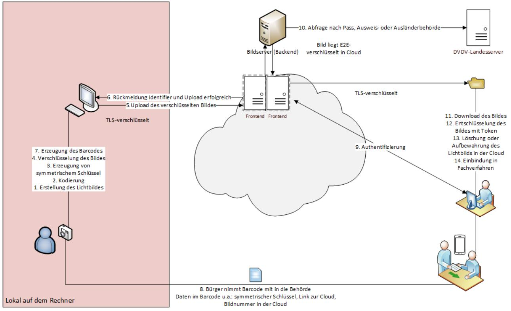

# Technische Richtlinie TR-03170

Sichere digitale Übermittlung biometrischer Lichtbilder von Dienstleistern (z. B. Fotografinnen und Fotografen) an Pass-, Personalausweis- und Ausländerbehörden

Rahmen-TR, Version 1.2

## Änderungshistorie

| Version | Datum      | Name | Beschreibung                                                                                          |
|---------|------------|------|-------------------------------------------------------------------------------------------------------|
| 0.1     | 20.04.2021 | BSI  | Erster Grobentwurf                                                                                    |
| 0.3     | 03.12.2021 | BSI  | Weiterentwicklung                                                                                     |
| 0.4     | 24.01.2022 | BSI  | Umstellung und Weiterentwicklung                                                                   |
| 0.5     | 21.02.2022 | BSI  | Fassung interne Kommentierung                                                                      |
| 0.6     | 14.03.2022 | BSI  | Entwurfsfassung V 0.6 für externe Kommentierung                                                 |
| 0.7     | 30.06.2022 | BSI  | Einarbeitung der Kommentierungen aus der 1. Kommentierungsrunde                              |
| 0.85    | 18.04.2023 | BSI  | Anpassung gemäß Entwurfsfassung der RVO                                                         |
| 0.9     | 25.07.2023 | BSI  | Ergänzung der Themen zu Registrierung und Nachvollziehbarkeit, sowie kleinere Anpassungen |
| 0.95    | 09.08.2023 | BSI  | Überarbeitung einiger Anforderungen mit Hinblick auf die Zertifizierung                      |
| 1.0     | 14.02.2024 | BSI  | Einarbeitung der Kommentare aus der 2. Kommentierungsrunde und Finalisierung.                |
| 1.1     | 01.08.2024 | BSI  | Überarbeitung und Aktualisierung einiger Anforderungen bezüglich Ihrer Praxistauglichkeit |
| 1.2     | 15.01.2025 | BSI  | Redaktionelle Anpassung                                                                            |

*Tabelle 1: Änderungshistorie*

Bundesamt für Sicherheit in der Informationstechnik Postfach 20 03 63 53133 Bonn Tel.: +49 22899 9582-0 AusschreibungLichtbild@bsi.bund.de Internet: https://www.bsi.bund.de © Bundesamt für Sicherheit in der Informationstechnik 2024

| 1 |       | Einleitung 4                                                                                          |   |
|---|-------|----------------------------------------------------------------------------------------------------------|---|
|   | 1.1   | Zielsetzung der Technischen Richtlinie                                                                   | 4 |
|   | 1.2   | Voraussetzungen der Technischen Richtlinie                                                               | 4 |
|   | 1.2.1 | Schlüsselwörter                                                                                          | 5 |
| 2 |       | Rahmenbedingungen                                                                                        | 6 |
|   | 2.1   | Rechtliche Rahmenbedingungen                                                                             | 6 |
|   | 2.1.1 | Pass-, Personalausweis- und Aufenthaltsgesetz, sowie Aufenthaltsverordnung                            | 6 |
|   | 2.1.2 | Personalausweisverordnung (PAuswV) und Passdatenerfassungs- und Übermittlungsverordnung (PassDEÜV) | 7 |
|   | 2.1.3 | Weitere rechtliche Anforderungen 8                                                                    |   |
|   | 2.2   | Betrachtungsgegenstand                                                                                   | 8 |
|   | 2.3   | Außerhalb der Betrachtung 8                                                                           |   |
|   | 2.4   | Zielobjekte und Prozessbeschreibung 8                                                                 |   |
|   | 2.4.1 | Definitionen 8                                                                                        |   |
|   | 2.4.2 | Prozess10                                                                                                |   |
|   |       | Literaturverzeichnis12                                                                                   |   |

## 1 Einleitung

## 1.1 Zielsetzung der Technischen Richtlinie

Am 11. Dezember 2020 wurde das vom Deutschen Bundestag und Bundesrat verabschiedete "**Gesetz zur Stärkung der Sicherheit im Pass-, Ausweis- und ausländerrechtlichen Dokumentenwesen"** [1]**, sowie** am 31. Oktober 2023 die "**Verordnung zur Änderung der Personalausweisverordnung, der Passverordnung, der Aufenthaltsverordnung sowie weiterer Vorschriften**" [2] im Bundesgesetzblatt veröffentlicht. Ziel des Gesetzes und der Verordnung ist es, angemessene Sicherheitsmaßnahmen festzulegen, um eine sichere Übertragung elektronischer Lichtbilder an Pass-, Personalausweis- und Ausländerbehörden sicherzustellen.

#### **Gefährdungslage durch Morphing**

Morphing bezeichnet eine Technik, mit der Lichtbilder (i. Allg. für Pass-, Personalausweis- und ausländerrechtliche Ausweisdokumente) elektronisch manipuliert werden können, indem mehrere Gesichtsbilder zu einem einzigen Bild digital verschmolzen werden und somit die Gesichtszüge von verschiedenen Personen in einem Lichtbild erscheinen.

Durch Morphing-Manipulation ist der Pass bzw. Personalausweis als Instrument zur Identitätskontrolle im Kern bedroht, sodass die bisherige Praxis, nach der antragstellende Personen ausgedruckte Lichtbilder bei der Pass-, Personalausweis- oder Ausländerbehörde einreichen, nicht mehr den aktuellen Sicherheitsanforderungen entspricht.

#### **Stärkung der Sicherheit durch Verfahren zur digitalen Übermittlung der Lichtbilder**

Das Gesetz sieht vor, dass künftig Manipulationen von hoheitlichen Dokumenten durch Morphing gezielt begegnet werden soll, indem ab dem 1. Mai 2025 das Lichtbild ausschließlich digital erstellt und auf einem gesicherten elektronischen Weg zur Behörde übermittelt wird. Eine Möglichkeit zur Umsetzung besteht darin, nach der **Technischen Richtlinie [BSI TR-03121] – Biometrie in hoheitlichen Anwendungen** [3] die Lichtbilder durch einen Live-Enrolment Prozess zu erstellen und zu übertragen.

Ein Verfahren zur elektronischen Bildübermittlung wurde bereits in der **Technischen Richtlinie [BSI TR-03146] – Elektronische Bildübermittlung zur Beantragung hoheitlicher Dokumente** [4] beschrieben. Diese Technische Richtlinie erlaubt es Dienstleistern (z. B. Fotostudios), digital aufgenommene Lichtbilder zum Zwecke der Beantragung eines Passes oder Personalausweises via De-Mail an die Pass-, Personalausweisoder Ausländerbehörde zu senden, bei welcher das Dokument beantragt wird. Nach vorliegender Rechtsverordnung wird dieses Verfahren ab dem 1. Mai 2025 nicht mehr genutzt werden können.

#### **Gegenstand der Technischen Richtlinie**

Die vorliegende **Technische Richtlinie [BSI TR-03170**] regelt die digitale Übermittlung biometrischer Lichtbilder von Dienstleistern (z. B. Fotografinnen und Fotografen) an Pass-, Personalausweis- oder Ausländerbehörden über einen sicheren Cloud-Dienst und definiert Anforderungen für die Zertifizierung von Diensten für dieses spezielle Verfahren. Allen zuständigen Behörden wird hierbei der Abruf der Lichtbilder von so zertifizierten Dienstanbietern ermöglicht.

## 1.2 Voraussetzungen der Technischen Richtlinie

Die Technische Richtlinie repräsentiert den Stand der Technik und wird fortlaufend aktualisiert.

Die vorliegende Technische Richtlinie [**BSI TR-03170**] besteht aus drei Dokumenten.

- Das vorliegende Dokument behandelt die Rahmenbedingungen und Voraussetzungen, Definition und Abgrenzung, sowie Begriffsbestimmungen.
- Das Teildokument [**BSI TR-03170-1**] gibt Anforderungen an die Cloud zur Übertragung biometrischer Lichtbilder vor.
- Das Teildokument [**BSI TR-03170-2**] stellt Anforderungen an die Anwendung zum Upload der biometrischen Lichtbilder in die Cloud.

### 1.2.1 Schlüsselwörter

In den Anforderungen werden die in Versalien geschriebenen Modalverben "MUSS", "SOLLTE" und "KANN" in ihren jeweiligen Formen sowie den zugehörigen Verneinungen genutzt, um deutlich zu machen, wie die jeweiligen Anforderungen zu interpretieren sind. Die hier genutzte Definition basiert auf dem [**BSI IT-Grundschutz]** [5] und [**RFC 2119]** [6] .

| MUSS/DARF NUR:                                                                                                                                                                                                            | Dieser Ausdruck bedeutet, dass es sich um eine Anforderung handelt, die unbedingt erfüllt werden muss (uneingeschränkte Anforderung).                                                                          |
|---------------------------------------------------------------------------------------------------------------------------------------------------------------------------------------------------------------------------|-------------------------------------------------------------------------------------------------------------------------------------------------------------------------------------------------------------------|
| DARF NICHT/DARF KEIN:                                                                                                                                                                                                     | Dieser Ausdruck bedeutet, dass etwas in keinem Fall getan werden darf (uneingeschränktes Verbot).                                                                                                              |
| SOLLTE:                                                                                                                                                                                                                   | Dieser Ausdruck bedeutet, dass eine Anforderung normalerweise erfüllt werden muss, es aber Gründe geben kann, dies doch nicht zu tun. Dies muss aber sorgfältig abgewogen und stichhaltig begründet werden. |
| SOLLTE NICHT/SOLLTE KEIN:Dieser Ausdruck bedeutet, dass etwas normalerweise nicht getan werden sollte, es aber Gründe gibt, dies doch zu tun. Dies muss aber sorgfältig abgewogen und stichhaltig begründet werden. |                                                                                                                                                                                                                   |
| KANN                                                                                                                                                                                                                      | Dieser Ausdruck bedeutet, dass eine bestimmte Umsetzung gewählt werden kann. Diese muss allerdings angezeigt werden.                                                                                           |

## 2 Rahmenbedingungen

## 2.1 Rechtliche Rahmenbedingungen

### 2.1.1 Pass-, Personalausweis- und Aufenthaltsgesetz, sowie Aufenthaltsverordnung

Rechtliche Grundlagen für die vorliegende Technische Richtlinie sind das **Passgesetz [PassG]** [7]**, Personalausweisgesetz [PAuswG]** [8]**, das Aufenthaltsgesetz [AufenthG**] [9] sowie die **Aufenthaltsverordnung [AufenthV]** [10] in der jeweils ab dem 1. Mai 2025 gültigen Fassung. Die entsprechenden erforderlichen Änderungen wurden durch das **Gesetz zur Stärkung der Sicherheit im Pass- , Ausweis- und ausländerrechtlichen Dokumentenwesen** vom 3. Dezember 2020 (BGBl. I S. 2744) vorgenommen. Durch diese Änderungen sehen die Gesetze Verordnungsermächtigungen für das Bundesministerium des Innern und für Heimat (BMI) bzgl. der sicheren Übermittlung des Lichtbilds vor, welche durch das **Gesetz zur Modernisierung des Pass-, Personalausweis- und ausländerrechtlichen Dokumentenwesens** vom 8. Oktober 2023 (BGBl. 2023 I Nr. 271) um eine Regelung ergänzt wird, wonach im Rahmen der Passbeantragung bei der Passbehörde im Ausland auch abweichende Verfahren zur Fertigung und sicheren Übermittlung des Lichtbilds durch das BMI geregelt werden können.

Die zulässigen Alternativen zur Lichtbilderstellung werden in **§ 6 Absatz 2 Satz 3 PassG** (bzw. entsprechend **§ 9 Absatz 3 Satz 3 PAuswG** sowie der Verweis in **§ 60 Absatz 2 AufenthV)** abschließend genannt:

*"Das Lichtbild ist nach Wahl der antragstellenden Person*

- *1. durch einen Dienstleister elektronisch zu fertigen und im Anschluss von diesem durch ein sicheres Verfahren an die Personalausweisbehörde zu übermitteln oder*
- *2. durch die Personalausweisbehörde elektronisch zu fertigen, sofern die Behörde über Geräte zur Lichtbildaufnahme verfügt.*

*Eine Veränderung des Lichtbilds ist nur nach Maßgabe dieses Gesetzes oder nach Maßgabe von Vorschriften, die auf Grund dieses Gesetzes erlassen wurden, zulässig."*

#### **§ 6a Absatz 3 Nummer 2 PassG** (bzw. entsprechend **§ 34 Nummer 3 Buchstabe b PAuswG** sowie § **99 Absatz 1, Nummer 13a Buchstabe a AufenthG**) lautet:

*"Das Bundesministerium des Innern und für Bau und Heimat wird ermächtigt, mit Zustimmung des Bundesrates durch Rechtsverordnung*

*[…]*

- *3. die Einzelheiten zu regeln,* 
	- *b. zur sicheren Übermittlung des Lichtbilds an die Personalausweisbehörde sowie zu einer Registrierung und Zertifizierung von Dienstleistern, welche Lichtbilder für die Personalausweisproduktion an die Personalausweisbehörde übermitteln,*

*[…]".*

#### **§ 6a Absatz 3 Satz 1 Nummer 2a PassG** lautet:

*"Das Bundesministerium des Innern und für Heimat wird ermächtigt, durch Rechtsverordnung, die der Zustimmung des Bundesrates bedarf, Regelungen zu treffen*

*[…]*

*2a. über von § 6 Absatz 2 Satz 3 in der ab 1. Mai 2025 geltenden Fassung abweichende Verfahren zur Fertigung des Lichtbildes sowie zur sicheren Übermittlung des Lichtbildes für Fälle, in denen der Pass im Ausland bei der Passbehörde nach § 19 Absatz 2 beantragt wird,*

*[…]."*

### 2.1.2 Personalausweisverordnung (PAuswV) und Passdatenerfassungs- und Übermittlungsverordnung (PassDEÜV)

Die **Personalausweisverordnung [PAuswV]** [11] und die **Passdatenerfassungs- und Übermittlungsverordnung [PassDEÜV]** [12] erlauben es grundsätzlich, Lichtbilder elektronisch durch einen Dienstleister zu fertigen und durch ein sicheres Verfahren an die Pass- oder Personalausweisbehörde zu übermitteln.

In **§ 1a PassDEÜV** "Fertigung und Übermittlung des Lichtbilds durch ein sicheres Verfahren" heißt es dazu:

*"(1) [...] In Fällen, in denen ein Pass bei einer Passbehörde nach § 19 Absatz 1 des Passgesetzes beantragt wird, kann die antragstellende Person einen Dienstleister mit der Fertigung des Lichtbilds beauftragen. Der Dienstleister hat das Lichtbild elektronisch zu fertigen und im Anschluss durch ein sicheres Verfahren an die Passbehörde zu übermitteln. [...]*

*(2) Ein sicheres Verfahren im Sinne des Absatzes 1 Satz 2 ist:*

*1. die Übermittlung des Lichtbilds an die Passbehörde von einem Dienstleister unter Einbindung eines Cloud-Anbieters [...]."*

Eine entsprechende Regelung findet sich in **§ 5a PAuswV**.

Der Ablauf des Verfahrens der Übermittlung des Lichtbilds, die Registrierung und Identifizierung des Dienstleisters bei einem Cloud-Anbieter sowie die Pflichten des Cloud-Anbieters sind in den **§§ 1b bis 1d PassDEÜV** bzw**. § 5 Absatz 4 und Absatz 7 und §§ 5a bis 5d PAuswV** geregelt.

Es ist vorgesehen, dass mehrere Personen dem Dienstleisterkonto (einem Nutzerkonto) zugeordnet werden können. Um eine eindeutige Identifizierung der jeweils übermittelnden Person zu ermöglichen, sieht **§ 1c Absatz 4 PassDEÜV** "Registrierung und Identifizierung eines Dienstleisters bei einem Cloud-Anbieter" vor:

*"(4) Für jede Person, die sich in einem Nutzerkonto nach Absatz 3 registriert hat, wird durch den Cloud-Anbieter ein Pseudonym erzeugt."*

*[...]."*

Eine entsprechende Regelung findet sich in **§ 5c Absatz 4 PAuswV**.

Darüber hinaus müssen sichere Verfahren nach **§ 1a Absatz 2 Nummer 1 PassDEÜV** dem Stand der Technik entsprechen. In § 2 "Qualitätssicherung" Absatz 2 heißt es:

*"(2) Die technischen und organisatorischen Anforderungen an*

*[…]*

*4. das sichere Verfahren der Übermittlung von Lichtbildern von einem Dienstleister an die Passbehörde*

*sind nach dem Stand der Technik zu erfüllen. Der Stand der Technik ist als niedergelegt zu vermuten in den Technischen Richtlinien des Bundesamtes für Sicherheit in der Informationstechnik. Diese sind in der Anlage 1 aufgeführt und gelten in der jeweils im Bundesanzeiger veröffentlichten Fassung."*

Eine entsprechende Regelung findet sich in **§ 2 Satz 1 Nummer 2 Buchstabe i), Satz 2 und 3 PAuswV**.

In der Anlage 1 der **PassDEÜV** sind abschließend diejenigen Technischen Richtlinien aufgeführt, die für die Beurteilung des Stands der Technik nach der **PassDEÜV** relevant sind. Dort heißt es hinsichtlich der Übermittlung von Lichtbildern an Behörden in Nummer 5:

*"Anlage 1 Übersicht über die Technischen Richtlinien des Bundesamtes für Sicherheit in der Informationstechnik […]*

*5. BSI: Technische Richtlinie TR-03170, Sichere digitale Übermittlung biometrischer Lichtbilder von Dienstleistern an Pass-, Personalausweis- und Ausländerbehörden."*

### 2.1.3 Weitere rechtliche Anforderungen

Urheberrechtlich MUSS sichergestellt werden, dass die biometrischen Bilder lizenzfrei von den Behörden zur Erstellung der hoheitlichen Dokumente genutzt werden können. Dies kann beispielsweise über die AGB der Dienstleister gelöst werden.

Auch die Einhaltung der datenschutzrechtlichen Vorgaben aus der **EU Datenschutz-Grundverordnung [DSGVO]** [13] MUSS gewährleistet sein.

## 2.2 Betrachtungsgegenstand

Die vorliegende Technische Richtlinie behandelt zwei Zertifizierungen:

- 1. Zertifizierung der Cloud, in der die biometrischen Lichtbilder gespeichert werden (siehe [**BSI TR-03170-1**] Kapitel 2). Der Nachweis über ein C5-Testat ist Bestandteil der Zertifizierung nach dieser Technischen Richtlinie.
- 2. Zertifizierung der Software, mit der die Bilder beim Dienstleister (z. B. Fotografin oder Fotograf) in die Cloud hochgeladen werden und der zugehörige Barcode mitsamt den notwendigen Informationen (siehe [**BSI TR-03170-2**] Kapitel 2) erstellt wird. Zertifiziert werden MÜSSEN die für den in Kapitel [2.4.2](#page-9-0) beschriebenen Prozess notwendigen Funktionalitäten der Anwendung.

Die Konformität zu den Vorgaben dieser Technischen Richtlinie MUSS durch ein TR-Zertifikat bestätigt werden (Informationen zur Zertifizierung nach TR gibt es auf der Webseite des BSI1 ). Diese Technische Richtlinie ermöglicht sowohl die Zertifizierung einer Cloud, sowie die Zertifizierung einer Anwendung zur Anbindung der Dienstleister an die Cloud. Die Zertifizierungen können gemeinsam oder unabhängig voneinander erfolgen.

## 2.3 Außerhalb der Betrachtung

Der Betrachtungsbereich der Technischen Richtlinie erstreckt sich nicht:

- auf die Erzeugung der Lichtbilder. Für die Sicherstellung der Bildqualität gelten die Regelungen der [**BSI TR-03121]** [3], in ihrer aktuellsten Fassung;
- auf die Verarbeitung der Bilder in den IT-Fachverfahren der Pass-, Personalausweis- oder Ausländerbehörden;
- auf die Übertragung von biometrischen Bildern, die von Live-Enrolment-Stations direkt an die Pass-, Personalausweis- oder Ausländerbehörden übertragen werden.

## 2.4 Zielobjekte und Prozessbeschreibung

### 2.4.1 Definitionen

Tabelle 2: Definitionen

| Zielobjekte | Beschreibung                                                           |
|-------------|------------------------------------------------------------------------|
| Assets      | Im Sinne dieser Technischen Richtlinie sind die Assets, die für die |
|             | Informationssicherheit des Cloud-Dienstes während der                  |
|             | Erstellung, Verarbeitung, Speicherung, Übermittlung, Löschung          |
|             | oder Zerstörung von Informationen benötigten Objekte, im            |
|             | Verantwortungsbereich des Cloud-Anbieters.                             |

1 https://www.bsi.bund.de/DE/Themen/Unternehmen-und-Organisationen/Standards-und-Zertifizierung/Zertifizierung-und-Anerkennung/Zertifizierung-von-Produkten/Zertifizierung-nach-TR/zertifizierung-nach-tr\_node.html

| Zielobjekte                                           | Beschreibung                                                                                                                                                                                                                                                                                                                                                                                   |
|-------------------------------------------------------|------------------------------------------------------------------------------------------------------------------------------------------------------------------------------------------------------------------------------------------------------------------------------------------------------------------------------------------------------------------------------------------------|
| Behörde                                               | Von den Ländern bestimmte, für Ausweisangelegenheiten in Deutschland zuständige Behörden (Pass-, Personalausweis- oder Ausländerbehörden) und Empfänger der erstellten digitalen Lichtbilder.                                                                                                                                                                                   |
| Biometrisches Lichtbild                               | Im Sinne dieser Technischen Richtlinie ein digitales Bild, welches zum Zeitpunkt der Bildnutzung in hoheitlichen Dokumenten die geltenden gesetzlichen Bildanforderungen der jeweils gültigen [PassV] [14], [PAuswV] [11], [PassDEÜV] [12], [AufenthV] [10] oder entsprechender gesetzlicher Nachfolgedokumente erfüllt.                                         |
| Bürgerin oder Bürger                                  | Antragstellerin oder Antragsteller, die/der von einem Dienstleister ein digitales biometrisches Lichtbild für ein neues hoheitliches Dokument erstellen und an den Cloud-Dienst übertragen lässt. Von dort kann die Pass-, Personalausweis- oder Ausländerbehörde diese dann abrufen.                                                                                     |
| Cloud-Anbieter                                        | Anbieter des im Rahmen dieser Technischen Richtlinie beschriebenen Cloud-Dienstes. Dies kann den Anbieter eines Cloud-Dienstes und den Anbieter/Betreiber einer Cloud Infrastruktur umfassen (Wobei Anbieter des Cloud-Dienstes und Betreiber ein Unternehmen oder mehrere unterschiedliche sein können).                                                                    |
| Cloud-Dienst                                          | Dienst, der digitale Lichtbilder von Dienstleistenden entgegennimmt und für den Download durch Behörden bereitstellt. Gemäß C5-Testat ist der Cloud-Dienst eine im Rahmen von Cloud Computing angebotene Dienstleistung der Informationstechnik. Dieser Dienst speichert die biometrischen Lichtbilder zum Abruf durch die Pass-, Personalausweis- und Ausländerbehörden. |
| Dienstleister (z. B. Fotografinnen und Fotografen) | Dienstleister einer Bürgerin oder eines Bürgers, der das digitale biometrische Lichtbild erstellt, aufbereitet und das biometrische Lichtbild an einen sicheren Cloud-Dienst übermittelt. Von dort kann die Pass-, Personalausweis- oder Ausländerbehörde diese dann abrufen.                                                                                             |
| Download-Schnittstelle                                | Die Schnittstelle, über die Behörden auf den Cloud-Dienst zugreifen, um biometrische Lichtbilder aus der Cloud herunterzuladen und in ihre eigenen Fachverfahren einzuspeisen (siehe [BSI TR-03170-1] Kapitel 2.8.2).                                                                                                                                                        |
| Lichtbildidentifier                                   | Die eindeutige Kennung eines biometrischen Lichtbilds in einer Cloud. In der Schnittstellenspezifikation wird der Lichtbildidentifier auch als photoId bezeichnet.                                                                                                                                                                                                                 |
| Live-Enrolment-Stations                               | Selbstbedienungsterminals zur Produktionsdatenerfassung, - qualitätsprüfung und –übermittlung für hoheitliche Dokumente                                                                                                                                                                                                                                                                  |
| Nutzerkennung                                         | Die eindeutige Identität einer im Auftrag eines Dienstleisters handelnden natürlichen Person mitsamt Zuordnung zum Dienstleisterkonto und der genutzten Lichtbildcloud, für die Rückverfolgbarkeit der Herkunft eines biometrischen Lichtbildes.                                                                                                                                |

| Zielobjekte          | Beschreibung                                                          |
|----------------------|-----------------------------------------------------------------------|
| Dienstleisterkonto   | Ein mittels Registrierung einer Organisation, eines Unternehmens   |
|                      | oder einer/s selbstständigen Fotografin/en erzeugtes Zugangsprofil    |
|                      | bei einem Cloud-Anbieter. Die genannte Organisation/Das      |
|                      | genannte Unternehmen ist im Sinne dieser Technischen Richtlinie |
|                      | Dienstleister für die Fertigung von Lichtbildern für hoheitliche   |
|                      | Dokumente.                                                            |
| Nutzerregistrierung  | Die Registrierung einer natürlichen Person unter einer                |
|                      | Organisation/einem Unternehmen, im Rahmen Ihrer Tätigkeit bei         |
|                      | der Erzeugung von Lichtbildern für hoheitliche Dokumente. Die         |
|                      | Nutzerregistrierung beinhaltet die Erzeugung der Nutzerkennung.       |
| Sensible Daten       | Personenbezogene Daten nach Art.4 Abs.1 [DSGVO] [13], sowie     |
|                      | insbesondere biometrische Daten nach Art.4 Abs.14 [DSGVO] [13]. |
| Upload-Schnittstelle | Die Schnittstelle, über die biometrische Lichtbilder sicher vom    |
|                      | Dienstleister (z.B. Fotografinnen und Fotografen) an den Cloud        |
|                      | Dienst übertragen werden.                                             |

#### 2.4.2 Prozess

Abbildung 1 Ende-zu-

#### Der Prozess gliedert sich in folgende Schritte:

Dienstleister (z. B. Fotografinnen und Fotografen) MÜSSEN sich bei dem Cloud-Dienst registrieren, da nur registrierte Dienstleister Lichtbilder zu diesem übertragen dürfen. Der Anbieter des Cloud-Dienstes MUSS diesen in das Deutsche Verwaltungsdiensteverzeichnis [DVDV] [15] eintragen lassen.

Im Rahmen der sicheren digitalen Lichtbildübermittlung finden die folgenden Prozessschritte statt:

- 1. Die Bürgerin/der Bürger lässt vom registrierten Dienstleister ein biometrisches Lichtbild erstellen. (Bei der Erstellung des Lichtbilds KÖNNEN Meta-Informationen zur Aufnahme, z. B. Marke/Modell der Aufnahmeeinheit, verwendete Software, etc. eingebracht werden).
- 2. Das ausgewählte Lichtbild wird kodiert (siehe [BSI TR-03170-2] Kapitel 2.1).
- 3. Der symmetrische Schlüssel wird erzeugt (siehe [BSI TR-03170-2] Kapitel 2.2).
- 4. Das Lichtbild wird mit dem symmetrischen Schlüssel verschlüsselt.
- 5. Der Dienstleister überträgt das clientseitig verschlüsselte Lichtbild über die Upload-Schnittstelle an den Cloud-Dienst. Die durch den Verordnungstext geforderte Anmeldung des Dienstleisters mit der eID oder einem anderen elektronischen Identifizierungsmittel (gemäß [BSI TR-03170-1] Kapitel 2.6) beim Cloud-Anbieter MUSS vor Schritt 5 (der Übertragung des Lichtbilds zur Cloud) erfolgen.
- 6. Der Cloud-Dienst erzeugt einen eindeutigen Identifier für die Integration in den Barcode und sendet diesen zusammen mit einer Bestätigung der erfolgreichen Speicherung des Lichtbilds an den Dienstleister (siehe [BSI TR-03170-1] Kapitel 2.7.3).
- 7. Es wird ein Barcode mit den notwendigen Daten zum Abruf des Lichtbilds aus der Cloud und zur Integration ins Fachverfahren erzeugt (siehe [BSI TR-03170-2] Kapitel 2.3). Der Barcode wird lokal erzeugt.
- 8. Die Bürgerin/der Bürger bekommt den Barcode vom Dienstleister und beantragt bei der Behörde das Ausweisdokument.
- 9. Die Pass-, Personalausweis- oder Ausländerbehörde fragt den Abruf des elektronischen Lichtbildes beim Cloud-Dienst unter Verwendung der vom Bürger zur Verfügung gestellten Zugangsdaten in Form des Barcodes an und übermittelt in diesem Kontext auch den Organisationsschlüssel der Behörde aus dem DVDV (siehe [BSI TR-03170-1] Kapitel 2.7.4).
- 10. Dazu prüft der Cloud-Dienst über das DVDV die Berechtigung im Rahmen der dort eingetragenen Rolle, und die Behörde authentisiert sich (siehe [BSI TR-03170-1] Kapitel 2.7.4).
- 11. Das Lichtbild wird von der Behörde aus der Cloud abgerufen.
- 12. Anschließend wird das Lichtbild entschlüsselt. Die Entschlüsselung ist nur möglich, wenn der Behörde der korrekte Schlüssel als Teil des Barcodes ausgehändigt wurde.
- 13. Das Lichtbild kann aus der Cloud gelöscht werden oder für eine weitere Verwendung, bis zur maximal zulässigen Dauer, in der Cloud aufbewahrt werden (siehe [BSI TR-03170-1] Kapitel 2.8.3).
- 14. Das Lichtbild wird in das behördliche IT-Fachverfahren zur Ausstellung des Dokuments eingebunden.

## Literaturverzeichnis

- [1] Bundesgesetzblatt, "Gesetz zur Stärkung der Sicherheit im Pass-, Ausweis- und ausländerrechtlichen Dokumentenwesen," 11 12 2020. [Online]. Available: https://www.bgbl.de/xaver/bgbl/start.xav#\_\_bgbl\_\_//\*[@attr\_id='bgbl120s2744.pdf']. [Zugriff am 10 01 2024].
- [2] Bundesgesetzblatt, "Verordnung zur Änderung der Personalausweisverordnung, der Passverordnung, der Aufenthaltsverordnung sowie weiterer Vorschriften," 31 10 2023. [Online]. Available: https://www.recht.bund.de/bgbl/1/2023/290/VO.html. [Zugriff am 24 07 2024].
- [3] Bundesamt für Sicherheit in der Informationstechnik, BSI, "BSI TR-03121 Biometrie in hoheitlichen Anwendungen," 2023. [Online]. Available: https://www.bsi.bund.de/DE/Themen/Unternehmen-und-Organisationen/Standards-und-Zertifizierung/Technische-Richtlinien/TR-nach-Thema-sortiert/tr03121/TR-03121\_node.html. [Zugriff am 09 01 2024].
- [4] Bundesamt für Sicherheit in der Informationstechnik, BSI, "BSI TR-03146 Elektronische Bildübermittlung zur Beantragung hoheitlicher Dokumente (E-Bild hD)," [Online]. Available: https://www.bsi.bund.de/DE/Themen/Unternehmen-und-Organisationen/Standards-und-Zertifizierung/Technische-Richtlinien/TR-nach-Thema-sortiert/tr03146/TR-03146\_node.html. [Zugriff am 09 01 2024].
- [5] Bundesamt für Sicherheit in der Informationstechnik, BSI, "Informationssicherheit und IT-Grundschutz. BSI-Standards 200-1, 200-2, 200-3 und 200-4," 2022. [Online]. Available: https://www.bsi.bund.de/DE/Themen/Unternehmen-und-Organisationen/Standards-und-Zertifizierung/IT-Grundschutz/BSI-Standards/bsi-standards\_node.html. [Zugriff am 09 01 2024].
- [6] RFC-Editor, "RFC 2119 Key words for use in RFCs to Indicate Requirement Levels," 1997. [Online]. Available: https://www.rfc-editor.org/info/rfc2119. [Zugriff am 21 08 2023].
- [7] Bundesamt für Justiz, BfJ, "Paßgesetz (PaßG)," 1986. [Online]. Available: https://www.gesetze-iminternet.de/pa\_g\_1986/index.html. [Zugriff am 09 01 2024].
- [8] Bundesamt für Justiz, BfJ, "Gesetz über Personalausweise und den elektronischen Identitätsnachweis (PAuswG)," 2009. [Online]. Available: https://www.gesetze-iminternet.de/pauswg/index.html. [Zugriff am 09 01 2024].
- [9] Bundesamt für Justiz, BfJ, "Gesetz über den Aufenthalt, die Erwerbstätigkeit und die Integration von Ausländern im Bundesgebiet (AufenthG)," 2004. [Online]. Available: https://www.gesetze-iminternet.de/aufenthg\_2004/. [Zugriff am 09 01 2024].
- [10] Bundesamt für Justiz, BfJ, "Aufenthaltsverordnung (AufenthV)," 2004. [Online]. Available: https://www.gesetze-im-internet.de/aufenthv/. [Zugriff am 09 01 2024].
- [11] Bundesamt für Justiz, BfJ, "Verordnung über Personalausweise, eID-Karten für Unionsbürger und Angehörige des Europäischen Wirtschaftsraums und den elektronischen Identitätsnachweis (PAuswV)," 2010. [Online]. Available: https://www.gesetze-im-internet.de/pauswv/index.html. [Zugriff am 09 01 2024].
- [12] Bundesamt für Justiz, BfJ, "Verordnung zur Erfassung und Qualitätssicherung des Lichtbildes und der Fingerabdrücke in den Passbehörden und der Übermittlung der Passantragsdaten an den Passhersteller (PassDEÜV)," 2007. [Online]. Available: https://www.gesetze-iminternet.de/passde\_v/. [Zugriff am 09 01 2024].
- [13] Amtsblatt der Europäischen Union, "Verordnung (EU) 2016/679 des Europäischen Parlaments und des Rates vom 27. April 2016 zum Schutz natürlicher Personen bei der Verarbeitung personenbezogener Daten, zum freien Datenverkehr und zur Aufhebung der Richtlinie 95/46/EG (DSGVO)," 2016. [Online]. Available: https://eur-lex.europa.eu/legalcontent/DE/ALL/?uri=celex%3A32016R0679. [Zugriff am 21 08 2023].
- [14] Bundesamt für Justiz, BfJ, "Verordnung zur Durchführung des Passgesetzes (PassV)," 2007. [Online]. Available: https://www.gesetze-im-internet.de/passv\_2007/index.html. [Zugriff am 09 01 2024].
- [15] Informationstechnikzentrum Bund, ITZ Bund, "DVDV das Diensteverzeichnis der öffentlichen Verwaltung," [Online]. Available: https://www.itzbund.de/DE/itloesungen/standardloesungen/dvdv/dvdv.html. [Zugriff am 09 01 2024].