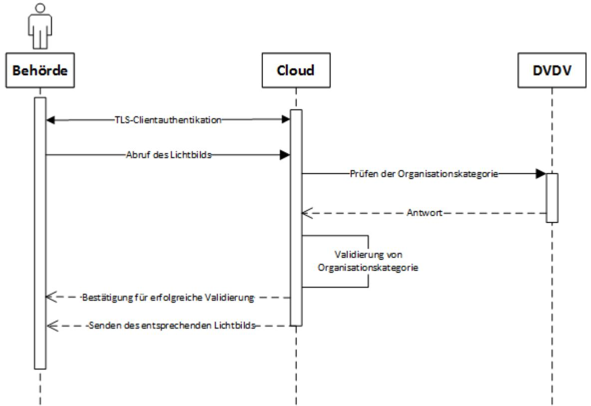

# Technische Richtlinie TR-03170

Sichere digitale Übermittlung biometrischer Lichtbilder von Dienstleistern (z. B. Fotografinnen und Fotografen) an Pass-, Personalausweis- und Ausländerbehörden

Teil 1 – Anforderungen an den Cloud-Dienst, Version 1.2

## Änderungshistorie

| Version | Datum      | Name | Beschreibung                                                                                          |
|---------|------------|------|-------------------------------------------------------------------------------------------------------|
| 0.1     | 20.04.2021 | BSI  | Erster Grobentwurf                                                                                    |
| 0.3     | 03.12.2021 | BSI  | Weiterentwicklung                                                                                     |
| 0.4     | 24.01.2022 | BSI  | Umstellung und Weiterentwicklung                                                                   |
| 0.5     | 21.02.2022 | BSI  | Fassung Interne Kommentierung                                                                      |
| 0.6     | 14.03.2022 | BSI  | Entwurfsfassung V 0.6 für externe Kommentierung                                                 |
| 0.7     | 30.06.2022 | BSI  | Einarbeitung der Kommentierungen aus der 1. Kommentierungsrunde                              |
| 0.85    | 18.04.2023 | BSI  | Anpassung gemäß Entwurfsfassung der RVO                                                         |
| 0.9     | 25.07.2023 | BSI  | Ergänzung der Themen zu Registrierung und Nachvollziehbarkeit, sowie kleinere Anpassungen |
| 0.95    | 09.08.2023 | BSI  | Überarbeitung einiger Anforderungen mit Hinblick auf die Zertifizierung                      |
| 1.0     | 14.02.2024 | BSI  | Einarbeitung der Kommentare aus der 2. Kommentierungsrunde und Finalisierung.                |
| 1.1     | 01.08.2024 | BSI  | Überarbeitung und Aktualisierung einiger Anforderungen bezüglich Ihrer Praxistauglichkeit |
| 1.2     | 15.01.2025 | BSI  | Anpassung C5 Testat für Erstzertifizierung                                                         |

*Tabelle 1: Änderungshistorie*

Bundesamt für Sicherheit in der Informationstechnik Postfach 20 03 63 53133 Bonn Tel.: +49 22899 9582-0 AusschreibungLichtbild@bsi.bund.de Internet: https://www.bsi.bund.de © Bundesamt für Sicherheit in der Informationstechnik 2024

| 1 |       | Einleitung 4                                                                             |
|---|-------|---------------------------------------------------------------------------------------------|
|   | 1.1   | Einordnung 4                                                                             |
| 2 |       | Anforderungen an den Cloud-Dienst 5                                                      |
|   | 2.1   | Vorliegen einer C5-Attestierung 5                                                        |
|   | 2.2   | Zusatzanforderungen 5                                                                    |
|   | 2.2.1 | Rahmenbedingungen 5                                                                      |
|   | 2.2.2 | Mitwirkungspflichten 10                                                                  |
|   | 2.3   | Frontend und Backend 10                                                                  |
|   | 2.4   | Protokollierung11                                                                           |
|   | 2.5   | Registrierungsprozess11                                                                     |
|   | 2.6   | Nachvollziehbarkeit/Verantwortlichkeit beim Upload12                                        |
|   | 2.7   | Kommunikationswege12                                                                        |
|   | 2.7.1 | Aufbau einer Verbindung im Rahmen einer Nutzer Session13                                    |
|   | 2.7.2 | Erzeugung von Zufallszahlen13                                                               |
|   | 2.7.3 | Kommunikationswege Dienstleister (z. B. Fotografinnen und Fotografen) – Cloud (Upload)13 |
|   | 2.7.4 | Kommunikation Cloud – Behörde DVDV14                                                     |
|   | 2.8   | Abruf der Lichtbilder durch die Pass-, Personalausweis- oder Ausländerbehörde15          |
|   | 2.8.1 | Kommunikation mit dem DVDV15                                                                |
|   | 2.8.2 | Abruf von Daten16                                                                           |
|   | 2.8.3 | Sichere Datenlöschung 16                                                                 |
|   | 2.8.4 | Entschlüsselung 16                                                                       |
|   |       | Literaturverzeichnis17                                                                      |

## 1 Einleitung

Die Technische Richtlinie [**BSI TR-03170**] regelt die digitale Übermittlung biometrischer Lichtbilder von Dienstleistern (z. B. Fotografinnen und Fotografen) an Pass-, Personalausweis- oder Ausländerbehörden über einen sicheren Cloud-Dienst und definiert Anforderungen für die Zertifizierung von Diensten für dieses spezielle Verfahren. Allen zuständigen Behörden wird hierbei der Abruf der Lichtbilder von so zertifizierten Dienstanbietern ermöglicht.

### 1.1 Einordnung

Der vorliegende Teil der Technische Richtlinie behandelt Anforderungen, die der Zertifizierung der Cloud, in der die biometrischen Daten gespeichert werden (siehe Kapitel [2\)](#page-4-0), zu Grunde liegen. Der Nachweis über ein C5-Testat ist Bestandteil der Zertifizierung nach dieser Technischen Richtlinie.

Beschreibung von Kontext und Zielsetzung der Technischen Richtlinie, Voraussetzungen, Definition der Schlüsselwörter(MUSS, SOLLTE, KANN, etc.), rechtliche Rahmenbedingungen, Betrachtungsgegenstand und Abgrenzung, Definition der Zielobjekte und Begrifflichkeiten sowie eine Prozessbeschreibung finden sich im Rahmendokument [**BSI TR-03170**].

Die Zertifizierung nach **[BSI TR-03170-1]** muss durch, für die Durchführung von Audits zur **Zertifizierung nach ISO 27001 auf der Basis von IT-Grundschutz, zertifizierte "Auditteamleiter" bzw. "Auditoren"** [1] oder durch nach **"Kompetenzfeststellung: Programm im Bereich der Common Criteria (CC)"** [2] **anerkannte CC-Evaluatoren mit Erfahrung im Bereich ALC (Assurance: Life-Cycle)**, entsprechend **anerkannter CC-Prüfstellen** [3] [4] durchgeführt werden. Für **[BSI TR-03170-2]** gelten die Anforderungen der **"Anerkennung von Prüfstellen: Programm im Bereich Technischer Richtlinien (TR)"** [5] und der **"Kompetenzfeststellung: Programm im Bereich Technischer Richtlinien** (TR)" [6].

### 2 Anforderungen an den Cloud-Dienst

#### 2.1 Vorliegen einer C5-Attestierung

Der Cloud-Anbieter MUSS:

- für die gesamte Beauftragungszeit, und
- im Falle einer Vertragsbeendigung, für eine Nachlaufzeit von 6 Monaten, oder
- im Falle einer Beendigung des Betriebs des Cloud-Dienstes, für eine zu vereinbarende Übergangszeit,

eine **Attestierung des "Cloud Computing Compliance Criteria Catalogue" (C5-Kriterienkatalog)** [7] **mindestens** vom **Typ 1** über die Basiskriterien in der aktuellen Fassung für eine Erstzertifizierung vorweisen können. Bei einer Re-Zertifizierung SOLL die **Attestierung des "Cloud Computing Compliance Criteria Catalogue" (C5-Kriterienkatalog)** [7] vom **Typ 2** vorliegen, aber mindestens vom **Typ 1.**

#### 2.2 Zusatzanforderungen

Zusätzlich zu den Basiskriterien, welche den Mindestumfang einer Prüfung nach dem [**C5-Kriterienkatalog]** [7] bilden, MUSS der Cloud-Dienst nachfolgende Zusatzanforderungen an die C5-Berichterattung erfüllen.

Abweichungen von der Umsetzung der C5-Kriterien werden gemäß Kapitel 3.4.7 des [**C5-Kriterienkatalogs]** [7] behandelt. Die im Folgenden genutzten Begrifflichkeiten und Anforderungen beziehen sich auf Begriffe und Basiskriterien aus dem [**C5-Kriterienkatalog]** [7].

#### 2.2.1 Rahmenbedingungen

#### 2.2.1.1 BC-01 Angaben zu Gerichtsbarkeit und Lokation

Der Cloud-Anbieter MUSS der Gerichtsbarkeit eines Landes der europäischen Union unterliegen. Der Anbieter des Cloud-Dienstes MUSS erklären, dass die Verarbeitung, Sicherung und Speicherung von Daten zur Bereitstellung des Cloud-Dienstes auf Systemkomponenten in einem Land der europäischen Union erfolgt und ein Konzept vorlegen, wie er dies technisch sicherstellt.

#### 2.2.1.2 BC-02 Angaben zu Verfügbarkeit und Störungsbeseitigung im Normalbetrieb

Der Anbieter des Cloud-Dienstes MUSS anhand eines Betriebskonzeptes nachweisen, dass er einen Normalbetrieb während der Geschäftszeit der Pass- und Personalausweis- oder Ausländerbehörden und der Dienstleister (z. B. Fotografinnen und Fotografen), gemäß [Tabelle 2](#page-4-4) gewährleisten kann:

| Key Performance Indicators (KPI)                                                                       | Messeinheit  | Geschäftszeit (Mo – Fr: 7–20 Uhr, Sa: 7–17 Uhr) | Außerhalb der Geschäftszeit |
|-----------------------------------------------------------------------------------------------------------|--------------|-------------------------------------------------------------|-----------------------------|
| Verfügbarkeit                                                                                             | Prozent      | 99,9%                                                       | 95,0%                       |
| Störung in der Netzwerkkommunikatio n zwischen den Behörden und der Cloud-Infrastruktur | Kritikalität | Sehr hoch                                                   | Gering                      |

Tabelle 2: Verfügbarkeit und Störungsbeseitigung im Normalbetrieb

| Key Performance Indicators (KPI)                                                                              | Messeinheit  | Geschäftszeit (Mo – Fr: 7–20 Uhr, Sa: 7–17 Uhr) | Außerhalb der Geschäftszeit |
|------------------------------------------------------------------------------------------------------------------|--------------|-------------------------------------------------------------|-----------------------------|
| Störung in der Netzwerkkommunikatio n zwischen den Fotodienstleistern und der Cloud-Infrastruktur | Kritikalität | Sehr hoch                                                   | Gering                      |
| Störung in der Cloud Infrastruktur                                                                            | Kritikalität | Sehr hoch                                                   | Gering                      |
| Wartungszeit                                                                                                     | Uhrzeit      | Keine                                                       | beliebig                    |
| Reaktionszeit bei Störung                                                                                     | Minuten      | <= 10                                                       | <= 60                       |
| Wiederherstellungszeit                                                                                           | Minuten      | <= 60                                                       | <= 180                      |

**Kritikalität** entspricht der Einordnung in Risikokategorien nach BSI Standard 200-3 [8].

**Wartungsarbeiten** MÜSSEN innerhalb der Wartungszeit durchgeführt und abgeschlossen werden.

**Störungen** beinhalten alle ungeplanten Ausfälle oder Teilausfälle innerhalb der Geschäfts- und Nutzungszeit.

**Reaktionszeit bei Störung** beinhaltet sowohl die Störungserkennung als auch die Störungsmeldung.

**Wiederherstellungszeit** beinhaltet die Reaktionszeit bei Störung bis hin zum Abschluss der Störungsbeseitigung.

#### **Anforderungen an eine Störungsmeldung:**

Jede Störungsmeldung MUSS mit Datum, Uhrzeit, den Kontaktdaten der meldenden Person oder technischen Komponente, der Art des Meldeweges und den Kontaktdaten der die Störung aufnehmenden Person dokumentiert werden.

Die erfassten Kontaktdaten MÜSSEN so gestaltet sein, dass eine Rückverfolgung oder Rückmeldung an die jeweilige Kontaktadresse (meldend oder aufnehmend) zu jedem Zeitpunkt möglich ist.

Im Falle einer automatisierten Meldung durch eine technische Komponente MUSS als Kontaktdatum eine eindeutige Geräteidentifikation erfasst werden.

Falls nicht anders möglich, KANN die Eindeutigkeit der Geräteidentifikation auch durch Kombination mehrerer nichteindeutiger Geräteattribute zu einem eindeutigen Attribut hergestellt werden.

Eine Störungsmeldung MUSS über einen vom Kommunikationsverlauf der Störungsmeldung getrennten Rückmeldepfad mit eigenem Kommunikationsverlauf quittiert werden. Bei Meldungen, die durch Menschen erfolgen, z. B. mittels Rückruf oder Antwort-E-Mail MÜSSEN Datum, Uhrzeit, der genutzte Kanal und eine Zusammenfassung des Gesprächsverlaufs dokumentiert werden. Weitere Informationen zum Notfallmanagement finden sich auch in [**BSI-Standard 200-4 (Business Continuity Management)**] [8].

#### 2.2.1.3 BC-03 Angaben zu Wiederanlaufparametern im Notbetrieb

Unter Berücksichtigung der Definitionen für Geschäftszeit aus Kapitel 2.2.1 ist von einem Notbetrieb auszugehen, wenn ein Ereignis der Kategorie Notfall, Krise oder Katastrophe nach Definition des [**BSI-Standard 200-4 (Business Continuity Management)**] [8] eintritt und den Normalbetrieb unterbricht.

Das BSI empfiehlt folgende Wiederanlaufparameter durch den Cloud-Dienst anzustreben:

| Tabelle 3: Wiederanlaufparameter |
|----------------------------------|
|----------------------------------|

| Key Performance Indicators (KPI) | Messeinheit | Geschäftszeit (Mo – Fr: 7–20 Uhr, Sa: 7–17 Uhr) | Außerhalb der Geschäftszeit                                 |
|-------------------------------------|-------------|-------------------------------------------------------------|-------------------------------------------------------------|
| Recovery Point Objective (RPO)   | Minuten     | 0                                                           | 60                                                          |
| Recovery Time Objective (RTO)    | Minuten     | <= 30                                                       | Bis Beginn nächste Geschäftszeit + 15 aber mindestens 30 |

Um die geforderte Aufgabe zu erfüllen, MUSS der Cloud-Dienst die volle im Rahmen dieser Technischen Richtlinie beschriebene Funktionalität aufweisen (D.h. der Upload von Lichtbildern von Fotodienstleistern und der Download von Lichtbildern von Behörden muss wie in **[BSI TR-03170]** Kapitel 2.4.2 beschrieben möglich sein). Es gibt kein Funktionalitätsniveau unter der Vollfunktionalität, welches z. B. im Rahmen eines Notbetriebs den Anforderungen genügt. Entsprechend müssen hierzu keine expliziten Parameter für den Wiederanlauf zum Notbetrieb festgelegt werden.

#### 2.2.1.4 BC-06 Angaben zu Zertifizierungen oder Bescheinigungen

Zusätzlich zum C5-Testat MÜSSEN mindestens folgende Zertifizierungen und Bescheinigungen vorliegen:

- [**IT-Grundschutz**] [9] Zertifikat bzw. [**ISO 27001**] [10] Zertifikat (Wenn ein Zertifikat nur für die Cloud-Infrastruktur vorgelegt wird, MUSS der Cloud-Anbieter für über die Cloud-Infrastruktur hinausgehende Leistungen (z.B. Entwicklung und Betrieb des Cloud-Dienstes) die Einhaltung von ISO 27001 bzw. IT-Grundschutz gewährleisten.)
- Nachweis der Einhaltung der [**DSGVO**] [11] für den gesamten Prozess (mindestens durch ein von einer/ einem Datenschutzbeauftragten geprüftes Datenschutzkonzept)
- Nachweis eines wirksamen Business Continuity Management Systems (BCMS) (mindestens durch eine BCM-Leitlinie und interne Audit-Berichte)

Der Cloud-Anbieter MUSS bestätigen, dass die Organisationseinheiten, Standorte und Verfahren des Cloud-Anbieters zur Bereitstellung des Cloud-Dienstes, wie in dieser Technischen Richtlinie spezifiziert, in den genannten Zertifizierungen enthalten sind.

#### 2.2.1.5 OIS-05 Kontakt zu relevanten Behörden und Interessenverbänden

Da der Cloud-Dienst durch Pass-, Personalausweis- oder Ausländerbehörden genutzt wird, MUSS der Cloud-Anbieter sich verpflichten, regelmäßigen (mindestens wöchentlich), sowie anlassbezogenen Kontakt zum nationalen IT-Lagezentrum und zum CERT-Bund des Bundesamtes für Sicherheit in der Informationstechnik (BSI) zu pflegen, um sich über aktuelle Schwachstellen und Gefährdungen zu informieren.

#### 2.2.1.6 AM-05 Verpflichtung auf zulässigen Gebrauch und sicheren Umgang mit ausgehändigten Assets sowie Rückgabe

Es MUSS durch den Cloud-Anbieter ein Konzept für die zentrale Verwaltung physischer Assets der Mitarbeiter des Anbieters des Cloud-Dienstes gepflegt werden. Dies sind physische Gegenstände (z.B. ein Schlüssel, ein Token oder eine SmartCard), mit denen man Zutritt, Zugang oder Zugriff auf Infrastruktur oder Systeme für die Bereitstellung des Cloud-Dienstes erhält. Der Cloud-Anbieter MUSS sich zur Einhaltung dieses Konzeptes verpflichten. Die zentrale Verwaltung physischer Assets MUSS eine Software-, Daten- und Richtlinienverteilung sowie eine Remote-Deaktivierung, -Löschung, oder –Sperrung ermöglichen.

#### 2.2.1.7 AM-06 Klassifizierung und Kennzeichnung von Assets

Anwendungen zur Protokollierung und Überwachung MÜSSEN den Schutzbedarf der Assets berücksichtigen, um bei Ereignissen, die zu einer Verletzung der Schutzziele führen können das dafür zuständige Personal so zu informieren, dass erforderliche Maßnahmen mit einer geeigneten Priorität eingeleitet werden.

Der Cloud-Anbieter MUSS ein Konzept zur Priorisierung von Maßnahmen für sicherheitskritische Ereignisse bei Assets pflegen. Maßnahmen für Ereignisse bei Assets mit einem erhöhten Schutzbedarf MÜSSEN prioritär, vor Ereignissen bei Assets mit einem geringeren Schutzbedarf behandelt werden.

#### 2.2.1.8 OPS-04 Schutz vor Schadprogrammen – Konzept

Der Cloud-Anbieter MUSS regelmäßige Reports über die durchgeführten Überprüfungen zum Schutz vor Schadprogrammen erstellen, welche durch autorisiertes Personal oder Gremien überprüft und analysiert werden. Richtlinien und Anweisungen MÜSSEN die technischen Maßnahmen zur sicheren Konfiguration und Überwachung der Managementkonsole (sowohl des Self-Service vom Kunden als auch die Cloud-Administration des Dienstleisters) zum Schutz vor Schadprogrammen beschreiben. Die Aktualisierung aller im Cloud-Dienst verwendeten Anwendungen und Komponenten MUSS mit der höchsten Frequenz, die die Hersteller der Software vertraglich anbieten, erfolgen. Die Erstellung und Überprüfung der Reports MUSS in einem entsprechenden Konzept beschrieben werden.

#### 2.2.1.9 OPS-05 Schutz vor Schadprogrammen – Umsetzung

Die Konfiguration der Schutzmechanismen MUSS automatisch überwacht werden. Abweichungen von den Vorgaben MÜSSEN automatisch an das dafür sachverständige Personal berichtet werden, um diese umgehend einer Beurteilung zu unterziehen und erforderliche Maßnahmen einzuleiten.

#### 2.2.1.10 OPS-17 Protokollierung und Überwachung – Verfügbarkeit der Überwachungs-Software

Die Systemkomponenten zur Protokollierung- und Überwachung MÜSSEN so aufgebaut sein, dass bei Ausfällen einzelner Komponenten die Funktionalität des Cloud-Dienstes insgesamt nicht eingeschränkt ist. Dies MUSS der Cloud-Anbieter durch sein Betriebskonzept nachweisen.

#### 2.2.1.11 OPS-19 Umgang mit Schwachstellen, Störungen und Fehlern – Penetrationstests

Pen-Tests MÜSSEN zwingend durch unabhängige externe Dritte durchgeführt werden. Internes Personal für Penetrationstests darf die externen Dritten dabei unterstützen. Pen-Tests MÜSSEN mindestens jährlich stattfinden. Der Cloud-Anbieter MUSS ein Penetrationstestkonzept erstellen, das diese Anforderungen berücksichtigt.

#### 2.2.1.12 OPS-22 Prüfung und Dokumentation offener Schwachstellen

Der Cloud-Anbieter MUSS sich dazu verpflichten, Sicherheitspatches ab dem Zeitpunkt ihrer Verfügbarkeit in Abhängigkeit des nach der jüngsten Version des Common Vulnerability Scoring Systems [**CVSS**] [12] eingeordneten Schweregrades der dadurch adressierten Schwachstellen einzuspielen:

- Kritisch (CVSS = 9.0 10.0): 3 Stunden
- Hoch (CVSS = 7.0 8.9): 3 Tage
- Mittel (CVSS = 4.0 6.9): 1 Monat
- Niedrig (CVSS = 0.1 3.9): 3 Monate

#### 2.2.1.13 OPS-24 Separierung der Datenbestände in der Cloud-Infrastruktur

Die strikte und sichere Separierung der biometrischen Lichtbilder von gemeinsam genutzten virtuellen und physischen Ressourcen SOLLTE durch Zonierung (LUN Bindung und LUN Masking) sichergestellt werden.

#### 2.2.1.14 IDM-05 Regelmäßige Überprüfung der Zugriffsberechtigungen

Es MUSS in einem Zugriffsberechtigungskonzept ein geregelter Prozess definiert und umgesetzt werden, nach dem bei der Vergabe privilegierter Berechtigungen diese zusammen mit einem festgelegten sinnvollen Zeitraum dokumentiert werden. Die Notwendigkeit SOLLTE auf Wiedervorlage zum Ablauf des Zeitraums und spätestens nach einem halben Jahr erneut geprüft werden.

#### 2.2.1.15 IDM-08 Vertraulichkeit von Authentisierungsinformationen

Die Fotografinnen und Fotografen, die den Cloud-Dienst nutzen MÜSSEN in einer Erklärung (z. B. Vertraulichkeitserklärung) bestätigen, dass sie persönliche (bzw. geteilte) Authentisierungsinformationen vertraulich behandeln und ausschließlich für sich (bzw. innerhalb der Gruppe) behalten.

#### 2.2.1.16 CRY-02 Verschlüsselung von Daten bei der Übertragung (Transportverschlüsselung)

Der Cloud-Anbieter MUSS für das Übertragen aller Daten Verfahren und technische Maßnahmen zur starken Verschlüsselung und Authentifizierung gemäß [**BSI TR 03116-4]** [13], in ihrer aktuellsten Fassung etabliert haben.

#### 2.2.1.17 CRY-03 Verschlüsselung von sensiblen Daten bei der Speicherung

Die für die Ende-zu-Ende Verschlüsselung genutzten symmetrischen Schlüssel DÜRFEN NICHT in die Cloud hochgeladen, dort verarbeitet und/oder gespeichert werden.

#### 2.2.1.18 COS-01 Technische Schutzmaßnahmen

Der Cloud-Anbieter MUSS mit technischen Maßnahmen sicherstellen, dass seinem (physischen oder virtuellen) Netz keine unbekannten (physischen oder virtuellen) Geräte beitreten.

#### 2.2.1.19 COS-04 Netzübergreifende Zugriffe

Jeder Netzperimeter SOLLTE von redundanten und hochverfügbaren Sicherheitsgateways kontrolliert werden.

#### 2.2.1.20 COS-06 Segregation des Datenverkehrs in gemeinsam genutzten Netzumgebungen

Bei IaaS/PaaS MUSS die sichere Trennung durch physisch getrennte Netze oder durch stark verschlüsselte VLANs sichergestellt werden. Bezüglich der Umsetzung einer starken Verschlüsselung ist die Technische Richtlinie [**BSI TR-02102-3]** [14], in ihrer aktuellsten Fassung zu berücksichtigen.

#### 2.2.1.21 DEV-01 Richtlinien zur Entwicklung/Beschaffung von Informationssystemen

Bei der Beschaffung SOLLTEN Produkte vorgezogen werden, die nach den "**Common Criteria for Information Technology Security Evaluation**" [**CC**] [15] gemäß Prüftiefe EAL 4 (oder höher) zertifiziert wurden. Soweit bei verfügbaren zertifizierten Produkten abweichend unzertifizierte Produkte beschafft werden sollen, erfolgt eine Risikobeurteilung gemäß OIS-07 (C5-Kriterium). Der Cloud-Anbieter MUSS ein Konzept zur Produktauswahl erstellen und verpflichtet sich zur Berücksichtigung von CC-zertifizierten Produkten. Die Entscheidung bei der Produktauswahl MUSS dokumentiert und begründet werden. Eine verschriftlichte Risikobeurteilung MUSS hierzu erstellt werden.

#### 2.2.1.22 DEV-08 Versionskontrolle

Die Verfahren zur Versionskontrolle MÜSSEN durch geeignete Schutzmaßnahmen sicherstellen, dass Integrität und Verfügbarkeit der Daten nicht beeinträchtigt werden, wenn Systemkomponenten in ihren vorherigen Zustand zurückversetzt werden.

#### 2.2.1.23 SSO-04 Überwachung der Einhaltung der Anforderungen

Die Verfahren zur Überwachung der Einhaltung der Anforderungen MÜSSEN durch automatische Verfahren hinsichtlich der folgenden Aspekte ergänzt werden:

- Konfiguration von Systemkomponenten
- Leistung und Verfügbarkeit von Systemkomponenten
- Reaktionszeit bei Störungen und Sicherheitsvorfällen
- Wiederherstellungszeit (Zeitraum bis zum Abschluss der Störungsbeseitigung).

Identifizierte Verstöße und Abweichungen MÜSSEN automatisch an das dafür zuständige Personal des Cloud-Anbieters berichtet werden, um diese umgehend einer Beurteilung zu unterziehen und erforderliche Maßnahmen einzuleiten.

#### 2.2.1.24 SIM-01 Richtlinie für den Umgang mit Sicherheitsvorfällen

Bei einem Sicherheitsvorfall MÜSSEN Daten beweisfest gesammelt werden. Es MÜSSEN für typische Sicherheitsvorfälle (Die Vertraulichkeit, Integrität oder Verfügbarkeit von Daten ist nicht mehr gegeben, wie z.B. bei Verlust von Hardware, Verlust von Passwörtern, Befall mit Schadcode, Denial-of-Service oder Fehlkonfiguration mit möglichem Datenabfluss) Analysepläne existieren, um die Beweiskraft für die spätere juristische Würdigung zu erhalten. Das Vorgehen MUSS in einem Betriebskonzept beschrieben und festgelegt werden.

#### 2.2.1.25 PSS-02 Identifikation von Schwachstellen des Cloud-Dienstes

Die Verfahren zur Identifikation solcher (siehe dazugehörige Basisanforderung von PSS-02) Schwachstellen MÜSSEN darüber hinaus jährliche Code-Reviews oder Penetration-Tests durch qualifizierte externe Dritte umfassen. Dieses Vorgehen MUSS durch den Cloud-Anbieter in einem entsprechenden Konzept festgelegt werden.

#### 2.2.2 Mitwirkungspflichten

Die im C5-Testat genannten Mitwirkungspflichten des Kunden ("complementary user entity controls" oder "korrespondierende Kundenkontrollen") MÜSSEN vom Dienstleister erfüllt werden. Die vom Dienstleister für die Nutzung des Cloud-Dienstes eingesetzte Software MUSS nach dieser Technischen Richtlinie [**BSI-TR 03170**] zertifiziert werden.

#### 2.3 Frontend und Backend

Für das Speichern der biometrischen Lichtbilder MUSS ein eigener Prozess mit eigenem Prozess-User vorgesehen werden. Jeglicher Datenverkehr zwischen einem Dienstleister und dem Cloud-Dienst MUSS über die Frontend-Komponenten laufen. Ein Zugriff direkt auf das eigentliche Backend aus dem Internet DARF NICHT möglich sein.

Die Kommunikation zwischen Serverkomponenten MUSS unter Einhaltung der Vorgaben und Empfehlungen der [**BSI TR-03116-4]** [13], in ihrer aktuellsten Fassung gesichert sein.

Im Backend der Cloud werden die folgenden Daten gespeichert:

- Das verschlüsselte Lichtbild
- Zeitpunkt des Uploads bzw. der Speicherung des Lichtbilds in der Cloud
- Die im Rahmen der Protokollierung anfallenden Daten (C5-Kriterien OPS-10 OPS-17 (Diese sind als Basiskriterien in C5 enthalten))
- Ein eindeutiger Identifier für das verschlüsselte Lichtbild
- Die zur Registrierung der Dienstleister notwendigen Daten entsprechend der Vorgaben aus den jeweiligen Gesetzen und Verordnungen (etwa [**PassV]** [16], [**PAuswV]** [17], [**PassDEÜV]** [18], [**AufenthV]** [19]).
- Nutzerkennungen
- Pseudonyme (z.B. im Sinne des DKK (Dienste- und kartenspezifisches Kennzeichen) siehe Kapitel [2.6\)](#page-11-0)

#### 2.4 Protokollierung

Der Cloud-Anbieter MUSS zusätzlich zu den Protokollierungsanforderungen im C5-Testat eine Erklärung über die Erfüllung der Vorgaben aus den jeweiligen Gesetzen und Verordnungen abgeben **(**etwa **[PassV]** [16], [**PAuswV]** [17], [**PassDEÜV]** [18], [**AufenthV]** [19]).

Protokollierungsdaten MÜSSEN gegen Veränderungen und Austausch von Protokollinhalten geschützt sein.

#### 2.5 Registrierungsprozess

Es MUSS ein Registrierungsprozess implementiert werden, der es dem Dienstleister ermöglicht, bei einem Cloud-Anbieter ein Dienstleisterkonto zu erstellen. Im Rahmen des Erstregistrierungsverfahrens MUSS die Identität des Dienstleisters (bzw. im Falle einer Organisation die der für sie handelnden natürlichen Person) mittels eines elektronischen Identifizierungsmittels nachgewiesen werden, das entweder den Anforderungen des **§ 18 des Personalausweisgesetzes** [**PAuswG**] [20], des **§ 12 des eID-Karte-Gesetzes [eIDKG]** [21], des **§ 78 Absatz 5 des Aufenthaltsgesetzes [AufenthG]** [22] genügt oder einem anderen elektronischen Identifizierungsmittel entspricht, das gemäß **Artikel 6 der Verordnung (EU) Nr. 910/2014 [eIDAS]** [23] auf dem Sicherheitsniveau "hoch" notifiziert wurde.

Darüber hinaus MUSS ein Verfahren etabliert werden, das die Entgegennahme und Prüfung des Nachweises der Dienstleistereigenschaft (gemäß den Vorgaben aus [**PassV]** [16], [**PAuswV]** [17], [**PassDEÜV]** [18], [**AufenthV]** [19]) während des Erstregistrierungsverfahrens ermöglicht. Die Person, die das Erstregistrierungsverfahren durchführt, wird zum Hauptkontoinhaber, trägt die primäre Verantwortung für das Dienstleisterkonto und SOLLTE daher in der Regel nicht aus dem Dienstleisterkonto entfernt werden können. Sollte eine Änderung der primären Verantwortung für ein Dienstleisterkonto notwendig sein, MUSS die Zugehörigkeit zu dem entsprechenden Unternehmen nachgewiesen werden. Es MUSS eine Überprüfung durchgeführt werden, um zu bestätigen, dass die Identität, die mittels des Identifizierungsmittels festgestellt wurde, mit den Angaben auf dem Nachweis übereinstimmt. Die spezifischen Anforderungen an die Nachweise für die Dienstleistereigenschaft werden in den entsprechenden gesetzlichen Vorschriften festgelegt. Neben dem Hauptnutzer KÖNNEN weitere Administratoren mit vergleichbaren Berechtigungen für ein Dienstleisterkonto hinterlegt werden. Die Berechtigungen/Rolle zur Administration DARF NUR vom Hauptnutzer oder einem anderen Administrator erteilt werden

Beim Anlegen des Dienstleisterkontos MUSS eine eindeutige UUID v4 gemäß [**ISO/IEC 9834-8**] [24] erzeugt und eindeutig und dauerhaft mit dem Dienstleisterkonto verknüpft werden.

Zusätzlich MÜSSEN die Mitarbeiter des Dienstleisters die Möglichkeit haben, eine Nutzerregistrierung innerhalb des Dienstleisterkontos durchzuführen. Die Zugehörigkeit zu dem Dienstleisterkonto MUSS hierbei durch den Hauptkontoinhaber freigegeben werden. Die Bedingungen für die Verwendung von elektronischen Identifizierungsmitteln entsprechen dabei den Anforderungen, die auch für die Erstregistrierung des Dienstleisters gelten. Eine separate Bestätigung ihrer Zugehörigkeit zum Dienstleister oder ein Nachweis über die Dienstleistereigenschaft ist in diesem Kontext jedoch nicht erforderlich.

Im Rahmen des Erstregistrierungsprozesses MÜSSEN die notwendigen Daten für eine eindeutige Identifizierung des Nutzers (Mindestdatensatz des notifizierten elektronischen Identifizierungsmittels gem. **Art. 11 Durchführungsverordnung (EU) 2015/1501**) [25] erhoben und beim Cloud-Anbieter gespeichert werden. Dies gilt sowohl für den Dienstleister als auch für dessen Mitarbeiter. Jeder Nutzer MUSS dabei ein individuelles Pseudonym (im Falle der eID das DKK (Dienste- und kartenspezifisches Kennzeichen)) erhalten, das fest mit diesen Daten verknüpft ist. Zur Gewährleistung einer konsequenten und rückverfolgbaren Nutzeridentifikation MUSS eine dauerhafte und unveränderbare Verknüpfung zwischen den während des Registrierungsprozesses erfassten Daten und dem zugewiesenen Pseudonym hergestellt werden. Diese Verknüpfung MUSS unabhängig von nachfolgenden Interaktionen mit dem System oder Änderungen in den Identifizierungsmitteln des Nutzers bestehen bleiben, solange eine Zuordnung des Pseudonyms für die Nachvollziehbarkeit der Herkunft eines Lichtbilds, das durch den entsprechenden Nutzer hochgeladen wurde, im System existiert. Im Falle der Verwendung eines anderen (neuen) Identifizierungsmittels und damit einer Erstellung eines neuen Pseudonyms für einen Nutzer MUSS eine zusätzliche Verknüpfung zwischen der ursprünglichen Identität, dem vorherigen Pseudonym und dem neuen Pseudonym erstellt werden. Dabei MUSS außerdem ein Abgleich des Mindestdatensatzes zur Identifizierung erfolgen, um eine korrekte Zuordnung des neuen Pseudonyms sicherzustellen. Daraus folgt, dass einem Nutzer im Laufe der Zeit mehrere Pseudonyme zugeordnet werden können. Das System MUSS diese Verknüpfungen dauerhaft speichern, um eine Rückverfolgbarkeit zu ermöglichen.

Das individuelle Pseudonym MUSS von dem eingesetzten elektronischen Identifizierungsmittel stammen. Im Falle von deutschen Dokumenten ist dies die Pseudonymfunktion (rID) der eID. Bei anderen elektronischen Identifizierungsmitteln, die gemäß **Artikel 6 der Verordnung (EU) Nr. 910/2014 [eIDAS]** [23] auf dem Sicherheitsniveau "hoch" notifiziert worden sind, MUSS die eindeutige Kennung, die als Pseudonym verwendet wird, gemäß dem entsprechenden Identifizierungssystem über das eIDAS-Framework bezogen werden.

Zusätzlich MUSS zu jeder Nutzerregistrierung eine persönliche UUID v4 gemäß [**ISO/IEC 9834-8**] [24] erzeugt und eindeutig und dauerhaft mit dem Nutzeraccount verknüpft werden.

### 2.6 Nachvollziehbarkeit/Verantwortlichkeit beim Upload

Es MUSS eine eindeutige UUID v4 gemäß [**ISO/IEC 9834-8**] [24] erzeugt und eindeutig und dauerhaft mit dem Cloud-Dienst verknüpft werden. Diese dient bei der Erzeugung der Nutzerkennung der eindeutigen Identifizierung des Cloud-Dienstes.

Für die Nachvollziehbarkeit der Herkunft eines Lichtbilds MUSS eine Nutzerkennung aus den vorliegenden UUIDs der Cloud, des Dienstleisterkontos und der Nutzerregistrierung, durch die ein Lichtbild hochgeladen wurde, erzeugt und im Rahmen der Übertragung zur Speicherung mit an die Behörde gesendet werden. Für die Nutzerkennung werden die drei vorgenannten UUIDs in der eben genannten Reihenfolge konkateniert. Als Trennzeichen werden hierbei jeweils drei Doppelpunkte verwendet.

Zur Integritätssicherung MUSS vor der Übertragung des Lichtbilds ein SHA-256 Hashwert über das verschlüsselte Lichtbild und die Nutzerkennung (ohne weitere Trennzeichen) erzeugt werden. Dieser MUSS dann mit dem privaten Schlüssel des Cloud-Dienstes, dessen zugehöriges Zertifikat im DVDV hinterlegt ist, mindestens fortgeschritten elektronisch gesiegelt oder signiert werden.

Die Nutzerkennung und die Signatur bzw. das Siegel des Hashes MÜSSEN zusammen mit dem verschlüsselten Lichtbild an die Behörde übertragen werden.

Vor jeder Übermittlung eines Lichtbildes an die Cloud MUSS die Identität der handelnden Person durch ein elektronisches Identifizierungsmittel nachgewiesen werden (siehe hierzu die gesetzlichen Vorgaben [**PassV]** [16], [**PAuswV]** [17], [**PassDEÜV]** [18], [**AufenthV]** [19]). Dieses muss entweder den Anforderungen des **§ 18 des Personalausweisgesetzes [PAuswG]** [20], des **§ 12 des eID-Karte-Gesetzes [eIDKG]** [21], des **§ 78 Absatz 5 des Aufenthaltsgesetzes [AufenthG]** [22] genügen oder einem anderen elektronischen Identifizierungsmittel entsprechen, dass gemäß **Artikel 6 der Verordnung (EU) Nr. 910/2014 [eIDAS]** [23] auf dem Sicherheitsniveau "hoch" notifiziert wurde. Dabei MUSS ausschließlich die durch das verwendete elektronische Identifizierungsmittel erzeugte eindeutige Kennung (Pseudonym) herangezogen werden. Voraussetzung dafür ist, dass bereits ein Dienstleisterkonto erstellt worden ist und eine Nutzerregistrierung stattgefunden hat.

Für eine Anmeldung am Dienstleisterkonto MUSS eine Authentisierung auf dem Vertrauensniveau "hoch" gemäß den Anforderungen nach [**BSI TR-03107-1]** [26]**,** in ihrer aktuellsten Fassung genutzt werden.

#### 2.7 Kommunikationswege

Der Cloud-Anbieter MUSS Verfahren implementieren, welche die internen und externen Kommunikationswege sichern und deren Integrität und Vertraulichkeit zusichern. Für die Transportabsicherung sind die Vorgaben und Empfehlungen gemäß [**BSI TR-03116-4]** [13]**,** in ihrer aktuellsten Fassung einzuhalten.

Die Datenübertragung sowohl zwischen Dienstleister (Fotografinnen und Fotografen) und Cloud-Dienst als auch zwischen Cloud-Dienst und Behörde MUSS synchron erfolgen.

#### 2.7.1 Aufbau einer Verbindung im Rahmen einer Nutzer Session

Das Sessionhandling SOLLTE mittels sicherer Frameworks (siehe dazu auch [**BSI TR-03170-2**] Kapitel 2.4.2) realisiert werden, siehe auch C5 Basiskriterium PSS-06 "Session Management".1

Session-Identifier MÜSSEN als sensitive Daten geschützt werden.

Session-Identifier DÜRFEN NICHT unverschlüsselt auf permanenten Speichermedien abgelegt werden.

Die Anwendung MUSS die Anwendungssitzung nach einem angemessenen Session-Timeout (maximal 30 Minuten) aktiv beenden. Beim Upload eines Lichtbilds MUSS die Session nach dem Upload sofort wieder beendet werden.

Wird eine Anwendungssitzung beendet, MUSS die Anwendung den Session-Identifier sowohl auf dem Endgerät als auch in der Cloud sicher löschen.

#### 2.7.2 Erzeugung von Zufallszahlen

Für die Erzeugung von Zufallszahlen, z. B. bei der Erstellung eines Session-Identifiers gelten die folgenden Anforderungen:

Für Zufallszahlengeneratoren MUSS die [**BSI TR-02102-1]** [14], in ihrer aktuellsten Fassung berücksichtigt werden.

Alle Zufallswerte MÜSSEN über einen sicheren kryptografischen Zufallszahlengenerator erzeugt werden. Das Frontend MUSS Zufallszahlen von einem Zufallszahlengenerator mit hoher Entropie beziehen.

Das Frontend SOLLTE dem Zufallszahlengenerator einen Startwert (Seed) zuweisen, der sich aus mindestens drei voneinander unabhängigen Systemparametern zusammensetzt. Die Parameter SOLLTEN von außerhalb des Frontend nicht ermittelbar sein. Stellt die Plattform Hardware-Zufallszahlengeneratoren zur Verfügung, welche keine Vergabe von Startwerten erlauben, KÖNNEN stattdessen diese verwendet werden.

Das Frontend SOLLTE bei Erstellung eines Startwerts (Seed) für den Zufallszahlengenerator einen geeigneten Zufall vom Backend beziehen.

Anwendungshinweis/Beispiel: Das Frontend bringt vor der erstmaligen TLS-Verbindung Entropie, gemäß der vorangegangenen Anforderung (z. B. aus Benutzerinteraktion und Gerätesensorik), durch einen Seed in den lokalen Zufallszahlengenerator ein. Sie baut eine initiale Verbindung zum Erhalt zusätzlicher Entropie aus der Zufallszahlenquelle des Backends auf. Die Verbindung wird anschließend sofort wieder abgebaut.

Das Frontend berücksichtigt den erhaltenen Zufall, entsprechend der vorliegenden Anforderung, im lokalen Zufallszahlengenerator. Sie verwendet für die operationelle TLS-Verbindung von nun an Zufall aus der lokalen Zufallsquelle, welche mit der Entropie der Zufallszahlenquelle des Backends angereichert wurde.

#### 2.7.3 Kommunikationswege Dienstleister (z. B. Fotografinnen und Fotografen) – Cloud (Upload)

Für die inhaltliche Absicherung der Daten MUSS auf kryptografische Verfahren gemäß der [**BSI TR-03116-4]** [13], in ihrer aktuellsten Fassung zurückgegriffen werden. Bei der Nutzung elektronischer Signaturen und Siegel im Rahmen dieser Technischen Richtlinie MUSS mindestens fortgeschritten signiert werden nach den Vorgaben der [**Leitlinie für digitale Signatur-/ Siegel-, Zeitstempelformate sowie technische Beweisdaten (Evidence Record)]** [27], in ihrer aktuellsten Fassung.

Die durch den Verordnungstext geforderte Anmeldung des Dienstleisters mit der eID oder einem anderen elektronischen Identifizierungsmittel auf dem Vertrauensniveau "hoch" (gemäß Kapitel 2.6) beim Cloud-Anbieter MUSS vor der Übertragung des Lichtbilds zur Cloud erfolgen.

1 Dieses Basiskriterium fordert, dass ein Session Management Mechanismus einzuführen ist, welches dem Stand der Technik entspricht, gegen bekannte Angriffe geschützt ist und Sessions nach definierter Zeit invalidiert.

Bundesamt für Sicherheit in der Informationstechnik 13

Der Request (siehe [**BSI TR-03170**] Kapitel 2.4.2) von der Anwendung des Dienstleisters SOLLTE, sofern ein Authentifizierungsmittel genutzt wird, was dies unterstützt, über einen mittels Kanalbindung nach [**BSI TR-03124]** [28], Kapitel 2.9 gesicherten TLS Kanal versendet werden.

Der Identifier, der für den Abruf des Lichtbilds aus der Cloud in den Barcode eingebettet wird, MUSS beim Upload und der Speicherung des verschlüsselten Lichtbilds durch den Cloud-Dienst erzeugt und an die Anwendung zur Einbettung in den Barcode übertragen werden. Der Lichtbildidentifier ist eine 128 Bit-Sequenz zur eindeutigen Identifikation des Lichtbilds in der Cloud und wird für den Abruf des Lichtbilds benötigt. Für den Aufbau und die Erzeugung des Lichtbildidentifiers MUSS die [**ISO/IEC 9834-8**] [24] angewendet werden. Die Speicherung des verschlüsselten Lichtbilds zu dem erzeugten Identifier MUSS der Anwendung bestätigt werden.

#### 2.7.4 Kommunikation Cloud – Behörde DVDV

Die Kommunikation zum Abruf eines verschlüsselten Lichtbilds bei der Cloud durch die Behörde MUSS folgendermaßen ablaufen:

- 1. Cloud und Behörde bauen eine sichere Verbindung mittels TLS Client Authentication auf. Hierbei MUSS [**BSI TR-03116-4]** [13], in ihrer aktuellsten Fassung beachtet werden. Es MÜSSEN die im DVDV hinterlegten Zertifikate von Cloud und Behörde genutzt werden. Die Prüfung der gemäß Kapitel [2.8.2](#page-15-0) genutzten Zertifikate MUSS vor dem Verbindungsaufbau erfolgen.
- 2. Die Behörde sendet einen Request zum Abruf des Lichtbildes mit der aus dem Barcode ausgelesenen eindeutigen ID des Lichtbildes in der Cloud.
- 3. Die Cloud prüft per DVDV-findCategories-Anfrage unter Verwendung des Organisationsschlüssels der anfragenden Behörde die Behördenkategorie auf Pass-, Personalausweis- oder Ausländerbehörde.
- 4. Prüfung der Behördenkategorie:
	- a Bei erfolgreicher Prüfung der Behördenkategorie liefert die Cloud eine Statusmeldung zur erfolgreich abgeschlossenen Prüfung der Behörde zurück.
	- b Bei nicht erfolgreicher Prüfung liefert die Cloud eine Fehlermeldung und einen entsprechenden Fehler-Status "falsche" Organisationskategorie zurück und die Verbindung wird abgebaut.
- 5. Die Cloud sendet das zu der ID gehörende verschlüsselte Lichtbild sowie weitere Daten nach dieser Technischen Richtlinie (siehe Kapitel [2.8.2\)](#page-15-0) an die Behörde.
- 6. Die Verbindung wird abgebaut.

*Abbildung 1: Kommunikation Cloud zu Behörde*

Der Vorgang der Löschung eines Lichtbilds MUSS analog zu dem oben beschriebenen Vorgang als neuer Request realisiert werden.

#### 2.8 Abruf der Lichtbilder durch die Pass-, Personalausweis- oder Ausländerbehörde

Für den Abruf und die Löschung von Lichtbildern durch die Behörde MUSS die [**Schnittstellenspezifikation der TR-03170**] [29] umgesetzt werden.

#### 2.8.1 Kommunikation mit dem DVDV

Für Abfragen gegen das DVDV-System gelten grundsätzlich die Vorgaben der DVDV-Verfahrensbeschreibung [**DVDV**] [30].

Für die im Kontext dieser TR stattfindenden Abfragen gegen das DVDV-System gelten die folgenden Regelungen:

- 1. Die benötigten Daten MÜSSEN grundsätzlich immer aktuell aus dem DVDV-System bezogen werden.
- 2. Abweichend hiervon ist das Caching (temporäres Speichern von DVDV-Einträgen und Nutzung ohne Neuabfrage) mit folgenden Zeiten erlaubt:
	- Für Cloud-Dienste bis zu 4 Stunden,
	- Für Behörden maximal 2 Tage.

Die diese Technische Richtlinie betreffenden DVDV-spezifischen Abläufe können der Dokumentation des DVDV und der beiliegenden Schnittstellendefinition entnommen werden.

Das Cloudzertifikat, das im Kontext des DVDV und im Rahmen der Signatur oder des Siegels und des Verbindungsaufbaus genutzt wird, MUSS ein von CAs der[**BSI PKI-1-Verwaltung]** [31] ausgestelltes Zertifikat sein. Die jeweils gültigen Anforderungen der PKI-1-Verwaltung sind hierbei einzuhalten.

#### 2.8.2 Abruf von Daten

Für den Abruf des Lichtbilds werden die folgenden Daten über die Schnittstelle von der Behörde an die Cloud übertragen:

- Lichtbildidentifier zur Identifizierung des abzurufenden Lichtbilds in der Cloud
- Organisationsschlüssel der abrufenden Behörde im DVDV

Zusätzlich prüft die Cloud das Zertifikat der abrufenden Behörde mittels DVDV.

Ebenso sollte die Behörde das Zertifikat des Cloud-Dienstes mittels DVDV prüfen.

Für den Abruf des Lichtbilds werden dann die folgenden Daten über die Schnittstelle von der Cloud an die Behörde übertragen:

- Das verschlüsselte Lichtbild, das zu dem Lichtbildidentifier gehört
- Die zu dem Lichtbild passende Nutzerkennung zur Speicherung in der Behörde
- Die Signatur oder das Siegel eines Hashwerts über das verschlüsselte Lichtbild und die Nutzerkennung (siehe Kapitel [2.6\)](#page-11-0), zur Prüfung durch die Behörde nach dem Download

#### 2.8.3 Sichere Datenlöschung

Für die Fristen zur Löschung von Daten sind die Vorschriften aus den jeweiligen Rechtsnormen zu beachten (etwa [**PassV]** [16], [**PAuswV]** [17], [**PassDEÜV]** [18], [**AufenthV]** [19]). Der Cloud-Anbieter MUSS eine schriftliche Erklärung über die Einhaltung der Vorschriften aus den betroffenen Gesetzen und Verordnungen abgeben (siehe oben).

Der Bürgerin/dem Bürger MUSS die Möglichkeit eingeräumt werden, bei Abruf seines Lichtbilds bei der Behörde eine weitere Aufbewahrung des Lichtbilds in der Cloud für spätere Nutzung bis zur maximalen gesetzlichen Aufbewahrungsfrist zu beauftragen. Sollte dies nicht durch die Bürgerin/den Bürger gewünscht sein, so MUSS die Löschung des Lichtbilds durch den Aufruf der in der Schnittstellenspezifikation definierten Löschfunktion angestoßen werden. Das Lichtbild MUSS spätestens nach Ablauf der maximalen gesetzlichen Aufbewahrungsfrist gelöscht werden.

#### 2.8.4 Entschlüsselung

Die Entschlüsselung erfolgt entsprechend den Vorgaben an die Verschlüsselung gemäß [**BSI TR-03170-2**] Kapitel 2.2. Die für eine Entschlüsselung benötigten Informationen über eingesetzte Algorithmen können, ebenso wie der symmetrische Schlüssel, dem Barcode entnommen werden (siehe [**BSI TR-03170-2**] Kapitel 2.3).

### Literaturverzeichnis

- [1] Bundesamt für Sicherheit in der Informationstechnik, BSI, "Zertifizierung als Auditteamleiter," 2024. [Online]. Available: https://www.bsi.bund.de/dok/6617756. [Zugriff am 17 07 2024].
- [2] Bundesamt für Sicherheit in der Informationstechnik, BSI, "Kompetenzfeststellung: Programm im Bereich Common Criteria (CC) CC-Evaluatoren," 2021. [Online]. Available: https://www.bsi.bund.de/SharedDocs/Downloads/DE/BSI/Zertifizierung/CC-Evaluatoren.html?nn=127548. [Zugriff am 17 07 2024].
- [3] Bundesamt für Sicherheit in der Informationstechnik, BSI, "Liste CC / ITSEC Prüfstellen," [Online]. Available: https://www.bsi.bund.de/DE/Themen/Unternehmen-und-Organisationen/Standardsund-Zertifizierung/Zertifizierung-und-Anerkennung/Zertifizierung-von-Produkten/Zertifizierung-nach-TR/Pruefstellen-Auditoren/Liste\_CC-Pruefstellen/Liste\_CC-Pruefstellen\_node.html. [Zugriff am 31 07 2024].
- [4] Bundesamt für Sicherheit in der Informationstechnik, BSI, "Anerkennung: Programm zur Anerkennung als Prüfstelle im Bereich Common Criteria (CC)," 2023. [Online]. Available: https://www.bsi.bund.de/SharedDocs/Downloads/DE/BSI/Zertifizierung/CC-Pruefstellen.pdf?\_\_blob=publicationFile&v=10. [Zugriff am 31 07 2024].
- [5] Bundesamt für Sicherheit in der Informationstechnik, BSI, "Anerkennung von Prüfstellen: Programm im Bereich Technischer Richtlinien (TR) TR-Prüfstellen," 2024. [Online]. Available: https://www.bsi.bund.de/SharedDocs/Downloads/DE/BSI/Zertifizierung/TR-Pruefstellen.pdf. [Zugriff am 17 07 2024].
- [6] Bundesamt für Sicherheit in der Informationstechnik, BSI, "Kompetenzfeststellung bei TR-Prüfern," 2024. [Online]. Available: https://www.bsi.bund.de/dok/6616388. [Zugriff am 17 07 2024].
- [7] Bundesamt für Sicherheit in der Informationsrechnik, BSI, "C5-Kriterienkatalog," 2020. [Online]. Available: https://www.bsi.bund.de/DE/Themen/Unternehmen-und-Organisationen/Informationen-und-Empfehlungen/Empfehlungen-nach-Angriffszielen/Cloud-Computing/Kriterienkatalog-C5/kriterienkatalog-c5\_node.html. [Zugriff am 09 01 2024].
- [8] Bundesamt für Sicherheit in der Informationstechnik, BSI, "Informationssicherheit und IT-Grundschutz. BSI-Standards 200-1, 200-2, 200-3 und 200-4," 2022. [Online]. Available: https://www.bsi.bund.de/DE/Themen/Unternehmen-und-Organisationen/Standards-und-Zertifizierung/IT-Grundschutz/BSI-Standards/bsi-standards\_node.html. [Zugriff am 09 01 2024].
- [9] Bundesamt für Sicherheit in der Informationstechnik, BSI, "Zertifizierung nach ISO 27001 auf der Basis von IT-Grundschutz - Zertifizierungsschema," 21 05 2019. [Online]. Available: https://www.bsi.bund.de/SharedDocs/Downloads/DE/BSI/Grundschutz/Zertifikat/ISO27001/Zer tifizierungsschema\_Kompendium.pdf. [Zugriff am 10 01 2024].
- [10] International Organisation for Standardization, ISO, Information technology Security techniques – Information security management systems – Requirements, ISO/IEC 27001, ISO, 2005.
- [11] Amtsblatt der Europäischen Union, "Verordnung (EU) 2016/679 des Europäischen Parlaments und des Rates vom 27. April 2016 zum Schutz natürlicher Personen bei der Verarbeitung personenbezogener Daten, zum freien Datenverkehr und zur Aufhebung der Richtlinie 95/46/EG (DSGVO)," 2016. [Online]. Available: https://eur-lex.europa.eu/legalcontent/DE/ALL/?uri=celex%3A32016R0679. [Zugriff am 21 08 2023].
- [12] Forum of Incident Response and Security Teams, First, "Common Vulnerability Scoring System (CVSS)," 2005. [Online]. Available: https://www.first.org/cvss/. [Zugriff am 10 01 2024].
- [13] Bundesamt für Sicherheit in der Informationstechnik, BSI, "BSI TR-03116 Kryptographische Vorgaben für Projekte der Bundesregierung," 2023. [Online]. Available: https://www.bsi.bund.de/EN/Themen/Unternehmen-und-Organisationen/Standards-und-Zertifizierung/Technische-Richtlinien/TR-nach-Thema-sortiert/tr03116/TR-03116\_node.html. [Zugriff am 21 08 2023].
- [14] Bundesamt für Sicherheit in der Informationstechnik, BSI, "BSI TR-02102 Kryptographische Verfahren: Empfehlungen und Schlüssellängen," 2023. [Online]. Available: https://www.bsi.bund.de/DE/Themen/Unternehmen-und-Organisationen/Standards-und-Zertifizierung/Technische-Richtlinien/TR-nach-Thema-sortiert/tr02102/tr02102\_node.html. [Zugriff am 21 08 2023].
- [15] Bundesamt für Sicherheit in der Informationstechnik, BSI, "Common Criteria Version CC:2022 Release 1 und Evaluation Methodology CEM:2022 Release 1," 2022. [Online]. Available: https://www.bsi.bund.de/DE/Themen/Unternehmen-und-Organisationen/Standards-und-Zertifizierung/Zertifizierung-und-Anerkennung/Zertifizierung-von-Produkten/Zertifizierungnach-CC/IT-Sicherheiskriterien/CommonCriteria\_2022\_CCRA/commoncriteria\_2022\_CCRA\_node.. [Zugriff

am 09 01 2024].

- [16] Bundesamt für Justiz, BfJ, "Verordnung zur Durchführung des Passgesetzes (PassV)," 2007. [Online]. Available: https://www.gesetze-im-internet.de/passv\_2007/index.html. [Zugriff am 09 01 2024].
- [17] Bundesamt für Justiz, BfJ, "Verordnung über Personalausweise, eID-Karten für Unionsbürger und Angehörige des Europäischen Wirtschaftsraums und den elektronischen Identitätsnachweis (PAuswV)," 2010. [Online]. Available: https://www.gesetze-im-internet.de/pauswv/index.html. [Zugriff am 09 01 2024].
- [18] Bundesamt für Justiz, BfJ, "Verordnung zur Erfassung und Qualitätssicherung des Lichtbildes und der Fingerabdrücke in den Passbehörden und der Übermittlung der Passantragsdaten an den Passhersteller (PassDEÜV)," 2007. [Online]. Available: https://www.gesetze-iminternet.de/passde\_v/. [Zugriff am 09 01 2024].
- [19] Bundesamt für Justiz, BfJ, "Aufenthaltsverordnung (AufenthV)," 2004. [Online]. Available: https://www.gesetze-im-internet.de/aufenthv/. [Zugriff am 09 01 2024].
- [20] Bundesamt für Justiz, BfJ, "Gesetz über Personalausweise und den elektronischen Identitätsnachweis (PAuswG)," 2009. [Online]. Available: https://www.gesetze-iminternet.de/pauswg/index.html. [Zugriff am 09 01 2024].
- [21] Bundesamt für Justiz, BfJ, "Gesetz über eine Karte für Unionsbürger und Angehörige des Europäischen Wirtschaftsraums mit Funktion zum elektronischen Identitätsnachweis (eID-Karte-Gesetz - eIDKG)," 2019. [Online]. Available: https://www.gesetze-iminternet.de/eidkg/BJNR084610019.html. [Zugriff am 09 01 2024].
- [22] Bundesamt für Justiz, BfJ, "Gesetz über den Aufenthalt, die Erwerbstätigkeit und die Integration von Ausländern im Bundesgebiet (AufenthG)," 2004. [Online]. Available: https://www.gesetze-iminternet.de/aufenthg\_2004/. [Zugriff am 09 01 2024].
- [23] Amtsblatt der Europäischen Union, "Verordnung (EU) Nr. 910/2014 des Europäischen Parlaments und des Rates vom 23. Juli 2014 über elektronische Identifizierung und Vertrauensdienste für elektronische Transaktionen im Binnenmarkt und zur Aufhebung der Richtlinie 1999/93/EG," 2014. [Online]. Available: https://eur-lex.europa.eu/legalcontent/DE/TXT/PDF/?uri=CELEX:32014R0910. [Zugriff am 10 01 2024].
- [24] International Organisation for Standardization, ISO, Information technology Procedures for the operation of object identifier registration - Part 8: Generation of universally unique identifiers (UUIDs) and their use in object identifiers, ISO/IEC 9834-8, ISO, 2014.
- [25] Amtsblatt der Europäischen Union, "Verordnung (EU) 2015/1501 der Komission vom 8. September 2015 über den Interoperabilitätsrahmen gemäß Artikel 12 Absatz 8 der Verordnung (EU) Nr. 910/2014 des Europäischen Parlaments und des Rates über elektronische Identifizierung und Vertrauensdienste f," 2015. [Online]. Available: https://eur-lex.europa.eu/legalcontent/DE/TXT/PDF/?uri=CELEX:32015R1501. [Zugriff am 16 01 2024].
- [26] Bundesamt für Sicherheit in der Informationstechnik, BSI, "BSI-TR-03107 Elektronische Identitäten und Vertrauensdienste im E-Government," 2019. [Online]. Available: https://www.bsi.bund.de/DE/Themen/Unternehmen-und-Organisationen/Standards-und-Zertifizierung/Technische-Richtlinien/TR-nach-Thema-sortiert/tr03107/TR-03107\_node.html. [Zugriff am 21 08 2023].
- [27] Bundesamt für Sicherheit in der Informationstechnik, BSI, "Leitlinie für digitale Signatur-, Siegel-, Zeitstempel- formate sowie technische Beweisdaten (Evidence Record)," 2020. [Online]. Available: https://www.bsi.bund.de/SharedDocs/Downloads/DE/BSI/Publikationen/TechnischeRichtlinien/ TR03125/BSI\_TR\_03125\_Leitlinie\_fuer\_digitale\_Signatur-Siegel-Zeitstempelformate.html. [Zugriff am 09 01 2024].
- [28] Bundesamt für Sicherheit in der Informationstechnik, BSI, "BSI TR-03124 eID-Client," 2021. [Online]. Available: https://www.bsi.bund.de/DE/Themen/Unternehmen-und-Organisationen/Standards-und-Zertifizierung/Technische-Richtlinien/TR-nach-Themasortiert/tr03124/TR-03124\_node.html. [Zugriff am 09 01 2024].
- [29] Bundesamt für Sicherheit in der Informationstechnik, BSI, "BSI TR-03170 Schnittstellenspezifikation," 2024. [Online]. Available: https://www.bsi.bund.de/SharedDocs/Downloads/DE/BSI/Publikationen/TechnischeRichtlinien/ TR03170/BSI-TR-03170\_Schnittstellenspezifikation.html. [Zugriff am 17 07 2024].
- [30] Informationstechnikzentrum Bund, ITZ Bund, "DVDV das Diensteverzeichnis der öffentlichen Verwaltung," [Online]. Available: https://www.itzbund.de/DE/itloesungen/standardloesungen/dvdv/dvdv.html. [Zugriff am 09 01 2024].
- [31] Bundesamt für Sicherheit in der Informationstechnik, BSI, "Public Key Infrastruktur der Verwaltung," 2002. [Online]. Available: https://www.bsi.bund.de/DE/Themen/Oeffentliche-Verwaltung/Moderner-Staat/Verwaltungs-PKI/verwaltungs-pki\_node.html. [Zugriff am 09 01 2024].