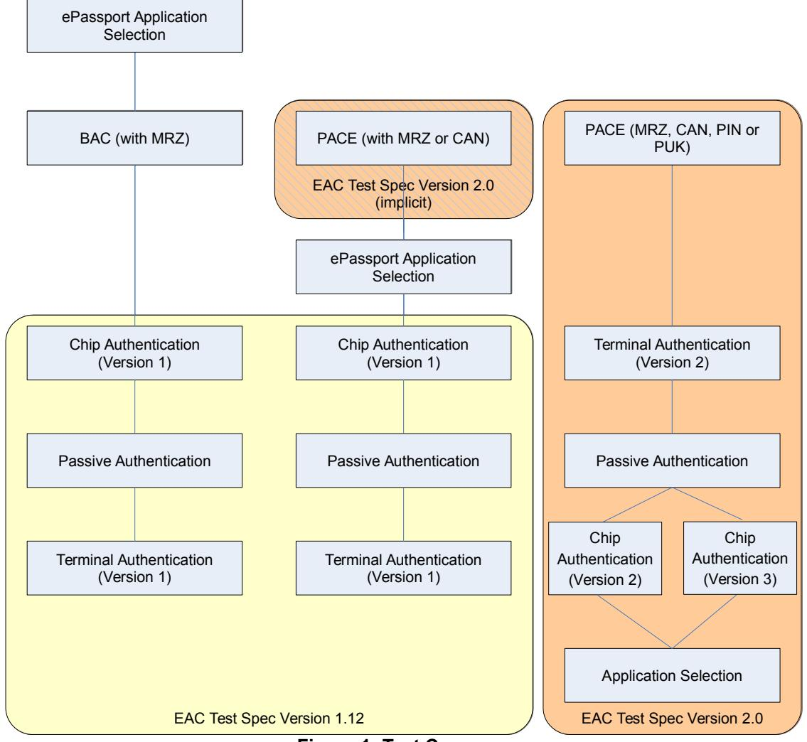
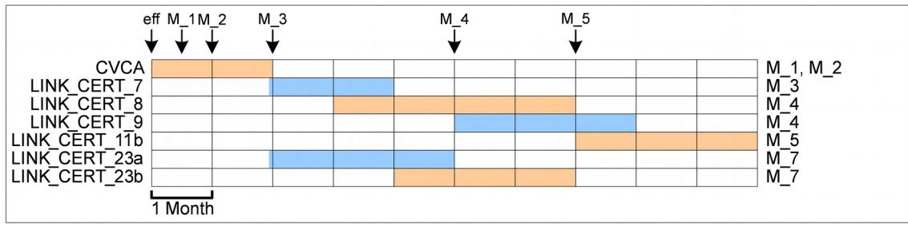

# Technical Guideline TR-03105

# Conformity Tests for Official Electronic ID Documents

Part 3.3: Test Plan for eID-Cards with Advanced Security Mechanisms – EAC 2

Version 1.1 December 17th 2018

# **Version history**

| Version     | Date       | Editor            | Description                                                                    |
|-------------|------------|-------------------|--------------------------------------------------------------------------------|
| 0.30        | 12-10-2007 | BSI/Networkers AG | EAC 2.0 conformity tests                                                       |
|             |            |                   | Proposal for harmonized document                                               |
|             |            |                   | Working Draft                                                                  |
| 0.40        | 26-10-2007 | BSI/Networkers AG | Editorial changes                                                              |
|             |            |                   | Additional test cases for layer 7                                              |
| 0.50        | 03-12-2007 | BSI/Networkers AG | Editorial changes                                                              |
|             |            |                   | New test case definitions                                                      |
|             |            |                   | Including Comments from EAC 1.1<br>specification                               |
| 0.60        | 18-01-2008 | BSI/Networkers AG | Including changes from EAC 2.0 Public<br>Beta 3                                |
| 0.70        | 24-01-2008 | BSI/Networkers AG | New test unit structure                                                        |
| 0.80        | 23-10-2008 | BSI/secunet AG    | Including changes from EAC 1.12 and<br>EAC 2.0 Almost Released                 |
| 0.90        | 31-10-2008 | BSI/secunet AG    | Including changes from<br>EAC 2.0 (Final)                                      |
| 1.00 beta 1 | 19-12-2008 | BSI/secunet AG    | Minor editorial changes                                                        |
| 1.00 beta 2 | 20-02-2009 | BSI/secunet AG    | Resolved comments from DIF                                                     |
| 1.00 beta 3 | 06-04-2009 | BSI/secunet AG    | Resolved comments from DIF                                                     |
| 1.00 RC     | 06-12-2009 | BSI/secunet AG    | Resolved comments from DIF                                                     |
|             |            |                   | Including changes from EAC 2.02                                                |
| 1.00        | 24-02-2010 | BSI/secunet AG    | Resolved comments from DIF                                                     |
| 1.01        | 2010-03-23 | BSI               | Minor editorial changes                                                        |
| 1.02        | 2010-08-02 | BSI               | Correction in ISO chaining (PACE:<br>General Authenticate command)             |
|             |            |                   | Updated test case EAC2_DATA_A_3 for<br>standardized domain parameters          |
| 1.03        | 2010-08-20 | BSI               | Test cases for layer 7 are updated for<br>using standardized domain parameters |

|         |            |                | Minor updates on test cases<br>EAC2_ISO7816_ I_8, EAC2_ISO7816_<br>L_15, EAC2_ISO7816_ L_16 ,<br>EAC2_ISO7816_ L_19 |
|---------|------------|----------------|---------------------------------------------------------------------------------------------------------------------|
|         |            |                | Minor updates on Certificates 9:10<br>AT_CERT_21 and AT_CERT_22                                                     |
| 1.1 RC1 | 2018-01-19 | BSI/secunet AG | Integrated Amendment Release 3                                                                                      |
|         |            |                | Resolved comments                                                                                                   |
|         |            |                | Editorial changes                                                                                                   |
|         |            |                | Added new test suites for Manage<br>Channel, Compare, Envelope/Get<br>Response and CAv3                             |
| 1.1 RC2 | 2018-04-30 | BSI/secunet AG | Resolved comments of DIF AG Chip                                                                                    |
| 1.1 RC3 | 2018-09-17 | BSI/secunet AG | Resolved comments of DIF AG Chip                                                                                    |
| 1.1 RC4 | 2018-11-22 | BSI/secunet AG | Resolved comments of DIF AG Chip                                                                                    |
|         |            |                | Handling of chips without CA-Infos in<br>EF.CardAccess                                                              |
| 1.1     | 2018-12-14 | BSI            | Resolution DIF AG Chip comments on<br>RC 4                                                                          |

| 1 Introduction 13                          |  |
|--------------------------------------------|--|
| 1.1 Abbreviations 13                       |  |
| 1.2 Reference documentation 14             |  |
| 1.3 Terminology 14                         |  |
| 1.4 Test Coverage 16                       |  |
| 1.4.1 MRTD with BAC and EAC 1.x 16         |  |
| 1.4.2 MRTD with PACE and EAC 1.x 17        |  |
| 1.4.3 eID-Card with EAC 2.x 17             |  |
| 1.4.4 ePassport Application Data Groups 17 |  |
| 1.4.5 eSign Application Data Groups 17     |  |
| 2 General test requirements 18             |  |
| 2.1 Test setup 18                          |  |
| 2.2 Test profiles 18                       |  |
| 2.2.1 Application Profiles 18              |  |
| 2.2.2 Protocol Profiles 19                 |  |
| 2.2.3 Algorithm Profiles 21                |  |
| 2.2.4 Data Group Profiles 21               |  |
| 2.3 Key pair definition 21                 |  |
| 2.4 Certificate specification 23           |  |
| 2.4.1 Certificate Set 1 24                 |  |
| 2.4.2 Certificate Set 2 35                 |  |
| 2.4.3 Certificate Set 3 38                 |  |
| 2.4.4 Certificate Set 4 42                 |  |
| 2.4.5 Certificate Set 5 44                 |  |
| 2.4.6 Certificate Set 6 46                 |  |
| 2.4.7 Certificate Set 7 50                 |  |
| 2.4.8 Certificate Set 8 52                 |  |
| 2.4.9 Certificate Set 9 54                 |  |
| 2.4.10 Certificate Set 10 55               |  |
| 2.4.11 Certificate Set 11 61               |  |
| 2.4.12 Certificate Set 12 69               |  |
| 2.4.13 Certificate Set 13 83               |  |
| 2.4.14 Certificate Set 14 86               |  |
| 2.4.15 Certificate Set 15 89               |  |
| 2.4.16 Certificate Set 16 89               |  |
| 2.4.17 Certificate Set 17 89               |  |
| 2.4.18 Certificate Set 18 101              |  |
| 2.4.19 Certificate Set 19 105              |  |
| 2.4.20 Certificate Set 20 111              |  |

| 2.4.21 Certificate Set 21 114                                                             |  |
|-------------------------------------------------------------------------------------------|--|
| 2.4.22 Certificate Set 22 117                                                             |  |
| 2.4.23 Certificate Set 23 120                                                             |  |
| 2.4.24 Certificate Set 24 123                                                             |  |
| 2.4.25 Certificate Set 25 125                                                             |  |
| 2.4.26 Certificate Set 26 125                                                             |  |
| 2.4.27 Certificate Set 27 125                                                             |  |
| 2.4.28 Certificate Set 28 125                                                             |  |
| 2.4.29 Certificate Set 29 125                                                             |  |
| 2.4.30 Certificate Set 30 125                                                             |  |
| 2.4.31 Certificate Set 31 129                                                             |  |
| 3 Tests for layer 6 (ISO 7816) 133                                                        |  |
| 3.1 Test case notation 133                                                                |  |
| 3.2 General requirements 133                                                              |  |
| 3.2.1 Security Status 133                                                                 |  |
| 3.2.2 Extended length APDUs 134                                                           |  |
| 3.2.3 Command Chaining 134                                                                |  |
| 3.3 Unit test EAC2_ISO7816_H – Password Authenticated Connection Establishment (PACE) 135 |  |
| 3.3.1 Test case EAC2_ISO7816_H_1 135                                                      |  |
| 3.3.2 Test case EAC2_ISO7816_H_2 136                                                      |  |
| 3.3.3 Test case EAC2_ISO7816_H_3 137                                                      |  |
| 3.3.4 Test case EAC2_ISO7816_H_4_Template 138                                             |  |
| 3.3.5 Test case EAC2_ISO7816_H_5_Template 139                                             |  |
| 3.3.6 Test case EAC2_ISO7816_H_6_Template 140                                             |  |
| 3.3.7 Test case EAC2_ISO7816_H_7 141                                                      |  |
| 3.3.8 Test case EAC2_ISO7816_H_8 141                                                      |  |
| 3.3.9 Test case EAC2_ISO7816_H_9 141                                                      |  |
| 3.3.10 Test case EAC2_ISO7816_H_10 141                                                    |  |
| 3.3.11 Test case EAC2_ISO7816_H_11 141                                                    |  |
| 3.3.12 Test case EAC2_ISO7816_H_12 142                                                    |  |
| 3.3.13 Test case EAC2_ISO7816_H_13 142                                                    |  |
| 3.3.14 Test case EAC2_ISO7816_H_14 142                                                    |  |
| 3.3.15 Test case EAC2_ISO7816_H_15 142                                                    |  |
| 3.3.16 Test case EAC2_ISO7816_H_16 142                                                    |  |
| 3.3.17 Test case EAC2_ISO7816_H_17 142                                                    |  |
| 3.3.18 Test case EAC2_ISO7816_H_18 142                                                    |  |
| 3.3.19 Test case EAC2_ISO7816_H_19 142                                                    |  |
| 3.3.20 Test case EAC2_ISO7816_H_20 142                                                    |  |
| 3.3.21 Test case EAC2_ISO7816_H_21 143                                                    |  |
| 3.3.22 Test case EAC2_ISO7816_H_22 143                                                    |  |
| 3.3.23 Test case EAC2_ISO7816_H_23 143                                                    |  |
| 3.3.24 Test case EAC2_ISO7816_H_24 143                                                    |  |
| 3.3.25 Test case EAC2_ISO7816_H_25 143                                                    |  |
| 3.3.26 Test case EAC2_ISO7816_H_26 144                                                    |  |

| 3.3.27 Test case EAC2_ISO7816_H_27 144                 |  |
|--------------------------------------------------------|--|
| 3.3.28 Test case EAC2_ISO7816_H_28 144                 |  |
| 3.3.29 Test case EAC2_ISO7816_H_29 144                 |  |
| 3.3.30 Test case EAC2_ISO7816_H_30 144                 |  |
| 3.3.31 Test case EAC2_ISO7816_H_31 144                 |  |
| 3.3.32 Test case EAC2_ISO7816_H_32 144                 |  |
| 3.3.33 Test case EAC2_ISO7816_H_33 144                 |  |
| 3.3.34 Test case EAC2_ISO7816_H_34 145                 |  |
| 3.3.35 Test case EAC2_ISO7816_H_35 146                 |  |
| 3.3.36 Test case EAC2_ISO7816_H_36 147                 |  |
| 3.4 Unit EAC2_ISO7816_I - Chip Authentication 147      |  |
| 3.4.1 Test case EAC2_ISO7816_I_1 148                   |  |
| 3.4.2 Test case EAC2_ISO7816_I_2 149                   |  |
| 3.4.3 Test case EAC2_ISO7816_I_3 150                   |  |
| 3.4.4 Test case EAC2_ISO7816_I_4 150                   |  |
| 3.4.5 Test case EAC2_ISO7816_I_5 151                   |  |
| 3.4.6 Test case EAC2_ISO7816_I_6 152                   |  |
| 3.4.7 Test case EAC2_ISO7816_I_7 153                   |  |
| 3.4.8 Test case EAC2_ISO7816_I_8 154                   |  |
| 3.4.9 Test case EAC2_ISO7816_I_9 155                   |  |
| 3.4.10 Test case EAC2_ISO7816_I_10 155                 |  |
| 3.4.11 Test case EAC2_ISO7816_I_11 156                 |  |
| 3.4.12 Test case EAC2_ISO7816_I_12 157                 |  |
| 3.4.13 Test case EAC2_ISO7816_I_13 158                 |  |
| 3.4.14 Test case EAC2_ISO7816_I_14 159                 |  |
| 3.4.15 Test case EAC2_ISO7816_I_15 160                 |  |
| 3.4.16 Test case EAC2_ISO7816_I_16 161                 |  |
| 3.4.17 Test case EAC2_ISO7816_I_17 162                 |  |
| 3.5 Unit EAC2_ISO7816_J - Certificate verification 163 |  |
| 3.5.1 Test case EAC2_ISO7816_J_1 163                   |  |
| 3.5.2 Test case EAC2_ISO7816_J_2 164                   |  |
| 3.5.3 Test case EAC2_ISO7816_J_3 165                   |  |
| 3.5.4 Test case EAC2_ISO7816_J_4 166                   |  |
| 3.5.5 Test case EAC2_ISO7816_J_5 167                   |  |
| 3.5.6 Test case EAC2_ISO7816_J_6 168                   |  |
| 3.5.7 Test case EAC2_ISO7816_J_7 169                   |  |
| 3.5.8 Test case EAC2_ISO7816_J_8 170                   |  |
| 3.5.9 Test case EAC2_ISO7816_J_9 171                   |  |
| 3.5.10 Test case EAC2_ISO7816_J_10 172                 |  |
| 3.5.11 Test case EAC2_ISO7816_J_11 173                 |  |
| 3.5.12 Test case EAC2_ISO7816_J_12 175                 |  |
| 3.5.13 Test case EAC2_ISO7816_J_13 176                 |  |
| 3.5.14 Test case EAC2_ISO7816_J_14 177                 |  |
| 3.5.15 Test case EAC2_ISO7816_J_15 178                 |  |
| 3.5.16 Test case EAC2_ISO7816_J_16 179                 |  |

| 3.5.17 Test case EAC2_ISO7816_J_17 180              |  |
|-----------------------------------------------------|--|
| 3.5.18 Test case EAC2_ISO7816_J_18 181              |  |
| 3.5.19 Test case EAC2_ISO7816_J_19 182              |  |
| 3.5.20 Test case EAC2_ISO7816_J_20 183              |  |
| 3.5.21 Test case EAC2_ISO7816_J_21 184              |  |
| 3.5.22 Test case EAC2_ISO7816_J_22 185              |  |
| 3.5.23 Test case EAC2_ISO7816_J_23 186              |  |
| 3.5.24 Test case EAC2_ISO7816_J_24 187              |  |
| 3.5.25 Test case EAC2_ISO7816_J_25 188              |  |
| 3.5.26 Test case EAC2_ISO7816_J_26 189              |  |
| 3.5.27 Test case EAC2_ISO7816_J_27 190              |  |
| 3.5.28 Test case EAC2_ISO7816_J_28 191              |  |
| 3.5.29 Test case EAC2_ISO7816_J_29 192              |  |
| 3.5.30 Test case EAC2_ISO7816_J_30 193              |  |
| 3.5.31 Test case EAC2_ISO7816_J_31 195              |  |
| 3.5.32 Test case EAC2_ISO7816_J_32 196              |  |
| 3.5.33 Test case EAC2_ISO7816_J_33 197              |  |
| 3.5.34 Test case EAC2_ISO7816_J_34 198              |  |
| 3.5.35 Test case EAC2_ISO7816_J_35 199              |  |
| 3.5.36 Test case EAC2_ISO7816_J_36 200              |  |
| 3.5.37 Test case EAC2_ISO7816_J_37 201              |  |
| 3.5.38 Test case EAC2_ISO7816_J_38 202              |  |
| 3.5.39 Test case EAC2_ISO7816_J_39 203              |  |
| 3.5.40 Test case EAC2_ISO7816_J_40 204              |  |
| 3.5.41 Test case EAC2_ISO7816_J_41 205              |  |
| 3.5.42 Test case EAC2_ISO7816_J_42 206              |  |
| 3.5.43 Test case EAC2_ISO7816_J_43 207              |  |
| 3.5.44 Test case EAC2_ISO7816_J_44 208              |  |
| 3.5.45 Test case EAC2_ISO7816_J_45 209              |  |
| 3.5.46 Test case EAC2_ISO7816_J_46 209              |  |
| 3.5.47 Test case EAC2_ISO7816_J_47 210              |  |
| 3.5.48 Test case EAC2_ISO7816_J_48 212              |  |
| 3.5.49 Test case EAC2_ISO7816_J_49 213              |  |
| 3.5.50 Test case EAC2_ISO7816_J_50 214              |  |
| 3.5.51 Test case EAC2_ISO7816_J_51 216              |  |
| 3.5.52 Test case EAC2_ISO7816_J_52 217              |  |
| 3.6 Unit EAC2_ISO7816_K Terminal Authentication 218 |  |
| 3.6.1 Test case EAC2_ISO7816_K_1 218                |  |
| 3.6.2 Test case EAC2_ISO7816_K_2 219                |  |
| 3.6.3 Test case EAC2_ISO7816_K_3 221                |  |
| 3.6.4 Test case EAC2_ISO7816_K_4 222                |  |
| 3.6.5 Test case EAC2_ISO7816_K_5 223                |  |
| 3.6.6 Test case EAC2_ISO7816_K_6 224                |  |
| 3.6.7 Test case EAC2_ISO7816_K_7 225                |  |
| 3.6.8 Test case EAC2_ISO7816_K_8 227                |  |

| 3.6.9 Test case EAC2_ISO7816_K_9 228                    |  |
|---------------------------------------------------------|--|
| 3.6.10 Test case EAC2_ISO7816_K_10 229                  |  |
| 3.6.11 Test case EAC2_ISO7816_K_11 230                  |  |
| 3.6.12 Test case EAC2_ISO7816_K_12 232                  |  |
| 3.6.13 Test case EAC2_ISO7816_K_13 233                  |  |
| 3.6.14 Test case EAC2_ISO7816_K_14 235                  |  |
| 3.6.15 Test case EAC2_ISO7816_K_15 236                  |  |
| 3.6.16 Test case EAC2_ISO7816_K_16 238                  |  |
| 3.7 Unit EAC2_ISO7816_L Effective Access Conditions 239 |  |
| 3.7.1 Test case EAC2_ISO7816_L_1 239                    |  |
| 3.7.2 Test case EAC2_ISO7816_L_2 241                    |  |
| 3.7.3 Test case EAC2_ISO7816_L_3 243                    |  |
| 3.7.4 Test case EAC2_ISO7816_L_4 245                    |  |
| 3.7.5 Test case EAC2_ISO7816_L_5 246                    |  |
| 3.7.6 Test case EAC2_ISO7816_L_6 248                    |  |
| 3.7.7 Test case EAC2_ISO7816_L_7 250                    |  |
| 3.7.8 Test case EAC2_ISO7816_L_8 251                    |  |
| 3.7.9 Test case EAC2_ISO7816_L_9 253                    |  |
| 3.7.10 Test case EAC2_ISO7816_L_10 254                  |  |
| 3.7.11 Test case EAC2_ISO7816_L_11 256                  |  |
| 3.7.12 Test case EAC2_ISO7816_L_12 258                  |  |
| 3.7.13 Test case EAC2_ISO7816_L_13 Template 259         |  |
| 3.7.14 Test case EAC2_ISO7816_L_14 Template 263         |  |
| 3.7.15 Test case EAC2_ISO7816_L_15 Template 266         |  |
| 3.7.16 Test case EAC2_ISO7816_L_16 Template 268         |  |
| 3.7.17 Test case EAC2_ISO7816_L_17 271                  |  |
| 3.7.18 Test case EAC2_ISO7816_L_18 273                  |  |
| 3.7.19 Test case EAC2_ISO7816_L_19 275                  |  |
| 3.7.20 Test case EAC2_ISO7816_L_20 276                  |  |
| 3.7.21 Test case EAC2_ISO7816_L_21 278                  |  |
| 3.7.22 Test case EAC2_ISO7816_L_22 278                  |  |
| 3.7.23 Test case EAC2_ISO7816_L_23 279                  |  |
| 3.7.24 Test case EAC2_ISO7816_L_24 280                  |  |
| 3.7.25 Test case EAC2_ISO7816_L_25 280                  |  |
| 3.7.26 Test case EAC2_ISO7816_L_26 282                  |  |
| 3.7.27 Test case EAC2_ISO7816_L_27 284                  |  |
| 3.7.28 Test case EAC2_ISO7816_L_28 285                  |  |
| 3.7.29 Test case EAC2_ISO7816_L_29 287                  |  |
| 3.7.30 Test case EAC2_ISO7816_L_30 287                  |  |
| 3.7.31 Test case EAC2_ISO7816_L_31 287                  |  |
| 3.7.32 Test case EAC2_ISO7816_L_32 287                  |  |
| 3.7.33 Test case EAC2_ISO7816_L_33 287                  |  |
| 3.7.34 Test case EAC2_ISO7816_L_34 287                  |  |
| 3.7.35 Test case EAC2_ISO7816_L_35 287                  |  |
| 3.7.36 Test case EAC2_ISO7816_L_36 289                  |  |

| 3.7.37 Test case EAC2_ISO7816_L_37 291                                               |  |
|--------------------------------------------------------------------------------------|--|
| 3.8 Unit EAC2_ISO7816_M Update mechanism 292                                         |  |
| 3.8.1 Test case EAC2_ISO7816_M_1 293                                                 |  |
| 3.8.2 Test case EAC2_ISO7816_M_2 295                                                 |  |
| 3.8.3 Test case EAC2_ISO7816_M_3 296                                                 |  |
| 3.8.4 Test case EAC2_ISO7816_M_4 298                                                 |  |
| 3.8.5 Test case EAC2_ISO7816_M_5 299                                                 |  |
| 3.8.6 Test case EAC2_ISO7816_M_6 300                                                 |  |
| 3.8.7 Test case EAC2_ISO7816_M_7 301                                                 |  |
| 3.8.8 Test case EAC2_ISO7816_M_8 303                                                 |  |
| 3.9 Unit test EAC2_ISO7816_N – Migration policies 304                                |  |
| 3.9.1 Test case EAC2_ISO7816_N_1 304                                                 |  |
| 3.9.2 Test case EAC2_ISO7816_N_2 305                                                 |  |
| 3.10 Unit EAC2_ISO7816_O Effective Access Conditions with PACE CHAT Restrictions 305 |  |
| 3.10.1 Test case EAC2_ISO7816_O_1 306                                                |  |
| 3.10.2 Test case EAC2_ISO7816_O_2 307                                                |  |
| 3.10.3 Test case EAC2_ISO7816_O_3 309                                                |  |
| 3.10.4 Test case EAC2_ISO7816_O_4 311                                                |  |
| 3.10.5 Test case EAC2_ISO7816_O_5 Template 312                                       |  |
| 3.10.6 Test case EAC2_ISO7816_O_6 Template 316                                       |  |
| 3.10.7 Test case EAC2_ISO7816_O_7 Template 319                                       |  |
| 3.10.8 Test case EAC2_ISO7816_O_8 Template 322                                       |  |
| 3.10.9 Test case EAC2_ISO7816_O_9 325                                                |  |
| 3.10.10 Test case EAC2_ISO7816_O_10 326                                              |  |
| 3.10.11 Test case EAC2_ISO7816_O_11 328                                              |  |
| 3.10.12 Test case EAC2_ISO7816_O_12 328                                              |  |
| 3.11 Unit test EAC2_ISO7816_P – PIN-Management 330                                   |  |
| 3.11.1 Test case EAC2_ISO7816_P_1 330                                                |  |
| 3.11.2 Test case EAC2_ISO7816_P_2 331                                                |  |
| 3.11.3 Test case EAC2_ISO7816_P_3 333                                                |  |
| 3.11.4 Test case EAC2_ISO7816_P_4 333                                                |  |
| 3.11.5 Test case EAC2_ISO7816_P_5 334                                                |  |
| 3.11.6 Test case EAC2_ISO7816_P_6 336                                                |  |
| 3.11.7 Test case EAC2_ISO7816_P_7 337                                                |  |
| 3.11.8 Test case EAC2_ISO7816_P_8 338                                                |  |
| 3.11.9 Test case EAC2_ISO7816_P_8a 340                                               |  |
| 3.11.10 Test case EAC2_ISO7816_P_9 340                                               |  |
| 3.11.11 Test case EAC2_ISO7816_P_10 342                                              |  |
| 3.11.12 Test case EAC2_ISO7816_P_11 343                                              |  |
| 3.11.13 Test case EAC2_ISO7816_P_12 344                                              |  |
| 3.11.14 Test case EAC2_ISO7816_P_13 345                                              |  |
| 3.11.15 Test case EAC2_ISO7816_P_14 346                                              |  |
| 3.11.16 Test case EAC2_ISO7816_P_15 347                                              |  |
| 3.11.17 Test case EAC2_ISO7816_P_16 348                                              |  |

| 3.11.18 Test case EAC2_ISO7816_P_17 348                       |  |
|---------------------------------------------------------------|--|
| 3.11.19 Test case EAC2_ISO7816_P_18 349                       |  |
| 3.11.20 Test case EAC2_ISO7816_P_19 349                       |  |
| 3.11.21 Test case EAC2_ISO7816_P_20 349                       |  |
| 3.12 Unit test EAC2_ISO7816_Q Auxiliary Data Verification 351 |  |
| 3.12.1 Test case EAC2_ISO7816_Q_1 351                         |  |
| 3.12.2 Test case EAC2_ISO7816_Q_2 351                         |  |
| 3.12.3 Test case EAC2_ISO7816_Q_3 352                         |  |
| 3.12.4 Test case EAC2_ISO7816_Q_4 352                         |  |
| 3.12.5 Test case EAC2_ISO7816_Q_5 353                         |  |
| 3.12.6 Test case EAC2_ISO7816_Q_6 353                         |  |
| 3.12.7 Test case EAC2_ISO7816_Q_7 354                         |  |
| 3.12.8 Test case EAC2_ISO7816_Q_8 354                         |  |
| 3.12.9 Test case EAC2_ISO7816_Q_9 355                         |  |
| 3.12.10 Test case EAC2_ISO7816_Q_10 355                       |  |
| 3.12.11 Test case EAC2_ISO7816_Q_11 356                       |  |
| 3.12.12 Test case EAC2_ISO7816_Q_12 356                       |  |
| 3.12.13 Test case EAC2_ISO7816_Q_13 357                       |  |
| 3.12.14 Test case EAC2_ISO7816_Q_14 357                       |  |
| 3.12.15 Test case EAC2_ISO7816_Q_15 358                       |  |
| 3.12.16 Test case EAC2_ISO7816_Q_16 359                       |  |
| 3.12.17 Test case EAC2_ISO7816_Q_17 359                       |  |
| 3.12.18 Test case EAC2_ISO7816_Q_18 360                       |  |
| 3.12.19 Test case EAC2_ISO7816_Q_19 361                       |  |
| 3.12.20 Test case EAC2_ISO7816_Q_20 361                       |  |
| 3.12.21 Test case EAC2_ISO7816_Q_21 362                       |  |
| 3.12.22 Test case EAC2_ISO7816_Q_22 362                       |  |
| 3.13 Unit test EAC2_ISO7816_R Restricted Identification 363   |  |
| 3.13.1 Test case EAC2_ISO7816_R_1 363                         |  |
| 3.13.2 Test case EAC2_ISO7816_R_2 364                         |  |
| 3.13.3 Test case EAC2_ISO7816_R_3 364                         |  |
| 3.13.4 Test case EAC2_ISO7816_R_4 365                         |  |
| 3.13.5 Test case EAC2_ISO7816_R_5 365                         |  |
| 3.13.6 Test case EAC2_ISO7816_R_6 365                         |  |
| 3.13.7 Test case EAC2_ISO7816_R_7 366                         |  |
| 3.13.8 Test case EAC2_ISO7816_R_8 366                         |  |
| 3.13.9 Test case EAC2_ISO7816_R_9 367                         |  |
| 3.13.10 Test case EAC2_ISO7816_R_10 367                       |  |
| 3.13.11 Test case EAC2_ISO7816_R_11 368                       |  |
| 3.13.12 Test case EAC2_ISO7816_R_12 368                       |  |
| 3.14 Unit test EAC2_ISO7816_T_Envelope mechanism 370          |  |
| 3.14.1 Test case EAC2_ISO7816_T_1 370                         |  |
| 3.14.2 Test case EAC2_ISO7816_T_2 372                         |  |
| 3.14.3 Test case EAC2_ISO7816_T_3 373                         |  |
|                                                               |  |

| 3.14.4 Test case EAC2_ISO7816_T_4 373                           |  |
|-----------------------------------------------------------------|--|
| 3.14.5 Test case EAC2_ISO7816_T_5 374                           |  |
| 3.15 Unit test EAC2_ISO7816_U_Compare 375                       |  |
| 3.15.1 Test case EAC2_ISO7816_U_1_Template 375                  |  |
| 3.15.2 Test case EAC2_ISO7816_U_2_Template 376                  |  |
| 3.15.3 Test case EAC2_ISO7816_U_3_Template 378                  |  |
| 3.15.4 Test case EAC2_ISO7816_U_4_Template 379                  |  |
| 3.15.5 Test case EAC2_ISO7816_U_5_Template 380                  |  |
| 3.15.6 Test case EAC2_ISO7816_U_6_Template 382                  |  |
| 3.15.7 Test case EAC2_ISO7816_U_7_Template 383                  |  |
| 3.15.8 Test case EAC2_ISO7816_U_8_Template 385                  |  |
| 3.15.9 Test case EAC2_ISO7816_U_9 386                           |  |
| 3.15.10 Test case EAC2_ISO7816_U_10 387                         |  |
| 3.15.11 Test case EAC2_ISO7816_U_11 388                         |  |
| 3.15.12 Test case EAC2_ISO7816_U_12 388                         |  |
| 3.15.13 Test case EAC2_ISO7816_U_13 389                         |  |
| 3.15.14 Test case EAC2_ISO7816_U_14 389                         |  |
| 3.16 Unit test EAC2_ISO7816_V_Chip Authentication Version 3 391 |  |
| 3.16.1 Test case EAC2_ISO7816_V_1 391                           |  |
| 3.16.2 Test case EAC2_ISO7816_V_2 392                           |  |
| 3.16.3 Test case EAC2_ISO7816_V_3 393                           |  |
| 3.16.4 Test case EAC2_ISO7816_V_4 394                           |  |
| 3.16.5 Test case EAC2_ISO7816_V_5 395                           |  |
| 3.16.6 Test case EAC2_ISO7816_V_6 396                           |  |
| 3.16.7 Test case EAC2_ISO7816_V_7 397                           |  |
| 3.16.8 Test case EAC2_ISO7816_V_8 397                           |  |
| 3.16.9 Test case EAC2_ISO7816_V_9 398                           |  |
| 3.16.10 Test case EAC2_ISO7816_V_10 399                         |  |
| 3.16.11 Test case EAC2_ISO7816_V_11 399                         |  |
| 3.16.12 Test case EAC2_ISO7816_V_12 400                         |  |
| 4 Tests for layer 7 (Data Structure) 402                        |  |
| 4.1 Unit EAC2_DATA_A, EF.CardAccess 402                         |  |
| 4.1.1 Test case EAC2_DATA_A_1a 402                              |  |
| 4.1.2 Test case EAC2_DATA_A_1b 402                              |  |
| 4.1.3 Test case EAC2_DATA_A_2 403                               |  |
| 4.1.4 Test case EAC2_DATA_A_3 403                               |  |
| 4.1.5 Test case EAC2_DATA_A_4 404                               |  |
| 4.1.6 Test case EAC2_DATA_A_5 404                               |  |
| 4.1.7 Test case EAC2_DATA_A_6 405                               |  |
| 4.1.8 Test case EAC2_DATA_A_7 405                               |  |
| 4.1.9 Test case EAC2_DATA_A_8 406                               |  |
| 4.1.10 Test case EAC2_DATA_A_9 406                              |  |
| 4.2 Unit EAC2_DATA_B, EF.CardSecurity 406                       |  |
| 4.2.1 Test case EAC2_DATA_B_1 406                               |  |

| 4.2.2 Test cases EAC2_DATA_B_2 to EAC2_DATA_B_7 407  |  |
|------------------------------------------------------|--|
| 4.2.3 Test case EAC2_DATA_B_8 407                    |  |
| 4.2.4 Test case EAC2_DATA_B_9 408                    |  |
| 4.2.5 Test case EAC2_DATA_B_10 408                   |  |
| 4.2.6 Test case EAC2_DATA_B_11 409                   |  |
| 4.3 Unit EAC2_EIDDATA_B eID Data Groups 409          |  |
| 4.3.1 Test case EAC2_EIDDATA_B_1 409                 |  |
| 4.3.2 Test case EAC2_EIDDATA_B_2 410                 |  |
| 4.3.3 Test case EAC2_EIDDATA_B_3 410                 |  |
| 4.3.4 Test case EAC2_EIDDATA_B_4 410                 |  |
| 4.3.5 Test case EAC2_EIDDATA_B_5 410                 |  |
| 4.3.6 Test case EAC2_EIDDATA_B_6 411                 |  |
| 4.3.7 Test case EAC2_EIDDATA_B_7 411                 |  |
| 4.3.8 Test case EAC2_EIDDATA_B_8 411                 |  |
| 4.3.9 Test case EAC2_EIDDATA_B_9 411                 |  |
| 4.3.10 Test case EAC2_EIDDATA_B_10 412               |  |
| 4.3.11 Test case EAC2_EIDDATA_B_11 412               |  |
| 4.3.12 Test case EAC2_EIDDATA_B_12 412               |  |
| 4.3.13 Test case EAC2_EIDDATA_B_13 412               |  |
| 4.3.14 Test case EAC2_EIDDATA_B_14 413               |  |
| 4.3.15 Test case EAC2_EIDDATA_B_15 413               |  |
| 4.3.16 Test case EAC2_EIDDATA_B_16 413               |  |
| 4.3.17 Test case EAC2_EIDDATA_B_17 413               |  |
| 4.3.18 Test case EAC2_EIDDATA_B_18 414               |  |
| 4.3.19 Test case EAC2_EIDDATA_B_19 414               |  |
| 4.3.20 Test case EAC2_EIDDATA_B_20 414               |  |
| 4.3.21 Test case EAC2_EIDDATA_B_21 414               |  |
| 4.4 Unit EAC2_DATA_C, EF.ChipSecurity 415            |  |
| 4.4.1 Test case EAC2_DATA_C_1 415                    |  |
| 4.4.2 Test cases EAC2_DATA_C_2 to EAC2_DATA_C_10 415 |  |
| 4.4.3 Test case EAC2_DATA_C_11 416                   |  |
| 4.4.4 Test case EAC2_DATA_C_12 416                   |  |
| Annex A Implementation conformance statement 417     |  |
| A.1 Supported profiles 417                           |  |
| A.2 Supported cryptographic algorithm 418            |  |
| A.3 Cryptosystem migration policy 418                |  |
| A.4 EF.CardSecurity information 418                  |  |
| A.5 Additional Information 420                       |  |
| A.6 PSA Information 420                              |  |
|                                                      |  |

# <span id="page-12-0"></span>**1 Introduction**

The TR 03105 defines a RF protocol and application test standard for eID-Cards. Version 2.0 of that document includes security mechanisms for ePassport, eID and eSign applications.

This document describes the test plan for machine-readable travel documents (eMRTDs) with advanced security mechanisms used for ePassport, eID and eSign applications referring to EAC version 2 and the corresponding dependencies.

As already known by the EAC version 1 test plan, this specification has a layer based structure. The layers 1 - 4 refer the RF protocol according to the ISO/IEC 14443 1-4 standard. Since the defined security mechanisms have no direct influence on this abstraction layer, this amendment does not contain any tests for these layers.

However, this document concentrates on the tests for the layer 6 (ISO/IEC 7816) and 7 (data group encoding).

This document is heavily based on the AFNOR/BSI test plan for EAC-passports. Especially tests for Chip and Terminal Authentication as well as the certificate structure are adopted by that document.

| Abbreviation |                                                           |
|--------------|-----------------------------------------------------------|
| ADH          | Asynchronous Diffie-Hellman                               |
| AT           | Authentication Template                                   |
| BAC          | Basic Access Control                                      |
| CA           | Chip Authentication (in MRTD security mechanism contexts) |
|              | Certificate Authority (in certificate contexts)           |
| CAN          | Card Access Number                                        |
| CAR          | Certification Authority Reference                         |
| CHAT         | Certificate Holder Authorization Template                 |
| CHR          | Certificate Holder Reference                              |
| CSCA         | Country Signing Certificate Authority                     |
| CV           | Card Verifiable                                           |
| CVCA         | Country Verifying Certificate Authority                   |
| DDO          | Discretionary Data Object                                 |
| DG           | Data Group                                                |
| DO           | Data Object                                               |
| EAC          | Extended Access Control                                   |
| ECDH         | Elliptic Curve Diffie-Hellman                             |
| ECDSA        | Elliptic<br>Curve Digital Signature Algorithm             |
| DH           | Diffie-Hellman                                            |
| DST          | Digital Signature Template                                |
| DV           | Document Verifier                                         |
| ICS          | Implementation Conformance Statement (see Annex A)        |
| IS           | Inspection System                                         |
| LDS          | Logical Data Structure                                    |
| KAEG         | Key Agreement ElGamal-type                                |

# <span id="page-12-1"></span>**1.1 Abbreviations**

| MRTD | Machine Readable Travel Document                |  |
|------|-------------------------------------------------|--|
| MRZ  | Machine Readable Zone                           |  |
| MSE  | Manage Security Environment                     |  |
| OID  | Object Identifier                               |  |
| PACE | Password Authenticated Connection Establishment |  |
| PIN  | Personal Identification Number                  |  |
| PS   | Pseudonymous Signature                          |  |
| PSA  | Pseudonymous Signature for Authentication       |  |
| PSO  | Perform Security Operation                      |  |
| PUK  | PIN Unblocking Key                              |  |
| RFU  | Reserved for Future Use                         |  |
| RSA  | Rivest Shamir Adleman                           |  |
| TA   | Terminal Authentication                         |  |

# <span id="page-13-1"></span>**1.2 Reference documentation**

The following documentation serves as a reference for this specification:

- <span id="page-13-2"></span>[R1] ICAO Doc 9303, Seventh Edition, Part 10
- [R2] TR-03110: Advanced Security Mechanisms for Machine Readable Travel Documents Part 1: eMRTDs with BAC/PACEv2 and EACv1, Version 2.10, March 2012
- [R3] RFC 2119, S. Bradner, "Key Words for Use in RFCs to Indicate Requirement Levels", BCP 14, RFC 2119, March 1997
- [R4] ISO/IEC 7816-4:2013. Identification cards Integrated circuit cards Part 4: Organization, security and commands for interchange
- [R5] PKCS #3: Diffie-Hellman Key-Agreement Standard, Version 1.4, November 1993
- [R6] TR-03111: Technical Guideline, Elliptic Curve Cryptography, Version 2.0, June 2012
- [R7] TR-03105: Technical Guideline, Advanced Security Mechanisms for Machine Readable Travel Documents – Extended Access Control (EAC), Version 1.1, July 2007, referencing EAC version 1.1
- [R8] TR-03110: Advanced Security Mechanisms for Machine Readable Travel Documents and eIDAS Token – Part 3: Common Specifications, Version 2.21, December 2016
- [R9] BSI, AFNOR: TR-03105 Part 3.2. Advanced Security Mechanisms for Machine Readable Travel Documents – Extended Access Control (EAC), Tests for Security Implementation, Version 1.5, 2018
- [R10] RFC 3852, Housley, Russel, Cryptographic message syntax (CMS), RFC3852, 2004
- [R11] ANSI, Public Key Cryptography for the Financial Services Industry: Agreement of Symmetric Keys Using Discrete Logarithm Cryptography, ANSI X9.42-2000, 1999

# <span id="page-13-0"></span>**1.3 Terminology**

The key words "MUST", "SHALL", "REQUIRED", "SHOULD", "RECOMMENDED", and "MAY" in this document are to be interpreted as described in [R3].

| MUST | This word, or the terms "REQUIRED" or "SHALL", mean that the definition is an |
|------|-------------------------------------------------------------------------------|
|      |                                                                               |

|            | absolute requirement of the specification.                                                                                                                                                                                                                                                                                                                                                                                                                                                                                                                                                                                                                                                                                             |  |
|------------|----------------------------------------------------------------------------------------------------------------------------------------------------------------------------------------------------------------------------------------------------------------------------------------------------------------------------------------------------------------------------------------------------------------------------------------------------------------------------------------------------------------------------------------------------------------------------------------------------------------------------------------------------------------------------------------------------------------------------------------|--|
| MUST NOT   | This phrase, or the phrase "SHALL NOT", means that the definition is an absolute<br>prohibition of the specification.                                                                                                                                                                                                                                                                                                                                                                                                                                                                                                                                                                                                                  |  |
| SHOULD     | This word, or the adjective "RECOMMENDED", mean that there may exist valid reasons<br>in particular circumstances to ignore a particular item, but the full implications MUST be<br>understood and carefully weighed before choosing a different course.                                                                                                                                                                                                                                                                                                                                                                                                                                                                               |  |
| SHOULD NOT | This phrase, or the phrase "NOT RECOMMENDED" mean that there may exist valid<br>reasons in particular circumstances when the particular behavior is acceptable or even<br>useful, but the full implications SHOULD be understood and the case carefully weighed<br>before implementing any behavior described with this label.                                                                                                                                                                                                                                                                                                                                                                                                         |  |
| MAY        | This word, or the adjective "OPTIONAL", means that an item is truly optional. One<br>vendor may choose to include the item because a particular marketplace requires it or<br>because the vendor feels that it enhances the product while another vendor may omit the<br>same item. An implementation which does not include a particular option MUST be<br>prepared to interoperate with another implementation which does include the option,<br>though perhaps with reduced functionality. In the same vein an implementation which does<br>include a particular option MUST be prepared to interoperate with another implementation<br>which does not include the option (except, of course, for the feature the option provides.) |  |

# <span id="page-15-1"></span>**1.4 Test Coverage**

The following figure shows the test coverage of the different test specifications.



**Figure 1: Test Coverage**

The structure of the document is based on the EAC 1.11 test specification ([R9]). As far as possible identical unit names have been used for identical algorithm types, e.g. Chip Authentication is named as "Unit I" in this document as well as in the EAC 1.11 specification. The list of certificates is also based on the EAC 1.11 specification and extended by certificate types defined in the EAC 2.0 standard.

Three kinds of eID-Cards have to be observed as described below.

# <span id="page-15-0"></span>**1.4.1 MRTD with BAC and EAC 1.x**

If your MRTD is a BAC/EAC Version 1.x card please refer to [R9] only. There are no tests within this document that fit your needs.

# <span id="page-16-3"></span>**1.4.2 MRTD with PACE and EAC 1.x**

If your MRTD is an EAC Version 1.x card which also supports PACE, you have to perform the PACE tests defined here (see [3.3\)](#page-134-1) and after that the following additional units of [R9]:

- ISO7816\_H
- ISO7816\_I
- ISO7816\_J
- ISO7816\_K
- ISO7816\_L
- ISO7816\_M

All test cases mentioned above have to be performed twice. In the first test run replace the precondition called "The BAC mechanism MUST/MUST NOT be performed" by "The PACE mechanism (with MRZ) MUST/MUST NOT be performed". In the second test run replace the precondition called "The BAC mechanism MUST/MUST NOT be performed" by "The PACE mechanism (with CAN) MUST/MUST NOT be performed".

Nevertheless PACE with EAC 1.x is not tested explicitly here.

# <span id="page-16-2"></span>**1.4.3 eID-Card with EAC 2.x**

If your MRTD is an eID-Card with EAC Version 2.x only, the test cases defined here have to be performed. If there are any references to other documents, they are described within the corresponding test unit.

#### <span id="page-16-1"></span>**1.4.4 ePassport Application Data Groups**

The ePassport data groups are not tested within this specification.

#### <span id="page-16-0"></span>**1.4.5 eSign Application Data Groups**

eSign is out of scope of both the EAC 1.x and EAC 2.x specification and therefore not tested here.

# <span id="page-17-3"></span>**2 General test requirements**

# <span id="page-17-2"></span>**2.1 Test setup**

For setting up these tests, any contactless reader supporting type A and type B protocols can be used. However, this reader has to support extended length APDUs requested for Terminal Authentication.

To execute any of the test cases described here, several types of test samples are required.

For executing all tests with one sample, this sample has to implement the ePassport application as defined by [\[R1\]](#page-13-2), [R2] and [R8], the eID application as specified in [R9] and the eSign application for electronic signatures.

For executing separate tests of each application type one sample per application type is required (e.g. ePassport or eID card or eSign card). Cross-Application tests cannot be performed with these types of samples.

For executing cross-application mechanisms two types of samples are required: for executing read access tests to eID applications from ePassport application a sample with ePassport and eID application is necessary.

Some of the tests specified for layer 6 (ISO/IEC 7816) rely on the proper coding of the logical data structure stored in the chip. Therefore, it is RECOMMENDED that the layer 7 tests are performed before the layer 6 tests to detect coding related issues beforehand.

**IMPORTANT NOTE:** This test plan contains certain test cases, which verify the MRTD's behavior with expired certificates. During these tests, the effective date stored inside the chip is changed. Therefore a set of certificates can be used only once with a single card sample. After these tests have been performed, another sample or a new set of certificates is needed to repeat the tests.

This test plan also defines tests, which block or suspend PINs. After these tests have been performed, some of the features of the MRTD may be temporarily or permanently blocked or unusable.

Therefore, it is recommended to perform these tests as the last ones in a test sequence. If there is no way to unblock blocked or suspended PINs using PUKs or similar mechanisms, the vendor has to decide whether to perform or to skip these destructive tests.

# <span id="page-17-1"></span>**2.2 Test profiles**

This amendment defines several types of profiles. It is distinguished between "Application Profiles", "Protocol Profiles", "Algorithm Profiles" and "Data Group Profiles". These types of profiles can be combined as defined by the corresponding card/application specification. Especially application profiles may include some implicit assumptions as defined in the corresponding specification (e.g. existence of PIN mechanisms when using eID application).

Profiles not mentioned within a test case MAY be present nevertheless (e.g. an eID application within ePassport tests). If the absence of a profile is necessary to fulfill the test case, it is separately mentioned in the test requirements.

| Profile-ID | Profile                                  | Remark                                                                                                                          |
|------------|------------------------------------------|---------------------------------------------------------------------------------------------------------------------------------|
| ePassport  | Electronic Passport<br>Application       | An application which contains data as specified in [R8] and<br>[R1]. This profile implicitly includes usage of PACE with<br>MRZ |
| eID        | Electronic Identification<br>Application | An application which contains data as specified in [R8].<br>This profile implicitly includes PIN/PUK management as              |

# <span id="page-17-0"></span>**2.2.1 Application Profiles**

|       |                                     | defined in [R8].                                   |
|-------|-------------------------------------|----------------------------------------------------|
| eSign | Electronic Signature<br>Application | An application which contains eSign specific data. |

#### <span id="page-18-0"></span>**2.2.2 Protocol Profiles**

| Profile-ID | Profile                                                      | Remark                                                                                                                                                                                                                                                                                                                                                                              |
|------------|--------------------------------------------------------------|-------------------------------------------------------------------------------------------------------------------------------------------------------------------------------------------------------------------------------------------------------------------------------------------------------------------------------------------------------------------------------------|
| PACE       | Password Authenticated<br>Connection<br>Establishment        | A MRTD which does not contain sensitive biometric<br>data, like finger prints, can still use the Password<br>Authenticated Connection Establishment mechanism to<br>support strong communication encryption. This profile<br>only covers version 2.                                                                                                                                 |
| TA2        | Terminal Authentication,<br>Version 2                        | Terminal Authentication MUST be performed for all<br>EAC version 2 capable MRTDs within the general<br>authentication procedure. This profile only covers<br>version 2 Terminal Authentication.                                                                                                                                                                                     |
| CA2        | Chip Authentication,<br>Version 2                            | In addition to Terminal Authentication Chip<br>authentication MUST be performed for all EAC<br>version 2 capable MRTDs within the general<br>authentication procedure. It supports chip cloning<br>protection and strong communication encryption. This<br>profile only covers version 2 Chip Authentication.                                                                       |
| CA3        | Chip Authentication,<br>Version 3                            | This protocol is an alternative to the combination of<br>Chip Authentication Version 2 and Restricted<br>Identification (RI) providing additional features.                                                                                                                                                                                                                         |
| CA3_ReUse  | Chip Authentication,<br>Version 3 with Re-Use of<br>PACE key | The ephemeral PACE-GM public key is reused by the<br>chip during CA3.                                                                                                                                                                                                                                                                                                               |
| MIG        | Migration                                                    | According to the EAC specification the algorithm used<br>for the Terminal Authentication process can be changed<br>with an appropriate link certificate if the chip supports<br>more than one algorithm. The tests for this Migration<br>profile MUST only be performed, if the chip supports<br>the migration from one cryptosystem to another. This<br>must be stated in the ICS. |
| DATE       | Date validation                                              | Since the validation of the certificates effective and<br>expiration date is not explicitly required by the EAC<br>specification, the optional tests which belong to the<br>Date validation profile must only be performed if this is<br>supported by the chip. This must be stated in ICS.                                                                                         |
| RI         | Restricted Identification                                    | A MRTD which supports the Restricted Identification<br>of terminals as specified in [R8].                                                                                                                                                                                                                                                                                           |
| RI_DP      | Restricted Identification<br>Domain Parameters               | As RI. The MRTD additionally provides an optional<br>RestrictedIdentificationDomainParameterInfo data<br>structure. According to EAC specification, this is<br>optional and must be stated in ICS.                                                                                                                                                                                  |
| AUX        | Auxiliary Data<br>Verification                               | A MRTD which supports Auxiliary Data Verification<br>mechanisms (age verification, document validity                                                                                                                                                                                                                                                                                |

|                      |                                        | verification or Municipality ID verification) as<br>specified in [R8].                                                                                                                                                                                                                             |
|----------------------|----------------------------------------|----------------------------------------------------------------------------------------------------------------------------------------------------------------------------------------------------------------------------------------------------------------------------------------------------|
| (NOT)<br>CNG_PIN_PUK | Change PIN using PACE<br>with PUK      | This profile allows a "Change PIN" procedure after<br>PACE has been performed using PUK as authentication<br>secret. Vice versa, if "Change PIN" procedure is NOT<br>allowed, that profile is prefixed with NOT. According<br>to EAC specification, this is optional and must be<br>stated in ICS. |
| (NOT)<br>CNG_PIN_AR  | Change PIN allowed by<br>Access Rights | This profile allows a "Change PIN" procedure for<br>authentication terminals with "PIN Management"<br>access right. Vice versa, if "Change PIN" procedure is<br>NOT allowed, that profile is prefixed with NOT.<br>According to EAC specification, this is optional and<br>must be stated in ICS.  |
| (NOT)<br>CNG_CAN_AR  | Change CAN allowed by<br>Access Rights | This profile allows a "Change CAN" procedure for<br>authentication terminals with "PIN Management"<br>access right. Vice versa, if "Change CAN "procedure is<br>NOT allowed, that profile is prefixed with NOT.<br>According to EAC specification, this is optional and<br>must be stated in ICS.  |
| CS                   | Chip Security                          | A MRTD which stores a ChipSecurity file containing<br>PrivilegedTerminalInfo with chip-individual keys and<br>eIDSecurityInfo.                                                                                                                                                                     |
| ENV                  | Envelope Mechanism                     | To support also terminals without extended length<br>transport capability, chips can use the alternative<br>Envelope mechanism.                                                                                                                                                                    |
| CMP                  | Compare                                | The command Compare is used to verify authenticated<br>auxiliary data.                                                                                                                                                                                                                             |
| AUTH_EXT             | Authorization Extension                | Authorization Extensions are special type of certificate<br>extension. These extensions convey authorizations<br>additional to those in the CHAT contained in the<br>certificate.                                                                                                                  |
| BAC                  | Basic Access Control                   | According to ICAO Doc 9303 Part 11 starting on<br>January 1st 2018 eMRTDs may support PACE only.                                                                                                                                                                                                   |
| CSTA                 | EF.CardSecurity is<br>protected by TA  | EF.CardSecurity can be protected by PACE or by TA.<br>Protection by TA was initially introduced in [R8] and<br>protection by PACE was initially introduced in [R1].                                                                                                                                |
| PSAInfo              | Use of PSAInfo                         | EF.CardAccess or EF.CardSecurity contains a PSAInfo<br>element.                                                                                                                                                                                                                                    |
| CardInfo             | Use of CardInfo                        | EF.CardAccess or EF.CardSecurity contains a CardInfo<br>element.                                                                                                                                                                                                                                   |
| PrivTerInfo          | Use of<br>PrivilegedTerminalInfo       | EF.CardAccess or EF.CardSecurity contains a<br>PrivilegedTerminalInfo element.                                                                                                                                                                                                                     |

#### <span id="page-20-2"></span>**2.2.3 Algorithm Profiles**

| Profile-ID | Profile                          | Remark                                                                                                                                                                                                                                                                 |
|------------|----------------------------------|------------------------------------------------------------------------------------------------------------------------------------------------------------------------------------------------------------------------------------------------------------------------|
| DH         | Diffie-Hellman                   | According to the EAC specification, the chip can support<br>Diffie-Hellman or elliptic curve based Diffie-Hellman key<br>agreement algorithms. Test cases which belong to the DH<br>profile are only applicable if the DH algorithm is used.                           |
| ECDH       | Elliptic Curve Diffie<br>Hellman | According to the EAC specification, the chip can support<br>Diffie-Hellman or elliptic curve based Diffie-Hellman key<br>agreement algorithms. Test cases which belong to the<br>ECDH profile are only applicable if the elliptic curve based<br>DH algorithm is used. |
| ECDSA      | Elliptic curve algorithm         | According to the EAC specification a chip is free to support<br>either elliptic curve or RSA based keys. All tests which<br>belong to the ECDSA profile MUST only be processed if<br>the test object is personalized with elliptic curve based<br>keys.                |
| RSA        | RSA algorithm                    | According to the EAC specification a chip is free to support<br>either elliptic curve or RSA based keys. All tests which<br>belong to the RSA profile MUST only be processed if the<br>test object is personalized with RSA based keys.                                |

#### <span id="page-20-1"></span>**2.2.4 Data Group Profiles**

If there are any (optional) data groups that have to be present to perform the corresponding tests, theses data groups are mentioned separately.

| Profile-ID | Profile      | Remark                                   |
|------------|--------------|------------------------------------------|
| DGx        | Data Group x | Data group x must be present on the card |

# <span id="page-20-0"></span>**2.3 Key pair definition**

The certificate sets defined in chapter [2.4](#page-22-0) are based on several asymmetric key pairs. In preparation to the tests, these key pairs have to be generated. The parameter used for these keys are depending on the initial CVCA private keys.

The initial CVCA root private keys SHOULD be provided by the ePassport vendor. It is also possible the ePassport vendor generates all keys and certificates on its own and passes it to the test operator for the tests.

There are separate CVCA roots for each terminal type. These CVCA roots have different key pairs.

For the key set 13 (CVCA\_KEY\_13, DV\_KEY\_13, IS\_KEY\_13) the algorithm for the cryptosystem migration MUST be used as defined in the ICS.

All key pairs MUST be generated independently, so it is not permitted to use the same key pair for all sets.

| Key pair    |                                                                             |
|-------------|-----------------------------------------------------------------------------|
| CVCA_KEY_00 | The key pair CV_KEY_00 is the public/private key for the initial CVCA root. |
| DV_KEY_01   | Key pair of the test DV 01                                                  |
| IS_KEY_01   | Key pair of the test IS 01                                                  |
| DV_KEY_02   | Key pair of the test DV 02                                                  |

| IS_KEY_02   | Key pair of the test IS 02                                              |
|-------------|-------------------------------------------------------------------------|
| DV_KEY_03   | Key pair of the test DV 03                                              |
| IS_KEY_03   | Key pair of the test IS 03                                              |
| DV_KEY_04   | Key pair of the test DV 04                                              |
| IS_KEY_04   | Key pair of the test IS 04                                              |
| DV_KEY_05   | Key pair of the test DV 05                                              |
| IS_KEY_05   | Key pair of the test IS 05                                              |
| DV_KEY_06   | Key pair of the test DV 06                                              |
| IS_KEY_06   | Key pair of the test IS 06                                              |
| CVCA_KEY_07 | Key pair of the test CVCA 07                                            |
| DV_KEY_07   | Key pair of the test DV 07                                              |
| IS_KEY_07   | Key pair of the test IS 07                                              |
| CVCA_KEY_08 | Key pair of the test CVCA 08                                            |
| CVCA_KEY_09 | Key pair of the test CVCA 09                                            |
| DV_KEY_09   | Key pair of the test DV 09                                              |
| CVCA_KEY_10 | Key pair of the test CVCA 10                                            |
| DV_KEY_10   | Key pair of the test DV 10                                              |
| IS_KEY_10   | Key pair of the test IS 10                                              |
| CVCA_KEY_11 | Key pair of the test CVCA 11                                            |
| DV_KEY_11   | Key pair of the test DV 11                                              |
| IS_KEY_11   | Key pair of the test IS 11                                              |
| DV_KEY_12   | Key pair of the test DV 12                                              |
| CVCA_KEY_13 | Key pair of the test CVCA 13                                            |
| DV_KEY_13   | Key pair of the test DV 13                                              |
| IS_KEY_13   | Key pair of the test IS 13                                              |
| DV_KEY_14a  | Key pair of the test DV 14 (length equal to CVCA Key length)            |
| DV_KEY_14b  | Key pair of the test DV 14 (MUST be shorter than CVCA Key length)       |
| IS_KEY_14a  | Key pair of the test IS 14 (length equal to CVCA Key length)            |
| IS_KEY_14b  | Key pair of the test IS 14 (MUST be shorter than CVCA Key length)       |
| DV_KEY_15   | Key pair of the test DV 15                                              |
| IS_KEY_15   | Key pair of the test IS 15                                              |
| DV_KEY_16   | Key pair of the test DV 16                                              |
| IS_KEY_16   | Key pair of the test IS 16                                              |
| CVCA_KEY_17 | The key pair CVCA_KEY_17 is the public/private key for the AT CVCA root |
| DV_KEY_17   | Key pair of the test DV 17                                              |
| AT_KEY_17   | Key pair of the test AT 17                                              |
| DV_KEY_18   | Key pair of the test DV 18                                              |
| AT_KEY_18   | Key pair of the test AT 18                                              |
| DV_KEY_19   | Key pair of the test DV 19                                              |
| AT_KEY_19   | Key pair of the test AT 19                                              |

| DV_KEY_20       | Key pair of the test DV 20       |
|-----------------|----------------------------------|
| AT_KEY_20       | Key pair of the test AT 20       |
| DV_KEY_21       | Key pair of the test DV 21       |
| AT_KEY_21       | Key pair of the test AT 21       |
| DV_KEY_22       | Key pair of the test DV 22       |
| AT_KEY_22       | Key pair of the test AT 22       |
| AT_CVCA_KEY_23a | Key pair of the test AT CVCA 23a |
| AT_CVCA_KEY_23b | Key pair of the test AT CVCA 23b |
| DV_KEY_23       | Key pair of the test DV 23       |
| DV_KEY_24       | Key pair of the test DV 24       |
| AT _KEY_24      | Key pair of the test AT 24       |
| DV_KEY_25       | deleted in version 1.00 RC       |
| IS_KEY_25       | deleted in version 1.00 RC       |
| DV_KEY_26       | deleted in version 1.00 RC       |
| IS_KEY_26       | deleted in version 1.00 RC       |
| DV_KEY_27       | deleted in version 1.1           |
| IS_KEY_27       | deleted in version 1.1           |
| DV_KEY_28       | deleted in version 1.1           |
| IS_KEY_28       | deleted in version 1.1           |
| DV_KEY_30       | Key pair of the test DV_30       |
| AT_KEY_30       | Key pair of the test AT_30       |
| DV_KEY_31       | Key pair of the test DV_31       |
| AT_KEY_31       | Key pair of the test AT_31       |

# <span id="page-22-0"></span>**2.4 Certificate specification**

Since the advanced security mechanisms are using a certificate based authentication schema, it is necessary to provide a set of well prepared certificates in order to perform all tests.

This chapter defines the exact set of certificates referred in the tests. Besides the regular certificate chain, there is also the need for special encoded certificates.

The certificates are specified in two different ways. For provider of personalized passport samples, which do already have a preconfigured trust point based on their own CVCA key pair, the chapters below defines a set of certificates relative to the effective date (CVCAeff) and expiration date(CVCAexp) of the given CVCA. The time span between CVCAeff and CVCAexp MUST be at least two month to allow proper adoption of the certificate time scheme defined below. The "current date" of the provided sample MUST be set to CVCAeff before the tests are started. The CVCA MUST NOT restrict authorization in any way, i.e. its Certificate Holder Authorization contains all rights. The provider of the sample or the test laboratory has to generate the corresponding certificate according to this specification based on the CVCA data.

There are separate CVCA roots for each terminal type, but they all SHOULD have equal effective and expiration dates.

If no preconfigured key pair is available or if the production process allows the use of an externally defined CVCA, a certificate set can be used which is defined as a "worked example" by this specification. This set is provided for ECDSA, RSA and RSAPSS based certificates and is defined in a full binary form with fixed keys and dates. It also includes a definition for an initial CVCA key pair and its effective and expiry dates.

#### <span id="page-23-0"></span>**2.4.1 Certificate Set 1**

The certificate set consist of a regular certificate chain (DV -> IS) which is used for the positive tests regarding the certificate verification. Furthermore it contains variants of the original DV certificate to simulate a variety of certificate coding issues (missing elements, badly encoded dates …).

| ID          | DV_CERT_1                                                                                                                                                                                                                                                                                                                                                                                                                                                                                                                                                                                                                                                                                                                                                                                                                                                                                                                                                                                                                                                                                                                                                                                                                                                                                                                                                                                                                                                                                                                                                                                                                                                                                                                                                                                                                                                                                                                                                                                |  |  |
|-------------|------------------------------------------------------------------------------------------------------------------------------------------------------------------------------------------------------------------------------------------------------------------------------------------------------------------------------------------------------------------------------------------------------------------------------------------------------------------------------------------------------------------------------------------------------------------------------------------------------------------------------------------------------------------------------------------------------------------------------------------------------------------------------------------------------------------------------------------------------------------------------------------------------------------------------------------------------------------------------------------------------------------------------------------------------------------------------------------------------------------------------------------------------------------------------------------------------------------------------------------------------------------------------------------------------------------------------------------------------------------------------------------------------------------------------------------------------------------------------------------------------------------------------------------------------------------------------------------------------------------------------------------------------------------------------------------------------------------------------------------------------------------------------------------------------------------------------------------------------------------------------------------------------------------------------------------------------------------------------------------|--|--|
| Purpose     | This certificate is a regular DV certificate, which validity period starts at the effective<br>date of the CVCA and expires after one month.                                                                                                                                                                                                                                                                                                                                                                                                                                                                                                                                                                                                                                                                                                                                                                                                                                                                                                                                                                                                                                                                                                                                                                                                                                                                                                                                                                                                                                                                                                                                                                                                                                                                                                                                                                                                                                             |  |  |
| Version     | 1.11                                                                                                                                                                                                                                                                                                                                                                                                                                                                                                                                                                                                                                                                                                                                                                                                                                                                                                                                                                                                                                                                                                                                                                                                                                                                                                                                                                                                                                                                                                                                                                                                                                                                                                                                                                                                                                                                                                                                                                                     |  |  |
| Referred by | Test case EAC2_ISO7816_I_1, Test case EAC2_ISO7816_I_2, Test case<br>EAC2_ISO7816_I_3, Test case EAC2_ISO7816_I_4, Test case EAC2_ISO7816_I_5,<br>Test case EAC2_ISO7816_I_6, Test case EAC2_ISO7816_I_7, Test case<br>EAC2_ISO7816_I_8, Test case EAC2_ISO7816_I_9, Test case<br>EAC2_ISO7816_I_10, Test case EAC2_ISO7816_I_11, Test case<br>EAC2_ISO7816_I_12, Test case EAC2_ISO7816_I_13, Test case<br>EAC2_ISO7816_I_14, Test case EAC2_ISO7816_I_15, Test case<br>EAC2_ISO7816_I_16, Test case EAC2_ISO7816_J_1, Test case<br>EAC2_ISO7816_J_2, Test case EAC2_ISO7816_J_3, Test case EAC2_ISO7816_J_4,<br>Test case EAC2_ISO7816_J_5, Test case EAC2_ISO7816_J_12, Test case<br>EAC2_ISO7816_J_14, Test case EAC2_ISO7816_J_15, Test case<br>EAC2_ISO7816_J_16, Test case EAC2_ISO7816_J_20, Test case<br>EAC2_ISO7816_J_23, Test case EAC2_ISO7816_J_24, Test case<br>EAC2_ISO7816_J_25, Test case EAC2_ISO7816_J_26, Test case<br>EAC2_ISO7816_J_27, Test case EAC2_ISO7816_J_28, Test case<br>EAC2_ISO7816_J_29, Test case EAC2_ISO7816_J_30, Test case<br>EAC2_ISO7816_J_31, Test case EAC2_ISO7816_J_32, Test case<br>EAC2_ISO7816_J_33, Test case EAC2_ISO7816_J_34, Test case<br>EAC2_ISO7816_J_35, Test case EAC2_ISO7816_J_36, Test case<br>EAC2_ISO7816_J_37, Test case EAC2_ISO7816_J_38, Test case<br>EAC2_ISO7816_J_39, Test case EAC2_ISO7816_K_1, Test case<br>EAC2_ISO7816_K_2, Test case EAC2_ISO7816_K_3, Test case<br>EAC2_ISO7816_K_4, Test case EAC2_ISO7816_K_6, Test case<br>EAC2_ISO7816_K_7, Test case EAC2_ISO7816_K_8, Test case<br>EAC2_ISO7816_K_9, Test case EAC2_ISO7816_K_10, Test case<br>EAC2_ISO7816_K_11, Test case EAC2_ISO7816_K_12, Test case<br>EAC2_ISO7816_K_14, Test case EAC2_ISO7816_L_9, Test case<br>EAC2_ISO7816_L_10, Test case EAC2_ISO7816_L_11, Test case<br>EAC2_ISO7816_L_12<br>The DV_CERT_1 SHOULD also be used for all other test cases that rely on an<br>established EAC session to access DG3 and DG4 of ePassports. |  |  |
| Content     | 7F 21<br>aa                                                                                                                                                                                                                                                                                                                                                                                                                                                                                                                                                                                                                                                                                                                                                                                                                                                                                                                                                                                                                                                                                                                                                                                                                                                                                                                                                                                                                                                                                                                                                                                                                                                                                                                                                                                                                                                                                                                                                                              |  |  |
| definition  | 7F 4E<br>bb                                                                                                                                                                                                                                                                                                                                                                                                                                                                                                                                                                                                                                                                                                                                                                                                                                                                                                                                                                                                                                                                                                                                                                                                                                                                                                                                                                                                                                                                                                                                                                                                                                                                                                                                                                                                                                                                                                                                                                              |  |  |
|             | 5F 29 01 00                                                                                                                                                                                                                                                                                                                                                                                                                                                                                                                                                                                                                                                                                                                                                                                                                                                                                                                                                                                                                                                                                                                                                                                                                                                                                                                                                                                                                                                                                                                                                                                                                                                                                                                                                                                                                                                                                                                                                                              |  |  |
|             | 42<br>cc dd                                                                                                                                                                                                                                                                                                                                                                                                                                                                                                                                                                                                                                                                                                                                                                                                                                                                                                                                                                                                                                                                                                                                                                                                                                                                                                                                                                                                                                                                                                                                                                                                                                                                                                                                                                                                                                                                                                                                                                              |  |  |

<span id="page-23-1"></span>**2.4.1.1 DV\_CERT\_1**

|           | 7F 49<br>ee ff                                                                                                                                                                                                                                                                                                                                                                                                                                                                                                                                                                                                                                                                                                                                                                                                                                                                       |                                                        |  |
|-----------|--------------------------------------------------------------------------------------------------------------------------------------------------------------------------------------------------------------------------------------------------------------------------------------------------------------------------------------------------------------------------------------------------------------------------------------------------------------------------------------------------------------------------------------------------------------------------------------------------------------------------------------------------------------------------------------------------------------------------------------------------------------------------------------------------------------------------------------------------------------------------------------|--------------------------------------------------------|--|
|           | 5F 20<br>xx yy                                                                                                                                                                                                                                                                                                                                                                                                                                                                                                                                                                                                                                                                                                                                                                                                                                                                       |                                                        |  |
|           |                                                                                                                                                                                                                                                                                                                                                                                                                                                                                                                                                                                                                                                                                                                                                                                                                                                                                      | 7F 4C 0E 06 09 04 00 7F 00 07 03 01 02 01 53 01 83     |  |
|           | 5F 25 06 gg                                                                                                                                                                                                                                                                                                                                                                                                                                                                                                                                                                                                                                                                                                                                                                                                                                                                          |                                                        |  |
|           | 5F 24 06 hh                                                                                                                                                                                                                                                                                                                                                                                                                                                                                                                                                                                                                                                                                                                                                                                                                                                                          |                                                        |  |
|           | 5F 37<br>ii jj                                                                                                                                                                                                                                                                                                                                                                                                                                                                                                                                                                                                                                                                                                                                                                                                                                                                       |                                                        |  |
|           | aa is the encoded combined length of certificate body and signature objects<br>bb<br>is the encoded length of the certificate body object<br>cc is the encoded length of the Certification Authority Reference<br>dd is the placeholder for the Certification Authority Reference (cc bytes)<br>ee is the encoded length of the certificate's public key,<br>ff is the placeholder for the certificate's public key bytes (ee bytes),<br>xx is the encoded length of the Certification Holder Reference<br>yy is the placeholder for the Certificate Holder Reference (xx bytes)<br>gg is the placeholder for the BCD encoded effective date of the certificate<br>hh is the placeholder for the BCD encoded expiration date of the certificate<br>ii is the encoded length of the certificates signature object,<br>jj is the placeholder for the certificates signature (ii bytes) |                                                        |  |
| Parameter | Certification Authority<br>Reference                                                                                                                                                                                                                                                                                                                                                                                                                                                                                                                                                                                                                                                                                                                                                                                                                                                 | As defined by the CVCA                                 |  |
|           | Certificate Holder Reference                                                                                                                                                                                                                                                                                                                                                                                                                                                                                                                                                                                                                                                                                                                                                                                                                                                         | DETESTDVDE001                                          |  |
|           | Certificate Holder Authorization                                                                                                                                                                                                                                                                                                                                                                                                                                                                                                                                                                                                                                                                                                                                                                                                                                                     | domestic DV, DG 3, DG 4                                |  |
|           | Certificate effective date                                                                                                                                                                                                                                                                                                                                                                                                                                                                                                                                                                                                                                                                                                                                                                                                                                                           | CVCAeff                                                |  |
|           | Certificate expiration date                                                                                                                                                                                                                                                                                                                                                                                                                                                                                                                                                                                                                                                                                                                                                                                                                                                          | CVCAeff + 1 month                                      |  |
|           | Public Key reference                                                                                                                                                                                                                                                                                                                                                                                                                                                                                                                                                                                                                                                                                                                                                                                                                                                                 | Public key of key pair DV_KEY_01                       |  |
|           | Signing Key reference                                                                                                                                                                                                                                                                                                                                                                                                                                                                                                                                                                                                                                                                                                                                                                                                                                                                | Signed with the private key of key pair<br>CVCA_KEY_00 |  |

# <span id="page-24-0"></span>**2.4.1.2 DV\_CERT\_1a**

| Purpose<br>This certificate is similar to DV_CERT_1, but does not contain a Certificate Holder                                                                        |
|-----------------------------------------------------------------------------------------------------------------------------------------------------------------------|
| Authorization                                                                                                                                                         |
| Version<br>1.11                                                                                                                                                       |
| Referred by<br>Test case EAC2_ISO7816_J_6                                                                                                                             |
| 7F 21<br>aa<br>Content<br>definition<br>7F 4E<br>bb<br>5F 29 01 00<br>42<br>cc dd<br>7F 49<br>ee ff<br>5F 20<br>xx yy<br>5F 25 06 gg<br>5F 24 06 hh<br>5F 37<br>ii jj |

|           | aa is the encoded combined length of certificate body and signature objects<br>bb<br>is the encoded length of the certificate body object<br>cc is the encoded length of the Certification Authority Reference<br>dd is the placeholder for the Certification Authority Reference (cc bytes)<br>ee is the encoded length of the certificate's public key,<br>ff is the placeholder for the certificate's public key bytes (ee bytes),<br>xx is the encoded length of the Certificate Holder Reference<br>yy is the placeholder for the Certificate Holder Reference (xx bytes)<br>gg is the placeholder for the BCD encoded effective date of the certificate<br>hh is the placeholder for the BCD encoded expiration date of the certificate<br>ii is the encoded length of the certificates signature object,<br>jj is the placeholder for the certificates signature (ii bytes) |                                                        |
|-----------|------------------------------------------------------------------------------------------------------------------------------------------------------------------------------------------------------------------------------------------------------------------------------------------------------------------------------------------------------------------------------------------------------------------------------------------------------------------------------------------------------------------------------------------------------------------------------------------------------------------------------------------------------------------------------------------------------------------------------------------------------------------------------------------------------------------------------------------------------------------------------------|--------------------------------------------------------|
| Parameter | Certification Authority<br>Reference                                                                                                                                                                                                                                                                                                                                                                                                                                                                                                                                                                                                                                                                                                                                                                                                                                               | As defined by the CVCA                                 |
|           | Certificate Holder Reference                                                                                                                                                                                                                                                                                                                                                                                                                                                                                                                                                                                                                                                                                                                                                                                                                                                       | DETESTDVDE001                                          |
|           | Certificate Holder Authorization                                                                                                                                                                                                                                                                                                                                                                                                                                                                                                                                                                                                                                                                                                                                                                                                                                                   | absent                                                 |
|           | Certificate effective date                                                                                                                                                                                                                                                                                                                                                                                                                                                                                                                                                                                                                                                                                                                                                                                                                                                         | CVCAeff                                                |
|           | Certificate expiration date                                                                                                                                                                                                                                                                                                                                                                                                                                                                                                                                                                                                                                                                                                                                                                                                                                                        | CVCAeff + 1 month                                      |
|           | Public Key reference                                                                                                                                                                                                                                                                                                                                                                                                                                                                                                                                                                                                                                                                                                                                                                                                                                                               | Public key of key pair DV_KEY_01                       |
|           | Signing Key reference                                                                                                                                                                                                                                                                                                                                                                                                                                                                                                                                                                                                                                                                                                                                                                                                                                                              | Signed with the private key of key pair<br>CVCA_KEY_00 |

#### <span id="page-25-0"></span>**2.4.1.3 DV\_CERT\_1b**

| ID          | DV_CERT_1b                                                                                                                                                                                                                                                                                                                                                                                                                                                                                                                                                                     |  |
|-------------|--------------------------------------------------------------------------------------------------------------------------------------------------------------------------------------------------------------------------------------------------------------------------------------------------------------------------------------------------------------------------------------------------------------------------------------------------------------------------------------------------------------------------------------------------------------------------------|--|
| Purpose     | This certificate is similar to DV_CERT_1, but does not contain a Certificate Effective<br>Date                                                                                                                                                                                                                                                                                                                                                                                                                                                                                 |  |
| Version     | 1.11                                                                                                                                                                                                                                                                                                                                                                                                                                                                                                                                                                           |  |
| Referred by | Test case EAC2_ISO7816_J_7                                                                                                                                                                                                                                                                                                                                                                                                                                                                                                                                                     |  |
| Content     | 7F 21<br>aa                                                                                                                                                                                                                                                                                                                                                                                                                                                                                                                                                                    |  |
| definition  | 7F 4E<br>bb                                                                                                                                                                                                                                                                                                                                                                                                                                                                                                                                                                    |  |
|             | 5F 29 01 00                                                                                                                                                                                                                                                                                                                                                                                                                                                                                                                                                                    |  |
|             | 42<br>cc dd                                                                                                                                                                                                                                                                                                                                                                                                                                                                                                                                                                    |  |
|             | 7F 49<br>ee ff                                                                                                                                                                                                                                                                                                                                                                                                                                                                                                                                                                 |  |
|             | 5F 20<br>xx yy                                                                                                                                                                                                                                                                                                                                                                                                                                                                                                                                                                 |  |
|             | 7F 4C 0E 06 09 04 00 7F 00 07 03 01 02 01 53 01 83                                                                                                                                                                                                                                                                                                                                                                                                                                                                                                                             |  |
|             | 5F 24 06 hh                                                                                                                                                                                                                                                                                                                                                                                                                                                                                                                                                                    |  |
|             | 5F 37<br>ii jj                                                                                                                                                                                                                                                                                                                                                                                                                                                                                                                                                                 |  |
|             | aa is the encoded combined length of certificate body and signature objects<br>bb<br>is the encoded length of the certificate body object<br>cc is the encoded length of the Certification Authority Reference<br>dd is the placeholder for the Certification Authority Reference (cc bytes)<br>ee is the encoded length of the certificate's public key,<br>ff is the placeholder for the certificate's public key bytes (ee bytes),<br>xx is the encoded length of the Certificate Holder Reference<br>yy is the placeholder for the Certificate Holder Reference (xx bytes) |  |

|           | hh is the placeholder for the BCD encoded expiration date of the certificate<br>ii is the encoded length of the certificates signature object,<br>jj is the placeholder for the certificates signature (ii bytes) |                                                        |
|-----------|-------------------------------------------------------------------------------------------------------------------------------------------------------------------------------------------------------------------|--------------------------------------------------------|
| Parameter | Certification Authority<br>Reference                                                                                                                                                                              | As defined by the CVCA                                 |
|           | Certificate Holder Reference                                                                                                                                                                                      | DETESTDVDE001                                          |
|           | Certificate Holder Authorization                                                                                                                                                                                  | domestic DV, DG 3, DG 4                                |
|           | Certificate effective date                                                                                                                                                                                        | absent                                                 |
|           | Certificate expiration date                                                                                                                                                                                       | CVCAeff + 1 month                                      |
|           | Public Key reference                                                                                                                                                                                              | Public key of key pair DV_KEY_01                       |
|           | Signing Key reference                                                                                                                                                                                             | Signed with the private key of key pair<br>CVCA_KEY_00 |

# <span id="page-26-0"></span>**2.4.1.4 DV\_CERT\_1c**

| ID          | DV_CERT_1c                                                                                                                                                                                                                                                                                                                                                                                                                                                                                                                                                                                                                                                                                                                                                                                         |                                                    |
|-------------|----------------------------------------------------------------------------------------------------------------------------------------------------------------------------------------------------------------------------------------------------------------------------------------------------------------------------------------------------------------------------------------------------------------------------------------------------------------------------------------------------------------------------------------------------------------------------------------------------------------------------------------------------------------------------------------------------------------------------------------------------------------------------------------------------|----------------------------------------------------|
| Purpose     | This certificate is similar to DV_CERT_1, but does not contain a Certificate<br>Expiration Date                                                                                                                                                                                                                                                                                                                                                                                                                                                                                                                                                                                                                                                                                                    |                                                    |
| Version     | 1.11                                                                                                                                                                                                                                                                                                                                                                                                                                                                                                                                                                                                                                                                                                                                                                                               |                                                    |
| Referred by | Test case EAC2_ISO7816_J_8                                                                                                                                                                                                                                                                                                                                                                                                                                                                                                                                                                                                                                                                                                                                                                         |                                                    |
| Content     | 7F 21<br>aa                                                                                                                                                                                                                                                                                                                                                                                                                                                                                                                                                                                                                                                                                                                                                                                        |                                                    |
| definition  | 7F 4E<br>bb                                                                                                                                                                                                                                                                                                                                                                                                                                                                                                                                                                                                                                                                                                                                                                                        |                                                    |
|             | 5F 29 01 00<br>42<br>cc dd                                                                                                                                                                                                                                                                                                                                                                                                                                                                                                                                                                                                                                                                                                                                                                         |                                                    |
|             |                                                                                                                                                                                                                                                                                                                                                                                                                                                                                                                                                                                                                                                                                                                                                                                                    |                                                    |
|             | 7F 49<br>ee ff                                                                                                                                                                                                                                                                                                                                                                                                                                                                                                                                                                                                                                                                                                                                                                                     |                                                    |
|             | 5F 20<br>xx yy                                                                                                                                                                                                                                                                                                                                                                                                                                                                                                                                                                                                                                                                                                                                                                                     |                                                    |
|             |                                                                                                                                                                                                                                                                                                                                                                                                                                                                                                                                                                                                                                                                                                                                                                                                    | 7F 4C 0E 06 09 04 00 7F 00 07 03 01 02 01 53 01 83 |
|             | 5F 25 06 gg                                                                                                                                                                                                                                                                                                                                                                                                                                                                                                                                                                                                                                                                                                                                                                                        |                                                    |
|             | 5F 37<br>ii jj                                                                                                                                                                                                                                                                                                                                                                                                                                                                                                                                                                                                                                                                                                                                                                                     |                                                    |
|             | aa is the encoded combined length of certificate body and signature objects<br>bb<br>is the encoded length of the certificate body object<br>cc is the encoded length of the Certification Authority Reference<br>dd is the placeholder for the Certification Authority Reference (cc bytes)<br>ee is the encoded length of the certificate's public key,<br>ff is the placeholder for the certificate's public key bytes (ee bytes),<br>xx is the encoded length of the Certificate Holder Reference<br>yy is the placeholder for the Certificate Holder Reference (xx bytes)<br>gg is the placeholder for the BCD encoded effective date of the certificate<br>ii is the encoded length of the certificates signature object,<br>jj is the placeholder for the certificates signature (ii bytes) |                                                    |
| Parameter   | Certification Authority<br>Reference                                                                                                                                                                                                                                                                                                                                                                                                                                                                                                                                                                                                                                                                                                                                                               | As defined by the CVCA                             |
|             | Certificate Holder Reference                                                                                                                                                                                                                                                                                                                                                                                                                                                                                                                                                                                                                                                                                                                                                                       | DETESTDVDE001                                      |
|             |                                                                                                                                                                                                                                                                                                                                                                                                                                                                                                                                                                                                                                                                                                                                                                                                    |                                                    |
|             | Certificate Holder Authorization                                                                                                                                                                                                                                                                                                                                                                                                                                                                                                                                                                                                                                                                                                                                                                   | domestic DV, DG 3, DG 4                            |
|             | Certificate effective date                                                                                                                                                                                                                                                                                                                                                                                                                                                                                                                                                                                                                                                                                                                                                                         | CVCAeff                                            |

| Certificate expiration date | absent                                                 |
|-----------------------------|--------------------------------------------------------|
| Public Key reference        | Public key of key pair DV_KEY_01                       |
| Signing Key reference       | Signed with the private key of key pair<br>CVCA_KEY_00 |

#### <span id="page-27-0"></span>**2.4.1.5 DV\_CERT\_1d**

| ID          | DV_CERT_1d                                                                                                                                                                                                                                                                                                                                                                                                                                                                                                                                                                                                                                                                                                                                                                                          |  |
|-------------|-----------------------------------------------------------------------------------------------------------------------------------------------------------------------------------------------------------------------------------------------------------------------------------------------------------------------------------------------------------------------------------------------------------------------------------------------------------------------------------------------------------------------------------------------------------------------------------------------------------------------------------------------------------------------------------------------------------------------------------------------------------------------------------------------------|--|
| Purpose     | This certificate is similar to DV_CERT_1, but contains a badly encoded Certificate<br>Effective Date (Invalid BCD encoding)                                                                                                                                                                                                                                                                                                                                                                                                                                                                                                                                                                                                                                                                         |  |
| Version     | 1.11                                                                                                                                                                                                                                                                                                                                                                                                                                                                                                                                                                                                                                                                                                                                                                                                |  |
| Referred by | Test case EAC2_ISO7816_J_9                                                                                                                                                                                                                                                                                                                                                                                                                                                                                                                                                                                                                                                                                                                                                                          |  |
| Content     | 7F 21<br>aa                                                                                                                                                                                                                                                                                                                                                                                                                                                                                                                                                                                                                                                                                                                                                                                         |  |
| definition  | 7F 4E<br>bb                                                                                                                                                                                                                                                                                                                                                                                                                                                                                                                                                                                                                                                                                                                                                                                         |  |
|             | 5F 29 01 00                                                                                                                                                                                                                                                                                                                                                                                                                                                                                                                                                                                                                                                                                                                                                                                         |  |
|             | 42<br>cc dd                                                                                                                                                                                                                                                                                                                                                                                                                                                                                                                                                                                                                                                                                                                                                                                         |  |
|             | 7F 49<br>ee ff                                                                                                                                                                                                                                                                                                                                                                                                                                                                                                                                                                                                                                                                                                                                                                                      |  |
|             | 5F 20<br>xx yy                                                                                                                                                                                                                                                                                                                                                                                                                                                                                                                                                                                                                                                                                                                                                                                      |  |
|             | 7F 4C 0E 06 09 04 00 7F 00 07 03 01 02 01 53 01 83                                                                                                                                                                                                                                                                                                                                                                                                                                                                                                                                                                                                                                                                                                                                                  |  |
|             | 5F 25 06 0A 0B 0C 0D 0E 0F                                                                                                                                                                                                                                                                                                                                                                                                                                                                                                                                                                                                                                                                                                                                                                          |  |
|             | 5F 24 06 hh<br>5F 37<br>ii jj                                                                                                                                                                                                                                                                                                                                                                                                                                                                                                                                                                                                                                                                                                                                                                       |  |
|             |                                                                                                                                                                                                                                                                                                                                                                                                                                                                                                                                                                                                                                                                                                                                                                                                     |  |
|             | aa is the encoded combined length of certificate body and signature objects<br>bb<br>is the encoded length of the certificate body object<br>cc is the encoded length of the Certification Authority Reference<br>dd is the placeholder for the Certification Authority Reference (cc bytes)<br>ee is the encoded length of the certificate's public key,<br>ff is the placeholder for the certificate's public key bytes (ee bytes),<br>xx is the encoded length of the Certificate Holder Reference<br>yy is the placeholder for the Certificate Holder Reference (xx bytes)<br>hh is the placeholder for the BCD encoded expiration date of the certificate<br>ii is the encoded length of the certificates signature object,<br>jj is the placeholder for the certificates signature (ii bytes) |  |
| Parameter   | Certification Authority<br>As defined by the CVCA<br>Reference                                                                                                                                                                                                                                                                                                                                                                                                                                                                                                                                                                                                                                                                                                                                      |  |
|             | Certificate Holder Reference<br>DETESTDVDE001                                                                                                                                                                                                                                                                                                                                                                                                                                                                                                                                                                                                                                                                                                                                                       |  |
|             | Certificate Holder Authorization<br>domestic DV, DG 3, DG 4                                                                                                                                                                                                                                                                                                                                                                                                                                                                                                                                                                                                                                                                                                                                         |  |
|             | Certificate effective date<br>0A 0B 0C 0D 0E 0F (invalid BCD encoding)                                                                                                                                                                                                                                                                                                                                                                                                                                                                                                                                                                                                                                                                                                                              |  |
|             | Certificate expiration date<br>CVCAeff + 1 month                                                                                                                                                                                                                                                                                                                                                                                                                                                                                                                                                                                                                                                                                                                                                    |  |
|             | Public Key reference<br>Public key of key pair DV_KEY_01                                                                                                                                                                                                                                                                                                                                                                                                                                                                                                                                                                                                                                                                                                                                            |  |
|             | Signing Key reference<br>Signed with the private key of key pair<br>CVCA_KEY_00                                                                                                                                                                                                                                                                                                                                                                                                                                                                                                                                                                                                                                                                                                                     |  |

**2.4.1.6 DV\_CERT\_1e**

<span id="page-27-1"></span>

| Purpose     | This certificate is similar to DV_CERT_1, but contains a badly encoded Certificate<br>Expiration Date(Invalid BCD encoding)                                                                                                                                                                                                                                                                                                                                                                                                                                                                                                                                                                                                                                                                        |                                                        |  |
|-------------|----------------------------------------------------------------------------------------------------------------------------------------------------------------------------------------------------------------------------------------------------------------------------------------------------------------------------------------------------------------------------------------------------------------------------------------------------------------------------------------------------------------------------------------------------------------------------------------------------------------------------------------------------------------------------------------------------------------------------------------------------------------------------------------------------|--------------------------------------------------------|--|
| Version     | 1.11                                                                                                                                                                                                                                                                                                                                                                                                                                                                                                                                                                                                                                                                                                                                                                                               |                                                        |  |
| Referred by | Test case EAC2_ISO7816_J_10                                                                                                                                                                                                                                                                                                                                                                                                                                                                                                                                                                                                                                                                                                                                                                        |                                                        |  |
| Content     | 7F 21<br>aa                                                                                                                                                                                                                                                                                                                                                                                                                                                                                                                                                                                                                                                                                                                                                                                        |                                                        |  |
| definition  | 7F 4E<br>bb                                                                                                                                                                                                                                                                                                                                                                                                                                                                                                                                                                                                                                                                                                                                                                                        |                                                        |  |
|             | 5F 29 01 00                                                                                                                                                                                                                                                                                                                                                                                                                                                                                                                                                                                                                                                                                                                                                                                        |                                                        |  |
|             | 42<br>cc dd                                                                                                                                                                                                                                                                                                                                                                                                                                                                                                                                                                                                                                                                                                                                                                                        |                                                        |  |
|             | 7F 49<br>ee ff                                                                                                                                                                                                                                                                                                                                                                                                                                                                                                                                                                                                                                                                                                                                                                                     |                                                        |  |
|             | 5F 20<br>xx yy                                                                                                                                                                                                                                                                                                                                                                                                                                                                                                                                                                                                                                                                                                                                                                                     |                                                        |  |
|             |                                                                                                                                                                                                                                                                                                                                                                                                                                                                                                                                                                                                                                                                                                                                                                                                    | 7F 4C 0E 06 09 04 00 7F 00 07 03 01 02 01 53 01 83     |  |
|             | 5F 25 06 gg                                                                                                                                                                                                                                                                                                                                                                                                                                                                                                                                                                                                                                                                                                                                                                                        |                                                        |  |
|             | 5F 24 06 0A 0B 0C 0D 0E 0F<br>5F 37<br>ii jj                                                                                                                                                                                                                                                                                                                                                                                                                                                                                                                                                                                                                                                                                                                                                       |                                                        |  |
|             |                                                                                                                                                                                                                                                                                                                                                                                                                                                                                                                                                                                                                                                                                                                                                                                                    |                                                        |  |
|             | aa is the encoded combined length of certificate body and signature objects<br>bb<br>is the encoded length of the certificate body object<br>cc is the encoded length of the Certification Authority Reference<br>dd is the placeholder for the Certification Authority Reference (cc bytes)<br>ee is the encoded length of the certificate's public key,<br>ff is the placeholder for the certificate's public key bytes (ee bytes),<br>xx is the encoded length of the Certificate Holder Reference<br>yy is the placeholder for the Certificate Holder Reference (xx bytes)<br>gg is the placeholder for the BCD encoded effective date of the certificate<br>ii is the encoded length of the certificates signature object,<br>jj is the placeholder for the certificates signature (ii bytes) |                                                        |  |
| Parameter   | Certification Authority<br>Reference                                                                                                                                                                                                                                                                                                                                                                                                                                                                                                                                                                                                                                                                                                                                                               | As defined by the CVCA                                 |  |
|             | Certificate Holder Reference                                                                                                                                                                                                                                                                                                                                                                                                                                                                                                                                                                                                                                                                                                                                                                       | DETESTDVDE001                                          |  |
|             | Certificate Holder Authorization                                                                                                                                                                                                                                                                                                                                                                                                                                                                                                                                                                                                                                                                                                                                                                   | domestic DV, DG 3, DG 4                                |  |
|             | Certificate effective date                                                                                                                                                                                                                                                                                                                                                                                                                                                                                                                                                                                                                                                                                                                                                                         | CVCAeff                                                |  |
|             | Certificate expiration date                                                                                                                                                                                                                                                                                                                                                                                                                                                                                                                                                                                                                                                                                                                                                                        | 0A 0B 0C 0D 0E 0F (invalid BCD encoding)               |  |
|             | Public Key reference                                                                                                                                                                                                                                                                                                                                                                                                                                                                                                                                                                                                                                                                                                                                                                               | Public key of key pair DV_KEY_01                       |  |
|             | Signing Key reference                                                                                                                                                                                                                                                                                                                                                                                                                                                                                                                                                                                                                                                                                                                                                                              | Signed with the private key of key pair<br>CVCA_KEY_00 |  |

# <span id="page-28-0"></span>**2.4.1.7 DV\_CERT\_1f**

| ID          | DV_CERT_1f                                                                                                                    |  |
|-------------|-------------------------------------------------------------------------------------------------------------------------------|--|
| Purpose     | This certificate is similar to DV_CERT_1, but contains a badly encoded Certificate<br>Effective Date (Invalid Gregorian date) |  |
| Version     | 1.11                                                                                                                          |  |
| Referred by | Test case EAC2_ISO7816_J_17                                                                                                   |  |
| Content     | 7F 21<br>aa                                                                                                                   |  |
| definition  | 7F 4E<br>bb                                                                                                                   |  |
|             | 5F 29 01 00                                                                                                                   |  |

|           | 42<br>cc dd                                                                                                                                                                                                                                                                                                                                                                                                                                                                                                                                                                                                                                                                                                                                                                                                                                                                        |                                                                                                                                                 |
|-----------|------------------------------------------------------------------------------------------------------------------------------------------------------------------------------------------------------------------------------------------------------------------------------------------------------------------------------------------------------------------------------------------------------------------------------------------------------------------------------------------------------------------------------------------------------------------------------------------------------------------------------------------------------------------------------------------------------------------------------------------------------------------------------------------------------------------------------------------------------------------------------------|-------------------------------------------------------------------------------------------------------------------------------------------------|
|           | 7F 49<br>ee ff                                                                                                                                                                                                                                                                                                                                                                                                                                                                                                                                                                                                                                                                                                                                                                                                                                                                     |                                                                                                                                                 |
|           | 5F 20<br>xx yy                                                                                                                                                                                                                                                                                                                                                                                                                                                                                                                                                                                                                                                                                                                                                                                                                                                                     |                                                                                                                                                 |
|           |                                                                                                                                                                                                                                                                                                                                                                                                                                                                                                                                                                                                                                                                                                                                                                                                                                                                                    | 7F 4C 0E 06 09 04 00 7F 00 07 03 01 02 01 53 01 83                                                                                              |
|           | 5F 25 06 gg                                                                                                                                                                                                                                                                                                                                                                                                                                                                                                                                                                                                                                                                                                                                                                                                                                                                        |                                                                                                                                                 |
|           | 5F 24 06 hh                                                                                                                                                                                                                                                                                                                                                                                                                                                                                                                                                                                                                                                                                                                                                                                                                                                                        |                                                                                                                                                 |
|           | 5F 37<br>ii jj                                                                                                                                                                                                                                                                                                                                                                                                                                                                                                                                                                                                                                                                                                                                                                                                                                                                     |                                                                                                                                                 |
|           | aa is the encoded combined length of certificate body and signature objects<br>bb<br>is the encoded length of the certificate body object<br>cc is the encoded length of the Certification Authority Reference<br>dd is the placeholder for the Certification Authority Reference (cc bytes)<br>ee is the encoded length of the certificate's public key,<br>ff is the placeholder for the certificate's public key bytes (ee bytes),<br>xx is the encoded length of the Certificate Holder Reference<br>yy is the placeholder for the Certificate Holder Reference (xx bytes)<br>gg is the placeholder for the BCD encoded effective date of the certificate<br>hh is the placeholder for the BCD encoded expiration date of the certificate<br>ii is the encoded length of the certificates signature object,<br>jj is the placeholder for the certificates signature (ii bytes) |                                                                                                                                                 |
| Parameter | Certification Authority<br>Reference                                                                                                                                                                                                                                                                                                                                                                                                                                                                                                                                                                                                                                                                                                                                                                                                                                               | As defined by the CVCA                                                                                                                          |
|           | Certificate Holder Reference                                                                                                                                                                                                                                                                                                                                                                                                                                                                                                                                                                                                                                                                                                                                                                                                                                                       | DETESTDVDE001                                                                                                                                   |
|           | Certificate Holder Authorization                                                                                                                                                                                                                                                                                                                                                                                                                                                                                                                                                                                                                                                                                                                                                                                                                                                   | domestic DV, DG 3, DG 4                                                                                                                         |
|           | Certificate effective date                                                                                                                                                                                                                                                                                                                                                                                                                                                                                                                                                                                                                                                                                                                                                                                                                                                         | The month and the year used as defined by the<br>CVCAeff and the day is always set to the 32nd so<br>that it becomes an invalid Gregorian date. |
|           | Certificate expiration date                                                                                                                                                                                                                                                                                                                                                                                                                                                                                                                                                                                                                                                                                                                                                                                                                                                        | CVCAexp                                                                                                                                         |
|           | Public Key reference                                                                                                                                                                                                                                                                                                                                                                                                                                                                                                                                                                                                                                                                                                                                                                                                                                                               | Public key of key pair DV_KEY_01                                                                                                                |
|           | Signing Key reference                                                                                                                                                                                                                                                                                                                                                                                                                                                                                                                                                                                                                                                                                                                                                                                                                                                              | Signed with the private key of key pair<br>CVCA_KEY_00                                                                                          |

#### <span id="page-29-0"></span>**2.4.1.8 DV\_CERT\_1g**

| ID          | DV_CERT_1g                                                                                                                     |  |
|-------------|--------------------------------------------------------------------------------------------------------------------------------|--|
| Purpose     | This certificate is similar to DV_CERT_1, but contains a badly encoded Certificate<br>Expiration Date (Invalid Gregorian date) |  |
| Version     | 1.11                                                                                                                           |  |
| Referred by | Test case EAC2_ISO7816_J_18                                                                                                    |  |
| Content     | 7F 21<br>aa                                                                                                                    |  |
| definition  | 7F 4E<br>bb                                                                                                                    |  |
|             | 5F 29 01 00                                                                                                                    |  |
|             | 42<br>cc dd                                                                                                                    |  |
|             | 7F 49<br>ee ff                                                                                                                 |  |
|             | 5F 20<br>xx yy                                                                                                                 |  |
|             | 7F 4C 0E 06 09 04 00 7F 00 07 03 01 02 01 53 01 83                                                                             |  |

|           | 5F 25 06 gg                                                                                                                                                                                                                                                                                                                                                                                                                                                                                                                                                                                                                                                                                                                                                                                                     |                                                                                                                                                 |  |
|-----------|-----------------------------------------------------------------------------------------------------------------------------------------------------------------------------------------------------------------------------------------------------------------------------------------------------------------------------------------------------------------------------------------------------------------------------------------------------------------------------------------------------------------------------------------------------------------------------------------------------------------------------------------------------------------------------------------------------------------------------------------------------------------------------------------------------------------|-------------------------------------------------------------------------------------------------------------------------------------------------|--|
|           | 5F 24 06 hh                                                                                                                                                                                                                                                                                                                                                                                                                                                                                                                                                                                                                                                                                                                                                                                                     |                                                                                                                                                 |  |
|           | 5F 37<br>ii jj                                                                                                                                                                                                                                                                                                                                                                                                                                                                                                                                                                                                                                                                                                                                                                                                  |                                                                                                                                                 |  |
|           |                                                                                                                                                                                                                                                                                                                                                                                                                                                                                                                                                                                                                                                                                                                                                                                                                 |                                                                                                                                                 |  |
|           | aa is the encoded combined length of certificate body and signature objects<br>bb<br>is the encoded length of the certificate body object<br>cc is the encoded length of the Certification Authority Reference<br>dd is the placeholder for the Certification Authority Reference (cc bytes)<br>ee is the encoded length of the certificate's public key,<br>ff is the placeholder for the certificate's public key bytes (ee bytes),<br>xx is the encoded length of the Certificate Holder Reference<br>yy is the placeholder for the Certificate Holder Reference (xx bytes)<br>gg is the placeholder for the BCD encoded effective date of the certificate<br>hh is the placeholder for the BCD encoded expiration date of the certificate<br>ii is the encoded length of the certificates signature object, |                                                                                                                                                 |  |
|           | jj is the placeholder for the certificates signature (ii bytes)                                                                                                                                                                                                                                                                                                                                                                                                                                                                                                                                                                                                                                                                                                                                                 |                                                                                                                                                 |  |
| Parameter | Certification Authority<br>Reference                                                                                                                                                                                                                                                                                                                                                                                                                                                                                                                                                                                                                                                                                                                                                                            | As defined by the CVCA                                                                                                                          |  |
|           | Certificate Holder Reference                                                                                                                                                                                                                                                                                                                                                                                                                                                                                                                                                                                                                                                                                                                                                                                    | DETESTDVDE001                                                                                                                                   |  |
|           | Certificate Holder Authorization                                                                                                                                                                                                                                                                                                                                                                                                                                                                                                                                                                                                                                                                                                                                                                                | domestic DV, DG 3, DG 4                                                                                                                         |  |
|           | Certificate effective date                                                                                                                                                                                                                                                                                                                                                                                                                                                                                                                                                                                                                                                                                                                                                                                      | CVCAeff                                                                                                                                         |  |
|           | Certificate expiration date                                                                                                                                                                                                                                                                                                                                                                                                                                                                                                                                                                                                                                                                                                                                                                                     | The month and the year used as defined by the<br>CVCAeff and the day is always set to the 32nd so<br>that it becomes an invalid Gregorian date. |  |
|           | Public Key reference                                                                                                                                                                                                                                                                                                                                                                                                                                                                                                                                                                                                                                                                                                                                                                                            | Public key of key pair DV_KEY_01                                                                                                                |  |
|           | Signing Key reference                                                                                                                                                                                                                                                                                                                                                                                                                                                                                                                                                                                                                                                                                                                                                                                           | Signed with the private key of key pair<br>CVCA_KEY_00                                                                                          |  |

# <span id="page-30-0"></span>**2.4.1.9 DV\_CERT\_1h**

| ID          | DV_CERT_1h                                                                                                                    |  |
|-------------|-------------------------------------------------------------------------------------------------------------------------------|--|
| Purpose     | This certificate is similar to DV_CERT_1, but contains a Certificate Expiration Date<br>BEFORE the Certificate Effective Date |  |
| Version     | 1.11                                                                                                                          |  |
| Referred by | Test case EAC2_ISO7816_J_19                                                                                                   |  |
| Content     | 7F 21<br>aa                                                                                                                   |  |
| definition  | 7F 4E<br>bb                                                                                                                   |  |
|             | 5F 29 01 00                                                                                                                   |  |
|             | 42<br>cc dd                                                                                                                   |  |
|             | 7F 49<br>ee ff                                                                                                                |  |
|             | 5F 20<br>xx yy                                                                                                                |  |
|             | 7F 4C 0E 06 09 04 00 7F 00 07 03 01 02 01 53 01 83                                                                            |  |
|             | 5F 25 06 gg                                                                                                                   |  |
|             | 5F 24 06 hh                                                                                                                   |  |
|             | 5F 37<br>ii jj                                                                                                                |  |

|           | aa is the encoded combined length of certificate body and signature objects<br>bb<br>is the encoded length of the certificate body object<br>cc is the encoded length of the Certification Authority Reference<br>dd is the placeholder for the Certification Authority Reference (cc bytes)<br>ee is the encoded length of the certificate's public key,<br>ff is the placeholder for the certificate's public key bytes (ee bytes),<br>xx is the encoded length of the Certificate Holder Reference<br>yy is the placeholder for the Certificate Holder Reference (xx bytes)<br>gg is the placeholder for the BCD encoded effective date of the certificate<br>hh is the placeholder for the BCD encoded expiration date of the certificate<br>ii is the encoded length of the certificates signature object,<br>jj is the placeholder for the certificates signature (ii bytes) |                                                        |  |
|-----------|------------------------------------------------------------------------------------------------------------------------------------------------------------------------------------------------------------------------------------------------------------------------------------------------------------------------------------------------------------------------------------------------------------------------------------------------------------------------------------------------------------------------------------------------------------------------------------------------------------------------------------------------------------------------------------------------------------------------------------------------------------------------------------------------------------------------------------------------------------------------------------|--------------------------------------------------------|--|
|           |                                                                                                                                                                                                                                                                                                                                                                                                                                                                                                                                                                                                                                                                                                                                                                                                                                                                                    |                                                        |  |
| Parameter | Certification Authority<br>Reference                                                                                                                                                                                                                                                                                                                                                                                                                                                                                                                                                                                                                                                                                                                                                                                                                                               | As defined by the CVCA                                 |  |
|           | Certificate Holder Reference                                                                                                                                                                                                                                                                                                                                                                                                                                                                                                                                                                                                                                                                                                                                                                                                                                                       | DETESTDVDE001                                          |  |
|           | Certificate Holder Authorization                                                                                                                                                                                                                                                                                                                                                                                                                                                                                                                                                                                                                                                                                                                                                                                                                                                   | domestic DV, DG 3, DG 4                                |  |
|           | Certificate effective date                                                                                                                                                                                                                                                                                                                                                                                                                                                                                                                                                                                                                                                                                                                                                                                                                                                         | CVCAeff<br>+ 1 day                                     |  |
|           | Certificate expiration date                                                                                                                                                                                                                                                                                                                                                                                                                                                                                                                                                                                                                                                                                                                                                                                                                                                        | CVCAeff                                                |  |
|           | Public Key reference                                                                                                                                                                                                                                                                                                                                                                                                                                                                                                                                                                                                                                                                                                                                                                                                                                                               | Public key of key pair DV_KEY_01                       |  |
|           | Signing Key reference                                                                                                                                                                                                                                                                                                                                                                                                                                                                                                                                                                                                                                                                                                                                                                                                                                                              | Signed with the private key of key pair<br>CVCA_KEY_00 |  |

#### <span id="page-31-0"></span>**2.4.1.10 DV\_CERT\_1i**

| ID                    | DV_CERT_1i                                                                                                                                                                                                                                                                                                                                                                                                                            |  |
|-----------------------|---------------------------------------------------------------------------------------------------------------------------------------------------------------------------------------------------------------------------------------------------------------------------------------------------------------------------------------------------------------------------------------------------------------------------------------|--|
| Purpose               | This certificate is similar to DV_CERT_1, but contains a Certificate Holder<br>Authorization with an invalid combination of OID (<id-AT>) and discretionary data<br>object (structured like a relative authorization bit map for an IS)                                                                                                                                                                                               |  |
| Version               | 1.11                                                                                                                                                                                                                                                                                                                                                                                                                                  |  |
| Referred by           | Test case EAC2_ISO7816_J_21                                                                                                                                                                                                                                                                                                                                                                                                           |  |
| Content<br>definition | 7F 21<br>aa<br>7F 4E<br>bb                                                                                                                                                                                                                                                                                                                                                                                                            |  |
|                       | 5F 29 01 00                                                                                                                                                                                                                                                                                                                                                                                                                           |  |
|                       | 42<br>cc dd                                                                                                                                                                                                                                                                                                                                                                                                                           |  |
|                       | 7F 49<br>ee ff                                                                                                                                                                                                                                                                                                                                                                                                                        |  |
|                       | 5F 20<br>xx yy                                                                                                                                                                                                                                                                                                                                                                                                                        |  |
|                       | 7F 4C 0E 06 09 04 00 7F 00 07 03 01 02 02 53 01 83                                                                                                                                                                                                                                                                                                                                                                                    |  |
|                       | 5F 25 06 gg                                                                                                                                                                                                                                                                                                                                                                                                                           |  |
|                       | 5F 24 06 hh                                                                                                                                                                                                                                                                                                                                                                                                                           |  |
|                       | 5F 37<br>ii jj                                                                                                                                                                                                                                                                                                                                                                                                                        |  |
|                       | aa is the encoded combined length of certificate body and signature objects<br>bb<br>is the encoded length of the certificate body object<br>cc is the encoded length of the Certification Authority Reference<br>dd is the placeholder for the Certification Authority Reference (cc bytes)<br>ee is the encoded length of the certificate's public key,<br>ff is the placeholder for the certificate's public key bytes (ee bytes), |  |
|                       |                                                                                                                                                                                                                                                                                                                                                                                                                                       |  |
|                       |                                                                                                                                                                                                                                                                                                                                                                                                                                       |  |

|           | xx is the encoded length of the Certificate Holder Reference<br>yy is the placeholder for the Certificate Holder Reference (xx bytes)<br>gg is the placeholder for the BCD encoded effective date of the certificate<br>hh is the placeholder for the BCD encoded expiration date of the certificate<br>ii is the encoded length of the certificates signature object,<br>jj is the placeholder for the certificates signature (ii bytes) |                                                        |
|-----------|-------------------------------------------------------------------------------------------------------------------------------------------------------------------------------------------------------------------------------------------------------------------------------------------------------------------------------------------------------------------------------------------------------------------------------------------|--------------------------------------------------------|
| Parameter | Certification Authority<br>Reference                                                                                                                                                                                                                                                                                                                                                                                                      | As defined by the CVCA                                 |
|           | Certificate Holder Reference                                                                                                                                                                                                                                                                                                                                                                                                              | DETESTDVDE001                                          |
|           | Certificate Holder Authorization                                                                                                                                                                                                                                                                                                                                                                                                          | domestic DV, DG 3, DG 4                                |
|           | Certificate effective date                                                                                                                                                                                                                                                                                                                                                                                                                | CVCAeff                                                |
|           | Certificate expiration date                                                                                                                                                                                                                                                                                                                                                                                                               | CVCAeff + 1 month                                      |
|           | Public Key reference                                                                                                                                                                                                                                                                                                                                                                                                                      | Public key of key pair DV_KEY_01                       |
|           | Signing Key reference                                                                                                                                                                                                                                                                                                                                                                                                                     | Signed with the private key of key pair<br>CVCA_KEY_00 |

# <span id="page-32-0"></span>**2.4.1.11 DV\_CERT\_1j**

| ID          | DV_CERT_1j                                                                                                                                                                                                                                                                                                                                                                                                                                                                                                                                                                                                                                                                                                                                                                                                                                                                         |  |
|-------------|------------------------------------------------------------------------------------------------------------------------------------------------------------------------------------------------------------------------------------------------------------------------------------------------------------------------------------------------------------------------------------------------------------------------------------------------------------------------------------------------------------------------------------------------------------------------------------------------------------------------------------------------------------------------------------------------------------------------------------------------------------------------------------------------------------------------------------------------------------------------------------|--|
| Purpose     | This certificate is similar to DV_CERT_1, but contains a Public Key with an invalid<br>OID                                                                                                                                                                                                                                                                                                                                                                                                                                                                                                                                                                                                                                                                                                                                                                                         |  |
| Version     | 1.12                                                                                                                                                                                                                                                                                                                                                                                                                                                                                                                                                                                                                                                                                                                                                                                                                                                                               |  |
| Referred by | Test case EAC2_ISO7816_J_22                                                                                                                                                                                                                                                                                                                                                                                                                                                                                                                                                                                                                                                                                                                                                                                                                                                        |  |
| Content     | 7F 21<br>aa                                                                                                                                                                                                                                                                                                                                                                                                                                                                                                                                                                                                                                                                                                                                                                                                                                                                        |  |
| definition  | 7F 4E<br>bb                                                                                                                                                                                                                                                                                                                                                                                                                                                                                                                                                                                                                                                                                                                                                                                                                                                                        |  |
|             | 5F 29 01 00                                                                                                                                                                                                                                                                                                                                                                                                                                                                                                                                                                                                                                                                                                                                                                                                                                                                        |  |
|             | 42<br>cc dd                                                                                                                                                                                                                                                                                                                                                                                                                                                                                                                                                                                                                                                                                                                                                                                                                                                                        |  |
|             | 7F 49<br>ee ff                                                                                                                                                                                                                                                                                                                                                                                                                                                                                                                                                                                                                                                                                                                                                                                                                                                                     |  |
|             | 5F 20<br>xx yy                                                                                                                                                                                                                                                                                                                                                                                                                                                                                                                                                                                                                                                                                                                                                                                                                                                                     |  |
|             | 7F 4C 0E 06 09 04 00 7F 00 07 03 01 02 01 53 01 83                                                                                                                                                                                                                                                                                                                                                                                                                                                                                                                                                                                                                                                                                                                                                                                                                                 |  |
|             | 5F 25 06 gg                                                                                                                                                                                                                                                                                                                                                                                                                                                                                                                                                                                                                                                                                                                                                                                                                                                                        |  |
|             | 5F 24 06 hh                                                                                                                                                                                                                                                                                                                                                                                                                                                                                                                                                                                                                                                                                                                                                                                                                                                                        |  |
|             | 5F 37<br>ii jj                                                                                                                                                                                                                                                                                                                                                                                                                                                                                                                                                                                                                                                                                                                                                                                                                                                                     |  |
|             | aa is the encoded combined length of certificate body and signature objects<br>bb<br>is the encoded length of the certificate body object<br>cc is the encoded length of the Certification Authority Reference<br>dd is the placeholder for the Certification Authority Reference (cc bytes)<br>ee is the encoded length of the certificate's public key,<br>ff is the placeholder for the certificate's public key bytes (ee bytes),<br>xx is the encoded length of the Certificate Holder Reference<br>yy is the placeholder for the Certificate Holder Reference (xx bytes)<br>gg is the placeholder for the BCD encoded effective date of the certificate<br>hh is the placeholder for the BCD encoded expiration date of the certificate<br>ii is the encoded length of the certificates signature object,<br>jj is the placeholder for the certificates signature (ii bytes) |  |

| Parameter | Certification Authority<br>Reference | As defined by the CVCA                                 |
|-----------|--------------------------------------|--------------------------------------------------------|
|           | Certificate Holder Reference         | DETESTDVDE001                                          |
|           | Certificate Public Key               | Bad OID (Use 0.4.0.127.0.7.2.2.2.5.1)                  |
|           | Certificate Holder Authorization     | domestic DV, DG 3, DG 4                                |
|           | Certificate effective date           | CVCAeff                                                |
|           | Certificate expiration date          | CVCAeff + 1 month                                      |
|           | Public Key reference                 | Public key of key pair DV_KEY_01                       |
|           | Signing Key reference                | Signed with the private key of key pair<br>CVCA_KEY_00 |

# <span id="page-33-0"></span>**2.4.1.12 IS\_CERT\_1**

| ID          | IS_CERT_1                                                                                                                                                                                                                                                                                                                                                                                                                                                                                                                                                                                                                                                                                                                                                                                                                                                                                                                                                                                                                                                                                                                                                                                                                                                                                                                                                                                                                                                                              |  |
|-------------|----------------------------------------------------------------------------------------------------------------------------------------------------------------------------------------------------------------------------------------------------------------------------------------------------------------------------------------------------------------------------------------------------------------------------------------------------------------------------------------------------------------------------------------------------------------------------------------------------------------------------------------------------------------------------------------------------------------------------------------------------------------------------------------------------------------------------------------------------------------------------------------------------------------------------------------------------------------------------------------------------------------------------------------------------------------------------------------------------------------------------------------------------------------------------------------------------------------------------------------------------------------------------------------------------------------------------------------------------------------------------------------------------------------------------------------------------------------------------------------|--|
| Purpose     | This certificate is a regular IS certificate, which is issued by the DV_CERT_1                                                                                                                                                                                                                                                                                                                                                                                                                                                                                                                                                                                                                                                                                                                                                                                                                                                                                                                                                                                                                                                                                                                                                                                                                                                                                                                                                                                                         |  |
| Version     | 1.11                                                                                                                                                                                                                                                                                                                                                                                                                                                                                                                                                                                                                                                                                                                                                                                                                                                                                                                                                                                                                                                                                                                                                                                                                                                                                                                                                                                                                                                                                   |  |
| Referred by | Test case EAC2_ISO7816_I_1, Test case EAC2_ISO7816_I_2, Test case<br>EAC2_ISO7816_I_3, Test case EAC2_ISO7816_I_4, Test case EAC2_ISO7816_I_5,<br>Test case EAC2_ISO7816_I_6, Test case EAC2_ISO7816_I_7, Test case<br>EAC2_ISO7816_I_8, Test case EAC2_ISO7816_I_9, Test case<br>EAC2_ISO7816_I_10, Test case EAC2_ISO7816_I_12, Test case<br>EAC2_ISO7816_I_13, Test case EAC2_ISO7816_I_14, Test case<br>EAC2_ISO7816_I_15, Test case EAC2_ISO7816_I_16, Test case<br>EAC2_ISO7816_J_1, Test case EAC2_ISO7816_J_2, Test case EAC2_ISO7816_J_3,<br>Test case EAC2_ISO7816_J_4, Test case EAC2_ISO7816_J_5, Test case<br>EAC2_ISO7816_J_6, Test case EAC2_ISO7816_J_7, Test case EAC2_ISO7816_J_8,<br>Test case EAC2_ISO7816_J_9, Test case EAC2_ISO7816_J_10, Test case<br>EAC2_ISO7816_J_15, Test case EAC2_ISO7816_J_16, Test case<br>EAC2_ISO7816_J_17, Test case EAC2_ISO7816_J_18, Test case<br>EAC2_ISO7816_J_19, Test case EAC2_ISO7816_J_20, Test case<br>EAC2_ISO7816_J_21, Test case EAC2_ISO7816_J_22, Test case<br>EAC2_ISO7816_K_1, Test case EAC2_ISO7816_K_2, Test case<br>EAC2_ISO7816_K_3, Test case EAC2_ISO7816_K_6, Test case<br>EAC2_ISO7816_K_7, Test case EAC2_ISO7816_K_8, Test case<br>EAC2_ISO7816_K_9, Test case EAC2_ISO7816_K_10, Test case<br>EAC2_ISO7816_K_11, Test case EAC2_ISO7816_K_12, Test case<br>EAC2_ISO7816_K_14, Test case EAC2_ISO7816_L_9, Test case<br>EAC2_ISO7816_L_10, Test case EAC2_ISO7816_L_11, Test case<br>EAC2_ISO7816_L_12 |  |
| Content     | 7F 21<br>aa                                                                                                                                                                                                                                                                                                                                                                                                                                                                                                                                                                                                                                                                                                                                                                                                                                                                                                                                                                                                                                                                                                                                                                                                                                                                                                                                                                                                                                                                            |  |
| definition  | 7F 4E<br>bb                                                                                                                                                                                                                                                                                                                                                                                                                                                                                                                                                                                                                                                                                                                                                                                                                                                                                                                                                                                                                                                                                                                                                                                                                                                                                                                                                                                                                                                                            |  |
|             | 5F 29 01 00                                                                                                                                                                                                                                                                                                                                                                                                                                                                                                                                                                                                                                                                                                                                                                                                                                                                                                                                                                                                                                                                                                                                                                                                                                                                                                                                                                                                                                                                            |  |
|             | 42<br>cc dd                                                                                                                                                                                                                                                                                                                                                                                                                                                                                                                                                                                                                                                                                                                                                                                                                                                                                                                                                                                                                                                                                                                                                                                                                                                                                                                                                                                                                                                                            |  |
|             | 7F 49<br>ee ff                                                                                                                                                                                                                                                                                                                                                                                                                                                                                                                                                                                                                                                                                                                                                                                                                                                                                                                                                                                                                                                                                                                                                                                                                                                                                                                                                                                                                                                                         |  |
|             | 5F 20<br>xx yy                                                                                                                                                                                                                                                                                                                                                                                                                                                                                                                                                                                                                                                                                                                                                                                                                                                                                                                                                                                                                                                                                                                                                                                                                                                                                                                                                                                                                                                                         |  |
|             | 7F 4C 0E 06 09 04 00 7F 00 07 03 01 02 01 53 01 03                                                                                                                                                                                                                                                                                                                                                                                                                                                                                                                                                                                                                                                                                                                                                                                                                                                                                                                                                                                                                                                                                                                                                                                                                                                                                                                                                                                                                                     |  |
|             | 5F 25 06 gg                                                                                                                                                                                                                                                                                                                                                                                                                                                                                                                                                                                                                                                                                                                                                                                                                                                                                                                                                                                                                                                                                                                                                                                                                                                                                                                                                                                                                                                                            |  |
|             | 5F 24 06 hh                                                                                                                                                                                                                                                                                                                                                                                                                                                                                                                                                                                                                                                                                                                                                                                                                                                                                                                                                                                                                                                                                                                                                                                                                                                                                                                                                                                                                                                                            |  |

|           | 5F 37<br>ii jj                                                                                                                                                                                                                                                                                                                                                                                                                                                                                                                                                                                                                                                                                                                                                                                                                                                                     |                                                      |  |
|-----------|------------------------------------------------------------------------------------------------------------------------------------------------------------------------------------------------------------------------------------------------------------------------------------------------------------------------------------------------------------------------------------------------------------------------------------------------------------------------------------------------------------------------------------------------------------------------------------------------------------------------------------------------------------------------------------------------------------------------------------------------------------------------------------------------------------------------------------------------------------------------------------|------------------------------------------------------|--|
|           | aa is the encoded combined length of certificate body and signature objects<br>bb<br>is the encoded length of the certificate body object<br>cc is the encoded length of the Certification Authority Reference<br>dd is the placeholder for the Certification Authority Reference (cc bytes)<br>ee is the encoded length of the certificate's public key,<br>ff is the placeholder for the certificate's public key bytes (ee bytes),<br>xx is the encoded length of the Certificate Holder Reference<br>yy is the placeholder for the Certificate Holder Reference (xx bytes)<br>gg is the placeholder for the BCD encoded effective date of the certificate<br>hh is the placeholder for the BCD encoded expiration date of the certificate<br>ii is the encoded length of the certificates signature object,<br>jj is the placeholder for the certificates signature (ii bytes) |                                                      |  |
| Parameter | Certification Authority<br>Reference                                                                                                                                                                                                                                                                                                                                                                                                                                                                                                                                                                                                                                                                                                                                                                                                                                               | DETESTDVDE001                                        |  |
|           | Certificate Holder Reference                                                                                                                                                                                                                                                                                                                                                                                                                                                                                                                                                                                                                                                                                                                                                                                                                                                       | DETESTISDE001                                        |  |
|           | Certificate Holder Authorization                                                                                                                                                                                                                                                                                                                                                                                                                                                                                                                                                                                                                                                                                                                                                                                                                                                   | IS, DG 3, DG 4                                       |  |
|           | Certificate effective date                                                                                                                                                                                                                                                                                                                                                                                                                                                                                                                                                                                                                                                                                                                                                                                                                                                         | CVCAeff                                              |  |
|           | Certificate expiration date                                                                                                                                                                                                                                                                                                                                                                                                                                                                                                                                                                                                                                                                                                                                                                                                                                                        | CVCAeff + 14 days                                    |  |
|           | Public Key reference                                                                                                                                                                                                                                                                                                                                                                                                                                                                                                                                                                                                                                                                                                                                                                                                                                                               | Public key of key pair IS_KEY_01                     |  |
|           | Signing Key reference                                                                                                                                                                                                                                                                                                                                                                                                                                                                                                                                                                                                                                                                                                                                                                                                                                                              | Signed with the private key of key pair<br>DV_KEY_01 |  |

#### <span id="page-34-0"></span>**2.4.2 Certificate Set 2**

This certificate set contains certificates which are used to verify the behavior of ePassports in respect to foreign IS certificates.

#### <span id="page-34-1"></span>**2.4.2.1 DV\_CERT\_2**

| ID                    | DV_CERT_2                                                                                                                                                                        |  |  |
|-----------------------|----------------------------------------------------------------------------------------------------------------------------------------------------------------------------------|--|--|
| Purpose               | This certificate is a regular foreign DV certificate, which validity period starts at the<br>effective date of the CVCA and expires after one month.                             |  |  |
| Version               | 1.11                                                                                                                                                                             |  |  |
| Referred by           | Test case EAC2_ISO7816_J_11                                                                                                                                                      |  |  |
| Content<br>definition | 7F 21<br>aa<br>7F 4E<br>bb<br>5F 29 01 00<br>42<br>cc dd<br>7F 49<br>ee ff<br>5F 20<br>xx yy<br>7F 4C 0E 06 09 04 00 7F 00 07 03 01 02 01 53 01 43<br>5F 25 06 gg<br>5F 24 06 hh |  |  |
|                       | 5F 37<br>ii jj                                                                                                                                                                   |  |  |

|           | aa is the encoded combined length of certificate body and signature objects<br>bb<br>is the encoded length of the certificate body object<br>cc is the encoded length of the Certification Authority Reference<br>dd is the placeholder for the Certification Authority Reference (cc bytes)<br>ee is the encoded length of the certificate's public key,<br>ff is the placeholder for the certificate's public key bytes (ee bytes),<br>xx is the encoded length of the Certificate Holder Reference<br>yy is the placeholder for the Certificate Holder Reference (xx bytes)<br>gg is the placeholder for the BCD encoded effective date of the certificate<br>hh is the placeholder for the BCD encoded expiration date of the certificate |                                                        |  |
|-----------|-----------------------------------------------------------------------------------------------------------------------------------------------------------------------------------------------------------------------------------------------------------------------------------------------------------------------------------------------------------------------------------------------------------------------------------------------------------------------------------------------------------------------------------------------------------------------------------------------------------------------------------------------------------------------------------------------------------------------------------------------|--------------------------------------------------------|--|
|           | ii is the encoded length of the certificates signature object,<br>jj is the placeholder for the certificates signature (ii bytes)                                                                                                                                                                                                                                                                                                                                                                                                                                                                                                                                                                                                             |                                                        |  |
| Parameter | Certification Authority<br>Reference                                                                                                                                                                                                                                                                                                                                                                                                                                                                                                                                                                                                                                                                                                          | As defined by the CVCA                                 |  |
|           | Certificate Holder Reference                                                                                                                                                                                                                                                                                                                                                                                                                                                                                                                                                                                                                                                                                                                  | DETESTDVDE002                                          |  |
|           | Certificate Holder Authorization                                                                                                                                                                                                                                                                                                                                                                                                                                                                                                                                                                                                                                                                                                              | foreign DV, DG 3, DG 4                                 |  |
|           | Certificate effective date                                                                                                                                                                                                                                                                                                                                                                                                                                                                                                                                                                                                                                                                                                                    | CVCAeff                                                |  |
|           | Certificate expiration date                                                                                                                                                                                                                                                                                                                                                                                                                                                                                                                                                                                                                                                                                                                   | CVCAeff + 1 month                                      |  |
|           | Public Key reference                                                                                                                                                                                                                                                                                                                                                                                                                                                                                                                                                                                                                                                                                                                          | Public key of key pair DV_KEY_02                       |  |
|           | Signing Key reference                                                                                                                                                                                                                                                                                                                                                                                                                                                                                                                                                                                                                                                                                                                         | Signed with the private key of key pair<br>CVCA_KEY_00 |  |

#### <span id="page-35-0"></span>**2.4.2.2 IS\_CERT\_2a**

| ID          | IS_CERT_2a                                                                                                                                                                                                                                                                                                                                                                                                                            |  |  |
|-------------|---------------------------------------------------------------------------------------------------------------------------------------------------------------------------------------------------------------------------------------------------------------------------------------------------------------------------------------------------------------------------------------------------------------------------------------|--|--|
| Purpose     | This certificate is a regular IS certificate, which is issued by the DV_CERT_2. It has<br>an advanced effective date. (Beyond the expiration date of IS_CERT_2b).                                                                                                                                                                                                                                                                     |  |  |
| Version     | 1.11                                                                                                                                                                                                                                                                                                                                                                                                                                  |  |  |
| Referred by | Test case EAC2_ISO7816_J_11                                                                                                                                                                                                                                                                                                                                                                                                           |  |  |
| Content     | 7F 21<br>aa                                                                                                                                                                                                                                                                                                                                                                                                                           |  |  |
| definition  | 7F 4E<br>bb                                                                                                                                                                                                                                                                                                                                                                                                                           |  |  |
|             | 5F 29 01 00                                                                                                                                                                                                                                                                                                                                                                                                                           |  |  |
|             | 42<br>cc dd                                                                                                                                                                                                                                                                                                                                                                                                                           |  |  |
|             | 7F 49<br>ee ff                                                                                                                                                                                                                                                                                                                                                                                                                        |  |  |
|             | 5F 20<br>xx yy                                                                                                                                                                                                                                                                                                                                                                                                                        |  |  |
|             | 7F 4C 0E 06 09 04 00 7F 00 07 03 01 02 01 53 01 03                                                                                                                                                                                                                                                                                                                                                                                    |  |  |
|             | 5F 25 06 gg                                                                                                                                                                                                                                                                                                                                                                                                                           |  |  |
|             | 5F 24 06 hh                                                                                                                                                                                                                                                                                                                                                                                                                           |  |  |
|             | 5F 37<br>ii jj                                                                                                                                                                                                                                                                                                                                                                                                                        |  |  |
|             | aa is the encoded combined length of certificate body and signature objects<br>bb<br>is the encoded length of the certificate body object<br>cc is the encoded length of the Certification Authority Reference<br>dd is the placeholder for the Certification Authority Reference (cc bytes)<br>ee is the encoded length of the certificate's public key,<br>ff is the placeholder for the certificate's public key bytes (ee bytes), |  |  |

|           | xx is the encoded length of the Certificate Holder Reference<br>yy is the placeholder for the Certificate Holder Reference (xx bytes)<br>gg is the placeholder for the BCD encoded effective date of the certificate<br>hh is the placeholder for the BCD encoded expiration date of the certificate<br>ii is the encoded length of the certificates signature object,<br>jj is the placeholder for the certificates signature (ii bytes) |                                                      |  |
|-----------|-------------------------------------------------------------------------------------------------------------------------------------------------------------------------------------------------------------------------------------------------------------------------------------------------------------------------------------------------------------------------------------------------------------------------------------------|------------------------------------------------------|--|
| Parameter | Certification Authority<br>Reference                                                                                                                                                                                                                                                                                                                                                                                                      | DETESTDVDE002                                        |  |
|           | Certificate Holder Reference                                                                                                                                                                                                                                                                                                                                                                                                              | DETESTISDE002                                        |  |
|           | Certificate Holder Authorization                                                                                                                                                                                                                                                                                                                                                                                                          | IS, DG 3, DG 4                                       |  |
|           | Certificate effective date                                                                                                                                                                                                                                                                                                                                                                                                                | CVCAeff + 14 days                                    |  |
|           | Certificate expiration date                                                                                                                                                                                                                                                                                                                                                                                                               | CVCAeff + 1 month                                    |  |
|           | Public Key reference                                                                                                                                                                                                                                                                                                                                                                                                                      | Public key of key pair IS_KEY_02                     |  |
|           | Signing Key reference                                                                                                                                                                                                                                                                                                                                                                                                                     | Signed with the private key of key pair<br>DV_KEY_02 |  |

# <span id="page-36-0"></span>**2.4.2.3 IS\_CERT\_2b**

| ID          | IS_CERT_2b                                                                                                                                                                                                                                                                                                                                                                                                                                                                                                                                                                                                                                                                                                                                                                                                                                                                         |  |
|-------------|------------------------------------------------------------------------------------------------------------------------------------------------------------------------------------------------------------------------------------------------------------------------------------------------------------------------------------------------------------------------------------------------------------------------------------------------------------------------------------------------------------------------------------------------------------------------------------------------------------------------------------------------------------------------------------------------------------------------------------------------------------------------------------------------------------------------------------------------------------------------------------|--|
| Purpose     | This certificate is a regular IS certificate, which is issued by the DV_CERT_2. It has<br>an expiration date BEFORE the effective date of IS_CERT_2a.                                                                                                                                                                                                                                                                                                                                                                                                                                                                                                                                                                                                                                                                                                                              |  |
| Version     | 1.11                                                                                                                                                                                                                                                                                                                                                                                                                                                                                                                                                                                                                                                                                                                                                                                                                                                                               |  |
| Referred by | Test case EAC2_ISO7816_J_11                                                                                                                                                                                                                                                                                                                                                                                                                                                                                                                                                                                                                                                                                                                                                                                                                                                        |  |
| Content     | 7F 21<br>aa                                                                                                                                                                                                                                                                                                                                                                                                                                                                                                                                                                                                                                                                                                                                                                                                                                                                        |  |
| definition  | 7F 4E<br>bb                                                                                                                                                                                                                                                                                                                                                                                                                                                                                                                                                                                                                                                                                                                                                                                                                                                                        |  |
|             | 5F 29 01 00                                                                                                                                                                                                                                                                                                                                                                                                                                                                                                                                                                                                                                                                                                                                                                                                                                                                        |  |
|             | 42<br>cc dd                                                                                                                                                                                                                                                                                                                                                                                                                                                                                                                                                                                                                                                                                                                                                                                                                                                                        |  |
|             | 7F 49<br>ee ff                                                                                                                                                                                                                                                                                                                                                                                                                                                                                                                                                                                                                                                                                                                                                                                                                                                                     |  |
|             | 5F 20<br>xx yy                                                                                                                                                                                                                                                                                                                                                                                                                                                                                                                                                                                                                                                                                                                                                                                                                                                                     |  |
|             | 7F 4C 0E 06 09 04 00 7F 00 07 03 01 02 01 53 01 03                                                                                                                                                                                                                                                                                                                                                                                                                                                                                                                                                                                                                                                                                                                                                                                                                                 |  |
|             | 5F 25 06 gg                                                                                                                                                                                                                                                                                                                                                                                                                                                                                                                                                                                                                                                                                                                                                                                                                                                                        |  |
|             | 5F 24 06 hh                                                                                                                                                                                                                                                                                                                                                                                                                                                                                                                                                                                                                                                                                                                                                                                                                                                                        |  |
|             | 5F 37<br>ii jj                                                                                                                                                                                                                                                                                                                                                                                                                                                                                                                                                                                                                                                                                                                                                                                                                                                                     |  |
|             | aa is the encoded combined length of certificate body and signature objects<br>bb<br>is the encoded length of the certificate body object<br>cc is the encoded length of the Certification Authority Reference<br>dd is the placeholder for the Certification Authority Reference (cc bytes)<br>ee is the encoded length of the certificate's public key,<br>ff is the placeholder for the certificate's public key bytes (ee bytes),<br>xx is the encoded length of the Certificate Holder Reference<br>yy is the placeholder for the Certificate Holder Reference (xx bytes)<br>gg is the placeholder for the BCD encoded effective date of the certificate<br>hh is the placeholder for the BCD encoded expiration date of the certificate<br>ii is the encoded length of the certificates signature object,<br>jj is the placeholder for the certificates signature (ii bytes) |  |

| Parameter | Certification Authority<br>Reference | DETESTDVDE002                                        |
|-----------|--------------------------------------|------------------------------------------------------|
|           | Certificate Holder Reference         | DETESTISDE002                                        |
|           | Certificate Holder Authorization     | IS, DG 3, DG 4                                       |
|           | Certificate effective date           | CVCAeff                                              |
|           | Certificate expiration date          | CVCAeff + 13 days                                    |
|           | Public Key reference                 | Public key of key pair IS_KEY_02                     |
|           | Signing Key reference                | Signed with the private key of key pair<br>DV_KEY_02 |

#### <span id="page-37-0"></span>**2.4.3 Certificate Set 3**

The certificate set follows a certification scheme where the DV permits full access to data group 3 and 4 while the IS certificate restricts the access to specific data group.

<span id="page-37-1"></span>

| 2.4.3.1 | DV_CERT_3 |  |
|---------|-----------|--|
|         |           |  |

| ID          | DV_CERT_3                                                                                                                                                                                                                                                                                                                                                                                                                                                                                                                                                                                                                                                                                                                                                                                                                                                                          |  |  |
|-------------|------------------------------------------------------------------------------------------------------------------------------------------------------------------------------------------------------------------------------------------------------------------------------------------------------------------------------------------------------------------------------------------------------------------------------------------------------------------------------------------------------------------------------------------------------------------------------------------------------------------------------------------------------------------------------------------------------------------------------------------------------------------------------------------------------------------------------------------------------------------------------------|--|--|
| Purpose     | This certificate is a regular DV certificate, with access rights for both data group 3<br>and 4.                                                                                                                                                                                                                                                                                                                                                                                                                                                                                                                                                                                                                                                                                                                                                                                   |  |  |
| Version     | 1.11                                                                                                                                                                                                                                                                                                                                                                                                                                                                                                                                                                                                                                                                                                                                                                                                                                                                               |  |  |
| Referred by | Test case EAC2_ISO7816_L_1, Test case EAC2_ISO7816_L_2, Test case<br>EAC2_ISO7816_L_3, Test case EAC2_ISO7816_L_4, Test case<br>EAC2_ISO7816_O_1, Test case EAC2_ISO7816_O_2                                                                                                                                                                                                                                                                                                                                                                                                                                                                                                                                                                                                                                                                                                       |  |  |
| Content     | 7F 21<br>aa                                                                                                                                                                                                                                                                                                                                                                                                                                                                                                                                                                                                                                                                                                                                                                                                                                                                        |  |  |
| definition  | 7F 4E<br>bb                                                                                                                                                                                                                                                                                                                                                                                                                                                                                                                                                                                                                                                                                                                                                                                                                                                                        |  |  |
|             | 5F 29 01 00                                                                                                                                                                                                                                                                                                                                                                                                                                                                                                                                                                                                                                                                                                                                                                                                                                                                        |  |  |
|             | 42<br>cc dd                                                                                                                                                                                                                                                                                                                                                                                                                                                                                                                                                                                                                                                                                                                                                                                                                                                                        |  |  |
|             | 7F 49<br>ee ff                                                                                                                                                                                                                                                                                                                                                                                                                                                                                                                                                                                                                                                                                                                                                                                                                                                                     |  |  |
|             | 5F 20<br>xx yy                                                                                                                                                                                                                                                                                                                                                                                                                                                                                                                                                                                                                                                                                                                                                                                                                                                                     |  |  |
|             | 7F 4C 0E 06 09 04 00 7F 00 07 03 01 02 01 53 01 83                                                                                                                                                                                                                                                                                                                                                                                                                                                                                                                                                                                                                                                                                                                                                                                                                                 |  |  |
|             | 5F 25 06 gg                                                                                                                                                                                                                                                                                                                                                                                                                                                                                                                                                                                                                                                                                                                                                                                                                                                                        |  |  |
|             | 5F 24 06 hh                                                                                                                                                                                                                                                                                                                                                                                                                                                                                                                                                                                                                                                                                                                                                                                                                                                                        |  |  |
|             | 5F 37<br>ii jj                                                                                                                                                                                                                                                                                                                                                                                                                                                                                                                                                                                                                                                                                                                                                                                                                                                                     |  |  |
|             | aa is the encoded combined length of certificate body and signature objects<br>bb<br>is the encoded length of the certificate body object<br>cc is the encoded length of the Certification Authority Reference<br>dd is the placeholder for the Certification Authority Reference (cc bytes)<br>ee is the encoded length of the certificate's public key,<br>ff is the placeholder for the certificate's public key bytes (ee bytes),<br>xx is the encoded length of the Certificate Holder Reference<br>yy is the placeholder for the Certificate Holder Reference (xx bytes)<br>gg is the placeholder for the BCD encoded effective date of the certificate<br>hh is the placeholder for the BCD encoded expiration date of the certificate<br>ii is the encoded length of the certificates signature object,<br>jj is the placeholder for the certificates signature (ii bytes) |  |  |

| Parameter | Certification Authority<br>Reference | As defined by the CVCA                                 |
|-----------|--------------------------------------|--------------------------------------------------------|
|           | Certificate Holder Reference         | DETESTDVDE003                                          |
|           | Certificate Holder Authorization     | domestic DV, DG 3, DG 4                                |
|           | Certificate effective date           | CVCAeff                                                |
|           | Certificate expiration date          | CVCAeff + 1 month                                      |
|           | Public Key reference                 | Public key of key pair DV_KEY_03                       |
|           | Signing Key reference                | Signed with the private key of key pair<br>CVCA_KEY_00 |

#### <span id="page-38-0"></span>**2.4.3.2 DV\_CERT\_3a**

| ID          | DV_CERT_3a                                                                                                                                                                                                                                                                                                                                                                                                                                                                                                                                                                                                                                                                                                                                                                                                                                                                         |                                                                                   |
|-------------|------------------------------------------------------------------------------------------------------------------------------------------------------------------------------------------------------------------------------------------------------------------------------------------------------------------------------------------------------------------------------------------------------------------------------------------------------------------------------------------------------------------------------------------------------------------------------------------------------------------------------------------------------------------------------------------------------------------------------------------------------------------------------------------------------------------------------------------------------------------------------------|-----------------------------------------------------------------------------------|
| Purpose     | This certificate is a regular DV certificate, with access rights for both data group 3<br>are set to 1.                                                                                                                                                                                                                                                                                                                                                                                                                                                                                                                                                                                                                                                                                                                                                                            | and 4. It is a copy of DV_CERT_3 with the exception that all RFU bits within CHAT |
| Version     | EAC2_1.0                                                                                                                                                                                                                                                                                                                                                                                                                                                                                                                                                                                                                                                                                                                                                                                                                                                                           |                                                                                   |
| Referred by | Test case EAC2_ISO7816_L_35                                                                                                                                                                                                                                                                                                                                                                                                                                                                                                                                                                                                                                                                                                                                                                                                                                                        |                                                                                   |
| Content     | 7F 21<br>aa<br>7F 4E<br>bb                                                                                                                                                                                                                                                                                                                                                                                                                                                                                                                                                                                                                                                                                                                                                                                                                                                         |                                                                                   |
| definition  |                                                                                                                                                                                                                                                                                                                                                                                                                                                                                                                                                                                                                                                                                                                                                                                                                                                                                    |                                                                                   |
|             | 5F 29 01 00                                                                                                                                                                                                                                                                                                                                                                                                                                                                                                                                                                                                                                                                                                                                                                                                                                                                        |                                                                                   |
|             | 42<br>cc dd                                                                                                                                                                                                                                                                                                                                                                                                                                                                                                                                                                                                                                                                                                                                                                                                                                                                        |                                                                                   |
|             | 7F 49<br>ee ff                                                                                                                                                                                                                                                                                                                                                                                                                                                                                                                                                                                                                                                                                                                                                                                                                                                                     |                                                                                   |
|             | 5F 20<br>xx yy                                                                                                                                                                                                                                                                                                                                                                                                                                                                                                                                                                                                                                                                                                                                                                                                                                                                     |                                                                                   |
|             |                                                                                                                                                                                                                                                                                                                                                                                                                                                                                                                                                                                                                                                                                                                                                                                                                                                                                    | 7F 4C 0E 06 09 04 00 7F 00 07 03 01 02 01 53 01 BF                                |
|             | 5F 25 06 gg                                                                                                                                                                                                                                                                                                                                                                                                                                                                                                                                                                                                                                                                                                                                                                                                                                                                        |                                                                                   |
|             | 5F 24 06 hh                                                                                                                                                                                                                                                                                                                                                                                                                                                                                                                                                                                                                                                                                                                                                                                                                                                                        |                                                                                   |
|             | 5F 37<br>ii jj                                                                                                                                                                                                                                                                                                                                                                                                                                                                                                                                                                                                                                                                                                                                                                                                                                                                     |                                                                                   |
|             | aa is the encoded combined length of certificate body and signature objects<br>bb<br>is the encoded length of the certificate body object<br>cc is the encoded length of the Certification Authority Reference<br>dd is the placeholder for the Certification Authority Reference (cc bytes)<br>ee is the encoded length of the certificate's public key,<br>ff is the placeholder for the certificate's public key bytes (ee bytes),<br>xx is the encoded length of the Certificate Holder Reference<br>yy is the placeholder for the Certificate Holder Reference (xx bytes)<br>gg is the placeholder for the BCD encoded effective date of the certificate<br>hh is the placeholder for the BCD encoded expiration date of the certificate<br>ii is the encoded length of the certificates signature object,<br>jj is the placeholder for the certificates signature (ii bytes) |                                                                                   |
| Parameter   | Certification Authority<br>Reference                                                                                                                                                                                                                                                                                                                                                                                                                                                                                                                                                                                                                                                                                                                                                                                                                                               | As defined by the CVCA                                                            |
|             | Certificate Holder Reference                                                                                                                                                                                                                                                                                                                                                                                                                                                                                                                                                                                                                                                                                                                                                                                                                                                       | DETESTDVDE003                                                                     |
|             | Certificate Holder Authorization                                                                                                                                                                                                                                                                                                                                                                                                                                                                                                                                                                                                                                                                                                                                                                                                                                                   | domestic DV, DG 3, DG 4, RFU=1                                                    |
|             | Certificate effective date<br>CVCAeff                                                                                                                                                                                                                                                                                                                                                                                                                                                                                                                                                                                                                                                                                                                                                                                                                                              |                                                                                   |

| Certificate expiration date | CVCAeff + 1 month                                      |
|-----------------------------|--------------------------------------------------------|
| Public Key reference        | Public key of key pair DV_KEY_03                       |
| Signing Key reference       | Signed with the private key of key pair<br>CVCA_KEY_00 |

#### <span id="page-39-0"></span>**2.4.3.3 IS\_CERT\_3a**

| ID          | IS_CERT_3a                                                                                                                                                                                                                                                                                                                                                                                                                                                                                                                                                                                                                                                                                                                                                                                                                                                                         |                                                      |  |
|-------------|------------------------------------------------------------------------------------------------------------------------------------------------------------------------------------------------------------------------------------------------------------------------------------------------------------------------------------------------------------------------------------------------------------------------------------------------------------------------------------------------------------------------------------------------------------------------------------------------------------------------------------------------------------------------------------------------------------------------------------------------------------------------------------------------------------------------------------------------------------------------------------|------------------------------------------------------|--|
| Purpose     | This certificate is a regular IS certificate, which is issued by the DV_CERT_3. It<br>encodes access rights for data group 3 only.                                                                                                                                                                                                                                                                                                                                                                                                                                                                                                                                                                                                                                                                                                                                                 |                                                      |  |
| Version     | 1.11                                                                                                                                                                                                                                                                                                                                                                                                                                                                                                                                                                                                                                                                                                                                                                                                                                                                               |                                                      |  |
| Referred by | Test case EAC2_ISO7816_K_13, Test case EAC2_ISO7816_K_14, Test case<br>EAC2_ISO7816_K_15, Test case EAC2_ISO7816_L_1, Test case<br>EAC2_ISO7816_L_2, Test case EAC2_ISO7816_M_6, Test case<br>EAC2_ISO7816_O_1                                                                                                                                                                                                                                                                                                                                                                                                                                                                                                                                                                                                                                                                     |                                                      |  |
| Content     | 7F 21<br>aa                                                                                                                                                                                                                                                                                                                                                                                                                                                                                                                                                                                                                                                                                                                                                                                                                                                                        |                                                      |  |
| definition  | 7F 4E<br>bb                                                                                                                                                                                                                                                                                                                                                                                                                                                                                                                                                                                                                                                                                                                                                                                                                                                                        |                                                      |  |
|             | 5F 29 01 00                                                                                                                                                                                                                                                                                                                                                                                                                                                                                                                                                                                                                                                                                                                                                                                                                                                                        |                                                      |  |
|             | 42<br>cc dd                                                                                                                                                                                                                                                                                                                                                                                                                                                                                                                                                                                                                                                                                                                                                                                                                                                                        |                                                      |  |
|             | 7F 49<br>ee ff                                                                                                                                                                                                                                                                                                                                                                                                                                                                                                                                                                                                                                                                                                                                                                                                                                                                     |                                                      |  |
|             | 5F 20<br>xx yy                                                                                                                                                                                                                                                                                                                                                                                                                                                                                                                                                                                                                                                                                                                                                                                                                                                                     |                                                      |  |
|             |                                                                                                                                                                                                                                                                                                                                                                                                                                                                                                                                                                                                                                                                                                                                                                                                                                                                                    | 7F 4C 0E 06 09 04 00 7F 00 07 03 01 02 01 53 01 01   |  |
|             | 5F 25 06 gg                                                                                                                                                                                                                                                                                                                                                                                                                                                                                                                                                                                                                                                                                                                                                                                                                                                                        |                                                      |  |
|             | 5F 24 06 hh                                                                                                                                                                                                                                                                                                                                                                                                                                                                                                                                                                                                                                                                                                                                                                                                                                                                        |                                                      |  |
|             | 5F 37<br>ii jj                                                                                                                                                                                                                                                                                                                                                                                                                                                                                                                                                                                                                                                                                                                                                                                                                                                                     |                                                      |  |
|             | aa is the encoded combined length of certificate body and signature objects<br>bb<br>is the encoded length of the certificate body object<br>cc is the encoded length of the Certification Authority Reference<br>dd is the placeholder for the Certification Authority Reference (cc bytes)<br>ee is the encoded length of the certificate's public key,<br>ff is the placeholder for the certificate's public key bytes (ee bytes),<br>xx is the encoded length of the Certificate Holder Reference<br>yy is the placeholder for the Certificate Holder Reference (xx bytes)<br>gg is the placeholder for the BCD encoded effective date of the certificate<br>hh is the placeholder for the BCD encoded expiration date of the certificate<br>ii is the encoded length of the certificates signature object,<br>jj is the placeholder for the certificates signature (ii bytes) |                                                      |  |
| Parameter   | Certification Authority<br>Reference                                                                                                                                                                                                                                                                                                                                                                                                                                                                                                                                                                                                                                                                                                                                                                                                                                               | DETESTDVDE003                                        |  |
|             | Certificate Holder Reference                                                                                                                                                                                                                                                                                                                                                                                                                                                                                                                                                                                                                                                                                                                                                                                                                                                       | DETESTISDE003                                        |  |
|             | Certificate Holder Authorization                                                                                                                                                                                                                                                                                                                                                                                                                                                                                                                                                                                                                                                                                                                                                                                                                                                   | IS, DG 3                                             |  |
|             | Certificate effective date                                                                                                                                                                                                                                                                                                                                                                                                                                                                                                                                                                                                                                                                                                                                                                                                                                                         | CVCAeff                                              |  |
|             | Certificate expiration date                                                                                                                                                                                                                                                                                                                                                                                                                                                                                                                                                                                                                                                                                                                                                                                                                                                        | CVCAeff + 1 month                                    |  |
|             | Public Key reference                                                                                                                                                                                                                                                                                                                                                                                                                                                                                                                                                                                                                                                                                                                                                                                                                                                               | Public key of key pair IS_KEY_03                     |  |
|             | Signing Key reference                                                                                                                                                                                                                                                                                                                                                                                                                                                                                                                                                                                                                                                                                                                                                                                                                                                              | Signed with the private key of key pair<br>DV_KEY_03 |  |

#### <span id="page-40-0"></span>**2.4.3.4 IS\_CERT \_3b**

| ID          | IS_CERT_3b                                                                                                                                                                                                                                                                                                                                                                                                                                                                                                                                                                                                                                                                                                                                                                                                                                                                         |                                                      |
|-------------|------------------------------------------------------------------------------------------------------------------------------------------------------------------------------------------------------------------------------------------------------------------------------------------------------------------------------------------------------------------------------------------------------------------------------------------------------------------------------------------------------------------------------------------------------------------------------------------------------------------------------------------------------------------------------------------------------------------------------------------------------------------------------------------------------------------------------------------------------------------------------------|------------------------------------------------------|
| Purpose     | This certificate is a regular IS certificate, which is issued by the DV_CERT_3. It<br>encodes access rights for data group 4 only.                                                                                                                                                                                                                                                                                                                                                                                                                                                                                                                                                                                                                                                                                                                                                 |                                                      |
| Version     | 1.11                                                                                                                                                                                                                                                                                                                                                                                                                                                                                                                                                                                                                                                                                                                                                                                                                                                                               |                                                      |
| Referred by |                                                                                                                                                                                                                                                                                                                                                                                                                                                                                                                                                                                                                                                                                                                                                                                                                                                                                    |                                                      |
| Content     | 7F 21<br>aa                                                                                                                                                                                                                                                                                                                                                                                                                                                                                                                                                                                                                                                                                                                                                                                                                                                                        |                                                      |
| definition  | 7F 4E<br>bb                                                                                                                                                                                                                                                                                                                                                                                                                                                                                                                                                                                                                                                                                                                                                                                                                                                                        |                                                      |
|             | 5F 29 01 00                                                                                                                                                                                                                                                                                                                                                                                                                                                                                                                                                                                                                                                                                                                                                                                                                                                                        |                                                      |
|             | 42<br>cc dd                                                                                                                                                                                                                                                                                                                                                                                                                                                                                                                                                                                                                                                                                                                                                                                                                                                                        |                                                      |
|             | 7F 49<br>ee ff                                                                                                                                                                                                                                                                                                                                                                                                                                                                                                                                                                                                                                                                                                                                                                                                                                                                     |                                                      |
|             | 5F 20<br>xx yy                                                                                                                                                                                                                                                                                                                                                                                                                                                                                                                                                                                                                                                                                                                                                                                                                                                                     |                                                      |
|             |                                                                                                                                                                                                                                                                                                                                                                                                                                                                                                                                                                                                                                                                                                                                                                                                                                                                                    | 7F 4C 0E 06 09 04 00 7F 00 07 03 01 02 01 53 01 02   |
|             | 5F 25 06 gg                                                                                                                                                                                                                                                                                                                                                                                                                                                                                                                                                                                                                                                                                                                                                                                                                                                                        |                                                      |
|             | 5F 24 06 hh                                                                                                                                                                                                                                                                                                                                                                                                                                                                                                                                                                                                                                                                                                                                                                                                                                                                        |                                                      |
|             | 5F 37<br>ii jj                                                                                                                                                                                                                                                                                                                                                                                                                                                                                                                                                                                                                                                                                                                                                                                                                                                                     |                                                      |
|             | aa is the encoded combined length of certificate body and signature objects<br>bb<br>is the encoded length of the certificate body object<br>cc is the encoded length of the Certification Authority Reference<br>dd is the placeholder for the Certification Authority Reference (cc bytes)<br>ee is the encoded length of the certificate's public key,<br>ff is the placeholder for the certificate's public key bytes (ee bytes),<br>xx is the encoded length of the Certificate Holder Reference<br>yy is the placeholder for the Certificate Holder Reference (xx bytes)<br>gg is the placeholder for the BCD encoded effective date of the certificate<br>hh is the placeholder for the BCD encoded expiration date of the certificate<br>ii is the encoded length of the certificates signature object,<br>jj is the placeholder for the certificates signature (ii bytes) |                                                      |
| Parameter   | Certification Authority                                                                                                                                                                                                                                                                                                                                                                                                                                                                                                                                                                                                                                                                                                                                                                                                                                                            | DETESTDVDE003                                        |
|             | Reference                                                                                                                                                                                                                                                                                                                                                                                                                                                                                                                                                                                                                                                                                                                                                                                                                                                                          |                                                      |
|             | Certificate Holder Reference                                                                                                                                                                                                                                                                                                                                                                                                                                                                                                                                                                                                                                                                                                                                                                                                                                                       | DETESTISDE003                                        |
|             | Certificate Holder Authorization                                                                                                                                                                                                                                                                                                                                                                                                                                                                                                                                                                                                                                                                                                                                                                                                                                                   | IS, DG 4                                             |
|             | Certificate effective date                                                                                                                                                                                                                                                                                                                                                                                                                                                                                                                                                                                                                                                                                                                                                                                                                                                         | CVCAeff                                              |
|             | Certificate expiration date                                                                                                                                                                                                                                                                                                                                                                                                                                                                                                                                                                                                                                                                                                                                                                                                                                                        | CVCAeff + 1 month                                    |
|             | Public Key reference                                                                                                                                                                                                                                                                                                                                                                                                                                                                                                                                                                                                                                                                                                                                                                                                                                                               | Public key of key pair IS_KEY_03                     |
|             | Signing Key reference                                                                                                                                                                                                                                                                                                                                                                                                                                                                                                                                                                                                                                                                                                                                                                                                                                                              | Signed with the private key of key pair<br>DV_KEY_03 |

#### <span id="page-40-1"></span>**2.4.3.5 IS\_CERT\_3c**

| ID      | IS_CERT_3c                                                                                                                                                                                                                      |
|---------|---------------------------------------------------------------------------------------------------------------------------------------------------------------------------------------------------------------------------------|
| Purpose | This certificate is a regular IS certificate, which is issued by the DV_CERT_3. It<br>encodes access rights for data group 3 only. It is a copy of IS_CERT_3a with the<br>exception that all RFU bits within CHAT are set to 1. |
| Version | EAC2_1.0                                                                                                                                                                                                                        |

Test plan for eID-Cards with EAC 2.0

| Referred by | Test case EAC2_ISO7816_L_35                                                                                                                                                                                                                                                                                                                                                                                                                                                                                                                                                                                                                                                                                                           |                                                      |  |  |  |
|-------------|---------------------------------------------------------------------------------------------------------------------------------------------------------------------------------------------------------------------------------------------------------------------------------------------------------------------------------------------------------------------------------------------------------------------------------------------------------------------------------------------------------------------------------------------------------------------------------------------------------------------------------------------------------------------------------------------------------------------------------------|------------------------------------------------------|--|--|--|
| Content     | 7F 21<br>aa                                                                                                                                                                                                                                                                                                                                                                                                                                                                                                                                                                                                                                                                                                                           |                                                      |  |  |  |
| definition  | 7F 4E<br>bb                                                                                                                                                                                                                                                                                                                                                                                                                                                                                                                                                                                                                                                                                                                           |                                                      |  |  |  |
|             | 5F 29 01 00                                                                                                                                                                                                                                                                                                                                                                                                                                                                                                                                                                                                                                                                                                                           |                                                      |  |  |  |
|             | 42<br>cc dd                                                                                                                                                                                                                                                                                                                                                                                                                                                                                                                                                                                                                                                                                                                           |                                                      |  |  |  |
|             | 7F 49<br>ee ff                                                                                                                                                                                                                                                                                                                                                                                                                                                                                                                                                                                                                                                                                                                        |                                                      |  |  |  |
|             | 5F 20<br>xx yy                                                                                                                                                                                                                                                                                                                                                                                                                                                                                                                                                                                                                                                                                                                        |                                                      |  |  |  |
|             |                                                                                                                                                                                                                                                                                                                                                                                                                                                                                                                                                                                                                                                                                                                                       | 7F 4C 0E 06 09 04 00 7F 00 07 03 01 02 01 53 01 3D   |  |  |  |
|             | 5F 25 06 gg                                                                                                                                                                                                                                                                                                                                                                                                                                                                                                                                                                                                                                                                                                                           |                                                      |  |  |  |
|             | 5F 24 06 hh                                                                                                                                                                                                                                                                                                                                                                                                                                                                                                                                                                                                                                                                                                                           |                                                      |  |  |  |
|             | 5F 37<br>ii jj                                                                                                                                                                                                                                                                                                                                                                                                                                                                                                                                                                                                                                                                                                                        |                                                      |  |  |  |
|             | cc is the encoded length of the Certification Authority Reference<br>dd is the placeholder for the Certification Authority Reference (cc bytes)<br>ee is the encoded length of the certificate's public key,<br>ff is the placeholder for the certificate's public key bytes (ee bytes),<br>xx is the encoded length of the Certificate Holder Reference<br>yy is the placeholder for the Certificate Holder Reference (xx bytes)<br>gg is the placeholder for the BCD encoded effective date of the certificate<br>hh is the placeholder for the BCD encoded expiration date of the certificate<br>ii is the encoded length of the certificates signature object,<br>jj is the placeholder for the certificates signature (ii bytes) |                                                      |  |  |  |
| Parameter   | Certification Authority<br>Reference                                                                                                                                                                                                                                                                                                                                                                                                                                                                                                                                                                                                                                                                                                  | DETESTDVDE003                                        |  |  |  |
|             | Certificate Holder Reference                                                                                                                                                                                                                                                                                                                                                                                                                                                                                                                                                                                                                                                                                                          | DETESTISDE003                                        |  |  |  |
|             | Certificate Holder Authorization                                                                                                                                                                                                                                                                                                                                                                                                                                                                                                                                                                                                                                                                                                      | IS, DG 3, RFU=1                                      |  |  |  |
|             | Certificate effective date                                                                                                                                                                                                                                                                                                                                                                                                                                                                                                                                                                                                                                                                                                            | CVCAeff                                              |  |  |  |
|             | Certificate expiration date                                                                                                                                                                                                                                                                                                                                                                                                                                                                                                                                                                                                                                                                                                           | CVCAeff + 1 month                                    |  |  |  |
|             | Public Key reference                                                                                                                                                                                                                                                                                                                                                                                                                                                                                                                                                                                                                                                                                                                  | Public key of key pair IS_KEY_03                     |  |  |  |
|             | Signing Key reference                                                                                                                                                                                                                                                                                                                                                                                                                                                                                                                                                                                                                                                                                                                 | Signed with the private key of key pair<br>DV_KEY_03 |  |  |  |

# <span id="page-41-0"></span>**2.4.4 Certificate Set 4**

The certificate set follows a certification scheme where the DV permits only access to data group 3 while the IS certificate permits full access to data group 3 and 4.

| ID          | DV_CERT_4                                                                             |
|-------------|---------------------------------------------------------------------------------------|
| Purpose     | This certificate is a regular DV certificate, with access rights for group 3 only.    |
| Version     | 1.11                                                                                  |
| Referred by | Test case EAC2_ISO7816_L_5, Test case EAC2_ISO7816_L_6, Test case<br>EAC2_ISO7816_O_3 |

#### <span id="page-41-1"></span>**2.4.4.1 DV\_CERT\_4**

| Content    | 7F 21<br>aa                                                                                                                                                                                                                                                                                                                                                                                                                                                                                                                                                                                                                                                                                                                                                                                                                                                                                                                             |                                                        |  |  |
|------------|-----------------------------------------------------------------------------------------------------------------------------------------------------------------------------------------------------------------------------------------------------------------------------------------------------------------------------------------------------------------------------------------------------------------------------------------------------------------------------------------------------------------------------------------------------------------------------------------------------------------------------------------------------------------------------------------------------------------------------------------------------------------------------------------------------------------------------------------------------------------------------------------------------------------------------------------|--------------------------------------------------------|--|--|
| definition | 7F 4E<br>bb                                                                                                                                                                                                                                                                                                                                                                                                                                                                                                                                                                                                                                                                                                                                                                                                                                                                                                                             |                                                        |  |  |
|            | 5F 29 01 00                                                                                                                                                                                                                                                                                                                                                                                                                                                                                                                                                                                                                                                                                                                                                                                                                                                                                                                             |                                                        |  |  |
|            | 42<br>cc dd                                                                                                                                                                                                                                                                                                                                                                                                                                                                                                                                                                                                                                                                                                                                                                                                                                                                                                                             |                                                        |  |  |
|            | 7F 49                                                                                                                                                                                                                                                                                                                                                                                                                                                                                                                                                                                                                                                                                                                                                                                                                                                                                                                                   | ee ff                                                  |  |  |
|            | 5F 20                                                                                                                                                                                                                                                                                                                                                                                                                                                                                                                                                                                                                                                                                                                                                                                                                                                                                                                                   | xx yy                                                  |  |  |
|            |                                                                                                                                                                                                                                                                                                                                                                                                                                                                                                                                                                                                                                                                                                                                                                                                                                                                                                                                         | 7F 4C 0E 06 09 04 00 7F 00 07 03 01 02 01 53 01 81     |  |  |
|            | 5F 25 06 gg                                                                                                                                                                                                                                                                                                                                                                                                                                                                                                                                                                                                                                                                                                                                                                                                                                                                                                                             |                                                        |  |  |
|            | 5F 24 06 hh                                                                                                                                                                                                                                                                                                                                                                                                                                                                                                                                                                                                                                                                                                                                                                                                                                                                                                                             |                                                        |  |  |
|            | 5F 37<br>ii jj                                                                                                                                                                                                                                                                                                                                                                                                                                                                                                                                                                                                                                                                                                                                                                                                                                                                                                                          |                                                        |  |  |
| Parameter  | aa is the encoded combined length of certificate body and signature objects<br>bb<br>is the encoded length of the certificate body object<br>cc is the encoded length of the Certification Authority Reference<br>dd is the placeholder for the Certification Authority Reference (cc bytes)<br>ee is the encoded length of the certificate's public key,<br>ff is the placeholder for the certificate's public key bytes (ee bytes),<br>xx is the encoded length of the Certificate Holder Reference<br>yy is the placeholder for the Certificate Holder Reference (xx bytes)<br>gg is the placeholder for the BCD encoded effective date of the certificate<br>hh is the placeholder for the BCD encoded expiration date of the certificate<br>ii is the encoded length of the certificates signature object,<br>jj is the placeholder for the certificates signature (ii bytes)<br>Certification Authority<br>As defined by the CVCA |                                                        |  |  |
|            | Reference                                                                                                                                                                                                                                                                                                                                                                                                                                                                                                                                                                                                                                                                                                                                                                                                                                                                                                                               |                                                        |  |  |
|            | Certificate Holder Reference                                                                                                                                                                                                                                                                                                                                                                                                                                                                                                                                                                                                                                                                                                                                                                                                                                                                                                            | DETESTDVDE004                                          |  |  |
|            | Certificate Holder Authorization                                                                                                                                                                                                                                                                                                                                                                                                                                                                                                                                                                                                                                                                                                                                                                                                                                                                                                        | domestic DV, DG 3                                      |  |  |
|            | Certificate effective date                                                                                                                                                                                                                                                                                                                                                                                                                                                                                                                                                                                                                                                                                                                                                                                                                                                                                                              | CVCAeff                                                |  |  |
|            | Certificate expiration date                                                                                                                                                                                                                                                                                                                                                                                                                                                                                                                                                                                                                                                                                                                                                                                                                                                                                                             | CVCAeff + 1 month                                      |  |  |
|            | Public Key reference                                                                                                                                                                                                                                                                                                                                                                                                                                                                                                                                                                                                                                                                                                                                                                                                                                                                                                                    | Public key of key pair DV_KEY_04                       |  |  |
|            | Signing Key reference                                                                                                                                                                                                                                                                                                                                                                                                                                                                                                                                                                                                                                                                                                                                                                                                                                                                                                                   | Signed with the private key of key pair<br>CVCA_KEY_00 |  |  |

#### <span id="page-42-0"></span>**2.4.4.2 IS\_CERT\_4**

| ID                    | IS_CERT_4                                                                                                                                      |  |  |
|-----------------------|------------------------------------------------------------------------------------------------------------------------------------------------|--|--|
| Purpose               | This certificate is a regular IS certificate, which is issued by the DV_CERT_4. It<br>encodes access rights for data group 3 and data group 4. |  |  |
| Version               | 1.11                                                                                                                                           |  |  |
| Referred by           | Test case EAC2_ISO7816_L_5, Test case EAC2_ISO7816_L_6, Test case<br>EAC2_ISO7816_O_3                                                          |  |  |
| Content<br>definition | 7F 21<br>aa<br>7F 4E<br>bb<br>5F 29 01 00<br>42<br>cc dd<br>7F 49<br>ee ff<br>5F 20<br>xx yy                                                   |  |  |

|           |                                                                                                                                                                                                                                                                                                                                                                                                                                                                                                                                                                                                                                                                                                                                                                                                                                                                                    | 7F 4C 0E 06 09 04 00 7F 00 07 03 01 02 01 53 01 03   |  |  |
|-----------|------------------------------------------------------------------------------------------------------------------------------------------------------------------------------------------------------------------------------------------------------------------------------------------------------------------------------------------------------------------------------------------------------------------------------------------------------------------------------------------------------------------------------------------------------------------------------------------------------------------------------------------------------------------------------------------------------------------------------------------------------------------------------------------------------------------------------------------------------------------------------------|------------------------------------------------------|--|--|
|           | 5F 25 06 gg                                                                                                                                                                                                                                                                                                                                                                                                                                                                                                                                                                                                                                                                                                                                                                                                                                                                        |                                                      |  |  |
|           | 5F 24 06 hh                                                                                                                                                                                                                                                                                                                                                                                                                                                                                                                                                                                                                                                                                                                                                                                                                                                                        |                                                      |  |  |
|           | 5F 37<br>ii jj                                                                                                                                                                                                                                                                                                                                                                                                                                                                                                                                                                                                                                                                                                                                                                                                                                                                     |                                                      |  |  |
|           | aa is the encoded combined length of certificate body and signature objects<br>bb<br>is the encoded length of the certificate body object<br>cc is the encoded length of the Certification Authority Reference<br>dd is the placeholder for the Certification Authority Reference (cc bytes)<br>ee is the encoded length of the certificate's public key,<br>ff is the placeholder for the certificate's public key bytes (ee bytes),<br>xx is the encoded length of the Certificate Holder Reference<br>yy is the placeholder for the Certificate Holder Reference (xx bytes)<br>gg is the placeholder for the BCD encoded effective date of the certificate<br>hh is the placeholder for the BCD encoded expiration date of the certificate<br>ii is the encoded length of the certificates signature object,<br>jj is the placeholder for the certificates signature (ii bytes) |                                                      |  |  |
| Parameter | Certification Authority<br>Reference                                                                                                                                                                                                                                                                                                                                                                                                                                                                                                                                                                                                                                                                                                                                                                                                                                               | DETESTDVDE004                                        |  |  |
|           | Certificate Holder Reference                                                                                                                                                                                                                                                                                                                                                                                                                                                                                                                                                                                                                                                                                                                                                                                                                                                       | DETESTISDE004                                        |  |  |
|           | Certificate Holder Authorization                                                                                                                                                                                                                                                                                                                                                                                                                                                                                                                                                                                                                                                                                                                                                                                                                                                   | IS, DG 3, DG 4                                       |  |  |
|           | Certificate effective date                                                                                                                                                                                                                                                                                                                                                                                                                                                                                                                                                                                                                                                                                                                                                                                                                                                         | CVCAeff                                              |  |  |
|           | Certificate expiration date                                                                                                                                                                                                                                                                                                                                                                                                                                                                                                                                                                                                                                                                                                                                                                                                                                                        | CVCAeff + 1 month                                    |  |  |
|           | Public Key reference                                                                                                                                                                                                                                                                                                                                                                                                                                                                                                                                                                                                                                                                                                                                                                                                                                                               | Public key of key pair IS_KEY_04                     |  |  |
|           | Signing Key reference                                                                                                                                                                                                                                                                                                                                                                                                                                                                                                                                                                                                                                                                                                                                                                                                                                                              | Signed with the private key of key pair<br>DV_KEY_04 |  |  |

#### <span id="page-43-0"></span>**2.4.5 Certificate Set 5**

The certificate set follows a certification scheme where the DV permits only access to data group 4 while the IS certificate permits full access to data group 3 and 4.

<span id="page-43-1"></span>

| 2.4.5.1 | DV_CERT_5 |  |
|---------|-----------|--|
|         |           |  |

| ID          | DV_CERT_5                                                                             |
|-------------|---------------------------------------------------------------------------------------|
| Purpose     | This certificate is a regular DV certificate, with access rights for group 4 only.    |
| Version     | 1.11                                                                                  |
| Referred by | Test case EAC2_ISO7816_L_7, Test case EAC2_ISO7816_L_8, Test case<br>EAC2_ISO7816_O_4 |
| Content     | 7F 21<br>aa                                                                           |
| definition  | 7F 4E<br>bb                                                                           |
|             | 5F 29 01 00                                                                           |
|             | 42<br>cc dd                                                                           |
|             | 7F 49<br>ee ff                                                                        |
|             | 5F 20<br>xx yy                                                                        |
|             | 7F 4C 0E 06 09 04 00 7F 00 07 03 01 02 01 53 01 82                                    |

|           | 5F 25 06 gg                                                                                                                                                                                                                                                                                                                                                                                                                                                                                                                                                                                                                                                                                                                                                                                                     |                                                        |  |
|-----------|-----------------------------------------------------------------------------------------------------------------------------------------------------------------------------------------------------------------------------------------------------------------------------------------------------------------------------------------------------------------------------------------------------------------------------------------------------------------------------------------------------------------------------------------------------------------------------------------------------------------------------------------------------------------------------------------------------------------------------------------------------------------------------------------------------------------|--------------------------------------------------------|--|
|           | 5F 24 06 hh                                                                                                                                                                                                                                                                                                                                                                                                                                                                                                                                                                                                                                                                                                                                                                                                     |                                                        |  |
|           | 5F 37<br>ii jj                                                                                                                                                                                                                                                                                                                                                                                                                                                                                                                                                                                                                                                                                                                                                                                                  |                                                        |  |
|           |                                                                                                                                                                                                                                                                                                                                                                                                                                                                                                                                                                                                                                                                                                                                                                                                                 |                                                        |  |
|           | aa is the encoded combined length of certificate body and signature objects<br>bb<br>is the encoded length of the certificate body object<br>cc is the encoded length of the Certification Authority Reference<br>dd is the placeholder for the Certification Authority Reference (cc bytes)<br>ee is the encoded length of the certificate's public key,<br>ff is the placeholder for the certificate's public key bytes (ee bytes),<br>xx is the encoded length of the Certificate Holder Reference<br>yy is the placeholder for the Certificate Holder Reference (xx bytes)<br>gg is the placeholder for the BCD encoded effective date of the certificate<br>hh is the placeholder for the BCD encoded expiration date of the certificate<br>ii is the encoded length of the certificates signature object, |                                                        |  |
|           | jj is the placeholder for the certificates signature (ii bytes)                                                                                                                                                                                                                                                                                                                                                                                                                                                                                                                                                                                                                                                                                                                                                 |                                                        |  |
| Parameter | Certification Authority<br>Reference                                                                                                                                                                                                                                                                                                                                                                                                                                                                                                                                                                                                                                                                                                                                                                            | As defined by the CVCA                                 |  |
|           | Certificate Holder Reference                                                                                                                                                                                                                                                                                                                                                                                                                                                                                                                                                                                                                                                                                                                                                                                    | DETESTDVDE005                                          |  |
|           | Certificate Holder Authorization                                                                                                                                                                                                                                                                                                                                                                                                                                                                                                                                                                                                                                                                                                                                                                                | domestic DV, DG 4                                      |  |
|           | Certificate effective date                                                                                                                                                                                                                                                                                                                                                                                                                                                                                                                                                                                                                                                                                                                                                                                      | CVCAeff                                                |  |
|           | Certificate expiration date                                                                                                                                                                                                                                                                                                                                                                                                                                                                                                                                                                                                                                                                                                                                                                                     | CVCAeff + 1 month                                      |  |
|           | Public Key reference                                                                                                                                                                                                                                                                                                                                                                                                                                                                                                                                                                                                                                                                                                                                                                                            | Public key of key pair DV_KEY_05                       |  |
|           | Signing Key reference                                                                                                                                                                                                                                                                                                                                                                                                                                                                                                                                                                                                                                                                                                                                                                                           | Signed with the private key of key pair<br>CVCA_KEY_00 |  |

# <span id="page-44-0"></span>**2.4.5.2 IS\_CERT\_5**

| ID          | IS_CERT_5                                                                                                                                      |
|-------------|------------------------------------------------------------------------------------------------------------------------------------------------|
| Purpose     | This certificate is a regular IS certificate, which is issued by the DV_CERT_5. It<br>encodes access rights for data group 3 and data group 4. |
| Version     | 1.11                                                                                                                                           |
| Referred by | Test case EAC2_ISO7816_L_7, Test case EAC2_ISO7816_L_8, Test case<br>EAC2_ISO7816_O_4                                                          |
| Content     | 7F 21<br>aa                                                                                                                                    |
| definition  | 7F 4E<br>bb                                                                                                                                    |
|             | 5F 29 01 00                                                                                                                                    |
|             | 42<br>cc dd                                                                                                                                    |
|             | 7F 49<br>ee ff                                                                                                                                 |
|             | 5F 20<br>xx yy                                                                                                                                 |
|             | 7F 4C 0E 06 09 04 00 7F 00 07 03 01 02 01 53 01 03                                                                                             |
|             | 5F 25 06 gg                                                                                                                                    |
|             | 5F 24 06 hh                                                                                                                                    |
|             | 5F 37<br>ii jj                                                                                                                                 |
|             | aa is the encoded combined length of certificate body and signature objects<br>bb<br>is the encoded length of the certificate body object      |

|           | cc is the encoded length of the Certification Authority Reference<br>dd is the placeholder for the Certification Authority Reference (cc bytes)<br>ee is the encoded length of the certificate's public key,<br>ff is the placeholder for the certificate's public key bytes (ee bytes),<br>xx is the encoded length of the Certificate Holder Reference<br>yy is the placeholder for the Certificate Holder Reference (xx bytes)<br>gg is the placeholder for the BCD encoded effective date of the certificate<br>hh is the placeholder for the BCD encoded expiration date of the certificate<br>ii is the encoded length of the certificates signature object,<br>jj is the placeholder for the certificates signature (ii bytes) |                                                      |
|-----------|---------------------------------------------------------------------------------------------------------------------------------------------------------------------------------------------------------------------------------------------------------------------------------------------------------------------------------------------------------------------------------------------------------------------------------------------------------------------------------------------------------------------------------------------------------------------------------------------------------------------------------------------------------------------------------------------------------------------------------------|------------------------------------------------------|
| Parameter | Certification Authority<br>Reference                                                                                                                                                                                                                                                                                                                                                                                                                                                                                                                                                                                                                                                                                                  | DETESTDVDE005                                        |
|           | Certificate Holder Reference                                                                                                                                                                                                                                                                                                                                                                                                                                                                                                                                                                                                                                                                                                          | DETESTISDE005                                        |
|           | Certificate Holder Authorization                                                                                                                                                                                                                                                                                                                                                                                                                                                                                                                                                                                                                                                                                                      | IS, DG 3, DG 4                                       |
|           | Certificate effective date                                                                                                                                                                                                                                                                                                                                                                                                                                                                                                                                                                                                                                                                                                            | CVCAeff                                              |
|           | Certificate expiration date                                                                                                                                                                                                                                                                                                                                                                                                                                                                                                                                                                                                                                                                                                           | CVCAeff + 1 month                                    |
|           | Public Key reference                                                                                                                                                                                                                                                                                                                                                                                                                                                                                                                                                                                                                                                                                                                  | Public key of key pair IS_KEY_05                     |
|           | Signing Key reference                                                                                                                                                                                                                                                                                                                                                                                                                                                                                                                                                                                                                                                                                                                 | Signed with the private key of key pair<br>DV_KEY_05 |

# <span id="page-45-0"></span>**2.4.6 Certificate Set 6**

This certificate set contains certificate which have different effective and expiration dates to test the ePassports behavior in respect to the update of the effective date and with expired certificates.

<span id="page-45-1"></span>

| 2.4.6.1 | DV_CERT_6 |  |
|---------|-----------|--|
|         |           |  |

| ID          | DV_CERT_6                                                                                                                                                                                                                                                                                    |
|-------------|----------------------------------------------------------------------------------------------------------------------------------------------------------------------------------------------------------------------------------------------------------------------------------------------|
| Purpose     | This certificate is a domestic DV certificate, which validity period starts at the<br>effective date of the CVCA and expires after one month.                                                                                                                                                |
| Version     | 1.11                                                                                                                                                                                                                                                                                         |
| Referred by | Test case EAC2_ISO7816_M_1, Test case EAC2_ISO7816_M_2                                                                                                                                                                                                                                       |
| Content     | 7F 21<br>aa                                                                                                                                                                                                                                                                                  |
| definition  | 7F 4E<br>bb                                                                                                                                                                                                                                                                                  |
|             | 5F 29 01 00                                                                                                                                                                                                                                                                                  |
|             | 42<br>cc dd                                                                                                                                                                                                                                                                                  |
|             | 7F 49<br>ee ff                                                                                                                                                                                                                                                                               |
|             | 5F 20<br>xx yy                                                                                                                                                                                                                                                                               |
|             | 7F 4C 0E 06 09 04 00 7F 00 07 03 01 02 01 53 01 83                                                                                                                                                                                                                                           |
|             | 5F 25 06 gg                                                                                                                                                                                                                                                                                  |
|             | 5F 24 06 hh                                                                                                                                                                                                                                                                                  |
|             | 5F 37<br>ii jj                                                                                                                                                                                                                                                                               |
|             | aa is the encoded combined length of certificate body and signature objects<br>bb<br>is the encoded length of the certificate body object<br>cc is the encoded length of the Certification Authority Reference<br>dd is the placeholder for the Certification Authority Reference (cc bytes) |

|           | ee is the encoded length of the certificate's public key,<br>ff is the placeholder for the certificate's public key bytes (ee bytes),<br>xx is the encoded length of the Certificate Holder Reference<br>yy is the placeholder for the Certificate Holder Reference (xx bytes)<br>gg is the placeholder for the BCD encoded effective date of the certificate<br>hh is the placeholder for the BCD encoded expiration date of the certificate<br>ii is the encoded length of the certificates signature object,<br>jj is the placeholder for the certificates signature (ii bytes) |                                                        |
|-----------|------------------------------------------------------------------------------------------------------------------------------------------------------------------------------------------------------------------------------------------------------------------------------------------------------------------------------------------------------------------------------------------------------------------------------------------------------------------------------------------------------------------------------------------------------------------------------------|--------------------------------------------------------|
| Parameter | Certification Authority<br>Reference                                                                                                                                                                                                                                                                                                                                                                                                                                                                                                                                               | As defined by the CVCA                                 |
|           | Certificate Holder Reference                                                                                                                                                                                                                                                                                                                                                                                                                                                                                                                                                       | DETESTDVDE006                                          |
|           | Certificate Holder Authorization                                                                                                                                                                                                                                                                                                                                                                                                                                                                                                                                                   | domestic DV, DG 3, DG 4                                |
|           | Certificate effective date                                                                                                                                                                                                                                                                                                                                                                                                                                                                                                                                                         | CVCAeff                                                |
|           | Certificate expiration date                                                                                                                                                                                                                                                                                                                                                                                                                                                                                                                                                        | CVCAeff + 1 month                                      |
|           | Public Key reference                                                                                                                                                                                                                                                                                                                                                                                                                                                                                                                                                               | Public key of key pair DV_KEY_06                       |
|           | Signing Key reference                                                                                                                                                                                                                                                                                                                                                                                                                                                                                                                                                              | Signed with the private key of key pair<br>CVCA_KEY_00 |

#### <span id="page-46-0"></span>**2.4.6.2 DV\_CERT\_6a**

| ID                    | DV_CERT_6a                                                                                                                                                                                                                                                                                                                                                                                                                                                                                                                                                                                                                                                                                                                                                                                                      |  |
|-----------------------|-----------------------------------------------------------------------------------------------------------------------------------------------------------------------------------------------------------------------------------------------------------------------------------------------------------------------------------------------------------------------------------------------------------------------------------------------------------------------------------------------------------------------------------------------------------------------------------------------------------------------------------------------------------------------------------------------------------------------------------------------------------------------------------------------------------------|--|
| Purpose               | This DV certificate is similar to DV_CERT_6, but the certificate effective date is<br>beyond the DV_CERT_6 expiration date.                                                                                                                                                                                                                                                                                                                                                                                                                                                                                                                                                                                                                                                                                     |  |
| Version               | 1.11                                                                                                                                                                                                                                                                                                                                                                                                                                                                                                                                                                                                                                                                                                                                                                                                            |  |
| Referred by           | Test case EAC2_ISO7816_M_2                                                                                                                                                                                                                                                                                                                                                                                                                                                                                                                                                                                                                                                                                                                                                                                      |  |
| Content<br>definition | 7F 21<br>aa                                                                                                                                                                                                                                                                                                                                                                                                                                                                                                                                                                                                                                                                                                                                                                                                     |  |
|                       | 7F 4E<br>bb<br>5F 29 01 00                                                                                                                                                                                                                                                                                                                                                                                                                                                                                                                                                                                                                                                                                                                                                                                      |  |
|                       | 42<br>cc dd                                                                                                                                                                                                                                                                                                                                                                                                                                                                                                                                                                                                                                                                                                                                                                                                     |  |
|                       | 7F 49<br>ee ff                                                                                                                                                                                                                                                                                                                                                                                                                                                                                                                                                                                                                                                                                                                                                                                                  |  |
|                       | 5F 20<br>xx yy                                                                                                                                                                                                                                                                                                                                                                                                                                                                                                                                                                                                                                                                                                                                                                                                  |  |
|                       | 7F 4C 0E 06 09 04 00 7F 00 07 03 01 02 01 53 01 83                                                                                                                                                                                                                                                                                                                                                                                                                                                                                                                                                                                                                                                                                                                                                              |  |
|                       | 5F 25 06 gg                                                                                                                                                                                                                                                                                                                                                                                                                                                                                                                                                                                                                                                                                                                                                                                                     |  |
|                       | 5F 24 06 hh                                                                                                                                                                                                                                                                                                                                                                                                                                                                                                                                                                                                                                                                                                                                                                                                     |  |
|                       | 5F 37<br>ii jj                                                                                                                                                                                                                                                                                                                                                                                                                                                                                                                                                                                                                                                                                                                                                                                                  |  |
|                       | aa is the encoded combined length of certificate body and signature objects<br>bb<br>is the encoded length of the certificate body object<br>cc is the encoded length of the Certification Authority Reference<br>dd is the placeholder for the Certification Authority Reference (cc bytes)<br>ee is the encoded length of the certificate's public key,<br>ff is the placeholder for the certificate's public key bytes (ee bytes),<br>xx is the encoded length of the Certificate Holder Reference<br>yy is the placeholder for the Certificate Holder Reference (xx bytes)<br>gg is the placeholder for the BCD encoded effective date of the certificate<br>hh is the placeholder for the BCD encoded expiration date of the certificate<br>ii is the encoded length of the certificates signature object, |  |

|           | jj is the placeholder for the certificates signature (ii bytes) |                                                        |
|-----------|-----------------------------------------------------------------|--------------------------------------------------------|
| Parameter | Certification Authority<br>Reference                            | As defined by the CVCA                                 |
|           | Certificate Holder Reference                                    | DETESTDVDE006                                          |
|           | Certificate Holder Authorization                                | domestic DV, DG 3, DG 4                                |
|           | Certificate effective date                                      | CVCAeff + 1 month + 1 day                              |
|           | Certificate expiration date                                     | CVCAeff + 2 month                                      |
|           | Public Key reference                                            | Public key of key pair DV_KEY_06                       |
|           | Signing Key reference                                           | Signed with the private key of key pair<br>CVCA_KEY_00 |

# <span id="page-47-0"></span>**2.4.6.3 IS\_CERT\_6a**

| ID          | IS_CERT_6a                                                                                                                                                                                                                                                                                                                                                                                                                                                                                                                                                                                                                                                                                                                                                                                                                                                                         |  |
|-------------|------------------------------------------------------------------------------------------------------------------------------------------------------------------------------------------------------------------------------------------------------------------------------------------------------------------------------------------------------------------------------------------------------------------------------------------------------------------------------------------------------------------------------------------------------------------------------------------------------------------------------------------------------------------------------------------------------------------------------------------------------------------------------------------------------------------------------------------------------------------------------------|--|
| Purpose     | This certificate is a regular IS certificate, which is issued by the DV_CERT_6. This IS<br>certificate has an advanced effective date. (Beyond the expiration date of<br>IS_CERT_6b)                                                                                                                                                                                                                                                                                                                                                                                                                                                                                                                                                                                                                                                                                               |  |
| Version     | 1.11                                                                                                                                                                                                                                                                                                                                                                                                                                                                                                                                                                                                                                                                                                                                                                                                                                                                               |  |
| Referred by | Test case EAC2_ISO7816_M_1                                                                                                                                                                                                                                                                                                                                                                                                                                                                                                                                                                                                                                                                                                                                                                                                                                                         |  |
| Content     | 7F 21<br>aa<br>7F 4E<br>bb                                                                                                                                                                                                                                                                                                                                                                                                                                                                                                                                                                                                                                                                                                                                                                                                                                                         |  |
| definition  |                                                                                                                                                                                                                                                                                                                                                                                                                                                                                                                                                                                                                                                                                                                                                                                                                                                                                    |  |
|             | 5F 29 01 00                                                                                                                                                                                                                                                                                                                                                                                                                                                                                                                                                                                                                                                                                                                                                                                                                                                                        |  |
|             | 42<br>cc dd                                                                                                                                                                                                                                                                                                                                                                                                                                                                                                                                                                                                                                                                                                                                                                                                                                                                        |  |
|             | 7F 49<br>ee ff                                                                                                                                                                                                                                                                                                                                                                                                                                                                                                                                                                                                                                                                                                                                                                                                                                                                     |  |
|             | 5F 20<br>xx yy                                                                                                                                                                                                                                                                                                                                                                                                                                                                                                                                                                                                                                                                                                                                                                                                                                                                     |  |
|             | 7F 4C 0E 06 09 04 00 7F 00 07 03 01 02 01 53 01 03                                                                                                                                                                                                                                                                                                                                                                                                                                                                                                                                                                                                                                                                                                                                                                                                                                 |  |
|             | 5F 25 06 gg                                                                                                                                                                                                                                                                                                                                                                                                                                                                                                                                                                                                                                                                                                                                                                                                                                                                        |  |
|             | 5F 24 06 hh                                                                                                                                                                                                                                                                                                                                                                                                                                                                                                                                                                                                                                                                                                                                                                                                                                                                        |  |
|             | 5F 37<br>ii jj                                                                                                                                                                                                                                                                                                                                                                                                                                                                                                                                                                                                                                                                                                                                                                                                                                                                     |  |
|             | aa is the encoded combined length of certificate body and signature objects<br>bb<br>is the encoded length of the certificate body object<br>cc is the encoded length of the Certification Authority Reference<br>dd is the placeholder for the Certification Authority Reference (cc bytes)<br>ee is the encoded length of the certificate's public key,<br>ff is the placeholder for the certificate's public key bytes (ee bytes),<br>xx is the encoded length of the Certificate Holder Reference<br>yy is the placeholder for the Certificate Holder Reference (xx bytes)<br>gg is the placeholder for the BCD encoded effective date of the certificate<br>hh is the placeholder for the BCD encoded expiration date of the certificate<br>ii is the encoded length of the certificates signature object,<br>jj is the placeholder for the certificates signature (ii bytes) |  |
| Parameter   | Certification Authority<br>DETESTDVDE006                                                                                                                                                                                                                                                                                                                                                                                                                                                                                                                                                                                                                                                                                                                                                                                                                                           |  |
|             | Reference                                                                                                                                                                                                                                                                                                                                                                                                                                                                                                                                                                                                                                                                                                                                                                                                                                                                          |  |
|             | Certificate Holder Reference<br>DETESTISDE006                                                                                                                                                                                                                                                                                                                                                                                                                                                                                                                                                                                                                                                                                                                                                                                                                                      |  |
|             | Certificate Holder Authorization<br>IS, DG 3, DG 4                                                                                                                                                                                                                                                                                                                                                                                                                                                                                                                                                                                                                                                                                                                                                                                                                                 |  |

| Certificate effective date  | CVCAeff<br>+ 14 days                                 |
|-----------------------------|------------------------------------------------------|
| Certificate expiration date | CVCAeff + 1 month                                    |
| Public Key reference        | Public key of key pair IS_KEY_06                     |
| Signing Key reference       | Signed with the private key of key pair<br>DV_KEY_06 |

#### <span id="page-48-0"></span>**2.4.6.4 IS\_CERT\_6b**

| ID          | IS_CERT_6b                                                                                                                                                                                                                                                                                                                                                                                                                                                                                                                                                                                                                                                                                                                                                                                                                                                                         |                                                      |  |
|-------------|------------------------------------------------------------------------------------------------------------------------------------------------------------------------------------------------------------------------------------------------------------------------------------------------------------------------------------------------------------------------------------------------------------------------------------------------------------------------------------------------------------------------------------------------------------------------------------------------------------------------------------------------------------------------------------------------------------------------------------------------------------------------------------------------------------------------------------------------------------------------------------|------------------------------------------------------|--|
| Purpose     | This certificate is a regular IS certificate, which is issued by the DV_CERT_6. This IS<br>certificate has an expiration date BEFORE the effective date of IS_CERT_6a.                                                                                                                                                                                                                                                                                                                                                                                                                                                                                                                                                                                                                                                                                                             |                                                      |  |
| Version     | 1.11                                                                                                                                                                                                                                                                                                                                                                                                                                                                                                                                                                                                                                                                                                                                                                                                                                                                               |                                                      |  |
| Referred by | Test case EAC2_ISO7816_M_1                                                                                                                                                                                                                                                                                                                                                                                                                                                                                                                                                                                                                                                                                                                                                                                                                                                         |                                                      |  |
| Content     | 7F 21<br>aa                                                                                                                                                                                                                                                                                                                                                                                                                                                                                                                                                                                                                                                                                                                                                                                                                                                                        |                                                      |  |
| definition  | 7F 4E<br>bb                                                                                                                                                                                                                                                                                                                                                                                                                                                                                                                                                                                                                                                                                                                                                                                                                                                                        |                                                      |  |
|             | 5F 29 01 00                                                                                                                                                                                                                                                                                                                                                                                                                                                                                                                                                                                                                                                                                                                                                                                                                                                                        |                                                      |  |
|             | 42<br>cc dd                                                                                                                                                                                                                                                                                                                                                                                                                                                                                                                                                                                                                                                                                                                                                                                                                                                                        |                                                      |  |
|             | 7F 49<br>ee ff                                                                                                                                                                                                                                                                                                                                                                                                                                                                                                                                                                                                                                                                                                                                                                                                                                                                     |                                                      |  |
|             | 5F 20<br>xx yy                                                                                                                                                                                                                                                                                                                                                                                                                                                                                                                                                                                                                                                                                                                                                                                                                                                                     |                                                      |  |
|             |                                                                                                                                                                                                                                                                                                                                                                                                                                                                                                                                                                                                                                                                                                                                                                                                                                                                                    | 7F 4C 0E 06 09 04 00 7F 00 07 03 01 02 01 53 01 03   |  |
|             | 5F 25 06 gg                                                                                                                                                                                                                                                                                                                                                                                                                                                                                                                                                                                                                                                                                                                                                                                                                                                                        |                                                      |  |
|             | 5F 24 06 hh<br>5F 37<br>ii jj                                                                                                                                                                                                                                                                                                                                                                                                                                                                                                                                                                                                                                                                                                                                                                                                                                                      |                                                      |  |
|             |                                                                                                                                                                                                                                                                                                                                                                                                                                                                                                                                                                                                                                                                                                                                                                                                                                                                                    |                                                      |  |
|             | aa is the encoded combined length of certificate body and signature objects<br>bb<br>is the encoded length of the certificate body object<br>cc is the encoded length of the Certification Authority Reference<br>dd is the placeholder for the Certification Authority Reference (cc bytes)<br>ee is the encoded length of the certificate's public key,<br>ff is the placeholder for the certificate's public key bytes (ee bytes),<br>xx is the encoded length of the Certificate Holder Reference<br>yy is the placeholder for the Certificate Holder Reference (xx bytes)<br>gg is the placeholder for the BCD encoded effective date of the certificate<br>hh is the placeholder for the BCD encoded expiration date of the certificate<br>ii is the encoded length of the certificates signature object,<br>jj is the placeholder for the certificates signature (ii bytes) |                                                      |  |
| Parameter   | Certification Authority<br>Reference                                                                                                                                                                                                                                                                                                                                                                                                                                                                                                                                                                                                                                                                                                                                                                                                                                               | DETESTDVDE006                                        |  |
|             | Certificate Holder Reference                                                                                                                                                                                                                                                                                                                                                                                                                                                                                                                                                                                                                                                                                                                                                                                                                                                       | DETESTISDE006                                        |  |
|             | Certificate Holder Authorization                                                                                                                                                                                                                                                                                                                                                                                                                                                                                                                                                                                                                                                                                                                                                                                                                                                   | IS, DG 3, DG 4                                       |  |
|             | Certificate effective date                                                                                                                                                                                                                                                                                                                                                                                                                                                                                                                                                                                                                                                                                                                                                                                                                                                         | CVCAeff                                              |  |
|             | Certificate expiration date                                                                                                                                                                                                                                                                                                                                                                                                                                                                                                                                                                                                                                                                                                                                                                                                                                                        | CVCAeff + 13 days                                    |  |
|             | Public Key reference                                                                                                                                                                                                                                                                                                                                                                                                                                                                                                                                                                                                                                                                                                                                                                                                                                                               | Public key of key pair IS_KEY_06                     |  |
|             | Signing Key reference                                                                                                                                                                                                                                                                                                                                                                                                                                                                                                                                                                                                                                                                                                                                                                                                                                                              | Signed with the private key of key pair<br>DV_KEY_06 |  |

# <span id="page-49-0"></span>**2.4.7 Certificate Set 7**

This certificate set defines a link certificate used for the tests about the trust point update mechanism.

#### <span id="page-49-1"></span>**2.4.7.1 LINK\_CERT\_7**

Note for ECDSA profile: Since the cryptographic mechanism is not changed by this link certificate it must be stated by the vendor of the test sample if the domain parameters should be included in this certificate (see ICS [A\)](#page-416-1).

| ID          | LINK_CERT_7                                                                                                                                                                                                                                                                                                                                                                                                                                                                                                                                                                                                                                                                                                                                                                                                                                                                                                                                                                                                                      |                                    |  |
|-------------|----------------------------------------------------------------------------------------------------------------------------------------------------------------------------------------------------------------------------------------------------------------------------------------------------------------------------------------------------------------------------------------------------------------------------------------------------------------------------------------------------------------------------------------------------------------------------------------------------------------------------------------------------------------------------------------------------------------------------------------------------------------------------------------------------------------------------------------------------------------------------------------------------------------------------------------------------------------------------------------------------------------------------------|------------------------------------|--|
| Purpose     | This certificate is a link certificate, which validity period starts one day before the<br>original CVCA certificate expires.                                                                                                                                                                                                                                                                                                                                                                                                                                                                                                                                                                                                                                                                                                                                                                                                                                                                                                    |                                    |  |
| Version     | 1.11                                                                                                                                                                                                                                                                                                                                                                                                                                                                                                                                                                                                                                                                                                                                                                                                                                                                                                                                                                                                                             |                                    |  |
| Referred by | Test case EAC2_ISO7816_M_3                                                                                                                                                                                                                                                                                                                                                                                                                                                                                                                                                                                                                                                                                                                                                                                                                                                                                                                                                                                                       |                                    |  |
| Content     | 7F 21<br>aa                                                                                                                                                                                                                                                                                                                                                                                                                                                                                                                                                                                                                                                                                                                                                                                                                                                                                                                                                                                                                      |                                    |  |
| definition  | 7F 4E<br>bb                                                                                                                                                                                                                                                                                                                                                                                                                                                                                                                                                                                                                                                                                                                                                                                                                                                                                                                                                                                                                      |                                    |  |
|             | 5F 29 01 00<br>42<br>cc dd<br>7F 49<br>ee ff<br>5F 20<br>xx yy<br>7F 4C 0E 06 09 04 00 7F 00 07 03 01 02 01 53 01 C3                                                                                                                                                                                                                                                                                                                                                                                                                                                                                                                                                                                                                                                                                                                                                                                                                                                                                                             |                                    |  |
|             |                                                                                                                                                                                                                                                                                                                                                                                                                                                                                                                                                                                                                                                                                                                                                                                                                                                                                                                                                                                                                                  |                                    |  |
|             |                                                                                                                                                                                                                                                                                                                                                                                                                                                                                                                                                                                                                                                                                                                                                                                                                                                                                                                                                                                                                                  |                                    |  |
|             |                                                                                                                                                                                                                                                                                                                                                                                                                                                                                                                                                                                                                                                                                                                                                                                                                                                                                                                                                                                                                                  |                                    |  |
|             |                                                                                                                                                                                                                                                                                                                                                                                                                                                                                                                                                                                                                                                                                                                                                                                                                                                                                                                                                                                                                                  |                                    |  |
|             | 5F 25 06 gg                                                                                                                                                                                                                                                                                                                                                                                                                                                                                                                                                                                                                                                                                                                                                                                                                                                                                                                                                                                                                      |                                    |  |
|             | 5F 24 06 hh                                                                                                                                                                                                                                                                                                                                                                                                                                                                                                                                                                                                                                                                                                                                                                                                                                                                                                                                                                                                                      |                                    |  |
|             | optional: 65 vv ww                                                                                                                                                                                                                                                                                                                                                                                                                                                                                                                                                                                                                                                                                                                                                                                                                                                                                                                                                                                                               |                                    |  |
|             | 5F 37<br>ii jj<br>aa is the encoded combined length of certificate body and signature objects<br>bb<br>is the encoded length of the certificate body object<br>cc is the encoded length of the Certification Authority Reference<br>dd is the placeholder for the Certification Authority Reference (cc bytes)<br>ee is the encoded length of the certificate's public key,<br>ff is the placeholder for the certificate's public key bytes (ee bytes),<br>xx is the encoded length of the Certificate Holder Reference<br>yy is the placeholder for the Certificate Holder Reference (xx bytes)<br>gg is the placeholder for the BCD encoded effective date of the certificate<br>hh is the placeholder for the BCD encoded expiration date of the certificate<br>ii is the encoded length of the certificates signature object,<br>jj is the placeholder for the certificates signature (ii bytes)<br>vv is the encoded length of the certificate extension,<br>ww is the placeholder for the certificate extension (vv bytes) |                                    |  |
|             |                                                                                                                                                                                                                                                                                                                                                                                                                                                                                                                                                                                                                                                                                                                                                                                                                                                                                                                                                                                                                                  |                                    |  |
| Parameter   | Certification Authority<br>Reference                                                                                                                                                                                                                                                                                                                                                                                                                                                                                                                                                                                                                                                                                                                                                                                                                                                                                                                                                                                             | As defined by the CVCA             |  |
|             | Certificate Holder Reference                                                                                                                                                                                                                                                                                                                                                                                                                                                                                                                                                                                                                                                                                                                                                                                                                                                                                                                                                                                                     | DETESTLINKDE007                    |  |
|             | Certificate Holder Authorization                                                                                                                                                                                                                                                                                                                                                                                                                                                                                                                                                                                                                                                                                                                                                                                                                                                                                                                                                                                                 | CVCA, DG 3, DG 4                   |  |
|             | Certificate effective date                                                                                                                                                                                                                                                                                                                                                                                                                                                                                                                                                                                                                                                                                                                                                                                                                                                                                                                                                                                                       | CVCAexp - 1 day                    |  |
|             | Certificate expiration date                                                                                                                                                                                                                                                                                                                                                                                                                                                                                                                                                                                                                                                                                                                                                                                                                                                                                                                                                                                                      | CVCAexp + 2 month                  |  |
|             | Public Key reference                                                                                                                                                                                                                                                                                                                                                                                                                                                                                                                                                                                                                                                                                                                                                                                                                                                                                                                                                                                                             | Public key of key pair CVCA_KEY_07 |  |

|  | Signing Key reference | Signed with the private key of key pair<br>CVCA_KEY_00 |
|--|-----------------------|--------------------------------------------------------|
|  | Certificate Extension | As defined by the CVCA                                 |

#### <span id="page-50-0"></span>**2.4.7.2 DV\_CERT\_7a**

| ID                    | DV_CERT_7a                                                                                                                                                                                                                                                                                                                                                                                                                                                                                                                                                                                                                                                                                                                                                                                                                                                                         |                                                        |
|-----------------------|------------------------------------------------------------------------------------------------------------------------------------------------------------------------------------------------------------------------------------------------------------------------------------------------------------------------------------------------------------------------------------------------------------------------------------------------------------------------------------------------------------------------------------------------------------------------------------------------------------------------------------------------------------------------------------------------------------------------------------------------------------------------------------------------------------------------------------------------------------------------------------|--------------------------------------------------------|
| Purpose               | This certificate is a domestic DV certificate, which was issued by the original CVCA.                                                                                                                                                                                                                                                                                                                                                                                                                                                                                                                                                                                                                                                                                                                                                                                              |                                                        |
| Version               | 1.11                                                                                                                                                                                                                                                                                                                                                                                                                                                                                                                                                                                                                                                                                                                                                                                                                                                                               |                                                        |
| Referred by           | Test case EAC2_ISO7816_M_3                                                                                                                                                                                                                                                                                                                                                                                                                                                                                                                                                                                                                                                                                                                                                                                                                                                         |                                                        |
| Content<br>definition | 7F 21<br>aa<br>7F 4E<br>bb                                                                                                                                                                                                                                                                                                                                                                                                                                                                                                                                                                                                                                                                                                                                                                                                                                                         |                                                        |
|                       | 5F 29 01 00                                                                                                                                                                                                                                                                                                                                                                                                                                                                                                                                                                                                                                                                                                                                                                                                                                                                        |                                                        |
|                       | 42<br>cc dd                                                                                                                                                                                                                                                                                                                                                                                                                                                                                                                                                                                                                                                                                                                                                                                                                                                                        |                                                        |
|                       | 7F 49<br>ee ff                                                                                                                                                                                                                                                                                                                                                                                                                                                                                                                                                                                                                                                                                                                                                                                                                                                                     |                                                        |
|                       | 5F 20<br>xx yy                                                                                                                                                                                                                                                                                                                                                                                                                                                                                                                                                                                                                                                                                                                                                                                                                                                                     |                                                        |
|                       |                                                                                                                                                                                                                                                                                                                                                                                                                                                                                                                                                                                                                                                                                                                                                                                                                                                                                    | 7F 4C 0E 06 09 04 00 7F 00 07 03 01 02 01 53 01 83     |
|                       | 5F 25 06 gg                                                                                                                                                                                                                                                                                                                                                                                                                                                                                                                                                                                                                                                                                                                                                                                                                                                                        |                                                        |
|                       | 5F 24 06 hh                                                                                                                                                                                                                                                                                                                                                                                                                                                                                                                                                                                                                                                                                                                                                                                                                                                                        |                                                        |
|                       | 5F 37<br>ii jj                                                                                                                                                                                                                                                                                                                                                                                                                                                                                                                                                                                                                                                                                                                                                                                                                                                                     |                                                        |
|                       | aa is the encoded combined length of certificate body and signature objects<br>bb<br>is the encoded length of the certificate body object<br>cc is the encoded length of the Certification Authority Reference<br>dd is the placeholder for the Certification Authority Reference (cc bytes)<br>ee is the encoded length of the certificate's public key,<br>ff is the placeholder for the certificate's public key bytes (ee bytes),<br>xx is the encoded length of the Certificate Holder Reference<br>yy is the placeholder for the Certificate Holder Reference (xx bytes)<br>gg is the placeholder for the BCD encoded effective date of the certificate<br>hh is the placeholder for the BCD encoded expiration date of the certificate<br>ii is the encoded length of the certificates signature object,<br>jj is the placeholder for the certificates signature (ii bytes) |                                                        |
| Parameter             | Certification Authority<br>Reference                                                                                                                                                                                                                                                                                                                                                                                                                                                                                                                                                                                                                                                                                                                                                                                                                                               | As defined by the original CVCA                        |
|                       | Certificate Holder Reference                                                                                                                                                                                                                                                                                                                                                                                                                                                                                                                                                                                                                                                                                                                                                                                                                                                       | DETESTDVDE007                                          |
|                       | Certificate Holder Authorization                                                                                                                                                                                                                                                                                                                                                                                                                                                                                                                                                                                                                                                                                                                                                                                                                                                   | domestic DV, DG 3, DG 4                                |
|                       | Certificate effective date                                                                                                                                                                                                                                                                                                                                                                                                                                                                                                                                                                                                                                                                                                                                                                                                                                                         | CVCAeff                                                |
|                       | Certificate expiration date                                                                                                                                                                                                                                                                                                                                                                                                                                                                                                                                                                                                                                                                                                                                                                                                                                                        | CVCAexp                                                |
|                       | Public Key reference                                                                                                                                                                                                                                                                                                                                                                                                                                                                                                                                                                                                                                                                                                                                                                                                                                                               | Public key of key pair DV_KEY_07                       |
|                       | Signing Key reference                                                                                                                                                                                                                                                                                                                                                                                                                                                                                                                                                                                                                                                                                                                                                                                                                                                              | Signed with the private key of key pair<br>CVCA_KEY_00 |

<span id="page-50-1"></span>**2.4.7.3 DV\_CERT\_7b**

ID DV\_CERT\_7b

| Purpose               | This certificate is a domestic DV certificate, which was issued by the update CVCA<br>(LINK_CERT_7).                                                                                                                                                                                                                                                                                                                                                                                                                                                                                                                                                                                                                                                                                                |                                                        |
|-----------------------|-----------------------------------------------------------------------------------------------------------------------------------------------------------------------------------------------------------------------------------------------------------------------------------------------------------------------------------------------------------------------------------------------------------------------------------------------------------------------------------------------------------------------------------------------------------------------------------------------------------------------------------------------------------------------------------------------------------------------------------------------------------------------------------------------------|--------------------------------------------------------|
| Version               | 1.11                                                                                                                                                                                                                                                                                                                                                                                                                                                                                                                                                                                                                                                                                                                                                                                                |                                                        |
| Referred by           | Test case EAC2_ISO7816_M_3, Test case EAC2_ISO7816_M_8                                                                                                                                                                                                                                                                                                                                                                                                                                                                                                                                                                                                                                                                                                                                              |                                                        |
| Content<br>definition | 7F 21<br>aa                                                                                                                                                                                                                                                                                                                                                                                                                                                                                                                                                                                                                                                                                                                                                                                         |                                                        |
|                       | 7F 4E<br>bb<br>5F 29 01 00                                                                                                                                                                                                                                                                                                                                                                                                                                                                                                                                                                                                                                                                                                                                                                          |                                                        |
|                       | 42<br>cc dd                                                                                                                                                                                                                                                                                                                                                                                                                                                                                                                                                                                                                                                                                                                                                                                         |                                                        |
|                       | 7F 49<br>ee ff                                                                                                                                                                                                                                                                                                                                                                                                                                                                                                                                                                                                                                                                                                                                                                                      |                                                        |
|                       | 5F 20<br>xx yy                                                                                                                                                                                                                                                                                                                                                                                                                                                                                                                                                                                                                                                                                                                                                                                      |                                                        |
|                       |                                                                                                                                                                                                                                                                                                                                                                                                                                                                                                                                                                                                                                                                                                                                                                                                     | 7F 4C 0E 06 09 04 00 7F 00 07 03 01 02 01 53 01 83     |
|                       | 5F 25 06 gg                                                                                                                                                                                                                                                                                                                                                                                                                                                                                                                                                                                                                                                                                                                                                                                         |                                                        |
|                       | 5F 24 06 hh                                                                                                                                                                                                                                                                                                                                                                                                                                                                                                                                                                                                                                                                                                                                                                                         |                                                        |
|                       | 5F 37<br>ii jj                                                                                                                                                                                                                                                                                                                                                                                                                                                                                                                                                                                                                                                                                                                                                                                      |                                                        |
|                       | bb<br>is the encoded length of the certificate body object<br>cc is the encoded length of the Certification Authority Reference<br>dd is the placeholder for the Certification Authority Reference (cc bytes)<br>ee is the encoded length of the certificate's public key,<br>ff is the placeholder for the certificate's public key bytes (ee bytes),<br>xx is the encoded length of the Certificate Holder Reference<br>yy is the placeholder for the Certificate Holder Reference (xx bytes)<br>gg is the placeholder for the BCD encoded effective date of the certificate<br>hh is the placeholder for the BCD encoded expiration date of the certificate<br>ii is the encoded length of the certificates signature object,<br>jj is the placeholder for the certificates signature (ii bytes) |                                                        |
| Parameter             | Certification Authority<br>Reference                                                                                                                                                                                                                                                                                                                                                                                                                                                                                                                                                                                                                                                                                                                                                                | DETESTLINKDE007                                        |
|                       | Certificate Holder Reference                                                                                                                                                                                                                                                                                                                                                                                                                                                                                                                                                                                                                                                                                                                                                                        | DETESTDVDE007                                          |
|                       | Certificate Holder Authorization                                                                                                                                                                                                                                                                                                                                                                                                                                                                                                                                                                                                                                                                                                                                                                    | domestic DV, DG 3, DG 4                                |
|                       | Certificate effective date                                                                                                                                                                                                                                                                                                                                                                                                                                                                                                                                                                                                                                                                                                                                                                          | CVCAexp + 1 day                                        |
|                       | Certificate expiration date                                                                                                                                                                                                                                                                                                                                                                                                                                                                                                                                                                                                                                                                                                                                                                         | CVCAexp + 1 month                                      |
|                       | Public Key reference                                                                                                                                                                                                                                                                                                                                                                                                                                                                                                                                                                                                                                                                                                                                                                                | Public key of key pair DV_KEY_07                       |
|                       | Signing Key reference                                                                                                                                                                                                                                                                                                                                                                                                                                                                                                                                                                                                                                                                                                                                                                               | Signed with the private key of key pair<br>CVCA_KEY_07 |

# <span id="page-51-0"></span>**2.4.8 Certificate Set 8**

This certificate set defines a link certificate used for the tests about the trust point update mechanism. Note for ECDSA profile: Since the cryptographic mechanism is not changed by the link certificates defined in this certificate set, it must be stated by the vendor of the test sample if the domain parameters should be included. (see ICS [A\)](#page-416-1).

# <span id="page-51-1"></span>**2.4.8.1 LINK\_CERT\_8**

This link certificate is used to update the trust point defined by LINK\_CERT\_7.

| ID          | LINK_CERT_8                                                                                                                                                                                                                                                                                                                                                                                                                                                                                                                                                                                                                                                                                                                                                                                                                                                                                                                                                                                                    |                                                        |  |
|-------------|----------------------------------------------------------------------------------------------------------------------------------------------------------------------------------------------------------------------------------------------------------------------------------------------------------------------------------------------------------------------------------------------------------------------------------------------------------------------------------------------------------------------------------------------------------------------------------------------------------------------------------------------------------------------------------------------------------------------------------------------------------------------------------------------------------------------------------------------------------------------------------------------------------------------------------------------------------------------------------------------------------------|--------------------------------------------------------|--|
| Purpose     | This certificate is a link certificate, based on the LINK_CERT_7                                                                                                                                                                                                                                                                                                                                                                                                                                                                                                                                                                                                                                                                                                                                                                                                                                                                                                                                               |                                                        |  |
| Version     | 1.11                                                                                                                                                                                                                                                                                                                                                                                                                                                                                                                                                                                                                                                                                                                                                                                                                                                                                                                                                                                                           |                                                        |  |
| Referred by | Test case EAC2_ISO7816_M_4                                                                                                                                                                                                                                                                                                                                                                                                                                                                                                                                                                                                                                                                                                                                                                                                                                                                                                                                                                                     |                                                        |  |
| Content     | 7F 21<br>aa                                                                                                                                                                                                                                                                                                                                                                                                                                                                                                                                                                                                                                                                                                                                                                                                                                                                                                                                                                                                    |                                                        |  |
| definition  | 7F 4E<br>bb                                                                                                                                                                                                                                                                                                                                                                                                                                                                                                                                                                                                                                                                                                                                                                                                                                                                                                                                                                                                    |                                                        |  |
|             | 5F 29 01 00                                                                                                                                                                                                                                                                                                                                                                                                                                                                                                                                                                                                                                                                                                                                                                                                                                                                                                                                                                                                    |                                                        |  |
|             | 42<br>cc dd                                                                                                                                                                                                                                                                                                                                                                                                                                                                                                                                                                                                                                                                                                                                                                                                                                                                                                                                                                                                    |                                                        |  |
|             | 7F 49<br>ee ff                                                                                                                                                                                                                                                                                                                                                                                                                                                                                                                                                                                                                                                                                                                                                                                                                                                                                                                                                                                                 |                                                        |  |
|             | 5F 20<br>xx yy                                                                                                                                                                                                                                                                                                                                                                                                                                                                                                                                                                                                                                                                                                                                                                                                                                                                                                                                                                                                 |                                                        |  |
|             |                                                                                                                                                                                                                                                                                                                                                                                                                                                                                                                                                                                                                                                                                                                                                                                                                                                                                                                                                                                                                | 7F 4C 0E 06 09 04 00 7F 00 07 03 01 02 01 53 01 C3     |  |
|             | 5F 25 06 gg                                                                                                                                                                                                                                                                                                                                                                                                                                                                                                                                                                                                                                                                                                                                                                                                                                                                                                                                                                                                    |                                                        |  |
|             | 5F 24 06 hh<br>optional: 65 vv ww                                                                                                                                                                                                                                                                                                                                                                                                                                                                                                                                                                                                                                                                                                                                                                                                                                                                                                                                                                              |                                                        |  |
|             |                                                                                                                                                                                                                                                                                                                                                                                                                                                                                                                                                                                                                                                                                                                                                                                                                                                                                                                                                                                                                |                                                        |  |
|             | 5F 37<br>ii jj                                                                                                                                                                                                                                                                                                                                                                                                                                                                                                                                                                                                                                                                                                                                                                                                                                                                                                                                                                                                 |                                                        |  |
|             | aa is the encoded combined length of certificate body and signature objects<br>bb<br>is the encoded length of the certificate body object<br>cc is the encoded length of the Certification Authority Reference<br>dd is the placeholder for the Certification Authority Reference (cc bytes)<br>ee is the encoded length of the certificate's public key,<br>ff is the placeholder for the certificate's public key bytes (ee bytes),<br>xx is the encoded length of the Certificate Holder Reference<br>yy is the placeholder for the Certificate Holder Reference (xx bytes)<br>gg is the placeholder for the BCD encoded effective date of the certificate<br>hh is the placeholder for the BCD encoded expiration date of the certificate<br>ii is the encoded length of the certificates signature object,<br>jj is the placeholder for the certificates signature (ii bytes)<br>vv is the encoded length of the certificate extension,<br>ww is the placeholder for the certificate extension (vv bytes) |                                                        |  |
| Parameter   | Certification Authority<br>Reference                                                                                                                                                                                                                                                                                                                                                                                                                                                                                                                                                                                                                                                                                                                                                                                                                                                                                                                                                                           | DETESTLINKDE007                                        |  |
|             | Certificate Holder Reference                                                                                                                                                                                                                                                                                                                                                                                                                                                                                                                                                                                                                                                                                                                                                                                                                                                                                                                                                                                   | DETESTLINKDE008                                        |  |
|             | Certificate Holder Authorization                                                                                                                                                                                                                                                                                                                                                                                                                                                                                                                                                                                                                                                                                                                                                                                                                                                                                                                                                                               | CVCA, DG 3, DG 4                                       |  |
|             | Certificate effective date                                                                                                                                                                                                                                                                                                                                                                                                                                                                                                                                                                                                                                                                                                                                                                                                                                                                                                                                                                                     | CVCAexp<br>+ 1 month                                   |  |
|             | Certificate expiration date                                                                                                                                                                                                                                                                                                                                                                                                                                                                                                                                                                                                                                                                                                                                                                                                                                                                                                                                                                                    | CVCAexp + 4 month                                      |  |
|             | Public Key reference                                                                                                                                                                                                                                                                                                                                                                                                                                                                                                                                                                                                                                                                                                                                                                                                                                                                                                                                                                                           | Public key of key pair CVCA_KEY_08                     |  |
|             | Signing Key reference                                                                                                                                                                                                                                                                                                                                                                                                                                                                                                                                                                                                                                                                                                                                                                                                                                                                                                                                                                                          | Signed with the private key of key pair<br>CVCA_KEY_07 |  |
|             | Certificate Extension                                                                                                                                                                                                                                                                                                                                                                                                                                                                                                                                                                                                                                                                                                                                                                                                                                                                                                                                                                                          | As defined by CVCA                                     |  |

#### <span id="page-53-0"></span>**2.4.9 Certificate Set 9**

#### <span id="page-53-1"></span>**2.4.9.1 LINK\_CERT\_9**

| ID          | LINK_CERT_9                                                                                                                                                                                                                                                                                                                                                                                                                                                                                                                                                                                                                                                                                                                                                                                                                                                                                                                                                                                                                                                           |                                                        |  |
|-------------|-----------------------------------------------------------------------------------------------------------------------------------------------------------------------------------------------------------------------------------------------------------------------------------------------------------------------------------------------------------------------------------------------------------------------------------------------------------------------------------------------------------------------------------------------------------------------------------------------------------------------------------------------------------------------------------------------------------------------------------------------------------------------------------------------------------------------------------------------------------------------------------------------------------------------------------------------------------------------------------------------------------------------------------------------------------------------|--------------------------------------------------------|--|
| Purpose     | This certificate is a link certificate, based on the LINK_CERT_8                                                                                                                                                                                                                                                                                                                                                                                                                                                                                                                                                                                                                                                                                                                                                                                                                                                                                                                                                                                                      |                                                        |  |
| Version     | 1.11                                                                                                                                                                                                                                                                                                                                                                                                                                                                                                                                                                                                                                                                                                                                                                                                                                                                                                                                                                                                                                                                  |                                                        |  |
| Referred by | Test case EAC2_ISO7816_M_4                                                                                                                                                                                                                                                                                                                                                                                                                                                                                                                                                                                                                                                                                                                                                                                                                                                                                                                                                                                                                                            |                                                        |  |
| Content     | 7F 21<br>aa                                                                                                                                                                                                                                                                                                                                                                                                                                                                                                                                                                                                                                                                                                                                                                                                                                                                                                                                                                                                                                                           |                                                        |  |
| definition  | 7F 4E<br>bb                                                                                                                                                                                                                                                                                                                                                                                                                                                                                                                                                                                                                                                                                                                                                                                                                                                                                                                                                                                                                                                           |                                                        |  |
|             | 5F 29 01 00                                                                                                                                                                                                                                                                                                                                                                                                                                                                                                                                                                                                                                                                                                                                                                                                                                                                                                                                                                                                                                                           |                                                        |  |
|             | 42<br>cc dd                                                                                                                                                                                                                                                                                                                                                                                                                                                                                                                                                                                                                                                                                                                                                                                                                                                                                                                                                                                                                                                           |                                                        |  |
|             | 7F 49<br>ee ff                                                                                                                                                                                                                                                                                                                                                                                                                                                                                                                                                                                                                                                                                                                                                                                                                                                                                                                                                                                                                                                        |                                                        |  |
|             | 5F 20<br>xx yy                                                                                                                                                                                                                                                                                                                                                                                                                                                                                                                                                                                                                                                                                                                                                                                                                                                                                                                                                                                                                                                        |                                                        |  |
|             |                                                                                                                                                                                                                                                                                                                                                                                                                                                                                                                                                                                                                                                                                                                                                                                                                                                                                                                                                                                                                                                                       | 7F 4C 0E 06 09 04 00 7F 00 07 03 01 02 01 53 01 C3     |  |
|             | 5F 25 06 gg                                                                                                                                                                                                                                                                                                                                                                                                                                                                                                                                                                                                                                                                                                                                                                                                                                                                                                                                                                                                                                                           |                                                        |  |
|             | 5F 24 06 hh<br>optional: 65 vv ww<br>5F 37<br>ii jj<br>aa is the encoded combined length of certificate body and signature objects<br>bb<br>is the encoded length of the certificate body object<br>cc is the encoded length of the Certification Authority Reference<br>dd is the placeholder for the Certification Authority Reference (cc bytes)<br>ee is the encoded length of the certificate's public key,<br>ff is the placeholder for the certificate's public key bytes (ee bytes),<br>xx is the encoded length of the Certificate Holder Reference<br>yy is the placeholder for the Certificate Holder Reference (xx bytes)<br>gg is the placeholder for the BCD encoded effective date of the certificate<br>hh is the placeholder for the BCD encoded expiration date of the certificate<br>ii is the encoded length of the certificates signature object,<br>jj is the placeholder for the certificates signature (ii bytes)<br>vv is the encoded length of the certificate extension,<br>ww is the placeholder for the certificate extension (vv bytes) |                                                        |  |
|             |                                                                                                                                                                                                                                                                                                                                                                                                                                                                                                                                                                                                                                                                                                                                                                                                                                                                                                                                                                                                                                                                       |                                                        |  |
|             |                                                                                                                                                                                                                                                                                                                                                                                                                                                                                                                                                                                                                                                                                                                                                                                                                                                                                                                                                                                                                                                                       |                                                        |  |
|             |                                                                                                                                                                                                                                                                                                                                                                                                                                                                                                                                                                                                                                                                                                                                                                                                                                                                                                                                                                                                                                                                       |                                                        |  |
| Parameter   | Certification Authority<br>Reference                                                                                                                                                                                                                                                                                                                                                                                                                                                                                                                                                                                                                                                                                                                                                                                                                                                                                                                                                                                                                                  | DETESTLINKDE008                                        |  |
|             | Certificate Holder Reference                                                                                                                                                                                                                                                                                                                                                                                                                                                                                                                                                                                                                                                                                                                                                                                                                                                                                                                                                                                                                                          | DETEST_LINKDE009                                       |  |
|             | Certificate Holder Authorization                                                                                                                                                                                                                                                                                                                                                                                                                                                                                                                                                                                                                                                                                                                                                                                                                                                                                                                                                                                                                                      | CVCA, DG 3, DG 4                                       |  |
|             | Certificate effective date                                                                                                                                                                                                                                                                                                                                                                                                                                                                                                                                                                                                                                                                                                                                                                                                                                                                                                                                                                                                                                            | CVCAexp<br>+ 3 month                                   |  |
|             | Certificate expiration date                                                                                                                                                                                                                                                                                                                                                                                                                                                                                                                                                                                                                                                                                                                                                                                                                                                                                                                                                                                                                                           | CVCAexp + 6 month                                      |  |
|             | Public Key reference                                                                                                                                                                                                                                                                                                                                                                                                                                                                                                                                                                                                                                                                                                                                                                                                                                                                                                                                                                                                                                                  | Public key of key pair CVCA_KEY_09                     |  |
|             | Signing Key reference                                                                                                                                                                                                                                                                                                                                                                                                                                                                                                                                                                                                                                                                                                                                                                                                                                                                                                                                                                                                                                                 | Signed with the private key of key pair<br>CVCA_KEY_08 |  |
|             | Certificate Extension                                                                                                                                                                                                                                                                                                                                                                                                                                                                                                                                                                                                                                                                                                                                                                                                                                                                                                                                                                                                                                                 | As defined by CVCA                                     |  |

| ID          | DV_CERT_9                                                                                                                                                                                                                                                                                                                                                                                                                                                                                                                                                                                                                                                                                                                                                                                                                                                                          |                                                        |  |
|-------------|------------------------------------------------------------------------------------------------------------------------------------------------------------------------------------------------------------------------------------------------------------------------------------------------------------------------------------------------------------------------------------------------------------------------------------------------------------------------------------------------------------------------------------------------------------------------------------------------------------------------------------------------------------------------------------------------------------------------------------------------------------------------------------------------------------------------------------------------------------------------------------|--------------------------------------------------------|--|
| Purpose     | This certificate is a domestic DV certificate, which was issued by LINK_CERT_9.                                                                                                                                                                                                                                                                                                                                                                                                                                                                                                                                                                                                                                                                                                                                                                                                    |                                                        |  |
| Version     | 1.11                                                                                                                                                                                                                                                                                                                                                                                                                                                                                                                                                                                                                                                                                                                                                                                                                                                                               |                                                        |  |
| Referred by | Test case EAC2_ISO7816_M_4                                                                                                                                                                                                                                                                                                                                                                                                                                                                                                                                                                                                                                                                                                                                                                                                                                                         |                                                        |  |
| Content     | 7F 21<br>aa                                                                                                                                                                                                                                                                                                                                                                                                                                                                                                                                                                                                                                                                                                                                                                                                                                                                        |                                                        |  |
| definition  | 7F 4E<br>bb                                                                                                                                                                                                                                                                                                                                                                                                                                                                                                                                                                                                                                                                                                                                                                                                                                                                        |                                                        |  |
|             | 5F 29 01 00                                                                                                                                                                                                                                                                                                                                                                                                                                                                                                                                                                                                                                                                                                                                                                                                                                                                        |                                                        |  |
|             | 42<br>cc dd                                                                                                                                                                                                                                                                                                                                                                                                                                                                                                                                                                                                                                                                                                                                                                                                                                                                        |                                                        |  |
|             | 7F 49<br>ee ff                                                                                                                                                                                                                                                                                                                                                                                                                                                                                                                                                                                                                                                                                                                                                                                                                                                                     |                                                        |  |
|             | 5F 20<br>xx yy                                                                                                                                                                                                                                                                                                                                                                                                                                                                                                                                                                                                                                                                                                                                                                                                                                                                     | 7F 4C 0E 06 09 04 00 7F 00 07 03 01 02 01 53 01 83     |  |
|             | 5F 25 06 gg                                                                                                                                                                                                                                                                                                                                                                                                                                                                                                                                                                                                                                                                                                                                                                                                                                                                        |                                                        |  |
|             | 5F 24 06 hh                                                                                                                                                                                                                                                                                                                                                                                                                                                                                                                                                                                                                                                                                                                                                                                                                                                                        |                                                        |  |
|             | 5F 37<br>ii jj                                                                                                                                                                                                                                                                                                                                                                                                                                                                                                                                                                                                                                                                                                                                                                                                                                                                     |                                                        |  |
|             | aa is the encoded combined length of certificate body and signature objects<br>bb<br>is the encoded length of the certificate body object<br>cc is the encoded length of the Certification Authority Reference<br>dd is the placeholder for the Certification Authority Reference (cc bytes)<br>ee is the encoded length of the certificate's public key,<br>ff is the placeholder for the certificate's public key bytes (ee bytes),<br>xx is the encoded length of the Certificate Holder Reference<br>yy is the placeholder for the Certificate Holder Reference (xx bytes)<br>gg is the placeholder for the BCD encoded effective date of the certificate<br>hh is the placeholder for the BCD encoded expiration date of the certificate<br>ii is the encoded length of the certificates signature object,<br>jj is the placeholder for the certificates signature (ii bytes) |                                                        |  |
| Parameter   | Certification Authority<br>Reference                                                                                                                                                                                                                                                                                                                                                                                                                                                                                                                                                                                                                                                                                                                                                                                                                                               | DETEST_LINKDE009                                       |  |
|             | Certificate Holder Reference                                                                                                                                                                                                                                                                                                                                                                                                                                                                                                                                                                                                                                                                                                                                                                                                                                                       | DETESTDVDE009                                          |  |
|             | Certificate Holder Authorization                                                                                                                                                                                                                                                                                                                                                                                                                                                                                                                                                                                                                                                                                                                                                                                                                                                   | domestic DV, DG 3, DG 4                                |  |
|             | Certificate effective date                                                                                                                                                                                                                                                                                                                                                                                                                                                                                                                                                                                                                                                                                                                                                                                                                                                         | CVCAexp<br>+ 3 month                                   |  |
|             | Certificate expiration date                                                                                                                                                                                                                                                                                                                                                                                                                                                                                                                                                                                                                                                                                                                                                                                                                                                        | CVCAexp + 4 month                                      |  |
|             | Public Key reference                                                                                                                                                                                                                                                                                                                                                                                                                                                                                                                                                                                                                                                                                                                                                                                                                                                               | Public key of key pair DV_KEY_09                       |  |
|             | Signing Key reference                                                                                                                                                                                                                                                                                                                                                                                                                                                                                                                                                                                                                                                                                                                                                                                                                                                              | Signed with the private key of key pair<br>CVCA_KEY_09 |  |

#### <span id="page-54-2"></span>**2.4.9.2 DV\_CERT\_9**

#### <span id="page-54-0"></span>**2.4.10 Certificate Set 10**

#### <span id="page-54-1"></span>**2.4.10.1 LINK\_CERT\_10**

| ID      | LINK_CERT_10                                                                       |
|---------|------------------------------------------------------------------------------------|
| Purpose | This certificate is an irregular IS CVCA certificate. The signing key is a DV key. |
| Version | 1.11                                                                               |

| Referred by | Test case EAC2_ISO7816_J_41, Test case EAC2_ISO7816_J_42                                                                                                                                                                                                                                                                                                                                                                                                                                                                                                                                                                                                                                                                                                                                                                                                                                                                                                                                                       |                                                      |  |
|-------------|----------------------------------------------------------------------------------------------------------------------------------------------------------------------------------------------------------------------------------------------------------------------------------------------------------------------------------------------------------------------------------------------------------------------------------------------------------------------------------------------------------------------------------------------------------------------------------------------------------------------------------------------------------------------------------------------------------------------------------------------------------------------------------------------------------------------------------------------------------------------------------------------------------------------------------------------------------------------------------------------------------------|------------------------------------------------------|--|
| Content     | 7F 21<br>aa                                                                                                                                                                                                                                                                                                                                                                                                                                                                                                                                                                                                                                                                                                                                                                                                                                                                                                                                                                                                    |                                                      |  |
| definition  | 7F 4E<br>bb                                                                                                                                                                                                                                                                                                                                                                                                                                                                                                                                                                                                                                                                                                                                                                                                                                                                                                                                                                                                    |                                                      |  |
|             | 5F 29 01 00                                                                                                                                                                                                                                                                                                                                                                                                                                                                                                                                                                                                                                                                                                                                                                                                                                                                                                                                                                                                    |                                                      |  |
|             | 42<br>cc dd                                                                                                                                                                                                                                                                                                                                                                                                                                                                                                                                                                                                                                                                                                                                                                                                                                                                                                                                                                                                    |                                                      |  |
|             | 7F 49<br>ee ff                                                                                                                                                                                                                                                                                                                                                                                                                                                                                                                                                                                                                                                                                                                                                                                                                                                                                                                                                                                                 |                                                      |  |
|             | 5F 20<br>xx yy                                                                                                                                                                                                                                                                                                                                                                                                                                                                                                                                                                                                                                                                                                                                                                                                                                                                                                                                                                                                 |                                                      |  |
|             |                                                                                                                                                                                                                                                                                                                                                                                                                                                                                                                                                                                                                                                                                                                                                                                                                                                                                                                                                                                                                | 7F 4C 0E 06 09 04 00 7F 00 07 03 01 02 01 53 01 C3   |  |
|             | 5F 25 06 gg                                                                                                                                                                                                                                                                                                                                                                                                                                                                                                                                                                                                                                                                                                                                                                                                                                                                                                                                                                                                    |                                                      |  |
|             | 5F 24 06 hh                                                                                                                                                                                                                                                                                                                                                                                                                                                                                                                                                                                                                                                                                                                                                                                                                                                                                                                                                                                                    |                                                      |  |
|             | optional: 65 vv ww                                                                                                                                                                                                                                                                                                                                                                                                                                                                                                                                                                                                                                                                                                                                                                                                                                                                                                                                                                                             |                                                      |  |
|             | 5F 37<br>ii jj                                                                                                                                                                                                                                                                                                                                                                                                                                                                                                                                                                                                                                                                                                                                                                                                                                                                                                                                                                                                 |                                                      |  |
|             | aa is the encoded combined length of certificate body and signature objects<br>bb<br>is the encoded length of the certificate body object<br>cc is the encoded length of the Certification Authority Reference<br>dd is the placeholder for the Certification Authority Reference (cc bytes)<br>ee is the encoded length of the certificate's public key,<br>ff is the placeholder for the certificate's public key bytes (ee bytes),<br>xx is the encoded length of the Certificate Holder Reference<br>yy is the placeholder for the Certificate Holder Reference (xx bytes)<br>gg is the placeholder for the BCD encoded effective date of the certificate<br>hh is the placeholder for the BCD encoded expiration date of the certificate<br>ii is the encoded length of the certificates signature object,<br>jj is the placeholder for the certificates signature (ii bytes)<br>vv is the encoded length of the certificate extension,<br>ww is the placeholder for the certificate extension (vv bytes) |                                                      |  |
| Parameter   | Certification Authority<br>Reference                                                                                                                                                                                                                                                                                                                                                                                                                                                                                                                                                                                                                                                                                                                                                                                                                                                                                                                                                                           | DETESTDVDE010                                        |  |
|             | Certificate Holder Reference                                                                                                                                                                                                                                                                                                                                                                                                                                                                                                                                                                                                                                                                                                                                                                                                                                                                                                                                                                                   | As defined by the initial CVCA root                  |  |
|             | Certificate Holder Authorization                                                                                                                                                                                                                                                                                                                                                                                                                                                                                                                                                                                                                                                                                                                                                                                                                                                                                                                                                                               | CVCA, DG 3, DG 4                                     |  |
|             | Certificate effective date                                                                                                                                                                                                                                                                                                                                                                                                                                                                                                                                                                                                                                                                                                                                                                                                                                                                                                                                                                                     | CVCAeff                                              |  |
|             | Certificate expiration date                                                                                                                                                                                                                                                                                                                                                                                                                                                                                                                                                                                                                                                                                                                                                                                                                                                                                                                                                                                    | CVCAexp                                              |  |
|             | Public Key reference                                                                                                                                                                                                                                                                                                                                                                                                                                                                                                                                                                                                                                                                                                                                                                                                                                                                                                                                                                                           | Public key of key pair CVCA_KEY_00                   |  |
|             | Signing Key reference                                                                                                                                                                                                                                                                                                                                                                                                                                                                                                                                                                                                                                                                                                                                                                                                                                                                                                                                                                                          | Signed with the private key of key pair<br>DV_KEY_10 |  |
|             | Certificate Extension                                                                                                                                                                                                                                                                                                                                                                                                                                                                                                                                                                                                                                                                                                                                                                                                                                                                                                                                                                                          | As defined by CVCA                                   |  |

#### <span id="page-55-0"></span>**2.4.10.2 DV\_CERT\_10a**

| ID          | DV_CERT_10a                                                                                                                                           |
|-------------|-------------------------------------------------------------------------------------------------------------------------------------------------------|
| Purpose     | This certificate is a regular domestic DV certificate, which validity period starts at the<br>effective date of the CVCA and expires after one month. |
| Version     | 1.11                                                                                                                                                  |
| Referred by | Test case EAC2_ISO7816_J_41, Test case EAC2_ISO7816_J_43, Test case<br>EAC2_ISO7816_J_44                                                              |

| Content    | 7F 21<br>aa                                                                                                                                                                                                                                                                                                                                                                                                                                                                                                                                                                                                                                                                                                                                                                                                                                              |                                                        |  |
|------------|----------------------------------------------------------------------------------------------------------------------------------------------------------------------------------------------------------------------------------------------------------------------------------------------------------------------------------------------------------------------------------------------------------------------------------------------------------------------------------------------------------------------------------------------------------------------------------------------------------------------------------------------------------------------------------------------------------------------------------------------------------------------------------------------------------------------------------------------------------|--------------------------------------------------------|--|
| definition | 7F 4E<br>bb                                                                                                                                                                                                                                                                                                                                                                                                                                                                                                                                                                                                                                                                                                                                                                                                                                              |                                                        |  |
|            | 5F 29 01 00                                                                                                                                                                                                                                                                                                                                                                                                                                                                                                                                                                                                                                                                                                                                                                                                                                              |                                                        |  |
|            | 42<br>cc dd                                                                                                                                                                                                                                                                                                                                                                                                                                                                                                                                                                                                                                                                                                                                                                                                                                              |                                                        |  |
|            | 7F 49<br>ee ff                                                                                                                                                                                                                                                                                                                                                                                                                                                                                                                                                                                                                                                                                                                                                                                                                                           |                                                        |  |
|            | 5F 20<br>xx yy                                                                                                                                                                                                                                                                                                                                                                                                                                                                                                                                                                                                                                                                                                                                                                                                                                           |                                                        |  |
|            |                                                                                                                                                                                                                                                                                                                                                                                                                                                                                                                                                                                                                                                                                                                                                                                                                                                          | 7F 4C 0E 06 09 04 00 7F 00 07 03 01 02 01 53 01 83     |  |
|            | 5F 25 06 gg                                                                                                                                                                                                                                                                                                                                                                                                                                                                                                                                                                                                                                                                                                                                                                                                                                              |                                                        |  |
|            | 5F 24 06 hh                                                                                                                                                                                                                                                                                                                                                                                                                                                                                                                                                                                                                                                                                                                                                                                                                                              |                                                        |  |
|            | 5F 37<br>ii jj                                                                                                                                                                                                                                                                                                                                                                                                                                                                                                                                                                                                                                                                                                                                                                                                                                           |                                                        |  |
| Parameter  | bb<br>is the encoded length of the certificate body object<br>cc is the encoded length of the Certification Authority Reference<br>dd is the placeholder for the Certification Authority Reference (cc bytes)<br>ee is the encoded length of the certificate's public key,<br>ff is the placeholder for the certificate's public key bytes (ee bytes),<br>xx is the encoded length of the Certificate Holder Reference<br>yy is the placeholder for the Certificate Holder Reference (xx bytes)<br>gg is the placeholder for the BCD encoded effective date of the certificate<br>hh is the placeholder for the BCD encoded expiration date of the certificate<br>ii is the encoded length of the certificates signature object,<br>jj is the placeholder for the certificates signature (ii bytes)<br>Certification Authority<br>As defined by the CVCA |                                                        |  |
|            | Reference                                                                                                                                                                                                                                                                                                                                                                                                                                                                                                                                                                                                                                                                                                                                                                                                                                                |                                                        |  |
|            | Certificate Holder Reference                                                                                                                                                                                                                                                                                                                                                                                                                                                                                                                                                                                                                                                                                                                                                                                                                             | DETESTDVDE010                                          |  |
|            | Certificate Holder Authorization                                                                                                                                                                                                                                                                                                                                                                                                                                                                                                                                                                                                                                                                                                                                                                                                                         | domestic DV, DG 3, DG 4                                |  |
|            | Certificate effective date                                                                                                                                                                                                                                                                                                                                                                                                                                                                                                                                                                                                                                                                                                                                                                                                                               | CVCAeff                                                |  |
|            | Certificate expiration date                                                                                                                                                                                                                                                                                                                                                                                                                                                                                                                                                                                                                                                                                                                                                                                                                              | CVCAeff + 1 month                                      |  |
|            | Public Key reference                                                                                                                                                                                                                                                                                                                                                                                                                                                                                                                                                                                                                                                                                                                                                                                                                                     | Public key of key pair DV_KEY_10                       |  |
|            | Signing Key reference                                                                                                                                                                                                                                                                                                                                                                                                                                                                                                                                                                                                                                                                                                                                                                                                                                    | Signed with the private key of key pair<br>CVCA_KEY_00 |  |

#### <span id="page-56-0"></span>**2.4.10.3 DV\_CERT\_10b**

| ID                    | DV_CERT_10b                                                                                                                                          |  |
|-----------------------|------------------------------------------------------------------------------------------------------------------------------------------------------|--|
| Purpose               | This certificate is a regular foreign DV certificate, which validity period starts at the<br>effective date of the CVCA and expires after one month. |  |
| Version               | 1.11                                                                                                                                                 |  |
| Referred by           | Test case EAC2_ISO7816_J_42, Test case EAC2_ISO7816_J_45, Test case<br>EAC2_ISO7816_J_46                                                             |  |
| Content<br>definition | 7F 21<br>aa<br>7F 4E<br>bb<br>5F 29 01 00<br>42<br>cc dd<br>7F 49<br>ee ff<br>5F 20<br>xx yy                                                         |  |

|           |                                                                                                                                                                                                                                                                                                                                                                                                                                                                                                                                                                                                                                                                                                                                                                                                                                                                                    | 7F 4C 0E 06 09 04 00 7F 00 07 03 01 02 01 53 01 43     |  |
|-----------|------------------------------------------------------------------------------------------------------------------------------------------------------------------------------------------------------------------------------------------------------------------------------------------------------------------------------------------------------------------------------------------------------------------------------------------------------------------------------------------------------------------------------------------------------------------------------------------------------------------------------------------------------------------------------------------------------------------------------------------------------------------------------------------------------------------------------------------------------------------------------------|--------------------------------------------------------|--|
|           | 5F 25 06 gg                                                                                                                                                                                                                                                                                                                                                                                                                                                                                                                                                                                                                                                                                                                                                                                                                                                                        |                                                        |  |
|           | 5F 24 06 hh                                                                                                                                                                                                                                                                                                                                                                                                                                                                                                                                                                                                                                                                                                                                                                                                                                                                        |                                                        |  |
|           | 5F 37<br>ii jj                                                                                                                                                                                                                                                                                                                                                                                                                                                                                                                                                                                                                                                                                                                                                                                                                                                                     |                                                        |  |
|           | aa is the encoded combined length of certificate body and signature objects<br>bb<br>is the encoded length of the certificate body object<br>cc is the encoded length of the Certification Authority Reference<br>dd is the placeholder for the Certification Authority Reference (cc bytes)<br>ee is the encoded length of the certificate's public key,<br>ff is the placeholder for the certificate's public key bytes (ee bytes),<br>xx is the encoded length of the Certificate Holder Reference<br>yy is the placeholder for the Certificate Holder Reference (xx bytes)<br>gg is the placeholder for the BCD encoded effective date of the certificate<br>hh is the placeholder for the BCD encoded expiration date of the certificate<br>ii is the encoded length of the certificates signature object,<br>jj is the placeholder for the certificates signature (ii bytes) |                                                        |  |
| Parameter | Certification Authority<br>Reference                                                                                                                                                                                                                                                                                                                                                                                                                                                                                                                                                                                                                                                                                                                                                                                                                                               | As defined by the CVCA                                 |  |
|           | Certificate Holder Reference                                                                                                                                                                                                                                                                                                                                                                                                                                                                                                                                                                                                                                                                                                                                                                                                                                                       | DETESTDVDE010                                          |  |
|           | Certificate Holder Authorization                                                                                                                                                                                                                                                                                                                                                                                                                                                                                                                                                                                                                                                                                                                                                                                                                                                   | foreign DV, DG 3, DG 4                                 |  |
|           | Certificate effective date                                                                                                                                                                                                                                                                                                                                                                                                                                                                                                                                                                                                                                                                                                                                                                                                                                                         | CVCAeff                                                |  |
|           | Certificate expiration date                                                                                                                                                                                                                                                                                                                                                                                                                                                                                                                                                                                                                                                                                                                                                                                                                                                        | CVCAeff + 1 month                                      |  |
|           | Public Key reference                                                                                                                                                                                                                                                                                                                                                                                                                                                                                                                                                                                                                                                                                                                                                                                                                                                               | Public key of key pair DV_KEY_10                       |  |
|           | Signing Key reference                                                                                                                                                                                                                                                                                                                                                                                                                                                                                                                                                                                                                                                                                                                                                                                                                                                              | Signed with the private key of key pair<br>CVCA_KEY_00 |  |

#### <span id="page-57-0"></span>**2.4.10.4 DV\_CERT\_10c**

| ID          | DV_CERT_10c                                                                                                                               |  |
|-------------|-------------------------------------------------------------------------------------------------------------------------------------------|--|
| Purpose     | This certificate is an irregular DV domestic certificate. The signing key is a DV key.                                                    |  |
| Version     | 1.11                                                                                                                                      |  |
| Referred by | Test case EAC2_ISO7816_J_43, Test case EAC2_ISO7816_J_45                                                                                  |  |
| Content     | 7F 21<br>aa                                                                                                                               |  |
| definition  | 7F 4E<br>bb                                                                                                                               |  |
|             | 5F 29 01 00                                                                                                                               |  |
|             | 42<br>cc dd                                                                                                                               |  |
|             | 7F 49<br>ee ff                                                                                                                            |  |
|             | 5F 20<br>xx yy                                                                                                                            |  |
|             | 7F 4C 0E 06 09 04 00 7F 00 07 03 01 02 01 53 01 83                                                                                        |  |
|             | 5F 25 06 gg                                                                                                                               |  |
|             | 5F 24 06 hh                                                                                                                               |  |
|             | 5F 37<br>ii jj                                                                                                                            |  |
|             | aa is the encoded combined length of certificate body and signature objects<br>bb<br>is the encoded length of the certificate body object |  |

|           | cc is the encoded length of the Certification Authority Reference<br>dd is the placeholder for the Certification Authority Reference (cc bytes)<br>ee is the encoded length of the certificate's public key,<br>ff is the placeholder for the certificate's public key bytes (ee bytes),<br>xx is the encoded length of the Certificate Holder Reference<br>yy is the placeholder for the Certificate Holder Reference (xx bytes)<br>gg is the placeholder for the BCD encoded effective date of the certificate<br>hh is the placeholder for the BCD encoded expiration date of the certificate<br>ii is the encoded length of the certificates signature object,<br>jj is the placeholder for the certificates signature (ii bytes) |                                                      |
|-----------|---------------------------------------------------------------------------------------------------------------------------------------------------------------------------------------------------------------------------------------------------------------------------------------------------------------------------------------------------------------------------------------------------------------------------------------------------------------------------------------------------------------------------------------------------------------------------------------------------------------------------------------------------------------------------------------------------------------------------------------|------------------------------------------------------|
| Parameter | Certification Authority<br>Reference                                                                                                                                                                                                                                                                                                                                                                                                                                                                                                                                                                                                                                                                                                  | DETESTDVDE010                                        |
|           | Certificate Holder Reference                                                                                                                                                                                                                                                                                                                                                                                                                                                                                                                                                                                                                                                                                                          | DETESTDVDE110                                        |
|           | Certificate Holder Authorization                                                                                                                                                                                                                                                                                                                                                                                                                                                                                                                                                                                                                                                                                                      | domestic DV, DG 3, DG 4                              |
|           | Certificate effective date                                                                                                                                                                                                                                                                                                                                                                                                                                                                                                                                                                                                                                                                                                            | CVCAeff                                              |
|           | Certificate expiration date                                                                                                                                                                                                                                                                                                                                                                                                                                                                                                                                                                                                                                                                                                           | CVCAeff + 1 month                                    |
|           | Public Key reference                                                                                                                                                                                                                                                                                                                                                                                                                                                                                                                                                                                                                                                                                                                  | Public key of key pair DV_KEY_10                     |
|           | Signing Key reference                                                                                                                                                                                                                                                                                                                                                                                                                                                                                                                                                                                                                                                                                                                 | Signed with the private key of key pair<br>DV_KEY_10 |

#### <span id="page-58-0"></span>**2.4.10.5 DV\_CERT\_10d**

| ID          | DV_CERT_10d                                                                                                                                                                                                                                                                                                                                                                                                                                                                                                                                                                                                                                                                                                                                   |  |
|-------------|-----------------------------------------------------------------------------------------------------------------------------------------------------------------------------------------------------------------------------------------------------------------------------------------------------------------------------------------------------------------------------------------------------------------------------------------------------------------------------------------------------------------------------------------------------------------------------------------------------------------------------------------------------------------------------------------------------------------------------------------------|--|
| Purpose     | This certificate is an irregular DV foreign certificate. The signing key is a DV key.                                                                                                                                                                                                                                                                                                                                                                                                                                                                                                                                                                                                                                                         |  |
| Version     | 1.11                                                                                                                                                                                                                                                                                                                                                                                                                                                                                                                                                                                                                                                                                                                                          |  |
| Referred by | Test case EAC2_ISO7816_J_44, Test case EAC2_ISO7816_J_46                                                                                                                                                                                                                                                                                                                                                                                                                                                                                                                                                                                                                                                                                      |  |
| Content     | 7F 21<br>aa                                                                                                                                                                                                                                                                                                                                                                                                                                                                                                                                                                                                                                                                                                                                   |  |
| definition  | 7F 4E<br>bb                                                                                                                                                                                                                                                                                                                                                                                                                                                                                                                                                                                                                                                                                                                                   |  |
|             | 5F 29 01 00                                                                                                                                                                                                                                                                                                                                                                                                                                                                                                                                                                                                                                                                                                                                   |  |
|             | 42<br>cc dd                                                                                                                                                                                                                                                                                                                                                                                                                                                                                                                                                                                                                                                                                                                                   |  |
|             | 7F 49<br>ee ff                                                                                                                                                                                                                                                                                                                                                                                                                                                                                                                                                                                                                                                                                                                                |  |
|             | 5F 20<br>xx yy                                                                                                                                                                                                                                                                                                                                                                                                                                                                                                                                                                                                                                                                                                                                |  |
|             | 7F 4C 0E 06 09 04 00 7F 00 07 03 01 02 01 53 01 43                                                                                                                                                                                                                                                                                                                                                                                                                                                                                                                                                                                                                                                                                            |  |
|             | 5F 25 06 gg                                                                                                                                                                                                                                                                                                                                                                                                                                                                                                                                                                                                                                                                                                                                   |  |
|             | 5F 24 06 hh                                                                                                                                                                                                                                                                                                                                                                                                                                                                                                                                                                                                                                                                                                                                   |  |
|             | 5F 37<br>ii jj                                                                                                                                                                                                                                                                                                                                                                                                                                                                                                                                                                                                                                                                                                                                |  |
|             | aa is the encoded combined length of certificate body and signature objects<br>bb<br>is the encoded length of the certificate body object<br>cc is the encoded length of the Certification Authority Reference<br>dd is the placeholder for the Certification Authority Reference (cc bytes)<br>ee is the encoded length of the certificate's public key,<br>ff is the placeholder for the certificate's public key bytes (ee bytes),<br>xx is the encoded length of the Certificate Holder Reference<br>yy is the placeholder for the Certificate Holder Reference (xx bytes)<br>gg is the placeholder for the BCD encoded effective date of the certificate<br>hh is the placeholder for the BCD encoded expiration date of the certificate |  |

|           | ii is the encoded length of the certificates signature object,<br>jj is the placeholder for the certificates signature (ii bytes) |                                                      |
|-----------|-----------------------------------------------------------------------------------------------------------------------------------|------------------------------------------------------|
| Parameter | Certification Authority<br>Reference                                                                                              | DETESTDVDE010                                        |
|           | Certificate Holder Reference                                                                                                      | DETESTDVDE110                                        |
|           | Certificate Holder Authorization                                                                                                  | foreign DV, DG 3, DG 4                               |
|           | Certificate effective date                                                                                                        | CVCAeff                                              |
|           | Certificate expiration date                                                                                                       | CVCAeff + 1 month                                    |
|           | Public Key reference                                                                                                              | Public key of key pair DV_KEY_10                     |
|           | Signing Key reference                                                                                                             | Signed with the private key of key pair<br>DV_KEY_10 |

# <span id="page-59-0"></span>**2.4.10.6 IS\_CERT\_10**

| ID          | IS_CERT_10                                                                                                                                                                                                                                                                                                                                                                                                                                                                                                                                                                                                                                                                                                                                                                                                                                                                         |  |
|-------------|------------------------------------------------------------------------------------------------------------------------------------------------------------------------------------------------------------------------------------------------------------------------------------------------------------------------------------------------------------------------------------------------------------------------------------------------------------------------------------------------------------------------------------------------------------------------------------------------------------------------------------------------------------------------------------------------------------------------------------------------------------------------------------------------------------------------------------------------------------------------------------|--|
| Purpose     | This certificate is an irregular domestic IS certificate. This IS certificate is signed by<br>the CVCA key.                                                                                                                                                                                                                                                                                                                                                                                                                                                                                                                                                                                                                                                                                                                                                                        |  |
| Version     | 1.11                                                                                                                                                                                                                                                                                                                                                                                                                                                                                                                                                                                                                                                                                                                                                                                                                                                                               |  |
| Referred by | Test case EAC2_ISO7816_J_40                                                                                                                                                                                                                                                                                                                                                                                                                                                                                                                                                                                                                                                                                                                                                                                                                                                        |  |
| Content     | 7F 21<br>aa                                                                                                                                                                                                                                                                                                                                                                                                                                                                                                                                                                                                                                                                                                                                                                                                                                                                        |  |
| definition  | 7F 4E<br>bb                                                                                                                                                                                                                                                                                                                                                                                                                                                                                                                                                                                                                                                                                                                                                                                                                                                                        |  |
|             | 5F 29 01 00                                                                                                                                                                                                                                                                                                                                                                                                                                                                                                                                                                                                                                                                                                                                                                                                                                                                        |  |
|             | 42<br>cc dd                                                                                                                                                                                                                                                                                                                                                                                                                                                                                                                                                                                                                                                                                                                                                                                                                                                                        |  |
|             | 7F 49<br>ee ff                                                                                                                                                                                                                                                                                                                                                                                                                                                                                                                                                                                                                                                                                                                                                                                                                                                                     |  |
|             | 5F 20<br>xx yy                                                                                                                                                                                                                                                                                                                                                                                                                                                                                                                                                                                                                                                                                                                                                                                                                                                                     |  |
|             | 7F 4C 0E 06 09 04 00 7F 00 07 03 01 02 01 53 01 03                                                                                                                                                                                                                                                                                                                                                                                                                                                                                                                                                                                                                                                                                                                                                                                                                                 |  |
|             | 5F 25 06 gg                                                                                                                                                                                                                                                                                                                                                                                                                                                                                                                                                                                                                                                                                                                                                                                                                                                                        |  |
|             | 5F 24 06 hh                                                                                                                                                                                                                                                                                                                                                                                                                                                                                                                                                                                                                                                                                                                                                                                                                                                                        |  |
|             | 5F 37<br>ii jj                                                                                                                                                                                                                                                                                                                                                                                                                                                                                                                                                                                                                                                                                                                                                                                                                                                                     |  |
|             | aa is the encoded combined length of certificate body and signature objects<br>bb<br>is the encoded length of the certificate body object<br>cc is the encoded length of the Certification Authority Reference<br>dd is the placeholder for the Certification Authority Reference (cc bytes)<br>ee is the encoded length of the certificate's public key,<br>ff is the placeholder for the certificate's public key bytes (ee bytes),<br>xx is the encoded length of the Certificate Holder Reference<br>yy is the placeholder for the Certificate Holder Reference (xx bytes)<br>gg is the placeholder for the BCD encoded effective date of the certificate<br>hh is the placeholder for the BCD encoded expiration date of the certificate<br>ii is the encoded length of the certificates signature object,<br>jj is the placeholder for the certificates signature (ii bytes) |  |
| Parameter   | Certification Authority<br>As defined by the CVCA                                                                                                                                                                                                                                                                                                                                                                                                                                                                                                                                                                                                                                                                                                                                                                                                                                  |  |
|             | Reference                                                                                                                                                                                                                                                                                                                                                                                                                                                                                                                                                                                                                                                                                                                                                                                                                                                                          |  |
|             | Certificate Holder Reference<br>DETESTISDE010                                                                                                                                                                                                                                                                                                                                                                                                                                                                                                                                                                                                                                                                                                                                                                                                                                      |  |
|             | Certificate Holder Authorization<br>IS, DG 3, DG 4                                                                                                                                                                                                                                                                                                                                                                                                                                                                                                                                                                                                                                                                                                                                                                                                                                 |  |

| Certificate effective date  | CVCAeff                                                |
|-----------------------------|--------------------------------------------------------|
| Certificate expiration date | CVCAeff + 13 days                                      |
| Public Key reference        | Public key of key pair IS_KEY_10                       |
| Signing Key reference       | Signed with the private key of key pair<br>CVCA_KEY_00 |

#### <span id="page-60-0"></span>**2.4.11 Certificate Set 11**

#### <span id="page-60-1"></span>**2.4.11.1 LINK\_CERT\_11a**

| ID          | LINK_CERT_11a                                                                                                                                                                                                                                                                                                                                                                                                                                                                                                                                                                                                                                                                                                                                                                                                                                                                                                                                |                                                    |  |
|-------------|----------------------------------------------------------------------------------------------------------------------------------------------------------------------------------------------------------------------------------------------------------------------------------------------------------------------------------------------------------------------------------------------------------------------------------------------------------------------------------------------------------------------------------------------------------------------------------------------------------------------------------------------------------------------------------------------------------------------------------------------------------------------------------------------------------------------------------------------------------------------------------------------------------------------------------------------|----------------------------------------------------|--|
| Purpose     | This certificate is an irregular IS CVCA certificate. The signing key is an IS key.                                                                                                                                                                                                                                                                                                                                                                                                                                                                                                                                                                                                                                                                                                                                                                                                                                                          |                                                    |  |
| Version     | 1.11                                                                                                                                                                                                                                                                                                                                                                                                                                                                                                                                                                                                                                                                                                                                                                                                                                                                                                                                         |                                                    |  |
| Referred by | Test case EAC2_ISO7816_J_50                                                                                                                                                                                                                                                                                                                                                                                                                                                                                                                                                                                                                                                                                                                                                                                                                                                                                                                  |                                                    |  |
| Content     | 7F 21<br>aa                                                                                                                                                                                                                                                                                                                                                                                                                                                                                                                                                                                                                                                                                                                                                                                                                                                                                                                                  |                                                    |  |
| definition  | 7F 4E<br>bb                                                                                                                                                                                                                                                                                                                                                                                                                                                                                                                                                                                                                                                                                                                                                                                                                                                                                                                                  |                                                    |  |
|             | 5F 29 01 00                                                                                                                                                                                                                                                                                                                                                                                                                                                                                                                                                                                                                                                                                                                                                                                                                                                                                                                                  |                                                    |  |
|             | 42<br>cc dd                                                                                                                                                                                                                                                                                                                                                                                                                                                                                                                                                                                                                                                                                                                                                                                                                                                                                                                                  |                                                    |  |
|             | 7F 49<br>ee ff                                                                                                                                                                                                                                                                                                                                                                                                                                                                                                                                                                                                                                                                                                                                                                                                                                                                                                                               |                                                    |  |
|             | 5F 20<br>xx yy                                                                                                                                                                                                                                                                                                                                                                                                                                                                                                                                                                                                                                                                                                                                                                                                                                                                                                                               |                                                    |  |
|             |                                                                                                                                                                                                                                                                                                                                                                                                                                                                                                                                                                                                                                                                                                                                                                                                                                                                                                                                              | 7F 4C 0E 06 09 04 00 7F 00 07 03 01 02 01 53 01 C3 |  |
|             | 5F 25 06 gg                                                                                                                                                                                                                                                                                                                                                                                                                                                                                                                                                                                                                                                                                                                                                                                                                                                                                                                                  |                                                    |  |
|             | 5F 24 06 hh                                                                                                                                                                                                                                                                                                                                                                                                                                                                                                                                                                                                                                                                                                                                                                                                                                                                                                                                  |                                                    |  |
|             | 65 vv ww                                                                                                                                                                                                                                                                                                                                                                                                                                                                                                                                                                                                                                                                                                                                                                                                                                                                                                                                     |                                                    |  |
|             | 5F 37<br>ii jj                                                                                                                                                                                                                                                                                                                                                                                                                                                                                                                                                                                                                                                                                                                                                                                                                                                                                                                               |                                                    |  |
|             | aa is the encoded combined length of certificate body and signature objects<br>bb<br>is the encoded length of the certificate body object<br>cc is the encoded length of the Certification Authority Reference<br>dd is the placeholder for the Certification Authority Reference (cc bytes)<br>ee is the encoded length of the certificate's public key,<br>ff is the placeholder for the certificate's public key bytes (ee bytes),<br>xx is the encoded length of the Certificate Holder Reference<br>yy is the placeholder for the Certificate Holder Reference (xx bytes)<br>gg is the placeholder for the BCD encoded effective date of the certificate<br>hh is the placeholder for the BCD encoded expiration date of the certificate<br>ii is the encoded length of the certificates signature object,<br>jj is the placeholder for the certificates signature (ii bytes)<br>vv is the encoded length of the certificate extension, |                                                    |  |
| Parameter   | ww is the placeholder for the certificate extension (vv bytes)<br>Certification Authority                                                                                                                                                                                                                                                                                                                                                                                                                                                                                                                                                                                                                                                                                                                                                                                                                                                    | DETESTISDE011                                      |  |
|             | Reference                                                                                                                                                                                                                                                                                                                                                                                                                                                                                                                                                                                                                                                                                                                                                                                                                                                                                                                                    |                                                    |  |
|             | Certificate Holder Reference                                                                                                                                                                                                                                                                                                                                                                                                                                                                                                                                                                                                                                                                                                                                                                                                                                                                                                                 | As defined by the initial CVCA root                |  |
|             | Certificate Holder Authorization                                                                                                                                                                                                                                                                                                                                                                                                                                                                                                                                                                                                                                                                                                                                                                                                                                                                                                             | CVCA, DG 3, DG 4                                   |  |
|             | Certificate effective date                                                                                                                                                                                                                                                                                                                                                                                                                                                                                                                                                                                                                                                                                                                                                                                                                                                                                                                   | CVCAeff                                            |  |

| Certificate expiration date | CVCAexp                                              |
|-----------------------------|------------------------------------------------------|
| Public Key reference        | Public key of key pair CVCA_KEY_00                   |
| Signing Key reference       | Signed with the private key of key pair<br>IS_KEY_11 |
| Certificate Extension       | As defined by CVCA                                   |

#### <span id="page-61-0"></span>**2.4.11.2 LINK\_CERT\_11b**

| ID                    | LINK_CERT_11b                                                                                                                                                                                                                                                                                                                                                                                                                                                                                                                                                                                                                                                                                                                                                                                                                                                                                                                                                                                                  |                                                    |
|-----------------------|----------------------------------------------------------------------------------------------------------------------------------------------------------------------------------------------------------------------------------------------------------------------------------------------------------------------------------------------------------------------------------------------------------------------------------------------------------------------------------------------------------------------------------------------------------------------------------------------------------------------------------------------------------------------------------------------------------------------------------------------------------------------------------------------------------------------------------------------------------------------------------------------------------------------------------------------------------------------------------------------------------------|----------------------------------------------------|
| Purpose               | This certificate is a valid link certificate.                                                                                                                                                                                                                                                                                                                                                                                                                                                                                                                                                                                                                                                                                                                                                                                                                                                                                                                                                                  |                                                    |
| Version               | 1.11                                                                                                                                                                                                                                                                                                                                                                                                                                                                                                                                                                                                                                                                                                                                                                                                                                                                                                                                                                                                           |                                                    |
| Referred by           | Test case EAC2_ISO7816_M_5                                                                                                                                                                                                                                                                                                                                                                                                                                                                                                                                                                                                                                                                                                                                                                                                                                                                                                                                                                                     |                                                    |
| Content<br>definition | 7F 21<br>aa<br>7F 4E<br>bb                                                                                                                                                                                                                                                                                                                                                                                                                                                                                                                                                                                                                                                                                                                                                                                                                                                                                                                                                                                     |                                                    |
|                       | 5F 29 01 00                                                                                                                                                                                                                                                                                                                                                                                                                                                                                                                                                                                                                                                                                                                                                                                                                                                                                                                                                                                                    |                                                    |
|                       | 42<br>cc dd                                                                                                                                                                                                                                                                                                                                                                                                                                                                                                                                                                                                                                                                                                                                                                                                                                                                                                                                                                                                    |                                                    |
|                       | 7F 49<br>ee ff                                                                                                                                                                                                                                                                                                                                                                                                                                                                                                                                                                                                                                                                                                                                                                                                                                                                                                                                                                                                 |                                                    |
|                       | 5F 20<br>xx yy                                                                                                                                                                                                                                                                                                                                                                                                                                                                                                                                                                                                                                                                                                                                                                                                                                                                                                                                                                                                 |                                                    |
|                       |                                                                                                                                                                                                                                                                                                                                                                                                                                                                                                                                                                                                                                                                                                                                                                                                                                                                                                                                                                                                                | 7F 4C 0E 06 09 04 00 7F 00 07 03 01 02 01 53 01 C3 |
|                       | 5F 25 06 gg                                                                                                                                                                                                                                                                                                                                                                                                                                                                                                                                                                                                                                                                                                                                                                                                                                                                                                                                                                                                    |                                                    |
|                       | 5F 24 06 hh                                                                                                                                                                                                                                                                                                                                                                                                                                                                                                                                                                                                                                                                                                                                                                                                                                                                                                                                                                                                    |                                                    |
|                       | optional: 65 vv ww                                                                                                                                                                                                                                                                                                                                                                                                                                                                                                                                                                                                                                                                                                                                                                                                                                                                                                                                                                                             |                                                    |
|                       | 5F 37<br>ii jj                                                                                                                                                                                                                                                                                                                                                                                                                                                                                                                                                                                                                                                                                                                                                                                                                                                                                                                                                                                                 |                                                    |
|                       | aa is the encoded combined length of certificate body and signature objects<br>bb<br>is the encoded length of the certificate body object<br>cc is the encoded length of the Certification Authority Reference<br>dd is the placeholder for the Certification Authority Reference (cc bytes)<br>ee is the encoded length of the certificate's public key,<br>ff is the placeholder for the certificate's public key bytes (ee bytes),<br>xx is the encoded length of the Certificate Holder Reference<br>yy is the placeholder for the Certificate Holder Reference (xx bytes)<br>gg is the placeholder for the BCD encoded effective date of the certificate<br>hh is the placeholder for the BCD encoded expiration date of the certificate<br>ii is the encoded length of the certificates signature object,<br>jj is the placeholder for the certificates signature (ii bytes)<br>vv is the encoded length of the certificate extension,<br>ww is the placeholder for the certificate extension (vv bytes) |                                                    |
| Parameter             | Certification Authority<br>DETEST_LINKDE009                                                                                                                                                                                                                                                                                                                                                                                                                                                                                                                                                                                                                                                                                                                                                                                                                                                                                                                                                                    |                                                    |
|                       | Reference                                                                                                                                                                                                                                                                                                                                                                                                                                                                                                                                                                                                                                                                                                                                                                                                                                                                                                                                                                                                      |                                                    |
|                       | Certificate Holder Reference                                                                                                                                                                                                                                                                                                                                                                                                                                                                                                                                                                                                                                                                                                                                                                                                                                                                                                                                                                                   | DETEST_LINKDE011                                   |
|                       | Certificate Holder Authorization                                                                                                                                                                                                                                                                                                                                                                                                                                                                                                                                                                                                                                                                                                                                                                                                                                                                                                                                                                               | CVCA, DG 3, DG 4                                   |
|                       | Certificate effective date                                                                                                                                                                                                                                                                                                                                                                                                                                                                                                                                                                                                                                                                                                                                                                                                                                                                                                                                                                                     | CVCAexp + 5 months                                 |
|                       | Certificate expiration date                                                                                                                                                                                                                                                                                                                                                                                                                                                                                                                                                                                                                                                                                                                                                                                                                                                                                                                                                                                    | CVCAexp + 8 months                                 |
|                       | Public Key reference                                                                                                                                                                                                                                                                                                                                                                                                                                                                                                                                                                                                                                                                                                                                                                                                                                                                                                                                                                                           | Public key of key pair CVCA_KEY_11                 |

|  | Signing Key reference | Signed with the private key of key pair<br>CVCA_KEY_09 |
|--|-----------------------|--------------------------------------------------------|
|  | Certificate Extension | As defined by CVCA                                     |

#### <span id="page-62-0"></span>**2.4.11.3 DV\_CERT\_11a**

| ID          | DV_CERT_11a                                                                                                                                                                                                                                                                                                                                                                                                                                                                                                                                                                                                                                                                                                                                                                                                                                                                        |                                                        |
|-------------|------------------------------------------------------------------------------------------------------------------------------------------------------------------------------------------------------------------------------------------------------------------------------------------------------------------------------------------------------------------------------------------------------------------------------------------------------------------------------------------------------------------------------------------------------------------------------------------------------------------------------------------------------------------------------------------------------------------------------------------------------------------------------------------------------------------------------------------------------------------------------------|--------------------------------------------------------|
| Purpose     | This certificate is a regular domestic DV certificate, which validity period starts at the<br>effective date of the CVCA and expires after one month.                                                                                                                                                                                                                                                                                                                                                                                                                                                                                                                                                                                                                                                                                                                              |                                                        |
| Version     | 1.11                                                                                                                                                                                                                                                                                                                                                                                                                                                                                                                                                                                                                                                                                                                                                                                                                                                                               |                                                        |
| Referred by | Test case EAC2_ISO7816_J_47, Test case EAC2_ISO7816_J_48, Test case<br>EAC2_ISO7816_J_49, Test case EAC2_ISO7816_J_50                                                                                                                                                                                                                                                                                                                                                                                                                                                                                                                                                                                                                                                                                                                                                              |                                                        |
| Content     | 7F 21<br>aa                                                                                                                                                                                                                                                                                                                                                                                                                                                                                                                                                                                                                                                                                                                                                                                                                                                                        |                                                        |
| definition  | 7F 4E<br>bb                                                                                                                                                                                                                                                                                                                                                                                                                                                                                                                                                                                                                                                                                                                                                                                                                                                                        |                                                        |
|             | 5F 29 01 00                                                                                                                                                                                                                                                                                                                                                                                                                                                                                                                                                                                                                                                                                                                                                                                                                                                                        |                                                        |
|             | 42<br>cc dd                                                                                                                                                                                                                                                                                                                                                                                                                                                                                                                                                                                                                                                                                                                                                                                                                                                                        |                                                        |
|             | 7F 49<br>ee ff                                                                                                                                                                                                                                                                                                                                                                                                                                                                                                                                                                                                                                                                                                                                                                                                                                                                     |                                                        |
|             | 5F 20<br>xx yy                                                                                                                                                                                                                                                                                                                                                                                                                                                                                                                                                                                                                                                                                                                                                                                                                                                                     |                                                        |
|             |                                                                                                                                                                                                                                                                                                                                                                                                                                                                                                                                                                                                                                                                                                                                                                                                                                                                                    | 7F 4C 0E 06 09 04 00 7F 00 07 03 01 02 01 53 01 83     |
|             | 5F 25 06 gg                                                                                                                                                                                                                                                                                                                                                                                                                                                                                                                                                                                                                                                                                                                                                                                                                                                                        |                                                        |
|             | 5F 24 06 hh                                                                                                                                                                                                                                                                                                                                                                                                                                                                                                                                                                                                                                                                                                                                                                                                                                                                        |                                                        |
|             | 5F 37<br>ii jj                                                                                                                                                                                                                                                                                                                                                                                                                                                                                                                                                                                                                                                                                                                                                                                                                                                                     |                                                        |
|             | aa is the encoded combined length of certificate body and signature objects<br>bb<br>is the encoded length of the certificate body object<br>cc is the encoded length of the Certification Authority Reference<br>dd is the placeholder for the Certification Authority Reference (cc bytes)<br>ee is the encoded length of the certificate's public key,<br>ff is the placeholder for the certificate's public key bytes (ee bytes),<br>xx is the encoded length of the Certificate Holder Reference<br>yy is the placeholder for the Certificate Holder Reference (xx bytes)<br>gg is the placeholder for the BCD encoded effective date of the certificate<br>hh is the placeholder for the BCD encoded expiration date of the certificate<br>ii is the encoded length of the certificates signature object,<br>jj is the placeholder for the certificates signature (ii bytes) |                                                        |
| Parameter   | Certification Authority<br>Reference                                                                                                                                                                                                                                                                                                                                                                                                                                                                                                                                                                                                                                                                                                                                                                                                                                               | As defined by the CVCA                                 |
|             | Certificate Holder Reference                                                                                                                                                                                                                                                                                                                                                                                                                                                                                                                                                                                                                                                                                                                                                                                                                                                       | DETESTDVDE011                                          |
|             | Certificate Holder Authorization                                                                                                                                                                                                                                                                                                                                                                                                                                                                                                                                                                                                                                                                                                                                                                                                                                                   | domestic DV, DG 3, DG 4                                |
|             | Certificate effective date                                                                                                                                                                                                                                                                                                                                                                                                                                                                                                                                                                                                                                                                                                                                                                                                                                                         | CVCAeff                                                |
|             | Certificate expiration date                                                                                                                                                                                                                                                                                                                                                                                                                                                                                                                                                                                                                                                                                                                                                                                                                                                        | CVCAeff + 1 month                                      |
|             | Public Key reference                                                                                                                                                                                                                                                                                                                                                                                                                                                                                                                                                                                                                                                                                                                                                                                                                                                               | Public key of key pair DV_KEY_11                       |
|             | Signing Key reference                                                                                                                                                                                                                                                                                                                                                                                                                                                                                                                                                                                                                                                                                                                                                                                                                                                              | Signed with the private key of key pair<br>CVCA_KEY_00 |

#### <span id="page-63-0"></span>**2.4.11.4 DV\_CERT\_11b**

| ID          | DV_CERT_11b                                                                                                                                                                                                                                                                                                                                                                                                                                                                                                                                                                                                                                                                                                                                                                                                                                                                        |                                                      |  |
|-------------|------------------------------------------------------------------------------------------------------------------------------------------------------------------------------------------------------------------------------------------------------------------------------------------------------------------------------------------------------------------------------------------------------------------------------------------------------------------------------------------------------------------------------------------------------------------------------------------------------------------------------------------------------------------------------------------------------------------------------------------------------------------------------------------------------------------------------------------------------------------------------------|------------------------------------------------------|--|
| Purpose     | This certificate is an irregular foreign DV certificate. The signing key is an IS key.                                                                                                                                                                                                                                                                                                                                                                                                                                                                                                                                                                                                                                                                                                                                                                                             |                                                      |  |
| Version     | 1.11                                                                                                                                                                                                                                                                                                                                                                                                                                                                                                                                                                                                                                                                                                                                                                                                                                                                               |                                                      |  |
| Referred by | Test case EAC2_ISO7816_J_47                                                                                                                                                                                                                                                                                                                                                                                                                                                                                                                                                                                                                                                                                                                                                                                                                                                        |                                                      |  |
| Content     | 7F 21<br>aa                                                                                                                                                                                                                                                                                                                                                                                                                                                                                                                                                                                                                                                                                                                                                                                                                                                                        |                                                      |  |
| definition  | 7F 4E<br>bb                                                                                                                                                                                                                                                                                                                                                                                                                                                                                                                                                                                                                                                                                                                                                                                                                                                                        |                                                      |  |
|             | 5F 29 01 00                                                                                                                                                                                                                                                                                                                                                                                                                                                                                                                                                                                                                                                                                                                                                                                                                                                                        |                                                      |  |
|             | 42<br>cc dd                                                                                                                                                                                                                                                                                                                                                                                                                                                                                                                                                                                                                                                                                                                                                                                                                                                                        |                                                      |  |
|             | 7F 49<br>ee ff                                                                                                                                                                                                                                                                                                                                                                                                                                                                                                                                                                                                                                                                                                                                                                                                                                                                     |                                                      |  |
|             | 5F 20<br>xx yy                                                                                                                                                                                                                                                                                                                                                                                                                                                                                                                                                                                                                                                                                                                                                                                                                                                                     |                                                      |  |
|             |                                                                                                                                                                                                                                                                                                                                                                                                                                                                                                                                                                                                                                                                                                                                                                                                                                                                                    | 7F 4C 0E 06 09 04 00 7F 00 07 03 01 02 01 53 01 43   |  |
|             | 5F 25 06 gg                                                                                                                                                                                                                                                                                                                                                                                                                                                                                                                                                                                                                                                                                                                                                                                                                                                                        |                                                      |  |
|             | 5F 24 06 hh                                                                                                                                                                                                                                                                                                                                                                                                                                                                                                                                                                                                                                                                                                                                                                                                                                                                        |                                                      |  |
|             | 5F 37<br>ii jj                                                                                                                                                                                                                                                                                                                                                                                                                                                                                                                                                                                                                                                                                                                                                                                                                                                                     |                                                      |  |
|             | aa is the encoded combined length of certificate body and signature objects<br>bb<br>is the encoded length of the certificate body object<br>cc is the encoded length of the Certification Authority Reference<br>dd is the placeholder for the Certification Authority Reference (cc bytes)<br>ee is the encoded length of the certificate's public key,<br>ff is the placeholder for the certificate's public key bytes (ee bytes),<br>xx is the encoded length of the Certificate Holder Reference<br>yy is the placeholder for the Certificate Holder Reference (xx bytes)<br>gg is the placeholder for the BCD encoded effective date of the certificate<br>hh is the placeholder for the BCD encoded expiration date of the certificate<br>ii is the encoded length of the certificates signature object,<br>jj is the placeholder for the certificates signature (ii bytes) |                                                      |  |
| Parameter   | Certification Authority<br>Reference                                                                                                                                                                                                                                                                                                                                                                                                                                                                                                                                                                                                                                                                                                                                                                                                                                               | DETESTISDE011                                        |  |
|             | Certificate Holder Reference                                                                                                                                                                                                                                                                                                                                                                                                                                                                                                                                                                                                                                                                                                                                                                                                                                                       | DETESTDVDE011                                        |  |
|             | Certificate Holder Authorization                                                                                                                                                                                                                                                                                                                                                                                                                                                                                                                                                                                                                                                                                                                                                                                                                                                   | foreign DV, DG 3, DG 4                               |  |
|             | Certificate effective date                                                                                                                                                                                                                                                                                                                                                                                                                                                                                                                                                                                                                                                                                                                                                                                                                                                         | CVCAeff                                              |  |
|             | Certificate expiration date                                                                                                                                                                                                                                                                                                                                                                                                                                                                                                                                                                                                                                                                                                                                                                                                                                                        | CVCAeff + 1 month                                    |  |
|             | Public Key reference                                                                                                                                                                                                                                                                                                                                                                                                                                                                                                                                                                                                                                                                                                                                                                                                                                                               | Public key of key pair DV_KEY_11                     |  |
|             | Signing Key reference                                                                                                                                                                                                                                                                                                                                                                                                                                                                                                                                                                                                                                                                                                                                                                                                                                                              | Signed with the private key of key pair<br>IS_KEY_11 |  |

# <span id="page-63-1"></span>**2.4.11.5 DV\_CERT\_11c**

| ID          | DV_CERT_11c                                                                             |
|-------------|-----------------------------------------------------------------------------------------|
| Purpose     | This certificate is an irregular domestic DV certificate. The signing key is an IS key. |
| Version     | 1.11                                                                                    |
| Referred by | Test case EAC2_ISO7816_J_48                                                             |
| Content     | 7F 21<br>aa                                                                             |
| definition  | 7F 4E<br>bb                                                                             |

|           | 5F 29 01 00<br>42<br>cc dd<br>7F 49<br>ee ff<br>5F 20<br>xx yy<br>5F 25 06 gg<br>5F 24 06 hh                                                                                                                                                                                                                                                                                                                                                                                                                                                                                                                                                                                                                                                                                                                                                                                                         | 7F 4C 0E 06 09 04 00 7F 00 07 03 01 02 01 53 01 83   |
|-----------|------------------------------------------------------------------------------------------------------------------------------------------------------------------------------------------------------------------------------------------------------------------------------------------------------------------------------------------------------------------------------------------------------------------------------------------------------------------------------------------------------------------------------------------------------------------------------------------------------------------------------------------------------------------------------------------------------------------------------------------------------------------------------------------------------------------------------------------------------------------------------------------------------|------------------------------------------------------|
|           | 5F 37<br>ii jj<br>aa is the encoded combined length of certificate body and signature objects<br>bb<br>is the encoded length of the certificate body object<br>cc is the encoded length of the Certification Authority Reference<br>dd is the placeholder for the Certification Authority Reference (cc bytes)<br>ee is the encoded length of the certificate's public key,<br>ff is the placeholder for the certificate's public key bytes (ee bytes),<br>xx is the encoded length of the Certificate Holder Reference<br>yy is the placeholder for the Certificate Holder Reference (xx bytes)<br>gg is the placeholder for the BCD encoded effective date of the certificate<br>hh is the placeholder for the BCD encoded expiration date of the certificate<br>ii is the encoded length of the certificates signature object,<br>jj is the placeholder for the certificates signature (ii bytes) |                                                      |
| Parameter | Certification Authority<br>Reference                                                                                                                                                                                                                                                                                                                                                                                                                                                                                                                                                                                                                                                                                                                                                                                                                                                                 | DETESTISDE011                                        |
|           | Certificate Holder Reference                                                                                                                                                                                                                                                                                                                                                                                                                                                                                                                                                                                                                                                                                                                                                                                                                                                                         | DETESTDVDE011                                        |
|           | Certificate Holder Authorization                                                                                                                                                                                                                                                                                                                                                                                                                                                                                                                                                                                                                                                                                                                                                                                                                                                                     | domestic DV, DG 3, DG 4                              |
|           | Certificate effective date                                                                                                                                                                                                                                                                                                                                                                                                                                                                                                                                                                                                                                                                                                                                                                                                                                                                           | CVCAeff                                              |
|           | Certificate expiration date                                                                                                                                                                                                                                                                                                                                                                                                                                                                                                                                                                                                                                                                                                                                                                                                                                                                          | CVCAeff + 1 month                                    |
|           | Public Key reference                                                                                                                                                                                                                                                                                                                                                                                                                                                                                                                                                                                                                                                                                                                                                                                                                                                                                 | Public key of key pair DV_KEY_11                     |
|           | Signing Key reference                                                                                                                                                                                                                                                                                                                                                                                                                                                                                                                                                                                                                                                                                                                                                                                                                                                                                | Signed with the private key of key pair<br>IS_KEY_11 |

#### <span id="page-64-0"></span>**2.4.11.6 DV\_CERT\_11d**

| ID          | DV_CERT_11d                                                                                                                                                           |
|-------------|-----------------------------------------------------------------------------------------------------------------------------------------------------------------------|
| Purpose     | This certificate is a regular domestic DV certificate, which validity period starts at the<br>effective date of the referencing CVCA 11b and expires after one month. |
| Version     | EAC2_1.0                                                                                                                                                              |
| Referred by | Test case EAC2_ISO7816_M_8                                                                                                                                            |
| Content     | 7F 21<br>aa                                                                                                                                                           |
| definition  | 7F 4E<br>bb                                                                                                                                                           |
|             | 5F 29 01 00                                                                                                                                                           |
|             | 42<br>cc dd                                                                                                                                                           |
|             | 7F 49<br>ee ff                                                                                                                                                        |
|             | 5F 20<br>xx yy                                                                                                                                                        |
|             | 7F 4C 0E 06 09 04 00 7F 00 07 03 01 02 01 53 01 83                                                                                                                    |
|             | 5F 25 06 gg                                                                                                                                                           |

|           | 5F 24 06 hh                                                                                                                                                                                                                                                                                                                                                                                                                                                                                                                                                                                                                                                                                                                                                                                                                                                                        |                                                        |
|-----------|------------------------------------------------------------------------------------------------------------------------------------------------------------------------------------------------------------------------------------------------------------------------------------------------------------------------------------------------------------------------------------------------------------------------------------------------------------------------------------------------------------------------------------------------------------------------------------------------------------------------------------------------------------------------------------------------------------------------------------------------------------------------------------------------------------------------------------------------------------------------------------|--------------------------------------------------------|
|           | 5F 37<br>ii jj                                                                                                                                                                                                                                                                                                                                                                                                                                                                                                                                                                                                                                                                                                                                                                                                                                                                     |                                                        |
|           | aa is the encoded combined length of certificate body and signature objects<br>bb<br>is the encoded length of the certificate body object<br>cc is the encoded length of the Certification Authority Reference<br>dd is the placeholder for the Certification Authority Reference (cc bytes)<br>ee is the encoded length of the certificate's public key,<br>ff is the placeholder for the certificate's public key bytes (ee bytes),<br>xx is the encoded length of the Certificate Holder Reference<br>yy is the placeholder for the Certificate Holder Reference (xx bytes)<br>gg is the placeholder for the BCD encoded effective date of the certificate<br>hh is the placeholder for the BCD encoded expiration date of the certificate<br>ii is the encoded length of the certificates signature object,<br>jj is the placeholder for the certificates signature (ii bytes) |                                                        |
| Parameter | Certification Authority<br>Reference                                                                                                                                                                                                                                                                                                                                                                                                                                                                                                                                                                                                                                                                                                                                                                                                                                               | DETEST_LINKDE011                                       |
|           | Certificate Holder Reference                                                                                                                                                                                                                                                                                                                                                                                                                                                                                                                                                                                                                                                                                                                                                                                                                                                       | DETESTDVDE011                                          |
|           | Certificate Holder Authorization                                                                                                                                                                                                                                                                                                                                                                                                                                                                                                                                                                                                                                                                                                                                                                                                                                                   | domestic DV, DG 3, DG 4                                |
|           | Certificate effective date                                                                                                                                                                                                                                                                                                                                                                                                                                                                                                                                                                                                                                                                                                                                                                                                                                                         | CVCAexp + 5 months                                     |
|           | Certificate expiration date                                                                                                                                                                                                                                                                                                                                                                                                                                                                                                                                                                                                                                                                                                                                                                                                                                                        | CVCAexp + 6 months                                     |
|           | Public Key reference                                                                                                                                                                                                                                                                                                                                                                                                                                                                                                                                                                                                                                                                                                                                                                                                                                                               | Public key of key pair DV_KEY_11                       |
|           | Signing Key reference                                                                                                                                                                                                                                                                                                                                                                                                                                                                                                                                                                                                                                                                                                                                                                                                                                                              | Signed with the private key of key pair<br>CVCA_KEY_11 |

# <span id="page-65-0"></span>**2.4.11.7 IS\_CERT\_11a**

| ID          | IS_CERT_11a                                                                                                                                                                                                                                                                                  |  |
|-------------|----------------------------------------------------------------------------------------------------------------------------------------------------------------------------------------------------------------------------------------------------------------------------------------------|--|
| Purpose     | This certificate is a regular IS certificate.                                                                                                                                                                                                                                                |  |
| Version     | 1.11                                                                                                                                                                                                                                                                                         |  |
| Referred by | Test case EAC2_ISO7816_J_47, Test case EAC2_ISO7816_J_48, Test case<br>EAC2_ISO7816_J_49, Test case EAC2_ISO7816_J_50                                                                                                                                                                        |  |
| Content     | 7F 21<br>aa                                                                                                                                                                                                                                                                                  |  |
| definition  | 7F 4E<br>bb                                                                                                                                                                                                                                                                                  |  |
|             | 5F 29 01 00                                                                                                                                                                                                                                                                                  |  |
|             | 42<br>cc dd                                                                                                                                                                                                                                                                                  |  |
|             | 7F 49<br>ee ff                                                                                                                                                                                                                                                                               |  |
|             | 5F 20<br>xx yy                                                                                                                                                                                                                                                                               |  |
|             | 7F 4C 0E 06 09 04 00 7F 00 07 03 01 02 01 53 01 03                                                                                                                                                                                                                                           |  |
|             | 5F 25 06 gg                                                                                                                                                                                                                                                                                  |  |
|             | 5F 24 06 hh                                                                                                                                                                                                                                                                                  |  |
|             | 5F 37<br>ii jj                                                                                                                                                                                                                                                                               |  |
|             | aa is the encoded combined length of certificate body and signature objects<br>bb<br>is the encoded length of the certificate body object<br>cc is the encoded length of the Certification Authority Reference<br>dd is the placeholder for the Certification Authority Reference (cc bytes) |  |

|           | ee is the encoded length of the certificate's public key,<br>ff is the placeholder for the certificate's public key bytes (ee bytes),<br>xx is the encoded length of the Certificate Holder Reference<br>yy is the placeholder for the Certificate Holder Reference (xx bytes)<br>gg is the placeholder for the BCD encoded effective date of the certificate<br>hh is the placeholder for the BCD encoded expiration date of the certificate<br>ii is the encoded length of the certificates signature object,<br>jj is the placeholder for the certificates signature (ii bytes) |                                                      |
|-----------|------------------------------------------------------------------------------------------------------------------------------------------------------------------------------------------------------------------------------------------------------------------------------------------------------------------------------------------------------------------------------------------------------------------------------------------------------------------------------------------------------------------------------------------------------------------------------------|------------------------------------------------------|
| Parameter | Certification Authority<br>Reference                                                                                                                                                                                                                                                                                                                                                                                                                                                                                                                                               | DETESTDVDE011                                        |
|           | Certificate Holder Reference                                                                                                                                                                                                                                                                                                                                                                                                                                                                                                                                                       | DETESTISDE011                                        |
|           | Certificate Holder Authorization                                                                                                                                                                                                                                                                                                                                                                                                                                                                                                                                                   | IS, DG 3, DG 4                                       |
|           | Certificate effective date                                                                                                                                                                                                                                                                                                                                                                                                                                                                                                                                                         | CVCAeff                                              |
|           | Certificate expiration date                                                                                                                                                                                                                                                                                                                                                                                                                                                                                                                                                        | CVCAeff + 13 days                                    |
|           | Public Key reference                                                                                                                                                                                                                                                                                                                                                                                                                                                                                                                                                               | Public key of key pair IS_KEY_11                     |
|           | Signing Key reference                                                                                                                                                                                                                                                                                                                                                                                                                                                                                                                                                              | Signed with the private key of key pair<br>DV_KEY_11 |

#### <span id="page-66-0"></span>**2.4.11.8 IS\_CERT\_11b**

| ID          | IS_CERT_11b                                                                                                                                                                                                                                                                                                                                                                                                                                                                                                                                                                                                                                                                                                                                                                                                     |  |  |
|-------------|-----------------------------------------------------------------------------------------------------------------------------------------------------------------------------------------------------------------------------------------------------------------------------------------------------------------------------------------------------------------------------------------------------------------------------------------------------------------------------------------------------------------------------------------------------------------------------------------------------------------------------------------------------------------------------------------------------------------------------------------------------------------------------------------------------------------|--|--|
| Purpose     | This certificate is an irregular IS certificate. The signing key is an IS key.                                                                                                                                                                                                                                                                                                                                                                                                                                                                                                                                                                                                                                                                                                                                  |  |  |
| Version     | 1.11                                                                                                                                                                                                                                                                                                                                                                                                                                                                                                                                                                                                                                                                                                                                                                                                            |  |  |
| Referred by | Test case EAC2_ISO7816_J_49                                                                                                                                                                                                                                                                                                                                                                                                                                                                                                                                                                                                                                                                                                                                                                                     |  |  |
| Content     | 7F 21<br>aa                                                                                                                                                                                                                                                                                                                                                                                                                                                                                                                                                                                                                                                                                                                                                                                                     |  |  |
| definition  | 7F 4E<br>bb                                                                                                                                                                                                                                                                                                                                                                                                                                                                                                                                                                                                                                                                                                                                                                                                     |  |  |
|             | 5F 29 01 00                                                                                                                                                                                                                                                                                                                                                                                                                                                                                                                                                                                                                                                                                                                                                                                                     |  |  |
|             | 42<br>cc dd                                                                                                                                                                                                                                                                                                                                                                                                                                                                                                                                                                                                                                                                                                                                                                                                     |  |  |
|             | 7F 49<br>ee ff                                                                                                                                                                                                                                                                                                                                                                                                                                                                                                                                                                                                                                                                                                                                                                                                  |  |  |
|             | 5F 20<br>xx yy                                                                                                                                                                                                                                                                                                                                                                                                                                                                                                                                                                                                                                                                                                                                                                                                  |  |  |
|             | 7F 4C 0E 06 09 04 00 7F 00 07 03 01 02 01 53 01 03                                                                                                                                                                                                                                                                                                                                                                                                                                                                                                                                                                                                                                                                                                                                                              |  |  |
|             | 5F 25 06 gg                                                                                                                                                                                                                                                                                                                                                                                                                                                                                                                                                                                                                                                                                                                                                                                                     |  |  |
|             | 5F 24 06 hh                                                                                                                                                                                                                                                                                                                                                                                                                                                                                                                                                                                                                                                                                                                                                                                                     |  |  |
|             | 5F 37<br>ii jj                                                                                                                                                                                                                                                                                                                                                                                                                                                                                                                                                                                                                                                                                                                                                                                                  |  |  |
|             | aa is the encoded combined length of certificate body and signature objects<br>bb<br>is the encoded length of the certificate body object<br>cc is the encoded length of the Certification Authority Reference<br>dd is the placeholder for the Certification Authority Reference (cc bytes)<br>ee is the encoded length of the certificate's public key,<br>ff is the placeholder for the certificate's public key bytes (ee bytes),<br>xx is the encoded length of the Certificate Holder Reference<br>yy is the placeholder for the Certificate Holder Reference (xx bytes)<br>gg is the placeholder for the BCD encoded effective date of the certificate<br>hh is the placeholder for the BCD encoded expiration date of the certificate<br>ii is the encoded length of the certificates signature object, |  |  |

|           | jj is the placeholder for the certificates signature (ii bytes) |                                                      |
|-----------|-----------------------------------------------------------------|------------------------------------------------------|
| Parameter | Certification Authority<br>Reference                            | DETESTISDE011                                        |
|           | Certificate Holder Reference                                    | DETESTISDE111                                        |
|           | Certificate Holder Authorization                                | IS, DG 3, DG 4                                       |
|           | Certificate effective date                                      | CVCAeff                                              |
|           | Certificate expiration date                                     | CVCAeff + 13 days                                    |
|           | Public Key reference                                            | Public key of key pair IS_KEY_11                     |
|           | Signing Key reference                                           | Signed with the private key of key pair<br>IS_KEY_11 |

# <span id="page-67-0"></span>**2.4.11.9 IS\_CERT\_11c**

| ID          | IS_CERT_11c                                                                                                                                                                                                                                                                                                                                                                                                                                                                                                                                                                                                                                                                                                                                                                                                                                                                        |                                                    |  |
|-------------|------------------------------------------------------------------------------------------------------------------------------------------------------------------------------------------------------------------------------------------------------------------------------------------------------------------------------------------------------------------------------------------------------------------------------------------------------------------------------------------------------------------------------------------------------------------------------------------------------------------------------------------------------------------------------------------------------------------------------------------------------------------------------------------------------------------------------------------------------------------------------------|----------------------------------------------------|--|
| Purpose     | This certificate is an irregular IS certificate. The signing key is a CVCA key.                                                                                                                                                                                                                                                                                                                                                                                                                                                                                                                                                                                                                                                                                                                                                                                                    |                                                    |  |
| Version     | 1.11                                                                                                                                                                                                                                                                                                                                                                                                                                                                                                                                                                                                                                                                                                                                                                                                                                                                               |                                                    |  |
| Referred by | Test case EAC2_ISO7816_M_5                                                                                                                                                                                                                                                                                                                                                                                                                                                                                                                                                                                                                                                                                                                                                                                                                                                         |                                                    |  |
| Content     | 7F 21<br>aa                                                                                                                                                                                                                                                                                                                                                                                                                                                                                                                                                                                                                                                                                                                                                                                                                                                                        |                                                    |  |
| definition  | 7F 4E<br>bb                                                                                                                                                                                                                                                                                                                                                                                                                                                                                                                                                                                                                                                                                                                                                                                                                                                                        |                                                    |  |
|             | 5F 29 01 00                                                                                                                                                                                                                                                                                                                                                                                                                                                                                                                                                                                                                                                                                                                                                                                                                                                                        |                                                    |  |
|             | 42<br>cc dd                                                                                                                                                                                                                                                                                                                                                                                                                                                                                                                                                                                                                                                                                                                                                                                                                                                                        |                                                    |  |
|             | 7F 49<br>ee ff                                                                                                                                                                                                                                                                                                                                                                                                                                                                                                                                                                                                                                                                                                                                                                                                                                                                     |                                                    |  |
|             | 5F 20<br>xx yy                                                                                                                                                                                                                                                                                                                                                                                                                                                                                                                                                                                                                                                                                                                                                                                                                                                                     |                                                    |  |
|             |                                                                                                                                                                                                                                                                                                                                                                                                                                                                                                                                                                                                                                                                                                                                                                                                                                                                                    | 7F 4C 0E 06 09 04 00 7F 00 07 03 01 02 01 53 01 03 |  |
|             | 5F 25 06 gg                                                                                                                                                                                                                                                                                                                                                                                                                                                                                                                                                                                                                                                                                                                                                                                                                                                                        |                                                    |  |
|             | 5F 24 06 hh                                                                                                                                                                                                                                                                                                                                                                                                                                                                                                                                                                                                                                                                                                                                                                                                                                                                        |                                                    |  |
|             | 5F 37<br>ii jj                                                                                                                                                                                                                                                                                                                                                                                                                                                                                                                                                                                                                                                                                                                                                                                                                                                                     |                                                    |  |
|             | aa is the encoded combined length of certificate body and signature objects<br>bb<br>is the encoded length of the certificate body object<br>cc is the encoded length of the Certification Authority Reference<br>dd is the placeholder for the Certification Authority Reference (cc bytes)<br>ee is the encoded length of the certificate's public key,<br>ff is the placeholder for the certificate's public key bytes (ee bytes),<br>xx is the encoded length of the Certificate Holder Reference<br>yy is the placeholder for the Certificate Holder Reference (xx bytes)<br>gg is the placeholder for the BCD encoded effective date of the certificate<br>hh is the placeholder for the BCD encoded expiration date of the certificate<br>ii is the encoded length of the certificates signature object,<br>jj is the placeholder for the certificates signature (ii bytes) |                                                    |  |
| Parameter   | Certification Authority<br>Reference                                                                                                                                                                                                                                                                                                                                                                                                                                                                                                                                                                                                                                                                                                                                                                                                                                               | DETEST_LINKDE011                                   |  |
|             | Certificate Holder Reference                                                                                                                                                                                                                                                                                                                                                                                                                                                                                                                                                                                                                                                                                                                                                                                                                                                       | DETESTISDE011                                      |  |
|             | Certificate Holder Authorization                                                                                                                                                                                                                                                                                                                                                                                                                                                                                                                                                                                                                                                                                                                                                                                                                                                   | IS, DG 3, DG 4                                     |  |
|             | Certificate effective date                                                                                                                                                                                                                                                                                                                                                                                                                                                                                                                                                                                                                                                                                                                                                                                                                                                         | CVCAexp + 5 months                                 |  |
|             | Certificate expiration date                                                                                                                                                                                                                                                                                                                                                                                                                                                                                                                                                                                                                                                                                                                                                                                                                                                        | CVCAexp + 6 months                                 |  |

| Public Key reference  | Public key of key pair IS_KEY_11        |
|-----------------------|-----------------------------------------|
| Signing Key reference | Signed with the private key of key pair |
|                       | CVCA_KEY_11                             |

#### <span id="page-68-0"></span>**2.4.12 Certificate Set 12**

This certificate set is used for the certificate structure tests.

#### <span id="page-68-1"></span>**2.4.12.1 DV\_CERT\_12a**

| ID          | DV_CERT_12a                                                                                                                                                                                                                                                                                                                                                                                                                                                                                                                                                                                                                                                                                                                                                                                                                                                                        |                                                        |
|-------------|------------------------------------------------------------------------------------------------------------------------------------------------------------------------------------------------------------------------------------------------------------------------------------------------------------------------------------------------------------------------------------------------------------------------------------------------------------------------------------------------------------------------------------------------------------------------------------------------------------------------------------------------------------------------------------------------------------------------------------------------------------------------------------------------------------------------------------------------------------------------------------|--------------------------------------------------------|
| Purpose     | This certificate is a domestic DV certificate.                                                                                                                                                                                                                                                                                                                                                                                                                                                                                                                                                                                                                                                                                                                                                                                                                                     |                                                        |
| Version     | 1.11                                                                                                                                                                                                                                                                                                                                                                                                                                                                                                                                                                                                                                                                                                                                                                                                                                                                               |                                                        |
| Referred by | Test case EAC2_ISO7816_J_23, Test case EAC2_ISO7816_J_33                                                                                                                                                                                                                                                                                                                                                                                                                                                                                                                                                                                                                                                                                                                                                                                                                           |                                                        |
| Content     | 7F 21<br>aa                                                                                                                                                                                                                                                                                                                                                                                                                                                                                                                                                                                                                                                                                                                                                                                                                                                                        |                                                        |
| definition  | 7F 4E<br>bb                                                                                                                                                                                                                                                                                                                                                                                                                                                                                                                                                                                                                                                                                                                                                                                                                                                                        |                                                        |
|             | 5F 29 01 00                                                                                                                                                                                                                                                                                                                                                                                                                                                                                                                                                                                                                                                                                                                                                                                                                                                                        |                                                        |
|             | 42<br>cc dd                                                                                                                                                                                                                                                                                                                                                                                                                                                                                                                                                                                                                                                                                                                                                                                                                                                                        |                                                        |
|             | 7F 49<br>ee ff                                                                                                                                                                                                                                                                                                                                                                                                                                                                                                                                                                                                                                                                                                                                                                                                                                                                     |                                                        |
|             | 5F 20<br>xx yy                                                                                                                                                                                                                                                                                                                                                                                                                                                                                                                                                                                                                                                                                                                                                                                                                                                                     |                                                        |
|             |                                                                                                                                                                                                                                                                                                                                                                                                                                                                                                                                                                                                                                                                                                                                                                                                                                                                                    | 7F 4C 0E 06 09 04 00 7F 00 07 03 01 02 01 53 01 83     |
|             | 5F 25 06 gg<br>5F 24 06 hh                                                                                                                                                                                                                                                                                                                                                                                                                                                                                                                                                                                                                                                                                                                                                                                                                                                         |                                                        |
|             | 5F 37<br>ii jj                                                                                                                                                                                                                                                                                                                                                                                                                                                                                                                                                                                                                                                                                                                                                                                                                                                                     |                                                        |
|             | aa is the encoded combined length of certificate body and signature objects<br>bb<br>is the encoded length of the certificate body object<br>cc is the encoded length of the Certification Authority Reference<br>dd is the placeholder for the Certification Authority Reference (cc bytes)<br>ee is the encoded length of the certificate's public key,<br>ff is the placeholder for the certificate's public key bytes (ee bytes),<br>xx is the encoded length of the Certificate Holder Reference<br>yy is the placeholder for the Certificate Holder Reference (xx bytes)<br>gg is the placeholder for the BCD encoded effective date of the certificate<br>hh is the placeholder for the BCD encoded expiration date of the certificate<br>ii is the encoded length of the certificates signature object,<br>jj is the placeholder for the certificates signature (ii bytes) |                                                        |
|             |                                                                                                                                                                                                                                                                                                                                                                                                                                                                                                                                                                                                                                                                                                                                                                                                                                                                                    |                                                        |
| Parameter   | Certification Authority<br>Reference                                                                                                                                                                                                                                                                                                                                                                                                                                                                                                                                                                                                                                                                                                                                                                                                                                               | As defined by the CVCA                                 |
|             | Certificate Holder Reference                                                                                                                                                                                                                                                                                                                                                                                                                                                                                                                                                                                                                                                                                                                                                                                                                                                       | DETESTDVDE012                                          |
|             | Certificate Holder Authorization                                                                                                                                                                                                                                                                                                                                                                                                                                                                                                                                                                                                                                                                                                                                                                                                                                                   | domestic DV, DG 3, DG 4                                |
|             | Certificate effective date                                                                                                                                                                                                                                                                                                                                                                                                                                                                                                                                                                                                                                                                                                                                                                                                                                                         | CVCAeff<br>+ 1 month + 20 days                         |
|             | Certificate expiration date                                                                                                                                                                                                                                                                                                                                                                                                                                                                                                                                                                                                                                                                                                                                                                                                                                                        | CVCAeff + 1 month + 25 days                            |
|             | Public Key reference                                                                                                                                                                                                                                                                                                                                                                                                                                                                                                                                                                                                                                                                                                                                                                                                                                                               | Public key of key pair DV_KEY_12                       |
|             | Signing Key reference                                                                                                                                                                                                                                                                                                                                                                                                                                                                                                                                                                                                                                                                                                                                                                                                                                                              | Signed with the private key of key pair<br>CVCA_KEY_00 |

#### <span id="page-69-0"></span>**2.4.12.2 DV\_CERT\_12b**

| ID          | DV_CERT_12b                                                                                                                                                                                                                                                                                                                                                                                                                                                                                                                                                                                                                                                                                                                                                                                                                                                                        |                                                        |  |
|-------------|------------------------------------------------------------------------------------------------------------------------------------------------------------------------------------------------------------------------------------------------------------------------------------------------------------------------------------------------------------------------------------------------------------------------------------------------------------------------------------------------------------------------------------------------------------------------------------------------------------------------------------------------------------------------------------------------------------------------------------------------------------------------------------------------------------------------------------------------------------------------------------|--------------------------------------------------------|--|
| Purpose     | Certificate with a wrong "certificate body" tag                                                                                                                                                                                                                                                                                                                                                                                                                                                                                                                                                                                                                                                                                                                                                                                                                                    |                                                        |  |
| Version     | 1.11                                                                                                                                                                                                                                                                                                                                                                                                                                                                                                                                                                                                                                                                                                                                                                                                                                                                               |                                                        |  |
| Referred by | Test case EAC2_ISO7816_J_24                                                                                                                                                                                                                                                                                                                                                                                                                                                                                                                                                                                                                                                                                                                                                                                                                                                        |                                                        |  |
| Content     | 7F 21<br>aa                                                                                                                                                                                                                                                                                                                                                                                                                                                                                                                                                                                                                                                                                                                                                                                                                                                                        |                                                        |  |
| definition  | 7F 4F<br>bb                                                                                                                                                                                                                                                                                                                                                                                                                                                                                                                                                                                                                                                                                                                                                                                                                                                                        |                                                        |  |
|             | 5F 29 01 00                                                                                                                                                                                                                                                                                                                                                                                                                                                                                                                                                                                                                                                                                                                                                                                                                                                                        |                                                        |  |
|             | 42<br>cc dd                                                                                                                                                                                                                                                                                                                                                                                                                                                                                                                                                                                                                                                                                                                                                                                                                                                                        |                                                        |  |
|             | 7F 49<br>ee ff                                                                                                                                                                                                                                                                                                                                                                                                                                                                                                                                                                                                                                                                                                                                                                                                                                                                     |                                                        |  |
|             | 5F 20<br>xx yy                                                                                                                                                                                                                                                                                                                                                                                                                                                                                                                                                                                                                                                                                                                                                                                                                                                                     |                                                        |  |
|             | 5F 25 06 gg                                                                                                                                                                                                                                                                                                                                                                                                                                                                                                                                                                                                                                                                                                                                                                                                                                                                        | 7F 4C 0E 06 09 04 00 7F 00 07 03 01 02 01 53 01 83     |  |
|             | 5F 24 06 hh                                                                                                                                                                                                                                                                                                                                                                                                                                                                                                                                                                                                                                                                                                                                                                                                                                                                        |                                                        |  |
|             | 5F 37<br>ii jj                                                                                                                                                                                                                                                                                                                                                                                                                                                                                                                                                                                                                                                                                                                                                                                                                                                                     |                                                        |  |
|             |                                                                                                                                                                                                                                                                                                                                                                                                                                                                                                                                                                                                                                                                                                                                                                                                                                                                                    |                                                        |  |
|             | aa is the encoded combined length of certificate body and signature objects<br>bb<br>is the encoded length of the certificate body object<br>cc is the encoded length of the Certification Authority Reference<br>dd is the placeholder for the Certification Authority Reference (cc bytes)<br>ee is the encoded length of the certificate's public key,<br>ff is the placeholder for the certificate's public key bytes (ee bytes),<br>xx is the encoded length of the Certificate Holder Reference<br>yy is the placeholder for the Certificate Holder Reference (xx bytes)<br>gg is the placeholder for the BCD encoded effective date of the certificate<br>hh is the placeholder for the BCD encoded expiration date of the certificate<br>ii is the encoded length of the certificates signature object,<br>jj is the placeholder for the certificates signature (ii bytes) |                                                        |  |
| Parameter   | Certification Authority<br>Reference                                                                                                                                                                                                                                                                                                                                                                                                                                                                                                                                                                                                                                                                                                                                                                                                                                               | As defined by the CVCA                                 |  |
|             | Certificate Holder Reference                                                                                                                                                                                                                                                                                                                                                                                                                                                                                                                                                                                                                                                                                                                                                                                                                                                       | DETESTDVDE012                                          |  |
|             | Certificate Holder Authorization                                                                                                                                                                                                                                                                                                                                                                                                                                                                                                                                                                                                                                                                                                                                                                                                                                                   | domestic DV, DG 3, DG 4                                |  |
|             | Certificate effective date                                                                                                                                                                                                                                                                                                                                                                                                                                                                                                                                                                                                                                                                                                                                                                                                                                                         | CVCAeff<br>+ 1 month + 20 days                         |  |
|             | Certificate expiration date                                                                                                                                                                                                                                                                                                                                                                                                                                                                                                                                                                                                                                                                                                                                                                                                                                                        | CVCAeff + 1 month + 25 days                            |  |
|             | Public Key reference                                                                                                                                                                                                                                                                                                                                                                                                                                                                                                                                                                                                                                                                                                                                                                                                                                                               | Public key of key pair DV_KEY_12                       |  |
|             | Signing Key reference                                                                                                                                                                                                                                                                                                                                                                                                                                                                                                                                                                                                                                                                                                                                                                                                                                                              | Signed with the private key of key pair<br>CVCA_KEY_00 |  |

# <span id="page-69-1"></span>**2.4.12.3 DV\_CERT\_12c**

| ID          | DV_CERT_12c                                          |
|-------------|------------------------------------------------------|
| Purpose     | Certificate with a wrong "certificate signature" tag |
| Version     | 1.11                                                 |
| Referred by | Test case EAC2_ISO7816_J_25                          |
| Content     | 7F 21<br>aa                                          |
| definition  | 7F 4E<br>bb                                          |

|           | 5F 29 01 00<br>42<br>cc dd<br>7F 49<br>ee ff                                                                                                                                                                                                                                                                                                                                                                                                                                                                                                                                                                                                                                                                                                                                                                                                                                       |                                                        |
|-----------|------------------------------------------------------------------------------------------------------------------------------------------------------------------------------------------------------------------------------------------------------------------------------------------------------------------------------------------------------------------------------------------------------------------------------------------------------------------------------------------------------------------------------------------------------------------------------------------------------------------------------------------------------------------------------------------------------------------------------------------------------------------------------------------------------------------------------------------------------------------------------------|--------------------------------------------------------|
|           | 5F 20<br>xx yy                                                                                                                                                                                                                                                                                                                                                                                                                                                                                                                                                                                                                                                                                                                                                                                                                                                                     |                                                        |
|           |                                                                                                                                                                                                                                                                                                                                                                                                                                                                                                                                                                                                                                                                                                                                                                                                                                                                                    | 7F 4C 0E 06 09 04 00 7F 00 07 03 01 02 01 53 01 83     |
|           | 5F 25 06 gg                                                                                                                                                                                                                                                                                                                                                                                                                                                                                                                                                                                                                                                                                                                                                                                                                                                                        |                                                        |
|           | 5F 24 06 hh                                                                                                                                                                                                                                                                                                                                                                                                                                                                                                                                                                                                                                                                                                                                                                                                                                                                        |                                                        |
|           | 5F 38<br>ii jj                                                                                                                                                                                                                                                                                                                                                                                                                                                                                                                                                                                                                                                                                                                                                                                                                                                                     |                                                        |
|           | aa is the encoded combined length of certificate body and signature objects<br>bb<br>is the encoded length of the certificate body object<br>cc is the encoded length of the Certification Authority Reference<br>dd is the placeholder for the Certification Authority Reference (cc bytes)<br>ee is the encoded length of the certificate's public key,<br>ff is the placeholder for the certificate's public key bytes (ee bytes),<br>xx is the encoded length of the Certificate Holder Reference<br>yy is the placeholder for the Certificate Holder Reference (xx bytes)<br>gg is the placeholder for the BCD encoded effective date of the certificate<br>hh is the placeholder for the BCD encoded expiration date of the certificate<br>ii is the encoded length of the certificates signature object,<br>jj is the placeholder for the certificates signature (ii bytes) |                                                        |
| Parameter | Certification Authority<br>Reference                                                                                                                                                                                                                                                                                                                                                                                                                                                                                                                                                                                                                                                                                                                                                                                                                                               | As defined by the CVCA                                 |
|           | Certificate Holder Reference                                                                                                                                                                                                                                                                                                                                                                                                                                                                                                                                                                                                                                                                                                                                                                                                                                                       | DETESTDVDE012                                          |
|           | Certificate Holder Authorization                                                                                                                                                                                                                                                                                                                                                                                                                                                                                                                                                                                                                                                                                                                                                                                                                                                   | domestic DV, DG 3, DG 4                                |
|           | Certificate effective date                                                                                                                                                                                                                                                                                                                                                                                                                                                                                                                                                                                                                                                                                                                                                                                                                                                         | CVCAeff<br>+ 1 month + 20 days                         |
|           | Certificate expiration date                                                                                                                                                                                                                                                                                                                                                                                                                                                                                                                                                                                                                                                                                                                                                                                                                                                        | CVCAeff + 1 month + 25 days                            |
|           | Public Key reference                                                                                                                                                                                                                                                                                                                                                                                                                                                                                                                                                                                                                                                                                                                                                                                                                                                               | Public key of key pair DV_KEY_12                       |
|           | Signing Key reference                                                                                                                                                                                                                                                                                                                                                                                                                                                                                                                                                                                                                                                                                                                                                                                                                                                              | Signed with the private key of key pair<br>CVCA_KEY_00 |

#### <span id="page-70-0"></span>**2.4.12.4 DV\_CERT\_12d**

| ID          | DV_CERT_12d                                                           |
|-------------|-----------------------------------------------------------------------|
| Purpose     | Certificate with an inconsistent "certificate body" DO (wrong length) |
| Version     | 1.11                                                                  |
| Referred by | Test case EAC2_ISO7816_J_26                                           |
| Content     | 7F 21<br>aa                                                           |
| definition  | 7F 4E<br>bb                                                           |
|             | 5F 29 01 00                                                           |
|             | 42<br>cc dd                                                           |
|             | 7F 49<br>ee ff                                                        |
|             | 5F 20<br>xx yy                                                        |
|             | 7F 4C 0E 06 09 04 00 7F 00 07 03 01 02 01 53 01 83                    |
|             | 5F 25 06 gg                                                           |
|             | 5F 24 06 hh                                                           |

|           | 5F 37<br>ii jj                                                                                                                                                                                                                                                                                                                                                                                                                                                                                                                                                                                                                                                                                                                                                                                                                                                                                         |                                                        |
|-----------|--------------------------------------------------------------------------------------------------------------------------------------------------------------------------------------------------------------------------------------------------------------------------------------------------------------------------------------------------------------------------------------------------------------------------------------------------------------------------------------------------------------------------------------------------------------------------------------------------------------------------------------------------------------------------------------------------------------------------------------------------------------------------------------------------------------------------------------------------------------------------------------------------------|--------------------------------------------------------|
|           | aa is the encoded combined length of certificate body and signature objects<br>bb<br>is the encoded length of the certificate body object<br>decreased by one<br>cc is the encoded length of the Certification Authority Reference<br>dd is the placeholder for the Certification Authority Reference (cc bytes)<br>ee is the encoded length of the certificate's public key,<br>ff is the placeholder for the certificate's public key bytes (ee bytes),<br>xx is the encoded length of the Certificate Holder Reference<br>yy is the placeholder for the Certificate Holder Reference (xx bytes)<br>gg is the placeholder for the BCD encoded effective date of the certificate<br>hh is the placeholder for the BCD encoded expiration date of the certificate<br>ii is the encoded length of the certificates signature object,<br>jj is the placeholder for the certificates signature (ii bytes) |                                                        |
| Parameter | Certification Authority<br>Reference                                                                                                                                                                                                                                                                                                                                                                                                                                                                                                                                                                                                                                                                                                                                                                                                                                                                   | As defined by the CVCA                                 |
|           | Certificate Holder Reference                                                                                                                                                                                                                                                                                                                                                                                                                                                                                                                                                                                                                                                                                                                                                                                                                                                                           | DETESTDVDE012                                          |
|           | Certificate Holder Authorization                                                                                                                                                                                                                                                                                                                                                                                                                                                                                                                                                                                                                                                                                                                                                                                                                                                                       | domestic DV, DG 3, DG 4                                |
|           | Certificate effective date                                                                                                                                                                                                                                                                                                                                                                                                                                                                                                                                                                                                                                                                                                                                                                                                                                                                             | CVCAeff<br>+ 1 month + 20 days                         |
|           | Certificate expiration date                                                                                                                                                                                                                                                                                                                                                                                                                                                                                                                                                                                                                                                                                                                                                                                                                                                                            | CVCAeff + 1 month + 25 days                            |
|           | Public Key reference                                                                                                                                                                                                                                                                                                                                                                                                                                                                                                                                                                                                                                                                                                                                                                                                                                                                                   | Public key of key pair DV_KEY_12                       |
|           | Signing Key reference                                                                                                                                                                                                                                                                                                                                                                                                                                                                                                                                                                                                                                                                                                                                                                                                                                                                                  | Signed with the private key of key pair<br>CVCA_KEY_00 |

# <span id="page-71-0"></span>**2.4.12.5 DV\_CERT\_12e**

| ID                    | DV_CERT_12e                                                                                                                                                                                                                                                                                                                                     |  |  |
|-----------------------|-------------------------------------------------------------------------------------------------------------------------------------------------------------------------------------------------------------------------------------------------------------------------------------------------------------------------------------------------|--|--|
| Purpose               | Certificate with an inconsistent "certificate signature" DO (The length byte specifies<br>one by less than the actual signature length)                                                                                                                                                                                                         |  |  |
| Version               | 1.11                                                                                                                                                                                                                                                                                                                                            |  |  |
| Referred by           | Test case EAC2_ISO7816_J_27                                                                                                                                                                                                                                                                                                                     |  |  |
| Content<br>definition | 7F 21<br>aa<br>7F 4E<br>bb<br>5F 29 01 00<br>42<br>cc dd<br>7F 49<br>ee ff<br>5F 20<br>xx yy<br>7F 4C 0E 06 09 04 00 7F 00 07 03 01 02 01 53 01 83<br>5F 25 06 gg<br>5F 24 06 hh<br>5F 37<br>ii jj<br>aa is the encoded combined length of certificate body and signature objects<br>bb<br>is the encoded length of the certificate body object |  |  |
|                       | cc is the encoded length of the Certification Authority Reference<br>dd is the placeholder for the Certification Authority Reference (cc bytes)                                                                                                                                                                                                 |  |  |
|                       | ee is the encoded length of the certificate's public key,                                                                                                                                                                                                                                                                                       |  |  |

|           | ff is the placeholder for the certificate's public key bytes (ee bytes),<br>xx is the encoded length of the Certificate Holder Reference<br>yy is the placeholder for the Certificate Holder Reference (xx bytes)<br>gg is the placeholder for the BCD encoded effective date of the certificate<br>hh is the placeholder for the BCD encoded expiration date of the certificate<br>ii is the encoded length of the certificates signature object decreased by one,<br>jj is the placeholder for the certificates signature (ii + 1 bytes) |                                                        |
|-----------|--------------------------------------------------------------------------------------------------------------------------------------------------------------------------------------------------------------------------------------------------------------------------------------------------------------------------------------------------------------------------------------------------------------------------------------------------------------------------------------------------------------------------------------------|--------------------------------------------------------|
| Parameter | Certification Authority<br>Reference                                                                                                                                                                                                                                                                                                                                                                                                                                                                                                       | As defined by the CVCA                                 |
|           | Certificate Holder Reference                                                                                                                                                                                                                                                                                                                                                                                                                                                                                                               | DETESTDVDE012                                          |
|           | Certificate Holder Authorization                                                                                                                                                                                                                                                                                                                                                                                                                                                                                                           | domestic DV, DG 3, DG 4                                |
|           | Certificate effective date                                                                                                                                                                                                                                                                                                                                                                                                                                                                                                                 | CVCAeff<br>+ 1 month + 20 days                         |
|           | Certificate expiration date                                                                                                                                                                                                                                                                                                                                                                                                                                                                                                                | CVCAeff + 1 month + 25 days                            |
|           | Public Key reference                                                                                                                                                                                                                                                                                                                                                                                                                                                                                                                       | Public key of key pair DV_KEY_12                       |
|           | Signing Key reference                                                                                                                                                                                                                                                                                                                                                                                                                                                                                                                      | Signed with the private key of key pair<br>CVCA_KEY_00 |

#### <span id="page-72-0"></span>**2.4.12.6 DV\_CERT\_12f**

| ID          | DV_CERT_12f                                                                                                                                                                                                                                                                                                                                                                                                                                                                                                                                                                                                                                                                                                                                                                                                                   |  |
|-------------|-------------------------------------------------------------------------------------------------------------------------------------------------------------------------------------------------------------------------------------------------------------------------------------------------------------------------------------------------------------------------------------------------------------------------------------------------------------------------------------------------------------------------------------------------------------------------------------------------------------------------------------------------------------------------------------------------------------------------------------------------------------------------------------------------------------------------------|--|
| Purpose     | Certificate with a wrong signature                                                                                                                                                                                                                                                                                                                                                                                                                                                                                                                                                                                                                                                                                                                                                                                            |  |
| Version     | 1.11                                                                                                                                                                                                                                                                                                                                                                                                                                                                                                                                                                                                                                                                                                                                                                                                                          |  |
| Referred by | Test case EAC2_ISO7816_J_28                                                                                                                                                                                                                                                                                                                                                                                                                                                                                                                                                                                                                                                                                                                                                                                                   |  |
| Content     | 7F 21<br>aa                                                                                                                                                                                                                                                                                                                                                                                                                                                                                                                                                                                                                                                                                                                                                                                                                   |  |
| definition  | 7F 4E<br>bb                                                                                                                                                                                                                                                                                                                                                                                                                                                                                                                                                                                                                                                                                                                                                                                                                   |  |
|             | 5F 29 01 00                                                                                                                                                                                                                                                                                                                                                                                                                                                                                                                                                                                                                                                                                                                                                                                                                   |  |
|             | 42<br>cc dd                                                                                                                                                                                                                                                                                                                                                                                                                                                                                                                                                                                                                                                                                                                                                                                                                   |  |
|             | 7F 49<br>ee ff                                                                                                                                                                                                                                                                                                                                                                                                                                                                                                                                                                                                                                                                                                                                                                                                                |  |
|             | 5F 20<br>xx yy                                                                                                                                                                                                                                                                                                                                                                                                                                                                                                                                                                                                                                                                                                                                                                                                                |  |
|             | 7F 4C 0E 06 09 04 00 7F 00 07 03 01 02 01 53 01 83                                                                                                                                                                                                                                                                                                                                                                                                                                                                                                                                                                                                                                                                                                                                                                            |  |
|             | 5F 25 06 gg                                                                                                                                                                                                                                                                                                                                                                                                                                                                                                                                                                                                                                                                                                                                                                                                                   |  |
|             | 5F 24 06 hh                                                                                                                                                                                                                                                                                                                                                                                                                                                                                                                                                                                                                                                                                                                                                                                                                   |  |
|             | 5F 37<br>ii jj                                                                                                                                                                                                                                                                                                                                                                                                                                                                                                                                                                                                                                                                                                                                                                                                                |  |
|             |                                                                                                                                                                                                                                                                                                                                                                                                                                                                                                                                                                                                                                                                                                                                                                                                                               |  |
|             | aa is the encoded combined length of certificate body and signature objects                                                                                                                                                                                                                                                                                                                                                                                                                                                                                                                                                                                                                                                                                                                                                   |  |
|             | bb<br>is the encoded length of the certificate body object<br>cc is the encoded length of the Certification Authority Reference<br>dd is the placeholder for the Certification Authority Reference (cc bytes)<br>ee is the encoded length of the certificate's public key,<br>ff is the placeholder for the certificate's public key bytes (ee bytes),<br>xx is the encoded length of the Certificate Holder Reference<br>yy is the placeholder for the Certificate Holder Reference (xx bytes)<br>gg is the placeholder for the BCD encoded effective date of the certificate<br>hh is the placeholder for the BCD encoded expiration date of the certificate<br>ii is the encoded length of the certificates signature object,<br>jj is the placeholder for the certificates signature (ii bytes) last byte is increased by |  |
|             |                                                                                                                                                                                                                                                                                                                                                                                                                                                                                                                                                                                                                                                                                                                                                                                                                               |  |
|             |                                                                                                                                                                                                                                                                                                                                                                                                                                                                                                                                                                                                                                                                                                                                                                                                                               |  |
|             |                                                                                                                                                                                                                                                                                                                                                                                                                                                                                                                                                                                                                                                                                                                                                                                                                               |  |
|             |                                                                                                                                                                                                                                                                                                                                                                                                                                                                                                                                                                                                                                                                                                                                                                                                                               |  |
|             |                                                                                                                                                                                                                                                                                                                                                                                                                                                                                                                                                                                                                                                                                                                                                                                                                               |  |
|             |                                                                                                                                                                                                                                                                                                                                                                                                                                                                                                                                                                                                                                                                                                                                                                                                                               |  |
|             |                                                                                                                                                                                                                                                                                                                                                                                                                                                                                                                                                                                                                                                                                                                                                                                                                               |  |
|             |                                                                                                                                                                                                                                                                                                                                                                                                                                                                                                                                                                                                                                                                                                                                                                                                                               |  |
|             |                                                                                                                                                                                                                                                                                                                                                                                                                                                                                                                                                                                                                                                                                                                                                                                                                               |  |
|             | one (mod 256)                                                                                                                                                                                                                                                                                                                                                                                                                                                                                                                                                                                                                                                                                                                                                                                                                 |  |

| Parameter | Certification Authority<br>Reference | As defined by the CVCA                                 |
|-----------|--------------------------------------|--------------------------------------------------------|
|           | Certificate Holder Reference         | DETESTDVDE012                                          |
|           | Certificate Holder Authorization     | domestic DV, DG 3, DG 4                                |
|           | Certificate effective date           | CVCAeff<br>+ 1 month + 20 days                         |
|           | Certificate expiration date          | CVCAeff + 1 month + 25 days                            |
|           | Public Key reference                 | Public key of key pair DV_KEY_12                       |
|           | Signing Key reference                | Signed with the private key of key pair<br>CVCA_KEY_00 |

# <span id="page-73-0"></span>**2.4.12.7 DV\_CERT\_12g**

| ID          | DV_CERT_12g                                                                                                                                                                                                                                                                                                                                                                                                                                                                                                                                                                                                                                                                                                                                                                                                                                                                                                                                                |                                                    |
|-------------|------------------------------------------------------------------------------------------------------------------------------------------------------------------------------------------------------------------------------------------------------------------------------------------------------------------------------------------------------------------------------------------------------------------------------------------------------------------------------------------------------------------------------------------------------------------------------------------------------------------------------------------------------------------------------------------------------------------------------------------------------------------------------------------------------------------------------------------------------------------------------------------------------------------------------------------------------------|----------------------------------------------------|
| Purpose     | Certificate with a wrong signature                                                                                                                                                                                                                                                                                                                                                                                                                                                                                                                                                                                                                                                                                                                                                                                                                                                                                                                         |                                                    |
| Version     | 1.11                                                                                                                                                                                                                                                                                                                                                                                                                                                                                                                                                                                                                                                                                                                                                                                                                                                                                                                                                       |                                                    |
| Referred by | Test case EAC2_ISO7816_J_29                                                                                                                                                                                                                                                                                                                                                                                                                                                                                                                                                                                                                                                                                                                                                                                                                                                                                                                                |                                                    |
| Content     | 7F 21<br>aa                                                                                                                                                                                                                                                                                                                                                                                                                                                                                                                                                                                                                                                                                                                                                                                                                                                                                                                                                |                                                    |
| definition  | 7F 4E<br>bb                                                                                                                                                                                                                                                                                                                                                                                                                                                                                                                                                                                                                                                                                                                                                                                                                                                                                                                                                |                                                    |
|             | 5F 29 01 00                                                                                                                                                                                                                                                                                                                                                                                                                                                                                                                                                                                                                                                                                                                                                                                                                                                                                                                                                |                                                    |
|             | 42<br>cc dd                                                                                                                                                                                                                                                                                                                                                                                                                                                                                                                                                                                                                                                                                                                                                                                                                                                                                                                                                |                                                    |
|             | 7F 49<br>ee ff                                                                                                                                                                                                                                                                                                                                                                                                                                                                                                                                                                                                                                                                                                                                                                                                                                                                                                                                             |                                                    |
|             | 5F 20<br>xx yy                                                                                                                                                                                                                                                                                                                                                                                                                                                                                                                                                                                                                                                                                                                                                                                                                                                                                                                                             |                                                    |
|             |                                                                                                                                                                                                                                                                                                                                                                                                                                                                                                                                                                                                                                                                                                                                                                                                                                                                                                                                                            | 7F 4C 0E 06 09 04 00 7F 00 07 03 01 02 01 53 01 83 |
|             | 5F 25 06 gg                                                                                                                                                                                                                                                                                                                                                                                                                                                                                                                                                                                                                                                                                                                                                                                                                                                                                                                                                |                                                    |
|             | 5F 24 06 hh                                                                                                                                                                                                                                                                                                                                                                                                                                                                                                                                                                                                                                                                                                                                                                                                                                                                                                                                                |                                                    |
|             | 5F 37<br>ii jj                                                                                                                                                                                                                                                                                                                                                                                                                                                                                                                                                                                                                                                                                                                                                                                                                                                                                                                                             |                                                    |
|             | aa is the encoded combined length of certificate body and signature objects<br>bb<br>is the encoded length of the certificate body object<br>cc is the encoded length of the Certification Authority Reference<br>dd is the placeholder for the Certification Authority Reference (cc bytes)<br>ee is the encoded length of the certificate's public key,<br>ff is the placeholder for the certificate's public key bytes (ee bytes),<br>xx is the encoded length of the Certificate Holder Reference<br>yy is the placeholder for the Certificate Holder Reference (xx bytes)<br>gg is the placeholder for the BCD encoded effective date of the certificate<br>hh is the placeholder for the BCD encoded expiration date of the certificate<br>ii is the encoded length of the certificates signature object,<br>jj is the placeholder for the certificates signature (ii bytes) – last byte is dropped and<br>ii is updated according to the new length |                                                    |
| Parameter   | Certification Authority                                                                                                                                                                                                                                                                                                                                                                                                                                                                                                                                                                                                                                                                                                                                                                                                                                                                                                                                    | As defined by the CVCA                             |
|             | Reference                                                                                                                                                                                                                                                                                                                                                                                                                                                                                                                                                                                                                                                                                                                                                                                                                                                                                                                                                  |                                                    |
|             | Certificate Holder Reference                                                                                                                                                                                                                                                                                                                                                                                                                                                                                                                                                                                                                                                                                                                                                                                                                                                                                                                               | DETESTDVDE012                                      |
|             | Certificate Holder Authorization                                                                                                                                                                                                                                                                                                                                                                                                                                                                                                                                                                                                                                                                                                                                                                                                                                                                                                                           | domestic DV, DG 3, DG 4                            |
|             | Certificate effective date                                                                                                                                                                                                                                                                                                                                                                                                                                                                                                                                                                                                                                                                                                                                                                                                                                                                                                                                 | CVCAeff<br>+ 1 month + 20 days                     |
|             | Certificate expiration date                                                                                                                                                                                                                                                                                                                                                                                                                                                                                                                                                                                                                                                                                                                                                                                                                                                                                                                                | CVCAeff + 1 month + 25 days                        |

| Public Key reference  | Public key of key pair DV_KEY_12                       |
|-----------------------|--------------------------------------------------------|
| Signing Key reference | Signed with the private key of key pair<br>CVCA_KEY_00 |

#### <span id="page-74-1"></span>**2.4.12.8 DV\_CERT\_12h**

| ID                    | DV_CERT_12h                                                                                                                                                                                                                                                                                                                                                                                                                                                                                                                                                                                                                                                                                                                                                                                                                                                                                                            |                                                        |
|-----------------------|------------------------------------------------------------------------------------------------------------------------------------------------------------------------------------------------------------------------------------------------------------------------------------------------------------------------------------------------------------------------------------------------------------------------------------------------------------------------------------------------------------------------------------------------------------------------------------------------------------------------------------------------------------------------------------------------------------------------------------------------------------------------------------------------------------------------------------------------------------------------------------------------------------------------|--------------------------------------------------------|
| Purpose               | Modification in the certificate public key: OID is missing                                                                                                                                                                                                                                                                                                                                                                                                                                                                                                                                                                                                                                                                                                                                                                                                                                                             |                                                        |
| Version               | 1.11                                                                                                                                                                                                                                                                                                                                                                                                                                                                                                                                                                                                                                                                                                                                                                                                                                                                                                                   |                                                        |
| Referred by           | Test case EAC2_ISO7816_J_35                                                                                                                                                                                                                                                                                                                                                                                                                                                                                                                                                                                                                                                                                                                                                                                                                                                                                            |                                                        |
| Content<br>definition | 7F 21<br>aa<br>7F 4E<br>bb                                                                                                                                                                                                                                                                                                                                                                                                                                                                                                                                                                                                                                                                                                                                                                                                                                                                                             |                                                        |
|                       | 5F 29 01 00                                                                                                                                                                                                                                                                                                                                                                                                                                                                                                                                                                                                                                                                                                                                                                                                                                                                                                            |                                                        |
|                       | 42<br>cc dd                                                                                                                                                                                                                                                                                                                                                                                                                                                                                                                                                                                                                                                                                                                                                                                                                                                                                                            |                                                        |
|                       | 7F 49<br>ee ff                                                                                                                                                                                                                                                                                                                                                                                                                                                                                                                                                                                                                                                                                                                                                                                                                                                                                                         |                                                        |
|                       | 5F 20<br>xx yy                                                                                                                                                                                                                                                                                                                                                                                                                                                                                                                                                                                                                                                                                                                                                                                                                                                                                                         |                                                        |
|                       |                                                                                                                                                                                                                                                                                                                                                                                                                                                                                                                                                                                                                                                                                                                                                                                                                                                                                                                        | 7F 4C 0E 06 09 04 00 7F 00 07 03 01 02 01 53 01 83     |
|                       | 5F 25 06 gg                                                                                                                                                                                                                                                                                                                                                                                                                                                                                                                                                                                                                                                                                                                                                                                                                                                                                                            |                                                        |
|                       | 5F 24 06 hh                                                                                                                                                                                                                                                                                                                                                                                                                                                                                                                                                                                                                                                                                                                                                                                                                                                                                                            |                                                        |
|                       | 5F 37<br>ii jj                                                                                                                                                                                                                                                                                                                                                                                                                                                                                                                                                                                                                                                                                                                                                                                                                                                                                                         |                                                        |
|                       | aa is the encoded combined length of certificate body and signature objects<br>bb<br>is the encoded length of the certificate body object<br>cc is the encoded length of the Certification Authority Reference<br>dd is the placeholder for the Certification Authority Reference (cc bytes)<br>ee is the encoded length of the certificate's public key,<br>ff is the placeholder for the certificate's public key bytes (ee bytes) – it does not<br>contain any OID DO,<br>xx is the encoded length of the Certificate Holder Reference<br>yy is the placeholder for the Certificate Holder Reference (xx bytes)<br>gg is the placeholder for the BCD encoded effective date of the certificate<br>hh is the placeholder for the BCD encoded expiration date of the certificate<br>ii is the encoded length of the certificates signature object,<br>jj is the placeholder for the certificates signature (ii bytes) |                                                        |
| Parameter             | Certification Authority<br>Reference                                                                                                                                                                                                                                                                                                                                                                                                                                                                                                                                                                                                                                                                                                                                                                                                                                                                                   | As defined by the CVCA                                 |
|                       | Certificate Holder Reference                                                                                                                                                                                                                                                                                                                                                                                                                                                                                                                                                                                                                                                                                                                                                                                                                                                                                           | DETESTDVDE012                                          |
|                       | Certificate Holder Authorization                                                                                                                                                                                                                                                                                                                                                                                                                                                                                                                                                                                                                                                                                                                                                                                                                                                                                       | domestic DV, DG 3, DG 4                                |
|                       | Certificate effective date                                                                                                                                                                                                                                                                                                                                                                                                                                                                                                                                                                                                                                                                                                                                                                                                                                                                                             | CVCAeff<br>+ 1 month + 20 days                         |
|                       | Certificate expiration date                                                                                                                                                                                                                                                                                                                                                                                                                                                                                                                                                                                                                                                                                                                                                                                                                                                                                            | CVCAeff + 1 month + 25 days                            |
|                       | Public Key reference                                                                                                                                                                                                                                                                                                                                                                                                                                                                                                                                                                                                                                                                                                                                                                                                                                                                                                   | Public key of key pair DV_KEY_12                       |
|                       | Signing Key reference                                                                                                                                                                                                                                                                                                                                                                                                                                                                                                                                                                                                                                                                                                                                                                                                                                                                                                  | Signed with the private key of key pair<br>CVCA_KEY_00 |

<span id="page-74-0"></span>**2.4.12.9 DV\_CERT\_12i**

ID DV\_CERT\_12i

#### Test plan for eID-Cards with EAC 2.0

| Purpose     | Modification in the certificate public key: wrong OID                                                                                                                                                                                                                                                                                                                                                                                                                                                                                                                                                                                                                                                                                                                                                                                                                                                                                                                          |                                                        |  |  |
|-------------|--------------------------------------------------------------------------------------------------------------------------------------------------------------------------------------------------------------------------------------------------------------------------------------------------------------------------------------------------------------------------------------------------------------------------------------------------------------------------------------------------------------------------------------------------------------------------------------------------------------------------------------------------------------------------------------------------------------------------------------------------------------------------------------------------------------------------------------------------------------------------------------------------------------------------------------------------------------------------------|--------------------------------------------------------|--|--|
| Version     | 1.11                                                                                                                                                                                                                                                                                                                                                                                                                                                                                                                                                                                                                                                                                                                                                                                                                                                                                                                                                                           |                                                        |  |  |
| Referred by | Test case EAC2_ISO7816_J_34                                                                                                                                                                                                                                                                                                                                                                                                                                                                                                                                                                                                                                                                                                                                                                                                                                                                                                                                                    |                                                        |  |  |
| Content     | 7F 21<br>aa                                                                                                                                                                                                                                                                                                                                                                                                                                                                                                                                                                                                                                                                                                                                                                                                                                                                                                                                                                    |                                                        |  |  |
| definition  | 7F 4E<br>bb                                                                                                                                                                                                                                                                                                                                                                                                                                                                                                                                                                                                                                                                                                                                                                                                                                                                                                                                                                    |                                                        |  |  |
|             | 5F 29 01 00                                                                                                                                                                                                                                                                                                                                                                                                                                                                                                                                                                                                                                                                                                                                                                                                                                                                                                                                                                    |                                                        |  |  |
|             | 42<br>cc dd                                                                                                                                                                                                                                                                                                                                                                                                                                                                                                                                                                                                                                                                                                                                                                                                                                                                                                                                                                    |                                                        |  |  |
|             | 7F 49<br>ee ff                                                                                                                                                                                                                                                                                                                                                                                                                                                                                                                                                                                                                                                                                                                                                                                                                                                                                                                                                                 |                                                        |  |  |
|             | 5F 20<br>xx yy                                                                                                                                                                                                                                                                                                                                                                                                                                                                                                                                                                                                                                                                                                                                                                                                                                                                                                                                                                 |                                                        |  |  |
|             |                                                                                                                                                                                                                                                                                                                                                                                                                                                                                                                                                                                                                                                                                                                                                                                                                                                                                                                                                                                | 7F 4C 0E 06 09 04 00 7F 00 07 03 01 02 01 53 01 83     |  |  |
|             | 5F 25 06 gg                                                                                                                                                                                                                                                                                                                                                                                                                                                                                                                                                                                                                                                                                                                                                                                                                                                                                                                                                                    |                                                        |  |  |
|             | 5F 24 06 hh<br>5F 37<br>ii jj                                                                                                                                                                                                                                                                                                                                                                                                                                                                                                                                                                                                                                                                                                                                                                                                                                                                                                                                                  |                                                        |  |  |
|             |                                                                                                                                                                                                                                                                                                                                                                                                                                                                                                                                                                                                                                                                                                                                                                                                                                                                                                                                                                                |                                                        |  |  |
|             | aa is the encoded combined length of certificate body and signature objects<br>bb<br>is the encoded length of the certificate body object<br>cc is the encoded length of the Certification Authority Reference<br>dd is the placeholder for the Certification Authority Reference (cc bytes)<br>ee is the encoded length of the certificate's public key,<br>ff is the placeholder for the certificate's public key bytes (ee bytes) – the OID has an<br>incorrect value that does not indicate id-TA: (0.4.0.127.0.7.2.2.3.x.y),<br>xx is the encoded length of the Certificate Holder Reference<br>yy is the placeholder for the Certificate Holder Reference (xx bytes)<br>gg is the placeholder for the BCD encoded effective date of the certificate<br>hh is the placeholder for the BCD encoded expiration date of the certificate<br>ii is the encoded length of the certificates signature object,<br>jj is the placeholder for the certificates signature (ii bytes) |                                                        |  |  |
| Parameter   | Certification Authority<br>Reference                                                                                                                                                                                                                                                                                                                                                                                                                                                                                                                                                                                                                                                                                                                                                                                                                                                                                                                                           | As defined by the CVCA                                 |  |  |
|             | Certificate Holder Reference                                                                                                                                                                                                                                                                                                                                                                                                                                                                                                                                                                                                                                                                                                                                                                                                                                                                                                                                                   | DETESTDVDE012                                          |  |  |
|             | Certificate Holder Authorization                                                                                                                                                                                                                                                                                                                                                                                                                                                                                                                                                                                                                                                                                                                                                                                                                                                                                                                                               | domestic DV, DG 3, DG 4                                |  |  |
|             | Certificate effective date                                                                                                                                                                                                                                                                                                                                                                                                                                                                                                                                                                                                                                                                                                                                                                                                                                                                                                                                                     | CVCAeff<br>+ 1 month + 20 days                         |  |  |
|             | Certificate expiration date                                                                                                                                                                                                                                                                                                                                                                                                                                                                                                                                                                                                                                                                                                                                                                                                                                                                                                                                                    | CVCAeff + 1 month + 25 days                            |  |  |
|             | Public Key reference                                                                                                                                                                                                                                                                                                                                                                                                                                                                                                                                                                                                                                                                                                                                                                                                                                                                                                                                                           | Public key of key pair DV_KEY_12                       |  |  |
|             | Signing Key reference                                                                                                                                                                                                                                                                                                                                                                                                                                                                                                                                                                                                                                                                                                                                                                                                                                                                                                                                                          | Signed with the private key of key pair<br>CVCA_KEY_00 |  |  |

#### <span id="page-75-0"></span>**2.4.12.10 DV\_CERT\_12j**

| ID          | DV_CERT_12j                                                                            |  |
|-------------|----------------------------------------------------------------------------------------|--|
| Purpose     | For ECDSA profile only:                                                                |  |
|             | Modification in the certificate public key: the elliptic curve public point is missing |  |
| Version     | 1.11                                                                                   |  |
| Referred by | Test case EAC2_ISO7816_J_36                                                            |  |
| Content     | 7F 21<br>aa                                                                            |  |
| definition  | 7F 4E<br>bb                                                                            |  |

|           | 5F 29 01 00<br>42<br>cc dd<br>7F 49<br>ee ff<br>5F 20<br>xx yy<br>5F 25 06 gg<br>5F 24 06 hh<br>5F 37<br>ii jj                                                                                                                                                                                                                                                                                                                                                                                               | 7F 4C 0E 06 09 04 00 7F 00 07 03 01 02 01 53 01 83                                                                                                                                                                                                                                                                                                                                                                 |
|-----------|--------------------------------------------------------------------------------------------------------------------------------------------------------------------------------------------------------------------------------------------------------------------------------------------------------------------------------------------------------------------------------------------------------------------------------------------------------------------------------------------------------------|--------------------------------------------------------------------------------------------------------------------------------------------------------------------------------------------------------------------------------------------------------------------------------------------------------------------------------------------------------------------------------------------------------------------|
|           | bb<br>is the encoded length of the certificate body object<br>cc is the encoded length of the Certification Authority Reference<br>ee is the encoded length of the certificate's public key,<br>curve public point is missing,<br>xx is the encoded length of the Certificate Holder Reference<br>yy is the placeholder for the Certificate Holder Reference (xx bytes)<br>ii is the encoded length of the certificates signature object,<br>jj is the placeholder for the certificates signature (ii bytes) | aa is the encoded combined length of certificate body and signature objects<br>dd is the placeholder for the Certification Authority Reference (cc bytes)<br>ff is the placeholder for the certificate's public key bytes (ee bytes) – The elliptic<br>gg is the placeholder for the BCD encoded effective date of the certificate<br>hh is the placeholder for the BCD encoded expiration date of the certificate |
| Parameter | Certification Authority<br>Reference                                                                                                                                                                                                                                                                                                                                                                                                                                                                         | As defined by the CVCA                                                                                                                                                                                                                                                                                                                                                                                             |
|           | Certificate Holder Reference                                                                                                                                                                                                                                                                                                                                                                                                                                                                                 | DETESTDVDE012                                                                                                                                                                                                                                                                                                                                                                                                      |
|           | Certificate Holder Authorization                                                                                                                                                                                                                                                                                                                                                                                                                                                                             | domestic DV, DG 3, DG 4                                                                                                                                                                                                                                                                                                                                                                                            |
|           | Certificate effective date                                                                                                                                                                                                                                                                                                                                                                                                                                                                                   | CVCAeff<br>+ 1 month + 20 days                                                                                                                                                                                                                                                                                                                                                                                     |
|           | Certificate expiration date                                                                                                                                                                                                                                                                                                                                                                                                                                                                                  | CVCAeff + 1 month + 25 days                                                                                                                                                                                                                                                                                                                                                                                        |
|           | Public Key reference                                                                                                                                                                                                                                                                                                                                                                                                                                                                                         | Public key of key pair DV_KEY_12                                                                                                                                                                                                                                                                                                                                                                                   |
|           | Signing Key reference                                                                                                                                                                                                                                                                                                                                                                                                                                                                                        | Signed with the private key of key pair<br>CVCA_KEY_00                                                                                                                                                                                                                                                                                                                                                             |

#### <span id="page-76-0"></span>**2.4.12.11 DV\_CERT\_12k**

| ID          | DV_CERT_12k                                                            |
|-------------|------------------------------------------------------------------------|
| Purpose     | For RSA profile only:                                                  |
|             | Modification in the certificate public key: the RSA modulus is missing |
| Version     | 1.11                                                                   |
| Referred by | Test case EAC2_ISO7816_J_37                                            |
| Content     | 7F 21<br>aa                                                            |
| definition  | 7F 4E<br>bb                                                            |
|             | 5F 29 01 00                                                            |
|             | 42<br>cc dd                                                            |
|             | 7F 49<br>ee ff                                                         |
|             | 5F 20<br>xx yy                                                         |
|             | 7F 4C 0E 06 09 04 00 7F 00 07 03 01 02 01 53 01 83                     |

|           | 5F 25 06 gg<br>5F 24 06 hh<br>5F 37<br>ii jj                                                                                                                                                                                                                                                                                                                                                                                                                                                                                                                                                                                                                                                                                                                                                                                                                                                                       |                                                        |
|-----------|--------------------------------------------------------------------------------------------------------------------------------------------------------------------------------------------------------------------------------------------------------------------------------------------------------------------------------------------------------------------------------------------------------------------------------------------------------------------------------------------------------------------------------------------------------------------------------------------------------------------------------------------------------------------------------------------------------------------------------------------------------------------------------------------------------------------------------------------------------------------------------------------------------------------|--------------------------------------------------------|
|           | aa is the encoded combined length of certificate body and signature objects<br>bb<br>is the encoded length of the certificate body object<br>cc is the encoded length of the Certification Authority Reference<br>dd is the placeholder for the Certification Authority Reference (cc bytes)<br>ee is the encoded length of the certificate's public key,<br>ff is the placeholder for the certificate's public key bytes (ee bytes) – The RSA<br>modulus is missing,<br>xx is the encoded length of the Certificate Holder Reference<br>yy is the placeholder for the Certificate Holder Reference (xx bytes)<br>gg is the placeholder for the BCD encoded effective date of the certificate<br>hh is the placeholder for the BCD encoded expiration date of the certificate<br>ii is the encoded length of the certificates signature object,<br>jj is the placeholder for the certificates signature (ii bytes) |                                                        |
| Parameter | Certification Authority<br>Reference                                                                                                                                                                                                                                                                                                                                                                                                                                                                                                                                                                                                                                                                                                                                                                                                                                                                               | As defined by the CVCA                                 |
|           | Certificate Holder Reference                                                                                                                                                                                                                                                                                                                                                                                                                                                                                                                                                                                                                                                                                                                                                                                                                                                                                       | DETESTDVDE012                                          |
|           | Certificate Holder Authorization                                                                                                                                                                                                                                                                                                                                                                                                                                                                                                                                                                                                                                                                                                                                                                                                                                                                                   | domestic DV, DG 3, DG 4                                |
|           | Certificate effective date                                                                                                                                                                                                                                                                                                                                                                                                                                                                                                                                                                                                                                                                                                                                                                                                                                                                                         | CVCAeff<br>+ 1 month + 20 days                         |
|           | Certificate expiration date                                                                                                                                                                                                                                                                                                                                                                                                                                                                                                                                                                                                                                                                                                                                                                                                                                                                                        | CVCAeff + 1 month + 25 days                            |
|           | Public Key reference                                                                                                                                                                                                                                                                                                                                                                                                                                                                                                                                                                                                                                                                                                                                                                                                                                                                                               | Public key of key pair DV_KEY_12                       |
|           | Signing Key reference                                                                                                                                                                                                                                                                                                                                                                                                                                                                                                                                                                                                                                                                                                                                                                                                                                                                                              | Signed with the private key of key pair<br>CVCA_KEY_00 |

# <span id="page-77-0"></span>**2.4.12.12 DV\_CERT\_12l**

| ID          | DV_CERT_12l                                                                    |  |
|-------------|--------------------------------------------------------------------------------|--|
| Purpose     | For RSA profile only:                                                          |  |
|             | Modification in the certificate public key: the RSA public exponent is missing |  |
| Version     | 1.11                                                                           |  |
| Referred by | Test case EAC2_ISO7816_J_38                                                    |  |
| Content     | 7F 21<br>aa                                                                    |  |
| definition  | 7F 4E<br>bb                                                                    |  |
|             | 5F 29 01 00                                                                    |  |
|             | 42<br>cc dd                                                                    |  |
|             | 7F 49<br>ee ff                                                                 |  |
|             | 5F 20<br>xx yy                                                                 |  |
|             | 7F 4C 0E 06 09 04 00 7F 00 07 03 01 02 01 53 01 83                             |  |
|             | 5F 25 06 gg                                                                    |  |
|             | 5F 24 06 hh                                                                    |  |
|             | 5F 37<br>ii jj                                                                 |  |
|             |                                                                                |  |
|             | aa is the encoded combined length of certificate body and signature objects    |  |

|           | bb<br>is the encoded length of the certificate body object<br>cc is the encoded length of the Certification Authority Reference<br>dd is the placeholder for the Certification Authority Reference (cc bytes)<br>ee is the encoded length of the certificate's public key,<br>ff is the placeholder for the certificate's public key bytes (ee bytes) – The RSA public<br>exponent is missing,<br>xx is the encoded length of the Certificate Holder Reference<br>yy is the placeholder for the Certificate Holder Reference (xx bytes)<br>gg is the placeholder for the BCD encoded effective date of the certificate |                                                        |  |
|-----------|------------------------------------------------------------------------------------------------------------------------------------------------------------------------------------------------------------------------------------------------------------------------------------------------------------------------------------------------------------------------------------------------------------------------------------------------------------------------------------------------------------------------------------------------------------------------------------------------------------------------|--------------------------------------------------------|--|
|           |                                                                                                                                                                                                                                                                                                                                                                                                                                                                                                                                                                                                                        |                                                        |  |
|           |                                                                                                                                                                                                                                                                                                                                                                                                                                                                                                                                                                                                                        |                                                        |  |
|           |                                                                                                                                                                                                                                                                                                                                                                                                                                                                                                                                                                                                                        |                                                        |  |
|           | hh is the placeholder for the BCD encoded expiration date of the certificate                                                                                                                                                                                                                                                                                                                                                                                                                                                                                                                                           |                                                        |  |
|           | ii is the encoded length of the certificates signature object,                                                                                                                                                                                                                                                                                                                                                                                                                                                                                                                                                         |                                                        |  |
|           | jj is the placeholder for the certificates signature (ii bytes)                                                                                                                                                                                                                                                                                                                                                                                                                                                                                                                                                        |                                                        |  |
| Parameter | Certification Authority<br>Reference                                                                                                                                                                                                                                                                                                                                                                                                                                                                                                                                                                                   | As defined by the CVCA                                 |  |
|           | Certificate Holder Reference                                                                                                                                                                                                                                                                                                                                                                                                                                                                                                                                                                                           | DETESTDVDE012                                          |  |
|           | Certificate Holder Authorization                                                                                                                                                                                                                                                                                                                                                                                                                                                                                                                                                                                       | domestic DV, DG 3, DG 4                                |  |
|           | Certificate effective date                                                                                                                                                                                                                                                                                                                                                                                                                                                                                                                                                                                             | CVCAeff<br>+ 1 month + 20 days                         |  |
|           | Certificate expiration date                                                                                                                                                                                                                                                                                                                                                                                                                                                                                                                                                                                            | CVCAeff + 1 month + 25 days                            |  |
|           | Public Key reference                                                                                                                                                                                                                                                                                                                                                                                                                                                                                                                                                                                                   | Public key of key pair DV_KEY_12                       |  |
|           | Signing Key reference                                                                                                                                                                                                                                                                                                                                                                                                                                                                                                                                                                                                  | Signed with the private key of key pair<br>CVCA_KEY_00 |  |

#### <span id="page-78-0"></span>**2.4.12.13 DV\_CERT\_12m**

| ID          | DV_CERT_12m                                                                          |  |  |
|-------------|--------------------------------------------------------------------------------------|--|--|
| Purpose     | Modification in the certificate public key:                                          |  |  |
|             | For ECDSA profile:<br>an unknown DO is present within the EC parameters (tag '77'),  |  |  |
|             | For RSA profile: an unknown DO is present within the RSA parameters ('77 01 00')     |  |  |
| Version     | 1.11                                                                                 |  |  |
| Referred by | Test case EAC2_ISO7816_J_39                                                          |  |  |
| Content     | 7F 21<br>aa                                                                          |  |  |
| definition  | 7F 4E<br>bb                                                                          |  |  |
|             | 5F 29 01 00                                                                          |  |  |
|             | 42<br>cc dd                                                                          |  |  |
|             | 7F 49<br>ee ff                                                                       |  |  |
|             | 5F 20<br>xx yy                                                                       |  |  |
|             | 7F 4C 0E 06 09 04 00 7F 00 07 03 01 02 01 53 01 83                                   |  |  |
|             | 5F 25 06 gg                                                                          |  |  |
|             | 5F 24 06 hh                                                                          |  |  |
|             | 5F 37<br>ii jj                                                                       |  |  |
|             |                                                                                      |  |  |
|             | aa is the encoded combined length of certificate body and signature objects          |  |  |
|             | bb<br>is the encoded length of the certificate body object                           |  |  |
|             | cc is the encoded length of the Certification Authority Reference                    |  |  |
|             | dd is the placeholder for the Certification Authority Reference (cc bytes)           |  |  |
|             | ee is the encoded length of the certificate's public key,                            |  |  |
|             | ff is the placeholder for the certificate's public key bytes (ee bytes) – An unknown |  |  |

|           | DO '77' is present<br>xx is the encoded length of the Certificate Holder Reference<br>yy is the placeholder for the Certificate Holder Reference (xx bytes)<br>gg is the placeholder for the BCD encoded effective date of the certificate<br>hh is the placeholder for the BCD encoded expiration date of the certificate<br>ii is the encoded length of the certificates signature object,<br>jj is the placeholder for the certificates signature (ii bytes) |                                                        |
|-----------|-----------------------------------------------------------------------------------------------------------------------------------------------------------------------------------------------------------------------------------------------------------------------------------------------------------------------------------------------------------------------------------------------------------------------------------------------------------------|--------------------------------------------------------|
| Parameter | Certification Authority<br>Reference                                                                                                                                                                                                                                                                                                                                                                                                                            | As defined by the CVCA                                 |
|           | Certificate Holder Reference                                                                                                                                                                                                                                                                                                                                                                                                                                    | DETESTDVDE012                                          |
|           | Certificate Holder Authorization                                                                                                                                                                                                                                                                                                                                                                                                                                | domestic DV, DG 3, DG 4                                |
|           | Certificate effective date                                                                                                                                                                                                                                                                                                                                                                                                                                      | CVCAeff<br>+ 1 month + 20 days                         |
|           | Certificate expiration date                                                                                                                                                                                                                                                                                                                                                                                                                                     | CVCAeff + 1 month + 25 days                            |
|           | Public Key reference                                                                                                                                                                                                                                                                                                                                                                                                                                            | Public key of key pair DV_KEY_12                       |
|           | Signing Key reference                                                                                                                                                                                                                                                                                                                                                                                                                                           | Signed with the private key of key pair<br>CVCA_KEY_00 |

#### **2.4.12.14 DV\_CERT\_12n**

| ID      | DV_CERT_12n                                     |  |
|---------|-------------------------------------------------|--|
| Version | Has been merged with DV_CERT_12m in version 1.1 |  |

#### <span id="page-79-0"></span>**2.4.12.15 DV\_CERT\_12o**

| ID          | DV_CERT_12o                                                                                                                                                                                                                                                                                                                                                                                                                                                                                           |  |
|-------------|-------------------------------------------------------------------------------------------------------------------------------------------------------------------------------------------------------------------------------------------------------------------------------------------------------------------------------------------------------------------------------------------------------------------------------------------------------------------------------------------------------|--|
| Purpose     | For RSA profile only:                                                                                                                                                                                                                                                                                                                                                                                                                                                                                 |  |
|             | Certificate with a wrong signature                                                                                                                                                                                                                                                                                                                                                                                                                                                                    |  |
| Version     | 1.11                                                                                                                                                                                                                                                                                                                                                                                                                                                                                                  |  |
| Referred by | Test case EAC2_ISO7816_J_30                                                                                                                                                                                                                                                                                                                                                                                                                                                                           |  |
| Content     | 7F 21<br>aa                                                                                                                                                                                                                                                                                                                                                                                                                                                                                           |  |
| definition  | 7F 4E<br>bb                                                                                                                                                                                                                                                                                                                                                                                                                                                                                           |  |
|             | 5F 29 01 00                                                                                                                                                                                                                                                                                                                                                                                                                                                                                           |  |
|             | 42<br>cc dd                                                                                                                                                                                                                                                                                                                                                                                                                                                                                           |  |
|             | 7F 49<br>ee ff                                                                                                                                                                                                                                                                                                                                                                                                                                                                                        |  |
|             | 5F 20<br>xx yy                                                                                                                                                                                                                                                                                                                                                                                                                                                                                        |  |
|             | 7F 4C 0E 06 09 04 00 7F 00 07 03 01 02 01 53 01 83                                                                                                                                                                                                                                                                                                                                                                                                                                                    |  |
|             | 5F 25 06 gg                                                                                                                                                                                                                                                                                                                                                                                                                                                                                           |  |
|             | 5F 24 06 hh                                                                                                                                                                                                                                                                                                                                                                                                                                                                                           |  |
|             | 5F 37<br>ii jj                                                                                                                                                                                                                                                                                                                                                                                                                                                                                        |  |
|             | aa is the encoded combined length of certificate body and signature objects<br>bb<br>is the encoded length of the certificate body object<br>cc is the encoded length of the Certification Authority Reference<br>dd is the placeholder for the Certification Authority Reference (cc bytes)<br>ee is the encoded length of the certificate's public key,<br>ff is the placeholder for the certificate's public key bytes (ee bytes),<br>xx is the encoded length of the Certificate Holder Reference |  |

|           | yy is the placeholder for the Certificate Holder Reference (xx bytes)<br>gg is the placeholder for the BCD encoded effective date of the certificate<br>hh is the placeholder for the BCD encoded expiration date of the certificate<br>ii is the encoded length of the certificates signature object,<br>jj is the placeholder for the certificates signature (ii bytes) – the signature is greater<br>than the modulus of the issuing key CVCA_KEY_00, the length of signature<br>matches the length of the modulus |                                                        |
|-----------|-----------------------------------------------------------------------------------------------------------------------------------------------------------------------------------------------------------------------------------------------------------------------------------------------------------------------------------------------------------------------------------------------------------------------------------------------------------------------------------------------------------------------|--------------------------------------------------------|
| Parameter | Certification Authority<br>Reference                                                                                                                                                                                                                                                                                                                                                                                                                                                                                  | As defined by the CVCA                                 |
|           | Certificate Holder Reference                                                                                                                                                                                                                                                                                                                                                                                                                                                                                          | DETESTDVDE012                                          |
|           | Certificate Holder Authorization                                                                                                                                                                                                                                                                                                                                                                                                                                                                                      | domestic DV, DG 3, DG 4                                |
|           | Certificate effective date                                                                                                                                                                                                                                                                                                                                                                                                                                                                                            | CVCAeff<br>+ 1 month + 20 days                         |
|           | Certificate expiration date                                                                                                                                                                                                                                                                                                                                                                                                                                                                                           | CVCAeff + 1 month + 25 days                            |
|           | Public Key reference                                                                                                                                                                                                                                                                                                                                                                                                                                                                                                  | Public key of key pair DV_KEY_12                       |
|           | Signing Key reference                                                                                                                                                                                                                                                                                                                                                                                                                                                                                                 | Signed with the private key of key pair<br>CVCA_KEY_00 |

#### <span id="page-80-0"></span>**2.4.12.16 DV\_CERT\_12p**

| ID          | DV_CERT_12p                                                                                                                                                                                                                                                                                                                                                                                                                                                                                                                                                                                                                                                                                                                                                                                                     |  |  |
|-------------|-----------------------------------------------------------------------------------------------------------------------------------------------------------------------------------------------------------------------------------------------------------------------------------------------------------------------------------------------------------------------------------------------------------------------------------------------------------------------------------------------------------------------------------------------------------------------------------------------------------------------------------------------------------------------------------------------------------------------------------------------------------------------------------------------------------------|--|--|
| Purpose     | For ECDSA profile only:                                                                                                                                                                                                                                                                                                                                                                                                                                                                                                                                                                                                                                                                                                                                                                                         |  |  |
|             | The certificate signature is wrong. It is obtained by filling the 'r' part of the signature<br>with '00'. The length of 'r' is still matches the size of the prime.                                                                                                                                                                                                                                                                                                                                                                                                                                                                                                                                                                                                                                             |  |  |
| Version     | 1.11                                                                                                                                                                                                                                                                                                                                                                                                                                                                                                                                                                                                                                                                                                                                                                                                            |  |  |
| Referred by | Test case EAC2_ISO7816_J_31                                                                                                                                                                                                                                                                                                                                                                                                                                                                                                                                                                                                                                                                                                                                                                                     |  |  |
| Content     | 7F 21<br>aa                                                                                                                                                                                                                                                                                                                                                                                                                                                                                                                                                                                                                                                                                                                                                                                                     |  |  |
| definition  | 7F 4E<br>bb                                                                                                                                                                                                                                                                                                                                                                                                                                                                                                                                                                                                                                                                                                                                                                                                     |  |  |
|             | 5F 29 01 00                                                                                                                                                                                                                                                                                                                                                                                                                                                                                                                                                                                                                                                                                                                                                                                                     |  |  |
|             | 42<br>cc dd                                                                                                                                                                                                                                                                                                                                                                                                                                                                                                                                                                                                                                                                                                                                                                                                     |  |  |
|             | 7F 49<br>ee ff                                                                                                                                                                                                                                                                                                                                                                                                                                                                                                                                                                                                                                                                                                                                                                                                  |  |  |
|             | 5F 20<br>xx yy                                                                                                                                                                                                                                                                                                                                                                                                                                                                                                                                                                                                                                                                                                                                                                                                  |  |  |
|             | 7F 4C 0E 06 09 04 00 7F 00 07 03 01 02 01 53 01 83                                                                                                                                                                                                                                                                                                                                                                                                                                                                                                                                                                                                                                                                                                                                                              |  |  |
|             | 5F 25 06 gg                                                                                                                                                                                                                                                                                                                                                                                                                                                                                                                                                                                                                                                                                                                                                                                                     |  |  |
|             | 5F 24 06 hh                                                                                                                                                                                                                                                                                                                                                                                                                                                                                                                                                                                                                                                                                                                                                                                                     |  |  |
|             | 5F 37<br>ii jj                                                                                                                                                                                                                                                                                                                                                                                                                                                                                                                                                                                                                                                                                                                                                                                                  |  |  |
|             | aa is the encoded combined length of certificate body and signature objects<br>bb<br>is the encoded length of the certificate body object<br>cc is the encoded length of the Certification Authority Reference<br>dd is the placeholder for the Certification Authority Reference (cc bytes)<br>ee is the encoded length of the certificate's public key,<br>ff is the placeholder for the certificate's public key bytes (ee bytes),<br>xx is the encoded length of the Certificate Holder Reference<br>yy is the placeholder for the Certificate Holder Reference (xx bytes)<br>gg is the placeholder for the BCD encoded effective date of the certificate<br>hh is the placeholder for the BCD encoded expiration date of the certificate<br>ii is the encoded length of the certificates signature object, |  |  |

|           | jj is the placeholder for the certificates signature (ii bytes) – with r = 0 |                                                        |
|-----------|------------------------------------------------------------------------------|--------------------------------------------------------|
| Parameter | Certification Authority<br>Reference                                         | As defined by the CVCA                                 |
|           | Certificate Holder Reference                                                 | DETESTDVDE012                                          |
|           | Certificate Holder Authorization                                             | domestic DV, DG 3, DG 4                                |
|           | Certificate effective date                                                   | CVCAeff<br>+ 1 month + 20 days                         |
|           | Certificate expiration date                                                  | CVCAeff + 1 month + 25 days                            |
|           | Public Key reference                                                         | Public key of key pair DV_KEY_12                       |
|           | Signing Key reference                                                        | Signed with the private key of key pair<br>CVCA_KEY_00 |

# <span id="page-81-0"></span>**2.4.12.17 DV\_CERT\_12q**

| ID          | DV_CERT_12q                                                                                                                                                                                                                                                                                                                                                                                                                                                                                                                                                                                                                                                                                                                                                                                                                                                                                     |  |
|-------------|-------------------------------------------------------------------------------------------------------------------------------------------------------------------------------------------------------------------------------------------------------------------------------------------------------------------------------------------------------------------------------------------------------------------------------------------------------------------------------------------------------------------------------------------------------------------------------------------------------------------------------------------------------------------------------------------------------------------------------------------------------------------------------------------------------------------------------------------------------------------------------------------------|--|
| Purpose     | For ECDSA profile only:                                                                                                                                                                                                                                                                                                                                                                                                                                                                                                                                                                                                                                                                                                                                                                                                                                                                         |  |
|             | The certificate signature is wrong. It is obtained by filling the 's' part of the signature<br>with '00'. The length of 's' is still matches the size of the prime.                                                                                                                                                                                                                                                                                                                                                                                                                                                                                                                                                                                                                                                                                                                             |  |
| Version     | 1.11                                                                                                                                                                                                                                                                                                                                                                                                                                                                                                                                                                                                                                                                                                                                                                                                                                                                                            |  |
| Referred by | Test case EAC2_ISO7816_J_32                                                                                                                                                                                                                                                                                                                                                                                                                                                                                                                                                                                                                                                                                                                                                                                                                                                                     |  |
| Content     | 7F 21<br>aa                                                                                                                                                                                                                                                                                                                                                                                                                                                                                                                                                                                                                                                                                                                                                                                                                                                                                     |  |
| definition  | 7F 4E<br>bb                                                                                                                                                                                                                                                                                                                                                                                                                                                                                                                                                                                                                                                                                                                                                                                                                                                                                     |  |
|             | 5F 29 01 00                                                                                                                                                                                                                                                                                                                                                                                                                                                                                                                                                                                                                                                                                                                                                                                                                                                                                     |  |
|             | 42<br>cc dd                                                                                                                                                                                                                                                                                                                                                                                                                                                                                                                                                                                                                                                                                                                                                                                                                                                                                     |  |
|             | 7F 49<br>ee ff                                                                                                                                                                                                                                                                                                                                                                                                                                                                                                                                                                                                                                                                                                                                                                                                                                                                                  |  |
|             | 5F 20<br>xx yy                                                                                                                                                                                                                                                                                                                                                                                                                                                                                                                                                                                                                                                                                                                                                                                                                                                                                  |  |
|             | 7F 4C 0E 06 09 04 00 7F 00 07 03 01 02 01 53 01 83                                                                                                                                                                                                                                                                                                                                                                                                                                                                                                                                                                                                                                                                                                                                                                                                                                              |  |
|             | 5F 25 06 gg                                                                                                                                                                                                                                                                                                                                                                                                                                                                                                                                                                                                                                                                                                                                                                                                                                                                                     |  |
|             | 5F 24 06 hh                                                                                                                                                                                                                                                                                                                                                                                                                                                                                                                                                                                                                                                                                                                                                                                                                                                                                     |  |
|             | 5F 37<br>ii jj                                                                                                                                                                                                                                                                                                                                                                                                                                                                                                                                                                                                                                                                                                                                                                                                                                                                                  |  |
|             | aa is the encoded combined length of certificate body and signature objects<br>bb<br>is the encoded length of the certificate body object<br>cc is the encoded length of the Certification Authority Reference<br>dd is the placeholder for the Certification Authority Reference (cc bytes)<br>ee is the encoded length of the certificate's public key,<br>ff is the placeholder for the certificate's public key bytes (ee bytes),<br>xx is the encoded length of the Certificate Holder Reference<br>yy is the placeholder for the Certificate Holder Reference (xx bytes)<br>gg is the placeholder for the BCD encoded effective date of the certificate<br>hh is the placeholder for the BCD encoded expiration date of the certificate<br>ii is the encoded length of the certificates signature object,<br>jj is the placeholder for the certificates signature (ii bytes) – with s = 0 |  |
| Parameter   | Certification Authority<br>As defined by the CVCA                                                                                                                                                                                                                                                                                                                                                                                                                                                                                                                                                                                                                                                                                                                                                                                                                                               |  |
|             | Reference                                                                                                                                                                                                                                                                                                                                                                                                                                                                                                                                                                                                                                                                                                                                                                                                                                                                                       |  |
|             | Certificate Holder Reference<br>DETESTDVDE012                                                                                                                                                                                                                                                                                                                                                                                                                                                                                                                                                                                                                                                                                                                                                                                                                                                   |  |
|             | Certificate Holder Authorization<br>domestic DV, DG 3, DG 4                                                                                                                                                                                                                                                                                                                                                                                                                                                                                                                                                                                                                                                                                                                                                                                                                                     |  |

|  | Certificate effective date  | CVCAeff<br>+ 1 month + 20 days                         |
|--|-----------------------------|--------------------------------------------------------|
|  | Certificate expiration date | CVCAeff + 1 month + 25 days                            |
|  | Public Key reference        | Public key of key pair DV_KEY_12                       |
|  | Signing Key reference       | Signed with the private key of key pair<br>CVCA_KEY_00 |

#### <span id="page-82-0"></span>**2.4.13 Certificate Set 13**

This certificate set defines a link certificate used to update the chip signature mechanism according to the migration policy as defined by the manufacturer. The cryptographic elements of these certificates MUST use the new mechanisms besides the signature of the LINK\_CERT\_13 which is done with the original signature mechanism. This certificate set is only needed if the "Migration" profile is supported.

#### <span id="page-82-1"></span>**2.4.13.1 LINK\_CERT\_13**

Note for ECDSA profile: Since the cryptographic mechanism is changed by this certificate, the domain parameters MUST be included in this certificate.

| ID          | LINK_CERT_13                                                                                                                                                                                                                                                                                                                                                                                                                                                                                                                                                                                                                                                                                                                                                                                                                                                                       |  |  |
|-------------|------------------------------------------------------------------------------------------------------------------------------------------------------------------------------------------------------------------------------------------------------------------------------------------------------------------------------------------------------------------------------------------------------------------------------------------------------------------------------------------------------------------------------------------------------------------------------------------------------------------------------------------------------------------------------------------------------------------------------------------------------------------------------------------------------------------------------------------------------------------------------------|--|--|
| Purpose     | For MIG profile only:                                                                                                                                                                                                                                                                                                                                                                                                                                                                                                                                                                                                                                                                                                                                                                                                                                                              |  |  |
|             | This certificate is a link certificate, which defines a new cryptographic mechanism to<br>be used by chip.                                                                                                                                                                                                                                                                                                                                                                                                                                                                                                                                                                                                                                                                                                                                                                         |  |  |
| Version     | 1.11                                                                                                                                                                                                                                                                                                                                                                                                                                                                                                                                                                                                                                                                                                                                                                                                                                                                               |  |  |
| Referred by | Test case EAC2_ISO7816_N_1                                                                                                                                                                                                                                                                                                                                                                                                                                                                                                                                                                                                                                                                                                                                                                                                                                                         |  |  |
| Content     | 7F 21<br>aa                                                                                                                                                                                                                                                                                                                                                                                                                                                                                                                                                                                                                                                                                                                                                                                                                                                                        |  |  |
| definition  | 7F 4E<br>bb                                                                                                                                                                                                                                                                                                                                                                                                                                                                                                                                                                                                                                                                                                                                                                                                                                                                        |  |  |
|             | 5F 29 01 00                                                                                                                                                                                                                                                                                                                                                                                                                                                                                                                                                                                                                                                                                                                                                                                                                                                                        |  |  |
|             | 42<br>cc dd                                                                                                                                                                                                                                                                                                                                                                                                                                                                                                                                                                                                                                                                                                                                                                                                                                                                        |  |  |
|             | 7F 49<br>ee ff                                                                                                                                                                                                                                                                                                                                                                                                                                                                                                                                                                                                                                                                                                                                                                                                                                                                     |  |  |
|             | 5F 20<br>xx yy                                                                                                                                                                                                                                                                                                                                                                                                                                                                                                                                                                                                                                                                                                                                                                                                                                                                     |  |  |
|             | 7F 4C 0E 06 09 04 00 7F 00 07 03 01 02 01 53 01 C3                                                                                                                                                                                                                                                                                                                                                                                                                                                                                                                                                                                                                                                                                                                                                                                                                                 |  |  |
|             | 5F 25 06 gg                                                                                                                                                                                                                                                                                                                                                                                                                                                                                                                                                                                                                                                                                                                                                                                                                                                                        |  |  |
|             | 5F 24 06 hh                                                                                                                                                                                                                                                                                                                                                                                                                                                                                                                                                                                                                                                                                                                                                                                                                                                                        |  |  |
|             | optional 65 vv ww                                                                                                                                                                                                                                                                                                                                                                                                                                                                                                                                                                                                                                                                                                                                                                                                                                                                  |  |  |
|             | 5F 37<br>ii jj                                                                                                                                                                                                                                                                                                                                                                                                                                                                                                                                                                                                                                                                                                                                                                                                                                                                     |  |  |
|             | aa is the encoded combined length of certificate body and signature objects<br>bb<br>is the encoded length of the certificate body object<br>cc is the encoded length of the Certification Authority Reference<br>dd is the placeholder for the Certification Authority Reference (cc bytes)<br>ee is the encoded length of the certificate's public key,<br>ff is the placeholder for the certificate's public key bytes (ee bytes),<br>xx is the encoded length of the Certificate Holder Reference<br>yy is the placeholder for the Certificate Holder Reference (xx bytes)<br>gg is the placeholder for the BCD encoded effective date of the certificate<br>hh is the placeholder for the BCD encoded expiration date of the certificate<br>ii is the encoded length of the certificates signature object,<br>jj is the placeholder for the certificates signature (ii bytes) |  |  |

|           | vv is the encoded length of the certificate extension,<br>ww is the placeholder for the certificate extension (vv bytes) |                                                        |
|-----------|--------------------------------------------------------------------------------------------------------------------------|--------------------------------------------------------|
| Parameter | Certification Authority<br>Reference                                                                                     | DETEST_LINKDE011                                       |
|           | Certificate Holder Reference                                                                                             | DETESTLINKDE013                                        |
|           | Certificate Holder Authorization                                                                                         | CVCA, DG 3, DG 4                                       |
|           | Certificate effective date                                                                                               | CVCAexp + 7 months                                     |
|           | Certificate expiration date                                                                                              | CVCAexp + 10 month                                     |
|           | Public Key reference                                                                                                     | Public key of key pair CVCA_KEY_13                     |
|           | Signing Key reference                                                                                                    | Signed with the private key of key pair<br>CVCA_KEY_11 |
|           | Certificate Extension                                                                                                    | As defined by CVCA                                     |

#### <span id="page-83-0"></span>**2.4.13.2 DV\_CERT\_13**

| ID          | DV_CERT_13                                                                                                                                                                                                                                                                                                                                                                                                                                                                                                                                                                                                                                                                                                                                                                                                                                                                                                                                                                                                                   |                                                                                  |  |
|-------------|------------------------------------------------------------------------------------------------------------------------------------------------------------------------------------------------------------------------------------------------------------------------------------------------------------------------------------------------------------------------------------------------------------------------------------------------------------------------------------------------------------------------------------------------------------------------------------------------------------------------------------------------------------------------------------------------------------------------------------------------------------------------------------------------------------------------------------------------------------------------------------------------------------------------------------------------------------------------------------------------------------------------------|----------------------------------------------------------------------------------|--|
| Purpose     | For MIG profile only:                                                                                                                                                                                                                                                                                                                                                                                                                                                                                                                                                                                                                                                                                                                                                                                                                                                                                                                                                                                                        |                                                                                  |  |
|             |                                                                                                                                                                                                                                                                                                                                                                                                                                                                                                                                                                                                                                                                                                                                                                                                                                                                                                                                                                                                                              | This certificate is a domestic DV certificate, which was issued by the new CVCA. |  |
| Version     | 1.11                                                                                                                                                                                                                                                                                                                                                                                                                                                                                                                                                                                                                                                                                                                                                                                                                                                                                                                                                                                                                         |                                                                                  |  |
| Referred by | Test case EAC2_ISO7816_N_1                                                                                                                                                                                                                                                                                                                                                                                                                                                                                                                                                                                                                                                                                                                                                                                                                                                                                                                                                                                                   |                                                                                  |  |
| Content     | 7F 21<br>aa                                                                                                                                                                                                                                                                                                                                                                                                                                                                                                                                                                                                                                                                                                                                                                                                                                                                                                                                                                                                                  |                                                                                  |  |
| definition  | 7F 4E<br>bb<br>5F 29 01 00                                                                                                                                                                                                                                                                                                                                                                                                                                                                                                                                                                                                                                                                                                                                                                                                                                                                                                                                                                                                   |                                                                                  |  |
|             |                                                                                                                                                                                                                                                                                                                                                                                                                                                                                                                                                                                                                                                                                                                                                                                                                                                                                                                                                                                                                              |                                                                                  |  |
|             | 42<br>cc dd                                                                                                                                                                                                                                                                                                                                                                                                                                                                                                                                                                                                                                                                                                                                                                                                                                                                                                                                                                                                                  |                                                                                  |  |
|             | 7F 49<br>ee ff<br>5F 20<br>xx yy<br>7F 4C 0E 06 09 04 00 7F 00 07 03 01 02 01 53 01 83<br>5F 25 06 gg<br>5F 24 06 hh<br>5F 37<br>ii jj<br>aa is the encoded combined length of certificate body and signature objects<br>bb<br>is the encoded length of the certificate body object<br>cc is the encoded length of the Certification Authority Reference<br>dd is the placeholder for the Certification Authority Reference (cc bytes)<br>ee is the encoded length of the certificate's public key,<br>ff is the placeholder for the certificate's public key bytes (ee bytes),<br>xx is the encoded length of the Certificate Holder Reference<br>yy is the placeholder for the Certificate Holder Reference (xx bytes)<br>gg is the placeholder for the BCD encoded effective date of the certificate<br>hh is the placeholder for the BCD encoded expiration date of the certificate<br>ii is the encoded length of the certificates signature object,<br>jj is the placeholder for the certificates signature (ii bytes) |                                                                                  |  |
|             |                                                                                                                                                                                                                                                                                                                                                                                                                                                                                                                                                                                                                                                                                                                                                                                                                                                                                                                                                                                                                              |                                                                                  |  |
|             |                                                                                                                                                                                                                                                                                                                                                                                                                                                                                                                                                                                                                                                                                                                                                                                                                                                                                                                                                                                                                              |                                                                                  |  |
|             |                                                                                                                                                                                                                                                                                                                                                                                                                                                                                                                                                                                                                                                                                                                                                                                                                                                                                                                                                                                                                              |                                                                                  |  |
|             |                                                                                                                                                                                                                                                                                                                                                                                                                                                                                                                                                                                                                                                                                                                                                                                                                                                                                                                                                                                                                              |                                                                                  |  |
|             |                                                                                                                                                                                                                                                                                                                                                                                                                                                                                                                                                                                                                                                                                                                                                                                                                                                                                                                                                                                                                              |                                                                                  |  |
|             |                                                                                                                                                                                                                                                                                                                                                                                                                                                                                                                                                                                                                                                                                                                                                                                                                                                                                                                                                                                                                              |                                                                                  |  |
| Parameter   | Certification Authority                                                                                                                                                                                                                                                                                                                                                                                                                                                                                                                                                                                                                                                                                                                                                                                                                                                                                                                                                                                                      | DETEST_LINKDE013                                                                 |  |
|             | Reference                                                                                                                                                                                                                                                                                                                                                                                                                                                                                                                                                                                                                                                                                                                                                                                                                                                                                                                                                                                                                    |                                                                                  |  |
|             | Certificate Holder Reference                                                                                                                                                                                                                                                                                                                                                                                                                                                                                                                                                                                                                                                                                                                                                                                                                                                                                                                                                                                                 | DETESTDVDE013                                                                    |  |

| Certificate Holder Authorization | domestic DV, DG 3, DG 4                                |
|----------------------------------|--------------------------------------------------------|
| Certificate effective date       | CVCAexp + 7 months                                     |
| Certificate expiration date      | CVCAexp + 8 months                                     |
| Public Key reference             | Public key of key pair DV_KEY_13                       |
| Signing Key reference            | Signed with the private key of key pair<br>CVCA_KEY_13 |

#### <span id="page-84-0"></span>**2.4.13.3 IS\_CERT\_13**

| ID          | IS_CERT_13                                                                                                                                                                                                                                                                                                                                                                                                                                                                                                                                                                                                                                                                                                                                                                                                                                                                         |                                                      |
|-------------|------------------------------------------------------------------------------------------------------------------------------------------------------------------------------------------------------------------------------------------------------------------------------------------------------------------------------------------------------------------------------------------------------------------------------------------------------------------------------------------------------------------------------------------------------------------------------------------------------------------------------------------------------------------------------------------------------------------------------------------------------------------------------------------------------------------------------------------------------------------------------------|------------------------------------------------------|
| Purpose     | For MIG profile only:                                                                                                                                                                                                                                                                                                                                                                                                                                                                                                                                                                                                                                                                                                                                                                                                                                                              |                                                      |
|             | This certificate is a regular IS certificate, which is issued by the DV_CERT_13.                                                                                                                                                                                                                                                                                                                                                                                                                                                                                                                                                                                                                                                                                                                                                                                                   |                                                      |
| Version     | 1.11                                                                                                                                                                                                                                                                                                                                                                                                                                                                                                                                                                                                                                                                                                                                                                                                                                                                               |                                                      |
| Referred by | Test case EAC2_ISO7816_N_1                                                                                                                                                                                                                                                                                                                                                                                                                                                                                                                                                                                                                                                                                                                                                                                                                                                         |                                                      |
| Content     | 7F 21<br>aa                                                                                                                                                                                                                                                                                                                                                                                                                                                                                                                                                                                                                                                                                                                                                                                                                                                                        |                                                      |
| definition  | 7F 4E<br>bb                                                                                                                                                                                                                                                                                                                                                                                                                                                                                                                                                                                                                                                                                                                                                                                                                                                                        |                                                      |
|             | 5F 29 01 00                                                                                                                                                                                                                                                                                                                                                                                                                                                                                                                                                                                                                                                                                                                                                                                                                                                                        |                                                      |
|             | 42<br>cc dd                                                                                                                                                                                                                                                                                                                                                                                                                                                                                                                                                                                                                                                                                                                                                                                                                                                                        |                                                      |
|             | 7F 49<br>ee ff                                                                                                                                                                                                                                                                                                                                                                                                                                                                                                                                                                                                                                                                                                                                                                                                                                                                     |                                                      |
|             | 5F 20<br>xx yy                                                                                                                                                                                                                                                                                                                                                                                                                                                                                                                                                                                                                                                                                                                                                                                                                                                                     |                                                      |
|             |                                                                                                                                                                                                                                                                                                                                                                                                                                                                                                                                                                                                                                                                                                                                                                                                                                                                                    | 7F 4C 0E 06 09 04 00 7F 00 07 03 01 02 01 53 01 03   |
|             | 5F 25 06 gg                                                                                                                                                                                                                                                                                                                                                                                                                                                                                                                                                                                                                                                                                                                                                                                                                                                                        |                                                      |
|             | 5F 24 06 hh                                                                                                                                                                                                                                                                                                                                                                                                                                                                                                                                                                                                                                                                                                                                                                                                                                                                        |                                                      |
|             | 5F 37<br>ii jj                                                                                                                                                                                                                                                                                                                                                                                                                                                                                                                                                                                                                                                                                                                                                                                                                                                                     |                                                      |
|             | aa is the encoded combined length of certificate body and signature objects<br>bb<br>is the encoded length of the certificate body object<br>cc is the encoded length of the Certification Authority Reference<br>dd is the placeholder for the Certification Authority Reference (cc bytes)<br>ee is the encoded length of the certificate's public key,<br>ff is the placeholder for the certificate's public key bytes (ee bytes),<br>xx is the encoded length of the Certificate Holder Reference<br>yy is the placeholder for the Certificate Holder Reference (xx bytes)<br>gg is the placeholder for the BCD encoded effective date of the certificate<br>hh is the placeholder for the BCD encoded expiration date of the certificate<br>ii is the encoded length of the certificates signature object,<br>jj is the placeholder for the certificates signature (ii bytes) |                                                      |
| Parameter   | Certification Authority<br>Reference                                                                                                                                                                                                                                                                                                                                                                                                                                                                                                                                                                                                                                                                                                                                                                                                                                               | DETESTDVDE013                                        |
|             | Certificate Holder Reference                                                                                                                                                                                                                                                                                                                                                                                                                                                                                                                                                                                                                                                                                                                                                                                                                                                       | DETESTISDE013                                        |
|             | Certificate Holder Authorization                                                                                                                                                                                                                                                                                                                                                                                                                                                                                                                                                                                                                                                                                                                                                                                                                                                   | IS, DG 3, DG 4                                       |
|             | Certificate effective date                                                                                                                                                                                                                                                                                                                                                                                                                                                                                                                                                                                                                                                                                                                                                                                                                                                         | CVCAexp<br>+ 7 months                                |
|             | Certificate expiration date                                                                                                                                                                                                                                                                                                                                                                                                                                                                                                                                                                                                                                                                                                                                                                                                                                                        | CVCAexp + 8 months                                   |
|             | Public Key reference                                                                                                                                                                                                                                                                                                                                                                                                                                                                                                                                                                                                                                                                                                                                                                                                                                                               | Public key of key pair IS_KEY_13                     |
|             | Signing Key reference                                                                                                                                                                                                                                                                                                                                                                                                                                                                                                                                                                                                                                                                                                                                                                                                                                                              | Signed with the private key of key pair<br>DV_KEY_13 |

#### <span id="page-85-0"></span>**2.4.14 Certificate Set 14**

The certificate set follows a certification scheme where the DV and IS contain public key information from a generated key whose lengths are shorter than the CVCA key length.

| ID          | DV_CERT_14a                                                                                                                                                                                                                                                                                                                                                                                                                                                                                                                                                                                                                                                                                                                                                                                                                                                                                          |                                                        |
|-------------|------------------------------------------------------------------------------------------------------------------------------------------------------------------------------------------------------------------------------------------------------------------------------------------------------------------------------------------------------------------------------------------------------------------------------------------------------------------------------------------------------------------------------------------------------------------------------------------------------------------------------------------------------------------------------------------------------------------------------------------------------------------------------------------------------------------------------------------------------------------------------------------------------|--------------------------------------------------------|
| Purpose     | This certificate is a regular domestic DV certificate which is issued by the CVCA.                                                                                                                                                                                                                                                                                                                                                                                                                                                                                                                                                                                                                                                                                                                                                                                                                   |                                                        |
| Version     | 1.11                                                                                                                                                                                                                                                                                                                                                                                                                                                                                                                                                                                                                                                                                                                                                                                                                                                                                                 |                                                        |
| Referred by | Test case EAC2_ISO7816_J_52                                                                                                                                                                                                                                                                                                                                                                                                                                                                                                                                                                                                                                                                                                                                                                                                                                                                          |                                                        |
| Content     | 7F 21<br>aa                                                                                                                                                                                                                                                                                                                                                                                                                                                                                                                                                                                                                                                                                                                                                                                                                                                                                          |                                                        |
| definition  | 7F 4E<br>bb                                                                                                                                                                                                                                                                                                                                                                                                                                                                                                                                                                                                                                                                                                                                                                                                                                                                                          |                                                        |
|             | 5F 29 01 00                                                                                                                                                                                                                                                                                                                                                                                                                                                                                                                                                                                                                                                                                                                                                                                                                                                                                          |                                                        |
|             | 42<br>cc dd                                                                                                                                                                                                                                                                                                                                                                                                                                                                                                                                                                                                                                                                                                                                                                                                                                                                                          |                                                        |
|             | 7F 49<br>ee ff                                                                                                                                                                                                                                                                                                                                                                                                                                                                                                                                                                                                                                                                                                                                                                                                                                                                                       |                                                        |
|             | 5F 20<br>xx yy                                                                                                                                                                                                                                                                                                                                                                                                                                                                                                                                                                                                                                                                                                                                                                                                                                                                                       |                                                        |
|             |                                                                                                                                                                                                                                                                                                                                                                                                                                                                                                                                                                                                                                                                                                                                                                                                                                                                                                      | 7F 4C 0E 06 09 04 00 7F 00 07 03 01 02 01 53 01 83     |
|             | 5F 25 06 gg                                                                                                                                                                                                                                                                                                                                                                                                                                                                                                                                                                                                                                                                                                                                                                                                                                                                                          |                                                        |
|             | 5F 24 06 hh                                                                                                                                                                                                                                                                                                                                                                                                                                                                                                                                                                                                                                                                                                                                                                                                                                                                                          |                                                        |
|             | 5F 37<br>ii jj<br>aa is the encoded combined length of certificate body and signature objects<br>bb<br>is the encoded length of the certificate body object<br>cc is the encoded length of the Certification Authority Reference<br>dd is the placeholder for the Certification Authority Reference (cc bytes)<br>ee is the encoded length of the certificate's public key,<br>ff is the placeholder for the certificate's public key bytes (ee bytes),<br>xx is the encoded length of the Certificate Holder Reference<br>yy is the placeholder for the Certificate Holder Reference (xx bytes)<br>gg is the placeholder for the BCD encoded effective date of the certificate<br>hh is the placeholder for the BCD encoded expiration date of the certificate<br>ii is the encoded length of the certificates signature object,<br>jj is the placeholder for the certificates signature (ii bytes) |                                                        |
|             |                                                                                                                                                                                                                                                                                                                                                                                                                                                                                                                                                                                                                                                                                                                                                                                                                                                                                                      |                                                        |
| Parameter   | Certification Authority<br>Reference                                                                                                                                                                                                                                                                                                                                                                                                                                                                                                                                                                                                                                                                                                                                                                                                                                                                 | As defined by the CVCA                                 |
|             | Certificate Holder Reference                                                                                                                                                                                                                                                                                                                                                                                                                                                                                                                                                                                                                                                                                                                                                                                                                                                                         | DETESTDVDE014                                          |
|             | Certificate Holder Authorization                                                                                                                                                                                                                                                                                                                                                                                                                                                                                                                                                                                                                                                                                                                                                                                                                                                                     | domestic DV, DG 3, DG4                                 |
|             | Certificate effective date                                                                                                                                                                                                                                                                                                                                                                                                                                                                                                                                                                                                                                                                                                                                                                                                                                                                           | CVCAeff                                                |
|             | Certificate expiration date                                                                                                                                                                                                                                                                                                                                                                                                                                                                                                                                                                                                                                                                                                                                                                                                                                                                          | CVCAeff + 1 month                                      |
|             | Public Key reference                                                                                                                                                                                                                                                                                                                                                                                                                                                                                                                                                                                                                                                                                                                                                                                                                                                                                 | Public key of key pair DV_KEY_14a                      |
|             | Signing Key reference                                                                                                                                                                                                                                                                                                                                                                                                                                                                                                                                                                                                                                                                                                                                                                                                                                                                                | Signed with the private key of key pair<br>CVCA_KEY_00 |

#### <span id="page-85-2"></span>**2.4.14.1 DV\_CERT\_14a**

#### <span id="page-85-1"></span>**2.4.14.2 DV\_CERT\_14b**

| ID | DV_CERT_14b |
|----|-------------|
|    |             |

| Purpose     | Certificate with a wrong (short) public key.<br>For RSA profile, same Algorithm Identifier but PK.DVCA's modulus length is shorter<br>than the CVCA's key modulus length.                                                                                                                                                                                                                                                                                                                                                                                                                                                                                                                                                                                                                                                                                                          |                                                        |  |
|-------------|------------------------------------------------------------------------------------------------------------------------------------------------------------------------------------------------------------------------------------------------------------------------------------------------------------------------------------------------------------------------------------------------------------------------------------------------------------------------------------------------------------------------------------------------------------------------------------------------------------------------------------------------------------------------------------------------------------------------------------------------------------------------------------------------------------------------------------------------------------------------------------|--------------------------------------------------------|--|
|             | For ECDSA profile, same Algorithm Identifier but DVCA's domain parameters are<br>different and have a shorter prime length than the CVCA's key. The hash algorithm<br>should be adapted if necessary.                                                                                                                                                                                                                                                                                                                                                                                                                                                                                                                                                                                                                                                                              |                                                        |  |
| Version     | 1.11                                                                                                                                                                                                                                                                                                                                                                                                                                                                                                                                                                                                                                                                                                                                                                                                                                                                               |                                                        |  |
| Referred by | Test case EAC2_ISO7816_J_51                                                                                                                                                                                                                                                                                                                                                                                                                                                                                                                                                                                                                                                                                                                                                                                                                                                        |                                                        |  |
| Content     | 7F 21<br>aa                                                                                                                                                                                                                                                                                                                                                                                                                                                                                                                                                                                                                                                                                                                                                                                                                                                                        |                                                        |  |
| definition  | 7F 4E<br>bb                                                                                                                                                                                                                                                                                                                                                                                                                                                                                                                                                                                                                                                                                                                                                                                                                                                                        |                                                        |  |
|             | 5F 29 01 00                                                                                                                                                                                                                                                                                                                                                                                                                                                                                                                                                                                                                                                                                                                                                                                                                                                                        |                                                        |  |
|             | 42<br>cc dd<br>7F 49<br>ee ff                                                                                                                                                                                                                                                                                                                                                                                                                                                                                                                                                                                                                                                                                                                                                                                                                                                      |                                                        |  |
|             |                                                                                                                                                                                                                                                                                                                                                                                                                                                                                                                                                                                                                                                                                                                                                                                                                                                                                    |                                                        |  |
|             | 5F 20<br>xx yy                                                                                                                                                                                                                                                                                                                                                                                                                                                                                                                                                                                                                                                                                                                                                                                                                                                                     |                                                        |  |
|             |                                                                                                                                                                                                                                                                                                                                                                                                                                                                                                                                                                                                                                                                                                                                                                                                                                                                                    | 7F 4C 0E 06 09 04 00 7F 00 07 03 01 02 01 53 01 83     |  |
|             | 5F 25 06 gg                                                                                                                                                                                                                                                                                                                                                                                                                                                                                                                                                                                                                                                                                                                                                                                                                                                                        |                                                        |  |
|             | 5F 24 06 hh                                                                                                                                                                                                                                                                                                                                                                                                                                                                                                                                                                                                                                                                                                                                                                                                                                                                        |                                                        |  |
|             | 5F 37<br>ii jj                                                                                                                                                                                                                                                                                                                                                                                                                                                                                                                                                                                                                                                                                                                                                                                                                                                                     |                                                        |  |
|             | aa is the encoded combined length of certificate body and signature objects<br>bb<br>is the encoded length of the certificate body object<br>cc is the encoded length of the Certification Authority Reference<br>dd is the placeholder for the Certification Authority Reference (cc bytes)<br>ee is the encoded length of the certificate's public key,<br>ff is the placeholder for the certificate's public key bytes (ee bytes),<br>xx is the encoded length of the Certificate Holder Reference<br>yy is the placeholder for the Certificate Holder Reference (xx bytes)<br>gg is the placeholder for the BCD encoded effective date of the certificate<br>hh is the placeholder for the BCD encoded expiration date of the certificate<br>ii is the encoded length of the certificates signature object,<br>jj is the placeholder for the certificates signature (ii bytes) |                                                        |  |
| Parameter   | Certification Authority<br>Reference                                                                                                                                                                                                                                                                                                                                                                                                                                                                                                                                                                                                                                                                                                                                                                                                                                               | As defined by the CVCA                                 |  |
|             | Certificate Holder Reference                                                                                                                                                                                                                                                                                                                                                                                                                                                                                                                                                                                                                                                                                                                                                                                                                                                       | DETESTDVDE014                                          |  |
|             | Certificate Holder Authorization                                                                                                                                                                                                                                                                                                                                                                                                                                                                                                                                                                                                                                                                                                                                                                                                                                                   | domestic DV, DG 3, DG4                                 |  |
|             | Certificate effective date                                                                                                                                                                                                                                                                                                                                                                                                                                                                                                                                                                                                                                                                                                                                                                                                                                                         | CVCAeff                                                |  |
|             | Certificate expiration date                                                                                                                                                                                                                                                                                                                                                                                                                                                                                                                                                                                                                                                                                                                                                                                                                                                        | CVCAeff + 1 month                                      |  |
|             | Public Key reference                                                                                                                                                                                                                                                                                                                                                                                                                                                                                                                                                                                                                                                                                                                                                                                                                                                               | Public key of key pair DV_KEY_14b                      |  |
|             | Signing Key reference                                                                                                                                                                                                                                                                                                                                                                                                                                                                                                                                                                                                                                                                                                                                                                                                                                                              | Signed with the private key of key pair<br>CVCA_KEY_00 |  |

# <span id="page-86-0"></span>**2.4.14.3 IS\_CERT\_14a**

| ID      | IS_CERT_14a                                                                      |
|---------|----------------------------------------------------------------------------------|
| Purpose | This certificate is a regular IS certificate, which is issued by the DV_CERT_14. |
| Version | 1.11                                                                             |

| Referred by | Test case EAC2_ISO7816_J_51                                                                                                                                                                                                                                                                                                                                                                                                                                                                                                                                                                                                                                                                                                                                                                                                                                                        |                                                       |  |
|-------------|------------------------------------------------------------------------------------------------------------------------------------------------------------------------------------------------------------------------------------------------------------------------------------------------------------------------------------------------------------------------------------------------------------------------------------------------------------------------------------------------------------------------------------------------------------------------------------------------------------------------------------------------------------------------------------------------------------------------------------------------------------------------------------------------------------------------------------------------------------------------------------|-------------------------------------------------------|--|
| Content     | 7F 21<br>aa                                                                                                                                                                                                                                                                                                                                                                                                                                                                                                                                                                                                                                                                                                                                                                                                                                                                        |                                                       |  |
| definition  | 7F 4E<br>bb                                                                                                                                                                                                                                                                                                                                                                                                                                                                                                                                                                                                                                                                                                                                                                                                                                                                        |                                                       |  |
|             | 5F 29 01 00                                                                                                                                                                                                                                                                                                                                                                                                                                                                                                                                                                                                                                                                                                                                                                                                                                                                        |                                                       |  |
|             | 42<br>cc dd                                                                                                                                                                                                                                                                                                                                                                                                                                                                                                                                                                                                                                                                                                                                                                                                                                                                        |                                                       |  |
|             | 7F 49<br>ee ff                                                                                                                                                                                                                                                                                                                                                                                                                                                                                                                                                                                                                                                                                                                                                                                                                                                                     |                                                       |  |
|             | 5F 20<br>xx yy                                                                                                                                                                                                                                                                                                                                                                                                                                                                                                                                                                                                                                                                                                                                                                                                                                                                     |                                                       |  |
|             |                                                                                                                                                                                                                                                                                                                                                                                                                                                                                                                                                                                                                                                                                                                                                                                                                                                                                    | 7F 4C 0E 06 09 04 00 7F 00 07 03 01 02 01 53 01 03    |  |
|             | 5F 25 06 gg                                                                                                                                                                                                                                                                                                                                                                                                                                                                                                                                                                                                                                                                                                                                                                                                                                                                        |                                                       |  |
|             | 5F 24 06 hh                                                                                                                                                                                                                                                                                                                                                                                                                                                                                                                                                                                                                                                                                                                                                                                                                                                                        |                                                       |  |
|             | 5F 37<br>ii jj                                                                                                                                                                                                                                                                                                                                                                                                                                                                                                                                                                                                                                                                                                                                                                                                                                                                     |                                                       |  |
|             | aa is the encoded combined length of certificate body and signature objects<br>bb<br>is the encoded length of the certificate body object<br>cc is the encoded length of the Certification Authority Reference<br>dd is the placeholder for the Certification Authority Reference (cc bytes)<br>ee is the encoded length of the certificate's public key,<br>ff is the placeholder for the certificate's public key bytes (ee bytes),<br>xx is the encoded length of the Certificate Holder Reference<br>yy is the placeholder for the Certificate Holder Reference (xx bytes)<br>gg is the placeholder for the BCD encoded effective date of the certificate<br>hh is the placeholder for the BCD encoded expiration date of the certificate<br>ii is the encoded length of the certificates signature object,<br>jj is the placeholder for the certificates signature (ii bytes) |                                                       |  |
| Parameter   | Certification Authority<br>Reference                                                                                                                                                                                                                                                                                                                                                                                                                                                                                                                                                                                                                                                                                                                                                                                                                                               | DETESTDVDE014                                         |  |
|             | Certificate Holder Reference                                                                                                                                                                                                                                                                                                                                                                                                                                                                                                                                                                                                                                                                                                                                                                                                                                                       | DETESTISDE014                                         |  |
|             | Certificate Holder Authorization                                                                                                                                                                                                                                                                                                                                                                                                                                                                                                                                                                                                                                                                                                                                                                                                                                                   | IS, DG 3, DG 4                                        |  |
|             | Certificate effective date                                                                                                                                                                                                                                                                                                                                                                                                                                                                                                                                                                                                                                                                                                                                                                                                                                                         | CVCAeff                                               |  |
|             | Certificate expiration date                                                                                                                                                                                                                                                                                                                                                                                                                                                                                                                                                                                                                                                                                                                                                                                                                                                        | CVCAeff + 14 days                                     |  |
|             | Public Key reference                                                                                                                                                                                                                                                                                                                                                                                                                                                                                                                                                                                                                                                                                                                                                                                                                                                               | Public key of key pair IS_KEY_14a                     |  |
|             | Signing Key reference                                                                                                                                                                                                                                                                                                                                                                                                                                                                                                                                                                                                                                                                                                                                                                                                                                                              | Signed with the private key of key pair<br>DV_KEY_14b |  |

# <span id="page-87-0"></span>**2.4.14.4 IS\_CERT\_14b**

| ID          | IS_CERT_14b                                                                                                                                                                                           |  |
|-------------|-------------------------------------------------------------------------------------------------------------------------------------------------------------------------------------------------------|--|
| Purpose     | Certificate with a wrong (short) Public key.                                                                                                                                                          |  |
|             | For RSA profile, same Algorithm Identifier but IS key modulus length is shorter than<br>the DVCA's key modulus length.                                                                                |  |
|             | For ECDSA profile, same Algorithm Identifier but IS key domain parameters are<br>different and have a shorter prime length than the DVCA's key. The hash algorithm<br>should be adapted if necessary. |  |
| Version     | 1.11                                                                                                                                                                                                  |  |
| Referred by | Test case EAC2_ISO7816_J_52                                                                                                                                                                           |  |
| Content     | 7F 21<br>aa                                                                                                                                                                                           |  |

| definition | 7F 4E<br>bb                                                                                                                                                                                                                                                                                                                                                                                                                                                                                                                                                                                                                                                                                                                                                                                                                                                                        |                                                       |
|------------|------------------------------------------------------------------------------------------------------------------------------------------------------------------------------------------------------------------------------------------------------------------------------------------------------------------------------------------------------------------------------------------------------------------------------------------------------------------------------------------------------------------------------------------------------------------------------------------------------------------------------------------------------------------------------------------------------------------------------------------------------------------------------------------------------------------------------------------------------------------------------------|-------------------------------------------------------|
|            | 5F 29 01 00                                                                                                                                                                                                                                                                                                                                                                                                                                                                                                                                                                                                                                                                                                                                                                                                                                                                        |                                                       |
|            | 42<br>cc dd                                                                                                                                                                                                                                                                                                                                                                                                                                                                                                                                                                                                                                                                                                                                                                                                                                                                        |                                                       |
|            | 7F 49<br>ee ff                                                                                                                                                                                                                                                                                                                                                                                                                                                                                                                                                                                                                                                                                                                                                                                                                                                                     |                                                       |
|            | 5F 20<br>xx yy                                                                                                                                                                                                                                                                                                                                                                                                                                                                                                                                                                                                                                                                                                                                                                                                                                                                     |                                                       |
|            |                                                                                                                                                                                                                                                                                                                                                                                                                                                                                                                                                                                                                                                                                                                                                                                                                                                                                    | 7F 4C 0E 06 09 04 00 7F 00 07 03 01 02 01 53 01 03    |
|            | 5F 25 06 gg                                                                                                                                                                                                                                                                                                                                                                                                                                                                                                                                                                                                                                                                                                                                                                                                                                                                        |                                                       |
|            | 5F 24 06 hh                                                                                                                                                                                                                                                                                                                                                                                                                                                                                                                                                                                                                                                                                                                                                                                                                                                                        |                                                       |
|            | 5F 37<br>ii jj                                                                                                                                                                                                                                                                                                                                                                                                                                                                                                                                                                                                                                                                                                                                                                                                                                                                     |                                                       |
| Parameter  | aa is the encoded combined length of certificate body and signature objects<br>bb<br>is the encoded length of the certificate body object<br>cc is the encoded length of the Certification Authority Reference<br>dd is the placeholder for the Certification Authority Reference (cc bytes)<br>ee is the encoded length of the certificate's public key,<br>ff is the placeholder for the certificate's public key bytes (ee bytes),<br>xx is the encoded length of the Certificate Holder Reference<br>yy is the placeholder for the Certificate Holder Reference (xx bytes)<br>gg is the placeholder for the BCD encoded effective date of the certificate<br>hh is the placeholder for the BCD encoded expiration date of the certificate<br>ii is the encoded length of the certificates signature object,<br>jj is the placeholder for the certificates signature (ii bytes) |                                                       |
|            | Certification Authority<br>Reference                                                                                                                                                                                                                                                                                                                                                                                                                                                                                                                                                                                                                                                                                                                                                                                                                                               | DETESTDVDE014                                         |
|            | Certificate Holder Reference                                                                                                                                                                                                                                                                                                                                                                                                                                                                                                                                                                                                                                                                                                                                                                                                                                                       | DETESTISDE014                                         |
|            | Certificate Holder Authorization                                                                                                                                                                                                                                                                                                                                                                                                                                                                                                                                                                                                                                                                                                                                                                                                                                                   | IS, DG 3, DG 4                                        |
|            | Certificate effective date                                                                                                                                                                                                                                                                                                                                                                                                                                                                                                                                                                                                                                                                                                                                                                                                                                                         | CVCAeff                                               |
|            | Certificate expiration date                                                                                                                                                                                                                                                                                                                                                                                                                                                                                                                                                                                                                                                                                                                                                                                                                                                        | CVCAeff + 14 days                                     |
|            | Public Key reference                                                                                                                                                                                                                                                                                                                                                                                                                                                                                                                                                                                                                                                                                                                                                                                                                                                               | Public key of key pair IS_KEY_14b                     |
|            | Signing Key reference                                                                                                                                                                                                                                                                                                                                                                                                                                                                                                                                                                                                                                                                                                                                                                                                                                                              | Signed with the private key of key pair<br>DV_KEY_14a |

#### <span id="page-88-2"></span>**2.4.15 Certificate Set 15**

Deleted in version 1.1.

#### <span id="page-88-1"></span>**2.4.16 Certificate Set 16**

Deleted in version 1.1.

#### <span id="page-88-0"></span>**2.4.17 Certificate Set 17**

This certificate set consists of a regular certificate chain (DV -> AT) which is used for the tests regarding eID special functions. The DV certificate permits special eID functions while the terminal certificate may restrict this access. The DV certificate is an official domestic certificate.

#### <span id="page-89-0"></span>**2.4.17.1 DV\_CERT\_17**

| ID          | DV_CERT_17                                                                                                                                                                                                                                                                                                                                                                                                                                                                                                                                                                                                                                                                                                                                                                                                                                                                                                                                                                                                                                                                                                                                                                                                                                                                                                                                                                                                                                                                                                                   |  |  |
|-------------|------------------------------------------------------------------------------------------------------------------------------------------------------------------------------------------------------------------------------------------------------------------------------------------------------------------------------------------------------------------------------------------------------------------------------------------------------------------------------------------------------------------------------------------------------------------------------------------------------------------------------------------------------------------------------------------------------------------------------------------------------------------------------------------------------------------------------------------------------------------------------------------------------------------------------------------------------------------------------------------------------------------------------------------------------------------------------------------------------------------------------------------------------------------------------------------------------------------------------------------------------------------------------------------------------------------------------------------------------------------------------------------------------------------------------------------------------------------------------------------------------------------------------|--|--|
| Purpose     | This certificate is a regular DV certificate, which validity period starts at the effective<br>date of the CVCA and expires after one month. The certificate permits access to all<br>eID special functions. It also permits read access to DG1 for testing access<br>permissions.                                                                                                                                                                                                                                                                                                                                                                                                                                                                                                                                                                                                                                                                                                                                                                                                                                                                                                                                                                                                                                                                                                                                                                                                                                           |  |  |
| Version     | EAC2_1.0                                                                                                                                                                                                                                                                                                                                                                                                                                                                                                                                                                                                                                                                                                                                                                                                                                                                                                                                                                                                                                                                                                                                                                                                                                                                                                                                                                                                                                                                                                                     |  |  |
| Referred by | Test case EAC2_ISO7816_L_17, Test case EAC2_ISO7816_L_18, Test case<br>EAC2_ISO7816_L_19, Test case EAC2_ISO7816_L_20, Test case<br>EAC2_ISO7816_L_21, Test case EAC2_ISO7816_L_22, Test case<br>EAC2_ISO7816_L_23, Test case EAC2_ISO7816_L_24, Test case<br>EAC2_ISO7816_L_25, Test case EAC2_ISO7816_L_26, Test case<br>EAC2_ISO7816_L_27, Test case EAC2_ISO7816_L_28, Test case<br>EAC2_ISO7816_M_6, Test case EAC2_ISO7816_O_9, Test case<br>EAC2_ISO7816_O_10, Test case EAC2_ISO7816_O_11, Test case<br>EAC2_ISO7816_O_12, Test case EAC2_ISO7816_P_15, Test case<br>EAC2_ISO7816_P_16, Test case EAC2_ISO7816_P_17, Test case<br>EAC2_ISO7816_P_18, Test case EAC2_ISO7816_Q_1, Test case<br>EAC2_ISO7816_Q_2, Test case EAC2_ISO7816_Q_3, Test case<br>EAC2_ISO7816_Q_4, Test case EAC2_ISO7816_Q_6, Test case<br>EAC2_ISO7816_Q_7, Test case EAC2_ISO7816_Q_8, Test case<br>EAC2_ISO7816_Q_10, Test case EAC2_ISO7816_Q_11, Test case<br>EAC2_ISO7816_Q_12, Test case EAC2_ISO7816_Q_13, Test case<br>EAC2_ISO7816_Q_15, Test case EAC2_ISO7816_R_1, Test case<br>EAC2_ISO7816_R_3, Test case EAC2_ISO7816_R_5, Test case<br>EAC2_ISO7816_R_6, Test case EAC2_ISO7816_V_1,Test case<br>EAC2_ISO7816_V_2, Test case EAC2_ISO7816_V_3, Test case<br>EAC2_ISO7816_V_4, Test case EAC2_ISO7816_V_5, Test case<br>EAC2_ISO7816_V_6, Test case EAC2_ISO7816_V_7, Test case<br>EAC2_ISO7816_V_8, Test case EAC2_ISO7816_V_9, Test case<br>EAC2_ISO7816_V_10, Test case EAC2_ISO7816_V_11, Test case<br>EAC2_ISO7816_V_12 |  |  |
| Content     | 7F 21<br>aa                                                                                                                                                                                                                                                                                                                                                                                                                                                                                                                                                                                                                                                                                                                                                                                                                                                                                                                                                                                                                                                                                                                                                                                                                                                                                                                                                                                                                                                                                                                  |  |  |
| definition  | 7F 4E<br>bb<br>5F 29 01 00<br>42<br>cc dd<br>7F 49<br>ee ff<br>5F 20<br>xx yy<br>7F 4C 0E 06 09 04 00 7F 00 07 03 01 02 02 53 05 80<br>40 00 01 FF<br>5F 25 06 gg<br>5F 24 06 hh<br>5F 37<br>ii jj<br>aa is the encoded combined length of certificate body and signature objects<br>bb<br>is the encoded length of the certificate body object<br>cc is the encoded length of the Certification Authority Reference                                                                                                                                                                                                                                                                                                                                                                                                                                                                                                                                                                                                                                                                                                                                                                                                                                                                                                                                                                                                                                                                                                         |  |  |
|             | dd is the placeholder for the Certification Authority Reference (cc bytes)                                                                                                                                                                                                                                                                                                                                                                                                                                                                                                                                                                                                                                                                                                                                                                                                                                                                                                                                                                                                                                                                                                                                                                                                                                                                                                                                                                                                                                                   |  |  |

|           | ee is the encoded length of the certificate's public key,<br>ff is the placeholder for the certificate's public key bytes (ee bytes),<br>xx is the encoded length of the Certificate Holder Reference<br>yy is the placeholder for the Certificate Holder Reference (xx bytes)<br>gg is the placeholder for the BCD encoded effective date of the certificate<br>hh is the placeholder for the BCD encoded expiration date of the certificate<br>ii is the encoded length of the certificates signature object,<br>jj is the placeholder for the certificates signature (ii bytes) |                                                        |
|-----------|------------------------------------------------------------------------------------------------------------------------------------------------------------------------------------------------------------------------------------------------------------------------------------------------------------------------------------------------------------------------------------------------------------------------------------------------------------------------------------------------------------------------------------------------------------------------------------|--------------------------------------------------------|
| Parameter | Certification Authority<br>Reference                                                                                                                                                                                                                                                                                                                                                                                                                                                                                                                                               | As defined by the initial AT CVCA reference            |
|           | Certificate Holder Reference                                                                                                                                                                                                                                                                                                                                                                                                                                                                                                                                                       | DETESTDVDE017                                          |
|           | Certificate Holder Authorization                                                                                                                                                                                                                                                                                                                                                                                                                                                                                                                                                   | Official domestic DV, eID-Specials (all), DG1          |
|           | Certificate effective date                                                                                                                                                                                                                                                                                                                                                                                                                                                                                                                                                         | CVCAeff                                                |
|           | Certificate expiration date                                                                                                                                                                                                                                                                                                                                                                                                                                                                                                                                                        | CVCAeff + 1 month                                      |
|           | Public Key reference                                                                                                                                                                                                                                                                                                                                                                                                                                                                                                                                                               | Public key of key pair DV_KEY_17                       |
|           | Signing Key reference                                                                                                                                                                                                                                                                                                                                                                                                                                                                                                                                                              | Signed with the private key of key pair<br>CVCA_KEY_17 |

# <span id="page-90-0"></span>**2.4.17.2 AT\_CERT\_17a**

| ID          | AT_CERT_17a                                                                                                                                                                                                                                                                                                                                                                                                                                                                                                                                                                    |  |  |
|-------------|--------------------------------------------------------------------------------------------------------------------------------------------------------------------------------------------------------------------------------------------------------------------------------------------------------------------------------------------------------------------------------------------------------------------------------------------------------------------------------------------------------------------------------------------------------------------------------|--|--|
| Purpose     | This certificate is a regular terminal certificate, which is issued by the DV_CERT_17.<br>It encodes access rights for the eID special function "CAN allowed". To test read<br>access without PIN, access to DG1 is granted.                                                                                                                                                                                                                                                                                                                                                   |  |  |
| Version     | EAC2_1.0                                                                                                                                                                                                                                                                                                                                                                                                                                                                                                                                                                       |  |  |
| Referred by | Test case EAC2_ISO7816_L_23, Test case EAC2_ISO7816_Q_3, Test case<br>EAC2_ISO7816_Q_12                                                                                                                                                                                                                                                                                                                                                                                                                                                                                        |  |  |
| Content     | 7F 21<br>aa                                                                                                                                                                                                                                                                                                                                                                                                                                                                                                                                                                    |  |  |
| definition  | 7F 4E<br>bb                                                                                                                                                                                                                                                                                                                                                                                                                                                                                                                                                                    |  |  |
|             | 5F 29 01 00                                                                                                                                                                                                                                                                                                                                                                                                                                                                                                                                                                    |  |  |
|             | 42<br>cc dd                                                                                                                                                                                                                                                                                                                                                                                                                                                                                                                                                                    |  |  |
|             | 7F 49<br>ee ff                                                                                                                                                                                                                                                                                                                                                                                                                                                                                                                                                                 |  |  |
|             | 5F 20<br>xx yy                                                                                                                                                                                                                                                                                                                                                                                                                                                                                                                                                                 |  |  |
|             | 7F 4C 0E 06 09 04 00 7F 00 07 03 01 02 02 53 05 00<br>00 00 01 10                                                                                                                                                                                                                                                                                                                                                                                                                                                                                                              |  |  |
|             | 5F 25 06 gg                                                                                                                                                                                                                                                                                                                                                                                                                                                                                                                                                                    |  |  |
|             | 5F 24 06 hh                                                                                                                                                                                                                                                                                                                                                                                                                                                                                                                                                                    |  |  |
|             | 5F 37<br>ii jj                                                                                                                                                                                                                                                                                                                                                                                                                                                                                                                                                                 |  |  |
|             | aa is the encoded combined length of certificate body and signature objects<br>bb<br>is the encoded length of the certificate body object<br>cc is the encoded length of the Certification Authority Reference<br>dd is the placeholder for the Certification Authority Reference (cc bytes)<br>ee is the encoded length of the certificate's public key,<br>ff is the placeholder for the certificate's public key bytes (ee bytes),<br>xx is the encoded length of the Certificate Holder Reference<br>yy is the placeholder for the Certificate Holder Reference (xx bytes) |  |  |

|           | gg is the placeholder for the BCD encoded effective date of the certificate<br>hh is the placeholder for the BCD encoded expiration date of the certificate<br>ii is the encoded length of the certificates signature object,<br>jj is the placeholder for the certificates signature (ii bytes) |                                                      |  |
|-----------|--------------------------------------------------------------------------------------------------------------------------------------------------------------------------------------------------------------------------------------------------------------------------------------------------|------------------------------------------------------|--|
| Parameter | Certification Authority<br>Reference                                                                                                                                                                                                                                                             | DETESTDVDE017                                        |  |
|           | Certificate Holder Reference                                                                                                                                                                                                                                                                     | DETESTATDE017                                        |  |
|           | Certificate Holder Authorization                                                                                                                                                                                                                                                                 | Terminal, CAN allowed, read DG1                      |  |
|           | Certificate effective date                                                                                                                                                                                                                                                                       | CVCAeff                                              |  |
|           | Certificate expiration date                                                                                                                                                                                                                                                                      | CVCAeff + 1 month                                    |  |
|           | Public Key reference                                                                                                                                                                                                                                                                             | Public key of key pair AT_KEY_17                     |  |
|           | Signing Key reference                                                                                                                                                                                                                                                                            | Signed with the private key of key pair<br>DV_KEY_17 |  |

#### <span id="page-91-0"></span>**2.4.17.3 AT\_CERT\_17b**

| ID                                                                                                                                                                                                                                                                                                                                                                                                                                                                                                                                                                                                                                                            | AT_CERT_17b                                                                                                                                                                                                                                                                                                            |  |  |
|---------------------------------------------------------------------------------------------------------------------------------------------------------------------------------------------------------------------------------------------------------------------------------------------------------------------------------------------------------------------------------------------------------------------------------------------------------------------------------------------------------------------------------------------------------------------------------------------------------------------------------------------------------------|------------------------------------------------------------------------------------------------------------------------------------------------------------------------------------------------------------------------------------------------------------------------------------------------------------------------|--|--|
| Purpose                                                                                                                                                                                                                                                                                                                                                                                                                                                                                                                                                                                                                                                       | This certificate is a regular terminal certificate, which is issued by the DV_CERT_17.<br>It encodes access rights for the eID special function "PIN Management". Special<br>function "CAN allowed" is additionally set in order to enable an alternative PACE<br>password for PIN management function "Activate PIN". |  |  |
| Version                                                                                                                                                                                                                                                                                                                                                                                                                                                                                                                                                                                                                                                       | EAC2_1.0                                                                                                                                                                                                                                                                                                               |  |  |
| Referred by                                                                                                                                                                                                                                                                                                                                                                                                                                                                                                                                                                                                                                                   | Test case EAC2_ISO7816_L_25, Test case EAC2_ISO7816_L_26, Test case<br>EAC2_ISO7816_P_15, Test case EAC2_ISO7816_P_16, Test case<br>EAC2_ISO7816_P_17, Test case EAC2_ISO7816_P_18, Test case<br>EAC2_ISO7816_O_12                                                                                                     |  |  |
| Content                                                                                                                                                                                                                                                                                                                                                                                                                                                                                                                                                                                                                                                       | 7F 21<br>aa                                                                                                                                                                                                                                                                                                            |  |  |
| definition                                                                                                                                                                                                                                                                                                                                                                                                                                                                                                                                                                                                                                                    | 7F 4E<br>bb                                                                                                                                                                                                                                                                                                            |  |  |
|                                                                                                                                                                                                                                                                                                                                                                                                                                                                                                                                                                                                                                                               | 5F 29 01 00                                                                                                                                                                                                                                                                                                            |  |  |
|                                                                                                                                                                                                                                                                                                                                                                                                                                                                                                                                                                                                                                                               | 42<br>cc dd                                                                                                                                                                                                                                                                                                            |  |  |
|                                                                                                                                                                                                                                                                                                                                                                                                                                                                                                                                                                                                                                                               | 7F 49<br>ee ff                                                                                                                                                                                                                                                                                                         |  |  |
|                                                                                                                                                                                                                                                                                                                                                                                                                                                                                                                                                                                                                                                               | 5F 20<br>xx yy<br>7F 4C 0E 06 09 04 00 7F 00 07 03 01 02 02 53 05 00<br>00 00 00 30                                                                                                                                                                                                                                    |  |  |
|                                                                                                                                                                                                                                                                                                                                                                                                                                                                                                                                                                                                                                                               | 5F 25 06 gg                                                                                                                                                                                                                                                                                                            |  |  |
|                                                                                                                                                                                                                                                                                                                                                                                                                                                                                                                                                                                                                                                               | 5F 24 06 hh                                                                                                                                                                                                                                                                                                            |  |  |
|                                                                                                                                                                                                                                                                                                                                                                                                                                                                                                                                                                                                                                                               | 5F 37<br>ii jj                                                                                                                                                                                                                                                                                                         |  |  |
| aa is the encoded combined length of certificate body and signature objects<br>bb<br>is the encoded length of the certificate body object<br>cc is the encoded length of the Certification Authority Reference<br>dd is the placeholder for the Certification Authority Reference (cc bytes)<br>ee is the encoded length of the certificate's public key,<br>ff is the placeholder for the certificate's public key bytes (ee bytes),<br>xx is the encoded length of the Certificate Holder Reference<br>yy is the placeholder for the Certificate Holder Reference (xx bytes)<br>gg is the placeholder for the BCD encoded effective date of the certificate |                                                                                                                                                                                                                                                                                                                        |  |  |

|           | hh is the placeholder for the BCD encoded expiration date of the certificate<br>ii is the encoded length of the certificates signature object,<br>jj is the placeholder for the certificates signature (ii bytes) |                                                      |
|-----------|-------------------------------------------------------------------------------------------------------------------------------------------------------------------------------------------------------------------|------------------------------------------------------|
| Parameter | Certification Authority<br>Reference                                                                                                                                                                              | DETESTDVDE017                                        |
|           | Certificate Holder Reference                                                                                                                                                                                      | DETESTATDE017                                        |
|           | Certificate Holder Authorization                                                                                                                                                                                  | Terminal, PIN Management, CAN allowed                |
|           | Certificate effective date                                                                                                                                                                                        | CVCAeff                                              |
|           | Certificate expiration date                                                                                                                                                                                       | CVCAeff + 1 month                                    |
|           | Public Key reference                                                                                                                                                                                              | Public key of key pair AT_KEY_17                     |
|           | Signing Key reference                                                                                                                                                                                             | Signed with the private key of key pair<br>DV_KEY_17 |

# <span id="page-92-0"></span>**2.4.17.4 AT\_CERT\_17c**

| ID          | AT_CERT_17c                                                                                                                                                                                                                                                                                                                                                                                                                                                                                                                                                                                                                                                                                                                                   |  |  |
|-------------|-----------------------------------------------------------------------------------------------------------------------------------------------------------------------------------------------------------------------------------------------------------------------------------------------------------------------------------------------------------------------------------------------------------------------------------------------------------------------------------------------------------------------------------------------------------------------------------------------------------------------------------------------------------------------------------------------------------------------------------------------|--|--|
| Purpose     | This certificate is a regular terminal certificate, which is issued by the DV_CERT_17.<br>It encodes access rights for the eID special function "RI".                                                                                                                                                                                                                                                                                                                                                                                                                                                                                                                                                                                         |  |  |
| Version     | EAC2_1.0                                                                                                                                                                                                                                                                                                                                                                                                                                                                                                                                                                                                                                                                                                                                      |  |  |
| Referred by | Test case EAC2_ISO7816_L_21, Test case EAC2_ISO7816_L_22, Test case<br>EAC2_ISO7816_O_11, Test case EAC2_ISO7816_R_1, Test case<br>EAC2_ISO7816_R_3, Test case EAC2_ISO7816_R_5, Test case<br>EAC2_ISO7816_R_6                                                                                                                                                                                                                                                                                                                                                                                                                                                                                                                                |  |  |
| Content     | 7F 21<br>aa                                                                                                                                                                                                                                                                                                                                                                                                                                                                                                                                                                                                                                                                                                                                   |  |  |
| definition  | 7F 4E<br>bb                                                                                                                                                                                                                                                                                                                                                                                                                                                                                                                                                                                                                                                                                                                                   |  |  |
|             | 5F 29 01 00                                                                                                                                                                                                                                                                                                                                                                                                                                                                                                                                                                                                                                                                                                                                   |  |  |
|             | 42<br>cc dd                                                                                                                                                                                                                                                                                                                                                                                                                                                                                                                                                                                                                                                                                                                                   |  |  |
|             | 7F 49<br>ee ff                                                                                                                                                                                                                                                                                                                                                                                                                                                                                                                                                                                                                                                                                                                                |  |  |
|             | 5F 20<br>xx yy                                                                                                                                                                                                                                                                                                                                                                                                                                                                                                                                                                                                                                                                                                                                |  |  |
|             | 7F 4C 0E 06 09 04 00 7F 00 07 03 01 02 02 53 05 00<br>00 00 00 04                                                                                                                                                                                                                                                                                                                                                                                                                                                                                                                                                                                                                                                                             |  |  |
|             | 5F 25 06 gg                                                                                                                                                                                                                                                                                                                                                                                                                                                                                                                                                                                                                                                                                                                                   |  |  |
|             | 5F 24 06 hh                                                                                                                                                                                                                                                                                                                                                                                                                                                                                                                                                                                                                                                                                                                                   |  |  |
|             | 65<br>kk 73 L73 06 09 04 00 7F 00 07 03 01 03 02 80 ll<br>mm                                                                                                                                                                                                                                                                                                                                                                                                                                                                                                                                                                                                                                                                                  |  |  |
|             | 5F 37<br>ii jj                                                                                                                                                                                                                                                                                                                                                                                                                                                                                                                                                                                                                                                                                                                                |  |  |
|             | aa is the encoded combined length of certificate body and signature objects<br>bb<br>is the encoded length of the certificate body object<br>cc is the encoded length of the Certification Authority Reference<br>dd is the placeholder for the Certification Authority Reference (cc bytes)<br>ee is the encoded length of the certificate's public key,<br>ff is the placeholder for the certificate's public key bytes (ee bytes),<br>xx is the encoded length of the Certificate Holder Reference<br>yy is the placeholder for the Certificate Holder Reference (xx bytes)<br>gg is the placeholder for the BCD encoded effective date of the certificate<br>hh is the placeholder for the BCD encoded expiration date of the certificate |  |  |

|           | ii is the encoded length of the certificates signature object,<br>jj is the placeholder for the certificates signature (ii bytes)<br>kk is the encoded length of the certificate extension object,<br>ll is the encoded length of the terminal sector hash<br>mm is the placeholder for the terminal sector hash |                                                      |  |
|-----------|------------------------------------------------------------------------------------------------------------------------------------------------------------------------------------------------------------------------------------------------------------------------------------------------------------------|------------------------------------------------------|--|
| Parameter | Certification Authority<br>Reference                                                                                                                                                                                                                                                                             | DETESTDVDE017                                        |  |
|           | Certificate Holder Reference                                                                                                                                                                                                                                                                                     | DETESTATDE017                                        |  |
|           | Certificate Holder Authorization                                                                                                                                                                                                                                                                                 | Terminal, RI                                         |  |
|           | Certificate effective date                                                                                                                                                                                                                                                                                       | CVCAeff                                              |  |
|           | Certificate expiration date                                                                                                                                                                                                                                                                                      | CVCAeff + 1 month                                    |  |
|           | Public Key reference                                                                                                                                                                                                                                                                                             | Public key of key pair AT_KEY_17                     |  |
|           | Signing Key reference                                                                                                                                                                                                                                                                                            | Signed with the private key of key pair<br>DV_KEY_17 |  |

# <span id="page-93-0"></span>**2.4.17.5 AT\_CERT\_17d**

| ID          | AT_CERT_17d                                                                                                                                                                                                                                                                                                                                                                                                                                                                                                                                                                                                                                                                                                                                                                                                     |  |  |
|-------------|-----------------------------------------------------------------------------------------------------------------------------------------------------------------------------------------------------------------------------------------------------------------------------------------------------------------------------------------------------------------------------------------------------------------------------------------------------------------------------------------------------------------------------------------------------------------------------------------------------------------------------------------------------------------------------------------------------------------------------------------------------------------------------------------------------------------|--|--|
| Purpose     | This certificate is a regular terminal certificate, which is issued by the DV_CERT_17.<br>It encodes access rights for the eID special function "Install Qualified Certificate".                                                                                                                                                                                                                                                                                                                                                                                                                                                                                                                                                                                                                                |  |  |
| Version     | EAC2_1.0                                                                                                                                                                                                                                                                                                                                                                                                                                                                                                                                                                                                                                                                                                                                                                                                        |  |  |
| Referred by | Test case EAC2_ISO7816_L_18, Test case EAC2_ISO7816_L_20, Test case<br>EAC2_ISO7816_L_22, Test case EAC2_ISO7816_L_24, Test case<br>EAC2_ISO7816_L_27, Test case EAC2_ISO7816_L_28                                                                                                                                                                                                                                                                                                                                                                                                                                                                                                                                                                                                                              |  |  |
| Content     | 7F 21<br>aa                                                                                                                                                                                                                                                                                                                                                                                                                                                                                                                                                                                                                                                                                                                                                                                                     |  |  |
| definition  | 7F 4E<br>bb                                                                                                                                                                                                                                                                                                                                                                                                                                                                                                                                                                                                                                                                                                                                                                                                     |  |  |
|             | 5F 29 01 00                                                                                                                                                                                                                                                                                                                                                                                                                                                                                                                                                                                                                                                                                                                                                                                                     |  |  |
|             | 42<br>cc dd                                                                                                                                                                                                                                                                                                                                                                                                                                                                                                                                                                                                                                                                                                                                                                                                     |  |  |
|             | 7F 49<br>ee ff                                                                                                                                                                                                                                                                                                                                                                                                                                                                                                                                                                                                                                                                                                                                                                                                  |  |  |
|             | 5F 20<br>xx yy                                                                                                                                                                                                                                                                                                                                                                                                                                                                                                                                                                                                                                                                                                                                                                                                  |  |  |
|             | 7F 4C 0E 06 09 04 00 7F 00 07 03 01 02 02 53 05 00<br>00 00 00 80                                                                                                                                                                                                                                                                                                                                                                                                                                                                                                                                                                                                                                                                                                                                               |  |  |
|             | 5F 25 06 gg                                                                                                                                                                                                                                                                                                                                                                                                                                                                                                                                                                                                                                                                                                                                                                                                     |  |  |
|             | 5F 24 06 hh                                                                                                                                                                                                                                                                                                                                                                                                                                                                                                                                                                                                                                                                                                                                                                                                     |  |  |
|             | 5F 37<br>ii jj                                                                                                                                                                                                                                                                                                                                                                                                                                                                                                                                                                                                                                                                                                                                                                                                  |  |  |
|             | aa is the encoded combined length of certificate body and signature objects<br>bb<br>is the encoded length of the certificate body object<br>cc is the encoded length of the Certification Authority Reference<br>dd is the placeholder for the Certification Authority Reference (cc bytes)<br>ee is the encoded length of the certificate's public key,<br>ff is the placeholder for the certificate's public key bytes (ee bytes),<br>xx is the encoded length of the Certificate Holder Reference<br>yy is the placeholder for the Certificate Holder Reference (xx bytes)<br>gg is the placeholder for the BCD encoded effective date of the certificate<br>hh is the placeholder for the BCD encoded expiration date of the certificate<br>ii is the encoded length of the certificates signature object, |  |  |

|           | jj is the placeholder for the certificates signature (ii bytes) |                                                      |
|-----------|-----------------------------------------------------------------|------------------------------------------------------|
| Parameter | Certification Authority<br>Reference                            | DETESTDVDE017                                        |
|           | Certificate Holder Reference                                    | DETESTATDE017                                        |
|           | Certificate Holder Authorization                                | Terminal, Install Qualified Certificate              |
|           | Certificate effective date                                      | CVCAeff                                              |
|           | Certificate expiration date                                     | CVCAeff + 1 month                                    |
|           | Public Key reference                                            | Public key of key pair AT_KEY_17                     |
|           | Signing Key reference                                           | Signed with the private key of key pair<br>DV_KEY_17 |

# **2.4.17.6 AT\_CERT\_17e**

| ID          | AT_CERT_17e                                                                                                                                                                                                                                                                                                                                                                                                                                                                                                                                                                                                                                                                                                                                                                                                                                                                        |  |
|-------------|------------------------------------------------------------------------------------------------------------------------------------------------------------------------------------------------------------------------------------------------------------------------------------------------------------------------------------------------------------------------------------------------------------------------------------------------------------------------------------------------------------------------------------------------------------------------------------------------------------------------------------------------------------------------------------------------------------------------------------------------------------------------------------------------------------------------------------------------------------------------------------|--|
| Purpose     | This certificate is a regular terminal certificate, which is issued by the DV_CERT_17.<br>It encodes access rights for the eID special function "Install Certificate".                                                                                                                                                                                                                                                                                                                                                                                                                                                                                                                                                                                                                                                                                                             |  |
| Version     | EAC2_1.0                                                                                                                                                                                                                                                                                                                                                                                                                                                                                                                                                                                                                                                                                                                                                                                                                                                                           |  |
| Referred by | Test case EAC2_ISO7816_Q_4                                                                                                                                                                                                                                                                                                                                                                                                                                                                                                                                                                                                                                                                                                                                                                                                                                                         |  |
| Content     | 7F 21<br>aa                                                                                                                                                                                                                                                                                                                                                                                                                                                                                                                                                                                                                                                                                                                                                                                                                                                                        |  |
| definition  | 7F 4E<br>bb                                                                                                                                                                                                                                                                                                                                                                                                                                                                                                                                                                                                                                                                                                                                                                                                                                                                        |  |
|             | 5F 29 01 00                                                                                                                                                                                                                                                                                                                                                                                                                                                                                                                                                                                                                                                                                                                                                                                                                                                                        |  |
|             | 42<br>cc dd                                                                                                                                                                                                                                                                                                                                                                                                                                                                                                                                                                                                                                                                                                                                                                                                                                                                        |  |
|             | 7F 49<br>ee ff                                                                                                                                                                                                                                                                                                                                                                                                                                                                                                                                                                                                                                                                                                                                                                                                                                                                     |  |
|             | 5F 20<br>xx yy                                                                                                                                                                                                                                                                                                                                                                                                                                                                                                                                                                                                                                                                                                                                                                                                                                                                     |  |
|             | 7F 4C 0E 06 09 04 00 7F 00 07 03 01 02 02 53 05 00<br>00 00 00 40                                                                                                                                                                                                                                                                                                                                                                                                                                                                                                                                                                                                                                                                                                                                                                                                                  |  |
|             | 5F 25 06 gg                                                                                                                                                                                                                                                                                                                                                                                                                                                                                                                                                                                                                                                                                                                                                                                                                                                                        |  |
|             | 5F 24 06 hh                                                                                                                                                                                                                                                                                                                                                                                                                                                                                                                                                                                                                                                                                                                                                                                                                                                                        |  |
|             | 5F 37<br>ii jj                                                                                                                                                                                                                                                                                                                                                                                                                                                                                                                                                                                                                                                                                                                                                                                                                                                                     |  |
|             | aa is the encoded combined length of certificate body and signature objects<br>bb<br>is the encoded length of the certificate body object<br>cc is the encoded length of the Certification Authority Reference<br>dd is the placeholder for the Certification Authority Reference (cc bytes)<br>ee is the encoded length of the certificate's public key,<br>ff is the placeholder for the certificate's public key bytes (ee bytes),<br>xx is the encoded length of the Certificate Holder Reference<br>yy is the placeholder for the Certificate Holder Reference (xx bytes)<br>gg is the placeholder for the BCD encoded effective date of the certificate<br>hh is the placeholder for the BCD encoded expiration date of the certificate<br>ii is the encoded length of the certificates signature object,<br>jj is the placeholder for the certificates signature (ii bytes) |  |
| Parameter   | Certification Authority<br>DETESTDVDE017                                                                                                                                                                                                                                                                                                                                                                                                                                                                                                                                                                                                                                                                                                                                                                                                                                           |  |
|             | Reference                                                                                                                                                                                                                                                                                                                                                                                                                                                                                                                                                                                                                                                                                                                                                                                                                                                                          |  |
|             | Certificate Holder Reference<br>DETESTATDE017                                                                                                                                                                                                                                                                                                                                                                                                                                                                                                                                                                                                                                                                                                                                                                                                                                      |  |
|             | Certificate Holder Authorization<br>Terminal, Install Certificate                                                                                                                                                                                                                                                                                                                                                                                                                                                                                                                                                                                                                                                                                                                                                                                                                  |  |

| Certificate effective date  | CVCAeff                                              |
|-----------------------------|------------------------------------------------------|
| Certificate expiration date | CVCAeff + 1 month                                    |
| Public Key reference        | Public key of key pair AT_KEY_17                     |
| Signing Key reference       | Signed with the private key of key pair<br>DV_KEY_17 |

# <span id="page-95-0"></span>**2.4.17.7 AT\_CERT\_17f**

| ID                    | AT_CERT_17f                                                                                                                                                                                                                                                                                                                                                                                                                                                                                                                                                                                                                                                                                                                                                                                                                                                                        |                                                    |  |  |
|-----------------------|------------------------------------------------------------------------------------------------------------------------------------------------------------------------------------------------------------------------------------------------------------------------------------------------------------------------------------------------------------------------------------------------------------------------------------------------------------------------------------------------------------------------------------------------------------------------------------------------------------------------------------------------------------------------------------------------------------------------------------------------------------------------------------------------------------------------------------------------------------------------------------|----------------------------------------------------|--|--|
| Purpose               | This certificate is a regular terminal certificate, which is issued by the DV_CERT_17.<br>It encodes access rights for the eID special function "Age Verification".                                                                                                                                                                                                                                                                                                                                                                                                                                                                                                                                                                                                                                                                                                                |                                                    |  |  |
| Version               | EAC2_1.0                                                                                                                                                                                                                                                                                                                                                                                                                                                                                                                                                                                                                                                                                                                                                                                                                                                                           |                                                    |  |  |
| Referred by           | Test case EAC2_ISO7816_L_17, Test case EAC2_ISO7816_O_9, Test case<br>EAC2_ISO7816_Q_1, Test case EAC2_ISO7816_Q_2                                                                                                                                                                                                                                                                                                                                                                                                                                                                                                                                                                                                                                                                                                                                                                 |                                                    |  |  |
| Content<br>definition | 7F 21<br>aa<br>7F 4E<br>bb                                                                                                                                                                                                                                                                                                                                                                                                                                                                                                                                                                                                                                                                                                                                                                                                                                                         |                                                    |  |  |
|                       | 5F 29 01 00                                                                                                                                                                                                                                                                                                                                                                                                                                                                                                                                                                                                                                                                                                                                                                                                                                                                        |                                                    |  |  |
|                       | 42<br>cc dd                                                                                                                                                                                                                                                                                                                                                                                                                                                                                                                                                                                                                                                                                                                                                                                                                                                                        |                                                    |  |  |
|                       | 7F 49<br>ee ff                                                                                                                                                                                                                                                                                                                                                                                                                                                                                                                                                                                                                                                                                                                                                                                                                                                                     |                                                    |  |  |
|                       | 5F 20<br>xx yy                                                                                                                                                                                                                                                                                                                                                                                                                                                                                                                                                                                                                                                                                                                                                                                                                                                                     |                                                    |  |  |
|                       | 00 00 00 01                                                                                                                                                                                                                                                                                                                                                                                                                                                                                                                                                                                                                                                                                                                                                                                                                                                                        | 7F 4C 0E 06 09 04 00 7F 00 07 03 01 02 02 53 05 00 |  |  |
|                       | 5F 25 06 gg                                                                                                                                                                                                                                                                                                                                                                                                                                                                                                                                                                                                                                                                                                                                                                                                                                                                        |                                                    |  |  |
|                       | 5F 24 06 hh                                                                                                                                                                                                                                                                                                                                                                                                                                                                                                                                                                                                                                                                                                                                                                                                                                                                        |                                                    |  |  |
|                       | 5F 37<br>ii jj                                                                                                                                                                                                                                                                                                                                                                                                                                                                                                                                                                                                                                                                                                                                                                                                                                                                     |                                                    |  |  |
|                       | aa is the encoded combined length of certificate body and signature objects<br>bb<br>is the encoded length of the certificate body object<br>cc is the encoded length of the Certification Authority Reference<br>dd is the placeholder for the Certification Authority Reference (cc bytes)<br>ee is the encoded length of the certificate's public key,<br>ff is the placeholder for the certificate's public key bytes (ee bytes),<br>xx is the encoded length of the Certificate Holder Reference<br>yy is the placeholder for the Certificate Holder Reference (xx bytes)<br>gg is the placeholder for the BCD encoded effective date of the certificate<br>hh is the placeholder for the BCD encoded expiration date of the certificate<br>ii is the encoded length of the certificates signature object,<br>jj is the placeholder for the certificates signature (ii bytes) |                                                    |  |  |
| Parameter             | Certification Authority<br>Reference                                                                                                                                                                                                                                                                                                                                                                                                                                                                                                                                                                                                                                                                                                                                                                                                                                               | DETESTDVDE017                                      |  |  |
|                       | Certificate Holder Reference                                                                                                                                                                                                                                                                                                                                                                                                                                                                                                                                                                                                                                                                                                                                                                                                                                                       | DETESTATDE017                                      |  |  |
|                       | Certificate Holder Authorization                                                                                                                                                                                                                                                                                                                                                                                                                                                                                                                                                                                                                                                                                                                                                                                                                                                   | Terminal, Age Verification                         |  |  |
|                       | Certificate effective date                                                                                                                                                                                                                                                                                                                                                                                                                                                                                                                                                                                                                                                                                                                                                                                                                                                         | CVCAeff                                            |  |  |
|                       | Certificate expiration date                                                                                                                                                                                                                                                                                                                                                                                                                                                                                                                                                                                                                                                                                                                                                                                                                                                        | CVCAeff + 1 month                                  |  |  |
|                       | Public Key reference                                                                                                                                                                                                                                                                                                                                                                                                                                                                                                                                                                                                                                                                                                                                                                                                                                                               | Public key of key pair AT_KEY_17                   |  |  |

| Signing Key reference | Signed with the private key of key pair<br>DV_KEY_17 |
|-----------------------|------------------------------------------------------|
|                       |                                                      |

#### <span id="page-96-0"></span>**2.4.17.8 AT\_CERT\_17g**

| ID          | AT_CERT_17g                                                                                                                                                                                                                                                                                                                                                                                                                                                                                                                                            |                                                                                                                                                                                                                                                                                                                          |  |  |  |  |  |
|-------------|--------------------------------------------------------------------------------------------------------------------------------------------------------------------------------------------------------------------------------------------------------------------------------------------------------------------------------------------------------------------------------------------------------------------------------------------------------------------------------------------------------------------------------------------------------|--------------------------------------------------------------------------------------------------------------------------------------------------------------------------------------------------------------------------------------------------------------------------------------------------------------------------|--|--|--|--|--|
| Purpose     | This certificate is a regular terminal certificate, which is issued by the DV_CERT_17.<br>It encodes access rights for the eID special function "Municipality ID Check".                                                                                                                                                                                                                                                                                                                                                                               |                                                                                                                                                                                                                                                                                                                          |  |  |  |  |  |
| Version     | EAC2_1.0                                                                                                                                                                                                                                                                                                                                                                                                                                                                                                                                               |                                                                                                                                                                                                                                                                                                                          |  |  |  |  |  |
| Referred by | Test case EAC2_ISO7816_L_19, Test case EAC2_ISO7816_O_10, Test case<br>EAC2_ISO7816_Q_6, Test case EAC2_ISO7816_Q_7, Test case<br>EAC2_ISO7816_Q_8, Test case EAC2_ISO7816_Q_10, Test case<br>EAC2_ISO7816_Q_11, Test case EAC2_ISO7816_Q_13, Test case<br>EAC2_ISO7816_Q_15                                                                                                                                                                                                                                                                           |                                                                                                                                                                                                                                                                                                                          |  |  |  |  |  |
| Content     | 7F 21<br>aa                                                                                                                                                                                                                                                                                                                                                                                                                                                                                                                                            |                                                                                                                                                                                                                                                                                                                          |  |  |  |  |  |
| definition  | 7F 4E<br>bb                                                                                                                                                                                                                                                                                                                                                                                                                                                                                                                                            |                                                                                                                                                                                                                                                                                                                          |  |  |  |  |  |
|             | 5F 29 01 00                                                                                                                                                                                                                                                                                                                                                                                                                                                                                                                                            |                                                                                                                                                                                                                                                                                                                          |  |  |  |  |  |
|             | 42<br>cc dd                                                                                                                                                                                                                                                                                                                                                                                                                                                                                                                                            |                                                                                                                                                                                                                                                                                                                          |  |  |  |  |  |
|             | 7F 49<br>ee ff                                                                                                                                                                                                                                                                                                                                                                                                                                                                                                                                         |                                                                                                                                                                                                                                                                                                                          |  |  |  |  |  |
|             | 5F 20<br>xx yy                                                                                                                                                                                                                                                                                                                                                                                                                                                                                                                                         |                                                                                                                                                                                                                                                                                                                          |  |  |  |  |  |
|             | 00 00 00 02                                                                                                                                                                                                                                                                                                                                                                                                                                                                                                                                            | 7F 4C 0E 06 09 04 00 7F 00 07 03 01 02 02 53 05 00                                                                                                                                                                                                                                                                       |  |  |  |  |  |
|             | 5F 25 06 gg                                                                                                                                                                                                                                                                                                                                                                                                                                                                                                                                            |                                                                                                                                                                                                                                                                                                                          |  |  |  |  |  |
|             | 5F 24 06 hh                                                                                                                                                                                                                                                                                                                                                                                                                                                                                                                                            |                                                                                                                                                                                                                                                                                                                          |  |  |  |  |  |
|             | 5F 37<br>ii jj                                                                                                                                                                                                                                                                                                                                                                                                                                                                                                                                         |                                                                                                                                                                                                                                                                                                                          |  |  |  |  |  |
|             | bb<br>is the encoded length of the certificate body object<br>cc is the encoded length of the Certification Authority Reference<br>ee is the encoded length of the certificate's public key,<br>ff is the placeholder for the certificate's public key bytes (ee bytes),<br>xx is the encoded length of the Certificate Holder Reference<br>yy is the placeholder for the Certificate Holder Reference (xx bytes)<br>ii is the encoded length of the certificates signature object,<br>jj is the placeholder for the certificates signature (ii bytes) | aa is the encoded combined length of certificate body and signature objects<br>dd is the placeholder for the Certification Authority Reference (cc bytes)<br>gg is the placeholder for the BCD encoded effective date of the certificate<br>hh is the placeholder for the BCD encoded expiration date of the certificate |  |  |  |  |  |
| Parameter   | Certification Authority<br>Reference                                                                                                                                                                                                                                                                                                                                                                                                                                                                                                                   | DETESTDVDE017                                                                                                                                                                                                                                                                                                            |  |  |  |  |  |
|             | Certificate Holder Reference                                                                                                                                                                                                                                                                                                                                                                                                                                                                                                                           | DETESTATDE017                                                                                                                                                                                                                                                                                                            |  |  |  |  |  |
|             | Certificate Holder Authorization                                                                                                                                                                                                                                                                                                                                                                                                                                                                                                                       | Terminal, Municipality ID Check<br>CVCAeff                                                                                                                                                                                                                                                                               |  |  |  |  |  |
|             | Certificate effective date                                                                                                                                                                                                                                                                                                                                                                                                                                                                                                                             |                                                                                                                                                                                                                                                                                                                          |  |  |  |  |  |
|             | Certificate expiration date                                                                                                                                                                                                                                                                                                                                                                                                                                                                                                                            | CVCAeff + 1 month                                                                                                                                                                                                                                                                                                        |  |  |  |  |  |
|             | Public Key reference                                                                                                                                                                                                                                                                                                                                                                                                                                                                                                                                   | Public key of key pair AT_KEY_17                                                                                                                                                                                                                                                                                         |  |  |  |  |  |
|             | Signing Key reference                                                                                                                                                                                                                                                                                                                                                                                                                                                                                                                                  | Signed with the private key of key pair<br>DV_KEY_17                                                                                                                                                                                                                                                                     |  |  |  |  |  |

#### <span id="page-97-0"></span>**2.4.17.9 AT\_CERT\_17h**

| ID          | AT_CERT_17h                                                                                                                                                                                                                                                                                                                                                                                                                                                                                                                                                                                                                                                                                                                                                                                                                                                                        |                                                    |  |  |  |  |  |  |
|-------------|------------------------------------------------------------------------------------------------------------------------------------------------------------------------------------------------------------------------------------------------------------------------------------------------------------------------------------------------------------------------------------------------------------------------------------------------------------------------------------------------------------------------------------------------------------------------------------------------------------------------------------------------------------------------------------------------------------------------------------------------------------------------------------------------------------------------------------------------------------------------------------|----------------------------------------------------|--|--|--|--|--|--|
| Purpose     | This certificate is a regular terminal certificate, which is issued by the DV_CERT_17. It<br>encodes access rights for the eID special function "CAN allowed" and "Privileged<br>Terminal".                                                                                                                                                                                                                                                                                                                                                                                                                                                                                                                                                                                                                                                                                        |                                                    |  |  |  |  |  |  |
| Version     | EAC2_1.1                                                                                                                                                                                                                                                                                                                                                                                                                                                                                                                                                                                                                                                                                                                                                                                                                                                                           |                                                    |  |  |  |  |  |  |
| Referred by | Test case EAC2_ISO7816_L_37                                                                                                                                                                                                                                                                                                                                                                                                                                                                                                                                                                                                                                                                                                                                                                                                                                                        |                                                    |  |  |  |  |  |  |
| Content     | 7F 21<br>aa                                                                                                                                                                                                                                                                                                                                                                                                                                                                                                                                                                                                                                                                                                                                                                                                                                                                        |                                                    |  |  |  |  |  |  |
| definition  | 7F 4E<br>bb                                                                                                                                                                                                                                                                                                                                                                                                                                                                                                                                                                                                                                                                                                                                                                                                                                                                        |                                                    |  |  |  |  |  |  |
|             | 5F 29 01 00                                                                                                                                                                                                                                                                                                                                                                                                                                                                                                                                                                                                                                                                                                                                                                                                                                                                        |                                                    |  |  |  |  |  |  |
|             | 42<br>cc dd                                                                                                                                                                                                                                                                                                                                                                                                                                                                                                                                                                                                                                                                                                                                                                                                                                                                        |                                                    |  |  |  |  |  |  |
|             | 7F 49<br>ee ff                                                                                                                                                                                                                                                                                                                                                                                                                                                                                                                                                                                                                                                                                                                                                                                                                                                                     |                                                    |  |  |  |  |  |  |
|             | 5F 20<br>xx yy                                                                                                                                                                                                                                                                                                                                                                                                                                                                                                                                                                                                                                                                                                                                                                                                                                                                     |                                                    |  |  |  |  |  |  |
|             | 00 00 00 18                                                                                                                                                                                                                                                                                                                                                                                                                                                                                                                                                                                                                                                                                                                                                                                                                                                                        | 7F 4C 0E 06 09 04 00 7F 00 07 03 01 02 02 53 05 00 |  |  |  |  |  |  |
|             | 5F 25 06 gg                                                                                                                                                                                                                                                                                                                                                                                                                                                                                                                                                                                                                                                                                                                                                                                                                                                                        |                                                    |  |  |  |  |  |  |
|             | 5F 24 06 hh                                                                                                                                                                                                                                                                                                                                                                                                                                                                                                                                                                                                                                                                                                                                                                                                                                                                        |                                                    |  |  |  |  |  |  |
|             | 5F 37<br>ii jj                                                                                                                                                                                                                                                                                                                                                                                                                                                                                                                                                                                                                                                                                                                                                                                                                                                                     |                                                    |  |  |  |  |  |  |
|             | aa is the encoded combined length of certificate body and signature objects<br>bb<br>is the encoded length of the certificate body object<br>cc is the encoded length of the Certification Authority Reference<br>dd is the placeholder for the Certification Authority Reference (cc bytes)<br>ee is the encoded length of the certificate's public key,<br>ff is the placeholder for the certificate's public key bytes (ee bytes),<br>xx is the encoded length of the Certificate Holder Reference<br>yy is the placeholder for the Certificate Holder Reference (xx bytes)<br>gg is the placeholder for the BCD encoded effective date of the certificate<br>hh is the placeholder for the BCD encoded expiration date of the certificate<br>ii is the encoded length of the certificates signature object,<br>jj is the placeholder for the certificates signature (ii bytes) |                                                    |  |  |  |  |  |  |
| Parameter   | Certification Authority Reference                                                                                                                                                                                                                                                                                                                                                                                                                                                                                                                                                                                                                                                                                                                                                                                                                                                  | DETESTDVDE017                                      |  |  |  |  |  |  |
|             | Certificate Holder Reference                                                                                                                                                                                                                                                                                                                                                                                                                                                                                                                                                                                                                                                                                                                                                                                                                                                       | DETESTATDE017                                      |  |  |  |  |  |  |
|             | Certificate Holder Authorization                                                                                                                                                                                                                                                                                                                                                                                                                                                                                                                                                                                                                                                                                                                                                                                                                                                   | Terminal, CAN allowed, Privileged Terminal         |  |  |  |  |  |  |
|             | Certificate effective date                                                                                                                                                                                                                                                                                                                                                                                                                                                                                                                                                                                                                                                                                                                                                                                                                                                         | CVCAeff<br>CVCAeff + 1 month                       |  |  |  |  |  |  |
|             | Certificate expiration date                                                                                                                                                                                                                                                                                                                                                                                                                                                                                                                                                                                                                                                                                                                                                                                                                                                        |                                                    |  |  |  |  |  |  |
|             | Public Key reference                                                                                                                                                                                                                                                                                                                                                                                                                                                                                                                                                                                                                                                                                                                                                                                                                                                               | Public key of key pair AT_KEY_17                   |  |  |  |  |  |  |
|             | Signing Key reference                                                                                                                                                                                                                                                                                                                                                                                                                                                                                                                                                                                                                                                                                                                                                                                                                                                              | Signed with the private key of key pair DV_KEY_17  |  |  |  |  |  |  |

#### <span id="page-97-1"></span>**2.4.17.10 AT\_CERT\_17i**

| ID      | AT_CERT_17i                                                                                                                                                                                                         |
|---------|---------------------------------------------------------------------------------------------------------------------------------------------------------------------------------------------------------------------|
| Purpose | This certificate is a regular terminal certificate, which is issued by the DV_CERT_17. It<br>encodes access rights for the eID special function "PSA allowed" and "Privileged Terminal"<br>and a sector public key. |
| Version | EAC2_1.1                                                                                                                                                                                                            |

| Referred by | , Test case EAC2_ISO7816_V_1,Test case EAC2_ISO7816_V_2, Test case<br>EAC2_ISO7816_V_3, Test case EAC2_ISO7816_V_4, Test case EAC2_ISO7816_V_5, Test<br>case EAC2_ISO7816_V_6, Test case EAC2_ISO7816_V_7, Test case                                                                                                                                                                                                                                                                                                                                                                                                                                                                                                                                                                                                                                                                                                                                                                                                                                                                                                                                                                 |             |                                                                           |  |         |  |                   |                                                   |  |  |  |  |
|-------------|--------------------------------------------------------------------------------------------------------------------------------------------------------------------------------------------------------------------------------------------------------------------------------------------------------------------------------------------------------------------------------------------------------------------------------------------------------------------------------------------------------------------------------------------------------------------------------------------------------------------------------------------------------------------------------------------------------------------------------------------------------------------------------------------------------------------------------------------------------------------------------------------------------------------------------------------------------------------------------------------------------------------------------------------------------------------------------------------------------------------------------------------------------------------------------------|-------------|---------------------------------------------------------------------------|--|---------|--|-------------------|---------------------------------------------------|--|--|--|--|
|             | EAC2_ISO7816_V_8, Test case EAC2_ISO7816_V_9, Test case EAC2_ISO7816_V_10,                                                                                                                                                                                                                                                                                                                                                                                                                                                                                                                                                                                                                                                                                                                                                                                                                                                                                                                                                                                                                                                                                                           |             |                                                                           |  |         |  |                   |                                                   |  |  |  |  |
|             | Test case EAC2_ISO7816_V_11, Test case EAC2_ISO7816_V_12                                                                                                                                                                                                                                                                                                                                                                                                                                                                                                                                                                                                                                                                                                                                                                                                                                                                                                                                                                                                                                                                                                                             |             |                                                                           |  |         |  |                   |                                                   |  |  |  |  |
| Content     | 7F 21<br>aa                                                                                                                                                                                                                                                                                                                                                                                                                                                                                                                                                                                                                                                                                                                                                                                                                                                                                                                                                                                                                                                                                                                                                                          |             |                                                                           |  |         |  |                   |                                                   |  |  |  |  |
| definition  | 7F 4E                                                                                                                                                                                                                                                                                                                                                                                                                                                                                                                                                                                                                                                                                                                                                                                                                                                                                                                                                                                                                                                                                                                                                                                | bb          |                                                                           |  |         |  |                   |                                                   |  |  |  |  |
|             |                                                                                                                                                                                                                                                                                                                                                                                                                                                                                                                                                                                                                                                                                                                                                                                                                                                                                                                                                                                                                                                                                                                                                                                      | 5F 29 01 00 |                                                                           |  |         |  |                   |                                                   |  |  |  |  |
|             |                                                                                                                                                                                                                                                                                                                                                                                                                                                                                                                                                                                                                                                                                                                                                                                                                                                                                                                                                                                                                                                                                                                                                                                      | 42<br>cc dd |                                                                           |  |         |  |                   |                                                   |  |  |  |  |
|             |                                                                                                                                                                                                                                                                                                                                                                                                                                                                                                                                                                                                                                                                                                                                                                                                                                                                                                                                                                                                                                                                                                                                                                                      | 7F 49       | ee ff                                                                     |  |         |  |                   |                                                   |  |  |  |  |
|             |                                                                                                                                                                                                                                                                                                                                                                                                                                                                                                                                                                                                                                                                                                                                                                                                                                                                                                                                                                                                                                                                                                                                                                                      | 5F 20       | xx yy                                                                     |  |         |  |                   |                                                   |  |  |  |  |
|             |                                                                                                                                                                                                                                                                                                                                                                                                                                                                                                                                                                                                                                                                                                                                                                                                                                                                                                                                                                                                                                                                                                                                                                                      | 40 00 00 08 | 7F 4C 0E 06 09 04 00 7F 00 07 03 01 02 02 53 05 00                        |  |         |  |                   |                                                   |  |  |  |  |
|             |                                                                                                                                                                                                                                                                                                                                                                                                                                                                                                                                                                                                                                                                                                                                                                                                                                                                                                                                                                                                                                                                                                                                                                                      | 5F 25 06 gg |                                                                           |  |         |  |                   |                                                   |  |  |  |  |
|             |                                                                                                                                                                                                                                                                                                                                                                                                                                                                                                                                                                                                                                                                                                                                                                                                                                                                                                                                                                                                                                                                                                                                                                                      | 5F 24 06 hh |                                                                           |  |         |  |                   |                                                   |  |  |  |  |
|             |                                                                                                                                                                                                                                                                                                                                                                                                                                                                                                                                                                                                                                                                                                                                                                                                                                                                                                                                                                                                                                                                                                                                                                                      |             | 65 kk 73 L73 06 09 04 00 7F 00 07 03 01 03 03 A0 LA0 80 ll<br>mm 81 nn oo |  |         |  |                   |                                                   |  |  |  |  |
|             | 5F 37                                                                                                                                                                                                                                                                                                                                                                                                                                                                                                                                                                                                                                                                                                                                                                                                                                                                                                                                                                                                                                                                                                                                                                                | ii jj       |                                                                           |  |         |  |                   |                                                   |  |  |  |  |
|             | aa is the encoded combined length of certificate body and signature objects<br>bb<br>is the encoded length of the certificate body object<br>cc is the encoded length of the Certification Authority Reference<br>dd is the placeholder for the Certification Authority Reference (cc bytes)<br>ee is the encoded length of the certificate's public key,<br>ff is the placeholder for the certificate's public key bytes (ee bytes),<br>xx is the encoded length of the Certificate Holder Reference<br>yy is the placeholder for the Certificate Holder Reference (xx bytes)<br>gg is the placeholder for the BCD encoded effective date of the certificate<br>hh is the placeholder for the BCD encoded expiration date of the certificate<br>ii is the encoded length of the certificates signature object,<br>jj is the placeholder for the certificates signature (ii bytes)<br>kk is the encoded length of the certificate extension object,<br>ll is the encoded length of a domain parameter ID<br>mm is the placeholder for the domain parameter ID<br>nn is the encoded length of a sector public key hash<br>oo is the placeholder for the second sector public key hash |             |                                                                           |  |         |  |                   |                                                   |  |  |  |  |
| Parameter   | Certification Authority Reference                                                                                                                                                                                                                                                                                                                                                                                                                                                                                                                                                                                                                                                                                                                                                                                                                                                                                                                                                                                                                                                                                                                                                    |             |                                                                           |  |         |  | DETESTDVDE017     |                                                   |  |  |  |  |
|             | Certificate Holder Reference                                                                                                                                                                                                                                                                                                                                                                                                                                                                                                                                                                                                                                                                                                                                                                                                                                                                                                                                                                                                                                                                                                                                                         |             |                                                                           |  |         |  | DETESTATDE017     |                                                   |  |  |  |  |
|             | Certificate Holder Authorization                                                                                                                                                                                                                                                                                                                                                                                                                                                                                                                                                                                                                                                                                                                                                                                                                                                                                                                                                                                                                                                                                                                                                     |             |                                                                           |  |         |  |                   | Terminal, PSA allowed, Privileged Terminal        |  |  |  |  |
|             | Certificate effective date                                                                                                                                                                                                                                                                                                                                                                                                                                                                                                                                                                                                                                                                                                                                                                                                                                                                                                                                                                                                                                                                                                                                                           |             |                                                                           |  | CVCAeff |  |                   |                                                   |  |  |  |  |
|             | Certificate expiration date                                                                                                                                                                                                                                                                                                                                                                                                                                                                                                                                                                                                                                                                                                                                                                                                                                                                                                                                                                                                                                                                                                                                                          |             |                                                                           |  |         |  | CVCAeff + 1 month |                                                   |  |  |  |  |
|             | Public Key reference                                                                                                                                                                                                                                                                                                                                                                                                                                                                                                                                                                                                                                                                                                                                                                                                                                                                                                                                                                                                                                                                                                                                                                 |             |                                                                           |  |         |  |                   | Public key of key pair AT_KEY_17                  |  |  |  |  |
|             | Signing Key reference                                                                                                                                                                                                                                                                                                                                                                                                                                                                                                                                                                                                                                                                                                                                                                                                                                                                                                                                                                                                                                                                                                                                                                |             |                                                                           |  |         |  |                   | Signed with the private key of key pair DV_KEY_17 |  |  |  |  |

#### <span id="page-99-0"></span>**2.4.17.11 AT\_CERT\_17j**

| ID          | AT_CERT_17j                                                                                                                                                                                                                                                                                                                                                                                                                                                                                                                                                                                                                                                                                                                                                                                                                                                                        |                                                      |  |  |  |  |  |  |  |
|-------------|------------------------------------------------------------------------------------------------------------------------------------------------------------------------------------------------------------------------------------------------------------------------------------------------------------------------------------------------------------------------------------------------------------------------------------------------------------------------------------------------------------------------------------------------------------------------------------------------------------------------------------------------------------------------------------------------------------------------------------------------------------------------------------------------------------------------------------------------------------------------------------|------------------------------------------------------|--|--|--|--|--|--|--|
| Purpose     | This certificate is a regular terminal certificate, which is issued by the DV_CERT_17.<br>It encodes access rights for the eID special functions "Age Verification" and<br>"Municipality ID Check".                                                                                                                                                                                                                                                                                                                                                                                                                                                                                                                                                                                                                                                                                |                                                      |  |  |  |  |  |  |  |
| Version     | EAC2_1.1                                                                                                                                                                                                                                                                                                                                                                                                                                                                                                                                                                                                                                                                                                                                                                                                                                                                           |                                                      |  |  |  |  |  |  |  |
| Referred by | Test case EAC2_ISO7816_Q_18                                                                                                                                                                                                                                                                                                                                                                                                                                                                                                                                                                                                                                                                                                                                                                                                                                                        |                                                      |  |  |  |  |  |  |  |
| Content     | 7F 21<br>aa                                                                                                                                                                                                                                                                                                                                                                                                                                                                                                                                                                                                                                                                                                                                                                                                                                                                        |                                                      |  |  |  |  |  |  |  |
| definition  | 7F 4E<br>bb                                                                                                                                                                                                                                                                                                                                                                                                                                                                                                                                                                                                                                                                                                                                                                                                                                                                        |                                                      |  |  |  |  |  |  |  |
|             | 5F 29 01 00                                                                                                                                                                                                                                                                                                                                                                                                                                                                                                                                                                                                                                                                                                                                                                                                                                                                        |                                                      |  |  |  |  |  |  |  |
|             | 42<br>cc dd                                                                                                                                                                                                                                                                                                                                                                                                                                                                                                                                                                                                                                                                                                                                                                                                                                                                        |                                                      |  |  |  |  |  |  |  |
|             | 7F 49<br>ee ff                                                                                                                                                                                                                                                                                                                                                                                                                                                                                                                                                                                                                                                                                                                                                                                                                                                                     |                                                      |  |  |  |  |  |  |  |
|             | 5F 20<br>xx yy                                                                                                                                                                                                                                                                                                                                                                                                                                                                                                                                                                                                                                                                                                                                                                                                                                                                     |                                                      |  |  |  |  |  |  |  |
|             | 00 00 00 03                                                                                                                                                                                                                                                                                                                                                                                                                                                                                                                                                                                                                                                                                                                                                                                                                                                                        | 7F 4C 0E 06 09 04 00 7F 00 07 03 01 02 02 53 05 00   |  |  |  |  |  |  |  |
|             | 5F 25 06 gg                                                                                                                                                                                                                                                                                                                                                                                                                                                                                                                                                                                                                                                                                                                                                                                                                                                                        |                                                      |  |  |  |  |  |  |  |
|             | 5F 24 06 hh                                                                                                                                                                                                                                                                                                                                                                                                                                                                                                                                                                                                                                                                                                                                                                                                                                                                        |                                                      |  |  |  |  |  |  |  |
|             | 5F 37<br>ii jj                                                                                                                                                                                                                                                                                                                                                                                                                                                                                                                                                                                                                                                                                                                                                                                                                                                                     |                                                      |  |  |  |  |  |  |  |
|             | aa is the encoded combined length of certificate body and signature objects<br>bb<br>is the encoded length of the certificate body object<br>cc is the encoded length of the Certification Authority Reference<br>dd is the placeholder for the Certification Authority Reference (cc bytes)<br>ee is the encoded length of the certificate's public key,<br>ff is the placeholder for the certificate's public key bytes (ee bytes),<br>xx is the encoded length of the Certificate Holder Reference<br>yy is the placeholder for the Certificate Holder Reference (xx bytes)<br>gg is the placeholder for the BCD encoded effective date of the certificate<br>hh is the placeholder for the BCD encoded expiration date of the certificate<br>ii is the encoded length of the certificates signature object,<br>jj is the placeholder for the certificates signature (ii bytes) |                                                      |  |  |  |  |  |  |  |
| Parameter   | Certification Authority<br>Reference                                                                                                                                                                                                                                                                                                                                                                                                                                                                                                                                                                                                                                                                                                                                                                                                                                               | DETESTDVDE017                                        |  |  |  |  |  |  |  |
|             | Certificate Holder Reference                                                                                                                                                                                                                                                                                                                                                                                                                                                                                                                                                                                                                                                                                                                                                                                                                                                       | DETESTATDE017                                        |  |  |  |  |  |  |  |
|             | Certificate Holder Authorization                                                                                                                                                                                                                                                                                                                                                                                                                                                                                                                                                                                                                                                                                                                                                                                                                                                   | Terminal, Age Verification, Municipality ID Check    |  |  |  |  |  |  |  |
|             | Certificate effective date                                                                                                                                                                                                                                                                                                                                                                                                                                                                                                                                                                                                                                                                                                                                                                                                                                                         | CVCAeff                                              |  |  |  |  |  |  |  |
|             | Certificate expiration date                                                                                                                                                                                                                                                                                                                                                                                                                                                                                                                                                                                                                                                                                                                                                                                                                                                        | CVCAeff + 1 month                                    |  |  |  |  |  |  |  |
|             | Public Key reference                                                                                                                                                                                                                                                                                                                                                                                                                                                                                                                                                                                                                                                                                                                                                                                                                                                               | Public key of key pair AT_KEY_17                     |  |  |  |  |  |  |  |
|             | Signing Key reference                                                                                                                                                                                                                                                                                                                                                                                                                                                                                                                                                                                                                                                                                                                                                                                                                                                              | Signed with the private key of key pair<br>DV_KEY_17 |  |  |  |  |  |  |  |

#### <span id="page-100-0"></span>**2.4.18 Certificate Set 18**

This certificate set consists of a regular certificate chain (DV -> AT) which is used for the tests regarding eID special functions. The DV certificate permits special eID functions while the terminal certificate may restrict this access. The DV certificate is a non-official certificate.

| ID          | DV_CERT_18                                                                                                                                                                                                                                                                                                                                                                                                                                                                                                                                                                                                                                                                                                                                                                                                                                                                         |                                                    |  |  |  |  |  |  |  |
|-------------|------------------------------------------------------------------------------------------------------------------------------------------------------------------------------------------------------------------------------------------------------------------------------------------------------------------------------------------------------------------------------------------------------------------------------------------------------------------------------------------------------------------------------------------------------------------------------------------------------------------------------------------------------------------------------------------------------------------------------------------------------------------------------------------------------------------------------------------------------------------------------------|----------------------------------------------------|--|--|--|--|--|--|--|
| Purpose     | This certificate is a non-official DV certificate, which validity period starts at the<br>effective date of the CVCA and expires after one month. The certificate permits<br>access to all eID special functions.                                                                                                                                                                                                                                                                                                                                                                                                                                                                                                                                                                                                                                                                  |                                                    |  |  |  |  |  |  |  |
| Version     | EAC2_1.0                                                                                                                                                                                                                                                                                                                                                                                                                                                                                                                                                                                                                                                                                                                                                                                                                                                                           |                                                    |  |  |  |  |  |  |  |
| Referred by | Test case EAC2_ISO7816_Q_5, Test case EAC2_ISO7816_Q_9, Test case<br>EAC2_ISO7816_Q_14, Test case EAC2_ISO7816_Q_16, Test case<br>EAC2_ISO7816_R_8                                                                                                                                                                                                                                                                                                                                                                                                                                                                                                                                                                                                                                                                                                                                 |                                                    |  |  |  |  |  |  |  |
| Content     | 7F 21<br>aa                                                                                                                                                                                                                                                                                                                                                                                                                                                                                                                                                                                                                                                                                                                                                                                                                                                                        |                                                    |  |  |  |  |  |  |  |
| definition  | 7F 4E<br>bb                                                                                                                                                                                                                                                                                                                                                                                                                                                                                                                                                                                                                                                                                                                                                                                                                                                                        |                                                    |  |  |  |  |  |  |  |
|             | 5F 29 01 00                                                                                                                                                                                                                                                                                                                                                                                                                                                                                                                                                                                                                                                                                                                                                                                                                                                                        |                                                    |  |  |  |  |  |  |  |
|             | 42<br>cc dd                                                                                                                                                                                                                                                                                                                                                                                                                                                                                                                                                                                                                                                                                                                                                                                                                                                                        |                                                    |  |  |  |  |  |  |  |
|             | 7F 49<br>ee ff                                                                                                                                                                                                                                                                                                                                                                                                                                                                                                                                                                                                                                                                                                                                                                                                                                                                     |                                                    |  |  |  |  |  |  |  |
|             | 5F 20<br>xx yy                                                                                                                                                                                                                                                                                                                                                                                                                                                                                                                                                                                                                                                                                                                                                                                                                                                                     |                                                    |  |  |  |  |  |  |  |
|             | 40 00 00 FF                                                                                                                                                                                                                                                                                                                                                                                                                                                                                                                                                                                                                                                                                                                                                                                                                                                                        | 7F 4C 0E 06 09 04 00 7F 00 07 03 01 02 02 53 05 40 |  |  |  |  |  |  |  |
|             | 5F 25 06 gg                                                                                                                                                                                                                                                                                                                                                                                                                                                                                                                                                                                                                                                                                                                                                                                                                                                                        |                                                    |  |  |  |  |  |  |  |
|             | 5F 24 06 hh                                                                                                                                                                                                                                                                                                                                                                                                                                                                                                                                                                                                                                                                                                                                                                                                                                                                        |                                                    |  |  |  |  |  |  |  |
|             | 5F 37<br>ii jj                                                                                                                                                                                                                                                                                                                                                                                                                                                                                                                                                                                                                                                                                                                                                                                                                                                                     |                                                    |  |  |  |  |  |  |  |
|             | aa is the encoded combined length of certificate body and signature objects<br>bb<br>is the encoded length of the certificate body object<br>cc is the encoded length of the Certification Authority Reference<br>dd is the placeholder for the Certification Authority Reference (cc bytes)<br>ee is the encoded length of the certificate's public key,<br>ff is the placeholder for the certificate's public key bytes (ee bytes),<br>xx is the encoded length of the Certificate Holder Reference<br>yy is the placeholder for the Certificate Holder Reference (xx bytes)<br>gg is the placeholder for the BCD encoded effective date of the certificate<br>hh is the placeholder for the BCD encoded expiration date of the certificate<br>ii is the encoded length of the certificates signature object,<br>jj is the placeholder for the certificates signature (ii bytes) |                                                    |  |  |  |  |  |  |  |
| Parameter   | Certification Authority<br>As defined by the initial AT CVCA reference                                                                                                                                                                                                                                                                                                                                                                                                                                                                                                                                                                                                                                                                                                                                                                                                             |                                                    |  |  |  |  |  |  |  |
|             | Reference                                                                                                                                                                                                                                                                                                                                                                                                                                                                                                                                                                                                                                                                                                                                                                                                                                                                          |                                                    |  |  |  |  |  |  |  |
|             | Certificate Holder Reference                                                                                                                                                                                                                                                                                                                                                                                                                                                                                                                                                                                                                                                                                                                                                                                                                                                       | DETESTDVDE018                                      |  |  |  |  |  |  |  |
|             | Certificate Holder Authorization                                                                                                                                                                                                                                                                                                                                                                                                                                                                                                                                                                                                                                                                                                                                                                                                                                                   | non-official DV, eID-Specials (all)                |  |  |  |  |  |  |  |
|             | Certificate effective date                                                                                                                                                                                                                                                                                                                                                                                                                                                                                                                                                                                                                                                                                                                                                                                                                                                         | CVCAeff                                            |  |  |  |  |  |  |  |
|             | Certificate expiration date<br>CVCAeff + 1 month                                                                                                                                                                                                                                                                                                                                                                                                                                                                                                                                                                                                                                                                                                                                                                                                                                   |                                                    |  |  |  |  |  |  |  |
|             | Public Key reference                                                                                                                                                                                                                                                                                                                                                                                                                                                                                                                                                                                                                                                                                                                                                                                                                                                               | Public key of key pair DV_KEY_18                   |  |  |  |  |  |  |  |

#### <span id="page-100-1"></span>**2.4.18.1 DV\_CERT\_18**

| Signing Key reference | Signed with the private key of key pair<br>CVCA_KEY_17 |
|-----------------------|--------------------------------------------------------|
|-----------------------|--------------------------------------------------------|

#### **2.4.18.2 AT\_CERT\_18a**

| ID      | AT_CERT_18a             |
|---------|-------------------------|
| Version | deleted in version 1.00 |

#### **2.4.18.3 AT\_CERT\_18b**

| ID      | AT_CERT_18b             |
|---------|-------------------------|
| Version | deleted in version 1.00 |

#### <span id="page-101-0"></span>**2.4.18.4 AT\_CERT\_18c**

| ID                    | AT_CERT_18c                                                                                                                                                                                                                                                                                                                                                                                                                                                                                                                                                                                                                                                                                                                                                                                                                                                                                                                                                                                                                                                       |  |  |  |  |
|-----------------------|-------------------------------------------------------------------------------------------------------------------------------------------------------------------------------------------------------------------------------------------------------------------------------------------------------------------------------------------------------------------------------------------------------------------------------------------------------------------------------------------------------------------------------------------------------------------------------------------------------------------------------------------------------------------------------------------------------------------------------------------------------------------------------------------------------------------------------------------------------------------------------------------------------------------------------------------------------------------------------------------------------------------------------------------------------------------|--|--|--|--|
| Purpose               | This certificate is a regular terminal certificate, which is issued by the DV_CERT_18.<br>It encodes access rights for the eID special function "RI".                                                                                                                                                                                                                                                                                                                                                                                                                                                                                                                                                                                                                                                                                                                                                                                                                                                                                                             |  |  |  |  |
| Version               | EAC2_1.0                                                                                                                                                                                                                                                                                                                                                                                                                                                                                                                                                                                                                                                                                                                                                                                                                                                                                                                                                                                                                                                          |  |  |  |  |
| Referred by           | Test case EAC2_ISO7816_R_8                                                                                                                                                                                                                                                                                                                                                                                                                                                                                                                                                                                                                                                                                                                                                                                                                                                                                                                                                                                                                                        |  |  |  |  |
| Content<br>definition | 7F 21<br>aa<br>7F 4E<br>bb                                                                                                                                                                                                                                                                                                                                                                                                                                                                                                                                                                                                                                                                                                                                                                                                                                                                                                                                                                                                                                        |  |  |  |  |
|                       | 5F 29 01 00                                                                                                                                                                                                                                                                                                                                                                                                                                                                                                                                                                                                                                                                                                                                                                                                                                                                                                                                                                                                                                                       |  |  |  |  |
|                       | 42<br>cc dd                                                                                                                                                                                                                                                                                                                                                                                                                                                                                                                                                                                                                                                                                                                                                                                                                                                                                                                                                                                                                                                       |  |  |  |  |
|                       | 7F 49<br>ee ff                                                                                                                                                                                                                                                                                                                                                                                                                                                                                                                                                                                                                                                                                                                                                                                                                                                                                                                                                                                                                                                    |  |  |  |  |
|                       | 5F 20<br>xx yy                                                                                                                                                                                                                                                                                                                                                                                                                                                                                                                                                                                                                                                                                                                                                                                                                                                                                                                                                                                                                                                    |  |  |  |  |
|                       | 7F 4C 0E 06 09 04 00 7F 00 07 03 01 02 02 53 05 00<br>00 00 00 04                                                                                                                                                                                                                                                                                                                                                                                                                                                                                                                                                                                                                                                                                                                                                                                                                                                                                                                                                                                                 |  |  |  |  |
|                       | 5F 25 06 gg                                                                                                                                                                                                                                                                                                                                                                                                                                                                                                                                                                                                                                                                                                                                                                                                                                                                                                                                                                                                                                                       |  |  |  |  |
|                       | 5F 24 06 hh                                                                                                                                                                                                                                                                                                                                                                                                                                                                                                                                                                                                                                                                                                                                                                                                                                                                                                                                                                                                                                                       |  |  |  |  |
|                       | 65<br>kk 73 L73 06 09 04 00 7F 00 07 03 01 03 02 80 ll<br>mm                                                                                                                                                                                                                                                                                                                                                                                                                                                                                                                                                                                                                                                                                                                                                                                                                                                                                                                                                                                                      |  |  |  |  |
|                       | 5F 37<br>ii jj                                                                                                                                                                                                                                                                                                                                                                                                                                                                                                                                                                                                                                                                                                                                                                                                                                                                                                                                                                                                                                                    |  |  |  |  |
|                       | aa is the encoded combined length of certificate body and signature objects<br>bb<br>is the encoded length of the certificate body object<br>cc is the encoded length of the Certification Authority Reference<br>dd is the placeholder for the Certification Authority Reference (cc bytes)<br>ee is the encoded length of the certificate's public key,<br>ff is the placeholder for the certificate's public key bytes (ee bytes),<br>xx is the encoded length of the Certificate Holder Reference<br>yy is the placeholder for the Certificate Holder Reference (xx bytes)<br>gg is the placeholder for the BCD encoded effective date of the certificate<br>hh is the placeholder for the BCD encoded expiration date of the certificate<br>ii is the encoded length of the certificates signature object,<br>jj is the placeholder for the certificates signature (ii bytes)<br>kk is the encoded length of the certificate extension object,<br>ll is the encoded length of the terminal sector hash<br>mm is the placeholder for the terminal sector hash |  |  |  |  |

| Parameter | Certification Authority<br>Reference | DETESTDVDE018                                        |
|-----------|--------------------------------------|------------------------------------------------------|
|           | Certificate Holder Reference         | DETESTATDE018                                        |
|           | Certificate Holder Authorization     | Authentication Terminal, RI                          |
|           | Certificate effective date           | CVCAeff                                              |
|           | Certificate expiration date          | CVCAeff + 1 month                                    |
|           | Public Key reference                 | Public key of key pair AT_KEY_18                     |
|           | Signing Key reference                | Signed with the private key of key pair<br>DV_KEY_18 |

#### **2.4.18.5 AT\_CERT\_18d**

| ID      | AT_CERT_18d             |
|---------|-------------------------|
| Version | deleted in version 1.00 |

#### **2.4.18.6 AT\_CERT\_18e**

| ID      | AT_CERT_18e             |
|---------|-------------------------|
| Version | deleted in version 1.00 |

#### <span id="page-102-0"></span>**2.4.18.7 AT\_CERT\_18f**

| ID          | AT_CERT_18f                                                                                                                                                                                                                                                                                                                                                                                                                                                                                                                                                                    |  |
|-------------|--------------------------------------------------------------------------------------------------------------------------------------------------------------------------------------------------------------------------------------------------------------------------------------------------------------------------------------------------------------------------------------------------------------------------------------------------------------------------------------------------------------------------------------------------------------------------------|--|
| Purpose     | This certificate is a regular terminal certificate, which is issued by the DV_CERT_18.<br>It encodes access rights for the eID special function "Age Verification".                                                                                                                                                                                                                                                                                                                                                                                                            |  |
| Version     | EAC2_1.0                                                                                                                                                                                                                                                                                                                                                                                                                                                                                                                                                                       |  |
| Referred by | Test case EAC2_ISO7816_Q_5                                                                                                                                                                                                                                                                                                                                                                                                                                                                                                                                                     |  |
| Content     | 7F 21<br>aa                                                                                                                                                                                                                                                                                                                                                                                                                                                                                                                                                                    |  |
| definition  | 7F 4E<br>bb                                                                                                                                                                                                                                                                                                                                                                                                                                                                                                                                                                    |  |
|             | 5F 29 01 00                                                                                                                                                                                                                                                                                                                                                                                                                                                                                                                                                                    |  |
|             | 42<br>cc dd                                                                                                                                                                                                                                                                                                                                                                                                                                                                                                                                                                    |  |
|             | 7F 49<br>ee ff                                                                                                                                                                                                                                                                                                                                                                                                                                                                                                                                                                 |  |
|             | 5F 20<br>xx yy                                                                                                                                                                                                                                                                                                                                                                                                                                                                                                                                                                 |  |
|             | 7F 4C 0E 06 09 04 00 7F 00 07 03 01 02 02 53 05 00                                                                                                                                                                                                                                                                                                                                                                                                                                                                                                                             |  |
|             | 00 00 00 01                                                                                                                                                                                                                                                                                                                                                                                                                                                                                                                                                                    |  |
|             | 5F 25 06 gg                                                                                                                                                                                                                                                                                                                                                                                                                                                                                                                                                                    |  |
|             | 5F 24 06 hh                                                                                                                                                                                                                                                                                                                                                                                                                                                                                                                                                                    |  |
|             | 5F 37<br>ii jj                                                                                                                                                                                                                                                                                                                                                                                                                                                                                                                                                                 |  |
|             | aa is the encoded combined length of certificate body and signature objects<br>bb<br>is the encoded length of the certificate body object<br>cc is the encoded length of the Certification Authority Reference<br>dd is the placeholder for the Certification Authority Reference (cc bytes)<br>ee is the encoded length of the certificate's public key,<br>ff is the placeholder for the certificate's public key bytes (ee bytes),<br>xx is the encoded length of the Certificate Holder Reference<br>yy is the placeholder for the Certificate Holder Reference (xx bytes) |  |

|           | gg is the placeholder for the BCD encoded effective date of the certificate<br>hh is the placeholder for the BCD encoded expiration date of the certificate<br>ii is the encoded length of the certificates signature object,<br>jj is the placeholder for the certificates signature (ii bytes) |                                                      |  |
|-----------|--------------------------------------------------------------------------------------------------------------------------------------------------------------------------------------------------------------------------------------------------------------------------------------------------|------------------------------------------------------|--|
| Parameter | Certification Authority<br>Reference                                                                                                                                                                                                                                                             | DETESTDVDE018                                        |  |
|           | Certificate Holder Reference                                                                                                                                                                                                                                                                     | DETESTATDE018                                        |  |
|           | Certificate Holder Authorization                                                                                                                                                                                                                                                                 | Terminal, Age Verification                           |  |
|           | Certificate effective date                                                                                                                                                                                                                                                                       | CVCAeff                                              |  |
|           | Certificate expiration date                                                                                                                                                                                                                                                                      | CVCAeff + 1 month                                    |  |
|           | Public Key reference                                                                                                                                                                                                                                                                             | Public key of key pair AT_KEY_18                     |  |
|           | Signing Key reference                                                                                                                                                                                                                                                                            | Signed with the private key of key pair<br>DV_KEY_18 |  |

#### <span id="page-103-0"></span>**2.4.18.8 AT\_CERT\_18g**

| ID          | AT_CERT_18g                                                                                                                                                                                                                                                                                                                                                                                                                                                                                                                                                                                                                                                                                                                                                                                                                                                                        |  |
|-------------|------------------------------------------------------------------------------------------------------------------------------------------------------------------------------------------------------------------------------------------------------------------------------------------------------------------------------------------------------------------------------------------------------------------------------------------------------------------------------------------------------------------------------------------------------------------------------------------------------------------------------------------------------------------------------------------------------------------------------------------------------------------------------------------------------------------------------------------------------------------------------------|--|
| Purpose     | This certificate is a regular terminal certificate, which is issued by the DV_CERT_18.<br>It encodes access rights for the eID special function "Municipality ID Check".                                                                                                                                                                                                                                                                                                                                                                                                                                                                                                                                                                                                                                                                                                           |  |
| Version     | EAC2_1.0                                                                                                                                                                                                                                                                                                                                                                                                                                                                                                                                                                                                                                                                                                                                                                                                                                                                           |  |
| Referred by | Test case EAC2_ISO7816_Q_9, Test case EAC2_ISO7816_Q_14, Test case<br>EAC2_ISO7816_Q_16                                                                                                                                                                                                                                                                                                                                                                                                                                                                                                                                                                                                                                                                                                                                                                                            |  |
| Content     | 7F 21<br>aa                                                                                                                                                                                                                                                                                                                                                                                                                                                                                                                                                                                                                                                                                                                                                                                                                                                                        |  |
| definition  | 7F 4E<br>bb                                                                                                                                                                                                                                                                                                                                                                                                                                                                                                                                                                                                                                                                                                                                                                                                                                                                        |  |
|             | 5F 29 01 00                                                                                                                                                                                                                                                                                                                                                                                                                                                                                                                                                                                                                                                                                                                                                                                                                                                                        |  |
|             | 42<br>cc dd                                                                                                                                                                                                                                                                                                                                                                                                                                                                                                                                                                                                                                                                                                                                                                                                                                                                        |  |
|             | 7F 49<br>ee ff                                                                                                                                                                                                                                                                                                                                                                                                                                                                                                                                                                                                                                                                                                                                                                                                                                                                     |  |
|             | 5F 20<br>xx yy                                                                                                                                                                                                                                                                                                                                                                                                                                                                                                                                                                                                                                                                                                                                                                                                                                                                     |  |
|             | 7F 4C 0E 06 09 04 00 7F 00 07 03 01 02 02 53 05 00<br>00 00 00 02                                                                                                                                                                                                                                                                                                                                                                                                                                                                                                                                                                                                                                                                                                                                                                                                                  |  |
|             | 5F 25 06 gg                                                                                                                                                                                                                                                                                                                                                                                                                                                                                                                                                                                                                                                                                                                                                                                                                                                                        |  |
|             | 5F 24 06 hh                                                                                                                                                                                                                                                                                                                                                                                                                                                                                                                                                                                                                                                                                                                                                                                                                                                                        |  |
|             | 5F 37<br>ii jj                                                                                                                                                                                                                                                                                                                                                                                                                                                                                                                                                                                                                                                                                                                                                                                                                                                                     |  |
|             | aa is the encoded combined length of certificate body and signature objects<br>bb<br>is the encoded length of the certificate body object<br>cc is the encoded length of the Certification Authority Reference<br>dd is the placeholder for the Certification Authority Reference (cc bytes)<br>ee is the encoded length of the certificate's public key,<br>ff is the placeholder for the certificate's public key bytes (ee bytes),<br>xx is the encoded length of the Certificate Holder Reference<br>yy is the placeholder for the Certificate Holder Reference (xx bytes)<br>gg is the placeholder for the BCD encoded effective date of the certificate<br>hh is the placeholder for the BCD encoded expiration date of the certificate<br>ii is the encoded length of the certificates signature object,<br>jj is the placeholder for the certificates signature (ii bytes) |  |

<span id="page-104-2"></span>

| Parameter | Certification Authority<br>Reference | DETESTDVDE018                                        |
|-----------|--------------------------------------|------------------------------------------------------|
|           | Certificate Holder Reference         | DETESTATDE018                                        |
|           | Certificate Holder Authorization     | Terminal, Municipality ID Check                      |
|           | Certificate effective date           | CVCAeff                                              |
|           | Certificate expiration date          | CVCAeff + 1 month                                    |
|           | Public Key reference                 | Public key of key pair AT_KEY_18                     |
|           | Signing Key reference                | Signed with the private key of key pair<br>DV_KEY_18 |

#### <span id="page-104-0"></span>**2.4.19 Certificate Set 19**

This certificate set consists of a regular certificate chain (DV -> AT) which is used for the tests regarding eID read access. The DV certificate permits read access to all elementary files while the terminal certificate may restrict this access. The DV certificate is an official domestic certificate.

<span id="page-104-1"></span>**2.4.19.1 DV\_CERT\_19**

| ID          | DV_CERT_19                                                                                                                                                                                                                                                                                                                                                                                                                                                                                                                                                                                                                                                                                                                                    |  |  |
|-------------|-----------------------------------------------------------------------------------------------------------------------------------------------------------------------------------------------------------------------------------------------------------------------------------------------------------------------------------------------------------------------------------------------------------------------------------------------------------------------------------------------------------------------------------------------------------------------------------------------------------------------------------------------------------------------------------------------------------------------------------------------|--|--|
| Purpose     | This certificate is a regular DV certificate, which validity period starts at the effective<br>date of the CVCA and expires after one month. The certificate permits read access to<br>all elementary files                                                                                                                                                                                                                                                                                                                                                                                                                                                                                                                                   |  |  |
| Version     | EAC2_1.0                                                                                                                                                                                                                                                                                                                                                                                                                                                                                                                                                                                                                                                                                                                                      |  |  |
| Referred by | Test case EAC2_ISO7816_L_13 Template, Test case EAC2_ISO7816_L_15 Template<br>, Test case EAC2_ISO7816_L16 Template, Test case EAC2_ISO7816_O_5 Template                                                                                                                                                                                                                                                                                                                                                                                                                                                                                                                                                                                      |  |  |
| Content     | 7F 21<br>aa                                                                                                                                                                                                                                                                                                                                                                                                                                                                                                                                                                                                                                                                                                                                   |  |  |
| definition  | 7F 4E<br>bb                                                                                                                                                                                                                                                                                                                                                                                                                                                                                                                                                                                                                                                                                                                                   |  |  |
|             | 5F 29 01 00                                                                                                                                                                                                                                                                                                                                                                                                                                                                                                                                                                                                                                                                                                                                   |  |  |
|             | 42<br>cc dd                                                                                                                                                                                                                                                                                                                                                                                                                                                                                                                                                                                                                                                                                                                                   |  |  |
|             | 7F 49<br>ee ff                                                                                                                                                                                                                                                                                                                                                                                                                                                                                                                                                                                                                                                                                                                                |  |  |
|             | 5F 20<br>xx yy                                                                                                                                                                                                                                                                                                                                                                                                                                                                                                                                                                                                                                                                                                                                |  |  |
|             | 7F 4C 0E 06 09 04 00 7F 00 07 03 01 02 02 53 05 80<br>3F FF FF 10                                                                                                                                                                                                                                                                                                                                                                                                                                                                                                                                                                                                                                                                             |  |  |
|             | 5F 25 06 gg                                                                                                                                                                                                                                                                                                                                                                                                                                                                                                                                                                                                                                                                                                                                   |  |  |
|             | 5F 24 06 hh                                                                                                                                                                                                                                                                                                                                                                                                                                                                                                                                                                                                                                                                                                                                   |  |  |
|             | 5F 37<br>ii jj                                                                                                                                                                                                                                                                                                                                                                                                                                                                                                                                                                                                                                                                                                                                |  |  |
|             | aa is the encoded combined length of certificate body and signature objects<br>bb<br>is the encoded length of the certificate body object<br>cc is the encoded length of the Certification Authority Reference<br>dd is the placeholder for the Certification Authority Reference (cc bytes)<br>ee is the encoded length of the certificate's public key,<br>ff is the placeholder for the certificate's public key bytes (ee bytes),<br>xx is the encoded length of the Certificate Holder Reference<br>yy is the placeholder for the Certificate Holder Reference (xx bytes)<br>gg is the placeholder for the BCD encoded effective date of the certificate<br>hh is the placeholder for the BCD encoded expiration date of the certificate |  |  |

|           | ii is the encoded length of the certificates signature object,<br>jj is the placeholder for the certificates signature (ii bytes) |                                                         |  |  |  |
|-----------|-----------------------------------------------------------------------------------------------------------------------------------|---------------------------------------------------------|--|--|--|
| Parameter | Certification Authority<br>Reference                                                                                              | As defined by the initial AT CVCA reference             |  |  |  |
|           | Certificate Holder Reference                                                                                                      | DETESTDVDE019                                           |  |  |  |
|           | Certificate Holder Authorization                                                                                                  | Official domestic DV, Read Access (all), CAN<br>allowed |  |  |  |
|           | Certificate effective date                                                                                                        | CVCAeff                                                 |  |  |  |
|           | Certificate expiration date                                                                                                       | CVCAeff + 1 month                                       |  |  |  |
|           | Public Key reference                                                                                                              | Public key of key pair DV_KEY_19                        |  |  |  |
|           | Signing Key reference                                                                                                             | Signed with the private key of key pair<br>CVCA_KEY_17  |  |  |  |

#### <span id="page-105-0"></span>**2.4.19.2 DV\_CERT\_19a**

| ID          | DV_CERT_19a                                                                                                                                                                                                                                                                                                                                                                                                                                                                                                                                                                                                                                                                                                                                                                                                                                                                        |  |  |  |
|-------------|------------------------------------------------------------------------------------------------------------------------------------------------------------------------------------------------------------------------------------------------------------------------------------------------------------------------------------------------------------------------------------------------------------------------------------------------------------------------------------------------------------------------------------------------------------------------------------------------------------------------------------------------------------------------------------------------------------------------------------------------------------------------------------------------------------------------------------------------------------------------------------|--|--|--|
| Purpose     | This certificate is a regular DV certificate, which validity period starts at the effective<br>date of the CVCA and expires after one month. The certificate permits read access to<br>all elementary files. It is a copy of DV_CERT_19 with the exception that all RFU bits<br>within CHAT are set to 1.                                                                                                                                                                                                                                                                                                                                                                                                                                                                                                                                                                          |  |  |  |
| Version     | EAC2_1.0                                                                                                                                                                                                                                                                                                                                                                                                                                                                                                                                                                                                                                                                                                                                                                                                                                                                           |  |  |  |
| Referred by | Test case EAC2_ISO7816_L_36                                                                                                                                                                                                                                                                                                                                                                                                                                                                                                                                                                                                                                                                                                                                                                                                                                                        |  |  |  |
| Content     | 7F 21<br>aa                                                                                                                                                                                                                                                                                                                                                                                                                                                                                                                                                                                                                                                                                                                                                                                                                                                                        |  |  |  |
| definition  | 7F 4E<br>bb                                                                                                                                                                                                                                                                                                                                                                                                                                                                                                                                                                                                                                                                                                                                                                                                                                                                        |  |  |  |
|             | 5F 29 01 00                                                                                                                                                                                                                                                                                                                                                                                                                                                                                                                                                                                                                                                                                                                                                                                                                                                                        |  |  |  |
|             | 42<br>cc dd                                                                                                                                                                                                                                                                                                                                                                                                                                                                                                                                                                                                                                                                                                                                                                                                                                                                        |  |  |  |
|             | 7F 49<br>ee ff                                                                                                                                                                                                                                                                                                                                                                                                                                                                                                                                                                                                                                                                                                                                                                                                                                                                     |  |  |  |
|             | 5F 20<br>xx yy                                                                                                                                                                                                                                                                                                                                                                                                                                                                                                                                                                                                                                                                                                                                                                                                                                                                     |  |  |  |
|             | 7F 4C 0E 06 09 04 00 7F 00 07 03 01 02 02 53 05 80<br>BF FF FF 10                                                                                                                                                                                                                                                                                                                                                                                                                                                                                                                                                                                                                                                                                                                                                                                                                  |  |  |  |
|             | 5F 25 06 gg                                                                                                                                                                                                                                                                                                                                                                                                                                                                                                                                                                                                                                                                                                                                                                                                                                                                        |  |  |  |
|             | 5F 24 06 hh                                                                                                                                                                                                                                                                                                                                                                                                                                                                                                                                                                                                                                                                                                                                                                                                                                                                        |  |  |  |
|             | 5F 37<br>ii jj                                                                                                                                                                                                                                                                                                                                                                                                                                                                                                                                                                                                                                                                                                                                                                                                                                                                     |  |  |  |
|             | aa is the encoded combined length of certificate body and signature objects<br>bb<br>is the encoded length of the certificate body object<br>cc is the encoded length of the Certification Authority Reference<br>dd is the placeholder for the Certification Authority Reference (cc bytes)<br>ee is the encoded length of the certificate's public key,<br>ff is the placeholder for the certificate's public key bytes (ee bytes),<br>xx is the encoded length of the Certificate Holder Reference<br>yy is the placeholder for the Certificate Holder Reference (xx bytes)<br>gg is the placeholder for the BCD encoded effective date of the certificate<br>hh is the placeholder for the BCD encoded expiration date of the certificate<br>ii is the encoded length of the certificates signature object,<br>jj is the placeholder for the certificates signature (ii bytes) |  |  |  |

| Parameter | Certification Authority<br>Reference | As defined by the initial AT CVCA reference                    |  |
|-----------|--------------------------------------|----------------------------------------------------------------|--|
|           | Certificate Holder Reference         | DETESTDVDE019                                                  |  |
|           | Certificate Holder Authorization     | Official domestic DV, Read Access (all), RFU=1,<br>CAN allowed |  |
|           | Certificate effective date           | CVCAeff                                                        |  |
|           | Certificate expiration date          | CVCAeff + 1 month                                              |  |
|           | Public Key reference                 | Public key of key pair DV_KEY_19                               |  |
|           | Signing Key reference                | Signed with the private key of key pair<br>CVCA_KEY_17         |  |

#### **2.4.19.3 AT\_CERT\_19\_Template**

| ID          | AT_CERT_19_template                                                                                                                                                                                                                                                                                                                                                                                                                                                                                                                                                                                                                                                                                                                                                                                                                                                                                                                                      |  |  |  |
|-------------|----------------------------------------------------------------------------------------------------------------------------------------------------------------------------------------------------------------------------------------------------------------------------------------------------------------------------------------------------------------------------------------------------------------------------------------------------------------------------------------------------------------------------------------------------------------------------------------------------------------------------------------------------------------------------------------------------------------------------------------------------------------------------------------------------------------------------------------------------------------------------------------------------------------------------------------------------------|--|--|--|
| Purpose     | This certificate defines a template of a regular terminal certificate, which is issued by<br>the DV_CERT_19. The access rights are defined in a separate table                                                                                                                                                                                                                                                                                                                                                                                                                                                                                                                                                                                                                                                                                                                                                                                           |  |  |  |
| Version     | see Table 1                                                                                                                                                                                                                                                                                                                                                                                                                                                                                                                                                                                                                                                                                                                                                                                                                                                                                                                                              |  |  |  |
| Referred by | see Table 1                                                                                                                                                                                                                                                                                                                                                                                                                                                                                                                                                                                                                                                                                                                                                                                                                                                                                                                                              |  |  |  |
| Content     | 7F 21<br>aa                                                                                                                                                                                                                                                                                                                                                                                                                                                                                                                                                                                                                                                                                                                                                                                                                                                                                                                                              |  |  |  |
| definition  | 7F 4E<br>bb                                                                                                                                                                                                                                                                                                                                                                                                                                                                                                                                                                                                                                                                                                                                                                                                                                                                                                                                              |  |  |  |
|             | 5F 29 01 00                                                                                                                                                                                                                                                                                                                                                                                                                                                                                                                                                                                                                                                                                                                                                                                                                                                                                                                                              |  |  |  |
|             | 42<br>cc dd                                                                                                                                                                                                                                                                                                                                                                                                                                                                                                                                                                                                                                                                                                                                                                                                                                                                                                                                              |  |  |  |
|             | 7F 49<br>ee ff                                                                                                                                                                                                                                                                                                                                                                                                                                                                                                                                                                                                                                                                                                                                                                                                                                                                                                                                           |  |  |  |
|             | 5F 20<br>xx yy                                                                                                                                                                                                                                                                                                                                                                                                                                                                                                                                                                                                                                                                                                                                                                                                                                                                                                                                           |  |  |  |
|             | 7F 4C 0E 06 09 04 00 7F 00 07 03 01 02 02 <AC-DO>                                                                                                                                                                                                                                                                                                                                                                                                                                                                                                                                                                                                                                                                                                                                                                                                                                                                                                        |  |  |  |
|             | 5F 25 06 gg                                                                                                                                                                                                                                                                                                                                                                                                                                                                                                                                                                                                                                                                                                                                                                                                                                                                                                                                              |  |  |  |
|             | 5F 24 06 hh                                                                                                                                                                                                                                                                                                                                                                                                                                                                                                                                                                                                                                                                                                                                                                                                                                                                                                                                              |  |  |  |
|             | 5F 37<br>ii jj                                                                                                                                                                                                                                                                                                                                                                                                                                                                                                                                                                                                                                                                                                                                                                                                                                                                                                                                           |  |  |  |
|             | aa is the encoded combined length of certificate body and signature objects<br>bb<br>is the encoded length of the certificate body object<br>cc is the encoded length of the Certification Authority Reference<br>dd is the placeholder for the Certification Authority Reference (cc bytes)<br>ee is the encoded length of the certificate's public key,<br>ff is the placeholder for the certificate's public key bytes (ee bytes),<br>xx is the encoded length of the Certificate Holder Reference<br>yy is the placeholder for the Certificate Holder Reference (xx bytes)<br>gg is the placeholder for the BCD encoded effective date of the certificate<br>hh is the placeholder for the BCD encoded expiration date of the certificate<br>ii is the encoded length of the certificates signature object,<br>jj is the placeholder for the certificates signature (ii bytes)<br><AC-DO> is the access conditions data object as defined in Table 1 |  |  |  |
| Parameter   | Certification Authority<br>DETESTDVDE019                                                                                                                                                                                                                                                                                                                                                                                                                                                                                                                                                                                                                                                                                                                                                                                                                                                                                                                 |  |  |  |
|             | Reference                                                                                                                                                                                                                                                                                                                                                                                                                                                                                                                                                                                                                                                                                                                                                                                                                                                                                                                                                |  |  |  |
|             | Certificate Holder Reference<br>DETESTATDE019                                                                                                                                                                                                                                                                                                                                                                                                                                                                                                                                                                                                                                                                                                                                                                                                                                                                                                            |  |  |  |
|             | Certificate Holder Authorization<br>see Table 1, column CHA, CAN allowed                                                                                                                                                                                                                                                                                                                                                                                                                                                                                                                                                                                                                                                                                                                                                                                                                                                                                 |  |  |  |

| Certificate effective date  | CVCAeff                                              |  |
|-----------------------------|------------------------------------------------------|--|
| Certificate expiration date | CVCAeff + 1 month                                    |  |
| Public Key reference        | Public key of key pair AT_KEY_19                     |  |
| Signing Key reference       | Signed with the private key of key pair<br>DV_KEY_19 |  |

#### **2.4.19.4 AT\_CERT\_19a to AT\_CERT\_19w**

<span id="page-108-18"></span><span id="page-108-17"></span><span id="page-108-16"></span><span id="page-108-15"></span><span id="page-108-14"></span><span id="page-108-13"></span><span id="page-108-12"></span><span id="page-108-11"></span><span id="page-108-10"></span><span id="page-108-9"></span><span id="page-108-8"></span><span id="page-108-7"></span><span id="page-108-6"></span><span id="page-108-5"></span><span id="page-108-4"></span><span id="page-108-3"></span><span id="page-108-2"></span><span id="page-108-1"></span><span id="page-108-0"></span>

| ID          | Purpose          | Version  | Referred by         | AC-DO                | CHA                 |
|-------------|------------------|----------|---------------------|----------------------|---------------------|
| AT_CERT_19a | Read access DG1  | EAC2_1.0 | EAC2_ISO7816_L_13a  | 53 05 00 00 00 01 10 | Terminal, read DG1  |
| AT_CERT_19b | Read access DG2  | EAC2_1.0 | EAC2_ISO7816_L_13b  | 53 05 00 00 00 02 10 | Terminal, read DG2  |
| AT_CERT_19c | Read access DG3  | EAC2_1.0 | EAC2_ISO7816_L_13c  | 53 05 00 00 00 04 10 | Terminal, read DG3  |
| AT_CERT_19d | Read access DG4  | EAC2_1.0 | EAC2_ISO7816_L_13d  | 53 05 00 00 00 08 10 | Terminal, read DG4  |
| AT_CERT_19e | Read access DG5  | EAC2_1.0 | EAC2_ISO7816_L_13e  | 53 05 00 00 00 10 10 | Terminal, read DG5  |
| AT_CERT_19f | Read access DG6  | EAC2_1.0 | EAC2_ISO7816_L_13f  | 53 05 00 00 00 20 10 | Terminal, read DG6  |
| AT_CERT_19g | Read access DG7  | EAC2_1.0 | EAC2_ISO7816_L_13g  | 53 05 00 00 00 40 10 | Terminal, read DG7  |
| AT_CERT_19h | Read access DG8  | EAC2_1.0 | EAC2_ISO7816_L_13h  | 53 05 00 00 00 80 10 | Terminal, read DG8  |
| AT_CERT_19i | Read access DG9  | EAC2_1.0 | EAC2_ISO7816_L_13i  | 53 05 00 00 01 00 10 | Terminal, read DG9  |
| AT_CERT_19j | Read access DG10 | EAC2_1.0 | EAC2_ISO7816_L_13j  | 53 05 00 00 02 00 10 | Terminal, read DG10 |
| AT_CERT_19k | Read access DG11 | EAC2_1.0 | EAC2_ISO7816_L_13k  | 53 05 00 00 04 00 10 | Terminal, read DG11 |
| AT_CERT_19l | Read access DG12 | EAC2_1.0 | EAC2_ISO7816_L_13l  | 53 05 00 00 08 00 10 | Terminal, read DG12 |
| AT_CERT_19m | Read access DG13 | EAC2_1.0 | EAC2_ISO7816_L_13m  | 53 05 00 00 10 00 10 | Terminal, read DG13 |
| AT_CERT_19n | Read access DG14 | EAC2_1.0 | EAC2_ISO7816_L_13n  | 53 05 00 00 20 00 10 | Terminal, read DG14 |
| AT_CERT_19o | Read access DG15 | EAC2_1.0 | EAC2_ISO7816_L_13o  | 53 05 00 00 40 00 10 | Terminal, read DG15 |
| AT_CERT_19p | Read access DG16 | EAC2_1.0 | EAC2_ISO7816_L_13p  | 53 05 00 00 80 00 10 | Terminal, read DG16 |
| AT_CERT_19q | Read access DG17 | EAC2_1.0 | EAC2_ISO7816_L_13q, | 53 05 00 01 00 00 10 | Terminal, read DG17 |
|             |                  |          | EAC2_ISO7816_L_15q, |                      |                     |
|             |                  |          | EAC2_ISO7816_L_16q  |                      |                     |
| AT_CERT_19r | Read access DG18 | EAC2_1.0 | EAC2_ISO7816_L_13r, | 53 05 00 02 00 00 10 | Terminal, read DG18 |
|             |                  |          | EAC2_ISO7816_L_15r, |                      |                     |
|             |                  |          | EAC2_ISO7816_L_16r  |                      |                     |
| AT_CERT_19s | Read access DG19 | EAC2_1.0 | EAC2_ISO7816_L_13s, | 53 05 00 04 00 00 10 | Terminal, read DG19 |

#### Test plan for eID Cards with EAC 2.0

<span id="page-109-2"></span><span id="page-109-1"></span>

|             |                  |          | EAC2_ISO7816_L_15s,<br>EAC2_ISO7816_L_16s                        |                      |                           |
|-------------|------------------|----------|------------------------------------------------------------------|----------------------|---------------------------|
| AT_CERT_19t | Read access DG20 | EAC2_1.0 | EAC2_ISO7816_L_13t,<br>EAC2_ISO7816_L_15t,<br>EAC2_ISO7816_L_16t | 53 05 00 08 00 00 10 | Terminal, read DG20       |
| AT_CERT_19u | Read access DG21 | EAC2_1.0 | EAC2_ISO7816_L_13u,<br>EAC2_ISO7816_L_15u,<br>EAC2_ISO7816_L_16u | 53 05 00 10 00 00 10 | Terminal, read DG21       |
| AT_CERT_19v | Read access DG22 | EAC2_1.1 | EAC2_ISO7816_L_13v,<br>EAC2_ISO7816_L_15v,<br>EAC2_ISO7816_L_16v | 53 05 00 20 00 00 10 | Terminal, read DG22       |
| AT_CERT_19w | Read access DG1  | EAC2_1.0 | EAC2_ISO7816_L_36                                                | 53 05 00 80 00 01 10 | Terminal, read DG1, RFU=1 |

<span id="page-109-0"></span>**Table 1: Authorization of Authentication Terminals, Certificate issued by [DV\\_CERT\\_19](#page-104-2)**

#### <span id="page-110-2"></span><span id="page-110-0"></span>**2.4.20 Certificate Set 20**

This certificate set consists of a regular certificate chain (DV -> AT) which is used for the tests regarding eID read access. The DV certificate permits read access to all elementary files while the terminal certificate may restrict this access. The DV certificate is a non-official certificate.

| ID                    | DV_CERT_20                                                                                                                                                                                                                                                                                                                                                                                                                                                                                                                                                                                                                                                                                                                                                                                                                                                                         |                                                    |  |  |  |
|-----------------------|------------------------------------------------------------------------------------------------------------------------------------------------------------------------------------------------------------------------------------------------------------------------------------------------------------------------------------------------------------------------------------------------------------------------------------------------------------------------------------------------------------------------------------------------------------------------------------------------------------------------------------------------------------------------------------------------------------------------------------------------------------------------------------------------------------------------------------------------------------------------------------|----------------------------------------------------|--|--|--|
| Purpose               | This certificate is a non-official DV certificate, which validity period starts at the<br>effective date of the CVCA and expires after one month. The certificate permits read<br>access to all elementary files                                                                                                                                                                                                                                                                                                                                                                                                                                                                                                                                                                                                                                                                   |                                                    |  |  |  |
| Version               | EAC2_1.0                                                                                                                                                                                                                                                                                                                                                                                                                                                                                                                                                                                                                                                                                                                                                                                                                                                                           |                                                    |  |  |  |
| Referred by           | Test case EAC2_ISO7816_L_14 Template, Test case EAC2_ISO7816_O_6 Template                                                                                                                                                                                                                                                                                                                                                                                                                                                                                                                                                                                                                                                                                                                                                                                                          |                                                    |  |  |  |
| Content<br>definition | 7F 21<br>aa<br>7F 4E<br>bb                                                                                                                                                                                                                                                                                                                                                                                                                                                                                                                                                                                                                                                                                                                                                                                                                                                         |                                                    |  |  |  |
|                       | 5F 29 01 00                                                                                                                                                                                                                                                                                                                                                                                                                                                                                                                                                                                                                                                                                                                                                                                                                                                                        |                                                    |  |  |  |
|                       | 42<br>cc dd                                                                                                                                                                                                                                                                                                                                                                                                                                                                                                                                                                                                                                                                                                                                                                                                                                                                        |                                                    |  |  |  |
|                       | 7F 49<br>ee ff                                                                                                                                                                                                                                                                                                                                                                                                                                                                                                                                                                                                                                                                                                                                                                                                                                                                     |                                                    |  |  |  |
|                       | 5F 20<br>xx yy                                                                                                                                                                                                                                                                                                                                                                                                                                                                                                                                                                                                                                                                                                                                                                                                                                                                     |                                                    |  |  |  |
|                       | 3F FF FF 00                                                                                                                                                                                                                                                                                                                                                                                                                                                                                                                                                                                                                                                                                                                                                                                                                                                                        | 7F 4C 0E 06 09 04 00 7F 00 07 03 01 02 02 53 05 40 |  |  |  |
|                       | 5F 25 06 gg                                                                                                                                                                                                                                                                                                                                                                                                                                                                                                                                                                                                                                                                                                                                                                                                                                                                        |                                                    |  |  |  |
|                       | 5F 24 06 hh                                                                                                                                                                                                                                                                                                                                                                                                                                                                                                                                                                                                                                                                                                                                                                                                                                                                        |                                                    |  |  |  |
|                       | 5F 37<br>ii jj                                                                                                                                                                                                                                                                                                                                                                                                                                                                                                                                                                                                                                                                                                                                                                                                                                                                     |                                                    |  |  |  |
|                       | aa is the encoded combined length of certificate body and signature objects<br>bb<br>is the encoded length of the certificate body object<br>cc is the encoded length of the Certification Authority Reference<br>dd is the placeholder for the Certification Authority Reference (cc bytes)<br>ee is the encoded length of the certificate's public key,<br>ff is the placeholder for the certificate's public key bytes (ee bytes),<br>xx is the encoded length of the Certificate Holder Reference<br>yy is the placeholder for the Certificate Holder Reference (xx bytes)<br>gg is the placeholder for the BCD encoded effective date of the certificate<br>hh is the placeholder for the BCD encoded expiration date of the certificate<br>ii is the encoded length of the certificates signature object,<br>jj is the placeholder for the certificates signature (ii bytes) |                                                    |  |  |  |
| Parameter             | Certification Authority<br>Reference                                                                                                                                                                                                                                                                                                                                                                                                                                                                                                                                                                                                                                                                                                                                                                                                                                               | As defined by the initial AT CVCA reference        |  |  |  |
|                       | Certificate Holder Reference                                                                                                                                                                                                                                                                                                                                                                                                                                                                                                                                                                                                                                                                                                                                                                                                                                                       | DETESTDVDE020                                      |  |  |  |
|                       | Certificate Holder Authorization                                                                                                                                                                                                                                                                                                                                                                                                                                                                                                                                                                                                                                                                                                                                                                                                                                                   | non-official DV                                    |  |  |  |
|                       | Certificate effective date                                                                                                                                                                                                                                                                                                                                                                                                                                                                                                                                                                                                                                                                                                                                                                                                                                                         | CVCAeff                                            |  |  |  |
|                       | Certificate expiration date<br>CVCAeff + 1 month                                                                                                                                                                                                                                                                                                                                                                                                                                                                                                                                                                                                                                                                                                                                                                                                                                   |                                                    |  |  |  |
|                       | Public Key reference                                                                                                                                                                                                                                                                                                                                                                                                                                                                                                                                                                                                                                                                                                                                                                                                                                                               | Public key of key pair DV_KEY_20                   |  |  |  |

<span id="page-110-1"></span>**2.4.20.1 DV\_CERT\_20**

| Signing Key reference | Signed with the private key of key pair<br>CVCA_KEY_17 |
|-----------------------|--------------------------------------------------------|
|                       |                                                        |

| ID          | AT_CERT_20a                                                                                                                                                                                                                                                                                                                                                                                                                                                                                                                                                                                                                                                                                                                                                                                                                                                               |                                                      |  |  |  |
|-------------|---------------------------------------------------------------------------------------------------------------------------------------------------------------------------------------------------------------------------------------------------------------------------------------------------------------------------------------------------------------------------------------------------------------------------------------------------------------------------------------------------------------------------------------------------------------------------------------------------------------------------------------------------------------------------------------------------------------------------------------------------------------------------------------------------------------------------------------------------------------------------|------------------------------------------------------|--|--|--|
| Purpose     | This certificate defines a template of a regular terminal certificate, which is issued by<br>the DV_CERT_20. The access rights are defined in a separate table.                                                                                                                                                                                                                                                                                                                                                                                                                                                                                                                                                                                                                                                                                                           |                                                      |  |  |  |
| Version     | see Table 2                                                                                                                                                                                                                                                                                                                                                                                                                                                                                                                                                                                                                                                                                                                                                                                                                                                               |                                                      |  |  |  |
| Referred by | see Table 2                                                                                                                                                                                                                                                                                                                                                                                                                                                                                                                                                                                                                                                                                                                                                                                                                                                               |                                                      |  |  |  |
| Content     | 7F 21<br>aa                                                                                                                                                                                                                                                                                                                                                                                                                                                                                                                                                                                                                                                                                                                                                                                                                                                               |                                                      |  |  |  |
| definition  | 7F 4E<br>bb                                                                                                                                                                                                                                                                                                                                                                                                                                                                                                                                                                                                                                                                                                                                                                                                                                                               |                                                      |  |  |  |
|             | 5F 29 01 00                                                                                                                                                                                                                                                                                                                                                                                                                                                                                                                                                                                                                                                                                                                                                                                                                                                               |                                                      |  |  |  |
|             | 42<br>cc dd                                                                                                                                                                                                                                                                                                                                                                                                                                                                                                                                                                                                                                                                                                                                                                                                                                                               |                                                      |  |  |  |
|             | 7F 49<br>ee ff                                                                                                                                                                                                                                                                                                                                                                                                                                                                                                                                                                                                                                                                                                                                                                                                                                                            |                                                      |  |  |  |
|             | 5F 20<br>xx yy                                                                                                                                                                                                                                                                                                                                                                                                                                                                                                                                                                                                                                                                                                                                                                                                                                                            |                                                      |  |  |  |
|             |                                                                                                                                                                                                                                                                                                                                                                                                                                                                                                                                                                                                                                                                                                                                                                                                                                                                           | 7F 4C 0E 06 09 04 00 7F 00 07 03 01 02 02 <AC-DO>    |  |  |  |
|             | 5F 25 06 gg                                                                                                                                                                                                                                                                                                                                                                                                                                                                                                                                                                                                                                                                                                                                                                                                                                                               |                                                      |  |  |  |
|             | 5F 24 06 hh<br>5F 37<br>ii jj                                                                                                                                                                                                                                                                                                                                                                                                                                                                                                                                                                                                                                                                                                                                                                                                                                             |                                                      |  |  |  |
|             |                                                                                                                                                                                                                                                                                                                                                                                                                                                                                                                                                                                                                                                                                                                                                                                                                                                                           |                                                      |  |  |  |
|             | bb<br>is the encoded length of the certificate body object<br>cc is the encoded length of the Certification Authority Reference<br>dd is the placeholder for the Certification Authority Reference (cc bytes)<br>ee is the encoded length of the certificate's public key,<br>ff is the placeholder for the certificate's public key bytes (ee bytes),<br>xx is the encoded length of the Certificate Holder Reference<br>yy is the placeholder for the Certificate Holder Reference (xx bytes)<br>gg is the placeholder for the BCD encoded effective date of the certificate<br>hh is the placeholder for the BCD encoded expiration date of the certificate<br>ii is the encoded length of the certificates signature object,<br>jj is the placeholder for the certificates signature (ii bytes)<br><AC-DO> is the access conditions data object as defined in Table 2 |                                                      |  |  |  |
| Parameter   | Certification Authority<br>Reference                                                                                                                                                                                                                                                                                                                                                                                                                                                                                                                                                                                                                                                                                                                                                                                                                                      | DETESTDVDE020                                        |  |  |  |
|             | Certificate Holder Reference                                                                                                                                                                                                                                                                                                                                                                                                                                                                                                                                                                                                                                                                                                                                                                                                                                              | DETESTATDE020                                        |  |  |  |
|             | Certificate Holder Authorization                                                                                                                                                                                                                                                                                                                                                                                                                                                                                                                                                                                                                                                                                                                                                                                                                                          | See Table 2, column CHA                              |  |  |  |
|             | Certificate effective date                                                                                                                                                                                                                                                                                                                                                                                                                                                                                                                                                                                                                                                                                                                                                                                                                                                | CVCAeff                                              |  |  |  |
|             | Certificate expiration date                                                                                                                                                                                                                                                                                                                                                                                                                                                                                                                                                                                                                                                                                                                                                                                                                                               | CVCAeff + 1 month                                    |  |  |  |
|             | Public Key reference                                                                                                                                                                                                                                                                                                                                                                                                                                                                                                                                                                                                                                                                                                                                                                                                                                                      | Public key of key pair AT_KEY_20                     |  |  |  |
|             | Signing Key reference                                                                                                                                                                                                                                                                                                                                                                                                                                                                                                                                                                                                                                                                                                                                                                                                                                                     | Signed with the private key of key pair<br>DV_KEY_20 |  |  |  |

#### **2.4.20.2 AT\_CERT\_20\_Template**

#### **2.4.20.3 AT\_CERT\_20a to AT\_CERT\_20v**

<span id="page-112-21"></span><span id="page-112-20"></span><span id="page-112-19"></span><span id="page-112-18"></span><span id="page-112-17"></span><span id="page-112-16"></span><span id="page-112-15"></span><span id="page-112-14"></span><span id="page-112-13"></span><span id="page-112-12"></span><span id="page-112-11"></span>

| ID          | Purpose          | Version  | Referred by        | AC-DO                | CHA                 |
|-------------|------------------|----------|--------------------|----------------------|---------------------|
| AT_CERT_20a | Read access DG1  | EAC2_1.0 | EAC2_ISO7816_L_14a | 53 05 00 00 00 01 00 | Terminal, read DG1  |
| AT_CERT_20b | Read access DG2  | EAC2_1.0 | EAC2_ISO7816_L_14b | 53 05 00 00 00 02 00 | Terminal, read DG2  |
| AT_CERT_20c | Read access DG3  | EAC2_1.0 | EAC2_ISO7816_L_14c | 53 05 00 00 00 04 00 | Terminal, read DG3  |
| AT_CERT_20d | Read access DG4  | EAC2_1.0 | EAC2_ISO7816_L_14d | 53 05 00 00 00 08 00 | Terminal, read DG4  |
| AT_CERT_20e | Read access DG5  | EAC2_1.0 | EAC2_ISO7816_L_14e | 53 05 00 00 00 10 00 | Terminal, read DG5  |
| AT_CERT_20f | Read access DG6  | EAC2_1.0 | EAC2_ISO7816_L_14f | 53 05 00 00 00 20 00 | Terminal, read DG6  |
| AT_CERT_20g | Read access DG7  | EAC2_1.0 | EAC2_ISO7816_L_14g | 53 05 00 00 00 40 00 | Terminal, read DG7  |
| AT_CERT_20h | Read access DG8  | EAC2_1.0 | EAC2_ISO7816_L_14h | 53 05 00 00 00 80 00 | Terminal, read DG8  |
| AT_CERT_20i | Read access DG9  | EAC2_1.0 | EAC2_ISO7816_L_14i | 53 05 00 00 01 00 00 | Terminal, read DG9  |
| AT_CERT_20j | Read access DG10 | EAC2_1.0 | EAC2_ISO7816_L_14j | 53 05 00 00 02 00 00 | Terminal, read DG10 |
| AT_CERT_20k | Read access DG11 | EAC2_1.0 | EAC2_ISO7816_L_14k | 53 05 00 00 04 00 00 | Terminal, read DG11 |
| AT_CERT_20l | Read access DG12 | EAC2_1.0 | EAC2_ISO7816_L_14l | 53 05 00 00 08 00 00 | Terminal, read DG12 |
| AT_CERT_20m | Read access DG13 | EAC2_1.0 | EAC2_ISO7816_L_14m | 53 05 00 00 10 00 00 | Terminal, read DG13 |
| AT_CERT_20n | Read access DG14 | EAC2_1.0 | EAC2_ISO7816_L_14n | 53 05 00 00 20 00 00 | Terminal, read DG14 |
| AT_CERT_20o | Read access DG15 | EAC2_1.0 | EAC2_ISO7816_L_14o | 53 05 00 00 40 00 00 | Terminal, read DG15 |
| AT_CERT_20p | Read access DG16 | EAC2_1.0 | EAC2_ISO7816_L_14p | 53 05 00 00 80 00 00 | Terminal, read DG16 |
| AT_CERT_20q | Read access DG17 | EAC2_1.0 | EAC2_ISO7816_L_14q | 53 05 00 01 00 00 00 | Terminal, read DG17 |
| AT_CERT_20r | Read access DG18 | EAC2_1.0 | EAC2_ISO7816_L_14r | 53 05 00 02 00 00 00 | Terminal, read DG18 |
| AT_CERT_20s | Read access DG19 | EAC2_1.0 | EAC2_ISO7816_L_14s | 53 05 00 04 00 00 00 | Terminal, read DG19 |
| AT_CERT_20t | Read access DG20 | EAC2_1.0 | EAC2_ISO7816_L_14t | 53 05 00 08 00 00 00 | Terminal, read DG20 |
| AT_CERT_20u | Read access DG21 | EAC2_1.0 | EAC2_ISO7816_L_14u | 53 05 00 10 00 00 00 | Terminal, read DG21 |
| AT_CERT_20v | Read access DG22 | EAC2_1.1 | EAC2_ISO7816_L_14v | 53 05 00 20 00 00 00 | Terminal, read DG22 |

<span id="page-112-10"></span><span id="page-112-9"></span><span id="page-112-8"></span><span id="page-112-7"></span><span id="page-112-6"></span><span id="page-112-5"></span><span id="page-112-4"></span><span id="page-112-3"></span><span id="page-112-2"></span><span id="page-112-1"></span><span id="page-112-0"></span>**Table 2: Authorization of Authentication Terminals, Certificate issued by [DV\\_CERT\\_20](#page-110-2)**

#### <span id="page-113-2"></span><span id="page-113-0"></span>**2.4.21 Certificate Set 21**

This certificate set consists of a regular certificate chain (DV -> AT) which is used for the tests regarding eID write access. The DV certificate permits write access to all elementary files while the terminal certificate may restrict this access. The DV certificate is an official domestic certificate.

<span id="page-113-1"></span>

| 2.4.21.1 | DV_CERT_21 |  |
|----------|------------|--|
|          |            |  |

| ID          | DV_CERT_21                                                                                                                                                                                                                                                                                                                                                                                                                                                                                                                                                                                                                                                                                                                                                                                                                                                                         |                                                                                                                                                                                      |  |
|-------------|------------------------------------------------------------------------------------------------------------------------------------------------------------------------------------------------------------------------------------------------------------------------------------------------------------------------------------------------------------------------------------------------------------------------------------------------------------------------------------------------------------------------------------------------------------------------------------------------------------------------------------------------------------------------------------------------------------------------------------------------------------------------------------------------------------------------------------------------------------------------------------|--------------------------------------------------------------------------------------------------------------------------------------------------------------------------------------|--|
| Purpose     | all elementary files                                                                                                                                                                                                                                                                                                                                                                                                                                                                                                                                                                                                                                                                                                                                                                                                                                                               | This certificate is a regular DV certificate, which validity period starts at the effective<br>date of the CVCA and expires after one month. The certificate permits write access to |  |
| Version     | EAC2_1.0                                                                                                                                                                                                                                                                                                                                                                                                                                                                                                                                                                                                                                                                                                                                                                                                                                                                           |                                                                                                                                                                                      |  |
| Referred by |                                                                                                                                                                                                                                                                                                                                                                                                                                                                                                                                                                                                                                                                                                                                                                                                                                                                                    | Test case EAC2_ISO7816_L_15 Template, Test case EAC2_ISO7816_O_7 Template                                                                                                            |  |
| Content     | 7F 21<br>aa                                                                                                                                                                                                                                                                                                                                                                                                                                                                                                                                                                                                                                                                                                                                                                                                                                                                        |                                                                                                                                                                                      |  |
| definition  | 7F 4E<br>bb                                                                                                                                                                                                                                                                                                                                                                                                                                                                                                                                                                                                                                                                                                                                                                                                                                                                        |                                                                                                                                                                                      |  |
|             | 5F 29 01 00                                                                                                                                                                                                                                                                                                                                                                                                                                                                                                                                                                                                                                                                                                                                                                                                                                                                        |                                                                                                                                                                                      |  |
|             | 42<br>cc dd                                                                                                                                                                                                                                                                                                                                                                                                                                                                                                                                                                                                                                                                                                                                                                                                                                                                        |                                                                                                                                                                                      |  |
|             | 7F 49<br>ee ff<br>5F 20<br>xx yy                                                                                                                                                                                                                                                                                                                                                                                                                                                                                                                                                                                                                                                                                                                                                                                                                                                   |                                                                                                                                                                                      |  |
|             | 00 00 00 10                                                                                                                                                                                                                                                                                                                                                                                                                                                                                                                                                                                                                                                                                                                                                                                                                                                                        | 7F 4C 0E 06 09 04 00 7F 00 07 03 01 02 02 53 05 BF                                                                                                                                   |  |
|             | 5F 25 06 gg                                                                                                                                                                                                                                                                                                                                                                                                                                                                                                                                                                                                                                                                                                                                                                                                                                                                        |                                                                                                                                                                                      |  |
|             | 5F 24 06 hh                                                                                                                                                                                                                                                                                                                                                                                                                                                                                                                                                                                                                                                                                                                                                                                                                                                                        |                                                                                                                                                                                      |  |
|             | 5F 37<br>ii jj                                                                                                                                                                                                                                                                                                                                                                                                                                                                                                                                                                                                                                                                                                                                                                                                                                                                     |                                                                                                                                                                                      |  |
|             | aa is the encoded combined length of certificate body and signature objects<br>bb<br>is the encoded length of the certificate body object<br>cc is the encoded length of the Certification Authority Reference<br>dd is the placeholder for the Certification Authority Reference (cc bytes)<br>ee is the encoded length of the certificate's public key,<br>ff is the placeholder for the certificate's public key bytes (ee bytes),<br>xx is the encoded length of the Certificate Holder Reference<br>yy is the placeholder for the Certificate Holder Reference (xx bytes)<br>gg is the placeholder for the BCD encoded effective date of the certificate<br>hh is the placeholder for the BCD encoded expiration date of the certificate<br>ii is the encoded length of the certificates signature object,<br>jj is the placeholder for the certificates signature (ii bytes) |                                                                                                                                                                                      |  |
| Parameter   | Certification Authority<br>Reference                                                                                                                                                                                                                                                                                                                                                                                                                                                                                                                                                                                                                                                                                                                                                                                                                                               | As defined by the initial AT CVCA reference                                                                                                                                          |  |
|             | Certificate Holder Reference                                                                                                                                                                                                                                                                                                                                                                                                                                                                                                                                                                                                                                                                                                                                                                                                                                                       | DETESTDVDE021                                                                                                                                                                        |  |
|             | Certificate Holder Authorization                                                                                                                                                                                                                                                                                                                                                                                                                                                                                                                                                                                                                                                                                                                                                                                                                                                   | Official domestic DV, write access (all), CAN<br>allowed                                                                                                                             |  |
|             | Certificate effective date                                                                                                                                                                                                                                                                                                                                                                                                                                                                                                                                                                                                                                                                                                                                                                                                                                                         | CVCAeff                                                                                                                                                                              |  |
|             | Certificate expiration date                                                                                                                                                                                                                                                                                                                                                                                                                                                                                                                                                                                                                                                                                                                                                                                                                                                        | CVCAeff + 1 month                                                                                                                                                                    |  |
|             | Public Key reference                                                                                                                                                                                                                                                                                                                                                                                                                                                                                                                                                                                                                                                                                                                                                                                                                                                               | Public key of key pair DV_KEY_21                                                                                                                                                     |  |

| Signing Key reference | Signed with the private key of key pair<br>CVCA_KEY_17 |
|-----------------------|--------------------------------------------------------|
|-----------------------|--------------------------------------------------------|

#### **2.4.21.2 AT\_CERT\_21\_Template**

| ID          | AT_CERT_21_template                                                                                                                                                                                                                                                                                                                                                                                                                                                                                                                                                                                                                                                                                                                                                                                                                                            |                                                                                           |  |
|-------------|----------------------------------------------------------------------------------------------------------------------------------------------------------------------------------------------------------------------------------------------------------------------------------------------------------------------------------------------------------------------------------------------------------------------------------------------------------------------------------------------------------------------------------------------------------------------------------------------------------------------------------------------------------------------------------------------------------------------------------------------------------------------------------------------------------------------------------------------------------------|-------------------------------------------------------------------------------------------|--|
| Purpose     | the DV_CERT_21. The access rights are defines in a separate table                                                                                                                                                                                                                                                                                                                                                                                                                                                                                                                                                                                                                                                                                                                                                                                              | This certificate defines a template of a regular terminal certificate, which is issued by |  |
| Version     | See Table 3                                                                                                                                                                                                                                                                                                                                                                                                                                                                                                                                                                                                                                                                                                                                                                                                                                                    |                                                                                           |  |
| Referred by | See Table 3                                                                                                                                                                                                                                                                                                                                                                                                                                                                                                                                                                                                                                                                                                                                                                                                                                                    |                                                                                           |  |
| Content     | 7F 21<br>aa                                                                                                                                                                                                                                                                                                                                                                                                                                                                                                                                                                                                                                                                                                                                                                                                                                                    |                                                                                           |  |
| definition  | 7F 4E<br>bb                                                                                                                                                                                                                                                                                                                                                                                                                                                                                                                                                                                                                                                                                                                                                                                                                                                    |                                                                                           |  |
|             | 5F 29 01 00                                                                                                                                                                                                                                                                                                                                                                                                                                                                                                                                                                                                                                                                                                                                                                                                                                                    |                                                                                           |  |
|             | 42<br>cc dd                                                                                                                                                                                                                                                                                                                                                                                                                                                                                                                                                                                                                                                                                                                                                                                                                                                    |                                                                                           |  |
|             | 7F 49<br>ee ff                                                                                                                                                                                                                                                                                                                                                                                                                                                                                                                                                                                                                                                                                                                                                                                                                                                 |                                                                                           |  |
|             | 5F 20<br>xx yy                                                                                                                                                                                                                                                                                                                                                                                                                                                                                                                                                                                                                                                                                                                                                                                                                                                 |                                                                                           |  |
|             |                                                                                                                                                                                                                                                                                                                                                                                                                                                                                                                                                                                                                                                                                                                                                                                                                                                                | 7F 4C 0E 06 09 04 00 7F 00 07 03 01 02 02 <AC-DO>                                         |  |
|             | 5F 25 06 gg                                                                                                                                                                                                                                                                                                                                                                                                                                                                                                                                                                                                                                                                                                                                                                                                                                                    |                                                                                           |  |
|             | 5F 24 06 hh                                                                                                                                                                                                                                                                                                                                                                                                                                                                                                                                                                                                                                                                                                                                                                                                                                                    |                                                                                           |  |
|             | 5F 37<br>ii jj                                                                                                                                                                                                                                                                                                                                                                                                                                                                                                                                                                                                                                                                                                                                                                                                                                                 |                                                                                           |  |
|             | bb<br>is the encoded length of the certificate body object<br>cc is the encoded length of the Certification Authority Reference<br>dd is the placeholder for the Certification Authority Reference (cc bytes)<br>ee is the encoded length of the certificate's public key,<br>ff is the placeholder for the certificate's public key bytes (ee bytes),<br>xx is the encoded length of the Certificate Holder Reference<br>yy is the placeholder for the Certificate Holder Reference (xx bytes)<br>gg is the placeholder for the BCD encoded effective date of the certificate<br>hh is the placeholder for the BCD encoded expiration date of the certificate<br>ii is the encoded length of the certificates signature object,<br>jj is the placeholder for the certificates signature (ii bytes)<br><AC-DO> are the access conditions as defined in Table 3 |                                                                                           |  |
| Parameter   | Certification Authority<br>Reference                                                                                                                                                                                                                                                                                                                                                                                                                                                                                                                                                                                                                                                                                                                                                                                                                           | DETESTDVDE021                                                                             |  |
|             | Certificate Holder Reference                                                                                                                                                                                                                                                                                                                                                                                                                                                                                                                                                                                                                                                                                                                                                                                                                                   | DETESTATDE021                                                                             |  |
|             | Certificate Holder Authorization                                                                                                                                                                                                                                                                                                                                                                                                                                                                                                                                                                                                                                                                                                                                                                                                                               | See Table 3, column CHA, CAN allowed                                                      |  |
|             | Certificate effective date                                                                                                                                                                                                                                                                                                                                                                                                                                                                                                                                                                                                                                                                                                                                                                                                                                     | CVCAeff                                                                                   |  |
|             | Certificate expiration date                                                                                                                                                                                                                                                                                                                                                                                                                                                                                                                                                                                                                                                                                                                                                                                                                                    | CVCAeff + 1 month                                                                         |  |
|             | Public Key reference                                                                                                                                                                                                                                                                                                                                                                                                                                                                                                                                                                                                                                                                                                                                                                                                                                           | Public key of key pair AT_KEY_21                                                          |  |
|             | Signing Key reference                                                                                                                                                                                                                                                                                                                                                                                                                                                                                                                                                                                                                                                                                                                                                                                                                                          | Signed with the private key of key pair<br>DV_KEY_21                                      |  |

<span id="page-115-10"></span><span id="page-115-9"></span><span id="page-115-8"></span>

| ID          | Purpose         | Version   | Referred by        | AC-DO                | CHA                |
|-------------|-----------------|-----------|--------------------|----------------------|--------------------|
| AT_CERT_21a | R/W access DG17 | EAC2_1.03 | EAC2_ISO7816_L_15a | 53 05 20 00 00 00 10 | Terminal, r/w DG17 |
| AT_CERT_21b | R/W access DG18 | EAC2_1.03 | EAC2_ISO7816_L_15b | 53 05 10 00 00 00 10 | Terminal, r/w DG18 |
| AT_CERT_21c | R/W access DG19 | EAC2_1.03 | EAC2_ISO7816_L_15c | 53 05 08 00 00 00 10 | Terminal, r/w DG19 |
| AT_CERT_21d | R/W access DG20 | EAC2_1.03 | EAC2_ISO7816_L_15d | 53 05 04 00 00 00 10 | Terminal, r/w DG20 |
| AT_CERT_21e | R/W access DG21 | EAC2_1.03 | EAC2_ISO7816_L_15e | 53 05 02 00 00 00 10 | Terminal, r/w DG21 |
| AT_CERT_21f | R/W access DG22 | EAC2_1.1  | EAC2_ISO7816_L_15f | 53 05 01 0 00 00 10  | Terminal, r/w DG22 |

#### **2.4.21.3 AT\_CERT\_21a to AT\_CERT\_21f**

<span id="page-115-7"></span><span id="page-115-6"></span><span id="page-115-5"></span><span id="page-115-4"></span><span id="page-115-3"></span><span id="page-115-2"></span><span id="page-115-1"></span><span id="page-115-0"></span>**Table 3: Authorization of Authentication Terminals, Certificate issued by [DV\\_CERT\\_21](#page-113-2)**

#### <span id="page-116-2"></span><span id="page-116-0"></span>**2.4.22 Certificate Set 22**

This certificate set consists of a regular certificate chain (DV -> AT) which is used for the tests regarding eID write access. The DV certificate permits write access to all elementary files while the terminal certificate may restrict this access. The DV certificate is a non-official certificate.

| ID          | DV_CERT_22                                                                                                                                                                                                                                                                                                                                                                                                                                                                                                                                                                                                                                                                                                                                                                                                                                                                         |                                                                                                                                                                                 |
|-------------|------------------------------------------------------------------------------------------------------------------------------------------------------------------------------------------------------------------------------------------------------------------------------------------------------------------------------------------------------------------------------------------------------------------------------------------------------------------------------------------------------------------------------------------------------------------------------------------------------------------------------------------------------------------------------------------------------------------------------------------------------------------------------------------------------------------------------------------------------------------------------------|---------------------------------------------------------------------------------------------------------------------------------------------------------------------------------|
| Purpose     | access to all elementary files                                                                                                                                                                                                                                                                                                                                                                                                                                                                                                                                                                                                                                                                                                                                                                                                                                                     | This certificate is a non-official DV certificate, which validity period starts at the<br>effective date of the CVCA and expires after one month. The certificate permits write |
| Version     | EAC2_1.0                                                                                                                                                                                                                                                                                                                                                                                                                                                                                                                                                                                                                                                                                                                                                                                                                                                                           |                                                                                                                                                                                 |
| Referred by |                                                                                                                                                                                                                                                                                                                                                                                                                                                                                                                                                                                                                                                                                                                                                                                                                                                                                    | Test case EAC2_ISO7816_L_16 Template, Test case EAC2_ISO7816_O_8 Template                                                                                                       |
| Content     | 7F 21<br>aa                                                                                                                                                                                                                                                                                                                                                                                                                                                                                                                                                                                                                                                                                                                                                                                                                                                                        |                                                                                                                                                                                 |
| definition  | 7F 4E<br>bb                                                                                                                                                                                                                                                                                                                                                                                                                                                                                                                                                                                                                                                                                                                                                                                                                                                                        |                                                                                                                                                                                 |
|             | 5F 29 01 00                                                                                                                                                                                                                                                                                                                                                                                                                                                                                                                                                                                                                                                                                                                                                                                                                                                                        |                                                                                                                                                                                 |
|             | 42<br>cc dd                                                                                                                                                                                                                                                                                                                                                                                                                                                                                                                                                                                                                                                                                                                                                                                                                                                                        |                                                                                                                                                                                 |
|             | 7F 49<br>ee ff                                                                                                                                                                                                                                                                                                                                                                                                                                                                                                                                                                                                                                                                                                                                                                                                                                                                     |                                                                                                                                                                                 |
|             | 5F 20<br>xx yy                                                                                                                                                                                                                                                                                                                                                                                                                                                                                                                                                                                                                                                                                                                                                                                                                                                                     |                                                                                                                                                                                 |
|             | 00 00 00 00                                                                                                                                                                                                                                                                                                                                                                                                                                                                                                                                                                                                                                                                                                                                                                                                                                                                        | 7F 4C 0E 06 09 04 00 7F 00 07 03 01 02 02 53 05 7F                                                                                                                              |
|             | 5F 25 06 gg                                                                                                                                                                                                                                                                                                                                                                                                                                                                                                                                                                                                                                                                                                                                                                                                                                                                        |                                                                                                                                                                                 |
|             | 5F 24 06 hh                                                                                                                                                                                                                                                                                                                                                                                                                                                                                                                                                                                                                                                                                                                                                                                                                                                                        |                                                                                                                                                                                 |
|             | 5F 37<br>ii jj                                                                                                                                                                                                                                                                                                                                                                                                                                                                                                                                                                                                                                                                                                                                                                                                                                                                     |                                                                                                                                                                                 |
|             | aa is the encoded combined length of certificate body and signature objects<br>bb<br>is the encoded length of the certificate body object<br>cc is the encoded length of the Certification Authority Reference<br>dd is the placeholder for the Certification Authority Reference (cc bytes)<br>ee is the encoded length of the certificate's public key,<br>ff is the placeholder for the certificate's public key bytes (ee bytes),<br>xx is the encoded length of the Certificate Holder Reference<br>yy is the placeholder for the Certificate Holder Reference (xx bytes)<br>gg is the placeholder for the BCD encoded effective date of the certificate<br>hh is the placeholder for the BCD encoded expiration date of the certificate<br>ii is the encoded length of the certificates signature object,<br>jj is the placeholder for the certificates signature (ii bytes) |                                                                                                                                                                                 |
| Parameter   | Certification Authority<br>Reference                                                                                                                                                                                                                                                                                                                                                                                                                                                                                                                                                                                                                                                                                                                                                                                                                                               | As defined by the initial AT CVCA reference                                                                                                                                     |
|             | Certificate Holder Reference                                                                                                                                                                                                                                                                                                                                                                                                                                                                                                                                                                                                                                                                                                                                                                                                                                                       | DETESTDVDE022                                                                                                                                                                   |
|             | Certificate Holder Authorization                                                                                                                                                                                                                                                                                                                                                                                                                                                                                                                                                                                                                                                                                                                                                                                                                                                   | non-official DV, write access (all)                                                                                                                                             |
|             | Certificate effective date                                                                                                                                                                                                                                                                                                                                                                                                                                                                                                                                                                                                                                                                                                                                                                                                                                                         | CVCAeff                                                                                                                                                                         |
|             | Certificate expiration date                                                                                                                                                                                                                                                                                                                                                                                                                                                                                                                                                                                                                                                                                                                                                                                                                                                        | CVCAeff + 1 month                                                                                                                                                               |
|             | Public Key reference                                                                                                                                                                                                                                                                                                                                                                                                                                                                                                                                                                                                                                                                                                                                                                                                                                                               | Public key of key pair DV_KEY_22                                                                                                                                                |

<span id="page-116-1"></span>**2.4.22.1 DV\_CERT\_22**

| Signing Key reference | Signed with the private key of key pair<br>CVCA_KEY_17 |
|-----------------------|--------------------------------------------------------|
|-----------------------|--------------------------------------------------------|

#### **2.4.22.2 AT\_CERT\_22\_Template**

| ID          | AT_CERT_22a                                                                                                                                                                                                                                                                                                                                                                                                                                                                                                                                                                                                                                                                                                                                                                                                                                                                                                                                   |                                                      |
|-------------|-----------------------------------------------------------------------------------------------------------------------------------------------------------------------------------------------------------------------------------------------------------------------------------------------------------------------------------------------------------------------------------------------------------------------------------------------------------------------------------------------------------------------------------------------------------------------------------------------------------------------------------------------------------------------------------------------------------------------------------------------------------------------------------------------------------------------------------------------------------------------------------------------------------------------------------------------|------------------------------------------------------|
| Purpose     | This certificate defines a template of a regular terminal certificate, which is issued by<br>the DV_CERT_22. The access rights are defined in a separate table.                                                                                                                                                                                                                                                                                                                                                                                                                                                                                                                                                                                                                                                                                                                                                                               |                                                      |
| Version     | See Table 4                                                                                                                                                                                                                                                                                                                                                                                                                                                                                                                                                                                                                                                                                                                                                                                                                                                                                                                                   |                                                      |
| Referred by | See Table 4                                                                                                                                                                                                                                                                                                                                                                                                                                                                                                                                                                                                                                                                                                                                                                                                                                                                                                                                   |                                                      |
| Content     | 7F 21<br>aa                                                                                                                                                                                                                                                                                                                                                                                                                                                                                                                                                                                                                                                                                                                                                                                                                                                                                                                                   |                                                      |
| definition  | 7F 4E<br>bb                                                                                                                                                                                                                                                                                                                                                                                                                                                                                                                                                                                                                                                                                                                                                                                                                                                                                                                                   |                                                      |
|             | 5F 29 01 00                                                                                                                                                                                                                                                                                                                                                                                                                                                                                                                                                                                                                                                                                                                                                                                                                                                                                                                                   |                                                      |
|             | 42<br>cc dd                                                                                                                                                                                                                                                                                                                                                                                                                                                                                                                                                                                                                                                                                                                                                                                                                                                                                                                                   |                                                      |
|             | 7F 49<br>ee ff                                                                                                                                                                                                                                                                                                                                                                                                                                                                                                                                                                                                                                                                                                                                                                                                                                                                                                                                |                                                      |
|             | 5F 20<br>xx yy                                                                                                                                                                                                                                                                                                                                                                                                                                                                                                                                                                                                                                                                                                                                                                                                                                                                                                                                |                                                      |
|             |                                                                                                                                                                                                                                                                                                                                                                                                                                                                                                                                                                                                                                                                                                                                                                                                                                                                                                                                               | 7F 4C 0E 06 09 04 00 7F 00 07 03 01 02 02 <AC-DO>    |
|             | 5F 25 06 gg                                                                                                                                                                                                                                                                                                                                                                                                                                                                                                                                                                                                                                                                                                                                                                                                                                                                                                                                   |                                                      |
|             | 5F 24 06 hh                                                                                                                                                                                                                                                                                                                                                                                                                                                                                                                                                                                                                                                                                                                                                                                                                                                                                                                                   |                                                      |
|             | 5F 37<br>ii jj                                                                                                                                                                                                                                                                                                                                                                                                                                                                                                                                                                                                                                                                                                                                                                                                                                                                                                                                |                                                      |
|             | aa is the encoded combined length of certificate body and signature objects<br>bb<br>is the encoded length of the certificate body object<br>cc is the encoded length of the Certification Authority Reference<br>dd is the placeholder for the Certification Authority Reference (cc bytes)<br>ee is the encoded length of the certificate's public key,<br>ff is the placeholder for the certificate's public key bytes (ee bytes),<br>xx is the encoded length of the Certificate Holder Reference<br>yy is the placeholder for the Certificate Holder Reference (xx bytes)<br>gg is the placeholder for the BCD encoded effective date of the certificate<br>hh is the placeholder for the BCD encoded expiration date of the certificate<br>ii is the encoded length of the certificates signature object,<br>jj is the placeholder for the certificates signature (ii bytes)<br><AC-DO> are the access conditions as defined in Table 4 |                                                      |
| Parameter   | Certification Authority<br>Reference                                                                                                                                                                                                                                                                                                                                                                                                                                                                                                                                                                                                                                                                                                                                                                                                                                                                                                          | DETESTDVDE022                                        |
|             | Certificate Holder Reference                                                                                                                                                                                                                                                                                                                                                                                                                                                                                                                                                                                                                                                                                                                                                                                                                                                                                                                  | DETESTATDE022                                        |
|             | Certificate Holder Authorization                                                                                                                                                                                                                                                                                                                                                                                                                                                                                                                                                                                                                                                                                                                                                                                                                                                                                                              | Table 4, column CHA                                  |
|             | Certificate effective date                                                                                                                                                                                                                                                                                                                                                                                                                                                                                                                                                                                                                                                                                                                                                                                                                                                                                                                    | CVCAeff                                              |
|             | Certificate expiration date                                                                                                                                                                                                                                                                                                                                                                                                                                                                                                                                                                                                                                                                                                                                                                                                                                                                                                                   | CVCAeff + 1 month                                    |
|             | Public Key reference                                                                                                                                                                                                                                                                                                                                                                                                                                                                                                                                                                                                                                                                                                                                                                                                                                                                                                                          | Public key of key pair AT_KEY_22                     |
|             | Signing Key reference                                                                                                                                                                                                                                                                                                                                                                                                                                                                                                                                                                                                                                                                                                                                                                                                                                                                                                                         | Signed with the private key of key pair<br>DV_KEY_22 |

<span id="page-118-10"></span><span id="page-118-9"></span><span id="page-118-8"></span>

| ID          | Purpose         | Version   | Referred by        | AC-DO                | CHA                |
|-------------|-----------------|-----------|--------------------|----------------------|--------------------|
| AT_CERT_22a | R/W access DG17 | EAC2_1.03 | EAC2_ISO7816_L_16a | 53 05 20 00 00 00 00 | Terminal, r/w DG17 |
| AT_CERT_22b | R/W access DG18 | EAC2_1.03 | EAC2_ISO7816_L_16b | 53 05 10 00 00 00 00 | Terminal, r/w DG18 |
| AT_CERT_22c | R/W access DG19 | EAC2_1.03 | EAC2_ISO7816_L_16c | 53 05 08 00 00 00 00 | Terminal, r/w DG19 |
| AT_CERT_22d | R/W access DG20 | EAC2_1.03 | EAC2_ISO7816_L_16d | 53 05 04 00 00 00 00 | Terminal, r/w DG20 |
| AT_CERT_22e | R/W access DG21 | EAC2_1.03 | EAC2_ISO7816_L_16e | 53 05 02 00 00 00 00 | Terminal, r/w DG21 |
| AT_CERT_22f | R/W access DG22 | EAC2_1.1  | EAC2_ISO7816_L_16f | 53 05 01 00 00 00 00 | Terminal, r/w DG22 |

#### **2.4.22.3 AT\_CERT\_22a to AT\_CERT\_22f**

<span id="page-118-7"></span><span id="page-118-6"></span><span id="page-118-5"></span><span id="page-118-4"></span><span id="page-118-3"></span><span id="page-118-2"></span><span id="page-118-1"></span><span id="page-118-0"></span>**Table 4: Authorization of Authentication Terminals, Certificate issued by [DV\\_CERT\\_22](#page-116-2)**

#### <span id="page-119-0"></span>**2.4.23 Certificate Set 23**

This certificate set defines a link certificate used for the tests about the trust point update mechanism.

#### <span id="page-119-1"></span>**2.4.23.1 LINK\_CERT\_23a**

| ID          | LINK_CERT_23a                                                                                                                                                                                                                                                                                                                                                                                                                                                                                                                                                                                                                                                                                                                                                                                                                                                                                                                                                                                                  |                                                    |
|-------------|----------------------------------------------------------------------------------------------------------------------------------------------------------------------------------------------------------------------------------------------------------------------------------------------------------------------------------------------------------------------------------------------------------------------------------------------------------------------------------------------------------------------------------------------------------------------------------------------------------------------------------------------------------------------------------------------------------------------------------------------------------------------------------------------------------------------------------------------------------------------------------------------------------------------------------------------------------------------------------------------------------------|----------------------------------------------------|
| Purpose     | This certificate is a link certificate, which validity period starts one day before the<br>original CVCA certificate expires.                                                                                                                                                                                                                                                                                                                                                                                                                                                                                                                                                                                                                                                                                                                                                                                                                                                                                  |                                                    |
| Version     | EAC2_1.0                                                                                                                                                                                                                                                                                                                                                                                                                                                                                                                                                                                                                                                                                                                                                                                                                                                                                                                                                                                                       |                                                    |
| Referred by | Test case EAC2_ISO7816_M_7                                                                                                                                                                                                                                                                                                                                                                                                                                                                                                                                                                                                                                                                                                                                                                                                                                                                                                                                                                                     |                                                    |
| Content     | 7F 21<br>aa                                                                                                                                                                                                                                                                                                                                                                                                                                                                                                                                                                                                                                                                                                                                                                                                                                                                                                                                                                                                    |                                                    |
| definition  | 7F 4E<br>bb                                                                                                                                                                                                                                                                                                                                                                                                                                                                                                                                                                                                                                                                                                                                                                                                                                                                                                                                                                                                    |                                                    |
|             | 5F 29 01 00                                                                                                                                                                                                                                                                                                                                                                                                                                                                                                                                                                                                                                                                                                                                                                                                                                                                                                                                                                                                    |                                                    |
|             | 42<br>cc dd                                                                                                                                                                                                                                                                                                                                                                                                                                                                                                                                                                                                                                                                                                                                                                                                                                                                                                                                                                                                    |                                                    |
|             | 7F 49<br>ee ff                                                                                                                                                                                                                                                                                                                                                                                                                                                                                                                                                                                                                                                                                                                                                                                                                                                                                                                                                                                                 |                                                    |
|             | 5F 20<br>xx yy                                                                                                                                                                                                                                                                                                                                                                                                                                                                                                                                                                                                                                                                                                                                                                                                                                                                                                                                                                                                 |                                                    |
|             |                                                                                                                                                                                                                                                                                                                                                                                                                                                                                                                                                                                                                                                                                                                                                                                                                                                                                                                                                                                                                | 7F 4C 0E 06 09 04 00 7F 00 07 03 01 02 02 53 05 FF |
|             | 7F FF FF FF<br>5F 25 06 gg                                                                                                                                                                                                                                                                                                                                                                                                                                                                                                                                                                                                                                                                                                                                                                                                                                                                                                                                                                                     |                                                    |
|             | 5F 24 06 hh                                                                                                                                                                                                                                                                                                                                                                                                                                                                                                                                                                                                                                                                                                                                                                                                                                                                                                                                                                                                    |                                                    |
|             | optional: 65 vv ww                                                                                                                                                                                                                                                                                                                                                                                                                                                                                                                                                                                                                                                                                                                                                                                                                                                                                                                                                                                             |                                                    |
|             | 5F 37<br>ii jj                                                                                                                                                                                                                                                                                                                                                                                                                                                                                                                                                                                                                                                                                                                                                                                                                                                                                                                                                                                                 |                                                    |
|             | aa is the encoded combined length of certificate body and signature objects<br>bb<br>is the encoded length of the certificate body object<br>cc is the encoded length of the Certification Authority Reference<br>dd is the placeholder for the Certification Authority Reference (cc bytes)<br>ee is the encoded length of the certificate's public key,<br>ff is the placeholder for the certificate's public key bytes (ee bytes),<br>xx is the encoded length of the Certificate Holder Reference<br>yy is the placeholder for the Certificate Holder Reference (xx bytes)<br>gg is the placeholder for the BCD encoded effective date of the certificate<br>hh is the placeholder for the BCD encoded expiration date of the certificate<br>ii is the encoded length of the certificates signature object,<br>jj is the placeholder for the certificates signature (ii bytes)<br>vv is the encoded length of the certificate extension,<br>ww is the placeholder for the certificate extension (vv bytes) |                                                    |
| Parameter   | Certification Authority                                                                                                                                                                                                                                                                                                                                                                                                                                                                                                                                                                                                                                                                                                                                                                                                                                                                                                                                                                                        | As defined by the initial AT CVCA reference        |
|             | Reference                                                                                                                                                                                                                                                                                                                                                                                                                                                                                                                                                                                                                                                                                                                                                                                                                                                                                                                                                                                                      |                                                    |
|             | Certificate Holder Reference                                                                                                                                                                                                                                                                                                                                                                                                                                                                                                                                                                                                                                                                                                                                                                                                                                                                                                                                                                                   | DETESTLINKDE23A                                    |
|             | Certificate Holder Authorization                                                                                                                                                                                                                                                                                                                                                                                                                                                                                                                                                                                                                                                                                                                                                                                                                                                                                                                                                                               | CVCA, read access to all DG, all eID functions     |
|             | Certificate effective date                                                                                                                                                                                                                                                                                                                                                                                                                                                                                                                                                                                                                                                                                                                                                                                                                                                                                                                                                                                     | CVCAexp - 1 day                                    |
|             | Certificate expiration date                                                                                                                                                                                                                                                                                                                                                                                                                                                                                                                                                                                                                                                                                                                                                                                                                                                                                                                                                                                    | CVCAexp + 3 month                                  |
|             | Public Key reference                                                                                                                                                                                                                                                                                                                                                                                                                                                                                                                                                                                                                                                                                                                                                                                                                                                                                                                                                                                           | Public key of key pair AT_CVCA_KEY_23a             |

| Signing Key reference | Signed with the private key of key pair<br>CVCA_KEY_17 |
|-----------------------|--------------------------------------------------------|
| Certificate Extension | As defined by CVCA                                     |

#### <span id="page-120-0"></span>**2.4.23.2 LINK\_CERT\_23b**

| ID          | LINK_CERT_23b                                                                                                                                                                                                                                                                                                                                                                                                                                                                                                                                                                                                                                                                                                                                                                                                                                                                                                                                                                                                                    |                                                    |
|-------------|----------------------------------------------------------------------------------------------------------------------------------------------------------------------------------------------------------------------------------------------------------------------------------------------------------------------------------------------------------------------------------------------------------------------------------------------------------------------------------------------------------------------------------------------------------------------------------------------------------------------------------------------------------------------------------------------------------------------------------------------------------------------------------------------------------------------------------------------------------------------------------------------------------------------------------------------------------------------------------------------------------------------------------|----------------------------------------------------|
| Purpose     | This certificate is a link certificate, which validity period starts one month before the<br>previous CVCA certificate expires.                                                                                                                                                                                                                                                                                                                                                                                                                                                                                                                                                                                                                                                                                                                                                                                                                                                                                                  |                                                    |
| Version     | EAC2_1.0                                                                                                                                                                                                                                                                                                                                                                                                                                                                                                                                                                                                                                                                                                                                                                                                                                                                                                                                                                                                                         |                                                    |
| Referred by | Test case EAC2_ISO7816_M_7                                                                                                                                                                                                                                                                                                                                                                                                                                                                                                                                                                                                                                                                                                                                                                                                                                                                                                                                                                                                       |                                                    |
| Content     | 7F 21<br>aa                                                                                                                                                                                                                                                                                                                                                                                                                                                                                                                                                                                                                                                                                                                                                                                                                                                                                                                                                                                                                      |                                                    |
| definition  | 7F 4E<br>bb                                                                                                                                                                                                                                                                                                                                                                                                                                                                                                                                                                                                                                                                                                                                                                                                                                                                                                                                                                                                                      |                                                    |
|             | 5F 29 01 00                                                                                                                                                                                                                                                                                                                                                                                                                                                                                                                                                                                                                                                                                                                                                                                                                                                                                                                                                                                                                      |                                                    |
|             | 42<br>cc dd                                                                                                                                                                                                                                                                                                                                                                                                                                                                                                                                                                                                                                                                                                                                                                                                                                                                                                                                                                                                                      |                                                    |
|             | 7F 49<br>ee ff                                                                                                                                                                                                                                                                                                                                                                                                                                                                                                                                                                                                                                                                                                                                                                                                                                                                                                                                                                                                                   |                                                    |
|             | 5F 20<br>xx yy                                                                                                                                                                                                                                                                                                                                                                                                                                                                                                                                                                                                                                                                                                                                                                                                                                                                                                                                                                                                                   |                                                    |
|             | 7F FF FF FF                                                                                                                                                                                                                                                                                                                                                                                                                                                                                                                                                                                                                                                                                                                                                                                                                                                                                                                                                                                                                      | 7F 4C 0E 06 09 04 00 7F 00 07 03 01 02 02 53 05 FF |
|             | 5F 25 06 gg                                                                                                                                                                                                                                                                                                                                                                                                                                                                                                                                                                                                                                                                                                                                                                                                                                                                                                                                                                                                                      |                                                    |
|             | 5F 24 06 hh                                                                                                                                                                                                                                                                                                                                                                                                                                                                                                                                                                                                                                                                                                                                                                                                                                                                                                                                                                                                                      |                                                    |
|             | optional: 65 vv ww                                                                                                                                                                                                                                                                                                                                                                                                                                                                                                                                                                                                                                                                                                                                                                                                                                                                                                                                                                                                               |                                                    |
|             | 5F 37<br>ii jj<br>aa is the encoded combined length of certificate body and signature objects<br>bb<br>is the encoded length of the certificate body object<br>cc is the encoded length of the Certification Authority Reference<br>dd is the placeholder for the Certification Authority Reference (cc bytes)<br>ee is the encoded length of the certificate's public key,<br>ff is the placeholder for the certificate's public key bytes (ee bytes),<br>xx is the encoded length of the Certificate Holder Reference<br>yy is the placeholder for the Certificate Holder Reference (xx bytes)<br>gg is the placeholder for the BCD encoded effective date of the certificate<br>hh is the placeholder for the BCD encoded expiration date of the certificate<br>ii is the encoded length of the certificates signature object,<br>jj is the placeholder for the certificates signature (ii bytes)<br>vv is the encoded length of the certificate extension,<br>ww is the placeholder for the certificate extension (vv bytes) |                                                    |
|             |                                                                                                                                                                                                                                                                                                                                                                                                                                                                                                                                                                                                                                                                                                                                                                                                                                                                                                                                                                                                                                  |                                                    |
| Parameter   | Certification Authority                                                                                                                                                                                                                                                                                                                                                                                                                                                                                                                                                                                                                                                                                                                                                                                                                                                                                                                                                                                                          | DETESTLINKDE23A                                    |
|             | Reference                                                                                                                                                                                                                                                                                                                                                                                                                                                                                                                                                                                                                                                                                                                                                                                                                                                                                                                                                                                                                        |                                                    |
|             | Certificate Holder Reference                                                                                                                                                                                                                                                                                                                                                                                                                                                                                                                                                                                                                                                                                                                                                                                                                                                                                                                                                                                                     | DETESTLINKDE23B                                    |
|             | Certificate Holder Authorization                                                                                                                                                                                                                                                                                                                                                                                                                                                                                                                                                                                                                                                                                                                                                                                                                                                                                                                                                                                                 | CVCA, read access to all DG, all eID functions     |
|             | Certificate effective date                                                                                                                                                                                                                                                                                                                                                                                                                                                                                                                                                                                                                                                                                                                                                                                                                                                                                                                                                                                                       | CVCAexp + 2 month                                  |
|             | Certificate expiration date                                                                                                                                                                                                                                                                                                                                                                                                                                                                                                                                                                                                                                                                                                                                                                                                                                                                                                                                                                                                      | CVCAexp + 5 month                                  |
|             | Public Key reference                                                                                                                                                                                                                                                                                                                                                                                                                                                                                                                                                                                                                                                                                                                                                                                                                                                                                                                                                                                                             | Public key of key pair AT_CVCA_KEY_23b             |

| Signing Key reference | Signed with the private key of key pair<br>AT_CVCA_KEY_23a |
|-----------------------|------------------------------------------------------------|
| Certificate Extension | As defined by CVCA                                         |

#### <span id="page-121-0"></span>**2.4.23.3 DV\_CERT\_23**

| ID          | DV_CERT_23                                                                                                                                                                                                                                                                                                                                                                                                                                                                                                                                                                                                                                                                                                                                                                                          |                                                            |  |  |  |  |  |  |
|-------------|-----------------------------------------------------------------------------------------------------------------------------------------------------------------------------------------------------------------------------------------------------------------------------------------------------------------------------------------------------------------------------------------------------------------------------------------------------------------------------------------------------------------------------------------------------------------------------------------------------------------------------------------------------------------------------------------------------------------------------------------------------------------------------------------------------|------------------------------------------------------------|--|--|--|--|--|--|
| Purpose     | This certificate is a domestic DV certificate, which was issued by the previous AT<br>CVCA.                                                                                                                                                                                                                                                                                                                                                                                                                                                                                                                                                                                                                                                                                                         |                                                            |  |  |  |  |  |  |
| Version     | EAC2_1.0                                                                                                                                                                                                                                                                                                                                                                                                                                                                                                                                                                                                                                                                                                                                                                                            |                                                            |  |  |  |  |  |  |
| Referred by | Test case EAC2_ISO7816_M_7                                                                                                                                                                                                                                                                                                                                                                                                                                                                                                                                                                                                                                                                                                                                                                          |                                                            |  |  |  |  |  |  |
| Content     | 7F 21<br>aa                                                                                                                                                                                                                                                                                                                                                                                                                                                                                                                                                                                                                                                                                                                                                                                         |                                                            |  |  |  |  |  |  |
| definition  | 7F 4E<br>bb                                                                                                                                                                                                                                                                                                                                                                                                                                                                                                                                                                                                                                                                                                                                                                                         |                                                            |  |  |  |  |  |  |
|             | 5F 29 01 00                                                                                                                                                                                                                                                                                                                                                                                                                                                                                                                                                                                                                                                                                                                                                                                         |                                                            |  |  |  |  |  |  |
|             | 42<br>cc dd                                                                                                                                                                                                                                                                                                                                                                                                                                                                                                                                                                                                                                                                                                                                                                                         |                                                            |  |  |  |  |  |  |
|             | 7F 49<br>ee ff                                                                                                                                                                                                                                                                                                                                                                                                                                                                                                                                                                                                                                                                                                                                                                                      |                                                            |  |  |  |  |  |  |
|             | 5F 20<br>xx yy                                                                                                                                                                                                                                                                                                                                                                                                                                                                                                                                                                                                                                                                                                                                                                                      |                                                            |  |  |  |  |  |  |
|             | 3F FF FF 00                                                                                                                                                                                                                                                                                                                                                                                                                                                                                                                                                                                                                                                                                                                                                                                         | 7F 4C 0E 06 09 04 00 7F 00 07 03 01 02 02 53 05 80         |  |  |  |  |  |  |
|             | 5F 25 06 gg                                                                                                                                                                                                                                                                                                                                                                                                                                                                                                                                                                                                                                                                                                                                                                                         |                                                            |  |  |  |  |  |  |
|             | 5F 24 06 hh                                                                                                                                                                                                                                                                                                                                                                                                                                                                                                                                                                                                                                                                                                                                                                                         |                                                            |  |  |  |  |  |  |
|             | 5F 37<br>ii jj                                                                                                                                                                                                                                                                                                                                                                                                                                                                                                                                                                                                                                                                                                                                                                                      |                                                            |  |  |  |  |  |  |
|             | bb<br>is the encoded length of the certificate body object<br>cc is the encoded length of the Certification Authority Reference<br>dd is the placeholder for the Certification Authority Reference (cc bytes)<br>ee is the encoded length of the certificate's public key,<br>ff is the placeholder for the certificate's public key bytes (ee bytes),<br>xx is the encoded length of the Certificate Holder Reference<br>yy is the placeholder for the Certificate Holder Reference (xx bytes)<br>gg is the placeholder for the BCD encoded effective date of the certificate<br>hh is the placeholder for the BCD encoded expiration date of the certificate<br>ii is the encoded length of the certificates signature object,<br>jj is the placeholder for the certificates signature (ii bytes) |                                                            |  |  |  |  |  |  |
| Parameter   | Certification Authority<br>Reference                                                                                                                                                                                                                                                                                                                                                                                                                                                                                                                                                                                                                                                                                                                                                                | DETESTLINKDE23B                                            |  |  |  |  |  |  |
|             | Certificate Holder Reference                                                                                                                                                                                                                                                                                                                                                                                                                                                                                                                                                                                                                                                                                                                                                                        | DETESTDVDE023                                              |  |  |  |  |  |  |
|             | Certificate Holder Authorization                                                                                                                                                                                                                                                                                                                                                                                                                                                                                                                                                                                                                                                                                                                                                                    | domestic DV, read access all DGs                           |  |  |  |  |  |  |
|             | Certificate effective date                                                                                                                                                                                                                                                                                                                                                                                                                                                                                                                                                                                                                                                                                                                                                                          | CVCAexp + 4 month                                          |  |  |  |  |  |  |
|             | Certificate expiration date                                                                                                                                                                                                                                                                                                                                                                                                                                                                                                                                                                                                                                                                                                                                                                         | CVCAexp + 5 month                                          |  |  |  |  |  |  |
|             | Public Key reference                                                                                                                                                                                                                                                                                                                                                                                                                                                                                                                                                                                                                                                                                                                                                                                | Public key of key pair DV_KEY_23                           |  |  |  |  |  |  |
|             | Signing Key reference                                                                                                                                                                                                                                                                                                                                                                                                                                                                                                                                                                                                                                                                                                                                                                               | Signed with the private key of key pair<br>AT_CVCA_KEY_23b |  |  |  |  |  |  |

# <span id="page-122-0"></span>**2.4.24 Certificate Set 24**

This certificate set consists of a regular certificate chain (DV -> AT) which is used for the tests regarding Restricted Identification. The DV certificate permits special eID functions while the terminal certificate may restrict this access. The DV certificate is an official domestic certificate.

| ID          | DV_CERT_24                                                                                                                                                                                                                                                                                                                                                                                                                                                                                                                                                                                                                                                                                                                                                                                                                                                                         |       |  |             |                                         |  |                                  |  |  |  |  |  |  |  |                                             |  |                                                    |
|-------------|------------------------------------------------------------------------------------------------------------------------------------------------------------------------------------------------------------------------------------------------------------------------------------------------------------------------------------------------------------------------------------------------------------------------------------------------------------------------------------------------------------------------------------------------------------------------------------------------------------------------------------------------------------------------------------------------------------------------------------------------------------------------------------------------------------------------------------------------------------------------------------|-------|--|-------------|-----------------------------------------|--|----------------------------------|--|--|--|--|--|--|--|---------------------------------------------|--|----------------------------------------------------|
| Purpose     | This certificate is a official DV certificate, which validity period starts at the effective<br>date of the CVCA and expires after one month. The certificate permits RI special<br>function.                                                                                                                                                                                                                                                                                                                                                                                                                                                                                                                                                                                                                                                                                      |       |  |             |                                         |  |                                  |  |  |  |  |  |  |  |                                             |  |                                                    |
| Version     | EAC2_1.0                                                                                                                                                                                                                                                                                                                                                                                                                                                                                                                                                                                                                                                                                                                                                                                                                                                                           |       |  |             |                                         |  |                                  |  |  |  |  |  |  |  |                                             |  |                                                    |
| Referred by | Test case EAC2_ISO7816_R_10, Test case EAC2_ISO7816_R_12                                                                                                                                                                                                                                                                                                                                                                                                                                                                                                                                                                                                                                                                                                                                                                                                                           |       |  |             |                                         |  |                                  |  |  |  |  |  |  |  |                                             |  |                                                    |
| Content     | 7F 21<br>aa                                                                                                                                                                                                                                                                                                                                                                                                                                                                                                                                                                                                                                                                                                                                                                                                                                                                        |       |  |             |                                         |  |                                  |  |  |  |  |  |  |  |                                             |  |                                                    |
| definition  | 7F 4E<br>bb                                                                                                                                                                                                                                                                                                                                                                                                                                                                                                                                                                                                                                                                                                                                                                                                                                                                        |       |  |             |                                         |  |                                  |  |  |  |  |  |  |  |                                             |  |                                                    |
|             |                                                                                                                                                                                                                                                                                                                                                                                                                                                                                                                                                                                                                                                                                                                                                                                                                                                                                    |       |  | 5F 29 01 00 |                                         |  |                                  |  |  |  |  |  |  |  |                                             |  |                                                    |
|             |                                                                                                                                                                                                                                                                                                                                                                                                                                                                                                                                                                                                                                                                                                                                                                                                                                                                                    | 42    |  | cc dd       |                                         |  |                                  |  |  |  |  |  |  |  |                                             |  |                                                    |
|             |                                                                                                                                                                                                                                                                                                                                                                                                                                                                                                                                                                                                                                                                                                                                                                                                                                                                                    | 7F 49 |  |             | ee ff                                   |  |                                  |  |  |  |  |  |  |  |                                             |  |                                                    |
|             |                                                                                                                                                                                                                                                                                                                                                                                                                                                                                                                                                                                                                                                                                                                                                                                                                                                                                    | 5F 20 |  |             | xx yy                                   |  |                                  |  |  |  |  |  |  |  |                                             |  |                                                    |
|             |                                                                                                                                                                                                                                                                                                                                                                                                                                                                                                                                                                                                                                                                                                                                                                                                                                                                                    |       |  |             | 00 00 00 04                             |  |                                  |  |  |  |  |  |  |  |                                             |  | 7F 4C 0E 06 09 04 00 7F 00 07 03 01 02 02 53 05 80 |
|             |                                                                                                                                                                                                                                                                                                                                                                                                                                                                                                                                                                                                                                                                                                                                                                                                                                                                                    |       |  | 5F 25 06 gg |                                         |  |                                  |  |  |  |  |  |  |  |                                             |  |                                                    |
|             |                                                                                                                                                                                                                                                                                                                                                                                                                                                                                                                                                                                                                                                                                                                                                                                                                                                                                    |       |  | 5F 24 06 hh |                                         |  |                                  |  |  |  |  |  |  |  |                                             |  |                                                    |
|             | 5F 37                                                                                                                                                                                                                                                                                                                                                                                                                                                                                                                                                                                                                                                                                                                                                                                                                                                                              | ii jj |  |             |                                         |  |                                  |  |  |  |  |  |  |  |                                             |  |                                                    |
|             | aa is the encoded combined length of certificate body and signature objects<br>bb<br>is the encoded length of the certificate body object<br>cc is the encoded length of the Certification Authority Reference<br>dd is the placeholder for the Certification Authority Reference (cc bytes)<br>ee is the encoded length of the certificate's public key,<br>ff is the placeholder for the certificate's public key bytes (ee bytes),<br>xx is the encoded length of the Certificate Holder Reference<br>yy is the placeholder for the Certificate Holder Reference (xx bytes)<br>gg is the placeholder for the BCD encoded effective date of the certificate<br>hh is the placeholder for the BCD encoded expiration date of the certificate<br>ii is the encoded length of the certificates signature object,<br>jj is the placeholder for the certificates signature (ii bytes) |       |  |             |                                         |  |                                  |  |  |  |  |  |  |  |                                             |  |                                                    |
| Parameter   | Certification Authority                                                                                                                                                                                                                                                                                                                                                                                                                                                                                                                                                                                                                                                                                                                                                                                                                                                            |       |  |             |                                         |  |                                  |  |  |  |  |  |  |  | As defined by the initial AT CVCA reference |  |                                                    |
|             | Reference                                                                                                                                                                                                                                                                                                                                                                                                                                                                                                                                                                                                                                                                                                                                                                                                                                                                          |       |  |             |                                         |  |                                  |  |  |  |  |  |  |  |                                             |  |                                                    |
|             | Certificate Holder Reference                                                                                                                                                                                                                                                                                                                                                                                                                                                                                                                                                                                                                                                                                                                                                                                                                                                       |       |  |             |                                         |  | DETESTDVDE024                    |  |  |  |  |  |  |  |                                             |  |                                                    |
|             | Certificate Holder Authorization                                                                                                                                                                                                                                                                                                                                                                                                                                                                                                                                                                                                                                                                                                                                                                                                                                                   |       |  |             |                                         |  | official DV, eID-Special RI      |  |  |  |  |  |  |  |                                             |  |                                                    |
|             | Certificate effective date                                                                                                                                                                                                                                                                                                                                                                                                                                                                                                                                                                                                                                                                                                                                                                                                                                                         |       |  |             |                                         |  | CVCAeff                          |  |  |  |  |  |  |  |                                             |  |                                                    |
|             | Certificate expiration date                                                                                                                                                                                                                                                                                                                                                                                                                                                                                                                                                                                                                                                                                                                                                                                                                                                        |       |  |             |                                         |  | CVCAeff + 1 month                |  |  |  |  |  |  |  |                                             |  |                                                    |
|             | Public Key reference                                                                                                                                                                                                                                                                                                                                                                                                                                                                                                                                                                                                                                                                                                                                                                                                                                                               |       |  |             |                                         |  | Public key of key pair DV_KEY_24 |  |  |  |  |  |  |  |                                             |  |                                                    |
|             | Signing Key reference                                                                                                                                                                                                                                                                                                                                                                                                                                                                                                                                                                                                                                                                                                                                                                                                                                                              |       |  |             | Signed with the private key of key pair |  |                                  |  |  |  |  |  |  |  |                                             |  |                                                    |

CVCA\_KEY\_17

#### <span id="page-122-1"></span>**2.4.24.1 DV\_CERT\_24**

#### <span id="page-123-0"></span>**2.4.24.2 AT\_CERT\_24**

| ID                    | AT_CERT_24                                                                                                                                                                                                                                                                                                                                                                                                                                                                                                                                                                                                                                                                                                                                                                                                                                                                                                                                                                                                                                                |                                                      |  |  |  |  |  |  |
|-----------------------|-----------------------------------------------------------------------------------------------------------------------------------------------------------------------------------------------------------------------------------------------------------------------------------------------------------------------------------------------------------------------------------------------------------------------------------------------------------------------------------------------------------------------------------------------------------------------------------------------------------------------------------------------------------------------------------------------------------------------------------------------------------------------------------------------------------------------------------------------------------------------------------------------------------------------------------------------------------------------------------------------------------------------------------------------------------|------------------------------------------------------|--|--|--|--|--|--|
| Purpose               | This certificate is a regular terminal certificate, which is issued by the DV_CERT_24.<br>It encodes access rights for the eID special function "RI" and two sector public keys.                                                                                                                                                                                                                                                                                                                                                                                                                                                                                                                                                                                                                                                                                                                                                                                                                                                                          |                                                      |  |  |  |  |  |  |
| Version               | EAC2_1.0                                                                                                                                                                                                                                                                                                                                                                                                                                                                                                                                                                                                                                                                                                                                                                                                                                                                                                                                                                                                                                                  |                                                      |  |  |  |  |  |  |
| Referred by           | Test case EAC2_ISO7816_R_10, Test case EAC2_ISO7816_R_12                                                                                                                                                                                                                                                                                                                                                                                                                                                                                                                                                                                                                                                                                                                                                                                                                                                                                                                                                                                                  |                                                      |  |  |  |  |  |  |
| Content<br>definition | 7F 21<br>aa<br>7F 4E<br>bb                                                                                                                                                                                                                                                                                                                                                                                                                                                                                                                                                                                                                                                                                                                                                                                                                                                                                                                                                                                                                                |                                                      |  |  |  |  |  |  |
|                       | 5F 29 01 00                                                                                                                                                                                                                                                                                                                                                                                                                                                                                                                                                                                                                                                                                                                                                                                                                                                                                                                                                                                                                                               |                                                      |  |  |  |  |  |  |
|                       | 42<br>cc dd                                                                                                                                                                                                                                                                                                                                                                                                                                                                                                                                                                                                                                                                                                                                                                                                                                                                                                                                                                                                                                               |                                                      |  |  |  |  |  |  |
|                       | 7F 49<br>ee ff                                                                                                                                                                                                                                                                                                                                                                                                                                                                                                                                                                                                                                                                                                                                                                                                                                                                                                                                                                                                                                            |                                                      |  |  |  |  |  |  |
|                       | 5F 20<br>xx yy                                                                                                                                                                                                                                                                                                                                                                                                                                                                                                                                                                                                                                                                                                                                                                                                                                                                                                                                                                                                                                            |                                                      |  |  |  |  |  |  |
|                       | 00 00 00 04                                                                                                                                                                                                                                                                                                                                                                                                                                                                                                                                                                                                                                                                                                                                                                                                                                                                                                                                                                                                                                               | 7F 4C 0E 06 09 04 00 7F 00 07 03 01 02 02 53 05 00   |  |  |  |  |  |  |
|                       | 5F 25 06 gg                                                                                                                                                                                                                                                                                                                                                                                                                                                                                                                                                                                                                                                                                                                                                                                                                                                                                                                                                                                                                                               |                                                      |  |  |  |  |  |  |
|                       | 5F 24 06 hh                                                                                                                                                                                                                                                                                                                                                                                                                                                                                                                                                                                                                                                                                                                                                                                                                                                                                                                                                                                                                                               |                                                      |  |  |  |  |  |  |
|                       | 65<br>mm 81 ll nn                                                                                                                                                                                                                                                                                                                                                                                                                                                                                                                                                                                                                                                                                                                                                                                                                                                                                                                                                                                                                                         | kk 73 L73 06 09 04 00 7F 00 07 03 01 03 02 80 ll     |  |  |  |  |  |  |
|                       | 5F 37<br>ii jj                                                                                                                                                                                                                                                                                                                                                                                                                                                                                                                                                                                                                                                                                                                                                                                                                                                                                                                                                                                                                                            |                                                      |  |  |  |  |  |  |
|                       | bb<br>is the encoded length of the certificate body object<br>cc is the encoded length of the Certification Authority Reference<br>dd is the placeholder for the Certification Authority Reference (cc bytes)<br>ee is the encoded length of the certificate's public key,<br>ff is the placeholder for the certificate's public key bytes (ee bytes),<br>xx is the encoded length of the Certificate Holder Reference<br>yy is the placeholder for the Certificate Holder Reference (xx bytes)<br>gg is the placeholder for the BCD encoded effective date of the certificate<br>hh is the placeholder for the BCD encoded expiration date of the certificate<br>ii is the encoded length of the certificates signature object,<br>jj is the placeholder for the certificates signature (ii bytes)<br>kk is the encoded length of the certificate extension object,<br>ll is the encoded length of a sector public key hash<br>mm is the placeholder for the first sector public key hash<br>nn is the placeholder for the second sector public key hash |                                                      |  |  |  |  |  |  |
| Parameter             | Certification Authority<br>Reference                                                                                                                                                                                                                                                                                                                                                                                                                                                                                                                                                                                                                                                                                                                                                                                                                                                                                                                                                                                                                      | DETESTDVDE024                                        |  |  |  |  |  |  |
|                       | Certificate Holder Reference                                                                                                                                                                                                                                                                                                                                                                                                                                                                                                                                                                                                                                                                                                                                                                                                                                                                                                                                                                                                                              | DETESTATDE024                                        |  |  |  |  |  |  |
|                       | Certificate Holder Authorization                                                                                                                                                                                                                                                                                                                                                                                                                                                                                                                                                                                                                                                                                                                                                                                                                                                                                                                                                                                                                          | Terminal, RI                                         |  |  |  |  |  |  |
|                       | Certificate effective date                                                                                                                                                                                                                                                                                                                                                                                                                                                                                                                                                                                                                                                                                                                                                                                                                                                                                                                                                                                                                                | CVCAeff                                              |  |  |  |  |  |  |
|                       | Certificate expiration date                                                                                                                                                                                                                                                                                                                                                                                                                                                                                                                                                                                                                                                                                                                                                                                                                                                                                                                                                                                                                               | CVCAeff + 1 month                                    |  |  |  |  |  |  |
|                       | Public Key reference<br>Public key of key pair AT_KEY_24                                                                                                                                                                                                                                                                                                                                                                                                                                                                                                                                                                                                                                                                                                                                                                                                                                                                                                                                                                                                  |                                                      |  |  |  |  |  |  |
|                       | Signing Key reference                                                                                                                                                                                                                                                                                                                                                                                                                                                                                                                                                                                                                                                                                                                                                                                                                                                                                                                                                                                                                                     | Signed with the private key of key pair<br>DV_KEY_24 |  |  |  |  |  |  |

#### <span id="page-124-5"></span>**2.4.25 Certificate Set 25**

Deleted in version 1.00 RC

#### <span id="page-124-4"></span>**2.4.26 Certificate Set 26**

Deleted in version 1.00 RC

#### <span id="page-124-3"></span>**2.4.27 Certificate Set 27**

Deleted in version 1.1.

#### <span id="page-124-2"></span>**2.4.28 Certificate Set 28**

Deleted in version 1.1.

#### <span id="page-124-1"></span>**2.4.29 Certificate Set 29**

Deleted in version 1.1.

#### <span id="page-124-0"></span>**2.4.30 Certificate Set 30**

The certificate set follows a certification scheme where the DV permits access to compare data groups. The right to compare data groups is encoded in additional Authorization Extensions.

<span id="page-124-6"></span>

| 2.4.30.1 | DV_CERT_30 |  |
|----------|------------|--|
|          |            |  |

| ID                    | DV_CERT_30                                                                                                                                                                                                                                                                                                                 |  |  |  |  |  |  |  |
|-----------------------|----------------------------------------------------------------------------------------------------------------------------------------------------------------------------------------------------------------------------------------------------------------------------------------------------------------------------|--|--|--|--|--|--|--|
| Purpose               | This certificate is a regular DV certificate, which validity period starts at the effective<br>date of the CVCA and expires after one month. The certificate permits access to all<br>eID special functions. It also permits compare access to DG1 to DG22 for testing<br>compare permissions in Authorization Extensions. |  |  |  |  |  |  |  |
| Version               | EAC2_1.1                                                                                                                                                                                                                                                                                                                   |  |  |  |  |  |  |  |
| Referred by           | Test case EAC2_ISO7816_U_1_Template, Test case EAC2_ISO7816_U_2_Template,<br>Test case EAC2_ISO7816_U_3_Template, Test case EAC2_ISO7816_U_4_Template                                                                                                                                                                      |  |  |  |  |  |  |  |
| Content<br>definition | 7F 21<br>aa<br>7F 4E<br>bb<br>5F 29 01 00<br>42<br>cc dd<br>7F 49<br>ee ff<br>5F 20<br>xx yy<br>7F 4C 0E 06 09 04 00 7F 00 07 03 01 02 02 53 05 80<br>7F FF FF FF<br>5F 25 06 gg<br>5F 24 06 hh                                                                                                                            |  |  |  |  |  |  |  |
|                       | 65 kk 73 ll 06 0A 04 00 7F 00 07 03 01 02 02 01 80                                                                                                                                                                                                                                                                         |  |  |  |  |  |  |  |

|           | 06 00 00 00 3F FF FF                                                                                                                                                                                                                                                                                                                                                                                                                               |                                                        |  |  |  |  |  |  |
|-----------|----------------------------------------------------------------------------------------------------------------------------------------------------------------------------------------------------------------------------------------------------------------------------------------------------------------------------------------------------------------------------------------------------------------------------------------------------|--------------------------------------------------------|--|--|--|--|--|--|
|           | 5F 37<br>ii jj                                                                                                                                                                                                                                                                                                                                                                                                                                     |                                                        |  |  |  |  |  |  |
|           |                                                                                                                                                                                                                                                                                                                                                                                                                                                    |                                                        |  |  |  |  |  |  |
|           | aa is the encoded combined length of certificate body and signature objects<br>bb<br>is the encoded length of the certificate body object<br>cc is the encoded length of the Certification Authority Reference<br>dd is the placeholder for the Certification Authority Reference (cc bytes)<br>ee is the encoded length of the certificate's public key,                                                                                          |                                                        |  |  |  |  |  |  |
|           | ff is the placeholder for the certificate's public key bytes (ee bytes),<br>xx is the encoded length of the Certificate Holder Reference<br>yy is the placeholder for the Certificate Holder Reference (xx bytes)<br>gg is the placeholder for the BCD encoded effective date of the certificate<br>hh is the placeholder for the BCD encoded expiration date of the certificate<br>ii is the encoded length of the certificates signature object, |                                                        |  |  |  |  |  |  |
|           |                                                                                                                                                                                                                                                                                                                                                                                                                                                    |                                                        |  |  |  |  |  |  |
|           |                                                                                                                                                                                                                                                                                                                                                                                                                                                    |                                                        |  |  |  |  |  |  |
|           | kk is the encoded length of the certificate extension object                                                                                                                                                                                                                                                                                                                                                                                       |                                                        |  |  |  |  |  |  |
|           | ll is the encoded length of the Discretionary Data Template<br>jj is the placeholder for the certificates signature (ii bytes)                                                                                                                                                                                                                                                                                                                     |                                                        |  |  |  |  |  |  |
| Parameter | Certification Authority<br>Reference                                                                                                                                                                                                                                                                                                                                                                                                               | As defined by the initial AT CVCA reference            |  |  |  |  |  |  |
|           | Certificate Holder Reference                                                                                                                                                                                                                                                                                                                                                                                                                       | DETESTDVDE030                                          |  |  |  |  |  |  |
|           | Certificate Holder Authorization                                                                                                                                                                                                                                                                                                                                                                                                                   | Official domestic DV, eID-Specials (all)               |  |  |  |  |  |  |
|           | Certificate effective date                                                                                                                                                                                                                                                                                                                                                                                                                         | CVCAeff                                                |  |  |  |  |  |  |
|           | Certificate expiration date                                                                                                                                                                                                                                                                                                                                                                                                                        | CVCAeff + 1 month                                      |  |  |  |  |  |  |
|           | Public Key reference                                                                                                                                                                                                                                                                                                                                                                                                                               | Public key of key pair DV_KEY_30                       |  |  |  |  |  |  |
|           | Signing Key reference                                                                                                                                                                                                                                                                                                                                                                                                                              | Signed with the private key of key pair<br>CVCA_KEY_17 |  |  |  |  |  |  |

# **2.4.30.2 AT\_CERT\_30\_Template**

| ID                    | AT_CERT_30_template                                                                                                                                                                             |  |  |
|-----------------------|-------------------------------------------------------------------------------------------------------------------------------------------------------------------------------------------------|--|--|
| Purpose               | This certificate is a regular terminal certificate, which is issued by the DV_CERT_30.<br>It encodes access rights for the eID special function "Compare DGx" in Authorization<br>Extensions.   |  |  |
| Version               | EAC2_1.1                                                                                                                                                                                        |  |  |
| Referred by           | Test case EAC2_ISO7816_U_1_Template, Test case EAC2_ISO7816_U_2_Template,<br>Test case EAC2_ISO7816_U_3_Template, Test case EAC2_ISO7816_U_4_Template                                           |  |  |
| Content<br>definition | 7F 21<br>aa<br>7F 4E<br>bb<br>5F 29 01 00<br>42<br>cc dd<br>7F 49<br>ee ff<br>5F 20<br>xx yy<br>7F 4C 0E 06 09 04 00 7F 00 07 03 01 02 02 53 05 00<br>7F FF FF FF<br>5F 25 06 gg<br>5F 24 06 hh |  |  |
|                       | 65 kk 73 ll 06 0A 04 00 7F 00 07 03 01 02 02 01                                                                                                                                                 |  |  |

|           | <Authorization Extension>                                                                                                                                                                                                                                                                                                                                                                                                                                                                                                                                                      |                                                      |  |  |  |  |
|-----------|--------------------------------------------------------------------------------------------------------------------------------------------------------------------------------------------------------------------------------------------------------------------------------------------------------------------------------------------------------------------------------------------------------------------------------------------------------------------------------------------------------------------------------------------------------------------------------|------------------------------------------------------|--|--|--|--|
|           | 5F 37<br>ii jj                                                                                                                                                                                                                                                                                                                                                                                                                                                                                                                                                                 |                                                      |  |  |  |  |
|           | aa is the encoded combined length of certificate body and signature objects<br>bb<br>is the encoded length of the certificate body object<br>cc is the encoded length of the Certification Authority Reference<br>dd is the placeholder for the Certification Authority Reference (cc bytes)<br>ee is the encoded length of the certificate's public key,<br>ff is the placeholder for the certificate's public key bytes (ee bytes),<br>xx is the encoded length of the Certificate Holder Reference<br>yy is the placeholder for the Certificate Holder Reference (xx bytes) |                                                      |  |  |  |  |
|           |                                                                                                                                                                                                                                                                                                                                                                                                                                                                                                                                                                                |                                                      |  |  |  |  |
|           |                                                                                                                                                                                                                                                                                                                                                                                                                                                                                                                                                                                |                                                      |  |  |  |  |
|           |                                                                                                                                                                                                                                                                                                                                                                                                                                                                                                                                                                                |                                                      |  |  |  |  |
|           |                                                                                                                                                                                                                                                                                                                                                                                                                                                                                                                                                                                |                                                      |  |  |  |  |
|           |                                                                                                                                                                                                                                                                                                                                                                                                                                                                                                                                                                                |                                                      |  |  |  |  |
|           |                                                                                                                                                                                                                                                                                                                                                                                                                                                                                                                                                                                |                                                      |  |  |  |  |
|           | gg is the placeholder for the BCD encoded effective date of the certificate<br>hh is the placeholder for the BCD encoded expiration date of the certificate                                                                                                                                                                                                                                                                                                                                                                                                                    |                                                      |  |  |  |  |
|           | kk is the encoded length of the certificate extension object<br>ll is the encoded length of the Discretionary Data Object<br>ii is the encoded length of the certificates signature object,<br>jj is the placeholder for the certificates signature (ii bytes)                                                                                                                                                                                                                                                                                                                 |                                                      |  |  |  |  |
|           |                                                                                                                                                                                                                                                                                                                                                                                                                                                                                                                                                                                |                                                      |  |  |  |  |
|           |                                                                                                                                                                                                                                                                                                                                                                                                                                                                                                                                                                                |                                                      |  |  |  |  |
| Parameter | Certification Authority<br>Reference                                                                                                                                                                                                                                                                                                                                                                                                                                                                                                                                           | DETESTDVDE030                                        |  |  |  |  |
|           | Certificate Holder Reference                                                                                                                                                                                                                                                                                                                                                                                                                                                                                                                                                   | DETESTATDE030                                        |  |  |  |  |
|           | Certificate Holder Authorization                                                                                                                                                                                                                                                                                                                                                                                                                                                                                                                                               | Terminal,                                            |  |  |  |  |
|           | Certificate effective date                                                                                                                                                                                                                                                                                                                                                                                                                                                                                                                                                     | CVCAeff                                              |  |  |  |  |
|           | Certificate expiration date                                                                                                                                                                                                                                                                                                                                                                                                                                                                                                                                                    | CVCAeff + 1 month                                    |  |  |  |  |
|           | Public Key reference                                                                                                                                                                                                                                                                                                                                                                                                                                                                                                                                                           | Public key of key pair AT_KEY_30                     |  |  |  |  |
|           | Signing Key reference                                                                                                                                                                                                                                                                                                                                                                                                                                                                                                                                                          | Signed with the private key of key pair<br>DV_KEY_30 |  |  |  |  |

**2.4.30.3 AT\_CERT\_30a to AT\_CERT\_30w**

| Cert-ID     | Version  | Access Right | Authorization Extension |
|-------------|----------|--------------|-------------------------|
| AT_CERT_30a | EAC2_1.1 | Compare DG1  | 80 06 00 00 00 00 00 01 |
| AT_CERT_30b | EAC2_1.1 | Compare DG2  | 80 06 00 00 00 00 00 02 |
| AT_CERT_30c | EAC2_1.1 | Compare DG3  | 80 06 00 00 00 00 00 04 |
| AT_CERT_30d | EAC2_1.1 | Compare DG4  | 80 06 00 00 00 00 00 08 |
| AT_CERT_30e | EAC2_1.1 | Compare DG5  | 80 06 00 00 00 00 00 10 |
| AT_CERT_30f | EAC2_1.1 | Compare DG6  | 80 06 00 00 00 00 00 20 |
| AT_CERT_30g | EAC2_1.1 | Compare DG7  | 80 06 00 00 00 00 00 40 |
| AT_CERT_30h | EAC2_1.1 | Compare DG8  | 80 06 00 00 00 00 00 80 |
| AT_CERT_30i | EAC2_1.1 | Compare DG9  | 80 06 00 00 00 00 01 00 |
| AT_CERT_30j | EAC2_1.1 | Compare DG10 | 80 06 00 00 00 00 02 00 |

Test plan for eID-Cards with EAC 2.0

| AT_CERT_30k | EAC2_1.1 | Compare DG11 |  | 80 06 00 00 00 00 04 00 |  |  |
|-------------|----------|--------------|--|-------------------------|--|--|
| AT_CERT_30l | EAC2_1.1 | Compare DG12 |  | 80 06 00 00 00 00 08 00 |  |  |
| AT_CERT_30m | EAC2_1.1 | Compare DG13 |  | 80 06 00 00 00 00 10 00 |  |  |
| AT_CERT_30n | EAC2_1.1 | Compare DG14 |  | 80 06 00 00 00 00 20 00 |  |  |
| AT_CERT_30o | EAC2_1.1 | Compare DG15 |  | 80 06 00 00 00 00 40 00 |  |  |
| AT_CERT_30p | EAC2_1.1 | Compare DG16 |  | 80 06 00 00 00 00 80 00 |  |  |
| AT_CERT_30q | EAC2_1.1 | Compare DG17 |  | 80 06 00 00 00 01 00 00 |  |  |
| AT_CERT_30r | EAC2_1.1 | Compare DG18 |  | 80 06 00 00 00 02 00 00 |  |  |
| AT_CERT_30s | EAC2_1.1 | Compare DG19 |  | 80 06 00 00 00 04 00 00 |  |  |
| AT_CERT_30t | EAC2_1.1 | Compare DG20 |  | 80 06 00 00 00 08 00 00 |  |  |
| AT_CERT_30u | EAC2_1.1 | Compare DG21 |  | 80 06 00 00 00 10 00 00 |  |  |
| AT_CERT_30v | EAC2_1.1 | Compare DG22 |  | 80 06 00 00 00 20 00 00 |  |  |
| AT_CERT_30w | EAC2_1.1 | No Compare   |  | 80 06 00 00 00 00 00 00 |  |  |

**Table 5: Authorization Extension of AT\_CERT\_30**

#### <span id="page-127-0"></span>**2.4.30.4 AT\_CERT\_30x**

| ID          | AT_CERT_30x                                                                                                                                                                                                                                                           |  |  |  |
|-------------|-----------------------------------------------------------------------------------------------------------------------------------------------------------------------------------------------------------------------------------------------------------------------|--|--|--|
| Purpose     | This certificate is a regular terminal certificate, which is issued by the DV_CERT_30.<br>It encodes access rights for the eID special function "Compare Document Validity",<br>"Compare Municipality ID" and "Compare Date of Birth" in Authorization<br>Extensions. |  |  |  |
| Version     | EAC2_1.1                                                                                                                                                                                                                                                              |  |  |  |
| Referred by | Test case EAC2_ISO7816_U_9, Test case EAC2_ISO7816_U_10, Test case<br>EAC2_ISO7816_U_11, Test case EAC2_ISO7816_U_12                                                                                                                                                  |  |  |  |
| Content     | 7F 21<br>aa                                                                                                                                                                                                                                                           |  |  |  |
| definition  | 7F 4E<br>bb                                                                                                                                                                                                                                                           |  |  |  |
|             | 5F 29 01 00                                                                                                                                                                                                                                                           |  |  |  |
|             | 42<br>cc dd                                                                                                                                                                                                                                                           |  |  |  |
|             | 7F 49<br>ee ff                                                                                                                                                                                                                                                        |  |  |  |
|             | 5F 20<br>xx yy                                                                                                                                                                                                                                                        |  |  |  |
|             | 7F 4C 0E 06 09 04 00 7F 00 07 03 01 02 02 53 05 00                                                                                                                                                                                                                    |  |  |  |
|             | 7F FF FF FF                                                                                                                                                                                                                                                           |  |  |  |
|             | 5F 25 06 gg                                                                                                                                                                                                                                                           |  |  |  |
|             | 5F 24 06 hh                                                                                                                                                                                                                                                           |  |  |  |
|             | 65 kk 73 ll 06 0A 04 00 7F 00 07 03 01 02 02 01<br>80<br>06 00 00 00 02 00 84                                                                                                                                                                                         |  |  |  |
|             | 5F 37<br>ii jj                                                                                                                                                                                                                                                        |  |  |  |
|             |                                                                                                                                                                                                                                                                       |  |  |  |
|             | aa is the encoded combined length of certificate body and signature objects                                                                                                                                                                                           |  |  |  |

|                                                   | bb<br>is the encoded length of the certificate body object<br>cc is the encoded length of the Certification Authority Reference<br>dd is the placeholder for the Certification Authority Reference (cc bytes)<br>ee is the encoded length of the certificate's public key,<br>ff is the placeholder for the certificate's public key bytes (ee bytes),<br>xx is the encoded length of the Certificate Holder Reference<br>yy is the placeholder for the Certificate Holder Reference (xx bytes)<br>gg is the placeholder for the BCD encoded effective date of the certificate |                                                      |  |  |  |  |
|---------------------------------------------------|--------------------------------------------------------------------------------------------------------------------------------------------------------------------------------------------------------------------------------------------------------------------------------------------------------------------------------------------------------------------------------------------------------------------------------------------------------------------------------------------------------------------------------------------------------------------------------|------------------------------------------------------|--|--|--|--|
|                                                   | hh is the placeholder for the BCD encoded expiration date of the certificate                                                                                                                                                                                                                                                                                                                                                                                                                                                                                                   |                                                      |  |  |  |  |
|                                                   | kk is the encoded length of the certificate extension object<br>ll is the encoded length of the Discretionary Data Object<br>ii is the encoded length of the certificates signature object,<br>jj is the placeholder for the certificates signature (ii bytes)                                                                                                                                                                                                                                                                                                                 |                                                      |  |  |  |  |
| Parameter<br>Certification Authority<br>Reference |                                                                                                                                                                                                                                                                                                                                                                                                                                                                                                                                                                                | DETESTDVDE030                                        |  |  |  |  |
|                                                   | Certificate Holder Reference                                                                                                                                                                                                                                                                                                                                                                                                                                                                                                                                                   | DETESTATDE030                                        |  |  |  |  |
|                                                   | Certificate Holder Authorization                                                                                                                                                                                                                                                                                                                                                                                                                                                                                                                                               | Terminal                                             |  |  |  |  |
|                                                   | Certificate effective date                                                                                                                                                                                                                                                                                                                                                                                                                                                                                                                                                     | CVCAeff                                              |  |  |  |  |
|                                                   | Certificate expiration date                                                                                                                                                                                                                                                                                                                                                                                                                                                                                                                                                    | CVCAeff + 1 month                                    |  |  |  |  |
|                                                   | Public Key reference                                                                                                                                                                                                                                                                                                                                                                                                                                                                                                                                                           | Public key of key pair AT_KEY_30                     |  |  |  |  |
|                                                   | Signing Key reference                                                                                                                                                                                                                                                                                                                                                                                                                                                                                                                                                          | Signed with the private key of key pair<br>DV_KEY_30 |  |  |  |  |

#### <span id="page-128-0"></span>**2.4.31 Certificate Set 31**

The certificate set follows a certification scheme where the DV permits access to compare data groups.

#### <span id="page-128-1"></span>**2.4.31.1 DV\_CERT\_31**

| ID          | DV_CERT_31                                                                                                                                                                                                                                                                                                                      |  |  |  |  |  |  |  |
|-------------|---------------------------------------------------------------------------------------------------------------------------------------------------------------------------------------------------------------------------------------------------------------------------------------------------------------------------------|--|--|--|--|--|--|--|
| Purpose     | This certificate is a non-official DV certificate, which validity period starts at the<br>effective date of the CVCA and expires after one month. The certificate permits<br>access to all eID special functions. It also permits compare access to DG1 to DG22<br>for testing compare permissions in Authorization Extensions. |  |  |  |  |  |  |  |
| Version     | EAC2_1.1                                                                                                                                                                                                                                                                                                                        |  |  |  |  |  |  |  |
| Referred by | Test case EAC2_ISO7816_U_5_Template                                                                                                                                                                                                                                                                                             |  |  |  |  |  |  |  |
| Content     | 7F 21<br>aa                                                                                                                                                                                                                                                                                                                     |  |  |  |  |  |  |  |
| definition  | 7F 4E<br>bb                                                                                                                                                                                                                                                                                                                     |  |  |  |  |  |  |  |
|             | 5F 29 01 00                                                                                                                                                                                                                                                                                                                     |  |  |  |  |  |  |  |
|             | 42<br>cc dd                                                                                                                                                                                                                                                                                                                     |  |  |  |  |  |  |  |
|             | 7F 49<br>ee ff                                                                                                                                                                                                                                                                                                                  |  |  |  |  |  |  |  |
|             | 5F 20<br>xx yy                                                                                                                                                                                                                                                                                                                  |  |  |  |  |  |  |  |
|             | 7F 4C 0E 06 09 04 00 7F 00 07 03 01 02 02 53 05 40<br>7F FF FF FF                                                                                                                                                                                                                                                               |  |  |  |  |  |  |  |
|             | 5F 25 06 gg                                                                                                                                                                                                                                                                                                                     |  |  |  |  |  |  |  |

Test plan for eID-Cards with EAC 2.0

|           | 5F 24 06 hh<br>06 00 00 00 3F FF FF<br>5F 37<br>ii jj                                                                                                                                                                                                                                                                                                                                                                                                                                                                                                                                                                                                                                                                                                                                                                                                                                                                                        | 65 kk 73 ll 06 0A 04 00 7F 00 07 03 01 02 02 01 80     |  |  |  |  |  |  |  |  |  |
|-----------|----------------------------------------------------------------------------------------------------------------------------------------------------------------------------------------------------------------------------------------------------------------------------------------------------------------------------------------------------------------------------------------------------------------------------------------------------------------------------------------------------------------------------------------------------------------------------------------------------------------------------------------------------------------------------------------------------------------------------------------------------------------------------------------------------------------------------------------------------------------------------------------------------------------------------------------------|--------------------------------------------------------|--|--|--|--|--|--|--|--|--|
|           | aa is the encoded combined length of certificate body and signature objects<br>bb<br>is the encoded length of the certificate body object<br>cc is the encoded length of the Certification Authority Reference<br>dd is the placeholder for the Certification Authority Reference (cc bytes)<br>ee is the encoded length of the certificate's public key,<br>ff is the placeholder for the certificate's public key bytes (ee bytes),<br>xx is the encoded length of the Certificate Holder Reference<br>yy is the placeholder for the Certificate Holder Reference (xx bytes)<br>gg is the placeholder for the BCD encoded effective date of the certificate<br>hh is the placeholder for the BCD encoded expiration date of the certificate<br>kk is the encoded length of the certificate extension object<br>ll is the encoded length of the Discretionary Data Object<br>ii is the encoded length of the certificates signature object, |                                                        |  |  |  |  |  |  |  |  |  |
|           | jj is the placeholder for the certificates signature (ii bytes)                                                                                                                                                                                                                                                                                                                                                                                                                                                                                                                                                                                                                                                                                                                                                                                                                                                                              |                                                        |  |  |  |  |  |  |  |  |  |
| Parameter | Certification Authority<br>Reference                                                                                                                                                                                                                                                                                                                                                                                                                                                                                                                                                                                                                                                                                                                                                                                                                                                                                                         | As defined by the initial AT CVCA reference            |  |  |  |  |  |  |  |  |  |
|           | Certificate Holder Reference                                                                                                                                                                                                                                                                                                                                                                                                                                                                                                                                                                                                                                                                                                                                                                                                                                                                                                                 | DETESTDVDE030                                          |  |  |  |  |  |  |  |  |  |
|           | Certificate Holder Authorization                                                                                                                                                                                                                                                                                                                                                                                                                                                                                                                                                                                                                                                                                                                                                                                                                                                                                                             | Non-official domestic DV, eID-Specials (all)           |  |  |  |  |  |  |  |  |  |
|           | Certificate effective date                                                                                                                                                                                                                                                                                                                                                                                                                                                                                                                                                                                                                                                                                                                                                                                                                                                                                                                   | CVCAeff                                                |  |  |  |  |  |  |  |  |  |
|           | Certificate expiration date                                                                                                                                                                                                                                                                                                                                                                                                                                                                                                                                                                                                                                                                                                                                                                                                                                                                                                                  | CVCAeff + 1 month                                      |  |  |  |  |  |  |  |  |  |
|           | Public Key reference                                                                                                                                                                                                                                                                                                                                                                                                                                                                                                                                                                                                                                                                                                                                                                                                                                                                                                                         | Public key of key pair DV_KEY_31                       |  |  |  |  |  |  |  |  |  |
|           | Signing Key reference                                                                                                                                                                                                                                                                                                                                                                                                                                                                                                                                                                                                                                                                                                                                                                                                                                                                                                                        | Signed with the private key of key pair<br>CVCA_KEY_17 |  |  |  |  |  |  |  |  |  |

# **2.4.31.2 AT\_CERT\_31\_Template**

| ID                    | AT_CERT_31_template                                                                                                                                                                           |  |  |  |  |  |  |  |
|-----------------------|-----------------------------------------------------------------------------------------------------------------------------------------------------------------------------------------------|--|--|--|--|--|--|--|
| Purpose               | This certificate is a regular terminal certificate, which is issued by the<br>DV_CERT_31. It encodes access rights for the eID special function "Compare DGx"<br>in Authorization Extensions. |  |  |  |  |  |  |  |
| Version               | EAC2_1.1                                                                                                                                                                                      |  |  |  |  |  |  |  |
| Referred by           | Test case EAC2_ISO7816_U_5_Template                                                                                                                                                           |  |  |  |  |  |  |  |
| Content<br>definition | 7F 21<br>aa<br>7F 4E<br>bb<br>5F 29 01 00<br>42<br>cc dd<br>7F 49<br>ee ff<br>5F 20<br>xx yy<br>7F 4C 0E 06 09 04 00 7F 00 07 03 01 02 02 53 05 00<br>7F FF FF FF<br>5F 25 06 gg              |  |  |  |  |  |  |  |
|                       | 5F 24 06 hh                                                                                                                                                                                   |  |  |  |  |  |  |  |

|           | <Authorization Extension><br>5F 37<br>ii jj                                                                                                                                                                                                                                                                                                                                                                                                                                                                                                                                                                                                                                                                                                                                                                   | 65 kk 73 ll 06 0A 04 00 7F 00 07 03 01 02 02 01      |  |  |  |  |  |  |  |  |
|-----------|---------------------------------------------------------------------------------------------------------------------------------------------------------------------------------------------------------------------------------------------------------------------------------------------------------------------------------------------------------------------------------------------------------------------------------------------------------------------------------------------------------------------------------------------------------------------------------------------------------------------------------------------------------------------------------------------------------------------------------------------------------------------------------------------------------------|------------------------------------------------------|--|--|--|--|--|--|--|--|
|           | aa is the encoded combined length of certificate body and signature objects<br>bb<br>is the encoded length of the certificate body object<br>cc is the encoded length of the Certification Authority Reference<br>dd is the placeholder for the Certification Authority Reference (cc bytes)<br>ee is the encoded length of the certificate's public key,<br>ff is the placeholder for the certificate's public key bytes (ee bytes),<br>xx is the encoded length of the Certificate Holder Reference<br>yy is the placeholder for the Certificate Holder Reference (xx bytes)<br>gg is the placeholder for the BCD encoded effective date of the certificate<br>hh is the placeholder for the BCD encoded expiration date of the certificate<br>kk is the encoded length of the certificate extension object |                                                      |  |  |  |  |  |  |  |  |
|           | ll is the encoded length of the Discretionary Data Object<br>ii is the encoded length of the certificates signature object,<br>jj is the placeholder for the certificates signature (ii bytes)                                                                                                                                                                                                                                                                                                                                                                                                                                                                                                                                                                                                                |                                                      |  |  |  |  |  |  |  |  |
| Parameter | Certification Authority<br>Reference                                                                                                                                                                                                                                                                                                                                                                                                                                                                                                                                                                                                                                                                                                                                                                          | DETESTDVDE030                                        |  |  |  |  |  |  |  |  |
|           | Certificate Holder Reference                                                                                                                                                                                                                                                                                                                                                                                                                                                                                                                                                                                                                                                                                                                                                                                  | DETESTATDE030                                        |  |  |  |  |  |  |  |  |
|           | Certificate Holder Authorization                                                                                                                                                                                                                                                                                                                                                                                                                                                                                                                                                                                                                                                                                                                                                                              | Terminal, Compare DGx                                |  |  |  |  |  |  |  |  |
|           | Certificate effective date                                                                                                                                                                                                                                                                                                                                                                                                                                                                                                                                                                                                                                                                                                                                                                                    | CVCAeff                                              |  |  |  |  |  |  |  |  |
|           | Certificate expiration date                                                                                                                                                                                                                                                                                                                                                                                                                                                                                                                                                                                                                                                                                                                                                                                   | CVCAeff + 1 month                                    |  |  |  |  |  |  |  |  |
|           | Public Key reference                                                                                                                                                                                                                                                                                                                                                                                                                                                                                                                                                                                                                                                                                                                                                                                          | Public key of key pair AT_KEY_30                     |  |  |  |  |  |  |  |  |
|           | Signing Key reference                                                                                                                                                                                                                                                                                                                                                                                                                                                                                                                                                                                                                                                                                                                                                                                         | Signed with the private key of key pair<br>DV_KEY_30 |  |  |  |  |  |  |  |  |

#### **2.4.31.3 AT\_CERT\_31a to AT\_CERT\_31w**

| Cert-ID     | Version  | Access Right | Authorization Extension |  |  |                         |  |  |  |  |  |
|-------------|----------|--------------|-------------------------|--|--|-------------------------|--|--|--|--|--|
| AT_CERT_31a | EAC2_1.1 | Compare DG1  |                         |  |  | 80 06 00 00 00 00 00 01 |  |  |  |  |  |
| AT_CERT_31b | EAC2_1.1 | Compare DG2  |                         |  |  | 80 06 00 00 00 00 00 02 |  |  |  |  |  |
| AT_CERT_31c | EAC2_1.1 | Compare DG3  |                         |  |  | 80 06 00 00 00 00 00 04 |  |  |  |  |  |
| AT_CERT_31d | EAC2_1.1 | Compare DG4  |                         |  |  | 80 06 00 00 00 00 00 08 |  |  |  |  |  |
| AT_CERT_31e | EAC2_1.1 | Compare DG5  |                         |  |  | 80 06 00 00 00 00 00 10 |  |  |  |  |  |
| AT_CERT_31f | EAC2_1.1 | Compare DG6  |                         |  |  | 80 06 00 00 00 00 00 20 |  |  |  |  |  |
| AT_CERT_31g | EAC2_1.1 | Compare DG7  |                         |  |  | 80 06 00 00 00 00 00 40 |  |  |  |  |  |
| AT_CERT_31h | EAC2_1.1 | Compare DG8  |                         |  |  | 80 06 00 00 00 00 00 80 |  |  |  |  |  |
| AT_CERT_31i | EAC2_1.1 | Compare DG9  |                         |  |  | 80 06 00 00 00 00 01 00 |  |  |  |  |  |
| AT_CERT_31j | EAC2_1.1 | Compare DG10 |                         |  |  | 80 06 00 00 00 00 02 00 |  |  |  |  |  |

Test plan for eID-Cards with EAC 2.0

| AT_CERT_31k | EAC2_1.1 | Compare DG11 |  | 80 06 00 00 00 00 04 00 |  |  |  |
|-------------|----------|--------------|--|-------------------------|--|--|--|
| AT_CERT_31l | EAC2_1.1 | Compare DG12 |  | 80 06 00 00 00 00 08 00 |  |  |  |
| AT_CERT_31m | EAC2_1.1 | Compare DG13 |  | 80 06 00 00 00 00 10 00 |  |  |  |
| AT_CERT_31n | EAC2_1.1 | Compare DG14 |  | 80 06 00 00 00 00 20 00 |  |  |  |
| AT_CERT_31o | EAC2_1.1 | Compare DG15 |  | 80 06 00 00 00 00 40 00 |  |  |  |
| AT_CERT_31p | EAC2_1.1 | Compare DG16 |  | 80 06 00 00 00 00 80 00 |  |  |  |
| AT_CERT_31q | EAC2_1.1 | Compare DG17 |  | 80 06 00 00 00 01 00 00 |  |  |  |
| AT_CERT_31r | EAC2_1.1 | Compare DG18 |  | 80 06 00 00 00 02 00 00 |  |  |  |
| AT_CERT_31s | EAC2_1.1 | Compare DG19 |  | 80 06 00 00 00 04 00 00 |  |  |  |
| AT_CERT_31t | EAC2_1.1 | Compare DG20 |  | 80 06 00 00 00 08 00 00 |  |  |  |
| AT_CERT_31u | EAC2_1.1 | Compare DG21 |  | 80 06 00 00 00 10 00 00 |  |  |  |
| AT_CERT_31v | EAC2_1.1 | Compare DG22 |  | 80 06 00 00 00 20 00 00 |  |  |  |
| AT_CERT_31w | EAC2_1.1 | No Compare   |  | 80 06 00 00 00 00 00 00 |  |  |  |

**Table 6: Authorization Extension of AT\_CERT\_31**

# <span id="page-132-3"></span>**3 Tests for layer 6 (ISO 7816)**

This chapter defines the additional tests required for the extended command set used by the extended access control mechanisms.

# <span id="page-132-2"></span>**3.1 Test case notation**

The test cases defined below specify a set of command APDU which have to be sent to the test sample. While same parts of these APDUs are fixed, other elements have variable values which cannot be defined in general. The variable parts are marked by placeholder values which have to be replaced by the actual values. The following placeholders commonly used and therefore defined here in a global manner. All other placeholders are defined within the corresponding test case definition.

| Placeholder  | Definition                                                                                                                                                                                                                                                                                                                                                                                                    |
|--------------|---------------------------------------------------------------------------------------------------------------------------------------------------------------------------------------------------------------------------------------------------------------------------------------------------------------------------------------------------------------------------------------------------------------|
| <Lc>         | The length byte containing the length of the APDU command data.                                                                                                                                                                                                                                                                                                                                               |
| <Le>         | The length byte containing the length of the requested response data. Depending<br>on the size of <Lc> the <Le> element must consist of one or two bytes<br>(extended length). See ISO/IEC 7816-4 5.2 "In any command APDU comprising<br>both Lc and Le fields (see ISO/IEC 7816-3), short and extended length fields shall<br>not be combined: either both of them are short, or both of them are extended." |
| <Ne>         | Like <Le>, but placeholder for encoding within secure messaging (Tag 97)                                                                                                                                                                                                                                                                                                                                      |
| <Lxy>        | The encoded length of the data object xy.                                                                                                                                                                                                                                                                                                                                                                     |
| <Cryptogram> | The encrypted part of a Secure Messaging APDU. The data content of this<br>cryptogram is defined in the corresponding test case definition.                                                                                                                                                                                                                                                                   |
| <Checksum>   | The cryptographic checksum which is calculated over the protected parts of the<br>Secure Messaging command.                                                                                                                                                                                                                                                                                                   |
| ' '          | This is a binary OR operation. A bitwise OR takes two bit patterns of equal<br>length and performs the logical OR operation on each pair of corresponding bits.<br>The result in each position is 0 if both bits are 0, while otherwise the result is 1.                                                                                                                                                      |

# <span id="page-132-1"></span>**3.2 General requirements**

# <span id="page-132-0"></span>**3.2.1 Security Status**

According to the definition in the EAC 2.0 specification [R8] the Secure Messaging session MUST be aborted if and only if a secure messaging error occurs or a plain APDU is received.

In respect to the Chip Authentication mechanism the EAC 2.0 specification contains an additional specification about the security status:

# **3.4.2. Security Status**

If Chip Authentication Version 2 was successfully performed, Secure Messaging is restarted using the derived session keys KMAC and KEnc. Otherwise, Secure Messaging is continued using the previously established session keys (PACE).

# **3.5.2. Security Status**

If the key agreement step during Chip Authentication Version 3 was successfully performed, Secure Messaging is restarted using the derived session keys KMAC and KEnc.

#### **Reference 1: Security Status definition in the EAC 2.0 specification**

Based on these definitions, all responses received during the test cases MUST be coded in secure messaging context unless stated different in the test case. The test setup MUST check this and MUST verify the cryptographic checksum.

#### <span id="page-133-1"></span>**3.2.2 Extended length APDUs**

If the size of cryptographic keys leads to certificates that exceed the size of a standard APDU, all appropriate commands have been performed as extended length APDUs. In this case, the Lc field consists of three bytes and the corresponding Le field consists of two or three bytes.

#### <span id="page-133-0"></span>**3.2.3 Command Chaining**

Command chaining is only used for the General Authenticate command. For MRTD chips support of command chaining is REQUIRED and support for command chaining MUST be indicated in the historical bytes of the ATR/ATS or in the EF.ATR. For terminals support of command chaining is REQUIRED. A terminal SHOULD test whether or not the MRTD chip supports command chaining before using this option.

# <span id="page-134-1"></span>**3.3 Unit test EAC2\_ISO7816\_H – Password Authenticated Connection Establishment (PACE)**

This unit covers all tests about the PACE mechanism. This mechanism establishes Secure Messaging between an MRTD chip and a terminal based on weak (short) passwords with the following advantages:

- Strong session keys are provided independent of the strength of the password.
- The entropy of the password(s) used to authenticate the terminal can be very low (e.g. 6 digits are sufficient in general).

The complete PACE mechanism is tested including robustness tests with invalid input data.

A terminal is *unauthenticated* before successfully completing Terminal Authentication. Unauthenticated terminals may only perform PIN management operations according to the password (CAN, PIN, PUK), which is used during that process.

An Authentication Terminal with effective authorization for PIN management may perform PIN management operations after completing General Authentication Procedure.

Note: This test unit has to be performed for each PACE protocol suite specified in ICS.

| Test – ID     | EAC2_ISO7816_H_1                                                                                                                                                                                                                                                                                                                                                                                                                                                              |
|---------------|-------------------------------------------------------------------------------------------------------------------------------------------------------------------------------------------------------------------------------------------------------------------------------------------------------------------------------------------------------------------------------------------------------------------------------------------------------------------------------|
| Purpose       | Positive test with a valid Password Authenticated Connection Establishment<br>process and an unauthenticated terminal using CAN password                                                                                                                                                                                                                                                                                                                                      |
| Version       | EAC2_1.02                                                                                                                                                                                                                                                                                                                                                                                                                                                                     |
| Profile       | PACE                                                                                                                                                                                                                                                                                                                                                                                                                                                                          |
| Preconditions | 1.<br>None, card recently activated                                                                                                                                                                                                                                                                                                                                                                                                                                           |
| Test scenario | 1.<br>Send the given MSE: Set AT APDU to the eID Card:<br>'00 22 C1 A4 <Lc> 80 <L80> <PACE OID> 83 01 02 84<br><L84> <PACE domain>'<br>PACE OID is a valid PACE OID (e.g. id-PACE-DH-3DES-CBC<br>•<br>CBC) fitting the implemented algorithm.<br>The PACE domain parameter reference is REQUIRED if the<br>•<br>domain parameters are ambiguous, i.e. more than one set of<br>domain parameters are available for PACE. The domain<br>parameters are stored in EF.CardAccess. |
|               | 2.<br>Send the given General Authenticate APDU to the eID Card to get the<br>encrypted nonce:<br>'10 86 00 00 <Lc> 7C 00 <Le>'                                                                                                                                                                                                                                                                                                                                                |
|               | 3.<br>Send the given General Authenticate APDU to the eID Card to map the<br>nonce:<br>'10 86 00 00 <Lc> 7C <L7C> 81 <L81> <mapping data><br><Le>'                                                                                                                                                                                                                                                                                                                            |
|               | 4.<br>Perform key agreement:<br>'10 86 00 00 <Lc> 7C <L7C> 83 <L83> <ephemeral<br>public key> <Le>'                                                                                                                                                                                                                                                                                                                                                                           |
|               | 5.<br>Perform mutual authentication:                                                                                                                                                                                                                                                                                                                                                                                                                                          |

# <span id="page-134-0"></span>**3.3.1 Test case EAC2\_ISO7816\_H\_1**

|                  | '00 86 00 00 <Lc> 7C <L7C> 85 <L85> <authentication<br>token> <Le>'                                                                                                           |
|------------------|-------------------------------------------------------------------------------------------------------------------------------------------------------------------------------|
|                  | 6.<br>To verify that the new session keys are valid, an arbitrary SM APDU is<br>send to the chip.<br>'0C B0 (80   <sfi.EF.CardAccess>) 00 0D 97 01 01<br>8E 08 <checksum> 00' |
| Expected results | 1.<br>'90 00'                                                                                                                                                                 |
|                  | 2.<br>7C <L7C> '80' <L80> <encrypted nonce> '90 00'                                                                                                                           |
|                  | 3.<br>7C <L7C> '82' <L82> <mapping data> '90 00'                                                                                                                              |
|                  | 4.<br>7C <L7C> '84' <L84> <ephemeral public key> '90 00'                                                                                                                      |
|                  | 5.<br>7C <L7C> '86' <L86> <authentication token> '90 00'                                                                                                                      |
|                  | 6.<br>'90 00' within a valid SM response                                                                                                                                      |

# <span id="page-135-0"></span>**3.3.2 Test case EAC2\_ISO7816\_H\_2**

| Test – ID     | EAC2_ISO7816_H_2                                                                                                                                                                                                             |
|---------------|------------------------------------------------------------------------------------------------------------------------------------------------------------------------------------------------------------------------------|
| Purpose       | Positive test with a valid Password Authenticated Connection Establishment<br>process and an unauthenticated terminal using PIN password                                                                                     |
| Version       | EAC2_1.02                                                                                                                                                                                                                    |
| Profile       | PACE                                                                                                                                                                                                                         |
| Preconditions | 1.<br>None, card recently activated                                                                                                                                                                                          |
| Test scenario | 1.<br>Send the given MSE: Set AT APDU to the eID Card with PIN:<br>'00 22 C1 A4 <Lc> 80 <L80> <PACE OID> 83 01 03 84<br><L84> <PACE domain>'                                                                                 |
|               | PACE OID is a valid PACE OID (e.g. id-PACE-DH-3DES-CBC<br>•<br>CBC) fitting the implemented algorithm.                                                                                                                       |
|               | The PACE domain parameter reference is REQUIRED if the<br>•<br>domain parameters are ambiguous, i.e. more than one set of<br>domain parameters are available for PACE. The domain<br>parameters are stored in EF.CardAccess. |
|               | 2.<br>Send the given General Authenticate APDU to the eID Card to get the<br>encrypted nonce:<br>'10 86 00 00 <Lc> 7C 00 <Le>'                                                                                               |
|               | 3.<br>Send the given General Authenticate APDU to the eID Card to map the<br>nonce:<br>'10 86 00 00 <Lc> 7C <L7C> 81 <L81> <mapping data><br><Le>'                                                                           |
|               | 4.<br>Perform key agreement:<br>'10 86 00 00 <Lc> 7C <L7C> 83 <L83> <ephemeral<br>public key> <Le>'                                                                                                                          |
|               | 5.<br>Perform mutual authentication:<br>'00 86 00 00 <Lc> 7C <L7C> 85 <L85> <authentication<br>token> <Le>'                                                                                                                  |
|               | 6.<br>To verify that the new session keys are valid, an arbitrary SM APDU is<br>send to the chip.<br>'0C B0 (80   <sfi.EF.CardAccess>) 00 0D 97 01 01                                                                        |

|                     | 8E 08 <checksum> 00'                                     |
|---------------------|----------------------------------------------------------|
| Expected<br>results | 1.<br>'90 00'                                            |
|                     | 2.<br>7C <L7C> '80' <L80> <encrypted nonce> '90 00'      |
|                     | 3.<br>7C <L7C> '82' <L82> <mapping data> '90 00'         |
|                     | 4.<br>7C <L7C> '84' <L84> <ephemeral public key> '90 00' |
|                     | 5.<br>7C <L7C> '86' <L86> <authentication token> '90 00' |
|                     | 6.<br>'90 00' within a valid SM response                 |

# <span id="page-136-0"></span>**3.3.3 Test case EAC2\_ISO7816\_H\_3**

| Test – ID        | EAC2_ISO7816_H_3                                                                                                                                                                                                             |
|------------------|------------------------------------------------------------------------------------------------------------------------------------------------------------------------------------------------------------------------------|
| Purpose          | Positive test with a valid Password Authenticated Connection Establishment<br>process and an unauthenticated terminal using PUK password                                                                                     |
| Version          | EAC2_1.02                                                                                                                                                                                                                    |
| Profile          | PACE                                                                                                                                                                                                                         |
| Preconditions    | 1.<br>None, card recently activated                                                                                                                                                                                          |
| Test scenario    | 1.<br>Send the given MSE: Set AT APDU to the eID Card with PUK password:<br>'00 22 C1 A4 <Lc> 80 <L80> <PACE OID> 83 01 04 84<br><L84> <PACE domain>'                                                                        |
|                  | PACE OID is a valid PACE OID (e.g. id-PACE-DH-3DES-CBC<br>•<br>CBC) fitting the implemented algorithm.                                                                                                                       |
|                  | The PACE domain parameter reference is REQUIRED if the<br>•<br>domain parameters are ambiguous, i.e. more than one set of<br>domain parameters are available for PACE. The domain<br>parameters are stored in EF.CardAccess. |
|                  | 2.<br>Send the given General Authenticate APDU to the eID Card to get the<br>encrypted nonce:<br>'10 86 00 00 <Lc> 7C 00 <Le>'                                                                                               |
|                  | 3.<br>Send the given General Authenticate APDU to the eID Card to map the<br>nonce:<br>'10 86 00 00 <Lc> 7C <L7C> 81 <L81> <mapping data><br><Le>'                                                                           |
|                  | 4.<br>Perform key agreement:<br>'10 86 00 00 <Lc> 7C <L7C> 83 <L83> <ephemeral<br>public key> <Le>'                                                                                                                          |
|                  | 5.<br>Perform mutual authentication:<br>'00 86 00 00 <Lc> 7C <L7C> 85 <L85> <authentication<br>token> <Le>'                                                                                                                  |
|                  | 6.<br>To verify that the new session keys are valid, an arbitrary SM APDU is<br>send to the chip.<br>'0C B0 (80   <sfi.EF.CardAccess>) 00 0D 97 01 01<br>8E 08 <checksum> 00'                                                |
| Expected results | 1.<br>'90 00'                                                                                                                                                                                                                |
|                  | 2.<br>'7C <L7C> 80' <L80> <encrypted nonce> '90 00'                                                                                                                                                                          |
|                  | 3.<br>'7C <L7C> 82' <L82> <mapping data> '90 00'                                                                                                                                                                             |

| 4. | '7C <L7C> 84' <L84> <ephemeral public key> '90 00' |
|----|----------------------------------------------------|
| 5. | '7C <L7C> 86' <L86> <authentication token> '90 00' |
| 6. | '90 00' within a valid SM response                 |

#### <span id="page-137-0"></span>**3.3.4 Test case EAC2\_ISO7816\_H\_4\_Template**

| Test – ID        | EAC2_ISO7816_H_4_Template                                                                                                                                               |  |  |  |  |
|------------------|-------------------------------------------------------------------------------------------------------------------------------------------------------------------------|--|--|--|--|
| Purpose          | Positive test with a valid Password Authenticated Connection Establishment<br>process and a defined terminal type, i. e. submitting CHAT for Terminal<br>Authentication |  |  |  |  |
| Version          | see Table 7                                                                                                                                                             |  |  |  |  |
| Profile          | PACE                                                                                                                                                                    |  |  |  |  |
| Preconditions    | 1.<br>None, card recently activated                                                                                                                                     |  |  |  |  |
| Test scenario    | 1.<br>Send the given MSE: Set AT APDU to the eID Card:<br>'00 22 C1 A4 <Lc> 80 <L80> <PACE OID> 83 01 <TYPE><br>84 <L84> <PACE domain> 7F4C <L7F4C> <CHAT>'             |  |  |  |  |
|                  | PACE OID is a valid PACE OID (e.g. id-PACE-DH-3DES-CBC<br>•                                                                                                             |  |  |  |  |
|                  | CBC) fitting the implemented algorithm.                                                                                                                                 |  |  |  |  |
|                  | The PACE domain parameter reference is REQUIRED if the<br>•                                                                                                             |  |  |  |  |
|                  | domain parameters are ambiguous, i.e. more than one set of                                                                                                              |  |  |  |  |
|                  | domain parameters are available for PACE. The domain                                                                                                                    |  |  |  |  |
|                  | parameters are stored in EF.CardAccess.                                                                                                                                 |  |  |  |  |
|                  | CHAT contains an OID and DDO. Those values and password<br>•                                                                                                            |  |  |  |  |
|                  | type are defined by Table 7.<br>2.<br>Send the given General Authenticate APDU to the eID Card to get the                                                               |  |  |  |  |
|                  | encrypted nonce:<br>'10 86 00 00 <Lc> 7C 00 <Le>'                                                                                                                       |  |  |  |  |
|                  | 3.<br>Send the given General Authenticate APDU to the eID Card to map the                                                                                               |  |  |  |  |
|                  | nonce:<br>'10 86 00 00 <Lc> 7C <L7C> 81 <L81> <mapping data><br><Le>'                                                                                                   |  |  |  |  |
|                  | 4.<br>Perform key agreement:                                                                                                                                            |  |  |  |  |
|                  | '10 86 00 00 <Lc> 7C <L7C> 83 <L83> <ephemeral<br>public key> <Le>'                                                                                                     |  |  |  |  |
|                  | 5.<br>Perform mutual authentication:                                                                                                                                    |  |  |  |  |
|                  | '00 86 00 00 <Lc> 7C <L7C> 85 <L85> <authentication<br>token> <Le>'                                                                                                     |  |  |  |  |
|                  | 6.<br>To verify that the new session keys are valid, an arbitrary SM APDU is                                                                                            |  |  |  |  |
|                  | send to the chip.<br>'0C B0 (80   <sfi.EF.CardAccess>) 00 0D 97 01 01<br>8E 08 <checksum> 00'                                                                           |  |  |  |  |
| Expected results | 1.<br>'90 00'                                                                                                                                                           |  |  |  |  |
|                  | 2.<br>7C <L7C> '80' <L80> <encrypted nonce> '90 00'                                                                                                                     |  |  |  |  |
|                  | 3.<br>7C <L7C> '82' <L82> <mapping data> '90 00'                                                                                                                        |  |  |  |  |
|                  | 4.<br>7C <L7C> '84' <L84> <ephemeral public key> '90 00'                                                                                                                |  |  |  |  |

| 5.<br>7C <L7C> '86' <L86> <authentication token> '87' <L87> <Certification |
|----------------------------------------------------------------------------|
| Authority Reference> '88' <L88> <Certification Authority Reference> '90    |
| 00' (DO88 is conditional)                                                  |
| 6.<br>'90 00' within a valid SM response                                   |

| Test Case ID      | Version   | OID (terminal type)             | DDO (relative<br>authorization) | Pwd<br>Type |
|-------------------|-----------|---------------------------------|---------------------------------|-------------|
| EAC2_ISO7816_H_4a | EAC2_1.02 | id-IS (Inspection System)       | 03                              | '01'        |
| EAC2_ISO7816_H_4b | EAC2_1.02 | id-IS (Inspection System)       | 03                              | '02'        |
| EAC2_ISO7816_H_4c | EAC2_1.02 | id-AT (Authentication Terminal) | 3F 7F FF FF FF                  | '02'        |
| EAC2_ISO7816_H_4d | EAC2_1.02 | id-AT (Authentication Terminal) | 3F 7F FF FF FF                  | '03'        |
| EAC2_ISO7816_H_4e | EAC2_1.02 | id-ST (Signature Terminal)      | 03                              | '02'        |
| EAC2_ISO7816_H_4f | EAC2_1.02 | id-ST (Signature Terminal)      | 03                              | '03'        |
| EAC2_ISO7816_H_4g | EAC2_1.02 | id-ST (Signature Terminal)      | 03                              | '04'        |

#### Test case EAC2\_ISO7816\_H\_4a to Test case EAC2\_ISO7815\_H\_4g:

<span id="page-138-1"></span>**Table 7: Test cases EAC2\_ISO7816\_H\_4**

#### <span id="page-138-0"></span>**3.3.5 Test case EAC2\_ISO7816\_H\_5\_Template**

| Test – ID        | EAC2_ISO7816_H_5_Template                                                                                                                                                                                                                                                                                                                                                                                                                                                                                                                                                                             |  |  |  |
|------------------|-------------------------------------------------------------------------------------------------------------------------------------------------------------------------------------------------------------------------------------------------------------------------------------------------------------------------------------------------------------------------------------------------------------------------------------------------------------------------------------------------------------------------------------------------------------------------------------------------------|--|--|--|
| Purpose          | Negative test with a valid Password Authenticated Connection Establishment<br>process, but Terminal Type indicated by Certificate Holder Authorization Template<br>is not authorized to use referenced password                                                                                                                                                                                                                                                                                                                                                                                       |  |  |  |
| Version          | see Table 8                                                                                                                                                                                                                                                                                                                                                                                                                                                                                                                                                                                           |  |  |  |
| Profile          | PACE                                                                                                                                                                                                                                                                                                                                                                                                                                                                                                                                                                                                  |  |  |  |
| Preconditions    | 1.<br>None, card recently activated                                                                                                                                                                                                                                                                                                                                                                                                                                                                                                                                                                   |  |  |  |
| Test scenario    | 1.<br>Send the given MSE: Set AT APDU to the eID Card:<br>'00 22 C1 A4 <Lc> 80 <L80> <PACE OID> 83 01 <TYPE><br>84 <L84> <PACE domain> 7F4C <L7F4C> <CHAT>'<br>PACE OID is a valid PACE OID (e.g. id-PACE-DH-3DES-CBC<br>•<br>CBC) fitting the implemented algorithm.<br>The PACE domain parameter reference is REQUIRED if the<br>•<br>domain parameters are ambiguous, i.e. more than one set of<br>domain parameters are available for PACE. The domain<br>parameters are stored in EF.CardAccess.<br>CHAT contains an OID and DDO. Those values and password<br>•<br>type are defined by Table 8. |  |  |  |
| Expected results | 1.<br>'6A 80'                                                                                                                                                                                                                                                                                                                                                                                                                                                                                                                                                                                         |  |  |  |

#### Test case EAC2\_ISO7816\_H\_5a to Test case EAC2\_ISO7815\_H\_5e:

| Test Case ID      | Version  | OID (terminal type)       | DDO (relative<br>authorization) | Pwd<br>Type |
|-------------------|----------|---------------------------|---------------------------------|-------------|
| EAC2_ISO7816_H_5a | EAC2_1.0 | id-IS (Inspection System) | 03                              | '03'        |

| EAC2_ISO7816_H_5b | EAC2_1.0 | id-IS (Inspection System)          | 03             | '04' |
|-------------------|----------|------------------------------------|----------------|------|
| EAC2_ISO7816_H_5c | EAC2_1.0 | id-AT (Authentication<br>Terminal) | 3F 7F FF FF FF | '01' |
| EAC2_ISO7816_H_5d | EAC2_1.0 | id-AT (Authentication<br>Terminal) | 3F 7F FF FF FF | '04' |
| EAC2_ISO7816_H_5e | EAC2_1.0 | id-ST (Signature Terminal)         | 03             | '01' |

<span id="page-139-1"></span>**Table 8: Test cases EAC2\_ISO7816\_H\_5**

# <span id="page-139-0"></span>**3.3.6 Test case EAC2\_ISO7816\_H\_6\_Template**

| Test – ID        | EAC2_ISO7816_H_6_Template                                                                                                                                                                                                                                                                                                                                                                                                                                                                                                                                                                                                                                                                                                                                                                                                                                                                     |  |
|------------------|-----------------------------------------------------------------------------------------------------------------------------------------------------------------------------------------------------------------------------------------------------------------------------------------------------------------------------------------------------------------------------------------------------------------------------------------------------------------------------------------------------------------------------------------------------------------------------------------------------------------------------------------------------------------------------------------------------------------------------------------------------------------------------------------------------------------------------------------------------------------------------------------------|--|
| Purpose          | Negative test with a valid Password Authenticated Connection Establishment<br>process and a defined terminal type, i. e. submitting CHAT for Terminal<br>Authentication, but invalid password implying invalid authentication token                                                                                                                                                                                                                                                                                                                                                                                                                                                                                                                                                                                                                                                           |  |
| Version          | see Table 9                                                                                                                                                                                                                                                                                                                                                                                                                                                                                                                                                                                                                                                                                                                                                                                                                                                                                   |  |
| Profile          | PACE                                                                                                                                                                                                                                                                                                                                                                                                                                                                                                                                                                                                                                                                                                                                                                                                                                                                                          |  |
| Preconditions    | 1.<br>None, card recently activated                                                                                                                                                                                                                                                                                                                                                                                                                                                                                                                                                                                                                                                                                                                                                                                                                                                           |  |
| Test scenario    | 1.<br>Send the given MSE: Set AT APDU to the eID Card:<br>'00 22 C1 A4 <Lc> 80 <L80> <PACE OID> 83 01 <TYPE><br>84 <L84> <PACE domain> 7F4C <L7F4C> <CHAT>'<br>PACE OID is a valid PACE OID (e.g. id-PACE-DH-3DES-CBC-CBC)<br>•<br>fitting the implemented algorithm.<br>The PACE domain parameter reference is REQUIRED if the domain<br>•<br>parameters are ambiguous, i.e. more than one set of domain<br>parameters are available for PACE. The domain parameters are stored<br>in EF.CardAccess.<br>CHAT contains an OID and DDO. Those values and password type are<br>•<br>defined by Table 9.<br>2.<br>Send the given General Authenticate APDU to the eID Card to get the<br>encrypted nonce:<br>'10 86 00 00 <Lc> 7C 00 <Le>'<br>3.<br>Send the given General Authenticate APDU to the eID Card to map the<br>nonce:<br>'10 86 00 00 <Lc> 7C <L7C> 81 <L81> <mapping data><br><Le>' |  |
|                  | 4.<br>Perform key agreement:<br>'10 86 00 00 <Lc> 7C <L7C> 83 <L83> <ephemeral<br>public key> <Le>'<br>5.<br>Perform mutual authentication:<br>'00 86 00 00 <Lc> 7C <L7C> 85 <L85> <authentication<br>token> <Le>'<br>Use INVALID authentication token                                                                                                                                                                                                                                                                                                                                                                                                                                                                                                                                                                                                                                        |  |
| Expected results | 1.<br>'90 00'                                                                                                                                                                                                                                                                                                                                                                                                                                                                                                                                                                                                                                                                                                                                                                                                                                                                                 |  |
|                  | 2.<br>7C <L7C> '80' <L80> <encrypted nonce> '90 00'                                                                                                                                                                                                                                                                                                                                                                                                                                                                                                                                                                                                                                                                                                                                                                                                                                           |  |
|                  | 3.<br>7C <L7C> '82' <L82> <mapping data> '90 00'                                                                                                                                                                                                                                                                                                                                                                                                                                                                                                                                                                                                                                                                                                                                                                                                                                              |  |
|                  |                                                                                                                                                                                                                                                                                                                                                                                                                                                                                                                                                                                                                                                                                                                                                                                                                                                                                               |  |

| 4.<br>7C <L7C> '84' <L84> <ephemeral public key> '90 00' |
|----------------------------------------------------------|
| 5.<br>'63 00', '63 CX' or checking error                 |

#### Test case EAC2\_ISO7816\_H\_6a to Test case EAC2\_ISO7815\_H\_6g:

| Test Case ID      | Version   | OID (terminal type)             | DDO (relative<br>authorization) | Pwd<br>Type |
|-------------------|-----------|---------------------------------|---------------------------------|-------------|
| EAC2_ISO7816_H_6a | EAC2_1.02 | id-IS (Inspection System)       | 03                              | '01'        |
| EAC2_ISO7816_H_6b | EAC2_1.02 | id-IS (Inspection System)       | 03                              | '02'        |
| EAC2_ISO7816_H_6c | EAC2_1.02 | id-AT (Authentication Terminal) | 3F 7F FF FF FF                  | '02'        |
| EAC2_ISO7816_H_6d | EAC2_1.02 | id-AT (Authentication Terminal) | 3F 7F FF FF FF                  | '03'        |
| EAC2_ISO7816_H_6e | EAC2_1.02 | id-ST (Signature Terminal)      | 03                              | '02'        |
| EAC2_ISO7816_H_6f | EAC2_1.02 | id-ST (Signature Terminal)      | 03                              | '03'        |
| EAC2_ISO7816_H_6g | EAC2_1.02 | id-ST (Signature Terminal)      | 03                              | '04'        |

<span id="page-140-5"></span>**Table 9: Test cases EAC2\_ISO7816\_H\_6**

# <span id="page-140-4"></span>**3.3.7 Test case EAC2\_ISO7816\_H\_7**

| Test – ID | EAC2_ISO7816_H_7           |
|-----------|----------------------------|
| Version   | deleted in version 1.00 RC |

#### <span id="page-140-3"></span>**3.3.8 Test case EAC2\_ISO7816\_H\_8**

| Test – ID | EAC2_ISO7816_H_8           |
|-----------|----------------------------|
| Version   | deleted in version 1.00 RC |

#### <span id="page-140-2"></span>**3.3.9 Test case EAC2\_ISO7816\_H\_9**

| Test – ID | EAC2_ISO7816_H_9           |
|-----------|----------------------------|
| Version   | deleted in version 1.00 RC |

#### <span id="page-140-1"></span>**3.3.10 Test case EAC2\_ISO7816\_H\_10**

| Test – ID | EAC2_ISO7816_H_10          |
|-----------|----------------------------|
| Version   | deleted in version 1.00 RC |

#### <span id="page-140-0"></span>**3.3.11 Test case EAC2\_ISO7816\_H\_11**

| Test – ID | EAC2_ISO7816_H_11          |
|-----------|----------------------------|
| Version   | deleted in version 1.00 RC |

#### <span id="page-141-8"></span>**3.3.12 Test case EAC2\_ISO7816\_H\_12**

| Test – ID | EAC2_ISO7816_H_12          |
|-----------|----------------------------|
| Version   | deleted in version 1.00 RC |

#### <span id="page-141-7"></span>**3.3.13 Test case EAC2\_ISO7816\_H\_13**

| Test – ID | EAC2_ISO7816_H_13          |
|-----------|----------------------------|
| Version   | deleted in version 1.00 RC |

#### <span id="page-141-6"></span>**3.3.14 Test case EAC2\_ISO7816\_H\_14**

| Test – ID | EAC2_ISO7816_H_14          |
|-----------|----------------------------|
| Version   | deleted in version 1.00 RC |

#### <span id="page-141-5"></span>**3.3.15 Test case EAC2\_ISO7816\_H\_15**

| Test – ID | EAC2_ISO7816_H_15          |
|-----------|----------------------------|
| Version   | deleted in version 1.00 RC |

#### <span id="page-141-4"></span>**3.3.16 Test case EAC2\_ISO7816\_H\_16**

| Test – ID | EAC2_ISO7816_H_16          |
|-----------|----------------------------|
| Version   | deleted in version 1.00 RC |

#### <span id="page-141-3"></span>**3.3.17 Test case EAC2\_ISO7816\_H\_17**

| Test – ID | EAC2_ISO7816_H_17          |
|-----------|----------------------------|
| Version   | deleted in version 1.00 RC |

#### <span id="page-141-2"></span>**3.3.18 Test case EAC2\_ISO7816\_H\_18**

| Test – ID | EAC2_ISO7816_H_18          |
|-----------|----------------------------|
| Version   | deleted in version 1.00 RC |

#### <span id="page-141-1"></span>**3.3.19 Test case EAC2\_ISO7816\_H\_19**

| Test – ID | EAC2_ISO7816_H_19          |
|-----------|----------------------------|
| Version   | deleted in version 1.00 RC |

#### <span id="page-141-0"></span>**3.3.20 Test case EAC2\_ISO7816\_H\_20**

| Test – ID | EAC2_ISO7816_H_20 |
|-----------|-------------------|
|           |                   |

| Version | deleted in version 1.00 RC |
|---------|----------------------------|
|         |                            |

#### <span id="page-142-4"></span>**3.3.21 Test case EAC2\_ISO7816\_H\_21**

| Test – ID | EAC2_ISO7816_H_21                                       |
|-----------|---------------------------------------------------------|
| Version   | moved in version 1.00 RC to Test case EAC2_ISO7816_P_8a |

#### <span id="page-142-3"></span>**3.3.22 Test case EAC2\_ISO7816\_H\_22**

| Test – ID | EAC2_ISO7816_H_22                                                   |
|-----------|---------------------------------------------------------------------|
| Version   | deleted in version 1.00 RC, duplicate of Test case EAC2_ISO7816_P_4 |

#### <span id="page-142-2"></span>**3.3.23 Test case EAC2\_ISO7816\_H\_23**

| Test – ID        | EAC2_ISO7816_H_23                                                                                                                                                                                                                                                                                         |
|------------------|-----------------------------------------------------------------------------------------------------------------------------------------------------------------------------------------------------------------------------------------------------------------------------------------------------------|
| Purpose          | Test with invalid PIN/Password reference                                                                                                                                                                                                                                                                  |
| Version          | EAC2_1.0                                                                                                                                                                                                                                                                                                  |
| Profile          | PACE                                                                                                                                                                                                                                                                                                      |
| Preconditions    | 1.<br>None, card recently activated                                                                                                                                                                                                                                                                       |
| Test scenario    | 1.<br>Send the given MSE: Set AT APDU to the eID Card with invalid pin<br>reference:<br>'00 22 C1 A4 <Lc> 80 <L80> <PACE OID> 83 01<br><invalid password reference> 84 <L84> <PACE<br>domain>'                                                                                                            |
|                  | The PACE domain parameter reference is REQUIRED if the domain<br>•<br>parameters are ambiguous, i.e. more than one set of domain<br>parameters are available for PACE. The domain parameters are stored<br>in EF.CardAccess.<br>The password reference (DO83) has been set to an invalid value. (see<br>• |
|                  | ICS, use '05' if not otherwise stated)                                                                                                                                                                                                                                                                    |
| Expected results | 1.<br>'6A 88'                                                                                                                                                                                                                                                                                             |

#### <span id="page-142-1"></span>**3.3.24 Test case EAC2\_ISO7816\_H\_24**

| Test – ID | EAC2_ISO7816_H_24          |
|-----------|----------------------------|
| Version   | deleted in version 1.00 RC |

#### <span id="page-142-0"></span>**3.3.25 Test case EAC2\_ISO7816\_H\_25**

| Test – ID | EAC2_ISO7816_H_25          |
|-----------|----------------------------|
| Version   | deleted in version 1.00 RC |

#### <span id="page-143-0"></span>**3.3.26 Test case EAC2\_ISO7816\_H\_26**

| Test – ID | EAC2_ISO7816_H_26       |
|-----------|-------------------------|
| Version   | Deleted in version 0.99 |

#### <span id="page-143-7"></span>**3.3.27 Test case EAC2\_ISO7816\_H\_27**

| Test – ID | EAC2_ISO7816_H_27          |
|-----------|----------------------------|
| Version   | deleted in version 1.00 RC |

#### <span id="page-143-6"></span>**3.3.28 Test case EAC2\_ISO7816\_H\_28**

| Test – ID | EAC2_ISO7816_H_28                                       |
|-----------|---------------------------------------------------------|
| Version   | moved in version 1.00 RC to Test case EAC2_ISO7816_P_19 |

#### <span id="page-143-5"></span>**3.3.29 Test case EAC2\_ISO7816\_H\_29**

| Test – ID | EAC2_ISO7816_H_29          |
|-----------|----------------------------|
| Version   | deleted in version 1.00 RC |

#### <span id="page-143-4"></span>**3.3.30 Test case EAC2\_ISO7816\_H\_30**

| Test – ID | EAC2_ISO7816_H_30          |
|-----------|----------------------------|
| Version   | deleted in version 1.00 RC |

#### <span id="page-143-3"></span>**3.3.31 Test case EAC2\_ISO7816\_H\_31**

| Test – ID | EAC2_ISO7816_H_31          |
|-----------|----------------------------|
| Version   | deleted in version 1.00 RC |

#### <span id="page-143-2"></span>**3.3.32 Test case EAC2\_ISO7816\_H\_32**

| Test – ID | EAC2_ISO7816_H_32          |
|-----------|----------------------------|
| Version   | deleted in version 1.00 RC |

#### <span id="page-143-1"></span>**3.3.33 Test case EAC2\_ISO7816\_H\_33**

| Test – ID     | EAC2_ISO7816_H_33                                              |
|---------------|----------------------------------------------------------------|
| Purpose       | Test with an invalid ephemeral public key - different key size |
| Version       | EAC2_1.02                                                      |
| Profile       | PACE                                                           |
| Preconditions | 1.<br>None, card recently activated                            |
| Test scenario | 1.<br>Send the given MSE: Set AT APDU to the eID Card:         |

|                  | '00 22 C1 A4 <Lc> 80 <L80> <PACE OID> 83 01 02 84<br><L84> <PACE domain>'                                                                                                                                                    |
|------------------|------------------------------------------------------------------------------------------------------------------------------------------------------------------------------------------------------------------------------|
|                  | PACE OID is a valid PACE OID (e.g. id-PACE-DH-3DES-CBC-CBC)<br>•<br>fitting the implemented algorithm.                                                                                                                       |
|                  | The PACE domain parameter reference is REQUIRED if the domain<br>•<br>parameters are ambiguous, i.e. more than one set of domain<br>parameters are available for PACE. The domain parameters are stored<br>in EF.CardAccess. |
|                  | 2.<br>Send the given General Authenticate APDU to the eID Card to get the<br>encrypted nonce:<br>'10 86 00 00 <Lc> 7C 00 <Le>'                                                                                               |
|                  | 3.<br>Send the given General Authenticate APDU to the eID Card to map the<br>nonce:<br>'10 86 00 00 <Lc> 7C <L7C> 81 <L81> <mapping data><br><Le>'                                                                           |
|                  | 4.<br>Perform key agreement:<br>'10 86 00 00 <Lc> 7C <L7C> 83 <L83> <ephemeral<br>public key> <Le>'                                                                                                                          |
|                  | The ephemeral public key MUST be generated with domain<br><br>parameters specifying a different key size (e.g. for a 224 bit key in<br>EF.CardAccess / EF.CardSecurity a 192 bit ephemeral key pair is<br>created)          |
| Expected results | 1.<br>'90 00'                                                                                                                                                                                                                |
|                  | 2.<br>7C <L7C> '80' <L80> <encrypted nonce> '90 00'                                                                                                                                                                          |
|                  | 3.<br>7C <L7C> '82' <L82> <mapping data> '90 00'                                                                                                                                                                             |
|                  | 4.<br>Checking error or '63 00'. Since there are invalid domain parameters used<br>to generate the ephemeral key pair, the key agreement process MUST<br>always fail.                                                        |

# <span id="page-144-0"></span>**3.3.34 Test case EAC2\_ISO7816\_H\_34**

| Test – ID     | EAC2_ISO7816_H_34                                                                                                                                                                                                                                                                                                                                                                                                                                                             |
|---------------|-------------------------------------------------------------------------------------------------------------------------------------------------------------------------------------------------------------------------------------------------------------------------------------------------------------------------------------------------------------------------------------------------------------------------------------------------------------------------------|
| Purpose       | Test with an invalid ephemeral public key - providing a (0,0) public key                                                                                                                                                                                                                                                                                                                                                                                                      |
| Version       | EAC2_1.02                                                                                                                                                                                                                                                                                                                                                                                                                                                                     |
| Profile       | PACE, ECDH                                                                                                                                                                                                                                                                                                                                                                                                                                                                    |
| Preconditions | 1.<br>None, card recently activated                                                                                                                                                                                                                                                                                                                                                                                                                                           |
| Test scenario | 1.<br>Send the given MSE: Set AT APDU to the eID Card:<br>'00 22 C1 A4 <Lc> 80 <L80> <PACE OID> 83 01 02 84<br><L84> <PACE domain>'<br>PACE OID is a valid PACE OID (e.g. id-PACE-DH-3DES-CBC-CBC)<br>•<br>fitting the implemented algorithm.<br>The PACE domain parameter reference is REQUIRED if the domain<br>•<br>parameters are ambiguous, i.e. more than one set of domain<br>parameters are available for PACE. The domain parameters are stored<br>in EF.CardAccess. |
|               | 2.<br>Send the given General Authenticate APDU to the eID Card to get the                                                                                                                                                                                                                                                                                                                                                                                                     |

|                  | encrypted nonce:<br>'10 86 00 00 <Lc> 7C 00 <Le>'                                                                                                  |
|------------------|----------------------------------------------------------------------------------------------------------------------------------------------------|
|                  | 3.<br>Send the given General Authenticate APDU to the eID Card to map the<br>nonce:<br>'10 86 00 00 <Lc> 7C <L7C> 81 <L81> <mapping data><br><Le>' |
|                  | 4.<br>Perform key agreement:<br>'10 86 00 00 <Lc> 7C <L7C> 83 <L83> <ephemeral<br>public key> <Le>'                                                |
|                  | The ephemeral public key has both coordinates set to zero.<br>                                                                                    |
| Expected results | 1.<br>'90 00'                                                                                                                                      |
|                  | 2.<br>7C <L7C> '80' <L80> <encrypted nonce> '90 00'                                                                                                |
|                  | 3.<br>7C <L7C> '82' <L82> <mapping data> '90 00'                                                                                                   |
|                  | 4.<br>Checking error or '63 00'. Even if public key validation is not done,<br>ECDH computation SHOULD fail with this input.                       |

# <span id="page-145-0"></span>**3.3.35 Test case EAC2\_ISO7816\_H\_35**

| Test – ID        | EAC2_ISO7816_H_35                                                                                                                                                                                                                                                                                                                                                                                                                                                             |
|------------------|-------------------------------------------------------------------------------------------------------------------------------------------------------------------------------------------------------------------------------------------------------------------------------------------------------------------------------------------------------------------------------------------------------------------------------------------------------------------------------|
| Purpose          | Test with an invalid ephemeral public key - value strictly bigger than the prime                                                                                                                                                                                                                                                                                                                                                                                              |
| Version          | EAC2_1.02                                                                                                                                                                                                                                                                                                                                                                                                                                                                     |
| Profile          | PACE, DH                                                                                                                                                                                                                                                                                                                                                                                                                                                                      |
| Preconditions    | 1.<br>None, card recently activated                                                                                                                                                                                                                                                                                                                                                                                                                                           |
| Test scenario    | 1.<br>Send the given MSE: Set AT APDU to the eID Card:<br>'00 22 C1 A4 <Lc> 80 <L80> <PACE OID> 83 01 02 84<br><L84> <PACE domain>'<br>PACE OID is a valid PACE OID (e.g. id-PACE-DH-3DES-CBC-CBC)<br>•<br>fitting the implemented algorithm.<br>The PACE domain parameter reference is REQUIRED if the domain<br>•<br>parameters are ambiguous, i.e. more than one set of domain<br>parameters are available for PACE. The domain parameters are stored<br>in EF.CardAccess. |
|                  | 2.<br>Send the given General Authenticate APDU to the eID Card to get the<br>encrypted nonce:<br>'10 86 00 00 <Lc> 7C 00 <Le>'                                                                                                                                                                                                                                                                                                                                                |
|                  | 3.<br>Send the given General Authenticate APDU to the eID Card to map the<br>nonce:<br>'10 86 00 00 <Lc> 7C <L7C> 81 <L81> <mapping data><br><Le>'                                                                                                                                                                                                                                                                                                                            |
|                  | 4.<br>Perform key agreement:<br>'10 86 00 00 <Lc> 7C <L7C> 83 <L83> <ephemeral<br>public key> <Le>'<br>Use an ephemeral public key with a wrong value (value strictly bigger than                                                                                                                                                                                                                                                                                             |
|                  | the prime), e. g.<br>ephemeral public key = prime p + 1                                                                                                                                                                                                                                                                                                                                                                                                                       |
| Expected results | 1.<br>'90 00'                                                                                                                                                                                                                                                                                                                                                                                                                                                                 |

| 2.<br>7C <L7C> '80' <L80> <encrypted nonce> '90 00' |
|-----------------------------------------------------|
| 3.<br>7C <L7C> '82' <L82> <mapping data> '90 00'    |
| 4.<br>Checking error or '63 00'.                    |

#### <span id="page-146-1"></span>**3.3.36 Test case EAC2\_ISO7816\_H\_36**

| Test – ID        | EAC2_ISO7816_H_36                                                                                                                                                                                                            |
|------------------|------------------------------------------------------------------------------------------------------------------------------------------------------------------------------------------------------------------------------|
| Purpose          | Test with an invalid ephemeral public key – value does not belong to the curve                                                                                                                                               |
| Version          | EAC2_1.02                                                                                                                                                                                                                    |
| Profile          | PACE, ECDH                                                                                                                                                                                                                   |
| Preconditions    | 1.<br>None, card recently activated                                                                                                                                                                                          |
| Test scenario    | 1.<br>Send the given MSE: Set AT APDU to the eID Card:<br>'00 22 C1 A4 <Lc> 80 <L80> <PACE OID> 83 01 02 84<br><L84> <PACE domain>'                                                                                          |
|                  | PACE OID is a valid PACE OID (e.g. id-PACE-DH-3DES-CBC-CBC)<br>•<br>fitting the implemented algorithm.                                                                                                                       |
|                  | The PACE domain parameter reference is REQUIRED if the domain<br>•<br>parameters are ambiguous, i.e. more than one set of domain<br>parameters are available for PACE. The domain parameters are stored<br>in EF.CardAccess. |
|                  | 2.<br>Send the given General Authenticate APDU to the eID Card to get the<br>encrypted nonce:<br>'10 86 00 00 <Lc> 7C 00 <Le>'                                                                                               |
|                  | 3.<br>Send the given General Authenticate APDU to the eID Card to map the<br>nonce:<br>'10 86 00 00 <Lc> 7C <L7C> 81 <L81> <mapping data><br><Le>'                                                                           |
|                  | 4.<br>Perform key agreement:<br>'10 86 00 00 <Lc> 7C <L7C> 83 <L83> <ephemeral<br>public key> <Le>'                                                                                                                          |
|                  | The ephemeral public key does not belong to the curve.                                                                                                                                                                       |
| Expected results | 1.<br>'90 00'                                                                                                                                                                                                                |
|                  | 2.<br>7C <L7C> '80' <L80> <encrypted nonce> '90 00'                                                                                                                                                                          |
|                  | 3.<br>7C <L7C> '82' <L82> <mapping data> '90 00'                                                                                                                                                                             |
|                  | 4.<br>Checking error or '63 00'.                                                                                                                                                                                             |

# <span id="page-146-0"></span>**3.4 Unit EAC2\_ISO7816\_I - Chip Authentication**

The chip authentication mechanism uses the manage security environment command to verify that the chip is genuine. The terminal and the eID Card generate a shared secret based on the public key data stored in EF.CardSecurity file of the document. This secret is used to derive new session keys for the continued secure messaging session. The genuineness of the MRTD chip is explicitly verified by the authentication token and implicitly verified by its ability to perform Secure Messaging using the new session keys. The test cases specified in this unit verify the correct implementation of the "MSE:Set AT" / "General Authentication" command pair.

#### Test plan for eID-Cards with EAC 2.0

EF.CardSecurity file may contain an optional key reference identifier. This is useful if the chip supports multiple keys for Chip Authentication. The MSE:Set AT command can be called either with implicit key selection if no key reference is included in EF.CardSecurity or with the explicit key reference defined in the EF.CardSecurity element. All tests in this unit SHOULD be used with implicit or explicit key reference depending on the presence of the key reference element in EF.CardSecurity.

The EF.CardSecurity may contain more than one ChipAuthenticationPublicKeyInfo. In this case, all appropriate tests must be performed for each key. The corresponding test case is only rated as a PASS if all passes are completed successfully. For test cases where the Chip Authentication mechanism is just used as precondition always the first key is used.

| Test - ID        | EAC2_ISO7816_I_1                                                                                                                                                                                                       |  |  |
|------------------|------------------------------------------------------------------------------------------------------------------------------------------------------------------------------------------------------------------------|--|--|
| Purpose          | MSE:Set AT / General Authenticate commands with correct ephemeral public key                                                                                                                                           |  |  |
| Version          | EAC2_1.0                                                                                                                                                                                                               |  |  |
| Profile          | PACE, TA2, CA2                                                                                                                                                                                                         |  |  |
| Preconditions    | 1.<br>The PACE mechanism MUST have been performed.                                                                                                                                                                     |  |  |
|                  | 2.<br>The Terminal Authentication MUST have been performed (DV_CERT_1,<br>IS_CERT_1)                                                                                                                                   |  |  |
|                  | 3.<br>The ChipAuthenticationPublicKeyInfo stored in CardSecurity file MUST<br>have been read to be able to generate an ephemeral key pair.                                                                             |  |  |
|                  | 4.<br>All commands are encoded as legally structured Secure Messaging<br>APDUs.                                                                                                                                        |  |  |
| Test scenario    | 1.<br>Send the given MSE:Set AT APDU to the eID Card.<br>'0C 22 41 A4 <Lc> 87 <L87> 01 <Cryptogram> 8E 08<br><Checksum> 00'                                                                                            |  |  |
|                  | <Cryptogram> contains the following encrypted data objects<br>•<br>80 <L80> <cryptographic mechanism reference><br>84 <L84> <private key reference>                                                                    |  |  |
|                  | The private key reference MUST be included in the APDU if and only<br>•<br>if it is specified in the ChipAuthenticationPublicKeyInfo structure<br>stored in EF.CardSecurity file.                                      |  |  |
|                  | 2.<br>Send the given General Authenticate APDU to the eID Card.<br>'0C 86 00 00 <Lc> 87 <L87> 01 <Cryptogram> 97 <L97><br><Ne> 8E 08 <Checksum> <Le>'                                                                  |  |  |
|                  | <Cryptogram> contains the following encrypted data objects<br>•<br>7C <L7C> 80 <L80> <ephemeral public key>                                                                                                            |  |  |
|                  | 3.<br>Verify the returned authentication token TPICC                                                                                                                                                                   |  |  |
|                  | 4.<br>To verify the chips ability to continue the Secure Messaging with the new<br>session keys, an arbitrary SM APDU is send to the chip.<br>'0C B0 (80   <sfi.EF.CardAccess>) 00 0D 97 01 01<br>8E 08 <checksum> 00' |  |  |
| Expected results | 1.<br>'90 00' in a valid Secure Messaging response. The returned data MUST be<br>encoded with the OLD session keys.                                                                                                    |  |  |
|                  | 2.<br>7C <L7C> '81 <L81> <Nonce> 82 <L82> <Authentication Token> 90<br>00' in a valid Secure Messaging response. The returned data MUST be<br>encoded with the OLD session keys.                                       |  |  |

# <span id="page-147-0"></span>**3.4.1 Test case EAC2\_ISO7816\_I\_1**

| 3. | True                                                                  |
|----|-----------------------------------------------------------------------|
| 4. | '90 00' and a valid Secure Messaging response. The returned data MUST |
|    | be encoded with the NEW session keys.                                 |

#### <span id="page-148-0"></span>**3.4.2 Test case EAC2\_ISO7816\_I\_2**

| Test - ID        | EAC2_ISO7816_I_2                                                                                                                                                                                    |  |
|------------------|-----------------------------------------------------------------------------------------------------------------------------------------------------------------------------------------------------|--|
| Purpose          | MSE:Set AT / General Authenticate commands with correct ephemeral public key,<br>but afterward the old session keys are used.                                                                       |  |
| Version          | EAC2_1.0                                                                                                                                                                                            |  |
| Profile          | PACE, TA2, CA2                                                                                                                                                                                      |  |
| Preconditions    | 1.<br>The PACE mechanism MUST have been performed.                                                                                                                                                  |  |
|                  | 2.<br>The Terminal Authentication MUST have been performed (DV_CERT_1,<br>IS_CERT_1)                                                                                                                |  |
|                  | 3.<br>The ChipAuthenticationPublicKeyInfo stored in CardSecurity file MUST<br>have been read to be able to generate an ephemeral key pair.                                                          |  |
|                  | 4.<br>All commands are encoded as legally structured Secure Messaging<br>APDUs.                                                                                                                     |  |
| Test scenario    | 1.<br>Send the given MSE:Set AT APDU to the eID Card.<br>'0C 22 41 A4 <Lc> 87 <L87> 01 <Cryptogram> 8E 08<br><Checksum> 00'                                                                         |  |
|                  | <Cryptogram> contains the following encrypted data objects<br>•<br>80 <L80> <cryptographic mechanism reference><br>84 <L84> <private key reference>                                                 |  |
|                  | The private key reference MUST be included in the APDU if and only<br>•<br>if it is specified in the ChipAuthenticationPublicKeyInfo structure<br>stored in EF.CardSecurity file.                   |  |
|                  | 2.<br>Send the given General Authenticate APDU to the eID Card.<br>'0C 86 00 00 <Lc> 87 <L87> 01 <Cryptogram> 97 <L97><br><Ne> 8E 08 <Checksum> <Le>'                                               |  |
|                  | <Cryptogram> contains the following encrypted data objects<br>•<br>7C <L7C> 80 <L80> <ephemeral public key>                                                                                         |  |
|                  | 3.<br>Verify the returned authentication token TPICC                                                                                                                                                |  |
|                  | 4.<br>Instead of using the new session keys, the old session keys are used to<br>send an arbitrary SM APDU to the chip.<br>'0C B0 (80   <sfi.EF.CardAccess>) 00 0D 97 01 01<br>8E 08 <checksum> 00' |  |
| Expected results | 1.<br>'90 00' in a valid Secure Messaging response. The returned data MUST be<br>encoded with the OLD session keys.                                                                                 |  |
|                  | 2.<br>7C <L7C> '81 <L81> <Nonce> 82 <L82> <Authentication Token> 90<br>00' in a valid Secure Messaging response. The returned data MUST be<br>encoded with the OLD session keys.                    |  |
|                  | 3.<br>True                                                                                                                                                                                          |  |
|                  | 4.<br>Checking error. The chip MUST delete the old session key and MUST<br>NOT accept any APDUs with these session keys.                                                                            |  |

# <span id="page-149-1"></span>**3.4.3 Test case EAC2\_ISO7816\_I\_3**

| Test - ID        | EAC2_ISO7816_I_3                                                                                                                                                                                   |  |
|------------------|----------------------------------------------------------------------------------------------------------------------------------------------------------------------------------------------------|--|
| Purpose          | MSE:Set AT / General Authenticate commands with invalid ephemeral public key<br>(different key size)                                                                                               |  |
| Version          | EAC2_1.0                                                                                                                                                                                           |  |
| Profile          | PACE, TA2, CA2                                                                                                                                                                                     |  |
| Preconditions    | 1.<br>The PACE mechanism MUST have been performed.                                                                                                                                                 |  |
|                  | 2.<br>The Terminal Authentication MUST have been performed (DV_CERT_1,<br>IS_CERT_1)                                                                                                               |  |
|                  | 3.<br>The ChipAuthenticationPublicKeyInfo stored in CardSecurity file MUST<br>have been read to be able to generate an ephemeral key pair.                                                         |  |
|                  | 4.<br>All commands are encoded as legally structured Secure Messaging<br>APDUs.                                                                                                                    |  |
| Test scenario    | 1.<br>Send the given MSE:Set AT APDU to the eID Card.<br>'0C 22 41 A4 <Lc> 87 <L87> 01 <Cryptogram> 8E 08<br><Checksum> 00'                                                                        |  |
|                  | <Cryptogram> contains the following encrypted data objects<br>•<br>80 <L80> <cryptographic mechanism reference><br>84 <L84> <private key reference>                                                |  |
|                  | The private key reference MUST be included in the APDU if and only<br>•<br>if it is specified in the ChipAuthenticationPublicKeyInfo structure<br>stored in the EF.CardSecurity file.              |  |
|                  | 2.<br>Send the given General Authenticate APDU to the eID Card.<br>'0C 86 00 00 <Lc> 87 <L87> 01 <Cryptogram> 97 <L97><br><Ne> 8E 08 <Checksum> <Le>'                                              |  |
|                  | <Cryptogram> contains the following encrypted data objects<br>•<br>7C <L7C> 80 <L80> <ephemeral public key>                                                                                        |  |
|                  | The ephemeral public key MUST be generated with domain<br>•<br>parameters specifying a different key size (e.g. for a 224 bit key in<br>EF.CardSecurity a 192 bit ephemeral key pair is created)   |  |
|                  | 3.<br>To verify that the old (PACE based) session keys can still be used, an<br>arbitrary SM APDU is send to the chip.<br>'0C B0 (80   <sfi.EF.CardAccess>) 00 0D 97 01 01<br>8E 08 <checksum> 00' |  |
| Expected results | 1.<br>'90 00' in a valid Secure Messaging response. The returned data MUST be<br>encoded with the OLD session keys.                                                                                |  |
|                  | 2.<br>Checking error, or warning '63 00'. Since there are invalid domain<br>parameters used to generate the ephemeral key pair, the key agreement<br>process MUST always fail.                     |  |
|                  | 3.<br>'90 00' in a valid Secure Messaging response. The returned data MUST be<br>encoded with the OLD session keys.                                                                                |  |

# <span id="page-149-0"></span>**3.4.4 Test case EAC2\_ISO7816\_I\_4**

| Test - ID | EAC2_ISO7816_I_4 |
|-----------|------------------|
|           |                  |

| Purpose          | MSE:Set AT / General Authenticate commands with a valid ephemeral public key,<br>but without SecureMessaging                                                                                                                             |
|------------------|------------------------------------------------------------------------------------------------------------------------------------------------------------------------------------------------------------------------------------------|
| Version          | EAC2_1.0                                                                                                                                                                                                                                 |
| Profile          | PACE, TA2, CA2                                                                                                                                                                                                                           |
| Preconditions    | 1.<br>The PACE mechanism MUST have been performed.                                                                                                                                                                                       |
|                  | 2.<br>The Terminal Authentication MUST have been performed (DV_CERT_1,<br>IS_CERT_1)                                                                                                                                                     |
|                  | 3.<br>The ChipAuthenticationPublicKeyInfo stored in EF.CardSecurity MUST<br>have been read BEFORE to be able to generate an ephemeral key pair.                                                                                          |
| Test scenario    | 1.<br>Send the given MSE:Set AT APDU to the eID Card.<br>'00 22 41 A4 <Lc> 80 <L80> <CA OID> 84 <L84><br><private key reference>'                                                                                                        |
|                  | The private key reference MUST be included in the APDU if and<br>•<br>only if it is specified in the ChipAuthenticationPublicKeyInfo<br>structure stored in the EF.CardSecurity file.                                                    |
|                  | 2.<br>Send the given General Authenticate APDU to the eID Card.<br>'00 86 00 00 <Lc> 7C <L7C> 80 <L80> <ephemeral<br>public key> <Le>'                                                                                                   |
|                  | 3.<br>To verify that the chip has deleted the old (PACE based) session keys, an<br>arbitrary SM APDU is send to the chip<br>'0C B0 (80   <sfi.EF.CardAccess>) 00 0D 97 01 01<br>8E 08 <checksum> 00'                                     |
| Expected results | 1.<br>'90 00' or Checking error. A chip may permit the use of an unprotected<br>MSE APDU, however, the SM channel MUST be closed as soon as an<br>unprotected APDU is send. Therefore, the response MUST be send<br>without SM encoding. |
|                  | 2.<br>Checking error. The error code SHALL be returned as plain data without<br>SM encoding.                                                                                                                                             |
|                  | 3.<br>Checking error. The error code SHALL be returned as plain data without<br>SM encoding.                                                                                                                                             |

# <span id="page-150-0"></span>**3.4.5 Test case EAC2\_ISO7816\_I\_5**

| Test - ID     | EAC2_ISO7816_I_5                                                                                                                           |
|---------------|--------------------------------------------------------------------------------------------------------------------------------------------|
| Purpose       | MSE:Set AT / General Authenticate commands with correct ephemeral public key<br>but invalid class byte                                     |
| Version       | EAC2_1.0                                                                                                                                   |
| Profile       | PACE, TA2, CA2                                                                                                                             |
| Preconditions | 1.<br>The PACE mechanism MUST have been performed.                                                                                         |
|               | 2.<br>The Terminal Authentication MUST have been performed (DV_CERT_1,<br>IS_CERT_1)                                                       |
|               | 3.<br>The ChipAuthenticationPublicKeyInfo stored in CardSecurity file MUST<br>have been read to be able to generate an ephemeral key pair. |
|               | 4.<br>All commands are encoded as legally structured Secure Messaging<br>APDUs.                                                            |

| Test scenario    | 1.<br>Send the given MSE:Set AT APDU to the eID Card.<br>'8C 22 41 A4 <Lc> 87 <L87> 01 <Cryptogram> 8E 08<br><Checksum> 00'                                                             |
|------------------|-----------------------------------------------------------------------------------------------------------------------------------------------------------------------------------------|
|                  | <Cryptogram> contains the following encrypted data objects<br>•<br>80 <L80> <cryptographic mechanism reference><br>84 <L84> <private key reference>                                     |
|                  | The class byte has been set to an invalid value of 8C.<br>•                                                                                                                             |
|                  | The private key reference MUST be included in the APDU if and only<br>•<br>if it is specified in the ChipAuthenticationPublicKeyInfo structure<br>stored in the EF.CardSecurity file.   |
|                  | 2.<br>Send the given General Authenticate APDU to the eID Card.<br>'8C 86 00 00 <Lc> 87 <L87> 01 <Cryptogram> 97 <L97><br><Ne> 8E 08 <Checksum> <Le>'                                   |
|                  | <Cryptogram> contains the following encrypted data objects<br>•<br>7C <L7C> 80 <L80> <ephemeral public key>                                                                             |
|                  | The class byte has been set to an invalid value of<br>8C.<br>•                                                                                                                          |
| Expected results | 1.<br>Checking error. Note that the behavior of the chip regarding the Secure<br>Messaging context is undefined. Therefore this error can be returned in<br>plain or as an SM response. |
|                  | 2.<br>Checking error. Note that the behavior of the chip regarding the Secure<br>Messaging context is undefined. Therefore this error can be returned in<br>plain or as an SM response. |

# <span id="page-151-0"></span>**3.4.6 Test case EAC2\_ISO7816\_I\_6**

| Test - ID     | EAC2_ISO7816_I_6                                                                                                                                                                      |
|---------------|---------------------------------------------------------------------------------------------------------------------------------------------------------------------------------------|
| Purpose       | MSE:Set AT / General Authenticate commands with invalid data object tag for the<br>ephemeral public key                                                                               |
| Version       | EAC2_1.0                                                                                                                                                                              |
| Profile       | PACE, TA2, CA2                                                                                                                                                                        |
| Preconditions | 1.<br>The PACE mechanism MUST have been performed.                                                                                                                                    |
|               | 2.<br>The Terminal Authentication MUST have been performed (DV_CERT_1,<br>IS_CERT_1)                                                                                                  |
|               | 3.<br>The ChipAuthenticationPublicKeyInfo stored in CardSecurity file MUST<br>have been read to be able to generate an ephemeral key pair.                                            |
|               | 4.<br>All commands are encoded as legally structured Secure Messaging<br>APDUs.                                                                                                       |
| Test scenario | 1.<br>Send the given MSE:Set AT APDU to the eID Card.<br>'0C 22 41 A4 <Lc> 87 <L87> 01 <Cryptogram> 8E 08<br><Checksum> 00'                                                           |
|               | <Cryptogram> contains the following encrypted data objects<br>•<br>80 <L80> <cryptographic mechanism reference><br>84 <L84> <private key reference>                                   |
|               | The private key reference MUST be included in the APDU if and only<br>•<br>if it is specified in the ChipAuthenticationPublicKeyInfo structure<br>stored in the EF.CardSecurity file. |

|                  | 2.<br>Send the given General Authenticate APDU to the eID Card.<br>'0C 86 00 00 <Lc> 87 <L87> 01 <Cryptogram> 97 <L97><br><Ne> 8E 08 <Checksum> <Le>'                               |
|------------------|-------------------------------------------------------------------------------------------------------------------------------------------------------------------------------------|
|                  | <Cryptogram> contains the following encrypted data objects<br>•<br>7C <L7C> 81 <L81> <ephemeral public key>                                                                         |
|                  | The data object for the ephemeral public key has an invalid tag 81.<br>•                                                                                                            |
|                  | 3.<br>To verify that the old session keys are still valid, an arbitrary SM APDU is<br>send to the chip.<br>'0C B0 (80   <sfi.EF.CardAccess>) 00 0D 97 01 01<br>8E 08 <checksum> 00' |
| Expected results | 1.<br>'90 00' in a valid Secure Messaging response. The returned data MUST be<br>encoded with the OLD session keys.                                                                 |
|                  | 2.<br>Checking error. The error MUST be encoded in a Secure Messaging<br>response using the OLD session keys.                                                                       |
|                  | 3.<br>'90 00' and a valid Secure Messaging response. The returned data MUST<br>be encoded with the OLD session keys.                                                                |

# <span id="page-152-0"></span>**3.4.7 Test case EAC2\_ISO7816\_I\_7**

| Test - ID        | EAC2_ISO7816_I_7                                                                                                                                                                                                  |
|------------------|-------------------------------------------------------------------------------------------------------------------------------------------------------------------------------------------------------------------|
| Purpose          | MSE:Set AT command with wrongly appended le byte                                                                                                                                                                  |
| Version          | EAC2_1.0                                                                                                                                                                                                          |
| Profile          | PACE, TA2, CA2                                                                                                                                                                                                    |
| Preconditions    | 1.<br>The PACE mechanism MUST have been performed.                                                                                                                                                                |
|                  | 2.<br>The Terminal Authentication MUST have been performed (DV_CERT_1,<br>IS_CERT_1)                                                                                                                              |
|                  | 3.<br>The ChipAuthenticationPublicKeyInfo stored in CardSecurity file MUST<br>have been read to be able to generate an ephemeral key pair.                                                                        |
|                  | 4.<br>All commands are encoded as legally structured Secure Messaging<br>APDUs.                                                                                                                                   |
| Test scenario    | 1.<br>Send the given MSE:Set AT APDU to the eID Card.<br>'0C 22 41 A4 <Lc> 87 <L87> 01 <Cryptogram> 97 01<br>00 8E 08 <Checksum> 00'                                                                              |
|                  | <Cryptogram> contains the following encrypted data objects<br>•<br>80 <L80> <cryptographic mechanism reference><br>84 <L84> <private key reference>                                                               |
|                  | The private key reference MUST be included in the APDU if and only<br>•<br>if it is specified in the ChipAuthenticationPublicKeyInfo structure<br>stored in the EF.CardSecurity file.                             |
|                  | The APDU has wrongly appended DO97 with an encoded Le byte.<br>•                                                                                                                                                  |
|                  | 2.<br>To verify that the chip does not activate the new session keys, an arbitrary<br>SM APDU using the OLD keys is send to the chip.<br>'0C B0 (80   <sfi.EF.CardAccess>) 00 0D 97 01 01<br>8E 08 <checksum> 00' |
| Expected results | 1.<br>Checking error. Note that the Secure Messaging context is not affected by<br>this error. Therefore this error must be encoded as an SM response.                                                            |

| 2.<br>'90 00' and a valid Secure Messaging response. The returned data MUST |
|-----------------------------------------------------------------------------|
| be encoded with the OLD session keys.                                       |

#### <span id="page-153-0"></span>**3.4.8 Test case EAC2\_ISO7816\_I\_8**

| Test - ID        | EAC2_ISO7816_I_8                                                                                                                                                                                                      |
|------------------|-----------------------------------------------------------------------------------------------------------------------------------------------------------------------------------------------------------------------|
| Purpose          | MSE:Set AT / General Authenticate commands with wrongly missing le byte in<br>GA                                                                                                                                      |
| Version          | EAC2_1.03                                                                                                                                                                                                             |
| Profile          | PACE, TA2, CA2                                                                                                                                                                                                        |
| Preconditions    | 1.<br>The PACE mechanism MUST have been performed.                                                                                                                                                                    |
|                  | 2.<br>The Terminal Authentication MUST have been performed (DV_CERT_1,<br>IS_CERT_1)                                                                                                                                  |
|                  | 3.<br>The ChipAuthenticationPublicKeyInfo stored in CardSecurity file MUST<br>have been read to be able to generate an ephemeral key pair.                                                                            |
|                  | 4.<br>All commands are encoded as legally structured Secure Messaging<br>APDUs.                                                                                                                                       |
| Test scenario    | 1.<br>Send the given MSE:Set AT APDU to the eID Card.<br>'0C 22 41 A4 <Lc> 87 <L87> 01 <Cryptogram> 8E 08<br><Checksum> 00'                                                                                           |
|                  | <Cryptogram> contains the following encrypted data objects<br>•<br>80 <L80> <cryptographic mechanism reference><br>84 <L84> <private key reference>                                                                   |
|                  | The private key reference MUST be included in the APDU if and only<br>•<br>if it is specified in the ChipAuthenticationPublicKeyInfo structure<br>stored in the EF.CardSecurity file.                                 |
|                  | 2.<br>Send the given General Authenticate APDU to the eID Card.<br>'0C 86 00 00 <Lc> 87 <L87> 01 <Cryptogram> 8E 08<br><Checksum>'                                                                                    |
|                  | <Cryptogram> contains the following encrypted data objects<br>•<br>7C <L7C> 80 <L80> <ephemeral public key>                                                                                                           |
|                  | The APDU has wrongly missing DO97.<br>•                                                                                                                                                                               |
|                  | 3.<br>To verify that the chip does not activate the new session keys, an arbitrary<br>SM APDU using the OLD keys is send to the chip.<br>'0C B0 (80   <sfi.EF.CardAccess>) 00 0D 97 01 01<br>8E 08 <checksum> 00'     |
| Expected results | 1.<br>'90 00' in a valid Secure Messaging response. The returned data MUST be<br>encoded with the OLD session keys.                                                                                                   |
|                  | 2.<br>Checking error. Note that the behavior of the chip regarding the Secure<br>Messaging context is undefined. Therefore this error can be returned in<br>plain or as an SM response.                               |
|                  | 3.<br>If Step 2 response is in plain a checking error is expected. Otherwise the<br>expected result is '90 00' and a valid Secure Messaging response. The<br>returned data MUST be encoded with the OLD session keys. |

# <span id="page-154-1"></span>**3.4.9 Test case EAC2\_ISO7816\_I\_9**

| Test - ID        | EAC2_ISO7816_I_9                                                                                                                                                                                                                               |
|------------------|------------------------------------------------------------------------------------------------------------------------------------------------------------------------------------------------------------------------------------------------|
| Purpose          | MSE:Set AT / General Authenticate commands, providing a (0,0) public key to<br>General Authenticate                                                                                                                                            |
| Version          | EAC2_1.0                                                                                                                                                                                                                                       |
| Profile          | PACE, TA2, CA2, ECDH                                                                                                                                                                                                                           |
| Preconditions    | 1.<br>The PACE mechanism MUST have been performed.                                                                                                                                                                                             |
|                  | 2.<br>The Terminal Authentication MUST have been performed (DV_CERT_1,<br>IS_CERT_1)                                                                                                                                                           |
|                  | 3.<br>The ChipAuthenticationPublicKeyInfo stored in CardSecurity file MUST<br>have been read to be able to generate an ephemeral key pair.                                                                                                     |
|                  | 4.<br>All commands are encoded as legally structured Secure Messaging<br>APDUs.                                                                                                                                                                |
| Test scenario    | 1.<br>Send the given MSE:Set AT APDU to the eID Card.<br>'0C 22 41 A4 <Lc> 87 <L87> 01 <Cryptogram> 8E 08<br><Checksum> 00'                                                                                                                    |
|                  | <Cryptogram> contains the following encrypted data objects<br>•<br>80 <L80> <cryptographic mechanism reference><br>84 <L84> <private key reference>                                                                                            |
|                  | The private key reference MUST be included in the APDU if and only<br>•<br>if it is specified in the ChipAuthenticationPublicKeyInfo structure<br>stored in the EF.CardSecurity file.                                                          |
|                  | 2.<br>Send the given General Authenticate APDU to the eID Card.<br>'0C 86 00 00 <Lc> 87 <L87> 01 <Cryptogram> 97 <L97><br><Ne> 8E 08 <Checksum> <Le>'                                                                                          |
|                  | <Cryptogram> contains the following encrypted data objects<br>•<br>7C <L7C> 80 <L80> <ephemeral public key>                                                                                                                                    |
|                  | The public key has both coordinates set to zero.<br>•                                                                                                                                                                                          |
|                  | 3.<br>To verify that the old session keys are still valid, an arbitrary SM APDU is<br>send to the chip.<br>'0C B0 (80   <sfi.EF.CardAccess>) 00 0D 97 01 01<br>8E 08 <checksum> 00'                                                            |
| Expected results | 1.<br>'90 00' in a valid Secure Messaging response. The returned data MUST be<br>encoded with the OLD session keys.                                                                                                                            |
|                  | 2.<br>Checking error or warning processing '63 00'. Note: Even if public key<br>validation is not done, DH computation SHOULD fail with this input. The<br>error MUST be encoded in a Secure Messaging response using the OLD<br>session keys. |
|                  | 3.<br>'90 00' and a valid Secure Messaging response. The returned data MUST<br>be encoded with the OLD session keys.                                                                                                                           |

# <span id="page-154-0"></span>**3.4.10 Test case EAC2\_ISO7816\_I\_10**

| Test - ID | EAC2_ISO7816_I_10                                                              |
|-----------|--------------------------------------------------------------------------------|
| Purpose   | MSE:Set AT / General Authenticate commands, test borderline cases for x- and y |

Test plan for eID-Cards with EAC 2.0

|                  | coordinates (small x coordinate)                                                                                                                                                                                       |
|------------------|------------------------------------------------------------------------------------------------------------------------------------------------------------------------------------------------------------------------|
| Version          | EAC2_1.0                                                                                                                                                                                                               |
| Profile          | PACE, TA2, CA2, ECDH                                                                                                                                                                                                   |
| Preconditions    | 1.<br>The PACE mechanism MUST have been performed.                                                                                                                                                                     |
|                  | 2.<br>The Terminal Authentication MUST have been performed (DV_CERT_1,<br>IS_CERT_1)                                                                                                                                   |
|                  | 3.<br>The ChipAuthenticationPublicKeyInfo stored in CardSecurity file MUST<br>have been read to be able to generate an ephemeral key pair.                                                                             |
|                  | 4.<br>All commands are encoded as legally structured Secure Messaging<br>APDUs.                                                                                                                                        |
| Test scenario    | 1.<br>Send the given MSE:Set AT APDU to the eID Card.<br>'0C 22 41 A4 <Lc> 87 <L87> 01 <Cryptogram> 8E 08<br><Checksum> 00'                                                                                            |
|                  | <Cryptogram> contains the following encrypted data objects<br>•<br>80 <L80> <cryptographic mechanism reference><br>84 <L84> <private key reference>                                                                    |
|                  | The private key reference MUST be included in the APDU if and only<br>•<br>if it is specified in the ChipAuthenticationPublicKeyInfo structure<br>stored in the EF.CardSecurity file.                                  |
|                  | 2.<br>Send the given General Authenticate APDU to the eID Card.<br>'0C 86 00 00 <Lc> 87 <L87> 01 <Cryptogram> 97 <L97><br><Ne> 8E 08 <Checksum> <Le>'                                                                  |
|                  | <Cryptogram> contains the following encrypted data objects<br>•<br>7C <L7C> 80 <L80> <ephemeral public key>                                                                                                            |
|                  | Use an ephemeral public key with an x-coordinate requiring less than<br>•<br>[log256 q] bytes to be represented. Pad with zero bytes. (For details on q<br>see [R6])                                                   |
|                  | 3.<br>Verify the returned authentication token TPICC                                                                                                                                                                   |
|                  | 4.<br>To verify the chips ability to continue the Secure Messaging with the new<br>session keys, an arbitrary SM APDU is send to the chip.<br>'0C B0 (80   <sfi.EF.CardAccess>) 00 0D 97 01 01<br>8E 08 <checksum> 00' |
| Expected results | 1.<br>'90 00' in a valid Secure Messaging response. The returned data MUST be<br>encoded with the OLD session keys.                                                                                                    |
|                  | 2.<br>' 7C <L7C> 81 <L81> <Nonce> 82 <L82> <Authentication Token> 90<br>00' in a valid Secure Messaging response. The returned data MUST be<br>encoded with the OLD session keys.                                      |
|                  | 3.<br>True                                                                                                                                                                                                             |
|                  | 4.<br>'90 00' and a valid Secure Messaging response. The returned data MUST<br>be encoded with the new session keys.                                                                                                   |

# <span id="page-155-0"></span>**3.4.11 Test case EAC2\_ISO7816\_I\_11**

| Test - ID | EAC2_ISO7816_I_11                                                                                                  |
|-----------|--------------------------------------------------------------------------------------------------------------------|
| Purpose   | MSE:Set AT / General Authenticate commands, test borderline cases for x- and y<br>coordinates (large x coordinate) |

| Version          | EAC2_1.0                                                                                                                                                                                                               |  |  |
|------------------|------------------------------------------------------------------------------------------------------------------------------------------------------------------------------------------------------------------------|--|--|
| Profile          | PACE, TA2, CA2, ECDH                                                                                                                                                                                                   |  |  |
| Preconditions    | 1.<br>The PACE mechanism MUST have been performed.                                                                                                                                                                     |  |  |
|                  | 2.<br>The Terminal Authentication MUST have been performed (DV_CERT_1,<br>IS_CERT_1)                                                                                                                                   |  |  |
|                  | 3.<br>The ChipAuthenticationPublicKeyInfo stored in CardSecurity file MUST<br>have been read to be able to generate an ephemeral key pair.                                                                             |  |  |
|                  | 4.<br>All commands are encoded as legally structured Secure Messaging<br>APDUs.                                                                                                                                        |  |  |
| Test scenario    | 1.<br>Send the given MSE:Set AT APDU to the eID Card.<br>'0C 22 41 A4 <Lc> 87 <L87> 01 <Cryptogram> 8E 08<br><Checksum> 00'                                                                                            |  |  |
|                  | <Cryptogram> contains the following encrypted data objects<br>•<br>80 <L80> <cryptographic mechanism reference><br>84 <L84> <private key reference>                                                                    |  |  |
|                  | The private key reference MUST be included in the APDU if and only<br>•<br>if it is specified in the ChipAuthenticationPublicKeyInfo structure<br>stored in the EF.CardSecurity file.                                  |  |  |
|                  | 2.<br>Send the given General Authenticate APDU to the eID Card.<br>'0C 86 00 00 <Lc> 87 <L87> 01 <Cryptogram> 97 <L97><br><Ne> 8E 08 <Checksum> <Le>'                                                                  |  |  |
|                  | <Cryptogram> contains the following encrypted data objects<br>•<br>7C <L7C> 80 <L80> <ephemeral public key>                                                                                                            |  |  |
|                  | Use an ephemeral public key with an x-coordinate having its highest<br>•<br>bit set to 1                                                                                                                               |  |  |
|                  | 3.<br>Verify the returned authentication token TPICC                                                                                                                                                                   |  |  |
|                  | 4.<br>To verify the chips ability to continue the Secure Messaging with the new<br>session keys, an arbitrary SM APDU is send to the chip.<br>'0C B0 (80   <sfi.EF.CardAccess>) 00 0D 97 01 01<br>8E 08 <checksum> 00' |  |  |
| Expected results | 1.<br>'90 00' in a valid Secure Messaging response. The returned data MUST be<br>encoded with the OLD session keys.                                                                                                    |  |  |
|                  | 2.<br>'7C <L7C> 81 <L81> <Nonce> 82 <L82> <Authentication Token> 90<br>00' in a valid Secure Messaging response. The returned data MUST be<br>encoded with the OLD session keys.                                       |  |  |
|                  | 3.<br>True                                                                                                                                                                                                             |  |  |
|                  | 4.<br>'90 00' and a valid Secure Messaging response. The returned data MUST<br>be encoded with the new session keys.                                                                                                   |  |  |

# <span id="page-156-0"></span>**3.4.12 Test case EAC2\_ISO7816\_I\_12**

| Test - ID | EAC2_ISO7816_I_12                                                                                                  |
|-----------|--------------------------------------------------------------------------------------------------------------------|
| Purpose   | MSE:Set AT / General Authenticate commands, test borderline cases for x- and y<br>coordinates (small y coordinate) |
| Version   | EAC2_1.0                                                                                                           |

| Profile          | PACE, TA2, CA2, ECDH                                                                                                                                                                                                   |
|------------------|------------------------------------------------------------------------------------------------------------------------------------------------------------------------------------------------------------------------|
| Preconditions    | 1.<br>The PACE mechanism MUST have been performed.                                                                                                                                                                     |
|                  | 2.<br>The Terminal Authentication MUST have been performed (DV_CERT_1,<br>IS_CERT_1)                                                                                                                                   |
|                  | 3.<br>The ChipAuthenticationPublicKeyInfo stored in CardSecurity file MUST<br>have been read to be able to generate an ephemeral key pair.                                                                             |
|                  | 4.<br>All commands are encoded as legally structured Secure Messaging<br>APDUs.                                                                                                                                        |
| Test scenario    | 1.<br>Send the given MSE:Set AT APDU to the eID Card.<br>'0C 22 41 A4 <Lc> 87 <L87> 01 <Cryptogram> 8E 08<br><Checksum> 00'                                                                                            |
|                  | <Cryptogram> contains the following encrypted data objects<br>•<br>80 <L80> <cryptographic mechanism reference><br>84 <L84> <private key reference>                                                                    |
|                  | The private key reference MUST be included in the APDU if and only<br>•<br>if it is specified in the ChipAuthenticationPublicKeyInfo structure<br>stored in the EF.CardSecurity file.                                  |
|                  | 2.<br>Send the given General Authenticate APDU to the eID Card.<br>'0C 86 00 00 <Lc> 87 <L87> 01 <Cryptogram> 97 <L97><br><Ne> 8E 08 <Checksum> <Le>'                                                                  |
|                  | <Cryptogram> contains the following encrypted data objects<br>•<br>7C <L7C> 80 <L80> <ephemeral public key>                                                                                                            |
|                  | Use an ephemeral public key with a y-coordinate requiring less than<br>•<br>[log256 q] bytes to be represented. Pad with zero bytes. (For details on q<br>see [R6])                                                    |
|                  | 3.<br>Verify the returned authentication token TPICC                                                                                                                                                                   |
|                  | 4.<br>To verify the chips ability to continue the Secure Messaging with the new<br>session keys, an arbitrary SM APDU is send to the chip.<br>'0C B0 (80   <sfi.EF.CardAccess>) 00 0D 97 01 01<br>8E 08 <checksum> 00' |
| Expected results | 1.<br>'90 00' in a valid Secure Messaging response. The returned data MUST be<br>encoded with the OLD session keys.                                                                                                    |
|                  | 2.<br>'7C <L7C> 81 <L81> <Nonce> 82 <L82> <Authentication Token> 90<br>00' in a valid Secure Messaging response. The returned data MUST be<br>encoded with the OLD session keys.                                       |
|                  | 3.<br>True                                                                                                                                                                                                             |
|                  | 4.<br>'90 00' and a valid Secure Messaging response. The returned data MUST<br>be encoded with the new session keys.                                                                                                   |

# <span id="page-157-0"></span>**3.4.13 Test case EAC2\_ISO7816\_I\_13**

| Test - ID | EAC2_ISO7816_I_13                                                                                                  |
|-----------|--------------------------------------------------------------------------------------------------------------------|
| Purpose   | MSE:Set AT / General Authenticate commands, test borderline cases for x- and y<br>coordinates (large y coordinate) |
| Version   | EAC2_1.0                                                                                                           |
| Profile   | PACE, TA2, CA2, ECDH                                                                                               |

| Preconditions    | 1. | The PACE mechanism MUST have been performed.                                                                                                                                                                     |
|------------------|----|------------------------------------------------------------------------------------------------------------------------------------------------------------------------------------------------------------------|
|                  | 2. | The Terminal Authentication MUST have been performed (DV_CERT_1,<br>IS_CERT_1)                                                                                                                                   |
|                  | 3. | The ChipAuthenticationPublicKeyInfo stored in CardSecurity file MUST<br>have been read to be able to generate an ephemeral key pair.                                                                             |
|                  | 4. | All commands are encoded as legally structured Secure Messaging<br>APDUs.                                                                                                                                        |
| Test scenario    | 1. | Send the given MSE:Set AT APDU to the eID Card.<br>'0C 22 41 A4 <Lc> 87 <L87> 01 <Cryptogram> 8E 08<br><Checksum> 00'                                                                                            |
|                  |    | <Cryptogram> contains the following encrypted data objects<br>•<br>80 <L80> <cryptographic mechanism reference><br>84 <L84> <private key reference>                                                              |
|                  |    | The private key reference MUST be included in the APDU if and only<br>•<br>if it is specified in the ChipAuthenticationPublicKeyInfo structure<br>stored in EF.CardSecurity file.                                |
|                  | 2. | Send the given General Authenticate APDU to the eID Card.<br>'0C 86 00 00 <Lc> 87 <L87> 01 <Cryptogram> 97 <L97><br><Ne> 8E 08 <Checksum> <Le>'                                                                  |
|                  |    | <Cryptogram> contains the following encrypted data objects<br>•<br>7C <L7C> 80 <L80> <ephemeral public key>                                                                                                      |
|                  |    | Use an ephemeral public key with a y-coordinate having its highest bit<br>•<br>set to 1                                                                                                                          |
|                  | 3. | Verify the returned authentication token TPICC                                                                                                                                                                   |
|                  | 4. | To verify the chips ability to continue the Secure Messaging with the new<br>session keys, an arbitrary SM APDU is send to the chip.<br>'0C B0 (80   <sfi.EF.CardAccess>) 00 0D 97 01 01<br>8E 08 <checksum> 00' |
| Expected results | 1. | '90 00' in a valid Secure Messaging response. The returned data MUST be<br>encoded with the OLD session keys.                                                                                                    |
|                  | 2. | ' 7C <L7C> 81 <L81> <Nonce> 82 <L82> <Authentication Token> 90<br>00' in a valid Secure Messaging response. The returned data MUST be<br>encoded with the OLD session keys.                                      |
|                  | 3. | True                                                                                                                                                                                                             |
|                  | 4. | '90 00' and a valid Secure Messaging response. The returned data MUST<br>be encoded with the new session keys.                                                                                                   |

#### <span id="page-158-0"></span>**3.4.14 Test case EAC2\_ISO7816\_I\_14**

| Test - ID | EAC2_ISO7816_I_14                                                                                                                                                  |
|-----------|--------------------------------------------------------------------------------------------------------------------------------------------------------------------|
| Purpose   | MSE:Set AT command with an incorrect private key reference<br>Note:<br>The support for key references is not mandatory for the chip. This test is set<br>optional. |
| Version   | EAC2_1.0                                                                                                                                                           |
| Profile   | PACE, TA2, CA2                                                                                                                                                     |

| Preconditions    | 1.<br>The PACE mechanism MUST have been performed.                                                                                                                                                                                     |
|------------------|----------------------------------------------------------------------------------------------------------------------------------------------------------------------------------------------------------------------------------------|
|                  | 2.<br>The Terminal Authentication MUST have been performed (DV_CERT_1,<br>IS_CERT_1)                                                                                                                                                   |
|                  | 3.<br>The ChipAuthenticationPublicKeyInfo stored in CardSecurity file MUST<br>have been read to be able to generate an ephemeral key pair.                                                                                             |
|                  | 4.<br>All commands are encoded as legally structured Secure Messaging<br>APDUs.                                                                                                                                                        |
| Test scenario    | 1.<br>Send the given MSE:Set AT APDU to the eID Card.<br>'0C 22 41 A4 <Lc> 87 <L87> 01 <Cryptogram> 8E 08<br><Checksum> 00'                                                                                                            |
|                  | <Cryptogram> contains the following encrypted data objects<br>•<br>80 <L80> <cryptographic mechanism reference><br>84 <L84> <invalid private key reference>                                                                            |
|                  | A private key reference MUST be included in the APDU. This key<br>•<br>reference MUST be different from the one potentially specified in the<br>ChipAuthenticationPublicKeyInfo structure stored in EF.CardSecurity<br>file (see ICS). |
|                  | 2.<br>To verify that the old session keys are still valid, an arbitrary SM APDU is<br>send to the chip.<br>'0C B0 (80   <sfi.EF.CardAccess>) 00 0D 97 01 01<br>8E 08 <checksum> 00'                                                    |
| Expected results | 1.<br>Checking error or warning processing '63 00'. The error MUST be<br>encoded in a Secure Messaging response using the OLD session keys.                                                                                            |
|                  | 2.<br>'90 00' and a valid Secure Messaging response. The returned data MUST<br>be encoded with the OLD session keys.                                                                                                                   |

# <span id="page-159-0"></span>**3.4.15 Test case EAC2\_ISO7816\_I\_15**

| Test - ID     | EAC2_ISO7816_I_15                                                                                                                                   |
|---------------|-----------------------------------------------------------------------------------------------------------------------------------------------------|
| Purpose       | Check the Chip authentication failure (using DH) – wrong value (value strictly<br>bigger than the Prime)                                            |
| Version       | EAC2_1.0                                                                                                                                            |
| Profile       | PACE, TA2, CA2, DH                                                                                                                                  |
| Preconditions | 1.<br>The PACE mechanism MUST have been performed.                                                                                                  |
|               | 2.<br>The Terminal Authentication MUST have been performed (DV_CERT_1,<br>IS_CERT_1)                                                                |
|               | 3.<br>The ChipAuthenticationPublicKeyInfo stored in CardSecurity file MUST<br>have been read to be able to generate an ephemeral key pair.          |
|               | 4.<br>All commands are encoded as legally structured Secure Messaging<br>APDUs.                                                                     |
| Test scenario | 1.<br>Send the given MSE:Set AT APDU to the eID Card.<br>'0C 22 41 A4 <Lc> 87 <L87> 01 <Cryptogram> 8E 08<br><Checksum> 00'                         |
|               | <Cryptogram> contains the following encrypted data objects<br>•<br>80 <L80> <cryptographic mechanism reference><br>84 <L84> <private key reference> |

|                  | The private key reference MUST be included in the APDU if and only<br>•<br>if it is specified in the ChipAuthenticationPublicKeyInfo structure<br>stored in EF.CardSecurity file.   |
|------------------|-------------------------------------------------------------------------------------------------------------------------------------------------------------------------------------|
|                  | 2.<br>Send the given General Authenticate APDU to the eID Card.<br>'0C 86 00 00 <Lc> 87 <L87> 01 <Cryptogram> 97 <L97><br><Ne> 8E 08 <Checksum> <Le>'                               |
|                  | <Cryptogram> contains the following encrypted data objects<br>•<br>7C <L7C> 80 <L80> <ephemeral public key>                                                                         |
|                  | Use an ephemeral public key with a wrong value (value strictly bigger<br>•<br>than the Prime)<br>ephemeral public key = prime p + 1                                                 |
|                  | 3.<br>To verify that the old session keys are still valid, an arbitrary SM APDU is<br>send to the chip.<br>'0C B0 (80   <sfi.EF.CardAccess>) 00 0D 97 01 01<br>8E 08 <checksum> 00' |
| Expected results | 1.<br>'90 00' in a valid Secure Messaging response. The returned data MUST be<br>encoded with the OLD session keys.                                                                 |
|                  | 2.<br>Checking error or warning processing '63 00'.<br>The SW MUST be wrapped<br>with the old session keys. Subsequent command MUST be wrapped with<br>the old session keys.        |
|                  | 3.<br>'90 00' and a valid Secure Messaging response. The returned data MUST<br>be encoded with the OLD session keys.                                                                |

# <span id="page-160-0"></span>**3.4.16 Test case EAC2\_ISO7816\_I\_16**

| Test - ID     | EAC2_ISO7816_I_16                                                                                                                                                                 |
|---------------|-----------------------------------------------------------------------------------------------------------------------------------------------------------------------------------|
| Purpose       | Check the Chip authentication failure (using ECDH) – wrong point (value does not<br>belong to the curve)                                                                          |
| Version       | EAC2_1.0                                                                                                                                                                          |
| Profile       | PACE, TA2, CA2, ECDH                                                                                                                                                              |
| Preconditions | 1.<br>The PACE mechanism MUST have been performed.                                                                                                                                |
|               | 2.<br>The Terminal Authentication MUST have been performed (DV_CERT_1,<br>IS_CERT_1)                                                                                              |
|               | 3.<br>The ChipAuthenticationPublicKeyInfo stored in CardSecurity file MUST<br>have been read to be able to generate an ephemeral key pair.                                        |
|               | 4.<br>All commands are encoded as legally structured Secure Messaging<br>APDUs.                                                                                                   |
| Test scenario | 1.<br>Send the given MSE:Set AT APDU to the eID Card.<br>'0C 22 41 A4 <Lc> 87 <L87> 01 <Cryptogram> 8E 08<br><Checksum> 00'                                                       |
|               | <Cryptogram> contains the following encrypted data objects<br>•<br>80 <L80> <cryptographic mechanism reference><br>84 <L84> <private key reference>                               |
|               | The private key reference MUST be included in the APDU if and only<br>•<br>if it is specified in the ChipAuthenticationPublicKeyInfo structure<br>stored in EF.CardSecurity file. |

|                  | 2.<br>Send the given General Authenticate APDU to the eID Card.<br>'0C 86 00 00 <Lc> 87 <L87> 01 <Cryptogram> 97 <L97><br><Ne> 8E 08 <Checksum> <Le>'                     |
|------------------|---------------------------------------------------------------------------------------------------------------------------------------------------------------------------|
|                  | <Cryptogram> contains the following encrypted data objects<br>•<br>7C <L7C> 80 <L80> <ephemeral public key>                                                               |
|                  | Use an ephemeral public key with a wrong point (value does not<br>•<br>belong to the curve)                                                                               |
|                  | 3.<br>To verify that the old session keys are still valid, an arbitrary SM APDU is<br>send to the chip.                                                                   |
|                  | '0C B0 (80   <sfi.EF.CardAccess>) 00 0D 97 01 01<br>8E 08 <checksum> 00'                                                                                                  |
| Expected results | 1.<br>'90 00' in a valid Secure Messaging response. The returned data MUST be<br>encoded with the OLD session keys.                                                       |
|                  | 2.<br>Checking error or warning processing '63 00'. The SW MUST be wrapped<br>with the old session keys. Subsequent command MUST be wrapped with<br>the old session keys. |
|                  | 3.<br>'90 00' and a valid Secure Messaging response. The returned data MUST<br>be encoded with the OLD session keys.                                                      |

# <span id="page-161-0"></span>**3.4.17 Test case EAC2\_ISO7816\_I\_17**

| Test - ID     | EAC2_ISO7816_I_17                                                                                                                                                                    |
|---------------|--------------------------------------------------------------------------------------------------------------------------------------------------------------------------------------|
| Purpose       | MSE:Set AT / General Authenticate commands with correct ephemeral public key<br>using ChipAuthenticationPublicKeyInfo encapsulated in PrivilegedTerminalInfo                         |
| Version       | EAC2_1.1                                                                                                                                                                             |
| Profile       | PACE, TA2, CA2, CS                                                                                                                                                                   |
| Preconditions | 1.<br>The PACE mechanism MUST have been performed.                                                                                                                                   |
|               | 2.<br>The Terminal Authentication MUST have been performed (DV_CERT_1,<br>IS_CERT_1)                                                                                                 |
|               | 3.<br>The ChipAuthenticationPublicKeyInfo encapsulated in<br>PrivilegedTerminalInfo stored in ChipSecurity file MUST have been read<br>to be able to generate an ephemeral key pair. |
|               | 4.<br>All commands are encoded as legally structured Secure Messaging<br>APDUs.                                                                                                      |
| Test scenario | 1.<br>Send the given MSE:Set AT APDU to the eID Card.<br>'0C 22 41 A4 <Lc> 87 <L87> 01 <Cryptogram> 8E 08<br><Checksum> 00'                                                          |
|               | <Cryptogram> contains the following encrypted data objects<br>•<br>80 <L80> <cryptographic mechanism reference><br>84 <L84> <private key reference>                                  |
|               | The private key reference MUST be included in the APDU if and only<br>•<br>if it is specified in the ChipAuthenticationPublicKeyInfo structure<br>stored in EF.CardSecurity file.    |
|               | 2.<br>Send the given General Authenticate APDU to the eID Card.<br>'0C 86 00 00 <Lc> 87 <L87> 01 <Cryptogram> 97 <L97><br><Ne> 8E 08 <Checksum> <Le>'                                |

|                  |    | <Cryptogram> contains the following encrypted data objects<br>•<br>7C <L7C> 80 <L80> <ephemeral public key>                                                                |
|------------------|----|----------------------------------------------------------------------------------------------------------------------------------------------------------------------------|
|                  | 3. | Verify the returned authentication token TPICC                                                                                                                             |
|                  | 4. | To verify that the old session keys are still valid, an arbitrary SM APDU is<br>send to the chip.<br>'0C B0 (80   <sfi.EF.CardAccess>) 00 0D 97 01 01                      |
|                  |    | 8E 08 <checksum> 00'                                                                                                                                                       |
| Expected results | 1. | '90 00' in a valid Secure Messaging response. The returned data MUST be<br>encoded with the OLD session keys.                                                              |
|                  | 2. | 7C <L7C> '81 <L81> <Nonce> 82 <L82> <Authentication Token> 90<br>00' in a valid Secure Messaging response. The returned data MUST be<br>encoded with the OLD session keys. |
|                  | 3. | The returned authentication token is valid.                                                                                                                                |
|                  | 4. | '90 00' and a valid Secure Messaging response. The returned data MUST<br>be encoded with the NEW session keys.                                                             |

# <span id="page-162-1"></span>**3.5 Unit EAC2\_ISO7816\_J - Certificate verification**

During the Terminal Authentication process the certificate chain from the trust point returned by the PACE protocol down to the terminal certificate is verified. This is done by an alternating sequence of MSE: Set DST and Verify Certificate commands. This unit covers all certificate verification test cases which do NOT update the chips persistent memory. This means that all tests in this unit can be repeated with the same set of certificates.

PACE mechanism is performed with CAN (IS and ST) or PIN (AT). Used Certificate Holder Authorization Template MUST match terminal type and authorization given by the certificate chain.

| Test - ID     | EAC2_ISO7816_J_1                                                                                                                                               |
|---------------|----------------------------------------------------------------------------------------------------------------------------------------------------------------|
| Purpose       | Positive test with a valid chain of CV certificates.                                                                                                           |
| Version       | EAC2_1.0                                                                                                                                                       |
| Profile       | PACE, TA2                                                                                                                                                      |
| Preconditions | 1.<br>The PACE mechanism MUST have been performed.                                                                                                             |
|               | 2.<br>All APDUs are sent as valid SecureMessaging APDUs.                                                                                                       |
|               | 3.<br>All response data MUST be SM protected.                                                                                                                  |
| Test scenario | 1.<br>Send the given MSE: Set DST APDU to the eID Card.<br>'0C 22 81 B6 <Lc> 87 <L87> 01 <Cryptogram> 8E 08<br><Checksum> 00'                                  |
|               | <Cryptogram> contains the following encrypted data objects<br>•<br>83 <L83> <Certification Authority Reference>                                                |
|               | The Certification Authority Reference MUST be used as returned by<br>•<br>the PACE mechanism.                                                                  |
|               | 2.<br>Send the appropriate DV-Certificate as specified in the "Certificate Set 1"<br>chapter as DV_CERT_1.<br>'0C 2A 00 BE <Lc> 87 <L87> 01 <Cryptogram> 8E 08 |

# <span id="page-162-0"></span>**3.5.1 Test case EAC2\_ISO7816\_J\_1**

|                  | <Checksum> <Le>'                                                                                                                             |
|------------------|----------------------------------------------------------------------------------------------------------------------------------------------|
|                  | <Cryptogram> contains the following encrypted data objects<br>•<br>7F 4E <L7F4E> <certificate body><br>5F 37 <L5F37> <certificate signature> |
|                  | 3.<br>Send the given MSE: Set DST APDU to the eID Card.<br>'0C 22 81 B6 <Lc> 87 <L87> 01 <Cryptogram> 8E 08<br><Checksum> 00'                |
|                  | <Cryptogram> contains the following encrypted data objects<br>•<br>83 <L83> <Certification Authority Reference>                              |
|                  | The Certificate Holder Reference stored inside the DV-Certificate sent<br>•<br>in step 2 has to be used.                                     |
|                  | 4.<br>Send the appropriate IS-Certificate as specified in the "Certificate Set 1"<br>chapter as IS_CERT_1.                                   |
|                  | '0C 2A 00 BE <Lc> 87 <L87> 01 <Cryptogram> 8E 08<br><Checksum> <Le>'                                                                         |
|                  | <Cryptogram> contains the following encrypted data objects<br>•                                                                              |
|                  | 7F 4E <L7F4E> <certificate body><br>5F 37 <L5F37> <certificate signature>                                                                    |
| Expected results | 1.<br>'90 00' within a valid SM response                                                                                                     |
|                  | 2.<br>'90 00' within a valid SM response                                                                                                     |
|                  | 3.<br>'90 00' within a valid SM response                                                                                                     |
|                  | 4.<br>'90 00' within a valid SM response                                                                                                     |

# <span id="page-163-0"></span>**3.5.2 Test case EAC2\_ISO7816\_J\_2**

| Test - ID     | EAC2_ISO7816_J_2                                                                                                                                                                   |
|---------------|------------------------------------------------------------------------------------------------------------------------------------------------------------------------------------|
| Purpose       | Test with an invalid Certification Authority Reference.                                                                                                                            |
| Version       | EAC2_1.0                                                                                                                                                                           |
| Profile       | PACE, TA2                                                                                                                                                                          |
| Preconditions | 1.<br>The PACE mechanism MUST have been performed.                                                                                                                                 |
|               | 2.<br>All APDUs are sent as valid SecureMessaging APDUs.                                                                                                                           |
| Test scenario | 1.<br>Send the given MSE: Set DST APDU to the eID Card.<br>'0C 22 81 B6 <Lc> 87 <L87> 01 <Cryptogram> 8E 08<br><Checksum> 00'                                                      |
|               | <Cryptogram> contains the following encrypted data objects<br>•<br>83 <L83> <BAD Certification Authority Reference>                                                                |
|               | The Certification Authority Reference returned by the PACE<br>•<br>mechanism is changed in the last character to create an invalid<br>reference.                                   |
|               | 2.<br>Send the appropriate DV-Certificate as specified in the "Certificate Set 1"<br>chapter as DV_CERT_1.<br>'0C 2A 00 BE <Lc> 87 <L87> 01 <Cryptogram> 8E 08<br><Checksum> <Le>' |
|               | <Cryptogram> contains the following encrypted data objects<br>•<br>7F 4E <L7F4E> <certificate body>                                                                                |

|                  | 5F 37 <L5F37> <certificate signature>                                                                                                                                                                                     |
|------------------|---------------------------------------------------------------------------------------------------------------------------------------------------------------------------------------------------------------------------|
|                  | 3.<br>Send the given MSE: Set DST APDU to the eID Card.<br>'0C 22 81 B6 <Lc> 87 <L87> 01 <Cryptogram> 8E 08<br><Checksum> 00'                                                                                             |
|                  | <Cryptogram> contains the following encrypted data objects<br>•<br>83 <L83> <Certification Authority Reference>                                                                                                           |
|                  | The Certificate Holder Reference stored inside the DV-Certificate sent<br>•<br>in step 2 has to be used.                                                                                                                  |
|                  | 4.<br>Send the appropriate IS-Certificate as specified in the "Certificate Set 1"<br>chapter as IS_CERT_1.<br>'0C 2A 00 BE <Lc> 87 <L87> 01 <Cryptogram> 8E 08<br><Checksum> <Le>'                                        |
|                  | <Cryptogram> contains the following encrypted data objects<br><br>7F 4E <L7F4E> <certificate body><br>5F 37 <L5F37> <certificate signature>                                                                              |
| Expected results | 1.<br>'90 00' or checking error within a valid SM response. Note that some chip<br>OS accept the selection of an unavailable public key and return an error<br>only when the public key is used for the selected purpose. |
|                  | 2.<br>Checking error or '6300' within a valid SM response.                                                                                                                                                                |
|                  | 3.<br>'90 00' or checking error within a valid SM response. Note that some chip<br>OS accept the selection of an unavailable public key and return an error<br>only when the public key is used for the selected purpose. |
|                  | 4.<br>Checking error or '6300' within a valid SM response. Since the DV<br>certificate was not verified successfully, it MUST NOT be possible to use<br>it as the trust point for the IS-Certificate verification.        |

# <span id="page-164-0"></span>**3.5.3 Test case EAC2\_ISO7816\_J\_3**

| Test - ID     | EAC2_ISO7816_J_3                                                                                                                                                                   |
|---------------|------------------------------------------------------------------------------------------------------------------------------------------------------------------------------------|
| Purpose       | Test with an invalid certificate signature.                                                                                                                                        |
| Version       | EAC2_1.0                                                                                                                                                                           |
| Profile       | PACE, TA2                                                                                                                                                                          |
| Preconditions | 1.<br>The PACE mechanism MUST have been performed.                                                                                                                                 |
|               | 2.<br>All APDUs are sent as valid SecureMessaging APDUs.                                                                                                                           |
| Test scenario | 1.<br>Send the given MSE: Set DST APDU to the eID Card.<br>'0C 22 81 B6 <Lc> 87 <L87> 01 <Cryptogram> 8E 08<br><Checksum> 00'                                                      |
|               | <Cryptogram> contains the following encrypted data objects<br>•<br>83 <L83> <Certification Authority Reference>                                                                    |
|               | The Certification Authority Reference MUST be used as returned by<br>•<br>the PACE mechanism.                                                                                      |
|               | 2.<br>Send the appropriate DV-Certificate as specified in the "Certificate Set 1"<br>chapter as DV_CERT_1.<br>'0C 2A 00 BE <Lc> 87 <L87> 01 <Cryptogram> 8E 08<br><Checksum> <Le>' |
|               | <Cryptogram> contains the following encrypted data objects<br>•                                                                                                                    |

|                  | 7F 4E <L7F4E> <certificate body>                                                                                                                                                                                    |
|------------------|---------------------------------------------------------------------------------------------------------------------------------------------------------------------------------------------------------------------|
|                  | 5F 37 <L5F37> <bad certificate signature>                                                                                                                                                                           |
|                  | The signature object of the certificate has been changed in last digit to<br>•<br>make it invalid                                                                                                                   |
|                  | 3.<br>Send the given MSE: Set DST APDU to the eID Card.<br>'0C 22 81 B6 <Lc> 87 <L87> 01 <Cryptogram> 8E 08<br><Checksum> 00'                                                                                       |
|                  | <Cryptogram> contains the following encrypted data objects<br>•<br>83 <L83> <Certification Authority Reference>                                                                                                     |
|                  | The Certificate Holder Reference stored inside the DV-Certificate sent<br>•<br>in step 2 has to be used.                                                                                                            |
|                  | 4.<br>Send the appropriate IS-Certificate as specified in the "Certificate Set 1"<br>chapter as IS_CERT_1.<br>'0C 2A 00 BE <Lc> 87 <L87> 01 <Cryptogram> 8E 08<br><Checksum> <Le>'                                  |
|                  | <Cryptogram> contains the following encrypted data objects<br>•<br>7F 4E <L7F4E> <certificate body><br>5F 37 <L5F37> <certificate signature>                                                                        |
| Expected results | 1.<br>'90 00' within a valid SM response                                                                                                                                                                            |
|                  | 2.<br>Checking error or '63 00' within a valid SM response.                                                                                                                                                         |
|                  | 3.<br>'90 00' or checking error within a valid SM response. Note that some chip                                                                                                                                     |
|                  | OS accept the selection of an unavailable public key and return an error<br>only when the public key is used for the selected purpose.                                                                              |
|                  | 4.<br>Checking error or '63 00' within a valid SM response. Since the DV<br>certificate was not verified successfully, it MUST NOT be possible to use<br>it as the trust point for the IS-Certificate verification. |

# <span id="page-165-0"></span>**3.5.4 Test case EAC2\_ISO7816\_J\_4**

| Test - ID     | EAC2_ISO7816_J_4                                                                                                                                                                                                 |
|---------------|------------------------------------------------------------------------------------------------------------------------------------------------------------------------------------------------------------------|
| Purpose       | Test with a missing certificate signature.                                                                                                                                                                       |
| Version       | EAC2_1.0                                                                                                                                                                                                         |
| Profile       | PACE, TA2                                                                                                                                                                                                        |
| Preconditions | 1.<br>The PACE mechanism MUST have been performed.                                                                                                                                                               |
|               | 2.<br>All APDUs are sent as valid SecureMessaging APDUs.                                                                                                                                                         |
| Test scenario | 1.<br>Send the given MSE: Set DST APDU to the eID Card.<br>'0C 22 81 B6 <Lc> 87 <L87> 01 <Cryptogram> 8E 08<br><Checksum> 00'                                                                                    |
|               | <Cryptogram> contains the following encrypted data objects<br>•<br>83 <L83> <Certification Authority Reference><br>The Certification Authority Reference MUST be used as returned by<br>•<br>the PACE mechanism. |
|               | 2.<br>Send the appropriate DV-Certificate as specified in the "Certificate Set 1"<br>chapter as DV_CERT_1.<br>'0C 2A 00 BE <Lc> 87 <L87> 01 <Cryptogram> 8E 08<br><Checksum> <Le>'                               |

|                  | <Cryptogram> contains the following encrypted data objects<br>•<br>7F 4E <L7F4E> <certificate body>                                                                                                                       |
|------------------|---------------------------------------------------------------------------------------------------------------------------------------------------------------------------------------------------------------------------|
|                  | The certificate signature object is omitted.<br>•                                                                                                                                                                         |
|                  | 3.<br>Send the given MSE: Set DST APDU to the eID Card.<br>'0C 22 81 B6 <Lc> 87 <L87> 01 <Cryptogram> 8E 08<br><Checksum> 00'                                                                                             |
|                  | <Cryptogram> contains the following encrypted data objects<br>•<br>83 <L83> <Certification Authority Reference>                                                                                                           |
|                  | The Certificate Holder Reference stored inside the DV-Certificate sent<br>•<br>in step 2 has to be used.                                                                                                                  |
|                  | 4.<br>Send the appropriate IS-Certificate as specified in the "Certificate Set 1"<br>chapter as IS_CERT_1.<br>'0C 2A 00 BE <Lc> 87 <L87> 01 <Cryptogram> 8E 08<br><Checksum> <Le>'                                        |
|                  | <Cryptogram> contains the following encrypted data objects<br>•<br>7F 4E <L7F4E> <certificate body><br>5F 37 <L5F37> <certificate signature>                                                                              |
| Expected results | 1.<br>'90 00' within a valid SM response                                                                                                                                                                                  |
|                  | 2.<br>Checking error or '63 00' within a valid SM response.                                                                                                                                                               |
|                  | 3.<br>'90 00' or checking error within a valid SM response. Note that some chip<br>OS accept the selection of an unavailable public key and return an error<br>only when the public key is used for the selected purpose. |
|                  | 4.<br>Checking error or '63 00' within a valid SM response. Since the DV<br>certificate was not verified successfully, it MUST NOT be possible to use<br>it as the trust point for the IS-Certificate verification.       |

# <span id="page-166-0"></span>**3.5.5 Test case EAC2\_ISO7816\_J\_5**

| Test - ID     | EAC2_ISO7816_J_5                                                                                                                                                                          |
|---------------|-------------------------------------------------------------------------------------------------------------------------------------------------------------------------------------------|
| Purpose       | Test with a missing certificate body.                                                                                                                                                     |
| Version       | EAC2_1.0                                                                                                                                                                                  |
| Profile       | PACE, TA2                                                                                                                                                                                 |
| Preconditions | 1.<br>The PACE mechanism MUST have been performed.                                                                                                                                        |
|               | 2.<br>All APDUs are sent as valid SecureMessaging APDUs.                                                                                                                                  |
| Test scenario | 1.<br>Send the given MSE: Set DST APDU to the eID Card.<br>'0C 22 81 B6 <Lc> 87 <L87> 01 <Cryptogram> 8E 08<br><Checksum> 00'                                                             |
|               | <Cryptogram> contains the following encrypted data objects<br>•<br>83 <L83> <Certification Authority Reference><br>The Certification Authority Reference MUST be used as returned by<br>• |
|               | the PACE mechanism.                                                                                                                                                                       |
|               | 2.<br>Send the appropriate DV-Certificate as specified in the "Certificate Set 1"<br>chapter as DV_CERT_1.<br>'0C 2A 00 BE <Lc> 87 <L87> 01 <Cryptogram> 8E 08<br><Checksum> <Le>'        |

|                  | <Cryptogram> contains the following encrypted data objects<br>•<br>5F 37 <L5F37> <certificate signature>                                                                                                                  |
|------------------|---------------------------------------------------------------------------------------------------------------------------------------------------------------------------------------------------------------------------|
|                  | The certificate body object is omitted.<br>•                                                                                                                                                                              |
|                  | 3.<br>Send the given MSE: Set DST APDU to the eID Card.<br>'0C 22 81 B6 <Lc> 87 <L87> 01 <Cryptogram> 8E 08<br><Checksum> 00'                                                                                             |
|                  | <Cryptogram> contains the following encrypted data objects<br>•<br>83 <L83> <Certification Authority Reference>                                                                                                           |
|                  | The Certificate Holder Reference stored inside the DV-Certificate sent<br>•<br>in step 2 has to be used.                                                                                                                  |
|                  | 4.<br>Send the appropriate IS-Certificate as specified in the "Certificate Set 1"<br>chapter as IS_CERT_1.<br>'0C 2A 00 BE <Lc> 87 <L87> 01 <Cryptogram> 8E 08<br><Checksum> <Le>'                                        |
|                  | <Cryptogram> contains the following encrypted data objects<br>•<br>7F 4E <L7F4E> <certificate body><br>5F 37 <L5F37> <certificate signature>                                                                              |
| Expected results | 1.<br>'90 00' within a valid SM response                                                                                                                                                                                  |
|                  | 2.<br>Checking error or '63 00' within a valid SM response.                                                                                                                                                               |
|                  | 3.<br>'90 00' or checking error within a valid SM response. Note that some chip<br>OS accept the selection of an unavailable public key and return an error<br>only when the public key is used for the selected purpose. |
|                  | 4.<br>Checking error or '63 00' within a valid SM response. Since the DV<br>certificate was not verified successfully, it MUST NOT be possible to use<br>it as the trust point for the IS-Certificate verification.       |

# <span id="page-167-0"></span>**3.5.6 Test case EAC2\_ISO7816\_J\_6**

| Test - ID     | EAC2_ISO7816_J_6                                                                                                                                                                                                 |
|---------------|------------------------------------------------------------------------------------------------------------------------------------------------------------------------------------------------------------------|
| Purpose       | Test a DV certificate with a missing Holder Authorization.                                                                                                                                                       |
| Version       | EAC2_1.0                                                                                                                                                                                                         |
| Profile       | PACE, TA2                                                                                                                                                                                                        |
| Preconditions | 1.<br>The PACE mechanism MUST have been performed.                                                                                                                                                               |
|               | 2.<br>All APDUs are sent as valid SecureMessaging APDUs.                                                                                                                                                         |
| Test scenario | 1.<br>Send the given MSE: Set DST APDU to the eID Card.<br>'0C 22 81 B6 <Lc> 87 <L87> 01 <Cryptogram> 8E 08<br><Checksum> 00'                                                                                    |
|               | <Cryptogram> contains the following encrypted data objects<br>•<br>83 <L83> <Certification Authority Reference><br>The Certification Authority Reference MUST be used as returned by<br>•<br>the PACE mechanism. |
|               | 2.<br>Send the appropriate DV-Certificate as specified in the "Certificate Set 1"<br>chapter as DV_CERT_1a.<br>'0C 2A 00 BE <Lc> 87 <L87> 01 <Cryptogram> 8E 08<br><Checksum> <Le>'                              |

|                  | <Cryptogram> contains the following encrypted data objects<br>•<br>7F 4E <L7F4E> <certificate body><br>5F 37 <L5F37> <certificate signature><br>The certificate does not contain a certificate holder authorization<br>•  |
|------------------|---------------------------------------------------------------------------------------------------------------------------------------------------------------------------------------------------------------------------|
|                  | 3.<br>Send the given MSE: Set DST APDU to the eID Card.<br>'0C 22 81 B6 <Lc> 87 <L87> 01 <Cryptogram> 8E 08<br><Checksum> 00'                                                                                             |
|                  | <Cryptogram> contains the following encrypted data objects<br>•<br>83 <L83> <Certification Authority Reference>                                                                                                           |
|                  | The Certificate Holder Reference stored inside the DV-Certificate sent<br>•<br>in step 2 has to be used.                                                                                                                  |
|                  | 4.<br>Send the appropriate IS-Certificate as specified in the "Certificate Set 1"<br>chapter as IS_CERT_1.<br>'0C 2A 00 BE <Lc> 87 <L87> 01 <Cryptogram> 8E 08<br><Checksum> <Le>'                                        |
|                  | <Cryptogram> contains the following encrypted data objects<br>•<br>7F 4E <L7F4E> <certificate body><br>5F 37 <L5F37> <certificate signature>                                                                              |
| Expected results | 1.<br>'90 00' within a valid SM response                                                                                                                                                                                  |
|                  | 2.<br>Checking error or '6300' within a valid SM response.                                                                                                                                                                |
|                  | 3.<br>'90 00' or checking error within a valid SM response. Note that some chip<br>OS accept the selection of an unavailable public key and return an error<br>only when the public key is used for the selected purpose. |
|                  | 4.<br>Checking error or '6300' within a valid SM response. Since the DV<br>certificate was not verified successfully, it MUST NOT be possible to use<br>it as the trust point for the IS-Certificate verification.        |

# <span id="page-168-0"></span>**3.5.7 Test case EAC2\_ISO7816\_J\_7**

| Test - ID     | EAC2_ISO7816_J_7                                                                                                                                                                                 |
|---------------|--------------------------------------------------------------------------------------------------------------------------------------------------------------------------------------------------|
| Purpose       | Test a DV certificate with a missing effective date.                                                                                                                                             |
| Version       | EAC2_1.0                                                                                                                                                                                         |
| Profile       | PACE, TA2                                                                                                                                                                                        |
| Preconditions | 1.<br>The PACE mechanism MUST have been performed.                                                                                                                                               |
|               | 2.<br>All APDUs are sent as valid SecureMessaging APDUs.                                                                                                                                         |
| Test scenario | 1.<br>Send the given MSE: Set DST APDU to the eID Card.<br>'0C 22 81 B6 <Lc> 87 <L87> 01 <Cryptogram> 8E 08<br><Checksum> 00'<br><Cryptogram> contains the following encrypted data objects<br>• |
|               | 83 <L83> <Certification Authority Reference>                                                                                                                                                     |
|               | The Certification Authority Reference MUST be used as returned by<br>•<br>the PACE mechanism.                                                                                                    |
|               | 2.<br>Send the appropriate DV-Certificate as specified in the "Certificate Set 1"<br>chapter as DV_CERT_1b.<br>'0C 2A 00 BE <Lc> 87 <L87> 01 <Cryptogram> 8E 08<br><Checksum> <Le>'              |

|                  | <Cryptogram> contains the following encrypted data objects<br>•<br>7F 4E <L7F4E> <certificate body><br>5F 37 <L5F37> <certificate signature>                                                                              |
|------------------|---------------------------------------------------------------------------------------------------------------------------------------------------------------------------------------------------------------------------|
|                  | The certificate does not have a certificate effective date tag.<br>•                                                                                                                                                      |
|                  | 3.<br>Send the given MSE: Set DST APDU to the eID Card.<br>'0C 22 81 B6 <Lc> 87 <L87> 01 <Cryptogram> 8E 08<br><Checksum> 00'                                                                                             |
|                  | <Cryptogram> contains the following encrypted data objects<br>•<br>83 <L83> <Certification Authority Reference>                                                                                                           |
|                  | The Certificate Holder Reference stored inside the DV-Certificate sent<br>•<br>in step 2 has to be used.                                                                                                                  |
|                  | 4.<br>Send the appropriate IS-Certificate as specified in the "Certificate Set 1"<br>chapter as IS_CERT_1.<br>'0C 2A 00 BE <Lc> 87 <L87> 01 <Cryptogram> 8E 08<br><Checksum> <Le>'                                        |
|                  | <Cryptogram> contains the following encrypted data objects<br>•<br>7F 4E <L7F4E> <certificate body><br>5F 37 <L5F37> <certificate signature>                                                                              |
| Expected results | 1.<br>'90 00' within a valid SM response                                                                                                                                                                                  |
|                  | 2.<br>Checking error or '6300' within a valid SM response.                                                                                                                                                                |
|                  | 3.<br>'90 00' or checking error within a valid SM response. Note that some chip<br>OS accept the selection of an unavailable public key and return an error<br>only when the public key is used for the selected purpose. |
|                  | 4.<br>Checking error or '6300' within a valid SM response. Since the DV<br>certificate was not verified successfully, it MUST NOT be possible to use<br>it as the trust point for the IS-Certificate verification.        |

# <span id="page-169-0"></span>**3.5.8 Test case EAC2\_ISO7816\_J\_8**

| Test - ID     | EAC2_ISO7816_J_8                                                                                                                                                                          |
|---------------|-------------------------------------------------------------------------------------------------------------------------------------------------------------------------------------------|
| Purpose       | Test a DV certificate with a missing expiration date.                                                                                                                                     |
| Version       | EAC2_1.0                                                                                                                                                                                  |
| Profile       | PACE, TA2                                                                                                                                                                                 |
| Preconditions | 1.<br>The PACE mechanism MUST have been performed.                                                                                                                                        |
|               | 2.<br>All APDUs are sent as valid SecureMessaging APDUs.                                                                                                                                  |
| Test scenario | 1.<br>Send the given MSE: Set DST APDU to the eID Card.<br>'0C 22 81 B6 <Lc> 87 <L87> 01 <Cryptogram> 8E 08<br><Checksum> 00'                                                             |
|               | <Cryptogram> contains the following encrypted data objects<br>•<br>83 <L83> <Certification Authority Reference><br>The Certification Authority Reference MUST be used as returned by<br>• |
|               | the PACE mechanism.                                                                                                                                                                       |
|               | 2.<br>Send the appropriate DV-Certificate as specified in the "Certificate Set 1"<br>chapter as DV_CERT_1c.<br>'0C 2A 00 BE <Lc> 87 <L87> 01 <Cryptogram> 8E 08<br><Checksum> <Le>'       |

|                  | <Cryptogram> contains the following encrypted data objects<br>•<br>7F 4E <L7F4E> <certificate body><br>5F 37 <L5F37> <certificate signature><br>The certificate does not have a certificate expiration date tag.<br>•<br>3.<br>Send the given MSE: Set DST APDU to the eID Card.<br>'0C 22 81 B6 <Lc> 87 <L87> 01 <Cryptogram> 8E 08<br><Checksum> 00' |
|------------------|--------------------------------------------------------------------------------------------------------------------------------------------------------------------------------------------------------------------------------------------------------------------------------------------------------------------------------------------------------|
|                  | <Cryptogram> contains the following encrypted data objects<br>•<br>83 <L83> <Certification Authority Reference>                                                                                                                                                                                                                                        |
|                  | The Certificate Holder Reference stored inside the DV-Certificate sent<br>•<br>in step 2 has to be used.                                                                                                                                                                                                                                               |
|                  | 4.<br>Send the appropriate IS-Certificate as specified in the "Certificate Set 1"<br>chapter as IS_CERT_1.<br>'0C 2A 00 BE <Lc> 87 <L87> 01 <Cryptogram> 8E 08<br><Checksum> <Le>'                                                                                                                                                                     |
|                  | <Cryptogram> contains the following encrypted data objects<br>•<br>7F 4E <L7F4E> <certificate body><br>5F 37 <L5F37> <certificate signature>                                                                                                                                                                                                           |
| Expected results | 1.<br>'90 00' within a valid SM response                                                                                                                                                                                                                                                                                                               |
|                  | 2.<br>Checking error or '6300' within a valid SM response.                                                                                                                                                                                                                                                                                             |
|                  | 3.<br>'90 00' or checking error within a valid SM response. Note that some chip<br>OS accept the selection of an unavailable public key and return an error<br>only when the public key is used for the selected purpose.                                                                                                                              |
|                  | 4.<br>Checking error or '6300' within a valid SM response. Since the DV<br>certificate was not verified successfully, it MUST NOT be possible to use<br>it as the trust point for the IS-Certificate verification.                                                                                                                                     |

# <span id="page-170-0"></span>**3.5.9 Test case EAC2\_ISO7816\_J\_9**

| Test - ID     | EAC2_ISO7816_J_9                                                                                                                                                                    |
|---------------|-------------------------------------------------------------------------------------------------------------------------------------------------------------------------------------|
| Purpose       | Test a DV certificate with an incorrect encoded effective date (bad BCD coding).<br>Note:<br>The date format verification is not mandatory for the chip. This test is set optional. |
| Version       | EAC2_1.0                                                                                                                                                                            |
| Profile       | PACE, TA2, DATE                                                                                                                                                                     |
| Preconditions | 1.<br>The PACE mechanism MUST have been performed.<br>2.<br>All APDUs are sent as valid SecureMessaging APDUs.                                                                      |
| Test scenario | 1.<br>Send the given MSE: Set DST APDU to the eID Card.<br>'0C 22 81 B6 <Lc> 87 <L87> 01 <Cryptogram> 8E 08<br><Checksum> 00'                                                       |
|               | <Cryptogram> contains the following encrypted data objects<br>•<br>83 <L83> <Certification Authority Reference>                                                                     |
|               | The Certification Authority Reference MUST be used as returned by<br>•<br>the PACE mechanism.                                                                                       |
|               | 2.<br>Send the appropriate DV-Certificate as specified in the "Certificate Set 1"<br>chapter as DV_CERT_1d.                                                                         |

|                  | '0C 2A 00 BE <Lc> 87 <L87> 01 <Cryptogram> 8E 08<br><Checksum> <Le>'                                                                                                                                                      |
|------------------|---------------------------------------------------------------------------------------------------------------------------------------------------------------------------------------------------------------------------|
|                  | <Cryptogram> contains the following encrypted data objects<br>•<br>7F 4E <L7F4E> <certificate body><br>5F 37 <L5F37> <certificate signature>                                                                              |
|                  | The certificate contains a badly encoded BCD effective date.<br>•                                                                                                                                                         |
|                  | 3.<br>Send the given MSE: Set DST APDU to the eID Card.<br>'0C 22 81 B6 <Lc> 87 <L87> 01 <Cryptogram> 8E 08<br><Checksum> 00'                                                                                             |
|                  | <Cryptogram> contains the following encrypted data objects<br>•<br>83 <L83> <Certification Authority Reference>                                                                                                           |
|                  | The Certificate Holder Reference stored inside the DV-Certificate sent<br>•<br>in step 2 has to be used.                                                                                                                  |
|                  | 4.<br>Send the appropriate IS-Certificate as specified in the "Certificate Set 1"<br>chapter as IS_CERT_1.<br>'0C 2A 00 BE <Lc> 87 <L87> 01 <Cryptogram> 8E 08<br><Checksum> <Le>'                                        |
|                  | <Cryptogram> contains the following encrypted data objects<br>•<br>7F 4E <L7F4E> <certificate body><br>5F 37 <L5F37> <certificate signature>                                                                              |
| Expected results | 1.<br>'90 00' within a valid SM response                                                                                                                                                                                  |
|                  | 2.<br>Checking error or '63 00' within a valid SM response.                                                                                                                                                               |
|                  | 3.<br>'90 00' or checking error within a valid SM response. Note that some chip<br>OS accept the selection of an unavailable public key and return an error<br>only when the public key is used for the selected purpose. |
|                  | 4.<br>Checking error or '63 00' within a valid SM response. Since the DV<br>certificate was not verified successfully, it MUST NOT be possible to use<br>it as the trust point for the IS-Certificate verification.       |

# <span id="page-171-0"></span>**3.5.10 Test case EAC2\_ISO7816\_J\_10**

| Test - ID     | EAC2_ISO7816_J_10                                                                                                                                                                    |
|---------------|--------------------------------------------------------------------------------------------------------------------------------------------------------------------------------------|
| Purpose       | Test a DV certificate with an incorrect encoded expiration date. (bad BCD coding)<br>Note:<br>The date format verification is not mandatory for the chip. This test is set optional. |
| Version       | EAC2_1.0                                                                                                                                                                             |
| Profile       | PACE, TA2, DATE                                                                                                                                                                      |
| Preconditions | 1.<br>The PACE mechanism MUST have been performed.                                                                                                                                   |
|               | 2.<br>All APDUs are sent as valid SecureMessaging APDUs.                                                                                                                             |
| Test scenario | 1.<br>Send the given MSE: Set DST APDU to the eID Card.<br>'0C 22 81 B6 <Lc> 87 <L87> 01 <Cryptogram> 8E 08<br><Checksum> 00'                                                        |
|               | <Cryptogram> contains the following encrypted data objects<br>•<br>83 <L83> <Certification Authority Reference>                                                                      |
|               | The Certification Authority Reference MUST be used as returned by<br>•<br>the PACE mechanism.                                                                                        |

|                  | 2.<br>Send the appropriate DV-Certificate as specified in the "Certificate Set 1"<br>chapter as DV_CERT_1e.<br>'0C 2A 00 BE <Lc> 87 <L87> 01 <Cryptogram> 8E 08<br><Checksum> <Le>'                                       |
|------------------|---------------------------------------------------------------------------------------------------------------------------------------------------------------------------------------------------------------------------|
|                  | <Cryptogram> contains the following encrypted data objects<br>•<br>7F 4E <L7F4E> <certificate body><br>5F 37 <L5F37> <certificate signature>                                                                              |
|                  | The certificate contains a badly encoded BCD expiration date.<br>•                                                                                                                                                        |
|                  | 3.<br>Send the given MSE: Set DST APDU to the eID Card.<br>'0C 22 81 B6 <Lc> 87 <L87> 01 <Cryptogram> 8E 08<br><Checksum> 00'                                                                                             |
|                  | <Cryptogram> contains the following encrypted data objects<br>•<br>83 <L83> <Certification Authority Reference>                                                                                                           |
|                  | The Certificate Holder Reference stored inside the DV-Certificate sent<br>•<br>in step 2 has to be used.                                                                                                                  |
|                  | 4.<br>Send the appropriate IS-Certificate as specified in the "Certificate Set 1"<br>chapter as IS_CERT_1.<br>'0C 2A 00 BE <Lc> 87 <L87> 01 <Cryptogram> 8E 08<br><Checksum> <Le>'                                        |
|                  | <Cryptogram> contains the following encrypted data objects<br>•<br>7F 4E <L7F4E> <certificate body><br>5F 37 <L5F37> <certificate signature>                                                                              |
| Expected results | 1.<br>'90 00' within a valid SM response                                                                                                                                                                                  |
|                  | 2.<br>Checking error or '6300' within a valid SM response.                                                                                                                                                                |
|                  | 3.<br>'90 00' or checking error within a valid SM response. Note that some chip<br>OS accept the selection of an unavailable public key and return an error<br>only when the public key is used for the selected purpose. |
|                  | 4.<br>Checking error or '6300' within a valid SM response. Since the DV<br>certificate was not verified successfully, it MUST NOT be possible to use<br>it as the trust point for the IS-Certificate verification.        |

# <span id="page-172-0"></span>**3.5.11 Test case EAC2\_ISO7816\_J\_11**

| Test - ID     | EAC2_ISO7816_J_11                                                                                                             |
|---------------|-------------------------------------------------------------------------------------------------------------------------------|
| Purpose       | Test the "Current Date" update mechanism with a new foreign IS certificate.                                                   |
| Version       | EAC2_1.0                                                                                                                      |
| Profile       | PACE, TA2                                                                                                                     |
| Preconditions | 1.<br>The PACE mechanism MUST have been performed.                                                                            |
|               | 2.<br>All APDUs are sent as valid SecureMessaging APDUs.                                                                      |
| Test scenario | 1.<br>Send the given MSE: Set DST APDU to the eID Card.<br>'0C 22 81 B6 <Lc> 87 <L87> 01 <Cryptogram> 8E 08<br><Checksum> 00' |
|               | <Cryptogram> contains the following encrypted data objects<br>•<br>83 <L83> <Certification Authority Reference>               |
|               | The Certification Authority Reference MUST be used as returned by<br>•<br>the PACE mechanism.                                 |

| 2. | Send the appropriate DV-Certificate as specified in the "Certificate Set 2"<br>chapter as DV_CERT_2.                                                                          |
|----|-------------------------------------------------------------------------------------------------------------------------------------------------------------------------------|
|    | '0C 2A 00 BE <Lc> 87 <L87> 01 <Cryptogram> 8E 08<br><Checksum> <Le>'                                                                                                          |
|    | <Cryptogram> contains the following encrypted data objects<br>•                                                                                                               |
|    | 7F 4E <L7F4E> <certificate body><br>5F 37 <L5F37> <certificate signature>                                                                                                     |
|    | This DV-certificate is marked as a foreign DV-certificate.<br>•                                                                                                               |
| 3. | Send the given MSE: Set DST APDU to the eID Card.                                                                                                                             |
|    | '0C 22 81 B6 <Lc> 87 <L87> 01 <Cryptogram> 8E 08<br><Checksum> 00'                                                                                                            |
|    | <Cryptogram> contains the following encrypted data objects<br>•<br>83 <L83> <Certification Authority Reference>                                                               |
|    | The Certificate Holder Reference stored inside the DV-Certificate sent<br>•<br>in step 2 has to be used.                                                                      |
| 4. | Send the appropriate IS-Certificate as specified in the "Certificate Set 2"<br>chapter as IS_CERT_2a.<br>'0C 2A 00 BE <Lc> 87 <L87> 01 <Cryptogram> 8E 08<br><Checksum> <Le>' |
|    | <Cryptogram> contains the following encrypted data objects<br>•<br>7F 4E <L7F4E> <certificate body>                                                                           |
|    | 5F 37 <L5F37> <certificate signature><br>This certificate has an advanced effective date. Since the DV<br>•                                                                   |
|    | certificate was marked as a foreign one, the chip MUST NOT update<br>the current date.                                                                                        |
|    | Reset the chip after this step and restore the preconditions for this test<br>•<br>case before the next step is performed.                                                    |
| 5. | Send the given MSE: Set DST APDU to the eID Card.<br>'0C 22 81 B6 <Lc> 87 <L87> 01 <Cryptogram> 8E 08<br><Checksum> 00'                                                       |
|    | <Cryptogram> contains the following encrypted data objects<br>•<br>83 <L83> <Certification Authority Reference>                                                               |
|    | The Certification Authority Reference MUST be used as returned by<br>•<br>the PACE mechanism.                                                                                 |
| 6. | Send the appropriate DV-Certificate as specified in the "Certificate Set 2"<br>chapter as DV_CERT_2.<br>'0C 2A 00 BE <Lc> 87 <L87> 01 <Cryptogram> 8E 08                      |
|    | <Checksum> <Le>'<br><Cryptogram> contains the following encrypted data objects<br>•<br>7F 4E <L7F4E> <certificate body><br>5F 37 <L5F37> <certificate signature>              |
|    | This DV-certificate is marked as a foreign DV-certificate.<br>•                                                                                                               |
| 7. | Send the given MSE: Set DST APDU to the eID Card.<br>'0C 22 81 B6 <Lc> 87 <L87> 01 <Cryptogram> 8E 08<br><Checksum> 00'                                                       |
|    | <Cryptogram> contains the following encrypted data objects<br>•<br>83 <L83> <Certification Authority Reference>                                                               |

|                  | The Certificate Holder Reference stored inside the DV-Certificate sent<br>•<br>in step 6 has to be used.                                                                            |
|------------------|-------------------------------------------------------------------------------------------------------------------------------------------------------------------------------------|
|                  | 8.<br>Send the appropriate IS-Certificate as specified in the "Certificate Set 2"<br>chapter as IS_CERT_2b.<br>'0C 2A 00 BE <Lc> 87 <L87> 01 <Cryptogram> 8E 08<br><Checksum> <Le>' |
|                  | <Cryptogram> contains the following encrypted data objects<br>•<br>7F 4E <L7F4E> <certificate body><br>5F 37 <L5F37> <certificate signature>                                        |
|                  | This certificate expiration date is BEFORE the effective date of the IS<br>•<br>Certificate used in step 4.                                                                         |
| Expected results | 1.<br>'90 00' within a valid SM response.                                                                                                                                           |
|                  | 2.<br>'90 00' within a valid SM response.                                                                                                                                           |
|                  | 3.<br>'90 00' within a valid SM response.                                                                                                                                           |
|                  | 4.<br>'90 00' within a valid SM response.                                                                                                                                           |
|                  | 5.<br>'90 00' within a valid SM response.                                                                                                                                           |
|                  | 6.<br>'90 00' within a valid SM response.                                                                                                                                           |
|                  | 7.<br>'90 00' within a valid SM response.                                                                                                                                           |
|                  | 8.<br>'90 00' within a valid SM response. This certificate MUST still be<br>accepted since the chip MUST NOT change the current date based on the<br>foreign IS certificate.        |

# <span id="page-174-0"></span>**3.5.12 Test case EAC2\_ISO7816\_J\_12**

| Test - ID     | EAC2_ISO7816_J_12                                                                                                                                                                  |
|---------------|------------------------------------------------------------------------------------------------------------------------------------------------------------------------------------|
| Purpose       | Test with a valid chain of CV certificates but without using SecureMessaging.                                                                                                      |
| Version       | EAC2_1.0                                                                                                                                                                           |
| Profile       | PACE, TA2                                                                                                                                                                          |
| Preconditions | 1.<br>The PACE mechanism MUST have been performed.                                                                                                                                 |
| Test scenario | 1.<br>Send the given MSE: Set DST APDU to the eID Card.<br>'00 22 81 B6 <Lc> 83 <Certification Authority<br>Reference>'                                                            |
|               | The Certification Authority Reference MUST be used as returned by<br>•<br>the PACE mechanism.                                                                                      |
|               | The APDU is send in plain without Secure Messaging<br>•                                                                                                                            |
|               | 2.<br>Send the appropriate DV-Certificate as specified in the "Certificate Set 1"<br>chapter as DV_CERT_1.<br>'0C 2A 00 BE <Lc> 87 <L87> 01 <Cryptogram> 8E 08<br><Checksum> <Le>' |
|               | <Cryptogram> contains the following encrypted data objects<br>•<br>7F 4E <L7F4E> <certificate body><br>5F 37 <L5F37> <certificate signature>                                       |
|               | The APDU is send as a valid SM APDU.<br>•                                                                                                                                          |
|               | After step 2, the passport is reset and the preconditions of this test case<br>•<br>are reestablished.                                                                             |

|                  | 3.<br>Send the given MSE: Set DST APDU to the eID Card.<br>'0C 22 81 B6 <Lc> 87 <L87> 01 <Cryptogram> 8E 08<br><Checksum> 00'                                                                                                            |
|------------------|------------------------------------------------------------------------------------------------------------------------------------------------------------------------------------------------------------------------------------------|
|                  | <Cryptogram> contains the following encrypted data objects<br>•<br>83 <L83> <Certification Authority Reference>                                                                                                                          |
|                  | The Certification Authority Reference MUST be used as returned by<br>•<br>the PACE mechanism.                                                                                                                                            |
|                  | The APDU is send as a valid SM APDU.<br>•                                                                                                                                                                                                |
|                  | 4.<br>Send the appropriate DV-Certificate as specified in the "Certificate Set 1"<br>chapter as DV_CERT_1.<br>'00 2A 00 BE <Lc> 7F 4E <L7F4E> <body> 5F 37 <L5F37><br><signature>'                                                       |
|                  | 5.<br>Send the given MSE: Set DST APDU to the eID Card.<br>'0C 22 81 B6 <Lc> 87 <L87> 01 <Cryptogram> 8E 08<br><Checksum> 00'                                                                                                            |
|                  | <Cryptogram> contains the following encrypted data objects<br>•<br>83 <L83> <Certification Authority Reference>                                                                                                                          |
|                  | The Certificate Holder Reference stored inside the DV-Certificate sent<br>•<br>in step 4 has to be used.                                                                                                                                 |
|                  | The APDU is send as a valid SM APDU.<br>•                                                                                                                                                                                                |
| Expected results | 1.<br>'90 00' or Checking error. A chip may permit the use of an unprotected<br>MSE APDU, however, the SM channel MUST be closed as soon as an<br>unprotected APDU is send. Therefore, the response MUST be send<br>without SM encoding. |
|                  | 2.<br>Checking error. Since the SM channel MUST have been closed in Step 1,<br>the chip MUST return an error without SM encoding here.                                                                                                   |
|                  | 3.<br>'90 00' within a valid SM response                                                                                                                                                                                                 |
|                  | 4.<br>'90 00' or Checking error. A chip may permit the use of an unprotected<br>PSO APDU, however, the SM channel MUST be closed as soon as an<br>unprotected APDU is send. Therefore, the response MUST be send<br>without SM encoding. |
|                  | 5.<br>Checking error. Since the SM channel MUST have been closed in Step 4,<br>the chip MUST return an error without SM encoding here.                                                                                                   |

# <span id="page-175-0"></span>**3.5.13 Test case EAC2\_ISO7816\_J\_13**

| Test - ID     | EAC2_ISO7816_J_13                                                                                                                     |
|---------------|---------------------------------------------------------------------------------------------------------------------------------------|
| Purpose       | Test the MSE:Set DST command with an invalid class byte.                                                                              |
| Version       | EAC2_1.0                                                                                                                              |
| Profile       | PACE, TA2                                                                                                                             |
| Preconditions | 1.<br>The PACE mechanism MUST have been performed.<br>2.<br>All commands are encoded as legally structured Secure Messaging<br>APDUs. |
| Test scenario | 1.<br>Send the given MSE: Set DST APDU to the eID Card.<br>'8C 22 81 B6 <Lc> 87 <L87> 01 <Cryptogram> 8E 08<br><Checksum> 00'         |

|                  | <Cryptogram> contains the following encrypted data objects<br>•<br>83 <L83> <Certification Authority Reference>                                                                                                                                                                                                                     |
|------------------|-------------------------------------------------------------------------------------------------------------------------------------------------------------------------------------------------------------------------------------------------------------------------------------------------------------------------------------|
|                  | The Certification Authority Reference MUST be used as returned by<br>•<br>the PACE mechanism.                                                                                                                                                                                                                                       |
|                  | The class byte is set to an invalid value.<br>•                                                                                                                                                                                                                                                                                     |
|                  | 2.<br>If the error code in step 1 was returned in a Secure Messaging response,<br>verify that the secure messaging session has not been aborted. If a plain<br>error code was returned, this step is skipped.<br>Send an arbitrary SM APDU to the chip.<br>'0C B0 (80   <sfi.EF.CardAccess>) 00 0D 97 01 01<br>8E 08 <checksum> 00' |
| Expected results | 1.<br>Checking error. Note that the behavior of the chip regarding the Secure<br>Messaging context is undefined. Therefore this error can be returned in<br>plain or as an SM response.                                                                                                                                             |
|                  | 2.<br>Skipped or '90 00' within a valid SM response.                                                                                                                                                                                                                                                                                |

# <span id="page-176-0"></span>**3.5.14 Test case EAC2\_ISO7816\_J\_14**

| Test - ID     | EAC2_ISO7816_J_14                                                                                                                                                                                                                                                                                                                      |
|---------------|----------------------------------------------------------------------------------------------------------------------------------------------------------------------------------------------------------------------------------------------------------------------------------------------------------------------------------------|
| Purpose       | Test the Verify Certificate command with an invalid class byte.                                                                                                                                                                                                                                                                        |
| Version       | EAC2_1.0                                                                                                                                                                                                                                                                                                                               |
| Profile       | PACE, TA2                                                                                                                                                                                                                                                                                                                              |
| Preconditions | 1.<br>The PACE mechanism MUST have been performed.                                                                                                                                                                                                                                                                                     |
|               | 2.<br>All commands are encoded as legally structured Secure Messaging<br>APDUs.                                                                                                                                                                                                                                                        |
| Test scenario | 1.<br>Send the given MSE: Set DST APDU to the eID Card.<br>'0C 22 81 B6 <Lc><br>87 <L87> 01 <Cryptogram> 8E 08<br><Checksum> 00'                                                                                                                                                                                                       |
|               | <Cryptogram> contains the following encrypted data objects<br>•<br>83 <L83> <Certification Authority Reference>                                                                                                                                                                                                                        |
|               | The Certification Authority Reference MUST be used as returned by<br>•<br>the PACE mechanism.                                                                                                                                                                                                                                          |
|               | 2.<br>Send the appropriate DV-Certificate as specified in the "Certificate Set 1"<br>chapter as DV_CERT_1.<br>'8C 2A 00 BE <Lc> 87 <L87> 01 <Cryptogram> 8E 08<br><Checksum> <Le>'                                                                                                                                                     |
|               | <Cryptogram> contains the following encrypted data objects<br>•<br>7F 4E <L7F4E> <certificate body><br>5F 37 <L5F37> <certificate signature>                                                                                                                                                                                           |
|               | The class byte has been set to an invalid value ('8C').<br>•                                                                                                                                                                                                                                                                           |
|               | 3.<br>If the error code in step 2 was returned in a Secure Messaging response,<br>verify that the secure messaging session has not been aborted. If a plain<br>error code was returned, this step is skipped.<br>Send an arbitrary SM APDU to the chip.<br>'0C 0C B0 (80   <sfi.EF.CardAccess>) 00 0D 97 01<br>01 8E 08 <checksum> 00' |

| Expected results | 1.<br>'90 00' within a valid SM response.                                     |
|------------------|-------------------------------------------------------------------------------|
|                  | 2.<br>Checking error. Note that the behavior of the chip regarding the Secure |
|                  | Messaging context is undefined. Therefore this error can be returned in       |
|                  | plain or as an SM response.                                                   |
|                  | 3.<br>Skipped or '90 00' in a valid SM response                               |

# <span id="page-177-0"></span>**3.5.15 Test case EAC2\_ISO7816\_J\_15**

| Test - ID        | EAC2_ISO7816_J_15                                                                                                                                                                  |  |  |
|------------------|------------------------------------------------------------------------------------------------------------------------------------------------------------------------------------|--|--|
| Purpose          | Test with an invalid certificate body tag.                                                                                                                                         |  |  |
| Version          | EAC2_1.0                                                                                                                                                                           |  |  |
| Profile          | PACE, TA2                                                                                                                                                                          |  |  |
| Preconditions    | 1.<br>The PACE mechanism MUST have been performed.                                                                                                                                 |  |  |
|                  | 2.<br>All APDUs are sent as valid SecureMessaging APDUs.                                                                                                                           |  |  |
| Test scenario    | 1.<br>Send the given MSE: Set DST APDU to the eID Card.<br>'0C 22 81 B6 <Lc> 87 <L87> 01 <Cryptogram> 8E 08<br><Checksum> 00'                                                      |  |  |
|                  | <Cryptogram> contains the following encrypted data objects<br>•<br>83 <L83> <Certification Authority Reference>                                                                    |  |  |
|                  | The Certification Authority Reference MUST be used as returned by<br>•<br>the PACE mechanism.                                                                                      |  |  |
|                  | 2.<br>Send the appropriate DV-Certificate as specified in the "Certificate Set 1"<br>chapter as DV_CERT_1.<br>'0C 2A 00 BE <Lc> 87 <L87> 01 <Cryptogram> 8E 08<br><Checksum> <Le>' |  |  |
|                  | <Cryptogram> contains the following encrypted data objects<br>•<br>7F 4F <L7F4F> <certificate body><br>5F 37 <L5F37> <certificate signature>                                       |  |  |
|                  | The certificate body tag has been changed to '7F 4F'<br>•                                                                                                                          |  |  |
|                  | 3.<br>Send the given MSE: Set DST APDU to the eID Card.<br>'0C 22 81 B6 <Lc> 87 <L87> 01 <Cryptogram> 8E 08<br><Checksum> 00'                                                      |  |  |
|                  | <Cryptogram> contains the following encrypted data objects<br>•<br>83 <L83> <Certification Authority Reference>                                                                    |  |  |
|                  | The Certificate Holder Reference stored inside the DV-Certificate sent<br>•<br>in step 2 has to be used.                                                                           |  |  |
|                  | 4.<br>Send the appropriate IS-Certificate as specified in the "Certificate Set 1"<br>chapter as IS_CERT_1.<br>'0C 2A 00 BE <Lc> 87 <L87> 01 <Cryptogram> 8E 08<br><Checksum> <Le>' |  |  |
|                  | <Cryptogram> contains the following encrypted data objects<br>•<br>7F 4E <L7F4E> <certificate body><br>5F 37 <L5F37> <certificate signature>                                       |  |  |
| Expected results | 1.<br>'90 00' within a valid SM response<br>2.<br>Checking error or '63 00' within a valid SM response.                                                                            |  |  |

| 3. | '90 00' or checking error within a valid SM response. Note that some chip<br>OS accept the selection of an unavailable public key and return an error<br>only when the public key is used for the selected purpose. |
|----|---------------------------------------------------------------------------------------------------------------------------------------------------------------------------------------------------------------------|
| 4. | Checking error or '63 00' within a valid SM response. Since the DV<br>certificate was not verified successfully, it MUST NOT be possible to use                                                                     |
|    | it as the trust point for the IS-Certificate verification.                                                                                                                                                          |

# Test - ID EAC2\_ISO7816\_J\_16 Purpose Test with an invalid certificate signature tag. Version EAC2\_1.0 Profile PACE, TA2 Preconditions 1. The PACE mechanism MUST have been performed. 2. All APDUs are sent as valid SecureMessaging APDUs. Test scenario 1. Send the given MSE: Set DST APDU to the eID Card. '0C 22 81 B6 <Lc> 87 <L87> 01 <Cryptogram> 8E 08 <Checksum> 00' • <Cryptogram> contains the following encrypted data objects 83 <L83> <Certification Authority Reference> • The Certification Authority Reference MUST be used as returned by the PACE mechanism. 2. Send the appropriate DV-Certificate as specified in the ["Certificate Set 1"](#page-23-0) chapter as [DV\\_CERT\\_1.](#page-23-1) '0C 2A 00 BE <Lc> 87 <L87> 01 <Cryptogram> 8E 08 <Checksum> <Le>' • <Cryptogram> contains the following encrypted data objects 7F 4E <L7F4E> <certificate body> 5F 38 <L5F38> <certificate signature> • The certificate signature tag has been changed to '5F 38' 3. Send the given MSE: Set DST APDU to the eID Card. '0C 22 81 B6 <Lc> 87 <L87> 01 <Cryptogram> 8E 08 <Checksum> 00' • <Cryptogram> contains the following encrypted data objects 83 <L83> <Certification Authority Reference> • The Certificate Holder Reference stored inside the DV-Certificate sent in step 2 has to be used. 4. Send the appropriate IS-Certificate as specified in the "[Certificate Set 1"](#page-23-0) chapter as [IS\\_CERT\\_1.](#page-33-0) '0C 2A 00 BE <Lc> 87 <L87> 01 <Cryptogram> 8E 08 <Checksum> <Le>' • <Cryptogram> contains the following encrypted data objects 7F 4E <L7F4E> <certificate body> 5F 37 <L5F37> <certificate signature> Expected results 1. '90 00' within a valid SM response 2. Checking error or '63 00' within a valid SM response.

#### <span id="page-178-0"></span>**3.5.16 Test case EAC2\_ISO7816\_J\_16**

| 3. | '90 00' or checking error within a valid SM response. Note that some chip<br>OS accept the selection of an unavailable public key and return an error<br>only when the public key is used for the selected purpose. |
|----|---------------------------------------------------------------------------------------------------------------------------------------------------------------------------------------------------------------------|
| 4. | Checking error or '63 00' within a valid SM response. Since the DV<br>certificate was not verified successfully, it MUST NOT be possible to use<br>it as the trust point for the IS-Certificate verification.       |

# Test - ID EAC2\_ISO7816\_J\_17 Purpose Test a DV certificate with an incorrect Gregorian effective date. Note:

#### <span id="page-179-0"></span>**3.5.17 Test case EAC2\_ISO7816\_J\_17**

|               | Note:<br>The date format verification is not mandatory for the chip. This test is set optional.                                                                                     |  |  |
|---------------|-------------------------------------------------------------------------------------------------------------------------------------------------------------------------------------|--|--|
| Version       | EAC2_1.0                                                                                                                                                                            |  |  |
| Profile       | PACE, TA2, DATE                                                                                                                                                                     |  |  |
| Preconditions | 1.<br>The PACE mechanism MUST have been performed.                                                                                                                                  |  |  |
|               | 2.<br>All APDUs are sent as valid SecureMessaging APDUs.                                                                                                                            |  |  |
| Test scenario | 1.<br>Send the given MSE: Set DST APDU to the eID Card.<br>'0C 22 81 B6 <Lc> 87 <L87> 01 <Cryptogram> 8E 08<br><Checksum> 00'                                                       |  |  |
|               | <Cryptogram> contains the following encrypted data objects<br>•<br>83 <L83> <Certification Authority Reference>                                                                     |  |  |
|               | The Certification Authority Reference MUST be used as returned by<br>•<br>the PACE mechanism.                                                                                       |  |  |
|               | 2.<br>Send the appropriate DV-Certificate as specified in the "Certificate Set 1"<br>chapter as DV_CERT_1f.<br>'0C 2A 00 BE <Lc> 87 <L87> 01 <Cryptogram> 8E 08<br><Checksum> <Le>' |  |  |
|               | <Cryptogram> contains the following encrypted data objects<br>•<br>7F 4E <L7F4E> <certificate body><br>5F 37 <L5F37> <certificate signature>                                        |  |  |
|               | The certificate contains an invalid Gregorian effective date.<br>•                                                                                                                  |  |  |
|               | 3.<br>Send the given MSE: Set DST APDU to the eID Card.<br>'0C 22 81 B6 <Lc> 87 <L87> 01 <Cryptogram> 8E 08<br><Checksum> 00'                                                       |  |  |
|               | <Cryptogram> contains the following encrypted data objects<br>•<br>83 <L83> <Certification Authority Reference>                                                                     |  |  |
|               | The Certificate Holder Reference stored inside the DV-Certificate sent<br>•<br>in step 2 has to be used.                                                                            |  |  |
|               | 4.<br>Send the appropriate IS-Certificate as specified in the "Certificate Set 1"<br>chapter as IS_CERT_1.<br>'0C 2A 00 BE <Lc> 87 <L87> 01 <Cryptogram> 8E 08<br><Checksum> <Le>'  |  |  |
|               | <Cryptogram> contains the following encrypted data objects<br>•<br>7F 4E <L7F4E> <certificate body><br>5F 37 <L5F37> <certificate signature>                                        |  |  |

| Expected results | 1. | '90 00' within a valid SM response                                                                                                                                                                                  |
|------------------|----|---------------------------------------------------------------------------------------------------------------------------------------------------------------------------------------------------------------------|
|                  | 2. | Checking error or '63 00' within a valid SM response.                                                                                                                                                               |
|                  | 3. | '90 00' or checking error within a valid SM response. Note that some chip<br>OS accept the selection of an unavailable public key and return an error<br>only when the public key is used for the selected purpose. |
|                  | 4. | Checking error or '63 00' within a valid SM response. Since the DV<br>certificate was not verified successfully, it MUST NOT be possible to use<br>it as the trust point for the IS-Certificate verification.       |

#### <span id="page-180-0"></span>**3.5.18 Test case EAC2\_ISO7816\_J\_18**

| Test - ID     | EAC2_ISO7816_J_18                                                                                                                                                                   |
|---------------|-------------------------------------------------------------------------------------------------------------------------------------------------------------------------------------|
| Purpose       | Test a DV certificate with an incorrect Gregorian expiration date.                                                                                                                  |
|               | Note:<br>The date format verification is not mandatory for the chip. This test is set optional.                                                                                     |
| Version       | EAC2_1.0                                                                                                                                                                            |
| Profile       | PACE, TA2, DATE                                                                                                                                                                     |
| Preconditions | 1.<br>The PACE mechanism MUST have been performed.                                                                                                                                  |
|               | 2.<br>All APDUs are sent as valid SecureMessaging APDUs.                                                                                                                            |
|               |                                                                                                                                                                                     |
| Test scenario | 1.<br>Send the given MSE: Set DST APDU to the eID Card.<br>'0C 22 81 B6 <Lc> 87 <L87> 01 <Cryptogram> 8E 08<br><Checksum> 00'                                                       |
|               | <Cryptogram> contains the following encrypted data objects<br>•<br>83 <L83> <Certification Authority Reference>                                                                     |
|               | The Certification Authority Reference MUST be used as returned by<br>•<br>the PACE mechanism.                                                                                       |
|               | 2.<br>Send the appropriate DV-Certificate as specified in the "Certificate Set 1"<br>chapter as DV_CERT_1g.<br>'0C 2A 00 BE <Lc> 87 <L87> 01 <Cryptogram> 8E 08<br><Checksum> <Le>' |
|               | <Cryptogram> contains the following encrypted data objects<br>•<br>7F 4E <L7F4E> <certificate body><br>5F 37 <L5F37> <certificate signature>                                        |
|               | The certificate contains an invalid Gregorian expiration date.<br>•                                                                                                                 |
|               | 3.<br>Send the given MSE: Set DST APDU to the eID Card.<br>'0C 22 81 B6 <Lc> 87 <L87> 01 <Cryptogram> 8E 08<br><Checksum> 00'                                                       |
|               | <Cryptogram> contains the following encrypted data objects<br>•<br>83 <L83> <Certification Authority Reference>                                                                     |
|               | The Certificate Holder Reference stored inside the DV-Certificate sent<br>•<br>in step 2 has to be used.                                                                            |
|               | 4.<br>Send the appropriate IS-Certificate as specified in the "Certificate Set 1"<br>chapter as IS_CERT_1.<br>'0C 2A 00 BE <Lc> 87 <L87> 01 <Cryptogram> 8E 08<br><Checksum> <Le>'  |
|               | <Cryptogram> contains the following encrypted data objects<br>•                                                                                                                     |

# Test plan for eID-Cards with EAC 2.0

|                  | 7F 4E <L7F4E> <certificate body><br>5F 37 <L5F37> <certificate signature>                                                                                                                                                 |
|------------------|---------------------------------------------------------------------------------------------------------------------------------------------------------------------------------------------------------------------------|
| Expected results | 1.<br>'90 00' within a valid SM response                                                                                                                                                                                  |
|                  | 2.<br>Checking error or '6300' within a valid SM response.                                                                                                                                                                |
|                  | 3.<br>'90 00' or checking error within a valid SM response. Note that some chip<br>OS accept the selection of an unavailable public key and return an error<br>only when the public key is used for the selected purpose. |
|                  | 4.<br>Checking error or '6300' within a valid SM response. Since the DV<br>certificate was not verified successfully, it MUST NOT be possible to use<br>it as the trust point for the IS-Certificate verification.        |

# <span id="page-181-0"></span>**3.5.19 Test case EAC2\_ISO7816\_J\_19**

| Test - ID     | EAC2_ISO7816_J_19                                                                                                                                                                   |
|---------------|-------------------------------------------------------------------------------------------------------------------------------------------------------------------------------------|
| Purpose       | Test a DV certificate with an expiration date BEFORE the effective date.                                                                                                            |
| Version       | EAC2_1.0                                                                                                                                                                            |
| Profile       | PACE, TA2                                                                                                                                                                           |
| Preconditions | 1.<br>The PACE mechanism MUST have been performed.                                                                                                                                  |
|               | 2.<br>All APDUs are sent as valid SecureMessaging APDUs.                                                                                                                            |
| Test scenario | 1.<br>Send the given MSE: Set DST APDU to the eID Card.<br>'0C 22 81 B6 <Lc> 87 <L87> 01 <Cryptogram> 8E 08<br><Checksum> 00'                                                       |
|               | <Cryptogram> contains the following encrypted data objects<br>•<br>83 <L83> <Certification Authority Reference>                                                                     |
|               | The Certification Authority Reference MUST be used as returned by<br>•<br>the PACE mechanism.                                                                                       |
|               | 2.<br>Send the appropriate DV-Certificate as specified in the "Certificate Set 1"<br>chapter as DV_CERT_1h.<br>'0C 2A 00 BE <Lc> 87 <L87> 01 <Cryptogram> 8E 08<br><Checksum> <Le>' |
|               | <Cryptogram> contains the following encrypted data objects<br>•<br>7F 4E <L7F4E> <certificate body><br>5F 37 <L5F37> <certificate signature>                                        |
|               | The certificate contains an expiration date BEFORE the effective date.<br>•                                                                                                         |
|               | 3.<br>Send the given MSE: Set DST APDU to the eID Card.<br>'0C 22 81 B6 <Lc> 87 <L87> 01 <Cryptogram> 8E 08<br><Checksum> 00'                                                       |
|               | <Cryptogram> contains the following encrypted data objects<br>•<br>83 <L83> <Certification Authority Reference>                                                                     |
|               | The Certificate Holder Reference stored inside the DV-Certificate sent<br>•                                                                                                         |
|               | in step 2 has to be used.                                                                                                                                                           |
|               | 4.<br>Send the appropriate IS-Certificate as specified in the "Certificate Set 1"<br>chapter as IS_CERT_1.<br>'0C 2A 00 BE <Lc> 87 <L87> 01 <Cryptogram> 8E 08<br><Checksum> <Le>'  |

|                  | <Cryptogram> contains the following encrypted data objects<br>•<br>7F 4E <L7F4E> <certificate body><br>5F 37 <L5F37> <certificate signature>                                                                              |
|------------------|---------------------------------------------------------------------------------------------------------------------------------------------------------------------------------------------------------------------------|
| Expected results | 1.<br>'90 00' within a valid SM response<br>2.<br>Checking error or '6300' within a valid SM response.                                                                                                                    |
|                  | 3.<br>'90 00' or checking error within a valid SM response. Note that some chip<br>OS accept the selection of an unavailable public key and return an error<br>only when the public key is used for the selected purpose. |
|                  | 4.<br>Checking error or '6300' within a valid SM response. Since the DV<br>certificate was not verified successfully, it MUST NOT be possible to use<br>it as the trust point for the IS-Certificate verification.        |

#### <span id="page-182-0"></span>**3.5.20 Test case EAC2\_ISO7816\_J\_20**

| Test - ID     | EAC2_ISO7816_J_20                                                                                                                                                                  |
|---------------|------------------------------------------------------------------------------------------------------------------------------------------------------------------------------------|
| Purpose       | Test correct removal of temporary keys.                                                                                                                                            |
| Version       | EAC2_1.0                                                                                                                                                                           |
| Profile       | PACE, TA2                                                                                                                                                                          |
| Preconditions | 1.<br>The PACE mechanism MUST have been performed.                                                                                                                                 |
|               | 2.<br>All APDUs are sent as valid SecureMessaging APDUs.                                                                                                                           |
|               | 3.<br>All response data MUST be SM protected.                                                                                                                                      |
| Test scenario | 1.<br>Send the given MSE: Set DST APDU to the eID Card.<br>'0C 22 81 B6 <Lc> 87 <L87> 01 <Cryptogram> 8E 08<br><Checksum> 00'                                                      |
|               | <Cryptogram> contains the following encrypted data objects<br>•<br>83 <L83> <Certification Authority Reference>                                                                    |
|               | The Certification Authority Reference MUST be used as returned by<br>•<br>the PACE mechanism.                                                                                      |
|               | 2.<br>Send the appropriate DV-Certificate as specified in the "Certificate Set 1"<br>chapter as DV_CERT_1.<br>'0C 2A 00 BE <Lc> 87 <L87> 01 <Cryptogram> 8E 08<br><Checksum> <Le>' |
|               | <Cryptogram> contains the following encrypted data objects<br>•<br>7F 4E <L7F4E> <certificate body><br>5F 37 <L5F37> <certificate signature>                                       |
|               | 3.<br>Reset the chip and reestablish the PACE mechanism<br>Send the given MSE: Set DST APDU to the eID Card.<br>'0C 22 81 B6 <Lc> 87 <L87> 01 <Cryptogram> 8E 08<br><Checksum> 00' |
|               | <Cryptogram> contains the following encrypted data objects<br>•<br>83 <L83> <Certification Authority Reference>                                                                    |
|               | The Certificate Holder Reference stored inside the DV-Certificate sent<br>•<br>in step 2 has to be used.                                                                           |
|               | 4.<br>Send the appropriate IS-Certificate as specified in the "Certificate Set 1"<br>chapter as IS_CERT_1.<br>'0C 2A 00 BE <Lc> 87 <L87> 01 <Cryptogram> 8E 08                     |

|                  | <Checksum> <Le>'<br><Cryptogram> contains the following encrypted data objects<br>•<br>7F 4E <L7F4E> <certificate body><br>5F 37 <L5F37> <certificate signature>                                                                                                                                                                                                                                                                                                                |
|------------------|---------------------------------------------------------------------------------------------------------------------------------------------------------------------------------------------------------------------------------------------------------------------------------------------------------------------------------------------------------------------------------------------------------------------------------------------------------------------------------|
| Expected results | 1.<br>'90 00' within a valid SM response.<br>2.<br>'90 00' within a valid SM response.<br>3.<br>'90 00' or checking error within a valid SM response. Note that some chip<br>OS accept the selection of an unavailable public key and return an error<br>only when the public key is used for the selected purpose.<br>4.<br>Checking error or '6300' within a valid SM response. The temporary key<br>of the DV certificate MUST have been deleted during the reset. Therefore |

# <span id="page-183-0"></span>**3.5.21 Test case EAC2\_ISO7816\_J\_21**

| Test - ID     | EAC2_ISO7816_J_21                                                                                                                                                                                                  |  |  |
|---------------|--------------------------------------------------------------------------------------------------------------------------------------------------------------------------------------------------------------------|--|--|
| Purpose       | Test a DV certificate with invalid combination of OID and discretionary data                                                                                                                                       |  |  |
|               | object in the Certificate Holder Authorization element.                                                                                                                                                            |  |  |
| Version       | EAC2_1.0                                                                                                                                                                                                           |  |  |
| Profile       | PACE, TA2                                                                                                                                                                                                          |  |  |
| Preconditions | 1.<br>The PACE mechanism MUST have been performed.                                                                                                                                                                 |  |  |
|               | 2.<br>All APDUs are sent as valid SecureMessaging APDUs.                                                                                                                                                           |  |  |
| Test scenario | 1.<br>Send the given MSE: Set DST APDU to the eID Card.<br>'0C 22 81 B6 <Lc> 87 <L87> 01 <Cryptogram> 8E 08<br><Checksum> 00'                                                                                      |  |  |
|               | <Cryptogram> contains the following encrypted data objects<br>•<br>83 <L83> <Certification Authority Reference>                                                                                                    |  |  |
|               | The Certification Authority Reference MUST be used as returned by<br>•<br>the PACE mechanism.                                                                                                                      |  |  |
|               | 2.<br>Send the appropriate DV-Certificate as specified in the "Certificate Set 1"<br>chapter as DV_CERT_1i.<br>'0C 2A 00 BE <Lc> 87 <L87> 01 <Cryptogram> 8E 08<br><Checksum> <Le>'                                |  |  |
|               | <Cryptogram> contains the following encrypted data objects<br>•<br>7F 4E <L7F4E> <certificate body><br>5F 37 <L5F37> <certificate signature>                                                                       |  |  |
|               | The certificate has an invalid combination of OID (<id-AT>) and<br>•<br>discretionary data object (structured like a relative authorization bit<br>map for an IS) in the Certificate Holder Authorization element. |  |  |
|               | 3.<br>Send the given MSE: Set DST APDU to the eID Card.<br>'0C 22 81 B6 <Lc> 87 <L87> 01 <Cryptogram> 8E 08<br><Checksum> 00'                                                                                      |  |  |
|               | <Cryptogram> contains the following encrypted data objects<br>•<br>83 <L83> <Certification Authority Reference>                                                                                                    |  |  |
|               | The Certificate Holder Reference stored inside the DV-Certificate sent<br>•<br>in step 2 has to be used.                                                                                                           |  |  |

|                  | 4.<br>Send the appropriate IS-Certificate as specified in the "Certificate Set 1"<br>chapter as IS_CERT_1.<br>'0C 2A 00 BE <Lc> 87 <L87> 01 <Cryptogram> 8E 08<br><Checksum> <Le>'                                        |
|------------------|---------------------------------------------------------------------------------------------------------------------------------------------------------------------------------------------------------------------------|
|                  | <Cryptogram> contains the following encrypted data objects<br>•<br>7F 4E <L7F4E> <certificate body><br>5F 37 <L5F37> <certificate signature>                                                                              |
| Expected results | 1.<br>'90 00' within a valid SM response.                                                                                                                                                                                 |
|                  | 2.<br>Checking error or '6300' within a valid SM response.                                                                                                                                                                |
|                  | 3.<br>'90 00' or checking error within a valid SM response. Note that some chip<br>OS accept the selection of an unavailable public key and return an error<br>only when the public key is used for the selected purpose. |
|                  | 4.<br>Checking error or '6300' within a valid SM response. Since the DV<br>certificate was not verified successfully, it MUST NOT be possible to use<br>it as the trust point for the IS-Certificate verification.        |

# <span id="page-184-0"></span>**3.5.22 Test case EAC2\_ISO7816\_J\_22**

| Test - ID     | EAC2_ISO7816_J_22                                                                                                                                                                   |  |  |
|---------------|-------------------------------------------------------------------------------------------------------------------------------------------------------------------------------------|--|--|
| Purpose       | Test a DV certificate invalid OID in the Public Key element.                                                                                                                        |  |  |
| Version       | EAC2_1.0                                                                                                                                                                            |  |  |
| Profile       | PACE, TA2                                                                                                                                                                           |  |  |
| Preconditions | 1.<br>The PACE mechanism MUST have been performed.                                                                                                                                  |  |  |
|               | 2.<br>All APDUs are sent as valid SecureMessaging APDUs.                                                                                                                            |  |  |
| Test scenario | 1.<br>Send the given MSE: Set DST APDU to the eID Card.<br>'0C 22 81 B6 <Lc> 87 <L87> 01 <Cryptogram> 8E 08<br><Checksum> 00'                                                       |  |  |
|               | <Cryptogram> contains the following encrypted data objects<br>•<br>83 <L83> <Certification Authority Reference>                                                                     |  |  |
|               | The Certification Authority Reference MUST be used as returned by<br>•<br>the PACE mechanism.                                                                                       |  |  |
|               | 2.<br>Send the appropriate DV-Certificate as specified in the "Certificate Set 1"<br>chapter as DV_CERT_1j.<br>'0C 2A 00 BE <Lc> 87 <L87> 01 <Cryptogram> 8E 08<br><Checksum> <Le>' |  |  |
|               | <Cryptogram> contains the following encrypted data objects<br>•<br>7F 4E <L7F4E> <certificate body><br>5F 37 <L5F37> <certificate signature>                                        |  |  |
|               | The certificate has an invalid OID in the Public Key element.<br>•                                                                                                                  |  |  |
|               | 3.<br>Send the given MSE: Set DST APDU to the eID Card.<br>'0C 22 81 B6 <Lc> 87 <L87> 01 <Cryptogram> 8E 08<br><Checksum> 00'                                                       |  |  |
|               | <Cryptogram> contains the following encrypted data objects<br>•<br>83 <L83> <Certification Authority Reference>                                                                     |  |  |
|               | The Certificate Holder Reference stored inside the DV-Certificate sent<br>•<br>in step 2 has to be used.                                                                            |  |  |

|                  | 4.<br>Send the appropriate IS-Certificate as specified in the "Certificate Set 1"<br>chapter as IS_CERT_1.<br>'0C 2A 00 BE <Lc> 87 <L87> 01 <Cryptogram> 8E 08<br><Checksum> <Le>'                                        |
|------------------|---------------------------------------------------------------------------------------------------------------------------------------------------------------------------------------------------------------------------|
|                  | <Cryptogram> contains the following encrypted data objects<br>•<br>7F 4E <L7F4E> <certificate body><br>5F 37 <L5F37> <certificate signature>                                                                              |
| Expected results | 1.<br>'90 00' within a valid SM response.                                                                                                                                                                                 |
|                  | 2.<br>Checking error or '6300' within a valid SM response.                                                                                                                                                                |
|                  | 3.<br>'90 00' or checking error within a valid SM response. Note that some chip<br>OS accept the selection of an unavailable public key and return an error<br>only when the public key is used for the selected purpose. |
|                  | 4.<br>Checking error or '6300' within a valid SM response. Since the DV<br>certificate was not verified successfully, it MUST NOT be possible to use<br>it as the trust point for the IS-Certificate verification.        |

# <span id="page-185-0"></span>**3.5.23 Test case EAC2\_ISO7816\_J\_23**

| Test - ID     | EAC2_ISO7816_J_23                                                                                                                                                                     |  |  |
|---------------|---------------------------------------------------------------------------------------------------------------------------------------------------------------------------------------|--|--|
| Purpose       | Test the CVCA root key selection with a wrong name (CAR) - Current date not<br>updated                                                                                                |  |  |
| Version       | EAC2_1.0                                                                                                                                                                              |  |  |
| Profile       | PACE, TA2                                                                                                                                                                             |  |  |
| Preconditions | 1.<br>The PACE mechanism MUST have been performed.                                                                                                                                    |  |  |
|               | 2.<br>All APDUs are sent as valid SecureMessaging APDUs.                                                                                                                              |  |  |
| Test scenario | 1.<br>Send the MSE: Set DST APDU to initiate the certificate verification to the<br>eID Card with a wrong CAR.<br>'0C 22 81 B6 <Lc> 87 <L87> 01 <Cryptogram> 8E 08<br><Checksum> 00'  |  |  |
|               | <Cryptogram> contains the encrypted wrong CVCA key Name.<br>•                                                                                                                         |  |  |
|               | 2.<br>Send the appropriate DV-Certificate as specified in the "Certificate Set 12"<br>chapter as DV_CERT_12a.<br>'0C 2A 00 BE <Lc> 87 <L87> 01 <Cryptogram> 8E 08<br><Checksum> <Le>' |  |  |
|               | <Cryptogram> contains the following encrypted data objects<br>•<br>7F 4E <L7F4E> <certificate body><br>5F 37 <L5F37> <certificate signature>                                          |  |  |
|               | The certificate is issued by the CVCA whose selection SHOULD have<br>•<br>failed.                                                                                                     |  |  |
|               | This certificate has an advanced effective date. Since the DV<br>•<br>certificate failed, the chip MUST NOT update the current date.                                                  |  |  |
|               | Reset the chip after this step and restore the preconditions for this test<br>•<br>case before the next step is performed.                                                            |  |  |
|               | 3.<br>Send the MSE: Set DST APDU to initiate the certificate verification to the<br>eID Card with a correct CVCA key name (CAR).<br>'0C 22 81 B6 <Lc> 87 <L87> 01 <Cryptogram> 8E 08  |  |  |

|                  |    | <Checksum> 00'                                                                                                                                                               |
|------------------|----|------------------------------------------------------------------------------------------------------------------------------------------------------------------------------|
|                  |    | <Cryptogram> contains the encrypted Name (CAR)<br>•                                                                                                                          |
|                  |    | The Certification Authority Reference MUST be used as returned by<br>•<br>the PACE mechanism.                                                                                |
|                  | 4. | Send the appropriate DV-Certificate as specified in the "Certificate Set 1"<br>chapter as DV_CERT_1.<br>'0C 2A 00 BE <Lc> 87 <L87> 01 <Cryptogram> 8E 08<br><Checksum> <Le>' |
|                  |    | <Cryptogram> contains the following encrypted data objects<br>•<br>7F 4E <L7F4E> <certificate body><br>5F 37 <L5F37> <certificate signature>                                 |
|                  |    | This certificate expiration date is BEFORE the effective date of the<br>•<br>DV-Certificate used in step 2.                                                                  |
| Expected results | 1. | '90 00' or Checking error within a valid SM response. A chip may permit<br>the selection of an unknown key.                                                                  |
|                  | 2. | Checking error or warning processing '63 00' within a valid SM response                                                                                                      |
|                  | 3. | '90 00' within a valid SM response                                                                                                                                           |
|                  | 4. | '90 00' within a valid SM response                                                                                                                                           |

#### <span id="page-186-0"></span>**3.5.24 Test case EAC2\_ISO7816\_J\_24**

| Test - ID     | EAC2_ISO7816_J_24                                                                                                                                                                     |
|---------------|---------------------------------------------------------------------------------------------------------------------------------------------------------------------------------------|
| Purpose       | Test a DV certificate with a<br>wrong certificate body tag - Current date not updated                                                                                                 |
| Version       | EAC2_1.0                                                                                                                                                                              |
| Profile       | PACE, TA2                                                                                                                                                                             |
| Preconditions | 1.<br>The PACE mechanism MUST have been performed.                                                                                                                                    |
|               | 2.<br>All APDUs are sent as valid SecureMessaging APDUs.                                                                                                                              |
| Test scenario | 1.<br>Send the MSE: Set DST APDU to initiate the certificate verification<br>'0C 22 81 B6 <Lc> 87 <L87> 01 <Cryptogram> 8E 08<br><Checksum> 00'                                       |
|               | <Cryptogram> contains the encrypted CVCA key Name (CAR)<br>•                                                                                                                          |
|               | The Certification Authority Reference MUST be used as returned by<br>•<br>the PACE mechanism.                                                                                         |
|               | 2.<br>Send the appropriate DV-Certificate as specified in the "Certificate Set 12"<br>chapter as DV_CERT_12b.<br>'0C 2A 00 BE <Lc> 87 <L87> 01 <Cryptogram> 8E 08<br><Checksum> <Le>' |
|               | <Cryptogram> contains the following encrypted data objects<br>•<br>7F 4F <L7F4F> <certificate body><br>5F 37 <L5F37> <certificate signature>                                          |
|               | The tag of the certificate body is wrong.<br>•                                                                                                                                        |
|               | This certificate has an advanced effective date. Since the DV<br>•<br>certificate failed, the chip MUST NOT update the current date.                                                  |
|               | Reset the chip after this step and restore the preconditions for this test<br>•<br>case before the next step is performed.                                                            |

|                  | 3. | Send the MSE: Set DST APDU to initiate the certificate verification to the<br>eID Card with the CAR of the CVCA.<br>'0C 22 81 B6 <Lc> 87 <L87> 01 <Cryptogram> 8E 08<br><Checksum> 00' |
|------------------|----|----------------------------------------------------------------------------------------------------------------------------------------------------------------------------------------|
|                  |    | <Cryptogram> contains the encrypted CVCA key Name (CAR)<br>•                                                                                                                           |
|                  |    | The Certification Authority Reference MUST be used as returned by<br>•<br>the PACE mechanism.                                                                                          |
|                  | 4. | Send the appropriate DV-Certificate as specified in the "Certificate Set 1"<br>chapter as DV_CERT_1.<br>'0C 2A 00 BE <Lc> 87 <L87> 01 <Cryptogram> 8E 08<br><Checksum> <Le>'           |
|                  |    | <Cryptogram> contains the following encrypted data objects<br>•<br>7F 4E <L7F4E> <certificate body><br>5F 37 <L5F37> <certificate signature>                                           |
|                  |    | This certificate expiration date is BEFORE the effective date of the<br>•<br>DV-Certificate used in step 2.                                                                            |
| Expected results | 1. | '90 00' within a valid SM response                                                                                                                                                     |
|                  | 2. | Checking error or warning processing '63 00' within a valid SM response                                                                                                                |
|                  | 3. | '90 00' within a valid SM response                                                                                                                                                     |
|                  | 4. | '90 00' within a valid SM response                                                                                                                                                     |

# <span id="page-187-0"></span>**3.5.25 Test case EAC2\_ISO7816\_J\_25**

| Test - ID     | EAC2_ISO7816_J_25                                                                                                                                                                     |
|---------------|---------------------------------------------------------------------------------------------------------------------------------------------------------------------------------------|
| Purpose       | Test a DV certificate with a wrong certificate signature tag - Current date not<br>updated                                                                                            |
| Version       | EAC2_1.0                                                                                                                                                                              |
| Profile       | PACE, TA2                                                                                                                                                                             |
| Preconditions | 1.<br>The PACE mechanism MUST have been performed.                                                                                                                                    |
|               | 2.<br>All APDUs are sent as valid SecureMessaging APDUs.                                                                                                                              |
| Test scenario | 1.<br>Send the MSE: Set DST APDU to initiate the certificate verification<br>'0C 22 81 B6 <Lc> 87 <L87> 01 <Cryptogram> 8E 08<br><Checksum> 00'                                       |
|               | <Cryptogram> contains the encrypted CVCA key Name (CAR).<br>•                                                                                                                         |
|               | The Certification Authority Reference MUST be used as returned by<br>•<br>the PACE mechanism.                                                                                         |
|               | 2.<br>Send the appropriate DV-Certificate as specified in the "Certificate Set 12"<br>chapter as DV_CERT_12c.<br>'0C 2A 00 BE <Lc> 87 <L87> 01 <Cryptogram> 8E 08<br><Checksum> <Le>' |
|               | <Cryptogram> contains the following encrypted data objects<br>•<br>7F 4E <L7F4E> <certificate body><br>5F 38 <L5F38> <certificate signature>                                          |
|               | The tag of the certificate signature is wrong.<br>•                                                                                                                                   |
|               | This certificate has an advanced effective date. Since the DV<br>•                                                                                                                    |

|                  | certificate failed, the chip MUST NOT update the current date.<br>Reset the chip after this step and restore the preconditions for this test<br>•<br>case before the next step is performed.<br>3.<br>Send the MSE: Set DST APDU to initiate the certificate verification to the<br>eID Card with the CAR of the CVCA.<br>'0C 22 81 B6 <Lc> 87 <L87> 01 <Cryptogram> 8E 08<br><Checksum> 00' |
|------------------|----------------------------------------------------------------------------------------------------------------------------------------------------------------------------------------------------------------------------------------------------------------------------------------------------------------------------------------------------------------------------------------------|
|                  | <Cryptogram> contains the encrypted CVCA key Name (CAR)<br>•                                                                                                                                                                                                                                                                                                                                 |
|                  | The Certification Authority Reference MUST be used as returned by<br>•<br>the PACE mechanism.                                                                                                                                                                                                                                                                                                |
|                  | 4.<br>Send the appropriate DV-Certificate as specified in the "Certificate Set 1"<br>chapter as DV_CERT_1.<br>'0C 2A 00 BE <Lc> 87 <L87> 01 <Cryptogram> 8E 08<br><Checksum> <Le>'                                                                                                                                                                                                           |
|                  | <Cryptogram> contains the following encrypted data objects<br>•<br>7F 4E <L7F4E> <certificate body><br>5F 37 <L5F37> <certificate signature>                                                                                                                                                                                                                                                 |
|                  | This certificate expiration date is BEFORE the effective date of the<br>•<br>DV-Certificate used in step 2.                                                                                                                                                                                                                                                                                  |
| Expected results | 1.<br>'90 00' within a valid SM response                                                                                                                                                                                                                                                                                                                                                     |
|                  | 2.<br>Checking error or warning processing '63 00' within a valid SM response                                                                                                                                                                                                                                                                                                                |
|                  | 3.<br>'90 00' within a valid SM response                                                                                                                                                                                                                                                                                                                                                     |
|                  | 4.<br>'90 00' within a valid SM response                                                                                                                                                                                                                                                                                                                                                     |

# <span id="page-188-0"></span>**3.5.26 Test case EAC2\_ISO7816\_J\_26**

| Test - ID     | EAC2_ISO7816_J_26                                                                                                                                                                     |
|---------------|---------------------------------------------------------------------------------------------------------------------------------------------------------------------------------------|
| Purpose       | Test a DV certificate with a<br>wrong certificate body length - Current date not<br>updated                                                                                           |
| Version       | EAC2_1.0                                                                                                                                                                              |
| Profile       | PACE, TA2                                                                                                                                                                             |
| Preconditions | 1.<br>The PACE mechanism MUST have been performed.                                                                                                                                    |
|               | 2.<br>All APDUs are sent as valid SecureMessaging APDUs.                                                                                                                              |
| Test scenario | 1.<br>Send the MSE: Set DST APDU to initiate the certificate verification<br>'0C 22 81 B6 <Lc> 87 <L87> 01 <Cryptogram> 8E 08<br><Checksum> 00'                                       |
|               | <Cryptogram> contains the encrypted CVCA key Name (CAR). ´<br>•                                                                                                                       |
|               | The Certification Authority Reference MUST be used as returned by<br>•<br>the PACE mechanism.                                                                                         |
|               | 2.<br>Send the appropriate DV-Certificate as specified in the "Certificate Set 12"<br>chapter as DV_CERT_12d.<br>'0C 2A 00 BE <Lc> 87 <L87> 01 <Cryptogram> 8E 08<br><Checksum> <Le>' |
|               | <Cryptogram> contains the following encrypted data objects<br>•<br>7F 4E <L7F4E> - 1 <certificate body>                                                                               |

|                  | 5F 37 <L5F37><br><certificate signature>                                                                                                                                                     |
|------------------|----------------------------------------------------------------------------------------------------------------------------------------------------------------------------------------------|
|                  | The length of the certificate body is inconsistent.<br>•                                                                                                                                     |
|                  | This certificate has an advanced effective date. Since the DV<br>•<br>certificate failed, the chip MUST NOT update the current date.                                                         |
|                  | Reset the chip after this step and restore the preconditions for this test<br>•<br>case before the next step is performed.                                                                   |
|                  | 3.<br>Send the MSE: Set DST APDU to initiate the certificate verification to the<br>eID Card with the CAR of the CVCA.<br>'0C 22 81 B6 <Lc> 87 <L87> 01 <Cryptogram> 8E 08<br><Checksum> 00' |
|                  | <Cryptogram> contains the encrypted CVCA key Name (CAR)<br>•                                                                                                                                 |
|                  | The Certification Authority Reference MUST be used as returned by<br>•<br>the PACE mechanism.                                                                                                |
|                  | 4.<br>Send the appropriate DV-Certificate as specified in the "Certificate Set 1"<br>chapter as DV_CERT_1.<br>'0C 2A 00 BE <Lc> 87 <L87> 01 <Cryptogram> 8E 08<br><Checksum> <Le>'           |
|                  | <Cryptogram> contains the following encrypted data objects<br>•<br>7F 4E <L7F4E> <certificate body><br>5F 37 <L5F37> <certificate signature>                                                 |
|                  | This certificate expiration date is BEFORE the effective date of the<br>•<br>DV-Certificate used in step 2.                                                                                  |
| Expected results | 1.<br>'90 00' within a valid SM response                                                                                                                                                     |
|                  | 2.<br>Checking error or warning processing '63 00' within a valid SM response                                                                                                                |
|                  | 3.<br>'90 00' within a valid SM response                                                                                                                                                     |
|                  | 4.<br>'90 00' within a valid SM response                                                                                                                                                     |

# <span id="page-189-0"></span>**3.5.27 Test case EAC2\_ISO7816\_J\_27**

| Test - ID     | EAC2_ISO7816_J_27                                                                                                                                                 |
|---------------|-------------------------------------------------------------------------------------------------------------------------------------------------------------------|
| Purpose       | Test a DV certificate with a wrong certificate signature length - Current date not<br>updated                                                                     |
| Version       | EAC2_1.0                                                                                                                                                          |
| Profile       | PACE, TA2                                                                                                                                                         |
| Preconditions | 1.<br>The PACE mechanism MUST have been performed.                                                                                                                |
|               | 2.<br>All APDUs are sent as valid SecureMessaging APDUs.                                                                                                          |
| Test scenario | 1.<br>Send the MSE: Set DST APDU to initiate the certificate verification.<br>'0C 22 81 B6 <Lc> 87 <L87> 01 <Cryptogram> 8E 08<br><Checksum> 00'                  |
|               | <Cryptogram> contains the encrypted CVCA key Name (CAR).<br>•                                                                                                     |
|               | The Certification Authority Reference MUST be used as returned by<br>•<br>the PACE mechanism.                                                                     |
|               | 2.<br>Send the appropriate DV-Certificate as specified in the "Certificate Set 12"<br>chapter as DV_CERT_12e.<br>'0C 2A 00 BE <Lc> 87 <L87> 01 <Cryptogram> 8E 08 |

|                  | <Checksum> <Le>'                                                                                                                                                                             |
|------------------|----------------------------------------------------------------------------------------------------------------------------------------------------------------------------------------------|
|                  | <Cryptogram> contains the following encrypted data objects<br>•<br>7F 4E <L7F4E> <certificate body><br>5F 37 <L5F37> - 1 <certificate signature>                                             |
|                  | The length of the certificate signature is inconsistent.<br>•                                                                                                                                |
|                  | This certificate has an advanced effective date. Since the DV<br>•<br>certificate failed, the chip MUST NOT update the current date.                                                         |
|                  | Reset the chip after this step and restore the preconditions for this test<br>•<br>case before the next step is performed.                                                                   |
|                  | 3.<br>Send the MSE: Set DST APDU to initiate the certificate verification to the<br>eID Card with the CAR of the CVCA.<br>'0C 22 81 B6 <Lc> 87 <L87> 01 <Cryptogram> 8E 08<br><Checksum> 00' |
|                  | <Cryptogram> contains the encrypted CVCA key Name (CAR)<br>•                                                                                                                                 |
|                  | The Certification Authority Reference MUST be used as returned by<br>•<br>the PACE mechanism.                                                                                                |
|                  | 4.<br>Send the appropriate DV-Certificate as specified in the "Certificate Set 1"<br>chapter as DV_CERT_1.<br>'0C 2A 00 BE <Lc> 87 <L87> 01 <Cryptogram> 8E 08<br><Checksum> <Le>'           |
|                  | <Cryptogram> contains the following encrypted data objects<br>•<br>7F 4E <L7F4E> <certificate body><br>5F 37 <L5F37> <certificate signature>                                                 |
|                  | This certificate expiration date is BEFORE the effective date of the<br>•<br>DV-Certificate used in step 2.                                                                                  |
| Expected results | 1.<br>'90 00' within a valid SM response                                                                                                                                                     |
|                  | 2.<br>Checking error or warning processing '63 00' within a valid SM response                                                                                                                |
|                  | 3.<br>'90 00' within a valid SM response                                                                                                                                                     |
|                  | 4.<br>'90 00' within a valid SM response                                                                                                                                                     |

#### <span id="page-190-0"></span>**3.5.28 Test case EAC2\_ISO7816\_J\_28**

| Test - ID     | EAC2_ISO7816_J_28                                                                                                                               |  |
|---------------|-------------------------------------------------------------------------------------------------------------------------------------------------|--|
| Purpose       | Test a DV certificate with a wrong certificate signature (Last byte increased by 1) -<br>Current date not updated                               |  |
| Version       | EAC2_1.0                                                                                                                                        |  |
| Profile       | PACE, TA2                                                                                                                                       |  |
| Preconditions | 1.<br>The PACE mechanism MUST have been performed.                                                                                              |  |
|               | 2.<br>All APDUs are sent as valid SecureMessaging APDUs.                                                                                        |  |
| Test scenario | 1.<br>Send the MSE: Set DST APDU to initiate the certificate verification<br>'0C 22 81 B6 <Lc> 87 <L87> 01 <Cryptogram> 8E 08<br><Checksum> 00' |  |
|               | <Cryptogram> contains the encrypted CVCA key Name (CAR).<br>•                                                                                   |  |
|               | The Certification Authority Reference MUST be used as returned by<br>•<br>the PACE mechanism.                                                   |  |

|                  | 2. | Send the appropriate DV-Certificate as specified in the "Certificate Set 12"<br>chapter as DV_CERT_12f.<br>'0C 2A 00 BE <Lc> 87 <L87> 01 <Cryptogram> 8E 08<br><Checksum> <Le>'        |
|------------------|----|----------------------------------------------------------------------------------------------------------------------------------------------------------------------------------------|
|                  |    | <Cryptogram> contains the following encrypted data objects<br>•<br>7F 4E <L7F4E> <certificate body><br>5F 37 <L5F37> <certificate signature + 1>                                       |
|                  |    | The certificate signature is wrong. It is obtained by increasing a correct<br>•<br>signature by one.                                                                                   |
|                  |    | This certificate has an advanced effective date. Since the DV<br>•<br>certificate failed, the chip MUST NOT update the current date.                                                   |
|                  |    | Reset the chip after this step and restore the preconditions for this test<br>•<br>case before the next step is performed.                                                             |
|                  | 3. | Send the MSE: Set DST APDU to initiate the certificate verification to the<br>eID Card with the CAR of the CVCA.<br>'0C 22 81 B6 <Lc> 87 <L87> 01 <Cryptogram> 8E 08<br><Checksum> 00' |
|                  |    | <Cryptogram> contains the encrypted CVCA key Name (CAR)<br>•                                                                                                                           |
|                  |    | The Certification Authority Reference MUST be used as returned by<br>•<br>the PACE mechanism.                                                                                          |
|                  | 4. | Send the appropriate DV-Certificate as specified in the "Certificate Set 1"<br>chapter as DV_CERT_1.<br>'0C 2A 00 BE <Lc> 87 <L87> 01 <Cryptogram> 8E 08<br><Checksum> <Le>'           |
|                  |    | <Cryptogram> contains the following encrypted data objects<br>•<br>7F 4E <L7F4E> <certificate body><br>5F 37 <L5F37> <certificate signature>                                           |
|                  |    | This certificate expiration date is BEFORE the effective date of the<br>•<br>DV-Certificate used in step 2.                                                                            |
| Expected results | 1. | '90 00' within a valid SM response                                                                                                                                                     |
|                  | 2. | Checking error or warning processing '63 00' within a valid SM response                                                                                                                |
|                  | 3. | '90 00' within a valid SM response                                                                                                                                                     |
|                  | 4. | '90 00' within a valid SM response                                                                                                                                                     |

# <span id="page-191-0"></span>**3.5.29 Test case EAC2\_ISO7816\_J\_29**

| Test - ID     | EAC2_ISO7816_J_29                                                                                                               |
|---------------|---------------------------------------------------------------------------------------------------------------------------------|
| Purpose       | Test a DV certificate with a wrong certificate signature (Dropping last<br>byte of the<br>signature) - Current date not updated |
| Version       | EAC2_1.0                                                                                                                        |
| Profile       | PACE, TA2                                                                                                                       |
| Preconditions | 1.<br>The PACE mechanism MUST have been performed.                                                                              |
|               | 2.<br>All APDUs are sent as valid SecureMessaging APDUs.                                                                        |
| Test scenario | 1.<br>Send the MSE: Set DST APDU to initiate the certificate verification.<br>'0C 22 81 B6 <Lc> 87 <L87> 01 <Cryptogram> 8E 08  |

|                  | <Checksum> 00'                                                                                                                                                                               |
|------------------|----------------------------------------------------------------------------------------------------------------------------------------------------------------------------------------------|
|                  | <Cryptogram> contains the encrypted CVCA key Name (CAR).<br>•                                                                                                                                |
|                  | The Certification Authority Reference MUST be used as returned by<br>•<br>the PACE mechanism.                                                                                                |
|                  | 2.<br>Send the appropriate DV-Certificate as specified in the "Certificate Set 12"<br>chapter as DV_CERT_12g<br>'0C 2A 00 BE <Lc> 87 <L87> 01 <Cryptogram> 8E 08<br><Checksum> <Le>'         |
|                  | <Cryptogram> contains the following encrypted data objects<br>•<br>7F 4E <L7F4E> <certificate body><br>5F 37 <L5F37> <certificate signature>                                                 |
|                  | The certificate signature is wrong. It is obtained by dropping the last<br>•<br>byte of the certificate signature (the length of the DO remains<br>consistent)                               |
|                  | This certificate has an advanced effective date. Since the DV<br>•<br>certificate failed, the chip MUST NOT update the current date.                                                         |
|                  | Reset the chip after this step and restore the preconditions for this test<br>•<br>case before the next step is performed.                                                                   |
|                  | 3.<br>Send the MSE: Set DST APDU to initiate the certificate verification to the<br>eID Card with the CAR of the CVCA.<br>'0C 22 81 B6 <Lc> 87 <L87> 01 <Cryptogram> 8E 08<br><Checksum> 00' |
|                  | <Cryptogram> contains the encrypted CVCA key Name (CAR)<br>•                                                                                                                                 |
|                  | The Certification Authority Reference MUST be used as returned by<br>•<br>the PACE mechanism.                                                                                                |
|                  | 4.<br>Send the appropriate DV-Certificate as specified in the "Certificate Set 1"<br>chapter as DV_CERT_1.<br>'0C 2A 00 BE <Lc> 87 <L87> 01 <Cryptogram> 8E 08<br><Checksum> <Le>'           |
|                  | <Cryptogram> contains the following encrypted data objects<br>•<br>7F 4E <L7F4E> <certificate body><br>5F 37 <L5F37> <certificate signature>                                                 |
|                  | This certificate expiration date is BEFORE the effective date of the<br>•<br>DV-Certificate used in step 2.                                                                                  |
| Expected results | 1.<br>'90 00' within a valid SM response                                                                                                                                                     |
|                  | 2.<br>Checking error or warning processing '63 00' within a valid SM response                                                                                                                |
|                  | 3.<br>'90 00' within a valid SM response                                                                                                                                                     |
|                  | 4.<br>'90 00' within a valid SM response                                                                                                                                                     |

#### <span id="page-192-0"></span>**3.5.30 Test case EAC2\_ISO7816\_J\_30**

| Test - ID | EAC2_ISO7816_J_30                                                                                                           |
|-----------|-----------------------------------------------------------------------------------------------------------------------------|
| Purpose   | Test a DV certificate with a wrong certificate signature (Signature greater than the<br>modulus) - Current date not updated |
| Version   | EAC2_1.0                                                                                                                    |

| Profile          | PACE, TA2, RSA                                                                                                                                                                                                                                                                                                                   |
|------------------|----------------------------------------------------------------------------------------------------------------------------------------------------------------------------------------------------------------------------------------------------------------------------------------------------------------------------------|
| Preconditions    | 1.<br>The PACE mechanism MUST have been performed.                                                                                                                                                                                                                                                                               |
|                  | 2.<br>All APDUs are sent as valid SecureMessaging APDUs.                                                                                                                                                                                                                                                                         |
| Test scenario    | 1.<br>Send the MSE: Set DST APDU to initiate the certificate verification.<br>'0C 22 81 B6 <Lc> 87 <L87> 01 <Cryptogram> 8E 08<br><Checksum> 00'                                                                                                                                                                                 |
|                  | <Cryptogram> contains the encrypted CVCA key Name (CAR).<br>•                                                                                                                                                                                                                                                                    |
|                  | The Certification Authority Reference MUST be used as returned by<br>•<br>the PACE mechanism.                                                                                                                                                                                                                                    |
|                  | 2.<br>Send the appropriate DV-Certificate as specified in the "Certificate Set 12"<br>chapter as DV_CERT_12o<br>'0C 2A 00 BE <Lc> 87 <L87> 01 <Cryptogram> 8E 08<br><Checksum> <Le>'                                                                                                                                             |
|                  | <Cryptogram> contains the following encrypted data objects<br>•<br>7F 4E <L7F4E> <certificate body><br>5F 37 <L5F37> <certificate signature>                                                                                                                                                                                     |
|                  | The certificate signature is wrong. It is obtained by setting the<br>•<br>signature to a value greater than the modulus. The length of the<br>signature MUST match the length of the modulus.<br>This certificate has an advanced effective date. Since the DV<br>certificate failed, the chip MUST NOT update the current date. |
|                  | Reset the chip after this step and restore the preconditions for this test<br>•<br>case before the next step is performed.                                                                                                                                                                                                       |
|                  | 3.<br>Send the MSE: Set DST APDU to initiate the certificate verification to the<br>eID Card with the CAR of the CVCA.<br>'0C 22 81 B6 <Lc> 87 <L87> 01 <Cryptogram> 8E 08<br><Checksum> 00'                                                                                                                                     |
|                  | <Cryptogram> contains the encrypted CVCA key Name (CAR)<br>•                                                                                                                                                                                                                                                                     |
|                  | The Certification Authority Reference MUST be used as returned by<br>•<br>the PACE mechanism.                                                                                                                                                                                                                                    |
|                  | 4.<br>Send the appropriate DV-Certificate as specified in the "Certificate Set 1"<br>chapter as DV_CERT_1.<br>'0C 2A 00 BE <Lc> 87 <L87> 01 <Cryptogram> 8E 08<br><Checksum> <Le>'                                                                                                                                               |
|                  | <Cryptogram> contains the following encrypted data objects<br>•<br>7F 4E <L7F4E> <certificate body><br>5F 37 <L5F37> <certificate signature>                                                                                                                                                                                     |
|                  | This certificate expiration date is BEFORE the effective date of the<br>•<br>DV-Certificate used in step 2.                                                                                                                                                                                                                      |
| Expected results | 1.<br>'90 00' within a valid SM response                                                                                                                                                                                                                                                                                         |
|                  | 2.<br>Checking error or warning processing '63 00' within a valid SM response                                                                                                                                                                                                                                                    |
|                  | 3.<br>'90 00' within a valid SM response                                                                                                                                                                                                                                                                                         |
|                  | 4.<br>'90 00' within a valid SM response                                                                                                                                                                                                                                                                                         |

# <span id="page-194-0"></span>**3.5.31 Test case EAC2\_ISO7816\_J\_31**

| Test - ID        | EAC2_ISO7816_J_31                                                                                                                                                                            |
|------------------|----------------------------------------------------------------------------------------------------------------------------------------------------------------------------------------------|
| Purpose          | Test a DV certificate with a wrong certificate signature (r = 0) - Current date not<br>updated                                                                                               |
| Version          | EAC2_1.0                                                                                                                                                                                     |
| Profile          | PACE, TA2, ECDSA                                                                                                                                                                             |
| Preconditions    | 1.<br>The PACE mechanism MUST have been performed.                                                                                                                                           |
|                  | 2.<br>All APDUs are sent as valid SecureMessaging APDUs.                                                                                                                                     |
| Test scenario    | 1.<br>Send the MSE: Set DST APDU to initiate the certificate verification.<br>'0C 22 81 B6 <Lc> 87 <L87> 01 <Cryptogram> 8E 08<br><Checksum> 00'                                             |
|                  | <Cryptogram> contains the encrypted CVCA key Name (CAR).<br>•                                                                                                                                |
|                  | The Certification Authority Reference MUST be used as returned by<br>•<br>the PACE mechanism.                                                                                                |
|                  | 2.<br>Send the appropriate DV-Certificate as specified in the "Certificate Set 12"<br>chapter as DV_CERT_12p<br>'0C 2A 00 BE <Lc> 87 <L87> 01 <Cryptogram> 8E 08<br><Checksum> <Le>'         |
|                  | <Cryptogram> contains the following encrypted data objects<br>•<br>7F 4E <L7F4E> <certificate body><br>5F 37 <L5F37> <certificate signature>                                                 |
|                  | The certificate signature is wrong. It is obtained by filling the 'r' part<br>•<br>of the signature with '00'. The length of 'r' still matches the size of the<br>prime.                     |
|                  | This certificate has an advanced effective date. Since the DV<br>•<br>certificate failed, the chip MUST NOT update the current date.                                                         |
|                  | Reset the chip after this step and restore the preconditions for this test<br>•<br>case before the next step is performed.                                                                   |
|                  | 3.<br>Send the MSE: Set DST APDU to initiate the certificate verification to the<br>eID Card with the CAR of the CVCA.<br>'0C 22 81 B6 <Lc> 87 <L87> 01 <Cryptogram> 8E 08<br><Checksum> 00' |
|                  | <Cryptogram> contains the encrypted CVCA key Name (CAR)<br>•                                                                                                                                 |
|                  | The Certification Authority Reference MUST be used as returned by<br>•<br>the PACE mechanism.                                                                                                |
|                  | 4.<br>Send the appropriate DV-Certificate as specified in the "Certificate Set 1"<br>chapter as DV_CERT_1.<br>'0C 2A 00 BE <Lc> 87 <L87> 01 <Cryptogram> 8E 08<br><Checksum> <Le>'           |
|                  | <Cryptogram> contains the following encrypted data objects<br>•<br>7F 4E <L7F4E> <certificate body><br>5F 37 <L5F37> <certificate signature>                                                 |
|                  | This certificate expiration date is BEFORE the effective date of the<br>•<br>DV-Certificate used in step 2.                                                                                  |
| Expected results | 1.<br>'90 00' within a valid SM response                                                                                                                                                     |

| 2. | Checking error or warning processing '63 00' within a valid SM response |
|----|-------------------------------------------------------------------------|
| 3. | '90 00' within a valid SM response                                      |
| 4. | '90 00' within a valid SM response                                      |

# <span id="page-195-0"></span>**3.5.32 Test case EAC2\_ISO7816\_J\_32**

| Test - ID     | EAC2_ISO7816_J_32                                                                                                                                                                            |
|---------------|----------------------------------------------------------------------------------------------------------------------------------------------------------------------------------------------|
| Purpose       | Test a DV certificate with a wrong certificate signature (s = 0) - Current date not<br>updated                                                                                               |
| Version       | EAC2_1.0                                                                                                                                                                                     |
| Profile       | PACE, TA2, ECDSA                                                                                                                                                                             |
| Preconditions | 1.<br>The PACE mechanism MUST have been performed.                                                                                                                                           |
|               | 2.<br>All APDUs are sent as valid SecureMessaging APDUs.                                                                                                                                     |
| Test scenario | 1.<br>Send the MSE: Set DST APDU to initiate the certificate verification.<br>'0C 22 81 B6 <Lc> 87 <L87> 01 <Cryptogram> 8E 08<br><Checksum> 00'                                             |
|               | <Cryptogram> contains the encrypted CVCA key Name (CAR).<br>•                                                                                                                                |
|               | The Certification Authority Reference MUST be used as returned by<br>•<br>the PACE mechanism.                                                                                                |
|               | 2.<br>Send the appropriate DV-Certificate as specified in the "Certificate Set 12"<br>chapter as DV_CERT_12q<br>'0C 2A 00 BE <Lc> 87 <L87> 01 <Cryptogram> 8E 08<br><Checksum> <Le>'         |
|               | <Cryptogram> contains the following encrypted data objects<br>•<br>7F 4E <L7F4E> <certificate body><br>5F 37 <L5F37> <certificate signature>                                                 |
|               | The certificate signature is wrong. It is obtained by filling the 's' part<br>•<br>of the signature with '00'. The length of 's' still matches the size of the<br>prime.                     |
|               | This certificate has an advanced effective date. Since the DV<br>•<br>certificate failed, the chip MUST NOT update the current date.                                                         |
|               | Reset the chip after this step and restore the preconditions for this test<br>•<br>case before the next step is performed.                                                                   |
|               | 3.<br>Send the MSE: Set DST APDU to initiate the certificate verification to the<br>eID Card with the CAR of the CVCA.<br>'0C 22 81 B6 <Lc> 87 <L87> 01 <Cryptogram> 8E 08<br><Checksum> 00' |
|               | <Cryptogram> contains the encrypted CVCA key Name (CAR)<br>•                                                                                                                                 |
|               | The Certification Authority Reference MUST be used as returned by<br>•<br>the PACE mechanism.                                                                                                |
|               | 4.<br>Send the appropriate DV-Certificate as specified in the "Certificate Set 1"<br>chapter as DV_CERT_1.<br>'0C 2A 00 BE <Lc> 87 <L87> 01 <Cryptogram> 8E 08<br><Checksum> <Le>'           |
|               | <Cryptogram> contains the following encrypted data objects<br>•                                                                                                                              |

|                  | 7F 4E <L7F4E> <certificate body><br>5F 37 <L5F37> <certificate signature>     |
|------------------|-------------------------------------------------------------------------------|
|                  | This certificate expiration date is BEFORE the effective date of the<br>•     |
|                  | DV-Certificate used in step 2.                                                |
| Expected results | 1.<br>'90 00' within a valid SM response                                      |
|                  | 2.<br>Checking error or warning processing '63 00' within a valid SM response |
|                  | 3.<br>'90 00' within a valid SM response                                      |
|                  | 4.<br>'90 00' within a valid SM response                                      |

#### <span id="page-196-0"></span>**3.5.33 Test case EAC2\_ISO7816\_J\_33**

| Test - ID     | EAC2_ISO7816_J_33                                                                                                                                                                                                                                        |
|---------------|----------------------------------------------------------------------------------------------------------------------------------------------------------------------------------------------------------------------------------------------------------|
| Purpose       | Test a DV certificate without selecting any root key - Current date not updated                                                                                                                                                                          |
| Version       | EAC2_1.0                                                                                                                                                                                                                                                 |
| Profile       | PACE, TA2                                                                                                                                                                                                                                                |
| Preconditions | 1.<br>The PACE mechanism MUST have been performed.                                                                                                                                                                                                       |
|               | 2.<br>All APDUs are sent as valid SecureMessaging APDUs.                                                                                                                                                                                                 |
| Test scenario | 1.<br>Send the appropriate DV-Certificate as specified in the "Certificate Set 12"<br>chapter as DV_CERT_12a.<br>'0C 2A 00 BE <Lc> 87 <L87> 01 <Cryptogram> 8E 08<br><Checksum> <Le>'<br><Cryptogram> contains the following encrypted data objects<br>• |
|               | 7F 4E <L7F4E> <certificate body><br>5F 37 <L5F37> <certificate signature>                                                                                                                                                                                |
|               | As no current key is selected, the certificate verification SHOULD fail.<br>•                                                                                                                                                                            |
|               | This certificate has an advanced effective date. Since the DV<br>•<br>certificate failed, the chip MUST NOT update the current date.<br>Reset the chip after this step and restore the preconditions for this test                                       |
|               | •<br>case before the next step is performed.                                                                                                                                                                                                             |
|               | 2.<br>Send the MSE: Set DST APDU to initiate the certificate verification to the<br>eID Card with the CAR of the CVCA.<br>'0C 22 81 B6 <Lc> 87 <L87> 01 <Cryptogram> 8E 08<br><Checksum> 00'                                                             |
|               | <Cryptogram> contains the encrypted CVCA key Name (CAR)<br>•                                                                                                                                                                                             |
|               | The Certification Authority Reference MUST be used as returned by<br>•<br>the PACE mechanism.                                                                                                                                                            |
|               | 3.<br>Send the appropriate DV-Certificate as specified in the "Certificate Set 1"<br>chapter as DV_CERT_1.<br>'0C 2A 00 BE <Lc> 87 <L87> 01 <Cryptogram> 8E 08<br><Checksum> <Le>'                                                                       |
|               | <Cryptogram> contains the following encrypted data objects<br>•<br>7F 4E <L7F4E> <certificate body><br>5F 37 <L5F37> <certificate signature>                                                                                                             |
|               | This certificate expiration date is BEFORE the effective date of the<br>•<br>DV-Certificate used in step 2.                                                                                                                                              |

| Expected results | 1. | Checking error or warning processing '63 00' within a valid SM response |
|------------------|----|-------------------------------------------------------------------------|
|                  | 2. | '90 00' within a valid SM response                                      |
|                  | 3. | '90 00' within a valid SM response                                      |

# <span id="page-197-0"></span>**3.5.34 Test case EAC2\_ISO7816\_J\_34**

| Test - ID     | EAC2_ISO7816_J_34                                                                                                                                                                            |
|---------------|----------------------------------------------------------------------------------------------------------------------------------------------------------------------------------------------|
| Purpose       | Test a DV certificate while the Public Key DO has a wrong OID field - Current<br>date not updated                                                                                            |
| Version       | EAC2_1.0                                                                                                                                                                                     |
| Profile       | PACE, TA2                                                                                                                                                                                    |
| Preconditions | 1.<br>The PACE mechanism MUST have been performed.                                                                                                                                           |
|               | 2.<br>All APDUs are sent as valid SecureMessaging APDUs.                                                                                                                                     |
| Test scenario | 1.<br>Send the MSE: Set DST APDU to initiate the certificate verification.<br>'0C 22 81 B6 <Lc> 87 <L87> 01 <Cryptogram> 8E 08<br><Checksum> 00'                                             |
|               | <Cryptogram> contains the encrypted CVCA key Name (CAR).<br>                                                                                                                                |
|               | The Certification Authority Reference MUST be used as returned by<br><br>the PACE mechanism.                                                                                                |
|               | 2.<br>Send the appropriate DV-Certificate as specified in the "Certificate Set 12"<br>chapter as DV_CERT_12i<br>'0C 2A 00 BE <Lc> 87 <L87> 01 <Cryptogram> 8E 08<br><Checksum> <Le>'         |
|               | <Cryptogram> contains the following encrypted data objects<br>•<br>7F 4E <L7F4E> <certificate body><br>5F 37 <L5F37> <certificate signature>                                                 |
|               | The Public Key DO in the certificate body contains an incorrect OID<br>•<br>that does not indicate id-TA (0.4.0.127.0.7.2.2.3.x.y).                                                          |
|               | This certificate has an advanced effective date. Since the DV<br>•<br>certificate failed, the chip MUST NOT update the current date.                                                         |
|               | Reset the chip after this step and restore the preconditions for this test<br>•<br>case before the next step is performed.                                                                   |
|               | 3.<br>Send the MSE: Set DST APDU to initiate the certificate verification to the<br>eID Card with the CAR of the CVCA.<br>'0C 22 81 B6 <Lc> 87 <L87> 01 <Cryptogram> 8E 08<br><Checksum> 00' |
|               | <Cryptogram> contains the encrypted CVCA key Name (CAR)<br>•                                                                                                                                 |
|               | The Certification Authority Reference MUST be used as returned by<br>•<br>the PACE mechanism.                                                                                                |
|               | 4.<br>Send the appropriate DV-Certificate as specified in the "Certificate Set 1"<br>chapter as DV_CERT_1.<br>'0C 2A 00 BE <Lc> 87 <L87> 01 <Cryptogram> 8E 08<br><Checksum> <Le>'           |
|               | <Cryptogram> contains the following encrypted data objects<br>•<br>7F 4E <L7F4E> <certificate body>                                                                                          |

|                  | 5F 37 <L5F37> <certificate signature><br>This certificate expiration date is BEFORE the effective date of the<br>•<br>DV-Certificate used in step 2. |
|------------------|------------------------------------------------------------------------------------------------------------------------------------------------------|
| Expected results | 1.<br>'90 00' within a valid SM response                                                                                                             |
|                  | 2.<br>Checking error or warning processing '63 00' within a valid SM response                                                                        |
|                  | 3.<br>'90 00' within a valid SM response                                                                                                             |
|                  | 4.<br>'90 00' within a valid SM response                                                                                                             |

#### <span id="page-198-0"></span>**3.5.35 Test case EAC2\_ISO7816\_J\_35**

| Test - ID     | EAC2_ISO7816_J_35                                                                                                                                                                            |
|---------------|----------------------------------------------------------------------------------------------------------------------------------------------------------------------------------------------|
| Purpose       | Test a DV certificate while the Public Key DO has no OID field - Current date not<br>updated                                                                                                 |
| Version       | EAC2_1.0                                                                                                                                                                                     |
| Profile       | PACE, TA2                                                                                                                                                                                    |
| Preconditions | 1.<br>The PACE mechanism MUST have been performed.                                                                                                                                           |
|               | 2.<br>All APDUs are sent as valid SecureMessaging APDUs.                                                                                                                                     |
| Test scenario | 1.<br>Send the MSE: Set DST APDU to initiate the certificate verification.<br>'0C 22 81 B6 <Lc> 87 <L87> 01 <Cryptogram> 8E 08<br><Checksum> 00'                                             |
|               | <Cryptogram> contains the encrypted CVCA key Name (CAR).<br>                                                                                                                                |
|               | The Certification Authority Reference MUST be used as returned by<br><br>the PACE mechanism.                                                                                                |
|               | 2.<br>Send the appropriate DV-Certificate as specified in the "Certificate Set 12"<br>chapter as DV_CERT_12h.<br>'0C 2A 00 BE <Lc> 87 <L87> 01 <Cryptogram> 8E 08<br><Checksum> <Le>'        |
|               | <Cryptogram> contains the following encrypted data objects<br>•<br>7F 4E <L7F4E> <certificate body><br>5F 37 <L5F37> <certificate signature>                                                 |
|               | The Public Key DO in the certificate body does not contain an OID<br>•<br>field.                                                                                                             |
|               | This certificate has an advanced effective date. Since the DV<br>•                                                                                                                           |
|               | certificate failed, the chip MUST NOT update the current date.                                                                                                                               |
|               | Reset the chip after this step and restore the preconditions for this test<br>•<br>case before the next step is performed.                                                                   |
|               | 3.<br>Send the MSE: Set DST APDU to initiate the certificate verification to the<br>eID Card with the CAR of the CVCA.<br>'0C 22 81 B6 <Lc> 87 <L87> 01 <Cryptogram> 8E 08<br><Checksum> 00' |
|               | <Cryptogram> contains the encrypted CVCA key Name (CAR)<br>•                                                                                                                                 |
|               | The Certification Authority Reference MUST be used as returned by<br>•<br>the PACE mechanism.                                                                                                |
|               | 4.<br>Send the appropriate DV-Certificate as specified in the "Certificate Set 1"<br>chapter as DV_CERT_1.                                                                                   |

|                  | '0C 2A 00 BE <Lc> 87 <L87> 01 <Cryptogram> 8E 08<br><Checksum> <Le>'                                                                         |
|------------------|----------------------------------------------------------------------------------------------------------------------------------------------|
|                  | <Cryptogram> contains the following encrypted data objects<br>•<br>7F 4E <L7F4E> <certificate body><br>5F 37 <L5F37> <certificate signature> |
|                  | This certificate expiration date is BEFORE the effective date of the<br>•<br>DV-Certificate used in step 2.                                  |
| Expected results | 1.<br>'90 00' within a valid SM response                                                                                                     |
|                  | 2.<br>Checking error or warning processing '63 00' within a valid SM response                                                                |
|                  | 3.<br>'90 00' within a valid SM response                                                                                                     |
|                  | 4.<br>'90 00' within a valid SM response                                                                                                     |

# <span id="page-199-0"></span>**3.5.36 Test case EAC2\_ISO7816\_J\_36**

| Test - ID     | EAC2_ISO7816_J_36                                                                                                                                                                            |
|---------------|----------------------------------------------------------------------------------------------------------------------------------------------------------------------------------------------|
| Purpose       | Test a DV certificate while the Public Key DO has no Public point field - Current<br>date not updated                                                                                        |
| Version       | EAC2_1.0                                                                                                                                                                                     |
| Profile       | PACE, TA2, ECDSA                                                                                                                                                                             |
| Preconditions | 1.<br>The PACE mechanism MUST have been performed.                                                                                                                                           |
|               | 2.<br>All APDUs are sent as valid SecureMessaging APDUs.                                                                                                                                     |
| Test scenario | 1.<br>Send the MSE: Set DST APDU to initiate the certificate verification.<br>'0C 22 81 B6 <Lc> 87 <L87> 01 <Cryptogram> 8E 08<br><Checksum> 00'                                             |
|               | <br><Cryptogram> contains the encrypted CVCA key Name (CAR).                                                                                                                                |
|               | The Certification Authority Reference MUST be used as returned by<br><br>the PACE mechanism.                                                                                                |
|               | 2.<br>Send the appropriate DV-Certificate as specified in the "Certificate Set 12"<br>chapter as DV_CERT_12j<br>'0C 2A 00 BE <Lc> 87 <L87> 01 <Cryptogram> 8E 08<br><Checksum> <Le>'         |
|               | <Cryptogram> contains the following encrypted data objects<br>•<br>7F 4E <L7F4E> <certificate body><br>5F 37 <L5F37> <certificate signature>                                                 |
|               | The Public Key DO in the certificate body does not contain any EC<br>•<br>Public point field.                                                                                                |
|               | This certificate has an advanced effective date. Since the DV<br>•<br>certificate failed, the chip MUST NOT update the current date.                                                         |
|               | Reset the chip after this step and restore the preconditions for this test<br>•<br>case before the next step is performed.                                                                   |
|               | 3.<br>Send the MSE: Set DST APDU to initiate the certificate verification to the<br>eID Card with the CAR of the CVCA.<br>'0C 22 81 B6 <Lc> 87 <L87> 01 <Cryptogram> 8E 08<br><Checksum> 00' |
|               | <Cryptogram> contains the encrypted CVCA key Name (CAR)<br>•                                                                                                                                 |

|                  | The Certification Authority Reference MUST be used as returned by<br>•<br>the PACE mechanism.                                                                                      |
|------------------|------------------------------------------------------------------------------------------------------------------------------------------------------------------------------------|
|                  | 4.<br>Send the appropriate DV-Certificate as specified in the "Certificate Set 1"<br>chapter as DV_CERT_1.<br>'0C 2A 00 BE <Lc> 87 <L87> 01 <Cryptogram> 8E 08<br><Checksum> <Le>' |
|                  | <Cryptogram> contains the following encrypted data objects<br>•<br>7F 4E <L7F4E> <certificate body><br>5F 37 <L5F37> <certificate signature>                                       |
|                  | This certificate expiration date is BEFORE the effective date of the<br>•<br>DV-Certificate used in step 2.                                                                        |
| Expected results | 1.<br>'90 00' within a valid SM response                                                                                                                                           |
|                  | 2.<br>Checking error or warning processing '63 00' within a valid SM response                                                                                                      |
|                  | 3.<br>'90 00' within a valid SM response                                                                                                                                           |
|                  | 4.<br>'90 00' within a valid SM response                                                                                                                                           |

# <span id="page-200-0"></span>**3.5.37 Test case EAC2\_ISO7816\_J\_37**

| Test - ID     | EAC2_ISO7816_J_37                                                                                                                                                                    |
|---------------|--------------------------------------------------------------------------------------------------------------------------------------------------------------------------------------|
| Purpose       | Test a DV certificate while the Public Key DO has no Modulus field - Current date<br>not updated                                                                                     |
| Version       | EAC2_1.0                                                                                                                                                                             |
| Profile       | PACE, TA2, RSA                                                                                                                                                                       |
| Preconditions | 1.<br>The PACE mechanism MUST have been performed.                                                                                                                                   |
|               | 2.<br>All APDUs are sent as valid SecureMessaging APDUs.                                                                                                                             |
| Test scenario | 1.<br>Send the MSE: Set DST APDU to initiate the certificate verification.<br>'0C 22 81 B6 <Lc> 87 <L87> 01 <Cryptogram> 8E 08<br><Checksum> 00'                                     |
|               | <br><Cryptogram> contains the encrypted CVCA key Name (CAR).                                                                                                                        |
|               | <br>The Certification Authority Reference MUST be used as returned by<br>the PACE mechanism.                                                                                        |
|               | 2.<br>Send the appropriate DV-Certificate as specified in the "Certificate Set 12"<br>chapter as DV_CERT_12k<br>'0C 2A 00 BE <Lc> 87 <L87> 01 <Cryptogram> 8E 08<br><Checksum> <Le>' |
|               | <Cryptogram> contains the following encrypted data objects<br>•<br>7F 4E <L7F4E> <certificate body><br>5F 37 <L5F37> <certificate signature>                                         |
|               | The Public Key DO in the certificate body does not contain any RSA<br>•<br>Modulus field.                                                                                            |
|               | This certificate has an advanced effective date. Since the DV<br>•<br>certificate failed, the chip MUST NOT update the current date.                                                 |
|               | Reset the chip after this step and restore the preconditions for this test<br>•<br>case before the next step is performed.                                                           |
|               | 3.<br>Send the MSE: Set DST APDU to initiate the certificate verification to the                                                                                                     |

|                  | eID Card with the CAR of the CVCA.<br>'0C 22 81 B6 <Lc> 87 <L87> 01 <Cryptogram> 8E 08<br><Checksum> 00'                                                                           |
|------------------|------------------------------------------------------------------------------------------------------------------------------------------------------------------------------------|
|                  | <Cryptogram> contains the encrypted CVCA key Name (CAR)<br>•                                                                                                                       |
|                  | The Certification Authority Reference MUST be used as returned by<br>•<br>the PACE mechanism.                                                                                      |
|                  | 4.<br>Send the appropriate DV-Certificate as specified in the "Certificate Set 1"<br>chapter as DV_CERT_1.<br>'0C 2A 00 BE <Lc> 87 <L87> 01 <Cryptogram> 8E 08<br><Checksum> <Le>' |
|                  | <Cryptogram> contains the following encrypted data objects<br>•<br>7F 4E <L7F4E> <certificate body><br>5F 37 <L5F37> <certificate signature>                                       |
|                  | This certificate expiration date is BEFORE the effective date of the<br>•<br>DV-Certificate used in step 2.                                                                        |
| Expected results | 1.<br>'90 00' within a valid SM response                                                                                                                                           |
|                  | 2.<br>Checking error or warning processing '63 00' within a valid SM response                                                                                                      |
|                  | 3.<br>'90 00' within a valid SM response                                                                                                                                           |
|                  | 4.<br>'90 00' within a valid SM response                                                                                                                                           |

# <span id="page-201-0"></span>**3.5.38 Test case EAC2\_ISO7816\_J\_38**

| Test - ID     | EAC2_ISO7816_J_38                                                                                                                                                                    |
|---------------|--------------------------------------------------------------------------------------------------------------------------------------------------------------------------------------|
| Purpose       | Test a DV certificate while the Public Key DO has no public exponent field -<br>Current date not updated                                                                             |
| Version       | EAC2_1.0                                                                                                                                                                             |
| Profile       | PACE, TA2, RSA                                                                                                                                                                       |
| Preconditions | 1.<br>The PACE mechanism MUST have been performed.                                                                                                                                   |
|               | 2.<br>All APDUs are sent as valid SecureMessaging APDUs.                                                                                                                             |
| Test scenario | 1.<br>Send the MSE: Set DST APDU to initiate the certificate verification.<br>'0C 22 81 B6 <Lc> 87 <L87> 01 <Cryptogram> 8E 08<br><Checksum> 00'                                     |
|               | <Cryptogram> contains the encrypted CVCA key Name (CAR).<br>                                                                                                                        |
|               | The Certification Authority Reference MUST be used as returned by<br><br>the PACE mechanism.                                                                                        |
|               | 2.<br>Send the appropriate DV-Certificate as specified in the "Certificate Set 12"<br>chapter as DV_CERT_12l<br>'0C 2A 00 BE <Lc> 87 <L87> 01 <Cryptogram> 8E 08<br><Checksum> <Le>' |
|               | <Cryptogram> contains the following encrypted data objects<br>•<br>7F 4E <L7F4E> <certificate body><br>5F 37 <L5F37> <certificate signature>                                         |
|               | The Public Key DO in the certificate body does not contain any RSA<br>•<br>public exponent field.                                                                                    |
|               | This certificate has an advanced effective date. Since the DV<br>•                                                                                                                   |

|                  | certificate failed, the chip MUST NOT update the current date.<br>Reset the chip after this step and restore the preconditions for this test<br>•<br>case before the next step is performed.<br>3.<br>Send the MSE: Set DST APDU to initiate the certificate verification to the<br>eID Card with the CAR of the CVCA.<br>'0C 22 81 B6 <Lc> 87 <L87> 01 <Cryptogram> 8E 08<br><Checksum> 00' |
|------------------|----------------------------------------------------------------------------------------------------------------------------------------------------------------------------------------------------------------------------------------------------------------------------------------------------------------------------------------------------------------------------------------------|
|                  | <Cryptogram> contains the encrypted CVCA key Name (CAR)<br>•                                                                                                                                                                                                                                                                                                                                 |
|                  | The Certification Authority Reference MUST be used as returned by<br>•<br>the PACE mechanism.                                                                                                                                                                                                                                                                                                |
|                  | 4.<br>Send the appropriate DV-Certificate as specified in the "Certificate Set 1"<br>chapter as DV_CERT_1.<br>'0C 2A 00 BE <Lc> 87 <L87> 01 <Cryptogram> 8E 08<br><Checksum> <Le>'                                                                                                                                                                                                           |
|                  | <Cryptogram> contains the following encrypted data objects<br>•<br>7F 4E <L7F4E> <certificate body><br>5F 37 <L5F37> <certificate signature>                                                                                                                                                                                                                                                 |
|                  | This certificate expiration date is BEFORE the effective date of the<br>•<br>DV-Certificate used in step 2.                                                                                                                                                                                                                                                                                  |
| Expected results | 1.<br>'90 00' within a valid SM response                                                                                                                                                                                                                                                                                                                                                     |
|                  | 2.<br>Checking error or warning processing '63 00' within a valid SM response                                                                                                                                                                                                                                                                                                                |
|                  | 3.<br>'90 00' within a valid SM response                                                                                                                                                                                                                                                                                                                                                     |
|                  | 4.<br>'90 00' within a valid SM response                                                                                                                                                                                                                                                                                                                                                     |

# <span id="page-202-0"></span>**3.5.39 Test case EAC2\_ISO7816\_J\_39**

| Test - ID     | EAC2_ISO7816_J_39                                                                                                                                                                    |
|---------------|--------------------------------------------------------------------------------------------------------------------------------------------------------------------------------------|
| Purpose       | Test a DV certificate while the Public Key DO contains an unknown DO - Current<br>date not updated                                                                                   |
| Version       | EAC2_1.0                                                                                                                                                                             |
| Profile       | PACE, TA2                                                                                                                                                                            |
| Preconditions | 1.<br>The PACE mechanism MUST have been performed.                                                                                                                                   |
|               | 2.<br>All APDUs are sent as valid SecureMessaging APDUs.                                                                                                                             |
| Test scenario | 1.<br>Send the MSE: Set DST APDU to initiate the certificate verification.<br>'0C 22 81 B6 <Lc> 87 <L87> 01 <Cryptogram> 8E 08<br><Checksum> 00'                                     |
|               | <br><Cryptogram> contains the encrypted CVCA key Name (CAR).                                                                                                                        |
|               | The Certification Authority Reference MUST be used as returned by<br><br>the PACE mechanism.                                                                                        |
|               | 2.<br>Send the appropriate DV-Certificate as specified in the "Certificate Set 12"<br>chapter as DV_CERT_12m<br>'0C 2A 00 BE <Lc> 87 <L87> 01 <Cryptogram> 8E 08<br><Checksum> <Le>' |
|               | <Cryptogram> contains the following encrypted data objects<br>•<br>7F 4E <L7F4E> <certificate body>                                                                                  |

|                  | 5F 37 <L5F37> <certificate signature>                                                                                                                                                        |
|------------------|----------------------------------------------------------------------------------------------------------------------------------------------------------------------------------------------|
|                  | The Public Key DO in the certificate body contains an unknown DO<br>•<br>(tag '77').                                                                                                         |
|                  | This certificate has an advanced effective date. Since the DV<br>•<br>certificate failed, the chip MUST NOT update the current date.                                                         |
|                  | Reset the chip after this step and restore the preconditions for this test<br>•<br>case before the next step is performed.                                                                   |
|                  | 3.<br>Send the MSE: Set DST APDU to initiate the certificate verification to the<br>eID Card with the CAR of the CVCA.<br>'0C 22 81 B6 <Lc> 87 <L87> 01 <Cryptogram> 8E 08<br><Checksum> 00' |
|                  | <Cryptogram> contains the encrypted CVCA key Name (CAR)<br>•                                                                                                                                 |
|                  | The Certification Authority Reference MUST be used as returned by<br>•<br>the PACE mechanism.                                                                                                |
|                  | 4.<br>Send the appropriate DV-Certificate as specified in the "Certificate Set 1"<br>chapter as DV_CERT_1.<br>'0C 2A 00 BE <Lc> 87 <L87> 01 <Cryptogram> 8E 08<br><Checksum> <Le>'           |
|                  | <Cryptogram> contains the following encrypted data objects<br>•<br>7F 4E <L7F4E> <certificate body><br>5F 37 <L5F37> <certificate signature>                                                 |
|                  | This certificate expiration date is BEFORE the effective date of the<br>•<br>DV-Certificate used in step 2.                                                                                  |
| Expected results | 1.<br>'90 00' within a valid SM response                                                                                                                                                     |
|                  | 2.<br>Checking error or warning processing '63 00' within a valid SM response                                                                                                                |
|                  | 3.<br>'90 00' within a valid SM response                                                                                                                                                     |
|                  | 4.<br>'90 00' within a valid SM response                                                                                                                                                     |

# <span id="page-203-0"></span>**3.5.40 Test case EAC2\_ISO7816\_J\_40**

| Test - ID     | EAC2_ISO7816_J_40                                                                                                             |
|---------------|-------------------------------------------------------------------------------------------------------------------------------|
| Purpose       | Test the transition CVCA  IS key                                                                                             |
| Version       | EAC2_1.0                                                                                                                      |
| Profile       | PACE, TA2                                                                                                                     |
| Preconditions | 1.<br>The PACE mechanism MUST have been performed.                                                                            |
|               | 2.<br>All APDUs are sent as valid SecureMessaging APDUs.                                                                      |
|               | 3.<br>All response data MUST be SM protected.                                                                                 |
| Test scenario | 1.<br>Send the given MSE: Set DST APDU to the eID Card.<br>'0C 22 81 B6 <Lc> 87 <L87> 01 <Cryptogram> 8E 08<br><Checksum> 00' |
|               | <Cryptogram> contains the following encrypted data objects<br>•<br>83 <L83> <Certification Authority Reference>               |
|               | The Certification Authority Reference MUST be used as returned by<br>•<br>the PACE mechanism.                                 |

|                  | 2.<br>Send the appropriate IS-Certificate as specified in the "Certificate Set 10"<br>chapter as IS_CERT_10.<br>'0C 2A 00 BE <Lc> 87 <L87> 01 <Cryptogram> 8E 08<br><Checksum> <Le>' |
|------------------|--------------------------------------------------------------------------------------------------------------------------------------------------------------------------------------|
|                  | <Cryptogram> contains the following encrypted data objects<br>•<br>7F 4E <L7F4E> <certificate body><br>5F 37 <L5F37> <certificate signature>                                         |
| Expected results | 1.<br>'90 00' within a valid SM response                                                                                                                                             |
|                  | 2.<br>Checking error or status bytes '63 00' within a valid SM response                                                                                                              |

#### <span id="page-204-0"></span>**3.5.41 Test case EAC2\_ISO7816\_J\_41**

| Test - ID     | EAC2_ISO7816_J_41                                                                                                                                                                      |
|---------------|----------------------------------------------------------------------------------------------------------------------------------------------------------------------------------------|
| Purpose       | Test the transition CVCA  domestic DV  CVCA                                                                                                                                          |
| Version       | EAC2_1.0                                                                                                                                                                               |
| Profile       | PACE, TA2                                                                                                                                                                              |
| Preconditions | 1.<br>The PACE mechanism MUST have been performed.                                                                                                                                     |
|               | 2.<br>All APDUs are sent as valid SecureMessaging APDUs.                                                                                                                               |
|               | 3.<br>All response data MUST be SM protected.                                                                                                                                          |
| Test scenario | 1.<br>Send the given MSE: Set DST APDU to the eID Card.<br>'0C 22 81 B6 <Lc> 87 <L87> 01 <Cryptogram> 8E 08<br><Checksum> 00'                                                          |
|               | <Cryptogram> contains the following encrypted data objects<br>•<br>83 <L83> <Certification Authority Reference>                                                                        |
|               | The Certification Authority Reference MUST be used as returned by<br>•<br>the PACE mechanism.                                                                                          |
|               | 2.<br>Send the appropriate DV-Certificate as specified in the "Certificate Set<br>10" chapter as DV_CERT_10a.<br>'0C 2A 00 BE <Lc> 87 <L87> 01 <Cryptogram> 8E 08<br><Checksum> <Le>'  |
|               | <Cryptogram> contains the following encrypted data objects<br>•<br>7F 4E <L7F4E> <certificate body><br>5F 37 <L5F37> <certificate signature>                                           |
|               | 3.<br>Send the given MSE: Set DST APDU to the eID Card.<br>'0C 22 81 B6 <Lc> 87 <L87> 01 <Cryptogram> 8E 08<br><Checksum> 00'                                                          |
|               | <Cryptogram> contains the following encrypted data objects<br>•<br>83 <L83> <Certification Authority Reference>                                                                        |
|               | The Certificate Holder Reference stored inside the DV-Certificate sent<br>•<br>in step 2 has to be used.                                                                               |
|               | 4.<br>Send the appropriate CA-Certificate as specified in the "Certificate Set<br>10" chapter as LINK_CERT_10.<br>'0C 2A 00 BE <Lc> 87 <L87> 01 <Cryptogram> 8E 08<br><Checksum> <Le>' |

|                  | <Cryptogram> contains the following encrypted data objects<br>•<br>7F 4E <L7F4E> <certificate body><br>5F 37 <L5F37> <certificate signature> |
|------------------|----------------------------------------------------------------------------------------------------------------------------------------------|
| Expected results | 1.<br>'90 00' within a valid SM response                                                                                                     |
|                  | 2.<br>'90 00' within a valid SM response                                                                                                     |
|                  | 3.<br>'90 00' within a valid SM response                                                                                                     |
|                  | 4.<br>Checking error or status bytes '63 00' within a valid SM response.                                                                     |

#### <span id="page-205-0"></span>**3.5.42 Test case EAC2\_ISO7816\_J\_42**

| Test - ID     | EAC2_ISO7816_J_42                                                                                                                                                                      |
|---------------|----------------------------------------------------------------------------------------------------------------------------------------------------------------------------------------|
| Purpose       | Test the transition CVCA  foreign DV  CVCA                                                                                                                                           |
| Version       | EAC2_1.0                                                                                                                                                                               |
| Profile       | PACE, TA2                                                                                                                                                                              |
| Preconditions | 1.<br>The PACE mechanism MUST have been performed.                                                                                                                                     |
|               | 2.<br>All APDUs are sent as valid SecureMessaging APDUs.                                                                                                                               |
|               | 3.<br>All response data MUST be SM protected.                                                                                                                                          |
| Test scenario | 1.<br>Send the given MSE: Set DST APDU to the eID Card.<br>'0C 22 81 B6 <Lc> 87 <L87> 01 <Cryptogram> 8E 08<br><Checksum> 00'                                                          |
|               | <Cryptogram> contains the following encrypted data objects<br>•<br>83 <L83> <Certification Authority Reference>                                                                        |
|               | The Certification Authority Reference MUST be used as returned by<br>•<br>the PACE mechanism.                                                                                          |
|               | 2.<br>Send the appropriate DV-Certificate as specified in the "Certificate Set<br>10" chapter as DV_CERT_10b.<br>'0C 2A 00 BE <Lc> 87 <L87> 01 <Cryptogram> 8E 08<br><Checksum> <Le>'  |
|               | <Cryptogram> contains the following encrypted data objects<br>•<br>7F 4E <L7F4E> <certificate body><br>5F 37 <L5F37> <certificate signature>                                           |
|               | 3.<br>Send the given MSE: Set DST APDU to the eID Card.<br>'0C 22 81 B6 <Lc> 87 <L87> 01 <Cryptogram> 8E 08<br><Checksum> 00'                                                          |
|               | <Cryptogram> contains the following encrypted data objects<br>•<br>83 <L83> <Certification Authority Reference>                                                                        |
|               | The Certificate Holder Reference stored inside the DV-Certificate sent<br>•<br>in step 2 has to be used.                                                                               |
|               | 4.<br>Send the appropriate CA-Certificate as specified in the "Certificate Set<br>10" chapter as LINK_CERT_10.<br>'0C 2A 00 BE <Lc> 87 <L87> 01 <Cryptogram> 8E 08<br><Checksum> <Le>' |
|               | <Cryptogram> contains the following encrypted data objects<br>•<br>7F 4E <L7F4E> <certificate body><br>5F 37 <L5F37> <certificate signature>                                           |

| Expected results | 1. | '90 00' within a valid SM response                                 |
|------------------|----|--------------------------------------------------------------------|
|                  | 2. | '90 00' within a valid SM response                                 |
|                  | 3. | '90 00' within a valid SM response                                 |
|                  | 4. | Checking error or status bytes '63 00' within a valid SM response. |

#### <span id="page-206-0"></span>**3.5.43 Test case EAC2\_ISO7816\_J\_43**

| Test - ID     | EAC2_ISO7816_J_43                                                                                                                                                                     |
|---------------|---------------------------------------------------------------------------------------------------------------------------------------------------------------------------------------|
| Purpose       | Test the transition CVCA  domestic DV  domestic DV                                                                                                                                  |
| Version       | EAC2_1.0                                                                                                                                                                              |
| Profile       | PACE, TA2                                                                                                                                                                             |
| Preconditions | 1.<br>The PACE mechanism MUST have been performed.                                                                                                                                    |
|               | 2.<br>All APDUs are sent as valid SecureMessaging APDUs.                                                                                                                              |
|               | 3.<br>All response data MUST be SM protected.                                                                                                                                         |
| Test scenario | 1.<br>Send the given MSE: Set DST APDU to the eID Card.<br>'0C 22 81 B6 <Lc> 87 <L87> 01 <Cryptogram> 8E 08<br><Checksum> 00'                                                         |
|               | <Cryptogram> contains the following encrypted data objects<br>•<br>83 <L83> <Certification Authority Reference>                                                                       |
|               | The Certification Authority Reference MUST be used as returned by<br>•<br>the PACE mechanism.                                                                                         |
|               | 2.<br>Send the appropriate DV-Certificate as specified in the "Certificate Set<br>10" chapter as DV_CERT_10a.<br>'0C 2A 00 BE <Lc> 87 <L87> 01 <Cryptogram> 8E 08<br><Checksum> <Le>' |
|               | <Cryptogram> contains the following encrypted data objects<br>•<br>7F 4E <L7F4E> <certificate body><br>5F 37 <L5F37> <certificate signature>                                          |
|               | 3.<br>Send the given MSE: Set DST APDU to the eID Card.<br>'0C 22 81 B6 <Lc> 87 <L87> 01 <Cryptogram> 8E 08<br><Checksum> 00'                                                         |
|               | <Cryptogram> contains the following encrypted data objects<br>•<br>83 <L83> <Certification Authority Reference>                                                                       |
|               | The Certificate Holder Reference stored inside the DV-Certificate sent<br>•<br>in step 2 has to be used.                                                                              |
|               | 4.<br>Send the appropriate DV-Certificate as specified in the "Certificate Set<br>10" chapter as DV_CERT_10c.<br>'0C 2A 00 BE <Lc> 87 <L87> 01 <Cryptogram> 8E 08<br><Checksum> <Le>' |
|               | <Cryptogram> contains the following encrypted data objects<br>•<br>7F 4E <L7F4E> <certificate body><br>5F 37 <L5F37> <certificate signature>                                          |
| Expected      | 1.<br>'90 00' within a valid SM response                                                                                                                                              |
| results       | 2.<br>'90 00' within a valid SM response                                                                                                                                              |
|               | 3.<br>'90 00' within a valid SM response                                                                                                                                              |

<span id="page-207-0"></span>4. Checking error or status bytes '63 00' within a valid SM response.

#### **3.5.44 Test case EAC2\_ISO7816\_J\_44**

| Test - ID        | EAC2_ISO7816_J_44                                                                                                                                                                     |
|------------------|---------------------------------------------------------------------------------------------------------------------------------------------------------------------------------------|
| Purpose          | Test the transition CVCA  domestic DV  foreign DV                                                                                                                                   |
| Version          | EAC2_1.0                                                                                                                                                                              |
| Profile          | PACE, TA2                                                                                                                                                                             |
| Preconditions    | 1.<br>The PACE mechanism MUST have been performed.                                                                                                                                    |
|                  | 2.<br>All APDUs are sent as valid SecureMessaging APDUs.                                                                                                                              |
|                  | 3.<br>All response data MUST be SM protected.                                                                                                                                         |
| Test scenario    | 1.<br>Send the given MSE: Set DST APDU to the eID Card.<br>'0C 22 81 B6 <Lc> 87 <L87> 01 <Cryptogram> 8E 08<br><Checksum> 00'                                                         |
|                  | <Cryptogram> contains the following encrypted data objects<br>•<br>83 <L83> <Certification Authority Reference>                                                                       |
|                  | The Certification Authority Reference MUST be used as returned by<br>•<br>the PACE mechanism.                                                                                         |
|                  | 2.<br>Send the appropriate DV-Certificate as specified in the "Certificate Set<br>10" chapter as DV_CERT_10a.<br>'0C 2A 00 BE <Lc> 87 <L87> 01 <Cryptogram> 8E 08<br><Checksum> <Le>' |
|                  | <Cryptogram> contains the following encrypted data objects<br>•<br>7F 4E <L7F4E> <certificate body><br>5F 37 <L5F37> <certificate signature>                                          |
|                  | 3.<br>Send the given MSE: Set DST APDU to the eID Card.<br>'0C 22 81 B6 <Lc> 87 <L87> 01 <Cryptogram> 8E 08<br><Checksum> 00'                                                         |
|                  | <Cryptogram> contains the following encrypted data objects<br>•<br>83 <L83> <Certification Authority Reference>                                                                       |
|                  | The Certificate Holder Reference stored inside the DV-Certificate sent<br>•<br>in step 2 has to be used.                                                                              |
|                  | 4.<br>Send the appropriate DV-Certificate as specified in the "Certificate Set<br>10" chapter as DV_CERT_10d.<br>'0C 2A 00 BE <Lc> 87 <L87> 01 <Cryptogram> 8E 08<br><Checksum> <Le>' |
|                  | <Cryptogram> contains the following encrypted data objects<br>•<br>7F 4E <L7F4E> <certificate body><br>5F 37 <L5F37> <certificate signature>                                          |
| Expected results | 1.<br>'90 00' within a valid SM response                                                                                                                                              |
|                  | 2.<br>'90 00' within a valid SM response                                                                                                                                              |
|                  | 3.<br>'90 00' within a valid SM response                                                                                                                                              |
|                  | 4.<br>Checking error or status bytes '63 00' within a valid SM response.                                                                                                              |

# <span id="page-208-1"></span>**3.5.45 Test case EAC2\_ISO7816\_J\_45**

| Test - ID        | EAC2_ISO7816_J_45                                                                                                                                                                     |
|------------------|---------------------------------------------------------------------------------------------------------------------------------------------------------------------------------------|
| Purpose          | Test the transition CVCA  foreign DV  domestic DV                                                                                                                                   |
| Version          | EAC2_1.0                                                                                                                                                                              |
| Profile          | PACE, TA2                                                                                                                                                                             |
| Preconditions    | 1.<br>The PACE mechanism MUST have been performed.                                                                                                                                    |
|                  | 2.<br>All APDUs are sent as valid SecureMessaging APDUs.                                                                                                                              |
|                  | 3.<br>All response data MUST be SM protected.                                                                                                                                         |
| Test scenario    | 1.<br>Send the given MSE: Set DST APDU to the eID Card.<br>'0C 22 81 B6 <Lc> 87 <L87> 01 <Cryptogram> 8E 08<br><Checksum> 00'                                                         |
|                  | <Cryptogram> contains the following encrypted data objects<br>•<br>83 <L83> <Certification Authority Reference>                                                                       |
|                  | The Certification Authority Reference MUST be used as returned by<br>•<br>the PACE mechanism.                                                                                         |
|                  | 2.<br>Send the appropriate DV-Certificate as specified in the "Certificate Set<br>10" chapter as DV_CERT_10b.<br>'0C 2A 00 BE <Lc> 87 <L87> 01 <Cryptogram> 8E 08<br><Checksum> <Le>' |
|                  | <Cryptogram> contains the following encrypted data objects<br>•<br>7F 4E <L7F4E> <certificate body><br>5F 37 <L5F37> <certificate signature>                                          |
|                  | 3.<br>Send the given MSE: Set DST APDU to the eID Card.<br>'0C 22 81 B6 <Lc> 87 <L87> 01 <Cryptogram> 8E 08<br><Checksum> 00'                                                         |
|                  | <Cryptogram> contains the following encrypted data objects<br>•<br>83 <L83> <Certification Authority Reference>                                                                       |
|                  | The Certificate Holder Reference stored inside the DV-Certificate sent<br>•<br>in step 2 has to be used.                                                                              |
|                  | 4.<br>Send the appropriate DV-Certificate as specified in the "Certificate Set<br>10" chapter as DV_CERT_10c.<br>'0C 2A 00 BE <Lc> 87 <L87> 01 <Cryptogram> 8E 08<br><Checksum> <Le>' |
|                  | <Cryptogram> contains the following encrypted data objects<br>•<br>7F 4E <L7F4E> <certificate body><br>5F 37 <L5F37> <certificate signature>                                          |
| Expected results | 1.<br>'90 00' within a valid SM response.                                                                                                                                             |
|                  | 2.<br>'90 00' within a valid SM response.                                                                                                                                             |
|                  | 3.<br>'90 00' within a valid SM response.                                                                                                                                             |
|                  | 4.<br>Checking error or status bytes '63 00' within a valid SM response.                                                                                                              |

#### <span id="page-208-0"></span>**3.5.46 Test case EAC2\_ISO7816\_J\_46**

| Test - ID | EAC2_ISO7816_J_46 |  |
|-----------|-------------------|--|
|           |                   |  |

Test plan for eID-Cards with EAC 2.0

| Purpose          | Test the transition CVCA  foreign DV  foreign DV                                                                                                                                    |  |
|------------------|---------------------------------------------------------------------------------------------------------------------------------------------------------------------------------------|--|
| Version          | EAC2_1.0                                                                                                                                                                              |  |
| Profile          | PACE, TA2                                                                                                                                                                             |  |
| Preconditions    | 1.<br>The PACE mechanism MUST have been performed.                                                                                                                                    |  |
|                  | 2.<br>All APDUs are sent as valid SecureMessaging APDUs.                                                                                                                              |  |
|                  | 3.<br>All response data MUST be SM protected.                                                                                                                                         |  |
| Test scenario    | 1.<br>Send the given MSE: Set DST APDU to the eID Card.<br>'0C 22 81 B6 <Lc> 87 <L87> 01 <Cryptogram> 8E 08<br><Checksum> 00'                                                         |  |
|                  | <Cryptogram> contains the following encrypted data objects<br>•<br>83 <L83> <Certification Authority Reference>                                                                       |  |
|                  | The Certification Authority Reference MUST be used as returned by<br>•<br>the PACE mechanism.                                                                                         |  |
|                  | 2.<br>Send the appropriate DV-Certificate as specified in the "Certificate Set<br>10" chapter as DV_CERT_10b.<br>'0C 2A 00 BE <Lc> 87 <L87> 01 <Cryptogram> 8E 08<br><Checksum> <Le>' |  |
|                  | <Cryptogram> contains the following encrypted data objects<br>•<br>7F 4E <L7F4E> <certificate body><br>5F 37 <L5F37> <certificate signature>                                          |  |
|                  | 3.<br>Send the given MSE: Set DST APDU to the eID Card.<br>'0C 22 81 B6 <Lc> 87 <L87> 01 <Cryptogram> 8E 08<br><Checksum> 00'                                                         |  |
|                  | <Cryptogram> contains the following encrypted data objects<br>•<br>83 <L83> <Certification Authority Reference>                                                                       |  |
|                  | The Certificate Holder Reference stored inside the DV-Certificate sent<br>•<br>in step 2 has to be used.                                                                              |  |
|                  | 4.<br>Send the appropriate DV-Certificate as specified in the "Certificate Set<br>10" chapter as DV_CERT_10d.<br>'0C 2A 00 BE <Lc> 87 <L87> 01 <Cryptogram> 8E 08<br><Checksum> <Le>' |  |
|                  | <Cryptogram> contains the following encrypted data objects<br>•<br>7F 4E <L7F4E> <certificate body><br>5F 37 <L5F37> <certificate signature>                                          |  |
| Expected results | 1.<br>'90 00' within a valid SM response.                                                                                                                                             |  |
|                  | 2.<br>'90 00' within a valid SM response.                                                                                                                                             |  |
|                  | 3.<br>'90 00' within a valid SM response.                                                                                                                                             |  |
|                  | 4.<br>Checking error or status bytes '63 00' within a valid SM response.                                                                                                              |  |

# <span id="page-209-0"></span>**3.5.47 Test case EAC2\_ISO7816\_J\_47**

| Test - ID | EAC2_ISO7816_J_47                               |
|-----------|-------------------------------------------------|
| Purpose   | Test the transition CVCA  DV  IS  foreign DV |
| Version   | EAC2_1.0                                        |
| Profile   | PACE, TA2                                       |

| Preconditions    | 1. | The PACE mechanism MUST have been performed.                                                                                                                                    |
|------------------|----|---------------------------------------------------------------------------------------------------------------------------------------------------------------------------------|
|                  | 2. | All APDUs are sent as valid SecureMessaging APDUs.                                                                                                                              |
|                  | 3. | All response data MUST be SM protected.                                                                                                                                         |
| Test scenario    | 1. | Send the given MSE: Set DST APDU to the eID Card.<br>'0C 22 81 B6 <Lc> 87 <L87> 01 <Cryptogram> 8E 08<br><Checksum> 00'                                                         |
|                  |    | <Cryptogram> contains the following encrypted data objects<br>•<br>83 <L83> <Certification Authority Reference>                                                                 |
|                  |    | The Certification Authority Reference MUST be used as returned by<br>•<br>the PACE mechanism.                                                                                   |
|                  | 2. | Send the appropriate DV-Certificate as specified in the "Certificate Set<br>11" chapter as DV_CERT_11a.<br>'0C 2A 00 BE <Lc> 87 <L87> 01 <Cryptogram> 8E 08<br><Checksum> <Le>' |
|                  |    | <Cryptogram> contains the following encrypted data objects<br>•<br>7F 4E <L7F4E> <certificate body><br>5F 37 <L5F37> <certificate signature>                                    |
|                  | 3. | Send the given MSE: Set DST APDU to the eID Card.<br>'0C 22 81 B6 <Lc> 87 <L87> 01 <Cryptogram> 8E 08<br><Checksum> 00'                                                         |
|                  |    | <Cryptogram> contains the following encrypted data objects<br>•<br>83 <L83> <Certification Authority Reference>                                                                 |
|                  |    | The Certificate Holder Reference stored inside the DV-Certificate sent<br>•<br>in step 2 has to be used.                                                                        |
|                  | 4. | Send the appropriate IS-Certificate as specified in the "Certificate Set 11"<br>chapter as IS_CERT_11a.<br>'0C 2A 00 BE <Lc> 87 <L87> 01 <Cryptogram> 8E 08<br><Checksum> <Le>' |
|                  |    | <Cryptogram> contains the following encrypted data objects<br>•<br>7F 4E <L7F4E> <certificate body><br>5F 37 <L5F37> <certificate signature>                                    |
|                  | 5. | Send the given MSE: Set DST APDU to the eID Card.<br>'0C 22 81 B6 <Lc> 87 <L87> 01 <Cryptogram> 8E 08<br><Checksum> 00'                                                         |
|                  |    | <Cryptogram> contains the following encrypted data objects<br>•<br>83 <L83> <Certification Authority Reference>                                                                 |
|                  |    | The Certificate Holder Reference stored inside the IS-Certificate sent<br>•<br>in step 4 has to be used.                                                                        |
|                  | 6. | Send the appropriate DV-Certificate as specified in the "Certificate Set<br>11" chapter as DV_CERT_11b.<br>'0C 2A 00 BE <Lc> 87 <L87> 01 <Cryptogram> 8E 08<br><Checksum> <Le>' |
|                  |    | <Cryptogram> contains the following encrypted data objects<br>•<br>7F 4E <L7F4E> <certificate body><br>5F 37 <L5F37> <certificate signature>                                    |
| Expected results | 1. | '90 00' within a valid SM response                                                                                                                                              |

| 2. | '90 00' within a valid SM response                                                                                                                                                                                  |
|----|---------------------------------------------------------------------------------------------------------------------------------------------------------------------------------------------------------------------|
| 3. | '90 00' within a valid SM response                                                                                                                                                                                  |
| 4. | '90 00' within a valid SM response                                                                                                                                                                                  |
| 5. | '90 00' or checking error within a valid SM response. Note that some chip<br>OS accept the selection of an unavailable public key and return an error<br>only when the public key is used for the selected purpose. |
| 6. | Checking error or '63 00' within a valid SM response.                                                                                                                                                               |

# <span id="page-211-0"></span>**3.5.48 Test case EAC2\_ISO7816\_J\_48**

| Test - ID     | EAC2_ISO7816_J_48                                                                                                                                                                     |  |
|---------------|---------------------------------------------------------------------------------------------------------------------------------------------------------------------------------------|--|
| Purpose       | Test the transition CVCA  DV  IS  domestic DV                                                                                                                                      |  |
| Version       | EAC2_1.0                                                                                                                                                                              |  |
| Profile       | PACE, TA2                                                                                                                                                                             |  |
| Preconditions | 1.<br>The PACE mechanism MUST have been performed.                                                                                                                                    |  |
|               | 2.<br>All APDUs are sent as valid SecureMessaging APDUs.                                                                                                                              |  |
|               | 3.<br>All response data MUST be SM protected.                                                                                                                                         |  |
| Test scenario | 1.<br>Send the given MSE: Set DST APDU to the eID Card.<br>'0C 22 81 B6 <Lc> 87 <L87> 01 <Cryptogram> 8E 08<br><Checksum> 00'                                                         |  |
|               | <Cryptogram> contains the following encrypted data objects<br>•<br>83 <L83> <Certification Authority Reference>                                                                       |  |
|               | The Certification Authority Reference MUST be used as returned by<br>•<br>the PACE mechanism.                                                                                         |  |
|               | 2.<br>Send the appropriate DV-Certificate as specified in the "Certificate Set<br>11" chapter as DV_CERT_11a.<br>'0C 2A 00 BE <Lc> 87 <L87> 01 <Cryptogram> 8E 08<br><Checksum> <Le>' |  |
|               | <Cryptogram> contains the following encrypted data objects<br>•<br>7F 4E <L7F4E> <certificate body><br>5F 37 <L5F37> <certificate signature>                                          |  |
|               | 3.<br>Send the given MSE: Set DST APDU to the eID Card.<br>'0C 22 81 B6 <Lc> 87 <L87> 01 <Cryptogram> 8E 08<br><Checksum> 00'                                                         |  |
|               | <Cryptogram> contains the following encrypted data objects<br>•<br>83 <L83> <Certification Authority Reference>                                                                       |  |
|               | The Certificate Holder Reference stored inside the DV-Certificate sent<br>•<br>in step 2 has to be used.                                                                              |  |
|               | 4.<br>Send the appropriate IS-Certificate as specified in the "Certificate Set 11"<br>chapter as IS_CERT_11a.<br>'0C 2A 00 BE <Lc> 87 <L87> 01 <Cryptogram> 8E 08<br><Checksum> <Le>' |  |
|               | <Cryptogram> contains the following encrypted data objects<br>•<br>7F 4E <L7F4E> <certificate body><br>5F 37 <L5F37> <certificate signature>                                          |  |

|                  | 5.<br>Send the given MSE: Set DST APDU to the eID Card.<br>'0C 22 81 B6 <Lc> 87 <L87> 01 <Cryptogram> 8E 08<br><Checksum> 00'                                                                                             |
|------------------|---------------------------------------------------------------------------------------------------------------------------------------------------------------------------------------------------------------------------|
|                  | <Cryptogram> contains the following encrypted data objects<br>•<br>83 <L83> <Certification Authority Reference>                                                                                                           |
|                  | The Certificate Holder Reference stored inside the IS-Certificate sent<br>•<br>in step 4 has to be used.                                                                                                                  |
|                  | 6.<br>Send the appropriate DV-Certificate as specified in the "Certificate Set<br>11" chapter as DV_CERT_11c.<br>'0C 2A 00 BE <Lc> 87 <L87> 01 <Cryptogram> 8E 08<br><Checksum> <Le>'                                     |
|                  | <Cryptogram> contains the following encrypted data objects<br>•<br>7F 4E <L7F4E> <certificate body><br>5F 37 <L5F37> <certificate signature>                                                                              |
| Expected results | 1.<br>'90 00' within a valid SM response                                                                                                                                                                                  |
|                  | 2.<br>'90 00' within a valid SM response                                                                                                                                                                                  |
|                  | 3.<br>'90 00' within a valid SM response                                                                                                                                                                                  |
|                  | 4.<br>'90 00' within a valid SM response                                                                                                                                                                                  |
|                  | 5.<br>'90 00' or checking error within a valid SM response. Note that some chip<br>OS accept the selection of an unavailable public key and return an error<br>only when the public key is used for the selected purpose. |
|                  | 6.<br>Checking error or '63 00' within a valid SM response.                                                                                                                                                               |

# <span id="page-212-0"></span>**3.5.49 Test case EAC2\_ISO7816\_J\_49**

| Test - ID     | EAC2_ISO7816_J_49                                                                                                                                                                     |  |
|---------------|---------------------------------------------------------------------------------------------------------------------------------------------------------------------------------------|--|
| Purpose       | Test the transition CVCA  DV  IS  IS                                                                                                                                               |  |
| Version       | EAC2_1.0                                                                                                                                                                              |  |
| Profile       | PACE, TA2                                                                                                                                                                             |  |
| Preconditions | 1.<br>The PACE mechanism MUST have been performed.                                                                                                                                    |  |
|               | 2.<br>All APDUs are sent as valid SecureMessaging APDUs.                                                                                                                              |  |
|               | 3.<br>All response data MUST be SM protected.                                                                                                                                         |  |
| Test scenario | 1.<br>Send the given MSE: Set DST APDU to the eID Card.<br>'0C 22 81 B6 <Lc> 87 <L87> 01 <Cryptogram> 8E 08<br><Checksum> 00'                                                         |  |
|               | <Cryptogram> contains the following encrypted data objects<br>•<br>83 <L83> <Certification Authority Reference>                                                                       |  |
|               | The Certification Authority Reference MUST be used as returned by<br>•<br>the PACE mechanism.                                                                                         |  |
|               | 2.<br>Send the appropriate DV-Certificate as specified in the "Certificate Set<br>11" chapter as DV_CERT_11a.<br>'0C 2A 00 BE <Lc> 87 <L87> 01 <Cryptogram> 8E 08<br><Checksum> <Le>' |  |
|               | <Cryptogram> contains the following encrypted data objects<br>•<br>7F 4E <L7F4E> <certificate body>                                                                                   |  |

|                  | 5F 37 <L5F37> <certificate signature>                                                                                                                                                                                     |
|------------------|---------------------------------------------------------------------------------------------------------------------------------------------------------------------------------------------------------------------------|
|                  | 3.<br>Send the given MSE: Set DST APDU to the eID Card.<br>'0C 22 81 B6 <Lc> 87 <L87> 01 <Cryptogram> 8E 08<br><Checksum> 00'                                                                                             |
|                  | <Cryptogram> contains the following encrypted data objects<br>•<br>83 <L83> <Certification Authority Reference>                                                                                                           |
|                  | The Certificate Holder Reference stored inside the DV-Certificate sent<br>•<br>in step 2 has to be used.                                                                                                                  |
|                  | 4.<br>Send the appropriate IS-Certificate as specified in the "Certificate Set 11"<br>chapter as IS_CERT_11a.<br>'0C 2A 00 BE <Lc> 87 <L87> 01 <Cryptogram> 8E 08<br><Checksum> <Le>'                                     |
|                  | <Cryptogram> contains the following encrypted data objects<br>•<br>7F 4E <L7F4E> <certificate body><br>5F 37 <L5F37> <certificate signature>                                                                              |
|                  | 5.<br>Send the given MSE: Set DST APDU to the eID Card.<br>'0C 22 81 B6 <Lc> 87 <L87> 01 <Cryptogram> 8E 08<br><Checksum> 00'                                                                                             |
|                  | <Cryptogram> contains the following encrypted data objects<br>•<br>83 <L83> <Certification Authority Reference>                                                                                                           |
|                  | The Certificate Holder Reference stored inside the IS-Certificate sent<br>•<br>in step 4 has to be used.                                                                                                                  |
|                  | 6.<br>Send the appropriate IS-Certificate as specified in the "Certificate Set 11"<br>chapter as IS_CERT_11b.<br>'0C 2A 00 BE <Lc> 87 <L87> 01 <Cryptogram> 8E 08<br><Checksum> <Le>'                                     |
|                  | <Cryptogram> contains the following encrypted data objects<br>•<br>7F 4E <L7F4E> <certificate body><br>5F 37 <L5F37> <certificate signature>                                                                              |
| Expected results | 1.<br>'90 00' within a valid SM response                                                                                                                                                                                  |
|                  | 2.<br>'90 00' within a valid SM response                                                                                                                                                                                  |
|                  | 3.<br>'90 00' within a valid SM response                                                                                                                                                                                  |
|                  | 4.<br>'90 00' within a valid SM response                                                                                                                                                                                  |
|                  | 5.<br>'90 00' or checking error within a valid SM response. Note that some chip<br>OS accept the selection of an unavailable public key and return an error<br>only when the public key is used for the selected purpose. |
|                  | 6.<br>Checking error or '63 00' within a valid SM response.                                                                                                                                                               |

#### <span id="page-213-0"></span>**3.5.50 Test case EAC2\_ISO7816\_J\_50**

| Test - ID     | EAC2_ISO7816_J_50                                  |  |
|---------------|----------------------------------------------------|--|
| Purpose       | Test the transition CVCA  DV  IS  CVCA          |  |
| Version       | EAC2_1.0                                           |  |
| Profile       | PACE, TA2                                          |  |
| Preconditions | 1.<br>The PACE mechanism MUST have been performed. |  |

|                  | 2.<br>All APDUs are sent as valid SecureMessaging APDUs.                                                                                                                                  |
|------------------|-------------------------------------------------------------------------------------------------------------------------------------------------------------------------------------------|
|                  | 3.<br>All response data MUST be SM protected.                                                                                                                                             |
| Test scenario    | 1.<br>Send the given MSE: Set DST APDU to the eID Card.<br>'0C 22 81 B6 <Lc> 87 <L87> 01 <Cryptogram> 8E 08<br><Checksum> 00'                                                             |
|                  | <Cryptogram> contains the following encrypted data objects<br>•<br>83 <L83> <Certification Authority Reference>                                                                           |
|                  | The Certification Authority Reference MUST be used as returned by<br>•<br>the PACE mechanism.                                                                                             |
|                  | 2.<br>Send the appropriate DV-Certificate as specified in the "Certificate Set<br>11" chapter as DV_CERT_11a.<br>'0C 2A 00 BE <Lc> 87 <L87> 01 <Cryptogram> 8E 08<br><Checksum> <Le>'     |
|                  | <Cryptogram> contains the following encrypted data objects<br>•<br>7F 4E <L7F4E> <certificate body><br>5F 37 <L5F37> <certificate signature>                                              |
|                  | 3.<br>Send the given MSE: Set DST APDU to the eID Card.<br>'0C 22 81 B6 <Lc> 87 <L87> 01 <Cryptogram> 8E 08<br><Checksum> 00'                                                             |
|                  | <Cryptogram> contains the following encrypted data objects<br>•<br>83 <L83> <Certification Authority Reference>                                                                           |
|                  | The Certificate Holder Reference stored inside the DV-Certificate sent<br>•<br>in step 2 has to be used.                                                                                  |
|                  | 4.<br>Send the appropriate IS-Certificate as specified in the "Certificate Set 11"<br>chapter as IS_CERT_11a.<br>'0C 2A 00 BE <Lc> 87 <L87> 01 <Cryptogram> 8E 08<br><Checksum> <Le>'     |
|                  | <Cryptogram> contains the following encrypted data objects<br>•<br>7F 4E <L7F4E> <certificate body><br>5F 37 <L5F37> <certificate signature>                                              |
|                  | 5.<br>Send the given MSE: Set DST APDU to the eID Card.<br>'0C 22 81 B6 <Lc> 87 <L87> 01 <Cryptogram> 8E 08<br><Checksum> 00'                                                             |
|                  | <Cryptogram> contains the following encrypted data objects<br>•<br>83 <L83> <Certification Authority Reference>                                                                           |
|                  | The Certificate Holder Reference stored inside the IS-Certificate sent<br>•<br>in step 4 has to be used.                                                                                  |
|                  | 6.<br>Send the appropriate CVCA-Certificate as specified in the "Certificate Set<br>11" chapter as LINK_CERT_11a.<br>'0C 2A 00 BE <Lc> 87 <L87> 01 <Cryptogram> 8E 08<br><Checksum> <Le>' |
|                  | <Cryptogram> contains the following encrypted data objects<br>•<br>7F 4E <L7F4E> <certificate body><br>5F 37 <L5F37> <certificate signature>                                              |
| Expected results | 1.<br>'90 00' within a valid SM response                                                                                                                                                  |
|                  | 2.<br>'90 00' within a valid SM response                                                                                                                                                  |

| 3. | '90 00' within a valid SM response                                                                                                                                                                                  |
|----|---------------------------------------------------------------------------------------------------------------------------------------------------------------------------------------------------------------------|
| 4. | '90 00' within a valid SM response                                                                                                                                                                                  |
| 5. | '90 00' or checking error within a valid SM response. Note that some chip<br>OS accept the selection of an unavailable public key and return an error<br>only when the public key is used for the selected purpose. |
| 6. | Checking error or '63 00' within a valid SM response.                                                                                                                                                               |

| Test - ID     | EAC2_ISO7816_J_51                                                                                                                                                                     |  |  |
|---------------|---------------------------------------------------------------------------------------------------------------------------------------------------------------------------------------|--|--|
| Purpose       | Test a DV certificate with a wrong Public Key (shorter key length).                                                                                                                   |  |  |
| Version       | EAC2_1.0                                                                                                                                                                              |  |  |
| Profile       | PACE, TA2                                                                                                                                                                             |  |  |
| Preconditions | 1.<br>The PACE mechanism must have been performed.                                                                                                                                    |  |  |
|               | 2.<br>All APDUs are sent as valid SecureMessaging APDUs.                                                                                                                              |  |  |
| Test scenario | 1.<br>Send the given MSE: Set DST APDU to the eID Card.<br>'0C 22 81 B6 <Lc> 87 <L87> 01 <Cryptogram> 8E 08<br><Checksum> 00'                                                         |  |  |
|               | <Cryptogram> contains the following encrypted data objects<br>•<br>83 <L83> <Certification Authority Reference>                                                                       |  |  |
|               | The Certification Authority Reference must be used as returned by<br>•<br>the PACE mechanism.                                                                                         |  |  |
|               | 2.<br>Send the appropriate DV-Certificate as specified in the "Certificate Set<br>14" chapter as DV_CERT_14b.<br>'0C 2A 00 BE <Lc> 87 <L87> 01 <Cryptogram> 8E 08<br><Checksum> <Le>' |  |  |
|               | <Cryptogram> contains the following encrypted data objects<br>•<br>7F 4E <L7F4E> <certificate body><br>5F 37 <L5F37> <certificate signature>                                          |  |  |
|               | The key length of this certificate is different to the CVCA public<br>•<br>key.                                                                                                       |  |  |
|               | 3.<br>Send the given MSE: Set DST APDU to the eID Card.<br>'0C 22 81 B6 <Lc> 87 <L87> 01 <Cryptogram> 8E 08<br><Checksum> 00'                                                         |  |  |
|               | <Cryptogram> contains the following encrypted data objects<br>•<br>83 <L83> <Certification Authority Reference>                                                                       |  |  |
|               | The Certificate Holder Reference given in the previous DVCA<br>•<br>Certificate sent.                                                                                                 |  |  |
|               | 4.<br>Send the appropriate IS-Certificate as specified in the "Certificate Set<br>14" chapter as IS_CERT_14a.<br>'0C 2A 00 BE <Lc> 87 <L87> 01 <Cryptogram> 8E 08<br><Checksum> <Le>' |  |  |
|               | <Cryptogram> contains the following encrypted data objects<br>•<br>7F 4E <L7F4E> <certificate body><br>5F 37 <L5F37> <certificate signature>                                          |  |  |

#### <span id="page-215-0"></span>**3.5.51 Test case EAC2\_ISO7816\_J\_51**

| Expected | 1.<br>'90 00' within a valid SM response                                                                                                                                                                                  |
|----------|---------------------------------------------------------------------------------------------------------------------------------------------------------------------------------------------------------------------------|
| results  | 2.<br>Checking error or '63 00' within a valid SM response.                                                                                                                                                               |
|          | 3.<br>'90 00' or checking error within a valid SM response. Note that some<br>chip OS accept the selection of an unavailable public key and return an<br>error only when the public key is used for the selected purpose. |
|          | 4.<br>Checking error or '63 00' within a valid SM response. Since the DV<br>certificate was not verified successfully, it MUST NOT be possible to<br>use it as the trust point for the IS-Certificate verification.       |

#### <span id="page-216-0"></span>**3.5.52 Test case EAC2\_ISO7816\_J\_52**

| Test - ID     | EAC2_ISO7816_J_52                                                                                                                                                                                |
|---------------|--------------------------------------------------------------------------------------------------------------------------------------------------------------------------------------------------|
| Purpose       | Test a IS certificate with a wrong Public Key (shorter key length).                                                                                                                              |
| Version       | EAC2_1.0                                                                                                                                                                                         |
| Profile       | PACE, TA2                                                                                                                                                                                        |
| Preconditions | 1.<br>The PACE mechanism must have been performed.                                                                                                                                               |
|               | 2.<br>All APDUs are sent as valid SecureMessaging APDUs.                                                                                                                                         |
| Test scenario | 1.<br>Send the given MSE: Set DST APDU to the eID Card.<br>'0C 22 81 B6 <Lc> 87 <L87> 01 <Cryptogram> 8E 08<br><Checksum> 00'                                                                    |
|               | <Cryptogram> contains the following encrypted data objects<br>•<br>83 <L83> <Certification Authority Reference>                                                                                  |
|               | The Certification Authority Reference must be used as returned by<br>•<br>the PACE mechanism.                                                                                                    |
|               | 2.<br>Send the appropriate CA-Certificate as specified in the "Certificate Set<br>14" chapter as DV_CERT_14aDV_CERT_14a.<br>'0C 2A 00 BE <Lc> 87 <L87> 01 <Cryptogram> 8E 08<br><Checksum> <Le>' |
|               | <Cryptogram> contains the following encrypted data objects<br>•<br>7F 4E <L7F4E> <certificate body><br>5F 37 <L5F37> <certificate signature>                                                     |
|               | 3.<br>Send the given MSE: Set DST APDU to the eID Card.<br>'0C 22 81 B6 <Lc> 87 <L87> 01 <Cryptogram> 8E 08<br><Checksum> 00'                                                                    |
|               | <Cryptogram> contains the following encrypted data objects<br>•<br>83 <L83> <Certification Authority Reference>                                                                                  |
|               | The Certificate Holder Reference given in the previous DVCA<br>•<br>Certificate sent.                                                                                                            |
|               | 4.<br>Send the appropriate IS-Certificate as specified in the "Certificate Set<br>14" chapter as IS_CERT_14b.<br>'0C 2A 00 BE <Lc> 87 <L87> 01 <Cryptogram> 8E 08<br><Checksum> <Le>'            |
|               | <Cryptogram> contains the following encrypted data objects<br>•<br>7F 4E <L7F4E> <certificate body><br>5F 37 <L5F37> <certificate signature>                                                     |
|               | The key length of this certificate is different to the CVCA and DV<br>•                                                                                                                          |

|                     | certificates public keys.                                  |
|---------------------|------------------------------------------------------------|
| Expected<br>results | 1.<br>'90 00' within a valid SM response                   |
|                     | 2.<br>'90 00' within a valid SM response                   |
|                     | 3.<br>'90 00' within a valid SM response                   |
|                     | 4.<br>Checking error or '63 00' within a valid SM response |

# <span id="page-217-1"></span>**3.6 Unit EAC2\_ISO7816\_K Terminal Authentication**

This unit tests the second part of the terminal authentication process. In this step, the terminal proves the possession of the private key which belongs to its certificate.

PACE mechanism is performed with CAN (IS and ST) or PIN (AT). Used Certificate Holder Authorization Template MUST match terminal type and authorization given by the certificate chain.

| Test - ID     | EAC2_ISO7816_K_1                                                                                                                                                                   |
|---------------|------------------------------------------------------------------------------------------------------------------------------------------------------------------------------------|
| Purpose       | Positive test with a valid terminal authentication process                                                                                                                         |
| Version       | EAC2_1.0                                                                                                                                                                           |
| Profile       | PACE, TA2                                                                                                                                                                          |
| Preconditions | 1.<br>The PACE mechanism MUST have been performed.                                                                                                                                 |
|               | 2.<br>All APDUs are sent as valid SecureMessaging APDUs.                                                                                                                           |
| Test scenario | 1.<br>Send the given MSE: Set DST APDU to the eID Card.<br>'0C 22 81 B6 <Lc> 87 <L87> 01 <Cryptogram> 8E 08<br><Checksum> 00'                                                      |
|               | <Cryptogram> contains the following encrypted data objects<br>•<br>83 <L83> <Certification Authority Reference>                                                                    |
|               | The Certification Authority Reference MUST be used as returned by<br>•<br>the PACE mechanism.                                                                                      |
|               | 2.<br>Send the appropriate DV-Certificate as specified in the "Certificate Set 1"<br>chapter as DV_CERT_1.<br>'0C 2A 00 BE <Lc> 87 <L87> 01 <Cryptogram> 8E 08<br><Checksum> <Le>' |
|               | <Cryptogram> contains the following encrypted data objects<br>•<br>7F 4E <L7F4E> <certificate body><br>5F 37 <L5F37> <certificate signature>                                       |
|               | 3.<br>Send the given MSE: Set DST APDU to the eID Card.<br>'0C 22 81 B6 <Lc> 87 <L87> 01 <Cryptogram> 8E 08<br><Checksum> 00'                                                      |
|               | <Cryptogram> contains the following encrypted data objects<br>•<br>83 <L83> <Certification Authority Reference>                                                                    |
|               | The Certificate Holder Reference stored inside the DV-Certificate sent<br>•<br>in step 2 has to be used.                                                                           |
|               | 4.<br>Send the appropriate IS-Certificate as specified in the "Certificate Set 1"<br>chapter as IS_CERT_1.<br>'0C 2A 00 BE <Lc> 87 <L87> 01 <Cryptogram> 8E 08                     |

# <span id="page-217-0"></span>**3.6.1 Test case EAC2\_ISO7816\_K\_1**

|                  | <Checksum> <Le>'                                                                                                                                                                                         |
|------------------|----------------------------------------------------------------------------------------------------------------------------------------------------------------------------------------------------------|
|                  | <Cryptogram> contains the following encrypted data objects<br>•<br>7F 4E <L7F4E> <certificate body><br>5F 37 <L5F37> <certificate signature>                                                             |
|                  | 5.<br>Send the given MSE: Set AT APDU to the eID Card.<br>'0C 22 81 A4 <Lc> 87 <L87> 01 <Cryptogram> 8E 08<br><Checksum> 00'                                                                             |
|                  | <Cryptogram> contains the following encrypted data objects<br>•<br>80 <L80> <Cryptographic Mechanism Reference><br>83 <L83> <Certificate Holder Reference><br>91 <L91> <Compressed Ephemeral Public Key> |
|                  | The Certificate Holder Reference stored inside the IS-Certificate sent<br>•<br>in step 4 has to be used.                                                                                                 |
|                  | 6.<br>Send the given Get Challenge APDU to the eID Card.<br>'0C 84 00 00 0D 97 01 08 8E 08 <Checksum> 00'                                                                                                |
|                  | 7.<br>Send the given external authenticate command to the eID Card.<br>'0C 82 00 00 <Lc> 87 <L87> 01 <Cryptogram> 8E 08<br><Checksum> <Le>'                                                              |
|                  | <Cryptogram> contains the encrypted terminal generated signature<br>•<br>created with the private key of IS_KEY_01.                                                                                      |
| Expected results | 1.<br>'90 00' within a valid SM response                                                                                                                                                                 |
|                  | 2.<br>'90 00' within a valid SM response                                                                                                                                                                 |
|                  | 3.<br>'90 00' within a valid SM response                                                                                                                                                                 |
|                  | 4.<br>'90 00' within a valid SM response                                                                                                                                                                 |
|                  | 5.<br>'90 00' within a valid SM response                                                                                                                                                                 |
|                  | 6.<br>'<Eight bytes of random data> 90 00' within a valid SM response                                                                                                                                    |
|                  | 7.<br>'90 00' within a valid SM response                                                                                                                                                                 |

# <span id="page-218-0"></span>**3.6.2 Test case EAC2\_ISO7816\_K\_2**

| Test - ID     | EAC2_ISO7816_K_2                                                                                                              |
|---------------|-------------------------------------------------------------------------------------------------------------------------------|
| Purpose       | Test with an invalid certificate reference for the MSE:Set AT command                                                         |
| Version       | EAC2_1.0                                                                                                                      |
| Profile       | PACE, TA2                                                                                                                     |
| Preconditions | 1.<br>The PACE mechanism MUST have been performed.                                                                            |
|               | 2.<br>All APDUs are sent as valid SecureMessaging APDUs.                                                                      |
| Test scenario | 1.<br>Send the given MSE: Set DST APDU to the eID Card.<br>'0C 22 81 B6 <Lc> 87 <L87> 01 <Cryptogram> 8E 08<br><Checksum> 00' |
|               | <Cryptogram> contains the following encrypted data objects<br>•<br>83 <L83> <Certification Authority Reference>               |
|               | The Certification Authority Reference MUST be used as returned by<br>•<br>the PACE mechanism.                                 |
|               | 2.<br>Send the appropriate DV-Certificate as specified in the "Certificate Set 1"<br>chapter as DV_CERT_1.                    |

|                  | '0C 2A 00 BE <Lc> 87 <L87> 01 <Cryptogram> 8E 08<br><Checksum> <Le>'                                                                                                                                                      |
|------------------|---------------------------------------------------------------------------------------------------------------------------------------------------------------------------------------------------------------------------|
|                  | <Cryptogram> contains the following encrypted data objects<br>•<br>7F 4E <L7F4E> <certificate body><br>5F 37 <L5F37> <certificate signature>                                                                              |
|                  | 3.<br>Send the given MSE: Set DST APDU to the eID Card.<br>'0C 22 81 B6 <Lc> 87 <L87> 01 <Cryptogram> 8E 08<br><Checksum> 00'                                                                                             |
|                  | <Cryptogram> contains the following encrypted data objects<br>•<br>83 <L83> <Certification Authority Reference>                                                                                                           |
|                  | The Certificate Holder Reference stored inside the DV-Certificate sent<br>•<br>in step 2 has to be used.                                                                                                                  |
|                  | 4.<br>Send the appropriate IS-Certificate as specified in the "Certificate Set 1"<br>chapter as IS_CERT_1.<br>'0C 2A 00 BE <Lc> 87 <L87> 01 <Cryptogram> 8E 08<br><Checksum> <Le>'                                        |
|                  | <Cryptogram> contains the following encrypted data objects<br>•<br>7F 4E <L7F4E> <certificate body><br>5F 37 <L5F37> <certificate signature>                                                                              |
|                  | 5.<br>Send the given MSE: Set AT APDU to the eID Card.<br>'0C 22 81 A4 <Lc> 87 <L87> 01 <Cryptogram> 8E 08<br><Checksum> 00'                                                                                              |
|                  | <Cryptogram> contains the following encrypted data objects<br>•<br>80 <L80> <Cryptographic Mechanism Reference><br>83 <L83> <Certificate Holder Reference ><br>91 <L91> <Compressed Ephemeral Public Key>                 |
|                  | To generate an invalid certification holder reference, the last character<br>•<br>of the holder reference stored inside the IS-Certificate sent in step 4 is<br>changed.                                                  |
|                  | 6.<br>Send the given Get Challenge APDU to the eID Card.<br>'0C 84 00 00 0D 97 01 08 8E 08 <Checksum> 00'                                                                                                                 |
|                  | 7.<br>If no error occurred yet, send the given external authenticate command to<br>the eID Card.<br>'0C 82 00 00 <Lc> 87 <L87> 01 <Cryptogram> 8E 08<br><Checksum> <Le>'                                                  |
|                  | <Cryptogram> contains the encrypted terminal generated signature<br>•<br>created with the private key of IS_KEY_01.                                                                                                       |
| Expected results | 1.<br>'90 00' within a valid SM response                                                                                                                                                                                  |
|                  | 2.<br>'90 00' within a valid SM response                                                                                                                                                                                  |
|                  | 3.<br>'90 00' within a valid SM response                                                                                                                                                                                  |
|                  | 4.<br>'90 00' within a valid SM response                                                                                                                                                                                  |
|                  | 5.<br>'90 00' or checking error within a valid SM response. Note that some chip<br>OS accept the selection of an unavailable public key and return an error<br>only when the public key is used for the selected purpose. |
|                  | 6.<br>'<Eight bytes of random data> 90 00' within a valid SM response or<br>Checking error                                                                                                                                |
|                  | 7.<br>Checking error or '6300' within a valid SM response                                                                                                                                                                 |

# <span id="page-220-0"></span>**3.6.3 Test case EAC2\_ISO7816\_K\_3**

| Test - ID     | EAC2_ISO7816_K_3                                                                                                                                                                                          |  |  |
|---------------|-----------------------------------------------------------------------------------------------------------------------------------------------------------------------------------------------------------|--|--|
| Purpose       | Test with a terminal authentication process without secure messaging                                                                                                                                      |  |  |
| Version       | EAC2_1.0                                                                                                                                                                                                  |  |  |
| Profile       | PACE, TA2                                                                                                                                                                                                 |  |  |
| Preconditions | 1.<br>The PACE mechanism MUST have been performed.                                                                                                                                                        |  |  |
|               | 2.<br>The APDU is step 1 - 6 are sent as valid SecureMessaging APDUs.                                                                                                                                     |  |  |
| Test scenario | 1.<br>Send the given MSE: Set DST APDU to the eID Card.<br>'0C 22 81 B6 <Lc> 87 <L87> 01 <Cryptogram> 8E 08<br><Checksum> 00'                                                                             |  |  |
|               | <Cryptogram> contains the following encrypted data objects<br>•<br>83 <L83> <Certification Authority Reference>                                                                                           |  |  |
|               | The Certification Authority Reference MUST be used as returned by<br>•<br>the PACE mechanism.                                                                                                             |  |  |
|               | 2.<br>Send the appropriate DV-Certificate as specified in the "Certificate Set 1"<br>chapter as DV_CERT_1.<br>'0C 2A 00 BE <Lc> 87 <L87> 01 <Cryptogram> 8E 08<br><Checksum> <Le>'                        |  |  |
|               | <Cryptogram> contains the following encrypted data objects<br>•<br>7F 4E <L7F4E> <certificate body><br>5F 37 <L5F37> <certificate signature>                                                              |  |  |
|               | 3.<br>Send the given MSE: Set DST APDU to the eID Card.<br>'0C 22 81 B6 <Lc> 87 <L87> 01 <Cryptogram> 8E 08<br><Checksum> 00'                                                                             |  |  |
|               | <Cryptogram> contains the following encrypted data objects<br>•<br>83 <L83> <Certification Authority Reference>                                                                                           |  |  |
|               | The Certificate Holder Reference stored inside the DV-Certificate sent<br>•<br>in step 2 has to be used.                                                                                                  |  |  |
|               | 4.<br>Send the appropriate IS-Certificate as specified in the "Certificate Set 1"<br>chapter as IS_CERT_1.<br>'0C 2A 00 BE <Lc> 87 <L87> 01 <Cryptogram> 8E 08<br><Checksum> <Le>'                        |  |  |
|               | <Cryptogram> contains the following encrypted data objects<br>•<br>7F 4E <L7F4E> <certificate body><br>5F 37 <L5F37> <certificate signature>                                                              |  |  |
|               | 5.<br>Send the given MSE: Set AT APDU to the eID Card.<br>'0C 22 81 A4 <Lc> 87 <L87> 01 <Cryptogram> 8E 08<br><Checksum> 00'                                                                              |  |  |
|               | <Cryptogram> contains the following encrypted data objects<br>•<br>80 <L80> <Cryptographic Mechanism Reference><br>83 <L83> <Certificate Holder Reference ><br>91 <L91> <Compressed Ephemeral Public Key> |  |  |
|               | The Certificate Holder Reference stored inside the IS-Certificate sent<br>•<br>in step 4 has to be used.                                                                                                  |  |  |
|               | 6.<br>Send the given Get Challenge APDU to the eID Card.                                                                                                                                                  |  |  |

|                  | '0C 84 00 00 0D 97 01 08 8E 08 <Checksum> 00'                                                                            |
|------------------|--------------------------------------------------------------------------------------------------------------------------|
|                  | 7.<br>Send the given external authenticate command to the eID Card.<br>'00 82 00 00 <Lc> <Terminal generated signature>' |
|                  | The APDU is sent in plain without SM encoding<br>•                                                                       |
|                  | The signature is created with the private key of IS_KEY_01.<br>•                                                         |
| Expected results | 1.<br>'90 00' within a valid SM response                                                                                 |
|                  | 2.<br>'90 00' within a valid SM response                                                                                 |
|                  | 3.<br>'90 00' within a valid SM response                                                                                 |
|                  | 4.<br>'90 00' within a valid SM response                                                                                 |
|                  | 5.<br>'90 00' within a valid SM response                                                                                 |
|                  | 6.<br>'<Eight bytes of random data> 90 00' within a valid SM response                                                    |
|                  | 7.<br>Checking error as a plain response (without Secure Messaging)                                                      |

# <span id="page-221-0"></span>**3.6.4 Test case EAC2\_ISO7816\_K\_4**

| Test - ID     | EAC2_ISO7816_K_4                                                                                                                                                                                          |
|---------------|-----------------------------------------------------------------------------------------------------------------------------------------------------------------------------------------------------------|
| Purpose       | Test that the effective access rights in a DV-Certificate are ignored, i.e. sending a<br>terminal certificate is skipped during TA and an error is expected                                               |
| Version       | EAC2_1.0                                                                                                                                                                                                  |
| Profile       | PACE, TA2                                                                                                                                                                                                 |
| Preconditions | 1.<br>The PACE mechanism MUST have been performed.                                                                                                                                                        |
|               | 2.<br>All APDUs are sent as valid SecureMessaging APDUs.                                                                                                                                                  |
| Test scenario | 1.<br>Send the given MSE: Set DST APDU to the eID Card.<br>'0C 22 81 B6 <Lc> 87 <L87> 01 <Cryptogram> 8E 08<br><Checksum> 00'                                                                             |
|               | <Cryptogram> contains the following encrypted data objects<br>•<br>83 <L83> <Certification Authority Reference>                                                                                           |
|               | The Certification Authority Reference MUST be used as returned by<br>•<br>the PACE mechanism.                                                                                                             |
|               | 2.<br>Send the appropriate DV-Certificate as specified in the "Certificate Set 1"<br>chapter as DV_CERT_1.<br>'0C 2A 00 BE <Lc> 87 <L87> 01 <Cryptogram> 8E 08<br><Checksum> <Le>'                        |
|               | <Cryptogram> contains the following encrypted data objects<br>•<br>7F 4E <L7F4E> <certificate body><br>5F 37 <L5F37> <certificate signature>                                                              |
|               | 3.<br>Send the given MSE: Set AT APDU to the eID Card.<br>'0C 22 81 A4 <Lc> 87 <L87> 01 <Cryptogram> 8E 08<br><Checksum> 00'                                                                              |
|               | <Cryptogram> contains the following encrypted data objects<br>•<br>80 <L80> <Cryptographic Mechanism Reference><br>83 <L83> <Certificate Holder Reference ><br>91 <L91> <Compressed Ephemeral Public Key> |
|               | The Certificate Holder Reference stored inside the DV-Certificate sent<br>•<br>in step 2 has to be used.                                                                                                  |

|                  | 4. | Send the given Get Challenge APDU to the eID Card.<br>'0C 84 00 00 0D 97 01 08 8E 08 <Checksum> 00'                                   |
|------------------|----|---------------------------------------------------------------------------------------------------------------------------------------|
|                  | 5. | Send the given external authenticate command to the eID Card.<br>'0C 82 00 00 <Lc> 87 <L87> 01 <Cryptogram> 8E 08<br><Checksum> <Le>' |
|                  |    | <Cryptogram> contains the encrypted terminal generated signature<br>•<br>created with the private key of DV_KEY_01.                   |
| Expected results | 1. | '90 00' within a valid SM response                                                                                                    |
|                  | 2. | '90 00' within a valid SM response                                                                                                    |
|                  | 3. | '90 00' or Checking error within a valid SM response                                                                                  |
|                  | 4. | '<Eight bytes of random data> 90 00' or Checking error within a valid SM                                                              |
|                  |    | response                                                                                                                              |
|                  | 5. | Checking error or '6300' within a valid SM response                                                                                   |

#### <span id="page-222-0"></span>**3.6.5 Test case EAC2\_ISO7816\_K\_5**

| Test - ID        | EAC2_ISO7816_K_5                                                                                                                                                                                          |  |  |
|------------------|-----------------------------------------------------------------------------------------------------------------------------------------------------------------------------------------------------------|--|--|
| Purpose          | Test that the effective access rights in a CVCA-Certificate are ignored, i.e. sending<br>any certificate is skipped during TA and an error is expected                                                    |  |  |
| Version          | EAC2_1.0                                                                                                                                                                                                  |  |  |
| Profile          | PACE, TA2                                                                                                                                                                                                 |  |  |
| Preconditions    | 1.<br>The PACE mechanism MUST have been performed.                                                                                                                                                        |  |  |
|                  | 2.<br>All APDUs are sent as valid SecureMessaging APDUs.                                                                                                                                                  |  |  |
| Test scenario    | 1.<br>Send the given MSE: Set AT APDU to the eID Card.<br>'0C 22 81 A4 <Lc> 87 <L87> 01 <Cryptogram> 8E 08<br><Checksum> 00'                                                                              |  |  |
|                  | <Cryptogram> contains the following encrypted data objects<br>•<br>80 <L80> <Cryptographic Mechanism Reference><br>83 <L83> <Certificate Holder Reference ><br>91 <L91> <Compressed Ephemeral Public Key> |  |  |
|                  | The Certification Authority Reference as returned by the PACE<br>•<br>mechanism.                                                                                                                          |  |  |
|                  | 2.<br>Send the given Get Challenge APDU to the eID Card.<br>'0C 84 00 00 0D 97 01 08 8E 08 <Checksum> 00'                                                                                                 |  |  |
|                  | 3.<br>Send the given external authenticate command to the eID Card.<br>'0C 82 00 00 <Lc> 87 <L87> 01 <Cryptogram> 8E 08<br><Checksum> <Le>'                                                               |  |  |
|                  | <Cryptogram> contains the encrypted terminal generated signature<br>•<br>created with the private key of CVCA_KEY_00.                                                                                     |  |  |
| Expected results | 1.<br>'90 00' or Checking error within a valid SM response                                                                                                                                                |  |  |
|                  | 2.<br>'<Eight bytes of random data> 90 00' or checking error within a valid SM                                                                                                                            |  |  |
|                  | response                                                                                                                                                                                                  |  |  |
|                  | 3.<br>Checking error or '6300' within a valid SM response                                                                                                                                                 |  |  |

#### <span id="page-223-0"></span>**3.6.6 Test case EAC2\_ISO7816\_K\_6**

| Test - ID     | EAC2_ISO7816_K_6                                                                                                                                                                                          |
|---------------|-----------------------------------------------------------------------------------------------------------------------------------------------------------------------------------------------------------|
| Purpose       | Test the external authenticate command with an invalid class byte                                                                                                                                         |
| Version       | EAC2_1.0                                                                                                                                                                                                  |
| Profile       | PACE, TA2                                                                                                                                                                                                 |
| Preconditions | 1.<br>The PACE mechanism MUST have been performed.                                                                                                                                                        |
|               | 2.<br>All commands are encoded as legally structured Secure Messaging                                                                                                                                     |
|               | APDUs                                                                                                                                                                                                     |
| Test scenario | 1.<br>Send the given MSE: Set DST APDU to the eID Card.<br>'0C 22 81 B6 <Lc> 87 <L87> 01 <Cryptogram> 8E 08<br><Checksum> 00'                                                                             |
|               | <Cryptogram> contains the following encrypted data objects<br>•<br>83 <L83> <Certification Authority Reference>                                                                                           |
|               | The Certification Authority Reference MUST be used as returned by<br>•<br>the PACE mechanism.                                                                                                             |
|               | 2.<br>Send the appropriate DV-Certificate as specified in the "Certificate Set 1"<br>chapter as DV_CERT_1.<br>'0C 2A 00 BE <Lc> 87 <L87> 01 <Cryptogram> 8E 08<br><Checksum> <Le>'                        |
|               | <Cryptogram> contains the following encrypted data objects<br>•<br>7F 4E <L7F4E> <certificate body><br>5F 37 <L5F37> <certificate signature>                                                              |
|               | 3.<br>Send the given MSE: Set DST APDU to the eID Card.<br>'0C 22 81 B6 <Lc> 87 <L87> 01 <Cryptogram> 8E 08<br><Checksum> 00'                                                                             |
|               | <Cryptogram> contains the following encrypted data objects<br>•<br>83 <L83> <Certification Authority Reference>                                                                                           |
|               | The Certificate Holder Reference stored inside the DV-Certificate sent<br>•<br>in step 2 has to be used.                                                                                                  |
|               | 4.<br>Send the appropriate IS-Certificate as specified in the "Certificate Set 1"<br>chapter as IS_CERT_1.<br>'0C 2A 00 BE <Lc> 87 <L87> 01 <Cryptogram> 8E 08<br><Checksum> <Le>'                        |
|               | <Cryptogram> contains the following encrypted data objects<br>•<br>7F 4E <L7F4E> <certificate body><br>5F 37 <L5F37> <certificate signature>                                                              |
|               | 5.<br>Send the given MSE: Set AT APDU to the eID Card.<br>'0C 22 81 A4 <Lc> 87 <L87> 01 <Cryptogram> 8E 08<br><Checksum> 00'                                                                              |
|               | <Cryptogram> contains the following encrypted data objects<br>•<br>80 <L80> <Cryptographic Mechanism Reference><br>83 <L83> <Certificate Holder Reference ><br>91 <L91> <Compressed Ephemeral Public Key> |
|               | The Certificate Holder Reference stored inside the IS-Certificate sent<br>•<br>in step 4 has to be used.                                                                                                  |

|                  | 6. | Send the given Get Challenge APDU to the eID Card.<br>'0C 84 00 00 0D 97 01 08 8E 08 <Checksum> 00'                                                                                                                                                                                                                           |
|------------------|----|-------------------------------------------------------------------------------------------------------------------------------------------------------------------------------------------------------------------------------------------------------------------------------------------------------------------------------|
|                  | 7. | Send the given external authenticate command to the eID Card.<br>'8C 82 00 00 <Lc> 87 <L87> 01 <Cryptogram> 8E 08<br><Checksum> <Le>'                                                                                                                                                                                         |
|                  |    | <Cryptogram> contains the encrypted terminal generated signature<br>•<br>created with the private key of IS_KEY_01.                                                                                                                                                                                                           |
|                  |    | The class byte is set to an invalid value ('8C')<br>•                                                                                                                                                                                                                                                                         |
|                  | 8. | If the error code in step 7 was returned in a Secure Messaging response,<br>verify that the secure messaging session has not been aborted. If a plain<br>error code was returned, this step is skipped.<br>Send an arbitrary SM APDU to the chip.<br>'0C B0 (80   <sfi.EF.CardAccess>) 00 0D 97 01 01<br>8E 08 <checksum> 00' |
| Expected results | 1. | '90 00' within a valid SM response                                                                                                                                                                                                                                                                                            |
|                  | 2. | '90 00' within a valid SM response                                                                                                                                                                                                                                                                                            |
|                  | 3. | '90 00' within a valid SM response                                                                                                                                                                                                                                                                                            |
|                  | 4. | '90 00' within a valid SM response                                                                                                                                                                                                                                                                                            |
|                  | 5. | '90 00' within a valid SM response                                                                                                                                                                                                                                                                                            |
|                  | 6. | '<Eight bytes of random data> 90 00' within a valid SM response                                                                                                                                                                                                                                                               |
|                  | 7. | Checking error. Note that the behavior of the chip regarding the Secure<br>Messaging context is undefined. Therefore this error can be returned in<br>plain or as an SM response.                                                                                                                                             |
|                  | 8. | Skipped or '90 00' within a valid SM response                                                                                                                                                                                                                                                                                 |

# <span id="page-224-0"></span>**3.6.7 Test case EAC2\_ISO7816\_K\_7**

| Test - ID     | EAC2_ISO7816_K_7                                                                                                                                                                   |
|---------------|------------------------------------------------------------------------------------------------------------------------------------------------------------------------------------|
| Purpose       | Terminal authentication process with two Get Challenge commands (Using the<br>first challenge)                                                                                     |
| Version       | EAC2_1.0                                                                                                                                                                           |
| Profile       | PACE, TA2                                                                                                                                                                          |
| Preconditions | 1.<br>The PACE mechanism MUST have been performed.                                                                                                                                 |
|               | 2.<br>All APDUs are sent as valid SecureMessaging APDUs.                                                                                                                           |
| Test scenario | 1.<br>Send the given MSE: Set DST APDU to the eID Card.<br>'0C 22 81 B6 <Lc> 87 <L87> 01 <Cryptogram> 8E 08<br><Checksum> 00'                                                      |
|               | <Cryptogram> contains the following encrypted data objects<br>•<br>83 <L83> <Certification Authority Reference>                                                                    |
|               | The Certification Authority Reference MUST be used as returned by<br>•<br>the PACE mechanism.                                                                                      |
|               | 2.<br>Send the appropriate DV-Certificate as specified in the "Certificate Set 1"<br>chapter as DV_CERT_1.<br>'0C 2A 00 BE <Lc> 87 <L87> 01 <Cryptogram> 8E 08<br><Checksum> <Le>' |

|                  |    | <Cryptogram> contains the following encrypted data objects<br>•<br>7F 4E <L7F4E> <certificate body><br>5F 37 <L5F37> <certificate signature>                                                              |
|------------------|----|-----------------------------------------------------------------------------------------------------------------------------------------------------------------------------------------------------------|
|                  | 3. | Send the given MSE: Set DST APDU to the eID Card.<br>'0C 22 81 B6 <Lc> 87 <L87> 01 <Cryptogram> 8E 08<br><Checksum> 00'                                                                                   |
|                  |    | <Cryptogram> contains the following encrypted data objects<br>•<br>83 <L83> <Certification Authority Reference>                                                                                           |
|                  |    | The Certificate Holder Reference stored inside the DV-Certificate sent<br>•<br>in step 2 has to be used.                                                                                                  |
|                  | 4. | Send the appropriate IS-Certificate as specified in the "Certificate Set 1"<br>chapter as IS_CERT_1.<br>'0C 2A 00 BE <Lc> 87 <L87> 01 <Cryptogram> 8E 08<br><Checksum> <Le>'                              |
|                  |    | <Cryptogram> contains the following encrypted data objects<br>•<br>7F 4E <L7F4E> <certificate body><br>5F 37 <L5F37> <certificate signature>                                                              |
|                  | 5. | Send the given MSE: Set AT APDU to the eID Card.<br>'0C 22 81 A4 <Lc> 87 <L87> 01 <Cryptogram> 8E 08<br><Checksum> 00'                                                                                    |
|                  |    | <Cryptogram> contains the following encrypted data objects<br>•<br>80 <L80> <Cryptographic Mechanism Reference><br>83 <L83> <Certificate Holder Reference ><br>91 <L91> <Compressed Ephemeral Public Key> |
|                  |    | The Certificate Holder Reference stored inside the IS-Certificate sent<br>•<br>in step 4 has to be used.                                                                                                  |
|                  | 6. | Send the given Get Challenge APDU to the eID Card.<br>'0C 84 00 00 0D 97 01 08 8E 08 <Checksum> 00'                                                                                                       |
|                  | 7. | Send the given a second Get Challenge APDU to the eID Card.<br>'0C 84 00 00 0D 97 01 08 8E 08 <Checksum> 00'                                                                                              |
|                  | 8. | Send the given external authenticate command to the eID Card.<br>'0C 82 00 00 <Lc> 87 <L87> 01 <Cryptogram> 8E 08<br><Checksum> <Le>'                                                                     |
|                  |    | <Cryptogram> contains the encrypted terminal generated signature<br>•<br>created with the private key of IS_KEY_01.                                                                                       |
|                  |    | The signature is based on the first challenge received in step 6.<br>•                                                                                                                                    |
| Expected results | 1. | '90 00' within a valid SM response                                                                                                                                                                        |
|                  | 2. | '90 00' within a valid SM response                                                                                                                                                                        |
|                  | 3. | '90 00' within a valid SM response                                                                                                                                                                        |
|                  | 4. | '90 00' within a valid SM response                                                                                                                                                                        |
|                  | 5. | '90 00' within a valid SM response                                                                                                                                                                        |
|                  | 6. | '<Eight bytes of random data> 90 00' within a valid SM response                                                                                                                                           |
|                  | 7. | '<Eight bytes of random data> 90 00' or Checking error<br>within a valid SM<br>response                                                                                                                   |
|                  | 8. | Checking error or '63 00' within a valid SM response                                                                                                                                                      |

# <span id="page-226-0"></span>**3.6.8 Test case EAC2\_ISO7816\_K\_8**

| Test - ID     | EAC2_ISO7816_K_8                                                                                                                                                                                          |
|---------------|-----------------------------------------------------------------------------------------------------------------------------------------------------------------------------------------------------------|
| Purpose       | Terminal authentication process with short challenge                                                                                                                                                      |
| Version       | EAC2_1.0                                                                                                                                                                                                  |
| Profile       | PACE, TA2                                                                                                                                                                                                 |
| Preconditions | 1.<br>The PACE mechanism MUST have been performed.                                                                                                                                                        |
|               | 2.<br>All APDUs are sent as valid SecureMessaging APDUs.                                                                                                                                                  |
| Test scenario | 1.<br>Send the given MSE: Set DST APDU to the eID Card.<br>'0C 22 81 B6 <Lc> 87 <L87> 01 <Cryptogram> 8E 08<br><Checksum> 00'                                                                             |
|               | <Cryptogram> contains the following encrypted data objects<br>•<br>83 <L83> <Certification Authority Reference>                                                                                           |
|               | The Certification Authority Reference MUST be used as returned by<br>•<br>the PACE mechanism.                                                                                                             |
|               | 2.<br>Send the appropriate DV-Certificate as specified in the "Certificate Set 1"<br>chapter as DV_CERT_1.<br>'0C 2A 00 BE <Lc> 87 <L87> 01 <Cryptogram> 8E 08                                            |
|               | <Checksum> <Le>'                                                                                                                                                                                          |
|               | <Cryptogram> contains the following encrypted data objects<br>•<br>7F 4E <L7F4E> <certificate body><br>5F 37 <L5F37> <certificate signature>                                                              |
|               | 3.<br>Send the given MSE: Set DST APDU to the eID Card.<br>'0C 22 81 B6 <Lc> 87 <L87> 01 <Cryptogram> 8E 08<br><Checksum> 00'                                                                             |
|               | <Cryptogram> contains the following encrypted data objects<br>•<br>83 <L83> <Certification Authority Reference>                                                                                           |
|               | The Certificate Holder Reference stored inside the DV-Certificate sent<br>•<br>in step 2 has to be used.                                                                                                  |
|               | 4.<br>Send the appropriate IS-Certificate as specified in the "Certificate Set 1"<br>chapter as IS_CERT_1.<br>'0C 2A 00 BE <Lc> 87 <L87> 01 <Cryptogram> 8E 08<br><Checksum> <Le>'                        |
|               | <Cryptogram> contains the following encrypted data objects<br>•<br>7F 4E <L7F4E> <certificate body><br>5F 37 <L5F37> <certificate signature>                                                              |
|               | 5.<br>Send the given MSE: Set AT APDU to the eID Card.<br>'0C 22 81 A4 <Lc> 87 <L87> 01 <Cryptogram> 8E 08<br><Checksum> 00'                                                                              |
|               | <Cryptogram> contains the following encrypted data objects<br>•<br>80 <L80> <Cryptographic Mechanism Reference><br>83 <L83> <Certificate Holder Reference ><br>91 <L91> <Compressed Ephemeral Public Key> |
|               | The Certificate Holder Reference stored inside the IS-Certificate sent<br>•<br>in step 4 has to be used.                                                                                                  |
|               | 6.<br>Send the given Get Challenge APDU to the eID Card.                                                                                                                                                  |

|                  | '0C 84 00 00 0D 97 01 07 8E 08 <Checksum> 00'                                                                                                                                                                                      |
|------------------|------------------------------------------------------------------------------------------------------------------------------------------------------------------------------------------------------------------------------------|
|                  | 7.<br>If the chip returns a short challenge (only 7 bytes) then send the given<br>external authenticate command to the eID Card, otherwise skip this step.<br>'0C 82 00 00 <Lc> 87 <L87> 01 <Cryptogram> 8E 08<br><Checksum> <Le>' |
|                  | <Cryptogram> contains the encrypted terminal generated signature<br>•<br>created with the private key of IS_KEY_01.                                                                                                                |
|                  | The signature is based on the short challenge received in step 6.<br>•                                                                                                                                                             |
| Expected results | 1.<br>'90 00' within a valid SM response                                                                                                                                                                                           |
|                  | 2.<br>'90 00' within a valid SM response                                                                                                                                                                                           |
|                  | 3.<br>'90 00' within a valid SM response                                                                                                                                                                                           |
|                  | 4.<br>'90 00' within a valid SM response                                                                                                                                                                                           |
|                  | 5.<br>'90 00' within a valid SM response                                                                                                                                                                                           |
|                  | 6.<br>'<Seven bytes of random data> 90 00' within a valid SM response or<br>Checking error                                                                                                                                         |
|                  | 7.<br>Skipped, Checking error or warning processing '63 00' within a valid SM<br>response                                                                                                                                          |

# <span id="page-227-0"></span>**3.6.9 Test case EAC2\_ISO7816\_K\_9**

| Test - ID     | EAC2_ISO7816_K_9                                                                                                                                                                   |
|---------------|------------------------------------------------------------------------------------------------------------------------------------------------------------------------------------|
| Purpose       | Check the Terminal authentication – No Get Challenge Performed                                                                                                                     |
| Version       | EAC2_1.0                                                                                                                                                                           |
| Profile       | PACE, TA2                                                                                                                                                                          |
| Preconditions | 1.<br>The PACE mechanism MUST have been performed.                                                                                                                                 |
|               | 2.<br>All APDUs are sent as valid SecureMessaging APDUs.                                                                                                                           |
| Test scenario | 1.<br>Send the given MSE: Set DST APDU to the eID Card.<br>'0C 22 81 B6 <Lc> 87 <L87> 01 <Cryptogram> 8E 08<br><Checksum> 00'                                                      |
|               | <Cryptogram> contains the following encrypted data objects<br>•<br>83 <L83> <Certification Authority Reference>                                                                    |
|               | The Certification Authority Reference MUST be used as returned by<br>•<br>the PACE mechanism.                                                                                      |
|               | 2.<br>Send the appropriate DV-Certificate as specified in the "Certificate Set 1"<br>chapter as DV_CERT_1.<br>'0C 2A 00 BE <Lc> 87 <L87> 01 <Cryptogram> 8E 08<br><Checksum> <Le>' |
|               | <Cryptogram> contains the following encrypted data objects<br>•<br>7F 4E <L7F4E> <certificate body><br>5F 37 <L5F37> <certificate signature>                                       |
|               | 3.<br>Send the given MSE: Set DST APDU to the eID Card.<br>'0C 22 81 B6 <Lc> 87 <L87> 01 <Cryptogram> 8E 08<br><Checksum> 00'                                                      |
|               | <Cryptogram> contains the following encrypted data objects<br>•<br>83 <L83> <Certification Authority Reference>                                                                    |

|                  | The Certificate Holder Reference stored inside the DV-Certificate sent<br>•<br>in step 2 has to be used.                                                                                                  |
|------------------|-----------------------------------------------------------------------------------------------------------------------------------------------------------------------------------------------------------|
|                  | 4.<br>Send the appropriate IS-Certificate as specified in the "Certificate Set 1"<br>chapter as IS_CERT_1.<br>'0C 2A 00 BE <Lc> 87 <L87> 01 <Cryptogram> 8E 08<br><Checksum> <Le>'                        |
|                  | <Cryptogram> contains the following encrypted data objects<br>•<br>7F 4E <L7F4E> <certificate body><br>5F 37 <L5F37> <certificate signature>                                                              |
|                  | 5.<br>Send the given MSE: Set AT APDU to the eID Card.<br>'0C 22 81 A4 <Lc> 87 <L87> 01 <Cryptogram> 8E 08<br><Checksum> 00'                                                                              |
|                  | <Cryptogram> contains the following encrypted data objects<br>•<br>80 <L80> <Cryptographic Mechanism Reference><br>83 <L83> <Certificate Holder Reference ><br>91 <L91> <Compressed Ephemeral Public Key> |
|                  | The Certificate Holder Reference stored inside the IS-Certificate sent<br>•<br>in step 4 has to be used.                                                                                                  |
|                  | 6.<br>Send the given external authenticate command to the eID Card.<br>'0C 82 00 00 <Lc> 87 <L87> 01 <Cryptogram> 8E 08<br><Checksum> <Le>'                                                               |
|                  | <Cryptogram> contains the encrypted terminal generated signature<br>•<br>created with the private key of IS_KEY_01.                                                                                       |
|                  | The wrong signature is calculated without any challenge.<br>•                                                                                                                                             |
|                  | 7.<br>Perform CA2                                                                                                                                                                                         |
| Expected results | 1.<br>'90 00' within a valid SM response                                                                                                                                                                  |
|                  | 2.<br>'90 00' within a valid SM response                                                                                                                                                                  |
|                  | 3.<br>'90 00' within a valid SM response                                                                                                                                                                  |
|                  | 4.<br>'90 00' within a valid SM response                                                                                                                                                                  |
|                  | 5.<br>'90 00' within a valid SM response                                                                                                                                                                  |
|                  | 6.<br>Checking error or warning processing '63 00' within a valid SM response.                                                                                                                            |
|                  | 7.<br>Checking error within a valid SM response during CA2                                                                                                                                                |

# <span id="page-228-0"></span>**3.6.10 Test case EAC2\_ISO7816\_K\_10**

| Test - ID     | EAC2_ISO7816_K_10                                                                                                             |
|---------------|-------------------------------------------------------------------------------------------------------------------------------|
| Purpose       | Check the Terminal authentication – No authentication key selection performed                                                 |
| Version       | EAC2_1.0                                                                                                                      |
| Profile       | PACE, TA2                                                                                                                     |
| Preconditions | 1.<br>The PACE mechanism MUST have been performed.                                                                            |
|               | 2.<br>All APDUs are sent as valid SecureMessaging APDUs.                                                                      |
| Test scenario | 1.<br>Send the given MSE: Set DST APDU to the eID Card.<br>'0C 22 81 B6 <Lc> 87 <L87> 01 <Cryptogram> 8E 08<br><Checksum> 00' |
|               | <Cryptogram> contains the following encrypted data objects<br>•                                                               |

|                  |    | 83 <L83> <Certification Authority Reference>                                                                                                                                 |
|------------------|----|------------------------------------------------------------------------------------------------------------------------------------------------------------------------------|
|                  |    | The Certification Authority Reference MUST be used as returned by<br>•                                                                                                       |
|                  |    | the PACE mechanism.                                                                                                                                                          |
|                  | 2. | Send the appropriate DV-Certificate as specified in the "Certificate Set 1"<br>chapter as DV_CERT_1.<br>'0C 2A 00 BE <Lc> 87 <L87> 01 <Cryptogram> 8E 08<br><Checksum> <Le>' |
|                  |    | <Cryptogram> contains the following encrypted data objects<br>•<br>7F 4E <L7F4E> <certificate body><br>5F 37 <L5F37> <certificate signature>                                 |
|                  | 3. | Send the given MSE: Set DST APDU to the eID Card.<br>'0C 22 81 B6 <Lc> 87 <L87> 01 <Cryptogram> 8E 08<br><Checksum> 00'                                                      |
|                  |    | <Cryptogram> contains the following encrypted data objects<br>•<br>83 <L83> <Certification Authority Reference>                                                              |
|                  |    | The Certificate Holder Reference stored inside the DV-Certificate sent<br>•<br>in step 2 has to be used.                                                                     |
|                  | 4. | Send the appropriate IS-Certificate as specified in the "Certificate Set 1"<br>chapter as IS_CERT_1.<br>'0C 2A 00 BE <Lc> 87 <L87> 01 <Cryptogram> 8E 08<br><Checksum> <Le>' |
|                  |    | <Cryptogram> contains the following encrypted data objects<br>•<br>7F 4E <L7F4E> <certificate body><br>5F 37 <L5F37> <certificate signature>                                 |
|                  | 5. | Send the given Get Challenge APDU to the eID Card.<br>'0C 84 00 00 0D 97 01 08 8E 08 <Checksum> 00'                                                                          |
|                  | 6. | Send the given external authenticate command to the eID Card.<br>'0C 82 00 00 <Lc> 87 <L87> 01 <Cryptogram> 8E 08<br><Checksum> <Le>'                                        |
|                  |    | <Cryptogram> contains the encrypted terminal generated signature<br>•<br>created with the private key of IS_KEY_01.                                                          |
|                  |    | The signature is based on the challenge received in step 5.<br>•                                                                                                             |
|                  | 7. | Perform CA2                                                                                                                                                                  |
| Expected results | 1. | '90 00' within a valid SM response                                                                                                                                           |
|                  | 2. | '90 00' within a valid SM response                                                                                                                                           |
|                  | 3. | '90 00' within a valid SM response                                                                                                                                           |
|                  | 4. | '90 00' within a valid SM response                                                                                                                                           |
|                  | 5. | '<Eight bytes of random data> 90 00' or checking error within an SM<br>response                                                                                              |
|                  | 6. | Checking error or warning processing '63 00' within a valid SM response                                                                                                      |
|                  | 7. | Checking error within a valid SM response during CA2                                                                                                                         |

# <span id="page-229-0"></span>**3.6.11 Test case EAC2\_ISO7816\_K\_11**

| Test - ID | EAC2_ISO7816_K_11 |
|-----------|-------------------|
|           |                   |

| Purpose       | Check the Terminal authentication – Wrong structure in the MSE: Set AT<br>command                                                                                                                                              |  |
|---------------|--------------------------------------------------------------------------------------------------------------------------------------------------------------------------------------------------------------------------------|--|
| Version       | EAC2_1.0                                                                                                                                                                                                                       |  |
| Profile       | PACE, TA2                                                                                                                                                                                                                      |  |
| Preconditions | 1.<br>The PACE mechanism MUST have been performed.                                                                                                                                                                             |  |
|               | 2.<br>All APDUs are sent as valid SecureMessaging APDUs.                                                                                                                                                                       |  |
| Test scenario | 1.<br>Send the given MSE: Set DST APDU to the eID Card.<br>'0C 22 81 B6 <Lc> 87 <L87> 01 <Cryptogram> 8E 08<br><Checksum> 00'                                                                                                  |  |
|               | <Cryptogram> contains the following encrypted data objects<br>•<br>83 <L83> <Certification Authority Reference>                                                                                                                |  |
|               | The Certification Authority Reference MUST be used as returned by<br>•<br>the PACE mechanism.                                                                                                                                  |  |
|               | 2.<br>Send the appropriate DV-Certificate as specified in the "Certificate Set 1"<br>chapter as DV_CERT_1.<br>'0C 2A 00 BE <Lc> 87 <L87> 01 <Cryptogram> 8E 08<br><Checksum> <Le>'                                             |  |
|               | <Cryptogram> contains the following encrypted data objects<br>•<br>7F 4E <L7F4E> <certificate body><br>5F 37 <L5F37> <certificate signature>                                                                                   |  |
|               | 3.<br>Send the given MSE: Set DST APDU to the eID Card.<br>'0C 22 81 B6 <Lc> 87 <L87> 01 <Cryptogram> 8E 08<br><Checksum> 00'                                                                                                  |  |
|               | <Cryptogram> contains the following encrypted data objects<br>•<br>83 <L83> <Certification Authority Reference>                                                                                                                |  |
|               | The Certificate Holder Reference stored inside the DV-Certificate sent<br>•<br>in step 2 has to be used.                                                                                                                       |  |
|               | 4.<br>Send the appropriate IS-Certificate as specified in the "Certificate Set 1"<br>chapter as IS_CERT_1.<br>'0C 2A 00 BE <Lc> 87 <L87> 01 <Cryptogram> 8E 08<br><Checksum> <Le>'                                             |  |
|               | <Cryptogram> contains the following encrypted data objects<br>•<br>7F 4E <L7F4E> <certificate body><br>5F 37 <L5F37> <certificate signature>                                                                                   |  |
|               | 5.<br>Send the given MSE: Set AT APDU to the eID Card.<br>'0C 22 81 A4 <Lc> 87 <L87> 01 <Cryptogram> 8E 08<br><Checksum> 00'                                                                                                   |  |
|               | <Cryptogram> contains the following encrypted data objects<br>•<br>80 <L80> <Cryptographic Mechanism Reference><br>84 <L84> <Certificate Holder Reference ><br>instead of tag 83<br>91 <L91> <Compressed Ephemeral Public Key> |  |
|               | The Certificate Holder Reference stored inside the IS-Certificate sent<br>•<br>in step 4 has to be used.                                                                                                                       |  |
|               | 6.<br>Send the given Get Challenge APDU to the eID Card.<br>'0C 84 00 00 0D 97 01 08 8E 08 <Checksum> 00'                                                                                                                      |  |

|                  | 7. | Send the given external authenticate command to the eID Card.<br>'0C 82 00 00 <Lc> 87 <L87> 01 <Cryptogram> 8E 08<br><Checksum> <Le>' |
|------------------|----|---------------------------------------------------------------------------------------------------------------------------------------|
|                  |    | <Cryptogram> contains the encrypted terminal generated signature<br>•<br>created with the private key of IS_KEY_01.                   |
|                  |    | The signature is based on the challenge received in step 6.<br>•                                                                      |
|                  | 8. | Perform CA2                                                                                                                           |
| Expected results | 1. | '90 00' within a valid SM response                                                                                                    |
|                  | 2. | '90 00' within a valid SM response                                                                                                    |
|                  | 3. | '90 00' within a valid SM response                                                                                                    |
|                  | 4. | '90 00' within a valid SM response                                                                                                    |
|                  | 5. | Checking error within a valid SM response                                                                                             |
|                  | 6. | '<Eight bytes of random data> 90 00' or checking error within an SM                                                                   |
|                  |    | response                                                                                                                              |
|                  | 7. | Checking error or warning processing '63 00' within a valid SM response                                                               |
|                  | 8. | Checking error within a valid SM response during CA2                                                                                  |

# <span id="page-231-0"></span>**3.6.12 Test case EAC2\_ISO7816\_K\_12**

| Test - ID     | EAC2_ISO7816_K_12                                                                                                                                                                  |  |  |
|---------------|------------------------------------------------------------------------------------------------------------------------------------------------------------------------------------|--|--|
| Purpose       | Check the Terminal authentication – Reset of the access rights in case of<br>Application reset                                                                                     |  |  |
| Version       | EAC2_1.0                                                                                                                                                                           |  |  |
| Profile       | PACE, TA2                                                                                                                                                                          |  |  |
| Preconditions | 1.<br>The PACE mechanism MUST have been performed.                                                                                                                                 |  |  |
|               | 2.<br>All APDUs are sent as valid SecureMessaging APDUs.                                                                                                                           |  |  |
| Test scenario | 1.<br>Send the given MSE: Set DST APDU to the eID Card.<br>'0C 22 81 B6 <Lc> 87 <L87> 01 <Cryptogram> 8E 08<br><Checksum> 00'                                                      |  |  |
|               | <Cryptogram> contains the following encrypted data objects<br>•<br>83 <L83> <Certification Authority Reference>                                                                    |  |  |
|               | The Certification Authority Reference MUST be used as returned by<br>•<br>the PACE mechanism.                                                                                      |  |  |
|               | 2.<br>Send the appropriate DV-Certificate as specified in the "Certificate Set 1"<br>chapter as DV_CERT_1.<br>'0C 2A 00 BE <Lc> 87 <L87> 01 <Cryptogram> 8E 08<br><Checksum> <Le>' |  |  |
|               | <Cryptogram> contains the following encrypted data objects<br>•<br>7F 4E <L7F4E> <certificate body><br>5F 37 <L5F37> <certificate signature>                                       |  |  |
|               | 3.<br>Send the given MSE: Set DST APDU to the eID Card.<br>'0C 22 81 B6 <Lc> 87 <L87> 01 <Cryptogram> 8E 08<br><Checksum> 00'                                                      |  |  |
|               | <Cryptogram> contains the following encrypted data objects<br>•<br>83 <L83> <Certification Authority Reference>                                                                    |  |  |

|                  | The Certificate Holder Reference stored inside the DV-Certificate sent<br>•<br>in step 2 has to be used.                                                                                                  |  |
|------------------|-----------------------------------------------------------------------------------------------------------------------------------------------------------------------------------------------------------|--|
|                  | 4.<br>Send the appropriate IS-Certificate as specified in the "Certificate Set 1"<br>chapter as IS_CERT_1.<br>'0C 2A 00 BE <Lc> 87 <L87> 01 <Cryptogram> 8E 08<br><Checksum> <Le>'                        |  |
|                  | <Cryptogram> contains the following encrypted data objects<br>•<br>7F 4E <L7F4E> <certificate body><br>5F 37 <L5F37> <certificate signature>                                                              |  |
|                  | 5.<br>Send the given MSE: Set AT APDU to the eID Card.<br>'0C 22 81 A4 <Lc> 87 <L87> 01 <Cryptogram> 8E 08<br><Checksum> 00'                                                                              |  |
|                  | <Cryptogram> contains the following encrypted data objects<br>•<br>80 <L80> <Cryptographic Mechanism Reference><br>83 <L83> <Certificate Holder Reference ><br>91 <L91> <Compressed Ephemeral Public Key> |  |
|                  | The Certificate Holder Reference stored inside the IS-Certificate sent<br>•<br>in step 4 has to be used.                                                                                                  |  |
|                  | 6.<br>Send the given Get Challenge APDU to the eID Card.<br>'0C 84 00 00 0D 97 01 08 8E 08 <Checksum> 00'                                                                                                 |  |
|                  | 7.<br>Send the given external authenticate command to the eID Card.<br>'0C 82 00 00 <Lc> 87 <L87> 01 <Cryptogram> 8E 08<br><Checksum> <Le>'                                                               |  |
|                  | <Cryptogram> contains the encrypted terminal generated signature<br>•<br>created with the private key of IS_KEY_01.                                                                                       |  |
|                  | The signature is based on the challenge received in step 6.<br>•                                                                                                                                          |  |
|                  | 8.<br>Reset the chip by switching off the field and switching it on again                                                                                                                                 |  |
|                  | Perform the PACE mechanism<br>•                                                                                                                                                                           |  |
|                  | Perform CA2<br>•                                                                                                                                                                                          |  |
| Expected results | 1.<br>'90 00' within a valid SM response                                                                                                                                                                  |  |
|                  | 2.<br>'90 00' within a valid SM response                                                                                                                                                                  |  |
|                  | 3.<br>'90 00' within a valid SM response                                                                                                                                                                  |  |
|                  | 4.<br>'90 00' within a valid SM response                                                                                                                                                                  |  |
|                  | 5.<br>'90 00' within a valid SM response                                                                                                                                                                  |  |
|                  | 6.<br>'<Eight bytes of random data> 90 00' within an SM response                                                                                                                                          |  |
|                  | 7.<br>'90 00' within a valid SM response                                                                                                                                                                  |  |
|                  | 8.<br>Checking error within a valid SM response during CA2                                                                                                                                                |  |

# <span id="page-232-0"></span>**3.6.13 Test case EAC2\_ISO7816\_K\_13**

| Test - ID | EAC2_ISO7816_K_13                                                                                                                                      |
|-----------|--------------------------------------------------------------------------------------------------------------------------------------------------------|
| Purpose   | This test case checks if the chip does not accept more than one execution of<br>Terminal Authentication within the same session, same certificate set. |
| Version   | EAC2_1.0                                                                                                                                               |
| Profile   | PACE, TA2                                                                                                                                              |

| Preconditions | 1.<br>The PACE mechanism MUST have been performed.                                                                                                                                                        |
|---------------|-----------------------------------------------------------------------------------------------------------------------------------------------------------------------------------------------------------|
|               | 2.<br>The Terminal Authentication mechanism MUST have been performed<br>(DV_CERT_1, IS_CERT_1).                                                                                                           |
|               | 3.<br>All APDUs are sent as valid SecureMessaging APDUs.                                                                                                                                                  |
| Test scenario | 1.<br>Send the given MSE: Set DST APDU to the eID Card.<br>'0C 22 81 B6 <Lc> 87 <L87> 01 <Cryptogram> 8E 08<br><Checksum> 00'                                                                             |
|               | <Cryptogram> contains the following encrypted data objects<br>•<br>83 <L83> <Certification Authority Reference>                                                                                           |
|               | The Certification Authority Reference MUST be used as returned by<br>•<br>the PACE mechanism.                                                                                                             |
|               | 2.<br>Send the appropriate DV-Certificate as specified in the "Certificate Set 1"<br>chapter as DV_CERT_1.<br>'0C 2A 00 BE <Lc> 87 <L87> 01 <Cryptogram> 8E 08<br><Checksum> 00'                          |
|               | <Cryptogram> contains the following encrypted data objects<br>•<br>7F 4E <L7F4E> <certificate body><br>5F 37 <L5F37> <certificate signature>                                                              |
|               | 3.<br>Send the given MSE: Set DST APDU to the eID Card.<br>'0C 22 81 B6 <Lc> 87 <L87> 01 <Cryptogram> 8E 08<br><Checksum> 00'                                                                             |
|               | <Cryptogram> contains the following encrypted data objects<br>•<br>83 <L83> <Certification Authority Reference>                                                                                           |
|               | The Certificate Holder Reference stored inside the DV-Certificate sent<br>•<br>in step 2 has to be used.                                                                                                  |
|               | 4.<br>Send the appropriate IS-Certificate as specified in the "Certificate Set 1"<br>chapter as IS_CERT_1.<br>'0C 2A 00 BE <Lc> 87 <L87> 01 <Cryptogram> 8E 08<br><Checksum> 00'                          |
|               | <Cryptogram> contains the following encrypted data objects<br>•<br>7F 4E <L7F4E> <certificate body><br>5F 37 <L5F37> <certificate signature>                                                              |
|               | 5.<br>Send the given MSE: Set AT APDU to the eID Card.<br>'0C 22 81 A4 <Lc> 87 <L87> 01 <Cryptogram> 8E 08<br><Checksum> 00'                                                                              |
|               | <Cryptogram> contains the following encrypted data objects<br>•<br>80 <L80> <Cryptographic Mechanism Reference><br>83 <L83> <Certificate Holder Reference ><br>91 <L91> <Compressed Ephemeral Public Key> |
|               | The Certificate Holder Reference stored inside the IS-Certificate sent<br>•<br>in step 4 has to be used.                                                                                                  |
|               | 6.<br>Send the given Get Challenge APDU to the eID Card.<br>'0C 84 00 00 0D 97 01 08 8E 08 <Checksum> 00'                                                                                                 |
|               | 7.<br>Send the given external authenticate command to the eID Card.<br>'0C 82 00 00 <Lc> 87 <L87> 01 <Cryptogram> 8E 08<br><Checksum> 00'                                                                 |
|               | <Cryptogram> contains the encrypted terminal generated signature<br>•                                                                                                                                     |

| Expected results | 1. | '90 00' within a valid SM response                                                                                                           |
|------------------|----|----------------------------------------------------------------------------------------------------------------------------------------------|
|                  | 2. | '90 00' within a valid SM response                                                                                                           |
|                  | 3. | '90 00' within a valid SM response                                                                                                           |
|                  | 4. | '90 00' within a valid SM response                                                                                                           |
|                  | 5. | '90 00' or Checking error within a valid SM response. If this step returns<br>Checking error the following steps don't need to be performed. |
|                  | 6. | '<Eight bytes of random data> 90 00' within an SM response                                                                                   |
|                  | 7. | Checking error within a valid SM response                                                                                                    |

#### <span id="page-234-0"></span>**3.6.14 Test case EAC2\_ISO7816\_K\_14**

| Test - ID     | EAC2_ISO7816_K_14                                                                                                                                                                |  |
|---------------|----------------------------------------------------------------------------------------------------------------------------------------------------------------------------------|--|
| Purpose       | This test case checks if the chip does not accept more than one execution of<br>Terminal Authentication within the same session, different certificate sets.                     |  |
| Version       | EAC2_1.0                                                                                                                                                                         |  |
| Profile       | PACE, TA2                                                                                                                                                                        |  |
| Preconditions | 1.<br>The PACE mechanism MUST have been performed.                                                                                                                               |  |
|               | 2.<br>The Terminal Authentication mechanism MUST have been performed (<br>DV_CERT_3, IS_CERT_3a).                                                                                |  |
|               | 3.<br>All APDUs are sent as valid SecureMessaging APDUs.                                                                                                                         |  |
| Test scenario | 1.<br>Send the given MSE: Set DST APDU to the eID Card.<br>'0C 22 81 B6 <Lc> 87 <L87> 01 <Cryptogram> 8E 08<br><Checksum> 00'                                                    |  |
|               | <Cryptogram> contains the following encrypted data objects<br>•<br>83 <L83> <Certification Authority Reference>                                                                  |  |
|               | The Certification Authority Reference MUST be used as returned by<br>•<br>the PACE mechanism.                                                                                    |  |
|               | 2.<br>Send the appropriate DV-Certificate as specified in the "Certificate Set 1"<br>chapter as DV_CERT_1.<br>'0C 2A 00 BE <Lc> 87 <L87> 01 <Cryptogram> 8E 08<br><Checksum> 00' |  |
|               | <Cryptogram> contains the following encrypted data objects<br>•<br>7F 4E <L7F4E> <certificate body><br>5F 37 <L5F37> <certificate signature>                                     |  |
|               | 3.<br>Send the given MSE: Set DST APDU to the eID Card.<br>'0C 22 81 B6 <Lc> 87 <L87> 01 <Cryptogram> 8E 08<br><Checksum> 00'                                                    |  |
|               | <Cryptogram> contains the following encrypted data objects<br>•<br>83 <L83> <Certification Authority Reference>                                                                  |  |
|               | The Certificate Holder Reference stored inside the DV-Certificate sent<br>•                                                                                                      |  |
|               | in step 2 has to be used.                                                                                                                                                        |  |
|               | 4.<br>Send the appropriate IS-Certificate as specified in the "Certificate Set 1"<br>chapter as IS_CERT_1.<br>'0C 2A 00 BE <Lc> 87 <L87> 01 <Cryptogram> 8E 08                   |  |

|                  | <Checksum> 00'                                                                                                                                                                                            |
|------------------|-----------------------------------------------------------------------------------------------------------------------------------------------------------------------------------------------------------|
|                  | <Cryptogram> contains the following encrypted data objects<br>•<br>7F 4E <L7F4E> <certificate body><br>5F 37 <L5F37> <certificate signature>                                                              |
|                  | 5.<br>Send the given MSE: Set AT APDU to the eID Card.<br>'0C 22 81 A4 <Lc> 87 <L87> 01 <Cryptogram> 8E 08<br><Checksum> 00'                                                                              |
|                  | <Cryptogram> contains the following encrypted data objects<br>•<br>80 <L80> <Cryptographic Mechanism Reference><br>83 <L83> <Certificate Holder Reference ><br>91 <L91> <Compressed Ephemeral Public Key> |
|                  | The Certificate Holder Reference stored inside the IS-Certificate sent<br>•<br>in step 4 has to be used.                                                                                                  |
|                  | 6.<br>Send the given Get Challenge APDU to the eID Card.<br>'0C 84 00 00 0D 97 01 08 8E 08 <Checksum> 00'                                                                                                 |
|                  | 7.<br>Send the given external authenticate command to the eID Card.<br>'0C 82 00 00 <Lc> 87 <L87> 01 <Cryptogram> 8E 08<br><Checksum> 00'                                                                 |
|                  | <Cryptogram> contains the encrypted terminal generated signature<br>•                                                                                                                                     |
| Expected results | 1.<br>'90 00' within a valid SM response                                                                                                                                                                  |
|                  | 2.<br>'90 00' within a valid SM response                                                                                                                                                                  |
|                  | 3.<br>'90 00' within a valid SM response                                                                                                                                                                  |
|                  | 4.<br>'90 00' within a valid SM response                                                                                                                                                                  |
|                  | 5.<br>'90 00' or Checking error within a valid SM response. If this step returns<br>Checking error the following steps don't need to be performed.                                                        |
|                  | 6.<br>'<Eight bytes of random data> 90 00' within an SM response                                                                                                                                          |
|                  | 7.<br>Checking error within a valid SM response                                                                                                                                                           |

# <span id="page-235-0"></span>**3.6.15 Test case EAC2\_ISO7816\_K\_15**

| Test - ID     | EAC2_ISO7816_K_15                                                                                                                                                                                 |
|---------------|---------------------------------------------------------------------------------------------------------------------------------------------------------------------------------------------------|
| Purpose       | This test case checks if the chip does not accept more than one execution of<br>Terminal Authentication within the same session, different auxiliary data.                                        |
| Version       | EAC2_1.0                                                                                                                                                                                          |
| Profile       | PACE, TA2                                                                                                                                                                                         |
| Preconditions | 1.<br>The PACE mechanism MUST have been performed.                                                                                                                                                |
|               | 2.<br>The Terminal Authentication mechanism MUST have been performed<br>(DV_CERT_17, AT_CERT_17f).                                                                                                |
|               | 3.<br>Auxiliary data with valid Date of Birth data object MUST have been sent<br>by authorized terminal during Terminal Authentication mechanism. Date<br>of birth MUST NOT fit the required age. |
|               | 4.<br>All APDUs are sent as valid SecureMessaging APDUs.                                                                                                                                          |
| Test scenario | 1.<br>Send the given MSE: Set DST APDU to the eID Card.<br>'0C 22 81 B6 <Lc> 87 <L87> 01 <Cryptogram> 8E 08<br><Checksum> 00'                                                                     |

|                  | <Cryptogram> contains the following encrypted data objects<br>•<br>83 <L83> <Certification Authority Reference>                                                                                                                       |
|------------------|---------------------------------------------------------------------------------------------------------------------------------------------------------------------------------------------------------------------------------------|
|                  | The Certification Authority Reference MUST be used as returned by<br>•<br>the PACE mechanism.                                                                                                                                         |
|                  | 2.<br>Send the appropriate DV-Certificate as specified in the "Certificate Set 17"<br>chapter as DV_CERT_17.<br>'0C 2A 00 BE <Lc> 87 <L87> 01 <Cryptogram> 8E 08<br><Checksum> 00'                                                    |
|                  | <Cryptogram> contains the following encrypted data objects<br>•<br>7F 4E <L7F4E> <certificate body><br>5F 37 <L5F37> <certificate signature>                                                                                          |
|                  | 3.<br>Send the given MSE: Set DST APDU to the eID Card.<br>'0C 22 81 B6 <Lc> 87 <L87> 01 <Cryptogram> 8E 08<br><Checksum> 00'                                                                                                         |
|                  | <Cryptogram> contains the following encrypted data objects<br>•<br>83 <L83> <Certification Authority Reference>                                                                                                                       |
|                  | The Certificate Holder Reference stored inside the DV-Certificate sent<br>•<br>in step 2 has to be used.                                                                                                                              |
|                  | 4.<br>Send the appropriate IS-Certificate as specified in the "Certificate Set 17"<br>chapter as AT_CERT_17f.<br>'0C 2A 00 BE <Lc> 87 <L87> 01 <Cryptogram> 8E 08<br><Checksum> 00'                                                   |
|                  | <Cryptogram> contains the following encrypted data objects<br>•<br>7F 4E <L7F4E> <certificate body><br>5F 37 <L5F37> <certificate signature>                                                                                          |
|                  | 5.<br>Send the given MSE: Set AT APDU to the eID Card.<br>'0C 22 81 A4 <Lc> 87 <L87> 01 <Cryptogram> 8E 08<br><Checksum> 00'                                                                                                          |
|                  | <Cryptogram> contains the following encrypted data objects<br>•<br>80 <L80> <Cryptographic Mechanism Reference><br>83 <L83> <Certificate Holder Reference><br>91 <L91> <Compressed Ephemeral Public Key><br>67 <L67> <Auxiliary Data> |
|                  | The Certificate Holder Reference stored inside the IS-Certificate sent<br>•<br>in step 4 has to be used.<br>Auxiliary data with valid Date of Birth data object MUST fit the<br>•<br>required age.                                    |
|                  | 6.<br>Send the given Get Challenge APDU to the eID Card.<br>'0C 84 00 00 0D 97 01 08 8E 08 <Checksum> 00'                                                                                                                             |
|                  | 7.<br>Send the given external authenticate command to the eID Card.<br>'0C 82 00 00 <Lc> 87 <L87> 01 <Cryptogram> 8E 08<br><Checksum> 00'                                                                                             |
|                  | <Cryptogram> contains the encrypted terminal generated signature<br>•                                                                                                                                                                 |
| Expected results | 1.<br>'90 00' within a valid SM response                                                                                                                                                                                              |
|                  | 2.<br>'90 00' within a valid SM response                                                                                                                                                                                              |
|                  | 3.<br>'90 00' within a valid SM response                                                                                                                                                                                              |

| 4.<br>'90 00' within a valid SM response                                         |  |
|----------------------------------------------------------------------------------|--|
| 5.<br>'90 00' or Checking error within a valid SM response. If this step returns |  |
| Checking error the following steps don't need to be performed.                   |  |
| 6.<br>'<Eight bytes of random data> 90 00' within an SM response                 |  |
| 7.<br>Checking error within a valid SM response                                  |  |

# <span id="page-237-0"></span>**3.6.16 Test case EAC2\_ISO7816\_K\_16**

| Test - ID     | EAC2_ISO7816_K_16                                                                                                                                                                  |
|---------------|------------------------------------------------------------------------------------------------------------------------------------------------------------------------------------|
| Purpose       | Positive test with a valid terminal authentication process, but different order of<br>commands (Get Challenge performed as first step in protocol)                                 |
| Version       | EAC2_1.1                                                                                                                                                                           |
| Profile       | PACE, TA2                                                                                                                                                                          |
| Preconditions | 1.<br>The PACE mechanism MUST have been performed.                                                                                                                                 |
|               | 2.<br>All APDUs are sent as valid SecureMessaging APDUs.                                                                                                                           |
| Test scenario | 1.<br>Send the given Get Challenge APDU to the eID Card.<br>'0C 84 00 00 0D 97 01 08 8E 08 <Checksum> 00'                                                                          |
|               | 2.<br>Send the given MSE: Set DST APDU to the eID Card.<br>'0C 22 81 B6 <Lc> 87 <L87> 01 <Cryptogram> 8E 08<br><Checksum> 00'                                                      |
|               | <Cryptogram> contains the following encrypted data objects<br>•<br>83 <L83> <Certification Authority Reference>                                                                    |
|               | The Certification Authority Reference MUST be used as returned by<br>•<br>the PACE mechanism.                                                                                      |
|               | 3.<br>Send the appropriate DV-Certificate as specified in the "Certificate Set 1"<br>chapter as DV_CERT_1.<br>'0C 2A 00 BE <Lc> 87 <L87> 01 <Cryptogram> 8E 08<br><Checksum> <Le>' |
|               | <Cryptogram> contains the following encrypted data objects<br>•<br>7F 4E <L7F4E> <certificate body><br>5F 37 <L5F37> <certificate signature>                                       |
|               | 4.<br>Send the given MSE: Set DST APDU to the eID Card.<br>'0C 22 81 B6 <Lc> 87 <L87> 01 <Cryptogram> 8E 08<br><Checksum> 00'                                                      |
|               | <Cryptogram> contains the following encrypted data objects<br>•<br>83 <L83> <Certification Authority Reference>                                                                    |
|               | The Certificate Holder Reference stored inside the DV-Certificate sent<br>•<br>in step 2 has to be used.                                                                           |
|               | 5.<br>Send the appropriate IS-Certificate as specified in the "Certificate Set 1"<br>chapter as IS_CERT_1.<br>'0C 2A 00 BE <Lc> 87 <L87> 01 <Cryptogram> 8E 08<br><Checksum> <Le>' |
|               | <Cryptogram> contains the following encrypted data objects<br>•<br>7F 4E <L7F4E> <certificate body><br>5F 37 <L5F37> <certificate signature>                                       |

|                  | 6.<br>Send the given MSE: Set AT APDU to the eID Card.<br>'0C 22 81 A4 <Lc> 87 <L87> 01 <Cryptogram> 8E 08<br><Checksum> 00'                                                                             |
|------------------|----------------------------------------------------------------------------------------------------------------------------------------------------------------------------------------------------------|
|                  | <Cryptogram> contains the following encrypted data objects<br>•<br>80 <L80> <Cryptographic Mechanism Reference><br>83 <L83> <Certificate Holder Reference><br>91 <L91> <Compressed Ephemeral Public Key> |
|                  | The Certificate Holder Reference stored inside the IS-Certificate sent<br>•<br>in step 4 has to be used.                                                                                                 |
|                  | 7.<br>Send the given external authenticate command to the eID Card.<br>'0C 82 00 00 <Lc> 87 <L87> 01 <Cryptogram> 8E 08<br><Checksum> <Le>' where the challenge of step 1 is used.                       |
|                  | <Cryptogram> contains the encrypted terminal generated signature<br>•<br>created with the private key of IS_KEY_01.                                                                                      |
| Expected results | 1.<br>'<Eight bytes of random data> 90 00' within a valid SM response                                                                                                                                    |
|                  | 2.<br>'90 00' within a valid SM response                                                                                                                                                                 |
|                  | 3.<br>'90 00' within a valid SM response                                                                                                                                                                 |
|                  | 4.<br>'90 00' within a valid SM response                                                                                                                                                                 |
|                  | 5.<br>'90 00' within a valid SM response                                                                                                                                                                 |
|                  | 6.<br>'90 00' within a valid SM response                                                                                                                                                                 |
|                  | 7.<br>'90 00' within a valid SM response                                                                                                                                                                 |

# <span id="page-238-1"></span>**3.7 Unit EAC2\_ISO7816\_L Effective Access Conditions**

This unit tests evaluation of the effective access conditions, which has to be done by the chip. The chip has to grant access to sensitive data only if the complete terminal authentication mechanism has been performed. Furthermore, the access to the specific data groups depends on the access condition flags encoded in the DV and terminal certificate.

All tests described here use following OIDs and DDOs within the PACE mechanism (tag '7F 4C'):

| Profile   | OID (terminal type)             | DDO (relative authorization) |
|-----------|---------------------------------|------------------------------|
| ePassport | id-IS (Inspection System)       | 23                           |
| eID       | id-AT (Authentication Terminal) | 3E 1F FF FF F7               |
| eSign     | id-ST (Signature Terminal)      | 03                           |

These CHATs do not restrict access to any functionality.

Because eSign functionality is specified separately, the special functions "Install Qualified Certificate" and "Install Advanced Certificate" are not tested here.

#### <span id="page-238-0"></span>**3.7.1 Test case EAC2\_ISO7816\_L\_1**

| Test - ID | EAC2_ISO7816_L_1                                                                                                                                                 |
|-----------|------------------------------------------------------------------------------------------------------------------------------------------------------------------|
| Purpose   | Positive test with a valid terminal authentication process with access permission<br>for DG 3 if the DV certificate permits access to DG 3 and DG 4 while the IS |

Test plan for eID-Cards with EAC 2.0

|               | certificate enables only the access to DG 3.                                                                                                                                                              |
|---------------|-----------------------------------------------------------------------------------------------------------------------------------------------------------------------------------------------------------|
| Version       | EAC2_1.0                                                                                                                                                                                                  |
| Profile       | ePassport, TA2, DG3                                                                                                                                                                                       |
| Preconditions | 1.<br>The PACE (MRZ) mechanism MUST have been performed.                                                                                                                                                  |
|               | 2.<br>All APDUs are sent as valid SecureMessaging APDUs.                                                                                                                                                  |
| Test scenario | 1.<br>Send the given MSE: Set DST APDU to the eID Card.<br>'0C 22 81 B6 <Lc> 87 <L87> 01 <Cryptogram> 8E 08<br><Checksum> 00'                                                                             |
|               | <Cryptogram> contains the following encrypted data objects<br>•<br>83 <L83> <Certification Authority Reference>                                                                                           |
|               | The Certification Authority Reference MUST be used as returned by<br>•<br>the PACE mechanism.                                                                                                             |
|               | 2.<br>Send the appropriate DV-Certificate as specified in the "Certificate Set 3"<br>chapter as DV_CERT_3.<br>'0C 2A 00 BE <Lc> 87 <L87> 01 <Cryptogram> 8E 08<br><Checksum> <Le>'                        |
|               | <Cryptogram> contains the following encrypted data objects<br>•<br>7F 4E <L7F4E> <certificate body><br>5F 37 <L5F37> <certificate signature>                                                              |
|               | This DV-Certificate grants access to data group 3 and 4.<br>•                                                                                                                                             |
|               | 3.<br>Send the given MSE: Set DST APDU to the eID Card.<br>'0C 22 81 B6 <Lc> 87 <L87> 01 <Cryptogram> 8E 08<br><Checksum> 00'                                                                             |
|               | <Cryptogram> contains the following encrypted data objects<br>•<br>83 <L83> <Certification Authority Reference>                                                                                           |
|               | The Certificate Holder Reference stored inside the DV-Certificate sent<br>•<br>in step 2 has to be used.                                                                                                  |
|               | 4.<br>Send the appropriate IS-Certificate as specified in the "Certificate Set 3"<br>chapter as IS_CERT_3a.<br>'0C 2A 00 BE <Lc> 87 <L87> 01 <Cryptogram> 8E 08<br><Checksum> <Le>'                       |
|               | <Cryptogram> contains the following encrypted data objects<br>•<br>7F 4E <L7F4E> <certificate body><br>5F 37 <L5F37> <certificate signature>                                                              |
|               | This IS-Certificate grants only access to data group 3.<br>•                                                                                                                                              |
|               | 5.<br>Send the given MSE: Set AT APDU to the eID Card.<br>'0C 22 81 A4 <Lc> 87 <L87> 01 <Cryptogram> 8E 08<br><Checksum> 00'                                                                              |
|               | <Cryptogram> contains the following encrypted data objects<br>•<br>80 <L80> <Cryptographic Mechanism Reference><br>83 <L83> <Certificate Holder Reference ><br>91 <L91> <Compressed Ephemeral Public Key> |
|               | The Certificate Holder Reference stored inside the IS-Certificate sent<br>•                                                                                                                               |
|               | in step 4 has to be used.                                                                                                                                                                                 |
|               | 6.<br>Send the given Get Challenge APDU to the eID Card.<br>'0C 84 00 00 0D 97 01 08 8E 08 <Checksum> 00'                                                                                                 |

|                  | 7.<br>Send the given external authenticate command to the eID Card.<br>'0C 82 00 00 <Lc> 87 <L87> 01 <Cryptogram> 8E 08<br><Checksum> <Le>'<br><Cryptogram> contains the encrypted terminal generated signature<br>• |
|------------------|----------------------------------------------------------------------------------------------------------------------------------------------------------------------------------------------------------------------|
|                  | created with the private key of IS_KEY_03.                                                                                                                                                                           |
|                  | 8.<br>The Chip Authentication mechanism MUST be performed.                                                                                                                                                           |
|                  | 9.<br>Send the given Select Application APDU to the eID Card (selecting<br>ePassport application):<br>'0C A4 04 0C <Lc> 87 <L87> 01 <Cryptogram> 8E 08<br><Checksum> 00'                                             |
|                  | <Cryptogram> contains the encrypted ePassport application-ID.<br>•                                                                                                                                                   |
|                  | 10.<br>Send the given Read Binary (with SFI) command to the eID Card, to<br>verify the access to the data group 3 has been granted.<br>'0C B0 83 00 0D 97 01 01 8E 08 <Checksum> 00'                                 |
| Expected results | 1.<br>'90 00' within a valid Secure Messaging response.                                                                                                                                                              |
|                  | 2.<br>'90 00' within a valid Secure Messaging response.                                                                                                                                                              |
|                  | 3.<br>'90 00' within a valid Secure Messaging response.                                                                                                                                                              |
|                  | 4.<br>'90 00' within a valid Secure Messaging response.                                                                                                                                                              |
|                  | 5.<br>'90 00' within a valid Secure Messaging response.                                                                                                                                                              |
|                  | 6.<br>'<Eight bytes of random data> 90 00' within a valid Secure Messaging<br>response.                                                                                                                              |
|                  | 7.<br>'90 00' within a valid Secure Messaging response.                                                                                                                                                              |
|                  | 8.<br>true                                                                                                                                                                                                           |
|                  | 9.<br>'90 00' within a valid Secure Messaging response.                                                                                                                                                              |
|                  | 10.<br>'<first byte of data group 3 content data> 90 00' within a valid Secure<br>Messaging response.                                                                                                                |

# <span id="page-240-0"></span>**3.7.2 Test case EAC2\_ISO7816\_L\_2**

| Test - ID     | EAC2_ISO7816_L_2                                                                                                                                             |
|---------------|--------------------------------------------------------------------------------------------------------------------------------------------------------------|
| Purpose       | Test that data group 4 cannot be accessed if the DV certificate permits access to<br>DG 3 and DG 4 while the IS certificate enables only the access to DG 3. |
| Version       | EAC2_1.0                                                                                                                                                     |
| Profile       | ePassport, TA2, DG4                                                                                                                                          |
| Preconditions | 1.<br>The PACE (MRZ)<br>mechanism MUST have been performed.                                                                                                  |
|               | 2.<br>All APDUs are sent as valid SecureMessaging APDUs.                                                                                                     |
| Test scenario | 1.<br>Send the given MSE: Set DST APDU to the eID Card.<br>'0C 22 81 B6 <Lc> 87 <L87> 01 <Cryptogram> 8E 08<br><Checksum> 00'                                |
|               | <Cryptogram> contains the following encrypted data objects<br>•<br>83 <L83> <Certification Authority Reference>                                              |
|               | The Certification Authority Reference MUST be used as returned by<br>•<br>the PACE mechanism.                                                                |
|               | 2.<br>Send the appropriate DV-Certificate as specified in the "Certificate Set 3"<br>chapter as DV_CERT_3.                                                   |

|     | '0C 2A 00 BE <Lc> 87 <L87> 01 <Cryptogram> 8E 08<br><Checksum> <Le>'                                                                                                                                      |
|-----|-----------------------------------------------------------------------------------------------------------------------------------------------------------------------------------------------------------|
|     | <Cryptogram> contains the following encrypted data objects<br>•<br>7F 4E <L7F4E> <certificate body><br>5F 37 <L5F37> <certificate signature>                                                              |
|     | This DV-Certificate grants access to data group 3 and 4.<br>•                                                                                                                                             |
| 3.  | Send the given MSE: Set DST APDU to the eID Card.<br>'0C 22 81 B6 <Lc> 87 <L87> 01 <Cryptogram> 8E 08<br><Checksum> 00'                                                                                   |
|     | <Cryptogram> contains the following encrypted data objects<br>•<br>83 <L83> <Certification Authority Reference>                                                                                           |
|     | The Certificate Holder Reference stored inside the DV-Certificate sent<br>•<br>in step 2 has to be used.                                                                                                  |
| 4.  | Send the appropriate IS-Certificate as specified in the "Certificate Set 3"<br>chapter as IS_CERT_3a.<br>'0C 2A 00 BE <Lc> 87 <L87> 01 <Cryptogram> 8E 08<br><Checksum> <Le>'                             |
|     | <Cryptogram> contains the following encrypted data objects<br>•<br>7F 4E <L7F4E> <certificate body><br>5F 37 <L5F37> <certificate signature>                                                              |
|     | This IS-Certificate grants only access to data group 3.<br>•                                                                                                                                              |
| 5.  | Send the given MSE: Set AT APDU to the eID Card.<br>'0C 22 81 A4 <Lc> 87 <L87> 01 <Cryptogram> 8E 08<br><Checksum> 00'                                                                                    |
|     | <Cryptogram> contains the following encrypted data objects<br>•<br>80 <L80> <Cryptographic Mechanism Reference><br>83 <L83> <Certificate Holder Reference ><br>91 <L91> <Compressed Ephemeral Public Key> |
|     | The Certificate Holder Reference stored inside the IS-Certificate sent<br>•                                                                                                                               |
|     | in step 4 has to be used.                                                                                                                                                                                 |
| 6.  | Send the given Get Challenge APDU to the eID Card.<br>'0C 84 00 00 0D 97 01 08 8E 08 <Checksum> 00'                                                                                                       |
| 7.  | Send the given external authenticate command to the eID Card.<br>'0C 82 00 00 <Lc> 87 <L87> 01 <Cryptogram> 8E 08<br><Checksum> <Le>'                                                                     |
|     | <Cryptogram> contains the encrypted terminal generated signature<br>•<br>created with the private key of IS_KEY_03.                                                                                       |
| 8.  | The Chip Authentication mechanism MUST be performed.                                                                                                                                                      |
| 9.  | Send the given Select Application APDU to the eID Card (selecting<br>ePassport application):<br>'0C A4 04 0C <Lc> 87 <L87> 01 <Cryptogram> 8E 08<br><Checksum> 00'                                        |
|     | <Cryptogram> contains the encrypted ePassport application-ID.<br>•                                                                                                                                        |
| 10. | Send the given Read Binary (with SFI) command to the eID Card, to<br>verify the access to the data group 4 has NOT been granted.<br>'0C B0 84 00 0D 97 01 01 8E 08 <Checksum> 00'                         |

| Expected results | 1.<br>'90 00' within a valid Secure Messaging response.                    |  |
|------------------|----------------------------------------------------------------------------|--|
|                  | 2.<br>'90 00' within a valid Secure Messaging response.                    |  |
|                  | 3.<br>'90 00' within a valid Secure Messaging response.                    |  |
|                  | 4.<br>'90 00' within a valid Secure Messaging response.                    |  |
|                  | 5.<br>'90 00' within a valid Secure Messaging response.                    |  |
|                  | 6.<br>'<Eight bytes of random data> 90 00' within a valid Secure Messaging |  |
|                  | response.                                                                  |  |
|                  | 7.<br>'90 00' within a valid Secure Messaging response.                    |  |
|                  | 8.<br>true                                                                 |  |
|                  | 9.<br>'90 00' within a valid Secure Messaging response.                    |  |
|                  | 10.<br>Checking error within a valid Secure Messaging response.            |  |

# <span id="page-242-0"></span>**3.7.3 Test case EAC2\_ISO7816\_L\_3**

| Test - ID     | EAC2_ISO7816_L_3                                                                                                                                                                                                 |
|---------------|------------------------------------------------------------------------------------------------------------------------------------------------------------------------------------------------------------------|
| Purpose       | Positive test with a valid terminal authentication process with access permission<br>for DG 4 if the DV certificate permits access to DG 3 and DG 4 while the IS<br>certificate enables only the access to DG 4. |
| Version       | EAC2_1.0                                                                                                                                                                                                         |
| Profile       | ePassport, TA2, DG4                                                                                                                                                                                              |
| Preconditions | 1.<br>The PACE (MRZ) mechanism MUST have been performed.                                                                                                                                                         |
|               | 2.<br>All APDUs are sent as valid SecureMessaging APDUs.                                                                                                                                                         |
| Test scenario | 1.<br>Send the given MSE: Set DST APDU to the eID Card.<br>'0C 22 81 B6 <Lc> 87 <L87> 01 <Cryptogram> 8E 08<br><Checksum> 00'                                                                                    |
|               | <Cryptogram> contains the following encrypted data objects<br>•<br>83 <L83> <Certification Authority Reference>                                                                                                  |
|               | The Certification Authority Reference MUST be used as returned by<br>•<br>the PACE mechanism.                                                                                                                    |
|               | 2.<br>Send the appropriate DV-Certificate as specified in the "Certificate Set 3"<br>chapter as DV_CERT_3<br>'0C 2A 00 BE <Lc> 87 <L87> 01 <Cryptogram> 8E 08<br><Checksum> <Le>'                                |
|               | <Cryptogram> contains the following encrypted data objects<br>•<br>7F 4E <L7F4E> <certificate body><br>5F 37 <L5F37> <certificate signature>                                                                     |
|               | This DV-Certificate grants access to data group 3 and 4.<br>•                                                                                                                                                    |
|               | 3.<br>Send the given MSE: Set DST APDU to the eID Card.<br>'0C 22 81 B6 <Lc> 87 <L87> 01 <Cryptogram> 8E 08<br><Checksum> 00'                                                                                    |
|               | <Cryptogram> contains the following encrypted data objects<br>•<br>83 <L83> <Certification Authority Reference>                                                                                                  |
|               | The Certificate Holder Reference stored inside the DV-Certificate sent<br>•<br>in step 2 has to be used.                                                                                                         |

|                  | 4.<br>Send the appropriate IS-Certificate as specified in the "Certificate Set 3"<br>chapter as IS_CERT _3b.<br>'0C 2A 00 BE <Lc> 87 <L87> 01 <Cryptogram> 8E 08<br><Checksum> <Le>'                      |
|------------------|-----------------------------------------------------------------------------------------------------------------------------------------------------------------------------------------------------------|
|                  | <Cryptogram> contains the following encrypted data objects<br>•<br>7F 4E <L7F4E> <certificate body><br>5F 37 <L5F37> <certificate signature>                                                              |
|                  | This IS-Certificate grants only access to data group 4.<br>•                                                                                                                                              |
|                  | 5.<br>Send the given MSE: Set AT APDU to the eID Card.<br>'0C 22 81 A4 <Lc> 87 <L87> 01 <Cryptogram> 8E 08<br><Checksum> 00'                                                                              |
|                  | <Cryptogram> contains the following encrypted data objects<br>•<br>80 <L80> <Cryptographic Mechanism Reference><br>83 <L83> <Certificate Holder Reference ><br>91 <L91> <Compressed Ephemeral Public Key> |
|                  | The Certificate Holder Reference stored inside the IS-Certificate sent<br>•<br>in step 4 has to be used.                                                                                                  |
|                  | 6.<br>Send the given Get Challenge APDU to the eID Card.<br>'0C 84 00 00 0D 97 01 08 8E 08 <Checksum> 00'                                                                                                 |
|                  | 7.<br>Send the given external authenticate command to the eID Card.<br>'0C 82 00 00 <Lc> 87 <L87> 01 <Cryptogram> 8E 08<br><Checksum> <Le>'                                                               |
|                  | <Cryptogram> contains the encrypted terminal generated signature<br>•<br>created with the private key of IS_KEY_03.                                                                                       |
|                  | 8.<br>The Chip Authentication mechanism MUST be performed.                                                                                                                                                |
|                  | 9.<br>Send the given Select Application APDU to the eID Card (selecting<br>ePassport application):<br>'0C A4 04 0C <Lc> 87 <L87> 01 <Cryptogram> 8E 08<br><Checksum> 00'                                  |
|                  | <Cryptogram> contains the encrypted ePassport application-ID.<br>•                                                                                                                                        |
|                  | 10.<br>Send the given Read Binary (with SFI) command to the eID Card, to<br>verify the access to the data group 4 has been granted.<br>'0C B0 84 00 0D 97 01 01 8E 08 <Checksum> 00'                      |
| Expected results | 1.<br>'90 00' within a valid Secure Messaging response.                                                                                                                                                   |
|                  | 2.<br>'90 00' within a valid Secure Messaging response.                                                                                                                                                   |
|                  | 3.<br>'90 00' within a valid Secure Messaging response.                                                                                                                                                   |
|                  | 4.<br>'90 00' within a valid Secure Messaging response.                                                                                                                                                   |
|                  | 5.<br>'90 00' within a valid Secure Messaging response.                                                                                                                                                   |
|                  | 6.<br>'<Eight bytes of random data> 90 00' within a valid Secure Messaging<br>response.                                                                                                                   |
|                  | 7.<br>'90 00' within a valid Secure Messaging response.                                                                                                                                                   |
|                  | 8.<br>true                                                                                                                                                                                                |
|                  | 9.<br>'90 00' within a valid Secure Messaging response.                                                                                                                                                   |
|                  | 10.<br>'<first byte of data group 4 content data> 90 00' within a valid Secure<br>Messaging response.                                                                                                     |

# <span id="page-244-0"></span>**3.7.4 Test case EAC2\_ISO7816\_L\_4**

| Test - ID     | EAC2_ISO7816_L_4                                                                                                                                                                                          |
|---------------|-----------------------------------------------------------------------------------------------------------------------------------------------------------------------------------------------------------|
| Purpose       | Test that data group 3 cannot be accessed if the DV certificate permits access to<br>DG 3 and DG 4 while the IS certificate enables only the access to DG 4.                                              |
| Version       | EAC2_1.0                                                                                                                                                                                                  |
| Profile       | ePassport, TA2, DG3                                                                                                                                                                                       |
| Preconditions | 1.<br>The PACE (MRZ) mechanism MUST have been performed.                                                                                                                                                  |
|               | 2.<br>All APDUs are sent as valid SecureMessaging APDUs.                                                                                                                                                  |
| Test scenario | 1.<br>Send the given MSE: Set DST APDU to the eID Card.<br>'0C 22 81 B6 <Lc> 87 <L87> 01 <Cryptogram> 8E 08<br><Checksum> 00'                                                                             |
|               | <Cryptogram> contains the following encrypted data objects<br>•<br>83 <L83> <Certification Authority Reference>                                                                                           |
|               | The Certification Authority Reference MUST be used as returned by<br>•<br>the PACE mechanism.                                                                                                             |
|               | 2.<br>Send the appropriate DV-Certificate as specified in the "Certificate Set 3"<br>chapter as DV_CERT_3<br>'0C 2A 00 BE <Lc> 87 <L87> 01 <Cryptogram> 8E 08<br><Checksum> <Le>'                         |
|               | <Cryptogram> contains the following encrypted data objects<br>•<br>7F 4E <L7F4E> <certificate body><br>5F 37 <L5F37> <certificate signature>                                                              |
|               | This DV-Certificate grants access to data group 3 and 4.<br>•                                                                                                                                             |
|               | 3.<br>Send the given MSE: Set DST APDU to the eID Card.<br>'0C 22 81 B6 <Lc> 87 <L87> 01 <Cryptogram> 8E 08<br><Checksum> 00'                                                                             |
|               | <Cryptogram> contains the following encrypted data objects<br>•<br>83 <L83> <Certification Authority Reference>                                                                                           |
|               | The Certificate Holder Reference stored inside the DV-Certificate sent<br>•<br>in step 2 has to be used.                                                                                                  |
|               | 4.<br>Send the appropriate IS-Certificate as specified in the "Certificate Set 3"<br>chapter as IS_CERT _3b.<br>'0C 2A 00 BE <Lc> 87 <L87> 01 <Cryptogram> 8E 08<br><Checksum> <Le>'                      |
|               | <Cryptogram> contains the following encrypted data objects<br>•<br>7F 4E <L7F4E> <certificate body><br>5F 37 <L5F37> <certificate signature>                                                              |
|               | This IS-Certificate grants only access to data group 4.<br>•                                                                                                                                              |
|               | 5.<br>Send the given MSE: Set AT APDU to the eID Card.<br>'0C 22 81 A4 <Lc> 87 <L87> 01 <Cryptogram> 8E 08<br><Checksum> 00'                                                                              |
|               | <Cryptogram> contains the following encrypted data objects<br>•<br>80 <L80> <Cryptographic Mechanism Reference><br>83 <L83> <Certificate Holder Reference ><br>91 <L91> <Compressed Ephemeral Public Key> |

|                  | The Certificate Holder Reference stored inside the IS-Certificate sent<br>•<br>in step 4 has to be used.                                                                                 |
|------------------|------------------------------------------------------------------------------------------------------------------------------------------------------------------------------------------|
|                  | 6.<br>Send the given Get Challenge APDU to the eID Card.<br>'0C 84 00 00 0D 97 01 08 8E 08 <Checksum> 00'                                                                                |
|                  | 7.<br>Send the given external authenticate command to the eID Card.<br>'0C 82 00 00 <Lc> 87 <L87> 01 <Cryptogram> 8E 08<br><Checksum> <Le>'                                              |
|                  | <Cryptogram> contains the encrypted terminal generated signature<br>•<br>created with the private key of IS_KEY_03.                                                                      |
|                  | 8.<br>The Chip Authentication mechanism MUST be performed.                                                                                                                               |
|                  | 9.<br>Send the given Select Application APDU to the eID Card (selecting<br>ePassport application):<br>'0C A4 04 0C <Lc> 87 <L87> 01 <Cryptogram> 8E 08<br><Checksum> 00'                 |
|                  | <Cryptogram> contains the encrypted ePassport application-ID.<br>•                                                                                                                       |
|                  | 10.<br>Send the given Read Binary (with SFI) command to the eID Card, to<br>verify the access to the data group 3 has NOT been granted.<br>'0C B0 83 00 0D 97 01 01 8E 08 <Checksum> 00' |
| Expected results | 1.<br>'90 00' within a valid Secure Messaging response.                                                                                                                                  |
|                  | 2.<br>'90 00' within a valid Secure Messaging response.                                                                                                                                  |
|                  | 3.<br>'90 00' within a valid Secure Messaging response.                                                                                                                                  |
|                  | 4.<br>'90 00' within a valid Secure Messaging response.                                                                                                                                  |
|                  | 5.<br>'90 00' within a valid Secure Messaging response.                                                                                                                                  |
|                  | 6.<br>'<Eight bytes of random data> 90 00' within a valid Secure Messaging                                                                                                               |
|                  | response.                                                                                                                                                                                |
|                  | 7.<br>'90 00' within a valid Secure Messaging response.                                                                                                                                  |
|                  | 8.<br>true                                                                                                                                                                               |
|                  | 9.<br>'90 00' within a valid Secure Messaging response.                                                                                                                                  |
|                  | 10.<br>Checking error                                                                                                                                                                    |

# <span id="page-245-0"></span>**3.7.5 Test case EAC2\_ISO7816\_L\_5**

| Test - ID     | EAC2_ISO7816_L_5                                                                                                                                                                             |
|---------------|----------------------------------------------------------------------------------------------------------------------------------------------------------------------------------------------|
| Purpose       | Positive test with a valid terminal authentication process for DG 3 if the DV<br>certificate grant access to data group 3 only and the IS certificate enable access to<br>both data 3 and 4. |
| Version       | EAC2_1.0                                                                                                                                                                                     |
| Profile       | ePassport, TA2, DG3                                                                                                                                                                          |
| Preconditions | 1.<br>The PACE (MRZ) mechanism MUST have been performed.                                                                                                                                     |
|               | 2.<br>All APDUs are sent as valid SecureMessaging APDUs.                                                                                                                                     |
| Test scenario | 1.<br>Send the given MSE: Set DST APDU to the eID Card.<br>'0C 22 81 B6 <Lc> 87 <L87> 01 <Cryptogram> 8E 08<br><Checksum> 00'                                                                |
|               | <Cryptogram> contains the following encrypted data objects<br>•<br>83 <L83> <Certification Authority Reference>                                                                              |

|    | The Certification Authority Reference MUST be used as returned by<br>•<br>the PACE mechanism.                                                                                                             |
|----|-----------------------------------------------------------------------------------------------------------------------------------------------------------------------------------------------------------|
| 2. | Send the appropriate DV-Certificate as specified in the "Certificate Set 4"<br>chapter as DV_CERT_4<br>'0C 2A 00 BE <Lc> 87 <L87> 01 <Cryptogram> 8E 08<br><Checksum> <Le>'                               |
|    | <Cryptogram> contains the following encrypted data objects<br>•<br>7F 4E <L7F4E> <certificate body><br>5F 37 <L5F37> <certificate signature>                                                              |
|    | This DV-Certificate grants access to data group 3 only.<br>•                                                                                                                                              |
| 3. | Send the given MSE: Set DST APDU to the eID Card.<br>'0C 22 81 B6 <Lc> 87 <L87> 01 <Cryptogram> 8E 08<br><Checksum> 00'                                                                                   |
|    | <Cryptogram> contains the following encrypted data objects<br>•<br>83 <L83> <Certification Authority Reference>                                                                                           |
|    | The Certificate Holder Reference stored inside the DV-Certificate sent<br>•<br>in step 2 has to be used.                                                                                                  |
| 4. | Send the appropriate IS-Certificate as specified in the "Certificate Set 4"<br>chapter as IS_CERT_4.<br>'0C 2A 00 BE <Lc> 87 <L87> 01 <Cryptogram> 8E 08<br><Checksum> <Le>'                              |
|    | <Cryptogram> contains the following encrypted data objects<br>•<br>7F 4E <L7F4E> <certificate body><br>5F 37 <L5F37> <certificate signature>                                                              |
|    | This IS-Certificate grants access to data group 3 and 4.<br>•                                                                                                                                             |
| 5. | Send the given MSE: Set AT APDU to the eID Card.<br>'0C 22 81 A4 <Lc> 87 <L87> 01 <Cryptogram> 8E 08<br><Checksum> 00'                                                                                    |
|    | <Cryptogram> contains the following encrypted data objects<br>•<br>80 <L80> <Cryptographic Mechanism Reference><br>83 <L83> <Certificate Holder Reference ><br>91 <L91> <Compressed Ephemeral Public Key> |
|    | The Certificate Holder Reference stored inside the IS-Certificate sent<br>•<br>in step 4 has to be used.                                                                                                  |
| 6. | Send the given Get Challenge APDU to the eID Card.<br>'0C 84 00 00 0D 97 01 08 8E 08 <Checksum> 00'                                                                                                       |
| 7. | Send the given external authenticate command to the eID Card.<br>'0C 82 00 00 <Lc> 87 <L87> 01 <Cryptogram> 8E 08<br><Checksum> <Le>'                                                                     |
|    | <Cryptogram> contains the encrypted terminal generated signature<br>•<br>created with the private key of IS_KEY_04.                                                                                       |
| 8. | The Chip Authentication mechanism MUST be performed.                                                                                                                                                      |
| 9. | Send the given Select Application APDU to the eID Card (selecting<br>ePassport application):<br>'0C A4 04 0C <Lc> 87 <L87> 01 <Cryptogram> 8E 08<br><Checksum> 00'                                        |
|    | <Cryptogram> contains the encrypted ePassport application-ID.<br>•                                                                                                                                        |

|                  | 10.<br>Send the given Read Binary (with SFI) command to the eID Card, to<br>verify the access to the data group 3 has been granted.<br>'0C B0 83 00 0D 97 01 01 8E 08 <Checksum> 00' |
|------------------|--------------------------------------------------------------------------------------------------------------------------------------------------------------------------------------|
| Expected results | 1.<br>'90 00' within a valid Secure Messaging response.                                                                                                                              |
|                  | 2.<br>'90 00' within a valid Secure Messaging response.                                                                                                                              |
|                  | 3.<br>'90 00' within a valid Secure Messaging response.                                                                                                                              |
|                  | 4.<br>'90 00' within a valid Secure Messaging response.                                                                                                                              |
|                  | 5.<br>'90 00' within a valid Secure Messaging response.                                                                                                                              |
|                  | 6.<br>'<Eight bytes of random data> 90 00' within a valid Secure Messaging<br>response.                                                                                              |
|                  | 7.<br>'90 00' within a valid Secure Messaging response.                                                                                                                              |
|                  | 8.<br>true                                                                                                                                                                           |
|                  | 9.<br>'90 00' within a valid Secure Messaging response.                                                                                                                              |
|                  | 10.<br>'<first byte of data group 3 content data> 90 00' within a valid Secure<br>Messaging response.                                                                                |

# <span id="page-247-0"></span>**3.7.6 Test case EAC2\_ISO7816\_L\_6**

| Test - ID     | EAC2_ISO7816_L_6                                                                                                                                                                  |
|---------------|-----------------------------------------------------------------------------------------------------------------------------------------------------------------------------------|
| Purpose       | Test that data group 4 cannot be accessed if the DV certificate grant access to data<br>group 3 only and the IS certificate enable access to both data 3 and 4.                   |
| Version       | EAC2_1.0                                                                                                                                                                          |
| Profile       | ePassport, TA2, DG4                                                                                                                                                               |
| Preconditions | 1.<br>The PACE (MRZ) mechanism MUST have been performed.                                                                                                                          |
|               | 2.<br>All APDUs are sent as valid SecureMessaging APDUs.                                                                                                                          |
| Test scenario | 1.<br>Send the given MSE: Set DST APDU to the eID Card.<br>'0C 22 81 B6 <Lc> 87 <L87> 01 <Cryptogram> 8E 08<br><Checksum> 00'                                                     |
|               | <Cryptogram> contains the following encrypted data objects<br>•<br>83 <L83> <Certification Authority Reference>                                                                   |
|               | The Certification Authority Reference MUST be used as returned by<br>•<br>the PACE mechanism.                                                                                     |
|               | 2.<br>Send the appropriate DV-Certificate as specified in the "Certificate Set 4"<br>chapter as DV_CERT_4<br>'0C 2A 00 BE <Lc> 87 <L87> 01 <Cryptogram> 8E 08<br><Checksum> <Le>' |
|               | <Cryptogram> contains the following encrypted data objects<br>•<br>7F 4E <L7F4E> <certificate body><br>5F 37 <L5F37> <certificate signature>                                      |
|               | This DV-Certificate grants access to data group 3 only.<br>•                                                                                                                      |
|               | 3.<br>Send the given MSE: Set DST APDU to the eID Card.<br>'0C 22 81 B6 <Lc> 87 <L87> 01 <Cryptogram> 8E 08<br><Checksum> 00'                                                     |
|               | <Cryptogram> contains the following encrypted data objects<br>•<br>83 <L83> <Certification Authority Reference>                                                                   |

|                  | The Certificate Holder Reference stored inside the DV-Certificate sent<br>•<br>in step 2 has to be used.                                                                                                  |
|------------------|-----------------------------------------------------------------------------------------------------------------------------------------------------------------------------------------------------------|
|                  | 4.<br>Send the appropriate IS-Certificate as specified in the "Certificate Set 4"<br>chapter as IS_CERT_4.<br>'0C 2A 00 BE <Lc> 87 <L87> 01 <Cryptogram> 8E 08<br><Checksum> <Le>'                        |
|                  | <Cryptogram> contains the following encrypted data objects<br>•<br>7F 4E <L7F4E> <certificate body><br>5F 37 <L5F37> <certificate signature>                                                              |
|                  | This IS-Certificate grants access to data group 3 and 4.<br>•                                                                                                                                             |
|                  | 5.<br>Send the given MSE: Set AT APDU to the eID Card.<br>'0C 22 81 A4 <Lc> 87 <L87> 01 <Cryptogram> 8E 08<br><Checksum> 00'                                                                              |
|                  | <Cryptogram> contains the following encrypted data objects<br>•<br>80 <L80> <Cryptographic Mechanism Reference><br>83 <L83> <Certificate Holder Reference ><br>91 <L91> <Compressed Ephemeral Public Key> |
|                  | The Certificate Holder Reference stored inside the IS-Certificate sent<br>•<br>in step 4 has to be used.                                                                                                  |
|                  | 6.<br>Send the given Get Challenge APDU to the eID Card.<br>'0C 84 00 00 0D 97 01 08 8E 08 <Checksum> 00'                                                                                                 |
|                  | 7.<br>Send the given external authenticate command to the eID Card.<br>'0C 82 00 00 <Lc> 87 <L87> 01 <Cryptogram> 8E 08<br><Checksum> <Le>'                                                               |
|                  | <Cryptogram> contains the encrypted terminal generated signature<br>•<br>created with the private key of IS_KEY_04.                                                                                       |
|                  | 8.<br>The Chip Authentication mechanism MUST be performed.                                                                                                                                                |
|                  | 9.<br>Send the given Select Application APDU to the eID Card (selecting<br>ePassport application):<br>'0C A4 04 0C <Lc> 87 <L87> 01 <Cryptogram> 8E 08<br><Checksum> 00'                                  |
|                  | <Cryptogram> contains the encrypted ePassport application-ID.<br>•                                                                                                                                        |
|                  | 10.<br>Send the given Read Binary (with SFI) command to the eID Card, to<br>verify the access to the data group 4 has NOT been granted.<br>'0C B0 84 00 0D 97 01 01 8E 08 <Checksum> 00'                  |
| Expected results | 1.<br>'90 00' within a valid Secure Messaging response.                                                                                                                                                   |
|                  | 2.<br>'90 00' within a valid Secure Messaging response.                                                                                                                                                   |
|                  | 3.<br>'90 00' within a valid Secure Messaging response.                                                                                                                                                   |
|                  | 4.<br>'90 00' within a valid Secure Messaging response.                                                                                                                                                   |
|                  | 5.<br>'90 00' within a valid Secure Messaging response.                                                                                                                                                   |
|                  | 6.<br>'<Eight bytes of random data> 90 00' within a valid Secure Messaging<br>response.                                                                                                                   |
|                  | 7.<br>'90 00' within a valid Secure Messaging response.                                                                                                                                                   |
|                  | 8.<br>true                                                                                                                                                                                                |
|                  | 9.<br>'90 00' within a valid Secure Messaging response.                                                                                                                                                   |
|                  | 10.<br>Checking error within a valid Secure Messaging response.                                                                                                                                           |

# <span id="page-249-0"></span>**3.7.7 Test case EAC2\_ISO7816\_L\_7**

| Test - ID     | EAC2_ISO7816_L_7                                                                                                                                                                              |
|---------------|-----------------------------------------------------------------------------------------------------------------------------------------------------------------------------------------------|
| Purpose       | Positive test with a valid terminal authentication process for DG 4 if the DV<br>certificate grant access to data group 4 only and the IS certificate enables access to<br>both data 3 and 4. |
| Version       | EAC2_1.0                                                                                                                                                                                      |
| Profile       | ePassport, TA2, DG4                                                                                                                                                                           |
| Preconditions | 1.<br>The PACE (MRZ) mechanism MUST have been performed.                                                                                                                                      |
|               | 2.<br>All APDUs are sent as valid SecureMessaging APDUs.                                                                                                                                      |
| Test scenario | 1.<br>Send the given MSE: Set DST APDU to the eID Card.<br>'0C 22 81 B6 <Lc> 87 <L87> 01 <Cryptogram> 8E 08<br><Checksum> 00'                                                                 |
|               | <Cryptogram> contains the following encrypted data objects<br>•<br>83 <L83> <Certification Authority Reference>                                                                               |
|               | The Certification Authority Reference MUST be used as returned by<br>•<br>the PACE mechanism.                                                                                                 |
|               | 2.<br>Send the appropriate DV-Certificate as specified in the "Certificate Set 5"<br>chapter as DV_CERT_5<br>'0C 2A 00 BE <Lc> 87 <L87> 01 <Cryptogram> 8E 08<br><Checksum> <Le>'             |
|               | <Cryptogram> contains the following encrypted data objects<br>•<br>7F 4E <L7F4E> <certificate body><br>5F 37 <L5F37> <certificate signature>                                                  |
|               | This DV-Certificate grants access to data group 4 only.<br>•                                                                                                                                  |
|               | 3.<br>Send the given MSE: Set DST APDU to the eID Card.<br>'0C 22 81 B6 <Lc> 87 <L87> 01 <Cryptogram> 8E 08<br><Checksum> 00'                                                                 |
|               | <Cryptogram> contains the following encrypted data objects<br>•<br>83 <L83> <Certification Authority Reference>                                                                               |
|               | The Certificate Holder Reference stored inside the DV-Certificate sent<br>•<br>in step 2 has to be used.                                                                                      |
|               | 4.<br>Send the appropriate IS-Certificate as specified in the "Certificate Set 5"<br>chapter as IS_CERT_5.<br>'0C 2A 00 BE <Lc> 87 <L87> 01 <Cryptogram> 8E 08<br><Checksum> <Le>'            |
|               | <Cryptogram> contains the following encrypted data objects<br>•<br>7F 4E <L7F4E> <certificate body><br>5F 37 <L5F37> <certificate signature>                                                  |
|               | This IS-Certificate grants access to data group 3 and 4.<br>•                                                                                                                                 |
|               | 5.<br>Send the given MSE: Set AT APDU to the eID Card.<br>'0C 22 81 A4 <Lc> 87 <L87> 01 <Cryptogram> 8E 08<br><Checksum> 00'                                                                  |
|               | <Cryptogram> contains the following encrypted data objects<br>•<br>80 <L80> <Cryptographic Mechanism Reference><br>83 <L83> <Certificate Holder Reference >                                   |

|                  | 91 <L91> <Compressed Ephemeral Public Key>                                                                                                                                           |
|------------------|--------------------------------------------------------------------------------------------------------------------------------------------------------------------------------------|
|                  | The Certificate Holder Reference stored inside the IS-Certificate sent<br>•<br>in step 4 has to be used.                                                                             |
|                  | 6.<br>Send the given Get Challenge APDU to the eID Card.<br>'0C 84 00 00 0D 97 01 08 8E 08 <Checksum> 00'                                                                            |
|                  | 7.<br>Send the given external authenticate command to the eID Card.<br>'0C 82 00 00 <Lc> 87 <L87> 01 <Cryptogram> 8E 08<br><Checksum> <Le>'                                          |
|                  | <Cryptogram> contains the encrypted terminal generated signature<br>•<br>created with the private key of IS_KEY_05.                                                                  |
|                  | 8.<br>The Chip Authentication mechanism MUST be performed.                                                                                                                           |
|                  | 9.<br>Send the given Select Application APDU to the eID Card (selecting<br>ePassport application):<br>'0C A4 04 0C <Lc> 87 <L87> 01 <Cryptogram> 8E 08<br><Checksum> 00'             |
|                  | <Cryptogram> contains the encrypted ePassport application-ID.<br>•                                                                                                                   |
|                  | 10.<br>Send the given Read Binary (with SFI) command to the eID Card, to<br>verify the access to the data group 4 has been granted.<br>'0C B0 84 00 0D 97 01 01 8E 08 <Checksum> 00' |
| Expected results | 1.<br>'90 00' within a valid Secure Messaging response.                                                                                                                              |
|                  | 2.<br>'90 00' within a valid Secure Messaging response.                                                                                                                              |
|                  | 3.<br>'90 00' within a valid Secure Messaging response.                                                                                                                              |
|                  | 4.<br>'90 00' within a valid Secure Messaging response.                                                                                                                              |
|                  | 5.<br>'90 00' within a valid Secure Messaging response.                                                                                                                              |
|                  | 6.<br>'<Eight bytes of random data> 90 00' within a valid Secure Messaging<br>response.                                                                                              |
|                  | 7.<br>'90 00' within a valid Secure Messaging response.                                                                                                                              |
|                  | 8.<br>true                                                                                                                                                                           |
|                  | 9.<br>'90 00' within a valid Secure Messaging response.                                                                                                                              |
|                  | 10.<br>'<first byte of data group 4 content data> 90 00' within a valid Secure<br>Messaging response.                                                                                |

# <span id="page-250-0"></span>**3.7.8 Test case EAC2\_ISO7816\_L\_8**

| Test - ID     | EAC2_ISO7816_L_8                                                                                                                                                        |  |  |
|---------------|-------------------------------------------------------------------------------------------------------------------------------------------------------------------------|--|--|
| Purpose       | Test that data group 3 cannot be accessed if the DV certificate grants access to data<br>group 4 only and the IS certificate enables access to both data group 3 and 4. |  |  |
| Version       | EAC2_1.0                                                                                                                                                                |  |  |
| Profile       | ePassport, TA2, DG3                                                                                                                                                     |  |  |
| Preconditions | 1.<br>The PACE (MRZ) mechanism MUST have been performed.                                                                                                                |  |  |
|               | 2.<br>All APDUs are sent as valid SecureMessaging APDUs.                                                                                                                |  |  |
| Test scenario | 1.<br>Send the given MSE: Set DST APDU to the eID Card.<br>'0C 22 81 B6 <Lc> 87 <L87> 01 <Cryptogram> 8E 08<br><Checksum> 00'                                           |  |  |

|    | <Cryptogram> contains the following encrypted data objects<br>•<br>83 <L83> <Certification Authority Reference>                                                                                           |
|----|-----------------------------------------------------------------------------------------------------------------------------------------------------------------------------------------------------------|
|    | The Certification Authority Reference MUST be used as returned by<br>•<br>the PACE mechanism.                                                                                                             |
| 2. | Send the appropriate DV-Certificate as specified in the "Certificate Set 5"<br>chapter as DV_CERT_5<br>'0C 2A 00 BE <Lc> 87 <L87> 01 <Cryptogram> 8E 08<br><Checksum> <Le>'                               |
|    | <Cryptogram> contains the following encrypted data objects<br>•<br>7F 4E <L7F4E> <certificate body><br>5F 37 <L5F37> <certificate signature>                                                              |
|    | This DV-Certificate grants access to data group 4 only.<br>•                                                                                                                                              |
| 3. | Send the given MSE: Set DST APDU to the eID Card.<br>'0C 22 81 B6 <Lc> 87 <L87> 01 <Cryptogram> 8E 08<br><Checksum> 00'                                                                                   |
|    | <Cryptogram> contains the following encrypted data objects<br>•<br>83 <L83> <Certification Authority Reference>                                                                                           |
|    | The Certificate Holder Reference stored inside the DV-Certificate sent<br>•<br>in step 2 has to be used.                                                                                                  |
| 4. | Send the appropriate IS-Certificate as specified in the "Certificate Set 5"<br>chapter as IS_CERT_5.<br>'0C 2A 00 BE <Lc> 87 <L87> 01 <Cryptogram> 8E 08<br><Checksum> <Le>'                              |
|    | <Cryptogram> contains the following encrypted data objects<br>•<br>7F 4E <L7F4E> <certificate body><br>5F 37 <L5F37> <certificate signature>                                                              |
|    | This IS-Certificate grants access to data group 3 and 4.<br>•                                                                                                                                             |
| 5. | Send the given MSE: Set AT APDU to the eID Card.<br>'0C 22 81 A4 <Lc> 87 <L87> 01 <Cryptogram> 8E 08<br><Checksum> 00'                                                                                    |
|    | <Cryptogram> contains the following encrypted data objects<br>•<br>80 <L80> <Cryptographic Mechanism Reference><br>83 <L83> <Certificate Holder Reference ><br>91 <L91> <Compressed Ephemeral Public Key> |
|    | The Certificate Holder Reference stored inside the IS-Certificate sent<br>•<br>in step 4 has to be used.                                                                                                  |
| 6. | Send the given Get Challenge APDU to the eID Card.<br>'0C 84 00 00 0D 97 01 08 8E 08 <Checksum> 00'                                                                                                       |
| 7. | Send the given external authenticate command to the eID Card.<br>'0C 82 00 00 <Lc> 87 <L87> 01 <Cryptogram> 8E 08<br><Checksum> <Le>'                                                                     |
|    | <Cryptogram> contains the encrypted terminal generated signature<br>•<br>created with the private key of IS_KEY_05.                                                                                       |
| 8. | The Chip Authentication mechanism MUST be performed.                                                                                                                                                      |
| 9. | Send the given Select Application APDU to the eID Card (selecting<br>ePassport application):                                                                                                              |

|                  | <Checksum> 00'                                                                                                                                                                           |  |  |  |  |
|------------------|------------------------------------------------------------------------------------------------------------------------------------------------------------------------------------------|--|--|--|--|
|                  | <Cryptogram> contains the encrypted ePassport application-ID.<br>•                                                                                                                       |  |  |  |  |
|                  | 10.<br>Send the given Read Binary (with SFI) command to the eID Card, to<br>verify the access to the data group 3 has NOT been granted.<br>'0C B0 83 00 0D 97 01 01 8E 08 <Checksum> 00' |  |  |  |  |
| Expected results | 1.<br>'90 00' within a valid Secure Messaging response.                                                                                                                                  |  |  |  |  |
|                  | 2.<br>'90 00' within a valid Secure Messaging response.                                                                                                                                  |  |  |  |  |
|                  | 3.<br>'90 00' within a valid Secure Messaging response.                                                                                                                                  |  |  |  |  |
|                  | 4.<br>'90 00' within a valid Secure Messaging response.                                                                                                                                  |  |  |  |  |
|                  | 5.<br>'90 00' within a valid Secure Messaging response.                                                                                                                                  |  |  |  |  |
|                  | 6.<br>'<Eight bytes of random data> 90 00' within a valid Secure Messaging<br>response.                                                                                                  |  |  |  |  |
|                  | 7.<br>'90 00' within a valid Secure Messaging response.                                                                                                                                  |  |  |  |  |
|                  | 8.<br>true                                                                                                                                                                               |  |  |  |  |
|                  | 9.<br>'90 00' within a valid Secure Messaging response.                                                                                                                                  |  |  |  |  |
|                  | 10.<br>Checking error within a valid Secure Messaging response.                                                                                                                          |  |  |  |  |

#### <span id="page-252-0"></span>**3.7.9 Test case EAC2\_ISO7816\_L\_9**

| Test - ID     | EAC2_ISO7816_L_9                                                                                                                                                                  |  |  |
|---------------|-----------------------------------------------------------------------------------------------------------------------------------------------------------------------------------|--|--|
| Purpose       | This test verifies that a successful certificate chain validation without external<br>authenticate does not enable the access to the sensitive data in data group 3.              |  |  |
| Version       | EAC2_1.0                                                                                                                                                                          |  |  |
| Profile       | ePassport, TA2, DG3                                                                                                                                                               |  |  |
| Preconditions | 1.<br>The PACE (MRZ) mechanism MUST have been performed.                                                                                                                          |  |  |
|               | 2.<br>All APDUs are sent as valid SecureMessaging APDUs.                                                                                                                          |  |  |
| Test scenario | 1.<br>Send the given MSE: Set DST APDU to the eID Card.<br>'0C 22 81 B6 <Lc> 87 <L87> 01 <Cryptogram> 8E 08<br><Checksum> 00'                                                     |  |  |
|               | <Cryptogram> contains the following encrypted data objects<br>•<br>83 <L83> <Certification Authority Reference>                                                                   |  |  |
|               | The Certification Authority Reference MUST be used as returned by<br>•<br>the PACE mechanism.                                                                                     |  |  |
|               | 2.<br>Send the appropriate DV-Certificate as specified in the "Certificate Set 1"<br>chapter as DV_CERT_1<br>'0C 2A 00 BE <Lc> 87 <L87> 01 <Cryptogram> 8E 08<br><Checksum> <Le>' |  |  |
|               | <Cryptogram> contains the following encrypted data objects<br>•<br>7F 4E <L7F4E> <certificate body><br>5F 37 <L5F37> <certificate signature>                                      |  |  |
|               | 3.<br>Send the given MSE: Set DST APDU to the eID Card.<br>'0C 22 81 B6 <Lc> 87 <L87> 01 <Cryptogram> 8E 08<br><Checksum> 00'                                                     |  |  |
|               | <Cryptogram> contains the following encrypted data objects<br>•<br>83 <L83> <Certification Authority Reference>                                                                   |  |  |

|                  |    | The Certificate Holder Reference stored inside the DV-Certificate sent<br>•<br>in step 2 has to be used.                                                                                                                                     |
|------------------|----|----------------------------------------------------------------------------------------------------------------------------------------------------------------------------------------------------------------------------------------------|
|                  | 4. | Send the appropriate IS-Certificate as specified in the "Certificate Set 1"<br>chapter as IS_CERT_1.<br>'0C 2A 00 BE <Lc> 87 <L87> 01 <Cryptogram> 8E 08<br><Checksum> <Le>'                                                                 |
|                  |    | <Cryptogram> contains the following encrypted data objects<br>•<br>7F 4E <L7F4E> <certificate body><br>5F 37 <L5F37> <certificate signature>                                                                                                 |
|                  | 5. | Send the given MSE: Set AT APDU to the eID Card.<br>'0C 22 81 A4 <LC> 87 <L87> 01 <Cryptogram> 8E 08<br><Checksum> 00'                                                                                                                       |
|                  |    | <Cryptogram> contains the following encrypted data objects<br>•<br>80 <L80> <Cryptographic Mechanism Reference><br>83 <L83> <Certificate Holder Reference ><br>91 <L91> <Compressed Ephemeral Public Key>                                    |
|                  |    | The Certificate Holder Reference stored inside the IS-Certificate sent<br>•<br>in step 4 has to be used.                                                                                                                                     |
|                  | 6. | Send the given Get Challenge APDU to the eID Card.<br>'0C 84 00 00 0D 97 01 08 8E 08 <Checksum> 00'                                                                                                                                          |
|                  | 7. | The Chip Authentication mechanism MUST be performed.                                                                                                                                                                                         |
|                  | 8. | Send the given Select Application APDU to the eID Card (selecting<br>ePassport application):<br>'0C A4 04 0C <Lc> 87 <L87> 01 <Cryptogram> 8E 08<br><Checksum> 00'                                                                           |
|                  |    | <Cryptogram> contains the encrypted ePassport application-ID.<br>•                                                                                                                                                                           |
|                  | 9. | If the previous step returned an error, skip this step.<br>Send the given Read Binary (with SFI) command to the eID Card, to<br>verify the access to the data group 3 has NOT been granted.<br>'0C B0 83 00 0D 97 01 01 8E 08 <Checksum> 00' |
| Expected results | 1. | '90 00' within a valid Secure Messaging response.                                                                                                                                                                                            |
|                  | 2. | '90 00' within a valid Secure Messaging response.                                                                                                                                                                                            |
|                  | 3. | '90 00' within a valid Secure Messaging response.                                                                                                                                                                                            |
|                  | 4. | '90 00' within a valid Secure Messaging response.                                                                                                                                                                                            |
|                  | 5. | '90 00' within a valid Secure Messaging response.                                                                                                                                                                                            |
|                  | 6. | '<Eight bytes of random data> 90 00' within a valid Secure Messaging<br>response.                                                                                                                                                            |
|                  | 7. | false                                                                                                                                                                                                                                        |
|                  | 8. | '90 00' or checking error within a valid Secure Messaging response.                                                                                                                                                                          |
|                  | 9. | Skipped or checking error within a valid Secure Messaging response.                                                                                                                                                                          |

# <span id="page-253-0"></span>**3.7.10 Test case EAC2\_ISO7816\_L\_10**

| Test - ID | EAC2_ISO7816_L_10                                                                                                                                                   |
|-----------|---------------------------------------------------------------------------------------------------------------------------------------------------------------------|
| Purpose   | This test verifies that a successful certificate chain validation without external<br>authenticate does not enable the access to the sensitive data in data group 4 |

| Version       | EAC2_1.0                                                                                                                                                                                                  |  |
|---------------|-----------------------------------------------------------------------------------------------------------------------------------------------------------------------------------------------------------|--|
| Profile       | ePassport, TA2, DG4                                                                                                                                                                                       |  |
| Preconditions | 1.<br>The PACE (MRZ) mechanism MUST have been performed.                                                                                                                                                  |  |
|               | 2.<br>All APDUs are sent as valid SecureMessaging APDUs.                                                                                                                                                  |  |
| Test scenario | 1.<br>Send the given MSE: Set DST APDU to the eID Card.<br>'0C 22 81 B6 <Lc> 87 <L87> 01 <Cryptogram> 8E 08<br><Checksum> 00'                                                                             |  |
|               | <Cryptogram> contains the following encrypted data objects<br>•<br>83 <L83> <Certification Authority Reference>                                                                                           |  |
|               | The Certification Authority Reference MUST be used as returned by<br>•<br>the PACE mechanism.                                                                                                             |  |
|               | 2.<br>Send the appropriate DV-Certificate as specified in the "Certificate Set 1"<br>chapter as DV_CERT_1<br>'0C 2A 00 BE <Lc> 87 <L87> 01 <Cryptogram> 8E 08<br><Checksum> <Le>'                         |  |
|               | <Cryptogram> contains the following encrypted data objects<br>•<br>7F 4E <L7F4E> <certificate body><br>5F 37 <L5F37> <certificate signature>                                                              |  |
|               | 3.<br>Send the given MSE: Set DST APDU to the eID Card.<br>'0C 22 81 B6 <Lc> 87 <L87> 01 <Cryptogram> 8E 08<br><Checksum> 00'                                                                             |  |
|               | <Cryptogram> contains the following encrypted data objects<br>•<br>83 <L83> <Certification Authority Reference>                                                                                           |  |
|               | The Certificate Holder Reference stored inside the DV-Certificate sent<br>•<br>in step 2 has to be used.                                                                                                  |  |
|               | 4.<br>Send the appropriate IS-Certificate as specified in the "Certificate Set 1"<br>chapter as IS_CERT_1.<br>'0C 2A 00 BE <Lc> 87 <L87> 01 <Cryptogram> 8E 08<br><Checksum> <Le>'                        |  |
|               | <Cryptogram> contains the following encrypted data objects<br>•<br>7F 4E <L7F4E> <certificate body><br>5F 37 <L5F37> <certificate signature>                                                              |  |
|               | 5.<br>Send the given MSE: Set AT APDU to the eID Card.<br>'0C 22 81 A4 <LC> 87 <L87> 01 <Cryptogram> 8E 08<br><Checksum> 00'                                                                              |  |
|               | <Cryptogram> contains the following encrypted data objects<br>•<br>80 <L80> <Cryptographic Mechanism Reference><br>83 <L83> <Certificate Holder Reference ><br>91 <L91> <Compressed Ephemeral Public Key> |  |
|               | The Certificate Holder Reference stored inside the IS-Certificate sent<br>•<br>in step 4 has to be used.                                                                                                  |  |
|               | 6.<br>Send the given Get Challenge APDU to the eID Card.<br>'0C 84 00 00 0D 97 01 08 8E 08 <Checksum> 00'                                                                                                 |  |
|               | 7.<br>The Chip Authentication mechanism MUST be performed.                                                                                                                                                |  |
|               | 8.<br>Send the given Select Application APDU to the eID Card (selecting<br>ePassport application):                                                                                                        |  |

|                  |    | '0C A4 04 0C <Lc> 87 <L87> 01 <Cryptogram> 8E 08<br><Checksum> 00'                                                                                                                                                                           |
|------------------|----|----------------------------------------------------------------------------------------------------------------------------------------------------------------------------------------------------------------------------------------------|
|                  |    | <Cryptogram> contains the encrypted ePassport application-ID.<br>•                                                                                                                                                                           |
|                  | 9. | If the previous step returned an error, skip this step.<br>Send the given Read Binary (with SFI) command to the eID Card, to<br>verify the access to the data group 4 has NOT been granted.<br>'0C B0 84 00 0D 97 01 01 8E 08 <Checksum> 00' |
| Expected results | 1. | '90 00' within a valid Secure Messaging response.                                                                                                                                                                                            |
|                  | 2. | '90 00' within a valid Secure Messaging response.                                                                                                                                                                                            |
|                  | 3. | '90 00' within a valid Secure Messaging response.                                                                                                                                                                                            |
|                  | 4. | '90 00' within a valid Secure Messaging response.                                                                                                                                                                                            |
|                  | 5. | '90 00' within a valid Secure Messaging response.                                                                                                                                                                                            |
|                  | 6. | '<Eight bytes of random data> 90 00' within a valid Secure Messaging<br>response.                                                                                                                                                            |
|                  | 7. | false                                                                                                                                                                                                                                        |
|                  | 8. | '90 00' or checking error within a valid Secure Messaging response.                                                                                                                                                                          |
|                  | 9. | Skipped or checking error within a valid Secure Messaging response.                                                                                                                                                                          |

# <span id="page-255-0"></span>**3.7.11 Test case EAC2\_ISO7816\_L\_11**

| Test - ID     | EAC2_ISO7816_L_11                                                                                                                                                                  |  |  |
|---------------|------------------------------------------------------------------------------------------------------------------------------------------------------------------------------------|--|--|
| Purpose       | Test with a failed external authenticate command does not enable the access to the<br>sensitive data in data group 3.                                                              |  |  |
| Version       | EAC2_1.0                                                                                                                                                                           |  |  |
| Profile       | ePassport, TA2, DG3                                                                                                                                                                |  |  |
| Preconditions | 1.<br>The PACE (MRZ) mechanism MUST have been performed.                                                                                                                           |  |  |
|               | 2.<br>All APDUs are sent as valid SecureMessaging APDUs.                                                                                                                           |  |  |
| Test scenario | 1.<br>Send the given MSE: Set DST APDU to the eID Card.<br>'0C 22 81 B6 <Lc> 87 <L87> 01 <Cryptogram> 8E 08<br><Checksum> 00'                                                      |  |  |
|               | <Cryptogram> contains the following encrypted data objects<br>•<br>83 <L83> <Certification Authority Reference>                                                                    |  |  |
|               | The Certification Authority Reference MUST be used as returned by<br>•<br>the PACE mechanism.                                                                                      |  |  |
|               | 2.<br>Send the appropriate DV-Certificate as specified in the "Certificate Set 1"<br>chapter as DV_CERT_1.<br>'0C 2A 00 BE <Lc> 87 <L87> 01 <Cryptogram> 8E 08<br><Checksum> <Le>' |  |  |
|               | <Cryptogram> contains the following encrypted data objects<br>•<br>7F 4E <L7F4E> <certificate body><br>5F 37 <L5F37> <certificate signature>                                       |  |  |
|               | 3.<br>Send the given MSE: Set DST APDU to the eID Card.<br>'0C 22 81 B6 <Lc> 87 <L87> 01 <Cryptogram> 8E 08<br><Checksum> 00'                                                      |  |  |
|               | <Cryptogram> contains the following encrypted data objects<br>•                                                                                                                    |  |  |

|                  | 83 <L83> <Certification Authority Reference>                                                                                                                                                                                                        |
|------------------|-----------------------------------------------------------------------------------------------------------------------------------------------------------------------------------------------------------------------------------------------------|
|                  | The Certificate Holder Reference stored inside the DV-Certificate sent<br>•<br>in step 2 has to be used.                                                                                                                                            |
|                  | 4.<br>Send the appropriate IS-Certificate as specified in the "Certificate Set 1"<br>chapter as IS_CERT_1.<br>'0C 2A 00 BE <Lc> 87 <L87> 01 <Cryptogram> 8E 08<br><Checksum> <Le>'                                                                  |
|                  | <Cryptogram> contains the following encrypted data objects<br>•<br>7F 4E <L7F4E> <certificate body><br>5F 37 <L5F37> <certificate signature>                                                                                                        |
|                  | 5.<br>Send the given MSE: Set AT APDU to the eID Card.<br>'0C 22 81 A4 <Lc> 87 <L87> 01 <Cryptogram> 8E 08<br><Checksum> 00'                                                                                                                        |
|                  | <Cryptogram> contains the following encrypted data objects<br>•<br>80 <L80> <Cryptographic Mechanism Reference><br>83 <L83> <Certificate Holder Reference ><br>91 <L91> <Compressed Ephemeral Public Key>                                           |
|                  | The Certificate Holder Reference stored inside the IS-Certificate sent<br>•<br>in step 4 has to be used.                                                                                                                                            |
|                  | 6.<br>Send the given Get Challenge APDU to the eID Card.<br>'0C 84 00 00 0D 97 01 08 8E 08 <Checksum> 00'                                                                                                                                           |
|                  | 7.<br>Send the given external authenticate command to the eID Card.<br>'0C 82 00 00 <Lc> 87 <L87> 01 <Cryptogram> 8E 08<br><Checksum> <Le>'                                                                                                         |
|                  | <Cryptogram> contains the encrypted terminal generated signature<br>•<br>created with the private key of IS_KEY_01.                                                                                                                                 |
|                  | The last byte of the signature is changed to make it invalid<br>•                                                                                                                                                                                   |
|                  | 8.<br>The Chip Authentication mechanism MUST be performed.                                                                                                                                                                                          |
|                  | 9.<br>Send the given Select Application APDU to the eID Card (selecting<br>ePassport application):<br>'0C A4 04 0C <Lc> 87 <L87> 01 <Cryptogram> 8E 08<br><Checksum> 00'                                                                            |
|                  | <Cryptogram> contains the encrypted ePassport application-ID.<br>•                                                                                                                                                                                  |
|                  | 10.<br>If the previous step returned an error, skip this step.<br>Send the given Read Binary (with SFI) command to the eID Card, to<br>verify the access to the data group 3 has NOT been granted.<br>'0C B0 83 00 0D 97 01 01 8E 08 <Checksum> 00' |
| Expected results | 1.<br>'90 00' within a valid Secure Messaging response.                                                                                                                                                                                             |
|                  | 2.<br>'90 00' within a valid Secure Messaging response.                                                                                                                                                                                             |
|                  | 3.<br>'90 00' within a valid Secure Messaging response.                                                                                                                                                                                             |
|                  | 4.<br>'90 00' within a valid Secure Messaging response.                                                                                                                                                                                             |
|                  | 5.<br>'90 00' within a valid Secure Messaging response.                                                                                                                                                                                             |
|                  | 6.<br>'<Eight bytes of random data> 90 00' within a valid Secure Messaging<br>response.                                                                                                                                                             |
|                  | 7.<br>Checking error or warning processing '63 00' within a valid Secure<br>Messaging response.                                                                                                                                                     |

| 8.<br>false                                                               |
|---------------------------------------------------------------------------|
| 9.<br>'90 00' or checking error within a valid Secure Messaging response. |
| 10.<br>Skipped or checking error within a valid Secure Messaging response |

# <span id="page-257-0"></span>**3.7.12 Test case EAC2\_ISO7816\_L\_12**

| Test - ID     | EAC2_ISO7816_L_12                                                                                                                                                                  |  |  |  |  |  |
|---------------|------------------------------------------------------------------------------------------------------------------------------------------------------------------------------------|--|--|--|--|--|
| Purpose       | Test with a failed external authenticate command does not enable the access to the<br>sensitive data in data group 4.                                                              |  |  |  |  |  |
| Version       | EAC2_1.0                                                                                                                                                                           |  |  |  |  |  |
| Profile       | ePassport, TA2, DG4                                                                                                                                                                |  |  |  |  |  |
| Preconditions | 1.<br>The PACE (MRZ) mechanism MUST have been performed.                                                                                                                           |  |  |  |  |  |
|               | 2.<br>All APDUs are sent as valid SecureMessaging APDUs.                                                                                                                           |  |  |  |  |  |
| Test scenario | 1.<br>Send the given MSE: Set DST APDU to the eID Card.<br>'0C 22 81 B6 <Lc> 87 <L87> 01 <Cryptogram> 8E 08<br><Checksum> 00'                                                      |  |  |  |  |  |
|               | <Cryptogram> contains the following encrypted data objects<br>•<br>83 <L83> <Certification Authority Reference>                                                                    |  |  |  |  |  |
|               | The Certification Authority Reference MUST be used as returned by<br>•<br>the PACE mechanism.                                                                                      |  |  |  |  |  |
|               | 2.<br>Send the appropriate DV-Certificate as specified in the "Certificate Set 1"<br>chapter as DV_CERT_1.<br>'0C 2A 00 BE <Lc> 87 <L87> 01 <Cryptogram> 8E 08<br><Checksum> <Le>' |  |  |  |  |  |
|               | <Cryptogram> contains the following encrypted data objects<br>•<br>7F 4E <L7F4E> <certificate body><br>5F 37 <L5F37> <certificate signature>                                       |  |  |  |  |  |
|               | 3.<br>Send the given MSE: Set DST APDU to the eID Card.<br>'0C 22 81 B6 <Lc> 87 <L87> 01 <Cryptogram> 8E 08<br><Checksum> 00'                                                      |  |  |  |  |  |
|               | <Cryptogram> contains the following encrypted data objects<br>•<br>83 <L83> <Certification Authority Reference>                                                                    |  |  |  |  |  |
|               | The Certificate Holder Reference stored inside the DV-Certificate sent<br>•<br>in step 2 has to be used.                                                                           |  |  |  |  |  |
|               | 4.<br>Send the appropriate IS-Certificate as specified in the "Certificate Set 1"<br>chapter as IS_CERT_1.<br>'0C 2A 00 BE <Lc> 87 <L87> 01 <Cryptogram> 8E 08<br><Checksum> <Le>' |  |  |  |  |  |
|               | <Cryptogram> contains the following encrypted data objects<br>•<br>7F 4E <L7F4E> <certificate body><br>5F 37 <L5F37> <certificate signature>                                       |  |  |  |  |  |
|               | 5.<br>Send the given MSE: Set AT APDU to the eID Card.<br>'0C 22 81 A4 <Lc> 87 <L87> 01 <Cryptogram> 8E 08<br><Checksum> 00'                                                       |  |  |  |  |  |
|               | <Cryptogram> contains the following encrypted data objects<br>•<br>80 <L80> <Cryptographic Mechanism Reference>                                                                    |  |  |  |  |  |

|                  | 83 <L83> <Certificate Holder Reference ><br>91 <L91> <Compressed Ephemeral Public Key>                                                                                                                                                              |  |  |  |  |
|------------------|-----------------------------------------------------------------------------------------------------------------------------------------------------------------------------------------------------------------------------------------------------|--|--|--|--|
|                  | The Certificate Holder Reference stored inside the IS-Certificate sent<br>•<br>in step 4 has to be used.                                                                                                                                            |  |  |  |  |
|                  | 6.<br>Send the given Get Challenge APDU to the eID Card.<br>'0C 84 00 00 0D 97 01 08 8E 08 <Checksum> 00'                                                                                                                                           |  |  |  |  |
|                  | 7.<br>Send the given external authenticate command to the eID Card.<br>'0C 82 00 00 <Lc> 87 <L87> 01 <Cryptogram> 8E 08<br><Checksum> <Le>'                                                                                                         |  |  |  |  |
|                  | <Cryptogram> contains the encrypted terminal generated signature<br>•<br>created with the private key of IS_KEY_01.                                                                                                                                 |  |  |  |  |
|                  | The last byte of the signature is changed to make it invalid<br>•                                                                                                                                                                                   |  |  |  |  |
|                  | 8.<br>The Chip Authentication mechanism MUST be performed.                                                                                                                                                                                          |  |  |  |  |
|                  | 9.<br>Send the given Select Application APDU to the eID Card (selecting<br>ePassport application):<br>'0C A4 04 0C <Lc> 87 <L87> 01 <Cryptogram> 8E 08<br><Checksum> 00'                                                                            |  |  |  |  |
|                  | <Cryptogram> contains the encrypted ePassport application-ID.<br>•                                                                                                                                                                                  |  |  |  |  |
|                  | 10.<br>If the previous step returned an error, skip this step.<br>Send the given Read Binary (with SFI) command to the eID Card, to<br>verify the access to the data group 4 has NOT been granted.<br>'0C B0 84 00 0D 97 01 01 8E 08 <Checksum> 00' |  |  |  |  |
| Expected results | 1.<br>'90 00' within a valid Secure Messaging response.                                                                                                                                                                                             |  |  |  |  |
|                  | 2.<br>'90 00' within a valid Secure Messaging response.                                                                                                                                                                                             |  |  |  |  |
|                  | 3.<br>'90 00' within a valid Secure Messaging response.                                                                                                                                                                                             |  |  |  |  |
|                  | 4.<br>'90 00' within a valid Secure Messaging response.                                                                                                                                                                                             |  |  |  |  |
|                  | 5.<br>'90 00' within a valid Secure Messaging response.                                                                                                                                                                                             |  |  |  |  |
|                  | 6.<br>'<Eight bytes of random data> 90 00' within a valid Secure Messaging<br>response.                                                                                                                                                             |  |  |  |  |
|                  | 7.<br>Checking error or warning processing '63 00' within a valid Secure<br>Messaging response.                                                                                                                                                     |  |  |  |  |
|                  | 8.<br>false                                                                                                                                                                                                                                         |  |  |  |  |
|                  | 9.<br>'90 00' or checking error within a valid Secure Messaging response.                                                                                                                                                                           |  |  |  |  |
|                  | 10.<br>Skipped or checking error within a valid Secure Messaging response.                                                                                                                                                                          |  |  |  |  |

# <span id="page-258-0"></span>**3.7.13 Test case EAC2\_ISO7816\_L\_13 Template**

| Test - ID     | EAC2_ISO7816_L_13_template                                                                                                                                                                                                                                                               |  |  |  |  |
|---------------|------------------------------------------------------------------------------------------------------------------------------------------------------------------------------------------------------------------------------------------------------------------------------------------|--|--|--|--|
| Purpose       | Positive test with a valid terminal authentication process with read access<br>permission for well defined DGs if the DV certificate permits read access to all<br>DGs while the Terminal certificate restricts access to one DG. DV certificate is an<br>official domestic certificate. |  |  |  |  |
| Version       | See Table 10                                                                                                                                                                                                                                                                             |  |  |  |  |
| Profile       | eID, TA2, required data group presence see Table 10                                                                                                                                                                                                                                      |  |  |  |  |
| Preconditions | 1.<br>The PACE mechanism MUST have been performed (CAN).                                                                                                                                                                                                                                 |  |  |  |  |

|               | 2.<br>All APDUs are sent as valid SecureMessaging APDUs.                                                                                                                                                                  |  |  |  |
|---------------|---------------------------------------------------------------------------------------------------------------------------------------------------------------------------------------------------------------------------|--|--|--|
| Test scenario | 1.<br>Send the given MSE: Set DST APDU to the eID Card.<br>'0C 22 81 B6 <Lc> 87 <L87> 01 <Cryptogram> 8E 08<br><Checksum> 00'                                                                                             |  |  |  |
|               | <Cryptogram> contains the following encrypted data objects<br>•<br>83 <L83> <Certification Authority Reference>                                                                                                           |  |  |  |
|               | The Certification Authority Reference MUST be used as returned by<br>•<br>the PACE mechanism.                                                                                                                             |  |  |  |
|               | 2.<br>Send the appropriate DV-Certificate as specified in the "Certificate Set 19"<br>chapter as DV_CERT_19.<br>'0C 2A 00 BE <Lc> 87 <L87> 01 <Cryptogram> 8E 08<br><Checksum> <Le>'                                      |  |  |  |
|               | <Cryptogram> contains the following encrypted data objects<br>•<br>7F 4E <L7F4E> <certificate body><br>5F 37 <L5F37> <certificate signature>                                                                              |  |  |  |
|               | This DV-Certificate grants read access to all data groups.<br>•                                                                                                                                                           |  |  |  |
|               | 3.<br>Send the given MSE: Set DST APDU to the eID Card.<br>'0C 22 81 B6 <Lc> 87 <L87> 01 <Cryptogram> 8E 08<br><Checksum> 00'                                                                                             |  |  |  |
|               | <Cryptogram> contains the following encrypted data objects<br>•<br>83 <L83> <Certification Authority Reference>                                                                                                           |  |  |  |
|               | The Certificate Holder Reference stored inside the DV-Certificate sent<br>•<br>in step 2 has to be used.                                                                                                                  |  |  |  |
|               | 4.<br>Send the appropriate Terminal-Certificate as specified in the "Certificate<br>Set 19" chapter as defined in Table 10, column Cert Reference<br>'0C 2A 00 BE <Lc> 87 <L87> 01 <Cryptogram> 8E 08<br><Checksum> <Le>' |  |  |  |
|               | <Cryptogram> contains the following encrypted data objects<br>•<br>7F 4E <L7F4E> <certificate body><br>5F 37 <L5F37> <certificate signature>                                                                              |  |  |  |
|               | This Terminal-Certificate grants access to data groups as defined in<br>•<br>Table 10, column Access Rules.                                                                                                               |  |  |  |
|               | 5.<br>Send the given MSE: Set AT APDU to the eID Card.<br>'0C 22 81 A4 <Lc> 87 <L87> 01 <Cryptogram> 8E 08<br><Checksum> 00'                                                                                              |  |  |  |
|               | <Cryptogram> contains the following encrypted data objects<br>•<br>80 <L80> <Cryptographic Mechanism Reference><br>83 <L83> <Certificate Holder Reference><br>91 <L91> <Compressed Ephemeral Public Key>                  |  |  |  |
|               | The Certificate Holder Reference stored inside the Terminal<br>•<br>Certificate sent in step 4 has to be used.                                                                                                            |  |  |  |
|               | 6.<br>Send the given Get Challenge APDU to the eID Card.<br>'0C 84 00 00 0D 97 01 08 8E 08 <Checksum> 00'                                                                                                                 |  |  |  |
|               | 7.<br>Send the given external authenticate command to the eID Card.<br>'0C 82 00 00 <Lc> 87 <L87> 01 <Cryptogram> 8E 08<br><Checksum> 00'                                                                                 |  |  |  |
|               | <Cryptogram> contains the encrypted terminal generated signature<br>•                                                                                                                                                     |  |  |  |

|                  | 8.<br>The Chip Authentication mechanism MUST be performed.                                                                                                                                                    |
|------------------|---------------------------------------------------------------------------------------------------------------------------------------------------------------------------------------------------------------|
|                  | 9.<br>Send the given Select Application APDU to the eID Card (selecting eID<br>application):<br>'0C A4 04 0C <Lc> 87 <L87> 01 <Cryptogram> 8E 08<br><Checksum> 00'                                            |
|                  | <Cryptogram> contains the encrypted eID application-ID.<br>                                                                                                                                                  |
|                  | 10.<br>Send the given Read Binary (with SFI) command to the eID Card, to<br>verify the read access to the selected data group has been granted.<br>'0C B0 (80   <SFI>) 00 0D 97 01 01 8E 08<br><Checksum> 00' |
|                  | <SFI> contains the SFI reference as defined in Table 10, column SFI.<br>•                                                                                                                                     |
| Expected results | 1.<br>'90 00' within a valid Secure Messaging response.                                                                                                                                                       |
|                  | 2.<br>'90 00' within a valid Secure Messaging response.                                                                                                                                                       |
|                  | 3.<br>'90 00' within a valid Secure Messaging response.                                                                                                                                                       |
|                  | 4.<br>'90 00' within a valid Secure Messaging response.                                                                                                                                                       |
|                  | 5.<br>'90 00' within a valid Secure Messaging response.                                                                                                                                                       |
|                  | 6.<br>'<Eight bytes of random data> 90 00' within a valid Secure Messaging<br>response.                                                                                                                       |
|                  | 7.<br>'90 00' within a valid Secure Messaging response.                                                                                                                                                       |
|                  | 8.<br>True                                                                                                                                                                                                    |
|                  | 9.<br>'90 00' within a valid Secure Messaging response.                                                                                                                                                       |
|                  | 10.<br>'<first byte of data group content data> 90 00' within a valid Secure<br>Messaging response.                                                                                                           |

#### Test plan for eID Cards with EAC 2.0

<span id="page-261-18"></span><span id="page-261-17"></span><span id="page-261-16"></span><span id="page-261-15"></span><span id="page-261-14"></span><span id="page-261-13"></span><span id="page-261-12"></span><span id="page-261-11"></span><span id="page-261-10"></span><span id="page-261-9"></span><span id="page-261-8"></span>

| Test Case ID       | Version  | Access Rules                                                       | Cert Reference | SFI  |
|--------------------|----------|--------------------------------------------------------------------|----------------|------|
| EAC2_ISO7816_L_13a | EAC2_1.0 | This terminal certificate grants only read access to data group 1  | AT_CERT_19a    | 0x01 |
| EAC2_ISO7816_L_13b | EAC2_1.0 | This terminal certificate grants only read access to data group 2  | AT_CERT_19b    | 0x02 |
| EAC2_ISO7816_L_13c | EAC2_1.0 | This terminal certificate grants only read access to data group 3  | AT_CERT_19c    | 0x03 |
| EAC2_ISO7816_L_13d | EAC2_1.0 | This terminal certificate grants only read access to data group 4  | AT_CERT_19d    | 0x04 |
| EAC2_ISO7816_L_13e | EAC2_1.0 | This terminal certificate grants only read access to data group 5  | AT_CERT_19e    | 0x05 |
| EAC2_ISO7816_L_13f | EAC2_1.0 | This terminal certificate grants only read access to data group 6  | AT_CERT_19f    | 0x06 |
| EAC2_ISO7816_L_13g | EAC2_1.0 | This terminal certificate grants only read access to data group 7  | AT_CERT_19g    | 0x07 |
| EAC2_ISO7816_L_13h | EAC2_1.0 | This terminal certificate grants only read access to data group 8  | AT_CERT_19h    | 0x08 |
| EAC2_ISO7816_L_13i | EAC2_1.0 | This terminal certificate grants only read access to data group 9  | AT_CERT_19i    | 0x09 |
| EAC2_ISO7816_L_13j | EAC2_1.0 | This terminal certificate grants only read access to data group 10 | AT_CERT_19j    | 0x0a |
| EAC2_ISO7816_L_13k | EAC2_1.0 | This terminal certificate grants only read access to data group 11 | AT_CERT_19k    | 0x0b |
| EAC2_ISO7816_L_13l | EAC2_1.0 | This terminal certificate grants only read access to data group 12 | AT_CERT_19l    | 0x0c |
| EAC2_ISO7816_L_13m | EAC2_1.0 | This terminal certificate grants only read access to data group 13 | AT_CERT_19m    | 0x0d |
| EAC2_ISO7816_L_13n | EAC2_1.0 | This terminal certificate grants only read access to data group 14 | AT_CERT_19n    | 0x0e |
| EAC2_ISO7816_L_13o | EAC2_1.0 | This terminal certificate grants only read access to data group 15 | AT_CERT_19o    | 0x0f |
| EAC2_ISO7816_L_13p | EAC2_1.0 | This terminal certificate grants only read access to data group 16 | AT_CERT_19p    | 0x10 |
| EAC2_ISO7816_L_13q | EAC2_1.0 | This terminal certificate grants only read access to data group 17 | AT_CERT_19q    | 0x11 |
| EAC2_ISO7816_L_13r | EAC2_1.0 | This terminal certificate grants only read access to data group 18 | AT_CERT_19r    | 0x12 |
| EAC2_ISO7816_L_13s | EAC2_1.0 | This terminal certificate grants only read access to data group 19 | AT_CERT_19s    | 0x13 |
| EAC2_ISO7816_L_13t | EAC2_1.0 | This terminal certificate grants only read access to data group 20 | AT_CERT_19t    | 0x14 |
| EAC2_ISO7816_L_13u | EAC2_1.0 | This terminal certificate grants only read access to data group 21 | AT_CERT_19u    | 0x15 |
| EAC2_ISO7816_L_13v | EAC2_1.1 | This terminal certificate grants only read access to data group 22 | AT_CERT_19v    | 0x16 |

#### Test case EAC2\_ISO7816\_L\_13a to Test case EAC2\_ISO7816\_L\_13v:

<span id="page-261-21"></span><span id="page-261-20"></span><span id="page-261-19"></span><span id="page-261-7"></span><span id="page-261-6"></span><span id="page-261-5"></span><span id="page-261-4"></span><span id="page-261-3"></span><span id="page-261-2"></span><span id="page-261-1"></span><span id="page-261-0"></span>**Table 10: Test cases EAC2\_ISO7816\_L\_13**

#### <span id="page-262-0"></span>**3.7.14 Test case EAC2\_ISO7816\_L\_14 Template**

| Test - ID     | EAC2_ISO7816_L_14_template                                                                                                                                                                                                                                                         |  |  |  |
|---------------|------------------------------------------------------------------------------------------------------------------------------------------------------------------------------------------------------------------------------------------------------------------------------------|--|--|--|
| Purpose       | Positive test with a valid terminal authentication process with read access<br>permission for well defined DGs if the DV certificate permits read access to all<br>DGs while the Terminal certificate restricts access to one DG. DV certificate is a<br>non-official certificate. |  |  |  |
| Version       | See Table 11                                                                                                                                                                                                                                                                       |  |  |  |
| Profile       | eID, TA2, required data group presence see Table 11                                                                                                                                                                                                                                |  |  |  |
| Preconditions | 1.<br>The PACE mechanism MUST have been performed (PIN).                                                                                                                                                                                                                           |  |  |  |
|               | 2.<br>All APDUs are sent as valid SecureMessaging APDUs.                                                                                                                                                                                                                           |  |  |  |
| Test scenario | 1.<br>Send the given MSE: Set DST APDU to the eID Card.<br>'0C 22 81 B6 <Lc> 87 <L87> 01 <Cryptogram> 8E 08<br><Checksum> 00'                                                                                                                                                      |  |  |  |
|               | <Cryptogram> contains the following encrypted data objects<br>•<br>83 <L83> <Certification Authority Reference>                                                                                                                                                                    |  |  |  |
|               | The Certification Authority Reference MUST be used as returned by<br>•<br>the PACE mechanism.                                                                                                                                                                                      |  |  |  |
|               | 2.<br>Send the appropriate DV-Certificate as specified in the "Certificate Set 20"<br>chapter as DV_CERT_20.<br>'0C 2A 00 BE <Lc> 87 <L87> 01 <Cryptogram> 8E 08<br><Checksum> <Le>'                                                                                               |  |  |  |
|               | <Cryptogram> contains the following encrypted data objects<br>•<br>7F 4E <L7F4E> <certificate body><br>5F 37 <L5F37> <certificate signature>                                                                                                                                       |  |  |  |
|               | This DV-Certificate grants read access to all data groups.<br>•                                                                                                                                                                                                                    |  |  |  |
|               | 3.<br>Send the given MSE: Set DST APDU to the eID Card.<br>'0C 22 81 B6 <Lc> 87 <L87> 01 <Cryptogram> 8E 08<br><Checksum> 00'                                                                                                                                                      |  |  |  |
|               | <Cryptogram> contains the following encrypted data objects<br>•<br>83 <L83> <Certification Authority Reference>                                                                                                                                                                    |  |  |  |
|               | The Certificate Holder Reference stored inside the DV-Certificate sent<br>•<br>in step 2 has to be used.                                                                                                                                                                           |  |  |  |
|               | 4.<br>Send the appropriate Terminal-Certificate as specified in the "Certificate<br>Set 20" chapter as defined in Table 11, column Cert Reference<br>'0C 2A 00 BE <Lc> 87 <L87> 01 <Cryptogram> 8E 08<br><Checksum> <Le>'                                                          |  |  |  |
|               | <Cryptogram> contains the following encrypted data objects<br>•<br>7F 4E <L7F4E> <certificate body><br>5F 37 <L5F37> <certificate signature>                                                                                                                                       |  |  |  |
|               | This Terminal-Certificate grants access to data groups as defined in<br>•<br>Table 11, column Access Rules                                                                                                                                                                         |  |  |  |
|               | 5.<br>Send the given MSE: Set AT APDU to the eID Card.<br>'0C 22 81 A4 <Lc> 87 <L87> 01 <Cryptogram> 8E 08<br><Checksum> 00'                                                                                                                                                       |  |  |  |

|                  | <Cryptogram> contains the following encrypted data objects<br>•<br>80 <L80> <Cryptographic Mechanism Reference><br>83 <L83> <Certificate Holder Reference ><br>91 <L91> <Compressed Ephemeral Public Key>     |  |  |  |  |
|------------------|---------------------------------------------------------------------------------------------------------------------------------------------------------------------------------------------------------------|--|--|--|--|
|                  | The Certificate Holder Reference stored inside the Terminal<br>•<br>Certificate sent in step 4 has to be used.                                                                                                |  |  |  |  |
|                  | 6.<br>Send the given Get Challenge APDU to the eID Card.<br>'0C 84 00 00 0D 97 01 08 8E 08 <Checksum> 00'                                                                                                     |  |  |  |  |
|                  | 7.<br>Send the given external authenticate command to the eID Card.<br>'0C 82 00 00 <Lc> 87 <L87> 01 <Cryptogram> 8E 08<br><Checksum> 00'                                                                     |  |  |  |  |
|                  | <Cryptogram> contains the encrypted terminal generated signature<br>•                                                                                                                                         |  |  |  |  |
|                  | 8.<br>The Chip Authentication mechanism MUST be performed.                                                                                                                                                    |  |  |  |  |
|                  | 9.<br>Send the given Select Application APDU to the eID Card (selecting eID<br>application):                                                                                                                  |  |  |  |  |
|                  | '0C A4 04 0C <Lc> 87 <L87> 01 <Cryptogram> 8E 08<br><Checksum> 00'                                                                                                                                            |  |  |  |  |
|                  | <Cryptogram> contains the encrypted eID application-ID.<br>•                                                                                                                                                  |  |  |  |  |
|                  | 10.<br>Send the given Read Binary (with SFI) command to the eID Card, to<br>verify the read access to the selected data group has been granted.<br>'0C B0 (80   <SFI>) 00 0D 97 01 01 8E 08<br><Checksum> 00' |  |  |  |  |
|                  | <SFI> contains the SFI reference as defined in Table 11, column SFI.<br>•                                                                                                                                     |  |  |  |  |
| Expected results | 1.<br>'90 00' within a valid Secure Messaging response.                                                                                                                                                       |  |  |  |  |
|                  | 2.<br>'90 00' within a valid Secure Messaging response.                                                                                                                                                       |  |  |  |  |
|                  | 3.<br>'90 00' within a valid Secure Messaging response.                                                                                                                                                       |  |  |  |  |
|                  | 4.<br>'90 00' within a valid Secure Messaging response.                                                                                                                                                       |  |  |  |  |
|                  | 5.<br>'90 00' within a valid Secure Messaging response.                                                                                                                                                       |  |  |  |  |
|                  | 6.<br>'<Eight bytes of random data> 90 00' within a valid Secure Messaging<br>response.                                                                                                                       |  |  |  |  |
|                  | 7.<br>'90 00' within a valid Secure Messaging response.                                                                                                                                                       |  |  |  |  |
|                  | 8.<br>True                                                                                                                                                                                                    |  |  |  |  |
|                  | 9.<br>'90 00' within a valid Secure Messaging response.                                                                                                                                                       |  |  |  |  |
|                  | 10.<br>'<first byte of data group content data> 90 00' within a valid Secure<br>Messaging response.                                                                                                           |  |  |  |  |

#### Test plan for eID Cards with EAC 2.0

<span id="page-264-20"></span><span id="page-264-19"></span><span id="page-264-18"></span><span id="page-264-17"></span><span id="page-264-16"></span><span id="page-264-15"></span><span id="page-264-14"></span><span id="page-264-13"></span><span id="page-264-12"></span><span id="page-264-11"></span><span id="page-264-10"></span>

| Test Case ID       | Version  | Access Rules                                                       | Cert Reference | SFI  |
|--------------------|----------|--------------------------------------------------------------------|----------------|------|
| EAC2_ISO7816_L_14a | EAC2_1.0 | This terminal certificate grants only read access to data group 1  | AT_CERT_20a    | 0x01 |
| EAC2_ISO7816_L_14b | EAC2_1.0 | This terminal certificate grants only read access to data group 2  | AT_CERT_20b    | 0x02 |
| EAC2_ISO7816_L_14c | EAC2_1.0 | This terminal certificate grants only read access to data group 3  | AT_CERT_20c    | 0x03 |
| EAC2_ISO7816_L_14d | EAC2_1.0 | This terminal certificate grants only read access to data group 4  | AT_CERT_20d    | 0x04 |
| EAC2_ISO7816_L_14e | EAC2_1.0 | This terminal certificate grants only read access to data group 5  | AT_CERT_20e    | 0x05 |
| EAC2_ISO7816_L_14f | EAC2_1.0 | This terminal certificate grants only read access to data group 6  | AT_CERT_20f    | 0x06 |
| EAC2_ISO7816_L_14g | EAC2_1.0 | This terminal certificate grants only read access to data group 7  | AT_CERT_20g    | 0x07 |
| EAC2_ISO7816_L_14h | EAC2_1.0 | This terminal certificate grants only read access to data group 8  | AT_CERT_20h    | 0x08 |
| EAC2_ISO7816_L_14i | EAC2_1.0 | This terminal certificate grants only read access to data group 9  | AT_CERT_20i    | 0x09 |
| EAC2_ISO7816_L_14j | EAC2_1.0 | This terminal certificate grants only read access to data group 10 | AT_CERT_20j    | 0x0a |
| EAC2_ISO7816_L_14k | EAC2_1.0 | This terminal certificate grants only read access to data group 11 | AT_CERT_20k    | 0x0b |
| EAC2_ISO7816_L_14l | EAC2_1.0 | This terminal certificate grants only read access to data group 12 | AT_CERT_20l    | 0x0c |
| EAC2_ISO7816_L_14m | EAC2_1.0 | This terminal certificate grants only read access to data group 13 | AT_CERT_20m    | 0x0d |
| EAC2_ISO7816_L_14n | EAC2_1.0 | This terminal certificate grants only read access to data group 14 | AT_CERT_20n    | 0x0e |
| EAC2_ISO7816_L_14o | EAC2_1.0 | This terminal certificate grants only read access to data group 15 | AT_CERT_20o    | 0x0f |
| EAC2_ISO7816_L_14p | EAC2_1.0 | This terminal certificate grants only read access to data group 16 | AT_CERT_20p    | 0x10 |
| EAC2_ISO7816_L_14q | EAC2_1.0 | This terminal certificate grants only read access to data group 17 | AT_CERT_20q    | 0x11 |
| EAC2_ISO7816_L_14r | EAC2_1.0 | This terminal certificate grants only read access to data group 18 | AT_CERT_20r    | 0x12 |
| EAC2_ISO7816_L_14s | EAC2_1.0 | This terminal certificate grants only read access to data group 19 | AT_CERT_20s    | 0x13 |
| EAC2_ISO7816_L_14t | EAC2_1.0 | This terminal certificate grants only read access to data group 20 | AT_CERT_20t    | 0x14 |
| EAC2_ISO7816_L_14u | EAC2_1.0 | This terminal certificate grants only read access to data group 21 | AT_CERT_20u    | 0x15 |
| EAC2_ISO7816_L_14v | EAC2_1.1 | This terminal certificate grants only read access to data group 22 | AT_CERT_20v    | 0x16 |

#### Test case EAC2\_ISO7816\_L\_14a to Test case EAC2\_ISO7816\_L\_14v

<span id="page-264-21"></span><span id="page-264-9"></span><span id="page-264-8"></span><span id="page-264-7"></span><span id="page-264-6"></span><span id="page-264-5"></span><span id="page-264-4"></span><span id="page-264-3"></span><span id="page-264-2"></span><span id="page-264-1"></span><span id="page-264-0"></span>**Table 11: Test cases EAC2\_ISO7816\_L\_14**

#### <span id="page-265-0"></span>**3.7.15 Test case EAC2\_ISO7816\_L\_15 Template**

| Test - ID     | EAC2_ISO7816_L_15_template                                                                                                                                                                                                                                                                         |  |  |  |  |  |
|---------------|----------------------------------------------------------------------------------------------------------------------------------------------------------------------------------------------------------------------------------------------------------------------------------------------------|--|--|--|--|--|
| Purpose       | Positive test with a valid terminal authentication process with write access<br>permission for well defined DGs if the DV certificate permits write access to all<br>writable DGs while the Terminal certificate restricts access to one DG. DV<br>certificate is an official domestic certificate |  |  |  |  |  |
| Version       | See Table 12                                                                                                                                                                                                                                                                                       |  |  |  |  |  |
| Profile       | eID, TA2, required data group presence see Table 12                                                                                                                                                                                                                                                |  |  |  |  |  |
| Preconditions | 1.<br>The PACE mechanism MUST have been performed (CAN).                                                                                                                                                                                                                                           |  |  |  |  |  |
|               | 2.<br>All APDUs are sent as valid SecureMessaging APDUs.                                                                                                                                                                                                                                           |  |  |  |  |  |
|               | 3.<br>Read content of DG 17 to DG 22 to restore the content after this test<br>scenario using DV_CERT_19 and AT_CERT_19q to AT_CERT_19v                                                                                                                                                            |  |  |  |  |  |
| Test scenario | 1.<br>Send the given MSE: Set DST APDU to the eID Card.<br>'0C 22 81 B6 <Lc> 87 <L87> 01 <Cryptogram> 8E 08<br><Checksum> 00'                                                                                                                                                                      |  |  |  |  |  |
|               | <Cryptogram> contains the following encrypted data objects<br>•<br>83 <L83> <Certification Authority Reference>                                                                                                                                                                                    |  |  |  |  |  |
|               | The Certification Authority Reference MUST be used as returned by<br>•<br>the PACE mechanism.                                                                                                                                                                                                      |  |  |  |  |  |
|               | 2.<br>Send the appropriate DV-Certificate as specified in the "Certificate Set 21"<br>chapter as DV_CERT_21.<br>'0C 2A 00 BE <Lc> 87 <L87> 01 <Cryptogram> 8E 08<br><Checksum> <Le>'                                                                                                               |  |  |  |  |  |
|               | <Cryptogram> contains the following encrypted data objects<br>•<br>7F 4E <L7F4E> <certificate body><br>5F 37 <L5F37> <certificate signature>                                                                                                                                                       |  |  |  |  |  |
|               | This DV-Certificate grants write access to all writable data groups.<br>•                                                                                                                                                                                                                          |  |  |  |  |  |
|               | 3.<br>Send the given MSE: Set DST APDU to the eID Card.<br>'0C 22 81 B6 <Lc> 87 <L87> 01 <Cryptogram> 8E 08<br><Checksum> 00'                                                                                                                                                                      |  |  |  |  |  |
|               | <Cryptogram> contains the following encrypted data objects<br>•<br>83 <L83> <Certification Authority Reference>                                                                                                                                                                                    |  |  |  |  |  |
|               | The Certificate Holder Reference stored inside the DV-Certificate sent<br>•<br>in step 2 has to be used.                                                                                                                                                                                           |  |  |  |  |  |
|               | 4.<br>Send the appropriate Terminal-Certificate as specified in the "Certificate<br>Set 21" chapter as referenced in Table 12, column Cert Reference<br>'0C 2A 00 BE <Lc> 87 <L87> 01 <Cryptogram> 8E 08<br><Checksum> <Le>'                                                                       |  |  |  |  |  |
|               | <Cryptogram> contains the following encrypted data objects<br>•<br>7F 4E <L7F4E> <certificate body><br>5F 37 <L5F37> <certificate signature>                                                                                                                                                       |  |  |  |  |  |
|               | This Terminal-Certificate grants access to data groups as defined in<br>•<br>Table 12, column Access Rules.                                                                                                                                                                                        |  |  |  |  |  |
|               | 5.<br>Send the given MSE: Set AT APDU to the eID Card.                                                                                                                                                                                                                                             |  |  |  |  |  |

|                  | '0C 22 81 A4 <Lc> 87 <L87> 01 <Cryptogram> 8E 08<br><Checksum> 00'                                                                                                                                                                                                                                                          |  |  |  |  |
|------------------|-----------------------------------------------------------------------------------------------------------------------------------------------------------------------------------------------------------------------------------------------------------------------------------------------------------------------------|--|--|--|--|
|                  | <Cryptogram> contains the following encrypted data objects<br>•<br>80 <L80> <Cryptographic Mechanism Reference><br>83 <L83> <Certificate Holder Reference ><br>91 <L91> <Compressed Ephemeral Public Key><br>The Certificate Holder Reference stored inside the Terminal<br>•<br>Certificate sent in step 4 has to be used. |  |  |  |  |
|                  | 6.<br>Send the given Get Challenge APDU to the eID Card.<br>'0C 84 00 00 0D 97 01 08 8E 08 <Checksum> 00'                                                                                                                                                                                                                   |  |  |  |  |
|                  | 7.<br>Send the given external authenticate command to the eID Card.<br>'0C 82 00 00 <Lc> 87 <L87> 01 <Cryptogram> 8E 08<br><Checksum> 00'                                                                                                                                                                                   |  |  |  |  |
|                  | <Cryptogram> contains the encrypted terminal generated signature<br>•                                                                                                                                                                                                                                                       |  |  |  |  |
|                  | 8.<br>The Chip Authentication mechanism MUST be performed.                                                                                                                                                                                                                                                                  |  |  |  |  |
|                  | 9.<br>Send the given Select Application APDU to the eID Card (selecting eID<br>application):<br>'0C A4 04 0C <Lc> 87 <L87> 01 <Cryptogram> 8E 08<br><Checksum> 00'                                                                                                                                                          |  |  |  |  |
|                  | <Cryptogram> contains the encrypted eID application-ID.<br>•                                                                                                                                                                                                                                                                |  |  |  |  |
|                  | 10.<br>Send the given Update Binary (with SFI) command to the eID Card, to<br>verify that write access to the selected data group has been granted.<br>'0C D6 (80   <SFI>) 00 <Lc> 87 <L87> 01<br><Cryptogram> 8E 08 <Checksum> 00'                                                                                         |  |  |  |  |
|                  | <Cryptogram> contains the following encrypted data objects:<br>•<br>01 02 03 04<br><SFI> contains the SFI reference as defined in Table 12, column SFI.<br>•                                                                                                                                                                |  |  |  |  |
| Expected results | 1.<br>'90 00' within a valid Secure Messaging response.                                                                                                                                                                                                                                                                     |  |  |  |  |
|                  | 2.<br>'90 00' within a valid Secure Messaging response.                                                                                                                                                                                                                                                                     |  |  |  |  |
|                  | 3.<br>'90 00' within a valid Secure Messaging response.                                                                                                                                                                                                                                                                     |  |  |  |  |
|                  | 4.<br>'90 00' within a valid Secure Messaging response.                                                                                                                                                                                                                                                                     |  |  |  |  |
|                  | 5.<br>'90 00' within a valid Secure Messaging response.                                                                                                                                                                                                                                                                     |  |  |  |  |
|                  | 6.<br>'<Eight bytes of random data> 90 00' within a valid Secure Messaging<br>response.                                                                                                                                                                                                                                     |  |  |  |  |
|                  | 7.<br>'90 00' within a valid Secure Messaging response.                                                                                                                                                                                                                                                                     |  |  |  |  |
|                  | 8.<br>True                                                                                                                                                                                                                                                                                                                  |  |  |  |  |
|                  | 9.<br>'90 00' within a valid Secure Messaging response.                                                                                                                                                                                                                                                                     |  |  |  |  |
|                  | 10.<br>'90 00' within a valid Secure Messaging response.                                                                                                                                                                                                                                                                    |  |  |  |  |
| Post processing  | 1.<br>Restore original content of DG 17 to DG 22                                                                                                                                                                                                                                                                            |  |  |  |  |

#### <span id="page-266-1"></span><span id="page-266-0"></span>Test case EAC2\_ISO7816\_L\_15a to Test case EAC2\_ISO7815\_L\_15f:

| Test Case ID       | Version  | Access Rules                     | Cert Reference | SFI  |
|--------------------|----------|----------------------------------|----------------|------|
| EAC2_ISO7816_L_15a | EAC2_1.0 | This terminal certificate grants | AT_CERT_21a    | 0x11 |
|                    | 3        | only r/w access to data group 17 |                |      |
| EAC2_ISO7816_L_15b | EAC2_1.0 | This terminal certificate grants | AT_CERT_21b    | 0x12 |

<span id="page-267-3"></span><span id="page-267-2"></span><span id="page-267-1"></span>

|                    | 3             | only r/w access to data group 18                                     |             |      |
|--------------------|---------------|----------------------------------------------------------------------|-------------|------|
| EAC2_ISO7816_L_15c | EAC2_1.0<br>3 | This terminal certificate grants<br>only r/w access to data group 19 | AT_CERT_21c | 0x13 |
| EAC2_ISO7816_L_15d | EAC2_1.0<br>3 | This terminal certificate grants<br>only r/w access to data group 20 | AT_CERT_21d | 0x14 |
| EAC2_ISO7816_L_15e | EAC2_1.0<br>3 | This terminal certificate grants<br>only r/w access to data group 21 | AT_CERT_21e | 0x15 |
| EAC2_ISO7816_L_15f | EAC2_1.1      | This terminal certificate grants<br>only r/w access to data group 22 | AT_CERT_21f | 0x16 |

<span id="page-267-4"></span>**Table 12: Test cases EAC2\_ISO7816\_L\_15**

#### <span id="page-267-0"></span>**3.7.16 Test case EAC2\_ISO7816\_L\_16 Template**

| Test - ID     | EAC2_ISO7816_L_16_template                                                                                                                                                                                                                                                                      |  |  |
|---------------|-------------------------------------------------------------------------------------------------------------------------------------------------------------------------------------------------------------------------------------------------------------------------------------------------|--|--|
| Purpose       | Positive test with a valid terminal authentication process with write access<br>permission for well defined DGs if the DV certificate permits write access to all<br>writable DGs while the Terminal certificate restricts access to one DG.<br>DV<br>certificate is a non-official certificate |  |  |
| Version       | See Table 13                                                                                                                                                                                                                                                                                    |  |  |
| Profile       | eID, TA2, required data group presence see Table 13                                                                                                                                                                                                                                             |  |  |
| Preconditions | 1.<br>The PACE mechanism MUST have been performed (PIN).                                                                                                                                                                                                                                        |  |  |
|               | 2.<br>All APDUs are sent as valid SecureMessaging APDUs.                                                                                                                                                                                                                                        |  |  |
|               | 3.<br>Read content of DG 17 to DG 22 to restore the content after this test<br>scenario using DV_CERT_19 and AT_CERT_19q to AT_CERT_19v                                                                                                                                                         |  |  |
| Test scenario | 1.<br>Send the given MSE: Set DST APDU to the eID Card.<br>'0C 22 81 B6 <Lc> 87 <L87> 01 <Cryptogram> 8E 08<br><Checksum> 00'                                                                                                                                                                   |  |  |
|               | <Cryptogram> contains the following encrypted data objects<br>•<br>83 <L83> <Certification Authority Reference>                                                                                                                                                                                 |  |  |
|               | The Certification Authority Reference MUST be used as returned by<br>•<br>the PACE mechanism.                                                                                                                                                                                                   |  |  |
|               | 2.<br>Send the appropriate DV-Certificate as specified in the "Certificate Set 22"<br>chapter as DV_CERT_22.<br>'0C 2A 00 BE <Lc> 87 <L87> 01 <Cryptogram> 8E 08<br><Checksum> <Le>'                                                                                                            |  |  |
|               | <Cryptogram> contains the following encrypted data objects<br>•<br>7F 4E <L7F4E> <certificate body><br>5F 37 <L5F37> <certificate signature>                                                                                                                                                    |  |  |
|               | This DV-Certificate grants write access to all writable data groups.<br>•                                                                                                                                                                                                                       |  |  |
|               | 3.<br>Send the given MSE: Set DST APDU to the eID Card.<br>'0C 22 81 B6 <Lc> 87 <L87> 01 <Cryptogram> 8E 08<br><Checksum> 00'                                                                                                                                                                   |  |  |
|               | <Cryptogram> contains the following encrypted data objects<br>•<br>83 <L83> <Certification Authority Reference>                                                                                                                                                                                 |  |  |
|               | The Certificate Holder Reference stored inside the DV-Certificate sent<br>•                                                                                                                                                                                                                     |  |  |

|                  | in step 2 has to be used.                                                                                                                                                                                                                                                                               |
|------------------|---------------------------------------------------------------------------------------------------------------------------------------------------------------------------------------------------------------------------------------------------------------------------------------------------------|
|                  | 4.<br>Send the appropriate Terminal-Certificate as specified in the "Certificate<br>Set 22" chapter as defined in Table 13, column Cert Reference.<br>'0C 2A 00 BE <Lc> 87 <L87> 01 <Cryptogram> 8E 08<br><Checksum> <Le>'                                                                              |
|                  | <Cryptogram> contains the following encrypted data objects<br>•<br>7F 4E <L7F4E> <certificate body><br>5F 37 <L5F37> <certificate signature>                                                                                                                                                            |
|                  | This Terminal-Certificate grants only write access to data groups as<br>•<br>defined in Table 13, column Access Rules.                                                                                                                                                                                  |
|                  | 5.<br>Send the given MSE: Set AT APDU to the eID Card.<br>'0C 22 81 A4 <Lc> 87 <L87> 01 <Cryptogram> 8E 08<br><Checksum> 00'                                                                                                                                                                            |
|                  | <Cryptogram> contains the following encrypted data objects<br>•<br>80 <L80> <Cryptographic Mechanism Reference><br>83 <L83> <Certificate Holder Reference ><br>91 <L91> <Compressed Ephemeral Public Key>                                                                                               |
|                  | The Certificate Holder Reference stored inside the Terminal<br>•<br>Certificate sent in step 4 has to be used.                                                                                                                                                                                          |
|                  | 6.<br>Send the given Get Challenge APDU to the eID Card.<br>'0C 84 00 00 0D 97 01 08 8E 08 <Checksum> 00'                                                                                                                                                                                               |
|                  | 7.<br>Send the given external authenticate command to the eID Card.<br>'0C 82 00 00 <Lc> 87 <L87> 01 <Cryptogram> 8E 08<br><Checksum> 00'                                                                                                                                                               |
|                  | <Cryptogram> contains the encrypted terminal generated signature<br>•                                                                                                                                                                                                                                   |
|                  | 8.<br>The Chip Authentication mechanism MUST be performed.                                                                                                                                                                                                                                              |
|                  | 9.<br>Send the given Select Application APDU to the eID Card (selecting eID<br>application):                                                                                                                                                                                                            |
|                  | '00 A4 04 0C <Lc> 87 <L87> 01 <Cryptogram> 8E 08<br><Checksum> 00'                                                                                                                                                                                                                                      |
|                  | <Cryptogram> contains the encrypted terminal generated signature<br>•                                                                                                                                                                                                                                   |
|                  | 10.<br>Send the given Update Binary (with SFI) command to the eID Card, to<br>verify that write access to the selected data group has been granted.<br>'0C D6 (80   <SFI>) 00 <Lc> 87 <L87> 01<br><Cryptogram> 8E 08 <Checksum> 00'<br><Cryptogram> contains the following encrypted data objects:<br>• |
|                  | 01 02 03 04                                                                                                                                                                                                                                                                                             |
|                  | <SFI> contains the SFI reference as defined in Table 13, column SFI<br>•                                                                                                                                                                                                                                |
| Expected results | 1.<br>'90 00' within a valid Secure Messaging response.                                                                                                                                                                                                                                                 |
|                  | 2.<br>'90 00' within a valid Secure Messaging response.                                                                                                                                                                                                                                                 |
|                  | 3.<br>'90 00' within a valid Secure Messaging response.                                                                                                                                                                                                                                                 |
|                  | 4.<br>'90 00' within a valid Secure Messaging response.                                                                                                                                                                                                                                                 |
|                  | 5.<br>'90 00' within a valid Secure Messaging response.<br>6.<br>'<Eight bytes of random data> 90 00' within a valid Secure Messaging                                                                                                                                                                   |
|                  | response.                                                                                                                                                                                                                                                                                               |
|                  | 7.<br>'90 00' within a valid Secure Messaging response.                                                                                                                                                                                                                                                 |

|                 | 8.<br>True                                               |
|-----------------|----------------------------------------------------------|
|                 | 9.<br>'90 00' within a valid Secure Messaging response.  |
|                 | 10.<br>'90 00' within a valid Secure Messaging response. |
| Post processing | 1.<br>Restore original content of DG 17 to DG 22         |

| Test Case ID       | Version       | Access Rules                                                         | Cert Reference | SFI  |
|--------------------|---------------|----------------------------------------------------------------------|----------------|------|
| EAC2_ISO7816_L_16a | EAC2_1.0<br>3 | This terminal certificate grants<br>only r/w access to data group 17 | AT_CERT_22a    | 0x11 |
| EAC2_ISO7816_L_16b | EAC2_1.0<br>3 | This terminal certificate grants<br>only r/w access to data group 18 | AT_CERT_22b    | 0x12 |
| EAC2_ISO7816_L_16c | EAC2_1.0<br>3 | This terminal certificate grants<br>only r/w access to data group 19 | AT_CERT_22c    | 0x13 |
| EAC2_ISO7816_L_16d | EAC2_1.0<br>3 | This terminal certificate grants<br>only r/w access to data group 20 | AT_CERT_22d    | 0x14 |
| EAC2_ISO7816_L_16e | EAC2_1.0<br>3 | This terminal certificate grants<br>only r/w access to data group 21 | AT_CERT_22e    | 0x15 |
| EAC2_ISO7816_L_16f | EAC2_1.1      | This terminal certificate grants<br>only r/w access to data group 22 | AT_CERT_22f    | 0x16 |

<span id="page-270-5"></span><span id="page-270-4"></span><span id="page-270-3"></span><span id="page-270-2"></span><span id="page-270-1"></span>Test case EAC2\_ISO7816\_L\_16a to Test case EAC2\_ISO7816\_L\_16e:

<span id="page-270-6"></span>**Table 13: Test cases EAC2\_ISO7816\_L\_16**

# <span id="page-270-0"></span>**3.7.17 Test case EAC2\_ISO7816\_L\_17**

| Test - ID     | EAC2_ISO7816_L_17                                                                                                                                                                                                                                                                                                                                                                                                                                                                                                                         |  |  |
|---------------|-------------------------------------------------------------------------------------------------------------------------------------------------------------------------------------------------------------------------------------------------------------------------------------------------------------------------------------------------------------------------------------------------------------------------------------------------------------------------------------------------------------------------------------------|--|--|
| Purpose       | Positive test with a valid terminal authentication process with rights for special<br>functions if the DV certificate permits all special functions while the terminal<br>certificate restricts access to one special function. DV certificate is an official<br>domestic certificate. Special function allowed by terminal certificate is Age<br>Verification.                                                                                                                                                                           |  |  |
| Version       | EAC2_1.0                                                                                                                                                                                                                                                                                                                                                                                                                                                                                                                                  |  |  |
| Profile       | eID, TA2                                                                                                                                                                                                                                                                                                                                                                                                                                                                                                                                  |  |  |
| Preconditions | 1.<br>The PACE mechanism MUST have been performed (PIN).                                                                                                                                                                                                                                                                                                                                                                                                                                                                                  |  |  |
|               | 2.<br>All APDUs are sent as valid SecureMessaging APDUs.                                                                                                                                                                                                                                                                                                                                                                                                                                                                                  |  |  |
| Test scenario | 1.<br>Send the given MSE: Set DST APDU to the eID Card.<br>'0C 22 81 B6 <Lc> 87 <L87> 01 <Cryptogram> 8E 08<br><Checksum> 00'<br><Cryptogram> contains the following encrypted data objects<br>•<br>83 <L83> <Certification Authority Reference><br>The Certification Authority Reference MUST be used as returned by<br>•<br>the PACE mechanism.<br>2.<br>Send the appropriate DV-Certificate as specified in the "Certificate Set 17"<br>chapter as DV_CERT_17.<br>'0C 2A 00 BE <Lc> 87 <L87> 01 <Cryptogram> 8E 08<br><Checksum> <Le>' |  |  |
|               | <Cryptogram> contains the following encrypted data objects<br>•<br>7F 4E <L7F4E> <certificate body><br>5F 37 <L5F37> <certificate signature><br>This DV-Certificate grants access to all eID special functions.<br>•                                                                                                                                                                                                                                                                                                                      |  |  |
|               | 3.<br>Send the given MSE: Set DST APDU to the eID Card.<br>'0C 22 81 B6 <Lc> 87 <L87> 01 <Cryptogram> 8E 08                                                                                                                                                                                                                                                                                                                                                                                                                               |  |  |

|                  | <Checksum> 00'                                                                                                                                                                                                                         |
|------------------|----------------------------------------------------------------------------------------------------------------------------------------------------------------------------------------------------------------------------------------|
|                  | <Cryptogram> contains the following encrypted data objects<br>•                                                                                                                                                                        |
|                  | 83 <L83> <Certification Authority Reference>                                                                                                                                                                                           |
|                  | The Certificate Holder Reference stored inside the DV-Certificate sent<br>•<br>in step 2 has to be used.                                                                                                                               |
|                  | 4.<br>Send the appropriate Terminal-Certificate as specified in the "Certificate<br>Set 17" chapter as AT_CERT_17f.<br>'0C 2A 00 BE <Lc> 87 <L87> 01 <Cryptogram> 8E 08<br><Checksum> <Le>'                                            |
|                  | <Cryptogram> contains the following encrypted data objects<br>•<br>7F 4E <L7F4E> <certificate body><br>5F 37 <L5F37> <certificate signature>                                                                                           |
|                  | This Terminal-Certificate grants access to special function "Age<br>•<br>Verification"                                                                                                                                                 |
|                  | 5.<br>Send the given MSE: Set AT APDU to the eID Card.<br>'0C 22 81 A4 <Lc> 87 <L87> 01 <Cryptogram> 8E 08<br><Checksum> 00'                                                                                                           |
|                  | <Cryptogram> contains the following encrypted data objects<br>•<br>80 <L80> <Cryptographic Mechanism Reference><br>83 <L83> <Certificate Holder Reference ><br>91 <L91> <Compressed Ephemeral Public Key><br>67 <L67> <Auxiliary Data> |
|                  | The Certificate Holder Reference stored inside the Terminal<br>•<br>Certificate sent in step 4 has to be used.                                                                                                                         |
|                  | Auxiliary Data contains valid Date of Birth data.<br>•                                                                                                                                                                                 |
|                  | 6.<br>Send the given Get Challenge APDU to the eID Card.<br>'0C 84 00 00 0D 97 01 08 8E 08 <Checksum> 00'                                                                                                                              |
|                  | 7.<br>Send the given external authenticate command to the eID Card.<br>'0C 82 00 00 <Lc> 87 <L87> 01 <Cryptogram> 8E 08<br><Checksum> 00'                                                                                              |
|                  | <Cryptogram> contains the encrypted terminal generated signature<br>•                                                                                                                                                                  |
|                  | 8.<br>The Chip Authentication mechanism MUST be performed.                                                                                                                                                                             |
|                  | 9.<br>Send the given Select Application APDU to the eID Card (selecting eID<br>application):<br>'0C A4 04 0C <Lc> 87 <L87> 01 <Cryptogram> 8E 08<br><Checksum> 00'                                                                     |
|                  | <Cryptogram> contains the encrypted eID application-ID.<br>•                                                                                                                                                                           |
|                  | 10.<br>Send the given Verify APDU to the eID Card.<br>'8C 20 80 00 <Lc> 87 <L87> 01 <Cryptogram> 8E 08<br><Checksum> 00'                                                                                                               |
|                  | <Cryptogram> contains the following encrypted data objects:<br>•<br><id-DateOfBirth>                                                                                                                                                   |
| Expected results | 1.<br>'90 00' within a valid Secure Messaging response.                                                                                                                                                                                |
|                  | 2.<br>'90 00' within a valid Secure Messaging response.                                                                                                                                                                                |
|                  | 3.<br>'90 00' within a valid Secure Messaging response.                                                                                                                                                                                |
|                  | 4.<br>'90 00' within a valid Secure Messaging response.                                                                                                                                                                                |

| 5. | '90 00' within a valid Secure Messaging response.                    |
|----|----------------------------------------------------------------------|
| 6. | '<Eight bytes of random data> 90 00' within a valid Secure Messaging |
|    | response.                                                            |
| 7. | '90 00' within a valid Secure Messaging response.                    |
| 8. | True                                                                 |
| 9. | '90 00' within a valid Secure Messaging response.                    |
|    |                                                                      |

#### 10. '90 00' within a valid Secure Messaging response.

#### <span id="page-272-0"></span>**3.7.18 Test case EAC2\_ISO7816\_L\_18**

| Test - ID     | EAC2_ISO7816_L_18                                                                                                                                                                                                                                                                                                                                                                                    |
|---------------|------------------------------------------------------------------------------------------------------------------------------------------------------------------------------------------------------------------------------------------------------------------------------------------------------------------------------------------------------------------------------------------------------|
| Purpose       | Test with a valid terminal authentication process with rights for special functions if<br>the DV certificate permits all special functions while the terminal certificate<br>restricts access to one special function. DV certificate is an official domestic<br>certificate. Special function allowed by terminal certificate is "Install Qualified<br>Certificate" but "Age Verification" is used. |
| Version       | EAC2_1.0                                                                                                                                                                                                                                                                                                                                                                                             |
| Profile       | eID, TA2                                                                                                                                                                                                                                                                                                                                                                                             |
| Preconditions | 1.<br>The PACE mechanism MUST have been performed (PIN).                                                                                                                                                                                                                                                                                                                                             |
|               | 2.<br>All APDUs are sent as valid SecureMessaging APDUs.                                                                                                                                                                                                                                                                                                                                             |
| Test scenario | 1.<br>Send the given MSE: Set DST APDU to the eID Card.<br>'0C 22 81 B6 <Lc> 87 <L87> 01 <Cryptogram> 8E 08<br><Checksum> 00'                                                                                                                                                                                                                                                                        |
|               | <br><Cryptogram> contains the following encrypted data objects<br>83 <L83> <Certification Authority Reference>                                                                                                                                                                                                                                                                                      |
|               | <br>The Certification Authority Reference MUST be used as returned by<br>the PACE mechanism.                                                                                                                                                                                                                                                                                                        |
|               | 2.<br>Send the appropriate DV-Certificate as specified in the "Certificate Set 17"<br>chapter as DV_CERT_17.<br>'0C 2A 00 BE <Lc> 87 <L87> 01 <Cryptogram> 8E 08<br><Checksum> <Le>'                                                                                                                                                                                                                 |
|               | <Cryptogram> contains the following encrypted data objects<br>•<br>7F 4E <L7F4E> <certificate body><br>5F 37 <L5F37> <certificate signature>                                                                                                                                                                                                                                                         |
|               | This DV-Certificate grants access to all eID special functions.<br>•                                                                                                                                                                                                                                                                                                                                 |
|               | 3.<br>Send the given MSE: Set DST APDU to the eID Card.<br>'0C 22 81 B6 <Lc> 87 <L87> 01 <Cryptogram> 8E 08<br><Checksum> 00'                                                                                                                                                                                                                                                                        |
|               | <Cryptogram> contains the following encrypted data objects<br>•<br>83 <L83> <Certification Authority Reference>                                                                                                                                                                                                                                                                                      |
|               | The Certificate Holder Reference stored inside the DV-Certificate sent<br>•<br>in step 2 has to be used.                                                                                                                                                                                                                                                                                             |
|               | 4.<br>Send the appropriate Terminal-Certificate as specified in the "Certificate<br>Set 17" chapter as AT_CERT_17d.                                                                                                                                                                                                                                                                                  |

|                  | '0C 2A 00 BE <Lc> 87 <L87> 01 <Cryptogram> 8E 08<br><Checksum> <Le>'                                                                                                                                                                   |
|------------------|----------------------------------------------------------------------------------------------------------------------------------------------------------------------------------------------------------------------------------------|
|                  | <Cryptogram> contains the following encrypted data objects<br>•<br>7F 4E <L7F4E> <certificate body><br>5F 37 <L5F37> <certificate signature>                                                                                           |
|                  | This Terminal-Certificate grants access to special function "Install<br>•<br>Qualified Certificate"                                                                                                                                    |
|                  | 5.<br>Send the given MSE: Set AT APDU to the eID Card.<br>'0C 22 81 A4 <Lc> 87 <L87> 01 <Cryptogram> 8E 08<br><Checksum> 00'                                                                                                           |
|                  | <Cryptogram> contains the following encrypted data objects<br>•<br>80 <L80> <Cryptographic Mechanism Reference><br>83 <L83> <Certificate Holder Reference ><br>91 <L91> <Compressed Ephemeral Public Key><br>67 <L67> <Auxiliary Data> |
|                  | The Certificate Holder Reference stored inside the Terminal<br>•                                                                                                                                                                       |
|                  | Certificate sent in step 4 has to be used.                                                                                                                                                                                             |
|                  | Auxiliary Data contains valid Date of Birth data.<br>•                                                                                                                                                                                 |
|                  | 6.<br>Send the given Get Challenge APDU to the eID Card.<br>'0C 84 00 00 0D 97 01 08 8E 08 <Checksum> 00'                                                                                                                              |
|                  | 7.<br>Send the given external authenticate command to the eID Card.<br>'0C 82 00 00 <Lc> 87 <L87> 01 <Cryptogram> 8E 08<br><Checksum> 00'                                                                                              |
|                  | <Cryptogram> contains the encrypted terminal generated signature<br>•                                                                                                                                                                  |
|                  | 8.<br>The Chip Authentication mechanism MUST be performed.                                                                                                                                                                             |
|                  | 9.<br>Send the given Select Application APDU to the eID Card (selecting eID<br>application):<br>'0C A4 04 0C <Lc> 87 <L87> 01 <Cryptogram> 8E 08<br><Checksum> 00'                                                                     |
|                  | <Cryptogram> contains the encrypted eID application-ID.<br>•                                                                                                                                                                           |
|                  | 10.<br>Send the given Verify APDU to the eID Card.<br>'8C 20 80 00 <Lc> 87 <L87> 01 <Cryptogram> 8E 08<br><Checksum> 00'                                                                                                               |
|                  | <Cryptogram> contains the following encrypted data objects:<br>•<br><id-DateOfBirth>                                                                                                                                                   |
| Expected results | 1.<br>'90 00' within a valid Secure Messaging response.                                                                                                                                                                                |
|                  | 2.<br>'90 00' within a valid Secure Messaging response.                                                                                                                                                                                |
|                  | 3.<br>'90 00' within a valid Secure Messaging response.                                                                                                                                                                                |
|                  | 4.<br>'90 00' within a valid Secure Messaging response.                                                                                                                                                                                |
|                  | 5.<br>'90 00' within a valid Secure Messaging response.                                                                                                                                                                                |
|                  | 6.<br>'<Eight bytes of random data> 90 00' within a valid Secure Messaging<br>response.                                                                                                                                                |
|                  | 7.<br>'90 00' within a valid Secure Messaging response.                                                                                                                                                                                |
|                  | 8.<br>True                                                                                                                                                                                                                             |
|                  | 9.<br>'90 00' within a valid Secure Messaging response.                                                                                                                                                                                |

| 10.<br>'69 82' within a valid Secure Messaging response. |
|----------------------------------------------------------|
|                                                          |

#### <span id="page-274-0"></span>**3.7.19 Test case EAC2\_ISO7816\_L\_19**

| Test - ID     | EAC2_ISO7816_L_19                                                                                                                                                                                                                                                                                                                                                           |
|---------------|-----------------------------------------------------------------------------------------------------------------------------------------------------------------------------------------------------------------------------------------------------------------------------------------------------------------------------------------------------------------------------|
| Purpose       | Positive test with a valid terminal authentication process with rights for special<br>functions if the DV certificate permits all special functions while the terminal<br>certificate restricts access to one special function. DV certificate is an official<br>domestic certificate. Special function allowed by terminal certificate is<br>Municipality ID Verification. |
| Version       | EAC2_1.03                                                                                                                                                                                                                                                                                                                                                                   |
| Profile       | eID, TA2                                                                                                                                                                                                                                                                                                                                                                    |
| Preconditions | 1.<br>The PACE mechanism MUST have been performed (PIN).                                                                                                                                                                                                                                                                                                                    |
|               | 2.<br>All APDUs are sent as valid SecureMessaging APDUs.                                                                                                                                                                                                                                                                                                                    |
| Test scenario | 1.<br>Send the given MSE: Set DST APDU to the eID Card.<br>'0C 22 81 B6 <Lc> 87 <L87> 01 <Cryptogram> 8E 08<br><Checksum> 00'                                                                                                                                                                                                                                               |
|               | <Cryptogram> contains the following encrypted data objects<br>•<br>83 <L83> <Certification Authority Reference>                                                                                                                                                                                                                                                             |
|               | The Certification Authority Reference MUST be used as returned by<br>•<br>the PACE mechanism.                                                                                                                                                                                                                                                                               |
|               | 2.<br>Send the appropriate DV-Certificate as specified in the "Certificate Set 17"<br>chapter as DV_CERT_17.<br>'0C 2A 00 BE <Lc> 87 <L87> 01 <Cryptogram> 8E 08<br><Checksum> <Le>'                                                                                                                                                                                        |
|               | <Cryptogram> contains the following encrypted data objects<br>•<br>7F 4E <L7F4E> <certificate body><br>5F 37 <L5F37> <certificate signature>                                                                                                                                                                                                                                |
|               | This DV-Certificate grants access to all eID special functions.<br>•                                                                                                                                                                                                                                                                                                        |
|               | 3.<br>Send the given MSE: Set DST APDU to the eID Card.<br>'0C 22 81 B6 <Lc> 87 <L87> 01 <Cryptogram> 8E 08<br><Checksum> 00'                                                                                                                                                                                                                                               |
|               | <Cryptogram> contains the following encrypted data objects<br>•<br>83 <L83> <Certification Authority Reference>                                                                                                                                                                                                                                                             |
|               | The Certificate Holder Reference stored inside the DV-Certificate sent<br>•<br>in step 2 has to be used.                                                                                                                                                                                                                                                                    |
|               | 4.<br>Send the appropriate Terminal-Certificate as specified in the "Certificate<br>Set 17" chapter as AT_CERT_17g.<br>'0C 2A 00 BE <Lc> 87 <L87> 01 <Cryptogram> 8E 08<br><Checksum> <Le>'                                                                                                                                                                                 |
|               | <Cryptogram> contains the following encrypted data objects<br>•<br>7F 4E <L7F4E> <certificate body><br>5F 37 <L5F37> <certificate signature>                                                                                                                                                                                                                                |
|               | This Terminal-Certificate grants access to special function<br>•<br>"Municipality ID Verification"                                                                                                                                                                                                                                                                          |
|               | 5.<br>Send the given MSE: Set AT APDU to the eID Card.                                                                                                                                                                                                                                                                                                                      |

|                  | '0C 22 81 A4 <Lc> 87 <L87> 01 <Cryptogram> 8E 08<br><Checksum> 00'                                                                                                                                                                     |
|------------------|----------------------------------------------------------------------------------------------------------------------------------------------------------------------------------------------------------------------------------------|
|                  | <Cryptogram> contains the following encrypted data objects<br>•<br>80 <L80> <Cryptographic Mechanism Reference><br>83 <L83> <Certificate Holder Reference ><br>91 <L91> <Compressed Ephemeral Public Key><br>67 <L67> <Auxiliary Data> |
|                  | The Certificate Holder Reference stored inside the Terminal<br>•<br>Certificate sent in step 4 has to be used.                                                                                                                         |
|                  | Auxiliary Data contains valid Municipality ID data.<br>•                                                                                                                                                                               |
|                  | 6.<br>Send the given Get Challenge APDU to the eID Card.<br>'0C 84 00 00 0D 97 01 08 8E 08 <Checksum> 00'                                                                                                                              |
|                  | 7.<br>Send the given external authenticate command to the eID Card.<br>'0C 82 00 00 <Lc> 87 <L87> 01 <Cryptogram> 8E 08<br><Checksum> 00'                                                                                              |
|                  | <Cryptogram> contains the encrypted terminal generated signature<br>•                                                                                                                                                                  |
|                  | 8.<br>The Chip Authentication mechanism MUST be performed.                                                                                                                                                                             |
|                  | 9.<br>Send the given Select Application APDU to the eID Card (selecting eID<br>application):<br>'0C A4 04 0C <Lc> 87 <L87> 01 <Cryptogram> 8E 08<br><Checksum> 00'                                                                     |
|                  | <Cryptogram> contains the encrypted eID application-ID.<br>•                                                                                                                                                                           |
|                  | 10.<br>Send the given Verify APDU to the eID Card.<br>'8C 20 80 00 <Lc> 87 <L87> 01 <Cryptogram> 8E 08<br><Checksum> 00'                                                                                                               |
|                  | <Cryptogram> contains the following encrypted data objects:<br>•<br><id-MunicipalityID>                                                                                                                                                |
| Expected results | 1.<br>'90 00' within a valid Secure Messaging response.                                                                                                                                                                                |
|                  | 2.<br>'90 00' within a valid Secure Messaging response.                                                                                                                                                                                |
|                  | 3.<br>'90 00' within a valid Secure Messaging response.                                                                                                                                                                                |
|                  | 4.<br>'90 00' within a valid Secure Messaging response.                                                                                                                                                                                |
|                  | 5.<br>'90 00' within a valid Secure Messaging response.                                                                                                                                                                                |
|                  | 6.<br>'<Eight bytes of random data> 90 00' within a valid Secure Messaging<br>response.                                                                                                                                                |
|                  | 7.<br>'90 00' within a valid Secure Messaging response.                                                                                                                                                                                |
|                  | 8.<br>True                                                                                                                                                                                                                             |
|                  | 9.<br>'90 00' within a valid Secure Messaging response.                                                                                                                                                                                |
|                  | 10.<br>'90 00' within a valid Secure Messaging response.                                                                                                                                                                               |

# <span id="page-275-0"></span>**3.7.20 Test case EAC2\_ISO7816\_L\_20**

| Test - ID | EAC2_ISO7816_L_20                                                                                                                                                         |
|-----------|---------------------------------------------------------------------------------------------------------------------------------------------------------------------------|
| Purpose   | Test with a valid terminal authentication process with rights for special functions if<br>the DV certificate permits all special functions while the terminal certificate |

|               | restricts access to one special function. DV certificate is an official domestic<br>certificate. Special function allowed by terminal certificate is "Install Qualified<br>Certificate" but "Municipality ID Verification" is used.    |
|---------------|----------------------------------------------------------------------------------------------------------------------------------------------------------------------------------------------------------------------------------------|
| Version       | EAC2_1.0                                                                                                                                                                                                                               |
| Profile       | eID, TA2                                                                                                                                                                                                                               |
| Preconditions | 1.<br>The PACE mechanism MUST have been performed (PIN).                                                                                                                                                                               |
|               | 2.<br>All APDUs are sent as valid SecureMessaging APDUs.                                                                                                                                                                               |
| Test scenario | 1.<br>Send the given MSE: Set DST APDU to the eID Card.<br>'0C 22 81 B6 <Lc> 87 <L87> 01 <Cryptogram> 8E 08<br><Checksum> 00'                                                                                                          |
|               | <Cryptogram> contains the following encrypted data objects<br>•<br>83 <L83> <Certification Authority Reference>                                                                                                                        |
|               | The Certification Authority Reference MUST be used as returned by<br>•<br>the PACE mechanism.                                                                                                                                          |
|               | 2.<br>Send the appropriate DV-Certificate as specified in the "Certificate Set 17"<br>chapter as DV_CERT_17.<br>'0C 2A 00 BE <Lc> 87 <L87> 01 <Cryptogram> 8E 08<br><Checksum> <Le>'                                                   |
|               | <Cryptogram> contains the following encrypted data objects<br>•<br>7F 4E <L7F4E> <certificate body><br>5F 37 <L5F37> <certificate signature>                                                                                           |
|               | This DV-Certificate grants access to all eID special functions.<br>•                                                                                                                                                                   |
|               | 3.<br>Send the given MSE: Set DST APDU to the eID Card.<br>'0C 22 81 B6 <Lc> 87 <L87> 01 <Cryptogram> 8E 08<br><Checksum> 00'                                                                                                          |
|               | <Cryptogram> contains the following encrypted data objects<br>•<br>83 <L83> <Certification Authority Reference>                                                                                                                        |
|               | The Certificate Holder Reference stored inside the DV-Certificate sent<br>•<br>in step 2 has to be used.                                                                                                                               |
|               | 4.<br>Send the appropriate Terminal-Certificate as specified in the "Certificate<br>Set 17" chapter as AT_CERT_17d.<br>'0C 2A 00 BE <Lc> 87 <L87> 01 <Cryptogram> 8E 08<br><Checksum> <Le>'                                            |
|               | <Cryptogram> contains the following encrypted data objects<br>•<br>7F 4E <L7F4E> <certificate body><br>5F 37 <L5F37> <certificate signature>                                                                                           |
|               | This Terminal-Certificate grants access to special function "Install<br>•<br>Qualified Certificate"                                                                                                                                    |
|               | 5.<br>Send the given MSE: Set AT APDU to the eID Card.<br>'0C 22 81 A4 <Lc> 87 <L87> 01 <Cryptogram> 8E 08<br><Checksum> 00'                                                                                                           |
|               | <Cryptogram> contains the following encrypted data objects<br>•<br>80 <L80> <Cryptographic Mechanism Reference><br>83 <L83> <Certificate Holder Reference ><br>91 <L91> <Compressed Ephemeral Public Key><br>67 <L67> <Auxiliary Data> |

|                  | The Certificate Holder Reference stored inside the Terminal<br>•<br>Certificate sent in step 4 has to be used.                            |
|------------------|-------------------------------------------------------------------------------------------------------------------------------------------|
|                  | Auxiliary Data contains valid Municipality ID data.<br>•                                                                                  |
|                  | 6.<br>Send the given Get Challenge APDU to the eID Card.<br>'0C 84 00 00 0D 97 01 08 8E 08 <Checksum> 00'                                 |
|                  | 7.<br>Send the given external authenticate command to the eID Card.<br>'0C 82 00 00 <Lc> 87 <L87> 01 <Cryptogram> 8E 08<br><Checksum> 00' |
|                  | <Cryptogram> contains the encrypted terminal generated signature<br>•                                                                     |
|                  | 8.<br>The Chip Authentication mechanism MUST be performed.                                                                                |
|                  | 9.<br>Send the given Select Application APDU to the eID Card (selecting eID<br>application):                                              |
|                  | '0C A4 04 0C <Lc> 87 <L87> 01 <Cryptogram> 8E 08<br><Checksum> 00'                                                                        |
|                  | <Cryptogram> contains the encrypted eID application-ID.<br>•                                                                              |
|                  | 10.<br>Send the given Verify APDU to the eID Card.<br>'8C 20 80 00 <Lc> 87 <L87> 01 <Cryptogram> 8E 08<br><Checksum> 00'                  |
|                  | <Cryptogram> contains the following encrypted data objects:<br>•<br><id-MunicipalityID>                                                   |
| Expected results | 1.<br>'90 00' within a valid Secure Messaging response.                                                                                   |
|                  | 2.<br>'90 00' within a valid Secure Messaging response.                                                                                   |
|                  | 3.<br>'90 00' within a valid Secure Messaging response.                                                                                   |
|                  | 4.<br>'90 00' within a valid Secure Messaging response.                                                                                   |
|                  | 5.<br>'90 00' within a valid Secure Messaging response.                                                                                   |
|                  | 6.<br>'<Eight bytes of random data> 90 00' within a valid Secure Messaging<br>response.                                                   |
|                  | 7.<br>'90 00' within a valid Secure Messaging response.                                                                                   |
|                  | 8.<br>True                                                                                                                                |
|                  | 9.<br>'90 00' within a valid Secure Messaging response.                                                                                   |
|                  | 10.<br>'69 82'. The error MUST be encoded in a valid Secure Messaging<br>response.                                                        |

# <span id="page-277-1"></span>**3.7.21 Test case EAC2\_ISO7816\_L\_21**

| Test - ID | EAC2_ISO7816_L_21          |
|-----------|----------------------------|
| Version   | deleted in version 1.00 RC |

# <span id="page-277-0"></span>**3.7.22 Test case EAC2\_ISO7816\_L\_22**

| Test - ID | EAC2_ISO7816_L_22          |
|-----------|----------------------------|
| Version   | deleted in version 1.00 RC |

# <span id="page-278-0"></span>**3.7.23 Test case EAC2\_ISO7816\_L\_23**

| Test - ID     | EAC2_ISO7816_L_23                                                                                                                                                                                                                                                                                                                                            |  |  |  |
|---------------|--------------------------------------------------------------------------------------------------------------------------------------------------------------------------------------------------------------------------------------------------------------------------------------------------------------------------------------------------------------|--|--|--|
| Purpose       | Positive test with a valid terminal authentication process with rights for special<br>functions if the DV certificate permits all special functions while the terminal<br>certificate restricts access to one special function. DV certificate is an official<br>domestic certificate. Special function allowed by terminal certificate is "CAN<br>allowed". |  |  |  |
| Version       | EAC2_1.0                                                                                                                                                                                                                                                                                                                                                     |  |  |  |
| Profile       | eID, TA2                                                                                                                                                                                                                                                                                                                                                     |  |  |  |
| Preconditions | 1.<br>The PACE mechanism MUST have been performed (using CAN).                                                                                                                                                                                                                                                                                               |  |  |  |
|               | 2.<br>All APDUs are sent as valid SecureMessaging APDUs.                                                                                                                                                                                                                                                                                                     |  |  |  |
| Test scenario | 1.<br>Send the given MSE: Set DST APDU to the eID Card.<br>'0C 22 81 B6 <Lc> 87 <L87> 01 <Cryptogram> 8E 08<br><Checksum> 00'                                                                                                                                                                                                                                |  |  |  |
|               | <Cryptogram> contains the following encrypted data objects<br>•<br>83 <L83> <Certification Authority Reference>                                                                                                                                                                                                                                              |  |  |  |
|               | The Certification Authority Reference MUST be used as returned by<br>•<br>the PACE mechanism.                                                                                                                                                                                                                                                                |  |  |  |
|               | 2.<br>Send the appropriate DV-Certificate as specified in the "Certificate Set 17"<br>chapter as DV_CERT_17.<br>'0C 2A 00 BE <Lc> 87 <L87> 01 <Cryptogram> 8E 08<br><Checksum> <Le>'                                                                                                                                                                         |  |  |  |
|               | <Cryptogram> contains the following encrypted data objects<br>•<br>7F 4E <L7F4E> <certificate body><br>5F 37 <L5F37> <certificate signature>                                                                                                                                                                                                                 |  |  |  |
|               | This DV-Certificate grants access to all eID special functions.<br>•                                                                                                                                                                                                                                                                                         |  |  |  |
|               | 3.<br>Send the given MSE: Set DST APDU to the eID Card.<br>'0C 22 81 B6 <Lc> 87 <L87> 01 <Cryptogram> 8E 08<br><Checksum> 00'                                                                                                                                                                                                                                |  |  |  |
|               | <Cryptogram> contains the following encrypted data objects<br>•<br>83 <L83> <Certification Authority Reference>                                                                                                                                                                                                                                              |  |  |  |
|               | The Certificate Holder Reference stored inside the DV-Certificate sent<br>•<br>in step 2 has to be used.                                                                                                                                                                                                                                                     |  |  |  |
|               | 4.<br>Send the appropriate Terminal-Certificate as specified in the "Certificate<br>Set 17" chapter as AT_CERT_17a.<br>'0C 2A 00 BE <Lc> 87 <L87> 01 <Cryptogram> 8E 08<br><Checksum> <Le>'                                                                                                                                                                  |  |  |  |
|               | <Cryptogram> contains the following encrypted data objects<br>•<br>7F 4E <L7F4E> <certificate body><br>5F 37 <L5F37> <certificate signature>                                                                                                                                                                                                                 |  |  |  |
|               | This Terminal-Certificate grants access to special function "CAN<br>•<br>allowed"                                                                                                                                                                                                                                                                            |  |  |  |
|               | 5.<br>Send the given MSE: Set AT APDU to the eID Card.<br>'0C 22 81 A4 <Lc> 87 <L87> 01 <Cryptogram> 8E 08<br><Checksum> 00'                                                                                                                                                                                                                                 |  |  |  |

|                  | <Cryptogram> contains the following encrypted data objects<br>•<br>80 <L80> <Cryptographic Mechanism Reference><br>83 <L83> <Certificate Holder Reference><br>91 <L91> <Compressed Ephemeral Public Key> |
|------------------|----------------------------------------------------------------------------------------------------------------------------------------------------------------------------------------------------------|
|                  | The Certificate Holder Reference stored inside the Terminal<br>•<br>Certificate sent in step 4 has to be used.                                                                                           |
|                  | 6.<br>Send the given Get Challenge APDU to the eID Card.<br>'0C 84 00 00 0D 97 01 08 8E 08 <Checksum> 00'                                                                                                |
|                  | 7.<br>Send the given external authenticate command to the eID Card.<br>'0C 82 00 00 <Lc> 87 <L87> 01 <Cryptogram> 8E 08<br><Checksum> 00'                                                                |
|                  | <Cryptogram> contains the encrypted terminal generated signature<br>•                                                                                                                                    |
|                  | 8.<br>The Chip Authentication mechanism MUST be performed.                                                                                                                                               |
|                  | 9.<br>Send the given Select Application APDU to the eID Card (selecting eID<br>application):<br>'0C A4 04 0C <Lc> 87 <L87> 01 <Cryptogram> 8E 08<br><Checksum> 00'                                       |
|                  | 10.<br>Send the given Read Binary (with SFI) command to the eID Card, to<br>verify the access to the data group 1 has been granted.<br>'0C B0 81 00 0D 97 01 01 8E 08 <Checksum> 00'                     |
| Expected results | 1.<br>'90 00' within a valid Secure Messaging response.                                                                                                                                                  |
|                  | 2.<br>'90 00' within a valid Secure Messaging response.                                                                                                                                                  |
|                  | 3.<br>'90 00' within a valid Secure Messaging response.                                                                                                                                                  |
|                  | 4.<br>'90 00' within a valid Secure Messaging response.                                                                                                                                                  |
|                  | 5.<br>'90 00' within a valid Secure Messaging response.                                                                                                                                                  |
|                  | 6.<br>'<Eight bytes of random data> 90 00' within a valid Secure Messaging<br>response.                                                                                                                  |
|                  | 7.<br>'90 00' within a valid Secure Messaging response.                                                                                                                                                  |
|                  | 8.<br>True                                                                                                                                                                                               |
|                  | 9.<br>'90 00' within a valid Secure Messaging response.                                                                                                                                                  |
|                  | 10.<br>'90 00' within a valid Secure Messaging response.                                                                                                                                                 |

# <span id="page-279-1"></span>**3.7.24 Test case EAC2\_ISO7816\_L\_24**

| Test - ID | EAC2_ISO7816_L_24          |  |
|-----------|----------------------------|--|
| Version   | deleted in version 1.00 RC |  |

# <span id="page-279-0"></span>**3.7.25 Test case EAC2\_ISO7816\_L\_25**

| Test - ID | EAC2_ISO7816_L_25                                                                                                                                                                                                                                                                                                                                                                                               |
|-----------|-----------------------------------------------------------------------------------------------------------------------------------------------------------------------------------------------------------------------------------------------------------------------------------------------------------------------------------------------------------------------------------------------------------------|
| Purpose   | Positive test with a valid terminal authentication process with rights for special<br>functions if the DV certificate permits all special functions while the terminal<br>certificate restricts access to one special function. DV certificate is an official<br>domestic certificate. Special function allowed by terminal certificate is "PIN<br>Management". Deactivate PIN within pin management is tested. |

| Version       | EAC2_1.0                                                                                                                                                                                                 |  |  |
|---------------|----------------------------------------------------------------------------------------------------------------------------------------------------------------------------------------------------------|--|--|
| Profile       | eID, TA2                                                                                                                                                                                                 |  |  |
| Preconditions | 1.<br>The PACE mechanism MUST have been performed (using PIN).                                                                                                                                           |  |  |
|               | 2.<br>All APDUs are sent as valid SecureMessaging APDUs.                                                                                                                                                 |  |  |
| Test scenario | 1.<br>Send the given MSE: Set DST APDU to the eID Card.<br>'0C 22 81 B6 <Lc> 87 <L87> 01 <Cryptogram> 8E 08<br><Checksum> 00'                                                                            |  |  |
|               | <Cryptogram> contains the following encrypted data objects<br>•<br>83 <L83> <Certification Authority Reference>                                                                                          |  |  |
|               | The Certification Authority Reference MUST be used as returned by<br>•<br>the PACE mechanism.                                                                                                            |  |  |
|               | 2.<br>Send the appropriate DV-Certificate as specified in the "Certificate Set 17"<br>chapter as DV_CERT_17.<br>'0C 2A 00 BE <Lc> 87 <L87> 01 <Cryptogram> 8E 08<br><Checksum> <Le>'                     |  |  |
|               | <Cryptogram> contains the following encrypted data objects<br>•<br>7F 4E <L7F4E> <certificate body><br>5F 37 <L5F37> <certificate signature>                                                             |  |  |
|               | This DV-Certificate grants access to all eID special functions.<br>•                                                                                                                                     |  |  |
|               | 3.<br>Send the given MSE: Set DST APDU to the eID Card.<br>'0C 22 81 B6 <Lc> 87 <L87> 01 <Cryptogram> 8E 08<br><Checksum> 00'                                                                            |  |  |
|               | <Cryptogram> contains the following encrypted data objects<br>•<br>83 <L83> <Certification Authority Reference>                                                                                          |  |  |
|               | The Certificate Holder Reference stored inside the DV-Certificate sent<br>•<br>in step 2 has to be used.                                                                                                 |  |  |
|               | 4.<br>Send the appropriate Terminal-Certificate as specified in the "Certificate<br>Set 17" chapter as AT_CERT_17b.<br>'0C 2A 00 BE <Lc> 87 <L87> 01 <Cryptogram> 8E 08<br><Checksum> <Le>'              |  |  |
|               | <Cryptogram> contains the following encrypted data objects<br>•<br>7F 4E <L7F4E> <certificate body><br>5F 37 <L5F37> <certificate signature>                                                             |  |  |
|               | This Terminal-Certificate grants access to special function "PIN<br>•                                                                                                                                    |  |  |
|               | Management"                                                                                                                                                                                              |  |  |
|               | 5.<br>Send the given MSE: Set AT APDU to the eID Card.<br>'0C 22 81 A4 <Lc> 87 <L87> 01 <Cryptogram> 8E 08<br><Checksum> 00'                                                                             |  |  |
|               | <Cryptogram> contains the following encrypted data objects<br>•<br>80 <L80> <Cryptographic Mechanism Reference><br>83 <L83> <Certificate Holder Reference><br>91 <L91> <Compressed Ephemeral Public Key> |  |  |
|               | The Certificate Holder Reference stored inside the Terminal<br>•                                                                                                                                         |  |  |
|               | Certificate sent in step 4 has to be used.                                                                                                                                                               |  |  |
|               | 6.<br>Send the given Get Challenge APDU to the eID Card.<br>'0C 84 00 00 0D 97 01 08 8E 08 <Checksum> 00'                                                                                                |  |  |

|                  | 7. | Send the given external authenticate command to the eID Card.<br>'0C 82 00 00 <Lc> 87 <L87> 01 <Cryptogram> 8E 08<br><Checksum> 00' |
|------------------|----|-------------------------------------------------------------------------------------------------------------------------------------|
|                  |    | <Cryptogram> contains the encrypted terminal generated signature<br>•                                                               |
|                  | 8. | The Chip Authentication mechanism MUST be performed.                                                                                |
|                  | 9. | Send the given Deactivate PIN APDU to the eID Card:<br>'0C 04 10 03 <Lc> 8E 08 <Checksum> 00'                                       |
| Expected results | 1. | '90 00' within a valid Secure Messaging response.                                                                                   |
|                  | 2. | '90 00' within a valid Secure Messaging response.                                                                                   |
|                  | 3. | '90 00' within a valid Secure Messaging response.                                                                                   |
|                  | 4. | '90 00' within a valid Secure Messaging response.                                                                                   |
|                  | 5. | '90 00' within a valid Secure Messaging response.                                                                                   |
|                  | 6. | '<Eight bytes of random data> 90 00' within a valid Secure Messaging<br>response.                                                   |
|                  | 7. | '90 00' within a valid Secure Messaging response.                                                                                   |
|                  | 8. | True                                                                                                                                |
|                  | 9. | '90 00' within a valid Secure Messaging response.                                                                                   |

# <span id="page-281-0"></span>**3.7.26 Test case EAC2\_ISO7816\_L\_26**

| Test - ID     | EAC2_ISO7816_L_26                                                                                                                                                                                                                                                                                                                                                                                             |
|---------------|---------------------------------------------------------------------------------------------------------------------------------------------------------------------------------------------------------------------------------------------------------------------------------------------------------------------------------------------------------------------------------------------------------------|
| Purpose       | Positive test with a valid terminal authentication process with rights for special<br>functions if the DV certificate permits all special functions while the terminal<br>certificate restricts access to one special function. DV certificate is an official<br>domestic certificate. Special function allowed by terminal certificate is "PIN<br>Management". Activate PIN within pin management is tested. |
| Version       | EAC2_1.0                                                                                                                                                                                                                                                                                                                                                                                                      |
| Profile       | eID, TA2                                                                                                                                                                                                                                                                                                                                                                                                      |
| Preconditions | 1.<br>PIN MUST have been deactivated (see Test case EAC2_ISO7816_L_25).                                                                                                                                                                                                                                                                                                                                       |
|               | 2.<br>The PACE mechanism MUST have been performed (using CAN).                                                                                                                                                                                                                                                                                                                                                |
|               | 3.<br>All APDUs are sent as valid SecureMessaging APDUs.                                                                                                                                                                                                                                                                                                                                                      |
| Test scenario | 1.<br>Send the given MSE: Set DST APDU to the eID Card.<br>'0C 22 81 B6 <Lc> 87 <L87> 01 <Cryptogram> 8E 08<br><Checksum> 00'                                                                                                                                                                                                                                                                                 |
|               | <Cryptogram> contains the following encrypted data objects<br>•<br>83 <L83> <Certification Authority Reference>                                                                                                                                                                                                                                                                                               |
|               | The Certification Authority Reference MUST be used as returned by<br>•<br>the PACE mechanism.                                                                                                                                                                                                                                                                                                                 |
|               | 2.<br>Send the appropriate DV-Certificate as specified in the "Certificate Set 17"<br>chapter as DV_CERT_17.<br>'0C 2A 00 BE <Lc> 87 <L87> 01 <Cryptogram> 8E 08<br><Checksum> <Le>'                                                                                                                                                                                                                          |
|               | <Cryptogram> contains the following encrypted data objects<br>•<br>7F 4E <L7F4E> <certificate body><br>5F 37 <L5F37> <certificate signature>                                                                                                                                                                                                                                                                  |

|                  |    | This DV-Certificate grants access to all eID special functions.<br>•                                                                                                                                     |
|------------------|----|----------------------------------------------------------------------------------------------------------------------------------------------------------------------------------------------------------|
|                  | 3. | Send the given MSE: Set DST APDU to the eID Card.                                                                                                                                                        |
|                  |    | '0C 22 81 B6 <Lc> 87 <L87> 01 <Cryptogram> 8E 08<br><Checksum> 00'                                                                                                                                       |
|                  |    | <Cryptogram> contains the following encrypted data objects<br>•<br>83 <L83> <Certification Authority Reference>                                                                                          |
|                  |    | The Certificate Holder Reference stored inside the DV-Certificate sent<br>•<br>in step 2 has to be used.                                                                                                 |
|                  | 4. | Send the appropriate Terminal-Certificate as specified in the "Certificate<br>Set 17" chapter as AT_CERT_17b.<br>'0C 2A 00 BE <Lc> 87 <L87> 01 <Cryptogram> 8E 08<br><Checksum> <Le>'                    |
|                  |    | <Cryptogram> contains the following encrypted data objects<br>•<br>7F 4E <L7F4E> <certificate body><br>5F 37 <L5F37> <certificate signature>                                                             |
|                  |    | This Terminal-Certificate grants access to special function "PIN<br>•<br>Management"                                                                                                                     |
|                  | 5. | Send the given MSE: Set AT APDU to the eID Card.<br>'0C 22 81 A4 <Lc> 87 <L87> 01 <Cryptogram> 8E 08<br><Checksum> 00'                                                                                   |
|                  |    | <Cryptogram> contains the following encrypted data objects<br>•<br>80 <L80> <Cryptographic Mechanism Reference><br>83 <L83> <Certificate Holder Reference><br>91 <L91> <Compressed Ephemeral Public Key> |
|                  |    | The Certificate Holder Reference stored inside the Terminal<br>•<br>Certificate sent in step 4 has to be used.                                                                                           |
|                  | 6. | Send the given Get Challenge APDU to the eID Card.<br>'0C 84 00 00 0D 97 01 08 8E 08 <Checksum> 00'                                                                                                      |
|                  | 7. | Send the given external authenticate command to the eID Card.<br>'0C 82 00 00 <Lc> 87 <L87> 01 <Cryptogram> 8E 08<br><Checksum> 00'                                                                      |
|                  |    | <Cryptogram> contains the encrypted terminal generated signature<br>•                                                                                                                                    |
|                  | 8. | The Chip Authentication mechanism MUST be performed.                                                                                                                                                     |
|                  | 9. | Send the given Activate PIN APDU to the eID Card:<br>'0C 44 10 03 <Lc> 8E 08 <Checksum> 00'                                                                                                              |
| Expected results | 1. | '90 00' within a valid Secure Messaging response.                                                                                                                                                        |
|                  | 2. | '90 00' within a valid Secure Messaging response.                                                                                                                                                        |
|                  | 3. | '90 00' within a valid Secure Messaging response.                                                                                                                                                        |
|                  | 4. | '90 00' within a valid Secure Messaging response.                                                                                                                                                        |
|                  | 5. | '90 00' within a valid Secure Messaging response.                                                                                                                                                        |
|                  | 6. | '<Eight bytes of random data> 90 00' within a valid Secure Messaging<br>response.                                                                                                                        |
|                  | 7. | '90 00' within a valid Secure Messaging response.                                                                                                                                                        |
|                  | 8. | True                                                                                                                                                                                                     |
|                  | 9. | '90 00' within a valid Secure Messaging response.                                                                                                                                                        |

# <span id="page-283-0"></span>**3.7.27 Test case EAC2\_ISO7816\_L\_27**

| Test - ID     | EAC2_ISO7816_L_27                                                                                                                                                                                                                                                                                                                                                                                  |
|---------------|----------------------------------------------------------------------------------------------------------------------------------------------------------------------------------------------------------------------------------------------------------------------------------------------------------------------------------------------------------------------------------------------------|
| Purpose       | Test with a valid terminal authentication process with rights for special functions if<br>the DV certificate permits all special functions while the terminal certificate<br>restricts access to one special function. DV certificate is an official domestic<br>certificate. Special function allowed by terminal certificate is "Install Qualified<br>Certificate" but "PIN Management" is used. |
| Version       | EAC2_1.0                                                                                                                                                                                                                                                                                                                                                                                           |
| Profile       | eID, TA2                                                                                                                                                                                                                                                                                                                                                                                           |
| Preconditions | 1.<br>The PACE mechanism MUST have been performed (using PIN).                                                                                                                                                                                                                                                                                                                                     |
|               | 2.<br>All APDUs are sent as valid SecureMessaging APDUs.                                                                                                                                                                                                                                                                                                                                           |
| Test scenario | 1.<br>Send the given MSE: Set DST APDU to the eID Card.<br>'0C 22 81 B6 <Lc> 87 <L87> 01 <Cryptogram> 8E 08<br><Checksum> 00'                                                                                                                                                                                                                                                                      |
|               | <Cryptogram> contains the following encrypted data objects<br>•<br>83 <L83> <Certification Authority Reference>                                                                                                                                                                                                                                                                                    |
|               | The Certification Authority Reference MUST be used as returned by<br>•<br>the PACE mechanism.                                                                                                                                                                                                                                                                                                      |
|               | 2.<br>Send the appropriate DV-Certificate as specified in the "Certificate Set 17"<br>chapter as DV_CERT_17.<br>'0C 2A 00 BE <Lc> 87 <L87> 01 <Cryptogram> 8E 08<br><Checksum> <Le>'                                                                                                                                                                                                               |
|               | <Cryptogram> contains the following encrypted data objects<br>•<br>7F 4E <L7F4E> <certificate body><br>5F 37 <L5F37> <certificate signature>                                                                                                                                                                                                                                                       |
|               | This DV-Certificate grants access to all eID special functions.<br>•                                                                                                                                                                                                                                                                                                                               |
|               | 3.<br>Send the given MSE: Set DST APDU to the eID Card.<br>'0C 22 81 B6 <Lc> 87 <L87> 01 <Cryptogram> 8E 08<br><Checksum> 00'                                                                                                                                                                                                                                                                      |
|               | <Cryptogram> contains the following encrypted data objects<br>•<br>83 <L83> <Certification Authority Reference>                                                                                                                                                                                                                                                                                    |
|               | The Certificate Holder Reference stored inside the DV-Certificate sent<br>•<br>in step 2 has to be used.                                                                                                                                                                                                                                                                                           |
|               | 4.<br>Send the appropriate Terminal-Certificate as specified in the "Certificate<br>Set 17" chapter as AT_CERT_17d.<br>'0C 2A 00 BE <Lc> 87 <L87> 01 <Cryptogram> 8E 08<br><Checksum> <Le>'                                                                                                                                                                                                        |
|               | <Cryptogram> contains the following encrypted data objects<br>•<br>7F 4E <L7F4E> <certificate body><br>5F 37 <L5F37> <certificate signature>                                                                                                                                                                                                                                                       |
|               | This Terminal-Certificate grants access to special function "Install<br>•<br>Qualified Certificate"                                                                                                                                                                                                                                                                                                |
|               | 5.<br>Send the given MSE: Set AT APDU to the eID Card.<br>'0C 22 81 A4 <Lc> 87 <L87> 01 <Cryptogram> 8E 08<br><Checksum> 00'                                                                                                                                                                                                                                                                       |

|                  | <Cryptogram> contains the following encrypted data objects<br>•<br>80 <L80> <Cryptographic Mechanism Reference><br>83 <L83> <Certificate Holder Reference><br>91 <L91> <Compressed Ephemeral Public Key><br>The Certificate Holder Reference stored inside the Terminal<br>•<br>Certificate sent in step 4 has to be used. |
|------------------|----------------------------------------------------------------------------------------------------------------------------------------------------------------------------------------------------------------------------------------------------------------------------------------------------------------------------|
|                  | 6.<br>Send the given Get Challenge APDU to the eID Card.<br>'0C 84 00 00 0D 97 01 08 8E 08 <Checksum> 00'                                                                                                                                                                                                                  |
|                  | 7.<br>Send the given external authenticate command to the eID Card.<br>'0C 82 00 00 <Lc> 87 <L87> 01 <Cryptogram> 8E 08<br><Checksum> 00'                                                                                                                                                                                  |
|                  | <Cryptogram> contains the encrypted terminal generated signature<br>•                                                                                                                                                                                                                                                      |
|                  | 8.<br>The Chip Authentication mechanism MUST be performed.                                                                                                                                                                                                                                                                 |
|                  | 9.<br>Send the given Deactivate PIN APDU to the eID Card:<br>'0C 04 10 03 <Lc> 8E 08 <Checksum> 00'                                                                                                                                                                                                                        |
| Expected results | 1.<br>'90 00' within a valid Secure Messaging response.                                                                                                                                                                                                                                                                    |
|                  | 2.<br>'90 00' within a valid Secure Messaging response.                                                                                                                                                                                                                                                                    |
|                  | 3.<br>'90 00' within a valid Secure Messaging response.                                                                                                                                                                                                                                                                    |
|                  | 4.<br>'90 00' within a valid Secure Messaging response.                                                                                                                                                                                                                                                                    |
|                  | 5.<br>'90 00' within a valid Secure Messaging response.                                                                                                                                                                                                                                                                    |
|                  | 6.<br>'<Eight bytes of random data> 90 00' within a valid Secure Messaging<br>response.                                                                                                                                                                                                                                    |
|                  | 7.<br>'90 00' within a valid Secure Messaging response.                                                                                                                                                                                                                                                                    |
|                  | 8.<br>True                                                                                                                                                                                                                                                                                                                 |
|                  | 9.<br>'69 82'. The error MUST be encoded in a valid Secure Messaging<br>response.                                                                                                                                                                                                                                          |

# <span id="page-284-0"></span>**3.7.28 Test case EAC2\_ISO7816\_L\_28**

| Test - ID     | EAC2_ISO7816_L_28                                                                                                                                                                                                                                                                                                                                                                                  |  |
|---------------|----------------------------------------------------------------------------------------------------------------------------------------------------------------------------------------------------------------------------------------------------------------------------------------------------------------------------------------------------------------------------------------------------|--|
| Purpose       | Test with a valid terminal authentication process with rights for special functions if<br>the DV certificate permits all special functions while the terminal certificate<br>restricts access to one special function. DV certificate is an official domestic<br>certificate. Special function allowed by terminal certificate is "Install Qualified<br>Certificate" but "PIN Management" is used. |  |
| Version       | EAC2_1.0                                                                                                                                                                                                                                                                                                                                                                                           |  |
| Profile       | eID, TA2                                                                                                                                                                                                                                                                                                                                                                                           |  |
| Preconditions | 1.<br>The PACE mechanism MUST have been performed (using PIN).                                                                                                                                                                                                                                                                                                                                     |  |
|               | 2.<br>All APDUs are sent as valid SecureMessaging APDUs.                                                                                                                                                                                                                                                                                                                                           |  |
| Test scenario | 1.<br>Send the given MSE: Set DST APDU to the eID Card.<br>'0C 22 81 B6 <Lc> 87 <L87> 01 <Cryptogram> 8E 08<br><Checksum> 00'                                                                                                                                                                                                                                                                      |  |
|               | <Cryptogram> contains the following encrypted data objects<br>•<br>83 <L83> <Certification Authority Reference>                                                                                                                                                                                                                                                                                    |  |
|               | The Certification Authority Reference MUST be used as returned by<br>•                                                                                                                                                                                                                                                                                                                             |  |

|                  | the PACE mechanism.                                                                                                                                                                                      |
|------------------|----------------------------------------------------------------------------------------------------------------------------------------------------------------------------------------------------------|
|                  | 2.<br>Send the appropriate DV-Certificate as specified in the "Certificate Set 17"<br>chapter as DV_CERT_17.<br>'0C 2A 00 BE <Lc> 87 <L87> 01 <Cryptogram> 8E 08<br><Checksum> <Le>'                     |
|                  | <Cryptogram> contains the following encrypted data objects<br>•<br>7F 4E <L7F4E> <certificate body><br>5F 37 <L5F37> <certificate signature>                                                             |
|                  | This DV-Certificate grants access to all eID special functions.<br>•                                                                                                                                     |
|                  | 3.<br>Send the given MSE: Set DST APDU to the eID Card.<br>'0C 22 81 B6 <Lc> 87 <L87> 01 <Cryptogram> 8E 08<br><Checksum> 00'                                                                            |
|                  | <Cryptogram> contains the following encrypted data objects<br>•<br>83 <L83> <Certification Authority Reference>                                                                                          |
|                  | The Certificate Holder Reference stored inside the DV-Certificate sent<br>•<br>in step 2 has to be used.                                                                                                 |
|                  | 4.<br>Send the appropriate Terminal-Certificate as specified in the "Certificate<br>Set 17" chapter as AT_CERT_17d.<br>'0C 2A 00 BE <Lc> 87 <L87> 01 <Cryptogram> 8E 08<br><Checksum> <Le>'              |
|                  | <Cryptogram> contains the following encrypted data objects<br>•<br>7F 4E <L7F4E> <certificate body><br>5F 37 <L5F37> <certificate signature>                                                             |
|                  | This Terminal-Certificate grants access to special function "Install<br>•<br>Qualified Certificate"                                                                                                      |
|                  | 5.<br>Send the given MSE: Set AT APDU to the eID Card.<br>'0C 22 81 A4 <Lc> 87 <L87> 01 <Cryptogram> 8E 08<br><Checksum> 00'                                                                             |
|                  | <Cryptogram> contains the following encrypted data objects<br>•<br>80 <L80> <Cryptographic Mechanism Reference><br>83 <L83> <Certificate Holder Reference><br>91 <L91> <Compressed Ephemeral Public Key> |
|                  | The Certificate Holder Reference stored inside the Terminal<br>•<br>Certificate sent in step 4 has to be used.                                                                                           |
|                  | 6.<br>Send the given Get Challenge APDU to the eID Card.<br>'0C 84 00 00 0D 97 01 08 8E 08 <Checksum> 00'                                                                                                |
|                  | 7.<br>Send the given external authenticate command to the eID Card.<br>'0C 82 00 00 <Lc> 87 <L87> 01 <Cryptogram> 8E 08<br><Checksum> 00'                                                                |
|                  | <Cryptogram> contains the encrypted terminal generated signature<br>•                                                                                                                                    |
|                  | 8.<br>The Chip Authentication mechanism MUST be performed.                                                                                                                                               |
|                  | 9.<br>Send the given Deactivate PIN APDU to the eID Card:<br>'0C 04 10 03 <Lc> 8E 08 <Checksum> 00'                                                                                                      |
| Expected results | 1.<br>'90 00' within a valid Secure Messaging response.                                                                                                                                                  |
|                  | 2.<br>'90 00' within a valid Secure Messaging response.                                                                                                                                                  |
|                  | 3.<br>'90 00' within a valid Secure Messaging response.                                                                                                                                                  |

| 4. | '90 00' within a valid Secure Messaging response.                    |
|----|----------------------------------------------------------------------|
| 5. | '90 00' within a valid Secure Messaging response.                    |
| 6. | '<Eight bytes of random data> 90 00' within a valid Secure Messaging |
|    | response.                                                            |
| 7. | '90 00' within a valid Secure Messaging response.                    |
| 8. | True                                                                 |
| 9. | '69 82'. The error MUST be encoded in a valid Secure Messaging       |
|    | response.                                                            |
|    |                                                                      |

#### <span id="page-286-6"></span>**3.7.29 Test case EAC2\_ISO7816\_L\_29**

Deleted in version 1.1

#### <span id="page-286-5"></span>**3.7.30 Test case EAC2\_ISO7816\_L\_30**

Deleted in version 1.1

#### <span id="page-286-4"></span>**3.7.31 Test case EAC2\_ISO7816\_L\_31**

Deleted in version 1.1

#### <span id="page-286-3"></span>**3.7.32 Test case EAC2\_ISO7816\_L\_32**

Deleted in version 1.1

#### <span id="page-286-2"></span>**3.7.33 Test case EAC2\_ISO7816\_L\_33**

Deleted in version 1.1

# <span id="page-286-1"></span>**3.7.34 Test case EAC2\_ISO7816\_L\_34**

Deleted in version 1.1

#### <span id="page-286-0"></span>**3.7.35 Test case EAC2\_ISO7816\_L\_35**

| Test - ID     | EAC2_ISO7816_L_35                                                                                                                                                                                                                                        |
|---------------|----------------------------------------------------------------------------------------------------------------------------------------------------------------------------------------------------------------------------------------------------------|
| Purpose       | Positive test with a valid terminal authentication process with access permission<br>for DG 3 if the DV certificate permits access to DG 3 and DG 4 while the IS<br>certificate enables only the access to DG 3. It is tested that RFU bits are ignored. |
| Version       | EAC2_1.0                                                                                                                                                                                                                                                 |
| Profile       | ePassport, TA2, DG3                                                                                                                                                                                                                                      |
| Preconditions | 1.<br>The PACE (MRZ) mechanism MUST have been performed.                                                                                                                                                                                                 |
|               | 2.<br>All APDUs are sent as valid SecureMessaging APDUs.                                                                                                                                                                                                 |
| Test scenario | 1.<br>Send the given MSE: Set DST APDU to the eID Card.                                                                                                                                                                                                  |

| '0C 22 81 B6 <Lc> 87 <L87> 01 <Cryptogram> 8E 08<br><Checksum> 00'                                                                                                                                        |
|-----------------------------------------------------------------------------------------------------------------------------------------------------------------------------------------------------------|
| <Cryptogram> contains the following encrypted data objects<br>•<br>83 <L83> <Certification Authority Reference>                                                                                           |
| The Certification Authority Reference MUST be used as returned by<br>•<br>the PACE mechanism.                                                                                                             |
| 2.<br>Send the appropriate DV-Certificate as specified in the "Certificate Set 3"<br>chapter as DV_CERT_3a.<br>'0C 2A 00 BE <Lc> 87 <L87> 01 <Cryptogram> 8E 08<br><Checksum> <Le>'                       |
| <Cryptogram> contains the following encrypted data objects<br>•<br>7F 4E <L7F4E> <certificate body><br>5F 37 <L5F37> <certificate signature>                                                              |
| This DV-Certificate grants access to data group 3 and 4 and has all<br>•<br>RFU bits set to 1.                                                                                                            |
| 3.<br>Send the given MSE: Set DST APDU to the eID Card.<br>'0C 22 81 B6 <Lc> 87 <L87> 01 <Cryptogram> 8E 08<br><Checksum> 00'                                                                             |
| <Cryptogram> contains the following encrypted data objects<br>•<br>83 <L83> <Certification Authority Reference>                                                                                           |
| The Certificate Holder Reference stored inside the DV-Certificate sent<br>•<br>in step 2 has to be used.                                                                                                  |
| 4.<br>Send the appropriate IS-Certificate as specified in the "Certificate Set 3"<br>chapter as IS_CERT_3c.<br>'0C 2A 00 BE <Lc> 87 <L87> 01 <Cryptogram> 8E 08<br><Checksum> <Le>'                       |
| <Cryptogram> contains the following encrypted data objects<br>•<br>7F 4E <L7F4E> <certificate body><br>5F 37 <L5F37> <certificate signature>                                                              |
| This IS-Certificate grants only access to data group 3 and has all RFU<br>•<br>bits set to 1.                                                                                                             |
| 5.<br>Send the given MSE: Set AT APDU to the eID Card.<br>'0C 22 81 A4 <Lc> 87 <L87> 01 <Cryptogram> 8E 08<br><Checksum> 00'                                                                              |
| <Cryptogram> contains the following encrypted data objects<br>•<br>80 <L80> <Cryptographic Mechanism Reference><br>83 <L83> <Certificate Holder Reference ><br>91 <L91> <Compressed Ephemeral Public Key> |
| The Certificate Holder Reference stored inside the IS-Certificate sent<br>•<br>in step 4 has to be used.                                                                                                  |
| 6.<br>Send the given Get Challenge APDU to the eID Card.<br>'0C 84 00 00 0D 97 01 08 8E 08 <Checksum> 00'                                                                                                 |
| 7.<br>Send the given external authenticate command to the eID Card.<br>'0C 82 00 00 <Lc> 87 <L87> 01 <Cryptogram> 8E 08<br><Checksum> <Le>'                                                               |
| <Cryptogram> contains the encrypted terminal generated signature<br>•<br>created with the private key of IS_KEY_03.                                                                                       |

|                  | 8.<br>The Chip Authentication mechanism MUST be performed.                                                                                                                           |
|------------------|--------------------------------------------------------------------------------------------------------------------------------------------------------------------------------------|
|                  | 9.<br>Send the given Select Application APDU to the eID Card (selecting<br>ePassport application):<br>'0C A4 04 0C <Lc> 87 <L87> 01 <Cryptogram> 8E 08<br><Checksum> 00'             |
|                  | <Cryptogram> contains the encrypted ePassport application-ID.<br>•                                                                                                                   |
|                  | 10.<br>Send the given Read Binary (with SFI) command to the eID Card, to<br>verify the access to the data group 3 has been granted.<br>'0C B0 83 00 0D 97 01 01 8E 08 <Checksum> 00' |
| Expected results | 1.<br>'90 00' within a valid Secure Messaging response.                                                                                                                              |
|                  | 2.<br>'90 00' within a valid Secure Messaging response.                                                                                                                              |
|                  | 3.<br>'90 00' within a valid Secure Messaging response.                                                                                                                              |
|                  | 4.<br>'90 00' within a valid Secure Messaging response.                                                                                                                              |
|                  | 5.<br>'90 00' within a valid Secure Messaging response.                                                                                                                              |
|                  | 6.<br>'<Eight bytes of random data> 90 00' within a valid Secure Messaging<br>response.                                                                                              |
|                  | 7.<br>'90 00' within a valid Secure Messaging response.                                                                                                                              |
|                  | 8.<br>true                                                                                                                                                                           |
|                  | 9.<br>'90 00' within a valid Secure Messaging response.                                                                                                                              |
|                  | 10.<br>'<first byte of data group 3 content data> 90 00' within a valid Secure<br>Messaging response.                                                                                |

# <span id="page-288-0"></span>**3.7.36 Test case EAC2\_ISO7816\_L\_36**

| Test - ID     | EAC2_ISO7816_L_36                                                                                                                                                                                                                                                                                                  |  |
|---------------|--------------------------------------------------------------------------------------------------------------------------------------------------------------------------------------------------------------------------------------------------------------------------------------------------------------------|--|
| Purpose       | Positive test with a valid terminal authentication process with read access<br>permission for DG 1 if the DV certificate permits read access to all DGs while the<br>terminal certificate restricts access to DG 1. DV certificate is an official domestic<br>certificate. It is tested that RFU bits are ignored. |  |
| Version       | EAC2_1.0                                                                                                                                                                                                                                                                                                           |  |
| Profile       | eID, TA2, DG1                                                                                                                                                                                                                                                                                                      |  |
| Preconditions | 1.<br>The PACE mechanism MUST have been performed (CAN).                                                                                                                                                                                                                                                           |  |
|               | 2.<br>All APDUs are sent as valid SecureMessaging APDUs.                                                                                                                                                                                                                                                           |  |
| Test scenario | 1.<br>Send the given MSE: Set DST APDU to the eID Card.<br>'0C 22 81 B6 <Lc> 87 <L87> 01 <Cryptogram> 8E 08<br><Checksum> 00'                                                                                                                                                                                      |  |
|               | <Cryptogram> contains the following encrypted data objects<br>•<br>83 <L83> <Certification Authority Reference>                                                                                                                                                                                                    |  |
|               | The Certification Authority Reference MUST be used as returned by<br>•<br>the PACE mechanism.                                                                                                                                                                                                                      |  |
|               | 2.<br>Send the appropriate DV-Certificate as specified in the "Certificate Set 19"<br>chapter as DV_CERT_19a.<br>'0C 2A 00 BE <Lc> 87 <L87> 01 <Cryptogram> 8E 08<br><Checksum> <Le>'                                                                                                                              |  |
|               | <Cryptogram> contains the following encrypted data objects<br>•                                                                                                                                                                                                                                                    |  |

|                  | 7F 4E <L7F4E> <certificate body>                                                                                                                                                                         |
|------------------|----------------------------------------------------------------------------------------------------------------------------------------------------------------------------------------------------------|
|                  | 5F 37 <L5F37> <certificate signature><br>This DV-Certificate grants read access to all data groups and has all                                                                                           |
|                  | •<br>RFU bits set to 1.                                                                                                                                                                                  |
|                  | 3.<br>Send the given MSE: Set DST APDU to the eID Card.<br>'0C 22 81 B6 <Lc> 87 <L87> 01 <Cryptogram> 8E 08<br><Checksum> 00'                                                                            |
|                  | <Cryptogram> contains the following encrypted data objects<br>•<br>83 <L83> <Certification Authority Reference>                                                                                          |
|                  | The Certificate Holder Reference stored inside the DV-Certificate sent<br>•<br>in step 2 has to be used.                                                                                                 |
|                  | 4.<br>Send the appropriate Terminal-Certificate as specified in the "Certificate<br>Set 19" chapter as AT_CERT_19w.<br>'0C 2A 00 BE <Lc> 87 <L87> 01 <Cryptogram> 8E 08<br><Checksum> <Le>'              |
|                  | <Cryptogram> contains the following encrypted data objects<br>•<br>7F 4E <L7F4E> <certificate body><br>5F 37 <L5F37> <certificate signature>                                                             |
|                  | This Terminal-Certificate grants access to data group 1 and has all<br>•<br>RFU bits set to 1.                                                                                                           |
|                  | 5.<br>Send the given MSE: Set AT APDU to the eID Card.<br>'0C 22 81 A4 <Lc> 87 <L87> 01 <Cryptogram> 8E 08<br><Checksum> 00'                                                                             |
|                  | <Cryptogram> contains the following encrypted data objects<br>•<br>80 <L80> <Cryptographic Mechanism Reference><br>83 <L83> <Certificate Holder Reference><br>91 <L91> <Compressed Ephemeral Public Key> |
|                  | The Certificate Holder Reference stored inside the Terminal<br>•<br>Certificate sent in step 4 has to be used.                                                                                           |
|                  | 6.<br>Send the given Get Challenge APDU to the eID Card.<br>'0C 84 00 00 0D 97 01 08 8E 08 <Checksum> 00'                                                                                                |
|                  | 7.<br>Send the given external authenticate command to the eID Card.<br>'0C 82 00 00 <Lc> 87 <L87> 01 <Cryptogram> 8E 08<br><Checksum> 00'                                                                |
|                  | <Cryptogram> contains the encrypted terminal generated signature<br>•                                                                                                                                    |
|                  | 8.<br>The Chip Authentication mechanism MUST be performed.                                                                                                                                               |
|                  | 9.<br>Send the given Select Application APDU to the eID Card (selecting eID<br>application):<br>'0C A4 04 0C <Lc> 87 <L87> 01 <Cryptogram> 8E 08<br><Checksum> 00'                                       |
|                  | <Cryptogram> contains the encrypted eID application-ID.<br>•                                                                                                                                             |
|                  | 10.<br>Send the given Read Binary (with SFI) command to the eID Card, to<br>verify the read access to the selected data group has been granted.<br>'0C B0 81 00 0D 97 01 01 8E 08 <Checksum> 00'         |
| Expected results | 1.<br>'90 00' within a valid Secure Messaging response.                                                                                                                                                  |
|                  | 2.<br>'90 00' within a valid Secure Messaging response.                                                                                                                                                  |

| 3.<br>'90 00' within a valid Secure Messaging response.                                 |
|-----------------------------------------------------------------------------------------|
| 4.<br>'90 00' within a valid Secure Messaging response.                                 |
| 5.<br>'90 00' within a valid Secure Messaging response.                                 |
| 6.<br>'<Eight bytes of random data> 90 00' within a valid Secure Messaging<br>response. |
| 7.<br>'90 00' within a valid Secure Messaging response.                                 |
| 8.<br>True                                                                              |
| 9.<br>'90 00' within a valid Secure Messaging response.                                 |
| 10.<br>'<first byte of data group content data> 90 00' within a valid Secure            |
| Messaging response.                                                                     |

#### <span id="page-290-0"></span>**3.7.37 Test case EAC2\_ISO7816\_L\_37**

| Test - ID     | EAC2_ISO7816_L_37                                                                                                                                                                                                                                                                                                                     |  |  |  |
|---------------|---------------------------------------------------------------------------------------------------------------------------------------------------------------------------------------------------------------------------------------------------------------------------------------------------------------------------------------|--|--|--|
| Purpose       | Positive test with a valid terminal authentication process. The DV certificate<br>permits all special functions while the terminal certificate restricts access to one<br>special function. The DV certificate is an official domestic certificate. The special<br>function allowed by terminal certificate is "Privileged Terminal". |  |  |  |
| Version       | EAC2_1.1                                                                                                                                                                                                                                                                                                                              |  |  |  |
| Profile       | eID, TA2, CS                                                                                                                                                                                                                                                                                                                          |  |  |  |
| Preconditions | 1.<br>The PACE mechanism MUST have been performed (CAN).                                                                                                                                                                                                                                                                              |  |  |  |
|               | 2.<br>All APDUs are sent as valid SecureMessaging APDUs.                                                                                                                                                                                                                                                                              |  |  |  |
| Test scenario | 1.<br>Send the given MSE: Set DST APDU to the eID Card.<br>'0C 22 81 B6 <Lc> 87 <L87> 01 <Cryptogram> 8E 08<br><Checksum> 00'                                                                                                                                                                                                         |  |  |  |
|               | <Cryptogram> contains the following encrypted data objects<br>•<br>83 <L83> <Certification Authority Reference>                                                                                                                                                                                                                       |  |  |  |
|               | The Certification Authority Reference MUST be used as returned by<br>•<br>the PACE mechanism.                                                                                                                                                                                                                                         |  |  |  |
|               | 2.<br>Send the appropriate DV-Certificate as specified in the "Certificate Set 17"<br>chapter as DV_CERT_17.<br>'0C 2A 00 BE <Lc> 87 <L87> 01 <Cryptogram> 8E 08<br><Checksum> <Le>'                                                                                                                                                  |  |  |  |
|               | <Cryptogram> contains the following encrypted data objects<br>•<br>7F 4E <L7F4E> <certificate body><br>5F 37 <L5F37> <certificate signature>                                                                                                                                                                                          |  |  |  |
|               | This DV-Certificate grants access to all eID special functions.<br>•                                                                                                                                                                                                                                                                  |  |  |  |
|               | 3.<br>Send the given MSE: Set DST APDU to the eID Card.<br>'0C 22 81 B6 <Lc> 87 <L87> 01 <Cryptogram> 8E 08<br><Checksum> 00'                                                                                                                                                                                                         |  |  |  |
|               | <Cryptogram> contains the following encrypted data objects<br>•<br>83 <L83> <Certification Authority Reference>                                                                                                                                                                                                                       |  |  |  |
|               | The Certificate Holder Reference stored inside the DV-Certificate sent<br>•<br>in step 2 has to be used.                                                                                                                                                                                                                              |  |  |  |
|               | 4.<br>Send the appropriate Terminal-Certificate as specified in the "Certificate                                                                                                                                                                                                                                                      |  |  |  |

|                  | Set 17" chapter as AT_CERT_17h.<br>'0C 2A 00 BE <Lc> 87 <L87> 01 <Cryptogram> 8E 08<br><Checksum> <Le>'                                                                                                                     |
|------------------|-----------------------------------------------------------------------------------------------------------------------------------------------------------------------------------------------------------------------------|
|                  | <Cryptogram> contains the following encrypted data objects<br>•<br>7F 4E <L7F4E> <certificate body><br>5F 37 <L5F37> <certificate signature>                                                                                |
|                  | This Terminal-Certificate grants access to special function "Privileged<br>•<br>Terminal"                                                                                                                                   |
|                  | 5.<br>Send the given MSE: Set AT APDU to the eID Card.<br>'0C 22 81 A4 <Lc> 87 <L87> 01 <Cryptogram> 8E 08<br><Checksum> 00'                                                                                                |
|                  | <Cryptogram> contains the following encrypted data objects<br>•<br>80 <L80> <Cryptographic Mechanism Reference><br>83 <L83> <Certificate Holder Reference><br>91 <L91> <Compressed Ephemeral Public Key>                    |
|                  | The Certificate Holder Reference stored inside the Terminal<br>•                                                                                                                                                            |
|                  | Certificate sent in step 4 has to be used.                                                                                                                                                                                  |
|                  | 6.<br>Send the given Get Challenge APDU to the eID Card.<br>'0C 84 00 00 0D 97 01 08 8E 08 <Checksum> 00'                                                                                                                   |
|                  | 7.<br>Send the given external authenticate command to the eID Card.<br>'0C 82 00 00 <Lc> 87 <L87> 01 <Cryptogram> 8E 08<br><Checksum> 00'                                                                                   |
|                  | <Cryptogram> contains the encrypted terminal generated signature<br>•                                                                                                                                                       |
|                  | 8.<br>Send the given Read Binary (with SFI) command to the eID Card, to<br>verify the read access to the selected data group has been granted.<br>'0C B0 (80   <sfi.EF.ChipSecurity> 00 0D 97 01 01<br>8E 08 <Checksum> 00' |
| Expected results | 1.<br>'90 00' within a valid Secure Messaging response.                                                                                                                                                                     |
|                  | 2.<br>'90 00' within a valid Secure Messaging response.                                                                                                                                                                     |
|                  | 3.<br>'90 00' within a valid Secure Messaging response.                                                                                                                                                                     |
|                  | 4.<br>'90 00' within a valid Secure Messaging response.                                                                                                                                                                     |
|                  | 5.<br>'90 00' within a valid Secure Messaging response.                                                                                                                                                                     |
|                  | 6.<br>'<Eight bytes of random data> 90 00' within a valid Secure Messaging<br>response.                                                                                                                                     |
|                  | 7.<br>'90 00' within a valid Secure Messaging response.                                                                                                                                                                     |
|                  | 8.<br>'<One byte content of EF.ChipSecurity> 90 00' within a valid Secure<br>Messaging response.                                                                                                                            |

# <span id="page-291-0"></span>**3.8 Unit EAC2\_ISO7816\_M Update mechanism**

This unit contains all test cases, which update the chip's persistent memory. Therefore these tests can be performed only once with a combination of a distinct sample and set of certificates. To reproduce this test unit, a new set with future certificate dates has to be created or a different test object has to be used. Also, this unit should be performed from first to last test case in the given order.

The following diagram shows the movement of the chip's current date (arrow at top) and the trust points (bars) for ePassport and eID (moved by link certificates). Note: Test cases M\_6 and M\_8 do not change the chip's persistent memory.



**Figure 2: Test unit M overview**

# <span id="page-292-0"></span>**3.8.1 Test case EAC2\_ISO7816\_M\_1**

| Test - ID     | EAC2_ISO7816_M_1                                                                                                                                                          |  |  |
|---------------|---------------------------------------------------------------------------------------------------------------------------------------------------------------------------|--|--|
| Purpose       | Test the "Current Date" update mechanism with a new domestic IS certificate. This<br>test works with IS trust points.                                                     |  |  |
| Version       | EAC2_1.0                                                                                                                                                                  |  |  |
| Profile       | TA2                                                                                                                                                                       |  |  |
| Preconditions | 1.<br>The PACE mechanism MUST have been performed as IS using CAN.                                                                                                        |  |  |
|               | 2.<br>All APDUs are sent as valid SecureMessaging APDUs.                                                                                                                  |  |  |
| Test scenario | 1.<br>Send the given MSE: Set DST APDU to the eID Card.<br>'0C 22 81 B6 <Lc> 87 <L87> 01 <Cryptogram> 8E 08<br><Checksum> 00'                                             |  |  |
|               | <Cryptogram> contains the following encrypted data objects<br>•<br>83 <L83> <Certification Authority Reference>                                                           |  |  |
|               | The Certification Authority Reference MUST be used as returned by<br>•<br>the PACE mechanism.                                                                             |  |  |
|               | 2.<br>Send the appropriate DV-Certificate as specified in the "Certificate Set 6"<br>as DV_CERT_6<br>'0C 2A 00 BE <Lc> 87 <L87> 01 <Cryptogram> 8E 08<br><Checksum> <Le>' |  |  |
|               | <Cryptogram> contains the following encrypted data objects<br>•<br>7F 4E <L7F4E> <certificate body><br>5F 37 <L5F37> <certificate signature>                              |  |  |
|               | The DV certificate is marked as a domestic certificate<br>•                                                                                                               |  |  |
|               | 3.<br>Send the given MSE: Set DST APDU to the eID Card.<br>'0C 22 81 B6 <Lc> 87 <L87> 01 <Cryptogram> 8E 08<br><Checksum> 00'                                             |  |  |
|               | <Cryptogram> contains the following encrypted data objects<br>•<br>83 <L83> <Certification Authority Reference>                                                           |  |  |
|               | The Certificate Holder Reference stored inside the DV-Certificate sent<br>•<br>in step 2 has to be used.                                                                  |  |  |
|               | 4.<br>Send the appropriate IS-Certificate as specified in the "Certificate Set 6"                                                                                         |  |  |

|                  | as IS_CERT_6a.<br>'0C 2A 00 BE <Lc> 87 <L87> 01 <Cryptogram> 8E 08<br><Checksum> <Le>'                                                                                      |
|------------------|-----------------------------------------------------------------------------------------------------------------------------------------------------------------------------|
|                  | <Cryptogram> contains the following encrypted data objects<br>•<br>7F 4E <L7F4E> <certificate body><br>5F 37 <L5F37> <certificate signature>                                |
|                  | This certificate has an advanced effective date. Since the DV<br>•<br>certificate was marked as a domestic one, the chip MUST update the<br>current date.                   |
|                  | Reset the chip after this step and restore the preconditions for this test<br>•<br>case before the next step is performed.                                                  |
|                  | 5.<br>Send the given MSE: Set DST APDU to the eID Card.<br>'0C 22 81 B6 <Lc> 87 <L87> 01 <Cryptogram> 8E 08<br><Checksum> 00'                                               |
|                  | <Cryptogram> contains the following encrypted data objects<br>•<br>83 <L83> <Certification Authority Reference>                                                             |
|                  | The Certification Authority Reference MUST be used as returned by<br>•<br>the PACE mechanism.                                                                               |
|                  | 6.<br>Send the appropriate DV-Certificate as specified in the "Certificate Set 6"<br>as DV_CERT_6<br>'0C 2A 00 BE <Lc> 87 <L87> 01 <Cryptogram> 8E 08<br><Checksum> <Le>'   |
|                  | <Cryptogram> contains the following encrypted data objects<br>•<br>7F 4E <L7F4E> <certificate body><br>5F 37 <L5F37> <certificate signature>                                |
|                  | The DV certificate is marked as a domestic certificate<br>•                                                                                                                 |
|                  | 7.<br>Send the given MSE: Set DST APDU to the eID Card.<br>'0C 22 81 B6 <Lc> 87 <L87> 01 <Cryptogram> 8E 08<br><Checksum> 00'                                               |
|                  | <Cryptogram> contains the following encrypted data objects<br>•<br>83 <L83> <Certification Authority Reference>                                                             |
|                  | The Certificate Holder Reference stored inside the DV-Certificate sent<br>•<br>in step 6 has to be used.                                                                    |
|                  | 8.<br>Send the appropriate IS-Certificate as specified in the "Certificate Set 6"<br>as IS_CERT_6b.<br>'0C 2A 00 BE <Lc> 87 <L87> 01 <Cryptogram> 8E 08<br><Checksum> <Le>' |
|                  | <Cryptogram> contains the following encrypted data objects<br>•<br>7F 4E <L7F4E> <certificate body><br>5F 37 <L5F37> <certificate signature>                                |
|                  | This certificate has an expiry date BEFORE the effective of the IS<br>•<br>certificate used in step 4. Therefore this certificate MUST be rejected.                         |
| Expected results | 1.<br>'90 00' within a valid Secure Messaging response.                                                                                                                     |
|                  | 2.<br>'90 00' within a valid Secure Messaging response                                                                                                                      |
|                  | 3.<br>'90 00' within a valid Secure Messaging response                                                                                                                      |
|                  | 4.<br>'90 00' within a valid Secure Messaging response                                                                                                                      |

| 5. | '90 00' within a valid Secure Messaging response                                                                                                                        |
|----|-------------------------------------------------------------------------------------------------------------------------------------------------------------------------|
| 6. | '90 00' within a valid Secure Messaging response                                                                                                                        |
| 7. | '90 00' within a valid Secure Messaging response                                                                                                                        |
| 8. | Checking error or '6300' within a valid Secure Messaging response. This<br>certificate MUST no longer be valid, since the current date of the chip has<br>been updated. |

#### <span id="page-294-0"></span>**3.8.2 Test case EAC2\_ISO7816\_M\_2**

| Test - ID     | EAC2_ISO7816_M_2                                                                                                                                                           |
|---------------|----------------------------------------------------------------------------------------------------------------------------------------------------------------------------|
| Purpose       | Test the "Current Date" update mechanism with a new DV certificate. This test<br>works with IS trust points.                                                               |
| Version       | EAC2_1.0                                                                                                                                                                   |
| Profile       | TA2                                                                                                                                                                        |
| Preconditions | 1.<br>The PACE mechanism MUST have been performed as IS using CAN.                                                                                                         |
|               | 2.<br>All APDUs are sent as valid SecureMessaging APDUs.                                                                                                                   |
| Test scenario | 1.<br>Send the given MSE: Set DST APDU to the eID Card.<br>'0C 22 81 B6 <Lc> 87 <L87> 01 <Cryptogram> 8E 08<br><Checksum> 00'                                              |
|               | <Cryptogram> contains the following encrypted data objects<br>•<br>83 <L83> <Certification Authority Reference>                                                            |
|               | The Certification Authority Reference MUST be used as returned by<br>•<br>the PACE mechanism.                                                                              |
|               | 2.<br>Send the appropriate DV-Certificate as specified in the "Certificate Set 6"<br>as DV_CERT_6a<br>'0C 2A 00 BE <Lc> 87 <L87> 01 <Cryptogram> 8E 08 <Checksum><br><Le>' |
|               | <Cryptogram> contains the following encrypted data objects<br>•<br>7F 4E <L7F4E> <certificate body><br>5F 37 <L5F37> <certificate signature>                               |
|               | The DV certificate has an advanced effective date beyond the<br>•<br>expiration date of DV_CERT_6                                                                          |
|               | Reset the chip after this step and restore the preconditions for this test<br>•<br>case before the next step is performed.                                                 |
|               | 3.<br>Send the given MSE: Set DST APDU to the eID Card.<br>'0C 22 81 B6 <Lc> 87 <L87> 01 <Cryptogram> 8E 08<br><Checksum> 00'                                              |
|               | <Cryptogram> contains the following encrypted data objects<br>•<br>83 <L83> <Certification Authority Reference>                                                            |
|               | The Certification Authority Reference MUST be used as returned by<br>•<br>the PACE mechanism.                                                                              |
|               | 4.<br>Send the appropriate DV-Certificate as specified in the "Certificate Set 6"<br>as DV_CERT_6.<br>'0C 2A 00 BE <Lc> 87 <L87> 01 <Cryptogram> 8E 08<br><Checksum> <Le>' |

|                  | <Cryptogram> contains the following encrypted data objects<br>•<br>7F 4E <L7F4E> <certificate body><br>5F 37 <L5F37> <certificate signature>                                  |
|------------------|-------------------------------------------------------------------------------------------------------------------------------------------------------------------------------|
|                  | This certificate has an expiration date before the effective date that<br>•<br>was set in step 2. Therefore, this certificate SHALL be rejected                               |
| Expected results | 1.<br>'90 00' within a valid Secure Messaging response.                                                                                                                       |
|                  | 2.<br>'90 00' within a valid Secure Messaging response.                                                                                                                       |
|                  | 3.<br>'90 00' within a valid Secure Messaging response.                                                                                                                       |
|                  | 4.<br>Checking error or '6300' within a valid Secure Messaging response. This<br>certificate MUST no longer be valid, since the current date of the chip has<br>been updated. |

# <span id="page-295-0"></span>**3.8.3 Test case EAC2\_ISO7816\_M\_3**

| Test - ID     | EAC2_ISO7816_M_3                                                                                                                                                                                                                                                                                                                                                                                                           |
|---------------|----------------------------------------------------------------------------------------------------------------------------------------------------------------------------------------------------------------------------------------------------------------------------------------------------------------------------------------------------------------------------------------------------------------------------|
| Purpose       | Test the "Trust Point" update mechanism with a new link certificate. This test                                                                                                                                                                                                                                                                                                                                             |
|               | changes the IS trust points.                                                                                                                                                                                                                                                                                                                                                                                               |
| Version       | EAC2_1.0                                                                                                                                                                                                                                                                                                                                                                                                                   |
| Profile       | TA2                                                                                                                                                                                                                                                                                                                                                                                                                        |
| Preconditions | 1.<br>The PACE mechanism MUST have been performed as IS using CAN.                                                                                                                                                                                                                                                                                                                                                         |
|               | 2.<br>All APDUs are sent as valid SecureMessaging APDUs.                                                                                                                                                                                                                                                                                                                                                                   |
| Test scenario | 1.<br>Send the given MSE: Set DST APDU to the eID Card.<br>'0C 22 81 B6 <Lc> 87 <L87> 01 <Cryptogram> 8E 08<br><Checksum> 00'                                                                                                                                                                                                                                                                                              |
|               | <Cryptogram> contains the following encrypted data objects<br>•<br>83 <L83> <Certification Authority Reference>                                                                                                                                                                                                                                                                                                            |
|               | The Certification Authority Reference MUST be used as returned by<br>•<br>the PACE mechanism.                                                                                                                                                                                                                                                                                                                              |
|               | 2.<br>Send the appropriate link certificate as specified in the "Certificate Set 7"<br>as LINK_CERT_7. The ePassport MUST update the trust point with this<br>new certificate.<br>'0C 2A 00 BE <Lc> 87 <L87> 01 <Cryptogram> 8E 08<br><Checksum> <Le>'                                                                                                                                                                     |
|               | <Cryptogram> contains the following encrypted data objects<br>•<br>7F 4E <L7F4E> <certificate body><br>5F 37 <L5F37> <certificate signature>                                                                                                                                                                                                                                                                               |
|               | 3.<br>Power down the field or remove the passport from the reader, so that the<br>chip looses all temporary information. This is done to prove, that the new<br>trust point has been stored in persistent memory. Power up the chip again<br>and perform PACE again and verify that the new trust point is at the first<br>position (i.e. DO87) and the previous one has been moved to the second<br>position (i.e. DO88). |
|               | 4.<br>Send the given MSE: Set DST APDU to the eID Card.<br>'0C 22 81 B6 <Lc> 87 <L87> 01 <Cryptogram> 8E 08<br><Checksum> 00'                                                                                                                                                                                                                                                                                              |
|               | <Cryptogram> contains the following encrypted data objects<br>•                                                                                                                                                                                                                                                                                                                                                            |

|    | 83 <L83> <Certification Authority Reference>                                                                                                                                                                                               |
|----|--------------------------------------------------------------------------------------------------------------------------------------------------------------------------------------------------------------------------------------------|
|    | The Certification Authority Reference MUST be the trust point<br>•<br>received in DO 88 as returned by the PACE mechanism.                                                                                                                 |
| 5. | Send the appropriate DV-Certificate as specified in the "Certificate Set 7"                                                                                                                                                                |
|    | as DV_CERT_7a.<br>'0C 2A 00 BE <Lc> 87 <L87> 01 <Cryptogram> 8E 08                                                                                                                                                                         |
|    | <Checksum> <Le>'                                                                                                                                                                                                                           |
|    | <Cryptogram> contains the following encrypted data objects<br>•<br>7F 4E <L7F4E> <certificate body><br>5F 37 <L5F37> <certificate signature>                                                                                               |
|    | Since the previous trust point is still valid, the certificate MUST be<br>•<br>verified successfully.                                                                                                                                      |
|    | Reset the chip after this step and restore the preconditions for this test<br>•                                                                                                                                                            |
|    | case before the next step is performed.                                                                                                                                                                                                    |
| 6. | Send the given MSE: Set DST APDU to the eID Card.<br>'0C 22 81 B6 <Lc> 87 <L87> 01 <Cryptogram> 8E 08<br><Checksum> 00'                                                                                                                    |
|    | <Cryptogram> contains the following encrypted data objects<br>•<br>83 <L83> <Certification Authority Reference>                                                                                                                            |
|    | The Certification Authority Reference MUST be the trust point<br>•<br>received in DO 87 as returned by the PACE mechanism.                                                                                                                 |
| 7. | Send the appropriate DV-Certificate as specified in the "Certificate Set 7"<br>as DV_CERT_7b.<br>'0C 2A 00 BE <Lc> 87 <L87> 01 <Cryptogram> 8E 08<br><Checksum> <Le>'                                                                      |
|    | <Cryptogram> contains the following encrypted data objects<br>•<br>7F 4E <L7F4E> <certificate body><br>5F 37 <L5F37> <certificate signature>                                                                                               |
|    | Since the effective date of this certificate is after the expiration date of<br>•<br>the original trust point, the chip MUST update the current date and<br>MUST also disable the original trust point for DV certificate<br>verification. |
|    | Reset the chip after this step and restore the preconditions for this test<br>•<br>case before the next step is performed.                                                                                                                 |
| 8. | Send the given MSE: Set DST APDU to the eID Card.<br>'0C 22 81 B6 <Lc> 87 <L87> 01 <Cryptogram> 8E 08<br><Checksum> 00'                                                                                                                    |
|    | <Cryptogram> contains the following encrypted data objects<br>•<br>83 <L83> <Certification Authority Reference>                                                                                                                            |
|    | Use the original Certification Authority Reference (same as in step 4).<br>•                                                                                                                                                               |
| 9. | Send the appropriate DV-Certificate as specified in the "Certificate Set 7"<br>as DV_CERT_7a.<br>'0C 2A 00 BE <Lc> 87 <L87> 01 <Cryptogram> 8E 08                                                                                          |
|    | <Checksum> <Le>'                                                                                                                                                                                                                           |
|    | <Cryptogram> contains the following encrypted data objects<br>•<br>7F 4E <L7F4E> <certificate body><br>5F 37 <L5F37> <certificate signature>                                                                                               |
|    |                                                                                                                                                                                                                                            |

|                  | Since the trust point has been disabled for DV certificate verification,<br>•<br>the certificate verification MUST fail.                                                     |
|------------------|------------------------------------------------------------------------------------------------------------------------------------------------------------------------------|
| Expected results | 1.<br>'90 00' within a valid Secure Messaging response.                                                                                                                      |
|                  | 2.<br>'90 00' within a valid Secure Messaging response.                                                                                                                      |
|                  | 3.<br>true                                                                                                                                                                   |
|                  | 4.<br>'90 00' within a valid Secure Messaging response.                                                                                                                      |
|                  | 5.<br>'90 00' within a valid Secure Messaging response.                                                                                                                      |
|                  | 6.<br>'90 00' within a valid Secure Messaging response.                                                                                                                      |
|                  | 7.<br>'90 00' within a valid Secure Messaging response.                                                                                                                      |
|                  | 8.<br>'90 00' or checking error within a valid Secure Messaging response.                                                                                                    |
|                  | 9.<br>Checking error or '6300' within a valid Secure Messaging response This<br>certificate MUST no longer be valid, since the current date of the chip has<br>been updated. |

# <span id="page-297-0"></span>**3.8.4 Test case EAC2\_ISO7816\_M\_4**

Before performing this test case, validate, that the trust point has successfully been updated in test case EAC2\_ISO7816\_M\_3.

| Test - ID     | EAC2_ISO7816_M_4                                                                                                                                                                                                                                       |
|---------------|--------------------------------------------------------------------------------------------------------------------------------------------------------------------------------------------------------------------------------------------------------|
| Purpose       | Test the "Trust Point" update mechanism with two link certificates. This test<br>changes the IS trust points.                                                                                                                                          |
| Version       | EAC2_1.0                                                                                                                                                                                                                                               |
| Profile       | TA2                                                                                                                                                                                                                                                    |
| Preconditions | 1.<br>The PACE mechanism MUST have been performed as IS using CAN.                                                                                                                                                                                     |
|               | 2.<br>All APDUs are sent as valid SecureMessaging APDUs.                                                                                                                                                                                               |
|               | 3.<br>This test case can only be done AFTER EAC2_ISO7816_M_3 has been<br>performed.                                                                                                                                                                    |
| Test scenario | 1.<br>Send the given MSE: Set DST APDU to the eID Card.<br>'0C 22 81 B6 <Lc> 87 <L87> 01 <Cryptogram> 8E 08<br><Checksum> 00'                                                                                                                          |
|               | <Cryptogram> contains the following encrypted data objects<br>•<br>83 <L83> <Certification Authority Reference>                                                                                                                                        |
|               | The Certification Authority Reference MUST be the trust point<br>•<br>received in DO 87 as read returned by the PACE mechanism.                                                                                                                        |
|               | 2.<br>Send the appropriate link certificate as specified in the "Certificate Set 8"<br>as LINK_CERT_8. The ePassport MUST update the trust point with this<br>new certificate.<br>'0C 2A 00 BE <Lc> 87 <L87> 01 <Cryptogram> 8E 08<br><Checksum> <Le>' |
|               | <Cryptogram> contains the following encrypted data objects<br>•<br>7F 4E <L7F4E> <certificate body><br>5F 37 <L5F37> <certificate signature>                                                                                                           |
|               | 3.<br>Send the given MSE: Set DST APDU to the eID Card.<br>'0C 22 81 B6 <Lc> 87 <L87> 01 <Cryptogram> 8E 08                                                                                                                                            |

|                  | <Checksum> 00'                                                                                                                                                                                                                                           |
|------------------|----------------------------------------------------------------------------------------------------------------------------------------------------------------------------------------------------------------------------------------------------------|
|                  | <Cryptogram> contains the following encrypted data objects<br>•<br>83 <L83> <certificate reference>                                                                                                                                                      |
|                  | The Certification Authority Reference MUST be used as specified in<br>•<br>the Link certificate used in step 2.                                                                                                                                          |
|                  | 4.<br>Send the appropriate link certificate as specified in the "Certificate Set 9"<br>as "LINK_CERT_9". The ePassport MUST update the trust point with this<br>new certificate.<br>'0C 2A 00 BE <Lc> 87 <L87> 01 <Cryptogram> 8E 08<br><Checksum> <Le>' |
|                  | <Cryptogram> contains the following encrypted data objects<br>•<br>7F 4E <L7F4E> <certificate body><br>5F 37 <L5F37> <certificate signature>                                                                                                             |
|                  | 5.<br>Send the given MSE: Set DST APDU to the eID Card.<br>'0C 22 81 B6 <Lc> 87 <L87> 01 <Cryptogram> 8E 08<br><Checksum> 00'                                                                                                                            |
|                  | <Cryptogram> contains the following encrypted data objects<br>•<br>83 <L83> <Certification Authority Reference>                                                                                                                                          |
|                  | The Certification Authority Reference MUST be used as specified in<br>•<br>the second Link certificate used in step 4.                                                                                                                                   |
|                  | 6.<br>Send the appropriate DV-Certificate as specified in the "Certificate Set 9"<br>as DV_CERT_9.<br>'0C 2A 00 BE <Lc> 87 <L87> 01 <Cryptogram> 8E 08<br><Checksum> <Le>'                                                                               |
|                  | <Cryptogram> contains the following encrypted data objects<br>•<br>7F 4E <L7F4E> <certificate body><br>5F 37 <L5F37> <certificate signature>                                                                                                             |
|                  | 7.<br>Power off the chip, perform PACE again and verify the trust points<br>returned by the PACE mechanism. Both new trust points must be present.<br>The previous trust point from the LINK_CERT_7 MUST be gone.                                        |
| Expected results | 1.<br>'90 00' within a valid Secure Messaging response.                                                                                                                                                                                                  |
|                  | 2.<br>'90 00' within a valid Secure Messaging response.                                                                                                                                                                                                  |
|                  | 3.<br>'90 00' within a valid Secure Messaging response.                                                                                                                                                                                                  |
|                  | 4.<br>'90 00' within a valid Secure Messaging response.                                                                                                                                                                                                  |
|                  | 5.<br>'90 00' within a valid Secure Messaging response.                                                                                                                                                                                                  |
|                  | 6.<br>'90 00' within a valid Secure Messaging response.                                                                                                                                                                                                  |
|                  | 7.<br>true                                                                                                                                                                                                                                               |

#### <span id="page-298-0"></span>**3.8.5 Test case EAC2\_ISO7816\_M\_5**

Before performing this test case, validate, that the trust point has successfully been updated in test cases EAC2\_ISO7816\_M\_3 and EAC2\_ISO7816\_M\_4.

| Test - ID | EAC2_ISO7816_M_5                                                             |
|-----------|------------------------------------------------------------------------------|
| Purpose   | Test the transition CVCA  CVCA  IS. This test changes the IS trust points. |

| Version          | EAC2_1.0                                                                                                                                                                                |
|------------------|-----------------------------------------------------------------------------------------------------------------------------------------------------------------------------------------|
| Profile          | TA2                                                                                                                                                                                     |
| Preconditions    | 1.<br>The PACE mechanism MUST have been performed as IS using CAN.                                                                                                                      |
|                  | 2.<br>All APDUs are sent as valid SecureMessaging APDUs.                                                                                                                                |
|                  | 3.<br>This test case can only be done AFTER EAC2_ISO7816_M_4 has been<br>performed.                                                                                                     |
| Test scenario    | 1.<br>Send the given MSE: Set DST APDU to the eID Card.<br>'0C 22 81 B6 <Lc> 87 <L87> 01 <Cryptogram> 8E 08<br><Checksum> 00'                                                           |
|                  | <Cryptogram> contains the following encrypted data objects<br>•<br>83 <L83> <Certification Authority Reference>                                                                         |
|                  | The Certification Authority Reference MUST be used as returned by<br>•<br>the PACE mechanism (Primary trust point, i.e. DO87).                                                          |
|                  | 2.<br>Send the appropriate CA-Certificate as specified in the "Certificate Set 11"<br>chapter as LINK_CERT_11b.<br>'0C 2A 00 BE <Lc> 87 <L87> 01 <Cryptogram> 8E 08<br><Checksum> <Le>' |
|                  | <Cryptogram> contains the following encrypted data objects<br>•<br>7F 4E <L7F4E> <certificate body><br>5F 37 <L5F37> <certificate signature>                                            |
|                  | 3.<br>Send the given MSE: Set DST APDU to the eID Card.<br>'0C 22 81 B6 <Lc> 87 <L87> 01 <Cryptogram> 8E 08<br><Checksum> 00'                                                           |
|                  | <Cryptogram> contains the following encrypted data objects<br>•<br>83 <L83> <Certification Authority Reference>                                                                         |
|                  | The Certificate Holder Reference stored inside the new CVCA<br>•<br>Certificate sent in step 2 has to be used.                                                                          |
|                  | 4.<br>Send the appropriate IS-Certificate as specified in the "Certificate Set 11"<br>chapter as IS_CERT_11c.<br>'0C 2A 00 BE <Lc> 87 <L87> 01 <Cryptogram> 8E 08<br><Checksum> <Le>'   |
|                  | <Cryptogram> contains the following encrypted data objects<br>•<br>7F 4E <L7F4E> <certificate body><br>5F 37 <L5F37> <certificate signature>                                            |
| Expected results | 1.<br>'90 00' within a valid Secure Messaging response.                                                                                                                                 |
|                  | 2.<br>'90 00' within a valid Secure Messaging response.                                                                                                                                 |
|                  | 3.<br>'90 00' within a valid Secure Messaging response.                                                                                                                                 |
|                  | 4.<br>Checking error or '63 00' in a SM response                                                                                                                                        |

#### <span id="page-299-0"></span>**3.8.6 Test case EAC2\_ISO7816\_M\_6**

Before performing this test case, validate, that the trust point has successfully been updated in test case EAC2\_ISO7816\_M\_3.

| Test - ID | EAC2_ISO7816_M_6 |
|-----------|------------------|
|           |                  |

| Purpose          | Test the "Trust Point" update mechanism dependency to other applications, i. e. all<br>applications share the same current date, but have different trust points. This test<br>works with AT trust points. |
|------------------|------------------------------------------------------------------------------------------------------------------------------------------------------------------------------------------------------------|
| Version          | EAC2_1.0                                                                                                                                                                                                   |
| Profile          | eID, TA2                                                                                                                                                                                                   |
| Preconditions    | 1.<br>Validate that EAC2_ISO7816_M_3 has been performed successfully                                                                                                                                       |
|                  | 2.<br>The PACE mechanism MUST have been performed as AT using CAN.                                                                                                                                         |
|                  | 3.<br>All APDUs are sent as valid SecureMessaging APDUs.                                                                                                                                                   |
| Test scenario    | 1.<br>Send the given MSE: Set DST APDU to the eID Card.<br>'0C 22 81 B6 <Lc> 87 <L87> 01 <Cryptogram> 8E 08<br><Checksum> 00'                                                                              |
|                  | <Cryptogram> contains the following encrypted data objects<br>•<br>83 <L83> <Certification Authority Reference>                                                                                            |
|                  | The Certification Authority Reference MUST be used as returned by<br>•<br>the PACE mechanism (Primary trust point, i.e. DO87).                                                                             |
|                  | 2.<br>Send the appropriate DV-Certificate as specified in the "Certificate Set 17"<br>chapter as DV_CERT_17.<br>'0C 2A 00 BE <Lc> 87 <L87> 01 <Cryptogram> 8E 08<br><Checksum> 00'                         |
|                  | <Cryptogram> contains the following encrypted data objects<br>•<br>7F 4E <L7F4E> <certificate body><br>5F 37 <L5F37> <certificate signature>                                                               |
| Expected results | 1.<br>'90 00' within a valid Secure Messaging response.                                                                                                                                                    |
|                  | 2.<br>some OS dependent error within a valid Secure Messaging response.                                                                                                                                    |

# <span id="page-300-0"></span>**3.8.7 Test case EAC2\_ISO7816\_M\_7**

Before performing this test case, validate, that the trust point has successfully been updated in test cases EAC2\_ISO7816\_M\_3, EAC2\_ISO7816\_M\_4 and EAC2\_ISO7816\_M\_5.

| Test - ID     | EAC2_ISO7816_M_7                                                                                                              |
|---------------|-------------------------------------------------------------------------------------------------------------------------------|
| Purpose       | Test the "Trust Point" update mechanism with two link certificates. This test<br>changes the AT trust points.                 |
| Version       | EAC2_1.0                                                                                                                      |
| Profile       | eID, TA2                                                                                                                      |
| Preconditions | 1.<br>Validate that EAC2_ISO7816_M_3, EAC2_ISO7816_M_4 and<br>EAC2_ISO7816_M_5 have been performed successfully               |
|               | 2.<br>The PACE mechanism MUST have been performed as AT using CAN.                                                            |
|               | 3.<br>All APDUs are sent as valid SecureMessaging APDUs.                                                                      |
| Test scenario | 1.<br>Send the given MSE: Set DST APDU to the eID Card.<br>'0C 22 81 B6 <Lc> 87 <L87> 01 <Cryptogram> 8E 08<br><Checksum> 00' |
|               | <Cryptogram> contains the following encrypted data objects<br>•<br>83 <L83> <Certification Authority Reference>               |

| The Certification Authority Reference MUST be used as returned by<br>•<br>the PACE mechanism (Primary trust point, i.e. DO87).                                                                                                                                                                                                                                                                 |
|------------------------------------------------------------------------------------------------------------------------------------------------------------------------------------------------------------------------------------------------------------------------------------------------------------------------------------------------------------------------------------------------|
| 2.<br>Send the appropriate link certificate as specified in the "Certificate Set 23"<br>as LINK_CERT_23a. The eID Card MUST update the trust point with this<br>new certificate.<br>'0C 2A 00 BE <Lc> 87 <L87> 01 <Cryptogram> 8E 08<br><Checksum> 00'                                                                                                                                         |
| <Cryptogram> contains the following encrypted data objects<br>•<br>7F 4E <L7F4E> <certificate body><br>5F 37 <L5F37> <certificate signature>                                                                                                                                                                                                                                                   |
| 3.<br>Power down the field or remove the passport from the reader, so that the<br>chip looses all temporary information. This is done to prove, that the new<br>trust point has been stored in persistent memory. Power up the chip again<br>and perform PACE again and verify that the new trust point is at the first<br>position and the previous one has been moved to the second position |
| 4.<br>Send the given MSE: Set DST APDU to the eID Card.<br>'0C 22 81 B6 <Lc> 87 <L87> 01 <Cryptogram> 8E 08<br><Checksum> 00'                                                                                                                                                                                                                                                                  |
| <Cryptogram> contains the following encrypted data objects<br>•<br>83 <L83> <Certification Authority Reference>                                                                                                                                                                                                                                                                                |
| The Certification Authority Reference MUST be the trust point<br>•<br>received in DO 87 as returned by the PACE mechanism.                                                                                                                                                                                                                                                                     |
| 5.<br>Send the appropriate link certificate as specified in the "Certificate Set 23"<br>as LINK_CERT_23b. The eID Card MUST update the trust point with this<br>new certificate.<br>'0C 2A 00 BE <Lc> 87 <L87> 01 <Cryptogram> 8E 08<br><Checksum> 00'                                                                                                                                         |
| <Cryptogram> contains the following encrypted data objects<br>•<br>7F 4E <L7F4E> <certificate body><br>5F 37 <L5F37> <certificate signature>                                                                                                                                                                                                                                                   |
| 6.<br>Power down the field or remove the passport from the reader, so that the<br>chip looses all temporary information. This is done to prove, that the new<br>trust point has been stored in persistent memory. Power up the chip again<br>and perform PACE again and verify that the new trust point is at the first<br>position and the previous one has been moved to the second position |
| 7.<br>Send the given MSE: Set DST APDU to the eID Card.<br>'0C 22 81 B6 <Lc> 87 <L87> 01 <Cryptogram> 8E 08<br><Checksum> 00'                                                                                                                                                                                                                                                                  |
| <Cryptogram> contains the following encrypted data objects<br>•<br>83 <L83> <Certification Authority Reference>                                                                                                                                                                                                                                                                                |
| The Certification Authority Reference MUST be the trust point<br>•<br>received in DO 87 as returned by the PACE mechanism.                                                                                                                                                                                                                                                                     |
| 8.<br>Send the appropriate DV-Certificate as specified in the "Certificate Set 23"<br>as DV_CERT_23.<br>'0C 2A 00 BE <Lc> 87 <L87> 01 <Cryptogram> 8E 08<br><Checksum> 00'                                                                                                                                                                                                                     |
| <Cryptogram> contains the following encrypted data objects<br>•<br>7F 4E <L7F4E> <certificate body>                                                                                                                                                                                                                                                                                            |

|                  | 5F 37 <L5F37> <certificate signature><br>Since the trust point is still valid, the certificate MUST be verified<br>•<br>successfully. |
|------------------|---------------------------------------------------------------------------------------------------------------------------------------|
| Expected results | 1.<br>'90 00' within a valid Secure Messaging response.                                                                               |
|                  | 2.<br>'90 00' within a valid Secure Messaging response.                                                                               |
|                  | 3.<br>true                                                                                                                            |
|                  | 4.<br>'90 00' within a valid Secure Messaging response.                                                                               |
|                  | 5.<br>'90 00' within a valid Secure Messaging response.                                                                               |
|                  | 6.<br>true                                                                                                                            |
|                  | 7.<br>'90 00' within a valid Secure Messaging response.                                                                               |
|                  | 8.<br>'90 00' within a valid Secure Messaging response.                                                                               |

#### <span id="page-302-0"></span>**3.8.8 Test case EAC2\_ISO7816\_M\_8**

Before performing this test case, validate that the trust points have successfully been updated in test cases EAC2\_ISO7816\_M\_3, EAC2\_ISO7816\_M\_4, EAC2\_ISO7816\_M\_5 and EAC2\_ISO7816\_M\_7

| Test - ID        | EAC2_ISO7816_M_8                                                                                                                                                                            |
|------------------|---------------------------------------------------------------------------------------------------------------------------------------------------------------------------------------------|
| Purpose          | Test the "Trust Point" update mechanism independence to other applications. The<br>IS trust points MUST NOT be affected by AT trust point updates. This test works<br>with IS trust points. |
| Version          | EAC2_1.0                                                                                                                                                                                    |
| Profile          | TA2                                                                                                                                                                                         |
| Preconditions    | 1.<br>Validate that EAC2_ISO7816_M_3, EAC2_ISO7816_M_4,<br>EAC2_ISO7816_M_5 and EAC2_ISO7816_M_7 have been performed<br>successfully                                                        |
|                  | 2.<br>The PACE mechanism MUST have been performed as IS using CAN.                                                                                                                          |
|                  | 3.<br>All APDUs are sent as valid SecureMessaging APDUs.                                                                                                                                    |
| Test scenario    | 1.<br>Send the given MSE: Set DST APDU to the eID Card.<br>'0C 22 81 B6 <Lc> 87 <L87> 01 <Cryptogram> 8E 08<br><Checksum> 00'                                                               |
|                  | <Cryptogram> contains the following encrypted data objects<br>•<br>83 <L83> <Certification Authority Reference>                                                                             |
|                  | The Certification Authority Reference MUST be the trust point<br>•<br>received in DO 87 as returned by the PACE mechanism.                                                                  |
|                  | 2.<br>Send the appropriate DV-Certificate as specified in the "Certificate Set 11"<br>as DV_CERT_11d.<br>'0C 2A 00 BE <Lc> 87 <L87> 01 <Cryptogram> 8E 08<br><Checksum> 00'                 |
|                  | <Cryptogram> contains the following encrypted data objects<br>•<br>7F 4E <L7F4E> <certificate body><br>5F 37 <L5F37> <certificate signature>                                                |
| Expected results | 1.<br>'90 00' within a valid Secure Messaging response.                                                                                                                                     |
|                  | 2.<br>'90 00' within a valid Secure Messaging response.                                                                                                                                     |

# <span id="page-303-1"></span>**3.9 Unit test EAC2\_ISO7816\_N – Migration policies**

This unit covers all tests about the migration policies. This mechanism is used for the import of new CVCA key with new TA algorithm in post issuance phase.

The purpose of this unit is to ensure the migration policy(ies) claimed by the manufacturer can be implemented.

This unit has to be performed once for each possible migration scenario and trust point indicated by the passport provider. After the algorithm has been updated, the full test specification has to be repeated based on this new algorithm.

| Test - ID     | EAC2_ISO7816_N_1                                                                                                                                                                                                                                                              |
|---------------|-------------------------------------------------------------------------------------------------------------------------------------------------------------------------------------------------------------------------------------------------------------------------------|
| Purpose       | Test of the TA mechanism migration according to the manufacturer's<br>implementation statement. Replacement of the IS trust point.                                                                                                                                            |
| Version       | EAC2_1.0                                                                                                                                                                                                                                                                      |
| Profile       | TA2, MIG                                                                                                                                                                                                                                                                      |
| Preconditions | 1.<br>The PACE mechanism MUST have been performed.                                                                                                                                                                                                                            |
|               | 2.<br>All APDUs are sent as valid SecureMessaging APDUs.<br>3.<br>This test case can only be done AFTER EAC2_ISO7816_M_5 has been<br>performed.                                                                                                                               |
| Test scenario | 1.<br>Send the given MSE: Set DST APDU to the eID Card.<br>'0C 22 81 B6 <Lc> 87 <L87> 01 <Cryptogram> 8E 08<br><Checksum> 00'                                                                                                                                                 |
|               | <Cryptogram> contains the following encrypted data objects<br>•<br>83 <L83> <Certification Authority Reference>                                                                                                                                                               |
|               | The Certification Authority Reference MUST be the Trust point<br>•<br>received in DO 87 as returned by the PACE mechanism.                                                                                                                                                    |
|               | 2.<br>Send the appropriate link certificate with the updated mechanism as<br>defined in "Certificate Set 13" as LINK_CERT_13. The ePassport MUST<br>update the trust point with this new certificate.<br>'0C 2A 00 BE <Lc> 87 <L87> 01 <Cryptogram> 8E 08<br><Checksum> <Le>' |
|               | <Cryptogram> contains the following encrypted data objects<br>•<br>7F 4E <L7F4E> <certificate body><br>5F 37 <L5F37> <certificate signature>                                                                                                                                  |
|               | 3.<br>Send the given MSE: Set DST APDU to the eID Card.<br>'0C 22 81 B6 <Lc> 87 <L87> 01 <Cryptogram> 8E 08<br><Checksum> 00'                                                                                                                                                 |
|               | <Cryptogram> contains the following encrypted data objects<br>•<br>83 <L83> <certificate reference>                                                                                                                                                                           |
|               | The Certification Authority Reference MUST be used as specified in<br>•<br>the Link certificate used in step 2.                                                                                                                                                               |
|               | The chip MUST be able to use the updated cryptographic algorithms<br>•<br>as introduced by the link certificate in step 2.                                                                                                                                                    |
|               | 4.<br>Send the appropriate DV certificate as specified in the "Certificate Set 13"<br>as.DV_CERT_13.                                                                                                                                                                          |

# <span id="page-303-0"></span>**3.9.1 Test case EAC2\_ISO7816\_N\_1**

|                  | '0C 2A 00 BE <Lc> 87 <L87> 01 <Cryptogram> 8E 08<br><Checksum> <Le>'                                                                                                        |
|------------------|-----------------------------------------------------------------------------------------------------------------------------------------------------------------------------|
|                  | <Cryptogram> contains the following encrypted data objects<br>•<br>7F 4E <L7F4E> <certificate body><br>5F 37 <L5F37> <certificate signature>                                |
|                  | 5.<br>Send the given MSE: Set DST APDU to the eID Card.<br>'0C 22 81 B6 <Lc> 87 <L87> 01 <Cryptogram> 8E 08<br><Checksum> 00'                                               |
|                  | <Cryptogram> contains the following encrypted data objects<br>•<br>83 <L83> <Certification Authority Reference>                                                             |
|                  | The Certification Authority Reference MUST be used as specified in<br>•<br>the DV Certificate used in step 4.                                                               |
|                  | 6.<br>Send the appropriate IS-Certificate as specified in the "Certificate Set 13"<br>as IS_CERT_13<br>'0C 2A 00 BE <Lc> 87 <L87> 01 <Cryptogram> 8E 08<br><Checksum> <Le>' |
|                  | <Cryptogram> contains the following encrypted data objects<br>•<br>7F 4E <L7F4E> <certificate body><br>5F 37 <L5F37> <certificate signature>                                |
| Expected results | 1.<br>'90 00' within a valid Secure Messaging response.                                                                                                                     |
|                  | 2.<br>'90 00' within a valid Secure Messaging response.                                                                                                                     |
|                  | 3.<br>'90 00' within a valid Secure Messaging response.                                                                                                                     |
|                  | 4.<br>'90 00' within a valid Secure Messaging response.                                                                                                                     |
|                  | 5.<br>'90 00' within a valid Secure Messaging response.                                                                                                                     |
|                  | 6.<br>'90 00' within a valid Secure Messaging response.                                                                                                                     |

# <span id="page-304-1"></span>**3.9.2 Test case EAC2\_ISO7816\_N\_2**

| Test - ID        | EAC2_ISO7816_N_2                                                                                                                  |
|------------------|-----------------------------------------------------------------------------------------------------------------------------------|
| Purpose          | Test of the TA mechanism migration according to the manufacturer's<br>implementation statement. Replacement of the AT trust point |
| Version          | EAC2_1.0                                                                                                                          |
| Profile          | TA2, MIG                                                                                                                          |
| Preconditions    | Analog to EAC2_ISO7816_N_1, but with IS certificate chain                                                                         |
| Test scenario    | Analog to EAC2_ISO7816_N_1, but with IS certificate chain                                                                         |
| Expected results | Analog to EAC2_ISO7816_N_1                                                                                                        |

# <span id="page-304-0"></span>**3.10 Unit EAC2\_ISO7816\_O Effective Access Conditions with PACE CHAT Restrictions**

This Unit extends [Unit EAC2\\_ISO7816\\_L Effective Access Conditions.](#page-238-1) Most of the tests are repeated here, but the access is restricted by the CHAT submitted within the PACE mechanism.

# <span id="page-305-0"></span>**3.10.1 Test case EAC2\_ISO7816\_O\_1**

| Test - ID     | EAC2_ISO7816_O_1                                                                                                                                                                                                                       |
|---------------|----------------------------------------------------------------------------------------------------------------------------------------------------------------------------------------------------------------------------------------|
| Purpose       | Test with a valid terminal authentication process with access permission for DG 3<br>if the DV certificate permits access to DG 3 and DG 4 while the IS certificate<br>enables only the access to DG 3 but CHAT forbids access to DG3. |
| Version       | EAC2_1.0                                                                                                                                                                                                                               |
| Profile       | ePassport, TA2, DG3                                                                                                                                                                                                                    |
| Preconditions | 1.<br>The PACE mechanism MUST have been performed using CAN. The<br>following CHAT MUST be used: '02'                                                                                                                                  |
|               | 2.<br>All APDUs are sent as valid SecureMessaging APDUs.                                                                                                                                                                               |
| Test scenario | 1.<br>Send the given MSE: Set DST APDU to the eID Card.<br>'0C 22 81 B6 <Lc> 87 <L87> 01 <Cryptogram> 8E 08<br><Checksum> 00'                                                                                                          |
|               | <Cryptogram> contains the following encrypted data objects<br>•<br>83 <L83> <Certification Authority Reference>                                                                                                                        |
|               | The Certification Authority Reference MUST be used as returned by<br>•<br>the PACE mechanism.                                                                                                                                          |
|               | 2.<br>Send the appropriate DV-Certificate as specified in the "Certificate Set 3"<br>chapter as DV_CERT_3.<br>'0C 2A 00 BE <Lc> 87 <L87> 01 <Cryptogram> 8E 08<br><Checksum> <Le>'                                                     |
|               | <Cryptogram> contains the following encrypted data objects<br>•<br>7F 4E <L7F4E> <certificate body><br>5F 37 <L5F37> <certificate signature>                                                                                           |
|               | This DV-Certificate grants access to data group 3 and 4.<br>•                                                                                                                                                                          |
|               | 3.<br>Send the given MSE: Set DST APDU to the eID Card.<br>'0C 22 81 B6 <Lc> 87 <L87> 01 <Cryptogram> 8E 08<br><Checksum> 00'                                                                                                          |
|               | <Cryptogram> contains the following encrypted data objects<br>•<br>83 <L83> <Certification Authority Reference>                                                                                                                        |
|               | The Certificate Holder Reference stored inside the DV-Certificate sent<br>•<br>in step 2 has to be used.                                                                                                                               |
|               | 4.<br>Send the appropriate IS-Certificate as specified in the "Certificate Set 3"<br>chapter as IS_CERT_3a.<br>'0C 2A 00 BE <Lc> 87 <L87> 01 <Cryptogram> 8E 08<br><Checksum> <Le>'                                                    |
|               | <Cryptogram> contains the following encrypted data objects<br>•<br>7F 4E <L7F4E> <certificate body><br>5F 37 <L5F37> <certificate signature>                                                                                           |
|               | This IS-Certificate grants only access to data group 3.<br>•                                                                                                                                                                           |
|               | 5.<br>Send the given MSE: Set AT APDU to the eID Card.<br>'0C 22 81 A4 <Lc> 87 <L87> 01 <Cryptogram> 8E 08<br><Checksum> 00'                                                                                                           |
|               | <Cryptogram> contains the following encrypted data objects<br>•<br>80 <L80> <Cryptographic Mechanism Reference>                                                                                                                        |

|                  | 83 <L83> <Certificate Holder Reference >                                                                                                                                                 |
|------------------|------------------------------------------------------------------------------------------------------------------------------------------------------------------------------------------|
|                  | The Certificate Holder Reference stored inside the IS-Certificate sent<br>•<br>in step 4 has to be used.                                                                                 |
|                  | 6.<br>Send the given Get Challenge APDU to the eID Card.<br>'0C 84 00 00 0D 97 01 08 8E 08 <Checksum> 00'                                                                                |
|                  | 7.<br>Send the given external authenticate command to the eID Card.<br>'0C 82 00 00 <Lc> 87 <L87> 01 <Cryptogram> 8E 08<br><Checksum> <Le>'                                              |
|                  | <Cryptogram> contains the encrypted terminal generated signature<br>•<br>created with the private key of IS_KEY_03.                                                                      |
|                  | 8.<br>The Chip Authentication mechanism MUST be performed.                                                                                                                               |
|                  | 9.<br>Send the given Select Application APDU to the eID Card (selecting<br>ePassport application):<br>'0C A4 04 0C <Lc> 87 <L87> 01 <Cryptogram> 8E 08<br><Checksum> 00'                 |
|                  | <Cryptogram> contains the encrypted ePassport application-ID.<br>•                                                                                                                       |
|                  | 10.<br>Send the given Read Binary (with SFI) command to the eID Card, to<br>verify the access to the data group 3 has not been granted.<br>'0C B0 83 00 0D 97 01 01 8E 08 <Checksum> 00' |
| Expected results | 1.<br>'90 00' within a valid Secure Messaging response.                                                                                                                                  |
|                  | 2.<br>'90 00' within a valid Secure Messaging response.                                                                                                                                  |
|                  | 3.<br>'90 00' within a valid Secure Messaging response.                                                                                                                                  |
|                  | 4.<br>'90 00' within a valid Secure Messaging response.                                                                                                                                  |
|                  | 5.<br>'90 00' within a valid Secure Messaging response.                                                                                                                                  |
|                  | 6.<br>'<Eight bytes of random data> 90 00' within a valid Secure Messaging<br>response.                                                                                                  |
|                  | 7.<br>'90 00' within a valid Secure Messaging response.                                                                                                                                  |
|                  | 8.<br>true                                                                                                                                                                               |
|                  | 9.<br>'90 00' within a valid Secure Messaging response.                                                                                                                                  |
|                  | 10.<br>Checking error within a valid Secure Messaging response.                                                                                                                          |

# <span id="page-306-0"></span>**3.10.2 Test case EAC2\_ISO7816\_O\_2**

| Test – ID     | EAC2_ISO7816_O_2                                                                                                                                                                                                                       |
|---------------|----------------------------------------------------------------------------------------------------------------------------------------------------------------------------------------------------------------------------------------|
| Purpose       | Test with a valid terminal authentication process with access permission for DG 4<br>if the DV certificate permits access to DG 3 and DG 4 while the IS certificate<br>enables only the access to DG 4 but CHAT forbids access to DG4. |
| Version       | EAC2_1.0                                                                                                                                                                                                                               |
| Profile       | ePassport, TA2, DG4                                                                                                                                                                                                                    |
| Preconditions | 1.<br>The PACE mechanism MUST have been performed using CAN. The<br>following CHAT MUST be used: '01'                                                                                                                                  |
|               | 2.<br>All APDUs are sent as valid SecureMessaging APDUs.                                                                                                                                                                               |
| Test scenario | 1.<br>Send the given MSE: Set DST APDU to the eID Card.<br>'0C 22 81 B6 <Lc> 87 <L87> 01 <Cryptogram> 8E 08<br><Checksum> 00'                                                                                                          |

|    | <Cryptogram> contains the following encrypted data objects<br>•<br>83 <L83> <Certification Authority Reference>                                                                |
|----|--------------------------------------------------------------------------------------------------------------------------------------------------------------------------------|
|    | The Certification Authority Reference MUST be used as returned by<br>•<br>the PACE mechanism.                                                                                  |
| 2. | Send the appropriate DV-Certificate as specified in the "Certificate Set 3"<br>chapter as DV_CERT_3<br>'0C 2A 00 BE <Lc> 87 <L87> 01 <Cryptogram> 8E 08                        |
|    | <Checksum> <Le>'<br><Cryptogram> contains the following encrypted data objects<br>•<br>7F 4E <L7F4E> <certificate body><br>5F 37 <L5F37> <certificate signature>               |
|    | This DV-Certificate grants access to data group 3 and 4.<br>•                                                                                                                  |
| 3. | Send the given MSE: Set DST APDU to the eID Card.<br>'0C 22 81 B6 <Lc> 87 <L87> 01 <Cryptogram> 8E 08<br><Checksum> 00'                                                        |
|    | <Cryptogram> contains the following encrypted data objects<br>•<br>83 <L83> <Certification Authority Reference>                                                                |
|    | The Certificate Holder Reference stored inside the DV-Certificate sent<br>•<br>in step 2 has to be used.                                                                       |
| 4. | Send the appropriate IS-Certificate as specified in the "Certificate Set 3"<br>chapter as IS_CERT _3b.<br>'0C 2A 00 BE <Lc> 87 <L87> 01 <Cryptogram> 8E 08<br><Checksum> <Le>' |
|    | <Cryptogram> contains the following encrypted data objects<br>•<br>7F 4E <L7F4E> <certificate body><br>5F 37 <L5F37> <certificate signature>                                   |
|    | This IS-Certificate grants only access to data group 4.<br>•                                                                                                                   |
| 5. | Send the given MSE: Set AT APDU to the eID Card.<br>'0C 22 81 A4 <Lc> 87 <L87> 01 <Cryptogram> 8E 08<br><Checksum> 00'                                                         |
|    | <Cryptogram> contains the following encrypted data objects<br>•<br>80 <L80> <Cryptographic Mechanism Reference><br>83 <L83> <Certificate Holder Reference>                     |
|    | The Certificate Holder Reference stored inside the IS-Certificate sent<br>•<br>in step 4 has to be used.                                                                       |
| 6. | Send the given Get Challenge APDU to the eID Card.<br>'0C 84 00 00 0D 97 01 08 8E 08 <Checksum> 00'                                                                            |
| 7. | Send the given external authenticate command to the eID Card.<br>'0C 82 00 00 <Lc> 87 <L87> 01 <Cryptogram> 8E 08<br><Checksum> <Le>'                                          |
|    | <Cryptogram> contains the encrypted terminal generated signature<br>•<br>created with the private key of IS_KEY_03.                                                            |
| 8. | The Chip Authentication mechanism MUST be performed.                                                                                                                           |
| 9. | Send the given Select Application APDU to the eID Card (selecting<br>ePassport application):<br>'0C A4 04 0C <Lc> 87 <L87> 01 <Cryptogram> 8E 08<br><Checksum> 00'             |

|                  | <Cryptogram> contains the encrypted ePassport application-ID.<br>•<br>10.<br>Send the given Read Binary (with SFI) command to the eID Card, to<br>verify the access to the data group 4 has NOT been granted.<br>'0C B0 84 00 0D 97 01 01 8E 08 <Checksum> 00'                                      |
|------------------|-----------------------------------------------------------------------------------------------------------------------------------------------------------------------------------------------------------------------------------------------------------------------------------------------------|
| Expected results | 1.<br>'90 00' within a valid Secure Messaging response.<br>2.<br>'90 00' within a valid Secure Messaging response.<br>3.<br>'90 00' within a valid Secure Messaging response.<br>4.<br>'90 00' within a valid Secure Messaging response.<br>5.<br>'90 00' within a valid Secure Messaging response. |
|                  | 6.<br>'<Eight bytes of random data> 90 00' within a valid Secure Messaging<br>response.<br>7.<br>'90 00' within a valid Secure Messaging response.<br>8.<br>true<br>9.<br>'90 00' within a valid Secure Messaging response.<br>10.<br>Checking error within a valid Secure Messaging response.      |

# <span id="page-308-0"></span>**3.10.3 Test case EAC2\_ISO7816\_O\_3**

| Test - ID     | EAC2_ISO7816_O_3                                                                                                                                                                                                   |
|---------------|--------------------------------------------------------------------------------------------------------------------------------------------------------------------------------------------------------------------|
| Purpose       | Test with a valid terminal authentication process for DG 3 if the DV certificate<br>grant access to data group 3 only and the IS certificate enable access to both data 3<br>and 4 but CHAT forbids access to DG3. |
| Version       | EAC2_1.0                                                                                                                                                                                                           |
| Profile       | ePassport, TA2, DG3                                                                                                                                                                                                |
| Preconditions | 1.<br>The PACE mechanism MUST have been performed using CAN. The<br>following CHAT MUST be used: '02'                                                                                                              |
|               | 2.<br>All APDUs are sent as valid SecureMessaging APDUs.                                                                                                                                                           |
| Test scenario | 1.<br>Send the given MSE: Set DST APDU to the eID Card.<br>'0C 22 81 B6 <Lc> 87 <L87> 01 <Cryptogram> 8E 08<br><Checksum> 00'                                                                                      |
|               | <Cryptogram> contains the following encrypted data objects<br>•<br>83 <L83> <Certification Authority Reference>                                                                                                    |
|               | The Certification Authority Reference MUST be used as returned by<br>•<br>the PACE mechanism.                                                                                                                      |
|               | 2.<br>Send the appropriate DV-Certificate as specified in the "Certificate Set 4"<br>chapter as DV_CERT_4<br>'0C 2A 00 BE <Lc> 87 <L87> 01 <Cryptogram> 8E 08<br><Checksum> <Le>'                                  |
|               | <Cryptogram> contains the following encrypted data objects<br>•<br>7F 4E <L7F4E> <certificate body><br>5F 37 <L5F37> <certificate signature>                                                                       |
|               | This DV-Certificate grants access to data group 3 only.<br>•                                                                                                                                                       |
|               | 3.<br>Send the given MSE: Set DST APDU to the eID Card.<br>'0C 22 81 B6 <Lc> 87 <L87> 01 <Cryptogram> 8E 08<br><Checksum> 00'                                                                                      |

|                  | <Cryptogram> contains the following encrypted data objects<br>•<br>83 <L83> <Certification Authority Reference>                                                                          |
|------------------|------------------------------------------------------------------------------------------------------------------------------------------------------------------------------------------|
|                  | The Certificate Holder Reference stored inside the DV-Certificate sent<br>•<br>in step 2 has to be used.                                                                                 |
|                  | 4.<br>Send the appropriate IS-Certificate as specified in the "Certificate Set 4"<br>chapter as IS_CERT_4.<br>'0C 2A 00 BE <Lc> 87 <L87> 01 <Cryptogram> 8E 08<br><Checksum> <Le>'       |
|                  | <Cryptogram> contains the following encrypted data objects<br>•<br>7F 4E <L7F4E> <certificate body><br>5F 37 <L5F37> <certificate signature>                                             |
|                  | This IS-Certificate grants access to data group 3 and 4.<br>•                                                                                                                            |
|                  | 5.<br>Send the given MSE: Set AT APDU to the eID Card.<br>'0C 22 81 A4 <Lc> 87 <L87> 01 <Cryptogram> 8E 08<br><Checksum> 00'                                                             |
|                  | <Cryptogram> contains the following encrypted data objects<br>•<br>80 <L80> <Cryptographic Mechanism Reference><br>83 <L83> <Certificate Holder Reference >                              |
|                  | The Certificate Holder Reference stored inside the IS-Certificate sent<br>•<br>in step 4 has to be used.                                                                                 |
|                  | 6.<br>Send the given Get Challenge APDU to the eID Card.<br>'0C 84 00 00 0D 97 01 08 8E 08 <Checksum> 00'                                                                                |
|                  | 7.<br>Send the given external authenticate command to the eID Card.<br>'0C 82 00 00 <Lc> 87 <L87> 01 <Cryptogram> 8E 08<br><Checksum> <Le>'                                              |
|                  | <Cryptogram> contains the encrypted terminal generated signature<br>•<br>created with the private key of IS_KEY_04.                                                                      |
|                  | 8.<br>The Chip Authentication mechanism MUST be performed.                                                                                                                               |
|                  | 9.<br>Send the given Select Application APDU to the eID Card (selecting<br>ePassport application):<br>'0C A4 04 0C <Lc> 87 <L87> 01 <Cryptogram> 8E 08<br><Checksum> 00'                 |
|                  | <Cryptogram> contains the encrypted ePassport application-ID.<br>•                                                                                                                       |
|                  | 10.<br>Send the given Read Binary (with SFI) command to the eID Card, to<br>verify the access to the data group 3 has NOT been granted.<br>'0C B0 83 00 0D 97 01 01 8E 08 <Checksum> 00' |
| Expected results | 1.<br>'90 00' within a valid Secure Messaging response.                                                                                                                                  |
|                  | 2.<br>'90 00' within a valid Secure Messaging response.                                                                                                                                  |
|                  | 3.<br>'90 00' within a valid Secure Messaging response.                                                                                                                                  |
|                  | 4.<br>'90 00' within a valid Secure Messaging response.                                                                                                                                  |
|                  | 5.<br>'90 00' within a valid Secure Messaging response.                                                                                                                                  |
|                  | 6.<br>'<Eight bytes of random data> 90 00' within a valid Secure Messaging<br>response.                                                                                                  |
|                  | 7.<br>'90 00' within a valid Secure Messaging response.                                                                                                                                  |
|                  | 8.<br>true                                                                                                                                                                               |

| 9.<br>'90 00' within a valid Secure Messaging response.         |
|-----------------------------------------------------------------|
| 10.<br>Checking error within a valid Secure Messaging response. |

#### <span id="page-310-0"></span>**3.10.4 Test case EAC2\_ISO7816\_O\_4**

| Test - ID     | EAC2_ISO7816_O_4                                                                                                                                                                                                              |
|---------------|-------------------------------------------------------------------------------------------------------------------------------------------------------------------------------------------------------------------------------|
| Purpose       | Test with a valid terminal authentication process for DG 4 if the DV certificate<br>grant access to data group 4 only and the IS certificate enables access to both data<br>3 and 4, but CHAT forbids access to data group 4. |
| Version       | EAC2_1.0                                                                                                                                                                                                                      |
| Profile       | ePassport, TA2, DG4                                                                                                                                                                                                           |
| Preconditions | 1.<br>The PACE mechanism MUST have been performed using CAN. The<br>following CHAT MUST be used: '01'                                                                                                                         |
|               | 2.<br>All APDUs are sent as valid SecureMessaging APDUs.                                                                                                                                                                      |
| Test scenario | 1.<br>Send the given MSE: Set DST APDU to the eID Card.<br>'0C 22 81 B6 <Lc> 87 <L87> 01 <Cryptogram> 8E 08<br><Checksum> 00'                                                                                                 |
|               | <Cryptogram> contains the following encrypted data objects<br>•<br>83 <L83> <Certification Authority Reference>                                                                                                               |
|               | The Certification Authority Reference MUST be used as returned by<br>•<br>the PACE mechanism.                                                                                                                                 |
|               | 2.<br>Send the appropriate DV-Certificate as specified in the "Certificate Set 5"<br>chapter as DV_CERT_5<br>'0C 2A 00 BE <Lc> 87 <L87> 01 <Cryptogram> 8E 08<br><Checksum> <Le>'                                             |
|               | <Cryptogram> contains the following encrypted data objects<br>•<br>7F 4E <L7F4E> <certificate body><br>5F 37 <L5F37> <certificate signature>                                                                                  |
|               | This DV-Certificate grants access to data group 4 only.<br>•                                                                                                                                                                  |
|               | 3.<br>Send the given MSE: Set DST APDU to the eID Card.<br>'0C 22 81 B6 <Lc> 87 <L87> 01 <Cryptogram> 8E 08<br><Checksum> 00'                                                                                                 |
|               | <Cryptogram> contains the following encrypted data objects<br>•<br>83 <L83> <Certification Authority Reference>                                                                                                               |
|               | The Certificate Holder Reference stored inside the DV-Certificate sent<br>•<br>in step 2 has to be used.                                                                                                                      |
|               | 4.<br>Send the appropriate IS-Certificate as specified in the "Certificate Set 5"<br>chapter as IS_CERT_5.<br>'0C 2A 00 BE <Lc> 87 <L87> 01 <Cryptogram> 8E 08<br><Checksum> <Le>'                                            |
|               | <Cryptogram> contains the following encrypted data objects<br>•<br>7F 4E <L7F4E> <certificate body><br>5F 37 <L5F37> <certificate signature>                                                                                  |
|               | This IS-Certificate grants access to data group 3 and 4.<br>•                                                                                                                                                                 |
|               | 5.<br>Send the given MSE: Set AT APDU to the eID Card.<br>'0C 22 81 A4 <Lc> 87 <L87> 01 <Cryptogram> 8E 08                                                                                                                    |

|                  | <Checksum> 00'                                                                                                                                                                           |
|------------------|------------------------------------------------------------------------------------------------------------------------------------------------------------------------------------------|
|                  | <Cryptogram> contains the following encrypted data objects<br>•<br>80 <L80> <Cryptographic Mechanism Reference><br>83 <L83> <Certificate Holder Reference>                               |
|                  | The Certificate Holder Reference stored inside the IS-Certificate sent<br>•<br>in step 4 has to be used.                                                                                 |
|                  | 6.<br>Send the given Get Challenge APDU to the eID Card.<br>'0C 84 00 00 0D 97 01 08 8E 08 <Checksum> 00'                                                                                |
|                  | 7.<br>Send the given external authenticate command to the eID Card.<br>'0C 82 00 00 <Lc> 87 <L87> 01 <Cryptogram> 8E 08<br><Checksum> <Le>'                                              |
|                  | <Cryptogram> contains the encrypted terminal generated signature<br>•<br>created with the private key of IS_KEY_05.                                                                      |
|                  | 8.<br>The Chip Authentication mechanism MUST be performed.                                                                                                                               |
|                  | 9.<br>Send the given Select Application APDU to the eID Card (selecting<br>ePassport application):<br>'0C A4 04 0C <Lc> 87 <L87> 01 <Cryptogram> 8E 08<br><Checksum> 00'                 |
|                  | <Cryptogram> contains the encrypted ePassport application-ID.<br>•                                                                                                                       |
|                  | 10.<br>Send the given Read Binary (with SFI) command to the eID Card, to<br>verify the access to the data group 4 has NOT been granted.<br>'0C B0 84 00 0D 97 01 01 8E 08 <Checksum> 00' |
| Expected results | 1.<br>'90 00' within a valid Secure Messaging response.                                                                                                                                  |
|                  | 2.<br>'90 00' within a valid Secure Messaging response.                                                                                                                                  |
|                  | 3.<br>'90 00' within a valid Secure Messaging response.                                                                                                                                  |
|                  | 4.<br>'90 00' within a valid Secure Messaging response.                                                                                                                                  |
|                  | 5.<br>'90 00' within a valid Secure Messaging response.                                                                                                                                  |
|                  | 6.<br>'<Eight bytes of random data> 90 00' within a valid Secure Messaging<br>response.                                                                                                  |
|                  | 7.<br>'90 00' within a valid Secure Messaging response.                                                                                                                                  |
|                  | 8.<br>true                                                                                                                                                                               |
|                  | 9.<br>'90 00' within a valid Secure Messaging response.                                                                                                                                  |
|                  | 10.<br>Checking error within a valid Secure Messaging response.                                                                                                                          |

# <span id="page-311-0"></span>**3.10.5 Test case EAC2\_ISO7816\_O\_5 Template**

| Test - ID     | EAC2_ISO7816_O_5_template                                                                                                                                                                                                                                                                                               |
|---------------|-------------------------------------------------------------------------------------------------------------------------------------------------------------------------------------------------------------------------------------------------------------------------------------------------------------------------|
| Purpose       | Test with a valid terminal authentication process with read access permission for<br>well defined DGs if the DV certificate permits read access to all DGs while the<br>Terminal certificate restricts access to one DG. DV certificate is an official<br>domestic certificate. CHAT forbids access to the specific DG. |
| Version       | See Table 14                                                                                                                                                                                                                                                                                                            |
| Profile       | eID, TA2, required data group presence see Table 14                                                                                                                                                                                                                                                                     |
| Preconditions | 1.<br>The PACE mechanism MUST have been performed using PIN. See Table<br>14 for CHAT that has to be used                                                                                                                                                                                                               |

|               | 2.<br>All APDUs are sent as valid SecureMessaging APDUs.                                                                                                                                                                  |
|---------------|---------------------------------------------------------------------------------------------------------------------------------------------------------------------------------------------------------------------------|
| Test scenario | 1.<br>Send the given MSE: Set DST APDU to the eID Card.<br>'0C 22 81 B6 <Lc> 87 <L87> 01 <Cryptogram> 8E 08<br><Checksum> 00'                                                                                             |
|               | <Cryptogram> contains the following encrypted data objects<br>•<br>83 <L83> <Certification Authority Reference>                                                                                                           |
|               | The Certification Authority Reference MUST be used as returned by<br>•<br>the PACE mechanism.                                                                                                                             |
|               | 2.<br>Send the appropriate DV-Certificate as specified in the "Certificate Set 19"<br>chapter as DV_CERT_19.<br>'0C 2A 00 BE <Lc> 87 <L87> 01 <Cryptogram> 8E 08<br><Checksum> <Le>'                                      |
|               | <Cryptogram> contains the following encrypted data objects<br>•<br>7F 4E <L7F4E> <certificate body><br>5F 37 <L5F37> <certificate signature>                                                                              |
|               | This DV-Certificate grants read access to all data groups.<br>•                                                                                                                                                           |
|               | 3.<br>Send the given MSE: Set DST APDU to the eID Card.<br>'0C 22 81 B6 <Lc> 87 <L87> 01 <Cryptogram> 8E 08<br><Checksum> 00'                                                                                             |
|               | <Cryptogram> contains the following encrypted data objects<br>•<br>83 <L83> <Certification Authority Reference>                                                                                                           |
|               | The Certificate Holder Reference stored inside the DV-Certificate sent<br>•<br>in step 2 has to be used.                                                                                                                  |
|               | 4.<br>Send the appropriate Terminal-Certificate as specified in the "Certificate<br>Set 19" chapter as defined in Table 14, column Cert Reference<br>'0C 2A 00 BE <Lc> 87 <L87> 01 <Cryptogram> 8E 08<br><Checksum> <Le>' |
|               | <Cryptogram> contains the following encrypted data objects<br>•<br>7F 4E <L7F4E> <certificate body><br>5F 37 <L5F37> <certificate signature>                                                                              |
|               | This Terminal-Certificate grants access to data groups as defined in<br>•<br>Table 14, column Access Rules.                                                                                                               |
|               | 5.<br>Send the given MSE: Set AT APDU to the eID Card.<br>'0C 22 81 A4 <Lc> 87 <L87> 01 <Cryptogram> 8E 08<br><Checksum> 00'                                                                                              |
|               | <Cryptogram> contains the following encrypted data objects<br>•<br>80 <L80> <Cryptographic Mechanism Reference><br>83 <L83> <Certificate Holder Reference>                                                                |
|               | The Certificate Holder Reference stored inside the Terminal<br>•<br>Certificate sent in step 4 has to be used.                                                                                                            |
|               | 6.<br>Send the given Get Challenge APDU to the eID Card.<br>'0C 84 00 00 0D 97 01 08 8E 08 <Checksum> 00'                                                                                                                 |
|               | 7.<br>Send the given external authenticate command to the eID Card.<br>'0C 82 00 00 <Lc> 87 <L87> 01 <Cryptogram> 8E 08<br><Checksum> 00'                                                                                 |
|               | <Cryptogram> contains the encrypted terminal generated signature<br>•                                                                                                                                                     |

|                  | 8.<br>The Chip Authentication mechanism MUST be performed.                                                                                                                                                        |
|------------------|-------------------------------------------------------------------------------------------------------------------------------------------------------------------------------------------------------------------|
|                  | 9.<br>Send the given Select Application APDU to the eID Card (selecting eID<br>application):<br>'0C A4 04 0C <Lc> 87 <L87> 01 <Cryptogram> 8E 08<br><Checksum> 00'                                                |
|                  | <Cryptogram> contains the encrypted eID application-ID.<br>•                                                                                                                                                      |
|                  | 10.<br>Send the given Read Binary (with SFI) command to the eID Card, to<br>verify the read access to the selected data group has NOT been granted.<br>'0C B0 (80   <SFI>) 00 0D 97 01 01 8E 08<br><Checksum> 00' |
|                  | <SFI> contains the SFI reference as defined in Table 14, column SFI.<br>•                                                                                                                                         |
| Expected results | 1.<br>'90 00' within a valid Secure Messaging response.                                                                                                                                                           |
|                  | 2.<br>'90 00' within a valid Secure Messaging response.                                                                                                                                                           |
|                  | 3.<br>'90 00' within a valid Secure Messaging response.                                                                                                                                                           |
|                  | 4.<br>'90 00' within a valid Secure Messaging response.                                                                                                                                                           |
|                  | 5.<br>'90 00' within a valid Secure Messaging response.                                                                                                                                                           |
|                  | 6.<br>'<Eight bytes of random data> 90 00' within a valid Secure Messaging<br>response.                                                                                                                           |
|                  | 7.<br>'90 00' within a valid Secure Messaging response.                                                                                                                                                           |
|                  | 8.<br>True                                                                                                                                                                                                        |
|                  | 9.<br>'90 00' within a valid Secure Messaging response.                                                                                                                                                           |
|                  | 10.<br>Checking error within a valid Secure Messaging response.                                                                                                                                                   |

#### Test plan for eID Cards with EAC 2.0

| Test Case ID      | Version  | Access Rules                                                       | Cert Reference | SFI  |
|-------------------|----------|--------------------------------------------------------------------|----------------|------|
| EAC2_ISO7816_O_5a | EAC2_1.0 | This terminal certificate grants only read access to data group 1  | AT_CERT_19a    | 0x01 |
| EAC2_ISO7816_O_5b | EAC2_1.0 | This terminal certificate grants only read access to data group 2  | AT_CERT_19b    | 0x02 |
| EAC2_ISO7816_O_5c | EAC2_1.0 | This terminal certificate grants only read access to data group 3  | AT_CERT_19c    | 0x03 |
| EAC2_ISO7816_O_5d | EAC2_1.0 | This terminal certificate grants only read access to data group 4  | AT_CERT_19d    | 0x04 |
| EAC2_ISO7816_O_5e | EAC2_1.0 | This terminal certificate grants only read access to data group 5  | AT_CERT_19e    | 0x05 |
| EAC2_ISO7816_O_5f | EAC2_1.0 | This terminal certificate grants only read access to data group 6  | AT_CERT_19f    | 0x06 |
| EAC2_ISO7816_O_5g | EAC2_1.0 | This terminal certificate grants only read access to data group 7  | AT_CERT_19g    | 0x07 |
| EAC2_ISO7816_O_5h | EAC2_1.0 | This terminal certificate grants only read access to data group 8  | AT_CERT_19h    | 0x08 |
| EAC2_ISO7816_O_5i | EAC2_1.0 | This terminal certificate grants only read access to data group 9  | AT_CERT_19i    | 0x09 |
| EAC2_ISO7816_O_5j | EAC2_1.0 | This terminal certificate grants only read access to data group 10 | AT_CERT_19j    | 0x0a |
| EAC2_ISO7816_O_5k | EAC2_1.0 | This terminal certificate grants only read access to data group 11 | AT_CERT_19k    | 0x0b |
| EAC2_ISO7816_O_5l | EAC2_1.0 | This terminal certificate grants only read access to data group 12 | AT_CERT_19l    | 0x0c |
| EAC2_ISO7816_O_5m | EAC2_1.0 | This terminal certificate grants only read access to data group 13 | AT_CERT_19m    | 0x0d |
| EAC2_ISO7816_O_5n | EAC2_1.0 | This terminal certificate grants only read access to data group 14 | AT_CERT_19n    | 0x0e |
| EAC2_ISO7816_O_5o | EAC2_1.0 | This terminal certificate grants only read access to data group 15 | AT_CERT_19o    | 0x0f |
| EAC2_ISO7816_O_5p | EAC2_1.0 | This terminal certificate grants only read access to data group 16 | AT_CERT_19p    | 0x10 |
| EAC2_ISO7816_O_5q | EAC2_1.0 | This terminal certificate grants only read access to data group 17 | AT_CERT_19q    | 0x11 |
| EAC2_ISO7816_O_5r | EAC2_1.0 | This terminal certificate grants only read access to data group 18 | AT_CERT_19r    | 0x12 |
| EAC2_ISO7816_O_5s | EAC2_1.0 | This terminal certificate grants only read access to data group 19 | AT_CERT_19s    | 0x13 |
| EAC2_ISO7816_O_5t | EAC2_1.0 | This terminal certificate grants only read access to data group 20 | AT_CERT_19t    | 0x14 |
| EAC2_ISO7816_O_5u | EAC2_1.0 | This terminal certificate grants only read access to data group 21 | AT_CERT_19u    | 0x15 |
| EAC2_ISO7816_O_5v | EAC2_1.1 | This terminal certificate grants only read access to data group 22 | AT_CERT_19w    | 0x16 |

Test case EAC2\_ISO7816\_O\_5a to Test case EAC2\_ISO7816\_O\_5v

<span id="page-314-0"></span>**Table 14: Test cases EAC2\_ISO7816\_O\_5**

#### <span id="page-315-0"></span>**3.10.6 Test case EAC2\_ISO7816\_O\_6 Template**

| Test - ID     | EAC2_ISO7816_O_6_template                                                                                                                                                                                                                                                                                            |  |
|---------------|----------------------------------------------------------------------------------------------------------------------------------------------------------------------------------------------------------------------------------------------------------------------------------------------------------------------|--|
| Purpose       | Test with a valid terminal authentication process with read access permission for<br>well defined DGs<br>if the DV certificate permits read access to all DGs while the<br>Terminal certificate restricts access to one DG. DV certificate is a non-official<br>certificate. CHAT forbids access to the specific DG. |  |
| Version       | See Table 15                                                                                                                                                                                                                                                                                                         |  |
| Profile       | eID, TA2, required data group presence see Table 15                                                                                                                                                                                                                                                                  |  |
| Preconditions | 1.<br>The PACE mechanism MUST have been performed using PIN. See Table<br>15 for CHAT to be used                                                                                                                                                                                                                     |  |
|               | 2.<br>All APDUs are sent as valid SecureMessaging APDUs.                                                                                                                                                                                                                                                             |  |
| Test scenario | 1.<br>Send the given MSE: Set DST APDU to the eID Card.<br>'0C 22 81 B6 <Lc> 87 <L87> 01 <Cryptogram> 8E 08<br><Checksum> 00'                                                                                                                                                                                        |  |
|               | <Cryptogram> contains the following encrypted data objects<br>•<br>83 <L83> <Certification Authority Reference>                                                                                                                                                                                                      |  |
|               | The Certification Authority Reference MUST be used as returned by<br>•<br>the PACE mechanism.                                                                                                                                                                                                                        |  |
|               | 2.<br>Send the appropriate DV-Certificate as specified in the "Certificate Set 20"<br>chapter as DV_CERT_20.<br>'0C 2A 00 BE <Lc> 87 <L87> 01 <Cryptogram> 8E 08<br><Checksum> <Le>'                                                                                                                                 |  |
|               | <Cryptogram> contains the following encrypted data objects<br>•<br>7F 4E <L7F4E> <certificate body><br>5F 37 <L5F37> <certificate signature>                                                                                                                                                                         |  |
|               | This DV-Certificate grants read access to all data groups.<br>•                                                                                                                                                                                                                                                      |  |
|               | 3.<br>Send the given MSE: Set DST APDU to the eID Card.<br>'0C 22 81 B6 <Lc> 87 <L87> 01 <Cryptogram> 8E 08<br><Checksum> 00'                                                                                                                                                                                        |  |
|               | <Cryptogram> contains the following encrypted data objects<br>•<br>83 <L83> <Certification Authority Reference>                                                                                                                                                                                                      |  |
|               | The Certificate Holder Reference stored inside the DV-Certificate sent<br>•<br>in step 2 has to be used.                                                                                                                                                                                                             |  |
|               | 4.<br>Send the appropriate Terminal-Certificate as specified in the "Certificate<br>Set 20" chapter as defined in Table 15, column Cert Reference<br>'0C 2A 00 BE <Lc> 87 <L87> 01 <Cryptogram> 8E 08<br><Checksum> <Le>'                                                                                            |  |
|               | <Cryptogram> contains the following encrypted data objects<br>•<br>7F 4E <L7F4E> <certificate body><br>5F 37 <L5F37> <certificate signature>                                                                                                                                                                         |  |
|               | This Terminal-Certificate grants access to data groups as defined in<br>•<br>Table 15, column Access Rules                                                                                                                                                                                                           |  |
|               | 5.<br>Send the given MSE: Set AT APDU to the eID Card.<br>'0C 22 81 A4 <Lc> 87 <L87> 01 <Cryptogram> 8E 08                                                                                                                                                                                                           |  |

|                  | <Checksum> 00'                                                                                                                                                                                                    |
|------------------|-------------------------------------------------------------------------------------------------------------------------------------------------------------------------------------------------------------------|
|                  | <Cryptogram> contains the following encrypted data objects<br>•<br>80 <L80> <Cryptographic Mechanism Reference><br>83 <L83> <Certificate Holder Reference>                                                        |
|                  | The Certificate Holder Reference stored inside the Terminal<br>•<br>Certificate sent in step 4 has to be used.                                                                                                    |
|                  | 6.<br>Send the given Get Challenge APDU to the eID Card.<br>'0C 84 00 00 0D 97 01 08 8E 08 <Checksum> 00'                                                                                                         |
|                  | 7.<br>Send the given external authenticate command to the eID Card.<br>'0C 82 00 00 <Lc> 87 <L87> 01 <Cryptogram> 8E 08<br><Checksum> 00'                                                                         |
|                  | <Cryptogram> contains the encrypted terminal generated signature<br>•                                                                                                                                             |
|                  | 8.<br>The Chip Authentication mechanism MUST be performed.                                                                                                                                                        |
|                  | 9.<br>Send the given Select Application APDU to the eID Card (selecting eID<br>application):<br>'0C A4 04 0C <Lc> 87 <L87> 01 <Cryptogram> 8E 08<br><Checksum> 00'                                                |
|                  | <Cryptogram> contains the encrypted eID application-ID.<br>•                                                                                                                                                      |
|                  | 10.<br>Send the given Read Binary (with SFI) command to the eID Card, to<br>verify the read access to the selected data group has NOT been granted.<br>'0C B0 (80   <SFI>) 00 0D 97 01 01 8E 08<br><Checksum> 00' |
|                  | <SFI> contains the SFI reference as defined in Table 15, column SFI.<br>•                                                                                                                                         |
| Expected results | 1.<br>'90 00' within a valid Secure Messaging response.                                                                                                                                                           |
|                  | 2.<br>'90 00' within a valid Secure Messaging response.                                                                                                                                                           |
|                  | 3.<br>'90 00' within a valid Secure Messaging response.                                                                                                                                                           |
|                  | 4.<br>'90 00' within a valid Secure Messaging response.                                                                                                                                                           |
|                  | 5.<br>'90 00' within a valid Secure Messaging response.                                                                                                                                                           |
|                  | 6.<br>'<Eight bytes of random data> 90 00' within a valid Secure Messaging<br>response.                                                                                                                           |
|                  | 7.<br>'90 00' within a valid Secure Messaging response.                                                                                                                                                           |
|                  | 8.<br>True                                                                                                                                                                                                        |
|                  | 9.<br>'90 00' within a valid Secure Messaging response.                                                                                                                                                           |
|                  | 10.<br>Checking error within a valid Secure Messaging response.                                                                                                                                                   |

#### Test plan for eID Cards with EAC 2.0

| Test Case ID      | Version  | Access Rules                                                       | Cert Reference | SFI  | CHAT             |
|-------------------|----------|--------------------------------------------------------------------|----------------|------|------------------|
| EAC2_ISO7816_O_6a | EAC2_1.0 | This terminal certificate grants only read access to data group 1  | AT_CERT_20a    | 0x01 | '3E 1F FF FE F7' |
| EAC2_ISO7816_O_6b | EAC2_1.0 | This terminal certificate grants only read access to data group 2  | AT_CERT_20b    | 0x02 | '3E 1F FF FD F7' |
| EAC2_ISO7816_O_6c | EAC2_1.0 | This terminal certificate grants only read access to data group 3  | AT_CERT_20c    | 0x03 | '3E 1F FF FB F7' |
| EAC2_ISO7816_O_6d | EAC2_1.0 | This terminal certificate grants only read access to data group 4  | AT_CERT_20d    | 0x04 | '3E 1F FF F7 F7' |
| EAC2_ISO7816_O_6e | EAC2_1.0 | This terminal certificate grants only read access to data group 5  | AT_CERT_20e    | 0x05 | '3E 1F FF EF F7' |
| EAC2_ISO7816_O_6f | EAC2_1.0 | This terminal certificate grants only read access to data group 6  | AT_CERT_20f    | 0x06 | '3E 1F FF DF F7' |
| EAC2_ISO7816_O_6g | EAC2_1.0 | This terminal certificate grants only read access to data group 7  | AT_CERT_20g    | 0x07 | '3E 1F FF BF F7' |
| EAC2_ISO7816_O_6h | EAC2_1.0 | This terminal certificate grants only read access to data group 8  | AT_CERT_20h    | 0x08 | '3E 1F FF 7F F7' |
| EAC2_ISO7816_O_6i | EAC2_1.0 | This terminal certificate grants only read access to data group 9  | AT_CERT_20i    | 0x09 | '3E 1F FE FF F7' |
| EAC2_ISO7816_O_6j | EAC2_1.0 | This terminal certificate grants only read access to data group 10 | AT_CERT_20j    | 0x0a | '3E 1F FD FF F7' |
| EAC2_ISO7816_O_6k | EAC2_1.0 | This terminal certificate grants only read access to data group 11 | AT_CERT_20k    | 0x0b | '3E 1F FB FF F7' |
| EAC2_ISO7816_O_6l | EAC2_1.0 | This terminal certificate grants only read access to data group 12 | AT_CERT_20l    | 0x0c | '3E 1F F7 FF F7' |
| EAC2_ISO7816_O_6m | EAC2_1.0 | This terminal certificate grants only read access to data group 13 | AT_CERT_20m    | 0x0d | '3E 1F EF FF F7' |
| EAC2_ISO7816_O_6n | EAC2_1.0 | This terminal certificate grants only read access to data group 14 | AT_CERT_20n    | 0x0e | '3E 1F DF FF F7' |
| EAC2_ISO7816_O_6o | EAC2_1.0 | This terminal certificate grants only read access to data group 15 | AT_CERT_20o    | 0x0f | '3E 1F BF FF F7' |
| EAC2_ISO7816_O_6p | EAC2_1.0 | This terminal certificate grants only read access to data group 16 | AT_CERT_20p    | 0x10 | '3E 1F 7F FF F7' |
| EAC2_ISO7816_O_6q | EAC2_1.0 | This terminal certificate grants only read access to data group 17 | AT_CERT_20q    | 0x11 | '3E 1E FF FF F7' |
| EAC2_ISO7816_O_6r | EAC2_1.0 | This terminal certificate grants only read access to data group 18 | AT_CERT_20r    | 0x12 | '3E 1D FF FF F7' |
| EAC2_ISO7816_O_6s | EAC2_1.0 | This terminal certificate grants only read access to data group 19 | AT_CERT_20s    | 0x13 | '3E 1B FF FF F7' |
| EAC2_ISO7816_O_6t | EAC2_1.0 | This terminal certificate grants only read access to data group 20 | AT_CERT_20t    | 0x14 | '3E 17 FF FF F7' |
| EAC2_ISO7816_O_6u | EAC2_1.0 | This terminal certificate grants only read access to data group 21 | AT_CERT_20u    | 0x15 | '3E 0F FF FF F7' |
| EAC2_ISO7816_O_6v | EAC2_1.1 | This terminal certificate grants only read access to data group 22 | AT_CERT_20v    | 0x16 | '3E 1F FF FF F7' |

Test case EAC2\_ISO7816\_O\_6a to Test case EAC2\_ISO7816\_O\_6v:

<span id="page-317-0"></span>**Table 15: Test cases EAC2\_ISO7816\_O\_6**

#### <span id="page-318-0"></span>**3.10.7 Test case EAC2\_ISO7816\_O\_7 Template**

| Test - ID     | EAC2_ISO7816_O_7_template                                                                                                                                                                                                                                                                                                        |  |
|---------------|----------------------------------------------------------------------------------------------------------------------------------------------------------------------------------------------------------------------------------------------------------------------------------------------------------------------------------|--|
| Purpose       | Test with a valid terminal authentication process with write access permission for<br>well defined DGs if the DV certificate permits write access to all writable DGs<br>while the Terminal certificate restricts access to on DG. DV certificate is an<br>official domestic certificate. CHAT forbids access to the specific DG |  |
| Version       | See Table 16                                                                                                                                                                                                                                                                                                                     |  |
| Profile       | eID, TA2, required data group presence see Table 16                                                                                                                                                                                                                                                                              |  |
| Preconditions | 1.<br>The PACE mechanism MUST have been performed using PIN. See Table<br>16 for CHAT to be used.                                                                                                                                                                                                                                |  |
|               | 2.<br>All APDUs are sent as valid SecureMessaging APDUs.                                                                                                                                                                                                                                                                         |  |
| Test scenario | 1.<br>Send the given MSE: Set DST APDU to the eID Card.<br>'0C 22 81 B6 <Lc> 87 <L87> 01 <Cryptogram> 8E 08<br><Checksum> 00'                                                                                                                                                                                                    |  |
|               | <Cryptogram> contains the following encrypted data objects<br>•<br>83 <L83> <Certification Authority Reference>                                                                                                                                                                                                                  |  |
|               | The Certification Authority Reference MUST be used as returned by<br>•<br>the PACE mechanism.                                                                                                                                                                                                                                    |  |
|               | 2.<br>Send the appropriate DV-Certificate as specified in the "Certificate Set 21"<br>chapter as DV_CERT_21.<br>'0C 2A 00 BE <Lc> 87 <L87> 01 <Cryptogram> 8E 08<br><Checksum> <Le>'                                                                                                                                             |  |
|               | <Cryptogram> contains the following encrypted data objects<br>•<br>7F 4E <L7F4E> <certificate body><br>5F 37 <L5F37> <certificate signature>                                                                                                                                                                                     |  |
|               | This DV-Certificate grants write access to all writable data groups.<br>•                                                                                                                                                                                                                                                        |  |
|               | 3.<br>Send the given MSE: Set DST APDU to the eID Card.<br>'0C 22 81 B6 <Lc> 87 <L87> 01 <Cryptogram> 8E 08<br><Checksum> 00'                                                                                                                                                                                                    |  |
|               | <Cryptogram> contains the following encrypted data objects<br>•<br>83 <L83> <Certification Authority Reference>                                                                                                                                                                                                                  |  |
|               | The Certificate Holder Reference stored inside the DV-Certificate sent<br>•<br>in step 2 has to be used.                                                                                                                                                                                                                         |  |
|               | 4.<br>Send the appropriate Terminal-Certificate as specified in the "Certificate<br>Set 21" chapter as referenced in Table 16, column Cert Reference<br>'0C 2A 00 BE <Lc> 87 <L87> 01 <Cryptogram> 8E 08<br><Checksum> <Le>'                                                                                                     |  |
|               | <Cryptogram> contains the following encrypted data objects<br>•<br>7F 4E <L7F4E> <certificate body><br>5F 37 <L5F37> <certificate signature>                                                                                                                                                                                     |  |
|               | This Terminal-Certificate grants access to data groups as defined in<br>•                                                                                                                                                                                                                                                        |  |
|               | Table 16, column Access Rules.                                                                                                                                                                                                                                                                                                   |  |
|               | 5.<br>Send the given MSE: Set AT APDU to the eID Card.<br>'0C 22 81 A4 <Lc> 87 <L87> 01 <Cryptogram> 8E 08                                                                                                                                                                                                                       |  |

|                  | <Checksum> 00'                                                                                                                                                                                                                          |
|------------------|-----------------------------------------------------------------------------------------------------------------------------------------------------------------------------------------------------------------------------------------|
|                  | <Cryptogram> contains the following encrypted data objects<br>•<br>80 <L80> <Cryptographic Mechanism Reference><br>83 <L83> <Certificate Holder Reference >                                                                             |
|                  | The Certificate Holder Reference stored inside the Terminal<br>•<br>Certificate sent in step 4 has to be used.                                                                                                                          |
|                  | 6.<br>Send the given Get Challenge APDU to the eID Card.<br>'0C 84 00 00 0D 97 01 08 8E 08 <Checksum> 00'                                                                                                                               |
|                  | 7.<br>Send the given external authenticate command to the eID Card.<br>'0C 82 00 00 <Lc> 87 <L87> 01 <Cryptogram> 8E 08<br><Checksum> 00'                                                                                               |
|                  | <Cryptogram> contains the encrypted terminal generated signature<br>•                                                                                                                                                                   |
|                  | 8.<br>The Chip Authentication mechanism MUST be performed.                                                                                                                                                                              |
|                  | 9.<br>Send the given Select Application APDU to the eID Card (selecting eID<br>application):<br>'0C A4 04 0C <Lc> 87 <L87> 01 <Cryptogram> 8E 08<br><Checksum> 00'                                                                      |
|                  | <Cryptogram> contains the encrypted eID application-ID.<br>•                                                                                                                                                                            |
|                  | 10.<br>Send the given Update Binary (with SFI) command to the eID Card, to<br>verify that write access to the selected data group has NOT been granted.<br>'0C D6 (80   <SFI>) 00 <Lc> 87 <L87> 01<br><Cryptogram> 8E 08 <Checksum> 00' |
|                  | <Cryptogram> contains the following encrypted data objects:<br>•<br>01 02 03 04                                                                                                                                                         |
|                  | <SFI> contains the SFI reference as defined in Table 16, column SFI.<br>•                                                                                                                                                               |
| Expected results | 1.<br>'90 00' within a valid Secure Messaging response.                                                                                                                                                                                 |
|                  | 2.<br>'90 00' within a valid Secure Messaging response.                                                                                                                                                                                 |
|                  | 3.<br>'90 00' within a valid Secure Messaging response.                                                                                                                                                                                 |
|                  | 4.<br>'90 00' within a valid Secure Messaging response.                                                                                                                                                                                 |
|                  | 5.<br>'90 00' within a valid Secure Messaging response.                                                                                                                                                                                 |
|                  | 6.<br>'<Eight bytes of random data> 90 00' within a valid Secure Messaging<br>response.                                                                                                                                                 |
|                  | 7.<br>'90 00' within a valid Secure Messaging response.                                                                                                                                                                                 |
|                  | 8.<br>True                                                                                                                                                                                                                              |
|                  | 9.<br>'90 00' within a valid Secure Messaging response.                                                                                                                                                                                 |
|                  | 10.<br>Checking error within a valid Secure Messaging response.                                                                                                                                                                         |

#### Test plan for eID Cards with EAC 2.0

| Test Case ID      | Version  | Access Rules                                                        | Cert Reference | SFI  | CHAT             |
|-------------------|----------|---------------------------------------------------------------------|----------------|------|------------------|
| EAC2_ISO7816_O_7a | EAC2_1.0 | This terminal certificate grants only write access to data group 17 | AT_CERT_21a    | 0x11 | '1F 1F FF FF F7' |
| EAC2_ISO7816_O_7b | EAC2_1.0 | This terminal certificate grants only write access to data group 18 | AT_CERT_21b    | 0x12 | '2F 1F FF FF F7' |
| EAC2_ISO7816_O_7c | EAC2_1.0 | This terminal certificate grants only write access to data group 19 | AT_CERT_21c    | 0x13 | '37 1F FF FF F7' |
| EAC2_ISO7816_O_7d | EAC2_1.0 | This terminal certificate grants only write access to data group 20 | AT_CERT_21d    | 0x14 | '3B 1F FF FF F7' |
| EAC2_ISO7816_O_7e | EAC2_1.0 | This terminal certificate grants only write access to data group 21 | AT_CERT_21e    | 0x15 | '3D 1F FF FF F7' |
| EAC2_ISO7816_O_7f | EAC2_1.1 | This terminal certificate grants only write access to data group 22 | AT_CERT_21f    | 0x16 | '3D 2F FF FF F7' |

Test case EAC2\_ISO7816\_O\_7a to Test case EAC2\_ISO7816\_O\_7f:

<span id="page-320-0"></span>**Table 16: Test cases EAC2\_ISO7816\_O\_7**

#### <span id="page-321-0"></span>**3.10.8 Test case EAC2\_ISO7816\_O\_8 Template**

| Test - ID     | EAC2_ISO7816_O_8_template                                                                                                                                                                                                                                                                                                       |  |  |
|---------------|---------------------------------------------------------------------------------------------------------------------------------------------------------------------------------------------------------------------------------------------------------------------------------------------------------------------------------|--|--|
| Purpose       | Test with a valid terminal authentication process with write access permission for<br>well defined DGs if the DV certificate permits write access to all writable DGs<br>while the Terminal certificate restricts access to one DG.<br>DV certificate is a non<br>official certificate. CHAT forbids access to the specific DG. |  |  |
| Version       | See Table 17                                                                                                                                                                                                                                                                                                                    |  |  |
| Profile       | eID, TA2, required data group presence see Table 17                                                                                                                                                                                                                                                                             |  |  |
| Preconditions | 1.<br>The PACE mechanism MUST have been performed using PIN. See Table<br>17 for CHAT to be used.                                                                                                                                                                                                                               |  |  |
|               | 2.<br>All APDUs are sent as valid SecureMessaging APDUs.                                                                                                                                                                                                                                                                        |  |  |
| Test scenario | 1.<br>Send the given MSE: Set DST APDU to the eID Card.<br>'0C 22 81 B6 <Lc> 87 <L87> 01 <Cryptogram> 8E 08<br><Checksum> 00'                                                                                                                                                                                                   |  |  |
|               | <Cryptogram> contains the following encrypted data objects<br>•<br>83 <L83> <Certification Authority Reference>                                                                                                                                                                                                                 |  |  |
|               | The Certification Authority Reference MUST be used as returned by<br>•<br>the PACE mechanism.                                                                                                                                                                                                                                   |  |  |
|               | 2.<br>Send the appropriate DV-Certificate as specified in the "Certificate Set 22"<br>chapter as DV_CERT_22.<br>'0C 2A 00 BE <Lc> 87 <L87> 01 <Cryptogram> 8E 08<br><Checksum> <Le>'                                                                                                                                            |  |  |
|               | <Cryptogram> contains the following encrypted data objects<br>•<br>7F 4E <L7F4E> <certificate body><br>5F 37 <L5F37> <certificate signature>                                                                                                                                                                                    |  |  |
|               | This DV-Certificate grants write access to all writable data groups.<br>•                                                                                                                                                                                                                                                       |  |  |
|               | 3.<br>Send the given MSE: Set DST APDU to the eID Card.<br>'0C 22 81 B6 <Lc> 87 <L87> 01 <Cryptogram> 8E 08<br><Checksum> 00'                                                                                                                                                                                                   |  |  |
|               | <Cryptogram> contains the following encrypted data objects<br>•<br>83 <L83> <Certification Authority Reference>                                                                                                                                                                                                                 |  |  |
|               | The Certificate Holder Reference stored inside the DV-Certificate sent<br>•<br>in step 2 has to be used.                                                                                                                                                                                                                        |  |  |
|               | 4.<br>Send the appropriate Terminal-Certificate as specified in the "Certificate<br>Set 22" chapter as defined in Table 17, column Cert Reference.<br>'0C 2A 00 BE <Lc> 87 <L87> 01 <Cryptogram> 8E 08<br><Checksum> <Le>'                                                                                                      |  |  |
|               | <Cryptogram> contains the following encrypted data objects<br>•<br>7F 4E <L7F4E> <certificate body><br>5F 37 <L5F37> <certificate signature>                                                                                                                                                                                    |  |  |
|               | This Terminal-Certificate grants only write access to data groups as<br>•<br>defined in Table 17, column Access Rules.                                                                                                                                                                                                          |  |  |
|               | 5.<br>Send the given MSE: Set AT APDU to the eID Card.<br>'0C 22 81 A4 <Lc> 87 <L87> 01 <Cryptogram> 8E 08                                                                                                                                                                                                                      |  |  |

|                  | <Checksum> 00'                                                                                                                                                                                                                                |
|------------------|-----------------------------------------------------------------------------------------------------------------------------------------------------------------------------------------------------------------------------------------------|
|                  | <Cryptogram> contains the following encrypted data objects<br>•<br>80 <L80> <Cryptographic Mechanism Reference><br>83 <L83> <Certificate Holder Reference>                                                                                    |
|                  | The Certificate Holder Reference stored inside the Terminal<br>•<br>Certificate sent in step 4 has to be used.                                                                                                                                |
|                  | 6.<br>Send the given Get Challenge APDU to the eID Card.<br>'0C 84 00 00 0D 97 01 08 8E 08 <Checksum> 00'                                                                                                                                     |
|                  | 7.<br>Send the given external authenticate command to the eID Card.<br>'0C 82 00 00 <Lc> 87 <L87> 01 <Cryptogram> 8E 08<br><Checksum> 00'                                                                                                     |
|                  | <Cryptogram> contains the encrypted terminal generated signature<br>•                                                                                                                                                                         |
|                  | 8.<br>The Chip Authentication mechanism MUST be performed.                                                                                                                                                                                    |
|                  | 9.<br>Send the given Select Application APDU to the eID Card (selecting eID<br>application):<br>'0C A4 04 0C <Lc> 87 <L87> 01 <Cryptogram> 8E 08<br><Checksum> 00'                                                                            |
|                  | <Cryptogram> contains the encrypted eID application-ID.<br>•                                                                                                                                                                                  |
|                  | 10.<br>Send the given Update Binary (with SFI) command to the eID Card, to<br>verify that write access to the selected data group has NOT been granted.<br>'0C D6 (80   <SFI>) 00 0D <Lc> 87 <L87> 01<br><Cryptogram><br>8E 08 <Checksum> 00' |
|                  | <Cryptogram> contains the following encrypted data objects:<br>•<br>01 02 03 04                                                                                                                                                               |
|                  | <SFI> contains the SFI reference as defined in Table 17, column SFI.<br>•                                                                                                                                                                     |
| Expected results | 1.<br>'90 00' within a valid Secure Messaging response.                                                                                                                                                                                       |
|                  | 2.<br>'90 00' within a valid Secure Messaging response.                                                                                                                                                                                       |
|                  | 3.<br>'90 00' within a valid Secure Messaging response.                                                                                                                                                                                       |
|                  | 4.<br>'90 00' within a valid Secure Messaging response.                                                                                                                                                                                       |
|                  | 5.<br>'90 00' within a valid Secure Messaging response.                                                                                                                                                                                       |
|                  | 6.<br>'<Eight bytes of random data> 90 00' within a valid Secure Messaging<br>response.                                                                                                                                                       |
|                  | 7.<br>'90 00' within a valid Secure Messaging response.                                                                                                                                                                                       |
|                  | 8.<br>True                                                                                                                                                                                                                                    |
|                  | 9.<br>'90 00' within a valid Secure Messaging response.                                                                                                                                                                                       |
|                  | 10.<br>Checking error within a valid Secure Messaging response.                                                                                                                                                                               |

| Test Case ID      | Version  | Access Rules                                                        | Cert Reference | SFI  | CHAT             |
|-------------------|----------|---------------------------------------------------------------------|----------------|------|------------------|
| EAC2_ISO7816_O_8a | EAC2_1.0 | This terminal certificate grants only write access to data group 17 | AT_CERT_22a    | 0x11 | '1F 1F FF FF F7' |
| EAC2_ISO7816_O_8b | EAC2_1.0 | This terminal certificate grants only write access to data group 18 | AT_CERT_22b    | 0x12 | '2F 1F FF FF F7' |
| EAC2_ISO7816_O_8c | EAC2_1.0 | This terminal certificate grants only write access to data group 19 | AT_CERT_22c    | 0x13 | '37 1F FF FF F7' |
| EAC2_ISO7816_O_8d | EAC2_1.0 | This terminal certificate grants only write access to data group 20 | AT_CERT_22d    | 0x14 | '3B 1F FF FF F7' |
| EAC2_ISO7816_O_8e | EAC2_1.0 | This terminal certificate grants only write access to data group 21 | AT_CERT_22e    | 0x15 | '3D 1F FF FF F7' |
| EAC2_ISO7816_O_8f | EAC2_1.1 | This terminal certificate grants only write access to data group 22 | AT_CERT_22f    | 0x16 | '3D 2F FF FF F7' |

Test case EAC2\_ISO7816\_O\_8a to Test case EAC2\_ISO7816\_O\_8f:

<span id="page-323-0"></span>**Table 17: Test cases EAC2\_ISO7816\_O\_8**

#### <span id="page-324-0"></span>**3.10.9 Test case EAC2\_ISO7816\_O\_9**

| Test - ID     | EAC2_ISO7816_O_9                                                                                                                                                                                                                                                                                                                                                                      |  |  |
|---------------|---------------------------------------------------------------------------------------------------------------------------------------------------------------------------------------------------------------------------------------------------------------------------------------------------------------------------------------------------------------------------------------|--|--|
| Purpose       | Test with a valid terminal authentication process with rights for special functions if<br>the DV certificate permits all special functions while the terminal certificate<br>restricts access to one special function. DV certificate is an official domestic<br>certificate. Special function allowed by terminal certificate is Age Verification.<br>CHAT forbids age verification. |  |  |
| Version       | EAC2_1.0                                                                                                                                                                                                                                                                                                                                                                              |  |  |
| Profile       | eID, TA2                                                                                                                                                                                                                                                                                                                                                                              |  |  |
| Preconditions | 1.<br>The PACE mechanism MUST have been performed using PIN.                                                                                                                                                                                                                                                                                                                          |  |  |
|               | 2.<br>All APDUs are sent as valid SecureMessaging APDUs.                                                                                                                                                                                                                                                                                                                              |  |  |
| Test scenario | 1.<br>Send the given MSE: Set DST APDU to the eID Card.<br>'0C 22 81 B6 <Lc> 87 <L87> 01 <Cryptogram> 8E 08<br><Checksum> 00'                                                                                                                                                                                                                                                         |  |  |
|               | <Cryptogram> contains the following encrypted data objects<br>•<br>83 <L83> <Certification Authority Reference>                                                                                                                                                                                                                                                                       |  |  |
|               | The Certification Authority Reference MUST be used as returned by<br>•<br>the PACE mechanism.                                                                                                                                                                                                                                                                                         |  |  |
|               | 2.<br>Send the appropriate DV-Certificate as specified in the "Certificate Set 17"<br>chapter as DV_CERT_17.<br>'0C 2A 00 BE <Lc> 87 <L87> 01 <Cryptogram> 8E 08<br><Checksum> <Le>'                                                                                                                                                                                                  |  |  |
|               | <Cryptogram> contains the following encrypted data objects<br>•<br>7F 4E <L7F4E> <certificate body><br>5F 37 <L5F37> <certificate signature>                                                                                                                                                                                                                                          |  |  |
|               | This DV-Certificate grants access to all eID special functions.<br>•                                                                                                                                                                                                                                                                                                                  |  |  |
|               | 3.<br>Send the given MSE: Set DST APDU to the eID Card.<br>'0C 22 81 B6 <Lc> 87 <L87> 01 <Cryptogram> 8E 08<br><Checksum> 00'                                                                                                                                                                                                                                                         |  |  |
|               | <Cryptogram> contains the following encrypted data objects<br>•<br>83 <L83> <Certification Authority Reference>                                                                                                                                                                                                                                                                       |  |  |
|               | The Certificate Holder Reference stored inside the DV-Certificate sent<br>•<br>in step 2 has to be used.                                                                                                                                                                                                                                                                              |  |  |
|               | 4.<br>Send the appropriate Terminal-Certificate as specified in the "Certificate<br>Set 17" chapter as AT_CERT_17f.<br>'0C 2A 00 BE <Lc> 87 <L87> 01 <Cryptogram> 8E 08<br><Checksum> <Le>'                                                                                                                                                                                           |  |  |
|               | <Cryptogram> contains the following encrypted data objects<br>•<br>7F 4E <L7F4E> <certificate body><br>5F 37 <L5F37> <certificate signature>                                                                                                                                                                                                                                          |  |  |
|               | This Terminal-Certificate grants access to special function "Age<br>•<br>Verification"                                                                                                                                                                                                                                                                                                |  |  |
|               | 5.<br>Send the given MSE: Set AT APDU to the eID Card.<br>'0C 22 81 A4 <Lc> 87 <L87> 01 <Cryptogram> 8E 08                                                                                                                                                                                                                                                                            |  |  |

|                  | <Checksum> 00'                                                                                                                                                                           |
|------------------|------------------------------------------------------------------------------------------------------------------------------------------------------------------------------------------|
|                  | <Cryptogram> contains the following encrypted data objects<br>•<br>80 <L80> <Cryptographic Mechanism Reference><br>83 <L83> <Certificate Holder Reference ><br>67 <L67> <Auxiliary Data> |
|                  | The Certificate Holder Reference stored inside the Terminal<br>•<br>Certificate sent in step 4 has to be used.                                                                           |
|                  | Auxiliary Data contains valid Date of Birth data.<br>•                                                                                                                                   |
|                  | 6.<br>Send the given Get Challenge APDU to the eID Card.<br>'0C 84 00 00 0D 97 01 08 8E 08 <Checksum> 00'                                                                                |
|                  | 7.<br>Send the given external authenticate command to the eID Card.<br>'0C 82 00 00 <Lc> 87 <L87> 01 <Cryptogram> 8E 08<br><Checksum> 00'                                                |
|                  | <Cryptogram> contains the encrypted terminal generated signature<br>•                                                                                                                    |
|                  | 8.<br>The Chip Authentication mechanism MUST be performed.                                                                                                                               |
|                  | 9.<br>Send the given Select Application APDU to the eID Card (selecting eID<br>application):<br>'0C A4 04 0C <Lc> 87 <L87> 01 <Cryptogram> 8E 08<br><Checksum> 00'                       |
|                  | <Cryptogram> contains the encrypted eID application-ID.<br>•                                                                                                                             |
|                  | 10.<br>Send the given Verify APDU to the eID Card.<br>'8C 20 80 00 <Lc> 87 <L87> 01 <Cryptogram> 8E 08<br><Checksum> 00'                                                                 |
|                  | <Cryptogram> contains the following encrypted data objects:<br>•<br><id-DateOfBirth>                                                                                                     |
| Expected results | 1.<br>'90 00' within a valid Secure Messaging response.                                                                                                                                  |
|                  | 2.<br>'90 00' within a valid Secure Messaging response.                                                                                                                                  |
|                  | 3.<br>'90 00' within a valid Secure Messaging response.                                                                                                                                  |
|                  | 4.<br>'90 00' within a valid Secure Messaging response.                                                                                                                                  |
|                  | 5.<br>'90 00' within a valid Secure Messaging response.                                                                                                                                  |
|                  | 6.<br>'<Eight bytes of random data> 90 00' within a valid Secure Messaging<br>response.                                                                                                  |
|                  | 7.<br>'90 00' within a valid Secure Messaging response.                                                                                                                                  |
|                  | 8.<br>True                                                                                                                                                                               |
|                  | 9.<br>'90 00' within a valid Secure Messaging response.                                                                                                                                  |
|                  | 10.<br>'69 82' within a valid Secure Messaging response.                                                                                                                                 |

# <span id="page-325-0"></span>**3.10.10 Test case EAC2\_ISO7816\_O\_10**

| Test - ID | EAC2_ISO7816_O_10                                                                                                                                                                                                                                                                                                                                                                                             |
|-----------|---------------------------------------------------------------------------------------------------------------------------------------------------------------------------------------------------------------------------------------------------------------------------------------------------------------------------------------------------------------------------------------------------------------|
| Purpose   | Test with a valid terminal authentication process with rights for special functions if<br>the DV certificate permits all special functions while the terminal certificate<br>restricts access to one special function. DV certificate is an official domestic<br>certificate. Special function allowed by terminal certificate is Municipality ID<br>Verification. CHAT forbids Municipality ID Verification. |

| Version       | EAC2_1.0                                                                                                                                                                                    |
|---------------|---------------------------------------------------------------------------------------------------------------------------------------------------------------------------------------------|
| Profile       | eID, TA2                                                                                                                                                                                    |
| Preconditions | 1.<br>The PACE mechanism MUST have been performed using PIN.                                                                                                                                |
|               | 2.<br>All APDUs are sent as valid SecureMessaging APDUs.                                                                                                                                    |
| Test scenario | 1.<br>Send the given MSE: Set DST APDU to the eID Card.<br>'0C 22 81 B6 <Lc> 87 <L87> 01 <Cryptogram> 8E 08<br><Checksum> 00'                                                               |
|               | <Cryptogram> contains the following encrypted data objects<br>•<br>83 <L83> <Certification Authority Reference>                                                                             |
|               | The Certification Authority Reference MUST be used as returned by<br>•<br>the PACE mechanism.                                                                                               |
|               | 2.<br>Send the appropriate DV-Certificate as specified in the "Certificate Set 17"<br>chapter as DV_CERT_17.<br>'0C 2A 00 BE <Lc> 87 <L87> 01 <Cryptogram> 8E 08<br><Checksum> <Le>'        |
|               | <Cryptogram> contains the following encrypted data objects<br>•<br>7F 4E <L7F4E> <certificate body><br>5F 37 <L5F37> <certificate signature>                                                |
|               | This DV-Certificate grants access to all eID special functions.<br>•                                                                                                                        |
|               | 3.<br>Send the given MSE: Set DST APDU to the eID Card.<br>'0C 22 81 B6 <Lc> 87 <L87> 01 <Cryptogram> 8E 08<br><Checksum> 00'                                                               |
|               | <Cryptogram> contains the following encrypted data objects<br>•<br>83 <L83> <Certification Authority Reference>                                                                             |
|               | The Certificate Holder Reference stored inside the DV-Certificate sent<br>•<br>in step 2 has to be used.                                                                                    |
|               | 4.<br>Send the appropriate Terminal-Certificate as specified in the "Certificate<br>Set 17" chapter as AT_CERT_17g.<br>'0C 2A 00 BE <Lc> 87 <L87> 01 <Cryptogram> 8E 08<br><Checksum> <Le>' |
|               | <Cryptogram> contains the following encrypted data objects<br>•<br>7F 4E <L7F4E> <certificate body><br>5F 37 <L5F37> <certificate signature>                                                |
|               | This Terminal-Certificate grants access to special function "Age<br>•<br>Verification"                                                                                                      |
|               | 5.<br>Send the given MSE: Set AT APDU to the eID Card.<br>'0C 22 81 A4 <Lc> 87 <L87> 01 <Cryptogram> 8E 08<br><Checksum> 00'                                                                |
|               | <Cryptogram> contains the following encrypted data objects<br>•<br>80 <L80> <Cryptographic Mechanism Reference><br>83 <L83> <Certificate Holder Reference ><br>67 <L67> <Auxiliary Data>    |
|               | The Certificate Holder Reference stored inside the Terminal<br>•<br>Certificate sent in step 4 has to be used.                                                                              |
|               | Auxiliary Data contains valid Municipality ID data.<br>•                                                                                                                                    |
|               | 6.<br>Send the given Get Challenge APDU to the eID Card.                                                                                                                                    |

|                  | '0C 84 00 00 0D 97 01 08 8E 08 <Checksum> 00'                                                                                                                      |
|------------------|--------------------------------------------------------------------------------------------------------------------------------------------------------------------|
|                  | 7.<br>Send the given external authenticate command to the eID Card.<br>'0C 82 00 00 <Lc> 87 <L87> 01 <Cryptogram> 8E 08<br><Checksum> 00'                          |
|                  | <Cryptogram> contains the encrypted terminal generated signature<br>•                                                                                              |
|                  | 8.<br>The Chip Authentication mechanism MUST be performed.                                                                                                         |
|                  | 9.<br>Send the given Select Application APDU to the eID Card (selecting eID<br>application):<br>'0C A4 04 0C <Lc> 87 <L87> 01 <Cryptogram> 8E 08<br><Checksum> 00' |
|                  | <Cryptogram> contains the encrypted eID application-ID.<br>•                                                                                                       |
|                  | 10.<br>Send the given Verify APDU to the eID Card.<br>'8C 20 80 00 <Lc> 87 <L87> 01 <Cryptogram> 8E 08<br><Checksum> 00'                                           |
|                  | <Cryptogram> contains the following encrypted data objects:<br>•<br><id-MunicipalityID>                                                                            |
| Expected results | 1.<br>'90 00' within a valid Secure Messaging response.                                                                                                            |
|                  | 2.<br>'90 00' within a valid Secure Messaging response.                                                                                                            |
|                  | 3.<br>'90 00' within a valid Secure Messaging response.                                                                                                            |
|                  | 4.<br>'90 00' within a valid Secure Messaging response.                                                                                                            |
|                  | 5.<br>'90 00' within a valid Secure Messaging response.                                                                                                            |
|                  | 6.<br>'<Eight bytes of random data> 90 00' within a valid Secure Messaging<br>response.                                                                            |
|                  | 7.<br>'90 00' within a valid Secure Messaging response.                                                                                                            |
|                  | 8.<br>True                                                                                                                                                         |
|                  | 9.<br>'90 00' within a valid Secure Messaging response.                                                                                                            |
|                  | 10.<br>'69 82'. The error MUST be encoded in a valid Secure Messaging                                                                                              |
|                  | response.                                                                                                                                                          |

# <span id="page-327-1"></span>**3.10.11 Test case EAC2\_ISO7816\_O\_11**

| Test - ID | EAC2_ISO7816_O_11          |
|-----------|----------------------------|
| Version   | deleted in version 1.00 RC |

#### <span id="page-327-0"></span>**3.10.12 Test case EAC2\_ISO7816\_O\_12**

| Test - ID | EAC2_ISO7816_O_12                                                                                                                                                                                                                                                                                                                                                                    |
|-----------|--------------------------------------------------------------------------------------------------------------------------------------------------------------------------------------------------------------------------------------------------------------------------------------------------------------------------------------------------------------------------------------|
| Purpose   | Test with a valid terminal authentication process with rights for special functions if<br>the DV certificate permits all special functions while the terminal certificate<br>restricts access to one special function. DV certificate is an official domestic<br>certificate. Special function allowed by terminal certificate is "PIN Management".<br>CHAT forbids "PIN Management" |
| Version   | EAC2_1.0                                                                                                                                                                                                                                                                                                                                                                             |
| Profile   | eID, TA2                                                                                                                                                                                                                                                                                                                                                                             |

| Preconditions | 1.<br>The PACE mechanism MUST have been performed using PIN.                                                                                                                                |
|---------------|---------------------------------------------------------------------------------------------------------------------------------------------------------------------------------------------|
|               | 2.<br>All APDUs are sent as valid SecureMessaging APDUs.                                                                                                                                    |
| Test scenario | 1.<br>Send the given MSE: Set DST APDU to the eID Card.<br>'0C 22 81 B6 <Lc> 87 <L87> 01 <Cryptogram> 8E 08<br><Checksum> 00'                                                               |
|               | <Cryptogram> contains the following encrypted data objects<br>•<br>83 <L83> <Certification Authority Reference>                                                                             |
|               | The Certification Authority Reference MUST be used as returned by<br>•<br>the PACE mechanism.                                                                                               |
|               | 2.<br>Send the appropriate DV-Certificate as specified in the "Certificate Set 17"<br>chapter as DV_CERT_17.<br>'0C 2A 00 BE <Lc> 87 <L87> 01 <Cryptogram> 8E 08<br><Checksum> <Le>'        |
|               | <Cryptogram> contains the following encrypted data objects<br>•<br>7F 4E <L7F4E> <certificate body><br>5F 37 <L5F37> <certificate signature>                                                |
|               | This DV-Certificate grants access to all eID special functions.<br>•                                                                                                                        |
|               | 3.<br>Send the given MSE: Set DST APDU to the eID Card.<br>'0C 22 81 B6 <Lc> 87 <L87> 01 <Cryptogram> 8E 08<br><Checksum> 00'                                                               |
|               | <Cryptogram> contains the following encrypted data objects<br>•<br>83 <L83> <Certification Authority Reference>                                                                             |
|               | The Certificate Holder Reference stored inside the DV-Certificate sent<br>•<br>in step 2 has to be used.                                                                                    |
|               | 4.<br>Send the appropriate Terminal-Certificate as specified in the "Certificate<br>Set 17" chapter as AT_CERT_17b.<br>'0C 2A 00 BE <Lc> 87 <L87> 01 <Cryptogram> 8E 08<br><Checksum> <Le>' |
|               | <Cryptogram> contains the following encrypted data objects<br>•<br>7F 4E <L7F4E> <certificate body><br>5F 37 <L5F37> <certificate signature>                                                |
|               | This Terminal-Certificate grants access to special function "PIN<br>•<br>Management"                                                                                                        |
|               | 5.<br>Send the given MSE: Set AT APDU to the eID Card.<br>'0C 22 81 A4 <Lc> 87 <L87> 01 <Cryptogram> 8E 08<br><Checksum> 00'                                                                |
|               | <Cryptogram> contains the following encrypted data objects<br>•<br>80 <L80> <Cryptographic Mechanism Reference><br>83 <L83> <Certificate Holder Reference>                                  |
|               | The Certificate Holder Reference stored inside the Terminal<br>•<br>Certificate sent in step 4 has to be used.                                                                              |
|               | 6.<br>Send the given Get Challenge APDU to the eID Card.<br>'0C 84 00 00 0D 97 01 08 8E 08 <Checksum> 00'                                                                                   |
|               | 7.<br>Send the given external authenticate command to the eID Card.<br>'0C 82 00 00 <Lc> 87 <L87> 01 <Cryptogram> 8E 08<br><Checksum> 00'                                                   |

Test plan for eID-Cards with EAC 2.0

|                  | <Cryptogram> contains the encrypted terminal generated signature<br>•                               |
|------------------|-----------------------------------------------------------------------------------------------------|
|                  | 8.<br>The Chip Authentication mechanism MUST be performed.                                          |
|                  | 9.<br>Send the given Deactivate PIN APDU to the eID Card:<br>'0C 04 10 03 <Lc> 8E 08 <Checksum> 00' |
| Expected results | 1.<br>'90 00' within a valid Secure Messaging response.                                             |
|                  | 2.<br>'90 00' within a valid Secure Messaging response.                                             |
|                  | 3.<br>'90 00' within a valid Secure Messaging response.                                             |
|                  | 4.<br>'90 00' within a valid Secure Messaging response.                                             |
|                  | 5.<br>'90 00' within a valid Secure Messaging response.                                             |
|                  | 6.<br>'<Eight bytes of random data> 90 00' within a valid Secure Messaging<br>response.             |
|                  | 7.<br>'90 00' within a valid Secure Messaging response.                                             |
|                  | 8.<br>True                                                                                          |
|                  | 9.<br>'69 82'. The error MUST be encoded in a valid Secure Messaging                                |
|                  | response.                                                                                           |

# <span id="page-329-1"></span>**3.11 Unit test EAC2\_ISO7816\_P – PIN-Management**

This unit covers all tests about PINs. PINs are used for the ePassport, eID and eSign application. [R8] defines 4 types of PINs used in different contexts.

- **CAN:** The Card Access Number (CAN) is a short password that is printed or displayed on the document.
- **PIN:** The Personal Identification Number (PIN) is a short secret password that SHALL be only known to the legitimate holder of the document.
- **PUK:** The PIN Unblock Key (PUK) is a long secret password that SHALL be only known to the legitimate holder of the document.
- **MRZ:** The MRZ-Password is a secret key that is derived from the machine readable zone and may be used for both PACE and BAC.

| Test – ID     | EAC2_ISO7816_P_1                                                                                       |
|---------------|--------------------------------------------------------------------------------------------------------|
| Purpose       | Reduce initial PIN retry counter by 1                                                                  |
| Version       | EAC2_1.02                                                                                              |
| Profile       | PACE                                                                                                   |
| Preconditions | 1.<br>The PIN MUST NOT have been blocked, deactivated or suspended                                     |
|               | 2.<br>PIN retry counter MUST be set to initial value                                                   |
|               | 3.<br>Use INVALID PIN for key derivation process                                                       |
| Test scenario | 1.<br>Send the given MSE: Set AT APDU to the eID Card using PIN                                        |
|               | mechanism:<br>'00 22 C1 A4 <Lc> 80 <L80> <PACE OID> 83 01 03 84                                        |
|               | <L84> <PACE domain>'                                                                                   |
|               | PACE OID is a valid PACE OID (e.g. id-PACE-DH-3DES-CBC-CBC)<br>•<br>fitting the implemented algorithm. |

# <span id="page-329-0"></span>**3.11.1 Test case EAC2\_ISO7816\_P\_1**

|                  |    | The PACE domain parameter reference is REQUIRED if the domain<br>•<br>parameters are ambiguous, i.e. more than one set of domain<br>parameters are available for PACE. The domain parameters are stored<br>in EF.CardAccess. |
|------------------|----|------------------------------------------------------------------------------------------------------------------------------------------------------------------------------------------------------------------------------|
|                  | 2. | Send the given General Authenticate APDU to the eID Card to get the<br>encrypted nonce:<br>'10 86 00 00 <Lc> 7C 00 <Le>'                                                                                                     |
|                  | 3. | Send the given General Authenticate APDU to the eID Card to map the<br>nonce:<br>'10 86 00 00 <Lc> 7C <L7C> 81 <L81> <mapping data><br><Le>'                                                                                 |
|                  | 4. | Perform key agreement:<br>'10 86 00 00 <Lc> 7C <L7C> 83 <L83> <ephemeral<br>public key> <Le>'                                                                                                                                |
|                  | 5. | Perform mutual authentication:<br>'00 86 00 00 <Lc> 7C <L7C> 85 <L85> <authentication<br>token> <Le>'                                                                                                                        |
|                  | 6. | Power off the chip and reinitialize connection                                                                                                                                                                               |
|                  | 7. | Send the given MSE: Set AT APDU to the eID Card using PIN<br>mechanism:<br>'00 22 C1 A4 <Lc> 80 <L80> <PACE OID> 83 01 03 84<br><L84> <PACE domain>'                                                                         |
|                  |    | PACE OID is a valid PACE OID (e.g. id-PACE-DH-3DES-CBC-CBC)<br>•<br>fitting the implemented algorithm.                                                                                                                       |
|                  |    | The PACE domain parameter reference is REQUIRED if the domain<br>•                                                                                                                                                           |
|                  |    | parameters are ambiguous, i.e. more than one set of domain<br>parameters are available for PACE. The domain parameters are stored<br>in EF.CardAccess.                                                                       |
| Expected results | 1. | '90 00'                                                                                                                                                                                                                      |
|                  | 2. | 7C <L7C> '80' <L80> <encrypted nonce> '90 00'                                                                                                                                                                                |
|                  | 3. | 7C <L7C> '82' <L82> <mapping data> '90 00'                                                                                                                                                                                   |
|                  | 4. | 7C <L7C> '84' <L84> <ephemeral public key> '90 00'                                                                                                                                                                           |
|                  | 5. | '63 00' or '63 CX' where X indicates the number of remaining verification<br>tries, i.e. initial value – 1 (see ICS).                                                                                                        |
|                  | 6. | TRUE                                                                                                                                                                                                                         |
|                  | 7. | '63 CX' where X indicates the number of remaining verification tries, i.e.<br>initial value – 1 (see ICS).                                                                                                                   |

# <span id="page-330-0"></span>**3.11.2 Test case EAC2\_ISO7816\_P\_2**

| Test – ID     | EAC2_ISO7816_P_2                                                   |
|---------------|--------------------------------------------------------------------|
| Purpose       | Reset PIN retry counter to initial value                           |
| Version       | EAC2_1.02                                                          |
| Profile       | PACE                                                               |
| Preconditions | 1.<br>The PIN MUST NOT have been blocked, deactivated or suspended |

|                  | 2.<br>This test case MUST be performed immediately after Test case<br>EAC2_ISO7816_P_1.                                                                                                                                      |
|------------------|------------------------------------------------------------------------------------------------------------------------------------------------------------------------------------------------------------------------------|
|                  | 3.<br>Use VALID PIN for key derivation process                                                                                                                                                                               |
| Test scenario    | 1.<br>Send the given MSE: Set AT APDU to the eID Card using PIN<br>mechanism:<br>'00 22 C1 A4 <Lc> 80 <L80> <PACE OID> 83 01 03 84<br><L84> <PACE domain>'                                                                   |
|                  | PACE OID is a valid PACE OID (e.g. id-PACE-DH-3DES-CBC-CBC)<br>•<br>fitting the implemented algorithm.                                                                                                                       |
|                  | The PACE domain parameter reference is REQUIRED if the domain<br>•<br>parameters are ambiguous, i.e. more than one set of domain<br>parameters are available for PACE. The domain parameters are stored<br>in EF.CardAccess. |
|                  | 2.<br>Send the given General Authenticate APDU to the eID Card to get the<br>encrypted nonce:<br>'10 86 00 00 <Lc> 7C 00 <Le>'                                                                                               |
|                  | 3.<br>Send the given General Authenticate APDU to the eID Card to map the<br>nonce:<br>'10 86 00 00 <Lc> 7C <L7C> 81 <L81> <mapping data><br><Le>'                                                                           |
|                  | 4.<br>Perform key agreement:<br>'10 86 00 00 <Lc> 7C <L7C> 83 <L83> <ephemeral<br>public key> <Le>'                                                                                                                          |
|                  | 5.<br>Perform mutual authentication:<br>'00 86 00 00 <Lc> 7C <L7C> 85 <L85> <authentication<br>token> <Le>'                                                                                                                  |
|                  | 6.<br>Power off the chip and reinitialize connection                                                                                                                                                                         |
|                  | 7.<br>Send the given MSE: Set AT APDU to the eID Card using PIN<br>mechanism:<br>'00 22 C1 A4 <Lc> 80 <L80> <PACE OID> 83 01 03 84<br><L84> <PACE domain>'                                                                   |
|                  | PACE OID is a valid PACE OID (e.g. id-PACE-DH-3DES-CBC-CBC)<br>•<br>fitting the implemented algorithm.                                                                                                                       |
|                  | The PACE domain parameter reference is REQUIRED if the domain<br>•<br>parameters are ambiguous, i.e. more than one set of domain<br>parameters are available for PACE. The domain parameters are stored<br>in EF.CardAccess. |
| Expected results | 1.<br>'63 CX' where X indicated the number of remaining verification tries, i.e.<br>initial value – 1 (see ICS).                                                                                                             |
|                  | 2.<br>7C <L7C> '80' <L80> <encrypted nonce> '90 00'                                                                                                                                                                          |
|                  | 3.<br>7C <L7C> '82' <L82> <mapping data> '90 00'                                                                                                                                                                             |
|                  | 4.<br>7C <L7C> '84' <L84> <ephemeral public key> '90 00'                                                                                                                                                                     |
|                  | 5.<br>7C <L7C> '86' <L86> <authentication token> '90 00'                                                                                                                                                                     |
|                  | 6.<br>TRUE                                                                                                                                                                                                                   |
|                  | 7.<br>'90 00'                                                                                                                                                                                                                |

# <span id="page-332-1"></span>**3.11.3 Test case EAC2\_ISO7816\_P\_3**

| Test – ID        | EAC2_ISO7816_P_3                                                                                                                                                                                                             |
|------------------|------------------------------------------------------------------------------------------------------------------------------------------------------------------------------------------------------------------------------|
| Purpose          | Suspend PIN                                                                                                                                                                                                                  |
| Version          | EAC2_1.02                                                                                                                                                                                                                    |
| Profile          | PACE                                                                                                                                                                                                                         |
| Preconditions    | 1.<br>The PIN MUST NOT have been blocked, deactivated or suspended                                                                                                                                                           |
|                  | 2.<br>Use INVALID PIN for key derivation process                                                                                                                                                                             |
| Test scenario    | 1.<br>Send the given MSE: Set AT APDU to the eID Card using PIN<br>mechanism:<br>'00 22 C1 A4 <Lc> 80 <L80> <PACE OID> 83 01 03 84<br><L84> <PACE domain>'                                                                   |
|                  | PACE OID is a valid PACE OID (e.g. id-PACE-DH-3DES-CBC-CBC)<br>•<br>fitting the implemented algorithm.                                                                                                                       |
|                  | The PACE domain parameter reference is REQUIRED if the domain<br>•<br>parameters are ambiguous, i.e. more than one set of domain<br>parameters are available for PACE. The domain parameters are stored<br>in EF.CardAccess. |
|                  | 2.<br>Send the given General Authenticate APDU to the eID Card to get the<br>encrypted nonce:<br>'10 86 00 00 <Lc> 7C 00 <Le>'                                                                                               |
|                  | 3.<br>Send the given General Authenticate APDU to the eID Card to map the<br>nonce:<br>'10 86 00 00 <Lc> 81 <L81> <mapping data> <Le>'                                                                                       |
|                  | 4.<br>Perform key agreement:<br>'10 86 00 00 <Lc> 83 <L83> <ephemeral public key><br><Le>'                                                                                                                                   |
|                  | 5.<br>Perform mutual authentication:<br>'00 86 00 00 <Lc> 85 <L85> <authentication token><br><Le>'                                                                                                                           |
|                  | 6.<br>Power off the chip and reinitialize connection                                                                                                                                                                         |
|                  | 7.<br>Go to step 1 and repeat all steps until step 1 returns '63 C1'                                                                                                                                                         |
| Expected results | 1.<br>'90 00'                                                                                                                                                                                                                |
|                  | 2.<br>7C <L7C> '80' <L80> <encrypted nonce> '90 00'                                                                                                                                                                          |
|                  | 3.<br>7C <L7C> '82' <L82> <mapping data> '90 00'                                                                                                                                                                             |
|                  | 4.<br>7C <L7C> '84' <L84> <ephemeral public key> '90 00'                                                                                                                                                                     |
|                  | 5.<br>'63 00' or '63 CX' where X indicates the number of remaining verification                                                                                                                                              |
|                  | tries.                                                                                                                                                                                                                       |
|                  | 6.<br>TRUE                                                                                                                                                                                                                   |
|                  | 7.<br>'63 CX'. Repeat until X=1. The PICC MUST reduce X by 1 on each run.                                                                                                                                                    |

# <span id="page-332-0"></span>**3.11.4 Test case EAC2\_ISO7816\_P\_4**

| Test – ID | EAC2_ISO7816_P_4                              |
|-----------|-----------------------------------------------|
| Purpose   | PIN Authentication attempt with suspended PIN |

Test plan for eID-Cards with EAC 2.0

| Version          | EAC2_1.0                                                                                                                                                                                                                     |
|------------------|------------------------------------------------------------------------------------------------------------------------------------------------------------------------------------------------------------------------------|
| Profile          | PACE                                                                                                                                                                                                                         |
| Preconditions    | 1.<br>The PIN MUST NOT have been blocked or deactivated                                                                                                                                                                      |
|                  | 2.<br>The PIN MUST have been suspended (e.g. using Test case<br>EAC2_ISO7816_P_3)                                                                                                                                            |
| Test scenario    | 1.<br>Send the given MSE: Set AT APDU to the eID Card using PIN<br>mechanism:<br>'00 22 C1 A4 <Lc> 80 <L80> <PACE OID> 83 01 03 84<br><L84> <PACE domain>'                                                                   |
|                  | PACE OID is a valid PACE OID (e.g. id-PACE-DH-3DES-CBC-CBC)<br>•<br>fitting the implemented algorithm.                                                                                                                       |
|                  | The PACE domain parameter reference is REQUIRED if the domain<br>•<br>parameters are ambiguous, i.e. more than one set of domain<br>parameters are available for PACE. The domain parameters are stored<br>in EF.CardAccess. |
| Expected results | 1.<br>'63 C1'                                                                                                                                                                                                                |

# <span id="page-333-0"></span>**3.11.5 Test case EAC2\_ISO7816\_P\_5**

| Test – ID     | EAC2_ISO7816_P_5                                                                                                                                                                                                             |
|---------------|------------------------------------------------------------------------------------------------------------------------------------------------------------------------------------------------------------------------------|
| Purpose       | CAN Authentication attempt with suspended PIN, resume with PIN                                                                                                                                                               |
| Version       | EAC2_1.02                                                                                                                                                                                                                    |
| Profile       | PACE                                                                                                                                                                                                                         |
| Preconditions | 1.<br>The PIN MUST NOT have been blocked or deactivated                                                                                                                                                                      |
|               | 2.<br>The PIN MUST have been suspended (e.g. using Test case<br>EAC2_ISO7816_P_3)                                                                                                                                            |
| Test scenario | 1.<br>Send the given MSE: Set AT APDU to the eID Card with CAN:<br>'00 22 C1 A4 <Lc> 80 <L80> <PACE OID> 83 01 02 84<br><L84> <PACE domain>'                                                                                 |
|               | PACE OID is a valid PACE OID (e.g. id-PACE-DH-3DES-CBC-CBC)<br>•<br>fitting the implemented algorithm.                                                                                                                       |
|               | The PACE domain parameter reference is REQUIRED if the domain<br>•<br>parameters are ambiguous, i.e. more than one set of domain<br>parameters are available for PACE. The domain parameters are stored<br>in EF.CardAccess. |
|               | 2.<br>Send the given General Authenticate APDU to the eID Card to get the<br>encrypted nonce:<br>'10 86 00 00 <Lc> 7C 00 <Le>'                                                                                               |
|               | 3.<br>Send the given General Authenticate APDU to the eID Card to map the<br>nonce:<br>'10 86 00 00 <Lc> 7C <L7C> 81 <L81> <mapping data><br><Le>'                                                                           |
|               | 4.<br>Perform key agreement:<br>'10 86 00 00 <Lc> 7C <L7C> 83 <L83> <ephemeral<br>public key> <Le>'                                                                                                                          |
|               | 5.<br>Perform mutual authentication:                                                                                                                                                                                         |

```
'00 86 00 00 <Lc> 7C <L7C> 85 <L85> <authentication
   token> <Le>'
6. Send the given MSE: Set AT APDU to the eID Card. 
   '0C 22 C1 A4 <Lc> 87 <L87> 01 <Cryptogram> 8E 08 
   <Checksum> 00'
          • <Cryptogram> contains the following encrypted data objects:
             7C <L7C>
                80 <L80> <PACE OID>
                83 01 03
                84 <L84> <PACE domain>
          • PACE OID is a valid PACE OID (e.g. id-PACE-DH-3DES-
             CBC-CBC) fitting the implemented algorithm.
          • The PACE domain parameter reference is REQUIRED if the 
             domain parameters are ambiguous, i.e. more than one set of 
             domain parameters are available for PACE. The domain 
             parameters are stored in EF.CardAccess.
7. Send the given General Authenticate APDU to the eID Card to get the 
   encrypted nonce:
   '1C 86 00 00 <Lc> 87 <L87> 01 <Cryptogram> 97 <L97>
   <Ne> 8E 08 <Checksum> <Le>'
          • <Cryptogram> contains the following encrypted data objects:
             '7C 00'
8. Send the given General Authenticate APDU to the eID Card. 
   '1C 86 00 00 <Lc> 87 <L87> 01 <Cryptogram> 97 <L97>
   <Ne> 8E 08 <Checksum> <Le>'
          • <Cryptogram> contains the following encrypted data objects:
             '7C <L7C> 81 <L81> <mapping data>'
9. Send the given General Authenticate APDU to the eID Card. 
   '1C 86 00 00 <Lc> 87 <L87> 01 <Cryptogram> 97 <L97>
   <Ne> 8E 08 <Checksum> <Le>'
          • <Cryptogram> contains the following encrypted data objects:
             '7C <L7C> 83 <L83> <ephemeral public key>'
10. Send the given General Authenticate APDU to the eID Card. 
   '0C 86 00 00 <Lc> 87 <L87> 01 <Cryptogram> 97 <L97>
   <Ne> 8E 08 <Checksum> <Le>'
          • <Cryptogram> contains the following encrypted data objects:
             '7C <L7C> 85 <L81> <authentication token>'
11. Power off the chip and reinitialize connection
12. Send the given MSE: Set AT APDU to the eID Card using PIN 
   mechanism:
   '00 22 C1 A4 <Lc> 80 <L80> <PACE OID> 83 01 03 84 
   <L84> <PACE domain>'
   • PACE OID is a valid PACE OID (e.g. id-PACE-DH-3DES-CBC-CBC)
      fitting the implemented algorithm.
   • The PACE domain parameter reference is REQUIRED if the domain 
      parameters are ambiguous, i.e. more than one set of domain 
      parameters are available for PACE. The domain parameters are stored
```

|                  | in EF.CardAccess.                                                          |
|------------------|----------------------------------------------------------------------------|
| Expected results | 1.<br>'90 00'                                                              |
|                  | 2.<br>7C <L7C> '80' <L80> <encrypted nonce> '90 00'                        |
|                  | 3.<br>7C <L7C> '82' <L82> <mapping data> '90 00'                           |
|                  | 4.<br>7C <L7C> '84' <L84> <ephemeral public key> '90 00'                   |
|                  | 5.<br>7C <L7C> '86' <L86> <authentication token> '90 00'                   |
|                  | 6.<br>'63 C1' within a valid SM response                                   |
|                  | 7.<br>7C <L7C> '80' <L80> <encrypted nonce> '90 00' within a valid SM      |
|                  | response                                                                   |
|                  | 8.<br>7C <L7C> '82' <L82> <mapping data> '90 00' within a valid SM         |
|                  | response                                                                   |
|                  | 9.<br>7C <L7C> '84' <L84> <ephemeral public key> '90 00' within a valid SM |
|                  | response                                                                   |
|                  | 10.<br>7C <L7C> '86' <L86> <authentication token>                          |
|                  | '90 00' within a valid SM response                                         |
|                  | 11.<br>TRUE                                                                |
|                  | 12.<br>'90 00'                                                             |

#### <span id="page-335-0"></span>**3.11.6 Test case EAC2\_ISO7816\_P\_6**

| Test – ID     | EAC2_ISO7816_P_6                                                                                                                                                                                                             |
|---------------|------------------------------------------------------------------------------------------------------------------------------------------------------------------------------------------------------------------------------|
| Purpose       | Check volatile resumed status of PIN using PACE with CAN                                                                                                                                                                     |
| Version       | EAC2_1.02                                                                                                                                                                                                                    |
| Profile       | PACE                                                                                                                                                                                                                         |
| Preconditions | 1.<br>The PIN MUST NOT have been blocked or deactivated                                                                                                                                                                      |
|               | 2.<br>The PIN MUST have been suspended (e.g. using Test case<br>EAC2_ISO7816_P_3)                                                                                                                                            |
| Test scenario | 1.<br>Send the given MSE: Set AT APDU to the eID Card with CAN:<br>'00 22 C1 A4 <Lc> 80 <L80> <PACE OID> 83 01 02 84<br><L84> <PACE domain>'                                                                                 |
|               | PACE OID is a valid PACE OID (e.g. id-PACE-DH-3DES-CBC-CBC)<br>•<br>fitting the implemented algorithm.                                                                                                                       |
|               | The PACE domain parameter reference is REQUIRED if the domain<br>•<br>parameters are ambiguous, i.e. more than one set of domain<br>parameters are available for PACE. The domain parameters are stored<br>in EF.CardAccess. |
|               | 2.<br>Send the given General Authenticate APDU to the eID Card to get the<br>encrypted nonce:<br>'10 86 00 00 <Lc> 7C 00 <Le>'                                                                                               |
|               | 3.<br>Send the given General Authenticate APDU to the eID Card to map the<br>nonce:<br>'10 86 00 00 <Lc> 7C <L7C> 81 <L81> <mapping data><br><Le>'                                                                           |

|                  | 4.<br>Perform key agreement:<br>'10 86 00 00 <Lc> 7C <L7C> 83 <L83> <ephemeral<br>public key> <Le>'                                                                                                                          |
|------------------|------------------------------------------------------------------------------------------------------------------------------------------------------------------------------------------------------------------------------|
|                  | 5.<br>Perform mutual authentication:<br>'00 86 00 00 <Lc> 7C <L7C> 85 <L85> <authentication<br>token> <Le>'                                                                                                                  |
|                  | 6.<br>Power off the chip and reinitialize connection                                                                                                                                                                         |
|                  | 7.<br>Send the given MSE: Set AT APDU to the eID Card using PIN<br>mechanism:<br>'00 22 C1 A4 <Lc> 80 <L80> <PACE OID> 83 01 03 84<br><L84> <PACE domain>'                                                                   |
|                  | PACE OID is a valid PACE OID (e.g. id-PACE-DH-3DES-CBC-CBC)<br>•<br>fitting the implemented algorithm.                                                                                                                       |
|                  | The PACE domain parameter reference is REQUIRED if the domain<br>•<br>parameters are ambiguous, i.e. more than one set of domain<br>parameters are available for PACE. The domain parameters are stored<br>in EF.CardAccess. |
| Expected results | 1.<br>'90 00'                                                                                                                                                                                                                |
|                  | 2.<br>7C <L7C> '80' <L80> <encrypted nonce> '90 00'                                                                                                                                                                          |
|                  | 3.<br>7C <L7C> '82' <L82> <mapping data> '90 00'                                                                                                                                                                             |
|                  | 4.<br>7C <L7C> '84' <L84> <ephemeral public key> '90 00'                                                                                                                                                                     |
|                  | 5.<br>7C <L7C> '86' <L86> <authentication token> '90 00'                                                                                                                                                                     |
|                  | 6.<br>TRUE                                                                                                                                                                                                                   |
|                  | 7.<br>'63 C1'                                                                                                                                                                                                                |

# <span id="page-336-0"></span>**3.11.7 Test case EAC2\_ISO7816\_P\_7**

| Test – ID     | EAC2_ISO7816_P_7                                                                                                                                                                                                                                                                                                                                                                                                                                                                                     |
|---------------|------------------------------------------------------------------------------------------------------------------------------------------------------------------------------------------------------------------------------------------------------------------------------------------------------------------------------------------------------------------------------------------------------------------------------------------------------------------------------------------------------|
| Purpose       | Change PIN                                                                                                                                                                                                                                                                                                                                                                                                                                                                                           |
| Version       | EAC2_1.02                                                                                                                                                                                                                                                                                                                                                                                                                                                                                            |
| Profile       | PACE                                                                                                                                                                                                                                                                                                                                                                                                                                                                                                 |
| Preconditions | 1.<br>The PIN MUST NOT have been blocked, deactivated or suspended                                                                                                                                                                                                                                                                                                                                                                                                                                   |
|               | 2.<br>Use VALID PIN for key derivation process                                                                                                                                                                                                                                                                                                                                                                                                                                                       |
| Test scenario | 1.<br>Send the given MSE: Set AT APDU to the eID Card using PIN<br>mechanism:<br>'00 22 C1 A4 <Lc> 80 <L80> <PACE OID> 83 01 03 84<br><L84> <PACE domain>'<br>PACE OID is a valid PACE OID (e.g. id-PACE-DH-3DES-CBC-CBC)<br>•<br>fitting the implemented algorithm.<br>The PACE domain parameter reference is REQUIRED if the domain<br>•<br>parameters are ambiguous, i.e. more than one set of domain<br>parameters are available for PACE. The domain parameters are stored<br>in EF.CardAccess. |
|               | 2.<br>Send the given General Authenticate APDU to the eID Card to get the                                                                                                                                                                                                                                                                                                                                                                                                                            |

|                  | encrypted nonce:<br>'10 86 00 00 <Lc> 7C 00 <Le>'                                                                                                  |
|------------------|----------------------------------------------------------------------------------------------------------------------------------------------------|
|                  | 3.<br>Send the given General Authenticate APDU to the eID Card to map the<br>nonce:<br>'10 86 00 00 <Lc> 7C <L7C> 81 <L81> <mapping data><br><Le>' |
|                  | 4.<br>Perform key agreement:<br>'10 86 00 00 <Lc> 7C <L7C> 83 <L83> <ephemeral<br>public key> <Le>'                                                |
|                  | 5.<br>Perform mutual authentication:<br>'00 86 00 00 <Lc> 7C <L7C> 85 <L85> <authentication<br>token> <Le>'                                        |
|                  | 6.<br>Send the given Reset Retry Counter APDU to the eID Card.<br>'0C 2C 02 03 <Lc> 87 <L87> 01 <Cryptogram> 8E 08<br><Checksum> 00'               |
|                  | <Cryptogram> contains the following encrypted data objects:<br>•<br>'<new PIN>'                                                                    |
|                  | 7.<br>Power off the chip and reinitialize connection                                                                                               |
|                  | 8.<br>Perform PACE to verify new PIN, e.g. using Test case<br>EAC2_ISO7816_H_2                                                                     |
| Expected results | 1.<br>'90 00'                                                                                                                                      |
|                  |                                                                                                                                                    |
|                  | 2.<br>7C <L7C> '80' <L80> <encrypted nonce> '90 00'                                                                                                |
|                  | 3.<br>7C <L7C> '82' <L82> <mapping data> '90 00'                                                                                                   |
|                  | 4.<br>7C <L7C> '84' <L84> <ephemeral public key> '90 00'                                                                                           |
|                  | 5.<br>7C <L7C> '86' <L86> <authentication token> '90 00'                                                                                           |
|                  | 6.<br>'90 00' within a valid SM response                                                                                                           |
|                  | 7.<br>TRUE                                                                                                                                         |

# <span id="page-337-0"></span>**3.11.8 Test case EAC2\_ISO7816\_P\_8**

| Test – ID     | EAC2_ISO7816_P_8                                                                                                                                           |
|---------------|------------------------------------------------------------------------------------------------------------------------------------------------------------|
| Purpose       | Block PIN                                                                                                                                                  |
| Version       | EAC2_1.02                                                                                                                                                  |
| Profile       | PACE                                                                                                                                                       |
| Preconditions | 1.<br>The PIN MUST NOT have been blocked or deactivated                                                                                                    |
|               | 2.<br>The PIN MUST have been suspended (e.g. using Test case<br>EAC2_ISO7816_P_3)                                                                          |
|               | 3.<br>Use INVALID PIN for key derivation process                                                                                                           |
| Test scenario | 1.<br>Send the given MSE: Set AT APDU to the eID Card using CAN<br>mechanism:<br>'00 22 C1 A4 <Lc> 80 <L80> <PACE OID> 83 01 02 84<br><L84> <PACE domain>' |
|               | PACE OID is a valid PACE OID (e.g. id-PACE-DH-3DES-CBC-CBC)<br>•<br>fitting the implemented algorithm.                                                     |

| The PACE domain parameter reference is REQUIRED if the domain<br>•<br>parameters are ambiguous, i.e. more than one set of domain<br>parameters are available for PACE. The domain parameters are stored<br>in EF.CardAccess. |
|------------------------------------------------------------------------------------------------------------------------------------------------------------------------------------------------------------------------------|
| 2.<br>Send the given General Authenticate APDU to the eID Card to get the<br>encrypted nonce:<br>'10 86 00 00 <Lc> 7C 00 <Le>'                                                                                               |
| 3.<br>Send the given General Authenticate APDU to the eID Card to map the<br>nonce:<br>'10 86 00 00 <Lc> 7C <L7C> 81 <L81> <mapping data><br><Le>'                                                                           |
| 4.<br>Perform key agreement:<br>'10 86 00 00 <Lc> 7C <L7C> 83 <L83> <ephemeral<br>public key> <Le>'                                                                                                                          |
| 5.<br>Perform mutual authentication:<br>'00 86 00 00 <Lc> 7C <L7C> 85 <L85> <authentication<br>token> <Le>'                                                                                                                  |
| 6.<br>Send the given MSE: Set AT APDU to the eID Card.<br>'0C 22 C1 A4 <Lc> 87 <L87> 01 <Cryptogram> 8E 08<br><Checksum> 00'                                                                                                 |
| <Cryptogram> contains the following encrypted data objects:<br>•<br>7C <L7C><br>80 <L80> <PACE OID><br>83 01 03<br>84 <L84> <PACE domain>                                                                                    |
| PACE OID is a valid PACE OID (e.g. id-PACE-DH-3DES-CBC-CBC)<br>•<br>fitting the implemented algorithm.                                                                                                                       |
| The PACE domain parameter reference is REQUIRED if the domain<br>•<br>parameters are ambiguous, i.e. more than one set of domain<br>parameters are available for PACE. The domain parameters are stored<br>in EF.CardAccess. |
| 7.<br>Send the given General Authenticate APDU to the eID Card to get the<br>encrypted nonce:<br>'1C 86 00 00 <Lc> 87 <L87> 01 <Cryptogram> 97 <L97><br><Ne> 8E 08 <Checksum> <Le>'                                          |
| <Cryptogram> contains the following encrypted data objects:<br>•<br>'7C 00'                                                                                                                                                  |
| 8.<br>Send the given General Authenticate APDU to the eID Card.<br>'1C 86 00 00 <Lc> 87 <L87> 01 <Cryptogram> 97 <L97><br><Ne> 8E 08 <Checksum> <Le>'                                                                        |
| <Cryptogram> contains the following encrypted data objects:<br>•<br>'7C <L7C> 81 <L81> <mapping data>'                                                                                                                       |
| 9.<br>Send the given General Authenticate APDU to the eID Card.<br>'1C 86 00 00 <Lc> 87 <L87> 01 <Cryptogram> 97 <L97><br><Ne> 8E 08 <Checksum> <Le>'                                                                        |
| <Cryptogram> contains the following encrypted data objects:<br>•<br>'7C <L7C> 83 <L81> <ephemeral public key>'                                                                                                               |
| 10.<br>Send the given General Authenticate APDU to the eID Card.                                                                                                                                                             |

|                  | '0C 86 00 00 <Lc> 87 <L87> 01 <Cryptogram> 97 <L97><br><Ne> 8E 08 <Checksum> <Le>'<br><Cryptogram> contains the following encrypted data objects:<br>•<br>'7C <L7C> 85 <L81> <authentication token>' |
|------------------|------------------------------------------------------------------------------------------------------------------------------------------------------------------------------------------------------|
| Expected results | 1.<br>'90 00'                                                                                                                                                                                        |
|                  | 2.<br>7C <L7C> '80' <L80> <encrypted nonce> '90 00'                                                                                                                                                  |
|                  | 3.<br>7C <L7C> '82' <L82> <mapping data> '90 00'                                                                                                                                                     |
|                  | 4.<br>7C <L7C> '84' <L84> <ephemeral public key> '90 00'                                                                                                                                             |
|                  | 5.<br>7C <L7C> '86' <L86> <authentication token> '90 00'                                                                                                                                             |
|                  | 6.<br>'63 C1' within a valid SM response                                                                                                                                                             |
|                  | 7.<br>7C <L7C> '80' <L80> <encrypted nonce> '90 00' within a valid SM<br>response                                                                                                                    |
|                  | 8.<br>7C <L7C> '82' <L82> <mapping data> '90 00' within a valid SM<br>response                                                                                                                       |
|                  | 9.<br>7C <L7C> '84' <L84> <ephemeral public key> '90 00' within a valid SM                                                                                                                           |
|                  | response                                                                                                                                                                                             |
|                  | 10.<br>'63 00' or '63 C0' within a valid SM response                                                                                                                                                 |

# <span id="page-339-1"></span>**3.11.9 Test case EAC2\_ISO7816\_P\_8a**

| Test – ID        | EAC2_ISO7816_P_8a                                                                                                                                                                                                            |
|------------------|------------------------------------------------------------------------------------------------------------------------------------------------------------------------------------------------------------------------------|
| Purpose          | PIN Authentication attempt with blocked PIN                                                                                                                                                                                  |
| Version          | EAC2_1.0, moved Test case EAC2_ISO7816_H_21                                                                                                                                                                                  |
| Profile          | PACE                                                                                                                                                                                                                         |
| Preconditions    | 1.<br>The PIN MUST NOT have been deactivated                                                                                                                                                                                 |
|                  | 2.<br>The PIN MUST have been blocked (e.g. using Test case<br>EAC2_ISO7816_P_8)                                                                                                                                              |
| Test scenario    | 1.<br>Send the given MSE: Set AT APDU to the eID Card with PIN:<br>'00 22 C1 A4 <Lc> 80 <L80> <PACE OID> 83 01 03 84<br><L84> <PACE domain>'                                                                                 |
|                  | The PACE domain parameter reference is REQUIRED if the domain<br>•<br>parameters are ambiguous, i.e. more than one set of domain<br>parameters are available for PACE. The domain parameters are stored<br>in EF.CardAccess. |
| Expected results | 1.<br>'63 C0'                                                                                                                                                                                                                |

# <span id="page-339-0"></span>**3.11.10 Test case EAC2\_ISO7816\_P\_9**

| Test – ID | EAC2_ISO7816_P_9         |
|-----------|--------------------------|
| Purpose   | Unblock PIN, use old PIN |
| Version   | EAC2_1.02                |
| Profile   | PACE                     |

| Preconditions    | 1.<br>The PIN MUST have been blocked (e.g. using Test case<br>EAC2_ISO7816_P_8)                                                                                                                                              |  |
|------------------|------------------------------------------------------------------------------------------------------------------------------------------------------------------------------------------------------------------------------|--|
|                  | 2.<br>Use VALID PUK for key derivation process                                                                                                                                                                               |  |
|                  | 3.<br>Use OLD PIN after unblock mechanism                                                                                                                                                                                    |  |
| Test scenario    | 1.<br>Send the given MSE: Set AT APDU to the eID Card using PUK<br>mechanism:<br>'00 22 C1 A4 <Lc> 80 <L80> <PACE OID> 83 01 04 84<br><L84> <PACE domain>'                                                                   |  |
|                  | PACE OID is a valid PACE OID (e.g. id-PACE-DH-3DES-CBC-CBC)<br>•<br>fitting the implemented algorithm.                                                                                                                       |  |
|                  | The PACE domain parameter reference is REQUIRED if the domain<br>•<br>parameters are ambiguous, i.e. more than one set of domain<br>parameters are available for PACE. The domain parameters are stored<br>in EF.CardAccess. |  |
|                  | 2.<br>Send the given General Authenticate APDU to the eID Card to get the<br>encrypted nonce:<br>'10 86 00 00 <Lc> 7C 00 <Le>'                                                                                               |  |
|                  | 3.<br>Send the given General Authenticate APDU to the eID Card to map the<br>nonce:<br>'10 86 00 00 <Lc> 7C <L7C> 81 <L81> <mapping data><br><Le>'                                                                           |  |
|                  | 4.<br>Perform key agreement:<br>'10 86 00 00 <Lc> 7C <L7C> 83 <L83> <ephemeral<br>public key> <Le>'                                                                                                                          |  |
|                  | 5.<br>Perform mutual authentication:<br>'00 86 00 00 <Lc> 7C <L7C> 85 <L85> <authentication<br>token> <Le>'                                                                                                                  |  |
|                  | 6.<br>Send the given Reset Retry Counter APDU to the eID Card.<br>'0C 2C 03 03 0D 97 01 01 8E 08 <Checksum> 00'                                                                                                              |  |
|                  | 7.<br>Power off the chip and reinitialize connection                                                                                                                                                                         |  |
|                  | 8.<br>Send the given MSE: Set AT APDU to the eID Card using OLD PIN<br>mechanism:<br>'00 22 C1 A4 <Lc> 80 <L80> <PACE OID> 83 01 03 84<br><L84> <PACE domain>'                                                               |  |
|                  | PACE OID is a valid PACE OID (e.g. id-PACE-DH-3DES-CBC-CBC)<br>•<br>fitting the implemented algorithm.                                                                                                                       |  |
|                  | The PACE domain parameter reference is REQUIRED if the domain<br>•<br>parameters are ambiguous, i.e. more than one set of domain                                                                                             |  |
|                  | parameters are available for PACE. The domain parameters are stored<br>in EF.CardAccess.                                                                                                                                     |  |
| Expected results | 1.<br>'90 00'                                                                                                                                                                                                                |  |
|                  | 2.<br>7C <L7C> '80' <L80> <encrypted nonce> '90 00'                                                                                                                                                                          |  |
|                  | 3.<br>7C <L7C> '82' <L82> <mapping data> '90 00'                                                                                                                                                                             |  |
|                  | 4.<br>7C <L7C> '84' <L84> <ephemeral public key> '90 00'                                                                                                                                                                     |  |
|                  | 5.<br>7C <L7C> '86' <L86> <authentication token> '90 00'                                                                                                                                                                     |  |
|                  | 6.<br>'90 00' within a valid SM response                                                                                                                                                                                     |  |

| 7.<br>TRUE    |
|---------------|
| 8.<br>'90 00' |

#### <span id="page-341-0"></span>**3.11.11 Test case EAC2\_ISO7816\_P\_10**

| Test – ID        | EAC2_ISO7816_P_10                                                                                                                                                                                                            |
|------------------|------------------------------------------------------------------------------------------------------------------------------------------------------------------------------------------------------------------------------|
| Purpose          | Unblock PIN, use NEW PIN                                                                                                                                                                                                     |
| Version          | EAC2_1.02                                                                                                                                                                                                                    |
| Profile          | PACE, CNG_PIN_PUK                                                                                                                                                                                                            |
| Preconditions    | 1.<br>The PIN MUST have been blocked(e.g. using Test case<br>EAC2_ISO7816_P_8)                                                                                                                                               |
|                  | 2.<br>Use VALID PUK for key derivation process                                                                                                                                                                               |
| Test scenario    | 1.<br>Send the given MSE: Set AT APDU to the eID Card using PUK<br>mechanism:<br>'00 22 C1 A4 <Lc> 80 <L80> <PACE OID> 83 01 04 84<br><L84> <PACE domain>'                                                                   |
|                  | PACE OID is a valid PACE OID (e.g. id-PACE-DH-3DES-CBC-CBC)<br>•<br>fitting the implemented algorithm.                                                                                                                       |
|                  | The PACE domain parameter reference is REQUIRED if the domain<br>•<br>parameters are ambiguous, i.e. more than one set of domain<br>parameters are available for PACE. The domain parameters are stored<br>in EF.CardAccess. |
|                  | 2.<br>Send the given General Authenticate APDU to the eID Card to get the<br>encrypted nonce:<br>'10 86 00 00 <Lc> 7C 00 <Le>'                                                                                               |
|                  | 3.<br>Send the given General Authenticate APDU to the eID Card to map the<br>nonce:<br>'10 86 00 00 <Lc> 7C <L7C> 81 <L81> <mapping data><br><Le>'                                                                           |
|                  | 4.<br>Perform key agreement:<br>'10 86 00 00 <Lc> 7C <L7C> 83 <L83> <ephemeral<br>public key> <Le>'                                                                                                                          |
|                  | 5.<br>Perform mutual authentication:<br>'00 86 00 00 <Lc> 7C <L7C> 85 <L85> <authentication<br>token> <Le>'                                                                                                                  |
|                  | 6.<br>Send the given Reset Retry Counter APDU to the eID Card.<br>'0C 2C 02 03 <Lc> 87 <L87> 01 <Cryptogram> 8E 08<br><Checksum> 00'                                                                                         |
|                  | <Cryptogram> contains the following encrypted data objects:<br>•<br>'<new PIN>'                                                                                                                                              |
|                  | 7.<br>Power off the chip and reinitialize connection                                                                                                                                                                         |
|                  | 8.<br>Perform PACE to verify new PIN, e.g. using Test case<br>EAC2_ISO7816_H_2                                                                                                                                               |
| Expected results | 1.<br>'90 00'                                                                                                                                                                                                                |
|                  | 2.<br>7C <L7C> '80' <L80> <encrypted nonce> '90 00'                                                                                                                                                                          |
|                  | 3.<br>7C <L7C> '82' <L82> <mapping data> '90 00'                                                                                                                                                                             |

- 4. 7C <L7C> '84' <L84> <ephemeral public key> '90 00'
	- 5. 7C <L7C> '86' <L86> <authentication token> '90 00'
- 6. '90 00' within a valid SM response
- 7. TRUE
- 8. TRUE

#### <span id="page-342-0"></span>**3.11.12 Test case EAC2\_ISO7816\_P\_11**

| Test – ID     | EAC2_ISO7816_P_11                                                                                                                                                                                                            |
|---------------|------------------------------------------------------------------------------------------------------------------------------------------------------------------------------------------------------------------------------|
| Purpose       | Change PIN, PUK Authentication                                                                                                                                                                                               |
| Version       | EAC2_1.02                                                                                                                                                                                                                    |
| Profile       | PACE, CNG_PIN_PUK                                                                                                                                                                                                            |
| Preconditions | 1.<br>The PIN MUST NOT have been blocked, deactivated or suspended                                                                                                                                                           |
|               | 2.<br>Use VALID PUK for key derivation process                                                                                                                                                                               |
| Test scenario | 1.<br>Send the given MSE: Set AT APDU to the eID Card using PUK<br>mechanism:<br>'00 22 C1 A4 <Lc> 80 <L80> <PACE OID> 83 01 04 84<br><L84> <PACE domain>'                                                                   |
|               | PACE OID is a valid PACE OID (e.g. id-PACE-DH-3DES-CBC-CBC)<br>•<br>fitting the implemented algorithm.                                                                                                                       |
|               | The PACE domain parameter reference is REQUIRED if the domain<br>•<br>parameters are ambiguous, i.e. more than one set of domain<br>parameters are available for PACE. The domain parameters are stored<br>in EF.CardAccess. |
|               | 2.<br>Send the given General Authenticate APDU to the eID Card to get the<br>encrypted nonce:<br>'10 86 00 00 <Lc> 7C 00 <Le>'                                                                                               |
|               | 3.<br>Send the given General Authenticate APDU to the eID Card to map the<br>nonce:<br>'10 86 00 00 <Lc> 7C <L7C> 81 <L81> <mapping data><br><Le>'                                                                           |
|               | 4.<br>Perform key agreement:<br>'10 86 00 00 <Lc> 7C <L7C> 83 <L83> <ephemeral<br>public key> <Le>'                                                                                                                          |
|               | 5.<br>Perform mutual authentication:<br>'00 86 00 00 <Lc> 7C <L7C> 85 <L85> <authentication<br>token> <Le>'                                                                                                                  |
|               | 6.<br>Send the given Reset Retry Counter APDU to the eID Card.<br>'0C 2C 02 03 <Lc> 87 <L87> 01 <Cryptogram> 8E 08<br><Checksum> 00'                                                                                         |
|               | <Cryptogram> contains the following encrypted data objects:<br>•<br>'<new PIN>'                                                                                                                                              |
|               | 7.<br>Power off the chip and reinitialize connection                                                                                                                                                                         |
|               | 8.<br>Perform PACE to verify new PIN, e.g. using Test case<br>EAC2_ISO7816_H_2                                                                                                                                               |

| Expected results | 1.<br>'90 00'                                            |
|------------------|----------------------------------------------------------|
|                  | 2.<br>7C <L7C> '80' <L80> <encrypted nonce> '90 00'      |
|                  | 3.<br>7C <L7C> '82' <L82> <mapping data> '90 00'         |
|                  | 4.<br>7C <L7C> '84' <L84> <ephemeral public key> '90 00' |
|                  | 5.<br>7C <L7C> '86' <L86> <authentication token> '90 00' |
|                  | 6.<br>'90 00' within a valid SM response                 |
|                  | 7.<br>TRUE                                               |
|                  | 8.<br>TRUE                                               |

# <span id="page-343-0"></span>**3.11.13 Test case EAC2\_ISO7816\_P\_12**

| Test – ID     | EAC2_ISO7816_P_12                                                                                                                                                                                                            |
|---------------|------------------------------------------------------------------------------------------------------------------------------------------------------------------------------------------------------------------------------|
| Purpose       | Negative test: Change PIN, PUK Authentication                                                                                                                                                                                |
| Version       | EAC2_1.02                                                                                                                                                                                                                    |
| Profile       | PACE, NOT CNG_PIN_PUK                                                                                                                                                                                                        |
| Preconditions | 1.<br>The PIN MUST NOT have been blocked, deactivated or suspended                                                                                                                                                           |
|               | 2.<br>Use VALID PUK for key derivation process                                                                                                                                                                               |
| Test scenario | 1.<br>Send the given MSE: Set AT APDU to the eID Card using PUK<br>mechanism:<br>'00 22 C1 A4 <Lc> 80 <L80> <PACE OID> 83 01 04 84<br><L84> <PACE domain>'                                                                   |
|               | PACE OID is a valid PACE OID (e.g. id-PACE-DH-3DES-CBC-CBC)<br>•<br>fitting the implemented algorithm.                                                                                                                       |
|               | The PACE domain parameter reference is REQUIRED if the domain<br>•<br>parameters are ambiguous, i.e. more than one set of domain<br>parameters are available for PACE. The domain parameters are stored<br>in EF.CardAccess. |
|               | 2.<br>Send the given General Authenticate APDU to the eID Card to get the<br>encrypted nonce:<br>'10 86 00 00 <Lc> 7C 00 <Le>'                                                                                               |
|               | 3.<br>Send the given General Authenticate APDU to the eID Card to map the<br>nonce:<br>'10 86 00 00 <Lc> 7C <L7C> 81 <L81> <mapping data><br><Le>'                                                                           |
|               | 4.<br>Perform key agreement:<br>'10 86 00 00 <Lc> 7C <L7C> 83 <L83> <ephemeral<br>public key> <Le>'                                                                                                                          |
|               | 5.<br>Perform mutual authentication:<br>'00 86 00 00 <Lc> 7C <L7C> 85 <L85> <authentication<br>token> <Le>'                                                                                                                  |
|               | 6.<br>Send the given Reset Retry Counter APDU to the eID Card.<br>'0C 2C 02 03 <Lc> 87 <L87> 01 <Cryptogram> 8E 08<br><Checksum> 00'                                                                                         |
|               | <Cryptogram> contains the following encrypted data objects:<br>•<br>'<new PIN>'                                                                                                                                              |

| Expected results | 1.<br>'90 00'                                                        |
|------------------|----------------------------------------------------------------------|
|                  | 2.<br>7C <L7C> '80' <L80> <encrypted nonce> '90 00'                  |
|                  | 3.<br>7C <L7C> '82' <L82> <mapping data> '90 00'                     |
|                  | 4.<br>7C <L7C> '84' <L84> <ephemeral public key> '90 00'             |
|                  | 5.<br>7C <L7C> '86' <L86> <authentication token> '90 00'             |
|                  | 6.<br>'69 82'. The error MUST be encoded in a valid Secure Messaging |
|                  | response.                                                            |

# <span id="page-344-0"></span>**3.11.14 Test case EAC2\_ISO7816\_P\_13**

| Test – ID     | EAC2_ISO7816_P_13                                                                                                                                                                                                            |
|---------------|------------------------------------------------------------------------------------------------------------------------------------------------------------------------------------------------------------------------------|
| Purpose       | Negative test: Unblock PIN, use NEW PIN                                                                                                                                                                                      |
| Version       | EAC2_1.02                                                                                                                                                                                                                    |
| Profile       | PACE, NOT CNG_PIN_PUK                                                                                                                                                                                                        |
| Preconditions | 1.<br>The PIN MUST have been blocked(e.g. using Test case<br>EAC2_ISO7816_P_8)                                                                                                                                               |
|               | 2.<br>Use VALID PUK for key derivation process                                                                                                                                                                               |
| Test scenario | 1.<br>Send the given MSE: Set AT APDU to the eID Card using PUK<br>mechanism:<br>'00 22 C1 A4 <Lc> 80 <L80> <PACE OID> 83 01 04 84<br><L84> <PACE domain>'                                                                   |
|               | PACE OID is a valid PACE OID (e.g. id-PACE-DH-3DES-CBC-CBC)<br>•<br>fitting the implemented algorithm.                                                                                                                       |
|               | The PACE domain parameter reference is REQUIRED if the domain<br>•<br>parameters are ambiguous, i.e. more than one set of domain<br>parameters are available for PACE. The domain parameters are stored<br>in EF.CardAccess. |
|               | 2.<br>Send the given General Authenticate APDU to the eID Card to get the<br>encrypted nonce:<br>'10 86 00 00 <Lc> 7C 00 <Le>'                                                                                               |
|               | 3.<br>Send the given General Authenticate APDU to the eID Card to map the<br>nonce:<br>'10 86 00 00 <Lc> 7C <L7C> 81 <L81> <mapping data><br><Le>'                                                                           |
|               | 4.<br>Perform key agreement:<br>'10 86 00 00 <Lc> 7C <L7C> 83 <L83> <ephemeral<br>public key> <Le>'                                                                                                                          |
|               | 5.<br>Perform mutual authentication:<br>'00 86 00 00 <Lc> 7C <L7C> 85 <L85> <authentication<br>token> <Le>'                                                                                                                  |
|               | 6.<br>Send the given Reset Retry Counter APDU to the eID Card.<br>'0C 2C 02 03 <Lc> 87 <L87> 01 <Cryptogram> 8E 08<br><Checksum> 00'                                                                                         |
|               | <Cryptogram> contains the following encrypted data objects:<br>•<br>'<new PIN>'                                                                                                                                              |

|                  | 7.<br>Power off the chip and reinitialize connection                                                                                                                                                                         |
|------------------|------------------------------------------------------------------------------------------------------------------------------------------------------------------------------------------------------------------------------|
|                  | 8.<br>Send the given MSE: Set AT APDU to the eID Card using OLD PIN<br>mechanism:<br>'00 22 C1 A4 <Lc> 80 <L80> <PACE OID> 83 01 03 84<br><L84> <PACE domain>'                                                               |
|                  | PACE OID is a valid PACE OID (e.g. id-PACE-DH-3DES-CBC-CBC)<br>•<br>fitting the implemented algorithm.                                                                                                                       |
|                  | The PACE domain parameter reference is REQUIRED if the domain<br>•<br>parameters are ambiguous, i.e. more than one set of domain<br>parameters are available for PACE. The domain parameters are stored<br>in EF.CardAccess. |
| Expected results | 1.<br>'90 00'                                                                                                                                                                                                                |
|                  | 2.<br>7C <L7C> '80' <L80> <encrypted nonce> '90 00'                                                                                                                                                                          |
|                  | 3.<br>7C <L7C> '82' <L82> <mapping data> '90 00'                                                                                                                                                                             |
|                  | 4.<br>7C <L7C> '84' <L84> <ephemeral public key> '90 00'                                                                                                                                                                     |
|                  | 5.<br>7C <L7C> '86' <L86> <authentication token> '90 00'                                                                                                                                                                     |
|                  | 6.<br>'69 82'. The error MUST be encoded in a valid Secure Messaging<br>response.                                                                                                                                            |
|                  | 7.<br>TRUE                                                                                                                                                                                                                   |
|                  | 8.<br>'63 C0'. PIN MUST still be blocked.                                                                                                                                                                                    |

#### <span id="page-345-0"></span>**3.11.15 Test case EAC2\_ISO7816\_P\_14**

| Test – ID     | EAC2_ISO7816_P_14                                                                                                                                                                                                                                                                                                                                                                                                                                                                                    |
|---------------|------------------------------------------------------------------------------------------------------------------------------------------------------------------------------------------------------------------------------------------------------------------------------------------------------------------------------------------------------------------------------------------------------------------------------------------------------------------------------------------------------|
| Purpose       | Change PIN                                                                                                                                                                                                                                                                                                                                                                                                                                                                                           |
| Version       | EAC2_1.02                                                                                                                                                                                                                                                                                                                                                                                                                                                                                            |
| Profile       | PACE                                                                                                                                                                                                                                                                                                                                                                                                                                                                                                 |
| Preconditions | 1.<br>The PIN MUST NOT have been blocked, deactivated or suspended                                                                                                                                                                                                                                                                                                                                                                                                                                   |
|               | 2.<br>Use VALID PIN for key derivation process                                                                                                                                                                                                                                                                                                                                                                                                                                                       |
| Test scenario | 1.<br>Send the given MSE: Set AT APDU to the eID Card using PIN<br>mechanism:<br>'00 22 C1 A4 <Lc> 80 <L80> <PACE OID> 83 01 03 84<br><L84> <PACE domain>'<br>PACE OID is a valid PACE OID (e.g. id-PACE-DH-3DES-CBC-CBC)<br>•<br>fitting the implemented algorithm.<br>The PACE domain parameter reference is REQUIRED if the domain<br>•<br>parameters are ambiguous, i.e. more than one set of domain<br>parameters are available for PACE. The domain parameters are stored<br>in EF.CardAccess. |
|               | 2.<br>Send the given General Authenticate APDU to the eID Card to get the<br>encrypted nonce:<br>'10 86 00 00 <Lc> 7C 00 <Le>'                                                                                                                                                                                                                                                                                                                                                                       |
|               | 3.<br>Send the given General Authenticate APDU to the eID Card to map the<br>nonce:<br>'10 86 00 00 <Lc> 7C <L7C> 81 <L81> <mapping data>                                                                                                                                                                                                                                                                                                                                                            |

|                  | <Le>'                                                                                                                                |
|------------------|--------------------------------------------------------------------------------------------------------------------------------------|
|                  | 4.<br>Perform key agreement:<br>'10 86 00 00 <Lc> 83 <L83> <ephemeral public key><br><Le>'                                           |
|                  | 5.<br>Perform mutual authentication:<br>'00 86 00 00 <Lc> 85 <L85> <authentication token><br><Le>'                                   |
|                  | 6.<br>Send the given Reset Retry Counter APDU to the eID Card.<br>'0C 2C 02 03 <Lc> 87 <L87> 01 <Cryptogram> 8E 08<br><Checksum> 00' |
|                  | <Cryptogram> contains the following encrypted data objects:<br>•<br>'<new PIN>'                                                      |
|                  | 7.<br>Power off the chip and reinitialize connection                                                                                 |
|                  | 8.<br>Perform PACE to verify new PIN, e.g. using Test case<br>EAC2_ISO7816_H_2                                                       |
| Expected results | 1.<br>'90 00'                                                                                                                        |
|                  | 2.<br>7C <L7C> '80' <L80> <encrypted nonce> '90 00'                                                                                  |
|                  | 3.<br>7C <L7C> '82' <L82> <mapping data> '90 00'                                                                                     |
|                  | 4.<br>7C <L7C> '84' <L84> <ephemeral public key> '90 00'                                                                             |
|                  | 5.<br>7C <L7C> '86' <L86> <authentication token> '90 00'                                                                             |
|                  | 6.<br>'90 00' within a valid SM response                                                                                             |
|                  | 7.<br>TRUE                                                                                                                           |
|                  | 8.<br>TRUE                                                                                                                           |

# <span id="page-346-0"></span>**3.11.16 Test case EAC2\_ISO7816\_P\_15**

| Test – ID     | EAC2_ISO7816_P_15                                                                                                                      |  |
|---------------|----------------------------------------------------------------------------------------------------------------------------------------|--|
| Purpose       | Change PIN via authenticated PIN management                                                                                            |  |
| Version       | EAC2_1.0                                                                                                                               |  |
| Profile       | PACE, TA2, CA2, CNG_PIN_AR                                                                                                             |  |
| Preconditions | 1.<br>The PACE mechanism MUST have been performed using PIN, PIN<br>management must be allowed by CHAT                                 |  |
|               | 2.<br>The Terminal Authentication mechanism MUST have been performed<br>(DV_CERT_17, AT_CERT_17b)                                      |  |
|               | 3.<br>The Chip Authentication MUST have been performed                                                                                 |  |
|               | 4.<br>All APDUs are sent as valid Secure Messaging APDUs                                                                               |  |
| Test scenario | 1.<br>Send the given Reset Retry Counter APDU to the eID Card.<br>'0C 2C 02 03 <Lc> 87 <L87> 01 <Cryptogram> 8E 08<br><Checksum> <Le>' |  |
|               | <Cryptogram> contains the following encrypted data objects:<br>•<br>'<new PIN>'                                                        |  |
|               | 2.<br>Power off the chip and reinitialize connection                                                                                   |  |
|               | 3.<br>Perform PACE to verify new PIN, e.g. using Test case<br>EAC2_ISO7816_H_2                                                         |  |

| Expected results | 1. | '90 00' within a valid SM response |
|------------------|----|------------------------------------|
|                  | 2. | TRUE                               |
|                  | 3. | TRUE                               |

# <span id="page-347-0"></span>**3.11.17 Test case EAC2\_ISO7816\_P\_16**

| Test – ID        | EAC2_ISO7816_P_16                                                                                                                      |
|------------------|----------------------------------------------------------------------------------------------------------------------------------------|
| Purpose          | Change PIN via authenticated PIN management                                                                                            |
| Version          | EAC2_1.0                                                                                                                               |
| Profile          | PACE, TA2, CA2, NOT CNG_PIN_AR                                                                                                         |
| Preconditions    | 1.<br>The PACE mechanism MUST have been performed using PIN, PIN<br>management must be allowed by CHAT                                 |
|                  | 2.<br>The Terminal Authentication mechanism MUST have been performed<br>(DV_CERT_17, AT_CERT_17b)                                      |
|                  | 3.<br>The Chip Authentication MUST have been performed                                                                                 |
|                  | 4.<br>All APDUs are sent as valid Secure Messaging APDUs                                                                               |
| Test scenario    | 1.<br>Send the given Reset Retry Counter APDU to the eID Card.<br>'0C 2C 02 03 <Lc> 87 <L87> 01 <Cryptogram> 8E 08<br><Checksum> <Le>' |
|                  | <Cryptogram> contains the following encrypted data objects:<br>•<br>'<new PIN>'                                                        |
| Expected results | 1.<br>'69 82' within a valid SM response                                                                                               |

# <span id="page-347-1"></span>**3.11.18 Test case EAC2\_ISO7816\_P\_17**

| Test – ID        | EAC2_ISO7816_P_17                                                                                                                      |  |
|------------------|----------------------------------------------------------------------------------------------------------------------------------------|--|
| Purpose          | Change CAN                                                                                                                             |  |
| Version          | EAC2_1.0                                                                                                                               |  |
| Profile          | PACE, TA2, CA2, CNG_CAN_AR                                                                                                             |  |
| Preconditions    | 1.<br>The PACE mechanism MUST have been performed using PIN, PIN<br>management must be allowed by CHAT                                 |  |
|                  | 2.<br>The Terminal Authentication mechanism MUST have been performed<br>(DV_CERT_17, AT_CERT_17b)                                      |  |
|                  | 3.<br>The Chip Authentication MUST have been performed                                                                                 |  |
|                  | 4.<br>All APDUs are sent as valid Secure Messaging APDUs                                                                               |  |
| Test scenario    | 1.<br>Send the given Reset Retry Counter APDU to the eID Card.<br>'0C 2C 02 02 <Lc> 87 <L87> 01 <Cryptogram> 8E 08<br><Checksum> <Le>' |  |
|                  | <Cryptogram> contains the following encrypted data objects:<br>•<br>'<new CAN>'                                                        |  |
|                  | 2.<br>Power off the chip and reinitialize connection                                                                                   |  |
|                  | 3.<br>Perform PACE to verify new CAN, e.g. using Test case<br>EAC2_ISO7816_H_1                                                         |  |
| Expected results | 1.<br>'90 00' within a valid SM response                                                                                               |  |

| 2.<br>TRUE |  |
|------------|--|
| 3.<br>TRUE |  |

#### <span id="page-348-2"></span>**3.11.19 Test case EAC2\_ISO7816\_P\_18**

| Test – ID        | EAC2_ISO7816_P_18                                                                                                                      |  |
|------------------|----------------------------------------------------------------------------------------------------------------------------------------|--|
| Purpose          | Change CAN                                                                                                                             |  |
| Version          | EAC2_1.0                                                                                                                               |  |
| Profile          | PACE, TA2, CA2, NOT CNG_CAN_AR                                                                                                         |  |
| Preconditions    | 1.<br>The PACE mechanism MUST have been performed using PIN, PIN<br>management must be allowed by CHAT                                 |  |
|                  | 2.<br>The Terminal Authentication mechanism MUST have been performed<br>(DV_CERT_17, AT_CERT_17b)                                      |  |
|                  | 3.<br>The Chip Authentication MUST have been performed                                                                                 |  |
|                  | 4.<br>All APDUs are sent as valid Secure Messaging APDUs                                                                               |  |
| Test scenario    | 1.<br>Send the given Reset Retry Counter APDU to the eID Card.<br>'0C 2C 02 02 <Lc> 87 <L87> 01 <Cryptogram> 8E 08<br><Checksum> <Le>' |  |
|                  | <Cryptogram> contains the following encrypted data objects:<br>•<br>'<new CAN>'                                                        |  |
| Expected results | 1.<br>'69 82' within a valid SM response                                                                                               |  |

# <span id="page-348-1"></span>**3.11.20 Test case EAC2\_ISO7816\_P\_19**

| Test – ID        | EAC2_ISO7816_P_19                                                                                                                                                                                                            |  |
|------------------|------------------------------------------------------------------------------------------------------------------------------------------------------------------------------------------------------------------------------|--|
| Purpose          | Test with deactivated PIN                                                                                                                                                                                                    |  |
| Version          | EAC2_1.0, moved Test case EAC2_ISO7816_H_28                                                                                                                                                                                  |  |
| Profile          | PACE                                                                                                                                                                                                                         |  |
| Preconditions    | 1.<br>The PIN MUST have been deactivated                                                                                                                                                                                     |  |
| Test scenario    | 1.<br>Send the given MSE: Set AT APDU to the eID Card with PIN:<br>'00 22 C1 A4 <Lc> 80 <L80> <PACE OID> 83 01 03 84<br><L84> <PACE domain>'                                                                                 |  |
|                  | The PACE domain parameter reference is REQUIRED if the domain<br>•<br>parameters are ambiguous, i.e. more than one set of domain<br>parameters are available for PACE. The domain parameters are stored<br>in EF.CardAccess. |  |
| Expected results | 1.<br>'62 83'                                                                                                                                                                                                                |  |

# <span id="page-348-0"></span>**3.11.21 Test case EAC2\_ISO7816\_P\_20**

| Test – ID | EAC2_ISO7816_P_20                           |
|-----------|---------------------------------------------|
| Purpose   | Try to change PIN, but NEW PIN is too short |
| Version   | EAC2_1.02                                   |
| Profile   | PACE                                        |

| Preconditions    | 1.<br>The PIN MUST NOT have been blocked, deactivated or suspended                                                                                                                                                           |  |  |
|------------------|------------------------------------------------------------------------------------------------------------------------------------------------------------------------------------------------------------------------------|--|--|
|                  | 2.<br>Use VALID PIN for key derivation process                                                                                                                                                                               |  |  |
| Test scenario    | 1.<br>Send the given MSE: Set AT APDU to the eID Card using PIN<br>mechanism:<br>'00 22 C1 A4 <Lc> 80 <L80> <PACE OID> 83 01 03 84<br><L84> <PACE domain>'                                                                   |  |  |
|                  | PACE OID is a valid PACE OID (e.g. id-PACE-DH-3DES-CBC-CBC)<br>•                                                                                                                                                             |  |  |
|                  | fitting the implemented algorithm.                                                                                                                                                                                           |  |  |
|                  | The PACE domain parameter reference is REQUIRED if the domain<br>•<br>parameters are ambiguous, i.e. more than one set of domain<br>parameters are available for PACE. The domain parameters are stored<br>in EF.CardAccess. |  |  |
|                  | 2.<br>Send the given General Authenticate APDU to the eID Card to get the<br>encrypted nonce:<br>'10 86 00 00 <Lc> 7C 00 <Le>'                                                                                               |  |  |
|                  | 3.<br>Send the given General Authenticate APDU to the eID Card to map the                                                                                                                                                    |  |  |
|                  | nonce:<br>'10 86 00 00 <Lc> 7C <L7C> 81 <L81> <mapping data><br><Le>'                                                                                                                                                        |  |  |
|                  | 4.<br>Perform key agreement:<br>'10 86 00 00 <Lc> 83 <L83> <ephemeral public key><br><Le>'                                                                                                                                   |  |  |
|                  | 5.<br>Perform mutual authentication:<br>'00 86 00 00 <Lc> 85 <L85> <authentication token><br><Le>'                                                                                                                           |  |  |
|                  | 6.<br>Send the given Reset Retry Counter APDU to the eID Card.<br>'0C 2C 02 03 <Lc> 87 <L87> 01 <Cryptogram> 8E 08<br><Checksum> 00'                                                                                         |  |  |
|                  | <Cryptogram> contains the following encrypted data objects:<br>•<br>'<new PIN>'                                                                                                                                              |  |  |
|                  | NEW PIN MUST be shorter than minimum PIN length stated in ICS<br>•                                                                                                                                                           |  |  |
|                  | 7.<br>Power off the chip and reinitialize connection                                                                                                                                                                         |  |  |
|                  | 8.<br>Perform PACE to verify OLD PIN is still valid, e.g. using Test case<br>EAC2_ISO7816_H_2                                                                                                                                |  |  |
| Expected results | 1.<br>'90 00'                                                                                                                                                                                                                |  |  |
|                  | 2.<br>7C <L7C> '80' <L80> <encrypted nonce> '90 00'                                                                                                                                                                          |  |  |
|                  | 3.<br>7C <L7C> '82' <L82> <mapping data> '90 00'                                                                                                                                                                             |  |  |
|                  | 4.<br>7C <L7C> '84' <L84> <ephemeral public key> '90 00'                                                                                                                                                                     |  |  |
|                  | 5.<br>7C <L7C> '86' <L86> <authentication token> '90 00'                                                                                                                                                                     |  |  |
|                  | 6.<br>'69 82' or other error within a valid SM response                                                                                                                                                                      |  |  |
|                  | 7.<br>TRUE                                                                                                                                                                                                                   |  |  |
|                  | 8.<br>TRUE                                                                                                                                                                                                                   |  |  |

# <span id="page-350-2"></span>**3.12 Unit test EAC2\_ISO7816\_Q Auxiliary Data Verification**

This unit covers all tests about eID special functions "auxiliary data verification", i. e. age verification, document validity verification and Municipality ID verification.

| Test – ID        | EAC2_ISO7816_Q_1                                                                                                                                                                                  |  |
|------------------|---------------------------------------------------------------------------------------------------------------------------------------------------------------------------------------------------|--|
| Purpose          | Positive age verification test, verification successful, official domestic certificate                                                                                                            |  |
| Version          | EAC2_1.0                                                                                                                                                                                          |  |
| Profile          | eID, AUX                                                                                                                                                                                          |  |
| Preconditions    | 1.<br>The PACE mechanism MUST have been performed using PIN, age<br>verification must be allowed by CHAT                                                                                          |  |
|                  | 2.<br>The Terminal Authentication mechanism MUST have been performed<br>(DV_CERT_17, AT_CERT_17f)                                                                                                 |  |
|                  | 3.<br>Auxiliary data with valid Date of Birth data object MUST have been sent<br>by authorized terminal during Terminal Authentication mechanism. The<br>date of birth MUST fit the required age. |  |
|                  | 4.<br>The Chip Authentication MUST have been performed                                                                                                                                            |  |
|                  | 5.<br>The eID application MUST have been selected                                                                                                                                                 |  |
|                  | 6.<br>All APDUs are sent as valid Secure Messaging APDUs                                                                                                                                          |  |
| Test scenario    | 1.<br>Send the given Verify APDU to the eID Card.<br>'8C 20 80 00 <Lc> 87 <L87> 01 <Cryptogram> 8E 08<br><Checksum> 00'                                                                           |  |
|                  | <Cryptogram> contains the following encrypted data objects:<br>•<br><id-DateOfBirth>                                                                                                              |  |
| Expected results | 1.<br>'90 00' within a valid Secure Messaging response.                                                                                                                                           |  |

# <span id="page-350-1"></span>**3.12.1 Test case EAC2\_ISO7816\_Q\_1**

# <span id="page-350-0"></span>**3.12.2 Test case EAC2\_ISO7816\_Q\_2**

| Test – ID     | EAC2_ISO7816_Q_2                                                                                                                                                                                      |  |
|---------------|-------------------------------------------------------------------------------------------------------------------------------------------------------------------------------------------------------|--|
| Purpose       | Positive age verification test, verification fails, official domestic certificate                                                                                                                     |  |
| Version       | EAC2_1.0                                                                                                                                                                                              |  |
| Profile       | eID, AUX                                                                                                                                                                                              |  |
| Preconditions | 1.<br>The PACE mechanism MUST have been performed using PIN, age<br>verification must be allowed by CHAT                                                                                              |  |
|               | 2.<br>The Terminal Authentication mechanism MUST have been performed<br>(DV_CERT_17, AT_CERT_17f)                                                                                                     |  |
|               | 3.<br>Auxiliary data with valid Date of Birth data object MUST have been sent<br>by authorized terminal during Terminal Authentication mechanism. The<br>date of birth MUST NOT fit the required age. |  |
|               | 4.<br>The Chip Authentication MUST have been performed                                                                                                                                                |  |
|               | 5.<br>The eID application MUST have been selected                                                                                                                                                     |  |
|               | 6.<br>All APDUs are sent as valid Secure Messaging APDUs                                                                                                                                              |  |

| Test scenario    | 1.<br>Send the given Verify APDU to the eID Card.<br>'8C 20 80 00 <Lc> 87 <L87> 01 <Cryptogram> 8E 08<br><Checksum> 00' |
|------------------|-------------------------------------------------------------------------------------------------------------------------|
|                  | <Cryptogram> contains the following encrypted data objects:<br>•<br><id-DateOfBirth>                                    |
| Expected results | 1.<br>'63 00'. The error MUST be encoded in a valid Secure Messaging<br>response.                                       |

# <span id="page-351-1"></span>**3.12.3 Test case EAC2\_ISO7816\_Q\_3**

| Test – ID        | EAC2_ISO7816_Q_3                                                                                                                                    |
|------------------|-----------------------------------------------------------------------------------------------------------------------------------------------------|
| Purpose          | Age verification test with unauthorized terminal, official domestic certificate                                                                     |
| Version          | EAC2_1.0                                                                                                                                            |
| Profile          | eID, AUX                                                                                                                                            |
| Preconditions    | 1.<br>The PACE mechanism MUST have been performed using PIN, age<br>verification must be allowed by CHAT                                            |
|                  | 2.<br>The Terminal Authentication mechanism MUST have been performed<br>(DV_CERT_17, AT_CERT_17a)                                                   |
|                  | 3.<br>Auxiliary data with valid Date of Birth data object MUST have been sent<br>by unauthorized terminal during Terminal Authentication mechanism. |
|                  | 4.<br>The Chip Authentication MUST have been performed                                                                                              |
|                  | 5.<br>The eID application MUST have been selected                                                                                                   |
|                  | 6.<br>All APDUs are sent as valid Secure Messaging APDUs                                                                                            |
| Test scenario    | 1.<br>Send the given Verify APDU to the eID Card.<br>'8C 20 80 00 <Lc> 87 <L87> 01 <Cryptogram> 8E 08<br><Checksum> 00'                             |
|                  | <Cryptogram> contains the following encrypted data objects:<br>•<br><id-DateOfBirth>                                                                |
| Expected results | 1.<br>'69 82'. The error MUST be encoded in a valid Secure Messaging<br>response.                                                                   |

# <span id="page-351-0"></span>**3.12.4 Test case EAC2\_ISO7816\_Q\_4**

| Test – ID     | EAC2_ISO7816_Q_4                                                                                                                                     |
|---------------|------------------------------------------------------------------------------------------------------------------------------------------------------|
| Purpose       | Age verification test with authorized terminal but without auxiliary data<br>transmission, official domestic certificate                             |
| Version       | EAC2_1.0                                                                                                                                             |
| Profile       | eID, AUX                                                                                                                                             |
| Preconditions | 1.<br>The PACE mechanism MUST have been performed using PIN, age<br>verification must be allowed by CHAT                                             |
|               | 2.<br>The Terminal Authentication mechanism MUST have been performed<br>without optional transmission of auxiliary data (DV_CERT_17,<br>AT_CERT_17f) |
|               | 3.<br>The Chip Authentication MUST have been performed                                                                                               |
|               | 4.<br>The eID application MUST have been selected                                                                                                    |

|                  | 5.<br>All APDUs are sent as valid Secure Messaging APDUs                                                                |
|------------------|-------------------------------------------------------------------------------------------------------------------------|
| Test scenario    | 1.<br>Send the given Verify APDU to the eID Card.<br>'8C 20 80 00 <Lc> 87 <L87> 01 <Cryptogram> 8E 08<br><Checksum> 00' |
|                  | <Cryptogram> contains the following encrypted data objects:<br>•<br><id-DateOfBirth>                                    |
| Expected results | 1.<br>'6A 88'. The error MUST be encoded in a valid Secure Messaging<br>response.                                       |

# <span id="page-352-1"></span>**3.12.5 Test case EAC2\_ISO7816\_Q\_5**

| Test – ID        | EAC2_ISO7816_Q_5                                                                                                                                                                              |
|------------------|-----------------------------------------------------------------------------------------------------------------------------------------------------------------------------------------------|
| Purpose          | Positive age verification test, verification successful, non-official certificate                                                                                                             |
| Version          | EAC2_1.0                                                                                                                                                                                      |
| Profile          | eID, AUX                                                                                                                                                                                      |
| Preconditions    | 1.<br>The PACE mechanism MUST have been performed using PIN, age<br>verification must be allowed by CHAT                                                                                      |
|                  | 2.<br>The Terminal Authentication mechanism MUST have been performed<br>(DV_CERT_18, AT_CERT_18f)                                                                                             |
|                  | 3.<br>Auxiliary data with valid Date of Birth data object MUST have been sent<br>by authorized terminal during Terminal Authentication mechanism. Date<br>of birth MUST fit the required age. |
|                  | 4.<br>The Chip Authentication MUST have been performed                                                                                                                                        |
|                  | 5.<br>The eID application MUST have been selected                                                                                                                                             |
|                  | 6.<br>All APDUs are sent as valid Secure Messaging APDUs                                                                                                                                      |
| Test scenario    | 1.<br>Send the given Verify APDU to the eID Card.<br>'8C 20 80 00 <Lc> 87 <L87> 01 <Cryptogram> 8E 08<br><Checksum> 00'                                                                       |
|                  | <Cryptogram> contains the following encrypted data objects:<br>•<br><id-DateOfBirth>                                                                                                          |
| Expected results | 1.<br>'90 00' within a valid Secure Messaging response                                                                                                                                        |

# <span id="page-352-0"></span>**3.12.6 Test case EAC2\_ISO7816\_Q\_6**

| Test – ID     | EAC2_ISO7816_Q_6                                                                                                                                          |
|---------------|-----------------------------------------------------------------------------------------------------------------------------------------------------------|
| Purpose       | Positive document validity verification test, verification successful, official<br>domestic certificate                                                   |
| Version       | EAC2_1.0                                                                                                                                                  |
| Profile       | eID, AUX                                                                                                                                                  |
| Preconditions | 1.<br>The PACE mechanism MUST have been performed using PIN                                                                                               |
|               | 2.<br>The Terminal Authentication mechanism MUST have been performed<br>(DV_CERT_17, AT_CERT_17g)                                                         |
|               | 3.<br>Auxiliary data with valid Document Validity data object MUST have been<br>sent by authorized terminal during Terminal Authentication mechanism. Its |

|                  | 4.<br>5.<br>6. | date MUST fit document validity, i.e. <expiration date>-1 .<br>The Chip Authentication MUST have been performed<br>The eID application MUST have been selected<br>All APDUs are sent as valid Secure Messaging APDUs |
|------------------|----------------|----------------------------------------------------------------------------------------------------------------------------------------------------------------------------------------------------------------------|
| Test scenario    | 1.             | Send the given Verify APDU to the eID Card.<br>'8C 20 80 00 <Lc> 87 <L87> 01 <Cryptogram> 8E 08<br><Checksum> 00'                                                                                                    |
|                  | •              | <Cryptogram> contains the following encrypted data objects:<br><id-DateOfExpiry>                                                                                                                                     |
| Expected results | 1.             | '90 00' within a valid Secure Messaging response.                                                                                                                                                                    |

# <span id="page-353-1"></span>**3.12.7 Test case EAC2\_ISO7816\_Q\_7**

| Test – ID        | EAC2_ISO7816_Q_7                                                                                                                                                                                                            |
|------------------|-----------------------------------------------------------------------------------------------------------------------------------------------------------------------------------------------------------------------------|
| Purpose          | Document validity verification test, verification fails, official domestic certificate                                                                                                                                      |
| Version          | EAC2_1.0                                                                                                                                                                                                                    |
| Profile          | eID, AUX                                                                                                                                                                                                                    |
| Preconditions    | 1.<br>The PACE mechanism MUST have been performed using PIN                                                                                                                                                                 |
|                  | 2.<br>The Terminal Authentication mechanism MUST have been performed<br>(DV_CERT_17, AT_CERT_17g)                                                                                                                           |
|                  | 3.<br>Auxiliary data with valid Document Validity data object MUST have been<br>sent by authorized terminal during Terminal Authentication mechanism. Its<br>date MUST NOT fit document validity, i.e. <expiration date>+1. |
|                  | 4.<br>The Chip Authentication MUST have been performed                                                                                                                                                                      |
|                  | 5.<br>The eID application MUST have been selected                                                                                                                                                                           |
|                  | 6.<br>All APDUs are sent as valid Secure Messaging APDUs                                                                                                                                                                    |
| Test scenario    | 1.<br>Send the given Verify APDU to the eID Card.<br>'8C 20 80 00 <Lc> 87 <L87> 01 <Cryptogram> 8E 08<br><Checksum> 00'                                                                                                     |
|                  | <Cryptogram> contains the following encrypted data objects:<br>•<br><id-DateOfExpiry>                                                                                                                                       |
| Expected results | 1.<br>'63 00'. The error MUST be encoded in a valid Secure Messaging<br>response.                                                                                                                                           |

# <span id="page-353-0"></span>**3.12.8 Test case EAC2\_ISO7816\_Q\_8**

| Test – ID     | EAC2_ISO7816_Q_8                                                                                                                       |
|---------------|----------------------------------------------------------------------------------------------------------------------------------------|
| Purpose       | Document Validity verification test with authorized terminal but without auxiliary<br>data transmission, official domestic certificate |
| Version       | EAC2_1.0                                                                                                                               |
| Profile       | eID, AUX                                                                                                                               |
| Preconditions | 1.<br>The PACE mechanism MUST have been performed using PIN                                                                            |
|               | 2.<br>The Terminal Authentication mechanism MUST have been performed<br>without optional transmission of auxiliary data (DV_CERT_17,   |

|                  | AT_CERT_17g)                                                                                                            |
|------------------|-------------------------------------------------------------------------------------------------------------------------|
|                  | 3.<br>The Chip Authentication MUST have been performed                                                                  |
|                  | 4.<br>The eID application MUST have been selected                                                                       |
|                  | 5.<br>All APDUs are sent as valid Secure Messaging APDUs                                                                |
| Test scenario    | 1.<br>Send the given Verify APDU to the eID Card.<br>'8C 20 80 00 <Lc> 87 <L87> 01 <Cryptogram> 8E 08<br><Checksum> 00' |
|                  | <Cryptogram> contains the following encrypted data objects:<br>•<br><id-DateOfExpiry>                                   |
| Expected results | 1.<br>'6A 88'. The error MUST be encoded in a valid Secure Messaging<br>response.                                       |

# <span id="page-354-1"></span>**3.12.9 Test case EAC2\_ISO7816\_Q\_9**

| Test – ID        | EAC2_ISO7816_Q_9                                                                                                                                                                                          |
|------------------|-----------------------------------------------------------------------------------------------------------------------------------------------------------------------------------------------------------|
| Purpose          | Positive Document Validity verification test, verification successful, non-official<br>certificate                                                                                                        |
| Version          | EAC2_1.0                                                                                                                                                                                                  |
| Profile          | eID, AUX                                                                                                                                                                                                  |
| Preconditions    | 1.<br>The PACE mechanism MUST have been performed using PIN                                                                                                                                               |
|                  | 2.<br>The Terminal Authentication mechanism MUST have been performed<br>(DV_CERT_18, AT_CERT_18g)                                                                                                         |
|                  | 3.<br>Auxiliary data with valid Document Validity data object MUST have been<br>sent by authorized terminal during Terminal Authentication mechanism.<br>Document Validity MUST include the current date. |
|                  | 4.<br>The Chip Authentication MUST have been performed                                                                                                                                                    |
|                  | 5.<br>The eID application MUST have been selected                                                                                                                                                         |
|                  | 6.<br>All APDUs are sent as valid Secure Messaging APDUs                                                                                                                                                  |
| Test scenario    | 1.<br>Send the given Verify APDU to the eID Card.<br>'8C 20 80 00 <Lc> 87 <L87> 01 <Cryptogram> 8E 08<br><Checksum> 00'                                                                                   |
|                  | <Cryptogram> contains the following encrypted data objects:<br>•<br><id-DateOfExpiry>                                                                                                                     |
| Expected results | 1.<br>'90 00' within a valid Secure Messaging response.                                                                                                                                                   |

# <span id="page-354-0"></span>**3.12.10 Test case EAC2\_ISO7816\_Q\_10**

| Test – ID     | EAC2_ISO7816_Q_10                                                                                                    |  |
|---------------|----------------------------------------------------------------------------------------------------------------------|--|
| Purpose       | Positive Municipality ID verification test, verification successful, official domestic<br>certificate                |  |
| Version       | EAC2_1.0                                                                                                             |  |
| Profile       | eID, AUX                                                                                                             |  |
| Preconditions | 1.<br>The PACE mechanism MUST have been performed using PIN,<br>Municipality ID verification must be allowed by CHAT |  |

|                  | 2.<br>The Terminal Authentication mechanism MUST have been performed<br>(DV_CERT_17, AT_CERT_17g)                                                                                                |  |
|------------------|--------------------------------------------------------------------------------------------------------------------------------------------------------------------------------------------------|--|
|                  | 3.<br>Auxiliary data with valid Municipality ID data object MUST have been<br>sent by authorized terminal during Terminal Authentication mechanism.<br>Municipality ID MUST fit the required ID. |  |
|                  | 4.<br>The Chip Authentication MUST have been performed                                                                                                                                           |  |
|                  | 5.<br>The eID application MUST have been selected                                                                                                                                                |  |
|                  | 6.<br>All APDUs are sent as valid Secure Messaging APDUs                                                                                                                                         |  |
| Test scenario    | 1.<br>Send the given Verify APDU to the eID Card.<br>'8C 20 80 00 <Lc> 87 <L87> 01 <Cryptogram> 8E 08<br><Checksum> 00'                                                                          |  |
|                  | <Cryptogram> contains the following encrypted data objects:<br>•<br><id-MunicipalityID>                                                                                                          |  |
| Expected results | 1.<br>'90 00' within a valid Secure Messaging response.                                                                                                                                          |  |

# <span id="page-355-1"></span>**3.12.11 Test case EAC2\_ISO7816\_Q\_11**

| Test – ID        | EAC2_ISO7816_Q_11                                                                                                                                                                                  |
|------------------|----------------------------------------------------------------------------------------------------------------------------------------------------------------------------------------------------|
| Purpose          | MunicipalityID verification test, verification fails, official domestic certificate                                                                                                                |
| Version          | EAC2_1.0                                                                                                                                                                                           |
| Profile          | eID, AUX                                                                                                                                                                                           |
| Preconditions    | 1.<br>The PACE mechanism MUST have been performed using PIN,<br>Municipality ID verification must be allowed by CHAT                                                                               |
|                  | 2.<br>The Terminal Authentication mechanism MUST have been performed<br>(DV_CERT_17, AT_CERT_17g)                                                                                                  |
|                  | 1.<br>Auxiliary data with valid MunicipalityID data object MUST have been<br>sent by authorized terminal during Terminal Authentication mechanism.<br>MunicipalityID MUST NOT fit the required ID. |
|                  | 2.<br>The Chip Authentication MUST have been performed                                                                                                                                             |
|                  | 3.<br>The eID application MUST have been selected                                                                                                                                                  |
|                  | 4.<br>All APDUs are sent as valid Secure Messaging APDUs                                                                                                                                           |
| Test scenario    | 1.<br>Send the given Verify APDU to the eID Card.<br>'8C 20 80 00 <Lc> 87 <L87> 01 <Cryptogram> 8E 08<br><Checksum> 00'                                                                            |
|                  | <Cryptogram> contains the following encrypted data objects:<br>•<br><id-MunicipalityID>                                                                                                            |
| Expected results | 1.<br>'63 00'. The error MUST be encoded in a valid Secure Messaging<br>response.                                                                                                                  |

# <span id="page-355-0"></span>**3.12.12 Test case EAC2\_ISO7816\_Q\_12**

| Test – ID | EAC2_ISO7816_Q_12                                                                             |
|-----------|-----------------------------------------------------------------------------------------------|
| Purpose   | MunicipalityID verification test with unauthorized terminal, official domestic<br>certificate |
| Version   | EAC2_1.0                                                                                      |

| Profile          | eID, AUX                                                                                                                                             |
|------------------|------------------------------------------------------------------------------------------------------------------------------------------------------|
| Preconditions    | 1.<br>The PACE mechanism MUST have been performed using PIN,<br>Municipality ID verification must be allowed by CHAT                                 |
|                  | 2.<br>The Terminal Authentication mechanism MUST have been performed<br>(DV_CERT_17, AT_CERT_17a)                                                    |
|                  | 3.<br>Auxiliary data with valid MunicipalityID data object MUST have been<br>sent by unauthorized terminal during Terminal Authentication mechanism. |
|                  | 4.<br>The Chip Authentication MUST have been performed                                                                                               |
|                  | 5.<br>The eID application MUST have been selected                                                                                                    |
|                  | 6.<br>All APDUs are sent as valid Secure Messaging APDUs                                                                                             |
| Test scenario    | 1.<br>Send the given Verify APDU to the eID Card.<br>'8C 20 80 00 <Lc> 87 <L87> 01 <Cryptogram> 8E 08<br><Checksum> 00'                              |
|                  | <Cryptogram> contains the following encrypted data objects:<br>•<br><id-MunicipalityID>                                                              |
| Expected results | 1.<br>'69 82'. The error MUST be encoded in a valid Secure Messaging<br>response.                                                                    |

# <span id="page-356-1"></span>**3.12.13 Test case EAC2\_ISO7816\_Q\_13**

| Test – ID        | EAC2_ISO7816_Q_13                                                                                                                                    |
|------------------|------------------------------------------------------------------------------------------------------------------------------------------------------|
| Purpose          | MunicipalityID verification test with authorized terminal but without auxiliary<br>data transmission, official domestic certificate                  |
| Version          | EAC2_1.0                                                                                                                                             |
| Profile          | eID, AUX                                                                                                                                             |
| Preconditions    | 1.<br>The PACE mechanism MUST have been performed using PIN,<br>Municipality ID verification must be allowed by CHAT                                 |
|                  | 2.<br>The Terminal Authentication mechanism MUST have been performed<br>without optional transmission of auxiliary data (DV_CERT_17,<br>AT_CERT_17g) |
|                  | 3.<br>The Chip Authentication MUST have been performed                                                                                               |
|                  | 4.<br>The eID application MUST have been selected                                                                                                    |
|                  | 5.<br>All APDUs are sent as valid Secure Messaging APDUs                                                                                             |
| Test scenario    | 1.<br>Send the given Verify APDU to the eID Card.<br>'8C 20 80 00 <Lc> 87 <L87> 01 <Cryptogram> 8E 08<br><Checksum> 00'                              |
|                  | <Cryptogram> contains the following encrypted data objects:<br>•<br><id-MunicipalityID>                                                              |
| Expected results | 1.<br>'6A 88'. The error MUST be encoded in a valid Secure Messaging<br>response.                                                                    |

# <span id="page-356-0"></span>**3.12.14 Test case EAC2\_ISO7816\_Q\_14**

| Test – ID | EAC2_ISO7816_Q_14                                                                |
|-----------|----------------------------------------------------------------------------------|
| Purpose   | Positive MunicipalityID verification test, verification successful, non-official |

|                  | certificate                                                                                                                                                                                    |
|------------------|------------------------------------------------------------------------------------------------------------------------------------------------------------------------------------------------|
| Version          | EAC2_1.0                                                                                                                                                                                       |
| Profile          | eID, AUX                                                                                                                                                                                       |
| Preconditions    | 1.<br>The PACE mechanism MUST have been performed using PIN,<br>Municipality ID verification must be allowed by CHAT                                                                           |
|                  | 2.<br>The Terminal Authentication mechanism MUST have been performed<br>(DV_CERT_18, AT_CERT_18g)                                                                                              |
|                  | 3.<br>Auxiliary data with valid MunicipalityID data object MUST have been<br>sent by authorized terminal during Terminal Authentication mechanism.<br>MunicipalityID MUST fit the required ID. |
|                  | 4.<br>The Chip Authentication MUST have been performed                                                                                                                                         |
|                  | 5.<br>The eID application MUST have been selected                                                                                                                                              |
|                  | 6.<br>All APDUs are sent as valid Secure Messaging APDUs                                                                                                                                       |
| Test scenario    | 1.<br>Send the given Verify APDU to the eID Card.<br>'8C 20 80 00 <Lc> 87 <L87> 01 <Cryptogram> 8E 08<br><Checksum> 00'                                                                        |
|                  | <Cryptogram> contains the following encrypted data objects:<br>•<br><id-MunicipalityID>                                                                                                        |
| Expected results | 1.<br>'90 00' within a valid Secure Messaging response                                                                                                                                         |

# <span id="page-357-0"></span>**3.12.15 Test case EAC2\_ISO7816\_Q\_15**

| Test – ID        | EAC2_ISO7816_Q_15                                                                                                                                                                                                                      |
|------------------|----------------------------------------------------------------------------------------------------------------------------------------------------------------------------------------------------------------------------------------|
| Purpose          | Positive Municipality ID verification test, verification successful, official domestic<br>certificate, check leftmost part of Municipality ID                                                                                          |
| Version          | EAC2_1.0                                                                                                                                                                                                                               |
| Profile          | eID, AUX                                                                                                                                                                                                                               |
| Preconditions    | 1.<br>The PACE mechanism MUST have been performed using PIN,<br>Municipality ID verification must be allowed by CHAT                                                                                                                   |
|                  | 2.<br>The Terminal Authentication mechanism MUST have been performed<br>(DV_CERT_17, AT_CERT_17g)                                                                                                                                      |
|                  | 3.<br>Auxiliary data with valid Municipality ID data object MUST have been<br>sent by authorized terminal during Terminal Authentication mechanism.<br>MunicipalityID is truncated but the leftmost bytes MUST fit the required<br>ID. |
|                  | 4.<br>The Chip Authentication MUST have been performed                                                                                                                                                                                 |
|                  | 5.<br>The eID application MUST have been selected                                                                                                                                                                                      |
|                  | 6.<br>All APDUs are sent as valid Secure Messaging APDUs                                                                                                                                                                               |
| Test scenario    | 1.<br>Send the given Verify APDU to the eID Card.<br>'8C 20 80 00 <Lc> 87 <L87> 01 <Cryptogram> 8E 08<br><Checksum> 00'                                                                                                                |
|                  | <Cryptogram> contains the following encrypted data objects:<br>•<br><id-MunicipalityID>                                                                                                                                                |
| Expected results | 1.<br>'90 00' within a valid Secure Messaging response.                                                                                                                                                                                |

# <span id="page-358-1"></span>**3.12.16 Test case EAC2\_ISO7816\_Q\_16**

| Test – ID        | EAC2_ISO7816_Q_16                                                                                                                                                                                                                     |
|------------------|---------------------------------------------------------------------------------------------------------------------------------------------------------------------------------------------------------------------------------------|
| Purpose          | Positive MunicipalityID verification test, verification successful, non-official<br>certificate, check leftmost part of Municipality ID                                                                                               |
| Version          | EAC2_1.0                                                                                                                                                                                                                              |
| Profile          | eID, AUX                                                                                                                                                                                                                              |
| Preconditions    | 1.<br>The PACE mechanism MUST have been performed using PIN,<br>Municipality ID verification must be allowed by CHAT                                                                                                                  |
|                  | 2.<br>The Terminal Authentication mechanism MUST have been performed<br>(DV_CERT_18, AT_CERT_18g)                                                                                                                                     |
|                  | 3.<br>Auxiliary data with valid MunicipalityID data object MUST have been<br>sent by authorized terminal during Terminal Authentication mechanism.<br>MunicipalityID is truncated but the leftmost bytes MUST fit the required<br>ID. |
|                  | 4.<br>The Chip Authentication MUST have been performed                                                                                                                                                                                |
|                  | 5.<br>The eID application MUST have been selected                                                                                                                                                                                     |
|                  | 6.<br>All APDUs are sent as valid Secure Messaging APDUs                                                                                                                                                                              |
| Test scenario    | 1.<br>Send the given Verify APDU to the eID Card.<br>'8C 20 80 00 <Lc> 87 <L87> 01 <Cryptogram> 8E 08<br><Checksum> 00'                                                                                                               |
|                  | <Cryptogram> contains the following encrypted data objects:<br>•<br><id-MunicipalityID>                                                                                                                                               |
| Expected results | 1.<br>'90 00' within a valid Secure Messaging response                                                                                                                                                                                |

# <span id="page-358-0"></span>**3.12.17 Test case EAC2\_ISO7816\_Q\_17**

| Test – ID     | EAC2_ISO7816_Q_17                                                                                                                                                                                                                                                            |
|---------------|------------------------------------------------------------------------------------------------------------------------------------------------------------------------------------------------------------------------------------------------------------------------------|
| Purpose       | Positive test with two Discretionary Data Templates in Authentication Data Object<br>containing age verification data and document validity verification data, The<br>verification must be successful with an official domestic certificate                                  |
| Version       | EAC2_1.1                                                                                                                                                                                                                                                                     |
| Profile       | eID, AUX                                                                                                                                                                                                                                                                     |
| Preconditions | 1.<br>The PACE mechanism MUST have been performed using PIN, age<br>verification and document verification must be allowed by CHAT<br>2.<br>The Terminal Authentication mechanism MUST have been performed<br>(DV_CERT_17, AT_CERT_17f)                                      |
|               | 3.<br>Auxiliary data with valid Date of Birth data object and document validity<br>data object MUST have been sent by an authorized terminal during<br>Terminal Authentication mechanism. The date of birth and document<br>validity MUST fit the required age and validity. |
|               | 4.<br>The Chip Authentication MUST have been performed                                                                                                                                                                                                                       |
|               | 5.<br>The eID application MUST have been selected                                                                                                                                                                                                                            |
|               | 6.<br>All APDUs are sent as valid Secure Messaging APDUs                                                                                                                                                                                                                     |
| Test scenario | 1.<br>Send the given Verify APDU to the eID Card.                                                                                                                                                                                                                            |

|                  | '8C 20 80 00 <Lc> 87 <L87> 01 <Cryptogram> 8E 08<br><Checksum> 00'                                                      |
|------------------|-------------------------------------------------------------------------------------------------------------------------|
|                  | <Cryptogram> contains the following encrypted data objects:<br><id-DateOfBirth>                                         |
|                  | 2.<br>Send the given Verify APDU to the eID Card.<br>'8C 20 80 00 <Lc> 87 <L87> 01 <Cryptogram> 8E 08<br><Checksum> 00' |
|                  | <Cryptogram> contains the following encrypted data objects:<br>•<br><id-DateOfExpiry>                                   |
| Expected results | 1.<br>'90 00' within a valid Secure Messaging response.                                                                 |
|                  | 2.<br>'90 00' within a valid Secure Messaging response.                                                                 |

# <span id="page-359-0"></span>**3.12.18 Test case EAC2\_ISO7816\_Q\_18**

| Test – ID     | EAC2_ISO7816_Q_18                                                                                                                                                                                                                                                                                                                           |
|---------------|---------------------------------------------------------------------------------------------------------------------------------------------------------------------------------------------------------------------------------------------------------------------------------------------------------------------------------------------|
| Purpose       | Positive test with three Discretionary Data Templates in Authentication Data<br>Object containing age verification data, document validity verification data and<br>MunicipalityID verification data. The verification must be successful with an<br>official domestic certificate                                                          |
| Version       | EAC2_1.1                                                                                                                                                                                                                                                                                                                                    |
| Profile       | eID, AUX                                                                                                                                                                                                                                                                                                                                    |
| Preconditions | 1.<br>The PACE mechanism MUST have been performed using PIN, age<br>verification and document verification must be allowed by CHAT                                                                                                                                                                                                          |
|               | 2.<br>The Terminal Authentication mechanism MUST have been performed<br>(DV_CERT_17, AT_CERT_17j)                                                                                                                                                                                                                                           |
|               | 3.<br>Auxiliary data with valid Date of Birth data object, document validity data<br>object and MunicipalityID data object MUST have been sent by an<br>authorized terminal during Terminal Authentication mechanism. The date<br>of birth, document validity and MunicipalityID MUST fit the required age,<br>validity and MunicipalityID. |
|               | 4.<br>The Chip Authentication MUST have been performed                                                                                                                                                                                                                                                                                      |
|               | 5.<br>The eID application MUST have been selected                                                                                                                                                                                                                                                                                           |
|               | 6.<br>All APDUs are sent as valid Secure Messaging APDUs                                                                                                                                                                                                                                                                                    |
| Test scenario | 1.<br>Send the given Verify APDU to the eID Card.<br>'8C 20 80 00 <Lc> 87 <L87> 01 <Cryptogram> 8E 08<br><Checksum> 00'                                                                                                                                                                                                                     |
|               | <Cryptogram> contains the following encrypted data objects:<br><id-DateOfBirth>                                                                                                                                                                                                                                                             |
|               | 2.<br>Send the given Verify APDU to the eID Card.<br>'8C 20 80 00 <Lc> 87 <L87> 01 <Cryptogram> 8E 08<br><Checksum> 00'                                                                                                                                                                                                                     |
|               | <Cryptogram> contains the following encrypted data objects:<br><id-DateOfExpiry>                                                                                                                                                                                                                                                            |
|               | 3.<br>Send the given Verify APDU to the eID Card.<br>'8C 20 80 00 <Lc> 87 <L87> 01 <Cryptogram> 8E 08<br><Checksum> 00'                                                                                                                                                                                                                     |

|                  | <Cryptogram> contains the following encrypted data objects:<br>•<br><id-MunicipalityID> |
|------------------|-----------------------------------------------------------------------------------------|
| Expected results | 1.<br>'90 00' within a valid Secure Messaging response.                                 |
|                  | 2.<br>'90 00' within a valid Secure Messaging response.                                 |
|                  | 3.<br>'90 00' within a valid Secure Messaging response.                                 |

#### <span id="page-360-1"></span>**3.12.19 Test case EAC2\_ISO7816\_Q\_19**

| Test – ID        | EAC2_ISO7816_Q_19                                                                                                                                                                                                                                                          |  |  |
|------------------|----------------------------------------------------------------------------------------------------------------------------------------------------------------------------------------------------------------------------------------------------------------------------|--|--|
| Purpose          | Positive test with two Discretionary Data Templates of same type in Authentication<br>Data Object containing two age verification data objects with same OID. The<br>verification of last the data object must be successful with an official domestic<br>certificate      |  |  |
| Version          | EAC2_1.1                                                                                                                                                                                                                                                                   |  |  |
| Profile          | eID, AUX                                                                                                                                                                                                                                                                   |  |  |
| Preconditions    | 1.<br>The PACE mechanism MUST have been performed using PIN, age<br>verification and document verification must be allowed by CHAT                                                                                                                                         |  |  |
|                  | 2.<br>The Terminal Authentication mechanism MUST have been performed<br>(DV_CERT_17, AT_CERT_17f)                                                                                                                                                                          |  |  |
|                  | 3.<br>Auxiliary data with two valid Date of Birth data objects MUST have been<br>sent by an authorized terminal during Terminal Authentication mechanism.<br>The first date of birth MUST NOT fit the required age, the second date of<br>birth MUST fit the required age. |  |  |
|                  | 4.<br>The Chip Authentication MUST have been performed                                                                                                                                                                                                                     |  |  |
|                  | 5.<br>The eID application MUST have been selected                                                                                                                                                                                                                          |  |  |
|                  | 6.<br>All APDUs are sent as valid Secure Messaging APDUs                                                                                                                                                                                                                   |  |  |
| Test scenario    | 1.<br>Send the given Verify APDU to the eID Card.<br>'8C 20 80 00 <Lc> 87 <L87> 01 <Cryptogram> 8E 08<br><Checksum> 00'                                                                                                                                                    |  |  |
|                  | <Cryptogram> contains the following encrypted data objects:<br><id-DateOfBirth>                                                                                                                                                                                            |  |  |
| Expected results | 1.<br>'90 00' within a valid Secure Messaging response.                                                                                                                                                                                                                    |  |  |

#### <span id="page-360-0"></span>**3.12.20 Test case EAC2\_ISO7816\_Q\_20**

| Test – ID     | EAC2_ISO7816_Q_20                                                                                                                                                                                                                                                        |  |
|---------------|--------------------------------------------------------------------------------------------------------------------------------------------------------------------------------------------------------------------------------------------------------------------------|--|
| Purpose       | Negative test with two Discretionary Data Templates of the same type in the<br>Authentication Data Object containing two age verification data objects with the<br>same OID. The verification of last the data object must fail with an official<br>domestic certificate |  |
| Version       | EAC2_1.1                                                                                                                                                                                                                                                                 |  |
| Profile       | eID, AUX                                                                                                                                                                                                                                                                 |  |
| Preconditions | 1.<br>The PACE mechanism MUST have been performed using PIN, age<br>verification and document verification must be allowed by CHAT                                                                                                                                       |  |
|               | 2.<br>The Terminal Authentication mechanism MUST have been performed                                                                                                                                                                                                     |  |

|                  |    | (DV_CERT_17, AT_CERT_17f)                                                                                                                                                                                                                                            |
|------------------|----|----------------------------------------------------------------------------------------------------------------------------------------------------------------------------------------------------------------------------------------------------------------------|
|                  | 3. | Auxiliary data with two valid Date of Birth data objects MUST have been<br>sent by an authorized terminal during Terminal Authentication mechanism.<br>The first date of birth MUST fit the required age, the second date of birth<br>MUST NOT fit the required age. |
|                  | 4. | The Chip Authentication MUST have been performed                                                                                                                                                                                                                     |
|                  | 5. | The eID application MUST have been selected                                                                                                                                                                                                                          |
|                  | 6. | All APDUs are sent as valid Secure Messaging APDUs                                                                                                                                                                                                                   |
| Test scenario    | 1. | Send the given Verify APDU to the eID Card.<br>'8C 20 80 00 <Lc> 87 <L87> 01 <Cryptogram> 8E 08<br><Checksum> 00'                                                                                                                                                    |
|                  |    | <Cryptogram> contains the following encrypted data objects:<br><id-DateOfBirth>                                                                                                                                                                                      |
| Expected results | 1. | Checking error in a valid Secure Messaging response.                                                                                                                                                                                                                 |

# <span id="page-361-1"></span>**3.12.21 Test case EAC2\_ISO7816\_Q\_21**

| Test – ID        | EAC2_ISO7816_Q_21                                                                                                                                                 |  |
|------------------|-------------------------------------------------------------------------------------------------------------------------------------------------------------------|--|
| Purpose          | Age verification test with authorized terminal but invalid auxiliary data object<br>(wrong tag) and an official domestic certificate                              |  |
| Version          | EAC2_1.1                                                                                                                                                          |  |
| Profile          | eID, AUX                                                                                                                                                          |  |
| Preconditions    | 1.<br>The PACE mechanism MUST have been performed using PIN, age<br>verification must be allowed by CHAT                                                          |  |
|                  | 2.<br>The Terminal Authentication mechanism MUST have been performed with<br>invalid (wrong tag 0x72 instead of 0x73) auxiliary data (DV_CERT_17,<br>AT_CERT_17f) |  |
|                  | 3.<br>The Chip Authentication MUST have been performed                                                                                                            |  |
|                  | 4.<br>The eID application MUST have been selected                                                                                                                 |  |
|                  | 5.<br>All APDUs are sent as valid Secure Messaging APDUs                                                                                                          |  |
| Test scenario    | 1.<br>Send the given Verify APDU to the eID Card.<br>'8C 20 80 00 <Lc> 87 <L87> 01 <Cryptogram> 8E 08<br><Checksum> 00'                                           |  |
|                  | <Cryptogram> contains the following encrypted data objects:<br>•<br><id-DateOfBirth>                                                                              |  |
| Expected results | 1.<br>'6A 88'. The error MUST be encoded in a valid Secure Messaging<br>response.                                                                                 |  |
|                  |                                                                                                                                                                   |  |

# <span id="page-361-0"></span>**3.12.22 Test case EAC2\_ISO7816\_Q\_22**

| Test – ID | EAC2_ISO7816_Q_22                                                                                                                       |
|-----------|-----------------------------------------------------------------------------------------------------------------------------------------|
| Purpose   | Age verification test with authorized terminal but invalid auxiliary data object<br>wrong OID tag) and an official domestic certificate |
| Version   | EAC2_1.1                                                                                                                                |
| Profile   | eID, AUX                                                                                                                                |

| Preconditions    | 1.<br>The PACE mechanism MUST have been performed using PIN, age<br>verification must be allowed by CHAT                                                                  |
|------------------|---------------------------------------------------------------------------------------------------------------------------------------------------------------------------|
|                  | 2.<br>The Terminal Authentication mechanism MUST have been performed with<br>invalid (wrong tag 0x07 instead of 0x06 for OID) auxiliary data<br>(DV_CERT_17, AT_CERT_17f) |
|                  | 3.<br>The Chip Authentication MUST have been performed                                                                                                                    |
|                  | 4.<br>The eID application MUST have been selected                                                                                                                         |
|                  | 5.<br>All APDUs are sent as valid Secure Messaging APDUs                                                                                                                  |
| Test scenario    | 1.<br>Send the given Verify APDU to the eID Card.<br>'8C 20 80 00 <Lc> 87 <L87> 01 <Cryptogram> 8E 08<br><Checksum> 00'                                                   |
|                  | <Cryptogram> contains the following encrypted data objects:<br>•<br><id-DateOfBirth>                                                                                      |
| Expected results | 1.<br>'6A 88'. The error MUST be encoded in a valid Secure Messaging                                                                                                      |
|                  | response.                                                                                                                                                                 |

# <span id="page-362-1"></span>**3.13 Unit test EAC2\_ISO7816\_R Restricted Identification**

This unit covers all tests about eID special function "restricted identification". Note: This test unit has to be performed for each key specified in ICS.

<span id="page-362-0"></span>

| 3.13.1 |  | Test case EAC2_ISO7816_R_1 |  |
|--------|--|----------------------------|--|
|        |  |                            |  |

| Test – ID     | EAC2_ISO7816_R_1                                                                                                                                      |
|---------------|-------------------------------------------------------------------------------------------------------------------------------------------------------|
| Purpose       | Positive test for Restricted Identification, official domestic certificate                                                                            |
| Version       | EAC2_1.0                                                                                                                                              |
| Profile       | eID, RI                                                                                                                                               |
| Preconditions | 1.<br>The PACE mechanism MUST have been performed, restricted<br>identification must be allowed by CHAT                                               |
|               | 2.<br>The Terminal Authentication MUST have been performed (DV_CERT_17,<br>AT_CERT_17c)                                                               |
|               | 3.<br>The Chip Authentication MUST have been performed                                                                                                |
|               | 4.<br>The eID application MUST have been selected                                                                                                     |
|               | 5.<br>All APDUs are sent as valid secure messaging APDUs                                                                                              |
| Test scenario | 1.<br>Send the given MSE:Set AT APDU to the eID Card:<br>'0C 22 41 A4 <Lc> 87 <L87> 01 <Cryptogram> 8E 08<br><Checksum> 00'                           |
|               | <Cryptogram> contains the following encrypted data objects:<br>•<br>'80' <L80> <id-RI-x> '84' <L84> <RefKeyID>                                        |
|               | 2.<br>Send the given General Authenticate APDU to the eID Card:<br>'0C 86 00 00 <Lc> 87 <L87> 01 <Cryptogram> 97 <L97><br><Ne> 8E 08 <Checksum> <Le>' |
|               | <Cryptogram> contains the sector public key PKSector<br>•                                                                                             |

|                  | 7C <L7C> 'A0' <LA0> <PKSector>, Hash(PKSector) MUST fit the<br>hash value encoded in AT_CERT_17c |
|------------------|--------------------------------------------------------------------------------------------------|
| Expected results | 1.<br>'90 00' within a valid Secure Messaging response                                           |
|                  | 2.<br>7C <L7C> '81' <L81> <ISectorPICC> '90 00' in valid Secure Messaging                        |
|                  | response                                                                                         |

#### <span id="page-363-1"></span>**3.13.2 Test case EAC2\_ISO7816\_R\_2**

| Test – ID | EAC2_ISO7816_R_2           |
|-----------|----------------------------|
| Version   | deleted in version 1.00 RC |

#### <span id="page-363-0"></span>**3.13.3 Test case EAC2\_ISO7816\_R\_3**

| Test – ID        | EAC2_ISO7816_R_3                                                                                                                                                                                                                                                                                                    |  |
|------------------|---------------------------------------------------------------------------------------------------------------------------------------------------------------------------------------------------------------------------------------------------------------------------------------------------------------------|--|
| Purpose          | Test for Restricted Identification with unauthorized terminal , official domestic<br>certificate                                                                                                                                                                                                                    |  |
| Version          | EAC2_1.0                                                                                                                                                                                                                                                                                                            |  |
| Profile          | eID, RI                                                                                                                                                                                                                                                                                                             |  |
| Preconditions    | 1.<br>The PACE mechanism MUST have been performed, restricted<br>identification must NOT be allowed by CHAT                                                                                                                                                                                                         |  |
|                  | 2.<br>The Terminal Authentication MUST have been performed (DV_CERT_17,<br>AT_CERT_17c)                                                                                                                                                                                                                             |  |
|                  | 3.<br>The Chip Authentication MUST have been performed                                                                                                                                                                                                                                                              |  |
|                  | 4.<br>The eID application MUST have been selected                                                                                                                                                                                                                                                                   |  |
|                  | 5.<br>All APDUs are sent as valid secure messaging APDUs                                                                                                                                                                                                                                                            |  |
| Test scenario    | 1.<br>Send the given MSE:Set AT APDU to the eID Card:<br>'0C 22 41 A4 <Lc> 87 <L87> 01 <Cryptogram> 8E 08<br><Checksum> 00'                                                                                                                                                                                         |  |
|                  | <Cryptogram> contains the following encrypted data objects:<br>•<br>'80' <L80> <id-RI-x> '84' <L84> <RefKeyID>                                                                                                                                                                                                      |  |
|                  | 2.<br>Send the given General Authenticate APDU to the eID Card:<br>'0C 86 00 00 <Lc> 87 <L87> 01 <Cryptogram> 97 <L97><br><Ne> 8E 08 <Checksum> <Le>'                                                                                                                                                               |  |
|                  | <Cryptogram> contains the sector public key PKSector<br>•<br>7C <L7C> 'A0' <LA0> <PKSector>, Hash(PKSector) MUST fit the<br>hash value encoded in AT_CERT_17c                                                                                                                                                       |  |
| Expected results | 1.<br>'90 00' within a valid Secure Messaging response.                                                                                                                                                                                                                                                             |  |
|                  | 2.<br>expected result is CONDITIONAL:<br>For private keys with "authorized only" attribute set:<br>'69 82'. The error MUST be encoded in a valid Secure Messaging<br>response.<br>For private keys with "authorized only" attribute NOT set:<br>7C <L7C> '81' <L81> <ISectorPICC> '90 00' in valid Secure Messaging |  |
|                  | response                                                                                                                                                                                                                                                                                                            |  |

#### <span id="page-364-2"></span>**3.13.4 Test case EAC2\_ISO7816\_R\_4**

| Test – ID | EAC2_ISO7816_R_4           |
|-----------|----------------------------|
| Version   | deleted in version 1.00 RC |

#### <span id="page-364-1"></span>**3.13.5 Test case EAC2\_ISO7816\_R\_5**

| Test – ID        | EAC2_ISO7816_R_5                                                                                                                                         |
|------------------|----------------------------------------------------------------------------------------------------------------------------------------------------------|
| Purpose          | Test for Restricted Identification with unsupported algorithm, official domestic<br>Certificate                                                          |
| Version          | EAC2_1.0                                                                                                                                                 |
| Profile          | eID, RI                                                                                                                                                  |
| Preconditions    | 1.<br>The PACE mechanism MUST have been performed, restricted<br>identification must be allowed by CHAT                                                  |
|                  | 2.<br>The Terminal Authentication MUST have been performed (DV_CERT_17,<br>AT_CERT_17c)                                                                  |
|                  | 3.<br>The Chip Authentication MUST have been performed                                                                                                   |
|                  | 4.<br>The eID application MUST have been selected                                                                                                        |
|                  | 5.<br>All APDUs are sent as valid secure messaging APDUs                                                                                                 |
| Test scenario    | 1.<br>Send the given MSE:Set AT APDU to the eID Card:<br>'0C 22 41 A4 <Lc> 87 <L87> 01 <Cryptogram> 8E 08<br><Checksum> 00'                              |
|                  | <Cryptogram> contains the following encrypted data objects:<br>•<br>'80' <L80> <BadOID> '84' <L84> <RefKeyID><br>(Use 0.4.0.127.0.7.2.2.2.5.1 as BadOID) |
| Expected results | 1.<br>Checking error in valid Secure Messaging response                                                                                                  |

# <span id="page-364-0"></span>**3.13.6 Test case EAC2\_ISO7816\_R\_6**

| Test – ID     | EAC2_ISO7816_R_6                                                                                          |
|---------------|-----------------------------------------------------------------------------------------------------------|
| Purpose       | Test for Restricted Identification with invalid sector public key, official domestic<br>Certificate       |
| Version       | EAC2_1.0                                                                                                  |
| Profile       | eID, RI                                                                                                   |
| Preconditions | 1.<br>The PACE mechanism MUST have been performed, restricted<br>identification must be allowed by CHAT   |
|               | 2.<br>The Terminal Authentication MUST have been performed (DV_CERT_17,<br>AT_CERT_17c)                   |
|               | 3.<br>The Chip Authentication MUST have been performed                                                    |
|               | 4.<br>The eID application MUST have been selected                                                         |
|               | 5.<br>All APDUs are sent as valid secure messaging APDUs                                                  |
| Test scenario | 1.<br>Send the given MSE:Set AT APDU to the eID Card:<br>'0C 22 41 A4 <Lc> 87 <L87> 01 <Cryptogram> 8E 08 |

|                  | <Checksum> 00'                                                                                                                                                                                         |
|------------------|--------------------------------------------------------------------------------------------------------------------------------------------------------------------------------------------------------|
|                  | <Cryptogram> contains the following encrypted data objects:<br>•<br>'80' <L80> <id-RI-x> '84' <L84> <RefKeyID>                                                                                         |
|                  | 2.<br>Send the given General Authenticate APDU to the eID Card:<br>'0C 86 00 00 <Lc> 87 <L87> 01 <Cryptogram> 97 <L97><br><Ne> 8E 08 <Checksum> <Le>'                                                  |
|                  | <Cryptogram> contains an invalid sector public key BAD_ PKSector<br>•<br>7C <L7C> 'A0' <LA0> <BAD_PKSector>                                                                                            |
|                  | <BAD_PKSector> is a sector public key which MUST differ from<br>•<br><PKSector>, i. e. hash(<BAD_PKSector>) MUST differ from the hash<br>value encoded within terminal sector extension in AT_CERT_17c |
| Expected results | 1.<br>'90 00' within a valid Secure Messaging response                                                                                                                                                 |
|                  | 2.<br>'63 00' or '6A 80'. The error MUST be encoded in a valid Secure<br>Messaging response.                                                                                                           |

#### <span id="page-365-1"></span>**3.13.7 Test case EAC2\_ISO7816\_R\_7**

| Test – ID | EAC2_ISO7816_R_7           |
|-----------|----------------------------|
| Version   | deleted in version 1.00 RC |

#### <span id="page-365-0"></span>**3.13.8 Test case EAC2\_ISO7816\_R\_8**

| Test – ID     | EAC2_ISO7816_R_8                                                                                                                                              |
|---------------|---------------------------------------------------------------------------------------------------------------------------------------------------------------|
| Purpose       | Positive test for Restricted Identification, non-official Certificate                                                                                         |
| Version       | EAC2_1.0                                                                                                                                                      |
| Profile       | eID, RI                                                                                                                                                       |
| Preconditions | 1.<br>The PACE mechanism MUST have been performed, restricted<br>identification must be allowed by CHAT                                                       |
|               | 2.<br>The Terminal Authentication MUST have been performed (DV_CERT_18,<br>AT_CERT_18c)                                                                       |
|               | 3.<br>The Chip Authentication MUST have been performed                                                                                                        |
|               | 4.<br>The eID application MUST have been selected                                                                                                             |
|               | 5.<br>All APDUs are sent as valid secure messaging APDUs                                                                                                      |
| Test scenario | 1.<br>Send the given MSE:Set AT APDU to the eID Card:<br>'0C 22 41 A4 <Lc> 87 <L87> 01 <Cryptogram> 8E 08<br><Checksum> 00'                                   |
|               | <Cryptogram> contains the following encrypted data objects:<br>•<br>'80' <L80> <id-RI-x> '84' <L84> <RefKeyID>                                                |
|               | 2.<br>Send the given General Authenticate APDU to the eID Card:<br>'0C 86 00 00 <Lc> 87 <L87> 01 <Cryptogram> 97 <L97><br><Ne> 8E 08 <Checksum> <Le>'         |
|               | <Cryptogram> contains the sector public key PKSector<br>•<br>7C <L7C> 'A0' <LA0> <PKSector>, Hash(PKSector) MUST fit the<br>hash value encoded in AT_CERT_18c |

| Expected results | 1. | '90 00' within a valid Secure Messaging response                    |
|------------------|----|---------------------------------------------------------------------|
|                  | 2. | 7C <L7C> '81' <L81> <ISectorPICC> '90 00' in valid Secure Messaging |
|                  |    | response                                                            |

#### <span id="page-366-1"></span>**3.13.9 Test case EAC2\_ISO7816\_R\_9**

| Test – ID | EAC2_ISO7816_R_9           |
|-----------|----------------------------|
| Version   | deleted in version 1.00 RC |

#### <span id="page-366-0"></span>**3.13.10 Test case EAC2\_ISO7816\_R\_10**

| Test – ID     | EAC2_ISO7816_R_10                                                                                                                                                  |  |
|---------------|--------------------------------------------------------------------------------------------------------------------------------------------------------------------|--|
| Purpose       | Positive test for Restricted Identification, checking identical calculation of sector<br>identifier                                                                |  |
| Version       | EAC2_1.0                                                                                                                                                           |  |
| Profile       | eID, RI                                                                                                                                                            |  |
| Preconditions | 1.<br>The PACE mechanism MUST have been performed, restricted<br>identification must be allowed by CHAT                                                            |  |
|               | 2.<br>The Terminal Authentication MUST have been performed (DV_CERT_24<br>AT_CERT_24)                                                                              |  |
|               | 3.<br>The Chip Authentication MUST have been performed                                                                                                             |  |
|               | 4.<br>The eID application MUST have been selected                                                                                                                  |  |
|               | 5.<br>All APDUs are sent as valid secure messaging APDUs                                                                                                           |  |
| Test scenario | 1.<br>Send the given MSE:Set AT APDU to the eID Card:<br>'0C 22 41 A4 <Lc> 87 <L87> 01 <Cryptogram> 8E 08<br><Checksum> 00'                                        |  |
|               | <Cryptogram> contains the following encrypted data objects:<br>•<br>'80' <L80> <id-RI-x> '84' <L84> <RefKeyID>                                                     |  |
|               | 2.<br>Send the given General Authenticate APDU to the eID Card:<br>'0C 86 00 00 <Lc> 87 <L87> 01 <Cryptogram> 97 <L97><br><Ne> 8E 08 <Checksum> <Le>'              |  |
|               | <Cryptogram> contains the sector public key PKSector<br>•<br>7C <L7C> 'A0' <LA0> <PKSector>, Hash(PKSector) MUST fit the first<br>hash value encoded in AT_CERT_24 |  |
|               | 3.<br>Store returned <ISectorPICC>                                                                                                                                 |  |
|               | 4.<br>Reset the chip after this step and restore the preconditions for this test case<br>before the next step is performed.                                        |  |
|               | 5.<br>Send the given MSE:Set AT APDU to the eID Card:<br>'0C 22 41 A4 <Lc> 87 <L87> 01 <Cryptogram> 8E 08<br><Checksum> 00'                                        |  |
|               | <Cryptogram> contains the following encrypted data objects:<br>•<br>'80' <L80> <id-RI-x> '84' <L84> <RefKeyID>                                                     |  |
|               | 6.<br>Send the given General Authenticate APDU to the eID Card:<br>'0C 86 00 00 <Lc> 87 <L87> 01 <Cryptogram> 97 <L97><br><Ne> 8E 08 <Checksum> <Le>'              |  |

|                  |    | <Cryptogram> contains the sector public key PKSector<br>•<br>7C <L7C> 'A0' <LA0> <PKSector>, Hash(PKSector) MUST fit the first<br>hash value encoded in AT_CERT_24 |
|------------------|----|--------------------------------------------------------------------------------------------------------------------------------------------------------------------|
|                  | 7. | Stored <ISectorPICC> MUST be identical to returned <ISectorPICC>                                                                                                   |
| Expected results | 1. | '90 00' within a valid Secure Messaging response                                                                                                                   |
|                  | 2. | 7C <L7C> '81' <L81> <ISectorPICC> '90 00' within a valid Secure                                                                                                    |
|                  |    | Messaging response                                                                                                                                                 |
|                  | 3. | true                                                                                                                                                               |
|                  | 4. | true                                                                                                                                                               |
|                  | 5. | '90 00' within a valid Secure Messaging response                                                                                                                   |
|                  | 6. | 7C <L7C> '81' <L81> <ISectorPICC> '90 00' within a valid Secure                                                                                                    |
|                  |    | Messaging response                                                                                                                                                 |
|                  | 7. | true                                                                                                                                                               |

# <span id="page-367-1"></span>**3.13.11 Test case EAC2\_ISO7816\_R\_11**

| Test – ID | EAC2_ISO7816_R_11          |
|-----------|----------------------------|
| Version   | deleted in version 1.00 RC |

# <span id="page-367-0"></span>**3.13.12 Test case EAC2\_ISO7816\_R\_12**

| Test – ID     | EAC2_ISO7816_R_12                                                                                                                                                                       |  |
|---------------|-----------------------------------------------------------------------------------------------------------------------------------------------------------------------------------------|--|
| Purpose       | Positive test for Restricted Identification, checking different calculation of sector<br>identifier with different sector public keys and identical secret key, "migration<br>scenario" |  |
| Version       | EAC2_1.0                                                                                                                                                                                |  |
| Profile       | eID, RI                                                                                                                                                                                 |  |
| Preconditions | 1.<br>The PACE mechanism MUST have been performed, restricted<br>identification must be allowed by CHAT                                                                                 |  |
|               | 2.<br>The Terminal Authentication MUST have been performed (DV_CERT_24<br>AT_CERT_24)                                                                                                   |  |
|               | 3.<br>The Chip Authentication MUST have been performed                                                                                                                                  |  |
|               | 4.<br>The eID application MUST have been selected                                                                                                                                       |  |
|               | 5.<br>All APDUs are sent as valid secure messaging APDUs                                                                                                                                |  |
| Test scenario | 1.<br>Send the given MSE:Set AT APDU to the eID Card:<br>'0C 22 41 A4 <Lc> 87 <L87> 01 <Cryptogram> 8E 08<br><Checksum> 00'                                                             |  |
|               | <Cryptogram> contains the following encrypted data objects:<br>•<br>'80' <L80> <id-RI-x> '84' <L84> <RefKeyID>                                                                          |  |
|               | 2.<br>Send the given General Authenticate APDU to the eID Card:<br>'0C 86 00 00 <Lc> 87 <L87> 01 <Cryptogram> 97 <L97><br><Ne> 8E 08 <Checksum> <Le>'                                   |  |
|               | <Cryptogram> contains the sector public key PKSector1<br>•<br>7C <L7C> 'A0' <LA0> <PKSector1>, Hash(PKSector1) MUST fit the                                                             |  |

|                  | first hash value encoded in AT_CERT_24                                                                                                                                 |
|------------------|------------------------------------------------------------------------------------------------------------------------------------------------------------------------|
|                  | 3.<br>Store returned <ISectorPICC1>                                                                                                                                    |
|                  | 4.<br>Send the given MSE:Set AT APDU to the eID Card:<br>'0C 22 41 A4 <Lc> 87 <L87> 01 <Cryptogram> 8E 08<br><Checksum> 00'                                            |
|                  | <Cryptogram> contains the following encrypted data objects:<br>•<br>'80' <L80> <id-RI-x> '84' <L84> <RefKeyID>                                                         |
|                  | 5.<br>Send the given General Authenticate APDU to the eID Card:<br>'0C 86 00 00 <Lc> 87 <L87> 01 <Cryptogram> 97 <L97><br><Ne> 8E 08 <Checksum> <Le>'                  |
|                  | <Cryptogram> contains the sector public key PKSector2<br>•<br>7C <L7C> 'A2' <LA2> <PKSector2>, Hash(PKSector2) MUST fit the<br>second hash value encoded in AT_CERT_24 |
|                  | 6.<br>Stored <ISectorPICC1> MUST be different to returned <ISectorPICC2>                                                                                               |
| Expected results | 1.<br>'90 00' within a valid Secure Messaging response                                                                                                                 |
|                  | 2.<br>7C <L7C> '81' <L81> <ISectorPICC1> '90 00' within a valid Secure<br>Messaging response                                                                           |
|                  | 3.<br>true                                                                                                                                                             |
|                  | 4.<br>'90 00' within a valid Secure Messaging response                                                                                                                 |
|                  | 5.<br>7C <L7C> '83' <L83> <ISectorPICC2> '90 00' within a valid Secure<br>Messaging response                                                                           |
|                  | 6.<br>true                                                                                                                                                             |

# <span id="page-369-1"></span>**3.14 Unit test EAC2\_ISO7816\_T\_Envelope mechanism**

This unit covers all tests about the envelope mechanism that can be used as an alternative to Extended Length. During this mechanism the commands ENVELOPE and GET RESPONSE are used to transmit commands or data in separate chunks. This mechanism can be used if the terminal or chip do not support Extended Length.

#### <span id="page-369-0"></span>**3.14.1 Test case EAC2\_ISO7816\_T\_1**

| Test – ID     | EAC2_ISO7816_T_1                                                                                                                                                                                                        |  |  |
|---------------|-------------------------------------------------------------------------------------------------------------------------------------------------------------------------------------------------------------------------|--|--|
| Purpose       | Positive test of the ENVELOPE / GET RESPONSE mechanism where a chain of<br>Envelope commands is sent to the ID card. This test case is based on<br>ISO7816_J_1.                                                         |  |  |
| Version       | EAC2_1.1                                                                                                                                                                                                                |  |  |
| Profile       | eID, TA2, ENV                                                                                                                                                                                                           |  |  |
| Preconditions | 1.<br>The PACE mechanism MUST have been performed.                                                                                                                                                                      |  |  |
|               | 2.<br>All envelope commands must be sent in plain, all enveloped APDUs are<br>sent as valid SecureMessaging APDUs.                                                                                                      |  |  |
|               | 3.<br>All enveloped response data MUST be SM protected.                                                                                                                                                                 |  |  |
| Test scenario | 1.<br>Send the given MSE: Set DST APDU to the eID Card.<br>'0C 22 81 B6 <Lc> 87 <L87> 01 <Cryptogram> 8E 08<br><Checksum> 00'                                                                                           |  |  |
|               | <Cryptogram> contains the following encrypted data objects<br>•<br>83 <L83> <Certification Authority Reference>                                                                                                         |  |  |
|               | The Certification Authority Reference MUST be used as returned by<br>•<br>the PACE mechanism.                                                                                                                           |  |  |
|               | 2.<br>Send the following Envelope command without SM                                                                                                                                                                    |  |  |
|               | '10 C2 00 00 <Lc> <enveloped command>'                                                                                                                                                                                  |  |  |
|               | with the following enveloped command (<enveloped command>) to the<br>ID Card and a chunk size of 128 bytes:                                                                                                             |  |  |
|               | Send the appropriate DV-Certificate as specified in the "Certificate<br>Set 1" chapter as DV_CERT_1.<br>'0C 2A 00 BE <Lc> 87 <L87> 01 <Cryptogram> 8E<br>08 <Checksum> <Le>'                                            |  |  |
|               | <Cryptogram> contains the following encrypted data objects<br>•<br>7F 4E <L7F4E> <certificate body><br>5F 37 <L5F37> <certificate signature>                                                                            |  |  |
|               | Dependent on the length of the Verify Certificate command above, the<br>Envelope command must be sent several times. The last Envelope<br>command must use the CLA byte '00'to signal the last element of the<br>chain. |  |  |
|               | 3.<br>Send the following Get Response command to the ID card:<br>'00 C0 00 00 00'                                                                                                                                       |  |  |
|               | 4.<br>Send the given MSE: Set DST APDU to the eID Card.<br>'0C 22 81 B6 <Lc> 87 <L87> 01 <Cryptogram> 8E 08<br><Checksum> 00'                                                                                           |  |  |
|               | <Cryptogram> contains the following encrypted data objects<br>•<br>83 <L83> <Certification Authority Reference>                                                                                                         |  |  |
|               | The Certificate Holder Reference stored inside the DV-Certificate sent<br>•<br>in step 2 has to be used.                                                                                                                |  |  |
|               | 5.<br>Send the following Envelope command without SM<br>'10 C2 00 00 <Lc> <enveloped command>'                                                                                                                          |  |  |
|               | with the following enveloped command (<enveloped command>) to the<br>ID Card and a chunk size of 128 bytes similar to step 2:                                                                                           |  |  |

|                  | Send the appropriate IS-Certificate as specified in the "Certificate<br>Set 1" chapter as IS_CERT_1.<br>'0C 2A 00 BE <Lc> 87 <L87> 01 <Cryptogram> 8E<br>08 <Checksum> <Le>'                                            |
|------------------|-------------------------------------------------------------------------------------------------------------------------------------------------------------------------------------------------------------------------|
|                  | <Cryptogram> contains the following encrypted data objects<br>•<br>7F 4E <L7F4E> <certificate body><br>5F 37 <L5F37> <certificate signature>                                                                            |
|                  | Dependent on the length of the Verify Certificate command above, the<br>Envelope command must be sent several times. The last Envelope<br>command must use the CLA byte '00'to signal the last element of the<br>chain. |
|                  | 6.<br>Send the following Get Response command to the eID Card:<br>'00 C0 00 00 00'                                                                                                                                      |
| Expected results | 1.<br>'90 00' within a valid Secure Messaging response                                                                                                                                                                  |
|                  | 2.<br>All Envelope commands must return '90 00' in plain, except the last<br>Envelope command must return '61 xx'                                                                                                       |
|                  | 3.<br>Get Response command must return '90 00' in plain                                                                                                                                                                 |
|                  | The enveloped Verify Certificate command must return '90 00' within a<br>valid Secure Messaging response                                                                                                                |
|                  | 4.<br>'90 00' within a valid Secure Messaging response                                                                                                                                                                  |
|                  | 5.<br>All Envelope commands must return '90 00' in plain, except the last<br>Envelope command must return '61 xx'                                                                                                       |
|                  | 6.<br>Get Response command must return '90 00' in plain                                                                                                                                                                 |
|                  | The enveloped Verify Certificate command must return '90 00' within a<br>valid Secure Messaging response                                                                                                                |

# <span id="page-371-0"></span>**3.14.2 Test case EAC2\_ISO7816\_T\_2**

| Test – ID     | EAC2_ISO7816_T_2                                                                                                                          |
|---------------|-------------------------------------------------------------------------------------------------------------------------------------------|
| Purpose       | Positive test of the ENVELOPE / GET RESPONSE mechanism where a chain of<br>Get Response commands is sent to the ID card.                  |
| Version       | EAC2_1.1                                                                                                                                  |
| Profile       | eID, ENV, TA2, CA2, PACE, ePassport                                                                                                       |
| Preconditions | 1.<br>The PACE mechanism MUST have been performed                                                                                         |
|               | 2.<br>The Terminal Authentication MUST have been performed                                                                                |
|               | 3.<br>The Chip Authentication MUST have been performed                                                                                    |
|               | 4.<br>The eMRTD application MUST have been selected                                                                                       |
|               | 5.<br>All enveloped APDUs are sent as valid secure messaging APDUs                                                                        |
| Test scenario | 1.<br>Send the following Envelope command to the eID Card with an enveloped<br>Read Binary command to read the first six bytes of EF.DG2: |
|               | '00 C2 00 00 <Lc> 0C B0 82 00 0D 97 01 06 8E 08                                                                                           |
|               | <checksum> 00'                                                                                                                            |
|               | 2.<br>Send the following Get Response command to the eID Card:                                                                            |

|                  |    | '00 C0 00 00 00'                                                                             |
|------------------|----|----------------------------------------------------------------------------------------------|
| Expected results | 1. | '61 xx' in plain where xx is the number of remaining bytes                                   |
|                  | 2. | Get Response must return '90 00'                                                             |
|                  |    | Enveloped Read Binary command must return '90 00'within a valid<br>Secure Messaging response |
|                  |    | At the end the returned data must include the first six bytes of DG2 and be<br>valid.        |

# <span id="page-372-0"></span>**3.14.3 Test case EAC2\_ISO7816\_T\_3**

| Test – ID        | EAC2_ISO7816_T_3                                                                                                                                                              |  |
|------------------|-------------------------------------------------------------------------------------------------------------------------------------------------------------------------------|--|
| Purpose          | Negative test of the ENVELOPE / GET RESPONSE mechanism to test that the<br>chip reacts correct if a Get Response command is performed without a previous<br>Envelope command. |  |
| Version          | EAC2_1.1                                                                                                                                                                      |  |
| Profile          | eID, ENV                                                                                                                                                                      |  |
| Preconditions    | 1.<br>None, card recently activated                                                                                                                                           |  |
| Test scenario    | 1.<br>Send the given Get Response APDU to the eID Card:<br>'00 C0 00 00 00'                                                                                                   |  |
| Expected results | 1.<br>Checking error; the error code SHALL be returned as plain data without<br>SM encoding and without any data                                                              |  |

# <span id="page-372-1"></span>**3.14.4 Test case EAC2\_ISO7816\_T\_4**

| Test – ID        | EAC2_ISO7816_T_4                                                                                                                                                      |  |  |
|------------------|-----------------------------------------------------------------------------------------------------------------------------------------------------------------------|--|--|
| Purpose          | Negative test of the ENVELOPE / GET RESPONSE mechanism to test that the<br>chip reacts correct if ENVELOPE / GET RESPONSE mechanism is performed in<br>an SM channel. |  |  |
| Version          | EAC2_1.1                                                                                                                                                              |  |  |
| Profile          | eID, ENV                                                                                                                                                              |  |  |
| Preconditions    | 1.<br>The PACE mechanism MUST have been performed                                                                                                                     |  |  |
|                  | 2.<br>All APDUs are sent as valid secure messaging APDUs                                                                                                              |  |  |
| Test scenario    | 1.<br>Send the following Envelope command without SM                                                                                                                  |  |  |
|                  | '00 C2 00 00 <Lc> <enveloped command>'                                                                                                                                |  |  |
|                  | with the following enveloped command (<enveloped command>) to the<br>ID Card:                                                                                         |  |  |
|                  | '0C B0 (80   <sfi.EF.CardAccess>) 00 0D 97 01 01<br>8E 08 <checksum> 00'                                                                                              |  |  |
|                  | 2.<br>Send the given Get Response APDU to the eID Card:<br>'0C C0 00 00 <Lc> 97 01 00 8E 08 <Checksum> 00'                                                            |  |  |
| Expected results | 1.<br>'61 xx' in plain                                                                                                                                                |  |  |
|                  | 2.<br>Checking error in an SM encoded response APDU                                                                                                                   |  |  |

# <span id="page-373-0"></span>**3.14.5 Test case EAC2\_ISO7816\_T\_5**

| Test – ID        | EAC2_ISO7816_T_5                                                                                                                                                                                                                                             |  |  |
|------------------|--------------------------------------------------------------------------------------------------------------------------------------------------------------------------------------------------------------------------------------------------------------|--|--|
| Purpose          | Negative test of the ENVELOPE / GET RESPONSE mechanism to test that chip<br>can return different status words – on the one hand a status word for the Envelope<br>command and on the other hand a different status word for the enveloped<br>command itself. |  |  |
| Version          | EAC2_1.1                                                                                                                                                                                                                                                     |  |  |
| Profile          | eID, ENV                                                                                                                                                                                                                                                     |  |  |
| Preconditions    | 1.<br>None, card recently activated                                                                                                                                                                                                                          |  |  |
| Test scenario    | 1.<br>Send the given Envelope APDU to the eID Card with an enveloped Read<br>Binary (EF.CardSecurity) APDU:<br>'00 C2 00 00 05 00 B0 9D 00 00'                                                                                                               |  |  |
|                  | 2.<br>Send the given Get Response APDU to the eID Card:<br>'00 C0 00 00 00'                                                                                                                                                                                  |  |  |
| Expected results | 1.<br>'61 02' in plain                                                                                                                                                                                                                                       |  |  |
|                  | 2.<br>Get Response command: '90 00' in plain                                                                                                                                                                                                                 |  |  |
|                  | Enveloped status word: Checking error; the error code SHALL be<br>returned as plain data without SM encoding and without any data                                                                                                                            |  |  |

# <span id="page-374-1"></span>**3.15 Unit test EAC2\_ISO7816\_U\_Compare**

This unit covers all tests about the command COMPARE that can be used to compare data groups in the eID application of the chip.

| Test – ID        | EAC2_ISO7816_U_1                                                                                                                                                                                                  |  |  |
|------------------|-------------------------------------------------------------------------------------------------------------------------------------------------------------------------------------------------------------------|--|--|
| Purpose          | Positive test of the Compare command. An official domestic certificate is used and<br>the verification is successful.                                                                                             |  |  |
| Version          | EAC2_1.1                                                                                                                                                                                                          |  |  |
| Profile          | eID, CMP, AUTH_EXT, required data group presence see table 18                                                                                                                                                     |  |  |
| Preconditions    | 1.<br>The PACE mechanism MUST have been performed using PIN,<br>verification according to table 18 must be allowed by Authorization<br>Extension bits in tag 65 in command MSE:Set AT                             |  |  |
|                  | 2.<br>The Terminal Authentication mechanism MUST have been performed with<br>the certificates defined in "Certificate Set 30" chapter as DV_CERT_30<br>and AT_CERT as defined in table 18                         |  |  |
|                  | 3.<br>Compare data with valid data object as defined in table 18 MUST have<br>been sent by authorized terminal during Terminal Authentication<br>mechanism. Sent data MUST match the content of tested data group |  |  |
|                  | 4.<br>The Chip Authentication MUST have been performed                                                                                                                                                            |  |  |
|                  | 5.<br>The eID application MUST have been selected                                                                                                                                                                 |  |  |
|                  | 6.<br>All APDUs are sent as valid Secure Messaging APDUs                                                                                                                                                          |  |  |
| Test scenario    | 1.<br>Send the given Compare APDU to the eID Card.<br>'0C 33 00 00 <Lc> 85 <L85> <Cryptogram> 8E 08<br><Checksum> 00'                                                                                             |  |  |
|                  | <Cryptogram> contains the encrypted 'data object' as defined in table<br>•<br>18                                                                                                                                  |  |  |
| Expected results | 1.<br>'90 00' within a valid Secure Messaging response.                                                                                                                                                           |  |  |

<span id="page-374-0"></span>**3.15.1 Test case EAC2\_ISO7816\_U\_1\_Template**

#### Test case EAC2\_ISO7816\_U\_1a to test case EAC2\_ISO7816\_U\_1v:

| Testcase-ID       | Version  | Access Rules | Cert Reference | Data Object      |
|-------------------|----------|--------------|----------------|------------------|
| EAC2_ISO7816_U_1a | EAC2_1.1 | Compare DG1  | AT_CERT_30a    | id-DGContent-DG1 |
| EAC2_ISO7816_U_1b | EAC2_1.1 | Compare DG2  | AT_CERT_30b    | id-DGContent-DG2 |
| EAC2_ISO7816_U_1c | EAC2_1.1 | Compare DG3  | AT_CERT_30c    | id-DGContent-DG3 |
| EAC2_ISO7816_U_1d | EAC2_1.1 | Compare DG4  | AT_CERT_30d    | id-DGContent-DG4 |
| EAC2_ISO7816_U_1e | EAC2_1.1 | Compare DG5  | AT_CERT_30e    | id-DGContent-DG5 |
| EAC2_ISO7816_U_1f | EAC2_1.1 | Compare DG6  | AT_CERT_30f    | id-DGContent-DG6 |
| EAC2_ISO7816_U_1g | EAC2_1.1 | Compare DG7  | AT_CERT_30g    | id-DGContent-DG7 |

Test plan for eID-Cards with EAC 2.0

| EAC2_ISO7816_U_1h | EAC2_1.1 | Compare DG8  | AT_CERT_30h | id-DGContent-DG8  |
|-------------------|----------|--------------|-------------|-------------------|
| EAC2_ISO7816_U_1i | EAC2_1.1 | Compare DG9  | AT_CERT_30i | id-DGContent-DG9  |
| EAC2_ISO7816_U_1j | EAC2_1.1 | Compare DG10 | AT_CERT_30j | id-DGContent-DG10 |
| EAC2_ISO7816_U_1k | EAC2_1.1 | Compare DG11 | AT_CERT_30k | id-DGContent-DG11 |
| EAC2_ISO7816_U_1l | EAC2_1.1 | Compare DG12 | AT_CERT_30l | id-DGContent-DG12 |
| EAC2_ISO7816_U_1m | EAC2_1.1 | Compare DG13 | AT_CERT_30m | id-DGContent-DG13 |
| EAC2_ISO7816_U_1n | EAC2_1.1 | Compare DG14 | AT_CERT_30n | id-DGContent-DG14 |
| EAC2_ISO7816_U_1o | EAC2_1.1 | Compare DG15 | AT_CERT_30o | id-DGContent-DG15 |
| EAC2_ISO7816_U_1p | EAC2_1.1 | Compare DG16 | AT_CERT_30p | id-DGContent-DG16 |
| EAC2_ISO7816_U_1q | EAC2_1.1 | Compare DG17 | AT_CERT_30q | id-DGContent-DG17 |
| EAC2_ISO7816_U_1r | EAC2_1.1 | Compare DG18 | AT_CERT_30r | id-DGContent-DG18 |
| EAC2_ISO7816_U_1s | EAC2_1.1 | Compare DG19 | AT_CERT_30s | id-DGContent-DG19 |
| EAC2_ISO7816_U_1t | EAC2_1.1 | Compare DG20 | AT_CERT_30t | id-DGContent-DG20 |
| EAC2_ISO7816_U_1u | EAC2_1.1 | Compare DG21 | AT_CERT_30u | id-DGContent-DG21 |
| EAC2_ISO7816_U_1v | EAC2_1.1 | Compare DG22 | AT_CERT_30v | id-DGContent-DG22 |

<span id="page-375-1"></span>**Table 18: Test cases EAC2\_ISO7816\_U\_1**

# <span id="page-375-0"></span>**3.15.2 Test case EAC2\_ISO7816\_U\_2\_Template**

| Test – ID     | EAC2_ISO7816_U_2                                                                                                                                                                                            |  |  |
|---------------|-------------------------------------------------------------------------------------------------------------------------------------------------------------------------------------------------------------|--|--|
| Purpose       | Negative test of the Compare command. An official domestic certificate is used<br>and the verification fails.                                                                                               |  |  |
| Version       | EAC2_1.1                                                                                                                                                                                                    |  |  |
| Profile       | eID, CMP, AUTH_EXT, required data group presence see table 19                                                                                                                                               |  |  |
| Preconditions | 1.<br>The PACE mechanism MUST have been performed using PIN,<br>verification according to table 19 must be allowed by Authorization<br>Extension bits in tag 65 in command MSE: Set AT                      |  |  |
|               | 2.<br>The Terminal Authentication mechanism MUST have been performed with<br>the certificates defined in "Certificate Set 30" chapter as DV_CERT_30<br>and AT_CERT according to table 19                    |  |  |
|               | 3.<br>During Terminal Authentication data to be compared MUST be sent with a<br>valid data object as defined in table 19. The sent content MUST NOT<br>match the content stored in corresponding data group |  |  |
|               | 4.<br>The Chip Authentication MUST have been performed                                                                                                                                                      |  |  |
|               | 5.<br>The eID application MUST have been selected                                                                                                                                                           |  |  |
|               | 6.<br>All APDUs are sent as valid Secure Messaging APDUs                                                                                                                                                    |  |  |
| Test scenario | 1.<br>Send the given Compare APDU to the eID Card.<br>'0C 33 00 00 <Lc> 85 <L85> <Cryptogram> 8E 08                                                                                                         |  |  |

|                  | <Checksum> 00'                                                                    |
|------------------|-----------------------------------------------------------------------------------|
|                  | <Cryptogram> contains the encrypted 'data object' as defined in table<br>•<br>19  |
| Expected results | 1.<br>'63 40'. The error MUST be encoded in a valid Secure Messaging<br>response. |
|                  |                                                                                   |

Test case EAC2\_ISO7816\_U\_2a to test case EAC2\_ISO7816\_U\_2v:

| Testcase-ID       | Version  | Access Rules | Cert Reference | Data Object       |
|-------------------|----------|--------------|----------------|-------------------|
| EAC2_ISO7816_U_2a | EAC2_1.1 | Compare DG1  | AT_CERT_30a    | id-DGContent-DG1  |
| EAC2_ISO7816_U_2b | EAC2_1.1 | Compare DG2  | AT_CERT_30b    | id-DGContent-DG2  |
| EAC2_ISO7816_U_2c | EAC2_1.1 | Compare DG3  | AT_CERT_30c    | id-DGContent-DG3  |
| EAC2_ISO7816_U_2d | EAC2_1.1 | Compare DG4  | AT_CERT_30d    | id-DGContent-DG4  |
| EAC2_ISO7816_U_2e | EAC2_1.1 | Compare DG5  | AT_CERT_30e    | id-DGContent-DG5  |
| EAC2_ISO7816_U_2f | EAC2_1.1 | Compare DG6  | AT_CERT_30f    | id-DGContent-DG6  |
| EAC2_ISO7816_U_2g | EAC2_1.1 | Compare DG7  | AT_CERT_30g    | id-DGContent-DG7  |
| EAC2_ISO7816_U_2h | EAC2_1.1 | Compare DG8  | AT_CERT_30h    | id-DGContent-DG8  |
| EAC2_ISO7816_U_2i | EAC2_1.1 | Compare DG9  | AT_CERT_30i    | id-DGContent-DG9  |
| EAC2_ISO7816_U_2j | EAC2_1.1 | Compare DG10 | AT_CERT_30j    | id-DGContent-DG10 |
| EAC2_ISO7816_U_2k | EAC2_1.1 | Compare DG11 | AT_CERT_30k    | id-DGContent-DG11 |
| EAC2_ISO7816_U_2l | EAC2_1.1 | Compare DG12 | AT_CERT_30l    | id-DGContent-DG12 |
| EAC2_ISO7816_U_2m | EAC2_1.1 | Compare DG13 | AT_CERT_30m    | id-DGContent-DG13 |
| EAC2_ISO7816_U_2n | EAC2_1.1 | Compare DG14 | AT_CERT_30n    | id-DGContent-DG14 |
| EAC2_ISO7816_U_2o | EAC2_1.1 | Compare DG15 | AT_CERT_30o    | id-DGContent-DG15 |
| EAC2_ISO7816_U_2p | EAC2_1.1 | Compare DG16 | AT_CERT_30p    | id-DGContent-DG16 |
| EAC2_ISO7816_U_2q | EAC2_1.1 | Compare DG17 | AT_CERT_30q    | id-DGContent-DG17 |
| EAC2_ISO7816_U_2r | EAC2_1.1 | Compare DG18 | AT_CERT_30r    | id-DGContent-DG18 |
| EAC2_ISO7816_U_2s | EAC2_1.1 | Compare DG19 | AT_CERT_30s    | id-DGContent-DG19 |
| EAC2_ISO7816_U_2t | EAC2_1.1 | Compare DG20 | AT_CERT_30t    | id-DGContent-DG20 |
| EAC2_ISO7816_U_2u | EAC2_1.1 | Compare DG21 | AT_CERT_30u    | id-DGContent-DG21 |
| EAC2_ISO7816_U_2v | EAC2_1.1 | Compare DG22 | AT_CERT_30v    | id-DGContent-DG22 |

<span id="page-376-0"></span>**Table 19: Test cases EAC2\_ISO7816\_U\_2**

| Test – ID        | EAC2_ISO7816_U_3                                                                                                                                                                                                         |  |  |
|------------------|--------------------------------------------------------------------------------------------------------------------------------------------------------------------------------------------------------------------------|--|--|
| Purpose          | Negative test of Compare, verification fails because of unauthorized certificate,<br>official domestic certificate                                                                                                       |  |  |
| Version          | EAC2_1.1                                                                                                                                                                                                                 |  |  |
| Profile          | eID, CMP, AUTH_EXT, required data group presence see table 20                                                                                                                                                            |  |  |
| Preconditions    | 1.<br>The PACE mechanism MUST have been performed using PIN,<br>verification according to table 20 must be allowed by Authorization<br>Extension bits in tag 65 in command MSE:Set AT                                    |  |  |
|                  | 2.<br>The Terminal Authentication mechanism MUST have been performed with<br>the certificates defined in "Certificate Set 30" chapter as DV_CERT_30<br>and AT_CERT_30w as defined in table 20                            |  |  |
|                  | 3.<br>Compare data with valid data object as defined in table 20 MUST have<br>been sent by an authorized terminal during the Terminal Authentication<br>mechanism. Sent data MUST match the content of tested data group |  |  |
|                  | 4.<br>The Chip Authentication MUST have been performed                                                                                                                                                                   |  |  |
|                  | 5.<br>The eID application MUST have been selected                                                                                                                                                                        |  |  |
|                  | 6.<br>All APDUs are sent as valid Secure Messaging APDUs                                                                                                                                                                 |  |  |
| Test scenario    | 1.<br>Send the given Compare APDU to the eID Card.<br>'0C 33 00 00 <Lc> 85 <L85> <Cryptogram> 8E 08<br><Checksum> 00'                                                                                                    |  |  |
|                  | <Cryptogram> contains the encrypted 'data object' as defined in table<br>•<br>20                                                                                                                                         |  |  |
| Expected results | 1.<br>'69 82'. The error MUST be encoded in a valid Secure Messaging<br>response.                                                                                                                                        |  |  |

# <span id="page-377-0"></span>**3.15.3 Test case EAC2\_ISO7816\_U\_3\_Template**

# Test case EAC2\_ISO7816\_U\_3a to test case EAC2\_ISO7816\_U\_3v:

| Testcase-ID       | Version  | Access Rules | Cert Reference | Data Object       |
|-------------------|----------|--------------|----------------|-------------------|
| EAC2_ISO7816_U_3a | EAC2_1.1 | Compare DG1  | AT_CERT_30w    | id-DGContent-DG1  |
| EAC2_ISO7816_U_3b | EAC2_1.1 | Compare DG2  | AT_CERT_30w    | id-DGContent-DG2  |
| EAC2_ISO7816_U_3c | EAC2_1.1 | Compare DG3  | AT_CERT_30w    | id-DGContent-DG3  |
| EAC2_ISO7816_U_3d | EAC2_1.1 | Compare DG4  | AT_CERT_30w    | id-DGContent-DG4  |
| EAC2_ISO7816_U_3e | EAC2_1.1 | Compare DG5  | AT_CERT_30w    | id-DGContent-DG5  |
| EAC2_ISO7816_U_3f | EAC2_1.1 | Compare DG6  | AT_CERT_30w    | id-DGContent-DG6  |
| EAC2_ISO7816_U_3g | EAC2_1.1 | Compare DG7  | AT_CERT_30w    | id-DGContent-DG7  |
| EAC2_ISO7816_U_3h | EAC2_1.1 | Compare DG8  | AT_CERT_30w    | id-DGContent-DG8  |
| EAC2_ISO7816_U_3i | EAC2_1.1 | Compare DG9  | AT_CERT_30w    | id-DGContent-DG9  |
| EAC2_ISO7816_U_3j | EAC2_1.1 | Compare DG10 | AT_CERT_30w    | id-DGContent-DG10 |

| EAC2_ISO7816_U_3k | EAC2_1.1 | Compare DG11 | AT_CERT_30w | id-DGContent-DG11 |
|-------------------|----------|--------------|-------------|-------------------|
| EAC2_ISO7816_U_3l | EAC2_1.1 | Compare DG12 | AT_CERT_30w | id-DGContent-DG12 |
| EAC2_ISO7816_U_3m | EAC2_1.1 | Compare DG13 | AT_CERT_30w | id-DGContent-DG13 |
| EAC2_ISO7816_U_3n | EAC2_1.1 | Compare DG14 | AT_CERT_30w | id-DGContent-DG14 |
| EAC2_ISO7816_U_3o | EAC2_1.1 | Compare DG15 | AT_CERT_30w | id-DGContent-DG15 |
| EAC2_ISO7816_U_3p | EAC2_1.1 | Compare DG16 | AT_CERT_30w | id-DGContent-DG16 |
| EAC2_ISO7816_U_3q | EAC2_1.1 | Compare DG17 | AT_CERT_30w | id-DGContent-DG17 |
| EAC2_ISO7816_U_3r | EAC2_1.1 | Compare DG18 | AT_CERT_30w | id-DGContent-DG18 |
| EAC2_ISO7816_U_3s | EAC2_1.1 | Compare DG19 | AT_CERT_30w | id-DGContent-DG19 |
| EAC2_ISO7816_U_3t | EAC2_1.1 | Compare DG20 | AT_CERT_30w | id-DGContent-DG20 |
| EAC2_ISO7816_U_3u | EAC2_1.1 | Compare DG21 | AT_CERT_30w | id-DGContent-DG21 |
| EAC2_ISO7816_U_3v | EAC2_1.1 | Compare DG22 | AT_CERT_30w | id-DGContent-DG22 |

<span id="page-378-1"></span>**Table 20: Test cases EAC2\_ISO7816\_U\_3**

# <span id="page-378-0"></span>**3.15.4 Test case EAC2\_ISO7816\_U\_4\_Template**

| Test – ID     | EAC2_ISO7816_U_4                                                                                                                                                                                                                                                                   |  |  |
|---------------|------------------------------------------------------------------------------------------------------------------------------------------------------------------------------------------------------------------------------------------------------------------------------------|--|--|
| Purpose       | Negative test of the Compare command. The verification fails because no data for<br>comparison has been transmitted. An official domestic certificate is used.                                                                                                                     |  |  |
| Version       | EAC2_1.1                                                                                                                                                                                                                                                                           |  |  |
| Profile       | eID, CMP, AUTH_EXT, required data group presence see table 21                                                                                                                                                                                                                      |  |  |
| Preconditions | 1.<br>The PACE mechanism MUST have been performed using PIN,<br>verification as in table 21 must be allowed by Authorization Extension bits<br>in tag 65 in command MSE:Set AT                                                                                                     |  |  |
|               | 2.<br>The Terminal Authentication mechanism MUST have been performed with<br>the certificates defined in the "Certificate Set 30" chapter as<br>DV_CERT_30 and AT_CERT defined according to table 21                                                                               |  |  |
|               | 3.<br>Compare data with valid data object as defined in table 21 MUST have<br>been sent by authorized terminal during Terminal Authentication<br>mechanism. Data to be compared MUST NOT be sent using a valid AAD<br>including an DDT with empty discretionary data and valid OID |  |  |
|               | 4.<br>The Chip Authentication MUST have been performed                                                                                                                                                                                                                             |  |  |
|               | 5.<br>The eID application MUST have been selected                                                                                                                                                                                                                                  |  |  |
|               | 6.<br>All APDUs are sent as valid Secure Messaging APDUs                                                                                                                                                                                                                           |  |  |
| Test scenario | 1.<br>Send the given Compare APDU to the eID Card.<br>'0C 33 00 00 <Lc> 85 <L85> <Cryptogram> 8E 08<br><Checksum> 00'                                                                                                                                                              |  |  |
|               | <Cryptogram> contains the encrypted 'data object' as defined in table<br>•<br>21                                                                                                                                                                                                   |  |  |

#### Test plan for eID-Cards with EAC 2.0

Expected results 1. '6340'. The error MUST be encoded in a valid Secure Messaging response.

#### Test case EAC2\_ISO7816\_U\_4a to test case EAC2\_ISO7816\_U\_4v:

| Testcase-ID       | Version  | Access Rules | Cert Reference | Data Object       |
|-------------------|----------|--------------|----------------|-------------------|
| EAC2_ISO7816_U_4a | EAC2_1.1 | Compare DG1  | AT_CERT_30a    | id-DGContent-DG1  |
| EAC2_ISO7816_U_4b | EAC2_1.1 | Compare DG2  | AT_CERT_30b    | id-DGContent-DG2  |
| EAC2_ISO7816_U_4c | EAC2_1.1 | Compare DG3  | AT_CERT_30c    | id-DGContent-DG3  |
| EAC2_ISO7816_U_4d | EAC2_1.1 | Compare DG4  | AT_CERT_30d    | id-DGContent-DG4  |
| EAC2_ISO7816_U_4e | EAC2_1.1 | Compare DG5  | AT_CERT_30e    | id-DGContent-DG5  |
| EAC2_ISO7816_U_4f | EAC2_1.1 | Compare DG6  | AT_CERT_30f    | id-DGContent-DG6  |
| EAC2_ISO7816_U_4g | EAC2_1.1 | Compare DG7  | AT_CERT_30g    | id-DGContent-DG7  |
| EAC2_ISO7816_U_4h | EAC2_1.1 | Compare DG8  | AT_CERT_30h    | id-DGContent-DG8  |
| EAC2_ISO7816_U_4i | EAC2_1.1 | Compare DG9  | AT_CERT_30i    | id-DGContent-DG9  |
| EAC2_ISO7816_U_4j | EAC2_1.1 | Compare DG10 | AT_CERT_30j    | id-DGContent-DG10 |
| EAC2_ISO7816_U_4k | EAC2_1.1 | Compare DG11 | AT_CERT_30k    | id-DGContent-DG11 |
| EAC2_ISO7816_U_4l | EAC2_1.1 | Compare DG12 | AT_CERT_30l    | id-DGContent-DG12 |
| EAC2_ISO7816_U_4m | EAC2_1.1 | Compare DG13 | AT_CERT_30m    | id-DGContent-DG13 |
| EAC2_ISO7816_U_4n | EAC2_1.1 | Compare DG14 | AT_CERT_30n    | id-DGContent-DG14 |
| EAC2_ISO7816_U_4o | EAC2_1.1 | Compare DG15 | AT_CERT_30o    | id-DGContent-DG15 |
| EAC2_ISO7816_U_4p | EAC2_1.1 | Compare DG16 | AT_CERT_30p    | id-DGContent-DG16 |
| EAC2_ISO7816_U_4q | EAC2_1.1 | Compare DG17 | AT_CERT_30q    | id-DGContent-DG17 |
| EAC2_ISO7816_U_4r | EAC2_1.1 | Compare DG18 | AT_CERT_30r    | id-DGContent-DG18 |
| EAC2_ISO7816_U_4s | EAC2_1.1 | Compare DG19 | AT_CERT_30s    | id-DGContent-DG19 |
| EAC2_ISO7816_U_4t | EAC2_1.1 | Compare DG20 | AT_CERT_30t    | id-DGContent-DG20 |
| EAC2_ISO7816_U_4u | EAC2_1.1 | Compare DG21 | AT_CERT_30u    | id-DGContent-DG21 |
| EAC2_ISO7816_U_4v | EAC2_1.1 | Compare DG22 | AT_CERT_30v    | id-DGContent-DG22 |

<span id="page-379-1"></span>**Table 21: Test cases EAC2\_ISO7816\_U\_4**

#### <span id="page-379-0"></span>**3.15.5 Test case EAC2\_ISO7816\_U\_5\_Template**

| Test – ID | EAC2_ISO7816_U_5                                                            |
|-----------|-----------------------------------------------------------------------------|
| Purpose   | Positive test of Compare, verification successful, non-official certificate |

| Version          | EAC2_1.1                                                                                                                                                                                  |
|------------------|-------------------------------------------------------------------------------------------------------------------------------------------------------------------------------------------|
| Profile          | eID, CMP, AUTH_EXT, required data group presence see table 22                                                                                                                             |
| Preconditions    | 1.<br>The PACE mechanism MUST have been performed using PIN,<br>verification as in table 22 must be allowed by Authorization Extension bits<br>in tag 65 in command MSE:Set AT            |
|                  | 2.<br>The Terminal Authentication mechanism MUST have been performed with<br>the certificates defined in "Certificate Set 31" chapter as DV_CERT_31<br>and AT_CERT as defined in table 22 |
|                  | 3.<br>Compare data with valid data object as defined in table 22 MUST have<br>been sent by authorized terminal during Terminal Authentication<br>mechanism.                               |
|                  | 4.<br>The Chip Authentication MUST have been performed                                                                                                                                    |
|                  | 5.<br>The eID application MUST have been selected                                                                                                                                         |
|                  | 6.<br>All APDUs are sent as valid Secure Messaging APDUs                                                                                                                                  |
| Test scenario    | 1.<br>Send the given Compare APDU to the eID Card.<br>'0C 33 00 00 <Lc> 85 <L85> <Cryptogram> 8E 08<br><Checksum> 00'                                                                     |
|                  | <Cryptogram> contains the encrypted 'data object' as defined in table<br>•<br>22                                                                                                          |
| Expected results | 1.<br>'90 00' within a valid Secure Messaging response.                                                                                                                                   |

| Testcase-ID       | Version  | Access Rules | Cert Reference | Data Object       |
|-------------------|----------|--------------|----------------|-------------------|
| EAC2_ISO7816_U_5a | EAC2_1.1 | Compare DG1  | AT_CERT_31a    | id-DGContent-DG1  |
| EAC2_ISO7816_U_5b | EAC2_1.1 | Compare DG2  | AT_CERT_31b    | id-DGContent-DG2  |
| EAC2_ISO7816_U_5c | EAC2_1.1 | Compare DG3  | AT_CERT_31c    | id-DGContent-DG3  |
| EAC2_ISO7816_U_5d | EAC2_1.1 | Compare DG4  | AT_CERT_31d    | id-DGContent-DG4  |
| EAC2_ISO7816_U_5e | EAC2_1.1 | Compare DG5  | AT_CERT_31e    | id-DGContent-DG5  |
| EAC2_ISO7816_U_5f | EAC2_1.1 | Compare DG6  | AT_CERT_31f    | id-DGContent-DG6  |
| EAC2_ISO7816_U_5g | EAC2_1.1 | Compare DG7  | AT_CERT_31g    | id-DGContent-DG7  |
| EAC2_ISO7816_U_5h | EAC2_1.1 | Compare DG8  | AT_CERT_31h    | id-DGContent-DG8  |
| EAC2_ISO7816_U_5i | EAC2_1.1 | Compare DG9  | AT_CERT_31i    | id-DGContent-DG9  |
| EAC2_ISO7816_U_5j | EAC2_1.1 | Compare DG10 | AT_CERT_31j    | id-DGContent-DG10 |
| EAC2_ISO7816_U_5k | EAC2_1.1 | Compare DG11 | AT_CERT_31k    | id-DGContent-DG11 |
| EAC2_ISO7816_U_5l | EAC2_1.1 | Compare DG12 | AT_CERT_31l    | id-DGContent-DG12 |
| EAC2_ISO7816_U_5m | EAC2_1.1 | Compare DG13 | AT_CERT_31m    | id-DGContent-DG13 |
| EAC2_ISO7816_U_5n | EAC2_1.1 | Compare DG14 | AT_CERT_31n    | id-DGContent-DG14 |

| EAC2_ISO7816_U_5o | EAC2_1.1 | Compare DG15 | AT_CERT_31o | id-DGContent-DG15 |
|-------------------|----------|--------------|-------------|-------------------|
| EAC2_ISO7816_U_5p | EAC2_1.1 | Compare DG16 | AT_CERT_31p | id-DGContent-DG16 |
| EAC2_ISO7816_U_5q | EAC2_1.1 | Compare DG17 | AT_CERT_31q | id-DGContent-DG17 |
| EAC2_ISO7816_U_5r | EAC2_1.1 | Compare DG18 | AT_CERT_31r | id-DGContent-DG18 |
| EAC2_ISO7816_U_5s | EAC2_1.1 | Compare DG19 | AT_CERT_31s | id-DGContent-DG19 |
| EAC2_ISO7816_U_5t | EAC2_1.1 | Compare DG20 | AT_CERT_31t | id-DGContent-DG20 |
| EAC2_ISO7816_U_5u | EAC2_1.1 | Compare DG21 | AT_CERT_31u | id-DGContent-DG21 |
| EAC2_ISO7816_U_5v | EAC2_1.1 | Compare DG22 | AT_CERT_31v | id-DGContent-DG22 |

<span id="page-381-1"></span>**Table 22: Test cases EAC2\_ISO7816\_U\_5**

# <span id="page-381-0"></span>**3.15.6 Test case EAC2\_ISO7816\_U\_6\_Template**

| Test – ID        | EAC2_ISO7816_U_6                                                                                                                                                                          |  |  |  |
|------------------|-------------------------------------------------------------------------------------------------------------------------------------------------------------------------------------------|--|--|--|
| Purpose          | Negative test of Compare, verification fail because of missing tag 65 for<br>Authentication Extension in MSE:Set AT during PACE                                                           |  |  |  |
| Version          | EAC2_1.1                                                                                                                                                                                  |  |  |  |
| Profile          | eID, CMP, AUTH_EXT, required data group presence see table 23                                                                                                                             |  |  |  |
| Preconditions    | 1.<br>The PACE mechanism MUST have been performed using PIN, but<br>without tag 65 in command MSE:Set AT                                                                                  |  |  |  |
|                  | 2.<br>The Terminal Authentication mechanism MUST have been performed with<br>the certificates defined in "Certificate Set 30" chapter as DV_CERT_30<br>and AT_CERT as defined in table 23 |  |  |  |
|                  | 3.<br>Compare data with valid data object as defined in table 23 MUST have<br>been sent by authorized terminal during Terminal Authentication<br>mechanism.                               |  |  |  |
|                  | 4.<br>The Chip Authentication MUST have been performed                                                                                                                                    |  |  |  |
|                  | 5.<br>The eID application MUST have been selected                                                                                                                                         |  |  |  |
|                  | 6.<br>All APDUs are sent as valid Secure Messaging APDUs                                                                                                                                  |  |  |  |
| Test scenario    | 1.<br>Send the given Compare APDU to the eID Card.<br>'0C 33 00 00 <Lc> 85 <L85> <Cryptogram> 8E 08<br><Checksum> 00'                                                                     |  |  |  |
|                  | <Cryptogram> contains the encrypted 'data object' as defined in table<br>•<br>23                                                                                                          |  |  |  |
| Expected results | 1.<br>Checking error in valid Secure Messaging response.                                                                                                                                  |  |  |  |

# Test case EAC2\_ISO7816\_U\_6a to test case EAC2\_ISO7816\_U\_6v:

| Testcase-ID       | Version  | Access Rules | Cert Reference | Data Object      |
|-------------------|----------|--------------|----------------|------------------|
| EAC2_ISO7816_U_6a | EAC2_1.1 | Compare DG1  | AT_CERT_30a    | id-DGContent-DG1 |
| EAC2_ISO7816_U_6b | EAC2_1.1 | Compare DG2  | AT_CERT_30b    | id-DGContent-DG2 |

| EAC2_ISO7816_U_6c | EAC2_1.1 | Compare DG3  | AT_CERT_30c | id-DGContent-DG3  |
|-------------------|----------|--------------|-------------|-------------------|
| EAC2_ISO7816_U_6d | EAC2_1.1 | Compare DG4  | AT_CERT_30d | id-DGContent-DG4  |
| EAC2_ISO7816_U_6e | EAC2_1.1 | Compare DG5  | AT_CERT_30e | id-DGContent-DG5  |
| EAC2_ISO7816_U_6f | EAC2_1.1 | Compare DG6  | AT_CERT_30f | id-DGContent-DG6  |
| EAC2_ISO7816_U_6g | EAC2_1.1 | Compare DG7  | AT_CERT_30g | id-DGContent-DG7  |
| EAC2_ISO7816_U_6h | EAC2_1.1 | Compare DG8  | AT_CERT_30h | id-DGContent-DG8  |
| EAC2_ISO7816_U_6i | EAC2_1.1 | Compare DG9  | AT_CERT_30i | id-DGContent-DG9  |
| EAC2_ISO7816_U_6j | EAC2_1.1 | Compare DG10 | AT_CERT_30j | id-DGContent-DG10 |
| EAC2_ISO7816_U_6k | EAC2_1.1 | Compare DG11 | AT_CERT_30k | id-DGContent-DG11 |
| EAC2_ISO7816_U_6l | EAC2_1.1 | Compare DG12 | AT_CERT_30l | id-DGContent-DG12 |
| EAC2_ISO7816_U_6m | EAC2_1.1 | Compare DG13 | AT_CERT_30m | id-DGContent-DG13 |
| EAC2_ISO7816_U_6n | EAC2_1.1 | Compare DG14 | AT_CERT_30n | id-DGContent-DG14 |
| EAC2_ISO7816_U_6o | EAC2_1.1 | Compare DG15 | AT_CERT_30o | id-DGContent-DG15 |
| EAC2_ISO7816_U_6p | EAC2_1.1 | Compare DG16 | AT_CERT_30p | id-DGContent-DG16 |
| EAC2_ISO7816_U_6q | EAC2_1.1 | Compare DG17 | AT_CERT_30q | id-DGContent-DG17 |
| EAC2_ISO7816_U_6r | EAC2_1.1 | Compare DG18 | AT_CERT_30r | id-DGContent-DG18 |
| EAC2_ISO7816_U_6s | EAC2_1.1 | Compare DG19 | AT_CERT_30s | id-DGContent-DG19 |
| EAC2_ISO7816_U_6t | EAC2_1.1 | Compare DG20 | AT_CERT_30t | id-DGContent-DG20 |
| EAC2_ISO7816_U_6u | EAC2_1.1 | Compare DG21 | AT_CERT_30u | id-DGContent-DG21 |
| EAC2_ISO7816_U_6v | EAC2_1.1 | Compare DG22 | AT_CERT_30v | id-DGContent-DG22 |

<span id="page-382-1"></span>**Table 23: Test cases EAC2\_ISO7816\_U\_6**

# <span id="page-382-0"></span>**3.15.7 Test case EAC2\_ISO7816\_U\_7\_Template**

| Test – ID     | EAC2_ISO7816_U_7                                                                                                                                                                                                                                                              |
|---------------|-------------------------------------------------------------------------------------------------------------------------------------------------------------------------------------------------------------------------------------------------------------------------------|
| Purpose       | Negative test of the Compare mechanism. The verification fails because of a<br>mismatch between the access rights used during PACE encoded in the<br>Authorization Extensions bits sent by the MSE:Set AT command and the access<br>rights of the certificate used during TA. |
| Version       | EAC2_1.1                                                                                                                                                                                                                                                                      |
| Profile       | eID, CMP, AUTH_EXT, required data group presence see table 24                                                                                                                                                                                                                 |
| Preconditions | 1.<br>The PACE mechanism MUST have been performed using PIN,<br>verification according to table 24 must not be allowed by Authorization<br>Extension bits in tag 65. Use Authorization Extensions without any rights.                                                         |
|               | 2.<br>The Terminal Authentication mechanism MUST have been performed with<br>the certificates defined in "Certificate Set 30" chapter as DV_CERT_30                                                                                                                           |

|                  | 3. | and AT_CERT as defined in table 24<br>Compare data with valid data object as defined in table 24 MUST have<br>been sent by authorized terminal during Terminal Authentication<br>mechanism. |  |  |
|------------------|----|---------------------------------------------------------------------------------------------------------------------------------------------------------------------------------------------|--|--|
|                  | 4. | The Chip Authentication MUST have been performed                                                                                                                                            |  |  |
|                  | 5. | The eID application MUST have been selected                                                                                                                                                 |  |  |
|                  | 6. | All APDUs are sent as valid Secure Messaging APDUs                                                                                                                                          |  |  |
| Test scenario    | 1. | Send the given Compare APDU to the eID Card.<br>'0C 33 00 00 <Lc> 85 <L85> <Cryptogram> 8E 08<br><Checksum> 00'                                                                             |  |  |
|                  |    | <Cryptogram> contains the encrypted 'data object' as defined in table<br>•<br>24                                                                                                            |  |  |
| Expected results | 1. | Checking error in valid Secure Messaging response.                                                                                                                                          |  |  |

Test case EAC2\_ISO7816\_U\_7a to test case EAC2\_ISO7816\_U\_7v:

| Testcase-ID       | Version  | Access Rules | Cert Reference | Data Object       |
|-------------------|----------|--------------|----------------|-------------------|
| EAC2_ISO7816_U_7a | EAC2_1.1 | Compare DG1  | AT_CERT_30a    | id-DGContent-DG1  |
| EAC2_ISO7816_U_7b | EAC2_1.1 | Compare DG2  | AT_CERT_30b    | id-DGContent-DG2  |
| EAC2_ISO7816_U_7c | EAC2_1.1 | Compare DG3  | AT_CERT_30c    | id-DGContent-DG3  |
| EAC2_ISO7816_U_7d | EAC2_1.1 | Compare DG4  | AT_CERT_30d    | id-DGContent-DG4  |
| EAC2_ISO7816_U_7e | EAC2_1.1 | Compare DG5  | AT_CERT_30e    | id-DGContent-DG5  |
| EAC2_ISO7816_U_7f | EAC2_1.1 | Compare DG6  | AT_CERT_30f    | id-DGContent-DG6  |
| EAC2_ISO7816_U_7g | EAC2_1.1 | Compare DG7  | AT_CERT_30g    | id-DGContent-DG7  |
| EAC2_ISO7816_U_7h | EAC2_1.1 | Compare DG8  | AT_CERT_30h    | id-DGContent-DG8  |
| EAC2_ISO7816_U_7i | EAC2_1.1 | Compare DG9  | AT_CERT_30i    | id-DGContent-DG9  |
| EAC2_ISO7816_U_7j | EAC2_1.1 | Compare DG10 | AT_CERT_30j    | id-DGContent-DG10 |
| EAC2_ISO7816_U_7k | EAC2_1.1 | Compare DG11 | AT_CERT_30k    | id-DGContent-DG11 |
| EAC2_ISO7816_U_7l | EAC2_1.1 | Compare DG12 | AT_CERT_30l    | id-DGContent-DG12 |
| EAC2_ISO7816_U_7m | EAC2_1.1 | Compare DG13 | AT_CERT_30m    | id-DGContent-DG13 |
| EAC2_ISO7816_U_7n | EAC2_1.1 | Compare DG14 | AT_CERT_30n    | id-DGContent-DG14 |
| EAC2_ISO7816_U_7o | EAC2_1.1 | Compare DG15 | AT_CERT_30o    | id-DGContent-DG15 |
| EAC2_ISO7816_U_7p | EAC2_1.1 | Compare DG16 | AT_CERT_30p    | id-DGContent-DG16 |
| EAC2_ISO7816_U_7q | EAC2_1.1 | Compare DG17 | AT_CERT_30q    | id-DGContent-DG17 |
| EAC2_ISO7816_U_7r | EAC2_1.1 | Compare DG18 | AT_CERT_30r    | id-DGContent-DG18 |
| EAC2_ISO7816_U_7s | EAC2_1.1 | Compare DG19 | AT_CERT_30s    | id-DGContent-DG19 |

| EAC2_ISO7816_U_7t | EAC2_1.1 | Compare DG20 | AT_CERT_30t | id-DGContent-DG20 |
|-------------------|----------|--------------|-------------|-------------------|
| EAC2_ISO7816_U_7u | EAC2_1.1 | Compare DG21 | AT_CERT_30u | id-DGContent-DG21 |
| EAC2_ISO7816_U_7v | EAC2_1.1 | Compare DG22 | AT_CERT_30v | id-DGContent-DG22 |

<span id="page-384-1"></span>**Table 24: Test cases EAC2\_ISO7816\_U\_7**

#### <span id="page-384-0"></span>**3.15.8 Test case EAC2\_ISO7816\_U\_8\_Template**

| Test – ID        | EAC2_ISO7816_U_8                                                                                                                                                                          |  |  |
|------------------|-------------------------------------------------------------------------------------------------------------------------------------------------------------------------------------------|--|--|
| Purpose          | Negative test of Compare, verification fail because of empty tag 65 for<br>Authentication Extension in MSE:Set AT during PACE                                                             |  |  |
| Version          | EAC2_1.1                                                                                                                                                                                  |  |  |
| Profile          | eID, CMP, AUTH_EXT, required data group presence see table 25                                                                                                                             |  |  |
| Preconditions    | 1.<br>The PACE mechanism MUST have been performed using PIN and<br>MSE:Set AT MUST contain an empty tag 65 without any data                                                               |  |  |
|                  | 2.<br>The Terminal Authentication mechanism MUST have been performed with<br>the certificates defined in "Certificate Set 30" chapter as DV_CERT_30<br>and AT_CERT as defined in table 25 |  |  |
|                  | 3.<br>Compare data with valid data object as defined in table 25 MUST have<br>been sent by authorized terminal during Terminal Authentication<br>mechanism.                               |  |  |
|                  | 4.<br>The Chip Authentication MUST have been performed                                                                                                                                    |  |  |
|                  | 5.<br>The eID application MUST have been selected                                                                                                                                         |  |  |
|                  | 6.<br>All APDUs are sent as valid Secure Messaging APDUs                                                                                                                                  |  |  |
| Test scenario    | 1.<br>Send the given Compare APDU to the eID Card.<br>'0C 33 00 00 <Lc> 85 <L85> <Cryptogram> 8E 08<br><Checksum> 00'                                                                     |  |  |
|                  | <Cryptogram> contains the encrypted 'data object' as defined in table<br>•<br>25                                                                                                          |  |  |
| Expected results | 1.<br>Checking error in valid Secure Messaging response.                                                                                                                                  |  |  |

#### Test case EAC2\_ISO7816\_U\_8a to test case EAC2\_ISO7816\_U\_8v:

| Testcase-ID       | Version  | Access Rules | Cert Reference | Data Object      |
|-------------------|----------|--------------|----------------|------------------|
| EAC2_ISO7816_U_8a | EAC2_1.1 | Compare DG1  | AT_CERT_30a    | id-DGContent-DG1 |
| EAC2_ISO7816_U_8b | EAC2_1.1 | Compare DG2  | AT_CERT_30b    | id-DGContent-DG2 |
| EAC2_ISO7816_U_8c | EAC2_1.1 | Compare DG3  | AT_CERT_30c    | id-DGContent-DG3 |
| EAC2_ISO7816_U_8d | EAC2_1.1 | Compare DG4  | AT_CERT_30d    | id-DGContent-DG4 |
| EAC2_ISO7816_U_8e | EAC2_1.1 | Compare DG5  | AT_CERT_30e    | id-DGContent-DG5 |
| EAC2_ISO7816_U_8f | EAC2_1.1 | Compare DG6  | AT_CERT_30f    | id-DGContent-DG6 |
| EAC2_ISO7816_U_8g | EAC2_1.1 | Compare DG7  | AT_CERT_30g    | id-DGContent-DG7 |

Test plan for eID-Cards with EAC 2.0

| EAC2_ISO7816_U_8h | EAC2_1.1 | Compare DG8  | AT_CERT_30h | id-DGContent-DG8  |
|-------------------|----------|--------------|-------------|-------------------|
| EAC2_ISO7816_U_8i | EAC2_1.1 | Compare DG9  | AT_CERT_30i | id-DGContent-DG9  |
| EAC2_ISO7816_U_8j | EAC2_1.1 | Compare DG10 | AT_CERT_30j | id-DGContent-DG10 |
| EAC2_ISO7816_U_8k | EAC2_1.1 | Compare DG11 | AT_CERT_30k | id-DGContent-DG11 |
| EAC2_ISO7816_U_8l | EAC2_1.1 | Compare DG12 | AT_CERT_30l | id-DGContent-DG12 |
| EAC2_ISO7816_U_8m | EAC2_1.1 | Compare DG13 | AT_CERT_30m | id-DGContent-DG13 |
| EAC2_ISO7816_U_8n | EAC2_1.1 | Compare DG14 | AT_CERT_30n | id-DGContent-DG14 |
| EAC2_ISO7816_U_8o | EAC2_1.1 | Compare DG15 | AT_CERT_30o | id-DGContent-DG15 |
| EAC2_ISO7816_U_8p | EAC2_1.1 | Compare DG16 | AT_CERT_30p | id-DGContent-DG16 |
| EAC2_ISO7816_U_8q | EAC2_1.1 | Compare DG17 | AT_CERT_30q | id-DGContent-DG17 |
| EAC2_ISO7816_U_8r | EAC2_1.1 | Compare DG18 | AT_CERT_30r | id-DGContent-DG18 |
| EAC2_ISO7816_U_8s | EAC2_1.1 | Compare DG19 | AT_CERT_30s | id-DGContent-DG19 |
| EAC2_ISO7816_U_8t | EAC2_1.1 | Compare DG20 | AT_CERT_30t | id-DGContent-DG20 |
| EAC2_ISO7816_U_8u | EAC2_1.1 | Compare DG21 | AT_CERT_30u | id-DGContent-DG21 |
| EAC2_ISO7816_U_8v | EAC2_1.1 | Compare DG22 | AT_CERT_30v | id-DGContent-DG22 |

<span id="page-385-1"></span>**Table 25: Test cases EAC2\_ISO7816\_U\_8**

# <span id="page-385-0"></span>**3.15.9 Test case EAC2\_ISO7816\_U\_9**

| Test – ID     | EAC2_ISO7816_U_9                                                                                                                                                                                                                                                      |  |  |
|---------------|-----------------------------------------------------------------------------------------------------------------------------------------------------------------------------------------------------------------------------------------------------------------------|--|--|
| Purpose       | Positive test of Compare command with two Discretionary Data Templates in<br>Authentication Data Object containing age verification data and document validity<br>verification data, verification successful, official domestic certificate                           |  |  |
| Version       | EAC2_1.1                                                                                                                                                                                                                                                              |  |  |
| Profile       | eID, CMP                                                                                                                                                                                                                                                              |  |  |
| Preconditions | 1.<br>The PACE mechanism MUST have been performed using PIN, age<br>verification and document verification must be allowed by CHAT                                                                                                                                    |  |  |
|               | 2.<br>The Terminal Authentication mechanism MUST have been performed with<br>the certificates defined in "Certificate Set 30" chapter as DV_CERT_30<br>and AT_CERT_30x.                                                                                               |  |  |
|               | 3.<br>Auxiliary data with valid Date of Birth data object and document validity<br>data object MUST have been sent by authorized terminal during Terminal<br>Authentication mechanism. Date of birth and document validity MUST fit<br>the required age and validity. |  |  |
|               | 4.<br>The Chip Authentication MUST have been performed                                                                                                                                                                                                                |  |  |
|               | 5.<br>The eID application MUST have been selected                                                                                                                                                                                                                     |  |  |
|               | 6.<br>All APDUs are sent as valid Secure Messaging APDUs                                                                                                                                                                                                              |  |  |
| Test scenario | 1.<br>Send the given Compare APDU to the eID Card.                                                                                                                                                                                                                    |  |  |

|                  | '0C 33 00 00 <Lc> 85 <L85> <Cryptogram> 8E 08<br><Checksum> 00'                                                       |
|------------------|-----------------------------------------------------------------------------------------------------------------------|
|                  | <Cryptogram> contains the following encrypted data objects:<br><id-DateOfBirth>                                       |
|                  | 2.<br>Send the given Compare APDU to the eID Card.<br>'0C 33 00 00 <Lc> 85 <L85> <Cryptogram> 8E 08<br><Checksum> 00' |
|                  | <Cryptogram> contains the following encrypted data objects:<br>•<br><id-DateOfExpiry>                                 |
| Expected results | 1.<br>'90 00' within a valid Secure Messaging response.                                                               |
|                  | 2.<br>'90 00' within a valid Secure Messaging response.                                                               |

#### <span id="page-386-0"></span>**3.15.10 Test case EAC2\_ISO7816\_U\_10**

| Test – ID     | EAC2_ISO7816_U_10                                                                                                                                                                                                                                                                                                                    |  |  |
|---------------|--------------------------------------------------------------------------------------------------------------------------------------------------------------------------------------------------------------------------------------------------------------------------------------------------------------------------------------|--|--|
| Purpose       | Positive test with three Discretionary Data Templates in Authentication Data<br>Object containing age verification data, document validity verification data and<br>MunicipalityID verification data, verification successful, official domestic<br>certificate                                                                      |  |  |
| Version       | EAC2_1.1                                                                                                                                                                                                                                                                                                                             |  |  |
| Profile       | eID, CMP                                                                                                                                                                                                                                                                                                                             |  |  |
| Preconditions | 1.<br>The PACE mechanism MUST have been performed using PIN, age<br>verification and document verification must be allowed by CHAT                                                                                                                                                                                                   |  |  |
|               | 2.<br>The Terminal Authentication mechanism MUST have been performed with<br>the certificates defined in "Certificate Set 30" chapter as DV_CERT_30<br>and AT_CERT_30x.                                                                                                                                                              |  |  |
|               | 3.<br>Auxiliary data with valid Date of Birth data object, document validity data<br>object and MunicipalityID data object MUST have been sent by<br>authorized terminal during Terminal Authentication mechanism. Date of<br>birth, document validity and MunicipalityID MUST fit the required age,<br>validity and MunicipalityID. |  |  |
|               | 4.<br>The Chip Authentication MUST have been performed                                                                                                                                                                                                                                                                               |  |  |
|               | 5.<br>The eID application MUST have been selected                                                                                                                                                                                                                                                                                    |  |  |
|               | 6.<br>All APDUs are sent as valid Secure Messaging APDUs                                                                                                                                                                                                                                                                             |  |  |
| Test scenario | 1.<br>Send the given Compare APDU to the eID Card.<br>'0C 33 00 00 <Lc> 85 <L85> <Cryptogram> 8E 08<br><Checksum> 00'                                                                                                                                                                                                                |  |  |
|               | <Cryptogram> contains the following encrypted data objects:<br><id-DateOfBirth>                                                                                                                                                                                                                                                      |  |  |
|               | 2.<br>Send the given Compare APDU to the eID Card.<br>'0C 33 00 00 <Lc> 85 <L85> <Cryptogram> 8E 08<br><Checksum> 00'                                                                                                                                                                                                                |  |  |
|               | <Cryptogram> contains the following encrypted data objects:<br><id-DateOfExpiry>                                                                                                                                                                                                                                                     |  |  |
|               | 3.<br>Send the given Compare APDU to the eID Card.<br>' 0C 33 00 00 <Lc> 87 <L87> 01 <Cryptogram> 8E 08                                                                                                                                                                                                                              |  |  |

|                  | <Checksum> 00'                                                                          |
|------------------|-----------------------------------------------------------------------------------------|
|                  | <Cryptogram> contains the following encrypted data objects:<br>•<br><id-MunicipalityID> |
| Expected results | 1.<br>'90 00' within a valid Secure Messaging response.                                 |
|                  | 2.<br>'90 00' within a valid Secure Messaging response.                                 |
|                  | 3.<br>'90 00' within a valid Secure Messaging response.                                 |

# <span id="page-387-1"></span>**3.15.11 Test case EAC2\_ISO7816\_U\_11**

| Test – ID        | EAC2_ISO7816_U_11                                                                                                                                                                                                                                                       |  |  |
|------------------|-------------------------------------------------------------------------------------------------------------------------------------------------------------------------------------------------------------------------------------------------------------------------|--|--|
| Purpose          | Positive test with two Discretionary Data Templates of the same type in<br>Authentication Data Object containing two age verification data objects with same<br>OID, verification of last data object successful, official domestic certificate                         |  |  |
| Version          | EAC2_1.1                                                                                                                                                                                                                                                                |  |  |
| Profile          | eID, CMP                                                                                                                                                                                                                                                                |  |  |
| Preconditions    | 1.<br>The PACE mechanism MUST have been performed using PIN, age<br>verification and document verification must be allowed by CHAT                                                                                                                                      |  |  |
|                  | 2.<br>The Terminal Authentication mechanism MUST have been performed with<br>the certificates defined in "Certificate Set 30" chapter as DV_CERT_30<br>and AT_CERT_30x.                                                                                                 |  |  |
|                  | 3.<br>Auxiliary data with two valid Date of Birth data objects MUST have been<br>sent by authorized terminal during Terminal Authentication mechanism.<br>The first date of birth MUST NOT fit the required age, the second date of<br>birth MUST fit the required age. |  |  |
|                  | 4.<br>The Chip Authentication MUST have been performed                                                                                                                                                                                                                  |  |  |
|                  | 5.<br>The eID application MUST have been selected                                                                                                                                                                                                                       |  |  |
|                  | 6.<br>All APDUs are sent as valid Secure Messaging APDUs                                                                                                                                                                                                                |  |  |
| Test scenario    | 1.<br>Send the given Compare APDU to the eID Card.<br>'0C 33 00 00 <Lc> 85 <L85> <Cryptogram> 8E 08<br><Checksum> 00'                                                                                                                                                   |  |  |
|                  | <Cryptogram> contains the following encrypted data objects:<br><id-DateOfBirth>                                                                                                                                                                                         |  |  |
| Expected results | 1.<br>'90 00' within a valid Secure Messaging response.                                                                                                                                                                                                                 |  |  |

# <span id="page-387-0"></span>**3.15.12 Test case EAC2\_ISO7816\_U\_12**

| Test – ID     | EAC2_ISO7816_U_12                                                                                                                                                                                                                         |
|---------------|-------------------------------------------------------------------------------------------------------------------------------------------------------------------------------------------------------------------------------------------|
| Purpose       | Negative test with two Discretionary Data Templates of the same type in<br>Authentication Data Object containing two age verification data objects with same<br>OID, verification of last data object fail, official domestic certificate |
| Version       | EAC2_1.1                                                                                                                                                                                                                                  |
| Profile       | eID, CMP                                                                                                                                                                                                                                  |
| Preconditions | 1.<br>The PACE mechanism MUST have been performed using PIN, age<br>verification and document verification must be allowed by CHAT                                                                                                        |
|               | 2.<br>The Terminal Authentication mechanism MUST have been performed with                                                                                                                                                                 |

|                  |    | the certificates defined in "Certificate Set 30" chapter as DV_CERT_30<br>and AT_CERT_30x.                                                                                                                                                                        |
|------------------|----|-------------------------------------------------------------------------------------------------------------------------------------------------------------------------------------------------------------------------------------------------------------------|
|                  | 3. | Auxiliary data with two valid Date of Birth data objects MUST have been<br>sent by authorized terminal during Terminal Authentication mechanism.<br>The first date of birth MUST fit the required age, the second date of birth<br>MUST NOT fit the required age. |
|                  | 4. | The Chip Authentication MUST have been performed                                                                                                                                                                                                                  |
|                  | 5. | The eID application MUST have been selected                                                                                                                                                                                                                       |
|                  | 6. | All APDUs are sent as valid Secure Messaging APDUs                                                                                                                                                                                                                |
| Test scenario    | 1. | Send the given Compare APDU to the eID Card.<br>'0C 33 00 00 <Lc> 85 <L85> <Cryptogram> 8E 08<br><Checksum> 00'                                                                                                                                                   |
|                  |    | <Cryptogram> contains the following encrypted data objects:<br><id-DateOfBirth>                                                                                                                                                                                   |
| Expected results | 1. | '63 40' or Checking error in a valid Secure Messaging response.                                                                                                                                                                                                   |

# <span id="page-388-1"></span>**3.15.13 Test case EAC2\_ISO7816\_U\_13**

| Test – ID        | EAC2_ISO7816_U_13                                                                                                                                                                                                                                            |  |  |
|------------------|--------------------------------------------------------------------------------------------------------------------------------------------------------------------------------------------------------------------------------------------------------------|--|--|
| Purpose          | Negative test with invalid Authentication Data Object containing an incorrect<br>Discretionary Data Template tag                                                                                                                                             |  |  |
| Version          | EAC2_1.1                                                                                                                                                                                                                                                     |  |  |
| Profile          | eID, CMP                                                                                                                                                                                                                                                     |  |  |
| Preconditions    | 1.<br>The PACE mechanism MUST have been performed using PIN, age<br>verification and document verification must be allowed by CHAT                                                                                                                           |  |  |
|                  | 2.<br>The Terminal Authentication mechanism MUST have been performed with<br>the certificates defined in "Certificate Set 30" chapter as DV_CERT_30<br>and AT_CERT_30x.                                                                                      |  |  |
|                  | 3.<br>Auxiliary data with invalid Date of Birth data objects MUST have been<br>sent by authorized terminal during Terminal Authentication mechanism.<br>The date of birth MUST fit the required age, but an incorrect tag 0x72<br>(instead of 0x73) is used. |  |  |
|                  | 4.<br>The Chip Authentication MUST have been performed                                                                                                                                                                                                       |  |  |
|                  | 5.<br>The eID application MUST have been selected                                                                                                                                                                                                            |  |  |
|                  | 6.<br>All APDUs are sent as valid Secure Messaging APDUs                                                                                                                                                                                                     |  |  |
| Test scenario    | 1.<br>Send the given Compare APDU to the eID Card.<br>'0C 33 00 00 <Lc> 85 <L85> <Cryptogram> 8E 08<br><Checksum> 00'                                                                                                                                        |  |  |
|                  | <Cryptogram> contains the following encrypted data objects:<br><id-DateOfBirth>                                                                                                                                                                              |  |  |
| Expected results | 1.<br>Checking error in a valid Secure Messaging response.                                                                                                                                                                                                   |  |  |

# <span id="page-388-0"></span>**3.15.14 Test case EAC2\_ISO7816\_U\_14**

| Test – ID | EAC2_ISO7816_U_14 |
|-----------|-------------------|
|           |                   |

#### Test plan for eID-Cards with EAC 2.0

| Purpose          | Negative test with invalid Authentication Data Object containing an incorrect OID<br>tag                                                                                                                                                                                   |  |  |
|------------------|----------------------------------------------------------------------------------------------------------------------------------------------------------------------------------------------------------------------------------------------------------------------------|--|--|
| Version          | EAC2_1.1                                                                                                                                                                                                                                                                   |  |  |
| Profile          | eID, CMP                                                                                                                                                                                                                                                                   |  |  |
| Preconditions    | 1.<br>The PACE mechanism MUST have been performed using PIN, age<br>verification and document verification must be allowed by CHAT                                                                                                                                         |  |  |
|                  | 2.<br>The Terminal Authentication mechanism MUST have been performed with<br>the certificates defined in "Certificate Set 30" chapter as DV_CERT_30<br>and AT_CERT_30x.                                                                                                    |  |  |
|                  | 3.<br>Auxiliary data with invalid Date of Birth data objects MUST have been<br>sent by authorized terminal during Terminal Authentication mechanism.<br>The first date of birth MUST fit the required age, but an incorrect tag 0x07<br>(instead of 0x06) for OID is used. |  |  |
|                  | 4.<br>The Chip Authentication MUST have been performed                                                                                                                                                                                                                     |  |  |
|                  | 5.<br>The eID application MUST have been selected                                                                                                                                                                                                                          |  |  |
|                  | 6.<br>All APDUs are sent as valid Secure Messaging APDUs                                                                                                                                                                                                                   |  |  |
| Test scenario    | 1.<br>Send the given Compare APDU to the eID Card.<br>'0C 33 00 00 <Lc> 85 <L85> <Cryptogram> 8E 08<br><Checksum> 00'                                                                                                                                                      |  |  |
|                  | <Cryptogram> contains the following encrypted data objects:<br><id-DateOfBirth>                                                                                                                                                                                            |  |  |
| Expected results | 1.<br>Checking error in a valid Secure Messaging response.                                                                                                                                                                                                                 |  |  |

# <span id="page-390-1"></span>**3.16 Unit test EAC2\_ISO7816\_V\_Chip Authentication Version 3**

This version of the Chip Authentication is an alternative to Chip Authentication Version 2 combined with Restricted Identification providing also an authentication of the sector-specific identifier towards the terminal and the pseudonymity of the eIDAS token without the need to use the same keys on several chips. Cryptographically, the protocol is based on the combination of an ephemeral key agreement with a Pseudonymous Signature (PS).

The EF.CardSecurity file may contain an optional key reference identifier. This is useful if the chip supports multiple keys for Chip Authentication. The MSE:Set AT command can be called either with implicit key selection if no key reference is included in EF.CardSecurity or with the explicit key reference defined in the EF.CardSecurity element. All tests in this unit SHOULD be used with implicit or explicit key reference depending on the presence of the key reference element in EF.CardSecurity.

The EF.CardSecurity may contain more than one ChipAuthenticationPublicKeyInfo. In this case, all appropriate tests MUST be performed for each key. The corresponding test case is only rated as a PASS if all test case runs are completed successfully. For test cases where the Chip Authentication mechanism is just used as precondition the first key is always used.

The tests defined in this test unit shall be run once. In Preconditions and otherwise specified, Terminal Authentication version 2 SHALL be performed with the certificates [DV\\_CERT\\_17](#page-89-0) and [AT\\_CERT\\_17i.](#page-97-1)

The eIDAS token MAY return up to two sector-specific pseudonyms during execution of the Pseudonymous Signature Authentication (PSA). In the appropriate test cases of this Unit, the generation and output of each pseudonym shall conform to the PSAInfo information provided in the ICS. If not, the step of the scenario shall fail.

| Test – ID     | EAC2_ISO7816_V_1                                                                                                                                                           |  |  |
|---------------|----------------------------------------------------------------------------------------------------------------------------------------------------------------------------|--|--|
| Purpose       | Positive test: Perform Chip Authentication Version 3 with MSE: Set AT / General<br>Authenticate commands                                                                   |  |  |
| Version       | EAC2_1.1                                                                                                                                                                   |  |  |
| Profile       | eID, CA3                                                                                                                                                                   |  |  |
| Preconditions | 1.<br>Perform PACE with Generic Mapping                                                                                                                                    |  |  |
|               | 2.<br>Terminal Authentication Version 2 must be performed                                                                                                                  |  |  |
|               | 3.<br>Extract ChipAuthenticationPublicKeyInfo from EF.CardSecurity and<br>generate an ephemeral key pair                                                                   |  |  |
| Test scenario | 1.<br>Send the given MSE: Set AT APDU to the eIDAS token:                                                                                                                  |  |  |
|               | '00 22 41 A4 <Lc> 80 <L80> <CA OID> 84 <L84><br><private key reference>'                                                                                                   |  |  |
|               | within Secure Messaging. The private key reference MUST be included in<br>the APDU specified in the ChipAuthenticationInfo structure stored in the<br>file EF.CardSecurity |  |  |
|               | 2.<br>Send the given General Authenticate APDU to the eIDAS token:                                                                                                         |  |  |
|               | '00 86 00 00 <Lc> 7C <L7C> 80 <L80> <ephemeral<br>public key> <Le>'                                                                                                        |  |  |
|               | within Secure Messaging                                                                                                                                                    |  |  |
|               | 3.<br>Restart Secure Messaging with new derived session keys                                                                                                               |  |  |

# <span id="page-390-0"></span>**3.16.1 Test case EAC2\_ISO7816\_V\_1**

|                  | 4.      | Send the given MSE: Set AT APDU to the eIDAS token:                 |
|------------------|---------|---------------------------------------------------------------------|
|                  |         | '00 22 41 A4 <Lc> 80 <L80> <PSA OID> 84 <L84>                       |
|                  |         | <private key reference>'                                            |
|                  |         | within Secure Messaging                                             |
|                  | 5.      | Compute Pseudonymous Signature with ephemeral public key as input.  |
|                  |         | Perform Pseudonymous Signature Authentication with computed         |
|                  |         | signature:                                                          |
|                  |         | '00 86 00 00 <Lc> 7C <L7C> 80 <L80> <sector public                  |
|                  |         | key> <Le>'                                                          |
|                  |         | within Secure Messaging                                             |
| Expected results | 1.      | '90 00' within a valid Secure Messaging response                    |
|                  | 2.      | '7C <L7C> 81 <L81> <Public Key> 90 00' in a valid Secure Messaging  |
|                  |         | response                                                            |
|                  | 3.<br>- |                                                                     |
|                  | 4.      | '90 00' within a valid Secure Messaging response                    |
|                  | 5.      | '7C <L7C> 82 <L82> <First Pseudonym Public Key> 83 <L83> <Second    |
|                  |         | Pseudonym Public Key> 84 <L84> <Pseudonymous Signature> 90 00' in a |
|                  |         | valid Secure Messaging response.                                    |
|                  |         | The presence of Tag 82 and Tag 83 shall be coherent with the ICS    |

# <span id="page-391-0"></span>**3.16.2 Test case EAC2\_ISO7816\_V\_2**

| Test – ID     | EAC2_ISO7816_V_2                                                                                                                                                                                                |  |  |
|---------------|-----------------------------------------------------------------------------------------------------------------------------------------------------------------------------------------------------------------|--|--|
| Purpose       | Positive test: Perform Chip Authentication Version 3 with MSE: Set AT / General<br>Authenticate commands<br>The ephemeral PACE-GM Public key shall be reused by the chip. If not, the test is<br>not applicable |  |  |
| Version       | EAC2_1.1                                                                                                                                                                                                        |  |  |
| Profile       | eID, CA3_ReUse                                                                                                                                                                                                  |  |  |
| Preconditions | 1.<br>ECDH Domain parameters between PACE-GM and CA3 must be identical<br>2.<br>Perform PACE with Generic Mapping                                                                                               |  |  |
|               | 3.<br>Terminal Authentication Version 2 must be performed                                                                                                                                                       |  |  |
|               | 4.<br>Extract ChipAuthenticationPublicKeyInfo from EF.CardSecurity and<br>generate an ephemeral key pair                                                                                                        |  |  |
| Test scenario | 1.<br>Send the given MSE: Set AT APDU to the eIDAS token:<br>'00 22 41 A4 <Lc> 80 <L80> <CA OID> 84 <L84><br><private key reference>'                                                                           |  |  |
|               | within Secure Messaging. The private key reference MUST be included in<br>the APDU specified in the ChipAuthenticationInfo structure stored in<br>EF.CardSecurity file                                          |  |  |
|               | 2.<br>Send the given General Authenticate APDU to the eIDAS token:<br>'00 86 00 00 <Lc> 7C <L7C> 80 <L80> <ephemeral<br>public key> <Le>'<br>within Secure Messaging                                            |  |  |

|                  | 3. | Restart Secure Messaging with new derived session keys                                                                                                                      |
|------------------|----|-----------------------------------------------------------------------------------------------------------------------------------------------------------------------------|
|                  |    |                                                                                                                                                                             |
|                  | 4. | Send the given MSE: Set AT APDU to the eIDAS token:                                                                                                                         |
|                  |    | '00 22 41 A4 <Lc> 80 <L80> <PSA OID> 84 <L84>                                                                                                                               |
|                  |    | <private key reference>'                                                                                                                                                    |
|                  |    | within Secure Messaging                                                                                                                                                     |
|                  | 5. | Compute Pseudonymous Signature with ephemeral public key as input.<br>Use the ephemeral public key of PACE mapping (GM) as ephemeral<br>public key.                         |
|                  |    | Perform Pseudonymous Signature Authentication with computed<br>signature:                                                                                                   |
|                  |    | '00 86 00 00 <Lc> 7C <L7C> 80 <L80> <sector public<br>key> <Le>'                                                                                                            |
|                  |    | within Secure Messaging                                                                                                                                                     |
| Expected results | 1. | '90 00' within a valid Secure Messaging response                                                                                                                            |
|                  | 2. | '7C <L7C> 81 <L81> <Public Key> 90 00' in a valid Secure Messaging<br>response. The Public Key shall be identical to the one sent during the step<br>2 of PACE GM mechanism |
|                  | 3. | -                                                                                                                                                                           |
|                  | 4. | '90 00' within a valid Secure Messaging response                                                                                                                            |
|                  | 5. | '7C <L7C> 82 <L82> <First Pseudonym Public Key> 83 <L83> <Second                                                                                                            |
|                  |    | Pseudonym Public Key> 84 <L84> <Pseudonymous Signature> 90 00' in a<br>valid Secure Messaging response.                                                                     |
|                  |    | The presence of Tag 82 and Tag 83 shall be coherent with the ICS                                                                                                            |

# <span id="page-392-0"></span>**3.16.3 Test case EAC2\_ISO7816\_V\_3**

| Test – ID     | EAC2_ISO7816_V_3                                                                                                                                                       |  |  |
|---------------|------------------------------------------------------------------------------------------------------------------------------------------------------------------------|--|--|
| Purpose       | Negative test: Perform Pseudonymous Signature command with a valid ephemeral<br>public key, but without Secure Messaging                                               |  |  |
| Version       | EAC2_1.1                                                                                                                                                               |  |  |
| Profile       | eID, CA3                                                                                                                                                               |  |  |
| Preconditions | 1.<br>Perform PACE with Generic Mapping                                                                                                                                |  |  |
|               | 2.<br>Terminal Authentication Version 2 must be performed                                                                                                              |  |  |
|               | 3.<br>Extract ChipAuthenticationPublicKeyInfo from EF.CardSecurity and<br>generate an ephemeral key pair                                                               |  |  |
| Test scenario | 1.<br>Send the given MSE: Set AT APDU to the eIDAS token:                                                                                                              |  |  |
|               | '00 22 41 A4 <Lc> 80 <L80> <CA OID> 84 <L84><br><private key reference>'                                                                                               |  |  |
|               | within Secure Messaging. The private key reference MUST be included in<br>the APDU specified in the ChipAuthenticationInfo structure stored in<br>EF.CardSecurity file |  |  |
|               | 2.<br>Send the given General Authenticate APDU to the eIDAS token:                                                                                                     |  |  |
|               | '00 86 00 00 <Lc> 7C <L7C> 80 <L80> <ephemeral<br>public key> <Le>'                                                                                                    |  |  |
|               | within Secure Messaging                                                                                                                                                |  |  |

|                  | 3. | Restart Secure Messaging with new derived session keys                         |
|------------------|----|--------------------------------------------------------------------------------|
|                  | 4. | Send the given MSE: Set AT APDU to the eIDAS token:                            |
|                  |    | '00 22 41 A4 <Lc> 80 <L80> <PSA OID> 84 <L84><br><private key reference>'      |
|                  |    | within Secure Messaging                                                        |
|                  | 5. | Compute Pseudonymous Signature with ephemeral public key as input.             |
|                  |    | Perform Pseudonymous Signature Authentication with computed<br>signature:      |
|                  |    | '00 86 00 00 <Lc> 7C <L7C> 80 <L80> <sector public<br>key> <Le>'               |
|                  |    | without Secure Messaging                                                       |
| Expected results | 1. | '90 00' within a valid Secure Messaging response                               |
|                  | 2. | '7C <L7C> 81 <L81> <Public Key> 90 00' in a valid Secure Messaging<br>response |
|                  | 3. | -                                                                              |
|                  | 4. | '90 00' within a valid Secure Messaging response                               |
|                  | 5. | Checking error or Execution error or Warning in plain response                 |

# <span id="page-393-0"></span>**3.16.4 Test case EAC2\_ISO7816\_V\_4**

| Test – ID     | EAC2_ISO7816_V_4                                                                                                                                                       |  |  |
|---------------|------------------------------------------------------------------------------------------------------------------------------------------------------------------------|--|--|
| Purpose       | Negative test: Perform Pseudonymous Signature command with a valid ephemeral<br>public key, but with invalid data object tag for the sector public key.                |  |  |
| Version       | EAC2_1.1                                                                                                                                                               |  |  |
| Profile       | eID, CA3                                                                                                                                                               |  |  |
| Preconditions | 1.<br>Perform PACE with Generic Mapping                                                                                                                                |  |  |
|               | 2.<br>Terminal Authentication Version 2 must be performed                                                                                                              |  |  |
|               | 3.<br>Extract ChipAuthenticationPublicKeyInfo from EF.CardSecurity and<br>generate an ephemeral key pair                                                               |  |  |
| Test scenario | 1.<br>Send the given MSE: Set AT APDU to the eIDAS token:                                                                                                              |  |  |
|               | '00 22 41 A4 <Lc> 80 <L80> <CA OID> 84 <L84><br><private key reference>'                                                                                               |  |  |
|               | within Secure Messaging. The private key reference MUST be included in<br>the APDU specified in the ChipAuthenticationInfo structure stored in<br>EF.CardSecurity file |  |  |
|               | 2.<br>Send the given General Authenticate APDU to the eIDAS token:                                                                                                     |  |  |
|               | '00 86 00 00 <Lc> 7C <L7C> 80 <L80> <ephemeral<br>public key> <Le>'                                                                                                    |  |  |
|               | within Secure Messaging                                                                                                                                                |  |  |
|               | 3.<br>Restart Secure Messaging with new derived session keys                                                                                                           |  |  |
|               | 4.<br>Send the given MSE: Set AT APDU to the eIDAS token:                                                                                                              |  |  |
|               | '00 22 41 A4 <Lc> 80 <L80> <PSA OID> 84 <L84>                                                                                                                          |  |  |
|               | <private key reference>'                                                                                                                                               |  |  |
|               | within Secure Messaging                                                                                                                                                |  |  |

|                  | 5.<br>Compute Pseudonymous Signature with ephemeral public key as input.<br>Perform Pseudonymous Signature Authentication with computed<br>signature, using a wrong tag (84 instead of 80):<br>'00 86 00 00 <Lc> 7C <L7C> 84 <L84> <sector public<br>key> <Le>'<br>within Secure Messaging                      |
|------------------|-----------------------------------------------------------------------------------------------------------------------------------------------------------------------------------------------------------------------------------------------------------------------------------------------------------------|
| Expected results | 1.<br>'90 00' within a valid Secure Messaging response<br>2.<br>'7C <L7C> 81 <L81> <Public Key> 90 00' in a valid Secure Messaging<br>response<br>3.<br>-<br>4.<br>'90 00' within a valid Secure Messaging response<br>5.<br>Checking error or Execution error or Warning in valid Secure Messaging<br>response |

# <span id="page-394-0"></span>**3.16.5 Test case EAC2\_ISO7816\_V\_5**

| Test – ID     | EAC2_ISO7816_V_5                                                                                                                                                       |  |  |
|---------------|------------------------------------------------------------------------------------------------------------------------------------------------------------------------|--|--|
| Purpose       | Negative test: Perform Pseudonymous Signature command with a valid ephemeral<br>public key, but with missing sector public key                                         |  |  |
| Version       | EAC2_1.1                                                                                                                                                               |  |  |
| Profile       | eID, CA3                                                                                                                                                               |  |  |
| Preconditions | 1.<br>Perform PACE with Generic Mapping                                                                                                                                |  |  |
|               | 2.<br>Terminal Authentication Version 2 must be performed                                                                                                              |  |  |
|               | 3.<br>Extract ChipAuthenticationPublicKeyInfo from EF.CardSecurity and<br>generate an ephemeral key pair                                                               |  |  |
| Test scenario | 1.<br>Send the given MSE: Set AT APDU to the eIDAS token:                                                                                                              |  |  |
|               | '00 22 41 A4 <Lc> 80 <L80> <CA OID> 84 <L84><br><private key reference>'                                                                                               |  |  |
|               | within Secure Messaging. The private key reference MUST be included in<br>the APDU specified in the ChipAuthenticationInfo structure stored in<br>EF.CardSecurity file |  |  |
|               | 2.<br>Send the given General Authenticate APDU to the eIDAS token:                                                                                                     |  |  |
|               | '00 86 00 00 <Lc> 7C <L7C> 80 <L80> <ephemeral<br>public key> <Le>'                                                                                                    |  |  |
|               | within Secure Messaging                                                                                                                                                |  |  |
|               | 3.<br>Restart Secure Messaging with new derived session keys                                                                                                           |  |  |
|               | 4.<br>Send the given MSE: Set AT APDU to the eIDAS token:                                                                                                              |  |  |
|               | '00 22 41 A4 <Lc> 80 <L80> <PSA OID> 84 <L84><br><private key reference>'                                                                                              |  |  |
|               | within Secure Messaging                                                                                                                                                |  |  |
|               | 5.<br>Compute Pseudonymous Signature with ephemeral public key as input.                                                                                               |  |  |
|               | Perform Pseudonymous Signature Authentication with computed signature<br>but missing sector public key:                                                                |  |  |
|               | '00 86 00 00 <Lc> 7C 00 <Le>'                                                                                                                                          |  |  |

|                  |    | within Secure Messaging                                                |
|------------------|----|------------------------------------------------------------------------|
| Expected results | 1. | '90 00' within a valid Secure Messaging response                       |
|                  | 2. | '7C <L7C> 81 <L81> <Public Key> 90 00' in a valid Secure Messaging     |
|                  |    | response                                                               |
|                  | 3. | -                                                                      |
|                  | 4. | '90 00' within a valid Secure Messaging response                       |
|                  | 5. | Checking error or Execution error or Warning in valid Secure Messaging |
|                  |    | response                                                               |

# <span id="page-395-0"></span>**3.16.6 Test case EAC2\_ISO7816\_V\_6**

| Test – ID        | EAC2_ISO7816_V_6                                                                                                                                                       |  |
|------------------|------------------------------------------------------------------------------------------------------------------------------------------------------------------------|--|
| Purpose          | Negative test: Perform Pseudonymous Signature command with a valid ephemeral<br>public key, but with an empty sector public key                                        |  |
| Version          | EAC2_1.1                                                                                                                                                               |  |
| Profile          | eID, CA3                                                                                                                                                               |  |
| Preconditions    | 1.<br>Perform PACE with Generic Mapping                                                                                                                                |  |
|                  | 2.<br>Terminal Authentication Version 2 must be performed                                                                                                              |  |
|                  | 3.<br>Extract ChipAuthenticationPublicKeyInfo from EF.CardSecurity and<br>generate an ephemeral key pair                                                               |  |
| Test scenario    | 1.<br>Send the given MSE: Set AT APDU to the eIDAS token:                                                                                                              |  |
|                  | '00 22 41 A4 <Lc> 80 <L80> <CA OID> 84 <L84><br><private key reference>'                                                                                               |  |
|                  | within Secure Messaging. The private key reference MUST be included in<br>the APDU specified in the ChipAuthenticationInfo structure stored in<br>EF.CardSecurity file |  |
|                  | 2.<br>Send the given General Authenticate APDU to the eIDAS token:                                                                                                     |  |
|                  | '00 86 00 00 <Lc> 7C <L7C> 80 <L80> <ephemeral<br>public key> <Le>'                                                                                                    |  |
|                  | within Secure Messaging                                                                                                                                                |  |
|                  | 3.<br>Restart Secure Messaging with new derived session keys                                                                                                           |  |
|                  | 4.<br>Send the given MSE: Set AT APDU to the eIDAS token:                                                                                                              |  |
|                  | '00 22 41 A4 <Lc> 80 <L80> <PSA OID> 84 <L84><br><private key reference>'                                                                                              |  |
|                  | within Secure Messaging                                                                                                                                                |  |
|                  | 5.<br>Compute Pseudonymous Signature with ephemeral public key as input.                                                                                               |  |
|                  | Perform Pseudonymous Signature Authentication with computed signature<br>but empty sector public key:                                                                  |  |
|                  | '00 86 00 00 <Lc> 7C 03 80 01 00 <Le>'                                                                                                                                 |  |
|                  | within Secure Messaging                                                                                                                                                |  |
| Expected results | 1.<br>'90 00' within a valid Secure Messaging response                                                                                                                 |  |
|                  | 2.<br>'7C <L7C> 81 <L81> <Public Key> 90 00' in a valid Secure Messaging                                                                                               |  |
|                  | response                                                                                                                                                               |  |
|                  | 3.<br>-                                                                                                                                                                |  |

| 4. | '90 00' within a valid Secure Messaging response                       |
|----|------------------------------------------------------------------------|
| 5. | Checking error or Execution error or Warning in valid Secure Messaging |
|    | response                                                               |

#### <span id="page-396-1"></span>**3.16.7 Test case EAC2\_ISO7816\_V\_7**

| Test – ID        | EAC2_ISO7816_V_7                                                                                                                                                                         |
|------------------|------------------------------------------------------------------------------------------------------------------------------------------------------------------------------------------|
| Purpose          | Negative test: Perform Chip Authentication Version 3 of the Anonymous Diffie<br>Hellman in the first part, but with old session keys during the Pseudonymous<br>Signature Authentication |
| Version          | EAC2_1.1                                                                                                                                                                                 |
| Profile          | eID, CA3                                                                                                                                                                                 |
| Preconditions    | 1.<br>Perform PACE with Generic Mapping                                                                                                                                                  |
|                  | 2.<br>Terminal Authentication Version 2 must be performed                                                                                                                                |
|                  | 3.<br>Extract ChipAuthenticationPublicKeyInfo from EF.CardSecurity and                                                                                                                   |
|                  | generate an ephemeral key pair                                                                                                                                                           |
| Test scenario    | 1.<br>Send the given MSE: Set AT APDU to the eIDAS token:                                                                                                                                |
|                  | '00 22 41 A4 <Lc> 80 <L80> <CA OID> 84 <L84>                                                                                                                                             |
|                  | <private key reference>'                                                                                                                                                                 |
|                  | within Secure Messaging. The private key reference MUST be included in<br>the APDU specified in the ChipAuthenticationInfo structure stored in<br>EF.CardSecurity file                   |
|                  | 2.<br>Send the given General Authenticate APDU to the eIDAS token:                                                                                                                       |
|                  | '00 86 00 00 <Lc> 7C <L7C> 80 <L80> <ephemeral<br>public key> <Le>'                                                                                                                      |
|                  | within Secure Messaging                                                                                                                                                                  |
|                  | 3.<br>Do not restart Secure Messaging and send the given MSE: Set AT APDU<br>with old SM keys to the eIDAS token:                                                                        |
|                  | '00 22 41 A4 <Lc> 80 <L80> <PSA OID> 84 <L84><br><private key reference>'                                                                                                                |
|                  | within secure messaging (old SM keys)                                                                                                                                                    |
| Expected results | 1.<br>'90 00' within a valid Secure Messaging response                                                                                                                                   |
|                  | 2.<br>'7C <L7C> 81 <L81> <Public Key> 90 00' in a valid Secure Messaging                                                                                                                 |
|                  | response                                                                                                                                                                                 |
|                  | 3.<br>Checking error or Execution error or Warning in plain                                                                                                                              |

#### <span id="page-396-0"></span>**3.16.8 Test case EAC2\_ISO7816\_V\_8**

| Test – ID | EAC2_ISO7816_V_8                                                                                                                                                                                         |
|-----------|----------------------------------------------------------------------------------------------------------------------------------------------------------------------------------------------------------|
| Purpose   | Negative test: Perform Chip Authentication Version 3 with a public key in the first<br>General Authenticate command that does not match the compressed public key<br>sent during Terminal Authentication |
| Version   | EAC2_1.1                                                                                                                                                                                                 |
| Profile   | eID, CA3                                                                                                                                                                                                 |

| Preconditions    | 1.<br>Perform PACE with Generic Mapping                                                                                                                                |
|------------------|------------------------------------------------------------------------------------------------------------------------------------------------------------------------|
|                  | 2.<br>Terminal Authentication Version 2 must be performed                                                                                                              |
|                  | 3.<br>Extract ChipAuthenticationPublicKeyInfo from EF.CardSecurity and<br>generate an ephemeral key pair                                                               |
| Test scenario    | 1.<br>Send the given MSE: Set AT APDU to the eIDAS token:<br>'00 22 41 A4 <Lc> 80 <L80> <CA OID> 84 <L84><br><private key reference>'                                  |
|                  | within secure messaging. The private key reference MUST be included in<br>the APDU specified in the ChipAuthenticationInfo structure stored in<br>EF.CardSecurity file |
|                  | 2.<br>Send the given General Authenticate APDU to the eIDAS token:<br>'00 86 00 00 <Lc> 7C <L7C> 80 <L80> <ephemeral<br>public key> <Le>'                              |
|                  | within Secure Messaging.Use an ephemeral public key that does not match<br>to the compressed public key sent in Terminal Authentication                                |
| Expected results | 1.<br>'90 00' within a valid Secure Messaging response                                                                                                                 |
|                  | 2.<br>Checking error or Execution error or Warning in valid Secure Messaging<br>response                                                                               |

# <span id="page-397-0"></span>**3.16.9 Test case EAC2\_ISO7816\_V\_9**

| Test – ID        | EAC2_ISO7816_V_9                                                                                                                                                       |
|------------------|------------------------------------------------------------------------------------------------------------------------------------------------------------------------|
| Purpose          | Negative test: Perform Chip Authentication Version 3 with a public key in the first<br>General Authenticate command that is not on the curve                           |
| Version          | EAC2_1.1                                                                                                                                                               |
| Profile          | eID, CA3                                                                                                                                                               |
| Preconditions    | 1.<br>Perform PACE with Generic Mapping                                                                                                                                |
|                  | 2.<br>Terminal Authentication Version 2 must be performed                                                                                                              |
|                  | 3.<br>Extract ChipAuthenticationPublicKeyInfo from EF.CardSecurity and<br>generate an ephemeral key pair                                                               |
| Test scenario    | 1.<br>Send the given MSE: Set AT APDU to the eIDAS token:                                                                                                              |
|                  | '00 22 41 A4 <Lc> 80 <L80> <CA OID> 84 <L84><br><private key reference>'                                                                                               |
|                  | within secure messaging. The private key reference MUST be included in<br>the APDU specified in the ChipAuthenticationInfo structure stored in<br>EF.CardSecurity file |
|                  | 2.<br>Send the given General Authenticate APDU to the eIDAS token:                                                                                                     |
|                  | '00 86 00 00 <Lc> 7C <L7C> 80 <L80> <ephemeral<br>public key> <Le>'                                                                                                    |
|                  | within Secure Messaging. Use an ephemeral public key that does not<br>belong to the curve.                                                                             |
| Expected results | 1.<br>'90 00' within a valid Secure Messaging response                                                                                                                 |
|                  | 2.<br>Checking error or Execution error or Warning in valid Secure Messaging<br>response                                                                               |

# Test – ID EAC2\_ISO7816\_V\_10 Purpose Negative test: Perform Chip Authentication Version 3 without Anonymous Diffie-Hellman key agreement before Pseudonymous Signature Authentication. Version EAC2\_1.1 Profile eID, CA3 Preconditions 1. Perform PACE with Generic Mapping 2. Terminal Authentication Version 2 must be performed 3. Extract ChipAuthenticationPublicKeyInfo from EF.CardSecurity and generate an ephemeral key pair Test scenario 1. Send the given MSE: Set AT APDU to the eIDAS token: '00 22 41 A4 <Lc> 80 <L80> <CA OID> 84 <L84> <private key reference>' within secure messaging. 2. Compute Pseudonymous Signature. Perform Pseudonymous Signature Authentication with computed signature: '00 86 00 00 <Lc> 7C <L7C> 80 <L80> <sector public key> <Le>' within secure messaging Expected results 1. '90 00' within a valid Secure Messaging response 2. If CA2 is NOT supported: Checking error or Execution error or Warning in valid Secure Messaging response If CA2 is supported: '90 00' in a valid Secure Messaging response

# <span id="page-398-1"></span>**3.16.10 Test case EAC2\_ISO7816\_V\_10**

# <span id="page-398-0"></span>**3.16.11 Test case EAC2\_ISO7816\_V\_11**

| Positive test: Perform Chip Authentication Version 3 commands in an unusual<br>sequence: commands of ADH are performed once and commands of PSA are                                                                                                                                                                                                                              |
|----------------------------------------------------------------------------------------------------------------------------------------------------------------------------------------------------------------------------------------------------------------------------------------------------------------------------------------------------------------------------------|
| performed a second time                                                                                                                                                                                                                                                                                                                                                          |
| EAC2_1.1                                                                                                                                                                                                                                                                                                                                                                         |
| eID, CA3                                                                                                                                                                                                                                                                                                                                                                         |
| 1.<br>Perform PACE with Generic Mapping<br>2.<br>Terminal Authentication Version 2 must be performed<br>3.<br>Extract ChipAuthenticationPublicKeyInfo from EF.CardSecurity and<br>generate an ephemeral key pair                                                                                                                                                                 |
| 1.<br>Send the given MSE: Set AT APDU to the eIDAS token:<br>'00 22 41 A4 <Lc> 80 <L80> <CA OID> 84 <L84><br><private key reference>'<br>within Secure Messaging. The private key reference MUST be included in<br>the APDU specified in the ChipAuthenticationInfo structure stored in<br>EF.CardSecurity<br>2.<br>Send the given General Authenticate APDU to the eIDAS token: |
|                                                                                                                                                                                                                                                                                                                                                                                  |

|                  | '00 86 00 00 <Lc> 7C <L7C> 80 <L80> <ephemeral<br>public key> <Le>'                                                                                                               |
|------------------|-----------------------------------------------------------------------------------------------------------------------------------------------------------------------------------|
|                  | within Secure Messaging                                                                                                                                                           |
|                  | 3.<br>Restart Secure Messaging with new derived session keys                                                                                                                      |
|                  | 4.<br>Send the given MSE: Set AT APDU to the eIDAS token:                                                                                                                         |
|                  | '00 22 41 A4 <Lc> 80 <L80> <PSA OID> 84 <L84>                                                                                                                                     |
|                  | <private key reference>'                                                                                                                                                          |
|                  | within Secure Messaging                                                                                                                                                           |
|                  | 5.<br>Compute Pseudonymous Signature with a correct ephemeral public key as<br>input.                                                                                             |
|                  | Perform Pseudonymous Signature Authentication with computed<br>signature:                                                                                                         |
|                  | '00 86 00 00 <Lc> 7C <L7C> 80 <L80> <sector public<br>key> <Le>'                                                                                                                  |
|                  | within Secure Messaging                                                                                                                                                           |
|                  | 6.<br>Send the given MSE: Set AT APDU to the eIDAS token:                                                                                                                         |
|                  | '00 22 41 A4 <Lc> 80 <L80> <PSA OID> 84 <L84><br><private key reference>'                                                                                                         |
|                  | within Secure Messaging                                                                                                                                                           |
|                  | 7.<br>Compute Pseudonymous Signature with a correct ephemeral public key as<br>input.                                                                                             |
|                  | Perform Pseudonymous Signature Authentication with computed<br>signature:                                                                                                         |
|                  | '00 86 00 00 <Lc> 7C <L7C> 80 <L80> <sector public<br>key> <Le>'                                                                                                                  |
|                  | within Secure Messaging                                                                                                                                                           |
| Expected results | 1.<br>'90 00' within a valid Secure Messaging response                                                                                                                            |
|                  | 2.<br>'7C <L7C> 81 <L81> <Public Key> 90 00' in a valid Secure Messaging<br>response                                                                                              |
|                  | 3.<br>-                                                                                                                                                                           |
|                  | 4.<br>'90 00' within a valid Secure Messaging response                                                                                                                            |
|                  | 5.<br>'7C <L7C> 82 <L82> <First Pseudonym Public Key> 83 <L83> <Second                                                                                                            |
|                  | Pseudonym Public Key> 84 <L84> <Pseudonymous Signature> 90 00' in a<br>valid Secure Messaging response.                                                                           |
|                  | The presence of Tag 82 and Tag 83 shall be coherent with the ICS                                                                                                                  |
|                  | 6.<br>'90 00' within a valid Secure Messaging response                                                                                                                            |
|                  | 7.<br>'7C <L7C> 82 <L82> <First Pseudonym Public Key> 83 <L83> <Second<br>Pseudonym Public Key> 84 <L84> <Pseudonymous Signature> 90 00' in a<br>valid Secure Messaging response. |
|                  | The presence of Tag 82 and Tag 83 shall be coherent with the ICS                                                                                                                  |

# <span id="page-399-0"></span>**3.16.12 Test case EAC2\_ISO7816\_V\_12**

| Test – ID<br>EAC2_ISO7816_V_12 |  |
|--------------------------------|--|
|--------------------------------|--|

| Purpose          | Negative test: Perform Chip Authentication Version 3 commands where PSA is<br>using a sector-specific key that does not match to the hash of the certificate<br>extension |
|------------------|---------------------------------------------------------------------------------------------------------------------------------------------------------------------------|
| Version          | EAC2_1.1                                                                                                                                                                  |
| Profile          | eID, CA3                                                                                                                                                                  |
| Preconditions    | 1.<br>Perform PACE with Generic Mapping                                                                                                                                   |
|                  | 2.<br>Terminal Authentication Version 2 must be performed                                                                                                                 |
|                  | 3.<br>Extract ChipAuthenticationPublicKeyInfo from EF.CardSecurity and<br>generate an ephemeral key pair                                                                  |
| Test scenario    | 1.<br>Send the given MSE: Set AT APDU to the eIDAS token:                                                                                                                 |
|                  | '00 22 41 A4 <Lc> 80 <L80> <CA OID> 84 <L84><br><private key reference>'                                                                                                  |
|                  | within Secure Messaging. The private key reference MUST be included in<br>the APDU specified in the ChipAuthenticationInfo structure stored in<br>EF.CardSecurity file    |
|                  | 2.<br>Send the given General Authenticate APDU to the eIDAS token:                                                                                                        |
|                  | '00 86 00 00 <Lc> 7C <L7C> 80 <L80> <ephemeral<br>public key> <Le>'                                                                                                       |
|                  | within Secure Messaging                                                                                                                                                   |
|                  | 3.<br>Restart Secure Messaging with new derived session keys                                                                                                              |
|                  | 4.<br>Send the given MSE: Set AT APDU to the eIDAS token:                                                                                                                 |
|                  | '00 22 41 A4 <Lc> 80 <L80> <PSA OID> 84 <L84>                                                                                                                             |
|                  | <private key reference>'                                                                                                                                                  |
|                  | within Secure Messaging                                                                                                                                                   |
|                  | 5.<br>Compute Pseudonymous Signature with a correct ephemeral public key as<br>input.                                                                                     |
|                  | Perform Pseudonymous Signature Authentication with computed<br>signature. Use a sector-specific key that does not match to hash of<br>certificate extension:              |
|                  | '00 86 00 00 <Lc> 7C <L7C> 80 <L80> <sector public<br>key> <Le>'                                                                                                          |
|                  | within Secure Messaging                                                                                                                                                   |
| Expected results | 1.<br>'90 00' within a valid Secure Messaging response                                                                                                                    |
|                  | 2.<br>'7C <L7C> 81 <L81> <Public Key> 90 00' in a valid Secure Messaging<br>response                                                                                      |
|                  | 3.<br>-                                                                                                                                                                   |
|                  | 4.<br>'90 00' within a valid Secure Messaging response                                                                                                                    |
|                  | 5.<br>'Checking error or Execution error or Warning in valid Secure Messaging<br>response                                                                                 |

# <span id="page-401-3"></span>**4 Tests for layer 7 (Data Structure)**

# <span id="page-401-2"></span>**4.1 Unit EAC2\_DATA\_A, EF.CardAccess**

This unit covers all tests about the coding of the elementary file EF.CardAccess containing relevant data for establishing the security protocols PACE, CA and TA.

# <span id="page-401-1"></span>**4.1.1 Test case EAC2\_DATA\_A\_1a**

| Test - ID        | EAC2_DATA_A_1a                                                                                                     |
|------------------|--------------------------------------------------------------------------------------------------------------------|
| Purpose          | Test the ASN.1 encoding of the SecurityInfos (PACE)                                                                |
| Version          | EAC2_1.03                                                                                                          |
| Profile          | PACE, TA2, (CA2 or CA3)                                                                                            |
| Preconditions    | 1.<br>EF.CardAccess MUST have been read from the eID Card                                                          |
| Test scenario    | 1.<br>The content of the SecurityInfos object MUST be encoded according to<br>the SecurityInfos syntax definition. |
|                  | 2.<br>At least one PACEInfo object MUST exist                                                                      |
|                  | 3.<br>For each supported set of proprietary PACE domain parameters a<br>PACEDomainParameterInfo object MUST exist  |
|                  | 4.<br>At least one TerminalAuthenticationInfo MUST exist<br>5.<br>Exactly one CardInfo MUST exist                  |
| Expected results | 1.<br>true                                                                                                         |
|                  | 2.<br>true                                                                                                         |
|                  | 3.<br>true                                                                                                         |
|                  |                                                                                                                    |
|                  | 4.<br>true                                                                                                         |
|                  | 5.<br>true                                                                                                         |

# <span id="page-401-0"></span>**4.1.2 Test case EAC2\_DATA\_A\_1b**

| Test - ID        | EAC2_DATA_A_1b                                                                                                     |
|------------------|--------------------------------------------------------------------------------------------------------------------|
| Purpose          | Test the ASN.1 encoding of the SecurityInfos (CA)                                                                  |
| Version          | EAC2_1.03                                                                                                          |
| Profile          | PACE, TA2, (CA2 or CA3), CSTA                                                                                      |
| Preconditions    | 1.<br>EF.CardAccess MUST have been read from the eID Card                                                          |
| Test scenario    | 1.<br>The content of the SecurityInfos object MUST be encoded according to<br>the SecurityInfos syntax definition. |
|                  | 2.<br>At least one ChipAuthenticationInfo object MUST exist                                                        |
|                  | 3.<br>At least one ChipAuthenticationDomainParameterInfo MUST exist                                                |
| Expected results | 1.<br>true                                                                                                         |

| 2.<br>true |  |
|------------|--|
| 3.<br>true |  |

#### <span id="page-402-1"></span>**4.1.3 Test case EAC2\_DATA\_A\_2**

| Test - ID        | EAC2_DATA_A_2                                                                                                                                                                                                                                                                                                                                                                                |  |
|------------------|----------------------------------------------------------------------------------------------------------------------------------------------------------------------------------------------------------------------------------------------------------------------------------------------------------------------------------------------------------------------------------------------|--|
| Purpose          | Test the ASN.1 encoding of the PACEInfo                                                                                                                                                                                                                                                                                                                                                      |  |
| Version          | EAC2_1.03                                                                                                                                                                                                                                                                                                                                                                                    |  |
| Profile          | PACE                                                                                                                                                                                                                                                                                                                                                                                         |  |
| Preconditions    | 1.<br>Test case EAC2_DATA_A_1 MUST have been performed                                                                                                                                                                                                                                                                                                                                       |  |
|                  | 2.<br>The data object containing SecurityInfos is parsed and this test is repeated<br>for each PACEInfo element containing the OID specified in the EAC 2.0<br>specification [R8] and the version element set to 2.                                                                                                                                                                          |  |
| Test scenario    | 1.<br>The PACEInfo element must follow the ASN.1 syntax definition in the<br>EAC specification [R8].                                                                                                                                                                                                                                                                                         |  |
|                  | 2.<br>If standardized domain parameters are used the parameterID MUST<br>reference a valid standardized domain parameter. If multiple proprietary<br>domain parameters are used<br>the parameterId reference in the PACEInfo<br>MUST be coherent with the ICS (See A) and there MUST be a<br>corresponding PACEDomainParameterInfo with compatible protocol OID<br>(e.g. both contain DH-GM) |  |
| Expected results | 1.<br>true                                                                                                                                                                                                                                                                                                                                                                                   |  |
|                  | 2.<br>true                                                                                                                                                                                                                                                                                                                                                                                   |  |

# <span id="page-402-0"></span>**4.1.4 Test case EAC2\_DATA\_A\_3**

| Test - ID     | EAC2_DATA_A_3                                                                                                                                                                                                                   |
|---------------|---------------------------------------------------------------------------------------------------------------------------------------------------------------------------------------------------------------------------------|
| Purpose       | Test the ASN.1 encoding of the PACEDomainParameterInfo<br>This test case MUST be performed if proprietary domain parameters are used. If<br>standardized domain parameters are used this test case MUST NOT be performed.       |
| Version       | EAC2_1.03                                                                                                                                                                                                                       |
| Profile       | PACE                                                                                                                                                                                                                            |
| Preconditions | 1.<br>Test case EAC2_DATA_A_1 MUST have been performed                                                                                                                                                                          |
|               | 2.<br>The data object containing SecurityInfos is parsed and this test is repeated<br>for each PACEDomainParameterInfo element containing the OID<br>specified in the EAC 2.0 specification [R8].                               |
| Test scenario | 1.<br>The PACEDomainParameterInfo element must follow the ASN.1 syntax<br>definition in the EAC specification [R8].                                                                                                             |
|               | 2.<br>The presence of the parameterId reference in the<br>PACEDomainParameterInfo MUST be coherent with the ICS (See A) and<br>there MUST be a corresponding PACEInfo with compatible protocol OID<br>(e.g. both contain DH-GM) |
|               | 3.<br>If proprietary domain parameters are used the algorithm identifier<br>domainParameter MUST be suitable to the key agreement protocol and its                                                                              |

# Test plan for eID-Cards with EAC 2.0

|                  |    | algorithm OID MUST be one of the following:<br>dhpublicnumber (OID: 1.2.840.10046.2.1)<br>•<br>id-ecPublicKey (OID: 1.2.840.10045.2.1)<br>• |
|------------------|----|---------------------------------------------------------------------------------------------------------------------------------------------|
|                  | 4. | The algorithm identifier's parameters MUST follow X9.42 (DH) [R11] or<br>ECC specification (ECDH) [R6] and MUST be valid.                   |
| Expected results | 1. | true                                                                                                                                        |
|                  | 2. | true                                                                                                                                        |
|                  | 3. | true                                                                                                                                        |
|                  | 4. | true                                                                                                                                        |

# <span id="page-403-1"></span>**4.1.5 Test case EAC2\_DATA\_A\_4**

| Test - ID        | EAC2_DATA_A_4                                                                                                                                                                                                                                                                                                                                |
|------------------|----------------------------------------------------------------------------------------------------------------------------------------------------------------------------------------------------------------------------------------------------------------------------------------------------------------------------------------------|
| Purpose          | Test the ASN.1 encoding of the ChipAuthenticationInfo                                                                                                                                                                                                                                                                                        |
| Version          | EAC2_1.0                                                                                                                                                                                                                                                                                                                                     |
| Profile          | (CA2 or CA3)                                                                                                                                                                                                                                                                                                                                 |
| Preconditions    | 1.<br>Test case EAC2_DATA_A_1 MUST have been performed                                                                                                                                                                                                                                                                                       |
|                  | 2.<br>The data object containing SecurityInfos is parsed and this test is repeated<br>for each ChipAuthenticationInfo element containing the OID specified in<br>the EAC specification [R8] and the version element set to 2. If there is no<br>ChipAuthenticationInfo element available in EF.CardAccess, this test case<br>can be skipped. |
| Test scenario    | 1.<br>The ChipAuthenticationInfo element must follow the ASN.1 syntax<br>definition in the EAC specification [R8].                                                                                                                                                                                                                           |
|                  | 2.<br>The presence of the keyId reference in the ChipAuthenticationInfo MUST<br>be coherent with the ICS (See A)                                                                                                                                                                                                                             |
| Expected results | 1.<br>true                                                                                                                                                                                                                                                                                                                                   |
|                  | 2.<br>true                                                                                                                                                                                                                                                                                                                                   |

# <span id="page-403-0"></span>**4.1.6 Test case EAC2\_DATA\_A\_5**

| Test - ID     | EAC2_DATA_A_5                                                                                                                                                                                                                                                                                                                                 |  |
|---------------|-----------------------------------------------------------------------------------------------------------------------------------------------------------------------------------------------------------------------------------------------------------------------------------------------------------------------------------------------|--|
| Purpose       | Test the ASN.1 encoding of the ChipAuthenticationDomainParameterInfo                                                                                                                                                                                                                                                                          |  |
| Version       | EAC2_1.03                                                                                                                                                                                                                                                                                                                                     |  |
| Profile       | (CA2 or CA3)                                                                                                                                                                                                                                                                                                                                  |  |
| Preconditions | 1.<br>Test case EAC2_DATA_A_1 MUST have been performed                                                                                                                                                                                                                                                                                        |  |
|               | 2.<br>The data object containing SecurityInfos is parsed and this test is repeated<br>for each ChipAuthenticationDomainParameterInfo element containing the<br>OID specified in the EAC 2.0 specification [R8]. If there is no<br>ChipAuthenticationDomainParameterInfo element available in<br>EF.CardAccess, this test case can be skipped. |  |
| Test scenario | 1.<br>The ChipAuthenticationDomainParameterInfo element must follow the<br>ASN.1 syntax definition in the EAC specification [R8].                                                                                                                                                                                                             |  |
|               | 2.<br>The presence of the keyId reference in the                                                                                                                                                                                                                                                                                              |  |

|                  |    | ChipAuthenticationDomainParameterInfo MUST be coherent with the ICS<br>(See A) and there MUST be a corresponding ChipAuthenticationInfo with<br>compatible protocol OID (e.g. both contain DH) |
|------------------|----|------------------------------------------------------------------------------------------------------------------------------------------------------------------------------------------------|
|                  | 3. | The algorithm identifier domainParamter MUST contain as parameters a<br>valid Integer as specified in [R8] if standardized domain parameters are<br>used.                                      |
|                  |    | If proprietary domain parameters are used the algorithm identifier<br>domainParameter MUST be suitable to the key agreement protocol and its<br>algorithm OID MUST be one of the following:    |
|                  |    | dhpublicnumber (OID: 1.2.840.10046.2.1)<br>•                                                                                                                                                   |
|                  |    | id-ecPublicKey (OID: 1.2.840.10045.2.1)<br>•                                                                                                                                                   |
|                  | 4. | The algorithm identifier's parameters MUST follow X9.42 (DH) [R11] or<br>ECC specification (ECDH) [R6] and MUST be valid.                                                                      |
| Expected results | 1. | true                                                                                                                                                                                           |
|                  | 2. | true                                                                                                                                                                                           |
|                  | 3. | true                                                                                                                                                                                           |
|                  | 4. | true                                                                                                                                                                                           |

# <span id="page-404-1"></span>**4.1.7 Test case EAC2\_DATA\_A\_6**

| Test - ID        | EAC2_DATA_A_6                                                                                                                                                                                                            |
|------------------|--------------------------------------------------------------------------------------------------------------------------------------------------------------------------------------------------------------------------|
| Purpose          | Test the ASN.1 encoding of the TerminalAuthenticationInfo                                                                                                                                                                |
| Version          | EAC2_1.0                                                                                                                                                                                                                 |
| Profile          | TA2                                                                                                                                                                                                                      |
| Preconditions    | 1.<br>Test case EAC2_DATA_A_1 MUST have been performed<br>2.<br>The data object containing SecurityInfos is parsed and this test is repeated<br>for each TerminalAuthenticationInfo element containing the OID specified |
|                  | in the EAC 2.0 specification [R8] and the version element set to 2.                                                                                                                                                      |
| Test scenario    | 1.<br>The TerminalAuthenticationInfo element must follow the ASN.1 syntax<br>definition in the EAC specification [R8].                                                                                                   |
| Expected results | 1.<br>true                                                                                                                                                                                                               |

# <span id="page-404-0"></span>**4.1.8 Test case EAC2\_DATA\_A\_7**

| Test - ID        | EAC2_DATA_A_7                                                                                        |  |
|------------------|------------------------------------------------------------------------------------------------------|--|
| Purpose          | Test the ASN.1 encoding of the CardInfo                                                              |  |
| Version          | EAC2_1.0                                                                                             |  |
| Profile          | CardInfo                                                                                             |  |
| Preconditions    | 1.<br>Test case EAC2_DATA_A_1 MUST have been performed                                               |  |
|                  | 2.<br>The data object containing SecurityInfos is parsed                                             |  |
| Test scenario    | 1.<br>The CardInfo element must follow the ASN.1 syntax definition in the EAC<br>specification [R8]. |  |
| Expected results | 1.<br>true                                                                                           |  |

# <span id="page-405-3"></span>**4.1.9 Test case EAC2\_DATA\_A\_8**

| Test - ID        | EAC2_DATA_A_8                                                                |  |
|------------------|------------------------------------------------------------------------------|--|
| Purpose          | Test the ASN.1 encoding of the PSAInfo                                       |  |
| Version          | EAC2_1.0                                                                     |  |
| Profile          | PSAInfo                                                                      |  |
| Preconditions    | 1.<br>Test case EAC2_DATA_A_1 MUST have been performed                       |  |
|                  | 2.<br>The data object containing SecurityInfos is parsed                     |  |
| Test scenario    | 1.<br>The PSAInfo element must follow the ASN.1 syntax definition in the EAC |  |
|                  | specification [R8].                                                          |  |
| Expected results | 1.<br>true                                                                   |  |

# <span id="page-405-2"></span>**4.1.10Test case EAC2\_DATA\_A\_9**

| Test - ID        | EAC2_DATA_A_9                                                         |  |
|------------------|-----------------------------------------------------------------------|--|
| Purpose          | Test the ASN.1 encoding of the ProvilegedTerminalInfo                 |  |
| Version          | EAC2_1.0                                                              |  |
| Profile          | PrivTerInfo                                                           |  |
| Preconditions    | 1.<br>Test case EAC2_DATA_A_1 MUST have been performed                |  |
|                  | 2.<br>The data object containing SecurityInfos is parsed              |  |
| Test scenario    | 1.<br>The PrivilegedTerminalInfo element must follow the ASN.1 syntax |  |
|                  | definition in the EAC specification [R8].                             |  |
| Expected results | 1.<br>true                                                            |  |

# <span id="page-405-1"></span>**4.2 Unit EAC2\_DATA\_B, EF.CardSecurity**

This unit covers all tests about the coding of the elementary file EF.CardSecurity containing the full set of data for establishing the security protocols PACE, CA and TA. This file is digitally signed.

# <span id="page-405-0"></span>**4.2.1 Test case EAC2\_DATA\_B\_1**

| Test - ID     | EAC2_DATA_B_1                                                                                                      |  |
|---------------|--------------------------------------------------------------------------------------------------------------------|--|
| Purpose       | Test the ASN.1 encoding of the SecurityInfos in EF.CardSecurity                                                    |  |
| Version       | EAC2_1.03                                                                                                          |  |
| Profile       | PACE, TA2, (CA2 or CA3)                                                                                            |  |
| Preconditions | 1.<br>EF.CardSecurity MUST have been read from the eID Card                                                        |  |
| Test scenario | 1.<br>The content of the SecurityInfos object MUST be encoded according to<br>the SecurityInfos syntax definition. |  |
|               | 2.<br>EF.CardSecurity<br>MUST be implemented as SignedData according to the<br>EAC specification [R8].             |  |
|               | 3.<br>The signature MUST be verified.                                                                              |  |
|               | 4.<br>At least one PACEInfo object MUST exist                                                                      |  |

|                  | 5.<br>For each supported set of proprietary PACE domain parameters a<br>PACEDomainParameterInfo object MUST exist |
|------------------|-------------------------------------------------------------------------------------------------------------------|
|                  | 6.<br>At least one ChipAuthenticationInfo object MUST exist                                                       |
|                  | 7.<br>At least one ChipAuthenticationDomainParameterInfo MUST exist                                               |
|                  | 8.<br>At least one ChipAuthenticationPublicKeyInfo MUST exist                                                     |
|                  | 9.<br>At least one TerminalAuthenticationInfo MUST exist                                                          |
|                  | 10.<br>Exactly one CardInfoLocator MUST exist                                                                     |
| Expected results | 1.<br>true                                                                                                        |
|                  | 2.<br>true                                                                                                        |
|                  | 3.<br>true                                                                                                        |
|                  | 4.<br>true                                                                                                        |
|                  | 5.<br>true                                                                                                        |
|                  | 6.<br>true                                                                                                        |
|                  | 7.<br>true                                                                                                        |
|                  | 8.<br>true                                                                                                        |
|                  | 9.<br>true                                                                                                        |
|                  | 10.<br>true                                                                                                       |

# <span id="page-406-1"></span>**4.2.2 Test cases EAC2\_DATA\_B\_2 to EAC2\_DATA\_B\_7**

Test cases EAC2\_DATA\_B\_2 to EAC2\_DATA\_B\_7 are equally performed on SecurityInfo objects from EF.CardSecurity like test cases EAC2\_DATA\_A\_2 to EAC2\_DATA\_A\_7 were performed on SecurityInfo objects EF.CardAccess before. References to EAC2\_DATA\_A\_1 are replaced by references to EAC2\_DATA\_B\_1. The profile CSTA is only relevant for test suite EAC2\_DATA\_A but not for test suite EAC2\_DATA\_B. Also the conditions of test cases EAC2\_DATA\_A\_4 and EAC2\_DATA\_A\_5 are only relevant for test suite EAC2\_DATA\_A but not for test suite EAC2\_DATA\_B.

# <span id="page-406-0"></span>**4.2.3 Test case EAC2\_DATA\_B\_8**

| Test - ID     | EAC2_DATA_B_8                                                                                                                                                                                                                                                                                |  |  |
|---------------|----------------------------------------------------------------------------------------------------------------------------------------------------------------------------------------------------------------------------------------------------------------------------------------------|--|--|
| Purpose       | Test the ASN.1 encoding of the ChipAuthenticationPublicKeyInfo                                                                                                                                                                                                                               |  |  |
| Version       | EAC2_1.03                                                                                                                                                                                                                                                                                    |  |  |
| Profile       | (CA2 or CA3)                                                                                                                                                                                                                                                                                 |  |  |
| Preconditions | 1.<br>Test case EAC2_DATA_B_1 MUST have been performed                                                                                                                                                                                                                                       |  |  |
|               | 2.<br>The data object containing SecurityInfos is parsed and this test is repeated<br>for each ChipAuthenticationPublicKeyInfo element containing the OID<br>specified in the EAC 2.0 specification [R8].                                                                                    |  |  |
| Test scenario | 1.<br>The ChipAuthenticationPublicKeyInfo element must follow the ASN.1<br>syntax definition in the EAC specification [R8].                                                                                                                                                                  |  |  |
|               | 2.<br>The presence of the keyId reference in the<br>ChipAuthenticationPublicKeyInfo MUST be coherent with the ICS (See<br>Annex A) and there MUST be corresponding ChipAuthenticationInfo and<br>ChipAuthenticationDomainParameterInfo with compatible protocol OID<br>(e.g. all contain DH) |  |  |

|                  | 3. | The algorithm identifier MUST contain as parameters a valid Integer as<br>specified in [R8] if standardized domain parameters are used.<br>If proprietary domain parameters are used the algorithm identifier MUST<br>be suitable to the key agreement protocol and its algorithm OID MUST be<br>one of the following: |
|------------------|----|------------------------------------------------------------------------------------------------------------------------------------------------------------------------------------------------------------------------------------------------------------------------------------------------------------------------|
|                  |    | dhpublicnumber (OID: 1.2.840.10046.2.1)<br>•                                                                                                                                                                                                                                                                           |
|                  |    | id-ecPublicKey (OID: 1.2.840.10045.2.1)<br>•                                                                                                                                                                                                                                                                           |
|                  | 4. | The algorithm identifier's parameters MUST follow X9.42 (DH) [R11] or<br>ECC specification (ECDH) [R6] and MUST be valid.                                                                                                                                                                                              |
| Expected results | 1. | true                                                                                                                                                                                                                                                                                                                   |
|                  | 2. | true                                                                                                                                                                                                                                                                                                                   |
|                  | 3. | true                                                                                                                                                                                                                                                                                                                   |
|                  | 4. | true                                                                                                                                                                                                                                                                                                                   |

# <span id="page-407-1"></span>**4.2.4 Test case EAC2\_DATA\_B\_9**

| Test - ID        | EAC2_DATA_B_9                                                                                                                                                                                                                       |  |  |
|------------------|-------------------------------------------------------------------------------------------------------------------------------------------------------------------------------------------------------------------------------------|--|--|
| Purpose          | Test the ASN.1 encoding of the RestrictedIdentificationInfo                                                                                                                                                                         |  |  |
| Version          | EAC2_1.0                                                                                                                                                                                                                            |  |  |
| Profile          | RI                                                                                                                                                                                                                                  |  |  |
| Preconditions    | 1.<br>Test case EAC2_DATA_B_1 MUST have been performed and at least one<br>RestrictedIdentificationInfo object MUST exist                                                                                                           |  |  |
|                  | 2.<br>The data object containing SecurityInfos is parsed and this test is repeated<br>for each RestrictedIdentificationInfo element containing the OID specified<br>in the EAC specification [R8] and the version element set to 1. |  |  |
| Test scenario    | 1.<br>The RestrictedIdentificationInfo element must follow the ASN.1 syntax<br>definition in the EAC specification [R8].                                                                                                            |  |  |
|                  | 2.<br>The presence of the keyId reference in the RestrictedIdentificationInfo<br>MUST be coherent with the ICS (See Annex A)                                                                                                        |  |  |
| Expected results | 1.<br>true                                                                                                                                                                                                                          |  |  |
|                  | 2.<br>true                                                                                                                                                                                                                          |  |  |

# <span id="page-407-0"></span>**4.2.5 Test case EAC2\_DATA\_B\_10**

| Test - ID     | EAC2_DATA_B_10                                                                                                                          |  |  |
|---------------|-----------------------------------------------------------------------------------------------------------------------------------------|--|--|
| Purpose       | Test the ASN.1 encoding of the RestrictedIdentificationDomainParameterInfo                                                              |  |  |
| Version       | EAC2_1.03                                                                                                                               |  |  |
| Profile       | RI_DP                                                                                                                                   |  |  |
| Preconditions | 1.<br>Test case EAC2_DATA_B_1 MUST have been performed and exactly one<br>RestrictedIdentificationDomainParameterInfo object MUST exist |  |  |
|               | 2.<br>The data object containing SecurityInfos is parsed.                                                                               |  |  |
| Test scenario | 1.<br>The RestrictedIdentificationDomainParameterInfo element must follow<br>the ASN.1 syntax definition in the EAC specification [R8]. |  |  |
|               | 2.<br>The algorithm identifier domainParamter MUST contain as parameters a                                                              |  |  |

|                  |    | valid Integer as specified in [R8] if standardized domain parameters are<br>used.<br>If proprietary domain parameters are used the algorithm identifier<br>domainParameter MUST be suitable to the key agreement protocol and its<br>algorithm OID MUST be one of the following:<br>dhpublicnumber (OID: 1.2.840.10046.2.1)<br>•<br>id-ecPublicKey (OID: 1.2.840.10045.2.1)<br>• |
|------------------|----|----------------------------------------------------------------------------------------------------------------------------------------------------------------------------------------------------------------------------------------------------------------------------------------------------------------------------------------------------------------------------------|
|                  | 3. | The algorithm identifier's parameters MUST follow X9.42 (DH) [R11] or<br>ECC specification (ECDH) [R6] and MUST be valid.                                                                                                                                                                                                                                                        |
| Expected results | 1. | true                                                                                                                                                                                                                                                                                                                                                                             |
|                  | 2. | true                                                                                                                                                                                                                                                                                                                                                                             |
|                  | 3. | true                                                                                                                                                                                                                                                                                                                                                                             |

# <span id="page-408-2"></span>**4.2.6 Test case EAC2\_DATA\_B\_11**

| Test - ID        | EAC2_DATA_B_11                                                                                                                                     |
|------------------|----------------------------------------------------------------------------------------------------------------------------------------------------|
| Purpose          | Test the coherency between EF.CardSecurity and EF.CardAccess                                                                                       |
| Version          | EAC2_1.1                                                                                                                                           |
| Profile          |                                                                                                                                                    |
| Preconditions    | 1.<br>EF.CardAccess MUST have been read successfully                                                                                               |
|                  | 2.<br>EF.CardSecurity MUST have been read successfully                                                                                             |
| Test scenario    | 1.<br>Check the SecurityInfo structures stored in EF.CardAccess are duplicated<br>in the EF.CardSecurity                                           |
| Expected results | 1.<br>Each SecurityInfo structure stored in the EF.CardAccess is also present in<br>EF.CardSecurity (EF.CardAccess is a subset of EF.CardSecurity) |

# <span id="page-408-1"></span>**4.3 Unit EAC2\_EIDDATA\_B eID Data Groups**

This unit covers all tests about the coding of the elementary files of the eID application. Due to the simplicity of the encoded elements all data groups are tested within one test unit. Not all data groups must be present in all cases of implementation, therefore only the tests fitting the eID Card personalization must be performed.

| Test - ID        | EAC2_EIDDATA_B_1                                                                                         |
|------------------|----------------------------------------------------------------------------------------------------------|
| Purpose          | Test the ASN.1 encoding of the eID DG1 elementary file                                                   |
| Version          | EAC2_1.0                                                                                                 |
| Profile          | eID, DG1                                                                                                 |
| Preconditions    | 1.<br>DG1 MUST have been read from the eID Card                                                          |
| Test scenario    | 1.<br>The content of the data object MUST be encoded according to the<br>DocumentType syntax definition. |
| Expected results | 1.<br>true                                                                                               |

# <span id="page-408-0"></span>**4.3.1 Test case EAC2\_EIDDATA\_B\_1**

# <span id="page-409-3"></span>**4.3.2 Test case EAC2\_EIDDATA\_B\_2**

| Test - ID        | EAC2_EIDDATA_B_2                                                                                         |
|------------------|----------------------------------------------------------------------------------------------------------|
| Purpose          | Test the ASN.1 encoding of the eID DG2 elementary file                                                   |
| Version          | EAC2_1.0                                                                                                 |
| Profile          | eID, DG2                                                                                                 |
| Preconditions    | 1.<br>DG2 MUST have been read from the eID Card                                                          |
| Test scenario    | 1.<br>The content of the data object MUST be encoded according to the<br>IssuingState syntax definition. |
| Expected results | 1.<br>true                                                                                               |

# <span id="page-409-2"></span>**4.3.3 Test case EAC2\_EIDDATA\_B\_3**

| Test - ID        | EAC2_EIDDATA_B_3                                                                                         |
|------------------|----------------------------------------------------------------------------------------------------------|
| Purpose          | Test the ASN.1 encoding of the eID DG3 elementary file                                                   |
| Version          | EAC2_1.0                                                                                                 |
| Profile          | eID, DG3                                                                                                 |
| Preconditions    | 1.<br>DG3 MUST have been read from the eID Card                                                          |
| Test scenario    | 1.<br>The content of the data object MUST be encoded according to the<br>DateOfExpiry syntax definition. |
| Expected results | 1.<br>true                                                                                               |

# <span id="page-409-1"></span>**4.3.4 Test case EAC2\_EIDDATA\_B\_4**

| Test - ID        | EAC2_EIDDATA_B_4                                                                                       |
|------------------|--------------------------------------------------------------------------------------------------------|
| Purpose          | Test the ASN.1 encoding of the eID DG4 elementary file                                                 |
| Version          | EAC2_1.0                                                                                               |
| Profile          | eID, DG4                                                                                               |
| Preconditions    | 1.<br>DG4 MUST have been read from the eID Card                                                        |
| Test scenario    | 1.<br>The content of the data object MUST be encoded according to the<br>GivenNames syntax definition. |
| Expected results | 1.<br>true                                                                                             |

#### <span id="page-409-0"></span>**4.3.5 Test case EAC2\_EIDDATA\_B\_5**

| Test - ID        | EAC2_EIDDATA_B_5                                                                                        |
|------------------|---------------------------------------------------------------------------------------------------------|
| Purpose          | Test the ASN.1 encoding of the eID DG5 elementary file                                                  |
| Version          | EAC2_1.0                                                                                                |
| Profile          | eID, DG5                                                                                                |
| Preconditions    | 1.<br>DG5 MUST have been read from the eID Card                                                         |
| Test scenario    | 1.<br>The content of the data object MUST be encoded according to the<br>FamilyNames syntax definition. |
| Expected results | 1.<br>true                                                                                              |

# <span id="page-410-3"></span>**4.3.6 Test case EAC2\_EIDDATA\_B\_6**

| Test - ID        | EAC2_EIDDATA_B_6                                                                                         |
|------------------|----------------------------------------------------------------------------------------------------------|
| Purpose          | Test the ASN.1 encoding of the eID DG6 elementary file                                                   |
| Version          | EAC2_1.0                                                                                                 |
| Profile          | eID, DG6                                                                                                 |
| Preconditions    | 1.<br>DG6 MUST have been read from the eID Card                                                          |
| Test scenario    | 1.<br>The content of the data object MUST be encoded according to the<br>ArtisticName syntax definition. |
| Expected results | 1.<br>true                                                                                               |

# <span id="page-410-2"></span>**4.3.7 Test case EAC2\_EIDDATA\_B\_7**

| Test - ID        | EAC2_EIDDATA_B_7                                                                                          |
|------------------|-----------------------------------------------------------------------------------------------------------|
| Purpose          | Test the ASN.1 encoding of the eID DG7 elementary file                                                    |
| Version          | EAC2_1.0                                                                                                  |
| Profile          | eID, DG7                                                                                                  |
| Preconditions    | 1.<br>DG7 MUST have been read from the eID Card                                                           |
| Test scenario    | 1.<br>The content of the data object MUST be encoded according to the<br>AcademicTitle syntax definition. |
| Expected results | 1.<br>true                                                                                                |

# <span id="page-410-1"></span>**4.3.8 Test case EAC2\_EIDDATA\_B\_8**

| Test - ID        | EAC2_EIDDATA_B_8                                                                                        |
|------------------|---------------------------------------------------------------------------------------------------------|
| Purpose          | Test the ASN.1 encoding of the eID DG8 elementary file                                                  |
| Version          | EAC2_1.0                                                                                                |
| Profile          | eID, DG8                                                                                                |
| Preconditions    | 1.<br>DG8 MUST have been read from the eID Card                                                         |
| Test scenario    | 1.<br>The content of the data object MUST be encoded according to the<br>DateOfBirth syntax definition. |
| Expected results | 1.<br>true                                                                                              |

# <span id="page-410-0"></span>**4.3.9 Test case EAC2\_EIDDATA\_B\_9**

| Test - ID        | EAC2_EIDDATA_B_9                                                                                         |
|------------------|----------------------------------------------------------------------------------------------------------|
| Purpose          | Test the ASN.1 encoding of the eID DG9 elementary file                                                   |
| Version          | EAC2_1.0                                                                                                 |
| Profile          | eID, DG9                                                                                                 |
| Preconditions    | 1.<br>DG9 MUST have been read from the eID Card                                                          |
| Test scenario    | 1.<br>The content of the data object MUST be encoded according to the<br>PlaceOfBirth syntax definition. |
| Expected results | 1.<br>true                                                                                               |

# <span id="page-411-3"></span>**4.3.10 Test case EAC2\_EIDDATA\_B\_10**

| Test - ID        | EAC2_EIDDATA_B_10                                                                                       |
|------------------|---------------------------------------------------------------------------------------------------------|
| Purpose          | Test the ASN.1 encoding of the eID DG10 elementary file                                                 |
| Version          | EAC2_1.0                                                                                                |
| Profile          | eID, DG10                                                                                               |
| Preconditions    | 1.<br>DG10 MUST have been read from the eID Card                                                        |
| Test scenario    | 1.<br>The content of the data object MUST be encoded according to the<br>Nationality syntax definition. |
| Expected results | 1.<br>true                                                                                              |

# <span id="page-411-2"></span>**4.3.11 Test case EAC2\_EIDDATA\_B\_11**

| Test - ID        | EAC2_EIDDATA_B_11                                                                               |
|------------------|-------------------------------------------------------------------------------------------------|
| Purpose          | Test the ASN.1 encoding of the eID DG11 elementary file                                         |
| Version          | EAC2_1.0                                                                                        |
| Profile          | eID, DG11                                                                                       |
| Preconditions    | 1.<br>DG11 MUST have been read from the eID Card                                                |
| Test scenario    | 1.<br>The content of the data object MUST be encoded according to the Sex<br>syntax definition. |
| Expected results | 1.<br>true                                                                                      |

# <span id="page-411-1"></span>**4.3.12 Test case EAC2\_EIDDATA\_B\_12**

| Test - ID        | EAC2_EIDDATA_B_12                                                                                         |
|------------------|-----------------------------------------------------------------------------------------------------------|
| Purpose          | Test the ASN.1 encoding of the eID DG12 elementary file                                                   |
| Version          | EAC2_1.0                                                                                                  |
| Profile          | eID, DG12                                                                                                 |
| Preconditions    | 1.<br>DG12 MUST have been read from the eID Card                                                          |
| Test scenario    | 1.<br>The content of the data object MUST be encoded according to the<br>OptionalDataR syntax definition. |
| Expected results | 1.<br>true                                                                                                |

#### <span id="page-411-0"></span>**4.3.13 Test case EAC2\_EIDDATA\_B\_13**

| Test - ID        | EAC2_EIDDATA_B_13                                                                                            |
|------------------|--------------------------------------------------------------------------------------------------------------|
| Purpose          | Test the ASN.1 encoding of the eID DG17 elementary file                                                      |
| Version          | EAC2_1.0                                                                                                     |
| Profile          | eID, DG17                                                                                                    |
| Preconditions    | 1.<br>DG17 MUST have been read from the eID Card                                                             |
| Test scenario    | 1.<br>The content of the data object MUST be encoded according to the<br>PlaceOfResidence syntax definition. |
| Expected results | 1.<br>true                                                                                                   |

# <span id="page-412-3"></span>**4.3.14 Test case EAC2\_EIDDATA\_B\_14**

| Test - ID        | EAC2_EIDDATA_B_14                                                                                          |
|------------------|------------------------------------------------------------------------------------------------------------|
| Purpose          | Test the ASN.1 encoding of the eID DG18 elementary file                                                    |
| Version          | EAC2_1.0                                                                                                   |
| Profile          | eID, DG18                                                                                                  |
| Preconditions    | 1.<br>DG18 MUST have been read from the eID Card                                                           |
| Test scenario    | 1.<br>The content of the data object MUST be encoded according to the<br>MunicipalityID syntax definition. |
| Expected results | 1.<br>true                                                                                                 |

#### <span id="page-412-2"></span>**4.3.15 Test case EAC2\_EIDDATA\_B\_15**

| Test - ID        | EAC2_EIDDATA_B_15                                                                                            |
|------------------|--------------------------------------------------------------------------------------------------------------|
| Purpose          | Test the ASN.1 encoding of the eID DG19 elementary file                                                      |
| Version          | EAC2_1.0                                                                                                     |
| Profile          | eID, DG19                                                                                                    |
| Preconditions    | 1.<br>DG19 MUST have been read from the eID Card                                                             |
| Test scenario    | 1.<br>The content of the data object MUST be encoded according to the<br>ResidencePermitI syntax definition. |
| Expected results | 1.<br>true                                                                                                   |

# <span id="page-412-1"></span>**4.3.16 Test case EAC2\_EIDDATA\_B\_16**

| Test - ID        | EAC2_EIDDATA_B_16                                                                                             |
|------------------|---------------------------------------------------------------------------------------------------------------|
| Purpose          | Test the ASN.1 encoding of the eID DG20 elementary file                                                       |
| Version          | EAC2_1.0                                                                                                      |
| Profile          | eID, DG20                                                                                                     |
| Preconditions    | 1.<br>DG20 MUST have been read from the eID Card                                                              |
| Test scenario    | 1.<br>The content of the data object MUST be encoded according to the<br>ResidencePermitII syntax definition. |
| Expected results | 1.<br>true                                                                                                    |

#### <span id="page-412-0"></span>**4.3.17 Test case EAC2\_EIDDATA\_B\_17**

| Test - ID        | EAC2_EIDDATA_B_17                                                                                       |
|------------------|---------------------------------------------------------------------------------------------------------|
| Purpose          | Test the ASN.1 encoding of the eID DG21 elementary file                                                 |
| Version          | EAC2_1.0                                                                                                |
| Profile          | eID, DG21                                                                                               |
| Preconditions    | 1.<br>DG21 MUST have been read from the eID Card                                                        |
| Test scenario    | 1.<br>The content of the data object MUST be encoded according to the<br>PhoneNumber syntax definition. |
| Expected results | 1.<br>true                                                                                              |

# <span id="page-413-3"></span>**4.3.18 Test case EAC2\_EIDDATA\_B\_18**

| Test - ID        | EAC2_EIDDATA_B_18                                                                                        |
|------------------|----------------------------------------------------------------------------------------------------------|
| Purpose          | Test the ASN.1 encoding of the eID DG22 elementary file                                                  |
| Version          | EAC2_1.1                                                                                                 |
| Profile          | eID, DG22                                                                                                |
| Preconditions    | 1.<br>DG22 MUST have been read from the eID Card                                                         |
| Test scenario    | 1.<br>The content of the data object MUST be encoded according to the<br>EMailAddress syntax definition. |
| Expected results | 1.<br>true                                                                                               |

# <span id="page-413-2"></span>**4.3.19 Test case EAC2\_EIDDATA\_B\_19**

| Test - ID        | EAC2_EIDDATA_B_19                                                                                     |
|------------------|-------------------------------------------------------------------------------------------------------|
| Purpose          | Test the ASN.1 encoding of the eID DG13 elementary file                                               |
| Version          | EAC2_1.1                                                                                              |
| Profile          | eID, DG13                                                                                             |
| Preconditions    | 1.<br>DG13 MUST have been read from the eID Card                                                      |
| Test scenario    | 1.<br>The content of the data object MUST be encoded according to the<br>BirthName syntax definition. |
| Expected results | 1.<br>true                                                                                            |

# <span id="page-413-1"></span>**4.3.20 Test case EAC2\_EIDDATA\_B\_20**

| Test - ID        | EAC2_EIDDATA_B_20                                                                                            |
|------------------|--------------------------------------------------------------------------------------------------------------|
| Purpose          | Test the ASN.1 encoding of the eID DG14 elementary file                                                      |
| Version          | EAC2_1.1                                                                                                     |
| Profile          | eID, DG14                                                                                                    |
| Preconditions    | 1.<br>DG14 MUST have been read from the eID Card                                                             |
| Test scenario    | 1.<br>The content of the data object MUST be encoded according to the<br>WrittenSignature syntax definition. |
| Expected results | 1.<br>true                                                                                                   |

#### <span id="page-413-0"></span>**4.3.21 Test case EAC2\_EIDDATA\_B\_21**

| Test - ID        | EAC2_EIDDATA_B_21                                                                                |
|------------------|--------------------------------------------------------------------------------------------------|
| Purpose          | Test the ASN.1 encoding of the eID DG15 elementary file                                          |
| Version          | EAC2_1.1                                                                                         |
| Profile          | eID, DG15                                                                                        |
| Preconditions    | 1.<br>DG15 MUST have been read from the eID Card                                                 |
| Test scenario    | 1.<br>The content of the data object MUST be encoded according to the Date<br>syntax definition. |
| Expected results | 1.<br>true                                                                                       |

# <span id="page-414-2"></span>**4.4 Unit EAC2\_DATA\_C, EF.ChipSecurity**

This unit covers all tests about the coding of the elementary file EF.ChipSecurtiy containing the signed SecurityInfos supported by the MRTD chip. This file SHALL be restricted to privileged terminals.

| Test - ID        | EAC2_DATA_C_1                                                                                                      |
|------------------|--------------------------------------------------------------------------------------------------------------------|
| Purpose          | Test the ASN.1 encoding of the SecurityInfos in EF.ChipSecurity                                                    |
| Version          | EAC2_1.1                                                                                                           |
| Profile          | CS                                                                                                                 |
| Preconditions    | 1.<br>EF.ChipSecurity MUST have been read from the eID Card                                                        |
| Test scenario    | 1.<br>The content of the SecurityInfos object MUST be encoded according to<br>the SecurityInfos syntax definition. |
|                  | 2.<br>EF. ChipSecurity<br>MUST be implemented as SignedData according to the<br>EAC specification [R8].            |
|                  | 3.<br>The signature MUST be verified.                                                                              |
|                  | 4.<br>At least one PACEInfo object MUST exist                                                                      |
|                  | 5.<br>For each supported set of proprietary PACE domain parameters a<br>PACEDomainParameterInfo object MUST exist  |
|                  | 6.<br>At least one ChipAuthenticationInfo object MUST exist                                                        |
|                  | 7.<br>At least one ChipAuthenticationDomainParameterInfo MUST exist                                                |
|                  | 8.<br>At least one ChipAuthenticationPublicKeyInfo MUST exist                                                      |
|                  | 9.<br>At least one TerminalAuthenticationInfo MUST exist                                                           |
|                  | 10.<br>Exactly one CardInfoLocator MUST exist                                                                      |
|                  | 11.<br>Exactly one PrivilegedTerminalInfo MUST exist                                                               |
| Expected results | 1.<br>true                                                                                                         |
|                  | 2.<br>true                                                                                                         |
|                  | 3.<br>true                                                                                                         |
|                  | 4.<br>true                                                                                                         |
|                  | 5.<br>true                                                                                                         |
|                  | 6.<br>true                                                                                                         |
|                  | 7.<br>true                                                                                                         |
|                  | 8.<br>true                                                                                                         |
|                  | 9.<br>true                                                                                                         |
|                  | 10.<br>true                                                                                                        |
|                  | 11.<br>true                                                                                                        |

<span id="page-414-1"></span>**4.4.1 Test case EAC2\_DATA\_C\_1**

# <span id="page-414-0"></span>**4.4.2 Test cases EAC2\_DATA\_C\_2 to EAC2\_DATA\_C\_10**

Test cases EAC2\_DATA\_C\_2 to EAC2\_DATA\_C\_7 are equally performed on SecurityInfo objects from

EF.ChipSecurity like test cases EAC2\_DATA\_A\_2 to EAC2\_DATA\_A\_7 were performed on SecurityInfo objects in EF.CardAccess before. References to EAC2\_DATA\_A\_1 are replaced by references to EAC2\_DATA\_C\_1.

Test case EAC2\_DATA\_C\_8 to EAC2\_DATA C10 are equally performed on SecurityInfo objects from EF.ChipSecurity like test cases EAC2\_DATA\_B\_8 toEAC2\_DATA\_B10 were performed on SecurityInfo objects in EF.CardSecurity before. References to EAC2\_DATA\_B\_1 are replaced by references to EAC2\_DATA\_C\_1.

The profile CSTA is only relevant for test suite EAC2\_DATA\_A but not for test suite EAC2\_DATA\_C. Also the conditions of test cases EAC2\_DATA\_A\_4 and EAC2\_DATA\_A\_5 are only relevant for test suite EAC2\_DATA\_A but not for test suite EAC2\_DATA\_C.

| Test - ID        | EAC2_DATA_C_11                                                                                                                                                                         |
|------------------|----------------------------------------------------------------------------------------------------------------------------------------------------------------------------------------|
| Purpose          | Test the ASN.1 encoding of the PrivilegedTerminalInfo                                                                                                                                  |
| Version          | EAC2_1.1                                                                                                                                                                               |
| Profile          | CS                                                                                                                                                                                     |
| Preconditions    | 1.<br>Test case EAC2_DATA_C_1 MUST have been performed and exactly one<br>PrivilegedTerminalInfo object MUST exist                                                                     |
|                  | 2.<br>The data object containing SecurityInfos is parsed.                                                                                                                              |
| Test scenario    | 1.<br>The eIDSecurityInfo element must follow the ASN.1 syntax definition in<br>the EAC specification [R8].                                                                            |
|                  | 2.<br>For each ChipAuthenticationInfo encapsulated in PrivilegedTerminalInfo,<br>the corresponding ChipAuthenticationPublicKeyInfo MUST also be<br>included in PrivilegedTerminalInfo. |
|                  | 3.<br>The presence of the keyId reference in the PrivilegedTerminalInfo MUST<br>be coherent with the ICS (See Annex A)                                                                 |
| Expected results | 1.<br>true                                                                                                                                                                             |
|                  | 2.<br>true                                                                                                                                                                             |
|                  | 3.<br>true                                                                                                                                                                             |

# <span id="page-415-1"></span>**4.4.3 Test case EAC2\_DATA\_C\_11**

# <span id="page-415-0"></span>**4.4.4 Test case EAC2\_DATA\_C\_12**

| Test - ID        | EAC2_DATA_C_11                                                                                              |
|------------------|-------------------------------------------------------------------------------------------------------------|
| Purpose          | Test the ASN.1 encoding of the eIDSecurityInfo                                                              |
| Version          | EAC2_1.1                                                                                                    |
| Profile          | CS                                                                                                          |
| Preconditions    | 1.<br>Test case EAC2_DATA_C_1 MUST have been performed and exactly one<br>eIDSecurityInfo object MUST exist |
|                  | 2.<br>The data object containing SecurityInfos is parsed.                                                   |
| Test scenario    | 1.<br>The eIDSecurityInfo element must follow the ASN.1 syntax definition in<br>the EAC specification [R8]. |
| Expected results | 1.<br>true                                                                                                  |

# <span id="page-416-1"></span>**Annex A Implementation conformance statement**

In order to set up the tests properly, an applicant SHALL provide the information specified in this annex. Some tests defined in this document are depending on the supported functionality of the eID Card. The test results will only cover the function declared in this statement.

# <span id="page-416-0"></span>**A.1 Supported profiles**

Tests that require functions not supported by the provided eID Card will be skipped during the tests. Please specify the profiles supported by the provided sample. For details on the profiles, please refer to section [2.2.](#page-17-1)

| Application Profile | Applicant declaration (YES or NO) |
|---------------------|-----------------------------------|
| ePassport           |                                   |
| eID                 |                                   |
| eSign               |                                   |

| Protocol Profile                                                                       | Applicant declaration (YES or NO) |
|----------------------------------------------------------------------------------------|-----------------------------------|
| Migration of the cryptographic system                                                  |                                   |
| Certificate date validation                                                            |                                   |
| Restricted Identification Domain Parameters                                            |                                   |
| Auxiliary Data Verification                                                            |                                   |
| Change PIN after PACE using PUK allowed                                                |                                   |
| Change PIN for authentication terminals with "PIN Management"<br>access rights allowed |                                   |
| Change CAN for authentication terminals with "PIN<br>Management" access rights allowed |                                   |
| BAC                                                                                    |                                   |
| PACE                                                                                   |                                   |
| TA1                                                                                    |                                   |
| TA2                                                                                    |                                   |
| CA1                                                                                    |                                   |
| CA2                                                                                    |                                   |
| CA3                                                                                    |                                   |
| CA3_ReUse                                                                              |                                   |
| Chip Security                                                                          |                                   |
| Envelope mechanism (ENV)                                                               |                                   |
| Compare (CMP)                                                                          |                                   |
| AUTH_EXT                                                                               |                                   |
| CSTA                                                                                   |                                   |
| PSAInfo                                                                                |                                   |
| CardInfo                                                                               |                                   |
| PrivTerInfo                                                                            |                                   |

| Algorithm Profile                                                                                                                                |   |   |   |   |   |   |   |   |   | Applicant declaration (YES or NO) |   |   |   |   |   |   |   |   |   |   |   |   |  |
|--------------------------------------------------------------------------------------------------------------------------------------------------|---|---|---|---|---|---|---|---|---|-----------------------------------|---|---|---|---|---|---|---|---|---|---|---|---|--|
| For Terminal Authentication based on ECDSA algorithm, include<br>domain parameter in link certificate (LINK_CERT_7,<br>LINK_CERT_8, LINK_CERT_9) |   |   |   |   |   |   |   |   |   |                                   |   |   |   |   |   |   |   |   |   |   |   |   |  |
|                                                                                                                                                  |   |   |   |   |   |   |   |   |   |                                   |   |   |   |   |   |   |   |   |   |   |   |   |  |
| DG                                                                                                                                               | 1 | 2 | 3 | 4 | 5 | 6 | 7 | 8 | 9 | 1                                 | 1 | 1 | 1 | 1 | 1 | 1 | 1 | 1 | 1 | 2 | 2 | 2 |  |

| DG        | 1 | 2 | 3 | 4 | 5 | 6 | 7 | 8 | 9 | 1 | 1 | 1 | 1 | 1 | 1 | 1 | 1 | 1 | 1 | 2 | 2 | 2 |
|-----------|---|---|---|---|---|---|---|---|---|---|---|---|---|---|---|---|---|---|---|---|---|---|
|           |   |   |   |   |   |   |   |   |   | 0 | 1 | 2 | 3 | 4 | 5 | 6 | 7 | 8 | 9 | 0 | 1 | 2 |
| ePassport |   |   |   |   |   |   |   |   |   |   |   |   |   |   |   |   |   |   |   |   |   |   |
| eID       |   |   |   |   |   |   |   |   |   |   |   |   |   |   |   |   |   |   |   |   |   |   |

# <span id="page-417-2"></span>**A.2 Supported cryptographic algorithm**

The applicant of the passport under test SHALL declare the cryptosystem (signature algorithm and hash algorithm) used to perform the Terminal Authentication.

| Signature algorithm | Key size (incl. curve name for<br>ECDSA) | Hash algorithm |
|---------------------|------------------------------------------|----------------|
|                     |                                          |                |

# <span id="page-417-1"></span>**A.3 Cryptosystem migration policy**

If the eID Card under test supports the migration to another cryptosystem, the applicant SHALL provide the list of supported target(s) cryptosystem(s) (signature algorithm and hash algorithm).

Note: For each target algorithm specified in this table, the test unit EAC2\_ISO7816\_N has to be performed. Afterward, the complete test set has to be repeated for each new algorithm.

| Signature algorithm | Key size (incl. curve name for<br>ECDSA) | Hash algorithm |
|---------------------|------------------------------------------|----------------|
|                     |                                          |                |
|                     |                                          |                |
|                     |                                          |                |
|                     |                                          |                |

# <span id="page-417-0"></span>**A.4 EF.CardSecurity information**

The applicant SHALL declare all supported protocol suites. The EF.CardSecurity file SHALL contain all necessary SecurityInfo objects. Algorithm profiles like DH/ECDH are directly derived from this table.

| Protocol Suite | Applicant declaration (YES or NO) |
|----------------|-----------------------------------|
|                |                                   |

| id-PACE-DH-GM-3DES-CBC-CBC        |  |
|-----------------------------------|--|
| id-PACE-DH-GM-AES-CBC-CMAC-128    |  |
| id-PACE-DH-GM-AES-CBC-CMAC-192    |  |
| id-PACE-DH-GM-AES-CBC-CMAC-256    |  |
| id-PACE-ECDH-GM-3DES-CBC-CBC      |  |
| id-PACE-ECDH-GM-AES-CBC-CMAC-128  |  |
| id-PACE-ECDH-GM-AES-CBC-CMAC-192  |  |
| id-PACE-ECDH-GM-AES-CBC-CMAC-256  |  |
| id-PACE-DH-IM-3DES-CBC-CBC        |  |
| id-PACE-DH-IM-AES-CBC-CMAC-128    |  |
| id-PACE-DH-IM-AES-CBC-CMAC-192    |  |
| id-PACE-DH-IM-AES-CBC-CMAC-256    |  |
| id-PACE-ECDH-IM-3DES-CBC-CBC      |  |
| id-PACE-ECDH-IM-AES-CBC-CMAC-128  |  |
| id-PACE-ECDH-IM-AES-CBC-CMAC-192  |  |
| id-PACE-ECDH-IM-AES-CBC-CMAC-256  |  |
| id-PACE-ECDH-CAM-AES-CBC-CMAC-128 |  |
| id-PACE-ECDH-CAM-AES-CBC-CMAC-192 |  |
| id-PACE-ECDH-CAM-AES-CBC-CMAC-256 |  |
| id-CA-DH-3DES-CBC-CBC             |  |
| id-CA-DH-AES-CBC-CMAC-128         |  |
| id-CA-DH-AES-CBC-CMAC-192         |  |
| id-CA-DH-AES-CBC-CMAC-256         |  |
| id-CA-ECDH-3DES-CBC-CBC           |  |
| id-CA-ECDH-AES-CBC-CMAC-128       |  |
| id-CA-ECDH-AES-CBC-CMAC-192       |  |
| id-CA-ECDH-AES-CBC-CMAC-256       |  |
| id-RI-DH-SHA-1                    |  |
| id-RI-DH-SHA-224                  |  |
| id-RI-DH-SHA-256                  |  |
| id-RI-ECDH-SHA-1                  |  |
| id-RI-ECDH-SHA-224                |  |
| id-RI-ECDH-SHA-256                |  |

If the eID Card under test supports Restricted Identification, the applicant SHALL provide all available private keys. There SHALL be at least one key with "authorized only" attribute set to YES and vice versa. Note: For each key specified in this table, the test unit EAC2\_ISO7816\_R has to be performed.

| Restricted Identification<br>(public key) |  | authorized only<br>(YES or NO) |
|-------------------------------------------|--|--------------------------------|
|                                           |  |                                |
|                                           |  |                                |

# <span id="page-419-1"></span>**A.5 Additional Information**

| PIN                                                                                                                         |  |
|-----------------------------------------------------------------------------------------------------------------------------|--|
| Minimum PIN length                                                                                                          |  |
| PUK                                                                                                                         |  |
| Default Retry Counter                                                                                                       |  |
| Valid Municipality ID                                                                                                       |  |
| Valid Age                                                                                                                   |  |
| Invalid password reference for MSE:SetAT<br>command at the beginning of PACE protocol<br>(see Test case EAC2_ISO7816_H_23)  |  |
| Invalid private key reference for MSE:SetAT<br>command at the beginning of CA protocol (see<br>Test case EAC2_ISO7816_I_14) |  |
| Command to send to the eID card to verify the<br>chip's ability to still require Secured APDU.                              |  |
| If not provided, use '00 B0 81 00 00'.                                                                                      |  |

# <span id="page-419-0"></span>**A.6 PSA Information**

The applicant has to provide following information about ps1-authInfo and ps2-authInfo in the PSAInfo supported by the eID card.

Supported ps1-authInfo and ps2-authInfo:

| Data structure | Protocol | KeyId | ps1-authInfo value | ps2-authInfo value |
|----------------|----------|-------|--------------------|--------------------|
|                |          |       |                    |                    |
|                |          |       |                    |                    |

PSA cipher suites:

| Protocol Suite                | Applicant declaration (YES or NO) |
|-------------------------------|-----------------------------------|
| id-PSA-ECDH-ECSchnorr-SHA-256 |                                   |
| id-PSA-ECDH-ECSchnorr-SHA-384 |                                   |
| id-PSA-ECDH-ECSchnorr-SHA-512 |                                   |