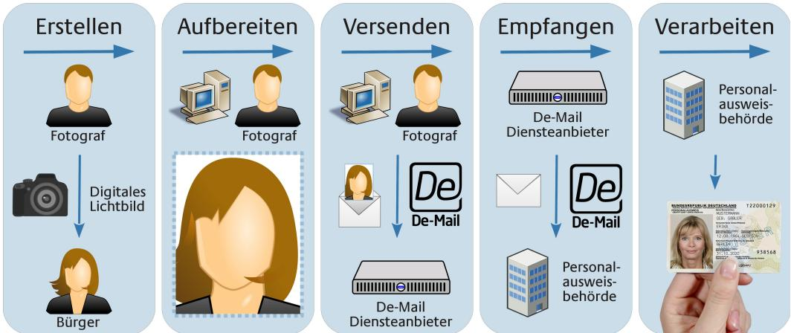
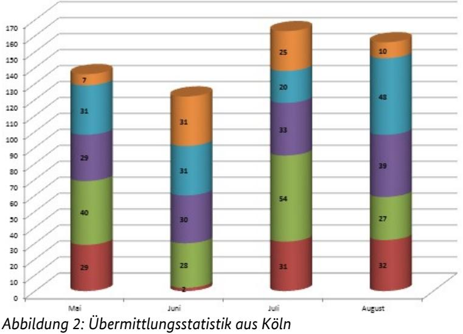

# Elektronische Bildübermittlung unter Nutzung von De-Mail

Ergebnisdokumentation zur Pilotierung

Bundesamt für Sicherheit in der Informationstechnik Postfach 20 03 63 53133 Bonn Tel.: +49 22899 9582-0 E-Mail: hd-bild-pilot@bsi.bund.de Internet: https://www.bsi.bund.de © Bundesamt für Sicherheit in der Informationstechnik 2014

### Danksagung

Für die freiwillige Teilnahme an der Pilotierung bedankt sich das Bundesamt für Sicherheit in der Informationstechnik herzlichst bei den Städten Göttingen und Köln sowie allen teilnehmenden und interessierten Fotografen und den in großem Umfang beteiligten Infrastrukturanbietern.

|                | Änderungshistorie 2                                                                      |  |
|----------------|------------------------------------------------------------------------------------------|--|
|                | Danksagung 4                                                                             |  |
| 1              | Rahmenbedingungen 7                                                                      |  |
| 1.1            | Pilotierungsteilnehmer 7                                                                 |  |
| 1.1.1          | Behörden 7                                                                               |  |
| 1.1.2          | Fotografen 8                                                                             |  |
| 2              | Anwender-Feedback 9                                                                      |  |
| 2.1            | Fotografenseite 9                                                                        |  |
| 2.1.1          | Fotografen 9                                                                             |  |
| 2.1.2          | Softwarehersteller 9                                                                     |  |
| 2.2            | Behördenseite 10                                                                         |  |
| 2.2.1 2.2.2 | IT-Verantwortliche 10 Fachverfahrenshersteller 10                                     |  |
| 2.2.3          | Sachbearbeiter 11                                                                        |  |
| 2.3            | Anwenderübergreifende Faktoren11                                                         |  |
| 2.3.1          | Einschätzung des Gesamtablaufs 11                                                        |  |
| 2.3.2          | Akzeptanz beim Bürger 11                                                                 |  |
| 2.3.3          | Rückfragen an den Fotografen11                                                           |  |
| 2.3.4          | Rückfragen durch den Bürger 11                                                           |  |
| 2.3.5 2.3.6 | Probleme im Gesamtablauf 12 Verbesserungsvorschläge 12                                |  |
| 2.3.7          | Löschfunktion 12                                                                         |  |
| 2.3.8          | Umsetzbarkeit von De-Mail 12                                                             |  |
| 2.3.9          | Implementierung von Sicherheitsfunktionen12                                              |  |
| 3              | Pilotierungsthemen 13                                                                    |  |
| 3.1            | Praktikabilität des Formats der Bildkennung13                                            |  |
| 3.2            | Erforderlichkeit der Beifügung einer Metadaten-Datei13                                   |  |
| 3.3            | Eignung der verschiedenen Versandvarianten unter Praxisbedingungen14                     |  |
| 3.4            | Betrachtung und Bewertung verschiedener IT-Sicherheitsmechanismen14                      |  |
| 3.5            | Komprimierung und Dateiformat des Bildes15                                               |  |
| 3.6            | Organisatorische Eignung des Verfahrens15                                                |  |
| 4              | Fazit und Empfehlung 16                                                                  |  |
| 4.1            | Erstellung einer Technischen Richtlinie16                                                |  |
| 4.2            | Etablierung eines Zertifizierungsverfahrens für die Softwarekomponenten der Fotografen16 |  |
|                | Literaturverzeichnis 17                                                                  |  |

| Abbildung 1: Überblick über die Prozessschritte 7 |  |
|---------------------------------------------------|--|
| Abbildung 2: Übermittlungsstatistik aus Köln 10   |  |

## 1 Rahmenbedingungen

Grundlage für die Durchführung der Pilotierung bildeten die Überlegungen zur elektronischen Übermittlung von Bildern aus dem Jahr 2012, welche in der [Studie] "Elektronische Bildübermittlung an Pass- und Personalausweisbehörden" zusammengefasst wurden. Nach der Veröffentlichung der Studie wurde unter Leitung des Bundesamtes für Sicherheit in der Informationstechnik (BSI) und Mitwirkung verschiedener Fachverfahrenshersteller sowie De-Mail Diensteanbietern, Fotografen-Software-Herstellern und der IG Passfoto ein Proof-of-Concept (PoC) umgesetzt. Dieses PoC konnte auf der CeBIT 2013 erfolgreich unter Nutzung der produktiven De-Mail Infrastruktur und Fachverfahren präsentiert werden.

Ausgehend von den weitestgehend positiven Erfahrungen wurde im Anschluss vom BSI das [Eckpunktepapier] als erste Spezifikationsgrundlage erstellt und mit den Beteiligten abgestimmt. Dieses sollte als Grundlage für die spätere Diskussion und anschließende Pilotierung mit Echtdaten in den Kommunen dienen. Technisch konnte das Szenario entsprechend dem [Eckpunktepapier] umgesetzt werden. Insgesamt wurden im Zeitraum der Pilotierung etwa 500 Bilder von Fotografen übermittelt und zur Beantragung eines Personalausweises in der Behörde verwendet. Einen Überblick über die einzelnen Prozessschritte bietet die folgende *[Abbildung 1: Überblick über die Prozessschritte](#page-4-1)*.

*Abbildung 1: Überblick über die Prozessschritte*

Zur organisatorischen Vorbereitung und Abstimmung wurde zusätzlich ein [Pilotierungskonzept] erstellt, welches wesentliche Rahmenbedingungen für die Pilotierung zusammenfasst.

#### 1.1 Pilotierungsteilnehmer

An der Pilotierung und deren Vorbereitung waren eine ganze Reihe von Teilnehmern im Vorder- und Hintergrund beteiligt. Insbesondere die Anbieter von Infrastrukturkomponenten und Organisationsinfrastrukturen (IG Passfoto, De-Mail-Diensteanbieter) sowie Hard-& Software-Komponenten (Fachverfahren, Fotografen-Software, De-Mail Gateway) sind an dieser Stelle zu nennen.

Zu den direkten Anwendern des Verfahrens zählen die Behörden und Fotografen, welche in den folgenden Kapiteln näher beschrieben werden.

#### 1.1.1 Behörden

An der Pilotierung teilgenommen haben die Kommunen Göttingen in Niedersachsen und Köln in Nordrhein-Westfalen. Beide Kommunen werden von unterschiedlichen Fachverfahrensherstellern bedient, unterscheiden sich deutlich in der Größe und liegen in verschiedenen Bundesländern.

Die Stadt Göttingen ist mit etwa 116.000 Einwohnern die kleinere der an der Pilotierung teilnehmenden Kommunen. Die Beantragung von Pass- und Ausweisdokumenten findet zentral im Rathaus der Stadt statt. Die Pilotierung in Göttingen startete bereits am 2. März 2014 und läuft seitdem kontinuierlich weiter. Die Verarbeitung der Bilder läuft in Göttingen, abweichend zur Spezifikation im [Eckpunktepapier], im BMP-Format. Hintergrund ist, dass das in Göttingen zum Pilotierungsstart produktive Fachverfahren noch keine Verarbeitung von Bildern im JPEG2000-Format zuließ.

In der Stadt Köln leben derzeit rund 1.036.000 Einwohner. Hier wurde der Pilotbetrieb in den 9 Kundenzentren der Stadt Köln am 2. Mai 2014 aufgenommen und läuft seitdem ebenfalls kontinuierlich. Das in Köln zum Einsatz kommende Fachverfahren implementiert das Verfahren zur elektronischen Bildübermittlung vollständig gemäß der Spezifikation im [Eckpunktepapier].

#### 1.1.2 Fotografen

Während in Göttingen zwei Fotografen an der Pilotierung teilnahmen, haben in Köln acht Fotografen Bilder verschickt. Tatsächlich involviert waren in Köln und Göttingen noch weitere Fotografen, die zwar vom BSI informiert wurden, jedoch auf Grund des Betreuungs-Aufwands und der Software-Verteilung nicht mehr an der Pilotierung teilnehmen konnten. Die betreffenden Fotografen werden jedoch über den Fortschritt der Pilotierung informiert, um dann ggf. im Wirkbetrieb an dem Verfahren teilzunehmen.

Leider konnten auf Grund von Abweichungen von der Spezifikation im Verlauf der Pilotierung nur noch Fotografen teilnehmen, die mit Hilfe der von der IG Passfoto beauftragten Software Bilder verschickten.

## 2 Anwender-Feedback

Im Vorfeld und während der Pilotierung wurden an die Anwender des Verfahrens Fragebögen ausgeteilt, um deren Feedback in strukturierter Form abzufragen. Im Folgenden wird dieses Feedback zusammengefasst. Zur übersichtlicheren Darstellung werden an dieser Stelle Fotografen- und Behördenseite getrennt voneinander betrachtet. Infrastrukturanbieter werden ebenfalls den jeweiligen Seiten zugeordnet.

#### 2.1 Fotografenseite

Die Fotografenseite wird an dieser Stelle durch die Fotografen und Softwarehersteller, als direkte Anwender des Verfahrens, repräsentiert. Insbesondere die Fotografen haben während der Pilotierung durch entsprechend vorbereitete Fragebögen die Möglichkeit zur Rückmeldung gehabt und diese auch umfangreich wahrgenommen.

#### 2.1.1 Fotografen

Dadurch, dass sich manuelle Verfahren (nur teilweise softwaregestützte Aufbereitung und anschließender Versand über Weboberfläche des De-Mail Diensteanbieters) bei Vorab-Tests als nicht ausreichend zuverlässig erwiesen haben und auf Grund der Tatsache, dass kein Portal-System für die Pilotierung bereitstand, wurde seitens der Fotografen ausschließlich das sogenannte Kiosk-System eingesetzt. Dabei handelt es sich vereinfacht ausgedrückt um eine Erweiterung bereits vorhandener Software zur Unterstützung von Fotografen, um die Funktion zum Versenden von De-Mails entsprechend des im [Eckpunktepapier] spezifizierten Formats. Die Erstellung und das Handling der Bildkennung wurden von den Fotografen positiv bewertet. Ebenfalls stellte die Erzeugung der Metadaten-Datei keine Hürde da. Zusatzinformationen (z.B. die eigene Telefonnummer) wurden nach Angaben der Fotografen manchmal übertragen. Einige Fotografen konnten hierzu jedoch keine Angaben machen.

Den Zeitaufwand, im Vergleich zu herkömmlichen analogen Verfahren, schätzten die Fotografen geringfügig höher ein. Der reine Arbeitsprozess verlängerte sich dadurch im Schnitt um 2-5 Minuten. Berücksichtigt man auch die im Pilotbetrieb notwendige Beratung (z.B. Erläuterung der Einverständniserklärung), so verzögert sich der Prozess um insgesamt 10 Minuten.

Einen Nutzen für den Bürger sehen die Fotografen insbesondere bei der späteren Verarbeitung der Bilder in der Behörde. Die Verarbeitung in der Behörde kann mutmaßlich vereinfacht werden und zu einer Beschleunigung der Antragstellung führen. Darüber hinaus wird eine allgemeine Qualitätssteigerung erwartet, die auch dazu führt, dass die Biometrieprüfung bei weniger Bildern fehlschlägt. Hiervon profitieren der Bürger und der Fotograf gleichermaßen. Für sich selbst sehen die Fotografen das Verfahren als Chance, ihr Service-Angebot gegenüber ihren Kunden zu erweitern und ggf. Druckkosten zu sparen.

#### 2.1.2 Softwarehersteller

Die Implementierung der Erzeugung der Bildkennung sowie der zusätzlich zum Bild übertragenen Metadaten-Datei wurde von dem Softwarehersteller als unproblematisch eingestuft. In Bezug auf das Dateiformat des Bildes sind ebenfalls keine negativen Effekte aufgetreten und kritische Rückfragen durch die Fotografen blieben aus. Zur Authentisierung wurde ein Hardwaretoken mit PIN direkt am Kiosk- bzw. Arbeitsrechner des Fotografen genutzt. Dieses Vorgehen entsprach in wesentlichen Teilen dem Szenario, welches im Rahmen des Proof-of-Concept auf der CeBIT 2013 präsentiert wurde.

#### 2.2 Behördenseite

Die Fachverfahrenshersteller und IT-Verantwortlichen gaben an, dass der Prozess grundsätzlich weitestgehend reibungslos durchlaufen werden konnte. Die Überprüfung und Erkennung von Fehlerfällen wurde dabei unterschiedlich gehandhabt. In einer Behörde wurde das für die Bildübermittlung genutzte De-Mail Postfach parallel zur automatischen Verarbeitung manuell kontrolliert, in einer anderen wurden umfangreiche automatisierte Prüfungen der eingehenden De-Mails implementiert. Ein Verfahren prüfte neben dem Vorhandensein der Bilddatei und der Metadaten-Datei auch das Bildformat und die Schemakonformität des in der Metadaten-Datei enthaltenen XMLs. Eine Auswertung des Freitexts der De-Mail fand nicht statt. Die Metadaten (Initialen, Geburtstag und -monat) wurden allgemein als sinnvoll empfunden und auch genutzt. Als Sicherheitsmaßnahme wurde die Weiterleitung der De-Mail vom Gateway in die Behörde über ein vor externem Zugriff geschütztes Netzwerk implementiert. Zusätzliche Sicherheitsmaßnahmen waren nicht notwendig.

#### 2.2.1 IT-Verantwortliche

Die Pilotierung wurde von den IT-Verantwortlichen der Behörde überwiegend als Erfolg gewertet. Bedenken gab es lediglich in Bezug auf die allgemeine Akzeptanz des Verfahrens. Seitens der Sachbearbeiter wurden nach dem Start der Pilotierung keine oder nur vereinzelte Fragen an die IT-Verantwortlichen herangetragen.

Beispielhaft wird in der folgenden Abbildung die Anzahl der Bildübermittlungen in Köln im Zeitraum vom 2. Mai bis zum 31. August dargestellt.

#### 2.2.2 Fachverfahrenshersteller

Die Fachverfahren wurden so angepasst, dass der Sachbearbeiter bei der Auswahl des Bildes auf verschiedene Arten unterstützt wird. Zum einen wurde eine Autocomplete-Funktion für die Eingabe der Bildkennung integriert zum anderen wurde auf Basis der Metadaten eine Vorauswahl des Bildes implementiert. Auch für die mehrfache Speicherung von Bildern mit gleicher Bildkennung wurden von den Fachverfahrensherstellern entsprechende Vorkehrungen getroffen, sodass keine Bilder verloren gingen. Die Anbindung an die De-Mail Infrastruktur wurde von den Fachverfahrensherstellern als einfach umsetzbar bewertet. Rückfragen an die Fachverfahrenshersteller durch die Sachbearbeiter sind nicht bekannt.

#### 2.2.3 Sachbearbeiter

Das Handling zum Auffinden der Bilder wurde von den Sachbearbeitern positiv bewertet und es konnten alle Bilder dem jeweiligen Antragsteller zugeordnet werden. Die Zeit zur Ermittlung der gesuchten Bilder betrug in der Regel unter 30 Sekunden, ausnahmsweise 1 Minute. Der Prozess insgesamt wird als schneller im Vergleich zum bisherigen Verfahren bewertet. Die softwaretechnische Unterstützung wurde insgesamt als gut bewertet. Auch wenn der Antragsteller die ihm vom Fotografen ausgehändigte Bildkennung nicht vorlegen konnte, war es dem Sachbearbeiter möglich, die Bilder zu finden. Die Fehlerquote bei der Biometrieprüfung der Bilder wurde als niedriger im Vergleich zum analogen Verfahren wahrgenommen.

#### 2.3 Anwenderübergreifende Faktoren

In den folgenden Kapiteln werden Faktoren zusammengefasst, die mehrere Anwender-Gruppen betrafen.

#### 2.3.1 Einschätzung des Gesamtablaufs

Auf die Frage nach der Einschätzung des Gesamtablaufs gaben die Sachbearbeiter an, dass dieser in der für die Pilotierung gewählten Form positiv zu bewerten ist. Die Fotografen bemängelten teilweise die Software und den insgesamt komplexeren Verlauf im Vergleich zur analogen Bildbereitstellung. Insgesamt wurde der Gesamtablauf aber nicht negativ sondern eher neutral eingestuft. Probleme im Gesamtablauf traten bei den Fotografen auf, wenn keine stabile Internetverbindung vorhanden war.

#### 2.3.2 Akzeptanz beim Bürger

Die Akzeptanz beim Bürger wurde von Fotografen und Sachbearbeitern als gut eingeschätzt. Als Kritikpunkt im Zusammenhang mit der Akzeptanz wurde an die Sachbearbeiter herangetragen, dass das Verfahren nicht den Gang zum Fotografen erspart.

#### 2.3.3 Rückfragen an den Fotografen

Rückfragen an den Fotografen seitens der IT-Verantwortlichen gab es nicht, jedoch gab es Rückfragen an Fotografen durch Sachbearbeiter, wenn Bilder nicht biometrisch waren. Es wurden insgesamt zwei Fälle benannt, in denen das übermittelte Bild nicht den Biometrieanforderungen genügte. Seitens der Fotografen wurde erwähnt, dass es in einem Fall Rückfragen gab, weil ein Bild zu klein war.

#### 2.3.4 Rückfragen durch den Bürger

Während der Pilotierung gab es Rückfragen durch den Bürger ausschließlich beim Fotografen. Dies liegt vermutlich insbesondere daran, dass der Fotograf für den Bürger der erste Ansprechpartner in Bezug auf das Verfahren ist. Die Bürger erkundigten sich beim Fotografen nach der Sicherheit der übertragenen Daten und der Dauer der Speicherung. In diesem Zusammenhang trat auch die Frage auf, ob der Bürger direkt nach der Übermittlung des Bildes die Personalausweisbehörde aufsuchen müsse. Die Bürger hinterfragten kritisch den allgemeinen Nutzen des Verfahrens, sowie die dabei anfallenden Kosten. Die Tatsache, dass die Übermittlung des Bildes nur für die Beantragung eines Personalausweises möglich ist, stieß auf großes Unverständnis beim Bürger.

#### 2.3.5 Probleme im Gesamtablauf

Probleme im Gesamtablauf wurden lediglich vereinzelt von Fotografen gemeldet. Hinderlich waren an dieser Stelle Fehlermeldungen und fehlende Buttons, die im Gesamtablauf die Trennung zwischen Druck und Versand erschwerten. Seitens der Fachverfahrenshersteller und Sachbearbeiter sowie IT-Verantwortlichen in den Behörden wurden keine Probleme im Gesamtablauf gesehen.

#### 2.3.6 Verbesserungsvorschläge

Seitens der Hersteller von Fotografen-Software wurde das Verfahren als technisch geeignet betrachtet, jedoch das Fehlen eines Verzeichnisdienstes bemängelt. Ein solcher Verzeichnisdienst würde den Fotografen den Zugang zum Verfahren stark erleichtern. Die Fotografen und IT-Verantwortlichen der Behörde sind sich einig, dass eine Ausweitung des Verfahrens auf die Beantragung von Reisepässen (und wenn möglich weiteren Dokumenten, wie z.B. Führerschein) unerlässlich für den Erfolg des Verfahrens in der Praxis ist. Es ist dem Bürger kaum zu vermitteln, warum das gleiche Foto nicht wiederverwendet werden darf und so unterschiedlich beigebracht werden muss. Die Fotografen wünschen sich darüber hinaus eine direkte Empfangsbestätigung und Prüfung der Korrektheit der an die Behörde gesendeten Bilder. Seitens der Sachbearbeiter wurde der Wunsch nach einer möglichst einfach zu bedienenden Bildersuche geäußert.

#### 2.3.7 Löschfunktion

Eine automatische Löschfunktion der Bilder wurde für die Pilotierung auf der Seite der Behörde nicht implementiert. Allerdings ist dies für die Zukunft z.B. über ein Delete-Skript relativ einfach realisierbar und auch im Interesse der Behörde. Die Software der Fotografen besitzt eine Löschfunktion.

#### 2.3.8 Umsetzbarkeit von De-Mail

Die Umsetzbarkeit von De-Mail und die damit verbundene Anbindung an die De-Mail Infrastruktur wurde von allen Beteiligten als einfach bewertet.

#### 2.3.9 Implementierung von Sicherheitsfunktionen

Zusätzliche Sicherheitsfunktionen wurden auf der Seite der Behörde nicht implementiert. Dies erscheint aufgrund der Nutzung der sicheren De-Mail Infrastruktur sowie der abgesicherten Behördennetze auch als nicht notwendig. Seitens der Hersteller von Fotografen-Software wurde neben der sicheren Anbindung an das De-Mail Gateway des De-Mail-Diensteanbieters auch eine Löschfunktion von erfolgreich versendeten Bildern implementiert.

### 3 Pilotierungsthemen

Im [Pilotierungskonzept] wurden verschiedene Schwerpunkte für die Pilotierung der elektronischen Bildübermittlung unter Nutzung von De-Mail formuliert. Diese werden in den folgenden Kapiteln wieder aufgegriffen und anhand der Ergebnisse der Pilotierung bewertet.

#### 3.1 Praktikabilität des Formats der Bildkennung

Die Bildkennung setzt sich gemäß [Eckpunktepapier] aus einem über die Bilddatei berechneten Hashwert (8 alphanumerische Zeichen) und den Initialen (2 Buchstaben) sowie dem Geburtstag (2 Ziffern) und Geburtsmonat (2 Ziffern) zusammen. Die Initialen, der Geburtstag und der Geburtsmonat des Kunden können auch durch Ersatzwerte ('00') ersetzt werden, wenn der Kunde zu diesen Informationen keine Angaben machen möchte.

Die Auswirkungen einer fehlerhaften Bildung der Bildkennung und damit fehlerhaften Namensgebung der Bilddatei hängen stark von der Fehlertoleranz des empfangenden Systems (Fachverfahren) ab. Schlimmstenfalls können Bilder nicht vom Fachverfahren gefunden werden. Im Rahmen der Pilotierung ist dieser Fehlerfall unter anderem in Köln aufgetreten, als freie Fotografen mit eigener Software nicht konforme Bildkennungen erstellt haben. Dies ist insbesondere deshalb fatal, weil der Bürger erwartet, dass sein Bild in der Behörde angekommen ist und ggf. kein ersatzweise zu verwendendes Lichtbild auf Papier mitbringt. Dies führte dazu, dass in der Stadt Köln letztendlich nur noch Bilder, die durch die von der IG Passfoto beauftragte Foto-Software erstellt wurden, akzeptiert werden konnten.

Neben fehlerhaften Bildkennungen gab es seitens der Sachbearbeiter in den Behörden vor Ort auch die Rückmeldung, dass die Zusammensetzung der Bildkennung derzeit Nachteile bietet. Bei der Implementierung für die Pilotierung werden in der Bildkennung Groß- und Kleinbuchstaben verwendet, was dazu führt, dass es teilweise schwierig ist, die korrekte Bildkennung bzw. die dazugehörigen Bilder zu finden. Insbesondere wenn z.B. ein großes I ("I") und ein kleines L ("l") in der Bildkennung auftauchen, tritt diese Problematik auf.

Es wird daher vorgeschlagen, den Zeichenvorrat der Bildkennung zu überdenken und auf geeignete Weise sicher zu stellen, dass eine Bildkennung nur von solcher Software generiert wird, die sich an die Vorgaben der Spezifikation hält.

### 3.2 Erforderlichkeit der Beifügung einer Metadaten-Datei

Die Metadaten-Datei wird gemäß [Eckpunktepapier] als weiterer Anhang, neben der Bilddatei, der De-Mail vom Fotografen beigefügt und enthält zusätzliche Informationen des Versenders.

Im Verlauf der Pilotierung ist zunächst aufgefallen, dass die Metadaten-Dateien von den verschiedenen Software-Anbietern sehr unterschiedlich befüllt werden. Darüber hinaus wird die Metadaten-Datei vom Fachverfahren in Köln nicht ausgewertet. Im Betrieb stellte dieses Vorgehen keinen Nachteil im Vergleich zum Betrieb in Göttingen dar. Es ist aber zu beachten, dass im Pilotbetrieb ohnehin ein enger Austausch zwischen den Fotografen und Städten stattgefunden hat.

Da mit De-Mail ein Rückkanal zum technischen Versender der De-Mail besteht und nach den aktuellen Erfahrungen mit dem Verfahren auch weiterhin ein enger Austausch zwischen den Fotografen und der Behörde stattfinden wird, ist davon auszugehen, dass die Metadaten-Datei überflüssig ist.

### 3.3 Eignung der verschiedenen Versandvarianten unter Praxisbedingungen

Ursprünglich waren im [Pilotierungskonzept] die Versandarten

- Versand durch Portal-Systeme,
- Versand durch Kiosk-Systeme und
- Direkter Versand durch Fotografen

vorgesehen. Tatsächlich umgesetzt und erprobt in der Pilotierung wurden jedoch nur die letzteren beiden Varianten, da kein Portal-System für die Pilotierung zur Verfügung stand.

Beim direkten Versand durch Fotografen traten schon im Vorfeld zur Pilotierung Fehler in Bezug auf die Einhaltung der Spezifikation und spätere Verarbeitung der Lichtbilder auf. Dies setzte sich im Pilotbetrieb fort und führte dazu, dass diese Versandvariante im weiteren Verlauf nicht mehr zum Einsatz kam.

Eine Eignung für den Betrieb in der Praxis lässt sich auf Basis der Pilotierung daher zunächst nur für die Nutzung von Kiosk-Systemen aussprechen.

Positiv hervorzuheben ist, dass die Anbindung an ein De-Mail Gateway sowohl auf der Seite der Fotografen als auch auf der Seite der Behörden grundsätzlich unproblematisch war. Die De-Mail Infrastruktur ist somit grundsätzlich für die Übertragung von Bildern zur Antragstellung hoheitlicher Dokumente geeignet.

#### 3.4 Betrachtung und Bewertung verschiedener IT-Sicherheitsmechanismen

Im Rahmen der Pilotierung wurden verschiedene IT-Sicherheitsmechanismen implementiert. Zu einem sehr großen Teil wurde dabei allerdings auf bereits existierende Systeme zurückgegriffen.

Seitens der Fotografen wurde die Anbindung an die De-Mail Infrastruktur über das Gateway eines De-Mail-Diensteanbieters realisiert. Die Übermittlung von De-Mails fand nur dann statt, wenn sich der Nutzer (Fotograf) mit Hilfe eines Hardwaretokens und durch die Eingabe einer PIN am Kiosk-System authentisierte. Das Kiosk-System wiederum stellte schließlich eine sichere Verbindung zum De-Mail Gateway her, um die De-Mail mit dem Bild zu versenden. Auf diese Weise wurde sichergestellt, dass nur eindeutig identifizierte Fotografen De-Mails an die Behörden schicken konnten.

Testweise wurden auch De-Mails manuell unter Nutzung der Weboberfläche der De-Mail-Diensteanbieter gesendet. Hierbei diente der Personalausweis zur Authentisierung des Nutzers und die Übertragung wurde durch die entsprechende Websession geschützt.

Eine Betrachtung, was mit den Bildern im Vorfeld zum Versand passiert, fand unter Aspekten von IT-Sicherheitsmechanismen nicht statt. Die Bilder wurden nach erfolgreicher Übertragung an den De-Mail-Diensteanbieter von den entsprechenden Systemen des Fotografen gelöscht.

Beide Behörden wurden von einem De-Mail-Diensteanbieter über die Nutzung sogenannter Gateways angebunden. Diese Gateways empfingen die De-Mails und reichten sie an die behördeninterne IT weiter. Da die Kommunikation innerhalb der Behörden über sichere behördeninterne Netze erfolgte, waren die Bilder auch während dieses Prozessschrittes vor externem Zugriff geschützt.

Eine zusätzliche Absicherung im Vergleich des hier pilotierten Szenarios wird als nicht erforderlich erachtet. Insbesondere, da eine Überprüfung des Bildes durch den Sachbearbeiter im Rahmen der Beantragung des Personalausweises obligatorisch bleibt und ein Austausch bzw. eine Manipulation des Bildes hier ebenso auffallen würde, wie im bisherigen analogen Antragsszenario (Bürger bringt das Bild in ausgedruckter Form zur Antragsstellung in die Behörde mit).

### 3.5 Komprimierung und Dateiformat des Bildes

Diesem Pilotierungsthema war im Vorfeld der Pilotierung weniger Bedeutung geschenkt worden, jedoch stellte sich im Rahmen der Pilotierung heraus, dass dies ein zentrales Thema ist und besonderer Betrachtung bedarf. Im [Pilotierungskonzept] taucht dieses Thema noch nicht als explizites Pilotierungsthema auf, wird aber im Folgenden dennoch betrachtet.

Im Rahmen der Pilotierung wurden in der Stadt Göttingen unkomprimierte Bilder im BMP-Format und in Köln auf 15kB komprimierte Bilder im JPEG2000-Format versendet. Es wurde jeweils die Bildauflösung von 413 Pixeln Breite und 531 Pixeln Höhe verwendet. Die unkomprimierte Versendung führte zu keinerlei Problemen, jedoch ist die dabei zu übertragende Datenmenge (ca. 650 kB) deutlich höher. Sobald komprimierte Bilder versendet werden, müssen diese das Zielformat des hoheitlichen Dokuments haben (ca. 15 kB), da nicht mehrfach komprimiert werden darf. Hier gelten die Regelungen der [TR Biometrics] sowie der dazugehörigen Testspezifikation, welche unter anderem die Toleranzen bei der Komprimierung und Bildauflösung festlegen. Fehler während der Komprimierung und Wahl des Bildausschnitts für die korrekte Auflösung könnten unter Umständen erst beim Dokumentenhersteller vor der Produktion festgestellt werden, was dem Thema eine hohe Brisanz verleiht.

### 3.6 Organisatorische Eignung des Verfahrens

Neben der technischen Eignung wurde im Rahmen der Pilotierung auch die organisatorische Eignung des Verfahrens überprüft. Seinen größten Vorteil, die sichere Kommunikation, konnte De-Mail während der Pilotierung voll entfalten. Dadurch, dass jeder Teilnehmer der De-Mail Infrastruktur identifiziert wird und über seinen De-Mail Diensteanbieter angeschlossen wird, ist dieses Verfahren im hohen Maße skalierbar. Es war möglich, den Teilnehmerkreis der Fotografen im laufenden Betrieb zu erweitern (und einzuschränken), ohne dass am Empfangssystem der Behörde Änderungen vorgenommen werden mussten.

Nachteilig wirkte sich im Verlaufe der Pilotierung aus, dass aufgrund der aktuellen Regelung im Personalausweisgesetz die Bilder nur für die Beantragung von Personalausweisen verwendet werden konnten. Dies führte zu Verunsicherungen auf der Seite der Antragsteller und Fotografen, da nicht direkt verständlich ist, warum das Bild nicht für weitere hoheitliche Dokumente benutzt werden darf.

Schwer zu bewerten ist die Tatsache, dass es sich bei De-Mail um eine asynchrone Kommunikationsinfrastruktur handelt. Der Vorteil dieses Verfahrens ist, dass das Senden und Empfangen der Bilder zeitlich versetzt und ohne Blockieren der Prozesse beim Fotografen oder in der Behörde (z.B. durch das Warten auf eine Antwort des Empfängers) möglich ist. In einem synchronen Szenario könnte zwar eine direkte Rückmeldung bezüglich der Eignung des Bildes an den Fotografen gegeben werden (vgl *Kapitel [2.3.6:](#page-9-0) [Verbesserungsvorschläge](#page-9-0)*), jedoch müsste dazu die Behörde eine ständig erreichbare Infrastruktur vorhalten und die oben beschriebenen Vorteile blieben aus. Im Pilotbetrieb selbst brachte dieser Aspekt keine dokumentierten Nachteile. Es sind keine Fälle aufgetreten, bei denen die Bilder auf elektronischem Wege noch nicht in der Behörde angekommen waren, als der Antragsteller in der Behörde erschien.

Als für die Pilotierung eher unwichtig, aber für den Wirkbetrieb nachteilig, könnte sich das Fehlen eines Diensteverzeichnisses erweisen. In ein solches Diensteverzeichnis könnten sich die Behörden mit der jeweiligen De-Mail Adresse eintragen, um das Verfahren zugänglich zu machen. Ein solches Diensteverzeichnis müsste nicht zwangsläufig auf dieses Vorhaben beschränkt sein, sondern könnte auch den Zugang zu anderen E-Government Anwendungen erlauben. Solange ein solches Diensteverzeichnis nicht existiert, können die Behörden selbst Regelungen treffen, wie die De-Mail Adresse veröffentlicht wird. Denkbar wäre auch, dass die Behörde eine entsprechende Eintragung der De-Mail Adresse im öffentlichen De-Mail Verzeichnisdienst vornimmt. Diese könnte dann mit einer entsprechenden Kennung (z.B. Passbildempfang) versehen werden.

Das organisatorische Handling des Gesamtprozesses hat sich als praxisgerecht erwiesen. Auch bei nicht vorhandener Bildkennung war es möglich, übersandte Bilder anhand der Initialen und des Geburtstags und -monats zu finden. Nur in absoluten Ausnahmefällen war ein Bild überhaupt nicht auffindbar.

## 4 Fazit und Empfehlung

Auf Basis der geprüften Pilotierungsthemen und des Anwender-Feedbacks sowie des allgemeinen Verlaufs der Pilotierung wird ein Votum für die Umsetzung des Verfahrens ausgesprochen. Die Pilotierung hat gezeigt, dass das Verfahren geeignet ist, eine medienbruchfreie Übermittlung der Bilder an die Personalausweisbehörden zu ermöglichen.

Es wird daher empfohlen das Verfahren, unter Umsetzung der in den folgenden Kapiteln aufgeführten Schritte, von der Pilotierung in den Wirkbetrieb zu überführen.

#### 4.1 Erstellung einer Technischen Richtlinie

Auf Basis der während der Pilotierung gewonnenen Erkenntnisse, dem [Eckpunktepapier] und dem [Pilotierungskonzept] wird eine Technische Richtlinie erstellt, welche das Datenübertragungsformat für die elektronischen Lichtbilder exakt beschreibt. Diese Technische Richtlinie soll die sendenden Fotografen und empfangenden Behörden in die Lage versetzen, das Verfahren zu implementieren. Dabei finden die Punkte aus *Kapitel [3: Pilotierungsthemen](#page-10-0)*, welche die Spezifikation betreffen, Berücksichtigung.

Unabhängig von dem Zeitpunkt der Veröffentlichung einer entsprechenden Technischen Richtlinie sollte den an der Pilotierung teilnehmenden Behörden die Möglichkeit gegeben werden, nahtlos von der Pilotierung in einen Wirkbetrieb überzugehen.

#### 4.2 Etablierung eines Zertifizierungsverfahrens für die Softwarekomponenten der Fotografen

Ein frei zugängliches Prüf- und Testsystem ist für das Verfahren nicht vorhanden und aufgrund des Umfangs der beteiligten Komponenten nicht zielführend. Stattdessen wird empfohlen, für die Softwarekomponenten, die auf Seiten des Fotografen zum Einsatz kommen, ein Zertifizierungsverfahren zu etablieren. Dieses Zertifizierungsverfahren soll insbesondere dazu dienen, die Einhaltung der Spezifikation bezüglich

- Generierung der Bildkennung,
- Bereitstellung der Bilder im korrekten Dateiformat und
- Einhaltung der Sicherheitsmechanismen

zu gewährleisten. Für die Überprüfung der Bereitstellung der Bilder im korrekten Dateiformat kann auf die bereits etablierte Zertifizierung gemäß [TR Biometrics] zurückgegriffen werden. Abweichend von der in der [TR Biometrics] beschriebenen Zertifizierung in Bezug auf die Einhaltung der biometrischen Vorgaben sollte jedoch tatsächlich nur das Dateiformat betrachtet werden.

Die spätere Überprüfung anhand der biometrischen Vorgaben sowie die obligatorische Identifizierung des Antragstellers finden weiterhin in der Behörde statt.

Denkbar wäre ein freiwilliges Zertifizierungsverfahren, welches es den Herstellern erlaubt, die Einhaltung der Spezifikation nachzuweisen. Eine ähnliche Vorgehensweise ist bereits im Rahmen der Zertifizierung von Kartenlesegeräten etabliert. Grundsätzlich können auch nicht zertifizierte Kartenlesegeräte kontaktlos mit dem Chip des Personalausweises kommunizieren. Abhängig vom Anwendungsfall kann jedoch der Einsatz zertifizierter Kartenlesegeräte gefordert werden.

### Literaturverzeichnis

| Studie              | BSI: Elektronische Bildübermittlung an Pass- und Personalausweisbehörden,         |
|---------------------|-----------------------------------------------------------------------------------|
|                     | https://www.bsi.bund.de/DE/Publikationen/Studien/elek_Bilduebermittlung/elek_Bild |
|                     | uebermittlung_Pass.html                                                           |
| Eckpunktepapier     | BSI: Elektronische Bildübermittlung unter Nutzung von De-Mail: Eckpunktepapier,   |
|                     | Version 1.0                                                                       |
| Pilotierungskonzept | BSI: Elektronische Bildübermittlung unter Nutzung von De-Mail:                    |
|                     | Pilotierungskonzept, Version 1.0                                                  |
| TR Biometrics       | BSI: TR-03121, Biometrie in hoheitlichen Anwendungen                              |