Dokument ist noch aktuell. (Stand 2020)

# TG 03126 - Technical Guidelines for the Secure Use of RFID

TG 03126-2 Application area "eTicketing for events"

Authors:

Cord Bartels, NXP Harald Kelter, BSI Rainer Oberweis, BSI Birger Rosenberg, NXP

Federal Office for Information Security P.O. Box 20 03 63 53133 Bonn, Germany Tel.: +49 (0) 228 99 9582 0 E-mail: rfid@bsi.bund.de Website: https://www.bsi.bund.de © Federal Office for Information Security 2009

# **Contents**

| 1     | Description of the "eTicketing for events" application area                      | 12 |
|-------|----------------------------------------------------------------------------------|----|
| 2     | Description of services, products and carrier media                              | 13 |
| 3     | Agreements                                                                       | 15 |
| 3.1   | Definition of terms                                                              | 15 |
| 3.2   | Generic modelling of roles and entities                                          | 16 |
| 3.3   | Allocation of roles and entities in the "eTicketing for events" application area | 18 |
| 3.3.1 | Event organiser                                                                  | 19 |
| 3.3.2 | Ticket provider                                                                  | 19 |
| 3.3.3 | Venue operator                                                                   | 19 |
| 3.4   | Relationship between carrier media, applications and entitlements                | 20 |
| 4     | General requirements                                                             | 22 |
| 4.1   | Function                                                                         | 22 |
| 4.1.1 | Customer requirements                                                            | 22 |
| 4.1.2 | Requirements of the product retailer and service provider                        | 22 |
| 4.2   | Economy                                                                          | 23 |
| 4.3   | Security                                                                         | 23 |
| 5     | Method of determining security requirements                                      | 24 |
| 5.1   | Objectives                                                                       | 24 |
| 5.2   | Method                                                                           | 24 |
| 5.2.1 | Scope of system considerations                                                   | 24 |
| 5.2.2 | Scalability and flexibility                                                      | 25 |
| 5.2.3 | Structure of the Technical Guidelines                                            | 27 |
| 5.2.4 | Explanation of the security concept                                              | 28 |
| 6     | Generic business processes                                                       | 30 |
| 6.1   | Process P1 "registering and ordering"                                            | 30 |
| 6.2   | Process P2 "producing and delivering products"                                   | 32 |
| 6.3   | Process P3 "using an entitlement"                                                | 33 |
| 6.4   | Process P4 "blacklisting entitlements and carrier media"                         | 34 |
| 7     | Use Cases                                                                        | 36 |
| 7.1   | Use case "Identification when registering and ordering"                          | 36 |
| 7.2   | Use case "carrier medium initialisation"                                         | 36 |
| 7.3   | Use case "Application loading"                                                   | 37 |
| 7.4   | Use case "Entitlement loading"                                                   | 38 |
| 7.5   | Use case "Delivery"                                                              | 39 |
|       |                                                                                  |    |

| Use case "Entering an event"                              |    |  |
|-----------------------------------------------------------|----|--|
| Use Case "Leaving an event with the right to return"      |    |  |
| Use case "Blacklisting"                                   |    |  |
| Use cases "Key management"                                | 42 |  |
| Key management for the initialisation of carrier media    |    |  |
| Key management for loading and personalising applications | 43 |  |
| Key management for loading entitlements                   | 44 |  |
| Key management for use with the event organiser           |    |  |
| Security considerations 46                             |    |  |
| Definitions relating to security and privacy              |    |  |
| Definition of the security targets                        |    |  |
| Specific security targets for the customer                | 48 |  |
| 8.2.1.1 Safety                                         | 48 |  |
| 8.2.1.2 Information security                           | 49 |  |
| 8.2.1.3 Protection of privacy                          | 50 |  |
| Specific security targets for the product retailer        | 50 |  |
| 8.2.2.1 Safety                                         | 50 |  |
| 8.2.2.2 Information security                           | 51 |  |
| 8.2.2.3 Protection of privacy                          | 51 |  |
| Specific security targets for the service provider        | 52 |  |
| 8.2.3.1 Safety                                         | 52 |  |
| 8.2.3.2 Information security                           | 52 |  |
| 8.2.3.3 Protection of privacy                          | 53 |  |
| Summary of the entities' security targets                 | 54 |  |
| 8.2.5 Formation of protection demand categories        |    |  |
| Threats                                                   |    |  |
| Threats to the contact-less interface                     | 57 |  |
| 8.3.2 Threats to the carrier medium                    |    |  |
| Threats to the reader                                     | 59 |  |
| Threats to the key management system                      | 60 |  |
| Threats to the sales, inspection and backend systems      | 61 |  |
| Safeguards                                                | 63 |  |
| Selection of cryptographic processes                      | 63 |  |
| Safeguards for the protection of the system as a whole    |    |  |
| Safeguards relating to the carrier medium 73           |    |  |
| Safeguards relating to the readers                        |    |  |
| Safeguards relating to the key management system          |    |  |
| Definition of product-specific application scenarios      |    |  |
|                                                           |    |  |

| 9.1    | Application scenario: "Non-personalised single entitlement"                      | 96  |
|--------|----------------------------------------------------------------------------------|-----|
| 9.2    | Application scenario: "Personalised single entitlement"                          | 98  |
| 9.3    | Application scenario: "Personalised season entitlement"                          | 100 |
| 10     | Suggestions on implementing the system as a whole                                | 103 |
| 10.1   | Suggestions on implementing the eTicketing infrastructure                        | 104 |
| 10.1.1 | Determining the protection demand for the eTicketing infrastructure              |     |
| 10.1.2 | Interfaces in the system as a whole                                              |     |
|        | 10.1.2.1 Threats relevant to the eTicketing infrastructure                    | 107 |
|        | 10.1.2.2 Definition of safeguards for the eTicketing infrastructure           | 108 |
|        | 10.1.2.3 Residual risks                                                       | 110 |
| 10.1.3 | Readers                                                                          | 110 |
|        | 10.1.3.1 Threats relevant to the readers                                      | 110 |
|        | 10.1.3.2 Definition of safeguards for the reader and its applications         | 112 |
|        | 10.1.3.3 Residual risks                                                       | 113 |
| 10.1.4 | Sale, inspection and management systems                                          | 113 |
|        | 10.1.4.1 Sales systems                                                        | 113 |
|        | 10.1.4.2 Ticket system                                                        | 116 |
|        | 10.1.4.3 Central inspection system                                            | 117 |
|        | 10.1.4.4 Terminals                                                            | 118 |
|        | 10.1.4.5 Service-Desk                                                         | 120 |
|        | 10.1.4.6 Management system for carrier media and applications                 | 120 |
|        | 10.1.4.7 Threats relevant to sale, inspection and management systems          | 121 |
|        | 10.1.4.8 Definition of safeguards for sale, inspection and management systems | 123 |
|        | 10.1.4.9 Residual risks                                                       | 125 |
| 10.1.5 | Key management                                                                   | 125 |
|        | 10.1.5.1 Key management for service providers / SAMs for service providers    | 126 |
|        | 10.1.5.2 Threats relevant to the key management system                        | 127 |
|        | 10.1.5.3 Definition of safeguards for the key management system               | 127 |
|        | 10.1.5.4 Residual risks                                                       | 128 |
| 10.2   | Suggestions on executing the carrier media                                       | 129 |
| 10.2.1 | Initialising carrier media and applications                                      | 131 |
| 10.2.2 | Personalising carrier media and applications                                     | 131 |
| 10.2.3 | Determining the protection demand for the carrier media                          | 132 |
| 10.2.4 | Threats to the carrier medium                                                    | 132 |
| 10.2.5 | Definition of specific safeguards                                                | 133 |
| 11     | Suggestions on executing the product-specific application scenarios              | 134 |
| 11.1   | The "Non-personalised single entitlement" application scenario                   | 134 |
| 11.1.1 | Determining the protection demand category                                       | 134 |
|        |                                                                                  |     |

| 11.1.2 Relevant threats                                                            |     |
|---------------------------------------------------------------------------------------|-----|
| 11.1.3 Definition of specific safeguards                                           |     |
| 11.1.3.1 Safeguards when utilising the "Smart Ticket" carrier medium               | 139 |
| 11.1.3.2 Residual risks when utilising the "Smart Ticket" carrier medium           | 140 |
| 11.1.3.3 Safeguards when utilising the "Secure chip card" carrier medium           | 140 |
| 11.1.3.4 Residual risks when utilising the "Secure chip card" carrier medium       | 142 |
| 11.1.3.5 Safeguards when utilising the "Multi-application card" carrier medium     | 142 |
| 11.1.3.6 Residual risks when utilising the "Multi-application card" carrier medium | 144 |
| 11.1.3.7 Safeguards when utilising the "NFC Mobile Device" carrier medium          | 144 |
| 11.1.3.8 Residual risks when utilising the "NFC Mobile Device" carrier medium      | 146 |
| 11.2 The "Personalised single entitlement" application scenario                    | 146 |
| 11.2.1 Determining the protection demand category                                  | 146 |
| 11.2.2 Relevant threats                                                            | 149 |
| 11.2.3 Definition of specific safeguards                                           | 151 |
| 11.2.3.1 Safeguards when utilising the "Smart Ticket" carrier medium               | 152 |
| 11.2.3.2 Residual risks when utilising the "Smart Ticket" carrier medium           | 154 |
| 11.2.3.3 Safeguards when utilising the "Secure chip card" carrier medium           | 154 |
| 11.2.3.4 Residual risks when utilising the "Secure chip card" carrier medium       | 156 |
| 11.2.3.5 Safeguards when utilising the "Multi-application card" carrier medium     | 156 |
| 11.2.3.6 Residual risks when utilising the "Multi-application card" carrier medium | 159 |
| 11.2.3.7 Safeguards when utilising the "NFC Mobile Device" carrier medium          | 159 |
| 11.2.3.8 Residual risks when utilising the "NFC Mobile Device" carrier medium      | 161 |
| 11.3 The "Personalised season entitlement" application scenario                    | 162 |
| 11.3.1 Determining the protection demand category                                  | 162 |
| 11.3.2 Relevant threats                                                            | 165 |
| 11.3.3 Definition of specific safeguards                                           | 166 |
| 11.3.3.1 Safeguards when utilising the "Secure chip card" carrier medium           | 167 |
| 11.3.3.2 Residual risks when utilising the "Secure chip card" carrier medium       | 170 |
| 11.3.3.3 Safeguards when utilising the "Multi-application card" carrier medium     | 170 |
| 11.3.3.4 Residual risks when utilising the "Multi-application card" carrier medium | 173 |
| 11.3.3.5 Safeguards when utilising the "NFC Mobile Device" carrier medium          | 173 |
| 11.3.3.6 Residual risks when utilising the "NFC Mobile Device" carrier medium      | 176 |
| 12 List of references                                                              | 177 |
| 13 List of abbreviations                                                           | 179 |

# **List of Tables**

| Table 2–1  | Products and carrier media                                                                                       | 14 |
|------------|------------------------------------------------------------------------------------------------------------------|----|
| Table 5–1  | Structure of the Technical Guidelines                                                                            | 28 |
| Table 8–1  | Coding scheme of security targets                                                                                | 48 |
| Table 8–2  | Customer specific security targets for safety                                                                    | 49 |
| Table 8–3  | Customer specific security targets for information security                                                      | 49 |
| Table 8–4  | Customer specific security targets for protection of privacy                                                     | 50 |
| Table 8–5  | Product retailer specific security targets for safety                                                            | 50 |
| Table 8–6  | Product retailer specific security targets for safety information security                                       | 51 |
| Table 8–7  | Product retailer specific security targets for protection of privacy                                             | 52 |
| Table 8–8  | Service provider specific security targets for safety                                                            | 52 |
| Table 8–9  | Service provider specific security targets for information security                                              | 53 |
| Table 8–10 | Service provider specific security targets for protection of privacy                                             | 54 |
| Table 8–11 | Overview of the entities' security targets                                                                       | 54 |
| Table 8–12 | Definition of protection demand categories                                                                       | 56 |
| Table 8–13 | Coding scheme of threats                                                                                         | 57 |
| Table 8–14 | Threats to the contact-less interface                                                                            | 57 |
| Table 8–15 | Threats to the carrier medium                                                                                    | 59 |
| Table 8–16 | Threats to the reader                                                                                            | 60 |
| Table 8–17 | Threats to the key management system                                                                             | 61 |
| Table 8–18 | Threats to the sales, inspection and backend systems                                                             | 62 |
| Table 8–19 | Coding scheme of safeguard measures                                                                              | 63 |
| Table 8–20 | Protection of the system as a whole through introduction of interface tests and approval procedures           | 64 |
| Table 8–21 | Protection of the system as a whole through ensuring the confidentiality of communication                     | 65 |
| Table 8–22 | Protection of the system as a whole through introduction of contact less interface as defined by ISO/IEC14443 | 65 |
| Table 8–23 | Protection of the system as a whole through definition of fallback solutions                                  | 66 |
| Table 8–24 | Protection of the system as a whole through securing the confidentiality of data                              | 66 |
| Table 8–25 | Protection of the system as a whole through confidential storage of data                                      | 67 |
| Table 8–26 | Protection of the system as a whole through securing the data integrity when transmitting data                | 67 |
| Table 8–27 | Protection of the system as a whole through securing data integrity when storing data                         | 68 |

| Table 8–28 | Protection of the system as a whole through securing the system's functions against DoS attacks               | 68 |
|------------|------------------------------------------------------------------------------------------------------------------|----|
| Table 8–29 | Protection of the system as a whole through securing the function of the system against incorrect operation   | 68 |
| Table 8–30 | Protection of the system as a whole through securing the function of the system to prevent technical failures | 69 |
| Table 8–31 | Protection of the system as a whole through specification of the system and the components                    | 70 |
| Table 8–32 | Protection of the system as a whole through ergonomic user instructions                                       | 70 |
| Table 8–33 | Protection of the system as a whole through support                                                              | 71 |
| Table 8–34 | Protection of the system as a whole through separation of applications                                        | 71 |
| Table 8–35 | Protection of the system as a whole through identifying the customer                                             | 72 |
| Table 8–36 | Protection of the system as a whole through preventing access by known violent criminals                      | 72 |
| Table 8–37 | Protection of the system as a whole through satisfying the data minimization obligation                       | 73 |
| Table 8–38 | Protection of the transponder through access protection                                                          | 74 |
| Table 8–39 | Protection of the transponder against cloning                                                                    | 75 |
| Table 8–40 | Protection of the transponder against emulation                                                                  | 76 |
| Table 8–41 | Protection of personal data on the transponder                                                                   | 77 |
| Table 8–42 | Protection of settlement data on the transponder                                                                 | 78 |
| Table 8–43 | Protection through separation of applications on the transponder                                                 | 78 |
| Table 8–44 | Protection through specification of carrier medium                                                               | 79 |
| Table 8–45 | Protection through introduction of proximity technology as defined by ISO/IEC14443                            | 79 |
| Table 8–46 | Protection through fallback solution for carrier medium malfunction                                              | 80 |
| Table 8–47 | Protection through securing the authenticity and integrity when loading applications                          | 82 |
| Table 8–48 | Protection through securing the confidentiality when loading applications                                     | 83 |
| Table 8–49 | Protection through securing the authenticity and integrity when loading entitlements                          | 84 |
| Table 8–50 | Protection through securing the confidentiality when loading entitlements                                     | 85 |
| Table 8–51 | Protection of readers through introduction of interface tests                                                    | 85 |
| Table 8–52 | Protection of readers through protection of reference information                                                | 87 |
| Table 8–53 | Protection of the reader against malfunction                                                                     | 88 |
| Table 8–54 | Protection through secure generation and import of keys                                                          | 89 |
| Table 8–55 | Protection through introduction of key management                                                                | 91 |
| Table 8–56 | Protection through access protection for cryptographic keys                                                      | 92 |

| Table 8–57  | Protection through securing the function of security components                                  | 92  |
|-------------|--------------------------------------------------------------------------------------------------|-----|
| Table 8–58  | Protection through availability of a key management system                                       | 93  |
| Table 8–59  | Protection through definition of actions when keys are compromised                               | 93  |
| Table 8–60  | Protection through separation of keys                                                            | 94  |
| Table 8–61  | Protection through securing the authenticity and integrity when loading keys                  | 95  |
| Table 9–1   | carrier media used for single entitlements                                                       | 97  |
| Table 9–2   | Relevant processes                                                                               | 98  |
| Table 9–3   | carrier media used for personalised single entitlements                                          | 99  |
| Table 9–4   | Relevant processes                                                                               | 100 |
| Table 9–5   | carrier media used for personalised season entitlements                                          | 101 |
| Table 9–6   | Relevant processes                                                                               | 102 |
| Table 10–1  | The system's protection requirements                                                             | 106 |
| Table 10–2  | Threats relevant to the contact-less interface                                                   | 107 |
| Table 10–3  | Threats relevant to the system                                                                   | 108 |
| Table 10–4  | Safeguards for the system as a whole                                                             | 110 |
| Table 10–5  | Threats relevant to the contact-less interface                                                   | 111 |
| Table 10–6  | Threats relevant to the reader                                                                   | 112 |
| Table 10–7  | Safeguards for the reader and its applications                                                   | 113 |
| Table 10–8  | Threats relevant to sale, inspection and management systems                                      | 123 |
| Table 10–9  | Safeguards for sale, inspection and management systems                                           | 125 |
| Table 10–10 | Threats relevant to the key management system                                                    | 127 |
| Table 10–11 | Safeguards for the key management system                                                         | 128 |
| Table 10–12 | Categorisation of carrier media                                                                  | 129 |
| Table 10–13 | Categorisation of chip products                                                                  | 131 |
| Table 10–14 | Threats relevant to the carrier medium                                                           | 133 |
| Table 11–1  | Protection demand for the "Non-personalised single entitlement" application scenario          | 136 |
| Table 11–2  | Threats relevant to the "Non-personalised single entitlement" application scenario            | 138 |
| Table 11–3  | Use cases relevant to the "Non-personalised single entitlement" application scenario          | 138 |
| Table 11–4  | Safeguards when utilising Smart Tickets                                                          | 140 |
| Table 11–5  | Safeguards for a "Non-personalised single entitlement" on a "Secure chip card" carrier medium | 142 |
| Table 11–6  | Safeguards when using the multi-application card                                                 | 144 |
| Table 11–7  | Safeguards when utilising the NFC Mobile Device                                                  | 146 |
| Table 11–8  | Protection demand for the "Personalised single entitlement" application scenario              | 149 |

| Table 11–9  | Threats relevant to the "Personalised single entitlement" application scenario            | 151 |
|-------------|----------------------------------------------------------------------------------------------|-----|
| Table 11–10 | Use cases relevant to the "Personalised single entitlement" application scenario          | 151 |
| Table 11–11 | Safeguards when utilising the Smart Ticket                                                   | 154 |
| Table 11–12 | Safeguards for a "Personalised single entitlement" on a "Secure chip card" carrier medium | 156 |
| Table 11–13 | Safeguards when utilising multi-application cards                                            | 159 |
| Table 11–14 | Safeguards when utilising the NFC Mobile Device                                              | 161 |
| Table 11–15 | Protection demand for the "Personalised season entitlement" application scenario          | 165 |
| Table 11–16 | Threats relevant to the "Personalised season entitlement" application scenario            | 166 |
| Table 11–17 | Use cases relevant to the "Personalised season entitlement" application scenario          | 167 |
| Table 11–18 | Safeguards for a "Personalised season entitlement" on a "Secure chip card" carrier medium | 170 |
| Table 11–19 | Safeguards when using the multi-application card                                             | 173 |
| Table 11–20 | Safeguards when utilising the NFC Mobile Device                                              | 176 |

# **List of Illustrations**

| Figure 3–1  | Entities in an application area as defined by ISO 24014 (but extended to include customer medium entities) | 16  |
|-------------|---------------------------------------------------------------------------------------------------------------|-----|
| Figure 3–2  | Entities in the "eTicketing for events" application area                                                      | 18  |
| Figure 3–3  | carrier media, applications and entitlements                                                                  | 21  |
| Figure 5–1  | Example: Identification of RFID-relevant use cases for eTicketing                                             | 25  |
| Figure 5–2  | Example of application scenarios and relevant use cases for eTicketing in public transport                 | 26  |
| Figure 5–3  | Hierarchical concept for media, applications and tickets in eTicketing                                        | 26  |
| Figure 5–4  | Security assessment concept                                                                                   | 28  |
| Figure 5–5  | Generic security targets                                                                                      | 29  |
| Figure 6–1  | Process P1A "registering and ordering"                                                                        | 31  |
| Figure 6–2  | Process P2 "producing and delivering"                                                                         | 32  |
| Figure 6–3  | Process P3 "using an entitlement"                                                                             | 34  |
| Figure 7–1  | Use case "carrier medium initialisation"                                                                      | 37  |
| Figure 7–2  | Use case "Application loading"                                                                                | 38  |
| Figure 7–3  | Use case "Entitlement loading"                                                                                | 39  |
| Figure 7–4  | Use Case "Entering an event"                                                                                  | 40  |
| Figure 7–5  | Use Case "Leaving an event with the right to return"                                                          | 41  |
| Figure 7–6  | Use case "Blacklisting"                                                                                       | 42  |
| Figure 7–7  | Use case "Key management for carrier media"                                                                   | 43  |
| Figure 7–8  | Use case "Key management for applications"                                                                    | 44  |
| Figure 7–9  | Use case "Key management for products/entitlements"                                                           | 45  |
| Figure 10–1 | The system as a whole                                                                                         | 103 |
| Figure 10–2 | An example of a ticket system with possible process flows                                                     | 117 |
| Figure 10–3 | Reader and Smart Card or Smart Label                                                                          | 119 |

# **1 Description of the "eTicketing for events" application area**

Entrance to sporting events, concerts, trade fairs, theatres and so on usually requires that the entrant has an entitlement specially purchased from the event organiser, otherwise known as a ticket. Traditionally this entitlement comes in the form of a visible token (ticket, strip, badge, stamp, etc.) which is checked visually and perhaps validated (torn off) by marshals upon entry. If other information about the event is to be conveyed, such as block, row or seat number, then paper tickets are usually issued with that information printed on them.

Experience has shown that it is impossible to monitor people's access reliably if the entitlements are checked only visually. For example, inspection staff cannot always notice falsified entitlements. That is why electronic access systems are becoming more and more common. They restrict access by means of controlled barriers (turnstiles and so on), check the entitlement automatically, and only grant access if the entitlement is valid. Using this kind of electronic access equipment requires entitlements that can be read by machines. In the past these were often loaded onto magnetic strips, and today it is usually a barcode ticket that is used for individual entry. But if larger amounts of money are involved (such as a season ticket for league football matches), or if special reliability and protection against falsification are required, then chip cards with contact-less proximity interfaces are an increasingly popular solution.

Electronic access systems were introduced at the twelve World Cup stadiums for the 2006 FIFA World Cup. This access technology, which supports the contact-less proximity interface defined in ISO/IEC14443, was not just used during the World Cup. Since then many of the stadium operators and resident clubs have introduced compatible carrier media and eTicketing systems that utilise the newly installed access technology for their league fixtures.

Contact-less chip technology is not yet widespread for one-off events such as concerts, even in cases where the access technology exists at the venue. Normally, tickets are still checked visually, or barcode tickets are used.

# **2 Description of services, products and carrier media**

In Germany, the "eTicketing for events" application area can be divided into three areas:

- 1 Sporting events; the World Cup stadiums already have the necessary electronic access technology.
- 2 One-off events for which tickets are sold by online ticket retailers and advance sales offices.
- 3 Trade fairs, such as CeBit and railtec.

Customers are granted access to the events, for which the following products are offered using eTicketing:

- 1 One-off entitlement -> Single entry to events such as concerts, trade fairs or stadium events.
- 2 Multiple entitlement -> Multiple entry. Equivalent to several one-off entitlements e.g. a season ticket for the national football league or a multiple-entry pass to CeBit.
- 3 Season entitlement -> An unlimited number of entries within the period of validity.
- 4 Additional entitlement -> An upgrade by which additional one-off entitlements are added to multiple entitlements (e.g. UEFA Cup matches).

The following carrier media are examples of those used for events with electronic access technology:

- 1 Paper barcode tickets
- 2 Magnetic strip tickets
- 3 Smart Tickets
- 4 Contact-less secure chip cards
- 5 Contact-less secure multi-application cards
- 6 NFC Mobile Devices

The following table shows which products are normally implemented on which carrier media:

| Product                                                    | Barcode | Magnetic strip card | Smart Ticket | Secure chip card | Multi application card | NFC Mobile Device |
|------------------------------------------------------------|---------|------------------------|-----------------|---------------------|------------------------------|-------------------------|
| One-off entitlement                                        | +       | + > –                  | –               | –                   | – > +                        | – > +                   |
| One-off entitlement with seat number                    | +       | –                      | –               | –                   | – > +                        | – > +                   |
| One-off entitlement (personalised) with seat number  | +       | –                      | +               | (+)                 | – > +                        | – > +                   |
| Multiple entitlement                                       | (+)     | + > –                  | (+)             | +                   | – > +                        | – > +                   |
| Multiple entitlement with seat number                   | +       | –                      | –               | +                   | – > +                        | – > +                   |
| Multiple entitlement (personalised) with seat number | +       | –                      | –               | +                   | – > +                        | – > +                   |

| Product                                                                                                       | Barcode | Magnetic strip card | Smart Ticket | Secure chip card | Multi application card | NFC Mobile Device |
|---------------------------------------------------------------------------------------------------------------|---------|------------------------|-----------------|---------------------|------------------------------|-------------------------|
| Season entitlement (personalised) with seat number                                                      | +       | –                      | –               | +                   | – > +                        | – > +                   |
| Additional entitlements                                                                                    | –       | –                      | –               | +                   | – > +                        | – > +                   |
| Combination with entitlement for additional services at the event venue (parking, lounge, etc) | –       | –                      | –               | +                   | – > +                        | – > +                   |
| Payment function                                                                                              | –       | –                      | –               | +                   | – > +                        | – > +                   |
| Other additional services (public transport,                                                            | –       | –                      | –               | – > +               | – > +                        | – > +                   |

#### **Table 2–1 Products and carrier media**

"+" indicates that the function or characteristic must be taken into account for that sales channel

"(+)" indicates cases of lesser relevance

"–" indicates that there is no relevant relationship between the function/characteristics and the particular sales channel

"+" a symbol highlighted in grey denotes developments expected in the future

The products are sold through the following channels:

- 1 Direct sales through event organisers:
	- a Event organiser's ticket shop, evening box office, stadium ticket office
	- b Internet sales
- 2 Sales through retailers:
	- a Advance ticket office
	- b Internet sales

# **3 Agreements**

### **3.1 Definition of terms**

#### Application area

the area in which the Technical Guidelines are intended to apply; the highest unit in the terminological structure; incorporates one or more applications, the products/services that belong to those applications, and the application scenarios that result from that

#### Application scenario

A particular way of looking at the application area in terms of the implementation of specific products and services.

#### Operating process

A comprehensive operational procedure in eTicketing. Examples are the sales process, the use of an entitlement, clearing, and so on.

#### Use case

Detailed description of a series of activities that constitute part of an operating process. Examples include initialising a carrier medium and loading an entitlement.

#### Interoperability

Interoperability means that the customer can redeem an entitlement with more than one service provider. The service providers are remunerated for the services provided by the product owner. Accounting accuracy is a central aspect of this, since it determines the money received by the service providers.

#### Usage data

Usage data is generated for particular products and applications whenever an entitlement is used to enter, leave, or re-enter an event. Depending on the application, usage data can be stored in the carrier medium and/or in the access system.

#### Calculation data

The usage data which is used for accounting purposes (for post-paid products, for instance) is referred to as calculation data. Calculation data contains, for example, information about the entitlement, the product owner, the service provider, and the place and time at which the service was used. This data may or may not be able to be assigned to the customer, depending on whether a personalised or anonymous entitlement is being used. The calculation data is passed on to the product owner by the service provider, who gathers it in the terminals. The authenticity, integrity and confidentiality of the calculation data are extremely important to customers and service providers alike.

#### Statistical data

Statistical data provides information about the general use of a product, an access, and so on. The statistical data can be derived from the usage data. It is stored and utilised in an anonymised and statistically processed form. Statistical data is not used for invoicing customers for services, but rather for the service provider's or product owner's planning purposes, which is why it is only held in anonymised form.

### **3.2 Generic modelling of roles and entities**

The roles and responsibilities shall be described on the basis of the ISO 24014 standard.

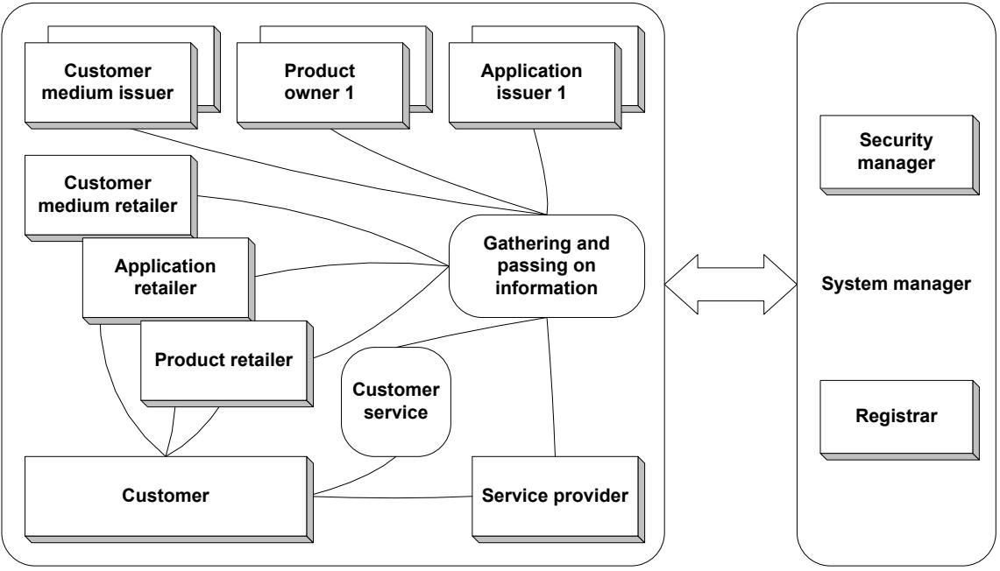

#### **Figure 3–1 Entities in an application area as defined by ISO 24014 (but extended to include customer medium entities)**

ISO 24014 defines entities and assigns roles and responsibilities to them. The implementation for the eTicketing for events application area is described in the following:

Actor

An entity that operates in accord with the role assigned to it.

#### Customer

The purchaser of a product and user of the services associated with it. The customer pays money and receives from the product provider an entitlement to use services. This entitlement is redeemed at the service provider.

#### Customer medium

The customer medium is a data carrier in which an electronic entitlement can be stored. The customer medium is held by the customer, and is required by the customer in order to use the entitlement. Other common names for the customer medium are user medium and carrier medium. Examples of customer media include Smart Tickets, chip cards and NFC Mobile Devices.

#### Issuer of customer medium

The issuer of the customer medium configures it for further use. The issuer may market the customer medium through customer media retailers (such as transport companies). Close coordination and a contractual relationship are required between the issuer of the customer medium, the application issuer and the system manager.

#### Provider of customer medium

The provider of the customer medium (e.g. a transport company or mobile phone service provider) markets the customer medium which it has received from the customer medium issuer. The provider of the customer medium normally implements an application as well when issuing the customer medium.

#### Application

The application supports one or more products by providing functions and structures – such as those needed to store entitlements on the carrier medium, in the sales system and in the backend system. The implementation follows the application specification, which normally belongs to the issuer of the application. The issuer of the application may market the application through application providers (such as a regional transport association). As well as the products, the application may also contain customer-specific information.

#### Application issuer

The application issuer is the owner of the application specification. The application issuer may market the application through application providers (e.g. a transport company).

#### Application provider

The application provider (e.g. a transport company or stadium operator) implements and markets the application which it has received from an application issuer (e.g. in licensed form). The application provider also normally issues the carrier medium in conjunction with implementing the application, making him, for instance, the contractual partner to the customer in the eTicketing application area.

#### Product/entitlement/service

The product is a service or object provided by a product owner and which the customer can use in return for payment. The product belongs to the product owner (e.g. a concert organiser) and is offered to customers directly or through a product provider (e.g. travel agent or advance ticket office). When he purchases the product, the customer receives an entitlement to use a service, which he can then redeem at the service provider (e.g. a transport company).

#### Product owner

The owner of the product (e.g. a single entry to a Bundesliga football match). The product owner defines and markets the product, sometimes through a product provider (e.g. an advance ticket office). In simple scenarios, however, it is quite normal for the product owner to be the product provider as well. The product owner must follow the specifications of the application issuer when he defines his product, in order to ensure that the application can support the product. Furthermore, close collaboration is required between the product owner and the service provider who is to provide the service promised by the product. A contractual relationship is required between the product owner, product provider and service provider.

#### Product provider

Markets the product on behalf of the product owner in return for a fee. The product provider receives the customer's payment and is therefore the only interface for payments. This demands direct coordination and a contractual relationship with the product owner. The product provider places the product (e.g. an entitlement) into the application on the carrier medium. The product provider is the contractual partner to the customer in terms of the entitlements he has purchased to utilise services. In organisational terms the product owner often takes on the role of product provider as well.

#### Service provider

Examples include stadium operators and public transport companies. Provides the customer with a service if he presents an entitlement purchased from a product provider (e.g. entry to a stadium). This requires direct coordination and a contractual relationship with the product provider and product owner.

System manager

The system manager ensures that the rules of the system are upheld. To this end he draws on the functional entities of security manager and registrar.

Registrar

The registrar ensures that the unique identifying characteristics are allocated throughout the system that are needed in order to clearly identify the entities, carrier media, applications and products/entitlements.

Security manager

Establishes and coordinates the security regulations in the system. Responsible for approving the components of the system. Monitors the performance of security-related functions (e.g. key management).

### **3.3 Allocation of roles and entities in the "eTicketing for events" application area**

Making the services available which are described in Chapter [2](#page-12-1) demands, in a fully developed configuration, the interaction of diverse and changing entities. For instance, it must be made possible for a stadium operator to handle applications and products from various different event organisers and providers, since he will be hosting internationals, national league matches and concerts in his stadium.

The assignment of entities in this application area is generally identical to the generic description in section [3.2.](#page-15-1) The special features of this application area are shown in [Figure](#page-17-1)  [3–2](#page-17-1) and then described.

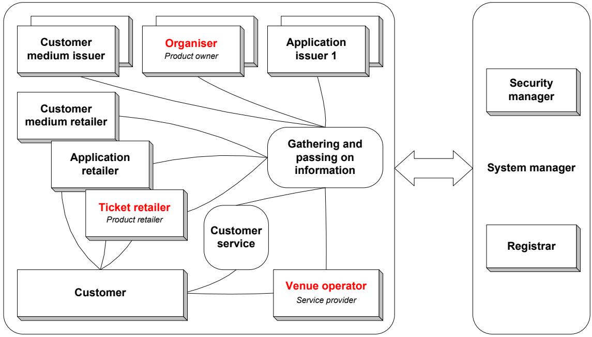

#### **Figure 3–2 Entities in the "eTicketing for events" application area**

The following list describes in more detail the roles and aims of the entities involved in this application area. A more precise description of the roles will be made when we look at the product-specific application scenarios.

### **3.3.1 Event organiser**

The event organiser is responsible for the event and acts as the product owner. He can also assume other roles (but not the role of customer), depending on the application scenario and the context.

The event organiser carries the cost and the commercial and legal risk for the event. His aim is usually to maximise profits. Other aims connected with this are maximum acceptance among customers, that ticket sales processes and the event itself run smoothly, and that costs are minimised.

### **3.3.2 Ticket provider**

Ticket providers assume the role of product provider through various sales channels. The operators of ticket platforms act as product providers for a range of events at different venues, via direct and Internet sales. One example was Internet ticket sales for the 2006 World Cup. In some cases the ticket provider also fulfils other functions. He can, for instance, also be the issuer and provider of the carrier medium and application. In Dutch football, a ticket sales platform provider has established itself which also acts as the system manager, one of whose tasks is to try to ensure that all of the carrier media issued are interoperable with all of the stadiums. Fans can also use their customer media at away games. This is a pioneering model for the future use of contact-less Smart Cards.

As the product provider, the ticket provider is interested in lower sales costs and flexible sales processes. The cost of carrier media, sales points and postage must be minimised. If electronic access control is used at the venue, then the ticket provider must adapt his services to the carrier media and applications that are approved for that system. That is why the standardisation of applications for many venues and the introduction of a system manager in the application area are both advantageous to ticket providers.

Internet platforms are always faced with the problem of postage times, which impede the last-minute sale of entitlements. This can be remedied by solutions such as downloading entitlements via the Internet, or introducing collection procedures.

### **3.3.3 Venue operator**

The places where events are held are often managed independently (e.g. stadium operators). If permanently installed electronic access control is used, then this belongs to the operator, who assumes the role of service provider, since that is where the entitlement purchased from the product provider is converted into a service. In order to operate electronic access control, the operator must be in a position to read and evaluate the application and entitlement on the customer medium; these may in some cases be specific to the event. This requires detailed technical preparations. Various events runs by different event organisers (e.g. league football matches, internationals, concerts, etc.) are normally held at any given venue (e.g. a stadium).

The venue operator – sometimes in collaboration with the event organiser – must ensure that the electronic access control system works properly. Adapting an electronic access control system for specific applications and entitlements is costly and time-consuming; indeed, for individual events it is impossible from an operative and commercial point of view. Yet the operator will be keen to use the existing access technology (and where relevant payment systems, etc.) for all of his events without much adjustment work. The standardisation of applications and entitlements can solve this problem.

### **3.4 Relationship between carrier media, applications and entitlements**

The model described in sections [3.2](#page-15-1) and [3.3](#page-17-2) supports several product retailers, service providers, application owners and so on.

This means that a large number of different carrier media, applications and products would be conceivable.

The customer or carrier medium is the customer's data carrier on which he stores his entitlements and with the help of which he makes use of the associated services.

Applications provide the structures and functions required to load entitlements onto carrier media, and to make use of the entitlements. The implementation of applications must therefore take account of the features of specific carrier media and entitlements.

The customer can exchange entitlements for services at the service provider.

The following rules apply to the relationships between carrier media, applications and entitlements:

- 1 An carrier medium can contain at least one application. If more than one application can be stored on it, then it is referred to as a multi-application-compatible carrier medium.
- 2 An application can store at least one entitlement, and usually several. Personal data and access data may also be stored in the application.
- 3 Applications on one carrier medium can originate from different application owners and retailers.
- 4 Entitlements in one application may originate from different product owners and retailers.
- 5 Entitlements of the same type can be stored in different applications.

The following diagram illustrates an example of the relationship between carrier media, applications and entitlements.

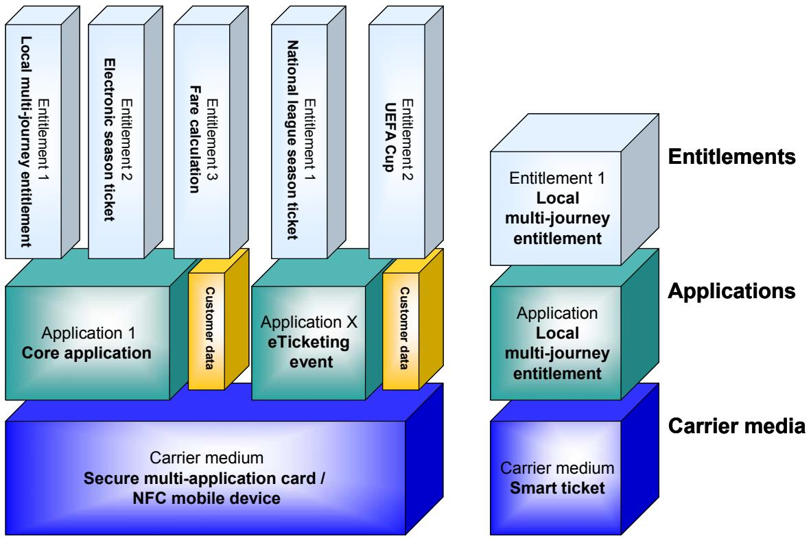

**Figure 3–3 carrier media, applications and entitlements** 

# **4 General requirements**

The requirements which must be met by the system as a whole and its processes and components can be divided into three categories.

### **4.1 Function**

#### **4.1.1 Customer requirements**

Below are some of the features which are required from the customer's point of view:

- The customer media and systems must be easy to use.
- The customer medium must be durable and reliable, and must perform at a the required speed.
- Data about the event (e.g. starting time, block, row, seat) must be transferred together with the entitlement.
- The entitlement and the customer medium must be easy and reliable to use, including with different service providers.
- It should be possible to replace lost entitlements for an administration fee. The same should apply to exchanging entitlements.
- It must also be possible to purchase anonymous entitlements.
- Reasonable protection must be provided for personal data (where applicable)

Whenever contact-less chip technology is used, the customer should always be kept properly informed of the personal data used, how it is employed, what is done to protect the data, and any risks that remain.

#### **4.1.2 Requirements of the product retailer and service provider**

Functionality

- It should be easy to explain to customers and personnel how the customer medium and systems are used.
- The way the system components and processes are executed must take into account the conditions particular to events. For example, at events that place particularly high demands on the availability of the access technology, entry must be possible even if the terminals go offline temporarily or if the power supply is interrupted.
- It must be possible to blacklist personalised entitlements and customer media, and to issue replacements.
- Access barriers must allow enough people through in a given period. The typical requirement for permanently installed systems is a processing time of 300 ms.

Technical compatibility

• The compatibility of system components must be assured even if carrier media, systems and components come from different manufacturers and retailers and are used with different service providers.

## **4.2 Economy**

For an eTicketing system to be operated economically, the commercial benefit must be greater than the cost of the processes, systems and security, regardless of how extensively the system is installed. This must apply to all of the actors who invest in the setting-up of the system.

The system as a whole, and its components, should therefore be designed such that the requirements of the relevant application scenarios are met as efficiently as possible. For this reason it is necessary to begin by defining these requirements as accurately as possible.

# **4.3 Security**

This document will deal with the requirements of security separately, from section [8.2](#page-47-1) onwards. Special requirements arise at international sporting events because of the need to separate rival fan groups safely, and to prevent fans that spread violence from entering the stadium.

# **5 Method of determining security requirements**

### **5.1 Objectives**

The Technical Guidelines on secure use of RFID should fulfil the following objectives:

- Provide system suppliers and system users with an introductory guide on the correct implementation of specific RFID system solutions, in terms of safety, information security and privacy.
- Raise awareness of and achieve transparency in aspects of security.
- Provide a basis for the system supplier's or operator's declaration of conformity, and for the issuing of quality seals by certification authorities.

Achieving these aims requires information which will be provided as follows:

- A definition of the security requirements that must be fulfilled by an RFID system for a given application area.
- A description of the specific risks, appropriate counter-measures, and potential remaining risks.
- A definition of the criteria for a declaration of conformity and for certification.

It is not just security aspects that are relevant to the definition of activities and proposed systems; all of the requirements described in Chapter [4](#page-21-1) also have to be taken into consideration.

### **5.2 Method**

#### **5.2.1 Scope of system considerations**

RFID-based systems can be very complex. In most cases, a lot of components not equipped with RFID are part of the system solution. On the other hand it is not sufficient to look only at the media/tags and readers in order to safeguard the system's security.

The Technical Guidelines must cover in detail every aspect of security relevant to RFID. These aspects depend a lot on the application area and the way the system solution is implemented in it. These Technical Guidelines therefore contain detailed descriptions of the application area and the related operational processes (including the sales channels and processes). The processes cover the entire life-cycle of a carrier medium or transponder. Based on these processes, use cases are identified that are relevant to the security considerations of the RFID system. These use cases are then used as a basis for the identification of threats, and for a detailed system-specific security assessment of RFID-related parts of the system. [Figure 5–1](#page-24-1) shows this approach for the example of eTicketing in public transport.

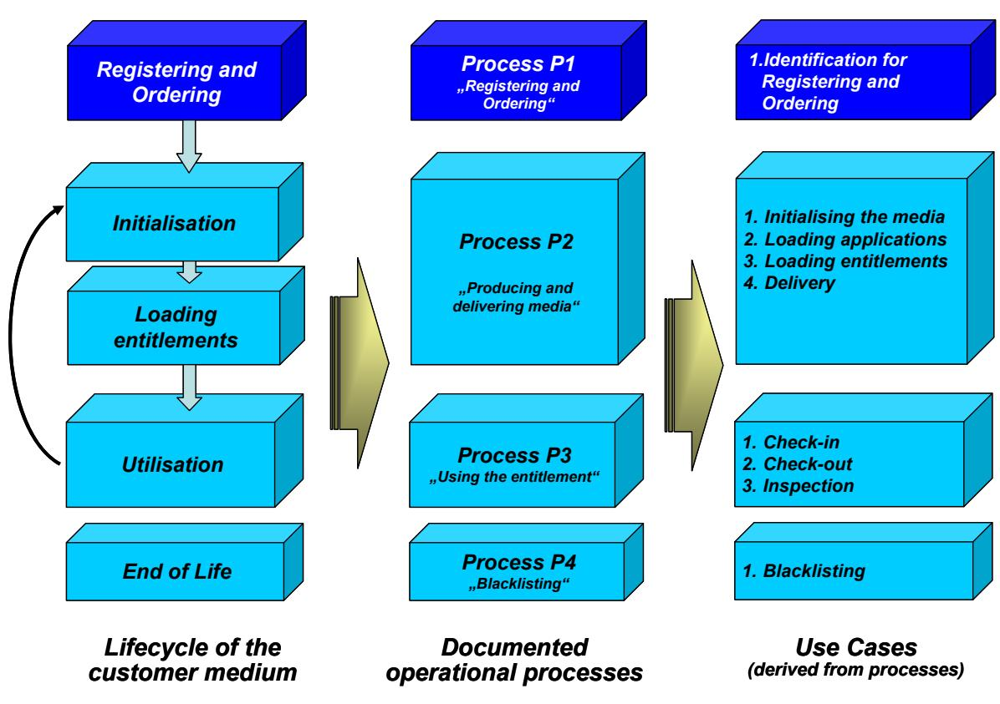

**Figure 5–1 Example: Identification of RFID-relevant use cases for eTicketing** 

All the other system components are considered only in a fairly general manner. Proposed safeguards follow open standards of IT security.

This concept focuses on those parts of the system that are relevant to RFID, yet still makes sure that all aspects of security are considered. At the same time, the Technical Guidelines leave room for individual and proprietary IT implementations (back-offices, sales systems, logistic systems and so on), which supports the enhancement of existing systems using RFID technology.

### **5.2.2 Scalability and flexibility**

These Technical Guidelines are intended to address security issues primarily. At the same time, any system based on these Guidelines must be economically viable. This means that the following requirements have to be covered by the Guidelines' approach:

- 1 It must be possible to implement systems in such a way that the costs and benefits are balanced. This means in practice that precautionary measures must fulfil but not exceed the need for protection. For example: if only low-cost products are used, which require relatively little protection, then the precautions should be designed accordingly. This may allow the use of low-cost media, reducing in turn the cost of implementation and operation of the system.
- 2 The application scenarios that have been chosen for the Technical Guidelines cover a wide range, from small to nationwide and even international systems. It is important that the concept discussed in the Guidelines can be used for system solutions of any size and complexity.
- 3 In many cases a system solution can be made economically viable much more easily if you are able to cooperate with other companies. This applies in particular to eTicketing applications, where it can be very beneficial if media already available to customers

(such as multi-application cards and NFC-enabled phones) can be used for additional applications, products and related services.

The following diagrams provide examples of eTicketing for the cross-system and crossapplication utilisation of customer media and infrastructure.

[Figure 5–2](#page-25-1) shows that various products and application scenarios may have to be supported in one system. Furthermore, these products may be hosted by various types of carrier media.

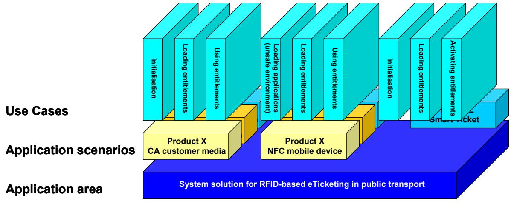

#### **Figure 5–2 Example of application scenarios and relevant use cases for eTicketing in public transport**

[Figure 5–3](#page-25-2) gives an example of a customer medium for eTicketing that supports applications from two application areas.

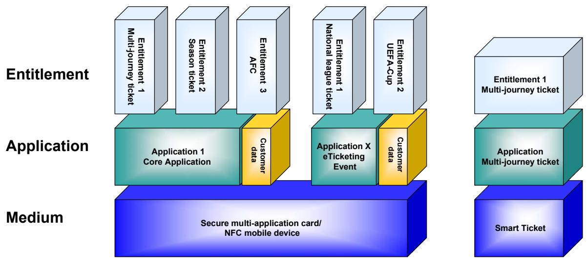

#### **Figure 5–3 Hierarchical concept for media, applications and tickets in eTicketing**

The following concept is used in these Technical Guidelines in order to address the aforementioned requirements:

- 1 A feasible role model and the structure of certain key components (products, applications and media) are defined in Chapter 3. This model supports a scalable, extendable approach.
- 2 The Technical Guidelines have to offer security concepts that cover every combination of application scenarios and media used in an infrastructure. This is achieved by individual security assessments based on the relevant use cases.
- 3 Identical application areas (in particular in eTicketing) that provide opportunities for cross-application partnerships will be addressed by the respective Technical Guidelines with as much communality as possible. The security assessments are based on similar security objectives, and the safeguards make use of the same mechanisms wherever possible.
- 4 A special challenge to system security exists in partnerships across systems and applications. It must be ensured that the security of one system is not undermined by the weaknesses of another. Normally this requires extensive security assessments in both systems.

The Technical Guidelines address this problem by introducing a scalable and transparent concept for employing safeguards against the identified threats; these are called "protection demand categories". A total of three categories from 1 (normal demand) to 3 (high demand) are applied. All of the safeguards are divided accordingly into three levels, from normal to advanced protection.

For every individual system implementation, the protection demand category will be defined to begin with, for every security target. These findings will be used to select the appropriate level for the safeguards involved.

This concept provides an easy way to establish secure system cooperation. It remains only to ensure that the protection demand categories of both systems match up.

### **5.2.3 Structure of the Technical Guidelines**

| Chapter                             | Content                                                                                                                                |  |  |
|-------------------------------------|----------------------------------------------------------------------------------------------------------------------------------------|--|--|
| Description of the application area | Description of the application area: struc ture, services, special peripheral conditions, etc.                                   |  |  |
| Products and services               | Description of examples of products and services, and of sales channels                                                             |  |  |
| Definitions                         | Models, definition of terms                                                                                                            |  |  |
| Introduction to the methodology     | Introduction to the concept and methods that are applied to the security assessment.                                                |  |  |
| General requirements                | General requirements of the parties in volved, important points, etc.                                                               |  |  |
| Operational processes               | Description of operational processes rele vant to the life-cycle of carrier media                                                   |  |  |
| Use cases                           | Definition of RFID-relevant uses cases                                                                                                 |  |  |
| Security assessment                 | Introduction to IT security                                                                                                            |  |  |
|                                     | Definition of specific security targets, protec tion demand categories, and threats.                                                |  |  |
|                                     | Proposed safeguards                                                                                                                    |  |  |
| Definition of application scenarios | Definition of examples of application scenar ios. These examples cover the entire range of relevant parameters that may occur in |  |  |

[Table 5–1](#page-27-1) shows the structure of all the Technical Guidelines that have so far been drawn up.

| Chapter                                                   | Content                                                                                                                                                         |
|-----------------------------------------------------------|-----------------------------------------------------------------------------------------------------------------------------------------------------------------|
|                                                           | each application area. Users of the Techni cal Guidelines may adapt these scenarios according to their own needs.                                         |
| Proposed implementation of the system so lution        | Generic system description including exam ples of how to perform a threat analysis and arrive at feasible safeguards to protect the system components. |
| Implementation proposal for each applica tion scenario | Examples of how to apply the concept to security assessments.                                                                                                |

#### **Table 5–1 Structure of the Technical Guidelines**

#### **5.2.4 Explanation of the security concept**

Each set of Technical Guidelines contains examples of how security assessments should be applied to particular application scenarios. These can be adapted to the requirements and peripheral conditions of the particular system implementation in hand.

[Figure 5–4](#page-27-2) shows the security assessment concept used in all of the Technical Guidelines.

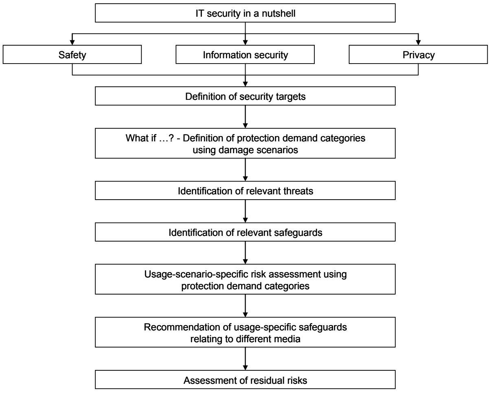

**Figure 5–4 Security assessment concept** 

All considerations are based on the conventional definition of security targets defined in [Figure 5–5.](#page-28-1)

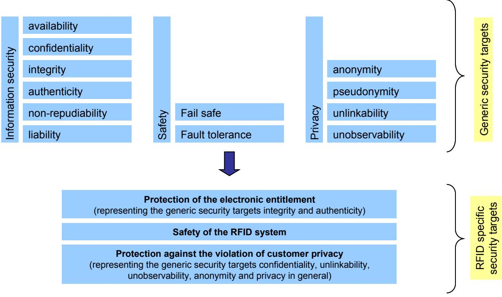

**Figure 5–5 Generic security targets** 

# **6 Generic business processes**

### **6.1 Process P1 "registering and ordering"**

To purchase a ticket product or an entitlement, the customer applies to the ticket retailer. If the customer does not possess a ticket medium containing a suitable application, then he can purchase one from the ticket retailer.[1](#page-29-1) To facilitate this, the ticket retailer works together with the retailers of the application and the customer medium.

Purchasing customer-related entitlements, applications and carrier media requires that the customer registers. To do this the customer provides the necessary personal information (e.g. name, postal address, payment information) and orders the product required.

It is normally up to the event organiser to decide which information is required of the customer for the purposes of determining his identity and address and conducting a credit check. Regulations only apply in the case of special events (e.g. for checking against databases of violent criminals for international football fixtures).

Orders can be placed through various channels:

1 Sales point

The customer visits the sales point and orders the product. Payment is made there and then. Ideally, the sales point will have direct access to the eTicketing system and be able to issue products and customer media on the spot. If not, they are delivered by post. Personal data is only required if a customer-specific product is ordered, or if postal delivery is required.

Where necessary, identity and personal data are checked by means such as an identity card.

2 Service centre

The customer submits the necessary personal information, the order and the payment information to a service centre by fax, written application or telephone. The availability of the product and factors such as seat reservations can normally be dealt with straight away when ordering by telephone. Payment is made by credit card, direct debit, etc. Customer media are delivered by post, or made ready for collection at the venue (sales point, vending machine).

Personal and address information submitted by fax or phone is not necessarily considered trustworthy. Checking it reliably involves extra effort. Normally it is checked solely against a current address database, and a credit check is performed. The organiser then relies on checking the people as they come in, and comparing the ticket data at the venue.

3 Internet

The customer submits the necessary personal information, the order and the payment information to a service centre by Internet (website). The availability of the product and factors such as choice of seating can normally be dealt with straight away when ordering by Internet. Payment is made by credit card, direct debit, etc. Customer media are delivered by post, or made ready for collection at the venue (sales point, vending machine).

1 The case of a customer who only wants to purchase a customer medium with an application, but no product, is considered irrelevant and is not discussed here.

Personal and address information submitted via the Internet is not necessarily considered trustworthy. Checking it reliably involves extra effort. Normally it is checked solely against a current address database, and a credit check is performed. The organiser then relies on procedures such as randomly checking the people as they come in, and comparing the ticket data at the venue.

4 Internet using card-readers and secure proof of identity

In future there will be another way for customers to register and place orders.

It will involve the customer submitting the order and payment information to a service centre via the Internet (website). Personal data (where necessary) will be identified and transmitted online by means of direct communication between the ticket issuer's application server and an electronic proof of identity (eID), which may take the form of the elektronischer Personalausweis (ePA) or electronic identity card.

The availability of the product and factors such as choice of seating can normally be dealt with straight away when ordering by Internet. Payment is made by credit card, direct debit, etc. Products and customer media are delivered by post, or made ready for collection at the venue (sales point, vending machine).

The personal and address information received by communicating with the eID is to be considered trustworthy. Additional checking is not required.

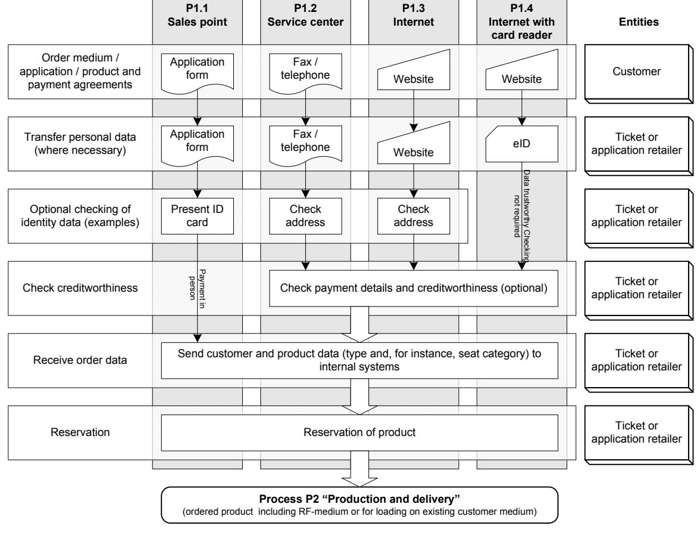

The following diagram shows Process P1A, registering and ordering:

**Figure 6–1 Process P1A "registering and ordering"** 

### **6.2 Process P2 "producing and delivering products"**

Two basic cases are to be considered when describing the process of producing and delivering products:

- 1 Producing and delivering an entitlement together with a specially produced carrier medium.
- 2 Loading an entitlement onto a customer-related medium already in the possession of the customer (e.g. secure chip card, NFC Mobile Device).

The following diagram, [Figure 6–2](#page-31-1), shows Process P2 with 4 sub-processes. Processes P2.1 to P2.3 cover the former case – in which the ordered product is delivered to the customer on a specially produced medium.

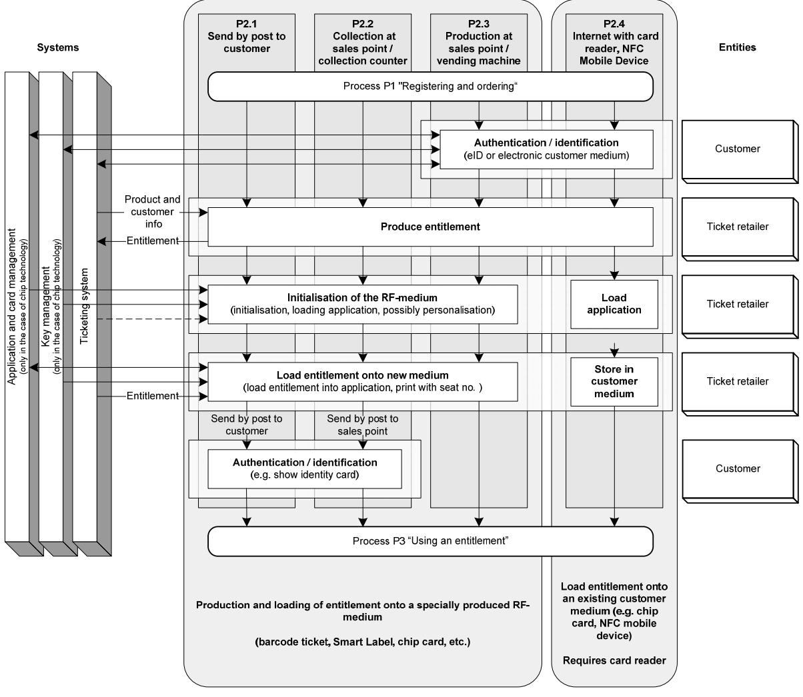

**Figure 6–2 Process P2 "producing and delivering"** 

Explanation of terms:

Initialisation

Initialising a carrier medium involves configuring it for the first time, and/or loading on applications.

#### Personalising

Personalising refers to the allocation of an carrier medium, application or entitlement to a natural person. Personal data is loaded onto it for this purpose.

Loading entitlements

Loading entitlements onto an existing application on the carrier medium.

### **6.3 Process P3 "using an entitlement"**

An event-specific entitlement is redeemed by the customer in exchange for a service at the event. If an electronic access system exists at the venue, then the customer must have an carrier medium with an application approved for the event and a valid entitlement in order to gain entry, claim his seat, and so on.

The electronic access system is the responsibility of the operator of the venue. The operator must first do a number of things before the event so as to guarantee the operation of this function:

- 1 The local access system must be adapted to the applications and entitlements that are being used for the event. Because of the different RD-media involved and so on, this may well involve more than one application for a given event.
- 2 The event-specific key information must be integrated into the local key management system if contact-less chip technology is being used.
- 3 The list of enabled entitlements (the whitelist) and blocked entitlements (the blacklist) must be transferred from the ticket system into the access system, which requires a realtime data interface between the ticket retailer's or event organiser's ticket system and the operator's access system.

A local service or info desk must be set up at the venue as a point of contact in the event of problems that may occur with media or entitlements when entering. It should be possible to produce carrier media and entitlements for the event at this service or info desk, which requires direct access to the ticketing system and the access control system, as well as a means of producing media and entitlements.

Access is via turnstiles. Alternatively it is possible to employ marshals with mobile readers at the entrances. The inspection units and turnstiles also have to work if the stadium network fails. This is especially important if a WLAN is used for connecting to the access server.

The ticket is activated when the customer enters. Optionally, there should be way of leaving the venue and re-entering.

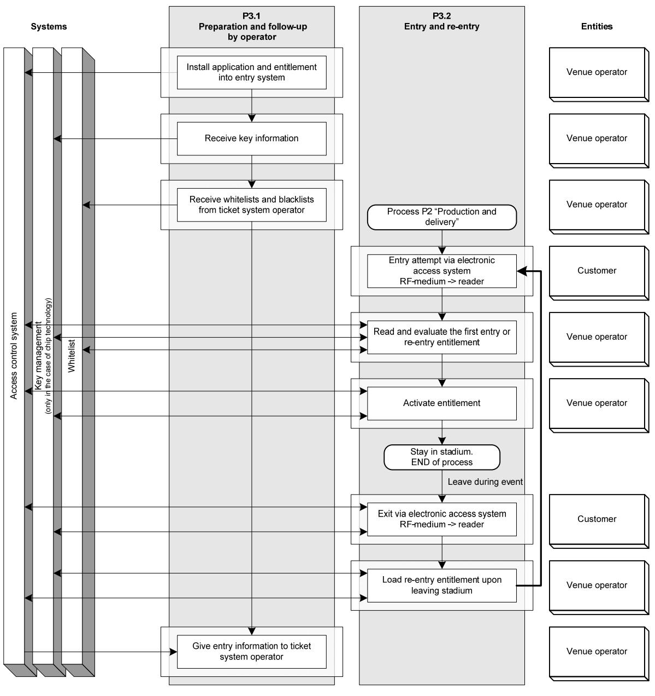

The following diagram shows Process P3:

**Figure 6–3 Process P3 "using an entitlement"** 

This does not take into account faults that occur when entering.

### **6.4 Process P4 "blacklisting entitlements and carrier media"**

Because of the high level of security against falsification that can be achieved if chip-based carrier media are utilised properly, it is possible to blacklist entitlements and carrier media securely. This helps the processes of cancelling and exchanging carrier media and entitlements, and enables lost media to be replaced. The following are possible scenarios:

1 Defective carrier media are withdrawn and destroyed. The same applies to the cancellation of a single ticket. Before issuing a replacement medium it is important to ascertain that a counterfeit has not been presented for replacement, and that a medium has not been declared as defective and submitted.

- 2 In practice, mislaid carrier media can only be blacklisted and replaced if they are personalised, i.e. assigned to a customer account (see registration) with a ticket retailer. If this is the case, then the owner can identify himself to the ticket retailer from which he obtained the medium, and state which carrier medium is to be blacklisted. The same procedure can be used to cancel single entitlements.
- 3 Mislaid personalised carrier media and the entitlements stored on them can be replaced provided that all the entitlements on them have been blacklisted. It is important to remember that the carrier medium may contain more than one application, and that these may themselves contain entitlements from various ticket retailers.

# **7 Use Cases**

The following sections contain descriptions of use cases that are relevant as we look further at contact-less chip technology in this application area. These use cases have been derived from the generic operating processes described in Chapter [6](#page-29-2).

The descriptions of the use cases are based on an illustrative system architecture which is discussed in more detail in Chapter [10](#page-102-1).

### **7.1 Use case "Identification when registering and ordering"**

The quality of the process of authenticating and identifying the customer is crucial to the reliability of the data upon which Process P1, "Registering and ordering", is based. Process descriptions P1.1 – P1.4 can be used for elucidating this. Using a reliable process, such as one involving a secure personalised customer medium or an electronic identification medium (possibly the forthcoming ePA, for example), will mean an increase in security and functionality.

### **7.2 Use case "carrier medium initialisation"**

The "carrier medium initialisation" use case depicted in [Figure 7–1](#page-36-1) incorporates the following steps:

- 1 carrier medium initialisation
- 2 Default settings relating to function and security
- 3 Setting specific keys
- 4 Setting an ID which uniquely identifies the carrier medium
- 5 Loading the applications
- 6 Loading the software specific to the applications concerned
- 7 Allocating the resources of the carrier medium (setting up file systems and so on)
- 8 Setting specific keys for each application
- 9 Loading the application-specific data
- 10 Loading customer data (where required)
- 11 Loading the ID of the application retailer

As the stages of initialising the carrier medium progress, the information in the management system for carrier media and applications has to be updated.

The various keys, certificates and so on that are used are generated and fed in by a key management system. This system is the responsibility of the system manager (more precisely the security manager and registrar). If the carrier medium's chip is to generate public keys during initialisation, then these also have to be fed into the key management system.

carrier medium initialisation normally takes place in a secure environment (e.g. in a mass personaliser or in a vending machine).

**Figure 7–1 Use case "carrier medium initialisation"** 

### **7.3 Use case "Application loading"**

The "Application loading" use case shown in [Figure 7–2](#page-37-1) illustrates the procedure for loading an application onto an carrier medium already in the possession of a customer. The medium can be a contact-less chip card or an NFC Mobile Device.

There are various possible scenarios for loading a new application onto an existing carrier medium:

- 1 Loading the application via a contact-less interface in a trustworthy environment.
- 2 Loading the application via a contact-less interface in an insecure environment. For instance, this may occur when loading an application onto a contact-less chip card via a reader on a home computer or in an advance ticket office.
- 3 Loading an application "over-the-air" onto an NFC Mobile Device.

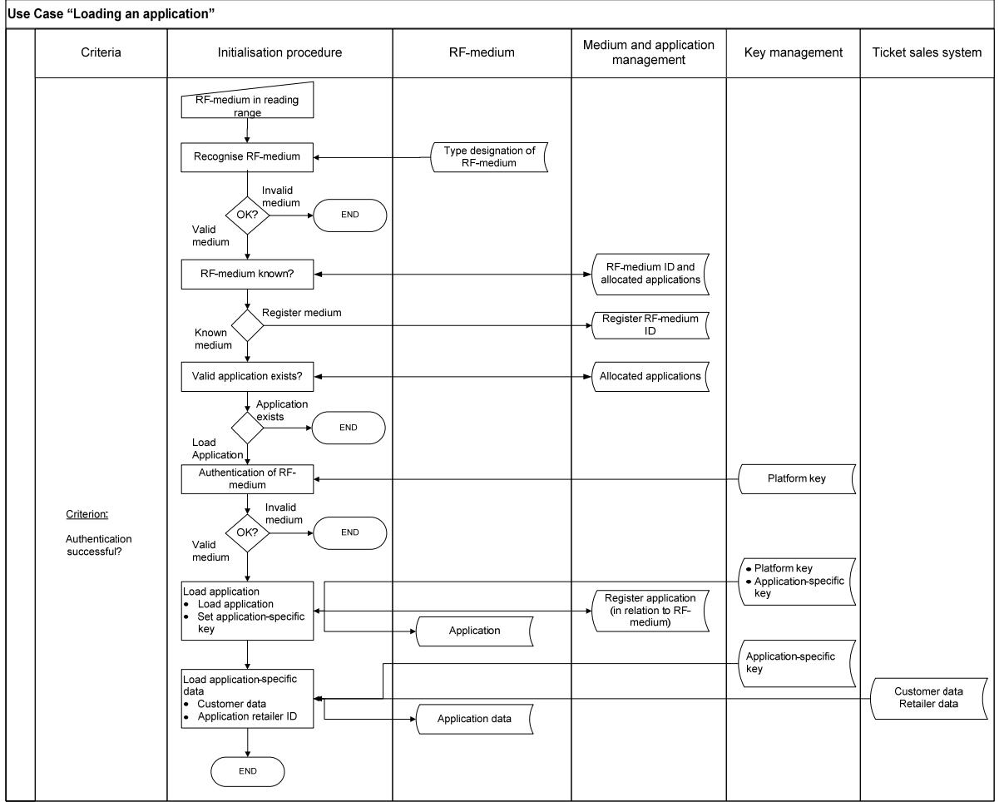

**Figure 7–2 Use case "Application loading"** 

### **7.4 Use case "Entitlement loading"**

As soon as the carrier medium has been initialised and the applications installed, entitlements can be loaded onto the applications.

The sale of products is directly dependent on this use case being performed securely and in a way which is easy for customers. The use case is therefore an absolutely crucial one for retailers and customers alike. All of the sales channels discussed in the description of Process P2 (Section [6.2](#page-31-2)) must be taken into consideration when dealing with the "Entitlement loading" use case depicted in [Figure 7–3](#page-38-1).

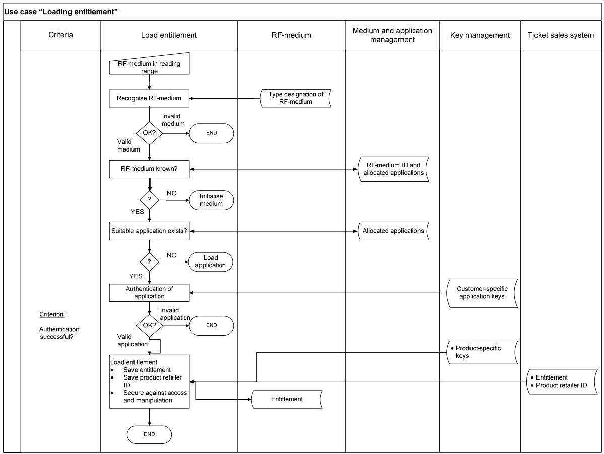

**Figure 7–3 Use case "Entitlement loading"** 

A distinction must be made between the loading of entitlements when the carrier medium is first issued and the loading of entitlements later on. The latter can be done via the Internet using a home reader, over-the-air onto an NFC Mobile Device, or locally at a sales point or vending machine.

### **7.5 Use case "Delivery"**

carrier media that have been initialised and loaded with entitlements must then be passed to the delivery point or the customer as described in Process P2 (Section [6.2\)](#page-31-2).

When delivering, the product retailer must also record security-relevant information about the delivery in the ticket system. This includes:

- 1 Addressee,
- 2 ID of carrier media, ID of products,
- 3 Forwarder,
- 4 Delivery point, special arrangements relating to handing-over.

### **7.6 Use case "Entering an event"**

The "Entering an event" use case represents the first part of Process P3.2 in detail. The exact way this is executed depends on the application involved and the data models and algorithms associated with it. The following diagram shows the procedure.

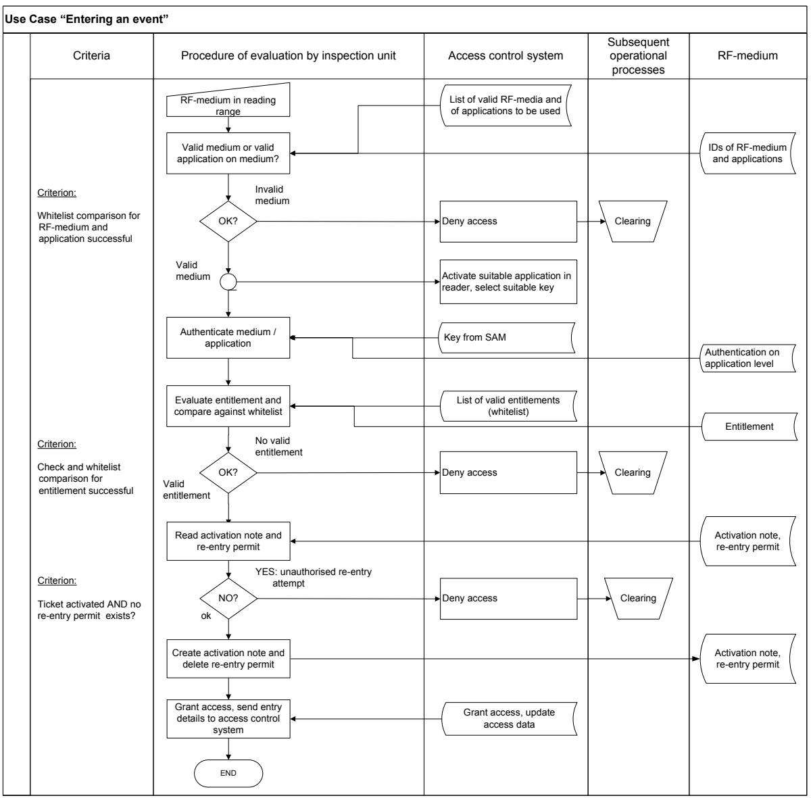

**Figure 7–4 Use Case "Entering an event"** 

In the event of a fault, manual clearing is used. Usually this means that a marshal takes the customer to a service desk, where defective carrier media can be exchanged if necessary.

### **7.7 Use Case "Leaving an event with the right to return"**

The "Leaving an event with the right to return" use case represents the second part of Process P3.2 in detail. The exact way this is executed depends on the application involved and the data models and algorithms associated with it. The following diagram shows the procedure.

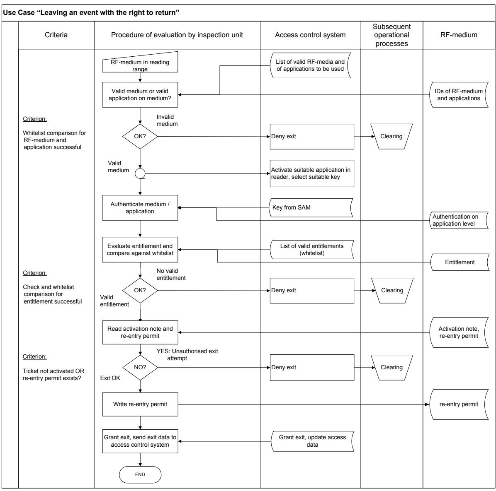

**Figure 7–5 Use Case "Leaving an event with the right to return"** 

In the event of a fault, manual clearing is used. Usually this means that a marshal takes the customer to a service desk, where defective carrier media can be exchanged if necessary.

### **7.8 Use case "Blacklisting"**

Carrier media that have been mislaid must be able to be blacklisted. The same applies to defective media and entitlements, assuming they cannot be withdrawn and destroyed.

The blacklisting of a medium and/or the entitlement stored on it is a precondition for the issuing of a replacement medium, or for the transfer of an entitlement to a new owner with a different customer medium.

Blacklisting can only be performed if it is sufficiently certain that the customer requesting it is the rightful owner of the medium or entitlement. That is why customers may only blacklist media or entitlements in either of the following cases:

- 1 The customer's details were stored when purchasing. Blacklisting is then performed following reliable identification and a legally binding declaration that the customer agrees to the procedure.
- 2 The medium containing the entitlement is presented. Its authenticity can be determined securely.

As well as customers performing blacklisting, other entities in the system can apply for it too. To this end, responsibilities and processes are defined for these entities in the system as a whole.

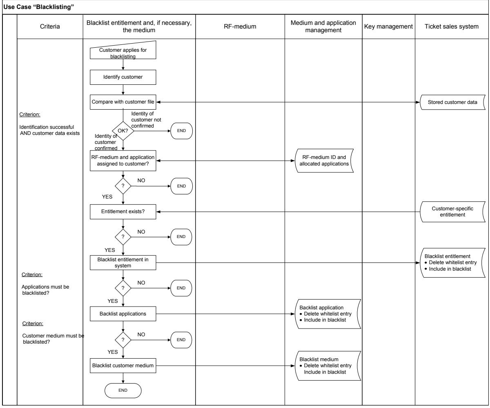

**Figure 7–6 Use case "Blacklisting"** 

### **7.9 Use cases "Key management"**

For performance reasons, entitlements on carrier media are usually protected using procedures involving symmetric keys. The security and proper function of the system as a whole is therefore highly dependent on the secure provision and storage of the keys, a job which has to be done by the key management system and the processes assigned to it.

In the following use cases, Secure Authentication Modules (SAMs) are used as secure storage for key information, security mechanisms and diversification algorithms. In principle, other methods may also be feasible.

Carrier medium initialisation and the loading of entitlements require a key management system that recognises the hierarchical relationship between carrier media, applications and products/entitlements.

For the sake of simplicity, the following diagrams only show the process of ordering SAMs for the first time. In practice re-ordering will be frequent, and this will have to be dealt with accordingly, normally using master keys that are already available.

### **7.9.1 Key management for the initialisation of carrier media**

[Figure 7–7](#page-42-1) illustrates the use case of key management for the initialisation of carrier media. The keys and procedures defined here are also required for the loading of applications.

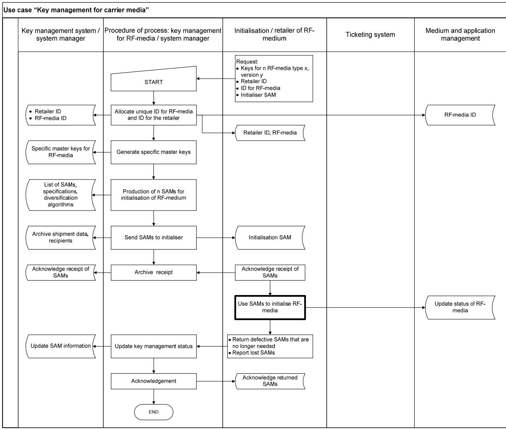

**Figure 7–7 Use case "Key management for carrier media"** 

### **7.9.2 Key management for loading and personalising applications**

In order to secure applications that are loaded when carrier media are produced, or afterwards, special keys and identifiers must be generated for the applications.

[Figure 7–8](#page-43-1) shows the corresponding use case. The key management system for carrier media also has to be available when the application is loaded onto the carrier medium.

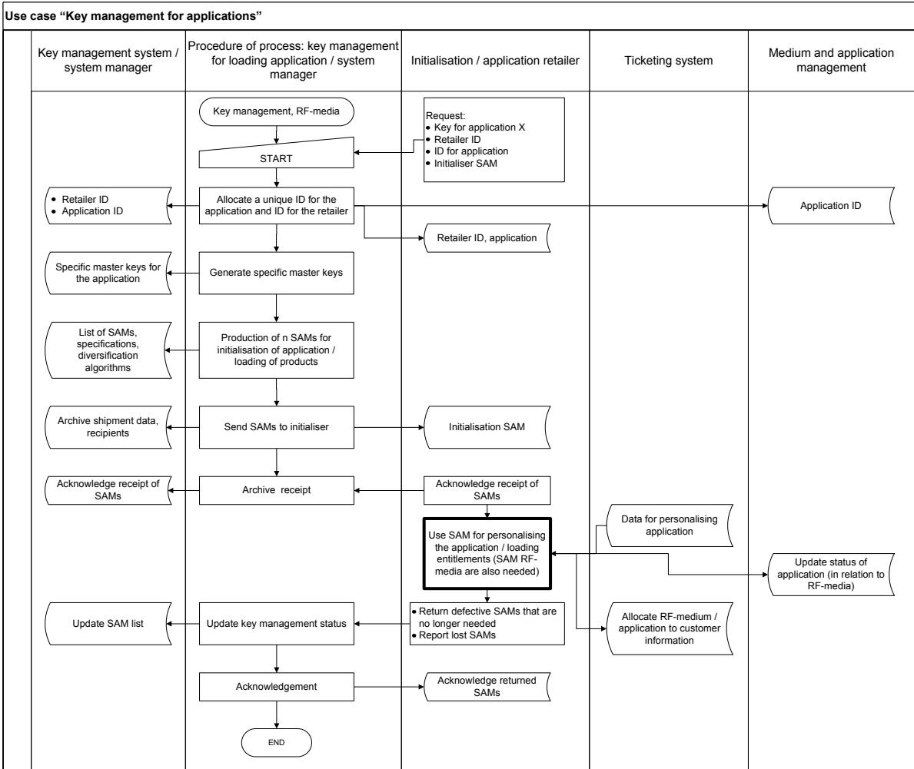

**Figure 7–8 Use case "Key management for applications"** 

#### **7.9.3 Key management for loading entitlements**

In order to secure entitlements that are loaded when carrier media are produced, or afterwards, special keys and identifiers must be generated for the products.

[Figure 7–9](#page-44-1) shows the corresponding use case. The key management system for applications also has to be available when the entitlement is loaded onto the application.

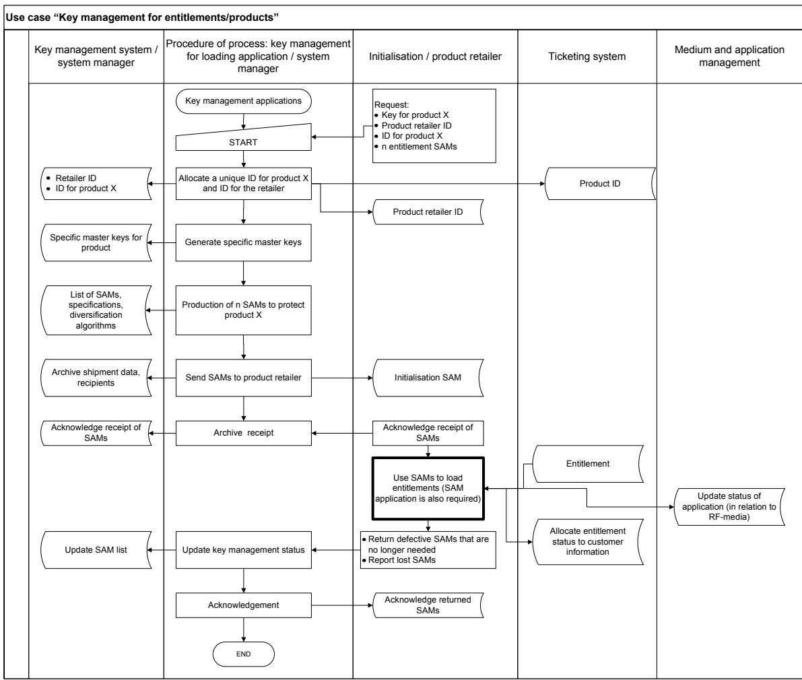

**Figure 7–9 Use case "Key management for products/entitlements"** 

#### **7.9.4 Key management for use with the event organiser**

Retailers and issuers require a key management system to initialise carrier media and issue entitlements.

The organiser of the event requires the keys and other information needed to read and evaluate the entitlements.

This information has to be available in the inspection system.

To this end, the security manager normally generates and issues specific SAMs (service provider SAMs) for the organiser using the key management system. Service provider SAMs can contain key information from multiple retailers of products, applications and carrier media. A selection is put together by the security manager in accordance with the needs of the organiser.

# **8 Security considerations**

### **8.1 Definitions relating to security and privacy**

Security can be divided into three aspects or categories, all of which this document intends to examine. They are:

- Safety
- Information security
- Privacy

These categories can be subdivided as follows:

1 Safety

Safety is not to be confused with reliability/correctness or quality of service. Reliability means that the system works correctly according to its specifications. Experience shows that every technical system is sometimes subject to failure. Safety is understood as the capacity of a system, when it does fail, not to enter uncontrollable states that would endanger the system itself or its environment (fail-safe). At the same time, the system should also continue to respond as far as possible in compliance with its specification (fault tolerance). Safety, therefore, basically implies protection against unintended incidents.

2 Information security

Unlike safety, information security offers protection against intentional attacks. In the field of information security, security targets can be formulated as belonging to the following categories:

- a Confidentiality: confidentiality means protection against the unauthorised disclosure of information. Confidential data and information may only be accessible to authorised people in an authorised manner. Formulated as a protection target this means: stored information and information that is to be communicated is to be protected against access by unauthorised persons.
- b Integrity: integrity means ensuring that data is correct (intact) and that systems function properly. Formulated as a protection target this means: stored information and information that is to be communicated is to be protected against unauthorised modification.
- c Availability: the availability of services, of the functions of an IT system, IT applications and IT networks – and also of information – exists if these things are always available to their users when required. Formulated as a protection target this means: information and operating systems are to be protected against being withheld improperly.
- d Unlinkability: if two communication elements within a system are unlinkable, it means they are not any more or less related to one another than is already known and established. Within the system, no further information about the relationship between these communication elements can be obtained. In practical terms this means that a single user can make use of services and resources more than one time, without third parties being able to see that these access events (in the communication model: messages) are related through the user.
- e Unobservability: an event is unobservable if it cannot be determined whether it has happened or not. Sender-unobservability means it cannot be seen that anything has been sent; recipient-unobservability is the same: it is not possible to ascertain

that something has been received. Relationship-unobservability means that it cannot be seen that anything is sent from the group of possible senders to the group of possible recipients.

- f Anonymity: anonymity is the condition of being unidentifiable within one's anonymity group. Using the term unlinkability, anonymity can be more precisely defined as the unlinkability of the identity of a user and an event initiated by that user. Senderanonymity is therefore unlinkability of sender and message, and recipientanonymity is the unlinkability of message and recipient.
- g Authenticity: the term authenticity designates a situation in which the partner in a communication process is actually the person he claims to be. Authentic information is information that genuinely comes from the stated source. The term is not only used when people's identity is being checked, but also for IT components and applications.
- h Non-repudiation: protection should exist against the possibility of denying that messages have been sent and received by persons whose authenticity has been determined.
- i Binding validity: binding validity joins together the IT security targets of authenticity and non-repudiation. When transmitting information this means that the source of the information has proven its identity, and that the receipt of the message cannot be disputed.
- 3 Privacy

The purpose of privacy is to protect against infringements of the personal rights of the individual through the handling of his personal data.

Privacy refers to the protection of personal data against possible misuse by third parties (not to be confused with data security).

The following additional terms will also be used throughout:

1 Security targets

Security targets are the security-related and safety-related objectives undertaken when setting up an IT system. This document lays down specific security targets within the areas of use and application scenarios. Infringing upon the security targets causes direct damage to the entity whose security target is violated.

2 Threats

Threats are immediate risks to the security targets of an application.

These may be the result of an active attack on one or more security targets, or they may take the form of potential vulnerabilities in the system such as the lack of a fallback solution.

3 Safeguards

Safeguards are actual recommended actions that counter one or more threats. The safeguards described in this document are intended to be applied meaningfully and according to need, which means they are suggested on the basis of economic feasibility and resistance to manipulation: how expensive is a safeguard, and what are the financial damages that it can limit or prevent?

4 Residual risk

Generally speaking it is not possible to counteract every single threat in such a way that a system offers perfect security. The residual risk is thus the risk of potential attack that remains after a series of safeguards have been put in place. The extent of this risk depends on the counter-measures that can be applied, how complex they are, and, above all, what the costs are in relation to the benefits for the entity involved. The entity has to take explicit liability for the residual risk.

### **8.2 Definition of the security targets**

It would be very unusual indeed for all of the safety aspects relating to safety, information security and privacy within a given application scenario to be of equal importance, or indeed for every single one of them to be relevant at all. The first challenge when designing a secure RFID system is therefore to formulate specific security targets.

Within the areas of use relating to eTicketing, certain higher level security targets specific to the application area can be recognised, based on the generic security targets mentioned earlier:

- 1 Protection of electronic entitlements (represents the protection targets integrity and authenticity)
- 2 Safety of the RFID system
- 3 Protection of the customer's privacy (represents the protection targets confidentiality, unlinkability, unobservability, anonymity, and privacy as a general requirement)

The subsidiary security targets summarised in Section [8.2.4](#page-53-1) can be derived from the assessments of the entities' security targets contained in the following sections.

| field num ber | 1                   | 2                                       | 3                                                             | 4                |
|------------------|---------------------|-----------------------------------------|---------------------------------------------------------------|------------------|
| field            | security tar get | associated role and its abbreviation | associated generic security target and its abbreviation | index num ber |
|                  |                     | C := customer                           | S := safety                                                   |                  |
| content          | S                   | P := product provider                   | I := information secu rity                                 | 1,  , n          |
|                  |                     | S := service provider                   | P := privacy                                                  |                  |

The following table shows the scheme of security target codes and used abbreviations.

**Table 8–1 Coding scheme of security targets** 

#### **8.2.1 Specific security targets for the customer**

The customer's specific security targets are listed in the following sections.

#### **8.2.1.1 Safety**

| and name | Security target code       | Description of security target                                                                                                                                                                                                                                                                                                                                      |
|----------|----------------------------|---------------------------------------------------------------------------------------------------------------------------------------------------------------------------------------------------------------------------------------------------------------------------------------------------------------------------------------------------------------------|
| SCS1     | Technical compatibility | The interaction between customer media and readers must function as specified. This must apply to all of the approved customer media at all readers in the entire system infrastructure. It must take into account the fact that carrier media and infrastructure may be supplied by different manufacturers and run by different service providers. |
| SCS2     | Fallback                   | Authorised persons must be able to use the service even when                                                                                                                                                                                                                                                                                                        |

| and name | Security target code                       | Description of security target                                                                                                                                              |
|----------|--------------------------------------------|-----------------------------------------------------------------------------------------------------------------------------------------------------------------------------|
|          | solution in the event of malfunction | the customer medium or system infrastructure is not working perfectly.                                                                                                   |
| SCS3     | Intuitive, fault tolerant operation  | Operation must be self-explanatory where possible, and/or easy to learn. The customer should know at any given time which stage of the operation process he is at. |

#### **Table 8–2 Customer specific security targets for safety**

#### **8.2.1.2 Information security**

| and name | Security target code                                  | Description of security target                                                                                                                                                                                                                                                                                                                                                                                                                                      |
|----------|-------------------------------------------------------|---------------------------------------------------------------------------------------------------------------------------------------------------------------------------------------------------------------------------------------------------------------------------------------------------------------------------------------------------------------------------------------------------------------------------------------------------------------------|
| SCI1     | Protection of personal data                        | The customer data stored in the system and customer medium is used to identify the customer, make payments, deliver enti tlements, and so on.                                                                                                                                                                                                                                                                                                                 |
|          |                                                       | Misuse, manipulation or passing-on to unauthorised persons could incur commercial damage to the customer along with the loss of safety, and must be prevented.                                                                                                                                                                                                                                                                                                |
| SCI2     | Protection of entitlements                         | Entitlements may be exposed to DoS attacks and manipulation by third parties. This could cause inconvenience and possible damage to the customer. The damage would normally be lim ited, since usually the service can still be used provided the cus tomer can prove that he purchased a valid entitlement. Manipu lation of the entitlement by unauthorised persons must be pre vented.                                                         |
| SCI3     | Protection of usage data                           | If usage data influences further use of the entitlement or the in voicing process, then it must be reliable.                                                                                                                                                                                                                                                                                                                                                     |
| SCI4     | Reliable in voicing                                | When a service has been used, the customer must be able to see the time of activation or check-in / check-out.                                                                                                                                                                                                                                                                                                                                                   |
|          |                                                       | Calculation data (post-paid) must be clear and reliable.                                                                                                                                                                                                                                                                                                                                                                                                            |
| SCI5     | Protection of applications and entitle ments | Customer media can accommodate more than one application, and these applications may belong to different application own ers. Furthermore, one application can hold multiple entitlements supplied by different product owners. It must be ensured that applications and entitlements are reliably separated from a tech nical point of view, or that agreements exist between the entities that regulate multiple usage and conflict resolution. |

**Table 8–3 Customer specific security targets for information security** 

| Security target code and name |                                                                  | Description of security target                                                                                                                                                       |
|----------------------------------|------------------------------------------------------------------|--------------------------------------------------------------------------------------------------------------------------------------------------------------------------------------|
| SCP1                             | Protection of personal data                                   | Personal data given to the product retailer must be treated confidentially, and only used for the agreed purposes.                                                                |
| SCP2                             | Protection of usage data                                      | Non-anonymised, personal data about the use of a service may only be employed for the purposes of the product retailer or service provider with the agreement of the customer. |
| SCP3                             | Protection against the creation of movement profiles | Third parties must be prevented from utilising RFID technology to generate personal movement profiles.                                                                            |
| SCP4                             | Protection against violent criminals                       | Protection against fans who are willing to resort to violence and people who intend to commit violent acts.                                                                       |

#### **8.2.1.3 Protection of privacy**

#### **Table 8–4 Customer specific security targets for protection of privacy**

### **8.2.2 Specific security targets for the product retailer**

The product retailer's specific security targets are listed in the following sections.

#### **8.2.2.1 Safety**

| Security target code and name |                                                     | Description of security target                                                                                                                                                                                                                                                                                                                                      |
|----------------------------------|-----------------------------------------------------|---------------------------------------------------------------------------------------------------------------------------------------------------------------------------------------------------------------------------------------------------------------------------------------------------------------------------------------------------------------------|
| SPS1                             | Technical compatibility                          | The interaction between customer media and readers must function as specified. This must apply to all of the approved customer media at all readers in the entire system infrastructure. It must take into account the fact that carrier media and infrastructure may be supplied by different manufacturers and run by different service providers. |
| SPS2                             | Fallback solution in the event of malfunction | Customers must be able to use the service even when the customer medium or system infrastructure is not working perfectly.                                                                                                                                                                                                                                    |
| SPS3                             | Intuitive, fault tolerant operation              | Little explanation must be required in order to enable the cus tomer to use the service without difficulty. The customer should know at any given time which stage of the operation process he is at.                                                                                                                                                      |
| SPS4                             | Maintaining a high availability level         | Access to events may at times require very high throughput levels, and influence on customers may then be limited. Faults in the system must not then cause operational or security difficulties.                                                                                                                                                          |

| Table 8–5 | Product retailer specific security targets for safety |  |
|-----------|-------------------------------------------------------|--|
|           |                                                       |  |

| 8.2.2.2 | Information security |  |
|---------|----------------------|--|
|---------|----------------------|--|

| Security target code and name |                                                      | Description of security target                                                                                                                                                                                                                                                                                                                                                                                                                                    |
|----------------------------------|------------------------------------------------------|-------------------------------------------------------------------------------------------------------------------------------------------------------------------------------------------------------------------------------------------------------------------------------------------------------------------------------------------------------------------------------------------------------------------------------------------------------------------|
| SPI1                             | Protection of personal data                       | The customer data stored in the system and customer medium is used to identify the customer, make payments, deliver entitlements, and so on.                                                                                                                                                                                                                                                                                                                |
|                                  |                                                      | Misuse, manipulation or passing-on to unauthorised persons could incur commercial damage to the product retailer and a loss of customer acceptance, and could be punished as a violation of the law. This must be avoided.                                                                                                                                                                                                                               |
| SPI2                             | Protection of entitlements                        | The manipulation of, damage to and in particular the counterfeiting of entitlements could incur considerable commercial damage to the product retailer, product owner and service provider.                                                                                                                                                                                                                                                              |
|                                  |                                                      | Securing entitlements against counterfeiting is an important objective for the product owner.                                                                                                                                                                                                                                                                                                                                                                  |
| SPI3                             | Protection of usage data                          | The availability and integrity of usage data is of great value to the product retailer, the product owner and the service provider. This data is used for invoicing, planning products and capacities, and increasing customer loyalty.                                                                                                                                                                                                                  |
| SPI4                             | Reliable invoicing                                | It must be ensured that earnings from the sale of entitlements by the product retailer can be allocated correctly to the services provided by the service provider.                                                                                                                                                                                                                                                                                         |
| SPI5                             | Protection of applications and entitlements | Customer media can accommodate more than one application, and these applications may belong to different application owners. Furthermore, one application can hold multiple entitlements supplied by different product owners. It must be ensured that applications and entitlements are reliably separated from a technical point of view, or that agreements exist between the entities that regulate multiple usage and conflict resolution. |

**Table 8–6 Product retailer specific security targets for safety information security** 

#### **8.2.2.3 Protection of privacy**

| Security target code and name |                                | Description of security target                                                                                                                                                                                                                                             |
|----------------------------------|--------------------------------|----------------------------------------------------------------------------------------------------------------------------------------------------------------------------------------------------------------------------------------------------------------------------|
| SPP1                             | Protection of personal data | Misuse, manipulation or passing-on to unauthorised persons could incur commercial risks for the customer contract partner and result in a loss of customer acceptance, and could also be punished as a violation of the law. This must therefore be prevented. |
| SPP2                             | Protection of usage data    | Non-anonymised, personal data about the use of a service may only be employed for the purposes of the product retailer with the agreement of the customer. The aim for certain products is to obtain this consent, so as, for example, to enable post payment. |

| Security target code and name |                                            | Description of security target                                                                                 |
|----------------------------------|--------------------------------------------|----------------------------------------------------------------------------------------------------------------|
| SPP4                             | Protection against violent criminals | Protection against fans who are willing to resort to violence and people who intend to commit violent acts. |
| SPP5                             | Data minimisation                       | Only the data required for the specified purpose should be gathered and stored, no more.                    |

#### **Table 8–7 Product retailer specific security targets for protection of privacy**

#### **8.2.3 Specific security targets for the service provider**

The service provider's specific security targets are listed in the following sections.

#### **8.2.3.1 Safety**

| Security target code and name |                                                        | Description of security target                                                                                                                                                                                                                                                                                                                                       |  |
|----------------------------------|--------------------------------------------------------|----------------------------------------------------------------------------------------------------------------------------------------------------------------------------------------------------------------------------------------------------------------------------------------------------------------------------------------------------------------------|--|
| SSS1                             | Technical compatibility                             | The entitlements stored in the various customer media must function as specified. This must apply to all of the approved customer media and all of the readers in the whole of the service provider's system infrastructure. It must take into account the fact that carrier media and local transponders may be supplied by different manufacturers. |  |
| SSS2                             | Fallback solution in the event of malfunction | It must be possible to provide the service even when the customer medium or system infrastructure is not working perfectly. It must be possible to prove the existence of an entitlement.                                                                                                                                                                   |  |
| SSS3                             | Intuitive, fault tolerant operation              | There must be a low incidence of problems when customers use the system. The customer should know at any given time which stage of the operation process he is at.                                                                                                                                                                                          |  |
| SSS4                             | Maintaining a high availability level         | Access to events may at times require very high throughput levels, and influence on customers may then be limited. Faults in the system must not then cause operational or security difficulties.                                                                                                                                                           |  |

#### **Table 8–8 Service provider specific security targets for safety**

#### **8.2.3.2 Information security**

| Security target code and name       |  | Description of security target                                                                                                                                                                                          |  |
|----------------------------------------|--|-------------------------------------------------------------------------------------------------------------------------------------------------------------------------------------------------------------------------|--|
| SSI1 Protection of personal data |  | The customer data stored in the system and in the customer medium is used to identify the customer, make payments, deliver entitlements, and so on. Misuse, manipulation or passing-on to unauthorised persons |  |

| Security target code and name      |                                                      | Description of security target                                                                                                                                                                                                                                                                                                                                                                                                                                    |  |
|---------------------------------------|------------------------------------------------------|-------------------------------------------------------------------------------------------------------------------------------------------------------------------------------------------------------------------------------------------------------------------------------------------------------------------------------------------------------------------------------------------------------------------------------------------------------------------|--|
|                                       |                                                      | could incur commercial damage to the service provider and a loss of customer acceptance, and could be punished as a violation of the law. This must be prevented.                                                                                                                                                                                                                                                                                           |  |
| SSI2 Protection of entitlements |                                                      | The manipulation of, damage to and in particular the counterfeiting of entitlements could incur considerable commercial damage to the product retailer, product owner and service provider.                                                                                                                                                                                                                                                              |  |
|                                       |                                                      | Securing entitlements against counterfeiting is an important objective for the service provider. Entitlements are also used in the service provider's system infrastructure, and they must be safeguarded there as well.                                                                                                                                                                                                                                 |  |
| SSI3                                  | Protection of usage data                          | Usage data is of great value to the service provider. It is used for invoicing and for planning capacities.                                                                                                                                                                                                                                                                                                                                                    |  |
|                                       |                                                      | From the point of view of the customer and for legal reasons, customer-specific usage data must be treated confidentially by the service provider. Contravention of this would cause a loss of customer acceptance and could be punished as a violation of the law.                                                                                                                                                                                   |  |
| SSI4                                  | Reliable invoicing                                | It must be ensured that earnings from the sale of entitlements by the product retailer can be allocated correctly to the services provided by the service provider.                                                                                                                                                                                                                                                                                         |  |
| SSI5                                  | Protection of applications and entitlements | Customer media can accommodate more than one application, and these applications may belong to different application owners. Furthermore, one application can hold multiple entitlements supplied by different product owners. It must be ensured that applications and entitlements are reliably separated from a technical point of view, or that agreements exist between the entities that regulate multiple usage and conflict resolution. |  |

**Table 8–9 Service provider specific security targets for information security** 

### **8.2.3.3 Protection of privacy**

| Security target code and name |                                | Description of security target                                                                                                                                                                                                                                             |  |
|----------------------------------|--------------------------------|----------------------------------------------------------------------------------------------------------------------------------------------------------------------------------------------------------------------------------------------------------------------------|--|
| SSP1                             | Protection of personal data | Misuse, manipulation or passing-on to unauthorised persons could incur commercial risks for the service provider and result in a loss of customer acceptance, and could also be punished as a violation of the law. This must be prevented.                       |  |
| SSP2                             | Protection of usage data    | Non-anonymised, personal data about the use of a service may only be employed for the purposes of the service provider with the agreement of the customer. The aim for certain products is to obtain this consent, so as, for example, to enable post payment. |  |
| SSP4                             | Protection against violent  | Protection against fans who are willing to resort to violence and people who intend to commit violent acts. Adherence to the rules                                                                                                                                      |  |

| Security target code and name                              |           | Description of security target                             |  |
|---------------------------------------------------------------|-----------|------------------------------------------------------------|--|
|                                                               | criminals | of the organiser.                                          |  |
| SSP5 Data minimisation gathered and stored, no more. |           | Only the data required for the specified purpose should be |  |

**Table 8–10 Service provider specific security targets for protection of privacy** 

### **8.2.4 Summary of the entities' security targets**

The following table sums up the aforementioned security targets of the various actors involved. Role-specific security targets have been summarised to specific security targets associated to the generic security targets safety, information security and privacy. Used abbreviations are:

- SS := specific security target regarding to the generic security target safety
- SI := specific security target regarding to the generic security target information security
- SP := specific security target regarding to the generic security target privacy

| Security target |                                                           | Customer targets | Product retailer targets | Service provider targets |
|-----------------|-----------------------------------------------------------|---------------------|--------------------------------|--------------------------------|
| SS1             | Technical compatibility                                   | SCS1                | SPS1                           | SSS1                           |
| SS2             | Fallback solution in the event of malfunction          | SCS2                | SPS2                           | SSS2                           |
| SS3             | Intuitive, fault-tolerant operation                       | SCS3                | SPS3                           | SSS3                           |
| SS4             | Maintaining a high availability level                     |                     | SPS4                           | SSS4                           |
| SI1             | Protection of personal data                               | SCI1, SCP1          | SPI1, SPP1                     | SSI1, SSP1                     |
| SI2             | Protection of entitlements                                | SCI2                | SPI2                           | SSI2                           |
| SI3             | Protection of logistical data (ano nymised usage data) |                     | SPI3                           | SSI3                           |
| SI4             | Reliable invoicing                                        | SCI3, SCI4, SCP2 | SPI3, SPI4, SPP2            | SSI3, SSI4, SSP2            |
| SI5             | Protection of applications and enti tlements           | SCI5                | SPI5                           | SSI5                           |
| SP3             | Protection against the creation of movement profiles   | SCP3                |                                |                                |
| SP4             | Protection against violent criminals                      | SCP4                | SPP4                           | SSP4                           |
| SP5             | Data minimisation                                         |                     | SPP5                           | SSP5                           |

**Table 8–11 Overview of the entities' security targets** 

### **8.2.5 Formation of protection demand categories**

Three protection demand categories are formed on the basis of the security targets described in Section [8.2.4](#page-53-1). Category 1 represents the lowest protection demand, category 3 the highest.

The following table lists the criteria for allocating protection requirements to protection demand categories, these criteria being based on the assumption that no protective measures have been put in place.

| Security target |                                                     | Protection demand category | Criteria for allocating to protection demand category                                                                                                      |
|-----------------|-----------------------------------------------------|----------------------------------|---------------------------------------------------------------------------------------------------------------------------------------------------------------|
| SS1             | Technical compatibility                          | 1                                | All of the system components come from the same supplier. The supplier ensures that they are compatible.                                                |
|                 |                                                     | 2                                | The system has to function with components from a small number of defined suppliers. The system manager or a system integrator ensure compatibility. |
|                 |                                                     | 3                                | Open system that has to function with components from any company in the market.                                                                           |
| SS2             | Fallback solution in the event of malfunction | 1                                | Malfunction affects only a few customers.                                                                                                                     |
|                 |                                                     | 2                                | Malfunction affects many customers.                                                                                                                           |
|                 |                                                     | 3                                | Malfunction affects almost all customers.                                                                                                                     |
| SS3             | Intuitive, fault tolerant operation           | 1                                | A few customers cannot operate it intuitively.                                                                                                                |
|                 |                                                     | 2                                | Many customers cannot operate it intuitively.                                                                                                                 |
|                 |                                                     | 3                                | A large proportion of customers cannot operate it intuitively.                                                                                             |
| SS4             | Availability                                        | 1                                | Access throughput and customer behaviour unproblematic.                                                                                                    |
|                 |                                                     | 2                                | Faults of limited duration and locality cause operational and security difficulties.                                                                       |
|                 |                                                     | 3                                | Faults endanger security targets.                                                                                                                             |
| SI1             | Protection of personal data                      | 1                                | Customer's reputation is damaged / data is lost.                                                                                                              |
|                 |                                                     | 2                                | Customer's social existence is damaged / data becomes known to third parties.                                                                              |
|                 |                                                     | 3                                | Customer's physical existence is damaged / data is misused.                                                                                                |
| SI2             | Protection of entitlements                       | 1                                | Predicted product-related loss of sales through counterfeiting, damage or manipulation <1%.                                                                |
|                 |                                                     | 2                                | Predicted product-related loss of sales through counterfeiting, damage or manipulation <5%.                                                                |

| Security target |                                                                  | Protection demand category | Criteria for allocating to protection demand category                                                                                        |
|-----------------|------------------------------------------------------------------|----------------------------------|-------------------------------------------------------------------------------------------------------------------------------------------------|
|                 |                                                                  | 3                                | Predicted product-related loss of sales through counterfeiting, damage or manipulation >5%.                                                  |
| SI3             | Protection of                                                    | 1                                | Data becomes known to third parties.                                                                                                            |
|                 | logistical data (anonymised usage data)                    | 2                                | Data is lost.                                                                                                                                   |
|                 |                                                                  | 3                                | Data is misused.                                                                                                                                |
| SI4             | Reliable                                                         | 1                                | Data is temporarily unavailable.                                                                                                                |
|                 | invoicing (personalised)                                      | 2                                | Data is lost.                                                                                                                                   |
|                 |                                                                  | 3                                | Data is falsified.                                                                                                                              |
| SI5             | Protection of applications and entitlements                | 1                                | Applications are issued by the same application owner and entitlements by the same product owner.                                         |
|                 |                                                                  | 2                                | Applications are issued by different application owners and entitlements come from different product owners. The actors trust each other. |
|                 |                                                                  | 3                                | Applications are issued by different application owners and entitlements come from different product owners.                              |
| SP3             | Protection against the creation of movement profiles | 1                                | Customer's reputation is damaged.                                                                                                               |
|                 |                                                                  | 2                                | Customer's social existence is damaged.                                                                                                         |
|                 |                                                                  | 3                                | Customer's physical existence is damaged.                                                                                                       |
| SP4             | Protection against violent criminals                       | 1                                | Protection against group rivalry.                                                                                                               |
|                 |                                                                  | 2                                | Protection against fans known to be willing to commit violence.                                                                              |
|                 |                                                                  | 3                                | Protection against possible violent acts by known potential criminals.                                                                       |
| SP5             | Data minimisation                                             | 1                                | Personal data is not used.                                                                                                                      |
|                 |                                                                  | 2                                | Personal data is used, but no usage data is collected.                                                                                       |
|                 |                                                                  | 3                                | Personal data is used, as is usage and calculation data.                                                                                     |

**Table 8–12 Definition of protection demand categories** 

### **8.3 Threats**

This section deals with potential threats to the security targets defined in Section [8.2.](#page-47-1) It distinguishes between threats to the contact-less interface, the carrier medium, the reader, the key management system and the sales, inspection and backend systems. The following table shows the scheme of threat codes and used abbreviations.

| field number 1 |        | 2                                                 | 3                |  |
|-------------------|--------|---------------------------------------------------|------------------|--|
| field             | threat | associated component and its abbreviation         | index num ber |  |
|                   | T      | C := contact-less interface                       |                  |  |
|                   |        | M := carrier medium                               | 1,  , n          |  |
| Content           |        | R := reader                                       |                  |  |
|                   |        | K := key management system                        |                  |  |
|                   |        | S := sales, inspection and background sys tems |                  |  |

**Table 8–13 Coding scheme of threats** 

#### **8.3.1 Threats to the contact-less interface**

| Threat code and name |                                                                                              | Security targets threatened | Description of threat                                                                                                                                                                                                                                                                                                           |
|----------------------|----------------------------------------------------------------------------------------------|-----------------------------------|---------------------------------------------------------------------------------------------------------------------------------------------------------------------------------------------------------------------------------------------------------------------------------------------------------------------------------|
| TC1                  | Lack of compatibility between the interfaces of the carrier medium and reader | SS1, SS4                          | A lack of compatibility between interfaces prevents the system from working when loading and using entitlements, checking entitlements, and so on. The result is similar to a DoS attack on the system. Many customers and/or entitlements may be affected.                                                      |
| TC2                  | Eavesdropping                                                                                | SI1, SI2, SI5, SP4             | Unauthorised listening-in to communication between an carrier medium and a reader.                                                                                                                                                                                                                                           |
| TC3                  | DoS attack on the RF interface                                                            | SS1, SS2, SS4                  | 1 Interference in RFID communication (jamming). 2 Interference in the anti-collision mecha nism for selecting the carrier medium (blocker tag). 3 Blocking the electromagnetic field of the reader (shielding). 4 Altering the resonance frequency of reader or carrier medium (de-tuning). |

**Table 8–14 Threats to the contact-less interface** 

### **8.3.2 Threats to the carrier medium**

| Threat code and name |                                                                                 | Security targets threatened | Description of threat                                                                                                                                                                                                                                                                                   |
|----------------------|---------------------------------------------------------------------------------|-----------------------------------|---------------------------------------------------------------------------------------------------------------------------------------------------------------------------------------------------------------------------------------------------------------------------------------------------------|
| TM1                  | Unauthorised scanning of entitlement                                      | SI2, SI5, SP4                  | Unauthorised, active retrieval of data from carrier medium.                                                                                                                                                                                                                                          |
| TM2                  | Unauthorised overwriting / manipulation of entitlement                 | SI2, SI5, SI4, SP4             | Unauthorised writing of data to carrier medium.                                                                                                                                                                                                                                                         |
| TM3                  | Cloning of medium including entitlement                                | SI2, SI5, SI4, SP4             | High-precision copy of carrier media, applications or entitlements.                                                                                                                                                                                                                                  |
| TM4                  | Emulation of application or entitlement                                   | SI2, SI5, SI4, SP4             | Emulating the electrical function of the carrier medium using a programmable device.                                                                                                                                                                                                                 |
| TM5                  | Unauthorised scanning of personal data                                    | SI1, SP4                          | Unauthorised, active retrieval of personal data stored in the application on an carrier medium.                                                                                                                                                                                                      |
| TM6                  | Unauthorised overwriting / manipulation of personal data               | SI1, SP4                          | Unauthorised writing of personal data onto the carrier medium. Also includes the usage data that can be stored in the medium (automatic fare calculation).                                                                                                                                     |
| TM7                  | Unauthorised scanning of calculation data                                 | SI4                               | Unauthorised, active retrieval of calculation data.                                                                                                                                                                                                                                                  |
| TM8                  | Unauthorised overwriting / manipulation of calculation data            | SI4                               | Unauthorised writing of calculation data onto the carrier medium for the purpose of manipulation and/or compromise of data.                                                                                                                                                                       |
| TM9                  | Insufficient protection of additional applications and entitlements | SI5                               | If multiple entitlements and applications are on one carrier medium, these may be influenced or damaged when used together.                                                                                                                                                                       |
| TM10                 | carrier medium malfunction                                                   | SS1, SS2, SS4                  | carrier medium malfunctions can be caused in a range of scenarios by technical faults, incorrect operation, or DoS attacks: 1 Fault in contact-less interface 2 Fault in reference information (keys, etc.) 3 Fault in application implementation 4 Fault in entitlements |
|                      |                                                                                 |                                   | 5 Physical destruction                                                                                                                                                                                                                                                                               |

| Threat code and name |                                                                         | Security targets threatened | Description of threat                                                                                                                                                                                                                                                                                      |
|----------------------|-------------------------------------------------------------------------|-----------------------------------|------------------------------------------------------------------------------------------------------------------------------------------------------------------------------------------------------------------------------------------------------------------------------------------------------------|
| TM11                 | Tracking by means of unauthorised scanning by third parties | SP3                               | The anti-collision mechanism in the carrier medium sends a non-encrypted identifier to every reader that sends out a request. This can be used by unauthorised persons to retrieve the carrier medium's identifier, and possibly to generate movement profiles based on that identifier. |
| TM12                 | Lack of fallback solution in the event of malfunction          | SS2                               | The lack of a failsafe method of assessing the genuineness or identity of the medium in the event of a defective chip can cause difficulties when it comes to blacklisting and replacing.                                                                                                         |

**Table 8–15 Threats to the carrier medium** 

#### **8.3.3 Threats to the reader**

| Threat code and name |                                                             | Security targets threatened  | Description of threat                                                                                                                                                                                                                                                                                                                                                                                                                                                                                                 |  |
|----------------------|-------------------------------------------------------------|------------------------------------|-----------------------------------------------------------------------------------------------------------------------------------------------------------------------------------------------------------------------------------------------------------------------------------------------------------------------------------------------------------------------------------------------------------------------------------------------------------------------------------------------------------------------|--|
| TR1                  | Unauthorised manipulation of reference information | SI1, SI2, SI3, SI4, SI5, SP4 | Manipulation of reference information (keys, evaluation algorithms, blacklists and whitelists) can be employed for unauthorised use and for DoS.                                                                                                                                                                                                                                                                                                                                                             |  |
| TR2                  | Unauthorised scanning of reference information     | SI1, SI2, SI4, SI5, SP4      | The retrieval of reference information (keys, evaluation algorithms, blacklists and whitelists) can be employed for unauthorised use (e.g. counterfeiting of entitlements) and for DoS.                                                                                                                                                                                                                                                                                                                      |  |
| TR3                  | Reader malfunction                                       | SS1, SS2, SS4                   | Reader malfunctions can be caused in a range of scenarios by technical faults, incorrect operation or DoS attacks: 1 Fault in contact-less interface 2 Fault in reference information (keys, black lists, etc.) 3 Fault in application implementation 4 Fault in evaluation algorithms for entitle ments 5 Fault in power supply 6 Interruption of the link to the central sys tem 7 Physical destruction 8 Fault in operational instruction functions |  |

| Threat code and name |                              | Security targets threatened | Description of threat                                                                                                                                                                 |
|----------------------|------------------------------|-----------------------------------|---------------------------------------------------------------------------------------------------------------------------------------------------------------------------------------|
| TR4                  | Lack of user instructions | SS3, SP4                          | A lack of user-friendliness at vending machines and the terminals used for activating entitlements and checking-in / checking-out can cause considerable operative problems. |

**Table 8–16 Threats to the reader** 

#### **8.3.4 Threats to the key management system**

| Threat code and name |                                            | Security targets threatened  | Description of threat                                                                                                                                                                                                                                                                                                                                                                                                                                                                                                       |  |
|----------------------|--------------------------------------------|------------------------------------|-----------------------------------------------------------------------------------------------------------------------------------------------------------------------------------------------------------------------------------------------------------------------------------------------------------------------------------------------------------------------------------------------------------------------------------------------------------------------------------------------------------------------------|--|
| TK1                  | Quality of key data                     | SI1, SI2, SI3, SI4, SI5      | Deficient key quality increases the chances of successful attacks.                                                                                                                                                                                                                                                                                                                                                                                                                                                       |  |
| TK2                  | Unauthorised scanning of key data    | SI1, SI2, SI3, SI4, SI5, SP4 | The retrieval of key data by unauthorised persons can discredit the system and facilitate attacks, e.g. on any cryptographically protected data or functions.                                                                                                                                                                                                                                                                                                                                                      |  |
| TK3                  | Manipulation of key data                | SI1, SI2, SI3, SI4, SI5, SP4 | The manipulation of key data can discredit the system's security concept and facilitate attacks, e.g. on any cryptographically protected data or functions. Manipulation can affect the generation of keys, the production of key carriers, the transmission of keys and the local use of keys.                                                                                                                                                                                                           |  |
| TK4                  | Key management system malfunction | SS1, SS2, SS4                   | Key management system malfunctions can be caused in a variety of scenarios by technical faults, incorrect operation or DoS attacks: 1 Fault in local and central systems 2 Lack of availability of local and central sys tems 3 Fault in data storage 4 Fault in specific application implementa tion 5 Fault in evaluation algorithms for entitle ments 6 Fault in power supply 7 Interruption of the link to the central sys tem 8 Physical destruction |  |

| Threat code and name |                              | Security targets threatened | Description of threat                                                                                                                                                                                                                                        |
|----------------------|------------------------------|-----------------------------------|--------------------------------------------------------------------------------------------------------------------------------------------------------------------------------------------------------------------------------------------------------------|
| TK5                  | Lack of fallback solution | SS2                               | The availability of the necessary key information is essential if the system as a whole is to work at all. If the key management system malfunctions and there is no fallback solution, the function of the entire system will be threatened. |

| Table 8–17 | Threats to the key management system |
|------------|--------------------------------------|
|            |                                      |

#### **8.3.5 Threats to the sales, inspection and backend systems**

| Threat code and name |                                                    | Security targets threatened          | Description of threat                                                                                                                                                                                                                                                                                                                                                                                      |
|----------------------|----------------------------------------------------|--------------------------------------------|------------------------------------------------------------------------------------------------------------------------------------------------------------------------------------------------------------------------------------------------------------------------------------------------------------------------------------------------------------------------------------------------------------|
| TS1                  | Lack of fallback solution                       | SS2, SI4                                   | The lack of a fallback solution when system components fail, such as the ticket sales system, administration system for carrier media and entitlements, and inspection system, can lead to a complete breakdown of services (sales, invoicing, acceptance, etc.).                                                                                                                           |
| TS2                  | Unauthorised scanning of reference data      | SI1, SI2, SI3, SI4, SI5, SP4         | The backend systems store information about the media, entitlements and usage, and sometimes personal data and calculation data. The retrieval of this data by unauthorised persons would discredit the system and enable attacks.                                                                                                                                                          |
| TS3                  | Manipulation of reference data in the system | SS1, SI1, SI2, SI3, SI4, SI5, SP4 | The background systems store information about the media, entitlements and usage, and sometimes personal data and calculation data. The manipulation of this data by unauthorised persons represents a serious attack.                                                                                                                                                                         |
| TS4                  | System malfunction                              | SS1, SS2, SS4                           | Individual system component malfunctions can be caused in a range of scenarios by technical faults, incorrect operation or DoS attacks: 1 Fault in local and central systems 2 Lack of availability of local and central sys tems 3 Fault in data storage 4 Fault in power supply 5 Interruption of the link to the central sys tem 6 Physical destruction |
| TS5                  | Lack of compatibility between                | SS1, SS4                                   | Lack of compatibility between interfaces causes malfunctions. The result is similar to a DoS attack on the system. Many customers                                                                                                                                                                                                                                                                    |

| Threat code and name |                                                                                   | Security targets threatened | Description of threat                                                                                                                                                                                                               |
|----------------------|-----------------------------------------------------------------------------------|-----------------------------------|-------------------------------------------------------------------------------------------------------------------------------------------------------------------------------------------------------------------------------------|
|                      | interfaces                                                                        |                                   | and/or entitlements may be affected.                                                                                                                                                                                                |
| TS6                  | Unauthorised scanning of sales and calculation data                      | SI4                               | Unauthorised, active retrieval of calculation data.                                                                                                                                                                              |
| TS7                  | Unauthorised overwriting / manipulation of sales and calculation data | SI4                               | Unauthorised writing of calculation data onto the carrier medium or into backend systems for the purpose of manipulating or compromising data.                                                                             |
| TS8                  | Protection of client-specific applications and entitlements              | SI5                               | If multiple entities are supported by the systems with sales data, entitlements and applications, these may be influenced or damaged when used mutually.                                                                   |
| TS9                  | Falsification of identity data                                                 | SI2, SP4                          | Identification may be required when purchasing or collecting a product. Using a false identity would allow someone to obtain benefits such as entitlements to the detriment of other customers or the product retailer. |
| TS10                 | Sales to known violent criminals                                               | SP4                               | 1 Rival groupings have uncontrolled access to the event 2 People willing to commit violent acts come into possession of entitlements This could result in rioting and violence.                                   |
| TS11                 | Access by known violent criminals                                           | SP4                               | When rival groupings and people who could potentially commit violence are given uncontrolled access to the event, it may result in rioting and violence.                                                                   |
| TS12                 | Unjustified gathering and storing of data                                   | SP5                               | Gathering and storing data without justification infringes the stipulation on data minimisation.                                                                                                                                 |
| TS13                 | Unauthorised scanning of personal data                                      | SI1, SP4                          | Unauthorised, active retrieval of personal data stored in the system.                                                                                                                                                            |
| TS14                 | Unauthorised overwriting / manipulation of personal data                 | SI1, SP4                          | Unauthorised writing of personal data onto the system. Also includes the usage data that can be stored in the system.                                                                                                         |

**Table 8–18 Threats to the sales, inspection and backend systems** 

## **8.4 Safeguards**

This section describes the safeguards that can be used to counter the threats detailed in Section 8.3. These safeguards are defined in such a way that, when built successively upon each other, they afford increasing levels of security – in cases where different levels are possible. Level 1 represents the lowest security category, level 3 the highest.

Level 3+ is used to denote additional safeguards that increase the security of a system, but whose cost is excessive in proportion to the extra security gained.

The security levels are oriented around the system's protection demand categories. A threat to a security target that has been allocated to protection demand category 3 should be countered by safeguards of security level 3. Threats within a given protection demand category can generally be countered by means of safeguards from the same or a higher protection category.

The following safeguards are generally not defined as isolated measures, but rather are to be understood as "safeguard packages". As a rule, the security of components and interfaces, and of the system as a whole, can only be increased in a meaningful way if safeguards are employed across the board as packages. Furthermore, alternative possibilities are defined within the security levels; for instance, a secure environment (which generally does not exist) can replace the encrypted storage of data.

| tions.       |                        |                                           |                  |
|--------------|------------------------|-------------------------------------------|------------------|
| field number | 1                      | 2                                         | 3                |
| field        | safeguard / measure | associated component and its abbreviation | index num ber |
|              |                        | C := contact-less interface               |                  |
|              |                        | M := carrier medium                       |                  |
| content      | M                      | R := reader                               | 1,  , n          |
|              |                        | K := key management system                |                  |

S := sales, inspection and background sys-

The following table shows the scheme of safeguard or measure codes and used abbreviations.

**Table 8–19 Coding scheme of safeguard measures** 

tems

#### **8.4.1 Selection of cryptographic processes**

In the following descriptions of safeguards, cryptographic processes as defined in [ALGK\_BSI] are required for new implementations. [ALGK\_BSI] defines suitable processes, suitable key lengths and the predicted life-span of these processes. [ALGK\_BSI] is revised and published by the BSI at appropriate intervals.

Existing implementations should always satisfy [ALGK\_BSI] or [TR\_eCARD]. In the next evolutionary step of a given implementation, [ALGK\_BSI] should be applied. This step should be taken within an appropriate period of time.

The TDES algorithm may be applied to existing system for authentication, encryption and MAC-formation, given the aforementioned conditions.

### **8.4.2 Safeguards for the protection of the system as a whole**

The following safeguards relate to the system as a whole, the focus being on the sales, inspection and management systems, including the associated interfaces.

Separate sections will deal with the RF interface; readers installed in terminals, vending machines and so on; carrier media; and the key management system.

| MS1     | Code and name of safeguard                                                                                                                                                                                                                                                                      | Threats addressed |  |
|---------|-------------------------------------------------------------------------------------------------------------------------------------------------------------------------------------------------------------------------------------------------------------------------------------------------|-------------------|--|
|         | Introduction of interface tests and approval procedures                                                                                                                                                                                                                                      | TS5, TC1          |  |
| General | The aim of introducing interface-based test specifications and performing these tests on all components is to achieve compatibility between components and to enable this to be verified. This process should include all levels of the interfaces (OSI model), including fault cases. |                   |  |
|         | Interface test                                                                                                                                                                                                                                                                                  |                   |  |
| 1       | • Apply existing test regulations (especially [BSI_PICC_TestSpec] and [BSI_PCD_TestSpec]) for contact-less interfaces as defined by ISO/IEC14443.                                                                                                                                      |                   |  |
|         | • Draw up and apply specific test regulations for the application-specific func tions of the interfaces between carrier media and readers.                                                                                                                                                |                   |  |
|         | • Draw up and apply specific test regulations for the protocols and applica tion-specific functions of the interfaces between the rest of the system com ponents.                                                                                                                      |                   |  |
|         | Component approval                                                                                                                                                                                                                                                                              |                   |  |
| 2       | • See above, additional component approval (carrier medium, local trans ponder, readers, key management)                                                                                                                                                                                  |                   |  |
| 3       | Certification                                                                                                                                                                                                                                                                                   |                   |  |
|         | • See above, additional certification by an independent institution, for carrier media, readers and, where necessary, other components.                                                                                                                                                   |                   |  |

**Table 8–20 Protection of the system as a whole through introduction of interface tests and approval procedures** 

|         | Code and name of safeguard                                                                                                                                                                                                                    | Threats addressed |  |
|---------|-----------------------------------------------------------------------------------------------------------------------------------------------------------------------------------------------------------------------------------------------|-------------------|--|
| MS2     | Ensuring the confidentiality of communication between carrier medium and reader in order to prevent eavesdropping                                                                                                                       | TC2               |  |
| General | This safeguard applies to every implementation of a contact-less interface that exists between the carrier medium and the readers, such as the ones installed in vending machines, sales terminals, ticket printers and CICO terminals. |                   |  |
|         | Transmission security:                                                                                                                                                                                                                        |                   |  |
| 1       | • If a secure channel compliant with MS2.2 or MS2.3 cannot be established, then the data is encrypted by the terminal and sent to the carrier media. • The carrier media may be simple storage media.                             |                   |  |

| MS2 | Code and name of safeguard                                                                                                                                                                                                                                                                                                                                                                                                                                                                                                                                                                                                                                                                           | Threats addressed |  |
|-----|------------------------------------------------------------------------------------------------------------------------------------------------------------------------------------------------------------------------------------------------------------------------------------------------------------------------------------------------------------------------------------------------------------------------------------------------------------------------------------------------------------------------------------------------------------------------------------------------------------------------------------------------------------------------------------------------------|-------------------|--|
|     | Ensuring the confidentiality of communication between carrier medium and reader in order to prevent eavesdropping                                                                                                                                                                                                                                                                                                                                                                                                                                                                                                                                                                              | TC2               |  |
| 2   | Mutual authentication during transmission: • Before data is transmitted, both sides are authenticated using permanent symmetric keys in order to negotiate a common encryption key. The en crypting key negotiated is used to encrypt the data by means of AES128, T DES, or a comparable open process. The type and strength of the mecha nism should be adapted to future developments in accordance with [ALGK_BSI].                                                                                                                                                                                                                                                         |                   |  |
| 3   | Mutual, dynamic authentication during transmission: • Implementation of a dynamic encryption procedure. Here, before data is transmitted between the carrier medium and reader, a shared key is negotiated using a suitable challenge and response process; this key is then used for communication. • The algorithms and key lengths should be chosen in accordance with the latest technology. The following can be used currently: TDES, AES128 or comparable open processes. The latest definitions in [ALGK_BSI] apply to RSA and ECC. • The type and strength of the mechanism should be adapted to future devel opments in accordance with [ALGK_BSI]. |                   |  |

#### **Table 8–21 Protection of the system as a whole through ensuring the confidentiality of communication**

|     | Code and name of safeguard                                                                           | Threats addressed |  |
|-----|------------------------------------------------------------------------------------------------------|-------------------|--|
| MS3 | Introduction of contact-less interface as de fined by ISO/IEC14443, or use of field detec tors | TC2, TC3          |  |
| 1   |                                                                                                      |                   |  |
| 2   | Introduction of contact-less proximity interface as defined by ISO/IEC14443.                         |                   |  |
| 3   |                                                                                                      |                   |  |
| 3+  | Additional field detectors are used.                                                                 |                   |  |

#### **Table 8–22 Protection of the system as a whole through introduction of contactless interface as defined by ISO/IEC14443**

| MS4 | Code and name of safeguard                                                                                                                                  | Threats addressed |
|-----|-------------------------------------------------------------------------------------------------------------------------------------------------------------|-------------------|
|     | Definition of fallback solutions in the event of system interface or system component failure                                                            | TS1, TS4          |
| 1   | Definition of suitable operating processes, offline capability and backup:                                                                                  |                   |
| 2   | • System components must in principle (at least temporarily) be able to func tion autonomously without a backend system or if system interfaces fail. |                   |
|     | • Data must be backed up regularly in order to exclude the possibility of a to tal loss.                                                              |                   |

| MS4 | Code and name of safeguard                                                                                                                                                                                                      | Threats addressed |
|-----|---------------------------------------------------------------------------------------------------------------------------------------------------------------------------------------------------------------------------------|-------------------|
|     | Definition of fallback solutions in the event of system interface or system component failure                                                                                                                                | TS1, TS4          |
|     | • The replacement of defective components must be regulated. • All components and interfaces must have fallback processes that employ operative safeguards to rectify or moderate the operative problems that can   |                   |
|     | arise following the failure of a component.                                                                                                                                                                                     |                   |
|     | • Fallback solutions must be specified in the contractual arrangements be tween customers, service providers and suppliers, and their consequences taken into account.                                                 |                   |
|     | Implementation according to fallback concept.                                                                                                                                                                                   |                   |
| 3   | In addition to 1, 2:                                                                                                                                                                                                            |                   |
|     | • A system concept must be developed that defines the availability and fall back solutions explicitly with availability periods and fallback intervals.                                                                   |                   |
|     | • Critical components must have an uninterruptible power supply (UPS) and other security mechanisms (such as a RAID), so that the failure of sub components does not impair the availability of the system as a whole. |                   |
|     | • If necessary, enough replacement system components must be provided to enable the required availability to be upheld.                                                                                                   |                   |

| Table 8–23 | Protection of the system as a whole through definition of fallback solu |
|------------|-------------------------------------------------------------------------|
|            | tions                                                                   |

| MS5 | Code and name of safeguard                                                                                                                                                                                                                                                                                                                                                                                                     | Threats addressed    |
|-----|--------------------------------------------------------------------------------------------------------------------------------------------------------------------------------------------------------------------------------------------------------------------------------------------------------------------------------------------------------------------------------------------------------------------------------|----------------------|
|     | Securing the confidentiality of data when communicating within the system                                                                                                                                                                                                                                                                                                                                                   | TS2, TS6, TS13, TS14 |
| 1   | Static encryption for internal communication:                                                                                                                                                                                                                                                                                                                                                                                  |                      |
|     | Data is transmitted in encrypted form; static encryption processes are used.                                                                                                                                                                                                                                                                                                                                                   |                      |
| 2   | • Alternatively, instead of general data encryption, data can be sent via dedi cated networks (closed solution), in which only authorised users are admin istered and allowed. This network would need to be protected against physical attacks from the outside by means of appropriate safeguards (e.g. basic protective measures), and then operated in accordance with an ap propriate security concept. |                      |
| 3   | Secure communication channel:                                                                                                                                                                                                                                                                                                                                                                                                  |                      |
|     | • Communication between the components of the system is via VPNs or a similar (shielded) solution. Before communication, authentication is per formed by negotiating a key between sender and receiver. The negotiated key is then used for communication.                                                                                                                                                         |                      |

#### **Table 8–24 Protection of the system as a whole through securing the confidentiality of data**

| MS6 | Code and name of safeguard                                                                                                                                                                                                                                             | Threats addressed                                  |
|-----|------------------------------------------------------------------------------------------------------------------------------------------------------------------------------------------------------------------------------------------------------------------------|----------------------------------------------------|
|     | Confidential storage of data                                                                                                                                                                                                                                           | TS2, TS3, TS6, TS7, TS8, TS10, TS11, TS13, TS14 |
| 1   | Introduction of multi-tenant access protection:                                                                                                                                                                                                                        |                                                    |
| 2   | • Only a certain, legitimised group of people can access stored data (per sonal data, sales data, usage data, calculation data, blacklists, approval lists, etc.).                                                                                            |                                                    |
|     | • Data is stored in an environment protected against unauthorised access. If access protection cannot be guaranteed, then the data should be stored on an encrypted data carrier (hard drive encryption tools are used).                                      |                                                    |
|     | Alternatively, other equally effective encryption mechanisms can be used. The algorithm strength must be at least that of the T-DES algorithm. The type and strength of the mechanism should be adapted to future developments in accordance with [ALGK_BSI]. |                                                    |
|     | Introduction of multi-tenant access protection with a defined role model.                                                                                                                                                                                              |                                                    |
| 3   | See 1-2, and also:                                                                                                                                                                                                                                                     |                                                    |
|     | • A client concept in the form of a role model is established.                                                                                                                                                                                                      |                                                    |

| Table 8–25 | Protection of the system as a whole through confidential storage of |
|------------|---------------------------------------------------------------------|
|            | data                                                                |

|     | Code and name of safeguard                                                                                                                                                                                                                                                                                                   | Threats addressed          |
|-----|------------------------------------------------------------------------------------------------------------------------------------------------------------------------------------------------------------------------------------------------------------------------------------------------------------------------------|----------------------------|
| MS7 | Securing the data integrity in order to protect against manipulation when transmitting data within the system                                                                                                                                                                                                          | TS3, TS7, TS10, TS11, TS14 |
| 1   | Cryptographic integrity safeguards:                                                                                                                                                                                                                                                                                          |                            |
| 2   | • The integrity of data transmission is guaranteed using MAC protection. The algorithms must be chosen in accordance with [ALGK_BSI]. • The type and strength of the mechanism should be adapted to future devel opments in accordance with [ALGK_BSI].                                                       |                            |
| 3   | MAC or signatures: • The integrity of data transmission is guaranteed by MAC protection or by signatures. MAC and signature processes are to be chosen in accordance with [ALGK_BSI]. • The type and strength of the mechanism should be adapted to future devel opments in accordance with [ALGK_BSI]. |                            |

#### **Table 8–26 Protection of the system as a whole through securing the data integrity when transmitting data**

| MS8 | Code and name of safeguard                                                  | Threats addressed |
|-----|-----------------------------------------------------------------------------|-------------------|
|     | Securing data integrity when storing data                                   | TS3, TS7, TS14    |
| 1   | Data is stored in a secure environment with access protection as defined in |                   |
| 2   | MS6. Checksums:                                                          |                   |

| MS8 | Code and name of safeguard                | Threats addressed |
|-----|-------------------------------------------|-------------------|
|     | Securing data integrity when storing data | TS3, TS7, TS14    |
| 3   |                                           |                   |

#### **Table 8–27 Protection of the system as a whole through securing data integrity when storing data**

|         | Code and name of safeguard                                                                                                                                                                                                                                                                                                                  | Threats addressed |
|---------|---------------------------------------------------------------------------------------------------------------------------------------------------------------------------------------------------------------------------------------------------------------------------------------------------------------------------------------------|-------------------|
| MS9     | Securing the system's functions against DoS attacks at the interfaces                                                                                                                                                                                                                                                                    | TS4               |
| General | The system can be secured against DoS attacks at the interfaces or on the transmission routes by means of structural, technical and organisational safeguards. Various safeguards can be used, depending on the security level.                                                                                                       |                   |
| 1       | Simple structural, technical and organisational safeguards: • Structural safeguards: protect the transmission routes against wanton de struction, e.g. by using indestructible materials and shielding data lines. Create secure areas. • Organisational safeguards: simple access control to secure areas (photo ID). |                   |
| 2       | Extended structural, technical and organisational safeguards: • Additional organisational safeguards, such as the introduction of a role model with an accompanying entitlement concept. More thorough mechani cal protection.                                                                                                  |                   |
| 3       | Security concept See 1, and also: • Implement structural and technical safeguards in accordance with a security concept. Technical safeguards: technical safeguarding of access control.                                                                                                                                     |                   |

#### **Table 8–28 Protection of the system as a whole through securing the system's functions against DoS attacks**

| MS10 | Code and name of safeguard                                                                                                                          | Threats addressed |
|------|-----------------------------------------------------------------------------------------------------------------------------------------------------|-------------------|
|      | Securing the function of the system against incorrect operation by employees and users                                                           | TS4               |
| 1    | Tests, personnel and user introductions:                                                                                                            |                   |
| 2    | • Define the requirements for user introductions; check the components using these requirements; empirical tests; employ knowledgeable staff. |                   |
| 3    |                                                                                                                                                     |                   |

#### **Table 8–29 Protection of the system as a whole through securing the function of the system against incorrect operation**

|      | Code and name of safeguard                                                                                                      | Threats addressed |
|------|---------------------------------------------------------------------------------------------------------------------------------|-------------------|
| MS11 | Secure the function of the system to prevent the technical failure of components and transmission routes                  | TS4, TS5          |
|      | Manufacturer's declaration:                                                                                                     |                   |
| 1    | • Guarantee safety in accordance with specifications, by means of manufac turer's internal quality assurance.             |                   |
|      | Testing in accordance with test specifications:                                                                                 |                   |
| 2    | • Draw up test specifications for the various system components.                                                             |                   |
|      | • Technical checking of components in accordance with the relevant test specifications.                                   |                   |
|      | • Specification and execution of integration tests in test and actual environ ments.                                      |                   |
|      | Evaluation of components:                                                                                                       |                   |
|      | See 2, and also:                                                                                                                |                   |
| 3    | • The relevant system components (at least the readers and carrier media) are tested by independent testing laboratories. |                   |
|      | • An independent institution certifies the relevant system components.                                                       |                   |
|      | • An approval process is established for the system components.                                                              |                   |

#### **Table 8–30 Protection of the system as a whole through securing the function of the system to prevent technical failures**

| MS12    | Code and name of safeguard                                                                                                                                                                                                                                                                                                                                                                                                                                                                                                                                                                                                                                              | Threats addressed |
|---------|-------------------------------------------------------------------------------------------------------------------------------------------------------------------------------------------------------------------------------------------------------------------------------------------------------------------------------------------------------------------------------------------------------------------------------------------------------------------------------------------------------------------------------------------------------------------------------------------------------------------------------------------------------------------------|-------------------|
|         | Specifications for system concept and requirements for components.                                                                                                                                                                                                                                                                                                                                                                                                                                                                                                                                                                                                   | TS4, TS5          |
| General | The characteristics of a system in relation to its fundamental operating processes must be specified and assured. Take note: existing components often have to be integrated, yet the fundamental parameters and characteristics of the system as a whole must be specified and achieved. This applies in particular to the performance and availability of certain processes. To enable this integration into the system as a whole, the requirements for each system component's interaction with the system as a whole must be specified and upheld. Special attention should be paid to the incorporation of new applications and products. |                   |
| 1       | Manufacturer's declaration • The manufacturer guarantees that the specifications are adhered to.                                                                                                                                                                                                                                                                                                                                                                                                                                                                                                                                                                  |                   |
|         | Integration test and declaration of conformity:                                                                                                                                                                                                                                                                                                                                                                                                                                                                                                                                                                                                                         |                   |
| 2       | • Draw up and perform integration tests (see MS11)                                                                                                                                                                                                                                                                                                                                                                                                                                                                                                                                                                                                                   |                   |
|         | • Establish an approval procedure.                                                                                                                                                                                                                                                                                                                                                                                                                                                                                                                                                                                                                                   |                   |
|         | • Conformity must be proven by integration tests.                                                                                                                                                                                                                                                                                                                                                                                                                                                                                                                                                                                                                    |                   |

| MS12 | Code and name of safeguard                                            | Threats addressed |  |
|------|-----------------------------------------------------------------------|-------------------|--|
|      | Specifications for system concept and requirements for components. | TS4, TS5          |  |
|      | Interoperability tests according to test concept, evaluation:         |                   |  |
|      | • Draw up and perform integration tests (see MS11).                |                   |  |
| 3    | • Establish an approval procedure.                                 |                   |  |
|      | • Components evaluated by independent test laboratories.           |                   |  |
|      |                                                                       |                   |  |

#### **Table 8–31 Protection of the system as a whole through specification of the system and the components**

| MS13    | Code and name of safeguard                                                                                                                                                                                                                                                                              | Threats addressed |
|---------|---------------------------------------------------------------------------------------------------------------------------------------------------------------------------------------------------------------------------------------------------------------------------------------------------------|-------------------|
|         | Ergonomic user instructions                                                                                                                                                                                                                                                                             | TS4, TR4          |
| General | The design of all hardware components must fulfil certain ergonomic require ments. These include, as well as visual demands (recollection, colour of key pads, legibility of displays, ), requirements relating to operation (including for the severely disabled), and safety against injury. |                   |
| 1       | Manufacturer's declaration • Manufacturer declares that ergonomic principles have been applied. • The relevant use cases from the generic operating processes (e.g. sale, check-in, and so on) are illustrated by the manufacturer to help instruct cus tomers and staff.             |                   |
|         | Practical testing                                                                                                                                                                                                                                                                                       |                   |
| 2       | • Manufacturer declares that ergonomic principles have been applied.                                                                                                                                                                                                                                 |                   |
|         | • User acceptance is gauged in a practical test.                                                                                                                                                                                                                                                     |                   |
|         | Specification, implementation and testing of an overall concept for ergonomics and user instruction:                                                                                                                                                                                                 |                   |
| 3       | • System-wide definitions must be laid down relating to ergonomics and user instructions, and these must guarantee that all of the components within the system satisfy the same standards. Gradual introduction is possible.                                                                  |                   |
|         | • Implement uniform user instructions for each application.                                                                                                                                                                                                                                          |                   |
|         | • Practical testing for assessing user acceptance.                                                                                                                                                                                                                                                   |                   |
|         | • Approval procedure for overall and component specifications.                                                                                                                                                                                                                                       |                   |

| Table 8–32 | Protection of the system as a whole through ergonomic user instruc |
|------------|--------------------------------------------------------------------|
|            | tions                                                              |

| MS14 | Code and name of safeguard                                                                                                                             | Threats addressed |
|------|--------------------------------------------------------------------------------------------------------------------------------------------------------|-------------------|
|      | Support                                                                                                                                                | TS4; TS5          |
|      | Manufacturer support                                                                                                                                   |                   |
| 1    | • The manufacturer of system components must put measures in place that assist service providers when operating the system (e.g. help desk, 1st, |                   |

| MS14 | Code and name of safeguard                                                                                                                                                                                                                             | Threats addressed |
|------|--------------------------------------------------------------------------------------------------------------------------------------------------------------------------------------------------------------------------------------------------------|-------------------|
|      | Support                                                                                                                                                                                                                                                | TS4; TS5          |
|      | 2nd, 3rd-level support, …). This support is subject to bilateral contractual regulation (SLAs) between the manufacturer and the service provider.                                                                                                   |                   |
| 2    | Entity-wide support                                                                                                                                                                                                                                    |                   |
|      | • Define a support concept for the system belonging to an entity (e.g. service provider, product retailer).                                                                                                                                      |                   |
|      | System-wide support                                                                                                                                                                                                                                    |                   |
| 3    | • Define an umbrella support concept that covers the systems belonging to the various entities (see 2) and also defines interfaces to the other entities. The aim is to be able to solve system-wide problems within a defined time frame. |                   |

| Table 8–33 | Protection of the system as a whole through support |  |
|------------|-----------------------------------------------------|--|

| MS15 | Code and name of safeguard                                                                                                                        | Threats addressed                      |  |
|------|---------------------------------------------------------------------------------------------------------------------------------------------------|----------------------------------------|--|
|      | Separation of applications                                                                                                                        | TS2, TS3, TS6, TS7, TS8, TS13, TS14 |  |
| 1    | Separate storing and processing of data                                                                                                           |                                        |  |
| 2    | • In order to prevent the malfunction and misuse of key materials and data,                                                                    |                                        |  |
| 3    | the applications must be separated in all of the system's components. Chip based components (carrier media, SAM) will be discussed separately. |                                        |  |

| Table 8–34 | Protection of the system as a whole through separation of applications |  |  |
|------------|------------------------------------------------------------------------|--|--|
|            |                                                                        |  |  |

| MS16    | Code and name of safeguard                                                                                                                                                       | Threats addressed |  |
|---------|----------------------------------------------------------------------------------------------------------------------------------------------------------------------------------|-------------------|--|
|         | Identifying the customer when selling and handing over products                                                                                                               | TS9, TS10         |  |
| General | The identity of the customer must be established when setting up a customer account, ordering and collecting personalised products, and blacklisting.                         |                   |  |
|         | Declaration by customer:                                                                                                                                                         |                   |  |
| 1       | • The customer submits the details of his or her identity verbally or on the Internet.                                                                                     |                   |  |
|         | Application form, customer cards:                                                                                                                                                |                   |  |
| 2       | • The customer declares himself in writing and signs to confirm his identity. The product retailer checks the information using conventional means: • Address check. |                   |  |
|         | • Sending the customer medium to the address given. • Identity data is passed into the system (Internet, vending machine) from an existing secure customer medium.   |                   |  |

| MS16 | Code and name of safeguard                                                                       | Threats addressed |  |
|------|--------------------------------------------------------------------------------------------------|-------------------|--|
|      | Identifying the customer when selling and handing over products                               | TS9, TS10         |  |
|      | Identity document check when setting up a customer account and handing over entitlements      |                   |  |
| 3    | • Secure identification with photograph is presented.                                         |                   |  |
|      | • The identity data is taken into the system from a secure electronic identity card (eID). |                   |  |

#### **Table 8–35 Protection of the system as a whole through identifying the customer**

| MS17    | Code and name of safeguard                                                                                                                                                                               | Threats addressed |  |  |
|---------|----------------------------------------------------------------------------------------------------------------------------------------------------------------------------------------------------------|-------------------|--|--|
|         | Prevent access by known violent criminals                                                                                                                                                                | TS11              |  |  |
| General | If necessary, access must be barred for people who are known to have committed acts of violence. See also reference materials [CoEGuide].                                                             |                   |  |  |
|         | Rival groups:                                                                                                                                                                                            |                   |  |  |
|         | • Separation of groups:                                                                                                                                                                               |                   |  |  |
|         | • Introduce a means of identifying rival groups when selling entitlements. Integrate this identification into the entitlement.                                                                     |                   |  |  |
|         | • Allocate separate entrances and seating areas.                                                                                                                                                      |                   |  |  |
| 1       | • People in rival groups are only issued non-falsifiable group-related or per sonal entitlements.                                                                                                  |                   |  |  |
|         | • Apply the normal safeguards against the falsification and cloning of entitle ments.                                                                                                              |                   |  |  |
|         | • When people enter at their designated entrances and are inspected, their group identification is monitored electronically. Security personnel also monitor their group affiliation.           |                   |  |  |
|         | Bar entry to fans known to commit violence:                                                                                                                                                              |                   |  |  |
|         | • Only issue non-falsifiable, personal entitlements.                                                                                                                                                  |                   |  |  |
| 2       | • Compare personal details of known violent offenders with customer data. Prevent potential violent offenders from purchasing.                                                                     |                   |  |  |
|         | • Random personal checks at the venue. Check correlation between person and personal entitlement.                                                                                                  |                   |  |  |
|         | Prevent known potential offenders from committing violent acts:                                                                                                                                          |                   |  |  |
| 3       | • Only issue non-falsifiable, personal entitlements.                                                                                                                                                  |                   |  |  |
|         | • Compare personal details of known potential violent offenders with cus                                                                                                                              |                   |  |  |
|         | tomer data. Prevent potential violent offenders from purchasing.                                                                                                                                         |                   |  |  |
|         | • Check correlation between person and personal entitlement during entry. This can be done by security personnel or using biometric features stored with the entitlement in the carrier medium. |                   |  |  |

#### **Table 8–36 Protection of the system as a whole through preventing access by known violent criminals**

| MS18    | Code and name of safeguard                                                                                                                                                                                                                                                             | Threats addressed |
|---------|----------------------------------------------------------------------------------------------------------------------------------------------------------------------------------------------------------------------------------------------------------------------------------------|-------------------|
|         | Satisfying the data minimisation obligation                                                                                                                                                                                                                                            | TS12              |
| General | Data minimisation must be satisfied in accordance with the applicable legal regulations on privacy.                                                                                                                                                                                 |                   |
| 1       | Satisfying legal requirements:                                                                                                                                                                                                                                                         |                   |
| 2       | When the processes and system within the system as a whole are being defined, the principle of data minimisation is applied in accordance with the legal foundations. This includes, in particular, the definition of deadlines for deleting data that is no longer required. |                   |
|         | Special safeguards                                                                                                                                                                                                                                                                     |                   |
| 3       | The following safeguards are applied in addition to those specified in MS18.2:                                                                                                                                                                                                         |                   |
|         | • Precise, purpose-related definition of the data content, the acquisition and storage of data, and access and usage rights using the role model of the system as a whole.                                                                                                    |                   |
|         | • The customer is informed about the purpose-related acquisition, storage and use of personal data.                                                                                                                                                                              |                   |

| Table 8–37 | Protection of the system as a whole through satisfying the data mini |
|------------|----------------------------------------------------------------------|
|            | mization obligation                                                  |

#### **8.4.3 Safeguards relating to the carrier medium**

| MM1 | Code and name of safeguard                                                                                                                                                                                                                                                                                                                                                                                                                                                                                                                                                                   | Threats addressed                                     |
|-----|----------------------------------------------------------------------------------------------------------------------------------------------------------------------------------------------------------------------------------------------------------------------------------------------------------------------------------------------------------------------------------------------------------------------------------------------------------------------------------------------------------------------------------------------------------------------------------------------|-------------------------------------------------------|
|     | Hardware and software access protection (read and write access)                                                                                                                                                                                                                                                                                                                                                                                                                                                                                                                           | TM1, TM2, TM3, TM4, TM5, TM6, TM7, TM8, TM10, TS11 |
| 1   | Write protection • Once imported into the relevant storage areas, the entitlement data and ac tivation data is protected irreversibly against overwriting. Read protection is not applied. Simple access protection • Alternatively, or additionally, simple access protection is used. The access                                                                                                                                                                                                                                                                      |                                                       |
| 2   | protection employs password protection or an authentication mechanism. Specific access protection • Perform mutual authentication with the reader before every access, using random numbers and secret keys stored in the carrier medium. • Introduce access rights and keys specific to applications and entitlements. • Utilise diversified keys. • Possible authentication methods include T-DES, AES128 or comparable open processes. The type and strength of the mechanism should be adapted to future developments in accordance with [ALGK_BSI]. |                                                       |

| MM1 | Code and name of safeguard                                                                                                                                                                                                                                                                                                                                                                                                         | Threats addressed                                     |  |  |
|-----|------------------------------------------------------------------------------------------------------------------------------------------------------------------------------------------------------------------------------------------------------------------------------------------------------------------------------------------------------------------------------------------------------------------------------------|-------------------------------------------------------|--|--|
|     | Hardware and software access protection (read and write access)                                                                                                                                                                                                                                                                                                                                                                 | TM1, TM2, TM3, TM4, TM5, TM6, TM7, TM8, TM10, TS11 |  |  |
|     | Advanced access protection                                                                                                                                                                                                                                                                                                                                                                                                         |                                                       |  |  |
|     | • Perform mutual authentication with the reader before every access, using random numbers and secret keys stored in the carrier medium.                                                                                                                                                                                                                                                                                      |                                                       |  |  |
|     | • Introduce hierarchical access rights and keys specific to applications and entitlements.                                                                                                                                                                                                                                                                                                                                   |                                                       |  |  |
|     | • Utilise diversified keys.                                                                                                                                                                                                                                                                                                                                                                                                     |                                                       |  |  |
|     | 3 • Possible authentication mechanisms include standardised symmetric meth ods (T-DES, AES128 or similar open processes) and asymmetric methods (RSA, ECC). RSA and ECC are covered by the latest definitions in [ALGK_BSI]. The type and strength of the mechanism should be adapted to future developments in accordance with [ALGK_BSI]. • Protection mechanisms against hardware attacks are required. |                                                       |  |  |
|     |                                                                                                                                                                                                                                                                                                                                                                                                                                    |                                                       |  |  |
|     | • The chip should be certified according to [HW_PP1] or [HW_PP2].                                                                                                                                                                                                                                                                                                                                                               |                                                       |  |  |

| Table 8–38 | Protection of the transponder through access protection |
|------------|---------------------------------------------------------|
|            |                                                         |

| MM2 | Code and name of safeguard                                                                                                                                                                                                         | Threats addressed |
|-----|------------------------------------------------------------------------------------------------------------------------------------------------------------------------------------------------------------------------------------|-------------------|
|     | Protection against cloning of carrier medium with entitlement                                                                                                                                                                   | TM3               |
|     | Simple protection against cloning of carrier medium                                                                                                                                                                                |                   |
| 1   | • Implementation of access protection in accordance with MM1.1 to prevent the data content from being retrieved.                                                                                                             |                   |
|     | • Use an UID – a globally unique, unchangeable identifier for the chip, which prevents the carrier medium and entitlement from being duplicated; the UID is integrated into the encryption of the entitlement.            |                   |
|     | • Optional introduction of authentication based on a non-retrievable, secret key.                                                                                                                                            |                   |
|     | • Use simple visual security features (e.g. holograms).                                                                                                                                                                         |                   |
|     | • Introduce a zero-balance procedure when managing non-personalised, printed carrier media.                                                                                                                                  |                   |
| 2   | Protection against cloning of carrier medium and data content                                                                                                                                                                      |                   |
|     | • Implementation of access protection in accordance with MM1.2 to prevent the data content from being retrieved.                                                                                                             |                   |
|     | • Use an UID – a globally unique, unchangeable identifier for the chip, which prevents the carrier medium, applications and entitlement from being dupli cated; the UID is integrated into the access protection concept. |                   |
|     | • Use visual security features when designing the card body.                                                                                                                                                                    |                   |
|     | • Introduce authentication based on a non-retrievable, secret key to protect against copying.                                                                                                                                |                   |
|     | • Introduce a zero-balance procedure when managing non-personalised, printed carrier media.                                                                                                                                  |                   |

| MM2 | Code and name of safeguard                                                                                                                                                                                                         | Threats addressed |  |
|-----|------------------------------------------------------------------------------------------------------------------------------------------------------------------------------------------------------------------------------------|-------------------|--|
|     | Protection against cloning of carrier medium with entitlement                                                                                                                                                                   | TM3               |  |
|     | Advanced protection against cloning of carrier medium                                                                                                                                                                              |                   |  |
| 3   | • Implementation of access protection in accordance with MM1.3 to prevent the data content from being retrieved.                                                                                                             |                   |  |
|     | • Use an UID – a globally unique, unchangeable identifier for the chip, which prevents the carrier medium, applications and entitlement from being dupli cated; the UID is integrated into the access protection concept. |                   |  |
|     | • Use visual security features when designing the card body.                                                                                                                                                                    |                   |  |
|     | • Introduce a zero-balance procedure when managing non-personalised, printed carrier media.                                                                                                                                  |                   |  |

| Table 8–39 | Protection of the transponder against cloning |
|------------|-----------------------------------------------|
|            |                                               |

| MM3     | Code and name of safeguard                                                                                                                                                                                                                                                                                                                                                                                                                                                                                                                                                                                                                                                                            | Threats addressed |
|---------|-------------------------------------------------------------------------------------------------------------------------------------------------------------------------------------------------------------------------------------------------------------------------------------------------------------------------------------------------------------------------------------------------------------------------------------------------------------------------------------------------------------------------------------------------------------------------------------------------------------------------------------------------------------------------------------------------------|-------------------|
|         | Protection against emulation                                                                                                                                                                                                                                                                                                                                                                                                                                                                                                                                                                                                                                                                          | TM4               |
| General | The functions of an carrier medium and an entitlement can theoretically be emulated by programmable devices (e.g. PDAs) that use contact-less interfaces.                                                                                                                                                                                                                                                                                                                                                                                                                                                                                                                                       |                   |
|         | Emulation requires that the complete data content and the full function of the carrier medium, including UID, can be retrieved.                                                                                                                                                                                                                                                                                                                                                                                                                                                                                                                                                                    |                   |
|         | It is impossible to emulate a simple memory chip using commonly available programmable contact-less chips with card operating systems (COS), since the UID cannot be programmed. Emulation is conceivable using specially developed hardware.                                                                                                                                                                                                                                                                                                                                                                                                                                                |                   |
| 1       | Simple emulation protection • Password protection to prevent data from being retrieved, or, • Introduce authentication based on a non-retrievable, secret key to prevent emulation -> authentication of the emulated medium fails because the se cret key is missing. • Prevent applications and entitlements from being transferred onto a pro grammable chip card by integrating the UID into the access protection con cept. • Operative safeguards for checking the carrier medium: e.g. inspection by staff, use of carrier medium within view of the driver. Does not work if, for example, NFC Mobile Devices are allowed as a legal carrier medium. |                   |
| 2       | Emulation protection • Implementation of access protection in accordance with MM1.2 to prevent the data content from being retrieved. • Utilise secret, non-retrievable keys for authentication. • Prevent applications and entitlements from being transferred onto a pro grammable chip card by integrating the UID into the access protection con cept.                                                                                                                                                                                                                                                                                                                 |                   |
|         | • Monitor the carrier media in system operation.                                                                                                                                                                                                                                                                                                                                                                                                                                                                                                                                                                                                                                                   |                   |

| MM3 | Code and name of safeguard                                                                                                                                                                                                                                                                                                                                                                                                                                                                                                                                                                                                                                                                       | Threats addressed |
|-----|--------------------------------------------------------------------------------------------------------------------------------------------------------------------------------------------------------------------------------------------------------------------------------------------------------------------------------------------------------------------------------------------------------------------------------------------------------------------------------------------------------------------------------------------------------------------------------------------------------------------------------------------------------------------------------------------------|-------------------|
|     | Protection against emulation                                                                                                                                                                                                                                                                                                                                                                                                                                                                                                                                                                                                                                                                     | TM4               |
|     | • Apply operative safeguards for checking the carrier medium: e.g. inspection by staff, use of carrier medium within view of the driver. Does not work if, for example, NFC Mobile Devices are allowed as a legal carrier medium.                                                                                                                                                                                                                                                                                                                                                                                                                                                       |                   |
| 3   | Advanced emulation protection • Implementation of access protection in accordance with MM1.3 to prevent the data content from being retrieved. • Utilise secret, non-retrievable keys for authentication. • Prevent applications and entitlements from being transferred onto a pro grammable chip card by integrating the UID into the access protection con cept. • Monitoring the carrier media in system operation. • Operative safeguards for checking the carrier medium: e.g. inspection by staff, use of carrier medium within view of the driver. Does not work if, for example, NFC Mobile Devices are allowed as a legal carrier medium. |                   |

| Table 8–40 | Protection of the transponder against emulation |  |
|------------|-------------------------------------------------|--|
|            |                                                 |  |

| MM4     | Code and name of safeguard                                                                                                                                                                                                                                                                                                                                                                                                                                                                                                                                                                                                                               | Threats addressed |
|---------|----------------------------------------------------------------------------------------------------------------------------------------------------------------------------------------------------------------------------------------------------------------------------------------------------------------------------------------------------------------------------------------------------------------------------------------------------------------------------------------------------------------------------------------------------------------------------------------------------------------------------------------------------------|-------------------|
|         | Protection of personal data against retrieval TM5, TM6 and overwriting/manipulation                                                                                                                                                                                                                                                                                                                                                                                                                                                                                                                                                                |                   |
| General | Personal data is: • Information about a person, • Calculation data • Other personal usage data that is generated using the entitlement and sometimes stored in the application on the carrier medium.                                                                                                                                                                                                                                                                                                                                                                                                                               |                   |
| 1       | Protection of personal data • Write protection or access protection in accordance with MM1.1. • If the chip is to have write protection only, then, as it stands today, the mechanism that is employed to protect personal information must be T DES, AES128 or an open method of similar effectiveness. The type and strength of the mechanism should be adapted to future developments in ac cordance with [ALGK_BSI]. • Data is transmitted in encrypted form in accordance with MM2.1, and stored in the chip. Personal data and entitlements are protected using various keys. • Diversification of keys. |                   |
| 2       | Specific access protection for personal data • Access protection in accordance with MM1.2. • Data is transmitted in secured form in accordance with MS2.2, and stored in the chip specifically for the application. Personal data and entitlements are protected using various keys. • The data may need to be protected against manipulation on the system side                                                                                                                                                                                                                                                                 |                   |

| MM4 | Code and name of safeguard                                                                                                                                                                          | Threats addressed |  |
|-----|-----------------------------------------------------------------------------------------------------------------------------------------------------------------------------------------------------|-------------------|--|
|     | Protection of personal data against retrieval and overwriting/manipulation                                                                                                                       | TM5, TM6          |  |
|     | (e.g. using MACs).                                                                                                                                                                                  |                   |  |
|     | • Diversification of keys.                                                                                                                                                                       |                   |  |
|     | Advanced access protection for personal data, interoperability                                                                                                                                      |                   |  |
| 3   | • Access protection in accordance with MM1.3.                                                                                                                                                    |                   |  |
|     | • Data is transmitted in secured form in accordance with MS2.3, and stored in the chip specifically for the application. Personal data and entitlements are protected using various keys.  |                   |  |
|     | • The data may need to be protected against manipulation on the system side (e.g. using MACs, signatures). This applies in particular to calculation data if interoperability is required. |                   |  |
|     | • Diversification of keys.                                                                                                                                                                       |                   |  |

| Table 8–41 | Protection of personal data on the transponder |
|------------|------------------------------------------------|
|            |                                                |

| MM5     | Code and name of safeguard                                                                                                                                                                                                                                                     | Threats addressed |
|---------|--------------------------------------------------------------------------------------------------------------------------------------------------------------------------------------------------------------------------------------------------------------------------------|-------------------|
|         | Protection of settlement data against retrieval and overwriting/manipulation                                                                                                                                                                                                | TM7, TM8          |
|         | Calculation data is generated using personal usage data, and is used to calculate the amount the service provider is to be paid for his services. In the case of products with automatic fare calculation, the calculation data is also used to invoice the customer. |                   |
| General | In the case of simpler products, the validation information about the entitlement stored in the carrier medium can also be treated as the invoicing date.                                                                                                                   |                   |
|         | Calculation data is stored in the carrier medium and the terminal when beginning a journey or when checking in or out.                                                                                                                                                      |                   |
|         | If interoperability is required, then calculation data must also be protected against internal attacks.                                                                                                                                                                     |                   |
|         | Protection of calculation data                                                                                                                                                                                                                                                 |                   |
| 1       | • Write protection or access protection in accordance with MM1.1.                                                                                                                                                                                                           |                   |
|         | • Data is transmitted in encrypted form in accordance with MS2.1, and stored in the chip. Calculation data and entitlements are protected using various keys.                                                                                                         |                   |
|         | • Diversification of keys.                                                                                                                                                                                                                                                  |                   |
|         | Specific access and manipulation protection                                                                                                                                                                                                                                    |                   |
| 2       | • Access protection in accordance with MM1.2                                                                                                                                                                                                                                |                   |
|         | • Data is transmitted in secured form in accordance with MS2.2, and stored in the chip specifically for the application. Calculation data and entitlements are protected using various keys.                                                                          |                   |
|         | • The data may need to be protected against manipulation on the system side (e.g. using MACs).                                                                                                                                                                           |                   |

| MM5                                                                | Code and name of safeguard                                                                                                                                                                                                                                                               | Threats addressed |  |
|--------------------------------------------------------------------|------------------------------------------------------------------------------------------------------------------------------------------------------------------------------------------------------------------------------------------------------------------------------------------|-------------------|--|
|                                                                    | Protection of settlement data against retrieval and overwriting/manipulation                                                                                                                                                                                                          | TM7, TM8          |  |
|                                                                    | • Diversification of keys.                                                                                                                                                                                                                                                            |                   |  |
| Access and manipulation protection in the case of interoperability |                                                                                                                                                                                                                                                                                          |                   |  |
| 3                                                                  | • Access protection in accordance with MM1.3                                                                                                                                                                                                                                          |                   |  |
|                                                                    | • Data is transmitted in secured form in accordance with MS2.3, and stored in the chip specifically for the application. The various types of calculation data are protected in accordance with a defined role model using defined access rights and specific, varying keys. |                   |  |
|                                                                    | • If interoperability is required in the system, then calculation data must be protected against manipulation on the system side (e.g. using MACs, signa tures).                                                                                                                |                   |  |
|                                                                    | • Diversification of keys.                                                                                                                                                                                                                                                            |                   |  |

| Table 8–42 | Protection of settlement data on the transponder |
|------------|--------------------------------------------------|
|            |                                                  |

| MM6 | Code and name of safeguard                                                                                                                                                                                                                                                                                                                                                            | Threats addressed |  |
|-----|---------------------------------------------------------------------------------------------------------------------------------------------------------------------------------------------------------------------------------------------------------------------------------------------------------------------------------------------------------------------------------------|-------------------|--|
|     | Separation of applications                                                                                                                                                                                                                                                                                                                                                            | TM6, TM9          |  |
| 1   | No particular separation of applications is supported.                                                                                                                                                                                                                                                                                                                                |                   |  |
| 2   | Separation of applications • Applications are loaded in a secure environment. • Implementation of an application-specific access concept in accordance with MM1.2. Keys and rights are allocated in accordance with the role model of entities in the system as a whole. • Diversification of keys.                                                           |                   |  |
| 3   | Secure separation of applications • Implementation of an application-specific access concept in accordance with MM1.3. Keys and rights are allocated in accordance with the role model of entities in the system as a whole. • Safeguard MM10a.3 (and possibly MM10b.3) is employed for the secure loading of new applications. • Diversification of keys. |                   |  |

#### **Table 8–43 Protection through separation of applications on the transponder**

| MM7     | Code and name of safeguard                                                                                                                                                                        | Threats addressed |
|---------|---------------------------------------------------------------------------------------------------------------------------------------------------------------------------------------------------|-------------------|
|         | Specification of carrier medium characteristics                                                                                                                                                   | TM10              |
| General | The characteristics of the carrier medium in relation to the applications and operating processes that are to be supported must be specified and guaranteed. This applies in particular to: |                   |
|         | • Performance                                                                                                                                                                                  |                   |
|         | • Durability under mechanical wear                                                                                                                                                             |                   |

| MM7                                                           | Code and name of safeguard                                               | Threats addressed |  |
|---------------------------------------------------------------|--------------------------------------------------------------------------|-------------------|--|
|                                                               | Specification of carrier medium characteristics                          | TM10              |  |
|                                                               | • Protection against DoS attacks                                      |                   |  |
|                                                               | Manufacturer's declaration                                               |                   |  |
| 1                                                             | • The manufacturer guarantees that the specifications are adhered to. |                   |  |
|                                                               | Tests and declaration of conformity:                                     |                   |  |
| 2                                                             | • Testing regulations are drawn up, tests performed.                  |                   |  |
|                                                               | • Establish an approval procedure.                                    |                   |  |
| Interoperability tests according to test concept, evaluation: |                                                                          |                   |  |
| 3                                                             | • Draw up testing regulations.                                        |                   |  |
|                                                               | • Establish an approval procedure.                                    |                   |  |
|                                                               | • carrier medium evaluated by independent test laboratories.          |                   |  |
|                                                               | • Certification of components by an independent institution.          |                   |  |

| Table 8–44 | Protection through specification of carrier medium |
|------------|----------------------------------------------------|
|------------|----------------------------------------------------|

| MM8 | Code and name of safeguard                                                                                                       | Threats addressed |
|-----|----------------------------------------------------------------------------------------------------------------------------------|-------------------|
|     | Introduce proximity technology as defined by ISO/IEC14443                                                                     | TM11              |
| 1   | Introduce proximity technology as defined by ISO/IEC14443                                                                        |                   |
| 2   |                                                                                                                                  |                   |
|     | Increased protection                                                                                                             |                   |
| 3   | • Utilise random anti-collision code (random UID). • Deactivate the RF interface in the presence of NFC Mobile Devices. |                   |

**Table 8–45 Protection through introduction of proximity technology as defined by ISO/IEC14443** 

| MM9     | Code and name of safeguard                                                                                                                                                       | Threats addressed |
|---------|----------------------------------------------------------------------------------------------------------------------------------------------------------------------------------|-------------------|
|         | Fallback solution for carrier medium malfunction                                                                                                                              | TM12              |
| General | In the event of a malfunction, electronic safeguards in the carrier medium cannot take effect in an emergency, since the chip data can no longer necessarily be retrieved. |                   |
|         | To ensure that the security targets are not endangered, it must first be determined whether the customer is in possession of a valid entitlement.                             |                   |

| MM9 | Code and name of safeguard                                                                                                                                                     | Threats addressed |  |
|-----|--------------------------------------------------------------------------------------------------------------------------------------------------------------------------------|-------------------|--|
|     | Fallback solution for carrier medium malfunction                                                                                                                            | TM12              |  |
|     | Introduction of appropriate fallback solutions:                                                                                                                                |                   |  |
| 1   | • Introduce visual security features with which to test the genuineness of the medium in the event of a defective chip.                                                  |                   |  |
|     | • In the case of personalised carrier media: visual personalisation.                                                                                                        |                   |  |
|     | • Provide an operative fallback process (e.g. regulations for using the service, service desk for the customer).                                                         |                   |  |
|     | • Fallback solutions must be specified in the contractual arrangements be tween customers, service providers and suppliers, and their consequences taken into account |                   |  |
| 2   | • The capacity of the fallback solution must be sufficient to prevent a DoS at tack consisting of overloading the fallback solution.                                     |                   |  |
|     | • Store the usage and calculation data in the system.                                                                                                                       |                   |  |
|     | • Back up the applications and entitlements stored in the carrier medium (in cluding the personal data) in the system.                                                   |                   |  |
|     | Implementation according to fallback concept:                                                                                                                                  |                   |  |
| 3   | In addition to 1, 2:                                                                                                                                                           |                   |  |
|     | • A system concept must be developed that explicitly defines the fallback so lutions and availability periods.                                                           |                   |  |
|     | • If necessary, enough replacement carrier media must be provided to enable the required availability to be upheld.                                                      |                   |  |

| Table 8–46 | Protection through fallback solution for carrier medium malfunction |
|------------|---------------------------------------------------------------------|
|            |                                                                     |

| MM10a | Code and name of safeguard                                                                                                                                                                                                                                                                                                                                                                                                                                                                 | Threats addressed |  |
|-------|--------------------------------------------------------------------------------------------------------------------------------------------------------------------------------------------------------------------------------------------------------------------------------------------------------------------------------------------------------------------------------------------------------------------------------------------------------------------------------------------|-------------------|--|
|       | Loading new applications – securing the authenticity and integrity of applications                                                                                                                                                                                                                                                                                                                                                                                                      | TM9               |  |
| 1     | No reloading mechanism                                                                                                                                                                                                                                                                                                                                                                                                                                                                     |                   |  |
|       | • A mechanism for loading new applications is not offered. Applications are only issued individually. There is no multi-application compatibility.                                                                                                                                                                                                                                                                                                                                   |                   |  |
| 2     | Implementation of a reloading mechanism as defined by ISO 7816-13 with SM                                                                                                                                                                                                                                                                                                                                                                                                                  |                   |  |
| 3     | I. Preliminary remarks When new applications are loaded, the following must also be loaded: • data structures for the application data and customer data • application keys The necessary separation of applications requires carrier media that are able to support this separation (security boundaries). To do this the carrier medium must contain an appropriate card management application that is able to proc ess the commands defined in ISO 7816-13. |                   |  |
|       | An application can only be loaded if in the possession of the application retailer.                                                                                                                                                                                                                                                                                                                                                                                                        |                   |  |

|       | Code and name of safeguard                                                                                                                                                                                                                                                                                                                                                                                                                                                                                                | Threats addressed |  |
|-------|---------------------------------------------------------------------------------------------------------------------------------------------------------------------------------------------------------------------------------------------------------------------------------------------------------------------------------------------------------------------------------------------------------------------------------------------------------------------------------------------------------------------------|-------------------|--|
| MM10a | Loading new applications – securing the authenticity and integrity of applications                                                                                                                                                                                                                                                                                                                                                                                                                                     | TM9               |  |
|       | It should be transferred securely, after checking for version, integrity and au thenticity.                                                                                                                                                                                                                                                                                                                                                                                                                            |                   |  |
|       | II Loading the new application The process of loading new applications uses command sequences defined in the ISO 7816-13 standard. This standard defines the following commands: • Application management request • Load Application • Remove Application The Application management request and Load application commands are therefore required in order to load a new application.                                                                                                       |                   |  |
|       |                                                                                                                                                                                                                                                                                                                                                                                                                                                                                                                           |                   |  |
|       |                                                                                                                                                                                                                                                                                                                                                                                                                                                                                                                           |                   |  |
|       |                                                                                                                                                                                                                                                                                                                                                                                                                                                                                                                           |                   |  |
|       |                                                                                                                                                                                                                                                                                                                                                                                                                                                                                                                           |                   |  |
|       |                                                                                                                                                                                                                                                                                                                                                                                                                                                                                                                           |                   |  |
|       | ISO 7816-13 commands must be executed using secure messaging. This en sures that the new application is authentic when loaded, and can be operated securely. The following section looks more closely at the application of this ISO standard to this use case.                                                                                                                                                                                                                                                  |                   |  |
|       | Note: New applications can also be loaded without SM. This will not influence the se curity of the existing applications, but it will not secure the authenticity of the new application.                                                                                                                                                                                                                                                                                                                        |                   |  |
|       | Since the standard ISO7816-13 only provides a general framework in which ap plications can be loaded onto suitable carrier media, the following specific fac tors must be taken into account for this use case:                                                                                                                                                                                                                                                                                                     |                   |  |
|       | • Every application must be given an application ID in order to ensure clear separation between the applications.                                                                                                                                                                                                                                                                                                                                                                                                   |                   |  |
|       | • Furthermore, all organisations must be given unique organisation IDs to en able clear allocation of keys and application data.                                                                                                                                                                                                                                                                                                                                                                                    |                   |  |
|       | • Applications are only issued by the application owner.                                                                                                                                                                                                                                                                                                                                                                                                                                                               |                   |  |
|       | • The secure messaging key required for secure messaging must be stored in the carrier medium (for all applications) the first time it is personalised so that it is possible to execute the commands. The application retailer (or ap plication owner) must also be in possession of this key. carrier media that do not have this key cannot negotiate session keys with the application re tailer, which means that data will not be able to be sent in response to the Load Application command. |                   |  |
|       | III Notes on checking the applications for authenticity and integrity.                                                                                                                                                                                                                                                                                                                                                                                                                                                    |                   |  |
|       | • Using the secure messaging mechanism requires an online connection to the application retailer (or application owner), or to the source that pos sesses the SM key for downloading the application. A secure operating en vironment is not required for this.                                                                                                                                                                                                                                               |                   |  |
|       | • As part of the key management system for the use case described in this document, it must be ensured that the authentication process can take                                                                                                                                                                                                                                                                                                                                                                     |                   |  |

| MM10a |                                                                                                                                                                                                                                                                                                                                                                                                                                                    | Code and name of safeguard                                                                                                                                                                                                                                                                                                                                                                                                                                                                                                                                                                     | Threats addressed |
|-------|----------------------------------------------------------------------------------------------------------------------------------------------------------------------------------------------------------------------------------------------------------------------------------------------------------------------------------------------------------------------------------------------------------------------------------------------------|------------------------------------------------------------------------------------------------------------------------------------------------------------------------------------------------------------------------------------------------------------------------------------------------------------------------------------------------------------------------------------------------------------------------------------------------------------------------------------------------------------------------------------------------------------------------------------------------|-------------------|
|       |                                                                                                                                                                                                                                                                                                                                                                                                                                                    | Loading new applications – securing the authenticity and integrity of applications                                                                                                                                                                                                                                                                                                                                                                                                                                                                                                          | TM9               |
|       | place between the application retailer (i.e. the source of the loaded applica tion) and the carrier medium. One way of ensuring this is for the application owner to give the application retailer the SM key for loading new applica tions (unless issuer and retailer are one and the same); another is that a trustworthy third source generates this key, and it is put into the security modules and carrier media beforehand. |                                                                                                                                                                                                                                                                                                                                                                                                                                                                                                                                                                                                |                   |
|       | IV Sample command sequence:                                                                                                                                                                                                                                                                                                                                                                                                                        |                                                                                                                                                                                                                                                                                                                                                                                                                                                                                                                                                                                                |                   |
|       | 1 2                                                                                                                                                                                                                                                                                                                                                                                                                                             | Select <<card manager AID>> Select the card manager application using the AID Get Data <<management service template>>                                                                                                                                                                                                                                                                                                                                                                                                                                                                   |                   |
|       | Retrieve the card management service template, which contains information about which status of its life-cycle the application is in, and about which other status it may enter.                                                                                                                                                                                                                                                             |                                                                                                                                                                                                                                                                                                                                                                                                                                                                                                                                                                                                |                   |
|       | 3 Select <<AID higher-level application>>                                                                                                                                                                                                                                                                                                                                                                                                       |                                                                                                                                                                                                                                                                                                                                                                                                                                                                                                                                                                                                |                   |
|       | 4                                                                                                                                                                                                                                                                                                                                                                                                                                                  | Authenticate Mutual authentication can then take place, depending on the security level (of the application).                                                                                                                                                                                                                                                                                                                                                                                                                                                                            |                   |
|       | 5                                                                                                                                                                                                                                                                                                                                                                                                                                                  | Application Management Request Possible passing of the AID of the application being managed, together with the certificate and hash value of the application data, provided by the card issuer. Other data such as application owner ID, card issuer ID and so on can also be sent to the card.                                                                                                                                                                                                                                                                                    |                   |
|       | 6                                                                                                                                                                                                                                                                                                                                                                                                                                                  | Load Application                                                                                                                                                                                                                                                                                                                                                                                                                                                                                                                                                                               |                   |
|       |                                                                                                                                                                                                                                                                                                                                                                                                                                                    | Multi-part command which actually loads the application. The Load Applica tion command contains commands in its data field for setting up the applica tion structure. Since the applications that are to be loaded may have differ ent definitions as well as different security and entitlement requirements and so on, the command may contain a variety of data contents (or chip card commands) depending on the application. The way this command is exe cuted is heavily dependent on the operating system being used, and on the type of application being loaded. |                   |
|       | 7                                                                                                                                                                                                                                                                                                                                                                                                                                                  | Application Management Request                                                                                                                                                                                                                                                                                                                                                                                                                                                                                                                                                                 |                   |
|       |                                                                                                                                                                                                                                                                                                                                                                                                                                                    | Sets the status to "operational activated" to enable the application to begin operation, and for the associated specific security states to be set in the carrier medium.                                                                                                                                                                                                                                                                                                                                                                                                                |                   |
|       |                                                                                                                                                                                                                                                                                                                                                                                                                                                    | The same procedure can be followed when removing applications on cards that have already been issued. To this end the standard defines the command Re move Application, which is embedded in the aforementioned sequences.                                                                                                                                                                                                                                                                                                                                                               |                   |

#### **Table 8–47 Protection through securing the authenticity and integrity when loading applications**

| MM10b                                                                                                                                                                                                                                                                                                                  | Code and name of safeguard                                                                                                                                                                                                                                                                           | Threats addressed |  |
|------------------------------------------------------------------------------------------------------------------------------------------------------------------------------------------------------------------------------------------------------------------------------------------------------------------------|------------------------------------------------------------------------------------------------------------------------------------------------------------------------------------------------------------------------------------------------------------------------------------------------------|-------------------|--|
|                                                                                                                                                                                                                                                                                                                        | Loading new applications – securing the confidentiality of applications                                                                                                                                                                                                                           | TM9               |  |
|                                                                                                                                                                                                                                                                                                                        | No reloading mechanism                                                                                                                                                                                                                                                                               |                   |  |
| 1                                                                                                                                                                                                                                                                                                                      | • A mechanism for loading new applications is not offered. Applications are only issued individually. There is no multi-application compatibility. Since the single application is loaded in a secure environment, the confidentiality of the application data is automatically assured. |                   |  |
| 2                                                                                                                                                                                                                                                                                                                      | Implementation of a reloading mechanism as defined by ISO 7816-13 with SM                                                                                                                                                                                                                            |                   |  |
|                                                                                                                                                                                                                                                                                                                        | • See MM10a. In secure messaging, not only is authenticity assured by MACs, but confidentiality is guaranteed by encryption.                                                                                                                                                                   |                   |  |
| Note: 3 When new applications are loaded, cryptographic secrets are generally transmitted along with public data. For this reason, safeguards MM10a and MM10b are normally deployed together (secure messaging with negotiation of one session key for authentication security and one for encryption). |                                                                                                                                                                                                                                                                                                      |                   |  |

#### **Table 8–48 Protection through securing the confidentiality when loading applications**

| MM11a   | Code and name of safeguard                                                                                                                                                                                                                                                                                                                                                                                                                                                                           | Threats addressed |  |
|---------|------------------------------------------------------------------------------------------------------------------------------------------------------------------------------------------------------------------------------------------------------------------------------------------------------------------------------------------------------------------------------------------------------------------------------------------------------------------------------------------------------|-------------------|--|
|         | Loading new entitlements – securing the authenticity and integrity of entitlements                                                                                                                                                                                                                                                                                                                                                                                                                | TM2, TM9          |  |
| General | Notes on levels 2 and 3 • It is assumed that the application for which the new entitlements are to be loaded already exists. If it does not yet exist, then "Loading new entitle ments" can be deferred back to "Loading new applications". • It must be ensured that entitlements carry unique references when stored on the carrier medium. • If entitlement keys are to be loaded on the carrier medium, then the data must be encrypted in every case (see MM11b). |                   |  |
| 1       | No reloading mechanism • A mechanism for loading new entitlements is not offered; entitlements are only issued individually.                                                                                                                                                                                                                                                                                                                                                                |                   |  |
| 2       | Loading process secured by proprietary cryptographic method • The integrity of the transmission of entitlement data is guaranteed using MAC protection with static MAC keys. MAC processes should be chosen in accordance with [ALGK_BSI].                                                                                                                                                                                                                                               |                   |  |
| 3       | Complex symmetric authentication concept with session key negotiation • The integrity of data transmission is guaranteed using MAC protection with a symmetric MAC key negotiated between the loading terminal and the car rier medium in a highly standardised authentication procedure. Communica tion between terminal and carrier medium can, for instance, use secure messaging-secured standard commands such as Update Record and Up                                        |                   |  |

| MM11a | Code and name of safeguard                                                                                                                                                                                                                                                                                                                                                                          | Threats addressed |  |  |
|-------|-----------------------------------------------------------------------------------------------------------------------------------------------------------------------------------------------------------------------------------------------------------------------------------------------------------------------------------------------------------------------------------------------------|-------------------|--|--|
|       | Loading new entitlements – securing the authenticity and integrity of entitlements                                                                                                                                                                                                                                                                                                               | TM2, TM9          |  |  |
|       | date Binary. • Possible symmetric algorithms: standardised symmetric authentication us                                                                                                                                                                                                                                                                                                        |                   |  |  |
|       | ing session key negotiation as defined in [ALGK_BSI]. MAC processes should also be chosen in accordance with [ALGK_BSI].                                                                                                                                                                                                                                                                         |                   |  |  |
|       | • The type and strength of the mechanism used for loading should be adapted to future developments in accordance with [ALGK_BSI].                                                                                                                                                                                                                                                             |                   |  |  |
|       | Complex asymmetric authentication concept with session key negotiation, intro duction of Public Key Infrastructure (PKI). • Every entity in the public transport system is given its own asymmetric au thentication key which has been certified by a certification authority (CA). The system as a whole is subject to a common Root CA.                                            |                   |  |  |
| 3+    | • Prior to authentication, the carrier medium and the security module (SAM) in the system of the application retailer must exchange the certificates of their public authentication keys, verify them (e.g. using Verify Certificate), and import the public key of the other entity involved. Authentication is then done using a standardised asymmetric authentication procedure. |                   |  |  |
|       | • As in level 3, entitlement data is MAC-secured using session keys negoti ated between the parties.                                                                                                                                                                                                                                                                                          |                   |  |  |
|       | • Choice of algorithms: authentication using RSA or ECC (key length as de fined in [ALGK_BSI]) for authentication keys and CA keys; MAC protection as defined in [ALGK_BSI].                                                                                                                                                                                                               |                   |  |  |
|       | • In level 3+, the type and strength of the mechanism used for loading should also be adapted to future developments in accordance with [ALGK_BSI].                                                                                                                                                                                                                                           |                   |  |  |

| Table 8–49 | Protection through securing the authenticity and integrity when load |
|------------|----------------------------------------------------------------------|
|            | ing entitlements                                                     |

| MM11b   | Code and name of safeguard                                                                                                                                                                                             | Threats addressed |  |
|---------|------------------------------------------------------------------------------------------------------------------------------------------------------------------------------------------------------------------------|-------------------|--|
|         | Loading new entitlements – securing the confidentiality of entitlements                                                                                                                                             | TM2, TM9          |  |
|         | Notes on levels 2 and 3                                                                                                                                                                                                |                   |  |
| General | • When new entitlements are loaded, cryptographic secrets are often trans mitted along with public data. For this reason, safeguards MM11a and MM11b are normally deployed together.                          |                   |  |
|         | No reloading mechanism                                                                                                                                                                                                 |                   |  |
| 1       | A mechanism for loading new entitlements is not offered. Entitlements are only issued individually. Since the entitlement is already stored on the carrier medium, its confidentiality is automatically assured. |                   |  |
|         | Loading process secured by proprietary method                                                                                                                                                                          |                   |  |
| 2       | • See MM11a. As part of secure messaging, not only is authenticity assured by MACs, but confidentiality is also guaranteed by encryption (at least fixed keys).                                               |                   |  |
|         | • Possible symmetric algorithms: encryption using T-DES, AES128 or compa-                                                                                                                                           |                   |  |

| MM11b | Code and name of safeguard                                                                                                                                                                                                                                                                                                                                                                                                                                                                                                                                                                                                                      | Threats addressed |  |
|-------|-------------------------------------------------------------------------------------------------------------------------------------------------------------------------------------------------------------------------------------------------------------------------------------------------------------------------------------------------------------------------------------------------------------------------------------------------------------------------------------------------------------------------------------------------------------------------------------------------------------------------------------------------|-------------------|--|
|       | Loading new entitlements – securing the confidentiality of entitlements                                                                                                                                                                                                                                                                                                                                                                                                                                                                                                                                                                      | TM2, TM9          |  |
|       | rable open processes.                                                                                                                                                                                                                                                                                                                                                                                                                                                                                                                                                                                                                           |                   |  |
| 3     | Complex symmetric authentication concept with session key negotiation • See MM11a; as part of authentication between carrier medium and external component, an encrypting key is negotiated as well as the MAC key, thus setting up a secure channel. • Possible symmetric algorithms: standardised symmetric authentication with session key negotiation by means of TDES, AES128 or a comparable open process; encryption using TDES, AES128 or a comparable open process. • The type and strength of the mechanism used for loading should be adapted to future developments in accordance with [ALGK_BSI]. |                   |  |

**Table 8–50 Protection through securing the confidentiality when loading entitlements** 

### **8.4.4 Safeguards relating to the readers**

| MR1 | Code and name of safeguard                                                                                          | Threats addressed |  |
|-----|---------------------------------------------------------------------------------------------------------------------|-------------------|--|
|     | Introduction of interface tests and approval procedures                                                          | TC1, TR3          |  |
| 1   | Interface test • Test the PCD's contact-less interface using [BSI_PCD_TestSpec].                              |                   |  |
|     | • Draw up and apply specific test regulations for the application-specific func tions of the reader interface |                   |  |
| 2   | Component approval                                                                                                  |                   |  |
|     | • See above, additional component approval (carrier medium, local trans ponder, readers, key management)      |                   |  |
| 3   | Certification                                                                                                       |                   |  |
|     | • See above, and also certification of carrier medium and readers by an inde pendent institution.             |                   |  |

| MR2     | Code and name of safeguard                                                                                                                                                                                    | Threats addressed |
|---------|---------------------------------------------------------------------------------------------------------------------------------------------------------------------------------------------------------------|-------------------|
|         | Protection of reference information against retrieval, data errors and manipulation                                                                                                                        | TR1, TR2          |
| General | Reference information is needed for processes such as communication with the carrier media, for loading and evaluating entitlements, and for generating and storing usage data (CICO data, sales data): |                   |
|         | • Identifiers (ID) • Keys                                                                                                                                                                            |                   |

| MR2 | Code and name of safeguard                                                                                                                                                                                           | Threats addressed |  |
|-----|----------------------------------------------------------------------------------------------------------------------------------------------------------------------------------------------------------------------|-------------------|--|
|     | Protection of reference information against retrieval, data errors and manipulation                                                                                                                               | TR1, TR2          |  |
|     | • Blacklists and whitelists                                                                                                                                                                                       |                   |  |
|     | • Algorithms for evaluation Reference information and usage data can differ depending on the applications and entitlements.                                                                                 |                   |  |
|     |                                                                                                                                                                                                                      |                   |  |
|     | Checksum and physical protection:                                                                                                                                                                                    |                   |  |
| 1   | • Appropriate physical access protection for the devices (e.g. encapsulated casing, mechanical separation of LAN cables).                                                                                      |                   |  |
|     | • Use checksums for data transfer to avoid transmission errors – does not protect against manipulation, since checksums can be calculated automati cally by almost any software and do not rely on secrets. |                   |  |
|     | • Save cryptographic keys and algorithms in a SAM or in a protected area of the software.                                                                                                                      |                   |  |
|     | • Introduce access protection for the reader's data and administration func tions.                                                                                                                             |                   |  |
|     | Authentication, secure transmission:                                                                                                                                                                                 |                   |  |
|     | • Mechanisms for detecting data manipulation in the device, such as MAC secured saving.                                                                                                                        |                   |  |
| 2   | • Data should only be transferred from background systems into the reader after mutual authentication, or at least one-sided authentication of the source transmitting to the reader.                       |                   |  |
|     | • Protected data transmission to the carrier medium, where data is to be ac cepted.                                                                                                                            |                   |  |
|     | • Application-specific separation of algorithms, reference data, usage data and keys.                                                                                                                          |                   |  |
|     | • Save the keys in a SAM or in a protected area of the software.                                                                                                                                                  |                   |  |
|     | • Introduce application-specific access protection for the reader's data and administration functions.                                                                                                         |                   |  |
|     | Advanced protection                                                                                                                                                                                                  |                   |  |
| 3   | • Mechanisms for detecting data manipulation in the device, such as MAC secured saving.                                                                                                                        |                   |  |
|     | • Data should only be transferred from backend systems into the reader after mutual authentication between the reader and the source with which it is communicating.                                        |                   |  |
|     | • Protected data transmission to the carrier medium.                                                                                                                                                              |                   |  |
|     | • Application-specific separation of algorithms, reference data, usage data and keys.                                                                                                                          |                   |  |
|     | • Save the keys in an application-specific SAM.                                                                                                                                                                   |                   |  |
|     | • Save and execute cryptographic algorithms in an application-specific SAM.                                                                                                                                       |                   |  |
|     | • Introduce multi-tenant, application-specific access protection for the reader's data and administrative functions in accordance with the role model.                                                      |                   |  |

| MR3     | Code and name of safeguard                                                                                                                                                                                           | Threats addressed |
|---------|----------------------------------------------------------------------------------------------------------------------------------------------------------------------------------------------------------------------|-------------------|
|         | Protection of the reader against malfunction                                                                                                                                                                         | TR3               |
|         | The general safeguards are:                                                                                                                                                                                          |                   |
| General | • Draw up specifications describing the characteristics of the reader in terms of performance, availability, procedural management and function.                                                               |                   |
|         | • Draw up test specifications.                                                                                                                                                                                    |                   |
|         | • Offline capability wherever a data network connection is not guaranteed.                                                                                                                                        |                   |
|         | • It must be possible to store reference data and usage data in a locally secured situation. Capacity must be designed to suit the scenario in which it will be used.                                       |                   |
|         | • Introduce uninterruptible power supply (UPS) wherever an external power supply is not guaranteed.                                                                                                            |                   |
|         | • The UPS must at least be capable of bridging a specific period of time.                                                                                                                                         |                   |
|         | Execution to specifications:                                                                                                                                                                                         |                   |
|         | • Design the system characteristics to accord with the specifications defining performance, availability, procedural management and function (this re quires sufficiently detailed specifications).         |                   |
| 1       | • Simple integrity security for system software to detect manipulation of soft ware modules (e.g. of entitlement test).                                                                                        |                   |
|         | • Physical protection of devices (e.g. encapsulated casing, mechanical sepa ration of LAN cables).                                                                                                             |                   |
|         | • Simple access protection in the form of passwords and IDs in readers for sensitive tasks such as loading new software versions.                                                                              |                   |
|         | • Specification and implementation of a process for supporting new entitle ments and carrier media.                                                                                                            |                   |
|         | Proof of execution:                                                                                                                                                                                                  |                   |
| 2       | • Integrity security for system software to detect manipulation of software modules (e.g. of entitlement test).                                                                                                |                   |
|         | • Physical protection of devices (e.g. encapsulated casing, mechanical sepa ration of LAN cables).                                                                                                             |                   |
|         | • Access protection in the form of passwords and IDs in readers for sensitive tasks such as loading new software versions.                                                                                     |                   |
|         | • Specification and implementation of a process for supporting new carrier media, applications and entitlements.                                                                                               |                   |
|         | • Document the correct implementation of the specifications defining per formance, availability, procedural management and function, using tests that provoke specific malfunctions and operational errors. |                   |

| Table 8–52 | Protection of readers through protection of reference information |
|------------|-------------------------------------------------------------------|
|            |                                                                   |

| MR3                                                                                                                                                                                            | Code and name of safeguard                                                                                                                                                                                                                                                                                                                                                                            | Threats addressed |  |
|------------------------------------------------------------------------------------------------------------------------------------------------------------------------------------------------|-------------------------------------------------------------------------------------------------------------------------------------------------------------------------------------------------------------------------------------------------------------------------------------------------------------------------------------------------------------------------------------------------------|-------------------|--|
|                                                                                                                                                                                                | Protection of the reader against malfunction                                                                                                                                                                                                                                                                                                                                                          | TR3               |  |
|                                                                                                                                                                                                | Evaluation: • Agree on service levels and ensure support in the event of failure so as to limit the effects of malfunctions.                                                                                                                                                                                                                                                                 |                   |  |
|                                                                                                                                                                                                |                                                                                                                                                                                                                                                                                                                                                                                                       |                   |  |
| • Integrity security for system software to detect manipulation of software modules (e.g. of entitlement test); signatures or MAC with appropriate mechanism strength and key length. |                                                                                                                                                                                                                                                                                                                                                                                                       |                   |  |
| 3                                                                                                                                                                                              | • Physical protection of devices (e.g. encapsulated casing, mechanical sepa ration of LAN cables).                                                                                                                                                                                                                                                                                              |                   |  |
|                                                                                                                                                                                                | • Access to the terminal's administration functions, such as software updates, only after authentication of the source of the request. • Specification and implementation of a process for supporting new carrier media, applications and entitlements. • Have independent test laboratories evaluate and certify system software and hardware according to defined criteria. |                   |  |
|                                                                                                                                                                                                |                                                                                                                                                                                                                                                                                                                                                                                                       |                   |  |
|                                                                                                                                                                                                |                                                                                                                                                                                                                                                                                                                                                                                                       |                   |  |

#### **Table 8–53 Protection of the reader against malfunction**

Other safeguards relating to the readers are described in Section 8.4.2.

#### **8.4.5 Safeguards relating to the key management system**

| MK1     | Code and name of safeguard                                                                                                                                                                                                                                  | Threats addressed |
|---------|-------------------------------------------------------------------------------------------------------------------------------------------------------------------------------------------------------------------------------------------------------------|-------------------|
|         | Secure generation and import of keys                                                                                                                                                                                                                        | TK1               |
| General | Specification of the necessary keys and key attributes in relation to carrier media, applications and entitlements, taking into account the applicable role model.                                                                                    |                   |
|         | Keys generated according to specification                                                                                                                                                                                                                   |                   |
|         | • Use a suitable key generator as defined in [GSHB].                                                                                                                                                                                                     |                   |
| 1       | • All keys are to be generated in a secure environment, stored under crypto graphic protection, and – apart from defined exceptions involving special additional protective measures – loaded onto the carrier medium in a se cure environment. |                   |
|         | • Specific keys are to be generated with defined attributes in accordance with the specifications.                                                                                                                                                    |                   |
|         | • Support the diversification of keys for the application with carrier media, and the information stored there (specification, implementation, testing and pro vision of specific algorithms).                                                     |                   |
|         | • Import the keys to specific SAMs:                                                                                                                                                                                                                      |                   |
|         | • SAMs are based on secure chip hardware in accordance with CC EAL5+.                                                                                                                                                                                 |                   |
|         | • Data cannot be retrieved from SAMs.                                                                                                                                                                                                                    |                   |
|         | • Authentication is required to activate a SAM.                                                                                                                                                                                                          |                   |
| 2       | Evaluation by a testing laboratory                                                                                                                                                                                                                          |                   |

| MK1 | Code and name of safeguard                                                                                                                                                                                                                                                                                                                                                                                                                                                                                                                                                                                                                                                                                                                                                                                                                                              | Threats addressed |
|-----|-------------------------------------------------------------------------------------------------------------------------------------------------------------------------------------------------------------------------------------------------------------------------------------------------------------------------------------------------------------------------------------------------------------------------------------------------------------------------------------------------------------------------------------------------------------------------------------------------------------------------------------------------------------------------------------------------------------------------------------------------------------------------------------------------------------------------------------------------------------------------|-------------------|
|     | Secure generation and import of keys                                                                                                                                                                                                                                                                                                                                                                                                                                                                                                                                                                                                                                                                                                                                                                                                                                    | TK1               |
|     | • Use a suitable key generator as defined in [GSHB]. • All keys are to be generated in a secure environment, stored under crypto graphic protection, and – apart from defined exceptions involving special additional protective measures – loaded onto the carrier medium in a se cure environment. • Specific keys are to be generated with defined attributes in accordance with the specifications. • Support the diversification of keys for the application with carrier media, and the information stored there (specification, implementation, testing and pro vision of specific algorithms). • Import the keys to specific SAMs: • SAM are based on secure chip hardware in accordance with CC EAL5+. • Data cannot be retrieved from SAMs. • Authentication is required to activate a SAM. |                   |
|     | The quality of the key generator should be confirmed by an independent testing laboratory.                                                                                                                                                                                                                                                                                                                                                                                                                                                                                                                                                                                                                                                                                                                                                                           |                   |
|     | Evaluate and certify using CC or a process of the same standard                                                                                                                                                                                                                                                                                                                                                                                                                                                                                                                                                                                                                                                                                                                                                                                                         |                   |
|     | • Use a suitable key generator as defined in [GSHB].                                                                                                                                                                                                                                                                                                                                                                                                                                                                                                                                                                                                                                                                                                                                                                                                                 |                   |
| 3   | • All keys are to be generated in a secure environment, stored under crypto graphic protection, and – apart from defined exceptions involving special additional protective measures – loaded onto the carrier medium in a se cure environment.                                                                                                                                                                                                                                                                                                                                                                                                                                                                                                                                                                                                             |                   |
|     | • Specific keys are to be generated with defined attributes in accordance with the specifications.                                                                                                                                                                                                                                                                                                                                                                                                                                                                                                                                                                                                                                                                                                                                                                |                   |
|     | • Support the diversification of keys for the application with carrier media, and the information stored there (specification, implementation, testing and pro vision of specific algorithms).                                                                                                                                                                                                                                                                                                                                                                                                                                                                                                                                                                                                                                                                 |                   |
|     | • Import the keys to specific SAMs:                                                                                                                                                                                                                                                                                                                                                                                                                                                                                                                                                                                                                                                                                                                                                                                                                                  |                   |
|     | • SAMs are based on secure chip hardware in accordance with CC EAL5+.                                                                                                                                                                                                                                                                                                                                                                                                                                                                                                                                                                                                                                                                                                                                                                                             |                   |
|     | • Data cannot be retrieved from SAMs.                                                                                                                                                                                                                                                                                                                                                                                                                                                                                                                                                                                                                                                                                                                                                                                                                                |                   |
|     | • Authentication is required to activate a SAM.                                                                                                                                                                                                                                                                                                                                                                                                                                                                                                                                                                                                                                                                                                                                                                                                                      |                   |
|     | All of the requirements must be evaluated and certified in accordance with CC, EAL4 mechanism strength high, or a comparable procedure.                                                                                                                                                                                                                                                                                                                                                                                                                                                                                                                                                                                                                                                                                                                              |                   |

#### **Table 8–54 Protection through secure generation and import of keys**

| MK2     | Code and name of safeguard                                                                     | Threats addressed |
|---------|------------------------------------------------------------------------------------------------|-------------------|
|         | Introduction of key management for symmetric and asymmetric keys with sufficient key length | All TKs           |
| General | A key management system is defined by the following parameters:                                |                   |
|         | • Key length                                                                                |                   |

| MK2 | Code and name of safeguard                                                                                                                                                                                                                                                                                                                                                                                                                                                                                                                                                                                                                                                                                                                                                                                                                                                                                                                                                                                                                                                                                                                                                                                                                                                                                                                                                                                                                                                                                                                                                                                                                                                                                                                                                                                                                                                                                                                                                                    | Threats addressed |
|-----|-----------------------------------------------------------------------------------------------------------------------------------------------------------------------------------------------------------------------------------------------------------------------------------------------------------------------------------------------------------------------------------------------------------------------------------------------------------------------------------------------------------------------------------------------------------------------------------------------------------------------------------------------------------------------------------------------------------------------------------------------------------------------------------------------------------------------------------------------------------------------------------------------------------------------------------------------------------------------------------------------------------------------------------------------------------------------------------------------------------------------------------------------------------------------------------------------------------------------------------------------------------------------------------------------------------------------------------------------------------------------------------------------------------------------------------------------------------------------------------------------------------------------------------------------------------------------------------------------------------------------------------------------------------------------------------------------------------------------------------------------------------------------------------------------------------------------------------------------------------------------------------------------------------------------------------------------------------------------------------------------|-------------------|
|     | Introduction of key management for symmetric and asymmetric keys with sufficient key length                                                                                                                                                                                                                                                                                                                                                                                                                                                                                                                                                                                                                                                                                                                                                                                                                                                                                                                                                                                                                                                                                                                                                                                                                                                                                                                                                                                                                                                                                                                                                                                                                                                                                                                                                                                                                                                                                                | All TKs           |
|     | • Algorithm used • Key storage (see also MK7) • Generation of keys (see MK1) • Key distribution • Identification of keys • Technical and organisational intermeshing of safeguards                                                                                                                                                                                                                                                                                                                                                                                                                                                                                                                                                                                                                                                                                                                                                                                                                                                                                                                                                                                                                                                                                                                                                                                                                                                                                                                                                                                                                                                                                                                                                                                                                                                                                                                                                                           |                   |
| 1   | Key management concept and implementation • Keys are given unique IDs. • The purpose of the key and the entity to which it belongs is uniquely identi fied (e.g. product retailer ID, application ID, service provider ID). • Algorithms for generating keys are to be selected in accordance with [ALGK_BSI] (preferential) and [TR_ECARD]. • Static keys can only be used in bordered-off, clearly manageable areas where it is easy for the main components to exchange keys, and where the number of carrier media no longer usable after the exchange is low. If a static method is used, then a secure key reloading process must be defined at the same time which enables keys on the carrier medium to be replaced. We therefore recommend the use of derived keys and unique identification numbers (e.g. chip card ID, UID and a master key). This generates unique keys for each component. • The key length used is chosen and specified separately for each function. [ALGK_BSI] should generally be applied. • Keys in readers should always be stored in encapsulated security modules (SAMs). This applies especially to terminals, inspection units and vending machines that can work offline. Keys in backend systems should also pref erably be stored in security modules such as SAMs. • Keys can be distributed in two ways: • personalisation of keys in carrier media and components in a secure environment, and • loading new keys (see MK8 – reloading process) • The key management system is designed by the system manager. The enti ties involved apply a key management concept. This includes nominating people responsible for key management who ensure that it is performed correctly, and who keep abreast of the latest cryptographic developments so as to be able to counteract threats to the system as a whole in good time. |                   |
| 2   | Key management concept and implementation (higher-level method) In addition to the points defined in 1, the following is usually done in level 2: • As well as generating unique keys for each component, communication session keys can also be negotiated that are made dynamic on the basis of adjustable data (e.g. random numbers). This effectively prevents messages from being eavesdropped or re-sent.                                                                                                                                                                                                                                                                                                                                                                                                                                                                                                                                                                                                                                                                                                                                                                                                                                                                                                                                                                                                                                                                                                                                                                                                                                                                                                                                                                                                                                                                                                                                                             |                   |

| MK2 | Code and name of safeguard                                                                                                                                                                                                                                           | Threats addressed |
|-----|----------------------------------------------------------------------------------------------------------------------------------------------------------------------------------------------------------------------------------------------------------------------|-------------------|
|     | Introduction of key management for symmetric and asymmetric keys with sufficient key length                                                                                                                                                                       | All TKs           |
|     | Secure, flexible key management concept                                                                                                                                                                                                                              |                   |
| 3   | In level 3 the following may be useful in addition to the points defined in 1 and 2:                                                                                                                                                                                 |                   |
|     | • A complex asymmetric key management process is used, with a root CA, multiple sub-CAs and certified authentication and encryption keys. • The lengths of the asymmetric keys should generally accord with [ALGK_BSI] (preferential) and [TR_ECARD]. |                   |
|     | The type and strength of the mechanism used for loading should be adapted to future developments in accordance with [ALGK_BSI].                                                                                                                                   |                   |

| Table 8–55 | Protection through introduction of key management |
|------------|---------------------------------------------------|
|            |                                                   |

| MK3     | Code and name of safeguard                                                                                                                                                                                                                                                                                                                                                                                                                                                                                                              | Threats addressed |  |
|---------|-----------------------------------------------------------------------------------------------------------------------------------------------------------------------------------------------------------------------------------------------------------------------------------------------------------------------------------------------------------------------------------------------------------------------------------------------------------------------------------------------------------------------------------------|-------------------|--|
|         | Access protection for cryptographic keys (read and write access)                                                                                                                                                                                                                                                                                                                                                                                                                                                                     | TK2, TK3          |  |
| General | Specification of the requirements regarding access protection for all the places where keys are used, taking into account the applicable role model.                                                                                                                                                                                                                                                                                                                                                                                 |                   |  |
| 1       | Manufacturer's declaration: • Keys and passwords on the carrier media are protected against retrieval and manipulation attacks. • Once stored in a SAM or other secure memory for keys in system compo                                                                                                                                                                                                                                                                                                                   |                   |  |
|         | nents, a key becomes irrevocably irretrievable using software. • New keys are loaded in accordance with MK8. Access protection is certified by manufacturer's declarations.                                                                                                                                                                                                                                                                                                                                                    |                   |  |
| 2       | Evaluation by a testing laboratory: • Keys and passwords on the carrier media are protected against retrieval and manipulation attacks. • Once stored in a SAM or other secure memory for keys in system compo nents, a key becomes irrevocably irretrievable using software. • New keys are loaded in accordance with MK8. Access protection is certified by test reports from independent testing laboratories.                                                                                         |                   |  |
| 3       | Evaluate and certify using CC or a process of the same standard: • Keys and passwords on the carrier media are protected against retrieval and manipulation attacks. • Once stored in a SAM or other secure memory for keys in system compo nents, a key becomes irrevocably irretrievable using software. • New keys are loaded in accordance with MK8. Access protection is certified by test reports from independent testing laboratories. carrier media and SAMs are certified in accordance with CC |                   |  |

|     | Code and name of safeguard                                          | Threats addressed |  |
|-----|---------------------------------------------------------------------|-------------------|--|
| MK3 | Access protection for cryptographic keys (read and write access) | TK2, TK3          |  |
|     | EAL5+.                                                              |                   |  |

**Table 8–56 Protection through access protection for cryptographic keys** 

| MK4                                             | Code and name of safeguard                                                                                                                                                                                                                                | Threats addressed |  |
|-------------------------------------------------|-----------------------------------------------------------------------------------------------------------------------------------------------------------------------------------------------------------------------------------------------------------|-------------------|--|
|                                                 | Securing the function of security components                                                                                                                                                                                                              | TK4               |  |
| General                                         | Components used for saving and processing keys – referred to in the following as security components – must be checked to ensure they are trustworthy. There are various safeguards available for this purpose, depending on the level involved. |                   |  |
|                                                 | Manufacturer's declarations                                                                                                                                                                                                                               |                   |  |
| 1                                               | • Apply manufacturer's internal quality assurance to guarantee safety in ac cordance with specifications.                                                                                                                                           |                   |  |
| Testing in accordance with test specifications: |                                                                                                                                                                                                                                                           |                   |  |
| 2                                               | • Draw up test specifications for each security component.                                                                                                                                                                                             |                   |  |
|                                                 | • Technical checking of components in accordance with the relevant test regulations.                                                                                                                                                                |                   |  |
|                                                 | • Specification and execution of integration tests in test environments and practical environments.                                                                                                                                                 |                   |  |
|                                                 | Evaluation:                                                                                                                                                                                                                                               |                   |  |
| 3                                               | See 2, and also:                                                                                                                                                                                                                                          |                   |  |
|                                                 | • Security components are tested by independent test laboratories.                                                                                                                                                                                     |                   |  |
|                                                 | • The relevant security components are certified by an independent institu tion.                                                                                                                                                                    |                   |  |
|                                                 | • Establish an approval procedure for the security components.                                                                                                                                                                                         |                   |  |

| Table 8–57 | Protection through securing the function of security components |
|------------|-----------------------------------------------------------------|
|------------|-----------------------------------------------------------------|

| MK5 | Code and name of safeguard                                                                                                                 | Threats addressed |  |
|-----|--------------------------------------------------------------------------------------------------------------------------------------------|-------------------|--|
|     | Availability of key management system (fallback solution)                                                                               | TK4, TK5          |  |
| 1   | Offline capability and secure backup                                                                                                       |                   |  |
| 2   | • Keys must in principle be available autonomously (at least temporarily), without the backend system, or if system interfaces fail. |                   |  |
|     | • System-wide keys must be stored in at least two spatially separate places (original and backup), and in secure environments.2      |                   |  |
|     | • It must be ensured that the backup copy fulfils the same security require-                                                            |                   |  |

2 Unter systemweiten Schlüsseln sind alle symmetrischen Schlüssel sowie die nichtkartenindividuellen asymmetrischen Schlüssel zu verstehen.

| MK5 | Code and name of safeguard                                                                                                                                                                     | Threats addressed |  |  |
|-----|------------------------------------------------------------------------------------------------------------------------------------------------------------------------------------------------|-------------------|--|--|
|     | Availability of key management system (fallback solution)                                                                                                                                   | TK4, TK5          |  |  |
|     | ments as the original.                                                                                                                                                                         |                   |  |  |
|     | • The replacement of defective key components must be regulated.                                                                                                                            |                   |  |  |
| 3   | Implementation according to fallback concept and backup of keys in a Trust Centre                                                                                                           |                   |  |  |
|     | See 1, and also:                                                                                                                                                                               |                   |  |  |
|     | • A system concept must be drawn up which explicitly defines the availability and fallback solutions together with availability periods, as well as agree ments between the entities. |                   |  |  |
|     | • Critical components must have a UPS and other security mechanisms (such as RAID) so that the failure of sub-components does not impair the avail ability of the system as a whole.  |                   |  |  |
|     | • A sufficient number of replacement system components must be kept avail able (in cold or warm standby) so as to ensure the required level of avail ability.                         |                   |  |  |
|     | • The Trust Centre must back up the system-wide keys.                                                                                                                                       |                   |  |  |

| Table 8–58 |  | Protection through availability of a key management system |
|------------|--|------------------------------------------------------------|
|            |  |                                                            |

| MK6     | Code and name of safeguard                                                                                                                                                                                                                                                                                                                      | Threats addressed      |  |
|---------|-------------------------------------------------------------------------------------------------------------------------------------------------------------------------------------------------------------------------------------------------------------------------------------------------------------------------------------------------|------------------------|--|
|         | Definition of actions in the event of keys being compromised                                                                                                                                                                                                                                                                                 | TK5, general procedure |  |
| General | This safeguard is to be treated independently from any safeguards used to pre vent compromises from occurring.                                                                                                                                                                                                                               |                        |  |
| 1       | Compromise of diversified keys                                                                                                                                                                                                                                                                                                                  |                        |  |
|         | • The customer medium concerned is withdrawn and blacklisted.                                                                                                                                                                                                                                                                                |                        |  |
| 2       | Compromise of non-diversified keys                                                                                                                                                                                                                                                                                                              |                        |  |
| 3       | • Regular and emergency versions of every key are stored in the SAMs and carrier media. If compromised, the keys on the security modules are switched so that from that point on, only the emergency version can be used.                                                                                                           |                        |  |
|         | • Every time an RFID carrier medium communicates with the terminal, the emergency version is used instead of the regular version – assuming this has not already happened. To this end, suitable mechanisms must be main tained in the carrier medium that prevent the regular version from being used later.                    |                        |  |
|         | • If the security modules are altogether compromised and an emergency ver sion of the key is not available, then the security modules and therefore the carrier media must be replaced immediately. The data in the system cannot be considered trustworthy until all the security modules and carrier media have been replaced. |                        |  |

| Table 8–59 | Protection through definition of actions when keys are compromised |  |  |
|------------|--------------------------------------------------------------------|--|--|

| MK7 | Code and name of safeguard                                                           | Threats addressed |  |
|-----|--------------------------------------------------------------------------------------|-------------------|--|
|     | Separation of keys                                                                   | TK2, TK3          |  |
| 1   | Separate storage and handling of keys                                                |                   |  |
| 2   | • The applications in all of the components of the system must be separated       |                   |  |
| 3   | from one another in order to prevent malfunctions and the misuse of key material. |                   |  |

| Table 8–60 | Protection through separation of keys |
|------------|---------------------------------------|
|            |                                       |

| MK8     | Code and name of safeguard                                                                                                                                                                                                                                                                                                                                                                                                                                                                                              | Threats addressed |  |
|---------|-------------------------------------------------------------------------------------------------------------------------------------------------------------------------------------------------------------------------------------------------------------------------------------------------------------------------------------------------------------------------------------------------------------------------------------------------------------------------------------------------------------------------|-------------------|--|
|         | Loading new keys – securing the authenticity and integrity of entitlements                                                                                                                                                                                                                                                                                                                                                                                                                                           | TK3               |  |
| General | Keys should be associated clearly with an application or an entitlement, and when the application or entitlement is loaded, they should be imported into the carrier medium from the SAM. An autonomous process for loading new keys is especially relevant for SAMs, and is advisable at all levels.                                                                                                                                                                                                          |                   |  |
| 1       | Simple authentication concept                                                                                                                                                                                                                                                                                                                                                                                                                                                                                           |                   |  |
|         | I. Preliminary remarks                                                                                                                                                                                                                                                                                                                                                                                                                                                                                                  |                   |  |
|         | 1 Keys must each have a unique identifier containing information on the issu ing organisation, a unique ID, and a version number. 2 There should be a way of deleting or blocking keys that have been used up. 3 New keys are loaded from a key management system into the SAM by the system manager or someone appointed by him; this requires an online con nection. 4 Keys must always be loaded under confidential conditions, for which a de cryption key is required in the SAM. |                   |  |
|         |                                                                                                                                                                                                                                                                                                                                                                                                                                                                                                                         |                   |  |
|         |                                                                                                                                                                                                                                                                                                                                                                                                                                                                                                                         |                   |  |
|         |                                                                                                                                                                                                                                                                                                                                                                                                                                                                                                                         |                   |  |
| 2       | 5 A symmetric procedure is used for loading new keys, for which the key is suer has a symmetric master key (KM_Storekey); derived from that, keys that are particular to each card are stored in the SAMs (see II).                                                                                                                                                                                                                                                                                            |                   |  |
|         | II. General procedure                                                                                                                                                                                                                                                                                                                                                                                                                                                                                                   |                   |  |
|         | New keys are loaded using the following procedure:                                                                                                                                                                                                                                                                                                                                                                                                                                                                      |                   |  |
|         | 1 The carrier medium sends its ID to the terminal, which passes it on to the SAM.                                                                                                                                                                                                                                                                                                                                                                                                                                 |                   |  |
|         | 2 The SAM uses this to derive the card's specific key, K_Storekey, from the master key (KM_Storekey).                                                                                                                                                                                                                                                                                                                                                                                                             |                   |  |
|         | 3 The K_Storekey is used to perform authentication between the SAM and customer medium. A shared session key is negotiated for this purpose.                                                                                                                                                                                                                                                                                                                                                                      |                   |  |
|         | 4 Once authentication has been completed successfully, the keys are en crypted using the session key, and stored in the SAM.                                                                                                                                                                                                                                                                                                                                                                                      |                   |  |
|         | Complex authentication concept                                                                                                                                                                                                                                                                                                                                                                                                                                                                                          |                   |  |
| 3       | I. Preliminary remarks                                                                                                                                                                                                                                                                                                                                                                                                                                                                                                  |                   |  |

| MK8 |                                                                                                                             | Code and name of safeguard                                                                                                                                                                                                                                                                               | Threats addressed |  |
|-----|-----------------------------------------------------------------------------------------------------------------------------|----------------------------------------------------------------------------------------------------------------------------------------------------------------------------------------------------------------------------------------------------------------------------------------------------------|-------------------|--|
|     |                                                                                                                             | Loading new keys – securing the authenticity and integrity of entitlements                                                                                                                                                                                                                            | TK3               |  |
|     | 1                                                                                                                           | Keys must each have a unique identifier containing information on the issu ing organisation, a unique ID, and a version number.                                                                                                                                                                       |                   |  |
|     | 2                                                                                                                           | There should be a way of deleting or blocking keys that have been used up.                                                                                                                                                                                                                               |                   |  |
|     | 3                                                                                                                           | New keys are loaded from a key management system into the SAM by the system manager or someone appointed by him; this requires an online con nection.                                                                                                                                              |                   |  |
|     | 4                                                                                                                           | Keys must always be loaded under confidential conditions, for which a de cryption key is required in the SAM.                                                                                                                                                                                         |                   |  |
|     | 5                                                                                                                           | An asymmetric procedure is used for loading new keys into a SAM, for which a PKI with a CA must be established with which to certify all asym metric keys.                                                                                                                                         |                   |  |
|     | II. General procedure                                                                                                       |                                                                                                                                                                                                                                                                                                          |                   |  |
|     | New keys are loaded using a procedure such as the following:                                                                |                                                                                                                                                                                                                                                                                                          |                   |  |
|     | 1 The key issuer (or key management system) sends a public key certified by the CA to the terminal.                   |                                                                                                                                                                                                                                                                                                          |                   |  |
|     | 2 The SAM verifies the certificate (e.g. with Verify Certificate) and stores the key issuer's public key temporarily. |                                                                                                                                                                                                                                                                                                          |                   |  |
|     | 3                                                                                                                           | The key issuer encrypts the key that is to be loaded, as well as the other information associated with it (key ID, key version, operating counter, …) using the SAM's public encrypting key, signs the cryptogram using its own private key, and sends the cryptogram and signature to the SAM. |                   |  |
|     | 4                                                                                                                           | The SAM checks the signature using the key issuer's public signature key, and if that is successful it decrypts the cryptogram using its own private de cryption key, and saves the key and additional information permanently.                                                                    |                   |  |
|     |                                                                                                                             |                                                                                                                                                                                                                                                                                                          |                   |  |

**Table 8–61 Protection through securing the authenticity and integrity when loading keys** 

# **9 Definition of product-specific application scenarios**

We will now examine the processes described in Chapters [6](#page-29-2) and [7](#page-35-1) to provide examples of how particular products can be implemented.

The following products will be discussed:

- 1 Non-personalised single entitlement for entry, with seat number
- 2 Personalised single entitlement for entry, with seat number
- 3 Personalised season entitlement, with seat number

This combination covers most of the possible scenarios in the field of events. From them it is easy to derive conclusions about simpler application scenarios such as non-personalised entitlements. A combination of products of this type could occur for events such as a Champions League match or an opera performance.

The selected application scenarios will be discussed for these products in more detail in the following sections.

### **9.1 Application scenario: "Non-personalised single entitlement"**

#### Entitlement

Purchasing this product entitles the customer to a single entry to an event, and to use a particular seat.

#### Commercial value

The commercial value of a single entitlement is normally between €15 and €100. If this value is exceeded and reaches, for instance, the level of a season ticket, then appropriate solutions should be used.

#### Carrier media

The following carrier media can be used to carry the entitlement:

| carrier medium                    | Usage model                                                                                                                                                      | Characteristics                                                                                                                                                                   |
|-----------------------------------|------------------------------------------------------------------------------------------------------------------------------------------------------------------|-----------------------------------------------------------------------------------------------------------------------------------------------------------------------------------|
| Smart Ticket                      | Single electronic ticket. Used universally for non-personalised single entitlements                                                                        | Data stored: 1 application not including per sonal data, 1 entitlement, seat ing information, etc. Printed information: Event information, seating in formation |
| Contact-less se cure chip card | For example, to upgrade an ex isting personalised season ticket or a membership pass by load ing a single entitlement into the existing application. | Data stored: Application, 1 entitlement, seating information, etc. Printed or attached information:                                                                      |

| carrier medium            | Usage model                                                                                                                                                                                                                                                                                                                                                                                                 | Characteristics                                                                                                                                                                                                          |
|---------------------------|-------------------------------------------------------------------------------------------------------------------------------------------------------------------------------------------------------------------------------------------------------------------------------------------------------------------------------------------------------------------------------------------------------------|--------------------------------------------------------------------------------------------------------------------------------------------------------------------------------------------------------------------------|
|                           | Non-personalised entitlement and seating information are loaded into a secure memory. Only possible if the information on the event is also available to the customer visually (e.g. printed on, or separate info leaf let)                                                                                                                                                            | Event and seating information                                                                                                                                                                                            |
| Multi-application card | For example, to upgrade an ex isting multi-application card by loading a single entitlement and if necessary the application. Non-personalised application, entitlement and seating informa tion are loaded into a secure memory. Only possible if the information on the event is also available to the customer visually (e.g. printed on, or separate info leaf let) | Data stored: Application, 1 entitlement, seating information, etc. Other applications present -> multi application Printed or attached information: Event and seating information                      |
| NFC Mobile De vice     | Non-personalised application, entitlement and seating informa tion are loaded into a secure memory.                                                                                                                                                                                                                                                                                                | Data stored: Application, 1 entitlement, seating information, etc. Other applications may be present -> multi-application Information shown on the display: Event information, seating in formation |

#### **Table 9–1 carrier media used for single entitlements**

The cost of carrier media is of great importance to the organiser and ticket retailer. The cost of the medium must be commensurate with the value of the entitlement. That is why product retailers normally only issue single entitlements on Smart Tickets with cheap memory chips.

Loading applications and entitlements onto customer media that already exist eliminates the cost of the medium altogether. However, loading an additional application onto a multiapplication card does require special security precautions and a special infrastructure.

The secure chip card enables entitlements to be loaded onto existing applications, but does not enable applications to be loaded later on after production. Multi-application cards and NFC Mobile Devices, however, do allow applications to be loaded at a later stage.

#### Relevant processes

| carrier medium | Process numbers        | Comments                        |
|----------------|------------------------|---------------------------------|
| Smart Ticket   | P1.1, P1.2, P1.3, P1.4 | Purchased anonymously.          |
|                |                        | Entitlement issued on specially |

| carrier medium                    | Process numbers        | Comments                                                                               |
|-----------------------------------|------------------------|----------------------------------------------------------------------------------------|
|                                   | P2.3                   | produced carrier medium                                                                |
|                                   | P3.2                   |                                                                                        |
| Contact-less se cure chip card | P1.1, P1.2, P1.3, P1.4 | Purchased anonymously.                                                                 |
|                                   | P2.4                   | Existing personalised customer                                                         |
|                                   | P3.2                   | card. Entitlement loaded onto exist ing application.                                |
| Multi-application card         | P1.1, P1.2, P1.3, P1.4 | Purchased anonymously.                                                                 |
|                                   | P2.4                   | Existing personalised, multi                                                           |
|                                   | P3.2                   | application-compatible customer card. Application and entitlement are loaded on. |
| NFC Mobile De vice             | P1.1, P1.2, P1.3, P1.4 | Purchased anonymously.                                                                 |
|                                   | P2.4                   | Application and entitlement are                                                        |
|                                   | P3.2                   | loaded onto existing NFC Mobile Device                                              |

**Table 9–2 Relevant processes** 

### **9.2 Application scenario: "Personalised single entitlement"**

#### Entitlement

Purchasing this product entitles a particular customer to a single entry to an event, and to use a particular seat.

#### Commercial value

The commercial value of a single entitlement is normally between €15 and €100. If this value is exceeded and reaches, for instance, the level of a season ticket, then appropriate solutions should be used.

#### Carrier media

The following carrier media can be used to carry the entitlement:

| carrier medium | Usage model                                                                            | Characteristics                                                                                                                                                                    |
|----------------|----------------------------------------------------------------------------------------|------------------------------------------------------------------------------------------------------------------------------------------------------------------------------------|
| Smart Ticket   | Single electronic ticket. Used universally for personalised sin gle entitlements | Data stored: 1 application including per sonal data, 1 entitlement, seat ing information, etc Printed information: Name, event information, seat ing information |

| carrier medium                    | Usage model                                                                                                                                                                                                                                                                                                                                                                                                  | Characteristics                                                                                                                                                                                                                                           |
|-----------------------------------|--------------------------------------------------------------------------------------------------------------------------------------------------------------------------------------------------------------------------------------------------------------------------------------------------------------------------------------------------------------------------------------------------------------|-----------------------------------------------------------------------------------------------------------------------------------------------------------------------------------------------------------------------------------------------------------|
| Contact-less se cure chip card | For example, to upgrade an ex isting personalised season ticket or a membership pass by load ing a single entitlement into the existing application. Personalised entitlement and seating information are loaded into a secure memory. Only possible if the information on the event is also available to the customer visually (e.g. printed on, or separate info leaflet) | Data stored: Application including personal data, entitlement, seating in formation, etc. Printed or attached information: Name, event and seating in formation                                                                         |
| Multi-application card         | For example, to upgrade an ex isting multi-application card by loading a single entitlement and if necessary the application. Personalised application, enti tlement and seating information are loaded into a secure mem ory. Only possible if the information on the event is also available to the customer visually (e.g. printed on, or separate info leaf let)     | Data stored: Application including personal data, entitlement, seating in formation, etc. Other applica tions present -> multi application Printed or attached information: Name, event and seating in formation                  |
| NFC Mobile De vice             | Non-personalised application, entitlement and seating informa tion are loaded into a secure memory.                                                                                                                                                                                                                                                                                                 | Data stored: Application including personal data, entitlement, seating in formation, etc. Other applica tions may be present -> multi application Information shown on the display: Name, event information, seat ing information |

**Table 9–3 carrier media used for personalised single entitlements** 

The cost of carrier media is of great importance to the organiser and ticket retailer. The cost of the medium must be commensurate with the value of the entitlement. That is why product retailers normally only issue single entitlements on Smart Tickets with cheap memory chips.

Loading applications and entitlements onto customer media that already exist eliminates the cost of the medium altogether. However, loading an additional application onto a multiapplication card does require special security precautions and a special infrastructure.

The secure chip card enables entitlements to be loaded onto existing applications, but does not enable applications to be loaded later on after production. Multi-application cards and NFC Mobile Devices, however, do allow applications to be loaded at a later stage.

| carrier medium                    | Process numbers        | Comments                                                                                                               |
|-----------------------------------|------------------------|------------------------------------------------------------------------------------------------------------------------|
| Smart Ticket                      | P1.1, P1.2, P1.3, P1.4 | Entitlement issued on specially produced carrier medium                                                             |
|                                   | P2.1, P2.2, P2.3       |                                                                                                                        |
|                                   | P3.2                   |                                                                                                                        |
| Contact-less se cure chip card | P1.1, P1.2, P1.3, P1.4 | Existing personalised customer                                                                                         |
|                                   | P2.4                   | card. Entitlement loaded onto exist ing application.                                                                |
|                                   | P3.2                   |                                                                                                                        |
| Multi-application card         | P1.1, P1.2, P1.3, P1.4 | Existing personalised, multi application-compatible customer card. Application and entitlement are loaded on. |
|                                   | P2.4                   |                                                                                                                        |
|                                   | P3.2                   |                                                                                                                        |
| NFC Mobile De vice             | P1.1, P1.2, P1.3, P1.4 | Application and entitlement are loaded onto existing NFC Mobile Device                                           |
|                                   | P2.4                   |                                                                                                                        |
|                                   | P3.2                   |                                                                                                                        |

#### Relevant processes

**Table 9–4 Relevant processes** 

### **9.3 Application scenario: "Personalised season entitlement"**

#### Entitlement

Purchasing this product entitles a particular customer to enter – for example – all of the league matches in a season, and to use a particular seat.

#### Commercial value

The commercial value of a season entitlement is normally between €200 and €500.

#### Carrier media

The following carrier media can be used to carry the entitlement:

| carrier medium                    | Usage model                                                                                                                                                                                                                                                                                        | Characteristics                                                                                                                                                                   |
|-----------------------------------|----------------------------------------------------------------------------------------------------------------------------------------------------------------------------------------------------------------------------------------------------------------------------------------------------|-----------------------------------------------------------------------------------------------------------------------------------------------------------------------------------|
| Contact-less se cure chip card | carrier medium issued together with entitlement Alternatively, used to upgrade an existing membership pass by loading the season entitlement onto the existing application. Only possible if the information on the event is also available to the customer visually (e.g. | Data stored: Application including personal data, entitlement, seating in formation, etc. Printed or attached information: Name, event and seating in formation |

| carrier medium            | Usage model                                                                                                                                                                                                                                                                                                                                         | Characteristics                                                                                                                                                                                                                                           |  |
|---------------------------|-----------------------------------------------------------------------------------------------------------------------------------------------------------------------------------------------------------------------------------------------------------------------------------------------------------------------------------------------------|-----------------------------------------------------------------------------------------------------------------------------------------------------------------------------------------------------------------------------------------------------------|--|
|                           | printed on, or separate info leaf let)                                                                                                                                                                                                                                                                                                           |                                                                                                                                                                                                                                                           |  |
| Multi-application card | carrier medium issued together with entitlement For example, to upgrade an ex isting multi-application card by loading the season entitlement and if necessary the application. Only possible if the information on the event is also available to the customer visually (e.g. printed on, or separate info leaf let) | Data stored: Application including personal data, entitlement, seating in formation, etc. Other applica tions present -> multi application Printed or attached information: Name, event and seating in formation                  |  |
| NFC Mobile De vice     | Personalised application, enti tlement and seating information are loaded into a secure mem ory.                                                                                                                                                                                                                                           | Data stored: Application including personal data, entitlement, seating in formation, etc. Other applica tions may be present -> multi application Information shown on the display: Name, event information, seat ing information |  |

**Table 9–5 carrier media used for personalised season entitlements** 

The cost of carrier media is of great importance to the organiser and ticket retailer. The cost of the medium must be commensurate with the value of the entitlement. That is why product retailers normally issue single entitlements on secure chip cards. If other applications are to be used at the venue, then it may make sense to issue multi-application cards.

Loading applications and entitlements onto customer media that already exist eliminates the cost of the medium altogether. However, loading an additional application onto a multiapplication card does require special security precautions and a special infrastructure.

The secure chip card enables entitlements to be loaded onto existing applications, but does not enable applications to be loaded later on after production. Multi-application cards and NFC Mobile Devices, however, do allow applications to be loaded at a later stage.

| carrier medium                    | Process numbers        | Comments                                                                                                                        |  |
|-----------------------------------|------------------------|---------------------------------------------------------------------------------------------------------------------------------|--|
| Contact-less se cure chip card | P1.1, P1.2, P1.3, P1.4 | Entitlement issued and loaded onto existing personalised customer card. Entitlement loaded onto exist ing application. |  |
|                                   | P2.1, P2.2, P2.3, P2.4 |                                                                                                                                 |  |
|                                   | P3.2                   |                                                                                                                                 |  |
| Multi-application card         | P1.1, P1.2, P1.3, P1.4 | New issue, or application and enti                                                                                              |  |
|                                   | P2.4                   | tlement are loaded onto existing personalised, multi-application-                                                            |  |

Relevant processes

| carrier medium        | Process numbers        | Comments                                                                     |
|-----------------------|------------------------|------------------------------------------------------------------------------|
|                       | P3.2                   | compatible customer card.                                                    |
| NFC Mobile De vice | P1.1, P1.2, P1.3, P1.4 | Application and entitlement are loaded onto existing NFC Mobile Device |
|                       | P2.4                   |                                                                              |
|                       | P3.2                   |                                                                              |

**Table 9–6 Relevant processes** 

# **10 Suggestions on implementing the system as a whole**

This Chapter describes, as an example, the entire system for the "eTicketing for events" application area.

The overall system is made up of the eTicketing infrastructure and the carrier media. The term eTicketing infrastructure refers collectively to all of the system components and associated interfaces installed by the product retailers, service providers and system manager.

The solution presented here can cover the aforementioned role descriptions, processes and application scenarios in their maximum complexity. Variations on it are conceivable in the case of specialised implementations in actual use. In particular, simplification of the role model, and reductions in the number of different media, applications, products, and of the entities involved, would also enable simplifications of the system and the processes.

The focus of these considerations and of the suggestions regarding safeguards is on the implementation of the RFID interface and the directly connected components carrier medium and reader. The safeguards for carrier media are heavily dependent on the application scenario concerned, and various versions of these safeguards will be presented in Chapter [11](#page-133-1). Section [10.2](#page-128-1) contains general information on carrier media.

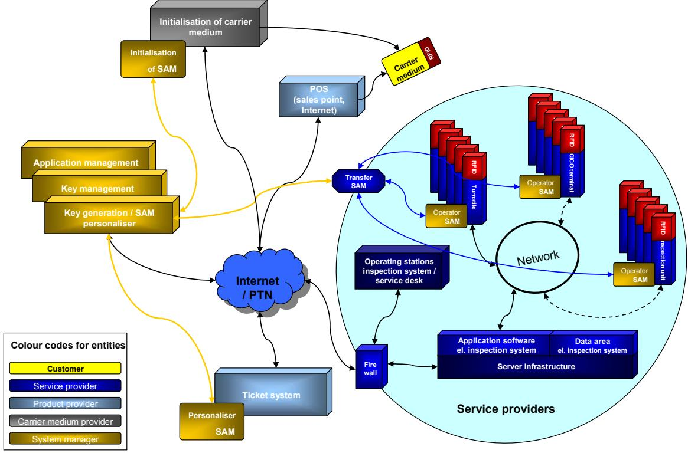

The following diagram shows the system as a whole and its principal components.

#### **Figure 10–1 The system as a whole**

### **10.1 Suggestions on implementing the eTicketing infrastructure**

#### **10.1.1 Determining the protection demand for the eTicketing infrastructure**

The following general considerations are examples that apply to the eTicketing infrastructure, and these should be included when determining the protection requirements:

- 1 The systems in [Figure 10–1](#page-102-2) should simultaneously support a range of different products and carrier media, as defined in the application scenarios proposed in Chapter 9.
- 2 Data relating to particular persons must be managed and processed.
- 3 Usage data will be generated and must be processed.
- 4 Calculation data must be logged and forwarded between the entities. Interoperability is required.
- 5 People known to be willing to commit violent acts must be excluded from sales and entry.

These criteria represent an eTicketing infrastructure which can integrate several different organisers and venues, and which would, for example, enable the organisation of international football matches.

On the basis of the criteria described in Section [8.2.5](#page-54-1), the eTicketing infrastructure can be assigned to the following protection demand categories:

|     | Security target                                        | Protection demand category | Criteria for allocating to protection demand category                                                                                            |                                                     |
|-----|--------------------------------------------------------|----------------------------------|--------------------------------------------------------------------------------------------------------------------------------------------------|-----------------------------------------------------|
| SS1 | Technical compatibility                             | 1                                | All of the system components are from the same supplier. The supplier ensures that they are compatible.                                    |                                                     |
|     |                                                        | 2                                | The system has to function with components from a small number of defined suppliers. The system manager or an SI ensures compatibility.    |                                                     |
|     |                                                        | 3                                | Open system that has to function with components from any company in the market.                                                              |                                                     |
|     |                                                        |                                  | System normally acquired by offering out for public tender.                                                                                   |                                                     |
| SS2 |                                                        | 1                                | Malfunction affects only a few customers.                                                                                                        |                                                     |
|     | Fallback solution in the event of malfunction | 2                                | Malfunction affects many customers.                                                                                                              |                                                     |
|     |                                                        |                                  |                                                                                                                                                  | Malfunction affects a large proportion of customers |
|     |                                                        | 3                                | System malfunctions (sales system, readers, inspection system, key management system) affect a large number of customers and entitlements. |                                                     |
| SS3 | Intuitive, fault tolerant operation              | 1                                | A few customers cannot operate it intuitively.                                                                                                   |                                                     |
|     |                                                        | 2                                | Many customers cannot operate it intuitively.                                                                                                    |                                                     |
|     |                                                        | 3                                | A large proportion of customers cannot operate it intuitively.                                                                                |                                                     |

| Security target |                                                                         | Protection demand category | Criteria for allocating to protection demand category                                                                                                                                                                |  |
|-----------------|-------------------------------------------------------------------------|----------------------------------|----------------------------------------------------------------------------------------------------------------------------------------------------------------------------------------------------------------------|--|
|                 |                                                                         |                                  | Integrating systems belonging to different organisers and venues can make things more complex for customers -> "A new access system for every event"                                                           |  |
|                 | Maintaining a high availability level                          | 1                                | Access throughput and customer behaviour unproblematic.                                                                                                                                                           |  |
|                 |                                                                         | 2                                | Temporary failures cause operational and security problems.                                                                                                                                                       |  |
| SS4             |                                                                         | 3                                | Short-term faults endanger security targets.                                                                                                                                                                         |  |
|                 |                                                                         |                                  | Complete failures of the access equipment lasting more than 15 minutes can lead to uncontrollable conditions in the case of large crowds. Operative fallback measures usually reduce the level of security. |  |
|                 |                                                                         | 1                                | Customer's reputation is damaged / data is lost.                                                                                                                                                                     |  |
|                 | Protection of personal data (including personal usage data) |                                  | Customer's social existence is damaged / data becomes known to third parties.                                                                                                                                     |  |
| SI1             |                                                                         | 2                                | If personal invoicing or payment information stored in the system is stolen or manipulated, there may be considerable commercial and social consequences for the customer.                                  |  |
|                 |                                                                         | 3                                | Customer's physical existence is damaged / data is misused.                                                                                                                                                       |  |
| SI2             | Protection of entitlements                                           | 1                                | Predicted product-related loss of sales through counterfeiting, damage or manipulation <1%.                                                                                                                       |  |
|                 |                                                                         | 2                                | Predicted product-related loss of sales through counterfeiting, damage or manipulation <5%.                                                                                                                       |  |
|                 |                                                                         |                                  | Predicted product-related loss of sales through counterfeiting, damage or manipulation >5%.                                                                                                                       |  |
|                 |                                                                         | 3                                | DoS attacks on the system can lead to a total operational breakdown, thus causing considerable commercial loss.                                                                                                |  |
| SI3             | Protection of logistical data (anonymised usage data)          | 1                                | Data becomes known to third parties.                                                                                                                                                                                 |  |
|                 |                                                                         |                                  | Data is lost.                                                                                                                                                                                                        |  |
|                 |                                                                         | 2                                | The loss of logistical data can also occur through technical defects and can cause operational difficulties.                                                                                                   |  |
|                 |                                                                         | 3                                | Data is falsified.                                                                                                                                                                                                   |  |
| SI4             | Reliable                                                                | 1                                | Data is temporarily unavailable.                                                                                                                                                                                     |  |

| Security target |                                                            | Protection demand category | Criteria for allocating to protection demand category                                                                                                                                           |  |  |
|-----------------|------------------------------------------------------------|----------------------------------|-------------------------------------------------------------------------------------------------------------------------------------------------------------------------------------------------|--|--|
|                 | invoicing (personalised                                 | 2                                | Data is lost.                                                                                                                                                                                   |  |  |
|                 | )                                                          |                                  | Data is falsified, misused, etc.                                                                                                                                                                |  |  |
|                 |                                                            | 3                                | The possibility of invoicing fraud between the actors cannot be discounted in a system with multiple actors.                                                                                 |  |  |
| SI5             | Protection of applications and entitlements       | 1                                | Applications are issued by the same application owner and entitlements by the same product owner.                                                                                            |  |  |
|                 |                                                            | 2                                | Applications are issued by different application owners and entitlements come from different product owners. The actors trust each other.                                                 |  |  |
|                 |                                                            | 3                                | Applications are issued by different application owners and entitlements come from different product owners. Several companies collaborate and do not trust each other in the process. |  |  |
|                 |                                                            |                                  | When entitlements are loaded onto multi-application cards or NFC Mobile Devices, it must always be assumed that applications from other actors may be present on the customer medium.  |  |  |
| SP3             | Protection against the creation of usage profiles | 1                                | Customer's reputation is damaged.                                                                                                                                                               |  |  |
|                 |                                                            | 2                                | Customer's social existence is damaged.                                                                                                                                                         |  |  |
|                 |                                                            | 3                                | Customer's physical existence is damaged.                                                                                                                                                       |  |  |
| SP4             | Protection against violent criminals              | 1                                | Protection against group rivalry.                                                                                                                                                               |  |  |
|                 |                                                            | 2                                | Protection against fans known to be willing to commit violence.                                                                                                                              |  |  |
|                 |                                                            |                                  | A facility for excluding violently inclined fans should be provided so as to enable the hosting of events such as international football fixtures.                                        |  |  |
|                 |                                                            | 3                                | Protection against possible violent acts by known potential criminals.                                                                                                                       |  |  |
| SP5             | Data minimisation                                       | 1                                | Personal data is not used.                                                                                                                                                                      |  |  |
|                 |                                                            | 2                                | Personal data is used, but no usage data is collected.                                                                                                                                          |  |  |
|                 |                                                            | 3                                | Personal data is used, as is usage and calculation data.                                                                                                                                     |  |  |
|                 |                                                            |                                  | It is assumed that personal usage and calculation data is gathered and exchanged with other service providers.                                                                            |  |  |

| The system's protection requirements | Table 10–1 |  |  |  |
|--------------------------------------|------------|--|--|--|
|--------------------------------------|------------|--|--|--|

### **10.1.2 Interfaces in the system as a whole**

The system shown in [Figure 10–1](#page-102-2) is reliant on interaction between all the system components. In order to facilitate the business processes described in Chapter [6](#page-29-2), the technical interfaces and operative interaction between the components have to be specified.

Furthermore, agreements must be made between the entities to regulate the responsibilities and the operational procedures.

#### **10.1.2.1 Threats relevant to the eTicketing infrastructure**

The following threats relevant to the interfaces of the system as a whole can be deduced from the security targets used to determine the protection demand in Section [10.1.1.](#page-103-1)

| Threats to the contact-less interface |                                                                                              | Protection demand | Comments                                                                                                                                                                                                                                                                                                                       |  |
|------------------------------------------|----------------------------------------------------------------------------------------------|----------------------|--------------------------------------------------------------------------------------------------------------------------------------------------------------------------------------------------------------------------------------------------------------------------------------------------------------------------------|--|
| TC1                                      | Lack of compatibility between the interfaces of the carrier medium and reader | 3                    | A lack of compatibility between interfaces prevents the system from working when loading and using entitlements, checking entitlements, and so on. The result is similar to a DoS attack on the system. Many customers and/or entitlements may be affected.                                                     |  |
| TC2                                      | Eavesdropping                                                                                | 3                    | Unauthorised listening-in to communication between an carrier medium and a reader.                                                                                                                                                                                                                                          |  |
| TC3                                      | DoS attack on the RF interface                                                            | 1                    | 1 Interference in RFID communication (jamming). 2 Interference in the anti-collision mecha nism for selecting the carrier medium (blocker tag) 3 Blocking the electromagnetic field of the reader (shielding). 4 Altering the resonance frequency of reader or carrier medium (de-tuning). |  |

**Table 10–2 Threats relevant to the contact-less interface** 

| Threats to the system as a whole |                                               | Protection demand | Comments                                                                                                                                                                                                                                                                                                       |
|-------------------------------------|-----------------------------------------------|----------------------|----------------------------------------------------------------------------------------------------------------------------------------------------------------------------------------------------------------------------------------------------------------------------------------------------------------|
| TS1                                 | Lack of fallback solution                  | 3                    | The lack of a fallback solution in the event of a failure of system interfaces or components such as the ticket sales system, administration system for carrier media and entitlements, and inspection system, can lead to a complete breakdown of services (sales, invoicing, entry, etc.). |
| TS2                                 | Unauthorised scanning of reference data | 3                    | Keys, as well as information about the media, entitlements and usage, and sometimes personal data and calculation data, are passed between the system components via interfaces. The retrieval of this data by unauthorised persons would discredit the                                         |

| Threats to the system as a whole |                                                    | Protection demand | Comments                                                                                                                                                                                                                                                                                                                                          |
|-------------------------------------|----------------------------------------------------|----------------------|---------------------------------------------------------------------------------------------------------------------------------------------------------------------------------------------------------------------------------------------------------------------------------------------------------------------------------------------------|
|                                     |                                                    |                      | system and enable attacks.                                                                                                                                                                                                                                                                                                                        |
| TS3                                 | Manipulation of reference data in the system | 3                    | Keys, as well as information about the media, entitlements and usage, and sometimes personal data and calculation data, are passed between the system components via interfaces. The manipulation of this data by unauthorised persons represents a serious attack.                                                             |
| TS4                                 | System malfunction                                 | 3                    | Malfunctions in the interfaces between the components and in the components themselves can be caused in a range of scenarios by technical faults, incorrect operation or DoS attacks: 1 Fault in interfaces 2 Lack of availability of interfaces 3 Fault in power supply 4 Interruption in network connection |
|                                     |                                                    |                      | 5 Physical destruction                                                                                                                                                                                                                                                                                                                         |
| TS5                                 | Lack of compatibility between interfaces     | 3                    | A lack of compatibility between interfaces causes malfunctions. The result is similar to a DoS attack on the system. Many customers and/or entitlements may be affected.                                                                                                                                                                 |
| TS12                                | Unjustified gathering and storing of data    | 3                    | It is assumed that personal usage and calculation data is gathered and possibly exchanged with other service providers.                                                                                                                                                                                                                     |

**Table 10–3 Threats relevant to the system** 

#### **10.1.2.2 Definition of safeguards for the eTicketing infrastructure**

Based on the relevant threats in the preceding section, this section defines general execution proposals and safeguards for the system as a whole and the system components. These safeguards are described in detail in Section 8.4.

| Threat |                                                                                              | Safeguard      | Safeguard                                                                                                                                                                                          |
|--------|----------------------------------------------------------------------------------------------|----------------|----------------------------------------------------------------------------------------------------------------------------------------------------------------------------------------------------|
| TC1    | Lack of compatibility between the interfaces of the carrier medium and reader | MS1.3          | 1 Introduction of interface tests and ap proval procedures – Certification                                                                                                                   |
| TC2    | Eavesdropping                                                                                | MS2.3 MS3.3 | 1 Ensuring the confidentiality of commu nication between RFID carrier medium and terminal in order to prevent eaves dropping – Mutual, dynamic authentica tion during transmission. |

| Threat |                                                    | Safeguard                                                        | Safeguard                                                                                                                                                                                                                                                                                                                                                                                                                                                                                                                                                                                                                                                                                                                                                                                                |
|--------|----------------------------------------------------|------------------------------------------------------------------|----------------------------------------------------------------------------------------------------------------------------------------------------------------------------------------------------------------------------------------------------------------------------------------------------------------------------------------------------------------------------------------------------------------------------------------------------------------------------------------------------------------------------------------------------------------------------------------------------------------------------------------------------------------------------------------------------------------------------------------------------------------------------------------------------------|
|        |                                                    |                                                                  | 2 Introduction of contact-less interface as defined by ISO/IEC14443 or of field de tectors                                                                                                                                                                                                                                                                                                                                                                                                                                                                                                                                                                                                                                                                                                      |
| TC3    | DoS attack on the RF interface                  | MS3.1                                                            | 1 Introduction of contact-less interface as defined by ISO/IEC14443                                                                                                                                                                                                                                                                                                                                                                                                                                                                                                                                                                                                                                                                                                                                |
| TS1    | Lack of fallback solution                       | MS4.3                                                            | 1 Definition of fallback solutions in the event of system interface or system component failure – Implementation according to fallback concept                                                                                                                                                                                                                                                                                                                                                                                                                                                                                                                                                                                                                                               |
| TS2    | Unauthorised scanning of reference data      | MS5.3 MS6.3                                                   | 1 Securing the confidentiality of data when communicating within the system – Secure communication channel                                                                                                                                                                                                                                                                                                                                                                                                                                                                                                                                                                                                                                                                                      |
|        |                                                    | MS15.3                                                           | 2 Confidential storage of data – Maintain ing privacy using multi-tenant access protection.                                                                                                                                                                                                                                                                                                                                                                                                                                                                                                                                                                                                                                                                                                     |
|        |                                                    |                                                                  | 3 Separation of applications – Separate storing and processing of data                                                                                                                                                                                                                                                                                                                                                                                                                                                                                                                                                                                                                                                                                                                             |
| TS3    | Manipulation of reference data in the system | MS6.3 MS7.3 MS8.3 MS15.3                                | 1 Confidential storage of data – Multi tenant access protection, role model 2 Securing the data integrity in order to protect against manipulation when transmitting data within the system – MAC or signatures 3 Securing data integrity when storing data – Checksums 4 Separation of applications – Separate storing and processing of data                                                                                                                                                                                                                                                                                                                                                                                                                    |
| TS4    | System malfunction                              | MS4.3 MS9.3 MS10.3 MS11.3 MS12.3 MS13.3 MS14.3 | 1 Specifications for system concept and requirements for components – Inter operability tests according to test con cept, evaluation 2 Definition of a fallback solution in the event of system interface or system component failure – Implementation according to fallback concept. 3 Securing system functions against DOS attacks to the interfaces – Security con cept. 4 Securing the function of the system against incorrect operation by employ ees and users – Tests, personnel and user introductions. 5 Secure the function of the system to prevent the technical failure of compo nents and transmission routes – Evaluation of components 6 Ergonomic user instructions 7 Support – System-wide support. |

| Threat |                                                   | Safeguard                 | Safeguard                                                                                                                                                                                                                                                                                                                                                                                   |
|--------|---------------------------------------------------|---------------------------|---------------------------------------------------------------------------------------------------------------------------------------------------------------------------------------------------------------------------------------------------------------------------------------------------------------------------------------------------------------------------------------------|
| TS5    | Lack of compatibility between interfaces | MS1.3 MS11.3 MS12.3 | 1 Introduction of interface tests and ap proval procedures – Certification 2 Secure the function of the system to prevent the technical failure of compo nents and transmission routes – Evaluation of components 3 Specifications for system concept and requirements for components – Inter operability tests according to test con cept, evaluation. |
| TS12   | Unjustified gathering and storing of data   | MS18.3                    | 1 Satisfying the data minimisation obliga tion – Special safeguards                                                                                                                                                                                                                                                                                                                   |

#### **10.1.2.3 Residual risks**

For technical and commercial reasons, it is not always possible to eliminate threats completely using safeguards. In such cases a certain risk remains.

The residual risk should be determined and documented as part of the planning of the implementation concerned.

#### **10.1.3 Readers**

Readers control the flow of information for reading from and writing to the carrier medium, using a contact-less communication protocol. The reader (PCD as defined by ISO/IEC14443) assumes the active role (master), while the carrier medium (PICC as defined by ISO/IEC14443) is passive (slave).

Readers are integrated into various system components:

- 1 Sales systems at sales points
- 2 Vending machines
- 3 Service desks
- 4 Stationary terminals for checking entitlements when entering, and in some cases when leaving the venue and returning again.
- 5 Mobile inspection units

#### **10.1.3.1 Threats relevant to the readers**

The following threats relevant to the interfaces of the system as a whole can be deduced from the assumptions used to determine the protection demand in Section [10.1.1.](#page-103-1)

| Threats to the contact-less interface |                                         | Protection demand | Comments                                                                                                                        |
|------------------------------------------|-----------------------------------------|----------------------|---------------------------------------------------------------------------------------------------------------------------------|
| TC1                                      | Lack of compatibility between the | 3                    | A lack of compatibility between interfaces prevents the system from working when loading and using entitlements, checking |

| Threats to the contact-less interface |                                                   | Protection demand | Comments                                                                                                                                                                                                                                                                                                                       |
|------------------------------------------|---------------------------------------------------|----------------------|--------------------------------------------------------------------------------------------------------------------------------------------------------------------------------------------------------------------------------------------------------------------------------------------------------------------------------|
|                                          | interfaces of the carrier medium and reader |                      | entitlements, and so on. The result is similar to a DoS attack on the system. Many customers and/or entitlements may be affected.                                                                                                                                                                                        |
| TC2                                      | Eavesdropping                                     | 3                    | Unauthorised listening-in to communication between an carrier medium and a reader.                                                                                                                                                                                                                                          |
| TC3                                      | DoS attack on the RF interface                 | 3                    | 1 Interference in RFID communication (jamming). 2 Interference in the anti-collision mecha nism for selecting the carrier medium (blocker tag) 3 Blocking the electromagnetic field of the reader (shielding). 4 Altering the resonance frequency of reader or carrier medium (de-tuning). |

| Table 10–5 |  |  |
|------------|--|--|

#### **Table 10–5 Threats relevant to the contact-less interface**

|     | Threat to the reader                                        | Protection demand | Comments                                                                                                                                                                                                                                                                                                                                                                                                                                                                                                              |  |
|-----|-------------------------------------------------------------|----------------------|-----------------------------------------------------------------------------------------------------------------------------------------------------------------------------------------------------------------------------------------------------------------------------------------------------------------------------------------------------------------------------------------------------------------------------------------------------------------------------------------------------------------------|--|
| TR1 | Unauthorised manipulation of reference information | 3                    | The manipulation of reference information (keys, evaluation algorithms, blacklists and whitelists) can be employed for unauthorised use or for DoS.                                                                                                                                                                                                                                                                                                                                                          |  |
| TR2 | Unauthorised scanning of reference information     | 3                    | The retrieval of reference information (keys, evaluation algorithms, blacklists and whitelists) can be employed for unauthorised use (e.g. counterfeiting of entitlements) and for DoS.                                                                                                                                                                                                                                                                                                                      |  |
| TR3 | Reader malfunction                                          | 3                    | Reader malfunctions can be caused in a range of scenarios by technical faults, incorrect operation or DoS attacks: 1 Fault in contact-less interface 2 Fault in reference information (keys, black lists, etc.) 3 Fault in application implementation 4 Fault in evaluation algorithms for entitle ments 5 Fault in power supply 6 Interruption of the link to the central sys tem 7 Physical destruction 8 Fault in operational instruction functions |  |
| TR4 | Lack of user instructions                                | 3                    | A lack of user-friendliness at vending machines and the terminals used for activating entitlements and checking-in / checking-out can cause considerable operative problems.                                                                                                                                                                                                                                                                                                                                 |  |

| Threat to the reader |                                                | Protection demand | Comments                                                                                                                                                                                                                                                                  |
|----------------------|------------------------------------------------|----------------------|---------------------------------------------------------------------------------------------------------------------------------------------------------------------------------------------------------------------------------------------------------------------------|
| TS1                  | Lack of fallback solution                   | 3                    | The lack of a fallback solution when system interfaces fail, such as the ticket sales system, administration system for carrier media and entitlements, or inspection system, can lead to a complete breakdown of services (sales, invoicing, CICO, etc.). |
| TS5                  | Lack of compatibility between interfaces | 3                    | A lack of compatibility between interfaces causes malfunctions. The result is similar to a DoS attack on the system. Many customers and/or entitlements may be affected.                                                                                         |

#### **Table 10–6 Threats relevant to the reader**

#### **10.1.3.2 Definition of safeguards for the reader and its applications**

Based on the relevant threats in the preceding section, this section defines general execution proposals and safeguards for the reader and its applications. These safeguards are described in detail in Section 8.4.

| Threat |                                                                                              | Safeguard      | Safeguard                                                                                                                                                                                                                                                                       |  |
|--------|----------------------------------------------------------------------------------------------|----------------|---------------------------------------------------------------------------------------------------------------------------------------------------------------------------------------------------------------------------------------------------------------------------------|--|
| TC1    | Lack of compatibility between the interfaces of the carrier medium and reader | MS1.3 MR1.3 | 1 Introduction of interface tests and ap proval procedures – Certification                                                                                                                                                                                                |  |
| TC2    | Eavesdropping                                                                                | MS2.3 MS3.3 | 1 Ensuring the confidentiality of commu nication between RFID carrier medium and terminal in order to prevent eaves dropping – Mutual, dynamic authentica tion during transmission. 2 Introduction of contact-less interface as defined by ISO/IEC14443 |  |
| TC3    | DoS attack on the RF interface                                                            | MS3.1          | 1 Introduction of contact-less interface as defined by ISO/IEC14443                                                                                                                                                                                                       |  |
| TR1    | Unauthorised manipulation of reference information                                  | MR2.3          | 1 Protection of reference information against retrieval, data errors and ma nipulation – Advanced protection                                                                                                                                                           |  |
| TR2    | Unauthorised scanning of reference information                                      | MR2.3          | 1 Protection of reference information against retrieval, data errors and ma nipulation – Advanced protection                                                                                                                                                           |  |
| TR3    | Reader malfunction                                                                        | MR3.3          | 1 Protection of the reader against mal function – Evaluation                                                                                                                                                                                                              |  |
| TR4    | Lack of user                                                                                 | MS13.3         | 1 Ergonomic user instructions                                                                                                                                                                                                                                                |  |

| Threat |                                                   | Safeguard                 | Safeguard                                                                                                                                                                                                                                                                                                                                                                                  |
|--------|---------------------------------------------------|---------------------------|--------------------------------------------------------------------------------------------------------------------------------------------------------------------------------------------------------------------------------------------------------------------------------------------------------------------------------------------------------------------------------------------|
|        | instructions                                      |                           |                                                                                                                                                                                                                                                                                                                                                                                            |
| TS1    | Lack of fallback solution                      | MS4.3                     | 1 Definition of fallback solutions in the event of system interface or system component failure – Implementation according to fallback concept                                                                                                                                                                                                                                 |
| TS5    | Lack of compatibility between interfaces | MS1.3 MS11.3 MS12.3 | 1 Introduction of interface tests and ap proval procedures – Certification 2 Secure the function of the system to prevent the technical failure of compo nents and transmission routes – Evaluation of components 3 Specifications for system concept and requirements for components – Inter operability tests according to test con cept, evaluation |

#### **Table 10–7 Safeguards for the reader and its applications**

#### **10.1.3.3 Residual risks**

For technical and commercial reasons, it is not always possible to eliminate threats completely using safeguards. In such cases a certain risk remains.

The residual risk should be determined and documented as part of the planning of the implementation concerned.

#### **10.1.4 Sale, inspection and management systems**

#### **10.1.4.1 Sales systems**

Access to the products must be easy and inexpensive for all potential customers, which is why a range of points of sale should be supported. These are described in the following:

#### **Sales point**

This could be, for instance, the office of a football club (product owner / organiser) or an advance sales office (product retailer).

#### Sales procedure

The customer visits the sales point in person and purchases the product there:

- Identification, if required, is by identity card.
- The booking is done in dialogue with the customer at the sales point.
- Payment is made at the sales point.

If the carrier medium can be produced on site or the entitlement loaded onto an existing customer medium (see "Technical equipment"), then the customer can take the product away with him straight away. If not, then the product and the carrier medium are sent by post or held at the sales point, ready for subsequent collection.

#### Technical equipment

The sales point has direct access to the ticket sales system. This is a precondition for services such as seat reservation.

In many cases it makes commercial sense to equip a sales point with a ticket printer and a contact-less reader which can initialise certain RD-media and load entitlements onto them.

Furthermore, a simple contact-less reader at the sales point can provide an economical way of loading entitlements onto an existing customer medium. If such a contact-less reader exists, then in future it could become possible to utilise an electronic proof of identity as a means of securely and automatically transferring personal data into the ticket system (e.g. for setting up a customer account), or for secure identification.

The personnel and IT infrastructure at the sales point are not always trustworthy.

#### Vending and collection machines

At vending machines, products are sold and issued in a direct interaction between the vending machine and the customer.

Vending machines are preferably set up at the venue or at places frequented by customers. They are especially suitable for: selling products that are very popular but that do not require complex procedures to order or produce; for box-office sales on the day; and for products ordered over the Internet or telephone. In the latter case, vending machines mean customers do not have wait for the product to be delivered by post, and they also mean that Internet sales are possible up to just before the event.

#### Selling personalised products

There is currently no way of identifying a customer for the first time securely and automatically. That is why a vending machine cannot perform registration as described under Process P1A, and a customer account cannot be set up. This may change with the use of the electronic identity card.

However, it is possible to load new entitlements onto customer media belonging to known customers who already own personalised customer media. In such cases, identification can be done using the existing customer medium itself.

#### Selling anonymous products

In the simplest cases, anonymous carrier media and entitlements are sold at vending machines.

The customer purchases or collects the product at a vending machine:

- Booking is done at the vending machine.
- Payment is made directly using methods such as Maestro or credit cards.
- When collecting, identification is by means of the customer's own medium or using electronic means of identity (eID).

The carrier medium for the product purchased is produced there and then. Alternatively, the entitlement can be loaded onto an existing customer medium (see "Technical equipment"). The customer can take the product away with him straight away.

Collecting pre-ordered products

Vending machines can serve as issuing points for products ordered by Internet or telephone.

If the vending machine is used for collecting pre-ordered entitlements, then the orderer must always identify himself. If the customer possesses his own customer medium then this can be used for identification and for storing the entitlement. If not, then other processes must be used for identification (e.g. credit card or eID).

#### Technical equipment

The vending machine requires direct access to the ticket sales system, at least for some of the time. Another condition is that it must incorporate a ticket printer with an in-built reader which can initialise the carrier media issued, and load entitlements onto them.

If the machine is to be able to load entitlements onto existing customer media, then uninterrupted access is required to the ticket sales system and the management system for carrier media and applications. A compatible reader must also be installed in the vending machine.

Internet, call centres, ordering by post

#### Sales procedure

The customer places the order by telephone, Internet or fax from any location:

- The booking, choice of seat etc. can be made in a direct interaction when using the Internet or telephone. Written orders do not allow this.
- Payment is made by Maestro, credit card or direct debit.
- For secure identification, the personal data sent by the customer may have to be checked.

The carrier medium and product are produced centrally and sent by post. Alternatively it can be agreed that the product will be collected somewhere such as an issuing point or vending machine.

#### Technical equipment

The product retailer requires an Internet sales platform or a call centre. The customer does not require any particular technical equipment.

The carrier medium and product can be produced using a mass personaliser in a secure environment.

Internet

#### Sales procedure

The customer places the order interactively by Internet from any location (e.g. at home).

If the customer has a customer medium which already contains the necessary application, then the required product can be loaded onto it. If a chip card is being used, then a contactless reader is required – such as one that works with a home computer, for example. If an NFC Mobile Device is to be used as the customer medium, then the product can also be loaded over the air:

- • Booking, seat reservation and so on can be done in a direct interaction when using the Internet.
- Identification is done using the customer medium and the personal data stored in the application.
- Payment is made using Maestro, credit card or direct debit.

The entitlement is loaded directly into the application on the customer medium.

If the customer does not yet have a customer medium but does have a contact-less reader, then secure identification of the customer will in future be able to take place using an electronic means of identity, thus enabling the customer medium to be ordered securely and conveniently.

#### Technical equipment

The product provider operates an Internet sales platform, which is connected to the key, carrier and application management systems. The customer requires a customer medium, and – if a chip card or electronic means of identity is being used – a contact-less home reader device.

#### **10.1.4.2 Ticket system**

The ticket system supports the primary selling and handling processes:

- 1 Registering and ordering
- 2 Creating the entitlement
- 3 Payment, and checking creditworthiness
- 4 Managing the entitlements sold
- 5 Forwarding the necessary data to the inspection system

Customer data and orders are stored in the ticket system. Provided the transport service and product support it, seating can also be allocated using seating plans which are also stored there. The ticket system also incorporates a procedural management system which performs actions such as address comparisons and payment processing including credit checks, and which also initiates the production and dispatch of carrier media and entitlements.

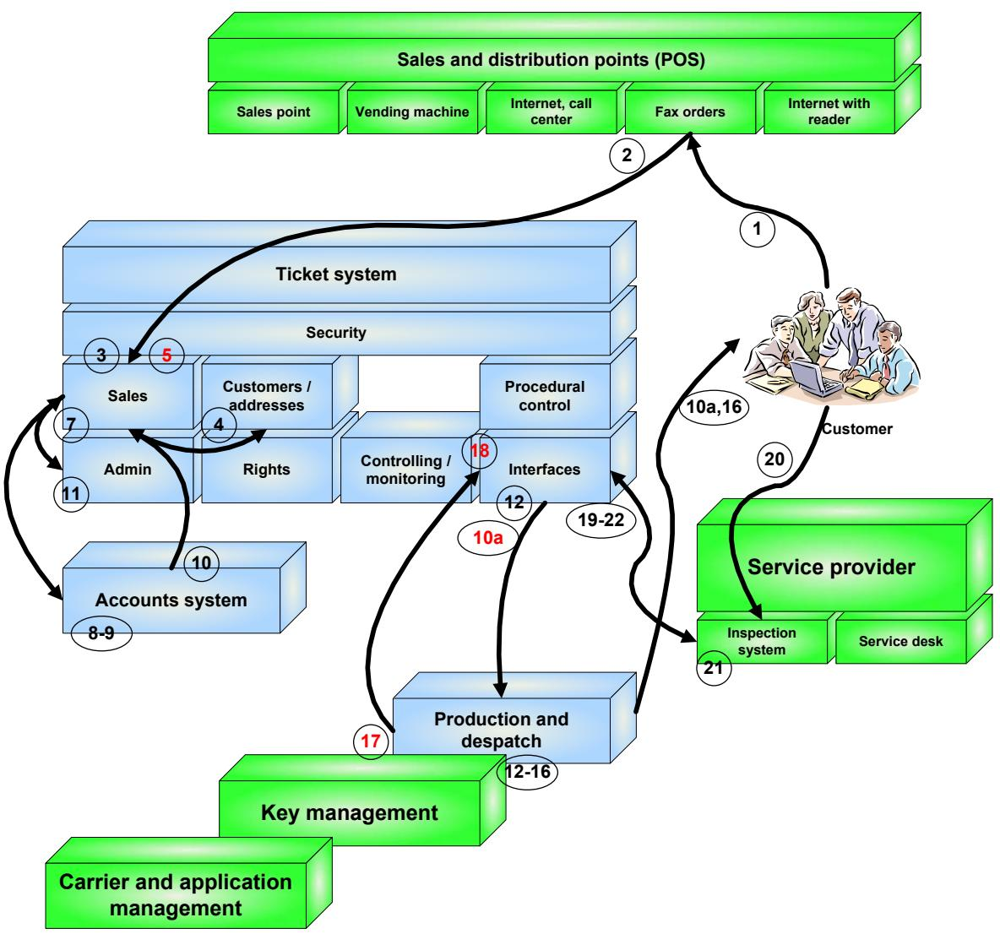

**Figure 10–2 An example of a ticket system with possible process flows** 

A ticket system has interfaces to the key management system and the system which administers the carrier media and applications. All of the information required to enter a special event (apart from the information transferred in the key management system) is gathered together by the ticket system and sent to the service provider via a defined interface.

There are other interfaces to the sales points and the places where the carrier media are produced. This also includes sales and distribution, and the management of loading applications and products onto existing media via the Internet.

It can be assumed that a ticket system will be housed in a secure environment. Personaliser SAMs must be connected to it in order to be able to produce entitlements and load them onto carrier media.

From the point of view of the service provider, more than one ticket system can be used for each event.

#### **10.1.4.3 Central inspection system**

The inspection system helps the service provider to check the customers' entitlements to enter an event, and to gather and pass on information relevant to invoicing. This requires the following functions:

- 1 Support of Process P3 for entry, activation and, if applicable, re-entry.
- 2 Support for the carrier media, applications and products particular to the event.
	- a Implementation of the technical procedures required to support the carrier media, applications and products that are approved for the specific event.
	- b Implementation and administration of key management system.
- 3 Control of terminals (turnstiles, mobile inspection terminals, etc).
- 4 Receiving, distributing and utilising the information provided by the ticket systems.
- 5 Receiving, distributing and utilising the keys and identifiers provided by the system manager and registrar.
- 6 Reporting calculation-related data and usage history to the ticket systems.

The access system may be required to work even if the data network linking the central system and terminals at the entrances should fail. That means all of the information required for entry, evaluation and activation of entitlements, and where applicable re-entry, has to be stored locally in the terminals.

#### **10.1.4.4 Terminals**

The job of a terminal is to read, evaluate and if necessary activate the entitlement when the customer enters the venue, and possibly when he exits and re-enters it. A contact-less reader is integrated into the terminal.

In normal operation, stationary terminals connect daily for at least a certain amount of time to the central inspection system via a data network (LAN or WLAN). Information required to evaluate the entitlements is updated constantly in this way. Usage data is also sent by that means from the terminal to the central system.

If the system is required to have a particularly high level of availability, then all of the functions required communicating with the carrier media and applications will have to be supported locally in the terminal itself. This can incur considerable costs if new technologies have to be introduced.

It is therefore sensible, when defining applications, to base communication protocols, cryptographic methods etc. on open, standardised processes and to rely on flexible, hardwareindependent methods of implementation.

As well as the application-specific functions, all of the information specific to particular events that is required to evaluate the entitlement must be stored locally in the terminal (e.g. product retailer ID, service provider ID, carrier medium ID, application ID, product IP, various levels of keys, blacklists). It must also be possible to store the access history temporarily in the terminal.

The security-related safeguards for the reader incorporated into the terminal are detailed in Section [10.1.3.2](#page-111-1).

We can differentiate between permanently installed and mobile devices.

1 Permanently installed devices

For example, the stadiums used for the 2006 FIFA World Cup had permanently installed turnstiles that regulated access to the venues. Inspection units corresponding with [Figure 10–3](#page-118-1) were integrated into these turnstiles, and connected to the central access system via a LAN. If an entitlement is evaluated successfully, access is granted by unlocking the turnstile and turning it on.

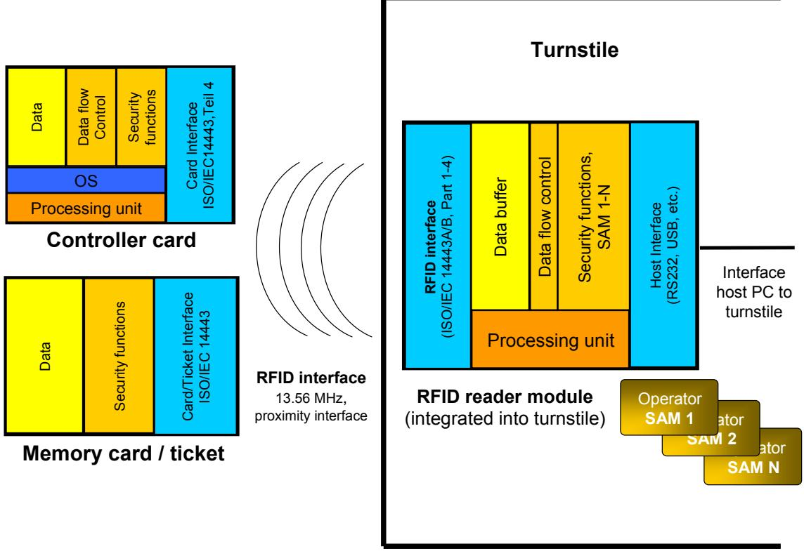

#### **Figure 10–3 Reader and Smart Card or Smart Label**

The turnstiles are situated around the perimeter of the stadium. While people are being let in, marshals are in the entrance areas to assist in the event of faults, and to notice any obvious attempts to manipulate the turnstiles.

The stationary inspection units should have features such as the following:

- a Contact-less read/write unit with interface as defined by ISO/IEC14443A/B Part 1- 4.
- b Capacity to store all usage data until the next data exchange with the central system.
- c Parallel support of multiple carrier media, applications and products (selection using ID).
- d Basic cryptographic functions.
- e Support for SAMs. Multiple SAM slots should be available (four is now the usual number).
- f The result of the validation should be displayed visually.

In the case of turnstiles, it should not take any longer than 300 ms for the evaluation process up to the point at which authorisation is signalled or the turnstile is unlocked. The reader and the other components involved must be designed to perform accordingly.

2 Mobile devices

Most venues do not have permanently installed access systems. In such cases the alternative is marshals equipped with mobile devices. These devices are connected to the central access system via a WLAN. The marshal grants access once the entitlement has been evaluated successfully and displayed accordingly.

The turnstiles are situated around the perimeter of the stadium. While people are being let in, marshals are in the entrance areas to assist in the event of faults, and to notice any obvious attempts to manipulate the turnstiles.

#### **10.1.4.5 Service-Desk**

In real-life events, a certain amount of defective customer media, incorrect operations, attacks on security and fraud attempts is inevitable. The service desk at the venue is the point of contact if problems occur during entry.

Customers with valid entitlements must be able to access the event even if the access system or customer medium fails, or if he operates the system incorrectly. For this to happen it must be possible to perform Process P4, "Blacklisting entitlements and carrier media", and to issue a replacement medium, quickly and efficiently.

The following tasks are undertaken at the service desk:

1 Check the function of the carrier medium and the status of the entitlement.

If a fault occurs, then:

2 Check whether the medium is genuine and/or check the identity of the customer.

If positive, then:

- 3 Blacklist the medium and entitlement presented.
- 4 Issue a replacement medium with a new entitlement.
- 5 Update the information in the ticket system and the medium and application management systems.
- 6 Transfer the information from the ticket system to the access system.

The emergency scenarios in the event of the failure of the access system are based on the marshals and the service desk. Both are therefore of key importance to system security. If an attacker succeeds in causing a malfunction which overburdens the marshals and the service desk, it is equivalent to a successful DoS attack on the entire access system.

#### **10.1.4.6 Management system for carrier media and applications**

For the processes of loading applications and entitlements, and for the processes in which the customer medium is used for identification and for utilising transport services, it is important to know the status of the carrier medium and the applications on it.

For this reason, the life-cycle of any carrier medium used in the system must be documented reliably. To this end a database is used which is connected via interfaces to the ticket system and the key management system. It contains information such as the following for every carrier medium:

- ID of carrier medium
- Type, version
- Retailer of carrier medium (ID via registrar)
- Issuer of carrier medium (ID via registrar)
- Customer
- Status (e.g. new/active/blacklisted)
- Stored applications (see below)
- etc.

Similarly, the life-cycle of the applications stored on the carrier medium must also be documented. Several different applications can be stored.

• ID of application

- • Type, version
- Application provider (ID via registrar)
- Application issuer (ID via registrar)
- Customer
- Status (e.g. new/active/blacklisted/deleted)
- Stored entitlements including ID of product retailer
- Active entitlements / deletable entitlements

#### **10.1.4.7 Threats relevant to sale, inspection and management systems**

The following threats relevant to the interfaces of the system as a whole can be deduced from the assumptions used to determine the protection demand in Section [10.1.1.](#page-103-1)

| Threats to the sales, inspection and management systems |                                                    | Protection demand | Comments                                                                                                                                                                                                                                                                                                                                                                                                                                                 |
|---------------------------------------------------------------|----------------------------------------------------|----------------------|----------------------------------------------------------------------------------------------------------------------------------------------------------------------------------------------------------------------------------------------------------------------------------------------------------------------------------------------------------------------------------------------------------------------------------------------------------|
| TS1                                                           | Lack of fallback solution                       | 3                    | The lack of a fallback solution when system components fail, such as the ticket sales system, administration system for carrier media and entitlements, or inspection system, can lead to a complete breakdown of services (sales, invoicing, CICO, etc).                                                                                                                                                                                 |
| TS2                                                           | Unauthorised scanning of reference data      | 3                    | The background systems store information about the media, entitlements and usage, and sometimes personal data and calculation data. The retrieval of this data by unauthorised persons would discredit the system and enable attacks.                                                                                                                                                                                                     |
| TS3                                                           | Manipulation of reference data in the system | 3                    | The background systems store information about the media, entitlements and usage, and sometimes personal data and calculation data. The manipulation of this data by unauthorised persons represents a serious attack.                                                                                                                                                                                                                       |
| TS4                                                           | System malfunction                                 | 3                    | Individual system component malfunctions can be caused in a range of scenarios by technical faults, incorrect operation or DoS attacks: 1 Fault in local and central systems 2 Lack of availability of local and central sys tems 3 Fault in data storage 4 Fault in power supply 5 Interruption of the link to the central sys tem 6 Protection against physical attacks (dis mantling, destruction) |
| TS5                                                           | Lack of compatibility between interfaces     | 3                    | A lack of compatibility between interfaces causes malfunctions. The result is similar to a DoS attack on the system. Many customers                                                                                                                                                                                                                                                                                                                |

| Threats to the sales, inspection and management systems |                                                                                   | Protection demand | Comments                                                                                                                                                                                                                                                                         |
|---------------------------------------------------------------|-----------------------------------------------------------------------------------|----------------------|----------------------------------------------------------------------------------------------------------------------------------------------------------------------------------------------------------------------------------------------------------------------------------|
|                                                               |                                                                                   |                      | and/or entitlements may be affected.                                                                                                                                                                                                                                             |
| TS6                                                           | Unauthorised scanning of sales and calculation data                      | 3                    | Unauthorised, active retrieval of calculation data.                                                                                                                                                                                                                           |
| TS7                                                           | Unauthorised overwriting / manipulation of sales and calculation data | 3                    | Unauthorised writing of calculation data onto the carrier medium for the purpose of manipulating or compromising data.                                                                                                                                                     |
| TS8                                                           | Protection of client specific applications and entitlements              | 3                    | If multiple entities are supported by the system with sales data, entitlements and applications, these may be influenced or damaged when used mutually.                                                                                                                 |
| TS9                                                           | Falsification of identity data                                                 | 2                    | The customer may need to be identified when setting up a customer account, or purchasing or collecting a product. Using a false identity would allow someone to obtain benefits such as entitlements to the detriment of other customers or the product retailer. |
|                                                               |                                                                                   |                      | The protection demand relating to SI2 (Protection of entitlements) is categorised as 2 in this case, since attacks only affect individual entitlements.                                                                                                                 |
| TS10                                                          | Sales to known violent criminals                                               | 2                    | 1 Rival groupings have uncontrolled access to the event 2 People willing to commit violent acts come into possession of entitlements This could result in rioting and violence.                                                                                |
| TS11                                                          | Access by known violent criminals                                              | 2                    | Rival groupings and potentially violent persons have uncontrolled access to the event. This could result in rioting and violence.                                                                                                                                          |
| TS12                                                          | Unjustified gathering and storing of data                                   | 3                    | It is assumed that personal usage and calculation data is gathered and possibly exchanged with other service providers.                                                                                                                                                    |
| TS13                                                          | Unauthorised scanning of personal data                                      | 2                    | Unauthorised, active retrieval of personal data stored in the system.                                                                                                                                                                                                         |

| Threats to the sales, inspection and management systems |                                                                   | Protection demand | Comments                                                                                                                    |
|---------------------------------------------------------------|-------------------------------------------------------------------|----------------------|-----------------------------------------------------------------------------------------------------------------------------|
| TS14                                                          | Unauthorised overwriting / manipulation of personal data | 2                    | Unauthorised writing of personal data onto the system. Also includes the usage data that can be stored in the system. |

#### **10.1.4.8 Definition of safeguards for sale, inspection and management systems**

Based on the relevant threats in the preceding section, this section defines general execution proposals and safeguards. These safeguards are described in detail in section [8.4](#page-62-1).

| Threats to the sales, in spection and management systems |                                                    | Safeguard       | Safeguard                                                                                                                                                   |
|----------------------------------------------------------------|----------------------------------------------------|-----------------|-------------------------------------------------------------------------------------------------------------------------------------------------------------|
| TS1                                                            | Lack of fallback solution                       | MS4.3           | 1 Definition of a fallback solution in the event of system interface or system component failure – Implementation according to fallback concept |
| TS2                                                            | Unauthorised scanning of reference data      | MS5.3 MS6.3  | 1 Securing the confidentiality of data when communicating within the system – Secure communication channel                                         |
|                                                                |                                                    | MS15.3          | 2 Confidential storage of data – Introduc tion of multi-tenant access protection, role model                                                       |
|                                                                |                                                    |                 | 3 Separation of applications – Separate storing and processing of data                                                                                |
| TS3                                                            | Manipulation of reference data in the system | MS6.3 MS7.3  | 1 Confidential storage of data – Maintain ing privacy using multi-tenant access protection, role model                                             |
|                                                                |                                                    | MS8.3 MS15.3 | 2 Securing the data integrity in order to protect against manipulation when transmitting data within the system – MAC or signatures             |
|                                                                |                                                    |                 | 3 Securing data integrity when storing data – Checksums                                                                                               |
|                                                                |                                                    |                 | 4 Separation of applications – Separate storing and processing of data                                                                                |
| TS4                                                            | System malfunction                              | MS12.3          | 1 Specifications for system concept and requirements for components – Inter                                                                           |
|                                                                |                                                    | MS4.3           | operability tests according to test con cept, evaluation                                                                                                 |
|                                                                |                                                    | MS9.3           | 2 Definition of a fallback solution in the                                                                                                               |
|                                                                |                                                    | MS10.3          | event of system interface or system component failure – Implementation                                                                                   |
|                                                                |                                                    | MS11.3          | according to fallback concept.                                                                                                                              |
|                                                                |                                                    | MS13.3          | 3 Securing system functions against DOS                                                                                                                  |

| Threats to the sales, in spection and management systems |                                                                                   | Safeguard                         | Safeguard                                                                                                                                                                                                                                                                                                                                                                                                                             |
|----------------------------------------------------------------|-----------------------------------------------------------------------------------|-----------------------------------|---------------------------------------------------------------------------------------------------------------------------------------------------------------------------------------------------------------------------------------------------------------------------------------------------------------------------------------------------------------------------------------------------------------------------------------|
|                                                                |                                                                                   | MS14.3                            | attacks to the interfaces – Security con cept 4 Securing the function of the system against incorrect operation by employ ees and users – Tests, personnel and user introductions. 5 Secure the function of the system to prevent the technical failure of compo nents and transmission routes – Evaluation of components 6 Ergonomic user instructions 7 Support – System-wide support. |
| TS5                                                            | Lack of compatibility between interfaces                                 | MS1.3 MS11.3 MS12.3         | 1 Introduction of interface tests and ap proval procedures – Certification 2 Secure the function of the system to prevent the technical failure of compo nents and transmission routes – Evaluation of components 3 Specifications for system concept and requirements for components.                                                                                                                  |
| TS6                                                            | Unauthorised scanning of sales and calculation data                      | MS5.3 MS6.3 MS15.3          | 1 Securing the confidentiality of data when communicating within the system – VPN or similar 2 Confidential storage of data – Introduc tion of multi-tenant access protection in accordance with role model 3 Separation of applications – Separate storing and processing of data                                                                                                                      |
| TS7                                                            | Unauthorised overwriting / manipulation of sales and calculation data | MS6.3 MS7.3 MS8.3 MS15.3 | 1 Confidential storage of data – Introduc tion of multi-tenant access protection in accordance with role model 2 Securing the data integrity in order to protect against manipulation when transmitting data within the system – MAC or signatures 3 Securing data integrity when storing data – Checksums 4 Separation of applications – Separate storing and processing of data           |
| TS8                                                            | Protection of client-specific applications and entitlements              | MS6.3 MS15.3                   | 1 Confidential storage of data – Maintain ing privacy using multi-tenant access protection, role model 2 Separation of applications – Separate storing and processing of data                                                                                                                                                                                                                                       |
| TS9                                                            | Falsification of                                                                  | MS16.2                            | 1 Identification of customer – Application form, customer medium                                                                                                                                                                                                                                                                                                                                                                |

| Threats to the sales, in spection and management systems |                                                                   | Safeguard                                  | Safeguard                                                                                                                                                                                                                                                                                                                                                                                                                                                                                                                 |
|----------------------------------------------------------------|-------------------------------------------------------------------|--------------------------------------------|---------------------------------------------------------------------------------------------------------------------------------------------------------------------------------------------------------------------------------------------------------------------------------------------------------------------------------------------------------------------------------------------------------------------------------------------------------------------------------------------------------------------------|
|                                                                | identity data                                                     |                                            |                                                                                                                                                                                                                                                                                                                                                                                                                                                                                                                           |
| TS10                                                           | Sales to known violent criminals                               | MS17.2                                     | 1 Prevent access by known violent crimi nals – Bar entry to fans known to com mit violence                                                                                                                                                                                                                                                                                                                                                                                                                       |
| TS11                                                           | Access by known violent criminals                              | MS17.2                                     | 1 Prevent access by known violent crimi nals – Bar entry to fans known to com mit violence                                                                                                                                                                                                                                                                                                                                                                                                                       |
| TS12                                                           | Unjustified gath ering and storing of data                  | MS18.3                                     | 1 Satisfying the data minimisation obliga tion – Special safeguards                                                                                                                                                                                                                                                                                                                                                                                                                                                 |
| TS13                                                           | Unauthorised scanning of personal data                      | MS5.2 MS6.2 MS15.2                   | 1 Securing the confidentiality of data when communicating within the system – Static encryption for internal commu nication 2 Confidential storage of data – Introduc tion of multi-tenant access protection 3 Separation of applications – Separate storing and processing of data                                                                                                                                                                                                         |
| TS14                                                           | Unauthorised overwriting / manipulation of personal data | MS5.2 MS6.2 MS7.2 MS8.2 MS15.2 | 1 Securing the confidentiality of data when communicating within the system – Static encryption for internal commu nication 2 Confidential storage of data – Introduc tion of multi-tenant access protection 3 Securing data integrity to protect against manipulation during data transmission – Cryptographic integrity safeguards 4 Securing data integrity when storing data – Checksums 5 Separation of applications – Separate storing and processing of data |

**Table 10–9 Safeguards for sale, inspection and management systems** 

#### **10.1.4.9 Residual risks**

For technical and commercial reasons, it is not always possible to eliminate threats completely using safeguards. In such cases a certain risk remains.

The residual risk should be determined and documented as part of the planning of the implementation concerned.

#### **10.1.5 Key management**

The job of the key management system is to provide keys used by multiple entities for all of the carrier media, applications and products in the system, and to do so securely and reliably. Key management is the responsibility of the security manager. A number of use cases are described in Section 7.3. [GSHB] can be used as a general guideline for implementation.

Keys are generated individually for each purpose. As far as possible, a distinct key is allocated to each form of interaction (e.g. loading applications, writing entitlements, reading entitlements, writing usage data, etc.). The precise characteristics have to be ascertained for each application scenario as part of the creation of a specific security concept that harmonises with the role model.

The keys are generated in a secure environment and stored in a secure database. The various forms of SAM are also produced in this secure environment. The documentation of the life-cycle of the SAMs that are produced and issued is another of the key management system's tasks.

The SAMs and keys are generated by the security manager as and when users need them. This can be the organiser or the initialiser or personaliser he appoints, or the service provider. The following types of SAM are basically supported:

| Initialiser SAMs      | Initialiser SAMs are required to initialise carrier media and load applications.                                                                                 |
|-----------------------|---------------------------------------------------------------------------------------------------------------------------------------------------------------------|
| Personaliser SAMs     | Personaliser SAMs are required to load entitlements in the ap propriate applications.                                                                            |
| Service provider SAMs | Service provider SAMs are required by the service provider to read and activate entitlements, and in some cases to send the usage data to the carrier medium. |

Where required there may also be special SAMs that help transmit the product ID of the suppliers of carrier media, applications and products securely onto the carrier medium.

Key information is normally loaded onto a SAM when the user requires it. The aim of an initialiser is, for example, to enable all of the carrier media that occur in its area to be initialised with the necessary applications without changing the SAM.

This kind of user-specific SAM must be configured under an agreement between the user of the SAM and the system manager.

The SAM should support the secure loading of new keys via a network. Ideally, updating can be done by the security manager directly.

#### **10.1.5.1 Key management for service providers / SAMs for service providers**

Event-specific key information is required to evaluate entitlements. The reliability and security of the key management system involved in this is of critical importance to the overall concept. If the keys held by the service provider do not correspond with those in the carrier media and entitlements used for entry, then the evaluation of entitlements will not work. If keys are lost or made public, then the entire security concept will be discredited.

In this proposal, special SAMs are issued to the service provider as the operator of the inspection system. These service provider SAMs contain the key information relevant to the services offered, and must be integrated into the terminals.

When service provider SAMs are used, key management is restricted to the handing-over, handling and management of the SAMs. Since the keys are protected against unauthorised reading when using SAMs, the risk – and therefore the extent of the protection required – is limited. The use of standardised SAMs also reduces the expense of adapting to new applications and events.

#### **10.1.5.2 Threats relevant to the key management system**

The following threats relevant to the interfaces of the system as a whole can be deduced from the assumptions used to determine the protection demand in Section [10.1.1.](#page-103-1)

| Threats to the key management system |                                         | Protection demand | Comments                                                                                                                                                                                                                                                                                                                                                                                                                                                                                                                |  |
|-----------------------------------------|-----------------------------------------|----------------------|-------------------------------------------------------------------------------------------------------------------------------------------------------------------------------------------------------------------------------------------------------------------------------------------------------------------------------------------------------------------------------------------------------------------------------------------------------------------------------------------------------------------------|--|
| TK1                                     | Lack of key data quality             | 3                    | Deficient key quality increases the chances of successful attacks.                                                                                                                                                                                                                                                                                                                                                                                                                                                   |  |
| TK2                                     | Unauthorised scanning of key data | 3                    | The retrieval of key data by unauthorised persons can discredit the system and facilitate attacks, e.g. on any cryptographically protected data or functions.                                                                                                                                                                                                                                                                                                                                                  |  |
| TK3                                     | Manipulation of key data             | 3                    | The manipulation of key data can discredit the system's security concept and facilitate attacks, e.g. on any cryptographically protected data or functions. Manipulation can affect the generation of keys, the production of key carriers, the transmission of keys and the local use of keys.                                                                                                                                                                                                       |  |
| TK4                                     | Key management system malfunction    | 3                    | Key management system malfunctions can be caused in a variety of scenarios by technical faults, incorrect operation or DoS attacks: 1 Fault in local and central systems 2 Lack of availability of local and central sys tems 3 Fault in data storage 4 Fault in specific application implementation 5 Fault in evaluation algorithms for entitle ments 6 Fault in power supply 7 Interruption of the link to the central sys tem 8 Physical destruction |  |
| TK5                                     | Lack of fallback solution            | 3                    | The availability of the necessary key information is essential if the system as a whole is to work at all. If the key management system malfunctions and there is no fallback solution, the function of the entire system will be threatened.                                                                                                                                                                                                                                                            |  |

**Table 10–10 Threats relevant to the key management system** 

#### **10.1.5.3 Definition of safeguards for the key management system**

Based on the relevant threats in the preceding section, this section defines general execution proposals and safeguards. These safeguards are described in detail in section [8.4](#page-62-1).

| Threat |                                         | Safeguard               | Safeguard                                                                                                                                                                                                                                                                                                                                          |  |  |
|--------|-----------------------------------------|-------------------------|----------------------------------------------------------------------------------------------------------------------------------------------------------------------------------------------------------------------------------------------------------------------------------------------------------------------------------------------------|--|--|
| TK1    | Lack of key data quality             | MK1.3 MK2.3          | 1 Secure generation and import of keys – Evaluate and certify using CC or a process of the same standard 2 Introduction of key management for symmetric and asymmetric keys with sufficient key length – Secure, flexible key management concept                                                                           |  |  |
| TK2    | Unauthorised scanning of key data | MK3.3 MK7.3          | 1 Access protection for cryptographic keys (read and write access) – Evalu ate and certify using CC or a process of the same standard 2 Separation of keys – Separate storage and handling of keys                                                                                                                            |  |  |
| TK3    | Manipulation of key data             | MK3.3 MK7.3 MK8.3 | 1 Access protection for cryptographic keys (read and write access) – Evalu ate and certify using CC or a process of the same standard 2 Separation of keys – Separate storage and handling of keys 3 Loading new keys – Securing the au thenticity and integrity of entitlements – Complex authentication concept |  |  |
| TK4    | Key management system malfunction | MK4.3 MK5.3          | 1 Specification of performance and the required securing of the function of se curity components – Evaluation 2 Availability of key management system (fallback solution) – Implementation ac cording to fallback concept and backup of keys in a Trust Centre                                                             |  |  |
| TK5    | Lack of fallback solution            | MK5.3 MK6.3          | 1 Availability of key management system (fallback solution) – Implementation ac cording to fallback concept and backup of keys in a Trust Centre 2 Definition of actions in the event of keys being compromised – Compromise of non-diversified keys                                                                       |  |  |

#### **10.1.5.4 Residual risks**

For technical and commercial reasons, it is not always possible to eliminate threats completely using safeguards. In such cases a certain risk remains.

The residual risk should be determined and documented as part of the planning of the implementation concerned.

### **10.2 Suggestions on executing the carrier media**

The diverse products involved in eTicketing for events can be offered on a variety of carrier media. Furthermore, a range of different chips are available for these carrier media.

| The following two tables categorise the carrier media and chip products. |  |  |
|--------------------------------------------------------------------------|--|--|

| Category                                                   | Characteristics of the carrier medium                                                                                                                                                                                                                                                               | Security features of the card itself                                                                                                                                                                                                                                                                                 | Matching chip category                                                      |
|------------------------------------------------------------|--------------------------------------------------------------------------------------------------------------------------------------------------------------------------------------------------------------------------------------------------------------------------------------------------------|-------------------------------------------------------------------------------------------------------------------------------------------------------------------------------------------------------------------------------------------------------------------------------------------------------------------------|-----------------------------------------------------------------------------------|
| Contact less Smart Ticket                         | • Multi-layered, laminated paper ticket. Choice of for mats: IATA, ID1, etc with ID1 antenna • Cost: < €0.20 not including chip • Typical duration of use: approx. 3 months                                                                                              | • Simple visual security fea tures such as security fi bres, fluorescent inks for access control • Visual personalisation • Option: tear off to activate manually as a fallback solu tion                                                                                                 | Low-cost memory chip, conven tional memory chip                 |
| Contact less secure chip card                     | • Contact-less PVC chip card. Choice of formats: normally ID1 with ID1 antenna • Cost: < €1 not including chip • Typical duration of use: approx. 3 years                                                                                                                   | • More advanced visual secu rity features such as holo grams and microprint; • Visual personalisation • Visible activation not possi ble, since used more than once                                                                                                                          | Secure, flexible memory chip                                             |
| Contact less secure multi applicati on card | • Contact-less PVC or PC chip card. Choice of for mats: normally ID1, ID1 an tenna • Cost < €1 not including chip for standard design, or < €3 not including chip for card with high-level visual secu rity features • Typical duration of use: approx. 3 years | • The actual card can be like the "Contact-less secure chip card" or a high-quality card (e.g. PC) with visual security features (e.g. guil loche, OVI, embossing). • Visual personalisation • Optional display • Visible activation not possi ble, since used more than once | Secure controller chip with operating and ap plication software |
| NFC Mobile Device                                    | • Mobile device with NFC in terface: • Display (shows relevant in formation) • Keyboard • User can modify application data • Over-the-air application management (loading, per sonalising, deleting, version management) by service provider           | • Contact-less interface can be switched on and off by user • SIM card used for identifica tion and authentication • Service provider can black list the application over-the air                                                                                                         | Secure controller chip with operating and ap plication software |

**Table 10–12 Categorisation of carrier media** 

| Chip category                          | Security features                                                                                                                                                                                                                                                                                                                                | Functions                                                                                                                                                                                                                                                                                                                                                   | Commercial aspects                                                                                                                                                                                                                                                                                                    |
|----------------------------------------|--------------------------------------------------------------------------------------------------------------------------------------------------------------------------------------------------------------------------------------------------------------------------------------------------------------------------------------------------|-------------------------------------------------------------------------------------------------------------------------------------------------------------------------------------------------------------------------------------------------------------------------------------------------------------------------------------------------------------|-----------------------------------------------------------------------------------------------------------------------------------------------------------------------------------------------------------------------------------------------------------------------------------------------------------------------|
| Low-cost memory chip                | • Unique identifier (UID) • OTP memory • Write protection in certain areas of memory • Access protection for certain areas of memory                                                                                                                                                                         | • Interface as de fined by ISO14443 Parts 1-3 (up to 106 kbit/s) • Unique identifier (UID) • Read/write area organised in fixed blocks. Total < 1 kB • Data stored for max. 2 years                                                                                                                            | • Chip cost < €0.50 • Proprietary inter face and applica tion commands > reader may re quire adjustment • Proprietary, fixed memory divisions > adjustment may be necessary for entitlements. • Minimal time re quired for initialisa tion and personal isation |
| Secure mem ory chip                 | • Unique identifier (UID) • Symmetric cryp tography (proprie tary, TDES, AES or comparable open method). • Mutual authenti cate • Secure communi cation (protected by MAC and/or encrypted) • Access protection, individual protec tion for particular files and file sys tems | • Interface as de fined by ISO14443 Parts 1-4 (up to 848 kbit/s) • Data secured when transmitted via contact-less in terface • Read/write area 1 kB – 8 kB • Flexible file han dling • Fixed command set with high per formance • Multi-application • Data stored for min. 10 years | • Chip cost < 1 € • Possible proprie tary application commands > reader may re quire adjustment • Flexible file for mats > enable standardised for mats for entitle ments. • Moderate amount of time required for initialisation and personalisation            |
| Secure con troller chip with COS | • Unique identifier (UID) • Random UID • Symmetric cryp tography (TDES, AES or compara ble open method) • Asymmetric cryp tography (RSA, ECC) • Mutual authenti cate • Secure communi cation (protected                                                                                 | • Interface as de fined by ISO14443 Parts 1-4 (up to 848 kbit/s) • Unique identifier (UID) • Read/write area approx. 10 kB – 150 kB • Flexible file han dling • COS/application software in ROM or EEPROM                                                                                             | • Chip cost < €3 (not including software licensing costs) • Cost of COS and application soft ware • Command set de fined by COS, al lows flexibility • Flexible memory division • High initial ex pense for initialisa tion and personal                        |

Chip products in the following categories can be used in the carrier media listed above:

| Chip category | Security features                                                                                                                                                                                                                                                                                                                                                       | Functions                                                                                                                                                                                                                     | Commercial aspects |
|---------------|-------------------------------------------------------------------------------------------------------------------------------------------------------------------------------------------------------------------------------------------------------------------------------------------------------------------------------------------------------------------------|-------------------------------------------------------------------------------------------------------------------------------------------------------------------------------------------------------------------------------|--------------------|
|               | by MAC and/or encrypted) • Access protection, individual protec tion for particular files and file sys tems • Sensors protect against hardware attacks • Secure hardware design • CC EAL5+ – certi fication of chip hardware in ac cordance with [PP_HW1, [HW_PP2]] or comparable speci fications. | • Command set can be defined with COS • Multi-application, including secure loading of applica tions in the field (e.g. as defined by Global Platform) • Data stored for min. 10 years | isation            |

**Table 10–13 Categorisation of chip products** 

#### **10.2.1 Initialising carrier media and applications**

The initialisation of carrier media is by Process P2 and the use cases described in Sections [7.2](#page-35-2)[,7.3,](#page-36-2) [7.9.2](#page-42-2). There are different ways of facilitating this:

- 1 Initialisation by a special service provider. This is used particularly in cases where large numbers of chip cards are issued.
- 2 Initialisation controlled from the ticket system, in vending machines or ticket printers.
- 3 Applications are loaded onto existing customer media under the management of the ticket system.

The actual procedures and processes have to be implemented in the initialisation systems in accordance with the specifications of the carrier medium and the applications. Initialiser SAMs are often used for key management, and these have to be integrated into the initialisation system.

#### **10.2.2 Personalising carrier media and applications**

Loading entitlements is by Process P2 and the use cases described in Sections [7.4,](#page-37-2) [7.9.3](#page-43-2). There are different ways of facilitating this:

- 1 The entitlement is loaded by a special service provider during the initialisation process. This is used particularly in cases where large numbers of chip cards are issued.
- 2 Entitlement loading in vending machines or ticket printers, controlled from the ticket system.
- 3 Entitlements are loaded onto existing applications and customer media under the management of the ticket system.

The actual procedures and processes have to be implemented in the personalisation systems in accordance with the specifications of the carrier medium and the applications. Initialiser SAMs are used for key management, and these have to be integrated into the personalisation system.

### **10.2.3 Determining the protection demand for the carrier media**

The choice of protection demand category is dependent on the application scenario, so it will be dealt with in Chapter [11.](#page-133-1)

#### **10.2.4 Threats to the carrier medium**

The following table lists the threats to the carrier medium. The allocation of protection categories is highly dependent on the product being supported, and therefore on the application scenario concerned, so it will be dealt with in Chapter [11](#page-133-1).

|        |                                                                                           | carrier medium  |                        |                               |                         |                                         |
|--------|-------------------------------------------------------------------------------------------|-----------------|------------------------|-------------------------------|-------------------------|-----------------------------------------|
| Threat |                                                                                           | Smart Ticket | Secure chip card | Multi applicati on card | NFC Mobile Device | Comments                                |
| TC1    | Lack of compatibility between the interfaces of the carrier medium and reader | 1               | 1                      | 1                             | 1                       |                                         |
| TC2    | Eavesdropping                                                                             |                 |                        |                               |                         | Dependent on application scenario |
| TM1    | Unauthorised scanning of entitlement                                                |                 |                        |                               |                         | Dependent on application scenario |
| TM2    | Unauthorised overwriting / manipulation of entitlement                           |                 |                        |                               |                         | Dependent on application scenario |
| TM3    | Cloning of medium including entitlement                                                |                 |                        |                               |                         | Dependent on application scenario |
| TM4    | Emulation of application or entitlement                                             |                 |                        |                               |                         | Dependent on application scenario |
| TM5    | Unauthorised scanning of personal data                                              |                 |                        |                               |                         | Dependent on application scenario |
| TM6    | Unauthorised overwriting / manipulation of                                          |                 |                        |                               |                         | Dependent on application scenario |

|        |                                                                      | carrier medium  |                        |                               |                         |                                          |
|--------|----------------------------------------------------------------------|-----------------|------------------------|-------------------------------|-------------------------|------------------------------------------|
| Threat |                                                                      | Smart Ticket | Secure chip card | Multi applicati on card | NFC Mobile Device | Comments                                 |
|        | personal data                                                        |                 |                        |                               |                         |                                          |
| TM7    | Unauthorised scanning of calculation data                      |                 |                        |                               |                         | Dependent on application scenario  |
| TM8    | Unauthorised overwriting / manipulation of calculation data |                 |                        |                               |                         | Dependent on application scenario  |
| TM9    | Protection of additional applications and entitlements         |                 |                        |                               |                         | Dependent on application scenario  |
| TM10   | carrier medium malfunction                                        |                 |                        |                               |                         | Dependent on application scenario  |
| TM11   | Tracking by means of unauthorised scanning of UID              | 1               | 1                      | 1                             | 1                       |                                          |
| TM12   | Lack of fallback solution in the event of malfunction          |                 |                        |                               |                         | Dependent on application sce nario |

**Table 10–14 Threats relevant to the carrier medium** 

### **10.2.5 Definition of specific safeguards**

The allocation of safeguards is dependent on the application scenario, so it will be dealt with in Chapter [11.](#page-133-1)

# **11 Suggestions on executing the product-specific application scenarios**

### **11.1 The "Non-personalised single entitlement" application scenario**

### **11.1.1 Determining the protection demand category**

The following conditions apply to the "Non-personalised single entitlement with seat number" application scenario and must be taken into consideration when determining the protection demand:

- 1 Low commercial value (€15 €100)
- 2 No personal data
- 3 No personal usage data
- 4 No personal calculation data
- 5 This entitlement is used once, and re-entry is not allowed.
- 6 This example does not consider the separation of fans or the exclusion of known violent offenders, which means that that security target is not relevant.

For reasons of economy, it is usually only the Smart Ticket which can be produced specially for this product and issued with an entitlement. In the case of all other carrier media, only the loading of the entitlement onto an existing customer medium is advisable, for reasons of cost. Only these cases will be examined in further detail in the following.

On the basis of the criteria discussed in Section [8.2.5](#page-54-1), the application scenario can be allocated to the following protection demand categories:

| Security target                                               |   | Protection demand category                                                                                                        | Criteria for allocating to protection demand category                                                                                         |  |  |
|---------------------------------------------------------------|---|-----------------------------------------------------------------------------------------------------------------------------------------|-----------------------------------------------------------------------------------------------------------------------------------------------|--|--|
| Technical SS1 compatibility                             | 1 | All of the system components are from the same supplier. The supplier ensures that they are compatible.                           |                                                                                                                                               |  |  |
|                                                               |   | 2                                                                                                                                       | The system has to function with components from a small number of defined suppliers. The system manager or an SI ensures compatibility. |  |  |
|                                                               |   |                                                                                                                                         | Open system that has to function with components from any company in the market.                                                           |  |  |
|                                                               |   | 3                                                                                                                                       | System and carrier media are normally acquired by offering out for public tender.                                                          |  |  |
| Fallback solution in the SS2 event of malfunction | 1 | Malfunction affects only a few customers.                                                                                               |                                                                                                                                               |  |  |
|                                                               |   | Malfunctions of a large number of media are not to be expected. It is assumed that the system will remain sufficiently available. |                                                                                                                                               |  |  |

| Security target                                       |                                               | Protection demand category                                                               | Criteria for allocating to protection demand category                                                                                                                                       |  |  |
|-------------------------------------------------------|-----------------------------------------------|------------------------------------------------------------------------------------------------|---------------------------------------------------------------------------------------------------------------------------------------------------------------------------------------------|--|--|
|                                                       |                                               | 2                                                                                              | Malfunction affects many customers.                                                                                                                                                         |  |  |
|                                                       |                                               | 3                                                                                              | Malfunction affects a large proportion of customers                                                                                                                                         |  |  |
| Intuitive, fault SS3 tolerant operation      | 1                                             | A few customers cannot operate it intuitively.                                                 |                                                                                                                                                                                             |  |  |
|                                                       |                                               |                                                                                                | Only activation is necessary.                                                                                                                                                               |  |  |
|                                                       |                                               | 2                                                                                              | Many customers cannot operate it intuitively.                                                                                                                                               |  |  |
|                                                       |                                               | 3                                                                                              | A large proportion of customers cannot operate it intuitively.                                                                                                                           |  |  |
| Maintaining a high SS4 availability level |                                               | Access throughput and customer behaviour unproblematic.                                     |                                                                                                                                                                                             |  |  |
|                                                       |                                               | 1                                                                                              | Category 1 for carrier medium: normal safeguards are sufficient, since even then only a small number of carrier medium malfunctions are to be expected.                               |  |  |
|                                                       |                                               | 2                                                                                              | Temporary failures cause operational and security problems.                                                                                                                              |  |  |
|                                                       |                                               | 3                                                                                              | Short-term faults endanger security targets.                                                                                                                                                |  |  |
|                                                       |                                               |                                                                                                | Category 3 for access equipment and service desk: total system breakdowns can cause considerable problems.                                                                            |  |  |
|                                                       | Protection of                                 | 1                                                                                              | Not relevant. No personal data.                                                                                                                                                             |  |  |
| SI1                                                   | personal data (including                   | 2                                                                                              |                                                                                                                                                                                             |  |  |
|                                                       | personal usage data)                       | 3                                                                                              |                                                                                                                                                                                             |  |  |
| Protection of SI2 entitlements                  |                                               | Predicted product-related loss of sales through counterfeiting, damage or manipulation <1%. |                                                                                                                                                                                             |  |  |
|                                                       |                                               | 1                                                                                              | From the attacker's point of view, the expense of falsification must be considerably less than the value of the entitlement (<€20). This can be prevented using simple safeguards. |  |  |
|                                                       |                                               | 2                                                                                              | Predicted product-related loss of sales through counterfeiting, damage or manipulation <5%.                                                                                              |  |  |
|                                                       |                                               | 3                                                                                              | Predicted product-related loss of sales through counterfeiting, damage or manipulation >5%.                                                                                              |  |  |
| SI3                                                   | Protection of                                 | 1                                                                                              | Not relevant. No usage data on the carrier medium.                                                                                                                                          |  |  |
|                                                       | logistical data (anonymised usage data) | 2                                                                                              |                                                                                                                                                                                             |  |  |
|                                                       |                                               | 3                                                                                              |                                                                                                                                                                                             |  |  |
| SI4                                                   | Reliable                                      | 1                                                                                              | Not relevant. No calculation data on the carrier                                                                                                                                            |  |  |

| Security target |                                                            | Protection demand category | Criteria for allocating to protection demand category                                                                                                                                   |  |  |  |
|-----------------|------------------------------------------------------------|----------------------------------|-----------------------------------------------------------------------------------------------------------------------------------------------------------------------------------------|--|--|--|
|                 | invoicing (personalised                                 | 2                                | medium.                                                                                                                                                                                 |  |  |  |
| )               |                                                            | 3                                |                                                                                                                                                                                         |  |  |  |
| SI5             | Protection of applications and entitlements       | 1                                | Applications are issued by the same application owner and entitlements by the same product owner.                                                                                    |  |  |  |
|                 |                                                            | 2                                | Applications are issued by different application owners and entitlements come from different product owners. The actors trust each other.                                         |  |  |  |
|                 |                                                            | 3                                | Applications are issued by different application owners and entitlements come from different product owners. The actors do not trust each other.                                  |  |  |  |
|                 |                                                            |                                  | When loading the entitlement onto multi-application cards or NFC Mobile Devices, it must always be assumed that applications from other actors will be on the customer medium. |  |  |  |
|                 | Protection against the creation of usage profiles | 1                                | Customer's reputation may be damaged, but nothing more.                                                                                                                              |  |  |  |
| SP3             |                                                            | 2                                | Customer's social existence is damaged.                                                                                                                                                 |  |  |  |
|                 |                                                            | 3                                | Customer's physical existence is damaged.                                                                                                                                               |  |  |  |
|                 | Protection against violent criminals              | 1                                | Not relevant.                                                                                                                                                                           |  |  |  |
| SP4             |                                                            | 2                                |                                                                                                                                                                                         |  |  |  |
|                 |                                                            | 3                                |                                                                                                                                                                                         |  |  |  |
|                 | Data                                                       | 1                                | Not relevant to the carrier medium.                                                                                                                                                     |  |  |  |
| SP5             | minimisation                                               | 2                                |                                                                                                                                                                                         |  |  |  |
|                 |                                                            | 3                                |                                                                                                                                                                                         |  |  |  |

#### **Table 11–1 Protection demand for the "Non-personalised single entitlement" application scenario**

### **11.1.2 Relevant threats**

The following table lists the threats specific to this application scenario.

|                                                                           |  | carrier medium  |                        |                               |                         |          |
|---------------------------------------------------------------------------|--|-----------------|------------------------|-------------------------------|-------------------------|----------|
| Threat                                                                    |  | Smart Ticket | Secure chip card | Multi applica tion card | NFC Mobile Device | Comments |
| TC1 Lack of compatibility between the inter faces of the carrier |  | 3               | 3                      | 3                             | 3                       |          |

| Threat |                                                                    | carrier medium  |                        |                               |                         |                                                                                |
|--------|--------------------------------------------------------------------|-----------------|------------------------|-------------------------------|-------------------------|--------------------------------------------------------------------------------|
|        |                                                                    | Smart Ticket | Secure chip card | Multi applica tion card | NFC Mobile Device | Comments                                                                       |
|        | medium and reader                                                  |                 |                        |                               |                         |                                                                                |
| TC2    | Eavesdropping                                                      | 1               | 1                      | 1                             | 1                       |                                                                                |
| TM1    | Unauthorised scan ning of entitlement                           | 1               | 2                      | 3                             | 3                       | Category 2, 3 because other applications and entitlements are used |
| TM2    | Unauthorised over writing / manipulation of entitlement      | 1               | 2                      | 3                             | 3                       | Category 2, 3 because other applications and entitlements are used |
| TM3    | Cloning of medium including entitlement                         | 1               | 2                      | 3                             | 3                       | Category 2, 3 because other applications and entitlements are used |
| TM4    | Emulation of applica tion or entitlement                        | 1               | 1                      | 1                             | 1                       |                                                                                |
| TM5    | Unauthorised scan ning of personal data                         | -               | -                      | -                             | -                       |                                                                                |
| TM6    | Unauthorised over writing / manipulation of personal data    | -               | -                      | -                             | -                       |                                                                                |
| TM7    | Unauthorised scan ning of calculation data                   | -               | -                      | -                             | -                       |                                                                                |
| TM8    | Unauthorised over writing / manipulation of calculation data | -               | -                      | -                             | -                       |                                                                                |
| TM9    | Protection of addi tional applications and entitlements      | -               | 2                      | 3                             | 3                       | Category 2, 3 because other applications and entitlements are used |
| TM10   | carrier medium mal function                                     | 1               | 1                      | 1                             | 1                       |                                                                                |
| TM11   | Tracking by means of unauthorised scan ning of UID           | 1               | 1                      | 1                             | 1                       |                                                                                |

|        |                                                              | carrier medium  |                        |                               |                         |          |
|--------|--------------------------------------------------------------|-----------------|------------------------|-------------------------------|-------------------------|----------|
| Threat |                                                              | Smart Ticket | Secure chip card | Multi applica tion card | NFC Mobile Device | Comments |
| TM12   | Lack of fallback solu tion in the event of malfunction | 1               | 1                      | 1                             | 1                       |          |

| Table 11–2 | Threats relevant to the "Non-personalised single entitlement" applica |
|------------|-----------------------------------------------------------------------|
|            | tion scenario                                                         |

#### **11.1.3 Definition of specific safeguards**

This section defines specific safeguards on the basis of the relevant threats described in the section above. The threats listed will be discussed for the following use cases:

|                                                     | carrier medium  |                        |                               |                         |                                                                                                                                        |  |
|-----------------------------------------------------|-----------------|------------------------|-------------------------------|-------------------------|----------------------------------------------------------------------------------------------------------------------------------------|--|
| Use Case                                            | Smart Ticket | Secure chip card | Multi applica tion card | NFC Mobile Device | Comments                                                                                                                               |  |
| Identification when registering and or dering | -               | -                      | -                             | -                       |                                                                                                                                        |  |
| carrier medium ini tialisation                   | +               | -                      | -                             | -                       |                                                                                                                                        |  |
| Loading applica tions                            | -               | -                      | +                             | +                       | Smart Ticket is produced when entitlement is is sued. In the case of other media, the entitlement is loaded on afterwards. |  |
| Loading entitlement                                 | +               | -                      | -                             | -                       |                                                                                                                                        |  |
| Loading subse quent entitlement                  | -               | +                      | +                             | +                       |                                                                                                                                        |  |
| Delivery                                            | +               | -                      | -                             | -                       |                                                                                                                                        |  |
| Entry                                               | +               | +                      | +                             | +                       |                                                                                                                                        |  |
| Re-entry                                            | -               | -                      | -                             | -                       |                                                                                                                                        |  |
| Blacklisting                                        | +               | +                      | +                             | +                       |                                                                                                                                        |  |
| Key management                                      | +               | +                      | +                             | +                       |                                                                                                                                        |  |

#### **Table 11–3 Use cases relevant to the "Non-personalised single entitlement" application scenario**

The following sub-sections will define safeguards for each carrier medium, on the basis of the threats described and the relevant use cases. The medium must demonstrate a protection category at least as high as that defined for each threat. Higher protection categories can be used if the carrier medium supports them.

#### **11.1.3.1 Safeguards when utilising the "Smart Ticket" carrier medium**

#### Conditions particular to this case

Entitlements of product type "Non-personalised single entitlement with seat number" are issued on carrier media of type "Smart Ticket". The carrier medium is initialised with an application which can contain one or more entitlements. The chip's security mechanisms are limited to the blocking of certain memory sectors and possibly simple access protection (see Section [10.2](#page-128-1)).

The initialisation of the carrier medium is done together with the personalisation of the entitlement in a mass personaliser, at the sales point or in a vending machine.

The entitlement is activated when the customer enters the event. If the customer leaves the closed-off area then that also requires the carrier medium and entitlement.

In this application scenario, customer media are allowed that potentially may enable entitlements to be emulated (NFC Mobile Device). This means there is a need to protect against emulation of the "Smart Ticket".

#### Definition of safeguards

In the following table, safeguards are assigned to the threats in [Table 11–2.](#page-137-1) These safeguards are intended to compensate for those threats. The safeguards are described in Section [8.4.](#page-62-1)

| Threat |                                                                                      | Safeguard      | Safeguard                                                                                                                                                                                                                                                        |
|--------|--------------------------------------------------------------------------------------|----------------|------------------------------------------------------------------------------------------------------------------------------------------------------------------------------------------------------------------------------------------------------------------|
| TC1    | Lack of compatibility between interfaces in carrier medium and reader | MR1.3 MS1.3 | 1 Introduction of interface tests and ap proval procedures – Certification                                                                                                                                                                                 |
| TC2    | Eavesdropping                                                                        | MS2.1 MS3.1 | 1 Ensuring the confidentiality of commu nication between carrier medium and reader in order to prevent eavesdrop ping – Transmission security 2 Introduction of contact-less interface as defined by ISO/IEC14443 or of field de tectors |
| TM1    | Unauthorised scanning of entitlement                                           | MM1.1          | 1 Hardware and software access protec tion (read and write access) – Simple access protection                                                                                                                                                           |
| TM2    | Unauthorised overwriting / manipulation of entitlement                      | MM1.1          | 1 Hardware and software access protec tion (read and write access) – Simple access protection                                                                                                                                                           |
| TM3    | Cloning of medium including entitlement                                        | MM1.1 MM2.1 | 1 Hardware and software access protec tion (read and write access) – Simple access protection 2 Protection against cloning of carrier medium with entitlement – Simple pro                                                                     |

| Threat |                                                                | Safeguard      | Safeguard                                                                                                                                                                               |
|--------|----------------------------------------------------------------|----------------|-----------------------------------------------------------------------------------------------------------------------------------------------------------------------------------------|
|        |                                                                |                | tection                                                                                                                                                                                 |
| TM4    | Emulation of application or entitlement                  | MM1.1 MM3.1 | 1 Hardware and software access protec tion (read and write access) 2 Protection against emulation – Simple emulation protection authentication                           |
| TM10   | carrier medium malfunction                                  | MM7.1 MM1.1 | 1 Specification of carrier medium charac teristics – Manufacturer's declaration 2 Hardware and software access protec tion (read and write access) – Write protection |
| TM11   | Tracking by means of unauthorised scanning of UID     | MM8.1          | 1 Introduce proximity technology as de fined by ISO/IEC14443                                                                                                                      |
| TM12   | Lack of fallback solution in the event of malfunction | MM9.1          | 1 Fallback solution for carrier medium malfunction – Introduction of appropri ate fallback solutions                                                                           |

| Table 11–4 | Safeguards when utilising Smart Tickets |
|------------|-----------------------------------------|
|------------|-----------------------------------------|

#### **11.1.3.2 Residual risks when utilising the "Smart Ticket" carrier medium**

For technical and commercial reasons, it is not always possible to eliminate threats completely using safeguards. In such cases a certain risk remains.

The residual risk should be determined and documented as part of the planning of the implementation concerned.

#### **11.1.3.3 Safeguards when utilising the "Secure chip card" carrier medium**

Conditions particular to this case

The issuing of the "Secure chip card" carrier medium type is basically impossible to depict with this entitlement for reasons of cost. In this application scenario we have therefore assumed that entitlements of product type "Non-personalised single entitlement" will be loaded at a later stage onto a carrier medium of type "Secure chip card", which is already in the possession of the customer. It is assumed that a suitable application already exists on the carrier medium.

When using an existing "Secure chip card", it must always be assumed that other applications and entitlements may already exist on the card. These other applications and entitlements may originate from different entities who have not necessarily agreed on common rules of usage and behaviour.

The entitlement is loaded on at the sales point, a vending machine or via the Internet, provided a suitable reader is available.

The entitlement is activated when the customer enters the event. If the customer leaves the closed-off area then that also requires the carrier medium and entitlement.

#### Definition of safeguards

In the following table, safeguards are assigned to counter the threats in [Table 11–2.](#page-137-1) The safeguards are described in Section [8.4](#page-62-1).

| Threat |                                                                                      | Safeguard                   | Safeguard                                                                                                                                                                                                                                                                                                                                                                                                      |
|--------|--------------------------------------------------------------------------------------|-----------------------------|----------------------------------------------------------------------------------------------------------------------------------------------------------------------------------------------------------------------------------------------------------------------------------------------------------------------------------------------------------------------------------------------------------------|
| TC1    | Lack of compatibility between interfaces in carrier medium and reader | MS1.3 MR1.3              | 1 Introduction of interface tests and ap proval procedures – Certification                                                                                                                                                                                                                                                                                                                               |
| TC2    | Eavesdropping                                                                        | MS2.2 MS3.2              | 1 Ensuring the confidentiality of commu nication between carrier medium and reader in order to prevent eavesdrop ping – Mutual authentication during transmission 2 Introduction of contact-less interface as defined by ISO/IEC14443 or of field de tectors                                                                                                                        |
| TM1    | Unauthorised scanning of entitlement                                           | MM1.2                       | 1 Hardware and software access protec tion (read and write access) – Specific access protection                                                                                                                                                                                                                                                                                                       |
| TM2    | Unauthorised overwriting / manipulation of entitlement                      | MM1.2 MM11a.2 MM11b.2 | 1 Hardware and software access protec tion (read and write access) – Specific access protection 2 Loading new entitlements – Securing the entitlement in terms of authenticity and integrity – Proprietary securing of loading procedure 3 Loading new entitlements – Securing the entitlement in terms of confidential ity – Proprietary securing of loading procedure |
| TM3    | Cloning of medium including entitlement                                        | MM1.2 MM2.2              | 1 Hardware and software access protec tion (read and write access) – Specific access protection 2 Protection against cloning of carrier medium with entitlement – Protection against cloning of carrier medium and data content                                                                                                                                                        |
| TM4    | Emulation of application or entitlement                                        | MM1.1 MM3.1              | 1 Hardware and software access protec tion (read and write access) – Specific access protection 2 Protection against emulation – Simple emulation protection with authentication                                                                                                                                                                                                             |
| TM9    | Protection of additional applications and entitlements                      | MM6.2 MM11a.2            | 1 Separation of applications – Separation of applications 2 Loading new entitlements – Securing the entitlement in terms of authenticity                                                                                                                                                                                                                                                        |

| Threat |                                                                | Safeguard | Safeguard                                                                                                                                                                                                  |
|--------|----------------------------------------------------------------|-----------|------------------------------------------------------------------------------------------------------------------------------------------------------------------------------------------------------------|
|        |                                                                | MM11b.2   | and integrity – Proprietary securing of loading procedure 3 Loading new entitlements – Securing the entitlement in terms of confidential ity – Proprietary securing of loading procedure |
| TM10   | carrier medium malfunction                                  | MM7.1     | 1 Specification of carrier medium charac teristics – Manufacturer's declaration                                                                                                                      |
| TM11   | Tracking by means of unauthorised scanning of UID     | MM8.1     | 1 Introduce proximity technology as de fined by ISO/IEC14443                                                                                                                                         |
| TM12   | Lack of fallback solution in the event of malfunction | MM9.1     | 1 Fallback solution for carrier medium malfunction – Introduction of appropri ate fallback solutions                                                                                              |

**Table 11–5 Safeguards for a "Non-personalised single entitlement" on a "Secure chip card" carrier medium** 

#### **11.1.3.4 Residual risks when utilising the "Secure chip card" carrier medium**

For technical and commercial reasons, it is not always possible to eliminate threats completely using safeguards. In such cases a certain risk remains.

The residual risk should be determined and documented as part of the planning of the implementation concerned.

#### **11.1.3.5 Safeguards when utilising the "Multi-application card" carrier medium**

Conditions particular to this case

The issuing of the "Multi-application card" carrier medium type with this entitlement is impossible to depict for reasons of cost. In this application scenario we have therefore assumed that entitlements of product type "Non-personalised single entitlement" will be loaded at a later stage onto an carrier medium of type "Multi-application card", which is already in the possession of the customer. This means that – assuming it is not yet there – the relevant application will also have to be loaded onto the card.

When using an existing "Multi-application card", it must always be assumed that other applications and entitlements may already exist on the card. These other applications and entitlements may originate from different entities who have not necessarily agreed on common rules of usage and behaviour.

The entitlement and, where relevant, the application are loaded on at the sales point, a vending machine or via the Internet, provided a suitable reader is available.

The entitlement is activated when the customer enters the event. If the customer leaves the closed-off area then that also requires the carrier medium and entitlement.

Definition of safeguards

In the following table, safeguards are assigned to the threats in [Table 11–2.](#page-137-1) These safeguards are intended to compensate for those threats. The safeguards are described in Section [8.4.](#page-62-1)

| Threat |                                                                                      | Safeguard                                         | Safeguard                                                                                                                                                                                                                                                                                                                                                                                |
|--------|--------------------------------------------------------------------------------------|---------------------------------------------------|------------------------------------------------------------------------------------------------------------------------------------------------------------------------------------------------------------------------------------------------------------------------------------------------------------------------------------------------------------------------------------------|
| TC1    | Lack of compatibility between interfaces in carrier medium and reader | MS1.3 MR1.3                                    | 1 Introduction of interface tests and ap proval procedures – Certification                                                                                                                                                                                                                                                                                                         |
| TC2    | Eavesdropping                                                                        | MS2.1 MS3.1                                    | 1 Ensuring the confidentiality of commu nication between carrier medium and reader in order to prevent eavesdrop ping – Transmission security 2 Introduction of contact-less interface as defined by ISO/IEC14443                                                                                                                                                   |
| TM1    | Unauthorised scanning of entitlement                                           | MM1.3                                             | 1 Hardware and software access protec tion (read and write access) – Ad vanced access protection                                                                                                                                                                                                                                                                                |
| TM2    | Unauthorised overwriting / manipulation of entitlement                      | MM1.3 MM11a.3 MM11b.3                       | 1 Hardware and software access protec tion (read and write access) – Ad vanced access protection 2 Loading new entitlements – Securing the entitlement in terms of authenticity and integrity – Complex authentication concept. 3 Loading new entitlements – Securing the entitlement in terms of confidential ity – Complex authentication concept. |
| TM3    | Cloning of medium including entitlement                                        | MM1.3 MM2.3                                    | 1 Hardware and software access protec tion (read and write access) – Ad vanced access protection 2 Protection against cloning of carrier medium with entitlement – Advanced protection                                                                                                                                                                              |
| TM4    | Emulation of application or entitlement                                        | MM1.1 MM3.1                                    | 1 Hardware and software access protec tion (read and write access) 2 Protection against emulation – Simple emulation protection with authentication                                                                                                                                                                                                                       |
| TM9    | Protection of additional applications and entitlements                      | MM6.3 MM10a.3 MM10b.3 MM11a.3 MM11b.3 | 1 Separation of applications – Secure separation of applications 2 Loading new applications – Securing the authenticity and integrity of applica tions – Implementation of a reloading mechanism as defined by ISO 7816-13 with SM 3 Loading new applications – Securing                                                                                   |

| Threat |                                                                | Safeguard | Safeguard                                                                                                                           |
|--------|----------------------------------------------------------------|-----------|-------------------------------------------------------------------------------------------------------------------------------------|
|        |                                                                |           | the confidentiality of applications – Im plementation of a reloading mechanism as defined by ISO 7816-13 with SM              |
|        |                                                                |           | 4 Loading new entitlements – Securing the authenticity and integrity of entitle ments – Complex authentication con cept |
|        |                                                                |           | 5 Loading new entitlements – Securing the confidentiality of entitlements – Complex authentication concept                 |
| TM10   | carrier medium malfunction                                  | MM7.1     | 1 Specification of carrier medium charac teristics – Manufacturer's declaration                                               |
| TM11   | Tracking by means of unauthorised scanning of UID     | MM8.1     | 1 Introduce proximity technology as de fined by ISO/IEC14443                                                                  |
| TM12   | Lack of fallback solution in the event of malfunction | MM9.1     | 1 Fallback solution for carrier medium malfunction – Introduction of appropri ate fallback solutions                       |

**Table 11–6 Safeguards when using the multi-application card** 

#### **11.1.3.6 Residual risks when utilising the "Multi-application card" carrier medium**

For technical and commercial reasons, it is not always possible to eliminate threats completely using safeguards. In such cases a certain risk remains.

The residual risk should be determined and documented as part of the planning of the implementation concerned.

#### **11.1.3.7 Safeguards when utilising the "NFC Mobile Device" carrier medium**

#### Conditions particular to this case

The issuing of the "NFC Mobile Device" carrier medium type is impossible to depict for reasons of cost and for operative reasons. In this application scenario we have therefore assumed that entitlements of product type "Non-personalised single entitlement with seat number" will be loaded at a later stage onto an carrier medium of type "NFC Mobile Device", which is already in the possession of the customer. This means that – assuming it is not yet there – the relevant application will also have to be loaded into the secure memory of the NFC Mobile Device.

When an existing "NFC Mobile Device" is being used, it must always be assumed that other applications and entitlements may already exist on the carrier medium. These other applications and entitlements may originate from different entities who have not necessarily agreed on common rules of usage and behaviour.

The entitlement and, where relevant, the application are loaded on over-the-air, at a sales point or at a vending machine.

When using the entitlement, the customer must validate it before or straight after entering the vehicle. In systems with barriers, activation is upon entry. You also leave the closed-off area using the carrier medium and the entitlement.

#### Definition of safeguards

In the following table, safeguards are assigned to the threats in [Table 11–2.](#page-137-1) These safeguards are intended to compensate for those threats. The safeguards are described in Section [8.4.](#page-62-1)

| Threat |                                                                                      | Safeguard                   | Safeguard                                                                                                                                                                                                                                                                                                                                                                                |
|--------|--------------------------------------------------------------------------------------|-----------------------------|------------------------------------------------------------------------------------------------------------------------------------------------------------------------------------------------------------------------------------------------------------------------------------------------------------------------------------------------------------------------------------------|
| TC1    | Lack of compatibility between interfaces in carrier medium and reader | MS1.3 MR1.3              | 1 Introduction of interface tests and ap proval procedures – Certification                                                                                                                                                                                                                                                                                                         |
| TC2    | Eavesdropping                                                                        | MS2.1 MS3.1              | 1 Ensuring the confidentiality of commu nication between carrier medium and reader in order to prevent eavesdrop ping – Transmission security 2 Introduction of contact-less interface as defined by ISO/IEC14443                                                                                                                                                   |
| TM1    | Unauthorised scanning of entitlement                                           | MM1.3                       | 1 Hardware and software access protec tion (read and write access) – Ad vanced access protection                                                                                                                                                                                                                                                                                |
| TM2    | Unauthorised overwriting / manipulation of entitlement                      | MM1.3 MM11a.3 MM11b.3 | 1 Hardware and software access protec tion (read and write access) – Ad vanced access protection 2 Loading new entitlements – Securing the entitlement in terms of authenticity and integrity – Complex authentication concept. 3 Loading new entitlements – Securing the entitlement in terms of confidential ity – Complex authentication concept. |
| TM3    | Cloning of medium including entitlement                                        | MM1.3 MM2.3              | 1 Hardware and software access protec tion (read and write access) – Ad vanced access protection 2 Protection against cloning of carrier medium with entitlement – Advanced protection                                                                                                                                                                              |
| TM4    | Emulation of application or entitlement                                        | MM1.1 MM3.1              | 1 Hardware and software access protec tion (read and write access) 2 Protection against emulation – Simple emulation protection with authentication                                                                                                                                                                                                                       |
| TM9    | Lack of protection of additional applications and                              | MM6.3 MM10a.3            | 1 Separation of applications – Secure separation of applications 2 Loading new applications – Securing                                                                                                                                                                                                                                                                       |

| Threat |                                                                | Safeguard                     | Safeguard                                                                                                                                                                                                                                                                                                                                                                                                                                                                                                                                                                                                                                                                                       |
|--------|----------------------------------------------------------------|-------------------------------|-------------------------------------------------------------------------------------------------------------------------------------------------------------------------------------------------------------------------------------------------------------------------------------------------------------------------------------------------------------------------------------------------------------------------------------------------------------------------------------------------------------------------------------------------------------------------------------------------------------------------------------------------------------------------------------------------|
|        | entitlements                                                   | MM10b.3 MM11a.3 MM11b.3 | the authenticity and integrity of applica tions – Implementation of a reloading mechanism as defined by ISO 7816-13 with SM 3 Loading new applications – Securing the confidentiality of applications – Im plementation of a reloading mechanism as defined by ISO 7816-13 with SM 4 Loading new entitlements – Securing the authenticity and integrity of entitle ments – Complex authentication con cept 5 Loading new entitlements – Securing the confidentiality of entitlements – Complex authentication concept 6 Loading new entitlements – Securing the confidentiality of entitlements – Complex authentication concept |
| TM10   | carrier medium malfunction                                  | MM7.1                         | 1 Specification of carrier medium charac teristics – Manufacturer's declaration                                                                                                                                                                                                                                                                                                                                                                                                                                                                                                                                                                                                           |
| TM11   | Tracking by means of unauthorised scanning of UID     | MM8.1                         | 1 Introduce proximity technology as de fined by ISO/IEC14443                                                                                                                                                                                                                                                                                                                                                                                                                                                                                                                                                                                                                              |
| TM12   | Lack of fallback solution in the event of malfunction | MM9.1                         | 1 Fallback solution for carrier medium malfunction – Introduction of appropri ate fallback solutions                                                                                                                                                                                                                                                                                                                                                                                                                                                                                                                                                                                   |

| Table 11–7 | Safeguards when utilising the NFC Mobile Device |
|------------|-------------------------------------------------|
|            |                                                 |

### **11.1.3.8 Residual risks when utilising the "NFC Mobile Device" carrier medium**

For technical and commercial reasons, it is not always possible to eliminate threats completely using safeguards. In such cases a certain risk remains.

The residual risk should be determined and documented as part of the planning of the implementation concerned.

# **11.2 The "Personalised single entitlement" application scenario**

### **11.2.1 Determining the protection demand category**

The following conditions apply to the "Personalised single entitlement with seat number" application scenario and must be taken into consideration when determining the protection demand:

1 Low commercial value (€15 – €150)

- 2 Personal data on the carrier medium
- 3 Personal usage data
- 4 No personal calculation data
- 5 This entitlement is used once, but re-entry is allowed.
- 6 Violently inclined fans are to be expected.

For reasons of economy, it is usually only the Smart Ticket which can be produced specially for this product and issued with an entitlement. In the case of all other carrier media, only the loading of the entitlement onto an existing customer medium is advisable. Only these cases will be examined in further detail in the following.

On the basis of the criteria discussed in Section [8.2.5](#page-54-1), the application scenario can be allocated to the following protection demand categories:

| Security target |                                                        | Protection demand category | Criteria for allocating to protection demand category                                                                                                         |
|-----------------|--------------------------------------------------------|----------------------------------|---------------------------------------------------------------------------------------------------------------------------------------------------------------|
| SS1             | Technical compatibility                             | 1                                | All of the system components are from the same supplier. The supplier ensures that they are compatible.                                                 |
|                 |                                                        | 2                                | The system has to function with components from a small number of defined suppliers. The system manager or an SI ensures compatibility.                 |
|                 |                                                        | 3                                | Open system that has to function with components from any company in the market.                                                                           |
|                 |                                                        |                                  | System and carrier media are normally acquired by offering out for public tender.                                                                          |
| SS2             | Fallback solution in the event of malfunction | 1                                | Malfunction affects only a few customers.                                                                                                                     |
|                 |                                                        |                                  | Malfunctions of a large number of media are not to be expected. It is assumed that the system will remain sufficiently available.                       |
|                 |                                                        | 2                                | Malfunction affects many customers.                                                                                                                           |
|                 |                                                        | 3                                | Malfunction affects a large proportion of customers                                                                                                           |
|                 | Intuitive, fault tolerant operation              | 1                                | A few customers cannot operate it intuitively.                                                                                                                |
| SS3             |                                                        |                                  | Only activation is necessary upon first entry. Re-entry is used by only a small proportion of customers.                                                   |
|                 |                                                        | 2                                | Many customers cannot operate it intuitively.                                                                                                                 |
|                 |                                                        | 3                                | A large proportion of customers cannot operate it intuitively.                                                                                             |
| SS4             | Maintaining a high availability level         |                                  | Access throughput and customer behaviour unproblematic.                                                                                                    |
|                 |                                                        | 1                                | Category 1 for carrier medium: normal safeguards are sufficient, since even then only a small number of carrier medium malfunctions are to be expected. |

| Security target |                                                                         | Protection demand category | Criteria for allocating to protection demand category                                                                                                                                                                        |
|-----------------|-------------------------------------------------------------------------|----------------------------------|------------------------------------------------------------------------------------------------------------------------------------------------------------------------------------------------------------------------------|
|                 |                                                                         | 2                                | Temporary failures cause operational and security problems.                                                                                                                                                               |
|                 |                                                                         |                                  | Short-term faults endanger security targets.                                                                                                                                                                                 |
|                 |                                                                         | 3                                | Category 3 for access equipment and service desk: total system breakdowns can cause considerable problems.                                                                                                             |
|                 |                                                                         |                                  | Customer's reputation is damaged / data is lost.                                                                                                                                                                             |
| SI1             | Protection of personal data (including personal usage data) | 1                                | Category 1 for carrier medium: the personal details stored in the carrier medium are not suitable for damaging the customer's social existence.                                                                        |
|                 |                                                                         |                                  | Customer's social existence is damaged / data becomes known to third parties.                                                                                                                                             |
|                 |                                                                         | 2                                | Category 2 for sales system: if the personal calculation or payment data stored in the system can be stolen or manipulated, then this can have considerable commercial and social consequences for the customer. |
|                 |                                                                         | 3                                | Customer's physical existence is damaged / data is misused.                                                                                                                                                               |
| SI2             | Protection of entitlements                                           |                                  | Predicted product-related loss of sales through counterfeiting, damage or manipulation <1%.                                                                                                                               |
|                 |                                                                         | 1                                | From the attacker's point of view, the expense of falsification must be considerably less than the value of the entitlement (<€150). This can be prevented using simple safeguards.                                 |
|                 |                                                                         | 2                                | Predicted product-related loss of sales through counterfeiting, damage or manipulation <5%.                                                                                                                               |
|                 |                                                                         | 3                                | Predicted product-related loss of sales through counterfeiting, damage or manipulation >5%.                                                                                                                               |
| SI3             | Protection of logistical data (anonymised usage data)          | 1                                | Not relevant. No usage data on the carrier medium.                                                                                                                                                                           |
|                 |                                                                         | 2                                |                                                                                                                                                                                                                              |
|                 |                                                                         | 3                                |                                                                                                                                                                                                                              |
| SI4             | Reliable invoicing (personalised )                             | 1                                | Not relevant. No calculation data on the carrier medium.                                                                                                                                                                  |
|                 |                                                                         | 2                                |                                                                                                                                                                                                                              |
|                 |                                                                         | 3                                |                                                                                                                                                                                                                              |
| SI5             | Protection of applications                                           | 1                                | Applications are issued by the same application owner and entitlements by the same product owner.                                                                                                                         |

| Security target     |                                                            | Protection demand category | Criteria for allocating to protection demand category                                                                                                                                   |  |  |
|---------------------|------------------------------------------------------------|----------------------------------|-----------------------------------------------------------------------------------------------------------------------------------------------------------------------------------------|--|--|
| and entitlements |                                                            | 2                                | Applications are issued by different application owners and entitlements come from different product owners. The actors trust each other.                                         |  |  |
|                     |                                                            |                                  | Applications are issued by different application owners and entitlements come from different product owners. The actors do not trust each other.                                  |  |  |
|                     |                                                            | 3                                | When loading the entitlement onto multi-application cards or NFC Mobile Devices, it must always be assumed that applications from other actors will be on the customer medium. |  |  |
|                     | Protection against the creation of usage profiles | 1                                | Customer's reputation may be damaged, but nothing more.                                                                                                                              |  |  |
| SP3                 |                                                            | 2                                | Customer's social existence is damaged.                                                                                                                                                 |  |  |
|                     |                                                            | 3                                | Customer's physical existence is damaged.                                                                                                                                               |  |  |
|                     |                                                            | 1                                | Protection against group rivalry.                                                                                                                                                       |  |  |
| SP4                 | Protection against violent criminals              | 2                                | Protection against fans known to be willing to commit violence.                                                                                                                      |  |  |
|                     |                                                            | 3                                | Protection against possible violent acts by known potential criminals.                                                                                                               |  |  |
| SP5                 |                                                            | 1                                | Not relevant to the carrier medium.                                                                                                                                                     |  |  |
|                     | Data minimisation                                       | 2                                |                                                                                                                                                                                         |  |  |
|                     |                                                            | 3                                |                                                                                                                                                                                         |  |  |

**Table 11–8 Protection demand for the "Personalised single entitlement" application scenario** 

### **11.2.2 Relevant threats**

The following table lists the threats specific to this application scenario.

|                           |                                                                                         | carrier medium  |                        |                               |                         |               |
|---------------------------|-----------------------------------------------------------------------------------------|-----------------|------------------------|-------------------------------|-------------------------|---------------|
| Threat                    |                                                                                         | Smart Ticket | Secure chip card | Multi applica tion card | NFC Mobile Device | Comments      |
| TC1                       | Lack of compatibility between the inter faces of the carrier medium and reader | 3               | 3                      | 3                             | 3                       |               |
| TC2                       | Eavesdropping                                                                           | 1               | 1                      | 1                             | 1                       |               |
| TM1 Unauthorised scan- |                                                                                         | 1               | 2                      | 3                             | 3                       | Category 2, 3 |

|        |                                                                    | carrier medium  |                        |                               |                         |                                                                                |
|--------|--------------------------------------------------------------------|-----------------|------------------------|-------------------------------|-------------------------|--------------------------------------------------------------------------------|
| Threat |                                                                    | Smart Ticket | Secure chip card | Multi applica tion card | NFC Mobile Device | Comments                                                                       |
|        | ning of entitlement                                                |                 |                        |                               |                         | because other applications and entitlements are used                  |
| TM2    | Unauthorised over writing / manipulation of entitlement      | 1               | 2                      | 3                             | 3                       | Category 2, 3 because other applications and entitlements are used |
| TM3    | Cloning of medium including entitlement                         | 1               | 2                      | 3                             | 3                       | Category 2, 3 because other applications and entitlements are used |
| TM4    | Emulation of applica tion or entitlement                        | 1               | 1                      | 1                             | 1                       |                                                                                |
| TM5    | Unauthorised scan ning of personal data                         | 1               | 1                      | 1                             | 1                       |                                                                                |
| TM6    | Unauthorised over writing / manipulation of personal data    | 1               | 1                      | 1                             | 1                       |                                                                                |
| TM7    | Unauthorised scan ning of calculation data                   | -               | -                      | -                             | -                       |                                                                                |
| TM8    | Unauthorised over writing / manipulation of calculation data | -               | -                      | -                             | -                       |                                                                                |
| TM9    | Protection of addi tional applications and entitlements      | -               | 2                      | 3                             | 3                       | Category 2, 3 because other applications and entitlements are used |
| TM10   | carrier medium mal function                                     | 1               | 1                      | 1                             | 1                       |                                                                                |
| TM11   | Tracking by means of unauthorised scan ning of UID           | 1               | 1                      | 1                             | 1                       |                                                                                |
| TM12   | Lack of fallback solu tion in the event of malfunction       | 1               | 1                      | 1                             | 1                       |                                                                                |
| TS9    | Falsification of identity                                          | 2               | 2                      | 2                             | 2                       |                                                                                |

|        |                                       | carrier medium  |                        |                               |                         |          |
|--------|---------------------------------------|-----------------|------------------------|-------------------------------|-------------------------|----------|
| Threat |                                       | Smart Ticket | Secure chip card | Multi applica tion card | NFC Mobile Device | Comments |
|        | data                                  |                 |                        |                               |                         |          |
| TS10   | Sales to known vio lent criminals  | 2               | 2                      | 2                             | 2                       |          |
| TS11   | Access by known vio lent criminals | 2               | 2                      | 2                             | 2                       |          |

**Table 11–9 Threats relevant to the "Personalised single entitlement" application scenario** 

### **11.2.3 Definition of specific safeguards**

This section defines specific safeguards on the basis of the relevant threats described in the section above. The threats listed will be discussed for the following use cases:

|                                                     | carrier medium  |                        |                               |                         |                                                                                                                                        |
|-----------------------------------------------------|-----------------|------------------------|-------------------------------|-------------------------|----------------------------------------------------------------------------------------------------------------------------------------|
| Use Case                                            | Smart Ticket | Secure chip card | Multi applica tion card | NFC Mobile Device | Comments                                                                                                                               |
| Identification when registering and or dering | +               | +                      | +                             | +                       |                                                                                                                                        |
| carrier medium ini tialisation                   | +               | -                      | -                             | -                       |                                                                                                                                        |
| Loading applica tions                            | -               | -                      | +                             | +                       | Smart Ticket is produced when entitlement is is sued. In the case of other media, the entitlement is loaded on afterwards. |
| Loading entitlement                                 | +               | -                      | -                             | -                       |                                                                                                                                        |
| Loading subse quent entitlement                  | -               | +                      | +                             | +                       |                                                                                                                                        |
| Delivery                                            | +               | -                      | -                             | -                       |                                                                                                                                        |
| Entry                                               | +               | +                      | +                             | +                       |                                                                                                                                        |
| Re-entry                                            | +               | +                      | +                             | +                       |                                                                                                                                        |
| Blacklisting                                        | +               | +                      | +                             | +                       |                                                                                                                                        |
| Key management                                      | +               | +                      | +                             | +                       |                                                                                                                                        |

**Table 11–10 Use cases relevant to the "Personalised single entitlement" application scenario** 

The following sub-sections will define safeguards for each carrier medium, on the basis of the threats described and the relevant use cases. The medium must demonstrate a protection category at least as high as that defined for each threat. Higher protection categories can be used if the carrier medium supports them.

#### **11.2.3.1 Safeguards when utilising the "Smart Ticket" carrier medium**

#### Conditions particular to this case

Entitlements of product type "Personalised single entitlement with seat number" are issued on carrier media of type "Smart Ticket". The carrier medium is initialised with an application which can contain one or more entitlements. The chip's security mechanisms are limited to the blocking of certain memory sectors and possibly simple access protection (see Section [10.2](#page-128-1)).

The initialisation of the carrier medium is done together with the personalisation of the entitlement in a mass personaliser, at the sales point or in a vending machine.

The name of the event, the name of the customer, the block, seat and so on are printed onto the "Smart Ticket".

The entitlement is activated when the customer enters the event. If the customer leaves the closed-off area then that also requires the carrier medium and entitlement.

In this application scenario, customer media are allowed that potentially may enable entitlements to be emulated (NFC Mobile Device). This means there is a need to protect against emulation of the "Smart Ticket".

#### Definition of safeguards

In the following table, safeguards are assigned to the threats in [Table 11–9.](#page-150-1) These safeguards are intended to compensate for those threats. The safeguards are described in Section [8.4.](#page-62-1)

| Threat |                                                                                     | Safeguard      | Safeguard                                                                                                                                                                                                                                                        |  |  |
|--------|-------------------------------------------------------------------------------------|----------------|------------------------------------------------------------------------------------------------------------------------------------------------------------------------------------------------------------------------------------------------------------------|--|--|
| TC1    | Lack of compati bility between in terfaces in carrier medium and reader | MR1.3 MS1.3 | 1 Introduction of interface tests and ap proval procedures – Certification                                                                                                                                                                                 |  |  |
| TC2    | Eavesdropping                                                                       | MS2.1 MS3.1 | 1 Ensuring the confidentiality of commu nication between carrier medium and reader in order to prevent eavesdrop ping – Transmission security 2 Introduction of contact-less interface as defined by ISO/IEC14443 or of field de tectors |  |  |
| TM1    | Unauthorised scanning of enti tlement                                         | MM1.1          | 1 Hardware and software access protec tion (read and write access) – Simple access protection                                                                                                                                                           |  |  |
| TM2    | Unauthorised overwriting / ma                                                    | MM1.1          | 1 Hardware and software access protec tion (read and write access) – Simple                                                                                                                                                                                |  |  |

| Threat |                                                                     | Safeguard      | Safeguard                                                                                                                                                                                                                                            |
|--------|---------------------------------------------------------------------|----------------|------------------------------------------------------------------------------------------------------------------------------------------------------------------------------------------------------------------------------------------------------|
|        | nipulation of enti tlement                                       |                | access protection                                                                                                                                                                                                                                    |
| TM3    | Cloning of me dium including entitlement                      | MM1.1 MM2.1 | 1 Hardware and software access protec tion (read and write access) – Simple access protection 2 Protection against cloning of carrier medium with entitlement – Simple pro tection                                              |
| TM4    | Emulation of ap plication or enti tlement                     | MM1.1 MM3.1 | 1 Hardware and software access protec tion (read and write access) 2 Protection against emulation – Simple emulation protection authentication                                                                                        |
| TM5    | Unauthorised scanning of per sonal data                       | MM1.1 MM4.1 | 1 Hardware and software access protec tion (read and write access) – Specific access protection 2 Protection of personal data against re trieval and overwriting/manipulation – Specific access protection for personal data |
| TM6    | Unauthorised overwriting / ma nipulation of per sonal data | MM1.1 MM4.1 | 1 Hardware and software access protec tion (read and write access) – Specific access protection 2 Protection of personal data against re trieval and overwriting/manipulation – Specific access protection for personal data |
| TM10   | carrier medium malfunction                                       | MM7.1 MM1.1 | 1 Specification of carrier medium charac teristics – Manufacturer's declaration 2 Hardware and software access protec tion (read and write access) – Write protection                                                              |
| TM11   | Tracking by means of unau thorised scanning of UID         | MM8.1          | 1 Introduce proximity technology as de fined by ISO/IEC14443                                                                                                                                                                                   |
| TM12   | Lack of fallback solution in the event of malfunc tion     | MM9.1          | 1 Fallback solution for carrier medium malfunction – Introduction of appropri ate fallback solutions                                                                                                                                        |
| TS9    | Falsification of identity data                                   | MS16.2         | 1 Identifying the customer when selling and handing over products – Applica tion form, customer cards                                                                                                                                       |
| TS10   | Sales to known violent criminals                                 | MS17.2         | 1 Prevent access by known violent crimi nals – Prevent violently inclined fans from entering                                                                                                                                                |

| Threat |                                      | Safeguard | Safeguard                                                                                             |
|--------|--------------------------------------|-----------|-------------------------------------------------------------------------------------------------------|
| TS11   | Access by known violent criminals | MS17.2    | 1 Prevent access by known violent crimi nals – Prevent violently inclined fans from entering |

#### **Table 11–11 Safeguards when utilising the Smart Ticket**

#### **11.2.3.2 Residual risks when utilising the "Smart Ticket" carrier medium**

For technical and commercial reasons, it is not always possible to eliminate threats completely using safeguards. In such cases a certain risk remains.

The residual risk should be determined and documented as part of the planning of the implementation concerned.

#### **11.2.3.3 Safeguards when utilising the "Secure chip card" carrier medium**

#### Conditions particular to this case

The issuing of the "Secure chip card" carrier medium type is basically impossible to depict with this entitlement for reasons of cost. In this application scenario we have therefore assumed that entitlements of product type "Personalised single entitlement" will be loaded at a later stage onto carrier media of type "Secure chip card", which are already in the possession of the customer. It is assumed that a suitable application already exists on the carrier medium.

When using an existing "Secure chip card", it must always be assumed that other applications and entitlements may already exist on the card. These other applications and entitlements may originate from different entities who have not necessarily agreed on common rules of usage and behaviour.

The entitlement is loaded on at the sales point, a vending machine or via the Internet, provided a suitable reader is available.

The entitlement is activated when the customer enters the event. If the customer leaves the closed-off area then that also requires the carrier medium and entitlement.

#### Definition of safeguards

In the following table, safeguards are assigned to counter the threats in [Table 11–9.](#page-150-1) The safeguards are described in Section [8.4](#page-62-1).

| Threat |                                                                                      | Safeguard      | Safeguard                                                                                                                                                        |
|--------|--------------------------------------------------------------------------------------|----------------|------------------------------------------------------------------------------------------------------------------------------------------------------------------|
| TC1    | Lack of compatibility between interfaces in carrier medium and reader | MR1.3 MS1.3 | 1 Introduction of interface tests and ap proval procedures – Certification                                                                                 |
| TC2    | Eavesdropping                                                                        | MS2.2 MS3.2 | 1 Ensuring the confidentiality of commu nication between carrier medium and reader in order to prevent eavesdrop ping – Mutual authentication during |

| Threat |                                                                   | Safeguard                   | Safeguard                                                                                                                                                                                                                                               |
|--------|-------------------------------------------------------------------|-----------------------------|---------------------------------------------------------------------------------------------------------------------------------------------------------------------------------------------------------------------------------------------------------|
|        |                                                                   |                             | transmission 2 Introduction of contact-less interface as defined by ISO/IEC14443 or of field de tectors                                                                                                                                     |
| TM1    | Unauthorised scanning of entitlement                        | MM1.2                       | 1 Hardware and software access protec tion (read and write access) – Specific access protection                                                                                                                                                |
| TM2    | Unauthorised overwriting / manipulation of entitlement   | MM1.2 MM11a.2 MM11b.2 | 1 Hardware and software access protec tion (read and write access) – Specific access protection 2 Loading new entitlements – Securing                                                                                                    |
|        |                                                                   |                             | the entitlement in terms of authenticity and integrity – Proprietary securing of loading procedure                                                                                                                                                |
|        |                                                                   |                             | 3 Loading new entitlements – Securing the entitlement in terms of confidential ity – Proprietary securing of loading procedure                                                                                                              |
| TM3    | Cloning of medium including entitlement                     | MM1.2 MM2.2              | 1 Hardware and software access protec tion (read and write access) – Specific access protection 2 Protection against cloning of carrier medium with entitlement – Protection against cloning of carrier medium and data content |
| TM4    | Emulation of application or entitlement                     | MM1.1 MM3.1              | 1 Hardware and software access protec tion (read and write access) – Access protection 2 Protection against emulation – Simple emulation protection with authentication                                                               |
| TM5    | Unauthorised scanning of personal data                      | MM1.1 MM4.1              | 1 Hardware and software access protec tion (read and write access) – Access protection 2 Protection of personal data against re trieval and overwriting/manipulation – Access protection for personal data                         |
| TM6    | Unauthorised overwriting / manipulation of personal data | MM1.1 MM4.1              | 1 Hardware and software access protec tion (read and write access) – Access protection 2 Protection of personal data against re trieval and overwriting/manipulation – Access protection for personal data                         |
| TM9    | Protection of additional applications and entitlements   | MM6.2 MM11a.2 MM11b.2 | 1 Separation of applications – Separation of applications 2 Loading new entitlements – Securing the entitlement in terms of authenticity and integrity – Proprietary securing of                                                      |

| Threat |                                                                | Safeguard        | Safeguard                                                                                                                                                       |
|--------|----------------------------------------------------------------|------------------|-----------------------------------------------------------------------------------------------------------------------------------------------------------------|
|        |                                                                |                  | loading procedure 3 Loading new entitlements – Securing the entitlement in terms of confidential ity – Proprietary securing of loading procedure |
| TM10   | carrier medium malfunction                                  | MM7.1            | 1 Specification of carrier medium charac teristics – Manufacturer's declaration                                                                           |
| TM11   | Tracking by means of unauthorised scanning of UID     | MM8.1            | 1 Introduce proximity technology as de fined by ISO/IEC14443                                                                                              |
| TM12   | Lack of fallback solution in the event of malfunction | MM9.1            | 2 Fallback solution for carrier medium malfunction – Introduction of appropri ate fallback solutions                                                   |
| TS9    | Falsification of identity data                              | MS16.2           | 1 Identifying the customer when selling and handing over products – Applica tion form, customer cards                                                  |
| TS10   | Sales to known violent criminals                            | MS17.2 MS16.2 | 1 Prevent access by known violent crimi nals – Prevent violently inclined fans from entering                                                           |
|        |                                                                |                  | 2 Identifying the customer when selling and handing over products – Applica tion form, customer cards                                                  |
| TS11   | Access by known violent criminals                           | MS17.2           | 1 Prevent access by known violent crimi nals – Prevent violently inclined fans from entering                                                           |

#### **Table 11–12 Safeguards for a "Personalised single entitlement" on a "Secure chip card" carrier medium**

#### **11.2.3.4 Residual risks when utilising the "Secure chip card" carrier medium**

For technical and commercial reasons, it is not always possible to eliminate threats completely using safeguards. In such cases a certain risk remains.

The residual risk should be determined and documented as part of the planning of the implementation concerned.

#### **11.2.3.5 Safeguards when utilising the "Multi-application card" carrier medium**

#### Conditions particular to this case

The issuing of the "Multi-application card" carrier medium type with this entitlement is impossible to depict for reasons of cost. In this application scenario we have therefore assumed that entitlements of product type "Personalised single entitlement" will be loaded at a later stage onto an carrier medium of type "Multi-application card", which is already in the possession of the customer. This means that – assuming it is not yet there – the relevant application will also have to be loaded onto the card.

When using an existing "Multi-application card", it must always be assumed that other applications and entitlements may already exist on the card. These other applications and entitlements may originate from different entities who have not necessarily agreed on common rules of usage and behaviour.

The entitlement and, where relevant, the application are loaded on at the sales point, a vending machine or via the Internet, provided a suitable reader is available.

The entitlement is activated when the customer enters the event. If the customer leaves the closed-off area then that also requires the carrier medium and entitlement.

#### Definition of safeguards

In the following table, safeguards are assigned to the threats in [Table 11–9.](#page-150-1) These safeguards are intended to compensate for those threats. The safeguards are described in Section [8.4.](#page-62-1)

| Threat |                                                                                      | Safeguard                   | Safeguard                                                                                                                                                                                                                                                                                                                                                                                |
|--------|--------------------------------------------------------------------------------------|-----------------------------|------------------------------------------------------------------------------------------------------------------------------------------------------------------------------------------------------------------------------------------------------------------------------------------------------------------------------------------------------------------------------------------|
| TC1    | Lack of compatibility between interfaces in carrier medium and reader | MS1.3 MR1.3              | 1 Introduction of interface tests and ap proval procedures – Certification                                                                                                                                                                                                                                                                                                         |
| TC2    | Eavesdropping                                                                        | MS2.1 MS3.1              | 1 Ensuring the confidentiality of commu nication between carrier medium and reader in order to prevent eavesdrop ping – Transmission security 2 Introduction of contact-less interface as defined by ISO/IEC14443                                                                                                                                                   |
| TM1    | Unauthorised scanning of entitlement                                           | MM1.3                       | 1 Hardware and software access protec tion (read and write access) – Ad vanced access protection                                                                                                                                                                                                                                                                                |
| TM2    | Unauthorised overwriting / manipulation of entitlement                      | MM1.3 MM11a.3 MM11b.3 | 1 Hardware and software access protec tion (read and write access) – Ad vanced access protection 2 Loading new entitlements – Securing the entitlement in terms of authenticity and integrity – Complex authentication concept. 3 Loading new entitlements – Securing the entitlement in terms of confidential ity – Complex authentication concept. |
| TM3    | Cloning of medium including entitlement                                        | MM1.3 MM2.3              | 1 Hardware and software access protec tion (read and write access) – Ad vanced access protection 2 Protection against cloning of carrier medium with entitlement – Advanced protection                                                                                                                                                                              |
| TM4    | Emulation of application or                                                       | MM1.1                       | 1 Hardware and software access protec tion (read and write access)                                                                                                                                                                                                                                                                                                                 |

| Threat |                                                                   | Safeguard                                         | Safeguard                                                                                                                                                                                                                                                                                                                                                                                                                                                                                                                                                                                                                                                                                      |  |
|--------|-------------------------------------------------------------------|---------------------------------------------------|------------------------------------------------------------------------------------------------------------------------------------------------------------------------------------------------------------------------------------------------------------------------------------------------------------------------------------------------------------------------------------------------------------------------------------------------------------------------------------------------------------------------------------------------------------------------------------------------------------------------------------------------------------------------------------------------|--|
|        | entitlement                                                       | MM3.1                                             | 2 Protection against emulation – Simple emulation protection authentication                                                                                                                                                                                                                                                                                                                                                                                                                                                                                                                                                                                                              |  |
| TM5    | Unauthorised scanning of personal data                      | MM1.1 MM4.1                                    | 1 Hardware and software access protec tion (read and write access) – Access protection 2 Protection of personal data against re trieval and overwriting/manipulation – Access protection for personal data                                                                                                                                                                                                                                                                                                                                                                                                                                                                |  |
| TM6    | Unauthorised overwriting / manipulation of personal data | MM1.1 MM4.1                                    | 1 Hardware and software access protec tion (read and write access) – Access protection 2 Protection of personal data against re trieval and overwriting/manipulation – Access protection for personal data                                                                                                                                                                                                                                                                                                                                                                                                                                                                |  |
| TM9    | Protection of additional applications and entitlements   | MM6.3 MM10a.3 MM10b.3 MM11a.3 MM11b.3 | 1 Separation of applications – Secure separation of applications 2 Loading new applications – Securing the authenticity and integrity of applica tions – Implementation of a reloading mechanism as defined by ISO 7816-13 with SM 3 Loading new applications – Securing the confidentiality of applications – Im plementation of a reloading mechanism as defined by ISO 7816-13 with SM 4 Loading new entitlements – Securing the authenticity and integrity of entitle ments – Complex authentication con cept 5 Loading new entitlements – Securing the confidentiality of entitlements – Complex authentication concept |  |
| TM10   | carrier medium malfunction                                     | MM7.1                                             | 1 Specification of carrier medium charac teristics – Manufacturer's declaration                                                                                                                                                                                                                                                                                                                                                                                                                                                                                                                                                                                                          |  |
| TM11   | Tracking by means of unauthorised scanning of UID        | MM8.1                                             | 1 Introduce proximity technology as de fined by ISO/IEC14443                                                                                                                                                                                                                                                                                                                                                                                                                                                                                                                                                                                                                             |  |
| TM12   | Lack of fallback solution in the event of malfunction    | MM9.1                                             | 1 Fallback solution for carrier medium malfunction – Introduction of appropri ate fallback solutions                                                                                                                                                                                                                                                                                                                                                                                                                                                                                                                                                                                  |  |
| TS9    | Falsification of identity data                                 | MS16.2                                            | 1 Identifying the customer when selling and handing over products – Applica tion form, customer cards                                                                                                                                                                                                                                                                                                                                                                                                                                                                                                                                                                                 |  |
| TS10   | Sales to known                                                    | MS17.2                                            | 1 Prevent access by known violent crimi nals – Prevent violently inclined fans                                                                                                                                                                                                                                                                                                                                                                                                                                                                                                                                                                                                           |  |

| Threat |                                      | Safeguard | Safeguard                                                                                                                       |
|--------|--------------------------------------|-----------|---------------------------------------------------------------------------------------------------------------------------------|
|        | violent criminals                    | MS16.2    | from entering 2 Identifying the customer when selling and handing over products – Applica tion form, customer cards |
| TS11   | Access by known violent criminals | MS17.2    | 1 Prevent access by known violent crimi nals – Prevent violently inclined fans from entering                           |

#### **Table 11–13 Safeguards when utilising multi-application cards**

#### **11.2.3.6 Residual risks when utilising the "Multi-application card" carrier medium**

For technical and commercial reasons, it is not always possible to eliminate threats completely using safeguards. In such cases a certain risk remains.

The residual risk should be determined and documented as part of the planning of the implementation concerned.

#### **11.2.3.7 Safeguards when utilising the "NFC Mobile Device" carrier medium**

#### Conditions particular to this case

The issuing of the "NFC Mobile Device" carrier medium type is impossible to depict for reasons of cost and for operative reasons. In this application scenario we have therefore assumed that entitlements of product type "Personalised single entitlement with seat number" will be loaded at a later stage onto an carrier medium of type "NFC Mobile Device", which is already in the possession of the customer. This means that – assuming it is not yet there – the relevant application will also have to be loaded into the secure memory of the NFC Mobile Device.

When an existing "NFC Mobile Device" is being used, it must always be assumed that other applications and entitlements may already exist on the carrier medium. These other applications and entitlements may originate from different entities who have not necessarily agreed on common rules of usage and behaviour.

The entitlement and, where relevant, the application are loaded on over-the-air, at a sales point or at a vending machine.

When using the entitlement, the customer must validate it before or straight after entering the vehicle. In systems with barriers, activation is upon entry. You also leave the closed-off area using the carrier medium and the entitlement.

#### Definition of safeguards

In the following table, safeguards are assigned to the threats in [Table 11–9.](#page-150-1) These safeguards are intended to compensate for those threats. The safeguards are described in Section [8.4.](#page-62-1)

| Threat                                                             |  | Safeguard      | Safeguard                                                                        |
|--------------------------------------------------------------------|--|----------------|----------------------------------------------------------------------------------|
| TC1 Lack of compati bility between in terfaces in carrier |  | MS1.3 MR1.3 | 1 Introduction of interface tests and ap proval procedures – Certification |

| Threat |                                                                     | Safeguard                   | Safeguard                                                                                                                                                                                                                                                                                                                                                                               |  |
|--------|---------------------------------------------------------------------|-----------------------------|-----------------------------------------------------------------------------------------------------------------------------------------------------------------------------------------------------------------------------------------------------------------------------------------------------------------------------------------------------------------------------------------|--|
|        | medium and reader                                                |                             |                                                                                                                                                                                                                                                                                                                                                                                         |  |
| TC2    | Eavesdropping                                                       | MS2.1 MS3.1              | 1 Ensuring the confidentiality of communi cation between carrier medium and reader in order to prevent eavesdropping – Transmission security 2 Introduction of contact-less interface as defined by ISO/IEC14443                                                                                                                                                   |  |
| TM1    | Unauthorised scanning of enti tlement                         | MM1.3                       | 1 Hardware and software access protec tion (read and write access) – Advanced access protection                                                                                                                                                                                                                                                                                |  |
| TM2    | Unauthorised overwriting / ma nipulation of enti tlement   | MM1.3 MM11a.3 MM11b.3 | 1 Hardware and software access protec tion (read and write access) – Advanced access protection 2 Loading new entitlements – Securing the entitlement in terms of authenticity and integrity – Complex authentication con cept. 3 Loading new entitlements – Securing the entitlement in terms of confidentiality – Complex authentication concept. |  |
| TM3    | Cloning of me dium including entitlement                      | MM1.3 MM2.3              | 1 Hardware and software access protec tion (read and write access) – Advanced access protection 2 Protection against cloning of carrier me dium with entitlement – Advanced pro tection                                                                                                                                                                            |  |
| TM4    | Emulation of ap plication or enti tlement                     | MM1.1 MM3.1              | 1 Hardware and software access protec tion (read and write access) 2 Protection against emulation – Simple emulation protection authentication                                                                                                                                                                                                                           |  |
| TM5    | Unauthorised scanning of per sonal data                       | MM1.1 MM4.1              | 1 Hardware and software access protec tion (read and write access) – Access protection 2 Protection of personal data against re trieval and overwriting/manipulation – Access protection for personal data                                                                                                                                                         |  |
| TM6    | Unauthorised overwriting / ma nipulation of per sonal data | MM1.1 MM4.1              | 1 Hardware and software access protec tion (read and write access) – Access protection 2 Protection of personal data against re trieval and overwriting/manipulation – Access protection for personal data                                                                                                                                                         |  |
| TM9    | Protection of addi tional applications and entitlements       | MM6.3 MM10a.3            | 1 Separation of applications – Secure separation of applications 2 Loading new applications – Securing the                                                                                                                                                                                                                                                                  |  |

| Threat |                                                                 | Safeguard          | Safeguard                                                                                                                                                          |
|--------|-----------------------------------------------------------------|--------------------|--------------------------------------------------------------------------------------------------------------------------------------------------------------------|
|        |                                                                 | MM10b.3 MM11a.3 | authenticity and integrity of applications – Implementation of a reloading mecha nism as defined by ISO 7816-13 with SM                                      |
|        |                                                                 | MM11b.3            | 3 Loading new applications – Securing the confidentiality of applications – Imple mentation of a reloading mechanism as defined by ISO 7816-13 with SM |
|        |                                                                 |                    | 4 Loading new entitlements – Securing the authenticity and integrity of entitlements – Complex authentication concept                                     |
|        |                                                                 |                    | 5 Loading new entitlements – Securing the confidentiality of entitlements – Complex authentication concept                                                |
| TM10   | carrier medium malfunction                                   | MM7.1              | 1 Specification of carrier medium charac teristics – Manufacturer's declaration                                                                              |
| TM11   | Tracking by means of unau thorised scanning of UID     | MM8.1              | 1 Introduce proximity technology as de fined by ISO/IEC14443                                                                                                 |
| TM12   | Lack of fallback solution in the event of malfunc tion | MM9.1              | 1 Fallback solution for carrier medium mal function – Introduction of appropriate fallback solutions                                                      |
| TS9    | Falsification of identity data                               | MS16.2             | 1 Identifying the customer when selling and handing over products – Application form, customer cards                                                      |
| TS10   | Sales to known violent criminals                             | MS17.2 MS16.2   | 1 Prevent access by known violent crimi nals – Prevent violently inclined fans from entering                                                              |
|        |                                                                 |                    | 2 Identifying the customer when selling and handing over products – Application form, customer cards                                                      |
| TS11   | Access by known violent criminals                            | MS17.2             | 1 Prevent access by known violent crimi nals – Prevent violently inclined fans from entering                                                              |

#### **Table 11–14 Safeguards when utilising the NFC Mobile Device**

#### **11.2.3.8 Residual risks when utilising the "NFC Mobile Device" carrier medium**

For technical and commercial reasons, it is not always possible to eliminate threats completely using safeguards. In such cases a certain risk remains.

The residual risk should be determined and documented as part of the planning of the implementation concerned.

### **11.3 The "Personalised season entitlement" application scenario**

#### **11.3.1 Determining the protection demand category**

The following conditions apply to the "Personalised season entitlement with seat number" application scenario and must be taken into consideration when determining the protection demand:

- 1 Commercial value (€200 €500)
- 2 Personal data on the carrier medium
- 3 Personal usage data
- 4 Interoperability with other service providers is required (e.g. for use at away games) -> calculation data.
- 5 The entitlement is used repeatedly over a defined period of time. The card may also be carried around with the customer all of the time.
- 6 Re-entry must be enabled.
- 7 Violently inclined fans are to be expected.

The "Personalised season entitlement" product is normally issued on a "Secure chip card" or "Multi-application card" carrier medium, or loaded onto existing "Multi-application card" or "NFC Mobile Device" carrier media. Only these cases will be examined in further detail in the following.

If interoperability has to be assured technically between the service providers and product retailers, then the product is normally issued on the "Multi-application card" carrier medium. If not, then the "Secure chip card" is the carrier medium most often used in practice.

On the basis of the criteria discussed in Section [8.2.5](#page-54-1), the application scenario can be allocated to the following protection demand categories:

| Security target |                                                        | Protection demand category | Criteria for allocating to protection demand category                                                                                                                                |
|-----------------|--------------------------------------------------------|----------------------------------|--------------------------------------------------------------------------------------------------------------------------------------------------------------------------------------|
| SS1             | Technical compatibility                             | 1                                | All of the system components are from the same supplier. The supplier ensures that they are compatible.                                                                        |
|                 |                                                        | 2                                | The system has to function with components from a small number of defined suppliers. The system manager or an SI ensures compatibility.                                        |
|                 |                                                        | 3                                | Open system that has to function with components from any company in the market. System and carrier media are normally acquired by offering out for public tender.          |
| SS2             | Fallback solution in the event of malfunction | 1                                | Malfunction affects only a few customers. Malfunctions of a large number of media are not to be expected. It is assumed that the system will remain sufficiently available. |
|                 |                                                        | 2                                | Malfunction affects many customers.                                                                                                                                                  |

| Security target                           |                                                                         | Protection demand category | Criteria for allocating to protection demand category                                                                                                                                                                        |  |  |  |
|-------------------------------------------|-------------------------------------------------------------------------|----------------------------------|------------------------------------------------------------------------------------------------------------------------------------------------------------------------------------------------------------------------------|--|--|--|
|                                           |                                                                         | 3                                | Malfunction affects a large proportion of customers                                                                                                                                                                          |  |  |  |
|                                           | Intuitive, fault                                                        |                                  | A few customers cannot operate it intuitively.                                                                                                                                                                               |  |  |  |
|                                           |                                                                         | 1                                | Only activation is necessary upon first entry. Re-entry is used by only a small proportion of customers.                                                                                                                  |  |  |  |
| SS3                                       | tolerant operation                                                   | 2                                | Many customers cannot operate it intuitively.                                                                                                                                                                                |  |  |  |
|                                           |                                                                         | 3                                | A large proportion of customers cannot operate it intuitively.                                                                                                                                                            |  |  |  |
|                                           |                                                                         |                                  | Access throughput and customer behaviour unproblematic.                                                                                                                                                                   |  |  |  |
|                                           | Maintaining a high availability level                          | 1                                | Category 1 for carrier medium: normal safeguards are sufficient, since even then only a small number of carrier medium malfunctions are to be expected.                                                                |  |  |  |
| SS4                                       |                                                                         | 2                                | Temporary failures cause operational and security problems.                                                                                                                                                               |  |  |  |
|                                           |                                                                         |                                  | Short-term faults endanger security targets.                                                                                                                                                                                 |  |  |  |
|                                           |                                                                         | 3                                | Category 3 for access equipment and service desk: total system breakdowns can cause considerable problems.                                                                                                             |  |  |  |
|                                           | Protection of personal data (including personal usage data) |                                  | Customer's reputation is damaged / data is lost.                                                                                                                                                                             |  |  |  |
| SI1                                       |                                                                         | 1                                | Category 1 for carrier medium: the personal details stored in the carrier medium are not suitable for damaging the customer's social existence.                                                                        |  |  |  |
|                                           |                                                                         |                                  | Customer's social existence is damaged / data becomes known to third parties.                                                                                                                                             |  |  |  |
|                                           |                                                                         | 2                                | Category 2 for sales system: if the personal calculation or payment data stored in the system can be stolen or manipulated, then this can have considerable commercial and social consequences for the customer. |  |  |  |
|                                           |                                                                         | 3                                | Customer's physical existence is damaged / data is misused.                                                                                                                                                               |  |  |  |
| Protection of SI2 1 entitlements |                                                                         |                                  | Predicted product-related loss of sales through counterfeiting, damage or manipulation <1%.                                                                                                                               |  |  |  |
|                                           |                                                                         |                                  | Predicted product-related loss of sales through counterfeiting, damage or manipulation <5%.                                                                                                                               |  |  |  |
|                                           |                                                                         | 2                                | From the point of view of an attacker, the expense of counterfeiting must be well below the value of the entitlement (< €500). This can be prevented using level 2 safeguards.                                      |  |  |  |

| Security target |                                                            | Protection demand category | Criteria for allocating to protection demand category                                                                                                                                   |  |  |  |
|-----------------|------------------------------------------------------------|----------------------------------|-----------------------------------------------------------------------------------------------------------------------------------------------------------------------------------------|--|--|--|
|                 |                                                            | 3                                | Predicted product-related loss of sales through counterfeiting, damage or manipulation >5%.                                                                                          |  |  |  |
|                 | Protection of                                              | 1                                | Not relevant. No logistical data on the carrier medium.                                                                                                                                 |  |  |  |
| SI3             | logistical data (anonymised usage data)              | 2                                |                                                                                                                                                                                         |  |  |  |
|                 |                                                            | 3                                |                                                                                                                                                                                         |  |  |  |
|                 |                                                            | 1                                | Data is temporarily unavailable.                                                                                                                                                        |  |  |  |
|                 | Reliable                                                   |                                  | Data is lost.                                                                                                                                                                           |  |  |  |
| SI4             | invoicing (personalised )                            | 2                                | It is assumed that the actors in the system trust one another. Reliable calculation data must nevertheless be available.                                                          |  |  |  |
|                 |                                                            | 3                                | Data is misused, modified, etc.                                                                                                                                                         |  |  |  |
| SI5             | Protection of applications and entitlements       | 1                                | Applications are issued by the same application owner and entitlements by the same product owner.                                                                                    |  |  |  |
|                 |                                                            | 2                                | Applications are issued by different application owners and entitlements come from different product owners. The actors trust each other.                                         |  |  |  |
|                 |                                                            | 3                                | Applications are issued by different application owners and entitlements come from different product owners. The actors do not trust each other.                                  |  |  |  |
|                 |                                                            |                                  | When loading the entitlement onto multi-application cards or NFC Mobile Devices, it must always be assumed that applications from other actors will be on the customer medium. |  |  |  |
|                 | Protection against the creation of usage profiles | 1                                | Customer's reputation may be damaged, but nothing more.                                                                                                                              |  |  |  |
| SP3             |                                                            | 2                                | Customer's social existence is damaged.                                                                                                                                                 |  |  |  |
|                 |                                                            | 3                                | Customer's physical existence is damaged.                                                                                                                                               |  |  |  |
|                 | Protection against violent criminals              | 1                                | Protection against group rivalry.                                                                                                                                                       |  |  |  |
| SP4             |                                                            | 2                                | Protection against fans known to be willing to commit violence.                                                                                                                      |  |  |  |
|                 |                                                            | 3                                | Protection against possible violent acts by known potential criminals.                                                                                                               |  |  |  |

| Security target |                      | Protection demand category | Criteria for allocating to protection demand category |
|-----------------|----------------------|----------------------------------|-------------------------------------------------------|
|                 |                      | 1                                | Not relevant to the carrier medium.                   |
| SP5             | Data minimisation | 2                                |                                                       |
|                 |                      | 3                                |                                                       |

**Table 11–15 Protection demand for the "Personalised season entitlement" application scenario** 

#### **11.3.2 Relevant threats**

The following table lists the threats specific to this application scenario.

|        |                                                                                         | carrier medium  |                        |                               |                         |                                                                               |
|--------|-----------------------------------------------------------------------------------------|-----------------|------------------------|-------------------------------|-------------------------|-------------------------------------------------------------------------------|
| Threat |                                                                                         | Smart Ticket | Secure chip card | Multi applica tion card | NFC Mobile Device | Comments                                                                      |
| TC1    | Lack of compatibility between the inter faces of the carrier medium and reader | -               | 3                      | 3                             | 3                       |                                                                               |
| TC2    | Eavesdropping                                                                           | -               | 2                      | 2                             | 2                       |                                                                               |
| TM1    | Unauthorised scan ning of entitlement                                                | -               | 2                      | 3                             | 3                       | Category 3 be cause other ap plications and entitlements are used |
| TM2    | Unauthorised over writing / manipulation of entitlement                           | -               | 2                      | 3                             | 3                       | Category 3 be cause other ap plications and entitlements are used |
| TM3    | Cloning of medium including entitlement                                              | -               | 2                      | 3                             | 3                       | Category 3 be cause other ap plications and entitlements are used |
| TM4    | Emulation of applica tion or entitlement                                             | -               | 2                      | 2                             | 2                       |                                                                               |
| TM5    | Unauthorised scan ning of personal data                                              | -               | 2                      | 2                             | 2                       |                                                                               |
| TM6    | Unauthorised over writing / manipulation of personal data                         | -               | 2                      | 2                             | 2                       |                                                                               |

| Threat |                                                                    | carrier medium  |                        |                               |                         |                                                                               |
|--------|--------------------------------------------------------------------|-----------------|------------------------|-------------------------------|-------------------------|-------------------------------------------------------------------------------|
|        |                                                                    | Smart Ticket | Secure chip card | Multi applica tion card | NFC Mobile Device | Comments                                                                      |
| TM7    | Unauthorised scan ning of calculation data                   | -               | 2                      | 2                             | 2                       |                                                                               |
| TM8    | Unauthorised over writing / manipulation of calculation data | -               | 2                      | 2                             | 2                       |                                                                               |
| TM9    | Protection of addi tional applications and entitlements      | -               | 2                      | 3                             | 3                       | Category 3 be cause other ap plications and entitlements are used |
| TM10   | carrier medium mal function                                     | -               | 1                      | 1                             | 1                       |                                                                               |
| TM11   | Tracking by means of unauthorised scan ning of UID           | -               | 1                      | 1                             | 1                       |                                                                               |
| TM12   | Lack of fallback solu tion in the event of malfunction       | -               | 1                      | 1                             | 1                       |                                                                               |
| TS9    | Falsification of identity data                                  | -               | 2                      | 2                             | 2                       |                                                                               |
| TS10   | Sales to known vio lent criminals                               | -               | 2                      | 2                             | 2                       |                                                                               |
| TS11   | Access by known vio lent criminals                              | -               | 2                      | 2                             | 2                       |                                                                               |

**Table 11–16 Threats relevant to the "Personalised season entitlement" application scenario** 

### **11.3.3 Definition of specific safeguards**

This section defines specific safeguards on the basis of the relevant threats described in the section above. The threats listed will be discussed for the following use cases:

|                                                     | carrier medium  |                        |                               |                         |          |  |
|-----------------------------------------------------|-----------------|------------------------|-------------------------------|-------------------------|----------|--|
| Use Case                                            | Smart Ticket | Secure chip card | Multi applica tion card | NFC Mobile Device | Comments |  |
| Identification when registering and or dering | -               | +                      | +                             | +                       |          |  |

|                                    | carrier medium  |                        |                               |                         |                                                                                                                                                      |
|------------------------------------|-----------------|------------------------|-------------------------------|-------------------------|------------------------------------------------------------------------------------------------------------------------------------------------------|
| Use Case                           | Smart Ticket | Secure chip card | Multi applica tion card | NFC Mobile Device | Comments                                                                                                                                             |
| carrier medium ini tialisation  | -               | +                      | -                             | -                       | Secure chip card is pro duced when the entitle ment is issued. In the case of other media, the enti tlement is loaded on after wards. |
| Loading applica tions           | -               | -                      | +                             | +                       |                                                                                                                                                      |
| Loading entitlement                | -               | +                      | -                             | -                       |                                                                                                                                                      |
| Loading subse quent entitlement | -               | +                      | +                             | +                       |                                                                                                                                                      |
| Delivery                           | -               | +                      | -                             | -                       |                                                                                                                                                      |
| Entry                              | -               | +                      | +                             | +                       |                                                                                                                                                      |
| Re-entry                           | -               | +                      | -                             | -                       |                                                                                                                                                      |
| Blacklisting                       | -               | +                      | +                             | +                       |                                                                                                                                                      |
| Key management                     | -               | +                      | +                             | +                       |                                                                                                                                                      |

#### **Table 11–17 Use cases relevant to the "Personalised season entitlement" application scenario**

The following sub-sections will define safeguards for each carrier medium, on the basis of the threats described and the relevant use cases. The medium must demonstrate a protection category at least as high as that defined for each threat. Higher protection categories can be used if the carrier medium supports them.

#### **11.3.3.1 Safeguards when utilising the "Secure chip card" carrier medium**

#### Conditions particular to this case

Entitlements of product type "Personalised season entitlement" are normally issued on carrier media of type "secure chip card" or "multi-application card". The carrier medium is initialised with an application which can contain one or more entitlements. The chip's security mechanisms normally include authentication, access protection and secure transmission (see Section [10.2\)](#page-128-1).

When using an existing "Secure chip card", it must always be assumed that other applications and entitlements may already exist on the card. These other applications and entitlements may originate from different entities, but they will have agreed on common rules of usage and behaviour.

The entitlement is loaded on at the sales point, a vending machine or via the Internet, provided a suitable reader is available.

The entitlement is activated when the customer enters the event. If the customer leaves the closed-off area then that also requires the carrier medium and entitlement.

#### Definition of safeguards

In the following table, safeguards are assigned to counter the threats in [Table 11–16.](#page-165-1) The safeguards are described in Section [8.4.](#page-62-1)

| Threat |                                                                                      | Safeguard                   | Safeguard                                                                                                                                                                                                                                                                                                                                                                                                      |  |
|--------|--------------------------------------------------------------------------------------|-----------------------------|----------------------------------------------------------------------------------------------------------------------------------------------------------------------------------------------------------------------------------------------------------------------------------------------------------------------------------------------------------------------------------------------------------------|--|
| TC1    | Lack of compatibility between interfaces in carrier medium and reader | MS1.3 MR1.3              | 1 Introduction of interface tests and ap proval procedures – Certification                                                                                                                                                                                                                                                                                                                               |  |
| TC2    | Eavesdropping                                                                        | MS2.2 MS3.2              | 1 Ensuring the confidentiality of commu nication between carrier medium and reader in order to prevent eavesdrop ping – Mutual authentication during transmission 2 Introduction of contact-less interface as defined by ISO/IEC14443 or of field de tectors                                                                                                                        |  |
| TM1    | Unauthorised scanning of entitlement                                           | MM1.2                       | 1 Hardware and software access protec tion (read and write access) – Specific access protection                                                                                                                                                                                                                                                                                                       |  |
| TM2    | Unauthorised overwriting / manipulation of entitlement                      | MM1.2 MM11a.2 MM11b.2 | 1 Hardware and software access protec tion (read and write access) – Specific access protection 2 Loading new entitlements – Securing the entitlement in terms of authenticity and integrity – Proprietary securing of loading procedure 3 Loading new entitlements – Securing the entitlement in terms of confidential ity – Proprietary securing of loading procedure |  |
| TM3    | Cloning of medium including entitlement                                        | MM1.2 MM2.2              | 1 Hardware and software access protec tion (read and write access) – Specific access protection 2 Protection against cloning of carrier medium with entitlement – Protection against cloning of carrier medium and data content                                                                                                                                                        |  |
| TM4    | Emulation of application or entitlement                                        | MM1.2 MM3.2              | 1 Hardware and software access protec tion (read and write access) – Specific access protection 2 Protection against emulation – Emula tion protection                                                                                                                                                                                                                                       |  |

| Threat |                                                                      | Safeguard                   | Safeguard                                                                                                                                                                                                                                                                                                                                                             |  |
|--------|----------------------------------------------------------------------|-----------------------------|-----------------------------------------------------------------------------------------------------------------------------------------------------------------------------------------------------------------------------------------------------------------------------------------------------------------------------------------------------------------------|--|
| TM5    | Unauthorised scanning of personal data                         | MM1.2 MM4.2              | 1 Hardware and software access protec tion (read and write access) – Specific access protection 2 Protection of personal data against re trieval and overwriting/manipulation – Specific access protection for personal data                                                                                                                  |  |
| TM6    | Unauthorised overwriting / manipulation of personal data    | MM1.2 MM4.2              | 1 Hardware and software access protec tion (read and write access) – Specific access protection 2 Protection of personal data against re trieval and overwriting/manipulation – Specific access protection for personal data                                                                                                                  |  |
| TM7    | Unauthorised scanning of calculation data                      | MM1.2 MM5.2              | 1 Hardware and software access protec tion (read and write access) – Specific access protection 2 Protection of calculation data against retrieval and overwriting/manipulation – Specific access and manipulation pro tection                                                                                                                |  |
| TM8    | Unauthorised overwriting / manipulation of calculation data | MM1.2 MM5.2              | 1 Hardware and software access protec tion (read and write access) – Specific access protection 2 Protection of calculation data against retrieval and overwriting/manipulation – Specific access and manipulation pro tection                                                                                                                |  |
| TM9    | Protection of additional applications and entitlements      | MM6.2 MM11a.2 MM11b.2 | 1 Separation of applications – Separation of applications 2 Loading new entitlements – Securing the entitlement in terms of authenticity and integrity – Proprietary securing of loading procedure 3 Loading new entitlements – Securing the entitlement in terms of confidential ity – Proprietary securing of loading procedure |  |
| TM10   | carrier medium malfunction                                        | MM7.1                       | 1 Specification of carrier medium charac teristics – Manufacturer's declaration                                                                                                                                                                                                                                                                                 |  |
| TM11   | Tracking by means of unauthorised scanning of UID           | MM8.1                       | 1 Introduce proximity technology as de fined by ISO/IEC14443                                                                                                                                                                                                                                                                                                    |  |
| TM12   | Lack of fallback solution in the event of                      | MM9.1                       | 1 Fallback solution for carrier medium malfunction – Introduction of appropri ate fallback solutions                                                                                                                                                                                                                                                         |  |

| Threat |                                      | Safeguard        | Safeguard                                                                                                                                                                                                               |  |
|--------|--------------------------------------|------------------|-------------------------------------------------------------------------------------------------------------------------------------------------------------------------------------------------------------------------|--|
|        | malfunction                          |                  |                                                                                                                                                                                                                         |  |
| TS9    | Falsification of identity data    | MS16.2           | 1 Identifying the customer when selling and handing over products – Applica tion form, customer cards                                                                                                          |  |
| TS10   | Sales to known violent criminals  | MS17.2 MS16.2 | 1 Prevent access by known violent crimi nals – Prevent violently inclined fans from entering 2 Identifying the customer when selling and handing over products – Applica tion form, customer cards |  |
| TS11   | Access by known violent criminals | MS17.2           | 1 Prevent access by known violent crimi nals – Prevent violently inclined fans from entering                                                                                                                   |  |

#### **Table 11–18 Safeguards for a "Personalised season entitlement" on a "Secure chip card" carrier medium**

#### **11.3.3.2 Residual risks when utilising the "Secure chip card" carrier medium**

For technical and commercial reasons, it is not always possible to eliminate threats completely using safeguards. In such cases a certain risk remains.

The residual risk should be determined and documented as part of the planning of the implementation concerned.

#### **11.3.3.3 Safeguards when utilising the "Multi-application card" carrier medium**

#### Conditions particular to this case

The issuing of the "Multi-application card" carrier medium type with this entitlement is impossible to depict for reasons of cost. In this application scenario it is therefore assumed that entitlements of product type "Personalised season entitlement" will be loaded at a later stage onto an carrier medium of type "Multi-application card", which is already in the customers' possession. This means that – assuming it is not yet there – the relevant application will also have to be loaded onto the card.

When using an existing "Multi-application card", it must always be assumed that other applications and entitlements may already exist on the card. These other applications and entitlements may originate from different entities who have not necessarily agreed on common rules of usage and behaviour.

The entitlement and, where relevant, the application are loaded on at the sales point, a vending machine or via the Internet, provided a suitable reader is available.

The entitlement is activated when the customer enters the event. If the customer leaves the closed-off area then that also requires the carrier medium and entitlement.

#### Definition of safeguards

In the following table, safeguards are assigned to the threats in [Table 11–16.](#page-165-1) These safeguards are intended to compensate for those threats. The safeguards are described in Section [8.4.](#page-62-1)

| Threat |                                                                                      | Safeguard                   | Safeguard                                                                                                                                                                                                                                            |  |  |
|--------|--------------------------------------------------------------------------------------|-----------------------------|------------------------------------------------------------------------------------------------------------------------------------------------------------------------------------------------------------------------------------------------------|--|--|
| TC1    | Lack of compatibility between interfaces in carrier medium and reader | MS1.3                       | 1 Introduction of interface tests and ap proval procedures – Certification                                                                                                                                                                     |  |  |
| TC2    | Eavesdropping                                                                        | MS2.1 MS3.1              | 1 Ensuring the confidentiality of commu nication between carrier medium and reader in order to prevent eavesdrop ping – Transmission security 2 Introduction of contact-less interface as defined by ISO/IEC14443               |  |  |
| TM1    | Unauthorised scanning of entitlement                                           | MM1.3                       | 1 Hardware and software access protec tion (read and write access) – Ad vanced access protection                                                                                                                                            |  |  |
| TM2    | Unauthorised overwriting / manipulation of entitlement                      | MM1.3 MM11a.3 MM11b.3 | 1 Hardware and software access protec tion (read and write access) – Ad vanced access protection 2 Loading new entitlements – Securing the entitlement in terms of authenticity                                                    |  |  |
|        |                                                                                      |                             | and integrity – Complex authentication concept. 3 Loading new entitlements – Securing the entitlement in terms of confidential ity – Complex authentication concept.                                                                  |  |  |
| TM3    | Cloning of medium including entitlement                                        | MM1.3 MM2.3              | 1 Hardware and software access protec tion (read and write access) – Ad vanced access protection 2 Protection against cloning of carrier medium with entitlement – Advanced protection                                          |  |  |
| TM4    | Emulation of application or entitlement                                        | MM1.2 MM3.2              | 1 Hardware and software access protec tion (read and write access) – Specific access protection 2 Protection against emulation – Emula tion protection                                                                             |  |  |
| TM5    | Unauthorised scanning of personal data                                         | MM1.2 MM4.2              | 1 Hardware and software access protec tion (read and write access) – Specific access protection 2 Protection of personal data against re trieval and overwriting/manipulation – Specific access protection for personal data |  |  |
| TM6    | Unauthorised overwriting / manipulation of personal data                    | MM1.2 MM4.2              | 1 Hardware and software access protec tion (read and write access) – Specific access protection 2 Protection of personal data against re                                                                                              |  |  |

| Threat Safeguard |                                                                      |                                                   | Safeguard                                                                                                                                                                                                                                                                                                                                                                                                                                                                                                                                                                                                                                                                                      |  |  |
|---------------------|----------------------------------------------------------------------|---------------------------------------------------|------------------------------------------------------------------------------------------------------------------------------------------------------------------------------------------------------------------------------------------------------------------------------------------------------------------------------------------------------------------------------------------------------------------------------------------------------------------------------------------------------------------------------------------------------------------------------------------------------------------------------------------------------------------------------------------------|--|--|
|                     |                                                                      |                                                   | trieval and overwriting/manipulation – Specific access protection for personal data                                                                                                                                                                                                                                                                                                                                                                                                                                                                                                                                                                                                      |  |  |
| TM7                 | Unauthorised scanning of calculation data                      | MM1.2 MM5.2                                    | 1 Hardware and software access protec tion (read and write access) – Specific access protection 2 Protection of calculation data against retrieval and overwriting/manipulation – Specific access and manipulation pro tection                                                                                                                                                                                                                                                                                                                                                                                                                                         |  |  |
| TM8                 | Unauthorised overwriting / manipulation of calculation data | MM1.2 MM5.2                                    | 1 Hardware and software access protec tion (read and write access) – Specific access protection 2 Protection of calculation data against retrieval and overwriting/manipulation – Specific access and manipulation pro tection                                                                                                                                                                                                                                                                                                                                                                                                                                         |  |  |
| TM9                 | Protection of additional applications and entitlements      | MM6.3 MM10a.3 MM10b.3 MM11a.3 MM11b.3 | 1 Separation of applications – Secure separation of applications 2 Loading new applications – Securing the authenticity and integrity of applica tions – Implementation of a reloading mechanism as defined by ISO 7816-13 with SM 3 Loading new applications – Securing the confidentiality of applications – Im plementation of a reloading mechanism as defined by ISO 7816-13 with SM 4 Loading new entitlements – Securing the authenticity and integrity of entitle ments – Complex authentication con cept 5 Loading new entitlements – Securing the confidentiality of entitlements – Complex authentication concept |  |  |
| TM10                | carrier medium malfunction                                        | MM7.1                                             | 1 Specification of carrier medium charac teristics – Manufacturer's declaration                                                                                                                                                                                                                                                                                                                                                                                                                                                                                                                                                                                                          |  |  |
| TM11                | Tracking by means of unauthorised scanning of UID           | MM8.1                                             | 1 Introduce proximity technology as de fined by ISO/IEC14443                                                                                                                                                                                                                                                                                                                                                                                                                                                                                                                                                                                                                             |  |  |
| TM12                | Lack of fallback solution in the event of malfunction       | MM9.1                                             | 1 Fallback solution for carrier medium malfunction – Introduction of appropri ate fallback solutions                                                                                                                                                                                                                                                                                                                                                                                                                                                                                                                                                                                  |  |  |
| TS9                 | Falsification of identity data                                    | MS16.2                                            | 1 Identifying the customer when selling and handing over products – Applica-                                                                                                                                                                                                                                                                                                                                                                                                                                                                                                                                                                                                             |  |  |

| Threat |                                      | Safeguard        | Safeguard                                                                                                                                                                                                               |
|--------|--------------------------------------|------------------|-------------------------------------------------------------------------------------------------------------------------------------------------------------------------------------------------------------------------|
|        |                                      |                  | tion form, customer cards                                                                                                                                                                                               |
| TS10   | Sales to known violent criminals  | MS17.2 MS16.2 | 1 Prevent access by known violent crimi nals – Prevent violently inclined fans from entering 2 Identifying the customer when selling and handing over products – Applica tion form, customer cards |
| TS11   | Access by known violent criminals | MS17.2           | 1 Prevent access by known violent crimi nals – Prevent violently inclined fans from entering                                                                                                                   |

#### **Table 11–19 Safeguards when using the multi-application card**

#### **11.3.3.4 Residual risks when utilising the "Multi-application card" carrier medium**

For technical and commercial reasons, it is not always possible to eliminate threats completely using safeguards. In such cases a certain risk remains.

The residual risk should be determined and documented as part of the planning of the implementation concerned.

#### **11.3.3.5 Safeguards when utilising the "NFC Mobile Device" carrier medium**

#### Conditions particular to this case

The issuing of the "NFC Mobile Device" carrier medium type is impossible to depict for reasons of cost and for operative reasons. In this application scenario we have therefore assumed that entitlements of product type "Personalised season entitlement with seat number" will be loaded at a later stage onto an carrier medium of type "NFC Mobile Device", which is already in the possession of the customer. This means that – assuming it is not yet there – the relevant application will also have to be loaded into the secure memory of the NFC Mobile Device.

When an existing "NFC Mobile Device" is being used, it must always be assumed that other applications and entitlements may already exist on the carrier medium. These other applications and entitlements may originate from different entities who have not necessarily agreed on common rules of usage and behaviour.

The entitlement and, where relevant, the application are loaded on over-the-air, at a sales point or at a vending machine.

When using the entitlement, the customer must validate it before or straight after entering the vehicle. In systems with barriers, activation is upon entry. You also leave the closed-off area using the carrier medium and the entitlement.

#### Definition of safeguards

In the following table, safeguards are assigned to the threats in [Table 11–16.](#page-165-1) These safeguards are intended to compensate for those threats. The safeguards are described in Section [8.4.](#page-62-1)

| Threat |                                                                                      | Safeguard                   | Safeguard                                                                                                                                                                                                                                                                                                                                                                                |
|--------|--------------------------------------------------------------------------------------|-----------------------------|------------------------------------------------------------------------------------------------------------------------------------------------------------------------------------------------------------------------------------------------------------------------------------------------------------------------------------------------------------------------------------------|
| TC1    | Lack of compatibility between interfaces in carrier medium and reader | MS1.3 MR1.3              | 1 Introduction of interface tests and ap proval procedures – Certification                                                                                                                                                                                                                                                                                                         |
| TC2    | Eavesdropping                                                                        | MS2.1 MS3.1              | 1 Ensuring the confidentiality of commu nication between carrier medium and reader in order to prevent eavesdrop ping – Transmission security 2 Introduction of contact-less interface as defined by ISO/IEC14443                                                                                                                                                   |
| TM1    | Unauthorised scanning of entitlement                                           | MM1.3                       | 1 Hardware and software access protec tion (read and write access) – Ad vanced access protection                                                                                                                                                                                                                                                                                |
| TM2    | Unauthorised overwriting / manipulation of entitlement                      | MM1.3 MM11a.3 MM11b.3 | 1 Hardware and software access protec tion (read and write access) – Ad vanced access protection 2 Loading new entitlements – Securing the entitlement in terms of authenticity and integrity – Complex authentication concept. 3 Loading new entitlements – Securing the entitlement in terms of confidential ity – Complex authentication concept. |
| TM3    | Cloning of medium including entitlement                                        | MM1.3 MM2.3              | 1 Hardware and software access protec tion (read and write access) – Ad vanced access protection 2 Protection against cloning of carrier medium with entitlement – Advanced protection                                                                                                                                                                              |
| TM4    | Emulation of application or entitlement                                        | MM1.2 MM3.2              | 1 Hardware and software access protec tion (read and write access) – Specific access protection 2 Protection against emulation – Emula tion protection                                                                                                                                                                                                                 |
| TM5    | Unauthorised scanning of personal data                                         | MM1.2 MM4.2              | 1 Hardware and software access protec tion (read and write access) – Specific access protection 2 Protection of personal data against re trieval and overwriting/manipulation – Specific access protection for personal data                                                                                                                                     |
| TM6    | Unauthorised overwriting / manipulation of personal data                    | MM1.2 MM4.2              | 1 Hardware and software access protec tion (read and write access) – Specific access protection 2 Protection of personal data against re                                                                                                                                                                                                                                  |

| Threat |                                                                      | Safeguard                                         | Safeguard                                                                                                                                                                                                                                                                                                                                                                                                                                                                                                                                                                                                                                                                                      |
|--------|----------------------------------------------------------------------|---------------------------------------------------|------------------------------------------------------------------------------------------------------------------------------------------------------------------------------------------------------------------------------------------------------------------------------------------------------------------------------------------------------------------------------------------------------------------------------------------------------------------------------------------------------------------------------------------------------------------------------------------------------------------------------------------------------------------------------------------------|
|        |                                                                      |                                                   | trieval and overwriting/manipulation – Specific access protection for personal data                                                                                                                                                                                                                                                                                                                                                                                                                                                                                                                                                                                                      |
| TM7    | Unauthorised scanning of calculation data                      | MM1.2 MM5.2                                    | 1 Hardware and software access protec tion (read and write access) – Specific access protection 2 Protection of calculation data against retrieval and overwriting/manipulation – Specific access and manipulation pro tection                                                                                                                                                                                                                                                                                                                                                                                                                                         |
| TM8    | Unauthorised overwriting / manipulation of calculation data | MM1.2 MM5.2                                    | 1 Hardware and software access protec tion (read and write access) – Specific access protection 2 Protection of calculation data against retrieval and overwriting/manipulation – Specific access and manipulation pro tection                                                                                                                                                                                                                                                                                                                                                                                                                                         |
| TM9    | Protection of additional applications and entitlements      | MM6.3 MM10a.3 MM10b.3 MM11a.3 MM11b.3 | 1 Separation of applications – Secure separation of applications 2 Loading new applications – Securing the authenticity and integrity of applica tions – Implementation of a reloading mechanism as defined by ISO 7816-13 with SM 3 Loading new applications – Securing the confidentiality of applications – Im plementation of a reloading mechanism as defined by ISO 7816-13 with SM 4 Loading new entitlements – Securing the authenticity and integrity of entitle ments – Complex authentication con cept 5 Loading new entitlements – Securing the confidentiality of entitlements – Complex authentication concept |
| TM10   | carrier medium malfunction                                        | MM7.1                                             | 1 Specification of carrier medium charac teristics – Manufacturer's declaration                                                                                                                                                                                                                                                                                                                                                                                                                                                                                                                                                                                                          |
| TM11   | Tracking by means of unauthorised scanning of UID           | MM8.1                                             | 1 Introduce proximity technology as de fined by ISO/IEC14443                                                                                                                                                                                                                                                                                                                                                                                                                                                                                                                                                                                                                             |
| TM12   | Lack of fallback solution in the event of malfunction       | MM9.1                                             | 1 Fallback solution for carrier medium malfunction – Introduction of appropri ate fallback solutions                                                                                                                                                                                                                                                                                                                                                                                                                                                                                                                                                                                  |
| TS9    | Falsification of identity data                                    | MS16.2                                            | 1 Identifying the customer when selling and handing over products – Applica-                                                                                                                                                                                                                                                                                                                                                                                                                                                                                                                                                                                                             |

| Threat |                                      | Safeguard        | Safeguard                                                                                                                                                                                                               |
|--------|--------------------------------------|------------------|-------------------------------------------------------------------------------------------------------------------------------------------------------------------------------------------------------------------------|
|        |                                      |                  | tion form, customer cards                                                                                                                                                                                               |
| TS10   | Sales to known violent criminals  | MS17.2 MS16.2 | 1 Prevent access by known violent crimi nals – Prevent violently inclined fans from entering 2 Identifying the customer when selling and handing over products – Applica tion form, customer cards |
| TS11   | Access by known violent criminals | MS17.2           | 1 Prevent access by known violent crimi nals – Prevent violently inclined fans from entering                                                                                                                   |

#### **Table 11–20 Safeguards when utilising the NFC Mobile Device**

#### **11.3.3.6 Residual risks when utilising the "NFC Mobile Device" carrier medium**

For technical and commercial reasons, it is not always possible to eliminate threats completely using safeguards. In such cases a certain risk remains.

The residual risk should be determined and documented as part of the planning of the implementation concerned.

# **12 List of references**

### [RIKCHA]

Federal Office for Information Security: RFID – Security Aspects and Prospective Applications of RFID Systems, [https://www.bsi.bund.de/cln\\_174/ContentBSI/EN/publications/](https://www.bsi.bund.de/cln_174/ContentBSI/EN/publications/%0Brfid/RIKCHA_en_htm.html) [rfid/RIKCHA\\_en\\_htm.html](https://www.bsi.bund.de/cln_174/ContentBSI/EN/publications/%0Brfid/RIKCHA_en_htm.html), download from Sept. 15th 2009

#### [GSHB]

Federal Office for Information Security: IT Basic Protection Manual, [https://www.bsi.bund.de/](https://www.bsi.bund.de/%0Bcln_174/ContentBSI/grundschutz/intl/intl.html) [cln\\_174/ContentBSI/grundschutz/intl/intl.html,](https://www.bsi.bund.de/%0Bcln_174/ContentBSI/grundschutz/intl/intl.html) download from Sept. 15th 2009

#### [ISO 24014]

International Organization for Standardization: ISO 24014-1:2007 Public transport - Interoperable Fare Management System - Part 1: Architecture, [http://www.iso.org/iso/iso\\_catalogue.htm,](http://www.iso.org/iso/iso_catalogue.htm) download from Sept. 15th 2008

#### [CoEGuide]

Recommendation Rec (2002) 1 on guidelines for ticket sales at international football matches (teams and nations), http://www.coe.int//t/dg4/sport/Resources/texts/sprec02.1\_en.asp, download from Sept. 15th 2008

#### [ISO 7816-13]

International Organization for Standardization: ISO 7816-13 Identification Cards - Integrated Circuit Cards - Part 13: Commands for application management in a multi-application environment, [http://www.iso.org/iso/iso\\_catalogue.htm](http://www.iso.org/iso/iso_catalogue.htm), download from Sept. 15th 2008

#### [ALGK\_BSI]

Federal Office for Information Security: Technische Richtlinie Kryptographische Verfahren: Empfehlungen und Schlüssellängen (BSI TR-02102, German), [https://www.bsi.bund.de/](https://www.bsi.bund.de/cln_174/ContentBSI/Publikationen/TechnischeRichtlinien/tr02102/index_htm.html) [cln\\_174/ContentBSI/Publikationen/TechnischeRichtlinien/tr02102/index\\_htm.html,](https://www.bsi.bund.de/cln_174/ContentBSI/Publikationen/TechnischeRichtlinien/tr02102/index_htm.html) download from Sept. 15th 2009

#### [TR\_eCARD]

Federal Office for Information Security: Technische Richtlinie für die eCard-Projekte der Bundesregierung (BSI TR-03116, German), [https://www.bsi.bund.de/cln\\_164/ContentBSI/](https://www.bsi.bund.de/cln_164/ContentBSI/%0BPublikationen/TechnischeRichtlinien/tr03116/index_htm.html) [Publikationen/TechnischeRichtlinien/tr03116/index\\_htm.html,](https://www.bsi.bund.de/cln_164/ContentBSI/%0BPublikationen/TechnischeRichtlinien/tr03116/index_htm.html) download from Sept. 15th 2009

#### [BSI\_PICC\_TestSpec]

Federal Office for Information Security: Conformity Tests for Official Electronic ID Documents (formerly: ePassport Conformity Testing (TR-ePass)) (BSI TR-03105), Part 2 "Test Plan for ICAO Compliant MRTD with Secure Contactless Integrated Circuit" - Version 2.01.1, [https://www.bsi.bund.de/cln\\_164/ContentBSI/Publikationen/TechnischeRichtlinien/tr03105/in](https://www.bsi.bund.de/cln_164/ContentBSI/Publikationen/TechnischeRichtlinien/tr03105/index_htm.html) [dex\\_htm.html,](https://www.bsi.bund.de/cln_164/ContentBSI/Publikationen/TechnischeRichtlinien/tr03105/index_htm.html) download from Sept. 15th 2009

#### [BSI\_PCD\_TestSpec]

Federal Office for Information Security: Conformity Tests for Official Electronic ID Documents (formerly: ePassport Conformity Testing (TR-ePass)) (BSI TR-03105), Part 4 "Test plan for ICAO compliant Proximity Coupling Device (PCD) on Layer 2-4" - Version 2.01.1, [https://www.bsi.bund.de/cln\\_164/ContentBSI/Publikationen/TechnischeRichtlinien/tr03105/in](https://www.bsi.bund.de/cln_164/ContentBSI/Publikationen/TechnischeRichtlinien/tr03105/index_htm.html) [dex\\_htm.html,](https://www.bsi.bund.de/cln_164/ContentBSI/Publikationen/TechnischeRichtlinien/tr03105/index_htm.html) download from Sept. 15th 2009

### [NFCIP2]

International Organization for Standardization: [ISO/IEC 21481:2005](http://standards.iso.org/ittf/PubliclyAvailableStandards/c040261_ISO_IEC_21481_2005(E).zip) Information technology - Telecommunications and information exchange between systems - Near Field Communication Interface and Protocol -2 (NFCIP-2), [http://www.iso.org/iso/iso\\_catalogue.htm](http://www.iso.org/iso/iso_catalogue.htm), download from Sept. 15th 2008

#### [HW\_PP1]

Federal Office for Information Security: Smartcard IC Platform Protection Profile BSI-PP-0002-2001 Version 1.0, [https://www.bsi.bund.de/cae/servlet/contentblob/480416/](https://www.bsi.bund.de/cae/servlet/contentblob/480416/%0BpublicationFile/29278/ssvgpp01_pdf.pdf) [publicationFile/29278/ssvgpp01\\_pdf.pdf,](https://www.bsi.bund.de/cae/servlet/contentblob/480416/%0BpublicationFile/29278/ssvgpp01_pdf.pdf) download from Sept. 15th 2009

#### [HW\_PP2]

Federal Office for Information Security: Security IC Platform Protection Profile BSI-PP-0035- 2007 Version 1.0, [https://www.bsi.bund.de/cae/servlet/contentblob/480302/publicationFile/](https://www.bsi.bund.de/cae/servlet/contentblob/480302/publicationFile/%0B29309/pp0035b_pdf.pdf) [29309/pp0035b\\_pdf.pdf](https://www.bsi.bund.de/cae/servlet/contentblob/480302/publicationFile/%0B29309/pp0035b_pdf.pdf), download from Sept. 15th 2009

# **13 List of abbreviations**

| CICO    | Check-in / Check-out - Concept for validation of entitlements and collection of calculation data. The passenger actively in forms the system about the start and the end of his journey by using his customer media at readers installed at the platform or in the vehicle. |
|---------|-----------------------------------------------------------------------------------------------------------------------------------------------------------------------------------------------------------------------------------------------------------------------------------------|
| DfB     | Deutscher Fußballbund (German soccer association)                                                                                                                                                                                                                                       |
| DoS     | Denial of Service                                                                                                                                                                                                                                                                       |
| ECC     | Elliptic Curve Cryptography                                                                                                                                                                                                                                                             |
| EFS     | Electronic Ticket (Elektronischer Fahrschein)                                                                                                                                                                                                                                           |
| eID     | Electronic Identity                                                                                                                                                                                                                                                                     |
| ePA     | Elektronischer Personalausweis (German identity card)- May be able to assume the function of the eID in the context of these Guidelines.                                                                                                                                          |
| IFM     | Interoperable electronic fare management                                                                                                                                                                                                                                                |
| KA / CA | Kernapplikation / Core Application - Interoperable concept for automated fare calculation by VDV                                                                                                                                                                                     |
| NFC     | Near Field Communication                                                                                                                                                                                                                                                                |
| NMD     | NFC Mobile Device, can be used as passive RF carrier medium or control in "PCD-mode" the communication over the contact less interface                                                                                                                                            |
| ÖPV     | Public Transport (Öffentlicher Personenverkehr)                                                                                                                                                                                                                                         |
| OTA     | Over-The-Air - Technical concept that supports the configura tion of mobile devices over the mobile network                                                                                                                                                                          |
| PA      | Personalausweis – the German identity card                                                                                                                                                                                                                                              |
| RF      | Radio Frequency                                                                                                                                                                                                                                                                         |
| RFID    | Radio Frequency Identification                                                                                                                                                                                                                                                          |
| SAM     | Secure Authentication Module                                                                                                                                                                                                                                                            |
| UID     | Unique Identifier - A unique, non-changeable code belonging to a chip                                                                                                                                                                                                                |
| UPS     | Uninterruptible Power Supply                                                                                                                                                                                                                                                            |
| VDV     | Association of German Transport Undertakings - In German: Verband Deutscher Verkehrunternehmen                                                                                                                                                                                       |